# Parent Section Magnitude-Probability Distributions

Only fault sections with at least one triggered aftershock are plotted. Sections are sorted by total supraseismogenic trigger rate (decreasing)

## Table Of Contents

* [Garlock (Central)](#garlock-central)
* [Tank Canyon](#tank-canyon)
* [Little Lake](#little-lake)
* [Airport Lake](#airport-lake)
* [Owl Lake](#owl-lake)
* [Panamint Valley](#panamint-valley)
* [Garlock (East)](#garlock-east)
* [Hunter Mountain-Saline Valley](#hunter-mountain-saline-valley)
* [Blackwater](#blackwater)
* [Garlock (West)](#garlock-west)
* [Ash Hill](#ash-hill)
* [Gravel Hills-Harper Lk](#gravel-hills-harper-lk)
* [San Andreas (Mojave S)](#san-andreas-mojave-s)
* [San Andreas (Mojave N)](#san-andreas-mojave-n)
* [McLean Lake](#mclean-lake)
* [Goldstone Lake](#goldstone-lake)
* [So Sierra Nevada](#so-sierra-nevada)
* [Death Valley (So)](#death-valley-so)
* [Lenwood-Lockhart-Old Woman Springs](#lenwood-lockhart-old-woman-springs)
* [Towne Pass](#towne-pass)
* [San Andreas (San Bernardino N)](#san-andreas-san-bernardino-n)
* [Coyote Canyon](#coyote-canyon)
* [Nelson Lake](#nelson-lake)
* [Paradise](#paradise)
* [Bicycle Lake](#bicycle-lake)
* [San Andreas (San Bernardino S)](#san-andreas-san-bernardino-s)
* [Helendale-So Lockhart](#helendale-so-lockhart)
* [Death Valley (Black Mtns Frontal)](#death-valley-black-mtns-frontal)
* [San Andreas (Parkfield)](#san-andreas-parkfield)
* [Garlic Springs](#garlic-springs)
* [San Andreas (San Gorgonio Pass-Garnet HIll)](#san-andreas-san-gorgonio-pass-garnet-hill)
* [Death Valley (No)](#death-valley-no)
* [San Andreas (Big Bend)](#san-andreas-big-bend)
* [San Andreas (Coachella) rev](#san-andreas-coachella-rev)
* [Red Pass](#red-pass)
* [Coyote Lake](#coyote-lake)
* [White Wolf (Extension)](#white-wolf-extension)
* [Baker](#baker)
* [San Andreas (Carrizo) rev](#san-andreas-carrizo-rev)
* [San Andreas (Creeping Section) 2011 CFM](#san-andreas-creeping-section-2011-cfm)
* [Ludlow](#ludlow)
* [Calico-Hidalgo](#calico-hidalgo)
* [Death Valley (Fish Lake Valley)](#death-valley-fish-lake-valley)
* [Lake Isabella (Seismicity)](#lake-isabella-seismicity)
* [Cady](#cady)
* [San Jacinto (San Bernardino)](#san-jacinto-san-bernardino)
* [Sierra Nevada  (No Extension)](#sierra-nevada--no-extension)
* [San Andreas (Cholame) rev](#san-andreas-cholame-rev)
* [Scodie Lineament](#scodie-lineament)
* [San Andreas (North Branch Mill Creek)](#san-andreas-north-branch-mill-creek)
* [Manix-Afton Hills](#manix-afton-hills)
* [Santa Ynez (East)](#santa-ynez-east)
* [Deep Springs](#deep-springs)
* [Cleghorn Lake](#cleghorn-lake)
* [Whittier alt 1](#whittier-alt-1)
* [Lost Hills](#lost-hills)
* [Mission Ridge-Arroyo Parida-Santa Ana](#mission-ridge-arroyo-parida-santa-ana)
* [Camp Rock 2011](#camp-rock-2011)
* [San Jacinto (Stepovers Combined)](#san-jacinto-stepovers-combined)
* [Ventura-Pitas Point](#ventura-pitas-point)
* [San Jacinto (San Jacinto Valley) rev](#san-jacinto-san-jacinto-valley-rev)
* [Bullion Mountains](#bullion-mountains)
* [Palos Verdes](#palos-verdes)
* [Pinto Mtn](#pinto-mtn)
* [San Pedro Basin](#san-pedro-basin)
* [Emerson-Copper Mtn 2011](#emerson-copper-mtn-2011)
* [Coronado Bank alt1](#coronado-bank-alt1)
* [Santa Ynez (West)](#santa-ynez-west)
* [Kern Canyon (South Kern) 2011](#kern-canyon-south-kern-2011)
* [Santa Cruz Catalina Ridge alt1](#santa-cruz-catalina-ridge-alt1)
* [Mission Creek](#mission-creek)
* [San Jacinto (Anza) rev](#san-jacinto-anza-rev)
* [San Gabriel](#san-gabriel)
* [Santa Susana alt 1](#santa-susana-alt-1)
* [San Cayetano](#san-cayetano)
* [Robinson Creek](#robinson-creek)
* [Pisgah-Bullion Mtn-Mesquite Lk](#pisgah-bullion-mtn-mesquite-lk)
* [South Klamath Lake East](#south-klamath-lake-east)
* [San Diego Trough south](#san-diego-trough-south)
* [San Juan](#san-juan)
* [Red Mountain](#red-mountain)
* [Elsinore (Glen Ivy) rev](#elsinore-glen-ivy-rev)
* [Malibu Coast alt 1](#malibu-coast-alt-1)
* [Hayward (No) 2011 CFM](#hayward-no-2011-cfm)
* [Big Lagoon - Bald Mtn 2011 CFM](#big-lagoon---bald-mtn-2011-cfm)
* [Great Valley 05 Pittsburg - Kirby Hills alt1](#great-valley-05-pittsburg---kirby-hills-alt1)
* [Channel Islands Thrust](#channel-islands-thrust)
* [Oak Ridge (Onshore)](#oak-ridge-onshore)
* [San Jacinto (Borrego)](#san-jacinto-borrego)
* [San Jacinto (Coyote Creek)](#san-jacinto-coyote-creek)
* [Mono Lake 2011 CFM](#mono-lake-2011-cfm)
* [Elsinore (Stepovers Combined)](#elsinore-stepovers-combined)
* [Oceanic - West Huasna](#oceanic---west-huasna)
* [Kern Canyon (North Kern) 2011](#kern-canyon-north-kern-2011)
* [San Jacinto (Clark) rev](#san-jacinto-clark-rev)
* [Brawley (Seismic Zone) alt 1](#brawley-seismic-zone-alt-1)
* [Ortigalita (North)](#ortigalita-north)
* [Santa Rosa Island](#santa-rosa-island)
* [Imperial](#imperial)
* [Surprise Valley 2011 CFM](#surprise-valley-2011-cfm)
* [Chino alt 1](#chino-alt-1)
* [Goose Lake 2011 CFM](#goose-lake-2011-cfm)
* [San Diego Trough north alt1](#san-diego-trough-north-alt1)
* [Cleghorn Pass](#cleghorn-pass)
* [Elsinore (Temecula) rev](#elsinore-temecula-rev)
* [Blue Cut](#blue-cut)
* [Great Valley 09 (Laguna Seca)](#great-valley-09-laguna-seca)
* [Rodgers Creek - Healdsburg 2011 CFM](#rodgers-creek---healdsburg-2011-cfm)

## Garlock (Central)
*[(top)](#table-of-contents)*

| 1 Week | 1 Month | 1 Year | 10 Year |
|-----|-----|-----|-----|
|  |  |  |  |

| Magnitude | 1 wk TI Prob | 1 wk TD Prob | 1 wk ETAS Prob | 1 wk ETAS/TD Gain | 1 wk ETAS Triggered Only | 1 mo TI Prob | 1 mo TD Prob | 1 mo ETAS Prob | 1 mo ETAS/TD Gain | 1 mo ETAS Triggered Only | 1 yr TI Prob | 1 yr TD Prob | 1 yr ETAS Prob | 1 yr ETAS/TD Gain | 1 yr ETAS Triggered Only | 10 yr TI Prob | 10 yr TD Prob | 10 yr ETAS Prob | 10 yr ETAS/TD Gain | 10 yr ETAS Triggered Only |
|-----|-----|-----|-----|-----|-----|-----|-----|-----|-----|-----|-----|-----|-----|-----|-----|-----|-----|-----|-----|-----|
| 6.0 | 5.5131142E-5 | 7.024681E-5 | 0.061754037 | 879.10095 | 0.061688125 | 2.3625491E-4 | 3.010234E-4 | 0.067944184 | 225.71065 | 0.06766353 | 0.0028726095 | 0.0036588663 | 0.07786244 | 21.280481 | 0.07447607 | 0.028357591 | 0.036079824 | 0.11115219 | 3.0807295 | 0.07788234 |
| 6.1 | 5.5131142E-5 | 7.024681E-5 | 0.061754037 | 879.10095 | 0.061688125 | 2.3625491E-4 | 3.010234E-4 | 0.067944184 | 225.71065 | 0.06766353 | 0.0028726095 | 0.0036588663 | 0.07786244 | 21.280481 | 0.07447607 | 0.028357591 | 0.036079824 | 0.11115219 | 3.0807295 | 0.07788234 |
| 6.2 | 4.216245E-5 | 5.1661493E-5 | 0.037143447 | 718.9774 | 0.037093703 | 1.806837E-4 | 2.2138779E-4 | 0.04056809 | 183.24449 | 0.040355638 | 0.0021976046 | 0.0026920962 | 0.04699834 | 17.457897 | 0.04442584 | 0.021759989 | 0.026689773 | 0.07206521 | 2.700106 | 0.04661971 |
| 6.3 | 4.216245E-5 | 5.1661493E-5 | 0.037143447 | 718.9774 | 0.037093703 | 1.806837E-4 | 2.2138779E-4 | 0.04056809 | 183.24449 | 0.040355638 | 0.0021976046 | 0.0026920962 | 0.04699834 | 17.457897 | 0.04442584 | 0.021759989 | 0.026689773 | 0.07206521 | 2.700106 | 0.04661971 |
| 6.4 | 3.6858168E-5 | 4.411054E-5 | 0.028072434 | 636.411 | 0.02802956 | 1.5795401E-4 | 1.8903162E-4 | 0.030781943 | 162.84018 | 0.030598694 | 0.0019213937 | 0.002299056 | 0.03602424 | 15.669145 | 0.033802897 | 0.019048655 | 0.02284894 | 0.05762832 | 2.522144 | 0.035592634 |
| 6.5 | 3.39199E-5 | 4.0018083E-5 | 0.025210768 | 629.9844 | 0.025171757 | 1.453629E-4 | 1.7149492E-4 | 0.027763322 | 161.89005 | 0.02759656 | 0.0017683565 | 0.002085973 | 0.032361582 | 15.513903 | 0.030338895 | 0.017543508 | 0.020759864 | 0.052108437 | 2.5100567 | 0.032013163 |
| 6.6 | 3.3571985E-5 | 3.9472274E-5 | 0.025152504 | 637.21954 | 0.025114024 | 1.4387199E-4 | 1.6915603E-4 | 0.027703322 | 163.77377 | 0.027538825 | 0.0017502342 | 0.0020575512 | 0.032276407 | 15.686807 | 0.030281162 | 0.017365133 | 0.020481179 | 0.051782124 | 2.5282786 | 0.03195543 |
| 6.7 | 3.2580007E-5 | 3.8088703E-5 | 0.024256323 | 636.8377 | 0.024219155 | 1.3962112E-4 | 1.632272E-4 | 0.026658526 | 163.3216 | 0.026499625 | 0.0016985617 | 0.0019855013 | 0.031111782 | 15.669485 | 0.029184228 | 0.016856372 | 0.019773813 | 0.049937233 | 2.5254223 | 0.030771896 |
| 6.8 | 3.2185937E-5 | 3.7515918E-5 | 0.023765048 | 633.4657 | 0.023728423 | 1.3793244E-4 | 1.6077272E-4 | 0.02613662 | 162.56874 | 0.025980024 | 0.0016780337 | 0.001955672 | 0.03053543 | 15.613778 | 0.02863576 | 0.016654192 | 0.019480614 | 0.049058665 | 2.5183325 | 0.030165695 |
| 6.9 | 3.165394E-5 | 3.6720503E-5 | 0.02344675 | 638.5193 | 0.023410888 | 1.3565269E-4 | 1.5736422E-4 | 0.025786955 | 163.86797 | 0.025633624 | 0.0016503202 | 0.001914247 | 0.030149454 | 15.750032 | 0.028289359 | 0.01638118 | 0.019073246 | 0.04826716 | 2.530621 | 0.02976156 |
| 7.0 | 3.0903822E-5 | 3.5625766E-5 | 0.023128157 | 649.1975 | 0.023093354 | 1.3243823E-4 | 1.5267303E-4 | 0.025436036 | 166.60464 | 0.025287224 | 0.0016112428 | 0.0018572307 | 0.029719481 | 16.00204 | 0.027914092 | 0.015996104 | 0.018512413 | 0.047326364 | 2.5564666 | 0.029357428 |
| 7.1 | 3.0069863E-5 | 3.4392073E-5 | 0.021914594 | 637.199 | 0.021880955 | 1.2886449E-4 | 1.4738638E-4 | 0.024045486 | 163.14592 | 0.023901623 | 0.0015677959 | 0.0017929734 | 0.02804338 | 15.640713 | 0.026297558 | 0.01556781 | 0.017880075 | 0.045039907 | 2.5189998 | 0.027654292 |
| 7.2 | 2.7957109E-5 | 3.128145E-5 | 0.018361058 | 586.9631 | 0.01833035 | 1.1981068E-4 | 1.340566E-4 | 0.020251445 | 151.06639 | 0.020120086 | 0.0014577188 | 0.0016309366 | 0.0237644 | 14.571014 | 0.02216962 | 0.014481937 | 0.016283695 | 0.03919978 | 2.4073026 | 0.023295421 |
| 7.3 | 2.4519275E-5 | 2.6714795E-5 | 0.013045246 | 488.3154 | 0.013018879 | 1.0507837E-4 | 1.1448703E-4 | 0.014286411 | 124.78628 | 0.014173547 | 0.0012785783 | 0.001393003 | 0.01681517 | 12.071166 | 0.015443681 | 0.012712469 | 0.013928054 | 0.029839786 | 2.1424232 | 0.016136482 |
| 7.4 | 2.3225532E-5 | 2.51994E-5 | 0.011773648 | 467.21936 | 0.011748744 | 9.95342E-5 | 1.0799304E-4 | 0.012981148 | 120.20356 | 0.0128745455 | 0.0012111551 | 0.0013140367 | 0.015324815 | 11.6623955 | 0.014029213 | 0.012045753 | 0.013145725 | 0.027674207 | 2.1051867 | 0.014722014 |
| 7.5 | 2.097765E-5 | 2.2483688E-5 | 0.009519412 | 423.39194 | 0.009497142 | 8.9901114E-5 | 9.635517E-5 | 0.010429636 | 108.24158 | 0.010334277 | 0.0010939965 | 0.0011725046 | 0.012474981 | 10.6396 | 0.011315743 | 0.010886264 | 0.011740365 | 0.023465287 | 1.9986845 | 0.011864211 |
| 7.6 | 1.511254E-5 | 1.5991332E-5 | 0.0052985116 | 331.3365 | 0.005282605 | 6.476642E-5 | 6.853253E-5 | 0.0058703404 | 85.65772 | 0.0058022053 | 7.882459E-4 | 8.3407195E-4 | 0.0072659752 | 8.71145 | 0.0064372728 | 0.007854558 | 0.008383559 | 0.015081735 | 1.7989658 | 0.0067548063 |
| 7.7 | 9.934069E-6 | 1.0678794E-5 | 0.0017137955 | 160.48587 | 0.001703135 | 4.2573887E-5 | 4.5765457E-5 | 0.0018931493 | 41.366337 | 0.0018474684 | 5.182138E-4 | 5.570524E-4 | 0.0025477447 | 4.573618 | 0.001991802 | 0.00517007 | 0.005627684 | 0.007751798 | 1.3774401 | 0.0021361352 |
| 7.8 | 6.7562896E-6 | 8.428449E-6 | 0.0011630865 | 137.99532 | 0.0011546677 | 2.8955206E-5 | 3.6121426E-5 | 0.0012773444 | 35.362514 | 0.0012412678 | 3.5247262E-4 | 4.3968976E-4 | 0.0017669739 | 4.018683 | 0.0013278679 | 0.0035191406 | 0.004446654 | 0.005826094 | 1.3102198 | 0.0013856012 |
| 7.9 | 3.975453E-6 | 5.37103E-6 | 5.249687E-4 | 97.74078 | 5.1960046E-4 | 1.7037546E-5 | 2.3018498E-5 | 6.003391E-4 | 26.080723 | 5.7733385E-4 | 2.0741238E-4 | 2.8021427E-4 | 8.86245E-4 | 3.1627402 | 6.0620054E-4 | 0.002072189 | 0.0028336283 | 0.0034956809 | 1.2336413 | 6.639339E-4 |
| 8.0 | 1.6729537E-6 | 2.0775144E-6 | 2.0414394E-4 | 98.26356 | 2.0206686E-4 | 7.169782E-6 | 8.903603E-6 | 2.6870152E-4 | 30.178967 | 2.5980023E-4 | 8.7288594E-5 | 1.0839601E-4 | 3.6816808E-4 | 3.3965096 | 2.5980023E-4 | 8.7254314E-4 | 0.0010969337 | 0.0013564491 | 1.2365824 | 2.5980023E-4 |
| 8.1 | 3.6733252E-7 | 3.1489964E-7 | 3.1489964E-7 | 1.0 | 0.0 | 1.5742813E-6 | 1.3495693E-6 | 1.3495693E-6 | 1.0 | 0.0 | 1.9166706E-5 | 1.6430899E-5 | 1.6430899E-5 | 1.0 | 0.0 | 1.9165053E-4 | 1.6638759E-4 | 1.6638759E-4 | 1.0 | 0.0 |

## Tank Canyon
*[(top)](#table-of-contents)*

| 1 Week | 1 Month | 1 Year | 10 Year |
|-----|-----|-----|-----|
|  |  |  |  |

| Magnitude | 1 wk TI Prob | 1 wk TD Prob | 1 wk ETAS Prob | 1 wk ETAS/TD Gain | 1 wk ETAS Triggered Only | 1 mo TI Prob | 1 mo TD Prob | 1 mo ETAS Prob | 1 mo ETAS/TD Gain | 1 mo ETAS Triggered Only | 1 yr TI Prob | 1 yr TD Prob | 1 yr ETAS Prob | 1 yr ETAS/TD Gain | 1 yr ETAS Triggered Only | 10 yr TI Prob | 10 yr TD Prob | 10 yr ETAS Prob | 10 yr ETAS/TD Gain | 10 yr ETAS Triggered Only |
|-----|-----|-----|-----|-----|-----|-----|-----|-----|-----|-----|-----|-----|-----|-----|-----|-----|-----|-----|-----|-----|
| 6.0 | 4.8284557E-5 | 5.7964822E-5 | 0.033627983 | 580.14465 | 0.033571966 | 2.0691741E-4 | 2.4840087E-4 | 0.037996657 | 152.96507 | 0.037757635 | 0.0025163088 | 0.0030207601 | 0.045556854 | 15.081254 | 0.042664975 | 0.02488006 | 0.029863637 | 0.07385891 | 2.4732056 | 0.045349576 |
| 6.1 | 1.7796336E-5 | 2.0873314E-5 | 0.012173498 | 583.2086 | 0.012152878 | 7.626778E-5 | 8.945422E-5 | 0.014059684 | 157.17184 | 0.01397148 | 9.281647E-4 | 0.0010885983 | 0.01674615 | 15.383224 | 0.015674615 | 0.009242975 | 0.010836744 | 0.027226666 | 2.5124397 | 0.016569482 |
| 6.2 | 1.7796336E-5 | 2.0873314E-5 | 0.012173498 | 583.2086 | 0.012152878 | 7.626778E-5 | 8.945422E-5 | 0.014059684 | 157.17184 | 0.01397148 | 9.281647E-4 | 0.0010885983 | 0.01674615 | 15.383224 | 0.015674615 | 0.009242975 | 0.010836744 | 0.027226666 | 2.5124397 | 0.016569482 |
| 6.3 | 1.3515912E-5 | 1.5759564E-5 | 0.008386969 | 532.18274 | 0.008371341 | 5.792405E-5 | 6.753938E-5 | 0.009737229 | 144.17113 | 0.009670342 | 7.049971E-4 | 8.2200574E-4 | 0.011580432 | 14.088017 | 0.010767276 | 0.007027647 | 0.0081922645 | 0.019415306 | 2.369956 | 0.011315743 |
| 6.4 | 1.0870146E-5 | 1.2618021E-5 | 0.0063920766 | 506.58316 | 0.006379539 | 4.658551E-5 | 5.4076212E-5 | 0.0072703594 | 134.44653 | 0.0072166733 | 5.67031E-4 | 6.581969E-4 | 0.008562465 | 13.008971 | 0.007909474 | 0.005655863 | 0.0065644905 | 0.014823523 | 2.2581377 | 0.008313607 |
| 6.5 | 7.964826E-6 | 9.196094E-6 | 0.004194828 | 456.15326 | 0.0041856705 | 3.4134522E-5 | 3.9411298E-5 | 0.0046579004 | 118.186935 | 0.004618671 | 4.1550855E-4 | 4.7973756E-4 | 0.005442427 | 11.344592 | 0.004965071 | 0.0041473247 | 0.004788321 | 0.009988174 | 2.085945 | 0.0052248714 |
| 6.6 | 6.6317E-6 | 7.6122988E-6 | 0.003096325 | 406.75296 | 0.0030887362 | 2.8421264E-5 | 3.2623782E-5 | 0.0034387824 | 105.407234 | 0.00340627 | 3.4597394E-4 | 3.9713128E-4 | 0.0040328903 | 10.155056 | 0.0036372035 | 0.0034543579 | 0.003965368 | 0.0077606617 | 1.9571102 | 0.0038104036 |
| 6.7 | 4.793663E-6 | 5.4307857E-6 | 0.0018817557 | 346.49786 | 0.0018763351 | 2.0544108E-5 | 2.3274613E-5 | 0.0020438961 | 87.81655 | 0.0020206685 | 2.500958E-4 | 2.8333595E-4 | 0.0023900075 | 8.435243 | 0.0021072687 | 0.0024981452 | 0.0028304397 | 0.0050180987 | 1.7729043 | 0.0021938686 |
| 6.8 | 4.382823E-6 | 4.9692567E-6 | 0.0017946954 | 361.1597 | 0.001789735 | 1.8783392E-5 | 2.1296666E-5 | 0.0019553239 | 91.81362 | 0.0019340685 | 2.286638E-4 | 2.5926033E-4 | 0.002279405 | 8.791955 | 0.0020206685 | 0.0022842865 | 0.002590253 | 0.0046632714 | 1.800315 | 0.0020784019 |
| 6.9 | 2.729601E-6 | 3.0735416E-6 | 9.556715E-4 | 310.93494 | 9.526009E-4 | 1.1698237E-5 | 1.3172262E-5 | 0.0010812258 | 82.083534 | 0.0010680676 | 1.4241673E-4 | 1.6036171E-4 | 0.0012859822 | 8.019259 | 0.001125801 | 0.001423255 | 0.0016026258 | 0.0027266226 | 1.701347 | 0.001125801 |
| 7.0 | 1.8987357E-6 | 2.126939E-6 | 4.062598E-4 | 191.00679 | 4.0413372E-4 | 8.137413E-6 | 9.115425E-6 | 4.998447E-4 | 54.835045 | 4.907338E-4 | 9.90685E-5 | 1.1097535E-4 | 6.593817E-4 | 5.9416947 | 5.4846716E-4 | 9.902435E-4 | 0.0011092679 | 0.0016571267 | 1.4938922 | 5.4846716E-4 |
| 7.1 | 1.4928986E-6 | 1.6641272E-6 | 1.74864E-4 | 105.07851 | 1.7320015E-4 | 6.398121E-6 | 7.1319573E-6 | 2.3806386E-4 | 33.379875 | 2.3093355E-4 | 7.789434E-5 | 8.682871E-5 | 3.7547058E-4 | 4.3242674 | 2.8866692E-4 | 7.786704E-4 | 8.6800574E-4 | 0.0011564221 | 1.3322747 | 2.8866692E-4 |
| 7.2 | 1.069082E-6 | 1.1828573E-6 | 5.8916175E-5 | 49.808357 | 5.773339E-5 | 4.581772E-6 | 5.0693816E-6 | 9.1669026E-5 | 18.082882 | 8.660008E-5 | 5.5781646E-5 | 6.171851E-5 | 1.7717815E-4 | 2.8707461 | 1.1546678E-4 | 5.576765E-4 | 6.170659E-4 | 7.324614E-4 | 1.1870068 | 1.1546678E-4 |
| 7.3 | 8.776551E-7 | 9.770005E-7 | 9.770005E-7 | 1.0 | 0.0 | 3.7613736E-6 | 4.1871413E-6 | 3.3053715E-5 | 7.8941007 | 2.8866694E-5 | 4.579376E-5 | 5.097777E-5 | 1.0870821E-4 | 2.132463 | 5.773339E-5 | 4.5784327E-4 | 5.097118E-4 | 5.6741573E-4 | 1.113209 | 5.773339E-5 |
| 7.4 | 7.55721E-7 | 8.510244E-7 | 8.510244E-7 | 1.0 | 0.0 | 3.2388E-6 | 3.6472454E-6 | 3.6472454E-6 | 1.0 | 0.0 | 3.9431678E-5 | 4.4404827E-5 | 4.4404827E-5 | 1.0 | 0.0 | 3.942468E-4 | 4.440104E-4 | 4.440104E-4 | 1.0 | 0.0 |
| 7.5 | 5.587665E-7 | 6.305619E-7 | 6.305619E-7 | 1.0 | 0.0 | 2.3947114E-6 | 2.702408E-6 | 2.702408E-6 | 1.0 | 0.0 | 2.915522E-5 | 3.290182E-5 | 3.290182E-5 | 1.0 | 0.0 | 2.9151395E-4 | 3.290182E-4 | 3.290182E-4 | 1.0 | 0.0 |

## Little Lake
*[(top)](#table-of-contents)*

| 1 Week | 1 Month | 1 Year | 10 Year |
|-----|-----|-----|-----|
|  |  |  |  |

| Magnitude | 1 wk TI Prob | 1 wk TD Prob | 1 wk ETAS Prob | 1 wk ETAS/TD Gain | 1 wk ETAS Triggered Only | 1 mo TI Prob | 1 mo TD Prob | 1 mo ETAS Prob | 1 mo ETAS/TD Gain | 1 mo ETAS Triggered Only | 1 yr TI Prob | 1 yr TD Prob | 1 yr ETAS Prob | 1 yr ETAS/TD Gain | 1 yr ETAS Triggered Only | 10 yr TI Prob | 10 yr TD Prob | 10 yr ETAS Prob | 10 yr ETAS/TD Gain | 10 yr ETAS Triggered Only |
|-----|-----|-----|-----|-----|-----|-----|-----|-----|-----|-----|-----|-----|-----|-----|-----|-----|-----|-----|-----|-----|
| 6.0 | 2.8424427E-5 | 3.120572E-5 | 0.029618643 | 949.1415 | 0.02958836 | 1.2181328E-4 | 1.337327E-4 | 0.032460105 | 242.72377 | 0.032330696 | 0.0014820677 | 0.0016271127 | 0.03629724 | 22.30776 | 0.03472663 | 0.014722223 | 0.016165402 | 0.051353063 | 3.176727 | 0.035765834 |
| 6.1 | 2.8424427E-5 | 3.120572E-5 | 0.029618643 | 949.1415 | 0.02958836 | 1.2181328E-4 | 1.337327E-4 | 0.032460105 | 242.72377 | 0.032330696 | 0.0014820677 | 0.0016271127 | 0.03629724 | 22.30776 | 0.03472663 | 0.014722223 | 0.016165402 | 0.051353063 | 3.176727 | 0.035765834 |
| 6.2 | 2.8424427E-5 | 3.120572E-5 | 0.029618643 | 949.1415 | 0.02958836 | 1.2181328E-4 | 1.337327E-4 | 0.032460105 | 242.72377 | 0.032330696 | 0.0014820677 | 0.0016271127 | 0.03629724 | 22.30776 | 0.03472663 | 0.014722223 | 0.016165402 | 0.051353063 | 3.176727 | 0.035765834 |
| 6.3 | 1.48860645E-5 | 1.6081389E-5 | 0.020424506 | 1270.0709 | 0.020408753 | 6.379586E-5 | 6.8918576E-5 | 0.022092687 | 320.56216 | 0.022025287 | 7.7643775E-4 | 8.3878887E-4 | 0.024633836 | 29.368338 | 0.023815023 | 0.007737305 | 0.008359048 | 0.032662008 | 3.907384 | 0.024507822 |
| 6.4 | 1.48860645E-5 | 1.6081389E-5 | 0.020424506 | 1270.0709 | 0.020408753 | 6.379586E-5 | 6.8918576E-5 | 0.022092687 | 320.56216 | 0.022025287 | 7.7643775E-4 | 8.3878887E-4 | 0.024633836 | 29.368338 | 0.023815023 | 0.007737305 | 0.008359048 | 0.032662008 | 3.907384 | 0.024507822 |
| 6.5 | 1.2797581E-5 | 1.3765565E-5 | 0.019209852 | 1395.5005 | 0.019196352 | 5.4845623E-5 | 5.899409E-5 | 0.020726327 | 351.3289 | 0.020668553 | 6.675408E-4 | 7.18042E-4 | 0.023044819 | 32.09397 | 0.022342822 | 0.006655392 | 0.00715977 | 0.029944481 | 4.1823244 | 0.022949021 |
| 6.6 | 9.661896E-6 | 1.0289038E-5 | 0.0167528 | 1628.2183 | 0.016742682 | 4.1407468E-5 | 4.409522E-5 | 0.018171579 | 412.0986 | 0.018128283 | 5.040193E-4 | 5.367433E-4 | 0.020097857 | 37.444073 | 0.01957162 | 0.005028777 | 0.0053560743 | 0.025368394 | 4.736378 | 0.020120086 |
| 6.7 | 7.767871E-6 | 8.199687E-6 | 0.014816692 | 1806.9828 | 0.014808614 | 3.329045E-5 | 3.5141118E-5 | 0.016228788 | 461.8176 | 0.016194215 | 4.0523586E-4 | 4.2777284E-4 | 0.017913505 | 41.87621 | 0.017493216 | 0.004044977 | 0.004270846 | 0.022149246 | 5.1861496 | 0.017955083 |
| 6.8 | 6.4235196E-6 | 6.7357446E-6 | 0.011206937 | 1663.8008 | 0.011200277 | 2.752908E-5 | 2.8867229E-5 | 0.01235459 | 427.97974 | 0.0123260785 | 3.35115E-4 | 3.5141467E-4 | 0.013740853 | 39.101536 | 0.013394146 | 0.003346101 | 0.00350985 | 0.017288465 | 4.925699 | 0.013827146 |
| 6.9 | 3.1283696E-6 | 3.1121804E-6 | 0.0068444973 | 2199.261 | 0.006841406 | 1.3407229E-5 | 1.3337856E-5 | 0.007691776 | 576.68756 | 0.0076785404 | 1.6322079E-4 | 1.6237781E-4 | 0.008503498 | 52.368595 | 0.008342475 | 0.0016310095 | 0.00162274 | 0.010239875 | 6.310238 | 0.008631141 |
| 7.0 | 2.290603E-6 | 2.2286815E-6 | 0.0041301567 | 1853.1838 | 0.0041279374 | 9.816834E-6 | 9.551463E-6 | 0.0046859113 | 490.59616 | 0.0046764044 | 1.19513395E-4 | 1.162839E-4 | 0.005167368 | 44.43752 | 0.0050516715 | 0.0011944914 | 0.0011623327 | 0.0064387973 | 5.539548 | 0.005282605 |
| 7.1 | 1.293693E-6 | 1.1776827E-6 | 0.0019063773 | 1618.7527 | 0.0019052018 | 5.5443866E-6 | 5.0472063E-6 | 0.0021123053 | 418.5098 | 0.0021072687 | 6.750081E-5 | 6.14487E-5 | 0.0023706423 | 38.57921 | 0.0023093354 | 6.7480316E-4 | 6.143856E-4 | 0.0030953959 | 5.038198 | 0.0024825356 |
| 7.2 | 4.715842E-7 | 3.0917857E-7 | 5.8042548E-5 | 187.73148 | 5.773339E-5 | 2.0210737E-6 | 1.3250503E-6 | 5.9058362E-5 | 44.570652 | 5.773339E-5 | 2.4606294E-5 | 1.6132375E-5 | 7.386483E-5 | 4.5786705 | 5.773339E-5 | 2.460357E-4 | 1.6131258E-4 | 2.1903665E-4 | 1.35784 | 5.773339E-5 |
| 7.3 | 3.9430947E-7 | 2.3097488E-7 | 5.796435E-5 | 250.95522 | 5.773339E-5 | 1.6898966E-6 | 9.89892E-7 | 5.872322E-5 | 59.32286 | 5.773339E-5 | 2.0574296E-5 | 1.2051869E-5 | 6.978456E-5 | 5.790352 | 5.773339E-5 | 2.0572392E-4 | 1.20512224E-4 | 1.7823865E-4 | 1.4790089 | 5.773339E-5 |
| 7.4 | 3.547123E-7 | 1.9679135E-7 | 1.9679135E-7 | 1.0 | 0.0 | 1.5201948E-6 | 8.4339126E-7 | 8.4339126E-7 | 1.0 | 0.0 | 1.8508214E-5 | 1.0268241E-5 | 1.0268241E-5 | 1.0 | 0.0 | 1.8506673E-4 | 1.02677724E-4 | 1.02677724E-4 | 1.0 | 0.0 |
| 7.5 | 2.6354266E-7 | 1.4423138E-7 | 1.4423138E-7 | 1.0 | 0.0 | 1.129468E-6 | 6.181344E-7 | 6.181344E-7 | 1.0 | 0.0 | 1.3751187E-5 | 7.5257603E-6 | 7.5257603E-6 | 1.0 | 0.0 | 1.3750336E-4 | 7.5255106E-5 | 7.5255106E-5 | 1.0 | 0.0 |
| 7.6 | 1.269913E-7 | 7.572556E-8 | 7.572556E-8 | 1.0 | 0.0 | 5.4424834E-7 | 3.245381E-7 | 3.245381E-7 | 1.0 | 0.0 | 6.6262032E-6 | 3.9512443E-6 | 3.9512443E-6 | 1.0 | 0.0 | 6.626006E-5 | 3.9511775E-5 | 3.9511775E-5 | 1.0 | 0.0 |

## Airport Lake
*[(top)](#table-of-contents)*

| 1 Week | 1 Month | 1 Year | 10 Year |
|-----|-----|-----|-----|
|  |  |  |  |

| Magnitude | 1 wk TI Prob | 1 wk TD Prob | 1 wk ETAS Prob | 1 wk ETAS/TD Gain | 1 wk ETAS Triggered Only | 1 mo TI Prob | 1 mo TD Prob | 1 mo ETAS Prob | 1 mo ETAS/TD Gain | 1 mo ETAS Triggered Only | 1 yr TI Prob | 1 yr TD Prob | 1 yr ETAS Prob | 1 yr ETAS/TD Gain | 1 yr ETAS Triggered Only | 10 yr TI Prob | 10 yr TD Prob | 10 yr ETAS Prob | 10 yr ETAS/TD Gain | 10 yr ETAS Triggered Only |
|-----|-----|-----|-----|-----|-----|-----|-----|-----|-----|-----|-----|-----|-----|-----|-----|-----|-----|-----|-----|-----|
| 6.0 | 1.2387061E-5 | 1.3103157E-5 | 0.02691651 | 2054.2004 | 0.026903758 | 5.3086325E-5 | 5.615534E-5 | 0.029094419 | 518.106 | 0.029039893 | 6.461343E-4 | 6.8350515E-4 | 0.032299776 | 47.25608 | 0.031637896 | 0.0064425888 | 0.0068168393 | 0.039242513 | 5.756702 | 0.03264823 |
| 6.1 | 1.2387061E-5 | 1.3103157E-5 | 0.02691651 | 2054.2004 | 0.026903758 | 5.3086325E-5 | 5.615534E-5 | 0.029094419 | 518.106 | 0.029039893 | 6.461343E-4 | 6.8350515E-4 | 0.032299776 | 47.25608 | 0.031637896 | 0.0064425888 | 0.0068168393 | 0.039242513 | 5.756702 | 0.03264823 |
| 6.2 | 1.2387061E-5 | 1.3103157E-5 | 0.02691651 | 2054.2004 | 0.026903758 | 5.3086325E-5 | 5.615534E-5 | 0.029094419 | 518.106 | 0.029039893 | 6.461343E-4 | 6.8350515E-4 | 0.032299776 | 47.25608 | 0.031637896 | 0.0064425888 | 0.0068168393 | 0.039242513 | 5.756702 | 0.03264823 |
| 6.3 | 1.2387061E-5 | 1.3103157E-5 | 0.02691651 | 2054.2004 | 0.026903758 | 5.3086325E-5 | 5.615534E-5 | 0.029094419 | 518.106 | 0.029039893 | 6.461343E-4 | 6.8350515E-4 | 0.032299776 | 47.25608 | 0.031637896 | 0.0064425888 | 0.0068168393 | 0.039242513 | 5.756702 | 0.03264823 |
| 6.4 | 1.2387061E-5 | 1.3103157E-5 | 0.02691651 | 2054.2004 | 0.026903758 | 5.3086325E-5 | 5.615534E-5 | 0.029094419 | 518.106 | 0.029039893 | 6.461343E-4 | 6.8350515E-4 | 0.032299776 | 47.25608 | 0.031637896 | 0.0064425888 | 0.0068168393 | 0.039242513 | 5.756702 | 0.03264823 |
| 6.5 | 6.9922594E-6 | 7.384925E-6 | 0.020502586 | 2776.2754 | 0.020495353 | 2.996648E-5 | 3.1649324E-5 | 0.022171702 | 700.54266 | 0.022140754 | 3.6478083E-4 | 3.8526783E-4 | 0.02442196 | 63.38956 | 0.024045955 | 0.003641826 | 0.0038465366 | 0.028518891 | 7.4141736 | 0.024767622 |
| 6.6 | 6.9922594E-6 | 7.384925E-6 | 0.020502586 | 2776.2754 | 0.020495353 | 2.996648E-5 | 3.1649324E-5 | 0.022171702 | 700.54266 | 0.022140754 | 3.6478083E-4 | 3.8526783E-4 | 0.02442196 | 63.38956 | 0.024045955 | 0.003641826 | 0.0038465366 | 0.028518891 | 7.4141736 | 0.024767622 |
| 6.7 | 5.477277E-6 | 5.7860684E-6 | 0.017065903 | 2949.4817 | 0.017060217 | 2.3473833E-5 | 2.4797222E-5 | 0.01858562 | 749.50415 | 0.018561283 | 2.8575645E-4 | 3.0186825E-4 | 0.02041588 | 67.63176 | 0.020120086 | 0.0028538927 | 0.003014966 | 0.023678763 | 7.8537416 | 0.020726286 |
| 6.8 | 3.9950432E-6 | 4.2190873E-6 | 0.01279211 | 3031.9617 | 0.012787946 | 1.7121502E-5 | 1.8081691E-5 | 0.01413364 | 781.6547 | 0.014115813 | 2.0843433E-4 | 2.2012512E-4 | 0.015516105 | 70.48766 | 0.015299347 | 0.0020823893 | 0.0021993418 | 0.017954696 | 8.163668 | 0.01579008 |
| 6.9 | 2.95695E-6 | 3.1230243E-6 | 0.009327036 | 2986.5396 | 0.0093239425 | 1.2672582E-5 | 1.3384334E-5 | 0.010376388 | 775.26373 | 0.010363143 | 1.5427776E-4 | 1.6294434E-4 | 0.01141912 | 70.07988 | 0.011258011 | 0.001541707 | 0.0016284712 | 0.013271624 | 8.149745 | 0.011662144 |
| 7.0 | 1.456072E-6 | 1.540812E-6 | 0.004014005 | 2605.1233 | 0.0040124706 | 6.2402937E-6 | 6.603469E-6 | 0.0045097778 | 682.94073 | 0.004503204 | 7.597293E-5 | 8.039528E-5 | 0.00492961 | 61.317158 | 0.0048496043 | 7.594696E-4 | 8.0376083E-4 | 0.005880215 | 7.315877 | 0.005080538 |
| 7.1 | 6.995192E-7 | 7.4089746E-7 | 0.0018482079 | 2494.553 | 0.0018474684 | 2.997936E-6 | 3.1752747E-6 | 0.002052704 | 646.465 | 0.0020495353 | 3.649926E-5 | 3.865897E-5 | 0.0022901741 | 59.24043 | 0.002251602 | 3.6493264E-4 | 3.865897E-4 | 0.0028104545 | 7.269864 | 0.0024248022 |

## Owl Lake
*[(top)](#table-of-contents)*

| 1 Week | 1 Month | 1 Year | 10 Year |
|-----|-----|-----|-----|
|  |  |  |  |

| Magnitude | 1 wk TI Prob | 1 wk TD Prob | 1 wk ETAS Prob | 1 wk ETAS/TD Gain | 1 wk ETAS Triggered Only | 1 mo TI Prob | 1 mo TD Prob | 1 mo ETAS Prob | 1 mo ETAS/TD Gain | 1 mo ETAS Triggered Only | 1 yr TI Prob | 1 yr TD Prob | 1 yr ETAS Prob | 1 yr ETAS/TD Gain | 1 yr ETAS Triggered Only | 10 yr TI Prob | 10 yr TD Prob | 10 yr ETAS Prob | 10 yr ETAS/TD Gain | 10 yr ETAS Triggered Only |
|-----|-----|-----|-----|-----|-----|-----|-----|-----|-----|-----|-----|-----|-----|-----|-----|-----|-----|-----|-----|-----|
| 6.0 | 5.0320643E-5 | 6.635816E-5 | 0.014527612 | 218.9273 | 0.014462214 | 2.1564208E-4 | 2.843674E-4 | 0.01679142 | 59.048336 | 0.01651175 | 0.0026222812 | 0.0034577388 | 0.022098677 | 6.3910775 | 0.018705618 | 0.02591553 | 0.034140717 | 0.0534066 | 1.5643082 | 0.019946884 |
| 6.1 | 5.0320643E-5 | 6.635816E-5 | 0.014527612 | 218.9273 | 0.014462214 | 2.1564208E-4 | 2.843674E-4 | 0.01679142 | 59.048336 | 0.01651175 | 0.0026222812 | 0.0034577388 | 0.022098677 | 6.3910775 | 0.018705618 | 0.02591553 | 0.034140717 | 0.0534066 | 1.5643082 | 0.019946884 |
| 6.2 | 2.4125871E-5 | 3.0981035E-5 | 0.011230911 | 362.50922 | 0.011200277 | 1.0339249E-4 | 1.3277028E-4 | 0.012716978 | 95.781815 | 0.012585878 | 0.0012580766 | 0.001615439 | 0.01576609 | 9.759631 | 0.014173547 | 0.012509781 | 0.016070465 | 0.030953528 | 1.9261129 | 0.015126147 |
| 6.3 | 1.7433485E-5 | 2.2355514E-5 | 0.010298668 | 460.6769 | 0.010276543 | 7.471279E-5 | 9.580672E-5 | 0.011525922 | 120.3039 | 0.011431211 | 9.0924866E-4 | 0.0011659743 | 0.013996676 | 12.004274 | 0.012845678 | 0.009055373 | 0.011628896 | 0.02503847 | 2.1531253 | 0.013567346 |
| 6.4 | 1.7433485E-5 | 2.2355514E-5 | 0.010298668 | 460.6769 | 0.010276543 | 7.471279E-5 | 9.580672E-5 | 0.011525922 | 120.3039 | 0.011431211 | 9.0924866E-4 | 0.0011659743 | 0.013996676 | 12.004274 | 0.012845678 | 0.009055373 | 0.011628896 | 0.02503847 | 2.1531253 | 0.013567346 |
| 6.5 | 1.5182742E-5 | 1.9429144E-5 | 0.009949379 | 512.08527 | 0.009930142 | 6.506727E-5 | 8.326596E-5 | 0.011138289 | 133.76762 | 0.011055944 | 7.919061E-4 | 0.0010134429 | 0.013442379 | 13.264071 | 0.012441545 | 0.0078909 | 0.010118429 | 0.023119874 | 2.2849274 | 0.013134345 |
| 6.6 | 6.7271576E-6 | 8.547361E-6 | 0.008322084 | 973.6437 | 0.008313607 | 2.8830356E-5 | 3.6631063E-5 | 0.009129306 | 249.22307 | 0.009093009 | 3.5095305E-4 | 4.458976E-4 | 0.010631297 | 23.842463 | 0.010189943 | 0.0035039932 | 0.004467813 | 0.015158245 | 3.3927665 | 0.01073841 |
| 6.7 | 6.682835E-6 | 8.479807E-6 | 0.008322017 | 981.3923 | 0.008313607 | 2.8640408E-5 | 3.6341557E-5 | 0.009129019 | 251.20058 | 0.009093009 | 3.4864116E-4 | 4.4237426E-4 | 0.010627809 | 24.024475 | 0.010189943 | 0.003480947 | 0.0044327388 | 0.015123548 | 3.4117842 | 0.01073841 |
| 6.8 | 6.5774975E-6 | 8.32628E-6 | 0.0083218645 | 999.46967 | 0.008313607 | 2.8188972E-5 | 3.5683603E-5 | 0.0091283675 | 255.81407 | 0.009093009 | 3.4314668E-4 | 4.343669E-4 | 0.010619883 | 24.449108 | 0.010189943 | 0.0034261728 | 0.004352885 | 0.015044551 | 3.4562256 | 0.01073841 |
| 6.9 | 6.363419E-6 | 7.999454E-6 | 0.00832154 | 1040.2635 | 0.008313607 | 2.727151E-5 | 3.428296E-5 | 0.00912698 | 266.22498 | 0.009093009 | 3.3198006E-4 | 4.1732067E-4 | 0.010603011 | 25.407347 | 0.010189943 | 0.0033148455 | 0.0041828766 | 0.014876369 | 3.5564926 | 0.01073841 |
| 7.0 | 6.1342453E-6 | 7.6316555E-6 | 0.008321176 | 1090.3501 | 0.008313607 | 2.6289357E-5 | 3.2706717E-5 | 0.009125418 | 279.00745 | 0.009093009 | 3.2002592E-4 | 3.9813702E-4 | 0.010584023 | 26.58387 | 0.010189943 | 0.0031956544 | 0.003991571 | 0.014687117 | 3.6795335 | 0.01073841 |
| 7.1 | 5.842926E-6 | 7.142211E-6 | 0.007887693 | 1104.377 | 0.007880608 | 2.504087E-5 | 3.0609146E-5 | 0.008661486 | 282.97052 | 0.008631141 | 3.0482994E-4 | 3.7260808E-4 | 0.010010491 | 26.866009 | 0.009641476 | 0.0030441214 | 0.0037370329 | 0.0138888955 | 3.716557 | 0.010189943 |
| 7.2 | 4.77173E-6 | 5.358483E-6 | 0.0054322677 | 1013.76965 | 0.005426938 | 2.045011E-5 | 2.2964748E-5 | 0.0059982333 | 261.19305 | 0.0059754057 | 2.4895166E-4 | 2.79564E-4 | 0.007003623 | 25.05195 | 0.0067259395 | 0.0024867293 | 0.002808645 | 0.009832336 | 3.5007398 | 0.0070434734 |
| 7.3 | 3.0494948E-6 | 2.710463E-6 | 0.0015903743 | 586.7537 | 0.0015876682 | 1.3069198E-5 | 1.1616219E-5 | 0.0017435977 | 150.10028 | 0.0017320017 | 1.5910587E-4 | 1.4141845E-4 | 0.0020463509 | 14.470182 | 0.0019052018 | 0.0015899199 | 0.0014232415 | 0.0033545573 | 2.356984 | 0.0019340685 |
| 7.4 | 2.7263884E-6 | 2.3056762E-6 | 0.0011281042 | 489.27255 | 0.001125801 | 1.1684469E-5 | 9.881433E-6 | 0.0012800033 | 129.53621 | 0.0012701345 | 1.4224913E-4 | 1.20299905E-4 | 0.0015345977 | 12.7564335 | 0.0014144679 | 0.0014215811 | 0.0012112238 | 0.0026528102 | 2.19019 | 0.0014433346 |
| 7.5 | 2.6090431E-6 | 2.1656133E-6 | 9.258978E-4 | 427.54532 | 9.237342E-4 | 1.1181565E-5 | 9.281167E-6 | 0.0010484725 | 112.96774 | 0.0010392009 | 1.3612706E-4 | 1.1299244E-4 | 0.0012963931 | 11.473272 | 0.0011835344 | 0.001360437 | 0.0011379806 | 0.002349002 | 2.0641847 | 0.0012124011 |
| 7.6 | 2.3008756E-6 | 1.8727933E-6 | 6.658055E-4 | 355.51468 | 6.639339E-4 | 9.860858E-6 | 8.0262325E-6 | 7.296878E-4 | 90.91286 | 7.216673E-4 | 1.20049335E-4 | 9.7715085E-5 | 9.347674E-4 | 9.566255 | 8.3713414E-4 | 0.001199845 | 9.849932E-4 | 0.001850141 | 1.8783287 | 8.6600083E-4 |
| 7.7 | 1.7184348E-6 | 1.3419171E-6 | 4.9207505E-4 | 366.69556 | 4.907338E-4 | 7.3646997E-6 | 5.7510606E-6 | 5.253485E-4 | 91.348114 | 5.1960046E-4 | 8.966153E-5 | 7.0016955E-5 | 6.473104E-4 | 9.245052 | 5.7733385E-4 | 8.962536E-4 | 7.078345E-4 | 0.0013136059 | 1.8558095 | 6.0620054E-4 |
| 7.8 | 8.4612907E-7 | 8.4058576E-7 | 2.3177394E-4 | 275.7291 | 2.3093355E-4 | 3.6262625E-6 | 3.6025056E-6 | 2.3453523E-4 | 65.10336 | 2.3093355E-4 | 4.4148852E-5 | 4.3859643E-5 | 3.325139E-4 | 7.5813184 | 2.8866692E-4 | 4.414008E-4 | 4.4398365E-4 | 7.613763E-4 | 1.7148746 | 3.1753362E-4 |
| 7.9 | 2.716738E-7 | 3.768106E-7 | 2.9243492E-5 | 77.60794 | 2.8866694E-5 | 1.1643157E-6 | 1.6149015E-6 | 3.048155E-5 | 18.875175 | 2.8866694E-5 | 1.4175452E-5 | 1.966126E-5 | 4.8527385E-5 | 2.4681728 | 2.8866694E-5 | 1.4174548E-4 | 1.9836679E-4 | 2.560887E-4 | 1.290986 | 5.773339E-5 |
| 8.0 | 2.1995428E-8 | 3.384878E-8 | 3.384878E-8 | 1.0 | 0.0 | 9.426611E-8 | 1.4506621E-7 | 1.4506621E-7 | 1.0 | 0.0 | 1.1476893E-6 | 1.7661803E-6 | 1.7661803E-6 | 1.0 | 0.0 | 1.14768345E-5 | 1.7963059E-5 | 1.7963059E-5 | 1.0 | 0.0 |

## Panamint Valley
*[(top)](#table-of-contents)*

| 1 Week | 1 Month | 1 Year | 10 Year |
|-----|-----|-----|-----|
|  |  |  |  |

| Magnitude | 1 wk TI Prob | 1 wk TD Prob | 1 wk ETAS Prob | 1 wk ETAS/TD Gain | 1 wk ETAS Triggered Only | 1 mo TI Prob | 1 mo TD Prob | 1 mo ETAS Prob | 1 mo ETAS/TD Gain | 1 mo ETAS Triggered Only | 1 yr TI Prob | 1 yr TD Prob | 1 yr ETAS Prob | 1 yr ETAS/TD Gain | 1 yr ETAS Triggered Only | 10 yr TI Prob | 10 yr TD Prob | 10 yr ETAS Prob | 10 yr ETAS/TD Gain | 10 yr ETAS Triggered Only |
|-----|-----|-----|-----|-----|-----|-----|-----|-----|-----|-----|-----|-----|-----|-----|-----|-----|-----|-----|-----|-----|
| 6.0 | 3.0211835E-5 | 3.3984514E-5 | 0.0123019125 | 361.98584 | 0.012268345 | 1.2947287E-4 | 1.4563995E-4 | 0.0136821475 | 93.94502 | 0.013538479 | 0.0015751923 | 0.0017717537 | 0.016640577 | 9.39215 | 0.014895214 | 0.015640736 | 0.017583137 | 0.032953784 | 1.8741697 | 0.015645748 |
| 6.1 | 3.0211835E-5 | 3.3984514E-5 | 0.0123019125 | 361.98584 | 0.012268345 | 1.2947287E-4 | 1.4563995E-4 | 0.0136821475 | 93.94502 | 0.013538479 | 0.0015751923 | 0.0017717537 | 0.016640577 | 9.39215 | 0.014895214 | 0.015640736 | 0.017583137 | 0.032953784 | 1.8741697 | 0.015645748 |
| 6.2 | 3.0211835E-5 | 3.3984514E-5 | 0.0123019125 | 361.98584 | 0.012268345 | 1.2947287E-4 | 1.4563995E-4 | 0.0136821475 | 93.94502 | 0.013538479 | 0.0015751923 | 0.0017717537 | 0.016640577 | 9.39215 | 0.014895214 | 0.015640736 | 0.017583137 | 0.032953784 | 1.8741697 | 0.015645748 |
| 6.3 | 2.8573924E-5 | 3.210268E-5 | 0.011867067 | 369.6597 | 0.011835344 | 1.2245393E-4 | 1.3757581E-4 | 0.013183527 | 95.827354 | 0.013047745 | 0.001489857 | 0.0016737265 | 0.015938824 | 9.522956 | 0.014289013 | 0.01479908 | 0.016617801 | 0.031379037 | 1.8882786 | 0.015010681 |
| 6.4 | 2.8573924E-5 | 3.210268E-5 | 0.011867067 | 369.6597 | 0.011835344 | 1.2245393E-4 | 1.3757581E-4 | 0.013183527 | 95.827354 | 0.013047745 | 0.001489857 | 0.0016737265 | 0.015938824 | 9.522956 | 0.014289013 | 0.01479908 | 0.016617801 | 0.031379037 | 1.8882786 | 0.015010681 |
| 6.5 | 2.7468774E-5 | 3.0828433E-5 | 0.011548284 | 374.59848 | 0.011517811 | 1.1771801E-4 | 1.3211532E-4 | 0.012745194 | 96.470215 | 0.012614745 | 0.0014322745 | 0.0016073446 | 0.015412265 | 9.588651 | 0.013827146 | 0.014230782 | 0.015963677 | 0.030280238 | 1.896821 | 0.014548814 |
| 6.6 | 2.6135967E-5 | 2.925248E-5 | 0.011286934 | 385.84537 | 0.011258011 | 1.1200648E-4 | 1.253619E-4 | 0.012392169 | 98.85116 | 0.012268345 | 0.0013628257 | 0.0015252391 | 0.014898956 | 9.768276 | 0.013394146 | 0.013544982 | 0.015154043 | 0.029027516 | 1.9154963 | 0.014086947 |
| 6.7 | 2.4498746E-5 | 2.7341335E-5 | 0.011169581 | 408.5236 | 0.0111425435 | 1.04990395E-4 | 1.1717203E-4 | 0.012239763 | 104.45977 | 0.012124011 | 0.0012775084 | 0.0014256609 | 0.014656584 | 10.280553 | 0.013249813 | 0.012701893 | 0.014171274 | 0.027802473 | 1.9618893 | 0.013827146 |
| 6.8 | 2.2244329E-5 | 2.4935423E-5 | 0.010647614 | 427.00754 | 0.010622943 | 9.532935E-5 | 1.0686185E-4 | 0.011652306 | 109.04083 | 0.011546677 | 0.0011600169 | 0.0013002884 | 0.013956289 | 10.733227 | 0.012672478 | 0.011539802 | 0.0129325185 | 0.025925498 | 2.004675 | 0.013163213 |
| 6.9 | 1.9902658E-5 | 2.2290267E-5 | 0.009692417 | 434.82733 | 0.009670342 | 8.529431E-5 | 9.552632E-5 | 0.010630863 | 111.28727 | 0.010536343 | 0.0010379635 | 0.0011624309 | 0.01272452 | 10.946474 | 0.011575544 | 0.010331288 | 0.011568608 | 0.023409698 | 2.0235536 | 0.011979678 |
| 7.0 | 1.8353881E-5 | 2.0566185E-5 | 0.008997924 | 437.51053 | 0.008977542 | 7.865712E-5 | 8.813792E-5 | 0.009873085 | 112.01858 | 0.00978581 | 9.5722964E-4 | 0.0010725686 | 0.011885968 | 11.081779 | 0.01082501 | 0.009531168 | 0.010678849 | 0.02178808 | 2.040302 | 0.0112291435 |
| 7.1 | 1.7667631E-5 | 1.9772613E-5 | 0.008621877 | 436.0515 | 0.008602275 | 7.571623E-5 | 8.473711E-5 | 0.009407889 | 111.02442 | 0.0093239425 | 9.2145515E-4 | 0.0010312037 | 0.011354824 | 11.011232 | 0.010334277 | 0.009176437 | 0.010269073 | 0.020868639 | 2.0321834 | 0.010709544 |
| 7.2 | 1.6381597E-5 | 1.8158249E-5 | 0.00746563 | 411.14258 | 0.007447607 | 7.020495E-5 | 7.781885E-5 | 0.008217593 | 105.59901 | 0.0081404075 | 8.544101E-4 | 9.4704994E-4 | 0.009973768 | 10.531406 | 0.009035275 | 0.008511325 | 0.009434792 | 0.018756548 | 1.9880192 | 0.009410542 |
| 7.3 | 1.4520491E-5 | 1.5966476E-5 | 0.0062222066 | 389.70444 | 0.006206339 | 6.222919E-5 | 6.842605E-5 | 0.006707311 | 98.02277 | 0.0066393395 | 7.57377E-4 | 8.327849E-4 | 0.008216504 | 9.866298 | 0.0073898737 | 0.0075480095 | 0.00829975 | 0.015914561 | 1.9174746 | 0.0076785404 |
| 7.4 | 1.2852287E-5 | 1.4145411E-5 | 0.0060183327 | 425.46185 | 0.0060042725 | 5.5080065E-5 | 6.062187E-5 | 0.0064686392 | 106.70471 | 0.006408406 | 6.7039346E-4 | 7.378371E-4 | 0.00786265 | 10.656348 | 0.0071300734 | 0.0066837464 | 0.0073567946 | 0.014720957 | 2.0010016 | 0.00741874 |
| 7.5 | 1.1637851E-5 | 1.2836797E-5 | 0.006017032 | 468.7331 | 0.0060042725 | 4.987555E-5 | 5.5013777E-5 | 0.006463067 | 117.48089 | 0.006408406 | 6.070656E-4 | 6.6960254E-4 | 0.0077083595 | 11.511843 | 0.0070434734 | 0.006054099 | 0.0066787465 | 0.013961917 | 2.0904996 | 0.00733214 |
| 7.6 | 3.0068115E-6 | 3.3330316E-6 | 0.0026879266 | 806.451 | 0.0026846025 | 1.2886271E-5 | 1.4284384E-5 | 0.0029297788 | 205.10362 | 0.002915536 | 1.5687906E-4 | 1.7390578E-4 | 0.0034641365 | 19.919619 | 0.0032908032 | 0.0015676835 | 0.0017391363 | 0.005139482 | 2.9551923 | 0.00340627 |

## Garlock (East)
*[(top)](#table-of-contents)*

| 1 Week | 1 Month | 1 Year | 10 Year |
|-----|-----|-----|-----|
|  |  |  |  |

| Magnitude | 1 wk TI Prob | 1 wk TD Prob | 1 wk ETAS Prob | 1 wk ETAS/TD Gain | 1 wk ETAS Triggered Only | 1 mo TI Prob | 1 mo TD Prob | 1 mo ETAS Prob | 1 mo ETAS/TD Gain | 1 mo ETAS Triggered Only | 1 yr TI Prob | 1 yr TD Prob | 1 yr ETAS Prob | 1 yr ETAS/TD Gain | 1 yr ETAS Triggered Only | 10 yr TI Prob | 10 yr TD Prob | 10 yr ETAS Prob | 10 yr ETAS/TD Gain | 10 yr ETAS Triggered Only |
|-----|-----|-----|-----|-----|-----|-----|-----|-----|-----|-----|-----|-----|-----|-----|-----|-----|-----|-----|-----|-----|
| 6.0 | 4.5092507E-5 | 6.290325E-5 | 0.008837827 | 140.49872 | 0.0087754745 | 1.9323928E-4 | 2.6956003E-4 | 0.010225885 | 37.935467 | 0.0099590095 | 0.0023501497 | 0.0032774 | 0.014498513 | 4.423785 | 0.011258011 | 0.023254504 | 0.032351844 | 0.04405569 | 1.3617674 | 0.012095145 |
| 6.1 | 4.5092507E-5 | 6.290325E-5 | 0.008837827 | 140.49872 | 0.0087754745 | 1.9323928E-4 | 2.6956003E-4 | 0.010225885 | 37.935467 | 0.0099590095 | 0.0023501497 | 0.0032774 | 0.014498513 | 4.423785 | 0.011258011 | 0.023254504 | 0.032351844 | 0.04405569 | 1.3617674 | 0.012095145 |
| 6.2 | 2.6674514E-5 | 3.4509674E-5 | 0.006644754 | 192.54758 | 0.0066104727 | 1.1431433E-4 | 1.4789042E-4 | 0.0076809833 | 51.936993 | 0.007534207 | 0.0013908884 | 0.0017991117 | 0.010155392 | 5.64467 | 0.008371341 | 0.01382215 | 0.017890299 | 0.026593829 | 1.4864944 | 0.008862075 |
| 6.3 | 2.6674514E-5 | 3.4509674E-5 | 0.006644754 | 192.54758 | 0.0066104727 | 1.1431433E-4 | 1.4789042E-4 | 0.0076809833 | 51.936993 | 0.007534207 | 0.0013908884 | 0.0017991117 | 0.010155392 | 5.64467 | 0.008371341 | 0.01382215 | 0.017890299 | 0.026593829 | 1.4864944 | 0.008862075 |
| 6.4 | 2.5312667E-5 | 3.233893E-5 | 0.0064982693 | 200.94261 | 0.0064661396 | 1.0847834E-4 | 1.3858822E-4 | 0.007498575 | 54.106873 | 0.007361007 | 0.0013199237 | 0.0016860351 | 0.009841535 | 5.8370886 | 0.008169274 | 0.013121112 | 0.016778335 | 0.025293043 | 1.5074823 | 0.008660008 |
| 6.5 | 2.5312667E-5 | 3.233893E-5 | 0.0064982693 | 200.94261 | 0.0064661396 | 1.0847834E-4 | 1.3858822E-4 | 0.007498575 | 54.106873 | 0.007361007 | 0.0013199237 | 0.0016860351 | 0.009841535 | 5.8370886 | 0.008169274 | 0.013121112 | 0.016778335 | 0.025293043 | 1.5074823 | 0.008660008 |
| 6.6 | 2.246556E-5 | 2.8133776E-5 | 0.006118835 | 217.4907 | 0.0060908725 | 9.627742E-5 | 1.20567885E-4 | 0.007047739 | 58.45453 | 0.0069280067 | 0.0011715472 | 0.0014669491 | 0.00916305 | 6.246331 | 0.007707407 | 0.011653901 | 0.01461866 | 0.02266851 | 1.5506558 | 0.008169274 |
| 6.7 | 2.2241198E-5 | 2.7803519E-5 | 0.0061185067 | 220.0623 | 0.0060908725 | 9.531594E-5 | 1.1915263E-4 | 0.0070174704 | 58.894802 | 0.00689914 | 0.0011598538 | 0.0014497414 | 0.00911715 | 6.288811 | 0.0076785404 | 0.011538187 | 0.014448853 | 0.022471642 | 1.5552543 | 0.0081404075 |
| 6.8 | 1.9528685E-5 | 2.389819E-5 | 0.0058259647 | 243.78267 | 0.0058022053 | 8.369167E-5 | 1.0241691E-4 | 0.006654485 | 64.97448 | 0.0065527395 | 0.0010184698 | 0.0012462323 | 0.008540404 | 6.8529797 | 0.0073032733 | 0.010138147 | 0.012436427 | 0.020104997 | 1.6166216 | 0.0077651404 |
| 6.9 | 1.3318621E-5 | 1.5198884E-5 | 0.0054131886 | 356.15695 | 0.005398072 | 5.7078556E-5 | 6.513648E-5 | 0.006155612 | 94.503296 | 0.0060908725 | 6.9470983E-4 | 7.927538E-4 | 0.007542205 | 9.513931 | 0.0067548063 | 0.0069254204 | 0.007939888 | 0.015070624 | 1.8980904 | 0.0071878065 |
| 7.0 | 1.1760853E-5 | 1.31077895E-5 | 0.0052956436 | 404.0074 | 0.005282605 | 5.0402683E-5 | 5.6175057E-5 | 0.00600238 | 106.85133 | 0.005946539 | 6.134799E-4 | 6.8372174E-4 | 0.007231981 | 10.577374 | 0.0065527395 | 0.0061178906 | 0.00685652 | 0.013794363 | 2.0118606 | 0.00698574 |
| 7.1 | 1.0064758E-5 | 1.0902931E-5 | 0.0052934503 | 485.5071 | 0.005282605 | 4.3133965E-5 | 4.672603E-5 | 0.005964122 | 127.64025 | 0.005917672 | 5.2502943E-4 | 5.687444E-4 | 0.0070600566 | 12.413408 | 0.006495006 | 0.005237907 | 0.0057129986 | 0.012601425 | 2.2057462 | 0.0069280067 |
| 7.2 | 9.768808E-6 | 1.0498807E-5 | 0.0051487163 | 490.40967 | 0.0051382715 | 4.186565E-5 | 4.499413E-5 | 0.0057892078 | 128.66585 | 0.005744472 | 5.095951E-4 | 5.4766936E-4 | 0.006866013 | 12.536785 | 0.006321806 | 0.0050842804 | 0.0055032647 | 0.012220898 | 2.2206633 | 0.0067548063 |
| 7.3 | 9.344516E-6 | 9.944468E-6 | 0.004715169 | 474.14996 | 0.004705271 | 4.004731E-5 | 4.261847E-5 | 0.0053249984 | 124.945786 | 0.005282605 | 4.8746695E-4 | 5.1875977E-4 | 0.0063179554 | 12.178961 | 0.0058022053 | 0.0048639905 | 0.0052149445 | 0.011360202 | 2.1783936 | 0.0061774724 |
| 7.4 | 9.023491E-6 | 9.490661E-6 | 0.0041662552 | 438.9847 | 0.0041568037 | 3.867153E-5 | 4.0673647E-5 | 0.0047457535 | 116.678825 | 0.004705271 | 4.7072413E-4 | 4.950925E-4 | 0.00563082 | 11.373269 | 0.0051382715 | 0.004697283 | 0.0049783974 | 0.010464488 | 2.101979 | 0.0055135386 |
| 7.5 | 7.081253E-6 | 7.087672E-6 | 0.0021143414 | 298.31253 | 0.0021072687 | 3.0347876E-5 | 3.0375388E-5 | 0.0024262383 | 79.87514 | 0.0023959356 | 3.6942272E-4 | 3.6975832E-4 | 0.0030245122 | 8.1797 | 0.0026557357 | 0.003688092 | 0.0037243143 | 0.006600233 | 1.7722008 | 0.0028866692 |
| 7.6 | 6.116396E-6 | 5.959245E-6 | 0.0013626858 | 228.66753 | 0.0013567345 | 2.6212863E-5 | 2.5539372E-5 | 0.001555435 | 60.90342 | 0.0015299348 | 3.1909486E-4 | 3.1089774E-4 | 0.0019846454 | 6.3835955 | 0.0016742683 | 0.0031863707 | 0.0031357552 | 0.00497743 | 1.5873147 | 0.0018474684 |
| 7.7 | 4.797145E-6 | 4.757281E-6 | 6.686881E-4 | 140.56097 | 6.639339E-4 | 2.055903E-5 | 2.0388188E-5 | 7.709069E-4 | 37.811447 | 7.5053406E-4 | 2.5027743E-4 | 2.4819805E-4 | 0.0010562649 | 4.255734 | 8.0826745E-4 | 0.0024999576 | 0.0025093474 | 0.0034307635 | 1.3671936 | 9.237342E-4 |
| 7.8 | 3.4028885E-6 | 3.978462E-6 | 4.947103E-4 | 124.34713 | 4.907338E-4 | 1.4583726E-5 | 1.7050439E-5 | 5.6550826E-4 | 33.166786 | 5.4846716E-4 | 1.775424E-4 | 2.0756939E-4 | 7.5592275E-4 | 3.6417832 | 5.4846716E-4 | 0.0017740062 | 0.0021012232 | 0.0026773438 | 1.2741835 | 5.7733385E-4 |
| 7.9 | 2.5928412E-6 | 3.3724489E-6 | 3.20905E-4 | 95.15489 | 3.1753362E-4 | 1.1112129E-5 | 1.4453272E-5 | 3.8971487E-4 | 26.96378 | 3.7526703E-4 | 1.3528178E-4 | 1.7595445E-4 | 5.511554E-4 | 3.1323757 | 3.7526703E-4 | 0.0013519945 | 0.0017812408 | 0.0021846546 | 1.2264792 | 4.0413372E-4 |
| 8.0 | 1.3743648E-6 | 1.6734747E-6 | 1.7487335E-4 | 104.497154 | 1.7320015E-4 | 5.8901214E-6 | 7.1720146E-6 | 2.3810391E-4 | 33.199028 | 2.3093355E-4 | 7.1709874E-5 | 8.731581E-5 | 3.182292E-4 | 3.644577 | 2.3093355E-4 | 7.1686733E-4 | 8.837234E-4 | 0.0011144528 | 1.2610879 | 2.3093355E-4 |
| 8.1 | 3.6733252E-7 | 3.1489964E-7 | 3.1489964E-7 | 1.0 | 0.0 | 1.5742813E-6 | 1.3495693E-6 | 1.3495693E-6 | 1.0 | 0.0 | 1.9166706E-5 | 1.6430899E-5 | 1.6430899E-5 | 1.0 | 0.0 | 1.9165053E-4 | 1.6638759E-4 | 1.6638759E-4 | 1.0 | 0.0 |

## Hunter Mountain-Saline Valley
*[(top)](#table-of-contents)*

| 1 Week | 1 Month | 1 Year | 10 Year |
|-----|-----|-----|-----|
|  |  |  |  |

| Magnitude | 1 wk TI Prob | 1 wk TD Prob | 1 wk ETAS Prob | 1 wk ETAS/TD Gain | 1 wk ETAS Triggered Only | 1 mo TI Prob | 1 mo TD Prob | 1 mo ETAS Prob | 1 mo ETAS/TD Gain | 1 mo ETAS Triggered Only | 1 yr TI Prob | 1 yr TD Prob | 1 yr ETAS Prob | 1 yr ETAS/TD Gain | 1 yr ETAS Triggered Only | 10 yr TI Prob | 10 yr TD Prob | 10 yr ETAS Prob | 10 yr ETAS/TD Gain | 10 yr ETAS Triggered Only |
|-----|-----|-----|-----|-----|-----|-----|-----|-----|-----|-----|-----|-----|-----|-----|-----|-----|-----|-----|-----|-----|
| 6.0 | 4.5103672E-5 | 5.4570177E-5 | 0.0061739753 | 113.13827 | 0.0061197393 | 1.9328714E-4 | 2.3385242E-4 | 0.0067850593 | 29.014278 | 0.0065527395 | 0.002350731 | 0.0028435152 | 0.010154806 | 3.5712156 | 0.00733214 | 0.023260195 | 0.028091887 | 0.035526667 | 1.2646593 | 0.0076496736 |
| 6.1 | 4.5103672E-5 | 5.4570177E-5 | 0.0061739753 | 113.13827 | 0.0061197393 | 1.9328714E-4 | 2.3385242E-4 | 0.0067850593 | 29.014278 | 0.0065527395 | 0.002350731 | 0.0028435152 | 0.010154806 | 3.5712156 | 0.00733214 | 0.023260195 | 0.028091887 | 0.035526667 | 1.2646593 | 0.0076496736 |
| 6.2 | 3.9363465E-5 | 4.706337E-5 | 0.0061665145 | 131.02577 | 0.0061197393 | 1.6868966E-4 | 2.0168544E-4 | 0.0067242426 | 33.34025 | 0.0065238727 | 0.002051862 | 0.0024528175 | 0.009738177 | 3.9702005 | 0.0073032733 | 0.020330196 | 0.024273481 | 0.031709306 | 1.3063353 | 0.0076208073 |
| 6.3 | 3.9363465E-5 | 4.706337E-5 | 0.0061665145 | 131.02577 | 0.0061197393 | 1.6868966E-4 | 2.0168544E-4 | 0.0067242426 | 33.34025 | 0.0065238727 | 0.002051862 | 0.0024528175 | 0.009738177 | 3.9702005 | 0.0073032733 | 0.020330196 | 0.024273481 | 0.031709306 | 1.3063353 | 0.0076208073 |
| 6.4 | 3.2311684E-5 | 3.795099E-5 | 0.0061285924 | 161.48701 | 0.0060908725 | 1.384713E-4 | 1.6263737E-4 | 0.006656587 | 40.929012 | 0.006495006 | 0.0016845843 | 0.0019783843 | 0.0092384 | 4.6696687 | 0.007274407 | 0.016718714 | 0.019616475 | 0.027059488 | 1.3794266 | 0.0075919405 |
| 6.5 | 3.2311684E-5 | 3.795099E-5 | 0.0061285924 | 161.48701 | 0.0060908725 | 1.384713E-4 | 1.6263737E-4 | 0.006656587 | 40.929012 | 0.006495006 | 0.0016845843 | 0.0019783843 | 0.0092384 | 4.6696687 | 0.007274407 | 0.016718714 | 0.019616475 | 0.027059488 | 1.3794266 | 0.0075919405 |
| 6.6 | 2.9305844E-5 | 3.418183E-5 | 0.006124846 | 179.18425 | 0.0060908725 | 1.2559042E-4 | 1.4648569E-4 | 0.0066405404 | 45.332348 | 0.006495006 | 0.0015279909 | 0.001782067 | 0.00904351 | 5.074731 | 0.007274407 | 0.015175272 | 0.01768569 | 0.025143363 | 1.4216783 | 0.0075919405 |
| 6.7 | 2.7826512E-5 | 3.2344276E-5 | 0.00612302 | 189.30768 | 0.0060908725 | 1.19251024E-4 | 1.386113E-4 | 0.006632717 | 47.8512 | 0.006495006 | 0.0014509142 | 0.0016863465 | 0.008948486 | 5.306434 | 0.007274407 | 0.014414776 | 0.016743187 | 0.024208013 | 1.4458427 | 0.0075919405 |
| 6.8 | 2.3389874E-5 | 2.6866714E-5 | 0.0060887095 | 226.62651 | 0.0060620056 | 1.0023846E-4 | 1.15138246E-4 | 0.006580533 | 57.15332 | 0.0064661396 | 0.00121972 | 0.001400954 | 0.008636343 | 6.164616 | 0.00724554 | 0.01213047 | 0.013927434 | 0.02135671 | 1.5334274 | 0.007534207 |
| 6.9 | 2.069209E-5 | 2.3570032E-5 | 0.0060854326 | 258.18518 | 0.0060620056 | 8.867737E-5 | 1.01010715E-4 | 0.006566497 | 65.00793 | 0.0064661396 | 0.0010791123 | 0.0012291478 | 0.008465782 | 6.8875217 | 0.00724554 | 0.010738871 | 0.012228523 | 0.019670598 | 1.6085832 | 0.007534207 |
| 7.0 | 1.7462342E-5 | 1.9633546E-5 | 0.00608152 | 309.7515 | 0.0060620056 | 7.483646E-5 | 8.414118E-5 | 0.0065497365 | 77.842224 | 0.0064661396 | 9.1075303E-4 | 0.0010239601 | 0.008233244 | 8.04059 | 0.0072166733 | 0.009070295 | 0.0101960525 | 0.017624868 | 1.7285972 | 0.0075053405 |
| 7.1 | 1.4807709E-5 | 1.6441749E-5 | 0.0060783476 | 369.68985 | 0.0060620056 | 6.3460066E-5 | 7.046283E-5 | 0.0065361466 | 92.76021 | 0.0064661396 | 7.723524E-4 | 8.575638E-4 | 0.008068048 | 9.408103 | 0.0072166733 | 0.007696735 | 0.008545532 | 0.015986735 | 1.8707713 | 0.0075053405 |
| 7.2 | 1.4180048E-5 | 1.5698337E-5 | 0.006077609 | 387.14987 | 0.0060620056 | 6.077022E-5 | 6.727694E-5 | 0.006532981 | 97.105804 | 0.0064661396 | 7.396263E-4 | 8.188051E-4 | 0.00802957 | 9.806447 | 0.0072166733 | 0.0073716943 | 0.008160833 | 0.0156049235 | 1.9121728 | 0.0075053405 |
| 7.3 | 1.3730402E-5 | 1.5172075E-5 | 0.0060770856 | 400.54413 | 0.0060620056 | 5.8843252E-5 | 6.502165E-5 | 0.0065307408 | 100.439476 | 0.0064661396 | 7.161811E-4 | 7.9136714E-4 | 0.00800233 | 10.112031 | 0.0072166733 | 0.007138774 | 0.007888422 | 0.015334558 | 1.943932 | 0.0075053405 |
| 7.4 | 1.2810095E-5 | 1.4109277E-5 | 0.006018297 | 426.54892 | 0.0060042725 | 5.489925E-5 | 6.0467017E-5 | 0.0064684856 | 106.97543 | 0.006408406 | 6.681934E-4 | 7.359531E-4 | 0.007860779 | 10.6810875 | 0.0071300734 | 0.006661878 | 0.007338053 | 0.014702355 | 2.003577 | 0.00741874 |
| 7.5 | 1.1595659E-5 | 1.2800664E-5 | 0.006016996 | 470.05344 | 0.0060042725 | 4.9694736E-5 | 5.4858923E-5 | 0.0064629135 | 117.8097 | 0.006408406 | 6.0486543E-4 | 6.6771836E-4 | 0.0077064885 | 11.541525 | 0.0070434734 | 0.006032217 | 0.0066599925 | 0.013943301 | 2.093591 | 0.00733214 |
| 7.6 | 2.997694E-6 | 3.3251579E-6 | 0.0026879187 | 808.3582 | 0.0026846025 | 1.28471975E-5 | 1.425064E-5 | 0.0029297452 | 205.58691 | 0.002915536 | 1.564034E-4 | 1.73495E-4 | 0.0034637272 | 19.96442 | 0.0032908032 | 0.0015629337 | 0.001735031 | 0.005135391 | 2.9598265 | 0.00340627 |

## Blackwater
*[(top)](#table-of-contents)*

| 1 Week | 1 Month | 1 Year | 10 Year |
|-----|-----|-----|-----|
|  |  |  |  |

| Magnitude | 1 wk TI Prob | 1 wk TD Prob | 1 wk ETAS Prob | 1 wk ETAS/TD Gain | 1 wk ETAS Triggered Only | 1 mo TI Prob | 1 mo TD Prob | 1 mo ETAS Prob | 1 mo ETAS/TD Gain | 1 mo ETAS Triggered Only | 1 yr TI Prob | 1 yr TD Prob | 1 yr ETAS Prob | 1 yr ETAS/TD Gain | 1 yr ETAS Triggered Only | 10 yr TI Prob | 10 yr TD Prob | 10 yr ETAS Prob | 10 yr ETAS/TD Gain | 10 yr ETAS Triggered Only |
|-----|-----|-----|-----|-----|-----|-----|-----|-----|-----|-----|-----|-----|-----|-----|-----|-----|-----|-----|-----|-----|
| 6.0 | 3.0708583E-5 | 3.3095846E-5 | 0.0038433734 | 116.12856 | 0.0038104036 | 1.3160157E-4 | 1.4183241E-4 | 0.0046155355 | 32.542175 | 0.0044743377 | 0.0016010714 | 0.0017255784 | 0.0068838005 | 3.9892712 | 0.0051671383 | 0.015895851 | 0.017135633 | 0.022724926 | 1.3261795 | 0.0056867385 |
| 6.1 | 3.0708583E-5 | 3.3095846E-5 | 0.0038433734 | 116.12856 | 0.0038104036 | 1.3160157E-4 | 1.4183241E-4 | 0.0046155355 | 32.542175 | 0.0044743377 | 0.0016010714 | 0.0017255784 | 0.0068838005 | 3.9892712 | 0.0051671383 | 0.015895851 | 0.017135633 | 0.022724926 | 1.3261795 | 0.0056867385 |
| 6.2 | 1.1707779E-5 | 1.2545122E-5 | 0.001571327 | 125.25402 | 0.0015588015 | 5.017523E-5 | 5.3763757E-5 | 0.0019299979 | 35.89775 | 0.0018763351 | 6.107122E-4 | 6.5438676E-4 | 0.0027025808 | 4.1299443 | 0.0020495353 | 0.006090366 | 0.0065255696 | 0.008676443 | 1.3296071 | 0.002165002 |
| 6.3 | 1.1707779E-5 | 1.2545122E-5 | 0.001571327 | 125.25402 | 0.0015588015 | 5.017523E-5 | 5.3763757E-5 | 0.0019299979 | 35.89775 | 0.0018763351 | 6.107122E-4 | 6.5438676E-4 | 0.0027025808 | 4.1299443 | 0.0020495353 | 0.006090366 | 0.0065255696 | 0.008676443 | 1.3296071 | 0.002165002 |
| 6.4 | 7.929244E-6 | 8.480098E-6 | 0.0010188058 | 120.14081 | 0.0010103342 | 3.3982033E-5 | 3.6342793E-5 | 0.0012198342 | 33.56468 | 0.0011835344 | 4.136527E-4 | 4.423877E-4 | 0.0017408143 | 3.9350421 | 0.0012990012 | 0.0041288356 | 0.0044154758 | 0.005794959 | 1.31242 | 0.0013856012 |
| 6.5 | 5.8832115E-6 | 6.285991E-6 | 7.279488E-4 | 115.80494 | 7.216673E-4 | 2.521352E-5 | 2.6939697E-5 | 7.7745353E-4 | 28.85903 | 7.5053406E-4 | 3.0693135E-4 | 3.27944E-4 | 0.0011936608 | 3.6398313 | 8.6600083E-4 | 0.0030650778 | 0.0032748538 | 0.004195563 | 1.2811451 | 9.237342E-4 |
| 6.6 | 5.8832115E-6 | 6.285991E-6 | 7.279488E-4 | 115.80494 | 7.216673E-4 | 2.521352E-5 | 2.6939697E-5 | 7.7745353E-4 | 28.85903 | 7.5053406E-4 | 3.0693135E-4 | 3.27944E-4 | 0.0011936608 | 3.6398313 | 8.6600083E-4 | 0.0030650778 | 0.0032748538 | 0.004195563 | 1.2811451 | 9.237342E-4 |
| 6.7 | 3.0715053E-6 | 3.2814662E-6 | 3.2081406E-4 | 97.765465 | 3.1753362E-4 | 1.3163528E-5 | 1.4063357E-5 | 3.315925E-4 | 23.578476 | 3.1753362E-4 | 1.6025416E-4 | 1.7120909E-4 | 5.175501E-4 | 3.0229125 | 3.464003E-4 | 0.0016013865 | 0.0017108864 | 0.0020855113 | 1.2189654 | 3.7526703E-4 |
| 6.8 | 2.2722281E-6 | 2.4287538E-6 | 1.4676187E-4 | 60.426823 | 1.4433346E-4 | 9.738084E-6 | 1.0408908E-5 | 1.5474088E-4 | 14.866197 | 1.4433346E-4 | 1.1855473E-4 | 1.26722E-4 | 2.9990022E-4 | 2.3665993 | 1.7320015E-4 | 0.001184915 | 0.0012665876 | 0.0014395684 | 1.1365724 | 1.7320015E-4 |
| 6.9 | 9.952399E-7 | 1.0653489E-6 | 5.8798676E-5 | 55.191944 | 5.773339E-5 | 4.265307E-6 | 4.5657757E-6 | 6.22989E-5 | 13.644756 | 5.773339E-5 | 5.1928873E-5 | 5.5587418E-5 | 1.4218269E-4 | 2.5578213 | 8.660008E-5 | 5.191674E-4 | 5.557858E-4 | 6.423377E-4 | 1.1557289 | 8.660008E-5 |
| 7.0 | 4.7385504E-7 | 5.0755597E-7 | 2.9374234E-5 | 57.873886 | 2.8866694E-5 | 2.0308057E-6 | 2.1752398E-6 | 3.104187E-5 | 14.270552 | 2.8866694E-5 | 2.4724779E-5 | 2.6483543E-5 | 5.5349472E-5 | 2.0899572 | 2.8866694E-5 | 2.4722028E-4 | 2.6483546E-4 | 2.936945E-4 | 1.1089697 | 2.8866694E-5 |

## Garlock (West)
*[(top)](#table-of-contents)*

| 1 Week | 1 Month | 1 Year | 10 Year |
|-----|-----|-----|-----|
|  |  |  |  |

| Magnitude | 1 wk TI Prob | 1 wk TD Prob | 1 wk ETAS Prob | 1 wk ETAS/TD Gain | 1 wk ETAS Triggered Only | 1 mo TI Prob | 1 mo TD Prob | 1 mo ETAS Prob | 1 mo ETAS/TD Gain | 1 mo ETAS Triggered Only | 1 yr TI Prob | 1 yr TD Prob | 1 yr ETAS Prob | 1 yr ETAS/TD Gain | 1 yr ETAS Triggered Only | 10 yr TI Prob | 10 yr TD Prob | 10 yr ETAS Prob | 10 yr ETAS/TD Gain | 10 yr ETAS Triggered Only |
|-----|-----|-----|-----|-----|-----|-----|-----|-----|-----|-----|-----|-----|-----|-----|-----|-----|-----|-----|-----|-----|
| 6.0 | 2.5181727E-5 | 2.51973E-5 | 0.004355092 | 172.83965 | 0.004330004 | 1.0791722E-4 | 1.0798398E-4 | 0.0050436556 | 46.707443 | 0.0049362048 | 0.0013131002 | 0.0013139155 | 0.0067048944 | 5.102988 | 0.005398072 | 0.013053683 | 0.013141977 | 0.018725492 | 1.4248612 | 0.0056578717 |
| 6.1 | 2.5077732E-5 | 2.5098372E-5 | 0.004354994 | 173.51698 | 0.004330004 | 1.0747157E-4 | 1.0756004E-4 | 0.0050432337 | 46.887615 | 0.0049362048 | 0.001307681 | 0.0013087603 | 0.006699767 | 5.1191707 | 0.005398072 | 0.013000126 | 0.013091032 | 0.018674837 | 1.4265366 | 0.0056578717 |
| 6.2 | 2.494612E-5 | 2.498005E-5 | 0.004354876 | 174.33415 | 0.004330004 | 1.0690756E-4 | 1.0705298E-4 | 0.005042729 | 47.104984 | 0.0049362048 | 0.0013008224 | 0.0013025942 | 0.006693634 | 5.1386952 | 0.005398072 | 0.012932341 | 0.013030097 | 0.018614246 | 1.4285578 | 0.0056578717 |
| 6.3 | 2.4733758E-5 | 2.479942E-5 | 0.0043546963 | 175.5967 | 0.004330004 | 1.0599751E-4 | 1.06278916E-4 | 0.0050419588 | 47.44082 | 0.0049362048 | 0.0012897556 | 0.0012931811 | 0.006684272 | 5.16886 | 0.005398072 | 0.012822957 | 0.012937066 | 0.018521741 | 1.4316802 | 0.0056578717 |
| 6.4 | 2.3237335E-5 | 2.317873E-5 | 0.0043242164 | 186.55968 | 0.0043011373 | 9.958477E-5 | 9.933365E-5 | 0.0049773203 | 50.10709 | 0.004878471 | 0.0012117702 | 0.001208719 | 0.0065426026 | 5.41284 | 0.005340338 | 0.012051838 | 0.012101916 | 0.017634282 | 1.457148 | 0.0056001386 |
| 6.5 | 2.2732203E-5 | 2.2993298E-5 | 0.0043240315 | 188.05618 | 0.0043011373 | 9.742009E-5 | 9.8539E-5 | 0.0049765296 | 50.503147 | 0.004878471 | 0.0011854442 | 0.0011990548 | 0.00653299 | 5.4484496 | 0.005340338 | 0.011791403 | 0.012006322 | 0.017539224 | 1.4608324 | 0.0056001386 |
| 6.6 | 2.1319436E-5 | 2.17735E-5 | 0.004322817 | 198.53572 | 0.0043011373 | 9.136581E-5 | 9.331167E-5 | 0.0049713277 | 53.27659 | 0.004878471 | 0.001111811 | 0.0011354799 | 0.0064697545 | 5.6978154 | 0.005340338 | 0.011062649 | 0.011377227 | 0.01691365 | 1.4866234 | 0.0056001386 |
| 6.7 | 1.970802E-5 | 2.0393396E-5 | 0.004321443 | 211.90404 | 0.0043011373 | 8.446021E-5 | 8.739735E-5 | 0.004965442 | 56.814564 | 0.004878471 | 0.001027818 | 0.001063545 | 0.006398204 | 6.0159216 | 0.005340338 | 0.010230771 | 0.010664964 | 0.016205378 | 1.5194967 | 0.0056001386 |
| 6.8 | 1.8744462E-5 | 1.9901045E-5 | 0.0042920867 | 215.67143 | 0.0042722705 | 8.033094E-5 | 8.5287415E-5 | 0.0049344786 | 57.85705 | 0.0048496043 | 9.775903E-4 | 0.0010378812 | 0.00634384 | 6.1122985 | 0.0053114714 | 0.009733009 | 0.01041075 | 0.015924022 | 1.5295748 | 0.0055712718 |
| 6.9 | 1.7559682E-5 | 1.8953415E-5 | 0.0042911433 | 226.40475 | 0.0042722705 | 7.5253614E-5 | 8.12264E-5 | 0.004930437 | 60.699932 | 0.0048496043 | 9.158276E-4 | 9.884841E-4 | 0.0062947054 | 6.3680387 | 0.0053114714 | 0.0091206245 | 0.009921231 | 0.01543723 | 1.5559791 | 0.0055712718 |
| 7.0 | 1.6794445E-5 | 1.8216237E-5 | 0.004290409 | 235.52664 | 0.0042722705 | 7.197421E-5 | 7.8067256E-5 | 0.0049272934 | 63.116 | 0.0048496043 | 8.759337E-4 | 9.5005584E-4 | 0.006256481 | 6.585383 | 0.0053114714 | 0.008724891 | 0.009540141 | 0.015058261 | 1.5784109 | 0.0055712718 |
| 7.1 | 1.6337795E-5 | 1.7717046E-5 | 0.004289912 | 242.13474 | 0.0042722705 | 7.0017246E-5 | 7.5927994E-5 | 0.0048963 | 64.4861 | 0.004820738 | 8.521265E-4 | 9.240326E-4 | 0.006201756 | 6.711621 | 0.005282605 | 0.008488664 | 0.009281996 | 0.014772956 | 1.5915711 | 0.005542405 |
| 7.2 | 1.5780008E-5 | 1.7165687E-5 | 0.004289363 | 249.88008 | 0.0042722705 | 6.762685E-5 | 7.356516E-5 | 0.0048939483 | 66.52535 | 0.004820738 | 8.2304585E-4 | 8.9528906E-4 | 0.0061731646 | 6.8951635 | 0.005282605 | 0.008200042 | 0.008996838 | 0.014489379 | 1.6104969 | 0.005542405 |
| 7.3 | 1.5058865E-5 | 1.6618762E-5 | 0.004288818 | 258.07086 | 0.0042722705 | 6.45364E-5 | 7.122133E-5 | 0.004891616 | 68.68189 | 0.004820738 | 7.854473E-4 | 8.667759E-4 | 0.006144802 | 7.0892625 | 0.005282605 | 0.00782677 | 0.008713539 | 0.01420765 | 1.6305258 | 0.005542405 |
| 7.4 | 1.4887923E-5 | 1.6454731E-5 | 0.0041154576 | 250.10786 | 0.0040990706 | 6.380382E-5 | 7.051838E-5 | 0.004717728 | 66.90069 | 0.0046475376 | 7.7653467E-4 | 8.582243E-4 | 0.005963244 | 6.9483514 | 0.0051094047 | 0.0077382675 | 0.008628399 | 0.013951276 | 1.6169021 | 0.005369205 |
| 7.5 | 1.4509299E-5 | 1.6046748E-5 | 0.0037686566 | 234.85486 | 0.0037526703 | 6.218123E-5 | 6.876997E-5 | 0.004311882 | 62.70007 | 0.004243404 | 7.567935E-4 | 8.36954E-4 | 0.005538287 | 6.617194 | 0.004705271 | 0.0075422134 | 0.008416704 | 0.013339986 | 1.5849417 | 0.004965071 |
| 7.6 | 1.2756717E-5 | 1.4050848E-5 | 0.0026120169 | 185.89745 | 0.0025980023 | 5.4670498E-5 | 6.0216535E-5 | 0.002946712 | 48.935265 | 0.0028866692 | 6.6541E-4 | 7.328904E-4 | 0.0039058996 | 5.329446 | 0.0031753364 | 0.006634211 | 0.0073816874 | 0.0107341595 | 1.4541607 | 0.0033774031 |
| 7.7 | 1.0328985E-5 | 1.1460557E-5 | 0.0017145759 | 149.60669 | 0.001703135 | 4.4266326E-5 | 4.911575E-5 | 0.0018964934 | 38.612732 | 0.0018474684 | 5.388092E-4 | 5.978206E-4 | 0.0025884318 | 4.32978 | 0.001991802 | 0.0053750467 | 0.006038511 | 0.008161748 | 1.3516159 | 0.0021361352 |
| 7.8 | 7.0306583E-6 | 8.899601E-6 | 0.001163557 | 130.74261 | 0.0011546677 | 3.0131043E-5 | 3.814059E-5 | 0.0012793611 | 33.543293 | 0.0012412678 | 3.667837E-4 | 4.642629E-4 | 0.0017915143 | 3.8588357 | 0.0013278679 | 0.003661789 | 0.0046952725 | 0.006074368 | 1.29372 | 0.0013856012 |
| 7.9 | 4.060633E-6 | 5.4653938E-6 | 5.25063E-4 | 96.07048 | 5.1960046E-4 | 1.7402595E-5 | 2.3422906E-5 | 6.007433E-4 | 25.647682 | 5.7733385E-4 | 2.11856E-4 | 2.851367E-4 | 8.911644E-4 | 3.1253939 | 6.0620054E-4 | 0.0021165414 | 0.002884201 | 0.00354622 | 1.229533 | 6.639339E-4 |
| 8.0 | 1.6729537E-6 | 2.0775144E-6 | 2.0414394E-4 | 98.26356 | 2.0206686E-4 | 7.169782E-6 | 8.903603E-6 | 2.6870152E-4 | 30.178967 | 2.5980023E-4 | 8.7288594E-5 | 1.0839601E-4 | 3.6816808E-4 | 3.3965096 | 2.5980023E-4 | 8.7254314E-4 | 0.0010969337 | 0.0013564491 | 1.2365824 | 2.5980023E-4 |
| 8.1 | 3.6733252E-7 | 3.1489964E-7 | 3.1489964E-7 | 1.0 | 0.0 | 1.5742813E-6 | 1.3495693E-6 | 1.3495693E-6 | 1.0 | 0.0 | 1.9166706E-5 | 1.6430899E-5 | 1.6430899E-5 | 1.0 | 0.0 | 1.9165053E-4 | 1.6638759E-4 | 1.6638759E-4 | 1.0 | 0.0 |

## Ash Hill
*[(top)](#table-of-contents)*

| 1 Week | 1 Month | 1 Year | 10 Year |
|-----|-----|-----|-----|
|  |  |  |  |

| Magnitude | 1 wk TI Prob | 1 wk TD Prob | 1 wk ETAS Prob | 1 wk ETAS/TD Gain | 1 wk ETAS Triggered Only | 1 mo TI Prob | 1 mo TD Prob | 1 mo ETAS Prob | 1 mo ETAS/TD Gain | 1 mo ETAS Triggered Only | 1 yr TI Prob | 1 yr TD Prob | 1 yr ETAS Prob | 1 yr ETAS/TD Gain | 1 yr ETAS Triggered Only | 10 yr TI Prob | 10 yr TD Prob | 10 yr ETAS Prob | 10 yr ETAS/TD Gain | 10 yr ETAS Triggered Only |
|-----|-----|-----|-----|-----|-----|-----|-----|-----|-----|-----|-----|-----|-----|-----|-----|-----|-----|-----|-----|-----|
| 6.0 | 2.1545662E-5 | 2.3194447E-5 | 0.0033139212 | 142.87563 | 0.0032908032 | 9.2335285E-5 | 9.940143E-5 | 0.0038516985 | 38.748924 | 0.0037526703 | 0.0011236023 | 0.0012096206 | 0.0055055553 | 4.5514727 | 0.0043011373 | 0.011179381 | 0.012038348 | 0.016458822 | 1.3671993 | 0.0044743377 |
| 6.1 | 2.1545662E-5 | 2.3194447E-5 | 0.0033139212 | 142.87563 | 0.0032908032 | 9.2335285E-5 | 9.940143E-5 | 0.0038516985 | 38.748924 | 0.0037526703 | 0.0011236023 | 0.0012096206 | 0.0055055553 | 4.5514727 | 0.0043011373 | 0.011179381 | 0.012038348 | 0.016458822 | 1.3671993 | 0.0044743377 |
| 6.2 | 2.1545662E-5 | 2.3194447E-5 | 0.0033139212 | 142.87563 | 0.0032908032 | 9.2335285E-5 | 9.940143E-5 | 0.0038516985 | 38.748924 | 0.0037526703 | 0.0011236023 | 0.0012096206 | 0.0055055553 | 4.5514727 | 0.0043011373 | 0.011179381 | 0.012038348 | 0.016458822 | 1.3671993 | 0.0044743377 |
| 6.3 | 1.0025529E-5 | 1.0746934E-5 | 0.0013097342 | 121.87049 | 0.0012990012 | 4.2965847E-5 | 4.605755E-5 | 0.0014315951 | 31.082743 | 0.0013856012 | 5.229836E-4 | 5.6061964E-4 | 0.0021762482 | 3.8818622 | 0.0016165349 | 0.005217545 | 0.0055933665 | 0.00725827 | 1.2976568 | 0.0016742683 |
| 6.4 | 1.0025529E-5 | 1.0746934E-5 | 0.0013097342 | 121.87049 | 0.0012990012 | 4.2965847E-5 | 4.605755E-5 | 0.0014315951 | 31.082743 | 0.0013856012 | 5.229836E-4 | 5.6061964E-4 | 0.0021762482 | 3.8818622 | 0.0016165349 | 0.005217545 | 0.0055933665 | 0.00725827 | 1.2976568 | 0.0016742683 |
| 6.5 | 6.9617327E-6 | 7.456634E-6 | 0.0010177834 | 136.49367 | 0.0010103342 | 2.9835655E-5 | 3.195666E-5 | 0.0010999902 | 34.42131 | 0.0010680676 | 3.6318856E-4 | 3.8901155E-4 | 0.0016297965 | 4.189584 | 0.0012412678 | 0.0036259557 | 0.0038841602 | 0.005149361 | 1.3257335 | 0.0012701345 |
| 6.6 | 4.9919777E-6 | 5.3466883E-6 | 7.270102E-4 | 135.97392 | 7.216673E-4 | 2.1394015E-5 | 2.2914215E-5 | 7.7343103E-4 | 33.75333 | 7.5053406E-4 | 2.60441E-4 | 2.7895154E-4 | 0.0011447108 | 4.1036186 | 8.6600083E-4 | 0.0026013597 | 0.0027866727 | 0.0036790464 | 1.3202292 | 8.948675E-4 |
| 6.7 | 3.6630722E-6 | 3.924624E-6 | 4.946565E-4 | 126.039215 | 4.907338E-4 | 1.5698786E-5 | 1.681974E-5 | 5.364115E-4 | 31.891783 | 5.1960046E-4 | 1.9111596E-4 | 2.0476682E-4 | 8.1084325E-4 | 3.959837 | 6.0620054E-4 | 0.0019095168 | 0.0020463446 | 0.0026801121 | 1.3097073 | 6.3506723E-4 |
| 6.8 | 2.5599613E-6 | 2.744925E-6 | 3.2027767E-4 | 116.67993 | 3.1753362E-4 | 1.0971216E-5 | 1.1763939E-5 | 3.2929383E-4 | 27.991798 | 3.1753362E-4 | 1.3356637E-4 | 1.4322149E-4 | 5.472973E-4 | 3.821335 | 4.0413372E-4 | 0.0013348613 | 0.0014317769 | 0.0018641574 | 1.3019887 | 4.3300042E-4 |
| 6.9 | 1.7684905E-6 | 1.8968707E-6 | 2.0396334E-4 | 107.52622 | 2.0206686E-4 | 7.579223E-6 | 8.129446E-6 | 2.1019466E-4 | 25.855963 | 2.0206686E-4 | 9.2273134E-5 | 9.8976E-5 | 3.5875052E-4 | 3.6246214 | 2.5980023E-4 | 9.223483E-4 | 9.8976E-4 | 0.0012781413 | 1.2913648 | 2.8866692E-4 |

## Gravel Hills-Harper Lk
*[(top)](#table-of-contents)*

| 1 Week | 1 Month | 1 Year | 10 Year |
|-----|-----|-----|-----|
|  |  |  |  |

| Magnitude | 1 wk TI Prob | 1 wk TD Prob | 1 wk ETAS Prob | 1 wk ETAS/TD Gain | 1 wk ETAS Triggered Only | 1 mo TI Prob | 1 mo TD Prob | 1 mo ETAS Prob | 1 mo ETAS/TD Gain | 1 mo ETAS Triggered Only | 1 yr TI Prob | 1 yr TD Prob | 1 yr ETAS Prob | 1 yr ETAS/TD Gain | 1 yr ETAS Triggered Only | 10 yr TI Prob | 10 yr TD Prob | 10 yr ETAS Prob | 10 yr ETAS/TD Gain | 10 yr ETAS Triggered Only |
|-----|-----|-----|-----|-----|-----|-----|-----|-----|-----|-----|-----|-----|-----|-----|-----|-----|-----|-----|-----|-----|
| 6.0 | 3.0679566E-5 | 3.1464646E-5 | 0.0021963986 | 69.80528 | 0.002165002 | 1.3147724E-4 | 1.3484273E-4 | 0.0025881808 | 19.194069 | 0.002453669 | 0.0015995599 | 0.0016406906 | 0.0044649853 | 2.721406 | 0.0028289359 | 0.015880952 | 0.01630734 | 0.019345706 | 1.186319 | 0.0030887362 |
| 6.1 | 3.0679566E-5 | 3.1464646E-5 | 0.0021963986 | 69.80528 | 0.002165002 | 1.3147724E-4 | 1.3484273E-4 | 0.0025881808 | 19.194069 | 0.002453669 | 0.0015995599 | 0.0016406906 | 0.0044649853 | 2.721406 | 0.0028289359 | 0.015880952 | 0.01630734 | 0.019345706 | 1.186319 | 0.0030887362 |
| 6.2 | 1.514536E-5 | 1.3635206E-5 | 5.909612E-4 | 43.34083 | 5.7733385E-4 | 6.490707E-5 | 5.843536E-5 | 7.5119553E-4 | 12.855154 | 6.928006E-4 | 7.8995706E-4 | 7.1123015E-4 | 0.001576615 | 2.216744 | 8.6600083E-4 | 0.007871548 | 0.0070907404 | 0.008007925 | 1.1293496 | 9.237342E-4 |
| 6.3 | 1.514536E-5 | 1.3635206E-5 | 5.909612E-4 | 43.34083 | 5.7733385E-4 | 6.490707E-5 | 5.843536E-5 | 7.5119553E-4 | 12.855154 | 6.928006E-4 | 7.8995706E-4 | 7.1123015E-4 | 0.001576615 | 2.216744 | 8.6600083E-4 | 0.007871548 | 0.0070907404 | 0.008007925 | 1.1293496 | 9.237342E-4 |
| 6.4 | 1.2532521E-5 | 1.06896905E-5 | 4.1481908E-4 | 38.805527 | 4.0413372E-4 | 5.37097E-5 | 4.581219E-5 | 5.365235E-4 | 11.71137 | 4.907338E-4 | 6.537194E-4 | 5.576265E-4 | 0.0011346384 | 2.0347643 | 5.7733385E-4 | 0.0065179965 | 0.005562863 | 0.006165691 | 1.1083666 | 6.0620054E-4 |
| 6.5 | 1.1094058E-5 | 9.083664E-6 | 2.97748E-4 | 32.778404 | 2.8866692E-4 | 4.7545094E-5 | 3.892943E-5 | 3.564507E-4 | 9.15633 | 3.1753362E-4 | 5.787078E-4 | 4.7386673E-4 | 8.4895594E-4 | 1.7915499 | 3.7526703E-4 | 0.0057720304 | 0.0047289706 | 0.005131193 | 1.085055 | 4.0413372E-4 |
| 6.6 | 9.688328E-6 | 7.5316952E-6 | 2.6732998E-4 | 35.494 | 2.5980023E-4 | 4.1520743E-5 | 3.227831E-5 | 2.9207015E-4 | 9.048496 | 2.5980023E-4 | 5.053978E-4 | 3.9292008E-4 | 7.103289E-4 | 1.8078204 | 3.1753362E-4 | 0.0050424994 | 0.0039225104 | 0.0042387987 | 1.0806341 | 3.1753362E-4 |
| 6.7 | 8.974824E-6 | 6.749413E-6 | 2.088149E-4 | 30.938232 | 2.0206686E-4 | 3.8462964E-5 | 2.8925748E-5 | 2.3098676E-4 | 7.985507 | 2.0206686E-4 | 4.6818596E-4 | 3.5211627E-4 | 6.1182503E-4 | 1.7375654 | 2.5980023E-4 | 0.004672008 | 0.0035158044 | 0.0037746914 | 1.0736352 | 2.5980023E-4 |
| 6.8 | 7.4780046E-6 | 5.1161933E-6 | 1.2058238E-4 | 23.56877 | 1.1546678E-4 | 3.20482E-5 | 2.1926366E-5 | 1.3739061E-4 | 6.266 | 1.1546678E-4 | 3.9011694E-4 | 2.669222E-4 | 4.400761E-4 | 1.6487056 | 1.7320015E-4 | 0.0038943281 | 0.0026661542 | 0.0028388926 | 1.0647893 | 1.7320015E-4 |
| 6.9 | 6.3409307E-6 | 3.9074966E-6 | 9.050724E-5 | 23.16246 | 8.660008E-5 | 2.7175134E-5 | 1.6746313E-5 | 1.03344944E-4 | 6.171206 | 8.660008E-5 | 3.3080703E-4 | 2.0386827E-4 | 3.4817233E-4 | 1.7078298 | 1.4433346E-4 | 0.0033031502 | 0.0020369107 | 0.0021809503 | 1.0707147 | 1.4433346E-4 |
| 7.0 | 5.1239335E-6 | 2.6058565E-6 | 3.1472475E-5 | 12.077594 | 2.8866694E-5 | 2.195953E-5 | 1.116791E-5 | 4.003428E-5 | 3.5847604 | 2.8866694E-5 | 2.6732447E-4 | 1.3596108E-4 | 1.9368662E-4 | 1.424574 | 5.773339E-5 | 0.0026700313 | 0.0013588042 | 0.0014164591 | 1.0424306 | 5.773339E-5 |
| 7.1 | 4.438899E-6 | 2.0984728E-6 | 3.0965104E-5 | 14.75602 | 2.8866694E-5 | 1.9023713E-5 | 8.993425E-6 | 3.785986E-5 | 4.2097263 | 2.8866694E-5 | 2.315891E-4 | 1.0948967E-4 | 1.6721674E-4 | 1.5272375 | 5.773339E-5 | 0.002313479 | 0.0010943791 | 0.0011520493 | 1.0526967 | 5.773339E-5 |
| 7.2 | 3.50367E-6 | 1.2615716E-6 | 1.2615716E-6 | 1.0 | 0.0 | 1.5015643E-5 | 5.4067245E-6 | 5.4067245E-6 | 1.0 | 0.0 | 1.8280011E-4 | 6.582497E-5 | 9.468976E-5 | 1.4385083 | 2.8866694E-5 | 0.0018264982 | 6.580629E-4 | 6.8691064E-4 | 1.0438373 | 2.8866694E-5 |
| 7.3 | 2.561638E-6 | 7.1191585E-7 | 7.1191585E-7 | 1.0 | 0.0 | 1.0978401E-5 | 3.0510646E-6 | 3.0510646E-6 | 1.0 | 0.0 | 1.3365384E-4 | 3.71461E-5 | 6.601172E-5 | 1.7770835 | 2.8866694E-5 | 0.0013357349 | 3.7140088E-4 | 4.0025686E-4 | 1.0776949 | 2.8866694E-5 |
| 7.4 | 2.0368864E-6 | 5.304837E-7 | 5.304837E-7 | 1.0 | 0.0 | 8.729483E-6 | 2.2734996E-6 | 2.2734996E-6 | 1.0 | 0.0 | 1.06276275E-4 | 2.7679513E-5 | 2.7679513E-5 | 1.0 | 0.0 | 0.0010622547 | 2.767612E-4 | 2.767612E-4 | 1.0 | 0.0 |
| 7.5 | 1.1681728E-6 | 3.6030585E-7 | 3.6030585E-7 | 1.0 | 0.0 | 5.0064455E-6 | 1.544167E-6 | 1.544167E-6 | 1.0 | 0.0 | 6.0951766E-5 | 1.8800076E-5 | 1.8800076E-5 | 1.0 | 0.0 | 6.093505E-4 | 1.8798532E-4 | 1.8798532E-4 | 1.0 | 0.0 |
| 7.6 | 1.3154387E-7 | 7.1197384E-8 | 7.1197384E-8 | 1.0 | 0.0 | 5.6375933E-7 | 3.051316E-7 | 3.051316E-7 | 1.0 | 0.0 | 6.863748E-6 | 3.7149728E-6 | 3.7149728E-6 | 1.0 | 0.0 | 6.863536E-5 | 3.7149264E-5 | 3.7149264E-5 | 1.0 | 0.0 |

## San Andreas (Mojave S)
*[(top)](#table-of-contents)*

| 1 Week | 1 Month | 1 Year | 10 Year |
|-----|-----|-----|-----|
|  |  |  |  |

| Magnitude | 1 wk TI Prob | 1 wk TD Prob | 1 wk ETAS Prob | 1 wk ETAS/TD Gain | 1 wk ETAS Triggered Only | 1 mo TI Prob | 1 mo TD Prob | 1 mo ETAS Prob | 1 mo ETAS/TD Gain | 1 mo ETAS Triggered Only | 1 yr TI Prob | 1 yr TD Prob | 1 yr ETAS Prob | 1 yr ETAS/TD Gain | 1 yr ETAS Triggered Only | 10 yr TI Prob | 10 yr TD Prob | 10 yr ETAS Prob | 10 yr ETAS/TD Gain | 10 yr ETAS Triggered Only |
|-----|-----|-----|-----|-----|-----|-----|-----|-----|-----|-----|-----|-----|-----|-----|-----|-----|-----|-----|-----|-----|
| 6.0 | 3.1064058E-4 | 6.7460834E-4 | 0.0026073721 | 3.8650162 | 0.0019340685 | 0.0013306376 | 0.0028881032 | 0.0050468524 | 1.7474626 | 0.002165002 | 0.016080605 | 0.03462235 | 0.03682386 | 1.0635865 | 0.0022804688 | 0.1496549 | 0.28660452 | 0.28839615 | 1.0062512 | 0.0025114024 |
| 6.1 | 3.1064058E-4 | 6.7460834E-4 | 0.0026073721 | 3.8650162 | 0.0019340685 | 0.0013306376 | 0.0028881032 | 0.0050468524 | 1.7474626 | 0.002165002 | 0.016080605 | 0.03462235 | 0.03682386 | 1.0635865 | 0.0022804688 | 0.1496549 | 0.28660452 | 0.28839615 | 1.0062512 | 0.0025114024 |
| 6.2 | 3.1064058E-4 | 6.7460834E-4 | 0.0026073721 | 3.8650162 | 0.0019340685 | 0.0013306376 | 0.0028881032 | 0.0050468524 | 1.7474626 | 0.002165002 | 0.016080605 | 0.03462235 | 0.03682386 | 1.0635865 | 0.0022804688 | 0.1496549 | 0.28660452 | 0.28839615 | 1.0062512 | 0.0025114024 |
| 6.3 | 3.1064058E-4 | 6.7460834E-4 | 0.0026073721 | 3.8650162 | 0.0019340685 | 0.0013306376 | 0.0028881032 | 0.0050468524 | 1.7474626 | 0.002165002 | 0.016080605 | 0.03462235 | 0.03682386 | 1.0635865 | 0.0022804688 | 0.1496549 | 0.28660452 | 0.28839615 | 1.0062512 | 0.0025114024 |
| 6.4 | 1.9872203E-4 | 4.3179357E-4 | 0.0021919014 | 5.076272 | 0.0017608684 | 8.5138786E-4 | 0.0018492596 | 0.0037509382 | 2.0283458 | 0.0019052018 | 0.010316478 | 0.02228844 | 0.024264071 | 1.0886393 | 0.0020206685 | 0.098504856 | 0.19699748 | 0.19875915 | 1.0089426 | 0.0021938686 |
| 6.5 | 1.291105E-4 | 2.875267E-4 | 0.0017881632 | 6.2191205 | 0.0015010681 | 5.5321335E-4 | 0.0012316781 | 0.002875053 | 2.334257 | 0.0016454016 | 0.006714592 | 0.0148934 | 0.016599607 | 1.1145612 | 0.0017320017 | 0.065152965 | 0.13803436 | 0.1396517 | 1.011717 | 0.0018763351 |
| 6.6 | 1.291105E-4 | 2.875267E-4 | 0.0017881632 | 6.2191205 | 0.0015010681 | 5.5321335E-4 | 0.0012316781 | 0.002875053 | 2.334257 | 0.0016454016 | 0.006714592 | 0.0148934 | 0.016599607 | 1.1145612 | 0.0017320017 | 0.065152965 | 0.13803436 | 0.1396517 | 1.011717 | 0.0018763351 |
| 6.7 | 1.08001186E-4 | 2.4333889E-4 | 0.0017440417 | 7.167131 | 0.0015010681 | 4.6278012E-4 | 0.0010424647 | 0.002686151 | 2.576731 | 0.0016454016 | 0.0056198016 | 0.012618446 | 0.014328592 | 1.1355275 | 0.0017320017 | 0.054797906 | 0.119176775 | 0.12082949 | 1.0138679 | 0.0018763351 |
| 6.8 | 1.0624356E-4 | 2.3851555E-4 | 0.0017392256 | 7.291875 | 0.0015010681 | 4.5525006E-4 | 0.0010218095 | 0.0026655297 | 2.6086366 | 0.0016454016 | 0.0055285925 | 0.012369843 | 0.01408042 | 1.1382861 | 0.0017320017 | 0.053930566 | 0.11712591 | 0.11878248 | 1.0141435 | 0.0018763351 |
| 6.9 | 1.0393785E-4 | 2.3221898E-4 | 0.0017329385 | 7.4625187 | 0.0015010681 | 4.4537184E-4 | 9.948451E-4 | 0.0026386096 | 2.652282 | 0.0016454016 | 0.0054089287 | 0.012045221 | 0.013756361 | 1.1420596 | 0.0017320017 | 0.05279156 | 0.11442335 | 0.11608499 | 1.0145218 | 0.0018763351 |
| 7.0 | 1.0155622E-4 | 2.2591476E-4 | 0.0017266438 | 7.642899 | 0.0015010681 | 4.3516833E-4 | 9.6784724E-4 | 0.0026116562 | 2.698418 | 0.0016454016 | 0.005285311 | 0.0117200995 | 0.013431802 | 1.1460484 | 0.0017320017 | 0.05161361 | 0.111683756 | 0.11335053 | 1.014924 | 0.0018763351 |
| 7.1 | 9.885595E-5 | 2.1879886E-4 | 0.0017195385 | 7.858992 | 0.0015010681 | 4.2359953E-4 | 9.3737274E-4 | 0.002581232 | 2.7536879 | 0.0016454016 | 0.0051451353 | 0.011352993 | 0.013065331 | 1.150827 | 0.0017320017 | 0.05027629 | 0.1085682 | 0.110240825 | 1.0154063 | 0.0018763351 |
| 7.2 | 9.6411415E-5 | 2.124288E-4 | 0.001713178 | 8.064716 | 0.0015010681 | 4.1312634E-4 | 9.1009185E-4 | 0.002553996 | 2.8063056 | 0.0016454016 | 0.005018219 | 0.011024255 | 0.012737163 | 1.1553763 | 0.0017320017 | 0.049064007 | 0.105758004 | 0.10741009 | 1.0156213 | 0.0018474684 |
| 7.3 | 9.1180635E-5 | 1.9471257E-4 | 0.0016954883 | 8.707647 | 0.0015010681 | 3.907156E-4 | 8.342157E-4 | 0.0024782447 | 2.970748 | 0.0016454016 | 0.004746591 | 0.01010939 | 0.011823881 | 1.169594 | 0.0017320017 | 0.046464786 | 0.09795115 | 0.09961766 | 1.0170137 | 0.0018474684 |
| 7.4 | 8.887388E-5 | 1.8719878E-4 | 0.0016591245 | 8.862903 | 0.0014722014 | 3.8083247E-4 | 8.020339E-4 | 0.0024172722 | 3.0139277 | 0.0016165349 | 0.0046267817 | 0.00972114 | 0.011407719 | 1.173496 | 0.001703135 | 0.045316286 | 0.09458615 | 0.096232735 | 1.0174084 | 0.0018186017 |
| 7.5 | 8.6750515E-5 | 1.8051457E-4 | 0.0016524502 | 9.15411 | 0.0014722014 | 3.7173493E-4 | 7.7340455E-4 | 0.0023886892 | 3.0885377 | 0.0016165349 | 0.004516484 | 0.009375632 | 0.011062799 | 1.1799524 | 0.001703135 | 0.04425787 | 0.091549896 | 0.093202 | 1.018046 | 0.0018186017 |
| 7.6 | 8.453092E-5 | 1.7439072E-4 | 0.0016463354 | 9.440498 | 0.0014722014 | 3.6222505E-4 | 7.471748E-4 | 0.0023625018 | 3.1619132 | 0.0016165349 | 0.0044011753 | 0.009058985 | 0.01074669 | 1.186302 | 0.001703135 | 0.04315024 | 0.08870898 | 0.09036626 | 1.0186821 | 0.0018186017 |
| 7.7 | 8.259102E-5 | 1.6961215E-4 | 0.001612702 | 9.508175 | 0.0014433346 | 3.539135E-4 | 7.2670676E-4 | 0.002313221 | 3.1831563 | 0.0015876682 | 0.004300386 | 0.008811831 | 0.010471345 | 1.188328 | 0.0016742683 | 0.042181134 | 0.08645982 | 0.088094816 | 1.0189104 | 0.001789735 |
| 7.8 | 7.444844E-5 | 1.5283503E-4 | 0.0013650509 | 8.931532 | 0.0012124011 | 3.1902574E-4 | 6.548429E-4 | 0.0019529935 | 2.982385 | 0.0012990012 | 0.0038772223 | 0.007943616 | 0.009318211 | 1.173044 | 0.0013856012 | 0.03810269 | 0.078290746 | 0.079621084 | 1.0169922 | 0.0014433346 |
| 7.9 | 5.2586525E-5 | 1.00064186E-4 | 6.773403E-4 | 6.769058 | 5.7733385E-4 | 2.2535135E-4 | 4.2877605E-4 | 0.001063571 | 2.4804814 | 6.3506723E-4 | 0.0027402006 | 0.005207864 | 0.0058683404 | 1.1268228 | 6.639339E-4 | 0.027066574 | 0.052200034 | 0.05288403 | 1.0131034 | 7.216673E-4 |
| 8.0 | 3.379877E-5 | 5.4074168E-5 | 2.849952E-4 | 5.2704506 | 2.3093355E-4 | 1.4484383E-4 | 2.3172585E-4 | 5.203259E-4 | 2.2454374 | 2.8866692E-4 | 0.0017620471 | 0.002817614 | 0.0031054677 | 1.1021621 | 2.8866692E-4 | 0.017481409 | 0.028834904 | 0.029115247 | 1.0097224 | 2.8866692E-4 |
| 8.1 | 1.8668277E-5 | 1.9309397E-5 | 1.9309397E-5 | 1.0 | 0.0 | 8.000444E-5 | 8.275194E-5 | 8.275194E-5 | 1.0 | 0.0 | 9.736188E-4 | 0.0010070398 | 0.0010070398 | 1.0 | 0.0 | 0.009693642 | 0.010798888 | 0.010798888 | 1.0 | 0.0 |
| 8.2 | 8.541571E-6 | 5.460819E-6 | 5.460819E-6 | 1.0 | 0.0 | 3.660622E-5 | 2.3403301E-5 | 2.3403301E-5 | 1.0 | 0.0 | 4.455896E-4 | 2.84898E-4 | 2.84898E-4 | 1.0 | 0.0 | 0.0044469717 | 0.0032408056 | 0.0032408056 | 1.0 | 0.0 |
| 8.3 | 1.983087E-6 | 7.6599065E-7 | 7.6599065E-7 | 1.0 | 0.0 | 8.498917E-6 | 3.282813E-6 | 3.282813E-6 | 1.0 | 0.0 | 1.034694E-4 | 3.9967534E-5 | 3.9967534E-5 | 1.0 | 0.0 | 0.0010342124 | 4.719687E-4 | 4.719687E-4 | 1.0 | 0.0 |

## San Andreas (Mojave N)
*[(top)](#table-of-contents)*

| 1 Week | 1 Month | 1 Year | 10 Year |
|-----|-----|-----|-----|
|  |  |  |  |

| Magnitude | 1 wk TI Prob | 1 wk TD Prob | 1 wk ETAS Prob | 1 wk ETAS/TD Gain | 1 wk ETAS Triggered Only | 1 mo TI Prob | 1 mo TD Prob | 1 mo ETAS Prob | 1 mo ETAS/TD Gain | 1 mo ETAS Triggered Only | 1 yr TI Prob | 1 yr TD Prob | 1 yr ETAS Prob | 1 yr ETAS/TD Gain | 1 yr ETAS Triggered Only | 10 yr TI Prob | 10 yr TD Prob | 10 yr ETAS Prob | 10 yr ETAS/TD Gain | 10 yr ETAS Triggered Only |
|-----|-----|-----|-----|-----|-----|-----|-----|-----|-----|-----|-----|-----|-----|-----|-----|-----|-----|-----|-----|-----|
| 6.0 | 9.877682E-5 | 1.9400702E-4 | 0.0021854225 | 11.264657 | 0.001991802 | 4.2326056E-4 | 8.311939E-4 | 0.003023239 | 3.637225 | 0.0021938686 | 0.0051410277 | 0.010072956 | 0.012416181 | 1.2326254 | 0.0023670688 | 0.05023708 | 0.09831428 | 0.10057877 | 1.0230333 | 0.0025114024 |
| 6.1 | 9.877682E-5 | 1.9400702E-4 | 0.0021854225 | 11.264657 | 0.001991802 | 4.2326056E-4 | 8.311939E-4 | 0.003023239 | 3.637225 | 0.0021938686 | 0.0051410277 | 0.010072956 | 0.012416181 | 1.2326254 | 0.0023670688 | 0.05023708 | 0.09831428 | 0.10057877 | 1.0230333 | 0.0025114024 |
| 6.2 | 9.877682E-5 | 1.9400702E-4 | 0.0021854225 | 11.264657 | 0.001991802 | 4.2326056E-4 | 8.311939E-4 | 0.003023239 | 3.637225 | 0.0021938686 | 0.0051410277 | 0.010072956 | 0.012416181 | 1.2326254 | 0.0023670688 | 0.05023708 | 0.09831428 | 0.10057877 | 1.0230333 | 0.0025114024 |
| 6.3 | 9.877682E-5 | 1.9400702E-4 | 0.0021854225 | 11.264657 | 0.001991802 | 4.2326056E-4 | 8.311939E-4 | 0.003023239 | 3.637225 | 0.0021938686 | 0.0051410277 | 0.010072956 | 0.012416181 | 1.2326254 | 0.0023670688 | 0.05023708 | 0.09831428 | 0.10057877 | 1.0230333 | 0.0025114024 |
| 6.4 | 9.877682E-5 | 1.9400702E-4 | 0.0021854225 | 11.264657 | 0.001991802 | 4.2326056E-4 | 8.311939E-4 | 0.003023239 | 3.637225 | 0.0021938686 | 0.0051410277 | 0.010072956 | 0.012416181 | 1.2326254 | 0.0023670688 | 0.05023708 | 0.09831428 | 0.10057877 | 1.0230333 | 0.0025114024 |
| 6.5 | 9.861474E-5 | 1.9374468E-4 | 0.0021851605 | 11.278558 | 0.001991802 | 4.2256617E-4 | 8.300703E-4 | 0.003022118 | 3.6407976 | 0.0021938686 | 0.0051326132 | 0.010059402 | 0.01240266 | 1.232942 | 0.0023670688 | 0.050156746 | 0.098192066 | 0.10045687 | 1.023065 | 0.0025114024 |
| 6.6 | 9.861474E-5 | 1.9374468E-4 | 0.0021851605 | 11.278558 | 0.001991802 | 4.2256617E-4 | 8.300703E-4 | 0.003022118 | 3.6407976 | 0.0021938686 | 0.0051326132 | 0.010059402 | 0.01240266 | 1.232942 | 0.0023670688 | 0.050156746 | 0.098192066 | 0.10045687 | 1.023065 | 0.0025114024 |
| 6.7 | 9.8552715E-5 | 1.9364421E-4 | 0.0021850604 | 11.283892 | 0.001991802 | 4.223004E-4 | 8.2964E-4 | 0.0030216887 | 3.6421683 | 0.0021938686 | 0.0051293927 | 0.010054212 | 0.012397482 | 1.2330635 | 0.0023670688 | 0.050125998 | 0.098145254 | 0.10041018 | 1.0230772 | 0.0025114024 |
| 6.8 | 9.8464974E-5 | 1.9349584E-4 | 0.0021849123 | 11.291779 | 0.001991802 | 4.219245E-4 | 8.290045E-4 | 0.0030210544 | 3.6441953 | 0.0021938686 | 0.0051248376 | 0.010046546 | 0.012389835 | 1.2332431 | 0.0023670688 | 0.05008251 | 0.09807528 | 0.100340374 | 1.0230955 | 0.0025114024 |
| 6.9 | 9.825824E-5 | 1.9317595E-4 | 0.0021845931 | 11.3088255 | 0.001991802 | 4.2103877E-4 | 8.276344E-4 | 0.0030196875 | 3.6485765 | 0.0021938686 | 0.0051141046 | 0.010030019 | 0.012373346 | 1.2336314 | 0.0023670688 | 0.049980022 | 0.09792438 | 0.10018986 | 1.023135 | 0.0025114024 |
| 7.0 | 9.781462E-5 | 1.924896E-4 | 0.0021839081 | 11.34559 | 0.001991802 | 4.1913814E-4 | 8.246948E-4 | 0.0030167543 | 3.658025 | 0.0021938686 | 0.005091073 | 0.009994558 | 0.01233797 | 1.2344687 | 0.0023670688 | 0.04976007 | 0.09760077 | 0.09986706 | 1.02322 | 0.0025114024 |
| 7.1 | 9.7121134E-5 | 1.9150671E-4 | 0.0021829272 | 11.398698 | 0.001991802 | 4.1616702E-4 | 8.204851E-4 | 0.0030125538 | 3.671674 | 0.0021938686 | 0.005055068 | 0.009943774 | 0.012287306 | 1.2356782 | 0.0023670688 | 0.04941613 | 0.09713728 | 0.09940474 | 1.0233427 | 0.0025114024 |
| 7.2 | 9.663819E-5 | 1.9081456E-4 | 0.0021822364 | 11.436424 | 0.001991802 | 4.1409794E-4 | 8.175206E-4 | 0.003009596 | 3.68137 | 0.0021938686 | 0.0050299936 | 0.00990801 | 0.012251627 | 1.2365375 | 0.0023670688 | 0.049176537 | 0.09681055 | 0.09907882 | 1.02343 | 0.0025114024 |
| 7.3 | 9.6277574E-5 | 1.9033969E-4 | 0.0021817624 | 11.462467 | 0.001991802 | 4.125529E-4 | 8.154867E-4 | 0.0030075663 | 3.688063 | 0.0021938686 | 0.0050112694 | 0.009883473 | 0.012227147 | 1.2371306 | 0.0023670688 | 0.04899759 | 0.09658401 | 0.09885285 | 1.0234909 | 0.0025114024 |
| 7.4 | 9.593308E-5 | 1.897375E-4 | 0.0021811614 | 11.495679 | 0.001991802 | 4.1107697E-4 | 8.129075E-4 | 0.0030049928 | 3.6965988 | 0.0021938686 | 0.0049933824 | 0.009852355 | 0.012196103 | 1.237887 | 0.0023670688 | 0.04882661 | 0.09630218 | 0.09857173 | 1.023567 | 0.0025114024 |
| 7.5 | 9.561707E-5 | 1.8919831E-4 | 0.0021806234 | 11.525596 | 0.001991802 | 4.0972308E-4 | 8.1059814E-4 | 0.0030026885 | 3.7042875 | 0.0021938686 | 0.0049769743 | 0.009824493 | 0.012168307 | 1.2385684 | 0.0023670688 | 0.048669744 | 0.09604836 | 0.09831855 | 1.0236359 | 0.0025114024 |
| 7.6 | 9.418194E-5 | 1.8572104E-4 | 0.002177153 | 11.722705 | 0.001991802 | 4.0357444E-4 | 7.957047E-4 | 0.0029878279 | 3.7549453 | 0.0021938686 | 0.004902454 | 0.009644784 | 0.011989024 | 1.2430577 | 0.0023670688 | 0.047957025 | 0.094430685 | 0.09670494 | 1.0240837 | 0.0025114024 |
| 7.7 | 8.202141E-5 | 1.6021315E-4 | 0.0019207994 | 11.989024 | 0.0017608684 | 3.51473E-4 | 6.8644714E-4 | 0.002590341 | 3.7735476 | 0.0019052018 | 0.00427079 | 0.008325525 | 0.010357996 | 1.2441254 | 0.0020495353 | 0.04189639 | 0.08223219 | 0.08424566 | 1.0244851 | 0.0021938686 |
| 7.8 | 7.2859846E-5 | 1.4516473E-4 | 0.0013573898 | 9.350687 | 0.0012124011 | 3.1221908E-4 | 6.219862E-4 | 0.0019201795 | 3.0871737 | 0.0012990012 | 0.003794643 | 0.0075464295 | 0.008921575 | 1.1822246 | 0.0013856012 | 0.037304975 | 0.07472468 | 0.07606016 | 1.017872 | 0.0014433346 |
| 7.9 | 5.3874453E-5 | 1.0045676E-4 | 6.7773263E-4 | 6.746511 | 5.7733385E-4 | 2.3087008E-4 | 4.3045796E-4 | 0.0010652519 | 2.4746943 | 6.3506723E-4 | 0.0028072202 | 0.0052282433 | 0.0058887056 | 1.126326 | 6.639339E-4 | 0.02772022 | 0.05242443 | 0.053108264 | 1.0130442 | 7.216673E-4 |
| 8.0 | 3.468538E-5 | 5.4260272E-5 | 2.8518128E-4 | 5.255803 | 2.3093355E-4 | 1.4864317E-4 | 2.325233E-4 | 5.211231E-4 | 2.2411652 | 2.8866692E-4 | 0.0018082283 | 0.002827298 | 0.0031151485 | 1.1018113 | 2.8866692E-4 | 0.017935853 | 0.028947512 | 0.029227821 | 1.0096834 | 2.8866692E-4 |
| 8.1 | 1.9152367E-5 | 1.940263E-5 | 1.940263E-5 | 1.0 | 0.0 | 8.207899E-5 | 8.3151484E-5 | 8.3151484E-5 | 1.0 | 0.0 | 9.988535E-4 | 0.0010118998 | 0.0010118998 | 1.0 | 0.0 | 0.009943757 | 0.01085625 | 0.01085625 | 1.0 | 0.0 |
| 8.2 | 8.643924E-6 | 5.4748625E-6 | 5.4748625E-6 | 1.0 | 0.0 | 3.704486E-5 | 2.3463486E-5 | 2.3463486E-5 | 1.0 | 0.0 | 4.5092785E-4 | 2.8563058E-4 | 2.8563058E-4 | 1.0 | 0.0 | 0.0045001395 | 0.0032487072 | 0.0032487072 | 1.0 | 0.0 |
| 8.3 | 1.983087E-6 | 7.6599065E-7 | 7.6599065E-7 | 1.0 | 0.0 | 8.498917E-6 | 3.282813E-6 | 3.282813E-6 | 1.0 | 0.0 | 1.034694E-4 | 3.9967534E-5 | 3.9967534E-5 | 1.0 | 0.0 | 0.0010342124 | 4.719687E-4 | 4.719687E-4 | 1.0 | 0.0 |

## McLean Lake
*[(top)](#table-of-contents)*

| 1 Week | 1 Month | 1 Year | 10 Year |
|-----|-----|-----|-----|
|  |  |  |  |

| Magnitude | 1 wk TI Prob | 1 wk TD Prob | 1 wk ETAS Prob | 1 wk ETAS/TD Gain | 1 wk ETAS Triggered Only | 1 mo TI Prob | 1 mo TD Prob | 1 mo ETAS Prob | 1 mo ETAS/TD Gain | 1 mo ETAS Triggered Only | 1 yr TI Prob | 1 yr TD Prob | 1 yr ETAS Prob | 1 yr ETAS/TD Gain | 1 yr ETAS Triggered Only | 10 yr TI Prob | 10 yr TD Prob | 10 yr ETAS Prob | 10 yr ETAS/TD Gain | 10 yr ETAS Triggered Only |
|-----|-----|-----|-----|-----|-----|-----|-----|-----|-----|-----|-----|-----|-----|-----|-----|-----|-----|-----|-----|-----|
| 6.0 | 1.7360222E-5 | 1.8501627E-5 | 0.0016350065 | 88.37096 | 0.0016165349 | 7.439883E-5 | 7.9290556E-5 | 0.0019266125 | 24.298134 | 0.0018474684 | 9.0542925E-4 | 9.6498354E-4 | 0.003012541 | 3.1218574 | 0.0020495353 | 0.009017491 | 0.0096127745 | 0.011899911 | 1.2379267 | 0.0023093354 |
| 6.1 | 9.062689E-6 | 9.592193E-6 | 8.755847E-4 | 91.28097 | 8.6600083E-4 | 3.8839516E-5 | 4.1108804E-5 | 0.0010225361 | 24.873896 | 9.814675E-4 | 4.727685E-4 | 5.003936E-4 | 0.0016833359 | 3.3640234 | 0.0011835344 | 0.0047176396 | 0.004993552 | 0.006314789 | 1.2645887 | 0.0013278679 |
| 6.2 | 9.062689E-6 | 9.592193E-6 | 8.755847E-4 | 91.28097 | 8.6600083E-4 | 3.8839516E-5 | 4.1108804E-5 | 0.0010225361 | 24.873896 | 9.814675E-4 | 4.727685E-4 | 5.003936E-4 | 0.0016833359 | 3.3640234 | 0.0011835344 | 0.0047176396 | 0.004993552 | 0.006314789 | 1.2645887 | 0.0013278679 |
| 6.3 | 7.2575485E-6 | 7.66771E-6 | 7.00463E-4 | 91.35232 | 6.928006E-4 | 3.110341E-5 | 3.2861237E-5 | 8.1223634E-4 | 24.717157 | 7.7940075E-4 | 3.786182E-4 | 4.0001926E-4 | 0.0013810942 | 3.4525695 | 9.814675E-4 | 0.0037797375 | 0.0039936965 | 0.0051150015 | 1.2807686 | 0.001125801 |
| 6.4 | 7.2575485E-6 | 7.66771E-6 | 7.00463E-4 | 91.35232 | 6.928006E-4 | 3.110341E-5 | 3.2861237E-5 | 8.1223634E-4 | 24.717157 | 7.7940075E-4 | 3.786182E-4 | 4.0001926E-4 | 0.0013810942 | 3.4525695 | 9.814675E-4 | 0.0037797375 | 0.0039936965 | 0.0051150015 | 1.2807686 | 0.001125801 |
| 6.5 | 6.06582E-6 | 6.4038773E-6 | 6.7033357E-4 | 104.67621 | 6.639339E-4 | 2.5996113E-5 | 2.7444936E-5 | 7.7795837E-4 | 28.346153 | 7.5053406E-4 | 3.164567E-4 | 3.3409733E-4 | 0.0012286658 | 3.6775687 | 8.948675E-4 | 0.0031600643 | 0.0033365893 | 0.004372323 | 1.3104168 | 0.0010392009 |
| 6.6 | 5.598744E-6 | 5.910262E-6 | 6.121072E-4 | 103.56685 | 6.0620054E-4 | 2.3994397E-5 | 2.5329486E-5 | 7.1811257E-4 | 28.350855 | 6.928006E-4 | 2.9209262E-4 | 3.0834923E-4 | 0.0011163674 | 3.6204643 | 8.0826745E-4 | 0.0029170897 | 0.003079843 | 0.004000732 | 1.2990053 | 9.237342E-4 |
| 6.7 | 5.246996E-6 | 5.539162E-6 | 5.540033E-4 | 100.015724 | 5.4846716E-4 | 2.2486933E-5 | 2.3739085E-5 | 6.587913E-4 | 27.751333 | 6.3506723E-4 | 2.73744E-4 | 2.8899137E-4 | 0.0010393085 | 3.5963304 | 7.5053406E-4 | 0.0027340704 | 0.0028867796 | 0.0037502805 | 1.2991226 | 8.6600083E-4 |
| 6.8 | 4.02324E-6 | 4.2469046E-6 | 4.083789E-4 | 96.159195 | 4.0413372E-4 | 1.7242342E-5 | 1.8200926E-5 | 4.8005962E-4 | 26.37556 | 4.618671E-4 | 2.099053E-4 | 2.2157968E-4 | 7.41065E-4 | 3.3444629 | 5.1960046E-4 | 0.0020970714 | 0.002214172 | 0.0027902275 | 1.2601675 | 5.7733385E-4 |
| 6.9 | 6.835972E-7 | 7.1399285E-7 | 5.844734E-5 | 81.85984 | 5.773339E-5 | 2.9296991E-6 | 3.0599674E-6 | 6.079318E-5 | 19.867264 | 5.773339E-5 | 3.56685E-5 | 3.7254784E-5 | 9.498602E-5 | 2.5496328 | 5.773339E-5 | 3.5662777E-4 | 3.7251666E-4 | 4.3022854E-4 | 1.1549243 | 5.773339E-5 |

## Goldstone Lake
*[(top)](#table-of-contents)*

| 1 Week | 1 Month | 1 Year | 10 Year |
|-----|-----|-----|-----|
|  |  |  |  |

| Magnitude | 1 wk TI Prob | 1 wk TD Prob | 1 wk ETAS Prob | 1 wk ETAS/TD Gain | 1 wk ETAS Triggered Only | 1 mo TI Prob | 1 mo TD Prob | 1 mo ETAS Prob | 1 mo ETAS/TD Gain | 1 mo ETAS Triggered Only | 1 yr TI Prob | 1 yr TD Prob | 1 yr ETAS Prob | 1 yr ETAS/TD Gain | 1 yr ETAS Triggered Only | 10 yr TI Prob | 10 yr TD Prob | 10 yr ETAS Prob | 10 yr ETAS/TD Gain | 10 yr ETAS Triggered Only |
|-----|-----|-----|-----|-----|-----|-----|-----|-----|-----|-----|-----|-----|-----|-----|-----|-----|-----|-----|-----|-----|
| 6.0 | 2.671352E-5 | 3.037609E-5 | 0.0013004721 | 42.81236 | 0.0012701345 | 1.1448149E-4 | 1.3017785E-4 | 0.0017753652 | 13.637998 | 0.0016454016 | 0.001392921 | 0.0015839594 | 0.0033708597 | 2.1281223 | 0.001789735 | 0.013842222 | 0.015746197 | 0.017621398 | 1.1190892 | 0.0019052018 |
| 6.1 | 2.671352E-5 | 3.037609E-5 | 0.0013004721 | 42.81236 | 0.0012701345 | 1.1448149E-4 | 1.3017785E-4 | 0.0017753652 | 13.637998 | 0.0016454016 | 0.001392921 | 0.0015839594 | 0.0033708597 | 2.1281223 | 0.001789735 | 0.013842222 | 0.015746197 | 0.017621398 | 1.1190892 | 0.0019052018 |
| 6.2 | 1.4197047E-5 | 1.6096245E-5 | 4.779559E-4 | 29.693628 | 4.618671E-4 | 6.0843064E-5 | 6.8982634E-5 | 7.0400606E-4 | 10.205555 | 6.3506723E-4 | 7.4051257E-4 | 8.3963864E-4 | 0.0015607 | 1.8587759 | 7.216673E-4 | 0.007380498 | 0.0083743585 | 0.009147232 | 1.0922905 | 7.7940075E-4 |
| 6.3 | 1.4197047E-5 | 1.6096245E-5 | 4.779559E-4 | 29.693628 | 4.618671E-4 | 6.0843064E-5 | 6.8982634E-5 | 7.0400606E-4 | 10.205555 | 6.3506723E-4 | 7.4051257E-4 | 8.3963864E-4 | 0.0015607 | 1.8587759 | 7.216673E-4 | 0.007380498 | 0.0083743585 | 0.009147232 | 1.0922905 | 7.7940075E-4 |
| 6.4 | 1.3238931E-5 | 1.500846E-5 | 4.4800236E-4 | 29.84999 | 4.3300042E-4 | 5.6737044E-5 | 6.4320935E-5 | 6.704825E-4 | 10.424017 | 6.0620054E-4 | 6.9055456E-4 | 7.82924E-4 | 0.0014751822 | 1.8841959 | 6.928006E-4 | 0.006884126 | 0.0078112837 | 0.008555955 | 1.0953327 | 7.5053406E-4 |
| 6.5 | 1.3238931E-5 | 1.500846E-5 | 4.4800236E-4 | 29.84999 | 4.3300042E-4 | 5.6737044E-5 | 6.4320935E-5 | 6.704825E-4 | 10.424017 | 6.0620054E-4 | 6.9055456E-4 | 7.82924E-4 | 0.0014751822 | 1.8841959 | 6.928006E-4 | 0.006884126 | 0.0078112837 | 0.008555955 | 1.0953327 | 7.5053406E-4 |
| 6.6 | 1.1328278E-5 | 1.2855166E-5 | 3.8811736E-4 | 30.19155 | 3.7526703E-4 | 4.8548856E-5 | 5.5092944E-5 | 5.746648E-4 | 10.430824 | 5.1960046E-4 | 5.90922E-4 | 6.7064585E-4 | 0.0012475925 | 1.8602852 | 5.7733385E-4 | 0.0058935313 | 0.0066956086 | 0.0073264237 | 1.0942132 | 6.3506723E-4 |
| 6.7 | 8.651175E-6 | 9.824565E-6 | 2.9848865E-4 | 30.381872 | 2.8866692E-4 | 3.707594E-5 | 4.2105108E-5 | 4.1735632E-4 | 9.91225 | 3.7526703E-4 | 4.5130608E-4 | 5.1259965E-4 | 9.453781E-4 | 1.8442817 | 4.3300042E-4 | 0.0045039062 | 0.005123051 | 0.0056112707 | 1.0952986 | 4.907338E-4 |
| 6.8 | 1.0215377E-6 | 1.1754702E-6 | 3.004213E-5 | 25.557543 | 2.8866694E-5 | 4.378012E-6 | 5.0377203E-6 | 3.3904267E-5 | 6.7300816 | 2.8866694E-5 | 5.3300988E-5 | 6.1332634E-5 | 9.019756E-5 | 1.4706291 | 2.8866694E-5 | 5.3288206E-4 | 6.1316835E-4 | 6.4201734E-4 | 1.047049 | 2.8866694E-5 |
| 6.9 | 7.9360774E-7 | 9.2833966E-7 | 9.2833966E-7 | 1.0 | 0.0 | 3.4011714E-6 | 3.9785928E-6 | 3.9785928E-6 | 1.0 | 0.0 | 4.1408475E-5 | 4.843836E-5 | 4.843836E-5 | 1.0 | 0.0 | 4.140076E-4 | 4.8428503E-4 | 4.8428503E-4 | 1.0 | 0.0 |
| 7.0 | 7.4382757E-7 | 8.7473285E-7 | 8.7473285E-7 | 1.0 | 0.0 | 3.1878285E-6 | 3.74885E-6 | 3.74885E-6 | 1.0 | 0.0 | 3.8811122E-5 | 4.564136E-5 | 4.564136E-5 | 1.0 | 0.0 | 3.8804344E-4 | 4.5632652E-4 | 4.5632652E-4 | 1.0 | 0.0 |
| 7.1 | 6.4709513E-7 | 7.7113E-7 | 7.7113E-7 | 1.0 | 0.0 | 2.773262E-6 | 3.3048389E-6 | 3.3048389E-6 | 1.0 | 0.0 | 3.376394E-5 | 4.0235733E-5 | 4.0235733E-5 | 1.0 | 0.0 | 3.375881E-4 | 4.0229043E-4 | 4.0229043E-4 | 1.0 | 0.0 |
| 7.2 | 6.356704E-7 | 7.5883594E-7 | 7.5883594E-7 | 1.0 | 0.0 | 2.7242988E-6 | 3.2521505E-6 | 3.2521505E-6 | 1.0 | 0.0 | 3.3167835E-5 | 3.959427E-5 | 3.959427E-5 | 1.0 | 0.0 | 3.3162883E-4 | 3.958781E-4 | 3.958781E-4 | 1.0 | 0.0 |
| 7.3 | 5.7695723E-7 | 6.8965653E-7 | 6.8965653E-7 | 1.0 | 0.0 | 2.4726714E-6 | 2.9556677E-6 | 2.9556677E-6 | 1.0 | 0.0 | 3.0104358E-5 | 3.5984718E-5 | 3.5984718E-5 | 1.0 | 0.0 | 3.0100282E-4 | 3.5979465E-4 | 3.5979465E-4 | 1.0 | 0.0 |
| 7.4 | 5.209647E-7 | 6.193514E-7 | 6.193514E-7 | 1.0 | 0.0 | 2.232704E-6 | 2.6543607E-6 | 2.6543607E-6 | 1.0 | 0.0 | 2.718283E-5 | 3.2316417E-5 | 3.2316417E-5 | 1.0 | 0.0 | 2.7179506E-4 | 3.2312275E-4 | 3.2312275E-4 | 1.0 | 0.0 |
| 7.5 | 4.512955E-7 | 5.348885E-7 | 5.348885E-7 | 1.0 | 0.0 | 1.934122E-6 | 2.2923775E-6 | 2.2923775E-6 | 1.0 | 0.0 | 2.3547682E-5 | 2.7909393E-5 | 2.7909393E-5 | 1.0 | 0.0 | 2.3545188E-4 | 2.7906417E-4 | 2.7906417E-4 | 1.0 | 0.0 |
| 7.6 | 2.21172E-7 | 2.603961E-7 | 2.603961E-7 | 1.0 | 0.0 | 9.478797E-7 | 1.1159829E-6 | 1.1159829E-6 | 1.0 | 0.0 | 1.1540374E-5 | 1.3587036E-5 | 1.3587036E-5 | 1.0 | 0.0 | 1.1539775E-4 | 1.3586486E-4 | 1.3586486E-4 | 1.0 | 0.0 |

## So Sierra Nevada
*[(top)](#table-of-contents)*

| 1 Week | 1 Month | 1 Year | 10 Year |
|-----|-----|-----|-----|
|  |  |  |  |

| Magnitude | 1 wk TI Prob | 1 wk TD Prob | 1 wk ETAS Prob | 1 wk ETAS/TD Gain | 1 wk ETAS Triggered Only | 1 mo TI Prob | 1 mo TD Prob | 1 mo ETAS Prob | 1 mo ETAS/TD Gain | 1 mo ETAS Triggered Only | 1 yr TI Prob | 1 yr TD Prob | 1 yr ETAS Prob | 1 yr ETAS/TD Gain | 1 yr ETAS Triggered Only | 10 yr TI Prob | 10 yr TD Prob | 10 yr ETAS Prob | 10 yr ETAS/TD Gain | 10 yr ETAS Triggered Only |
|-----|-----|-----|-----|-----|-----|-----|-----|-----|-----|-----|-----|-----|-----|-----|-----|-----|-----|-----|-----|-----|
| 6.0 | 1.15488665E-5 | 1.1079643E-5 | 0.0014255319 | 128.66228 | 0.0014144679 | 4.9494203E-5 | 4.748339E-5 | 0.0016062108 | 33.826794 | 0.0015588015 | 6.024253E-4 | 5.7796965E-4 | 0.0023378204 | 4.0448837 | 0.0017608684 | 0.006007948 | 0.005765934 | 0.007717551 | 1.3384737 | 0.001962935 |
| 6.1 | 1.15488665E-5 | 1.1079643E-5 | 0.0014255319 | 128.66228 | 0.0014144679 | 4.9494203E-5 | 4.748339E-5 | 0.0016062108 | 33.826794 | 0.0015588015 | 6.024253E-4 | 5.7796965E-4 | 0.0023378204 | 4.0448837 | 0.0017608684 | 0.006007948 | 0.005765934 | 0.007717551 | 1.3384737 | 0.001962935 |
| 6.2 | 1.15488665E-5 | 1.1079643E-5 | 0.0014255319 | 128.66228 | 0.0014144679 | 4.9494203E-5 | 4.748339E-5 | 0.0016062108 | 33.826794 | 0.0015588015 | 6.024253E-4 | 5.7796965E-4 | 0.0023378204 | 4.0448837 | 0.0017608684 | 0.006007948 | 0.005765934 | 0.007717551 | 1.3384737 | 0.001962935 |
| 6.3 | 1.15488665E-5 | 1.1079643E-5 | 0.0014255319 | 128.66228 | 0.0014144679 | 4.9494203E-5 | 4.748339E-5 | 0.0016062108 | 33.826794 | 0.0015588015 | 6.024253E-4 | 5.7796965E-4 | 0.0023378204 | 4.0448837 | 0.0017608684 | 0.006007948 | 0.005765934 | 0.007717551 | 1.3384737 | 0.001962935 |
| 6.4 | 1.15488665E-5 | 1.1079643E-5 | 0.0014255319 | 128.66228 | 0.0014144679 | 4.9494203E-5 | 4.748339E-5 | 0.0016062108 | 33.826794 | 0.0015588015 | 6.024253E-4 | 5.7796965E-4 | 0.0023378204 | 4.0448837 | 0.0017608684 | 0.006007948 | 0.005765934 | 0.007717551 | 1.3384737 | 0.001962935 |
| 6.5 | 1.15488665E-5 | 1.1079643E-5 | 0.0014255319 | 128.66228 | 0.0014144679 | 4.9494203E-5 | 4.748339E-5 | 0.0016062108 | 33.826794 | 0.0015588015 | 6.024253E-4 | 5.7796965E-4 | 0.0023378204 | 4.0448837 | 0.0017608684 | 0.006007948 | 0.005765934 | 0.007717551 | 1.3384737 | 0.001962935 |
| 6.6 | 7.587044E-6 | 6.935635E-6 | 7.8633096E-4 | 113.37548 | 7.7940075E-4 | 3.2515498E-5 | 2.9723828E-5 | 8.668331E-4 | 29.1629 | 8.3713414E-4 | 3.9580427E-4 | 3.6183043E-4 | 0.0013429429 | 3.7115254 | 9.814675E-4 | 0.003951 | 0.0036127048 | 0.004676914 | 1.294574 | 0.0010680676 |
| 6.7 | 7.587044E-6 | 6.935635E-6 | 7.8633096E-4 | 113.37548 | 7.7940075E-4 | 3.2515498E-5 | 2.9723828E-5 | 8.668331E-4 | 29.1629 | 8.3713414E-4 | 3.9580427E-4 | 3.6183043E-4 | 0.0013429429 | 3.7115254 | 9.814675E-4 | 0.003951 | 0.0036127048 | 0.004676914 | 1.294574 | 0.0010680676 |
| 6.8 | 5.9026956E-6 | 5.1793927E-6 | 4.09311E-4 | 79.02683 | 4.0413372E-4 | 2.5297022E-5 | 2.2197215E-5 | 4.8405406E-4 | 21.806973 | 4.618671E-4 | 3.0794772E-4 | 2.7021873E-4 | 7.8967883E-4 | 2.9223688 | 5.1960046E-4 | 0.0030752132 | 0.002699018 | 0.0033035823 | 1.2239943 | 6.0620054E-4 |
| 6.9 | 5.0118915E-6 | 4.2524252E-6 | 2.35185E-4 | 55.306084 | 2.3093355E-4 | 2.1479358E-5 | 1.8224557E-5 | 3.0688624E-4 | 16.83916 | 2.8866692E-4 | 2.614798E-4 | 2.2186211E-4 | 5.681856E-4 | 2.560985 | 3.464003E-4 | 0.0026117235 | 0.0022164788 | 0.0026485194 | 1.1949221 | 4.3300042E-4 |
| 7.0 | 4.4924795E-6 | 3.7139177E-6 | 1.7691344E-4 | 47.63526 | 1.7320015E-4 | 1.925334E-5 | 1.5916696E-5 | 2.4684658E-4 | 15.508656 | 2.3093355E-4 | 2.3438422E-4 | 1.9376918E-4 | 4.823802E-4 | 2.4894576 | 2.8866692E-4 | 0.0023413717 | 0.0019360651 | 0.0023106057 | 1.1934545 | 3.7526703E-4 |
| 7.1 | 3.9118436E-6 | 3.1119775E-6 | 1.1857839E-4 | 38.10387 | 1.1546678E-4 | 1.6764936E-5 | 1.3336982E-5 | 1.2880222E-4 | 9.657523 | 1.1546678E-4 | 2.0409399E-4 | 1.6236622E-4 | 3.0667626E-4 | 1.8887935 | 1.4433346E-4 | 0.0020390663 | 0.001622532 | 0.001853091 | 1.1420982 | 2.3093355E-4 |
| 7.2 | 3.4200818E-6 | 2.6054543E-6 | 1.1807193E-4 | 45.317215 | 1.1546678E-4 | 1.4657411E-5 | 1.11661875E-5 | 1.2663167E-4 | 11.340636 | 1.1546678E-4 | 1.7843937E-4 | 1.3594035E-4 | 2.802542E-4 | 2.0615969 | 1.4433346E-4 | 0.0017829615 | 0.0013586218 | 0.0015892416 | 1.1697454 | 2.3093355E-4 |
| 7.3 | 2.6593618E-6 | 1.8284203E-6 | 1.17294985E-4 | 64.151 | 1.1546678E-4 | 1.13972155E-5 | 7.836065E-6 | 1.2330193E-4 | 15.735186 | 1.1546678E-4 | 1.3875226E-4 | 9.540021E-5 | 2.3971991E-4 | 2.5127819 | 1.4433346E-4 | 0.0013866565 | 9.5362146E-4 | 0.0011554956 | 1.2116921 | 2.0206686E-4 |
| 7.4 | 2.2577992E-6 | 1.436438E-6 | 5.9169743E-5 | 41.19199 | 5.773339E-5 | 9.676246E-6 | 6.15615E-6 | 6.388918E-5 | 10.378107 | 5.773339E-5 | 1.1780193E-4 | 7.49488E-5 | 1.615424E-4 | 2.15537 | 8.660008E-5 | 0.001177395 | 7.492603E-4 | 8.934856E-4 | 1.1924903 | 1.4433346E-4 |
| 7.5 | 1.489319E-6 | 7.353936E-7 | 7.353936E-7 | 1.0 | 0.0 | 6.3827797E-6 | 3.1516831E-6 | 3.1516831E-6 | 1.0 | 0.0 | 7.770758E-5 | 3.8371072E-5 | 3.8371072E-5 | 1.0 | 0.0 | 7.7680405E-4 | 3.836449E-4 | 3.836449E-4 | 1.0 | 0.0 |
| 7.6 | 1.0680322E-6 | 4.6596554E-7 | 4.6596554E-7 | 1.0 | 0.0 | 4.577273E-6 | 1.9969937E-6 | 1.9969937E-6 | 1.0 | 0.0 | 5.5726876E-5 | 2.4313129E-5 | 2.4313129E-5 | 1.0 | 0.0 | 5.5712904E-4 | 2.4310495E-4 | 2.4310495E-4 | 1.0 | 0.0 |
| 7.7 | 5.509146E-7 | 1.5580486E-7 | 1.5580486E-7 | 1.0 | 0.0 | 2.3610605E-6 | 6.677349E-7 | 6.677349E-7 | 1.0 | 0.0 | 2.8745531E-5 | 8.129644E-6 | 8.129644E-6 | 1.0 | 0.0 | 2.8741814E-4 | 8.1293576E-5 | 8.1293576E-5 | 1.0 | 0.0 |

## Death Valley (So)
*[(top)](#table-of-contents)*

| 1 Week | 1 Month | 1 Year | 10 Year |
|-----|-----|-----|-----|
|  |  |  |  |

| Magnitude | 1 wk TI Prob | 1 wk TD Prob | 1 wk ETAS Prob | 1 wk ETAS/TD Gain | 1 wk ETAS Triggered Only | 1 mo TI Prob | 1 mo TD Prob | 1 mo ETAS Prob | 1 mo ETAS/TD Gain | 1 mo ETAS Triggered Only | 1 yr TI Prob | 1 yr TD Prob | 1 yr ETAS Prob | 1 yr ETAS/TD Gain | 1 yr ETAS Triggered Only | 10 yr TI Prob | 10 yr TD Prob | 10 yr ETAS Prob | 10 yr ETAS/TD Gain | 10 yr ETAS Triggered Only |
|-----|-----|-----|-----|-----|-----|-----|-----|-----|-----|-----|-----|-----|-----|-----|-----|-----|-----|-----|-----|-----|
| 6.0 | 2.0684236E-5 | 2.5617775E-5 | 0.0010070602 | 39.310993 | 9.814675E-4 | 8.864371E-5 | 1.0978594E-4 | 0.0012354634 | 11.253384 | 0.001125801 | 0.0010787029 | 0.0013358411 | 0.0026907634 | 2.014284 | 0.0013567345 | 0.010734817 | 0.013281397 | 0.014677078 | 1.1050855 | 0.0014144679 |
| 6.1 | 2.0684236E-5 | 2.5617775E-5 | 0.0010070602 | 39.310993 | 9.814675E-4 | 8.864371E-5 | 1.0978594E-4 | 0.0012354634 | 11.253384 | 0.001125801 | 0.0010787029 | 0.0013358411 | 0.0026907634 | 2.014284 | 0.0013567345 | 0.010734817 | 0.013281397 | 0.014677078 | 1.1050855 | 0.0014144679 |
| 6.2 | 2.0684236E-5 | 2.5617775E-5 | 0.0010070602 | 39.310993 | 9.814675E-4 | 8.864371E-5 | 1.0978594E-4 | 0.0012354634 | 11.253384 | 0.001125801 | 0.0010787029 | 0.0013358411 | 0.0026907634 | 2.014284 | 0.0013567345 | 0.010734817 | 0.013281397 | 0.014677078 | 1.1050855 | 0.0014144679 |
| 6.3 | 2.0240292E-5 | 2.511786E-5 | 9.488289E-4 | 37.775066 | 9.237342E-4 | 8.6741224E-5 | 1.07643624E-4 | 0.0011755963 | 10.921188 | 0.0010680676 | 0.0010555626 | 0.00130979 | 0.0026070897 | 1.990464 | 0.0012990012 | 0.010505628 | 0.013023956 | 0.014363021 | 1.1028155 | 0.0013567345 |
| 6.4 | 2.0240292E-5 | 2.511786E-5 | 9.488289E-4 | 37.775066 | 9.237342E-4 | 8.6741224E-5 | 1.07643624E-4 | 0.0011755963 | 10.921188 | 0.0010680676 | 0.0010555626 | 0.00130979 | 0.0026070897 | 1.990464 | 0.0012990012 | 0.010505628 | 0.013023956 | 0.014363021 | 1.1028155 | 0.0013567345 |
| 6.5 | 1.9962767E-5 | 2.4807114E-5 | 8.041885E-4 | 32.417656 | 7.7940075E-4 | 8.55519E-5 | 1.0631196E-4 | 0.001029948 | 9.687978 | 9.237342E-4 | 0.0010410968 | 0.0012935963 | 0.0024467704 | 1.8914481 | 0.0011546677 | 0.010362327 | 0.012863902 | 0.014060708 | 1.0930359 | 0.0012124011 |
| 6.6 | 1.8937297E-5 | 2.3310964E-5 | 6.8722945E-4 | 29.480951 | 6.639339E-4 | 8.115732E-5 | 9.990039E-5 | 9.0808707E-4 | 9.089925 | 8.0826745E-4 | 9.876423E-4 | 0.0012156231 | 0.0022535608 | 1.8538318 | 0.0010392009 | 0.009832645 | 0.012092789 | 0.013176458 | 1.0896128 | 0.0010969343 |
| 6.7 | 1.8621096E-5 | 2.2911607E-5 | 6.868304E-4 | 29.977398 | 6.639339E-4 | 7.980225E-5 | 9.818898E-5 | 8.775132E-4 | 8.936982 | 7.7940075E-4 | 9.711593E-4 | 0.0011948098 | 0.002203937 | 1.8445922 | 0.0010103342 | 0.009669261 | 0.011886904 | 0.012942276 | 1.0887845 | 0.0010680676 |
| 6.8 | 1.7830353E-5 | 2.1805688E-5 | 6.27993E-4 | 28.799505 | 6.0620054E-4 | 7.641356E-5 | 9.344968E-5 | 7.8618556E-4 | 8.41293 | 6.928006E-4 | 9.29938E-4 | 0.00113717 | 0.0020598539 | 1.8113859 | 9.237342E-4 | 0.009260561 | 0.011316354 | 0.012286715 | 1.0857486 | 9.814675E-4 |
| 6.9 | 1.3135183E-5 | 1.5303925E-5 | 3.6169894E-4 | 23.634392 | 3.464003E-4 | 5.6292425E-5 | 6.558664E-5 | 4.6969386E-4 | 7.161426 | 4.0413372E-4 | 6.8514474E-4 | 7.982312E-4 | 0.0012885733 | 1.6142857 | 4.907338E-4 | 0.006830362 | 0.007954649 | 0.0084987525 | 1.0684007 | 5.4846716E-4 |
| 7.0 | 1.1507512E-5 | 1.3154199E-5 | 2.4408472E-4 | 18.555649 | 2.3093355E-4 | 4.9316975E-5 | 5.6373956E-5 | 3.1615954E-4 | 5.608256 | 2.5980023E-4 | 6.002687E-4 | 6.8614254E-4 | 9.4576454E-4 | 1.3783791 | 2.5980023E-4 | 0.0059864987 | 0.0068409415 | 0.007156303 | 1.0460991 | 3.1753362E-4 |
| 7.1 | 9.715903E-6 | 1.0865278E-5 | 2.4179631E-4 | 22.254038 | 2.3093355E-4 | 4.1638916E-5 | 4.656467E-5 | 2.7748747E-4 | 5.9591846 | 2.3093355E-4 | 5.068359E-4 | 5.667817E-4 | 7.975843E-4 | 1.4072162 | 2.3093355E-4 | 0.0050568148 | 0.0056538144 | 0.0059408494 | 1.0507684 | 2.8866692E-4 |
| 7.2 | 9.233269E-6 | 1.02863105E-5 | 2.123511E-4 | 20.644049 | 2.0206686E-4 | 3.9570554E-5 | 4.4083466E-5 | 2.4614143E-4 | 5.5835314 | 2.0206686E-4 | 4.81665E-4 | 5.3658825E-4 | 7.3854666E-4 | 1.3763751 | 2.0206686E-4 | 0.0048062233 | 0.0053533576 | 0.005611767 | 1.0482706 | 2.5980023E-4 |
| 7.3 | 8.8041315E-6 | 9.808164E-6 | 1.252738E-4 | 12.772402 | 1.1546678E-4 | 3.7731446E-5 | 4.2034335E-5 | 1.5749625E-4 | 3.7468479 | 1.1546678E-4 | 4.592835E-4 | 5.1165203E-4 | 6.270597E-4 | 1.225559 | 1.1546678E-4 | 0.0045833546 | 0.005105167 | 0.0052774833 | 1.0337533 | 1.7320015E-4 |
| 7.4 | 8.708749E-6 | 9.707175E-6 | 1.2517282E-4 | 12.894877 | 1.1546678E-4 | 3.7322676E-5 | 4.160154E-5 | 1.570635E-4 | 3.7754254 | 1.1546678E-4 | 4.5430884E-4 | 5.0638523E-4 | 6.217935E-4 | 1.2279061 | 1.1546678E-4 | 0.004533812 | 0.0050527398 | 0.0052250647 | 1.0341053 | 1.7320015E-4 |
| 7.5 | 8.612678E-6 | 9.604817E-6 | 1.2507048E-4 | 13.021641 | 1.1546678E-4 | 3.6910955E-5 | 4.1162875E-5 | 1.566249E-4 | 3.8050036 | 1.1546678E-4 | 4.492982E-4 | 5.01047E-4 | 6.164559E-4 | 1.2303355 | 1.1546678E-4 | 0.004483909 | 0.0049995985 | 0.0051719327 | 1.0344696 | 1.7320015E-4 |
| 7.6 | 8.319024E-6 | 9.283916E-6 | 1.2474963E-4 | 13.437176 | 1.1546678E-4 | 3.5652476E-5 | 3.978763E-5 | 1.5524981E-4 | 3.9019618 | 1.1546678E-4 | 4.3398244E-4 | 4.8431093E-4 | 5.997218E-4 | 1.2382991 | 1.1546678E-4 | 0.0043313587 | 0.0048329784 | 0.0050053415 | 1.035664 | 1.7320015E-4 |
| 7.7 | 7.4718328E-6 | 8.34517E-6 | 9.494453E-5 | 11.377184 | 8.660008E-5 | 3.2021748E-5 | 3.5764548E-5 | 1.2236153E-4 | 3.421308 | 8.660008E-5 | 3.8979502E-4 | 4.353504E-4 | 5.2191276E-4 | 1.1988338 | 8.660008E-5 | 0.00389112 | 0.0043453807 | 0.0044316044 | 1.0198426 | 8.660008E-5 |
| 7.8 | 3.4586725E-7 | 3.6482615E-7 | 3.6482615E-7 | 1.0 | 0.0 | 1.4822873E-6 | 1.5635396E-6 | 1.5635396E-6 | 1.0 | 0.0 | 1.80467E-5 | 1.9035933E-5 | 1.9035933E-5 | 1.0 | 0.0 | 1.8045233E-4 | 1.9034347E-4 | 1.9034347E-4 | 1.0 | 0.0 |
| 7.9 | 2.5591178E-9 | 2.6696718E-9 | 2.6696718E-9 | 1.0 | 0.0 | 1.0967647E-8 | 1.14414505E-8 | 1.14414505E-8 | 1.0 | 0.0 | 1.335311E-7 | 1.3929966E-7 | 1.3929966E-7 | 1.0 | 0.0 | 1.3353102E-6 | 1.3929966E-6 | 1.3929966E-6 | 1.0 | 0.0 |

## Lenwood-Lockhart-Old Woman Springs
*[(top)](#table-of-contents)*

| 1 Week | 1 Month | 1 Year | 10 Year |
|-----|-----|-----|-----|
|  |  |  |  |

| Magnitude | 1 wk TI Prob | 1 wk TD Prob | 1 wk ETAS Prob | 1 wk ETAS/TD Gain | 1 wk ETAS Triggered Only | 1 mo TI Prob | 1 mo TD Prob | 1 mo ETAS Prob | 1 mo ETAS/TD Gain | 1 mo ETAS Triggered Only | 1 yr TI Prob | 1 yr TD Prob | 1 yr ETAS Prob | 1 yr ETAS/TD Gain | 1 yr ETAS Triggered Only | 10 yr TI Prob | 10 yr TD Prob | 10 yr ETAS Prob | 10 yr ETAS/TD Gain | 10 yr ETAS Triggered Only |
|-----|-----|-----|-----|-----|-----|-----|-----|-----|-----|-----|-----|-----|-----|-----|-----|-----|-----|-----|-----|-----|
| 6.0 | 3.744542E-5 | 4.396252E-5 | 8.2332897E-4 | 18.727976 | 7.7940075E-4 | 1.604705E-4 | 1.8839816E-4 | 0.0011408196 | 6.0553646 | 9.526009E-4 | 0.0019519776 | 0.0022915069 | 0.0034435287 | 1.5027355 | 0.0011546677 | 0.019349206 | 0.022696787 | 0.023881672 | 1.0522048 | 0.0012124011 |
| 6.1 | 3.744542E-5 | 4.396252E-5 | 8.2332897E-4 | 18.727976 | 7.7940075E-4 | 1.604705E-4 | 1.8839816E-4 | 0.0011408196 | 6.0553646 | 9.526009E-4 | 0.0019519776 | 0.0022915069 | 0.0034435287 | 1.5027355 | 0.0011546677 | 0.019349206 | 0.022696787 | 0.023881672 | 1.0522048 | 0.0012124011 |
| 6.2 | 3.744542E-5 | 4.396252E-5 | 8.2332897E-4 | 18.727976 | 7.7940075E-4 | 1.604705E-4 | 1.8839816E-4 | 0.0011408196 | 6.0553646 | 9.526009E-4 | 0.0019519776 | 0.0022915069 | 0.0034435287 | 1.5027355 | 0.0011546677 | 0.019349206 | 0.022696787 | 0.023881672 | 1.0522048 | 0.0012124011 |
| 6.3 | 2.1079984E-5 | 2.5353434E-5 | 3.7174497E-4 | 14.66251 | 3.464003E-4 | 9.0339665E-5 | 1.0865316E-4 | 5.416065E-4 | 4.984729 | 4.3300042E-4 | 0.0010993304 | 0.0013220694 | 0.0017833259 | 1.3488897 | 4.618671E-4 | 0.010939079 | 0.0131442575 | 0.013657028 | 1.039011 | 5.1960046E-4 |
| 6.4 | 2.1079984E-5 | 2.5353434E-5 | 3.7174497E-4 | 14.66251 | 3.464003E-4 | 9.0339665E-5 | 1.0865316E-4 | 5.416065E-4 | 4.984729 | 4.3300042E-4 | 0.0010993304 | 0.0013220694 | 0.0017833259 | 1.3488897 | 4.618671E-4 | 0.010939079 | 0.0131442575 | 0.013657028 | 1.039011 | 5.1960046E-4 |
| 6.5 | 1.7397282E-5 | 2.066241E-5 | 3.0932337E-4 | 14.970344 | 2.8866692E-4 | 7.455765E-5 | 8.8550245E-5 | 4.349199E-4 | 4.9115605 | 3.464003E-4 | 9.073613E-4 | 0.0010775778 | 0.0014524404 | 1.3478752 | 3.7526703E-4 | 0.009036654 | 0.010724821 | 0.01112462 | 1.0372779 | 4.0413372E-4 |
| 6.6 | 1.52050325E-5 | 1.7679693E-5 | 2.7747534E-4 | 15.694578 | 2.5980023E-4 | 6.51628E-5 | 7.576796E-5 | 3.9327753E-4 | 5.1905518 | 3.1753362E-4 | 7.9306826E-4 | 9.220924E-4 | 0.0012681733 | 1.3753213 | 3.464003E-4 | 0.007902439 | 0.009183526 | 0.009526745 | 1.0373733 | 3.464003E-4 |
| 6.7 | 1.332523E-5 | 1.5264002E-5 | 2.1732778E-4 | 14.237928 | 2.0206686E-4 | 5.7106878E-5 | 6.5415545E-5 | 3.2519878E-4 | 4.9712768 | 2.5980023E-4 | 6.950544E-4 | 7.961491E-4 | 0.0010845863 | 1.3622903 | 2.8866692E-4 | 0.006928845 | 0.007933599 | 0.008219976 | 1.0360967 | 2.8866692E-4 |
| 6.8 | 1.1525329E-5 | 1.3030979E-5 | 1.8622888E-4 | 14.291243 | 1.7320015E-4 | 4.9393333E-5 | 5.584588E-5 | 2.8676653E-4 | 5.134963 | 2.3093355E-4 | 6.011979E-4 | 6.797157E-4 | 9.104923E-4 | 1.3395193 | 2.3093355E-4 | 0.00599574 | 0.006776819 | 0.0070061875 | 1.033846 | 2.3093355E-4 |
| 6.9 | 1.0253909E-5 | 1.15144385E-5 | 1.5584624E-4 | 13.534854 | 1.4433346E-4 | 4.3944583E-5 | 4.9346683E-5 | 2.5140357E-4 | 5.09464 | 2.0206686E-4 | 5.3489394E-4 | 6.0063385E-4 | 8.0257934E-4 | 1.3362206 | 2.0206686E-4 | 0.0053360825 | 0.0059904843 | 0.0061913407 | 1.0335293 | 2.0206686E-4 |
| 7.0 | 8.104563E-6 | 8.991279E-6 | 9.559058E-5 | 10.631477 | 8.660008E-5 | 3.4733377E-5 | 3.8533497E-5 | 1.5399582E-4 | 3.9964144 | 1.1546678E-4 | 4.2279682E-4 | 4.6904673E-4 | 5.8445934E-4 | 1.2460579 | 1.1546678E-4 | 0.0042199334 | 0.0046808156 | 0.0047957418 | 1.0245526 | 1.1546678E-4 |
| 7.1 | 6.7986157E-6 | 7.515816E-6 | 9.411525E-5 | 12.522293 | 8.660008E-5 | 2.91366E-5 | 3.2210253E-5 | 1.4767332E-4 | 4.5846677 | 1.1546678E-4 | 3.5468035E-4 | 3.920914E-4 | 5.075129E-4 | 1.294374 | 1.1546678E-4 | 0.003541148 | 0.003914213 | 0.0040292274 | 1.0293839 | 1.1546678E-4 |
| 7.2 | 5.6893327E-6 | 6.2800136E-6 | 6.401304E-5 | 10.193136 | 5.773339E-5 | 2.4382627E-5 | 2.6914078E-5 | 8.464591E-5 | 3.1450422 | 5.773339E-5 | 2.9681803E-4 | 3.2763163E-4 | 3.853461E-4 | 1.1761566 | 5.773339E-5 | 0.002964219 | 0.0032716845 | 0.003329229 | 1.0175886 | 5.773339E-5 |
| 7.3 | 4.253348E-6 | 4.7069107E-6 | 6.244003E-5 | 13.265607 | 5.773339E-5 | 1.8228506E-5 | 2.0172329E-5 | 7.790455E-5 | 3.8619514 | 5.773339E-5 | 2.2190946E-4 | 2.4557224E-4 | 3.0329145E-4 | 1.2350396 | 5.773339E-5 | 0.00221688 | 0.0024531898 | 0.0025107816 | 1.0234762 | 5.773339E-5 |
| 7.4 | 2.5448119E-6 | 2.852045E-6 | 3.1718657E-5 | 11.121373 | 2.8866694E-5 | 1.0906291E-5 | 1.2223002E-5 | 4.1089344E-5 | 3.361641 | 2.8866694E-5 | 1.3277601E-4 | 1.4880655E-4 | 1.7766893E-4 | 1.1939592 | 2.8866694E-5 | 0.001326967 | 0.0014872311 | 0.001516055 | 1.0193808 | 2.8866694E-5 |
| 7.5 | 4.3706837E-8 | 4.562909E-8 | 4.562909E-8 | 1.0 | 0.0 | 1.8731501E-7 | 1.9555324E-7 | 1.9555324E-7 | 1.0 | 0.0 | 2.2805577E-6 | 2.3808586E-6 | 2.3808586E-6 | 1.0 | 0.0 | 2.2805343E-5 | 2.3808387E-5 | 2.3808387E-5 | 1.0 | 0.0 |

## Towne Pass
*[(top)](#table-of-contents)*

| 1 Week | 1 Month | 1 Year | 10 Year |
|-----|-----|-----|-----|
|  |  |  |  |

| Magnitude | 1 wk TI Prob | 1 wk TD Prob | 1 wk ETAS Prob | 1 wk ETAS/TD Gain | 1 wk ETAS Triggered Only | 1 mo TI Prob | 1 mo TD Prob | 1 mo ETAS Prob | 1 mo ETAS/TD Gain | 1 mo ETAS Triggered Only | 1 yr TI Prob | 1 yr TD Prob | 1 yr ETAS Prob | 1 yr ETAS/TD Gain | 1 yr ETAS Triggered Only | 10 yr TI Prob | 10 yr TD Prob | 10 yr ETAS Prob | 10 yr ETAS/TD Gain | 10 yr ETAS Triggered Only |
|-----|-----|-----|-----|-----|-----|-----|-----|-----|-----|-----|-----|-----|-----|-----|-----|-----|-----|-----|-----|-----|
| 6.0 | 3.849728E-6 | 3.8945414E-6 | 6.678259E-4 | 171.47742 | 6.639339E-4 | 1.649873E-5 | 1.669081E-5 | 8.2494476E-4 | 49.42509 | 8.0826745E-4 | 2.0085352E-4 | 2.0319603E-4 | 0.001213325 | 5.9712043 | 0.0010103342 | 0.0020067208 | 0.0020305314 | 0.0031540466 | 1.5533109 | 0.001125801 |
| 6.1 | 3.849728E-6 | 3.8945414E-6 | 6.678259E-4 | 171.47742 | 6.639339E-4 | 1.649873E-5 | 1.669081E-5 | 8.2494476E-4 | 49.42509 | 8.0826745E-4 | 2.0085352E-4 | 2.0319603E-4 | 0.001213325 | 5.9712043 | 0.0010103342 | 0.0020067208 | 0.0020305314 | 0.0031540466 | 1.5533109 | 0.001125801 |
| 6.2 | 3.849728E-6 | 3.8945414E-6 | 6.678259E-4 | 171.47742 | 6.639339E-4 | 1.649873E-5 | 1.669081E-5 | 8.2494476E-4 | 49.42509 | 8.0826745E-4 | 2.0085352E-4 | 2.0319603E-4 | 0.001213325 | 5.9712043 | 0.0010103342 | 0.0020067208 | 0.0020305314 | 0.0031540466 | 1.5533109 | 0.001125801 |
| 6.3 | 3.849728E-6 | 3.8945414E-6 | 6.678259E-4 | 171.47742 | 6.639339E-4 | 1.649873E-5 | 1.669081E-5 | 8.2494476E-4 | 49.42509 | 8.0826745E-4 | 2.0085352E-4 | 2.0319603E-4 | 0.001213325 | 5.9712043 | 0.0010103342 | 0.0020067208 | 0.0020305314 | 0.0031540466 | 1.5533109 | 0.001125801 |
| 6.4 | 3.849728E-6 | 3.8945414E-6 | 6.678259E-4 | 171.47742 | 6.639339E-4 | 1.649873E-5 | 1.669081E-5 | 8.2494476E-4 | 49.42509 | 8.0826745E-4 | 2.0085352E-4 | 2.0319603E-4 | 0.001213325 | 5.9712043 | 0.0010103342 | 0.0020067208 | 0.0020305314 | 0.0031540466 | 1.5533109 | 0.001125801 |
| 6.5 | 1.1953545E-6 | 1.203052E-6 | 3.006971E-5 | 24.994522 | 2.8866694E-5 | 5.1229376E-6 | 5.1559277E-6 | 9.175556E-5 | 17.796131 | 8.660008E-5 | 6.236998E-5 | 6.277173E-5 | 1.7823126E-4 | 2.8393555 | 1.1546678E-4 | 6.235248E-4 | 6.275517E-4 | 7.4294605E-4 | 1.1838802 | 1.1546678E-4 |
| 6.6 | 1.1953545E-6 | 1.203052E-6 | 3.006971E-5 | 24.994522 | 2.8866694E-5 | 5.1229376E-6 | 5.1559277E-6 | 9.175556E-5 | 17.796131 | 8.660008E-5 | 6.236998E-5 | 6.277173E-5 | 1.7823126E-4 | 2.8393555 | 1.1546678E-4 | 6.235248E-4 | 6.275517E-4 | 7.4294605E-4 | 1.1838802 | 1.1546678E-4 |
| 6.7 | 8.375951E-7 | 8.4106705E-7 | 2.9707737E-5 | 35.321484 | 2.8866694E-5 | 3.5896885E-6 | 3.6045683E-6 | 9.020434E-5 | 25.025003 | 8.660008E-5 | 4.370358E-5 | 4.3884793E-5 | 1.3048107E-4 | 2.973264 | 8.660008E-5 | 4.3694986E-4 | 4.38767E-4 | 5.253291E-4 | 1.1972848 | 8.660008E-5 |
| 6.8 | 6.38041E-7 | 6.392156E-7 | 2.950589E-5 | 46.159527 | 2.8866694E-5 | 2.7344586E-6 | 2.7394929E-6 | 6.047272E-5 | 22.07442 | 5.773339E-5 | 3.3291526E-5 | 3.3352855E-5 | 9.1084315E-5 | 2.73093 | 5.773339E-5 | 3.3286537E-4 | 3.334823E-4 | 3.9119643E-4 | 1.1730651 | 5.773339E-5 |
| 6.9 | 5.3460053E-7 | 5.345333E-7 | 2.9401212E-5 | 55.003517 | 2.8866694E-5 | 2.2911431E-6 | 2.2908553E-6 | 6.002411E-5 | 26.201616 | 5.773339E-5 | 2.789431E-5 | 2.789084E-5 | 8.562262E-5 | 3.0699189 | 5.773339E-5 | 2.789081E-4 | 2.7887672E-4 | 3.36594E-4 | 1.2069634 | 5.773339E-5 |
| 7.0 | 3.557783E-7 | 3.5324226E-7 | 2.9219926E-5 | 82.71922 | 2.8866694E-5 | 1.5247632E-6 | 1.5138945E-6 | 5.9247195E-5 | 39.135616 | 5.773339E-5 | 1.8563835E-5 | 1.843152E-5 | 7.6163844E-5 | 4.132261 | 5.773339E-5 | 1.8562283E-4 | 1.8430075E-4 | 2.420235E-4 | 1.3131987 | 5.773339E-5 |
| 7.1 | 3.037942E-7 | 3.0002218E-7 | 2.9166707E-5 | 97.21517 | 2.8866694E-5 | 1.3019744E-6 | 1.2858087E-6 | 5.9019123E-5 | 45.90039 | 5.773339E-5 | 1.5851423E-5 | 1.5654618E-5 | 7.33871E-5 | 4.6878886 | 5.773339E-5 | 1.5850292E-4 | 1.5653588E-4 | 2.1426023E-4 | 1.3687612 | 5.773339E-5 |
| 7.2 | 2.0808248E-7 | 2.0217689E-7 | 2.9068864E-5 | 143.77937 | 2.8866694E-5 | 8.917818E-7 | 8.6647213E-7 | 5.859981E-5 | 67.63035 | 5.773339E-5 | 1.0857389E-5 | 1.0549252E-5 | 6.828203E-5 | 6.4726896 | 5.773339E-5 | 1.0856859E-4 | 1.0548797E-4 | 1.6321527E-4 | 1.5472406 | 5.773339E-5 |
| 7.3 | 1.1162073E-7 | 1.0636894E-7 | 2.897306E-5 | 272.38272 | 2.8866694E-5 | 4.7837443E-7 | 4.558668E-7 | 5.8189227E-5 | 127.64524 | 5.773339E-5 | 5.8241935E-6 | 5.550166E-6 | 6.328323E-5 | 11.402043 | 5.773339E-5 | 5.8240406E-5 | 5.5500474E-5 | 1.1323066E-4 | 2.0401745 | 5.773339E-5 |

## San Andreas (San Bernardino N)
*[(top)](#table-of-contents)*

| 1 Week | 1 Month | 1 Year | 10 Year |
|-----|-----|-----|-----|
|  |  |  |  |

| Magnitude | 1 wk TI Prob | 1 wk TD Prob | 1 wk ETAS Prob | 1 wk ETAS/TD Gain | 1 wk ETAS Triggered Only | 1 mo TI Prob | 1 mo TD Prob | 1 mo ETAS Prob | 1 mo ETAS/TD Gain | 1 mo ETAS Triggered Only | 1 yr TI Prob | 1 yr TD Prob | 1 yr ETAS Prob | 1 yr ETAS/TD Gain | 1 yr ETAS Triggered Only | 10 yr TI Prob | 10 yr TD Prob | 10 yr ETAS Prob | 10 yr ETAS/TD Gain | 10 yr ETAS Triggered Only |
|-----|-----|-----|-----|-----|-----|-----|-----|-----|-----|-----|-----|-----|-----|-----|-----|-----|-----|-----|-----|-----|
| 6.0 | 1.4273766E-4 | 3.1606483E-4 | 0.0011240768 | 3.5564752 | 8.0826745E-4 | 6.115894E-4 | 0.0013538664 | 0.0022475224 | 1.660077 | 8.948675E-4 | 0.0074207084 | 0.016360244 | 0.017268864 | 1.0555384 | 9.237342E-4 | 0.07177748 | 0.15026689 | 0.1511254 | 1.0057132 | 0.0010103342 |
| 6.1 | 1.4273766E-4 | 3.1606483E-4 | 0.0011240768 | 3.5564752 | 8.0826745E-4 | 6.115894E-4 | 0.0013538664 | 0.0022475224 | 1.660077 | 8.948675E-4 | 0.0074207084 | 0.016360244 | 0.017268864 | 1.0555384 | 9.237342E-4 | 0.07177748 | 0.15026689 | 0.1511254 | 1.0057132 | 0.0010103342 |
| 6.2 | 1.4273766E-4 | 3.1606483E-4 | 0.0011240768 | 3.5564752 | 8.0826745E-4 | 6.115894E-4 | 0.0013538664 | 0.0022475224 | 1.660077 | 8.948675E-4 | 0.0074207084 | 0.016360244 | 0.017268864 | 1.0555384 | 9.237342E-4 | 0.07177748 | 0.15026689 | 0.1511254 | 1.0057132 | 0.0010103342 |
| 6.3 | 1.3730655E-4 | 3.0511338E-4 | 0.0011131342 | 3.6482642 | 8.0826745E-4 | 5.883239E-4 | 0.0013069791 | 0.002200677 | 1.683789 | 8.948675E-4 | 0.0071393442 | 0.015797773 | 0.016706914 | 1.0575486 | 9.237342E-4 | 0.06914291 | 0.14556676 | 0.14643003 | 1.0059303 | 0.0010103342 |
| 6.4 | 1.3730655E-4 | 3.0511338E-4 | 0.0011131342 | 3.6482642 | 8.0826745E-4 | 5.883239E-4 | 0.0013069791 | 0.002200677 | 1.683789 | 8.948675E-4 | 0.0071393442 | 0.015797773 | 0.016706914 | 1.0575486 | 9.237342E-4 | 0.06914291 | 0.14556676 | 0.14643003 | 1.0059303 | 0.0010103342 |
| 6.5 | 1.2942807E-4 | 2.8925808E-4 | 0.0010972917 | 3.7934697 | 8.0826745E-4 | 5.545738E-4 | 0.0012390936 | 0.0021328523 | 1.7213004 | 8.948675E-4 | 0.0067310524 | 0.01498286 | 0.015892753 | 1.060729 | 9.237342E-4 | 0.06530788 | 0.13870941 | 0.13957961 | 1.0062735 | 0.0010103342 |
| 6.6 | 1.1125901E-4 | 2.536472E-4 | 0.0010617096 | 4.185773 | 8.0826745E-4 | 4.767372E-4 | 0.0010866089 | 0.001980504 | 1.8226466 | 8.948675E-4 | 0.005788839 | 0.013149847 | 0.014061434 | 1.0693231 | 9.237342E-4 | 0.056403454 | 0.122999296 | 0.123885356 | 1.0072038 | 0.0010103342 |
| 6.7 | 1.02209575E-4 | 2.3499702E-4 | 0.0010142146 | 4.3158617 | 7.7940075E-4 | 4.3796748E-4 | 0.0010067427 | 0.0018718716 | 1.8593347 | 8.6600083E-4 | 0.0053192247 | 0.012188629 | 0.013072589 | 1.0725234 | 8.948675E-4 | 0.051936906 | 0.114790924 | 0.11565973 | 1.0075686 | 9.814675E-4 |
| 6.8 | 9.610582E-5 | 2.2025521E-4 | 9.994842E-4 | 4.537846 | 7.7940075E-4 | 4.1181705E-4 | 9.436101E-4 | 0.0018087937 | 1.9168868 | 8.6600083E-4 | 0.0050023515 | 0.011428202 | 0.0123128425 | 1.0774086 | 8.948675E-4 | 0.048912346 | 0.1081929 | 0.10906818 | 1.00809 | 9.814675E-4 |
| 6.9 | 9.3877505E-5 | 2.1481077E-4 | 9.940441E-4 | 4.6275334 | 7.7940075E-4 | 4.0227012E-4 | 9.2029345E-4 | 0.0017854973 | 1.940139 | 8.6600083E-4 | 0.0048866454 | 0.011147255 | 0.0120321475 | 1.0793821 | 8.948675E-4 | 0.04780577 | 0.10578323 | 0.10666087 | 1.0082966 | 9.814675E-4 |
| 7.0 | 9.1019785E-5 | 2.0808022E-4 | 9.873188E-4 | 4.744895 | 7.7940075E-4 | 3.900265E-4 | 8.914682E-4 | 0.001756697 | 1.970566 | 8.6600083E-4 | 0.0047382377 | 0.010799837 | 0.01168504 | 1.0819645 | 8.948675E-4 | 0.046384744 | 0.102753714 | 0.103634335 | 1.0085702 | 9.814675E-4 |
| 7.1 | 8.771155E-5 | 1.9982594E-4 | 9.790709E-4 | 4.8996186 | 7.7940075E-4 | 3.758525E-4 | 8.5611636E-4 | 0.0017213757 | 2.0106797 | 8.6600083E-4 | 0.0045664064 | 0.0103736 | 0.011259184 | 1.0853691 | 8.948675E-4 | 0.044737056 | 0.09906527 | 0.0999495 | 1.0089258 | 9.814675E-4 |
| 7.2 | 8.0830236E-5 | 1.8388197E-4 | 9.631394E-4 | 5.237813 | 7.7940075E-4 | 3.4636928E-4 | 7.8782777E-4 | 0.0016531463 | 2.09836 | 8.6600083E-4 | 0.0042088944 | 0.009549725 | 0.010436046 | 1.0928112 | 8.948675E-4 | 0.041300658 | 0.09179615 | 0.092661306 | 1.0094248 | 9.526009E-4 |
| 7.3 | 7.7668235E-5 | 1.7331762E-4 | 9.525833E-4 | 5.496171 | 7.7940075E-4 | 3.328214E-4 | 7.425784E-4 | 0.0016079362 | 2.1653419 | 8.6600083E-4 | 0.0040445733 | 0.009003494 | 0.009890305 | 1.0984963 | 8.948675E-4 | 0.03971748 | 0.08706327 | 0.08793293 | 1.0099889 | 9.526009E-4 |
| 7.4 | 7.520177E-5 | 1.6551897E-4 | 9.159288E-4 | 5.5336785 | 7.5053406E-4 | 3.2225347E-4 | 7.0917426E-4 | 0.0015457147 | 2.1795979 | 8.3713414E-4 | 0.0039163795 | 0.008600081 | 0.009458635 | 1.0998309 | 8.6600083E-4 | 0.038480744 | 0.08351955 | 0.084366135 | 1.0101364 | 9.237342E-4 |
| 7.5 | 7.274697E-5 | 1.5839566E-4 | 9.088108E-4 | 5.7375994 | 7.5053406E-4 | 3.1173544E-4 | 6.78662E-4 | 0.001515228 | 2.2326696 | 8.3713414E-4 | 0.003788775 | 0.008231463 | 0.009090335 | 1.1043402 | 8.6600083E-4 | 0.03724827 | 0.08023631 | 0.08108593 | 1.0105889 | 9.237342E-4 |
| 7.6 | 7.1185845E-5 | 1.540943E-4 | 9.045127E-4 | 5.8698645 | 7.5053406E-4 | 3.0504653E-4 | 6.6023704E-4 | 0.0014968185 | 2.2670925 | 8.3713414E-4 | 0.0037076178 | 0.008008812 | 0.008867877 | 1.107265 | 8.6600083E-4 | 0.036463667 | 0.07822598 | 0.07907745 | 1.0108848 | 9.237342E-4 |
| 7.7 | 6.709961E-5 | 1.4318313E-4 | 8.936097E-4 | 6.2410264 | 7.5053406E-4 | 2.8753807E-4 | 6.1349774E-4 | 0.0014501183 | 2.3636897 | 8.3713414E-4 | 0.003495157 | 0.0074437927 | 0.008303347 | 1.1154727 | 8.6600083E-4 | 0.034406938 | 0.07305469 | 0.073910944 | 1.0117207 | 9.237342E-4 |
| 7.8 | 6.300812E-5 | 1.3202413E-4 | 8.8245905E-4 | 6.6840744 | 7.5053406E-4 | 2.7000686E-4 | 5.65695E-4 | 0.0014023556 | 2.4789958 | 8.3713414E-4 | 0.0032823787 | 0.006865616 | 0.007725671 | 1.1252699 | 8.6600083E-4 | 0.032343175 | 0.06771354 | 0.06857472 | 1.0127181 | 9.237342E-4 |
| 7.9 | 4.983037E-5 | 9.723488E-5 | 6.745126E-4 | 6.9369407 | 5.7733385E-4 | 2.1354125E-4 | 4.1665437E-4 | 0.001051457 | 2.5235713 | 6.3506723E-4 | 0.0025967648 | 0.0050609782 | 0.005721552 | 1.130523 | 6.639339E-4 | 0.025666296 | 0.05064886 | 0.051333975 | 1.0135268 | 7.216673E-4 |
| 8.0 | 3.2211527E-5 | 5.3304586E-5 | 2.8422583E-4 | 5.332108 | 2.3093355E-4 | 1.380421E-4 | 2.2842824E-4 | 5.1702926E-4 | 2.2634208 | 2.8866692E-4 | 0.0016793669 | 0.0027775685 | 0.0030654338 | 1.1036392 | 2.8866692E-4 | 0.016667323 | 0.028361378 | 0.02864186 | 1.0098895 | 2.8866692E-4 |
| 8.1 | 1.743376E-5 | 1.8824427E-5 | 1.8824427E-5 | 1.0 | 0.0 | 7.471398E-5 | 8.067362E-5 | 8.067362E-5 | 1.0 | 0.0 | 9.0926304E-4 | 9.817594E-4 | 9.817594E-4 | 1.0 | 0.0 | 0.009055517 | 0.010484105 | 0.010484105 | 1.0 | 0.0 |
| 8.2 | 7.831616E-6 | 5.1551065E-6 | 5.1551065E-6 | 1.0 | 0.0 | 3.3563636E-5 | 2.2093127E-5 | 2.2093127E-5 | 1.0 | 0.0 | 4.0856065E-4 | 2.6895068E-4 | 2.6895068E-4 | 1.0 | 0.0 | 0.004078103 | 0.0030418145 | 0.0030418145 | 1.0 | 0.0 |
| 8.3 | 1.983087E-6 | 7.6599065E-7 | 7.6599065E-7 | 1.0 | 0.0 | 8.498917E-6 | 3.282813E-6 | 3.282813E-6 | 1.0 | 0.0 | 1.034694E-4 | 3.9967534E-5 | 3.9967534E-5 | 1.0 | 0.0 | 0.0010342124 | 4.719687E-4 | 4.719687E-4 | 1.0 | 0.0 |

## Coyote Canyon
*[(top)](#table-of-contents)*

| 1 Week | 1 Month | 1 Year | 10 Year |
|-----|-----|-----|-----|
|  |  |  |  |

| Magnitude | 1 wk TI Prob | 1 wk TD Prob | 1 wk ETAS Prob | 1 wk ETAS/TD Gain | 1 wk ETAS Triggered Only | 1 mo TI Prob | 1 mo TD Prob | 1 mo ETAS Prob | 1 mo ETAS/TD Gain | 1 mo ETAS Triggered Only | 1 yr TI Prob | 1 yr TD Prob | 1 yr ETAS Prob | 1 yr ETAS/TD Gain | 1 yr ETAS Triggered Only | 10 yr TI Prob | 10 yr TD Prob | 10 yr ETAS Prob | 10 yr ETAS/TD Gain | 10 yr ETAS Triggered Only |
|-----|-----|-----|-----|-----|-----|-----|-----|-----|-----|-----|-----|-----|-----|-----|-----|-----|-----|-----|-----|-----|
| 6.0 | 3.5090034E-5 | 4.0364324E-5 | 6.176749E-4 | 15.302496 | 5.7733385E-4 | 1.503772E-4 | 1.7297994E-4 | 7.7907566E-4 | 4.5038495 | 6.0620054E-4 | 0.0018293047 | 0.0021042528 | 0.0028244015 | 1.342235 | 7.216673E-4 | 0.018143194 | 0.020869201 | 0.021632336 | 1.0365676 | 7.7940075E-4 |
| 6.1 | 3.5090034E-5 | 4.0364324E-5 | 6.176749E-4 | 15.302496 | 5.7733385E-4 | 1.503772E-4 | 1.7297994E-4 | 7.7907566E-4 | 4.5038495 | 6.0620054E-4 | 0.0018293047 | 0.0021042528 | 0.0028244015 | 1.342235 | 7.216673E-4 | 0.018143194 | 0.020869201 | 0.021632336 | 1.0365676 | 7.7940075E-4 |
| 6.2 | 1.841879E-5 | 2.1059794E-5 | 3.963189E-4 | 18.818747 | 3.7526703E-4 | 7.8935285E-5 | 9.0253714E-5 | 4.9435097E-4 | 5.477348 | 4.0413372E-4 | 9.606133E-4 | 0.001098387 | 0.0015020767 | 1.3675296 | 4.0413372E-4 | 0.0095647145 | 0.010939667 | 0.011396482 | 1.0417576 | 4.618671E-4 |
| 6.3 | 1.841879E-5 | 2.1059794E-5 | 3.963189E-4 | 18.818747 | 3.7526703E-4 | 7.8935285E-5 | 9.0253714E-5 | 4.9435097E-4 | 5.477348 | 4.0413372E-4 | 9.606133E-4 | 0.001098387 | 0.0015020767 | 1.3675296 | 4.0413372E-4 | 0.0095647145 | 0.010939667 | 0.011396482 | 1.0417576 | 4.618671E-4 |
| 6.4 | 1.712201E-5 | 1.9565212E-5 | 3.6595875E-4 | 18.704565 | 3.464003E-4 | 7.337798E-5 | 8.3848776E-5 | 4.5908432E-4 | 5.4751463 | 3.7526703E-4 | 8.930107E-4 | 0.0010204813 | 0.0013953653 | 1.36736 | 3.7526703E-4 | 0.008894307 | 0.010167871 | 0.010596468 | 1.0421522 | 4.3300042E-4 |
| 6.5 | 1.4744935E-5 | 1.6836972E-5 | 2.4776664E-4 | 14.71563 | 2.3093355E-4 | 6.3191044E-5 | 7.215698E-5 | 3.3193847E-4 | 4.600227 | 2.5980023E-4 | 7.6907943E-4 | 8.7825063E-4 | 0.0011378228 | 1.2955558 | 2.5980023E-4 | 0.007664232 | 0.008756994 | 0.009071748 | 1.035943 | 3.1753362E-4 |
| 6.6 | 1.2017839E-5 | 1.37240895E-5 | 1.5805558E-4 | 11.516653 | 1.4433346E-4 | 5.150401E-5 | 5.88167E-5 | 2.0314168E-4 | 3.4538095 | 1.4433346E-4 | 6.268809E-4 | 7.159466E-4 | 8.6017675E-4 | 1.2014538 | 1.4433346E-4 | 0.0062511545 | 0.0071450938 | 0.007345717 | 1.0280784 | 2.0206686E-4 |
| 6.7 | 1.00956095E-5 | 1.1533517E-5 | 9.81326E-5 | 8.5084715 | 8.660008E-5 | 4.326618E-5 | 4.942891E-5 | 1.3602471E-4 | 2.7519262 | 8.660008E-5 | 5.266384E-4 | 6.017178E-4 | 6.882658E-4 | 1.1438348 | 8.660008E-5 | 0.005253921 | 0.0060094125 | 0.0061528785 | 1.0238736 | 1.4433346E-4 |

## Nelson Lake
*[(top)](#table-of-contents)*

| 1 Week | 1 Month | 1 Year | 10 Year |
|-----|-----|-----|-----|
|  |  |  |  |

| Magnitude | 1 wk TI Prob | 1 wk TD Prob | 1 wk ETAS Prob | 1 wk ETAS/TD Gain | 1 wk ETAS Triggered Only | 1 mo TI Prob | 1 mo TD Prob | 1 mo ETAS Prob | 1 mo ETAS/TD Gain | 1 mo ETAS Triggered Only | 1 yr TI Prob | 1 yr TD Prob | 1 yr ETAS Prob | 1 yr ETAS/TD Gain | 1 yr ETAS Triggered Only | 10 yr TI Prob | 10 yr TD Prob | 10 yr ETAS Prob | 10 yr ETAS/TD Gain | 10 yr ETAS Triggered Only |
|-----|-----|-----|-----|-----|-----|-----|-----|-----|-----|-----|-----|-----|-----|-----|-----|-----|-----|-----|-----|-----|
| 6.0 | 9.913453E-6 | 1.0192255E-5 | 4.7205464E-4 | 46.315033 | 4.618671E-4 | 4.2485535E-5 | 4.3680422E-5 | 6.498545E-4 | 14.877478 | 6.0620054E-4 | 5.1713863E-4 | 5.316897E-4 | 0.0012529733 | 2.3565876 | 7.216673E-4 | 0.0051593683 | 0.005305204 | 0.006109183 | 1.1515454 | 8.0826745E-4 |
| 6.1 | 9.913453E-6 | 1.0192255E-5 | 4.7205464E-4 | 46.315033 | 4.618671E-4 | 4.2485535E-5 | 4.3680422E-5 | 6.498545E-4 | 14.877478 | 6.0620054E-4 | 5.1713863E-4 | 5.316897E-4 | 0.0012529733 | 2.3565876 | 7.216673E-4 | 0.0051593683 | 0.005305204 | 0.006109183 | 1.1515454 | 8.0826745E-4 |
| 6.2 | 4.5596407E-6 | 4.696313E-6 | 1.2016254E-4 | 25.58657 | 1.1546678E-4 | 1.954117E-5 | 2.0126909E-5 | 1.9332359E-4 | 9.60523 | 1.7320015E-4 | 2.3788778E-4 | 2.4501883E-4 | 4.758958E-4 | 1.9422826 | 2.3093355E-4 | 0.0023763329 | 0.0024476128 | 0.002677981 | 1.0941195 | 2.3093355E-4 |
| 6.3 | 4.5596407E-6 | 4.696313E-6 | 1.2016254E-4 | 25.58657 | 1.1546678E-4 | 1.954117E-5 | 2.0126909E-5 | 1.9332359E-4 | 9.60523 | 1.7320015E-4 | 2.3788778E-4 | 2.4501883E-4 | 4.758958E-4 | 1.9422826 | 2.3093355E-4 | 0.0023763329 | 0.0024476128 | 0.002677981 | 1.0941195 | 2.3093355E-4 |
| 6.4 | 3.4025713E-6 | 3.5098972E-6 | 1.1897627E-4 | 33.897366 | 1.1546678E-4 | 1.4582367E-5 | 1.5042335E-5 | 1.5937364E-4 | 10.595006 | 1.4433346E-4 | 1.7752586E-4 | 1.8312587E-4 | 3.8515573E-4 | 2.1032295 | 2.0206686E-4 | 0.001773841 | 0.0018298327 | 0.0020315298 | 1.1102271 | 2.0206686E-4 |
| 6.5 | 2.8352947E-6 | 2.927856E-6 | 8.952768E-5 | 30.577898 | 8.660008E-5 | 1.2151207E-5 | 1.2547898E-5 | 1.2801323E-4 | 10.201965 | 1.1546678E-4 | 1.479309E-4 | 1.5276071E-4 | 3.259344E-4 | 2.1336272 | 1.7320015E-4 | 0.0014783246 | 0.0015266308 | 0.0016995666 | 1.1132793 | 1.7320015E-4 |
| 6.6 | 2.251518E-6 | 2.3290677E-6 | 8.8928944E-5 | 38.18221 | 8.660008E-5 | 9.649328E-6 | 9.981683E-6 | 1.254473E-4 | 12.56775 | 1.1546678E-4 | 1.1747423E-4 | 1.2152085E-4 | 2.6583677E-4 | 2.1875815 | 1.4433346E-4 | 0.0011741214 | 0.0012146058 | 0.0013587639 | 1.1186872 | 1.4433346E-4 |
| 6.7 | 1.8911853E-6 | 1.9591396E-6 | 8.855905E-5 | 45.20303 | 8.660008E-5 | 8.105055E-6 | 8.39629E-6 | 1.2386209E-4 | 14.752005 | 1.1546678E-4 | 9.867457E-5 | 1.0222061E-4 | 2.1767558E-4 | 2.1294687 | 1.1546678E-4 | 9.863076E-4 | 0.0010217935 | 0.0011371422 | 1.1128886 | 1.1546678E-4 |
| 6.8 | 1.4874814E-6 | 1.5438305E-6 | 8.814378E-5 | 57.094208 | 8.660008E-5 | 6.374905E-6 | 6.6164025E-6 | 1.2208242E-4 | 18.451479 | 1.1546678E-4 | 7.76117E-5 | 8.055224E-5 | 1.9600971E-4 | 2.433324 | 1.1546678E-4 | 7.75846E-4 | 8.0528157E-4 | 9.206553E-4 | 1.1432713 | 1.1546678E-4 |
| 6.9 | 6.835972E-7 | 7.1399285E-7 | 5.844734E-5 | 81.85984 | 5.773339E-5 | 2.9296991E-6 | 3.0599674E-6 | 6.079318E-5 | 19.867264 | 5.773339E-5 | 3.56685E-5 | 3.7254784E-5 | 9.498602E-5 | 2.5496328 | 5.773339E-5 | 3.5662777E-4 | 3.7251666E-4 | 4.3022854E-4 | 1.1549243 | 5.773339E-5 |

## Paradise
*[(top)](#table-of-contents)*

| 1 Week | 1 Month | 1 Year | 10 Year |
|-----|-----|-----|-----|
|  |  |  |  |

| Magnitude | 1 wk TI Prob | 1 wk TD Prob | 1 wk ETAS Prob | 1 wk ETAS/TD Gain | 1 wk ETAS Triggered Only | 1 mo TI Prob | 1 mo TD Prob | 1 mo ETAS Prob | 1 mo ETAS/TD Gain | 1 mo ETAS Triggered Only | 1 yr TI Prob | 1 yr TD Prob | 1 yr ETAS Prob | 1 yr ETAS/TD Gain | 1 yr ETAS Triggered Only | 10 yr TI Prob | 10 yr TD Prob | 10 yr ETAS Prob | 10 yr ETAS/TD Gain | 10 yr ETAS Triggered Only |
|-----|-----|-----|-----|-----|-----|-----|-----|-----|-----|-----|-----|-----|-----|-----|-----|-----|-----|-----|-----|-----|
| 6.0 | 1.4851273E-5 | 1.6694692E-5 | 4.7855408E-4 | 28.665045 | 4.618671E-4 | 6.364676E-5 | 7.154685E-5 | 6.199748E-4 | 8.665298 | 5.4846716E-4 | 7.7462377E-4 | 8.707584E-4 | 0.0015341142 | 1.7618139 | 6.639339E-4 | 0.0077192914 | 0.008675844 | 0.009362634 | 1.0791612 | 6.928006E-4 |
| 6.1 | 1.4851273E-5 | 1.6694692E-5 | 4.7855408E-4 | 28.665045 | 4.618671E-4 | 6.364676E-5 | 7.154685E-5 | 6.199748E-4 | 8.665298 | 5.4846716E-4 | 7.7462377E-4 | 8.707584E-4 | 0.0015341142 | 1.7618139 | 6.639339E-4 | 0.0077192914 | 0.008675844 | 0.009362634 | 1.0791612 | 6.928006E-4 |
| 6.2 | 1.4851273E-5 | 1.6694692E-5 | 4.7855408E-4 | 28.665045 | 4.618671E-4 | 6.364676E-5 | 7.154685E-5 | 6.199748E-4 | 8.665298 | 5.4846716E-4 | 7.7462377E-4 | 8.707584E-4 | 0.0015341142 | 1.7618139 | 6.639339E-4 | 0.0077192914 | 0.008675844 | 0.009362634 | 1.0791612 | 6.928006E-4 |
| 6.3 | 1.0426831E-5 | 1.188862E-5 | 1.8508673E-4 | 15.568394 | 1.7320015E-4 | 4.4685654E-5 | 5.0950268E-5 | 2.5300682E-4 | 4.9657607 | 2.0206686E-4 | 5.43912E-4 | 6.201489E-4 | 8.79788E-4 | 1.4186722 | 2.5980023E-4 | 0.0054258266 | 0.0061847917 | 0.006442985 | 1.0417465 | 2.5980023E-4 |
| 6.4 | 1.0426831E-5 | 1.188862E-5 | 1.8508673E-4 | 15.568394 | 1.7320015E-4 | 4.4685654E-5 | 5.0950268E-5 | 2.5300682E-4 | 4.9657607 | 2.0206686E-4 | 5.43912E-4 | 6.201489E-4 | 8.79788E-4 | 1.4186722 | 2.5980023E-4 | 0.0054258266 | 0.0061847917 | 0.006442985 | 1.0417465 | 2.5980023E-4 |
| 6.5 | 9.25027E-6 | 1.06199595E-5 | 1.260855E-4 | 11.872503 | 1.1546678E-4 | 3.964341E-5 | 4.551335E-5 | 1.8984024E-4 | 4.1710896 | 1.4433346E-4 | 4.8255164E-4 | 5.53989E-4 | 7.5594394E-4 | 1.3645468 | 2.0206686E-4 | 0.0048150513 | 0.0055265795 | 0.0057275295 | 1.0363606 | 2.0206686E-4 |
| 6.6 | 7.904275E-6 | 9.159525E-6 | 9.575881E-5 | 10.454561 | 8.660008E-5 | 3.3875025E-5 | 3.9254537E-5 | 1.2585122E-4 | 3.20603 | 8.660008E-5 | 4.1235037E-4 | 4.7782314E-4 | 5.6438183E-4 | 1.1811522 | 8.660008E-5 | 0.0041158604 | 0.0047683544 | 0.0048545417 | 1.0180749 | 8.660008E-5 |
| 6.7 | 7.2061953E-6 | 8.407248E-6 | 9.50066E-5 | 11.300558 | 8.660008E-5 | 3.088333E-5 | 3.6030586E-5 | 1.2262755E-4 | 3.403429 | 8.660008E-5 | 3.7593965E-4 | 4.3858777E-4 | 5.2514987E-4 | 1.1973655 | 8.660008E-5 | 0.003753043 | 0.004377591 | 0.004463812 | 1.019696 | 8.660008E-5 |
| 6.8 | 6.6948724E-6 | 7.842166E-6 | 3.6708632E-5 | 4.6809306 | 2.8866694E-5 | 2.8691995E-5 | 3.360887E-5 | 6.2474595E-5 | 1.8588722 | 2.8866694E-5 | 3.4926904E-4 | 4.0911473E-4 | 4.379696E-4 | 1.07053 | 2.8866694E-5 | 0.003487206 | 0.0040839734 | 0.004112722 | 1.0070394 | 2.8866694E-5 |
| 6.9 | 6.0421025E-6 | 7.130621E-6 | 7.130621E-6 | 1.0 | 0.0 | 2.5894467E-5 | 3.0559466E-5 | 3.0559466E-5 | 1.0 | 0.0 | 3.1521954E-4 | 3.7200135E-4 | 3.7200135E-4 | 1.0 | 0.0 | 0.0031477278 | 0.0037141247 | 0.0037141247 | 1.0 | 0.0 |
| 7.0 | 4.134091E-6 | 5.0803087E-6 | 5.0803087E-6 | 1.0 | 0.0 | 1.7717413E-5 | 2.177258E-5 | 2.177258E-5 | 1.0 | 0.0 | 2.1568815E-4 | 2.6505045E-4 | 2.6505045E-4 | 1.0 | 0.0 | 0.0021547892 | 0.0026474963 | 0.0026474963 | 1.0 | 0.0 |
| 7.1 | 3.7674888E-6 | 4.6318696E-6 | 4.6318696E-6 | 1.0 | 0.0 | 1.6146281E-5 | 1.9850726E-5 | 1.9850726E-5 | 1.0 | 0.0 | 1.9656324E-4 | 2.4165731E-4 | 2.4165731E-4 | 1.0 | 0.0 | 0.0019638946 | 0.002414096 | 0.002414096 | 1.0 | 0.0 |
| 7.2 | 3.4065345E-6 | 4.156723E-6 | 4.156723E-6 | 1.0 | 0.0 | 1.4599351E-5 | 1.7814415E-5 | 1.7814415E-5 | 1.0 | 0.0 | 1.777326E-4 | 2.1687041E-4 | 2.1687041E-4 | 1.0 | 0.0 | 0.0017759053 | 0.002166736 | 0.002166736 | 1.0 | 0.0 |
| 7.3 | 2.9934936E-6 | 3.6293168E-6 | 3.6293168E-6 | 1.0 | 0.0 | 1.2829195E-5 | 1.555413E-5 | 1.555413E-5 | 1.0 | 0.0 | 1.5618425E-4 | 1.8935655E-4 | 1.8935655E-4 | 1.0 | 0.0 | 0.0015607453 | 0.0018920974 | 0.0018920974 | 1.0 | 0.0 |
| 7.4 | 2.4049796E-6 | 2.8889842E-6 | 2.8889842E-6 | 1.0 | 0.0 | 1.0307015E-5 | 1.238131E-5 | 1.238131E-5 | 1.0 | 0.0 | 1.2548068E-4 | 1.5073347E-4 | 1.5073347E-4 | 1.0 | 0.0 | 0.0012540985 | 0.0015064536 | 0.0015064536 | 1.0 | 0.0 |
| 7.5 | 1.2710091E-6 | 1.5134682E-6 | 1.5134682E-6 | 1.0 | 0.0 | 5.44717E-6 | 6.4862834E-6 | 6.4862834E-6 | 1.0 | 0.0 | 6.631728E-5 | 7.8968886E-5 | 7.8968886E-5 | 1.0 | 0.0 | 6.6297496E-4 | 7.8953087E-4 | 7.8953087E-4 | 1.0 | 0.0 |
| 7.6 | 2.21172E-7 | 2.603961E-7 | 2.603961E-7 | 1.0 | 0.0 | 9.478797E-7 | 1.1159829E-6 | 1.1159829E-6 | 1.0 | 0.0 | 1.1540374E-5 | 1.3587036E-5 | 1.3587036E-5 | 1.0 | 0.0 | 1.1539775E-4 | 1.3586486E-4 | 1.3586486E-4 | 1.0 | 0.0 |

## Bicycle Lake
*[(top)](#table-of-contents)*

| 1 Week | 1 Month | 1 Year | 10 Year |
|-----|-----|-----|-----|
|  |  |  |  |

| Magnitude | 1 wk TI Prob | 1 wk TD Prob | 1 wk ETAS Prob | 1 wk ETAS/TD Gain | 1 wk ETAS Triggered Only | 1 mo TI Prob | 1 mo TD Prob | 1 mo ETAS Prob | 1 mo ETAS/TD Gain | 1 mo ETAS Triggered Only | 1 yr TI Prob | 1 yr TD Prob | 1 yr ETAS Prob | 1 yr ETAS/TD Gain | 1 yr ETAS Triggered Only | 10 yr TI Prob | 10 yr TD Prob | 10 yr ETAS Prob | 10 yr ETAS/TD Gain | 10 yr ETAS Triggered Only |
|-----|-----|-----|-----|-----|-----|-----|-----|-----|-----|-----|-----|-----|-----|-----|-----|-----|-----|-----|-----|-----|
| 6.0 | 1.9621975E-5 | 2.2097078E-5 | 4.8395398E-4 | 21.901266 | 4.618671E-4 | 8.4091465E-5 | 9.4699084E-5 | 5.853864E-4 | 6.1815424 | 4.907338E-4 | 0.0010233327 | 0.0011524865 | 0.0016714882 | 1.450332 | 5.1960046E-4 | 0.01018633 | 0.011478408 | 0.01202058 | 1.047234 | 5.4846716E-4 |
| 6.1 | 1.9621975E-5 | 2.2097078E-5 | 4.8395398E-4 | 21.901266 | 4.618671E-4 | 8.4091465E-5 | 9.4699084E-5 | 5.853864E-4 | 6.1815424 | 4.907338E-4 | 0.0010233327 | 0.0011524865 | 0.0016714882 | 1.450332 | 5.1960046E-4 | 0.01018633 | 0.011478408 | 0.01202058 | 1.047234 | 5.4846716E-4 |
| 6.2 | 9.9971285E-6 | 1.1255639E-5 | 2.1332022E-4 | 18.952297 | 2.0206686E-4 | 4.2844134E-5 | 4.8237856E-5 | 2.7916027E-4 | 5.7871614 | 2.3093355E-4 | 5.2150246E-4 | 5.871896E-4 | 8.179876E-4 | 1.3930552 | 2.3093355E-4 | 0.0052028033 | 0.005861487 | 0.006119764 | 1.0440634 | 2.5980023E-4 |
| 6.3 | 9.589428E-6 | 1.0798346E-5 | 1.8399664E-4 | 17.039335 | 1.7320015E-4 | 4.10969E-5 | 4.62781E-5 | 2.483356E-4 | 5.3661585 | 2.0206686E-4 | 5.002399E-4 | 5.6334207E-4 | 7.6529506E-4 | 1.358491 | 2.0206686E-4 | 0.0049911533 | 0.0056242296 | 0.0058538644 | 1.0408295 | 2.3093355E-4 |
| 6.4 | 9.589428E-6 | 1.0798346E-5 | 1.8399664E-4 | 17.039335 | 1.7320015E-4 | 4.10969E-5 | 4.62781E-5 | 2.483356E-4 | 5.3661585 | 2.0206686E-4 | 5.002399E-4 | 5.6334207E-4 | 7.6529506E-4 | 1.358491 | 2.0206686E-4 | 0.0049911533 | 0.0056242296 | 0.0058538644 | 1.0408295 | 2.3093355E-4 |
| 6.5 | 5.557707E-6 | 6.2856016E-6 | 9.288514E-5 | 14.777446 | 8.660008E-5 | 2.3818526E-5 | 2.6938165E-5 | 1.1353591E-4 | 4.2146864 | 8.660008E-5 | 2.8995197E-4 | 3.2794967E-4 | 4.1452138E-4 | 1.2639786 | 8.660008E-5 | 0.0028957394 | 0.0032772934 | 0.0033923818 | 1.0351169 | 1.1546678E-4 |
| 6.6 | 4.8742945E-6 | 5.5132896E-6 | 6.3246356E-5 | 11.471619 | 5.773339E-5 | 2.0889667E-5 | 2.3628318E-5 | 8.136034E-5 | 3.4433403 | 5.773339E-5 | 2.54302E-4 | 2.87663E-4 | 3.4537978E-4 | 1.2006403 | 5.773339E-5 | 0.002540112 | 0.0028754752 | 0.0029618263 | 1.0300301 | 8.660008E-5 |
| 6.7 | 3.991108E-6 | 4.5159104E-6 | 3.3382472E-5 | 7.3921914 | 2.8866694E-5 | 1.7104636E-5 | 1.9353902E-5 | 4.8220038E-5 | 2.4914892 | 2.8866694E-5 | 2.0822904E-4 | 2.3563375E-4 | 2.6449363E-4 | 1.1224778 | 2.8866694E-5 | 0.0020803404 | 0.0023563374 | 0.0024139348 | 1.0244436 | 5.773339E-5 |

## San Andreas (San Bernardino S)
*[(top)](#table-of-contents)*

| 1 Week | 1 Month | 1 Year | 10 Year |
|-----|-----|-----|-----|
|  |  |  |  |

| Magnitude | 1 wk TI Prob | 1 wk TD Prob | 1 wk ETAS Prob | 1 wk ETAS/TD Gain | 1 wk ETAS Triggered Only | 1 mo TI Prob | 1 mo TD Prob | 1 mo ETAS Prob | 1 mo ETAS/TD Gain | 1 mo ETAS Triggered Only | 1 yr TI Prob | 1 yr TD Prob | 1 yr ETAS Prob | 1 yr ETAS/TD Gain | 1 yr ETAS Triggered Only | 10 yr TI Prob | 10 yr TD Prob | 10 yr ETAS Prob | 10 yr ETAS/TD Gain | 10 yr ETAS Triggered Only |
|-----|-----|-----|-----|-----|-----|-----|-----|-----|-----|-----|-----|-----|-----|-----|-----|-----|-----|-----|-----|-----|
| 6.0 | 1.2336002E-4 | 3.0004102E-4 | 7.040535E-4 | 2.346524 | 4.0413372E-4 | 5.2857865E-4 | 0.0012852824 | 0.0017465559 | 1.3588887 | 4.618671E-4 | 0.006416472 | 0.015540994 | 0.015995683 | 1.0292574 | 4.618671E-4 | 0.06234337 | 0.14283717 | 0.14325781 | 1.0029448 | 4.907338E-4 |
| 6.1 | 1.2336002E-4 | 3.0004102E-4 | 7.040535E-4 | 2.346524 | 4.0413372E-4 | 5.2857865E-4 | 0.0012852824 | 0.0017465559 | 1.3588887 | 4.618671E-4 | 0.006416472 | 0.015540994 | 0.015995683 | 1.0292574 | 4.618671E-4 | 0.06234337 | 0.14283717 | 0.14325781 | 1.0029448 | 4.907338E-4 |
| 6.2 | 1.2336002E-4 | 3.0004102E-4 | 7.040535E-4 | 2.346524 | 4.0413372E-4 | 5.2857865E-4 | 0.0012852824 | 0.0017465559 | 1.3588887 | 4.618671E-4 | 0.006416472 | 0.015540994 | 0.015995683 | 1.0292574 | 4.618671E-4 | 0.06234337 | 0.14283717 | 0.14325781 | 1.0029448 | 4.907338E-4 |
| 6.3 | 1.1712257E-4 | 2.8792414E-4 | 6.919415E-4 | 2.4032075 | 4.0413372E-4 | 5.018573E-4 | 0.0012334028 | 0.0016947002 | 1.3740039 | 4.618671E-4 | 0.006093008 | 0.014918125 | 0.015373102 | 1.0304983 | 4.618671E-4 | 0.059286322 | 0.13754563 | 0.13796887 | 1.003077 | 4.907338E-4 |
| 6.4 | 1.1712257E-4 | 2.8792414E-4 | 6.919415E-4 | 2.4032075 | 4.0413372E-4 | 5.018573E-4 | 0.0012334028 | 0.0016947002 | 1.3740039 | 4.618671E-4 | 0.006093008 | 0.014918125 | 0.015373102 | 1.0304983 | 4.618671E-4 | 0.059286322 | 0.13754563 | 0.13796887 | 1.003077 | 4.907338E-4 |
| 6.5 | 1.0689076E-4 | 2.680528E-4 | 6.7207817E-4 | 2.5072606 | 4.0413372E-4 | 4.5802278E-4 | 0.0011483167 | 0.0016096534 | 1.4017504 | 4.618671E-4 | 0.0055621783 | 0.01389575 | 0.014351199 | 1.0327761 | 4.618671E-4 | 0.05425003 | 0.12879294 | 0.12922047 | 1.0033195 | 4.907338E-4 |
| 6.6 | 9.7648895E-5 | 2.50501E-4 | 6.545335E-4 | 2.6128976 | 4.0413372E-4 | 4.1842813E-4 | 0.0010731576 | 0.0015345291 | 1.4299195 | 4.618671E-4 | 0.005082469 | 0.012991785 | 0.013447652 | 1.0350888 | 4.618671E-4 | 0.049677886 | 0.12095292 | 0.12138429 | 1.0035665 | 4.907338E-4 |
| 6.7 | 8.757013E-5 | 2.3120902E-4 | 6.352493E-4 | 2.747511 | 4.0413372E-4 | 3.7524657E-4 | 9.905418E-4 | 0.0014519515 | 1.4658154 | 4.618671E-4 | 0.00455906 | 0.011997245 | 0.012453571 | 1.0380359 | 4.618671E-4 | 0.04466656 | 0.11226123 | 0.11269687 | 1.0038806 | 4.907338E-4 |
| 6.8 | 8.562978E-5 | 2.2680782E-4 | 6.3084986E-4 | 2.781429 | 4.0413372E-4 | 3.6693315E-4 | 9.7169366E-4 | 0.001433112 | 1.4748598 | 4.618671E-4 | 0.004458263 | 0.011770263 | 0.012226694 | 1.0387783 | 4.618671E-4 | 0.043698758 | 0.11027153 | 0.110708155 | 1.0039595 | 4.907338E-4 |
| 6.9 | 6.124075E-5 | 1.7065753E-4 | 5.7472225E-4 | 3.3676937 | 4.0413372E-4 | 2.6243398E-4 | 7.311852E-4 | 0.0011927146 | 1.6312072 | 4.618671E-4 | 0.0031904527 | 0.008866051 | 0.009323823 | 1.051632 | 4.618671E-4 | 0.031450346 | 0.08418263 | 0.084632054 | 1.0053387 | 4.907338E-4 |
| 7.0 | 5.8598747E-5 | 1.649477E-4 | 5.6901475E-4 | 3.4496675 | 4.0413372E-4 | 2.5111332E-4 | 7.06728E-4 | 0.0011682687 | 1.6530669 | 4.618671E-4 | 0.0030530186 | 0.008570663 | 0.009028572 | 1.0534275 | 4.618671E-4 | 0.03011414 | 0.081500374 | 0.08195111 | 1.0055305 | 4.907338E-4 |
| 7.1 | 5.613814E-5 | 1.5913323E-4 | 5.632026E-4 | 3.5391893 | 4.0413372E-4 | 2.4056983E-4 | 6.818221E-4 | 0.0011433742 | 1.6769394 | 4.618671E-4 | 0.0029250039 | 0.008269769 | 0.008727816 | 1.0553882 | 4.618671E-4 | 0.028868021 | 0.07879931 | 0.07925137 | 1.005737 | 4.907338E-4 |
| 7.2 | 4.991222E-5 | 1.4519796E-4 | 5.49273E-4 | 3.7829251 | 4.0413372E-4 | 2.1389198E-4 | 6.2212895E-4 | 0.0010837087 | 1.7419358 | 4.618671E-4 | 0.002601025 | 0.007548217 | 0.008006598 | 1.060727 | 4.618671E-4 | 0.025707912 | 0.07225321 | 0.07270849 | 1.0063012 | 4.907338E-4 |
| 7.3 | 4.7410045E-5 | 1.3714004E-4 | 5.412183E-4 | 3.9464648 | 4.0413372E-4 | 2.0317009E-4 | 5.8761094E-4 | 0.0010492067 | 1.7855464 | 4.618671E-4 | 0.0024707897 | 0.0071307817 | 0.007589355 | 1.064309 | 4.618671E-4 | 0.024434982 | 0.06853558 | 0.06899268 | 1.0066695 | 4.907338E-4 |
| 7.4 | 4.5556746E-5 | 1.3121912E-4 | 5.064369E-4 | 3.859475 | 3.7526703E-4 | 1.952286E-4 | 5.622468E-4 | 9.950037E-4 | 1.7696922 | 4.3300042E-4 | 0.002374317 | 0.0068239477 | 0.0072539933 | 1.0630201 | 4.3300042E-4 | 0.023491086 | 0.065788016 | 0.066219494 | 1.0065587 | 4.618671E-4 |
| 7.5 | 4.3084514E-5 | 1.2357246E-4 | 4.987931E-4 | 4.0364423 | 3.7526703E-4 | 1.8463485E-4 | 5.2948913E-4 | 9.6226024E-4 | 1.8173372 | 4.3300042E-4 | 0.0022456115 | 0.0064275465 | 0.006857764 | 1.0669334 | 4.3300042E-4 | 0.022230545 | 0.062188786 | 0.06262193 | 1.006965 | 4.618671E-4 |
| 7.6 | 3.408608E-5 | 9.83552E-5 | 4.735853E-4 | 4.815051 | 3.7526703E-4 | 1.4607502E-4 | 4.214543E-4 | 8.542722E-4 | 2.026963 | 4.3300042E-4 | 0.0017770125 | 0.0051191594 | 0.005549943 | 1.0841513 | 4.3300042E-4 | 0.017628696 | 0.050020292 | 0.050459057 | 1.0087718 | 4.618671E-4 |
| 7.7 | 2.8315713E-5 | 8.248679E-5 | 4.5772287E-4 | 5.549044 | 3.7526703E-4 | 1.2134742E-4 | 3.5346695E-4 | 7.863143E-4 | 2.2245765 | 4.3300042E-4 | 0.0014764034 | 0.0042949775 | 0.004726118 | 1.1003826 | 4.3300042E-4 | 0.01466633 | 0.0422714 | 0.042713746 | 1.0104643 | 4.618671E-4 |
| 7.8 | 2.6222975E-5 | 7.463088E-5 | 4.498699E-4 | 6.027932 | 3.7526703E-4 | 1.1237934E-4 | 3.1980744E-4 | 7.5266935E-4 | 2.353508 | 4.3300042E-4 | 0.0013673597 | 0.0038867102 | 0.0043180278 | 1.1109724 | 4.3300042E-4 | 0.013589768 | 0.03843674 | 0.038880855 | 1.0115545 | 4.618671E-4 |
| 7.9 | 2.1469694E-5 | 5.787864E-5 | 4.0425893E-4 | 6.984596 | 3.464003E-4 | 9.200973E-5 | 2.4802773E-4 | 6.520612E-4 | 2.628985 | 4.0413372E-4 | 0.0011196428 | 0.0030155594 | 0.0034184745 | 1.133612 | 4.0413372E-4 | 0.011140184 | 0.030152109 | 0.030572053 | 1.0139276 | 4.3300042E-4 |
| 8.0 | 1.2420249E-5 | 3.131896E-5 | 1.756479E-4 | 5.608357 | 1.4433346E-4 | 5.322855E-5 | 1.342172E-4 | 3.3625696E-4 | 2.505319 | 2.0206686E-4 | 6.478649E-4 | 0.0016328706 | 0.0018346076 | 1.1235474 | 2.0206686E-4 | 0.0064597935 | 0.016522504 | 0.016721232 | 1.0120277 | 2.0206686E-4 |
| 8.1 | 4.9197724E-6 | 7.822348E-6 | 7.822348E-6 | 1.0 | 0.0 | 2.1084568E-5 | 3.352392E-5 | 3.352392E-5 | 1.0 | 0.0 | 2.566744E-4 | 4.0807744E-4 | 4.0807744E-4 | 1.0 | 0.0 | 0.002563781 | 0.0043843705 | 0.0043843705 | 1.0 | 0.0 |
| 8.2 | 2.5634774E-6 | 2.9067196E-6 | 2.9067196E-6 | 1.0 | 0.0 | 1.0986286E-5 | 1.2457311E-5 | 1.2457311E-5 | 1.0 | 0.0 | 1.3374983E-4 | 1.5165724E-4 | 1.5165724E-4 | 1.0 | 0.0 | 0.0013366934 | 0.0017049741 | 0.0017049741 | 1.0 | 0.0 |
| 8.3 | 5.2850464E-7 | 3.2088764E-7 | 3.2088764E-7 | 1.0 | 0.0 | 2.2650179E-6 | 1.375232E-6 | 1.375232E-6 | 1.0 | 0.0 | 2.7576245E-5 | 1.6743334E-5 | 1.6743334E-5 | 1.0 | 0.0 | 2.7572823E-4 | 1.9870348E-4 | 1.9870348E-4 | 1.0 | 0.0 |

## Helendale-So Lockhart
*[(top)](#table-of-contents)*

| 1 Week | 1 Month | 1 Year | 10 Year |
|-----|-----|-----|-----|
|  |  |  |  |

| Magnitude | 1 wk TI Prob | 1 wk TD Prob | 1 wk ETAS Prob | 1 wk ETAS/TD Gain | 1 wk ETAS Triggered Only | 1 mo TI Prob | 1 mo TD Prob | 1 mo ETAS Prob | 1 mo ETAS/TD Gain | 1 mo ETAS Triggered Only | 1 yr TI Prob | 1 yr TD Prob | 1 yr ETAS Prob | 1 yr ETAS/TD Gain | 1 yr ETAS Triggered Only | 10 yr TI Prob | 10 yr TD Prob | 10 yr ETAS Prob | 10 yr ETAS/TD Gain | 10 yr ETAS Triggered Only |
|-----|-----|-----|-----|-----|-----|-----|-----|-----|-----|-----|-----|-----|-----|-----|-----|-----|-----|-----|-----|-----|
| 6.0 | 1.7296055E-5 | 1.8103729E-5 | 3.0676543E-4 | 16.944876 | 2.8866692E-4 | 7.412385E-5 | 7.7585224E-5 | 4.5282312E-4 | 5.836461 | 3.7526703E-4 | 9.0208417E-4 | 9.4421144E-4 | 0.0013479636 | 1.4276078 | 4.0413372E-4 | 0.008984311 | 0.009404116 | 0.00986164 | 1.0486515 | 4.618671E-4 |
| 6.1 | 1.7296055E-5 | 1.8103729E-5 | 3.0676543E-4 | 16.944876 | 2.8866692E-4 | 7.412385E-5 | 7.7585224E-5 | 4.5282312E-4 | 5.836461 | 3.7526703E-4 | 9.0208417E-4 | 9.4421144E-4 | 0.0013479636 | 1.4276078 | 4.0413372E-4 | 0.008984311 | 0.009404116 | 0.00986164 | 1.0486515 | 4.618671E-4 |
| 6.2 | 1.7296055E-5 | 1.8103729E-5 | 3.0676543E-4 | 16.944876 | 2.8866692E-4 | 7.412385E-5 | 7.7585224E-5 | 4.5282312E-4 | 5.836461 | 3.7526703E-4 | 9.0208417E-4 | 9.4421144E-4 | 0.0013479636 | 1.4276078 | 4.0413372E-4 | 0.008984311 | 0.009404116 | 0.00986164 | 1.0486515 | 4.618671E-4 |
| 6.3 | 1.0669118E-5 | 1.1135425E-5 | 2.420664E-4 | 21.738409 | 2.3093355E-4 | 4.5723988E-5 | 4.772239E-5 | 3.3637555E-4 | 7.0485897 | 2.8866692E-4 | 5.5654737E-4 | 5.80868E-4 | 8.693673E-4 | 1.4966692 | 2.8866692E-4 | 0.0055515557 | 0.0057937936 | 0.006080788 | 1.0495348 | 2.8866692E-4 |
| 6.4 | 1.0669118E-5 | 1.1135425E-5 | 2.420664E-4 | 21.738409 | 2.3093355E-4 | 4.5723988E-5 | 4.772239E-5 | 3.3637555E-4 | 7.0485897 | 2.8866692E-4 | 5.5654737E-4 | 5.80868E-4 | 8.693673E-4 | 1.4966692 | 2.8866692E-4 | 0.0055515557 | 0.0057937936 | 0.006080788 | 1.0495348 | 2.8866692E-4 |
| 6.5 | 8.790038E-6 | 9.170197E-6 | 2.4010162E-4 | 26.182821 | 2.3093355E-4 | 3.767105E-5 | 3.930026E-5 | 2.990903E-4 | 7.6103897 | 2.5980023E-4 | 4.585485E-4 | 4.7837716E-4 | 7.380531E-4 | 1.5428268 | 2.5980023E-4 | 0.0045760344 | 0.004773638 | 0.0050321985 | 1.0541642 | 2.5980023E-4 |
| 6.6 | 7.396949E-6 | 7.715537E-6 | 2.386473E-4 | 30.930744 | 2.3093355E-4 | 3.1700827E-5 | 3.3066175E-5 | 2.9285782E-4 | 8.85672 | 2.5980023E-4 | 3.858892E-4 | 4.025073E-4 | 6.62203E-4 | 1.6451949 | 2.5980023E-4 | 0.003852198 | 0.00401789 | 0.0042766463 | 1.064401 | 2.5980023E-4 |
| 6.7 | 6.4600285E-6 | 6.738031E-6 | 2.0880353E-4 | 30.988804 | 2.0206686E-4 | 2.7685543E-5 | 2.887696E-5 | 2.5980384E-4 | 8.996924 | 2.3093355E-4 | 3.3701936E-4 | 3.5152107E-4 | 5.823734E-4 | 1.6567242 | 2.3093355E-4 | 0.0033650869 | 0.003509732 | 0.003739855 | 1.0655671 | 2.3093355E-4 |
| 6.8 | 5.600104E-6 | 5.836009E-6 | 2.0790168E-4 | 35.623947 | 2.0206686E-4 | 2.4000226E-5 | 2.5011232E-5 | 2.55939E-4 | 10.232963 | 2.3093355E-4 | 2.9216358E-4 | 3.044698E-4 | 5.3533306E-4 | 1.7582468 | 2.3093355E-4 | 0.0029177975 | 0.003040588 | 0.0032708193 | 1.0757194 | 2.3093355E-4 |
| 6.9 | 4.839122E-6 | 5.0395092E-6 | 1.4937225E-4 | 29.640238 | 1.4433346E-4 | 2.0738931E-5 | 2.159772E-5 | 1.9479413E-4 | 9.019199 | 1.7320015E-4 | 2.5246723E-4 | 2.6292098E-4 | 4.360756E-4 | 1.6585804 | 1.7320015E-4 | 0.002521806 | 0.002626147 | 0.002798892 | 1.065779 | 1.7320015E-4 |
| 7.0 | 3.6937633E-6 | 3.845208E-6 | 9.0444955E-5 | 23.521473 | 8.660008E-5 | 1.5830317E-5 | 1.647936E-5 | 1.0307801E-4 | 6.2549767 | 8.660008E-5 | 1.9271708E-4 | 2.0061806E-4 | 2.8720076E-4 | 1.4315798 | 8.660008E-5 | 0.0019255003 | 0.002004401 | 0.0020908276 | 1.0431184 | 8.660008E-5 |
| 7.1 | 2.7858857E-6 | 2.8978538E-6 | 8.9497684E-5 | 30.884127 | 8.660008E-5 | 1.1939455E-5 | 1.2419316E-5 | 9.901832E-5 | 7.972929 | 8.660008E-5 | 1.4535317E-4 | 1.511949E-4 | 2.3778187E-4 | 1.5726846 | 8.660008E-5 | 0.0014525814 | 0.0015109418 | 0.001597411 | 1.0572287 | 8.660008E-5 |
| 7.2 | 2.1672065E-6 | 2.2540128E-6 | 5.998727E-5 | 26.613544 | 5.773339E-5 | 9.2879945E-6 | 9.66002E-6 | 6.739285E-5 | 6.976471 | 5.773339E-5 | 1.1307546E-4 | 1.1760458E-4 | 1.7533118E-4 | 1.4908533 | 5.773339E-5 | 0.0011301794 | 0.0011754417 | 0.0012331072 | 1.0490586 | 5.773339E-5 |
| 7.3 | 1.4823496E-6 | 1.5422102E-6 | 5.927551E-5 | 38.43543 | 5.773339E-5 | 6.3529114E-6 | 6.6094562E-6 | 6.4342465E-5 | 9.73491 | 5.773339E-5 | 7.734395E-5 | 8.046731E-5 | 1.3819606E-4 | 1.7174186 | 5.773339E-5 | 7.731704E-4 | 8.0439687E-4 | 8.620838E-4 | 1.0717145 | 5.773339E-5 |
| 7.4 | 4.2321457E-7 | 4.4108765E-7 | 2.9307768E-5 | 66.44432 | 2.8866694E-5 | 1.8137755E-6 | 1.8903745E-6 | 3.0757015E-5 | 16.270329 | 2.8866694E-5 | 2.2082493E-5 | 2.3015113E-5 | 5.1881143E-5 | 2.2542205 | 2.8866694E-5 | 2.2080299E-4 | 2.3013182E-4 | 2.5899187E-4 | 1.1254066 | 2.8866694E-5 |
| 7.5 | 5.6942316E-8 | 5.9415648E-8 | 5.9415648E-8 | 1.0 | 0.0 | 2.440385E-7 | 2.5463845E-7 | 2.5463845E-7 | 1.0 | 0.0 | 2.9711643E-6 | 3.1002196E-6 | 3.1002196E-6 | 1.0 | 0.0 | 2.9711247E-5 | 3.1001844E-5 | 3.1001844E-5 | 1.0 | 0.0 |

## Death Valley (Black Mtns Frontal)
*[(top)](#table-of-contents)*

| 1 Week | 1 Month | 1 Year | 10 Year |
|-----|-----|-----|-----|
|  |  |  |  |

| Magnitude | 1 wk TI Prob | 1 wk TD Prob | 1 wk ETAS Prob | 1 wk ETAS/TD Gain | 1 wk ETAS Triggered Only | 1 mo TI Prob | 1 mo TD Prob | 1 mo ETAS Prob | 1 mo ETAS/TD Gain | 1 mo ETAS Triggered Only | 1 yr TI Prob | 1 yr TD Prob | 1 yr ETAS Prob | 1 yr ETAS/TD Gain | 1 yr ETAS Triggered Only | 10 yr TI Prob | 10 yr TD Prob | 10 yr ETAS Prob | 10 yr ETAS/TD Gain | 10 yr ETAS Triggered Only |
|-----|-----|-----|-----|-----|-----|-----|-----|-----|-----|-----|-----|-----|-----|-----|-----|-----|-----|-----|-----|-----|
| 6.0 | 1.6707214E-5 | 1.867027E-5 | 3.0733182E-4 | 16.46103 | 2.8866692E-4 | 7.160038E-5 | 8.001302E-5 | 3.6865685E-4 | 4.6074605 | 2.8866692E-4 | 8.71386E-4 | 9.737309E-4 | 0.0012621167 | 1.2961658 | 2.8866692E-4 | 0.00867977 | 0.009695496 | 0.010095712 | 1.0412785 | 4.0413372E-4 |
| 6.1 | 1.6707214E-5 | 1.867027E-5 | 3.0733182E-4 | 16.46103 | 2.8866692E-4 | 7.160038E-5 | 8.001302E-5 | 3.6865685E-4 | 4.6074605 | 2.8866692E-4 | 8.71386E-4 | 9.737309E-4 | 0.0012621167 | 1.2961658 | 2.8866692E-4 | 0.00867977 | 0.009695496 | 0.010095712 | 1.0412785 | 4.0413372E-4 |
| 6.2 | 1.6707214E-5 | 1.867027E-5 | 3.0733182E-4 | 16.46103 | 2.8866692E-4 | 7.160038E-5 | 8.001302E-5 | 3.6865685E-4 | 4.6074605 | 2.8866692E-4 | 8.71386E-4 | 9.737309E-4 | 0.0012621167 | 1.2961658 | 2.8866692E-4 | 0.00867977 | 0.009695496 | 0.010095712 | 1.0412785 | 4.0413372E-4 |
| 6.3 | 1.6707214E-5 | 1.867027E-5 | 3.0733182E-4 | 16.46103 | 2.8866692E-4 | 7.160038E-5 | 8.001302E-5 | 3.6865685E-4 | 4.6074605 | 2.8866692E-4 | 8.71386E-4 | 9.737309E-4 | 0.0012621167 | 1.2961658 | 2.8866692E-4 | 0.00867977 | 0.009695496 | 0.010095712 | 1.0412785 | 4.0413372E-4 |
| 6.4 | 1.5515609E-5 | 1.7338214E-5 | 2.7713395E-4 | 15.983997 | 2.5980023E-4 | 6.649377E-5 | 7.4304546E-5 | 3.340855E-4 | 4.496165 | 2.5980023E-4 | 8.0926094E-4 | 9.042885E-4 | 0.0011638538 | 1.2870382 | 2.5980023E-4 | 0.008063202 | 0.009006773 | 0.009350053 | 1.0381136 | 3.464003E-4 |
| 6.5 | 1.5515609E-5 | 1.7338214E-5 | 2.7713395E-4 | 15.983997 | 2.5980023E-4 | 6.649377E-5 | 7.4304546E-5 | 3.340855E-4 | 4.496165 | 2.5980023E-4 | 8.0926094E-4 | 9.042885E-4 | 0.0011638538 | 1.2870382 | 2.5980023E-4 | 0.008063202 | 0.009006773 | 0.009350053 | 1.0381136 | 3.464003E-4 |
| 6.6 | 1.5041828E-5 | 1.6809145E-5 | 2.7660502E-4 | 16.455627 | 2.5980023E-4 | 6.4463384E-5 | 7.203723E-5 | 3.3181877E-4 | 4.6062117 | 2.5980023E-4 | 7.8455906E-4 | 8.767063E-4 | 0.0011362789 | 1.2960769 | 2.5980023E-4 | 0.00781795 | 0.008733132 | 0.009076508 | 1.0393187 | 3.464003E-4 |
| 6.7 | 1.4634985E-5 | 1.6356016E-5 | 2.7615202E-4 | 16.883818 | 2.5980023E-4 | 6.271985E-5 | 7.009536E-5 | 3.298774E-4 | 4.706123 | 2.5980023E-4 | 7.6334673E-4 | 8.5308263E-4 | 0.0011126612 | 1.304283 | 2.5980023E-4 | 0.007607299 | 0.008498715 | 0.008842172 | 1.0404128 | 3.464003E-4 |
| 6.8 | 1.4209158E-5 | 1.5882048E-5 | 2.4681192E-4 | 15.540309 | 2.3093355E-4 | 6.089497E-5 | 6.8064175E-5 | 2.98982E-4 | 4.3926487 | 2.3093355E-4 | 7.4114406E-4 | 8.2837185E-4 | 0.0010591141 | 1.2785491 | 2.3093355E-4 | 0.007386771 | 0.008253456 | 0.008539741 | 1.0346866 | 2.8866692E-4 |
| 6.9 | 1.3780098E-5 | 1.5404594E-5 | 1.8860209E-4 | 12.2432375 | 1.7320015E-4 | 5.9056227E-5 | 6.6018045E-5 | 2.3920677E-4 | 3.6233544 | 1.7320015E-4 | 7.1877235E-4 | 8.0347876E-4 | 9.7653974E-4 | 1.2153896 | 1.7320015E-4 | 0.0071645193 | 0.008006332 | 0.008235417 | 1.028613 | 2.3093355E-4 |
| 7.0 | 1.3585064E-5 | 1.5188155E-5 | 1.8838569E-4 | 12.4034605 | 1.7320015E-4 | 5.8220405E-5 | 6.50905E-5 | 2.3827939E-4 | 3.66074 | 1.7320015E-4 | 7.086029E-4 | 7.9219416E-4 | 9.652571E-4 | 1.2184603 | 1.7320015E-4 | 0.007063476 | 0.007894293 | 0.008123404 | 1.0290223 | 2.3093355E-4 |
| 7.1 | 1.3398601E-5 | 1.49813395E-5 | 1.881789E-4 | 12.560886 | 1.7320015E-4 | 5.742131E-5 | 6.420419E-5 | 2.3739324E-4 | 3.6974726 | 1.7320015E-4 | 6.9888023E-4 | 7.8141113E-4 | 9.5447595E-4 | 1.2214773 | 1.7320015E-4 | 0.0069668638 | 0.007787224 | 0.008016359 | 1.0294245 | 2.3093355E-4 |
| 7.2 | 1.3126312E-5 | 1.4679561E-5 | 1.8787717E-4 | 12.798556 | 1.7320015E-4 | 5.6254412E-5 | 6.291092E-5 | 2.3610018E-4 | 3.7529287 | 1.7320015E-4 | 6.846822E-4 | 7.6567667E-4 | 9.387442E-4 | 1.2260321 | 1.7320015E-4 | 0.006825765 | 0.00763097 | 0.007860142 | 1.0300317 | 2.3093355E-4 |
| 7.3 | 1.2922429E-5 | 1.4453788E-5 | 1.5878517E-4 | 10.985713 | 1.4433346E-4 | 5.5380664E-5 | 6.194336E-5 | 2.062679E-4 | 3.3299432 | 1.4433346E-4 | 6.74051E-4 | 7.53905E-4 | 8.981296E-4 | 1.1913035 | 1.4433346E-4 | 0.006720101 | 0.007514055 | 0.007714603 | 1.0266898 | 2.0206686E-4 |
| 7.4 | 1.2768878E-5 | 1.4283772E-5 | 1.5861518E-4 | 11.104572 | 1.4433346E-4 | 5.4722615E-5 | 6.1214756E-5 | 2.0553939E-4 | 3.3576772 | 1.4433346E-4 | 6.660441E-4 | 7.4504025E-4 | 8.892662E-4 | 1.1935813 | 1.4433346E-4 | 0.0066405144 | 0.0074260035 | 0.00762657 | 1.0270087 | 2.0206686E-4 |
| 7.5 | 1.2521929E-5 | 1.40120155E-5 | 1.5834346E-4 | 11.300549 | 1.4433346E-4 | 5.366431E-5 | 6.005014E-5 | 2.0437494E-4 | 3.403405 | 1.4433346E-4 | 6.531671E-4 | 7.3087064E-4 | 8.7509863E-4 | 1.1973373 | 1.4433346E-4 | 0.006512506 | 0.0072852457 | 0.0074858405 | 1.0275344 | 2.0206686E-4 |
| 7.6 | 1.1301089E-5 | 1.2648149E-5 | 1.5697979E-4 | 12.411286 | 1.4433346E-4 | 4.8432343E-5 | 5.4205255E-5 | 1.985309E-4 | 3.6625767 | 1.4433346E-4 | 5.895042E-4 | 6.5975444E-4 | 8.0399273E-4 | 1.2186241 | 1.4433346E-4 | 0.0058794282 | 0.00657851 | 0.006779248 | 1.0305141 | 2.0206686E-4 |
| 7.7 | 9.189108E-6 | 1.0283358E-5 | 1.2574895E-4 | 12.228393 | 1.1546678E-4 | 3.93813E-5 | 4.407082E-5 | 1.595325E-4 | 3.6199124 | 1.1546678E-4 | 4.7936183E-4 | 5.3643517E-4 | 6.5184E-4 | 1.2151328 | 1.1546678E-4 | 0.004783291 | 0.005351914 | 0.0054667625 | 1.0214593 | 1.1546678E-4 |
| 7.8 | 3.4586725E-7 | 3.6482615E-7 | 3.6482615E-7 | 1.0 | 0.0 | 1.4822873E-6 | 1.5635396E-6 | 1.5635396E-6 | 1.0 | 0.0 | 1.80467E-5 | 1.9035933E-5 | 1.9035933E-5 | 1.0 | 0.0 | 1.8045233E-4 | 1.9034347E-4 | 1.9034347E-4 | 1.0 | 0.0 |
| 7.9 | 2.5591178E-9 | 2.6696718E-9 | 2.6696718E-9 | 1.0 | 0.0 | 1.0967647E-8 | 1.14414505E-8 | 1.14414505E-8 | 1.0 | 0.0 | 1.335311E-7 | 1.3929966E-7 | 1.3929966E-7 | 1.0 | 0.0 | 1.3353102E-6 | 1.3929966E-6 | 1.3929966E-6 | 1.0 | 0.0 |

## San Andreas (Parkfield)
*[(top)](#table-of-contents)*

| 1 Week | 1 Month | 1 Year | 10 Year |
|-----|-----|-----|-----|
|  |  |  |  |

| Magnitude | 1 wk TI Prob | 1 wk TD Prob | 1 wk ETAS Prob | 1 wk ETAS/TD Gain | 1 wk ETAS Triggered Only | 1 mo TI Prob | 1 mo TD Prob | 1 mo ETAS Prob | 1 mo ETAS/TD Gain | 1 mo ETAS Triggered Only | 1 yr TI Prob | 1 yr TD Prob | 1 yr ETAS Prob | 1 yr ETAS/TD Gain | 1 yr ETAS Triggered Only | 10 yr TI Prob | 10 yr TD Prob | 10 yr ETAS Prob | 10 yr ETAS/TD Gain | 10 yr ETAS Triggered Only |
|-----|-----|-----|-----|-----|-----|-----|-----|-----|-----|-----|-----|-----|-----|-----|-----|-----|-----|-----|-----|-----|
| 6.0 | 5.556969E-4 | 7.7782426E-4 | 9.797339E-4 | 1.2595826 | 2.0206686E-4 | 0.0023793848 | 0.0033298214 | 0.0035312155 | 1.0604819 | 2.0206686E-4 | 0.028586963 | 0.040191233 | 0.04044059 | 1.0062042 | 2.5980023E-4 | 0.25176284 | 0.33716413 | 0.33737463 | 1.0006243 | 3.1753362E-4 |
| 6.1 | 1.925858E-4 | 3.0276453E-4 | 4.1819634E-4 | 1.3812593 | 1.1546678E-4 | 8.2510663E-4 | 0.0012970108 | 0.0014123278 | 1.0889099 | 1.1546678E-4 | 0.0099994885 | 0.015778083 | 0.015891729 | 1.0072027 | 1.1546678E-4 | 0.095613256 | 0.1497237 | 0.14982186 | 1.0006558 | 1.1546678E-4 |
| 6.2 | 9.4306815E-5 | 1.8242796E-4 | 2.9787366E-4 | 1.6328291 | 1.1546678E-4 | 4.0410945E-4 | 7.816011E-4 | 8.969776E-4 | 1.1476157 | 1.1546678E-4 | 0.0049089384 | 0.009474681 | 0.009589054 | 1.0120714 | 1.1546678E-4 | 0.048019063 | 0.09185409 | 0.09195895 | 1.0011415 | 1.1546678E-4 |
| 6.3 | 9.283051E-5 | 1.7939322E-4 | 2.9483926E-4 | 1.6435364 | 1.1546678E-4 | 3.9778434E-4 | 7.686027E-4 | 8.8398077E-4 | 1.1501139 | 1.1546678E-4 | 0.0048322747 | 0.009317789 | 0.00943218 | 1.0122766 | 1.1546678E-4 | 0.047285385 | 0.09050704 | 0.090612054 | 1.0011603 | 1.1546678E-4 |
| 6.4 | 9.138826E-5 | 1.770153E-4 | 2.9246166E-4 | 1.6521828 | 1.1546678E-4 | 3.916052E-4 | 7.5841765E-4 | 8.737969E-4 | 1.1521314 | 1.1546678E-4 | 0.0047573745 | 0.00919484 | 0.009309245 | 1.0124424 | 1.1546678E-4 | 0.046568092 | 0.08940927 | 0.08951442 | 1.001176 | 1.1546678E-4 |
| 6.5 | 9.000255E-5 | 1.7459576E-4 | 2.9004237E-4 | 1.6612223 | 1.1546678E-4 | 3.8566816E-4 | 7.480541E-4 | 8.634345E-4 | 1.1542407 | 1.1546678E-4 | 0.0046854047 | 0.009069731 | 0.009184151 | 1.0126156 | 1.1546678E-4 | 0.045878403 | 0.088295065 | 0.088400334 | 1.0011922 | 1.1546678E-4 |
| 6.6 | 8.8109264E-5 | 1.7140752E-4 | 2.868545E-4 | 1.6735234 | 1.1546678E-4 | 3.7755648E-4 | 7.3439797E-4 | 8.4978E-4 | 1.1571109 | 1.1546678E-4 | 0.0045870654 | 0.008904854 | 0.009019292 | 1.0128512 | 1.1546678E-4 | 0.04493529 | 0.0868267 | 0.08693214 | 1.0012144 | 1.1546678E-4 |
| 6.7 | 8.738073E-5 | 1.7007832E-4 | 2.8552546E-4 | 1.6787881 | 1.1546678E-4 | 3.7443507E-4 | 7.287046E-4 | 8.440873E-4 | 1.1583394 | 1.1546678E-4 | 0.0045492216 | 0.008836143 | 0.008950589 | 1.0129521 | 1.1546678E-4 | 0.04457213 | 0.08622707 | 0.086332574 | 1.0012237 | 1.1546678E-4 |
| 6.8 | 8.710195E-5 | 1.6953335E-4 | 2.8498055E-4 | 1.6809704 | 1.1546678E-4 | 3.7324068E-4 | 7.263703E-4 | 8.417532E-4 | 1.1588486 | 1.1546678E-4 | 0.0045347405 | 0.008807961 | 0.00892241 | 1.0129939 | 1.1546678E-4 | 0.04443313 | 0.08597467 | 0.08608021 | 1.0012276 | 1.1546678E-4 |
| 6.9 | 8.6801556E-5 | 1.689429E-4 | 2.8439017E-4 | 1.6833508 | 1.1546678E-4 | 3.7195362E-4 | 7.2384125E-4 | 8.3922443E-4 | 1.159404 | 1.1546678E-4 | 0.0045191357 | 0.008777418 | 0.008891871 | 1.0130395 | 1.1546678E-4 | 0.044283327 | 0.085700735 | 0.0858063 | 1.0012319 | 1.1546678E-4 |
| 7.0 | 8.5571606E-5 | 1.6647128E-4 | 2.8191882E-4 | 1.6934984 | 1.1546678E-4 | 3.6668387E-4 | 7.132544E-4 | 8.2863885E-4 | 1.1617718 | 1.1546678E-4 | 0.004455241 | 0.008649553 | 0.008764021 | 1.013234 | 1.1546678E-4 | 0.043669727 | 0.08454914 | 0.084654845 | 1.0012503 | 1.1546678E-4 |
| 7.1 | 7.82589E-5 | 1.5128135E-4 | 2.6673067E-4 | 1.7631431 | 1.1546678E-4 | 3.3535215E-4 | 6.481883E-4 | 7.635802E-4 | 1.1780223 | 1.1546678E-4 | 0.0040752706 | 0.007863307 | 0.007977866 | 1.0145688 | 1.1546678E-4 | 0.040013418 | 0.07746111 | 0.07756763 | 1.0013752 | 1.1546678E-4 |
| 7.2 | 7.690929E-5 | 1.4865391E-4 | 2.6410352E-4 | 1.7766335 | 1.1546678E-4 | 3.2956956E-4 | 6.369334E-4 | 7.523266E-4 | 1.18117 | 1.1546678E-4 | 0.004005129 | 0.007727258 | 0.007841832 | 1.0148274 | 1.1546678E-4 | 0.0393371 | 0.07623427 | 0.076340936 | 1.0013992 | 1.1546678E-4 |
| 7.3 | 7.5543794E-5 | 1.4561978E-4 | 2.6106974E-4 | 1.7928178 | 1.1546678E-4 | 3.2371894E-4 | 6.2393624E-4 | 7.3933095E-4 | 1.1849463 | 1.1546678E-4 | 0.003934157 | 0.007570127 | 0.0076847197 | 1.0151374 | 1.1546678E-4 | 0.038652334 | 0.074797355 | 0.07490418 | 1.0014282 | 1.1546678E-4 |
| 7.4 | 7.4214564E-5 | 1.4262961E-4 | 2.5807993E-4 | 1.8094413 | 1.1546678E-4 | 3.1802364E-4 | 6.111273E-4 | 7.265235E-4 | 1.1888251 | 1.1546678E-4 | 0.003865065 | 0.00741525 | 0.0075298604 | 1.0154561 | 1.1546678E-4 | 0.03798529 | 0.07337123 | 0.07347823 | 1.0014583 | 1.1546678E-4 |
| 7.5 | 6.149578E-5 | 1.11907226E-4 | 1.9849761E-4 | 1.7737694 | 8.660008E-5 | 2.6352672E-4 | 4.7951436E-4 | 5.6607294E-4 | 1.1805129 | 8.660008E-5 | 0.0032037178 | 0.0058224914 | 0.005908587 | 1.0147867 | 8.660008E-5 | 0.03157923 | 0.058557566 | 0.058639094 | 1.0013922 | 8.660008E-5 |
| 7.6 | 6.0643448E-5 | 1.10193796E-4 | 1.9678434E-4 | 1.7858022 | 8.660008E-5 | 2.598746E-4 | 4.7217376E-4 | 5.5873295E-4 | 1.1833206 | 8.660008E-5 | 0.0031593828 | 0.0057335934 | 0.005819697 | 1.0150174 | 8.660008E-5 | 0.031148417 | 0.057718582 | 0.05780018 | 1.0014138 | 8.660008E-5 |
| 7.7 | 5.1652263E-5 | 9.174698E-5 | 1.20611025E-4 | 1.3146049 | 2.8866694E-5 | 2.2134806E-4 | 3.931421E-4 | 4.2199745E-4 | 1.0733967 | 2.8866694E-5 | 0.002691582 | 0.0047760103 | 0.0048047393 | 1.0060152 | 2.8866694E-5 | 0.026592141 | 0.04853623 | 0.048563693 | 1.0005659 | 2.8866694E-5 |
| 7.8 | 4.8090482E-5 | 8.559635E-5 | 1.1446058E-4 | 1.3372133 | 2.8866694E-5 | 2.060858E-4 | 3.6678996E-4 | 3.9564606E-4 | 1.078672 | 2.8866694E-5 | 0.0025062072 | 0.0044565317 | 0.00448527 | 1.0064485 | 2.8866694E-5 | 0.024781305 | 0.04530245 | 0.04533001 | 1.0006083 | 2.8866694E-5 |
| 7.9 | 3.970278E-5 | 6.750426E-5 | 9.6369E-5 | 1.4275988 | 2.8866694E-5 | 1.7014367E-4 | 2.892719E-4 | 3.1813025E-4 | 1.099762 | 2.8866694E-5 | 0.002069531 | 0.0035162016 | 0.0035449667 | 1.0081807 | 2.8866694E-5 | 0.020503636 | 0.035881363 | 0.035909194 | 1.0007757 | 2.8866694E-5 |
| 8.0 | 2.8982335E-5 | 4.069796E-5 | 6.956348E-5 | 1.709262 | 2.8866694E-5 | 1.2420409E-4 | 1.7440817E-4 | 2.0326982E-4 | 1.1654834 | 2.8866694E-5 | 0.0015111357 | 0.0021213528 | 0.0021501582 | 1.0135788 | 2.8866694E-5 | 0.015009012 | 0.022010697 | 0.022038927 | 1.0012826 | 2.8866694E-5 |
| 8.1 | 1.8836186E-5 | 1.8681134E-5 | 1.8681134E-5 | 1.0 | 0.0 | 8.0724014E-5 | 8.005955E-5 | 8.005955E-5 | 1.0 | 0.0 | 9.823717E-4 | 9.742898E-4 | 9.742898E-4 | 1.0 | 0.0 | 0.009780403 | 0.010488115 | 0.010488115 | 1.0 | 0.0 |
| 8.2 | 8.643924E-6 | 5.4748625E-6 | 5.4748625E-6 | 1.0 | 0.0 | 3.704486E-5 | 2.3463486E-5 | 2.3463486E-5 | 1.0 | 0.0 | 4.5092785E-4 | 2.8563058E-4 | 2.8563058E-4 | 1.0 | 0.0 | 0.0045001395 | 0.0032487072 | 0.0032487072 | 1.0 | 0.0 |
| 8.3 | 1.983087E-6 | 7.6599065E-7 | 7.6599065E-7 | 1.0 | 0.0 | 8.498917E-6 | 3.282813E-6 | 3.282813E-6 | 1.0 | 0.0 | 1.034694E-4 | 3.9967534E-5 | 3.9967534E-5 | 1.0 | 0.0 | 0.0010342124 | 4.719687E-4 | 4.719687E-4 | 1.0 | 0.0 |

## Garlic Springs
*[(top)](#table-of-contents)*

| 1 Week | 1 Month | 1 Year | 10 Year |
|-----|-----|-----|-----|
|  |  |  |  |

| Magnitude | 1 wk TI Prob | 1 wk TD Prob | 1 wk ETAS Prob | 1 wk ETAS/TD Gain | 1 wk ETAS Triggered Only | 1 mo TI Prob | 1 mo TD Prob | 1 mo ETAS Prob | 1 mo ETAS/TD Gain | 1 mo ETAS Triggered Only | 1 yr TI Prob | 1 yr TD Prob | 1 yr ETAS Prob | 1 yr ETAS/TD Gain | 1 yr ETAS Triggered Only | 10 yr TI Prob | 10 yr TD Prob | 10 yr ETAS Prob | 10 yr ETAS/TD Gain | 10 yr ETAS Triggered Only |
|-----|-----|-----|-----|-----|-----|-----|-----|-----|-----|-----|-----|-----|-----|-----|-----|-----|-----|-----|-----|-----|
| 6.0 | 1.6760017E-5 | 1.8776833E-5 | 1.9197374E-4 | 10.2239685 | 1.7320015E-4 | 7.182667E-5 | 8.0470316E-5 | 3.113853E-4 | 3.869567 | 2.3093355E-4 | 8.7413884E-4 | 9.794032E-4 | 0.001238949 | 1.265004 | 2.5980023E-4 | 0.008707083 | 0.009762413 | 0.010048262 | 1.0292805 | 2.8866692E-4 |
| 6.1 | 9.852767E-6 | 1.09735865E-5 | 9.7572716E-5 | 8.891598 | 8.660008E-5 | 4.222546E-5 | 4.702921E-5 | 1.6249056E-4 | 3.4550984 | 1.1546678E-4 | 5.139737E-4 | 5.7250116E-4 | 7.16752E-4 | 1.251966 | 1.4433346E-4 | 0.005127866 | 0.005717221 | 0.0058607296 | 1.0251011 | 1.4433346E-4 |
| 6.2 | 9.852767E-6 | 1.09735865E-5 | 9.7572716E-5 | 8.891598 | 8.660008E-5 | 4.222546E-5 | 4.702921E-5 | 1.6249056E-4 | 3.4550984 | 1.1546678E-4 | 5.139737E-4 | 5.7250116E-4 | 7.16752E-4 | 1.251966 | 1.4433346E-4 | 0.005127866 | 0.005717221 | 0.0058607296 | 1.0251011 | 1.4433346E-4 |
| 6.3 | 4.3167724E-6 | 4.7780286E-6 | 3.3644585E-5 | 7.04152 | 2.8866694E-5 | 1.8500323E-5 | 2.0477235E-5 | 7.820944E-5 | 3.819336 | 5.773339E-5 | 2.2521814E-4 | 2.4930484E-4 | 3.0702385E-4 | 1.2315197 | 5.773339E-5 | 0.0022499003 | 0.00249251 | 0.0025500995 | 1.023105 | 5.773339E-5 |
| 6.4 | 4.3167724E-6 | 4.7780286E-6 | 3.3644585E-5 | 7.04152 | 2.8866694E-5 | 1.8500323E-5 | 2.0477235E-5 | 7.820944E-5 | 3.819336 | 5.773339E-5 | 2.2521814E-4 | 2.4930484E-4 | 3.0702385E-4 | 1.2315197 | 5.773339E-5 | 0.0022499003 | 0.00249251 | 0.0025500995 | 1.023105 | 5.773339E-5 |
| 6.5 | 4.3167724E-6 | 4.7780286E-6 | 3.3644585E-5 | 7.04152 | 2.8866694E-5 | 1.8500323E-5 | 2.0477235E-5 | 7.820944E-5 | 3.819336 | 5.773339E-5 | 2.2521814E-4 | 2.4930484E-4 | 3.0702385E-4 | 1.2315197 | 5.773339E-5 | 0.0022499003 | 0.00249251 | 0.0025500995 | 1.023105 | 5.773339E-5 |
| 6.6 | 4.301311E-6 | 4.760897E-6 | 3.3627453E-5 | 7.06326 | 2.8866694E-5 | 1.8434059E-5 | 2.0403815E-5 | 7.813602E-5 | 3.8294811 | 5.773339E-5 | 2.2441156E-4 | 2.4841115E-4 | 3.061302E-4 | 1.2323529 | 5.773339E-5 | 0.0022418506 | 0.002483593 | 0.002541183 | 1.0231882 | 5.773339E-5 |
| 6.7 | 3.8599724E-6 | 4.27106E-6 | 3.313763E-5 | 7.758643 | 2.8866694E-5 | 1.6542634E-5 | 1.8304541E-5 | 7.603687E-5 | 4.1539893 | 5.773339E-5 | 2.0138794E-4 | 2.228578E-4 | 2.8057833E-4 | 1.2590016 | 5.773339E-5 | 0.0020120554 | 0.002228578 | 0.0022861827 | 1.0258482 | 5.773339E-5 |

## San Andreas (San Gorgonio Pass-Garnet HIll)
*[(top)](#table-of-contents)*

| 1 Week | 1 Month | 1 Year | 10 Year |
|-----|-----|-----|-----|
|  | 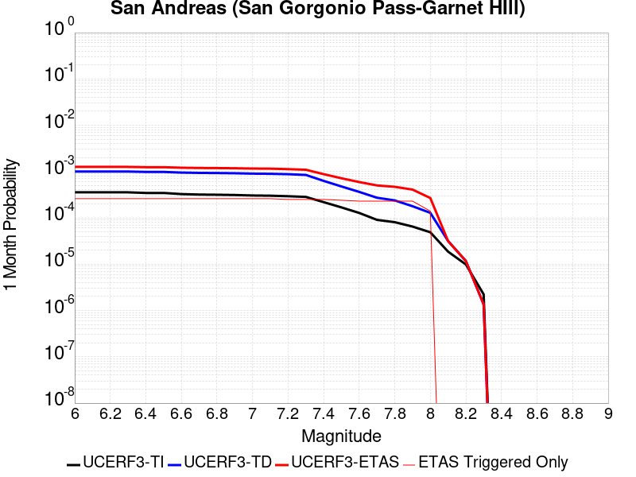 |  |  |

| Magnitude | 1 wk TI Prob | 1 wk TD Prob | 1 wk ETAS Prob | 1 wk ETAS/TD Gain | 1 wk ETAS Triggered Only | 1 mo TI Prob | 1 mo TD Prob | 1 mo ETAS Prob | 1 mo ETAS/TD Gain | 1 mo ETAS Triggered Only | 1 yr TI Prob | 1 yr TD Prob | 1 yr ETAS Prob | 1 yr ETAS/TD Gain | 1 yr ETAS Triggered Only | 10 yr TI Prob | 10 yr TD Prob | 10 yr ETAS Prob | 10 yr ETAS/TD Gain | 10 yr ETAS Triggered Only |
|-----|-----|-----|-----|-----|-----|-----|-----|-----|-----|-----|-----|-----|-----|-----|-----|-----|-----|-----|-----|-----|
| 6.0 | 8.31567E-5 | 2.3382473E-4 | 4.647043E-4 | 1.9874043 | 2.3093355E-4 | 3.5633717E-4 | 0.0010017233 | 0.0012901012 | 1.2878816 | 2.8866692E-4 | 0.004329778 | 0.012127888 | 0.012413055 | 1.0235132 | 2.8866692E-4 | 0.042463828 | 0.11257892 | 0.11283509 | 1.0022755 | 2.8866692E-4 |
| 6.1 | 8.31567E-5 | 2.3382473E-4 | 4.647043E-4 | 1.9874043 | 2.3093355E-4 | 3.5633717E-4 | 0.0010017233 | 0.0012901012 | 1.2878816 | 2.8866692E-4 | 0.004329778 | 0.012127888 | 0.012413055 | 1.0235132 | 2.8866692E-4 | 0.042463828 | 0.11257892 | 0.11283509 | 1.0022755 | 2.8866692E-4 |
| 6.2 | 8.31567E-5 | 2.3382473E-4 | 4.647043E-4 | 1.9874043 | 2.3093355E-4 | 3.5633717E-4 | 0.0010017233 | 0.0012901012 | 1.2878816 | 2.8866692E-4 | 0.004329778 | 0.012127888 | 0.012413055 | 1.0235132 | 2.8866692E-4 | 0.042463828 | 0.11257892 | 0.11283509 | 1.0022755 | 2.8866692E-4 |
| 6.3 | 8.31567E-5 | 2.3382473E-4 | 4.647043E-4 | 1.9874043 | 2.3093355E-4 | 3.5633717E-4 | 0.0010017233 | 0.0012901012 | 1.2878816 | 2.8866692E-4 | 0.004329778 | 0.012127888 | 0.012413055 | 1.0235132 | 2.8866692E-4 | 0.042463828 | 0.11257892 | 0.11283509 | 1.0022755 | 2.8866692E-4 |
| 6.4 | 8.059055E-5 | 2.2940808E-4 | 4.6028866E-4 | 2.0064187 | 2.3093355E-4 | 3.4534236E-4 | 9.828096E-4 | 0.0012711928 | 1.2934273 | 2.8866692E-4 | 0.0041964394 | 0.011900152 | 0.012185384 | 1.0239687 | 2.8866692E-4 | 0.041180745 | 0.11056015 | 0.110816896 | 1.0023223 | 2.8866692E-4 |
| 6.5 | 8.059055E-5 | 2.2940808E-4 | 4.6028866E-4 | 2.0064187 | 2.3093355E-4 | 3.4534236E-4 | 9.828096E-4 | 0.0012711928 | 1.2934273 | 2.8866692E-4 | 0.0041964394 | 0.011900152 | 0.012185384 | 1.0239687 | 2.8866692E-4 | 0.041180745 | 0.11056015 | 0.110816896 | 1.0023223 | 2.8866692E-4 |
| 6.6 | 7.619237E-5 | 2.218517E-4 | 4.52734E-4 | 2.0407057 | 2.3093355E-4 | 3.2649786E-4 | 9.5044886E-4 | 0.0012388414 | 1.3034278 | 2.8866692E-4 | 0.0039678677 | 0.01151087 | 0.011796215 | 1.0247891 | 2.8866692E-4 | 0.03897764 | 0.10709683 | 0.10735458 | 1.0024067 | 2.8866692E-4 |
| 6.7 | 7.440636E-5 | 2.1860997E-4 | 4.4949303E-4 | 2.0561416 | 2.3093355E-4 | 3.188454E-4 | 9.3656575E-4 | 0.0012249623 | 1.3079299 | 2.8866692E-4 | 0.0038750346 | 0.011343609 | 0.011629 | 1.0251589 | 2.8866692E-4 | 0.038081564 | 0.105605274 | 0.10586346 | 1.0024447 | 2.8866692E-4 |
| 6.8 | 7.3735864E-5 | 2.1708169E-4 | 4.479651E-4 | 2.0635786 | 2.3093355E-4 | 3.1597257E-4 | 9.3002064E-4 | 0.001218419 | 1.310099 | 2.8866692E-4 | 0.0038401815 | 0.011264749 | 0.011550164 | 1.025337 | 2.8866692E-4 | 0.03774495 | 0.10490683 | 0.10516521 | 1.002463 | 2.8866692E-4 |
| 6.9 | 7.27575E-5 | 2.1477141E-4 | 4.4565537E-4 | 2.0750217 | 2.3093355E-4 | 3.117806E-4 | 9.201265E-4 | 0.0012085278 | 1.3134366 | 2.8866692E-4 | 0.003789323 | 0.011145527 | 0.011430976 | 1.0256112 | 2.8866692E-4 | 0.037253562 | 0.103854746 | 0.10411343 | 1.0024909 | 2.8866692E-4 |
| 7.0 | 7.102591E-5 | 2.1061185E-4 | 4.4149676E-4 | 2.096258 | 2.3093355E-4 | 3.0436125E-4 | 9.023122E-4 | 0.0011907186 | 1.3196305 | 2.8866692E-4 | 0.003699303 | 0.010930831 | 0.011216342 | 1.0261198 | 2.8866692E-4 | 0.03638325 | 0.10195695 | 0.102216184 | 1.0025426 | 2.8866692E-4 |
| 7.1 | 7.028513E-5 | 2.0896831E-4 | 4.398536E-4 | 2.1048818 | 2.3093355E-4 | 3.0118722E-4 | 8.9527335E-4 | 0.0011836819 | 1.3221457 | 2.8866692E-4 | 0.0036607897 | 0.010845989 | 0.011131525 | 1.0263264 | 2.8866692E-4 | 0.036010686 | 0.101199985 | 0.101459436 | 1.0025637 | 2.8866692E-4 |
| 7.2 | 6.8498244E-5 | 2.0504706E-4 | 4.3593327E-4 | 2.1260157 | 2.3093355E-4 | 2.9353087E-4 | 8.784794E-4 | 0.0011668927 | 1.3283098 | 2.8866692E-4 | 0.003567883 | 0.010643536 | 0.010929131 | 1.0268327 | 2.8866692E-4 | 0.035111405 | 0.09939202 | 0.09965199 | 1.0026157 | 2.8866692E-4 |
| 7.3 | 6.622592E-5 | 1.9732013E-4 | 4.2820812E-4 | 2.1701188 | 2.3093355E-4 | 2.8379448E-4 | 8.453858E-4 | 0.0011338086 | 1.3411732 | 2.8866692E-4 | 0.0034497243 | 0.0102444785 | 0.010530189 | 1.0278891 | 2.8866692E-4 | 0.033966612 | 0.095888525 | 0.09614951 | 1.0027218 | 2.8866692E-4 |
| 7.4 | 5.1050705E-5 | 1.4689034E-4 | 3.7778995E-4 | 2.5719185 | 2.3093355E-4 | 2.1877038E-4 | 6.29379E-4 | 9.1786426E-4 | 1.458365 | 2.8866692E-4 | 0.002660276 | 0.0076359594 | 0.007922422 | 1.0375149 | 2.8866692E-4 | 0.02628654 | 0.07286301 | 0.07313065 | 1.0036731 | 2.8866692E-4 |
| 7.5 | 3.9302922E-5 | 1.1129847E-4 | 3.422063E-4 | 3.0746722 | 2.3093355E-4 | 1.6843023E-4 | 4.7690657E-4 | 7.654358E-4 | 1.6050017 | 2.8866692E-4 | 0.0020487092 | 0.005790949 | 0.006077944 | 1.0495592 | 2.8866692E-4 | 0.020299247 | 0.05600951 | 0.05628201 | 1.0048652 | 2.8866692E-4 |
| 7.6 | 2.9851626E-5 | 8.4949745E-5 | 3.1586367E-4 | 3.7182417 | 2.3093355E-4 | 1.2792926E-4 | 3.6401965E-4 | 6.525815E-4 | 1.7927096 | 2.8866692E-4 | 0.0015564259 | 0.0044229585 | 0.004710349 | 1.0649769 | 2.8866692E-4 | 0.0154556995 | 0.04319374 | 0.043469936 | 1.0063944 | 2.8866692E-4 |
| 7.7 | 2.1135214E-5 | 6.3529005E-5 | 2.9444788E-4 | 4.6348577 | 2.3093355E-4 | 9.0576345E-5 | 2.7223877E-4 | 5.608271E-4 | 2.060056 | 2.8866692E-4 | 0.0011022091 | 0.0033094748 | 0.0035971864 | 1.0869358 | 2.8866692E-4 | 0.010967582 | 0.032582592 | 0.032861855 | 1.0085709 | 2.8866692E-4 |
| 7.8 | 1.883379E-5 | 5.564028E-5 | 2.8656097E-4 | 5.1502433 | 2.3093355E-4 | 8.0713755E-5 | 2.3843657E-4 | 5.270347E-4 | 2.210377 | 2.8866692E-4 | 9.822468E-4 | 0.0028991038 | 0.003186934 | 1.0992824 | 2.8866692E-4 | 0.0097791655 | 0.028695205 | 0.02897559 | 1.0097711 | 2.8866692E-4 |
| 7.9 | 1.5156185E-5 | 4.1658426E-5 | 2.7258234E-4 | 6.5432706 | 2.3093355E-4 | 6.495346E-5 | 1.785239E-4 | 4.671393E-4 | 2.6166766 | 2.8866692E-4 | 7.9052144E-4 | 0.0021713632 | 0.0024594034 | 1.1326541 | 2.8866692E-4 | 0.007877152 | 0.021759422 | 0.022041809 | 1.0129776 | 2.8866692E-4 |
| 8.0 | 1.1405907E-5 | 2.9974231E-5 | 1.7430338E-4 | 5.8151073 | 1.4433346E-4 | 4.8881542E-5 | 1.2845467E-4 | 3.3049556E-4 | 2.5728576 | 2.0206686E-4 | 5.9497025E-4 | 0.0015628147 | 0.0017645657 | 1.1290947 | 2.0206686E-4 | 0.005933798 | 0.015772851 | 0.01597173 | 1.012609 | 2.0206686E-4 |
| 8.1 | 4.3511436E-6 | 7.369219E-6 | 7.369219E-6 | 1.0 | 0.0 | 1.8647626E-5 | 3.1581985E-5 | 3.1581985E-5 | 1.0 | 0.0 | 2.2701119E-4 | 3.8444297E-4 | 3.8444297E-4 | 1.0 | 0.0 | 0.0022677942 | 0.0041163345 | 0.0041163345 | 1.0 | 0.0 |
| 8.2 | 2.3042528E-6 | 2.7329415E-6 | 2.7329415E-6 | 1.0 | 0.0 | 9.875332E-6 | 1.1712554E-5 | 1.1712554E-5 | 1.0 | 0.0 | 1.2022553E-4 | 1.4259106E-4 | 1.4259106E-4 | 1.0 | 0.0 | 0.0012016051 | 0.0015979785 | 0.0015979785 | 1.0 | 0.0 |
| 8.3 | 5.202968E-7 | 3.1598344E-7 | 3.1598344E-7 | 1.0 | 0.0 | 2.2298414E-6 | 1.3542141E-6 | 1.3542141E-6 | 1.0 | 0.0 | 2.714798E-5 | 1.6487444E-5 | 1.6487444E-5 | 1.0 | 0.0 | 2.7144665E-4 | 1.9563142E-4 | 1.9563142E-4 | 1.0 | 0.0 |

## Death Valley (No)
*[(top)](#table-of-contents)*

| 1 Week | 1 Month | 1 Year | 10 Year |
|-----|-----|-----|-----|
|  |  |  |  |

| Magnitude | 1 wk TI Prob | 1 wk TD Prob | 1 wk ETAS Prob | 1 wk ETAS/TD Gain | 1 wk ETAS Triggered Only | 1 mo TI Prob | 1 mo TD Prob | 1 mo ETAS Prob | 1 mo ETAS/TD Gain | 1 mo ETAS Triggered Only | 1 yr TI Prob | 1 yr TD Prob | 1 yr ETAS Prob | 1 yr ETAS/TD Gain | 1 yr ETAS Triggered Only | 10 yr TI Prob | 10 yr TD Prob | 10 yr ETAS Prob | 10 yr ETAS/TD Gain | 10 yr ETAS Triggered Only |
|-----|-----|-----|-----|-----|-----|-----|-----|-----|-----|-----|-----|-----|-----|-----|-----|-----|-----|-----|-----|-----|
| 6.0 | 2.0074807E-5 | 2.2500084E-5 | 2.2456239E-4 | 9.980514 | 2.0206686E-4 | 8.603206E-5 | 9.642541E-5 | 2.984728E-4 | 3.0953748 | 2.0206686E-4 | 0.001046937 | 0.0011733545 | 0.0014040171 | 1.1965839 | 2.3093355E-4 | 0.010420183 | 0.011672506 | 0.011957804 | 1.0244418 | 2.8866692E-4 |
| 6.1 | 2.0074807E-5 | 2.2500084E-5 | 2.2456239E-4 | 9.980514 | 2.0206686E-4 | 8.603206E-5 | 9.642541E-5 | 2.984728E-4 | 3.0953748 | 2.0206686E-4 | 0.001046937 | 0.0011733545 | 0.0014040171 | 1.1965839 | 2.3093355E-4 | 0.010420183 | 0.011672506 | 0.011957804 | 1.0244418 | 2.8866692E-4 |
| 6.2 | 2.0074807E-5 | 2.2500084E-5 | 2.2456239E-4 | 9.980514 | 2.0206686E-4 | 8.603206E-5 | 9.642541E-5 | 2.984728E-4 | 3.0953748 | 2.0206686E-4 | 0.001046937 | 0.0011733545 | 0.0014040171 | 1.1965839 | 2.3093355E-4 | 0.010420183 | 0.011672506 | 0.011957804 | 1.0244418 | 2.8866692E-4 |
| 6.3 | 1.9050609E-5 | 2.1336948E-5 | 2.2339949E-4 | 10.4700775 | 2.0206686E-4 | 8.164292E-5 | 9.1440896E-5 | 2.9348928E-4 | 3.2096064 | 2.0206686E-4 | 9.935491E-4 | 0.001112731 | 0.0013434077 | 1.2073066 | 2.3093355E-4 | 0.009891188 | 0.011072419 | 0.0113578895 | 1.0257821 | 2.8866692E-4 |
| 6.4 | 1.9050609E-5 | 2.1336948E-5 | 2.2339949E-4 | 10.4700775 | 2.0206686E-4 | 8.164292E-5 | 9.1440896E-5 | 2.9348928E-4 | 3.2096064 | 2.0206686E-4 | 9.935491E-4 | 0.001112731 | 0.0013434077 | 1.2073066 | 2.3093355E-4 | 0.009891188 | 0.011072419 | 0.0113578895 | 1.0257821 | 2.8866692E-4 |
| 6.5 | 1.8367004E-5 | 2.0561009E-5 | 2.2262371E-4 | 10.827471 | 2.0206686E-4 | 7.8713354E-5 | 8.811567E-5 | 2.9016472E-4 | 3.292998 | 2.0206686E-4 | 9.5791375E-4 | 0.0010722869 | 0.0013029728 | 1.2151345 | 2.3093355E-4 | 0.009537951 | 0.0106719155 | 0.010957502 | 1.0267606 | 2.8866692E-4 |
| 6.6 | 1.779439E-5 | 1.9910927E-5 | 2.2197377E-4 | 11.148338 | 2.0206686E-4 | 7.625944E-5 | 8.53298E-5 | 2.873794E-4 | 3.3678672 | 2.0206686E-4 | 9.280632E-4 | 0.0010384015 | 0.0012690952 | 1.2221624 | 2.3093355E-4 | 0.009241969 | 0.010336253 | 0.010621936 | 1.0276389 | 2.8866692E-4 |
| 6.7 | 1.7025437E-5 | 1.9043426E-5 | 1.9224029E-4 | 10.094838 | 1.7320015E-4 | 7.296412E-5 | 8.161216E-5 | 2.547982E-4 | 3.1220615 | 1.7320015E-4 | 8.87976E-4 | 9.931813E-4 | 0.0011950475 | 1.2032521 | 2.0206686E-4 | 0.008844362 | 0.009888145 | 0.010145376 | 1.0260141 | 2.5980023E-4 |
| 6.8 | 1.6545107E-5 | 1.8512545E-5 | 1.917095E-4 | 10.355653 | 1.7320015E-4 | 7.090568E-5 | 7.93371E-5 | 2.5252352E-4 | 3.1829183 | 1.7320015E-4 | 8.629347E-4 | 9.655073E-4 | 0.0011673791 | 1.2090837 | 2.0206686E-4 | 0.008595915 | 0.009613829 | 0.009871132 | 1.0267638 | 2.5980023E-4 |
| 6.9 | 1.615478E-5 | 1.8087594E-5 | 1.9128462E-4 | 10.5754595 | 1.7320015E-4 | 6.9232934E-5 | 7.751599E-5 | 2.5070272E-4 | 3.2342067 | 1.7320015E-4 | 8.4258494E-4 | 9.433546E-4 | 0.0011452308 | 1.2139982 | 2.0206686E-4 | 0.008393973 | 0.009394196 | 0.009651555 | 1.0273956 | 2.5980023E-4 |
| 7.0 | 1.5894311E-5 | 1.780555E-5 | 1.9100263E-4 | 10.72714 | 1.7320015E-4 | 6.81167E-5 | 7.6307304E-5 | 2.4949425E-4 | 3.2695987 | 1.7320015E-4 | 8.2900526E-4 | 9.286515E-4 | 0.0011305307 | 1.2173896 | 2.0206686E-4 | 0.008259195 | 0.009248397 | 0.009505795 | 1.0278316 | 2.5980023E-4 |
| 7.1 | 1.5602263E-5 | 1.7483504E-5 | 1.9068064E-4 | 10.906318 | 1.7320015E-4 | 6.6865134E-5 | 7.492718E-5 | 2.4811437E-4 | 3.3114066 | 1.7320015E-4 | 8.137789E-4 | 9.118627E-4 | 0.0011137453 | 1.2213959 | 2.0206686E-4 | 0.008108052 | 0.009081894 | 0.009339334 | 1.0283465 | 2.5980023E-4 |
| 7.2 | 1.5323829E-5 | 1.717063E-5 | 1.9036782E-4 | 11.086827 | 1.7320015E-4 | 6.56719E-5 | 7.358637E-5 | 2.467738E-4 | 3.3535256 | 1.7320015E-4 | 7.99262E-4 | 8.9555193E-4 | 0.0010974378 | 1.2254318 | 2.0206686E-4 | 0.007963934 | 0.008920107 | 0.00917759 | 1.0288655 | 2.5980023E-4 |
| 7.3 | 1.4556212E-5 | 1.6302456E-5 | 1.894998E-4 | 11.624003 | 1.7320015E-4 | 6.238227E-5 | 6.9865826E-5 | 2.4305389E-4 | 3.4788666 | 1.7320015E-4 | 7.592395E-4 | 8.5029035E-4 | 0.0010521854 | 1.2374425 | 2.0206686E-4 | 0.0075665074 | 0.008471014 | 0.008728614 | 1.0304096 | 2.5980023E-4 |
| 7.4 | 1.411725E-5 | 1.580796E-5 | 1.8900538E-4 | 11.956343 | 1.7320015E-4 | 6.0501097E-5 | 6.7746674E-5 | 2.409351E-4 | 3.5564122 | 1.7320015E-4 | 7.363519E-4 | 8.245094E-4 | 0.0010264097 | 1.2448732 | 2.0206686E-4 | 0.0073391674 | 0.008215138 | 0.008472804 | 1.0313648 | 2.5980023E-4 |
| 7.5 | 1.3503312E-5 | 1.5126289E-5 | 1.5945757E-4 | 10.541751 | 1.4433346E-4 | 5.7870053E-5 | 6.482538E-5 | 2.0914948E-4 | 3.2263522 | 1.4433346E-4 | 7.043401E-4 | 7.8896893E-4 | 9.6203247E-4 | 1.219354 | 1.7320015E-4 | 0.007021119 | 0.007862304 | 0.008091422 | 1.0291413 | 2.3093355E-4 |
| 7.6 | 1.1279839E-5 | 1.2626327E-5 | 1.5695798E-4 | 12.431008 | 1.4433346E-4 | 4.834127E-5 | 5.4111737E-5 | 1.984374E-4 | 3.6671784 | 1.4433346E-4 | 5.88396E-4 | 6.5861654E-4 | 8.0285495E-4 | 1.2190021 | 1.4433346E-4 | 0.005868405 | 0.006567199 | 0.0067679384 | 1.030567 | 2.0206686E-4 |
| 7.7 | 9.189108E-6 | 1.0283358E-5 | 1.2574895E-4 | 12.228393 | 1.1546678E-4 | 3.93813E-5 | 4.407082E-5 | 1.595325E-4 | 3.6199124 | 1.1546678E-4 | 4.7936183E-4 | 5.3643517E-4 | 6.5184E-4 | 1.2151328 | 1.1546678E-4 | 0.004783291 | 0.005351914 | 0.0054667625 | 1.0214593 | 1.1546678E-4 |
| 7.8 | 3.4586725E-7 | 3.6482615E-7 | 3.6482615E-7 | 1.0 | 0.0 | 1.4822873E-6 | 1.5635396E-6 | 1.5635396E-6 | 1.0 | 0.0 | 1.80467E-5 | 1.9035933E-5 | 1.9035933E-5 | 1.0 | 0.0 | 1.8045233E-4 | 1.9034347E-4 | 1.9034347E-4 | 1.0 | 0.0 |
| 7.9 | 2.5591178E-9 | 2.6696718E-9 | 2.6696718E-9 | 1.0 | 0.0 | 1.0967647E-8 | 1.14414505E-8 | 1.14414505E-8 | 1.0 | 0.0 | 1.335311E-7 | 1.3929966E-7 | 1.3929966E-7 | 1.0 | 0.0 | 1.3353102E-6 | 1.3929966E-6 | 1.3929966E-6 | 1.0 | 0.0 |

## San Andreas (Big Bend)
*[(top)](#table-of-contents)*

| 1 Week | 1 Month | 1 Year | 10 Year |
|-----|-----|-----|-----|
|  |  |  |  |

| Magnitude | 1 wk TI Prob | 1 wk TD Prob | 1 wk ETAS Prob | 1 wk ETAS/TD Gain | 1 wk ETAS Triggered Only | 1 mo TI Prob | 1 mo TD Prob | 1 mo ETAS Prob | 1 mo ETAS/TD Gain | 1 mo ETAS Triggered Only | 1 yr TI Prob | 1 yr TD Prob | 1 yr ETAS Prob | 1 yr ETAS/TD Gain | 1 yr ETAS Triggered Only | 10 yr TI Prob | 10 yr TD Prob | 10 yr ETAS Prob | 10 yr ETAS/TD Gain | 10 yr ETAS Triggered Only |
|-----|-----|-----|-----|-----|-----|-----|-----|-----|-----|-----|-----|-----|-----|-----|-----|-----|-----|-----|-----|-----|
| 6.0 | 1.0179969E-4 | 2.0072258E-4 | 4.0274888E-4 | 2.006495 | 2.0206686E-4 | 4.362114E-4 | 8.599571E-4 | 0.001090692 | 1.2683098 | 2.3093355E-4 | 0.0052979486 | 0.010419999 | 0.010648526 | 1.0219316 | 2.3093355E-4 | 0.051734097 | 0.10144902 | 0.10168247 | 1.0023011 | 2.5980023E-4 |
| 6.1 | 1.0179969E-4 | 2.0072258E-4 | 4.0274888E-4 | 2.006495 | 2.0206686E-4 | 4.362114E-4 | 8.599571E-4 | 0.001090692 | 1.2683098 | 2.3093355E-4 | 0.0052979486 | 0.010419999 | 0.010648526 | 1.0219316 | 2.3093355E-4 | 0.051734097 | 0.10144902 | 0.10168247 | 1.0023011 | 2.5980023E-4 |
| 6.2 | 1.0179969E-4 | 2.0072258E-4 | 4.0274888E-4 | 2.006495 | 2.0206686E-4 | 4.362114E-4 | 8.599571E-4 | 0.001090692 | 1.2683098 | 2.3093355E-4 | 0.0052979486 | 0.010419999 | 0.010648526 | 1.0219316 | 2.3093355E-4 | 0.051734097 | 0.10144902 | 0.10168247 | 1.0023011 | 2.5980023E-4 |
| 6.3 | 1.0179969E-4 | 2.0072258E-4 | 4.0274888E-4 | 2.006495 | 2.0206686E-4 | 4.362114E-4 | 8.599571E-4 | 0.001090692 | 1.2683098 | 2.3093355E-4 | 0.0052979486 | 0.010419999 | 0.010648526 | 1.0219316 | 2.3093355E-4 | 0.051734097 | 0.10144902 | 0.10168247 | 1.0023011 | 2.5980023E-4 |
| 6.4 | 9.1639464E-5 | 1.8429532E-4 | 3.2860218E-4 | 1.7830197 | 1.4433346E-4 | 3.9268145E-4 | 7.895982E-4 | 9.338177E-4 | 1.1826493 | 1.4433346E-4 | 0.0047704205 | 0.009571102 | 0.009714054 | 1.0149359 | 1.4433346E-4 | 0.046693064 | 0.09377527 | 0.09390607 | 1.0013949 | 1.4433346E-4 |
| 6.5 | 9.1639464E-5 | 1.8429532E-4 | 3.2860218E-4 | 1.7830197 | 1.4433346E-4 | 3.9268145E-4 | 7.895982E-4 | 9.338177E-4 | 1.1826493 | 1.4433346E-4 | 0.0047704205 | 0.009571102 | 0.009714054 | 1.0149359 | 1.4433346E-4 | 0.046693064 | 0.09377527 | 0.09390607 | 1.0013949 | 1.4433346E-4 |
| 6.6 | 9.042622E-5 | 1.823659E-4 | 3.2667306E-4 | 1.7913055 | 1.4433346E-4 | 3.8748336E-4 | 7.8133424E-4 | 9.2555495E-4 | 1.1845826 | 1.4433346E-4 | 0.0047074095 | 0.009471365 | 0.009614332 | 1.0150946 | 1.4433346E-4 | 0.046089325 | 0.092869274 | 0.0930002 | 1.0014098 | 1.4433346E-4 |
| 6.7 | 8.9836685E-5 | 1.8150927E-4 | 3.2581654E-4 | 1.7950408 | 1.4433346E-4 | 3.8495753E-4 | 7.776651E-4 | 9.2188636E-4 | 1.1854541 | 1.4433346E-4 | 0.00467679 | 0.00942708 | 0.009570053 | 1.0151662 | 1.4433346E-4 | 0.045795817 | 0.09246355 | 0.092594534 | 1.0014167 | 1.4433346E-4 |
| 6.8 | 8.9471854E-5 | 1.8097709E-4 | 3.2528443E-4 | 1.7973791 | 1.4433346E-4 | 3.8339442E-4 | 7.7538576E-4 | 9.196073E-4 | 1.1859998 | 1.4433346E-4 | 0.004657841 | 0.009399569 | 0.009542545 | 1.015211 | 1.4433346E-4 | 0.04561414 | 0.092210755 | 0.09234178 | 1.001421 | 1.4433346E-4 |
| 6.9 | 8.858234E-5 | 1.7979681E-4 | 3.2410433E-4 | 1.8026145 | 1.4433346E-4 | 3.7958333E-4 | 7.703304E-4 | 9.145527E-4 | 1.1872213 | 1.4433346E-4 | 0.004611638 | 0.009338548 | 0.009481534 | 1.0153114 | 1.4433346E-4 | 0.04517103 | 0.09165087 | 0.09178198 | 1.0014305 | 1.4433346E-4 |
| 7.0 | 8.7433385E-5 | 1.7818481E-4 | 3.2249256E-4 | 1.8098768 | 1.4433346E-4 | 3.746607E-4 | 7.634259E-4 | 9.0764917E-4 | 1.1889158 | 1.4433346E-4 | 0.004551957 | 0.009255203 | 0.009398201 | 1.0154505 | 1.4433346E-4 | 0.044598386 | 0.09088532 | 0.09101653 | 1.0014437 | 1.4433346E-4 |
| 7.1 | 8.684964E-5 | 1.7730435E-4 | 3.2161223E-4 | 1.8138993 | 1.4433346E-4 | 3.7215967E-4 | 7.596547E-4 | 9.0387854E-4 | 1.1898545 | 1.4433346E-4 | 0.0045216335 | 0.009209678 | 0.009352682 | 1.0155276 | 1.4433346E-4 | 0.04430731 | 0.09046686 | 0.090598136 | 1.0014511 | 1.4433346E-4 |
| 7.2 | 8.606521E-5 | 1.762105E-4 | 3.2051853E-4 | 1.8189526 | 1.4433346E-4 | 3.6879873E-4 | 7.549695E-4 | 8.99194E-4 | 1.1910336 | 1.4433346E-4 | 0.0044808835 | 0.0091531165 | 0.0092961285 | 1.0156244 | 1.4433346E-4 | 0.043916024 | 0.089947365 | 0.09007872 | 1.0014603 | 1.4433346E-4 |
| 7.3 | 8.568266E-5 | 1.7563057E-4 | 2.9107707E-4 | 1.6573257 | 1.1546678E-4 | 3.6715972E-4 | 7.524855E-4 | 8.678654E-4 | 1.1533318 | 1.1546678E-4 | 0.0044610105 | 0.009123127 | 0.00923754 | 1.012541 | 1.1546678E-4 | 0.043725148 | 0.08966853 | 0.08977364 | 1.0011722 | 1.1546678E-4 |
| 7.4 | 8.5432206E-5 | 1.7525644E-4 | 2.9070297E-4 | 1.6587292 | 1.1546678E-4 | 3.6608664E-4 | 7.50883E-4 | 8.662631E-4 | 1.1536592 | 1.1546678E-4 | 0.004447999 | 0.009103781 | 0.009218196 | 1.0125679 | 1.1546678E-4 | 0.043600157 | 0.08948871 | 0.08959384 | 1.0011748 | 1.1546678E-4 |
| 7.5 | 8.4791965E-5 | 1.7394972E-4 | 2.6053475E-4 | 1.4977589 | 8.660008E-5 | 3.633435E-4 | 7.4528606E-4 | 8.318216E-4 | 1.1161106 | 8.660008E-5 | 0.0044147377 | 0.009036204 | 0.0091220215 | 1.009497 | 8.660008E-5 | 0.043280575 | 0.088866346 | 0.08894525 | 1.0008879 | 8.660008E-5 |
| 7.6 | 8.241105E-5 | 1.6840403E-4 | 2.5498954E-4 | 1.5141534 | 8.660008E-5 | 3.531424E-4 | 7.215321E-4 | 8.080697E-4 | 1.1199359 | 8.660008E-5 | 0.0042910352 | 0.008749358 | 0.008835201 | 1.0098113 | 8.660008E-5 | 0.042091176 | 0.086243294 | 0.08632243 | 1.0009176 | 8.660008E-5 |
| 7.7 | 7.00432E-5 | 1.42045E-4 | 1.709076E-4 | 1.2031933 | 2.8866694E-5 | 3.001506E-4 | 6.0862233E-4 | 6.3747144E-4 | 1.0474007 | 2.8866694E-5 | 0.0036482112 | 0.0073848404 | 0.007413494 | 1.00388 | 2.8866694E-5 | 0.035888977 | 0.07351733 | 0.07354407 | 1.0003638 | 2.8866694E-5 |
| 7.8 | 6.415362E-5 | 1.2968935E-4 | 1.5855228E-4 | 1.2225546 | 2.8866694E-5 | 2.749151E-4 | 5.556931E-4 | 5.8454374E-4 | 1.0519183 | 2.8866694E-5 | 0.0033419547 | 0.0067446055 | 0.0067732777 | 1.0042511 | 2.8866694E-5 | 0.03292141 | 0.06725231 | 0.06727923 | 1.0004003 | 2.8866694E-5 |
| 7.9 | 4.939911E-5 | 9.3411545E-5 | 1.2227554E-4 | 1.3089982 | 2.8866694E-5 | 2.116933E-4 | 4.0027377E-4 | 4.291289E-4 | 1.0720885 | 2.8866694E-5 | 0.0025743195 | 0.004862453 | 0.004891179 | 1.0059078 | 2.8866694E-5 | 0.025447013 | 0.048914436 | 0.04894189 | 1.0005612 | 2.8866694E-5 |
| 8.0 | 3.344983E-5 | 5.222685E-5 | 8.109204E-5 | 1.5526886 | 2.8866694E-5 | 1.4334853E-4 | 2.2381016E-4 | 2.526704E-4 | 1.1289496 | 2.8866694E-5 | 0.0017438711 | 0.0027214854 | 0.0027502736 | 1.010578 | 2.8866694E-5 | 0.017302496 | 0.027922187 | 0.027950248 | 1.0010049 | 2.8866694E-5 |
| 8.1 | 1.9104898E-5 | 1.9173063E-5 | 1.9173063E-5 | 1.0 | 0.0 | 8.1875565E-5 | 8.216769E-5 | 8.216769E-5 | 1.0 | 0.0 | 9.963791E-4 | 9.999331E-4 | 9.999331E-4 | 1.0 | 0.0 | 0.009919235 | 0.010749801 | 0.010749801 | 1.0 | 0.0 |
| 8.2 | 8.643924E-6 | 5.4748625E-6 | 5.4748625E-6 | 1.0 | 0.0 | 3.704486E-5 | 2.3463486E-5 | 2.3463486E-5 | 1.0 | 0.0 | 4.5092785E-4 | 2.8563058E-4 | 2.8563058E-4 | 1.0 | 0.0 | 0.0045001395 | 0.0032487072 | 0.0032487072 | 1.0 | 0.0 |
| 8.3 | 1.983087E-6 | 7.6599065E-7 | 7.6599065E-7 | 1.0 | 0.0 | 8.498917E-6 | 3.282813E-6 | 3.282813E-6 | 1.0 | 0.0 | 1.034694E-4 | 3.9967534E-5 | 3.9967534E-5 | 1.0 | 0.0 | 0.0010342124 | 4.719687E-4 | 4.719687E-4 | 1.0 | 0.0 |

## San Andreas (Coachella) rev
*[(top)](#table-of-contents)*

| 1 Week | 1 Month | 1 Year | 10 Year |
|-----|-----|-----|-----|
|  |  |  |  |

| Magnitude | 1 wk TI Prob | 1 wk TD Prob | 1 wk ETAS Prob | 1 wk ETAS/TD Gain | 1 wk ETAS Triggered Only | 1 mo TI Prob | 1 mo TD Prob | 1 mo ETAS Prob | 1 mo ETAS/TD Gain | 1 mo ETAS Triggered Only | 1 yr TI Prob | 1 yr TD Prob | 1 yr ETAS Prob | 1 yr ETAS/TD Gain | 1 yr ETAS Triggered Only | 10 yr TI Prob | 10 yr TD Prob | 10 yr ETAS Prob | 10 yr ETAS/TD Gain | 10 yr ETAS Triggered Only |
|-----|-----|-----|-----|-----|-----|-----|-----|-----|-----|-----|-----|-----|-----|-----|-----|-----|-----|-----|-----|-----|
| 6.0 | 1.1925945E-4 | 3.2729402E-4 | 5.58152E-4 | 1.7053535 | 2.3093355E-4 | 5.110118E-4 | 0.0014019393 | 0.0016613753 | 1.1850551 | 2.5980023E-4 | 0.0062038354 | 0.016936364 | 0.017191764 | 1.01508 | 2.5980023E-4 | 0.060334753 | 0.15265316 | 0.1528733 | 1.0014421 | 2.5980023E-4 |
| 6.1 | 1.1925945E-4 | 3.2729402E-4 | 5.58152E-4 | 1.7053535 | 2.3093355E-4 | 5.110118E-4 | 0.0014019393 | 0.0016613753 | 1.1850551 | 2.5980023E-4 | 0.0062038354 | 0.016936364 | 0.017191764 | 1.01508 | 2.5980023E-4 | 0.060334753 | 0.15265316 | 0.1528733 | 1.0014421 | 2.5980023E-4 |
| 6.2 | 1.07432395E-4 | 3.0230157E-4 | 5.331653E-4 | 1.7636869 | 2.3093355E-4 | 4.603433E-4 | 0.0012949388 | 0.0015544026 | 1.2003676 | 2.5980023E-4 | 0.005590286 | 0.015653009 | 0.015908742 | 1.0163376 | 2.5980023E-4 | 0.05451731 | 0.14182423 | 0.1420472 | 1.001572 | 2.5980023E-4 |
| 6.3 | 1.0718766E-4 | 3.0175463E-4 | 5.326185E-4 | 1.7650715 | 2.3093355E-4 | 4.592948E-4 | 0.0012925972 | 0.0015520615 | 1.200731 | 2.5980023E-4 | 0.005577586 | 0.015624908 | 0.015880648 | 1.0163676 | 2.5980023E-4 | 0.054396555 | 0.14159249 | 0.14181551 | 1.001575 | 2.5980023E-4 |
| 6.4 | 1.0355944E-4 | 2.9383553E-4 | 5.247012E-4 | 1.785697 | 2.3093355E-4 | 4.4375064E-4 | 0.0012586913 | 0.0015181645 | 1.2061453 | 2.5980023E-4 | 0.0053892885 | 0.015217941 | 0.015473789 | 1.0168122 | 2.5980023E-4 | 0.052604496 | 0.13815255 | 0.13837646 | 1.0016208 | 2.5980023E-4 |
| 6.5 | 1.0227914E-4 | 2.9102986E-4 | 5.2189623E-4 | 1.7932737 | 2.3093355E-4 | 4.382655E-4 | 0.0012466786 | 0.001506155 | 1.2081342 | 2.5980023E-4 | 0.0053228354 | 0.01507372 | 0.015329604 | 1.0169755 | 2.5980023E-4 | 0.051971316 | 0.13693172 | 0.13715595 | 1.0016375 | 2.5980023E-4 |
| 6.6 | 1.0116757E-4 | 2.8868738E-4 | 5.1955425E-4 | 1.7997124 | 2.3093355E-4 | 4.3350324E-4 | 0.0012366489 | 0.0014961279 | 1.2098243 | 2.5980023E-4 | 0.0052651367 | 0.01495329 | 0.015209205 | 1.0171143 | 2.5980023E-4 | 0.051421247 | 0.1359099 | 0.13613439 | 1.0016518 | 2.5980023E-4 |
| 6.7 | 1.0050676E-4 | 2.8727303E-4 | 5.181402E-4 | 1.8036509 | 2.3093355E-4 | 4.3067214E-4 | 0.0012305931 | 0.0014900736 | 1.2108581 | 2.5980023E-4 | 0.005230834 | 0.014880571 | 0.015136505 | 1.0171993 | 2.5980023E-4 | 0.051094085 | 0.13529462 | 0.13551927 | 1.0016605 | 2.5980023E-4 |
| 6.8 | 9.976819E-5 | 2.853096E-4 | 5.161773E-4 | 1.809183 | 2.3093355E-4 | 4.2750788E-4 | 0.0012221863 | 0.001481669 | 1.2123103 | 2.5980023E-4 | 0.0051924936 | 0.0147796115 | 0.0150355715 | 1.0173185 | 2.5980023E-4 | 0.050728295 | 0.13444631 | 0.13467118 | 1.0016726 | 2.5980023E-4 |
| 6.9 | 9.77719E-5 | 2.8027873E-4 | 5.1114755E-4 | 1.8237115 | 2.3093355E-4 | 4.1895514E-4 | 0.0012006456 | 0.0014601338 | 1.216124 | 2.5980023E-4 | 0.0050888555 | 0.014520878 | 0.014776905 | 1.0176316 | 2.5980023E-4 | 0.049738888 | 0.1322748 | 0.13250025 | 1.0017043 | 2.5980023E-4 |
| 7.0 | 8.500761E-5 | 2.4762485E-4 | 4.4964167E-4 | 1.8158181 | 2.0206686E-4 | 3.6426744E-4 | 0.001060821 | 0.0012915096 | 1.2174623 | 2.3093355E-4 | 0.0044259406 | 0.012839786 | 0.013067754 | 1.0177548 | 2.3093355E-4 | 0.04338823 | 0.11813272 | 0.11833637 | 1.0017239 | 2.3093355E-4 |
| 7.1 | 8.319876E-5 | 2.4365232E-4 | 4.4566995E-4 | 1.8291225 | 2.0206686E-4 | 3.5651738E-4 | 0.0010438096 | 0.001274502 | 1.2210101 | 2.3093355E-4 | 0.004331963 | 0.012635092 | 0.012863108 | 1.0180463 | 2.3093355E-4 | 0.042484846 | 0.116353 | 0.11655706 | 1.0017538 | 2.3093355E-4 |
| 7.2 | 7.563917E-5 | 2.2413683E-4 | 4.261584E-4 | 1.9013314 | 2.0206686E-4 | 3.2412758E-4 | 9.602359E-4 | 0.0011909477 | 1.2402657 | 2.3093355E-4 | 0.0039391145 | 0.011628893 | 0.011857142 | 1.0196277 | 2.3093355E-4 | 0.03870018 | 0.10775925 | 0.1079653 | 1.0019121 | 2.3093355E-4 |
| 7.3 | 7.082985E-5 | 2.0729867E-4 | 4.0932363E-4 | 1.9745599 | 2.0206686E-4 | 3.0352117E-4 | 8.881233E-4 | 0.0011188517 | 1.2597933 | 2.3093355E-4 | 0.0036891096 | 0.010759917 | 0.010988366 | 1.0212314 | 2.3093355E-4 | 0.03628465 | 0.100282 | 0.10048977 | 1.0020719 | 2.3093355E-4 |
| 7.4 | 5.146215E-5 | 1.4273795E-4 | 3.4477597E-4 | 2.4154472 | 2.0206686E-4 | 2.2053342E-4 | 6.115915E-4 | 8.4238383E-4 | 1.3773634 | 2.3093355E-4 | 0.0026816884 | 0.0074208933 | 0.007650113 | 1.0308884 | 2.3093355E-4 | 0.02649557 | 0.070849575 | 0.07106415 | 1.0030285 | 2.3093355E-4 |
| 7.5 | 4.0285166E-5 | 1.09416E-4 | 3.1146075E-4 | 2.846574 | 2.0206686E-4 | 1.7263928E-4 | 4.6884175E-4 | 6.99667E-4 | 1.4923309 | 2.3093355E-4 | 0.002099857 | 0.0056932783 | 0.005922897 | 1.0403316 | 2.3093355E-4 | 0.020801254 | 0.055011146 | 0.055229377 | 1.003967 | 2.3093355E-4 |
| 7.6 | 3.1168736E-5 | 8.4389096E-5 | 2.864389E-4 | 3.3942645 | 2.0206686E-4 | 1.3357346E-4 | 3.6161754E-4 | 5.924676E-4 | 1.6383817 | 2.3093355E-4 | 0.0016250437 | 0.0043938323 | 0.004623751 | 1.0523276 | 2.3093355E-4 | 0.016132116 | 0.04281005 | 0.043031096 | 1.0051634 | 2.3093355E-4 |
| 7.7 | 2.2100989E-5 | 6.238755E-5 | 2.644418E-4 | 4.238695 | 2.0206686E-4 | 9.4715084E-5 | 2.6734784E-4 | 4.982197E-4 | 1.8635633 | 2.3093355E-4 | 0.001152546 | 0.0032501083 | 0.0034802915 | 1.0708232 | 2.3093355E-4 | 0.011465867 | 0.0319002 | 0.032123767 | 1.0070083 | 2.3093355E-4 |
| 7.8 | 1.7484861E-5 | 5.179572E-5 | 2.538521E-4 | 4.901025 | 2.0206686E-4 | 7.493296E-5 | 2.2196278E-4 | 4.5284507E-4 | 2.0401847 | 2.3093355E-4 | 9.1192697E-4 | 0.0026990508 | 0.002929361 | 1.0853301 | 2.3093355E-4 | 0.009081938 | 0.026640115 | 0.026864897 | 1.0084378 | 2.3093355E-4 |
| 7.9 | 1.3967285E-5 | 3.822255E-5 | 2.4028169E-4 | 6.286385 | 2.0206686E-4 | 5.985842E-5 | 1.6380067E-4 | 3.9469637E-4 | 2.409614 | 2.3093355E-4 | 7.2853256E-4 | 0.00199245 | 0.0022229236 | 1.1156734 | 2.3093355E-4 | 0.0072614877 | 0.019909438 | 0.020135773 | 1.0113683 | 2.3093355E-4 |
| 8.0 | 1.1887396E-5 | 3.106521E-5 | 2.3312579E-4 | 7.5044007 | 2.0206686E-4 | 5.094499E-5 | 1.3312983E-4 | 3.6403263E-4 | 2.7344182 | 2.3093355E-4 | 6.200787E-4 | 0.0016196516 | 0.0018502111 | 1.1423513 | 2.3093355E-4 | 0.006183513 | 0.016279267 | 0.016506441 | 1.0139548 | 2.3093355E-4 |
| 8.1 | 5.100864E-6 | 8.973418E-6 | 8.973418E-6 | 1.0 | 0.0 | 2.1860664E-5 | 3.8456936E-5 | 3.8456936E-5 | 1.0 | 0.0 | 2.6612106E-4 | 4.6811273E-4 | 4.6811273E-4 | 1.0 | 0.0 | 0.002658026 | 0.004917731 | 0.004917731 | 1.0 | 0.0 |
| 8.2 | 2.3004484E-6 | 2.7864487E-6 | 2.7864487E-6 | 1.0 | 0.0 | 9.859027E-6 | 1.1941868E-5 | 1.1941868E-5 | 1.0 | 0.0 | 1.2002704E-4 | 1.4538258E-4 | 1.4538258E-4 | 1.0 | 0.0 | 0.0011996223 | 0.0015973912 | 0.0015973912 | 1.0 | 0.0 |
| 8.3 | 1.0424446E-7 | 5.8161504E-8 | 5.8161504E-8 | 1.0 | 0.0 | 4.4676187E-7 | 2.4926356E-7 | 2.4926356E-7 | 1.0 | 0.0 | 5.439312E-6 | 3.03478E-6 | 3.03478E-6 | 1.0 | 0.0 | 5.4391792E-5 | 3.190716E-5 | 3.190716E-5 | 1.0 | 0.0 |

## Red Pass
*[(top)](#table-of-contents)*

| 1 Week | 1 Month | 1 Year | 10 Year |
|-----|-----|-----|-----|
|  | 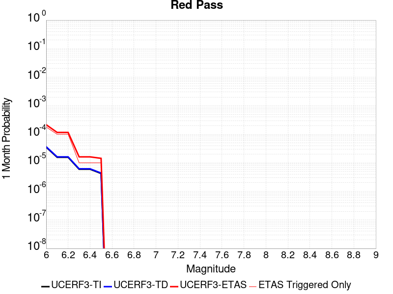 |  |  |

| Magnitude | 1 wk TI Prob | 1 wk TD Prob | 1 wk ETAS Prob | 1 wk ETAS/TD Gain | 1 wk ETAS Triggered Only | 1 mo TI Prob | 1 mo TD Prob | 1 mo ETAS Prob | 1 mo ETAS/TD Gain | 1 mo ETAS Triggered Only | 1 yr TI Prob | 1 yr TD Prob | 1 yr ETAS Prob | 1 yr ETAS/TD Gain | 1 yr ETAS Triggered Only | 10 yr TI Prob | 10 yr TD Prob | 10 yr ETAS Prob | 10 yr ETAS/TD Gain | 10 yr ETAS Triggered Only |
|-----|-----|-----|-----|-----|-----|-----|-----|-----|-----|-----|-----|-----|-----|-----|-----|-----|-----|-----|-----|-----|
| 6.0 | 8.258278E-6 | 8.551265E-6 | 1.8174994E-4 | 21.25416 | 1.7320015E-4 | 3.539214E-5 | 3.6647863E-5 | 2.6757296E-4 | 7.301188 | 2.3093355E-4 | 4.308141E-4 | 4.4611428E-4 | 6.769448E-4 | 1.5174247 | 2.3093355E-4 | 0.0042997985 | 0.004453945 | 0.00468385 | 1.0516183 | 2.3093355E-4 |
| 6.1 | 3.649988E-6 | 3.7753161E-6 | 9.037507E-5 | 23.938412 | 8.660008E-5 | 1.5642712E-5 | 1.6179853E-5 | 1.0277853E-4 | 6.352254 | 8.660008E-5 | 1.9043336E-4 | 1.9697666E-4 | 2.835597E-4 | 1.4395598 | 8.660008E-5 | 0.0019027026 | 0.001968488 | 0.0020549176 | 1.0439066 | 8.660008E-5 |
| 6.2 | 3.649988E-6 | 3.7753161E-6 | 9.037507E-5 | 23.938412 | 8.660008E-5 | 1.5642712E-5 | 1.6179853E-5 | 1.0277853E-4 | 6.352254 | 8.660008E-5 | 1.9043336E-4 | 1.9697666E-4 | 2.835597E-4 | 1.4395598 | 8.660008E-5 | 0.0019027026 | 0.001968488 | 0.0020549176 | 1.0439066 | 8.660008E-5 |
| 6.3 | 1.3924937E-6 | 1.4411166E-6 | 1.4411166E-6 | 1.0 | 0.0 | 5.9678164E-6 | 6.1762075E-6 | 6.1762075E-6 | 1.0 | 0.0 | 7.265574E-5 | 7.519415E-5 | 7.519415E-5 | 1.0 | 0.0 | 7.263199E-4 | 7.518258E-4 | 7.518258E-4 | 1.0 | 0.0 |
| 6.4 | 1.3924937E-6 | 1.4411166E-6 | 1.4411166E-6 | 1.0 | 0.0 | 5.9678164E-6 | 6.1762075E-6 | 6.1762075E-6 | 1.0 | 0.0 | 7.265574E-5 | 7.519415E-5 | 7.519415E-5 | 1.0 | 0.0 | 7.263199E-4 | 7.518258E-4 | 7.518258E-4 | 1.0 | 0.0 |
| 6.5 | 9.876812E-7 | 1.0221912E-6 | 1.0221912E-6 | 1.0 | 0.0 | 4.2329125E-6 | 4.3808195E-6 | 4.3808195E-6 | 1.0 | 0.0 | 5.153449E-5 | 5.3336476E-5 | 5.3336476E-5 | 1.0 | 0.0 | 5.1522546E-4 | 5.333648E-4 | 5.333648E-4 | 1.0 | 0.0 |

## Coyote Lake
*[(top)](#table-of-contents)*

| 1 Week | 1 Month | 1 Year | 10 Year |
|-----|-----|-----|-----|
|  |  |  |  |

| Magnitude | 1 wk TI Prob | 1 wk TD Prob | 1 wk ETAS Prob | 1 wk ETAS/TD Gain | 1 wk ETAS Triggered Only | 1 mo TI Prob | 1 mo TD Prob | 1 mo ETAS Prob | 1 mo ETAS/TD Gain | 1 mo ETAS Triggered Only | 1 yr TI Prob | 1 yr TD Prob | 1 yr ETAS Prob | 1 yr ETAS/TD Gain | 1 yr ETAS Triggered Only | 10 yr TI Prob | 10 yr TD Prob | 10 yr ETAS Prob | 10 yr ETAS/TD Gain | 10 yr ETAS Triggered Only |
|-----|-----|-----|-----|-----|-----|-----|-----|-----|-----|-----|-----|-----|-----|-----|-----|-----|-----|-----|-----|-----|
| 6.0 | 1.980352E-5 | 2.1706745E-5 | 1.6603708E-4 | 7.649101 | 1.4433346E-4 | 8.486947E-5 | 9.302599E-5 | 2.6621003E-4 | 2.8616736 | 1.7320015E-4 | 0.0010327959 | 0.0011320751 | 0.0013339132 | 1.1782904 | 2.0206686E-4 | 0.010280091 | 0.011270258 | 0.011470048 | 1.0177271 | 2.0206686E-4 |
| 6.1 | 1.980352E-5 | 2.1706745E-5 | 1.6603708E-4 | 7.649101 | 1.4433346E-4 | 8.486947E-5 | 9.302599E-5 | 2.6621003E-4 | 2.8616736 | 1.7320015E-4 | 0.0010327959 | 0.0011320751 | 0.0013339132 | 1.1782904 | 2.0206686E-4 | 0.010280091 | 0.011270258 | 0.011470048 | 1.0177271 | 2.0206686E-4 |
| 6.2 | 1.980352E-5 | 2.1706745E-5 | 1.6603708E-4 | 7.649101 | 1.4433346E-4 | 8.486947E-5 | 9.302599E-5 | 2.6621003E-4 | 2.8616736 | 1.7320015E-4 | 0.0010327959 | 0.0011320751 | 0.0013339132 | 1.1782904 | 2.0206686E-4 | 0.010280091 | 0.011270258 | 0.011470048 | 1.0177271 | 2.0206686E-4 |
| 6.3 | 1.5344787E-5 | 1.682067E-5 | 1.0341929E-4 | 6.148346 | 8.660008E-5 | 6.576172E-5 | 7.2086936E-5 | 1.8754539E-4 | 2.6016557 | 1.1546678E-4 | 8.003548E-4 | 8.773662E-4 | 0.0010215731 | 1.1643634 | 1.4433346E-4 | 0.007974784 | 0.00874507 | 0.00888814 | 1.0163602 | 1.4433346E-4 |
| 6.4 | 1.5344787E-5 | 1.682067E-5 | 1.0341929E-4 | 6.148346 | 8.660008E-5 | 6.576172E-5 | 7.2086936E-5 | 1.8754539E-4 | 2.6016557 | 1.1546678E-4 | 8.003548E-4 | 8.773662E-4 | 0.0010215731 | 1.1643634 | 1.4433346E-4 | 0.007974784 | 0.00874507 | 0.00888814 | 1.0163602 | 1.4433346E-4 |
| 6.5 | 1.4189697E-5 | 1.5557987E-5 | 1.0215672E-4 | 6.5661917 | 8.660008E-5 | 6.081157E-5 | 6.6675726E-5 | 1.821348E-4 | 2.7316508 | 1.1546678E-4 | 7.401293E-4 | 8.115349E-4 | 9.557512E-4 | 1.1777081 | 1.4433346E-4 | 0.0073766913 | 0.008091656 | 0.008234821 | 1.017693 | 1.4433346E-4 |
| 6.6 | 1.3469301E-5 | 1.4771577E-5 | 1.0137038E-4 | 6.8625293 | 8.660008E-5 | 5.7724297E-5 | 6.330556E-5 | 1.7876503E-4 | 2.823844 | 1.1546678E-4 | 7.025667E-4 | 7.7053264E-4 | 9.1475487E-4 | 1.1871722 | 1.4433346E-4 | 0.0070034964 | 0.0076845144 | 0.007827738 | 1.018638 | 1.4433346E-4 |
| 6.7 | 1.3027966E-5 | 1.4281745E-5 | 1.0088059E-4 | 7.063604 | 8.660008E-5 | 5.5832945E-5 | 6.120638E-5 | 1.7666609E-4 | 2.8864 | 1.1546678E-4 | 6.7955407E-4 | 7.4499263E-4 | 8.892186E-4 | 1.1935937 | 1.4433346E-4 | 0.006774798 | 0.0074308286 | 0.00757409 | 1.0192792 | 1.4433346E-4 |
| 6.8 | 5.695434E-6 | 6.2244176E-6 | 6.395744E-5 | 10.2752495 | 5.773339E-5 | 2.4408775E-5 | 2.6675973E-5 | 8.440782E-5 | 3.164189 | 5.773339E-5 | 2.971363E-4 | 3.2476155E-4 | 4.1133352E-4 | 1.2665708 | 8.660008E-5 | 0.0029673933 | 0.0032458105 | 0.0033321294 | 1.0265939 | 8.660008E-5 |
| 6.9 | 4.385688E-6 | 4.7930553E-6 | 6.252617E-5 | 13.045158 | 5.773339E-5 | 1.879567E-5 | 2.0541665E-5 | 7.8273864E-5 | 3.8104928 | 5.773339E-5 | 2.2881327E-4 | 2.5009477E-4 | 3.366732E-4 | 1.3461825 | 8.660008E-5 | 0.002285778 | 0.0025009478 | 0.0025873312 | 1.0345403 | 8.660008E-5 |

## White Wolf (Extension)
*[(top)](#table-of-contents)*

| 1 Week | 1 Month | 1 Year | 10 Year |
|-----|-----|-----|-----|
|  |  |  |  |

| Magnitude | 1 wk TI Prob | 1 wk TD Prob | 1 wk ETAS Prob | 1 wk ETAS/TD Gain | 1 wk ETAS Triggered Only | 1 mo TI Prob | 1 mo TD Prob | 1 mo ETAS Prob | 1 mo ETAS/TD Gain | 1 mo ETAS Triggered Only | 1 yr TI Prob | 1 yr TD Prob | 1 yr ETAS Prob | 1 yr ETAS/TD Gain | 1 yr ETAS Triggered Only | 10 yr TI Prob | 10 yr TD Prob | 10 yr ETAS Prob | 10 yr ETAS/TD Gain | 10 yr ETAS Triggered Only |
|-----|-----|-----|-----|-----|-----|-----|-----|-----|-----|-----|-----|-----|-----|-----|-----|-----|-----|-----|-----|-----|
| 6.0 | 8.222555E-6 | 6.0666657E-6 | 1.5039925E-4 | 24.79109 | 1.4433346E-4 | 3.5239045E-5 | 2.5999774E-5 | 1.7032948E-4 | 6.5511913 | 1.4433346E-4 | 4.289509E-4 | 3.1650788E-4 | 5.185108E-4 | 1.6382239 | 2.0206686E-4 | 0.0042812387 | 0.003161223 | 0.003362651 | 1.0637184 | 2.0206686E-4 |
| 6.1 | 8.222555E-6 | 6.0666657E-6 | 1.5039925E-4 | 24.79109 | 1.4433346E-4 | 3.5239045E-5 | 2.5999774E-5 | 1.7032948E-4 | 6.5511913 | 1.4433346E-4 | 4.289509E-4 | 3.1650788E-4 | 5.185108E-4 | 1.6382239 | 2.0206686E-4 | 0.0042812387 | 0.003161223 | 0.003362651 | 1.0637184 | 2.0206686E-4 |
| 6.2 | 8.222555E-6 | 6.0666657E-6 | 1.5039925E-4 | 24.79109 | 1.4433346E-4 | 3.5239045E-5 | 2.5999774E-5 | 1.7032948E-4 | 6.5511913 | 1.4433346E-4 | 4.289509E-4 | 3.1650788E-4 | 5.185108E-4 | 1.6382239 | 2.0206686E-4 | 0.0042812387 | 0.003161223 | 0.003362651 | 1.0637184 | 2.0206686E-4 |
| 6.3 | 8.222555E-6 | 6.0666657E-6 | 1.5039925E-4 | 24.79109 | 1.4433346E-4 | 3.5239045E-5 | 2.5999774E-5 | 1.7032948E-4 | 6.5511913 | 1.4433346E-4 | 4.289509E-4 | 3.1650788E-4 | 5.185108E-4 | 1.6382239 | 2.0206686E-4 | 0.0042812387 | 0.003161223 | 0.003362651 | 1.0637184 | 2.0206686E-4 |
| 6.4 | 5.821773E-6 | 3.5571766E-6 | 6.129036E-5 | 17.230059 | 5.773339E-5 | 2.4950215E-5 | 1.5244959E-5 | 7.297747E-5 | 4.78699 | 5.773339E-5 | 3.0372653E-4 | 1.8559267E-4 | 2.7217667E-4 | 1.4665271 | 8.660008E-5 | 0.0030331176 | 0.001854485 | 0.0019409246 | 1.0466111 | 8.660008E-5 |
| 6.5 | 5.766023E-6 | 3.4991106E-6 | 6.12323E-5 | 17.499388 | 5.773339E-5 | 2.4711293E-5 | 1.4996108E-5 | 7.272863E-5 | 4.8498335 | 5.773339E-5 | 3.0081844E-4 | 1.8256342E-4 | 2.6914768E-4 | 1.4742695 | 8.660008E-5 | 0.0030041158 | 0.0018242426 | 0.0019106847 | 1.0473852 | 8.660008E-5 |
| 6.6 | 4.643576E-6 | 2.332624E-6 | 3.119925E-5 | 13.375173 | 2.8866694E-5 | 1.9900888E-5 | 9.996925E-6 | 3.886333E-5 | 3.8875287 | 2.8866694E-5 | 2.4226638E-4 | 1.2170619E-4 | 1.7943255E-4 | 1.4743092 | 5.773339E-5 | 0.0024200242 | 0.0012164378 | 0.001274101 | 1.0474033 | 5.773339E-5 |
| 6.7 | 3.9529173E-6 | 1.6483477E-6 | 3.0514993E-5 | 18.512472 | 2.8866694E-5 | 1.6940963E-5 | 7.0643296E-6 | 3.5930818E-5 | 5.086232 | 2.8866694E-5 | 2.0623671E-4 | 8.6005006E-5 | 1.1486922E-4 | 1.3356109 | 2.8866694E-5 | 0.002060454 | 8.597357E-4 | 8.885776E-4 | 1.0335474 | 2.8866694E-5 |
| 6.8 | 3.4377522E-6 | 1.2245237E-6 | 3.0091182E-5 | 24.573786 | 2.8866694E-5 | 1.473314E-5 | 5.2479486E-6 | 3.411449E-5 | 6.5005383 | 2.8866694E-5 | 1.7936122E-4 | 6.3891996E-5 | 9.275684E-5 | 1.4517757 | 2.8866694E-5 | 0.0017921652 | 6.387454E-4 | 6.675936E-4 | 1.045164 | 2.8866694E-5 |
| 6.9 | 3.1367306E-6 | 1.0033783E-6 | 1.0033783E-6 | 1.0 | 0.0 | 1.3443062E-5 | 4.3001864E-6 | 4.3001864E-6 | 1.0 | 0.0 | 1.63657E-4 | 5.235359E-5 | 5.235359E-5 | 1.0 | 0.0 | 0.0016353652 | 5.2342017E-4 | 5.2342017E-4 | 1.0 | 0.0 |
| 7.0 | 2.8298145E-6 | 7.4286646E-7 | 7.4286646E-7 | 1.0 | 0.0 | 1.2127721E-5 | 3.1837099E-6 | 3.1837099E-6 | 1.0 | 0.0 | 1.47645E-4 | 3.8761027E-5 | 3.8761027E-5 | 1.0 | 0.0 | 0.0014754693 | 3.8754768E-4 | 3.8754768E-4 | 1.0 | 0.0 |
| 7.1 | 2.4091064E-6 | 5.4227525E-7 | 5.4227525E-7 | 1.0 | 0.0 | 1.03247E-5 | 2.3240348E-6 | 2.3240348E-6 | 1.0 | 0.0 | 1.2569598E-4 | 2.8294799E-5 | 2.8294799E-5 | 1.0 | 0.0 | 0.001256249 | 2.8291598E-4 | 2.8291598E-4 | 1.0 | 0.0 |
| 7.2 | 1.3875518E-6 | 1.0743063E-7 | 1.0743063E-7 | 1.0 | 0.0 | 5.9466374E-6 | 4.6041689E-7 | 4.6041689E-7 | 1.0 | 0.0 | 7.23979E-5 | 5.6055624E-6 | 5.6055624E-6 | 1.0 | 0.0 | 7.2374323E-4 | 5.6054323E-5 | 5.6054323E-5 | 1.0 | 0.0 |
| 7.3 | 7.056077E-7 | 5.002034E-8 | 5.002034E-8 | 1.0 | 0.0 | 3.0240296E-6 | 2.1437286E-7 | 2.1437286E-7 | 1.0 | 0.0 | 3.681694E-5 | 2.609987E-6 | 2.609987E-6 | 1.0 | 0.0 | 3.681084E-4 | 2.609961E-5 | 2.609961E-5 | 1.0 | 0.0 |
| 7.4 | 5.9334678E-8 | 4.8683537E-9 | 4.8683537E-9 | 1.0 | 0.0 | 2.5429145E-7 | 2.0864372E-8 | 2.0864372E-8 | 1.0 | 0.0 | 3.095994E-6 | 2.5402372E-7 | 2.5402372E-7 | 1.0 | 0.0 | 3.095951E-5 | 2.5402353E-6 | 2.5402353E-6 | 1.0 | 0.0 |

## Baker
*[(top)](#table-of-contents)*

| 1 Week | 1 Month | 1 Year | 10 Year |
|-----|-----|-----|-----|
|  |  |  |  |

| Magnitude | 1 wk TI Prob | 1 wk TD Prob | 1 wk ETAS Prob | 1 wk ETAS/TD Gain | 1 wk ETAS Triggered Only | 1 mo TI Prob | 1 mo TD Prob | 1 mo ETAS Prob | 1 mo ETAS/TD Gain | 1 mo ETAS Triggered Only | 1 yr TI Prob | 1 yr TD Prob | 1 yr ETAS Prob | 1 yr ETAS/TD Gain | 1 yr ETAS Triggered Only | 10 yr TI Prob | 10 yr TD Prob | 10 yr ETAS Prob | 10 yr ETAS/TD Gain | 10 yr ETAS Triggered Only |
|-----|-----|-----|-----|-----|-----|-----|-----|-----|-----|-----|-----|-----|-----|-----|-----|-----|-----|-----|-----|-----|
| 6.0 | 5.695525E-6 | 5.8348373E-6 | 1.2130094E-4 | 20.789087 | 1.1546678E-4 | 2.4409164E-5 | 2.5006228E-5 | 1.6933608E-4 | 6.7717566 | 1.4433346E-4 | 2.9714106E-4 | 3.044123E-4 | 4.4870182E-4 | 1.4739938 | 1.4433346E-4 | 0.0029674405 | 0.0030403486 | 0.0032130224 | 1.056794 | 1.7320015E-4 |
| 6.1 | 5.695525E-6 | 5.8348373E-6 | 1.2130094E-4 | 20.789087 | 1.1546678E-4 | 2.4409164E-5 | 2.5006228E-5 | 1.6933608E-4 | 6.7717566 | 1.4433346E-4 | 2.9714106E-4 | 3.044123E-4 | 4.4870182E-4 | 1.4739938 | 1.4433346E-4 | 0.0029674405 | 0.0030403486 | 0.0032130224 | 1.056794 | 1.7320015E-4 |
| 6.2 | 5.695525E-6 | 5.8348373E-6 | 1.2130094E-4 | 20.789087 | 1.1546678E-4 | 2.4409164E-5 | 2.5006228E-5 | 1.6933608E-4 | 6.7717566 | 1.4433346E-4 | 2.9714106E-4 | 3.044123E-4 | 4.4870182E-4 | 1.4739938 | 1.4433346E-4 | 0.0029674405 | 0.0030403486 | 0.0032130224 | 1.056794 | 1.7320015E-4 |
| 6.3 | 3.2995713E-6 | 3.383667E-6 | 1.18850054E-4 | 35.12463 | 1.1546678E-4 | 1.4140943E-5 | 1.4501353E-5 | 1.2996646E-4 | 8.962368 | 1.1546678E-4 | 1.7215237E-4 | 1.7654014E-4 | 2.9198654E-4 | 1.6539385 | 1.1546678E-4 | 0.0017201907 | 0.001764046 | 0.0019081249 | 1.0816752 | 1.4433346E-4 |
| 6.4 | 3.2995713E-6 | 3.383667E-6 | 1.18850054E-4 | 35.12463 | 1.1546678E-4 | 1.4140943E-5 | 1.4501353E-5 | 1.2996646E-4 | 8.962368 | 1.1546678E-4 | 1.7215237E-4 | 1.7654014E-4 | 2.9198654E-4 | 1.6539385 | 1.1546678E-4 | 0.0017201907 | 0.001764046 | 0.0019081249 | 1.0816752 | 1.4433346E-4 |
| 6.5 | 2.782202E-6 | 2.8558404E-6 | 8.945567E-5 | 31.323765 | 8.660008E-5 | 1.1923668E-5 | 1.223926E-5 | 9.883828E-5 | 8.075511 | 8.660008E-5 | 1.4516099E-4 | 1.4900314E-4 | 2.3559031E-4 | 1.5811098 | 8.660008E-5 | 0.001450662 | 0.0014890651 | 0.00160436 | 1.0774276 | 1.1546678E-4 |
| 6.6 | 2.3163404E-6 | 2.38092E-6 | 8.898079E-5 | 37.372444 | 8.660008E-5 | 9.927136E-6 | 1.0203904E-5 | 9.68031E-5 | 9.486869 | 8.660008E-5 | 1.20856166E-4 | 1.2422565E-4 | 2.1081498E-4 | 1.6970326 | 8.660008E-5 | 0.0012079047 | 0.0012415823 | 0.0013569058 | 1.0928842 | 1.1546678E-4 |
| 6.7 | 2.037056E-6 | 2.0965003E-6 | 8.86964E-5 | 42.306885 | 8.660008E-5 | 8.7302105E-6 | 8.984972E-6 | 9.558428E-5 | 10.638239 | 8.660008E-5 | 1.0628513E-4 | 1.093867E-4 | 1.959773E-4 | 1.7916008 | 8.660008E-5 | 0.0010623431 | 0.0010933448 | 0.0012086852 | 1.1054933 | 1.1546678E-4 |
| 6.8 | 1.8356744E-6 | 1.8915287E-6 | 8.849145E-5 | 46.78303 | 8.660008E-5 | 7.867153E-6 | 8.106527E-6 | 9.470591E-5 | 11.682673 | 8.660008E-5 | 9.577837E-5 | 9.869264E-5 | 1.8528417E-4 | 1.877386 | 8.660008E-5 | 9.57371E-4 | 9.86502E-4 | 0.001101855 | 1.1169312 | 1.1546678E-4 |
| 6.9 | 1.6310546E-6 | 1.6832072E-6 | 8.8283145E-5 | 52.44936 | 8.660008E-5 | 6.9902153E-6 | 7.213726E-6 | 9.3813185E-5 | 13.004817 | 8.660008E-5 | 8.510255E-5 | 8.782368E-5 | 1.7441616E-4 | 1.9859809 | 8.660008E-5 | 8.5069967E-4 | 8.7790104E-4 | 9.932665E-4 | 1.1314105 | 1.1546678E-4 |
| 7.0 | 1.2058036E-6 | 1.2508665E-6 | 5.898418E-5 | 47.154655 | 5.773339E-5 | 5.1677193E-6 | 5.3608455E-6 | 6.3093925E-5 | 11.769398 | 5.773339E-5 | 6.291517E-5 | 6.5266366E-5 | 1.2299599E-4 | 1.8845233 | 5.773339E-5 | 6.289736E-4 | 6.524743E-4 | 7.3901785E-4 | 1.132639 | 8.660008E-5 |
| 7.1 | 1.052382E-6 | 1.0951609E-6 | 5.8828486E-5 | 53.71675 | 5.773339E-5 | 4.5102006E-6 | 4.693538E-6 | 6.2426654E-5 | 13.300553 | 5.773339E-5 | 5.491031E-5 | 5.7142337E-5 | 1.14872426E-4 | 2.0102859 | 5.773339E-5 | 5.4896745E-4 | 5.7127734E-4 | 6.5782794E-4 | 1.1515037 | 8.660008E-5 |
| 7.2 | 1.0067454E-6 | 1.0487711E-6 | 5.8782098E-5 | 56.04855 | 5.773339E-5 | 4.3146156E-6 | 4.4947255E-6 | 6.222785E-5 | 13.84464 | 5.773339E-5 | 5.252918E-5 | 5.4721917E-5 | 1.12452144E-4 | 2.0549746 | 5.773339E-5 | 5.251676E-4 | 5.470853E-4 | 6.33638E-4 | 1.1582069 | 8.660008E-5 |
| 7.3 | 9.3596316E-7 | 9.767723E-7 | 2.9843437E-5 | 30.553116 | 2.8866694E-5 | 4.0112645E-6 | 4.1861604E-6 | 3.3052733E-5 | 7.8957157 | 2.8866694E-5 | 4.8836053E-5 | 5.096532E-5 | 7.983054E-5 | 1.5663699 | 2.8866694E-5 | 4.8825322E-4 | 5.095371E-4 | 5.6724105E-4 | 1.1132479 | 5.773339E-5 |
| 7.4 | 8.8117395E-7 | 9.2076635E-7 | 2.9787434E-5 | 32.350697 | 2.8866694E-5 | 3.7764542E-6 | 3.9461356E-6 | 3.2812713E-5 | 8.315151 | 2.8866694E-5 | 4.5977362E-5 | 4.8043148E-5 | 7.690846E-5 | 1.6008204 | 2.8866694E-5 | 4.596785E-4 | 4.8032837E-4 | 5.38034E-4 | 1.1201379 | 5.773339E-5 |
| 7.5 | 8.292386E-7 | 8.6745956E-7 | 2.9734128E-5 | 34.27725 | 2.8866694E-5 | 3.5538749E-6 | 3.7176785E-6 | 3.2584267E-5 | 8.764681 | 2.8866694E-5 | 4.326757E-5 | 4.5261804E-5 | 7.4127194E-5 | 1.6377428 | 2.8866694E-5 | 4.3259145E-4 | 4.5252658E-4 | 5.1023386E-4 | 1.1275223 | 5.773339E-5 |
| 7.6 | 7.553842E-7 | 7.9144706E-7 | 2.9658118E-5 | 37.47328 | 2.8866694E-5 | 3.2373566E-6 | 3.3919116E-6 | 3.2258507E-5 | 9.510421 | 2.8866694E-5 | 3.9414106E-5 | 4.129575E-5 | 7.016125E-5 | 1.6989945 | 2.8866694E-5 | 3.9407116E-4 | 4.1288146E-4 | 4.70591E-4 | 1.1397727 | 5.773339E-5 |
| 7.7 | 6.5285366E-7 | 6.852797E-7 | 2.9551953E-5 | 43.12393 | 2.8866694E-5 | 2.797941E-6 | 2.9369096E-6 | 3.180352E-5 | 10.828906 | 2.8866694E-5 | 3.40644E-5 | 3.5756293E-5 | 6.4621956E-5 | 1.807289 | 2.8866694E-5 | 3.405918E-4 | 3.5750607E-4 | 3.8636246E-4 | 1.0807158 | 2.8866694E-5 |
| 7.8 | 3.4586725E-7 | 3.6482615E-7 | 3.6482615E-7 | 1.0 | 0.0 | 1.4822873E-6 | 1.5635396E-6 | 1.5635396E-6 | 1.0 | 0.0 | 1.80467E-5 | 1.9035933E-5 | 1.9035933E-5 | 1.0 | 0.0 | 1.8045233E-4 | 1.9034347E-4 | 1.9034347E-4 | 1.0 | 0.0 |
| 7.9 | 2.5591178E-9 | 2.6696718E-9 | 2.6696718E-9 | 1.0 | 0.0 | 1.0967647E-8 | 1.14414505E-8 | 1.14414505E-8 | 1.0 | 0.0 | 1.335311E-7 | 1.3929966E-7 | 1.3929966E-7 | 1.0 | 0.0 | 1.3353102E-6 | 1.3929966E-6 | 1.3929966E-6 | 1.0 | 0.0 |

## San Andreas (Carrizo) rev
*[(top)](#table-of-contents)*

| 1 Week | 1 Month | 1 Year | 10 Year |
|-----|-----|-----|-----|
|  |  |  |  |

| Magnitude | 1 wk TI Prob | 1 wk TD Prob | 1 wk ETAS Prob | 1 wk ETAS/TD Gain | 1 wk ETAS Triggered Only | 1 mo TI Prob | 1 mo TD Prob | 1 mo ETAS Prob | 1 mo ETAS/TD Gain | 1 mo ETAS Triggered Only | 1 yr TI Prob | 1 yr TD Prob | 1 yr ETAS Prob | 1 yr ETAS/TD Gain | 1 yr ETAS Triggered Only | 10 yr TI Prob | 10 yr TD Prob | 10 yr ETAS Prob | 10 yr ETAS/TD Gain | 10 yr ETAS Triggered Only |
|-----|-----|-----|-----|-----|-----|-----|-----|-----|-----|-----|-----|-----|-----|-----|-----|-----|-----|-----|-----|-----|
| 6.0 | 1.1674632E-4 | 2.432302E-4 | 4.1638824E-4 | 1.7119101 | 1.7320015E-4 | 5.002454E-4 | 0.0010420004 | 0.0012150201 | 1.1660457 | 1.7320015E-4 | 0.006073493 | 0.012613042 | 0.012784058 | 1.0135586 | 1.7320015E-4 | 0.0591016 | 0.12061418 | 0.12076649 | 1.0012628 | 1.7320015E-4 |
| 6.1 | 1.1674632E-4 | 2.432302E-4 | 4.1638824E-4 | 1.7119101 | 1.7320015E-4 | 5.002454E-4 | 0.0010420004 | 0.0012150201 | 1.1660457 | 1.7320015E-4 | 0.006073493 | 0.012613042 | 0.012784058 | 1.0135586 | 1.7320015E-4 | 0.0591016 | 0.12061418 | 0.12076649 | 1.0012628 | 1.7320015E-4 |
| 6.2 | 1.1674632E-4 | 2.432302E-4 | 4.1638824E-4 | 1.7119101 | 1.7320015E-4 | 5.002454E-4 | 0.0010420004 | 0.0012150201 | 1.1660457 | 1.7320015E-4 | 0.006073493 | 0.012613042 | 0.012784058 | 1.0135586 | 1.7320015E-4 | 0.0591016 | 0.12061418 | 0.12076649 | 1.0012628 | 1.7320015E-4 |
| 6.3 | 1.1674632E-4 | 2.432302E-4 | 4.1638824E-4 | 1.7119101 | 1.7320015E-4 | 5.002454E-4 | 0.0010420004 | 0.0012150201 | 1.1660457 | 1.7320015E-4 | 0.006073493 | 0.012613042 | 0.012784058 | 1.0135586 | 1.7320015E-4 | 0.0591016 | 0.12061418 | 0.12076649 | 1.0012628 | 1.7320015E-4 |
| 6.4 | 1.1674632E-4 | 2.432302E-4 | 4.1638824E-4 | 1.7119101 | 1.7320015E-4 | 5.002454E-4 | 0.0010420004 | 0.0012150201 | 1.1660457 | 1.7320015E-4 | 0.006073493 | 0.012613042 | 0.012784058 | 1.0135586 | 1.7320015E-4 | 0.0591016 | 0.12061418 | 0.12076649 | 1.0012628 | 1.7320015E-4 |
| 6.5 | 1.13136164E-4 | 2.3643032E-4 | 4.0958953E-4 | 1.73239 | 1.7320015E-4 | 4.847792E-4 | 0.0010128808 | 0.0011859055 | 1.1708244 | 1.7320015E-4 | 0.0058862255 | 0.012262545 | 0.01243362 | 1.0139512 | 1.7320015E-4 | 0.057327334 | 0.117585555 | 0.11773839 | 1.0012997 | 1.7320015E-4 |
| 6.6 | 1.13136164E-4 | 2.3643032E-4 | 4.0958953E-4 | 1.73239 | 1.7320015E-4 | 4.847792E-4 | 0.0010128808 | 0.0011859055 | 1.1708244 | 1.7320015E-4 | 0.0058862255 | 0.012262545 | 0.01243362 | 1.0139512 | 1.7320015E-4 | 0.057327334 | 0.117585555 | 0.11773839 | 1.0012997 | 1.7320015E-4 |
| 6.7 | 1.1149675E-4 | 2.3334254E-4 | 4.0650228E-4 | 1.7420839 | 1.7320015E-4 | 4.777557E-4 | 9.996577E-4 | 0.0011726847 | 1.1730863 | 1.7320015E-4 | 0.0058011734 | 0.012103349 | 0.0122744525 | 1.0141369 | 1.7320015E-4 | 0.05652051 | 0.1162071 | 0.11636017 | 1.0013173 | 1.7320015E-4 |
| 6.8 | 1.1103589E-4 | 2.3236412E-4 | 4.0552404E-4 | 1.7452093 | 1.7320015E-4 | 4.7578133E-4 | 9.954676E-4 | 0.0011684954 | 1.1738155 | 1.7320015E-4 | 0.005777263 | 0.012052901 | 0.012224014 | 1.0141968 | 1.7320015E-4 | 0.056293584 | 0.1157674 | 0.11592054 | 1.0013229 | 1.7320015E-4 |
| 6.9 | 1.1053259E-4 | 2.3128795E-4 | 4.0444804E-4 | 1.7486776 | 1.7320015E-4 | 4.7362508E-4 | 9.90859E-4 | 0.0011638876 | 1.1746248 | 1.7320015E-4 | 0.0057511497 | 0.01199741 | 0.012168532 | 1.0142633 | 1.7320015E-4 | 0.05604569 | 0.11528359 | 0.11543683 | 1.0013292 | 1.7320015E-4 |
| 7.0 | 1.1005377E-4 | 2.3029637E-4 | 4.0345665E-4 | 1.7519019 | 1.7320015E-4 | 4.7157376E-4 | 9.866126E-4 | 0.0011596419 | 1.1753771 | 1.7320015E-4 | 0.0057263062 | 0.011946279 | 0.01211741 | 1.014325 | 1.7320015E-4 | 0.055809796 | 0.11483591 | 0.11498922 | 1.001335 | 1.7320015E-4 |
| 7.1 | 1.0308142E-4 | 2.1539345E-4 | 3.596958E-4 | 1.6699479 | 1.4433346E-4 | 4.417027E-4 | 9.227892E-4 | 0.0010669895 | 1.1562656 | 1.4433346E-4 | 0.0053644776 | 0.011177397 | 0.011320118 | 1.0127686 | 1.4433346E-4 | 0.052368138 | 0.108092256 | 0.10822099 | 1.0011909 | 1.4433346E-4 |
| 7.2 | 1.0027479E-4 | 2.094724E-4 | 3.5377566E-4 | 1.688889 | 1.4433346E-4 | 4.296783E-4 | 8.9743105E-4 | 0.0010416349 | 1.1606853 | 1.4433346E-4 | 0.0052187922 | 0.010871782 | 0.011014546 | 1.0131316 | 1.4433346E-4 | 0.050979212 | 0.10539625 | 0.10552537 | 1.0012251 | 1.4433346E-4 |
| 7.3 | 9.816942E-5 | 2.0422463E-4 | 3.1966783E-4 | 1.5652755 | 1.1546678E-4 | 4.2065824E-4 | 8.7495585E-4 | 9.903216E-4 | 1.1318532 | 1.1546678E-4 | 0.005109493 | 0.010600842 | 0.010715084 | 1.0107768 | 1.1546678E-4 | 0.049935985 | 0.102979995 | 0.10308357 | 1.0010058 | 1.1546678E-4 |
| 7.4 | 9.5634205E-5 | 1.9791997E-4 | 3.1336388E-4 | 1.5832859 | 1.1546678E-4 | 4.0979648E-4 | 8.479536E-4 | 9.6332247E-4 | 1.1360556 | 1.1546678E-4 | 0.0049778637 | 0.010275229 | 0.01038951 | 1.0111219 | 1.1546678E-4 | 0.048678253 | 0.10006632 | 0.10017023 | 1.0010384 | 1.1546678E-4 |
| 7.5 | 8.052417E-5 | 1.611261E-4 | 2.4771222E-4 | 1.5373812 | 8.660008E-5 | 3.4505792E-4 | 6.903579E-4 | 7.768981E-4 | 1.1253557 | 8.660008E-5 | 0.0041929903 | 0.008372796 | 0.008458671 | 1.0102564 | 8.660008E-5 | 0.04114753 | 0.08281049 | 0.08288992 | 1.0009592 | 8.660008E-5 |
| 7.6 | 7.897024E-5 | 1.5765853E-4 | 2.4424496E-4 | 1.5492023 | 8.660008E-5 | 3.384E-4 | 6.755046E-4 | 7.620462E-4 | 1.128114 | 8.660008E-5 | 0.0041122385 | 0.008193332 | 0.008279223 | 1.010483 | 8.660008E-5 | 0.040369697 | 0.08115171 | 0.08123128 | 1.0009805 | 8.660008E-5 |
| 7.7 | 6.707427E-5 | 1.3276102E-4 | 1.6162389E-4 | 1.2174046 | 2.8866694E-5 | 2.8742946E-4 | 5.688518E-4 | 5.977021E-4 | 1.0507166 | 2.8866694E-5 | 0.003493839 | 0.00690381 | 0.0069324775 | 1.0041524 | 2.8866694E-5 | 0.034394164 | 0.069048055 | 0.06907493 | 1.0003892 | 2.8866694E-5 |
| 7.8 | 6.147705E-5 | 1.2197486E-4 | 1.5083804E-4 | 1.2366321 | 2.8866694E-5 | 2.6344648E-4 | 5.226447E-4 | 5.5149634E-4 | 1.0552031 | 2.8866694E-5 | 0.0032027436 | 0.006344659 | 0.0063733426 | 1.0045209 | 2.8866694E-5 | 0.031569764 | 0.06351457 | 0.0635416 | 1.0004256 | 2.8866694E-5 |
| 7.9 | 4.7636717E-5 | 8.87977E-5 | 1.1766183E-4 | 1.3250549 | 2.8866694E-5 | 2.0414138E-4 | 3.8050607E-4 | 4.093618E-4 | 1.0758351 | 2.8866694E-5 | 0.0024825884 | 0.0046228287 | 0.004651562 | 1.0062155 | 2.8866694E-5 | 0.024550365 | 0.046628095 | 0.046655614 | 1.0005902 | 2.8866694E-5 |
| 8.0 | 3.3554235E-5 | 5.2136907E-5 | 8.10021E-5 | 1.5536422 | 2.8866694E-5 | 1.4379594E-4 | 2.2342477E-4 | 2.52285E-4 | 1.1291721 | 2.8866694E-5 | 0.0017493097 | 0.002716805 | 0.0027455932 | 1.0105964 | 2.8866694E-5 | 0.017356034 | 0.027880952 | 0.027909014 | 1.0010065 | 2.8866694E-5 |
| 8.1 | 1.9175432E-5 | 1.9184976E-5 | 1.9184976E-5 | 1.0 | 0.0 | 8.217783E-5 | 8.2218736E-5 | 8.2218736E-5 | 1.0 | 0.0 | 0.0010000558 | 0.0010005541 | 0.0010005541 | 1.0 | 0.0 | 0.009955673 | 0.0107580265 | 0.0107580265 | 1.0 | 0.0 |
| 8.2 | 8.643924E-6 | 5.4748625E-6 | 5.4748625E-6 | 1.0 | 0.0 | 3.704486E-5 | 2.3463486E-5 | 2.3463486E-5 | 1.0 | 0.0 | 4.5092785E-4 | 2.8563058E-4 | 2.8563058E-4 | 1.0 | 0.0 | 0.0045001395 | 0.0032487072 | 0.0032487072 | 1.0 | 0.0 |
| 8.3 | 1.983087E-6 | 7.6599065E-7 | 7.6599065E-7 | 1.0 | 0.0 | 8.498917E-6 | 3.282813E-6 | 3.282813E-6 | 1.0 | 0.0 | 1.034694E-4 | 3.9967534E-5 | 3.9967534E-5 | 1.0 | 0.0 | 0.0010342124 | 4.719687E-4 | 4.719687E-4 | 1.0 | 0.0 |

## San Andreas (Creeping Section) 2011 CFM
*[(top)](#table-of-contents)*

| 1 Week | 1 Month | 1 Year | 10 Year |
|-----|-----|-----|-----|
|  |  |  |  |

| Magnitude | 1 wk TI Prob | 1 wk TD Prob | 1 wk ETAS Prob | 1 wk ETAS/TD Gain | 1 wk ETAS Triggered Only | 1 mo TI Prob | 1 mo TD Prob | 1 mo ETAS Prob | 1 mo ETAS/TD Gain | 1 mo ETAS Triggered Only | 1 yr TI Prob | 1 yr TD Prob | 1 yr ETAS Prob | 1 yr ETAS/TD Gain | 1 yr ETAS Triggered Only | 10 yr TI Prob | 10 yr TD Prob | 10 yr ETAS Prob | 10 yr ETAS/TD Gain | 10 yr ETAS Triggered Only |
|-----|-----|-----|-----|-----|-----|-----|-----|-----|-----|-----|-----|-----|-----|-----|-----|-----|-----|-----|-----|-----|
| 6.0 | 5.986481E-4 | 0.001228691 | 0.0013440159 | 1.09386 | 1.1546678E-4 | 0.0025631124 | 0.005246795 | 0.0053616557 | 1.0218916 | 1.1546678E-4 | 0.030762846 | 0.061203245 | 0.061311647 | 1.0017711 | 1.1546678E-4 | 0.26835477 | 0.425928 | 0.42599428 | 1.0001557 | 1.1546678E-4 |
| 6.1 | 5.015945E-4 | 0.0010230356 | 0.0011095471 | 1.0845635 | 8.660008E-5 | 0.00214792 | 0.004369436 | 0.004455657 | 1.019733 | 8.660008E-5 | 0.025839351 | 0.051246606 | 0.051328767 | 1.0016032 | 8.660008E-5 | 0.23032776 | 0.37284943 | 0.37290376 | 1.0001457 | 8.660008E-5 |
| 6.2 | 4.073338E-4 | 8.1157376E-4 | 8.981035E-4 | 1.1066197 | 8.660008E-5 | 0.0017445484 | 0.0034683137 | 0.0035546133 | 1.0248823 | 8.660008E-5 | 0.021034058 | 0.04093177 | 0.041014824 | 1.0020291 | 8.660008E-5 | 0.19150782 | 0.31302592 | 0.3130854 | 1.00019 | 8.660008E-5 |
| 6.3 | 3.464099E-4 | 6.7455834E-4 | 7.611E-4 | 1.1282939 | 8.660008E-5 | 0.0014837692 | 0.0028832308 | 0.0029695812 | 1.0299492 | 8.660008E-5 | 0.017915873 | 0.034187846 | 0.034271486 | 1.0024464 | 8.660008E-5 | 0.16538359 | 0.27130842 | 0.2713715 | 1.0002326 | 8.660008E-5 |
| 6.4 | 2.935057E-4 | 5.5516965E-4 | 6.4172165E-4 | 1.1559019 | 8.660008E-5 | 0.0012572751 | 0.0023727308 | 0.0024591254 | 1.0364114 | 8.660008E-5 | 0.015200248 | 0.02826279 | 0.028346943 | 1.0029775 | 8.660008E-5 | 0.14201577 | 0.23297668 | 0.2330431 | 1.0002851 | 8.660008E-5 |
| 6.5 | 2.3409708E-4 | 4.2132285E-4 | 5.0788646E-4 | 1.2054567 | 8.660008E-5 | 0.0010028875 | 0.0018017791 | 0.0018882232 | 1.0479771 | 8.660008E-5 | 0.012141965 | 0.021586355 | 0.021671085 | 1.0039252 | 8.660008E-5 | 0.11499573 | 0.1868149 | 0.18688533 | 1.0003769 | 8.660008E-5 |
| 6.6 | 1.5842178E-4 | 2.5068692E-4 | 3.372653E-4 | 1.3453646 | 8.660008E-5 | 6.7877385E-4 | 0.0010739256 | 0.0011604327 | 1.0805522 | 8.660008E-5 | 0.0082328 | 0.012995283 | 0.013080758 | 1.0065774 | 8.660008E-5 | 0.07934396 | 0.12313759 | 0.12321353 | 1.0006167 | 8.660008E-5 |
| 6.7 | 1.5616413E-4 | 2.4605254E-4 | 3.3263132E-4 | 1.3518711 | 8.660008E-5 | 6.691031E-4 | 0.0010540807 | 0.0011405895 | 1.0820704 | 8.660008E-5 | 0.0081159435 | 0.012757154 | 0.01284265 | 1.0067017 | 8.660008E-5 | 0.0782586 | 0.12116472 | 0.121240824 | 1.0006281 | 8.660008E-5 |
| 6.8 | 1.5538467E-4 | 2.442914E-4 | 3.3087036E-4 | 1.3544084 | 8.660008E-5 | 6.6576427E-4 | 0.001046539 | 0.0011330486 | 1.0826625 | 8.660008E-5 | 0.008075596 | 0.012666538 | 0.012752041 | 1.0067503 | 8.660008E-5 | 0.07788358 | 0.12039561 | 0.12047178 | 1.0006326 | 8.660008E-5 |
| 6.9 | 1.5153569E-4 | 2.3538464E-4 | 3.2196433E-4 | 1.3678222 | 8.660008E-5 | 6.49277E-4 | 0.0010084033 | 0.001094916 | 1.0857918 | 8.660008E-5 | 0.007876333 | 0.012208726 | 0.012294269 | 1.0070066 | 8.660008E-5 | 0.07602952 | 0.11646574 | 0.11654226 | 1.000657 | 8.660008E-5 |
| 7.0 | 1.4588932E-4 | 2.2395732E-4 | 3.1053802E-4 | 1.3865945 | 8.660008E-5 | 6.250901E-4 | 9.59466E-4 | 0.0010459829 | 1.090172 | 8.660008E-5 | 0.0075839474 | 0.011619428 | 0.011705021 | 1.0073664 | 8.660008E-5 | 0.073302895 | 0.11131206 | 0.111389026 | 1.0006914 | 8.660008E-5 |
| 7.1 | 1.1565079E-4 | 1.6281323E-4 | 2.493992E-4 | 1.5318117 | 8.660008E-5 | 4.955521E-4 | 6.9758523E-4 | 7.841249E-4 | 1.1240561 | 8.660008E-5 | 0.006016669 | 0.008460228 | 0.008546095 | 1.0101496 | 8.660008E-5 | 0.058563538 | 0.08366478 | 0.08374414 | 1.0009484 | 8.660008E-5 |
| 7.2 | 1.0393792E-4 | 1.4615392E-4 | 2.3274134E-4 | 1.59244 | 8.660008E-5 | 4.4537216E-4 | 6.262243E-4 | 7.127702E-4 | 1.1382027 | 8.660008E-5 | 0.005408933 | 0.0075977976 | 0.00768374 | 1.0113114 | 8.660008E-5 | 0.052791595 | 0.07561503 | 0.07569509 | 1.0010587 | 8.660008E-5 |
| 7.3 | 9.332884E-5 | 1.2780601E-4 | 2.1439501E-4 | 1.6775035 | 8.660008E-5 | 3.999194E-4 | 5.4762565E-4 | 6.3417834E-4 | 1.1580508 | 8.660008E-5 | 0.0048581534 | 0.0066470946 | 0.006733119 | 1.0129417 | 8.660008E-5 | 0.047533102 | 0.06647954 | 0.06656039 | 1.001216 | 8.660008E-5 |
| 7.4 | 8.670252E-5 | 1.1702972E-4 | 2.0361967E-4 | 1.7398971 | 8.660008E-5 | 3.715293E-4 | 5.014601E-4 | 5.8801676E-4 | 1.1726092 | 8.660008E-5 | 0.004513991 | 0.0060883067 | 0.0061743795 | 1.0141374 | 8.660008E-5 | 0.044233937 | 0.061148684 | 0.06122999 | 1.0013297 | 8.660008E-5 |
| 7.5 | 7.3036405E-5 | 9.005699E-5 | 1.7664926E-4 | 1.9615277 | 8.660008E-5 | 3.129756E-4 | 3.859015E-4 | 4.7246815E-4 | 1.2243232 | 8.660008E-5 | 0.0038038217 | 0.0046882504 | 0.0047744447 | 1.0183852 | 8.660008E-5 | 0.03739367 | 0.047875606 | 0.04795806 | 1.0017222 | 8.660008E-5 |
| 7.6 | 6.3935775E-5 | 8.280209E-5 | 1.69395E-4 | 2.0457816 | 8.660008E-5 | 2.7398168E-4 | 3.5481792E-4 | 4.4138727E-4 | 1.2439824 | 8.660008E-5 | 0.0033306254 | 0.00431137 | 0.0043975967 | 1.0199999 | 8.660008E-5 | 0.032811474 | 0.043990135 | 0.044072926 | 1.0018821 | 8.660008E-5 |
| 7.7 | 5.5050095E-5 | 6.661729E-5 | 9.5482064E-5 | 1.4332925 | 2.8866694E-5 | 2.3590765E-4 | 2.8547147E-4 | 3.1432993E-4 | 1.1010906 | 2.8866694E-5 | 0.0028683927 | 0.0034700802 | 0.0034988467 | 1.0082898 | 2.8866694E-5 | 0.0283165 | 0.03579509 | 0.03582292 | 1.0007776 | 2.8866694E-5 |
| 7.8 | 5.027131E-5 | 6.1627725E-5 | 9.0492635E-5 | 1.4683754 | 2.8866694E-5 | 2.1543067E-4 | 2.640921E-4 | 2.9295115E-4 | 1.1092765 | 2.8866694E-5 | 0.0026197135 | 0.003210584 | 0.0032393578 | 1.0089623 | 2.8866694E-5 | 0.025890453 | 0.03312572 | 0.03315363 | 1.0008426 | 2.8866694E-5 |
| 7.9 | 3.7271806E-5 | 5.0224386E-5 | 7.908963E-5 | 1.5747256 | 2.8866694E-5 | 1.5972654E-4 | 2.1522962E-4 | 2.440901E-4 | 1.1340916 | 2.8866694E-5 | 0.0019429359 | 0.0026172737 | 0.0026460649 | 1.0110004 | 2.8866694E-5 | 0.019260362 | 0.027066687 | 0.027094772 | 1.0010376 | 2.8866694E-5 |
| 8.0 | 2.7310243E-5 | 3.1428404E-5 | 6.029419E-5 | 1.9184617 | 2.8866694E-5 | 1.17038646E-4 | 1.3468621E-4 | 1.6354902E-4 | 1.2142967 | 2.8866694E-5 | 0.0014240141 | 0.0016385721 | 0.0016673915 | 1.0175881 | 2.8866694E-5 | 0.014149235 | 0.01721387 | 0.017242238 | 1.0016481 | 2.8866694E-5 |
| 8.1 | 1.7940547E-5 | 1.7400796E-5 | 1.7400796E-5 | 1.0 | 0.0 | 7.688579E-5 | 7.457271E-5 | 7.457271E-5 | 1.0 | 0.0 | 9.3568244E-4 | 9.075451E-4 | 9.075451E-4 | 1.0 | 0.0 | 0.009317525 | 0.009799073 | 0.009799073 | 1.0 | 0.0 |
| 8.2 | 8.643924E-6 | 5.4748625E-6 | 5.4748625E-6 | 1.0 | 0.0 | 3.704486E-5 | 2.3463486E-5 | 2.3463486E-5 | 1.0 | 0.0 | 4.5092785E-4 | 2.8563058E-4 | 2.8563058E-4 | 1.0 | 0.0 | 0.0045001395 | 0.0032487072 | 0.0032487072 | 1.0 | 0.0 |
| 8.3 | 1.983087E-6 | 7.6599065E-7 | 7.6599065E-7 | 1.0 | 0.0 | 8.498917E-6 | 3.282813E-6 | 3.282813E-6 | 1.0 | 0.0 | 1.034694E-4 | 3.9967534E-5 | 3.9967534E-5 | 1.0 | 0.0 | 0.0010342124 | 4.719687E-4 | 4.719687E-4 | 1.0 | 0.0 |

## Ludlow
*[(top)](#table-of-contents)*

| 1 Week | 1 Month | 1 Year | 10 Year |
|-----|-----|-----|-----|
|  |  |  |  |

| Magnitude | 1 wk TI Prob | 1 wk TD Prob | 1 wk ETAS Prob | 1 wk ETAS/TD Gain | 1 wk ETAS Triggered Only | 1 mo TI Prob | 1 mo TD Prob | 1 mo ETAS Prob | 1 mo ETAS/TD Gain | 1 mo ETAS Triggered Only | 1 yr TI Prob | 1 yr TD Prob | 1 yr ETAS Prob | 1 yr ETAS/TD Gain | 1 yr ETAS Triggered Only | 10 yr TI Prob | 10 yr TD Prob | 10 yr ETAS Prob | 10 yr ETAS/TD Gain | 10 yr ETAS Triggered Only |
|-----|-----|-----|-----|-----|-----|-----|-----|-----|-----|-----|-----|-----|-----|-----|-----|-----|-----|-----|-----|-----|
| 6.0 | 2.2407607E-5 | 2.3657254E-5 | 1.10255285E-4 | 4.6605277 | 8.660008E-5 | 9.602906E-5 | 1.0138454E-4 | 2.4570338E-4 | 2.4234798 | 1.4433346E-4 | 0.0011685267 | 0.001233702 | 0.0013778573 | 1.1168479 | 1.4433346E-4 | 0.011624013 | 0.012273042 | 0.012415604 | 1.0116159 | 1.4433346E-4 |
| 6.1 | 2.2407607E-5 | 2.3657254E-5 | 1.10255285E-4 | 4.6605277 | 8.660008E-5 | 9.602906E-5 | 1.0138454E-4 | 2.4570338E-4 | 2.4234798 | 1.4433346E-4 | 0.0011685267 | 0.001233702 | 0.0013778573 | 1.1168479 | 1.4433346E-4 | 0.011624013 | 0.012273042 | 0.012415604 | 1.0116159 | 1.4433346E-4 |
| 6.2 | 1.0781252E-5 | 1.1365663E-5 | 1.1365663E-5 | 1.0 | 0.0 | 4.620455E-5 | 4.8709102E-5 | 7.757439E-5 | 1.5926056 | 2.8866694E-5 | 5.623952E-4 | 5.9287593E-4 | 6.217255E-4 | 1.0486604 | 2.8866694E-5 | 0.00560974 | 0.0059133614 | 0.0059420574 | 1.0048528 | 2.8866694E-5 |
| 6.3 | 1.0781252E-5 | 1.1365663E-5 | 1.1365663E-5 | 1.0 | 0.0 | 4.620455E-5 | 4.8709102E-5 | 7.757439E-5 | 1.5926056 | 2.8866694E-5 | 5.623952E-4 | 5.9287593E-4 | 6.217255E-4 | 1.0486604 | 2.8866694E-5 | 0.00560974 | 0.0059133614 | 0.0059420574 | 1.0048528 | 2.8866694E-5 |
| 6.4 | 7.814439E-6 | 8.237729E-6 | 8.237729E-6 | 1.0 | 0.0 | 3.3490025E-5 | 3.530408E-5 | 6.4169755E-5 | 1.8176299 | 2.8866694E-5 | 4.0766477E-4 | 4.2974384E-4 | 4.585981E-4 | 1.067143 | 2.8866694E-5 | 0.0040691774 | 0.0042892746 | 0.0043180175 | 1.0067011 | 2.8866694E-5 |
| 6.5 | 6.4986366E-6 | 6.85092E-6 | 6.85092E-6 | 1.0 | 0.0 | 2.7851002E-5 | 2.9360759E-5 | 5.8226604E-5 | 1.9831437 | 2.8866694E-5 | 3.390332E-4 | 3.5740953E-4 | 3.8626592E-4 | 1.0807376 | 2.8866694E-5 | 0.003385164 | 0.0035684432 | 0.003597207 | 1.0080606 | 2.8866694E-5 |
| 6.6 | 5.582177E-6 | 5.8860055E-6 | 5.8860055E-6 | 1.0 | 0.0 | 2.3923398E-5 | 2.5225498E-5 | 5.4091463E-5 | 2.144317 | 2.8866694E-5 | 2.9122844E-4 | 3.0707786E-4 | 3.359357E-4 | 1.0939757 | 2.8866694E-5 | 0.0029084706 | 0.003066609 | 0.003095387 | 1.0093844 | 2.8866694E-5 |
| 6.7 | 4.6858763E-6 | 4.940427E-6 | 4.940427E-6 | 1.0 | 0.0 | 2.0082172E-5 | 2.1173091E-5 | 2.1173091E-5 | 1.0 | 0.0 | 2.4447302E-4 | 2.5775246E-4 | 2.5775246E-4 | 1.0 | 0.0 | 0.0024420423 | 0.0025745912 | 0.0025745912 | 1.0 | 0.0 |
| 6.8 | 3.5584908E-6 | 3.7520183E-6 | 3.7520183E-6 | 1.0 | 0.0 | 1.5250586E-5 | 1.6079981E-5 | 1.6079981E-5 | 1.0 | 0.0 | 1.8566006E-4 | 1.957566E-4 | 1.957566E-4 | 1.0 | 0.0 | 0.0018550502 | 0.0019558826 | 0.0019558826 | 1.0 | 0.0 |
| 6.9 | 2.532834E-6 | 2.6710034E-6 | 2.6710034E-6 | 1.0 | 0.0 | 1.0854958E-5 | 1.1447109E-5 | 1.1447109E-5 | 1.0 | 0.0 | 1.3215111E-4 | 1.3935992E-4 | 1.3935992E-4 | 1.0 | 0.0 | 0.0013207254 | 0.0013927529 | 0.0013927529 | 1.0 | 0.0 |
| 7.0 | 1.7083285E-6 | 1.8019439E-6 | 1.8019439E-6 | 1.0 | 0.0 | 7.3213873E-6 | 7.722595E-6 | 7.722595E-6 | 1.0 | 0.0 | 8.913424E-5 | 9.40187E-5 | 9.40187E-5 | 1.0 | 0.0 | 8.9098496E-4 | 9.3980576E-4 | 9.3980576E-4 | 1.0 | 0.0 |
| 7.1 | 1.0905424E-6 | 1.1497619E-6 | 1.1497619E-6 | 1.0 | 0.0 | 4.6737446E-6 | 4.9275427E-6 | 4.9275427E-6 | 1.0 | 0.0 | 5.6901354E-5 | 5.999128E-5 | 5.999128E-5 | 1.0 | 0.0 | 5.6886784E-4 | 5.997606E-4 | 5.997606E-4 | 1.0 | 0.0 |
| 7.2 | 6.06668E-7 | 6.387277E-7 | 6.387277E-7 | 1.0 | 0.0 | 2.600003E-6 | 2.7374022E-6 | 2.7374022E-6 | 1.0 | 0.0 | 3.1654577E-5 | 3.3327433E-5 | 3.3327433E-5 | 1.0 | 0.0 | 3.1650066E-4 | 3.3323118E-4 | 3.3323118E-4 | 1.0 | 0.0 |

## Calico-Hidalgo
*[(top)](#table-of-contents)*

| 1 Week | 1 Month | 1 Year | 10 Year |
|-----|-----|-----|-----|
|  |  |  |  |

| Magnitude | 1 wk TI Prob | 1 wk TD Prob | 1 wk ETAS Prob | 1 wk ETAS/TD Gain | 1 wk ETAS Triggered Only | 1 mo TI Prob | 1 mo TD Prob | 1 mo ETAS Prob | 1 mo ETAS/TD Gain | 1 mo ETAS Triggered Only | 1 yr TI Prob | 1 yr TD Prob | 1 yr ETAS Prob | 1 yr ETAS/TD Gain | 1 yr ETAS Triggered Only | 10 yr TI Prob | 10 yr TD Prob | 10 yr ETAS Prob | 10 yr ETAS/TD Gain | 10 yr ETAS Triggered Only |
|-----|-----|-----|-----|-----|-----|-----|-----|-----|-----|-----|-----|-----|-----|-----|-----|-----|-----|-----|-----|-----|
| 6.0 | 4.0906612E-5 | 5.0703686E-5 | 1.0843415E-4 | 2.138585 | 5.773339E-5 | 1.7530227E-4 | 2.172857E-4 | 3.327274E-4 | 1.5312898 | 1.1546678E-4 | 0.0021322158 | 0.002642648 | 0.0027578096 | 1.0435781 | 1.1546678E-4 | 0.02111873 | 0.026152607 | 0.026293166 | 1.0053746 | 1.4433346E-4 |
| 6.1 | 4.0906612E-5 | 5.0703686E-5 | 1.0843415E-4 | 2.138585 | 5.773339E-5 | 1.7530227E-4 | 2.172857E-4 | 3.327274E-4 | 1.5312898 | 1.1546678E-4 | 0.0021322158 | 0.002642648 | 0.0027578096 | 1.0435781 | 1.1546678E-4 | 0.02111873 | 0.026152607 | 0.026293166 | 1.0053746 | 1.4433346E-4 |
| 6.2 | 4.0906612E-5 | 5.0703686E-5 | 1.0843415E-4 | 2.138585 | 5.773339E-5 | 1.7530227E-4 | 2.172857E-4 | 3.327274E-4 | 1.5312898 | 1.1546678E-4 | 0.0021322158 | 0.002642648 | 0.0027578096 | 1.0435781 | 1.1546678E-4 | 0.02111873 | 0.026152607 | 0.026293166 | 1.0053746 | 1.4433346E-4 |
| 6.3 | 2.4242801E-5 | 3.0090669E-5 | 5.895649E-5 | 1.9592949 | 2.8866694E-5 | 1.0389358E-4 | 1.2895382E-4 | 1.8667977E-4 | 1.4476482 | 5.773339E-5 | 0.0012641704 | 0.0015689151 | 0.0016265579 | 1.0367405 | 5.773339E-5 | 0.01257003 | 0.01558206 | 0.015638893 | 1.0036473 | 5.773339E-5 |
| 6.4 | 2.4242801E-5 | 3.0090669E-5 | 5.895649E-5 | 1.9592949 | 2.8866694E-5 | 1.0389358E-4 | 1.2895382E-4 | 1.8667977E-4 | 1.4476482 | 5.773339E-5 | 0.0012641704 | 0.0015689151 | 0.0016265579 | 1.0367405 | 5.773339E-5 | 0.01257003 | 0.01558206 | 0.015638893 | 1.0036473 | 5.773339E-5 |
| 6.5 | 2.0286952E-5 | 2.5315738E-5 | 5.4181703E-5 | 2.1402378 | 2.8866694E-5 | 8.694118E-5 | 1.0849161E-4 | 1.3735516E-4 | 1.2660441 | 2.8866694E-5 | 0.0010579949 | 0.001320102 | 0.0013489306 | 1.0218382 | 2.8866694E-5 | 0.010529719 | 0.013124538 | 0.013153026 | 1.0021706 | 2.8866694E-5 |
| 6.6 | 2.0269223E-5 | 2.5296687E-5 | 5.416265E-5 | 2.1410966 | 2.8866694E-5 | 8.6865206E-5 | 1.08409964E-4 | 1.3727353E-4 | 1.2662445 | 2.8866694E-5 | 0.0010570707 | 0.0013191093 | 0.001347938 | 1.0218546 | 2.8866694E-5 | 0.010520565 | 0.013114728 | 0.013143215 | 1.0021722 | 2.8866694E-5 |
| 6.7 | 1.799852E-5 | 2.25406E-5 | 5.140664E-5 | 2.2806244 | 2.8866694E-5 | 7.713423E-5 | 9.659908E-5 | 1.2546299E-4 | 1.2988011 | 2.8866694E-5 | 9.3870464E-4 | 0.0011754738 | 0.0012043066 | 1.0245286 | 2.8866694E-5 | 0.009347493 | 0.011694173 | 0.0117227025 | 1.0024396 | 2.8866694E-5 |
| 6.8 | 1.7458793E-5 | 2.184212E-5 | 5.0708182E-5 | 2.3215778 | 2.8866694E-5 | 7.4821255E-5 | 9.3605806E-5 | 1.224698E-4 | 1.3083569 | 2.8866694E-5 | 9.10568E-4 | 0.0011390693 | 0.0011679032 | 1.0253135 | 2.8866694E-5 | 0.009068459 | 0.011333893 | 0.0113624325 | 1.002518 | 2.8866694E-5 |
| 6.9 | 1.542884E-5 | 1.9025927E-5 | 4.789207E-5 | 2.5172005 | 2.8866694E-5 | 6.612192E-5 | 8.153721E-5 | 1.10401554E-4 | 1.354002 | 2.8866694E-5 | 8.04737E-4 | 9.922766E-4 | 0.0010211146 | 1.0290625 | 2.8866694E-5 | 0.008018291 | 0.009879857 | 0.00990844 | 1.0028929 | 2.8866694E-5 |
| 7.0 | 1.468253E-5 | 1.8030598E-5 | 4.689677E-5 | 2.6009548 | 2.8866694E-5 | 6.292361E-5 | 7.7271776E-5 | 1.0613624E-4 | 1.3735447 | 2.8866694E-5 | 7.658257E-4 | 9.4039086E-4 | 9.6923043E-4 | 1.0306677 | 2.8866694E-5 | 0.0076319184 | 0.009365481 | 0.009394078 | 1.0030534 | 2.8866694E-5 |
| 7.1 | 1.3139281E-5 | 1.6200942E-5 | 4.506717E-5 | 2.7817621 | 2.8866694E-5 | 5.6309986E-5 | 6.943083E-5 | 9.8295524E-5 | 1.415733 | 2.8866694E-5 | 6.853584E-4 | 8.4500515E-4 | 8.7384746E-4 | 1.0341327 | 2.8866694E-5 | 0.0068324856 | 0.0084192185 | 0.008447842 | 1.0033998 | 2.8866694E-5 |
| 7.2 | 1.1127404E-5 | 1.3866597E-5 | 4.2732892E-5 | 3.0817142 | 2.8866694E-5 | 4.7688E-5 | 5.942698E-5 | 8.829196E-5 | 1.4857217 | 2.8866694E-5 | 5.8044674E-4 | 7.232942E-4 | 7.5214E-4 | 1.0398811 | 2.8866694E-5 | 0.0057893298 | 0.0072105085 | 0.007239167 | 1.0039746 | 2.8866694E-5 |
| 7.3 | 9.808154E-6 | 1.2176215E-5 | 4.1042556E-5 | 3.3707156 | 2.8866694E-5 | 4.2034266E-5 | 5.2182797E-5 | 8.104798E-5 | 1.5531553 | 2.8866694E-5 | 5.11647E-4 | 6.3515105E-4 | 6.639994E-4 | 1.0454197 | 2.8866694E-5 | 0.0051047057 | 0.006334433 | 0.0063631167 | 1.0045283 | 2.8866694E-5 |
| 7.4 | 7.942452E-6 | 9.792144E-6 | 3.8658556E-5 | 3.9479156 | 2.8866694E-5 | 3.4038632E-5 | 4.1965708E-5 | 7.083119E-5 | 1.687835 | 2.8866694E-5 | 4.1434157E-4 | 5.1082217E-4 | 5.3967413E-4 | 1.0564814 | 2.8866694E-5 | 0.0041356985 | 0.005097421 | 0.0051261405 | 1.0056342 | 2.8866694E-5 |
| 7.5 | 4.7121216E-6 | 5.772836E-6 | 3.4639364E-5 | 6.0004063 | 2.8866694E-5 | 2.019465E-5 | 2.4740535E-5 | 5.3606516E-5 | 2.1667483 | 2.8866694E-5 | 2.4584212E-4 | 3.0118204E-4 | 3.3004006E-4 | 1.0958158 | 2.8866694E-5 | 0.0024557032 | 0.0030084911 | 0.0030372709 | 1.0095662 | 2.8866694E-5 |
| 7.6 | 2.21172E-7 | 2.603961E-7 | 2.603961E-7 | 1.0 | 0.0 | 9.478797E-7 | 1.1159829E-6 | 1.1159829E-6 | 1.0 | 0.0 | 1.1540374E-5 | 1.3587036E-5 | 1.3587036E-5 | 1.0 | 0.0 | 1.1539775E-4 | 1.3586486E-4 | 1.3586486E-4 | 1.0 | 0.0 |

## Death Valley (Fish Lake Valley)
*[(top)](#table-of-contents)*

| 1 Week | 1 Month | 1 Year | 10 Year |
|-----|-----|-----|-----|
|  |  |  |  |

| Magnitude | 1 wk TI Prob | 1 wk TD Prob | 1 wk ETAS Prob | 1 wk ETAS/TD Gain | 1 wk ETAS Triggered Only | 1 mo TI Prob | 1 mo TD Prob | 1 mo ETAS Prob | 1 mo ETAS/TD Gain | 1 mo ETAS Triggered Only | 1 yr TI Prob | 1 yr TD Prob | 1 yr ETAS Prob | 1 yr ETAS/TD Gain | 1 yr ETAS Triggered Only | 10 yr TI Prob | 10 yr TD Prob | 10 yr ETAS Prob | 10 yr ETAS/TD Gain | 10 yr ETAS Triggered Only |
|-----|-----|-----|-----|-----|-----|-----|-----|-----|-----|-----|-----|-----|-----|-----|-----|-----|-----|-----|-----|-----|
| 6.0 | 3.872328E-5 | 4.7267473E-5 | 1.6272879E-4 | 3.4427226 | 1.1546678E-4 | 1.6594635E-4 | 2.0256084E-4 | 3.1800423E-4 | 1.5699196 | 1.1546678E-4 | 0.0020185246 | 0.002463534 | 0.0026075118 | 1.0584437 | 1.4433346E-4 | 0.02000288 | 0.024388181 | 0.024528995 | 1.0057738 | 1.4433346E-4 |
| 6.1 | 3.872328E-5 | 4.7267473E-5 | 1.6272879E-4 | 3.4427226 | 1.1546678E-4 | 1.6594635E-4 | 2.0256084E-4 | 3.1800423E-4 | 1.5699196 | 1.1546678E-4 | 0.0020185246 | 0.002463534 | 0.0026075118 | 1.0584437 | 1.4433346E-4 | 0.02000288 | 0.024388181 | 0.024528995 | 1.0057738 | 1.4433346E-4 |
| 6.2 | 3.872328E-5 | 4.7267473E-5 | 1.6272879E-4 | 3.4427226 | 1.1546678E-4 | 1.6594635E-4 | 2.0256084E-4 | 3.1800423E-4 | 1.5699196 | 1.1546678E-4 | 0.0020185246 | 0.002463534 | 0.0026075118 | 1.0584437 | 1.4433346E-4 | 0.02000288 | 0.024388181 | 0.024528995 | 1.0057738 | 1.4433346E-4 |
| 6.3 | 2.8356371E-5 | 3.3609853E-5 | 1.4907274E-4 | 4.4353886 | 1.1546678E-4 | 1.2152165E-4 | 1.4403471E-4 | 2.5948486E-4 | 1.8015438 | 1.1546678E-4 | 0.0014785219 | 0.0017522911 | 0.0018963716 | 1.0822241 | 1.4433346E-4 | 0.014687235 | 0.017391782 | 0.017533606 | 1.0081546 | 1.4433346E-4 |
| 6.4 | 2.8356371E-5 | 3.3609853E-5 | 1.4907274E-4 | 4.4353886 | 1.1546678E-4 | 1.2152165E-4 | 1.4403471E-4 | 2.5948486E-4 | 1.8015438 | 1.1546678E-4 | 0.0014785219 | 0.0017522911 | 0.0018963716 | 1.0822241 | 1.4433346E-4 | 0.014687235 | 0.017391782 | 0.017533606 | 1.0081546 | 1.4433346E-4 |
| 6.5 | 2.4448687E-5 | 2.8607552E-5 | 1.4407102E-4 | 5.0361185 | 1.1546678E-4 | 1.0477588E-4 | 1.2259831E-4 | 2.3805094E-4 | 1.9417145 | 1.1546678E-4 | 0.0012748998 | 0.0014916632 | 0.0016357813 | 1.0966158 | 1.4433346E-4 | 0.012676105 | 0.014821377 | 0.014963571 | 1.0095938 | 1.4433346E-4 |
| 6.6 | 2.1298161E-5 | 2.4660083E-5 | 1.4012402E-4 | 5.6822195 | 1.1546678E-4 | 9.127464E-5 | 1.0568198E-4 | 2.2113655E-4 | 2.0924716 | 1.1546678E-4 | 0.0011107022 | 0.0012859525 | 0.0014301004 | 1.1120943 | 1.4433346E-4 | 0.011051672 | 0.012788526 | 0.0129310135 | 1.0111418 | 1.4433346E-4 |
| 6.7 | 1.8959729E-5 | 2.1781025E-5 | 1.3724528E-4 | 6.30114 | 1.1546678E-4 | 8.125345E-5 | 9.334405E-5 | 2.0880005E-4 | 2.2368865 | 1.1546678E-4 | 9.888117E-4 | 0.001135897 | 0.0012800664 | 1.1269213 | 1.4433346E-4 | 0.009844234 | 0.01130357 | 0.011446272 | 1.0126245 | 1.4433346E-4 |
| 6.8 | 1.6691629E-5 | 1.9018353E-5 | 1.3448294E-4 | 7.071219 | 1.1546678E-4 | 7.153359E-5 | 8.150477E-5 | 1.9696214E-4 | 2.4165719 | 1.1546678E-4 | 8.7057345E-4 | 9.918857E-4 | 0.0011360759 | 1.1453699 | 1.4433346E-4 | 0.008671708 | 0.009876343 | 0.010019251 | 1.0144697 | 1.4433346E-4 |
| 6.9 | 1.450505E-5 | 1.638954E-5 | 1.3185442E-4 | 8.045035 | 1.1546678E-4 | 6.216302E-5 | 7.0239046E-5 | 1.856977E-4 | 2.6437962 | 1.1546678E-4 | 7.5657194E-4 | 8.5483363E-4 | 9.990437E-4 | 1.1686996 | 1.4433346E-4 | 0.007540013 | 0.008516385 | 0.00865949 | 1.0168034 | 1.4433346E-4 |
| 7.0 | 1.2940855E-5 | 1.4537972E-5 | 1.3000307E-4 | 8.942311 | 1.1546678E-4 | 5.545963E-5 | 6.230414E-5 | 1.7776372E-4 | 2.8531606 | 1.1546678E-4 | 6.750118E-4 | 7.5829466E-4 | 9.025187E-4 | 1.1901952 | 1.4433346E-4 | 0.006729651 | 0.0075576897 | 0.0077009327 | 1.0189532 | 1.4433346E-4 |
| 7.1 | 1.2544658E-5 | 1.4078208E-5 | 1.2954336E-4 | 9.201694 | 1.1546678E-4 | 5.3761712E-5 | 6.0333812E-5 | 1.7579363E-4 | 2.9136834 | 1.1546678E-4 | 6.5435225E-4 | 7.343222E-4 | 8.7854965E-4 | 1.196409 | 1.4433346E-4 | 0.006524288 | 0.007319551 | 0.007462828 | 1.0195745 | 1.4433346E-4 |
| 7.2 | 1.2489416E-5 | 1.4015674E-5 | 1.2948083E-4 | 9.238288 | 1.1546678E-4 | 5.3524967E-5 | 6.0065824E-5 | 1.7552567E-4 | 2.922222 | 1.1546678E-4 | 6.514716E-4 | 7.310616E-4 | 8.752896E-4 | 1.1972857 | 1.4433346E-4 | 0.006495651 | 0.0072871596 | 0.007430441 | 1.0196623 | 1.4433346E-4 |
| 7.3 | 1.2368307E-5 | 1.3879812E-5 | 1.2934499E-4 | 9.318929 | 1.1546678E-4 | 5.3005948E-5 | 5.9483587E-5 | 1.7494349E-4 | 2.9410381 | 1.1546678E-4 | 6.451563E-4 | 7.2397763E-4 | 8.682066E-4 | 1.1992174 | 1.4433346E-4 | 0.0064328653 | 0.007216782 | 0.0073600737 | 1.0198554 | 1.4433346E-4 |
| 7.4 | 1.2161707E-5 | 1.36478675E-5 | 1.2911306E-4 | 9.46031 | 1.1546678E-4 | 5.212056E-5 | 5.8489582E-5 | 1.7394961E-4 | 2.9740272 | 1.1546678E-4 | 6.3438306E-4 | 7.118836E-4 | 8.561143E-4 | 1.2026044 | 1.4433346E-4 | 0.006325751 | 0.0070966207 | 0.00723993 | 1.020194 | 1.4433346E-4 |
| 7.5 | 1.1707948E-5 | 1.3145515E-5 | 9.974446E-5 | 7.5877175 | 8.660008E-5 | 5.0175953E-5 | 5.6336736E-5 | 1.4293194E-4 | 2.5371 | 8.660008E-5 | 6.10721E-4 | 6.856895E-4 | 8.010771E-4 | 1.1682796 | 1.1546678E-4 | 0.0060904534 | 0.006836321 | 0.0069509987 | 1.0167748 | 1.1546678E-4 |
| 7.6 | 1.0319538E-5 | 1.1579622E-5 | 9.81787E-5 | 8.478576 | 8.660008E-5 | 4.4225842E-5 | 4.9626036E-5 | 1.3622182E-4 | 2.7449667 | 8.660008E-5 | 5.383166E-4 | 6.040347E-4 | 6.9058244E-4 | 1.1432828 | 8.660008E-5 | 0.0053701443 | 0.0060244603 | 0.0061105387 | 1.0142882 | 8.660008E-5 |
| 7.7 | 8.937764E-6 | 1.0022779E-5 | 9.662199E-5 | 9.64024 | 8.660008E-5 | 3.830414E-5 | 4.295409E-5 | 1.2955045E-4 | 3.0160213 | 8.660008E-5 | 4.6625308E-4 | 5.228456E-4 | 6.094004E-4 | 1.1655456 | 8.660008E-5 | 0.0046527605 | 0.005216664 | 0.0053028124 | 1.0165141 | 8.660008E-5 |
| 7.8 | 3.108007E-7 | 3.284654E-7 | 3.284654E-7 | 1.0 | 0.0 | 1.3320023E-6 | 1.407708E-6 | 1.407708E-6 | 1.0 | 0.0 | 1.6217007E-5 | 1.7138715E-5 | 1.7138715E-5 | 1.0 | 0.0 | 1.6215823E-4 | 1.7137431E-4 | 1.7137431E-4 | 1.0 | 0.0 |
| 7.9 | 2.5591178E-9 | 2.6696718E-9 | 2.6696718E-9 | 1.0 | 0.0 | 1.0967647E-8 | 1.14414505E-8 | 1.14414505E-8 | 1.0 | 0.0 | 1.335311E-7 | 1.3929966E-7 | 1.3929966E-7 | 1.0 | 0.0 | 1.3353102E-6 | 1.3929966E-6 | 1.3929966E-6 | 1.0 | 0.0 |

## Lake Isabella (Seismicity)
*[(top)](#table-of-contents)*

| 1 Week | 1 Month | 1 Year | 10 Year |
|-----|-----|-----|-----|
|  |  |  |  |

| Magnitude | 1 wk TI Prob | 1 wk TD Prob | 1 wk ETAS Prob | 1 wk ETAS/TD Gain | 1 wk ETAS Triggered Only | 1 mo TI Prob | 1 mo TD Prob | 1 mo ETAS Prob | 1 mo ETAS/TD Gain | 1 mo ETAS Triggered Only | 1 yr TI Prob | 1 yr TD Prob | 1 yr ETAS Prob | 1 yr ETAS/TD Gain | 1 yr ETAS Triggered Only | 10 yr TI Prob | 10 yr TD Prob | 10 yr ETAS Prob | 10 yr ETAS/TD Gain | 10 yr ETAS Triggered Only |
|-----|-----|-----|-----|-----|-----|-----|-----|-----|-----|-----|-----|-----|-----|-----|-----|-----|-----|-----|-----|-----|
| 6.0 | 9.431637E-6 | 9.741651E-6 | 1.5407371E-4 | 15.815974 | 1.4433346E-4 | 4.0420677E-5 | 4.1749343E-5 | 1.8607678E-4 | 4.4569993 | 1.4433346E-4 | 4.920106E-4 | 5.0819275E-4 | 6.524529E-4 | 1.2838689 | 1.4433346E-4 | 0.004909227 | 0.005071599 | 0.0052152 | 1.0283148 | 1.4433346E-4 |
| 6.1 | 9.431637E-6 | 9.741651E-6 | 1.5407371E-4 | 15.815974 | 1.4433346E-4 | 4.0420677E-5 | 4.1749343E-5 | 1.8607678E-4 | 4.4569993 | 1.4433346E-4 | 4.920106E-4 | 5.0819275E-4 | 6.524529E-4 | 1.2838689 | 1.4433346E-4 | 0.004909227 | 0.005071599 | 0.0052152 | 1.0283148 | 1.4433346E-4 |
| 6.2 | 9.431637E-6 | 9.741651E-6 | 1.5407371E-4 | 15.815974 | 1.4433346E-4 | 4.0420677E-5 | 4.1749343E-5 | 1.8607678E-4 | 4.4569993 | 1.4433346E-4 | 4.920106E-4 | 5.0819275E-4 | 6.524529E-4 | 1.2838689 | 1.4433346E-4 | 0.004909227 | 0.005071599 | 0.0052152 | 1.0283148 | 1.4433346E-4 |
| 6.3 | 9.431637E-6 | 9.741651E-6 | 1.5407371E-4 | 15.815974 | 1.4433346E-4 | 4.0420677E-5 | 4.1749343E-5 | 1.8607678E-4 | 4.4569993 | 1.4433346E-4 | 4.920106E-4 | 5.0819275E-4 | 6.524529E-4 | 1.2838689 | 1.4433346E-4 | 0.004909227 | 0.005071599 | 0.0052152 | 1.0283148 | 1.4433346E-4 |
| 6.4 | 5.144063E-6 | 5.3000763E-6 | 6.3033156E-5 | 11.892878 | 5.773339E-5 | 2.2045799E-5 | 2.2714434E-5 | 8.044651E-5 | 3.5416472 | 5.773339E-5 | 2.6837454E-4 | 2.765166E-4 | 3.34234E-4 | 1.2087305 | 5.773339E-5 | 0.0026805066 | 0.0027620657 | 0.0028196396 | 1.0208445 | 5.773339E-5 |
| 6.5 | 5.144063E-6 | 5.3000763E-6 | 6.3033156E-5 | 11.892878 | 5.773339E-5 | 2.2045799E-5 | 2.2714434E-5 | 8.044651E-5 | 3.5416472 | 5.773339E-5 | 2.6837454E-4 | 2.765166E-4 | 3.34234E-4 | 1.2087305 | 5.773339E-5 | 0.0026805066 | 0.0027620657 | 0.0028196396 | 1.0208445 | 5.773339E-5 |
| 6.6 | 3.4009804E-6 | 3.498786E-6 | 3.236538E-5 | 9.25046 | 2.8866694E-5 | 1.4575549E-5 | 1.4994721E-5 | 4.3860982E-5 | 2.9250948 | 2.8866694E-5 | 1.7744285E-4 | 1.8254704E-4 | 2.1140846E-4 | 1.1581041 | 2.8866694E-5 | 0.0017730123 | 0.0018241286 | 0.0018529426 | 1.0157961 | 2.8866694E-5 |
| 6.7 | 3.3880428E-6 | 3.4856528E-6 | 3.2352247E-5 | 9.281546 | 2.8866694E-5 | 1.4520103E-5 | 1.4938435E-5 | 4.38047E-5 | 2.9323485 | 2.8866694E-5 | 1.767679E-4 | 1.8186188E-4 | 2.1072332E-4 | 1.1586998 | 2.8866694E-5 | 0.0017662736 | 0.0018172882 | 0.0018461024 | 1.0158557 | 2.8866694E-5 |
| 6.8 | 2.6582E-6 | 2.7337003E-6 | 3.1600313E-5 | 11.55954 | 2.8866694E-5 | 1.1392236E-5 | 1.1715813E-5 | 4.0582167E-5 | 3.4638798 | 2.8866694E-5 | 1.3869164E-4 | 1.4263204E-4 | 1.7149461E-4 | 1.2023569 | 2.8866694E-5 | 0.0013860512 | 0.0014255369 | 0.0014543625 | 1.0202209 | 2.8866694E-5 |
| 6.9 | 2.406011E-6 | 2.4743288E-6 | 3.134095E-5 | 12.666446 | 2.8866694E-5 | 1.0311434E-5 | 1.0604231E-5 | 3.947062E-5 | 3.7221577 | 2.8866694E-5 | 1.2553448E-4 | 1.2910018E-4 | 1.5796315E-4 | 1.2235703 | 2.8866694E-5 | 0.0012546359 | 0.0012903814 | 0.0013192109 | 1.0223418 | 2.8866694E-5 |
| 7.0 | 1.6953097E-6 | 1.7429371E-6 | 1.7429371E-6 | 1.0 | 0.0 | 7.265593E-6 | 7.469715E-6 | 7.469715E-6 | 1.0 | 0.0 | 8.8455E-5 | 9.094104E-5 | 9.094104E-5 | 1.0 | 0.0 | 8.84198E-4 | 9.09141E-4 | 9.09141E-4 | 1.0 | 0.0 |
| 7.1 | 3.5013824E-7 | 3.5714822E-7 | 3.5714822E-7 | 1.0 | 0.0 | 1.5005916E-6 | 1.5306344E-6 | 1.5306344E-6 | 1.0 | 0.0 | 1.826955E-5 | 1.8635317E-5 | 1.8635317E-5 | 1.0 | 0.0 | 1.8268047E-4 | 1.863378E-4 | 1.863378E-4 | 1.0 | 0.0 |
| 7.2 | 2.2321095E-7 | 2.2750574E-7 | 2.2750574E-7 | 1.0 | 0.0 | 9.56618E-7 | 9.750242E-7 | 9.750242E-7 | 1.0 | 0.0 | 1.1646762E-5 | 1.1870856E-5 | 1.1870856E-5 | 1.0 | 0.0 | 1.1646151E-4 | 1.1870232E-4 | 1.1870232E-4 | 1.0 | 0.0 |
| 7.3 | 1.5760406E-7 | 1.6060922E-7 | 1.6060922E-7 | 1.0 | 0.0 | 6.7544585E-7 | 6.8832503E-7 | 6.8832503E-7 | 1.0 | 0.0 | 8.223522E-6 | 8.380326E-6 | 8.380326E-6 | 1.0 | 0.0 | 8.2232174E-5 | 8.3800165E-5 | 8.3800165E-5 | 1.0 | 0.0 |
| 7.4 | 1.1216497E-7 | 1.1431706E-7 | 1.1431706E-7 | 1.0 | 0.0 | 4.8070694E-7 | 4.899302E-7 | 4.899302E-7 | 1.0 | 0.0 | 5.852591E-6 | 5.964884E-6 | 5.964884E-6 | 1.0 | 0.0 | 5.8524372E-5 | 5.9647282E-5 | 5.9647282E-5 | 1.0 | 0.0 |
| 7.5 | 4.885185E-8 | 4.9787737E-8 | 4.9787737E-8 | 1.0 | 0.0 | 2.0936506E-7 | 2.13376E-7 | 2.13376E-7 | 1.0 | 0.0 | 2.5490165E-6 | 2.59785E-6 | 2.59785E-6 | 1.0 | 0.0 | 2.5489873E-5 | 2.5978214E-5 | 2.5978214E-5 | 1.0 | 0.0 |
| 7.6 | 1.504641E-9 | 1.5317903E-9 | 1.5317903E-9 | 1.0 | 0.0 | 6.4484613E-9 | 6.5648154E-9 | 6.5648154E-9 | 1.0 | 0.0 | 7.851001E-8 | 7.992663E-8 | 7.992663E-8 | 1.0 | 0.0 | 7.8509987E-7 | 7.992663E-7 | 7.992663E-7 | 1.0 | 0.0 |

## Cady
*[(top)](#table-of-contents)*

| 1 Week | 1 Month | 1 Year | 10 Year |
|-----|-----|-----|-----|
|  |  |  |  |

| Magnitude | 1 wk TI Prob | 1 wk TD Prob | 1 wk ETAS Prob | 1 wk ETAS/TD Gain | 1 wk ETAS Triggered Only | 1 mo TI Prob | 1 mo TD Prob | 1 mo ETAS Prob | 1 mo ETAS/TD Gain | 1 mo ETAS Triggered Only | 1 yr TI Prob | 1 yr TD Prob | 1 yr ETAS Prob | 1 yr ETAS/TD Gain | 1 yr ETAS Triggered Only | 10 yr TI Prob | 10 yr TD Prob | 10 yr ETAS Prob | 10 yr ETAS/TD Gain | 10 yr ETAS Triggered Only |
|-----|-----|-----|-----|-----|-----|-----|-----|-----|-----|-----|-----|-----|-----|-----|-----|-----|-----|-----|-----|-----|
| 6.0 | 1.9892565E-5 | 2.1858728E-5 | 1.3732298E-4 | 6.2822948 | 1.1546678E-4 | 8.525106E-5 | 9.3677416E-5 | 2.0913337E-4 | 2.2324843 | 1.1546678E-4 | 0.0010374374 | 0.0011400167 | 0.0012553518 | 1.1011697 | 1.1546678E-4 | 0.010326075 | 0.011350701 | 0.011464857 | 1.0100572 | 1.1546678E-4 |
| 6.1 | 1.9892565E-5 | 2.1858728E-5 | 1.3732298E-4 | 6.2822948 | 1.1546678E-4 | 8.525106E-5 | 9.3677416E-5 | 2.0913337E-4 | 2.2324843 | 1.1546678E-4 | 0.0010374374 | 0.0011400167 | 0.0012553518 | 1.1011697 | 1.1546678E-4 | 0.010326075 | 0.011350701 | 0.011464857 | 1.0100572 | 1.1546678E-4 |
| 6.2 | 1.9892565E-5 | 2.1858728E-5 | 1.3732298E-4 | 6.2822948 | 1.1546678E-4 | 8.525106E-5 | 9.3677416E-5 | 2.0913337E-4 | 2.2324843 | 1.1546678E-4 | 0.0010374374 | 0.0011400167 | 0.0012553518 | 1.1011697 | 1.1546678E-4 | 0.010326075 | 0.011350701 | 0.011464857 | 1.0100572 | 1.1546678E-4 |
| 6.3 | 1.1117327E-5 | 1.2176583E-5 | 9.877561E-5 | 8.111932 | 8.660008E-5 | 4.764482E-5 | 5.2184492E-5 | 1.3878006E-4 | 2.659412 | 8.660008E-5 | 5.7992124E-4 | 6.351925E-4 | 7.2173757E-4 | 1.1362501 | 8.660008E-5 | 0.0057841022 | 0.0063368753 | 0.0064229267 | 1.0135795 | 8.660008E-5 |
| 6.4 | 1.1117327E-5 | 1.2176583E-5 | 9.877561E-5 | 8.111932 | 8.660008E-5 | 4.764482E-5 | 5.2184492E-5 | 1.3878006E-4 | 2.659412 | 8.660008E-5 | 5.7992124E-4 | 6.351925E-4 | 7.2173757E-4 | 1.1362501 | 8.660008E-5 | 0.0057841022 | 0.0063368753 | 0.0064229267 | 1.0135795 | 8.660008E-5 |
| 6.5 | 6.103093E-6 | 6.672021E-6 | 3.553852E-5 | 5.3265004 | 2.8866694E-5 | 2.615585E-5 | 2.8594131E-5 | 5.7459998E-5 | 2.0095031 | 2.8866694E-5 | 3.1840094E-4 | 3.480905E-4 | 3.7694714E-4 | 1.0828998 | 2.8866694E-5 | 0.0031794512 | 0.0034766865 | 0.003505453 | 1.0082741 | 2.8866694E-5 |
| 6.6 | 5.817237E-6 | 6.3656585E-6 | 3.523217E-5 | 5.5347247 | 2.8866694E-5 | 2.4930776E-5 | 2.728118E-5 | 5.6147084E-5 | 2.0580888 | 2.8866694E-5 | 3.034899E-4 | 3.3211018E-4 | 3.6096727E-4 | 1.0868902 | 2.8866694E-5 | 0.0030307577 | 0.0033173605 | 0.0033461314 | 1.0086728 | 2.8866694E-5 |
| 6.7 | 4.8846314E-6 | 5.3405684E-6 | 5.3405684E-6 | 1.0 | 0.0 | 2.0933967E-5 | 2.2888014E-5 | 2.2888014E-5 | 1.0 | 0.0 | 2.5484123E-4 | 2.7863772E-4 | 2.7863772E-4 | 1.0 | 0.0 | 0.0025454918 | 0.0027840391 | 0.0027840391 | 1.0 | 0.0 |
| 6.8 | 1.7788773E-6 | 1.9399079E-6 | 1.9399079E-6 | 1.0 | 0.0 | 7.6237375E-6 | 8.313874E-6 | 8.313874E-6 | 1.0 | 0.0 | 9.281505E-5 | 1.01218284E-4 | 1.01218284E-4 | 1.0 | 0.0 | 9.2776294E-4 | 0.0010118765 | 0.0010118765 | 1.0 | 0.0 |
| 6.9 | 7.5455404E-7 | 8.297092E-7 | 8.297092E-7 | 1.0 | 0.0 | 3.233799E-6 | 3.5558937E-6 | 3.5558937E-6 | 1.0 | 0.0 | 3.937079E-5 | 4.3292483E-5 | 4.3292483E-5 | 1.0 | 0.0 | 3.9363815E-4 | 4.3287344E-4 | 4.3287344E-4 | 1.0 | 0.0 |
| 7.0 | 6.8578805E-7 | 7.541816E-7 | 7.541816E-7 | 1.0 | 0.0 | 2.9390883E-6 | 3.2322048E-6 | 3.2322048E-6 | 1.0 | 0.0 | 3.578281E-5 | 3.9351715E-5 | 3.9351715E-5 | 1.0 | 0.0 | 3.577705E-4 | 3.9347992E-4 | 3.9347992E-4 | 1.0 | 0.0 |

## San Jacinto (San Bernardino)
*[(top)](#table-of-contents)*

| 1 Week | 1 Month | 1 Year | 10 Year |
|-----|-----|-----|-----|
|  |  |  |  |

| Magnitude | 1 wk TI Prob | 1 wk TD Prob | 1 wk ETAS Prob | 1 wk ETAS/TD Gain | 1 wk ETAS Triggered Only | 1 mo TI Prob | 1 mo TD Prob | 1 mo ETAS Prob | 1 mo ETAS/TD Gain | 1 mo ETAS Triggered Only | 1 yr TI Prob | 1 yr TD Prob | 1 yr ETAS Prob | 1 yr ETAS/TD Gain | 1 yr ETAS Triggered Only | 10 yr TI Prob | 10 yr TD Prob | 10 yr ETAS Prob | 10 yr ETAS/TD Gain | 10 yr ETAS Triggered Only |
|-----|-----|-----|-----|-----|-----|-----|-----|-----|-----|-----|-----|-----|-----|-----|-----|-----|-----|-----|-----|-----|
| 6.0 | 3.409352E-5 | 3.5986508E-5 | 1.5144913E-4 | 4.2084975 | 1.1546678E-4 | 1.461069E-4 | 1.542188E-4 | 2.6966777E-4 | 1.748605 | 1.1546678E-4 | 0.0017774 | 0.0018759987 | 0.001991249 | 1.061434 | 1.1546678E-4 | 0.01763251 | 0.019349935 | 0.019463168 | 1.0058519 | 1.1546678E-4 |
| 6.1 | 3.409352E-5 | 3.5986508E-5 | 1.5144913E-4 | 4.2084975 | 1.1546678E-4 | 1.461069E-4 | 1.542188E-4 | 2.6966777E-4 | 1.748605 | 1.1546678E-4 | 0.0017774 | 0.0018759987 | 0.001991249 | 1.061434 | 1.1546678E-4 | 0.01763251 | 0.019349935 | 0.019463168 | 1.0058519 | 1.1546678E-4 |
| 6.2 | 3.409352E-5 | 3.5986508E-5 | 1.5144913E-4 | 4.2084975 | 1.1546678E-4 | 1.461069E-4 | 1.542188E-4 | 2.6966777E-4 | 1.748605 | 1.1546678E-4 | 0.0017774 | 0.0018759987 | 0.001991249 | 1.061434 | 1.1546678E-4 | 0.01763251 | 0.019349935 | 0.019463168 | 1.0058519 | 1.1546678E-4 |
| 6.3 | 3.409352E-5 | 3.5986508E-5 | 1.5144913E-4 | 4.2084975 | 1.1546678E-4 | 1.461069E-4 | 1.542188E-4 | 2.6966777E-4 | 1.748605 | 1.1546678E-4 | 0.0017774 | 0.0018759987 | 0.001991249 | 1.061434 | 1.1546678E-4 | 0.01763251 | 0.019349935 | 0.019463168 | 1.0058519 | 1.1546678E-4 |
| 6.4 | 3.400795E-5 | 3.5879173E-5 | 1.5134181E-4 | 4.2180963 | 1.1546678E-4 | 1.4574021E-4 | 1.5375883E-4 | 2.6920784E-4 | 1.7508448 | 1.1546678E-4 | 0.0017729428 | 0.0018704084 | 0.0019856591 | 1.061618 | 1.1546678E-4 | 0.017588645 | 0.019295016 | 0.019408256 | 1.0058688 | 1.1546678E-4 |
| 6.5 | 3.341482E-5 | 3.5139812E-5 | 1.5060253E-4 | 4.2858095 | 1.1546678E-4 | 1.4319851E-4 | 1.5059051E-4 | 2.660399E-4 | 1.7666445 | 1.1546678E-4 | 0.0017420477 | 0.0018318989 | 0.0019471542 | 1.0629157 | 1.1546678E-4 | 0.017284546 | 0.018916558 | 0.01902984 | 1.0059886 | 1.1546678E-4 |
| 6.6 | 3.3364955E-5 | 3.5077028E-5 | 1.5053975E-4 | 4.2916903 | 1.1546678E-4 | 1.4298483E-4 | 1.5032147E-4 | 2.6577088E-4 | 1.7680168 | 1.1546678E-4 | 0.0017394501 | 0.001828629 | 0.0019438847 | 1.0630285 | 1.1546678E-4 | 0.017258976 | 0.018884424 | 0.01899771 | 1.005999 | 1.1546678E-4 |
| 6.7 | 3.335922E-5 | 3.5066805E-5 | 1.5052952E-4 | 4.29265 | 1.1546678E-4 | 1.4296026E-4 | 1.5027766E-4 | 2.6572708E-4 | 1.7682408 | 1.1546678E-4 | 0.0017391514 | 0.0018280965 | 0.0019433522 | 1.0630468 | 1.1546678E-4 | 0.017256035 | 0.018879214 | 0.018992502 | 1.0060006 | 1.1546678E-4 |
| 6.8 | 3.327683E-5 | 3.496087E-5 | 1.5042361E-4 | 4.3026276 | 1.1546678E-4 | 1.4260718E-4 | 1.498237E-4 | 2.6527318E-4 | 1.7705688 | 1.1546678E-4 | 0.0017348597 | 0.0018225788 | 0.0019378351 | 1.063238 | 1.1546678E-4 | 0.017213784 | 0.018824987 | 0.018938279 | 1.0060183 | 1.1546678E-4 |
| 6.9 | 3.3235785E-5 | 3.4901823E-5 | 1.5036456E-4 | 4.308215 | 1.1546678E-4 | 1.4243131E-4 | 1.4957068E-4 | 2.6502018E-4 | 1.7718725 | 1.1546678E-4 | 0.0017327217 | 0.0018195034 | 0.0019347601 | 1.0633451 | 1.1546678E-4 | 0.017192734 | 0.018794855 | 0.018908152 | 1.006028 | 1.1546678E-4 |
| 7.0 | 3.3197095E-5 | 3.4841752E-5 | 1.503045E-4 | 4.313919 | 1.1546678E-4 | 1.422655E-4 | 1.4931326E-4 | 2.6476278E-4 | 1.7732035 | 1.1546678E-4 | 0.0017307063 | 0.0018163746 | 0.0019316317 | 1.0634544 | 1.1546678E-4 | 0.017172894 | 0.018764233 | 0.018877532 | 1.0060381 | 1.1546678E-4 |
| 7.1 | 3.3129716E-5 | 3.4721965E-5 | 1.5018473E-4 | 4.325352 | 1.1546678E-4 | 1.4197677E-4 | 1.4879994E-4 | 2.6424954E-4 | 1.7758713 | 1.1546678E-4 | 0.0017271966 | 0.0018101353 | 0.0019253931 | 1.0636736 | 1.1546678E-4 | 0.017138338 | 0.018703312 | 0.01881662 | 1.0060581 | 1.1546678E-4 |
| 7.2 | 3.3034008E-5 | 3.458941E-5 | 1.5005219E-4 | 4.338096 | 1.1546678E-4 | 1.4156665E-4 | 1.4823192E-4 | 2.6368158E-4 | 1.7788448 | 1.1546678E-4 | 0.0017222111 | 0.0018032312 | 0.0019184897 | 1.0639178 | 1.1546678E-4 | 0.017089253 | 0.018635705 | 0.01874902 | 1.0060805 | 1.1546678E-4 |
| 7.3 | 3.2956614E-5 | 3.445717E-5 | 1.4991997E-4 | 4.350908 | 1.1546678E-4 | 1.4123498E-4 | 1.4766524E-4 | 2.6311495E-4 | 1.7818341 | 1.1546678E-4 | 0.0017181796 | 0.0017963431 | 0.0019116024 | 1.0641633 | 1.1546678E-4 | 0.017049557 | 0.018568452 | 0.018681776 | 1.0061029 | 1.1546678E-4 |
| 7.4 | 3.2915937E-5 | 3.4378863E-5 | 1.4984167E-4 | 4.3585405 | 1.1546678E-4 | 1.4106068E-4 | 1.4732967E-4 | 2.6277945E-4 | 1.7836151 | 1.1546678E-4 | 0.0017160608 | 0.0017922645 | 0.0019075243 | 1.0643096 | 1.1546678E-4 | 0.017028693 | 0.018528719 | 0.018642046 | 1.0061163 | 1.1546678E-4 |
| 7.5 | 3.281791E-5 | 3.4243778E-5 | 1.497066E-4 | 4.3717895 | 1.1546678E-4 | 1.406406E-4 | 1.4675081E-4 | 2.6220063E-4 | 1.7867066 | 1.1546678E-4 | 0.0017109542 | 0.0017852283 | 0.001900489 | 1.0645635 | 1.1546678E-4 | 0.016978411 | 0.018459605 | 0.018572941 | 1.0061396 | 1.1546678E-4 |
| 7.6 | 3.2521442E-5 | 3.396873E-5 | 1.4943158E-4 | 4.399092 | 1.1546678E-4 | 1.3937015E-4 | 1.4557215E-4 | 2.6102213E-4 | 1.7930772 | 1.1546678E-4 | 0.0016955109 | 0.0017709016 | 0.001886164 | 1.0650868 | 1.1546678E-4 | 0.016826328 | 0.018317232 | 0.018430585 | 1.0061883 | 1.1546678E-4 |
| 7.7 | 3.0287873E-5 | 3.245276E-5 | 1.479158E-4 | 4.55788 | 1.1546678E-4 | 1.297987E-4 | 1.3907586E-4 | 2.545266E-4 | 1.8301276 | 1.1546678E-4 | 0.0015791537 | 0.0016919347 | 0.0018072061 | 1.0681299 | 1.1546678E-4 | 0.01567979 | 0.01752809 | 0.017641533 | 1.0064721 | 1.1546678E-4 |
| 7.8 | 2.6316151E-5 | 2.9663592E-5 | 1.4512693E-4 | 4.8924265 | 1.1546678E-4 | 1.1277862E-4 | 1.2712348E-4 | 2.4257558E-4 | 1.9081886 | 1.1546678E-4 | 0.0013722149 | 0.0015466306 | 0.0016619188 | 1.0745416 | 1.1546678E-4 | 0.013637724 | 0.016069634 | 0.016183246 | 1.00707 | 1.1546678E-4 |
| 7.9 | 2.0761147E-5 | 2.34181E-5 | 1.3888217E-4 | 5.9305477 | 1.1546678E-4 | 8.897331E-5 | 1.0035944E-4 | 2.1581462E-4 | 2.1504169 | 1.1546678E-4 | 0.0010827117 | 0.0012211921 | 0.0013365179 | 1.094437 | 1.1546678E-4 | 0.010774517 | 0.012793174 | 0.012907163 | 1.0089102 | 1.1546678E-4 |
| 8.0 | 1.5738568E-5 | 1.6033575E-5 | 4.4899807E-5 | 2.8003614 | 2.8866694E-5 | 6.744926E-5 | 6.871352E-5 | 9.7578224E-5 | 1.4200733 | 2.8866694E-5 | 8.2088535E-4 | 8.3626667E-4 | 8.651092E-4 | 1.0344896 | 2.8866694E-5 | 0.008178596 | 0.008865921 | 0.008894531 | 1.003227 | 2.8866694E-5 |
| 8.1 | 1.0105832E-5 | 8.3304985E-6 | 8.3304985E-6 | 1.0 | 0.0 | 4.3309992E-5 | 3.570165E-5 | 3.570165E-5 | 1.0 | 0.0 | 5.2717153E-4 | 4.345814E-4 | 4.345814E-4 | 1.0 | 0.0 | 0.005259227 | 0.004677232 | 0.004677232 | 1.0 | 0.0 |
| 8.2 | 4.189207E-6 | 1.5784357E-6 | 1.5784357E-6 | 1.0 | 0.0 | 1.7953622E-5 | 6.7647065E-6 | 6.7647065E-6 | 1.0 | 0.0 | 2.1856341E-4 | 8.235722E-5 | 8.235722E-5 | 1.0 | 0.0 | 0.0021834858 | 9.565867E-4 | 9.565867E-4 | 1.0 | 0.0 |
| 8.3 | 1.2758221E-6 | 3.6149942E-7 | 3.6149942E-7 | 1.0 | 0.0 | 5.4677976E-6 | 1.5492824E-6 | 1.5492824E-6 | 1.0 | 0.0 | 6.65684E-5 | 1.8862354E-5 | 1.8862354E-5 | 1.0 | 0.0 | 6.6548464E-4 | 2.2751294E-4 | 2.2751294E-4 | 1.0 | 0.0 |

## Sierra Nevada  (No Extension)
*[(top)](#table-of-contents)*

| 1 Week | 1 Month | 1 Year | 10 Year |
|-----|-----|-----|-----|
|  |  |  |  |

| Magnitude | 1 wk TI Prob | 1 wk TD Prob | 1 wk ETAS Prob | 1 wk ETAS/TD Gain | 1 wk ETAS Triggered Only | 1 mo TI Prob | 1 mo TD Prob | 1 mo ETAS Prob | 1 mo ETAS/TD Gain | 1 mo ETAS Triggered Only | 1 yr TI Prob | 1 yr TD Prob | 1 yr ETAS Prob | 1 yr ETAS/TD Gain | 1 yr ETAS Triggered Only | 10 yr TI Prob | 10 yr TD Prob | 10 yr ETAS Prob | 10 yr ETAS/TD Gain | 10 yr ETAS Triggered Only |
|-----|-----|-----|-----|-----|-----|-----|-----|-----|-----|-----|-----|-----|-----|-----|-----|-----|-----|-----|-----|-----|
| 6.0 | 7.7690465E-6 | 6.976322E-6 | 9.35758E-5 | 13.413343 | 8.660008E-5 | 3.329549E-5 | 2.9898381E-5 | 1.453617E-4 | 4.861859 | 1.1546678E-4 | 4.0529718E-4 | 3.6398784E-4 | 4.7941259E-4 | 1.3171115 | 1.1546678E-4 | 0.004045588 | 0.0036374326 | 0.0037524796 | 1.0316286 | 1.1546678E-4 |
| 6.1 | 7.7690465E-6 | 6.976322E-6 | 9.35758E-5 | 13.413343 | 8.660008E-5 | 3.329549E-5 | 2.9898381E-5 | 1.453617E-4 | 4.861859 | 1.1546678E-4 | 4.0529718E-4 | 3.6398784E-4 | 4.7941259E-4 | 1.3171115 | 1.1546678E-4 | 0.004045588 | 0.0036374326 | 0.0037524796 | 1.0316286 | 1.1546678E-4 |
| 6.2 | 7.7690465E-6 | 6.976322E-6 | 9.35758E-5 | 13.413343 | 8.660008E-5 | 3.329549E-5 | 2.9898381E-5 | 1.453617E-4 | 4.861859 | 1.1546678E-4 | 4.0529718E-4 | 3.6398784E-4 | 4.7941259E-4 | 1.3171115 | 1.1546678E-4 | 0.004045588 | 0.0036374326 | 0.0037524796 | 1.0316286 | 1.1546678E-4 |
| 6.3 | 7.7690465E-6 | 6.976322E-6 | 9.35758E-5 | 13.413343 | 8.660008E-5 | 3.329549E-5 | 2.9898381E-5 | 1.453617E-4 | 4.861859 | 1.1546678E-4 | 4.0529718E-4 | 3.6398784E-4 | 4.7941259E-4 | 1.3171115 | 1.1546678E-4 | 0.004045588 | 0.0036374326 | 0.0037524796 | 1.0316286 | 1.1546678E-4 |
| 6.4 | 7.7690465E-6 | 6.976322E-6 | 9.35758E-5 | 13.413343 | 8.660008E-5 | 3.329549E-5 | 2.9898381E-5 | 1.453617E-4 | 4.861859 | 1.1546678E-4 | 4.0529718E-4 | 3.6398784E-4 | 4.7941259E-4 | 1.3171115 | 1.1546678E-4 | 0.004045588 | 0.0036374326 | 0.0037524796 | 1.0316286 | 1.1546678E-4 |
| 6.5 | 7.7690465E-6 | 6.976322E-6 | 9.35758E-5 | 13.413343 | 8.660008E-5 | 3.329549E-5 | 2.9898381E-5 | 1.453617E-4 | 4.861859 | 1.1546678E-4 | 4.0529718E-4 | 3.6398784E-4 | 4.7941259E-4 | 1.3171115 | 1.1546678E-4 | 0.004045588 | 0.0036374326 | 0.0037524796 | 1.0316286 | 1.1546678E-4 |
| 6.6 | 2.653E-6 | 1.614854E-6 | 5.934815E-5 | 36.751404 | 5.773339E-5 | 1.136995E-5 | 6.9207845E-6 | 6.4653774E-5 | 9.341971 | 5.773339E-5 | 1.3842035E-4 | 8.425733E-5 | 1.4198585E-4 | 1.6851454 | 5.773339E-5 | 0.0013833415 | 8.422573E-4 | 8.99942E-4 | 1.0684882 | 5.773339E-5 |
| 6.7 | 2.5902466E-6 | 1.5501876E-6 | 5.9283484E-5 | 38.242783 | 5.773339E-5 | 1.11010095E-5 | 6.643644E-6 | 6.437665E-5 | 9.6899605 | 5.773339E-5 | 1.351464E-4 | 8.0883394E-5 | 1.3861211E-4 | 1.7137277 | 5.773339E-5 | 0.0013506424 | 8.0854254E-4 | 8.6622924E-4 | 1.0713465 | 5.773339E-5 |
| 6.8 | 2.5853892E-6 | 1.5469877E-6 | 5.9280286E-5 | 38.319817 | 5.773339E-5 | 1.1080193E-5 | 6.629931E-6 | 6.436293E-5 | 9.707934 | 5.773339E-5 | 1.34893E-4 | 8.071645E-5 | 1.3844518E-4 | 1.715204 | 5.773339E-5 | 0.0013481114 | 8.068743E-4 | 8.6456107E-4 | 1.0714942 | 5.773339E-5 |
| 6.9 | 2.458257E-6 | 1.4220619E-6 | 5.9155365E-5 | 41.598305 | 5.773339E-5 | 1.0535345E-5 | 6.094537E-6 | 6.3827574E-5 | 10.472916 | 5.773339E-5 | 1.2826028E-4 | 7.4198484E-5 | 1.3192759E-4 | 1.7780361 | 5.773339E-5 | 0.0012818627 | 7.4173906E-4 | 7.994296E-4 | 1.0777774 | 5.773339E-5 |
| 7.0 | 2.4341468E-6 | 1.3990258E-6 | 5.9132333E-5 | 42.266792 | 5.773339E-5 | 1.0432016E-5 | 5.9958115E-6 | 6.3728854E-5 | 10.628896 | 5.773339E-5 | 1.270024E-4 | 7.2996576E-5 | 1.3072575E-4 | 1.7908477 | 5.773339E-5 | 0.0012692984 | 7.297279E-4 | 7.8741915E-4 | 1.0790586 | 5.773339E-5 |
| 7.1 | 2.3652476E-6 | 1.3339754E-6 | 5.9067286E-5 | 44.27914 | 5.773339E-5 | 1.0136736E-5 | 5.717025E-6 | 6.345008E-5 | 11.098444 | 5.773339E-5 | 1.2340778E-4 | 6.9602575E-5 | 1.2733195E-4 | 1.8294142 | 5.773339E-5 | 0.0012333926 | 6.9580943E-4 | 7.5350265E-4 | 1.0829153 | 5.773339E-5 |
| 7.2 | 2.272158E-6 | 1.2502821E-6 | 5.8983598E-5 | 47.17623 | 5.773339E-5 | 9.737784E-6 | 5.3583412E-6 | 6.309142E-5 | 11.774431 | 5.773339E-5 | 1.1855107E-4 | 6.5235865E-5 | 1.2296549E-4 | 1.8849368 | 5.773339E-5 | 0.0011848784 | 6.5216864E-4 | 7.0986437E-4 | 1.0884675 | 5.773339E-5 |
| 7.3 | 2.1382127E-6 | 1.1419703E-6 | 5.8875292E-5 | 51.55589 | 5.773339E-5 | 9.163737E-6 | 4.8941492E-6 | 6.262725E-5 | 12.796351 | 5.773339E-5 | 1.1156279E-4 | 5.958465E-5 | 1.17314594E-4 | 1.9688728 | 5.773339E-5 | 0.001115068 | 5.956879E-4 | 6.5338693E-4 | 1.0968611 | 5.773339E-5 |
| 7.4 | 1.9048055E-6 | 9.575242E-7 | 9.575242E-7 | 1.0 | 0.0 | 8.163426E-6 | 4.1036687E-6 | 4.1036687E-6 | 1.0 | 0.0 | 9.9385186E-5 | 4.996103E-5 | 4.996103E-5 | 1.0 | 0.0 | 9.934074E-4 | 4.994987E-4 | 4.994987E-4 | 1.0 | 0.0 |
| 7.5 | 1.5373403E-6 | 7.560042E-7 | 7.560042E-7 | 1.0 | 0.0 | 6.5885843E-6 | 3.2400142E-6 | 3.2400142E-6 | 1.0 | 0.0 | 8.021306E-5 | 3.9446462E-5 | 3.9446462E-5 | 1.0 | 0.0 | 8.0184115E-4 | 3.943951E-4 | 3.943951E-4 | 1.0 | 0.0 |
| 7.6 | 1.0680322E-6 | 4.6596554E-7 | 4.6596554E-7 | 1.0 | 0.0 | 4.577273E-6 | 1.9969937E-6 | 1.9969937E-6 | 1.0 | 0.0 | 5.5726876E-5 | 2.4313129E-5 | 2.4313129E-5 | 1.0 | 0.0 | 5.5712904E-4 | 2.4310495E-4 | 2.4310495E-4 | 1.0 | 0.0 |
| 7.7 | 5.509146E-7 | 1.5580486E-7 | 1.5580486E-7 | 1.0 | 0.0 | 2.3610605E-6 | 6.677349E-7 | 6.677349E-7 | 1.0 | 0.0 | 2.8745531E-5 | 8.129644E-6 | 8.129644E-6 | 1.0 | 0.0 | 2.8741814E-4 | 8.1293576E-5 | 8.1293576E-5 | 1.0 | 0.0 |

## San Andreas (Cholame) rev
*[(top)](#table-of-contents)*

| 1 Week | 1 Month | 1 Year | 10 Year |
|-----|-----|-----|-----|
|  |  |  |  |

| Magnitude | 1 wk TI Prob | 1 wk TD Prob | 1 wk ETAS Prob | 1 wk ETAS/TD Gain | 1 wk ETAS Triggered Only | 1 mo TI Prob | 1 mo TD Prob | 1 mo ETAS Prob | 1 mo ETAS/TD Gain | 1 mo ETAS Triggered Only | 1 yr TI Prob | 1 yr TD Prob | 1 yr ETAS Prob | 1 yr ETAS/TD Gain | 1 yr ETAS Triggered Only | 10 yr TI Prob | 10 yr TD Prob | 10 yr ETAS Prob | 10 yr ETAS/TD Gain | 10 yr ETAS Triggered Only |
|-----|-----|-----|-----|-----|-----|-----|-----|-----|-----|-----|-----|-----|-----|-----|-----|-----|-----|-----|-----|-----|
| 6.0 | 1.2302514E-4 | 2.5204287E-4 | 3.6748053E-4 | 1.458008 | 1.1546678E-4 | 5.27144E-4 | 0.0010797381 | 0.0011950803 | 1.1068242 | 1.1546678E-4 | 0.0063991086 | 0.0130670825 | 0.013181041 | 1.008721 | 1.1546678E-4 | 0.06217949 | 0.12439073 | 0.12449183 | 1.0008128 | 1.1546678E-4 |
| 6.1 | 1.2302514E-4 | 2.5204287E-4 | 3.6748053E-4 | 1.458008 | 1.1546678E-4 | 5.27144E-4 | 0.0010797381 | 0.0011950803 | 1.1068242 | 1.1546678E-4 | 0.0063991086 | 0.0130670825 | 0.013181041 | 1.008721 | 1.1546678E-4 | 0.06217949 | 0.12439073 | 0.12449183 | 1.0008128 | 1.1546678E-4 |
| 6.2 | 1.2203569E-4 | 2.5021084E-4 | 3.656487E-4 | 1.4613625 | 1.1546678E-4 | 5.2290526E-4 | 0.0010718931 | 0.001187236 | 1.1076068 | 1.1546678E-4 | 0.006347804 | 0.01297271 | 0.013086678 | 1.0087852 | 1.1546678E-4 | 0.061695136 | 0.12357691 | 0.1236781 | 1.0008188 | 1.1546678E-4 |
| 6.3 | 1.2142645E-4 | 2.4907055E-4 | 3.6450857E-4 | 1.4634751 | 1.1546678E-4 | 5.202953E-4 | 0.0010670102 | 0.0011823538 | 1.1080998 | 1.1546678E-4 | 0.006316212 | 0.012913967 | 0.013027943 | 1.0088258 | 1.1546678E-4 | 0.06139677 | 0.12307103 | 0.12317229 | 1.0008228 | 1.1546678E-4 |
| 6.4 | 1.1865206E-4 | 2.44126E-4 | 3.5956458E-4 | 1.4728647 | 1.1546678E-4 | 5.0840975E-4 | 0.0010458364 | 0.0011611824 | 1.1102906 | 1.1546678E-4 | 0.006172335 | 0.012659196 | 0.012773201 | 1.0090057 | 1.1546678E-4 | 0.060036868 | 0.1208638 | 0.12096532 | 1.0008398 | 1.1546678E-4 |
| 6.5 | 1.17443946E-4 | 2.4205919E-4 | 3.57498E-4 | 1.4769033 | 1.1546678E-4 | 5.032341E-4 | 0.0010369857 | 0.0011523328 | 1.111233 | 1.1546678E-4 | 0.006109677 | 0.012552682 | 0.0126666995 | 1.0090832 | 1.1546678E-4 | 0.059444077 | 0.11993805 | 0.12003967 | 1.0008472 | 1.1546678E-4 |
| 6.6 | 1.13579066E-4 | 2.3514954E-4 | 3.5058917E-4 | 1.4909201 | 1.1546678E-4 | 4.866766E-4 | 0.001007396 | 0.0011227465 | 1.1145036 | 1.1546678E-4 | 0.0059092017 | 0.012196515 | 0.012310573 | 1.0093517 | 1.1546678E-4 | 0.057545185 | 0.11685214 | 0.11695412 | 1.0008727 | 1.1546678E-4 |
| 6.7 | 1.1271412E-4 | 2.3359268E-4 | 3.490325E-4 | 1.4941927 | 1.1546678E-4 | 4.829711E-4 | 0.0010007289 | 0.0011160802 | 1.1152672 | 1.1546678E-4 | 0.005864331 | 0.012116249 | 0.012230316 | 1.0094144 | 1.1546678E-4 | 0.057119697 | 0.116155714 | 0.116257764 | 1.0008786 | 1.1546678E-4 |
| 6.8 | 1.1217975E-4 | 2.3247694E-4 | 3.4791688E-4 | 1.4965651 | 1.1546678E-4 | 4.8068175E-4 | 9.959509E-4 | 0.0011113026 | 1.1158208 | 1.1546678E-4 | 0.005836608 | 0.012058721 | 0.012172796 | 1.0094599 | 1.1546678E-4 | 0.056856725 | 0.11565396 | 0.11575608 | 1.0008829 | 1.1546678E-4 |
| 6.9 | 1.1146753E-4 | 2.3096445E-4 | 3.4640456E-4 | 1.4998176 | 1.1546678E-4 | 4.7763053E-4 | 9.894737E-4 | 0.0011048262 | 1.1165797 | 1.1546678E-4 | 0.0057996577 | 0.011980731 | 0.012094815 | 1.0095222 | 1.1546678E-4 | 0.056506127 | 0.11497439 | 0.11507658 | 1.0008888 | 1.1546678E-4 |
| 7.0 | 1.0965793E-4 | 2.2719789E-4 | 3.4263844E-4 | 1.5081056 | 1.1546678E-4 | 4.698779E-4 | 9.733434E-4 | 0.0010886978 | 1.1185136 | 1.1546678E-4 | 0.005705768 | 0.011786487 | 0.011900593 | 1.0096811 | 1.1546678E-4 | 0.055614736 | 0.11327597 | 0.11337835 | 1.0009038 | 1.1546678E-4 |
| 7.1 | 9.927982E-5 | 2.0538924E-4 | 3.208323E-4 | 1.5620697 | 1.1546678E-4 | 4.2541555E-4 | 8.7994366E-4 | 9.953089E-4 | 1.1311052 | 1.1546678E-4 | 0.0051671406 | 0.010660981 | 0.010775217 | 1.0107154 | 1.1546678E-4 | 0.05048634 | 0.1033706 | 0.10347413 | 1.0010016 | 1.1546678E-4 |
| 7.2 | 9.696786E-5 | 2.0043184E-4 | 3.1587548E-4 | 1.5759745 | 1.1546678E-4 | 4.1551032E-4 | 8.5871184E-4 | 9.740795E-4 | 1.1343496 | 1.1546678E-4 | 0.00504711 | 0.010404981 | 0.010519246 | 1.0109818 | 1.1546678E-4 | 0.04934009 | 0.1011086 | 0.10121239 | 1.0010265 | 1.1546678E-4 |
| 7.3 | 9.4727984E-5 | 1.9472468E-4 | 3.1016898E-4 | 1.592859 | 1.1546678E-4 | 4.0591392E-4 | 8.3426846E-4 | 9.496389E-4 | 1.1382893 | 1.1546678E-4 | 0.0049308087 | 0.010110183 | 0.010224482 | 1.0113053 | 1.1546678E-4 | 0.048228268 | 0.09847952 | 0.09858361 | 1.001057 | 1.1546678E-4 |
| 7.4 | 9.220358E-5 | 1.8843076E-4 | 3.0387577E-4 | 1.6126654 | 1.1546678E-4 | 3.9509835E-4 | 8.073114E-4 | 9.226849E-4 | 1.1429108 | 1.1546678E-4 | 0.004799717 | 0.009784967 | 0.009899303 | 1.011685 | 1.1546678E-4 | 0.046973653 | 0.095557496 | 0.09566193 | 1.0010929 | 1.1546678E-4 |
| 7.5 | 7.71631E-5 | 1.5177966E-4 | 2.383666E-4 | 1.5704778 | 8.660008E-5 | 3.306571E-4 | 6.503223E-4 | 7.3686603E-4 | 1.1330782 | 8.660008E-5 | 0.0040183207 | 0.007889002 | 0.007974918 | 1.0108907 | 8.660008E-5 | 0.03946433 | 0.07828531 | 0.078365125 | 1.0010196 | 8.660008E-5 |
| 7.6 | 7.5634416E-5 | 1.483744E-4 | 2.3496163E-4 | 1.5835726 | 8.660008E-5 | 3.241072E-4 | 6.3573546E-4 | 7.2228047E-4 | 1.1361337 | 8.660008E-5 | 0.0039388672 | 0.0077126776 | 0.00779861 | 1.0111417 | 8.660008E-5 | 0.038697794 | 0.07664872 | 0.07672869 | 1.0010432 | 8.660008E-5 |
| 7.7 | 6.3783E-5 | 1.235872E-4 | 1.5245033E-4 | 1.2335446 | 2.8866694E-5 | 2.7332708E-4 | 5.29552E-4 | 5.584034E-4 | 1.0544827 | 2.8866694E-5 | 0.0033226798 | 0.0064282627 | 0.0064569437 | 1.0044618 | 2.8866694E-5 | 0.032734364 | 0.06454029 | 0.0645673 | 1.0004184 | 2.8866694E-5 |
| 7.8 | 5.863422E-5 | 1.1416107E-4 | 1.4302447E-4 | 1.2528305 | 2.8866694E-5 | 2.512653E-4 | 4.8917E-4 | 5.180226E-4 | 1.0589827 | 2.8866694E-5 | 0.003054864 | 0.0059394026 | 0.005968098 | 1.0048313 | 2.8866694E-5 | 0.030132094 | 0.059659187 | 0.05968633 | 1.000455 | 2.8866694E-5 |
| 7.9 | 4.595283E-5 | 8.426331E-5 | 1.1312757E-4 | 1.3425484 | 2.8866694E-5 | 1.9692584E-4 | 3.610785E-4 | 3.8993478E-4 | 1.0799168 | 2.8866694E-5 | 0.0023949358 | 0.0043872762 | 0.0044160164 | 1.0065508 | 2.8866694E-5 | 0.023692891 | 0.044362005 | 0.04438959 | 1.0006218 | 2.8866694E-5 |
| 8.0 | 3.2950178E-5 | 5.0772942E-5 | 7.963817E-5 | 1.5685159 | 2.8866694E-5 | 1.412074E-4 | 2.1758018E-4 | 2.4644058E-4 | 1.1326426 | 2.8866694E-5 | 0.0017178444 | 0.0026458222 | 0.0026746127 | 1.0108814 | 2.8866694E-5 | 0.017046256 | 0.027180137 | 0.027208218 | 1.0010332 | 2.8866694E-5 |
| 8.1 | 1.9177472E-5 | 1.9185145E-5 | 1.9185145E-5 | 1.0 | 0.0 | 8.218658E-5 | 8.221946E-5 | 8.221946E-5 | 1.0 | 0.0 | 0.0010001622 | 0.0010005629 | 0.0010005629 | 1.0 | 0.0 | 0.009956728 | 0.010758142 | 0.010758142 | 1.0 | 0.0 |
| 8.2 | 8.643924E-6 | 5.4748625E-6 | 5.4748625E-6 | 1.0 | 0.0 | 3.704486E-5 | 2.3463486E-5 | 2.3463486E-5 | 1.0 | 0.0 | 4.5092785E-4 | 2.8563058E-4 | 2.8563058E-4 | 1.0 | 0.0 | 0.0045001395 | 0.0032487072 | 0.0032487072 | 1.0 | 0.0 |
| 8.3 | 1.983087E-6 | 7.6599065E-7 | 7.6599065E-7 | 1.0 | 0.0 | 8.498917E-6 | 3.282813E-6 | 3.282813E-6 | 1.0 | 0.0 | 1.034694E-4 | 3.9967534E-5 | 3.9967534E-5 | 1.0 | 0.0 | 0.0010342124 | 4.719687E-4 | 4.719687E-4 | 1.0 | 0.0 |

## Scodie Lineament
*[(top)](#table-of-contents)*

| 1 Week | 1 Month | 1 Year | 10 Year |
|-----|-----|-----|-----|
|  |  |  |  |

| Magnitude | 1 wk TI Prob | 1 wk TD Prob | 1 wk ETAS Prob | 1 wk ETAS/TD Gain | 1 wk ETAS Triggered Only | 1 mo TI Prob | 1 mo TD Prob | 1 mo ETAS Prob | 1 mo ETAS/TD Gain | 1 mo ETAS Triggered Only | 1 yr TI Prob | 1 yr TD Prob | 1 yr ETAS Prob | 1 yr ETAS/TD Gain | 1 yr ETAS Triggered Only | 10 yr TI Prob | 10 yr TD Prob | 10 yr ETAS Prob | 10 yr ETAS/TD Gain | 10 yr ETAS Triggered Only |
|-----|-----|-----|-----|-----|-----|-----|-----|-----|-----|-----|-----|-----|-----|-----|-----|-----|-----|-----|-----|-----|
| 6.0 | 3.2919327E-6 | 3.0133422E-6 | 1.18479766E-4 | 39.31839 | 1.1546678E-4 | 1.4108206E-5 | 1.2914278E-5 | 1.2837956E-4 | 9.940901 | 1.1546678E-4 | 1.7175387E-4 | 1.5722317E-4 | 2.7267178E-4 | 1.7342978 | 1.1546678E-4 | 0.0017162118 | 0.0015714309 | 0.0016867162 | 1.0733633 | 1.1546678E-4 |
| 6.1 | 1.8663811E-6 | 1.5490499E-6 | 3.0415698E-5 | 19.635067 | 2.8866694E-5 | 7.998751E-6 | 6.6387715E-6 | 3.5505273E-5 | 5.3481693 | 2.8866694E-5 | 9.738045E-5 | 8.082454E-5 | 1.096889E-4 | 1.3571237 | 2.8866694E-5 | 9.7337784E-4 | 8.080003E-4 | 8.368436E-4 | 1.0356972 | 2.8866694E-5 |
| 6.2 | 1.8663811E-6 | 1.5490499E-6 | 3.0415698E-5 | 19.635067 | 2.8866694E-5 | 7.998751E-6 | 6.6387715E-6 | 3.5505273E-5 | 5.3481693 | 2.8866694E-5 | 9.738045E-5 | 8.082454E-5 | 1.096889E-4 | 1.3571237 | 2.8866694E-5 | 9.7337784E-4 | 8.080003E-4 | 8.368436E-4 | 1.0356972 | 2.8866694E-5 |
| 6.3 | 1.8663811E-6 | 1.5490499E-6 | 3.0415698E-5 | 19.635067 | 2.8866694E-5 | 7.998751E-6 | 6.6387715E-6 | 3.5505273E-5 | 5.3481693 | 2.8866694E-5 | 9.738045E-5 | 8.082454E-5 | 1.096889E-4 | 1.3571237 | 2.8866694E-5 | 9.7337784E-4 | 8.080003E-4 | 8.368436E-4 | 1.0356972 | 2.8866694E-5 |
| 6.4 | 1.8663811E-6 | 1.5490499E-6 | 3.0415698E-5 | 19.635067 | 2.8866694E-5 | 7.998751E-6 | 6.6387715E-6 | 3.5505273E-5 | 5.3481693 | 2.8866694E-5 | 9.738045E-5 | 8.082454E-5 | 1.096889E-4 | 1.3571237 | 2.8866694E-5 | 9.7337784E-4 | 8.080003E-4 | 8.368436E-4 | 1.0356972 | 2.8866694E-5 |
| 6.5 | 1.8106311E-6 | 1.4909839E-6 | 3.0357634E-5 | 20.360806 | 2.8866694E-5 | 7.759824E-6 | 6.3899183E-6 | 3.5256428E-5 | 5.5175085 | 2.8866694E-5 | 9.447177E-5 | 7.7794975E-5 | 1.0665942E-4 | 1.3710322 | 2.8866694E-5 | 9.4431615E-4 | 7.7772606E-4 | 8.0657034E-4 | 1.0370879 | 2.8866694E-5 |
| 6.6 | 1.2414679E-6 | 8.997558E-7 | 8.997558E-7 | 1.0 | 0.0 | 5.320566E-6 | 3.856091E-6 | 3.856091E-6 | 1.0 | 0.0 | 6.477596E-5 | 4.6946985E-5 | 4.6946985E-5 | 1.0 | 0.0 | 6.475708E-4 | 4.693793E-4 | 4.693793E-4 | 1.0 | 0.0 |
| 6.7 | 1.1062215E-6 | 7.594311E-7 | 7.594311E-7 | 1.0 | 0.0 | 4.7409408E-6 | 3.2547011E-6 | 3.2547011E-6 | 1.0 | 0.0 | 5.7719422E-5 | 3.9625334E-5 | 3.9625334E-5 | 1.0 | 0.0 | 5.770443E-4 | 3.961897E-4 | 3.961897E-4 | 1.0 | 0.0 |
| 6.8 | 1.0006736E-6 | 6.500397E-7 | 6.500397E-7 | 1.0 | 0.0 | 4.288594E-6 | 2.7858816E-6 | 2.7858816E-6 | 1.0 | 0.0 | 5.221238E-5 | 3.3917644E-5 | 3.3917644E-5 | 1.0 | 0.0 | 5.220012E-4 | 3.3913075E-4 | 3.3913075E-4 | 1.0 | 0.0 |
| 6.9 | 9.167364E-7 | 5.631625E-7 | 5.631625E-7 | 1.0 | 0.0 | 3.9288643E-6 | 2.4135516E-6 | 2.4135516E-6 | 1.0 | 0.0 | 4.7832873E-5 | 2.9384651E-5 | 2.9384651E-5 | 1.0 | 0.0 | 4.782258E-4 | 2.9381333E-4 | 2.9381333E-4 | 1.0 | 0.0 |
| 7.0 | 7.6987664E-7 | 4.113383E-7 | 4.113383E-7 | 1.0 | 0.0 | 3.2994672E-6 | 1.7628774E-6 | 1.7628774E-6 | 1.0 | 0.0 | 4.0170275E-5 | 2.1462862E-5 | 2.1462862E-5 | 1.0 | 0.0 | 4.0163012E-4 | 2.1461173E-4 | 2.1461173E-4 | 1.0 | 0.0 |
| 7.1 | 7.1038727E-7 | 3.5211494E-7 | 3.5211494E-7 | 1.0 | 0.0 | 3.0445133E-6 | 1.5090633E-6 | 1.5090633E-6 | 1.0 | 0.0 | 3.706632E-5 | 1.8372726E-5 | 1.8372726E-5 | 1.0 | 0.0 | 3.7060137E-4 | 1.8371557E-4 | 1.8371557E-4 | 1.0 | 0.0 |
| 7.2 | 2.0799602E-7 | 3.1186854E-8 | 3.1186854E-8 | 1.0 | 0.0 | 8.914113E-7 | 1.3365793E-7 | 1.3365793E-7 | 1.0 | 0.0 | 1.0852878E-5 | 1.6272843E-6 | 1.6272843E-6 | 1.0 | 0.0 | 1.08523476E-4 | 1.627273E-5 | 1.627273E-5 | 1.0 | 0.0 |
| 7.3 | 1.5048182E-7 | 1.5945696E-8 | 1.5945696E-8 | 1.0 | 0.0 | 6.449219E-7 | 6.83387E-8 | 6.83387E-8 | 1.0 | 0.0 | 7.851896E-6 | 8.320234E-7 | 8.320234E-7 | 1.0 | 0.0 | 7.851618E-5 | 8.320206E-6 | 8.320206E-6 | 1.0 | 0.0 |
| 7.4 | 5.9334678E-8 | 4.8683537E-9 | 4.8683537E-9 | 1.0 | 0.0 | 2.5429145E-7 | 2.0864372E-8 | 2.0864372E-8 | 1.0 | 0.0 | 3.095994E-6 | 2.5402372E-7 | 2.5402372E-7 | 1.0 | 0.0 | 3.095951E-5 | 2.5402353E-6 | 2.5402353E-6 | 1.0 | 0.0 |

## San Andreas (North Branch Mill Creek)
*[(top)](#table-of-contents)*

| 1 Week | 1 Month | 1 Year | 10 Year |
|-----|-----|-----|-----|
|  | 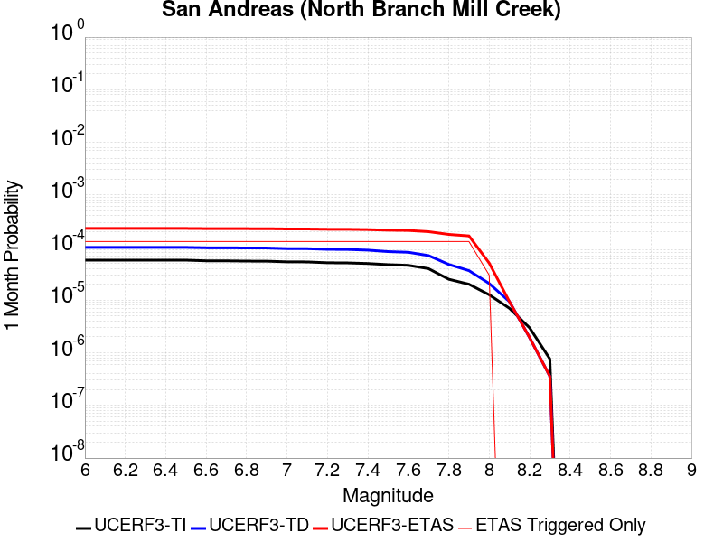 |  |  |

| Magnitude | 1 wk TI Prob | 1 wk TD Prob | 1 wk ETAS Prob | 1 wk ETAS/TD Gain | 1 wk ETAS Triggered Only | 1 mo TI Prob | 1 mo TD Prob | 1 mo ETAS Prob | 1 mo ETAS/TD Gain | 1 mo ETAS Triggered Only | 1 yr TI Prob | 1 yr TD Prob | 1 yr ETAS Prob | 1 yr ETAS/TD Gain | 1 yr ETAS Triggered Only | 10 yr TI Prob | 10 yr TD Prob | 10 yr ETAS Prob | 10 yr ETAS/TD Gain | 10 yr ETAS Triggered Only |
|-----|-----|-----|-----|-----|-----|-----|-----|-----|-----|-----|-----|-----|-----|-----|-----|-----|-----|-----|-----|-----|
| 6.0 | 1.3461156E-5 | 2.3499893E-5 | 1.10097935E-4 | 4.68504 | 8.660008E-5 | 5.7689394E-5 | 1.00709956E-4 | 1.8730131E-4 | 1.8598093 | 8.660008E-5 | 7.02142E-4 | 0.0012254574 | 0.0013407826 | 1.094108 | 1.1546678E-4 | 0.0069992766 | 0.01222957 | 0.012343625 | 1.0093261 | 1.1546678E-4 |
| 6.1 | 1.3461156E-5 | 2.3499893E-5 | 1.10097935E-4 | 4.68504 | 8.660008E-5 | 5.7689394E-5 | 1.00709956E-4 | 1.8730131E-4 | 1.8598093 | 8.660008E-5 | 7.02142E-4 | 0.0012254574 | 0.0013407826 | 1.094108 | 1.1546678E-4 | 0.0069992766 | 0.01222957 | 0.012343625 | 1.0093261 | 1.1546678E-4 |
| 6.2 | 1.3461156E-5 | 2.3499893E-5 | 1.10097935E-4 | 4.68504 | 8.660008E-5 | 5.7689394E-5 | 1.00709956E-4 | 1.8730131E-4 | 1.8598093 | 8.660008E-5 | 7.02142E-4 | 0.0012254574 | 0.0013407826 | 1.094108 | 1.1546678E-4 | 0.0069992766 | 0.01222957 | 0.012343625 | 1.0093261 | 1.1546678E-4 |
| 6.3 | 1.3461156E-5 | 2.3499893E-5 | 1.10097935E-4 | 4.68504 | 8.660008E-5 | 5.7689394E-5 | 1.00709956E-4 | 1.8730131E-4 | 1.8598093 | 8.660008E-5 | 7.02142E-4 | 0.0012254574 | 0.0013407826 | 1.094108 | 1.1546678E-4 | 0.0069992766 | 0.01222957 | 0.012343625 | 1.0093261 | 1.1546678E-4 |
| 6.4 | 1.3461156E-5 | 2.3499893E-5 | 1.10097935E-4 | 4.68504 | 8.660008E-5 | 5.7689394E-5 | 1.00709956E-4 | 1.8730131E-4 | 1.8598093 | 8.660008E-5 | 7.02142E-4 | 0.0012254574 | 0.0013407826 | 1.094108 | 1.1546678E-4 | 0.0069992766 | 0.01222957 | 0.012343625 | 1.0093261 | 1.1546678E-4 |
| 6.5 | 1.3450706E-5 | 2.3488852E-5 | 1.100869E-4 | 4.686772 | 8.660008E-5 | 5.764461E-5 | 1.0066265E-4 | 1.8725402E-4 | 1.8602135 | 8.660008E-5 | 7.0159714E-4 | 0.001224882 | 0.0013402073 | 1.0941522 | 1.1546678E-4 | 0.006993862 | 0.01222388 | 0.012337935 | 1.0093305 | 1.1546678E-4 |
| 6.6 | 1.3074523E-5 | 2.3103135E-5 | 1.09701214E-4 | 4.748326 | 8.660008E-5 | 5.6032466E-5 | 9.9009696E-5 | 1.8560121E-4 | 1.874576 | 8.660008E-5 | 6.8198174E-4 | 0.0012047797 | 0.0013201074 | 1.095725 | 1.1546678E-4 | 0.006798926 | 0.012025044 | 0.012139123 | 1.0094867 | 1.1546678E-4 |
| 6.7 | 1.3050216E-5 | 2.3078432E-5 | 1.0967651E-4 | 4.7523384 | 8.660008E-5 | 5.59283E-5 | 9.890384E-5 | 1.8549534E-4 | 1.8755122 | 8.660008E-5 | 6.8071426E-4 | 0.0012034923 | 0.00131882 | 1.0958276 | 1.1546678E-4 | 0.0067863287 | 0.012012309 | 0.012126389 | 1.0094969 | 1.1546678E-4 |
| 6.8 | 1.29049395E-5 | 2.292684E-5 | 1.0952494E-4 | 4.777149 | 8.660008E-5 | 5.530571E-5 | 9.825421E-5 | 1.8484578E-4 | 1.8813014 | 8.660008E-5 | 6.73139E-4 | 0.0011955918 | 0.0013109205 | 1.0964617 | 1.1546678E-4 | 0.0067110364 | 0.011934154 | 0.012048243 | 1.0095599 | 1.1546678E-4 |
| 6.9 | 1.2867369E-5 | 2.2886245E-5 | 1.0948435E-4 | 4.7838492 | 8.660008E-5 | 5.51447E-5 | 9.8080236E-5 | 1.8467182E-4 | 1.8828648 | 8.660008E-5 | 6.711799E-4 | 0.0011934759 | 0.001308805 | 1.0966328 | 1.1546678E-4 | 0.006691564 | 0.011913223 | 0.012027315 | 1.0095768 | 1.1546678E-4 |
| 7.0 | 1.2495996E-5 | 2.2286325E-5 | 1.0888447E-4 | 4.885708 | 8.660008E-5 | 5.3553173E-5 | 9.550934E-5 | 1.8210115E-4 | 1.9066318 | 8.660008E-5 | 6.518148E-4 | 0.0011622087 | 0.0012775414 | 1.0992357 | 1.1546678E-4 | 0.0064990623 | 0.0116038285 | 0.011717956 | 1.0098352 | 1.1546678E-4 |
| 7.1 | 1.2452067E-5 | 2.2231397E-5 | 1.08829554E-4 | 4.8953085 | 8.660008E-5 | 5.3364907E-5 | 9.527396E-5 | 1.8186579E-4 | 1.908872 | 8.660008E-5 | 6.4952404E-4 | 0.0011593461 | 0.001274679 | 1.099481 | 1.1546678E-4 | 0.0064762887 | 0.0115755 | 0.01168963 | 1.0098597 | 1.1546678E-4 |
| 7.2 | 1.2002777E-5 | 2.1609963E-5 | 1.0820817E-4 | 5.007328 | 8.660008E-5 | 5.143946E-5 | 9.2610855E-5 | 1.7920292E-4 | 1.9350098 | 8.660008E-5 | 6.2609545E-4 | 0.0011269567 | 0.0012422933 | 1.1023434 | 1.1546678E-4 | 0.006243344 | 0.011254923 | 0.0113690905 | 1.0101438 | 1.1546678E-4 |
| 7.3 | 1.1923425E-5 | 2.1479793E-5 | 1.0807801E-4 | 5.0316133 | 8.660008E-5 | 5.109939E-5 | 9.205302E-5 | 1.7864513E-4 | 1.9406765 | 8.660008E-5 | 6.219575E-4 | 0.001120172 | 0.0012355094 | 1.102964 | 1.1546678E-4 | 0.0062021962 | 0.011187789 | 0.011301964 | 1.0102053 | 1.1546678E-4 |
| 7.4 | 1.16105175E-5 | 2.0853771E-5 | 1.0745205E-4 | 5.152643 | 8.660008E-5 | 4.975841E-5 | 8.937026E-5 | 1.759626E-4 | 1.9689168 | 8.660008E-5 | 6.0564023E-4 | 0.0010875424 | 0.0012028835 | 1.1060567 | 1.1546678E-4 | 0.006039923 | 0.010865397 | 0.010979609 | 1.0105115 | 1.1546678E-4 |
| 7.5 | 1.1037265E-5 | 1.9553907E-5 | 1.0615229E-4 | 5.4287 | 8.660008E-5 | 4.7301706E-5 | 8.379978E-5 | 1.7039261E-4 | 2.03333 | 8.660008E-5 | 5.757461E-4 | 0.0010197869 | 0.001135136 | 1.1131109 | 1.1546678E-4 | 0.005742567 | 0.010194898 | 0.010309187 | 1.0112104 | 1.1546678E-4 |
| 7.6 | 1.0720915E-5 | 1.899582E-5 | 1.05594256E-4 | 5.5588155 | 8.660008E-5 | 4.5945973E-5 | 8.140812E-5 | 1.6800115E-4 | 2.0636902 | 8.660008E-5 | 5.592486E-4 | 9.906954E-4 | 0.0011060478 | 1.1164358 | 1.1546678E-4 | 0.005578433 | 0.009906623 | 0.010020945 | 1.01154 | 1.1546678E-4 |
| 7.7 | 9.276279E-6 | 1.6441649E-5 | 1.0304031E-4 | 6.2670302 | 8.660008E-5 | 3.9754876E-5 | 7.0462316E-5 | 1.5705629E-4 | 2.2289402 | 8.660008E-5 | 4.839081E-4 | 8.575427E-4 | 9.7291043E-4 | 1.1345329 | 1.1546678E-4 | 0.0048285574 | 0.008586041 | 0.008700516 | 1.0133327 | 1.1546678E-4 |
| 7.8 | 5.8346777E-6 | 1.1155013E-5 | 9.775413E-5 | 8.763247 | 8.660008E-5 | 2.5005522E-5 | 4.7806327E-5 | 1.3440226E-4 | 2.8113909 | 8.660008E-5 | 3.043997E-4 | 5.818867E-4 | 6.972863E-4 | 1.1983197 | 1.1546678E-4 | 0.0030398308 | 0.0058469265 | 0.005961718 | 1.0196328 | 1.1546678E-4 |
| 7.9 | 4.690204E-6 | 8.509093E-6 | 9.510844E-5 | 11.17727 | 8.660008E-5 | 2.0100719E-5 | 3.6467034E-5 | 1.2306396E-4 | 3.374663 | 8.660008E-5 | 2.4469878E-4 | 4.4389578E-4 | 5.593113E-4 | 1.260006 | 1.1546678E-4 | 0.002444295 | 0.0044707474 | 0.004585698 | 1.0257117 | 1.1546678E-4 |
| 8.0 | 2.9570454E-6 | 4.846947E-6 | 6.258005E-5 | 12.911232 | 5.773339E-5 | 1.267299E-5 | 2.0772464E-5 | 7.850465E-5 | 3.7792654 | 5.773339E-5 | 1.5428272E-4 | 2.5287544E-4 | 3.1059422E-4 | 1.2282499 | 5.773339E-5 | 0.0015417566 | 0.002549644 | 0.0026072303 | 1.022586 | 5.773339E-5 |
| 8.1 | 1.6376824E-6 | 2.1968929E-6 | 2.1968929E-6 | 1.0 | 0.0 | 7.01862E-6 | 9.41522E-6 | 9.41522E-6 | 1.0 | 0.0 | 8.544835E-5 | 1.14624294E-4 | 1.14624294E-4 | 1.0 | 0.0 | 8.54155E-4 | 0.0011606582 | 0.0011606582 | 1.0 | 0.0 |
| 8.2 | 6.9631557E-7 | 4.5360213E-7 | 4.5360213E-7 | 1.0 | 0.0 | 2.984206E-6 | 1.9440076E-6 | 1.9440076E-6 | 1.0 | 0.0 | 3.63321E-5 | 2.3668037E-5 | 2.3668037E-5 | 1.0 | 0.0 | 3.6326164E-4 | 2.451564E-4 | 2.451564E-4 | 1.0 | 0.0 |
| 8.3 | 1.7876137E-7 | 8.360375E-8 | 8.360375E-8 | 1.0 | 0.0 | 7.661199E-7 | 3.5830175E-7 | 3.5830175E-7 | 1.0 | 0.0 | 9.32747E-6 | 4.3623154E-6 | 4.3623154E-6 | 1.0 | 0.0 | 9.3270784E-5 | 4.5817014E-5 | 4.5817014E-5 | 1.0 | 0.0 |

## Manix-Afton Hills
*[(top)](#table-of-contents)*

| 1 Week | 1 Month | 1 Year | 10 Year |
|-----|-----|-----|-----|
|  |  |  |  |

| Magnitude | 1 wk TI Prob | 1 wk TD Prob | 1 wk ETAS Prob | 1 wk ETAS/TD Gain | 1 wk ETAS Triggered Only | 1 mo TI Prob | 1 mo TD Prob | 1 mo ETAS Prob | 1 mo ETAS/TD Gain | 1 mo ETAS Triggered Only | 1 yr TI Prob | 1 yr TD Prob | 1 yr ETAS Prob | 1 yr ETAS/TD Gain | 1 yr ETAS Triggered Only | 10 yr TI Prob | 10 yr TD Prob | 10 yr ETAS Prob | 10 yr ETAS/TD Gain | 10 yr ETAS Triggered Only |
|-----|-----|-----|-----|-----|-----|-----|-----|-----|-----|-----|-----|-----|-----|-----|-----|-----|-----|-----|-----|-----|
| 6.0 | 1.3783202E-5 | 1.47110895E-5 | 1.01309895E-4 | 6.8866343 | 8.660008E-5 | 5.906953E-5 | 6.30461E-5 | 1.785056E-4 | 2.8313503 | 1.1546678E-4 | 7.189342E-4 | 7.6733343E-4 | 8.827116E-4 | 1.1503625 | 1.1546678E-4 | 0.0071661277 | 0.007648596 | 0.0077631795 | 1.014981 | 1.1546678E-4 |
| 6.1 | 1.3783202E-5 | 1.47110895E-5 | 1.01309895E-4 | 6.8866343 | 8.660008E-5 | 5.906953E-5 | 6.30461E-5 | 1.785056E-4 | 2.8313503 | 1.1546678E-4 | 7.189342E-4 | 7.6733343E-4 | 8.827116E-4 | 1.1503625 | 1.1546678E-4 | 0.0071661277 | 0.007648596 | 0.0077631795 | 1.014981 | 1.1546678E-4 |
| 6.2 | 1.3783202E-5 | 1.47110895E-5 | 1.01309895E-4 | 6.8866343 | 8.660008E-5 | 5.906953E-5 | 6.30461E-5 | 1.785056E-4 | 2.8313503 | 1.1546678E-4 | 7.189342E-4 | 7.6733343E-4 | 8.827116E-4 | 1.1503625 | 1.1546678E-4 | 0.0071661277 | 0.007648596 | 0.0077631795 | 1.014981 | 1.1546678E-4 |
| 6.3 | 1.10494875E-5 | 1.1793136E-5 | 6.952584E-5 | 5.89545 | 5.773339E-5 | 4.7354086E-5 | 5.054109E-5 | 1.371368E-4 | 2.7133722 | 8.660008E-5 | 5.763835E-4 | 6.151744E-4 | 7.0172123E-4 | 1.1406866 | 8.660008E-5 | 0.005748908 | 0.0061357557 | 0.0062218243 | 1.0140274 | 8.660008E-5 |
| 6.4 | 1.10494875E-5 | 1.1793136E-5 | 6.952584E-5 | 5.89545 | 5.773339E-5 | 4.7354086E-5 | 5.054109E-5 | 1.371368E-4 | 2.7133722 | 8.660008E-5 | 5.763835E-4 | 6.151744E-4 | 7.0172123E-4 | 1.1406866 | 8.660008E-5 | 0.005748908 | 0.0061357557 | 0.0062218243 | 1.0140274 | 8.660008E-5 |
| 6.5 | 9.788949E-6 | 1.045432E-5 | 6.81871E-5 | 6.5223856 | 5.773339E-5 | 4.1951964E-5 | 4.480351E-5 | 1.313997E-4 | 2.9327996 | 8.660008E-5 | 5.1064545E-4 | 5.453555E-4 | 6.3190836E-4 | 1.158709 | 8.660008E-5 | 0.0050947363 | 0.0054410985 | 0.0055272277 | 1.0158293 | 8.660008E-5 |
| 6.6 | 8.810006E-6 | 9.4136285E-6 | 6.714647E-5 | 7.1329 | 5.773339E-5 | 3.775662E-5 | 4.0343548E-5 | 1.2694014E-4 | 3.1464794 | 8.660008E-5 | 4.5958988E-4 | 4.9108086E-4 | 5.7763845E-4 | 1.1762593 | 8.660008E-5 | 0.0045864056 | 0.004900839 | 0.004987015 | 1.0175838 | 8.660008E-5 |
| 6.7 | 8.80128E-6 | 9.404108E-6 | 6.713695E-5 | 7.139109 | 5.773339E-5 | 3.7719226E-5 | 4.0302748E-5 | 1.2689934E-4 | 3.1486523 | 8.660008E-5 | 4.591348E-4 | 4.9058435E-4 | 5.7714194E-4 | 1.1764377 | 8.660008E-5 | 0.004581874 | 0.0048958957 | 0.004982072 | 1.0176017 | 8.660008E-5 |
| 6.8 | 6.8994877E-6 | 7.380076E-6 | 6.511304E-5 | 8.822814 | 5.773339E-5 | 2.9568899E-5 | 3.162856E-5 | 1.182259E-4 | 3.7379477 | 8.660008E-5 | 3.5994186E-4 | 3.8501783E-4 | 4.715846E-4 | 1.2248383 | 8.660008E-5 | 0.003593594 | 0.0038443129 | 0.00393058 | 1.0224402 | 8.660008E-5 |
| 6.9 | 4.9328037E-6 | 5.2709615E-6 | 6.3004045E-5 | 11.953046 | 5.773339E-5 | 2.1140417E-5 | 2.2589675E-5 | 1.091878E-4 | 4.833527 | 8.660008E-5 | 2.5735417E-4 | 2.7500073E-4 | 3.61577E-4 | 1.314822 | 8.660008E-5 | 0.0025705635 | 0.0027472095 | 0.0028335715 | 1.0314363 | 8.660008E-5 |
| 7.0 | 3.347973E-6 | 3.59003E-6 | 3.59003E-6 | 1.0 | 0.0 | 1.4348378E-5 | 1.5385775E-5 | 1.5385775E-5 | 1.0 | 0.0 | 1.746775E-4 | 1.8730981E-4 | 1.8730981E-4 | 1.0 | 0.0 | 0.0017454025 | 0.0018719219 | 0.0018719219 | 1.0 | 0.0 |
| 7.1 | 1.2073567E-6 | 1.293482E-6 | 1.293482E-6 | 1.0 | 0.0 | 5.1743755E-6 | 5.543492E-6 | 5.543492E-6 | 1.0 | 0.0 | 6.29962E-5 | 6.749156E-5 | 6.749156E-5 | 1.0 | 0.0 | 6.297835E-4 | 6.7487074E-4 | 6.7487074E-4 | 1.0 | 0.0 |

## Santa Ynez (East)
*[(top)](#table-of-contents)*

| 1 Week | 1 Month | 1 Year | 10 Year |
|-----|-----|-----|-----|
|  |  |  |  |

| Magnitude | 1 wk TI Prob | 1 wk TD Prob | 1 wk ETAS Prob | 1 wk ETAS/TD Gain | 1 wk ETAS Triggered Only | 1 mo TI Prob | 1 mo TD Prob | 1 mo ETAS Prob | 1 mo ETAS/TD Gain | 1 mo ETAS Triggered Only | 1 yr TI Prob | 1 yr TD Prob | 1 yr ETAS Prob | 1 yr ETAS/TD Gain | 1 yr ETAS Triggered Only | 10 yr TI Prob | 10 yr TD Prob | 10 yr ETAS Prob | 10 yr ETAS/TD Gain | 10 yr ETAS Triggered Only |
|-----|-----|-----|-----|-----|-----|-----|-----|-----|-----|-----|-----|-----|-----|-----|-----|-----|-----|-----|-----|-----|
| 6.0 | 3.2269712E-5 | 3.67505E-5 | 9.4481766E-5 | 2.5708973 | 5.773339E-5 | 1.3829143E-4 | 1.5749598E-4 | 2.1522027E-4 | 1.3665128 | 5.773339E-5 | 0.0016823979 | 0.0019164166 | 0.0020028506 | 1.045102 | 8.660008E-5 | 0.016697178 | 0.019056441 | 0.01914139 | 1.0044578 | 8.660008E-5 |
| 6.1 | 3.2269712E-5 | 3.67505E-5 | 9.4481766E-5 | 2.5708973 | 5.773339E-5 | 1.3829143E-4 | 1.5749598E-4 | 2.1522027E-4 | 1.3665128 | 5.773339E-5 | 0.0016823979 | 0.0019164166 | 0.0020028506 | 1.045102 | 8.660008E-5 | 0.016697178 | 0.019056441 | 0.01914139 | 1.0044578 | 8.660008E-5 |
| 6.2 | 3.2269712E-5 | 3.67505E-5 | 9.4481766E-5 | 2.5708973 | 5.773339E-5 | 1.3829143E-4 | 1.5749598E-4 | 2.1522027E-4 | 1.3665128 | 5.773339E-5 | 0.0016823979 | 0.0019164166 | 0.0020028506 | 1.045102 | 8.660008E-5 | 0.016697178 | 0.019056441 | 0.01914139 | 1.0044578 | 8.660008E-5 |
| 6.3 | 3.2269712E-5 | 3.67505E-5 | 9.4481766E-5 | 2.5708973 | 5.773339E-5 | 1.3829143E-4 | 1.5749598E-4 | 2.1522027E-4 | 1.3665128 | 5.773339E-5 | 0.0016823979 | 0.0019164166 | 0.0020028506 | 1.045102 | 8.660008E-5 | 0.016697178 | 0.019056441 | 0.01914139 | 1.0044578 | 8.660008E-5 |
| 6.4 | 1.4404779E-5 | 1.4849382E-5 | 1.4849382E-5 | 1.0 | 0.0 | 6.1733306E-5 | 6.363868E-5 | 6.363868E-5 | 1.0 | 0.0 | 7.513438E-4 | 7.745306E-4 | 7.745306E-4 | 1.0 | 0.0 | 0.0074880854 | 0.007718862 | 0.007718862 | 1.0 | 0.0 |
| 6.5 | 1.4404779E-5 | 1.4849382E-5 | 1.4849382E-5 | 1.0 | 0.0 | 6.1733306E-5 | 6.363868E-5 | 6.363868E-5 | 1.0 | 0.0 | 7.513438E-4 | 7.745306E-4 | 7.745306E-4 | 1.0 | 0.0 | 0.0074880854 | 0.007718862 | 0.007718862 | 1.0 | 0.0 |
| 6.6 | 1.280208E-5 | 1.3011947E-5 | 1.3011947E-5 | 1.0 | 0.0 | 5.4864904E-5 | 5.5764307E-5 | 5.5764307E-5 | 1.0 | 0.0 | 6.6777546E-4 | 6.787207E-4 | 6.787207E-4 | 1.0 | 0.0 | 0.006657724 | 0.0067666885 | 0.0067666885 | 1.0 | 0.0 |
| 6.7 | 1.2457027E-5 | 1.2628468E-5 | 1.2628468E-5 | 1.0 | 0.0 | 5.3386164E-5 | 5.412089E-5 | 5.412089E-5 | 1.0 | 0.0 | 6.497827E-4 | 6.587243E-4 | 6.587243E-4 | 1.0 | 0.0 | 0.00647886 | 0.006567915 | 0.006567915 | 1.0 | 0.0 |
| 6.8 | 1.2095134E-5 | 1.2230915E-5 | 1.2230915E-5 | 1.0 | 0.0 | 5.1835254E-5 | 5.241716E-5 | 5.241716E-5 | 1.0 | 0.0 | 6.309115E-4 | 6.379937E-4 | 6.379937E-4 | 1.0 | 0.0 | 0.0062912325 | 0.006361809 | 0.006361809 | 1.0 | 0.0 |
| 6.9 | 1.1104036E-5 | 1.1157347E-5 | 1.1157347E-5 | 1.0 | 0.0 | 4.758786E-5 | 4.781633E-5 | 4.781633E-5 | 1.0 | 0.0 | 5.7922816E-4 | 5.820096E-4 | 5.820096E-4 | 1.0 | 0.0 | 0.005777207 | 0.0058049993 | 0.0058049993 | 1.0 | 0.0 |
| 7.0 | 1.0577444E-5 | 1.058168E-5 | 1.058168E-5 | 1.0 | 0.0 | 4.5331115E-5 | 4.5349276E-5 | 4.5349276E-5 | 1.0 | 0.0 | 5.5176654E-4 | 5.519888E-4 | 5.519888E-4 | 1.0 | 0.0 | 0.0055039856 | 0.0055063153 | 0.0055063153 | 1.0 | 0.0 |
| 7.1 | 1.0021775E-5 | 9.980988E-6 | 9.980988E-6 | 1.0 | 0.0 | 4.294976E-5 | 4.2774966E-5 | 4.2774966E-5 | 1.0 | 0.0 | 5.2278786E-4 | 5.2066194E-4 | 5.2066194E-4 | 1.0 | 0.0 | 0.0052155964 | 0.0051945536 | 0.0051945536 | 1.0 | 0.0 |
| 7.2 | 8.874109E-6 | 8.748793E-6 | 8.748793E-6 | 1.0 | 0.0 | 3.8031343E-5 | 3.7494297E-5 | 3.7494297E-5 | 1.0 | 0.0 | 4.629332E-4 | 4.5639853E-4 | 4.5639853E-4 | 1.0 | 0.0 | 0.0046197 | 0.0045547304 | 0.0045547304 | 1.0 | 0.0 |
| 7.3 | 7.5504267E-6 | 7.5051175E-6 | 7.5051175E-6 | 1.0 | 0.0 | 3.235857E-5 | 3.21644E-5 | 3.21644E-5 | 1.0 | 0.0 | 3.9389438E-4 | 3.915322E-4 | 3.915322E-4 | 1.0 | 0.0 | 0.0039319694 | 0.003908531 | 0.003908531 | 1.0 | 0.0 |
| 7.4 | 6.309394E-6 | 6.1831556E-6 | 6.1831556E-6 | 1.0 | 0.0 | 2.703998E-5 | 2.6498974E-5 | 2.6498974E-5 | 1.0 | 0.0 | 3.2916202E-4 | 3.225782E-4 | 3.225782E-4 | 1.0 | 0.0 | 0.003286749 | 0.003221197 | 0.003221197 | 1.0 | 0.0 |
| 7.5 | 4.6103073E-6 | 4.4408903E-6 | 4.4408903E-6 | 1.0 | 0.0 | 1.975831E-5 | 1.9032252E-5 | 1.9032252E-5 | 1.0 | 0.0 | 2.4053088E-4 | 2.3169373E-4 | 2.3169373E-4 | 1.0 | 0.0 | 0.002402707 | 0.002314591 | 0.002314591 | 1.0 | 0.0 |
| 7.6 | 1.2858658E-6 | 1.3008173E-6 | 1.3008173E-6 | 1.0 | 0.0 | 5.5108417E-6 | 5.5749197E-6 | 5.5749197E-6 | 1.0 | 0.0 | 6.7092435E-5 | 6.78726E-5 | 6.78726E-5 | 1.0 | 0.0 | 6.707218E-4 | 6.785256E-4 | 6.785256E-4 | 1.0 | 0.0 |
| 7.7 | 5.3302307E-7 | 5.612138E-7 | 5.612138E-7 | 1.0 | 0.0 | 2.2843826E-6 | 2.4052001E-6 | 2.4052001E-6 | 1.0 | 0.0 | 2.7812002E-5 | 2.9282954E-5 | 2.9282954E-5 | 1.0 | 0.0 | 2.7808524E-4 | 2.9279452E-4 | 2.9279452E-4 | 1.0 | 0.0 |
| 7.8 | 4.613933E-8 | 4.80301E-8 | 4.80301E-8 | 1.0 | 0.0 | 1.9773998E-7 | 2.0584326E-7 | 2.0584326E-7 | 1.0 | 0.0 | 2.4074816E-6 | 2.5061388E-6 | 2.5061388E-6 | 1.0 | 0.0 | 2.4074554E-5 | 2.5061116E-5 | 2.5061116E-5 | 1.0 | 0.0 |

## Deep Springs
*[(top)](#table-of-contents)*

| 1 Week | 1 Month | 1 Year | 10 Year |
|-----|-----|-----|-----|
|  |  |  |  |

| Magnitude | 1 wk TI Prob | 1 wk TD Prob | 1 wk ETAS Prob | 1 wk ETAS/TD Gain | 1 wk ETAS Triggered Only | 1 mo TI Prob | 1 mo TD Prob | 1 mo ETAS Prob | 1 mo ETAS/TD Gain | 1 mo ETAS Triggered Only | 1 yr TI Prob | 1 yr TD Prob | 1 yr ETAS Prob | 1 yr ETAS/TD Gain | 1 yr ETAS Triggered Only | 10 yr TI Prob | 10 yr TD Prob | 10 yr ETAS Prob | 10 yr ETAS/TD Gain | 10 yr ETAS Triggered Only |
|-----|-----|-----|-----|-----|-----|-----|-----|-----|-----|-----|-----|-----|-----|-----|-----|-----|-----|-----|-----|-----|
| 6.0 | 1.9810619E-5 | 2.311252E-5 | 1.097106E-4 | 4.7468038 | 8.660008E-5 | 8.489989E-5 | 9.905276E-5 | 1.8564427E-4 | 1.8741958 | 8.660008E-5 | 0.001033166 | 0.0012058079 | 0.0012923036 | 1.0717325 | 8.660008E-5 | 0.010283757 | 0.012042425 | 0.012127982 | 1.0071046 | 8.660008E-5 |
| 6.1 | 1.9810619E-5 | 2.311252E-5 | 1.097106E-4 | 4.7468038 | 8.660008E-5 | 8.489989E-5 | 9.905276E-5 | 1.8564427E-4 | 1.8741958 | 8.660008E-5 | 0.001033166 | 0.0012058079 | 0.0012923036 | 1.0717325 | 8.660008E-5 | 0.010283757 | 0.012042425 | 0.012127982 | 1.0071046 | 8.660008E-5 |
| 6.2 | 1.9810619E-5 | 2.311252E-5 | 1.097106E-4 | 4.7468038 | 8.660008E-5 | 8.489989E-5 | 9.905276E-5 | 1.8564427E-4 | 1.8741958 | 8.660008E-5 | 0.001033166 | 0.0012058079 | 0.0012923036 | 1.0717325 | 8.660008E-5 | 0.010283757 | 0.012042425 | 0.012127982 | 1.0071046 | 8.660008E-5 |
| 6.3 | 1.9810619E-5 | 2.311252E-5 | 1.097106E-4 | 4.7468038 | 8.660008E-5 | 8.489989E-5 | 9.905276E-5 | 1.8564427E-4 | 1.8741958 | 8.660008E-5 | 0.001033166 | 0.0012058079 | 0.0012923036 | 1.0717325 | 8.660008E-5 | 0.010283757 | 0.012042425 | 0.012127982 | 1.0071046 | 8.660008E-5 |
| 6.4 | 1.9810619E-5 | 2.311252E-5 | 1.097106E-4 | 4.7468038 | 8.660008E-5 | 8.489989E-5 | 9.905276E-5 | 1.8564427E-4 | 1.8741958 | 8.660008E-5 | 0.001033166 | 0.0012058079 | 0.0012923036 | 1.0717325 | 8.660008E-5 | 0.010283757 | 0.012042425 | 0.012127982 | 1.0071046 | 8.660008E-5 |
| 6.5 | 1.7190405E-5 | 2.0050555E-5 | 1.066489E-4 | 5.319 | 8.660008E-5 | 7.367108E-5 | 8.593095E-5 | 1.7252359E-4 | 2.0077002 | 8.660008E-5 | 8.9657627E-4 | 0.0010462094 | 0.0011327189 | 1.0826885 | 8.660008E-5 | 0.008929676 | 0.010462056 | 0.010547751 | 1.008191 | 8.660008E-5 |
| 6.6 | 1.7190405E-5 | 2.0050555E-5 | 1.066489E-4 | 5.319 | 8.660008E-5 | 7.367108E-5 | 8.593095E-5 | 1.7252359E-4 | 2.0077002 | 8.660008E-5 | 8.9657627E-4 | 0.0010462094 | 0.0011327189 | 1.0826885 | 8.660008E-5 | 0.008929676 | 0.010462056 | 0.010547751 | 1.008191 | 8.660008E-5 |

## Cleghorn Lake
*[(top)](#table-of-contents)*

| 1 Week | 1 Month | 1 Year | 10 Year |
|-----|-----|-----|-----|
|  |  | 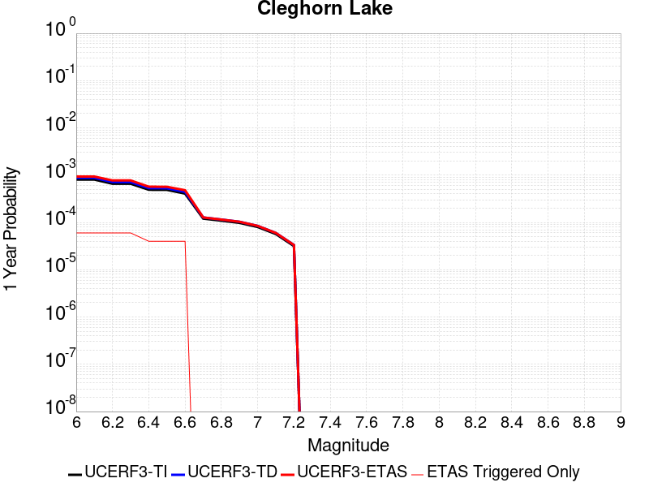 |  |

| Magnitude | 1 wk TI Prob | 1 wk TD Prob | 1 wk ETAS Prob | 1 wk ETAS/TD Gain | 1 wk ETAS Triggered Only | 1 mo TI Prob | 1 mo TD Prob | 1 mo ETAS Prob | 1 mo ETAS/TD Gain | 1 mo ETAS Triggered Only | 1 yr TI Prob | 1 yr TD Prob | 1 yr ETAS Prob | 1 yr ETAS/TD Gain | 1 yr ETAS Triggered Only | 10 yr TI Prob | 10 yr TD Prob | 10 yr ETAS Prob | 10 yr ETAS/TD Gain | 10 yr ETAS Triggered Only |
|-----|-----|-----|-----|-----|-----|-----|-----|-----|-----|-----|-----|-----|-----|-----|-----|-----|-----|-----|-----|-----|
| 6.0 | 1.5467183E-5 | 1.6794203E-5 | 4.5660414E-5 | 2.7188196 | 2.8866694E-5 | 6.6286244E-5 | 7.197348E-5 | 1.008381E-4 | 1.4010452 | 2.8866694E-5 | 8.067362E-4 | 8.759797E-4 | 9.336625E-4 | 1.0658495 | 5.773339E-5 | 0.008038137 | 0.008730696 | 0.008816539 | 1.0098324 | 8.660008E-5 |
| 6.1 | 1.5467183E-5 | 1.6794203E-5 | 4.5660414E-5 | 2.7188196 | 2.8866694E-5 | 6.6286244E-5 | 7.197348E-5 | 1.008381E-4 | 1.4010452 | 2.8866694E-5 | 8.067362E-4 | 8.759797E-4 | 9.336625E-4 | 1.0658495 | 5.773339E-5 | 0.008038137 | 0.008730696 | 0.008816539 | 1.0098324 | 8.660008E-5 |
| 6.2 | 1.2624631E-5 | 1.3681544E-5 | 4.2547843E-5 | 3.1098714 | 2.8866694E-5 | 5.410444E-5 | 5.863415E-5 | 8.7499146E-5 | 1.4922899 | 2.8866694E-5 | 6.585225E-4 | 7.1368564E-4 | 7.713778E-4 | 1.080837 | 5.773339E-5 | 0.0065657445 | 0.0071187317 | 0.007204715 | 1.0120785 | 8.660008E-5 |
| 6.3 | 1.2624631E-5 | 1.3681544E-5 | 4.2547843E-5 | 3.1098714 | 2.8866694E-5 | 5.410444E-5 | 5.863415E-5 | 8.7499146E-5 | 1.4922899 | 2.8866694E-5 | 6.585225E-4 | 7.1368564E-4 | 7.713778E-4 | 1.080837 | 5.773339E-5 | 0.0065657445 | 0.0071187317 | 0.007204715 | 1.0120785 | 8.660008E-5 |
| 6.4 | 9.417684E-6 | 1.0170118E-5 | 3.9036517E-5 | 3.8383546 | 2.8866694E-5 | 4.036088E-5 | 4.3585722E-5 | 7.2451156E-5 | 1.6622682 | 2.8866694E-5 | 4.912829E-4 | 5.3056807E-4 | 5.882708E-4 | 1.1087565 | 5.773339E-5 | 0.004901982 | 0.005297049 | 0.0053831902 | 1.0162622 | 8.660008E-5 |
| 6.5 | 9.368219E-6 | 1.0117545E-5 | 3.8983944E-5 | 3.8531036 | 2.8866694E-5 | 4.014889E-5 | 4.3360415E-5 | 7.2225856E-5 | 1.6657095 | 2.8866694E-5 | 4.8870314E-4 | 5.2782625E-4 | 5.855292E-4 | 1.1093218 | 5.773339E-5 | 0.004876298 | 0.0052697617 | 0.0053559053 | 1.0163468 | 8.660008E-5 |
| 6.6 | 7.803798E-6 | 8.441831E-6 | 3.730828E-5 | 4.4194536 | 2.8866694E-5 | 3.3444423E-5 | 3.6179E-5 | 6.5044645E-5 | 1.7978565 | 2.8866694E-5 | 4.0710976E-4 | 4.4043022E-4 | 4.981382E-4 | 1.1310264 | 5.773339E-5 | 0.0040636472 | 0.0043994905 | 0.0044857096 | 1.0195975 | 8.660008E-5 |
| 6.7 | 2.3108669E-6 | 2.4438336E-6 | 2.4438336E-6 | 1.0 | 0.0 | 9.903678E-6 | 1.0473532E-5 | 1.0473532E-5 | 1.0 | 0.0 | 1.205706E-4 | 1.2750797E-4 | 1.2750797E-4 | 1.0 | 0.0 | 0.001205052 | 0.0012743667 | 0.0012743667 | 1.0 | 0.0 |
| 6.8 | 2.0882828E-6 | 2.2062823E-6 | 2.2062823E-6 | 1.0 | 0.0 | 8.949753E-6 | 9.455462E-6 | 9.455462E-6 | 1.0 | 0.0 | 1.08957785E-4 | 1.1511434E-4 | 1.1511434E-4 | 1.0 | 0.0 | 0.0010890438 | 0.0011505639 | 0.0011505639 | 1.0 | 0.0 |
| 6.9 | 1.876935E-6 | 1.981051E-6 | 1.981051E-6 | 1.0 | 0.0 | 8.043982E-6 | 8.490192E-6 | 8.490192E-6 | 1.0 | 0.0 | 9.7931086E-5 | 1.03363345E-4 | 1.03363345E-4 | 1.0 | 0.0 | 9.788794E-4 | 0.0010331686 | 0.0010331686 | 1.0 | 0.0 |
| 7.0 | 1.5357559E-6 | 1.6202807E-6 | 1.6202807E-6 | 1.0 | 0.0 | 6.5817944E-6 | 6.9440425E-6 | 6.9440425E-6 | 1.0 | 0.0 | 8.01304E-5 | 8.454057E-5 | 8.454057E-5 | 1.0 | 0.0 | 8.010151E-4 | 8.450965E-4 | 8.450965E-4 | 1.0 | 0.0 |
| 7.1 | 1.0905424E-6 | 1.1497619E-6 | 1.1497619E-6 | 1.0 | 0.0 | 4.6737446E-6 | 4.9275427E-6 | 4.9275427E-6 | 1.0 | 0.0 | 5.6901354E-5 | 5.999128E-5 | 5.999128E-5 | 1.0 | 0.0 | 5.6886784E-4 | 5.997606E-4 | 5.997606E-4 | 1.0 | 0.0 |
| 7.2 | 6.06668E-7 | 6.387277E-7 | 6.387277E-7 | 1.0 | 0.0 | 2.600003E-6 | 2.7374022E-6 | 2.7374022E-6 | 1.0 | 0.0 | 3.1654577E-5 | 3.3327433E-5 | 3.3327433E-5 | 1.0 | 0.0 | 3.1650066E-4 | 3.3323118E-4 | 3.3323118E-4 | 1.0 | 0.0 |

## Whittier alt 1
*[(top)](#table-of-contents)*

| 1 Week | 1 Month | 1 Year | 10 Year |
|-----|-----|-----|-----|
|  |  |  |  |

| Magnitude | 1 wk TI Prob | 1 wk TD Prob | 1 wk ETAS Prob | 1 wk ETAS/TD Gain | 1 wk ETAS Triggered Only | 1 mo TI Prob | 1 mo TD Prob | 1 mo ETAS Prob | 1 mo ETAS/TD Gain | 1 mo ETAS Triggered Only | 1 yr TI Prob | 1 yr TD Prob | 1 yr ETAS Prob | 1 yr ETAS/TD Gain | 1 yr ETAS Triggered Only | 10 yr TI Prob | 10 yr TD Prob | 10 yr ETAS Prob | 10 yr ETAS/TD Gain | 10 yr ETAS Triggered Only |
|-----|-----|-----|-----|-----|-----|-----|-----|-----|-----|-----|-----|-----|-----|-----|-----|-----|-----|-----|-----|-----|
| 6.0 | 4.2554693E-5 | 4.725218E-5 | 7.611751E-5 | 1.6108782 | 2.8866694E-5 | 1.8236451E-4 | 2.0249544E-4 | 2.3135629E-4 | 1.1425259 | 2.8866694E-5 | 0.002218027 | 0.0024629154 | 0.002549302 | 1.0350751 | 8.660008E-5 | 0.02196019 | 0.024390234 | 0.024474723 | 1.003464 | 8.660008E-5 |
| 6.1 | 4.2554693E-5 | 4.725218E-5 | 7.611751E-5 | 1.6108782 | 2.8866694E-5 | 1.8236451E-4 | 2.0249544E-4 | 2.3135629E-4 | 1.1425259 | 2.8866694E-5 | 0.002218027 | 0.0024629154 | 0.002549302 | 1.0350751 | 8.660008E-5 | 0.02196019 | 0.024390234 | 0.024474723 | 1.003464 | 8.660008E-5 |
| 6.2 | 4.2554693E-5 | 4.725218E-5 | 7.611751E-5 | 1.6108782 | 2.8866694E-5 | 1.8236451E-4 | 2.0249544E-4 | 2.3135629E-4 | 1.1425259 | 2.8866694E-5 | 0.002218027 | 0.0024629154 | 0.002549302 | 1.0350751 | 8.660008E-5 | 0.02196019 | 0.024390234 | 0.024474723 | 1.003464 | 8.660008E-5 |
| 6.3 | 1.9617712E-5 | 1.8268593E-5 | 1.8268593E-5 | 1.0 | 0.0 | 8.40732E-5 | 7.829172E-5 | 7.829172E-5 | 1.0 | 0.0 | 0.0010231105 | 9.52804E-4 | 0.0010104823 | 1.0605354 | 5.773339E-5 | 0.01018413 | 0.009490474 | 0.00954766 | 1.0060256 | 5.773339E-5 |
| 6.4 | 1.5611336E-5 | 1.3604271E-5 | 1.3604271E-5 | 1.0 | 0.0 | 6.690401E-5 | 5.8302747E-5 | 5.8302747E-5 | 1.0 | 0.0 | 8.142519E-4 | 7.0961076E-4 | 7.3845696E-4 | 1.0406507 | 2.8866694E-5 | 0.008112748 | 0.0070754145 | 0.007104077 | 1.004051 | 2.8866694E-5 |
| 6.5 | 1.5150166E-5 | 1.3100925E-5 | 1.3100925E-5 | 1.0 | 0.0 | 6.492767E-5 | 5.6145647E-5 | 5.6145647E-5 | 1.0 | 0.0 | 7.9020765E-4 | 6.8336475E-4 | 7.122117E-4 | 1.0422131 | 2.8866694E-5 | 0.007874036 | 0.0068145846 | 0.006843255 | 1.0042071 | 2.8866694E-5 |
| 6.6 | 1.295588E-5 | 1.0380725E-5 | 1.0380725E-5 | 1.0 | 0.0 | 5.552402E-5 | 4.4488075E-5 | 4.4488075E-5 | 1.0 | 0.0 | 6.7579525E-4 | 5.4150965E-4 | 5.4150965E-4 | 1.0 | 0.0 | 0.006737438 | 0.0054033357 | 0.0054033357 | 1.0 | 0.0 |
| 6.7 | 1.2542085E-5 | 9.899369E-6 | 9.899369E-6 | 1.0 | 0.0 | 5.3750682E-5 | 4.242519E-5 | 4.242519E-5 | 1.0 | 0.0 | 6.542181E-4 | 5.164061E-4 | 5.164061E-4 | 1.0 | 0.0 | 0.006522954 | 0.0051534795 | 0.0051534795 | 1.0 | 0.0 |
| 6.8 | 1.2195878E-5 | 9.495415E-6 | 9.495415E-6 | 1.0 | 0.0 | 5.2267E-5 | 4.069401E-5 | 4.069401E-5 | 1.0 | 0.0 | 6.36165E-4 | 4.9533875E-4 | 4.9533875E-4 | 1.0 | 0.0 | 0.0063434686 | 0.004943688 | 0.004943688 | 1.0 | 0.0 |
| 6.9 | 1.1580298E-5 | 8.772933E-6 | 8.772933E-6 | 1.0 | 0.0 | 4.9628903E-5 | 3.7597754E-5 | 3.7597754E-5 | 1.0 | 0.0 | 6.040644E-4 | 4.5765814E-4 | 4.5765814E-4 | 1.0 | 0.0 | 0.00602425 | 0.0045684157 | 0.0045684157 | 1.0 | 0.0 |
| 7.0 | 1.0964795E-5 | 8.083994E-6 | 8.083994E-6 | 1.0 | 0.0 | 4.6991136E-5 | 3.4645236E-5 | 3.4645236E-5 | 1.0 | 0.0 | 5.7196687E-4 | 4.2172565E-4 | 4.2172565E-4 | 1.0 | 0.0 | 0.0057049696 | 0.004210462 | 0.004210462 | 1.0 | 0.0 |
| 7.1 | 1.0230601E-5 | 7.3266697E-6 | 7.3266697E-6 | 1.0 | 0.0 | 4.3844695E-5 | 3.1399642E-5 | 3.1399642E-5 | 1.0 | 0.0 | 5.336784E-4 | 3.8222488E-4 | 3.8222488E-4 | 1.0 | 0.0 | 0.005323986 | 0.0038168381 | 0.0038168381 | 1.0 | 0.0 |
| 7.2 | 9.40865E-6 | 6.543289E-6 | 6.543289E-6 | 1.0 | 0.0 | 4.032216E-5 | 2.8042374E-5 | 2.8042374E-5 | 1.0 | 0.0 | 4.908117E-4 | 3.4136363E-4 | 3.4136363E-4 | 1.0 | 0.0 | 0.0048972913 | 0.003409485 | 0.003409485 | 1.0 | 0.0 |
| 7.3 | 8.237384E-6 | 5.5977525E-6 | 5.5977525E-6 | 1.0 | 0.0 | 3.5302593E-5 | 2.3990153E-5 | 2.3990153E-5 | 1.0 | 0.0 | 4.2972428E-4 | 2.92042E-4 | 2.92042E-4 | 1.0 | 0.0 | 0.0042889426 | 0.002916903 | 0.002916903 | 1.0 | 0.0 |
| 7.4 | 7.5316966E-6 | 5.027819E-6 | 5.027819E-6 | 1.0 | 0.0 | 3.2278298E-5 | 2.1547625E-5 | 2.1547625E-5 | 1.0 | 0.0 | 3.9291743E-4 | 2.6231175E-4 | 2.6231175E-4 | 1.0 | 0.0 | 0.0039222343 | 0.0026201333 | 0.0026201333 | 1.0 | 0.0 |
| 7.5 | 6.149649E-6 | 3.933841E-6 | 3.933841E-6 | 1.0 | 0.0 | 2.6355372E-5 | 1.6859214E-5 | 1.6859214E-5 | 1.0 | 0.0 | 3.208294E-4 | 2.052425E-4 | 2.052425E-4 | 1.0 | 0.0 | 0.003203666 | 0.0020506186 | 0.0020506186 | 1.0 | 0.0 |
| 7.6 | 5.457711E-6 | 3.3953788E-6 | 3.3953788E-6 | 1.0 | 0.0 | 2.338998E-5 | 1.4551547E-5 | 1.4551547E-5 | 1.0 | 0.0 | 2.8473578E-4 | 1.771515E-4 | 1.771515E-4 | 1.0 | 0.0 | 0.0028437122 | 0.0017701836 | 0.0017701836 | 1.0 | 0.0 |
| 7.7 | 4.1676276E-6 | 2.3331952E-6 | 2.3331952E-6 | 1.0 | 0.0 | 1.7861139E-5 | 9.999374E-6 | 9.999374E-6 | 1.0 | 0.0 | 2.1743766E-4 | 1.2173632E-4 | 1.2173632E-4 | 1.0 | 0.0 | 0.0021722503 | 0.0012167693 | 0.0012167693 | 1.0 | 0.0 |
| 7.8 | 2.2692414E-7 | 9.3854695E-8 | 9.3854695E-8 | 1.0 | 0.0 | 9.725317E-7 | 4.0223435E-7 | 4.0223435E-7 | 1.0 | 0.0 | 1.1840509E-5 | 4.8971956E-6 | 4.8971956E-6 | 1.0 | 0.0 | 1.1839878E-4 | 4.8971204E-5 | 4.8971204E-5 | 1.0 | 0.0 |
| 7.9 | 6.676829E-9 | 3.439853E-9 | 3.439853E-9 | 1.0 | 0.0 | 2.861498E-8 | 1.4742227E-8 | 1.4742227E-8 | 1.0 | 0.0 | 3.4838732E-7 | 1.7948659E-7 | 1.7948659E-7 | 1.0 | 0.0 | 3.4838679E-6 | 1.7948646E-6 | 1.7948646E-6 | 1.0 | 0.0 |

## Lost Hills
*[(top)](#table-of-contents)*

| 1 Week | 1 Month | 1 Year | 10 Year |
|-----|-----|-----|-----|
|  |  |  |  |

| Magnitude | 1 wk TI Prob | 1 wk TD Prob | 1 wk ETAS Prob | 1 wk ETAS/TD Gain | 1 wk ETAS Triggered Only | 1 mo TI Prob | 1 mo TD Prob | 1 mo ETAS Prob | 1 mo ETAS/TD Gain | 1 mo ETAS Triggered Only | 1 yr TI Prob | 1 yr TD Prob | 1 yr ETAS Prob | 1 yr ETAS/TD Gain | 1 yr ETAS Triggered Only | 10 yr TI Prob | 10 yr TD Prob | 10 yr ETAS Prob | 10 yr ETAS/TD Gain | 10 yr ETAS Triggered Only |
|-----|-----|-----|-----|-----|-----|-----|-----|-----|-----|-----|-----|-----|-----|-----|-----|-----|-----|-----|-----|-----|
| 6.0 | 2.233523E-5 | 2.5106583E-5 | 8.2838524E-5 | 3.2994742 | 5.773339E-5 | 9.571891E-5 | 1.0759615E-4 | 1.6532332E-4 | 1.5365171 | 5.773339E-5 | 0.0011647546 | 0.001309364 | 0.0013670218 | 1.044035 | 5.773339E-5 | 0.011586686 | 0.013033091 | 0.013090071 | 1.004372 | 5.773339E-5 |
| 6.1 | 2.233523E-5 | 2.5106583E-5 | 8.2838524E-5 | 3.2994742 | 5.773339E-5 | 9.571891E-5 | 1.0759615E-4 | 1.6532332E-4 | 1.5365171 | 5.773339E-5 | 0.0011647546 | 0.001309364 | 0.0013670218 | 1.044035 | 5.773339E-5 | 0.011586686 | 0.013033091 | 0.013090071 | 1.004372 | 5.773339E-5 |
| 6.2 | 2.233523E-5 | 2.5106583E-5 | 8.2838524E-5 | 3.2994742 | 5.773339E-5 | 9.571891E-5 | 1.0759615E-4 | 1.6532332E-4 | 1.5365171 | 5.773339E-5 | 0.0011647546 | 0.001309364 | 0.0013670218 | 1.044035 | 5.773339E-5 | 0.011586686 | 0.013033091 | 0.013090071 | 1.004372 | 5.773339E-5 |
| 6.3 | 2.233523E-5 | 2.5106583E-5 | 8.2838524E-5 | 3.2994742 | 5.773339E-5 | 9.571891E-5 | 1.0759615E-4 | 1.6532332E-4 | 1.5365171 | 5.773339E-5 | 0.0011647546 | 0.001309364 | 0.0013670218 | 1.044035 | 5.773339E-5 | 0.011586686 | 0.013033091 | 0.013090071 | 1.004372 | 5.773339E-5 |
| 6.4 | 1.2288092E-5 | 1.3781108E-5 | 4.2647403E-5 | 3.094628 | 2.8866694E-5 | 5.2662188E-5 | 5.906108E-5 | 8.792607E-5 | 1.4887311 | 2.8866694E-5 | 6.409735E-4 | 7.189252E-4 | 7.477712E-4 | 1.0401237 | 2.8866694E-5 | 0.006391279 | 0.0071752006 | 0.00720386 | 1.0039942 | 2.8866694E-5 |
| 6.5 | 1.2288092E-5 | 1.3781108E-5 | 4.2647403E-5 | 3.094628 | 2.8866694E-5 | 5.2662188E-5 | 5.906108E-5 | 8.792607E-5 | 1.4887311 | 2.8866694E-5 | 6.409735E-4 | 7.189252E-4 | 7.477712E-4 | 1.0401237 | 2.8866694E-5 | 0.006391279 | 0.0071752006 | 0.00720386 | 1.0039942 | 2.8866694E-5 |
| 6.6 | 8.58281E-6 | 9.63377E-6 | 3.8500184E-5 | 3.996378 | 2.8866694E-5 | 3.6782953E-5 | 4.12874E-5 | 7.0152906E-5 | 1.6991358 | 2.8866694E-5 | 4.4774043E-4 | 5.026414E-4 | 5.3149357E-4 | 1.0574012 | 2.8866694E-5 | 0.0044683935 | 0.005023205 | 0.0050519267 | 1.0057178 | 2.8866694E-5 |
| 6.7 | 7.205685E-6 | 8.088302E-6 | 3.6954763E-5 | 4.568915 | 2.8866694E-5 | 3.088114E-5 | 3.466415E-5 | 6.352984E-5 | 1.8327247 | 2.8866694E-5 | 3.7591302E-4 | 4.2203604E-4 | 4.5089054E-4 | 1.0683697 | 2.8866694E-5 | 0.0037527776 | 0.0042203604 | 0.004249105 | 1.006811 | 2.8866694E-5 |

## Mission Ridge-Arroyo Parida-Santa Ana
*[(top)](#table-of-contents)*

| 1 Week | 1 Month | 1 Year | 10 Year |
|-----|-----|-----|-----|
|  |  |  |  |

| Magnitude | 1 wk TI Prob | 1 wk TD Prob | 1 wk ETAS Prob | 1 wk ETAS/TD Gain | 1 wk ETAS Triggered Only | 1 mo TI Prob | 1 mo TD Prob | 1 mo ETAS Prob | 1 mo ETAS/TD Gain | 1 mo ETAS Triggered Only | 1 yr TI Prob | 1 yr TD Prob | 1 yr ETAS Prob | 1 yr ETAS/TD Gain | 1 yr ETAS Triggered Only | 10 yr TI Prob | 10 yr TD Prob | 10 yr ETAS Prob | 10 yr ETAS/TD Gain | 10 yr ETAS Triggered Only |
|-----|-----|-----|-----|-----|-----|-----|-----|-----|-----|-----|-----|-----|-----|-----|-----|-----|-----|-----|-----|-----|
| 6.0 | 4.169034E-5 | 4.7138263E-5 | 7.60036E-5 | 1.6123546 | 2.8866694E-5 | 1.7866064E-4 | 2.0201034E-4 | 2.308712E-4 | 1.1428683 | 2.8866694E-5 | 0.0021730233 | 0.00245745 | 0.0024862457 | 1.0117178 | 2.8866694E-5 | 0.021518968 | 0.024384614 | 0.02444094 | 1.0023099 | 5.773339E-5 |
| 6.1 | 1.73813E-5 | 1.6854226E-5 | 4.5720433E-5 | 2.7126985 | 2.8866694E-5 | 7.4489166E-5 | 7.223046E-5 | 1.01095065E-4 | 1.3996183 | 2.8866694E-5 | 9.065282E-4 | 8.790618E-4 | 9.0790313E-4 | 1.0328093 | 2.8866694E-5 | 0.009028391 | 0.008756988 | 0.008785602 | 1.0032675 | 2.8866694E-5 |
| 6.2 | 1.4622182E-5 | 1.367329E-5 | 1.367329E-5 | 1.0 | 0.0 | 6.2664985E-5 | 5.8598518E-5 | 5.8598518E-5 | 1.0 | 0.0 | 7.6267915E-4 | 7.132073E-4 | 7.132073E-4 | 1.0 | 0.0 | 0.007600669 | 0.007109627 | 0.007109627 | 1.0 | 0.0 |
| 6.3 | 1.3552434E-5 | 1.2482201E-5 | 1.2482201E-5 | 1.0 | 0.0 | 5.8080568E-5 | 5.3494066E-5 | 5.3494066E-5 | 1.0 | 0.0 | 7.069015E-4 | 6.510988E-4 | 6.510988E-4 | 1.0 | 0.0 | 0.00704657 | 0.006492275 | 0.006492275 | 1.0 | 0.0 |
| 6.4 | 1.30977305E-5 | 1.1979156E-5 | 1.1979156E-5 | 1.0 | 0.0 | 5.613192E-5 | 5.1338247E-5 | 5.1338247E-5 | 1.0 | 0.0 | 6.831918E-4 | 6.248669E-4 | 6.248669E-4 | 1.0 | 0.0 | 0.006810953 | 0.0062314444 | 0.0062314444 | 1.0 | 0.0 |
| 6.5 | 1.225205E-5 | 1.1048803E-5 | 1.1048803E-5 | 1.0 | 0.0 | 5.2507727E-5 | 4.7351168E-5 | 4.7351168E-5 | 1.0 | 0.0 | 6.3909404E-4 | 5.7635066E-4 | 5.7635066E-4 | 1.0 | 0.0 | 0.006372592 | 0.005748869 | 0.005748869 | 1.0 | 0.0 |
| 6.6 | 1.1352241E-5 | 1.0063535E-5 | 1.0063535E-5 | 1.0 | 0.0 | 4.8651553E-5 | 4.3128734E-5 | 4.3128734E-5 | 1.0 | 0.0 | 5.921717E-4 | 5.2496797E-4 | 5.2496797E-4 | 1.0 | 0.0 | 0.0059059616 | 0.0052375244 | 0.0052375244 | 1.0 | 0.0 |
| 6.7 | 1.0864116E-5 | 9.517027E-6 | 9.517027E-6 | 1.0 | 0.0 | 4.6559664E-5 | 4.0786632E-5 | 4.0786632E-5 | 1.0 | 0.0 | 5.667165E-4 | 4.964661E-4 | 4.964661E-4 | 1.0 | 0.0 | 0.005652734 | 0.004953804 | 0.004953804 | 1.0 | 0.0 |
| 6.8 | 1.0666365E-5 | 9.299779E-6 | 9.299779E-6 | 1.0 | 0.0 | 4.571219E-5 | 3.9855597E-5 | 3.9855597E-5 | 1.0 | 0.0 | 5.564038E-4 | 4.8513585E-4 | 4.8513585E-4 | 1.0 | 0.0 | 0.005550127 | 0.0048410003 | 0.0048410003 | 1.0 | 0.0 |
| 6.9 | 1.0038665E-5 | 8.592046E-6 | 8.592046E-6 | 1.0 | 0.0 | 4.302214E-5 | 3.682254E-5 | 3.682254E-5 | 1.0 | 0.0 | 5.236687E-4 | 4.4822405E-4 | 4.4822405E-4 | 1.0 | 0.0 | 0.005224364 | 0.004473411 | 0.004473411 | 1.0 | 0.0 |
| 7.0 | 9.5379955E-6 | 8.025073E-6 | 8.025073E-6 | 1.0 | 0.0 | 4.0876483E-5 | 3.4392728E-5 | 3.4392728E-5 | 1.0 | 0.0 | 4.975576E-4 | 4.1865272E-4 | 4.1865272E-4 | 1.0 | 0.0 | 0.00496445 | 0.0041788397 | 0.0041788397 | 1.0 | 0.0 |
| 7.1 | 9.207389E-6 | 7.652375E-6 | 7.652375E-6 | 1.0 | 0.0 | 3.945964E-5 | 3.279549E-5 | 3.279549E-5 | 1.0 | 0.0 | 4.803152E-4 | 3.9921363E-4 | 3.9921363E-4 | 1.0 | 0.0 | 0.004792784 | 0.003985161 | 0.003985161 | 1.0 | 0.0 |
| 7.2 | 7.638091E-6 | 5.9311183E-6 | 5.9311183E-6 | 1.0 | 0.0 | 3.2734264E-5 | 2.541883E-5 | 2.541883E-5 | 1.0 | 0.0 | 3.984668E-4 | 3.0943064E-4 | 3.0943064E-4 | 1.0 | 0.0 | 0.0039775306 | 0.0030900547 | 0.0030900547 | 1.0 | 0.0 |
| 7.3 | 7.2500147E-6 | 5.5961527E-6 | 5.5961527E-6 | 1.0 | 0.0 | 3.1071122E-5 | 2.3983293E-5 | 2.3983293E-5 | 1.0 | 0.0 | 3.7822526E-4 | 2.9195778E-4 | 2.9195778E-4 | 1.0 | 0.0 | 0.0037758215 | 0.0029157975 | 0.0029157975 | 1.0 | 0.0 |
| 7.4 | 6.3899715E-6 | 4.9184964E-6 | 4.9184964E-6 | 1.0 | 0.0 | 2.7385306E-5 | 2.10791E-5 | 2.10791E-5 | 1.0 | 0.0 | 3.3336508E-4 | 2.5660804E-4 | 2.5660804E-4 | 1.0 | 0.0 | 0.0033286542 | 0.0025631618 | 0.0025631618 | 1.0 | 0.0 |
| 7.5 | 5.379025E-6 | 4.0838527E-6 | 4.0838527E-6 | 1.0 | 0.0 | 2.305276E-5 | 1.7502109E-5 | 1.7502109E-5 | 1.0 | 0.0 | 2.806312E-4 | 2.1306744E-4 | 2.1306744E-4 | 1.0 | 0.0 | 0.0028027708 | 0.002128643 | 0.002128643 | 1.0 | 0.0 |
| 7.6 | 4.1270696E-6 | 3.0883439E-6 | 3.0883439E-6 | 1.0 | 0.0 | 1.768732E-5 | 1.3235693E-5 | 1.3235693E-5 | 1.0 | 0.0 | 2.1532185E-4 | 1.6113273E-4 | 1.6113273E-4 | 1.0 | 0.0 | 0.0021511333 | 0.001610167 | 0.001610167 | 1.0 | 0.0 |
| 7.7 | 2.5406805E-6 | 1.8282013E-6 | 1.8282013E-6 | 1.0 | 0.0 | 1.0888585E-5 | 7.835125E-6 | 7.835125E-6 | 1.0 | 0.0 | 1.3256045E-4 | 9.538854E-5 | 9.538854E-5 | 1.0 | 0.0 | 0.0013248142 | 9.534821E-4 | 9.534821E-4 | 1.0 | 0.0 |
| 7.8 | 4.8608285E-7 | 3.5098864E-7 | 3.5098864E-7 | 1.0 | 0.0 | 2.0832106E-6 | 1.5042363E-6 | 1.5042363E-6 | 1.0 | 0.0 | 2.5362791E-5 | 1.8313924E-5 | 1.8313924E-5 | 1.0 | 0.0 | 2.5359896E-4 | 1.8312426E-4 | 1.8312426E-4 | 1.0 | 0.0 |
| 7.9 | 2.0472514E-8 | 1.2688783E-8 | 1.2688783E-8 | 1.0 | 0.0 | 8.7739345E-8 | 5.43805E-8 | 5.43805E-8 | 1.0 | 0.0 | 1.068226E-6 | 6.6208236E-7 | 6.6208236E-7 | 1.0 | 0.0 | 1.0682209E-5 | 6.620805E-6 | 6.620805E-6 | 1.0 | 0.0 |
| 8.0 | 4.443582E-9 | 2.0321211E-9 | 2.0321211E-9 | 1.0 | 0.0 | 1.9043922E-8 | 8.70909E-9 | 8.70909E-9 | 1.0 | 0.0 | 2.3185973E-7 | 1.0603316E-7 | 1.0603316E-7 | 1.0 | 0.0 | 2.3185949E-6 | 1.0603312E-6 | 1.0603312E-6 | 1.0 | 0.0 |

## Camp Rock 2011
*[(top)](#table-of-contents)*

| 1 Week | 1 Month | 1 Year | 10 Year |
|-----|-----|-----|-----|
| 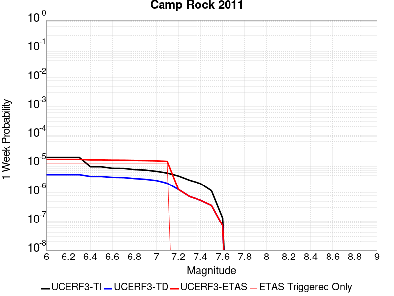 |  |  |  |

| Magnitude | 1 wk TI Prob | 1 wk TD Prob | 1 wk ETAS Prob | 1 wk ETAS/TD Gain | 1 wk ETAS Triggered Only | 1 mo TI Prob | 1 mo TD Prob | 1 mo ETAS Prob | 1 mo ETAS/TD Gain | 1 mo ETAS Triggered Only | 1 yr TI Prob | 1 yr TD Prob | 1 yr ETAS Prob | 1 yr ETAS/TD Gain | 1 yr ETAS Triggered Only | 10 yr TI Prob | 10 yr TD Prob | 10 yr ETAS Prob | 10 yr ETAS/TD Gain | 10 yr ETAS Triggered Only |
|-----|-----|-----|-----|-----|-----|-----|-----|-----|-----|-----|-----|-----|-----|-----|-----|-----|-----|-----|-----|-----|
| 6.0 | 1.6710783E-5 | 4.25026E-6 | 3.311683E-5 | 7.7917185 | 2.8866694E-5 | 7.161568E-5 | 1.8215276E-5 | 4.7081445E-5 | 2.584723 | 2.8866694E-5 | 8.7157206E-4 | 2.2174895E-4 | 2.7946953E-4 | 1.260297 | 5.773339E-5 | 0.008681616 | 0.0022153298 | 0.0022729351 | 1.0260031 | 5.773339E-5 |
| 6.1 | 1.6710783E-5 | 4.25026E-6 | 3.311683E-5 | 7.7917185 | 2.8866694E-5 | 7.161568E-5 | 1.8215276E-5 | 4.7081445E-5 | 2.584723 | 2.8866694E-5 | 8.7157206E-4 | 2.2174895E-4 | 2.7946953E-4 | 1.260297 | 5.773339E-5 | 0.008681616 | 0.0022153298 | 0.0022729351 | 1.0260031 | 5.773339E-5 |
| 6.2 | 1.6710783E-5 | 4.25026E-6 | 3.311683E-5 | 7.7917185 | 2.8866694E-5 | 7.161568E-5 | 1.8215276E-5 | 4.7081445E-5 | 2.584723 | 2.8866694E-5 | 8.7157206E-4 | 2.2174895E-4 | 2.7946953E-4 | 1.260297 | 5.773339E-5 | 0.008681616 | 0.0022153298 | 0.0022729351 | 1.0260031 | 5.773339E-5 |
| 6.3 | 1.6710783E-5 | 4.25026E-6 | 3.311683E-5 | 7.7917185 | 2.8866694E-5 | 7.161568E-5 | 1.8215276E-5 | 4.7081445E-5 | 2.584723 | 2.8866694E-5 | 8.7157206E-4 | 2.2174895E-4 | 2.7946953E-4 | 1.260297 | 5.773339E-5 | 0.008681616 | 0.0022153298 | 0.0022729351 | 1.0260031 | 5.773339E-5 |
| 6.4 | 7.982846E-6 | 3.6820884E-6 | 3.2548676E-5 | 8.839732 | 2.8866694E-5 | 3.421175E-5 | 1.5780286E-5 | 4.4646524E-5 | 2.8292596 | 2.8866694E-5 | 4.1644843E-4 | 1.9210839E-4 | 2.498307E-4 | 1.3004674 | 5.773339E-5 | 0.0041566887 | 0.001919458 | 0.0019770807 | 1.0300202 | 5.773339E-5 |
| 6.5 | 7.982846E-6 | 3.6820884E-6 | 3.2548676E-5 | 8.839732 | 2.8866694E-5 | 3.421175E-5 | 1.5780286E-5 | 4.4646524E-5 | 2.8292596 | 2.8866694E-5 | 4.1644843E-4 | 1.9210839E-4 | 2.498307E-4 | 1.3004674 | 5.773339E-5 | 0.0041566887 | 0.001919458 | 0.0019770807 | 1.0300202 | 5.773339E-5 |
| 6.6 | 7.048869E-6 | 3.4243571E-6 | 3.229095E-5 | 9.429785 | 2.8866694E-5 | 3.0209088E-5 | 1.4675736E-5 | 4.3542004E-5 | 2.9669385 | 2.8866694E-5 | 3.677336E-4 | 1.7866275E-4 | 2.3638582E-4 | 1.323084 | 5.773339E-5 | 0.0036712566 | 0.0017852228 | 0.001842853 | 1.0322819 | 5.773339E-5 |
| 6.7 | 6.987307E-6 | 3.3623348E-6 | 3.222893E-5 | 9.585283 | 2.8866694E-5 | 2.9945259E-5 | 1.4409929E-5 | 4.3276206E-5 | 3.0032215 | 2.8866694E-5 | 3.6452254E-4 | 1.7542706E-4 | 2.3315032E-4 | 1.3290442 | 5.773339E-5 | 0.0036392517 | 0.001752917 | 0.0018105492 | 1.0328779 | 5.773339E-5 |
| 6.8 | 6.3737602E-6 | 3.1179077E-6 | 3.1984513E-5 | 10.258326 | 2.8866694E-5 | 2.731583E-5 | 1.3362394E-5 | 4.22287E-5 | 3.1602645 | 2.8866694E-5 | 3.3251947E-4 | 1.626753E-4 | 2.2039929E-4 | 1.3548418 | 5.773339E-5 | 0.0033202237 | 0.0016255907 | 0.0016832303 | 1.0354576 | 5.773339E-5 |
| 6.9 | 6.112211E-6 | 2.9331156E-6 | 3.1799726E-5 | 10.84162 | 2.8866694E-5 | 2.6194928E-5 | 1.2570436E-5 | 4.1436768E-5 | 3.2963667 | 2.8866694E-5 | 3.1887658E-4 | 1.5303459E-4 | 2.1075914E-4 | 1.3771994 | 5.773339E-5 | 0.003184194 | 0.0015293199 | 0.0015869649 | 1.0376933 | 5.773339E-5 |
| 7.0 | 5.5140117E-6 | 2.641923E-6 | 3.150854E-5 | 11.926366 | 2.8866694E-5 | 2.3631264E-5 | 1.132248E-5 | 4.0188846E-5 | 3.549474 | 2.8866694E-5 | 2.8767265E-4 | 1.3784273E-4 | 1.9556815E-4 | 1.4187775 | 5.773339E-5 | 0.0028730053 | 0.0013775975 | 0.0014352513 | 1.041851 | 5.773339E-5 |
| 7.1 | 4.8151105E-6 | 2.1342705E-6 | 3.10009E-5 | 14.525292 | 2.8866694E-5 | 2.0636026E-5 | 9.146843E-6 | 3.8013273E-5 | 4.15589 | 2.8866694E-5 | 2.5121463E-4 | 1.1135734E-4 | 1.6908429E-4 | 1.5183939 | 5.773339E-5 | 0.0025093083 | 0.0011130372 | 0.0011707064 | 1.0518124 | 5.773339E-5 |
| 7.2 | 3.818335E-6 | 1.2937425E-6 | 1.2937425E-6 | 1.0 | 0.0 | 1.6364189E-5 | 5.5445994E-6 | 5.5445994E-6 | 1.0 | 0.0 | 1.9921579E-4 | 6.750349E-5 | 9.636823E-5 | 1.4276037 | 2.8866694E-5 | 0.0019903728 | 6.748381E-4 | 7.036853E-4 | 1.0427469 | 2.8866694E-5 |
| 7.3 | 2.7166698E-6 | 7.3835776E-7 | 7.3835776E-7 | 1.0 | 0.0 | 1.1642818E-5 | 3.1643867E-6 | 3.1643867E-6 | 1.0 | 0.0 | 1.4174209E-4 | 3.8525748E-5 | 6.739133E-5 | 1.7492543 | 2.8866694E-5 | 0.0014165172 | 3.851927E-4 | 4.1404826E-4 | 1.0749121 | 2.8866694E-5 |
| 7.4 | 2.0893426E-6 | 5.4618386E-7 | 5.4618386E-7 | 1.0 | 0.0 | 8.954295E-6 | 2.3407858E-6 | 2.3407858E-6 | 1.0 | 0.0 | 1.0901308E-4 | 2.84987E-5 | 2.84987E-5 | 1.0 | 0.0 | 0.0010895962 | 2.84951E-4 | 2.84951E-4 | 1.0 | 0.0 |
| 7.5 | 1.1681728E-6 | 3.6030585E-7 | 3.6030585E-7 | 1.0 | 0.0 | 5.0064455E-6 | 1.544167E-6 | 1.544167E-6 | 1.0 | 0.0 | 6.0951766E-5 | 1.8800076E-5 | 1.8800076E-5 | 1.0 | 0.0 | 6.093505E-4 | 1.8798532E-4 | 1.8798532E-4 | 1.0 | 0.0 |
| 7.6 | 1.3154387E-7 | 7.1197384E-8 | 7.1197384E-8 | 1.0 | 0.0 | 5.6375933E-7 | 3.051316E-7 | 3.051316E-7 | 1.0 | 0.0 | 6.863748E-6 | 3.7149728E-6 | 3.7149728E-6 | 1.0 | 0.0 | 6.863536E-5 | 3.7149264E-5 | 3.7149264E-5 | 1.0 | 0.0 |

## San Jacinto (Stepovers Combined)
*[(top)](#table-of-contents)*

| 1 Week | 1 Month | 1 Year | 10 Year |
|-----|-----|-----|-----|
|  | 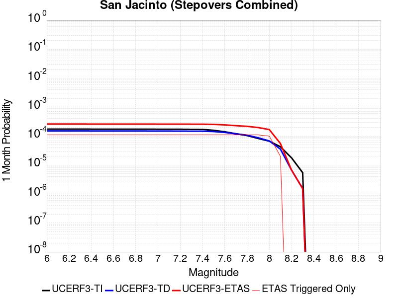 |  |  |

| Magnitude | 1 wk TI Prob | 1 wk TD Prob | 1 wk ETAS Prob | 1 wk ETAS/TD Gain | 1 wk ETAS Triggered Only | 1 mo TI Prob | 1 mo TD Prob | 1 mo ETAS Prob | 1 mo ETAS/TD Gain | 1 mo ETAS Triggered Only | 1 yr TI Prob | 1 yr TD Prob | 1 yr ETAS Prob | 1 yr ETAS/TD Gain | 1 yr ETAS Triggered Only | 10 yr TI Prob | 10 yr TD Prob | 10 yr ETAS Prob | 10 yr ETAS/TD Gain | 10 yr ETAS Triggered Only |
|-----|-----|-----|-----|-----|-----|-----|-----|-----|-----|-----|-----|-----|-----|-----|-----|-----|-----|-----|-----|-----|
| 6.0 | 4.0667746E-5 | 3.5272755E-5 | 9.3004106E-5 | 2.6367123 | 5.773339E-5 | 1.742787E-4 | 1.5116022E-4 | 2.0888487E-4 | 1.3818773 | 5.773339E-5 | 0.0021197782 | 0.0018388226 | 0.0018964498 | 1.0313392 | 5.773339E-5 | 0.020996714 | 0.018986892 | 0.01904353 | 1.002983 | 5.773339E-5 |
| 6.1 | 4.0667746E-5 | 3.5272755E-5 | 9.3004106E-5 | 2.6367123 | 5.773339E-5 | 1.742787E-4 | 1.5116022E-4 | 2.0888487E-4 | 1.3818773 | 5.773339E-5 | 0.0021197782 | 0.0018388226 | 0.0018964498 | 1.0313392 | 5.773339E-5 | 0.020996714 | 0.018986892 | 0.01904353 | 1.002983 | 5.773339E-5 |
| 6.2 | 4.0667746E-5 | 3.5272755E-5 | 9.3004106E-5 | 2.6367123 | 5.773339E-5 | 1.742787E-4 | 1.5116022E-4 | 2.0888487E-4 | 1.3818773 | 5.773339E-5 | 0.0021197782 | 0.0018388226 | 0.0018964498 | 1.0313392 | 5.773339E-5 | 0.020996714 | 0.018986892 | 0.01904353 | 1.002983 | 5.773339E-5 |
| 6.3 | 4.0667746E-5 | 3.5272755E-5 | 9.3004106E-5 | 2.6367123 | 5.773339E-5 | 1.742787E-4 | 1.5116022E-4 | 2.0888487E-4 | 1.3818773 | 5.773339E-5 | 0.0021197782 | 0.0018388226 | 0.0018964498 | 1.0313392 | 5.773339E-5 | 0.020996714 | 0.018986892 | 0.01904353 | 1.002983 | 5.773339E-5 |
| 6.4 | 4.0577226E-5 | 3.5144654E-5 | 9.287601E-5 | 2.6426783 | 5.773339E-5 | 1.738908E-4 | 1.5061127E-4 | 2.0833597E-4 | 1.3832694 | 5.773339E-5 | 0.0021150648 | 0.0018321523 | 0.0018897799 | 1.0314535 | 5.773339E-5 | 0.020950472 | 0.018921461 | 0.018978102 | 1.0029935 | 5.773339E-5 |
| 6.5 | 4.0577226E-5 | 3.5144654E-5 | 9.287601E-5 | 2.6426783 | 5.773339E-5 | 1.738908E-4 | 1.5061127E-4 | 2.0833597E-4 | 1.3832694 | 5.773339E-5 | 0.0021150648 | 0.0018321523 | 0.0018897799 | 1.0314535 | 5.773339E-5 | 0.020950472 | 0.018921461 | 0.018978102 | 1.0029935 | 5.773339E-5 |
| 6.6 | 4.053861E-5 | 3.509E-5 | 9.282136E-5 | 2.6452367 | 5.773339E-5 | 1.7372532E-4 | 1.5037706E-4 | 2.0810177E-4 | 1.3838664 | 5.773339E-5 | 0.0021130538 | 0.0018293057 | 0.0018869333 | 1.0315025 | 5.773339E-5 | 0.020930743 | 0.018893538 | 0.018950181 | 1.002998 | 5.773339E-5 |
| 6.7 | 4.0516545E-5 | 3.5059067E-5 | 9.279043E-5 | 2.6466885 | 5.773339E-5 | 1.7363077E-4 | 1.5024451E-4 | 2.0796923E-4 | 1.3842051 | 5.773339E-5 | 0.002111905 | 0.001827695 | 0.0018853229 | 1.0315304 | 5.773339E-5 | 0.020919468 | 0.018877735 | 0.018934378 | 1.0030005 | 5.773339E-5 |
| 6.8 | 4.049434E-5 | 3.5030633E-5 | 9.2762E-5 | 2.6480253 | 5.773339E-5 | 1.7353562E-4 | 1.5012265E-4 | 2.0784738E-4 | 1.3845171 | 5.773339E-5 | 0.0021107488 | 0.0018262138 | 0.0018838418 | 1.031556 | 5.773339E-5 | 0.020908125 | 0.018863149 | 0.018919792 | 1.0030029 | 5.773339E-5 |
| 6.9 | 4.046386E-5 | 3.499319E-5 | 9.272456E-5 | 2.6497886 | 5.773339E-5 | 1.73405E-4 | 1.4996222E-4 | 2.0768694E-4 | 1.3849285 | 5.773339E-5 | 0.0021091616 | 0.0018242638 | 0.0018818919 | 1.0315897 | 5.773339E-5 | 0.020892553 | 0.01884392 | 0.018900566 | 1.003006 | 5.773339E-5 |
| 7.0 | 4.036382E-5 | 3.487376E-5 | 9.260513E-5 | 2.655439 | 5.773339E-5 | 1.7297632E-4 | 1.4945042E-4 | 2.0717518E-4 | 1.3862469 | 5.773339E-5 | 0.0021039525 | 0.0018180435 | 0.001875672 | 1.031698 | 5.773339E-5 | 0.02084144 | 0.018782536 | 0.018839184 | 1.003016 | 5.773339E-5 |
| 7.1 | 4.0343282E-5 | 3.4852223E-5 | 9.25836E-5 | 2.656462 | 5.773339E-5 | 1.7288832E-4 | 1.4935812E-4 | 2.0708289E-4 | 1.3864856 | 5.773339E-5 | 0.002102883 | 0.0018169218 | 0.0018745502 | 1.0317177 | 5.773339E-5 | 0.020830948 | 0.018771412 | 0.018828062 | 1.0030179 | 5.773339E-5 |
| 7.2 | 4.0257353E-5 | 3.4756722E-5 | 9.24881E-5 | 2.6610134 | 5.773339E-5 | 1.725201E-4 | 1.489489E-4 | 2.0667368E-4 | 1.3875476 | 5.773339E-5 | 0.0020984085 | 0.0018119477 | 0.0018695764 | 1.0318049 | 5.773339E-5 | 0.020787042 | 0.018722152 | 0.018778805 | 1.003026 | 5.773339E-5 |
| 7.3 | 3.9940667E-5 | 3.4584376E-5 | 9.231577E-5 | 2.669291 | 5.773339E-5 | 1.7116306E-4 | 1.4821035E-4 | 2.0593518E-4 | 1.389479 | 5.773339E-5 | 0.0020819185 | 0.0018029709 | 0.0018606002 | 1.0319635 | 5.773339E-5 | 0.020625217 | 0.018630784 | 0.018687442 | 1.003041 | 5.773339E-5 |
| 7.4 | 3.9721202E-5 | 3.4469766E-5 | 9.220116E-5 | 2.6748416 | 5.773339E-5 | 1.7022261E-4 | 1.4771923E-4 | 2.0544408E-4 | 1.3907741 | 5.773339E-5 | 0.0020704903 | 0.0017970012 | 0.0018546309 | 1.0320699 | 5.773339E-5 | 0.020513052 | 0.018569905 | 0.018626567 | 1.0030513 | 5.773339E-5 |
| 7.5 | 3.7036873E-5 | 3.3537188E-5 | 9.126864E-5 | 2.721416 | 5.773339E-5 | 1.5871979E-4 | 1.437229E-4 | 2.0144798E-4 | 1.4016416 | 5.773339E-5 | 0.0019307006 | 0.0017484248 | 0.0018060573 | 1.0329624 | 5.773339E-5 | 0.019140124 | 0.018071463 | 0.018128155 | 1.003137 | 5.773339E-5 |
| 7.6 | 3.2940967E-5 | 3.1317984E-5 | 8.9049565E-5 | 2.8434002 | 5.773339E-5 | 1.4116794E-4 | 1.3421304E-4 | 1.9193869E-4 | 1.4301045 | 5.773339E-5 | 0.0017173645 | 0.0016328214 | 0.0016904605 | 1.0353004 | 5.773339E-5 | 0.01704153 | 0.016904354 | 0.01696111 | 1.0033575 | 5.773339E-5 |
| 7.7 | 2.8236149E-5 | 2.7883889E-5 | 8.561567E-5 | 3.0704348 | 5.773339E-5 | 1.2100645E-4 | 1.19496915E-4 | 1.7722341E-4 | 1.4830793 | 5.773339E-5 | 0.0014722579 | 0.001453905 | 0.0015115545 | 1.0396514 | 5.773339E-5 | 0.014625421 | 0.015115095 | 0.015171956 | 1.0037619 | 5.773339E-5 |
| 7.8 | 2.4329287E-5 | 2.5207537E-5 | 8.293947E-5 | 3.2902646 | 5.773339E-5 | 1.042642E-4 | 1.0802783E-4 | 1.6575499E-4 | 1.5343729 | 5.773339E-5 | 0.0012686774 | 0.0013144462 | 0.0013721037 | 1.0438645 | 5.773339E-5 | 0.012614589 | 0.013712396 | 0.013769338 | 1.0041525 | 5.773339E-5 |
| 7.9 | 1.9370926E-5 | 2.0421452E-5 | 7.815366E-5 | 3.8270373 | 5.773339E-5 | 8.301561E-5 | 8.7517576E-5 | 1.4524591E-4 | 1.6596199 | 5.773339E-5 | 0.0010102465 | 0.0010650064 | 0.0011226783 | 1.0541517 | 5.773339E-5 | 0.0100566605 | 0.011199483 | 0.011256569 | 1.0050973 | 5.773339E-5 |
| 8.0 | 1.5583017E-5 | 1.588647E-5 | 4.4752705E-5 | 2.8170328 | 2.8866694E-5 | 6.6782646E-5 | 6.808309E-5 | 9.694782E-5 | 1.4239632 | 2.8866694E-5 | 8.127754E-4 | 8.285971E-4 | 8.574399E-4 | 1.0348091 | 2.8866694E-5 | 0.008098091 | 0.008781809 | 0.008810423 | 1.0032582 | 2.8866694E-5 |
| 8.1 | 1.0024873E-5 | 8.292404E-6 | 8.292404E-6 | 1.0 | 0.0 | 4.2963035E-5 | 3.5538393E-5 | 3.5538393E-5 | 1.0 | 0.0 | 5.229494E-4 | 4.3259456E-4 | 4.3259456E-4 | 1.0 | 0.0 | 0.0052172043 | 0.0046534105 | 0.0046534105 | 1.0 | 0.0 |
| 8.2 | 4.142796E-6 | 1.5610041E-6 | 1.5610041E-6 | 1.0 | 0.0 | 1.775472E-5 | 6.69E-6 | 6.69E-6 | 1.0 | 0.0 | 2.1614227E-4 | 8.144774E-5 | 8.144774E-5 | 1.0 | 0.0 | 0.0021593217 | 9.454649E-4 | 9.454649E-4 | 1.0 | 0.0 |
| 8.3 | 1.2750878E-6 | 3.612133E-7 | 3.612133E-7 | 1.0 | 0.0 | 5.4646503E-6 | 1.548056E-6 | 1.548056E-6 | 1.0 | 0.0 | 6.653009E-5 | 1.8847424E-5 | 1.8847424E-5 | 1.0 | 0.0 | 6.6510175E-4 | 2.2734253E-4 | 2.2734253E-4 | 1.0 | 0.0 |

## Ventura-Pitas Point
*[(top)](#table-of-contents)*

| 1 Week | 1 Month | 1 Year | 10 Year |
|-----|-----|-----|-----|
|  |  |  |  |

| Magnitude | 1 wk TI Prob | 1 wk TD Prob | 1 wk ETAS Prob | 1 wk ETAS/TD Gain | 1 wk ETAS Triggered Only | 1 mo TI Prob | 1 mo TD Prob | 1 mo ETAS Prob | 1 mo ETAS/TD Gain | 1 mo ETAS Triggered Only | 1 yr TI Prob | 1 yr TD Prob | 1 yr ETAS Prob | 1 yr ETAS/TD Gain | 1 yr ETAS Triggered Only | 10 yr TI Prob | 10 yr TD Prob | 10 yr ETAS Prob | 10 yr ETAS/TD Gain | 10 yr ETAS Triggered Only |
|-----|-----|-----|-----|-----|-----|-----|-----|-----|-----|-----|-----|-----|-----|-----|-----|-----|-----|-----|-----|-----|
| 6.0 | 3.3179622E-5 | 3.3735185E-5 | 9.146662E-5 | 2.7113125 | 5.773339E-5 | 1.4219063E-4 | 1.445728E-4 | 2.0229783E-4 | 1.3992801 | 5.773339E-5 | 0.0017297962 | 0.0017590096 | 0.0018166414 | 1.0327638 | 5.773339E-5 | 0.017163932 | 0.0174764 | 0.017533125 | 1.0032458 | 5.773339E-5 |
| 6.1 | 3.3179622E-5 | 3.3735185E-5 | 9.146662E-5 | 2.7113125 | 5.773339E-5 | 1.4219063E-4 | 1.445728E-4 | 2.0229783E-4 | 1.3992801 | 5.773339E-5 | 0.0017297962 | 0.0017590096 | 0.0018166414 | 1.0327638 | 5.773339E-5 | 0.017163932 | 0.0174764 | 0.017533125 | 1.0032458 | 5.773339E-5 |
| 6.2 | 3.3179622E-5 | 3.3735185E-5 | 9.146662E-5 | 2.7113125 | 5.773339E-5 | 1.4219063E-4 | 1.445728E-4 | 2.0229783E-4 | 1.3992801 | 5.773339E-5 | 0.0017297962 | 0.0017590096 | 0.0018166414 | 1.0327638 | 5.773339E-5 | 0.017163932 | 0.0174764 | 0.017533125 | 1.0032458 | 5.773339E-5 |
| 6.3 | 3.3179622E-5 | 3.3735185E-5 | 9.146662E-5 | 2.7113125 | 5.773339E-5 | 1.4219063E-4 | 1.445728E-4 | 2.0229783E-4 | 1.3992801 | 5.773339E-5 | 0.0017297962 | 0.0017590096 | 0.0018166414 | 1.0327638 | 5.773339E-5 | 0.017163932 | 0.0174764 | 0.017533125 | 1.0032458 | 5.773339E-5 |
| 6.4 | 1.8754668E-5 | 1.701961E-5 | 7.475202E-5 | 4.392111 | 5.773339E-5 | 8.037467E-5 | 7.293928E-5 | 1.3066846E-4 | 1.791469 | 5.773339E-5 | 9.781223E-4 | 8.8769704E-4 | 9.4537914E-4 | 1.0649796 | 5.773339E-5 | 0.009738282 | 0.008843848 | 0.008901071 | 1.0064703 | 5.773339E-5 |
| 6.5 | 1.8754668E-5 | 1.701961E-5 | 7.475202E-5 | 4.392111 | 5.773339E-5 | 8.037467E-5 | 7.293928E-5 | 1.3066846E-4 | 1.791469 | 5.773339E-5 | 9.781223E-4 | 8.8769704E-4 | 9.4537914E-4 | 1.0649796 | 5.773339E-5 | 0.009738282 | 0.008843848 | 0.008901071 | 1.0064703 | 5.773339E-5 |
| 6.6 | 1.4361558E-5 | 1.2122275E-5 | 4.098862E-5 | 3.3812647 | 2.8866694E-5 | 6.154808E-5 | 5.1951585E-5 | 8.0816775E-5 | 1.5556172 | 2.8866694E-5 | 7.490902E-4 | 6.3232926E-4 | 6.6117774E-4 | 1.0456225 | 2.8866694E-5 | 0.0074657016 | 0.0063055577 | 0.0063342424 | 1.0045491 | 2.8866694E-5 |
| 6.7 | 1.4361558E-5 | 1.2122275E-5 | 4.098862E-5 | 3.3812647 | 2.8866694E-5 | 6.154808E-5 | 5.1951585E-5 | 8.0816775E-5 | 1.5556172 | 2.8866694E-5 | 7.490902E-4 | 6.3232926E-4 | 6.6117774E-4 | 1.0456225 | 2.8866694E-5 | 0.0074657016 | 0.0063055577 | 0.0063342424 | 1.0045491 | 2.8866694E-5 |
| 6.8 | 1.3663846E-5 | 1.13444175E-5 | 4.0210783E-5 | 3.5445435 | 2.8866694E-5 | 5.8558027E-5 | 4.861804E-5 | 7.748333E-5 | 1.5937157 | 2.8866694E-5 | 7.127108E-4 | 5.917658E-4 | 6.206154E-4 | 1.0487517 | 2.8866694E-5 | 0.007104293 | 0.005902116 | 0.0059308126 | 1.0048621 | 2.8866694E-5 |
| 6.9 | 1.3644157E-5 | 1.1322519E-5 | 4.0188886E-5 | 3.5494652 | 2.8866694E-5 | 5.8473648E-5 | 4.8524187E-5 | 7.738948E-5 | 1.594864 | 2.8866694E-5 | 7.116841E-4 | 5.9062376E-4 | 6.194734E-4 | 1.048846 | 2.8866694E-5 | 0.007094092 | 0.0058907564 | 0.005919453 | 1.0048715 | 2.8866694E-5 |
| 7.0 | 1.3568845E-5 | 1.1242086E-5 | 4.0108454E-5 | 3.5677059 | 2.8866694E-5 | 5.8150898E-5 | 4.817949E-5 | 7.704479E-5 | 1.5991201 | 2.8866694E-5 | 7.077572E-4 | 5.864293E-4 | 6.152791E-4 | 1.0491956 | 2.8866694E-5 | 0.007055073 | 0.0058490336 | 0.0058777314 | 1.0049064 | 2.8866694E-5 |
| 7.1 | 1.306572E-5 | 1.072054E-5 | 3.9586925E-5 | 3.692624 | 2.8866694E-5 | 5.599474E-5 | 4.5944373E-5 | 7.480974E-5 | 1.6282678 | 2.8866694E-5 | 6.815227E-4 | 5.5923103E-4 | 5.8808154E-4 | 1.0515897 | 2.8866694E-5 | 0.0067943637 | 0.0055784425 | 0.0056071477 | 1.0051458 | 2.8866694E-5 |
| 7.2 | 1.232604E-5 | 9.995143E-6 | 3.8861548E-5 | 3.8880432 | 2.8866694E-5 | 5.2824813E-5 | 4.2835632E-5 | 7.170109E-5 | 1.6738656 | 2.8866694E-5 | 6.429523E-4 | 5.214008E-4 | 5.5025244E-4 | 1.0553348 | 2.8866694E-5 | 0.0064109527 | 0.005201967 | 0.0052306834 | 1.0055203 | 2.8866694E-5 |
| 7.3 | 1.0917261E-5 | 8.84384E-6 | 3.771028E-5 | 4.264016 | 2.8866694E-5 | 4.678742E-5 | 3.790163E-5 | 6.676723E-5 | 1.7615925 | 2.8866694E-5 | 5.69488E-4 | 4.6135622E-4 | 4.902096E-4 | 1.0625403 | 2.8866694E-5 | 0.0056803077 | 0.00460415 | 0.0046328837 | 1.0062408 | 2.8866694E-5 |
| 7.4 | 1.039959E-5 | 8.423562E-6 | 3.7290014E-5 | 4.42687 | 2.8866694E-5 | 4.456891E-5 | 3.610049E-5 | 6.496614E-5 | 1.7995917 | 2.8866694E-5 | 5.424914E-4 | 4.3943635E-4 | 4.6829035E-4 | 1.0656614 | 2.8866694E-5 | 0.0054116896 | 0.004385836 | 0.004414576 | 1.0065529 | 2.8866694E-5 |
| 7.5 | 9.015877E-6 | 7.2975445E-6 | 3.6164027E-5 | 4.955643 | 2.8866694E-5 | 3.86389E-5 | 3.1274823E-5 | 6.0140614E-5 | 1.9229721 | 2.8866694E-5 | 4.7032707E-4 | 3.8070587E-4 | 4.0956156E-4 | 1.0757953 | 2.8866694E-5 | 0.004693329 | 0.0038006818 | 0.0038294387 | 1.0075662 | 2.8866694E-5 |
| 7.6 | 4.900162E-6 | 3.8741155E-6 | 3.8741155E-6 | 1.0 | 0.0 | 2.1000526E-5 | 1.6603248E-5 | 1.6603248E-5 | 1.0 | 0.0 | 2.556514E-4 | 2.0212591E-4 | 2.0212591E-4 | 1.0 | 0.0 | 0.0025535747 | 0.0020194345 | 0.0020194345 | 1.0 | 0.0 |
| 7.7 | 3.8850626E-6 | 3.1267302E-6 | 3.1267302E-6 | 1.0 | 0.0 | 1.6650163E-5 | 1.3400205E-5 | 1.3400205E-5 | 1.0 | 0.0 | 2.0269687E-4 | 1.6313537E-4 | 1.6313537E-4 | 1.0 | 0.0 | 0.002025121 | 0.0016301654 | 0.0016301654 | 1.0 | 0.0 |
| 7.8 | 2.4654719E-6 | 2.029875E-6 | 2.029875E-6 | 1.0 | 0.0 | 1.0566265E-5 | 8.699436E-6 | 8.699436E-6 | 1.0 | 0.0 | 1.2863669E-4 | 1.0591053E-4 | 1.0591053E-4 | 1.0 | 0.0 | 0.0012856225 | 0.0010586053 | 0.0010586053 | 1.0 | 0.0 |
| 7.9 | 4.095894E-7 | 3.2764765E-7 | 3.2764765E-7 | 1.0 | 0.0 | 1.7553821E-6 | 1.4042034E-6 | 1.4042034E-6 | 1.0 | 0.0 | 2.1371567E-5 | 1.7096047E-5 | 1.7096047E-5 | 1.0 | 0.0 | 2.1369511E-4 | 1.7094762E-4 | 1.7094762E-4 | 1.0 | 0.0 |
| 8.0 | 7.791402E-9 | 5.683497E-9 | 5.683497E-9 | 1.0 | 0.0 | 3.3391725E-8 | 2.4357844E-8 | 2.4357844E-8 | 1.0 | 0.0 | 4.0654416E-7 | 2.9655675E-7 | 2.9655675E-7 | 1.0 | 0.0 | 4.065434E-6 | 2.9655655E-6 | 2.9655655E-6 | 1.0 | 0.0 |

## San Jacinto (San Jacinto Valley) rev
*[(top)](#table-of-contents)*

| 1 Week | 1 Month | 1 Year | 10 Year |
|-----|-----|-----|-----|
|  |  |  |  |

| Magnitude | 1 wk TI Prob | 1 wk TD Prob | 1 wk ETAS Prob | 1 wk ETAS/TD Gain | 1 wk ETAS Triggered Only | 1 mo TI Prob | 1 mo TD Prob | 1 mo ETAS Prob | 1 mo ETAS/TD Gain | 1 mo ETAS Triggered Only | 1 yr TI Prob | 1 yr TD Prob | 1 yr ETAS Prob | 1 yr ETAS/TD Gain | 1 yr ETAS Triggered Only | 10 yr TI Prob | 10 yr TD Prob | 10 yr ETAS Prob | 10 yr ETAS/TD Gain | 10 yr ETAS Triggered Only |
|-----|-----|-----|-----|-----|-----|-----|-----|-----|-----|-----|-----|-----|-----|-----|-----|-----|-----|-----|-----|-----|
| 6.0 | 3.652694E-5 | 3.4402394E-5 | 9.213379E-5 | 2.6781218 | 5.773339E-5 | 1.5653463E-4 | 1.474305E-4 | 2.0515537E-4 | 1.3915396 | 5.773339E-5 | 0.0019041431 | 0.00179349 | 0.0018511198 | 1.0321327 | 5.773339E-5 | 0.018879099 | 0.018526595 | 0.018583259 | 1.0030586 | 5.773339E-5 |
| 6.1 | 3.652694E-5 | 3.4402394E-5 | 9.213379E-5 | 2.6781218 | 5.773339E-5 | 1.5653463E-4 | 1.474305E-4 | 2.0515537E-4 | 1.3915396 | 5.773339E-5 | 0.0019041431 | 0.00179349 | 0.0018511198 | 1.0321327 | 5.773339E-5 | 0.018879099 | 0.018526595 | 0.018583259 | 1.0030586 | 5.773339E-5 |
| 6.2 | 3.652694E-5 | 3.4402394E-5 | 9.213379E-5 | 2.6781218 | 5.773339E-5 | 1.5653463E-4 | 1.474305E-4 | 2.0515537E-4 | 1.3915396 | 5.773339E-5 | 0.0019041431 | 0.00179349 | 0.0018511198 | 1.0321327 | 5.773339E-5 | 0.018879099 | 0.018526595 | 0.018583259 | 1.0030586 | 5.773339E-5 |
| 6.3 | 3.652694E-5 | 3.4402394E-5 | 9.213379E-5 | 2.6781218 | 5.773339E-5 | 1.5653463E-4 | 1.474305E-4 | 2.0515537E-4 | 1.3915396 | 5.773339E-5 | 0.0019041431 | 0.00179349 | 0.0018511198 | 1.0321327 | 5.773339E-5 | 0.018879099 | 0.018526595 | 0.018583259 | 1.0030586 | 5.773339E-5 |
| 6.4 | 3.646941E-5 | 3.432397E-5 | 9.205537E-5 | 2.681956 | 5.773339E-5 | 1.5628811E-4 | 1.4709444E-4 | 2.0481934E-4 | 1.3924342 | 5.773339E-5 | 0.0019011468 | 0.0017894056 | 0.0018470357 | 1.0322063 | 5.773339E-5 | 0.018849645 | 0.018486476 | 0.018543143 | 1.0030652 | 5.773339E-5 |
| 6.5 | 3.646941E-5 | 3.432397E-5 | 9.205537E-5 | 2.681956 | 5.773339E-5 | 1.5628811E-4 | 1.4709444E-4 | 2.0481934E-4 | 1.3924342 | 5.773339E-5 | 0.0019011468 | 0.0017894056 | 0.0018470357 | 1.0322063 | 5.773339E-5 | 0.018849645 | 0.018486476 | 0.018543143 | 1.0030652 | 5.773339E-5 |
| 6.6 | 3.6442503E-5 | 3.4287354E-5 | 9.201876E-5 | 2.6837523 | 5.773339E-5 | 1.561728E-4 | 1.4693754E-4 | 2.0466244E-4 | 1.3928534 | 5.773339E-5 | 0.0018997455 | 0.0017874985 | 0.0018451287 | 1.0322407 | 5.773339E-5 | 0.018835869 | 0.018467745 | 0.018524412 | 1.0030684 | 5.773339E-5 |
| 6.7 | 3.6432113E-5 | 3.4272925E-5 | 9.200433E-5 | 2.684461 | 5.773339E-5 | 1.5612828E-4 | 1.4687571E-4 | 2.0460063E-4 | 1.3930187 | 5.773339E-5 | 0.0018992044 | 0.0017867472 | 0.0018443775 | 1.0322542 | 5.773339E-5 | 0.018830549 | 0.018460369 | 0.018517036 | 1.0030696 | 5.773339E-5 |
| 6.8 | 3.6409598E-5 | 3.424198E-5 | 9.1973394E-5 | 2.6859834 | 5.773339E-5 | 1.560318E-4 | 1.4674311E-4 | 2.0446803E-4 | 1.393374 | 5.773339E-5 | 0.0018980318 | 0.0017851355 | 0.0018427657 | 1.0322834 | 5.773339E-5 | 0.018819023 | 0.018444523 | 0.018501192 | 1.0030724 | 5.773339E-5 |
| 6.9 | 3.638078E-5 | 3.4202407E-5 | 9.193382E-5 | 2.6879342 | 5.773339E-5 | 1.5590832E-4 | 1.4657351E-4 | 2.0429844E-4 | 1.3938291 | 5.773339E-5 | 0.0018965311 | 0.001783074 | 0.0018407045 | 1.0323209 | 5.773339E-5 | 0.018804269 | 0.018424258 | 0.018480927 | 1.0030758 | 5.773339E-5 |
| 7.0 | 3.6294874E-5 | 3.408442E-5 | 9.181584E-5 | 2.6937773 | 5.773339E-5 | 1.5554018E-4 | 1.4606792E-4 | 2.0379288E-4 | 1.3951925 | 5.773339E-5 | 0.0018920569 | 0.001776929 | 0.0018345597 | 1.0324328 | 5.773339E-5 | 0.018760284 | 0.018363839 | 0.018420512 | 1.0030861 | 5.773339E-5 |
| 7.1 | 3.6260717E-5 | 3.4040702E-5 | 9.1772126E-5 | 2.6959527 | 5.773339E-5 | 1.5539382E-4 | 1.4588058E-4 | 2.0360555E-4 | 1.3957001 | 5.773339E-5 | 0.001890278 | 0.0017746518 | 0.0018322828 | 1.0324745 | 5.773339E-5 | 0.018742796 | 0.018341439 | 0.018398114 | 1.00309 | 5.773339E-5 |
| 7.2 | 3.6210204E-5 | 3.397492E-5 | 9.1706344E-5 | 2.6992364 | 5.773339E-5 | 1.5517735E-4 | 1.455987E-4 | 2.0332368E-4 | 1.3964664 | 5.773339E-5 | 0.001887647 | 0.0017712255 | 0.0018288565 | 1.0325375 | 5.773339E-5 | 0.01871693 | 0.01830772 | 0.018364396 | 1.0030957 | 5.773339E-5 |
| 7.3 | 3.6119454E-5 | 3.386321E-5 | 9.159464E-5 | 2.7048423 | 5.773339E-5 | 1.5478847E-4 | 1.4511998E-4 | 2.0284498E-4 | 1.3977743 | 5.773339E-5 | 0.0018829206 | 0.0017654065 | 0.001823038 | 1.0326449 | 5.773339E-5 | 0.018670462 | 0.018250274 | 0.018306952 | 1.0031056 | 5.773339E-5 |
| 7.4 | 3.607848E-5 | 3.381071E-5 | 9.154214E-5 | 2.7074897 | 5.773339E-5 | 1.5461289E-4 | 1.44895E-4 | 2.0262002E-4 | 1.3983921 | 5.773339E-5 | 0.0018807866 | 0.0017626719 | 0.0018203035 | 1.0326957 | 5.773339E-5 | 0.018649481 | 0.018223269 | 0.01827995 | 1.0031104 | 5.773339E-5 |
| 7.5 | 3.5856774E-5 | 3.3620483E-5 | 9.1351925E-5 | 2.7171512 | 5.773339E-5 | 1.5366284E-4 | 1.4407984E-4 | 2.018049E-4 | 1.4006464 | 5.773339E-5 | 0.0018692396 | 0.0017527633 | 0.0018103954 | 1.0328808 | 5.773339E-5 | 0.018535944 | 0.018124366 | 0.018181054 | 1.0031277 | 5.773339E-5 |
| 7.6 | 3.286655E-5 | 3.2143445E-5 | 8.987498E-5 | 2.7960591 | 5.773339E-5 | 1.4084904E-4 | 1.3775036E-4 | 1.954758E-4 | 1.4190583 | 5.773339E-5 | 0.001713488 | 0.0016758227 | 0.0017334592 | 1.0343931 | 5.773339E-5 | 0.017003361 | 0.017344031 | 0.017400764 | 1.003271 | 5.773339E-5 |
| 7.7 | 2.8882527E-5 | 2.9236293E-5 | 8.696799E-5 | 2.9746587 | 5.773339E-5 | 1.237764E-4 | 1.2529238E-4 | 1.8301855E-4 | 1.4607315 | 5.773339E-5 | 0.0015059357 | 0.0015243685 | 0.0015820139 | 1.0378159 | 5.773339E-5 | 0.014957713 | 0.015830461 | 0.015887279 | 1.0035893 | 5.773339E-5 |
| 7.8 | 2.4950225E-5 | 2.6527203E-5 | 8.425906E-5 | 3.1763265 | 5.773339E-5 | 1.0692515E-4 | 1.1368306E-4 | 1.7140989E-4 | 1.5077873 | 5.773339E-5 | 0.0013010362 | 0.0013832134 | 0.001440867 | 1.0416808 | 5.773339E-5 | 0.012934455 | 0.014411755 | 0.014468656 | 1.0039482 | 5.773339E-5 |
| 7.9 | 1.9881603E-5 | 2.1507445E-5 | 7.923959E-5 | 3.6842866 | 5.773339E-5 | 8.520408E-5 | 9.217151E-5 | 1.4989958E-4 | 1.6263113 | 5.773339E-5 | 0.001036866 | 0.0011216112 | 0.0011792799 | 1.0514159 | 5.773339E-5 | 0.010320415 | 0.011777027 | 0.01183408 | 1.0048444 | 5.773339E-5 |
| 8.0 | 1.563292E-5 | 1.5937347E-5 | 4.480358E-5 | 2.811232 | 2.8866694E-5 | 6.6996516E-5 | 6.8301124E-5 | 9.716585E-5 | 1.4226098 | 2.8866694E-5 | 8.153773E-4 | 8.3124964E-4 | 8.6009235E-4 | 1.034698 | 2.8866694E-5 | 0.00812392 | 0.008810506 | 0.008839118 | 1.0032475 | 2.8866694E-5 |
| 8.1 | 1.0045313E-5 | 8.301802E-6 | 8.301802E-6 | 1.0 | 0.0 | 4.305063E-5 | 3.5578672E-5 | 3.5578672E-5 | 1.0 | 0.0 | 5.2401534E-4 | 4.3308473E-4 | 4.3308473E-4 | 1.0 | 0.0 | 0.0052278144 | 0.0046591135 | 0.0046591135 | 1.0 | 0.0 |
| 8.2 | 4.1554413E-6 | 1.5655598E-6 | 1.5655598E-6 | 1.0 | 0.0 | 1.7808914E-5 | 6.709525E-6 | 6.709525E-6 | 1.0 | 0.0 | 2.1680194E-4 | 8.168544E-5 | 8.168544E-5 | 1.0 | 0.0 | 0.0021659054 | 9.482903E-4 | 9.482903E-4 | 1.0 | 0.0 |
| 8.3 | 1.2758221E-6 | 3.6149942E-7 | 3.6149942E-7 | 1.0 | 0.0 | 5.4677976E-6 | 1.5492824E-6 | 1.5492824E-6 | 1.0 | 0.0 | 6.65684E-5 | 1.8862354E-5 | 1.8862354E-5 | 1.0 | 0.0 | 6.6548464E-4 | 2.2751294E-4 | 2.2751294E-4 | 1.0 | 0.0 |

## Bullion Mountains
*[(top)](#table-of-contents)*

| 1 Week | 1 Month | 1 Year | 10 Year |
|-----|-----|-----|-----|
|  |  |  |  |

| Magnitude | 1 wk TI Prob | 1 wk TD Prob | 1 wk ETAS Prob | 1 wk ETAS/TD Gain | 1 wk ETAS Triggered Only | 1 mo TI Prob | 1 mo TD Prob | 1 mo ETAS Prob | 1 mo ETAS/TD Gain | 1 mo ETAS Triggered Only | 1 yr TI Prob | 1 yr TD Prob | 1 yr ETAS Prob | 1 yr ETAS/TD Gain | 1 yr ETAS Triggered Only | 10 yr TI Prob | 10 yr TD Prob | 10 yr ETAS Prob | 10 yr ETAS/TD Gain | 10 yr ETAS Triggered Only |
|-----|-----|-----|-----|-----|-----|-----|-----|-----|-----|-----|-----|-----|-----|-----|-----|-----|-----|-----|-----|-----|
| 6.0 | 1.6420427E-5 | 1.4692089E-5 | 7.242463E-5 | 4.929498 | 5.773339E-5 | 7.037136E-5 | 6.296479E-5 | 1.20694545E-4 | 1.9168576 | 5.773339E-5 | 8.5643446E-4 | 7.663651E-4 | 8.2405424E-4 | 1.0752764 | 5.773339E-5 | 0.008531413 | 0.007641016 | 0.007698308 | 1.007498 | 5.773339E-5 |
| 6.1 | 1.6420427E-5 | 1.4692089E-5 | 7.242463E-5 | 4.929498 | 5.773339E-5 | 7.037136E-5 | 6.296479E-5 | 1.20694545E-4 | 1.9168576 | 5.773339E-5 | 8.5643446E-4 | 7.663651E-4 | 8.2405424E-4 | 1.0752764 | 5.773339E-5 | 0.008531413 | 0.007641016 | 0.007698308 | 1.007498 | 5.773339E-5 |
| 6.2 | 1.6420427E-5 | 1.4692089E-5 | 7.242463E-5 | 4.929498 | 5.773339E-5 | 7.037136E-5 | 6.296479E-5 | 1.20694545E-4 | 1.9168576 | 5.773339E-5 | 8.5643446E-4 | 7.663651E-4 | 8.2405424E-4 | 1.0752764 | 5.773339E-5 | 0.008531413 | 0.007641016 | 0.007698308 | 1.007498 | 5.773339E-5 |
| 6.3 | 1.2046778E-5 | 9.862335E-6 | 6.759515E-5 | 6.853869 | 5.773339E-5 | 5.1628023E-5 | 4.2266598E-5 | 9.9997545E-5 | 2.3658764 | 5.773339E-5 | 6.283899E-4 | 5.144975E-4 | 5.7220116E-4 | 1.1121554 | 5.773339E-5 | 0.0062661595 | 0.005135345 | 0.005192782 | 1.0111846 | 5.773339E-5 |
| 6.4 | 1.2046778E-5 | 9.862335E-6 | 6.759515E-5 | 6.853869 | 5.773339E-5 | 5.1628023E-5 | 4.2266598E-5 | 9.9997545E-5 | 2.3658764 | 5.773339E-5 | 6.283899E-4 | 5.144975E-4 | 5.7220116E-4 | 1.1121554 | 5.773339E-5 | 0.0062661595 | 0.005135345 | 0.005192782 | 1.0111846 | 5.773339E-5 |
| 6.5 | 1.0244343E-5 | 7.879458E-6 | 7.879458E-6 | 1.0 | 0.0 | 4.390359E-5 | 3.3768785E-5 | 3.3768785E-5 | 1.0 | 0.0 | 5.343951E-4 | 4.110781E-4 | 4.110781E-4 | 1.0 | 0.0 | 0.005331118 | 0.004105208 | 0.004105208 | 1.0 | 0.0 |
| 6.6 | 9.605408E-6 | 7.1774966E-6 | 7.1774966E-6 | 1.0 | 0.0 | 4.1165385E-5 | 3.076045E-5 | 3.076045E-5 | 1.0 | 0.0 | 5.010733E-4 | 3.744645E-4 | 3.744645E-4 | 1.0 | 0.0 | 0.00499945 | 0.003740332 | 0.003740332 | 1.0 | 0.0 |
| 6.7 | 8.60418E-6 | 6.1240044E-6 | 6.1240044E-6 | 1.0 | 0.0 | 3.687454E-5 | 2.624558E-5 | 2.624558E-5 | 1.0 | 0.0 | 4.48855E-4 | 3.1951256E-4 | 3.1951256E-4 | 1.0 | 0.0 | 0.004479495 | 0.0031924439 | 0.0031924439 | 1.0 | 0.0 |
| 6.8 | 5.187994E-6 | 2.5631666E-6 | 2.5631666E-6 | 1.0 | 0.0 | 2.223407E-5 | 1.0984976E-5 | 1.0984976E-5 | 1.0 | 0.0 | 2.7066618E-4 | 1.3373788E-4 | 1.3373788E-4 | 1.0 | 0.0 | 0.0027033675 | 0.0013369655 | 0.0013369655 | 1.0 | 0.0 |
| 6.9 | 4.5302368E-6 | 2.3443165E-6 | 2.3443165E-6 | 1.0 | 0.0 | 1.9415156E-5 | 1.0047055E-5 | 1.0047055E-5 | 1.0 | 0.0 | 2.3635388E-4 | 1.2232E-4 | 1.2232E-4 | 1.0 | 0.0 | 0.0023610266 | 0.0012229157 | 0.0012229157 | 1.0 | 0.0 |
| 7.0 | 3.431668E-6 | 1.6882402E-6 | 1.6882402E-6 | 1.0 | 0.0 | 1.4707065E-5 | 7.235315E-6 | 7.235315E-6 | 1.0 | 0.0 | 1.7904381E-4 | 8.808996E-5 | 8.808996E-5 | 1.0 | 0.0 | 0.0017889962 | 8.808996E-4 | 8.808996E-4 | 1.0 | 0.0 |

## Palos Verdes
*[(top)](#table-of-contents)*

| 1 Week | 1 Month | 1 Year | 10 Year |
|-----|-----|-----|-----|
|  |  | 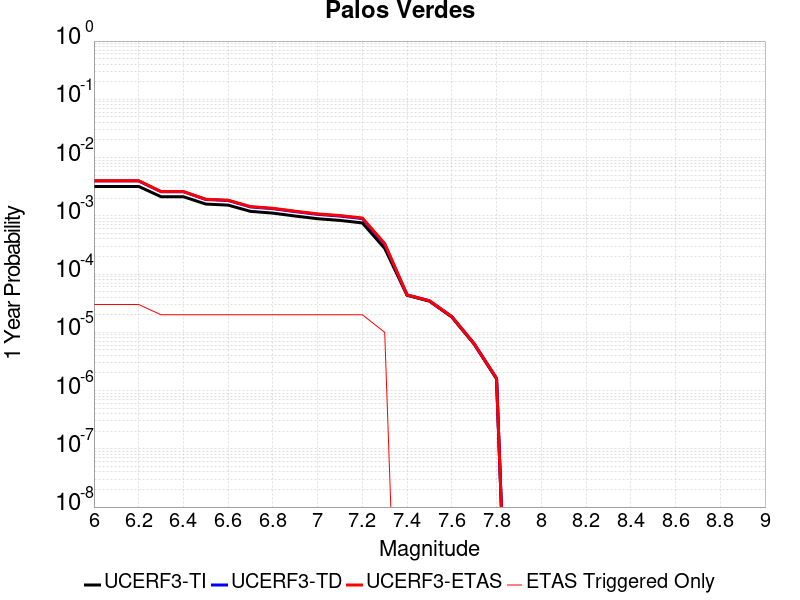 |  |

| Magnitude | 1 wk TI Prob | 1 wk TD Prob | 1 wk ETAS Prob | 1 wk ETAS/TD Gain | 1 wk ETAS Triggered Only | 1 mo TI Prob | 1 mo TD Prob | 1 mo ETAS Prob | 1 mo ETAS/TD Gain | 1 mo ETAS Triggered Only | 1 yr TI Prob | 1 yr TD Prob | 1 yr ETAS Prob | 1 yr ETAS/TD Gain | 1 yr ETAS Triggered Only | 10 yr TI Prob | 10 yr TD Prob | 10 yr ETAS Prob | 10 yr ETAS/TD Gain | 10 yr ETAS Triggered Only |
|-----|-----|-----|-----|-----|-----|-----|-----|-----|-----|-----|-----|-----|-----|-----|-----|-----|-----|-----|-----|-----|
| 6.0 | 6.126063E-5 | 7.622612E-5 | 1.3395511E-4 | 1.7573386 | 5.773339E-5 | 2.6251914E-4 | 3.2664582E-4 | 3.8436035E-4 | 1.1766884 | 5.773339E-5 | 0.0031914865 | 0.003970174 | 0.004027678 | 1.014484 | 5.773339E-5 | 0.031460393 | 0.039048895 | 0.039104376 | 1.0014207 | 5.773339E-5 |
| 6.1 | 6.126063E-5 | 7.622612E-5 | 1.3395511E-4 | 1.7573386 | 5.773339E-5 | 2.6251914E-4 | 3.2664582E-4 | 3.8436035E-4 | 1.1766884 | 5.773339E-5 | 0.0031914865 | 0.003970174 | 0.004027678 | 1.014484 | 5.773339E-5 | 0.031460393 | 0.039048895 | 0.039104376 | 1.0014207 | 5.773339E-5 |
| 6.2 | 6.126063E-5 | 7.622612E-5 | 1.3395511E-4 | 1.7573386 | 5.773339E-5 | 2.6251914E-4 | 3.2664582E-4 | 3.8436035E-4 | 1.1766884 | 5.773339E-5 | 0.0031914865 | 0.003970174 | 0.004027678 | 1.014484 | 5.773339E-5 | 0.031460393 | 0.039048895 | 0.039104376 | 1.0014207 | 5.773339E-5 |
| 6.3 | 4.0838047E-5 | 4.9749437E-5 | 7.861469E-5 | 1.5802127 | 2.8866694E-5 | 1.7500846E-4 | 2.1319572E-4 | 2.4205625E-4 | 1.1353711 | 2.8866694E-5 | 0.0021286458 | 0.0025927818 | 0.0026215736 | 1.0111046 | 2.8866694E-5 | 0.021083709 | 0.025646681 | 0.025674807 | 1.0010967 | 2.8866694E-5 |
| 6.4 | 4.0838047E-5 | 4.9749437E-5 | 7.861469E-5 | 1.5802127 | 2.8866694E-5 | 1.7500846E-4 | 2.1319572E-4 | 2.4205625E-4 | 1.1353711 | 2.8866694E-5 | 0.0021286458 | 0.0025927818 | 0.0026215736 | 1.0111046 | 2.8866694E-5 | 0.021083709 | 0.025646681 | 0.025674807 | 1.0010967 | 2.8866694E-5 |
| 6.5 | 3.0512005E-5 | 3.656162E-5 | 6.542726E-5 | 1.7895064 | 2.8866694E-5 | 1.3075917E-4 | 1.5668393E-4 | 1.855461E-4 | 1.1842064 | 2.8866694E-5 | 0.0015908304 | 0.0019060767 | 0.0019348883 | 1.0151157 | 2.8866694E-5 | 0.015794903 | 0.018909154 | 0.018937474 | 1.0014977 | 2.8866694E-5 |
| 6.6 | 2.9255087E-5 | 3.515442E-5 | 6.4020096E-5 | 1.821111 | 2.8866694E-5 | 1.2537291E-4 | 1.5065377E-4 | 1.7951611E-4 | 1.1915807 | 2.8866694E-5 | 0.0015253464 | 0.0018327828 | 0.0018615966 | 1.0157213 | 2.8866694E-5 | 0.015149189 | 0.018188225 | 0.018216567 | 1.0015582 | 2.8866694E-5 |
| 6.7 | 2.287198E-5 | 2.7248278E-5 | 5.6114186E-5 | 2.0593662 | 2.8866694E-5 | 9.801909E-5 | 1.16773626E-4 | 1.4563695E-4 | 1.2471733 | 2.8866694E-5 | 0.001192729 | 0.0014208833 | 0.0014497091 | 1.0202872 | 2.8866694E-5 | 0.011863477 | 0.014127217 | 0.014155676 | 1.0020145 | 2.8866694E-5 |
| 6.8 | 2.1325764E-5 | 2.5431877E-5 | 5.4297838E-5 | 2.1350305 | 2.8866694E-5 | 9.139293E-5 | 1.0898971E-4 | 1.3785326E-4 | 1.2648282 | 2.8866694E-5 | 0.001112141 | 0.0013262323 | 0.0013550607 | 1.0217371 | 2.8866694E-5 | 0.011065915 | 0.013192211 | 0.013220697 | 1.0021592 | 2.8866694E-5 |
| 6.9 | 1.9009392E-5 | 2.2613547E-5 | 5.147959E-5 | 2.2764933 | 2.8866694E-5 | 8.1466285E-5 | 9.6912096E-5 | 1.2577599E-4 | 1.2978358 | 2.8866694E-5 | 9.914007E-4 | 0.0011793535 | 0.0012081861 | 1.0244478 | 2.8866694E-5 | 0.009869894 | 0.011739632 | 0.01176816 | 1.0024301 | 2.8866694E-5 |
| 7.0 | 1.7098473E-5 | 2.0319356E-5 | 4.9185463E-5 | 2.4206212 | 2.8866694E-5 | 7.3277115E-5 | 8.708052E-5 | 1.15944706E-4 | 1.3314654 | 2.8866694E-5 | 8.917837E-4 | 0.001059775 | 0.0010886111 | 1.0272096 | 2.8866694E-5 | 0.008882134 | 0.010555646 | 0.010584208 | 1.0027058 | 2.8866694E-5 |
| 7.1 | 1.5982785E-5 | 1.899476E-5 | 4.7860907E-5 | 2.5196898 | 2.8866694E-5 | 6.849585E-5 | 8.1404054E-5 | 1.102684E-4 | 1.3545811 | 2.8866694E-5 | 8.336179E-4 | 9.907284E-4 | 0.0010195666 | 1.0291079 | 2.8866694E-5 | 0.008304977 | 0.009871479 | 0.009900061 | 1.0028954 | 2.8866694E-5 |
| 7.2 | 1.4468002E-5 | 1.7197237E-5 | 4.6063433E-5 | 2.678537 | 2.8866694E-5 | 6.200425E-5 | 7.370083E-5 | 1.025654E-4 | 1.3916451 | 2.8866694E-5 | 7.546402E-4 | 8.970222E-4 | 9.25863E-4 | 1.0321517 | 2.8866694E-5 | 0.007520827 | 0.008942284 | 0.008970892 | 1.0031992 | 2.8866694E-5 |
| 7.3 | 5.288233E-6 | 6.2036747E-6 | 3.507019E-5 | 5.6531315 | 2.8866694E-5 | 2.2663658E-5 | 2.6587102E-5 | 5.545303E-5 | 2.0857117 | 2.8866694E-5 | 2.7589512E-4 | 3.236848E-4 | 3.5254215E-4 | 1.0891526 | 2.8866694E-5 | 0.0027555283 | 0.0032355562 | 0.0032643294 | 1.0088929 | 2.8866694E-5 |
| 7.4 | 8.279556E-7 | 8.408347E-7 | 8.408347E-7 | 1.0 | 0.0 | 3.5483763E-6 | 3.6035726E-6 | 3.6035726E-6 | 1.0 | 0.0 | 4.3200624E-5 | 4.3872686E-5 | 4.3872686E-5 | 1.0 | 0.0 | 4.3192226E-4 | 4.3864746E-4 | 4.3864746E-4 | 1.0 | 0.0 |
| 7.5 | 6.559831E-7 | 6.667229E-7 | 6.667229E-7 | 1.0 | 0.0 | 2.8113532E-6 | 2.857381E-6 | 2.857381E-6 | 1.0 | 0.0 | 3.4227687E-5 | 3.4788125E-5 | 3.4788125E-5 | 1.0 | 0.0 | 3.4222414E-4 | 3.4783344E-4 | 3.4783344E-4 | 1.0 | 0.0 |
| 7.6 | 3.5018968E-7 | 3.5620027E-7 | 3.5620027E-7 | 1.0 | 0.0 | 1.500812E-6 | 1.526572E-6 | 1.526572E-6 | 1.0 | 0.0 | 1.8272232E-5 | 1.8585903E-5 | 1.8585903E-5 | 1.0 | 0.0 | 1.8270731E-4 | 1.8584808E-4 | 1.8584808E-4 | 1.0 | 0.0 |
| 7.7 | 1.1986104E-7 | 1.2198376E-7 | 1.2198376E-7 | 1.0 | 0.0 | 5.1369005E-7 | 5.2278745E-7 | 5.2278745E-7 | 1.0 | 0.0 | 6.2541585E-6 | 6.364919E-6 | 6.364919E-6 | 1.0 | 0.0 | 6.2539824E-5 | 6.364741E-5 | 6.364741E-5 | 1.0 | 0.0 |
| 7.8 | 3.0445005E-8 | 3.1027582E-8 | 3.1027582E-8 | 1.0 | 0.0 | 1.3047858E-7 | 1.3297536E-7 | 1.3297536E-7 | 1.0 | 0.0 | 1.5885756E-6 | 1.6189739E-6 | 1.6189739E-6 | 1.0 | 0.0 | 1.5885644E-5 | 1.6189642E-5 | 1.6189642E-5 | 1.0 | 0.0 |

## Pinto Mtn
*[(top)](#table-of-contents)*

| 1 Week | 1 Month | 1 Year | 10 Year |
|-----|-----|-----|-----|
|  |  |  |  |

| Magnitude | 1 wk TI Prob | 1 wk TD Prob | 1 wk ETAS Prob | 1 wk ETAS/TD Gain | 1 wk ETAS Triggered Only | 1 mo TI Prob | 1 mo TD Prob | 1 mo ETAS Prob | 1 mo ETAS/TD Gain | 1 mo ETAS Triggered Only | 1 yr TI Prob | 1 yr TD Prob | 1 yr ETAS Prob | 1 yr ETAS/TD Gain | 1 yr ETAS Triggered Only | 10 yr TI Prob | 10 yr TD Prob | 10 yr ETAS Prob | 10 yr ETAS/TD Gain | 10 yr ETAS Triggered Only |
|-----|-----|-----|-----|-----|-----|-----|-----|-----|-----|-----|-----|-----|-----|-----|-----|-----|-----|-----|-----|-----|
| 6.0 | 4.4194956E-5 | 4.785362E-5 | 1.05584244E-4 | 2.2064004 | 5.773339E-5 | 1.893932E-4 | 2.0507174E-4 | 2.627933E-4 | 1.2814701 | 5.773339E-5 | 0.0023034236 | 0.0024940541 | 0.0025516436 | 1.0230907 | 5.773339E-5 | 0.022796938 | 0.024678145 | 0.024734454 | 1.0022817 | 5.773339E-5 |
| 6.1 | 4.4194956E-5 | 4.785362E-5 | 1.05584244E-4 | 2.2064004 | 5.773339E-5 | 1.893932E-4 | 2.0507174E-4 | 2.627933E-4 | 1.2814701 | 5.773339E-5 | 0.0023034236 | 0.0024940541 | 0.0025516436 | 1.0230907 | 5.773339E-5 | 0.022796938 | 0.024678145 | 0.024734454 | 1.0022817 | 5.773339E-5 |
| 6.2 | 4.4194956E-5 | 4.785362E-5 | 1.05584244E-4 | 2.2064004 | 5.773339E-5 | 1.893932E-4 | 2.0507174E-4 | 2.627933E-4 | 1.2814701 | 5.773339E-5 | 0.0023034236 | 0.0024940541 | 0.0025516436 | 1.0230907 | 5.773339E-5 | 0.022796938 | 0.024678145 | 0.024734454 | 1.0022817 | 5.773339E-5 |
| 6.3 | 4.4194956E-5 | 4.785362E-5 | 1.05584244E-4 | 2.2064004 | 5.773339E-5 | 1.893932E-4 | 2.0507174E-4 | 2.627933E-4 | 1.2814701 | 5.773339E-5 | 0.0023034236 | 0.0024940541 | 0.0025516436 | 1.0230907 | 5.773339E-5 | 0.022796938 | 0.024678145 | 0.024734454 | 1.0022817 | 5.773339E-5 |
| 6.4 | 3.729929E-5 | 3.9603186E-5 | 6.846873E-5 | 1.7288694 | 2.8866694E-5 | 1.5984432E-4 | 1.6971743E-4 | 1.9857922E-4 | 1.1700579 | 2.8866694E-5 | 0.0019443673 | 0.002064445 | 0.002093252 | 1.0139539 | 2.8866694E-5 | 0.019274427 | 0.02046269 | 0.020490967 | 1.0013819 | 2.8866694E-5 |
| 6.5 | 3.729929E-5 | 3.9603186E-5 | 6.846873E-5 | 1.7288694 | 2.8866694E-5 | 1.5984432E-4 | 1.6971743E-4 | 1.9857922E-4 | 1.1700579 | 2.8866694E-5 | 0.0019443673 | 0.002064445 | 0.002093252 | 1.0139539 | 2.8866694E-5 | 0.019274427 | 0.02046269 | 0.020490967 | 1.0013819 | 2.8866694E-5 |
| 6.6 | 3.0204548E-5 | 3.1205298E-5 | 6.0071092E-5 | 1.9250286 | 2.8866694E-5 | 1.2944164E-4 | 1.3373033E-4 | 1.6259316E-4 | 1.2158287 | 2.8866694E-5 | 0.0015748127 | 0.0016269855 | 0.0016558052 | 1.0177135 | 2.8866694E-5 | 0.015636992 | 0.01615461 | 0.01618301 | 1.001758 | 2.8866694E-5 |
| 6.7 | 2.9857754E-5 | 3.081468E-5 | 5.9680486E-5 | 1.936755 | 2.8866694E-5 | 1.2795553E-4 | 1.3205643E-4 | 1.6091931E-4 | 1.2185647 | 2.8866694E-5 | 0.0015567453 | 0.001606636 | 0.0016354562 | 1.0179383 | 2.8866694E-5 | 0.015458848 | 0.01595405 | 0.015982455 | 1.0017805 | 2.8866694E-5 |
| 6.8 | 2.4819734E-5 | 2.5009364E-5 | 5.3875334E-5 | 2.1542065 | 2.8866694E-5 | 1.0636595E-4 | 1.07178705E-4 | 1.360423E-4 | 1.2693034 | 2.8866694E-5 | 0.0012942362 | 0.0013041412 | 0.0013329703 | 1.0221058 | 2.8866694E-5 | 0.012867244 | 0.0129672475 | 0.0129957395 | 1.0021973 | 2.8866694E-5 |
| 6.9 | 2.331124E-5 | 2.3337643E-5 | 5.220366E-5 | 2.2368867 | 2.8866694E-5 | 9.990149E-5 | 1.00014746E-4 | 1.2887856E-4 | 1.2885956 | 2.8866694E-5 | 0.001215622 | 0.0012170197 | 0.0012458513 | 1.0236903 | 2.8866694E-5 | 0.012089936 | 0.012105742 | 0.012134259 | 1.0023557 | 2.8866694E-5 |
| 7.0 | 2.1818534E-5 | 2.1760772E-5 | 5.0626837E-5 | 2.3265185 | 2.8866694E-5 | 9.3504656E-5 | 9.325723E-5 | 1.2212123E-4 | 1.3095095 | 2.8866694E-5 | 0.0011378246 | 0.0011348352 | 0.0011636692 | 1.025408 | 2.8866694E-5 | 0.011320163 | 0.011292503 | 0.0113210445 | 1.0025274 | 2.8866694E-5 |
| 7.1 | 2.066081E-5 | 2.0540418E-5 | 4.9406517E-5 | 2.4053319 | 2.8866694E-5 | 8.854332E-5 | 8.8027504E-5 | 1.1689166E-4 | 1.3278992 | 2.8866694E-5 | 0.0010774818 | 0.0010712275 | 0.0011000632 | 1.0269184 | 2.8866694E-5 | 0.010722724 | 0.010662688 | 0.010691247 | 1.0026784 | 2.8866694E-5 |
| 7.2 | 1.8990233E-5 | 1.9053701E-5 | 4.7919846E-5 | 2.5149887 | 2.8866694E-5 | 8.138417E-5 | 8.1656275E-5 | 1.1052061E-4 | 1.3534858 | 2.8866694E-5 | 9.904018E-4 | 9.937311E-4 | 0.001022569 | 1.02902 | 2.8866694E-5 | 0.009859995 | 0.009894874 | 0.009923454 | 1.0028884 | 2.8866694E-5 |
| 7.3 | 1.3335872E-5 | 1.4906372E-5 | 4.3772634E-5 | 2.936505 | 2.8866694E-5 | 5.7152483E-5 | 6.388296E-5 | 9.274781E-5 | 1.4518396 | 2.8866694E-5 | 6.956093E-4 | 7.775102E-4 | 8.0635445E-4 | 1.0370982 | 2.8866694E-5 | 0.006934359 | 0.0077491994 | 0.007777842 | 1.0036962 | 2.8866694E-5 |
| 7.4 | 9.414066E-6 | 1.186061E-5 | 4.072696E-5 | 3.4338 | 2.8866694E-5 | 4.0345374E-5 | 5.0830247E-5 | 7.969548E-5 | 1.567875 | 2.8866694E-5 | 4.910942E-4 | 6.1869196E-4 | 6.4754084E-4 | 1.0466287 | 2.8866694E-5 | 0.0049001034 | 0.006170644 | 0.0061993324 | 1.0046492 | 2.8866694E-5 |
| 7.5 | 7.2101157E-6 | 9.157893E-6 | 3.8024322E-5 | 4.152082 | 2.8866694E-5 | 3.090013E-5 | 3.924757E-5 | 6.811313E-5 | 1.7354739 | 2.8866694E-5 | 3.7614413E-4 | 4.7774217E-4 | 5.0659507E-4 | 1.0603943 | 2.8866694E-5 | 0.0037550807 | 0.004767927 | 0.004796656 | 1.0060254 | 2.8866694E-5 |
| 7.6 | 3.296375E-6 | 4.5453176E-6 | 4.5453176E-6 | 1.0 | 0.0 | 1.4127245E-5 | 1.9479796E-5 | 1.9479796E-5 | 1.0 | 0.0 | 1.7198564E-4 | 2.3714209E-4 | 2.3714209E-4 | 1.0 | 0.0 | 0.0017185259 | 0.0023690276 | 0.0023690276 | 1.0 | 0.0 |
| 7.7 | 2.5741092E-6 | 3.584251E-6 | 3.584251E-6 | 1.0 | 0.0 | 1.103185E-5 | 1.5360993E-5 | 1.5360993E-5 | 1.0 | 0.0 | 1.3430449E-4 | 1.8700535E-4 | 1.8700535E-4 | 1.0 | 0.0 | 0.0013422335 | 0.0018686098 | 0.0018686098 | 1.0 | 0.0 |

## San Pedro Basin
*[(top)](#table-of-contents)*

| 1 Week | 1 Month | 1 Year | 10 Year |
|-----|-----|-----|-----|
|  |  |  |  |

| Magnitude | 1 wk TI Prob | 1 wk TD Prob | 1 wk ETAS Prob | 1 wk ETAS/TD Gain | 1 wk ETAS Triggered Only | 1 mo TI Prob | 1 mo TD Prob | 1 mo ETAS Prob | 1 mo ETAS/TD Gain | 1 mo ETAS Triggered Only | 1 yr TI Prob | 1 yr TD Prob | 1 yr ETAS Prob | 1 yr ETAS/TD Gain | 1 yr ETAS Triggered Only | 10 yr TI Prob | 10 yr TD Prob | 10 yr ETAS Prob | 10 yr ETAS/TD Gain | 10 yr ETAS Triggered Only |
|-----|-----|-----|-----|-----|-----|-----|-----|-----|-----|-----|-----|-----|-----|-----|-----|-----|-----|-----|-----|-----|
| 6.0 | 5.3449043E-5 | 6.336954E-5 | 9.22344E-5 | 1.4555006 | 2.8866694E-5 | 2.2904722E-4 | 2.715589E-4 | 3.0041777E-4 | 1.106271 | 2.8866694E-5 | 0.0027850836 | 0.0033018254 | 0.003359368 | 1.0174276 | 5.773339E-5 | 0.027504366 | 0.03258945 | 0.032645304 | 1.0017138 | 5.773339E-5 |
| 6.1 | 5.3449043E-5 | 6.336954E-5 | 9.22344E-5 | 1.4555006 | 2.8866694E-5 | 2.2904722E-4 | 2.715589E-4 | 3.0041777E-4 | 1.106271 | 2.8866694E-5 | 0.0027850836 | 0.0033018254 | 0.003359368 | 1.0174276 | 5.773339E-5 | 0.027504366 | 0.03258945 | 0.032645304 | 1.0017138 | 5.773339E-5 |
| 6.2 | 2.3189454E-5 | 2.6642796E-5 | 2.6642796E-5 | 1.0 | 0.0 | 9.9379584E-5 | 1.14178685E-4 | 1.14178685E-4 | 1.0 | 0.0 | 0.0012092749 | 0.0013892864 | 0.001418113 | 1.0207492 | 2.8866694E-5 | 0.012027155 | 0.013810883 | 0.013839352 | 1.0020612 | 2.8866694E-5 |
| 6.3 | 2.3189454E-5 | 2.6642796E-5 | 2.6642796E-5 | 1.0 | 0.0 | 9.9379584E-5 | 1.14178685E-4 | 1.14178685E-4 | 1.0 | 0.0 | 0.0012092749 | 0.0013892864 | 0.001418113 | 1.0207492 | 2.8866694E-5 | 0.012027155 | 0.013810883 | 0.013839352 | 1.0020612 | 2.8866694E-5 |
| 6.4 | 1.966056E-5 | 2.2463413E-5 | 2.2463413E-5 | 1.0 | 0.0 | 8.425682E-5 | 9.626844E-5 | 9.626844E-5 | 1.0 | 0.0 | 0.001025344 | 0.0011714783 | 0.0011714783 | 1.0 | 0.0 | 0.010206259 | 0.011657117 | 0.011657117 | 1.0 | 0.0 |
| 6.5 | 1.7342953E-5 | 1.9745148E-5 | 1.9745148E-5 | 1.0 | 0.0 | 7.4324824E-5 | 8.4619525E-5 | 8.4619525E-5 | 1.0 | 0.0 | 9.04529E-4 | 0.0010297928 | 0.0010297928 | 1.0 | 0.0 | 0.009008561 | 0.010253931 | 0.010253931 | 1.0 | 0.0 |
| 6.6 | 1.439804E-5 | 1.6322716E-5 | 1.6322716E-5 | 1.0 | 0.0 | 6.170443E-5 | 6.99528E-5 | 6.99528E-5 | 1.0 | 0.0 | 7.509924E-4 | 8.513747E-4 | 8.513747E-4 | 1.0 | 0.0 | 0.0074845953 | 0.008484332 | 0.008484332 | 1.0 | 0.0 |
| 6.7 | 1.2634884E-5 | 1.4285297E-5 | 1.4285297E-5 | 1.0 | 0.0 | 5.414838E-5 | 6.1221435E-5 | 6.1221435E-5 | 1.0 | 0.0 | 6.590571E-4 | 7.4514654E-4 | 7.4514654E-4 | 1.0 | 0.0 | 0.006571059 | 0.007429501 | 0.007429501 | 1.0 | 0.0 |
| 6.8 | 1.146091E-5 | 1.2933192E-5 | 1.2933192E-5 | 1.0 | 0.0 | 4.911726E-5 | 5.5426954E-5 | 5.5426954E-5 | 1.0 | 0.0 | 5.9783855E-4 | 6.7464396E-4 | 6.7464396E-4 | 1.0 | 0.0 | 0.0059623276 | 0.006728899 | 0.006728899 | 1.0 | 0.0 |
| 6.9 | 9.109035E-6 | 1.0235011E-5 | 1.0235011E-5 | 1.0 | 0.0 | 3.9038136E-5 | 4.3863754E-5 | 4.3863754E-5 | 1.0 | 0.0 | 4.7518566E-4 | 5.3393835E-4 | 5.3393835E-4 | 1.0 | 0.0 | 0.0047417083 | 0.005329309 | 0.005329309 | 1.0 | 0.0 |
| 7.0 | 5.9351028E-6 | 6.583964E-6 | 6.583964E-6 | 1.0 | 0.0 | 2.5435906E-5 | 2.8216817E-5 | 2.8216817E-5 | 1.0 | 0.0 | 3.0963816E-4 | 3.435092E-4 | 3.435092E-4 | 1.0 | 0.0 | 0.0030920706 | 0.0034320992 | 0.0034320992 | 1.0 | 0.0 |
| 7.1 | 2.1557585E-6 | 2.209648E-6 | 2.209648E-6 | 1.0 | 0.0 | 9.238933E-6 | 9.469887E-6 | 9.469887E-6 | 1.0 | 0.0 | 1.1247819E-4 | 1.1528993E-4 | 1.1528993E-4 | 1.0 | 0.0 | 0.0011242128 | 0.0011523166 | 0.0011523166 | 1.0 | 0.0 |
| 7.2 | 2.1251979E-6 | 2.1779945E-6 | 2.1779945E-6 | 1.0 | 0.0 | 9.107958E-6 | 9.334229E-6 | 9.334229E-6 | 1.0 | 0.0 | 1.1088375E-4 | 1.1363847E-4 | 1.1363847E-4 | 1.0 | 0.0 | 0.0011082845 | 0.0011358189 | 0.0011358189 | 1.0 | 0.0 |
| 7.3 | 1.7145798E-6 | 1.7442874E-6 | 1.7442874E-6 | 1.0 | 0.0 | 7.3481783E-6 | 7.4754967E-6 | 7.4754967E-6 | 1.0 | 0.0 | 8.94604E-5 | 9.1010465E-5 | 9.1010465E-5 | 1.0 | 0.0 | 8.9424395E-4 | 9.0974104E-4 | 9.0974104E-4 | 1.0 | 0.0 |
| 7.4 | 1.4467993E-6 | 1.4641868E-6 | 1.4641868E-6 | 1.0 | 0.0 | 6.200554E-6 | 6.2750714E-6 | 6.2750714E-6 | 1.0 | 0.0 | 7.548913E-5 | 7.639639E-5 | 7.639639E-5 | 1.0 | 0.0 | 7.546349E-4 | 7.6370855E-4 | 7.6370855E-4 | 1.0 | 0.0 |
| 7.5 | 1.2803735E-6 | 1.2931497E-6 | 1.2931497E-6 | 1.0 | 0.0 | 5.487303E-6 | 5.5420587E-6 | 5.5420587E-6 | 1.0 | 0.0 | 6.680587E-5 | 6.7472545E-5 | 6.7472545E-5 | 1.0 | 0.0 | 6.678579E-4 | 6.7452766E-4 | 6.7452766E-4 | 1.0 | 0.0 |
| 7.6 | 6.755009E-7 | 6.769465E-7 | 6.769465E-7 | 1.0 | 0.0 | 2.8950008E-6 | 2.9011965E-6 | 2.9011965E-6 | 1.0 | 0.0 | 3.5246063E-5 | 3.5321555E-5 | 3.5321555E-5 | 1.0 | 0.0 | 3.5240475E-4 | 3.5316512E-4 | 3.5316512E-4 | 1.0 | 0.0 |
| 7.7 | 6.211885E-8 | 4.569953E-8 | 4.569953E-8 | 1.0 | 0.0 | 2.6622362E-7 | 1.9585512E-7 | 1.9585512E-7 | 1.0 | 0.0 | 3.2412677E-6 | 2.3845337E-6 | 2.3845337E-6 | 1.0 | 0.0 | 3.2412205E-5 | 2.3845101E-5 | 2.3845101E-5 | 1.0 | 0.0 |
| 7.8 | 2.6580573E-9 | 1.5138163E-9 | 1.5138163E-9 | 1.0 | 0.0 | 1.1391674E-8 | 6.487784E-9 | 6.487784E-9 | 1.0 | 0.0 | 1.3869362E-7 | 7.898877E-8 | 7.898877E-8 | 1.0 | 0.0 | 1.3869354E-6 | 7.898877E-7 | 7.898877E-7 | 1.0 | 0.0 |

## Emerson-Copper Mtn 2011
*[(top)](#table-of-contents)*

| 1 Week | 1 Month | 1 Year | 10 Year |
|-----|-----|-----|-----|
|  |  |  |  |

| Magnitude | 1 wk TI Prob | 1 wk TD Prob | 1 wk ETAS Prob | 1 wk ETAS/TD Gain | 1 wk ETAS Triggered Only | 1 mo TI Prob | 1 mo TD Prob | 1 mo ETAS Prob | 1 mo ETAS/TD Gain | 1 mo ETAS Triggered Only | 1 yr TI Prob | 1 yr TD Prob | 1 yr ETAS Prob | 1 yr ETAS/TD Gain | 1 yr ETAS Triggered Only | 10 yr TI Prob | 10 yr TD Prob | 10 yr ETAS Prob | 10 yr ETAS/TD Gain | 10 yr ETAS Triggered Only |
|-----|-----|-----|-----|-----|-----|-----|-----|-----|-----|-----|-----|-----|-----|-----|-----|-----|-----|-----|-----|-----|
| 6.0 | 2.1364202E-5 | 9.968114E-6 | 9.968114E-6 | 1.0 | 0.0 | 9.1557646E-5 | 4.2719836E-5 | 4.2719836E-5 | 1.0 | 0.0 | 0.0011141442 | 5.199986E-4 | 5.488503E-4 | 1.0554842 | 2.8866694E-5 | 0.011085749 | 0.005188688 | 0.005246122 | 1.011069 | 5.773339E-5 |
| 6.1 | 2.1364202E-5 | 9.968114E-6 | 9.968114E-6 | 1.0 | 0.0 | 9.1557646E-5 | 4.2719836E-5 | 4.2719836E-5 | 1.0 | 0.0 | 0.0011141442 | 5.199986E-4 | 5.488503E-4 | 1.0554842 | 2.8866694E-5 | 0.011085749 | 0.005188688 | 0.005246122 | 1.011069 | 5.773339E-5 |
| 6.2 | 2.1364202E-5 | 9.968114E-6 | 9.968114E-6 | 1.0 | 0.0 | 9.1557646E-5 | 4.2719836E-5 | 4.2719836E-5 | 1.0 | 0.0 | 0.0011141442 | 5.199986E-4 | 5.488503E-4 | 1.0554842 | 2.8866694E-5 | 0.011085749 | 0.005188688 | 0.005246122 | 1.011069 | 5.773339E-5 |
| 6.3 | 1.7751237E-5 | 8.089227E-6 | 8.089227E-6 | 1.0 | 0.0 | 7.607452E-5 | 3.466769E-5 | 3.466769E-5 | 1.0 | 0.0 | 9.258136E-4 | 4.2200365E-4 | 4.5085815E-4 | 1.068375 | 2.8866694E-5 | 0.00921966 | 0.0042126453 | 0.0042413906 | 1.0068235 | 2.8866694E-5 |
| 6.4 | 1.7751237E-5 | 8.089227E-6 | 8.089227E-6 | 1.0 | 0.0 | 7.607452E-5 | 3.466769E-5 | 3.466769E-5 | 1.0 | 0.0 | 9.258136E-4 | 4.2200365E-4 | 4.5085815E-4 | 1.068375 | 2.8866694E-5 | 0.00921966 | 0.0042126453 | 0.0042413906 | 1.0068235 | 2.8866694E-5 |
| 6.5 | 1.5886664E-5 | 6.603819E-6 | 6.603819E-6 | 1.0 | 0.0 | 6.808392E-5 | 2.8301802E-5 | 2.8301802E-5 | 1.0 | 0.0 | 8.286065E-4 | 3.4452465E-4 | 3.733814E-4 | 1.0837581 | 2.8866694E-5 | 0.008255237 | 0.0034403696 | 0.003469137 | 1.0083617 | 2.8866694E-5 |
| 6.6 | 1.5886664E-5 | 6.603819E-6 | 6.603819E-6 | 1.0 | 0.0 | 6.808392E-5 | 2.8301802E-5 | 2.8301802E-5 | 1.0 | 0.0 | 8.286065E-4 | 3.4452465E-4 | 3.733814E-4 | 1.0837581 | 2.8866694E-5 | 0.008255237 | 0.0034403696 | 0.003469137 | 1.0083617 | 2.8866694E-5 |
| 6.7 | 1.428471E-5 | 5.470403E-6 | 5.470403E-6 | 1.0 | 0.0 | 6.121875E-5 | 2.3444394E-5 | 2.3444394E-5 | 1.0 | 0.0 | 7.450834E-4 | 2.8540206E-4 | 3.142605E-4 | 1.1011151 | 2.8866694E-5 | 0.007425902 | 0.0028507432 | 0.0028795276 | 1.0100971 | 2.8866694E-5 |
| 6.8 | 1.3490684E-5 | 5.073699E-6 | 5.073699E-6 | 1.0 | 0.0 | 5.7815934E-5 | 2.1744265E-5 | 2.1744265E-5 | 1.0 | 0.0 | 7.0368167E-4 | 2.6470813E-4 | 2.9356717E-4 | 1.1090221 | 2.8866694E-5 | 0.007014576 | 0.002644309 | 0.0026730995 | 1.0108876 | 2.8866694E-5 |
| 6.9 | 1.2235421E-5 | 4.289677E-6 | 4.289677E-6 | 1.0 | 0.0 | 5.2436466E-5 | 1.838422E-5 | 1.838422E-5 | 1.0 | 0.0 | 6.38227E-4 | 2.238085E-4 | 2.5266875E-4 | 1.1289506 | 2.8866694E-5 | 0.0063639707 | 0.0022361854 | 0.0022649874 | 1.0128801 | 2.8866694E-5 |
| 7.0 | 1.1009851E-5 | 3.7189886E-6 | 3.7189886E-6 | 1.0 | 0.0 | 4.7184225E-5 | 1.5938444E-5 | 1.5938444E-5 | 1.0 | 0.0 | 5.743165E-4 | 1.9403672E-4 | 2.2289781E-4 | 1.1487404 | 2.8866694E-5 | 0.005728345 | 0.0019390108 | 0.0019678215 | 1.0148585 | 2.8866694E-5 |
| 7.1 | 9.726373E-6 | 3.2117953E-6 | 3.2117953E-6 | 1.0 | 0.0 | 4.168379E-5 | 1.3764783E-5 | 1.3764783E-5 | 1.0 | 0.0 | 5.07382E-4 | 1.6757673E-4 | 1.9643859E-4 | 1.1722307 | 2.8866694E-5 | 0.0050622504 | 0.0016748349 | 0.0017036531 | 1.0172067 | 2.8866694E-5 |
| 7.2 | 3.9335127E-6 | 1.1524792E-6 | 1.1524792E-6 | 1.0 | 0.0 | 1.6857803E-5 | 4.9391874E-6 | 4.9391874E-6 | 1.0 | 0.0 | 2.0522442E-4 | 6.0133007E-5 | 8.8997964E-5 | 1.4800185 | 2.8866694E-5 | 0.00205035 | 6.011733E-4 | 6.3002267E-4 | 1.0479884 | 2.8866694E-5 |
| 7.3 | 2.661632E-6 | 6.911505E-7 | 6.911505E-7 | 1.0 | 0.0 | 1.14069435E-5 | 2.9620703E-6 | 2.9620703E-6 | 1.0 | 0.0 | 1.3887069E-4 | 3.6062618E-5 | 6.4928274E-5 | 1.8004314 | 2.8866694E-5 | 0.0013878393 | 3.605687E-4 | 3.89425E-4 | 1.08003 | 2.8866694E-5 |
| 7.4 | 2.0893426E-6 | 5.4618386E-7 | 5.4618386E-7 | 1.0 | 0.0 | 8.954295E-6 | 2.3407858E-6 | 2.3407858E-6 | 1.0 | 0.0 | 1.0901308E-4 | 2.84987E-5 | 2.84987E-5 | 1.0 | 0.0 | 0.0010895962 | 2.84951E-4 | 2.84951E-4 | 1.0 | 0.0 |
| 7.5 | 1.1681728E-6 | 3.6030585E-7 | 3.6030585E-7 | 1.0 | 0.0 | 5.0064455E-6 | 1.544167E-6 | 1.544167E-6 | 1.0 | 0.0 | 6.0951766E-5 | 1.8800076E-5 | 1.8800076E-5 | 1.0 | 0.0 | 6.093505E-4 | 1.8798532E-4 | 1.8798532E-4 | 1.0 | 0.0 |
| 7.6 | 1.3154387E-7 | 7.1197384E-8 | 7.1197384E-8 | 1.0 | 0.0 | 5.6375933E-7 | 3.051316E-7 | 3.051316E-7 | 1.0 | 0.0 | 6.863748E-6 | 3.7149728E-6 | 3.7149728E-6 | 1.0 | 0.0 | 6.863536E-5 | 3.7149264E-5 | 3.7149264E-5 | 1.0 | 0.0 |

## Coronado Bank alt1
*[(top)](#table-of-contents)*

| 1 Week | 1 Month | 1 Year | 10 Year |
|-----|-----|-----|-----|
|  |  |  |  |

| Magnitude | 1 wk TI Prob | 1 wk TD Prob | 1 wk ETAS Prob | 1 wk ETAS/TD Gain | 1 wk ETAS Triggered Only | 1 mo TI Prob | 1 mo TD Prob | 1 mo ETAS Prob | 1 mo ETAS/TD Gain | 1 mo ETAS Triggered Only | 1 yr TI Prob | 1 yr TD Prob | 1 yr ETAS Prob | 1 yr ETAS/TD Gain | 1 yr ETAS Triggered Only | 10 yr TI Prob | 10 yr TD Prob | 10 yr ETAS Prob | 10 yr ETAS/TD Gain | 10 yr ETAS Triggered Only |
|-----|-----|-----|-----|-----|-----|-----|-----|-----|-----|-----|-----|-----|-----|-----|-----|-----|-----|-----|-----|-----|
| 6.0 | 7.533492E-5 | 9.394913E-5 | 9.394913E-5 | 1.0 | 0.0 | 3.22824E-4 | 4.0258127E-4 | 4.0258127E-4 | 1.0 | 0.0 | 0.0039233007 | 0.0048909658 | 0.0049484167 | 1.0117464 | 5.773339E-5 | 0.03854755 | 0.04790356 | 0.04795853 | 1.0011475 | 5.773339E-5 |
| 6.1 | 4.1807285E-5 | 5.049283E-5 | 5.049283E-5 | 1.0 | 0.0 | 1.7916178E-4 | 2.1638049E-4 | 2.1638049E-4 | 1.0 | 0.0 | 0.0021791123 | 0.0026313474 | 0.002688929 | 1.0218829 | 5.773339E-5 | 0.021578677 | 0.026011046 | 0.02606728 | 1.0021619 | 5.773339E-5 |
| 6.2 | 4.1807285E-5 | 5.049283E-5 | 5.049283E-5 | 1.0 | 0.0 | 1.7916178E-4 | 2.1638049E-4 | 2.1638049E-4 | 1.0 | 0.0 | 0.0021791123 | 0.0026313474 | 0.002688929 | 1.0218829 | 5.773339E-5 | 0.021578677 | 0.026011046 | 0.02606728 | 1.0021619 | 5.773339E-5 |
| 6.3 | 3.1793104E-5 | 3.7711117E-5 | 3.7711117E-5 | 1.0 | 0.0 | 1.3624904E-4 | 1.6160926E-4 | 1.6160926E-4 | 1.0 | 0.0 | 0.0016575698 | 0.001965848 | 0.001994658 | 1.0146552 | 2.8866694E-5 | 0.016452603 | 0.019488465 | 0.01951677 | 1.0014523 | 2.8866694E-5 |
| 6.4 | 2.9878007E-5 | 3.5335794E-5 | 3.5335794E-5 | 1.0 | 0.0 | 1.2804232E-4 | 1.5143053E-4 | 1.5143053E-4 | 1.0 | 0.0 | 0.0015578003 | 0.0018421387 | 0.0018709522 | 1.0156413 | 2.8866694E-5 | 0.015469253 | 0.01827244 | 0.018300781 | 1.0015509 | 2.8866694E-5 |
| 6.5 | 2.4512565E-5 | 2.8764043E-5 | 2.8764043E-5 | 1.0 | 0.0 | 1.0504962E-4 | 1.2326881E-4 | 1.2326881E-4 | 1.0 | 0.0 | 0.0012782287 | 0.0014997921 | 0.0015286155 | 1.0192182 | 2.8866694E-5 | 0.012709012 | 0.014899683 | 0.014928119 | 1.0019085 | 2.8866694E-5 |
| 6.6 | 2.1317413E-5 | 2.490667E-5 | 2.490667E-5 | 1.0 | 0.0 | 9.135714E-5 | 1.0673863E-4 | 1.0673863E-4 | 1.0 | 0.0 | 0.0011117056 | 0.0012987906 | 0.0013276198 | 1.022197 | 2.8866694E-5 | 0.011061605 | 0.012914404 | 0.012942899 | 1.0022063 | 2.8866694E-5 |
| 6.7 | 1.8585655E-5 | 2.163488E-5 | 2.163488E-5 | 1.0 | 0.0 | 7.9650374E-5 | 9.271773E-5 | 9.271773E-5 | 1.0 | 0.0 | 9.6931186E-4 | 0.0011282742 | 0.0011571085 | 1.025556 | 2.8866694E-5 | 0.0096509475 | 0.011227623 | 0.011256165 | 1.0025421 | 2.8866694E-5 |
| 6.8 | 1.5862879E-5 | 1.8419474E-5 | 1.8419474E-5 | 1.0 | 0.0 | 6.798199E-5 | 7.893833E-5 | 7.893833E-5 | 1.0 | 0.0 | 8.273665E-4 | 9.6066965E-4 | 9.895086E-4 | 1.0300196 | 2.8866694E-5 | 0.008242928 | 0.00956715 | 0.009595741 | 1.0029885 | 2.8866694E-5 |
| 6.9 | 1.3021509E-5 | 1.5095265E-5 | 1.5095265E-5 | 1.0 | 0.0 | 5.5805274E-5 | 6.469249E-5 | 6.469249E-5 | 1.0 | 0.0 | 6.792174E-4 | 7.8736455E-4 | 8.162085E-4 | 1.0366336 | 2.8866694E-5 | 0.006771452 | 0.007847573 | 0.007876213 | 1.0036496 | 2.8866694E-5 |
| 7.0 | 1.0974371E-5 | 1.2720104E-5 | 1.2720104E-5 | 1.0 | 0.0 | 4.7032172E-5 | 5.451369E-5 | 5.451369E-5 | 1.0 | 0.0 | 5.7246623E-4 | 6.6351966E-4 | 6.923672E-4 | 1.0434766 | 2.8866694E-5 | 0.0057099373 | 0.006617135 | 0.0066458103 | 1.0043335 | 2.8866694E-5 |
| 7.1 | 8.766221E-6 | 1.01638325E-5 | 1.01638325E-5 | 1.0 | 0.0 | 3.7568978E-5 | 4.355865E-5 | 4.355865E-5 | 1.0 | 0.0 | 4.573063E-4 | 5.3021475E-4 | 5.5906613E-4 | 1.0544145 | 2.8866694E-5 | 0.0045636636 | 0.0052911965 | 0.0053199106 | 1.0054268 | 2.8866694E-5 |
| 7.2 | 8.026024E-7 | 8.331765E-7 | 8.331765E-7 | 1.0 | 0.0 | 3.43972E-6 | 3.5707515E-6 | 3.5707515E-6 | 1.0 | 0.0 | 4.1877785E-5 | 4.3473043E-5 | 4.3473043E-5 | 1.0 | 0.0 | 4.1869894E-4 | 4.3464647E-4 | 4.3464647E-4 | 1.0 | 0.0 |
| 7.3 | 3.7293114E-7 | 3.7000953E-7 | 3.7000953E-7 | 1.0 | 0.0 | 1.5982754E-6 | 1.5857541E-6 | 1.5857541E-6 | 1.0 | 0.0 | 1.9458828E-5 | 1.9306386E-5 | 1.9306386E-5 | 1.0 | 0.0 | 1.9457124E-4 | 1.9304715E-4 | 1.9304715E-4 | 1.0 | 0.0 |
| 7.4 | 2.0557036E-7 | 1.9674363E-7 | 1.9674363E-7 | 1.0 | 0.0 | 8.810155E-7 | 8.431867E-7 | 8.431867E-7 | 1.0 | 0.0 | 1.0726311E-5 | 1.026575E-5 | 1.026575E-5 | 1.0 | 0.0 | 1.0725793E-4 | 1.0265279E-4 | 1.0265279E-4 | 1.0 | 0.0 |
| 7.5 | 6.845446E-8 | 6.279369E-8 | 6.279369E-8 | 1.0 | 0.0 | 2.9337625E-7 | 2.691158E-7 | 2.691158E-7 | 1.0 | 0.0 | 3.5718497E-6 | 3.2764797E-6 | 3.2764797E-6 | 1.0 | 0.0 | 3.5717923E-5 | 3.2764325E-5 | 3.2764325E-5 | 1.0 | 0.0 |
| 7.6 | 6.0975145E-9 | 5.53185E-9 | 5.53185E-9 | 1.0 | 0.0 | 2.6132206E-8 | 2.370793E-8 | 2.370793E-8 | 1.0 | 0.0 | 3.1815955E-7 | 2.88644E-7 | 2.88644E-7 | 1.0 | 0.0 | 3.181591E-6 | 2.8864374E-6 | 2.8864374E-6 | 1.0 | 0.0 |

## Santa Ynez (West)
*[(top)](#table-of-contents)*

| 1 Week | 1 Month | 1 Year | 10 Year |
|-----|-----|-----|-----|
|  |  |  |  |

| Magnitude | 1 wk TI Prob | 1 wk TD Prob | 1 wk ETAS Prob | 1 wk ETAS/TD Gain | 1 wk ETAS Triggered Only | 1 mo TI Prob | 1 mo TD Prob | 1 mo ETAS Prob | 1 mo ETAS/TD Gain | 1 mo ETAS Triggered Only | 1 yr TI Prob | 1 yr TD Prob | 1 yr ETAS Prob | 1 yr ETAS/TD Gain | 1 yr ETAS Triggered Only | 10 yr TI Prob | 10 yr TD Prob | 10 yr ETAS Prob | 10 yr ETAS/TD Gain | 10 yr ETAS Triggered Only |
|-----|-----|-----|-----|-----|-----|-----|-----|-----|-----|-----|-----|-----|-----|-----|-----|-----|-----|-----|-----|-----|
| 6.0 | 4.7352758E-5 | 5.4972126E-5 | 8.3837236E-5 | 1.5250863 | 2.8866694E-5 | 2.0292461E-4 | 2.3557522E-4 | 2.644351E-4 | 1.1225082 | 2.8866694E-5 | 0.0024678076 | 0.0028645284 | 0.0029220963 | 1.0200969 | 5.773339E-5 | 0.024405818 | 0.028304417 | 0.028360516 | 1.001982 | 5.773339E-5 |
| 6.1 | 4.7352758E-5 | 5.4972126E-5 | 5.4972126E-5 | 1.0 | 0.0 | 2.0292461E-4 | 2.3557522E-4 | 2.3557522E-4 | 1.0 | 0.0 | 0.0024678076 | 0.0028645284 | 0.0028645284 | 1.0 | 0.0 | 0.024405818 | 0.028304417 | 0.028304417 | 1.0 | 0.0 |
| 6.2 | 3.0415853E-5 | 3.392511E-5 | 3.392511E-5 | 1.0 | 0.0 | 1.3034715E-4 | 1.4538545E-4 | 1.4538545E-4 | 1.0 | 0.0 | 0.0015858212 | 0.0017686661 | 0.0017686661 | 1.0 | 0.0 | 0.015745522 | 0.017549807 | 0.017549807 | 1.0 | 0.0 |
| 6.3 | 3.0415853E-5 | 3.392511E-5 | 3.392511E-5 | 1.0 | 0.0 | 1.3034715E-4 | 1.4538545E-4 | 1.4538545E-4 | 1.0 | 0.0 | 0.0015858212 | 0.0017686661 | 0.0017686661 | 1.0 | 0.0 | 0.015745522 | 0.017549807 | 0.017549807 | 1.0 | 0.0 |
| 6.4 | 2.5452082E-5 | 2.7912422E-5 | 2.7912422E-5 | 1.0 | 0.0 | 1.09075794E-4 | 1.196193E-4 | 1.196193E-4 | 1.0 | 0.0 | 0.0013271887 | 0.0014554089 | 0.0014554089 | 1.0 | 0.0 | 0.013192902 | 0.014460951 | 0.014460951 | 1.0 | 0.0 |
| 6.5 | 2.3143784E-5 | 2.5128256E-5 | 2.5128256E-5 | 1.0 | 0.0 | 9.9183875E-5 | 1.0768817E-4 | 1.0768817E-4 | 1.0 | 0.0 | 0.0012068948 | 0.0013103267 | 0.0013103267 | 1.0 | 0.0 | 0.012003611 | 0.01302768 | 0.01302768 | 1.0 | 0.0 |
| 6.6 | 1.9118515E-5 | 2.035434E-5 | 2.035434E-5 | 1.0 | 0.0 | 8.193392E-5 | 8.7230015E-5 | 8.7230015E-5 | 1.0 | 0.0 | 9.97089E-4 | 0.001061516 | 0.001061516 | 1.0 | 0.0 | 0.00992627 | 0.010565365 | 0.010565365 | 1.0 | 0.0 |
| 6.7 | 1.722807E-5 | 1.8146347E-5 | 1.8146347E-5 | 1.0 | 0.0 | 7.3832496E-5 | 7.776777E-5 | 7.776777E-5 | 1.0 | 0.0 | 8.985399E-4 | 9.464169E-4 | 9.464169E-4 | 1.0 | 0.0 | 0.008949154 | 0.0094245095 | 0.0094245095 | 1.0 | 0.0 |
| 6.8 | 1.5317364E-5 | 1.5926486E-5 | 1.5926486E-5 | 1.0 | 0.0 | 6.56442E-5 | 6.82546E-5 | 6.82546E-5 | 1.0 | 0.0 | 7.98925E-4 | 8.306873E-4 | 8.306873E-4 | 1.0 | 0.0 | 0.007960589 | 0.00827631 | 0.00827631 | 1.0 | 0.0 |
| 6.9 | 1.3071226E-5 | 1.3329624E-5 | 1.3329624E-5 | 1.0 | 0.0 | 5.6018336E-5 | 5.7125722E-5 | 5.7125722E-5 | 1.0 | 0.0 | 6.8180985E-4 | 6.9528597E-4 | 6.9528597E-4 | 1.0 | 0.0 | 0.0067972173 | 0.006931367 | 0.006931367 | 1.0 | 0.0 |
| 7.0 | 1.1836986E-5 | 1.19327815E-5 | 1.19327815E-5 | 1.0 | 0.0 | 5.0728955E-5 | 5.11395E-5 | 5.11395E-5 | 1.0 | 0.0 | 6.1745E-4 | 6.2244723E-4 | 6.2244723E-4 | 1.0 | 0.0 | 0.006157372 | 0.006207231 | 0.006207231 | 1.0 | 0.0 |
| 7.1 | 1.0597169E-5 | 1.0542201E-5 | 1.0542201E-5 | 1.0 | 0.0 | 4.541565E-5 | 4.5180084E-5 | 4.5180084E-5 | 1.0 | 0.0 | 5.5279525E-4 | 5.4992986E-4 | 5.4992986E-4 | 1.0 | 0.0 | 0.0055142213 | 0.005485821 | 0.005485821 | 1.0 | 0.0 |
| 7.2 | 9.59113E-6 | 9.459144E-6 | 9.459144E-6 | 1.0 | 0.0 | 4.11042E-5 | 4.0538565E-5 | 4.0538565E-5 | 1.0 | 0.0 | 5.0032866E-4 | 4.934463E-4 | 4.934463E-4 | 1.0 | 0.0 | 0.004992037 | 0.0049236254 | 0.0049236254 | 1.0 | 0.0 |
| 7.3 | 8.586084E-6 | 8.379583E-6 | 8.379583E-6 | 1.0 | 0.0 | 3.679698E-5 | 3.5912013E-5 | 3.5912013E-5 | 1.0 | 0.0 | 4.4791115E-4 | 4.3714207E-4 | 4.3714207E-4 | 1.0 | 0.0 | 0.004470094 | 0.004362933 | 0.004362933 | 1.0 | 0.0 |
| 7.4 | 7.2622997E-6 | 6.9515427E-6 | 6.9515427E-6 | 1.0 | 0.0 | 3.112377E-5 | 2.979199E-5 | 2.979199E-5 | 1.0 | 0.0 | 3.78866E-4 | 3.626581E-4 | 3.626581E-4 | 1.0 | 0.0 | 0.0037822074 | 0.0036207628 | 0.0036207628 | 1.0 | 0.0 |
| 7.5 | 5.627296E-6 | 5.251588E-6 | 5.251588E-6 | 1.0 | 0.0 | 2.411676E-5 | 2.2506614E-5 | 2.2506614E-5 | 1.0 | 0.0 | 2.9358198E-4 | 2.739843E-4 | 2.739843E-4 | 1.0 | 0.0 | 0.0029319443 | 0.002736537 | 0.002736537 | 1.0 | 0.0 |
| 7.6 | 2.265244E-6 | 2.0608625E-6 | 2.0608625E-6 | 1.0 | 0.0 | 9.708152E-6 | 8.832238E-6 | 8.832238E-6 | 1.0 | 0.0 | 1.18190335E-4 | 1.0752728E-4 | 1.0752728E-4 | 1.0 | 0.0 | 0.001181275 | 0.0010747612 | 0.0010747612 | 1.0 | 0.0 |
| 7.7 | 1.3099874E-6 | 1.1016252E-6 | 1.1016252E-6 | 1.0 | 0.0 | 5.61422E-6 | 4.7212425E-6 | 4.7212425E-6 | 1.0 | 0.0 | 6.8350986E-5 | 5.7479636E-5 | 5.7479636E-5 | 1.0 | 0.0 | 6.832996E-4 | 5.7465007E-4 | 5.7465007E-4 | 1.0 | 0.0 |
| 7.8 | 7.903951E-7 | 6.0711415E-7 | 6.0711415E-7 | 1.0 | 0.0 | 3.3874032E-6 | 2.6019152E-6 | 2.6019152E-6 | 1.0 | 0.0 | 4.1240855E-5 | 3.167787E-5 | 3.167787E-5 | 1.0 | 0.0 | 4.12332E-4 | 3.167349E-4 | 3.167349E-4 | 1.0 | 0.0 |
| 7.9 | 7.0753297E-9 | 5.0899476E-9 | 5.0899476E-9 | 1.0 | 0.0 | 3.032284E-8 | 2.181406E-8 | 2.181406E-8 | 1.0 | 0.0 | 3.6918053E-7 | 2.6558615E-7 | 2.6558615E-7 | 1.0 | 0.0 | 3.691799E-6 | 2.6558594E-6 | 2.6558594E-6 | 1.0 | 0.0 |

## Kern Canyon (South Kern) 2011
*[(top)](#table-of-contents)*

| 1 Week | 1 Month | 1 Year | 10 Year |
|-----|-----|-----|-----|
|  |  |  |  |

| Magnitude | 1 wk TI Prob | 1 wk TD Prob | 1 wk ETAS Prob | 1 wk ETAS/TD Gain | 1 wk ETAS Triggered Only | 1 mo TI Prob | 1 mo TD Prob | 1 mo ETAS Prob | 1 mo ETAS/TD Gain | 1 mo ETAS Triggered Only | 1 yr TI Prob | 1 yr TD Prob | 1 yr ETAS Prob | 1 yr ETAS/TD Gain | 1 yr ETAS Triggered Only | 10 yr TI Prob | 10 yr TD Prob | 10 yr ETAS Prob | 10 yr ETAS/TD Gain | 10 yr ETAS Triggered Only |
|-----|-----|-----|-----|-----|-----|-----|-----|-----|-----|-----|-----|-----|-----|-----|-----|-----|-----|-----|-----|-----|
| 6.0 | 4.105075E-6 | 4.1137264E-6 | 6.184688E-5 | 15.03427 | 5.773339E-5 | 1.7593058E-5 | 1.763014E-5 | 7.536251E-5 | 4.27464 | 5.773339E-5 | 2.1417443E-4 | 2.1462646E-4 | 2.7234745E-4 | 1.268937 | 5.773339E-5 | 0.0021396813 | 0.0021442557 | 0.0022018652 | 1.0268669 | 5.773339E-5 |
| 6.1 | 4.105075E-6 | 4.1137264E-6 | 6.184688E-5 | 15.03427 | 5.773339E-5 | 1.7593058E-5 | 1.763014E-5 | 7.536251E-5 | 4.27464 | 5.773339E-5 | 2.1417443E-4 | 2.1462646E-4 | 2.7234745E-4 | 1.268937 | 5.773339E-5 | 0.0021396813 | 0.0021442557 | 0.0022018652 | 1.0268669 | 5.773339E-5 |
| 6.2 | 4.105075E-6 | 4.1137264E-6 | 6.184688E-5 | 15.03427 | 5.773339E-5 | 1.7593058E-5 | 1.763014E-5 | 7.536251E-5 | 4.27464 | 5.773339E-5 | 2.1417443E-4 | 2.1462646E-4 | 2.7234745E-4 | 1.268937 | 5.773339E-5 | 0.0021396813 | 0.0021442557 | 0.0022018652 | 1.0268669 | 5.773339E-5 |
| 6.3 | 4.105075E-6 | 4.1137264E-6 | 6.184688E-5 | 15.03427 | 5.773339E-5 | 1.7593058E-5 | 1.763014E-5 | 7.536251E-5 | 4.27464 | 5.773339E-5 | 2.1417443E-4 | 2.1462646E-4 | 2.7234745E-4 | 1.268937 | 5.773339E-5 | 0.0021396813 | 0.0021442557 | 0.0022018652 | 1.0268669 | 5.773339E-5 |
| 6.4 | 4.105075E-6 | 4.1137264E-6 | 6.184688E-5 | 15.03427 | 5.773339E-5 | 1.7593058E-5 | 1.763014E-5 | 7.536251E-5 | 4.27464 | 5.773339E-5 | 2.1417443E-4 | 2.1462646E-4 | 2.7234745E-4 | 1.268937 | 5.773339E-5 | 0.0021396813 | 0.0021442557 | 0.0022018652 | 1.0268669 | 5.773339E-5 |
| 6.5 | 2.9849807E-6 | 2.9731548E-6 | 6.070637E-5 | 20.418167 | 5.773339E-5 | 1.2792712E-5 | 1.274203E-5 | 7.0474685E-5 | 5.5308833 | 5.773339E-5 | 1.5574014E-4 | 1.5512333E-4 | 2.1284775E-4 | 1.3721197 | 5.773339E-5 | 0.0015563103 | 0.0015501656 | 0.0016078094 | 1.0371857 | 5.773339E-5 |
| 6.6 | 2.9849807E-6 | 2.9731548E-6 | 6.070637E-5 | 20.418167 | 5.773339E-5 | 1.2792712E-5 | 1.274203E-5 | 7.0474685E-5 | 5.5308833 | 5.773339E-5 | 1.5574014E-4 | 1.5512333E-4 | 2.1284775E-4 | 1.3721197 | 5.773339E-5 | 0.0015563103 | 0.0015501656 | 0.0016078094 | 1.0371857 | 5.773339E-5 |
| 6.7 | 2.6756725E-6 | 2.6582206E-6 | 6.0391456E-5 | 22.71875 | 5.773339E-5 | 1.1467117E-5 | 1.1392325E-5 | 6.912505E-5 | 6.067686 | 5.773339E-5 | 1.396032E-4 | 1.3869285E-4 | 1.9641823E-4 | 1.4162102 | 5.773339E-5 | 0.0013951553 | 0.0013860738 | 0.0014437272 | 1.0415947 | 5.773339E-5 |
| 6.8 | 2.3283721E-6 | 2.3047787E-6 | 6.0038034E-5 | 26.049368 | 5.773339E-5 | 9.9787E-6 | 9.877586E-6 | 6.76104E-5 | 6.8448305 | 5.773339E-5 | 1.214839E-4 | 1.20253055E-4 | 1.779795E-4 | 1.4800414 | 5.773339E-5 | 0.001214175 | 0.0012018873 | 0.0012595513 | 1.0479779 | 5.773339E-5 |
| 6.9 | 2.0972677E-6 | 2.0696411E-6 | 5.9802907E-5 | 28.895304 | 5.773339E-5 | 8.988259E-6 | 8.869861E-6 | 6.660273E-5 | 7.508882 | 5.773339E-5 | 1.0942656E-4 | 1.0798526E-4 | 1.6571241E-4 | 1.5345837 | 5.773339E-5 | 0.0010937268 | 0.0010793337 | 0.0011370048 | 1.0534321 | 5.773339E-5 |
| 7.0 | 1.7132242E-6 | 1.6787036E-6 | 3.054535E-5 | 18.195797 | 2.8866694E-5 | 7.3423685E-6 | 7.194424E-6 | 3.606091E-5 | 5.0123415 | 2.8866694E-5 | 8.938967E-5 | 8.758863E-5 | 1.164528E-4 | 1.3295424 | 2.8866694E-5 | 8.935372E-4 | 8.7554497E-4 | 9.0438634E-4 | 1.0329411 | 2.8866694E-5 |
| 7.1 | 1.4215541E-6 | 1.3815752E-6 | 3.024823E-5 | 21.894016 | 2.8866694E-5 | 6.0923603E-6 | 5.9210233E-6 | 3.4787547E-5 | 5.875259 | 2.8866694E-5 | 7.417196E-5 | 7.20861E-5 | 1.0095071E-4 | 1.4004185 | 2.8866694E-5 | 7.414721E-4 | 7.206299E-4 | 7.494758E-4 | 1.0400287 | 2.8866694E-5 |
| 7.2 | 9.097853E-7 | 8.6037755E-7 | 8.6037755E-7 | 1.0 | 0.0 | 3.899074E-6 | 3.6873273E-6 | 3.6873273E-6 | 1.0 | 0.0 | 4.7470192E-5 | 4.4892295E-5 | 4.4892295E-5 | 1.0 | 0.0 | 4.7460053E-4 | 4.4883334E-4 | 4.4883334E-4 | 1.0 | 0.0 |
| 7.3 | 6.144169E-7 | 5.628206E-7 | 5.628206E-7 | 1.0 | 0.0 | 2.6332125E-6 | 2.4120861E-6 | 2.4120861E-6 | 1.0 | 0.0 | 3.205889E-5 | 2.9366758E-5 | 2.9366758E-5 | 1.0 | 0.0 | 3.2054266E-4 | 2.936293E-4 | 2.936293E-4 | 1.0 | 0.0 |
| 7.4 | 4.049844E-7 | 3.5728314E-7 | 3.5728314E-7 | 1.0 | 0.0 | 1.7356463E-6 | 1.5312125E-6 | 1.5312125E-6 | 1.0 | 0.0 | 2.1131287E-5 | 1.8642357E-5 | 1.8642357E-5 | 1.0 | 0.0 | 2.1129279E-4 | 1.8640817E-4 | 1.8640817E-4 | 1.0 | 0.0 |
| 7.5 | 1.9871162E-7 | 1.583044E-7 | 1.583044E-7 | 1.0 | 0.0 | 8.5162094E-7 | 6.7844724E-7 | 6.7844724E-7 | 1.0 | 0.0 | 1.0368436E-5 | 8.260065E-6 | 8.260065E-6 | 1.0 | 0.0 | 1.0367952E-4 | 8.259767E-5 | 8.259767E-5 | 1.0 | 0.0 |
| 7.6 | 2.572245E-8 | 1.7352555E-8 | 1.7352555E-8 | 1.0 | 0.0 | 1.10239064E-7 | 7.436809E-8 | 7.436809E-8 | 1.0 | 0.0 | 1.3421597E-6 | 9.054312E-7 | 9.054312E-7 | 1.0 | 0.0 | 1.3421517E-5 | 9.05428E-6 | 9.05428E-6 | 1.0 | 0.0 |

## Santa Cruz Catalina Ridge alt1
*[(top)](#table-of-contents)*

| 1 Week | 1 Month | 1 Year | 10 Year |
|-----|-----|-----|-----|
| 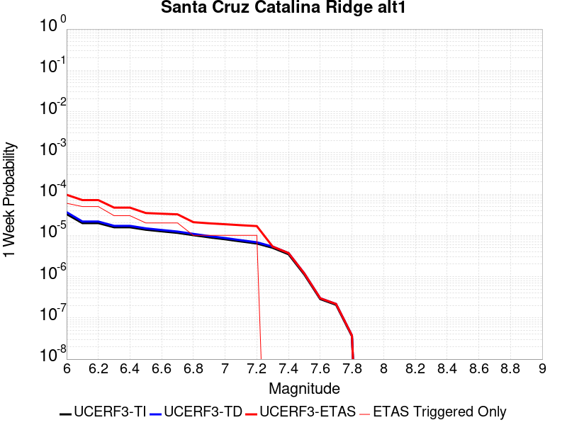 |  |  |  |

| Magnitude | 1 wk TI Prob | 1 wk TD Prob | 1 wk ETAS Prob | 1 wk ETAS/TD Gain | 1 wk ETAS Triggered Only | 1 mo TI Prob | 1 mo TD Prob | 1 mo ETAS Prob | 1 mo ETAS/TD Gain | 1 mo ETAS Triggered Only | 1 yr TI Prob | 1 yr TD Prob | 1 yr ETAS Prob | 1 yr ETAS/TD Gain | 1 yr ETAS Triggered Only | 10 yr TI Prob | 10 yr TD Prob | 10 yr ETAS Prob | 10 yr ETAS/TD Gain | 10 yr ETAS Triggered Only |
|-----|-----|-----|-----|-----|-----|-----|-----|-----|-----|-----|-----|-----|-----|-----|-----|-----|-----|-----|-----|-----|
| 6.0 | 3.2833184E-5 | 3.65584E-5 | 6.5424036E-5 | 1.7895762 | 2.8866694E-5 | 1.4070606E-4 | 1.5667039E-4 | 1.8553255E-4 | 1.1842222 | 2.8866694E-5 | 0.00171175 | 0.0019059596 | 0.0019635828 | 1.0302333 | 5.773339E-5 | 0.016986247 | 0.018913029 | 0.018969672 | 1.0029949 | 5.773339E-5 |
| 6.1 | 1.9835548E-5 | 2.1659505E-5 | 5.0525574E-5 | 2.3327205 | 2.8866694E-5 | 8.500672E-5 | 9.282326E-5 | 1.2168728E-4 | 1.3109567 | 2.8866694E-5 | 0.0010344655 | 0.0011295575 | 0.0011872257 | 1.0510538 | 5.773339E-5 | 0.010296632 | 0.011240295 | 0.01129738 | 1.0050786 | 5.773339E-5 |
| 6.2 | 1.9835548E-5 | 2.1659505E-5 | 5.0525574E-5 | 2.3327205 | 2.8866694E-5 | 8.500672E-5 | 9.282326E-5 | 1.2168728E-4 | 1.3109567 | 2.8866694E-5 | 0.0010344655 | 0.0011295575 | 0.0011872257 | 1.0510538 | 5.773339E-5 | 0.010296632 | 0.011240295 | 0.01129738 | 1.0050786 | 5.773339E-5 |
| 6.3 | 1.5728183E-5 | 1.703395E-5 | 4.590015E-5 | 2.6946278 | 2.8866694E-5 | 6.7404755E-5 | 7.300063E-5 | 1.0186522E-4 | 1.3954018 | 2.8866694E-5 | 8.2034385E-4 | 8.884264E-4 | 9.461085E-4 | 1.0649261 | 5.773339E-5 | 0.008173222 | 0.008849427 | 0.008906649 | 1.0064663 | 5.773339E-5 |
| 6.4 | 1.5728183E-5 | 1.703395E-5 | 4.590015E-5 | 2.6946278 | 2.8866694E-5 | 6.7404755E-5 | 7.300063E-5 | 1.0186522E-4 | 1.3954018 | 2.8866694E-5 | 8.2034385E-4 | 8.884264E-4 | 9.461085E-4 | 1.0649261 | 5.773339E-5 | 0.008173222 | 0.008849427 | 0.008906649 | 1.0064663 | 5.773339E-5 |
| 6.5 | 1.3707734E-5 | 1.4794522E-5 | 4.3660788E-5 | 2.9511456 | 2.8866694E-5 | 5.8746107E-5 | 6.3403575E-5 | 9.2268434E-5 | 1.4552561 | 2.8866694E-5 | 7.1499916E-4 | 7.716686E-4 | 8.00513E-4 | 1.0373793 | 2.8866694E-5 | 0.0071270303 | 0.0076902895 | 0.007718934 | 1.0037248 | 2.8866694E-5 |
| 6.6 | 1.2539813E-5 | 1.3510219E-5 | 4.2376523E-5 | 3.1366272 | 2.8866694E-5 | 5.3740947E-5 | 5.789967E-5 | 8.6764696E-5 | 1.4985352 | 2.8866694E-5 | 6.540996E-4 | 7.0470315E-4 | 7.3354953E-4 | 1.0409341 | 2.8866694E-5 | 0.0065217763 | 0.0070249885 | 0.0070536523 | 1.0040803 | 2.8866694E-5 |
| 6.7 | 1.1504083E-5 | 1.2377375E-5 | 4.124371E-5 | 3.3321857 | 2.8866694E-5 | 4.930228E-5 | 5.3044827E-5 | 8.190999E-5 | 1.5441655 | 2.8866694E-5 | 6.0008996E-4 | 6.456314E-4 | 6.7447947E-4 | 1.0446819 | 2.8866694E-5 | 0.005984721 | 0.006437786 | 0.006466467 | 1.0044551 | 2.8866694E-5 |
| 6.8 | 1.012739E-5 | 1.0877071E-5 | 3.9743452E-5 | 3.6538742 | 2.8866694E-5 | 4.340238E-5 | 4.6615194E-5 | 7.5480544E-5 | 1.6192261 | 2.8866694E-5 | 5.282958E-4 | 5.673937E-4 | 5.96244E-4 | 1.050847 | 2.8866694E-5 | 0.0052704164 | 0.0056596193 | 0.0056883227 | 1.0050716 | 2.8866694E-5 |
| 6.9 | 8.9607865E-6 | 9.609117E-6 | 3.8475533E-5 | 4.0040655 | 2.8866694E-5 | 3.8402806E-5 | 4.1181287E-5 | 7.004679E-5 | 1.7009374 | 2.8866694E-5 | 4.6745385E-4 | 5.012679E-4 | 5.301201E-4 | 1.0575585 | 2.8866694E-5 | 0.0046647177 | 0.005001492 | 0.005030214 | 1.0057428 | 2.8866694E-5 |
| 7.0 | 8.046829E-6 | 8.619746E-6 | 3.7486192E-5 | 4.348874 | 2.8866694E-5 | 3.4485955E-5 | 3.694125E-5 | 6.5806875E-5 | 1.7813928 | 2.8866694E-5 | 4.1978562E-4 | 4.496677E-4 | 4.7852143E-4 | 1.0641668 | 2.8866694E-5 | 0.004189935 | 0.0044876686 | 0.004516406 | 1.0064036 | 2.8866694E-5 |
| 7.1 | 7.136131E-6 | 7.637656E-6 | 3.650413E-5 | 4.779494 | 2.8866694E-5 | 3.0583058E-5 | 3.2732405E-5 | 6.1598155E-5 | 1.8818707 | 2.8866694E-5 | 3.7228514E-4 | 3.9844486E-4 | 4.2730005E-4 | 1.0724195 | 2.8866694E-5 | 0.0037166206 | 0.003977381 | 0.004006133 | 1.0072289 | 2.8866694E-5 |
| 7.2 | 6.362014E-6 | 6.8049585E-6 | 3.5671455E-5 | 5.2419796 | 2.8866694E-5 | 2.726549E-5 | 2.9163786E-5 | 5.8029636E-5 | 1.9897841 | 2.8866694E-5 | 3.3190678E-4 | 3.550119E-4 | 3.8386835E-4 | 1.0812831 | 2.8866694E-5 | 0.0033141149 | 0.003544516 | 0.0035732803 | 1.0081152 | 2.8866694E-5 |
| 7.3 | 5.004101E-6 | 5.351715E-6 | 5.351715E-6 | 1.0 | 0.0 | 2.1445969E-5 | 2.2935723E-5 | 2.2935723E-5 | 1.0 | 0.0 | 2.6107338E-4 | 2.792072E-4 | 2.792072E-4 | 1.0 | 0.0 | 0.002607669 | 0.0027886187 | 0.0027886187 | 1.0 | 0.0 |
| 7.4 | 3.4901443E-6 | 3.7320526E-6 | 3.7320526E-6 | 1.0 | 0.0 | 1.4957676E-5 | 1.5994416E-5 | 1.5994416E-5 | 1.0 | 0.0 | 1.8209449E-4 | 1.9471499E-4 | 1.9471499E-4 | 1.0 | 0.0 | 0.0018194534 | 0.0019454823 | 0.0019454823 | 1.0 | 0.0 |
| 7.5 | 1.1215045E-6 | 1.189387E-6 | 1.189387E-6 | 1.0 | 0.0 | 4.806439E-6 | 5.097363E-6 | 5.097363E-6 | 1.0 | 0.0 | 5.851682E-5 | 6.205866E-5 | 6.205866E-5 | 1.0 | 0.0 | 5.850142E-4 | 6.2041637E-4 | 6.2041637E-4 | 1.0 | 0.0 |
| 7.6 | 2.8599047E-7 | 2.9951994E-7 | 2.9951994E-7 | 1.0 | 0.0 | 1.2256729E-6 | 1.2836562E-6 | 1.2836562E-6 | 1.0 | 0.0 | 1.4922465E-5 | 1.5628404E-5 | 1.5628404E-5 | 1.0 | 0.0 | 1.4921463E-4 | 1.5627318E-4 | 1.5627318E-4 | 1.0 | 0.0 |
| 7.7 | 2.0781519E-7 | 2.1744323E-7 | 2.1744323E-7 | 1.0 | 0.0 | 8.906362E-7 | 9.3189925E-7 | 9.3189925E-7 | 1.0 | 0.0 | 1.08434415E-5 | 1.13458145E-5 | 1.13458145E-5 | 1.0 | 0.0 | 1.0842913E-4 | 1.1345245E-4 | 1.1345245E-4 | 1.0 | 0.0 |
| 7.8 | 3.614776E-8 | 3.764102E-8 | 3.764102E-8 | 1.0 | 0.0 | 1.5491896E-7 | 1.6131864E-7 | 1.6131864E-7 | 1.0 | 0.0 | 1.8861368E-6 | 1.9640527E-6 | 1.9640527E-6 | 1.0 | 0.0 | 1.8861208E-5 | 1.9640367E-5 | 1.9640367E-5 | 1.0 | 0.0 |

## Mission Creek
*[(top)](#table-of-contents)*

| 1 Week | 1 Month | 1 Year | 10 Year |
|-----|-----|-----|-----|
|  |  |  |  |

| Magnitude | 1 wk TI Prob | 1 wk TD Prob | 1 wk ETAS Prob | 1 wk ETAS/TD Gain | 1 wk ETAS Triggered Only | 1 mo TI Prob | 1 mo TD Prob | 1 mo ETAS Prob | 1 mo ETAS/TD Gain | 1 mo ETAS Triggered Only | 1 yr TI Prob | 1 yr TD Prob | 1 yr ETAS Prob | 1 yr ETAS/TD Gain | 1 yr ETAS Triggered Only | 10 yr TI Prob | 10 yr TD Prob | 10 yr ETAS Prob | 10 yr ETAS/TD Gain | 10 yr ETAS Triggered Only |
|-----|-----|-----|-----|-----|-----|-----|-----|-----|-----|-----|-----|-----|-----|-----|-----|-----|-----|-----|-----|-----|
| 6.0 | 1.1549387E-5 | 1.632237E-5 | 4.5188594E-5 | 2.7685068 | 2.8866694E-5 | 4.9496433E-5 | 6.9951224E-5 | 9.88159E-5 | 1.41264 | 2.8866694E-5 | 6.0245243E-4 | 8.513384E-4 | 8.801805E-4 | 1.0338786 | 2.8866694E-5 | 0.006008218 | 0.008509998 | 0.00856724 | 1.0067265 | 5.773339E-5 |
| 6.1 | 1.1549387E-5 | 1.632237E-5 | 4.5188594E-5 | 2.7685068 | 2.8866694E-5 | 4.9496433E-5 | 6.9951224E-5 | 9.88159E-5 | 1.41264 | 2.8866694E-5 | 6.0245243E-4 | 8.513384E-4 | 8.801805E-4 | 1.0338786 | 2.8866694E-5 | 0.006008218 | 0.008509998 | 0.00856724 | 1.0067265 | 5.773339E-5 |
| 6.2 | 1.1549387E-5 | 1.632237E-5 | 4.5188594E-5 | 2.7685068 | 2.8866694E-5 | 4.9496433E-5 | 6.9951224E-5 | 9.88159E-5 | 1.41264 | 2.8866694E-5 | 6.0245243E-4 | 8.513384E-4 | 8.801805E-4 | 1.0338786 | 2.8866694E-5 | 0.006008218 | 0.008509998 | 0.00856724 | 1.0067265 | 5.773339E-5 |
| 6.3 | 1.1549387E-5 | 1.632237E-5 | 4.5188594E-5 | 2.7685068 | 2.8866694E-5 | 4.9496433E-5 | 6.9951224E-5 | 9.88159E-5 | 1.41264 | 2.8866694E-5 | 6.0245243E-4 | 8.513384E-4 | 8.801805E-4 | 1.0338786 | 2.8866694E-5 | 0.006008218 | 0.008509998 | 0.00856724 | 1.0067265 | 5.773339E-5 |
| 6.4 | 1.1549387E-5 | 1.632237E-5 | 4.5188594E-5 | 2.7685068 | 2.8866694E-5 | 4.9496433E-5 | 6.9951224E-5 | 9.88159E-5 | 1.41264 | 2.8866694E-5 | 6.0245243E-4 | 8.513384E-4 | 8.801805E-4 | 1.0338786 | 2.8866694E-5 | 0.006008218 | 0.008509998 | 0.00856724 | 1.0067265 | 5.773339E-5 |
| 6.5 | 1.1549387E-5 | 1.632237E-5 | 4.5188594E-5 | 2.7685068 | 2.8866694E-5 | 4.9496433E-5 | 6.9951224E-5 | 9.88159E-5 | 1.41264 | 2.8866694E-5 | 6.0245243E-4 | 8.513384E-4 | 8.801805E-4 | 1.0338786 | 2.8866694E-5 | 0.006008218 | 0.008509998 | 0.00856724 | 1.0067265 | 5.773339E-5 |
| 6.6 | 9.202681E-6 | 1.3845646E-5 | 4.271194E-5 | 3.0848644 | 2.8866694E-5 | 3.9439463E-5 | 5.9337188E-5 | 8.820217E-5 | 1.4864569 | 2.8866694E-5 | 4.800697E-4 | 7.221998E-4 | 7.5104565E-4 | 1.0399417 | 2.8866694E-5 | 0.004790339 | 0.0072271815 | 0.007284498 | 1.0079306 | 5.773339E-5 |
| 6.7 | 9.019164E-6 | 1.3651316E-5 | 4.2517615E-5 | 3.1145434 | 2.8866694E-5 | 3.8652986E-5 | 5.8504378E-5 | 8.7369386E-5 | 1.493382 | 2.8866694E-5 | 4.7049852E-4 | 7.12067E-4 | 7.4091315E-4 | 1.0405104 | 2.8866694E-5 | 0.004695036 | 0.007126506 | 0.007183828 | 1.0080435 | 5.773339E-5 |
| 6.8 | 8.673558E-6 | 1.3273427E-5 | 4.2139738E-5 | 3.1747444 | 2.8866694E-5 | 3.717186E-5 | 5.6884925E-5 | 8.5749976E-5 | 1.5074289 | 2.8866694E-5 | 4.524734E-4 | 6.923627E-4 | 7.2120945E-4 | 1.0416641 | 2.8866694E-5 | 0.0045155324 | 0.006930694 | 0.0069880276 | 1.0082724 | 5.773339E-5 |
| 6.9 | 7.002255E-6 | 1.1477657E-5 | 4.0344017E-5 | 3.5150049 | 2.8866694E-5 | 3.000932E-5 | 4.9189068E-5 | 7.805434E-5 | 1.586823 | 2.8866694E-5 | 3.653022E-4 | 5.9871917E-4 | 6.275686E-4 | 1.0481852 | 2.8866694E-5 | 0.0036470229 | 0.005999517 | 0.0060569043 | 1.0095652 | 5.773339E-5 |
| 7.0 | 5.84644E-6 | 9.67498E-6 | 3.8541395E-5 | 3.983615 | 2.8866694E-5 | 2.5055931E-5 | 4.1463565E-5 | 7.0329064E-5 | 1.6961653 | 2.8866694E-5 | 3.0501327E-4 | 5.047066E-4 | 5.3355866E-4 | 1.0571661 | 2.8866694E-5 | 0.0030459496 | 0.0050638523 | 0.005121293 | 1.0113434 | 5.773339E-5 |
| 7.1 | 5.54703E-6 | 9.329456E-6 | 3.819588E-5 | 4.0941167 | 2.8866694E-5 | 2.377277E-5 | 3.9982795E-5 | 6.8848334E-5 | 1.721949 | 2.8866694E-5 | 2.8939504E-4 | 4.8668624E-4 | 5.155389E-4 | 1.0592839 | 2.8866694E-5 | 0.0028901845 | 0.004884446 | 0.0049418975 | 1.0117621 | 5.773339E-5 |
| 7.2 | 4.384709E-6 | 7.68157E-6 | 3.654804E-5 | 4.757887 | 2.8866694E-5 | 1.8791474E-5 | 3.2920623E-5 | 6.178636E-5 | 1.8768286 | 2.8866694E-5 | 2.2876218E-4 | 4.0073853E-4 | 4.2959364E-4 | 1.0720049 | 2.8866694E-5 | 0.0022852682 | 0.004028366 | 0.0040858667 | 1.014274 | 5.773339E-5 |
| 7.3 | 3.7888456E-6 | 6.915452E-6 | 3.5781944E-5 | 5.174202 | 2.8866694E-5 | 1.623781E-5 | 2.9637333E-5 | 5.850317E-5 | 1.9739689 | 2.8866694E-5 | 1.9767738E-4 | 3.6077813E-4 | 3.8963443E-4 | 1.0799835 | 2.8866694E-5 | 0.0019750162 | 0.0036301152 | 0.003687639 | 1.0158463 | 5.773339E-5 |
| 7.4 | 2.1982462E-6 | 5.0237763E-6 | 3.3890326E-5 | 6.745986 | 2.8866694E-5 | 9.421021E-6 | 2.1530293E-5 | 5.0396367E-5 | 2.340719 | 2.8866694E-5 | 1.1469489E-4 | 2.621E-4 | 2.909591E-4 | 1.1101073 | 2.8866694E-5 | 0.0011463572 | 0.0026458844 | 0.002703465 | 1.0217624 | 5.773339E-5 |
| 7.5 | 2.051923E-6 | 4.615016E-6 | 3.3481578E-5 | 7.254921 | 2.8866694E-5 | 8.793926E-6 | 1.9778492E-5 | 4.8644615E-5 | 2.4594705 | 2.8866694E-5 | 1.0706078E-4 | 2.4077666E-4 | 2.696364E-4 | 1.119861 | 2.8866694E-5 | 0.0010700922 | 0.0024335422 | 0.002491135 | 1.0236663 | 5.773339E-5 |
| 7.6 | 1.8733427E-6 | 4.1233748E-6 | 3.298995E-5 | 8.000715 | 2.8866694E-5 | 8.028587E-6 | 1.7671488E-5 | 4.6537672E-5 | 2.6334891 | 2.8866694E-5 | 9.774366E-5 | 2.151292E-4 | 2.4398969E-4 | 1.1341542 | 2.8866694E-5 | 9.770069E-4 | 0.0021780801 | 0.0022356878 | 1.0264488 | 5.773339E-5 |
| 7.7 | 1.8411953E-6 | 4.0430496E-6 | 3.2909626E-5 | 8.139803 | 2.8866694E-5 | 7.890813E-6 | 1.732724E-5 | 4.6193436E-5 | 2.665943 | 2.8866694E-5 | 9.606641E-5 | 2.1093882E-4 | 2.3979942E-4 | 1.1368198 | 2.8866694E-5 | 9.6024893E-4 | 0.0021363653 | 0.0021939753 | 1.0269663 | 5.773339E-5 |
| 7.8 | 1.7194251E-6 | 3.7104276E-6 | 3.2577012E-5 | 8.779855 | 2.8866694E-5 | 7.368944E-6 | 1.5901736E-5 | 4.476797E-5 | 2.8152883 | 2.8866694E-5 | 8.97132E-5 | 1.9358651E-4 | 2.2244762E-4 | 1.1490864 | 2.8866694E-5 | 8.967699E-4 | 0.0019623525 | 0.0020199725 | 1.0293628 | 5.773339E-5 |
| 7.9 | 1.4035052E-6 | 2.9500632E-6 | 3.181667E-5 | 10.785082 | 2.8866694E-5 | 6.0150082E-6 | 1.2643067E-5 | 4.1509396E-5 | 3.2831745 | 2.8866694E-5 | 7.3230265E-5 | 1.5391852E-4 | 1.8278077E-4 | 1.1875165 | 2.8866694E-5 | 7.3206134E-4 | 0.0015631086 | 0.0016207518 | 1.0368773 | 5.773339E-5 |
| 8.0 | 3.9318823E-7 | 5.528522E-7 | 5.528522E-7 | 1.0 | 0.0 | 1.6850913E-6 | 2.3693647E-6 | 2.3693647E-6 | 1.0 | 0.0 | 2.0515794E-5 | 2.8846638E-5 | 2.8846638E-5 | 1.0 | 0.0 | 2.0513899E-4 | 2.9899E-4 | 2.9899E-4 | 1.0 | 0.0 |
| 8.1 | 1.596793E-7 | 1.1380002E-7 | 1.1380002E-7 | 1.0 | 0.0 | 6.8433974E-7 | 4.877143E-7 | 4.877143E-7 | 1.0 | 0.0 | 8.331805E-6 | 5.937906E-6 | 5.937906E-6 | 1.0 | 0.0 | 8.331492E-5 | 6.549966E-5 | 6.549966E-5 | 1.0 | 0.0 |
| 8.2 | 4.9003038E-8 | 2.5444924E-8 | 2.5444924E-8 | 1.0 | 0.0 | 2.10013E-7 | 1.0904967E-7 | 1.0904967E-7 | 1.0 | 0.0 | 2.5569052E-6 | 1.327679E-6 | 1.327679E-6 | 1.0 | 0.0 | 2.556876E-5 | 1.495635E-5 | 1.495635E-5 | 1.0 | 0.0 |

## San Jacinto (Anza) rev
*[(top)](#table-of-contents)*

| 1 Week | 1 Month | 1 Year | 10 Year |
|-----|-----|-----|-----|
|  |  |  |  |

| Magnitude | 1 wk TI Prob | 1 wk TD Prob | 1 wk ETAS Prob | 1 wk ETAS/TD Gain | 1 wk ETAS Triggered Only | 1 mo TI Prob | 1 mo TD Prob | 1 mo ETAS Prob | 1 mo ETAS/TD Gain | 1 mo ETAS Triggered Only | 1 yr TI Prob | 1 yr TD Prob | 1 yr ETAS Prob | 1 yr ETAS/TD Gain | 1 yr ETAS Triggered Only | 10 yr TI Prob | 10 yr TD Prob | 10 yr ETAS Prob | 10 yr ETAS/TD Gain | 10 yr ETAS Triggered Only |
|-----|-----|-----|-----|-----|-----|-----|-----|-----|-----|-----|-----|-----|-----|-----|-----|-----|-----|-----|-----|-----|
| 6.0 | 6.3015636E-5 | 4.3302647E-5 | 1.0103353E-4 | 2.3331952 | 5.773339E-5 | 2.7003905E-4 | 1.8556965E-4 | 2.4329232E-4 | 1.3110566 | 5.773339E-5 | 0.0032827691 | 0.0022569813 | 0.0023145843 | 1.0255222 | 5.773339E-5 | 0.032346968 | 0.023296192 | 0.02335258 | 1.0024205 | 5.773339E-5 |
| 6.1 | 6.3015636E-5 | 4.3302647E-5 | 1.0103353E-4 | 2.3331952 | 5.773339E-5 | 2.7003905E-4 | 1.8556965E-4 | 2.4329232E-4 | 1.3110566 | 5.773339E-5 | 0.0032827691 | 0.0022569813 | 0.0023145843 | 1.0255222 | 5.773339E-5 | 0.032346968 | 0.023296192 | 0.02335258 | 1.0024205 | 5.773339E-5 |
| 6.2 | 6.3015636E-5 | 4.3302647E-5 | 1.0103353E-4 | 2.3331952 | 5.773339E-5 | 2.7003905E-4 | 1.8556965E-4 | 2.4329232E-4 | 1.3110566 | 5.773339E-5 | 0.0032827691 | 0.0022569813 | 0.0023145843 | 1.0255222 | 5.773339E-5 | 0.032346968 | 0.023296192 | 0.02335258 | 1.0024205 | 5.773339E-5 |
| 6.3 | 6.3015636E-5 | 4.3302647E-5 | 1.0103353E-4 | 2.3331952 | 5.773339E-5 | 2.7003905E-4 | 1.8556965E-4 | 2.4329232E-4 | 1.3110566 | 5.773339E-5 | 0.0032827691 | 0.0022569813 | 0.0023145843 | 1.0255222 | 5.773339E-5 | 0.032346968 | 0.023296192 | 0.02335258 | 1.0024205 | 5.773339E-5 |
| 6.4 | 6.3015636E-5 | 4.3302647E-5 | 1.0103353E-4 | 2.3331952 | 5.773339E-5 | 2.7003905E-4 | 1.8556965E-4 | 2.4329232E-4 | 1.3110566 | 5.773339E-5 | 0.0032827691 | 0.0022569813 | 0.0023145843 | 1.0255222 | 5.773339E-5 | 0.032346968 | 0.023296192 | 0.02335258 | 1.0024205 | 5.773339E-5 |
| 6.5 | 5.811017E-5 | 4.0082516E-5 | 9.781359E-5 | 2.4403057 | 5.773339E-5 | 2.4901982E-4 | 1.7177092E-4 | 2.294944E-4 | 1.3360491 | 5.773339E-5 | 0.0030276014 | 0.002089311 | 0.0021469234 | 1.027575 | 5.773339E-5 | 0.02986684 | 0.021593736 | 0.021650223 | 1.0026159 | 5.773339E-5 |
| 6.6 | 5.811017E-5 | 4.0082516E-5 | 9.781359E-5 | 2.4403057 | 5.773339E-5 | 2.4901982E-4 | 1.7177092E-4 | 2.294944E-4 | 1.3360491 | 5.773339E-5 | 0.0030276014 | 0.002089311 | 0.0021469234 | 1.027575 | 5.773339E-5 | 0.02986684 | 0.021593736 | 0.021650223 | 1.0026159 | 5.773339E-5 |
| 6.7 | 5.712442E-5 | 3.9505223E-5 | 9.723633E-5 | 2.4613538 | 5.773339E-5 | 2.4479596E-4 | 1.6929714E-4 | 2.2702076E-4 | 1.3409604 | 5.773339E-5 | 0.0029763177 | 0.0020592497 | 0.002116864 | 1.0279784 | 5.773339E-5 | 0.029367693 | 0.021285562 | 0.021342067 | 1.0026546 | 5.773339E-5 |
| 6.8 | 5.6967532E-5 | 3.9361643E-5 | 9.709276E-5 | 2.4666846 | 5.773339E-5 | 2.4412372E-4 | 1.6868189E-4 | 2.2640554E-4 | 1.3422042 | 5.773339E-5 | 0.0029681553 | 0.002051773 | 0.002109388 | 1.0280806 | 5.773339E-5 | 0.029288229 | 0.021210281 | 0.02126679 | 1.0026642 | 5.773339E-5 |
| 6.9 | 5.6211324E-5 | 3.9066435E-5 | 9.6797565E-5 | 2.4777682 | 5.773339E-5 | 2.4088343E-4 | 1.6741687E-4 | 2.251406E-4 | 1.3447903 | 5.773339E-5 | 0.0029288116 | 0.0020364004 | 0.0020940162 | 1.028293 | 5.773339E-5 | 0.028905109 | 0.021049714 | 0.021106232 | 1.002685 | 5.773339E-5 |
| 7.0 | 5.4383527E-5 | 3.792697E-5 | 9.5658164E-5 | 2.5221674 | 5.773339E-5 | 2.3305144E-4 | 1.6253405E-4 | 2.2025805E-4 | 1.3551502 | 5.773339E-5 | 0.0028337094 | 0.001977061 | 0.0020346802 | 1.0291439 | 5.773339E-5 | 0.027978465 | 0.020440677 | 0.020497229 | 1.0027667 | 5.773339E-5 |
| 7.1 | 5.1393665E-5 | 3.6389913E-5 | 9.41212E-5 | 2.586464 | 5.773339E-5 | 2.2023996E-4 | 1.5594746E-4 | 2.1367185E-4 | 1.3701527 | 5.773339E-5 | 0.0026781242 | 0.0018970112 | 0.0019546351 | 1.0303761 | 5.773339E-5 | 0.026460782 | 0.019614287 | 0.019670887 | 1.0028857 | 5.773339E-5 |
| 7.2 | 4.785222E-5 | 3.4741795E-5 | 9.247318E-5 | 2.661727 | 5.773339E-5 | 2.0506482E-4 | 1.4888494E-4 | 2.0660972E-4 | 1.3877141 | 5.773339E-5 | 0.0024938055 | 0.0018111705 | 0.0018687993 | 1.0318185 | 5.773339E-5 | 0.024660049 | 0.018728992 | 0.018785644 | 1.0030248 | 5.773339E-5 |
| 7.3 | 4.2143256E-5 | 3.383628E-5 | 9.1567716E-5 | 2.7061992 | 5.773339E-5 | 1.8060145E-4 | 1.4500458E-4 | 2.027296E-4 | 1.398091 | 5.773339E-5 | 0.002196605 | 0.0017640047 | 0.0018216362 | 1.0326709 | 5.773339E-5 | 0.02175019 | 0.01823724 | 0.01829392 | 1.0031079 | 5.773339E-5 |
| 7.4 | 4.0264713E-5 | 3.347446E-5 | 9.120592E-5 | 2.7246418 | 5.773339E-5 | 1.7255165E-4 | 1.4345412E-4 | 2.0117922E-4 | 1.4023942 | 5.773339E-5 | 0.002098792 | 0.0017451581 | 0.0018027907 | 1.0330243 | 5.773339E-5 | 0.020790804 | 0.018041821 | 0.018098513 | 1.0031422 | 5.773339E-5 |
| 7.5 | 3.694492E-5 | 3.218847E-5 | 8.9919995E-5 | 2.793547 | 5.773339E-5 | 1.5832575E-4 | 1.379433E-4 | 1.9566872E-4 | 1.4184722 | 5.773339E-5 | 0.0019259118 | 0.001678169 | 0.0017358054 | 1.0343449 | 5.773339E-5 | 0.01909306 | 0.01735827 | 0.017415002 | 1.0032682 | 5.773339E-5 |
| 7.6 | 3.200565E-5 | 2.9504106E-5 | 8.723579E-5 | 2.956734 | 5.773339E-5 | 1.3715986E-4 | 1.2644005E-4 | 1.8416614E-4 | 1.456549 | 5.773339E-5 | 0.001668642 | 0.0015383229 | 0.0015959674 | 1.0374724 | 5.773339E-5 | 0.01656168 | 0.0159463 | 0.016003113 | 1.0035628 | 5.773339E-5 |
| 7.7 | 2.731642E-5 | 2.6092788E-5 | 8.382467E-5 | 3.212561 | 5.773339E-5 | 1.1706512E-4 | 1.1182144E-4 | 1.6954838E-4 | 1.516242 | 5.773339E-5 | 0.001424336 | 0.0013605768 | 0.0014182318 | 1.0423753 | 5.773339E-5 | 0.014152412 | 0.014167004 | 0.01422392 | 1.0040175 | 5.773339E-5 |
| 7.8 | 2.3466424E-5 | 2.3504817E-5 | 8.1236845E-5 | 3.4561787 | 5.773339E-5 | 1.0056651E-4 | 1.0073105E-4 | 1.5845861E-4 | 1.5730861 | 5.773339E-5 | 0.0012237094 | 0.0012257113 | 0.001283374 | 1.0470442 | 5.773339E-5 | 0.012169928 | 0.012808893 | 0.012865887 | 1.0044496 | 5.773339E-5 |
| 7.9 | 1.8611925E-5 | 1.8908117E-5 | 7.664041E-5 | 4.0533075 | 5.773339E-5 | 7.9762955E-5 | 8.1032274E-5 | 1.3876098E-4 | 1.7124163 | 5.773339E-5 | 9.7068126E-4 | 9.861222E-4 | 0.0010437986 | 1.0584881 | 5.773339E-5 | 0.0096645225 | 0.010393824 | 0.010450957 | 1.0054969 | 5.773339E-5 |
| 8.0 | 1.5460775E-5 | 1.5740965E-5 | 4.4607204E-5 | 2.8338292 | 2.8866694E-5 | 6.6258784E-5 | 6.7459536E-5 | 9.6324286E-5 | 1.4278823 | 2.8866694E-5 | 8.0640207E-4 | 8.21011E-4 | 8.49854E-4 | 1.0351311 | 2.8866694E-5 | 0.008034821 | 0.0087028835 | 0.008731499 | 1.003288 | 2.8866694E-5 |
| 8.1 | 9.983884E-6 | 8.269952E-6 | 8.269952E-6 | 1.0 | 0.0 | 4.2787375E-5 | 3.544217E-5 | 3.544217E-5 | 1.0 | 0.0 | 5.2081177E-4 | 4.314235E-4 | 4.314235E-4 | 1.0 | 0.0 | 0.0051959283 | 0.004640022 | 0.004640022 | 1.0 | 0.0 |
| 8.2 | 4.1226E-6 | 1.5529788E-6 | 1.5529788E-6 | 1.0 | 0.0 | 1.7668166E-5 | 6.6556063E-6 | 6.6556063E-6 | 1.0 | 0.0 | 2.1508869E-4 | 8.102902E-5 | 8.102902E-5 | 1.0 | 0.0 | 0.0021488064 | 9.4050163E-4 | 9.4050163E-4 | 1.0 | 0.0 |
| 8.3 | 1.2750878E-6 | 3.612133E-7 | 3.612133E-7 | 1.0 | 0.0 | 5.4646503E-6 | 1.548056E-6 | 1.548056E-6 | 1.0 | 0.0 | 6.653009E-5 | 1.8847424E-5 | 1.8847424E-5 | 1.0 | 0.0 | 6.6510175E-4 | 2.2734253E-4 | 2.2734253E-4 | 1.0 | 0.0 |

## San Gabriel
*[(top)](#table-of-contents)*

| 1 Week | 1 Month | 1 Year | 10 Year |
|-----|-----|-----|-----|
|  |  |  |  |

| Magnitude | 1 wk TI Prob | 1 wk TD Prob | 1 wk ETAS Prob | 1 wk ETAS/TD Gain | 1 wk ETAS Triggered Only | 1 mo TI Prob | 1 mo TD Prob | 1 mo ETAS Prob | 1 mo ETAS/TD Gain | 1 mo ETAS Triggered Only | 1 yr TI Prob | 1 yr TD Prob | 1 yr ETAS Prob | 1 yr ETAS/TD Gain | 1 yr ETAS Triggered Only | 10 yr TI Prob | 10 yr TD Prob | 10 yr ETAS Prob | 10 yr ETAS/TD Gain | 10 yr ETAS Triggered Only |
|-----|-----|-----|-----|-----|-----|-----|-----|-----|-----|-----|-----|-----|-----|-----|-----|-----|-----|-----|-----|-----|
| 6.0 | 1.083775E-5 | 1.19851875E-5 | 4.0851533E-5 | 3.4085019 | 2.8866694E-5 | 4.6446676E-5 | 5.1364143E-5 | 8.022935E-5 | 1.561972 | 2.8866694E-5 | 5.653415E-4 | 6.251903E-4 | 6.54039E-4 | 1.0461438 | 2.8866694E-5 | 0.0056390543 | 0.006246409 | 0.0062750955 | 1.0045924 | 2.8866694E-5 |
| 6.1 | 1.083775E-5 | 1.19851875E-5 | 4.0851533E-5 | 3.4085019 | 2.8866694E-5 | 4.6446676E-5 | 5.1364143E-5 | 8.022935E-5 | 1.561972 | 2.8866694E-5 | 5.653415E-4 | 6.251903E-4 | 6.54039E-4 | 1.0461438 | 2.8866694E-5 | 0.0056390543 | 0.006246409 | 0.0062750955 | 1.0045924 | 2.8866694E-5 |
| 6.2 | 1.083775E-5 | 1.19851875E-5 | 4.0851533E-5 | 3.4085019 | 2.8866694E-5 | 4.6446676E-5 | 5.1364143E-5 | 8.022935E-5 | 1.561972 | 2.8866694E-5 | 5.653415E-4 | 6.251903E-4 | 6.54039E-4 | 1.0461438 | 2.8866694E-5 | 0.0056390543 | 0.006246409 | 0.0062750955 | 1.0045924 | 2.8866694E-5 |
| 6.3 | 1.083775E-5 | 1.19851875E-5 | 4.0851533E-5 | 3.4085019 | 2.8866694E-5 | 4.6446676E-5 | 5.1364143E-5 | 8.022935E-5 | 1.561972 | 2.8866694E-5 | 5.653415E-4 | 6.251903E-4 | 6.54039E-4 | 1.0461438 | 2.8866694E-5 | 0.0056390543 | 0.006246409 | 0.0062750955 | 1.0045924 | 2.8866694E-5 |
| 6.4 | 1.083775E-5 | 1.19851875E-5 | 4.0851533E-5 | 3.4085019 | 2.8866694E-5 | 4.6446676E-5 | 5.1364143E-5 | 8.022935E-5 | 1.561972 | 2.8866694E-5 | 5.653415E-4 | 6.251903E-4 | 6.54039E-4 | 1.0461438 | 2.8866694E-5 | 0.0056390543 | 0.006246409 | 0.0062750955 | 1.0045924 | 2.8866694E-5 |
| 6.5 | 6.7317824E-6 | 7.716944E-6 | 7.716944E-6 | 1.0 | 0.0 | 2.8850178E-5 | 3.3072207E-5 | 3.3072207E-5 | 1.0 | 0.0 | 3.511943E-4 | 4.0258077E-4 | 4.0258077E-4 | 1.0 | 0.0 | 0.003506398 | 0.0040296097 | 0.0040296097 | 1.0 | 0.0 |
| 6.6 | 6.7317824E-6 | 7.716944E-6 | 7.716944E-6 | 1.0 | 0.0 | 2.8850178E-5 | 3.3072207E-5 | 3.3072207E-5 | 1.0 | 0.0 | 3.511943E-4 | 4.0258077E-4 | 4.0258077E-4 | 1.0 | 0.0 | 0.003506398 | 0.0040296097 | 0.0040296097 | 1.0 | 0.0 |
| 6.7 | 6.274881E-6 | 7.2458647E-6 | 7.2458647E-6 | 1.0 | 0.0 | 2.6892068E-5 | 3.1053343E-5 | 3.1053343E-5 | 1.0 | 0.0 | 3.2736175E-4 | 3.780098E-4 | 3.780098E-4 | 1.0 | 0.0 | 0.0032687993 | 0.0037847564 | 0.0037847564 | 1.0 | 0.0 |
| 6.8 | 5.996209E-6 | 6.958585E-6 | 6.958585E-6 | 1.0 | 0.0 | 2.5697784E-5 | 2.9822171E-5 | 2.9822171E-5 | 1.0 | 0.0 | 3.128256E-4 | 3.6302538E-4 | 3.6302538E-4 | 1.0 | 0.0 | 0.003123856 | 0.0036354093 | 0.0036354093 | 1.0 | 0.0 |
| 6.9 | 5.686331E-6 | 6.6236316E-6 | 6.6236316E-6 | 1.0 | 0.0 | 2.4369761E-5 | 2.8386688E-5 | 2.8386688E-5 | 1.0 | 0.0 | 2.9666146E-4 | 3.4555403E-4 | 3.4555403E-4 | 1.0 | 0.0 | 0.0029626573 | 0.0034612515 | 0.0034612515 | 1.0 | 0.0 |
| 7.0 | 5.2329838E-6 | 6.147514E-6 | 6.147514E-6 | 1.0 | 0.0 | 2.242688E-5 | 2.6346226E-5 | 2.6346226E-5 | 1.0 | 0.0 | 2.7301308E-4 | 3.2071886E-4 | 3.2071886E-4 | 1.0 | 0.0 | 0.002726779 | 0.0032136322 | 0.0032136322 | 1.0 | 0.0 |
| 7.1 | 5.135671E-6 | 6.03764E-6 | 6.03764E-6 | 1.0 | 0.0 | 2.2009834E-5 | 2.5875348E-5 | 2.5875348E-5 | 1.0 | 0.0 | 2.6793676E-4 | 3.1498758E-4 | 3.1498758E-4 | 1.0 | 0.0 | 0.0026761394 | 0.0031564834 | 0.0031564834 | 1.0 | 0.0 |
| 7.2 | 4.989062E-6 | 5.87102E-6 | 5.87102E-6 | 1.0 | 0.0 | 2.1381518E-5 | 2.5161276E-5 | 2.5161276E-5 | 1.0 | 0.0 | 2.6028889E-4 | 3.0629625E-4 | 3.0629625E-4 | 1.0 | 0.0 | 0.0025998424 | 0.003069813 | 0.003069813 | 1.0 | 0.0 |
| 7.3 | 4.8219395E-6 | 5.702574E-6 | 5.702574E-6 | 1.0 | 0.0 | 2.0665291E-5 | 2.443938E-5 | 2.443938E-5 | 1.0 | 0.0 | 2.5157086E-4 | 2.9750957E-4 | 2.9750957E-4 | 1.0 | 0.0 | 0.0025128627 | 0.0029821852 | 0.0029821852 | 1.0 | 0.0 |
| 7.4 | 4.7118383E-6 | 5.5911332E-6 | 5.5911332E-6 | 1.0 | 0.0 | 2.0193436E-5 | 2.3961782E-5 | 2.3961782E-5 | 1.0 | 0.0 | 2.4582737E-4 | 2.916964E-4 | 2.916964E-4 | 1.0 | 0.0 | 0.002455556 | 0.0029242067 | 0.0029242067 | 1.0 | 0.0 |
| 7.5 | 4.5506545E-6 | 5.4365014E-6 | 5.4365014E-6 | 1.0 | 0.0 | 1.9502659E-5 | 2.3299088E-5 | 2.3299088E-5 | 1.0 | 0.0 | 2.37419E-4 | 2.8363022E-4 | 2.8363022E-4 | 1.0 | 0.0 | 0.002371655 | 0.002843753 | 0.002843753 | 1.0 | 0.0 |
| 7.6 | 4.343636E-6 | 5.2293817E-6 | 5.2293817E-6 | 1.0 | 0.0 | 1.861545E-5 | 2.2411448E-5 | 2.2411448E-5 | 1.0 | 0.0 | 2.2661954E-4 | 2.7282597E-4 | 2.7282597E-4 | 1.0 | 0.0 | 0.0022638857 | 0.0027359722 | 0.0027359722 | 1.0 | 0.0 |
| 7.7 | 2.936235E-6 | 2.7440458E-6 | 2.7440458E-6 | 1.0 | 0.0 | 1.2583803E-5 | 1.1760143E-5 | 1.1760143E-5 | 1.0 | 0.0 | 1.5319703E-4 | 1.4317037E-4 | 1.4317037E-4 | 1.0 | 0.0 | 0.0015309147 | 0.0014380751 | 0.0014380751 | 1.0 | 0.0 |
| 7.8 | 1.4541639E-6 | 9.1237047E-7 | 9.1237047E-7 | 1.0 | 0.0 | 6.232116E-6 | 3.9101533E-6 | 3.9101533E-6 | 1.0 | 0.0 | 7.587337E-5 | 4.7605077E-5 | 4.7605077E-5 | 1.0 | 0.0 | 7.584747E-4 | 4.8085177E-4 | 4.8085177E-4 | 1.0 | 0.0 |
| 7.9 | 8.098958E-7 | 2.41753E-7 | 2.41753E-7 | 1.0 | 0.0 | 3.4709774E-6 | 1.0360839E-6 | 1.0360839E-6 | 1.0 | 0.0 | 4.225833E-5 | 1.2614248E-5 | 1.2614248E-5 | 1.0 | 0.0 | 4.2250296E-4 | 1.2921814E-4 | 1.2921814E-4 | 1.0 | 0.0 |
| 8.0 | 5.2473234E-7 | 7.6792055E-8 | 7.6792055E-8 | 1.0 | 0.0 | 2.248851E-6 | 3.2910876E-7 | 3.2910876E-7 | 1.0 | 0.0 | 2.7379416E-5 | 4.0068917E-6 | 4.0068917E-6 | 1.0 | 0.0 | 2.7376044E-4 | 4.21918E-5 | 4.21918E-5 | 1.0 | 0.0 |
| 8.1 | 3.3162388E-7 | 4.1496126E-8 | 4.1496126E-8 | 1.0 | 0.0 | 1.4212444E-6 | 1.7784053E-7 | 1.7784053E-7 | 1.0 | 0.0 | 1.7303513E-5 | 2.1652063E-6 | 2.1652063E-6 | 1.0 | 0.0 | 1.7302166E-4 | 2.2965523E-5 | 2.2965523E-5 | 1.0 | 0.0 |
| 8.2 | 1.0235345E-7 | 1.4043474E-8 | 1.4043474E-8 | 1.0 | 0.0 | 4.3865757E-7 | 6.0186316E-8 | 6.0186316E-8 | 1.0 | 0.0 | 5.340643E-6 | 7.327681E-7 | 7.327681E-7 | 1.0 | 0.0 | 5.3405143E-5 | 7.9273705E-6 | 7.9273705E-6 | 1.0 | 0.0 |

## Santa Susana alt 1
*[(top)](#table-of-contents)*

| 1 Week | 1 Month | 1 Year | 10 Year |
|-----|-----|-----|-----|
|  |  |  |  |

| Magnitude | 1 wk TI Prob | 1 wk TD Prob | 1 wk ETAS Prob | 1 wk ETAS/TD Gain | 1 wk ETAS Triggered Only | 1 mo TI Prob | 1 mo TD Prob | 1 mo ETAS Prob | 1 mo ETAS/TD Gain | 1 mo ETAS Triggered Only | 1 yr TI Prob | 1 yr TD Prob | 1 yr ETAS Prob | 1 yr ETAS/TD Gain | 1 yr ETAS Triggered Only | 10 yr TI Prob | 10 yr TD Prob | 10 yr ETAS Prob | 10 yr ETAS/TD Gain | 10 yr ETAS Triggered Only |
|-----|-----|-----|-----|-----|-----|-----|-----|-----|-----|-----|-----|-----|-----|-----|-----|-----|-----|-----|-----|-----|
| 6.0 | 2.674877E-5 | 2.7198023E-5 | 5.606393E-5 | 2.061324 | 2.8866694E-5 | 1.1463255E-4 | 1.1655839E-4 | 1.4542171E-4 | 1.2476298 | 2.8866694E-5 | 0.0013947578 | 0.0014182882 | 0.0014471139 | 1.0203243 | 2.8866694E-5 | 0.013860362 | 0.014104128 | 0.014132587 | 1.0020179 | 2.8866694E-5 |
| 6.1 | 2.674877E-5 | 2.7198023E-5 | 5.606393E-5 | 2.061324 | 2.8866694E-5 | 1.1463255E-4 | 1.1655839E-4 | 1.4542171E-4 | 1.2476298 | 2.8866694E-5 | 0.0013947578 | 0.0014182882 | 0.0014471139 | 1.0203243 | 2.8866694E-5 | 0.013860362 | 0.014104128 | 0.014132587 | 1.0020179 | 2.8866694E-5 |
| 6.2 | 2.674877E-5 | 2.7198023E-5 | 5.606393E-5 | 2.061324 | 2.8866694E-5 | 1.1463255E-4 | 1.1655839E-4 | 1.4542171E-4 | 1.2476298 | 2.8866694E-5 | 0.0013947578 | 0.0014182882 | 0.0014471139 | 1.0203243 | 2.8866694E-5 | 0.013860362 | 0.014104128 | 0.014132587 | 1.0020179 | 2.8866694E-5 |
| 6.3 | 2.674877E-5 | 2.7198023E-5 | 5.606393E-5 | 2.061324 | 2.8866694E-5 | 1.1463255E-4 | 1.1655839E-4 | 1.4542171E-4 | 1.2476298 | 2.8866694E-5 | 0.0013947578 | 0.0014182882 | 0.0014471139 | 1.0203243 | 2.8866694E-5 | 0.013860362 | 0.014104128 | 0.014132587 | 1.0020179 | 2.8866694E-5 |
| 6.4 | 2.674877E-5 | 2.7198023E-5 | 5.606393E-5 | 2.061324 | 2.8866694E-5 | 1.1463255E-4 | 1.1655839E-4 | 1.4542171E-4 | 1.2476298 | 2.8866694E-5 | 0.0013947578 | 0.0014182882 | 0.0014471139 | 1.0203243 | 2.8866694E-5 | 0.013860362 | 0.014104128 | 0.014132587 | 1.0020179 | 2.8866694E-5 |
| 6.5 | 2.674877E-5 | 2.7198023E-5 | 5.606393E-5 | 2.061324 | 2.8866694E-5 | 1.1463255E-4 | 1.1655839E-4 | 1.4542171E-4 | 1.2476298 | 2.8866694E-5 | 0.0013947578 | 0.0014182882 | 0.0014471139 | 1.0203243 | 2.8866694E-5 | 0.013860362 | 0.014104128 | 0.014132587 | 1.0020179 | 2.8866694E-5 |
| 6.6 | 2.6647976E-5 | 2.7074359E-5 | 5.5940272E-5 | 2.0661716 | 2.8866694E-5 | 1.14200615E-4 | 1.1602845E-4 | 1.4489179E-4 | 1.2487609 | 2.8866694E-5 | 0.0013895056 | 0.0014118447 | 0.0014406707 | 1.0204172 | 2.8866694E-5 | 0.013808494 | 0.014040513 | 0.014068974 | 1.002027 | 2.8866694E-5 |
| 6.7 | 2.6647976E-5 | 2.7074359E-5 | 5.5940272E-5 | 2.0661716 | 2.8866694E-5 | 1.14200615E-4 | 1.1602845E-4 | 1.4489179E-4 | 1.2487609 | 2.8866694E-5 | 0.0013895056 | 0.0014118447 | 0.0014406707 | 1.0204172 | 2.8866694E-5 | 0.013808494 | 0.014040513 | 0.014068974 | 1.002027 | 2.8866694E-5 |
| 6.8 | 1.9073179E-5 | 1.7637283E-5 | 4.650347E-5 | 2.636657 | 2.8866694E-5 | 8.1739636E-5 | 7.558627E-5 | 1.0445078E-4 | 1.381875 | 2.8866694E-5 | 9.947256E-4 | 9.198925E-4 | 9.487326E-4 | 1.0313517 | 2.8866694E-5 | 0.009902848 | 0.009163101 | 0.009191703 | 1.0031215 | 2.8866694E-5 |
| 6.9 | 1.9041876E-5 | 1.7619415E-5 | 4.64856E-5 | 2.6383169 | 2.8866694E-5 | 8.160549E-5 | 7.55097E-5 | 1.0437421E-4 | 1.3822623 | 2.8866694E-5 | 9.930939E-4 | 9.1896096E-4 | 9.478011E-4 | 1.0313834 | 2.8866694E-5 | 0.0098866755 | 0.0091538625 | 0.009182465 | 1.0031246 | 2.8866694E-5 |
| 7.0 | 1.5917482E-5 | 1.3863864E-5 | 4.2730157E-5 | 3.0821245 | 2.8866694E-5 | 6.8215995E-5 | 5.9415237E-5 | 8.828021E-5 | 1.4858178 | 2.8866694E-5 | 8.302132E-4 | 7.231451E-4 | 7.519909E-4 | 1.0398893 | 2.8866694E-5 | 0.008271185 | 0.0072088144 | 0.007237473 | 1.0039755 | 2.8866694E-5 |
| 7.1 | 1.577788E-5 | 1.3743872E-5 | 4.261017E-5 | 3.1003032 | 2.8866694E-5 | 6.761774E-5 | 5.8901005E-5 | 8.7766E-5 | 1.4900595 | 2.8866694E-5 | 8.2293496E-4 | 7.1688846E-4 | 7.4573443E-4 | 1.0402378 | 2.8866694E-5 | 0.008198941 | 0.007146652 | 0.0071753124 | 1.0040103 | 2.8866694E-5 |
| 7.2 | 1.5416446E-5 | 1.3469944E-5 | 4.233625E-5 | 3.1430159 | 2.8866694E-5 | 6.606882E-5 | 5.772708E-5 | 8.659211E-5 | 1.5000257 | 2.8866694E-5 | 8.0409093E-4 | 7.026052E-4 | 7.314516E-4 | 1.0410564 | 2.8866694E-5 | 0.008011877 | 0.0070047234 | 0.007033388 | 1.0040922 | 2.8866694E-5 |
| 7.3 | 1.4534083E-5 | 1.2717879E-5 | 4.1584204E-5 | 3.2697437 | 2.8866694E-5 | 6.228744E-5 | 5.4504082E-5 | 8.33692E-5 | 1.5295956 | 2.8866694E-5 | 7.580857E-4 | 6.633896E-4 | 6.9223717E-4 | 1.043485 | 2.8866694E-5 | 0.007555048 | 0.0066149444 | 0.0066436203 | 1.004335 | 2.8866694E-5 |
| 7.4 | 1.2858995E-5 | 1.1229652E-5 | 4.009602E-5 | 3.5705488 | 2.8866694E-5 | 5.5108816E-5 | 4.8126214E-5 | 7.699152E-5 | 1.5997834 | 2.8866694E-5 | 6.7074323E-4 | 5.857831E-4 | 6.1463285E-4 | 1.0492499 | 2.8866694E-5 | 0.0066872234 | 0.005843165 | 0.005871863 | 1.0049114 | 2.8866694E-5 |
| 7.5 | 8.827668E-6 | 7.805457E-6 | 3.6671925E-5 | 4.6982417 | 2.8866694E-5 | 3.7832317E-5 | 3.3451546E-5 | 6.2317275E-5 | 1.8629117 | 2.8866694E-5 | 4.605111E-4 | 4.071989E-4 | 4.3605384E-4 | 1.070862 | 2.8866694E-5 | 0.0045955796 | 0.0040647765 | 0.004093526 | 1.0070728 | 2.8866694E-5 |
| 7.6 | 3.2533426E-6 | 2.871988E-6 | 2.871988E-6 | 1.0 | 0.0 | 1.3942822E-5 | 1.2308465E-5 | 1.2308465E-5 | 1.0 | 0.0 | 1.6974064E-4 | 1.4984563E-4 | 1.4984563E-4 | 1.0 | 0.0 | 0.0016961104 | 0.0014974826 | 0.0014974826 | 1.0 | 0.0 |
| 7.7 | 1.2751709E-6 | 1.1491089E-6 | 1.1491089E-6 | 1.0 | 0.0 | 5.4650063E-6 | 4.9247437E-6 | 4.9247437E-6 | 1.0 | 0.0 | 6.653442E-5 | 5.9957198E-5 | 5.9957198E-5 | 1.0 | 0.0 | 6.6514505E-4 | 5.994191E-4 | 5.994191E-4 | 1.0 | 0.0 |
| 7.8 | 3.067544E-7 | 3.2400436E-7 | 3.2400436E-7 | 1.0 | 0.0 | 1.3146611E-6 | 1.3885895E-6 | 1.3885895E-6 | 1.0 | 0.0 | 1.600588E-5 | 1.6905957E-5 | 1.6905957E-5 | 1.0 | 0.0 | 1.6004729E-4 | 1.6904772E-4 | 1.6904772E-4 | 1.0 | 0.0 |
| 7.9 | 7.622999E-8 | 8.087964E-8 | 8.087964E-8 | 1.0 | 0.0 | 3.2669993E-7 | 3.4662696E-7 | 3.4662696E-7 | 1.0 | 0.0 | 3.977564E-6 | 4.2201773E-6 | 4.2201773E-6 | 1.0 | 0.0 | 3.977493E-5 | 4.220118E-5 | 4.220118E-5 | 1.0 | 0.0 |

## San Cayetano
*[(top)](#table-of-contents)*

| 1 Week | 1 Month | 1 Year | 10 Year |
|-----|-----|-----|-----|
|  |  |  |  |

| Magnitude | 1 wk TI Prob | 1 wk TD Prob | 1 wk ETAS Prob | 1 wk ETAS/TD Gain | 1 wk ETAS Triggered Only | 1 mo TI Prob | 1 mo TD Prob | 1 mo ETAS Prob | 1 mo ETAS/TD Gain | 1 mo ETAS Triggered Only | 1 yr TI Prob | 1 yr TD Prob | 1 yr ETAS Prob | 1 yr ETAS/TD Gain | 1 yr ETAS Triggered Only | 10 yr TI Prob | 10 yr TD Prob | 10 yr ETAS Prob | 10 yr ETAS/TD Gain | 10 yr ETAS Triggered Only |
|-----|-----|-----|-----|-----|-----|-----|-----|-----|-----|-----|-----|-----|-----|-----|-----|-----|-----|-----|-----|-----|
| 6.0 | 2.3476267E-5 | 1.816928E-5 | 4.7035446E-5 | 2.588735 | 2.8866694E-5 | 1.0060869E-4 | 7.786603E-5 | 1.0673048E-4 | 1.3706937 | 2.8866694E-5 | 0.0012242225 | 9.476103E-4 | 9.7644964E-4 | 1.0304338 | 2.8866694E-5 | 0.012175002 | 0.009436584 | 0.0094651785 | 1.0030302 | 2.8866694E-5 |
| 6.1 | 2.3476267E-5 | 1.816928E-5 | 4.7035446E-5 | 2.588735 | 2.8866694E-5 | 1.0060869E-4 | 7.786603E-5 | 1.0673048E-4 | 1.3706937 | 2.8866694E-5 | 0.0012242225 | 9.476103E-4 | 9.7644964E-4 | 1.0304338 | 2.8866694E-5 | 0.012175002 | 0.009436584 | 0.0094651785 | 1.0030302 | 2.8866694E-5 |
| 6.2 | 2.3476267E-5 | 1.816928E-5 | 4.7035446E-5 | 2.588735 | 2.8866694E-5 | 1.0060869E-4 | 7.786603E-5 | 1.0673048E-4 | 1.3706937 | 2.8866694E-5 | 0.0012242225 | 9.476103E-4 | 9.7644964E-4 | 1.0304338 | 2.8866694E-5 | 0.012175002 | 0.009436584 | 0.0094651785 | 1.0030302 | 2.8866694E-5 |
| 6.3 | 2.3476267E-5 | 1.816928E-5 | 4.7035446E-5 | 2.588735 | 2.8866694E-5 | 1.0060869E-4 | 7.786603E-5 | 1.0673048E-4 | 1.3706937 | 2.8866694E-5 | 0.0012242225 | 9.476103E-4 | 9.7644964E-4 | 1.0304338 | 2.8866694E-5 | 0.012175002 | 0.009436584 | 0.0094651785 | 1.0030302 | 2.8866694E-5 |
| 6.4 | 2.3476267E-5 | 1.816928E-5 | 4.7035446E-5 | 2.588735 | 2.8866694E-5 | 1.0060869E-4 | 7.786603E-5 | 1.0673048E-4 | 1.3706937 | 2.8866694E-5 | 0.0012242225 | 9.476103E-4 | 9.7644964E-4 | 1.0304338 | 2.8866694E-5 | 0.012175002 | 0.009436584 | 0.0094651785 | 1.0030302 | 2.8866694E-5 |
| 6.5 | 2.3476267E-5 | 1.816928E-5 | 4.7035446E-5 | 2.588735 | 2.8866694E-5 | 1.0060869E-4 | 7.786603E-5 | 1.0673048E-4 | 1.3706937 | 2.8866694E-5 | 0.0012242225 | 9.476103E-4 | 9.7644964E-4 | 1.0304338 | 2.8866694E-5 | 0.012175002 | 0.009436584 | 0.0094651785 | 1.0030302 | 2.8866694E-5 |
| 6.6 | 2.3476267E-5 | 1.816928E-5 | 4.7035446E-5 | 2.588735 | 2.8866694E-5 | 1.0060869E-4 | 7.786603E-5 | 1.0673048E-4 | 1.3706937 | 2.8866694E-5 | 0.0012242225 | 9.476103E-4 | 9.7644964E-4 | 1.0304338 | 2.8866694E-5 | 0.012175002 | 0.009436584 | 0.0094651785 | 1.0030302 | 2.8866694E-5 |
| 6.7 | 2.3476267E-5 | 1.816928E-5 | 4.7035446E-5 | 2.588735 | 2.8866694E-5 | 1.0060869E-4 | 7.786603E-5 | 1.0673048E-4 | 1.3706937 | 2.8866694E-5 | 0.0012242225 | 9.476103E-4 | 9.7644964E-4 | 1.0304338 | 2.8866694E-5 | 0.012175002 | 0.009436584 | 0.0094651785 | 1.0030302 | 2.8866694E-5 |
| 6.8 | 2.3241924E-5 | 1.7936987E-5 | 4.6803165E-5 | 2.6093102 | 2.8866694E-5 | 9.960445E-5 | 7.687056E-5 | 1.0573503E-4 | 1.3754945 | 2.8866694E-5 | 0.0012120095 | 9.3550084E-4 | 9.643405E-4 | 1.0308281 | 2.8866694E-5 | 0.012054204 | 0.009316482 | 0.00934508 | 1.0030696 | 2.8866694E-5 |
| 6.9 | 2.2761007E-5 | 1.7432423E-5 | 4.6298614E-5 | 2.655891 | 2.8866694E-5 | 9.7543525E-5 | 7.470827E-5 | 1.03572806E-4 | 1.3863634 | 2.8866694E-5 | 0.0011869454 | 9.09197E-4 | 9.3803747E-4 | 1.0317208 | 2.8866694E-5 | 0.011806256 | 0.009055603 | 0.009084208 | 1.0031588 | 2.8866694E-5 |
| 7.0 | 2.240283E-5 | 1.7066168E-5 | 4.593237E-5 | 2.6914284 | 2.8866694E-5 | 9.600859E-5 | 7.313869E-5 | 1.0200327E-4 | 1.3946555 | 2.8866694E-5 | 0.0011682777 | 8.9010317E-4 | 9.189442E-4 | 1.0324019 | 2.8866694E-5 | 0.011621549 | 0.008866196 | 0.008894806 | 1.003227 | 2.8866694E-5 |
| 7.1 | 2.1871154E-5 | 1.6586018E-5 | 4.5452234E-5 | 2.7403946 | 2.8866694E-5 | 9.373015E-5 | 7.108101E-5 | 9.994566E-5 | 1.4060808 | 2.8866694E-5 | 0.0011405671 | 8.6507114E-4 | 8.9391286E-4 | 1.0333403 | 2.8866694E-5 | 0.011347309 | 0.008617838 | 0.0086464565 | 1.0033208 | 2.8866694E-5 |
| 7.2 | 2.0714133E-5 | 1.5564561E-5 | 4.4430806E-5 | 2.8546135 | 2.8866694E-5 | 8.8771834E-5 | 6.670357E-5 | 9.556834E-5 | 1.432732 | 2.8866694E-5 | 0.0010802611 | 8.1181666E-4 | 8.4065995E-4 | 1.0355293 | 2.8866694E-5 | 0.010750249 | 0.008089285 | 0.008117919 | 1.0035397 | 2.8866694E-5 |
| 7.3 | 1.8408395E-5 | 1.3996864E-5 | 4.2863154E-5 | 3.0623398 | 2.8866694E-5 | 7.8890735E-5 | 5.99852E-5 | 8.885016E-5 | 1.4812014 | 2.8866694E-5 | 9.600714E-4 | 7.300781E-4 | 7.589237E-4 | 1.0395104 | 2.8866694E-5 | 0.009559342 | 0.0072775153 | 0.007306172 | 1.0039377 | 2.8866694E-5 |
| 7.4 | 1.6856795E-5 | 1.28500815E-5 | 4.1716405E-5 | 3.2463923 | 2.8866694E-5 | 7.2241404E-5 | 5.5070628E-5 | 8.393573E-5 | 1.524147 | 2.8866694E-5 | 8.7918417E-4 | 6.7028153E-4 | 6.9912884E-4 | 1.0430377 | 2.8866694E-5 | 0.00875714 | 0.0066832784 | 0.0067119524 | 1.0042903 | 2.8866694E-5 |
| 7.5 | 1.2822778E-5 | 9.577542E-6 | 3.844396E-5 | 4.0139694 | 2.8866694E-5 | 5.495361E-5 | 4.1045972E-5 | 6.991148E-5 | 1.7032483 | 2.8866694E-5 | 6.688548E-4 | 4.996217E-4 | 5.28474E-4 | 1.0577482 | 2.8866694E-5 | 0.006668452 | 0.0049851555 | 0.0050138785 | 1.0057616 | 2.8866694E-5 |
| 7.6 | 5.6272684E-6 | 3.854903E-6 | 3.854903E-6 | 1.0 | 0.0 | 2.4116642E-5 | 1.652091E-5 | 1.652091E-5 | 1.0 | 0.0 | 2.9358055E-4 | 2.0112359E-4 | 2.0112359E-4 | 1.0 | 0.0 | 0.0029319301 | 0.0020094267 | 0.0020094267 | 1.0 | 0.0 |
| 7.7 | 3.5261346E-6 | 2.3407013E-6 | 2.3407013E-6 | 1.0 | 0.0 | 1.5111918E-5 | 1.0031539E-5 | 1.0031539E-5 | 1.0 | 0.0 | 1.8397206E-4 | 1.2212721E-4 | 1.2212721E-4 | 1.0 | 0.0 | 0.0018381984 | 0.0012206084 | 0.0012206084 | 1.0 | 0.0 |
| 7.8 | 1.4826929E-6 | 1.056428E-6 | 1.056428E-6 | 1.0 | 0.0 | 6.354383E-6 | 4.5275406E-6 | 4.5275406E-6 | 1.0 | 0.0 | 7.736187E-5 | 5.5121433E-5 | 5.5121433E-5 | 1.0 | 0.0 | 7.733494E-4 | 5.5107963E-4 | 5.5107963E-4 | 1.0 | 0.0 |
| 7.9 | 2.7568166E-7 | 1.6978244E-7 | 1.6978244E-7 | 1.0 | 0.0 | 1.1814923E-6 | 7.2763885E-7 | 7.2763885E-7 | 1.0 | 0.0 | 1.4384574E-5 | 8.858967E-6 | 8.858967E-6 | 1.0 | 0.0 | 1.4383643E-4 | 8.8586174E-5 | 8.8586174E-5 | 1.0 | 0.0 |
| 8.0 | 5.407832E-8 | 2.6887697E-8 | 2.6887697E-8 | 1.0 | 0.0 | 2.3176422E-7 | 1.15232986E-7 | 1.15232986E-7 | 1.0 | 0.0 | 2.8217257E-6 | 1.4029607E-6 | 1.4029607E-6 | 1.0 | 0.0 | 2.8216898E-5 | 1.4029522E-5 | 1.4029522E-5 | 1.0 | 0.0 |

## Robinson Creek
*[(top)](#table-of-contents)*

| 1 Week | 1 Month | 1 Year | 10 Year |
|-----|-----|-----|-----|
|  |  |  |  |

| Magnitude | 1 wk TI Prob | 1 wk TD Prob | 1 wk ETAS Prob | 1 wk ETAS/TD Gain | 1 wk ETAS Triggered Only | 1 mo TI Prob | 1 mo TD Prob | 1 mo ETAS Prob | 1 mo ETAS/TD Gain | 1 mo ETAS Triggered Only | 1 yr TI Prob | 1 yr TD Prob | 1 yr ETAS Prob | 1 yr ETAS/TD Gain | 1 yr ETAS Triggered Only | 10 yr TI Prob | 10 yr TD Prob | 10 yr ETAS Prob | 10 yr ETAS/TD Gain | 10 yr ETAS Triggered Only |
|-----|-----|-----|-----|-----|-----|-----|-----|-----|-----|-----|-----|-----|-----|-----|-----|-----|-----|-----|-----|-----|
| 6.0 | 1.3705327E-5 | 1.5285013E-5 | 4.4151268E-5 | 2.888533 | 2.8866694E-5 | 5.8735794E-5 | 6.55072E-5 | 9.4372E-5 | 1.4406356 | 2.8866694E-5 | 7.1487366E-4 | 7.9755014E-4 | 8.2639384E-4 | 1.0361654 | 2.8866694E-5 | 0.0071257832 | 0.007975501 | 0.008004138 | 1.0035906 | 2.8866694E-5 |
| 6.1 | 1.3705327E-5 | 1.5285013E-5 | 4.4151268E-5 | 2.888533 | 2.8866694E-5 | 5.8735794E-5 | 6.55072E-5 | 9.4372E-5 | 1.4406356 | 2.8866694E-5 | 7.1487366E-4 | 7.9755014E-4 | 8.2639384E-4 | 1.0361654 | 2.8866694E-5 | 0.0071257832 | 0.007975501 | 0.008004138 | 1.0035906 | 2.8866694E-5 |
| 6.2 | 1.3705327E-5 | 1.5285013E-5 | 4.4151268E-5 | 2.888533 | 2.8866694E-5 | 5.8735794E-5 | 6.55072E-5 | 9.4372E-5 | 1.4406356 | 2.8866694E-5 | 7.1487366E-4 | 7.9755014E-4 | 8.2639384E-4 | 1.0361654 | 2.8866694E-5 | 0.0071257832 | 0.007975501 | 0.008004138 | 1.0035906 | 2.8866694E-5 |
| 6.3 | 1.3705327E-5 | 1.5285013E-5 | 4.4151268E-5 | 2.888533 | 2.8866694E-5 | 5.8735794E-5 | 6.55072E-5 | 9.4372E-5 | 1.4406356 | 2.8866694E-5 | 7.1487366E-4 | 7.9755014E-4 | 8.2639384E-4 | 1.0361654 | 2.8866694E-5 | 0.0071257832 | 0.007975501 | 0.008004138 | 1.0035906 | 2.8866694E-5 |
| 6.4 | 1.3705327E-5 | 1.5285013E-5 | 4.4151268E-5 | 2.888533 | 2.8866694E-5 | 5.8735794E-5 | 6.55072E-5 | 9.4372E-5 | 1.4406356 | 2.8866694E-5 | 7.1487366E-4 | 7.9755014E-4 | 8.2639384E-4 | 1.0361654 | 2.8866694E-5 | 0.0071257832 | 0.007975501 | 0.008004138 | 1.0035906 | 2.8866694E-5 |

## Pisgah-Bullion Mtn-Mesquite Lk
*[(top)](#table-of-contents)*

| 1 Week | 1 Month | 1 Year | 10 Year |
|-----|-----|-----|-----|
|  |  |  |  |

| Magnitude | 1 wk TI Prob | 1 wk TD Prob | 1 wk ETAS Prob | 1 wk ETAS/TD Gain | 1 wk ETAS Triggered Only | 1 mo TI Prob | 1 mo TD Prob | 1 mo ETAS Prob | 1 mo ETAS/TD Gain | 1 mo ETAS Triggered Only | 1 yr TI Prob | 1 yr TD Prob | 1 yr ETAS Prob | 1 yr ETAS/TD Gain | 1 yr ETAS Triggered Only | 10 yr TI Prob | 10 yr TD Prob | 10 yr ETAS Prob | 10 yr ETAS/TD Gain | 10 yr ETAS Triggered Only |
|-----|-----|-----|-----|-----|-----|-----|-----|-----|-----|-----|-----|-----|-----|-----|-----|-----|-----|-----|-----|-----|
| 6.0 | 3.0240792E-5 | 2.4091114E-5 | 2.4091114E-5 | 1.0 | 0.0 | 1.2959696E-4 | 1.03244114E-4 | 1.03244114E-4 | 1.0 | 0.0 | 0.0015767008 | 0.0012563728 | 0.0012852032 | 1.0229473 | 2.8866694E-5 | 0.015655609 | 0.012502721 | 0.0125312265 | 1.00228 | 2.8866694E-5 |
| 6.1 | 3.0240792E-5 | 2.4091114E-5 | 2.4091114E-5 | 1.0 | 0.0 | 1.2959696E-4 | 1.03244114E-4 | 1.03244114E-4 | 1.0 | 0.0 | 0.0015767008 | 0.0012563728 | 0.0012852032 | 1.0229473 | 2.8866694E-5 | 0.015655609 | 0.012502721 | 0.0125312265 | 1.00228 | 2.8866694E-5 |
| 6.2 | 3.0240792E-5 | 2.4091114E-5 | 2.4091114E-5 | 1.0 | 0.0 | 1.2959696E-4 | 1.03244114E-4 | 1.03244114E-4 | 1.0 | 0.0 | 0.0015767008 | 0.0012563728 | 0.0012852032 | 1.0229473 | 2.8866694E-5 | 0.015655609 | 0.012502721 | 0.0125312265 | 1.00228 | 2.8866694E-5 |
| 6.3 | 2.0498217E-5 | 1.36380695E-5 | 1.36380695E-5 | 1.0 | 0.0 | 8.784654E-5 | 5.844765E-5 | 5.844765E-5 | 1.0 | 0.0 | 0.0010690069 | 7.1138405E-4 | 7.402302E-4 | 1.0405494 | 2.8866694E-5 | 0.01063879 | 0.0070926943 | 0.007121356 | 1.0040411 | 2.8866694E-5 |
| 6.4 | 2.0498217E-5 | 1.36380695E-5 | 1.36380695E-5 | 1.0 | 0.0 | 8.784654E-5 | 5.844765E-5 | 5.844765E-5 | 1.0 | 0.0 | 0.0010690069 | 7.1138405E-4 | 7.402302E-4 | 1.0405494 | 2.8866694E-5 | 0.01063879 | 0.0070926943 | 0.007121356 | 1.0040411 | 2.8866694E-5 |
| 6.5 | 1.7316182E-5 | 1.0477042E-5 | 1.0477042E-5 | 1.0 | 0.0 | 7.42101E-5 | 4.4900895E-5 | 4.4900895E-5 | 1.0 | 0.0 | 9.0313336E-4 | 5.465413E-4 | 5.753922E-4 | 1.0527881 | 2.8866694E-5 | 0.008994718 | 0.0054529672 | 0.005481676 | 1.0052649 | 2.8866694E-5 |
| 6.6 | 1.5251077E-5 | 8.414273E-6 | 8.414273E-6 | 1.0 | 0.0 | 6.536012E-5 | 3.6060712E-5 | 3.6060712E-5 | 1.0 | 0.0 | 7.9546886E-4 | 4.3895794E-4 | 4.6781197E-4 | 1.065733 | 2.8866694E-5 | 0.007926274 | 0.0043816264 | 0.0044103665 | 1.0065593 | 2.8866694E-5 |
| 6.7 | 1.2997425E-5 | 6.4114965E-6 | 6.4114965E-6 | 1.0 | 0.0 | 5.570206E-5 | 2.7477578E-5 | 2.7477578E-5 | 1.0 | 0.0 | 6.7796157E-4 | 3.3449283E-4 | 3.3449283E-4 | 1.0 | 0.0 | 0.0067589693 | 0.0033403537 | 0.0033403537 | 1.0 | 0.0 |
| 6.8 | 1.035386E-5 | 4.3332193E-6 | 4.3332193E-6 | 1.0 | 0.0 | 4.437293E-5 | 1.8570812E-5 | 1.8570812E-5 | 1.0 | 0.0 | 5.401065E-4 | 2.2607706E-4 | 2.2607706E-4 | 1.0 | 0.0 | 0.0053879567 | 0.0022585576 | 0.0022585576 | 1.0 | 0.0 |
| 6.9 | 8.816252E-6 | 3.580638E-6 | 3.580638E-6 | 1.0 | 0.0 | 3.778339E-5 | 1.5345504E-5 | 1.5345504E-5 | 1.0 | 0.0 | 4.5991567E-4 | 1.8681608E-4 | 1.8681608E-4 | 1.0 | 0.0 | 0.00458965 | 0.0018666488 | 0.0018666488 | 1.0 | 0.0 |
| 7.0 | 6.8232207E-6 | 2.5675843E-6 | 2.5675843E-6 | 1.0 | 0.0 | 2.9242048E-5 | 1.1003888E-5 | 1.1003888E-5 | 1.0 | 0.0 | 3.5596377E-4 | 1.3396442E-4 | 1.3396442E-4 | 1.0 | 0.0 | 0.0035539411 | 0.0013388677 | 0.0013388677 | 1.0 | 0.0 |
| 7.1 | 5.837013E-6 | 2.22738E-6 | 2.22738E-6 | 1.0 | 0.0 | 2.501553E-5 | 9.545881E-6 | 9.545881E-6 | 1.0 | 0.0 | 3.045215E-4 | 1.16215204E-4 | 1.16215204E-4 | 1.0 | 0.0 | 0.0030410455 | 0.0011615733 | 0.0011615733 | 1.0 | 0.0 |
| 7.2 | 4.278052E-6 | 1.6275711E-6 | 1.6275711E-6 | 1.0 | 0.0 | 1.833438E-5 | 6.9752873E-6 | 6.9752873E-6 | 1.0 | 0.0 | 2.231982E-4 | 8.492105E-5 | 8.492105E-5 | 1.0 | 0.0 | 0.0022297418 | 8.489092E-4 | 8.489092E-4 | 1.0 | 0.0 |
| 7.3 | 1.8803692E-6 | 8.344926E-7 | 8.344926E-7 | 1.0 | 0.0 | 8.0587E-6 | 3.5763926E-6 | 3.5763926E-6 | 1.0 | 0.0 | 9.811026E-5 | 4.354186E-5 | 4.354186E-5 | 1.0 | 0.0 | 9.806695E-4 | 4.3534773E-4 | 4.3534773E-4 | 1.0 | 0.0 |

## South Klamath Lake East
*[(top)](#table-of-contents)*

| 1 Week | 1 Month | 1 Year | 10 Year |
|-----|-----|-----|-----|
|  |  |  |  |

| Magnitude | 1 wk TI Prob | 1 wk TD Prob | 1 wk ETAS Prob | 1 wk ETAS/TD Gain | 1 wk ETAS Triggered Only | 1 mo TI Prob | 1 mo TD Prob | 1 mo ETAS Prob | 1 mo ETAS/TD Gain | 1 mo ETAS Triggered Only | 1 yr TI Prob | 1 yr TD Prob | 1 yr ETAS Prob | 1 yr ETAS/TD Gain | 1 yr ETAS Triggered Only | 10 yr TI Prob | 10 yr TD Prob | 10 yr ETAS Prob | 10 yr ETAS/TD Gain | 10 yr ETAS Triggered Only |
|-----|-----|-----|-----|-----|-----|-----|-----|-----|-----|-----|-----|-----|-----|-----|-----|-----|-----|-----|-----|-----|
| 6.0 | 2.3539369E-5 | 2.5047308E-5 | 5.3913278E-5 | 2.152458 | 2.8866694E-5 | 1.0087911E-4 | 1.0734166E-4 | 1.3620524E-4 | 1.2688947 | 2.8866694E-5 | 0.0012275111 | 0.0013061843 | 0.0013350133 | 1.0220711 | 2.8866694E-5 | 0.012207527 | 0.012993417 | 0.013021909 | 1.0021927 | 2.8866694E-5 |
| 6.1 | 2.3539369E-5 | 2.5047308E-5 | 5.3913278E-5 | 2.152458 | 2.8866694E-5 | 1.0087911E-4 | 1.0734166E-4 | 1.3620524E-4 | 1.2688947 | 2.8866694E-5 | 0.0012275111 | 0.0013061843 | 0.0013350133 | 1.0220711 | 2.8866694E-5 | 0.012207527 | 0.012993417 | 0.013021909 | 1.0021927 | 2.8866694E-5 |
| 6.2 | 2.3539369E-5 | 2.5047308E-5 | 5.3913278E-5 | 2.152458 | 2.8866694E-5 | 1.0087911E-4 | 1.0734166E-4 | 1.3620524E-4 | 1.2688947 | 2.8866694E-5 | 0.0012275111 | 0.0013061843 | 0.0013350133 | 1.0220711 | 2.8866694E-5 | 0.012207527 | 0.012993417 | 0.013021909 | 1.0021927 | 2.8866694E-5 |
| 6.3 | 9.807823E-6 | 1.0396044E-5 | 1.0396044E-5 | 1.0 | 0.0 | 4.2032847E-5 | 4.455376E-5 | 4.455376E-5 | 1.0 | 0.0 | 5.1162974E-4 | 5.4231536E-4 | 5.4231536E-4 | 1.0 | 0.0 | 0.005104534 | 0.005410756 | 0.005410756 | 1.0 | 0.0 |
| 6.4 | 9.807823E-6 | 1.0396044E-5 | 1.0396044E-5 | 1.0 | 0.0 | 4.2032847E-5 | 4.455376E-5 | 4.455376E-5 | 1.0 | 0.0 | 5.1162974E-4 | 5.4231536E-4 | 5.4231536E-4 | 1.0 | 0.0 | 0.005104534 | 0.005410756 | 0.005410756 | 1.0 | 0.0 |
| 6.5 | 6.191981E-6 | 6.5508398E-6 | 6.5508398E-6 | 1.0 | 0.0 | 2.653679E-5 | 2.8074743E-5 | 2.8074743E-5 | 1.0 | 0.0 | 3.2303753E-4 | 3.4175918E-4 | 3.4175918E-4 | 1.0 | 0.0 | 0.0032256835 | 0.003412614 | 0.003412614 | 1.0 | 0.0 |
| 6.6 | 4.3693776E-6 | 4.6165574E-6 | 4.6165574E-6 | 1.0 | 0.0 | 1.8725768E-5 | 1.9785102E-5 | 1.9785102E-5 | 1.0 | 0.0 | 2.2796239E-4 | 2.4085813E-4 | 2.4085813E-4 | 1.0 | 0.0 | 0.0022772867 | 0.0024060833 | 0.0024060833 | 1.0 | 0.0 |
| 6.7 | 3.360834E-6 | 3.5512403E-6 | 3.5512403E-6 | 1.0 | 0.0 | 1.4403494E-5 | 1.5219517E-5 | 1.5219517E-5 | 1.0 | 0.0 | 1.7534842E-4 | 1.8528267E-4 | 1.8528267E-4 | 1.0 | 0.0 | 0.0017521014 | 0.0018513618 | 0.0018513618 | 1.0 | 0.0 |
| 6.8 | 2.57873E-6 | 2.7251708E-6 | 2.7251708E-6 | 1.0 | 0.0 | 1.1051653E-5 | 1.1679254E-5 | 1.1679254E-5 | 1.0 | 0.0 | 1.3454557E-4 | 1.4218627E-4 | 1.4218627E-4 | 1.0 | 0.0 | 0.0013446413 | 0.0014210136 | 0.0014210136 | 1.0 | 0.0 |
| 6.9 | 9.987825E-7 | 1.0566213E-6 | 1.0566213E-6 | 1.0 | 0.0 | 4.2804895E-6 | 4.528371E-6 | 4.528371E-6 | 1.0 | 0.0 | 5.211371E-5 | 5.5131848E-5 | 5.5131848E-5 | 1.0 | 0.0 | 5.210149E-4 | 5.5121386E-4 | 5.5121386E-4 | 1.0 | 0.0 |

## San Diego Trough south
*[(top)](#table-of-contents)*

| 1 Week | 1 Month | 1 Year | 10 Year |
|-----|-----|-----|-----|
|  |  |  | 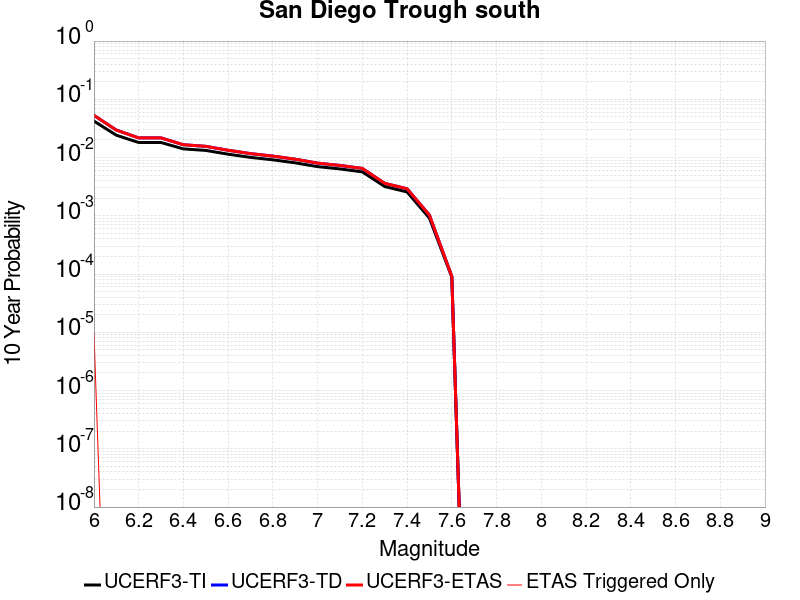 |

| Magnitude | 1 wk TI Prob | 1 wk TD Prob | 1 wk ETAS Prob | 1 wk ETAS/TD Gain | 1 wk ETAS Triggered Only | 1 mo TI Prob | 1 mo TD Prob | 1 mo ETAS Prob | 1 mo ETAS/TD Gain | 1 mo ETAS Triggered Only | 1 yr TI Prob | 1 yr TD Prob | 1 yr ETAS Prob | 1 yr ETAS/TD Gain | 1 yr ETAS Triggered Only | 10 yr TI Prob | 10 yr TD Prob | 10 yr ETAS Prob | 10 yr ETAS/TD Gain | 10 yr ETAS Triggered Only |
|-----|-----|-----|-----|-----|-----|-----|-----|-----|-----|-----|-----|-----|-----|-----|-----|-----|-----|-----|-----|-----|
| 6.0 | 8.279495E-5 | 1.04241306E-4 | 1.3310499E-4 | 1.276893 | 2.8866694E-5 | 3.5478722E-4 | 4.4667677E-4 | 4.7553057E-4 | 1.0645967 | 2.8866694E-5 | 0.004310982 | 0.0054256152 | 0.0054543256 | 1.0052916 | 2.8866694E-5 | 0.042283054 | 0.05299221 | 0.053019546 | 1.0005158 | 2.8866694E-5 |
| 6.1 | 4.6961468E-5 | 5.772944E-5 | 5.772944E-5 | 1.0 | 0.0 | 2.0124791E-4 | 2.473894E-4 | 2.473894E-4 | 1.0 | 0.0 | 0.00244744 | 0.0030079768 | 0.0030079768 | 1.0 | 0.0 | 0.024206603 | 0.029679462 | 0.029679462 | 1.0 | 0.0 |
| 6.2 | 3.5079658E-5 | 4.214154E-5 | 4.214154E-5 | 1.0 | 0.0 | 1.5033272E-4 | 1.8059435E-4 | 1.8059435E-4 | 1.0 | 0.0 | 0.0018287642 | 0.0021965632 | 0.0021965632 | 1.0 | 0.0 | 0.018137876 | 0.021751117 | 0.021751117 | 1.0 | 0.0 |
| 6.3 | 3.5079658E-5 | 4.214154E-5 | 4.214154E-5 | 1.0 | 0.0 | 1.5033272E-4 | 1.8059435E-4 | 1.8059435E-4 | 1.0 | 0.0 | 0.0018287642 | 0.0021965632 | 0.0021965632 | 1.0 | 0.0 | 0.018137876 | 0.021751117 | 0.021751117 | 1.0 | 0.0 |
| 6.4 | 2.7196904E-5 | 3.2087162E-5 | 3.2087162E-5 | 1.0 | 0.0 | 1.16552954E-4 | 1.3750927E-4 | 1.3750927E-4 | 1.0 | 0.0 | 0.0014181085 | 0.0016729041 | 0.0016729041 | 1.0 | 0.0 | 0.014090929 | 0.016604643 | 0.016604643 | 1.0 | 0.0 |
| 6.5 | 2.5584688E-5 | 3.010164E-5 | 3.010164E-5 | 1.0 | 0.0 | 1.0964406E-4 | 1.2900073E-4 | 1.2900073E-4 | 1.0 | 0.0 | 0.0013340989 | 0.0015694655 | 0.0015694655 | 1.0 | 0.0 | 0.013261181 | 0.015585314 | 0.015585314 | 1.0 | 0.0 |
| 6.6 | 2.2034688E-5 | 2.5742738E-5 | 2.5742738E-5 | 1.0 | 0.0 | 9.443096E-5 | 1.1032141E-4 | 1.1032141E-4 | 1.0 | 0.0 | 0.0011490905 | 0.0013423424 | 0.0013423424 | 1.0 | 0.0 | 0.011431668 | 0.013343317 | 0.013343317 | 1.0 | 0.0 |
| 6.7 | 1.9394853E-5 | 2.254176E-5 | 2.254176E-5 | 1.0 | 0.0 | 8.311815E-5 | 9.6603995E-5 | 9.6603995E-5 | 1.0 | 0.0 | 0.0010114936 | 0.0011755243 | 0.0011755243 | 1.0 | 0.0 | 0.01006902 | 0.011693766 | 0.011693766 | 1.0 | 0.0 |
| 6.8 | 1.7615313E-5 | 2.0403182E-5 | 2.0403182E-5 | 1.0 | 0.0 | 7.549201E-5 | 8.74393E-5 | 8.74393E-5 | 1.0 | 0.0 | 9.1872766E-4 | 0.0010640579 | 0.0010640579 | 1.0 | 0.0 | 0.009149387 | 0.010590198 | 0.010590198 | 1.0 | 0.0 |
| 6.9 | 1.5621423E-5 | 1.8026114E-5 | 1.8026114E-5 | 1.0 | 0.0 | 6.6947236E-5 | 7.725251E-5 | 7.725251E-5 | 1.0 | 0.0 | 8.147778E-4 | 9.40147E-4 | 9.40147E-4 | 1.0 | 0.0 | 0.008117969 | 0.009362142 | 0.009362142 | 1.0 | 0.0 |
| 7.0 | 1.3444376E-5 | 1.544809E-5 | 1.544809E-5 | 1.0 | 0.0 | 5.7617483E-5 | 6.620443E-5 | 6.620443E-5 | 1.0 | 0.0 | 7.0126704E-4 | 8.057436E-4 | 8.057436E-4 | 1.0 | 0.0 | 0.006990582 | 0.008028555 | 0.008028555 | 1.0 | 0.0 |
| 7.1 | 1.2268361E-5 | 1.407303E-5 | 1.407303E-5 | 1.0 | 0.0 | 5.2577634E-5 | 6.0311606E-5 | 6.0311606E-5 | 1.0 | 0.0 | 6.399447E-4 | 7.3404907E-4 | 7.3404907E-4 | 1.0 | 0.0 | 0.0063810493 | 0.0073165493 | 0.0073165493 | 1.0 | 0.0 |
| 7.2 | 1.0922655E-5 | 1.2513563E-5 | 1.2513563E-5 | 1.0 | 0.0 | 4.681054E-5 | 5.3628468E-5 | 5.3628468E-5 | 1.0 | 0.0 | 5.697693E-4 | 6.5273355E-4 | 6.5273355E-4 | 1.0 | 0.0 | 0.0056831064 | 0.0065084435 | 0.0065084435 | 1.0 | 0.0 |
| 7.3 | 6.1106753E-6 | 6.928925E-6 | 6.928925E-6 | 1.0 | 0.0 | 2.6188345E-5 | 2.9695057E-5 | 2.9695057E-5 | 1.0 | 0.0 | 3.1879646E-4 | 3.6147775E-4 | 3.6147775E-4 | 1.0 | 0.0 | 0.0031833951 | 0.003608943 | 0.003608943 | 1.0 | 0.0 |
| 7.4 | 4.933187E-6 | 5.5895525E-6 | 5.5895525E-6 | 1.0 | 0.0 | 2.114206E-5 | 2.3955008E-5 | 2.3955008E-5 | 1.0 | 0.0 | 2.5737417E-4 | 2.9161357E-4 | 2.9161357E-4 | 1.0 | 0.0 | 0.002570763 | 0.0029123505 | 0.0029123505 | 1.0 | 0.0 |
| 7.5 | 1.7489613E-6 | 1.969678E-6 | 1.969678E-6 | 1.0 | 0.0 | 7.495527E-6 | 8.4414505E-6 | 8.4414505E-6 | 1.0 | 0.0 | 9.125422E-5 | 1.02770035E-4 | 1.02770035E-4 | 1.0 | 0.0 | 9.1216754E-4 | 0.0010272472 | 0.0010272472 | 1.0 | 0.0 |
| 7.6 | 1.6988751E-7 | 1.7533823E-7 | 1.7533823E-7 | 1.0 | 0.0 | 7.2808916E-7 | 7.5144936E-7 | 7.5144936E-7 | 1.0 | 0.0 | 8.864449E-6 | 9.14886E-6 | 9.14886E-6 | 1.0 | 0.0 | 8.8640954E-5 | 9.1485024E-5 | 9.1485024E-5 | 1.0 | 0.0 |

## San Juan
*[(top)](#table-of-contents)*

| 1 Week | 1 Month | 1 Year | 10 Year |
|-----|-----|-----|-----|
|  |  |  |  |

| Magnitude | 1 wk TI Prob | 1 wk TD Prob | 1 wk ETAS Prob | 1 wk ETAS/TD Gain | 1 wk ETAS Triggered Only | 1 mo TI Prob | 1 mo TD Prob | 1 mo ETAS Prob | 1 mo ETAS/TD Gain | 1 mo ETAS Triggered Only | 1 yr TI Prob | 1 yr TD Prob | 1 yr ETAS Prob | 1 yr ETAS/TD Gain | 1 yr ETAS Triggered Only | 10 yr TI Prob | 10 yr TD Prob | 10 yr ETAS Prob | 10 yr ETAS/TD Gain | 10 yr ETAS Triggered Only |
|-----|-----|-----|-----|-----|-----|-----|-----|-----|-----|-----|-----|-----|-----|-----|-----|-----|-----|-----|-----|-----|
| 6.0 | 8.682808E-6 | 8.7491635E-6 | 8.7491635E-6 | 1.0 | 0.0 | 3.72115E-5 | 3.74959E-5 | 3.74959E-5 | 1.0 | 0.0 | 4.5295584E-4 | 4.564218E-4 | 4.8527535E-4 | 1.0632168 | 2.8866694E-5 | 0.004520337 | 0.004555385 | 0.00458412 | 1.006308 | 2.8866694E-5 |
| 6.1 | 8.682808E-6 | 8.7491635E-6 | 8.7491635E-6 | 1.0 | 0.0 | 3.72115E-5 | 3.74959E-5 | 3.74959E-5 | 1.0 | 0.0 | 4.5295584E-4 | 4.564218E-4 | 4.8527535E-4 | 1.0632168 | 2.8866694E-5 | 0.004520337 | 0.004555385 | 0.00458412 | 1.006308 | 2.8866694E-5 |
| 6.2 | 8.682808E-6 | 8.7491635E-6 | 8.7491635E-6 | 1.0 | 0.0 | 3.72115E-5 | 3.74959E-5 | 3.74959E-5 | 1.0 | 0.0 | 4.5295584E-4 | 4.564218E-4 | 4.8527535E-4 | 1.0632168 | 2.8866694E-5 | 0.004520337 | 0.004555385 | 0.00458412 | 1.006308 | 2.8866694E-5 |
| 6.3 | 6.3054235E-6 | 6.2825848E-6 | 6.2825848E-6 | 1.0 | 0.0 | 2.7022963E-5 | 2.6925094E-5 | 2.6925094E-5 | 1.0 | 0.0 | 3.2895492E-4 | 3.2776513E-4 | 3.5662236E-4 | 1.0880424 | 2.8866694E-5 | 0.003284684 | 0.003273017 | 0.003301789 | 1.0087907 | 2.8866694E-5 |
| 6.4 | 6.1490473E-6 | 6.1144656E-6 | 6.1144656E-6 | 1.0 | 0.0 | 2.6352795E-5 | 2.6204598E-5 | 2.6204598E-5 | 1.0 | 0.0 | 3.2079802E-4 | 3.1899565E-4 | 3.478531E-4 | 1.0904635 | 2.8866694E-5 | 0.0032033534 | 0.0031855737 | 0.0032143486 | 1.0090328 | 2.8866694E-5 |
| 6.5 | 5.204848E-6 | 5.137233E-6 | 5.137233E-6 | 1.0 | 0.0 | 2.23063E-5 | 2.2016533E-5 | 2.2016533E-5 | 1.0 | 0.0 | 2.7154534E-4 | 2.6801927E-4 | 2.9687825E-4 | 1.107675 | 2.8866694E-5 | 0.0027121378 | 0.0026771144 | 0.002705904 | 1.0107539 | 2.8866694E-5 |
| 6.6 | 4.5179986E-6 | 4.4150297E-6 | 4.4150297E-6 | 1.0 | 0.0 | 1.9362706E-5 | 1.8921424E-5 | 1.8921424E-5 | 1.0 | 0.0 | 2.3571544E-4 | 2.3034477E-4 | 2.5920483E-4 | 1.1252906 | 2.8866694E-5 | 0.0023546559 | 0.0023011973 | 0.0023299975 | 1.0125153 | 2.8866694E-5 |
| 6.7 | 3.9442616E-6 | 3.819828E-6 | 3.819828E-6 | 1.0 | 0.0 | 1.6903869E-5 | 1.6370592E-5 | 1.6370592E-5 | 1.0 | 0.0 | 2.0578515E-4 | 1.992944E-4 | 1.992944E-4 | 1.0 | 0.0 | 0.002055947 | 0.0019912818 | 0.0019912818 | 1.0 | 0.0 |
| 6.8 | 3.4536245E-6 | 3.3163353E-6 | 3.3163353E-6 | 1.0 | 0.0 | 1.4801163E-5 | 1.4212792E-5 | 1.4212792E-5 | 1.0 | 0.0 | 1.8018926E-4 | 1.7302761E-4 | 1.7302761E-4 | 1.0 | 0.0 | 0.0018004322 | 0.0017290477 | 0.0017290477 | 1.0 | 0.0 |
| 6.9 | 3.059865E-6 | 2.9120315E-6 | 2.9120315E-6 | 1.0 | 0.0 | 1.3113641E-5 | 1.2480078E-5 | 1.2480078E-5 | 1.0 | 0.0 | 1.596469E-4 | 1.5193493E-4 | 1.5193493E-4 | 1.0 | 0.0 | 0.0015953224 | 0.0015184252 | 0.0015184252 | 1.0 | 0.0 |
| 7.0 | 2.6504351E-6 | 2.4920002E-6 | 2.4920002E-6 | 1.0 | 0.0 | 1.1358958E-5 | 1.0679961E-5 | 1.0679961E-5 | 1.0 | 0.0 | 1.3828653E-4 | 1.300213E-4 | 1.300213E-4 | 1.0 | 0.0 | 0.0013820052 | 0.0012995641 | 0.0012995641 | 1.0 | 0.0 |
| 7.1 | 2.2039317E-6 | 2.0338296E-6 | 2.0338296E-6 | 1.0 | 0.0 | 9.445387E-6 | 8.716386E-6 | 8.716386E-6 | 1.0 | 0.0 | 1.1499152E-4 | 1.0611736E-4 | 1.0611736E-4 | 1.0 | 0.0 | 0.0011493203 | 0.0010607769 | 0.0010607769 | 1.0 | 0.0 |
| 7.2 | 1.0786707E-6 | 8.7701903E-7 | 8.7701903E-7 | 1.0 | 0.0 | 4.622866E-6 | 3.7586476E-6 | 3.7586476E-6 | 1.0 | 0.0 | 5.628194E-5 | 4.5760586E-5 | 4.5760586E-5 | 1.0 | 0.0 | 5.6267687E-4 | 4.5757066E-4 | 4.5757066E-4 | 1.0 | 0.0 |
| 7.3 | 6.846433E-7 | 4.868805E-7 | 4.868805E-7 | 1.0 | 0.0 | 2.9341822E-6 | 2.086629E-6 | 2.086629E-6 | 1.0 | 0.0 | 3.5723086E-5 | 2.5404412E-5 | 2.5404412E-5 | 1.0 | 0.0 | 3.571734E-4 | 2.540486E-4 | 2.540486E-4 | 1.0 | 0.0 |
| 7.4 | 5.23043E-7 | 3.2628162E-7 | 3.2628162E-7 | 1.0 | 0.0 | 2.2416111E-6 | 1.398349E-6 | 1.398349E-6 | 1.0 | 0.0 | 2.7291273E-5 | 1.7024766E-5 | 1.7024766E-5 | 1.0 | 0.0 | 2.7287923E-4 | 1.7026656E-4 | 1.7026656E-4 | 1.0 | 0.0 |
| 7.5 | 4.648444E-7 | 2.7234944E-7 | 2.7234944E-7 | 1.0 | 0.0 | 1.9921886E-6 | 1.1672114E-6 | 1.1672114E-6 | 1.0 | 0.0 | 2.4254627E-5 | 1.42107065E-5 | 1.42107065E-5 | 1.0 | 0.0 | 2.425198E-4 | 1.421276E-4 | 1.421276E-4 | 1.0 | 0.0 |
| 7.6 | 3.9906567E-7 | 2.2083314E-7 | 2.2083314E-7 | 1.0 | 0.0 | 1.7102802E-6 | 9.464274E-7 | 9.464274E-7 | 1.0 | 0.0 | 2.0822463E-5 | 1.1522693E-5 | 1.1522693E-5 | 1.0 | 0.0 | 2.0820512E-4 | 1.15245566E-4 | 1.15245566E-4 | 1.0 | 0.0 |
| 7.7 | 1.8784601E-7 | 5.3666906E-8 | 5.3666906E-8 | 1.0 | 0.0 | 8.0505407E-7 | 2.30001E-7 | 2.30001E-7 | 1.0 | 0.0 | 9.80149E-6 | 2.8002585E-6 | 2.8002585E-6 | 1.0 | 0.0 | 9.801057E-5 | 2.8011282E-5 | 2.8011282E-5 | 1.0 | 0.0 |
| 7.8 | 1.00154914E-7 | 1.2415832E-8 | 1.2415832E-8 | 1.0 | 0.0 | 4.2923529E-7 | 5.3210716E-8 | 5.3210716E-8 | 1.0 | 0.0 | 5.225927E-6 | 6.4784024E-7 | 6.4784024E-7 | 1.0 | 0.0 | 5.225804E-5 | 6.484273E-6 | 6.484273E-6 | 1.0 | 0.0 |
| 7.9 | 6.171429E-8 | 4.2966155E-9 | 4.2966155E-9 | 1.0 | 0.0 | 2.6448978E-7 | 1.8414067E-8 | 1.8414067E-8 | 1.0 | 0.0 | 3.2201583E-6 | 2.2419121E-7 | 2.2419121E-7 | 1.0 | 0.0 | 3.2201115E-5 | 2.2472002E-6 | 2.2472002E-6 | 1.0 | 0.0 |
| 8.0 | 1.3974572E-8 | 3.3788217E-10 | 3.3788217E-10 | 1.0 | 0.0 | 5.989102E-8 | 1.448067E-9 | 1.448067E-9 | 1.0 | 0.0 | 7.2917294E-7 | 1.763022E-8 | 1.763022E-8 | 1.0 | 0.0 | 7.2917055E-6 | 1.8060365E-7 | 1.8060365E-7 | 1.0 | 0.0 |
| 8.1 | 1.8403477E-9 | 1.1302803E-10 | 1.1302803E-10 | 1.0 | 0.0 | 7.887204E-9 | 4.844063E-10 | 4.844063E-10 | 1.0 | 0.0 | 9.602671E-8 | 5.8976446E-9 | 5.8976446E-9 | 1.0 | 0.0 | 9.602667E-7 | 6.021993E-8 | 6.021993E-8 | 1.0 | 0.0 |

## Red Mountain
*[(top)](#table-of-contents)*

| 1 Week | 1 Month | 1 Year | 10 Year |
|-----|-----|-----|-----|
|  |  |  |  |

| Magnitude | 1 wk TI Prob | 1 wk TD Prob | 1 wk ETAS Prob | 1 wk ETAS/TD Gain | 1 wk ETAS Triggered Only | 1 mo TI Prob | 1 mo TD Prob | 1 mo ETAS Prob | 1 mo ETAS/TD Gain | 1 mo ETAS Triggered Only | 1 yr TI Prob | 1 yr TD Prob | 1 yr ETAS Prob | 1 yr ETAS/TD Gain | 1 yr ETAS Triggered Only | 10 yr TI Prob | 10 yr TD Prob | 10 yr ETAS Prob | 10 yr ETAS/TD Gain | 10 yr ETAS Triggered Only |
|-----|-----|-----|-----|-----|-----|-----|-----|-----|-----|-----|-----|-----|-----|-----|-----|-----|-----|-----|-----|-----|
| 6.0 | 4.1810763E-5 | 4.7589947E-5 | 7.645527E-5 | 1.6065423 | 2.8866694E-5 | 1.7917668E-4 | 2.039419E-4 | 2.328027E-4 | 1.1415149 | 2.8866694E-5 | 0.0021792934 | 0.0024803306 | 0.0025091257 | 1.0116094 | 2.8866694E-5 | 0.021580452 | 0.024544092 | 0.02457225 | 1.0011473 | 2.8866694E-5 |
| 6.1 | 4.1810763E-5 | 4.7589947E-5 | 7.645527E-5 | 1.6065423 | 2.8866694E-5 | 1.7917668E-4 | 2.039419E-4 | 2.328027E-4 | 1.1415149 | 2.8866694E-5 | 0.0021792934 | 0.0024803306 | 0.0025091257 | 1.0116094 | 2.8866694E-5 | 0.021580452 | 0.024544092 | 0.02457225 | 1.0011473 | 2.8866694E-5 |
| 6.2 | 4.1810763E-5 | 4.7589947E-5 | 7.645527E-5 | 1.6065423 | 2.8866694E-5 | 1.7917668E-4 | 2.039419E-4 | 2.328027E-4 | 1.1415149 | 2.8866694E-5 | 0.0021792934 | 0.0024803306 | 0.0025091257 | 1.0116094 | 2.8866694E-5 | 0.021580452 | 0.024544092 | 0.02457225 | 1.0011473 | 2.8866694E-5 |
| 6.3 | 4.1810763E-5 | 4.7589947E-5 | 7.645527E-5 | 1.6065423 | 2.8866694E-5 | 1.7917668E-4 | 2.039419E-4 | 2.328027E-4 | 1.1415149 | 2.8866694E-5 | 0.0021792934 | 0.0024803306 | 0.0025091257 | 1.0116094 | 2.8866694E-5 | 0.021580452 | 0.024544092 | 0.02457225 | 1.0011473 | 2.8866694E-5 |
| 6.4 | 4.1810763E-5 | 4.7589947E-5 | 7.645527E-5 | 1.6065423 | 2.8866694E-5 | 1.7917668E-4 | 2.039419E-4 | 2.328027E-4 | 1.1415149 | 2.8866694E-5 | 0.0021792934 | 0.0024803306 | 0.0025091257 | 1.0116094 | 2.8866694E-5 | 0.021580452 | 0.024544092 | 0.02457225 | 1.0011473 | 2.8866694E-5 |
| 6.5 | 3.154503E-5 | 3.5359728E-5 | 6.42254E-5 | 1.8163432 | 2.8866694E-5 | 1.3518598E-4 | 1.5153342E-4 | 1.8039573E-4 | 1.1904683 | 2.8866694E-5 | 0.0016446467 | 0.0018434501 | 0.0018722636 | 1.0156302 | 2.8866694E-5 | 0.01632528 | 0.018291233 | 0.018319573 | 1.0015494 | 2.8866694E-5 |
| 6.6 | 3.1535834E-5 | 3.534911E-5 | 6.4214786E-5 | 1.8165884 | 2.8866694E-5 | 1.3514658E-4 | 1.5148791E-4 | 1.8035022E-4 | 1.1905255 | 2.8866694E-5 | 0.0016441676 | 0.001842897 | 0.0018717106 | 1.0156349 | 2.8866694E-5 | 0.01632056 | 0.018285794 | 0.018314134 | 1.0015497 | 2.8866694E-5 |
| 6.7 | 2.8267326E-5 | 3.146934E-5 | 3.146934E-5 | 1.0 | 0.0 | 1.2114006E-4 | 1.348621E-4 | 1.348621E-4 | 1.0 | 0.0 | 0.0014738824 | 0.0016407946 | 0.0016407946 | 1.0 | 0.0 | 0.014641452 | 0.016295563 | 0.016295563 | 1.0 | 0.0 |
| 6.8 | 2.8212884E-5 | 3.1407224E-5 | 3.1407224E-5 | 1.0 | 0.0 | 1.20906756E-4 | 1.3459593E-4 | 1.3459593E-4 | 1.0 | 0.0 | 0.0014710457 | 0.0016375587 | 0.0016375587 | 1.0 | 0.0 | 0.014613459 | 0.01626368 | 0.01626368 | 1.0 | 0.0 |
| 6.9 | 2.4227871E-5 | 2.6706979E-5 | 2.6706979E-5 | 1.0 | 0.0 | 1.03829596E-4 | 1.14453884E-4 | 1.14453884E-4 | 1.0 | 0.0 | 0.0012633923 | 0.0013926612 | 0.0013926612 | 1.0 | 0.0 | 0.012562336 | 0.013847026 | 0.013847026 | 1.0 | 0.0 |
| 7.0 | 2.348524E-5 | 2.5835763E-5 | 2.5835763E-5 | 1.0 | 0.0 | 1.0064714E-4 | 1.1072042E-4 | 1.1072042E-4 | 1.0 | 0.0 | 0.0012246901 | 0.0013472632 | 0.0013472632 | 1.0 | 0.0 | 0.012179627 | 0.01339859 | 0.01339859 | 1.0 | 0.0 |
| 7.1 | 2.2311642E-5 | 2.4462828E-5 | 2.4462828E-5 | 1.0 | 0.0 | 9.561782E-5 | 1.048369E-4 | 1.048369E-4 | 1.0 | 0.0 | 0.0011635252 | 0.0012757168 | 0.0012757168 | 1.0 | 0.0 | 0.01157452 | 0.012691451 | 0.012691451 | 1.0 | 0.0 |
| 7.2 | 1.6533986E-5 | 1.7670347E-5 | 1.7670347E-5 | 1.0 | 0.0 | 7.085802E-5 | 7.572822E-5 | 7.572822E-5 | 1.0 | 0.0 | 8.623549E-4 | 9.216645E-4 | 9.216645E-4 | 1.0 | 0.0 | 0.008590161 | 0.009184699 | 0.009184699 | 1.0 | 0.0 |
| 7.3 | 1.4703092E-5 | 1.555952E-5 | 1.555952E-5 | 1.0 | 0.0 | 6.301173E-5 | 6.66823E-5 | 6.66823E-5 | 1.0 | 0.0 | 7.668978E-4 | 8.1161625E-4 | 8.1161625E-4 | 1.0 | 0.0 | 0.0076425658 | 0.008092596 | 0.008092596 | 1.0 | 0.0 |
| 7.4 | 6.1331984E-6 | 5.528872E-6 | 5.528872E-6 | 1.0 | 0.0 | 2.6284872E-5 | 2.3694953E-5 | 2.3694953E-5 | 1.0 | 0.0 | 3.199713E-4 | 2.8844838E-4 | 2.8844838E-4 | 1.0 | 0.0 | 0.0031951098 | 0.0028807942 | 0.0028807942 | 1.0 | 0.0 |
| 7.5 | 5.954766E-6 | 5.3385015E-6 | 5.3385015E-6 | 1.0 | 0.0 | 2.5520176E-5 | 2.2879094E-5 | 2.2879094E-5 | 1.0 | 0.0 | 3.1066386E-4 | 2.785179E-4 | 2.785179E-4 | 1.0 | 0.0 | 0.003102299 | 0.0027817423 | 0.0027817423 | 1.0 | 0.0 |
| 7.6 | 4.9726646E-6 | 4.315295E-6 | 4.315295E-6 | 1.0 | 0.0 | 2.1311245E-5 | 1.8493993E-5 | 1.8493993E-5 | 1.0 | 0.0 | 2.5943352E-4 | 2.2514143E-4 | 2.2514143E-4 | 1.0 | 0.0 | 0.0025913084 | 0.002249168 | 0.002249168 | 1.0 | 0.0 |
| 7.7 | 3.3613894E-6 | 2.8526642E-6 | 2.8526642E-6 | 1.0 | 0.0 | 1.4405875E-5 | 1.2225649E-5 | 1.2225649E-5 | 1.0 | 0.0 | 1.7537741E-4 | 1.4883737E-4 | 1.4883737E-4 | 1.0 | 0.0 | 0.0017523908 | 0.0014874031 | 0.0014874031 | 1.0 | 0.0 |
| 7.8 | 1.1828961E-6 | 1.0122756E-6 | 1.0122756E-6 | 1.0 | 0.0 | 5.069545E-6 | 4.338317E-6 | 4.338317E-6 | 1.0 | 0.0 | 6.171996E-5 | 5.281776E-5 | 5.281776E-5 | 1.0 | 0.0 | 6.170282E-4 | 5.2805495E-4 | 5.2805495E-4 | 1.0 | 0.0 |
| 7.9 | 2.2967266E-7 | 1.8618952E-7 | 1.8618952E-7 | 1.0 | 0.0 | 9.843111E-7 | 7.9795484E-7 | 7.9795484E-7 | 1.0 | 0.0 | 1.19839215E-5 | 9.7150605E-6 | 9.7150605E-6 | 1.0 | 0.0 | 1.1983275E-4 | 9.714664E-5 | 9.714664E-5 | 1.0 | 0.0 |

## Elsinore (Glen Ivy) rev
*[(top)](#table-of-contents)*

| 1 Week | 1 Month | 1 Year | 10 Year |
|-----|-----|-----|-----|
|  |  |  |  |

| Magnitude | 1 wk TI Prob | 1 wk TD Prob | 1 wk ETAS Prob | 1 wk ETAS/TD Gain | 1 wk ETAS Triggered Only | 1 mo TI Prob | 1 mo TD Prob | 1 mo ETAS Prob | 1 mo ETAS/TD Gain | 1 mo ETAS Triggered Only | 1 yr TI Prob | 1 yr TD Prob | 1 yr ETAS Prob | 1 yr ETAS/TD Gain | 1 yr ETAS Triggered Only | 10 yr TI Prob | 10 yr TD Prob | 10 yr ETAS Prob | 10 yr ETAS/TD Gain | 10 yr ETAS Triggered Only |
|-----|-----|-----|-----|-----|-----|-----|-----|-----|-----|-----|-----|-----|-----|-----|-----|-----|-----|-----|-----|-----|
| 6.0 | 1.6204086E-4 | 2.9360707E-4 | 3.224653E-4 | 1.0982885 | 2.8866694E-5 | 6.94276E-4 | 0.0012578638 | 0.0012866942 | 1.0229201 | 2.8866694E-5 | 0.008420097 | 0.015234485 | 0.015262912 | 1.001866 | 2.8866694E-5 | 0.081081145 | 0.13969168 | 0.1397165 | 1.0001777 | 2.8866694E-5 |
| 6.1 | 1.6204086E-4 | 2.9360707E-4 | 3.224653E-4 | 1.0982885 | 2.8866694E-5 | 6.94276E-4 | 0.0012578638 | 0.0012866942 | 1.0229201 | 2.8866694E-5 | 0.008420097 | 0.015234485 | 0.015262912 | 1.001866 | 2.8866694E-5 | 0.081081145 | 0.13969168 | 0.1397165 | 1.0001777 | 2.8866694E-5 |
| 6.2 | 1.6204086E-4 | 2.9360707E-4 | 3.224653E-4 | 1.0982885 | 2.8866694E-5 | 6.94276E-4 | 0.0012578638 | 0.0012866942 | 1.0229201 | 2.8866694E-5 | 0.008420097 | 0.015234485 | 0.015262912 | 1.001866 | 2.8866694E-5 | 0.081081145 | 0.13969168 | 0.1397165 | 1.0001777 | 2.8866694E-5 |
| 6.3 | 1.0111737E-4 | 1.7703383E-4 | 2.0589541E-4 | 1.1630286 | 2.8866694E-5 | 4.332882E-4 | 7.5861247E-4 | 7.874572E-4 | 1.0380231 | 2.8866694E-5 | 0.005262531 | 0.009217682 | 0.009246283 | 1.0031028 | 2.8866694E-5 | 0.0513964 | 0.0870191 | 0.08704545 | 1.0003029 | 2.8866694E-5 |
| 6.4 | 1.0111737E-4 | 1.7703383E-4 | 2.0589541E-4 | 1.1630286 | 2.8866694E-5 | 4.332882E-4 | 7.5861247E-4 | 7.874572E-4 | 1.0380231 | 2.8866694E-5 | 0.005262531 | 0.009217682 | 0.009246283 | 1.0031028 | 2.8866694E-5 | 0.0513964 | 0.0870191 | 0.08704545 | 1.0003029 | 2.8866694E-5 |
| 6.5 | 3.6624708E-5 | 4.6391084E-5 | 4.6391084E-5 | 1.0 | 0.0 | 1.569536E-4 | 1.9880582E-4 | 1.9880582E-4 | 1.0 | 0.0 | 0.001909235 | 0.0024181372 | 0.0024181372 | 1.0 | 0.0 | 0.01892915 | 0.023739954 | 0.023739954 | 1.0 | 0.0 |
| 6.6 | 2.5051324E-5 | 2.614772E-5 | 2.614772E-5 | 1.0 | 0.0 | 1.073584E-4 | 1.12057096E-4 | 1.12057096E-4 | 1.0 | 0.0 | 0.0013063047 | 0.0013634858 | 0.0013634858 | 1.0 | 0.0 | 0.012986525 | 0.013564618 | 0.013564618 | 1.0 | 0.0 |
| 6.7 | 2.2189772E-5 | 2.2072849E-5 | 2.2072849E-5 | 1.0 | 0.0 | 9.509556E-5 | 9.4594696E-5 | 9.4594696E-5 | 1.0 | 0.0 | 0.0011571734 | 0.0011511183 | 0.0011511183 | 1.0 | 0.0 | 0.011511663 | 0.011465415 | 0.011465415 | 1.0 | 0.0 |
| 6.8 | 1.6654378E-5 | 1.4437705E-5 | 1.4437705E-5 | 1.0 | 0.0 | 7.137396E-5 | 6.187444E-5 | 6.187444E-5 | 1.0 | 0.0 | 8.686314E-4 | 7.530661E-4 | 7.530661E-4 | 1.0 | 0.0 | 0.008652439 | 0.00751048 | 0.00751048 | 1.0 | 0.0 |
| 6.9 | 1.5042909E-5 | 1.2332022E-5 | 1.2332022E-5 | 1.0 | 0.0 | 6.446802E-5 | 5.285047E-5 | 5.285047E-5 | 1.0 | 0.0 | 7.8461546E-4 | 6.4326765E-4 | 6.4326765E-4 | 1.0 | 0.0 | 0.007818509 | 0.00641828 | 0.00641828 | 1.0 | 0.0 |
| 7.0 | 1.4361385E-5 | 1.1451324E-5 | 1.1451324E-5 | 1.0 | 0.0 | 6.154734E-5 | 4.9076196E-5 | 4.9076196E-5 | 1.0 | 0.0 | 7.490812E-4 | 5.973418E-4 | 5.973418E-4 | 1.0 | 0.0 | 0.007465612 | 0.0059613534 | 0.0059613534 | 1.0 | 0.0 |
| 7.1 | 1.3265571E-5 | 1.0244926E-5 | 1.0244926E-5 | 1.0 | 0.0 | 5.6851208E-5 | 4.39061E-5 | 4.39061E-5 | 1.0 | 0.0 | 6.919436E-4 | 5.344282E-4 | 5.344282E-4 | 1.0 | 0.0 | 0.006897931 | 0.0053347866 | 0.0053347866 | 1.0 | 0.0 |
| 7.2 | 1.1596403E-5 | 8.505067E-6 | 8.505067E-6 | 1.0 | 0.0 | 4.9697923E-5 | 3.6449786E-5 | 3.6449786E-5 | 1.0 | 0.0 | 6.049042E-4 | 4.436875E-4 | 4.436875E-4 | 1.0 | 0.0 | 0.006032603 | 0.0044294316 | 0.0044294316 | 1.0 | 0.0 |
| 7.3 | 1.0150827E-5 | 7.2387597E-6 | 7.2387597E-6 | 1.0 | 0.0 | 4.3502816E-5 | 3.1022897E-5 | 3.1022897E-5 | 1.0 | 0.0 | 5.2951806E-4 | 3.7763975E-4 | 3.7763975E-4 | 1.0 | 0.0 | 0.005282581 | 0.0037703665 | 0.0037703665 | 1.0 | 0.0 |
| 7.4 | 9.080705E-6 | 6.352519E-6 | 6.352519E-6 | 1.0 | 0.0 | 3.8916725E-5 | 2.7224805E-5 | 2.7224805E-5 | 1.0 | 0.0 | 4.7370812E-4 | 3.3141294E-4 | 3.3141294E-4 | 1.0 | 0.0 | 0.004726996 | 0.0033093381 | 0.0033093381 | 1.0 | 0.0 |
| 7.5 | 7.671649E-6 | 5.2256332E-6 | 5.2256332E-6 | 1.0 | 0.0 | 3.287808E-5 | 2.2395385E-5 | 2.2395385E-5 | 1.0 | 0.0 | 4.0021708E-4 | 2.7263095E-4 | 2.7263095E-4 | 1.0 | 0.0 | 0.0039949706 | 0.00272309 | 0.00272309 | 1.0 | 0.0 |
| 7.6 | 6.990086E-6 | 4.687545E-6 | 4.687545E-6 | 1.0 | 0.0 | 2.9957167E-5 | 2.008933E-5 | 2.008933E-5 | 1.0 | 0.0 | 3.6466747E-4 | 2.445613E-4 | 2.445613E-4 | 1.0 | 0.0 | 0.0036406964 | 0.002443038 | 0.002443038 | 1.0 | 0.0 |
| 7.7 | 4.163505E-6 | 2.3295343E-6 | 2.3295343E-6 | 1.0 | 0.0 | 1.7843471E-5 | 9.983683E-6 | 9.983683E-6 | 1.0 | 0.0 | 2.172226E-4 | 1.21545316E-4 | 1.21545316E-4 | 1.0 | 0.0 | 0.0021701038 | 0.0012148614 | 0.0012148614 | 1.0 | 0.0 |
| 7.8 | 2.2692414E-7 | 9.3854695E-8 | 9.3854695E-8 | 1.0 | 0.0 | 9.725317E-7 | 4.0223435E-7 | 4.0223435E-7 | 1.0 | 0.0 | 1.1840509E-5 | 4.8971956E-6 | 4.8971956E-6 | 1.0 | 0.0 | 1.1839878E-4 | 4.8971204E-5 | 4.8971204E-5 | 1.0 | 0.0 |
| 7.9 | 6.676829E-9 | 3.439853E-9 | 3.439853E-9 | 1.0 | 0.0 | 2.861498E-8 | 1.4742227E-8 | 1.4742227E-8 | 1.0 | 0.0 | 3.4838732E-7 | 1.7948659E-7 | 1.7948659E-7 | 1.0 | 0.0 | 3.4838679E-6 | 1.7948646E-6 | 1.7948646E-6 | 1.0 | 0.0 |

## Malibu Coast alt 1
*[(top)](#table-of-contents)*

| 1 Week | 1 Month | 1 Year | 10 Year |
|-----|-----|-----|-----|
|  | 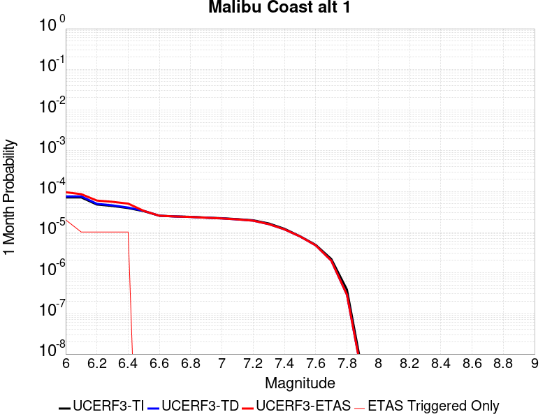 |  |  |

| Magnitude | 1 wk TI Prob | 1 wk TD Prob | 1 wk ETAS Prob | 1 wk ETAS/TD Gain | 1 wk ETAS Triggered Only | 1 mo TI Prob | 1 mo TD Prob | 1 mo ETAS Prob | 1 mo ETAS/TD Gain | 1 mo ETAS Triggered Only | 1 yr TI Prob | 1 yr TD Prob | 1 yr ETAS Prob | 1 yr ETAS/TD Gain | 1 yr ETAS Triggered Only | 10 yr TI Prob | 10 yr TD Prob | 10 yr ETAS Prob | 10 yr ETAS/TD Gain | 10 yr ETAS Triggered Only |
|-----|-----|-----|-----|-----|-----|-----|-----|-----|-----|-----|-----|-----|-----|-----|-----|-----|-----|-----|-----|-----|
| 6.0 | 1.6572556E-5 | 1.7598066E-5 | 4.646425E-5 | 2.6403043 | 2.8866694E-5 | 7.102331E-5 | 7.541821E-5 | 1.0428273E-4 | 1.3827261 | 2.8866694E-5 | 8.6436566E-4 | 9.178488E-4 | 9.46689E-4 | 1.0314215 | 2.8866694E-5 | 0.0086101135 | 0.009142512 | 0.009171115 | 1.0031285 | 2.8866694E-5 |
| 6.1 | 1.6572556E-5 | 1.7598066E-5 | 4.646425E-5 | 2.6403043 | 2.8866694E-5 | 7.102331E-5 | 7.541821E-5 | 1.0428273E-4 | 1.3827261 | 2.8866694E-5 | 8.6436566E-4 | 9.178488E-4 | 9.46689E-4 | 1.0314215 | 2.8866694E-5 | 0.0086101135 | 0.009142512 | 0.009171115 | 1.0031285 | 2.8866694E-5 |
| 6.2 | 1.1085717E-5 | 1.1557147E-5 | 4.0423507E-5 | 3.4977064 | 2.8866694E-5 | 4.750935E-5 | 4.952971E-5 | 7.839497E-5 | 1.5827868 | 2.8866694E-5 | 5.782728E-4 | 6.028609E-4 | 6.3171017E-4 | 1.047854 | 2.8866694E-5 | 0.0057677035 | 0.0060126255 | 0.006041319 | 1.0047722 | 2.8866694E-5 |
| 6.3 | 1.0208568E-5 | 1.0592237E-5 | 3.9458624E-5 | 3.7252398 | 2.8866694E-5 | 4.375027E-5 | 4.539453E-5 | 7.4259915E-5 | 1.635878 | 2.8866694E-5 | 5.325294E-4 | 5.5254117E-4 | 5.813919E-4 | 1.0522146 | 2.8866694E-5 | 0.0053125503 | 0.0055119814 | 0.005540689 | 1.0052083 | 2.8866694E-5 |
| 6.4 | 9.0682315E-6 | 9.342637E-6 | 3.8209062E-5 | 4.0897512 | 2.8866694E-5 | 3.8863272E-5 | 4.003927E-5 | 6.890481E-5 | 1.7209307 | 2.8866694E-5 | 4.730576E-4 | 4.8737114E-4 | 5.162238E-4 | 1.0592005 | 2.8866694E-5 | 0.0047205184 | 0.004863236 | 0.0048919627 | 1.0059068 | 2.8866694E-5 |
| 6.5 | 7.605796E-6 | 7.748587E-6 | 7.748587E-6 | 1.0 | 0.0 | 3.259586E-5 | 3.3207816E-5 | 3.3207816E-5 | 1.0 | 0.0 | 3.9678233E-4 | 4.0423148E-4 | 4.0423148E-4 | 1.0 | 0.0 | 0.0039607463 | 0.0040351 | 0.0040351 | 1.0 | 0.0 |
| 6.6 | 5.889873E-6 | 5.8795385E-6 | 5.8795385E-6 | 1.0 | 0.0 | 2.5242069E-5 | 2.519778E-5 | 2.519778E-5 | 1.0 | 0.0 | 3.0727885E-4 | 3.0673988E-4 | 3.0673988E-4 | 1.0 | 0.0 | 0.003068543 | 0.0030631777 | 0.0030631777 | 1.0 | 0.0 |
| 6.7 | 5.66586E-6 | 5.641641E-6 | 5.641641E-6 | 1.0 | 0.0 | 2.428203E-5 | 2.417824E-5 | 2.417824E-5 | 1.0 | 0.0 | 2.955936E-4 | 2.9433038E-4 | 2.9433038E-4 | 1.0 | 0.0 | 0.0029520073 | 0.0029394177 | 0.0029394177 | 1.0 | 0.0 |
| 6.8 | 5.521556E-6 | 5.489427E-6 | 5.489427E-6 | 1.0 | 0.0 | 2.3663597E-5 | 2.3525903E-5 | 2.3525903E-5 | 1.0 | 0.0 | 2.880662E-4 | 2.8639034E-4 | 2.8639034E-4 | 1.0 | 0.0 | 0.0028769306 | 0.002860224 | 0.002860224 | 1.0 | 0.0 |
| 6.9 | 5.29752E-6 | 5.2499317E-6 | 5.2499317E-6 | 1.0 | 0.0 | 2.270346E-5 | 2.2499513E-5 | 2.2499513E-5 | 1.0 | 0.0 | 2.7637955E-4 | 2.7389723E-4 | 2.7389723E-4 | 1.0 | 0.0 | 0.0027603607 | 0.0027356069 | 0.0027356069 | 1.0 | 0.0 |
| 7.0 | 5.106743E-6 | 5.0476788E-6 | 5.0476788E-6 | 1.0 | 0.0 | 2.1885859E-5 | 2.163273E-5 | 2.163273E-5 | 1.0 | 0.0 | 2.6642776E-4 | 2.6334674E-4 | 2.6334674E-4 | 1.0 | 0.0 | 0.0026610855 | 0.0026303562 | 0.0026303562 | 1.0 | 0.0 |
| 7.1 | 4.8469647E-6 | 4.770373E-6 | 4.770373E-6 | 1.0 | 0.0 | 2.0772539E-5 | 2.0444295E-5 | 2.0444295E-5 | 1.0 | 0.0 | 2.528763E-4 | 2.4888094E-4 | 2.4888094E-4 | 1.0 | 0.0 | 0.0025258875 | 0.00248603 | 0.00248603 | 1.0 | 0.0 |
| 7.2 | 4.545514E-6 | 4.4481935E-6 | 4.4481935E-6 | 1.0 | 0.0 | 1.9480629E-5 | 1.9063547E-5 | 1.9063547E-5 | 1.0 | 0.0 | 2.3715083E-4 | 2.3207403E-4 | 2.3207403E-4 | 1.0 | 0.0 | 0.0023689792 | 0.0023183243 | 0.0023183243 | 1.0 | 0.0 |
| 7.3 | 3.794097E-6 | 3.6519348E-6 | 3.6519348E-6 | 1.0 | 0.0 | 1.6260314E-5 | 1.5651056E-5 | 1.5651056E-5 | 1.0 | 0.0 | 1.9795135E-4 | 1.9053498E-4 | 1.9053498E-4 | 1.0 | 0.0 | 0.001977751 | 0.0019037209 | 0.0019037209 | 1.0 | 0.0 |
| 7.4 | 2.808217E-6 | 2.719077E-6 | 2.719077E-6 | 1.0 | 0.0 | 1.203516E-5 | 1.1653135E-5 | 1.1653135E-5 | 1.0 | 0.0 | 1.4651821E-4 | 1.418677E-4 | 1.418677E-4 | 1.0 | 0.0 | 0.0014642165 | 0.001417774 | 0.001417774 | 1.0 | 0.0 |
| 7.5 | 1.83809E-6 | 1.8190691E-6 | 1.8190691E-6 | 1.0 | 0.0 | 7.877505E-6 | 7.795988E-6 | 7.795988E-6 | 1.0 | 0.0 | 9.59044E-5 | 9.491203E-5 | 9.491203E-5 | 1.0 | 0.0 | 9.5863023E-4 | 9.48717E-4 | 9.48717E-4 | 1.0 | 0.0 |
| 7.6 | 1.1292672E-6 | 1.1001447E-6 | 1.1001447E-6 | 1.0 | 0.0 | 4.839708E-6 | 4.714897E-6 | 4.714897E-6 | 1.0 | 0.0 | 5.8921847E-5 | 5.7402376E-5 | 5.7402376E-5 | 1.0 | 0.0 | 5.890623E-4 | 5.738771E-4 | 5.738771E-4 | 1.0 | 0.0 |
| 7.7 | 5.065272E-7 | 4.609151E-7 | 4.609151E-7 | 1.0 | 0.0 | 2.170829E-6 | 1.975349E-6 | 1.975349E-6 | 1.0 | 0.0 | 2.6429525E-5 | 2.404962E-5 | 2.404962E-5 | 1.0 | 0.0 | 2.642638E-4 | 2.4047129E-4 | 2.4047129E-4 | 1.0 | 0.0 |
| 7.8 | 8.952991E-8 | 6.707874E-8 | 6.707874E-8 | 1.0 | 0.0 | 3.8369956E-7 | 2.8748025E-7 | 2.8748025E-7 | 1.0 | 0.0 | 4.671532E-6 | 3.5000667E-6 | 3.5000667E-6 | 1.0 | 0.0 | 4.671434E-5 | 3.5000136E-5 | 3.5000136E-5 | 1.0 | 0.0 |
| 7.9 | 8.007447E-10 | 6.1608785E-10 | 6.1608785E-10 | 1.0 | 0.0 | 3.4317629E-9 | 2.6403764E-9 | 2.6403764E-9 | 1.0 | 0.0 | 4.1781714E-8 | 3.2146584E-8 | 3.2146584E-8 | 1.0 | 0.0 | 4.1781706E-7 | 3.214658E-7 | 3.214658E-7 | 1.0 | 0.0 |

## Hayward (No) 2011 CFM
*[(top)](#table-of-contents)*

| 1 Week | 1 Month | 1 Year | 10 Year |
|-----|-----|-----|-----|
|  |  |  |  |

| Magnitude | 1 wk TI Prob | 1 wk TD Prob | 1 wk ETAS Prob | 1 wk ETAS/TD Gain | 1 wk ETAS Triggered Only | 1 mo TI Prob | 1 mo TD Prob | 1 mo ETAS Prob | 1 mo ETAS/TD Gain | 1 mo ETAS Triggered Only | 1 yr TI Prob | 1 yr TD Prob | 1 yr ETAS Prob | 1 yr ETAS/TD Gain | 1 yr ETAS Triggered Only | 10 yr TI Prob | 10 yr TD Prob | 10 yr ETAS Prob | 10 yr ETAS/TD Gain | 10 yr ETAS Triggered Only |
|-----|-----|-----|-----|-----|-----|-----|-----|-----|-----|-----|-----|-----|-----|-----|-----|-----|-----|-----|-----|-----|
| 6.0 | 9.3068506E-5 | 1.739599E-4 | 2.0282157E-4 | 1.1659099 | 2.8866694E-5 | 3.9880406E-4 | 7.453244E-4 | 7.741696E-4 | 1.0387015 | 2.8866694E-5 | 0.0048446343 | 0.009036438 | 0.009065044 | 1.0031656 | 2.8866694E-5 | 0.047403704 | 0.08637534 | 0.086401716 | 1.0003053 | 2.8866694E-5 |
| 6.1 | 9.055486E-5 | 1.6947114E-4 | 1.9833294E-4 | 1.1703051 | 2.8866694E-5 | 3.880345E-4 | 7.261021E-4 | 7.5494783E-4 | 1.0397269 | 2.8866694E-5 | 0.0047140904 | 0.008804537 | 0.00883315 | 1.0032498 | 2.8866694E-5 | 0.046153355 | 0.08426854 | 0.084294975 | 1.0003136 | 2.8866694E-5 |
| 6.2 | 9.006742E-5 | 1.6867711E-4 | 1.9753895E-4 | 1.1711069 | 2.8866694E-5 | 3.859461E-4 | 7.22701E-4 | 7.515469E-4 | 1.0399139 | 2.8866694E-5 | 0.0046887742 | 0.008763513 | 0.008792127 | 1.0032651 | 2.8866694E-5 | 0.0459107 | 0.083892785 | 0.08391923 | 1.0003152 | 2.8866694E-5 |
| 6.3 | 8.8336754E-5 | 1.6547246E-4 | 1.9433438E-4 | 1.1744213 | 2.8866694E-5 | 3.7853114E-4 | 7.089758E-4 | 7.3782203E-4 | 1.0406872 | 2.8866694E-5 | 0.004598882 | 0.008597788 | 0.008626407 | 1.0033286 | 2.8866694E-5 | 0.04504866 | 0.08238599 | 0.08241248 | 1.0003215 | 2.8866694E-5 |
| 6.4 | 8.526157E-5 | 1.5974249E-4 | 1.8860456E-4 | 1.1806788 | 2.8866694E-5 | 3.6535555E-4 | 6.8443175E-4 | 7.132787E-4 | 1.0421473 | 2.8866694E-5 | 0.0044391346 | 0.008301278 | 0.008329905 | 1.0034485 | 2.8866694E-5 | 0.043514993 | 0.079682834 | 0.0797094 | 1.0003334 | 2.8866694E-5 |
| 6.5 | 8.152396E-5 | 1.530663E-4 | 1.8192858E-4 | 1.1885606 | 2.8866694E-5 | 3.493416E-4 | 6.558342E-4 | 6.84682E-4 | 1.0439863 | 2.8866694E-5 | 0.0042449418 | 0.007955698 | 0.0079843355 | 1.0035995 | 2.8866694E-5 | 0.04164765 | 0.07651369 | 0.07654035 | 1.0003484 | 2.8866694E-5 |
| 6.6 | 7.987405E-5 | 1.5010842E-4 | 1.7897077E-4 | 1.1922767 | 2.8866694E-5 | 3.4227243E-4 | 6.4316386E-4 | 6.72012E-4 | 1.0448534 | 2.8866694E-5 | 0.0041592065 | 0.0078025614 | 0.007831203 | 1.0036708 | 2.8866694E-5 | 0.04082218 | 0.07510622 | 0.075132914 | 1.0003555 | 2.8866694E-5 |
| 6.7 | 7.777665E-5 | 1.4650106E-4 | 1.7536353E-4 | 1.197012 | 2.8866694E-5 | 3.332859E-4 | 6.277113E-4 | 6.5655983E-4 | 1.0459584 | 2.8866694E-5 | 0.004050208 | 0.00761576 | 0.0076444065 | 1.0037615 | 2.8866694E-5 | 0.039771806 | 0.073382616 | 0.07340936 | 1.0003645 | 2.8866694E-5 |
| 6.8 | 7.3284005E-5 | 1.3800753E-4 | 1.6687025E-4 | 1.2091386 | 2.8866694E-5 | 3.140365E-4 | 5.913274E-4 | 6.20177E-4 | 1.048788 | 2.8866694E-5 | 0.0038166929 | 0.0071757827 | 0.0072044423 | 1.0039939 | 2.8866694E-5 | 0.037518036 | 0.06929621 | 0.06932308 | 1.0003877 | 2.8866694E-5 |
| 6.9 | 6.458263E-5 | 1.2131439E-4 | 1.5017758E-4 | 1.2379206 | 2.8866694E-5 | 2.7675333E-4 | 5.198157E-4 | 5.486674E-4 | 1.0555037 | 2.8866694E-5 | 0.0033642664 | 0.0063104923 | 0.006339177 | 1.0045456 | 2.8866694E-5 | 0.033137884 | 0.061225023 | 0.06125212 | 1.0004426 | 2.8866694E-5 |
| 7.0 | 5.3853604E-5 | 1.00250414E-4 | 1.00250414E-4 | 1.0 | 0.0 | 2.3078074E-4 | 4.295742E-4 | 4.295742E-4 | 1.0 | 0.0 | 0.0028061352 | 0.0052175885 | 0.0052175885 | 1.0 | 0.0 | 0.027709642 | 0.0509578 | 0.0509578 | 1.0 | 0.0 |
| 7.1 | 4.4308683E-5 | 8.170626E-5 | 8.170626E-5 | 1.0 | 0.0 | 1.8988053E-4 | 3.501229E-4 | 3.501229E-4 | 1.0 | 0.0 | 0.0023093442 | 0.0042544557 | 0.0042544557 | 1.0 | 0.0 | 0.022854926 | 0.04182473 | 0.04182473 | 1.0 | 0.0 |
| 7.2 | 3.295973E-5 | 6.0771144E-5 | 6.0771144E-5 | 1.0 | 0.0 | 1.4124835E-4 | 2.604219E-4 | 2.604219E-4 | 1.0 | 0.0 | 0.0017183421 | 0.0031660495 | 0.0031660495 | 1.0 | 0.0 | 0.017051157 | 0.031369876 | 0.031369876 | 1.0 | 0.0 |
| 7.3 | 2.452256E-5 | 4.5180346E-5 | 4.5180346E-5 | 1.0 | 0.0 | 1.05092455E-4 | 1.9361576E-4 | 1.9361576E-4 | 1.0 | 0.0 | 0.0012787496 | 0.0023547374 | 0.0023547374 | 1.0 | 0.0 | 0.0127141625 | 0.02344111 | 0.02344111 | 1.0 | 0.0 |
| 7.4 | 1.8829967E-5 | 3.4602548E-5 | 3.4602548E-5 | 1.0 | 0.0 | 8.069736E-5 | 1.4828827E-4 | 1.4828827E-4 | 1.0 | 0.0 | 9.820475E-4 | 0.0018039243 | 0.0018039243 | 1.0 | 0.0 | 0.009777189 | 0.0180195 | 0.0180195 | 1.0 | 0.0 |
| 7.5 | 1.26374125E-5 | 2.2921116E-5 | 2.2921116E-5 | 1.0 | 0.0 | 5.4159216E-5 | 9.822969E-5 | 9.822969E-5 | 1.0 | 0.0 | 6.5918895E-4 | 0.0011952962 | 0.0011952962 | 1.0 | 0.0 | 0.00657237 | 0.011988836 | 0.011988836 | 1.0 | 0.0 |
| 7.6 | 4.666429E-6 | 8.4791645E-6 | 8.4791645E-6 | 1.0 | 0.0 | 1.9998828E-5 | 3.6338777E-5 | 3.6338777E-5 | 1.0 | 0.0 | 2.4345852E-4 | 4.4233602E-4 | 4.4233602E-4 | 1.0 | 0.0 | 0.0024319198 | 0.0044591012 | 0.0044591012 | 1.0 | 0.0 |
| 7.7 | 3.8399318E-7 | 7.133867E-7 | 7.133867E-7 | 1.0 | 0.0 | 1.6456839E-6 | 3.057368E-6 | 3.057368E-6 | 1.0 | 0.0 | 2.003602E-5 | 3.722282E-5 | 3.722282E-5 | 1.0 | 0.0 | 2.0034213E-4 | 3.8614936E-4 | 3.8614936E-4 | 1.0 | 0.0 |
| 7.8 | 2.5637698E-7 | 5.3662194E-7 | 5.3662194E-7 | 1.0 | 0.0 | 1.098758E-6 | 2.299806E-6 | 2.299806E-6 | 1.0 | 0.0 | 1.3377297E-5 | 2.7999782E-5 | 2.7999782E-5 | 1.0 | 0.0 | 1.3376492E-4 | 2.9244382E-4 | 2.9244382E-4 | 1.0 | 0.0 |
| 7.9 | 1.7141245E-7 | 3.7290573E-7 | 3.7290573E-7 | 1.0 | 0.0 | 7.3462456E-7 | 1.5981665E-6 | 1.5981665E-6 | 1.0 | 0.0 | 8.944017E-6 | 1.9457504E-5 | 1.9457504E-5 | 1.0 | 0.0 | 8.943657E-5 | 2.0245428E-4 | 2.0245428E-4 | 1.0 | 0.0 |
| 8.0 | 1.1808895E-7 | 2.7509762E-7 | 2.7509762E-7 | 1.0 | 0.0 | 5.060954E-7 | 1.1789892E-6 | 1.1789892E-6 | 1.0 | 0.0 | 6.161694E-6 | 1.43541E-5 | 1.43541E-5 | 1.0 | 0.0 | 6.161523E-5 | 1.4816441E-4 | 1.4816441E-4 | 1.0 | 0.0 |
| 8.1 | 5.138535E-8 | 1.1229867E-7 | 1.1229867E-7 | 1.0 | 0.0 | 2.2022292E-7 | 4.812799E-7 | 4.812799E-7 | 1.0 | 0.0 | 2.6812106E-6 | 5.8595674E-6 | 5.8595674E-6 | 1.0 | 0.0 | 2.6811784E-5 | 6.0158476E-5 | 6.0158476E-5 | 1.0 | 0.0 |

## Big Lagoon - Bald Mtn 2011 CFM
*[(top)](#table-of-contents)*

| 1 Week | 1 Month | 1 Year | 10 Year |
|-----|-----|-----|-----|
| 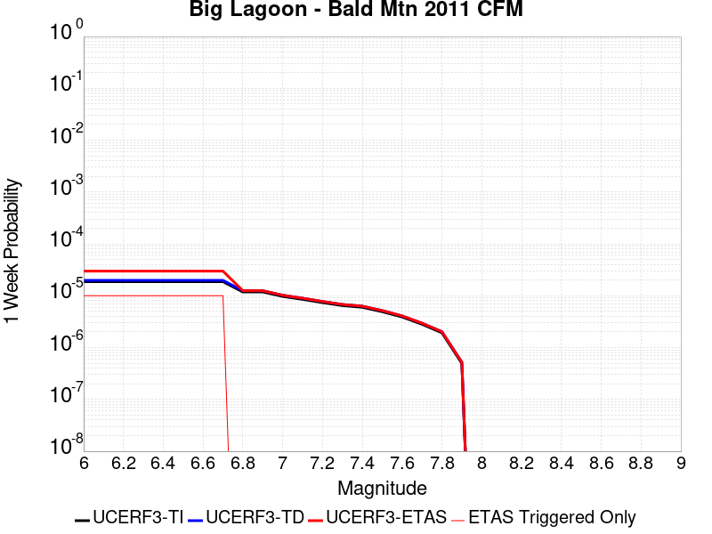 |  |  |  |

| Magnitude | 1 wk TI Prob | 1 wk TD Prob | 1 wk ETAS Prob | 1 wk ETAS/TD Gain | 1 wk ETAS Triggered Only | 1 mo TI Prob | 1 mo TD Prob | 1 mo ETAS Prob | 1 mo ETAS/TD Gain | 1 mo ETAS Triggered Only | 1 yr TI Prob | 1 yr TD Prob | 1 yr ETAS Prob | 1 yr ETAS/TD Gain | 1 yr ETAS Triggered Only | 10 yr TI Prob | 10 yr TD Prob | 10 yr ETAS Prob | 10 yr ETAS/TD Gain | 10 yr ETAS Triggered Only |
|-----|-----|-----|-----|-----|-----|-----|-----|-----|-----|-----|-----|-----|-----|-----|-----|-----|-----|-----|-----|-----|
| 6.0 | 1.8699735E-5 | 1.985018E-5 | 4.87163E-5 | 2.4541993 | 2.8866694E-5 | 8.013926E-5 | 8.5069645E-5 | 1.1393388E-4 | 1.3393012 | 2.8866694E-5 | 9.752587E-4 | 0.0010352687 | 0.0010641054 | 1.0278544 | 2.8866694E-5 | 0.009709897 | 0.010308274 | 0.010336843 | 1.0027715 | 2.8866694E-5 |
| 6.1 | 1.8699735E-5 | 1.985018E-5 | 4.87163E-5 | 2.4541993 | 2.8866694E-5 | 8.013926E-5 | 8.5069645E-5 | 1.1393388E-4 | 1.3393012 | 2.8866694E-5 | 9.752587E-4 | 0.0010352687 | 0.0010641054 | 1.0278544 | 2.8866694E-5 | 0.009709897 | 0.010308274 | 0.010336843 | 1.0027715 | 2.8866694E-5 |
| 6.2 | 1.8699735E-5 | 1.985018E-5 | 4.87163E-5 | 2.4541993 | 2.8866694E-5 | 8.013926E-5 | 8.5069645E-5 | 1.1393388E-4 | 1.3393012 | 2.8866694E-5 | 9.752587E-4 | 0.0010352687 | 0.0010641054 | 1.0278544 | 2.8866694E-5 | 0.009709897 | 0.010308274 | 0.010336843 | 1.0027715 | 2.8866694E-5 |
| 6.3 | 1.8699735E-5 | 1.985018E-5 | 4.87163E-5 | 2.4541993 | 2.8866694E-5 | 8.013926E-5 | 8.5069645E-5 | 1.1393388E-4 | 1.3393012 | 2.8866694E-5 | 9.752587E-4 | 0.0010352687 | 0.0010641054 | 1.0278544 | 2.8866694E-5 | 0.009709897 | 0.010308274 | 0.010336843 | 1.0027715 | 2.8866694E-5 |
| 6.4 | 1.8699735E-5 | 1.985018E-5 | 4.87163E-5 | 2.4541993 | 2.8866694E-5 | 8.013926E-5 | 8.5069645E-5 | 1.1393388E-4 | 1.3393012 | 2.8866694E-5 | 9.752587E-4 | 0.0010352687 | 0.0010641054 | 1.0278544 | 2.8866694E-5 | 0.009709897 | 0.010308274 | 0.010336843 | 1.0027715 | 2.8866694E-5 |
| 6.5 | 1.8699735E-5 | 1.985018E-5 | 4.87163E-5 | 2.4541993 | 2.8866694E-5 | 8.013926E-5 | 8.5069645E-5 | 1.1393388E-4 | 1.3393012 | 2.8866694E-5 | 9.752587E-4 | 0.0010352687 | 0.0010641054 | 1.0278544 | 2.8866694E-5 | 0.009709897 | 0.010308274 | 0.010336843 | 1.0027715 | 2.8866694E-5 |
| 6.6 | 1.8699735E-5 | 1.985018E-5 | 4.87163E-5 | 2.4541993 | 2.8866694E-5 | 8.013926E-5 | 8.5069645E-5 | 1.1393388E-4 | 1.3393012 | 2.8866694E-5 | 9.752587E-4 | 0.0010352687 | 0.0010641054 | 1.0278544 | 2.8866694E-5 | 0.009709897 | 0.010308274 | 0.010336843 | 1.0027715 | 2.8866694E-5 |
| 6.7 | 1.8699735E-5 | 1.985018E-5 | 4.87163E-5 | 2.4541993 | 2.8866694E-5 | 8.013926E-5 | 8.5069645E-5 | 1.1393388E-4 | 1.3393012 | 2.8866694E-5 | 9.752587E-4 | 0.0010352687 | 0.0010641054 | 1.0278544 | 2.8866694E-5 | 0.009709897 | 0.010308274 | 0.010336843 | 1.0027715 | 2.8866694E-5 |
| 6.8 | 1.18505095E-5 | 1.2499804E-5 | 1.2499804E-5 | 1.0 | 0.0 | 5.078691E-5 | 5.3569514E-5 | 5.3569514E-5 | 1.0 | 0.0 | 6.181552E-4 | 6.520185E-4 | 6.520185E-4 | 1.0 | 0.0 | 0.006164385 | 0.0065015587 | 0.0065015587 | 1.0 | 0.0 |
| 6.9 | 1.18505095E-5 | 1.2499804E-5 | 1.2499804E-5 | 1.0 | 0.0 | 5.078691E-5 | 5.3569514E-5 | 5.3569514E-5 | 1.0 | 0.0 | 6.181552E-4 | 6.520185E-4 | 6.520185E-4 | 1.0 | 0.0 | 0.006164385 | 0.0065015587 | 0.0065015587 | 1.0 | 0.0 |
| 7.0 | 9.719786E-6 | 1.0235487E-5 | 1.0235487E-5 | 1.0 | 0.0 | 4.1655563E-5 | 4.386565E-5 | 4.386565E-5 | 1.0 | 0.0 | 5.0703844E-4 | 5.3393573E-4 | 5.3393573E-4 | 1.0 | 0.0 | 0.005058831 | 0.0053267754 | 0.0053267754 | 1.0 | 0.0 |
| 7.1 | 8.523418E-6 | 8.969463E-6 | 8.969463E-6 | 1.0 | 0.0 | 3.652842E-5 | 3.844E-5 | 3.844E-5 | 1.0 | 0.0 | 4.4464276E-4 | 4.6790804E-4 | 4.6790804E-4 | 1.0 | 0.0 | 0.0044375416 | 0.004669392 | 0.004669392 | 1.0 | 0.0 |
| 7.2 | 7.378894E-6 | 7.761112E-6 | 7.761112E-6 | 1.0 | 0.0 | 3.162345E-5 | 3.326149E-5 | 3.326149E-5 | 1.0 | 0.0 | 3.8494746E-4 | 4.048843E-4 | 4.048843E-4 | 1.0 | 0.0 | 0.0038428132 | 0.0040415623 | 0.0040415623 | 1.0 | 0.0 |
| 7.3 | 6.4640294E-6 | 6.7924434E-6 | 6.7924434E-6 | 1.0 | 0.0 | 2.7702688E-5 | 2.9110151E-5 | 2.9110151E-5 | 1.0 | 0.0 | 3.3722803E-4 | 3.5435913E-4 | 3.5435913E-4 | 1.0 | 0.0 | 0.0033671674 | 0.0035380109 | 0.0035380109 | 1.0 | 0.0 |
| 7.4 | 5.9959093E-6 | 6.2988E-6 | 6.2988E-6 | 1.0 | 0.0 | 2.5696501E-5 | 2.6994581E-5 | 2.6994581E-5 | 1.0 | 0.0 | 3.1280998E-4 | 3.2861007E-4 | 3.2861007E-4 | 1.0 | 0.0 | 0.0031237002 | 0.0032813034 | 0.0032813034 | 1.0 | 0.0 |
| 7.5 | 4.929265E-6 | 5.176396E-6 | 5.176396E-6 | 1.0 | 0.0 | 2.112525E-5 | 2.2184367E-5 | 2.2184367E-5 | 1.0 | 0.0 | 2.5716957E-4 | 2.700616E-4 | 2.700616E-4 | 1.0 | 0.0 | 0.0025687215 | 0.002697375 | 0.002697375 | 1.0 | 0.0 |
| 7.6 | 3.8982403E-6 | 4.0889267E-6 | 4.0889267E-6 | 1.0 | 0.0 | 1.6706637E-5 | 1.7523857E-5 | 1.7523857E-5 | 1.0 | 0.0 | 2.0338432E-4 | 2.1333233E-4 | 2.1333233E-4 | 1.0 | 0.0 | 0.0020319829 | 0.002131303 | 0.002131303 | 1.0 | 0.0 |
| 7.7 | 2.820968E-6 | 2.9572116E-6 | 2.9572116E-6 | 1.0 | 0.0 | 1.2089806E-5 | 1.2673704E-5 | 1.2673704E-5 | 1.0 | 0.0 | 1.4718344E-4 | 1.5429159E-4 | 1.5429159E-4 | 1.0 | 0.0 | 0.00147086 | 0.0015418624 | 0.0015418624 | 1.0 | 0.0 |
| 7.8 | 1.9314455E-6 | 2.0260186E-6 | 2.0260186E-6 | 1.0 | 0.0 | 8.277597E-6 | 8.682909E-6 | 8.682909E-6 | 1.0 | 0.0 | 1.0077508E-4 | 1.0570941E-4 | 1.0570941E-4 | 1.0 | 0.0 | 0.0010072939 | 0.0010566041 | 0.0010566041 | 1.0 | 0.0 |
| 7.9 | 4.9586197E-7 | 5.2189216E-7 | 5.2189216E-7 | 1.0 | 0.0 | 2.125121E-6 | 2.2366787E-6 | 2.2366787E-6 | 1.0 | 0.0 | 2.5873042E-5 | 2.7231245E-5 | 2.7231245E-5 | 1.0 | 0.0 | 2.5870028E-4 | 2.7228118E-4 | 2.7228118E-4 | 1.0 | 0.0 |

## Great Valley 05 Pittsburg - Kirby Hills alt1
*[(top)](#table-of-contents)*

| 1 Week | 1 Month | 1 Year | 10 Year |
|-----|-----|-----|-----|
|  |  |  |  |

| Magnitude | 1 wk TI Prob | 1 wk TD Prob | 1 wk ETAS Prob | 1 wk ETAS/TD Gain | 1 wk ETAS Triggered Only | 1 mo TI Prob | 1 mo TD Prob | 1 mo ETAS Prob | 1 mo ETAS/TD Gain | 1 mo ETAS Triggered Only | 1 yr TI Prob | 1 yr TD Prob | 1 yr ETAS Prob | 1 yr ETAS/TD Gain | 1 yr ETAS Triggered Only | 10 yr TI Prob | 10 yr TD Prob | 10 yr ETAS Prob | 10 yr ETAS/TD Gain | 10 yr ETAS Triggered Only |
|-----|-----|-----|-----|-----|-----|-----|-----|-----|-----|-----|-----|-----|-----|-----|-----|-----|-----|-----|-----|-----|
| 6.0 | 4.187212E-5 | 5.3442072E-5 | 8.2307226E-5 | 1.5401204 | 2.8866694E-5 | 1.794396E-4 | 2.290231E-4 | 2.578832E-4 | 1.1260139 | 2.8866694E-5 | 0.002182488 | 0.0027857882 | 0.0028145744 | 1.0103333 | 2.8866694E-5 | 0.021611776 | 0.02760304 | 0.02763111 | 1.0010169 | 2.8866694E-5 |
| 6.1 | 4.187212E-5 | 5.3442072E-5 | 8.2307226E-5 | 1.5401204 | 2.8866694E-5 | 1.794396E-4 | 2.290231E-4 | 2.578832E-4 | 1.1260139 | 2.8866694E-5 | 0.002182488 | 0.0027857882 | 0.0028145744 | 1.0103333 | 2.8866694E-5 | 0.021611776 | 0.02760304 | 0.02763111 | 1.0010169 | 2.8866694E-5 |
| 6.2 | 1.7353306E-5 | 2.2154374E-5 | 5.1020426E-5 | 2.3029506 | 2.8866694E-5 | 7.436919E-5 | 9.494618E-5 | 1.2381014E-4 | 1.3040034 | 2.8866694E-5 | 9.050688E-4 | 0.0011557543 | 0.0011845876 | 1.0249476 | 2.8866694E-5 | 0.009013915 | 0.011535114 | 0.011563647 | 1.0024736 | 2.8866694E-5 |
| 6.3 | 1.7353306E-5 | 2.2154374E-5 | 5.1020426E-5 | 2.3029506 | 2.8866694E-5 | 7.436919E-5 | 9.494618E-5 | 1.2381014E-4 | 1.3040034 | 2.8866694E-5 | 9.050688E-4 | 0.0011557543 | 0.0011845876 | 1.0249476 | 2.8866694E-5 | 0.009013915 | 0.011535114 | 0.011563647 | 1.0024736 | 2.8866694E-5 |
| 6.4 | 1.4028824E-5 | 1.7900597E-5 | 1.7900597E-5 | 1.0 | 0.0 | 6.0122147E-5 | 7.671684E-5 | 7.671684E-5 | 1.0 | 0.0 | 7.3174125E-4 | 9.340275E-4 | 9.340275E-4 | 1.0 | 0.0 | 0.0072933645 | 0.009338138 | 0.009338138 | 1.0 | 0.0 |

## Channel Islands Thrust
*[(top)](#table-of-contents)*

| 1 Week | 1 Month | 1 Year | 10 Year |
|-----|-----|-----|-----|
|  |  |  |  |

| Magnitude | 1 wk TI Prob | 1 wk TD Prob | 1 wk ETAS Prob | 1 wk ETAS/TD Gain | 1 wk ETAS Triggered Only | 1 mo TI Prob | 1 mo TD Prob | 1 mo ETAS Prob | 1 mo ETAS/TD Gain | 1 mo ETAS Triggered Only | 1 yr TI Prob | 1 yr TD Prob | 1 yr ETAS Prob | 1 yr ETAS/TD Gain | 1 yr ETAS Triggered Only | 10 yr TI Prob | 10 yr TD Prob | 10 yr ETAS Prob | 10 yr ETAS/TD Gain | 10 yr ETAS Triggered Only |
|-----|-----|-----|-----|-----|-----|-----|-----|-----|-----|-----|-----|-----|-----|-----|-----|-----|-----|-----|-----|-----|
| 6.0 | 2.2156251E-5 | 2.4092022E-5 | 5.295802E-5 | 2.1981559 | 2.8866694E-5 | 9.495191E-5 | 1.03248036E-4 | 1.3211175E-4 | 1.279557 | 2.8866694E-5 | 0.0011554264 | 0.0012564264 | 0.0012852569 | 1.0229464 | 2.8866694E-5 | 0.011494373 | 0.0125038205 | 0.012532326 | 1.0022798 | 2.8866694E-5 |
| 6.1 | 2.2156251E-5 | 2.4092022E-5 | 5.295802E-5 | 2.1981559 | 2.8866694E-5 | 9.495191E-5 | 1.03248036E-4 | 1.3211175E-4 | 1.279557 | 2.8866694E-5 | 0.0011554264 | 0.0012564264 | 0.0012852569 | 1.0229464 | 2.8866694E-5 | 0.011494373 | 0.0125038205 | 0.012532326 | 1.0022798 | 2.8866694E-5 |
| 6.2 | 2.2156251E-5 | 2.4092022E-5 | 5.295802E-5 | 2.1981559 | 2.8866694E-5 | 9.495191E-5 | 1.03248036E-4 | 1.3211175E-4 | 1.279557 | 2.8866694E-5 | 0.0011554264 | 0.0012564264 | 0.0012852569 | 1.0229464 | 2.8866694E-5 | 0.011494373 | 0.0125038205 | 0.012532326 | 1.0022798 | 2.8866694E-5 |
| 6.3 | 2.2156251E-5 | 2.4092022E-5 | 5.295802E-5 | 2.1981559 | 2.8866694E-5 | 9.495191E-5 | 1.03248036E-4 | 1.3211175E-4 | 1.279557 | 2.8866694E-5 | 0.0011554264 | 0.0012564264 | 0.0012852569 | 1.0229464 | 2.8866694E-5 | 0.011494373 | 0.0125038205 | 0.012532326 | 1.0022798 | 2.8866694E-5 |
| 6.4 | 2.2156251E-5 | 2.4092022E-5 | 5.295802E-5 | 2.1981559 | 2.8866694E-5 | 9.495191E-5 | 1.03248036E-4 | 1.3211175E-4 | 1.279557 | 2.8866694E-5 | 0.0011554264 | 0.0012564264 | 0.0012852569 | 1.0229464 | 2.8866694E-5 | 0.011494373 | 0.0125038205 | 0.012532326 | 1.0022798 | 2.8866694E-5 |
| 6.5 | 2.2156251E-5 | 2.4092022E-5 | 5.295802E-5 | 2.1981559 | 2.8866694E-5 | 9.495191E-5 | 1.03248036E-4 | 1.3211175E-4 | 1.279557 | 2.8866694E-5 | 0.0011554264 | 0.0012564264 | 0.0012852569 | 1.0229464 | 2.8866694E-5 | 0.011494373 | 0.0125038205 | 0.012532326 | 1.0022798 | 2.8866694E-5 |
| 6.6 | 2.2156251E-5 | 2.4092022E-5 | 5.295802E-5 | 2.1981559 | 2.8866694E-5 | 9.495191E-5 | 1.03248036E-4 | 1.3211175E-4 | 1.279557 | 2.8866694E-5 | 0.0011554264 | 0.0012564264 | 0.0012852569 | 1.0229464 | 2.8866694E-5 | 0.011494373 | 0.0125038205 | 0.012532326 | 1.0022798 | 2.8866694E-5 |
| 6.7 | 1.0601296E-5 | 1.1379544E-5 | 1.1379544E-5 | 1.0 | 0.0 | 4.5433335E-5 | 4.876859E-5 | 4.876859E-5 | 1.0 | 0.0 | 5.5301044E-4 | 5.936007E-4 | 5.936007E-4 | 1.0 | 0.0 | 0.005516363 | 0.005920653 | 0.005920653 | 1.0 | 0.0 |
| 6.8 | 1.0246747E-5 | 1.0996669E-5 | 1.0996669E-5 | 1.0 | 0.0 | 4.391389E-5 | 4.7127756E-5 | 4.7127756E-5 | 1.0 | 0.0 | 5.345204E-4 | 5.7363417E-4 | 5.7363417E-4 | 1.0 | 0.0 | 0.0053323656 | 0.005722025 | 0.005722025 | 1.0 | 0.0 |
| 6.9 | 9.049551E-6 | 9.699645E-6 | 9.699645E-6 | 1.0 | 0.0 | 3.878322E-5 | 4.1569267E-5 | 4.1569267E-5 | 1.0 | 0.0 | 4.7208337E-4 | 5.059924E-4 | 5.059924E-4 | 1.0 | 0.0 | 0.0047108172 | 0.0050488203 | 0.0050488203 | 1.0 | 0.0 |
| 7.0 | 8.6542195E-6 | 9.274603E-6 | 9.274603E-6 | 1.0 | 0.0 | 3.7088983E-5 | 3.9747716E-5 | 3.9747716E-5 | 1.0 | 0.0 | 4.5146482E-4 | 4.8382508E-4 | 4.8382508E-4 | 1.0 | 0.0 | 0.004505487 | 0.004828129 | 0.004828129 | 1.0 | 0.0 |
| 7.1 | 8.391028E-6 | 8.992924E-6 | 8.992924E-6 | 1.0 | 0.0 | 3.5961057E-5 | 3.854056E-5 | 3.854056E-5 | 1.0 | 0.0 | 4.3773788E-4 | 4.6913436E-4 | 4.6913436E-4 | 1.0 | 0.0 | 0.004368766 | 0.0046818503 | 0.0046818503 | 1.0 | 0.0 |
| 7.2 | 5.965188E-6 | 6.3716952E-6 | 6.3716952E-6 | 1.0 | 0.0 | 2.556484E-5 | 2.7306982E-5 | 2.7306982E-5 | 1.0 | 0.0 | 3.1120746E-4 | 3.3241234E-4 | 3.3241234E-4 | 1.0 | 0.0 | 0.00310772 | 0.0033192092 | 0.0033192092 | 1.0 | 0.0 |
| 7.3 | 4.877518E-6 | 5.2060063E-6 | 5.2060063E-6 | 1.0 | 0.0 | 2.0903482E-5 | 2.2311267E-5 | 2.2311267E-5 | 1.0 | 0.0 | 2.5447016E-4 | 2.716063E-4 | 2.716063E-4 | 1.0 | 0.0 | 0.0025417898 | 0.0027127895 | 0.0027127895 | 1.0 | 0.0 |
| 7.4 | 3.8829853E-6 | 4.141863E-6 | 4.141863E-6 | 1.0 | 0.0 | 1.664126E-5 | 1.7750723E-5 | 1.7750723E-5 | 1.0 | 0.0 | 2.0258849E-4 | 2.1609402E-4 | 2.1609402E-4 | 1.0 | 0.0 | 0.002024039 | 0.0021588807 | 0.0021588807 | 1.0 | 0.0 |
| 7.5 | 1.3489616E-6 | 1.4277903E-6 | 1.4277903E-6 | 1.0 | 0.0 | 5.7812517E-6 | 6.119087E-6 | 6.119087E-6 | 1.0 | 0.0 | 7.038446E-5 | 7.449738E-5 | 7.449738E-5 | 1.0 | 0.0 | 7.036218E-4 | 7.44728E-4 | 7.44728E-4 | 1.0 | 0.0 |
| 7.6 | 6.058192E-7 | 6.353778E-7 | 6.353778E-7 | 1.0 | 0.0 | 2.5963652E-6 | 2.7230449E-6 | 2.7230449E-6 | 1.0 | 0.0 | 3.161029E-5 | 3.3152584E-5 | 3.3152584E-5 | 1.0 | 0.0 | 3.1605794E-4 | 3.31478E-4 | 3.31478E-4 | 1.0 | 0.0 |
| 7.7 | 2.2170494E-7 | 2.2607902E-7 | 2.2607902E-7 | 1.0 | 0.0 | 9.5016367E-7 | 9.689098E-7 | 9.689098E-7 | 1.0 | 0.0 | 1.1568181E-5 | 1.1796425E-5 | 1.1796425E-5 | 1.0 | 0.0 | 1.1567579E-4 | 1.1795909E-4 | 1.1795909E-4 | 1.0 | 0.0 |
| 7.8 | 2.1613102E-8 | 1.5466682E-8 | 1.5466682E-8 | 1.0 | 0.0 | 9.262757E-8 | 6.628578E-8 | 6.628578E-8 | 1.0 | 0.0 | 1.1277401E-6 | 8.070291E-7 | 8.070291E-7 | 1.0 | 0.0 | 1.1277344E-5 | 8.070269E-6 | 8.070269E-6 | 1.0 | 0.0 |

## Oak Ridge (Onshore)
*[(top)](#table-of-contents)*

| 1 Week | 1 Month | 1 Year | 10 Year |
|-----|-----|-----|-----|
|  |  |  |  |

| Magnitude | 1 wk TI Prob | 1 wk TD Prob | 1 wk ETAS Prob | 1 wk ETAS/TD Gain | 1 wk ETAS Triggered Only | 1 mo TI Prob | 1 mo TD Prob | 1 mo ETAS Prob | 1 mo ETAS/TD Gain | 1 mo ETAS Triggered Only | 1 yr TI Prob | 1 yr TD Prob | 1 yr ETAS Prob | 1 yr ETAS/TD Gain | 1 yr ETAS Triggered Only | 10 yr TI Prob | 10 yr TD Prob | 10 yr ETAS Prob | 10 yr ETAS/TD Gain | 10 yr ETAS Triggered Only |
|-----|-----|-----|-----|-----|-----|-----|-----|-----|-----|-----|-----|-----|-----|-----|-----|-----|-----|-----|-----|-----|
| 6.0 | 3.155064E-5 | 2.9525974E-5 | 5.8391815E-5 | 1.9776423 | 2.8866694E-5 | 1.3521002E-4 | 1.2653397E-4 | 1.55397E-4 | 1.2281051 | 2.8866694E-5 | 0.001644939 | 0.0015395004 | 0.0015683227 | 1.0187218 | 2.8866694E-5 | 0.01632816 | 0.015292859 | 0.0153212845 | 1.0018587 | 2.8866694E-5 |
| 6.1 | 3.155064E-5 | 2.9525974E-5 | 5.8391815E-5 | 1.9776423 | 2.8866694E-5 | 1.3521002E-4 | 1.2653397E-4 | 1.55397E-4 | 1.2281051 | 2.8866694E-5 | 0.001644939 | 0.0015395004 | 0.0015683227 | 1.0187218 | 2.8866694E-5 | 0.01632816 | 0.015292859 | 0.0153212845 | 1.0018587 | 2.8866694E-5 |
| 6.2 | 3.155064E-5 | 2.9525974E-5 | 5.8391815E-5 | 1.9776423 | 2.8866694E-5 | 1.3521002E-4 | 1.2653397E-4 | 1.55397E-4 | 1.2281051 | 2.8866694E-5 | 0.001644939 | 0.0015395004 | 0.0015683227 | 1.0187218 | 2.8866694E-5 | 0.01632816 | 0.015292859 | 0.0153212845 | 1.0018587 | 2.8866694E-5 |
| 6.3 | 3.155064E-5 | 2.9525974E-5 | 5.8391815E-5 | 1.9776423 | 2.8866694E-5 | 1.3521002E-4 | 1.2653397E-4 | 1.55397E-4 | 1.2281051 | 2.8866694E-5 | 0.001644939 | 0.0015395004 | 0.0015683227 | 1.0187218 | 2.8866694E-5 | 0.01632816 | 0.015292859 | 0.0153212845 | 1.0018587 | 2.8866694E-5 |
| 6.4 | 3.155064E-5 | 2.9525974E-5 | 5.8391815E-5 | 1.9776423 | 2.8866694E-5 | 1.3521002E-4 | 1.2653397E-4 | 1.55397E-4 | 1.2281051 | 2.8866694E-5 | 0.001644939 | 0.0015395004 | 0.0015683227 | 1.0187218 | 2.8866694E-5 | 0.01632816 | 0.015292859 | 0.0153212845 | 1.0018587 | 2.8866694E-5 |
| 6.5 | 3.155064E-5 | 2.9525974E-5 | 5.8391815E-5 | 1.9776423 | 2.8866694E-5 | 1.3521002E-4 | 1.2653397E-4 | 1.55397E-4 | 1.2281051 | 2.8866694E-5 | 0.001644939 | 0.0015395004 | 0.0015683227 | 1.0187218 | 2.8866694E-5 | 0.01632816 | 0.015292859 | 0.0153212845 | 1.0018587 | 2.8866694E-5 |
| 6.6 | 3.155064E-5 | 2.9525974E-5 | 5.8391815E-5 | 1.9776423 | 2.8866694E-5 | 1.3521002E-4 | 1.2653397E-4 | 1.55397E-4 | 1.2281051 | 2.8866694E-5 | 0.001644939 | 0.0015395004 | 0.0015683227 | 1.0187218 | 2.8866694E-5 | 0.01632816 | 0.015292859 | 0.0153212845 | 1.0018587 | 2.8866694E-5 |
| 6.7 | 3.098897E-5 | 2.8864175E-5 | 5.7730034E-5 | 2.0000584 | 2.8866694E-5 | 1.328031E-4 | 1.2369796E-4 | 1.5256107E-4 | 1.2333355 | 2.8866694E-5 | 0.0016156785 | 0.0015050198 | 0.0015338431 | 1.0191514 | 2.8866694E-5 | 0.016039822 | 0.014952714 | 0.014981149 | 1.0019016 | 2.8866694E-5 |
| 6.8 | 3.0449872E-5 | 2.8239372E-5 | 5.710525E-5 | 2.0221856 | 2.8866694E-5 | 1.3049292E-4 | 1.2102048E-4 | 1.4988368E-4 | 1.2384984 | 2.8866694E-5 | 0.0015875935 | 0.0014724657 | 0.0015012898 | 1.0195755 | 2.8866694E-5 | 0.015762992 | 0.014631462 | 0.014659906 | 1.0019441 | 2.8866694E-5 |
| 6.9 | 2.697928E-5 | 2.4219773E-5 | 5.308577E-5 | 2.1918359 | 2.8866694E-5 | 1.15620365E-4 | 1.0379502E-4 | 1.3265872E-4 | 1.2780837 | 2.8866694E-5 | 0.0014067689 | 0.0012629933 | 0.0012918236 | 1.0228269 | 2.8866694E-5 | 0.0139789665 | 0.01256087 | 0.012589374 | 1.0022693 | 2.8866694E-5 |
| 7.0 | 2.4893961E-5 | 2.1862043E-5 | 5.0728104E-5 | 2.3203735 | 2.8866694E-5 | 1.0668404E-4 | 9.3691204E-5 | 1.2255518E-4 | 1.3080758 | 2.8866694E-5 | 0.0012981043 | 0.0011401111 | 0.001168945 | 1.0252904 | 2.8866694E-5 | 0.012905477 | 0.011344905 | 0.011373444 | 1.0025156 | 2.8866694E-5 |
| 7.1 | 2.0945363E-5 | 1.7354487E-5 | 4.622068E-5 | 2.6633272 | 2.8866694E-5 | 8.976275E-5 | 7.437428E-5 | 1.03238825E-4 | 1.3880985 | 2.8866694E-5 | 0.0010923136 | 9.051354E-4 | 9.3397597E-4 | 1.0318632 | 2.8866694E-5 | 0.0108696 | 0.009015423 | 0.00904403 | 1.0031731 | 2.8866694E-5 |
| 7.2 | 2.0439404E-5 | 1.6809423E-5 | 4.567563E-5 | 2.7172635 | 2.8866694E-5 | 8.7594504E-5 | 7.203843E-5 | 1.0090304E-4 | 1.4006836 | 2.8866694E-5 | 0.0010659413 | 8.767196E-4 | 9.0556097E-4 | 1.0328969 | 2.8866694E-5 | 0.010608427 | 0.008733526 | 0.008762141 | 1.0032763 | 2.8866694E-5 |
| 7.3 | 1.8463334E-5 | 1.5381811E-5 | 4.424806E-5 | 2.8766484 | 2.8866694E-5 | 7.912617E-5 | 6.59204E-5 | 9.4785195E-5 | 1.4378734 | 2.8866694E-5 | 9.6293533E-4 | 8.0228975E-4 | 8.311333E-4 | 1.0359515 | 2.8866694E-5 | 0.009587734 | 0.007994797 | 0.008023432 | 1.0035818 | 2.8866694E-5 |
| 7.4 | 1.763139E-5 | 1.451684E-5 | 4.3383116E-5 | 2.9884682 | 2.8866694E-5 | 7.556091E-5 | 6.221356E-5 | 9.1078466E-5 | 1.4639647 | 2.8866694E-5 | 9.1956573E-4 | 7.571909E-4 | 7.8603573E-4 | 1.0380945 | 2.8866694E-5 | 0.009157699 | 0.007546914 | 0.0075755627 | 1.0037961 | 2.8866694E-5 |
| 7.5 | 1.3594944E-5 | 1.1163356E-5 | 4.002973E-5 | 3.5858147 | 2.8866694E-5 | 5.8262744E-5 | 4.784209E-5 | 7.67074E-5 | 1.6033455 | 2.8866694E-5 | 7.0911803E-4 | 5.8232434E-4 | 6.111742E-4 | 1.0495427 | 2.8866694E-5 | 0.007068595 | 0.0058082556 | 0.005836955 | 1.0049411 | 2.8866694E-5 |
| 7.6 | 6.9889534E-6 | 5.6367144E-6 | 5.6367144E-6 | 1.0 | 0.0 | 2.9952313E-5 | 2.4157125E-5 | 2.4157125E-5 | 1.0 | 0.0 | 3.646084E-4 | 2.9407372E-4 | 2.9407372E-4 | 1.0 | 0.0 | 0.0036401073 | 0.0029368899 | 0.0029368899 | 1.0 | 0.0 |
| 7.7 | 4.0824193E-6 | 3.2832586E-6 | 3.2832586E-6 | 1.0 | 0.0 | 1.7495966E-5 | 1.4071033E-5 | 1.4071033E-5 | 1.0 | 0.0 | 2.1299256E-4 | 1.713015E-4 | 1.713015E-4 | 1.0 | 0.0 | 0.0021278851 | 0.0017117079 | 0.0017117079 | 1.0 | 0.0 |
| 7.8 | 1.7023609E-6 | 1.4370495E-6 | 1.4370495E-6 | 1.0 | 0.0 | 7.295812E-6 | 6.1587693E-6 | 6.1587693E-6 | 1.0 | 0.0 | 8.882289E-5 | 7.498047E-5 | 7.498047E-5 | 1.0 | 0.0 | 8.8787393E-4 | 7.495545E-4 | 7.495545E-4 | 1.0 | 0.0 |
| 7.9 | 2.721225E-7 | 2.2616497E-7 | 2.2616497E-7 | 1.0 | 0.0 | 1.1662388E-6 | 9.692781E-7 | 9.692781E-7 | 1.0 | 0.0 | 1.4198865E-5 | 1.1800899E-5 | 1.1800899E-5 | 1.0 | 0.0 | 1.4197957E-4 | 1.1800301E-4 | 1.1800301E-4 | 1.0 | 0.0 |
| 8.0 | 9.364255E-9 | 5.1206666E-9 | 5.1206666E-9 | 1.0 | 0.0 | 4.0132523E-8 | 2.1945715E-8 | 2.1945715E-8 | 1.0 | 0.0 | 4.8861335E-7 | 2.6718905E-7 | 2.6718905E-7 | 1.0 | 0.0 | 4.8861225E-6 | 2.6718876E-6 | 2.6718876E-6 | 1.0 | 0.0 |

## San Jacinto (Borrego)
*[(top)](#table-of-contents)*

| 1 Week | 1 Month | 1 Year | 10 Year |
|-----|-----|-----|-----|
|  |  | 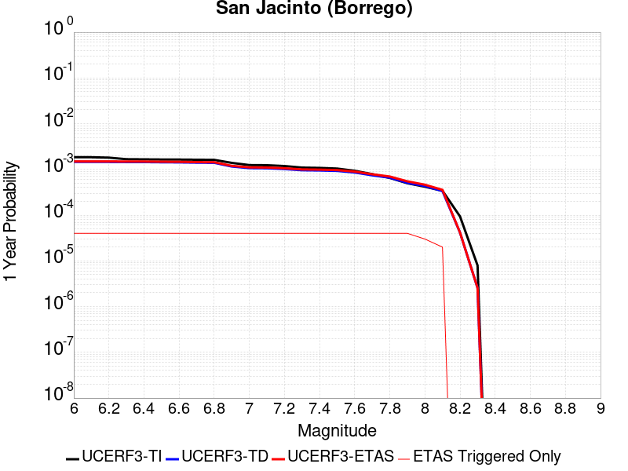 |  |

| Magnitude | 1 wk TI Prob | 1 wk TD Prob | 1 wk ETAS Prob | 1 wk ETAS/TD Gain | 1 wk ETAS Triggered Only | 1 mo TI Prob | 1 mo TD Prob | 1 mo ETAS Prob | 1 mo ETAS/TD Gain | 1 mo ETAS Triggered Only | 1 yr TI Prob | 1 yr TD Prob | 1 yr ETAS Prob | 1 yr ETAS/TD Gain | 1 yr ETAS Triggered Only | 10 yr TI Prob | 10 yr TD Prob | 10 yr ETAS Prob | 10 yr ETAS/TD Gain | 10 yr ETAS Triggered Only |
|-----|-----|-----|-----|-----|-----|-----|-----|-----|-----|-----|-----|-----|-----|-----|-----|-----|-----|-----|-----|-----|
| 6.0 | 3.543992E-5 | 2.7926513E-5 | 5.67924E-5 | 2.0336373 | 2.8866694E-5 | 1.5187653E-4 | 1.1967963E-4 | 1.4854287E-4 | 1.2411709 | 2.8866694E-5 | 0.0018475284 | 0.0014561379 | 0.0014849625 | 1.0197953 | 2.8866694E-5 | 0.018322436 | 0.014869647 | 0.014898085 | 1.0019125 | 2.8866694E-5 |
| 6.1 | 3.542281E-5 | 2.7926513E-5 | 5.67924E-5 | 2.0336373 | 2.8866694E-5 | 1.5180321E-4 | 1.1967963E-4 | 1.4854287E-4 | 1.2411709 | 2.8866694E-5 | 0.0018466372 | 0.0014561379 | 0.0014849625 | 1.0197953 | 2.8866694E-5 | 0.018313672 | 0.014869647 | 0.014898085 | 1.0019125 | 2.8866694E-5 |
| 6.2 | 3.4688688E-5 | 2.7926511E-5 | 5.67924E-5 | 2.0336375 | 2.8866694E-5 | 1.4865733E-4 | 1.1967963E-4 | 1.4854287E-4 | 1.2411709 | 2.8866694E-5 | 0.0018084005 | 0.0014561379 | 0.0014849625 | 1.0197953 | 2.8866694E-5 | 0.017937548 | 0.014869647 | 0.014898084 | 1.0019125 | 2.8866694E-5 |
| 6.3 | 3.2087122E-5 | 2.7771865E-5 | 5.6637757E-5 | 2.0393934 | 2.8866694E-5 | 1.3750899E-4 | 1.1901691E-4 | 1.4788017E-4 | 1.2425139 | 2.8866694E-5 | 0.0016728862 | 0.00144808 | 0.0014769048 | 1.0199056 | 2.8866694E-5 | 0.016603488 | 0.014790683 | 0.014819123 | 1.0019228 | 2.8866694E-5 |
| 6.4 | 3.1828724E-5 | 2.7738852E-5 | 5.6604742E-5 | 2.0406303 | 2.8866694E-5 | 1.364017E-4 | 1.1887544E-4 | 1.477387E-4 | 1.2428026 | 2.8866694E-5 | 0.0016594254 | 0.0014463598 | 0.0014751848 | 1.0199293 | 2.8866694E-5 | 0.016470885 | 0.014773762 | 0.014802202 | 1.001925 | 2.8866694E-5 |
| 6.5 | 3.1563577E-5 | 2.747857E-5 | 5.634447E-5 | 2.0504878 | 2.8866694E-5 | 1.3526545E-4 | 1.1776006E-4 | 1.4662335E-4 | 1.2451026 | 2.8866694E-5 | 0.0016456128 | 0.0014327979 | 0.0014616232 | 1.0201182 | 2.8866694E-5 | 0.0163348 | 0.014640348 | 0.014668792 | 1.0019429 | 2.8866694E-5 |
| 6.6 | 3.1467625E-5 | 2.7322796E-5 | 5.61887E-5 | 2.056477 | 2.8866694E-5 | 1.3485427E-4 | 1.1709251E-4 | 1.4595583E-4 | 1.2465001 | 2.8866694E-5 | 0.0016406142 | 0.0014246812 | 0.0014535068 | 1.020233 | 2.8866694E-5 | 0.016285548 | 0.014560594 | 0.014589041 | 1.0019536 | 2.8866694E-5 |
| 6.7 | 3.1223695E-5 | 2.6940816E-5 | 5.580673E-5 | 2.0714567 | 2.8866694E-5 | 1.3380898E-4 | 1.15455594E-4 | 1.4431895E-4 | 1.2499954 | 2.8866694E-5 | 0.0016279068 | 0.0014047775 | 0.0014336037 | 1.0205201 | 2.8866694E-5 | 0.01616033 | 0.014364966 | 0.014393418 | 1.0019807 | 2.8866694E-5 |
| 6.8 | 3.1015585E-5 | 2.6761822E-5 | 5.5627745E-5 | 2.078623 | 2.8866694E-5 | 1.3291716E-4 | 1.1468855E-4 | 1.4355194E-4 | 1.2516675 | 2.8866694E-5 | 0.001617065 | 0.0013954508 | 0.0014242772 | 1.0206574 | 2.8866694E-5 | 0.016053487 | 0.014272246 | 0.0143007 | 1.0019937 | 2.8866694E-5 |
| 6.9 | 2.6641965E-5 | 2.2184247E-5 | 5.10503E-5 | 2.301196 | 2.8866694E-5 | 1.1417485E-4 | 9.50719E-5 | 1.2393585E-4 | 1.3036013 | 2.8866694E-5 | 0.0013891924 | 0.0011568897 | 0.001185723 | 1.0249231 | 2.8866694E-5 | 0.0138054015 | 0.011882438 | 0.011910962 | 1.0024005 | 2.8866694E-5 |
| 7.0 | 2.3854353E-5 | 2.0479023E-5 | 4.9345126E-5 | 2.409545 | 2.8866694E-5 | 1.02228936E-4 | 8.77643E-5 | 1.16628464E-4 | 1.3288827 | 2.8866694E-5 | 0.0012439266 | 0.0010680092 | 0.001096845 | 1.0269996 | 2.8866694E-5 | 0.012369866 | 0.0109828 | 0.01101135 | 1.0025995 | 2.8866694E-5 |
| 7.1 | 2.3672901E-5 | 2.031551E-5 | 4.9181617E-5 | 2.42089 | 2.8866694E-5 | 1.0145135E-4 | 8.7063585E-5 | 1.1592777E-4 | 1.3315299 | 2.8866694E-5 | 0.0012344702 | 0.0010594862 | 0.0010883224 | 1.027217 | 2.8866694E-5 | 0.0122763505 | 0.010897976 | 0.010926528 | 1.00262 | 2.8866694E-5 |
| 7.2 | 2.2717244E-5 | 1.9542893E-5 | 4.8409023E-5 | 2.4770653 | 2.8866694E-5 | 9.735599E-5 | 8.375258E-5 | 1.1261685E-4 | 1.3446375 | 2.8866694E-5 | 0.0011846646 | 0.001019213 | 0.0010480502 | 1.0282936 | 2.8866694E-5 | 0.01178369 | 0.010495341 | 0.010523905 | 1.0027215 | 2.8866694E-5 |
| 7.3 | 2.1016205E-5 | 1.8384526E-5 | 4.7250687E-5 | 2.5701337 | 2.8866694E-5 | 9.006634E-5 | 7.878846E-5 | 1.0765287E-4 | 1.3663534 | 2.8866694E-5 | 0.001096006 | 9.5882936E-4 | 9.876684E-4 | 1.0300773 | 2.8866694E-5 | 0.010906163 | 0.009890967 | 0.0099195475 | 1.0028896 | 2.8866694E-5 |
| 7.4 | 2.0683625E-5 | 1.8187047E-5 | 4.7053214E-5 | 2.5871828 | 2.8866694E-5 | 8.86411E-5 | 7.794217E-5 | 1.0680661E-4 | 1.3703315 | 2.8866694E-5 | 0.001078671 | 9.485349E-4 | 9.773741E-4 | 1.0304041 | 2.8866694E-5 | 0.010734501 | 0.009787692 | 0.009816276 | 1.0029204 | 2.8866694E-5 |
| 7.5 | 1.9993966E-5 | 1.7782075E-5 | 4.6648252E-5 | 2.6233304 | 2.8866694E-5 | 8.568561E-5 | 7.620667E-5 | 1.05071165E-4 | 1.378766 | 2.8866694E-5 | 0.001042723 | 9.2742336E-4 | 9.562633E-4 | 1.0310968 | 2.8866694E-5 | 0.010378438 | 0.009574614 | 0.009603205 | 1.0029861 | 2.8866694E-5 |
| 7.6 | 1.788966E-5 | 1.6435291E-5 | 4.530151E-5 | 2.756356 | 2.8866694E-5 | 7.666772E-5 | 7.043507E-5 | 9.929973E-5 | 1.4098053 | 2.8866694E-5 | 9.3302975E-4 | 8.572113E-4 | 8.8605325E-4 | 1.0336462 | 2.8866694E-5 | 0.00929122 | 0.008866487 | 0.008895097 | 1.0032269 | 2.8866694E-5 |
| 7.7 | 1.5125781E-5 | 1.4237377E-5 | 4.310366E-5 | 3.0275 | 2.8866694E-5 | 6.4823165E-5 | 6.1015908E-5 | 8.988084E-5 | 1.4730722 | 2.8866694E-5 | 7.889362E-4 | 7.426163E-4 | 7.714616E-4 | 1.0388428 | 2.8866694E-5 | 0.007861412 | 0.0077142045 | 0.0077428482 | 1.0037131 | 2.8866694E-5 |
| 7.8 | 1.250089E-5 | 1.26304985E-5 | 4.1496827E-5 | 3.2854466 | 2.8866694E-5 | 5.3574146E-5 | 5.412959E-5 | 8.299472E-5 | 1.5332597 | 2.8866694E-5 | 6.5207E-4 | 6.588291E-4 | 6.876768E-4 | 1.0437863 | 2.8866694E-5 | 0.006501599 | 0.0068677636 | 0.006896432 | 1.0041744 | 2.8866694E-5 |
| 7.9 | 9.561E-6 | 9.754616E-6 | 3.8621027E-5 | 3.9592564 | 2.8866694E-5 | 4.0975072E-5 | 4.1804833E-5 | 7.067032E-5 | 1.690482 | 2.8866694E-5 | 4.987573E-4 | 5.088555E-4 | 5.377075E-4 | 1.0566998 | 2.8866694E-5 | 0.0049763937 | 0.0053523467 | 0.005381059 | 1.0053644 | 2.8866694E-5 |
| 8.0 | 8.01699E-6 | 8.293488E-6 | 8.293488E-6 | 1.0 | 0.0 | 3.4358076E-5 | 3.554304E-5 | 3.554304E-5 | 1.0 | 0.0 | 4.1822926E-4 | 4.3265108E-4 | 4.3265108E-4 | 1.0 | 0.0 | 0.0041744304 | 0.004573375 | 0.004573375 | 1.0 | 0.0 |
| 8.1 | 6.541947E-6 | 6.4622354E-6 | 6.4622354E-6 | 1.0 | 0.0 | 2.8036617E-5 | 2.7695003E-5 | 2.7695003E-5 | 1.0 | 0.0 | 3.4129233E-4 | 3.37135E-4 | 3.37135E-4 | 1.0 | 0.0 | 0.0034076865 | 0.0035806994 | 0.0035806994 | 1.0 | 0.0 |
| 8.2 | 1.7968189E-6 | 7.9713476E-7 | 7.9713476E-7 | 1.0 | 0.0 | 7.70063E-6 | 3.4162877E-6 | 3.4162877E-6 | 1.0 | 0.0 | 9.3751136E-5 | 4.159253E-5 | 4.159253E-5 | 1.0 | 0.0 | 9.371159E-4 | 4.712058E-4 | 4.712058E-4 | 1.0 | 0.0 |
| 8.3 | 1.5167889E-7 | 4.897714E-8 | 4.897714E-8 | 1.0 | 0.0 | 6.500522E-7 | 2.09902E-7 | 2.09902E-7 | 1.0 | 0.0 | 7.9143565E-6 | 2.5555544E-6 | 2.5555544E-6 | 1.0 | 0.0 | 7.914075E-5 | 2.969505E-5 | 2.969505E-5 | 1.0 | 0.0 |

## San Jacinto (Coyote Creek)
*[(top)](#table-of-contents)*

| 1 Week | 1 Month | 1 Year | 10 Year |
|-----|-----|-----|-----|
|  |  |  |  |

| Magnitude | 1 wk TI Prob | 1 wk TD Prob | 1 wk ETAS Prob | 1 wk ETAS/TD Gain | 1 wk ETAS Triggered Only | 1 mo TI Prob | 1 mo TD Prob | 1 mo ETAS Prob | 1 mo ETAS/TD Gain | 1 mo ETAS Triggered Only | 1 yr TI Prob | 1 yr TD Prob | 1 yr ETAS Prob | 1 yr ETAS/TD Gain | 1 yr ETAS Triggered Only | 10 yr TI Prob | 10 yr TD Prob | 10 yr ETAS Prob | 10 yr ETAS/TD Gain | 10 yr ETAS Triggered Only |
|-----|-----|-----|-----|-----|-----|-----|-----|-----|-----|-----|-----|-----|-----|-----|-----|-----|-----|-----|-----|-----|
| 6.0 | 2.7374346E-5 | 2.4145214E-5 | 5.3011212E-5 | 2.1955163 | 2.8866694E-5 | 1.1731335E-4 | 1.034754E-4 | 1.323391E-4 | 1.2789427 | 2.8866694E-5 | 0.0014273542 | 0.0012590875 | 0.0012879178 | 1.0228978 | 2.8866694E-5 | 0.01418221 | 0.012928318 | 0.012956811 | 1.002204 | 2.8866694E-5 |
| 6.1 | 2.7374346E-5 | 2.4145214E-5 | 5.3011212E-5 | 2.1955163 | 2.8866694E-5 | 1.1731335E-4 | 1.034754E-4 | 1.323391E-4 | 1.2789427 | 2.8866694E-5 | 0.0014273542 | 0.0012590875 | 0.0012879178 | 1.0228978 | 2.8866694E-5 | 0.01418221 | 0.012928318 | 0.012956811 | 1.002204 | 2.8866694E-5 |
| 6.2 | 2.7374346E-5 | 2.4145214E-5 | 5.3011212E-5 | 2.1955163 | 2.8866694E-5 | 1.1731335E-4 | 1.034754E-4 | 1.323391E-4 | 1.2789427 | 2.8866694E-5 | 0.0014273542 | 0.0012590875 | 0.0012879178 | 1.0228978 | 2.8866694E-5 | 0.01418221 | 0.012928318 | 0.012956811 | 1.002204 | 2.8866694E-5 |
| 6.3 | 2.7374346E-5 | 2.4145214E-5 | 5.3011212E-5 | 2.1955163 | 2.8866694E-5 | 1.1731335E-4 | 1.034754E-4 | 1.323391E-4 | 1.2789427 | 2.8866694E-5 | 0.0014273542 | 0.0012590875 | 0.0012879178 | 1.0228978 | 2.8866694E-5 | 0.01418221 | 0.012928318 | 0.012956811 | 1.002204 | 2.8866694E-5 |
| 6.4 | 2.7374346E-5 | 2.4145214E-5 | 5.3011212E-5 | 2.1955163 | 2.8866694E-5 | 1.1731335E-4 | 1.034754E-4 | 1.323391E-4 | 1.2789427 | 2.8866694E-5 | 0.0014273542 | 0.0012590875 | 0.0012879178 | 1.0228978 | 2.8866694E-5 | 0.01418221 | 0.012928318 | 0.012956811 | 1.002204 | 2.8866694E-5 |
| 6.5 | 2.7282445E-5 | 2.4031293E-5 | 5.2897292E-5 | 2.2011838 | 2.8866694E-5 | 1.16919524E-4 | 1.029872E-4 | 1.3185092E-4 | 1.2802651 | 2.8866694E-5 | 0.0014225657 | 0.0012531505 | 0.0012819811 | 1.0230064 | 2.8866694E-5 | 0.014134934 | 0.012869646 | 0.012898141 | 1.0022142 | 2.8866694E-5 |
| 6.6 | 2.7282445E-5 | 2.4031293E-5 | 5.2897292E-5 | 2.2011838 | 2.8866694E-5 | 1.16919524E-4 | 1.029872E-4 | 1.3185092E-4 | 1.2802651 | 2.8866694E-5 | 0.0014225657 | 0.0012531505 | 0.0012819811 | 1.0230064 | 2.8866694E-5 | 0.014134934 | 0.012869646 | 0.012898141 | 1.0022142 | 2.8866694E-5 |
| 6.7 | 2.7216198E-5 | 2.3956412E-5 | 5.2822415E-5 | 2.2049384 | 2.8866694E-5 | 1.1663563E-4 | 1.02666316E-4 | 1.3153005E-4 | 1.2811412 | 2.8866694E-5 | 0.0014191137 | 0.0012492483 | 0.001278079 | 1.0230784 | 2.8866694E-5 | 0.014100855 | 0.0128310565 | 0.012859553 | 1.0022209 | 2.8866694E-5 |
| 6.8 | 2.7078617E-5 | 2.387363E-5 | 5.2739633E-5 | 2.2091167 | 2.8866694E-5 | 1.1604605E-4 | 1.0231156E-4 | 1.311753E-4 | 1.2821162 | 2.8866694E-5 | 0.001411945 | 0.0012449342 | 0.0012737649 | 1.0231584 | 2.8866694E-5 | 0.014030075 | 0.012788199 | 0.012816696 | 1.0022284 | 2.8866694E-5 |
| 6.9 | 2.6982952E-5 | 2.3793142E-5 | 5.265915E-5 | 2.213207 | 2.8866694E-5 | 1.15636096E-4 | 1.0196664E-4 | 1.3083039E-4 | 1.2830706 | 2.8866694E-5 | 0.0014069602 | 0.0012407395 | 0.0012695703 | 1.0232369 | 2.8866694E-5 | 0.013980856 | 0.012746515 | 0.012775013 | 1.0022358 | 2.8866694E-5 |
| 7.0 | 2.6449972E-5 | 2.3370165E-5 | 5.2236184E-5 | 2.2351654 | 2.8866694E-5 | 1.1335209E-4 | 1.00154015E-4 | 1.2901782E-4 | 1.2881942 | 2.8866694E-5 | 0.001379188 | 0.0012186957 | 0.0012475272 | 1.0236577 | 2.8866694E-5 | 0.0137065975 | 0.0125278765 | 0.0125563815 | 1.0022753 | 2.8866694E-5 |
| 7.1 | 2.6257849E-5 | 2.3196202E-5 | 5.2062227E-5 | 2.2444289 | 2.8866694E-5 | 1.1252879E-4 | 9.940852E-5 | 1.2827234E-4 | 1.2903557 | 2.8866694E-5 | 0.0013691769 | 0.0012096294 | 0.0012384611 | 1.0238352 | 2.8866694E-5 | 0.013607717 | 0.012437741 | 0.012466249 | 1.002292 | 2.8866694E-5 |
| 7.2 | 2.5270041E-5 | 2.2390966E-5 | 5.1257015E-5 | 2.2891827 | 2.8866694E-5 | 1.0829568E-4 | 9.595777E-5 | 1.2482169E-4 | 1.3007982 | 2.8866694E-5 | 0.0013177024 | 0.0011676621 | 0.001196495 | 1.0246929 | 2.8866694E-5 | 0.013099162 | 0.012018777 | 0.012047297 | 1.002373 | 2.8866694E-5 |
| 7.3 | 2.339701E-5 | 2.1122814E-5 | 4.99889E-5 | 2.3665833 | 2.8866694E-5 | 1.0026905E-4 | 9.0523215E-5 | 1.19387296E-4 | 1.3188583 | 2.8866694E-5 | 0.001220092 | 0.0011015651 | 0.0011303999 | 1.0261763 | 2.8866694E-5 | 0.012134149 | 0.011357696 | 0.011386234 | 1.0025127 | 2.8866694E-5 |
| 7.4 | 2.296333E-5 | 2.0853171E-5 | 4.9719263E-5 | 2.3842545 | 2.8866694E-5 | 9.841056E-5 | 8.936768E-5 | 1.18231794E-4 | 1.3229816 | 2.8866694E-5 | 0.0011974899 | 0.0010875105 | 0.0011163458 | 1.026515 | 2.8866694E-5 | 0.011910575 | 0.01121681 | 0.011245352 | 1.0025446 | 2.8866694E-5 |
| 7.5 | 2.2188895E-5 | 2.0376096E-5 | 4.92422E-5 | 2.4166653 | 2.8866694E-5 | 9.50918E-5 | 8.732321E-5 | 1.1618738E-4 | 1.3305441 | 2.8866694E-5 | 0.0011571277 | 0.0010626436 | 0.0010914796 | 1.0271361 | 2.8866694E-5 | 0.011511209 | 0.010966429 | 0.010994978 | 1.0026034 | 2.8866694E-5 |
| 7.6 | 2.0013189E-5 | 1.8962366E-5 | 4.782851E-5 | 2.5222862 | 2.8866694E-5 | 8.5767984E-5 | 8.1264756E-5 | 1.10129105E-4 | 1.355189 | 2.8866694E-5 | 0.001043725 | 9.889511E-4 | 0.0010177892 | 1.0291604 | 2.8866694E-5 | 0.010388365 | 0.010224434 | 0.010253005 | 1.0027944 | 2.8866694E-5 |
| 7.7 | 1.7230794E-5 | 1.674371E-5 | 4.560992E-5 | 2.7240033 | 2.8866694E-5 | 7.384417E-5 | 7.175679E-5 | 1.0062141E-4 | 1.4022564 | 2.8866694E-5 | 8.986819E-4 | 8.7328954E-4 | 9.02131E-4 | 1.0330262 | 2.8866694E-5 | 0.008950562 | 0.009062956 | 0.009091562 | 1.0031563 | 2.8866694E-5 |
| 7.8 | 1.4478809E-5 | 1.4990978E-5 | 4.385724E-5 | 2.9255755 | 2.8866694E-5 | 6.205057E-5 | 6.424547E-5 | 9.311031E-5 | 1.4492899 | 2.8866694E-5 | 7.552038E-4 | 7.819085E-4 | 8.107527E-4 | 1.0368894 | 2.8866694E-5 | 0.0075264242 | 0.008141387 | 0.008170019 | 1.0035168 | 2.8866694E-5 |
| 7.9 | 1.1114467E-5 | 1.1645102E-5 | 4.051146E-5 | 3.478841 | 2.8866694E-5 | 4.7632562E-5 | 4.990663E-5 | 7.877188E-5 | 1.5783851 | 2.8866694E-5 | 5.797721E-4 | 6.074444E-4 | 6.3629355E-4 | 1.0474926 | 2.8866694E-5 | 0.0057826187 | 0.0063803247 | 0.006409007 | 1.0044955 | 2.8866694E-5 |
| 8.0 | 9.327402E-6 | 9.899186E-6 | 9.899186E-6 | 1.0 | 0.0 | 3.9973966E-5 | 4.2424395E-5 | 4.2424395E-5 | 1.0 | 0.0 | 4.8657437E-4 | 5.1639514E-4 | 5.1639514E-4 | 1.0 | 0.0 | 0.0048551033 | 0.0054499684 | 0.0054499684 | 1.0 | 0.0 |
| 8.1 | 7.0235833E-6 | 6.827495E-6 | 6.827495E-6 | 1.0 | 0.0 | 3.0100724E-5 | 2.9260367E-5 | 2.9260367E-5 | 1.0 | 0.0 | 3.664147E-4 | 3.5618723E-4 | 3.5618723E-4 | 1.0 | 0.0 | 0.003658111 | 0.0037876023 | 0.0037876023 | 1.0 | 0.0 |
| 8.2 | 2.0358202E-6 | 8.994527E-7 | 8.994527E-7 | 1.0 | 0.0 | 8.724915E-6 | 3.854792E-6 | 3.854792E-6 | 1.0 | 0.0 | 1.06220665E-4 | 4.69311E-5 | 4.69311E-5 | 1.0 | 0.0 | 0.001061699 | 5.3254166E-4 | 5.3254166E-4 | 1.0 | 0.0 |
| 8.3 | 2.0051264E-7 | 6.617272E-8 | 6.617272E-8 | 1.0 | 0.0 | 8.5933965E-7 | 2.8359733E-7 | 2.8359733E-7 | 1.0 | 0.0 | 1.046241E-5 | 3.4527925E-6 | 3.4527925E-6 | 1.0 | 0.0 | 1.0461917E-4 | 4.01389E-5 | 4.01389E-5 | 1.0 | 0.0 |

## Mono Lake 2011 CFM
*[(top)](#table-of-contents)*

| 1 Week | 1 Month | 1 Year | 10 Year |
|-----|-----|-----|-----|
|  |  |  |  |

| Magnitude | 1 wk TI Prob | 1 wk TD Prob | 1 wk ETAS Prob | 1 wk ETAS/TD Gain | 1 wk ETAS Triggered Only | 1 mo TI Prob | 1 mo TD Prob | 1 mo ETAS Prob | 1 mo ETAS/TD Gain | 1 mo ETAS Triggered Only | 1 yr TI Prob | 1 yr TD Prob | 1 yr ETAS Prob | 1 yr ETAS/TD Gain | 1 yr ETAS Triggered Only | 10 yr TI Prob | 10 yr TD Prob | 10 yr ETAS Prob | 10 yr ETAS/TD Gain | 10 yr ETAS Triggered Only |
|-----|-----|-----|-----|-----|-----|-----|-----|-----|-----|-----|-----|-----|-----|-----|-----|-----|-----|-----|-----|-----|
| 6.0 | 2.0341662E-5 | 2.3828166E-5 | 2.3828166E-5 | 1.0 | 0.0 | 8.717564E-5 | 1.0211971E-4 | 1.0211971E-4 | 1.0 | 0.0 | 0.0010608466 | 0.0012431298 | 0.0012719607 | 1.0231922 | 2.8866694E-5 | 0.010557966 | 0.012413835 | 0.012442344 | 1.0022964 | 2.8866694E-5 |
| 6.1 | 2.0341662E-5 | 2.3828166E-5 | 2.3828166E-5 | 1.0 | 0.0 | 8.717564E-5 | 1.0211971E-4 | 1.0211971E-4 | 1.0 | 0.0 | 0.0010608466 | 0.0012431298 | 0.0012719607 | 1.0231922 | 2.8866694E-5 | 0.010557966 | 0.012413835 | 0.012442344 | 1.0022964 | 2.8866694E-5 |
| 6.2 | 2.0341662E-5 | 2.3828166E-5 | 2.3828166E-5 | 1.0 | 0.0 | 8.717564E-5 | 1.0211971E-4 | 1.0211971E-4 | 1.0 | 0.0 | 0.0010608466 | 0.0012431298 | 0.0012719607 | 1.0231922 | 2.8866694E-5 | 0.010557966 | 0.012413835 | 0.012442344 | 1.0022964 | 2.8866694E-5 |
| 6.3 | 2.0341662E-5 | 2.3828166E-5 | 2.3828166E-5 | 1.0 | 0.0 | 8.717564E-5 | 1.0211971E-4 | 1.0211971E-4 | 1.0 | 0.0 | 0.0010608466 | 0.0012431298 | 0.0012719607 | 1.0231922 | 2.8866694E-5 | 0.010557966 | 0.012413835 | 0.012442344 | 1.0022964 | 2.8866694E-5 |
| 6.4 | 1.749821E-5 | 2.0490985E-5 | 2.0490985E-5 | 1.0 | 0.0 | 7.499018E-5 | 8.781851E-5 | 8.781851E-5 | 1.0 | 0.0 | 9.1262296E-4 | 0.0010691903 | 0.0010980262 | 1.0269698 | 2.8866694E-5 | 0.009088841 | 0.010691865 | 0.010720423 | 1.002671 | 2.8866694E-5 |
| 6.5 | 1.749821E-5 | 2.0490985E-5 | 2.0490985E-5 | 1.0 | 0.0 | 7.499018E-5 | 8.781851E-5 | 8.781851E-5 | 1.0 | 0.0 | 9.1262296E-4 | 0.0010691903 | 0.0010980262 | 1.0269698 | 2.8866694E-5 | 0.009088841 | 0.010691865 | 0.010720423 | 1.002671 | 2.8866694E-5 |

## Elsinore (Stepovers Combined)
*[(top)](#table-of-contents)*

| 1 Week | 1 Month | 1 Year | 10 Year |
|-----|-----|-----|-----|
|  |  |  |  |

| Magnitude | 1 wk TI Prob | 1 wk TD Prob | 1 wk ETAS Prob | 1 wk ETAS/TD Gain | 1 wk ETAS Triggered Only | 1 mo TI Prob | 1 mo TD Prob | 1 mo ETAS Prob | 1 mo ETAS/TD Gain | 1 mo ETAS Triggered Only | 1 yr TI Prob | 1 yr TD Prob | 1 yr ETAS Prob | 1 yr ETAS/TD Gain | 1 yr ETAS Triggered Only | 10 yr TI Prob | 10 yr TD Prob | 10 yr ETAS Prob | 10 yr ETAS/TD Gain | 10 yr ETAS Triggered Only |
|-----|-----|-----|-----|-----|-----|-----|-----|-----|-----|-----|-----|-----|-----|-----|-----|-----|-----|-----|-----|-----|
| 6.0 | 2.144392E-5 | 1.9760193E-5 | 4.8626316E-5 | 2.4608219 | 2.8866694E-5 | 9.189928E-5 | 8.468392E-5 | 1.13548165E-4 | 1.3408469 | 2.8866694E-5 | 0.0011182994 | 0.0010305607 | 0.0010593976 | 1.0279818 | 2.8866694E-5 | 0.011126885 | 0.010264917 | 0.010293487 | 1.0027833 | 2.8866694E-5 |
| 6.1 | 2.144392E-5 | 1.9760193E-5 | 4.8626316E-5 | 2.4608219 | 2.8866694E-5 | 9.189928E-5 | 8.468392E-5 | 1.13548165E-4 | 1.3408469 | 2.8866694E-5 | 0.0011182994 | 0.0010305607 | 0.0010593976 | 1.0279818 | 2.8866694E-5 | 0.011126885 | 0.010264917 | 0.010293487 | 1.0027833 | 2.8866694E-5 |
| 6.2 | 2.144392E-5 | 1.9760193E-5 | 4.8626316E-5 | 2.4608219 | 2.8866694E-5 | 9.189928E-5 | 8.468392E-5 | 1.13548165E-4 | 1.3408469 | 2.8866694E-5 | 0.0011182994 | 0.0010305607 | 0.0010593976 | 1.0279818 | 2.8866694E-5 | 0.011126885 | 0.010264917 | 0.010293487 | 1.0027833 | 2.8866694E-5 |
| 6.3 | 1.9751555E-5 | 1.7741453E-5 | 4.6607634E-5 | 2.6270473 | 2.8866694E-5 | 8.4646774E-5 | 7.603267E-5 | 1.04897175E-4 | 1.3796328 | 2.8866694E-5 | 0.0010300872 | 9.253213E-4 | 9.541613E-4 | 1.0311675 | 2.8866694E-5 | 0.010253254 | 0.009221276 | 0.009249877 | 1.0031016 | 2.8866694E-5 |
| 6.4 | 1.9751555E-5 | 1.7741453E-5 | 4.6607634E-5 | 2.6270473 | 2.8866694E-5 | 8.4646774E-5 | 7.603267E-5 | 1.04897175E-4 | 1.3796328 | 2.8866694E-5 | 0.0010300872 | 9.253213E-4 | 9.541613E-4 | 1.0311675 | 2.8866694E-5 | 0.010253254 | 0.009221276 | 0.009249877 | 1.0031016 | 2.8866694E-5 |
| 6.5 | 1.9751555E-5 | 1.7741453E-5 | 4.6607634E-5 | 2.6270473 | 2.8866694E-5 | 8.4646774E-5 | 7.603267E-5 | 1.04897175E-4 | 1.3796328 | 2.8866694E-5 | 0.0010300872 | 9.253213E-4 | 9.541613E-4 | 1.0311675 | 2.8866694E-5 | 0.010253254 | 0.009221276 | 0.009249877 | 1.0031016 | 2.8866694E-5 |
| 6.6 | 1.9188685E-5 | 1.7003393E-5 | 4.5869594E-5 | 2.697673 | 2.8866694E-5 | 8.2234634E-5 | 7.286974E-5 | 1.0173433E-4 | 1.3961122 | 2.8866694E-5 | 0.0010007467 | 8.868442E-4 | 9.1568526E-4 | 1.032521 | 2.8866694E-5 | 0.00996252 | 0.0088398475 | 0.008868459 | 1.0032367 | 2.8866694E-5 |
| 6.7 | 1.7608272E-5 | 1.4732616E-5 | 4.3598884E-5 | 2.9593444 | 2.8866694E-5 | 7.546184E-5 | 6.3138315E-5 | 9.200318E-5 | 1.4571688 | 2.8866694E-5 | 9.183606E-4 | 7.684476E-4 | 7.972921E-4 | 1.037536 | 2.8866694E-5 | 0.009145746 | 0.00766491 | 0.0076935557 | 1.0037372 | 2.8866694E-5 |
| 6.8 | 1.697165E-5 | 1.3783365E-5 | 4.264966E-5 | 3.094285 | 2.8866694E-5 | 7.273361E-5 | 5.9070277E-5 | 8.793527E-5 | 1.4886551 | 2.8866694E-5 | 8.8517193E-4 | 7.18952E-4 | 7.477979E-4 | 1.0401222 | 2.8866694E-5 | 0.008816543 | 0.007172675 | 0.0072013345 | 1.0039957 | 2.8866694E-5 |
| 6.9 | 1.600365E-5 | 1.2846671E-5 | 1.2846671E-5 | 1.0 | 0.0 | 6.858527E-5 | 5.5056043E-5 | 5.5056043E-5 | 1.0 | 0.0 | 8.347058E-4 | 6.7010894E-4 | 6.7010894E-4 | 1.0 | 0.0 | 0.008315775 | 0.0066867657 | 0.0066867657 | 1.0 | 0.0 |
| 7.0 | 1.3314581E-5 | 1.0447548E-5 | 1.0447548E-5 | 1.0 | 0.0 | 5.7061243E-5 | 4.4774453E-5 | 4.4774453E-5 | 1.0 | 0.0 | 6.944992E-4 | 5.449953E-4 | 5.449953E-4 | 1.0 | 0.0 | 0.006923327 | 0.0054405155 | 0.0054405155 | 1.0 | 0.0 |
| 7.1 | 1.2865345E-5 | 9.937536E-6 | 9.937536E-6 | 1.0 | 0.0 | 5.5136024E-5 | 4.258876E-5 | 4.258876E-5 | 1.0 | 0.0 | 6.710743E-4 | 5.183973E-4 | 5.183973E-4 | 1.0 | 0.0 | 0.0066905143 | 0.0051752133 | 0.0051752133 | 1.0 | 0.0 |
| 7.2 | 1.1650051E-5 | 8.633809E-6 | 8.633809E-6 | 1.0 | 0.0 | 4.9927836E-5 | 3.7001522E-5 | 3.7001522E-5 | 1.0 | 0.0 | 6.0770183E-4 | 4.504022E-4 | 4.504022E-4 | 1.0 | 0.0 | 0.0060604266 | 0.0044963174 | 0.0044963174 | 1.0 | 0.0 |
| 7.3 | 1.0008533E-5 | 7.2010425E-6 | 7.2010425E-6 | 1.0 | 0.0 | 4.2893007E-5 | 3.0861254E-5 | 3.0861254E-5 | 1.0 | 0.0 | 5.220972E-4 | 3.7567242E-4 | 3.7567242E-4 | 1.0 | 0.0 | 0.005208723 | 0.003750761 | 0.003750761 | 1.0 | 0.0 |
| 7.4 | 9.116759E-6 | 6.410068E-6 | 6.410068E-6 | 1.0 | 0.0 | 3.907124E-5 | 2.747144E-5 | 2.747144E-5 | 1.0 | 0.0 | 4.7558855E-4 | 3.3441483E-4 | 3.3441483E-4 | 1.0 | 0.0 | 0.00474572 | 0.0033392678 | 0.0033392678 | 1.0 | 0.0 |
| 7.5 | 7.870524E-6 | 5.3825365E-6 | 5.3825365E-6 | 1.0 | 0.0 | 3.3730383E-5 | 2.3067816E-5 | 2.3067816E-5 | 1.0 | 0.0 | 4.1059E-4 | 2.8081573E-4 | 2.8081573E-4 | 1.0 | 0.0 | 0.0040983222 | 0.0028047354 | 0.0028047354 | 1.0 | 0.0 |
| 7.6 | 6.9774537E-6 | 4.6776067E-6 | 4.6776067E-6 | 1.0 | 0.0 | 2.990303E-5 | 2.0046738E-5 | 2.0046738E-5 | 1.0 | 0.0 | 3.640086E-4 | 2.4404288E-4 | 2.4404288E-4 | 1.0 | 0.0 | 0.003634129 | 0.0024378651 | 0.0024378651 | 1.0 | 0.0 |
| 7.7 | 4.1616954E-6 | 2.32834E-6 | 2.32834E-6 | 1.0 | 0.0 | 1.7835715E-5 | 9.978567E-6 | 9.978567E-6 | 1.0 | 0.0 | 2.171282E-4 | 1.2148302E-4 | 1.2148302E-4 | 1.0 | 0.0 | 0.0021691616 | 0.0012142392 | 0.0012142392 | 1.0 | 0.0 |
| 7.8 | 2.2692414E-7 | 9.3854695E-8 | 9.3854695E-8 | 1.0 | 0.0 | 9.725317E-7 | 4.0223435E-7 | 4.0223435E-7 | 1.0 | 0.0 | 1.1840509E-5 | 4.8971956E-6 | 4.8971956E-6 | 1.0 | 0.0 | 1.1839878E-4 | 4.8971204E-5 | 4.8971204E-5 | 1.0 | 0.0 |
| 7.9 | 6.676829E-9 | 3.439853E-9 | 3.439853E-9 | 1.0 | 0.0 | 2.861498E-8 | 1.4742227E-8 | 1.4742227E-8 | 1.0 | 0.0 | 3.4838732E-7 | 1.7948659E-7 | 1.7948659E-7 | 1.0 | 0.0 | 3.4838679E-6 | 1.7948646E-6 | 1.7948646E-6 | 1.0 | 0.0 |

## Oceanic - West Huasna
*[(top)](#table-of-contents)*

| 1 Week | 1 Month | 1 Year | 10 Year |
|-----|-----|-----|-----|
|  |  |  |  |

| Magnitude | 1 wk TI Prob | 1 wk TD Prob | 1 wk ETAS Prob | 1 wk ETAS/TD Gain | 1 wk ETAS Triggered Only | 1 mo TI Prob | 1 mo TD Prob | 1 mo ETAS Prob | 1 mo ETAS/TD Gain | 1 mo ETAS Triggered Only | 1 yr TI Prob | 1 yr TD Prob | 1 yr ETAS Prob | 1 yr ETAS/TD Gain | 1 yr ETAS Triggered Only | 10 yr TI Prob | 10 yr TD Prob | 10 yr ETAS Prob | 10 yr ETAS/TD Gain | 10 yr ETAS Triggered Only |
|-----|-----|-----|-----|-----|-----|-----|-----|-----|-----|-----|-----|-----|-----|-----|-----|-----|-----|-----|-----|-----|
| 6.0 | 3.195567E-5 | 2.7926868E-5 | 5.6792756E-5 | 2.0336242 | 2.8866694E-5 | 1.3694567E-4 | 1.1968133E-4 | 1.4854457E-4 | 1.2411674 | 2.8866694E-5 | 0.0016660384 | 0.0014561893 | 0.001485014 | 1.0197946 | 2.8866694E-5 | 0.016536033 | 0.014471028 | 0.014499476 | 1.0019659 | 2.8866694E-5 |
| 6.1 | 2.1156782E-5 | 1.7573486E-5 | 4.6439673E-5 | 2.6425989 | 2.8866694E-5 | 9.066878E-5 | 7.531282E-5 | 1.04177336E-4 | 1.3832617 | 2.8866694E-5 | 0.0011033333 | 9.165572E-4 | 9.453975E-4 | 1.0314659 | 2.8866694E-5 | 0.010978713 | 0.009128777 | 0.009157381 | 1.0031333 | 2.8866694E-5 |
| 6.2 | 1.6195117E-5 | 1.3327152E-5 | 4.219346E-5 | 3.1659772 | 2.8866694E-5 | 6.9405796E-5 | 5.7115132E-5 | 8.598018E-5 | 1.5053835 | 2.8866694E-5 | 8.44688E-4 | 6.9515745E-4 | 7.240041E-4 | 1.0414965 | 2.8866694E-5 | 0.008414844 | 0.006930123 | 0.00695879 | 1.0041366 | 2.8866694E-5 |
| 6.3 | 1.3559345E-5 | 1.1179142E-5 | 1.1179142E-5 | 1.0 | 0.0 | 5.811018E-5 | 4.7909736E-5 | 4.7909736E-5 | 1.0 | 0.0 | 7.072618E-4 | 5.831459E-4 | 5.831459E-4 | 1.0 | 0.0 | 0.0070501505 | 0.0058162753 | 0.0058162753 | 1.0 | 0.0 |
| 6.4 | 1.2120619E-5 | 1.0000977E-5 | 1.0000977E-5 | 1.0 | 0.0 | 5.1944477E-5 | 4.2860633E-5 | 4.2860633E-5 | 1.0 | 0.0 | 6.322405E-4 | 5.2170374E-4 | 5.2170374E-4 | 1.0 | 0.0 | 0.006304447 | 0.0052048573 | 0.0052048573 | 1.0 | 0.0 |
| 6.5 | 1.13511915E-5 | 9.3674735E-6 | 9.3674735E-6 | 1.0 | 0.0 | 4.8647056E-5 | 4.01457E-5 | 4.01457E-5 | 1.0 | 0.0 | 5.9211696E-4 | 4.886647E-4 | 4.886647E-4 | 1.0 | 0.0 | 0.0059054173 | 0.0048759608 | 0.0048759608 | 1.0 | 0.0 |
| 6.6 | 9.850605E-6 | 8.135418E-6 | 8.135418E-6 | 1.0 | 0.0 | 4.2216197E-5 | 3.4865614E-5 | 3.4865614E-5 | 1.0 | 0.0 | 5.1386096E-4 | 4.2440637E-4 | 4.2440637E-4 | 1.0 | 0.0 | 0.0051267436 | 0.004235991 | 0.004235991 | 1.0 | 0.0 |
| 6.7 | 8.8558645E-6 | 7.318433E-6 | 7.318433E-6 | 1.0 | 0.0 | 3.7953152E-5 | 3.1364336E-5 | 3.1364336E-5 | 1.0 | 0.0 | 4.6198163E-4 | 3.8179406E-4 | 3.8179406E-4 | 1.0 | 0.0 | 0.004610224 | 0.0038114067 | 0.0038114067 | 1.0 | 0.0 |
| 6.8 | 7.67136E-6 | 6.391756E-6 | 6.391756E-6 | 1.0 | 0.0 | 3.2876844E-5 | 2.7392953E-5 | 2.7392953E-5 | 1.0 | 0.0 | 4.0020206E-4 | 3.3345833E-4 | 3.3345833E-4 | 1.0 | 0.0 | 0.003994821 | 0.0033296007 | 0.0033296007 | 1.0 | 0.0 |
| 6.9 | 6.534529E-6 | 5.4583297E-6 | 5.4583297E-6 | 1.0 | 0.0 | 2.8004823E-5 | 2.3392633E-5 | 2.3392633E-5 | 1.0 | 0.0 | 3.4090536E-4 | 2.847682E-4 | 2.847682E-4 | 1.0 | 0.0 | 0.0034038287 | 0.0028440498 | 0.0028440498 | 1.0 | 0.0 |
| 7.0 | 5.460525E-6 | 4.5699517E-6 | 4.5699517E-6 | 1.0 | 0.0 | 2.3402039E-5 | 1.958536E-5 | 1.958536E-5 | 1.0 | 0.0 | 2.8488258E-4 | 2.3842578E-4 | 2.3842578E-4 | 1.0 | 0.0 | 0.0028451765 | 0.0023817138 | 0.0023817138 | 1.0 | 0.0 |
| 7.1 | 4.4825083E-6 | 3.7524428E-6 | 3.7524428E-6 | 1.0 | 0.0 | 1.9210609E-5 | 1.60818E-5 | 1.60818E-5 | 1.0 | 0.0 | 2.3386406E-4 | 1.9577841E-4 | 1.9577841E-4 | 1.0 | 0.0 | 0.002336181 | 0.0019560715 | 0.0019560715 | 1.0 | 0.0 |
| 7.2 | 2.821708E-6 | 2.4249334E-6 | 2.4249334E-6 | 1.0 | 0.0 | 1.2092979E-5 | 1.039253E-5 | 1.039253E-5 | 1.0 | 0.0 | 1.4722206E-4 | 1.2652173E-4 | 1.2652173E-4 | 1.0 | 0.0 | 0.0014712457 | 0.0012644994 | 0.0012644994 | 1.0 | 0.0 |
| 7.3 | 2.0644757E-6 | 1.7687412E-6 | 1.7687412E-6 | 1.0 | 0.0 | 8.847723E-6 | 7.5802973E-6 | 7.5802973E-6 | 1.0 | 0.0 | 1.0771569E-4 | 9.228622E-5 | 9.228622E-5 | 1.0 | 0.0 | 0.001076635 | 9.2248066E-4 | 9.2248066E-4 | 1.0 | 0.0 |
| 7.4 | 1.6980367E-6 | 1.4379892E-6 | 1.4379892E-6 | 1.0 | 0.0 | 7.27728E-6 | 6.162796E-6 | 6.162796E-6 | 1.0 | 0.0 | 8.8597284E-5 | 7.5029464E-5 | 7.5029464E-5 | 1.0 | 0.0 | 8.8561967E-4 | 7.500429E-4 | 7.500429E-4 | 1.0 | 0.0 |
| 7.5 | 1.3637683E-6 | 1.1302635E-6 | 1.1302635E-6 | 1.0 | 0.0 | 5.844708E-6 | 4.8439774E-6 | 4.8439774E-6 | 1.0 | 0.0 | 7.1156996E-5 | 5.897383E-5 | 5.897383E-5 | 1.0 | 0.0 | 7.1134215E-4 | 5.895833E-4 | 5.895833E-4 | 1.0 | 0.0 |
| 7.6 | 9.802994E-7 | 7.677247E-7 | 7.677247E-7 | 1.0 | 0.0 | 4.2012766E-6 | 3.2902446E-6 | 3.2902446E-6 | 1.0 | 0.0 | 5.1149345E-5 | 4.0057992E-5 | 4.0057992E-5 | 1.0 | 0.0 | 5.113757E-4 | 4.0050913E-4 | 4.0050913E-4 | 1.0 | 0.0 |
| 7.7 | 5.986191E-7 | 4.0050548E-7 | 4.0050548E-7 | 1.0 | 0.0 | 2.5655079E-6 | 1.7164509E-6 | 1.7164509E-6 | 1.0 | 0.0 | 3.1234613E-5 | 2.089759E-5 | 2.089759E-5 | 1.0 | 0.0 | 3.123022E-4 | 2.089576E-4 | 2.089576E-4 | 1.0 | 0.0 |
| 7.8 | 2.9189815E-7 | 1.5285792E-7 | 1.5285792E-7 | 1.0 | 0.0 | 1.2509914E-6 | 6.5510517E-7 | 6.5510517E-7 | 1.0 | 0.0 | 1.5230714E-5 | 7.9758765E-6 | 7.9758765E-6 | 1.0 | 0.0 | 1.522967E-4 | 7.9757214E-5 | 7.9757214E-5 | 1.0 | 0.0 |
| 7.9 | 1.2057845E-7 | 4.621248E-8 | 4.621248E-8 | 1.0 | 0.0 | 5.1676466E-7 | 1.9805347E-7 | 1.9805347E-7 | 1.0 | 0.0 | 6.2915915E-6 | 2.4112983E-6 | 2.4112983E-6 | 1.0 | 0.0 | 6.2914136E-5 | 2.4114026E-5 | 2.4114026E-5 | 1.0 | 0.0 |
| 8.0 | 3.3806387E-9 | 9.011393E-10 | 9.011393E-10 | 1.0 | 0.0 | 1.4488451E-8 | 3.8620254E-9 | 3.8620254E-9 | 1.0 | 0.0 | 1.7639688E-7 | 4.702016E-8 | 4.702016E-8 | 1.0 | 0.0 | 1.7639674E-6 | 4.7129527E-7 | 4.7129527E-7 | 1.0 | 0.0 |

## Kern Canyon (North Kern) 2011
*[(top)](#table-of-contents)*

| 1 Week | 1 Month | 1 Year | 10 Year |
|-----|-----|-----|-----|
|  |  |  |  |

| Magnitude | 1 wk TI Prob | 1 wk TD Prob | 1 wk ETAS Prob | 1 wk ETAS/TD Gain | 1 wk ETAS Triggered Only | 1 mo TI Prob | 1 mo TD Prob | 1 mo ETAS Prob | 1 mo ETAS/TD Gain | 1 mo ETAS Triggered Only | 1 yr TI Prob | 1 yr TD Prob | 1 yr ETAS Prob | 1 yr ETAS/TD Gain | 1 yr ETAS Triggered Only | 10 yr TI Prob | 10 yr TD Prob | 10 yr ETAS Prob | 10 yr ETAS/TD Gain | 10 yr ETAS Triggered Only |
|-----|-----|-----|-----|-----|-----|-----|-----|-----|-----|-----|-----|-----|-----|-----|-----|-----|-----|-----|-----|-----|
| 6.0 | 6.6264497E-6 | 6.75733E-6 | 3.5623827E-5 | 5.271879 | 2.8866694E-5 | 2.8398761E-5 | 2.895971E-5 | 5.7825568E-5 | 1.9967592 | 2.8866694E-5 | 3.4570007E-4 | 3.5253543E-4 | 3.8139193E-4 | 1.0818542 | 2.8866694E-5 | 0.0034516277 | 0.0035205502 | 0.0035493153 | 1.0081706 | 2.8866694E-5 |
| 6.1 | 6.6264497E-6 | 6.75733E-6 | 3.5623827E-5 | 5.271879 | 2.8866694E-5 | 2.8398761E-5 | 2.895971E-5 | 5.7825568E-5 | 1.9967592 | 2.8866694E-5 | 3.4570007E-4 | 3.5253543E-4 | 3.8139193E-4 | 1.0818542 | 2.8866694E-5 | 0.0034516277 | 0.0035205502 | 0.0035493153 | 1.0081706 | 2.8866694E-5 |
| 6.2 | 6.6264497E-6 | 6.75733E-6 | 3.5623827E-5 | 5.271879 | 2.8866694E-5 | 2.8398761E-5 | 2.895971E-5 | 5.7825568E-5 | 1.9967592 | 2.8866694E-5 | 3.4570007E-4 | 3.5253543E-4 | 3.8139193E-4 | 1.0818542 | 2.8866694E-5 | 0.0034516277 | 0.0035205502 | 0.0035493153 | 1.0081706 | 2.8866694E-5 |
| 6.3 | 6.6264497E-6 | 6.75733E-6 | 3.5623827E-5 | 5.271879 | 2.8866694E-5 | 2.8398761E-5 | 2.895971E-5 | 5.7825568E-5 | 1.9967592 | 2.8866694E-5 | 3.4570007E-4 | 3.5253543E-4 | 3.8139193E-4 | 1.0818542 | 2.8866694E-5 | 0.0034516277 | 0.0035205502 | 0.0035493153 | 1.0081706 | 2.8866694E-5 |
| 6.4 | 6.6264497E-6 | 6.75733E-6 | 3.5623827E-5 | 5.271879 | 2.8866694E-5 | 2.8398761E-5 | 2.895971E-5 | 5.7825568E-5 | 1.9967592 | 2.8866694E-5 | 3.4570007E-4 | 3.5253543E-4 | 3.8139193E-4 | 1.0818542 | 2.8866694E-5 | 0.0034516277 | 0.0035205502 | 0.0035493153 | 1.0081706 | 2.8866694E-5 |
| 6.5 | 3.2162225E-6 | 3.2570915E-6 | 3.212369E-5 | 9.862693 | 2.8866694E-5 | 1.3783738E-5 | 1.3958893E-5 | 4.2825184E-5 | 3.0679498 | 2.8866694E-5 | 1.6780409E-4 | 1.6993708E-4 | 1.9879887E-4 | 1.1698381 | 2.8866694E-5 | 0.0016767744 | 0.001698151 | 0.0017269687 | 1.01697 | 2.8866694E-5 |
| 6.6 | 3.2162225E-6 | 3.2570915E-6 | 3.212369E-5 | 9.862693 | 2.8866694E-5 | 1.3783738E-5 | 1.3958893E-5 | 4.2825184E-5 | 3.0679498 | 2.8866694E-5 | 1.6780409E-4 | 1.6993708E-4 | 1.9879887E-4 | 1.1698381 | 2.8866694E-5 | 0.0016767744 | 0.001698151 | 0.0017269687 | 1.01697 | 2.8866694E-5 |
| 6.7 | 2.1908265E-6 | 2.2071222E-6 | 3.1073752E-5 | 14.078855 | 2.8866694E-5 | 9.389223E-6 | 9.459061E-6 | 3.832548E-5 | 4.0517216 | 2.8866694E-5 | 1.1430779E-4 | 1.1515819E-4 | 1.4402156E-4 | 1.2506411 | 2.8866694E-5 | 0.0011424901 | 0.0011510046 | 0.001179838 | 1.0250506 | 2.8866694E-5 |
| 6.8 | 1.7303895E-6 | 1.7365529E-6 | 3.0603198E-5 | 17.622957 | 2.8866694E-5 | 7.415934E-6 | 7.4423488E-6 | 3.630883E-5 | 4.8786783 | 2.8866694E-5 | 9.028525E-5 | 9.0606925E-5 | 1.19471006E-4 | 1.3185637 | 2.8866694E-5 | 9.024858E-4 | 9.057096E-4 | 9.3455013E-4 | 1.0318431 | 2.8866694E-5 |
| 6.9 | 1.3700314E-6 | 1.3688622E-6 | 3.0235517E-5 | 22.088064 | 2.8866694E-5 | 5.87155E-6 | 5.8665396E-6 | 3.4733064E-5 | 5.920537 | 2.8866694E-5 | 7.148377E-5 | 7.142282E-5 | 1.00287456E-4 | 1.4041374 | 2.8866694E-5 | 7.146078E-4 | 7.140032E-4 | 7.428493E-4 | 1.0404005 | 2.8866694E-5 |
| 7.0 | 1.1467797E-6 | 1.1413804E-6 | 3.0008041E-5 | 26.291008 | 2.8866694E-5 | 4.9147607E-6 | 4.8916213E-6 | 3.3758173E-5 | 6.9012237 | 2.8866694E-5 | 5.983557E-5 | 5.9553895E-5 | 8.841887E-5 | 1.4846866 | 2.8866694E-5 | 5.981946E-4 | 5.953825E-4 | 6.24232E-4 | 1.0484554 | 2.8866694E-5 |
| 7.1 | 9.3952065E-7 | 9.3026904E-7 | 2.9796936E-5 | 32.03045 | 2.8866694E-5 | 4.026511E-6 | 3.9868614E-6 | 3.285344E-5 | 8.240427 | 2.8866694E-5 | 4.9021666E-5 | 4.8538972E-5 | 7.7404264E-5 | 1.5946828 | 2.8866694E-5 | 4.901085E-4 | 4.8528548E-4 | 5.141382E-4 | 1.059455 | 2.8866694E-5 |
| 7.2 | 6.858055E-7 | 6.7193E-7 | 6.7193E-7 | 1.0 | 0.0 | 2.939163E-6 | 2.879697E-6 | 2.879697E-6 | 1.0 | 0.0 | 3.5783723E-5 | 3.5059755E-5 | 3.5059755E-5 | 1.0 | 0.0 | 3.5777962E-4 | 3.5054312E-4 | 3.5054312E-4 | 1.0 | 0.0 |
| 7.3 | 5.1101983E-7 | 4.9393E-7 | 4.9393E-7 | 1.0 | 0.0 | 2.1900833E-6 | 2.116841E-6 | 2.116841E-6 | 1.0 | 0.0 | 2.6663936E-5 | 2.5772239E-5 | 2.5772239E-5 | 1.0 | 0.0 | 2.6660739E-4 | 2.57693E-4 | 2.57693E-4 | 1.0 | 0.0 |
| 7.4 | 3.4999414E-7 | 3.2995905E-7 | 3.2995905E-7 | 1.0 | 0.0 | 1.499974E-6 | 1.4141094E-6 | 1.4141094E-6 | 1.0 | 0.0 | 1.8262032E-5 | 1.721665E-5 | 1.721665E-5 | 1.0 | 0.0 | 1.826053E-4 | 1.7215339E-4 | 1.7215339E-4 | 1.0 | 0.0 |
| 7.5 | 1.7021522E-7 | 1.4750044E-7 | 1.4750044E-7 | 1.0 | 0.0 | 7.2949354E-7 | 6.321446E-7 | 6.321446E-7 | 1.0 | 0.0 | 8.881548E-6 | 7.696334E-6 | 7.696334E-6 | 1.0 | 0.0 | 8.8811925E-5 | 7.696076E-5 | 7.696076E-5 | 1.0 | 0.0 |
| 7.6 | 2.572245E-8 | 1.7352555E-8 | 1.7352555E-8 | 1.0 | 0.0 | 1.10239064E-7 | 7.436809E-8 | 7.436809E-8 | 1.0 | 0.0 | 1.3421597E-6 | 9.054312E-7 | 9.054312E-7 | 1.0 | 0.0 | 1.3421517E-5 | 9.05428E-6 | 9.05428E-6 | 1.0 | 0.0 |

## San Jacinto (Clark) rev
*[(top)](#table-of-contents)*

| 1 Week | 1 Month | 1 Year | 10 Year |
|-----|-----|-----|-----|
|  |  |  |  |

| Magnitude | 1 wk TI Prob | 1 wk TD Prob | 1 wk ETAS Prob | 1 wk ETAS/TD Gain | 1 wk ETAS Triggered Only | 1 mo TI Prob | 1 mo TD Prob | 1 mo ETAS Prob | 1 mo ETAS/TD Gain | 1 mo ETAS Triggered Only | 1 yr TI Prob | 1 yr TD Prob | 1 yr ETAS Prob | 1 yr ETAS/TD Gain | 1 yr ETAS Triggered Only | 10 yr TI Prob | 10 yr TD Prob | 10 yr ETAS Prob | 10 yr ETAS/TD Gain | 10 yr ETAS Triggered Only |
|-----|-----|-----|-----|-----|-----|-----|-----|-----|-----|-----|-----|-----|-----|-----|-----|-----|-----|-----|-----|-----|
| 6.0 | 4.482615E-5 | 2.1154196E-5 | 5.0020277E-5 | 2.364556 | 2.8866694E-5 | 1.9209793E-4 | 9.065773E-5 | 1.19521814E-4 | 1.3183851 | 2.8866694E-5 | 0.0023362834 | 0.0011032083 | 0.0011320431 | 1.0261372 | 2.8866694E-5 | 0.02311874 | 0.011503847 | 0.011532381 | 1.0024804 | 2.8866694E-5 |
| 6.1 | 4.482615E-5 | 2.1154196E-5 | 5.0020277E-5 | 2.364556 | 2.8866694E-5 | 1.9209793E-4 | 9.065773E-5 | 1.19521814E-4 | 1.3183851 | 2.8866694E-5 | 0.0023362834 | 0.0011032083 | 0.0011320431 | 1.0261372 | 2.8866694E-5 | 0.02311874 | 0.011503847 | 0.011532381 | 1.0024804 | 2.8866694E-5 |
| 6.2 | 4.482615E-5 | 2.1154196E-5 | 5.0020277E-5 | 2.364556 | 2.8866694E-5 | 1.9209793E-4 | 9.065773E-5 | 1.19521814E-4 | 1.3183851 | 2.8866694E-5 | 0.0023362834 | 0.0011032083 | 0.0011320431 | 1.0261372 | 2.8866694E-5 | 0.02311874 | 0.011503847 | 0.011532381 | 1.0024804 | 2.8866694E-5 |
| 6.3 | 4.482615E-5 | 2.1154196E-5 | 5.0020277E-5 | 2.364556 | 2.8866694E-5 | 1.9209793E-4 | 9.065773E-5 | 1.19521814E-4 | 1.3183851 | 2.8866694E-5 | 0.0023362834 | 0.0011032083 | 0.0011320431 | 1.0261372 | 2.8866694E-5 | 0.02311874 | 0.011503847 | 0.011532381 | 1.0024804 | 2.8866694E-5 |
| 6.4 | 4.482615E-5 | 2.1154196E-5 | 5.0020277E-5 | 2.364556 | 2.8866694E-5 | 1.9209793E-4 | 9.065773E-5 | 1.19521814E-4 | 1.3183851 | 2.8866694E-5 | 0.0023362834 | 0.0011032083 | 0.0011320431 | 1.0261372 | 2.8866694E-5 | 0.02311874 | 0.011503847 | 0.011532381 | 1.0024804 | 2.8866694E-5 |
| 6.5 | 3.7294863E-5 | 1.7356087E-5 | 4.622228E-5 | 2.663174 | 2.8866694E-5 | 1.5982533E-4 | 7.438113E-5 | 1.03245686E-4 | 1.3880627 | 2.8866694E-5 | 0.0019441366 | 9.052186E-4 | 9.3405915E-4 | 1.0318604 | 2.8866694E-5 | 0.01927216 | 0.0094941035 | 0.009522696 | 1.0030116 | 2.8866694E-5 |
| 6.6 | 3.7294863E-5 | 1.7356087E-5 | 4.622228E-5 | 2.663174 | 2.8866694E-5 | 1.5982533E-4 | 7.438113E-5 | 1.03245686E-4 | 1.3880627 | 2.8866694E-5 | 0.0019441366 | 9.052186E-4 | 9.3405915E-4 | 1.0318604 | 2.8866694E-5 | 0.01927216 | 0.0094941035 | 0.009522696 | 1.0030116 | 2.8866694E-5 |
| 6.7 | 3.6039248E-5 | 1.6604314E-5 | 4.5470526E-5 | 2.738477 | 2.8866694E-5 | 1.5444479E-4 | 7.1159426E-5 | 1.00024066E-4 | 1.4056334 | 2.8866694E-5 | 0.0018787434 | 8.6602574E-4 | 8.9486747E-4 | 1.0333035 | 2.8866694E-5 | 0.01862939 | 0.009096047 | 0.009124651 | 1.0031446 | 2.8866694E-5 |
| 6.8 | 3.5031844E-5 | 1.6232942E-5 | 4.5099165E-5 | 2.7782497 | 2.8866694E-5 | 1.5012783E-4 | 6.956792E-5 | 9.84326E-5 | 1.4149138 | 2.8866694E-5 | 0.0018262739 | 8.4666436E-4 | 8.755066E-4 | 1.0340657 | 2.8866694E-5 | 0.01811338 | 0.008895969 | 0.008924579 | 1.003216 | 2.8866694E-5 |
| 6.9 | 3.435112E-5 | 1.6063195E-5 | 4.4929424E-5 | 2.7970417 | 2.8866694E-5 | 1.4721078E-4 | 6.884047E-5 | 9.7705175E-5 | 1.4192985 | 2.8866694E-5 | 0.0017908178 | 8.3781447E-4 | 8.66657E-4 | 1.0344259 | 2.8866694E-5 | 0.017764548 | 0.008804181 | 0.008832793 | 1.0032499 | 2.8866694E-5 |
| 7.0 | 2.8959772E-5 | 1.4336745E-5 | 4.3203025E-5 | 3.0134473 | 2.8866694E-5 | 1.241074E-4 | 6.144176E-5 | 9.030668E-5 | 1.4697932 | 2.8866694E-5 | 0.0015099603 | 7.477995E-4 | 7.766446E-4 | 1.0385733 | 2.8866694E-5 | 0.014997416 | 0.007868037 | 0.007896676 | 1.0036399 | 2.8866694E-5 |
| 7.1 | 2.6002877E-5 | 1.2829002E-5 | 4.1695326E-5 | 3.2500834 | 2.8866694E-5 | 1.11436144E-4 | 5.498029E-5 | 8.384539E-5 | 1.5250083 | 2.8866694E-5 | 0.0013558907 | 6.691816E-4 | 6.9802895E-4 | 1.0431085 | 2.8866694E-5 | 0.013476475 | 0.0070465137 | 0.007075177 | 1.0040678 | 2.8866694E-5 |
| 7.2 | 2.2544838E-5 | 1.1262543E-5 | 4.012891E-5 | 3.5630417 | 2.8866694E-5 | 9.661716E-5 | 4.8267157E-5 | 7.7132456E-5 | 1.5980319 | 2.8866694E-5 | 0.001175679 | 5.874956E-4 | 6.163454E-4 | 1.0491062 | 2.8866694E-5 | 0.011694785 | 0.0061927503 | 0.006221438 | 1.0046325 | 2.8866694E-5 |
| 7.3 | 1.75334E-5 | 1.0811715E-5 | 3.9678096E-5 | 3.669917 | 2.8866694E-5 | 7.514098E-5 | 4.6335106E-5 | 7.520046E-5 | 1.6229695 | 2.8866694E-5 | 9.144575E-4 | 5.6398526E-4 | 5.9283565E-4 | 1.0511545 | 2.8866694E-5 | 0.009107036 | 0.0059337732 | 0.0059624687 | 1.004836 | 2.8866694E-5 |
| 7.4 | 1.5924552E-5 | 1.0611516E-5 | 3.94779E-5 | 3.7202888 | 2.8866694E-5 | 6.82463E-5 | 4.547714E-5 | 7.434252E-5 | 1.6347228 | 2.8866694E-5 | 8.305819E-4 | 5.535449E-4 | 5.8239565E-4 | 1.05212 | 2.8866694E-5 | 0.008274844 | 0.0058210334 | 0.005849732 | 1.0049301 | 2.8866694E-5 |
| 7.5 | 1.3428931E-5 | 9.8519E-6 | 3.871831E-5 | 3.9300346 | 2.8866694E-5 | 5.7551293E-5 | 4.2221753E-5 | 7.108723E-5 | 1.6836636 | 2.8866694E-5 | 7.004617E-4 | 5.1392964E-4 | 5.427815E-4 | 1.0561397 | 2.8866694E-5 | 0.006982579 | 0.0054066023 | 0.005435313 | 1.0053103 | 2.8866694E-5 |
| 7.6 | 1.0688787E-5 | 8.614839E-6 | 3.7481284E-5 | 4.3507814 | 2.8866694E-5 | 4.5808283E-5 | 3.692022E-5 | 6.578585E-5 | 1.7818378 | 2.8866694E-5 | 5.5757316E-4 | 4.4941145E-4 | 4.7826517E-4 | 1.0642034 | 2.8866694E-5 | 0.005561762 | 0.0047416524 | 0.004770382 | 1.006059 | 2.8866694E-5 |
| 7.7 | 8.81236E-6 | 7.4680274E-6 | 3.6334506E-5 | 4.8653417 | 2.8866694E-5 | 3.776671E-5 | 3.2005442E-5 | 6.087121E-5 | 1.901902 | 2.8866694E-5 | 4.597127E-4 | 3.8959677E-4 | 4.1845223E-4 | 1.0740649 | 2.8866694E-5 | 0.0045876284 | 0.0041346536 | 0.0041634007 | 1.0069528 | 2.8866694E-5 |
| 7.8 | 7.780431E-6 | 6.696579E-6 | 3.556308E-5 | 5.3106337 | 2.8866694E-5 | 3.3344273E-5 | 2.8699309E-5 | 5.7565176E-5 | 2.0058036 | 2.8866694E-5 | 4.0589093E-4 | 3.4935825E-4 | 3.7821487E-4 | 1.0825989 | 2.8866694E-5 | 0.0040515037 | 0.0037227906 | 0.0037515499 | 1.0077252 | 2.8866694E-5 |
| 7.9 | 6.5437994E-6 | 5.780382E-6 | 3.464691E-5 | 5.993879 | 2.8866694E-5 | 2.8044553E-5 | 2.477283E-5 | 5.3638807E-5 | 2.1652274 | 2.8866694E-5 | 3.4138895E-4 | 3.0156763E-4 | 3.3042562E-4 | 1.0956932 | 2.8866694E-5 | 0.0034086495 | 0.0032344845 | 0.003263258 | 1.0088958 | 2.8866694E-5 |
| 8.0 | 5.4488164E-6 | 4.8133406E-6 | 3.3679895E-5 | 6.9971976 | 2.8866694E-5 | 2.3351862E-5 | 2.062844E-5 | 4.9494538E-5 | 2.399335 | 2.8866694E-5 | 2.8427184E-4 | 2.5112246E-4 | 2.799819E-4 | 1.1149218 | 2.8866694E-5 | 0.0028390845 | 0.002710839 | 0.0027396274 | 1.0106198 | 2.8866694E-5 |
| 8.1 | 2.8397242E-6 | 1.3670389E-6 | 1.3670389E-6 | 1.0 | 0.0 | 1.217019E-5 | 5.858725E-6 | 5.858725E-6 | 1.0 | 0.0 | 1.4816198E-4 | 7.132765E-5 | 7.132765E-5 | 1.0 | 0.0 | 0.0014806325 | 8.115382E-4 | 8.115382E-4 | 1.0 | 0.0 |
| 8.2 | 2.030244E-6 | 6.318974E-7 | 6.318974E-7 | 1.0 | 0.0 | 8.701017E-6 | 2.708129E-6 | 2.708129E-6 | 1.0 | 0.0 | 1.05929736E-4 | 3.2970976E-5 | 3.2970976E-5 | 1.0 | 0.0 | 0.0010587925 | 3.9486602E-4 | 3.9486602E-4 | 1.0 | 0.0 |
| 8.3 | 1.0659804E-6 | 2.9250086E-7 | 2.9250086E-7 | 1.0 | 0.0 | 4.568479E-6 | 1.2535745E-6 | 1.2535745E-6 | 1.0 | 0.0 | 5.5619817E-5 | 1.5262167E-5 | 1.5262167E-5 | 1.0 | 0.0 | 5.5605895E-4 | 1.8566217E-4 | 1.8566217E-4 | 1.0 | 0.0 |

## Brawley (Seismic Zone) alt 1
*[(top)](#table-of-contents)*

| 1 Week | 1 Month | 1 Year | 10 Year |
|-----|-----|-----|-----|
|  |  |  |  |

| Magnitude | 1 wk TI Prob | 1 wk TD Prob | 1 wk ETAS Prob | 1 wk ETAS/TD Gain | 1 wk ETAS Triggered Only | 1 mo TI Prob | 1 mo TD Prob | 1 mo ETAS Prob | 1 mo ETAS/TD Gain | 1 mo ETAS Triggered Only | 1 yr TI Prob | 1 yr TD Prob | 1 yr ETAS Prob | 1 yr ETAS/TD Gain | 1 yr ETAS Triggered Only | 10 yr TI Prob | 10 yr TD Prob | 10 yr ETAS Prob | 10 yr ETAS/TD Gain | 10 yr ETAS Triggered Only |
|-----|-----|-----|-----|-----|-----|-----|-----|-----|-----|-----|-----|-----|-----|-----|-----|-----|-----|-----|-----|-----|
| 6.0 | 2.2521618E-4 | 4.7632487E-4 | 5.051778E-4 | 1.060574 | 2.8866694E-5 | 9.6485513E-4 | 0.0020398323 | 0.0020686402 | 1.0141226 | 2.8866694E-5 | 0.011683988 | 0.024546238 | 0.024574395 | 1.0011472 | 2.8866694E-5 | 0.11088423 | 0.21350002 | 0.21352273 | 1.0001063 | 2.8866694E-5 |
| 6.1 | 2.2521618E-4 | 4.7632487E-4 | 5.051778E-4 | 1.060574 | 2.8866694E-5 | 9.6485513E-4 | 0.0020398323 | 0.0020686402 | 1.0141226 | 2.8866694E-5 | 0.011683988 | 0.024546238 | 0.024574395 | 1.0011472 | 2.8866694E-5 | 0.11088423 | 0.21350002 | 0.21352273 | 1.0001063 | 2.8866694E-5 |
| 6.2 | 2.198148E-4 | 4.6717093E-4 | 4.9602415E-4 | 1.0617616 | 2.8866694E-5 | 9.417233E-4 | 0.0020006616 | 0.0020294704 | 1.0143998 | 2.8866694E-5 | 0.011405343 | 0.024080504 | 0.024108674 | 1.0011699 | 2.8866694E-5 | 0.10837428 | 0.20993657 | 0.20995937 | 1.0001086 | 2.8866694E-5 |
| 6.3 | 2.1704129E-4 | 4.615278E-4 | 4.9038115E-4 | 1.062517 | 2.8866694E-5 | 9.298453E-4 | 0.0019765133 | 0.002005323 | 1.014576 | 2.8866694E-5 | 0.011262234 | 0.02379366 | 0.02382184 | 1.0011843 | 2.8866694E-5 | 0.107082725 | 0.20782755 | 0.20785041 | 1.00011 | 2.8866694E-5 |
| 6.4 | 1.876142E-4 | 4.00449E-4 | 4.2930414E-4 | 1.0720569 | 2.8866694E-5 | 8.038131E-4 | 0.0017150956 | 0.0017439128 | 1.0168021 | 2.8866694E-5 | 0.00974259 | 0.020680401 | 0.02070867 | 1.001367 | 2.8866694E-5 | 0.093263686 | 0.18457815 | 0.1846017 | 1.0001276 | 2.8866694E-5 |
| 6.5 | 1.7390939E-4 | 3.7477075E-4 | 3.7477075E-4 | 1.0 | 0.0 | 7.45113E-4 | 0.0016051838 | 0.0016051838 | 1.0 | 0.0 | 0.009034078 | 0.019368723 | 0.019368723 | 1.0 | 0.0 | 0.086755216 | 0.17440031 | 0.17440031 | 1.0 | 0.0 |
| 6.6 | 1.591791E-4 | 3.4891962E-4 | 3.4891962E-4 | 1.0 | 0.0 | 6.8201777E-4 | 0.0014945229 | 0.0014945229 | 1.0 | 0.0 | 0.008271996 | 0.018045569 | 0.018045569 | 1.0 | 0.0 | 0.07970774 | 0.16380852 | 0.16380852 | 1.0 | 0.0 |
| 6.7 | 1.4268003E-4 | 3.20582E-4 | 3.20582E-4 | 1.0 | 0.0 | 6.1134255E-4 | 0.0013732077 | 0.0013732077 | 1.0 | 0.0 | 0.007417723 | 0.016592601 | 0.016592601 | 1.0 | 0.0 | 0.07174956 | 0.15193306 | 0.15193306 | 1.0 | 0.0 |
| 6.8 | 1.239713E-4 | 2.9053655E-4 | 2.9053655E-4 | 1.0 | 0.0 | 5.3119735E-4 | 0.0012445687 | 0.0012445687 | 1.0 | 0.0 | 0.0064481674 | 0.015048777 | 0.015048777 | 1.0 | 0.0 | 0.06264243 | 0.13837762 | 0.13837762 | 1.0 | 0.0 |
| 6.9 | 1.0180238E-4 | 2.625439E-4 | 2.625439E-4 | 1.0 | 0.0 | 4.3622297E-4 | 0.0011247073 | 0.0011247073 | 1.0 | 0.0 | 0.005298089 | 0.013608336 | 0.013608336 | 1.0 | 0.0 | 0.05173543 | 0.124961674 | 0.124961674 | 1.0 | 0.0 |
| 7.0 | 7.6619996E-5 | 2.23993E-4 | 2.23993E-4 | 1.0 | 0.0 | 3.283301E-4 | 9.5962E-4 | 9.5962E-4 | 1.0 | 0.0 | 0.0039900932 | 0.011621496 | 0.011621496 | 1.0 | 0.0 | 0.039192066 | 0.107266866 | 0.107266866 | 1.0 | 0.0 |
| 7.1 | 7.5127435E-5 | 2.2082464E-4 | 2.2082464E-4 | 1.0 | 0.0 | 3.2193496E-4 | 9.4605127E-4 | 9.4605127E-4 | 1.0 | 0.0 | 0.0039125155 | 0.011458045 | 0.011458045 | 1.0 | 0.0 | 0.038443442 | 0.10583085 | 0.10583085 | 1.0 | 0.0 |
| 7.2 | 6.788582E-5 | 2.0210193E-4 | 2.0210193E-4 | 1.0 | 0.0 | 2.9090676E-4 | 8.6586666E-4 | 8.6586666E-4 | 1.0 | 0.0 | 0.0035360386 | 0.0104916105 | 0.0104916105 | 1.0 | 0.0 | 0.034803 | 0.09750131 | 0.09750131 | 1.0 | 0.0 |
| 7.3 | 6.399602E-5 | 1.8841137E-4 | 1.8841137E-4 | 1.0 | 0.0 | 2.7423984E-4 | 8.072303E-4 | 8.072303E-4 | 1.0 | 0.0 | 0.0033337586 | 0.009784332 | 0.009784332 | 1.0 | 0.0 | 0.03284188 | 0.09139617 | 0.09139617 | 1.0 | 0.0 |
| 7.4 | 4.506759E-5 | 1.2529209E-4 | 1.2529209E-4 | 1.0 | 0.0 | 1.9313251E-4 | 5.368565E-4 | 5.368565E-4 | 1.0 | 0.0 | 0.0023488526 | 0.0065168133 | 0.0065168133 | 1.0 | 0.0 | 0.023241805 | 0.062363707 | 0.062363707 | 1.0 | 0.0 |
| 7.5 | 3.43289E-5 | 9.33541E-5 | 9.33541E-5 | 1.0 | 0.0 | 1.4711556E-4 | 4.00028E-4 | 4.00028E-4 | 1.0 | 0.0 | 0.0017896603 | 0.0048595266 | 0.0048595266 | 1.0 | 0.0 | 0.01775316 | 0.04705519 | 0.04705519 | 1.0 | 0.0 |
| 7.6 | 2.5980507E-5 | 7.053101E-5 | 7.053101E-5 | 1.0 | 0.0 | 1.1134028E-4 | 3.0224086E-4 | 3.0224086E-4 | 1.0 | 0.0 | 0.001354725 | 0.003673598 | 0.003673598 | 1.0 | 0.0 | 0.013464959 | 0.035840835 | 0.035840835 | 1.0 | 0.0 |
| 7.7 | 1.7292105E-5 | 4.9407296E-5 | 4.9407296E-5 | 1.0 | 0.0 | 7.4106916E-5 | 2.117284E-4 | 2.117284E-4 | 1.0 | 0.0 | 9.018782E-4 | 0.0025747516 | 0.0025747516 | 1.0 | 0.0 | 0.008982267 | 0.025290398 | 0.025290398 | 1.0 | 0.0 |
| 7.8 | 1.2927471E-5 | 3.9693266E-5 | 3.9693266E-5 | 1.0 | 0.0 | 5.5402274E-5 | 1.7010293E-4 | 1.7010293E-4 | 1.0 | 0.0 | 6.743139E-4 | 0.0020690386 | 0.0020690386 | 1.0 | 0.0 | 0.0067227143 | 0.020431727 | 0.020431727 | 1.0 | 0.0 |
| 7.9 | 1.0200774E-5 | 2.874569E-5 | 2.874569E-5 | 1.0 | 0.0 | 4.371687E-5 | 1.2319001E-4 | 1.2319001E-4 | 1.0 | 0.0 | 5.321229E-4 | 0.0014988075 | 0.0014988075 | 1.0 | 0.0 | 0.005308505 | 0.014991644 | 0.014991644 | 1.0 | 0.0 |
| 8.0 | 8.650396E-6 | 2.3277367E-5 | 2.3277367E-5 | 1.0 | 0.0 | 3.70726E-5 | 9.975634E-5 | 9.975634E-5 | 1.0 | 0.0 | 4.5126543E-4 | 0.0012138576 | 0.0012138576 | 1.0 | 0.0 | 0.0045035016 | 0.012211097 | 0.012211097 | 1.0 | 0.0 |
| 8.1 | 3.9368224E-6 | 7.3279825E-6 | 7.3279825E-6 | 1.0 | 0.0 | 1.6871985E-5 | 3.140526E-5 | 3.140526E-5 | 1.0 | 0.0 | 2.0539707E-4 | 3.8229208E-4 | 3.8229208E-4 | 1.0 | 0.0 | 0.0020520731 | 0.004001185 | 0.004001185 | 1.0 | 0.0 |
| 8.2 | 1.7101195E-6 | 2.217876E-6 | 2.217876E-6 | 1.0 | 0.0 | 7.329063E-6 | 9.505149E-6 | 9.505149E-6 | 1.0 | 0.0 | 8.922769E-5 | 1.1571907E-4 | 1.1571907E-4 | 1.0 | 0.0 | 8.9191867E-4 | 0.0012666774 | 0.0012666774 | 1.0 | 0.0 |
| 8.3 | 3.0346666E-8 | 1.721586E-8 | 1.721586E-8 | 1.0 | 0.0 | 1.3005713E-7 | 7.378226E-8 | 7.378226E-8 | 1.0 | 0.0 | 1.5834444E-6 | 8.9829894E-7 | 8.9829894E-7 | 1.0 | 0.0 | 1.5834332E-5 | 9.367729E-6 | 9.367729E-6 | 1.0 | 0.0 |

## Ortigalita (North)
*[(top)](#table-of-contents)*

| 1 Week | 1 Month | 1 Year | 10 Year |
|-----|-----|-----|-----|
|  |  |  |  |

| Magnitude | 1 wk TI Prob | 1 wk TD Prob | 1 wk ETAS Prob | 1 wk ETAS/TD Gain | 1 wk ETAS Triggered Only | 1 mo TI Prob | 1 mo TD Prob | 1 mo ETAS Prob | 1 mo ETAS/TD Gain | 1 mo ETAS Triggered Only | 1 yr TI Prob | 1 yr TD Prob | 1 yr ETAS Prob | 1 yr ETAS/TD Gain | 1 yr ETAS Triggered Only | 10 yr TI Prob | 10 yr TD Prob | 10 yr ETAS Prob | 10 yr ETAS/TD Gain | 10 yr ETAS Triggered Only |
|-----|-----|-----|-----|-----|-----|-----|-----|-----|-----|-----|-----|-----|-----|-----|-----|-----|-----|-----|-----|-----|
| 6.0 | 7.711876E-5 | 1.05064966E-4 | 1.3392862E-4 | 1.274722 | 2.8866694E-5 | 3.3046713E-4 | 4.502116E-4 | 4.790653E-4 | 1.0640892 | 2.8866694E-5 | 0.004016016 | 0.0054681194 | 0.0054968284 | 1.0052502 | 2.8866694E-5 | 0.039442103 | 0.053454787 | 0.05348211 | 1.0005112 | 2.8866694E-5 |
| 6.1 | 4.607858E-5 | 6.0239203E-5 | 8.9104156E-5 | 1.4791722 | 2.8866694E-5 | 1.9746469E-4 | 2.5814527E-4 | 2.870045E-4 | 1.1117946 | 2.8866694E-5 | 0.0024014818 | 0.0031387596 | 0.0031675356 | 1.009168 | 2.8866694E-5 | 0.023756953 | 0.030975068 | 0.031003041 | 1.000903 | 2.8866694E-5 |
| 6.2 | 4.607858E-5 | 6.0239203E-5 | 8.9104156E-5 | 1.4791722 | 2.8866694E-5 | 1.9746469E-4 | 2.5814527E-4 | 2.870045E-4 | 1.1117946 | 2.8866694E-5 | 0.0024014818 | 0.0031387596 | 0.0031675356 | 1.009168 | 2.8866694E-5 | 0.023756953 | 0.030975068 | 0.031003041 | 1.000903 | 2.8866694E-5 |
| 6.3 | 3.327423E-5 | 4.2475127E-5 | 7.13406E-5 | 1.6795852 | 2.8866694E-5 | 1.4259605E-4 | 1.8202531E-4 | 2.1088675E-4 | 1.1585573 | 2.8866694E-5 | 0.0017347244 | 0.002214197 | 0.0022429998 | 1.0130082 | 2.8866694E-5 | 0.017212452 | 0.021945644 | 0.021973878 | 1.0012865 | 2.8866694E-5 |
| 6.4 | 2.7732503E-5 | 3.4998593E-5 | 6.3864274E-5 | 1.824767 | 2.8866694E-5 | 1.1884817E-4 | 1.4998685E-4 | 1.7884922E-4 | 1.1924326 | 2.8866694E-5 | 0.001446016 | 0.0018248095 | 0.0018536235 | 1.0157901 | 2.8866694E-5 | 0.014366428 | 0.018121224 | 0.018149568 | 1.0015641 | 2.8866694E-5 |
| 6.5 | 2.7689714E-5 | 3.4948407E-5 | 6.381409E-5 | 1.8259513 | 2.8866694E-5 | 1.186648E-4 | 1.497718E-4 | 1.7863417E-4 | 1.192709 | 2.8866694E-5 | 0.0014437864 | 0.0018221956 | 0.0018510097 | 1.0158129 | 2.8866694E-5 | 0.014344421 | 0.01809551 | 0.018123854 | 1.0015664 | 2.8866694E-5 |
| 6.6 | 2.2976905E-5 | 2.8718265E-5 | 5.758413E-5 | 2.0051396 | 2.8866694E-5 | 9.846873E-5 | 1.230739E-4 | 1.5193704E-4 | 1.2345188 | 2.8866694E-5 | 0.0011981975 | 0.0014976363 | 0.0015264598 | 1.019246 | 2.8866694E-5 | 0.011917574 | 0.014898697 | 0.014927134 | 1.0019087 | 2.8866694E-5 |
| 6.7 | 1.9871539E-5 | 2.4904411E-5 | 5.3770385E-5 | 2.1590707 | 2.8866694E-5 | 8.516096E-5 | 1.0673023E-4 | 1.3559384E-4 | 1.2704352 | 2.8866694E-5 | 0.0010363415 | 0.0012989145 | 0.0013277438 | 1.0221949 | 2.8866694E-5 | 0.010315218 | 0.012936919 | 0.012965412 | 1.0022025 | 2.8866694E-5 |
| 6.8 | 6.5640475E-6 | 7.6054926E-6 | 7.6054926E-6 | 1.0 | 0.0 | 2.813133E-5 | 3.2594577E-5 | 3.2594577E-5 | 1.0 | 0.0 | 3.424451E-4 | 3.9676955E-4 | 3.9676955E-4 | 1.0 | 0.0 | 0.0034191788 | 0.003960899 | 0.003960899 | 1.0 | 0.0 |
| 6.9 | 5.6219683E-6 | 6.5018376E-6 | 6.5018376E-6 | 1.0 | 0.0 | 2.4093928E-5 | 2.7864735E-5 | 2.7864735E-5 | 1.0 | 0.0 | 2.933041E-4 | 3.3920293E-4 | 3.3920293E-4 | 1.0 | 0.0 | 0.0029291727 | 0.003387109 | 0.003387109 | 1.0 | 0.0 |
| 7.0 | 3.875591E-6 | 4.4847548E-6 | 4.4847548E-6 | 1.0 | 0.0 | 1.6609569E-5 | 1.9220248E-5 | 1.9220248E-5 | 1.0 | 0.0 | 2.0220275E-4 | 2.339835E-4 | 2.339835E-4 | 1.0 | 0.0 | 0.0020201886 | 0.0023375798 | 0.0023375798 | 1.0 | 0.0 |
| 7.1 | 1.6017933E-6 | 1.8570418E-6 | 1.8570418E-6 | 1.0 | 0.0 | 6.8648105E-6 | 7.958732E-6 | 7.958732E-6 | 1.0 | 0.0 | 8.357586E-5 | 9.689432E-5 | 9.689432E-5 | 1.0 | 0.0 | 8.3544437E-4 | 9.686254E-4 | 9.686254E-4 | 1.0 | 0.0 |

## Santa Rosa Island
*[(top)](#table-of-contents)*

| 1 Week | 1 Month | 1 Year | 10 Year |
|-----|-----|-----|-----|
|  |  |  |  |

| Magnitude | 1 wk TI Prob | 1 wk TD Prob | 1 wk ETAS Prob | 1 wk ETAS/TD Gain | 1 wk ETAS Triggered Only | 1 mo TI Prob | 1 mo TD Prob | 1 mo ETAS Prob | 1 mo ETAS/TD Gain | 1 mo ETAS Triggered Only | 1 yr TI Prob | 1 yr TD Prob | 1 yr ETAS Prob | 1 yr ETAS/TD Gain | 1 yr ETAS Triggered Only | 10 yr TI Prob | 10 yr TD Prob | 10 yr ETAS Prob | 10 yr ETAS/TD Gain | 10 yr ETAS Triggered Only |
|-----|-----|-----|-----|-----|-----|-----|-----|-----|-----|-----|-----|-----|-----|-----|-----|-----|-----|-----|-----|-----|
| 6.0 | 4.1143165E-5 | 4.7091133E-5 | 7.5956465E-5 | 1.6129675 | 2.8866694E-5 | 1.7631594E-4 | 2.0180465E-4 | 2.3066551E-4 | 1.143014 | 2.8866694E-5 | 0.002144533 | 0.0024544 | 0.0024831959 | 1.0117323 | 2.8866694E-5 | 0.021239553 | 0.024293551 | 0.024321716 | 1.0011594 | 2.8866694E-5 |
| 6.1 | 2.1061249E-5 | 2.3864959E-5 | 2.3864959E-5 | 1.0 | 0.0 | 9.0259375E-5 | 1.0227455E-4 | 1.0227455E-4 | 1.0 | 0.0 | 0.0010983539 | 0.0012445104 | 0.0012445104 | 1.0 | 0.0 | 0.01092941 | 0.012378449 | 0.012378449 | 1.0 | 0.0 |
| 6.2 | 2.1061249E-5 | 2.3864959E-5 | 2.3864959E-5 | 1.0 | 0.0 | 9.0259375E-5 | 1.0227455E-4 | 1.0227455E-4 | 1.0 | 0.0 | 0.0010983539 | 0.0012445104 | 0.0012445104 | 1.0 | 0.0 | 0.01092941 | 0.012378449 | 0.012378449 | 1.0 | 0.0 |
| 6.3 | 1.5158236E-5 | 1.7074419E-5 | 1.7074419E-5 | 1.0 | 0.0 | 6.496225E-5 | 7.3174095E-5 | 7.3174095E-5 | 1.0 | 0.0 | 7.906284E-4 | 8.905424E-4 | 8.905424E-4 | 1.0 | 0.0 | 0.007878214 | 0.008870989 | 0.008870989 | 1.0 | 0.0 |
| 6.4 | 1.2341918E-5 | 1.3852917E-5 | 1.3852917E-5 | 1.0 | 0.0 | 5.2892858E-5 | 5.9368336E-5 | 5.9368336E-5 | 1.0 | 0.0 | 6.437803E-4 | 7.225779E-4 | 7.225779E-4 | 1.0 | 0.0 | 0.006419184 | 0.007203121 | 0.007203121 | 1.0 | 0.0 |
| 6.5 | 9.061158E-6 | 1.0117031E-5 | 1.0117031E-5 | 1.0 | 0.0 | 3.883296E-5 | 4.3358013E-5 | 4.3358013E-5 | 1.0 | 0.0 | 4.726887E-4 | 5.277613E-4 | 5.277613E-4 | 1.0 | 0.0 | 0.004716845 | 0.0052656173 | 0.0052656173 | 1.0 | 0.0 |
| 6.6 | 7.5461685E-6 | 8.400733E-6 | 8.400733E-6 | 1.0 | 0.0 | 3.2340322E-5 | 3.600267E-5 | 3.600267E-5 | 1.0 | 0.0 | 3.936723E-4 | 4.3824865E-4 | 4.3824865E-4 | 1.0 | 0.0 | 0.003929756 | 0.0043742736 | 0.0043742736 | 1.0 | 0.0 |
| 6.7 | 5.5023775E-6 | 6.087381E-6 | 6.087381E-6 | 1.0 | 0.0 | 2.3581404E-5 | 2.6088532E-5 | 2.6088532E-5 | 1.0 | 0.0 | 2.8706578E-4 | 3.1758484E-4 | 3.1758484E-4 | 1.0 | 0.0 | 0.0028669522 | 0.0031716314 | 0.0031716314 | 1.0 | 0.0 |
| 6.8 | 3.7351679E-6 | 4.0831405E-6 | 4.0831405E-6 | 1.0 | 0.0 | 1.6007763E-5 | 1.749907E-5 | 1.749907E-5 | 1.0 | 0.0 | 1.948771E-4 | 2.1303284E-4 | 2.1303284E-4 | 1.0 | 0.0 | 0.0019470629 | 0.0021285315 | 0.0021285315 | 1.0 | 0.0 |
| 6.9 | 2.456366E-6 | 2.6292705E-6 | 2.6292705E-6 | 1.0 | 0.0 | 1.0527241E-5 | 1.1268254E-5 | 1.1268254E-5 | 1.0 | 0.0 | 1.2816161E-4 | 1.3718237E-4 | 1.3718237E-4 | 1.0 | 0.0 | 0.0012808773 | 0.0013709799 | 0.0013709799 | 1.0 | 0.0 |
| 7.0 | 2.3245157E-6 | 2.4827782E-6 | 2.4827782E-6 | 1.0 | 0.0 | 9.962172E-6 | 1.0640435E-5 | 1.0640435E-5 | 1.0 | 0.0 | 1.2128269E-4 | 1.2953962E-4 | 1.2953962E-4 | 1.0 | 0.0 | 0.0012121652 | 0.0012946434 | 0.0012946434 | 1.0 | 0.0 |
| 7.1 | 2.2248344E-6 | 2.37325E-6 | 2.37325E-6 | 1.0 | 0.0 | 9.53497E-6 | 1.0171032E-5 | 1.0171032E-5 | 1.0 | 0.0 | 1.1608207E-4 | 1.2382529E-4 | 1.2382529E-4 | 1.0 | 0.0 | 0.0011602144 | 0.001237565 | 0.001237565 | 1.0 | 0.0 |
| 7.2 | 2.1350402E-6 | 2.276154E-6 | 2.276154E-6 | 1.0 | 0.0 | 9.150141E-6 | 9.754909E-6 | 9.754909E-6 | 1.0 | 0.0 | 1.1139726E-4 | 1.1875956E-4 | 1.1875956E-4 | 1.0 | 0.0 | 0.0011134144 | 0.0011869629 | 0.0011869629 | 1.0 | 0.0 |
| 7.3 | 1.9793572E-6 | 2.108719E-6 | 2.108719E-6 | 1.0 | 0.0 | 8.482932E-6 | 9.037336E-6 | 9.037336E-6 | 1.0 | 0.0 | 1.032748E-4 | 1.10024026E-4 | 1.10024026E-4 | 1.0 | 0.0 | 0.0010322682 | 0.0010996973 | 0.0010996973 | 1.0 | 0.0 |
| 7.4 | 1.6951194E-6 | 1.8045733E-6 | 1.8045733E-6 | 1.0 | 0.0 | 7.264777E-6 | 7.733863E-6 | 7.733863E-6 | 1.0 | 0.0 | 8.844508E-5 | 9.415573E-5 | 9.415573E-5 | 1.0 | 0.0 | 8.840988E-4 | 9.4116E-4 | 9.4116E-4 | 1.0 | 0.0 |
| 7.5 | 8.987207E-7 | 9.5122147E-7 | 9.5122147E-7 | 1.0 | 0.0 | 3.8516546E-6 | 4.076657E-6 | 4.076657E-6 | 1.0 | 0.0 | 4.6892885E-5 | 4.963218E-5 | 4.963218E-5 | 1.0 | 0.0 | 4.688299E-4 | 4.9621216E-4 | 4.9621216E-4 | 1.0 | 0.0 |
| 7.6 | 3.8783037E-7 | 4.052932E-7 | 4.052932E-7 | 1.0 | 0.0 | 1.6621291E-6 | 1.7369698E-6 | 1.7369698E-6 | 1.0 | 0.0 | 2.0236233E-5 | 2.1147409E-5 | 2.1147409E-5 | 1.0 | 0.0 | 2.023439E-4 | 2.1145462E-4 | 2.1145462E-4 | 1.0 | 0.0 |
| 7.7 | 6.181804E-8 | 6.339035E-8 | 6.339035E-8 | 1.0 | 0.0 | 2.6493444E-7 | 2.7167292E-7 | 2.7167292E-7 | 1.0 | 0.0 | 3.225572E-6 | 3.3076128E-6 | 3.3076128E-6 | 1.0 | 0.0 | 3.225525E-5 | 3.307564E-5 | 3.307564E-5 | 1.0 | 0.0 |
| 7.8 | 1.3704449E-9 | 1.3964153E-9 | 1.3964153E-9 | 1.0 | 0.0 | 5.873335E-9 | 5.984637E-9 | 5.984637E-9 | 1.0 | 0.0 | 7.1507856E-8 | 7.286295E-8 | 7.286295E-8 | 1.0 | 0.0 | 7.1507833E-7 | 7.286294E-7 | 7.286294E-7 | 1.0 | 0.0 |

## Imperial
*[(top)](#table-of-contents)*

| 1 Week | 1 Month | 1 Year | 10 Year |
|-----|-----|-----|-----|
|  |  |  |  |

| Magnitude | 1 wk TI Prob | 1 wk TD Prob | 1 wk ETAS Prob | 1 wk ETAS/TD Gain | 1 wk ETAS Triggered Only | 1 mo TI Prob | 1 mo TD Prob | 1 mo ETAS Prob | 1 mo ETAS/TD Gain | 1 mo ETAS Triggered Only | 1 yr TI Prob | 1 yr TD Prob | 1 yr ETAS Prob | 1 yr ETAS/TD Gain | 1 yr ETAS Triggered Only | 10 yr TI Prob | 10 yr TD Prob | 10 yr ETAS Prob | 10 yr ETAS/TD Gain | 10 yr ETAS Triggered Only |
|-----|-----|-----|-----|-----|-----|-----|-----|-----|-----|-----|-----|-----|-----|-----|-----|-----|-----|-----|-----|-----|
| 6.0 | 2.7496446E-4 | 5.0552754E-4 | 5.343796E-4 | 1.0570732 | 2.8866694E-5 | 0.0011778869 | 0.002164787 | 0.002193591 | 1.0133058 | 2.8866694E-5 | 0.0142467655 | 0.026038699 | 0.026066814 | 1.0010798 | 2.8866694E-5 | 0.13367249 | 0.2280438 | 0.22806607 | 1.0000978 | 2.8866694E-5 |
| 6.1 | 2.5356023E-4 | 4.8656776E-4 | 5.154204E-4 | 1.0592983 | 2.8866694E-5 | 0.001086234 | 0.0020836622 | 0.0021124687 | 1.0138249 | 2.8866694E-5 | 0.013144928 | 0.025071215 | 0.025099358 | 1.0011225 | 2.8866694E-5 | 0.123940155 | 0.21947981 | 0.21950234 | 1.0001026 | 2.8866694E-5 |
| 6.2 | 2.4820742E-4 | 4.7752203E-4 | 5.063749E-4 | 1.0604222 | 2.8866694E-5 | 0.0010633124 | 0.0020449557 | 0.0020737634 | 1.0140872 | 2.8866694E-5 | 0.01286919 | 0.024611235 | 0.02463939 | 1.001144 | 2.8866694E-5 | 0.12148927 | 0.21598552 | 0.21600816 | 1.0001048 | 2.8866694E-5 |
| 6.3 | 2.3205351E-4 | 4.5890483E-4 | 4.8775825E-4 | 1.0628746 | 2.8866694E-5 | 9.94136E-4 | 0.0019652895 | 0.0019940995 | 1.0146594 | 2.8866694E-5 | 0.012036599 | 0.02366133 | 0.023689514 | 1.0011911 | 2.8866694E-5 | 0.11405133 | 0.20793462 | 0.20795748 | 1.0001099 | 2.8866694E-5 |
| 6.4 | 2.0304754E-4 | 3.987652E-4 | 4.2762037E-4 | 1.0723614 | 2.8866694E-5 | 8.6991355E-4 | 0.0017078889 | 0.0017367064 | 1.0168731 | 2.8866694E-5 | 0.010539869 | 0.020595672 | 0.020623943 | 1.0013727 | 2.8866694E-5 | 0.100537635 | 0.1850669 | 0.18509042 | 1.0001271 | 2.8866694E-5 |
| 6.5 | 1.854992E-4 | 3.6988858E-4 | 3.6988858E-4 | 1.0 | 0.0 | 7.9475436E-4 | 0.0015842861 | 0.0015842861 | 1.0 | 0.0 | 0.009633281 | 0.01911948 | 0.01911948 | 1.0 | 0.0 | 0.0922623 | 0.173298 | 0.173298 | 1.0 | 0.0 |
| 6.6 | 1.6586106E-4 | 3.403506E-4 | 3.403506E-4 | 1.0 | 0.0 | 7.106394E-4 | 0.0014578402 | 0.0014578402 | 1.0 | 0.0 | 0.008617763 | 0.01760642 | 0.01760642 | 1.0 | 0.0 | 0.08291132 | 0.16077545 | 0.16077545 | 1.0 | 0.0 |
| 6.7 | 1.4224656E-4 | 3.076692E-4 | 3.076692E-4 | 1.0 | 0.0 | 6.094856E-4 | 0.001317924 | 0.001317924 | 1.0 | 0.0 | 0.0073952693 | 0.015929576 | 0.015929576 | 1.0 | 0.0 | 0.07153955 | 0.14648417 | 0.14648417 | 1.0 | 0.0 |
| 6.8 | 1.2317259E-4 | 2.779122E-4 | 2.779122E-4 | 1.0 | 0.0 | 5.2777573E-4 | 0.0011905148 | 0.0011905148 | 1.0 | 0.0 | 0.0064067547 | 0.0143995695 | 0.0143995695 | 1.0 | 0.0 | 0.06225166 | 0.13293684 | 0.13293684 | 1.0 | 0.0 |
| 6.9 | 9.859898E-5 | 2.5014306E-4 | 2.5014306E-4 | 1.0 | 0.0 | 4.2249862E-4 | 0.0010716055 | 0.0010716055 | 1.0 | 0.0 | 0.0051317946 | 0.012969712 | 0.012969712 | 1.0 | 0.0 | 0.05014893 | 0.11940631 | 0.11940631 | 1.0 | 0.0 |
| 7.0 | 7.3191884E-5 | 2.1266776E-4 | 2.1266776E-4 | 1.0 | 0.0 | 3.136418E-4 | 9.1111806E-4 | 9.1111806E-4 | 1.0 | 0.0 | 0.003811904 | 0.011037128 | 0.011037128 | 1.0 | 0.0 | 0.037471764 | 0.10206493 | 0.10206493 | 1.0 | 0.0 |
| 7.1 | 7.1760296E-5 | 2.0968143E-4 | 2.0968143E-4 | 1.0 | 0.0 | 3.0750787E-4 | 8.983284E-4 | 8.983284E-4 | 1.0 | 0.0 | 0.003737482 | 0.010882978 | 0.010882978 | 1.0 | 0.0 | 0.03675245 | 0.10070146 | 0.10070146 | 1.0 | 0.0 |
| 7.2 | 6.46614E-5 | 1.9136685E-4 | 1.9136685E-4 | 1.0 | 0.0 | 2.7709085E-4 | 8.1988896E-4 | 8.1988896E-4 | 1.0 | 0.0 | 0.0033683628 | 0.0099370815 | 0.0099370815 | 1.0 | 0.0 | 0.033177625 | 0.09250898 | 0.09250898 | 1.0 | 0.0 |
| 7.3 | 6.088115E-5 | 1.78084E-4 | 1.78084E-4 | 1.0 | 0.0 | 2.6089314E-4 | 7.6299673E-4 | 7.6299673E-4 | 1.0 | 0.0 | 0.0031717476 | 0.009250494 | 0.009250494 | 1.0 | 0.0 | 0.031268585 | 0.08655989 | 0.08655989 | 1.0 | 0.0 |
| 7.4 | 4.199346E-5 | 1.1510366E-4 | 1.1510366E-4 | 1.0 | 0.0 | 1.7995955E-4 | 4.9320905E-4 | 4.9320905E-4 | 1.0 | 0.0 | 0.0021888057 | 0.0059884563 | 0.0059884563 | 1.0 | 0.0 | 0.02167372 | 0.057439793 | 0.057439793 | 1.0 | 0.0 |
| 7.5 | 3.130448E-5 | 8.33328E-5 | 8.33328E-5 | 1.0 | 0.0 | 1.3415517E-4 | 3.57092E-4 | 3.57092E-4 | 1.0 | 0.0 | 0.0016321153 | 0.004338988 | 0.004338988 | 1.0 | 0.0 | 0.016201803 | 0.04213201 | 0.04213201 | 1.0 | 0.0 |
| 7.6 | 2.3074248E-5 | 6.0844646E-5 | 6.0844646E-5 | 1.0 | 0.0 | 9.888588E-5 | 2.6073685E-4 | 2.6073685E-4 | 1.0 | 0.0 | 0.0012032706 | 0.0031698733 | 0.0031698733 | 1.0 | 0.0 | 0.011967761 | 0.031026395 | 0.031026395 | 1.0 | 0.0 |
| 7.7 | 1.45864815E-5 | 4.0124698E-5 | 4.0124698E-5 | 1.0 | 0.0 | 6.2511994E-5 | 1.7195169E-4 | 1.7195169E-4 | 1.0 | 0.0 | 7.608177E-4 | 0.0020915072 | 0.0020915072 | 1.0 | 0.0 | 0.007582182 | 0.020627763 | 0.020627763 | 1.0 | 0.0 |
| 7.8 | 1.0352979E-5 | 3.0960902E-5 | 3.0960902E-5 | 1.0 | 0.0 | 4.4369157E-5 | 1.3268284E-4 | 1.3268284E-4 | 1.0 | 0.0 | 5.400606E-4 | 0.0016142189 | 0.0016142189 | 1.0 | 0.0 | 0.0053875 | 0.016016833 | 0.016016833 | 1.0 | 0.0 |
| 7.9 | 8.137906E-6 | 2.2149103E-5 | 2.2149103E-5 | 1.0 | 0.0 | 3.4876273E-5 | 9.492128E-5 | 9.492128E-5 | 1.0 | 0.0 | 4.2453592E-4 | 0.0011550548 | 0.0011550548 | 1.0 | 0.0 | 0.004237258 | 0.011617903 | 0.011617903 | 1.0 | 0.0 |
| 8.0 | 6.93792E-6 | 1.8008766E-5 | 1.8008766E-5 | 1.0 | 0.0 | 2.9733603E-5 | 7.717814E-5 | 7.717814E-5 | 1.0 | 0.0 | 3.6194647E-4 | 9.3923963E-4 | 9.3923963E-4 | 1.0 | 0.0 | 0.0036135751 | 0.00950155 | 0.00950155 | 1.0 | 0.0 |
| 8.1 | 3.4286315E-6 | 6.379872E-6 | 6.379872E-6 | 1.0 | 0.0 | 1.4694053E-5 | 2.7342023E-5 | 2.7342023E-5 | 1.0 | 0.0 | 1.7888541E-4 | 3.328384E-4 | 3.328384E-4 | 1.0 | 0.0 | 0.0017874148 | 0.003486031 | 0.003486031 | 1.0 | 0.0 |
| 8.2 | 1.4906886E-6 | 1.9366646E-6 | 1.9366646E-6 | 1.0 | 0.0 | 6.3886496E-6 | 8.299965E-6 | 8.299965E-6 | 1.0 | 0.0 | 7.7779034E-5 | 1.0104742E-4 | 1.0104742E-4 | 1.0 | 0.0 | 7.775182E-4 | 0.0011075331 | 0.0011075331 | 1.0 | 0.0 |
| 8.3 | 2.5758007E-8 | 1.4500102E-8 | 1.4500102E-8 | 1.0 | 0.0 | 1.10391454E-7 | 6.214329E-8 | 6.214329E-8 | 1.0 | 0.0 | 1.3440151E-6 | 7.565946E-7 | 7.565946E-7 | 1.0 | 0.0 | 1.344007E-5 | 7.887763E-6 | 7.887763E-6 | 1.0 | 0.0 |

## Surprise Valley 2011 CFM
*[(top)](#table-of-contents)*

| 1 Week | 1 Month | 1 Year | 10 Year |
|-----|-----|-----|-----|
|  |  |  |  |

| Magnitude | 1 wk TI Prob | 1 wk TD Prob | 1 wk ETAS Prob | 1 wk ETAS/TD Gain | 1 wk ETAS Triggered Only | 1 mo TI Prob | 1 mo TD Prob | 1 mo ETAS Prob | 1 mo ETAS/TD Gain | 1 mo ETAS Triggered Only | 1 yr TI Prob | 1 yr TD Prob | 1 yr ETAS Prob | 1 yr ETAS/TD Gain | 1 yr ETAS Triggered Only | 10 yr TI Prob | 10 yr TD Prob | 10 yr ETAS Prob | 10 yr ETAS/TD Gain | 10 yr ETAS Triggered Only |
|-----|-----|-----|-----|-----|-----|-----|-----|-----|-----|-----|-----|-----|-----|-----|-----|-----|-----|-----|-----|-----|
| 6.0 | 4.0396248E-5 | 4.485131E-5 | 4.485131E-5 | 1.0 | 0.0 | 1.7311527E-4 | 1.9220692E-4 | 2.2106807E-4 | 1.1501566 | 2.8866694E-5 | 0.002105641 | 0.0023378176 | 0.0023666169 | 1.0123188 | 2.8866694E-5 | 0.020858008 | 0.023153966 | 0.023182165 | 1.0012178 | 2.8866694E-5 |
| 6.1 | 4.0396248E-5 | 4.485131E-5 | 4.485131E-5 | 1.0 | 0.0 | 1.7311527E-4 | 1.9220692E-4 | 2.2106807E-4 | 1.1501566 | 2.8866694E-5 | 0.002105641 | 0.0023378176 | 0.0023666169 | 1.0123188 | 2.8866694E-5 | 0.020858008 | 0.023153966 | 0.023182165 | 1.0012178 | 2.8866694E-5 |
| 6.2 | 2.2295266E-5 | 2.440125E-5 | 2.440125E-5 | 1.0 | 0.0 | 9.554764E-5 | 1.0457276E-4 | 1.3343644E-4 | 1.2760153 | 2.8866694E-5 | 0.0011626717 | 0.0012724606 | 0.0013012906 | 1.0226569 | 2.8866694E-5 | 0.011566074 | 0.012654981 | 0.012683482 | 1.0022522 | 2.8866694E-5 |
| 6.3 | 1.572643E-5 | 1.7096807E-5 | 1.7096807E-5 | 1.0 | 0.0 | 6.7397246E-5 | 7.327003E-5 | 1.0213461E-4 | 1.393948 | 2.8866694E-5 | 8.202525E-4 | 8.91708E-4 | 9.20549E-4 | 1.0323435 | 2.8866694E-5 | 0.008172315 | 0.008882407 | 0.008911017 | 1.003221 | 2.8866694E-5 |
| 6.4 | 1.5714395E-5 | 1.7084629E-5 | 1.7084629E-5 | 1.0 | 0.0 | 6.734567E-5 | 7.3217845E-5 | 1.0208242E-4 | 1.3942288 | 2.8866694E-5 | 8.1962504E-4 | 8.9107314E-4 | 9.199141E-4 | 1.0323665 | 2.8866694E-5 | 0.008166086 | 0.008876109 | 0.008904719 | 1.0032233 | 2.8866694E-5 |
| 6.5 | 1.2733495E-5 | 1.38016E-5 | 1.38016E-5 | 1.0 | 0.0 | 5.457098E-5 | 5.9148413E-5 | 8.8013396E-5 | 1.4880095 | 2.8866694E-5 | 6.641992E-4 | 7.1990065E-4 | 7.4874656E-4 | 1.0400693 | 2.8866694E-5 | 0.0066221743 | 0.0071763797 | 0.0072050393 | 1.0039936 | 2.8866694E-5 |
| 6.6 | 1.0983784E-5 | 1.1886554E-5 | 1.1886554E-5 | 1.0 | 0.0 | 4.7072506E-5 | 5.094141E-5 | 7.980663E-5 | 1.5666357 | 2.8866694E-5 | 5.7295704E-4 | 6.200405E-4 | 6.488893E-4 | 1.0465273 | 2.8866694E-5 | 0.0057148207 | 0.0061836545 | 0.0062123425 | 1.0046394 | 2.8866694E-5 |
| 6.7 | 9.104806E-6 | 9.839491E-6 | 9.839491E-6 | 1.0 | 0.0 | 3.902001E-5 | 4.2168587E-5 | 4.2168587E-5 | 1.0 | 0.0 | 4.7496508E-4 | 5.132855E-4 | 5.132855E-4 | 1.0 | 0.0 | 0.004739512 | 0.005121397 | 0.005121397 | 1.0 | 0.0 |
| 6.8 | 6.2162403E-6 | 6.7041337E-6 | 6.7041337E-6 | 1.0 | 0.0 | 2.6640759E-5 | 2.8731698E-5 | 2.8731698E-5 | 1.0 | 0.0 | 3.2430296E-4 | 3.497545E-4 | 3.497545E-4 | 1.0 | 0.0 | 0.003238301 | 0.0034922638 | 0.0034922638 | 1.0 | 0.0 |
| 6.9 | 4.1792696E-6 | 4.50323E-6 | 4.50323E-6 | 1.0 | 0.0 | 1.7911032E-5 | 1.9299423E-5 | 1.9299423E-5 | 1.0 | 0.0 | 2.1804498E-4 | 2.3494668E-4 | 2.3494668E-4 | 1.0 | 0.0 | 0.0021783116 | 0.0023471361 | 0.0023471361 | 1.0 | 0.0 |
| 7.0 | 2.7478413E-6 | 2.9622424E-6 | 2.9622424E-6 | 1.0 | 0.0 | 1.177641E-5 | 1.269527E-5 | 1.269527E-5 | 1.0 | 0.0 | 1.4336836E-4 | 1.545552E-4 | 1.545552E-4 | 1.0 | 0.0 | 0.001432759 | 0.0015445995 | 0.0015445995 | 1.0 | 0.0 |
| 7.1 | 8.128648E-7 | 8.724922E-7 | 8.724922E-7 | 1.0 | 0.0 | 3.4837017E-6 | 3.7392501E-6 | 3.7392501E-6 | 1.0 | 0.0 | 4.2413245E-5 | 4.552502E-5 | 4.552502E-5 | 1.0 | 0.0 | 4.2405148E-4 | 4.5521575E-4 | 4.5521575E-4 | 1.0 | 0.0 |
| 7.2 | 4.8641045E-8 | 4.9402068E-8 | 4.9402068E-8 | 1.0 | 0.0 | 2.084616E-7 | 2.1172312E-7 | 2.1172312E-7 | 1.0 | 0.0 | 2.538017E-6 | 2.577726E-6 | 2.577726E-6 | 1.0 | 0.0 | 2.537988E-5 | 2.5776973E-5 | 2.5776973E-5 | 1.0 | 0.0 |
| 7.3 | 5.3911844E-9 | 5.4758145E-9 | 5.4758145E-9 | 1.0 | 0.0 | 2.3105075E-8 | 2.3467775E-8 | 2.3467775E-8 | 1.0 | 0.0 | 2.8130427E-7 | 2.8572015E-7 | 2.8572015E-7 | 1.0 | 0.0 | 2.8130391E-6 | 2.8571992E-6 | 2.8571992E-6 | 1.0 | 0.0 |

## Chino alt 1
*[(top)](#table-of-contents)*

| 1 Week | 1 Month | 1 Year | 10 Year |
|-----|-----|-----|-----|
|  |  |  |  |

| Magnitude | 1 wk TI Prob | 1 wk TD Prob | 1 wk ETAS Prob | 1 wk ETAS/TD Gain | 1 wk ETAS Triggered Only | 1 mo TI Prob | 1 mo TD Prob | 1 mo ETAS Prob | 1 mo ETAS/TD Gain | 1 mo ETAS Triggered Only | 1 yr TI Prob | 1 yr TD Prob | 1 yr ETAS Prob | 1 yr ETAS/TD Gain | 1 yr ETAS Triggered Only | 10 yr TI Prob | 10 yr TD Prob | 10 yr ETAS Prob | 10 yr ETAS/TD Gain | 10 yr ETAS Triggered Only |
|-----|-----|-----|-----|-----|-----|-----|-----|-----|-----|-----|-----|-----|-----|-----|-----|-----|-----|-----|-----|-----|
| 6.0 | 3.939946E-5 | 4.8948554E-5 | 4.8948554E-5 | 1.0 | 0.0 | 1.6884391E-4 | 2.097656E-4 | 2.097656E-4 | 1.0 | 0.0 | 0.0020537362 | 0.0025513945 | 0.0025801877 | 1.0112852 | 2.8866694E-5 | 0.020348595 | 0.025277847 | 0.025305985 | 1.001113 | 2.8866694E-5 |
| 6.1 | 2.1505624E-5 | 2.6879026E-5 | 2.6879026E-5 | 1.0 | 0.0 | 9.2163704E-5 | 1.1519137E-4 | 1.1519137E-4 | 1.0 | 0.0 | 0.0011215154 | 0.001401664 | 0.0014304902 | 1.0205657 | 2.8866694E-5 | 0.011158722 | 0.013945141 | 0.013973605 | 1.0020411 | 2.8866694E-5 |
| 6.2 | 2.1505624E-5 | 2.6879026E-5 | 2.6879026E-5 | 1.0 | 0.0 | 9.2163704E-5 | 1.1519137E-4 | 1.1519137E-4 | 1.0 | 0.0 | 0.0011215154 | 0.001401664 | 0.0014304902 | 1.0205657 | 2.8866694E-5 | 0.011158722 | 0.013945141 | 0.013973605 | 1.0020411 | 2.8866694E-5 |
| 6.3 | 1.4290785E-5 | 1.8165128E-5 | 1.8165128E-5 | 1.0 | 0.0 | 6.1244784E-5 | 7.784848E-5 | 7.784848E-5 | 1.0 | 0.0 | 7.454001E-4 | 9.4743853E-4 | 9.7627786E-4 | 1.0304393 | 2.8866694E-5 | 0.007429048 | 0.0094444575 | 0.009473052 | 1.0030276 | 2.8866694E-5 |
| 6.4 | 1.4290785E-5 | 1.8165128E-5 | 1.8165128E-5 | 1.0 | 0.0 | 6.1244784E-5 | 7.784848E-5 | 7.784848E-5 | 1.0 | 0.0 | 7.454001E-4 | 9.4743853E-4 | 9.7627786E-4 | 1.0304393 | 2.8866694E-5 | 0.007429048 | 0.0094444575 | 0.009473052 | 1.0030276 | 2.8866694E-5 |
| 6.5 | 1.3017944E-5 | 1.6652088E-5 | 1.6652088E-5 | 1.0 | 0.0 | 5.5789995E-5 | 7.136439E-5 | 7.136439E-5 | 1.0 | 0.0 | 6.790315E-4 | 8.685589E-4 | 8.974005E-4 | 1.0332063 | 2.8866694E-5 | 0.0067696036 | 0.008661949 | 0.008690566 | 1.0033038 | 2.8866694E-5 |
| 6.6 | 9.470016E-6 | 1.2039424E-5 | 1.2039424E-5 | 1.0 | 0.0 | 4.058515E-5 | 5.1596704E-5 | 5.1596704E-5 | 1.0 | 0.0 | 4.940122E-4 | 6.280428E-4 | 6.280428E-4 | 1.0 | 0.0 | 0.004929154 | 0.0062718987 | 0.0062718987 | 1.0 | 0.0 |
| 6.7 | 8.314155E-6 | 1.0407736E-5 | 1.0407736E-5 | 1.0 | 0.0 | 3.5631605E-5 | 4.4604003E-5 | 4.4604003E-5 | 1.0 | 0.0 | 4.3372845E-4 | 5.429507E-4 | 5.429507E-4 | 1.0 | 0.0 | 0.004328829 | 0.005425775 | 0.005425775 | 1.0 | 0.0 |
| 6.8 | 3.4856364E-6 | 3.8133708E-6 | 3.8133708E-6 | 1.0 | 0.0 | 1.4938357E-5 | 1.6342927E-5 | 1.6342927E-5 | 1.0 | 0.0 | 1.8185932E-4 | 1.9895904E-4 | 1.9895904E-4 | 1.0 | 0.0 | 0.0018171056 | 0.0019894864 | 0.0019894864 | 1.0 | 0.0 |
| 6.9 | 2.2645952E-6 | 2.1529022E-6 | 2.1529022E-6 | 1.0 | 0.0 | 9.705372E-6 | 9.226692E-6 | 9.226692E-6 | 1.0 | 0.0 | 1.18156495E-4 | 1.123294E-4 | 1.123294E-4 | 1.0 | 0.0 | 0.0011809369 | 0.0011233423 | 0.0011233423 | 1.0 | 0.0 |
| 7.0 | 1.7864003E-6 | 1.5430785E-6 | 1.5430785E-6 | 1.0 | 0.0 | 7.655979E-6 | 6.613177E-6 | 6.613177E-6 | 1.0 | 0.0 | 9.3207556E-5 | 8.051251E-5 | 8.051251E-5 | 1.0 | 0.0 | 9.316847E-4 | 8.0528046E-4 | 8.0528046E-4 | 1.0 | 0.0 |
| 7.1 | 1.7315456E-6 | 1.4733511E-6 | 1.4733511E-6 | 1.0 | 0.0 | 7.420889E-6 | 6.3143466E-6 | 6.3143466E-6 | 1.0 | 0.0 | 9.034557E-5 | 7.6874516E-5 | 7.6874516E-5 | 1.0 | 0.0 | 9.0308854E-4 | 7.6891703E-4 | 7.6891703E-4 | 1.0 | 0.0 |
| 7.2 | 1.6008337E-6 | 1.3574215E-6 | 1.3574215E-6 | 1.0 | 0.0 | 6.860698E-6 | 5.817508E-6 | 5.817508E-6 | 1.0 | 0.0 | 8.352579E-5 | 7.082591E-5 | 7.082591E-5 | 1.0 | 0.0 | 8.34944E-4 | 7.0845755E-4 | 7.0845755E-4 | 1.0 | 0.0 |
| 7.3 | 1.3320939E-6 | 1.121782E-6 | 1.121782E-6 | 1.0 | 0.0 | 5.7089615E-6 | 4.807629E-6 | 4.807629E-6 | 1.0 | 0.0 | 6.9504385E-5 | 5.8531357E-5 | 5.8531357E-5 | 1.0 | 0.0 | 6.9482654E-4 | 5.8530393E-4 | 5.8530393E-4 | 1.0 | 0.0 |
| 7.4 | 1.114294E-6 | 9.237111E-7 | 9.237111E-7 | 1.0 | 0.0 | 4.775537E-6 | 3.958756E-6 | 3.958756E-6 | 1.0 | 0.0 | 5.8140613E-5 | 4.8196827E-5 | 4.8196827E-5 | 1.0 | 0.0 | 5.81254E-4 | 4.8188053E-4 | 4.8188053E-4 | 1.0 | 0.0 |
| 7.5 | 9.354081E-7 | 7.6234323E-7 | 7.6234323E-7 | 1.0 | 0.0 | 4.0088858E-6 | 3.2671815E-6 | 3.2671815E-6 | 1.0 | 0.0 | 4.8807087E-5 | 3.9777242E-5 | 3.9777242E-5 | 1.0 | 0.0 | 4.879637E-4 | 3.977046E-4 | 3.977046E-4 | 1.0 | 0.0 |
| 7.6 | 8.521771E-7 | 6.88071E-7 | 6.88071E-7 | 1.0 | 0.0 | 3.6521824E-6 | 2.9488726E-6 | 2.9488726E-6 | 1.0 | 0.0 | 4.4464414E-5 | 3.5901965E-5 | 3.5901965E-5 | 1.0 | 0.0 | 4.4455516E-4 | 3.589648E-4 | 3.589648E-4 | 1.0 | 0.0 |
| 7.7 | 2.1803626E-7 | 1.418649E-7 | 1.418649E-7 | 1.0 | 0.0 | 9.344408E-7 | 6.079923E-7 | 6.079923E-7 | 1.0 | 0.0 | 1.1376757E-5 | 7.4022914E-6 | 7.4022914E-6 | 1.0 | 0.0 | 1.13761744E-4 | 7.402141E-5 | 7.402141E-5 | 1.0 | 0.0 |

## Goose Lake 2011 CFM
*[(top)](#table-of-contents)*

| 1 Week | 1 Month | 1 Year | 10 Year |
|-----|-----|-----|-----|
|  |  |  |  |

| Magnitude | 1 wk TI Prob | 1 wk TD Prob | 1 wk ETAS Prob | 1 wk ETAS/TD Gain | 1 wk ETAS Triggered Only | 1 mo TI Prob | 1 mo TD Prob | 1 mo ETAS Prob | 1 mo ETAS/TD Gain | 1 mo ETAS Triggered Only | 1 yr TI Prob | 1 yr TD Prob | 1 yr ETAS Prob | 1 yr ETAS/TD Gain | 1 yr ETAS Triggered Only | 10 yr TI Prob | 10 yr TD Prob | 10 yr ETAS Prob | 10 yr ETAS/TD Gain | 10 yr ETAS Triggered Only |
|-----|-----|-----|-----|-----|-----|-----|-----|-----|-----|-----|-----|-----|-----|-----|-----|-----|-----|-----|-----|-----|
| 6.0 | 3.780968E-6 | 3.8230223E-6 | 3.8230223E-6 | 1.0 | 0.0 | 1.6204049E-5 | 1.6384285E-5 | 4.5250505E-5 | 2.7618237 | 2.8866694E-5 | 1.9726643E-4 | 1.994615E-4 | 2.2832243E-4 | 1.1446942 | 2.8866694E-5 | 0.001970914 | 0.001992933 | 0.0020217423 | 1.0144557 | 2.8866694E-5 |
| 6.1 | 2.2035124E-6 | 2.229801E-6 | 2.229801E-6 | 1.0 | 0.0 | 9.443591E-6 | 9.556257E-6 | 3.8422673E-5 | 4.0206823 | 2.8866694E-5 | 1.1496965E-4 | 1.163414E-4 | 1.4520473E-4 | 1.2480917 | 2.8866694E-5 | 0.0011491019 | 0.0011628233 | 0.0011916563 | 1.0247958 | 2.8866694E-5 |
| 6.2 | 1.5624689E-6 | 1.5826923E-6 | 1.5826923E-6 | 1.0 | 0.0 | 6.6962784E-6 | 6.7829496E-6 | 6.7829496E-6 | 1.0 | 0.0 | 8.152414E-5 | 8.2579325E-5 | 8.2579325E-5 | 1.0 | 0.0 | 8.1494235E-4 | 8.2549086E-4 | 8.2549086E-4 | 1.0 | 0.0 |
| 6.3 | 1.5624689E-6 | 1.5826923E-6 | 1.5826923E-6 | 1.0 | 0.0 | 6.6962784E-6 | 6.7829496E-6 | 6.7829496E-6 | 1.0 | 0.0 | 8.152414E-5 | 8.2579325E-5 | 8.2579325E-5 | 1.0 | 0.0 | 8.1494235E-4 | 8.2549086E-4 | 8.2549086E-4 | 1.0 | 0.0 |
| 6.4 | 1.256464E-6 | 1.2738695E-6 | 1.2738695E-6 | 1.0 | 0.0 | 5.3848344E-6 | 5.4594293E-6 | 5.4594293E-6 | 1.0 | 0.0 | 6.5558386E-5 | 6.646655E-5 | 6.646655E-5 | 1.0 | 0.0 | 6.553905E-4 | 6.644687E-4 | 6.644687E-4 | 1.0 | 0.0 |
| 6.5 | 1.0910911E-6 | 1.1069404E-6 | 1.1069404E-6 | 1.0 | 0.0 | 4.6760965E-6 | 4.7440217E-6 | 4.7440217E-6 | 1.0 | 0.0 | 5.692999E-5 | 5.7756948E-5 | 5.7756948E-5 | 1.0 | 0.0 | 5.6915404E-4 | 5.7742064E-4 | 5.7742064E-4 | 1.0 | 0.0 |
| 6.6 | 9.546601E-7 | 9.691246E-7 | 9.691246E-7 | 1.0 | 0.0 | 4.091394E-6 | 4.1533845E-6 | 4.1533845E-6 | 1.0 | 0.0 | 4.9811584E-5 | 5.056629E-5 | 5.056629E-5 | 1.0 | 0.0 | 4.980042E-4 | 5.055487E-4 | 5.055487E-4 | 1.0 | 0.0 |
| 6.7 | 7.790316E-7 | 7.9159634E-7 | 7.9159634E-7 | 1.0 | 0.0 | 3.3387028E-6 | 3.3925514E-6 | 3.3925514E-6 | 1.0 | 0.0 | 4.0647945E-5 | 4.1303538E-5 | 4.1303538E-5 | 1.0 | 0.0 | 4.0640513E-4 | 4.129592E-4 | 4.129592E-4 | 1.0 | 0.0 |
| 6.8 | 6.3714384E-7 | 6.4787395E-7 | 6.4787395E-7 | 1.0 | 0.0 | 2.7306137E-6 | 2.7765998E-6 | 2.7765998E-6 | 1.0 | 0.0 | 3.3244716E-5 | 3.3804583E-5 | 3.3804583E-5 | 1.0 | 0.0 | 3.323974E-4 | 3.379949E-4 | 3.379949E-4 | 1.0 | 0.0 |
| 6.9 | 4.92586E-7 | 5.0139147E-7 | 5.0139147E-7 | 1.0 | 0.0 | 2.1110811E-6 | 2.1488188E-6 | 2.1488188E-6 | 1.0 | 0.0 | 2.5702111E-5 | 2.616156E-5 | 2.616156E-5 | 1.0 | 0.0 | 2.569914E-4 | 2.6158517E-4 | 2.6158517E-4 | 1.0 | 0.0 |
| 7.0 | 3.130245E-7 | 3.190354E-7 | 3.190354E-7 | 1.0 | 0.0 | 1.3415328E-6 | 1.3672939E-6 | 1.3672939E-6 | 1.0 | 0.0 | 1.6333039E-5 | 1.6646678E-5 | 1.6646678E-5 | 1.0 | 0.0 | 1.6331839E-4 | 1.6645451E-4 | 1.6645451E-4 | 1.0 | 0.0 |
| 7.1 | 1.7680084E-7 | 1.8023923E-7 | 1.8023923E-7 | 1.0 | 0.0 | 7.5771766E-7 | 7.724536E-7 | 7.724536E-7 | 1.0 | 0.0 | 9.225173E-6 | 9.404583E-6 | 9.404583E-6 | 1.0 | 0.0 | 9.22479E-5 | 9.4041956E-5 | 9.4041956E-5 | 1.0 | 0.0 |
| 7.2 | 4.8641045E-8 | 4.9402068E-8 | 4.9402068E-8 | 1.0 | 0.0 | 2.084616E-7 | 2.1172312E-7 | 2.1172312E-7 | 1.0 | 0.0 | 2.538017E-6 | 2.577726E-6 | 2.577726E-6 | 1.0 | 0.0 | 2.537988E-5 | 2.5776973E-5 | 2.5776973E-5 | 1.0 | 0.0 |
| 7.3 | 5.3911844E-9 | 5.4758145E-9 | 5.4758145E-9 | 1.0 | 0.0 | 2.3105075E-8 | 2.3467775E-8 | 2.3467775E-8 | 1.0 | 0.0 | 2.8130427E-7 | 2.8572015E-7 | 2.8572015E-7 | 1.0 | 0.0 | 2.8130391E-6 | 2.8571992E-6 | 2.8571992E-6 | 1.0 | 0.0 |

## San Diego Trough north alt1
*[(top)](#table-of-contents)*

| 1 Week | 1 Month | 1 Year | 10 Year |
|-----|-----|-----|-----|
|  |  |  |  |

| Magnitude | 1 wk TI Prob | 1 wk TD Prob | 1 wk ETAS Prob | 1 wk ETAS/TD Gain | 1 wk ETAS Triggered Only | 1 mo TI Prob | 1 mo TD Prob | 1 mo ETAS Prob | 1 mo ETAS/TD Gain | 1 mo ETAS Triggered Only | 1 yr TI Prob | 1 yr TD Prob | 1 yr ETAS Prob | 1 yr ETAS/TD Gain | 1 yr ETAS Triggered Only | 10 yr TI Prob | 10 yr TD Prob | 10 yr ETAS Prob | 10 yr ETAS/TD Gain | 10 yr ETAS Triggered Only |
|-----|-----|-----|-----|-----|-----|-----|-----|-----|-----|-----|-----|-----|-----|-----|-----|-----|-----|-----|-----|-----|
| 6.0 | 7.329252E-5 | 8.821093E-5 | 1.1707508E-4 | 1.3272173 | 2.8866694E-5 | 3.14073E-4 | 3.7799572E-4 | 4.068515E-4 | 1.0763389 | 2.8866694E-5 | 0.0038171355 | 0.004593027 | 0.004621761 | 1.006256 | 2.8866694E-5 | 0.03752231 | 0.045044992 | 0.045072556 | 1.000612 | 2.8866694E-5 |
| 6.1 | 3.7940346E-5 | 4.4885E-5 | 4.4885E-5 | 1.0 | 0.0 | 1.6259136E-4 | 1.9235066E-4 | 1.9235066E-4 | 1.0 | 0.0 | 0.0019777524 | 0.0023394432 | 0.0023394432 | 1.0 | 0.0 | 0.019602431 | 0.023156688 | 0.023156688 | 1.0 | 0.0 |
| 6.2 | 2.8645263E-5 | 3.329678E-5 | 3.329678E-5 | 1.0 | 0.0 | 1.2275964E-4 | 1.4269284E-4 | 1.4269284E-4 | 1.0 | 0.0 | 0.0014935739 | 0.0017359189 | 0.0017359189 | 1.0 | 0.0 | 0.0148357535 | 0.017226247 | 0.017226247 | 1.0 | 0.0 |
| 6.3 | 2.8645263E-5 | 3.329678E-5 | 3.329678E-5 | 1.0 | 0.0 | 1.2275964E-4 | 1.4269284E-4 | 1.4269284E-4 | 1.0 | 0.0 | 0.0014935739 | 0.0017359189 | 0.0017359189 | 1.0 | 0.0 | 0.0148357535 | 0.017226247 | 0.017226247 | 1.0 | 0.0 |
| 6.4 | 2.2204576E-5 | 2.5448318E-5 | 2.5448318E-5 | 1.0 | 0.0 | 9.5159E-5 | 1.0905972E-4 | 1.0905972E-4 | 1.0 | 0.0 | 0.001157945 | 0.0013270034 | 0.0013270034 | 1.0 | 0.0 | 0.011519298 | 0.013191955 | 0.013191955 | 1.0 | 0.0 |
| 6.5 | 2.1004838E-5 | 2.4024694E-5 | 2.4024694E-5 | 1.0 | 0.0 | 9.0017624E-5 | 1.0295896E-4 | 1.0295896E-4 | 1.0 | 0.0 | 0.0010954136 | 0.0012528138 | 0.0012528138 | 1.0 | 0.0 | 0.010900296 | 0.012458589 | 0.012458589 | 1.0 | 0.0 |
| 6.6 | 1.820557E-5 | 2.0704787E-5 | 2.0704787E-5 | 1.0 | 0.0 | 7.802154E-5 | 8.873181E-5 | 8.873181E-5 | 1.0 | 0.0 | 9.4949827E-4 | 0.0010797799 | 0.0010797799 | 1.0 | 0.0 | 0.009454516 | 0.010746004 | 0.010746004 | 1.0 | 0.0 |
| 6.7 | 1.5884485E-5 | 1.7983646E-5 | 1.7983646E-5 | 1.0 | 0.0 | 6.807459E-5 | 7.707051E-5 | 7.707051E-5 | 1.0 | 0.0 | 8.284929E-4 | 9.3793223E-4 | 9.3793223E-4 | 1.0 | 0.0 | 0.008254109 | 0.009340104 | 0.009340104 | 1.0 | 0.0 |
| 6.8 | 1.4331171E-5 | 1.6201066E-5 | 1.6201066E-5 | 1.0 | 0.0 | 6.141786E-5 | 6.94313E-5 | 6.94313E-5 | 1.0 | 0.0 | 7.4750587E-4 | 8.450002E-4 | 8.450002E-4 | 1.0 | 0.0 | 0.0074499645 | 0.008418139 | 0.008418139 | 1.0 | 0.0 |
| 6.9 | 1.2574203E-5 | 1.4205835E-5 | 1.4205835E-5 | 1.0 | 0.0 | 5.3888325E-5 | 6.0880735E-5 | 6.0880735E-5 | 1.0 | 0.0 | 6.558929E-4 | 7.409723E-4 | 7.409723E-4 | 1.0 | 0.0 | 0.0065396037 | 0.007385203 | 0.007385203 | 1.0 | 0.0 |
| 7.0 | 1.0883844E-5 | 1.2289262E-5 | 1.2289262E-5 | 1.0 | 0.0 | 4.664421E-5 | 5.2667205E-5 | 5.2667205E-5 | 1.0 | 0.0 | 5.677453E-4 | 6.4103556E-4 | 6.4103556E-4 | 1.0 | 0.0 | 0.00566297 | 0.006391993 | 0.006391993 | 1.0 | 0.0 |
| 7.1 | 9.393088E-6 | 1.060702E-5 | 1.060702E-5 | 1.0 | 0.0 | 4.025547E-5 | 4.545787E-5 | 4.545787E-5 | 1.0 | 0.0 | 4.900001E-4 | 5.533098E-4 | 5.533098E-4 | 1.0 | 0.0 | 0.0048892107 | 0.005519418 | 0.005519418 | 1.0 | 0.0 |
| 7.2 | 8.190791E-6 | 9.258625E-6 | 9.258625E-6 | 1.0 | 0.0 | 3.510292E-5 | 3.9679224E-5 | 3.9679224E-5 | 1.0 | 0.0 | 4.2729423E-4 | 4.8298817E-4 | 4.8298817E-4 | 1.0 | 0.0 | 0.0042647356 | 0.004819465 | 0.004819465 | 1.0 | 0.0 |
| 7.3 | 6.268162E-6 | 7.089716E-6 | 7.089716E-6 | 1.0 | 0.0 | 2.6863276E-5 | 3.0384144E-5 | 3.0384144E-5 | 1.0 | 0.0 | 3.2701128E-4 | 3.6986457E-4 | 3.6986457E-4 | 1.0 | 0.0 | 0.003265305 | 0.003692536 | 0.003692536 | 1.0 | 0.0 |
| 7.4 | 4.985186E-6 | 5.6426816E-6 | 5.6426816E-6 | 1.0 | 0.0 | 2.1364907E-5 | 2.4182698E-5 | 2.4182698E-5 | 1.0 | 0.0 | 2.600867E-4 | 2.9438498E-4 | 2.9438498E-4 | 1.0 | 0.0 | 0.002597825 | 0.0029399914 | 0.0029399914 | 1.0 | 0.0 |
| 7.5 | 1.7489613E-6 | 1.969678E-6 | 1.969678E-6 | 1.0 | 0.0 | 7.495527E-6 | 8.4414505E-6 | 8.4414505E-6 | 1.0 | 0.0 | 9.125422E-5 | 1.02770035E-4 | 1.02770035E-4 | 1.0 | 0.0 | 9.1216754E-4 | 0.0010272472 | 0.0010272472 | 1.0 | 0.0 |
| 7.6 | 1.6988751E-7 | 1.7533823E-7 | 1.7533823E-7 | 1.0 | 0.0 | 7.2808916E-7 | 7.5144936E-7 | 7.5144936E-7 | 1.0 | 0.0 | 8.864449E-6 | 9.14886E-6 | 9.14886E-6 | 1.0 | 0.0 | 8.8640954E-5 | 9.1485024E-5 | 9.1485024E-5 | 1.0 | 0.0 |

## Cleghorn Pass
*[(top)](#table-of-contents)*

| 1 Week | 1 Month | 1 Year | 10 Year |
|-----|-----|-----|-----|
|  |  |  |  |

| Magnitude | 1 wk TI Prob | 1 wk TD Prob | 1 wk ETAS Prob | 1 wk ETAS/TD Gain | 1 wk ETAS Triggered Only | 1 mo TI Prob | 1 mo TD Prob | 1 mo ETAS Prob | 1 mo ETAS/TD Gain | 1 mo ETAS Triggered Only | 1 yr TI Prob | 1 yr TD Prob | 1 yr ETAS Prob | 1 yr ETAS/TD Gain | 1 yr ETAS Triggered Only | 10 yr TI Prob | 10 yr TD Prob | 10 yr ETAS Prob | 10 yr ETAS/TD Gain | 10 yr ETAS Triggered Only |
|-----|-----|-----|-----|-----|-----|-----|-----|-----|-----|-----|-----|-----|-----|-----|-----|-----|-----|-----|-----|-----|
| 6.0 | 1.0522846E-5 | 1.1040642E-5 | 1.1040642E-5 | 1.0 | 0.0 | 4.509713E-5 | 4.7316473E-5 | 4.7316473E-5 | 1.0 | 0.0 | 5.4891926E-4 | 5.759784E-4 | 5.759784E-4 | 1.0 | 0.0 | 0.0054756533 | 0.005750022 | 0.0057787225 | 1.0049914 | 2.8866694E-5 |
| 6.1 | 1.0522846E-5 | 1.1040642E-5 | 1.1040642E-5 | 1.0 | 0.0 | 4.509713E-5 | 4.7316473E-5 | 4.7316473E-5 | 1.0 | 0.0 | 5.4891926E-4 | 5.759784E-4 | 5.759784E-4 | 1.0 | 0.0 | 0.0054756533 | 0.005750022 | 0.0057787225 | 1.0049914 | 2.8866694E-5 |
| 6.2 | 2.1045846E-6 | 2.2082024E-6 | 2.2082024E-6 | 1.0 | 0.0 | 9.019617E-6 | 9.463714E-6 | 9.463714E-6 | 1.0 | 0.0 | 1.098083E-4 | 1.1521882E-4 | 1.1521882E-4 | 1.0 | 0.0 | 0.0010975406 | 0.0011520023 | 0.0011520023 | 1.0 | 0.0 |
| 6.3 | 2.1045846E-6 | 2.2082024E-6 | 2.2082024E-6 | 1.0 | 0.0 | 9.019617E-6 | 9.463714E-6 | 9.463714E-6 | 1.0 | 0.0 | 1.098083E-4 | 1.1521882E-4 | 1.1521882E-4 | 1.0 | 0.0 | 0.0010975406 | 0.0011520023 | 0.0011520023 | 1.0 | 0.0 |
| 6.4 | 1.7259927E-6 | 1.810877E-6 | 1.810877E-6 | 1.0 | 0.0 | 7.3970905E-6 | 7.760902E-6 | 7.760902E-6 | 1.0 | 0.0 | 9.005586E-5 | 9.4488976E-5 | 9.4488976E-5 | 1.0 | 0.0 | 9.001937E-4 | 9.448898E-4 | 9.448898E-4 | 1.0 | 0.0 |

## Elsinore (Temecula) rev
*[(top)](#table-of-contents)*

| 1 Week | 1 Month | 1 Year | 10 Year |
|-----|-----|-----|-----|
|  |  |  |  |

| Magnitude | 1 wk TI Prob | 1 wk TD Prob | 1 wk ETAS Prob | 1 wk ETAS/TD Gain | 1 wk ETAS Triggered Only | 1 mo TI Prob | 1 mo TD Prob | 1 mo ETAS Prob | 1 mo ETAS/TD Gain | 1 mo ETAS Triggered Only | 1 yr TI Prob | 1 yr TD Prob | 1 yr ETAS Prob | 1 yr ETAS/TD Gain | 1 yr ETAS Triggered Only | 10 yr TI Prob | 10 yr TD Prob | 10 yr ETAS Prob | 10 yr ETAS/TD Gain | 10 yr ETAS Triggered Only |
|-----|-----|-----|-----|-----|-----|-----|-----|-----|-----|-----|-----|-----|-----|-----|-----|-----|-----|-----|-----|-----|
| 6.0 | 2.9514995E-5 | 2.2517117E-5 | 5.1383162E-5 | 2.28196 | 2.8866694E-5 | 1.264867E-4 | 9.649849E-5 | 1.2536239E-4 | 1.2991126 | 2.8866694E-5 | 0.0015388876 | 0.0011742581 | 0.0012030908 | 1.024554 | 2.8866694E-5 | 0.015282745 | 0.011696897 | 0.011725427 | 1.002439 | 2.8866694E-5 |
| 6.1 | 2.9514995E-5 | 2.2517117E-5 | 5.1383162E-5 | 2.28196 | 2.8866694E-5 | 1.264867E-4 | 9.649849E-5 | 1.2536239E-4 | 1.2991126 | 2.8866694E-5 | 0.0015388876 | 0.0011742581 | 0.0012030908 | 1.024554 | 2.8866694E-5 | 0.015282745 | 0.011696897 | 0.011725427 | 1.002439 | 2.8866694E-5 |
| 6.2 | 2.9514995E-5 | 2.2517117E-5 | 5.1383162E-5 | 2.28196 | 2.8866694E-5 | 1.264867E-4 | 9.649849E-5 | 1.2536239E-4 | 1.2991126 | 2.8866694E-5 | 0.0015388876 | 0.0011742581 | 0.0012030908 | 1.024554 | 2.8866694E-5 | 0.015282745 | 0.011696897 | 0.011725427 | 1.002439 | 2.8866694E-5 |
| 6.3 | 2.3223649E-5 | 1.8406454E-5 | 4.7272617E-5 | 2.568263 | 2.8866694E-5 | 9.952613E-5 | 7.888251E-5 | 1.07746935E-4 | 1.3659165 | 2.8866694E-5 | 0.001211057 | 9.599888E-4 | 9.888278E-4 | 1.030041 | 2.8866694E-5 | 0.012044783 | 0.009569948 | 0.009598538 | 1.0029875 | 2.8866694E-5 |
| 6.4 | 2.3223649E-5 | 1.8406454E-5 | 4.7272617E-5 | 2.568263 | 2.8866694E-5 | 9.952613E-5 | 7.888251E-5 | 1.07746935E-4 | 1.3659165 | 2.8866694E-5 | 0.001211057 | 9.599888E-4 | 9.888278E-4 | 1.030041 | 2.8866694E-5 | 0.012044783 | 0.009569948 | 0.009598538 | 1.0029875 | 2.8866694E-5 |
| 6.5 | 1.8338875E-5 | 1.4750118E-5 | 4.3616386E-5 | 2.9570196 | 2.8866694E-5 | 7.8592806E-5 | 6.321331E-5 | 9.2078175E-5 | 1.4566264 | 2.8866694E-5 | 9.5644733E-4 | 7.69359E-4 | 7.982035E-4 | 1.0374916 | 2.8866694E-5 | 0.009523412 | 0.0076739118 | 0.007702557 | 1.0037328 | 2.8866694E-5 |
| 6.6 | 1.8223333E-5 | 1.4612673E-5 | 4.3478944E-5 | 2.9754272 | 2.8866694E-5 | 7.809766E-5 | 6.262429E-5 | 9.148917E-5 | 1.4609215 | 2.8866694E-5 | 9.504242E-4 | 7.6219277E-4 | 7.9103746E-4 | 1.0378443 | 2.8866694E-5 | 0.009463696 | 0.0076027405 | 0.007631388 | 1.003768 | 2.8866694E-5 |
| 6.7 | 1.7512752E-5 | 1.402721E-5 | 4.2893498E-5 | 3.057878 | 2.8866694E-5 | 7.505249E-5 | 6.011528E-5 | 8.898024E-5 | 1.4801601 | 2.8866694E-5 | 9.13381E-4 | 7.3166634E-4 | 7.605119E-4 | 1.0394245 | 2.8866694E-5 | 0.00909636 | 0.00729892 | 0.0073275757 | 1.003926 | 2.8866694E-5 |
| 6.8 | 1.7417142E-5 | 1.3951195E-5 | 4.2817486E-5 | 3.0690908 | 2.8866694E-5 | 7.4642754E-5 | 5.9789512E-5 | 8.865448E-5 | 1.4827764 | 2.8866694E-5 | 9.083966E-4 | 7.277028E-4 | 7.565485E-4 | 1.0396394 | 2.8866694E-5 | 0.009046922 | 0.0072594886 | 0.007288146 | 1.0039475 | 2.8866694E-5 |
| 6.9 | 1.6402591E-5 | 1.2988613E-5 | 1.2988613E-5 | 1.0 | 0.0 | 7.0294926E-5 | 5.5664343E-5 | 5.5664343E-5 | 1.0 | 0.0 | 8.5550465E-4 | 6.775103E-4 | 6.775103E-4 | 1.0 | 0.0 | 0.008522186 | 0.006760169 | 0.006760169 | 1.0 | 0.0 |
| 7.0 | 1.3912486E-5 | 1.0878233E-5 | 1.0878233E-5 | 1.0 | 0.0 | 5.9623577E-5 | 4.6620182E-5 | 4.6620182E-5 | 1.0 | 0.0 | 7.2567526E-4 | 5.674556E-4 | 5.674556E-4 | 1.0 | 0.0 | 0.0072331014 | 0.005663986 | 0.005663986 | 1.0 | 0.0 |
| 7.1 | 1.3405147E-5 | 1.03274215E-5 | 1.03274215E-5 | 1.0 | 0.0 | 5.7449364E-5 | 4.425964E-5 | 4.425964E-5 | 1.0 | 0.0 | 6.9922156E-4 | 5.3873047E-4 | 5.3873047E-4 | 1.0 | 0.0 | 0.0069702556 | 0.005377577 | 0.005377577 | 1.0 | 0.0 |
| 7.2 | 1.21402E-5 | 8.996737E-6 | 8.996737E-6 | 1.0 | 0.0 | 5.202839E-5 | 3.8556886E-5 | 3.8556886E-5 | 1.0 | 0.0 | 6.332616E-4 | 4.6933076E-4 | 4.6933076E-4 | 1.0 | 0.0 | 0.0063146 | 0.004684821 | 0.004684821 | 1.0 | 0.0 |
| 7.3 | 1.05047775E-5 | 7.571771E-6 | 7.571771E-6 | 1.0 | 0.0 | 4.5019697E-5 | 3.245005E-5 | 3.245005E-5 | 1.0 | 0.0 | 5.4797693E-4 | 3.950092E-4 | 3.950092E-4 | 1.0 | 0.0 | 0.005466277 | 0.00394346 | 0.00394346 | 1.0 | 0.0 |
| 7.4 | 9.624483E-6 | 6.7868696E-6 | 6.7868696E-6 | 1.0 | 0.0 | 4.124713E-5 | 2.9086266E-5 | 2.9086266E-5 | 1.0 | 0.0 | 5.0206814E-4 | 3.5406914E-4 | 3.5406914E-4 | 1.0 | 0.0 | 0.005009353 | 0.003535204 | 0.003535204 | 1.0 | 0.0 |
| 7.5 | 8.215151E-6 | 5.635538E-6 | 5.635538E-6 | 1.0 | 0.0 | 3.5207315E-5 | 2.4152088E-5 | 2.4152088E-5 | 1.0 | 0.0 | 4.2856473E-4 | 2.9401327E-4 | 2.9401327E-4 | 1.0 | 0.0 | 0.004277392 | 0.002936371 | 0.002936371 | 1.0 | 0.0 |
| 7.6 | 6.975058E-6 | 4.676045E-6 | 4.676045E-6 | 1.0 | 0.0 | 2.9892764E-5 | 2.0040046E-5 | 2.0040046E-5 | 1.0 | 0.0 | 3.6388362E-4 | 2.439614E-4 | 2.439614E-4 | 1.0 | 0.0 | 0.0036328835 | 0.002437052 | 0.002437052 | 1.0 | 0.0 |
| 7.7 | 4.159604E-6 | 2.3269924E-6 | 2.3269924E-6 | 1.0 | 0.0 | 1.7826753E-5 | 9.97279E-6 | 9.97279E-6 | 1.0 | 0.0 | 2.1701909E-4 | 1.21412704E-4 | 1.21412704E-4 | 1.0 | 0.0 | 0.0021680726 | 0.0012135367 | 0.0012135367 | 1.0 | 0.0 |
| 7.8 | 2.2692414E-7 | 9.3854695E-8 | 9.3854695E-8 | 1.0 | 0.0 | 9.725317E-7 | 4.0223435E-7 | 4.0223435E-7 | 1.0 | 0.0 | 1.1840509E-5 | 4.8971956E-6 | 4.8971956E-6 | 1.0 | 0.0 | 1.1839878E-4 | 4.8971204E-5 | 4.8971204E-5 | 1.0 | 0.0 |
| 7.9 | 6.676829E-9 | 3.439853E-9 | 3.439853E-9 | 1.0 | 0.0 | 2.861498E-8 | 1.4742227E-8 | 1.4742227E-8 | 1.0 | 0.0 | 3.4838732E-7 | 1.7948659E-7 | 1.7948659E-7 | 1.0 | 0.0 | 3.4838679E-6 | 1.7948646E-6 | 1.7948646E-6 | 1.0 | 0.0 |

## Blue Cut
*[(top)](#table-of-contents)*

| 1 Week | 1 Month | 1 Year | 10 Year |
|-----|-----|-----|-----|
|  |  |  |  |

| Magnitude | 1 wk TI Prob | 1 wk TD Prob | 1 wk ETAS Prob | 1 wk ETAS/TD Gain | 1 wk ETAS Triggered Only | 1 mo TI Prob | 1 mo TD Prob | 1 mo ETAS Prob | 1 mo ETAS/TD Gain | 1 mo ETAS Triggered Only | 1 yr TI Prob | 1 yr TD Prob | 1 yr ETAS Prob | 1 yr ETAS/TD Gain | 1 yr ETAS Triggered Only | 10 yr TI Prob | 10 yr TD Prob | 10 yr ETAS Prob | 10 yr ETAS/TD Gain | 10 yr ETAS Triggered Only |
|-----|-----|-----|-----|-----|-----|-----|-----|-----|-----|-----|-----|-----|-----|-----|-----|-----|-----|-----|-----|-----|
| 6.0 | 2.1227985E-5 | 2.2719574E-5 | 5.158561E-5 | 2.270536 | 2.8866694E-5 | 9.097391E-5 | 9.73663E-5 | 1.2623018E-4 | 1.2964463 | 2.8866694E-5 | 0.0011070445 | 0.0011848481 | 0.0012136806 | 1.0243343 | 2.8866694E-5 | 0.011015458 | 0.011791152 | 0.011819678 | 1.0024194 | 2.8866694E-5 |
| 6.1 | 2.1227985E-5 | 2.2719574E-5 | 5.158561E-5 | 2.270536 | 2.8866694E-5 | 9.097391E-5 | 9.73663E-5 | 1.2623018E-4 | 1.2964463 | 2.8866694E-5 | 0.0011070445 | 0.0011848481 | 0.0012136806 | 1.0243343 | 2.8866694E-5 | 0.011015458 | 0.011791152 | 0.011819678 | 1.0024194 | 2.8866694E-5 |
| 6.2 | 2.1227985E-5 | 2.2719574E-5 | 5.158561E-5 | 2.270536 | 2.8866694E-5 | 9.097391E-5 | 9.73663E-5 | 1.2623018E-4 | 1.2964463 | 2.8866694E-5 | 0.0011070445 | 0.0011848481 | 0.0012136806 | 1.0243343 | 2.8866694E-5 | 0.011015458 | 0.011791152 | 0.011819678 | 1.0024194 | 2.8866694E-5 |
| 6.3 | 1.1613981E-5 | 1.2353542E-5 | 4.121988E-5 | 3.3366852 | 2.8866694E-5 | 4.9773254E-5 | 5.2942745E-5 | 8.180791E-5 | 1.5452148 | 2.8866694E-5 | 6.0582085E-4 | 6.443998E-4 | 6.7324785E-4 | 1.0447674 | 2.8866694E-5 | 0.0060417196 | 0.0064265593 | 0.0064552403 | 1.004463 | 2.8866694E-5 |
| 6.4 | 1.1613981E-5 | 1.2353542E-5 | 4.121988E-5 | 3.3366852 | 2.8866694E-5 | 4.9773254E-5 | 5.2942745E-5 | 8.180791E-5 | 1.5452148 | 2.8866694E-5 | 6.0582085E-4 | 6.443998E-4 | 6.7324785E-4 | 1.0447674 | 2.8866694E-5 | 0.0060417196 | 0.0064265593 | 0.0064552403 | 1.004463 | 2.8866694E-5 |
| 6.5 | 8.931326E-6 | 9.4816E-6 | 3.834802E-5 | 4.0444674 | 2.8866694E-5 | 3.8276554E-5 | 4.0634844E-5 | 6.950037E-5 | 1.7103637 | 2.8866694E-5 | 4.6591737E-4 | 4.946261E-4 | 5.234785E-4 | 1.0583317 | 2.8866694E-5 | 0.0046494175 | 0.004936161 | 0.0049648853 | 1.0058191 | 2.8866694E-5 |
| 6.6 | 7.345353E-6 | 7.79028E-6 | 3.6656747E-5 | 4.705447 | 2.8866694E-5 | 3.1479703E-5 | 3.338653E-5 | 6.225226E-5 | 1.8645921 | 2.8866694E-5 | 3.83198E-4 | 4.064132E-4 | 4.3526816E-4 | 1.070999 | 2.8866694E-5 | 0.0038253788 | 0.0040574907 | 0.00408624 | 1.0070856 | 2.8866694E-5 |
| 6.7 | 6.2775666E-6 | 6.655149E-6 | 3.552165E-5 | 5.3374686 | 2.8866694E-5 | 2.690358E-5 | 2.8521798E-5 | 5.7387668E-5 | 2.0120635 | 2.8866694E-5 | 3.2750185E-4 | 3.472051E-4 | 3.7606174E-4 | 1.0831113 | 2.8866694E-5 | 0.0032701963 | 0.003467367 | 0.0034961337 | 1.0082964 | 2.8866694E-5 |
| 6.8 | 5.5234095E-6 | 5.8551113E-6 | 3.4721637E-5 | 5.930141 | 2.8866694E-5 | 2.367154E-5 | 2.5093133E-5 | 5.3959102E-5 | 2.1503534 | 2.8866694E-5 | 2.8816288E-4 | 3.0547334E-4 | 3.3433124E-4 | 1.0944694 | 2.8866694E-5 | 0.002877895 | 0.0030512505 | 0.0030800293 | 1.0094317 | 2.8866694E-5 |
| 6.9 | 4.7780054E-6 | 5.0654203E-6 | 3.3931967E-5 | 6.6987467 | 2.8866694E-5 | 2.0477004E-5 | 2.1708804E-5 | 5.0574872E-5 | 2.329694 | 2.8866694E-5 | 2.4927902E-4 | 2.642797E-4 | 2.9313876E-4 | 1.1091989 | 2.8866694E-5 | 0.0024899957 | 0.002640346 | 0.0026691365 | 1.0109041 | 2.8866694E-5 |
| 7.0 | 3.883171E-6 | 4.118487E-6 | 3.2985063E-5 | 8.009024 | 2.8866694E-5 | 1.6642054E-5 | 1.7650578E-5 | 4.651676E-5 | 2.6354241 | 2.8866694E-5 | 2.0259817E-4 | 2.1488148E-4 | 2.4374198E-4 | 1.1343088 | 2.8866694E-5 | 0.0020241356 | 0.0021474129 | 0.0021762175 | 1.0134137 | 2.8866694E-5 |
| 7.1 | 2.8358215E-6 | 3.0097158E-6 | 3.1876323E-5 | 10.59114 | 2.8866694E-5 | 1.2153464E-5 | 1.2898756E-5 | 4.1765077E-5 | 3.2379153 | 2.8866694E-5 | 1.4795837E-4 | 1.5703762E-4 | 1.8589977E-4 | 1.1837914 | 2.8866694E-5 | 0.001478599 | 0.0015699116 | 0.001598733 | 1.0183586 | 2.8866694E-5 |

## Great Valley 09 (Laguna Seca)
*[(top)](#table-of-contents)*

| 1 Week | 1 Month | 1 Year | 10 Year |
|-----|-----|-----|-----|
|  |  |  |  |

| Magnitude | 1 wk TI Prob | 1 wk TD Prob | 1 wk ETAS Prob | 1 wk ETAS/TD Gain | 1 wk ETAS Triggered Only | 1 mo TI Prob | 1 mo TD Prob | 1 mo ETAS Prob | 1 mo ETAS/TD Gain | 1 mo ETAS Triggered Only | 1 yr TI Prob | 1 yr TD Prob | 1 yr ETAS Prob | 1 yr ETAS/TD Gain | 1 yr ETAS Triggered Only | 10 yr TI Prob | 10 yr TD Prob | 10 yr ETAS Prob | 10 yr ETAS/TD Gain | 10 yr ETAS Triggered Only |
|-----|-----|-----|-----|-----|-----|-----|-----|-----|-----|-----|-----|-----|-----|-----|-----|-----|-----|-----|-----|-----|
| 6.0 | 5.4353277E-5 | 7.05022E-5 | 9.936686E-5 | 1.409415 | 2.8866694E-5 | 2.3292181E-4 | 3.0211566E-4 | 3.3097365E-4 | 1.0955197 | 2.8866694E-5 | 0.0028321352 | 0.0036721937 | 0.0037009546 | 1.007832 | 2.8866694E-5 | 0.02796312 | 0.03611547 | 0.036143295 | 1.0007704 | 2.8866694E-5 |
| 6.1 | 4.5578287E-5 | 5.822118E-5 | 8.708619E-5 | 1.495782 | 2.8866694E-5 | 1.953209E-4 | 2.4949326E-4 | 2.7835276E-4 | 1.1156725 | 2.8866694E-5 | 0.0023754383 | 0.003033432 | 0.0030622112 | 1.0094873 | 2.8866694E-5 | 0.023502063 | 0.029919548 | 0.029947551 | 1.0009359 | 2.8866694E-5 |
| 6.2 | 2.8536782E-5 | 3.4737273E-5 | 6.3602965E-5 | 1.8309717 | 2.8866694E-5 | 1.2229476E-4 | 1.4886224E-4 | 1.7772464E-4 | 1.1938866 | 2.8866694E-5 | 0.0014879217 | 0.001810813 | 0.0018396274 | 1.0159124 | 2.8866694E-5 | 0.014779986 | 0.017958116 | 0.017986465 | 1.0015786 | 2.8866694E-5 |
| 6.3 | 2.3698774E-5 | 2.8213295E-5 | 5.7079174E-5 | 2.0231304 | 2.8866694E-5 | 1.01562226E-4 | 1.20905075E-4 | 1.4976828E-4 | 1.2387261 | 2.8866694E-5 | 0.0012358186 | 0.0014710218 | 0.001499846 | 1.0195947 | 2.8866694E-5 | 0.012289686 | 0.014611342 | 0.014639786 | 1.0019468 | 2.8866694E-5 |
| 6.4 | 1.9191197E-5 | 2.2123184E-5 | 5.0989238E-5 | 2.3047876 | 2.8866694E-5 | 8.2245395E-5 | 9.4806666E-5 | 1.2367063E-4 | 1.3044508 | 2.8866694E-5 | 0.0010008777 | 0.0011536429 | 0.0011824763 | 1.0249933 | 2.8866694E-5 | 0.009963818 | 0.011476948 | 0.011505484 | 1.0024863 | 2.8866694E-5 |
| 6.5 | 1.5203241E-5 | 1.6802203E-5 | 1.6802203E-5 | 1.0 | 0.0 | 6.5155116E-5 | 7.200386E-5 | 7.200386E-5 | 1.0 | 0.0 | 7.9297484E-4 | 8.7626575E-4 | 8.7626575E-4 | 1.0 | 0.0 | 0.007901512 | 0.0087295165 | 0.0087295165 | 1.0 | 0.0 |
| 6.6 | 1.0984925E-5 | 1.1242595E-5 | 1.1242595E-5 | 1.0 | 0.0 | 4.70774E-5 | 4.8181686E-5 | 4.8181686E-5 | 1.0 | 0.0 | 5.730166E-4 | 5.8645656E-4 | 5.8645656E-4 | 1.0 | 0.0 | 0.005715413 | 0.0058494853 | 0.0058494853 | 1.0 | 0.0 |
| 6.7 | 9.134616E-6 | 9.019894E-6 | 9.019894E-6 | 1.0 | 0.0 | 3.9147766E-5 | 3.865613E-5 | 3.865613E-5 | 1.0 | 0.0 | 4.7651984E-4 | 4.7053912E-4 | 4.7053912E-4 | 1.0 | 0.0 | 0.004754993 | 0.0046956735 | 0.0046956735 | 1.0 | 0.0 |
| 6.8 | 7.785589E-6 | 7.4519444E-6 | 7.4519444E-6 | 1.0 | 0.0 | 3.3366385E-5 | 3.1936524E-5 | 3.1936524E-5 | 1.0 | 0.0 | 4.0616E-4 | 3.8875983E-4 | 3.8875983E-4 | 1.0 | 0.0 | 0.0040541845 | 0.0038810016 | 0.0038810016 | 1.0 | 0.0 |
| 6.9 | 5.579095E-6 | 4.898492E-6 | 4.898492E-6 | 1.0 | 0.0 | 2.3910188E-5 | 2.0993377E-5 | 2.0993377E-5 | 1.0 | 0.0 | 2.9106764E-4 | 2.5556577E-4 | 2.5556577E-4 | 1.0 | 0.0 | 0.002906867 | 0.002552856 | 0.002552856 | 1.0 | 0.0 |
| 7.0 | 2.6816688E-6 | 1.5216126E-6 | 1.5216126E-6 | 1.0 | 0.0 | 1.1492816E-5 | 6.521181E-6 | 6.521181E-6 | 1.0 | 0.0 | 1.3991605E-4 | 7.939258E-5 | 7.939258E-5 | 1.0 | 0.0 | 0.0013982799 | 7.9365086E-4 | 7.9365086E-4 | 1.0 | 0.0 |
| 7.1 | 1.9951021E-6 | 7.453827E-7 | 7.453827E-7 | 1.0 | 0.0 | 8.55041E-6 | 3.1944935E-6 | 3.1944935E-6 | 1.0 | 0.0 | 1.0409627E-4 | 3.8892307E-5 | 3.8892307E-5 | 1.0 | 0.0 | 0.0010404752 | 3.8885913E-4 | 3.8885913E-4 | 1.0 | 0.0 |
| 7.2 | 1.9951021E-6 | 7.453827E-7 | 7.453827E-7 | 1.0 | 0.0 | 8.55041E-6 | 3.1944935E-6 | 3.1944935E-6 | 1.0 | 0.0 | 1.0409627E-4 | 3.8892307E-5 | 3.8892307E-5 | 1.0 | 0.0 | 0.0010404752 | 3.8885913E-4 | 3.8885913E-4 | 1.0 | 0.0 |
| 7.3 | 1.7087556E-6 | 6.578881E-7 | 6.578881E-7 | 1.0 | 0.0 | 7.3232177E-6 | 2.8195177E-6 | 2.8195177E-6 | 1.0 | 0.0 | 8.915652E-5 | 3.4327128E-5 | 3.4327128E-5 | 1.0 | 0.0 | 8.9120766E-4 | 3.432223E-4 | 3.432223E-4 | 1.0 | 0.0 |
| 7.4 | 1.3804846E-6 | 6.073852E-7 | 6.073852E-7 | 1.0 | 0.0 | 5.916349E-6 | 2.6030768E-6 | 2.6030768E-6 | 1.0 | 0.0 | 7.2029165E-5 | 3.169204E-5 | 3.169204E-5 | 1.0 | 0.0 | 7.200583E-4 | 3.1687922E-4 | 3.1687922E-4 | 1.0 | 0.0 |
| 7.5 | 1.3804846E-6 | 6.073852E-7 | 6.073852E-7 | 1.0 | 0.0 | 5.916349E-6 | 2.6030768E-6 | 2.6030768E-6 | 1.0 | 0.0 | 7.2029165E-5 | 3.169204E-5 | 3.169204E-5 | 1.0 | 0.0 | 7.200583E-4 | 3.1687922E-4 | 3.1687922E-4 | 1.0 | 0.0 |

## Rodgers Creek - Healdsburg 2011 CFM
*[(top)](#table-of-contents)*

| 1 Week | 1 Month | 1 Year | 10 Year |
|-----|-----|-----|-----|
|  |  |  |  |

| Magnitude | 1 wk TI Prob | 1 wk TD Prob | 1 wk ETAS Prob | 1 wk ETAS/TD Gain | 1 wk ETAS Triggered Only | 1 mo TI Prob | 1 mo TD Prob | 1 mo ETAS Prob | 1 mo ETAS/TD Gain | 1 mo ETAS Triggered Only | 1 yr TI Prob | 1 yr TD Prob | 1 yr ETAS Prob | 1 yr ETAS/TD Gain | 1 yr ETAS Triggered Only | 10 yr TI Prob | 10 yr TD Prob | 10 yr ETAS Prob | 10 yr ETAS/TD Gain | 10 yr ETAS Triggered Only |
|-----|-----|-----|-----|-----|-----|-----|-----|-----|-----|-----|-----|-----|-----|-----|-----|-----|-----|-----|-----|-----|
| 6.0 | 7.390182E-5 | 1.3136698E-4 | 1.6022989E-4 | 1.219712 | 2.8866694E-5 | 3.1668364E-4 | 5.6287815E-4 | 5.917286E-4 | 1.0512552 | 2.8866694E-5 | 0.0038488081 | 0.0068315 | 0.00686017 | 1.0041966 | 2.8866694E-5 | 0.037828278 | 0.06619178 | 0.066218734 | 1.0004072 | 2.8866694E-5 |
| 6.1 | 7.318768E-5 | 1.3034661E-4 | 1.5920955E-4 | 1.2214321 | 2.8866694E-5 | 3.1362378E-4 | 5.585081E-4 | 5.873587E-4 | 1.0516565 | 2.8866694E-5 | 0.0038116854 | 0.0067786723 | 0.006807343 | 1.0042295 | 2.8866694E-5 | 0.037469655 | 0.06569639 | 0.06572336 | 1.0004106 | 2.8866694E-5 |
| 6.2 | 7.1379836E-5 | 1.2727521E-4 | 1.5613822E-4 | 1.2267765 | 2.8866694E-5 | 3.058777E-4 | 5.453505E-4 | 5.7420146E-4 | 1.0529035 | 2.8866694E-5 | 0.003717703 | 0.0066194604 | 0.0066481363 | 1.0043321 | 2.8866694E-5 | 0.0365612 | 0.06421462 | 0.06424163 | 1.0004207 | 2.8866694E-5 |
| 6.3 | 6.9255926E-5 | 1.2382054E-4 | 1.5268366E-4 | 1.2331045 | 2.8866694E-5 | 2.9677735E-4 | 5.3055194E-4 | 5.594033E-4 | 1.0543799 | 2.8866694E-5 | 0.0036072785 | 0.006440372 | 0.006469053 | 1.0044533 | 2.8866694E-5 | 0.035492823 | 0.06254096 | 0.062568024 | 1.0004327 | 2.8866694E-5 |
| 6.4 | 6.6757144E-5 | 1.1958744E-4 | 1.4845068E-4 | 1.2413567 | 2.8866694E-5 | 2.8607066E-4 | 5.1241735E-4 | 5.4126926E-4 | 1.0563055 | 2.8866694E-5 | 0.0034773487 | 0.0062209065 | 0.0062495936 | 1.0046114 | 2.8866694E-5 | 0.034234364 | 0.060490217 | 0.060517337 | 1.0004483 | 2.8866694E-5 |
| 6.5 | 6.5735134E-5 | 1.1808043E-4 | 1.4694371E-4 | 1.2444375 | 2.8866694E-5 | 2.8169158E-4 | 5.0596124E-4 | 5.348133E-4 | 1.0570244 | 2.8866694E-5 | 0.003424202 | 0.0061427657 | 0.006171455 | 1.0046704 | 2.8866694E-5 | 0.03371918 | 0.059755135 | 0.059782278 | 1.0004542 | 2.8866694E-5 |
| 6.6 | 6.289601E-5 | 1.1343802E-4 | 1.4230145E-4 | 1.2544422 | 2.8866694E-5 | 2.6952647E-4 | 4.8607276E-4 | 5.1492546E-4 | 1.0593587 | 2.8866694E-5 | 0.0032765474 | 0.005901959 | 0.005930655 | 1.0048622 | 2.8866694E-5 | 0.032286562 | 0.057494484 | 0.05752169 | 1.0004733 | 2.8866694E-5 |
| 6.7 | 6.115274E-5 | 1.1060895E-4 | 1.3947245E-4 | 1.2609508 | 2.8866694E-5 | 2.6205686E-4 | 4.7395262E-4 | 5.0280563E-4 | 1.0608774 | 2.8866694E-5 | 0.0031858748 | 0.0057551847 | 0.0057838853 | 1.0049869 | 2.8866694E-5 | 0.031405866 | 0.05611298 | 0.056140225 | 1.0004855 | 2.8866694E-5 |
| 6.8 | 5.9232367E-5 | 1.0728244E-4 | 1.3614603E-4 | 1.2690431 | 2.8866694E-5 | 2.538283E-4 | 4.597012E-4 | 4.8855465E-4 | 1.0627656 | 2.8866694E-5 | 0.0030859804 | 0.0055825757 | 0.0056112814 | 1.005142 | 2.8866694E-5 | 0.030434765 | 0.054479737 | 0.054507032 | 1.000501 | 2.8866694E-5 |
| 6.9 | 5.4030377E-5 | 9.8224424E-5 | 1.2708828E-4 | 1.2938563 | 2.8866694E-5 | 2.315382E-4 | 4.2089424E-4 | 4.497488E-4 | 1.0685554 | 2.8866694E-5 | 0.0028153337 | 0.005112413 | 0.005141132 | 1.0056175 | 2.8866694E-5 | 0.027799325 | 0.05001516 | 0.05004258 | 1.0005482 | 2.8866694E-5 |
| 7.0 | 4.8260714E-5 | 8.740524E-5 | 8.740524E-5 | 1.0 | 0.0 | 2.0681522E-4 | 3.745404E-4 | 3.745404E-4 | 1.0 | 0.0 | 0.0025150678 | 0.004550549 | 0.004550549 | 1.0 | 0.0 | 0.024867928 | 0.044667665 | 0.044667665 | 1.0 | 0.0 |
| 7.1 | 4.0294493E-5 | 7.389041E-5 | 7.389041E-5 | 1.0 | 0.0 | 1.7267925E-4 | 3.1663495E-4 | 3.1663495E-4 | 1.0 | 0.0 | 0.0021003427 | 0.0038482544 | 0.0038482544 | 1.0 | 0.0 | 0.02080602 | 0.037923392 | 0.037923392 | 1.0 | 0.0 |
| 7.2 | 3.096388E-5 | 5.697752E-5 | 5.697752E-5 | 1.0 | 0.0 | 1.326956E-4 | 2.4416664E-4 | 2.4416664E-4 | 1.0 | 0.0 | 0.0016143717 | 0.0029686983 | 0.0029686983 | 1.0 | 0.0 | 0.01602694 | 0.029436996 | 0.029436996 | 1.0 | 0.0 |
| 7.3 | 2.3615226E-5 | 4.3628002E-5 | 4.3628002E-5 | 1.0 | 0.0 | 1.0120418E-4 | 1.8696384E-4 | 1.8696384E-4 | 1.0 | 0.0 | 0.0012314644 | 0.002273922 | 0.002273922 | 1.0 | 0.0 | 0.0122466255 | 0.022636993 | 0.022636993 | 1.0 | 0.0 |
| 7.4 | 1.8251132E-5 | 3.3541033E-5 | 3.3541033E-5 | 1.0 | 0.0 | 7.821679E-5 | 1.4373941E-4 | 1.4373941E-4 | 1.0 | 0.0 | 9.518733E-4 | 0.0017486324 | 0.0017486324 | 1.0 | 0.0 | 0.009478063 | 0.017465532 | 0.017465532 | 1.0 | 0.0 |
| 7.5 | 1.2411432E-5 | 2.246003E-5 | 2.246003E-5 | 1.0 | 0.0 | 5.3190768E-5 | 9.625375E-5 | 9.625375E-5 | 1.0 | 0.0 | 6.4740516E-4 | 0.0011712653 | 0.0011712653 | 1.0 | 0.0 | 0.006455223 | 0.011743283 | 0.011743283 | 1.0 | 0.0 |
| 7.6 | 4.4771446E-6 | 8.083989E-6 | 8.083989E-6 | 1.0 | 0.0 | 1.918762E-5 | 3.4645214E-5 | 3.4645214E-5 | 1.0 | 0.0 | 2.3358424E-4 | 4.2172507E-4 | 4.2172507E-4 | 1.0 | 0.0 | 0.0023333887 | 0.004246066 | 0.004246066 | 1.0 | 0.0 |
| 7.7 | 2.157941E-7 | 3.5349316E-7 | 3.5349316E-7 | 1.0 | 0.0 | 9.248315E-7 | 1.5149698E-6 | 1.5149698E-6 | 1.0 | 0.0 | 1.1259765E-5 | 1.8444602E-5 | 1.8444602E-5 | 1.0 | 0.0 | 1.1259195E-4 | 1.9069147E-4 | 1.9069147E-4 | 1.0 | 0.0 |
| 7.8 | 9.9623286E-8 | 1.989979E-7 | 1.989979E-7 | 1.0 | 0.0 | 4.269569E-7 | 8.528478E-7 | 8.528478E-7 | 1.0 | 0.0 | 5.1981874E-6 | 1.0383373E-5 | 1.0383373E-5 | 1.0 | 0.0 | 5.198066E-5 | 1.09018714E-4 | 1.09018714E-4 | 1.0 | 0.0 |
| 7.9 | 5.6745257E-8 | 1.1773924E-7 | 1.1773924E-7 | 1.0 | 0.0 | 2.4319394E-7 | 5.0459664E-7 | 5.0459664E-7 | 1.0 | 0.0 | 2.960882E-6 | 6.1434466E-6 | 6.1434466E-6 | 1.0 | 0.0 | 2.9608427E-5 | 6.470911E-5 | 6.470911E-5 | 1.0 | 0.0 |
| 8.0 | 2.8614323E-8 | 6.57845E-8 | 6.57845E-8 | 1.0 | 0.0 | 1.2263281E-7 | 2.8193355E-7 | 2.8193355E-7 | 1.0 | 0.0 | 1.4930534E-6 | 3.4325356E-6 | 3.4325356E-6 | 1.0 | 0.0 | 1.4930434E-5 | 3.582588E-5 | 3.582588E-5 | 1.0 | 0.0 |
| 8.1 | 3.5045191E-9 | 8.965783E-9 | 8.965783E-9 | 1.0 | 0.0 | 1.5019367E-8 | 3.8424783E-8 | 3.8424783E-8 | 1.0 | 0.0 | 1.8286079E-7 | 4.6782165E-7 | 4.6782165E-7 | 1.0 | 0.0 | 1.8286064E-6 | 4.8327956E-6 | 4.8327956E-6 | 1.0 | 0.0 |

