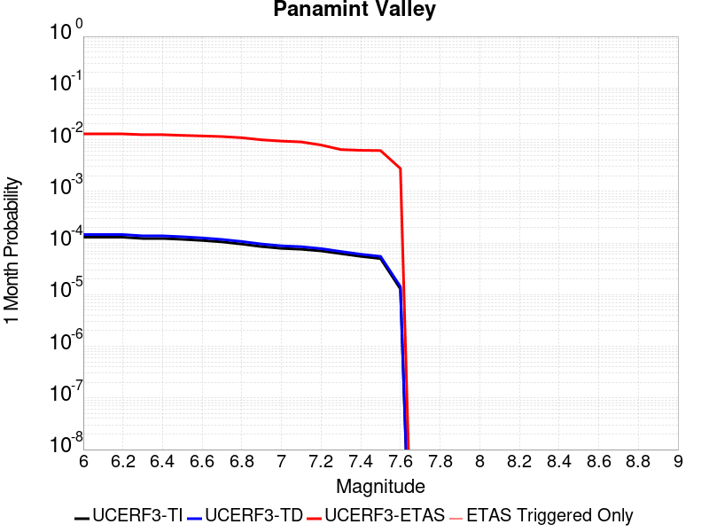
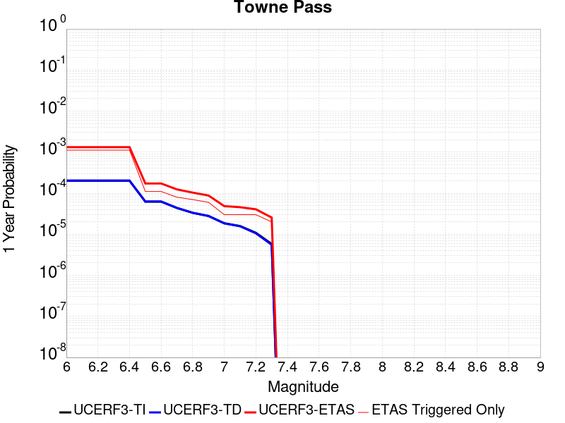
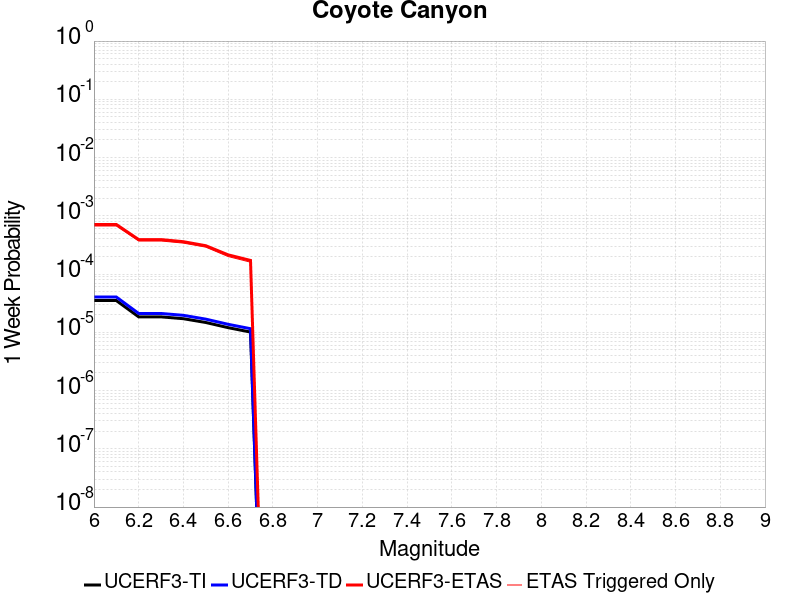
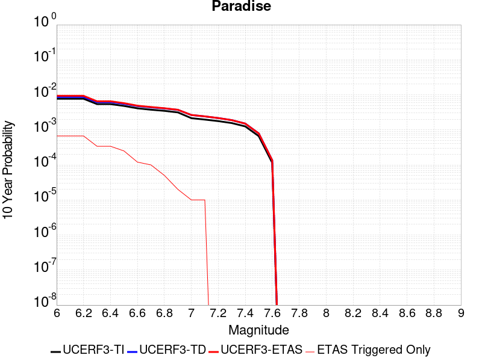
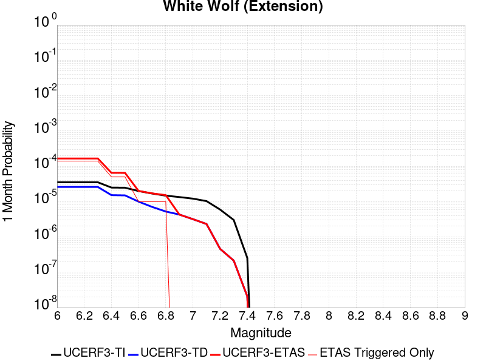

# Parent Section Magnitude-Probability Distributions

Only fault sections with at least one triggered aftershock are plotted. Sections are sorted by total supraseismogenic trigger rate (decreasing)

## Table Of Contents

* [Garlock (Central)](#garlock-central)
* [Tank Canyon](#tank-canyon)
* [Little Lake](#little-lake)
* [Airport Lake](#airport-lake)
* [Owl Lake](#owl-lake)
* [Panamint Valley](#panamint-valley)
* [Garlock (East)](#garlock-east)
* [Hunter Mountain-Saline Valley](#hunter-mountain-saline-valley)
* [Blackwater](#blackwater)
* [Garlock (West)](#garlock-west)
* [Gravel Hills-Harper Lk](#gravel-hills-harper-lk)
* [Ash Hill](#ash-hill)
* [McLean Lake](#mclean-lake)
* [San Andreas (Mojave S)](#san-andreas-mojave-s)
* [San Andreas (Mojave N)](#san-andreas-mojave-n)
* [So Sierra Nevada](#so-sierra-nevada)
* [Death Valley (So)](#death-valley-so)
* [Lenwood-Lockhart-Old Woman Springs](#lenwood-lockhart-old-woman-springs)
* [Towne Pass](#towne-pass)
* [Nelson Lake](#nelson-lake)
* [Goldstone Lake](#goldstone-lake)
* [Coyote Canyon](#coyote-canyon)
* [Bicycle Lake](#bicycle-lake)
* [Death Valley (Black Mtns Frontal)](#death-valley-black-mtns-frontal)
* [Garlic Springs](#garlic-springs)
* [San Andreas (San Bernardino N)](#san-andreas-san-bernardino-n)
* [Paradise](#paradise)
* [San Andreas (Big Bend)](#san-andreas-big-bend)
* [Coyote Lake](#coyote-lake)
* [Red Pass](#red-pass)
* [Calico-Hidalgo](#calico-hidalgo)
* [Helendale-So Lockhart](#helendale-so-lockhart)
* [White Wolf (Extension)](#white-wolf-extension)
* [San Andreas (Parkfield)](#san-andreas-parkfield)
* [Death Valley (No)](#death-valley-no)
* [Santa Ynez (West)](#santa-ynez-west)
* [San Andreas (Carrizo) rev](#san-andreas-carrizo-rev)
* [San Jacinto (San Bernardino)](#san-jacinto-san-bernardino)
* [Ludlow](#ludlow)
* [San Andreas (Cholame) rev](#san-andreas-cholame-rev)
* [Lake Isabella (Seismicity)](#lake-isabella-seismicity)
* [Scodie Lineament](#scodie-lineament)
* [San Andreas (Coachella) rev](#san-andreas-coachella-rev)
* [San Pedro Basin](#san-pedro-basin)
* [Deep Springs](#deep-springs)
* [Baker](#baker)
* [Mission Ridge-Arroyo Parida-Santa Ana](#mission-ridge-arroyo-parida-santa-ana)
* [Camp Rock 2011](#camp-rock-2011)
* [San Jacinto (Clark) rev](#san-jacinto-clark-rev)
* [San Jacinto (Stepovers Combined)](#san-jacinto-stepovers-combined)
* [San Andreas (Creeping Section) 2011 CFM](#san-andreas-creeping-section-2011-cfm)
* [San Andreas (San Bernardino S)](#san-andreas-san-bernardino-s)
* [Pisgah-Bullion Mtn-Mesquite Lk](#pisgah-bullion-mtn-mesquite-lk)
* [San Jacinto (San Jacinto Valley) rev](#san-jacinto-san-jacinto-valley-rev)
* [Santa Cruz Catalina Ridge alt1](#santa-cruz-catalina-ridge-alt1)
* [Sierra Nevada  (No Extension)](#sierra-nevada--no-extension)
* [Santa Rosa Island](#santa-rosa-island)
* [San Andreas (North Branch Mill Creek)](#san-andreas-north-branch-mill-creek)
* [Elsinore (Glen Ivy) rev](#elsinore-glen-ivy-rev)
* [Surprise Valley 2011 CFM](#surprise-valley-2011-cfm)
* [Whittier alt 1](#whittier-alt-1)
* [San Jacinto (Anza) rev](#san-jacinto-anza-rev)
* [Bullion Mountains](#bullion-mountains)
* [Hayward (No) 2011 CFM](#hayward-no-2011-cfm)
* [Great Valley 05 Pittsburg - Kirby Hills alt1](#great-valley-05-pittsburg---kirby-hills-alt1)
* [Pinto Mtn](#pinto-mtn)
* [San Andreas (San Gorgonio Pass-Garnet HIll)](#san-andreas-san-gorgonio-pass-garnet-hill)
* [Blue Cut](#blue-cut)
* [Rodgers Creek - Healdsburg 2011 CFM](#rodgers-creek---healdsburg-2011-cfm)

## Garlock (Central)
*[(top)](#table-of-contents)*

| 1 Week | 1 Month | 1 Year | 10 Year |
|-----|-----|-----|-----|
|  |  |  |  |

| Magnitude | 1 wk TI Prob | 1 wk TD Prob | 1 wk ETAS Prob | 1 wk ETAS/TD Gain | 1 wk ETAS Triggered Only | 1 mo TI Prob | 1 mo TD Prob | 1 mo ETAS Prob | 1 mo ETAS/TD Gain | 1 mo ETAS Triggered Only | 1 yr TI Prob | 1 yr TD Prob | 1 yr ETAS Prob | 1 yr ETAS/TD Gain | 1 yr ETAS Triggered Only | 10 yr TI Prob | 10 yr TD Prob | 10 yr ETAS Prob | 10 yr ETAS/TD Gain | 10 yr ETAS Triggered Only |
|-----|-----|-----|-----|-----|-----|-----|-----|-----|-----|-----|-----|-----|-----|-----|-----|-----|-----|-----|-----|-----|
| 6.0 | 5.5131142E-5 | 7.024681E-5 | 0.062520996 | 890.0189 | 0.062455133 | 2.3625491E-4 | 3.010234E-4 | 0.06835902 | 227.08873 | 0.06807849 | 0.0028726095 | 0.0036588663 | 0.07828312 | 21.395458 | 0.0748983 | 0.028357591 | 0.036079824 | 0.111505024 | 3.090509 | 0.07824838 |
| 6.1 | 5.5131142E-5 | 7.024681E-5 | 0.062520996 | 890.0189 | 0.062455133 | 2.3625491E-4 | 3.010234E-4 | 0.06835902 | 227.08873 | 0.06807849 | 0.0028726095 | 0.0036588663 | 0.07828312 | 21.395458 | 0.0748983 | 0.028357591 | 0.036079824 | 0.111505024 | 3.090509 | 0.07824838 |
| 6.2 | 4.216245E-5 | 5.1661493E-5 | 0.038216714 | 739.75244 | 0.038167026 | 1.806837E-4 | 2.2138779E-4 | 0.041490067 | 187.40901 | 0.04127782 | 0.0021976046 | 0.0026920962 | 0.047557827 | 17.665722 | 0.04498684 | 0.021759989 | 0.026689773 | 0.07268852 | 2.7234597 | 0.04726011 |
| 6.3 | 4.216245E-5 | 5.1661493E-5 | 0.038216714 | 739.75244 | 0.038167026 | 1.806837E-4 | 2.2138779E-4 | 0.041490067 | 187.40901 | 0.04127782 | 0.0021976046 | 0.0026920962 | 0.047557827 | 17.665722 | 0.04498684 | 0.021759989 | 0.026689773 | 0.07268852 | 2.7234597 | 0.04726011 |
| 6.4 | 3.6858168E-5 | 4.411054E-5 | 0.028518567 | 646.52496 | 0.028475711 | 1.5795401E-4 | 1.8903162E-4 | 0.030932203 | 163.63507 | 0.030748984 | 0.0019213937 | 0.002299056 | 0.0356035 | 15.48614 | 0.03338119 | 0.019048655 | 0.02284894 | 0.05745491 | 2.5145547 | 0.035415173 |
| 6.5 | 3.39199E-5 | 4.0018083E-5 | 0.026361052 | 658.72845 | 0.026322087 | 1.453629E-4 | 1.7149492E-4 | 0.028642323 | 167.01558 | 0.028475711 | 0.0017683565 | 0.002085973 | 0.032770816 | 15.710086 | 0.030748984 | 0.017543508 | 0.020759864 | 0.052745093 | 2.5407245 | 0.032663316 |
| 6.6 | 3.3571985E-5 | 3.9472274E-5 | 0.02624088 | 664.7927 | 0.02620244 | 1.4387199E-4 | 1.6915603E-4 | 0.028520426 | 168.60425 | 0.028356066 | 0.0017502342 | 0.0020575512 | 0.03262387 | 15.855678 | 0.030629337 | 0.017365133 | 0.020481179 | 0.052358318 | 2.5564113 | 0.03254367 |
| 6.7 | 3.2580007E-5 | 3.8088703E-5 | 0.025760965 | 676.34143 | 0.025723858 | 1.3962112E-4 | 1.632272E-4 | 0.027796907 | 170.2958 | 0.027638191 | 0.0016985617 | 0.0019855013 | 0.031837575 | 16.03503 | 0.029911462 | 0.016856372 | 0.019773813 | 0.05073573 | 2.565804 | 0.031586505 |
| 6.8 | 3.2185937E-5 | 3.7515918E-5 | 0.025521126 | 680.27454 | 0.025484566 | 1.3793244E-4 | 1.6077272E-4 | 0.02743564 | 170.6486 | 0.027279254 | 0.0016780337 | 0.001955672 | 0.031450402 | 16.081635 | 0.029552525 | 0.016654192 | 0.019480614 | 0.049982533 | 2.5657575 | 0.031107921 |
| 6.9 | 3.165394E-5 | 3.6720503E-5 | 0.025281068 | 688.4728 | 0.025245273 | 1.3565269E-4 | 1.5736422E-4 | 0.027193071 | 172.80339 | 0.027039962 | 0.0016503202 | 0.001914247 | 0.031171367 | 16.283878 | 0.029313233 | 0.01638118 | 0.019073246 | 0.049235746 | 2.5814035 | 0.030748984 |
| 7.0 | 3.0903822E-5 | 3.5625766E-5 | 0.025040718 | 702.8822 | 0.025005983 | 1.3243823E-4 | 1.5267303E-4 | 0.026949251 | 176.51611 | 0.02680067 | 0.0016112428 | 0.0018572307 | 0.030877175 | 16.625385 | 0.02907394 | 0.015996104 | 0.018512413 | 0.0484573 | 2.617557 | 0.030509692 |
| 7.1 | 3.0069863E-5 | 3.4392073E-5 | 0.024321664 | 707.1881 | 0.024288107 | 1.2886449E-4 | 1.4738638E-4 | 0.025987081 | 176.31941 | 0.025843503 | 0.0015677959 | 0.0017929734 | 0.029501041 | 16.453697 | 0.027757837 | 0.01556781 | 0.017880075 | 0.04643417 | 2.5969787 | 0.02907394 |
| 7.2 | 2.7957109E-5 | 3.128145E-5 | 0.021447219 | 685.6209 | 0.021416606 | 1.1981068E-4 | 1.340566E-4 | 0.02298335 | 171.44513 | 0.022852357 | 0.0014577188 | 0.0016309366 | 0.026357234 | 16.160797 | 0.024766691 | 0.014481937 | 0.016283695 | 0.04158867 | 2.554007 | 0.025723858 |
| 7.3 | 2.4519275E-5 | 2.6714795E-5 | 0.014383833 | 538.422 | 0.014357502 | 1.0507837E-4 | 1.1448703E-4 | 0.015547034 | 135.79733 | 0.0154343145 | 0.0012785783 | 0.001393003 | 0.018239567 | 13.093702 | 0.016870065 | 0.012712469 | 0.013928054 | 0.031153047 | 2.2367122 | 0.017468294 |
| 7.4 | 2.3225532E-5 | 2.51994E-5 | 0.013185911 | 523.2629 | 0.013161044 | 9.95342E-5 | 1.0799304E-4 | 0.014344311 | 132.82626 | 0.014237856 | 0.0012111551 | 0.0013140367 | 0.016847558 | 12.821224 | 0.015553961 | 0.012045753 | 0.013145725 | 0.029085582 | 2.2125506 | 0.01615219 |
| 7.5 | 2.097765E-5 | 2.2483688E-5 | 0.010670724 | 474.5985 | 0.010648481 | 8.9901114E-5 | 9.635517E-5 | 0.01158125 | 120.193344 | 0.011486001 | 0.0010939965 | 0.0011725046 | 0.013720589 | 11.701948 | 0.012562814 | 0.010886264 | 0.011740365 | 0.024628652 | 2.0977757 | 0.013041398 |
| 7.6 | 1.511254E-5 | 1.5991332E-5 | 0.005519612 | 345.16275 | 0.005503709 | 6.476642E-5 | 6.853253E-5 | 0.005930777 | 86.5396 | 0.0058626467 | 7.882459E-4 | 8.3407195E-4 | 0.007409105 | 8.883053 | 0.006580522 | 0.007854558 | 0.008383559 | 0.015146198 | 1.8066549 | 0.0068198135 |
| 7.7 | 9.934069E-6 | 1.0678794E-5 | 0.0016857028 | 157.85518 | 0.0016750419 | 4.2573887E-5 | 4.5765457E-5 | 0.0017207307 | 37.598896 | 0.0016750419 | 5.182138E-4 | 5.570524E-4 | 0.0023507404 | 4.219963 | 0.0017946877 | 0.00517007 | 0.005627684 | 0.0076502166 | 1.3593899 | 0.0020339794 |
| 7.8 | 6.7562896E-6 | 8.428449E-6 | 0.0013245217 | 157.14893 | 0.0013161043 | 2.8955206E-5 | 3.6121426E-5 | 0.0013521782 | 37.434242 | 0.0013161043 | 3.5247262E-4 | 4.3968976E-4 | 0.0017552155 | 3.9919405 | 0.0013161043 | 0.0035191406 | 0.004446654 | 0.0057569062 | 1.2946602 | 0.0013161043 |
| 7.9 | 3.975453E-6 | 5.37103E-6 | 4.8395185E-4 | 90.1041 | 4.785834E-4 | 1.7037546E-5 | 2.3018498E-5 | 5.015909E-4 | 21.790773 | 4.785834E-4 | 2.0741238E-4 | 2.8021427E-4 | 7.586636E-4 | 2.7074409 | 4.785834E-4 | 0.002072189 | 0.0028336283 | 0.0033108555 | 1.1684157 | 4.785834E-4 |
| 8.0 | 1.6729537E-6 | 2.0775144E-6 | 3.610143E-4 | 173.77223 | 3.5893754E-4 | 7.169782E-6 | 8.903603E-6 | 3.6783796E-4 | 41.31338 | 3.5893754E-4 | 8.7288594E-5 | 1.0839601E-4 | 4.6729465E-4 | 4.310995 | 3.5893754E-4 | 8.7254314E-4 | 0.0010969337 | 0.0014554776 | 1.3268601 | 3.5893754E-4 |
| 8.1 | 3.6733252E-7 | 3.1489964E-7 | 3.1489964E-7 | 1.0 | 0.0 | 1.5742813E-6 | 1.3495693E-6 | 1.3495693E-6 | 1.0 | 0.0 | 1.9166706E-5 | 1.6430899E-5 | 1.6430899E-5 | 1.0 | 0.0 | 1.9165053E-4 | 1.6638759E-4 | 1.6638759E-4 | 1.0 | 0.0 |

## Tank Canyon
*[(top)](#table-of-contents)*

| 1 Week | 1 Month | 1 Year | 10 Year |
|-----|-----|-----|-----|
|  |  |  |  |

| Magnitude | 1 wk TI Prob | 1 wk TD Prob | 1 wk ETAS Prob | 1 wk ETAS/TD Gain | 1 wk ETAS Triggered Only | 1 mo TI Prob | 1 mo TD Prob | 1 mo ETAS Prob | 1 mo ETAS/TD Gain | 1 mo ETAS Triggered Only | 1 yr TI Prob | 1 yr TD Prob | 1 yr ETAS Prob | 1 yr ETAS/TD Gain | 1 yr ETAS Triggered Only | 10 yr TI Prob | 10 yr TD Prob | 10 yr ETAS Prob | 10 yr ETAS/TD Gain | 10 yr ETAS Triggered Only |
|-----|-----|-----|-----|-----|-----|-----|-----|-----|-----|-----|-----|-----|-----|-----|-----|-----|-----|-----|-----|-----|
| 6.0 | 4.8284557E-5 | 5.7964822E-5 | 0.03379614 | 583.04565 | 0.03374013 | 2.0691741E-4 | 2.4840087E-4 | 0.038047098 | 153.16814 | 0.037808087 | 0.0025163088 | 0.0030207601 | 0.045963153 | 15.215757 | 0.043072507 | 0.02488006 | 0.029863637 | 0.074899875 | 2.5080628 | 0.04642259 |
| 6.1 | 1.7796336E-5 | 2.0873314E-5 | 0.012583425 | 602.8475 | 0.012562814 | 7.626778E-5 | 8.945422E-5 | 0.014086766 | 157.4746 | 0.013998564 | 9.281647E-4 | 0.0010885983 | 0.017103689 | 15.711663 | 0.016032543 | 0.009242975 | 0.010836744 | 0.02799739 | 2.583561 | 0.017348647 |
| 6.2 | 1.7796336E-5 | 2.0873314E-5 | 0.012583425 | 602.8475 | 0.012562814 | 7.626778E-5 | 8.945422E-5 | 0.014086766 | 157.4746 | 0.013998564 | 9.281647E-4 | 0.0010885983 | 0.017103689 | 15.711663 | 0.016032543 | 0.009242975 | 0.010836744 | 0.02799739 | 2.583561 | 0.017348647 |
| 6.3 | 1.3515912E-5 | 1.5759564E-5 | 0.008031905 | 509.6527 | 0.0080162715 | 5.792405E-5 | 6.753938E-5 | 0.0090403715 | 133.85335 | 0.008973438 | 7.049971E-4 | 8.2200574E-4 | 0.011222638 | 13.652749 | 0.010409188 | 0.007027647 | 0.0081922645 | 0.019228173 | 2.3471131 | 0.011127064 |
| 6.4 | 1.0870146E-5 | 1.2618021E-5 | 0.0057555465 | 456.13702 | 0.0057430007 | 4.658551E-5 | 5.4076212E-5 | 0.0062753237 | 116.04592 | 0.006221584 | 5.67031E-4 | 6.581969E-4 | 0.007593089 | 11.536196 | 0.006939459 | 0.005655863 | 0.0065644905 | 0.013933837 | 2.1226075 | 0.0074180425 |
| 6.5 | 7.964826E-6 | 9.196094E-6 | 0.003837828 | 417.3324 | 0.003828667 | 3.4134522E-5 | 3.9411298E-5 | 0.00410721 | 104.21403 | 0.004067959 | 4.1550855E-4 | 4.7973756E-4 | 0.005024099 | 10.472598 | 0.004546542 | 0.0041473247 | 0.004788321 | 0.009670312 | 2.019562 | 0.00490548 |
| 6.6 | 6.6317E-6 | 7.6122988E-6 | 0.0033576705 | 441.08496 | 0.0033500837 | 2.8421264E-5 | 3.2623782E-5 | 0.0037415242 | 114.68701 | 0.0037090213 | 3.4597394E-4 | 3.9713128E-4 | 0.004343876 | 10.938137 | 0.003948313 | 0.0034543579 | 0.003965368 | 0.0082555385 | 2.08191 | 0.0043072505 |
| 6.7 | 4.793663E-6 | 5.4307857E-6 | 0.001919754 | 353.4947 | 0.0019143336 | 2.0544108E-5 | 2.3274613E-5 | 0.0020572066 | 88.38844 | 0.0020339794 | 2.500958E-4 | 2.8333595E-4 | 0.002436351 | 8.598806 | 0.0021536252 | 0.0024981452 | 0.0028304397 | 0.0050972765 | 1.8008779 | 0.002273271 |
| 6.8 | 4.382823E-6 | 4.9692567E-6 | 0.001799648 | 362.15637 | 0.0017946877 | 1.8783392E-5 | 2.1296666E-5 | 0.0019355895 | 90.88697 | 0.0019143336 | 2.286638E-4 | 2.5926033E-4 | 0.0022927125 | 8.843283 | 0.0020339794 | 0.0022842865 | 0.002590253 | 0.0046189637 | 1.7832096 | 0.0020339794 |
| 6.9 | 2.729601E-6 | 3.0735416E-6 | 9.602374E-4 | 312.42047 | 9.571668E-4 | 1.1698237E-5 | 1.3172262E-5 | 0.0010899707 | 82.74742 | 0.0010768126 | 1.4241673E-4 | 1.6036171E-4 | 0.0012370016 | 7.713822 | 0.0010768126 | 0.001423255 | 0.0016026258 | 0.0026777128 | 1.6708283 | 0.0010768126 |
| 7.0 | 1.8987357E-6 | 2.126939E-6 | 3.6106372E-4 | 169.75743 | 3.5893754E-4 | 8.137413E-6 | 9.115425E-6 | 4.8769446E-4 | 53.502106 | 4.785834E-4 | 9.90685E-5 | 1.1097535E-4 | 5.8950565E-4 | 5.3120413 | 4.785834E-4 | 9.902435E-4 | 0.0011092679 | 0.0015873205 | 1.4309622 | 4.785834E-4 |
| 7.1 | 1.4928986E-6 | 1.6641272E-6 | 2.4095543E-4 | 144.79387 | 2.392917E-4 | 6.398121E-6 | 7.1319573E-6 | 2.4642196E-4 | 34.551796 | 2.392917E-4 | 7.789434E-5 | 8.682871E-5 | 3.2609963E-4 | 3.7556658 | 2.392917E-4 | 7.786704E-4 | 8.6800574E-4 | 0.0011070897 | 1.2754406 | 2.392917E-4 |
| 7.2 | 1.069082E-6 | 1.1828573E-6 | 1.1828573E-6 | 1.0 | 0.0 | 4.581772E-6 | 5.0693816E-6 | 5.0693816E-6 | 1.0 | 0.0 | 5.5781646E-5 | 6.171851E-5 | 6.171851E-5 | 1.0 | 0.0 | 5.576765E-4 | 6.170659E-4 | 6.170659E-4 | 1.0 | 0.0 |
| 7.3 | 8.776551E-7 | 9.770005E-7 | 9.770005E-7 | 1.0 | 0.0 | 3.7613736E-6 | 4.1871413E-6 | 4.1871413E-6 | 1.0 | 0.0 | 4.579376E-5 | 5.097777E-5 | 5.097777E-5 | 1.0 | 0.0 | 4.5784327E-4 | 5.097118E-4 | 5.097118E-4 | 1.0 | 0.0 |
| 7.4 | 7.55721E-7 | 8.510244E-7 | 8.510244E-7 | 1.0 | 0.0 | 3.2388E-6 | 3.6472454E-6 | 3.6472454E-6 | 1.0 | 0.0 | 3.9431678E-5 | 4.4404827E-5 | 4.4404827E-5 | 1.0 | 0.0 | 3.942468E-4 | 4.440104E-4 | 4.440104E-4 | 1.0 | 0.0 |
| 7.5 | 5.587665E-7 | 6.305619E-7 | 6.305619E-7 | 1.0 | 0.0 | 2.3947114E-6 | 2.702408E-6 | 2.702408E-6 | 1.0 | 0.0 | 2.915522E-5 | 3.290182E-5 | 3.290182E-5 | 1.0 | 0.0 | 2.9151395E-4 | 3.290182E-4 | 3.290182E-4 | 1.0 | 0.0 |

## Little Lake
*[(top)](#table-of-contents)*

| 1 Week | 1 Month | 1 Year | 10 Year |
|-----|-----|-----|-----|
|  |  |  |  |

| Magnitude | 1 wk TI Prob | 1 wk TD Prob | 1 wk ETAS Prob | 1 wk ETAS/TD Gain | 1 wk ETAS Triggered Only | 1 mo TI Prob | 1 mo TD Prob | 1 mo ETAS Prob | 1 mo ETAS/TD Gain | 1 mo ETAS Triggered Only | 1 yr TI Prob | 1 yr TD Prob | 1 yr ETAS Prob | 1 yr ETAS/TD Gain | 1 yr ETAS Triggered Only | 10 yr TI Prob | 10 yr TD Prob | 10 yr ETAS Prob | 10 yr ETAS/TD Gain | 10 yr ETAS Triggered Only |
|-----|-----|-----|-----|-----|-----|-----|-----|-----|-----|-----|-----|-----|-----|-----|-----|-----|-----|-----|-----|-----|
| 6.0 | 2.8424427E-5 | 3.120572E-5 | 0.030061377 | 963.32904 | 0.030031107 | 1.2181328E-4 | 1.337327E-4 | 0.03159638 | 236.2652 | 0.031466857 | 0.0014820677 | 0.0016271127 | 0.0359096 | 22.06952 | 0.03433836 | 0.014722223 | 0.016165402 | 0.0503018 | 3.1116953 | 0.034697294 |
| 6.1 | 2.8424427E-5 | 3.120572E-5 | 0.030061377 | 963.32904 | 0.030031107 | 1.2181328E-4 | 1.337327E-4 | 0.03159638 | 236.2652 | 0.031466857 | 0.0014820677 | 0.0016271127 | 0.0359096 | 22.06952 | 0.03433836 | 0.014722223 | 0.016165402 | 0.0503018 | 3.1116953 | 0.034697294 |
| 6.2 | 2.8424427E-5 | 3.120572E-5 | 0.030061377 | 963.32904 | 0.030031107 | 1.2181328E-4 | 1.337327E-4 | 0.03159638 | 236.2652 | 0.031466857 | 0.0014820677 | 0.0016271127 | 0.0359096 | 22.06952 | 0.03433836 | 0.014722223 | 0.016165402 | 0.0503018 | 3.1116953 | 0.034697294 |
| 6.3 | 1.48860645E-5 | 1.6081389E-5 | 0.01951804 | 1213.7036 | 0.019502273 | 6.379586E-5 | 6.8918576E-5 | 0.020407312 | 296.10754 | 0.020339794 | 7.7643775E-4 | 8.3878887E-4 | 0.02307425 | 27.509008 | 0.022254128 | 0.007737305 | 0.008359048 | 0.030545797 | 3.6542199 | 0.022373773 |
| 6.4 | 1.48860645E-5 | 1.6081389E-5 | 0.01951804 | 1213.7036 | 0.019502273 | 6.379586E-5 | 6.8918576E-5 | 0.020407312 | 296.10754 | 0.020339794 | 7.7643775E-4 | 8.3878887E-4 | 0.02307425 | 27.509008 | 0.022254128 | 0.007737305 | 0.008359048 | 0.030545797 | 3.6542199 | 0.022373773 |
| 6.5 | 1.2797581E-5 | 1.3765565E-5 | 0.018438973 | 1339.4999 | 0.01842546 | 5.4845623E-5 | 5.899409E-5 | 0.0192012 | 325.47668 | 0.019143336 | 6.675408E-4 | 7.18042E-4 | 0.02176059 | 30.305456 | 0.02105767 | 0.006655392 | 0.00715977 | 0.02818546 | 3.9366434 | 0.021177314 |
| 6.6 | 9.661896E-6 | 1.0289038E-5 | 0.016042668 | 1559.2001 | 0.016032543 | 4.1407468E-5 | 4.409522E-5 | 0.016674135 | 378.13925 | 0.016630773 | 5.040193E-4 | 5.367433E-4 | 0.018473988 | 34.418663 | 0.017946877 | 0.005028777 | 0.0053560743 | 0.023325833 | 4.355024 | 0.018066524 |
| 6.7 | 7.767871E-6 | 8.199687E-6 | 0.013887004 | 1693.6018 | 0.013878918 | 3.329045E-5 | 3.5141118E-5 | 0.01451178 | 412.95728 | 0.014477148 | 4.0523586E-4 | 4.2777284E-4 | 0.016094673 | 37.624348 | 0.015673606 | 0.004044977 | 0.004270846 | 0.019996647 | 4.682128 | 0.015793253 |
| 6.8 | 6.4235196E-6 | 6.7357446E-6 | 0.010655144 | 1581.8807 | 0.010648481 | 2.752908E-5 | 2.8867229E-5 | 0.01115561 | 386.44547 | 0.011127064 | 3.35115E-4 | 3.5141467E-4 | 0.012311795 | 35.03495 | 0.011964585 | 0.003346101 | 0.00350985 | 0.015551667 | 4.430864 | 0.012084231 |
| 6.9 | 3.1283696E-6 | 3.1121804E-6 | 0.0063443226 | 2038.5458 | 0.00634123 | 1.3407229E-5 | 1.3337856E-5 | 0.00683306 | 512.3057 | 0.0068198135 | 1.6322079E-4 | 1.6237781E-4 | 0.0076988423 | 47.413143 | 0.0075376886 | 0.0016310095 | 0.00162274 | 0.009267649 | 5.711111 | 0.007657334 |
| 7.0 | 2.290603E-6 | 2.2286815E-6 | 0.00430947 | 1933.6409 | 0.0043072505 | 9.816834E-6 | 9.551463E-6 | 0.00479534 | 502.0529 | 0.004785834 | 1.19513395E-4 | 1.162839E-4 | 0.005380089 | 46.26684 | 0.0052644173 | 0.0011944914 | 0.0011623327 | 0.006420631 | 5.5239186 | 0.0052644173 |
| 7.1 | 1.293693E-6 | 1.1776827E-6 | 0.0023940918 | 2032.8834 | 0.002392917 | 5.5443866E-6 | 5.0472063E-6 | 0.0023979521 | 475.10486 | 0.002392917 | 6.750081E-5 | 6.14487E-5 | 0.002813134 | 45.780205 | 0.0027518545 | 6.7480316E-4 | 6.143856E-4 | 0.0033645495 | 5.476283 | 0.0027518545 |
| 7.2 | 4.715842E-7 | 3.0917857E-7 | 3.0917857E-7 | 1.0 | 0.0 | 2.0210737E-6 | 1.3250503E-6 | 1.3250503E-6 | 1.0 | 0.0 | 2.4606294E-5 | 1.6132375E-5 | 1.6132375E-5 | 1.0 | 0.0 | 2.460357E-4 | 1.6131258E-4 | 1.6131258E-4 | 1.0 | 0.0 |
| 7.3 | 3.9430947E-7 | 2.3097488E-7 | 2.3097488E-7 | 1.0 | 0.0 | 1.6898966E-6 | 9.89892E-7 | 9.89892E-7 | 1.0 | 0.0 | 2.0574296E-5 | 1.2051869E-5 | 1.2051869E-5 | 1.0 | 0.0 | 2.0572392E-4 | 1.20512224E-4 | 1.20512224E-4 | 1.0 | 0.0 |
| 7.4 | 3.547123E-7 | 1.9679135E-7 | 1.9679135E-7 | 1.0 | 0.0 | 1.5201948E-6 | 8.4339126E-7 | 8.4339126E-7 | 1.0 | 0.0 | 1.8508214E-5 | 1.0268241E-5 | 1.0268241E-5 | 1.0 | 0.0 | 1.8506673E-4 | 1.02677724E-4 | 1.02677724E-4 | 1.0 | 0.0 |
| 7.5 | 2.6354266E-7 | 1.4423138E-7 | 1.4423138E-7 | 1.0 | 0.0 | 1.129468E-6 | 6.181344E-7 | 6.181344E-7 | 1.0 | 0.0 | 1.3751187E-5 | 7.5257603E-6 | 7.5257603E-6 | 1.0 | 0.0 | 1.3750336E-4 | 7.5255106E-5 | 7.5255106E-5 | 1.0 | 0.0 |
| 7.6 | 1.269913E-7 | 7.572556E-8 | 7.572556E-8 | 1.0 | 0.0 | 5.4424834E-7 | 3.245381E-7 | 3.245381E-7 | 1.0 | 0.0 | 6.6262032E-6 | 3.9512443E-6 | 3.9512443E-6 | 1.0 | 0.0 | 6.626006E-5 | 3.9511775E-5 | 3.9511775E-5 | 1.0 | 0.0 |

## Airport Lake
*[(top)](#table-of-contents)*

| 1 Week | 1 Month | 1 Year | 10 Year |
|-----|-----|-----|-----|
|  |  |  |  |

| Magnitude | 1 wk TI Prob | 1 wk TD Prob | 1 wk ETAS Prob | 1 wk ETAS/TD Gain | 1 wk ETAS Triggered Only | 1 mo TI Prob | 1 mo TD Prob | 1 mo ETAS Prob | 1 mo ETAS/TD Gain | 1 mo ETAS Triggered Only | 1 yr TI Prob | 1 yr TD Prob | 1 yr ETAS Prob | 1 yr ETAS/TD Gain | 1 yr ETAS Triggered Only | 10 yr TI Prob | 10 yr TD Prob | 10 yr ETAS Prob | 10 yr ETAS/TD Gain | 10 yr ETAS Triggered Only |
|-----|-----|-----|-----|-----|-----|-----|-----|-----|-----|-----|-----|-----|-----|-----|-----|-----|-----|-----|-----|-----|
| 6.0 | 1.2387061E-5 | 1.3103157E-5 | 0.025975913 | 1982.4164 | 0.02596315 | 5.3086325E-5 | 5.615534E-5 | 0.027453516 | 488.88525 | 0.0273989 | 6.461343E-4 | 6.8350515E-4 | 0.030933214 | 45.256737 | 0.0302704 | 0.0064425888 | 0.0068168393 | 0.0377127 | 5.5322857 | 0.031107921 |
| 6.1 | 1.2387061E-5 | 1.3103157E-5 | 0.025975913 | 1982.4164 | 0.02596315 | 5.3086325E-5 | 5.615534E-5 | 0.027453516 | 488.88525 | 0.0273989 | 6.461343E-4 | 6.8350515E-4 | 0.030933214 | 45.256737 | 0.0302704 | 0.0064425888 | 0.0068168393 | 0.0377127 | 5.5322857 | 0.031107921 |
| 6.2 | 1.2387061E-5 | 1.3103157E-5 | 0.025975913 | 1982.4164 | 0.02596315 | 5.3086325E-5 | 5.615534E-5 | 0.027453516 | 488.88525 | 0.0273989 | 6.461343E-4 | 6.8350515E-4 | 0.030933214 | 45.256737 | 0.0302704 | 0.0064425888 | 0.0068168393 | 0.0377127 | 5.5322857 | 0.031107921 |
| 6.3 | 1.2387061E-5 | 1.3103157E-5 | 0.025975913 | 1982.4164 | 0.02596315 | 5.3086325E-5 | 5.615534E-5 | 0.027453516 | 488.88525 | 0.0273989 | 6.461343E-4 | 6.8350515E-4 | 0.030933214 | 45.256737 | 0.0302704 | 0.0064425888 | 0.0068168393 | 0.0377127 | 5.5322857 | 0.031107921 |
| 6.4 | 1.2387061E-5 | 1.3103157E-5 | 0.025975913 | 1982.4164 | 0.02596315 | 5.3086325E-5 | 5.615534E-5 | 0.027453516 | 488.88525 | 0.0273989 | 6.461343E-4 | 6.8350515E-4 | 0.030933214 | 45.256737 | 0.0302704 | 0.0064425888 | 0.0068168393 | 0.0377127 | 5.5322857 | 0.031107921 |
| 6.5 | 6.9922594E-6 | 7.384925E-6 | 0.018791644 | 2544.5952 | 0.018784398 | 2.996648E-5 | 3.1649324E-5 | 0.019652948 | 620.9594 | 0.01962192 | 3.6478083E-4 | 3.8526783E-4 | 0.022032823 | 57.188328 | 0.021655899 | 0.003641826 | 0.0038465366 | 0.025776692 | 6.701273 | 0.022014836 |
| 6.6 | 6.9922594E-6 | 7.384925E-6 | 0.018791644 | 2544.5952 | 0.018784398 | 2.996648E-5 | 3.1649324E-5 | 0.019652948 | 620.9594 | 0.01962192 | 3.6478083E-4 | 3.8526783E-4 | 0.022032823 | 57.188328 | 0.021655899 | 0.003641826 | 0.0038465366 | 0.025776692 | 6.701273 | 0.022014836 |
| 6.7 | 5.477277E-6 | 5.7860684E-6 | 0.015559657 | 2689.1587 | 0.015553961 | 2.3473833E-5 | 2.4797222E-5 | 0.016415872 | 662.00446 | 0.01639148 | 2.8575645E-4 | 3.0186825E-4 | 0.018482547 | 61.2272 | 0.018186169 | 0.0028538927 | 0.003014966 | 0.02150416 | 7.132472 | 0.018545106 |
| 6.8 | 3.9950432E-6 | 4.2190873E-6 | 0.011968753 | 2836.8113 | 0.011964585 | 1.7121502E-5 | 1.8081691E-5 | 0.012700312 | 702.3852 | 0.01268246 | 2.0843433E-4 | 2.2012512E-4 | 0.014095988 | 64.036255 | 0.013878918 | 0.0020823893 | 0.0021993418 | 0.016286502 | 7.405171 | 0.01411821 |
| 6.9 | 2.95695E-6 | 3.1230243E-6 | 0.009215824 | 2950.9294 | 0.00921273 | 1.2672582E-5 | 1.3384334E-5 | 0.009824213 | 734.0083 | 0.00981096 | 1.5427776E-4 | 1.6294434E-4 | 0.010929316 | 67.07392 | 0.010768127 | 0.001541707 | 0.0016284712 | 0.012617964 | 7.7483497 | 0.011007418 |
| 7.0 | 1.456072E-6 | 1.540812E-6 | 0.004189139 | 2718.7866 | 0.004187605 | 6.2402937E-6 | 6.603469E-6 | 0.0045531155 | 689.5036 | 0.004546542 | 7.597293E-5 | 8.039528E-5 | 0.005105117 | 63.50021 | 0.0050251256 | 7.594696E-4 | 8.0376083E-4 | 0.0058248476 | 7.246991 | 0.0050251256 |
| 7.1 | 6.995192E-7 | 7.4089746E-7 | 0.0023936562 | 3230.7522 | 0.002392917 | 2.997936E-6 | 3.1752747E-6 | 0.0023960846 | 754.60706 | 0.002392917 | 3.649926E-5 | 3.865897E-5 | 0.002790407 | 72.18007 | 0.0027518545 | 3.6493264E-4 | 3.865897E-4 | 0.0031373804 | 8.11553 | 0.0027518545 |

## Owl Lake
*[(top)](#table-of-contents)*

| 1 Week | 1 Month | 1 Year | 10 Year |
|-----|-----|-----|-----|
|  |  |  |  |

| Magnitude | 1 wk TI Prob | 1 wk TD Prob | 1 wk ETAS Prob | 1 wk ETAS/TD Gain | 1 wk ETAS Triggered Only | 1 mo TI Prob | 1 mo TD Prob | 1 mo ETAS Prob | 1 mo ETAS/TD Gain | 1 mo ETAS Triggered Only | 1 yr TI Prob | 1 yr TD Prob | 1 yr ETAS Prob | 1 yr ETAS/TD Gain | 1 yr ETAS Triggered Only | 10 yr TI Prob | 10 yr TD Prob | 10 yr ETAS Prob | 10 yr ETAS/TD Gain | 10 yr ETAS Triggered Only |
|-----|-----|-----|-----|-----|-----|-----|-----|-----|-----|-----|-----|-----|-----|-----|-----|-----|-----|-----|-----|-----|
| 6.0 | 5.0320643E-5 | 6.635816E-5 | 0.016456751 | 247.99893 | 0.01639148 | 2.1564208E-4 | 2.843674E-4 | 0.017867306 | 62.83177 | 0.01758794 | 0.0026222812 | 0.0034577388 | 0.022773346 | 6.5861964 | 0.019382628 | 0.02591553 | 0.034140717 | 0.05401722 | 1.5821934 | 0.020579087 |
| 6.1 | 5.0320643E-5 | 6.635816E-5 | 0.016456751 | 247.99893 | 0.01639148 | 2.1564208E-4 | 2.843674E-4 | 0.017867306 | 62.83177 | 0.01758794 | 0.0026222812 | 0.0034577388 | 0.022773346 | 6.5861964 | 0.019382628 | 0.02591553 | 0.034140717 | 0.05401722 | 1.5821934 | 0.020579087 |
| 6.2 | 2.4125871E-5 | 3.0981035E-5 | 0.01283269 | 414.21115 | 0.012802105 | 1.0339249E-4 | 1.3277028E-4 | 0.013770586 | 103.717384 | 0.013639627 | 0.0012580766 | 0.001615439 | 0.01654701 | 10.243043 | 0.014955731 | 0.012509781 | 0.016070465 | 0.031845357 | 1.9816078 | 0.016032543 |
| 6.3 | 1.7433485E-5 | 2.2355514E-5 | 0.011747386 | 525.48047 | 0.0117252935 | 7.471279E-5 | 9.580672E-5 | 0.012537783 | 130.86539 | 0.012443168 | 9.0924866E-4 | 0.0011659743 | 0.014789698 | 12.684411 | 0.013639627 | 0.009055373 | 0.011628896 | 0.02593769 | 2.2304516 | 0.014477148 |
| 6.4 | 1.7433485E-5 | 2.2355514E-5 | 0.011747386 | 525.48047 | 0.0117252935 | 7.471279E-5 | 9.580672E-5 | 0.012537783 | 130.86539 | 0.012443168 | 9.0924866E-4 | 0.0011659743 | 0.014789698 | 12.684411 | 0.013639627 | 0.009055373 | 0.011628896 | 0.02593769 | 2.2304516 | 0.014477148 |
| 6.5 | 1.5182742E-5 | 1.9429144E-5 | 0.011026633 | 567.5306 | 0.011007418 | 6.506727E-5 | 8.326596E-5 | 0.011807582 | 141.80565 | 0.0117252935 | 7.919061E-4 | 0.0010134429 | 0.013922099 | 13.737429 | 0.0129217515 | 0.0078909 | 0.010118429 | 0.02373848 | 2.3460639 | 0.013759272 |
| 6.6 | 6.7271576E-6 | 8.547361E-6 | 0.009460488 | 1106.8315 | 0.009452022 | 2.8830356E-5 | 3.6631063E-5 | 0.009966873 | 272.08798 | 0.009930605 | 3.5095305E-4 | 4.458976E-4 | 0.010970037 | 24.602144 | 0.010528835 | 0.0035039932 | 0.004467813 | 0.015426052 | 3.4527078 | 0.011007418 |
| 6.7 | 6.682835E-6 | 8.479807E-6 | 0.009460421 | 1115.6411 | 0.009452022 | 2.8640408E-5 | 3.6341557E-5 | 0.009966586 | 274.24765 | 0.009930605 | 3.4864116E-4 | 4.4237426E-4 | 0.0109665515 | 24.79021 | 0.010528835 | 0.003480947 | 0.0044327388 | 0.015391364 | 3.4722018 | 0.011007418 |
| 6.8 | 6.5774975E-6 | 8.32628E-6 | 0.0094602695 | 1136.194 | 0.009452022 | 2.8188972E-5 | 3.5683603E-5 | 0.009965935 | 279.2861 | 0.009930605 | 3.4314668E-4 | 4.343669E-4 | 0.010958628 | 25.228968 | 0.010528835 | 0.0034261728 | 0.004352885 | 0.015312389 | 3.5177565 | 0.011007418 |
| 6.9 | 6.363419E-6 | 7.999454E-6 | 0.009459946 | 1182.5739 | 0.009452022 | 2.727151E-5 | 3.428296E-5 | 0.009964548 | 290.656 | 0.009930605 | 3.3198006E-4 | 4.1732067E-4 | 0.010941762 | 26.219074 | 0.010528835 | 0.0033148455 | 0.0041828766 | 0.015144252 | 3.6205351 | 0.011007418 |
| 7.0 | 6.1342453E-6 | 7.6316555E-6 | 0.009459581 | 1239.5189 | 0.009452022 | 2.6289357E-5 | 3.2706717E-5 | 0.009962987 | 304.61594 | 0.009930605 | 3.2002592E-4 | 3.9813702E-4 | 0.010922779 | 27.434725 | 0.010528835 | 0.0031956544 | 0.003991571 | 0.014955052 | 3.7466583 | 0.011007418 |
| 7.1 | 5.842926E-6 | 7.142211E-6 | 0.008860872 | 1240.6343 | 0.008853793 | 2.504087E-5 | 3.0609146E-5 | 0.009243057 | 301.97043 | 0.00921273 | 3.0482994E-4 | 3.7260808E-4 | 0.009940709 | 26.678728 | 0.009571668 | 0.0030441214 | 0.0037370329 | 0.013749726 | 3.6793163 | 0.010050251 |
| 7.2 | 4.77173E-6 | 5.358483E-6 | 0.006825135 | 1273.7065 | 0.0068198135 | 2.045011E-5 | 2.2964748E-5 | 0.0070819077 | 308.38168 | 0.007059105 | 2.4895166E-4 | 2.79564E-4 | 0.007695533 | 27.526909 | 0.0074180425 | 0.0024867293 | 0.002808645 | 0.010325163 | 3.6762078 | 0.0075376886 |
| 7.3 | 3.0494948E-6 | 2.710463E-6 | 0.0016777478 | 618.9894 | 0.0016750419 | 1.3069198E-5 | 1.1616219E-5 | 0.0018062831 | 155.49664 | 0.0017946877 | 1.5910587E-4 | 1.4141845E-4 | 0.0019358523 | 13.688825 | 0.0017946877 | 0.0015899199 | 0.0014232415 | 0.003215375 | 2.2591915 | 0.0017946877 |
| 7.4 | 2.7263884E-6 | 2.3056762E-6 | 0.0011987614 | 519.9175 | 0.0011964585 | 1.1684469E-5 | 9.881433E-6 | 0.0013259727 | 134.18831 | 0.0013161043 | 1.4224913E-4 | 1.20299905E-4 | 0.0014362459 | 11.938878 | 0.0013161043 | 0.0014215811 | 0.0012112238 | 0.002525734 | 2.0852745 | 0.0013161043 |
| 7.5 | 2.6090431E-6 | 2.1656133E-6 | 0.001078976 | 498.2311 | 0.0010768126 | 1.1181565E-5 | 9.281167E-6 | 0.0010860838 | 117.02017 | 0.0010768126 | 1.3612706E-4 | 1.1299244E-4 | 0.0011896834 | 10.528875 | 0.0010768126 | 0.001360437 | 0.0011379806 | 0.002213568 | 1.9451718 | 0.0010768126 |
| 7.6 | 2.3008756E-6 | 1.8727933E-6 | 8.393922E-4 | 448.2033 | 8.375209E-4 | 9.860858E-6 | 8.0262325E-6 | 8.4554043E-4 | 105.34711 | 8.375209E-4 | 1.20049335E-4 | 9.7715085E-5 | 9.351542E-4 | 9.570213 | 8.375209E-4 | 0.001199845 | 9.849932E-4 | 0.0018216892 | 1.8494434 | 8.375209E-4 |
| 7.7 | 1.7184348E-6 | 1.3419171E-6 | 8.3886174E-4 | 625.1219 | 8.375209E-4 | 7.3646997E-6 | 5.7510606E-6 | 8.432672E-4 | 146.62811 | 8.375209E-4 | 8.966153E-5 | 7.0016955E-5 | 9.0747926E-4 | 12.96085 | 8.375209E-4 | 8.962536E-4 | 7.078345E-4 | 0.0015447626 | 2.1823783 | 8.375209E-4 |
| 7.8 | 8.4612907E-7 | 8.4058576E-7 | 5.9906935E-4 | 712.6808 | 5.9822924E-4 | 3.6262625E-6 | 3.6025056E-6 | 6.018296E-4 | 167.05861 | 5.9822924E-4 | 4.4148852E-5 | 4.3859643E-5 | 6.4206263E-4 | 14.63903 | 5.9822924E-4 | 4.414008E-4 | 4.4398365E-4 | 0.0010419473 | 2.3468146 | 5.9822924E-4 |
| 7.9 | 2.716738E-7 | 3.768106E-7 | 3.768106E-7 | 1.0 | 0.0 | 1.1643157E-6 | 1.6149015E-6 | 1.6149015E-6 | 1.0 | 0.0 | 1.4175452E-5 | 1.966126E-5 | 1.966126E-5 | 1.0 | 0.0 | 1.4174548E-4 | 1.9836679E-4 | 1.9836679E-4 | 1.0 | 0.0 |
| 8.0 | 2.1995428E-8 | 3.384878E-8 | 3.384878E-8 | 1.0 | 0.0 | 9.426611E-8 | 1.4506621E-7 | 1.4506621E-7 | 1.0 | 0.0 | 1.1476893E-6 | 1.7661803E-6 | 1.7661803E-6 | 1.0 | 0.0 | 1.14768345E-5 | 1.7963059E-5 | 1.7963059E-5 | 1.0 | 0.0 |

## Panamint Valley
*[(top)](#table-of-contents)*

| 1 Week | 1 Month | 1 Year | 10 Year |
|-----|-----|-----|-----|
|  |  |  |  |

| Magnitude | 1 wk TI Prob | 1 wk TD Prob | 1 wk ETAS Prob | 1 wk ETAS/TD Gain | 1 wk ETAS Triggered Only | 1 mo TI Prob | 1 mo TD Prob | 1 mo ETAS Prob | 1 mo ETAS/TD Gain | 1 mo ETAS Triggered Only | 1 yr TI Prob | 1 yr TD Prob | 1 yr ETAS Prob | 1 yr ETAS/TD Gain | 1 yr ETAS Triggered Only | 10 yr TI Prob | 10 yr TD Prob | 10 yr ETAS Prob | 10 yr ETAS/TD Gain | 10 yr ETAS Triggered Only |
|-----|-----|-----|-----|-----|-----|-----|-----|-----|-----|-----|-----|-----|-----|-----|-----|-----|-----|-----|-----|-----|
| 6.0 | 3.0211835E-5 | 3.3984514E-5 | 0.013074939 | 384.73227 | 0.013041398 | 1.2947287E-4 | 1.4563995E-4 | 0.014261794 | 97.92502 | 0.01411821 | 0.0015751923 | 0.0017717537 | 0.017298156 | 9.763296 | 0.015553961 | 0.015640736 | 0.017583137 | 0.033568863 | 1.909151 | 0.016271835 |
| 6.1 | 3.0211835E-5 | 3.3984514E-5 | 0.013074939 | 384.73227 | 0.013041398 | 1.2947287E-4 | 1.4563995E-4 | 0.014261794 | 97.92502 | 0.01411821 | 0.0015751923 | 0.0017717537 | 0.017298156 | 9.763296 | 0.015553961 | 0.015640736 | 0.017583137 | 0.033568863 | 1.909151 | 0.016271835 |
| 6.2 | 3.0211835E-5 | 3.3984514E-5 | 0.013074939 | 384.73227 | 0.013041398 | 1.2947287E-4 | 1.4563995E-4 | 0.014261794 | 97.92502 | 0.01411821 | 0.0015751923 | 0.0017717537 | 0.017298156 | 9.763296 | 0.015553961 | 0.015640736 | 0.017583137 | 0.033568863 | 1.909151 | 0.016271835 |
| 6.3 | 2.8573924E-5 | 3.210268E-5 | 0.012833797 | 399.7734 | 0.012802105 | 1.2245393E-4 | 1.3757581E-4 | 0.014014585 | 101.86809 | 0.013878918 | 0.001489857 | 0.0016737265 | 0.016843317 | 10.063363 | 0.015195022 | 0.01479908 | 0.016617801 | 0.032266263 | 1.9416685 | 0.015912898 |
| 6.4 | 2.8573924E-5 | 3.210268E-5 | 0.012833797 | 399.7734 | 0.012802105 | 1.2245393E-4 | 1.3757581E-4 | 0.014014585 | 101.86809 | 0.013878918 | 0.001489857 | 0.0016737265 | 0.016843317 | 10.063363 | 0.015195022 | 0.01479908 | 0.016617801 | 0.032266263 | 1.9416685 | 0.015912898 |
| 6.5 | 2.7468774E-5 | 3.0828433E-5 | 0.012234328 | 396.8521 | 0.012203877 | 1.1771801E-4 | 1.3211532E-4 | 0.0132914195 | 100.60468 | 0.013161044 | 0.0014322745 | 0.0016073446 | 0.015941769 | 9.918077 | 0.014357502 | 0.014230782 | 0.015963677 | 0.030798394 | 1.9292796 | 0.015075377 |
| 6.6 | 2.6135967E-5 | 2.925248E-5 | 0.011993487 | 409.999 | 0.011964585 | 1.1200648E-4 | 1.253619E-4 | 0.012925862 | 103.10838 | 0.012802105 | 0.0013628257 | 0.0015252391 | 0.015502452 | 10.163949 | 0.013998564 | 0.013544982 | 0.015154043 | 0.02964747 | 1.9564065 | 0.014716439 |
| 6.7 | 2.4498746E-5 | 2.7341335E-5 | 0.011632672 | 425.461 | 0.011605647 | 1.04990395E-4 | 1.1717203E-4 | 0.012558882 | 107.18328 | 0.012443168 | 0.0012775084 | 0.0014256609 | 0.015045842 | 10.553591 | 0.013639627 | 0.012701893 | 0.014171274 | 0.028089412 | 1.9821372 | 0.01411821 |
| 6.8 | 2.2244329E-5 | 2.4935423E-5 | 0.011151722 | 447.22406 | 0.011127064 | 9.532935E-5 | 1.0686185E-4 | 0.012070168 | 112.95114 | 0.011964585 | 0.0011600169 | 0.0013002884 | 0.014444218 | 11.108474 | 0.013161044 | 0.011539802 | 0.0129325185 | 0.026159555 | 2.0227733 | 0.013400335 |
| 6.9 | 1.9902658E-5 | 2.2290267E-5 | 0.010072318 | 451.87067 | 0.010050251 | 8.529431E-5 | 9.552632E-5 | 0.010982258 | 114.96578 | 0.010887772 | 0.0010379635 | 0.0011624309 | 0.0131131075 | 11.280763 | 0.011964585 | 0.010331288 | 0.011568608 | 0.023631303 | 2.0427094 | 0.012203877 |
| 7.0 | 1.8353881E-5 | 2.0566185E-5 | 0.00935275 | 454.7635 | 0.0093323765 | 7.865712E-5 | 8.813792E-5 | 0.010257139 | 116.376 | 0.010169897 | 9.5722964E-4 | 0.0010725686 | 0.0123072155 | 11.474525 | 0.01124671 | 0.009531168 | 0.010678849 | 0.022042193 | 2.0640981 | 0.011486001 |
| 7.1 | 1.7667631E-5 | 1.9772613E-5 | 0.009232321 | 466.92468 | 0.00921273 | 7.571623E-5 | 8.473711E-5 | 0.010014501 | 118.183174 | 0.009930605 | 9.2145515E-4 | 0.0010312037 | 0.012027271 | 11.663332 | 0.011007418 | 0.009176437 | 0.010269073 | 0.02140029 | 2.0839553 | 0.01124671 |
| 7.2 | 1.6381597E-5 | 1.8158249E-5 | 0.008153928 | 449.04813 | 0.008135918 | 7.020495E-5 | 7.781885E-5 | 0.0089309225 | 114.76555 | 0.008853793 | 8.544101E-4 | 9.4704994E-4 | 0.01086825 | 11.475901 | 0.009930605 | 0.008511325 | 0.009434792 | 0.019508738 | 2.0677445 | 0.010169897 |
| 7.3 | 1.4520491E-5 | 1.5966476E-5 | 0.006835671 | 428.12646 | 0.0068198135 | 6.222919E-5 | 6.842605E-5 | 0.0073663234 | 107.653786 | 0.007298397 | 7.57377E-4 | 8.327849E-4 | 0.009081474 | 10.904944 | 0.008255564 | 0.0075480095 | 0.00829975 | 0.016605448 | 2.0007164 | 0.00837521 |
| 7.4 | 1.2852287E-5 | 1.4145411E-5 | 0.0068338625 | 483.11514 | 0.0068198135 | 5.5080065E-5 | 6.062187E-5 | 0.007358576 | 121.38484 | 0.007298397 | 6.7039346E-4 | 7.378371E-4 | 0.008987309 | 12.180614 | 0.008255564 | 0.0066837464 | 0.0073567946 | 0.015670389 | 2.1300566 | 0.00837521 |
| 7.5 | 1.1637851E-5 | 1.2836797E-5 | 0.0068325624 | 532.2638 | 0.0068198135 | 4.987555E-5 | 5.5013777E-5 | 0.007353009 | 133.6576 | 0.007298397 | 6.070656E-4 | 6.6960254E-4 | 0.008680507 | 12.96367 | 0.0080162715 | 0.006054099 | 0.0066787465 | 0.014760327 | 2.2100444 | 0.008135918 |
| 7.6 | 3.0068115E-6 | 3.3330316E-6 | 0.0031141147 | 934.31903 | 0.003110792 | 1.2886271E-5 | 1.4284384E-5 | 0.0033643204 | 235.52435 | 0.0033500837 | 1.5687906E-4 | 1.7390578E-4 | 0.004001907 | 23.011929 | 0.003828667 | 0.0015676835 | 0.0017391363 | 0.005561145 | 3.1976476 | 0.003828667 |

## Garlock (East)
*[(top)](#table-of-contents)*

| 1 Week | 1 Month | 1 Year | 10 Year |
|-----|-----|-----|-----|
|  |  |  |  |

| Magnitude | 1 wk TI Prob | 1 wk TD Prob | 1 wk ETAS Prob | 1 wk ETAS/TD Gain | 1 wk ETAS Triggered Only | 1 mo TI Prob | 1 mo TD Prob | 1 mo ETAS Prob | 1 mo ETAS/TD Gain | 1 mo ETAS Triggered Only | 1 yr TI Prob | 1 yr TD Prob | 1 yr ETAS Prob | 1 yr ETAS/TD Gain | 1 yr ETAS Triggered Only | 10 yr TI Prob | 10 yr TD Prob | 10 yr ETAS Prob | 10 yr ETAS/TD Gain | 10 yr ETAS Triggered Only |
|-----|-----|-----|-----|-----|-----|-----|-----|-----|-----|-----|-----|-----|-----|-----|-----|-----|-----|-----|-----|-----|
| 6.0 | 4.5092507E-5 | 6.290325E-5 | 0.009992884 | 158.86118 | 0.009930605 | 1.9323928E-4 | 2.6956003E-4 | 0.011034784 | 40.93628 | 0.010768127 | 0.0023501497 | 0.0032774 | 0.015560533 | 4.7478285 | 0.012323522 | 0.023254504 | 0.032351844 | 0.045318656 | 1.4008058 | 0.013400335 |
| 6.1 | 4.5092507E-5 | 6.290325E-5 | 0.009992884 | 158.86118 | 0.009930605 | 1.9323928E-4 | 2.6956003E-4 | 0.011034784 | 40.93628 | 0.010768127 | 0.0023501497 | 0.0032774 | 0.015560533 | 4.7478285 | 0.012323522 | 0.023254504 | 0.032351844 | 0.045318656 | 1.4008058 | 0.013400335 |
| 6.2 | 2.6674514E-5 | 3.4509674E-5 | 0.008050505 | 233.28255 | 0.0080162715 | 1.1431433E-4 | 1.4789042E-4 | 0.008880746 | 60.049503 | 0.008734147 | 0.0013908884 | 0.0017991117 | 0.011592421 | 6.4434133 | 0.00981096 | 0.01382215 | 0.017890299 | 0.02823077 | 1.5779932 | 0.010528835 |
| 6.3 | 2.6674514E-5 | 3.4509674E-5 | 0.008050505 | 233.28255 | 0.0080162715 | 1.1431433E-4 | 1.4789042E-4 | 0.008880746 | 60.049503 | 0.008734147 | 0.0013908884 | 0.0017991117 | 0.011592421 | 6.4434133 | 0.00981096 | 0.01382215 | 0.017890299 | 0.02823077 | 1.5779932 | 0.010528835 |
| 6.4 | 2.5312667E-5 | 3.233893E-5 | 0.0076894257 | 237.77612 | 0.007657334 | 1.0847834E-4 | 1.3858822E-4 | 0.008512637 | 61.423958 | 0.00837521 | 0.0013199237 | 0.0016860351 | 0.011122121 | 6.596613 | 0.009452022 | 0.013121112 | 0.016778335 | 0.026777599 | 1.5959628 | 0.010169897 |
| 6.5 | 2.5312667E-5 | 3.233893E-5 | 0.0076894257 | 237.77612 | 0.007657334 | 1.0847834E-4 | 1.3858822E-4 | 0.008512637 | 61.423958 | 0.00837521 | 0.0013199237 | 0.0016860351 | 0.011122121 | 6.596613 | 0.009452022 | 0.013121112 | 0.016778335 | 0.026777599 | 1.5959628 | 0.010169897 |
| 6.6 | 2.246556E-5 | 2.8133776E-5 | 0.0074459678 | 264.66293 | 0.0074180425 | 9.627742E-5 | 1.20567885E-4 | 0.008255505 | 68.47183 | 0.008135918 | 0.0011715472 | 0.0014669491 | 0.010666165 | 7.2709846 | 0.00921273 | 0.011653901 | 0.01461866 | 0.024286197 | 1.6613148 | 0.00981096 |
| 6.7 | 2.2241198E-5 | 2.7803519E-5 | 0.00744564 | 267.79486 | 0.0074180425 | 9.531594E-5 | 1.1915263E-4 | 0.008134469 | 68.269325 | 0.0080162715 | 0.0011598538 | 0.0014497414 | 0.010529643 | 7.2631183 | 0.009093084 | 0.011538187 | 0.014448853 | 0.024000138 | 1.661041 | 0.009691314 |
| 6.8 | 1.9528685E-5 | 2.389819E-5 | 0.0070828344 | 296.37534 | 0.007059105 | 8.369167E-5 | 1.0241691E-4 | 0.007758967 | 75.75865 | 0.007657334 | 0.0010184698 | 0.0012462323 | 0.009849997 | 7.903822 | 0.008614501 | 0.010138147 | 0.012436427 | 0.021534584 | 1.7315732 | 0.00921273 |
| 6.9 | 1.3318621E-5 | 1.5198884E-5 | 0.0065956204 | 433.95425 | 0.006580522 | 5.7078556E-5 | 6.513648E-5 | 0.007123782 | 109.367 | 0.007059105 | 6.9470983E-4 | 7.927538E-4 | 0.008802671 | 11.103914 | 0.0080162715 | 0.0069254204 | 0.007939888 | 0.016485991 | 2.0763507 | 0.008614501 |
| 7.0 | 1.1760853E-5 | 1.31077895E-5 | 0.006593543 | 503.0248 | 0.006580522 | 5.0402683E-5 | 5.6175057E-5 | 0.0071148835 | 126.65556 | 0.007059105 | 6.134799E-4 | 6.8372174E-4 | 0.008574949 | 12.541576 | 0.007896626 | 0.0061178906 | 0.00685652 | 0.015293131 | 2.2304506 | 0.008494855 |
| 7.1 | 1.0064758E-5 | 1.0902931E-5 | 0.0065913526 | 604.54877 | 0.006580522 | 4.3133965E-5 | 4.672603E-5 | 0.006985861 | 149.50685 | 0.006939459 | 5.2502943E-4 | 5.687444E-4 | 0.008341301 | 14.666169 | 0.0077769803 | 0.005237907 | 0.0057129986 | 0.01404036 | 2.4576166 | 0.00837521 |
| 7.2 | 9.768808E-6 | 1.0498807E-5 | 0.0062320177 | 593.59296 | 0.006221584 | 4.186565E-5 | 4.499413E-5 | 0.0066252197 | 147.2463 | 0.006580522 | 5.095951E-4 | 5.4766936E-4 | 0.007961649 | 14.537329 | 0.0074180425 | 0.0050842804 | 0.0055032647 | 0.013475421 | 2.4486232 | 0.0080162715 |
| 7.3 | 9.344516E-6 | 9.944468E-6 | 0.0056332434 | 566.4701 | 0.005623355 | 4.004731E-5 | 4.261847E-5 | 0.006024656 | 141.36256 | 0.0059822924 | 4.8746695E-4 | 5.1875977E-4 | 0.007335035 | 14.13956 | 0.0068198135 | 0.0048639905 | 0.0052149445 | 0.012475281 | 2.3922174 | 0.007298397 |
| 7.4 | 9.023491E-6 | 9.490661E-6 | 0.0050345687 | 530.4761 | 0.0050251256 | 3.867153E-5 | 4.0673647E-5 | 0.0054245177 | 133.3669 | 0.0053840633 | 4.7072413E-4 | 4.950925E-4 | 0.0065940097 | 13.318744 | 0.0061019384 | 0.004697283 | 0.0049783974 | 0.011526159 | 2.3152347 | 0.006580522 |
| 7.5 | 7.081253E-6 | 7.087672E-6 | 0.0026392776 | 372.37582 | 0.0026322086 | 3.0347876E-5 | 3.0375388E-5 | 0.0029017886 | 95.530914 | 0.0028715003 | 3.6942272E-4 | 3.6975832E-4 | 0.003838205 | 10.380307 | 0.0034697296 | 0.003688092 | 0.0037243143 | 0.0075387224 | 2.0241907 | 0.003828667 |
| 7.6 | 6.116396E-6 | 5.959245E-6 | 0.001561346 | 262.004 | 0.001555396 | 2.6212863E-5 | 2.5539372E-5 | 0.0017005384 | 66.58498 | 0.0016750419 | 3.1909486E-4 | 3.1089774E-4 | 0.0023442449 | 7.540244 | 0.0020339794 | 0.0031863707 | 0.0031357552 | 0.0054018977 | 1.7226784 | 0.002273271 |
| 7.7 | 4.797145E-6 | 4.757281E-6 | 8.422742E-4 | 177.0495 | 8.375209E-4 | 2.055903E-5 | 2.0388188E-5 | 8.5789204E-4 | 42.077896 | 8.375209E-4 | 2.5027743E-4 | 2.4819805E-4 | 0.0012051272 | 4.8555064 | 9.571668E-4 | 0.0024999576 | 0.0025093474 | 0.0037028035 | 1.4756042 | 0.0011964585 |
| 7.8 | 3.4028885E-6 | 3.978462E-6 | 7.218507E-4 | 181.43965 | 7.178751E-4 | 1.4583726E-5 | 1.7050439E-5 | 7.349133E-4 | 43.10231 | 7.178751E-4 | 1.775424E-4 | 2.0756939E-4 | 9.2529546E-4 | 4.4577646 | 7.178751E-4 | 0.0017740062 | 0.0021012232 | 0.0028175898 | 1.3409284 | 7.178751E-4 |
| 7.9 | 2.5928412E-6 | 3.3724489E-6 | 4.8195422E-4 | 142.90927 | 4.785834E-4 | 1.1112129E-5 | 1.4453272E-5 | 4.930298E-4 | 34.11198 | 4.785834E-4 | 1.3528178E-4 | 1.7595445E-4 | 6.5445364E-4 | 3.7194493 | 4.785834E-4 | 0.0013519945 | 0.0017812408 | 0.0022589718 | 1.2682012 | 4.785834E-4 |
| 8.0 | 1.3743648E-6 | 1.6734747E-6 | 3.6061043E-4 | 215.48604 | 3.5893754E-4 | 5.8901214E-6 | 7.1720146E-6 | 3.6610698E-4 | 51.046604 | 3.5893754E-4 | 7.1709874E-5 | 8.731581E-5 | 4.4622202E-4 | 5.110438 | 3.5893754E-4 | 7.1686733E-4 | 8.837234E-4 | 0.0012423437 | 1.4058061 | 3.5893754E-4 |
| 8.1 | 3.6733252E-7 | 3.1489964E-7 | 3.1489964E-7 | 1.0 | 0.0 | 1.5742813E-6 | 1.3495693E-6 | 1.3495693E-6 | 1.0 | 0.0 | 1.9166706E-5 | 1.6430899E-5 | 1.6430899E-5 | 1.0 | 0.0 | 1.9165053E-4 | 1.6638759E-4 | 1.6638759E-4 | 1.0 | 0.0 |

## Hunter Mountain-Saline Valley
*[(top)](#table-of-contents)*

| 1 Week | 1 Month | 1 Year | 10 Year |
|-----|-----|-----|-----|
|  |  |  |  |

| Magnitude | 1 wk TI Prob | 1 wk TD Prob | 1 wk ETAS Prob | 1 wk ETAS/TD Gain | 1 wk ETAS Triggered Only | 1 mo TI Prob | 1 mo TD Prob | 1 mo ETAS Prob | 1 mo ETAS/TD Gain | 1 mo ETAS Triggered Only | 1 yr TI Prob | 1 yr TD Prob | 1 yr ETAS Prob | 1 yr ETAS/TD Gain | 1 yr ETAS Triggered Only | 10 yr TI Prob | 10 yr TD Prob | 10 yr ETAS Prob | 10 yr ETAS/TD Gain | 10 yr ETAS Triggered Only |
|-----|-----|-----|-----|-----|-----|-----|-----|-----|-----|-----|-----|-----|-----|-----|-----|-----|-----|-----|-----|-----|
| 6.0 | 4.5103672E-5 | 5.4570177E-5 | 0.0069936505 | 128.15884 | 0.006939459 | 1.9328714E-4 | 2.3385242E-4 | 0.00765016 | 32.713623 | 0.0074180425 | 0.002350731 | 0.0028435152 | 0.011314215 | 3.9789536 | 0.008494855 | 0.023260195 | 0.028091887 | 0.03646439 | 1.2980399 | 0.008614501 |
| 6.1 | 4.5103672E-5 | 5.4570177E-5 | 0.0069936505 | 128.15884 | 0.006939459 | 1.9328714E-4 | 2.3385242E-4 | 0.00765016 | 32.713623 | 0.0074180425 | 0.002350731 | 0.0028435152 | 0.011314215 | 3.9789536 | 0.008494855 | 0.023260195 | 0.028091887 | 0.03646439 | 1.2980399 | 0.008614501 |
| 6.2 | 3.9363465E-5 | 4.706337E-5 | 0.006986196 | 148.44232 | 0.006939459 | 1.6868966E-4 | 2.0168544E-4 | 0.0076182317 | 37.77284 | 0.0074180425 | 0.002051862 | 0.0024528175 | 0.010926836 | 4.45481 | 0.008494855 | 0.020330196 | 0.024273481 | 0.03267888 | 1.346279 | 0.008614501 |
| 6.3 | 3.9363465E-5 | 4.706337E-5 | 0.006986196 | 148.44232 | 0.006939459 | 1.6868966E-4 | 2.0168544E-4 | 0.0076182317 | 37.77284 | 0.0074180425 | 0.002051862 | 0.0024528175 | 0.010926836 | 4.45481 | 0.008494855 | 0.020330196 | 0.024273481 | 0.03267888 | 1.346279 | 0.008614501 |
| 6.4 | 3.2311684E-5 | 3.795099E-5 | 0.006977147 | 183.84624 | 0.006939459 | 1.384713E-4 | 1.6263737E-4 | 0.0075794733 | 46.60352 | 0.0074180425 | 0.0016845843 | 0.0019783843 | 0.0104564335 | 5.28534 | 0.008494855 | 0.016718714 | 0.019616475 | 0.02806199 | 1.4305317 | 0.008614501 |
| 6.5 | 3.2311684E-5 | 3.795099E-5 | 0.006977147 | 183.84624 | 0.006939459 | 1.384713E-4 | 1.6263737E-4 | 0.0075794733 | 46.60352 | 0.0074180425 | 0.0016845843 | 0.0019783843 | 0.0104564335 | 5.28534 | 0.008494855 | 0.016718714 | 0.019616475 | 0.02806199 | 1.4305317 | 0.008614501 |
| 6.6 | 2.9305844E-5 | 3.418183E-5 | 0.006973404 | 204.00908 | 0.006939459 | 1.2559042E-4 | 1.4648569E-4 | 0.0075634415 | 51.63263 | 0.0074180425 | 0.0015279909 | 0.001782067 | 0.010261784 | 5.7583604 | 0.008494855 | 0.015175272 | 0.01768569 | 0.026147839 | 1.4784743 | 0.008614501 |
| 6.7 | 2.7826512E-5 | 3.2344276E-5 | 0.006971579 | 215.54291 | 0.006939459 | 1.19251024E-4 | 1.386113E-4 | 0.007555626 | 54.50945 | 0.0074180425 | 0.0014509142 | 0.0016863465 | 0.010166876 | 6.028937 | 0.008494855 | 0.014414776 | 0.016743187 | 0.025213454 | 1.5058933 | 0.008614501 |
| 6.8 | 2.3389874E-5 | 2.6866714E-5 | 0.006846497 | 254.83194 | 0.0068198135 | 1.0023846E-4 | 1.15138246E-4 | 0.007412695 | 64.38082 | 0.007298397 | 0.00121972 | 0.001400954 | 0.00976443 | 6.9698434 | 0.00837521 | 0.01213047 | 0.013927434 | 0.022303978 | 1.601442 | 0.008494855 |
| 6.9 | 2.069209E-5 | 2.3570032E-5 | 0.006843223 | 290.33575 | 0.0068198135 | 8.867737E-5 | 1.01010715E-4 | 0.00739867 | 73.24639 | 0.007298397 | 0.0010791123 | 0.0012291478 | 0.009594062 | 7.805459 | 0.00837521 | 0.010738871 | 0.012228523 | 0.020619499 | 1.6861806 | 0.008494855 |
| 7.0 | 1.7462342E-5 | 1.9633546E-5 | 0.006839313 | 348.34833 | 0.0068198135 | 7.483646E-5 | 8.414118E-5 | 0.007381924 | 87.73259 | 0.007298397 | 9.1075303E-4 | 0.0010239601 | 0.00927107 | 9.054132 | 0.008255564 | 0.009070295 | 0.0101960525 | 0.018485868 | 1.8130417 | 0.00837521 |
| 7.1 | 1.4807709E-5 | 1.6441749E-5 | 0.006836143 | 415.77954 | 0.0068198135 | 6.3460066E-5 | 7.046283E-5 | 0.0073683453 | 104.57067 | 0.007298397 | 7.723524E-4 | 8.575638E-4 | 0.009106047 | 10.618507 | 0.008255564 | 0.007696735 | 0.008545532 | 0.016849171 | 1.9716936 | 0.00837521 |
| 7.2 | 1.4180048E-5 | 1.5698337E-5 | 0.006835405 | 435.42224 | 0.0068198135 | 6.077022E-5 | 6.727694E-5 | 0.0073651825 | 109.475586 | 0.007298397 | 7.396263E-4 | 8.188051E-4 | 0.009067609 | 11.074196 | 0.008255564 | 0.0073716943 | 0.008160833 | 0.016467694 | 2.0178938 | 0.00837521 |
| 7.3 | 1.3730402E-5 | 1.5172075E-5 | 0.006834882 | 450.4909 | 0.0068198135 | 5.8843252E-5 | 6.502165E-5 | 0.007362944 | 113.23834 | 0.007298397 | 7.161811E-4 | 7.9136714E-4 | 0.009040398 | 11.423772 | 0.008255564 | 0.007138774 | 0.007888422 | 0.016197564 | 2.0533338 | 0.00837521 |
| 7.4 | 1.2810095E-5 | 1.4109277E-5 | 0.006833826 | 484.34985 | 0.0068198135 | 5.489925E-5 | 6.0467017E-5 | 0.0073584225 | 121.69316 | 0.007298397 | 6.681934E-4 | 7.359531E-4 | 0.008985441 | 12.209258 | 0.008255564 | 0.006661878 | 0.007338053 | 0.015651805 | 2.1329641 | 0.00837521 |
| 7.5 | 1.1595659E-5 | 1.2800664E-5 | 0.0068325265 | 533.7635 | 0.0068198135 | 4.9694736E-5 | 5.4858923E-5 | 0.007352855 | 134.03207 | 0.007298397 | 6.0486543E-4 | 6.6771836E-4 | 0.008678637 | 12.997452 | 0.0080162715 | 0.006032217 | 0.0066599925 | 0.014741725 | 2.2134748 | 0.008135918 |
| 7.6 | 2.997694E-6 | 3.3251579E-6 | 0.0031141068 | 936.529 | 0.003110792 | 1.28471975E-5 | 1.425064E-5 | 0.0033642866 | 236.07968 | 0.0033500837 | 1.564034E-4 | 1.73495E-4 | 0.0040014978 | 23.064053 | 0.003828667 | 0.0015629337 | 0.001735031 | 0.005557055 | 3.2028565 | 0.003828667 |

## Blackwater
*[(top)](#table-of-contents)*

| 1 Week | 1 Month | 1 Year | 10 Year |
|-----|-----|-----|-----|
|  |  |  |  |

| Magnitude | 1 wk TI Prob | 1 wk TD Prob | 1 wk ETAS Prob | 1 wk ETAS/TD Gain | 1 wk ETAS Triggered Only | 1 mo TI Prob | 1 mo TD Prob | 1 mo ETAS Prob | 1 mo ETAS/TD Gain | 1 mo ETAS Triggered Only | 1 yr TI Prob | 1 yr TD Prob | 1 yr ETAS Prob | 1 yr ETAS/TD Gain | 1 yr ETAS Triggered Only | 10 yr TI Prob | 10 yr TD Prob | 10 yr ETAS Prob | 10 yr ETAS/TD Gain | 10 yr ETAS Triggered Only |
|-----|-----|-----|-----|-----|-----|-----|-----|-----|-----|-----|-----|-----|-----|-----|-----|-----|-----|-----|-----|-----|
| 6.0 | 3.0708583E-5 | 3.3095846E-5 | 0.004340204 | 131.14043 | 0.0043072505 | 1.3160157E-4 | 1.4183241E-4 | 0.0050466163 | 35.581547 | 0.00490548 | 0.0016010714 | 0.0017255784 | 0.00733923 | 4.2531996 | 0.005623355 | 0.015895851 | 0.017135633 | 0.023133012 | 1.3499945 | 0.0061019384 |
| 6.1 | 3.0708583E-5 | 3.3095846E-5 | 0.004340204 | 131.14043 | 0.0043072505 | 1.3160157E-4 | 1.4183241E-4 | 0.0050466163 | 35.581547 | 0.00490548 | 0.0016010714 | 0.0017255784 | 0.00733923 | 4.2531996 | 0.005623355 | 0.015895851 | 0.017135633 | 0.023133012 | 1.3499945 | 0.0061019384 |
| 6.2 | 1.1707779E-5 | 1.2545122E-5 | 0.002046499 | 163.13106 | 0.0020339794 | 5.017523E-5 | 5.3763757E-5 | 0.0023269127 | 43.280323 | 0.002273271 | 6.107122E-4 | 6.5438676E-4 | 0.0031653054 | 4.837056 | 0.0025125628 | 0.006090366 | 0.0065255696 | 0.009021737 | 1.3825209 | 0.0025125628 |
| 6.3 | 1.1707779E-5 | 1.2545122E-5 | 0.002046499 | 163.13106 | 0.0020339794 | 5.017523E-5 | 5.3763757E-5 | 0.0023269127 | 43.280323 | 0.002273271 | 6.107122E-4 | 6.5438676E-4 | 0.0031653054 | 4.837056 | 0.0025125628 | 0.006090366 | 0.0065255696 | 0.009021737 | 1.3825209 | 0.0025125628 |
| 6.4 | 7.929244E-6 | 8.480098E-6 | 0.0014442181 | 170.30676 | 0.0014357502 | 3.3982033E-5 | 3.6342793E-5 | 0.0014720408 | 40.504337 | 0.0014357502 | 4.136527E-4 | 4.423877E-4 | 0.0019970958 | 4.514356 | 0.001555396 | 0.0041288356 | 0.0044154758 | 0.0059640044 | 1.3507047 | 0.001555396 |
| 6.5 | 5.8832115E-6 | 6.285991E-6 | 0.0010830918 | 172.30249 | 0.0010768126 | 2.521352E-5 | 2.6939697E-5 | 0.0011037233 | 40.970146 | 0.0010768126 | 3.0693135E-4 | 3.27944E-4 | 0.0015240101 | 4.647166 | 0.0011964585 | 0.0030650778 | 0.0032748538 | 0.004467394 | 1.3641506 | 0.0011964585 |
| 6.6 | 5.8832115E-6 | 6.285991E-6 | 0.0010830918 | 172.30249 | 0.0010768126 | 2.521352E-5 | 2.6939697E-5 | 0.0011037233 | 40.970146 | 0.0010768126 | 3.0693135E-4 | 3.27944E-4 | 0.0015240101 | 4.647166 | 0.0011964585 | 0.0030650778 | 0.0032748538 | 0.004467394 | 1.3641506 | 0.0011964585 |
| 6.7 | 3.0715053E-6 | 3.2814662E-6 | 4.818633E-4 | 146.8439 | 4.785834E-4 | 1.3163528E-5 | 1.4063357E-5 | 4.9264E-4 | 35.030045 | 4.785834E-4 | 1.6025416E-4 | 1.7120909E-4 | 7.693359E-4 | 4.493546 | 5.9822924E-4 | 0.0016013865 | 0.0017108864 | 0.002308092 | 1.3490622 | 5.9822924E-4 |
| 6.8 | 2.2722281E-6 | 2.4287538E-6 | 2.4171987E-4 | 99.52425 | 2.392917E-4 | 9.738084E-6 | 1.0408908E-5 | 2.4969812E-4 | 23.988886 | 2.392917E-4 | 1.1855473E-4 | 1.26722E-4 | 4.8561406E-4 | 3.8321211 | 3.5893754E-4 | 0.001184915 | 0.0012665876 | 0.0016250705 | 1.2830305 | 3.5893754E-4 |
| 6.9 | 9.952399E-7 | 1.0653489E-6 | 1.0653489E-6 | 1.0 | 0.0 | 4.265307E-6 | 4.5657757E-6 | 4.5657757E-6 | 1.0 | 0.0 | 5.1928873E-5 | 5.5587418E-5 | 1.7522661E-4 | 3.1522713 | 1.1964585E-4 | 5.191674E-4 | 5.557858E-4 | 6.753651E-4 | 1.2151537 | 1.1964585E-4 |
| 7.0 | 4.7385504E-7 | 5.0755597E-7 | 5.0755597E-7 | 1.0 | 0.0 | 2.0308057E-6 | 2.1752398E-6 | 2.1752398E-6 | 1.0 | 0.0 | 2.4724779E-5 | 2.6483543E-5 | 2.6483543E-5 | 1.0 | 0.0 | 2.4722028E-4 | 2.6483546E-4 | 2.6483546E-4 | 1.0 | 0.0 |

## Garlock (West)
*[(top)](#table-of-contents)*

| 1 Week | 1 Month | 1 Year | 10 Year |
|-----|-----|-----|-----|
|  |  |  |  |

| Magnitude | 1 wk TI Prob | 1 wk TD Prob | 1 wk ETAS Prob | 1 wk ETAS/TD Gain | 1 wk ETAS Triggered Only | 1 mo TI Prob | 1 mo TD Prob | 1 mo ETAS Prob | 1 mo ETAS/TD Gain | 1 mo ETAS Triggered Only | 1 yr TI Prob | 1 yr TD Prob | 1 yr ETAS Prob | 1 yr ETAS/TD Gain | 1 yr ETAS Triggered Only | 10 yr TI Prob | 10 yr TD Prob | 10 yr ETAS Prob | 10 yr ETAS/TD Gain | 10 yr ETAS Triggered Only |
|-----|-----|-----|-----|-----|-----|-----|-----|-----|-----|-----|-----|-----|-----|-----|-----|-----|-----|-----|-----|-----|
| 6.0 | 2.5181727E-5 | 2.51973E-5 | 0.0048109107 | 190.92961 | 0.004785834 | 1.0791722E-4 | 1.0798398E-4 | 0.005491466 | 50.85445 | 0.0053840633 | 0.0013131002 | 0.0013139155 | 0.0072883475 | 5.5470448 | 0.0059822924 | 0.013053683 | 0.013141977 | 0.01939987 | 1.476176 | 0.00634123 |
| 6.1 | 2.5077732E-5 | 2.5098372E-5 | 0.0048108124 | 191.67825 | 0.004785834 | 1.0747157E-4 | 1.0756004E-4 | 0.005491044 | 51.05097 | 0.0053840633 | 0.001307681 | 0.0013087603 | 0.0072832233 | 5.564979 | 0.0059822924 | 0.013000126 | 0.013091032 | 0.01934925 | 1.4780537 | 0.00634123 |
| 6.2 | 2.494612E-5 | 2.498005E-5 | 0.0048106946 | 192.58145 | 0.004785834 | 1.0690756E-4 | 1.0705298E-4 | 0.0054905396 | 51.28806 | 0.0053840633 | 0.0013008224 | 0.0013025942 | 0.0072770943 | 5.5866165 | 0.0059822924 | 0.012932341 | 0.013030097 | 0.0192887 | 1.480319 | 0.00634123 |
| 6.3 | 2.4733758E-5 | 2.479942E-5 | 0.004810515 | 193.97691 | 0.004785834 | 1.0599751E-4 | 1.06278916E-4 | 0.00548977 | 51.654366 | 0.0053840633 | 0.0012897556 | 0.0012931811 | 0.0072677373 | 5.620046 | 0.0059822924 | 0.012822957 | 0.012937066 | 0.019196259 | 1.4838185 | 0.00634123 |
| 6.4 | 2.3237335E-5 | 2.317873E-5 | 0.0046892585 | 202.30869 | 0.0046661883 | 9.958477E-5 | 9.933365E-5 | 0.0053632283 | 53.992058 | 0.0052644173 | 0.0012117702 | 0.001208719 | 0.007064279 | 5.8444347 | 0.0058626467 | 0.012051838 | 0.012101916 | 0.018248206 | 1.5078775 | 0.006221584 |
| 6.5 | 2.2732203E-5 | 2.2993298E-5 | 0.004689074 | 203.9322 | 0.0046661883 | 9.742009E-5 | 9.8539E-5 | 0.0053624376 | 54.419445 | 0.0052644173 | 0.0011854442 | 0.0011990548 | 0.0070546716 | 5.8835273 | 0.0058626467 | 0.011791403 | 0.012006322 | 0.018153207 | 1.5119708 | 0.006221584 |
| 6.6 | 2.1319436E-5 | 2.17735E-5 | 0.00468786 | 215.30118 | 0.0046661883 | 9.136581E-5 | 9.331167E-5 | 0.0053572375 | 57.4123 | 0.0052644173 | 0.001111811 | 0.0011354799 | 0.0069914693 | 6.157282 | 0.0058626467 | 0.011062649 | 0.011377227 | 0.017528025 | 1.5406238 | 0.006221584 |
| 6.7 | 1.970802E-5 | 2.0393396E-5 | 0.0046864864 | 229.80412 | 0.0046661883 | 8.446021E-5 | 8.739735E-5 | 0.0053513544 | 61.23017 | 0.0052644173 | 0.001027818 | 0.001063545 | 0.0069199563 | 6.5065007 | 0.0058626467 | 0.010230771 | 0.010664964 | 0.016820196 | 1.577145 | 0.006221584 |
| 6.8 | 1.8744462E-5 | 1.9901045E-5 | 0.004566353 | 229.45293 | 0.004546542 | 8.033094E-5 | 8.5287415E-5 | 0.0052296203 | 61.317608 | 0.0051447717 | 9.775903E-4 | 0.0010378812 | 0.0067749214 | 6.527646 | 0.0057430007 | 0.009733009 | 0.01041075 | 0.016449163 | 1.580017 | 0.0061019384 |
| 6.9 | 1.7559682E-5 | 1.8953415E-5 | 0.0045654094 | 240.8753 | 0.004546542 | 7.5253614E-5 | 8.12264E-5 | 0.00522558 | 64.33352 | 0.0051447717 | 9.158276E-4 | 9.884841E-4 | 0.006725808 | 6.8041635 | 0.0057430007 | 0.0091206245 | 0.009921231 | 0.01596263 | 1.6089364 | 0.0061019384 |
| 7.0 | 1.6794445E-5 | 1.8216237E-5 | 0.0045646755 | 250.5828 | 0.004546542 | 7.197421E-5 | 7.8067256E-5 | 0.005222437 | 66.89664 | 0.0051447717 | 8.759337E-4 | 9.5005584E-4 | 0.0066876 | 7.039166 | 0.0057430007 | 0.008724891 | 0.009540141 | 0.015583865 | 1.6335049 | 0.0061019384 |
| 7.1 | 1.6337795E-5 | 1.7717046E-5 | 0.0045641786 | 257.6151 | 0.004546542 | 7.0017246E-5 | 7.5927994E-5 | 0.005220309 | 68.75342 | 0.0051447717 | 8.521265E-4 | 9.240326E-4 | 0.0066617266 | 7.2094064 | 0.0057430007 | 0.008488664 | 0.009281996 | 0.015327296 | 1.6512932 | 0.0061019384 |
| 7.2 | 1.5780008E-5 | 1.7165687E-5 | 0.00456363 | 265.8577 | 0.004546542 | 6.762685E-5 | 7.356516E-5 | 0.0052179582 | 70.92975 | 0.0051447717 | 8.2304585E-4 | 8.9528906E-4 | 0.006633148 | 7.4089456 | 0.0057430007 | 0.008200042 | 0.008996838 | 0.015043878 | 1.6721295 | 0.0061019384 |
| 7.3 | 1.5058865E-5 | 1.6618762E-5 | 0.0045630853 | 274.57434 | 0.004546542 | 6.45364E-5 | 7.122133E-5 | 0.005215626 | 73.23125 | 0.0051447717 | 7.854473E-4 | 8.667759E-4 | 0.0066047986 | 7.6199613 | 0.0057430007 | 0.00782677 | 0.008713539 | 0.0147623075 | 1.6941805 | 0.0061019384 |
| 7.4 | 1.4887923E-5 | 1.6454731E-5 | 0.004443278 | 270.03043 | 0.0044268966 | 6.380382E-5 | 7.051838E-5 | 0.0050952896 | 72.254776 | 0.0050251256 | 7.7653467E-4 | 8.582243E-4 | 0.006476753 | 7.5466905 | 0.005623355 | 0.0077382675 | 0.008628399 | 0.014559073 | 1.6873436 | 0.0059822924 |
| 7.5 | 1.4509299E-5 | 1.6046748E-5 | 0.0040839403 | 254.50267 | 0.004067959 | 6.218123E-5 | 6.876997E-5 | 0.004495362 | 65.368095 | 0.0044268966 | 7.567935E-4 | 8.36954E-4 | 0.0058578737 | 6.9990396 | 0.0050251256 | 0.0075422134 | 0.008416704 | 0.013755451 | 1.6343038 | 0.0053840633 |
| 7.6 | 1.2756717E-5 | 1.4050848E-5 | 0.0024069343 | 171.3017 | 0.002392917 | 5.4670498E-5 | 6.0216535E-5 | 0.002572628 | 42.72295 | 0.0025125628 | 6.6541E-4 | 7.328904E-4 | 0.0036022863 | 4.9151773 | 0.0028715003 | 0.006634211 | 0.0073816874 | 0.010469517 | 1.4183093 | 0.003110792 |
| 7.7 | 1.0328985E-5 | 1.1460557E-5 | 0.0016864833 | 147.15543 | 0.0016750419 | 4.4266326E-5 | 4.911575E-5 | 0.0017240754 | 35.10229 | 0.0016750419 | 5.388092E-4 | 5.978206E-4 | 0.0023914354 | 4.000256 | 0.0017946877 | 0.0053750467 | 0.006038511 | 0.0080602085 | 1.3348006 | 0.0020339794 |
| 7.8 | 7.0306583E-6 | 8.899601E-6 | 0.0013249922 | 148.8822 | 0.0013161043 | 3.0131043E-5 | 3.814059E-5 | 0.0013541947 | 35.50534 | 0.0013161043 | 3.667837E-4 | 4.642629E-4 | 0.0017797563 | 3.8335094 | 0.0013161043 | 0.003661789 | 0.0046952725 | 0.0060051973 | 1.278988 | 0.0013161043 |
| 7.9 | 4.060633E-6 | 5.4653938E-6 | 4.8404618E-4 | 88.56565 | 4.785834E-4 | 1.7402595E-5 | 2.3422906E-5 | 5.019951E-4 | 21.4318 | 4.785834E-4 | 2.11856E-4 | 2.851367E-4 | 7.635836E-4 | 2.6779566 | 4.785834E-4 | 0.0021165414 | 0.002884201 | 0.0033614042 | 1.1654541 | 4.785834E-4 |
| 8.0 | 1.6729537E-6 | 2.0775144E-6 | 3.610143E-4 | 173.77223 | 3.5893754E-4 | 7.169782E-6 | 8.903603E-6 | 3.6783796E-4 | 41.31338 | 3.5893754E-4 | 8.7288594E-5 | 1.0839601E-4 | 4.6729465E-4 | 4.310995 | 3.5893754E-4 | 8.7254314E-4 | 0.0010969337 | 0.0014554776 | 1.3268601 | 3.5893754E-4 |
| 8.1 | 3.6733252E-7 | 3.1489964E-7 | 3.1489964E-7 | 1.0 | 0.0 | 1.5742813E-6 | 1.3495693E-6 | 1.3495693E-6 | 1.0 | 0.0 | 1.9166706E-5 | 1.6430899E-5 | 1.6430899E-5 | 1.0 | 0.0 | 1.9165053E-4 | 1.6638759E-4 | 1.6638759E-4 | 1.0 | 0.0 |

## Gravel Hills-Harper Lk
*[(top)](#table-of-contents)*

| 1 Week | 1 Month | 1 Year | 10 Year |
|-----|-----|-----|-----|
|  |  |  |  |

| Magnitude | 1 wk TI Prob | 1 wk TD Prob | 1 wk ETAS Prob | 1 wk ETAS/TD Gain | 1 wk ETAS Triggered Only | 1 mo TI Prob | 1 mo TD Prob | 1 mo ETAS Prob | 1 mo ETAS/TD Gain | 1 mo ETAS Triggered Only | 1 yr TI Prob | 1 yr TD Prob | 1 yr ETAS Prob | 1 yr ETAS/TD Gain | 1 yr ETAS Triggered Only | 10 yr TI Prob | 10 yr TD Prob | 10 yr ETAS Prob | 10 yr ETAS/TD Gain | 10 yr ETAS Triggered Only |
|-----|-----|-----|-----|-----|-----|-----|-----|-----|-----|-----|-----|-----|-----|-----|-----|-----|-----|-----|-----|-----|
| 6.0 | 3.0679566E-5 | 3.1464646E-5 | 0.0025439484 | 80.85101 | 0.0025125628 | 1.3147724E-4 | 1.3484273E-4 | 0.0032452154 | 24.066668 | 0.003110792 | 0.0015995599 | 0.0016406906 | 0.0051047276 | 3.1113284 | 0.0034697296 | 0.015880952 | 0.01630734 | 0.01983818 | 1.2165186 | 0.0035893754 |
| 6.1 | 3.0679566E-5 | 3.1464646E-5 | 0.0025439484 | 80.85101 | 0.0025125628 | 1.3147724E-4 | 1.3484273E-4 | 0.0032452154 | 24.066668 | 0.003110792 | 0.0015995599 | 0.0016406906 | 0.0051047276 | 3.1113284 | 0.0034697296 | 0.015880952 | 0.01630734 | 0.01983818 | 1.2165186 | 0.0035893754 |
| 6.2 | 1.514536E-5 | 1.3635206E-5 | 7.315005E-4 | 53.647923 | 7.178751E-4 | 6.490707E-5 | 5.843536E-5 | 0.001135185 | 19.426338 | 0.0010768126 | 7.8995706E-4 | 7.1123015E-4 | 0.0020263984 | 2.849146 | 0.0013161043 | 0.007871548 | 0.0070907404 | 0.00851631 | 1.2010467 | 0.0014357502 |
| 6.3 | 1.514536E-5 | 1.3635206E-5 | 7.315005E-4 | 53.647923 | 7.178751E-4 | 6.490707E-5 | 5.843536E-5 | 0.001135185 | 19.426338 | 0.0010768126 | 7.8995706E-4 | 7.1123015E-4 | 0.0020263984 | 2.849146 | 0.0013161043 | 0.007871548 | 0.0070907404 | 0.00851631 | 1.2010467 | 0.0014357502 |
| 6.4 | 1.2532521E-5 | 1.06896905E-5 | 7.285571E-4 | 68.15511 | 7.178751E-4 | 5.37097E-5 | 4.581219E-5 | 0.0011225755 | 24.50386 | 0.0010768126 | 6.537194E-4 | 5.576265E-4 | 0.0017534178 | 3.1444306 | 0.0011964585 | 0.0065179965 | 0.005562863 | 0.0067526656 | 1.2138832 | 0.0011964585 |
| 6.5 | 1.1094058E-5 | 9.083664E-6 | 6.073075E-4 | 66.85711 | 5.9822924E-4 | 4.7545094E-5 | 3.892943E-5 | 7.5677654E-4 | 19.439705 | 7.178751E-4 | 5.787078E-4 | 4.7386673E-4 | 0.0013109908 | 2.766581 | 8.375209E-4 | 0.0057720304 | 0.0047289706 | 0.005562531 | 1.1762668 | 8.375209E-4 |
| 6.6 | 9.688328E-6 | 7.5316952E-6 | 6.057564E-4 | 80.427635 | 5.9822924E-4 | 4.1520743E-5 | 3.227831E-5 | 6.304882E-4 | 19.532877 | 5.9822924E-4 | 5.053978E-4 | 3.9292008E-4 | 0.0011105131 | 2.8263078 | 7.178751E-4 | 0.0050424994 | 0.0039225104 | 0.0046375697 | 1.1822963 | 7.178751E-4 |
| 6.7 | 8.974824E-6 | 6.749413E-6 | 3.6568454E-4 | 54.1802 | 3.5893754E-4 | 3.8462964E-5 | 2.8925748E-5 | 3.8785292E-4 | 13.40857 | 3.5893754E-4 | 4.6818596E-4 | 3.5211627E-4 | 8.305311E-4 | 2.3586843 | 4.785834E-4 | 0.004672008 | 0.0035158044 | 0.003992705 | 1.1356449 | 4.785834E-4 |
| 6.8 | 7.4780046E-6 | 5.1161933E-6 | 2.4440666E-4 | 47.771194 | 2.392917E-4 | 3.20482E-5 | 2.1926366E-5 | 2.6121282E-4 | 11.913183 | 2.392917E-4 | 3.9011694E-4 | 2.669222E-4 | 6.257639E-4 | 2.3443682 | 3.5893754E-4 | 0.0038943281 | 0.0026661542 | 0.0030241348 | 1.1342685 | 3.5893754E-4 |
| 6.9 | 6.3409307E-6 | 3.9074966E-6 | 1.2355288E-4 | 31.619444 | 1.1964585E-4 | 2.7175134E-5 | 1.6746313E-5 | 1.3639015E-4 | 8.144488 | 1.1964585E-4 | 3.3080703E-4 | 2.0386827E-4 | 4.431112E-4 | 2.1735172 | 2.392917E-4 | 0.0033031502 | 0.0020369107 | 0.0022757149 | 1.1172385 | 2.392917E-4 |
| 7.0 | 5.1239335E-6 | 2.6058565E-6 | 1.222514E-4 | 46.914093 | 1.1964585E-4 | 2.195953E-5 | 1.116791E-5 | 1.3081242E-4 | 11.713242 | 1.1964585E-4 | 2.6732447E-4 | 1.3596108E-4 | 2.5559065E-4 | 1.8798811 | 1.1964585E-4 | 0.0026700313 | 0.0013588042 | 0.0014782874 | 1.0879327 | 1.1964585E-4 |
| 7.1 | 4.438899E-6 | 2.0984728E-6 | 1.2174407E-4 | 58.01556 | 1.1964585E-4 | 1.9023713E-5 | 8.993425E-6 | 1.286382E-4 | 14.303582 | 1.1964585E-4 | 2.315891E-4 | 1.0948967E-4 | 2.2912242E-4 | 2.0926397 | 1.1964585E-4 | 0.002313479 | 0.0010943791 | 0.001213894 | 1.109208 | 1.1964585E-4 |
| 7.2 | 3.50367E-6 | 1.2615716E-6 | 1.2615716E-6 | 1.0 | 0.0 | 1.5015643E-5 | 5.4067245E-6 | 5.4067245E-6 | 1.0 | 0.0 | 1.8280011E-4 | 6.582497E-5 | 6.582497E-5 | 1.0 | 0.0 | 0.0018264982 | 6.580629E-4 | 6.580629E-4 | 1.0 | 0.0 |
| 7.3 | 2.561638E-6 | 7.1191585E-7 | 7.1191585E-7 | 1.0 | 0.0 | 1.0978401E-5 | 3.0510646E-6 | 3.0510646E-6 | 1.0 | 0.0 | 1.3365384E-4 | 3.71461E-5 | 3.71461E-5 | 1.0 | 0.0 | 0.0013357349 | 3.7140088E-4 | 3.7140088E-4 | 1.0 | 0.0 |
| 7.4 | 2.0368864E-6 | 5.304837E-7 | 5.304837E-7 | 1.0 | 0.0 | 8.729483E-6 | 2.2734996E-6 | 2.2734996E-6 | 1.0 | 0.0 | 1.06276275E-4 | 2.7679513E-5 | 2.7679513E-5 | 1.0 | 0.0 | 0.0010622547 | 2.767612E-4 | 2.767612E-4 | 1.0 | 0.0 |
| 7.5 | 1.1681728E-6 | 3.6030585E-7 | 3.6030585E-7 | 1.0 | 0.0 | 5.0064455E-6 | 1.544167E-6 | 1.544167E-6 | 1.0 | 0.0 | 6.0951766E-5 | 1.8800076E-5 | 1.8800076E-5 | 1.0 | 0.0 | 6.093505E-4 | 1.8798532E-4 | 1.8798532E-4 | 1.0 | 0.0 |
| 7.6 | 1.3154387E-7 | 7.1197384E-8 | 7.1197384E-8 | 1.0 | 0.0 | 5.6375933E-7 | 3.051316E-7 | 3.051316E-7 | 1.0 | 0.0 | 6.863748E-6 | 3.7149728E-6 | 3.7149728E-6 | 1.0 | 0.0 | 6.863536E-5 | 3.7149264E-5 | 3.7149264E-5 | 1.0 | 0.0 |

## Ash Hill
*[(top)](#table-of-contents)*

| 1 Week | 1 Month | 1 Year | 10 Year |
|-----|-----|-----|-----|
|  |  |  |  |

| Magnitude | 1 wk TI Prob | 1 wk TD Prob | 1 wk ETAS Prob | 1 wk ETAS/TD Gain | 1 wk ETAS Triggered Only | 1 mo TI Prob | 1 mo TD Prob | 1 mo ETAS Prob | 1 mo ETAS/TD Gain | 1 mo ETAS Triggered Only | 1 yr TI Prob | 1 yr TD Prob | 1 yr ETAS Prob | 1 yr ETAS/TD Gain | 1 yr ETAS Triggered Only | 10 yr TI Prob | 10 yr TD Prob | 10 yr ETAS Prob | 10 yr ETAS/TD Gain | 10 yr ETAS Triggered Only |
|-----|-----|-----|-----|-----|-----|-----|-----|-----|-----|-----|-----|-----|-----|-----|-----|-----|-----|-----|-----|-----|
| 6.0 | 2.1545662E-5 | 2.3194447E-5 | 0.002535699 | 109.32354 | 0.0025125628 | 9.2335285E-5 | 9.940143E-5 | 0.0026117144 | 26.274414 | 0.0025125628 | 0.0011236023 | 0.0012096206 | 0.0040776473 | 3.3710136 | 0.0028715003 | 0.011179381 | 0.012038348 | 0.014875281 | 1.2356579 | 0.0028715003 |
| 6.1 | 2.1545662E-5 | 2.3194447E-5 | 0.002535699 | 109.32354 | 0.0025125628 | 9.2335285E-5 | 9.940143E-5 | 0.0026117144 | 26.274414 | 0.0025125628 | 0.0011236023 | 0.0012096206 | 0.0040776473 | 3.3710136 | 0.0028715003 | 0.011179381 | 0.012038348 | 0.014875281 | 1.2356579 | 0.0028715003 |
| 6.2 | 2.1545662E-5 | 2.3194447E-5 | 0.002535699 | 109.32354 | 0.0025125628 | 9.2335285E-5 | 9.940143E-5 | 0.0026117144 | 26.274414 | 0.0025125628 | 0.0011236023 | 0.0012096206 | 0.0040776473 | 3.3710136 | 0.0028715003 | 0.011179381 | 0.012038348 | 0.014875281 | 1.2356579 | 0.0028715003 |
| 6.3 | 1.0025529E-5 | 1.0746934E-5 | 6.0896977E-4 | 56.66451 | 5.9822924E-4 | 4.2965847E-5 | 4.605755E-5 | 6.442592E-4 | 13.988135 | 5.9822924E-4 | 5.229836E-4 | 5.6061964E-4 | 0.0013976711 | 2.4930825 | 8.375209E-4 | 0.005217545 | 0.0055933665 | 0.0064262026 | 1.1488972 | 8.375209E-4 |
| 6.4 | 1.0025529E-5 | 1.0746934E-5 | 6.0896977E-4 | 56.66451 | 5.9822924E-4 | 4.2965847E-5 | 4.605755E-5 | 6.442592E-4 | 13.988135 | 5.9822924E-4 | 5.229836E-4 | 5.6061964E-4 | 0.0013976711 | 2.4930825 | 8.375209E-4 | 0.005217545 | 0.0055933665 | 0.0064262026 | 1.1488972 | 8.375209E-4 |
| 6.5 | 6.9617327E-6 | 7.456634E-6 | 3.663915E-4 | 49.13631 | 3.5893754E-4 | 2.9835655E-5 | 3.195666E-5 | 3.9088275E-4 | 12.231651 | 3.5893754E-4 | 3.6318856E-4 | 3.8901155E-4 | 8.6740876E-4 | 2.2297764 | 4.785834E-4 | 0.0036259557 | 0.0038841602 | 0.004360885 | 1.1227355 | 4.785834E-4 |
| 6.6 | 4.9919777E-6 | 5.3466883E-6 | 1.249919E-4 | 23.377443 | 1.1964585E-4 | 2.1394015E-5 | 2.2914215E-5 | 1.4255733E-4 | 6.221349 | 1.1964585E-4 | 2.60441E-4 | 2.7895154E-4 | 5.181765E-4 | 1.857586 | 2.392917E-4 | 0.0026013597 | 0.0027866727 | 0.0030252975 | 1.0856308 | 2.392917E-4 |
| 6.7 | 3.6630722E-6 | 3.924624E-6 | 1.2357E-4 | 31.485823 | 1.1964585E-4 | 1.5698786E-5 | 1.681974E-5 | 1.3646358E-4 | 8.113299 | 1.1964585E-4 | 1.9111596E-4 | 2.0476682E-4 | 3.2438818E-4 | 1.5841832 | 1.1964585E-4 | 0.0019095168 | 0.0020463446 | 0.0021657455 | 1.0583484 | 1.1964585E-4 |
| 6.8 | 2.5599613E-6 | 2.744925E-6 | 2.744925E-6 | 1.0 | 0.0 | 1.0971216E-5 | 1.1763939E-5 | 1.1763939E-5 | 1.0 | 0.0 | 1.3356637E-4 | 1.4322149E-4 | 1.4322149E-4 | 1.0 | 0.0 | 0.0013348613 | 0.0014317769 | 0.0014317769 | 1.0 | 0.0 |
| 6.9 | 1.7684905E-6 | 1.8968707E-6 | 1.8968707E-6 | 1.0 | 0.0 | 7.579223E-6 | 8.129446E-6 | 8.129446E-6 | 1.0 | 0.0 | 9.2273134E-5 | 9.8976E-5 | 9.8976E-5 | 1.0 | 0.0 | 9.223483E-4 | 9.8976E-4 | 9.8976E-4 | 1.0 | 0.0 |

## McLean Lake
*[(top)](#table-of-contents)*

| 1 Week | 1 Month | 1 Year | 10 Year |
|-----|-----|-----|-----|
|  |  |  |  |

| Magnitude | 1 wk TI Prob | 1 wk TD Prob | 1 wk ETAS Prob | 1 wk ETAS/TD Gain | 1 wk ETAS Triggered Only | 1 mo TI Prob | 1 mo TD Prob | 1 mo ETAS Prob | 1 mo ETAS/TD Gain | 1 mo ETAS Triggered Only | 1 yr TI Prob | 1 yr TD Prob | 1 yr ETAS Prob | 1 yr ETAS/TD Gain | 1 yr ETAS Triggered Only | 10 yr TI Prob | 10 yr TD Prob | 10 yr ETAS Prob | 10 yr ETAS/TD Gain | 10 yr ETAS Triggered Only |
|-----|-----|-----|-----|-----|-----|-----|-----|-----|-----|-----|-----|-----|-----|-----|-----|-----|-----|-----|-----|-----|
| 6.0 | 1.7360222E-5 | 1.8501627E-5 | 0.0024113744 | 130.3331 | 0.002392917 | 7.439883E-5 | 7.9290556E-5 | 0.0027112905 | 34.19437 | 0.0026322086 | 9.0542925E-4 | 9.6498354E-4 | 0.0037141826 | 3.8489594 | 0.0027518545 | 0.009017491 | 0.0096127745 | 0.012456671 | 1.2958456 | 0.0028715003 |
| 6.1 | 9.062689E-6 | 9.592193E-6 | 0.0018042627 | 188.09698 | 0.0017946877 | 3.8839516E-5 | 4.1108804E-5 | 0.0018357227 | 44.655224 | 0.0017946877 | 4.727685E-4 | 5.003936E-4 | 0.0024137693 | 4.823741 | 0.0019143336 | 0.0047176396 | 0.004993552 | 0.006898326 | 1.3814468 | 0.0019143336 |
| 6.2 | 9.062689E-6 | 9.592193E-6 | 0.0018042627 | 188.09698 | 0.0017946877 | 3.8839516E-5 | 4.1108804E-5 | 0.0018357227 | 44.655224 | 0.0017946877 | 4.727685E-4 | 5.003936E-4 | 0.0024137693 | 4.823741 | 0.0019143336 | 0.0047176396 | 0.004993552 | 0.006898326 | 1.3814468 | 0.0019143336 |
| 6.3 | 7.2575485E-6 | 7.66771E-6 | 0.0015630518 | 203.8486 | 0.001555396 | 3.110341E-5 | 3.2861237E-5 | 0.0015882062 | 48.330685 | 0.001555396 | 3.786182E-4 | 4.0001926E-4 | 0.002074391 | 5.185728 | 0.0016750419 | 0.0037797375 | 0.0039936965 | 0.005662049 | 1.4177463 | 0.0016750419 |
| 6.4 | 7.2575485E-6 | 7.66771E-6 | 0.0015630518 | 203.8486 | 0.001555396 | 3.110341E-5 | 3.2861237E-5 | 0.0015882062 | 48.330685 | 0.001555396 | 3.786182E-4 | 4.0001926E-4 | 0.002074391 | 5.185728 | 0.0016750419 | 0.0037797375 | 0.0039936965 | 0.005662049 | 1.4177463 | 0.0016750419 |
| 6.5 | 6.06582E-6 | 6.4038773E-6 | 0.0015617899 | 243.88194 | 0.001555396 | 2.5996113E-5 | 2.7444936E-5 | 0.0015827983 | 57.67178 | 0.001555396 | 3.164567E-4 | 3.3409733E-4 | 0.0018889738 | 5.653962 | 0.001555396 | 0.0031600643 | 0.0033365893 | 0.0048867953 | 1.4646081 | 0.001555396 |
| 6.6 | 5.598744E-6 | 5.910262E-6 | 0.001441652 | 243.92352 | 0.0014357502 | 2.3994397E-5 | 2.5329486E-5 | 0.0014610433 | 57.681522 | 0.0014357502 | 2.9209262E-4 | 3.0834923E-4 | 0.0017436567 | 5.654811 | 0.0014357502 | 0.0029170897 | 0.003079843 | 0.0045111715 | 1.4647406 | 0.0014357502 |
| 6.7 | 5.246996E-6 | 5.539162E-6 | 0.0013216363 | 238.59859 | 0.0013161043 | 2.2486933E-5 | 2.3739085E-5 | 0.0013398122 | 56.43908 | 0.0013161043 | 2.73744E-4 | 2.8899137E-4 | 0.0016047154 | 5.552814 | 0.0013161043 | 0.0027340704 | 0.0028867796 | 0.004199085 | 1.4545914 | 0.0013161043 |
| 6.8 | 4.02324E-6 | 4.2469046E-6 | 0.0012007003 | 282.72363 | 0.0011964585 | 1.7242342E-5 | 1.8200926E-5 | 0.0012146377 | 66.73494 | 0.0011964585 | 2.099053E-4 | 2.2157968E-4 | 0.0014177731 | 6.3984795 | 0.0011964585 | 0.0020970714 | 0.002214172 | 0.0034079812 | 1.5391674 | 0.0011964585 |
| 6.9 | 6.835972E-7 | 7.1399285E-7 | 2.4000552E-4 | 336.14557 | 2.392917E-4 | 2.9296991E-6 | 3.0599674E-6 | 2.4235093E-4 | 79.20049 | 2.392917E-4 | 3.56685E-5 | 3.7254784E-5 | 2.7653755E-4 | 7.4228735 | 2.392917E-4 | 3.5662777E-4 | 3.7251666E-4 | 6.117192E-4 | 1.6421258 | 2.392917E-4 |

## San Andreas (Mojave S)
*[(top)](#table-of-contents)*

| 1 Week | 1 Month | 1 Year | 10 Year |
|-----|-----|-----|-----|
|  |  |  |  |

| Magnitude | 1 wk TI Prob | 1 wk TD Prob | 1 wk ETAS Prob | 1 wk ETAS/TD Gain | 1 wk ETAS Triggered Only | 1 mo TI Prob | 1 mo TD Prob | 1 mo ETAS Prob | 1 mo ETAS/TD Gain | 1 mo ETAS Triggered Only | 1 yr TI Prob | 1 yr TD Prob | 1 yr ETAS Prob | 1 yr ETAS/TD Gain | 1 yr ETAS Triggered Only | 10 yr TI Prob | 10 yr TD Prob | 10 yr ETAS Prob | 10 yr ETAS/TD Gain | 10 yr ETAS Triggered Only |
|-----|-----|-----|-----|-----|-----|-----|-----|-----|-----|-----|-----|-----|-----|-----|-----|-----|-----|-----|-----|-----|
| 6.0 | 3.1064058E-4 | 6.7460834E-4 | 0.0025876504 | 3.835782 | 0.0019143336 | 0.0013306376 | 0.0028881032 | 0.005035509 | 1.7435348 | 0.0021536252 | 0.016080605 | 0.03462235 | 0.03670141 | 1.0600497 | 0.0021536252 | 0.1496549 | 0.28660452 | 0.28831163 | 1.0059563 | 0.002392917 |
| 6.1 | 3.1064058E-4 | 6.7460834E-4 | 0.0025876504 | 3.835782 | 0.0019143336 | 0.0013306376 | 0.0028881032 | 0.005035509 | 1.7435348 | 0.0021536252 | 0.016080605 | 0.03462235 | 0.03670141 | 1.0600497 | 0.0021536252 | 0.1496549 | 0.28660452 | 0.28831163 | 1.0059563 | 0.002392917 |
| 6.2 | 3.1064058E-4 | 6.7460834E-4 | 0.0025876504 | 3.835782 | 0.0019143336 | 0.0013306376 | 0.0028881032 | 0.005035509 | 1.7435348 | 0.0021536252 | 0.016080605 | 0.03462235 | 0.03670141 | 1.0600497 | 0.0021536252 | 0.1496549 | 0.28660452 | 0.28831163 | 1.0059563 | 0.002392917 |
| 6.3 | 3.1064058E-4 | 6.7460834E-4 | 0.0025876504 | 3.835782 | 0.0019143336 | 0.0013306376 | 0.0028881032 | 0.005035509 | 1.7435348 | 0.0021536252 | 0.016080605 | 0.03462235 | 0.03670141 | 1.0600497 | 0.0021536252 | 0.1496549 | 0.28660452 | 0.28831163 | 1.0059563 | 0.002392917 |
| 6.4 | 1.9872203E-4 | 4.3179357E-4 | 0.0021061122 | 4.8775907 | 0.0016750419 | 8.5138786E-4 | 0.0018492596 | 0.003521204 | 1.9041156 | 0.0016750419 | 0.010316478 | 0.02228844 | 0.023926146 | 1.0734779 | 0.0016750419 | 0.098504856 | 0.19699748 | 0.1985347 | 1.0078032 | 0.0019143336 |
| 6.5 | 1.291105E-4 | 2.875267E-4 | 0.0016032526 | 5.576013 | 0.0013161043 | 5.5321335E-4 | 0.0012316781 | 0.0025461614 | 2.0672295 | 0.0013161043 | 0.006714592 | 0.0148934 | 0.016189903 | 1.0870522 | 0.0013161043 | 0.065152965 | 0.13803436 | 0.13937506 | 1.0097128 | 0.001555396 |
| 6.6 | 1.291105E-4 | 2.875267E-4 | 0.0016032526 | 5.576013 | 0.0013161043 | 5.5321335E-4 | 0.0012316781 | 0.0025461614 | 2.0672295 | 0.0013161043 | 0.006714592 | 0.0148934 | 0.016189903 | 1.0870522 | 0.0013161043 | 0.065152965 | 0.13803436 | 0.13937506 | 1.0097128 | 0.001555396 |
| 6.7 | 1.08001186E-4 | 2.4333889E-4 | 0.0015591229 | 6.4072084 | 0.0013161043 | 4.6278012E-4 | 0.0010424647 | 0.002357197 | 2.2611768 | 0.0013161043 | 0.0056198016 | 0.012618446 | 0.013917943 | 1.102984 | 0.0013161043 | 0.054797906 | 0.119176775 | 0.1205468 | 1.0114958 | 0.001555396 |
| 6.8 | 1.0624356E-4 | 2.3851555E-4 | 0.001554306 | 6.516581 | 0.0013161043 | 4.5525006E-4 | 0.0010218095 | 0.0023365691 | 2.2866971 | 0.0013161043 | 0.0055285925 | 0.012369843 | 0.013669668 | 1.1050801 | 0.0013161043 | 0.053930566 | 0.11712591 | 0.11849913 | 1.0117244 | 0.001555396 |
| 6.9 | 1.0393785E-4 | 2.3221898E-4 | 0.0015480177 | 6.666198 | 0.0013161043 | 4.4537184E-4 | 9.948451E-4 | 0.0023096402 | 2.3216078 | 0.0013161043 | 0.0054089287 | 0.012045221 | 0.0133454725 | 1.1079475 | 0.0013161043 | 0.05279156 | 0.11442335 | 0.115800776 | 1.012038 | 0.001555396 |
| 7.0 | 1.0155622E-4 | 2.2591476E-4 | 0.0015417218 | 6.824352 | 0.0013161043 | 4.3516833E-4 | 9.6784724E-4 | 0.0022826777 | 2.3585105 | 0.0013161043 | 0.005285311 | 0.0117200995 | 0.013020779 | 1.1109785 | 0.0013161043 | 0.05161361 | 0.111683756 | 0.11306544 | 1.0123714 | 0.001555396 |
| 7.1 | 9.885595E-5 | 2.1879886E-4 | 0.0015346152 | 7.0138173 | 0.0013161043 | 4.2359953E-4 | 9.3737274E-4 | 0.0022522435 | 2.402719 | 0.0013161043 | 0.0051451353 | 0.011352993 | 0.0126541555 | 1.1146096 | 0.0013161043 | 0.05027629 | 0.1085682 | 0.10995473 | 1.012771 | 0.001555396 |
| 7.2 | 9.6411415E-5 | 2.124288E-4 | 0.0015282535 | 7.194192 | 0.0013161043 | 4.1312634E-4 | 9.1009185E-4 | 0.0022249983 | 2.4448066 | 0.0013161043 | 0.005018219 | 0.011024255 | 0.012325851 | 1.1180665 | 0.0013161043 | 0.049064007 | 0.105758004 | 0.1071489 | 1.0131518 | 0.001555396 |
| 7.3 | 9.1180635E-5 | 1.9471257E-4 | 0.0015105606 | 7.7578998 | 0.0013161043 | 3.907156E-4 | 8.342157E-4 | 0.0021492222 | 2.5763385 | 0.0013161043 | 0.004746591 | 0.01010939 | 0.011412189 | 1.1288702 | 0.0013161043 | 0.046464786 | 0.09795115 | 0.09935419 | 1.014324 | 0.001555396 |
| 7.4 | 8.887388E-5 | 1.8719878E-4 | 0.0015030567 | 8.0292015 | 0.0013161043 | 3.8083247E-4 | 8.020339E-4 | 0.0021170827 | 2.6396425 | 0.0013161043 | 0.0046267817 | 0.00972114 | 0.011024451 | 1.1340697 | 0.0013161043 | 0.045316286 | 0.09458615 | 0.09599442 | 1.0148889 | 0.001555396 |
| 7.5 | 8.6750515E-5 | 1.8051457E-4 | 0.0014963814 | 8.289532 | 0.0013161043 | 3.7173493E-4 | 7.7340455E-4 | 0.002088491 | 2.7003863 | 0.0013161043 | 0.004516484 | 0.009375632 | 0.010679397 | 1.139059 | 0.0013161043 | 0.04425787 | 0.091549896 | 0.09296289 | 1.0154341 | 0.001555396 |
| 7.6 | 8.453092E-5 | 1.7439072E-4 | 0.0014902655 | 8.545555 | 0.0013161043 | 3.6222505E-4 | 7.471748E-4 | 0.0020622958 | 2.760125 | 0.0013161043 | 0.0044011753 | 0.009058985 | 0.010363166 | 1.1439656 | 0.0013161043 | 0.04315024 | 0.08870898 | 0.0901264 | 1.0159783 | 0.001555396 |
| 7.7 | 8.259102E-5 | 1.6961215E-4 | 0.0014854933 | 8.758177 | 0.0013161043 | 3.539135E-4 | 7.2670676E-4 | 0.0020418547 | 2.8097367 | 0.0013161043 | 0.004300386 | 0.008811831 | 0.010116338 | 1.1480404 | 0.0013161043 | 0.042181134 | 0.08645982 | 0.08788074 | 1.0164344 | 0.001555396 |
| 7.8 | 7.444844E-5 | 1.5283503E-4 | 0.0014687382 | 9.609959 | 0.0013161043 | 3.1902574E-4 | 6.548429E-4 | 0.0019700853 | 3.0084856 | 0.0013161043 | 0.0038772223 | 0.007943616 | 0.009249266 | 1.1643647 | 0.0013161043 | 0.03810269 | 0.078290746 | 0.07950381 | 1.0154943 | 0.0013161043 |
| 7.9 | 5.2586525E-5 | 1.00064186E-4 | 5.785997E-4 | 5.7822857 | 4.785834E-4 | 2.2535135E-4 | 4.2877605E-4 | 9.0715423E-4 | 2.115683 | 4.785834E-4 | 0.0027402006 | 0.005207864 | 0.005683955 | 1.0914177 | 4.785834E-4 | 0.027066574 | 0.052200034 | 0.052653637 | 1.0086896 | 4.785834E-4 |
| 8.0 | 3.379877E-5 | 5.4074168E-5 | 4.129923E-4 | 7.637516 | 3.5893754E-4 | 1.4484383E-4 | 2.3172585E-4 | 5.905802E-4 | 2.548616 | 3.5893754E-4 | 0.0017620471 | 0.002817614 | 0.0031755401 | 1.1270317 | 3.5893754E-4 | 0.017481409 | 0.028834904 | 0.02918349 | 1.0120891 | 3.5893754E-4 |
| 8.1 | 1.8668277E-5 | 1.9309397E-5 | 1.9309397E-5 | 1.0 | 0.0 | 8.000444E-5 | 8.275194E-5 | 8.275194E-5 | 1.0 | 0.0 | 9.736188E-4 | 0.0010070398 | 0.0010070398 | 1.0 | 0.0 | 0.009693642 | 0.010798888 | 0.010798888 | 1.0 | 0.0 |
| 8.2 | 8.541571E-6 | 5.460819E-6 | 5.460819E-6 | 1.0 | 0.0 | 3.660622E-5 | 2.3403301E-5 | 2.3403301E-5 | 1.0 | 0.0 | 4.455896E-4 | 2.84898E-4 | 2.84898E-4 | 1.0 | 0.0 | 0.0044469717 | 0.0032408056 | 0.0032408056 | 1.0 | 0.0 |
| 8.3 | 1.983087E-6 | 7.6599065E-7 | 7.6599065E-7 | 1.0 | 0.0 | 8.498917E-6 | 3.282813E-6 | 3.282813E-6 | 1.0 | 0.0 | 1.034694E-4 | 3.9967534E-5 | 3.9967534E-5 | 1.0 | 0.0 | 0.0010342124 | 4.719687E-4 | 4.719687E-4 | 1.0 | 0.0 |

## San Andreas (Mojave N)
*[(top)](#table-of-contents)*

| 1 Week | 1 Month | 1 Year | 10 Year |
|-----|-----|-----|-----|
|  |  |  |  |

| Magnitude | 1 wk TI Prob | 1 wk TD Prob | 1 wk ETAS Prob | 1 wk ETAS/TD Gain | 1 wk ETAS Triggered Only | 1 mo TI Prob | 1 mo TD Prob | 1 mo ETAS Prob | 1 mo ETAS/TD Gain | 1 mo ETAS Triggered Only | 1 yr TI Prob | 1 yr TD Prob | 1 yr ETAS Prob | 1 yr ETAS/TD Gain | 1 yr ETAS Triggered Only | 10 yr TI Prob | 10 yr TD Prob | 10 yr ETAS Prob | 10 yr ETAS/TD Gain | 10 yr ETAS Triggered Only |
|-----|-----|-----|-----|-----|-----|-----|-----|-----|-----|-----|-----|-----|-----|-----|-----|-----|-----|-----|-----|-----|
| 6.0 | 9.877682E-5 | 1.9400702E-4 | 0.0019883465 | 10.248838 | 0.0017946877 | 4.2326056E-4 | 8.311939E-4 | 0.0027439364 | 3.3011987 | 0.0019143336 | 0.0051410277 | 0.010072956 | 0.012204888 | 1.2116491 | 0.0021536252 | 0.05023708 | 0.09831428 | 0.100471936 | 1.0219465 | 0.002392917 |
| 6.1 | 9.877682E-5 | 1.9400702E-4 | 0.0019883465 | 10.248838 | 0.0017946877 | 4.2326056E-4 | 8.311939E-4 | 0.0027439364 | 3.3011987 | 0.0019143336 | 0.0051410277 | 0.010072956 | 0.012204888 | 1.2116491 | 0.0021536252 | 0.05023708 | 0.09831428 | 0.100471936 | 1.0219465 | 0.002392917 |
| 6.2 | 9.877682E-5 | 1.9400702E-4 | 0.0019883465 | 10.248838 | 0.0017946877 | 4.2326056E-4 | 8.311939E-4 | 0.0027439364 | 3.3011987 | 0.0019143336 | 0.0051410277 | 0.010072956 | 0.012204888 | 1.2116491 | 0.0021536252 | 0.05023708 | 0.09831428 | 0.100471936 | 1.0219465 | 0.002392917 |
| 6.3 | 9.877682E-5 | 1.9400702E-4 | 0.0019883465 | 10.248838 | 0.0017946877 | 4.2326056E-4 | 8.311939E-4 | 0.0027439364 | 3.3011987 | 0.0019143336 | 0.0051410277 | 0.010072956 | 0.012204888 | 1.2116491 | 0.0021536252 | 0.05023708 | 0.09831428 | 0.100471936 | 1.0219465 | 0.002392917 |
| 6.4 | 9.877682E-5 | 1.9400702E-4 | 0.0019883465 | 10.248838 | 0.0017946877 | 4.2326056E-4 | 8.311939E-4 | 0.0027439364 | 3.3011987 | 0.0019143336 | 0.0051410277 | 0.010072956 | 0.012204888 | 1.2116491 | 0.0021536252 | 0.05023708 | 0.09831428 | 0.100471936 | 1.0219465 | 0.002392917 |
| 6.5 | 9.861474E-5 | 1.9374468E-4 | 0.0019880848 | 10.261364 | 0.0017946877 | 4.2256617E-4 | 8.300703E-4 | 0.0027428148 | 3.3043163 | 0.0019143336 | 0.0051326132 | 0.010059402 | 0.012191364 | 1.2119372 | 0.0021536252 | 0.050156746 | 0.098192066 | 0.10035002 | 1.0219768 | 0.002392917 |
| 6.6 | 9.861474E-5 | 1.9374468E-4 | 0.0019880848 | 10.261364 | 0.0017946877 | 4.2256617E-4 | 8.300703E-4 | 0.0027428148 | 3.3043163 | 0.0019143336 | 0.0051326132 | 0.010059402 | 0.012191364 | 1.2119372 | 0.0021536252 | 0.050156746 | 0.098192066 | 0.10035002 | 1.0219768 | 0.002392917 |
| 6.7 | 9.8552715E-5 | 1.9364421E-4 | 0.0019879844 | 10.26617 | 0.0017946877 | 4.223004E-4 | 8.2964E-4 | 0.0027423853 | 3.3055124 | 0.0019143336 | 0.0051293927 | 0.010054212 | 0.0121861845 | 1.2120477 | 0.0021536252 | 0.050125998 | 0.098145254 | 0.10030332 | 1.0219885 | 0.002392917 |
| 6.8 | 9.8464974E-5 | 1.9349584E-4 | 0.0019878363 | 10.273276 | 0.0017946877 | 4.219245E-4 | 8.290045E-4 | 0.002741751 | 3.3072813 | 0.0019143336 | 0.0051248376 | 0.010046546 | 0.012178536 | 1.2122111 | 0.0021536252 | 0.05008251 | 0.09807528 | 0.10023351 | 1.0220059 | 0.002392917 |
| 6.9 | 9.825824E-5 | 1.9317595E-4 | 0.0019875169 | 10.288636 | 0.0017946877 | 4.2103877E-4 | 8.276344E-4 | 0.0027403836 | 3.311104 | 0.0019143336 | 0.0051141046 | 0.010030019 | 0.012162044 | 1.2125643 | 0.0021536252 | 0.049980022 | 0.09792438 | 0.10008297 | 1.0220435 | 0.002392917 |
| 7.0 | 9.781462E-5 | 1.924896E-4 | 0.001986832 | 10.321762 | 0.0017946877 | 4.1913814E-4 | 8.246948E-4 | 0.0027374497 | 3.3193488 | 0.0019143336 | 0.005091073 | 0.009994558 | 0.012126659 | 1.2133262 | 0.0021536252 | 0.04976007 | 0.09760077 | 0.09976014 | 1.0221245 | 0.002392917 |
| 7.1 | 9.7121134E-5 | 1.9150671E-4 | 0.0019858507 | 10.369614 | 0.0017946877 | 4.1616702E-4 | 8.204851E-4 | 0.002733248 | 3.3312585 | 0.0019143336 | 0.005055068 | 0.009943774 | 0.012075984 | 1.2144266 | 0.0021536252 | 0.04941613 | 0.09713728 | 0.09929776 | 1.0222415 | 0.002392917 |
| 7.2 | 9.663819E-5 | 1.9081456E-4 | 0.00198516 | 10.403607 | 0.0017946877 | 4.1409794E-4 | 8.175206E-4 | 0.0027302892 | 3.339719 | 0.0019143336 | 0.0050299936 | 0.00990801 | 0.0120402975 | 1.2152084 | 0.0021536252 | 0.049176537 | 0.09681055 | 0.09897181 | 1.0223246 | 0.002392917 |
| 7.3 | 9.6277574E-5 | 1.9033969E-4 | 0.001984686 | 10.427073 | 0.0017946877 | 4.125529E-4 | 8.154867E-4 | 0.0027282592 | 3.3455594 | 0.0019143336 | 0.0050112694 | 0.009883473 | 0.012015813 | 1.2157481 | 0.0021536252 | 0.04899759 | 0.09658401 | 0.09874581 | 1.0223826 | 0.002392917 |
| 7.4 | 9.593308E-5 | 1.897375E-4 | 0.0019840847 | 10.456998 | 0.0017946877 | 4.1107697E-4 | 8.129075E-4 | 0.002725685 | 3.3530073 | 0.0019143336 | 0.0049933824 | 0.009852355 | 0.011984763 | 1.2164363 | 0.0021536252 | 0.04882661 | 0.09630218 | 0.09846466 | 1.0224551 | 0.002392917 |
| 7.5 | 9.561707E-5 | 1.8919831E-4 | 0.0019835464 | 10.483954 | 0.0017946877 | 4.0972308E-4 | 8.1059814E-4 | 0.00272338 | 3.3597167 | 0.0019143336 | 0.0049769743 | 0.009824493 | 0.01195696 | 1.2170562 | 0.0021536252 | 0.048669744 | 0.09604836 | 0.098211445 | 1.0225208 | 0.002392917 |
| 7.6 | 9.418194E-5 | 1.8572104E-4 | 0.0019800754 | 10.661556 | 0.0017946877 | 4.0357444E-4 | 7.957047E-4 | 0.0027085152 | 3.4039197 | 0.0019143336 | 0.004902454 | 0.009644784 | 0.011777638 | 1.2211406 | 0.0021536252 | 0.047957025 | 0.094430685 | 0.096597634 | 1.0229475 | 0.002392917 |
| 7.7 | 8.202141E-5 | 1.6021315E-4 | 0.0018349866 | 11.453408 | 0.0016750419 | 3.51473E-4 | 6.8644714E-4 | 0.0023603393 | 3.4384863 | 0.0016750419 | 0.00427079 | 0.008325525 | 0.010105271 | 1.2137698 | 0.0017946877 | 0.04189639 | 0.08223219 | 0.08409891 | 1.0227007 | 0.0020339794 |
| 7.8 | 7.2859846E-5 | 1.4516473E-4 | 0.001461078 | 10.064966 | 0.0013161043 | 3.1221908E-4 | 6.219862E-4 | 0.0019372719 | 3.114654 | 0.0013161043 | 0.003794643 | 0.0075464295 | 0.008852602 | 1.1730849 | 0.0013161043 | 0.037304975 | 0.07472468 | 0.07594244 | 1.0162966 | 0.0013161043 |
| 7.9 | 5.3874453E-5 | 1.0045676E-4 | 5.7899207E-4 | 5.763595 | 4.785834E-4 | 2.3087008E-4 | 4.3045796E-4 | 9.088353E-4 | 2.111322 | 4.785834E-4 | 0.0028072202 | 0.0052282433 | 0.005704324 | 1.0910596 | 4.785834E-4 | 0.02772022 | 0.05242443 | 0.05287792 | 1.0086504 | 4.785834E-4 |
| 8.0 | 3.468538E-5 | 5.4260272E-5 | 4.1317835E-4 | 7.614749 | 3.5893754E-4 | 1.4864317E-4 | 2.325233E-4 | 5.913774E-4 | 2.5433037 | 3.5893754E-4 | 0.0018082283 | 0.002827298 | 0.0031852205 | 1.1265954 | 3.5893754E-4 | 0.017935853 | 0.028947512 | 0.02929606 | 1.0120406 | 3.5893754E-4 |
| 8.1 | 1.9152367E-5 | 1.940263E-5 | 1.940263E-5 | 1.0 | 0.0 | 8.207899E-5 | 8.3151484E-5 | 8.3151484E-5 | 1.0 | 0.0 | 9.988535E-4 | 0.0010118998 | 0.0010118998 | 1.0 | 0.0 | 0.009943757 | 0.01085625 | 0.01085625 | 1.0 | 0.0 |
| 8.2 | 8.643924E-6 | 5.4748625E-6 | 5.4748625E-6 | 1.0 | 0.0 | 3.704486E-5 | 2.3463486E-5 | 2.3463486E-5 | 1.0 | 0.0 | 4.5092785E-4 | 2.8563058E-4 | 2.8563058E-4 | 1.0 | 0.0 | 0.0045001395 | 0.0032487072 | 0.0032487072 | 1.0 | 0.0 |
| 8.3 | 1.983087E-6 | 7.6599065E-7 | 7.6599065E-7 | 1.0 | 0.0 | 8.498917E-6 | 3.282813E-6 | 3.282813E-6 | 1.0 | 0.0 | 1.034694E-4 | 3.9967534E-5 | 3.9967534E-5 | 1.0 | 0.0 | 0.0010342124 | 4.719687E-4 | 4.719687E-4 | 1.0 | 0.0 |

## So Sierra Nevada
*[(top)](#table-of-contents)*

| 1 Week | 1 Month | 1 Year | 10 Year |
|-----|-----|-----|-----|
|  |  |  |  |

| Magnitude | 1 wk TI Prob | 1 wk TD Prob | 1 wk ETAS Prob | 1 wk ETAS/TD Gain | 1 wk ETAS Triggered Only | 1 mo TI Prob | 1 mo TD Prob | 1 mo ETAS Prob | 1 mo ETAS/TD Gain | 1 mo ETAS Triggered Only | 1 yr TI Prob | 1 yr TD Prob | 1 yr ETAS Prob | 1 yr ETAS/TD Gain | 1 yr ETAS Triggered Only | 10 yr TI Prob | 10 yr TD Prob | 10 yr ETAS Prob | 10 yr ETAS/TD Gain | 10 yr ETAS Triggered Only |
|-----|-----|-----|-----|-----|-----|-----|-----|-----|-----|-----|-----|-----|-----|-----|-----|-----|-----|-----|-----|-----|
| 6.0 | 1.15488665E-5 | 1.1079643E-5 | 0.0013271694 | 119.7845 | 0.0013161043 | 4.9494203E-5 | 4.748339E-5 | 0.0017224457 | 36.2747 | 0.0016750419 | 6.024253E-4 | 5.7796965E-4 | 0.0026107735 | 4.517146 | 0.0020339794 | 0.006007948 | 0.005765934 | 0.008026098 | 1.3919857 | 0.002273271 |
| 6.1 | 1.15488665E-5 | 1.1079643E-5 | 0.0013271694 | 119.7845 | 0.0013161043 | 4.9494203E-5 | 4.748339E-5 | 0.0017224457 | 36.2747 | 0.0016750419 | 6.024253E-4 | 5.7796965E-4 | 0.0026107735 | 4.517146 | 0.0020339794 | 0.006007948 | 0.005765934 | 0.008026098 | 1.3919857 | 0.002273271 |
| 6.2 | 1.15488665E-5 | 1.1079643E-5 | 0.0013271694 | 119.7845 | 0.0013161043 | 4.9494203E-5 | 4.748339E-5 | 0.0017224457 | 36.2747 | 0.0016750419 | 6.024253E-4 | 5.7796965E-4 | 0.0026107735 | 4.517146 | 0.0020339794 | 0.006007948 | 0.005765934 | 0.008026098 | 1.3919857 | 0.002273271 |
| 6.3 | 1.15488665E-5 | 1.1079643E-5 | 0.0013271694 | 119.7845 | 0.0013161043 | 4.9494203E-5 | 4.748339E-5 | 0.0017224457 | 36.2747 | 0.0016750419 | 6.024253E-4 | 5.7796965E-4 | 0.0026107735 | 4.517146 | 0.0020339794 | 0.006007948 | 0.005765934 | 0.008026098 | 1.3919857 | 0.002273271 |
| 6.4 | 1.15488665E-5 | 1.1079643E-5 | 0.0013271694 | 119.7845 | 0.0013161043 | 4.9494203E-5 | 4.748339E-5 | 0.0017224457 | 36.2747 | 0.0016750419 | 6.024253E-4 | 5.7796965E-4 | 0.0026107735 | 4.517146 | 0.0020339794 | 0.006007948 | 0.005765934 | 0.008026098 | 1.3919857 | 0.002273271 |
| 6.5 | 1.15488665E-5 | 1.1079643E-5 | 0.0013271694 | 119.7845 | 0.0013161043 | 4.9494203E-5 | 4.748339E-5 | 0.0017224457 | 36.2747 | 0.0016750419 | 6.024253E-4 | 5.7796965E-4 | 0.0026107735 | 4.517146 | 0.0020339794 | 0.006007948 | 0.005765934 | 0.008026098 | 1.3919857 | 0.002273271 |
| 6.6 | 7.587044E-6 | 6.935635E-6 | 4.8551572E-4 | 70.00307 | 4.785834E-4 | 3.2515498E-5 | 2.9723828E-5 | 6.279353E-4 | 21.125652 | 5.9822924E-4 | 3.9580427E-4 | 3.6183043E-4 | 0.0011990484 | 3.3138404 | 8.375209E-4 | 0.003951 | 0.0036127048 | 0.004566414 | 1.2639874 | 9.571668E-4 |
| 6.7 | 7.587044E-6 | 6.935635E-6 | 4.8551572E-4 | 70.00307 | 4.785834E-4 | 3.2515498E-5 | 2.9723828E-5 | 6.279353E-4 | 21.125652 | 5.9822924E-4 | 3.9580427E-4 | 3.6183043E-4 | 0.0011990484 | 3.3138404 | 8.375209E-4 | 0.003951 | 0.0036127048 | 0.004566414 | 1.2639874 | 9.571668E-4 |
| 6.8 | 5.9026956E-6 | 5.1793927E-6 | 1.2482463E-4 | 24.100243 | 1.1964585E-4 | 2.5297022E-5 | 2.2197215E-5 | 2.614836E-4 | 11.780018 | 2.392917E-4 | 3.0794772E-4 | 2.7021873E-4 | 5.094458E-4 | 1.8853089 | 2.392917E-4 | 0.0030752132 | 0.002699018 | 0.0030569867 | 1.1326293 | 3.5893754E-4 |
| 6.9 | 5.0118915E-6 | 4.2524252E-6 | 1.2389777E-4 | 29.135788 | 1.1964585E-4 | 2.1479358E-5 | 1.8224557E-5 | 2.5751189E-4 | 14.12994 | 2.392917E-4 | 2.614798E-4 | 2.2186211E-4 | 4.6110072E-4 | 2.0783212 | 2.392917E-4 | 0.0026117235 | 0.0022164788 | 0.0025746208 | 1.1615815 | 3.5893754E-4 |
| 7.0 | 4.4924795E-6 | 3.7139177E-6 | 1.2335932E-4 | 33.215416 | 1.1964585E-4 | 1.925334E-5 | 1.5916696E-5 | 2.552046E-4 | 16.033766 | 2.392917E-4 | 2.3438422E-4 | 1.9376918E-4 | 4.330145E-4 | 2.2346923 | 2.392917E-4 | 0.0023413717 | 0.0019360651 | 0.0022943078 | 1.1850364 | 3.5893754E-4 |
| 7.1 | 3.9118436E-6 | 3.1119775E-6 | 3.1119775E-6 | 1.0 | 0.0 | 1.6764936E-5 | 1.3336982E-5 | 1.3336982E-5 | 1.0 | 0.0 | 2.0409399E-4 | 1.6236622E-4 | 1.6236622E-4 | 1.0 | 0.0 | 0.0020390663 | 0.001622532 | 0.0017419838 | 1.0736206 | 1.1964585E-4 |
| 7.2 | 3.4200818E-6 | 2.6054543E-6 | 2.6054543E-6 | 1.0 | 0.0 | 1.4657411E-5 | 1.11661875E-5 | 1.11661875E-5 | 1.0 | 0.0 | 1.7843937E-4 | 1.3594035E-4 | 1.3594035E-4 | 1.0 | 0.0 | 0.0017829615 | 0.0013586218 | 0.0014781051 | 1.0879445 | 1.1964585E-4 |
| 7.3 | 2.6593618E-6 | 1.8284203E-6 | 1.8284203E-6 | 1.0 | 0.0 | 1.13972155E-5 | 7.836065E-6 | 7.836065E-6 | 1.0 | 0.0 | 1.3875226E-4 | 9.540021E-5 | 9.540021E-5 | 1.0 | 0.0 | 0.0013866565 | 9.5362146E-4 | 0.0010731532 | 1.1253451 | 1.1964585E-4 |
| 7.4 | 2.2577992E-6 | 1.436438E-6 | 1.436438E-6 | 1.0 | 0.0 | 9.676246E-6 | 6.15615E-6 | 6.15615E-6 | 1.0 | 0.0 | 1.1780193E-4 | 7.49488E-5 | 7.49488E-5 | 1.0 | 0.0 | 0.001177395 | 7.492603E-4 | 8.688165E-4 | 1.1595657 | 1.1964585E-4 |
| 7.5 | 1.489319E-6 | 7.353936E-7 | 7.353936E-7 | 1.0 | 0.0 | 6.3827797E-6 | 3.1516831E-6 | 3.1516831E-6 | 1.0 | 0.0 | 7.770758E-5 | 3.8371072E-5 | 3.8371072E-5 | 1.0 | 0.0 | 7.7680405E-4 | 3.836449E-4 | 3.836449E-4 | 1.0 | 0.0 |
| 7.6 | 1.0680322E-6 | 4.6596554E-7 | 4.6596554E-7 | 1.0 | 0.0 | 4.577273E-6 | 1.9969937E-6 | 1.9969937E-6 | 1.0 | 0.0 | 5.5726876E-5 | 2.4313129E-5 | 2.4313129E-5 | 1.0 | 0.0 | 5.5712904E-4 | 2.4310495E-4 | 2.4310495E-4 | 1.0 | 0.0 |
| 7.7 | 5.509146E-7 | 1.5580486E-7 | 1.5580486E-7 | 1.0 | 0.0 | 2.3610605E-6 | 6.677349E-7 | 6.677349E-7 | 1.0 | 0.0 | 2.8745531E-5 | 8.129644E-6 | 8.129644E-6 | 1.0 | 0.0 | 2.8741814E-4 | 8.1293576E-5 | 8.1293576E-5 | 1.0 | 0.0 |

## Death Valley (So)
*[(top)](#table-of-contents)*

| 1 Week | 1 Month | 1 Year | 10 Year |
|-----|-----|-----|-----|
|  |  |  |  |

| Magnitude | 1 wk TI Prob | 1 wk TD Prob | 1 wk ETAS Prob | 1 wk ETAS/TD Gain | 1 wk ETAS Triggered Only | 1 mo TI Prob | 1 mo TD Prob | 1 mo ETAS Prob | 1 mo ETAS/TD Gain | 1 mo ETAS Triggered Only | 1 yr TI Prob | 1 yr TD Prob | 1 yr ETAS Prob | 1 yr ETAS/TD Gain | 1 yr ETAS Triggered Only | 10 yr TI Prob | 10 yr TD Prob | 10 yr ETAS Prob | 10 yr ETAS/TD Gain | 10 yr ETAS Triggered Only |
|-----|-----|-----|-----|-----|-----|-----|-----|-----|-----|-----|-----|-----|-----|-----|-----|-----|-----|-----|-----|-----|
| 6.0 | 2.0684236E-5 | 2.5617775E-5 | 6.238317E-4 | 24.351517 | 5.9822924E-4 | 8.864371E-5 | 1.0978594E-4 | 0.0010668477 | 9.717525 | 9.571668E-4 | 0.0010787029 | 0.0013358411 | 0.0025307015 | 1.8944628 | 0.0011964585 | 0.010734817 | 0.013281397 | 0.014580022 | 1.0977777 | 0.0013161043 |
| 6.1 | 2.0684236E-5 | 2.5617775E-5 | 6.238317E-4 | 24.351517 | 5.9822924E-4 | 8.864371E-5 | 1.0978594E-4 | 0.0010668477 | 9.717525 | 9.571668E-4 | 0.0010787029 | 0.0013358411 | 0.0025307015 | 1.8944628 | 0.0011964585 | 0.010734817 | 0.013281397 | 0.014580022 | 1.0977777 | 0.0013161043 |
| 6.2 | 2.0684236E-5 | 2.5617775E-5 | 6.238317E-4 | 24.351517 | 5.9822924E-4 | 8.864371E-5 | 1.0978594E-4 | 0.0010668477 | 9.717525 | 9.571668E-4 | 0.0010787029 | 0.0013358411 | 0.0025307015 | 1.8944628 | 0.0011964585 | 0.010734817 | 0.013281397 | 0.014580022 | 1.0977777 | 0.0013161043 |
| 6.3 | 2.0240292E-5 | 2.511786E-5 | 6.233321E-4 | 24.816288 | 5.9822924E-4 | 8.6741224E-5 | 1.07643624E-4 | 0.0010647074 | 9.89104 | 9.571668E-4 | 0.0010555626 | 0.00130979 | 0.0025046815 | 1.9122771 | 0.0011964585 | 0.010505628 | 0.013023956 | 0.01432292 | 1.0997365 | 0.0013161043 |
| 6.4 | 2.0240292E-5 | 2.511786E-5 | 6.233321E-4 | 24.816288 | 5.9822924E-4 | 8.6741224E-5 | 1.07643624E-4 | 0.0010647074 | 9.89104 | 9.571668E-4 | 0.0010555626 | 0.00130979 | 0.0025046815 | 1.9122771 | 0.0011964585 | 0.010505628 | 0.013023956 | 0.01432292 | 1.0997365 | 0.0013161043 |
| 6.5 | 1.9962767E-5 | 2.4807114E-5 | 6.230215E-4 | 25.114632 | 5.9822924E-4 | 8.55519E-5 | 1.0631196E-4 | 0.001063377 | 10.00242 | 9.571668E-4 | 0.0010410968 | 0.0012935963 | 0.002488507 | 1.9237123 | 0.0011964585 | 0.010362327 | 0.012863902 | 0.014163077 | 1.1009938 | 0.0013161043 |
| 6.6 | 1.8937297E-5 | 2.3310964E-5 | 6.2152627E-4 | 26.6624 | 5.9822924E-4 | 8.115732E-5 | 9.990039E-5 | 0.0010569716 | 10.580255 | 9.571668E-4 | 9.876423E-4 | 0.0012156231 | 0.0024106272 | 1.9830382 | 0.0011964585 | 0.009832645 | 0.012092789 | 0.013392977 | 1.1075177 | 0.0013161043 |
| 6.7 | 1.8621096E-5 | 2.2911607E-5 | 6.2112714E-4 | 27.109716 | 5.9822924E-4 | 7.980225E-5 | 9.818898E-5 | 9.356277E-4 | 9.528846 | 8.375209E-4 | 9.711593E-4 | 0.0011948098 | 0.0022703358 | 1.9001651 | 0.0010768126 | 0.009669261 | 0.011886904 | 0.01306914 | 1.099457 | 0.0011964585 |
| 6.8 | 1.7830353E-5 | 2.1805688E-5 | 6.200219E-4 | 28.433952 | 5.9822924E-4 | 7.641356E-5 | 9.344968E-5 | 9.3089236E-4 | 9.961429 | 8.375209E-4 | 9.29938E-4 | 0.00113717 | 0.0022127582 | 1.9458463 | 0.0010768126 | 0.009260561 | 0.011316354 | 0.012499274 | 1.1045318 | 0.0011964585 |
| 6.9 | 1.3135183E-5 | 1.5303925E-5 | 3.7423597E-4 | 24.453594 | 3.5893754E-4 | 5.6292425E-5 | 6.558664E-5 | 5.4413866E-4 | 8.296487 | 4.785834E-4 | 6.8514474E-4 | 7.982312E-4 | 0.0013959829 | 1.7488453 | 5.9822924E-4 | 0.006830362 | 0.007954649 | 0.008666813 | 1.0895281 | 7.178751E-4 |
| 7.0 | 1.1507512E-5 | 1.3154199E-5 | 3.7208703E-4 | 28.286558 | 3.5893754E-4 | 4.9316975E-5 | 5.6373956E-5 | 5.349304E-4 | 9.488963 | 4.785834E-4 | 6.002687E-4 | 6.8614254E-4 | 0.0011643976 | 1.6970199 | 4.785834E-4 | 0.0059864987 | 0.0068409415 | 0.0074350783 | 1.0868502 | 5.9822924E-4 |
| 7.1 | 9.715903E-6 | 1.0865278E-5 | 3.6979892E-4 | 34.034924 | 3.5893754E-4 | 4.1638916E-5 | 4.656467E-5 | 4.054855E-4 | 8.708008 | 3.5893754E-4 | 5.068359E-4 | 5.667817E-4 | 9.255158E-4 | 1.6329317 | 3.5893754E-4 | 0.0050568148 | 0.0056538144 | 0.0061296923 | 1.0841693 | 4.785834E-4 |
| 7.2 | 9.233269E-6 | 1.02863105E-5 | 2.4957553E-4 | 24.262882 | 2.392917E-4 | 3.9570554E-5 | 4.4083466E-5 | 2.833646E-4 | 6.4279113 | 2.392917E-4 | 4.81665E-4 | 5.3658825E-4 | 7.7575154E-4 | 1.445711 | 2.392917E-4 | 0.0048062233 | 0.0053533576 | 0.0057103736 | 1.0666901 | 3.5893754E-4 |
| 7.3 | 8.8041315E-6 | 9.808164E-6 | 1.2945283E-4 | 13.198479 | 1.1964585E-4 | 3.7731446E-5 | 4.2034335E-5 | 1.6167515E-4 | 3.8462641 | 1.1964585E-4 | 4.592835E-4 | 5.1165203E-4 | 6.312367E-4 | 1.2337226 | 1.1964585E-4 | 0.0045833546 | 0.005105167 | 0.0053432374 | 1.0466331 | 2.392917E-4 |
| 7.4 | 8.708749E-6 | 9.707175E-6 | 1.2935186E-4 | 13.325387 | 1.1964585E-4 | 3.7322676E-5 | 4.160154E-5 | 1.6124241E-4 | 3.8758762 | 1.1964585E-4 | 4.5430884E-4 | 5.0638523E-4 | 6.259705E-4 | 1.2361547 | 1.1964585E-4 | 0.004533812 | 0.0050527398 | 0.005290822 | 1.0471195 | 2.392917E-4 |
| 7.5 | 8.612678E-6 | 9.604817E-6 | 1.2924951E-4 | 13.456738 | 1.1964585E-4 | 3.6910955E-5 | 4.1162875E-5 | 1.608038E-4 | 3.906525 | 1.1964585E-4 | 4.492982E-4 | 5.01047E-4 | 6.206329E-4 | 1.238672 | 1.1964585E-4 | 0.004483909 | 0.0049995985 | 0.005237694 | 1.0476229 | 2.392917E-4 |
| 7.6 | 8.319024E-6 | 9.283916E-6 | 1.2892866E-4 | 13.887313 | 1.1964585E-4 | 3.5652476E-5 | 3.978763E-5 | 1.5942872E-4 | 4.006992 | 1.1964585E-4 | 4.3398244E-4 | 4.8431093E-4 | 6.0389884E-4 | 1.2469238 | 1.1964585E-4 | 0.0043313587 | 0.0048329784 | 0.0050711134 | 1.049273 | 2.392917E-4 |
| 7.7 | 7.4718328E-6 | 8.34517E-6 | 8.34517E-6 | 1.0 | 0.0 | 3.2021748E-5 | 3.5764548E-5 | 3.5764548E-5 | 1.0 | 0.0 | 3.8979502E-4 | 4.353504E-4 | 4.353504E-4 | 1.0 | 0.0 | 0.00389112 | 0.0043453807 | 0.0043453807 | 1.0 | 0.0 |
| 7.8 | 3.4586725E-7 | 3.6482615E-7 | 3.6482615E-7 | 1.0 | 0.0 | 1.4822873E-6 | 1.5635396E-6 | 1.5635396E-6 | 1.0 | 0.0 | 1.80467E-5 | 1.9035933E-5 | 1.9035933E-5 | 1.0 | 0.0 | 1.8045233E-4 | 1.9034347E-4 | 1.9034347E-4 | 1.0 | 0.0 |
| 7.9 | 2.5591178E-9 | 2.6696718E-9 | 2.6696718E-9 | 1.0 | 0.0 | 1.0967647E-8 | 1.14414505E-8 | 1.14414505E-8 | 1.0 | 0.0 | 1.335311E-7 | 1.3929966E-7 | 1.3929966E-7 | 1.0 | 0.0 | 1.3353102E-6 | 1.3929966E-6 | 1.3929966E-6 | 1.0 | 0.0 |

## Lenwood-Lockhart-Old Woman Springs
*[(top)](#table-of-contents)*

| 1 Week | 1 Month | 1 Year | 10 Year |
|-----|-----|-----|-----|
|  |  |  |  |

| Magnitude | 1 wk TI Prob | 1 wk TD Prob | 1 wk ETAS Prob | 1 wk ETAS/TD Gain | 1 wk ETAS Triggered Only | 1 mo TI Prob | 1 mo TD Prob | 1 mo ETAS Prob | 1 mo ETAS/TD Gain | 1 mo ETAS Triggered Only | 1 yr TI Prob | 1 yr TD Prob | 1 yr ETAS Prob | 1 yr ETAS/TD Gain | 1 yr ETAS Triggered Only | 10 yr TI Prob | 10 yr TD Prob | 10 yr ETAS Prob | 10 yr ETAS/TD Gain | 10 yr ETAS Triggered Only |
|-----|-----|-----|-----|-----|-----|-----|-----|-----|-----|-----|-----|-----|-----|-----|-----|-----|-----|-----|-----|-----|
| 6.0 | 3.744542E-5 | 4.396252E-5 | 7.6180603E-4 | 17.328535 | 7.178751E-4 | 1.604705E-4 | 1.8839816E-4 | 0.0011453846 | 6.0795956 | 9.571668E-4 | 0.0019519776 | 0.0022915069 | 0.003365852 | 1.4688379 | 0.0010768126 | 0.019349206 | 0.022696787 | 0.02386609 | 1.0515184 | 0.0011964585 |
| 6.1 | 3.744542E-5 | 4.396252E-5 | 7.6180603E-4 | 17.328535 | 7.178751E-4 | 1.604705E-4 | 1.8839816E-4 | 0.0011453846 | 6.0795956 | 9.571668E-4 | 0.0019519776 | 0.0022915069 | 0.003365852 | 1.4688379 | 0.0010768126 | 0.019349206 | 0.022696787 | 0.02386609 | 1.0515184 | 0.0011964585 |
| 6.2 | 3.744542E-5 | 4.396252E-5 | 7.6180603E-4 | 17.328535 | 7.178751E-4 | 1.604705E-4 | 1.8839816E-4 | 0.0011453846 | 6.0795956 | 9.571668E-4 | 0.0019519776 | 0.0022915069 | 0.003365852 | 1.4688379 | 0.0010768126 | 0.019349206 | 0.022696787 | 0.02386609 | 1.0515184 | 0.0011964585 |
| 6.3 | 2.1079984E-5 | 2.5353434E-5 | 5.039247E-4 | 19.875994 | 4.785834E-4 | 9.0339665E-5 | 1.0865316E-4 | 5.8718456E-4 | 5.4042106 | 4.785834E-4 | 0.0010993304 | 0.0013220694 | 0.0018000201 | 1.3615171 | 4.785834E-4 | 0.010939079 | 0.0131442575 | 0.013616551 | 1.0359315 | 4.785834E-4 |
| 6.4 | 2.1079984E-5 | 2.5353434E-5 | 5.039247E-4 | 19.875994 | 4.785834E-4 | 9.0339665E-5 | 1.0865316E-4 | 5.8718456E-4 | 5.4042106 | 4.785834E-4 | 0.0010993304 | 0.0013220694 | 0.0018000201 | 1.3615171 | 4.785834E-4 | 0.010939079 | 0.0131442575 | 0.013616551 | 1.0359315 | 4.785834E-4 |
| 6.5 | 1.7397282E-5 | 2.066241E-5 | 4.9923593E-4 | 24.161552 | 4.785834E-4 | 7.455765E-5 | 8.8550245E-5 | 5.670913E-4 | 6.404175 | 4.785834E-4 | 9.073613E-4 | 0.0010775778 | 0.0015556455 | 1.4436502 | 4.785834E-4 | 0.009036654 | 0.010724821 | 0.011198272 | 1.0441453 | 4.785834E-4 |
| 6.6 | 1.52050325E-5 | 1.7679693E-5 | 4.9625465E-4 | 28.069187 | 4.785834E-4 | 6.51628E-5 | 7.576796E-5 | 5.543151E-4 | 7.3159566 | 4.785834E-4 | 7.9306826E-4 | 9.220924E-4 | 0.0014002345 | 1.5185404 | 4.785834E-4 | 0.007902439 | 0.009183526 | 0.0096577145 | 1.0516347 | 4.785834E-4 |
| 6.7 | 1.332523E-5 | 1.5264002E-5 | 3.7419607E-4 | 24.514938 | 3.5893754E-4 | 5.7106878E-5 | 6.5415545E-5 | 4.243296E-4 | 6.4866786 | 3.5893754E-4 | 6.950544E-4 | 7.961491E-4 | 0.0011548009 | 1.4504832 | 3.5893754E-4 | 0.006928845 | 0.007933599 | 0.008289689 | 1.0448837 | 3.5893754E-4 |
| 6.8 | 1.1525329E-5 | 1.3030979E-5 | 3.7196383E-4 | 28.544582 | 3.5893754E-4 | 4.9393333E-5 | 5.584588E-5 | 4.1476337E-4 | 7.4269285 | 3.5893754E-4 | 6.011979E-4 | 6.797157E-4 | 0.0010384093 | 1.5277112 | 3.5893754E-4 | 0.00599574 | 0.006776819 | 0.007133324 | 1.0526066 | 3.5893754E-4 |
| 6.9 | 1.0253909E-5 | 1.15144385E-5 | 2.508034E-4 | 21.781641 | 2.392917E-4 | 4.3944583E-5 | 4.9346683E-5 | 2.8862656E-4 | 5.848956 | 2.392917E-4 | 5.3489394E-4 | 6.0063385E-4 | 8.3978183E-4 | 1.3981593 | 2.392917E-4 | 0.0053360825 | 0.0059904843 | 0.0062283427 | 1.039706 | 2.392917E-4 |
| 7.0 | 8.104563E-6 | 8.991279E-6 | 1.2863605E-4 | 14.306758 | 1.1964585E-4 | 3.4733377E-5 | 3.8533497E-5 | 1.5817473E-4 | 4.104863 | 1.1964585E-4 | 4.2279682E-4 | 4.6904673E-4 | 5.886365E-4 | 1.2549634 | 1.1964585E-4 | 0.0042199334 | 0.0046808156 | 0.0047999015 | 1.0254413 | 1.1964585E-4 |
| 7.1 | 6.7986157E-6 | 7.515816E-6 | 1.2716076E-4 | 16.91909 | 1.1964585E-4 | 2.91366E-5 | 3.2210253E-5 | 1.5185225E-4 | 4.714407 | 1.1964585E-4 | 3.5468035E-4 | 3.920914E-4 | 5.1169033E-4 | 1.3050282 | 1.1964585E-4 | 0.003541148 | 0.003914213 | 0.00403339 | 1.0304474 | 1.1964585E-4 |
| 7.2 | 5.6893327E-6 | 6.2800136E-6 | 6.2800136E-6 | 1.0 | 0.0 | 2.4382627E-5 | 2.6914078E-5 | 2.6914078E-5 | 1.0 | 0.0 | 2.9681803E-4 | 3.2763163E-4 | 3.2763163E-4 | 1.0 | 0.0 | 0.002964219 | 0.0032716845 | 0.0032716845 | 1.0 | 0.0 |
| 7.3 | 4.253348E-6 | 4.7069107E-6 | 4.7069107E-6 | 1.0 | 0.0 | 1.8228506E-5 | 2.0172329E-5 | 2.0172329E-5 | 1.0 | 0.0 | 2.2190946E-4 | 2.4557224E-4 | 2.4557224E-4 | 1.0 | 0.0 | 0.00221688 | 0.0024531898 | 0.0024531898 | 1.0 | 0.0 |
| 7.4 | 2.5448119E-6 | 2.852045E-6 | 2.852045E-6 | 1.0 | 0.0 | 1.0906291E-5 | 1.2223002E-5 | 1.2223002E-5 | 1.0 | 0.0 | 1.3277601E-4 | 1.4880655E-4 | 1.4880655E-4 | 1.0 | 0.0 | 0.001326967 | 0.0014872311 | 0.0014872311 | 1.0 | 0.0 |
| 7.5 | 4.3706837E-8 | 4.562909E-8 | 4.562909E-8 | 1.0 | 0.0 | 1.8731501E-7 | 1.9555324E-7 | 1.9555324E-7 | 1.0 | 0.0 | 2.2805577E-6 | 2.3808586E-6 | 2.3808586E-6 | 1.0 | 0.0 | 2.2805343E-5 | 2.3808387E-5 | 2.3808387E-5 | 1.0 | 0.0 |

## Towne Pass
*[(top)](#table-of-contents)*

| 1 Week | 1 Month | 1 Year | 10 Year |
|-----|-----|-----|-----|
|  |  |  |  |

| Magnitude | 1 wk TI Prob | 1 wk TD Prob | 1 wk ETAS Prob | 1 wk ETAS/TD Gain | 1 wk ETAS Triggered Only | 1 mo TI Prob | 1 mo TD Prob | 1 mo ETAS Prob | 1 mo ETAS/TD Gain | 1 mo ETAS Triggered Only | 1 yr TI Prob | 1 yr TD Prob | 1 yr ETAS Prob | 1 yr ETAS/TD Gain | 1 yr ETAS Triggered Only | 10 yr TI Prob | 10 yr TD Prob | 10 yr ETAS Prob | 10 yr ETAS/TD Gain | 10 yr ETAS Triggered Only |
|-----|-----|-----|-----|-----|-----|-----|-----|-----|-----|-----|-----|-----|-----|-----|-----|-----|-----|-----|-----|-----|
| 6.0 | 3.849728E-6 | 3.8945414E-6 | 7.2176685E-4 | 185.32782 | 7.178751E-4 | 1.649873E-5 | 1.669081E-5 | 8.541978E-4 | 51.17773 | 8.375209E-4 | 2.0085352E-4 | 2.0319603E-4 | 0.0012797898 | 6.2983017 | 0.0010768126 | 0.0020067208 | 0.0020305314 | 0.0032245605 | 1.5880377 | 0.0011964585 |
| 6.1 | 3.849728E-6 | 3.8945414E-6 | 7.2176685E-4 | 185.32782 | 7.178751E-4 | 1.649873E-5 | 1.669081E-5 | 8.541978E-4 | 51.17773 | 8.375209E-4 | 2.0085352E-4 | 2.0319603E-4 | 0.0012797898 | 6.2983017 | 0.0010768126 | 0.0020067208 | 0.0020305314 | 0.0032245605 | 1.5880377 | 0.0011964585 |
| 6.2 | 3.849728E-6 | 3.8945414E-6 | 7.2176685E-4 | 185.32782 | 7.178751E-4 | 1.649873E-5 | 1.669081E-5 | 8.541978E-4 | 51.17773 | 8.375209E-4 | 2.0085352E-4 | 2.0319603E-4 | 0.0012797898 | 6.2983017 | 0.0010768126 | 0.0020067208 | 0.0020305314 | 0.0032245605 | 1.5880377 | 0.0011964585 |
| 6.3 | 3.849728E-6 | 3.8945414E-6 | 7.2176685E-4 | 185.32782 | 7.178751E-4 | 1.649873E-5 | 1.669081E-5 | 8.541978E-4 | 51.17773 | 8.375209E-4 | 2.0085352E-4 | 2.0319603E-4 | 0.0012797898 | 6.2983017 | 0.0010768126 | 0.0020067208 | 0.0020305314 | 0.0032245605 | 1.5880377 | 0.0011964585 |
| 6.4 | 3.849728E-6 | 3.8945414E-6 | 7.2176685E-4 | 185.32782 | 7.178751E-4 | 1.649873E-5 | 1.669081E-5 | 8.541978E-4 | 51.17773 | 8.375209E-4 | 2.0085352E-4 | 2.0319603E-4 | 0.0012797898 | 6.2983017 | 0.0010768126 | 0.0020067208 | 0.0020305314 | 0.0032245605 | 1.5880377 | 0.0011964585 |
| 6.5 | 1.1953545E-6 | 1.203052E-6 | 1.203052E-6 | 1.0 | 0.0 | 5.1229376E-6 | 5.1559277E-6 | 1.2480115E-4 | 24.205374 | 1.1964585E-4 | 6.236998E-5 | 6.277173E-5 | 3.020484E-4 | 4.811854 | 2.392917E-4 | 6.235248E-4 | 6.275517E-4 | 8.6669327E-4 | 1.3810706 | 2.392917E-4 |
| 6.6 | 1.1953545E-6 | 1.203052E-6 | 1.203052E-6 | 1.0 | 0.0 | 5.1229376E-6 | 5.1559277E-6 | 1.2480115E-4 | 24.205374 | 1.1964585E-4 | 6.236998E-5 | 6.277173E-5 | 3.020484E-4 | 4.811854 | 2.392917E-4 | 6.235248E-4 | 6.275517E-4 | 8.6669327E-4 | 1.3810706 | 2.392917E-4 |
| 6.7 | 8.375951E-7 | 8.4106705E-7 | 8.4106705E-7 | 1.0 | 0.0 | 3.5896885E-6 | 3.6045683E-6 | 1.2324999E-4 | 34.192715 | 1.1964585E-4 | 4.370358E-5 | 4.3884793E-5 | 1.6352539E-4 | 3.7262425 | 1.1964585E-4 | 4.3694986E-4 | 4.38767E-4 | 5.5836036E-4 | 1.2725669 | 1.1964585E-4 |
| 6.8 | 6.38041E-7 | 6.392156E-7 | 6.392156E-7 | 1.0 | 0.0 | 2.7344586E-6 | 2.7394929E-6 | 2.7394929E-6 | 1.0 | 0.0 | 3.3291526E-5 | 3.3352855E-5 | 3.3352855E-5 | 1.0 | 0.0 | 3.3286537E-4 | 3.334823E-4 | 3.334823E-4 | 1.0 | 0.0 |
| 6.9 | 5.3460053E-7 | 5.345333E-7 | 5.345333E-7 | 1.0 | 0.0 | 2.2911431E-6 | 2.2908553E-6 | 2.2908553E-6 | 1.0 | 0.0 | 2.789431E-5 | 2.789084E-5 | 2.789084E-5 | 1.0 | 0.0 | 2.789081E-4 | 2.7887672E-4 | 2.7887672E-4 | 1.0 | 0.0 |
| 7.0 | 3.557783E-7 | 3.5324226E-7 | 3.5324226E-7 | 1.0 | 0.0 | 1.5247632E-6 | 1.5138945E-6 | 1.5138945E-6 | 1.0 | 0.0 | 1.8563835E-5 | 1.843152E-5 | 1.843152E-5 | 1.0 | 0.0 | 1.8562283E-4 | 1.8430075E-4 | 1.8430075E-4 | 1.0 | 0.0 |
| 7.1 | 3.037942E-7 | 3.0002218E-7 | 3.0002218E-7 | 1.0 | 0.0 | 1.3019744E-6 | 1.2858087E-6 | 1.2858087E-6 | 1.0 | 0.0 | 1.5851423E-5 | 1.5654618E-5 | 1.5654618E-5 | 1.0 | 0.0 | 1.5850292E-4 | 1.5653588E-4 | 1.5653588E-4 | 1.0 | 0.0 |
| 7.2 | 2.0808248E-7 | 2.0217689E-7 | 2.0217689E-7 | 1.0 | 0.0 | 8.917818E-7 | 8.6647213E-7 | 8.6647213E-7 | 1.0 | 0.0 | 1.0857389E-5 | 1.0549252E-5 | 1.0549252E-5 | 1.0 | 0.0 | 1.0856859E-4 | 1.0548797E-4 | 1.0548797E-4 | 1.0 | 0.0 |
| 7.3 | 1.1162073E-7 | 1.0636894E-7 | 1.0636894E-7 | 1.0 | 0.0 | 4.7837443E-7 | 4.558668E-7 | 4.558668E-7 | 1.0 | 0.0 | 5.8241935E-6 | 5.550166E-6 | 5.550166E-6 | 1.0 | 0.0 | 5.8240406E-5 | 5.5500474E-5 | 5.5500474E-5 | 1.0 | 0.0 |

## Nelson Lake
*[(top)](#table-of-contents)*

| 1 Week | 1 Month | 1 Year | 10 Year |
|-----|-----|-----|-----|
|  |  |  |  |

| Magnitude | 1 wk TI Prob | 1 wk TD Prob | 1 wk ETAS Prob | 1 wk ETAS/TD Gain | 1 wk ETAS Triggered Only | 1 mo TI Prob | 1 mo TD Prob | 1 mo ETAS Prob | 1 mo ETAS/TD Gain | 1 mo ETAS Triggered Only | 1 yr TI Prob | 1 yr TD Prob | 1 yr ETAS Prob | 1 yr ETAS/TD Gain | 1 yr ETAS Triggered Only | 10 yr TI Prob | 10 yr TD Prob | 10 yr ETAS Prob | 10 yr ETAS/TD Gain | 10 yr ETAS Triggered Only |
|-----|-----|-----|-----|-----|-----|-----|-----|-----|-----|-----|-----|-----|-----|-----|-----|-----|-----|-----|-----|-----|
| 6.0 | 9.913453E-6 | 1.0192255E-5 | 8.4770465E-4 | 83.17145 | 8.375209E-4 | 4.2485535E-5 | 4.3680422E-5 | 0.0010008054 | 22.911991 | 9.571668E-4 | 5.1713863E-4 | 5.316897E-4 | 0.0014883475 | 2.7992785 | 9.571668E-4 | 0.0051593683 | 0.005305204 | 0.006257293 | 1.1794631 | 9.571668E-4 |
| 6.1 | 9.913453E-6 | 1.0192255E-5 | 8.4770465E-4 | 83.17145 | 8.375209E-4 | 4.2485535E-5 | 4.3680422E-5 | 0.0010008054 | 22.911991 | 9.571668E-4 | 5.1713863E-4 | 5.316897E-4 | 0.0014883475 | 2.7992785 | 9.571668E-4 | 0.0051593683 | 0.005305204 | 0.006257293 | 1.1794631 | 9.571668E-4 |
| 6.2 | 4.5596407E-6 | 4.696313E-6 | 2.4398688E-4 | 51.952858 | 2.392917E-4 | 1.954117E-5 | 2.0126909E-5 | 2.594138E-4 | 12.888905 | 2.392917E-4 | 2.3788778E-4 | 2.4501883E-4 | 4.8425188E-4 | 1.9763865 | 2.392917E-4 | 0.0023763329 | 0.0024476128 | 0.002686319 | 1.0975261 | 2.392917E-4 |
| 6.3 | 4.5596407E-6 | 4.696313E-6 | 2.4398688E-4 | 51.952858 | 2.392917E-4 | 1.954117E-5 | 2.0126909E-5 | 2.594138E-4 | 12.888905 | 2.392917E-4 | 2.3788778E-4 | 2.4501883E-4 | 4.8425188E-4 | 1.9763865 | 2.392917E-4 | 0.0023763329 | 0.0024476128 | 0.002686319 | 1.0975261 | 2.392917E-4 |
| 6.4 | 3.4025713E-6 | 3.5098972E-6 | 2.4280076E-4 | 69.176025 | 2.392917E-4 | 1.4582367E-5 | 1.5042335E-5 | 2.5433043E-4 | 16.907644 | 2.392917E-4 | 1.7752586E-4 | 1.8312587E-4 | 4.2237376E-4 | 2.3064668 | 2.392917E-4 | 0.001773841 | 0.0018298327 | 0.0020686865 | 1.1305331 | 2.392917E-4 |
| 6.5 | 2.8352947E-6 | 2.927856E-6 | 2.4221886E-4 | 82.72908 | 2.392917E-4 | 1.2151207E-5 | 1.2547898E-5 | 2.5183658E-4 | 20.07002 | 2.392917E-4 | 1.479309E-4 | 1.5276071E-4 | 3.9201585E-4 | 2.5662086 | 2.392917E-4 | 0.0014783246 | 0.0015266308 | 0.0017655572 | 1.1565057 | 2.392917E-4 |
| 6.6 | 2.251518E-6 | 2.3290677E-6 | 2.416202E-4 | 103.74117 | 2.392917E-4 | 9.649328E-6 | 9.981683E-6 | 2.49271E-4 | 24.972841 | 2.392917E-4 | 1.1747423E-4 | 1.2152085E-4 | 3.6078345E-4 | 2.9689019 | 2.392917E-4 | 0.0011741214 | 0.0012146058 | 0.0014536068 | 1.1967726 | 2.392917E-4 |
| 6.7 | 1.8911853E-6 | 1.9591396E-6 | 2.4125037E-4 | 123.140976 | 2.392917E-4 | 8.105055E-6 | 8.39629E-6 | 2.4768597E-4 | 29.499458 | 2.392917E-4 | 9.867457E-5 | 1.0222061E-4 | 3.4148784E-4 | 3.3406947 | 2.392917E-4 | 9.863076E-4 | 0.0010217935 | 0.0012608406 | 1.2339486 | 2.392917E-4 |
| 6.8 | 1.4874814E-6 | 1.5438305E-6 | 2.4083516E-4 | 155.99844 | 2.392917E-4 | 6.374905E-6 | 6.6164025E-6 | 2.4590653E-4 | 37.166195 | 2.392917E-4 | 7.76117E-5 | 8.055224E-5 | 3.1982467E-4 | 3.9704003 | 2.392917E-4 | 7.75846E-4 | 8.0528157E-4 | 0.0010443806 | 1.2969135 | 2.392917E-4 |
| 6.9 | 6.835972E-7 | 7.1399285E-7 | 2.4000552E-4 | 336.14557 | 2.392917E-4 | 2.9296991E-6 | 3.0599674E-6 | 2.4235093E-4 | 79.20049 | 2.392917E-4 | 3.56685E-5 | 3.7254784E-5 | 2.7653755E-4 | 7.4228735 | 2.392917E-4 | 3.5662777E-4 | 3.7251666E-4 | 6.117192E-4 | 1.6421258 | 2.392917E-4 |

## Goldstone Lake
*[(top)](#table-of-contents)*

| 1 Week | 1 Month | 1 Year | 10 Year |
|-----|-----|-----|-----|
|  |  |  |  |

| Magnitude | 1 wk TI Prob | 1 wk TD Prob | 1 wk ETAS Prob | 1 wk ETAS/TD Gain | 1 wk ETAS Triggered Only | 1 mo TI Prob | 1 mo TD Prob | 1 mo ETAS Prob | 1 mo ETAS/TD Gain | 1 mo ETAS Triggered Only | 1 yr TI Prob | 1 yr TD Prob | 1 yr ETAS Prob | 1 yr ETAS/TD Gain | 1 yr ETAS Triggered Only | 10 yr TI Prob | 10 yr TD Prob | 10 yr ETAS Prob | 10 yr ETAS/TD Gain | 10 yr ETAS Triggered Only |
|-----|-----|-----|-----|-----|-----|-----|-----|-----|-----|-----|-----|-----|-----|-----|-----|-----|-----|-----|-----|-----|
| 6.0 | 2.671352E-5 | 3.037609E-5 | 7.482294E-4 | 24.632183 | 7.178751E-4 | 1.1448149E-4 | 1.3017785E-4 | 8.479595E-4 | 6.5138535 | 7.178751E-4 | 0.001392921 | 0.0015839594 | 0.0023006974 | 1.4524977 | 7.178751E-4 | 0.013842222 | 0.015746197 | 0.016688291 | 1.05983 | 9.571668E-4 |
| 6.1 | 2.671352E-5 | 3.037609E-5 | 7.482294E-4 | 24.632183 | 7.178751E-4 | 1.1448149E-4 | 1.3017785E-4 | 8.479595E-4 | 6.5138535 | 7.178751E-4 | 0.001392921 | 0.0015839594 | 0.0023006974 | 1.4524977 | 7.178751E-4 | 0.013842222 | 0.015746197 | 0.016688291 | 1.05983 | 9.571668E-4 |
| 6.2 | 1.4197047E-5 | 1.6096245E-5 | 3.75028E-4 | 23.2991 | 3.5893754E-4 | 6.0843064E-5 | 6.8982634E-5 | 4.2789543E-4 | 6.202944 | 3.5893754E-4 | 7.4051257E-4 | 8.3963864E-4 | 0.0011982748 | 1.4271315 | 3.5893754E-4 | 0.007380498 | 0.0083743585 | 0.008848934 | 1.0566701 | 4.785834E-4 |
| 6.3 | 1.4197047E-5 | 1.6096245E-5 | 3.75028E-4 | 23.2991 | 3.5893754E-4 | 6.0843064E-5 | 6.8982634E-5 | 4.2789543E-4 | 6.202944 | 3.5893754E-4 | 7.4051257E-4 | 8.3963864E-4 | 0.0011982748 | 1.4271315 | 3.5893754E-4 | 0.007380498 | 0.0083743585 | 0.008848934 | 1.0566701 | 4.785834E-4 |
| 6.4 | 1.3238931E-5 | 1.500846E-5 | 3.7394062E-4 | 24.915323 | 3.5893754E-4 | 5.6737044E-5 | 6.4320935E-5 | 4.2323538E-4 | 6.5800567 | 3.5893754E-4 | 6.9055456E-4 | 7.82924E-4 | 0.0011415805 | 1.4580988 | 3.5893754E-4 | 0.006884126 | 0.0078112837 | 0.008286129 | 1.0607896 | 4.785834E-4 |
| 6.5 | 1.3238931E-5 | 1.500846E-5 | 3.7394062E-4 | 24.915323 | 3.5893754E-4 | 5.6737044E-5 | 6.4320935E-5 | 4.2323538E-4 | 6.5800567 | 3.5893754E-4 | 6.9055456E-4 | 7.82924E-4 | 0.0011415805 | 1.4580988 | 3.5893754E-4 | 0.006884126 | 0.0078112837 | 0.008286129 | 1.0607896 | 4.785834E-4 |
| 6.6 | 1.1328278E-5 | 1.2855166E-5 | 2.521438E-4 | 19.6142 | 2.392917E-4 | 4.8548856E-5 | 5.5092944E-5 | 2.9437145E-4 | 5.343179 | 2.392917E-4 | 5.90922E-4 | 6.7064585E-4 | 9.0977707E-4 | 1.3565686 | 2.392917E-4 | 0.0058935313 | 0.0066956086 | 0.0070521426 | 1.053249 | 3.5893754E-4 |
| 6.7 | 8.651175E-6 | 9.824565E-6 | 2.4911392E-4 | 25.35623 | 2.392917E-4 | 3.707594E-5 | 4.2105108E-5 | 2.8138672E-4 | 6.6829596 | 2.392917E-4 | 4.5130608E-4 | 5.1259965E-4 | 7.5176865E-4 | 1.4665806 | 2.392917E-4 | 0.0045039062 | 0.005123051 | 0.0054801498 | 1.0697043 | 3.5893754E-4 |
| 6.8 | 1.0215377E-6 | 1.1754702E-6 | 1.1754702E-6 | 1.0 | 0.0 | 4.378012E-6 | 5.0377203E-6 | 5.0377203E-6 | 1.0 | 0.0 | 5.3300988E-5 | 6.1332634E-5 | 6.1332634E-5 | 1.0 | 0.0 | 5.3288206E-4 | 6.1316835E-4 | 6.1316835E-4 | 1.0 | 0.0 |
| 6.9 | 7.9360774E-7 | 9.2833966E-7 | 9.2833966E-7 | 1.0 | 0.0 | 3.4011714E-6 | 3.9785928E-6 | 3.9785928E-6 | 1.0 | 0.0 | 4.1408475E-5 | 4.843836E-5 | 4.843836E-5 | 1.0 | 0.0 | 4.140076E-4 | 4.8428503E-4 | 4.8428503E-4 | 1.0 | 0.0 |
| 7.0 | 7.4382757E-7 | 8.7473285E-7 | 8.7473285E-7 | 1.0 | 0.0 | 3.1878285E-6 | 3.74885E-6 | 3.74885E-6 | 1.0 | 0.0 | 3.8811122E-5 | 4.564136E-5 | 4.564136E-5 | 1.0 | 0.0 | 3.8804344E-4 | 4.5632652E-4 | 4.5632652E-4 | 1.0 | 0.0 |
| 7.1 | 6.4709513E-7 | 7.7113E-7 | 7.7113E-7 | 1.0 | 0.0 | 2.773262E-6 | 3.3048389E-6 | 3.3048389E-6 | 1.0 | 0.0 | 3.376394E-5 | 4.0235733E-5 | 4.0235733E-5 | 1.0 | 0.0 | 3.375881E-4 | 4.0229043E-4 | 4.0229043E-4 | 1.0 | 0.0 |
| 7.2 | 6.356704E-7 | 7.5883594E-7 | 7.5883594E-7 | 1.0 | 0.0 | 2.7242988E-6 | 3.2521505E-6 | 3.2521505E-6 | 1.0 | 0.0 | 3.3167835E-5 | 3.959427E-5 | 3.959427E-5 | 1.0 | 0.0 | 3.3162883E-4 | 3.958781E-4 | 3.958781E-4 | 1.0 | 0.0 |
| 7.3 | 5.7695723E-7 | 6.8965653E-7 | 6.8965653E-7 | 1.0 | 0.0 | 2.4726714E-6 | 2.9556677E-6 | 2.9556677E-6 | 1.0 | 0.0 | 3.0104358E-5 | 3.5984718E-5 | 3.5984718E-5 | 1.0 | 0.0 | 3.0100282E-4 | 3.5979465E-4 | 3.5979465E-4 | 1.0 | 0.0 |
| 7.4 | 5.209647E-7 | 6.193514E-7 | 6.193514E-7 | 1.0 | 0.0 | 2.232704E-6 | 2.6543607E-6 | 2.6543607E-6 | 1.0 | 0.0 | 2.718283E-5 | 3.2316417E-5 | 3.2316417E-5 | 1.0 | 0.0 | 2.7179506E-4 | 3.2312275E-4 | 3.2312275E-4 | 1.0 | 0.0 |
| 7.5 | 4.512955E-7 | 5.348885E-7 | 5.348885E-7 | 1.0 | 0.0 | 1.934122E-6 | 2.2923775E-6 | 2.2923775E-6 | 1.0 | 0.0 | 2.3547682E-5 | 2.7909393E-5 | 2.7909393E-5 | 1.0 | 0.0 | 2.3545188E-4 | 2.7906417E-4 | 2.7906417E-4 | 1.0 | 0.0 |
| 7.6 | 2.21172E-7 | 2.603961E-7 | 2.603961E-7 | 1.0 | 0.0 | 9.478797E-7 | 1.1159829E-6 | 1.1159829E-6 | 1.0 | 0.0 | 1.1540374E-5 | 1.3587036E-5 | 1.3587036E-5 | 1.0 | 0.0 | 1.1539775E-4 | 1.3586486E-4 | 1.3586486E-4 | 1.0 | 0.0 |

## Coyote Canyon
*[(top)](#table-of-contents)*

| 1 Week | 1 Month | 1 Year | 10 Year |
|-----|-----|-----|-----|
|  |  |  |  |

| Magnitude | 1 wk TI Prob | 1 wk TD Prob | 1 wk ETAS Prob | 1 wk ETAS/TD Gain | 1 wk ETAS Triggered Only | 1 mo TI Prob | 1 mo TD Prob | 1 mo ETAS Prob | 1 mo ETAS/TD Gain | 1 mo ETAS Triggered Only | 1 yr TI Prob | 1 yr TD Prob | 1 yr ETAS Prob | 1 yr ETAS/TD Gain | 1 yr ETAS Triggered Only | 10 yr TI Prob | 10 yr TD Prob | 10 yr ETAS Prob | 10 yr ETAS/TD Gain | 10 yr ETAS Triggered Only |
|-----|-----|-----|-----|-----|-----|-----|-----|-----|-----|-----|-----|-----|-----|-----|-----|-----|-----|-----|-----|-----|
| 6.0 | 3.5090034E-5 | 4.0364324E-5 | 3.9928738E-4 | 9.892086 | 3.5893754E-4 | 1.503772E-4 | 1.7297994E-4 | 5.318554E-4 | 3.074665 | 3.5893754E-4 | 0.0018293047 | 0.0021042528 | 0.002462435 | 1.1702182 | 3.5893754E-4 | 0.018143194 | 0.020869201 | 0.021454947 | 1.0280675 | 5.9822924E-4 |
| 6.1 | 3.5090034E-5 | 4.0364324E-5 | 3.9928738E-4 | 9.892086 | 3.5893754E-4 | 1.503772E-4 | 1.7297994E-4 | 5.318554E-4 | 3.074665 | 3.5893754E-4 | 0.0018293047 | 0.0021042528 | 0.002462435 | 1.1702182 | 3.5893754E-4 | 0.018143194 | 0.020869201 | 0.021454947 | 1.0280675 | 5.9822924E-4 |
| 6.2 | 1.841879E-5 | 2.1059794E-5 | 2.6034645E-4 | 12.362251 | 2.392917E-4 | 7.8935285E-5 | 9.0253714E-5 | 3.295238E-4 | 3.6510832 | 2.392917E-4 | 9.606133E-4 | 0.001098387 | 0.0013374158 | 1.2176181 | 2.392917E-4 | 0.0095647145 | 0.010939667 | 0.0114130145 | 1.0432689 | 4.785834E-4 |
| 6.3 | 1.841879E-5 | 2.1059794E-5 | 2.6034645E-4 | 12.362251 | 2.392917E-4 | 7.8935285E-5 | 9.0253714E-5 | 3.295238E-4 | 3.6510832 | 2.392917E-4 | 9.606133E-4 | 0.001098387 | 0.0013374158 | 1.2176181 | 2.392917E-4 | 0.0095647145 | 0.010939667 | 0.0114130145 | 1.0432689 | 4.785834E-4 |
| 6.4 | 1.712201E-5 | 1.9565212E-5 | 2.5885223E-4 | 13.230228 | 2.392917E-4 | 7.337798E-5 | 8.3848776E-5 | 3.2312042E-4 | 3.853609 | 2.392917E-4 | 8.930107E-4 | 0.0010204813 | 0.0012595288 | 1.2342497 | 2.392917E-4 | 0.008894307 | 0.010167871 | 0.010641588 | 1.0465896 | 4.785834E-4 |
| 6.5 | 1.4744935E-5 | 1.6836972E-5 | 2.5612465E-4 | 15.212037 | 2.392917E-4 | 6.3191044E-5 | 7.215698E-5 | 3.1143142E-4 | 4.316026 | 2.392917E-4 | 7.6907943E-4 | 8.7825063E-4 | 0.0011173321 | 1.2722247 | 2.392917E-4 | 0.007664232 | 0.008756994 | 0.009231387 | 1.054173 | 4.785834E-4 |
| 6.6 | 1.2017839E-5 | 1.37240895E-5 | 1.3336829E-4 | 9.717825 | 1.1964585E-4 | 5.150401E-5 | 5.88167E-5 | 1.784555E-4 | 3.034096 | 1.1964585E-4 | 6.268809E-4 | 7.159466E-4 | 8.3550677E-4 | 1.166996 | 1.1964585E-4 | 0.0062511545 | 0.0071450938 | 0.0075014667 | 1.0498766 | 3.5893754E-4 |
| 6.7 | 1.00956095E-5 | 1.1533517E-5 | 1.3117798E-4 | 11.373633 | 1.1964585E-4 | 4.326618E-5 | 4.942891E-5 | 1.6906885E-4 | 3.4204445 | 1.1964585E-4 | 5.266384E-4 | 6.017178E-4 | 7.2129164E-4 | 1.1987208 | 1.1964585E-4 | 0.005253921 | 0.0060094125 | 0.006366193 | 1.0593703 | 3.5893754E-4 |

## Bicycle Lake
*[(top)](#table-of-contents)*

| 1 Week | 1 Month | 1 Year | 10 Year |
|-----|-----|-----|-----|
|  |  |  |  |

| Magnitude | 1 wk TI Prob | 1 wk TD Prob | 1 wk ETAS Prob | 1 wk ETAS/TD Gain | 1 wk ETAS Triggered Only | 1 mo TI Prob | 1 mo TD Prob | 1 mo ETAS Prob | 1 mo ETAS/TD Gain | 1 mo ETAS Triggered Only | 1 yr TI Prob | 1 yr TD Prob | 1 yr ETAS Prob | 1 yr ETAS/TD Gain | 1 yr ETAS Triggered Only | 10 yr TI Prob | 10 yr TD Prob | 10 yr ETAS Prob | 10 yr ETAS/TD Gain | 10 yr ETAS Triggered Only |
|-----|-----|-----|-----|-----|-----|-----|-----|-----|-----|-----|-----|-----|-----|-----|-----|-----|-----|-----|-----|-----|
| 6.0 | 1.9621975E-5 | 2.2097078E-5 | 5.006699E-4 | 22.657742 | 4.785834E-4 | 8.4091465E-5 | 9.4699084E-5 | 5.7323714E-4 | 6.053249 | 4.785834E-4 | 0.0010233327 | 0.0011524865 | 0.0016305184 | 1.414783 | 4.785834E-4 | 0.01018633 | 0.011478408 | 0.01206977 | 1.0515195 | 5.9822924E-4 |
| 6.1 | 1.9621975E-5 | 2.2097078E-5 | 5.006699E-4 | 22.657742 | 4.785834E-4 | 8.4091465E-5 | 9.4699084E-5 | 5.7323714E-4 | 6.053249 | 4.785834E-4 | 0.0010233327 | 0.0011524865 | 0.0016305184 | 1.414783 | 4.785834E-4 | 0.01018633 | 0.011478408 | 0.01206977 | 1.0515195 | 5.9822924E-4 |
| 6.2 | 9.9971285E-6 | 1.1255639E-5 | 1.3090014E-4 | 11.629738 | 1.1964585E-4 | 4.2844134E-5 | 4.8237856E-5 | 1.6787794E-4 | 3.4802113 | 1.1964585E-4 | 5.2150246E-4 | 5.871896E-4 | 7.067652E-4 | 1.2036405 | 1.1964585E-4 | 0.0052028033 | 0.005861487 | 0.006099376 | 1.0405852 | 2.392917E-4 |
| 6.3 | 9.589428E-6 | 1.0798346E-5 | 1.304429E-4 | 12.079897 | 1.1964585E-4 | 4.10969E-5 | 4.62781E-5 | 1.659184E-4 | 3.585247 | 1.1964585E-4 | 5.002399E-4 | 5.6334207E-4 | 6.829205E-4 | 1.2122662 | 1.1964585E-4 | 0.0049911533 | 0.0056242296 | 0.0058621755 | 1.0423073 | 2.392917E-4 |
| 6.4 | 9.589428E-6 | 1.0798346E-5 | 1.304429E-4 | 12.079897 | 1.1964585E-4 | 4.10969E-5 | 4.62781E-5 | 1.659184E-4 | 3.585247 | 1.1964585E-4 | 5.002399E-4 | 5.6334207E-4 | 6.829205E-4 | 1.2122662 | 1.1964585E-4 | 0.0049911533 | 0.0056242296 | 0.0058621755 | 1.0423073 | 2.392917E-4 |
| 6.5 | 5.557707E-6 | 6.2856016E-6 | 6.2856016E-6 | 1.0 | 0.0 | 2.3818526E-5 | 2.6938165E-5 | 2.6938165E-5 | 1.0 | 0.0 | 2.8995197E-4 | 3.2794967E-4 | 3.2794967E-4 | 1.0 | 0.0 | 0.0028957394 | 0.0032772934 | 0.0033965472 | 1.0363879 | 1.1964585E-4 |
| 6.6 | 4.8742945E-6 | 5.5132896E-6 | 5.5132896E-6 | 1.0 | 0.0 | 2.0889667E-5 | 2.3628318E-5 | 2.3628318E-5 | 1.0 | 0.0 | 2.54302E-4 | 2.87663E-4 | 2.87663E-4 | 1.0 | 0.0 | 0.002540112 | 0.0028754752 | 0.002994777 | 1.0414895 | 1.1964585E-4 |
| 6.7 | 3.991108E-6 | 4.5159104E-6 | 4.5159104E-6 | 1.0 | 0.0 | 1.7104636E-5 | 1.9353902E-5 | 1.9353902E-5 | 1.0 | 0.0 | 2.0822904E-4 | 2.3563375E-4 | 2.3563375E-4 | 1.0 | 0.0 | 0.0020803404 | 0.0023563374 | 0.0024757015 | 1.0506566 | 1.1964585E-4 |

## Death Valley (Black Mtns Frontal)
*[(top)](#table-of-contents)*

| 1 Week | 1 Month | 1 Year | 10 Year |
|-----|-----|-----|-----|
|  |  |  |  |

| Magnitude | 1 wk TI Prob | 1 wk TD Prob | 1 wk ETAS Prob | 1 wk ETAS/TD Gain | 1 wk ETAS Triggered Only | 1 mo TI Prob | 1 mo TD Prob | 1 mo ETAS Prob | 1 mo ETAS/TD Gain | 1 mo ETAS Triggered Only | 1 yr TI Prob | 1 yr TD Prob | 1 yr ETAS Prob | 1 yr ETAS/TD Gain | 1 yr ETAS Triggered Only | 10 yr TI Prob | 10 yr TD Prob | 10 yr ETAS Prob | 10 yr ETAS/TD Gain | 10 yr ETAS Triggered Only |
|-----|-----|-----|-----|-----|-----|-----|-----|-----|-----|-----|-----|-----|-----|-----|-----|-----|-----|-----|-----|-----|
| 6.0 | 1.6707214E-5 | 1.867027E-5 | 3.776011E-4 | 20.224728 | 3.5893754E-4 | 7.160038E-5 | 8.001302E-5 | 4.3892185E-4 | 5.48563 | 3.5893754E-4 | 8.71386E-4 | 9.737309E-4 | 0.0013323189 | 1.3682619 | 3.5893754E-4 | 0.00867977 | 0.009695496 | 0.01016944 | 1.0488828 | 4.785834E-4 |
| 6.1 | 1.6707214E-5 | 1.867027E-5 | 3.776011E-4 | 20.224728 | 3.5893754E-4 | 7.160038E-5 | 8.001302E-5 | 4.3892185E-4 | 5.48563 | 3.5893754E-4 | 8.71386E-4 | 9.737309E-4 | 0.0013323189 | 1.3682619 | 3.5893754E-4 | 0.00867977 | 0.009695496 | 0.01016944 | 1.0488828 | 4.785834E-4 |
| 6.2 | 1.6707214E-5 | 1.867027E-5 | 3.776011E-4 | 20.224728 | 3.5893754E-4 | 7.160038E-5 | 8.001302E-5 | 4.3892185E-4 | 5.48563 | 3.5893754E-4 | 8.71386E-4 | 9.737309E-4 | 0.0013323189 | 1.3682619 | 3.5893754E-4 | 0.00867977 | 0.009695496 | 0.01016944 | 1.0488828 | 4.785834E-4 |
| 6.3 | 1.6707214E-5 | 1.867027E-5 | 3.776011E-4 | 20.224728 | 3.5893754E-4 | 7.160038E-5 | 8.001302E-5 | 4.3892185E-4 | 5.48563 | 3.5893754E-4 | 8.71386E-4 | 9.737309E-4 | 0.0013323189 | 1.3682619 | 3.5893754E-4 | 0.00867977 | 0.009695496 | 0.01016944 | 1.0488828 | 4.785834E-4 |
| 6.4 | 1.5515609E-5 | 1.7338214E-5 | 3.7626954E-4 | 21.701748 | 3.5893754E-4 | 6.649377E-5 | 7.4304546E-5 | 4.3321543E-4 | 5.830268 | 3.5893754E-4 | 8.0926094E-4 | 9.042885E-4 | 0.0012629015 | 1.3965693 | 3.5893754E-4 | 0.008063202 | 0.009006773 | 0.009481045 | 1.0526574 | 4.785834E-4 |
| 6.5 | 1.5515609E-5 | 1.7338214E-5 | 3.7626954E-4 | 21.701748 | 3.5893754E-4 | 6.649377E-5 | 7.4304546E-5 | 4.3321543E-4 | 5.830268 | 3.5893754E-4 | 8.0926094E-4 | 9.042885E-4 | 0.0012629015 | 1.3965693 | 3.5893754E-4 | 0.008063202 | 0.009006773 | 0.009481045 | 1.0526574 | 4.785834E-4 |
| 6.6 | 1.5041828E-5 | 1.6809145E-5 | 3.7574067E-4 | 22.353348 | 3.5893754E-4 | 6.4463384E-5 | 7.203723E-5 | 4.3094892E-4 | 5.982308 | 3.5893754E-4 | 7.8455906E-4 | 8.767063E-4 | 0.0012353292 | 1.409057 | 3.5893754E-4 | 0.00781795 | 0.008733132 | 0.0092075365 | 1.0543224 | 4.785834E-4 |
| 6.7 | 1.4634985E-5 | 1.6356016E-5 | 3.752877E-4 | 22.944933 | 3.5893754E-4 | 6.271985E-5 | 7.009536E-5 | 4.2900775E-4 | 6.120344 | 3.5893754E-4 | 7.6334673E-4 | 8.5308263E-4 | 0.001211714 | 1.4203947 | 3.5893754E-4 | 0.007607299 | 0.008498715 | 0.008973232 | 1.0558338 | 4.785834E-4 |
| 6.8 | 1.4209158E-5 | 1.5882048E-5 | 3.7481388E-4 | 23.599848 | 3.5893754E-4 | 6.089497E-5 | 6.8064175E-5 | 4.269773E-4 | 6.2731576 | 3.5893754E-4 | 7.4114406E-4 | 8.2837185E-4 | 0.0011870121 | 1.4329458 | 3.5893754E-4 | 0.007386771 | 0.008253456 | 0.00872809 | 1.0575073 | 4.785834E-4 |
| 6.9 | 1.3780098E-5 | 1.5404594E-5 | 2.546926E-4 | 16.53355 | 2.392917E-4 | 5.9056227E-5 | 6.6018045E-5 | 3.0529394E-4 | 4.6244016 | 2.392917E-4 | 7.1877235E-4 | 8.0347876E-4 | 0.0010425781 | 1.2975802 | 2.392917E-4 | 0.0071645193 | 0.008006332 | 0.008362397 | 1.0444728 | 3.5893754E-4 |
| 7.0 | 1.3585064E-5 | 1.5188155E-5 | 2.544762E-4 | 16.754913 | 2.392917E-4 | 5.8220405E-5 | 6.50905E-5 | 3.043666E-4 | 4.676053 | 2.392917E-4 | 7.086029E-4 | 7.9219416E-4 | 0.0010312963 | 1.3018227 | 2.392917E-4 | 0.007063476 | 0.007894293 | 0.008250398 | 1.045109 | 3.5893754E-4 |
| 7.1 | 1.3398601E-5 | 1.49813395E-5 | 2.5426946E-4 | 16.97241 | 2.392917E-4 | 5.742131E-5 | 6.420419E-5 | 3.034805E-4 | 4.7268023 | 2.392917E-4 | 6.9888023E-4 | 7.8141113E-4 | 0.0010205158 | 1.3059909 | 2.392917E-4 | 0.0069668638 | 0.007787224 | 0.008143366 | 1.0457342 | 3.5893754E-4 |
| 7.2 | 1.3126312E-5 | 1.4679561E-5 | 2.5396774E-4 | 17.300774 | 2.392917E-4 | 5.6254412E-5 | 6.291092E-5 | 3.0218755E-4 | 4.80342 | 2.392917E-4 | 6.846822E-4 | 7.6567667E-4 | 0.0010047852 | 1.3122839 | 2.392917E-4 | 0.006825765 | 0.00763097 | 0.007987169 | 1.0466781 | 3.5893754E-4 |
| 7.3 | 1.2922429E-5 | 1.4453788E-5 | 1.340979E-4 | 9.277699 | 1.1964585E-4 | 5.5380664E-5 | 6.194336E-5 | 1.815818E-4 | 2.9314165 | 1.1964585E-4 | 6.74051E-4 | 7.53905E-4 | 8.734606E-4 | 1.1585819 | 1.1964585E-4 | 0.006720101 | 0.007514055 | 0.007751548 | 1.0316066 | 2.392917E-4 |
| 7.4 | 1.2768878E-5 | 1.4283772E-5 | 1.3392791E-4 | 9.376229 | 1.1964585E-4 | 5.4722615E-5 | 6.1214756E-5 | 1.8085328E-4 | 2.9544065 | 1.1964585E-4 | 6.660441E-4 | 7.4504025E-4 | 8.64597E-4 | 1.1604701 | 1.1964585E-4 | 0.0066405144 | 0.0074260035 | 0.007663518 | 1.0319842 | 2.392917E-4 |
| 7.5 | 1.2521929E-5 | 1.40120155E-5 | 1.3365618E-4 | 9.538684 | 1.1964585E-4 | 5.366431E-5 | 6.005014E-5 | 1.7968881E-4 | 2.9923127 | 1.1964585E-4 | 6.531671E-4 | 7.3087064E-4 | 8.5042906E-4 | 1.1635835 | 1.1964585E-4 | 0.006512506 | 0.0072852457 | 0.007522794 | 1.0326067 | 2.392917E-4 |
| 7.6 | 1.1301089E-5 | 1.2648149E-5 | 1.3229248E-4 | 10.4594345 | 1.1964585E-4 | 4.8432343E-5 | 5.4205255E-5 | 1.7384462E-4 | 3.2071543 | 1.1964585E-4 | 5.895042E-4 | 6.5975444E-4 | 7.7932136E-4 | 1.1812294 | 1.1964585E-4 | 0.0058794282 | 0.00657851 | 0.006816228 | 1.0361354 | 2.392917E-4 |
| 7.7 | 9.189108E-6 | 1.0283358E-5 | 1.0283358E-5 | 1.0 | 0.0 | 3.93813E-5 | 4.407082E-5 | 4.407082E-5 | 1.0 | 0.0 | 4.7936183E-4 | 5.3643517E-4 | 5.3643517E-4 | 1.0 | 0.0 | 0.004783291 | 0.005351914 | 0.005351914 | 1.0 | 0.0 |
| 7.8 | 3.4586725E-7 | 3.6482615E-7 | 3.6482615E-7 | 1.0 | 0.0 | 1.4822873E-6 | 1.5635396E-6 | 1.5635396E-6 | 1.0 | 0.0 | 1.80467E-5 | 1.9035933E-5 | 1.9035933E-5 | 1.0 | 0.0 | 1.8045233E-4 | 1.9034347E-4 | 1.9034347E-4 | 1.0 | 0.0 |
| 7.9 | 2.5591178E-9 | 2.6696718E-9 | 2.6696718E-9 | 1.0 | 0.0 | 1.0967647E-8 | 1.14414505E-8 | 1.14414505E-8 | 1.0 | 0.0 | 1.335311E-7 | 1.3929966E-7 | 1.3929966E-7 | 1.0 | 0.0 | 1.3353102E-6 | 1.3929966E-6 | 1.3929966E-6 | 1.0 | 0.0 |

## Garlic Springs
*[(top)](#table-of-contents)*

| 1 Week | 1 Month | 1 Year | 10 Year |
|-----|-----|-----|-----|
|  |  |  |  |

| Magnitude | 1 wk TI Prob | 1 wk TD Prob | 1 wk ETAS Prob | 1 wk ETAS/TD Gain | 1 wk ETAS Triggered Only | 1 mo TI Prob | 1 mo TD Prob | 1 mo ETAS Prob | 1 mo ETAS/TD Gain | 1 mo ETAS Triggered Only | 1 yr TI Prob | 1 yr TD Prob | 1 yr ETAS Prob | 1 yr ETAS/TD Gain | 1 yr ETAS Triggered Only | 10 yr TI Prob | 10 yr TD Prob | 10 yr ETAS Prob | 10 yr ETAS/TD Gain | 10 yr ETAS Triggered Only |
|-----|-----|-----|-----|-----|-----|-----|-----|-----|-----|-----|-----|-----|-----|-----|-----|-----|-----|-----|-----|-----|
| 6.0 | 1.6760017E-5 | 1.8776833E-5 | 1.3842044E-4 | 7.3718734 | 1.1964585E-4 | 7.182667E-5 | 8.0470316E-5 | 3.1974277E-4 | 3.9734247 | 2.392917E-4 | 8.7413884E-4 | 9.794032E-4 | 0.0012184605 | 1.2440847 | 2.392917E-4 | 0.008707083 | 0.009762413 | 0.010117847 | 1.0364083 | 3.5893754E-4 |
| 6.1 | 9.852767E-6 | 1.09735865E-5 | 1.3061812E-4 | 11.902956 | 1.1964585E-4 | 4.222546E-5 | 4.702921E-5 | 2.8630966E-4 | 6.087911 | 2.392917E-4 | 5.139737E-4 | 5.7250116E-4 | 8.116559E-4 | 1.4177366 | 2.392917E-4 | 0.005127866 | 0.005717221 | 0.0059551448 | 1.0416152 | 2.392917E-4 |
| 6.2 | 9.852767E-6 | 1.09735865E-5 | 1.3061812E-4 | 11.902956 | 1.1964585E-4 | 4.222546E-5 | 4.702921E-5 | 2.8630966E-4 | 6.087911 | 2.392917E-4 | 5.139737E-4 | 5.7250116E-4 | 8.116559E-4 | 1.4177366 | 2.392917E-4 | 0.005127866 | 0.005717221 | 0.0059551448 | 1.0416152 | 2.392917E-4 |
| 6.3 | 4.3167724E-6 | 4.7780286E-6 | 1.244233E-4 | 26.04072 | 1.1964585E-4 | 1.8500323E-5 | 2.0477235E-5 | 2.5976403E-4 | 12.685504 | 2.392917E-4 | 2.2521814E-4 | 2.4930484E-4 | 4.885369E-4 | 1.9595965 | 2.392917E-4 | 0.0022499003 | 0.00249251 | 0.0027312052 | 1.095765 | 2.392917E-4 |
| 6.4 | 4.3167724E-6 | 4.7780286E-6 | 1.244233E-4 | 26.04072 | 1.1964585E-4 | 1.8500323E-5 | 2.0477235E-5 | 2.5976403E-4 | 12.685504 | 2.392917E-4 | 2.2521814E-4 | 2.4930484E-4 | 4.885369E-4 | 1.9595965 | 2.392917E-4 | 0.0022499003 | 0.00249251 | 0.0027312052 | 1.095765 | 2.392917E-4 |
| 6.5 | 4.3167724E-6 | 4.7780286E-6 | 1.244233E-4 | 26.04072 | 1.1964585E-4 | 1.8500323E-5 | 2.0477235E-5 | 2.5976403E-4 | 12.685504 | 2.392917E-4 | 2.2521814E-4 | 2.4930484E-4 | 4.885369E-4 | 1.9595965 | 2.392917E-4 | 0.0022499003 | 0.00249251 | 0.0027312052 | 1.095765 | 2.392917E-4 |
| 6.6 | 4.301311E-6 | 4.760897E-6 | 1.2440617E-4 | 26.130827 | 1.1964585E-4 | 1.8434059E-5 | 2.0403815E-5 | 2.5969063E-4 | 12.727552 | 2.392917E-4 | 2.2441156E-4 | 2.4841115E-4 | 4.876434E-4 | 1.9630495 | 2.392917E-4 | 0.0022418506 | 0.002483593 | 0.0027222906 | 1.0961097 | 2.392917E-4 |
| 6.7 | 3.8599724E-6 | 4.27106E-6 | 1.239164E-4 | 29.013033 | 1.1964585E-4 | 1.6542634E-5 | 1.8304541E-5 | 2.5759186E-4 | 14.072565 | 2.392917E-4 | 2.0138794E-4 | 2.228578E-4 | 4.6209616E-4 | 2.0735023 | 2.392917E-4 | 0.0020120554 | 0.002228578 | 0.0024673364 | 1.1071348 | 2.392917E-4 |

## San Andreas (San Bernardino N)
*[(top)](#table-of-contents)*

| 1 Week | 1 Month | 1 Year | 10 Year |
|-----|-----|-----|-----|
|  |  |  |  |

| Magnitude | 1 wk TI Prob | 1 wk TD Prob | 1 wk ETAS Prob | 1 wk ETAS/TD Gain | 1 wk ETAS Triggered Only | 1 mo TI Prob | 1 mo TD Prob | 1 mo ETAS Prob | 1 mo ETAS/TD Gain | 1 mo ETAS Triggered Only | 1 yr TI Prob | 1 yr TD Prob | 1 yr ETAS Prob | 1 yr ETAS/TD Gain | 1 yr ETAS Triggered Only | 10 yr TI Prob | 10 yr TD Prob | 10 yr ETAS Prob | 10 yr ETAS/TD Gain | 10 yr ETAS Triggered Only |
|-----|-----|-----|-----|-----|-----|-----|-----|-----|-----|-----|-----|-----|-----|-----|-----|-----|-----|-----|-----|-----|
| 6.0 | 1.4273766E-4 | 3.1606483E-4 | 7.9449697E-4 | 2.513715 | 4.785834E-4 | 6.115894E-4 | 0.0013538664 | 0.0018318018 | 1.3530152 | 4.785834E-4 | 0.0074207084 | 0.016360244 | 0.016830998 | 1.0287743 | 4.785834E-4 | 0.07177748 | 0.15026689 | 0.15067355 | 1.0027063 | 4.785834E-4 |
| 6.1 | 1.4273766E-4 | 3.1606483E-4 | 7.9449697E-4 | 2.513715 | 4.785834E-4 | 6.115894E-4 | 0.0013538664 | 0.0018318018 | 1.3530152 | 4.785834E-4 | 0.0074207084 | 0.016360244 | 0.016830998 | 1.0287743 | 4.785834E-4 | 0.07177748 | 0.15026689 | 0.15067355 | 1.0027063 | 4.785834E-4 |
| 6.2 | 1.4273766E-4 | 3.1606483E-4 | 7.9449697E-4 | 2.513715 | 4.785834E-4 | 6.115894E-4 | 0.0013538664 | 0.0018318018 | 1.3530152 | 4.785834E-4 | 0.0074207084 | 0.016360244 | 0.016830998 | 1.0287743 | 4.785834E-4 | 0.07177748 | 0.15026689 | 0.15067355 | 1.0027063 | 4.785834E-4 |
| 6.3 | 1.3730655E-4 | 3.0511338E-4 | 7.835507E-4 | 2.5680642 | 4.785834E-4 | 5.883239E-4 | 0.0013069791 | 0.0017849371 | 1.3656967 | 4.785834E-4 | 0.0071393442 | 0.015797773 | 0.016268795 | 1.0298158 | 4.785834E-4 | 0.06914291 | 0.14556676 | 0.14597568 | 1.0028092 | 4.785834E-4 |
| 6.4 | 1.3730655E-4 | 3.0511338E-4 | 7.835507E-4 | 2.5680642 | 4.785834E-4 | 5.883239E-4 | 0.0013069791 | 0.0017849371 | 1.3656967 | 4.785834E-4 | 0.0071393442 | 0.015797773 | 0.016268795 | 1.0298158 | 4.785834E-4 | 0.06914291 | 0.14556676 | 0.14597568 | 1.0028092 | 4.785834E-4 |
| 6.5 | 1.2942807E-4 | 2.8925808E-4 | 7.6770305E-4 | 2.6540418 | 4.785834E-4 | 5.545738E-4 | 0.0012390936 | 0.0017170841 | 1.385758 | 4.785834E-4 | 0.0067310524 | 0.01498286 | 0.015454273 | 1.0314635 | 4.785834E-4 | 0.06530788 | 0.13870941 | 0.13912162 | 1.0029716 | 4.785834E-4 |
| 6.6 | 1.1125901E-4 | 2.536472E-4 | 7.321092E-4 | 2.8863287 | 4.785834E-4 | 4.767372E-4 | 0.0010866089 | 0.0015646722 | 1.439959 | 4.785834E-4 | 0.005788839 | 0.013149847 | 0.013622137 | 1.035916 | 4.785834E-4 | 0.056403454 | 0.122999296 | 0.12341901 | 1.0034124 | 4.785834E-4 |
| 6.7 | 1.02209575E-4 | 2.3499702E-4 | 7.1346795E-4 | 3.0360725 | 4.785834E-4 | 4.3796748E-4 | 0.0010067427 | 0.0014848444 | 1.4748994 | 4.785834E-4 | 0.0053192247 | 0.012188629 | 0.01266138 | 1.0387862 | 4.785834E-4 | 0.051936906 | 0.114790924 | 0.11521457 | 1.0036906 | 4.785834E-4 |
| 6.8 | 9.610582E-5 | 2.2025521E-4 | 6.987332E-4 | 3.17238 | 4.785834E-4 | 4.1181705E-4 | 9.436101E-4 | 0.0014217419 | 1.5067048 | 4.785834E-4 | 0.0050023515 | 0.011428202 | 0.011901315 | 1.0413988 | 4.785834E-4 | 0.048912346 | 0.1081929 | 0.108619705 | 1.0039449 | 4.785834E-4 |
| 6.9 | 9.3877505E-5 | 2.1481077E-4 | 6.9329137E-4 | 3.2274516 | 4.785834E-4 | 4.0227012E-4 | 9.2029345E-4 | 0.0013984364 | 1.5195549 | 4.785834E-4 | 0.0048866454 | 0.011147255 | 0.011620504 | 1.0424542 | 4.785834E-4 | 0.04780577 | 0.10578323 | 0.106211185 | 1.0040456 | 4.785834E-4 |
| 7.0 | 9.1019785E-5 | 2.0808022E-4 | 6.86564E-4 | 3.299516 | 4.785834E-4 | 3.900265E-4 | 8.914682E-4 | 0.001369625 | 1.5363699 | 4.785834E-4 | 0.0047382377 | 0.010799837 | 0.011273252 | 1.0438354 | 4.785834E-4 | 0.046384744 | 0.102753714 | 0.10318312 | 1.004179 | 4.785834E-4 |
| 7.1 | 8.771155E-5 | 1.9982594E-4 | 6.783137E-4 | 3.3945227 | 4.785834E-4 | 3.758525E-4 | 8.5611636E-4 | 0.00133429 | 1.5585382 | 4.785834E-4 | 0.0045664064 | 0.0103736 | 0.010847218 | 1.0456562 | 4.785834E-4 | 0.044737056 | 0.09906527 | 0.09949644 | 1.0043525 | 4.785834E-4 |
| 7.2 | 8.0830236E-5 | 1.8388197E-4 | 6.623774E-4 | 3.6021876 | 4.785834E-4 | 3.4636928E-4 | 7.8782777E-4 | 0.0012660341 | 1.6069936 | 4.785834E-4 | 0.0042088944 | 0.009549725 | 0.010023737 | 1.0496364 | 4.785834E-4 | 0.041300658 | 0.09179615 | 0.092230804 | 1.004735 | 4.785834E-4 |
| 7.3 | 7.7668235E-5 | 1.7331762E-4 | 6.5181806E-4 | 3.7608297 | 4.785834E-4 | 3.328214E-4 | 7.425784E-4 | 0.0012208065 | 1.6440101 | 4.785834E-4 | 0.0040445733 | 0.009003494 | 0.009477768 | 1.0526767 | 4.785834E-4 | 0.03971748 | 0.08706327 | 0.08750018 | 1.0050184 | 4.785834E-4 |
| 7.4 | 7.520177E-5 | 1.6551897E-4 | 6.440232E-4 | 3.8909323 | 4.785834E-4 | 3.2225347E-4 | 7.0917426E-4 | 0.0011874182 | 1.6743674 | 4.785834E-4 | 0.0039163795 | 0.008600081 | 0.009074549 | 1.0551702 | 4.785834E-4 | 0.038480744 | 0.08351955 | 0.083958164 | 1.0052516 | 4.785834E-4 |
| 7.5 | 7.274697E-5 | 1.5839566E-4 | 6.369032E-4 | 4.020964 | 4.785834E-4 | 3.1173544E-4 | 6.78662E-4 | 0.0011569206 | 1.7047081 | 4.785834E-4 | 0.003788775 | 0.008231463 | 0.008706107 | 1.0576621 | 4.785834E-4 | 0.03724827 | 0.08023631 | 0.080676496 | 1.0054861 | 4.785834E-4 |
| 7.6 | 7.1185845E-5 | 1.540943E-4 | 6.3260394E-4 | 4.105304 | 4.785834E-4 | 3.0504653E-4 | 6.6023704E-4 | 0.0011385045 | 1.7243874 | 4.785834E-4 | 0.0037076178 | 0.008008812 | 0.008483562 | 1.0592785 | 4.785834E-4 | 0.036463667 | 0.07822598 | 0.07866712 | 1.0056394 | 4.785834E-4 |
| 7.7 | 6.709961E-5 | 1.4318313E-4 | 6.21698E-4 | 4.341978 | 4.785834E-4 | 2.8753807E-4 | 6.1349774E-4 | 0.0010917875 | 1.7796113 | 4.785834E-4 | 0.003495157 | 0.0074437927 | 0.007918813 | 1.0638144 | 4.785834E-4 | 0.034406938 | 0.07305469 | 0.073498316 | 1.0060724 | 4.785834E-4 |
| 7.8 | 6.300812E-5 | 1.3202413E-4 | 6.1054435E-4 | 4.6244907 | 4.785834E-4 | 2.7000686E-4 | 5.65695E-4 | 0.0010440077 | 1.845531 | 4.785834E-4 | 0.0032823787 | 0.006865616 | 0.0073409136 | 1.0692286 | 4.785834E-4 | 0.032343175 | 0.06771354 | 0.068159714 | 1.0065892 | 4.785834E-4 |
| 7.9 | 4.983037E-5 | 9.723488E-5 | 5.7577173E-4 | 5.9214525 | 4.785834E-4 | 2.1354125E-4 | 4.1665437E-4 | 8.9503836E-4 | 2.1481555 | 4.785834E-4 | 0.0025967648 | 0.0050609782 | 0.0055371393 | 1.0940849 | 4.785834E-4 | 0.025666296 | 0.05064886 | 0.051103204 | 1.0089705 | 4.785834E-4 |
| 8.0 | 3.2211527E-5 | 5.3304586E-5 | 4.12223E-4 | 7.7333493 | 3.5893754E-4 | 1.380421E-4 | 2.2842824E-4 | 5.872838E-4 | 2.5709772 | 3.5893754E-4 | 0.0016793669 | 0.0027775685 | 0.0031355093 | 1.1288683 | 3.5893754E-4 | 0.016667323 | 0.028361378 | 0.028710136 | 1.0122969 | 3.5893754E-4 |
| 8.1 | 1.743376E-5 | 1.8824427E-5 | 1.8824427E-5 | 1.0 | 0.0 | 7.471398E-5 | 8.067362E-5 | 8.067362E-5 | 1.0 | 0.0 | 9.0926304E-4 | 9.817594E-4 | 9.817594E-4 | 1.0 | 0.0 | 0.009055517 | 0.010484105 | 0.010484105 | 1.0 | 0.0 |
| 8.2 | 7.831616E-6 | 5.1551065E-6 | 5.1551065E-6 | 1.0 | 0.0 | 3.3563636E-5 | 2.2093127E-5 | 2.2093127E-5 | 1.0 | 0.0 | 4.0856065E-4 | 2.6895068E-4 | 2.6895068E-4 | 1.0 | 0.0 | 0.004078103 | 0.0030418145 | 0.0030418145 | 1.0 | 0.0 |
| 8.3 | 1.983087E-6 | 7.6599065E-7 | 7.6599065E-7 | 1.0 | 0.0 | 8.498917E-6 | 3.282813E-6 | 3.282813E-6 | 1.0 | 0.0 | 1.034694E-4 | 3.9967534E-5 | 3.9967534E-5 | 1.0 | 0.0 | 0.0010342124 | 4.719687E-4 | 4.719687E-4 | 1.0 | 0.0 |

## Paradise
*[(top)](#table-of-contents)*

| 1 Week | 1 Month | 1 Year | 10 Year |
|-----|-----|-----|-----|
|  |  |  |  |

| Magnitude | 1 wk TI Prob | 1 wk TD Prob | 1 wk ETAS Prob | 1 wk ETAS/TD Gain | 1 wk ETAS Triggered Only | 1 mo TI Prob | 1 mo TD Prob | 1 mo ETAS Prob | 1 mo ETAS/TD Gain | 1 mo ETAS Triggered Only | 1 yr TI Prob | 1 yr TD Prob | 1 yr ETAS Prob | 1 yr ETAS/TD Gain | 1 yr ETAS Triggered Only | 10 yr TI Prob | 10 yr TD Prob | 10 yr ETAS Prob | 10 yr ETAS/TD Gain | 10 yr ETAS Triggered Only |
|-----|-----|-----|-----|-----|-----|-----|-----|-----|-----|-----|-----|-----|-----|-----|-----|-----|-----|-----|-----|-----|
| 6.0 | 1.4851273E-5 | 1.6694692E-5 | 3.7562623E-4 | 22.499743 | 3.5893754E-4 | 6.364676E-5 | 7.154685E-5 | 5.50096E-4 | 7.6886125 | 4.785834E-4 | 7.7462377E-4 | 8.707584E-4 | 0.001348925 | 1.5491382 | 4.785834E-4 | 0.0077192914 | 0.008675844 | 0.009150276 | 1.0546842 | 4.785834E-4 |
| 6.1 | 1.4851273E-5 | 1.6694692E-5 | 3.7562623E-4 | 22.499743 | 3.5893754E-4 | 6.364676E-5 | 7.154685E-5 | 5.50096E-4 | 7.6886125 | 4.785834E-4 | 7.7462377E-4 | 8.707584E-4 | 0.001348925 | 1.5491382 | 4.785834E-4 | 0.0077192914 | 0.008675844 | 0.009150276 | 1.0546842 | 4.785834E-4 |
| 6.2 | 1.4851273E-5 | 1.6694692E-5 | 3.7562623E-4 | 22.499743 | 3.5893754E-4 | 6.364676E-5 | 7.154685E-5 | 5.50096E-4 | 7.6886125 | 4.785834E-4 | 7.7462377E-4 | 8.707584E-4 | 0.001348925 | 1.5491382 | 4.785834E-4 | 0.0077192914 | 0.008675844 | 0.009150276 | 1.0546842 | 4.785834E-4 |
| 6.3 | 1.0426831E-5 | 1.188862E-5 | 1.3153304E-4 | 11.063777 | 1.1964585E-4 | 4.4685654E-5 | 5.0950268E-5 | 1.7059002E-4 | 3.3481672 | 1.1964585E-4 | 5.43912E-4 | 6.201489E-4 | 7.3972053E-4 | 1.1928113 | 1.1964585E-4 | 0.0054258266 | 0.0061847917 | 0.0063036974 | 1.0192255 | 1.1964585E-4 |
| 6.4 | 1.0426831E-5 | 1.188862E-5 | 1.3153304E-4 | 11.063777 | 1.1964585E-4 | 4.4685654E-5 | 5.0950268E-5 | 1.7059002E-4 | 3.3481672 | 1.1964585E-4 | 5.43912E-4 | 6.201489E-4 | 7.3972053E-4 | 1.1928113 | 1.1964585E-4 | 0.0054258266 | 0.0061847917 | 0.0063036974 | 1.0192255 | 1.1964585E-4 |
| 6.5 | 9.25027E-6 | 1.06199595E-5 | 1.3026454E-4 | 12.26601 | 1.1964585E-4 | 3.964341E-5 | 4.551335E-5 | 1.6515375E-4 | 3.6286883 | 1.1964585E-4 | 4.8255164E-4 | 5.53989E-4 | 6.735686E-4 | 1.2158519 | 1.1964585E-4 | 0.0048150513 | 0.0055265795 | 0.005645564 | 1.0215296 | 1.1964585E-4 |
| 6.6 | 7.904275E-6 | 9.159525E-6 | 1.2880428E-4 | 14.062331 | 1.1964585E-4 | 3.3875025E-5 | 3.9254537E-5 | 1.588957E-4 | 4.0478296 | 1.1964585E-4 | 4.1235037E-4 | 4.7782314E-4 | 5.974118E-4 | 1.2502781 | 1.1964585E-4 | 0.0041158604 | 0.0047683544 | 0.0048874295 | 1.024972 | 1.1964585E-4 |
| 6.7 | 7.2061953E-6 | 8.407248E-6 | 1.280521E-4 | 15.2311535 | 1.1964585E-4 | 3.088333E-5 | 3.6030586E-5 | 1.5567213E-4 | 4.3205547 | 1.1964585E-4 | 3.7593965E-4 | 4.3858777E-4 | 5.5818114E-4 | 1.2726783 | 1.1964585E-4 | 0.003753043 | 0.004377591 | 0.004496713 | 1.0272118 | 1.1964585E-4 |
| 6.8 | 6.6948724E-6 | 7.842166E-6 | 7.842166E-6 | 1.0 | 0.0 | 2.8691995E-5 | 3.360887E-5 | 3.360887E-5 | 1.0 | 0.0 | 3.4926904E-4 | 4.0911473E-4 | 4.0911473E-4 | 1.0 | 0.0 | 0.003487206 | 0.0040839734 | 0.0040839734 | 1.0 | 0.0 |
| 6.9 | 6.0421025E-6 | 7.130621E-6 | 7.130621E-6 | 1.0 | 0.0 | 2.5894467E-5 | 3.0559466E-5 | 3.0559466E-5 | 1.0 | 0.0 | 3.1521954E-4 | 3.7200135E-4 | 3.7200135E-4 | 1.0 | 0.0 | 0.0031477278 | 0.0037141247 | 0.0037141247 | 1.0 | 0.0 |
| 7.0 | 4.134091E-6 | 5.0803087E-6 | 5.0803087E-6 | 1.0 | 0.0 | 1.7717413E-5 | 2.177258E-5 | 2.177258E-5 | 1.0 | 0.0 | 2.1568815E-4 | 2.6505045E-4 | 2.6505045E-4 | 1.0 | 0.0 | 0.0021547892 | 0.0026474963 | 0.0026474963 | 1.0 | 0.0 |
| 7.1 | 3.7674888E-6 | 4.6318696E-6 | 4.6318696E-6 | 1.0 | 0.0 | 1.6146281E-5 | 1.9850726E-5 | 1.9850726E-5 | 1.0 | 0.0 | 1.9656324E-4 | 2.4165731E-4 | 2.4165731E-4 | 1.0 | 0.0 | 0.0019638946 | 0.002414096 | 0.002414096 | 1.0 | 0.0 |
| 7.2 | 3.4065345E-6 | 4.156723E-6 | 4.156723E-6 | 1.0 | 0.0 | 1.4599351E-5 | 1.7814415E-5 | 1.7814415E-5 | 1.0 | 0.0 | 1.777326E-4 | 2.1687041E-4 | 2.1687041E-4 | 1.0 | 0.0 | 0.0017759053 | 0.002166736 | 0.002166736 | 1.0 | 0.0 |
| 7.3 | 2.9934936E-6 | 3.6293168E-6 | 3.6293168E-6 | 1.0 | 0.0 | 1.2829195E-5 | 1.555413E-5 | 1.555413E-5 | 1.0 | 0.0 | 1.5618425E-4 | 1.8935655E-4 | 1.8935655E-4 | 1.0 | 0.0 | 0.0015607453 | 0.0018920974 | 0.0018920974 | 1.0 | 0.0 |
| 7.4 | 2.4049796E-6 | 2.8889842E-6 | 2.8889842E-6 | 1.0 | 0.0 | 1.0307015E-5 | 1.238131E-5 | 1.238131E-5 | 1.0 | 0.0 | 1.2548068E-4 | 1.5073347E-4 | 1.5073347E-4 | 1.0 | 0.0 | 0.0012540985 | 0.0015064536 | 0.0015064536 | 1.0 | 0.0 |
| 7.5 | 1.2710091E-6 | 1.5134682E-6 | 1.5134682E-6 | 1.0 | 0.0 | 5.44717E-6 | 6.4862834E-6 | 6.4862834E-6 | 1.0 | 0.0 | 6.631728E-5 | 7.8968886E-5 | 7.8968886E-5 | 1.0 | 0.0 | 6.6297496E-4 | 7.8953087E-4 | 7.8953087E-4 | 1.0 | 0.0 |
| 7.6 | 2.21172E-7 | 2.603961E-7 | 2.603961E-7 | 1.0 | 0.0 | 9.478797E-7 | 1.1159829E-6 | 1.1159829E-6 | 1.0 | 0.0 | 1.1540374E-5 | 1.3587036E-5 | 1.3587036E-5 | 1.0 | 0.0 | 1.1539775E-4 | 1.3586486E-4 | 1.3586486E-4 | 1.0 | 0.0 |

## San Andreas (Big Bend)
*[(top)](#table-of-contents)*

| 1 Week | 1 Month | 1 Year | 10 Year |
|-----|-----|-----|-----|
|  |  |  |  |

| Magnitude | 1 wk TI Prob | 1 wk TD Prob | 1 wk ETAS Prob | 1 wk ETAS/TD Gain | 1 wk ETAS Triggered Only | 1 mo TI Prob | 1 mo TD Prob | 1 mo ETAS Prob | 1 mo ETAS/TD Gain | 1 mo ETAS Triggered Only | 1 yr TI Prob | 1 yr TD Prob | 1 yr ETAS Prob | 1 yr ETAS/TD Gain | 1 yr ETAS Triggered Only | 10 yr TI Prob | 10 yr TD Prob | 10 yr ETAS Prob | 10 yr ETAS/TD Gain | 10 yr ETAS Triggered Only |
|-----|-----|-----|-----|-----|-----|-----|-----|-----|-----|-----|-----|-----|-----|-----|-----|-----|-----|-----|-----|-----|
| 6.0 | 1.0179969E-4 | 2.0072258E-4 | 4.3996624E-4 | 2.191912 | 2.392917E-4 | 4.362114E-4 | 8.599571E-4 | 0.0010990431 | 1.2780207 | 2.392917E-4 | 0.0052979486 | 0.010419999 | 0.010656797 | 1.0227253 | 2.392917E-4 | 0.051734097 | 0.10144902 | 0.10177155 | 1.0031792 | 3.5893754E-4 |
| 6.1 | 1.0179969E-4 | 2.0072258E-4 | 4.3996624E-4 | 2.191912 | 2.392917E-4 | 4.362114E-4 | 8.599571E-4 | 0.0010990431 | 1.2780207 | 2.392917E-4 | 0.0052979486 | 0.010419999 | 0.010656797 | 1.0227253 | 2.392917E-4 | 0.051734097 | 0.10144902 | 0.10177155 | 1.0031792 | 3.5893754E-4 |
| 6.2 | 1.0179969E-4 | 2.0072258E-4 | 4.3996624E-4 | 2.191912 | 2.392917E-4 | 4.362114E-4 | 8.599571E-4 | 0.0010990431 | 1.2780207 | 2.392917E-4 | 0.0052979486 | 0.010419999 | 0.010656797 | 1.0227253 | 2.392917E-4 | 0.051734097 | 0.10144902 | 0.10177155 | 1.0031792 | 3.5893754E-4 |
| 6.3 | 1.0179969E-4 | 2.0072258E-4 | 4.3996624E-4 | 2.191912 | 2.392917E-4 | 4.362114E-4 | 8.599571E-4 | 0.0010990431 | 1.2780207 | 2.392917E-4 | 0.0052979486 | 0.010419999 | 0.010656797 | 1.0227253 | 2.392917E-4 | 0.051734097 | 0.10144902 | 0.10177155 | 1.0031792 | 3.5893754E-4 |
| 6.4 | 9.1639464E-5 | 1.8429532E-4 | 4.2354292E-4 | 2.298175 | 2.392917E-4 | 3.9268145E-4 | 7.895982E-4 | 0.001028701 | 1.3028157 | 2.392917E-4 | 0.0047704205 | 0.009571102 | 0.009808104 | 1.0247622 | 2.392917E-4 | 0.046693064 | 0.09377527 | 0.09399212 | 1.0023124 | 2.392917E-4 |
| 6.5 | 9.1639464E-5 | 1.8429532E-4 | 4.2354292E-4 | 2.298175 | 2.392917E-4 | 3.9268145E-4 | 7.895982E-4 | 0.001028701 | 1.3028157 | 2.392917E-4 | 0.0047704205 | 0.009571102 | 0.009808104 | 1.0247622 | 2.392917E-4 | 0.046693064 | 0.09377527 | 0.09399212 | 1.0023124 | 2.392917E-4 |
| 6.6 | 9.042622E-5 | 1.823659E-4 | 4.2161395E-4 | 2.3119123 | 2.392917E-4 | 3.8748336E-4 | 7.8133424E-4 | 0.001020439 | 1.3060211 | 2.392917E-4 | 0.0047074095 | 0.009471365 | 0.009708391 | 1.0250255 | 2.392917E-4 | 0.046089325 | 0.092869274 | 0.09308635 | 1.0023373 | 2.392917E-4 |
| 6.7 | 8.9836685E-5 | 1.8150927E-4 | 4.2075754E-4 | 2.318105 | 2.392917E-4 | 3.8495753E-4 | 7.776651E-4 | 0.0010167707 | 1.307466 | 2.392917E-4 | 0.00467679 | 0.00942708 | 0.009664116 | 1.0251441 | 2.392917E-4 | 0.045795817 | 0.09246355 | 0.092680715 | 1.0023487 | 2.392917E-4 |
| 6.8 | 8.9471854E-5 | 1.8097709E-4 | 4.202255E-4 | 2.3219817 | 2.392917E-4 | 3.8339442E-4 | 7.7538576E-4 | 0.0010144919 | 1.3083706 | 2.392917E-4 | 0.004657841 | 0.009399569 | 0.009636611 | 1.0252185 | 2.392917E-4 | 0.04561414 | 0.092210755 | 0.092427984 | 1.0023558 | 2.392917E-4 |
| 6.9 | 8.858234E-5 | 1.7979681E-4 | 4.1904548E-4 | 2.3306613 | 2.392917E-4 | 3.7958333E-4 | 7.703304E-4 | 0.0010094378 | 1.3103958 | 2.392917E-4 | 0.004611638 | 0.009338548 | 0.009575606 | 1.0253848 | 2.392917E-4 | 0.04517103 | 0.09165087 | 0.09186824 | 1.0023717 | 2.392917E-4 |
| 7.0 | 8.7433385E-5 | 1.7818481E-4 | 4.1743388E-4 | 2.3427017 | 2.392917E-4 | 3.746607E-4 | 7.634259E-4 | 0.0010025349 | 1.3132052 | 2.392917E-4 | 0.004551957 | 0.009255203 | 0.00949228 | 1.0256156 | 2.392917E-4 | 0.044598386 | 0.09088532 | 0.09110286 | 1.0023936 | 2.392917E-4 |
| 7.1 | 8.684964E-5 | 1.7730435E-4 | 4.165536E-4 | 2.3493705 | 2.392917E-4 | 3.7215967E-4 | 7.596547E-4 | 9.987646E-4 | 1.3147613 | 2.392917E-4 | 0.0045216335 | 0.009209678 | 0.009446765 | 1.0257434 | 2.392917E-4 | 0.04430731 | 0.09046686 | 0.0906845 | 1.0024058 | 2.392917E-4 |
| 7.2 | 8.606521E-5 | 1.762105E-4 | 4.1546003E-4 | 2.3577485 | 2.392917E-4 | 3.6879873E-4 | 7.549695E-4 | 9.940806E-4 | 1.3167162 | 2.392917E-4 | 0.0044808835 | 0.0091531165 | 0.009390217 | 1.0259039 | 2.392917E-4 | 0.043916024 | 0.089947365 | 0.09016514 | 1.002421 | 2.392917E-4 |
| 7.3 | 8.568266E-5 | 1.7563057E-4 | 4.1488023E-4 | 2.3622324 | 2.392917E-4 | 3.6715972E-4 | 7.524855E-4 | 9.915971E-4 | 1.3177625 | 2.392917E-4 | 0.0044610105 | 0.009123127 | 0.009360236 | 1.0259899 | 2.392917E-4 | 0.043725148 | 0.08966853 | 0.08988636 | 1.0024294 | 2.392917E-4 |
| 7.4 | 8.5432206E-5 | 1.7525644E-4 | 4.145062E-4 | 2.365141 | 2.392917E-4 | 3.6608664E-4 | 7.50883E-4 | 9.899951E-4 | 1.3184412 | 2.392917E-4 | 0.004447999 | 0.009103781 | 0.0093408935 | 1.0260456 | 2.392917E-4 | 0.043600157 | 0.08948871 | 0.089706585 | 1.0024347 | 2.392917E-4 |
| 7.5 | 8.4791965E-5 | 1.7394972E-4 | 2.9357476E-4 | 1.6876988 | 1.1964585E-4 | 3.633435E-4 | 7.4528606E-4 | 8.6484273E-4 | 1.1604172 | 1.1964585E-4 | 0.0044147377 | 0.009036204 | 0.009154769 | 1.0131211 | 1.1964585E-4 | 0.043280575 | 0.088866346 | 0.088975355 | 1.0012267 | 1.1964585E-4 |
| 7.6 | 8.241105E-5 | 1.6840403E-4 | 2.8802973E-4 | 1.7103493 | 1.1964585E-4 | 3.531424E-4 | 7.215321E-4 | 8.410916E-4 | 1.1657023 | 1.1964585E-4 | 0.0042910352 | 0.008749358 | 0.008867958 | 1.0135552 | 1.1964585E-4 | 0.042091176 | 0.086243294 | 0.086352624 | 1.0012677 | 1.1964585E-4 |
| 7.7 | 7.00432E-5 | 1.42045E-4 | 1.42045E-4 | 1.0 | 0.0 | 3.001506E-4 | 6.0862233E-4 | 6.0862233E-4 | 1.0 | 0.0 | 0.0036482112 | 0.0073848404 | 0.0073848404 | 1.0 | 0.0 | 0.035888977 | 0.07351733 | 0.07351733 | 1.0 | 0.0 |
| 7.8 | 6.415362E-5 | 1.2968935E-4 | 1.2968935E-4 | 1.0 | 0.0 | 2.749151E-4 | 5.556931E-4 | 5.556931E-4 | 1.0 | 0.0 | 0.0033419547 | 0.0067446055 | 0.0067446055 | 1.0 | 0.0 | 0.03292141 | 0.06725231 | 0.06725231 | 1.0 | 0.0 |
| 7.9 | 4.939911E-5 | 9.3411545E-5 | 9.3411545E-5 | 1.0 | 0.0 | 2.116933E-4 | 4.0027377E-4 | 4.0027377E-4 | 1.0 | 0.0 | 0.0025743195 | 0.004862453 | 0.004862453 | 1.0 | 0.0 | 0.025447013 | 0.048914436 | 0.048914436 | 1.0 | 0.0 |
| 8.0 | 3.344983E-5 | 5.222685E-5 | 5.222685E-5 | 1.0 | 0.0 | 1.4334853E-4 | 2.2381016E-4 | 2.2381016E-4 | 1.0 | 0.0 | 0.0017438711 | 0.0027214854 | 0.0027214854 | 1.0 | 0.0 | 0.017302496 | 0.027922187 | 0.027922187 | 1.0 | 0.0 |
| 8.1 | 1.9104898E-5 | 1.9173063E-5 | 1.9173063E-5 | 1.0 | 0.0 | 8.1875565E-5 | 8.216769E-5 | 8.216769E-5 | 1.0 | 0.0 | 9.963791E-4 | 9.999331E-4 | 9.999331E-4 | 1.0 | 0.0 | 0.009919235 | 0.010749801 | 0.010749801 | 1.0 | 0.0 |
| 8.2 | 8.643924E-6 | 5.4748625E-6 | 5.4748625E-6 | 1.0 | 0.0 | 3.704486E-5 | 2.3463486E-5 | 2.3463486E-5 | 1.0 | 0.0 | 4.5092785E-4 | 2.8563058E-4 | 2.8563058E-4 | 1.0 | 0.0 | 0.0045001395 | 0.0032487072 | 0.0032487072 | 1.0 | 0.0 |
| 8.3 | 1.983087E-6 | 7.6599065E-7 | 7.6599065E-7 | 1.0 | 0.0 | 8.498917E-6 | 3.282813E-6 | 3.282813E-6 | 1.0 | 0.0 | 1.034694E-4 | 3.9967534E-5 | 3.9967534E-5 | 1.0 | 0.0 | 0.0010342124 | 4.719687E-4 | 4.719687E-4 | 1.0 | 0.0 |

## Coyote Lake
*[(top)](#table-of-contents)*

| 1 Week | 1 Month | 1 Year | 10 Year |
|-----|-----|-----|-----|
|  |  |  |  |

| Magnitude | 1 wk TI Prob | 1 wk TD Prob | 1 wk ETAS Prob | 1 wk ETAS/TD Gain | 1 wk ETAS Triggered Only | 1 mo TI Prob | 1 mo TD Prob | 1 mo ETAS Prob | 1 mo ETAS/TD Gain | 1 mo ETAS Triggered Only | 1 yr TI Prob | 1 yr TD Prob | 1 yr ETAS Prob | 1 yr ETAS/TD Gain | 1 yr ETAS Triggered Only | 10 yr TI Prob | 10 yr TD Prob | 10 yr ETAS Prob | 10 yr ETAS/TD Gain | 10 yr ETAS Triggered Only |
|-----|-----|-----|-----|-----|-----|-----|-----|-----|-----|-----|-----|-----|-----|-----|-----|-----|-----|-----|-----|-----|
| 6.0 | 1.980352E-5 | 2.1706745E-5 | 1.4135E-4 | 6.511801 | 1.1964585E-4 | 8.486947E-5 | 9.302599E-5 | 3.3229543E-4 | 3.5720706 | 2.392917E-4 | 0.0010327959 | 0.0011320751 | 0.0014906062 | 1.3167027 | 3.5893754E-4 | 0.010280091 | 0.011270258 | 0.01162515 | 1.0314893 | 3.5893754E-4 |
| 6.1 | 1.980352E-5 | 2.1706745E-5 | 1.4135E-4 | 6.511801 | 1.1964585E-4 | 8.486947E-5 | 9.302599E-5 | 3.3229543E-4 | 3.5720706 | 2.392917E-4 | 0.0010327959 | 0.0011320751 | 0.0014906062 | 1.3167027 | 3.5893754E-4 | 0.010280091 | 0.011270258 | 0.01162515 | 1.0314893 | 3.5893754E-4 |
| 6.2 | 1.980352E-5 | 2.1706745E-5 | 1.4135E-4 | 6.511801 | 1.1964585E-4 | 8.486947E-5 | 9.302599E-5 | 3.3229543E-4 | 3.5720706 | 2.392917E-4 | 0.0010327959 | 0.0011320751 | 0.0014906062 | 1.3167027 | 3.5893754E-4 | 0.010280091 | 0.011270258 | 0.01162515 | 1.0314893 | 3.5893754E-4 |
| 6.3 | 1.5344787E-5 | 1.682067E-5 | 1.364645E-4 | 8.1129055 | 1.1964585E-4 | 6.576172E-5 | 7.2086936E-5 | 3.113614E-4 | 4.319248 | 2.392917E-4 | 8.003548E-4 | 8.773662E-4 | 0.0012359889 | 1.4087491 | 3.5893754E-4 | 0.007974784 | 0.00874507 | 0.009100867 | 1.0406857 | 3.5893754E-4 |
| 6.4 | 1.5344787E-5 | 1.682067E-5 | 1.364645E-4 | 8.1129055 | 1.1964585E-4 | 6.576172E-5 | 7.2086936E-5 | 3.113614E-4 | 4.319248 | 2.392917E-4 | 8.003548E-4 | 8.773662E-4 | 0.0012359889 | 1.4087491 | 3.5893754E-4 | 0.007974784 | 0.00874507 | 0.009100867 | 1.0406857 | 3.5893754E-4 |
| 6.5 | 1.4189697E-5 | 1.5557987E-5 | 1.3520198E-4 | 8.690197 | 1.1964585E-4 | 6.081157E-5 | 6.6675726E-5 | 3.0595146E-4 | 4.588649 | 2.392917E-4 | 7.401293E-4 | 8.115349E-4 | 0.0011701811 | 1.4419358 | 3.5893754E-4 | 0.0073766913 | 0.008091656 | 0.008447689 | 1.044 | 3.5893754E-4 |
| 6.6 | 1.3469301E-5 | 1.4771577E-5 | 1.3441566E-4 | 9.099614 | 1.1964585E-4 | 5.7724297E-5 | 6.330556E-5 | 3.025821E-4 | 4.779708 | 2.392917E-4 | 7.025667E-4 | 7.7053264E-4 | 0.0011291936 | 1.4654715 | 3.5893754E-4 | 0.0070034964 | 0.0076845144 | 0.008040694 | 1.0463502 | 3.5893754E-4 |
| 6.7 | 1.3027966E-5 | 1.4281745E-5 | 1.3392589E-4 | 9.377418 | 1.1964585E-4 | 5.5832945E-5 | 6.120638E-5 | 3.0048343E-4 | 4.909348 | 2.392917E-4 | 6.7955407E-4 | 7.4499263E-4 | 0.0011036628 | 1.4814411 | 3.5893754E-4 | 0.006774798 | 0.0074308286 | 0.007787099 | 1.0479449 | 3.5893754E-4 |
| 6.8 | 5.695434E-6 | 6.2244176E-6 | 6.2244176E-6 | 1.0 | 0.0 | 2.4408775E-5 | 2.6675973E-5 | 2.6675973E-5 | 1.0 | 0.0 | 2.971363E-4 | 3.2476155E-4 | 4.4436855E-4 | 1.3682917 | 1.1964585E-4 | 0.0029673933 | 0.0032458105 | 0.003365068 | 1.036742 | 1.1964585E-4 |
| 6.9 | 4.385688E-6 | 4.7930553E-6 | 4.7930553E-6 | 1.0 | 0.0 | 1.879567E-5 | 2.0541665E-5 | 2.0541665E-5 | 1.0 | 0.0 | 2.2881327E-4 | 2.5009477E-4 | 3.697107E-4 | 1.4782823 | 1.1964585E-4 | 0.002285778 | 0.0025009478 | 0.0026202945 | 1.0477206 | 1.1964585E-4 |

## Red Pass
*[(top)](#table-of-contents)*

| 1 Week | 1 Month | 1 Year | 10 Year |
|-----|-----|-----|-----|
|  |  |  |  |

| Magnitude | 1 wk TI Prob | 1 wk TD Prob | 1 wk ETAS Prob | 1 wk ETAS/TD Gain | 1 wk ETAS Triggered Only | 1 mo TI Prob | 1 mo TD Prob | 1 mo ETAS Prob | 1 mo ETAS/TD Gain | 1 mo ETAS Triggered Only | 1 yr TI Prob | 1 yr TD Prob | 1 yr ETAS Prob | 1 yr ETAS/TD Gain | 1 yr ETAS Triggered Only | 10 yr TI Prob | 10 yr TD Prob | 10 yr ETAS Prob | 10 yr ETAS/TD Gain | 10 yr ETAS Triggered Only |
|-----|-----|-----|-----|-----|-----|-----|-----|-----|-----|-----|-----|-----|-----|-----|-----|-----|-----|-----|-----|-----|
| 6.0 | 8.258278E-6 | 8.551265E-6 | 3.6748574E-4 | 42.97443 | 3.5893754E-4 | 3.539214E-5 | 3.6647863E-5 | 3.9557225E-4 | 10.793869 | 3.5893754E-4 | 4.308141E-4 | 4.4611428E-4 | 8.048917E-4 | 1.8042276 | 3.5893754E-4 | 0.0042997985 | 0.004453945 | 0.0048112837 | 1.0802298 | 3.5893754E-4 |
| 6.1 | 3.649988E-6 | 3.7753161E-6 | 2.4306611E-4 | 64.38298 | 2.392917E-4 | 1.5642712E-5 | 1.6179853E-5 | 2.554677E-4 | 15.789247 | 2.392917E-4 | 1.9043336E-4 | 1.9697666E-4 | 4.3622122E-4 | 2.2145834 | 2.392917E-4 | 0.0019027026 | 0.001968488 | 0.0022073085 | 1.1213219 | 2.392917E-4 |
| 6.2 | 3.649988E-6 | 3.7753161E-6 | 2.4306611E-4 | 64.38298 | 2.392917E-4 | 1.5642712E-5 | 1.6179853E-5 | 2.554677E-4 | 15.789247 | 2.392917E-4 | 1.9043336E-4 | 1.9697666E-4 | 4.3622122E-4 | 2.2145834 | 2.392917E-4 | 0.0019027026 | 0.001968488 | 0.0022073085 | 1.1213219 | 2.392917E-4 |
| 6.3 | 1.3924937E-6 | 1.4411166E-6 | 1.4411166E-6 | 1.0 | 0.0 | 5.9678164E-6 | 6.1762075E-6 | 6.1762075E-6 | 1.0 | 0.0 | 7.265574E-5 | 7.519415E-5 | 7.519415E-5 | 1.0 | 0.0 | 7.263199E-4 | 7.518258E-4 | 7.518258E-4 | 1.0 | 0.0 |
| 6.4 | 1.3924937E-6 | 1.4411166E-6 | 1.4411166E-6 | 1.0 | 0.0 | 5.9678164E-6 | 6.1762075E-6 | 6.1762075E-6 | 1.0 | 0.0 | 7.265574E-5 | 7.519415E-5 | 7.519415E-5 | 1.0 | 0.0 | 7.263199E-4 | 7.518258E-4 | 7.518258E-4 | 1.0 | 0.0 |
| 6.5 | 9.876812E-7 | 1.0221912E-6 | 1.0221912E-6 | 1.0 | 0.0 | 4.2329125E-6 | 4.3808195E-6 | 4.3808195E-6 | 1.0 | 0.0 | 5.153449E-5 | 5.3336476E-5 | 5.3336476E-5 | 1.0 | 0.0 | 5.1522546E-4 | 5.333648E-4 | 5.333648E-4 | 1.0 | 0.0 |

## Calico-Hidalgo
*[(top)](#table-of-contents)*

| 1 Week | 1 Month | 1 Year | 10 Year |
|-----|-----|-----|-----|
|  |  |  |  |

| Magnitude | 1 wk TI Prob | 1 wk TD Prob | 1 wk ETAS Prob | 1 wk ETAS/TD Gain | 1 wk ETAS Triggered Only | 1 mo TI Prob | 1 mo TD Prob | 1 mo ETAS Prob | 1 mo ETAS/TD Gain | 1 mo ETAS Triggered Only | 1 yr TI Prob | 1 yr TD Prob | 1 yr ETAS Prob | 1 yr ETAS/TD Gain | 1 yr ETAS Triggered Only | 10 yr TI Prob | 10 yr TD Prob | 10 yr ETAS Prob | 10 yr ETAS/TD Gain | 10 yr ETAS Triggered Only |
|-----|-----|-----|-----|-----|-----|-----|-----|-----|-----|-----|-----|-----|-----|-----|-----|-----|-----|-----|-----|-----|
| 6.0 | 4.0906612E-5 | 5.0703686E-5 | 2.8998326E-4 | 5.719175 | 2.392917E-4 | 1.7530227E-4 | 2.172857E-4 | 5.7614525E-4 | 2.6515563 | 3.5893754E-4 | 0.0021322158 | 0.002642648 | 0.003000637 | 1.135466 | 3.5893754E-4 | 0.02111873 | 0.026152607 | 0.026502157 | 1.0133657 | 3.5893754E-4 |
| 6.1 | 4.0906612E-5 | 5.0703686E-5 | 2.8998326E-4 | 5.719175 | 2.392917E-4 | 1.7530227E-4 | 2.172857E-4 | 5.7614525E-4 | 2.6515563 | 3.5893754E-4 | 0.0021322158 | 0.002642648 | 0.003000637 | 1.135466 | 3.5893754E-4 | 0.02111873 | 0.026152607 | 0.026502157 | 1.0133657 | 3.5893754E-4 |
| 6.2 | 4.0906612E-5 | 5.0703686E-5 | 2.8998326E-4 | 5.719175 | 2.392917E-4 | 1.7530227E-4 | 2.172857E-4 | 5.7614525E-4 | 2.6515563 | 3.5893754E-4 | 0.0021322158 | 0.002642648 | 0.003000637 | 1.135466 | 3.5893754E-4 | 0.02111873 | 0.026152607 | 0.026502157 | 1.0133657 | 3.5893754E-4 |
| 6.3 | 2.4242801E-5 | 3.0090669E-5 | 1.4973292E-4 | 4.976058 | 1.1964585E-4 | 1.0389358E-4 | 1.2895382E-4 | 3.6821465E-4 | 2.8553994 | 2.392917E-4 | 0.0012641704 | 0.0015689151 | 0.0018078313 | 1.1522812 | 2.392917E-4 | 0.01257003 | 0.01558206 | 0.015817624 | 1.0151175 | 2.392917E-4 |
| 6.4 | 2.4242801E-5 | 3.0090669E-5 | 1.4973292E-4 | 4.976058 | 1.1964585E-4 | 1.0389358E-4 | 1.2895382E-4 | 3.6821465E-4 | 2.8553994 | 2.392917E-4 | 0.0012641704 | 0.0015689151 | 0.0018078313 | 1.1522812 | 2.392917E-4 | 0.01257003 | 0.01558206 | 0.015817624 | 1.0151175 | 2.392917E-4 |
| 6.5 | 2.0286952E-5 | 2.5315738E-5 | 1.4495855E-4 | 5.726025 | 1.1964585E-4 | 8.694118E-5 | 1.0849161E-4 | 2.2812447E-4 | 2.1026924 | 1.1964585E-4 | 0.0010579949 | 0.001320102 | 0.00143959 | 1.0905142 | 1.1964585E-4 | 0.010529719 | 0.013124538 | 0.0132426135 | 1.0089966 | 1.1964585E-4 |
| 6.6 | 2.0269223E-5 | 2.5296687E-5 | 1.449395E-4 | 5.7295847 | 1.1964585E-4 | 8.6865206E-5 | 1.08409964E-4 | 2.2804285E-4 | 2.1035228 | 1.1964585E-4 | 0.0010570707 | 0.0013191093 | 0.0014385973 | 1.0905824 | 1.1964585E-4 | 0.010520565 | 0.013114728 | 0.013232804 | 1.0090034 | 1.1964585E-4 |
| 6.7 | 1.799852E-5 | 2.25406E-5 | 1.4218375E-4 | 6.3078957 | 1.1964585E-4 | 7.713423E-5 | 9.659908E-5 | 2.1623337E-4 | 2.238462 | 1.1964585E-4 | 9.3870464E-4 | 0.0011754738 | 0.001294979 | 1.1016656 | 1.1964585E-4 | 0.009347493 | 0.011694173 | 0.011812421 | 1.0101116 | 1.1964585E-4 |
| 6.8 | 1.7458793E-5 | 2.184212E-5 | 1.4148536E-4 | 6.4776382 | 1.1964585E-4 | 7.4821255E-5 | 9.3605806E-5 | 2.1324046E-4 | 2.2780685 | 1.1964585E-4 | 9.10568E-4 | 0.0011390693 | 0.001258579 | 1.1049186 | 1.1964585E-4 | 0.009068459 | 0.011333893 | 0.011452183 | 1.0104368 | 1.1964585E-4 |
| 6.9 | 1.542884E-5 | 1.9025927E-5 | 1.386695E-4 | 7.2884493 | 1.1964585E-4 | 6.612192E-5 | 8.153721E-5 | 2.011733E-4 | 2.4672575 | 1.1964585E-4 | 8.04737E-4 | 9.922766E-4 | 0.0011118037 | 1.1204574 | 1.1964585E-4 | 0.008018291 | 0.009879857 | 0.0099983215 | 1.0119904 | 1.1964585E-4 |
| 7.0 | 1.468253E-5 | 1.8030598E-5 | 1.3767429E-4 | 7.6355915 | 1.1964585E-4 | 6.292361E-5 | 7.7271776E-5 | 1.9690838E-4 | 2.5482574 | 1.1964585E-4 | 7.658257E-4 | 9.4039086E-4 | 0.0010599243 | 1.1271102 | 1.1964585E-4 | 0.0076319184 | 0.009365481 | 0.009484006 | 1.0126555 | 1.1964585E-4 |
| 7.1 | 1.3139281E-5 | 1.6200942E-5 | 1.3584485E-4 | 8.384996 | 1.1964585E-4 | 5.6309986E-5 | 6.943083E-5 | 1.8906838E-4 | 2.7231183 | 1.1964585E-4 | 6.853584E-4 | 8.4500515E-4 | 9.645499E-4 | 1.1414722 | 1.1964585E-4 | 0.0068324856 | 0.0084192185 | 0.008537857 | 1.0140914 | 1.1964585E-4 |
| 7.2 | 1.1127404E-5 | 1.3866597E-5 | 1.3351078E-4 | 9.62823 | 1.1964585E-4 | 4.7688E-5 | 5.942698E-5 | 1.7906573E-4 | 3.0132058 | 1.1964585E-4 | 5.8044674E-4 | 7.232942E-4 | 8.428535E-4 | 1.1652983 | 1.1964585E-4 | 0.0057893298 | 0.0072105085 | 0.0073292917 | 1.0164737 | 1.1964585E-4 |
| 7.3 | 9.808154E-6 | 1.2176215E-5 | 1.318206E-4 | 10.826074 | 1.1964585E-4 | 4.2034266E-5 | 5.2182797E-5 | 1.718224E-4 | 3.2927022 | 1.1964585E-4 | 5.11647E-4 | 6.3515105E-4 | 7.547209E-4 | 1.1882542 | 1.1964585E-4 | 0.0051047057 | 0.006334433 | 0.006453321 | 1.0187685 | 1.1964585E-4 |
| 7.4 | 7.942452E-6 | 9.792144E-6 | 1.2943683E-4 | 13.218436 | 1.1964585E-4 | 3.4038632E-5 | 4.1965708E-5 | 1.6160653E-4 | 3.8509188 | 1.1964585E-4 | 4.1434157E-4 | 5.1082217E-4 | 6.304069E-4 | 1.2341025 | 1.1964585E-4 | 0.0041356985 | 0.005097421 | 0.005216457 | 1.0233521 | 1.1964585E-4 |
| 7.5 | 4.7121216E-6 | 5.772836E-6 | 1.25418E-4 | 21.725542 | 1.1964585E-4 | 2.019465E-5 | 2.4740535E-5 | 1.4438342E-4 | 5.835905 | 1.1964585E-4 | 2.4584212E-4 | 3.0118204E-4 | 4.2079185E-4 | 1.3971347 | 1.1964585E-4 | 0.0024557032 | 0.0030084911 | 0.003127777 | 1.0396497 | 1.1964585E-4 |
| 7.6 | 2.21172E-7 | 2.603961E-7 | 2.603961E-7 | 1.0 | 0.0 | 9.478797E-7 | 1.1159829E-6 | 1.1159829E-6 | 1.0 | 0.0 | 1.1540374E-5 | 1.3587036E-5 | 1.3587036E-5 | 1.0 | 0.0 | 1.1539775E-4 | 1.3586486E-4 | 1.3586486E-4 | 1.0 | 0.0 |

## Helendale-So Lockhart
*[(top)](#table-of-contents)*

| 1 Week | 1 Month | 1 Year | 10 Year |
|-----|-----|-----|-----|
|  |  |  |  |

| Magnitude | 1 wk TI Prob | 1 wk TD Prob | 1 wk ETAS Prob | 1 wk ETAS/TD Gain | 1 wk ETAS Triggered Only | 1 mo TI Prob | 1 mo TD Prob | 1 mo ETAS Prob | 1 mo ETAS/TD Gain | 1 mo ETAS Triggered Only | 1 yr TI Prob | 1 yr TD Prob | 1 yr ETAS Prob | 1 yr ETAS/TD Gain | 1 yr ETAS Triggered Only | 10 yr TI Prob | 10 yr TD Prob | 10 yr ETAS Prob | 10 yr ETAS/TD Gain | 10 yr ETAS Triggered Only |
|-----|-----|-----|-----|-----|-----|-----|-----|-----|-----|-----|-----|-----|-----|-----|-----|-----|-----|-----|-----|-----|
| 6.0 | 1.7296055E-5 | 1.8103729E-5 | 3.7703477E-4 | 20.826359 | 3.5893754E-4 | 7.412385E-5 | 7.7585224E-5 | 4.364949E-4 | 5.626006 | 3.5893754E-4 | 9.0208417E-4 | 9.4421144E-4 | 0.00130281 | 1.3797864 | 3.5893754E-4 | 0.008984311 | 0.009404116 | 0.0097596785 | 1.0378093 | 3.5893754E-4 |
| 6.1 | 1.7296055E-5 | 1.8103729E-5 | 3.7703477E-4 | 20.826359 | 3.5893754E-4 | 7.412385E-5 | 7.7585224E-5 | 4.364949E-4 | 5.626006 | 3.5893754E-4 | 9.0208417E-4 | 9.4421144E-4 | 0.00130281 | 1.3797864 | 3.5893754E-4 | 0.008984311 | 0.009404116 | 0.0097596785 | 1.0378093 | 3.5893754E-4 |
| 6.2 | 1.7296055E-5 | 1.8103729E-5 | 3.7703477E-4 | 20.826359 | 3.5893754E-4 | 7.412385E-5 | 7.7585224E-5 | 4.364949E-4 | 5.626006 | 3.5893754E-4 | 9.0208417E-4 | 9.4421144E-4 | 0.00130281 | 1.3797864 | 3.5893754E-4 | 0.008984311 | 0.009404116 | 0.0097596785 | 1.0378093 | 3.5893754E-4 |
| 6.3 | 1.0669118E-5 | 1.1135425E-5 | 3.7006897E-4 | 33.233486 | 3.5893754E-4 | 4.5723988E-5 | 4.772239E-5 | 4.066428E-4 | 8.521007 | 3.5893754E-4 | 5.5654737E-4 | 5.80868E-4 | 9.39597E-4 | 1.6175741 | 3.5893754E-4 | 0.0055515557 | 0.0057937936 | 0.0061506517 | 1.0615932 | 3.5893754E-4 |
| 6.4 | 1.0669118E-5 | 1.1135425E-5 | 3.7006897E-4 | 33.233486 | 3.5893754E-4 | 4.5723988E-5 | 4.772239E-5 | 4.066428E-4 | 8.521007 | 3.5893754E-4 | 5.5654737E-4 | 5.80868E-4 | 9.39597E-4 | 1.6175741 | 3.5893754E-4 | 0.0055515557 | 0.0057937936 | 0.0061506517 | 1.0615932 | 3.5893754E-4 |
| 6.5 | 8.790038E-6 | 9.170197E-6 | 3.6810446E-4 | 40.14139 | 3.5893754E-4 | 3.767105E-5 | 3.930026E-5 | 3.982237E-4 | 10.132852 | 3.5893754E-4 | 4.585485E-4 | 4.7837716E-4 | 8.37143E-4 | 1.7499644 | 3.5893754E-4 | 0.0045760344 | 0.004773638 | 0.0051308624 | 1.0748327 | 3.5893754E-4 |
| 6.6 | 7.396949E-6 | 7.715537E-6 | 3.6665032E-4 | 47.521038 | 3.5893754E-4 | 3.1700827E-5 | 3.3066175E-5 | 3.9199184E-4 | 11.854769 | 3.5893754E-4 | 3.858892E-4 | 4.025073E-4 | 7.613004E-4 | 1.8913952 | 3.5893754E-4 | 0.003852198 | 0.00401789 | 0.004375385 | 1.0889759 | 3.5893754E-4 |
| 6.7 | 6.4600285E-6 | 6.738031E-6 | 3.6567316E-4 | 54.27003 | 3.5893754E-4 | 2.7685543E-5 | 2.887696E-5 | 3.8780415E-4 | 13.429535 | 3.5893754E-4 | 3.3701936E-4 | 3.5152107E-4 | 7.103324E-4 | 2.0207393 | 3.5893754E-4 | 0.0033650869 | 0.003509732 | 0.0038674097 | 1.1019102 | 3.5893754E-4 |
| 6.8 | 5.600104E-6 | 5.836009E-6 | 3.6477146E-4 | 62.50358 | 3.5893754E-4 | 2.4000226E-5 | 2.5011232E-5 | 3.839398E-4 | 15.350695 | 3.5893754E-4 | 2.9216358E-4 | 3.044698E-4 | 6.6329807E-4 | 2.1785347 | 3.5893754E-4 | 0.0029177975 | 0.003040588 | 0.0033984343 | 1.1176897 | 3.5893754E-4 |
| 6.9 | 4.839122E-6 | 5.0395092E-6 | 2.4433E-4 | 48.482895 | 2.392917E-4 | 2.0738931E-5 | 2.159772E-5 | 2.6088426E-4 | 12.079249 | 2.392917E-4 | 2.5246723E-4 | 2.6292098E-4 | 5.0214975E-4 | 1.9098885 | 2.392917E-4 | 0.002521806 | 0.002626147 | 0.0028648102 | 1.0908797 | 2.392917E-4 |
| 7.0 | 3.6937633E-6 | 3.845208E-6 | 1.234906E-4 | 32.11545 | 1.1964585E-4 | 1.5830317E-5 | 1.647936E-5 | 1.3612324E-4 | 8.260225 | 1.1964585E-4 | 1.9271708E-4 | 2.0061806E-4 | 3.202399E-4 | 1.5962666 | 1.1964585E-4 | 0.0019255003 | 0.002004401 | 0.002123807 | 1.059572 | 1.1964585E-4 |
| 7.1 | 2.7858857E-6 | 2.8978538E-6 | 1.2254335E-4 | 42.287624 | 1.1964585E-4 | 1.1939455E-5 | 1.2419316E-5 | 1.3206368E-4 | 10.633733 | 1.1964585E-4 | 1.4535317E-4 | 1.511949E-4 | 2.7082264E-4 | 1.7912157 | 1.1964585E-4 | 0.0014525814 | 0.0015109418 | 0.0016304068 | 1.0790666 | 1.1964585E-4 |
| 7.2 | 2.1672065E-6 | 2.2540128E-6 | 2.2540128E-6 | 1.0 | 0.0 | 9.2879945E-6 | 9.66002E-6 | 9.66002E-6 | 1.0 | 0.0 | 1.1307546E-4 | 1.1760458E-4 | 1.1760458E-4 | 1.0 | 0.0 | 0.0011301794 | 0.0011754417 | 0.0011754417 | 1.0 | 0.0 |
| 7.3 | 1.4823496E-6 | 1.5422102E-6 | 1.5422102E-6 | 1.0 | 0.0 | 6.3529114E-6 | 6.6094562E-6 | 6.6094562E-6 | 1.0 | 0.0 | 7.734395E-5 | 8.046731E-5 | 8.046731E-5 | 1.0 | 0.0 | 7.731704E-4 | 8.0439687E-4 | 8.0439687E-4 | 1.0 | 0.0 |
| 7.4 | 4.2321457E-7 | 4.4108765E-7 | 4.4108765E-7 | 1.0 | 0.0 | 1.8137755E-6 | 1.8903745E-6 | 1.8903745E-6 | 1.0 | 0.0 | 2.2082493E-5 | 2.3015113E-5 | 2.3015113E-5 | 1.0 | 0.0 | 2.2080299E-4 | 2.3013182E-4 | 2.3013182E-4 | 1.0 | 0.0 |
| 7.5 | 5.6942316E-8 | 5.9415648E-8 | 5.9415648E-8 | 1.0 | 0.0 | 2.440385E-7 | 2.5463845E-7 | 2.5463845E-7 | 1.0 | 0.0 | 2.9711643E-6 | 3.1002196E-6 | 3.1002196E-6 | 1.0 | 0.0 | 2.9711247E-5 | 3.1001844E-5 | 3.1001844E-5 | 1.0 | 0.0 |

## White Wolf (Extension)
*[(top)](#table-of-contents)*

| 1 Week | 1 Month | 1 Year | 10 Year |
|-----|-----|-----|-----|
|  |  |  |  |

| Magnitude | 1 wk TI Prob | 1 wk TD Prob | 1 wk ETAS Prob | 1 wk ETAS/TD Gain | 1 wk ETAS Triggered Only | 1 mo TI Prob | 1 mo TD Prob | 1 mo ETAS Prob | 1 mo ETAS/TD Gain | 1 mo ETAS Triggered Only | 1 yr TI Prob | 1 yr TD Prob | 1 yr ETAS Prob | 1 yr ETAS/TD Gain | 1 yr ETAS Triggered Only | 10 yr TI Prob | 10 yr TD Prob | 10 yr ETAS Prob | 10 yr ETAS/TD Gain | 10 yr ETAS Triggered Only |
|-----|-----|-----|-----|-----|-----|-----|-----|-----|-----|-----|-----|-----|-----|-----|-----|-----|-----|-----|-----|-----|
| 6.0 | 8.222555E-6 | 6.0666657E-6 | 2.453569E-4 | 40.443455 | 2.392917E-4 | 3.5239045E-5 | 2.5999774E-5 | 2.6528526E-4 | 10.203367 | 2.392917E-4 | 4.289509E-4 | 3.1650788E-4 | 6.7533186E-4 | 2.1336966 | 3.5893754E-4 | 0.0042812387 | 0.003161223 | 0.0035190259 | 1.1131849 | 3.5893754E-4 |
| 6.1 | 8.222555E-6 | 6.0666657E-6 | 2.453569E-4 | 40.443455 | 2.392917E-4 | 3.5239045E-5 | 2.5999774E-5 | 2.6528526E-4 | 10.203367 | 2.392917E-4 | 4.289509E-4 | 3.1650788E-4 | 6.7533186E-4 | 2.1336966 | 3.5893754E-4 | 0.0042812387 | 0.003161223 | 0.0035190259 | 1.1131849 | 3.5893754E-4 |
| 6.2 | 8.222555E-6 | 6.0666657E-6 | 2.453569E-4 | 40.443455 | 2.392917E-4 | 3.5239045E-5 | 2.5999774E-5 | 2.6528526E-4 | 10.203367 | 2.392917E-4 | 4.289509E-4 | 3.1650788E-4 | 6.7533186E-4 | 2.1336966 | 3.5893754E-4 | 0.0042812387 | 0.003161223 | 0.0035190259 | 1.1131849 | 3.5893754E-4 |
| 6.3 | 8.222555E-6 | 6.0666657E-6 | 2.453569E-4 | 40.443455 | 2.392917E-4 | 3.5239045E-5 | 2.5999774E-5 | 2.6528526E-4 | 10.203367 | 2.392917E-4 | 4.289509E-4 | 3.1650788E-4 | 6.7533186E-4 | 2.1336966 | 3.5893754E-4 | 0.0042812387 | 0.003161223 | 0.0035190259 | 1.1131849 | 3.5893754E-4 |
| 6.4 | 5.821773E-6 | 3.5571766E-6 | 2.4284802E-4 | 68.26988 | 2.392917E-4 | 2.4950215E-5 | 1.5244959E-5 | 2.5453302E-4 | 16.696207 | 2.392917E-4 | 3.0372653E-4 | 1.8559267E-4 | 4.2483996E-4 | 2.2890987 | 2.392917E-4 | 0.0030331176 | 0.001854485 | 0.002093333 | 1.1287948 | 2.392917E-4 |
| 6.5 | 5.766023E-6 | 3.4991106E-6 | 2.4278997E-4 | 69.38619 | 2.392917E-4 | 2.4711293E-5 | 1.4996108E-5 | 2.542842E-4 | 16.95668 | 2.392917E-4 | 3.0081844E-4 | 1.8256342E-4 | 4.2181142E-4 | 2.3104925 | 2.392917E-4 | 0.0030041158 | 0.0018242426 | 0.0020630977 | 1.1309339 | 2.392917E-4 |
| 6.6 | 4.643576E-6 | 2.332624E-6 | 1.2197819E-4 | 52.292263 | 1.1964585E-4 | 1.9900888E-5 | 9.996925E-6 | 1.2964157E-4 | 12.968146 | 1.1964585E-4 | 2.4226638E-4 | 1.2170619E-4 | 2.4133748E-4 | 1.9829515 | 1.1964585E-4 | 0.0024200242 | 0.0012164378 | 0.0013359381 | 1.0982379 | 1.1964585E-4 |
| 6.7 | 3.9529173E-6 | 1.6483477E-6 | 1.21294E-4 | 73.5852 | 1.1964585E-4 | 1.6940963E-5 | 7.0643296E-6 | 1.2670933E-4 | 17.936499 | 1.1964585E-4 | 2.0623671E-4 | 8.6005006E-5 | 2.0564056E-4 | 2.39103 | 1.1964585E-4 | 0.002060454 | 8.597357E-4 | 9.792787E-4 | 1.1390462 | 1.1964585E-4 |
| 6.8 | 3.4377522E-6 | 1.2245237E-6 | 1.2087022E-4 | 98.707954 | 1.1964585E-4 | 1.473314E-5 | 5.2479486E-6 | 1.2489317E-4 | 23.798473 | 1.1964585E-4 | 1.7936122E-4 | 6.3891996E-5 | 1.835302E-4 | 2.8725069 | 1.1964585E-4 | 0.0017921652 | 6.387454E-4 | 7.583148E-4 | 1.1871942 | 1.1964585E-4 |
| 6.9 | 3.1367306E-6 | 1.0033783E-6 | 1.0033783E-6 | 1.0 | 0.0 | 1.3443062E-5 | 4.3001864E-6 | 4.3001864E-6 | 1.0 | 0.0 | 1.63657E-4 | 5.235359E-5 | 5.235359E-5 | 1.0 | 0.0 | 0.0016353652 | 5.2342017E-4 | 5.2342017E-4 | 1.0 | 0.0 |
| 7.0 | 2.8298145E-6 | 7.4286646E-7 | 7.4286646E-7 | 1.0 | 0.0 | 1.2127721E-5 | 3.1837099E-6 | 3.1837099E-6 | 1.0 | 0.0 | 1.47645E-4 | 3.8761027E-5 | 3.8761027E-5 | 1.0 | 0.0 | 0.0014754693 | 3.8754768E-4 | 3.8754768E-4 | 1.0 | 0.0 |
| 7.1 | 2.4091064E-6 | 5.4227525E-7 | 5.4227525E-7 | 1.0 | 0.0 | 1.03247E-5 | 2.3240348E-6 | 2.3240348E-6 | 1.0 | 0.0 | 1.2569598E-4 | 2.8294799E-5 | 2.8294799E-5 | 1.0 | 0.0 | 0.001256249 | 2.8291598E-4 | 2.8291598E-4 | 1.0 | 0.0 |
| 7.2 | 1.3875518E-6 | 1.0743063E-7 | 1.0743063E-7 | 1.0 | 0.0 | 5.9466374E-6 | 4.6041689E-7 | 4.6041689E-7 | 1.0 | 0.0 | 7.23979E-5 | 5.6055624E-6 | 5.6055624E-6 | 1.0 | 0.0 | 7.2374323E-4 | 5.6054323E-5 | 5.6054323E-5 | 1.0 | 0.0 |
| 7.3 | 7.056077E-7 | 5.002034E-8 | 5.002034E-8 | 1.0 | 0.0 | 3.0240296E-6 | 2.1437286E-7 | 2.1437286E-7 | 1.0 | 0.0 | 3.681694E-5 | 2.609987E-6 | 2.609987E-6 | 1.0 | 0.0 | 3.681084E-4 | 2.609961E-5 | 2.609961E-5 | 1.0 | 0.0 |
| 7.4 | 5.9334678E-8 | 4.8683537E-9 | 4.8683537E-9 | 1.0 | 0.0 | 2.5429145E-7 | 2.0864372E-8 | 2.0864372E-8 | 1.0 | 0.0 | 3.095994E-6 | 2.5402372E-7 | 2.5402372E-7 | 1.0 | 0.0 | 3.095951E-5 | 2.5402353E-6 | 2.5402353E-6 | 1.0 | 0.0 |

## San Andreas (Parkfield)
*[(top)](#table-of-contents)*

| 1 Week | 1 Month | 1 Year | 10 Year |
|-----|-----|-----|-----|
|  |  |  |  |

| Magnitude | 1 wk TI Prob | 1 wk TD Prob | 1 wk ETAS Prob | 1 wk ETAS/TD Gain | 1 wk ETAS Triggered Only | 1 mo TI Prob | 1 mo TD Prob | 1 mo ETAS Prob | 1 mo ETAS/TD Gain | 1 mo ETAS Triggered Only | 1 yr TI Prob | 1 yr TD Prob | 1 yr ETAS Prob | 1 yr ETAS/TD Gain | 1 yr ETAS Triggered Only | 10 yr TI Prob | 10 yr TD Prob | 10 yr ETAS Prob | 10 yr ETAS/TD Gain | 10 yr ETAS Triggered Only |
|-----|-----|-----|-----|-----|-----|-----|-----|-----|-----|-----|-----|-----|-----|-----|-----|-----|-----|-----|-----|-----|
| 6.0 | 5.556969E-4 | 7.7782426E-4 | 0.0010169297 | 1.3074031 | 2.392917E-4 | 0.0023793848 | 0.0033298214 | 0.0035683163 | 1.0716239 | 2.392917E-4 | 0.028586963 | 0.040191233 | 0.04042091 | 1.0057145 | 2.392917E-4 | 0.25176284 | 0.33716413 | 0.33732274 | 1.0004704 | 2.392917E-4 |
| 6.1 | 1.925858E-4 | 3.0276453E-4 | 5.4198375E-4 | 1.7901165 | 2.392917E-4 | 8.2510663E-4 | 0.0012970108 | 0.0015359921 | 1.1842555 | 2.392917E-4 | 0.0099994885 | 0.015778083 | 0.0160136 | 1.0149268 | 2.392917E-4 | 0.095613256 | 0.1497237 | 0.14992715 | 1.001359 | 2.392917E-4 |
| 6.2 | 9.4306815E-5 | 1.8242796E-4 | 4.21676E-4 | 2.3114657 | 2.392917E-4 | 4.0410945E-4 | 7.816011E-4 | 0.0010207058 | 1.3059165 | 2.392917E-4 | 0.0049089384 | 0.009474681 | 0.009711705 | 1.0250167 | 2.392917E-4 | 0.048019063 | 0.09185409 | 0.0920714 | 1.0023658 | 2.392917E-4 |
| 6.3 | 9.283051E-5 | 1.7939322E-4 | 4.1864198E-4 | 2.3336556 | 2.392917E-4 | 3.9778434E-4 | 7.686027E-4 | 0.0010077105 | 1.3110942 | 2.392917E-4 | 0.0048322747 | 0.009317789 | 0.009554851 | 1.0254419 | 2.392917E-4 | 0.047285385 | 0.09050704 | 0.09072467 | 1.0024046 | 2.392917E-4 |
| 6.4 | 9.138826E-5 | 1.770153E-4 | 4.1626464E-4 | 2.3515742 | 2.392917E-4 | 3.916052E-4 | 7.5841765E-4 | 9.975279E-4 | 1.3152751 | 2.392917E-4 | 0.0047573745 | 0.00919484 | 0.009431931 | 1.0257853 | 2.392917E-4 | 0.046568092 | 0.08940927 | 0.08962717 | 1.0024371 | 2.392917E-4 |
| 6.5 | 9.000255E-5 | 1.7459576E-4 | 4.1384567E-4 | 2.3703077 | 2.392917E-4 | 3.8566816E-4 | 7.480541E-4 | 9.871668E-4 | 1.3196462 | 2.392917E-4 | 0.0046854047 | 0.009069731 | 0.009306854 | 1.0261443 | 2.392917E-4 | 0.045878403 | 0.088295065 | 0.088513225 | 1.0024709 | 2.392917E-4 |
| 6.6 | 8.8109264E-5 | 1.7140752E-4 | 4.106582E-4 | 2.3958004 | 2.392917E-4 | 3.7755648E-4 | 7.3439797E-4 | 9.7351393E-4 | 1.3255945 | 2.392917E-4 | 0.0045870654 | 0.008904854 | 0.009142014 | 1.0266328 | 2.392917E-4 | 0.04493529 | 0.0868267 | 0.08704521 | 1.0025166 | 2.392917E-4 |
| 6.7 | 8.738073E-5 | 1.7007832E-4 | 4.093293E-4 | 2.4067106 | 2.392917E-4 | 3.7443507E-4 | 7.287046E-4 | 9.678219E-4 | 1.3281403 | 2.392917E-4 | 0.0045492216 | 0.008836143 | 0.00907332 | 1.0268418 | 2.392917E-4 | 0.04457213 | 0.08622707 | 0.08644573 | 1.0025358 | 2.392917E-4 |
| 6.8 | 8.710195E-5 | 1.6953335E-4 | 4.0878446E-4 | 2.4112334 | 2.392917E-4 | 3.7324068E-4 | 7.263703E-4 | 9.654882E-4 | 1.3291956 | 2.392917E-4 | 0.0045347405 | 0.008807961 | 0.009045145 | 1.0269284 | 2.392917E-4 | 0.04443313 | 0.08597467 | 0.08619339 | 1.002544 | 2.392917E-4 |
| 6.9 | 8.6801556E-5 | 1.689429E-4 | 4.0819417E-4 | 2.4161665 | 2.392917E-4 | 3.7195362E-4 | 7.2384125E-4 | 9.629597E-4 | 1.3303466 | 2.392917E-4 | 0.0045191357 | 0.008777418 | 0.009014609 | 1.027023 | 2.392917E-4 | 0.044283327 | 0.085700735 | 0.085919514 | 1.0025529 | 2.392917E-4 |
| 7.0 | 8.5571606E-5 | 1.6647128E-4 | 4.0572314E-4 | 2.437196 | 2.392917E-4 | 3.6668387E-4 | 7.132544E-4 | 9.523754E-4 | 1.3352535 | 2.392917E-4 | 0.004455241 | 0.008649553 | 0.008886775 | 1.0274259 | 2.392917E-4 | 0.043669727 | 0.08454914 | 0.0847682 | 1.0025909 | 2.392917E-4 |
| 7.1 | 7.82589E-5 | 1.5128135E-4 | 3.9053685E-4 | 2.5815268 | 2.392917E-4 | 3.3535215E-4 | 6.481883E-4 | 8.8732486E-4 | 1.3689307 | 2.392917E-4 | 0.0040752706 | 0.007863307 | 0.008100717 | 1.0301921 | 2.392917E-4 | 0.040013418 | 0.07746111 | 0.07768186 | 1.0028499 | 2.392917E-4 |
| 7.2 | 7.690929E-5 | 1.4865391E-4 | 3.8791003E-4 | 2.6094842 | 2.392917E-4 | 3.2956956E-4 | 6.369334E-4 | 8.760727E-4 | 1.3754542 | 2.392917E-4 | 0.004005129 | 0.007727258 | 0.0079647 | 1.030728 | 2.392917E-4 | 0.0393371 | 0.07623427 | 0.076455325 | 1.0028996 | 2.392917E-4 |
| 7.3 | 7.5543794E-5 | 1.4561978E-4 | 3.8487662E-4 | 2.6430244 | 2.392917E-4 | 3.2371894E-4 | 6.2393624E-4 | 8.6307863E-4 | 1.3832802 | 2.392917E-4 | 0.003934157 | 0.007570127 | 0.0078076073 | 1.0313708 | 2.392917E-4 | 0.038652334 | 0.074797355 | 0.07501874 | 1.00296 | 2.392917E-4 |
| 7.4 | 7.4214564E-5 | 1.4262961E-4 | 3.818872E-4 | 2.6774747 | 2.392917E-4 | 3.1802364E-4 | 6.111273E-4 | 8.502728E-4 | 1.3913186 | 2.392917E-4 | 0.003865065 | 0.00741525 | 0.007652767 | 1.0320309 | 2.392917E-4 | 0.03798529 | 0.07337123 | 0.07359297 | 1.0030221 | 2.392917E-4 |
| 7.5 | 6.149578E-5 | 1.11907226E-4 | 2.3153969E-4 | 2.0690324 | 1.1964585E-4 | 2.6352672E-4 | 4.7951436E-4 | 5.991028E-4 | 1.249395 | 1.1964585E-4 | 0.0032037178 | 0.0058224914 | 0.0059414404 | 1.0204293 | 1.1964585E-4 | 0.03157923 | 0.058557566 | 0.058670204 | 1.0019236 | 1.1964585E-4 |
| 7.6 | 6.0643448E-5 | 1.10193796E-4 | 2.2982646E-4 | 2.085657 | 1.1964585E-4 | 2.598746E-4 | 4.7217376E-4 | 5.917631E-4 | 1.2532741 | 1.1964585E-4 | 0.0031593828 | 0.0057335934 | 0.0058525535 | 1.0207479 | 1.1964585E-4 | 0.031148417 | 0.057718582 | 0.05783132 | 1.0019532 | 1.1964585E-4 |
| 7.7 | 5.1652263E-5 | 9.174698E-5 | 9.174698E-5 | 1.0 | 0.0 | 2.2134806E-4 | 3.931421E-4 | 3.931421E-4 | 1.0 | 0.0 | 0.002691582 | 0.0047760103 | 0.0047760103 | 1.0 | 0.0 | 0.026592141 | 0.04853623 | 0.04853623 | 1.0 | 0.0 |
| 7.8 | 4.8090482E-5 | 8.559635E-5 | 8.559635E-5 | 1.0 | 0.0 | 2.060858E-4 | 3.6678996E-4 | 3.6678996E-4 | 1.0 | 0.0 | 0.0025062072 | 0.0044565317 | 0.0044565317 | 1.0 | 0.0 | 0.024781305 | 0.04530245 | 0.04530245 | 1.0 | 0.0 |
| 7.9 | 3.970278E-5 | 6.750426E-5 | 6.750426E-5 | 1.0 | 0.0 | 1.7014367E-4 | 2.892719E-4 | 2.892719E-4 | 1.0 | 0.0 | 0.002069531 | 0.0035162016 | 0.0035162016 | 1.0 | 0.0 | 0.020503636 | 0.035881363 | 0.035881363 | 1.0 | 0.0 |
| 8.0 | 2.8982335E-5 | 4.069796E-5 | 4.069796E-5 | 1.0 | 0.0 | 1.2420409E-4 | 1.7440817E-4 | 1.7440817E-4 | 1.0 | 0.0 | 0.0015111357 | 0.0021213528 | 0.0021213528 | 1.0 | 0.0 | 0.015009012 | 0.022010697 | 0.022010697 | 1.0 | 0.0 |
| 8.1 | 1.8836186E-5 | 1.8681134E-5 | 1.8681134E-5 | 1.0 | 0.0 | 8.0724014E-5 | 8.005955E-5 | 8.005955E-5 | 1.0 | 0.0 | 9.823717E-4 | 9.742898E-4 | 9.742898E-4 | 1.0 | 0.0 | 0.009780403 | 0.010488115 | 0.010488115 | 1.0 | 0.0 |
| 8.2 | 8.643924E-6 | 5.4748625E-6 | 5.4748625E-6 | 1.0 | 0.0 | 3.704486E-5 | 2.3463486E-5 | 2.3463486E-5 | 1.0 | 0.0 | 4.5092785E-4 | 2.8563058E-4 | 2.8563058E-4 | 1.0 | 0.0 | 0.0045001395 | 0.0032487072 | 0.0032487072 | 1.0 | 0.0 |
| 8.3 | 1.983087E-6 | 7.6599065E-7 | 7.6599065E-7 | 1.0 | 0.0 | 8.498917E-6 | 3.282813E-6 | 3.282813E-6 | 1.0 | 0.0 | 1.034694E-4 | 3.9967534E-5 | 3.9967534E-5 | 1.0 | 0.0 | 0.0010342124 | 4.719687E-4 | 4.719687E-4 | 1.0 | 0.0 |

## Death Valley (No)
*[(top)](#table-of-contents)*

| 1 Week | 1 Month | 1 Year | 10 Year |
|-----|-----|-----|-----|
|  |  |  |  |

| Magnitude | 1 wk TI Prob | 1 wk TD Prob | 1 wk ETAS Prob | 1 wk ETAS/TD Gain | 1 wk ETAS Triggered Only | 1 mo TI Prob | 1 mo TD Prob | 1 mo ETAS Prob | 1 mo ETAS/TD Gain | 1 mo ETAS Triggered Only | 1 yr TI Prob | 1 yr TD Prob | 1 yr ETAS Prob | 1 yr ETAS/TD Gain | 1 yr ETAS Triggered Only | 10 yr TI Prob | 10 yr TD Prob | 10 yr ETAS Prob | 10 yr ETAS/TD Gain | 10 yr ETAS Triggered Only |
|-----|-----|-----|-----|-----|-----|-----|-----|-----|-----|-----|-----|-----|-----|-----|-----|-----|-----|-----|-----|-----|
| 6.0 | 2.0074807E-5 | 2.2500084E-5 | 1.4214324E-4 | 6.317454 | 1.1964585E-4 | 8.603206E-5 | 9.642541E-5 | 2.1605972E-4 | 2.2406929 | 1.1964585E-4 | 0.001046937 | 0.0011733545 | 0.0012928599 | 1.1018494 | 1.1964585E-4 | 0.010420183 | 0.011672506 | 0.011909005 | 1.0202612 | 2.392917E-4 |
| 6.1 | 2.0074807E-5 | 2.2500084E-5 | 1.4214324E-4 | 6.317454 | 1.1964585E-4 | 8.603206E-5 | 9.642541E-5 | 2.1605972E-4 | 2.2406929 | 1.1964585E-4 | 0.001046937 | 0.0011733545 | 0.0012928599 | 1.1018494 | 1.1964585E-4 | 0.010420183 | 0.011672506 | 0.011909005 | 1.0202612 | 2.392917E-4 |
| 6.2 | 2.0074807E-5 | 2.2500084E-5 | 1.4214324E-4 | 6.317454 | 1.1964585E-4 | 8.603206E-5 | 9.642541E-5 | 2.1605972E-4 | 2.2406929 | 1.1964585E-4 | 0.001046937 | 0.0011733545 | 0.0012928599 | 1.1018494 | 1.1964585E-4 | 0.010420183 | 0.011672506 | 0.011909005 | 1.0202612 | 2.392917E-4 |
| 6.3 | 1.9050609E-5 | 2.1336948E-5 | 1.4098025E-4 | 6.6073294 | 1.1964585E-4 | 8.164292E-5 | 9.1440896E-5 | 2.110758E-4 | 2.3083305 | 1.1964585E-4 | 9.935491E-4 | 0.001112731 | 0.0012322437 | 1.1074048 | 1.1964585E-4 | 0.009891188 | 0.011072419 | 0.011309061 | 1.0213722 | 2.392917E-4 |
| 6.4 | 1.9050609E-5 | 2.1336948E-5 | 1.4098025E-4 | 6.6073294 | 1.1964585E-4 | 8.164292E-5 | 9.1440896E-5 | 2.110758E-4 | 2.3083305 | 1.1964585E-4 | 9.935491E-4 | 0.001112731 | 0.0012322437 | 1.1074048 | 1.1964585E-4 | 0.009891188 | 0.011072419 | 0.011309061 | 1.0213722 | 2.392917E-4 |
| 6.5 | 1.8367004E-5 | 2.0561009E-5 | 1.402044E-4 | 6.8189454 | 1.1964585E-4 | 7.8713354E-5 | 8.811567E-5 | 2.0775097E-4 | 2.3577075 | 1.1964585E-4 | 9.5791375E-4 | 0.0010722869 | 0.0011918044 | 1.1114604 | 1.1964585E-4 | 0.009537951 | 0.0106719155 | 0.010908653 | 1.0221833 | 2.392917E-4 |
| 6.6 | 1.779439E-5 | 1.9910927E-5 | 1.395544E-4 | 7.0089345 | 1.1964585E-4 | 7.625944E-5 | 8.53298E-5 | 2.0496543E-4 | 2.4020383 | 1.1964585E-4 | 9.280632E-4 | 0.0010384015 | 0.0011579231 | 1.1151016 | 1.1964585E-4 | 0.009241969 | 0.010336253 | 0.0105730705 | 1.0229114 | 2.392917E-4 |
| 6.7 | 1.7025437E-5 | 1.9043426E-5 | 1.38687E-4 | 7.2826705 | 1.1964585E-4 | 7.296412E-5 | 8.161216E-5 | 2.0124824E-4 | 2.46591 | 1.1964585E-4 | 8.87976E-4 | 9.931813E-4 | 0.0011127084 | 1.1203476 | 1.1964585E-4 | 0.008844362 | 0.009888145 | 0.010125071 | 1.0239606 | 2.392917E-4 |
| 6.8 | 1.6545107E-5 | 1.8512545E-5 | 1.3815617E-4 | 7.4628406 | 1.1964585E-4 | 7.090568E-5 | 7.93371E-5 | 1.9897346E-4 | 2.5079496 | 1.1964585E-4 | 8.629347E-4 | 9.655073E-4 | 0.0010850376 | 1.1238005 | 1.1964585E-4 | 0.008595915 | 0.009613829 | 0.00985082 | 1.024651 | 2.392917E-4 |
| 6.9 | 1.615478E-5 | 1.8087594E-5 | 1.3773127E-4 | 7.614682 | 1.1964585E-4 | 6.9232934E-5 | 7.751599E-5 | 1.9715256E-4 | 2.5433793 | 1.1964585E-4 | 8.4258494E-4 | 9.433546E-4 | 0.0010628876 | 1.1267105 | 1.1964585E-4 | 0.008393973 | 0.009394196 | 0.009631239 | 1.025233 | 2.392917E-4 |
| 7.0 | 1.5894311E-5 | 1.780555E-5 | 1.3744927E-4 | 7.719462 | 1.1964585E-4 | 6.81167E-5 | 7.6307304E-5 | 1.9594403E-4 | 2.567828 | 1.1964585E-4 | 8.2900526E-4 | 9.286515E-4 | 0.0010481862 | 1.1287186 | 1.1964585E-4 | 0.008259195 | 0.009248397 | 0.009485476 | 1.0256345 | 2.392917E-4 |
| 7.1 | 1.5602263E-5 | 1.7483504E-5 | 1.3712727E-4 | 7.843237 | 1.1964585E-4 | 6.6865134E-5 | 7.492718E-5 | 1.9456407E-4 | 2.5967088 | 1.1964585E-4 | 8.137789E-4 | 9.118627E-4 | 0.0010313995 | 1.1310908 | 1.1964585E-4 | 0.008108052 | 0.009081894 | 0.009319012 | 1.026109 | 2.392917E-4 |
| 7.2 | 1.5323829E-5 | 1.717063E-5 | 1.3681443E-4 | 7.9679327 | 1.1964585E-4 | 6.56719E-5 | 7.358637E-5 | 1.9322342E-4 | 2.6258044 | 1.1964585E-4 | 7.99262E-4 | 8.9555193E-4 | 0.0010150906 | 1.1334804 | 1.1964585E-4 | 0.007963934 | 0.008920107 | 0.009157264 | 1.0265868 | 2.392917E-4 |
| 7.3 | 1.4556212E-5 | 1.6302456E-5 | 1.3594635E-4 | 8.339011 | 1.1964585E-4 | 6.238227E-5 | 6.9865826E-5 | 1.8950332E-4 | 2.7123892 | 1.1964585E-4 | 7.592395E-4 | 8.5029035E-4 | 9.6983445E-4 | 1.1405921 | 1.1964585E-4 | 0.0075665074 | 0.008471014 | 0.008708279 | 1.028009 | 2.392917E-4 |
| 7.4 | 1.411725E-5 | 1.580796E-5 | 1.3545192E-4 | 8.568589 | 1.1964585E-4 | 6.0501097E-5 | 6.7746674E-5 | 1.8738442E-4 | 2.7659574 | 1.1964585E-4 | 7.363519E-4 | 8.245094E-4 | 9.4405666E-4 | 1.1449919 | 1.1964585E-4 | 0.0073391674 | 0.008215138 | 0.008452464 | 1.0288888 | 2.392917E-4 |
| 7.5 | 1.3503312E-5 | 1.5126289E-5 | 1.3477032E-4 | 8.909676 | 1.1964585E-4 | 5.7870053E-5 | 6.482538E-5 | 1.8446347E-4 | 2.845544 | 1.1964585E-4 | 7.043401E-4 | 7.8896893E-4 | 9.085204E-4 | 1.1515287 | 1.1964585E-4 | 0.007021119 | 0.007862304 | 0.008099714 | 1.0301961 | 2.392917E-4 |
| 7.6 | 1.1279839E-5 | 1.2626327E-5 | 1.3227067E-4 | 10.475783 | 1.1964585E-4 | 4.834127E-5 | 5.4111737E-5 | 1.737511E-4 | 3.210969 | 1.1964585E-4 | 5.88396E-4 | 6.5861654E-4 | 7.7818363E-4 | 1.1815428 | 1.1964585E-4 | 0.005868405 | 0.006567199 | 0.006804919 | 1.0361981 | 2.392917E-4 |
| 7.7 | 9.189108E-6 | 1.0283358E-5 | 1.0283358E-5 | 1.0 | 0.0 | 3.93813E-5 | 4.407082E-5 | 4.407082E-5 | 1.0 | 0.0 | 4.7936183E-4 | 5.3643517E-4 | 5.3643517E-4 | 1.0 | 0.0 | 0.004783291 | 0.005351914 | 0.005351914 | 1.0 | 0.0 |
| 7.8 | 3.4586725E-7 | 3.6482615E-7 | 3.6482615E-7 | 1.0 | 0.0 | 1.4822873E-6 | 1.5635396E-6 | 1.5635396E-6 | 1.0 | 0.0 | 1.80467E-5 | 1.9035933E-5 | 1.9035933E-5 | 1.0 | 0.0 | 1.8045233E-4 | 1.9034347E-4 | 1.9034347E-4 | 1.0 | 0.0 |
| 7.9 | 2.5591178E-9 | 2.6696718E-9 | 2.6696718E-9 | 1.0 | 0.0 | 1.0967647E-8 | 1.14414505E-8 | 1.14414505E-8 | 1.0 | 0.0 | 1.335311E-7 | 1.3929966E-7 | 1.3929966E-7 | 1.0 | 0.0 | 1.3353102E-6 | 1.3929966E-6 | 1.3929966E-6 | 1.0 | 0.0 |

## Santa Ynez (West)
*[(top)](#table-of-contents)*

| 1 Week | 1 Month | 1 Year | 10 Year |
|-----|-----|-----|-----|
|  |  |  |  |

| Magnitude | 1 wk TI Prob | 1 wk TD Prob | 1 wk ETAS Prob | 1 wk ETAS/TD Gain | 1 wk ETAS Triggered Only | 1 mo TI Prob | 1 mo TD Prob | 1 mo ETAS Prob | 1 mo ETAS/TD Gain | 1 mo ETAS Triggered Only | 1 yr TI Prob | 1 yr TD Prob | 1 yr ETAS Prob | 1 yr ETAS/TD Gain | 1 yr ETAS Triggered Only | 10 yr TI Prob | 10 yr TD Prob | 10 yr ETAS Prob | 10 yr ETAS/TD Gain | 10 yr ETAS Triggered Only |
|-----|-----|-----|-----|-----|-----|-----|-----|-----|-----|-----|-----|-----|-----|-----|-----|-----|-----|-----|-----|-----|
| 6.0 | 4.7352758E-5 | 5.4972126E-5 | 1.746114E-4 | 3.1763625 | 1.1964585E-4 | 2.0292461E-4 | 2.3557522E-4 | 3.5519287E-4 | 1.5077685 | 1.1964585E-4 | 0.0024678076 | 0.0028645284 | 0.0031031347 | 1.0832969 | 2.392917E-4 | 0.024405818 | 0.028304417 | 0.028536936 | 1.008215 | 2.392917E-4 |
| 6.1 | 4.7352758E-5 | 5.4972126E-5 | 5.4972126E-5 | 1.0 | 0.0 | 2.0292461E-4 | 2.3557522E-4 | 2.3557522E-4 | 1.0 | 0.0 | 0.0024678076 | 0.0028645284 | 0.0028645284 | 1.0 | 0.0 | 0.024405818 | 0.028304417 | 0.028304417 | 1.0 | 0.0 |
| 6.2 | 3.0415853E-5 | 3.392511E-5 | 3.392511E-5 | 1.0 | 0.0 | 1.3034715E-4 | 1.4538545E-4 | 1.4538545E-4 | 1.0 | 0.0 | 0.0015858212 | 0.0017686661 | 0.0017686661 | 1.0 | 0.0 | 0.015745522 | 0.017549807 | 0.017549807 | 1.0 | 0.0 |
| 6.3 | 3.0415853E-5 | 3.392511E-5 | 3.392511E-5 | 1.0 | 0.0 | 1.3034715E-4 | 1.4538545E-4 | 1.4538545E-4 | 1.0 | 0.0 | 0.0015858212 | 0.0017686661 | 0.0017686661 | 1.0 | 0.0 | 0.015745522 | 0.017549807 | 0.017549807 | 1.0 | 0.0 |
| 6.4 | 2.5452082E-5 | 2.7912422E-5 | 2.7912422E-5 | 1.0 | 0.0 | 1.09075794E-4 | 1.196193E-4 | 1.196193E-4 | 1.0 | 0.0 | 0.0013271887 | 0.0014554089 | 0.0014554089 | 1.0 | 0.0 | 0.013192902 | 0.014460951 | 0.014460951 | 1.0 | 0.0 |
| 6.5 | 2.3143784E-5 | 2.5128256E-5 | 2.5128256E-5 | 1.0 | 0.0 | 9.9183875E-5 | 1.0768817E-4 | 1.0768817E-4 | 1.0 | 0.0 | 0.0012068948 | 0.0013103267 | 0.0013103267 | 1.0 | 0.0 | 0.012003611 | 0.01302768 | 0.01302768 | 1.0 | 0.0 |
| 6.6 | 1.9118515E-5 | 2.035434E-5 | 2.035434E-5 | 1.0 | 0.0 | 8.193392E-5 | 8.7230015E-5 | 8.7230015E-5 | 1.0 | 0.0 | 9.97089E-4 | 0.001061516 | 0.001061516 | 1.0 | 0.0 | 0.00992627 | 0.010565365 | 0.010565365 | 1.0 | 0.0 |
| 6.7 | 1.722807E-5 | 1.8146347E-5 | 1.8146347E-5 | 1.0 | 0.0 | 7.3832496E-5 | 7.776777E-5 | 7.776777E-5 | 1.0 | 0.0 | 8.985399E-4 | 9.464169E-4 | 9.464169E-4 | 1.0 | 0.0 | 0.008949154 | 0.0094245095 | 0.0094245095 | 1.0 | 0.0 |
| 6.8 | 1.5317364E-5 | 1.5926486E-5 | 1.5926486E-5 | 1.0 | 0.0 | 6.56442E-5 | 6.82546E-5 | 6.82546E-5 | 1.0 | 0.0 | 7.98925E-4 | 8.306873E-4 | 8.306873E-4 | 1.0 | 0.0 | 0.007960589 | 0.00827631 | 0.00827631 | 1.0 | 0.0 |
| 6.9 | 1.3071226E-5 | 1.3329624E-5 | 1.3329624E-5 | 1.0 | 0.0 | 5.6018336E-5 | 5.7125722E-5 | 5.7125722E-5 | 1.0 | 0.0 | 6.8180985E-4 | 6.9528597E-4 | 6.9528597E-4 | 1.0 | 0.0 | 0.0067972173 | 0.006931367 | 0.006931367 | 1.0 | 0.0 |
| 7.0 | 1.1836986E-5 | 1.19327815E-5 | 1.19327815E-5 | 1.0 | 0.0 | 5.0728955E-5 | 5.11395E-5 | 5.11395E-5 | 1.0 | 0.0 | 6.1745E-4 | 6.2244723E-4 | 6.2244723E-4 | 1.0 | 0.0 | 0.006157372 | 0.006207231 | 0.006207231 | 1.0 | 0.0 |
| 7.1 | 1.0597169E-5 | 1.0542201E-5 | 1.0542201E-5 | 1.0 | 0.0 | 4.541565E-5 | 4.5180084E-5 | 4.5180084E-5 | 1.0 | 0.0 | 5.5279525E-4 | 5.4992986E-4 | 5.4992986E-4 | 1.0 | 0.0 | 0.0055142213 | 0.005485821 | 0.005485821 | 1.0 | 0.0 |
| 7.2 | 9.59113E-6 | 9.459144E-6 | 9.459144E-6 | 1.0 | 0.0 | 4.11042E-5 | 4.0538565E-5 | 4.0538565E-5 | 1.0 | 0.0 | 5.0032866E-4 | 4.934463E-4 | 4.934463E-4 | 1.0 | 0.0 | 0.004992037 | 0.0049236254 | 0.0049236254 | 1.0 | 0.0 |
| 7.3 | 8.586084E-6 | 8.379583E-6 | 8.379583E-6 | 1.0 | 0.0 | 3.679698E-5 | 3.5912013E-5 | 3.5912013E-5 | 1.0 | 0.0 | 4.4791115E-4 | 4.3714207E-4 | 4.3714207E-4 | 1.0 | 0.0 | 0.004470094 | 0.004362933 | 0.004362933 | 1.0 | 0.0 |
| 7.4 | 7.2622997E-6 | 6.9515427E-6 | 6.9515427E-6 | 1.0 | 0.0 | 3.112377E-5 | 2.979199E-5 | 2.979199E-5 | 1.0 | 0.0 | 3.78866E-4 | 3.626581E-4 | 3.626581E-4 | 1.0 | 0.0 | 0.0037822074 | 0.0036207628 | 0.0036207628 | 1.0 | 0.0 |
| 7.5 | 5.627296E-6 | 5.251588E-6 | 5.251588E-6 | 1.0 | 0.0 | 2.411676E-5 | 2.2506614E-5 | 2.2506614E-5 | 1.0 | 0.0 | 2.9358198E-4 | 2.739843E-4 | 2.739843E-4 | 1.0 | 0.0 | 0.0029319443 | 0.002736537 | 0.002736537 | 1.0 | 0.0 |
| 7.6 | 2.265244E-6 | 2.0608625E-6 | 2.0608625E-6 | 1.0 | 0.0 | 9.708152E-6 | 8.832238E-6 | 8.832238E-6 | 1.0 | 0.0 | 1.18190335E-4 | 1.0752728E-4 | 1.0752728E-4 | 1.0 | 0.0 | 0.001181275 | 0.0010747612 | 0.0010747612 | 1.0 | 0.0 |
| 7.7 | 1.3099874E-6 | 1.1016252E-6 | 1.1016252E-6 | 1.0 | 0.0 | 5.61422E-6 | 4.7212425E-6 | 4.7212425E-6 | 1.0 | 0.0 | 6.8350986E-5 | 5.7479636E-5 | 5.7479636E-5 | 1.0 | 0.0 | 6.832996E-4 | 5.7465007E-4 | 5.7465007E-4 | 1.0 | 0.0 |
| 7.8 | 7.903951E-7 | 6.0711415E-7 | 6.0711415E-7 | 1.0 | 0.0 | 3.3874032E-6 | 2.6019152E-6 | 2.6019152E-6 | 1.0 | 0.0 | 4.1240855E-5 | 3.167787E-5 | 3.167787E-5 | 1.0 | 0.0 | 4.12332E-4 | 3.167349E-4 | 3.167349E-4 | 1.0 | 0.0 |
| 7.9 | 7.0753297E-9 | 5.0899476E-9 | 5.0899476E-9 | 1.0 | 0.0 | 3.032284E-8 | 2.181406E-8 | 2.181406E-8 | 1.0 | 0.0 | 3.6918053E-7 | 2.6558615E-7 | 2.6558615E-7 | 1.0 | 0.0 | 3.691799E-6 | 2.6558594E-6 | 2.6558594E-6 | 1.0 | 0.0 |

## San Andreas (Carrizo) rev
*[(top)](#table-of-contents)*

| 1 Week | 1 Month | 1 Year | 10 Year |
|-----|-----|-----|-----|
|  |  |  |  |

| Magnitude | 1 wk TI Prob | 1 wk TD Prob | 1 wk ETAS Prob | 1 wk ETAS/TD Gain | 1 wk ETAS Triggered Only | 1 mo TI Prob | 1 mo TD Prob | 1 mo ETAS Prob | 1 mo ETAS/TD Gain | 1 mo ETAS Triggered Only | 1 yr TI Prob | 1 yr TD Prob | 1 yr ETAS Prob | 1 yr ETAS/TD Gain | 1 yr ETAS Triggered Only | 10 yr TI Prob | 10 yr TD Prob | 10 yr ETAS Prob | 10 yr ETAS/TD Gain | 10 yr ETAS Triggered Only |
|-----|-----|-----|-----|-----|-----|-----|-----|-----|-----|-----|-----|-----|-----|-----|-----|-----|-----|-----|-----|-----|
| 6.0 | 1.1674632E-4 | 2.432302E-4 | 4.8246369E-4 | 1.9835682 | 2.392917E-4 | 5.002454E-4 | 0.0010420004 | 0.0012810427 | 1.2294072 | 2.392917E-4 | 0.006073493 | 0.012613042 | 0.012849316 | 1.0187324 | 2.392917E-4 | 0.0591016 | 0.12061418 | 0.120824605 | 1.0017446 | 2.392917E-4 |
| 6.1 | 1.1674632E-4 | 2.432302E-4 | 4.8246369E-4 | 1.9835682 | 2.392917E-4 | 5.002454E-4 | 0.0010420004 | 0.0012810427 | 1.2294072 | 2.392917E-4 | 0.006073493 | 0.012613042 | 0.012849316 | 1.0187324 | 2.392917E-4 | 0.0591016 | 0.12061418 | 0.120824605 | 1.0017446 | 2.392917E-4 |
| 6.2 | 1.1674632E-4 | 2.432302E-4 | 4.8246369E-4 | 1.9835682 | 2.392917E-4 | 5.002454E-4 | 0.0010420004 | 0.0012810427 | 1.2294072 | 2.392917E-4 | 0.006073493 | 0.012613042 | 0.012849316 | 1.0187324 | 2.392917E-4 | 0.0591016 | 0.12061418 | 0.120824605 | 1.0017446 | 2.392917E-4 |
| 6.3 | 1.1674632E-4 | 2.432302E-4 | 4.8246369E-4 | 1.9835682 | 2.392917E-4 | 5.002454E-4 | 0.0010420004 | 0.0012810427 | 1.2294072 | 2.392917E-4 | 0.006073493 | 0.012613042 | 0.012849316 | 1.0187324 | 2.392917E-4 | 0.0591016 | 0.12061418 | 0.120824605 | 1.0017446 | 2.392917E-4 |
| 6.4 | 1.1674632E-4 | 2.432302E-4 | 4.8246369E-4 | 1.9835682 | 2.392917E-4 | 5.002454E-4 | 0.0010420004 | 0.0012810427 | 1.2294072 | 2.392917E-4 | 0.006073493 | 0.012613042 | 0.012849316 | 1.0187324 | 2.392917E-4 | 0.0591016 | 0.12061418 | 0.120824605 | 1.0017446 | 2.392917E-4 |
| 6.5 | 1.13136164E-4 | 2.3643032E-4 | 4.7566544E-4 | 2.0118632 | 2.392917E-4 | 4.847792E-4 | 0.0010128808 | 0.0012519301 | 1.2360094 | 2.392917E-4 | 0.0058862255 | 0.012262545 | 0.012498901 | 1.0192747 | 2.392917E-4 | 0.057327334 | 0.117585555 | 0.117796704 | 1.0017958 | 2.392917E-4 |
| 6.6 | 1.13136164E-4 | 2.3643032E-4 | 4.7566544E-4 | 2.0118632 | 2.392917E-4 | 4.847792E-4 | 0.0010128808 | 0.0012519301 | 1.2360094 | 2.392917E-4 | 0.0058862255 | 0.012262545 | 0.012498901 | 1.0192747 | 2.392917E-4 | 0.057327334 | 0.117585555 | 0.117796704 | 1.0017958 | 2.392917E-4 |
| 6.7 | 1.1149675E-4 | 2.3334254E-4 | 4.725784E-4 | 2.0252562 | 2.392917E-4 | 4.777557E-4 | 9.996577E-4 | 0.0012387101 | 1.2391343 | 2.392917E-4 | 0.0058011734 | 0.012103349 | 0.012339745 | 1.0195314 | 2.392917E-4 | 0.05652051 | 0.1162071 | 0.116418585 | 1.0018198 | 2.392917E-4 |
| 6.8 | 1.1103589E-4 | 2.3236412E-4 | 4.7160021E-4 | 2.0295742 | 2.392917E-4 | 4.7578133E-4 | 9.954676E-4 | 0.0012345212 | 1.2401419 | 2.392917E-4 | 0.005777263 | 0.012052901 | 0.012289309 | 1.0196141 | 2.392917E-4 | 0.056293584 | 0.1157674 | 0.115978986 | 1.0018277 | 2.392917E-4 |
| 6.9 | 1.1053259E-4 | 2.3128795E-4 | 4.705243E-4 | 2.034366 | 2.392917E-4 | 4.7362508E-4 | 9.90859E-4 | 0.0012299137 | 1.2412599 | 2.392917E-4 | 0.0057511497 | 0.01199741 | 0.012233831 | 1.019706 | 2.392917E-4 | 0.05604569 | 0.11528359 | 0.1154953 | 1.0018364 | 2.392917E-4 |
| 7.0 | 1.1005377E-4 | 2.3029637E-4 | 4.6953297E-4 | 2.0388205 | 2.392917E-4 | 4.7157376E-4 | 9.866126E-4 | 0.0012256682 | 1.2422993 | 2.392917E-4 | 0.0057263062 | 0.011946279 | 0.012182712 | 1.0197914 | 2.392917E-4 | 0.055809796 | 0.11483591 | 0.11504772 | 1.0018445 | 2.392917E-4 |
| 7.1 | 1.0308142E-4 | 2.1539345E-4 | 4.5463358E-4 | 2.1107123 | 2.392917E-4 | 4.417027E-4 | 9.227892E-4 | 0.0011618601 | 1.2590742 | 2.392917E-4 | 0.0053644776 | 0.011177397 | 0.011414015 | 1.0211692 | 2.392917E-4 | 0.052368138 | 0.108092256 | 0.108305685 | 1.0019745 | 2.392917E-4 |
| 7.2 | 1.0027479E-4 | 2.094724E-4 | 4.4871398E-4 | 2.1421149 | 2.392917E-4 | 4.296783E-4 | 8.9743105E-4 | 0.001136508 | 1.2664015 | 2.392917E-4 | 0.0052187922 | 0.010871782 | 0.011108472 | 1.0217711 | 2.392917E-4 | 0.050979212 | 0.10539625 | 0.10561032 | 1.0020311 | 2.392917E-4 |
| 7.3 | 9.816942E-5 | 2.0422463E-4 | 4.4346746E-4 | 2.171469 | 2.392917E-4 | 4.2065824E-4 | 8.7495585E-4 | 0.0011140382 | 1.2732507 | 2.392917E-4 | 0.005109493 | 0.010600842 | 0.010837597 | 1.0223336 | 2.392917E-4 | 0.049935985 | 0.102979995 | 0.10319465 | 1.0020844 | 2.392917E-4 |
| 7.4 | 9.5634205E-5 | 1.9791997E-4 | 4.371643E-4 | 2.2087934 | 2.392917E-4 | 4.0979648E-4 | 8.479536E-4 | 0.0010870424 | 1.2819598 | 2.392917E-4 | 0.0049778637 | 0.010275229 | 0.010512061 | 1.0230489 | 2.392917E-4 | 0.048678253 | 0.10006632 | 0.10028166 | 1.0021521 | 2.392917E-4 |
| 7.5 | 8.052417E-5 | 1.611261E-4 | 2.8075266E-4 | 1.7424407 | 1.1964585E-4 | 3.4505792E-4 | 6.903579E-4 | 8.099211E-4 | 1.1731902 | 1.1964585E-4 | 0.0041929903 | 0.008372796 | 0.00849144 | 1.0141702 | 1.1964585E-4 | 0.04114753 | 0.08281049 | 0.08292023 | 1.0013251 | 1.1964585E-4 |
| 7.6 | 7.897024E-5 | 1.5765853E-4 | 2.7728552E-4 | 1.7587726 | 1.1964585E-4 | 3.384E-4 | 6.755046E-4 | 7.950697E-4 | 1.177001 | 1.1964585E-4 | 0.0041122385 | 0.008193332 | 0.008311997 | 1.0144832 | 1.1964585E-4 | 0.040369697 | 0.08115171 | 0.08126164 | 1.0013547 | 1.1964585E-4 |
| 7.7 | 6.707427E-5 | 1.3276102E-4 | 1.3276102E-4 | 1.0 | 0.0 | 2.8742946E-4 | 5.688518E-4 | 5.688518E-4 | 1.0 | 0.0 | 0.003493839 | 0.00690381 | 0.00690381 | 1.0 | 0.0 | 0.034394164 | 0.069048055 | 0.069048055 | 1.0 | 0.0 |
| 7.8 | 6.147705E-5 | 1.2197486E-4 | 1.2197486E-4 | 1.0 | 0.0 | 2.6344648E-4 | 5.226447E-4 | 5.226447E-4 | 1.0 | 0.0 | 0.0032027436 | 0.006344659 | 0.006344659 | 1.0 | 0.0 | 0.031569764 | 0.06351457 | 0.06351457 | 1.0 | 0.0 |
| 7.9 | 4.7636717E-5 | 8.87977E-5 | 8.87977E-5 | 1.0 | 0.0 | 2.0414138E-4 | 3.8050607E-4 | 3.8050607E-4 | 1.0 | 0.0 | 0.0024825884 | 0.0046228287 | 0.0046228287 | 1.0 | 0.0 | 0.024550365 | 0.046628095 | 0.046628095 | 1.0 | 0.0 |
| 8.0 | 3.3554235E-5 | 5.2136907E-5 | 5.2136907E-5 | 1.0 | 0.0 | 1.4379594E-4 | 2.2342477E-4 | 2.2342477E-4 | 1.0 | 0.0 | 0.0017493097 | 0.002716805 | 0.002716805 | 1.0 | 0.0 | 0.017356034 | 0.027880952 | 0.027880952 | 1.0 | 0.0 |
| 8.1 | 1.9175432E-5 | 1.9184976E-5 | 1.9184976E-5 | 1.0 | 0.0 | 8.217783E-5 | 8.2218736E-5 | 8.2218736E-5 | 1.0 | 0.0 | 0.0010000558 | 0.0010005541 | 0.0010005541 | 1.0 | 0.0 | 0.009955673 | 0.0107580265 | 0.0107580265 | 1.0 | 0.0 |
| 8.2 | 8.643924E-6 | 5.4748625E-6 | 5.4748625E-6 | 1.0 | 0.0 | 3.704486E-5 | 2.3463486E-5 | 2.3463486E-5 | 1.0 | 0.0 | 4.5092785E-4 | 2.8563058E-4 | 2.8563058E-4 | 1.0 | 0.0 | 0.0045001395 | 0.0032487072 | 0.0032487072 | 1.0 | 0.0 |
| 8.3 | 1.983087E-6 | 7.6599065E-7 | 7.6599065E-7 | 1.0 | 0.0 | 8.498917E-6 | 3.282813E-6 | 3.282813E-6 | 1.0 | 0.0 | 1.034694E-4 | 3.9967534E-5 | 3.9967534E-5 | 1.0 | 0.0 | 0.0010342124 | 4.719687E-4 | 4.719687E-4 | 1.0 | 0.0 |

## San Jacinto (San Bernardino)
*[(top)](#table-of-contents)*

| 1 Week | 1 Month | 1 Year | 10 Year |
|-----|-----|-----|-----|
|  |  |  |  |

| Magnitude | 1 wk TI Prob | 1 wk TD Prob | 1 wk ETAS Prob | 1 wk ETAS/TD Gain | 1 wk ETAS Triggered Only | 1 mo TI Prob | 1 mo TD Prob | 1 mo ETAS Prob | 1 mo ETAS/TD Gain | 1 mo ETAS Triggered Only | 1 yr TI Prob | 1 yr TD Prob | 1 yr ETAS Prob | 1 yr ETAS/TD Gain | 1 yr ETAS Triggered Only | 10 yr TI Prob | 10 yr TD Prob | 10 yr ETAS Prob | 10 yr ETAS/TD Gain | 10 yr ETAS Triggered Only |
|-----|-----|-----|-----|-----|-----|-----|-----|-----|-----|-----|-----|-----|-----|-----|-----|-----|-----|-----|-----|-----|
| 6.0 | 3.409352E-5 | 3.5986508E-5 | 2.752696E-4 | 7.6492443 | 2.392917E-4 | 1.461069E-4 | 1.542188E-4 | 3.9347357E-4 | 2.5513985 | 2.392917E-4 | 0.0017774 | 0.0018759987 | 0.0021148415 | 1.127315 | 2.392917E-4 | 0.01763251 | 0.019349935 | 0.019584596 | 1.0121273 | 2.392917E-4 |
| 6.1 | 3.409352E-5 | 3.5986508E-5 | 2.752696E-4 | 7.6492443 | 2.392917E-4 | 1.461069E-4 | 1.542188E-4 | 3.9347357E-4 | 2.5513985 | 2.392917E-4 | 0.0017774 | 0.0018759987 | 0.0021148415 | 1.127315 | 2.392917E-4 | 0.01763251 | 0.019349935 | 0.019584596 | 1.0121273 | 2.392917E-4 |
| 6.2 | 3.409352E-5 | 3.5986508E-5 | 2.752696E-4 | 7.6492443 | 2.392917E-4 | 1.461069E-4 | 1.542188E-4 | 3.9347357E-4 | 2.5513985 | 2.392917E-4 | 0.0017774 | 0.0018759987 | 0.0021148415 | 1.127315 | 2.392917E-4 | 0.01763251 | 0.019349935 | 0.019584596 | 1.0121273 | 2.392917E-4 |
| 6.3 | 3.409352E-5 | 3.5986508E-5 | 2.752696E-4 | 7.6492443 | 2.392917E-4 | 1.461069E-4 | 1.542188E-4 | 3.9347357E-4 | 2.5513985 | 2.392917E-4 | 0.0017774 | 0.0018759987 | 0.0021148415 | 1.127315 | 2.392917E-4 | 0.01763251 | 0.019349935 | 0.019584596 | 1.0121273 | 2.392917E-4 |
| 6.4 | 3.400795E-5 | 3.5879173E-5 | 2.7516228E-4 | 7.669137 | 2.392917E-4 | 1.4574021E-4 | 1.5375883E-4 | 3.9301373E-4 | 2.55604 | 2.392917E-4 | 0.0017729428 | 0.0018704084 | 0.0021092526 | 1.1276963 | 2.392917E-4 | 0.017588645 | 0.019295016 | 0.019529691 | 1.0121624 | 2.392917E-4 |
| 6.5 | 3.341482E-5 | 3.5139812E-5 | 2.744231E-4 | 7.8094645 | 2.392917E-4 | 1.4319851E-4 | 1.5059051E-4 | 3.8984616E-4 | 2.5887833 | 2.392917E-4 | 0.0017420477 | 0.0018318989 | 0.0020707522 | 1.1303856 | 2.392917E-4 | 0.017284546 | 0.018916558 | 0.019151324 | 1.0124105 | 2.392917E-4 |
| 6.6 | 3.3364955E-5 | 3.5077028E-5 | 2.7436033E-4 | 7.8216524 | 2.392917E-4 | 1.4298483E-4 | 1.5032147E-4 | 3.895772E-4 | 2.5916271 | 2.392917E-4 | 0.0017394501 | 0.001828629 | 0.0020674833 | 1.1306193 | 2.392917E-4 | 0.017258976 | 0.018884424 | 0.019119196 | 1.0124321 | 2.392917E-4 |
| 6.7 | 3.335922E-5 | 3.5066805E-5 | 2.743501E-4 | 7.823642 | 2.392917E-4 | 1.4296026E-4 | 1.5027766E-4 | 3.8953338E-4 | 2.5920913 | 2.392917E-4 | 0.0017391514 | 0.0018280965 | 0.0020669508 | 1.1306573 | 2.392917E-4 | 0.017256035 | 0.018879214 | 0.01911399 | 1.0124356 | 2.392917E-4 |
| 6.8 | 3.327683E-5 | 3.496087E-5 | 2.742442E-4 | 7.8443184 | 2.392917E-4 | 1.4260718E-4 | 1.498237E-4 | 3.8907953E-4 | 2.596916 | 2.392917E-4 | 0.0017348597 | 0.0018225788 | 0.0020614343 | 1.1310537 | 2.392917E-4 | 0.017213784 | 0.018824987 | 0.019059774 | 1.0124722 | 2.392917E-4 |
| 6.9 | 3.3235785E-5 | 3.4901823E-5 | 2.7418518E-4 | 7.855898 | 2.392917E-4 | 1.4243131E-4 | 1.4957068E-4 | 3.888266E-4 | 2.5996177 | 2.392917E-4 | 0.0017327217 | 0.0018195034 | 0.0020583598 | 1.1312755 | 2.392917E-4 | 0.017192734 | 0.018794855 | 0.019029649 | 1.0124924 | 2.392917E-4 |
| 7.0 | 3.3197095E-5 | 3.4841752E-5 | 2.741251E-4 | 7.8677187 | 2.392917E-4 | 1.422655E-4 | 1.4931326E-4 | 3.8856923E-4 | 2.6023757 | 2.392917E-4 | 0.0017307063 | 0.0018163746 | 0.0020552317 | 1.131502 | 2.392917E-4 | 0.017172894 | 0.018764233 | 0.018999035 | 1.0125133 | 2.392917E-4 |
| 7.1 | 3.3129716E-5 | 3.4721965E-5 | 2.7400535E-4 | 7.8914127 | 2.392917E-4 | 1.4197677E-4 | 1.4879994E-4 | 3.8805604E-4 | 2.6079044 | 2.392917E-4 | 0.0017271966 | 0.0018101353 | 0.002048994 | 1.1319562 | 2.392917E-4 | 0.017138338 | 0.018703312 | 0.018938128 | 1.0125548 | 2.392917E-4 |
| 7.2 | 3.3034008E-5 | 3.458941E-5 | 2.7387284E-4 | 7.917823 | 2.392917E-4 | 1.4156665E-4 | 1.4823192E-4 | 3.8748814E-4 | 2.6140668 | 2.392917E-4 | 0.0017222111 | 0.0018032312 | 0.0020420915 | 1.1324624 | 2.392917E-4 | 0.017089253 | 0.018635705 | 0.018870538 | 1.0126013 | 2.392917E-4 |
| 7.3 | 3.2956614E-5 | 3.445717E-5 | 2.7374062E-4 | 7.944373 | 2.392917E-4 | 1.4123498E-4 | 1.4766524E-4 | 3.869216E-4 | 2.620262 | 2.392917E-4 | 0.0017181796 | 0.0017963431 | 0.002035205 | 1.1329712 | 2.392917E-4 | 0.017049557 | 0.018568452 | 0.018803302 | 1.0126477 | 2.392917E-4 |
| 7.4 | 3.2915937E-5 | 3.4378863E-5 | 2.7366233E-4 | 7.9601912 | 2.392917E-4 | 1.4106068E-4 | 1.4732967E-4 | 3.8658612E-4 | 2.6239529 | 2.392917E-4 | 0.0017160608 | 0.0017922645 | 0.0020311272 | 1.1332743 | 2.392917E-4 | 0.017028693 | 0.018528719 | 0.018763576 | 1.0126754 | 2.392917E-4 |
| 7.5 | 3.281791E-5 | 3.4243778E-5 | 2.735273E-4 | 7.987649 | 2.392917E-4 | 1.406406E-4 | 1.4675081E-4 | 3.860074E-4 | 2.6303596 | 2.392917E-4 | 0.0017109542 | 0.0017852283 | 0.0020240927 | 1.1338005 | 2.392917E-4 | 0.016978411 | 0.018459605 | 0.018694479 | 1.0127237 | 2.392917E-4 |
| 7.6 | 3.2521442E-5 | 3.396873E-5 | 2.7325228E-4 | 8.04423 | 2.392917E-4 | 1.3937015E-4 | 1.4557215E-4 | 3.84829E-4 | 2.643562 | 2.392917E-4 | 0.0016955109 | 0.0017709016 | 0.0020097697 | 1.134885 | 2.392917E-4 | 0.016826328 | 0.018317232 | 0.018552141 | 1.0128244 | 2.392917E-4 |
| 7.7 | 3.0287873E-5 | 3.245276E-5 | 2.717367E-4 | 8.3733 | 2.392917E-4 | 1.297987E-4 | 1.3907586E-4 | 3.7833428E-4 | 2.7203448 | 2.392917E-4 | 0.0015791537 | 0.0016919347 | 0.0019308215 | 1.1411915 | 2.392917E-4 | 0.01567979 | 0.01752809 | 0.017763188 | 1.0134126 | 2.392917E-4 |
| 7.8 | 2.6316151E-5 | 2.9663592E-5 | 2.6894818E-4 | 9.066609 | 2.392917E-4 | 1.1277862E-4 | 1.2712348E-4 | 3.6638477E-4 | 2.882117 | 2.392917E-4 | 0.0013722149 | 0.0015466306 | 0.0017855522 | 1.1544788 | 2.392917E-4 | 0.013637724 | 0.016069634 | 0.01630508 | 1.0146517 | 2.392917E-4 |
| 7.9 | 2.0761147E-5 | 2.34181E-5 | 2.6270418E-4 | 11.217998 | 2.392917E-4 | 8.897331E-5 | 1.0035944E-4 | 3.3962712E-4 | 3.3841076 | 2.392917E-4 | 0.0010827117 | 0.0012211921 | 0.0014601916 | 1.19571 | 2.392917E-4 | 0.010774517 | 0.012793174 | 0.013029405 | 1.0184654 | 2.392917E-4 |
| 8.0 | 1.5738568E-5 | 1.6033575E-5 | 1.356775E-4 | 8.462087 | 1.1964585E-4 | 6.744926E-5 | 6.871352E-5 | 1.8835114E-4 | 2.7411077 | 1.1964585E-4 | 8.2088535E-4 | 8.3626667E-4 | 9.5581246E-4 | 1.1429517 | 1.1964585E-4 | 0.008178596 | 0.008865921 | 0.008984505 | 1.0133754 | 1.1964585E-4 |
| 8.1 | 1.0105832E-5 | 8.3304985E-6 | 8.3304985E-6 | 1.0 | 0.0 | 4.3309992E-5 | 3.570165E-5 | 3.570165E-5 | 1.0 | 0.0 | 5.2717153E-4 | 4.345814E-4 | 4.345814E-4 | 1.0 | 0.0 | 0.005259227 | 0.004677232 | 0.004677232 | 1.0 | 0.0 |
| 8.2 | 4.189207E-6 | 1.5784357E-6 | 1.5784357E-6 | 1.0 | 0.0 | 1.7953622E-5 | 6.7647065E-6 | 6.7647065E-6 | 1.0 | 0.0 | 2.1856341E-4 | 8.235722E-5 | 8.235722E-5 | 1.0 | 0.0 | 0.0021834858 | 9.565867E-4 | 9.565867E-4 | 1.0 | 0.0 |
| 8.3 | 1.2758221E-6 | 3.6149942E-7 | 3.6149942E-7 | 1.0 | 0.0 | 5.4677976E-6 | 1.5492824E-6 | 1.5492824E-6 | 1.0 | 0.0 | 6.65684E-5 | 1.8862354E-5 | 1.8862354E-5 | 1.0 | 0.0 | 6.6548464E-4 | 2.2751294E-4 | 2.2751294E-4 | 1.0 | 0.0 |

## Ludlow
*[(top)](#table-of-contents)*

| 1 Week | 1 Month | 1 Year | 10 Year |
|-----|-----|-----|-----|
|  |  |  |  |

| Magnitude | 1 wk TI Prob | 1 wk TD Prob | 1 wk ETAS Prob | 1 wk ETAS/TD Gain | 1 wk ETAS Triggered Only | 1 mo TI Prob | 1 mo TD Prob | 1 mo ETAS Prob | 1 mo ETAS/TD Gain | 1 mo ETAS Triggered Only | 1 yr TI Prob | 1 yr TD Prob | 1 yr ETAS Prob | 1 yr ETAS/TD Gain | 1 yr ETAS Triggered Only | 10 yr TI Prob | 10 yr TD Prob | 10 yr ETAS Prob | 10 yr ETAS/TD Gain | 10 yr ETAS Triggered Only |
|-----|-----|-----|-----|-----|-----|-----|-----|-----|-----|-----|-----|-----|-----|-----|-----|-----|-----|-----|-----|-----|
| 6.0 | 2.2407607E-5 | 2.3657254E-5 | 1.4330028E-4 | 6.05735 | 1.1964585E-4 | 9.602906E-5 | 1.0138454E-4 | 3.4065198E-4 | 3.3599992 | 2.392917E-4 | 0.0011685267 | 0.001233702 | 0.0014726984 | 1.1937231 | 2.392917E-4 | 0.011624013 | 0.012273042 | 0.012509397 | 1.019258 | 2.392917E-4 |
| 6.1 | 2.2407607E-5 | 2.3657254E-5 | 1.4330028E-4 | 6.05735 | 1.1964585E-4 | 9.602906E-5 | 1.0138454E-4 | 3.4065198E-4 | 3.3599992 | 2.392917E-4 | 0.0011685267 | 0.001233702 | 0.0014726984 | 1.1937231 | 2.392917E-4 | 0.011624013 | 0.012273042 | 0.012509397 | 1.019258 | 2.392917E-4 |
| 6.2 | 1.0781252E-5 | 1.1365663E-5 | 1.1365663E-5 | 1.0 | 0.0 | 4.620455E-5 | 4.8709102E-5 | 1.6834911E-4 | 3.456215 | 1.1964585E-4 | 5.623952E-4 | 5.9287593E-4 | 7.124509E-4 | 1.2016863 | 1.1964585E-4 | 0.00560974 | 0.0059133614 | 0.0060322997 | 1.0201135 | 1.1964585E-4 |
| 6.3 | 1.0781252E-5 | 1.1365663E-5 | 1.1365663E-5 | 1.0 | 0.0 | 4.620455E-5 | 4.8709102E-5 | 1.6834911E-4 | 3.456215 | 1.1964585E-4 | 5.623952E-4 | 5.9287593E-4 | 7.124509E-4 | 1.2016863 | 1.1964585E-4 | 0.00560974 | 0.0059133614 | 0.0060322997 | 1.0201135 | 1.1964585E-4 |
| 6.4 | 7.814439E-6 | 8.237729E-6 | 8.237729E-6 | 1.0 | 0.0 | 3.3490025E-5 | 3.530408E-5 | 1.5494571E-4 | 4.3888893 | 1.1964585E-4 | 4.0766477E-4 | 4.2974384E-4 | 5.4933823E-4 | 1.2782924 | 1.1964585E-4 | 0.0040691774 | 0.0042892746 | 0.004408407 | 1.0277746 | 1.1964585E-4 |
| 6.5 | 6.4986366E-6 | 6.85092E-6 | 6.85092E-6 | 1.0 | 0.0 | 2.7851002E-5 | 2.9360759E-5 | 1.490031E-4 | 5.074906 | 1.1964585E-4 | 3.390332E-4 | 3.5740953E-4 | 4.7701263E-4 | 1.3346387 | 1.1964585E-4 | 0.003385164 | 0.0035684432 | 0.003687662 | 1.0334092 | 1.1964585E-4 |
| 6.6 | 5.582177E-6 | 5.8860055E-6 | 5.8860055E-6 | 1.0 | 0.0 | 2.3923398E-5 | 2.5225498E-5 | 1.4486833E-4 | 5.7429323 | 1.1964585E-4 | 2.9122844E-4 | 3.0707786E-4 | 4.2668698E-4 | 1.3895074 | 1.1964585E-4 | 0.0029084706 | 0.003066609 | 0.0031858878 | 1.0388961 | 1.1964585E-4 |
| 6.7 | 4.6858763E-6 | 4.940427E-6 | 4.940427E-6 | 1.0 | 0.0 | 2.0082172E-5 | 2.1173091E-5 | 2.1173091E-5 | 1.0 | 0.0 | 2.4447302E-4 | 2.5775246E-4 | 2.5775246E-4 | 1.0 | 0.0 | 0.0024420423 | 0.0025745912 | 0.0025745912 | 1.0 | 0.0 |
| 6.8 | 3.5584908E-6 | 3.7520183E-6 | 3.7520183E-6 | 1.0 | 0.0 | 1.5250586E-5 | 1.6079981E-5 | 1.6079981E-5 | 1.0 | 0.0 | 1.8566006E-4 | 1.957566E-4 | 1.957566E-4 | 1.0 | 0.0 | 0.0018550502 | 0.0019558826 | 0.0019558826 | 1.0 | 0.0 |
| 6.9 | 2.532834E-6 | 2.6710034E-6 | 2.6710034E-6 | 1.0 | 0.0 | 1.0854958E-5 | 1.1447109E-5 | 1.1447109E-5 | 1.0 | 0.0 | 1.3215111E-4 | 1.3935992E-4 | 1.3935992E-4 | 1.0 | 0.0 | 0.0013207254 | 0.0013927529 | 0.0013927529 | 1.0 | 0.0 |
| 7.0 | 1.7083285E-6 | 1.8019439E-6 | 1.8019439E-6 | 1.0 | 0.0 | 7.3213873E-6 | 7.722595E-6 | 7.722595E-6 | 1.0 | 0.0 | 8.913424E-5 | 9.40187E-5 | 9.40187E-5 | 1.0 | 0.0 | 8.9098496E-4 | 9.3980576E-4 | 9.3980576E-4 | 1.0 | 0.0 |
| 7.1 | 1.0905424E-6 | 1.1497619E-6 | 1.1497619E-6 | 1.0 | 0.0 | 4.6737446E-6 | 4.9275427E-6 | 4.9275427E-6 | 1.0 | 0.0 | 5.6901354E-5 | 5.999128E-5 | 5.999128E-5 | 1.0 | 0.0 | 5.6886784E-4 | 5.997606E-4 | 5.997606E-4 | 1.0 | 0.0 |
| 7.2 | 6.06668E-7 | 6.387277E-7 | 6.387277E-7 | 1.0 | 0.0 | 2.600003E-6 | 2.7374022E-6 | 2.7374022E-6 | 1.0 | 0.0 | 3.1654577E-5 | 3.3327433E-5 | 3.3327433E-5 | 1.0 | 0.0 | 3.1650066E-4 | 3.3323118E-4 | 3.3323118E-4 | 1.0 | 0.0 |

## San Andreas (Cholame) rev
*[(top)](#table-of-contents)*

| 1 Week | 1 Month | 1 Year | 10 Year |
|-----|-----|-----|-----|
|  |  |  |  |

| Magnitude | 1 wk TI Prob | 1 wk TD Prob | 1 wk ETAS Prob | 1 wk ETAS/TD Gain | 1 wk ETAS Triggered Only | 1 mo TI Prob | 1 mo TD Prob | 1 mo ETAS Prob | 1 mo ETAS/TD Gain | 1 mo ETAS Triggered Only | 1 yr TI Prob | 1 yr TD Prob | 1 yr ETAS Prob | 1 yr ETAS/TD Gain | 1 yr ETAS Triggered Only | 10 yr TI Prob | 10 yr TD Prob | 10 yr ETAS Prob | 10 yr ETAS/TD Gain | 10 yr ETAS Triggered Only |
|-----|-----|-----|-----|-----|-----|-----|-----|-----|-----|-----|-----|-----|-----|-----|-----|-----|-----|-----|-----|-----|
| 6.0 | 1.2302514E-4 | 2.5204287E-4 | 4.9127423E-4 | 1.9491694 | 2.392917E-4 | 5.27144E-4 | 0.0010797381 | 0.0013187715 | 1.2213808 | 2.392917E-4 | 0.0063991086 | 0.0130670825 | 0.013303247 | 1.0180733 | 2.392917E-4 | 0.06217949 | 0.12439073 | 0.124600254 | 1.0016844 | 2.392917E-4 |
| 6.1 | 1.2302514E-4 | 2.5204287E-4 | 4.9127423E-4 | 1.9491694 | 2.392917E-4 | 5.27144E-4 | 0.0010797381 | 0.0013187715 | 1.2213808 | 2.392917E-4 | 0.0063991086 | 0.0130670825 | 0.013303247 | 1.0180733 | 2.392917E-4 | 0.06217949 | 0.12439073 | 0.124600254 | 1.0016844 | 2.392917E-4 |
| 6.2 | 1.2203569E-4 | 2.5021084E-4 | 4.8944267E-4 | 1.956121 | 2.392917E-4 | 5.2290526E-4 | 0.0010718931 | 0.0013109283 | 1.2230028 | 2.392917E-4 | 0.006347804 | 0.01297271 | 0.013208897 | 1.0182065 | 2.392917E-4 | 0.061695136 | 0.12357691 | 0.12378663 | 1.0016971 | 2.392917E-4 |
| 6.3 | 1.2142645E-4 | 2.4907055E-4 | 4.8830267E-4 | 1.9604993 | 2.392917E-4 | 5.202953E-4 | 0.0010670102 | 0.0013060466 | 1.2240244 | 2.392917E-4 | 0.006316212 | 0.012913967 | 0.013150169 | 1.0182904 | 2.392917E-4 | 0.06139677 | 0.12307103 | 0.123280875 | 1.001705 | 2.392917E-4 |
| 6.4 | 1.1865206E-4 | 2.44126E-4 | 4.833593E-4 | 1.9799582 | 2.392917E-4 | 5.0840975E-4 | 0.0010458364 | 0.0012848778 | 1.2285649 | 2.392917E-4 | 0.006172335 | 0.012659196 | 0.012895458 | 1.0186633 | 2.392917E-4 | 0.060036868 | 0.1208638 | 0.12107418 | 1.0017406 | 2.392917E-4 |
| 6.5 | 1.17443946E-4 | 2.4205919E-4 | 4.8129295E-4 | 1.9883276 | 2.392917E-4 | 5.032341E-4 | 0.0010369857 | 0.0012760293 | 1.2305177 | 2.392917E-4 | 0.006109677 | 0.012552682 | 0.01278897 | 1.0188237 | 2.392917E-4 | 0.059444077 | 0.11993805 | 0.120148644 | 1.0017558 | 2.392917E-4 |
| 6.6 | 1.13579066E-4 | 2.3514954E-4 | 4.7438496E-4 | 2.0173757 | 2.392917E-4 | 4.866766E-4 | 0.001007396 | 0.0012464466 | 1.2372956 | 2.392917E-4 | 0.0059092017 | 0.012196515 | 0.012432888 | 1.0193803 | 2.392917E-4 | 0.057545185 | 0.11685214 | 0.11706348 | 1.0018085 | 2.392917E-4 |
| 6.7 | 1.1271412E-4 | 2.3359268E-4 | 4.7282848E-4 | 2.024158 | 2.392917E-4 | 4.829711E-4 | 0.0010007289 | 0.0012397812 | 1.2388781 | 2.392917E-4 | 0.005864331 | 0.012116249 | 0.012352641 | 1.0195104 | 2.392917E-4 | 0.057119697 | 0.116155714 | 0.116367206 | 1.0018208 | 2.392917E-4 |
| 6.8 | 1.1217975E-4 | 2.3247694E-4 | 4.7171302E-4 | 2.0290744 | 2.392917E-4 | 4.8068175E-4 | 9.959509E-4 | 0.0012350043 | 1.2400253 | 2.392917E-4 | 0.005836608 | 0.012058721 | 0.012295127 | 1.0196046 | 2.392917E-4 | 0.056856725 | 0.11565396 | 0.11586558 | 1.0018297 | 2.392917E-4 |
| 6.9 | 1.1146753E-4 | 2.3096445E-4 | 4.7020087E-4 | 2.035815 | 2.392917E-4 | 4.7763053E-4 | 9.894737E-4 | 0.0012285286 | 1.241598 | 2.392917E-4 | 0.0057996577 | 0.011980731 | 0.012217157 | 1.0197338 | 2.392917E-4 | 0.056506127 | 0.11497439 | 0.11518617 | 1.001842 | 2.392917E-4 |
| 7.0 | 1.0965793E-4 | 2.2719789E-4 | 4.6643522E-4 | 2.052991 | 2.392917E-4 | 4.698779E-4 | 9.733434E-4 | 0.0012124021 | 1.2456058 | 2.392917E-4 | 0.005705768 | 0.011786487 | 0.012022958 | 1.0200629 | 2.392917E-4 | 0.055614736 | 0.11327597 | 0.11348815 | 1.0018731 | 2.392917E-4 |
| 7.1 | 9.927982E-5 | 2.0538924E-4 | 4.446318E-4 | 2.1648252 | 2.392917E-4 | 4.2541555E-4 | 8.7994366E-4 | 0.0011190248 | 1.2717005 | 2.392917E-4 | 0.0051671406 | 0.010660981 | 0.010897721 | 1.0222063 | 2.392917E-4 | 0.05048634 | 0.1033706 | 0.103585154 | 1.0020756 | 2.392917E-4 |
| 7.2 | 9.696786E-5 | 2.0043184E-4 | 4.3967558E-4 | 2.1936414 | 2.392917E-4 | 4.1551032E-4 | 8.5871184E-4 | 0.001097798 | 1.2784243 | 2.392917E-4 | 0.00504711 | 0.010404981 | 0.010641783 | 1.0227585 | 2.392917E-4 | 0.04934009 | 0.1011086 | 0.1013237 | 1.0021274 | 2.392917E-4 |
| 7.3 | 9.4727984E-5 | 1.9472468E-4 | 4.3396978E-4 | 2.2286327 | 2.392917E-4 | 4.0591392E-4 | 8.3426846E-4 | 0.0010733606 | 1.2865889 | 2.392917E-4 | 0.0049308087 | 0.010110183 | 0.010347055 | 1.023429 | 2.392917E-4 | 0.048228268 | 0.09847952 | 0.09869524 | 1.0021906 | 2.392917E-4 |
| 7.4 | 9.220358E-5 | 1.8843076E-4 | 4.2767735E-4 | 2.269679 | 2.392917E-4 | 3.9509835E-4 | 8.073114E-4 | 0.0010464098 | 1.2961664 | 2.392917E-4 | 0.004799717 | 0.009784967 | 0.010021917 | 1.0242157 | 2.392917E-4 | 0.046973653 | 0.095557496 | 0.09577392 | 1.0022649 | 2.392917E-4 |
| 7.5 | 7.71631E-5 | 1.5177966E-4 | 2.7140736E-4 | 1.7881668 | 1.1964585E-4 | 3.306571E-4 | 6.503223E-4 | 7.698903E-4 | 1.1838597 | 1.1964585E-4 | 0.0040183207 | 0.007889002 | 0.008007703 | 1.0150465 | 1.1964585E-4 | 0.03946433 | 0.07828531 | 0.07839558 | 1.0014087 | 1.1964585E-4 |
| 7.6 | 7.5634416E-5 | 1.483744E-4 | 2.6800248E-4 | 1.8062583 | 1.1964585E-4 | 3.241072E-4 | 6.3573546E-4 | 7.553052E-4 | 1.188081 | 1.1964585E-4 | 0.0039388672 | 0.0077126776 | 0.0078314 | 1.0153933 | 1.1964585E-4 | 0.038697794 | 0.07664872 | 0.0767592 | 1.0014414 | 1.1964585E-4 |
| 7.7 | 6.3783E-5 | 1.235872E-4 | 1.235872E-4 | 1.0 | 0.0 | 2.7332708E-4 | 5.29552E-4 | 5.29552E-4 | 1.0 | 0.0 | 0.0033226798 | 0.0064282627 | 0.0064282627 | 1.0 | 0.0 | 0.032734364 | 0.06454029 | 0.06454029 | 1.0 | 0.0 |
| 7.8 | 5.863422E-5 | 1.1416107E-4 | 1.1416107E-4 | 1.0 | 0.0 | 2.512653E-4 | 4.8917E-4 | 4.8917E-4 | 1.0 | 0.0 | 0.003054864 | 0.0059394026 | 0.0059394026 | 1.0 | 0.0 | 0.030132094 | 0.059659187 | 0.059659187 | 1.0 | 0.0 |
| 7.9 | 4.595283E-5 | 8.426331E-5 | 8.426331E-5 | 1.0 | 0.0 | 1.9692584E-4 | 3.610785E-4 | 3.610785E-4 | 1.0 | 0.0 | 0.0023949358 | 0.0043872762 | 0.0043872762 | 1.0 | 0.0 | 0.023692891 | 0.044362005 | 0.044362005 | 1.0 | 0.0 |
| 8.0 | 3.2950178E-5 | 5.0772942E-5 | 5.0772942E-5 | 1.0 | 0.0 | 1.412074E-4 | 2.1758018E-4 | 2.1758018E-4 | 1.0 | 0.0 | 0.0017178444 | 0.0026458222 | 0.0026458222 | 1.0 | 0.0 | 0.017046256 | 0.027180137 | 0.027180137 | 1.0 | 0.0 |
| 8.1 | 1.9177472E-5 | 1.9185145E-5 | 1.9185145E-5 | 1.0 | 0.0 | 8.218658E-5 | 8.221946E-5 | 8.221946E-5 | 1.0 | 0.0 | 0.0010001622 | 0.0010005629 | 0.0010005629 | 1.0 | 0.0 | 0.009956728 | 0.010758142 | 0.010758142 | 1.0 | 0.0 |
| 8.2 | 8.643924E-6 | 5.4748625E-6 | 5.4748625E-6 | 1.0 | 0.0 | 3.704486E-5 | 2.3463486E-5 | 2.3463486E-5 | 1.0 | 0.0 | 4.5092785E-4 | 2.8563058E-4 | 2.8563058E-4 | 1.0 | 0.0 | 0.0045001395 | 0.0032487072 | 0.0032487072 | 1.0 | 0.0 |
| 8.3 | 1.983087E-6 | 7.6599065E-7 | 7.6599065E-7 | 1.0 | 0.0 | 8.498917E-6 | 3.282813E-6 | 3.282813E-6 | 1.0 | 0.0 | 1.034694E-4 | 3.9967534E-5 | 3.9967534E-5 | 1.0 | 0.0 | 0.0010342124 | 4.719687E-4 | 4.719687E-4 | 1.0 | 0.0 |

## Lake Isabella (Seismicity)
*[(top)](#table-of-contents)*

| 1 Week | 1 Month | 1 Year | 10 Year |
|-----|-----|-----|-----|
|  |  |  |  |

| Magnitude | 1 wk TI Prob | 1 wk TD Prob | 1 wk ETAS Prob | 1 wk ETAS/TD Gain | 1 wk ETAS Triggered Only | 1 mo TI Prob | 1 mo TD Prob | 1 mo ETAS Prob | 1 mo ETAS/TD Gain | 1 mo ETAS Triggered Only | 1 yr TI Prob | 1 yr TD Prob | 1 yr ETAS Prob | 1 yr ETAS/TD Gain | 1 yr ETAS Triggered Only | 10 yr TI Prob | 10 yr TD Prob | 10 yr ETAS Prob | 10 yr ETAS/TD Gain | 10 yr ETAS Triggered Only |
|-----|-----|-----|-----|-----|-----|-----|-----|-----|-----|-----|-----|-----|-----|-----|-----|-----|-----|-----|-----|-----|
| 6.0 | 9.431637E-6 | 9.741651E-6 | 2.4903103E-4 | 25.563532 | 2.392917E-4 | 4.0420677E-5 | 4.1749343E-5 | 2.8103104E-4 | 6.7313886 | 2.392917E-4 | 4.920106E-4 | 5.0819275E-4 | 7.4736285E-4 | 1.4706287 | 2.392917E-4 | 0.004909227 | 0.005071599 | 0.0053096768 | 1.0469434 | 2.392917E-4 |
| 6.1 | 9.431637E-6 | 9.741651E-6 | 2.4903103E-4 | 25.563532 | 2.392917E-4 | 4.0420677E-5 | 4.1749343E-5 | 2.8103104E-4 | 6.7313886 | 2.392917E-4 | 4.920106E-4 | 5.0819275E-4 | 7.4736285E-4 | 1.4706287 | 2.392917E-4 | 0.004909227 | 0.005071599 | 0.0053096768 | 1.0469434 | 2.392917E-4 |
| 6.2 | 9.431637E-6 | 9.741651E-6 | 2.4903103E-4 | 25.563532 | 2.392917E-4 | 4.0420677E-5 | 4.1749343E-5 | 2.8103104E-4 | 6.7313886 | 2.392917E-4 | 4.920106E-4 | 5.0819275E-4 | 7.4736285E-4 | 1.4706287 | 2.392917E-4 | 0.004909227 | 0.005071599 | 0.0053096768 | 1.0469434 | 2.392917E-4 |
| 6.3 | 9.431637E-6 | 9.741651E-6 | 2.4903103E-4 | 25.563532 | 2.392917E-4 | 4.0420677E-5 | 4.1749343E-5 | 2.8103104E-4 | 6.7313886 | 2.392917E-4 | 4.920106E-4 | 5.0819275E-4 | 7.4736285E-4 | 1.4706287 | 2.392917E-4 | 0.004909227 | 0.005071599 | 0.0053096768 | 1.0469434 | 2.392917E-4 |
| 6.4 | 5.144063E-6 | 5.3000763E-6 | 5.3000763E-6 | 1.0 | 0.0 | 2.2045799E-5 | 2.2714434E-5 | 2.2714434E-5 | 1.0 | 0.0 | 2.6837454E-4 | 2.765166E-4 | 2.765166E-4 | 1.0 | 0.0 | 0.0026805066 | 0.0027620657 | 0.0027620657 | 1.0 | 0.0 |
| 6.5 | 5.144063E-6 | 5.3000763E-6 | 5.3000763E-6 | 1.0 | 0.0 | 2.2045799E-5 | 2.2714434E-5 | 2.2714434E-5 | 1.0 | 0.0 | 2.6837454E-4 | 2.765166E-4 | 2.765166E-4 | 1.0 | 0.0 | 0.0026805066 | 0.0027620657 | 0.0027620657 | 1.0 | 0.0 |
| 6.6 | 3.4009804E-6 | 3.498786E-6 | 3.498786E-6 | 1.0 | 0.0 | 1.4575549E-5 | 1.4994721E-5 | 1.4994721E-5 | 1.0 | 0.0 | 1.7744285E-4 | 1.8254704E-4 | 1.8254704E-4 | 1.0 | 0.0 | 0.0017730123 | 0.0018241286 | 0.0018241286 | 1.0 | 0.0 |
| 6.7 | 3.3880428E-6 | 3.4856528E-6 | 3.4856528E-6 | 1.0 | 0.0 | 1.4520103E-5 | 1.4938435E-5 | 1.4938435E-5 | 1.0 | 0.0 | 1.767679E-4 | 1.8186188E-4 | 1.8186188E-4 | 1.0 | 0.0 | 0.0017662736 | 0.0018172882 | 0.0018172882 | 1.0 | 0.0 |
| 6.8 | 2.6582E-6 | 2.7337003E-6 | 2.7337003E-6 | 1.0 | 0.0 | 1.1392236E-5 | 1.1715813E-5 | 1.1715813E-5 | 1.0 | 0.0 | 1.3869164E-4 | 1.4263204E-4 | 1.4263204E-4 | 1.0 | 0.0 | 0.0013860512 | 0.0014255369 | 0.0014255369 | 1.0 | 0.0 |
| 6.9 | 2.406011E-6 | 2.4743288E-6 | 2.4743288E-6 | 1.0 | 0.0 | 1.0311434E-5 | 1.0604231E-5 | 1.0604231E-5 | 1.0 | 0.0 | 1.2553448E-4 | 1.2910018E-4 | 1.2910018E-4 | 1.0 | 0.0 | 0.0012546359 | 0.0012903814 | 0.0012903814 | 1.0 | 0.0 |
| 7.0 | 1.6953097E-6 | 1.7429371E-6 | 1.7429371E-6 | 1.0 | 0.0 | 7.265593E-6 | 7.469715E-6 | 7.469715E-6 | 1.0 | 0.0 | 8.8455E-5 | 9.094104E-5 | 9.094104E-5 | 1.0 | 0.0 | 8.84198E-4 | 9.09141E-4 | 9.09141E-4 | 1.0 | 0.0 |
| 7.1 | 3.5013824E-7 | 3.5714822E-7 | 3.5714822E-7 | 1.0 | 0.0 | 1.5005916E-6 | 1.5306344E-6 | 1.5306344E-6 | 1.0 | 0.0 | 1.826955E-5 | 1.8635317E-5 | 1.8635317E-5 | 1.0 | 0.0 | 1.8268047E-4 | 1.863378E-4 | 1.863378E-4 | 1.0 | 0.0 |
| 7.2 | 2.2321095E-7 | 2.2750574E-7 | 2.2750574E-7 | 1.0 | 0.0 | 9.56618E-7 | 9.750242E-7 | 9.750242E-7 | 1.0 | 0.0 | 1.1646762E-5 | 1.1870856E-5 | 1.1870856E-5 | 1.0 | 0.0 | 1.1646151E-4 | 1.1870232E-4 | 1.1870232E-4 | 1.0 | 0.0 |
| 7.3 | 1.5760406E-7 | 1.6060922E-7 | 1.6060922E-7 | 1.0 | 0.0 | 6.7544585E-7 | 6.8832503E-7 | 6.8832503E-7 | 1.0 | 0.0 | 8.223522E-6 | 8.380326E-6 | 8.380326E-6 | 1.0 | 0.0 | 8.2232174E-5 | 8.3800165E-5 | 8.3800165E-5 | 1.0 | 0.0 |
| 7.4 | 1.1216497E-7 | 1.1431706E-7 | 1.1431706E-7 | 1.0 | 0.0 | 4.8070694E-7 | 4.899302E-7 | 4.899302E-7 | 1.0 | 0.0 | 5.852591E-6 | 5.964884E-6 | 5.964884E-6 | 1.0 | 0.0 | 5.8524372E-5 | 5.9647282E-5 | 5.9647282E-5 | 1.0 | 0.0 |
| 7.5 | 4.885185E-8 | 4.9787737E-8 | 4.9787737E-8 | 1.0 | 0.0 | 2.0936506E-7 | 2.13376E-7 | 2.13376E-7 | 1.0 | 0.0 | 2.5490165E-6 | 2.59785E-6 | 2.59785E-6 | 1.0 | 0.0 | 2.5489873E-5 | 2.5978214E-5 | 2.5978214E-5 | 1.0 | 0.0 |
| 7.6 | 1.504641E-9 | 1.5317903E-9 | 1.5317903E-9 | 1.0 | 0.0 | 6.4484613E-9 | 6.5648154E-9 | 6.5648154E-9 | 1.0 | 0.0 | 7.851001E-8 | 7.992663E-8 | 7.992663E-8 | 1.0 | 0.0 | 7.8509987E-7 | 7.992663E-7 | 7.992663E-7 | 1.0 | 0.0 |

## Scodie Lineament
*[(top)](#table-of-contents)*

| 1 Week | 1 Month | 1 Year | 10 Year |
|-----|-----|-----|-----|
|  |  |  |  |

| Magnitude | 1 wk TI Prob | 1 wk TD Prob | 1 wk ETAS Prob | 1 wk ETAS/TD Gain | 1 wk ETAS Triggered Only | 1 mo TI Prob | 1 mo TD Prob | 1 mo ETAS Prob | 1 mo ETAS/TD Gain | 1 mo ETAS Triggered Only | 1 yr TI Prob | 1 yr TD Prob | 1 yr ETAS Prob | 1 yr ETAS/TD Gain | 1 yr ETAS Triggered Only | 10 yr TI Prob | 10 yr TD Prob | 10 yr ETAS Prob | 10 yr ETAS/TD Gain | 10 yr ETAS Triggered Only |
|-----|-----|-----|-----|-----|-----|-----|-----|-----|-----|-----|-----|-----|-----|-----|-----|-----|-----|-----|-----|-----|
| 6.0 | 3.2919327E-6 | 3.0133422E-6 | 2.4230432E-4 | 80.410484 | 2.392917E-4 | 1.4108206E-5 | 1.2914278E-5 | 2.5220288E-4 | 19.528996 | 2.392917E-4 | 1.7175387E-4 | 1.5722317E-4 | 3.9647723E-4 | 2.5217483 | 2.392917E-4 | 0.0017162118 | 0.0015714309 | 0.0018103466 | 1.152037 | 2.392917E-4 |
| 6.1 | 1.8663811E-6 | 1.5490499E-6 | 1.2119472E-4 | 78.23809 | 1.1964585E-4 | 7.998751E-6 | 6.6387715E-6 | 1.2628382E-4 | 19.02217 | 1.1964585E-4 | 9.738045E-5 | 8.082454E-5 | 2.0046072E-4 | 2.4801962 | 1.1964585E-4 | 9.7337784E-4 | 8.080003E-4 | 9.2754944E-4 | 1.1479568 | 1.1964585E-4 |
| 6.2 | 1.8663811E-6 | 1.5490499E-6 | 1.2119472E-4 | 78.23809 | 1.1964585E-4 | 7.998751E-6 | 6.6387715E-6 | 1.2628382E-4 | 19.02217 | 1.1964585E-4 | 9.738045E-5 | 8.082454E-5 | 2.0046072E-4 | 2.4801962 | 1.1964585E-4 | 9.7337784E-4 | 8.080003E-4 | 9.2754944E-4 | 1.1479568 | 1.1964585E-4 |
| 6.3 | 1.8663811E-6 | 1.5490499E-6 | 1.2119472E-4 | 78.23809 | 1.1964585E-4 | 7.998751E-6 | 6.6387715E-6 | 1.2628382E-4 | 19.02217 | 1.1964585E-4 | 9.738045E-5 | 8.082454E-5 | 2.0046072E-4 | 2.4801962 | 1.1964585E-4 | 9.7337784E-4 | 8.080003E-4 | 9.2754944E-4 | 1.1479568 | 1.1964585E-4 |
| 6.4 | 1.8663811E-6 | 1.5490499E-6 | 1.2119472E-4 | 78.23809 | 1.1964585E-4 | 7.998751E-6 | 6.6387715E-6 | 1.2628382E-4 | 19.02217 | 1.1964585E-4 | 9.738045E-5 | 8.082454E-5 | 2.0046072E-4 | 2.4801962 | 1.1964585E-4 | 9.7337784E-4 | 8.080003E-4 | 9.2754944E-4 | 1.1479568 | 1.1964585E-4 |
| 6.5 | 1.8106311E-6 | 1.4909839E-6 | 1.21136654E-4 | 81.24612 | 1.1964585E-4 | 7.759824E-6 | 6.3899183E-6 | 1.26035E-4 | 19.72404 | 1.1964585E-4 | 9.447177E-5 | 7.7794975E-5 | 1.9743151E-4 | 2.5378442 | 1.1964585E-4 | 9.4431615E-4 | 7.7772606E-4 | 8.972789E-4 | 1.153721 | 1.1964585E-4 |
| 6.6 | 1.2414679E-6 | 8.997558E-7 | 8.997558E-7 | 1.0 | 0.0 | 5.320566E-6 | 3.856091E-6 | 3.856091E-6 | 1.0 | 0.0 | 6.477596E-5 | 4.6946985E-5 | 4.6946985E-5 | 1.0 | 0.0 | 6.475708E-4 | 4.693793E-4 | 4.693793E-4 | 1.0 | 0.0 |
| 6.7 | 1.1062215E-6 | 7.594311E-7 | 7.594311E-7 | 1.0 | 0.0 | 4.7409408E-6 | 3.2547011E-6 | 3.2547011E-6 | 1.0 | 0.0 | 5.7719422E-5 | 3.9625334E-5 | 3.9625334E-5 | 1.0 | 0.0 | 5.770443E-4 | 3.961897E-4 | 3.961897E-4 | 1.0 | 0.0 |
| 6.8 | 1.0006736E-6 | 6.500397E-7 | 6.500397E-7 | 1.0 | 0.0 | 4.288594E-6 | 2.7858816E-6 | 2.7858816E-6 | 1.0 | 0.0 | 5.221238E-5 | 3.3917644E-5 | 3.3917644E-5 | 1.0 | 0.0 | 5.220012E-4 | 3.3913075E-4 | 3.3913075E-4 | 1.0 | 0.0 |
| 6.9 | 9.167364E-7 | 5.631625E-7 | 5.631625E-7 | 1.0 | 0.0 | 3.9288643E-6 | 2.4135516E-6 | 2.4135516E-6 | 1.0 | 0.0 | 4.7832873E-5 | 2.9384651E-5 | 2.9384651E-5 | 1.0 | 0.0 | 4.782258E-4 | 2.9381333E-4 | 2.9381333E-4 | 1.0 | 0.0 |
| 7.0 | 7.6987664E-7 | 4.113383E-7 | 4.113383E-7 | 1.0 | 0.0 | 3.2994672E-6 | 1.7628774E-6 | 1.7628774E-6 | 1.0 | 0.0 | 4.0170275E-5 | 2.1462862E-5 | 2.1462862E-5 | 1.0 | 0.0 | 4.0163012E-4 | 2.1461173E-4 | 2.1461173E-4 | 1.0 | 0.0 |
| 7.1 | 7.1038727E-7 | 3.5211494E-7 | 3.5211494E-7 | 1.0 | 0.0 | 3.0445133E-6 | 1.5090633E-6 | 1.5090633E-6 | 1.0 | 0.0 | 3.706632E-5 | 1.8372726E-5 | 1.8372726E-5 | 1.0 | 0.0 | 3.7060137E-4 | 1.8371557E-4 | 1.8371557E-4 | 1.0 | 0.0 |
| 7.2 | 2.0799602E-7 | 3.1186854E-8 | 3.1186854E-8 | 1.0 | 0.0 | 8.914113E-7 | 1.3365793E-7 | 1.3365793E-7 | 1.0 | 0.0 | 1.0852878E-5 | 1.6272843E-6 | 1.6272843E-6 | 1.0 | 0.0 | 1.08523476E-4 | 1.627273E-5 | 1.627273E-5 | 1.0 | 0.0 |
| 7.3 | 1.5048182E-7 | 1.5945696E-8 | 1.5945696E-8 | 1.0 | 0.0 | 6.449219E-7 | 6.83387E-8 | 6.83387E-8 | 1.0 | 0.0 | 7.851896E-6 | 8.320234E-7 | 8.320234E-7 | 1.0 | 0.0 | 7.851618E-5 | 8.320206E-6 | 8.320206E-6 | 1.0 | 0.0 |
| 7.4 | 5.9334678E-8 | 4.8683537E-9 | 4.8683537E-9 | 1.0 | 0.0 | 2.5429145E-7 | 2.0864372E-8 | 2.0864372E-8 | 1.0 | 0.0 | 3.095994E-6 | 2.5402372E-7 | 2.5402372E-7 | 1.0 | 0.0 | 3.095951E-5 | 2.5402353E-6 | 2.5402353E-6 | 1.0 | 0.0 |

## San Andreas (Coachella) rev
*[(top)](#table-of-contents)*

| 1 Week | 1 Month | 1 Year | 10 Year |
|-----|-----|-----|-----|
|  |  |  |  |

| Magnitude | 1 wk TI Prob | 1 wk TD Prob | 1 wk ETAS Prob | 1 wk ETAS/TD Gain | 1 wk ETAS Triggered Only | 1 mo TI Prob | 1 mo TD Prob | 1 mo ETAS Prob | 1 mo ETAS/TD Gain | 1 mo ETAS Triggered Only | 1 yr TI Prob | 1 yr TD Prob | 1 yr ETAS Prob | 1 yr ETAS/TD Gain | 1 yr ETAS Triggered Only | 10 yr TI Prob | 10 yr TD Prob | 10 yr ETAS Prob | 10 yr ETAS/TD Gain | 10 yr ETAS Triggered Only |
|-----|-----|-----|-----|-----|-----|-----|-----|-----|-----|-----|-----|-----|-----|-----|-----|-----|-----|-----|-----|-----|
| 6.0 | 1.1925945E-4 | 3.2729402E-4 | 5.665074E-4 | 1.7308823 | 2.392917E-4 | 5.110118E-4 | 0.0014019393 | 0.0016408955 | 1.1704469 | 2.392917E-4 | 0.0062038354 | 0.016936364 | 0.017171603 | 1.0138896 | 2.392917E-4 | 0.060334753 | 0.15265316 | 0.15285592 | 1.0013282 | 2.392917E-4 |
| 6.1 | 1.1925945E-4 | 3.2729402E-4 | 5.665074E-4 | 1.7308823 | 2.392917E-4 | 5.110118E-4 | 0.0014019393 | 0.0016408955 | 1.1704469 | 2.392917E-4 | 0.0062038354 | 0.016936364 | 0.017171603 | 1.0138896 | 2.392917E-4 | 0.060334753 | 0.15265316 | 0.15285592 | 1.0013282 | 2.392917E-4 |
| 6.2 | 1.07432395E-4 | 3.0230157E-4 | 5.4152095E-4 | 1.7913269 | 2.392917E-4 | 4.603433E-4 | 0.0012949388 | 0.0015339206 | 1.1845506 | 2.392917E-4 | 0.005590286 | 0.015653009 | 0.015888555 | 1.015048 | 2.392917E-4 | 0.05451731 | 0.14182423 | 0.14202958 | 1.0014479 | 2.392917E-4 |
| 6.3 | 1.0718766E-4 | 3.0175463E-4 | 5.409741E-4 | 1.7927617 | 2.392917E-4 | 4.592948E-4 | 0.0012925972 | 0.0015315795 | 1.1848854 | 2.392917E-4 | 0.005577586 | 0.015624908 | 0.01586046 | 1.0150754 | 2.392917E-4 | 0.054396555 | 0.14159249 | 0.1417979 | 1.0014507 | 2.392917E-4 |
| 6.4 | 1.0355944E-4 | 2.9383553E-4 | 5.330569E-4 | 1.8141336 | 2.392917E-4 | 4.4375064E-4 | 0.0012586913 | 0.0014976818 | 1.1898723 | 2.392917E-4 | 0.0053892885 | 0.015217941 | 0.015453592 | 1.015485 | 2.392917E-4 | 0.052604496 | 0.13815255 | 0.13835879 | 1.0014927 | 2.392917E-4 |
| 6.5 | 1.0227914E-4 | 2.9102986E-4 | 5.3025194E-4 | 1.8219845 | 2.392917E-4 | 4.382655E-4 | 0.0012466786 | 0.001485672 | 1.191704 | 2.392917E-4 | 0.0053228354 | 0.01507372 | 0.015309405 | 1.0156355 | 2.392917E-4 | 0.051971316 | 0.13693172 | 0.13713825 | 1.0015082 | 2.392917E-4 |
| 6.6 | 1.0116757E-4 | 2.8868738E-4 | 5.2791E-4 | 1.8286563 | 2.392917E-4 | 4.3350324E-4 | 0.0012366489 | 0.0014756446 | 1.1932608 | 2.392917E-4 | 0.0052651367 | 0.01495329 | 0.015189004 | 1.0157633 | 2.392917E-4 | 0.051421247 | 0.1359099 | 0.13611667 | 1.0015213 | 2.392917E-4 |
| 6.7 | 1.0050676E-4 | 2.8727303E-4 | 5.26496E-4 | 1.8327373 | 2.392917E-4 | 4.3067214E-4 | 0.0012305931 | 0.0014695904 | 1.194213 | 2.392917E-4 | 0.005230834 | 0.014880571 | 0.015116301 | 1.0158415 | 2.392917E-4 | 0.051094085 | 0.13529462 | 0.13550153 | 1.0015293 | 2.392917E-4 |
| 6.8 | 9.976819E-5 | 2.853096E-4 | 5.2453304E-4 | 1.8384696 | 2.392917E-4 | 4.2750788E-4 | 0.0012221863 | 0.0014611855 | 1.1955506 | 2.392917E-4 | 0.0051924936 | 0.0147796115 | 0.0150153665 | 1.0159514 | 2.392917E-4 | 0.050728295 | 0.13444631 | 0.13465343 | 1.0015405 | 2.392917E-4 |
| 6.9 | 9.77719E-5 | 2.8027873E-4 | 5.195034E-4 | 1.853524 | 2.392917E-4 | 4.1895514E-4 | 0.0012006456 | 0.00143965 | 1.1990633 | 2.392917E-4 | 0.0050888555 | 0.014520878 | 0.014756694 | 1.0162399 | 2.392917E-4 | 0.049738888 | 0.1322748 | 0.13248245 | 1.0015697 | 2.392917E-4 |
| 7.0 | 8.500761E-5 | 2.4762485E-4 | 4.868573E-4 | 1.9661083 | 2.392917E-4 | 3.6426744E-4 | 0.001060821 | 0.0012998588 | 1.2253329 | 2.392917E-4 | 0.0044259406 | 0.012839786 | 0.013076005 | 1.0183975 | 2.392917E-4 | 0.04338823 | 0.11813272 | 0.11834375 | 1.0017864 | 2.392917E-4 |
| 7.1 | 8.319876E-5 | 2.4365232E-4 | 4.8288572E-4 | 1.9818637 | 2.392917E-4 | 3.5651738E-4 | 0.0010438096 | 0.0012828514 | 1.2290092 | 2.392917E-4 | 0.004331963 | 0.012635092 | 0.01287136 | 1.0186994 | 2.392917E-4 | 0.042484846 | 0.116353 | 0.11656445 | 1.0018173 | 2.392917E-4 |
| 7.2 | 7.563917E-5 | 2.2413683E-4 | 4.633749E-4 | 2.067375 | 2.392917E-4 | 3.2412758E-4 | 9.602359E-4 | 0.0011992978 | 1.2489617 | 2.392917E-4 | 0.0039391145 | 0.011628893 | 0.011865403 | 1.020338 | 2.392917E-4 | 0.03870018 | 0.10775925 | 0.107972756 | 1.0019814 | 2.392917E-4 |
| 7.3 | 7.082985E-5 | 2.0729867E-4 | 4.4654077E-4 | 2.1540937 | 2.392917E-4 | 3.0352117E-4 | 8.881233E-4 | 0.0011272024 | 1.2691959 | 2.392917E-4 | 0.0036891096 | 0.010759917 | 0.010996634 | 1.0219998 | 2.392917E-4 | 0.03628465 | 0.100282 | 0.1004973 | 1.0021468 | 2.392917E-4 |
| 7.4 | 5.146215E-5 | 1.4273795E-4 | 3.819955E-4 | 2.6762013 | 2.392917E-4 | 2.2053342E-4 | 6.115915E-4 | 8.5073686E-4 | 1.3910214 | 2.392917E-4 | 0.0026816884 | 0.0074208933 | 0.0076584094 | 1.0320064 | 2.392917E-4 | 0.02649557 | 0.070849575 | 0.071071915 | 1.0031382 | 2.392917E-4 |
| 7.5 | 4.0285166E-5 | 1.09416E-4 | 3.4868153E-4 | 3.1867507 | 2.392917E-4 | 1.7263928E-4 | 4.6884175E-4 | 7.080213E-4 | 1.5101497 | 2.392917E-4 | 0.002099857 | 0.0056932783 | 0.0059312074 | 1.0417913 | 2.392917E-4 | 0.020801254 | 0.055011146 | 0.055237275 | 1.0041106 | 2.392917E-4 |
| 7.6 | 3.1168736E-5 | 8.4389096E-5 | 3.2366058E-4 | 3.8353367 | 2.392917E-4 | 1.3357346E-4 | 3.6161754E-4 | 6.0082274E-4 | 1.6614866 | 2.392917E-4 | 0.0016250437 | 0.0043938323 | 0.0046320725 | 1.0542215 | 2.392917E-4 | 0.016132116 | 0.04281005 | 0.0430391 | 1.0053504 | 2.392917E-4 |
| 7.7 | 2.2100989E-5 | 6.238755E-5 | 3.0166432E-4 | 4.8353286 | 2.392917E-4 | 9.4715084E-5 | 2.6734784E-4 | 5.0657557E-4 | 1.8948182 | 2.392917E-4 | 0.001152546 | 0.0032501083 | 0.0034886224 | 1.0733864 | 2.392917E-4 | 0.011465867 | 0.0319002 | 0.03213186 | 1.007262 | 2.392917E-4 |
| 7.8 | 1.7484861E-5 | 5.179572E-5 | 2.9107503E-4 | 5.6196733 | 2.392917E-4 | 7.493296E-5 | 2.2196278E-4 | 4.6120136E-4 | 2.077832 | 2.392917E-4 | 9.1192697E-4 | 0.0026990508 | 0.0029376966 | 1.0884185 | 2.392917E-4 | 0.009081938 | 0.026640115 | 0.026873033 | 1.008743 | 2.392917E-4 |
| 7.9 | 1.3967285E-5 | 3.822255E-5 | 2.775051E-4 | 7.2602453 | 2.392917E-4 | 5.985842E-5 | 1.6380067E-4 | 4.0305316E-4 | 2.460632 | 2.392917E-4 | 7.2853256E-4 | 0.00199245 | 0.002231265 | 1.1198599 | 2.392917E-4 | 0.0072614877 | 0.019909438 | 0.020143965 | 1.0117797 | 2.392917E-4 |
| 8.0 | 1.1887396E-5 | 3.106521E-5 | 2.7034947E-4 | 8.702644 | 2.392917E-4 | 5.094499E-5 | 1.3312983E-4 | 3.7238968E-4 | 2.7971919 | 2.392917E-4 | 6.200787E-4 | 0.0016196516 | 0.0018585557 | 1.1475034 | 2.392917E-4 | 0.006183513 | 0.016279267 | 0.016514665 | 1.0144598 | 2.392917E-4 |
| 8.1 | 5.100864E-6 | 8.973418E-6 | 8.973418E-6 | 1.0 | 0.0 | 2.1860664E-5 | 3.8456936E-5 | 3.8456936E-5 | 1.0 | 0.0 | 2.6612106E-4 | 4.6811273E-4 | 4.6811273E-4 | 1.0 | 0.0 | 0.002658026 | 0.004917731 | 0.004917731 | 1.0 | 0.0 |
| 8.2 | 2.3004484E-6 | 2.7864487E-6 | 2.7864487E-6 | 1.0 | 0.0 | 9.859027E-6 | 1.1941868E-5 | 1.1941868E-5 | 1.0 | 0.0 | 1.2002704E-4 | 1.4538258E-4 | 1.4538258E-4 | 1.0 | 0.0 | 0.0011996223 | 0.0015973912 | 0.0015973912 | 1.0 | 0.0 |
| 8.3 | 1.0424446E-7 | 5.8161504E-8 | 5.8161504E-8 | 1.0 | 0.0 | 4.4676187E-7 | 2.4926356E-7 | 2.4926356E-7 | 1.0 | 0.0 | 5.439312E-6 | 3.03478E-6 | 3.03478E-6 | 1.0 | 0.0 | 5.4391792E-5 | 3.190716E-5 | 3.190716E-5 | 1.0 | 0.0 |

## San Pedro Basin
*[(top)](#table-of-contents)*

| 1 Week | 1 Month | 1 Year | 10 Year |
|-----|-----|-----|-----|
|  |  |  |  |

| Magnitude | 1 wk TI Prob | 1 wk TD Prob | 1 wk ETAS Prob | 1 wk ETAS/TD Gain | 1 wk ETAS Triggered Only | 1 mo TI Prob | 1 mo TD Prob | 1 mo ETAS Prob | 1 mo ETAS/TD Gain | 1 mo ETAS Triggered Only | 1 yr TI Prob | 1 yr TD Prob | 1 yr ETAS Prob | 1 yr ETAS/TD Gain | 1 yr ETAS Triggered Only | 10 yr TI Prob | 10 yr TD Prob | 10 yr ETAS Prob | 10 yr ETAS/TD Gain | 10 yr ETAS Triggered Only |
|-----|-----|-----|-----|-----|-----|-----|-----|-----|-----|-----|-----|-----|-----|-----|-----|-----|-----|-----|-----|-----|
| 6.0 | 5.3449043E-5 | 6.336954E-5 | 1.830078E-4 | 2.8879461 | 1.1964585E-4 | 2.2904722E-4 | 2.715589E-4 | 3.9117227E-4 | 1.4404693 | 1.1964585E-4 | 0.0027850836 | 0.0033018254 | 0.0035403268 | 1.0722332 | 2.392917E-4 | 0.027504366 | 0.03258945 | 0.032820944 | 1.0071033 | 2.392917E-4 |
| 6.1 | 5.3449043E-5 | 6.336954E-5 | 1.830078E-4 | 2.8879461 | 1.1964585E-4 | 2.2904722E-4 | 2.715589E-4 | 3.9117227E-4 | 1.4404693 | 1.1964585E-4 | 0.0027850836 | 0.0033018254 | 0.0035403268 | 1.0722332 | 2.392917E-4 | 0.027504366 | 0.03258945 | 0.032820944 | 1.0071033 | 2.392917E-4 |
| 6.2 | 2.3189454E-5 | 2.6642796E-5 | 2.6642796E-5 | 1.0 | 0.0 | 9.9379584E-5 | 1.14178685E-4 | 1.14178685E-4 | 1.0 | 0.0 | 0.0012092749 | 0.0013892864 | 0.001508766 | 1.0860007 | 1.1964585E-4 | 0.012027155 | 0.013810883 | 0.013928877 | 1.0085435 | 1.1964585E-4 |
| 6.3 | 2.3189454E-5 | 2.6642796E-5 | 2.6642796E-5 | 1.0 | 0.0 | 9.9379584E-5 | 1.14178685E-4 | 1.14178685E-4 | 1.0 | 0.0 | 0.0012092749 | 0.0013892864 | 0.001508766 | 1.0860007 | 1.1964585E-4 | 0.012027155 | 0.013810883 | 0.013928877 | 1.0085435 | 1.1964585E-4 |
| 6.4 | 1.966056E-5 | 2.2463413E-5 | 2.2463413E-5 | 1.0 | 0.0 | 8.425682E-5 | 9.626844E-5 | 9.626844E-5 | 1.0 | 0.0 | 0.001025344 | 0.0011714783 | 0.0011714783 | 1.0 | 0.0 | 0.010206259 | 0.011657117 | 0.011657117 | 1.0 | 0.0 |
| 6.5 | 1.7342953E-5 | 1.9745148E-5 | 1.9745148E-5 | 1.0 | 0.0 | 7.4324824E-5 | 8.4619525E-5 | 8.4619525E-5 | 1.0 | 0.0 | 9.04529E-4 | 0.0010297928 | 0.0010297928 | 1.0 | 0.0 | 0.009008561 | 0.010253931 | 0.010253931 | 1.0 | 0.0 |
| 6.6 | 1.439804E-5 | 1.6322716E-5 | 1.6322716E-5 | 1.0 | 0.0 | 6.170443E-5 | 6.99528E-5 | 6.99528E-5 | 1.0 | 0.0 | 7.509924E-4 | 8.513747E-4 | 8.513747E-4 | 1.0 | 0.0 | 0.0074845953 | 0.008484332 | 0.008484332 | 1.0 | 0.0 |
| 6.7 | 1.2634884E-5 | 1.4285297E-5 | 1.4285297E-5 | 1.0 | 0.0 | 5.414838E-5 | 6.1221435E-5 | 6.1221435E-5 | 1.0 | 0.0 | 6.590571E-4 | 7.4514654E-4 | 7.4514654E-4 | 1.0 | 0.0 | 0.006571059 | 0.007429501 | 0.007429501 | 1.0 | 0.0 |
| 6.8 | 1.146091E-5 | 1.2933192E-5 | 1.2933192E-5 | 1.0 | 0.0 | 4.911726E-5 | 5.5426954E-5 | 5.5426954E-5 | 1.0 | 0.0 | 5.9783855E-4 | 6.7464396E-4 | 6.7464396E-4 | 1.0 | 0.0 | 0.0059623276 | 0.006728899 | 0.006728899 | 1.0 | 0.0 |
| 6.9 | 9.109035E-6 | 1.0235011E-5 | 1.0235011E-5 | 1.0 | 0.0 | 3.9038136E-5 | 4.3863754E-5 | 4.3863754E-5 | 1.0 | 0.0 | 4.7518566E-4 | 5.3393835E-4 | 5.3393835E-4 | 1.0 | 0.0 | 0.0047417083 | 0.005329309 | 0.005329309 | 1.0 | 0.0 |
| 7.0 | 5.9351028E-6 | 6.583964E-6 | 6.583964E-6 | 1.0 | 0.0 | 2.5435906E-5 | 2.8216817E-5 | 2.8216817E-5 | 1.0 | 0.0 | 3.0963816E-4 | 3.435092E-4 | 3.435092E-4 | 1.0 | 0.0 | 0.0030920706 | 0.0034320992 | 0.0034320992 | 1.0 | 0.0 |
| 7.1 | 2.1557585E-6 | 2.209648E-6 | 2.209648E-6 | 1.0 | 0.0 | 9.238933E-6 | 9.469887E-6 | 9.469887E-6 | 1.0 | 0.0 | 1.1247819E-4 | 1.1528993E-4 | 1.1528993E-4 | 1.0 | 0.0 | 0.0011242128 | 0.0011523166 | 0.0011523166 | 1.0 | 0.0 |
| 7.2 | 2.1251979E-6 | 2.1779945E-6 | 2.1779945E-6 | 1.0 | 0.0 | 9.107958E-6 | 9.334229E-6 | 9.334229E-6 | 1.0 | 0.0 | 1.1088375E-4 | 1.1363847E-4 | 1.1363847E-4 | 1.0 | 0.0 | 0.0011082845 | 0.0011358189 | 0.0011358189 | 1.0 | 0.0 |
| 7.3 | 1.7145798E-6 | 1.7442874E-6 | 1.7442874E-6 | 1.0 | 0.0 | 7.3481783E-6 | 7.4754967E-6 | 7.4754967E-6 | 1.0 | 0.0 | 8.94604E-5 | 9.1010465E-5 | 9.1010465E-5 | 1.0 | 0.0 | 8.9424395E-4 | 9.0974104E-4 | 9.0974104E-4 | 1.0 | 0.0 |
| 7.4 | 1.4467993E-6 | 1.4641868E-6 | 1.4641868E-6 | 1.0 | 0.0 | 6.200554E-6 | 6.2750714E-6 | 6.2750714E-6 | 1.0 | 0.0 | 7.548913E-5 | 7.639639E-5 | 7.639639E-5 | 1.0 | 0.0 | 7.546349E-4 | 7.6370855E-4 | 7.6370855E-4 | 1.0 | 0.0 |
| 7.5 | 1.2803735E-6 | 1.2931497E-6 | 1.2931497E-6 | 1.0 | 0.0 | 5.487303E-6 | 5.5420587E-6 | 5.5420587E-6 | 1.0 | 0.0 | 6.680587E-5 | 6.7472545E-5 | 6.7472545E-5 | 1.0 | 0.0 | 6.678579E-4 | 6.7452766E-4 | 6.7452766E-4 | 1.0 | 0.0 |
| 7.6 | 6.755009E-7 | 6.769465E-7 | 6.769465E-7 | 1.0 | 0.0 | 2.8950008E-6 | 2.9011965E-6 | 2.9011965E-6 | 1.0 | 0.0 | 3.5246063E-5 | 3.5321555E-5 | 3.5321555E-5 | 1.0 | 0.0 | 3.5240475E-4 | 3.5316512E-4 | 3.5316512E-4 | 1.0 | 0.0 |
| 7.7 | 6.211885E-8 | 4.569953E-8 | 4.569953E-8 | 1.0 | 0.0 | 2.6622362E-7 | 1.9585512E-7 | 1.9585512E-7 | 1.0 | 0.0 | 3.2412677E-6 | 2.3845337E-6 | 2.3845337E-6 | 1.0 | 0.0 | 3.2412205E-5 | 2.3845101E-5 | 2.3845101E-5 | 1.0 | 0.0 |
| 7.8 | 2.6580573E-9 | 1.5138163E-9 | 1.5138163E-9 | 1.0 | 0.0 | 1.1391674E-8 | 6.487784E-9 | 6.487784E-9 | 1.0 | 0.0 | 1.3869362E-7 | 7.898877E-8 | 7.898877E-8 | 1.0 | 0.0 | 1.3869354E-6 | 7.898877E-7 | 7.898877E-7 | 1.0 | 0.0 |

## Deep Springs
*[(top)](#table-of-contents)*

| 1 Week | 1 Month | 1 Year | 10 Year |
|-----|-----|-----|-----|
|  |  |  |  |

| Magnitude | 1 wk TI Prob | 1 wk TD Prob | 1 wk ETAS Prob | 1 wk ETAS/TD Gain | 1 wk ETAS Triggered Only | 1 mo TI Prob | 1 mo TD Prob | 1 mo ETAS Prob | 1 mo ETAS/TD Gain | 1 mo ETAS Triggered Only | 1 yr TI Prob | 1 yr TD Prob | 1 yr ETAS Prob | 1 yr ETAS/TD Gain | 1 yr ETAS Triggered Only | 10 yr TI Prob | 10 yr TD Prob | 10 yr ETAS Prob | 10 yr ETAS/TD Gain | 10 yr ETAS Triggered Only |
|-----|-----|-----|-----|-----|-----|-----|-----|-----|-----|-----|-----|-----|-----|-----|-----|-----|-----|-----|-----|-----|
| 6.0 | 1.9810619E-5 | 2.311252E-5 | 2.6239868E-4 | 11.353097 | 2.392917E-4 | 8.489989E-5 | 9.905276E-5 | 3.3832077E-4 | 3.4155612 | 2.392917E-4 | 0.001033166 | 0.0012058079 | 0.0014448111 | 1.19821 | 2.392917E-4 | 0.010283757 | 0.012042425 | 0.012278835 | 1.0196314 | 2.392917E-4 |
| 6.1 | 1.9810619E-5 | 2.311252E-5 | 2.6239868E-4 | 11.353097 | 2.392917E-4 | 8.489989E-5 | 9.905276E-5 | 3.3832077E-4 | 3.4155612 | 2.392917E-4 | 0.001033166 | 0.0012058079 | 0.0014448111 | 1.19821 | 2.392917E-4 | 0.010283757 | 0.012042425 | 0.012278835 | 1.0196314 | 2.392917E-4 |
| 6.2 | 1.9810619E-5 | 2.311252E-5 | 2.6239868E-4 | 11.353097 | 2.392917E-4 | 8.489989E-5 | 9.905276E-5 | 3.3832077E-4 | 3.4155612 | 2.392917E-4 | 0.001033166 | 0.0012058079 | 0.0014448111 | 1.19821 | 2.392917E-4 | 0.010283757 | 0.012042425 | 0.012278835 | 1.0196314 | 2.392917E-4 |
| 6.3 | 1.9810619E-5 | 2.311252E-5 | 2.6239868E-4 | 11.353097 | 2.392917E-4 | 8.489989E-5 | 9.905276E-5 | 3.3832077E-4 | 3.4155612 | 2.392917E-4 | 0.001033166 | 0.0012058079 | 0.0014448111 | 1.19821 | 2.392917E-4 | 0.010283757 | 0.012042425 | 0.012278835 | 1.0196314 | 2.392917E-4 |
| 6.4 | 1.9810619E-5 | 2.311252E-5 | 2.6239868E-4 | 11.353097 | 2.392917E-4 | 8.489989E-5 | 9.905276E-5 | 3.3832077E-4 | 3.4155612 | 2.392917E-4 | 0.001033166 | 0.0012058079 | 0.0014448111 | 1.19821 | 2.392917E-4 | 0.010283757 | 0.012042425 | 0.012278835 | 1.0196314 | 2.392917E-4 |
| 6.5 | 1.7190405E-5 | 2.0050555E-5 | 2.5933745E-4 | 12.934178 | 2.392917E-4 | 7.367108E-5 | 8.593095E-5 | 3.252021E-4 | 3.7844582 | 2.392917E-4 | 8.9657627E-4 | 0.0010462094 | 0.0012852506 | 1.2284833 | 2.392917E-4 | 0.008929676 | 0.010462056 | 0.010698845 | 1.0226331 | 2.392917E-4 |
| 6.6 | 1.7190405E-5 | 2.0050555E-5 | 2.5933745E-4 | 12.934178 | 2.392917E-4 | 7.367108E-5 | 8.593095E-5 | 3.252021E-4 | 3.7844582 | 2.392917E-4 | 8.9657627E-4 | 0.0010462094 | 0.0012852506 | 1.2284833 | 2.392917E-4 | 0.008929676 | 0.010462056 | 0.010698845 | 1.0226331 | 2.392917E-4 |

## Baker
*[(top)](#table-of-contents)*

| 1 Week | 1 Month | 1 Year | 10 Year |
|-----|-----|-----|-----|
|  |  |  |  |

| Magnitude | 1 wk TI Prob | 1 wk TD Prob | 1 wk ETAS Prob | 1 wk ETAS/TD Gain | 1 wk ETAS Triggered Only | 1 mo TI Prob | 1 mo TD Prob | 1 mo ETAS Prob | 1 mo ETAS/TD Gain | 1 mo ETAS Triggered Only | 1 yr TI Prob | 1 yr TD Prob | 1 yr ETAS Prob | 1 yr ETAS/TD Gain | 1 yr ETAS Triggered Only | 10 yr TI Prob | 10 yr TD Prob | 10 yr ETAS Prob | 10 yr ETAS/TD Gain | 10 yr ETAS Triggered Only |
|-----|-----|-----|-----|-----|-----|-----|-----|-----|-----|-----|-----|-----|-----|-----|-----|-----|-----|-----|-----|-----|
| 6.0 | 5.695525E-6 | 5.8348373E-6 | 5.8348373E-6 | 1.0 | 0.0 | 2.4409164E-5 | 2.5006228E-5 | 1.4464908E-4 | 5.7845225 | 1.1964585E-4 | 2.9714106E-4 | 3.044123E-4 | 4.2402174E-4 | 1.3929192 | 1.1964585E-4 | 0.0029674405 | 0.0030403486 | 0.0031596308 | 1.039233 | 1.1964585E-4 |
| 6.1 | 5.695525E-6 | 5.8348373E-6 | 5.8348373E-6 | 1.0 | 0.0 | 2.4409164E-5 | 2.5006228E-5 | 1.4464908E-4 | 5.7845225 | 1.1964585E-4 | 2.9714106E-4 | 3.044123E-4 | 4.2402174E-4 | 1.3929192 | 1.1964585E-4 | 0.0029674405 | 0.0030403486 | 0.0031596308 | 1.039233 | 1.1964585E-4 |
| 6.2 | 5.695525E-6 | 5.8348373E-6 | 5.8348373E-6 | 1.0 | 0.0 | 2.4409164E-5 | 2.5006228E-5 | 1.4464908E-4 | 5.7845225 | 1.1964585E-4 | 2.9714106E-4 | 3.044123E-4 | 4.2402174E-4 | 1.3929192 | 1.1964585E-4 | 0.0029674405 | 0.0030403486 | 0.0031596308 | 1.039233 | 1.1964585E-4 |
| 6.3 | 3.2995713E-6 | 3.383667E-6 | 3.383667E-6 | 1.0 | 0.0 | 1.4140943E-5 | 1.4501353E-5 | 1.4501353E-5 | 1.0 | 0.0 | 1.7215237E-4 | 1.7654014E-4 | 1.7654014E-4 | 1.0 | 0.0 | 0.0017201907 | 0.001764046 | 0.001764046 | 1.0 | 0.0 |
| 6.4 | 3.2995713E-6 | 3.383667E-6 | 3.383667E-6 | 1.0 | 0.0 | 1.4140943E-5 | 1.4501353E-5 | 1.4501353E-5 | 1.0 | 0.0 | 1.7215237E-4 | 1.7654014E-4 | 1.7654014E-4 | 1.0 | 0.0 | 0.0017201907 | 0.001764046 | 0.001764046 | 1.0 | 0.0 |
| 6.5 | 2.782202E-6 | 2.8558404E-6 | 2.8558404E-6 | 1.0 | 0.0 | 1.1923668E-5 | 1.223926E-5 | 1.223926E-5 | 1.0 | 0.0 | 1.4516099E-4 | 1.4900314E-4 | 1.4900314E-4 | 1.0 | 0.0 | 0.001450662 | 0.0014890651 | 0.0014890651 | 1.0 | 0.0 |
| 6.6 | 2.3163404E-6 | 2.38092E-6 | 2.38092E-6 | 1.0 | 0.0 | 9.927136E-6 | 1.0203904E-5 | 1.0203904E-5 | 1.0 | 0.0 | 1.20856166E-4 | 1.2422565E-4 | 1.2422565E-4 | 1.0 | 0.0 | 0.0012079047 | 0.0012415823 | 0.0012415823 | 1.0 | 0.0 |
| 6.7 | 2.037056E-6 | 2.0965003E-6 | 2.0965003E-6 | 1.0 | 0.0 | 8.7302105E-6 | 8.984972E-6 | 8.984972E-6 | 1.0 | 0.0 | 1.0628513E-4 | 1.093867E-4 | 1.093867E-4 | 1.0 | 0.0 | 0.0010623431 | 0.0010933448 | 0.0010933448 | 1.0 | 0.0 |
| 6.8 | 1.8356744E-6 | 1.8915287E-6 | 1.8915287E-6 | 1.0 | 0.0 | 7.867153E-6 | 8.106527E-6 | 8.106527E-6 | 1.0 | 0.0 | 9.577837E-5 | 9.869264E-5 | 9.869264E-5 | 1.0 | 0.0 | 9.57371E-4 | 9.86502E-4 | 9.86502E-4 | 1.0 | 0.0 |
| 6.9 | 1.6310546E-6 | 1.6832072E-6 | 1.6832072E-6 | 1.0 | 0.0 | 6.9902153E-6 | 7.213726E-6 | 7.213726E-6 | 1.0 | 0.0 | 8.510255E-5 | 8.782368E-5 | 8.782368E-5 | 1.0 | 0.0 | 8.5069967E-4 | 8.7790104E-4 | 8.7790104E-4 | 1.0 | 0.0 |
| 7.0 | 1.2058036E-6 | 1.2508665E-6 | 1.2508665E-6 | 1.0 | 0.0 | 5.1677193E-6 | 5.3608455E-6 | 5.3608455E-6 | 1.0 | 0.0 | 6.291517E-5 | 6.5266366E-5 | 6.5266366E-5 | 1.0 | 0.0 | 6.289736E-4 | 6.524743E-4 | 6.524743E-4 | 1.0 | 0.0 |
| 7.1 | 1.052382E-6 | 1.0951609E-6 | 1.0951609E-6 | 1.0 | 0.0 | 4.5102006E-6 | 4.693538E-6 | 4.693538E-6 | 1.0 | 0.0 | 5.491031E-5 | 5.7142337E-5 | 5.7142337E-5 | 1.0 | 0.0 | 5.4896745E-4 | 5.7127734E-4 | 5.7127734E-4 | 1.0 | 0.0 |
| 7.2 | 1.0067454E-6 | 1.0487711E-6 | 1.0487711E-6 | 1.0 | 0.0 | 4.3146156E-6 | 4.4947255E-6 | 4.4947255E-6 | 1.0 | 0.0 | 5.252918E-5 | 5.4721917E-5 | 5.4721917E-5 | 1.0 | 0.0 | 5.251676E-4 | 5.470853E-4 | 5.470853E-4 | 1.0 | 0.0 |
| 7.3 | 9.3596316E-7 | 9.767723E-7 | 9.767723E-7 | 1.0 | 0.0 | 4.0112645E-6 | 4.1861604E-6 | 4.1861604E-6 | 1.0 | 0.0 | 4.8836053E-5 | 5.096532E-5 | 5.096532E-5 | 1.0 | 0.0 | 4.8825322E-4 | 5.095371E-4 | 5.095371E-4 | 1.0 | 0.0 |
| 7.4 | 8.8117395E-7 | 9.2076635E-7 | 9.2076635E-7 | 1.0 | 0.0 | 3.7764542E-6 | 3.9461356E-6 | 3.9461356E-6 | 1.0 | 0.0 | 4.5977362E-5 | 4.8043148E-5 | 4.8043148E-5 | 1.0 | 0.0 | 4.596785E-4 | 4.8032837E-4 | 4.8032837E-4 | 1.0 | 0.0 |
| 7.5 | 8.292386E-7 | 8.6745956E-7 | 8.6745956E-7 | 1.0 | 0.0 | 3.5538749E-6 | 3.7176785E-6 | 3.7176785E-6 | 1.0 | 0.0 | 4.326757E-5 | 4.5261804E-5 | 4.5261804E-5 | 1.0 | 0.0 | 4.3259145E-4 | 4.5252658E-4 | 4.5252658E-4 | 1.0 | 0.0 |
| 7.6 | 7.553842E-7 | 7.9144706E-7 | 7.9144706E-7 | 1.0 | 0.0 | 3.2373566E-6 | 3.3919116E-6 | 3.3919116E-6 | 1.0 | 0.0 | 3.9414106E-5 | 4.129575E-5 | 4.129575E-5 | 1.0 | 0.0 | 3.9407116E-4 | 4.1288146E-4 | 4.1288146E-4 | 1.0 | 0.0 |
| 7.7 | 6.5285366E-7 | 6.852797E-7 | 6.852797E-7 | 1.0 | 0.0 | 2.797941E-6 | 2.9369096E-6 | 2.9369096E-6 | 1.0 | 0.0 | 3.40644E-5 | 3.5756293E-5 | 3.5756293E-5 | 1.0 | 0.0 | 3.405918E-4 | 3.5750607E-4 | 3.5750607E-4 | 1.0 | 0.0 |
| 7.8 | 3.4586725E-7 | 3.6482615E-7 | 3.6482615E-7 | 1.0 | 0.0 | 1.4822873E-6 | 1.5635396E-6 | 1.5635396E-6 | 1.0 | 0.0 | 1.80467E-5 | 1.9035933E-5 | 1.9035933E-5 | 1.0 | 0.0 | 1.8045233E-4 | 1.9034347E-4 | 1.9034347E-4 | 1.0 | 0.0 |
| 7.9 | 2.5591178E-9 | 2.6696718E-9 | 2.6696718E-9 | 1.0 | 0.0 | 1.0967647E-8 | 1.14414505E-8 | 1.14414505E-8 | 1.0 | 0.0 | 1.335311E-7 | 1.3929966E-7 | 1.3929966E-7 | 1.0 | 0.0 | 1.3353102E-6 | 1.3929966E-6 | 1.3929966E-6 | 1.0 | 0.0 |

## Mission Ridge-Arroyo Parida-Santa Ana
*[(top)](#table-of-contents)*

| 1 Week | 1 Month | 1 Year | 10 Year |
|-----|-----|-----|-----|
|  |  |  |  |

| Magnitude | 1 wk TI Prob | 1 wk TD Prob | 1 wk ETAS Prob | 1 wk ETAS/TD Gain | 1 wk ETAS Triggered Only | 1 mo TI Prob | 1 mo TD Prob | 1 mo ETAS Prob | 1 mo ETAS/TD Gain | 1 mo ETAS Triggered Only | 1 yr TI Prob | 1 yr TD Prob | 1 yr ETAS Prob | 1 yr ETAS/TD Gain | 1 yr ETAS Triggered Only | 10 yr TI Prob | 10 yr TD Prob | 10 yr ETAS Prob | 10 yr ETAS/TD Gain | 10 yr ETAS Triggered Only |
|-----|-----|-----|-----|-----|-----|-----|-----|-----|-----|-----|-----|-----|-----|-----|-----|-----|-----|-----|-----|-----|
| 6.0 | 4.169034E-5 | 4.7138263E-5 | 4.7138263E-5 | 1.0 | 0.0 | 1.7866064E-4 | 2.0201034E-4 | 2.0201034E-4 | 1.0 | 0.0 | 0.0021730233 | 0.00245745 | 0.00245745 | 1.0 | 0.0 | 0.021518968 | 0.024384614 | 0.024501342 | 1.004787 | 1.1964585E-4 |
| 6.1 | 1.73813E-5 | 1.6854226E-5 | 1.6854226E-5 | 1.0 | 0.0 | 7.4489166E-5 | 7.223046E-5 | 7.223046E-5 | 1.0 | 0.0 | 9.065282E-4 | 8.790618E-4 | 8.790618E-4 | 1.0 | 0.0 | 0.009028391 | 0.008756988 | 0.008756988 | 1.0 | 0.0 |
| 6.2 | 1.4622182E-5 | 1.367329E-5 | 1.367329E-5 | 1.0 | 0.0 | 6.2664985E-5 | 5.8598518E-5 | 5.8598518E-5 | 1.0 | 0.0 | 7.6267915E-4 | 7.132073E-4 | 7.132073E-4 | 1.0 | 0.0 | 0.007600669 | 0.007109627 | 0.007109627 | 1.0 | 0.0 |
| 6.3 | 1.3552434E-5 | 1.2482201E-5 | 1.2482201E-5 | 1.0 | 0.0 | 5.8080568E-5 | 5.3494066E-5 | 5.3494066E-5 | 1.0 | 0.0 | 7.069015E-4 | 6.510988E-4 | 6.510988E-4 | 1.0 | 0.0 | 0.00704657 | 0.006492275 | 0.006492275 | 1.0 | 0.0 |
| 6.4 | 1.30977305E-5 | 1.1979156E-5 | 1.1979156E-5 | 1.0 | 0.0 | 5.613192E-5 | 5.1338247E-5 | 5.1338247E-5 | 1.0 | 0.0 | 6.831918E-4 | 6.248669E-4 | 6.248669E-4 | 1.0 | 0.0 | 0.006810953 | 0.0062314444 | 0.0062314444 | 1.0 | 0.0 |
| 6.5 | 1.225205E-5 | 1.1048803E-5 | 1.1048803E-5 | 1.0 | 0.0 | 5.2507727E-5 | 4.7351168E-5 | 4.7351168E-5 | 1.0 | 0.0 | 6.3909404E-4 | 5.7635066E-4 | 5.7635066E-4 | 1.0 | 0.0 | 0.006372592 | 0.005748869 | 0.005748869 | 1.0 | 0.0 |
| 6.6 | 1.1352241E-5 | 1.0063535E-5 | 1.0063535E-5 | 1.0 | 0.0 | 4.8651553E-5 | 4.3128734E-5 | 4.3128734E-5 | 1.0 | 0.0 | 5.921717E-4 | 5.2496797E-4 | 5.2496797E-4 | 1.0 | 0.0 | 0.0059059616 | 0.0052375244 | 0.0052375244 | 1.0 | 0.0 |
| 6.7 | 1.0864116E-5 | 9.517027E-6 | 9.517027E-6 | 1.0 | 0.0 | 4.6559664E-5 | 4.0786632E-5 | 4.0786632E-5 | 1.0 | 0.0 | 5.667165E-4 | 4.964661E-4 | 4.964661E-4 | 1.0 | 0.0 | 0.005652734 | 0.004953804 | 0.004953804 | 1.0 | 0.0 |
| 6.8 | 1.0666365E-5 | 9.299779E-6 | 9.299779E-6 | 1.0 | 0.0 | 4.571219E-5 | 3.9855597E-5 | 3.9855597E-5 | 1.0 | 0.0 | 5.564038E-4 | 4.8513585E-4 | 4.8513585E-4 | 1.0 | 0.0 | 0.005550127 | 0.0048410003 | 0.0048410003 | 1.0 | 0.0 |
| 6.9 | 1.0038665E-5 | 8.592046E-6 | 8.592046E-6 | 1.0 | 0.0 | 4.302214E-5 | 3.682254E-5 | 3.682254E-5 | 1.0 | 0.0 | 5.236687E-4 | 4.4822405E-4 | 4.4822405E-4 | 1.0 | 0.0 | 0.005224364 | 0.004473411 | 0.004473411 | 1.0 | 0.0 |
| 7.0 | 9.5379955E-6 | 8.025073E-6 | 8.025073E-6 | 1.0 | 0.0 | 4.0876483E-5 | 3.4392728E-5 | 3.4392728E-5 | 1.0 | 0.0 | 4.975576E-4 | 4.1865272E-4 | 4.1865272E-4 | 1.0 | 0.0 | 0.00496445 | 0.0041788397 | 0.0041788397 | 1.0 | 0.0 |
| 7.1 | 9.207389E-6 | 7.652375E-6 | 7.652375E-6 | 1.0 | 0.0 | 3.945964E-5 | 3.279549E-5 | 3.279549E-5 | 1.0 | 0.0 | 4.803152E-4 | 3.9921363E-4 | 3.9921363E-4 | 1.0 | 0.0 | 0.004792784 | 0.003985161 | 0.003985161 | 1.0 | 0.0 |
| 7.2 | 7.638091E-6 | 5.9311183E-6 | 5.9311183E-6 | 1.0 | 0.0 | 3.2734264E-5 | 2.541883E-5 | 2.541883E-5 | 1.0 | 0.0 | 3.984668E-4 | 3.0943064E-4 | 3.0943064E-4 | 1.0 | 0.0 | 0.0039775306 | 0.0030900547 | 0.0030900547 | 1.0 | 0.0 |
| 7.3 | 7.2500147E-6 | 5.5961527E-6 | 5.5961527E-6 | 1.0 | 0.0 | 3.1071122E-5 | 2.3983293E-5 | 2.3983293E-5 | 1.0 | 0.0 | 3.7822526E-4 | 2.9195778E-4 | 2.9195778E-4 | 1.0 | 0.0 | 0.0037758215 | 0.0029157975 | 0.0029157975 | 1.0 | 0.0 |
| 7.4 | 6.3899715E-6 | 4.9184964E-6 | 4.9184964E-6 | 1.0 | 0.0 | 2.7385306E-5 | 2.10791E-5 | 2.10791E-5 | 1.0 | 0.0 | 3.3336508E-4 | 2.5660804E-4 | 2.5660804E-4 | 1.0 | 0.0 | 0.0033286542 | 0.0025631618 | 0.0025631618 | 1.0 | 0.0 |
| 7.5 | 5.379025E-6 | 4.0838527E-6 | 4.0838527E-6 | 1.0 | 0.0 | 2.305276E-5 | 1.7502109E-5 | 1.7502109E-5 | 1.0 | 0.0 | 2.806312E-4 | 2.1306744E-4 | 2.1306744E-4 | 1.0 | 0.0 | 0.0028027708 | 0.002128643 | 0.002128643 | 1.0 | 0.0 |
| 7.6 | 4.1270696E-6 | 3.0883439E-6 | 3.0883439E-6 | 1.0 | 0.0 | 1.768732E-5 | 1.3235693E-5 | 1.3235693E-5 | 1.0 | 0.0 | 2.1532185E-4 | 1.6113273E-4 | 1.6113273E-4 | 1.0 | 0.0 | 0.0021511333 | 0.001610167 | 0.001610167 | 1.0 | 0.0 |
| 7.7 | 2.5406805E-6 | 1.8282013E-6 | 1.8282013E-6 | 1.0 | 0.0 | 1.0888585E-5 | 7.835125E-6 | 7.835125E-6 | 1.0 | 0.0 | 1.3256045E-4 | 9.538854E-5 | 9.538854E-5 | 1.0 | 0.0 | 0.0013248142 | 9.534821E-4 | 9.534821E-4 | 1.0 | 0.0 |
| 7.8 | 4.8608285E-7 | 3.5098864E-7 | 3.5098864E-7 | 1.0 | 0.0 | 2.0832106E-6 | 1.5042363E-6 | 1.5042363E-6 | 1.0 | 0.0 | 2.5362791E-5 | 1.8313924E-5 | 1.8313924E-5 | 1.0 | 0.0 | 2.5359896E-4 | 1.8312426E-4 | 1.8312426E-4 | 1.0 | 0.0 |
| 7.9 | 2.0472514E-8 | 1.2688783E-8 | 1.2688783E-8 | 1.0 | 0.0 | 8.7739345E-8 | 5.43805E-8 | 5.43805E-8 | 1.0 | 0.0 | 1.068226E-6 | 6.6208236E-7 | 6.6208236E-7 | 1.0 | 0.0 | 1.0682209E-5 | 6.620805E-6 | 6.620805E-6 | 1.0 | 0.0 |
| 8.0 | 4.443582E-9 | 2.0321211E-9 | 2.0321211E-9 | 1.0 | 0.0 | 1.9043922E-8 | 8.70909E-9 | 8.70909E-9 | 1.0 | 0.0 | 2.3185973E-7 | 1.0603316E-7 | 1.0603316E-7 | 1.0 | 0.0 | 2.3185949E-6 | 1.0603312E-6 | 1.0603312E-6 | 1.0 | 0.0 |

## Camp Rock 2011
*[(top)](#table-of-contents)*

| 1 Week | 1 Month | 1 Year | 10 Year |
|-----|-----|-----|-----|
|  |  |  |  |

| Magnitude | 1 wk TI Prob | 1 wk TD Prob | 1 wk ETAS Prob | 1 wk ETAS/TD Gain | 1 wk ETAS Triggered Only | 1 mo TI Prob | 1 mo TD Prob | 1 mo ETAS Prob | 1 mo ETAS/TD Gain | 1 mo ETAS Triggered Only | 1 yr TI Prob | 1 yr TD Prob | 1 yr ETAS Prob | 1 yr ETAS/TD Gain | 1 yr ETAS Triggered Only | 10 yr TI Prob | 10 yr TD Prob | 10 yr ETAS Prob | 10 yr ETAS/TD Gain | 10 yr ETAS Triggered Only |
|-----|-----|-----|-----|-----|-----|-----|-----|-----|-----|-----|-----|-----|-----|-----|-----|-----|-----|-----|-----|-----|
| 6.0 | 1.6710783E-5 | 4.25026E-6 | 1.238956E-4 | 29.150122 | 1.1964585E-4 | 7.161568E-5 | 1.8215276E-5 | 1.3785895E-4 | 7.5683146 | 1.1964585E-4 | 8.7157206E-4 | 2.2174895E-4 | 3.4136826E-4 | 1.5394357 | 1.1964585E-4 | 0.008681616 | 0.0022153298 | 0.0023347104 | 1.0538884 | 1.1964585E-4 |
| 6.1 | 1.6710783E-5 | 4.25026E-6 | 1.238956E-4 | 29.150122 | 1.1964585E-4 | 7.161568E-5 | 1.8215276E-5 | 1.3785895E-4 | 7.5683146 | 1.1964585E-4 | 8.7157206E-4 | 2.2174895E-4 | 3.4136826E-4 | 1.5394357 | 1.1964585E-4 | 0.008681616 | 0.0022153298 | 0.0023347104 | 1.0538884 | 1.1964585E-4 |
| 6.2 | 1.6710783E-5 | 4.25026E-6 | 1.238956E-4 | 29.150122 | 1.1964585E-4 | 7.161568E-5 | 1.8215276E-5 | 1.3785895E-4 | 7.5683146 | 1.1964585E-4 | 8.7157206E-4 | 2.2174895E-4 | 3.4136826E-4 | 1.5394357 | 1.1964585E-4 | 0.008681616 | 0.0022153298 | 0.0023347104 | 1.0538884 | 1.1964585E-4 |
| 6.3 | 1.6710783E-5 | 4.25026E-6 | 1.238956E-4 | 29.150122 | 1.1964585E-4 | 7.161568E-5 | 1.8215276E-5 | 1.3785895E-4 | 7.5683146 | 1.1964585E-4 | 8.7157206E-4 | 2.2174895E-4 | 3.4136826E-4 | 1.5394357 | 1.1964585E-4 | 0.008681616 | 0.0022153298 | 0.0023347104 | 1.0538884 | 1.1964585E-4 |
| 6.4 | 7.982846E-6 | 3.6820884E-6 | 1.233275E-4 | 33.493896 | 1.1964585E-4 | 3.421175E-5 | 1.5780286E-5 | 1.3542424E-4 | 8.581862 | 1.1964585E-4 | 4.1644843E-4 | 1.9210839E-4 | 3.1173124E-4 | 1.6226842 | 1.1964585E-4 | 0.0041566887 | 0.001919458 | 0.0020388742 | 1.0622135 | 1.1964585E-4 |
| 6.5 | 7.982846E-6 | 3.6820884E-6 | 1.233275E-4 | 33.493896 | 1.1964585E-4 | 3.421175E-5 | 1.5780286E-5 | 1.3542424E-4 | 8.581862 | 1.1964585E-4 | 4.1644843E-4 | 1.9210839E-4 | 3.1173124E-4 | 1.6226842 | 1.1964585E-4 | 0.0041566887 | 0.001919458 | 0.0020388742 | 1.0622135 | 1.1964585E-4 |
| 6.6 | 7.048869E-6 | 3.4243571E-6 | 1.230698E-4 | 35.939533 | 1.1964585E-4 | 3.0209088E-5 | 1.4675736E-5 | 1.3431982E-4 | 9.152511 | 1.1964585E-4 | 3.677336E-4 | 1.7866275E-4 | 2.9828722E-4 | 1.6695546 | 1.1964585E-4 | 0.0036712566 | 0.0017852228 | 0.001904655 | 1.0669005 | 1.1964585E-4 |
| 6.7 | 6.987307E-6 | 3.3623348E-6 | 1.2300778E-4 | 36.584038 | 1.1964585E-4 | 2.9945259E-5 | 1.4409929E-5 | 1.3405405E-4 | 9.302896 | 1.1964585E-4 | 3.6452254E-4 | 1.7542706E-4 | 2.9505193E-4 | 1.6819066 | 1.1964585E-4 | 0.0036392517 | 0.001752917 | 0.001872353 | 1.0681356 | 1.1964585E-4 |
| 6.8 | 6.3737602E-6 | 3.1179077E-6 | 1.2276338E-4 | 39.373642 | 1.1964585E-4 | 2.731583E-5 | 1.3362394E-5 | 1.3300664E-4 | 9.953803 | 1.1964585E-4 | 3.3251947E-4 | 1.626753E-4 | 2.8230168E-4 | 1.7353691 | 1.1964585E-4 | 0.0033202237 | 0.0016255907 | 0.0017450422 | 1.0734818 | 1.1964585E-4 |
| 6.9 | 6.112211E-6 | 2.9331156E-6 | 1.2257861E-4 | 41.791267 | 1.1964585E-4 | 2.6194928E-5 | 1.2570436E-5 | 1.3221479E-4 | 10.517915 | 1.1964585E-4 | 3.1887658E-4 | 1.5303459E-4 | 2.7266212E-4 | 1.7817026 | 1.1964585E-4 | 0.003184194 | 0.0015293199 | 0.0016487828 | 1.078115 | 1.1964585E-4 |
| 7.0 | 5.5140117E-6 | 2.641923E-6 | 1.2228746E-4 | 46.28729 | 1.1964585E-4 | 2.3631264E-5 | 1.132248E-5 | 1.3096698E-4 | 11.566987 | 1.1964585E-4 | 2.8767265E-4 | 1.3784273E-4 | 2.5747207E-4 | 1.8678685 | 1.1964585E-4 | 0.0028730053 | 0.0013775975 | 0.0014970785 | 1.0867314 | 1.1964585E-4 |
| 7.1 | 4.8151105E-6 | 2.1342705E-6 | 1.2177986E-4 | 57.059246 | 1.1964585E-4 | 2.0636026E-5 | 9.146843E-6 | 1.287916E-4 | 14.080443 | 1.1964585E-4 | 2.5121463E-4 | 1.1135734E-4 | 2.3098986E-4 | 2.074312 | 1.1964585E-4 | 0.0025093083 | 0.0011130372 | 0.0012325499 | 1.1073753 | 1.1964585E-4 |
| 7.2 | 3.818335E-6 | 1.2937425E-6 | 1.2937425E-6 | 1.0 | 0.0 | 1.6364189E-5 | 5.5445994E-6 | 5.5445994E-6 | 1.0 | 0.0 | 1.9921579E-4 | 6.750349E-5 | 6.750349E-5 | 1.0 | 0.0 | 0.0019903728 | 6.748381E-4 | 6.748381E-4 | 1.0 | 0.0 |
| 7.3 | 2.7166698E-6 | 7.3835776E-7 | 7.3835776E-7 | 1.0 | 0.0 | 1.1642818E-5 | 3.1643867E-6 | 3.1643867E-6 | 1.0 | 0.0 | 1.4174209E-4 | 3.8525748E-5 | 3.8525748E-5 | 1.0 | 0.0 | 0.0014165172 | 3.851927E-4 | 3.851927E-4 | 1.0 | 0.0 |
| 7.4 | 2.0893426E-6 | 5.4618386E-7 | 5.4618386E-7 | 1.0 | 0.0 | 8.954295E-6 | 2.3407858E-6 | 2.3407858E-6 | 1.0 | 0.0 | 1.0901308E-4 | 2.84987E-5 | 2.84987E-5 | 1.0 | 0.0 | 0.0010895962 | 2.84951E-4 | 2.84951E-4 | 1.0 | 0.0 |
| 7.5 | 1.1681728E-6 | 3.6030585E-7 | 3.6030585E-7 | 1.0 | 0.0 | 5.0064455E-6 | 1.544167E-6 | 1.544167E-6 | 1.0 | 0.0 | 6.0951766E-5 | 1.8800076E-5 | 1.8800076E-5 | 1.0 | 0.0 | 6.093505E-4 | 1.8798532E-4 | 1.8798532E-4 | 1.0 | 0.0 |
| 7.6 | 1.3154387E-7 | 7.1197384E-8 | 7.1197384E-8 | 1.0 | 0.0 | 5.6375933E-7 | 3.051316E-7 | 3.051316E-7 | 1.0 | 0.0 | 6.863748E-6 | 3.7149728E-6 | 3.7149728E-6 | 1.0 | 0.0 | 6.863536E-5 | 3.7149264E-5 | 3.7149264E-5 | 1.0 | 0.0 |

## San Jacinto (Clark) rev
*[(top)](#table-of-contents)*

| 1 Week | 1 Month | 1 Year | 10 Year |
|-----|-----|-----|-----|
|  |  |  |  |

| Magnitude | 1 wk TI Prob | 1 wk TD Prob | 1 wk ETAS Prob | 1 wk ETAS/TD Gain | 1 wk ETAS Triggered Only | 1 mo TI Prob | 1 mo TD Prob | 1 mo ETAS Prob | 1 mo ETAS/TD Gain | 1 mo ETAS Triggered Only | 1 yr TI Prob | 1 yr TD Prob | 1 yr ETAS Prob | 1 yr ETAS/TD Gain | 1 yr ETAS Triggered Only | 10 yr TI Prob | 10 yr TD Prob | 10 yr ETAS Prob | 10 yr ETAS/TD Gain | 10 yr ETAS Triggered Only |
|-----|-----|-----|-----|-----|-----|-----|-----|-----|-----|-----|-----|-----|-----|-----|-----|-----|-----|-----|-----|-----|
| 6.0 | 4.482615E-5 | 2.1154196E-5 | 1.407975E-4 | 6.6557727 | 1.1964585E-4 | 1.9209793E-4 | 9.065773E-5 | 2.1029274E-4 | 2.3196337 | 1.1964585E-4 | 0.0023362834 | 0.0011032083 | 0.0012227221 | 1.108333 | 1.1964585E-4 | 0.02311874 | 0.011503847 | 0.011622116 | 1.0102808 | 1.1964585E-4 |
| 6.1 | 4.482615E-5 | 2.1154196E-5 | 1.407975E-4 | 6.6557727 | 1.1964585E-4 | 1.9209793E-4 | 9.065773E-5 | 2.1029274E-4 | 2.3196337 | 1.1964585E-4 | 0.0023362834 | 0.0011032083 | 0.0012227221 | 1.108333 | 1.1964585E-4 | 0.02311874 | 0.011503847 | 0.011622116 | 1.0102808 | 1.1964585E-4 |
| 6.2 | 4.482615E-5 | 2.1154196E-5 | 1.407975E-4 | 6.6557727 | 1.1964585E-4 | 1.9209793E-4 | 9.065773E-5 | 2.1029274E-4 | 2.3196337 | 1.1964585E-4 | 0.0023362834 | 0.0011032083 | 0.0012227221 | 1.108333 | 1.1964585E-4 | 0.02311874 | 0.011503847 | 0.011622116 | 1.0102808 | 1.1964585E-4 |
| 6.3 | 4.482615E-5 | 2.1154196E-5 | 1.407975E-4 | 6.6557727 | 1.1964585E-4 | 1.9209793E-4 | 9.065773E-5 | 2.1029274E-4 | 2.3196337 | 1.1964585E-4 | 0.0023362834 | 0.0011032083 | 0.0012227221 | 1.108333 | 1.1964585E-4 | 0.02311874 | 0.011503847 | 0.011622116 | 1.0102808 | 1.1964585E-4 |
| 6.4 | 4.482615E-5 | 2.1154196E-5 | 1.407975E-4 | 6.6557727 | 1.1964585E-4 | 1.9209793E-4 | 9.065773E-5 | 2.1029274E-4 | 2.3196337 | 1.1964585E-4 | 0.0023362834 | 0.0011032083 | 0.0012227221 | 1.108333 | 1.1964585E-4 | 0.02311874 | 0.011503847 | 0.011622116 | 1.0102808 | 1.1964585E-4 |
| 6.5 | 3.7294863E-5 | 1.7356087E-5 | 1.3699986E-4 | 7.893476 | 1.1964585E-4 | 1.5982533E-4 | 7.438113E-5 | 1.9401808E-4 | 2.6084313 | 1.1964585E-4 | 0.0019441366 | 9.052186E-4 | 0.0010247561 | 1.1320537 | 1.1964585E-4 | 0.01927216 | 0.0094941035 | 0.009612613 | 1.0124825 | 1.1964585E-4 |
| 6.6 | 3.7294863E-5 | 1.7356087E-5 | 1.3699986E-4 | 7.893476 | 1.1964585E-4 | 1.5982533E-4 | 7.438113E-5 | 1.9401808E-4 | 2.6084313 | 1.1964585E-4 | 0.0019441366 | 9.052186E-4 | 0.0010247561 | 1.1320537 | 1.1964585E-4 | 0.01927216 | 0.0094941035 | 0.009612613 | 1.0124825 | 1.1964585E-4 |
| 6.7 | 3.6039248E-5 | 1.6604314E-5 | 1.3624817E-4 | 8.205589 | 1.1964585E-4 | 1.5444479E-4 | 7.1159426E-5 | 1.9079675E-4 | 2.6812577 | 1.1964585E-4 | 0.0018787434 | 8.6602574E-4 | 9.85568E-4 | 1.1380354 | 1.1964585E-4 | 0.01862939 | 0.009096047 | 0.009214604 | 1.013034 | 1.1964585E-4 |
| 6.8 | 3.5031844E-5 | 1.6232942E-5 | 1.3587685E-4 | 8.37044 | 1.1964585E-4 | 1.5012783E-4 | 6.956792E-5 | 1.8920544E-4 | 2.7197227 | 1.1964585E-4 | 0.0018262739 | 8.4666436E-4 | 9.6620887E-4 | 1.1411947 | 1.1964585E-4 | 0.01811338 | 0.008895969 | 0.009014551 | 1.0133297 | 1.1964585E-4 |
| 6.9 | 3.435112E-5 | 1.6063195E-5 | 1.3570712E-4 | 8.448327 | 1.1964585E-4 | 1.4721078E-4 | 6.884047E-5 | 1.8847808E-4 | 2.7378964 | 1.1964585E-4 | 0.0017908178 | 8.3781447E-4 | 9.573601E-4 | 1.1426874 | 1.1964585E-4 | 0.017764548 | 0.008804181 | 0.0089227725 | 1.01347 | 1.1964585E-4 |
| 7.0 | 2.8959772E-5 | 1.4336745E-5 | 1.3398088E-4 | 9.345279 | 1.1964585E-4 | 1.241074E-4 | 6.144176E-5 | 1.8108026E-4 | 2.9471853 | 1.1964585E-4 | 0.0015099603 | 7.477995E-4 | 8.6735585E-4 | 1.1598775 | 1.1964585E-4 | 0.014997416 | 0.007868037 | 0.007986741 | 1.0150869 | 1.1964585E-4 |
| 7.1 | 2.6002877E-5 | 1.2829002E-5 | 1.3247332E-4 | 10.326081 | 1.1964585E-4 | 1.11436144E-4 | 5.498029E-5 | 1.7461956E-4 | 3.1760392 | 1.1964585E-4 | 0.0013558907 | 6.691816E-4 | 7.8874733E-4 | 1.1786747 | 1.1964585E-4 | 0.013476475 | 0.0070465137 | 0.0071653165 | 1.0168598 | 1.1964585E-4 |
| 7.2 | 2.2544838E-5 | 1.1262543E-5 | 1.3090705E-4 | 11.623222 | 1.1964585E-4 | 9.661716E-5 | 4.8267157E-5 | 1.6790723E-4 | 3.4787056 | 1.1964585E-4 | 0.001175679 | 5.874956E-4 | 7.070712E-4 | 1.2035344 | 1.1964585E-4 | 0.011694785 | 0.0061927503 | 0.006311655 | 1.0192007 | 1.1964585E-4 |
| 7.3 | 1.75334E-5 | 1.0811715E-5 | 1.3045628E-4 | 12.066196 | 1.1964585E-4 | 7.514098E-5 | 4.6335106E-5 | 1.659754E-4 | 3.582066 | 1.1964585E-4 | 9.144575E-4 | 5.6398526E-4 | 6.8356364E-4 | 1.212024 | 1.1964585E-4 | 0.009107036 | 0.0059337732 | 0.006052709 | 1.0200438 | 1.1964585E-4 |
| 7.4 | 1.5924552E-5 | 1.0611516E-5 | 1.302561E-4 | 12.274975 | 1.1964585E-4 | 6.82463E-5 | 4.547714E-5 | 1.6511756E-4 | 3.6307812 | 1.1964585E-4 | 8.305819E-4 | 5.535449E-4 | 6.731245E-4 | 1.2160251 | 1.1964585E-4 | 0.008274844 | 0.0058210334 | 0.005939983 | 1.0204344 | 1.1964585E-4 |
| 7.5 | 1.3428931E-5 | 9.8519E-6 | 1.2949656E-4 | 13.144324 | 1.1964585E-4 | 5.7551293E-5 | 4.2221753E-5 | 1.6186255E-4 | 3.8336294 | 1.1964585E-4 | 7.004617E-4 | 5.1392964E-4 | 6.33514E-4 | 1.2326863 | 1.1964585E-4 | 0.006982579 | 0.0054066023 | 0.0055256016 | 1.02201 | 1.1964585E-4 |
| 7.6 | 1.0688787E-5 | 8.614839E-6 | 1.2825966E-4 | 14.888224 | 1.1964585E-4 | 4.5808283E-5 | 3.692022E-5 | 1.5656165E-4 | 4.2405396 | 1.1964585E-4 | 5.5757316E-4 | 4.4941145E-4 | 5.690035E-4 | 1.2661082 | 1.1964585E-4 | 0.005561762 | 0.0047416524 | 0.004860731 | 1.0251133 | 1.1964585E-4 |
| 7.7 | 8.81236E-6 | 7.4680274E-6 | 1.2711299E-4 | 17.020958 | 1.1964585E-4 | 3.776671E-5 | 3.2005442E-5 | 1.5164746E-4 | 4.7381773 | 1.1964585E-4 | 4.597127E-4 | 3.8959677E-4 | 5.09196E-4 | 1.306982 | 1.1964585E-4 | 0.0045876284 | 0.0041346536 | 0.0042538047 | 1.0288177 | 1.1964585E-4 |
| 7.8 | 7.780431E-6 | 6.696579E-6 | 1.2634162E-4 | 18.866592 | 1.1964585E-4 | 3.3344273E-5 | 2.8699309E-5 | 1.4834173E-4 | 5.1688256 | 1.1964585E-4 | 4.0589093E-4 | 3.4935825E-4 | 4.689623E-4 | 1.3423536 | 1.1964585E-4 | 0.0040515037 | 0.0037227906 | 0.003841991 | 1.0320191 | 1.1964585E-4 |
| 7.9 | 6.5437994E-6 | 5.780382E-6 | 1.2542553E-4 | 21.698486 | 1.1964585E-4 | 2.8044553E-5 | 2.477283E-5 | 1.4441571E-4 | 5.829601 | 1.1964585E-4 | 3.4138895E-4 | 3.0156763E-4 | 4.211774E-4 | 1.3966267 | 1.1964585E-4 | 0.0034086495 | 0.0032344845 | 0.0033537433 | 1.0368711 | 1.1964585E-4 |
| 8.0 | 5.4488164E-6 | 4.8133406E-6 | 1.2445862E-4 | 25.857014 | 1.1964585E-4 | 2.3351862E-5 | 2.062844E-5 | 1.4027182E-4 | 6.7999234 | 1.1964585E-4 | 2.8427184E-4 | 2.5112246E-4 | 3.7073827E-4 | 1.4763246 | 1.1964585E-4 | 0.0028390845 | 0.002710839 | 0.0028301605 | 1.0440165 | 1.1964585E-4 |
| 8.1 | 2.8397242E-6 | 1.3670389E-6 | 1.3670389E-6 | 1.0 | 0.0 | 1.217019E-5 | 5.858725E-6 | 5.858725E-6 | 1.0 | 0.0 | 1.4816198E-4 | 7.132765E-5 | 7.132765E-5 | 1.0 | 0.0 | 0.0014806325 | 8.115382E-4 | 8.115382E-4 | 1.0 | 0.0 |
| 8.2 | 2.030244E-6 | 6.318974E-7 | 6.318974E-7 | 1.0 | 0.0 | 8.701017E-6 | 2.708129E-6 | 2.708129E-6 | 1.0 | 0.0 | 1.05929736E-4 | 3.2970976E-5 | 3.2970976E-5 | 1.0 | 0.0 | 0.0010587925 | 3.9486602E-4 | 3.9486602E-4 | 1.0 | 0.0 |
| 8.3 | 1.0659804E-6 | 2.9250086E-7 | 2.9250086E-7 | 1.0 | 0.0 | 4.568479E-6 | 1.2535745E-6 | 1.2535745E-6 | 1.0 | 0.0 | 5.5619817E-5 | 1.5262167E-5 | 1.5262167E-5 | 1.0 | 0.0 | 5.5605895E-4 | 1.8566217E-4 | 1.8566217E-4 | 1.0 | 0.0 |

## San Jacinto (Stepovers Combined)
*[(top)](#table-of-contents)*

| 1 Week | 1 Month | 1 Year | 10 Year |
|-----|-----|-----|-----|
|  |  |  |  |

| Magnitude | 1 wk TI Prob | 1 wk TD Prob | 1 wk ETAS Prob | 1 wk ETAS/TD Gain | 1 wk ETAS Triggered Only | 1 mo TI Prob | 1 mo TD Prob | 1 mo ETAS Prob | 1 mo ETAS/TD Gain | 1 mo ETAS Triggered Only | 1 yr TI Prob | 1 yr TD Prob | 1 yr ETAS Prob | 1 yr ETAS/TD Gain | 1 yr ETAS Triggered Only | 10 yr TI Prob | 10 yr TD Prob | 10 yr ETAS Prob | 10 yr ETAS/TD Gain | 10 yr ETAS Triggered Only |
|-----|-----|-----|-----|-----|-----|-----|-----|-----|-----|-----|-----|-----|-----|-----|-----|-----|-----|-----|-----|-----|
| 6.0 | 4.0667746E-5 | 3.5272755E-5 | 1.5491438E-4 | 4.391899 | 1.1964585E-4 | 1.742787E-4 | 1.5116022E-4 | 2.7078798E-4 | 1.7913972 | 1.1964585E-4 | 0.0021197782 | 0.0018388226 | 0.0019582484 | 1.0649469 | 1.1964585E-4 | 0.020996714 | 0.018986892 | 0.019104267 | 1.0061818 | 1.1964585E-4 |
| 6.1 | 4.0667746E-5 | 3.5272755E-5 | 1.5491438E-4 | 4.391899 | 1.1964585E-4 | 1.742787E-4 | 1.5116022E-4 | 2.7078798E-4 | 1.7913972 | 1.1964585E-4 | 0.0021197782 | 0.0018388226 | 0.0019582484 | 1.0649469 | 1.1964585E-4 | 0.020996714 | 0.018986892 | 0.019104267 | 1.0061818 | 1.1964585E-4 |
| 6.2 | 4.0667746E-5 | 3.5272755E-5 | 1.5491438E-4 | 4.391899 | 1.1964585E-4 | 1.742787E-4 | 1.5116022E-4 | 2.7078798E-4 | 1.7913972 | 1.1964585E-4 | 0.0021197782 | 0.0018388226 | 0.0019582484 | 1.0649469 | 1.1964585E-4 | 0.020996714 | 0.018986892 | 0.019104267 | 1.0061818 | 1.1964585E-4 |
| 6.3 | 4.0667746E-5 | 3.5272755E-5 | 1.5491438E-4 | 4.391899 | 1.1964585E-4 | 1.742787E-4 | 1.5116022E-4 | 2.7078798E-4 | 1.7913972 | 1.1964585E-4 | 0.0021197782 | 0.0018388226 | 0.0019582484 | 1.0649469 | 1.1964585E-4 | 0.020996714 | 0.018986892 | 0.019104267 | 1.0061818 | 1.1964585E-4 |
| 6.4 | 4.0577226E-5 | 3.5144654E-5 | 1.5478629E-4 | 4.404263 | 1.1964585E-4 | 1.738908E-4 | 1.5061127E-4 | 2.702391E-4 | 1.7942821 | 1.1964585E-4 | 0.0021150648 | 0.0018321523 | 0.0019515789 | 1.0651838 | 1.1964585E-4 | 0.020950472 | 0.018921461 | 0.019038843 | 1.0062037 | 1.1964585E-4 |
| 6.5 | 4.0577226E-5 | 3.5144654E-5 | 1.5478629E-4 | 4.404263 | 1.1964585E-4 | 1.738908E-4 | 1.5061127E-4 | 2.702391E-4 | 1.7942821 | 1.1964585E-4 | 0.0021150648 | 0.0018321523 | 0.0019515789 | 1.0651838 | 1.1964585E-4 | 0.020950472 | 0.018921461 | 0.019038843 | 1.0062037 | 1.1964585E-4 |
| 6.6 | 4.053861E-5 | 3.509E-5 | 1.5473165E-4 | 4.4095654 | 1.1964585E-4 | 1.7372532E-4 | 1.5037706E-4 | 2.7000494E-4 | 1.7955192 | 1.1964585E-4 | 0.0021130538 | 0.0018293057 | 0.0019487326 | 1.0652854 | 1.1964585E-4 | 0.020930743 | 0.018893538 | 0.019010924 | 1.006213 | 1.1964585E-4 |
| 6.7 | 4.0516545E-5 | 3.5059067E-5 | 1.5470073E-4 | 4.412574 | 1.1964585E-4 | 1.7363077E-4 | 1.5024451E-4 | 2.698724E-4 | 1.7962213 | 1.1964585E-4 | 0.002111905 | 0.001827695 | 0.0019471222 | 1.065343 | 1.1964585E-4 | 0.020919468 | 0.018877735 | 0.018995123 | 1.0062183 | 1.1964585E-4 |
| 6.8 | 4.049434E-5 | 3.5030633E-5 | 1.5467229E-4 | 4.415344 | 1.1964585E-4 | 1.7353562E-4 | 1.5012265E-4 | 2.6975054E-4 | 1.7968676 | 1.1964585E-4 | 0.0021107488 | 0.0018262138 | 0.0019456411 | 1.0653962 | 1.1964585E-4 | 0.020908125 | 0.018863149 | 0.018980537 | 1.0062232 | 1.1964585E-4 |
| 6.9 | 4.046386E-5 | 3.499319E-5 | 1.5463485E-4 | 4.4189982 | 1.1964585E-4 | 1.73405E-4 | 1.4996222E-4 | 2.6959012E-4 | 1.7977203 | 1.1964585E-4 | 0.0021091616 | 0.0018242638 | 0.0019436914 | 1.0654662 | 1.1964585E-4 | 0.020892553 | 0.01884392 | 0.018961312 | 1.0062296 | 1.1964585E-4 |
| 7.0 | 4.036382E-5 | 3.487376E-5 | 1.5451544E-4 | 4.430708 | 1.1964585E-4 | 1.7297632E-4 | 1.4945042E-4 | 2.690784E-4 | 1.8004526 | 1.1964585E-4 | 0.0021039525 | 0.0018180435 | 0.0019374719 | 1.0656905 | 1.1964585E-4 | 0.02084144 | 0.018782536 | 0.018899934 | 1.0062504 | 1.1964585E-4 |
| 7.1 | 4.0343282E-5 | 3.4852223E-5 | 1.544939E-4 | 4.432828 | 1.1964585E-4 | 1.7288832E-4 | 1.4935812E-4 | 2.689861E-4 | 1.8009472 | 1.1964585E-4 | 0.002102883 | 0.0018169218 | 0.0019363503 | 1.0657312 | 1.1964585E-4 | 0.020830948 | 0.018771412 | 0.018888813 | 1.0062542 | 1.1964585E-4 |
| 7.2 | 4.0257353E-5 | 3.4756722E-5 | 1.5439841E-4 | 4.4422603 | 1.1964585E-4 | 1.725201E-4 | 1.489489E-4 | 2.6857693E-4 | 1.8031482 | 1.1964585E-4 | 0.0020984085 | 0.0018119477 | 0.0019313768 | 1.065912 | 1.1964585E-4 | 0.020787042 | 0.018722152 | 0.018839559 | 1.006271 | 1.1964585E-4 |
| 7.3 | 3.9940667E-5 | 3.4584376E-5 | 1.5422609E-4 | 4.459415 | 1.1964585E-4 | 1.7116306E-4 | 1.4821035E-4 | 2.6783848E-4 | 1.8071508 | 1.1964585E-4 | 0.0020819185 | 0.0018029709 | 0.001922401 | 1.0662408 | 1.1964585E-4 | 0.020625217 | 0.018630784 | 0.018748201 | 1.0063024 | 1.1964585E-4 |
| 7.4 | 3.9721202E-5 | 3.4469766E-5 | 1.5411149E-4 | 4.4709177 | 1.1964585E-4 | 1.7022261E-4 | 1.4771923E-4 | 2.673474E-4 | 1.8098348 | 1.1964585E-4 | 0.0020704903 | 0.0017970012 | 0.001916432 | 1.0664612 | 1.1964585E-4 | 0.020513052 | 0.018569905 | 0.01868733 | 1.0063233 | 1.1964585E-4 |
| 7.5 | 3.7036873E-5 | 3.3537188E-5 | 1.5317902E-4 | 4.567438 | 1.1964585E-4 | 1.5871979E-4 | 1.437229E-4 | 2.6335154E-4 | 1.8323562 | 1.1964585E-4 | 0.0019307006 | 0.0017484248 | 0.0018678615 | 1.068311 | 1.1964585E-4 | 0.019140124 | 0.018071463 | 0.018188948 | 1.0065011 | 1.1964585E-4 |
| 7.6 | 3.2940967E-5 | 3.1317984E-5 | 1.5096008E-4 | 4.820236 | 1.1964585E-4 | 1.4116794E-4 | 1.3421304E-4 | 2.5384282E-4 | 1.8913425 | 1.1964585E-4 | 0.0017173645 | 0.0016328214 | 0.0017522718 | 1.0731559 | 1.1964585E-4 | 0.01704153 | 0.016904354 | 0.017021976 | 1.0069581 | 1.1964585E-4 |
| 7.7 | 2.8236149E-5 | 2.7883889E-5 | 1.475264E-4 | 5.2907395 | 1.1964585E-4 | 1.2100645E-4 | 1.19496915E-4 | 2.3912847E-4 | 2.0011268 | 1.1964585E-4 | 0.0014722579 | 0.001453905 | 0.0015733769 | 1.0821731 | 1.1964585E-4 | 0.014625421 | 0.015115095 | 0.015232933 | 1.007796 | 1.1964585E-4 |
| 7.8 | 2.4329287E-5 | 2.5207537E-5 | 1.4485038E-4 | 5.746312 | 1.1964585E-4 | 1.042642E-4 | 1.0802783E-4 | 2.2766076E-4 | 2.107427 | 1.1964585E-4 | 0.0012686774 | 0.0013144462 | 0.0014339348 | 1.0909041 | 1.1964585E-4 | 0.012614589 | 0.013712396 | 0.013830401 | 1.0086057 | 1.1964585E-4 |
| 7.9 | 1.9370926E-5 | 2.0421452E-5 | 1.4006486E-4 | 6.858712 | 1.1964585E-4 | 8.301561E-5 | 8.7517576E-5 | 2.0715295E-4 | 2.366987 | 1.1964585E-4 | 0.0010102465 | 0.0010650064 | 0.0011845249 | 1.1122231 | 1.1964585E-4 | 0.0100566605 | 0.011199483 | 0.011317788 | 1.0105635 | 1.1964585E-4 |
| 8.0 | 1.5583017E-5 | 1.588647E-5 | 1.3553041E-4 | 8.531186 | 1.1964585E-4 | 6.6782646E-5 | 6.808309E-5 | 1.877208E-4 | 2.7572308 | 1.1964585E-4 | 8.127754E-4 | 8.285971E-4 | 9.4814383E-4 | 1.144276 | 1.1964585E-4 | 0.008098091 | 0.008781809 | 0.008900405 | 1.0135046 | 1.1964585E-4 |
| 8.1 | 1.0024873E-5 | 8.292404E-6 | 8.292404E-6 | 1.0 | 0.0 | 4.2963035E-5 | 3.5538393E-5 | 3.5538393E-5 | 1.0 | 0.0 | 5.229494E-4 | 4.3259456E-4 | 4.3259456E-4 | 1.0 | 0.0 | 0.0052172043 | 0.0046534105 | 0.0046534105 | 1.0 | 0.0 |
| 8.2 | 4.142796E-6 | 1.5610041E-6 | 1.5610041E-6 | 1.0 | 0.0 | 1.775472E-5 | 6.69E-6 | 6.69E-6 | 1.0 | 0.0 | 2.1614227E-4 | 8.144774E-5 | 8.144774E-5 | 1.0 | 0.0 | 0.0021593217 | 9.454649E-4 | 9.454649E-4 | 1.0 | 0.0 |
| 8.3 | 1.2750878E-6 | 3.612133E-7 | 3.612133E-7 | 1.0 | 0.0 | 5.4646503E-6 | 1.548056E-6 | 1.548056E-6 | 1.0 | 0.0 | 6.653009E-5 | 1.8847424E-5 | 1.8847424E-5 | 1.0 | 0.0 | 6.6510175E-4 | 2.2734253E-4 | 2.2734253E-4 | 1.0 | 0.0 |

## San Andreas (Creeping Section) 2011 CFM
*[(top)](#table-of-contents)*

| 1 Week | 1 Month | 1 Year | 10 Year |
|-----|-----|-----|-----|
|  |  |  |  |

| Magnitude | 1 wk TI Prob | 1 wk TD Prob | 1 wk ETAS Prob | 1 wk ETAS/TD Gain | 1 wk ETAS Triggered Only | 1 mo TI Prob | 1 mo TD Prob | 1 mo ETAS Prob | 1 mo ETAS/TD Gain | 1 mo ETAS Triggered Only | 1 yr TI Prob | 1 yr TD Prob | 1 yr ETAS Prob | 1 yr ETAS/TD Gain | 1 yr ETAS Triggered Only | 10 yr TI Prob | 10 yr TD Prob | 10 yr ETAS Prob | 10 yr ETAS/TD Gain | 10 yr ETAS Triggered Only |
|-----|-----|-----|-----|-----|-----|-----|-----|-----|-----|-----|-----|-----|-----|-----|-----|-----|-----|-----|-----|-----|
| 6.0 | 5.986481E-4 | 0.001228691 | 0.0013481898 | 1.097257 | 1.1964585E-4 | 0.0025631124 | 0.005246795 | 0.005365813 | 1.022684 | 1.1964585E-4 | 0.030762846 | 0.061203245 | 0.06131557 | 1.0018352 | 1.1964585E-4 | 0.26835477 | 0.425928 | 0.4259967 | 1.0001613 | 1.1964585E-4 |
| 6.1 | 5.015945E-4 | 0.0010230356 | 0.001142559 | 1.1168321 | 1.1964585E-4 | 0.00214792 | 0.004369436 | 0.004488559 | 1.0272628 | 1.1964585E-4 | 0.025839351 | 0.051246606 | 0.051360123 | 1.002215 | 1.1964585E-4 | 0.23032776 | 0.37284943 | 0.37292448 | 1.0002012 | 1.1964585E-4 |
| 6.2 | 4.073338E-4 | 8.1157376E-4 | 9.3112246E-4 | 1.1473049 | 1.1964585E-4 | 0.0017445484 | 0.0034683137 | 0.0035875444 | 1.0343772 | 1.1964585E-4 | 0.021034058 | 0.04093177 | 0.04104652 | 1.0028034 | 1.1964585E-4 | 0.19150782 | 0.31302592 | 0.31310812 | 1.0002626 | 1.1964585E-4 |
| 6.3 | 3.464099E-4 | 6.7455834E-4 | 7.9412345E-4 | 1.1772496 | 1.1964585E-4 | 0.0014837692 | 0.0028832308 | 0.0030025318 | 1.0413775 | 1.1964585E-4 | 0.017915873 | 0.034187846 | 0.0343034 | 1.0033801 | 1.1964585E-4 | 0.16538359 | 0.27130842 | 0.2713956 | 1.0003214 | 1.1964585E-4 |
| 6.4 | 2.935057E-4 | 5.5516965E-4 | 6.747491E-4 | 1.2153926 | 1.1964585E-4 | 0.0012572751 | 0.0023727308 | 0.0024920928 | 1.0503057 | 1.1964585E-4 | 0.015200248 | 0.02826279 | 0.028379055 | 1.0041137 | 1.1964585E-4 | 0.14201577 | 0.23297668 | 0.23306845 | 1.0003939 | 1.1964585E-4 |
| 6.5 | 2.3409708E-4 | 4.2132285E-4 | 5.4091826E-4 | 1.283857 | 1.1964585E-4 | 0.0010028875 | 0.0018017791 | 0.0019212095 | 1.0662847 | 1.1964585E-4 | 0.012141965 | 0.021586355 | 0.021703416 | 1.0054231 | 1.1964585E-4 | 0.11499573 | 0.1868149 | 0.18691221 | 1.0005208 | 1.1964585E-4 |
| 6.6 | 1.5842178E-4 | 2.5068692E-4 | 3.7030276E-4 | 1.4771523 | 1.1964585E-4 | 6.7877385E-4 | 0.0010739256 | 0.001193443 | 1.1112902 | 1.1964585E-4 | 0.0082328 | 0.012995283 | 0.013113374 | 1.0090872 | 1.1964585E-4 | 0.07934396 | 0.12313759 | 0.123242505 | 1.000852 | 1.1964585E-4 |
| 6.7 | 1.5616413E-4 | 2.4605254E-4 | 3.6566897E-4 | 1.4861417 | 1.1964585E-4 | 6.691031E-4 | 0.0010540807 | 0.0011736004 | 1.1133877 | 1.1964585E-4 | 0.0081159435 | 0.012757154 | 0.012875274 | 1.0092591 | 1.1964585E-4 | 0.0782586 | 0.12116472 | 0.12126987 | 1.0008678 | 1.1964585E-4 |
| 6.8 | 1.5538467E-4 | 2.442914E-4 | 3.6390804E-4 | 1.4896473 | 1.1964585E-4 | 6.6576427E-4 | 0.001046539 | 0.0011660598 | 1.1142056 | 1.1964585E-4 | 0.008075596 | 0.012666538 | 0.012784668 | 1.0093262 | 1.1964585E-4 | 0.07788358 | 0.12039561 | 0.12050085 | 1.0008742 | 1.1964585E-4 |
| 6.9 | 1.5153569E-4 | 2.3538464E-4 | 3.5500232E-4 | 1.5081797 | 1.1964585E-4 | 6.49277E-4 | 0.0010084033 | 0.0011279285 | 1.1185292 | 1.1964585E-4 | 0.007876333 | 0.012208726 | 0.012326911 | 1.0096804 | 1.1964585E-4 | 0.07602952 | 0.11646574 | 0.116571456 | 1.0009077 | 1.1964585E-4 |
| 7.0 | 1.4588932E-4 | 2.2395732E-4 | 3.4357636E-4 | 1.5341154 | 1.1964585E-4 | 6.250901E-4 | 9.59466E-4 | 0.001078997 | 1.1245809 | 1.1964585E-4 | 0.0075839474 | 0.011619428 | 0.011737684 | 1.0101774 | 1.1964585E-4 | 0.073302895 | 0.11131206 | 0.11141839 | 1.0009552 | 1.1964585E-4 |
| 7.1 | 1.1565079E-4 | 1.6281323E-4 | 2.824396E-4 | 1.734746 | 1.1964585E-4 | 4.955521E-4 | 6.9758523E-4 | 8.171476E-4 | 1.1713947 | 1.1964585E-4 | 0.006016669 | 0.008460228 | 0.008578862 | 1.0140225 | 1.1964585E-4 | 0.058563538 | 0.08366478 | 0.083774425 | 1.0013105 | 1.1964585E-4 |
| 7.2 | 1.0393792E-4 | 1.4615392E-4 | 2.657823E-4 | 1.8185095 | 1.1964585E-4 | 4.4537216E-4 | 6.262243E-4 | 7.4579526E-4 | 1.1909394 | 1.1964585E-4 | 0.005408933 | 0.0075977976 | 0.0077165347 | 1.0156277 | 1.1964585E-4 | 0.052791595 | 0.07561503 | 0.07572564 | 1.0014627 | 1.1964585E-4 |
| 7.3 | 9.332884E-5 | 1.2780601E-4 | 2.4743655E-4 | 1.9360324 | 1.1964585E-4 | 3.999194E-4 | 5.4762565E-4 | 6.67206E-4 | 1.2183615 | 1.1964585E-4 | 0.0048581534 | 0.0066470946 | 0.006765945 | 1.0178801 | 1.1964585E-4 | 0.047533102 | 0.06647954 | 0.06659123 | 1.0016801 | 1.1964585E-4 |
| 7.4 | 8.670252E-5 | 1.1702972E-4 | 2.3666157E-4 | 2.0222347 | 1.1964585E-4 | 3.715293E-4 | 5.014601E-4 | 6.2104594E-4 | 1.2384753 | 1.1964585E-4 | 0.004513991 | 0.0060883067 | 0.006207224 | 1.0195321 | 1.1964585E-4 | 0.044233937 | 0.061148684 | 0.061261013 | 1.001837 | 1.1964585E-4 |
| 7.5 | 7.3036405E-5 | 9.005699E-5 | 2.0969205E-4 | 2.3284376 | 1.1964585E-4 | 3.129756E-4 | 3.859015E-4 | 5.055012E-4 | 1.3099228 | 1.1964585E-4 | 0.0038038217 | 0.0046882504 | 0.0048073353 | 1.0254008 | 1.1964585E-4 | 0.03739367 | 0.047875606 | 0.047989525 | 1.0023794 | 1.1964585E-4 |
| 7.6 | 6.3935775E-5 | 8.280209E-5 | 2.0243804E-4 | 2.444842 | 1.1964585E-4 | 2.7398168E-4 | 3.5481792E-4 | 4.744213E-4 | 1.3370838 | 1.1964585E-4 | 0.0033306254 | 0.00431137 | 0.0044305 | 1.0276316 | 1.1964585E-4 | 0.032811474 | 0.043990135 | 0.044104517 | 1.0026002 | 1.1964585E-4 |
| 7.7 | 5.5050095E-5 | 6.661729E-5 | 6.661729E-5 | 1.0 | 0.0 | 2.3590765E-4 | 2.8547147E-4 | 2.8547147E-4 | 1.0 | 0.0 | 0.0028683927 | 0.0034700802 | 0.0034700802 | 1.0 | 0.0 | 0.0283165 | 0.03579509 | 0.03579509 | 1.0 | 0.0 |
| 7.8 | 5.027131E-5 | 6.1627725E-5 | 6.1627725E-5 | 1.0 | 0.0 | 2.1543067E-4 | 2.640921E-4 | 2.640921E-4 | 1.0 | 0.0 | 0.0026197135 | 0.003210584 | 0.003210584 | 1.0 | 0.0 | 0.025890453 | 0.03312572 | 0.03312572 | 1.0 | 0.0 |
| 7.9 | 3.7271806E-5 | 5.0224386E-5 | 5.0224386E-5 | 1.0 | 0.0 | 1.5972654E-4 | 2.1522962E-4 | 2.1522962E-4 | 1.0 | 0.0 | 0.0019429359 | 0.0026172737 | 0.0026172737 | 1.0 | 0.0 | 0.019260362 | 0.027066687 | 0.027066687 | 1.0 | 0.0 |
| 8.0 | 2.7310243E-5 | 3.1428404E-5 | 3.1428404E-5 | 1.0 | 0.0 | 1.17038646E-4 | 1.3468621E-4 | 1.3468621E-4 | 1.0 | 0.0 | 0.0014240141 | 0.0016385721 | 0.0016385721 | 1.0 | 0.0 | 0.014149235 | 0.01721387 | 0.01721387 | 1.0 | 0.0 |
| 8.1 | 1.7940547E-5 | 1.7400796E-5 | 1.7400796E-5 | 1.0 | 0.0 | 7.688579E-5 | 7.457271E-5 | 7.457271E-5 | 1.0 | 0.0 | 9.3568244E-4 | 9.075451E-4 | 9.075451E-4 | 1.0 | 0.0 | 0.009317525 | 0.009799073 | 0.009799073 | 1.0 | 0.0 |
| 8.2 | 8.643924E-6 | 5.4748625E-6 | 5.4748625E-6 | 1.0 | 0.0 | 3.704486E-5 | 2.3463486E-5 | 2.3463486E-5 | 1.0 | 0.0 | 4.5092785E-4 | 2.8563058E-4 | 2.8563058E-4 | 1.0 | 0.0 | 0.0045001395 | 0.0032487072 | 0.0032487072 | 1.0 | 0.0 |
| 8.3 | 1.983087E-6 | 7.6599065E-7 | 7.6599065E-7 | 1.0 | 0.0 | 8.498917E-6 | 3.282813E-6 | 3.282813E-6 | 1.0 | 0.0 | 1.034694E-4 | 3.9967534E-5 | 3.9967534E-5 | 1.0 | 0.0 | 0.0010342124 | 4.719687E-4 | 4.719687E-4 | 1.0 | 0.0 |

## San Andreas (San Bernardino S)
*[(top)](#table-of-contents)*

| 1 Week | 1 Month | 1 Year | 10 Year |
|-----|-----|-----|-----|
|  |  |  |  |

| Magnitude | 1 wk TI Prob | 1 wk TD Prob | 1 wk ETAS Prob | 1 wk ETAS/TD Gain | 1 wk ETAS Triggered Only | 1 mo TI Prob | 1 mo TD Prob | 1 mo ETAS Prob | 1 mo ETAS/TD Gain | 1 mo ETAS Triggered Only | 1 yr TI Prob | 1 yr TD Prob | 1 yr ETAS Prob | 1 yr ETAS/TD Gain | 1 yr ETAS Triggered Only | 10 yr TI Prob | 10 yr TD Prob | 10 yr ETAS Prob | 10 yr ETAS/TD Gain | 10 yr ETAS Triggered Only |
|-----|-----|-----|-----|-----|-----|-----|-----|-----|-----|-----|-----|-----|-----|-----|-----|-----|-----|-----|-----|-----|
| 6.0 | 1.2336002E-4 | 3.0004102E-4 | 4.1965098E-4 | 1.3986453 | 1.1964585E-4 | 5.2857865E-4 | 0.0012852824 | 0.0014047745 | 1.0929695 | 1.1964585E-4 | 0.006416472 | 0.015540994 | 0.015658781 | 1.0075791 | 1.1964585E-4 | 0.06234337 | 0.14283717 | 0.14293973 | 1.000718 | 1.1964585E-4 |
| 6.1 | 1.2336002E-4 | 3.0004102E-4 | 4.1965098E-4 | 1.3986453 | 1.1964585E-4 | 5.2857865E-4 | 0.0012852824 | 0.0014047745 | 1.0929695 | 1.1964585E-4 | 0.006416472 | 0.015540994 | 0.015658781 | 1.0075791 | 1.1964585E-4 | 0.06234337 | 0.14283717 | 0.14293973 | 1.000718 | 1.1964585E-4 |
| 6.2 | 1.2336002E-4 | 3.0004102E-4 | 4.1965098E-4 | 1.3986453 | 1.1964585E-4 | 5.2857865E-4 | 0.0012852824 | 0.0014047745 | 1.0929695 | 1.1964585E-4 | 0.006416472 | 0.015540994 | 0.015658781 | 1.0075791 | 1.1964585E-4 | 0.06234337 | 0.14283717 | 0.14293973 | 1.000718 | 1.1964585E-4 |
| 6.3 | 1.1712257E-4 | 2.8792414E-4 | 4.0753555E-4 | 1.4154267 | 1.1964585E-4 | 5.018573E-4 | 0.0012334028 | 0.001352901 | 1.0968851 | 1.1964585E-4 | 0.006093008 | 0.014918125 | 0.015035986 | 1.0079005 | 1.1964585E-4 | 0.059286322 | 0.13754563 | 0.13764882 | 1.0007502 | 1.1964585E-4 |
| 6.4 | 1.1712257E-4 | 2.8792414E-4 | 4.0753555E-4 | 1.4154267 | 1.1964585E-4 | 5.018573E-4 | 0.0012334028 | 0.001352901 | 1.0968851 | 1.1964585E-4 | 0.006093008 | 0.014918125 | 0.015035986 | 1.0079005 | 1.1964585E-4 | 0.059286322 | 0.13754563 | 0.13764882 | 1.0007502 | 1.1964585E-4 |
| 6.5 | 1.0689076E-4 | 2.680528E-4 | 3.8766657E-4 | 1.4462322 | 1.1964585E-4 | 4.5802278E-4 | 0.0011483167 | 0.0012678251 | 1.1040727 | 1.1964585E-4 | 0.0055621783 | 0.01389575 | 0.014013734 | 1.0084906 | 1.1964585E-4 | 0.05425003 | 0.12879294 | 0.12889719 | 1.0008093 | 1.1964585E-4 |
| 6.6 | 9.7648895E-5 | 2.50501E-4 | 3.7011688E-4 | 1.4775065 | 1.1964585E-4 | 4.1842813E-4 | 0.0010731576 | 0.0011926751 | 1.1113698 | 1.1964585E-4 | 0.005082469 | 0.012991785 | 0.013109877 | 1.0090897 | 1.1964585E-4 | 0.049677886 | 0.12095292 | 0.12105809 | 1.0008695 | 1.1964585E-4 |
| 6.7 | 8.757013E-5 | 2.3120902E-4 | 3.508272E-4 | 1.5173595 | 1.1964585E-4 | 3.7524657E-4 | 9.905418E-4 | 0.0011100691 | 1.1206686 | 1.1964585E-4 | 0.00455906 | 0.011997245 | 0.012115455 | 1.0098531 | 1.1964585E-4 | 0.04466656 | 0.11226123 | 0.112367444 | 1.0009462 | 1.1964585E-4 |
| 6.8 | 8.562978E-5 | 2.2680782E-4 | 3.4642653E-4 | 1.5274012 | 1.1964585E-4 | 3.6693315E-4 | 9.7169366E-4 | 0.0010912232 | 1.1230116 | 1.1964585E-4 | 0.004458263 | 0.011770263 | 0.011888501 | 1.0100454 | 1.1964585E-4 | 0.043698758 | 0.11027153 | 0.11037798 | 1.0009654 | 1.1964585E-4 |
| 6.9 | 6.124075E-5 | 1.7065753E-4 | 2.9028294E-4 | 1.7009678 | 1.1964585E-4 | 2.6243398E-4 | 7.311852E-4 | 8.5074356E-4 | 1.1635131 | 1.1964585E-4 | 0.0031904527 | 0.008866051 | 0.008984636 | 1.0133752 | 1.1964585E-4 | 0.031450346 | 0.08418263 | 0.0842922 | 1.0013016 | 1.1964585E-4 |
| 7.0 | 5.8598747E-5 | 1.649477E-4 | 2.8457382E-4 | 1.7252365 | 1.1964585E-4 | 2.5111332E-4 | 7.06728E-4 | 8.2628935E-4 | 1.1691759 | 1.1964585E-4 | 0.0030530186 | 0.008570663 | 0.008689283 | 1.0138403 | 1.1964585E-4 | 0.03011414 | 0.081500374 | 0.08161026 | 1.0013484 | 1.1964585E-4 |
| 7.1 | 5.613814E-5 | 1.5913323E-4 | 2.7876004E-4 | 1.75174 | 1.1964585E-4 | 2.4056983E-4 | 6.818221E-4 | 8.013863E-4 | 1.17536 | 1.1964585E-4 | 0.0029250039 | 0.008269769 | 0.008388425 | 1.0143483 | 1.1964585E-4 | 0.028868021 | 0.07879931 | 0.07890953 | 1.0013987 | 1.1964585E-4 |
| 7.2 | 4.991222E-5 | 1.4519796E-4 | 2.6482643E-4 | 1.8238991 | 1.1964585E-4 | 2.1389198E-4 | 6.2212895E-4 | 7.4170035E-4 | 1.1921972 | 1.1964585E-4 | 0.002601025 | 0.007548217 | 0.00766696 | 1.0157312 | 1.1964585E-4 | 0.025707912 | 0.07225321 | 0.07236421 | 1.0015363 | 1.1964585E-4 |
| 7.3 | 4.7410045E-5 | 1.3714004E-4 | 2.5676948E-4 | 1.8723159 | 1.1964585E-4 | 2.0317009E-4 | 5.8761094E-4 | 7.0718647E-4 | 1.2034944 | 1.1964585E-4 | 0.0024707897 | 0.0071307817 | 0.007249574 | 1.0166591 | 1.1964585E-4 | 0.024434982 | 0.06853558 | 0.06864703 | 1.0016261 | 1.1964585E-4 |
| 7.4 | 4.5556746E-5 | 1.3121912E-4 | 2.5084926E-4 | 1.9116822 | 1.1964585E-4 | 1.952286E-4 | 5.622468E-4 | 6.8182533E-4 | 1.2126799 | 1.1964585E-4 | 0.002374317 | 0.0068239477 | 0.006942777 | 1.0174136 | 1.1964585E-4 | 0.023491086 | 0.065788016 | 0.06589979 | 1.001699 | 1.1964585E-4 |
| 7.5 | 4.3084514E-5 | 1.2357246E-4 | 2.4320354E-4 | 1.9681045 | 1.1964585E-4 | 1.8463485E-4 | 5.2948913E-4 | 6.490716E-4 | 1.2258451 | 1.1964585E-4 | 0.0022456115 | 0.0064275465 | 0.0065464233 | 1.0184948 | 1.1964585E-4 | 0.022230545 | 0.062188786 | 0.06230099 | 1.0018042 | 1.1964585E-4 |
| 7.6 | 3.408608E-5 | 9.83552E-5 | 2.1798928E-4 | 2.2163472 | 1.1964585E-4 | 1.4607502E-4 | 4.214543E-4 | 5.410497E-4 | 1.2837684 | 1.1964585E-4 | 0.0017770125 | 0.0051191594 | 0.0052381926 | 1.0232525 | 1.1964585E-4 | 0.017628696 | 0.050020292 | 0.050133955 | 1.0022722 | 1.1964585E-4 |
| 7.7 | 2.8315713E-5 | 8.248679E-5 | 2.0212277E-4 | 2.4503653 | 1.1964585E-4 | 1.2134742E-4 | 3.5346695E-4 | 4.730705E-4 | 1.3383727 | 1.1964585E-4 | 0.0014764034 | 0.0042949775 | 0.0044141095 | 1.0277375 | 1.1964585E-4 | 0.01466633 | 0.0422714 | 0.04238599 | 1.0027108 | 1.1964585E-4 |
| 7.8 | 2.6222975E-5 | 7.463088E-5 | 1.9426779E-4 | 2.6030486 | 1.1964585E-4 | 1.1237934E-4 | 3.1980744E-4 | 4.3941502E-4 | 1.3739988 | 1.1964585E-4 | 0.0013673597 | 0.0038867102 | 0.004005891 | 1.0306637 | 1.1964585E-4 | 0.013589768 | 0.03843674 | 0.03855179 | 1.0029931 | 1.1964585E-4 |
| 7.9 | 2.1469694E-5 | 5.787864E-5 | 1.7751756E-4 | 3.0670652 | 1.1964585E-4 | 9.200973E-5 | 2.4802773E-4 | 3.6764392E-4 | 1.4822693 | 1.1964585E-4 | 0.0011196428 | 0.0030155594 | 0.0031348444 | 1.0395565 | 1.1964585E-4 | 0.011140184 | 0.030152109 | 0.030268148 | 1.0038484 | 1.1964585E-4 |
| 8.0 | 1.2420249E-5 | 3.131896E-5 | 1.5096106E-4 | 4.8201175 | 1.1964585E-4 | 5.322855E-5 | 1.342172E-4 | 2.5384699E-4 | 1.8913149 | 1.1964585E-4 | 6.478649E-4 | 0.0016328706 | 0.0017523211 | 1.0731536 | 1.1964585E-4 | 0.0064597935 | 0.016522504 | 0.016640173 | 1.0071217 | 1.1964585E-4 |
| 8.1 | 4.9197724E-6 | 7.822348E-6 | 7.822348E-6 | 1.0 | 0.0 | 2.1084568E-5 | 3.352392E-5 | 3.352392E-5 | 1.0 | 0.0 | 2.566744E-4 | 4.0807744E-4 | 4.0807744E-4 | 1.0 | 0.0 | 0.002563781 | 0.0043843705 | 0.0043843705 | 1.0 | 0.0 |
| 8.2 | 2.5634774E-6 | 2.9067196E-6 | 2.9067196E-6 | 1.0 | 0.0 | 1.0986286E-5 | 1.2457311E-5 | 1.2457311E-5 | 1.0 | 0.0 | 1.3374983E-4 | 1.5165724E-4 | 1.5165724E-4 | 1.0 | 0.0 | 0.0013366934 | 0.0017049741 | 0.0017049741 | 1.0 | 0.0 |
| 8.3 | 5.2850464E-7 | 3.2088764E-7 | 3.2088764E-7 | 1.0 | 0.0 | 2.2650179E-6 | 1.375232E-6 | 1.375232E-6 | 1.0 | 0.0 | 2.7576245E-5 | 1.6743334E-5 | 1.6743334E-5 | 1.0 | 0.0 | 2.7572823E-4 | 1.9870348E-4 | 1.9870348E-4 | 1.0 | 0.0 |

## Pisgah-Bullion Mtn-Mesquite Lk
*[(top)](#table-of-contents)*

| 1 Week | 1 Month | 1 Year | 10 Year |
|-----|-----|-----|-----|
|  |  |  |  |

| Magnitude | 1 wk TI Prob | 1 wk TD Prob | 1 wk ETAS Prob | 1 wk ETAS/TD Gain | 1 wk ETAS Triggered Only | 1 mo TI Prob | 1 mo TD Prob | 1 mo ETAS Prob | 1 mo ETAS/TD Gain | 1 mo ETAS Triggered Only | 1 yr TI Prob | 1 yr TD Prob | 1 yr ETAS Prob | 1 yr ETAS/TD Gain | 1 yr ETAS Triggered Only | 10 yr TI Prob | 10 yr TD Prob | 10 yr ETAS Prob | 10 yr ETAS/TD Gain | 10 yr ETAS Triggered Only |
|-----|-----|-----|-----|-----|-----|-----|-----|-----|-----|-----|-----|-----|-----|-----|-----|-----|-----|-----|-----|-----|
| 6.0 | 3.0240792E-5 | 2.4091114E-5 | 2.4091114E-5 | 1.0 | 0.0 | 1.2959696E-4 | 1.03244114E-4 | 1.03244114E-4 | 1.0 | 0.0 | 0.0015767008 | 0.0012563728 | 0.0013758682 | 1.0951115 | 1.1964585E-4 | 0.015655609 | 0.012502721 | 0.012620871 | 1.00945 | 1.1964585E-4 |
| 6.1 | 3.0240792E-5 | 2.4091114E-5 | 2.4091114E-5 | 1.0 | 0.0 | 1.2959696E-4 | 1.03244114E-4 | 1.03244114E-4 | 1.0 | 0.0 | 0.0015767008 | 0.0012563728 | 0.0013758682 | 1.0951115 | 1.1964585E-4 | 0.015655609 | 0.012502721 | 0.012620871 | 1.00945 | 1.1964585E-4 |
| 6.2 | 3.0240792E-5 | 2.4091114E-5 | 2.4091114E-5 | 1.0 | 0.0 | 1.2959696E-4 | 1.03244114E-4 | 1.03244114E-4 | 1.0 | 0.0 | 0.0015767008 | 0.0012563728 | 0.0013758682 | 1.0951115 | 1.1964585E-4 | 0.015655609 | 0.012502721 | 0.012620871 | 1.00945 | 1.1964585E-4 |
| 6.3 | 2.0498217E-5 | 1.36380695E-5 | 1.36380695E-5 | 1.0 | 0.0 | 8.784654E-5 | 5.844765E-5 | 5.844765E-5 | 1.0 | 0.0 | 0.0010690069 | 7.1138405E-4 | 8.309448E-4 | 1.1680678 | 1.1964585E-4 | 0.01063879 | 0.0070926943 | 0.0072114915 | 1.0167493 | 1.1964585E-4 |
| 6.4 | 2.0498217E-5 | 1.36380695E-5 | 1.36380695E-5 | 1.0 | 0.0 | 8.784654E-5 | 5.844765E-5 | 5.844765E-5 | 1.0 | 0.0 | 0.0010690069 | 7.1138405E-4 | 8.309448E-4 | 1.1680678 | 1.1964585E-4 | 0.01063879 | 0.0070926943 | 0.0072114915 | 1.0167493 | 1.1964585E-4 |
| 6.5 | 1.7316182E-5 | 1.0477042E-5 | 1.0477042E-5 | 1.0 | 0.0 | 7.42101E-5 | 4.4900895E-5 | 4.4900895E-5 | 1.0 | 0.0 | 9.0313336E-4 | 5.465413E-4 | 6.661217E-4 | 1.218795 | 1.1964585E-4 | 0.008994718 | 0.0054529672 | 0.0055719605 | 1.0218217 | 1.1964585E-4 |
| 6.6 | 1.5251077E-5 | 8.414273E-6 | 8.414273E-6 | 1.0 | 0.0 | 6.536012E-5 | 3.6060712E-5 | 3.6060712E-5 | 1.0 | 0.0 | 7.9546886E-4 | 4.3895794E-4 | 5.585513E-4 | 1.2724483 | 1.1964585E-4 | 0.007926274 | 0.0043816264 | 0.004500748 | 1.0271866 | 1.1964585E-4 |
| 6.7 | 1.2997425E-5 | 6.4114965E-6 | 6.4114965E-6 | 1.0 | 0.0 | 5.570206E-5 | 2.7477578E-5 | 2.7477578E-5 | 1.0 | 0.0 | 6.7796157E-4 | 3.3449283E-4 | 3.3449283E-4 | 1.0 | 0.0 | 0.0067589693 | 0.0033403537 | 0.0033403537 | 1.0 | 0.0 |
| 6.8 | 1.035386E-5 | 4.3332193E-6 | 4.3332193E-6 | 1.0 | 0.0 | 4.437293E-5 | 1.8570812E-5 | 1.8570812E-5 | 1.0 | 0.0 | 5.401065E-4 | 2.2607706E-4 | 2.2607706E-4 | 1.0 | 0.0 | 0.0053879567 | 0.0022585576 | 0.0022585576 | 1.0 | 0.0 |
| 6.9 | 8.816252E-6 | 3.580638E-6 | 3.580638E-6 | 1.0 | 0.0 | 3.778339E-5 | 1.5345504E-5 | 1.5345504E-5 | 1.0 | 0.0 | 4.5991567E-4 | 1.8681608E-4 | 1.8681608E-4 | 1.0 | 0.0 | 0.00458965 | 0.0018666488 | 0.0018666488 | 1.0 | 0.0 |
| 7.0 | 6.8232207E-6 | 2.5675843E-6 | 2.5675843E-6 | 1.0 | 0.0 | 2.9242048E-5 | 1.1003888E-5 | 1.1003888E-5 | 1.0 | 0.0 | 3.5596377E-4 | 1.3396442E-4 | 1.3396442E-4 | 1.0 | 0.0 | 0.0035539411 | 0.0013388677 | 0.0013388677 | 1.0 | 0.0 |
| 7.1 | 5.837013E-6 | 2.22738E-6 | 2.22738E-6 | 1.0 | 0.0 | 2.501553E-5 | 9.545881E-6 | 9.545881E-6 | 1.0 | 0.0 | 3.045215E-4 | 1.16215204E-4 | 1.16215204E-4 | 1.0 | 0.0 | 0.0030410455 | 0.0011615733 | 0.0011615733 | 1.0 | 0.0 |
| 7.2 | 4.278052E-6 | 1.6275711E-6 | 1.6275711E-6 | 1.0 | 0.0 | 1.833438E-5 | 6.9752873E-6 | 6.9752873E-6 | 1.0 | 0.0 | 2.231982E-4 | 8.492105E-5 | 8.492105E-5 | 1.0 | 0.0 | 0.0022297418 | 8.489092E-4 | 8.489092E-4 | 1.0 | 0.0 |
| 7.3 | 1.8803692E-6 | 8.344926E-7 | 8.344926E-7 | 1.0 | 0.0 | 8.0587E-6 | 3.5763926E-6 | 3.5763926E-6 | 1.0 | 0.0 | 9.811026E-5 | 4.354186E-5 | 4.354186E-5 | 1.0 | 0.0 | 9.806695E-4 | 4.3534773E-4 | 4.3534773E-4 | 1.0 | 0.0 |

## San Jacinto (San Jacinto Valley) rev
*[(top)](#table-of-contents)*

| 1 Week | 1 Month | 1 Year | 10 Year |
|-----|-----|-----|-----|
|  |  |  |  |

| Magnitude | 1 wk TI Prob | 1 wk TD Prob | 1 wk ETAS Prob | 1 wk ETAS/TD Gain | 1 wk ETAS Triggered Only | 1 mo TI Prob | 1 mo TD Prob | 1 mo ETAS Prob | 1 mo ETAS/TD Gain | 1 mo ETAS Triggered Only | 1 yr TI Prob | 1 yr TD Prob | 1 yr ETAS Prob | 1 yr ETAS/TD Gain | 1 yr ETAS Triggered Only | 10 yr TI Prob | 10 yr TD Prob | 10 yr ETAS Prob | 10 yr ETAS/TD Gain | 10 yr ETAS Triggered Only |
|-----|-----|-----|-----|-----|-----|-----|-----|-----|-----|-----|-----|-----|-----|-----|-----|-----|-----|-----|-----|-----|
| 6.0 | 3.652694E-5 | 3.4402394E-5 | 1.5404413E-4 | 4.4777155 | 1.1964585E-4 | 1.5653463E-4 | 1.474305E-4 | 2.6705873E-4 | 1.811421 | 1.1964585E-4 | 0.0019041431 | 0.00179349 | 0.0019129212 | 1.0665915 | 1.1964585E-4 | 0.018879099 | 0.018526595 | 0.018644024 | 1.0063384 | 1.1964585E-4 |
| 6.1 | 3.652694E-5 | 3.4402394E-5 | 1.5404413E-4 | 4.4777155 | 1.1964585E-4 | 1.5653463E-4 | 1.474305E-4 | 2.6705873E-4 | 1.811421 | 1.1964585E-4 | 0.0019041431 | 0.00179349 | 0.0019129212 | 1.0665915 | 1.1964585E-4 | 0.018879099 | 0.018526595 | 0.018644024 | 1.0063384 | 1.1964585E-4 |
| 6.2 | 3.652694E-5 | 3.4402394E-5 | 1.5404413E-4 | 4.4777155 | 1.1964585E-4 | 1.5653463E-4 | 1.474305E-4 | 2.6705873E-4 | 1.811421 | 1.1964585E-4 | 0.0019041431 | 0.00179349 | 0.0019129212 | 1.0665915 | 1.1964585E-4 | 0.018879099 | 0.018526595 | 0.018644024 | 1.0063384 | 1.1964585E-4 |
| 6.3 | 3.652694E-5 | 3.4402394E-5 | 1.5404413E-4 | 4.4777155 | 1.1964585E-4 | 1.5653463E-4 | 1.474305E-4 | 2.6705873E-4 | 1.811421 | 1.1964585E-4 | 0.0019041431 | 0.00179349 | 0.0019129212 | 1.0665915 | 1.1964585E-4 | 0.018879099 | 0.018526595 | 0.018644024 | 1.0063384 | 1.1964585E-4 |
| 6.4 | 3.646941E-5 | 3.432397E-5 | 1.5396571E-4 | 4.4856615 | 1.1964585E-4 | 1.5628811E-4 | 1.4709444E-4 | 2.667227E-4 | 1.8132751 | 1.1964585E-4 | 0.0019011468 | 0.0017894056 | 0.0019088374 | 1.0667439 | 1.1964585E-4 | 0.018849645 | 0.018486476 | 0.01860391 | 1.0063524 | 1.1964585E-4 |
| 6.5 | 3.646941E-5 | 3.432397E-5 | 1.5396571E-4 | 4.4856615 | 1.1964585E-4 | 1.5628811E-4 | 1.4709444E-4 | 2.667227E-4 | 1.8132751 | 1.1964585E-4 | 0.0019011468 | 0.0017894056 | 0.0019088374 | 1.0667439 | 1.1964585E-4 | 0.018849645 | 0.018486476 | 0.01860391 | 1.0063524 | 1.1964585E-4 |
| 6.6 | 3.6442503E-5 | 3.4287354E-5 | 1.539291E-4 | 4.489384 | 1.1964585E-4 | 1.561728E-4 | 1.4693754E-4 | 2.665658E-4 | 1.8141437 | 1.1964585E-4 | 0.0018997455 | 0.0017874985 | 0.0019069305 | 1.0668151 | 1.1964585E-4 | 0.018835869 | 0.018467745 | 0.01858518 | 1.006359 | 1.1964585E-4 |
| 6.7 | 3.6432113E-5 | 3.4272925E-5 | 1.5391468E-4 | 4.490853 | 1.1964585E-4 | 1.5612828E-4 | 1.4687571E-4 | 2.6650398E-4 | 1.8144864 | 1.1964585E-4 | 0.0018992044 | 0.0017867472 | 0.0019061794 | 1.0668433 | 1.1964585E-4 | 0.018830549 | 0.018460369 | 0.018577807 | 1.0063616 | 1.1964585E-4 |
| 6.8 | 3.6409598E-5 | 3.424198E-5 | 1.5388374E-4 | 4.4940076 | 1.1964585E-4 | 1.560318E-4 | 1.4674311E-4 | 2.663714E-4 | 1.8152225 | 1.1964585E-4 | 0.0018980318 | 0.0017851355 | 0.0019045677 | 1.0669037 | 1.1964585E-4 | 0.018819023 | 0.018444523 | 0.018561963 | 1.0063672 | 1.1964585E-4 |
| 6.9 | 3.638078E-5 | 3.4202407E-5 | 1.5384416E-4 | 4.4980507 | 1.1964585E-4 | 1.5590832E-4 | 1.4657351E-4 | 2.6620182E-4 | 1.8161659 | 1.1964585E-4 | 0.0018965311 | 0.001783074 | 0.0019025066 | 1.0669812 | 1.1964585E-4 | 0.018804269 | 0.018424258 | 0.0185417 | 1.0063742 | 1.1964585E-4 |
| 7.0 | 3.6294874E-5 | 3.408442E-5 | 1.5372619E-4 | 4.51016 | 1.1964585E-4 | 1.5554018E-4 | 1.4606792E-4 | 2.656963E-4 | 1.8189914 | 1.1964585E-4 | 0.0018920569 | 0.001776929 | 0.0018963622 | 1.0672133 | 1.1964585E-4 | 0.018760284 | 0.018363839 | 0.018481288 | 1.0063957 | 1.1964585E-4 |
| 7.1 | 3.6260717E-5 | 3.4040702E-5 | 1.5368247E-4 | 4.5146685 | 1.1964585E-4 | 1.5539382E-4 | 1.4588058E-4 | 2.6550898E-4 | 1.8200433 | 1.1964585E-4 | 0.001890278 | 0.0017746518 | 0.0018940853 | 1.0672997 | 1.1964585E-4 | 0.018742796 | 0.018341439 | 0.018458892 | 1.0064036 | 1.1964585E-4 |
| 7.2 | 3.6210204E-5 | 3.397492E-5 | 1.5361671E-4 | 4.5214734 | 1.1964585E-4 | 1.5517735E-4 | 1.455987E-4 | 2.6522714E-4 | 1.8216312 | 1.1964585E-4 | 0.001887647 | 0.0017712255 | 0.0018906593 | 1.0674301 | 1.1964585E-4 | 0.01871693 | 0.01830772 | 0.018425174 | 1.0064156 | 1.1964585E-4 |
| 7.3 | 3.6119454E-5 | 3.386321E-5 | 1.5350501E-4 | 4.533091 | 1.1964585E-4 | 1.5478847E-4 | 1.4511998E-4 | 2.6474847E-4 | 1.824342 | 1.1964585E-4 | 0.0018829206 | 0.0017654065 | 0.0018848411 | 1.0676527 | 1.1964585E-4 | 0.018670462 | 0.018250274 | 0.018367736 | 1.0064362 | 1.1964585E-4 |
| 7.4 | 3.607848E-5 | 3.381071E-5 | 1.534525E-4 | 4.538577 | 1.1964585E-4 | 1.5461289E-4 | 1.44895E-4 | 2.6452352E-4 | 1.8256221 | 1.1964585E-4 | 0.0018807866 | 0.0017626719 | 0.0018821069 | 1.0677578 | 1.1964585E-4 | 0.018649481 | 0.018223269 | 0.018340733 | 1.0064459 | 1.1964585E-4 |
| 7.5 | 3.5856774E-5 | 3.3620483E-5 | 1.5326231E-4 | 4.5585995 | 1.1964585E-4 | 1.5366284E-4 | 1.4407984E-4 | 2.6370844E-4 | 1.8302939 | 1.1964585E-4 | 0.0018692396 | 0.0017527633 | 0.0018721994 | 1.0681416 | 1.1964585E-4 | 0.018535944 | 0.018124366 | 0.018241843 | 1.0064818 | 1.1964585E-4 |
| 7.6 | 3.286655E-5 | 3.2143445E-5 | 1.5178545E-4 | 4.7221274 | 1.1964585E-4 | 1.4084904E-4 | 1.3775036E-4 | 2.5737972E-4 | 1.8684504 | 1.1964585E-4 | 0.001713488 | 0.0016758227 | 0.0017952679 | 1.0712756 | 1.1964585E-4 | 0.017003361 | 0.017344031 | 0.017461602 | 1.0067787 | 1.1964585E-4 |
| 7.7 | 2.8882527E-5 | 2.9236293E-5 | 1.4887865E-4 | 5.092254 | 1.1964585E-4 | 1.237764E-4 | 1.2529238E-4 | 2.4492326E-4 | 1.9548135 | 1.1964585E-4 | 0.0015059357 | 0.0015243685 | 0.001643832 | 1.0783691 | 1.1964585E-4 | 0.014957713 | 0.015830461 | 0.015948212 | 1.0074383 | 1.1964585E-4 |
| 7.8 | 2.4950225E-5 | 2.6527203E-5 | 1.4616988E-4 | 5.510188 | 1.1964585E-4 | 1.0692515E-4 | 1.1368306E-4 | 2.3331531E-4 | 2.0523312 | 1.1964585E-4 | 0.0013010362 | 0.0013832134 | 0.0015026937 | 1.0863788 | 1.1964585E-4 | 0.012934455 | 0.014411755 | 0.014529676 | 1.0081823 | 1.1964585E-4 |
| 7.9 | 1.9881603E-5 | 2.1507445E-5 | 1.4115073E-4 | 6.562877 | 1.1964585E-4 | 8.520408E-5 | 9.217151E-5 | 2.1180633E-4 | 2.2979586 | 1.1964585E-4 | 0.001036866 | 0.0011216112 | 0.001241123 | 1.1065536 | 1.1964585E-4 | 0.010320415 | 0.011777027 | 0.011895264 | 1.0100396 | 1.1964585E-4 |
| 8.0 | 1.563292E-5 | 1.5937347E-5 | 1.3558129E-4 | 8.507143 | 1.1964585E-4 | 6.6996516E-5 | 6.8301124E-5 | 1.879388E-4 | 2.7516208 | 1.1964585E-4 | 8.153773E-4 | 8.3124964E-4 | 9.5079606E-4 | 1.1438153 | 1.1964585E-4 | 0.00812392 | 0.008810506 | 0.008929098 | 1.0134603 | 1.1964585E-4 |
| 8.1 | 1.0045313E-5 | 8.301802E-6 | 8.301802E-6 | 1.0 | 0.0 | 4.305063E-5 | 3.5578672E-5 | 3.5578672E-5 | 1.0 | 0.0 | 5.2401534E-4 | 4.3308473E-4 | 4.3308473E-4 | 1.0 | 0.0 | 0.0052278144 | 0.0046591135 | 0.0046591135 | 1.0 | 0.0 |
| 8.2 | 4.1554413E-6 | 1.5655598E-6 | 1.5655598E-6 | 1.0 | 0.0 | 1.7808914E-5 | 6.709525E-6 | 6.709525E-6 | 1.0 | 0.0 | 2.1680194E-4 | 8.168544E-5 | 8.168544E-5 | 1.0 | 0.0 | 0.0021659054 | 9.482903E-4 | 9.482903E-4 | 1.0 | 0.0 |
| 8.3 | 1.2758221E-6 | 3.6149942E-7 | 3.6149942E-7 | 1.0 | 0.0 | 5.4677976E-6 | 1.5492824E-6 | 1.5492824E-6 | 1.0 | 0.0 | 6.65684E-5 | 1.8862354E-5 | 1.8862354E-5 | 1.0 | 0.0 | 6.6548464E-4 | 2.2751294E-4 | 2.2751294E-4 | 1.0 | 0.0 |

## Santa Cruz Catalina Ridge alt1
*[(top)](#table-of-contents)*

| 1 Week | 1 Month | 1 Year | 10 Year |
|-----|-----|-----|-----|
|  |  |  |  |

| Magnitude | 1 wk TI Prob | 1 wk TD Prob | 1 wk ETAS Prob | 1 wk ETAS/TD Gain | 1 wk ETAS Triggered Only | 1 mo TI Prob | 1 mo TD Prob | 1 mo ETAS Prob | 1 mo ETAS/TD Gain | 1 mo ETAS Triggered Only | 1 yr TI Prob | 1 yr TD Prob | 1 yr ETAS Prob | 1 yr ETAS/TD Gain | 1 yr ETAS Triggered Only | 10 yr TI Prob | 10 yr TD Prob | 10 yr ETAS Prob | 10 yr ETAS/TD Gain | 10 yr ETAS Triggered Only |
|-----|-----|-----|-----|-----|-----|-----|-----|-----|-----|-----|-----|-----|-----|-----|-----|-----|-----|-----|-----|-----|
| 6.0 | 3.2833184E-5 | 3.65584E-5 | 1.5619988E-4 | 4.2726126 | 1.1964585E-4 | 1.4070606E-4 | 1.5667039E-4 | 2.7629748E-4 | 1.7635591 | 1.1964585E-4 | 0.00171175 | 0.0019059596 | 0.0020253775 | 1.062655 | 1.1964585E-4 | 0.016986247 | 0.018913029 | 0.019030413 | 1.0062065 | 1.1964585E-4 |
| 6.1 | 1.9835548E-5 | 2.1659505E-5 | 1.4130276E-4 | 6.5238223 | 1.1964585E-4 | 8.500672E-5 | 9.282326E-5 | 2.12458E-4 | 2.2888443 | 1.1964585E-4 | 0.0010344655 | 0.0011295575 | 0.0012490682 | 1.1058031 | 1.1964585E-4 | 0.010296632 | 0.011240295 | 0.011358596 | 1.0105247 | 1.1964585E-4 |
| 6.2 | 1.9835548E-5 | 2.1659505E-5 | 1.4130276E-4 | 6.5238223 | 1.1964585E-4 | 8.500672E-5 | 9.282326E-5 | 2.12458E-4 | 2.2888443 | 1.1964585E-4 | 0.0010344655 | 0.0011295575 | 0.0012490682 | 1.1058031 | 1.1964585E-4 | 0.010296632 | 0.011240295 | 0.011358596 | 1.0105247 | 1.1964585E-4 |
| 6.3 | 1.5728183E-5 | 1.703395E-5 | 1.3667776E-4 | 8.023845 | 1.1964585E-4 | 6.7404755E-5 | 7.300063E-5 | 1.9263774E-4 | 2.6388505 | 1.1964585E-4 | 8.2034385E-4 | 8.884264E-4 | 0.0010079659 | 1.134552 | 1.1964585E-4 | 0.008173222 | 0.008849427 | 0.008968014 | 1.0134006 | 1.1964585E-4 |
| 6.4 | 1.5728183E-5 | 1.703395E-5 | 1.3667776E-4 | 8.023845 | 1.1964585E-4 | 6.7404755E-5 | 7.300063E-5 | 1.9263774E-4 | 2.6388505 | 1.1964585E-4 | 8.2034385E-4 | 8.884264E-4 | 0.0010079659 | 1.134552 | 1.1964585E-4 | 0.008173222 | 0.008849427 | 0.008968014 | 1.0134006 | 1.1964585E-4 |
| 6.5 | 1.3707734E-5 | 1.4794522E-5 | 1.344386E-4 | 9.087052 | 1.1964585E-4 | 5.8746107E-5 | 6.3403575E-5 | 1.8304183E-4 | 2.8869326 | 1.1964585E-4 | 7.1499916E-4 | 7.716686E-4 | 8.9122215E-4 | 1.1549286 | 1.1964585E-4 | 0.0071270303 | 0.0076902895 | 0.0078090155 | 1.0154384 | 1.1964585E-4 |
| 6.6 | 1.2539813E-5 | 1.3510219E-5 | 1.3315445E-4 | 9.855832 | 1.1964585E-4 | 5.3740947E-5 | 5.789967E-5 | 1.7753859E-4 | 3.0663145 | 1.1964585E-4 | 6.540996E-4 | 7.0470315E-4 | 8.242647E-4 | 1.1696622 | 1.1964585E-4 | 0.0065217763 | 0.0070249885 | 0.0071437936 | 1.0169119 | 1.1964585E-4 |
| 6.7 | 1.1504083E-5 | 1.2377375E-5 | 1.3202174E-4 | 10.666377 | 1.1964585E-4 | 4.930228E-5 | 5.3044827E-5 | 1.7268433E-4 | 3.2554414 | 1.1964585E-4 | 6.0008996E-4 | 6.456314E-4 | 7.652E-4 | 1.1851964 | 1.1964585E-4 | 0.005984721 | 0.006437786 | 0.0065566613 | 1.0184653 | 1.1964585E-4 |
| 6.8 | 1.012739E-5 | 1.0877071E-5 | 1.3052161E-4 | 11.999702 | 1.1964585E-4 | 4.340238E-5 | 4.6615194E-5 | 1.6625547E-4 | 3.566551 | 1.1964585E-4 | 5.282958E-4 | 5.673937E-4 | 6.869717E-4 | 1.2107495 | 1.1964585E-4 | 0.0052704164 | 0.0056596193 | 0.0057785884 | 1.0210207 | 1.1964585E-4 |
| 6.9 | 8.9607865E-6 | 9.609117E-6 | 1.2925382E-4 | 13.451164 | 1.1964585E-4 | 3.8402806E-5 | 4.1181287E-5 | 1.6082221E-4 | 3.9052253 | 1.1964585E-4 | 4.6745385E-4 | 5.012679E-4 | 6.208538E-4 | 1.2385668 | 1.1964585E-4 | 0.0046647177 | 0.005001492 | 0.005120539 | 1.0238024 | 1.1964585E-4 |
| 7.0 | 8.046829E-6 | 8.619746E-6 | 1.2826457E-4 | 14.880319 | 1.1964585E-4 | 3.4485955E-5 | 3.694125E-5 | 1.5658268E-4 | 4.2386947 | 1.1964585E-4 | 4.1978562E-4 | 4.496677E-4 | 5.6925975E-4 | 1.2659565 | 1.1964585E-4 | 0.004189935 | 0.0044876686 | 0.004606778 | 1.0265414 | 1.1964585E-4 |
| 7.1 | 7.136131E-6 | 7.637656E-6 | 1.2728259E-4 | 16.665138 | 1.1964585E-4 | 3.0583058E-5 | 3.2732405E-5 | 1.5237434E-4 | 4.6551523 | 1.1964585E-4 | 3.7228514E-4 | 3.9844486E-4 | 5.1804306E-4 | 1.3001624 | 1.1964585E-4 | 0.0037166206 | 0.003977381 | 0.0040965513 | 1.029962 | 1.1964585E-4 |
| 7.2 | 6.362014E-6 | 6.8049585E-6 | 1.2644999E-4 | 18.582037 | 1.1964585E-4 | 2.726549E-5 | 2.9163786E-5 | 1.4880614E-4 | 5.102429 | 1.1964585E-4 | 3.3190678E-4 | 3.550119E-4 | 4.7461526E-4 | 1.3368996 | 1.1964585E-4 | 0.0033141149 | 0.003544516 | 0.0036637378 | 1.0336355 | 1.1964585E-4 |
| 7.3 | 5.004101E-6 | 5.351715E-6 | 5.351715E-6 | 1.0 | 0.0 | 2.1445969E-5 | 2.2935723E-5 | 2.2935723E-5 | 1.0 | 0.0 | 2.6107338E-4 | 2.792072E-4 | 2.792072E-4 | 1.0 | 0.0 | 0.002607669 | 0.0027886187 | 0.0027886187 | 1.0 | 0.0 |
| 7.4 | 3.4901443E-6 | 3.7320526E-6 | 3.7320526E-6 | 1.0 | 0.0 | 1.4957676E-5 | 1.5994416E-5 | 1.5994416E-5 | 1.0 | 0.0 | 1.8209449E-4 | 1.9471499E-4 | 1.9471499E-4 | 1.0 | 0.0 | 0.0018194534 | 0.0019454823 | 0.0019454823 | 1.0 | 0.0 |
| 7.5 | 1.1215045E-6 | 1.189387E-6 | 1.189387E-6 | 1.0 | 0.0 | 4.806439E-6 | 5.097363E-6 | 5.097363E-6 | 1.0 | 0.0 | 5.851682E-5 | 6.205866E-5 | 6.205866E-5 | 1.0 | 0.0 | 5.850142E-4 | 6.2041637E-4 | 6.2041637E-4 | 1.0 | 0.0 |
| 7.6 | 2.8599047E-7 | 2.9951994E-7 | 2.9951994E-7 | 1.0 | 0.0 | 1.2256729E-6 | 1.2836562E-6 | 1.2836562E-6 | 1.0 | 0.0 | 1.4922465E-5 | 1.5628404E-5 | 1.5628404E-5 | 1.0 | 0.0 | 1.4921463E-4 | 1.5627318E-4 | 1.5627318E-4 | 1.0 | 0.0 |
| 7.7 | 2.0781519E-7 | 2.1744323E-7 | 2.1744323E-7 | 1.0 | 0.0 | 8.906362E-7 | 9.3189925E-7 | 9.3189925E-7 | 1.0 | 0.0 | 1.08434415E-5 | 1.13458145E-5 | 1.13458145E-5 | 1.0 | 0.0 | 1.0842913E-4 | 1.1345245E-4 | 1.1345245E-4 | 1.0 | 0.0 |
| 7.8 | 3.614776E-8 | 3.764102E-8 | 3.764102E-8 | 1.0 | 0.0 | 1.5491896E-7 | 1.6131864E-7 | 1.6131864E-7 | 1.0 | 0.0 | 1.8861368E-6 | 1.9640527E-6 | 1.9640527E-6 | 1.0 | 0.0 | 1.8861208E-5 | 1.9640367E-5 | 1.9640367E-5 | 1.0 | 0.0 |

## Sierra Nevada  (No Extension)
*[(top)](#table-of-contents)*

| 1 Week | 1 Month | 1 Year | 10 Year |
|-----|-----|-----|-----|
|  |  |  |  |

| Magnitude | 1 wk TI Prob | 1 wk TD Prob | 1 wk ETAS Prob | 1 wk ETAS/TD Gain | 1 wk ETAS Triggered Only | 1 mo TI Prob | 1 mo TD Prob | 1 mo ETAS Prob | 1 mo ETAS/TD Gain | 1 mo ETAS Triggered Only | 1 yr TI Prob | 1 yr TD Prob | 1 yr ETAS Prob | 1 yr ETAS/TD Gain | 1 yr ETAS Triggered Only | 10 yr TI Prob | 10 yr TD Prob | 10 yr ETAS Prob | 10 yr ETAS/TD Gain | 10 yr ETAS Triggered Only |
|-----|-----|-----|-----|-----|-----|-----|-----|-----|-----|-----|-----|-----|-----|-----|-----|-----|-----|-----|-----|-----|
| 6.0 | 7.7690465E-6 | 6.976322E-6 | 1.2662134E-4 | 18.150158 | 1.1964585E-4 | 3.329549E-5 | 2.9898381E-5 | 1.4954065E-4 | 5.0016303 | 1.1964585E-4 | 4.0529718E-4 | 3.6398784E-4 | 4.8359015E-4 | 1.3285887 | 1.1964585E-4 | 0.004045588 | 0.0036374326 | 0.0037566433 | 1.0327733 | 1.1964585E-4 |
| 6.1 | 7.7690465E-6 | 6.976322E-6 | 1.2662134E-4 | 18.150158 | 1.1964585E-4 | 3.329549E-5 | 2.9898381E-5 | 1.4954065E-4 | 5.0016303 | 1.1964585E-4 | 4.0529718E-4 | 3.6398784E-4 | 4.8359015E-4 | 1.3285887 | 1.1964585E-4 | 0.004045588 | 0.0036374326 | 0.0037566433 | 1.0327733 | 1.1964585E-4 |
| 6.2 | 7.7690465E-6 | 6.976322E-6 | 1.2662134E-4 | 18.150158 | 1.1964585E-4 | 3.329549E-5 | 2.9898381E-5 | 1.4954065E-4 | 5.0016303 | 1.1964585E-4 | 4.0529718E-4 | 3.6398784E-4 | 4.8359015E-4 | 1.3285887 | 1.1964585E-4 | 0.004045588 | 0.0036374326 | 0.0037566433 | 1.0327733 | 1.1964585E-4 |
| 6.3 | 7.7690465E-6 | 6.976322E-6 | 1.2662134E-4 | 18.150158 | 1.1964585E-4 | 3.329549E-5 | 2.9898381E-5 | 1.4954065E-4 | 5.0016303 | 1.1964585E-4 | 4.0529718E-4 | 3.6398784E-4 | 4.8359015E-4 | 1.3285887 | 1.1964585E-4 | 0.004045588 | 0.0036374326 | 0.0037566433 | 1.0327733 | 1.1964585E-4 |
| 6.4 | 7.7690465E-6 | 6.976322E-6 | 1.2662134E-4 | 18.150158 | 1.1964585E-4 | 3.329549E-5 | 2.9898381E-5 | 1.4954065E-4 | 5.0016303 | 1.1964585E-4 | 4.0529718E-4 | 3.6398784E-4 | 4.8359015E-4 | 1.3285887 | 1.1964585E-4 | 0.004045588 | 0.0036374326 | 0.0037566433 | 1.0327733 | 1.1964585E-4 |
| 6.5 | 7.7690465E-6 | 6.976322E-6 | 1.2662134E-4 | 18.150158 | 1.1964585E-4 | 3.329549E-5 | 2.9898381E-5 | 1.4954065E-4 | 5.0016303 | 1.1964585E-4 | 4.0529718E-4 | 3.6398784E-4 | 4.8359015E-4 | 1.3285887 | 1.1964585E-4 | 0.004045588 | 0.0036374326 | 0.0037566433 | 1.0327733 | 1.1964585E-4 |
| 6.6 | 2.653E-6 | 1.614854E-6 | 1.614854E-6 | 1.0 | 0.0 | 1.136995E-5 | 6.9207845E-6 | 6.9207845E-6 | 1.0 | 0.0 | 1.3842035E-4 | 8.425733E-5 | 8.425733E-5 | 1.0 | 0.0 | 0.0013833415 | 8.422573E-4 | 8.422573E-4 | 1.0 | 0.0 |
| 6.7 | 2.5902466E-6 | 1.5501876E-6 | 1.5501876E-6 | 1.0 | 0.0 | 1.11010095E-5 | 6.643644E-6 | 6.643644E-6 | 1.0 | 0.0 | 1.351464E-4 | 8.0883394E-5 | 8.0883394E-5 | 1.0 | 0.0 | 0.0013506424 | 8.0854254E-4 | 8.0854254E-4 | 1.0 | 0.0 |
| 6.8 | 2.5853892E-6 | 1.5469877E-6 | 1.5469877E-6 | 1.0 | 0.0 | 1.1080193E-5 | 6.629931E-6 | 6.629931E-6 | 1.0 | 0.0 | 1.34893E-4 | 8.071645E-5 | 8.071645E-5 | 1.0 | 0.0 | 0.0013481114 | 8.068743E-4 | 8.068743E-4 | 1.0 | 0.0 |
| 6.9 | 2.458257E-6 | 1.4220619E-6 | 1.4220619E-6 | 1.0 | 0.0 | 1.0535345E-5 | 6.094537E-6 | 6.094537E-6 | 1.0 | 0.0 | 1.2826028E-4 | 7.4198484E-5 | 7.4198484E-5 | 1.0 | 0.0 | 0.0012818627 | 7.4173906E-4 | 7.4173906E-4 | 1.0 | 0.0 |
| 7.0 | 2.4341468E-6 | 1.3990258E-6 | 1.3990258E-6 | 1.0 | 0.0 | 1.0432016E-5 | 5.9958115E-6 | 5.9958115E-6 | 1.0 | 0.0 | 1.270024E-4 | 7.2996576E-5 | 7.2996576E-5 | 1.0 | 0.0 | 0.0012692984 | 7.297279E-4 | 7.297279E-4 | 1.0 | 0.0 |
| 7.1 | 2.3652476E-6 | 1.3339754E-6 | 1.3339754E-6 | 1.0 | 0.0 | 1.0136736E-5 | 5.717025E-6 | 5.717025E-6 | 1.0 | 0.0 | 1.2340778E-4 | 6.9602575E-5 | 6.9602575E-5 | 1.0 | 0.0 | 0.0012333926 | 6.9580943E-4 | 6.9580943E-4 | 1.0 | 0.0 |
| 7.2 | 2.272158E-6 | 1.2502821E-6 | 1.2502821E-6 | 1.0 | 0.0 | 9.737784E-6 | 5.3583412E-6 | 5.3583412E-6 | 1.0 | 0.0 | 1.1855107E-4 | 6.5235865E-5 | 6.5235865E-5 | 1.0 | 0.0 | 0.0011848784 | 6.5216864E-4 | 6.5216864E-4 | 1.0 | 0.0 |
| 7.3 | 2.1382127E-6 | 1.1419703E-6 | 1.1419703E-6 | 1.0 | 0.0 | 9.163737E-6 | 4.8941492E-6 | 4.8941492E-6 | 1.0 | 0.0 | 1.1156279E-4 | 5.958465E-5 | 5.958465E-5 | 1.0 | 0.0 | 0.001115068 | 5.956879E-4 | 5.956879E-4 | 1.0 | 0.0 |
| 7.4 | 1.9048055E-6 | 9.575242E-7 | 9.575242E-7 | 1.0 | 0.0 | 8.163426E-6 | 4.1036687E-6 | 4.1036687E-6 | 1.0 | 0.0 | 9.9385186E-5 | 4.996103E-5 | 4.996103E-5 | 1.0 | 0.0 | 9.934074E-4 | 4.994987E-4 | 4.994987E-4 | 1.0 | 0.0 |
| 7.5 | 1.5373403E-6 | 7.560042E-7 | 7.560042E-7 | 1.0 | 0.0 | 6.5885843E-6 | 3.2400142E-6 | 3.2400142E-6 | 1.0 | 0.0 | 8.021306E-5 | 3.9446462E-5 | 3.9446462E-5 | 1.0 | 0.0 | 8.0184115E-4 | 3.943951E-4 | 3.943951E-4 | 1.0 | 0.0 |
| 7.6 | 1.0680322E-6 | 4.6596554E-7 | 4.6596554E-7 | 1.0 | 0.0 | 4.577273E-6 | 1.9969937E-6 | 1.9969937E-6 | 1.0 | 0.0 | 5.5726876E-5 | 2.4313129E-5 | 2.4313129E-5 | 1.0 | 0.0 | 5.5712904E-4 | 2.4310495E-4 | 2.4310495E-4 | 1.0 | 0.0 |
| 7.7 | 5.509146E-7 | 1.5580486E-7 | 1.5580486E-7 | 1.0 | 0.0 | 2.3610605E-6 | 6.677349E-7 | 6.677349E-7 | 1.0 | 0.0 | 2.8745531E-5 | 8.129644E-6 | 8.129644E-6 | 1.0 | 0.0 | 2.8741814E-4 | 8.1293576E-5 | 8.1293576E-5 | 1.0 | 0.0 |

## Santa Rosa Island
*[(top)](#table-of-contents)*

| 1 Week | 1 Month | 1 Year | 10 Year |
|-----|-----|-----|-----|
|  |  |  |  |

| Magnitude | 1 wk TI Prob | 1 wk TD Prob | 1 wk ETAS Prob | 1 wk ETAS/TD Gain | 1 wk ETAS Triggered Only | 1 mo TI Prob | 1 mo TD Prob | 1 mo ETAS Prob | 1 mo ETAS/TD Gain | 1 mo ETAS Triggered Only | 1 yr TI Prob | 1 yr TD Prob | 1 yr ETAS Prob | 1 yr ETAS/TD Gain | 1 yr ETAS Triggered Only | 10 yr TI Prob | 10 yr TD Prob | 10 yr ETAS Prob | 10 yr ETAS/TD Gain | 10 yr ETAS Triggered Only |
|-----|-----|-----|-----|-----|-----|-----|-----|-----|-----|-----|-----|-----|-----|-----|-----|-----|-----|-----|-----|-----|
| 6.0 | 4.1143165E-5 | 4.7091133E-5 | 1.6673135E-4 | 3.54061 | 1.1964585E-4 | 1.7631594E-4 | 2.0180465E-4 | 3.2142634E-4 | 1.59276 | 1.1964585E-4 | 0.002144533 | 0.0024544 | 0.002573752 | 1.0486279 | 1.1964585E-4 | 0.021239553 | 0.024293551 | 0.02441029 | 1.0048053 | 1.1964585E-4 |
| 6.1 | 2.1061249E-5 | 2.3864959E-5 | 2.3864959E-5 | 1.0 | 0.0 | 9.0259375E-5 | 1.0227455E-4 | 1.0227455E-4 | 1.0 | 0.0 | 0.0010983539 | 0.0012445104 | 0.0012445104 | 1.0 | 0.0 | 0.01092941 | 0.012378449 | 0.012378449 | 1.0 | 0.0 |
| 6.2 | 2.1061249E-5 | 2.3864959E-5 | 2.3864959E-5 | 1.0 | 0.0 | 9.0259375E-5 | 1.0227455E-4 | 1.0227455E-4 | 1.0 | 0.0 | 0.0010983539 | 0.0012445104 | 0.0012445104 | 1.0 | 0.0 | 0.01092941 | 0.012378449 | 0.012378449 | 1.0 | 0.0 |
| 6.3 | 1.5158236E-5 | 1.7074419E-5 | 1.7074419E-5 | 1.0 | 0.0 | 6.496225E-5 | 7.3174095E-5 | 7.3174095E-5 | 1.0 | 0.0 | 7.906284E-4 | 8.905424E-4 | 8.905424E-4 | 1.0 | 0.0 | 0.007878214 | 0.008870989 | 0.008870989 | 1.0 | 0.0 |
| 6.4 | 1.2341918E-5 | 1.3852917E-5 | 1.3852917E-5 | 1.0 | 0.0 | 5.2892858E-5 | 5.9368336E-5 | 5.9368336E-5 | 1.0 | 0.0 | 6.437803E-4 | 7.225779E-4 | 7.225779E-4 | 1.0 | 0.0 | 0.006419184 | 0.007203121 | 0.007203121 | 1.0 | 0.0 |
| 6.5 | 9.061158E-6 | 1.0117031E-5 | 1.0117031E-5 | 1.0 | 0.0 | 3.883296E-5 | 4.3358013E-5 | 4.3358013E-5 | 1.0 | 0.0 | 4.726887E-4 | 5.277613E-4 | 5.277613E-4 | 1.0 | 0.0 | 0.004716845 | 0.0052656173 | 0.0052656173 | 1.0 | 0.0 |
| 6.6 | 7.5461685E-6 | 8.400733E-6 | 8.400733E-6 | 1.0 | 0.0 | 3.2340322E-5 | 3.600267E-5 | 3.600267E-5 | 1.0 | 0.0 | 3.936723E-4 | 4.3824865E-4 | 4.3824865E-4 | 1.0 | 0.0 | 0.003929756 | 0.0043742736 | 0.0043742736 | 1.0 | 0.0 |
| 6.7 | 5.5023775E-6 | 6.087381E-6 | 6.087381E-6 | 1.0 | 0.0 | 2.3581404E-5 | 2.6088532E-5 | 2.6088532E-5 | 1.0 | 0.0 | 2.8706578E-4 | 3.1758484E-4 | 3.1758484E-4 | 1.0 | 0.0 | 0.0028669522 | 0.0031716314 | 0.0031716314 | 1.0 | 0.0 |
| 6.8 | 3.7351679E-6 | 4.0831405E-6 | 4.0831405E-6 | 1.0 | 0.0 | 1.6007763E-5 | 1.749907E-5 | 1.749907E-5 | 1.0 | 0.0 | 1.948771E-4 | 2.1303284E-4 | 2.1303284E-4 | 1.0 | 0.0 | 0.0019470629 | 0.0021285315 | 0.0021285315 | 1.0 | 0.0 |
| 6.9 | 2.456366E-6 | 2.6292705E-6 | 2.6292705E-6 | 1.0 | 0.0 | 1.0527241E-5 | 1.1268254E-5 | 1.1268254E-5 | 1.0 | 0.0 | 1.2816161E-4 | 1.3718237E-4 | 1.3718237E-4 | 1.0 | 0.0 | 0.0012808773 | 0.0013709799 | 0.0013709799 | 1.0 | 0.0 |
| 7.0 | 2.3245157E-6 | 2.4827782E-6 | 2.4827782E-6 | 1.0 | 0.0 | 9.962172E-6 | 1.0640435E-5 | 1.0640435E-5 | 1.0 | 0.0 | 1.2128269E-4 | 1.2953962E-4 | 1.2953962E-4 | 1.0 | 0.0 | 0.0012121652 | 0.0012946434 | 0.0012946434 | 1.0 | 0.0 |
| 7.1 | 2.2248344E-6 | 2.37325E-6 | 2.37325E-6 | 1.0 | 0.0 | 9.53497E-6 | 1.0171032E-5 | 1.0171032E-5 | 1.0 | 0.0 | 1.1608207E-4 | 1.2382529E-4 | 1.2382529E-4 | 1.0 | 0.0 | 0.0011602144 | 0.001237565 | 0.001237565 | 1.0 | 0.0 |
| 7.2 | 2.1350402E-6 | 2.276154E-6 | 2.276154E-6 | 1.0 | 0.0 | 9.150141E-6 | 9.754909E-6 | 9.754909E-6 | 1.0 | 0.0 | 1.1139726E-4 | 1.1875956E-4 | 1.1875956E-4 | 1.0 | 0.0 | 0.0011134144 | 0.0011869629 | 0.0011869629 | 1.0 | 0.0 |
| 7.3 | 1.9793572E-6 | 2.108719E-6 | 2.108719E-6 | 1.0 | 0.0 | 8.482932E-6 | 9.037336E-6 | 9.037336E-6 | 1.0 | 0.0 | 1.032748E-4 | 1.10024026E-4 | 1.10024026E-4 | 1.0 | 0.0 | 0.0010322682 | 0.0010996973 | 0.0010996973 | 1.0 | 0.0 |
| 7.4 | 1.6951194E-6 | 1.8045733E-6 | 1.8045733E-6 | 1.0 | 0.0 | 7.264777E-6 | 7.733863E-6 | 7.733863E-6 | 1.0 | 0.0 | 8.844508E-5 | 9.415573E-5 | 9.415573E-5 | 1.0 | 0.0 | 8.840988E-4 | 9.4116E-4 | 9.4116E-4 | 1.0 | 0.0 |
| 7.5 | 8.987207E-7 | 9.5122147E-7 | 9.5122147E-7 | 1.0 | 0.0 | 3.8516546E-6 | 4.076657E-6 | 4.076657E-6 | 1.0 | 0.0 | 4.6892885E-5 | 4.963218E-5 | 4.963218E-5 | 1.0 | 0.0 | 4.688299E-4 | 4.9621216E-4 | 4.9621216E-4 | 1.0 | 0.0 |
| 7.6 | 3.8783037E-7 | 4.052932E-7 | 4.052932E-7 | 1.0 | 0.0 | 1.6621291E-6 | 1.7369698E-6 | 1.7369698E-6 | 1.0 | 0.0 | 2.0236233E-5 | 2.1147409E-5 | 2.1147409E-5 | 1.0 | 0.0 | 2.023439E-4 | 2.1145462E-4 | 2.1145462E-4 | 1.0 | 0.0 |
| 7.7 | 6.181804E-8 | 6.339035E-8 | 6.339035E-8 | 1.0 | 0.0 | 2.6493444E-7 | 2.7167292E-7 | 2.7167292E-7 | 1.0 | 0.0 | 3.225572E-6 | 3.3076128E-6 | 3.3076128E-6 | 1.0 | 0.0 | 3.225525E-5 | 3.307564E-5 | 3.307564E-5 | 1.0 | 0.0 |
| 7.8 | 1.3704449E-9 | 1.3964153E-9 | 1.3964153E-9 | 1.0 | 0.0 | 5.873335E-9 | 5.984637E-9 | 5.984637E-9 | 1.0 | 0.0 | 7.1507856E-8 | 7.286295E-8 | 7.286295E-8 | 1.0 | 0.0 | 7.1507833E-7 | 7.286294E-7 | 7.286294E-7 | 1.0 | 0.0 |

## San Andreas (North Branch Mill Creek)
*[(top)](#table-of-contents)*

| 1 Week | 1 Month | 1 Year | 10 Year |
|-----|-----|-----|-----|
|  |  |  |  |

| Magnitude | 1 wk TI Prob | 1 wk TD Prob | 1 wk ETAS Prob | 1 wk ETAS/TD Gain | 1 wk ETAS Triggered Only | 1 mo TI Prob | 1 mo TD Prob | 1 mo ETAS Prob | 1 mo ETAS/TD Gain | 1 mo ETAS Triggered Only | 1 yr TI Prob | 1 yr TD Prob | 1 yr ETAS Prob | 1 yr ETAS/TD Gain | 1 yr ETAS Triggered Only | 10 yr TI Prob | 10 yr TD Prob | 10 yr ETAS Prob | 10 yr ETAS/TD Gain | 10 yr ETAS Triggered Only |
|-----|-----|-----|-----|-----|-----|-----|-----|-----|-----|-----|-----|-----|-----|-----|-----|-----|-----|-----|-----|-----|
| 6.0 | 1.3461156E-5 | 2.3499893E-5 | 1.4314293E-4 | 6.091216 | 1.1964585E-4 | 5.7689394E-5 | 1.00709956E-4 | 2.2034376E-4 | 2.1879044 | 1.1964585E-4 | 7.02142E-4 | 0.0012254574 | 0.0013449566 | 1.097514 | 1.1964585E-4 | 0.0069992766 | 0.01222957 | 0.012347752 | 1.0096637 | 1.1964585E-4 |
| 6.1 | 1.3461156E-5 | 2.3499893E-5 | 1.4314293E-4 | 6.091216 | 1.1964585E-4 | 5.7689394E-5 | 1.00709956E-4 | 2.2034376E-4 | 2.1879044 | 1.1964585E-4 | 7.02142E-4 | 0.0012254574 | 0.0013449566 | 1.097514 | 1.1964585E-4 | 0.0069992766 | 0.01222957 | 0.012347752 | 1.0096637 | 1.1964585E-4 |
| 6.2 | 1.3461156E-5 | 2.3499893E-5 | 1.4314293E-4 | 6.091216 | 1.1964585E-4 | 5.7689394E-5 | 1.00709956E-4 | 2.2034376E-4 | 2.1879044 | 1.1964585E-4 | 7.02142E-4 | 0.0012254574 | 0.0013449566 | 1.097514 | 1.1964585E-4 | 0.0069992766 | 0.01222957 | 0.012347752 | 1.0096637 | 1.1964585E-4 |
| 6.3 | 1.3461156E-5 | 2.3499893E-5 | 1.4314293E-4 | 6.091216 | 1.1964585E-4 | 5.7689394E-5 | 1.00709956E-4 | 2.2034376E-4 | 2.1879044 | 1.1964585E-4 | 7.02142E-4 | 0.0012254574 | 0.0013449566 | 1.097514 | 1.1964585E-4 | 0.0069992766 | 0.01222957 | 0.012347752 | 1.0096637 | 1.1964585E-4 |
| 6.4 | 1.3461156E-5 | 2.3499893E-5 | 1.4314293E-4 | 6.091216 | 1.1964585E-4 | 5.7689394E-5 | 1.00709956E-4 | 2.2034376E-4 | 2.1879044 | 1.1964585E-4 | 7.02142E-4 | 0.0012254574 | 0.0013449566 | 1.097514 | 1.1964585E-4 | 0.0069992766 | 0.01222957 | 0.012347752 | 1.0096637 | 1.1964585E-4 |
| 6.5 | 1.3450706E-5 | 2.3488852E-5 | 1.431319E-4 | 6.0936093 | 1.1964585E-4 | 5.764461E-5 | 1.0066265E-4 | 2.2029645E-4 | 2.1884627 | 1.1964585E-4 | 7.0159714E-4 | 0.001224882 | 0.0013443812 | 1.0975598 | 1.1964585E-4 | 0.006993862 | 0.01222388 | 0.012342063 | 1.0096682 | 1.1964585E-4 |
| 6.6 | 1.3074523E-5 | 2.3103135E-5 | 1.4274623E-4 | 6.1786513 | 1.1964585E-4 | 5.6032466E-5 | 9.9009696E-5 | 2.186437E-4 | 2.2083058 | 1.1964585E-4 | 6.8198174E-4 | 0.0012047797 | 0.0013242814 | 1.0991896 | 1.1964585E-4 | 0.006798926 | 0.012025044 | 0.0121432515 | 1.0098301 | 1.1964585E-4 |
| 6.7 | 1.3050216E-5 | 2.3078432E-5 | 1.4272152E-4 | 6.1841946 | 1.1964585E-4 | 5.59283E-5 | 9.890384E-5 | 2.1853785E-4 | 2.2095993 | 1.1964585E-4 | 6.8071426E-4 | 0.0012034923 | 0.0013229941 | 1.0992959 | 1.1964585E-4 | 0.0067863287 | 0.012012309 | 0.0121305175 | 1.0098406 | 1.1964585E-4 |
| 6.8 | 1.29049395E-5 | 2.292684E-5 | 1.4256994E-4 | 6.218473 | 1.1964585E-4 | 5.530571E-5 | 9.825421E-5 | 2.178883E-4 | 2.2175977 | 1.1964585E-4 | 6.73139E-4 | 0.0011955918 | 0.0013150945 | 1.0999528 | 1.1964585E-4 | 0.0067110364 | 0.011934154 | 0.012052372 | 1.0099058 | 1.1964585E-4 |
| 6.9 | 1.2867369E-5 | 2.2886245E-5 | 1.4252936E-4 | 6.2277303 | 1.1964585E-4 | 5.51447E-5 | 9.8080236E-5 | 2.1771435E-4 | 2.2197576 | 1.1964585E-4 | 6.711799E-4 | 0.0011934759 | 0.001312979 | 1.1001302 | 1.1964585E-4 | 0.006691564 | 0.011913223 | 0.012031444 | 1.0099235 | 1.1964585E-4 |
| 7.0 | 1.2495996E-5 | 2.2286325E-5 | 1.419295E-4 | 6.3684573 | 1.1964585E-4 | 5.3553173E-5 | 9.550934E-5 | 2.1514377E-4 | 2.252594 | 1.1964585E-4 | 6.518148E-4 | 0.0011622087 | 0.0012817156 | 1.1028273 | 1.1964585E-4 | 0.0064990623 | 0.0116038285 | 0.011722086 | 1.0101912 | 1.1964585E-4 |
| 7.1 | 1.2452067E-5 | 2.2231397E-5 | 1.4187458E-4 | 6.381721 | 1.1964585E-4 | 5.3364907E-5 | 9.527396E-5 | 2.149084E-4 | 2.255689 | 1.1964585E-4 | 6.4952404E-4 | 0.0011593461 | 0.0012788532 | 1.1030815 | 1.1964585E-4 | 0.0064762887 | 0.0115755 | 0.011693761 | 1.0102165 | 1.1964585E-4 |
| 7.2 | 1.2002777E-5 | 2.1609963E-5 | 1.4125323E-4 | 6.536486 | 1.1964585E-4 | 5.143946E-5 | 9.2610855E-5 | 2.1224562E-4 | 2.2918007 | 1.1964585E-4 | 6.2609545E-4 | 0.0011269567 | 0.0012464676 | 1.1060476 | 1.1964585E-4 | 0.006243344 | 0.011254923 | 0.011373222 | 1.0105109 | 1.1964585E-4 |
| 7.3 | 1.1923425E-5 | 2.1479793E-5 | 1.4112308E-4 | 6.570039 | 1.1964585E-4 | 5.109939E-5 | 9.205302E-5 | 2.1168786E-4 | 2.2996297 | 1.1964585E-4 | 6.219575E-4 | 0.001120172 | 0.0012396838 | 1.1066906 | 1.1964585E-4 | 0.0062021962 | 0.011187789 | 0.011306096 | 1.0105747 | 1.1964585E-4 |
| 7.4 | 1.16105175E-5 | 2.0853771E-5 | 1.4049713E-4 | 6.737252 | 1.1964585E-4 | 4.975841E-5 | 8.937026E-5 | 2.0900542E-4 | 2.3386462 | 1.1964585E-4 | 6.0564023E-4 | 0.0010875424 | 0.0012070581 | 1.1098952 | 1.1964585E-4 | 0.006039923 | 0.010865397 | 0.010983743 | 1.010892 | 1.1964585E-4 |
| 7.5 | 1.1037265E-5 | 1.9553907E-5 | 1.3919742E-4 | 7.11865 | 1.1964585E-4 | 4.7301706E-5 | 8.379978E-5 | 2.034356E-4 | 2.4276388 | 1.1964585E-4 | 5.757461E-4 | 0.0010197869 | 0.0011393108 | 1.1172047 | 1.1964585E-4 | 0.005742567 | 0.010194898 | 0.010313324 | 1.0116162 | 1.1964585E-4 |
| 7.6 | 1.0720915E-5 | 1.899582E-5 | 1.386394E-4 | 7.298416 | 1.1964585E-4 | 4.5945973E-5 | 8.140812E-5 | 2.0104423E-4 | 2.4695845 | 1.1964585E-4 | 5.592486E-4 | 9.906954E-4 | 0.0011102228 | 1.1206499 | 1.1964585E-4 | 0.005578433 | 0.009906623 | 0.010025083 | 1.0119578 | 1.1964585E-4 |
| 7.7 | 9.276279E-6 | 1.6441649E-5 | 1.3608552E-4 | 8.276878 | 1.1964585E-4 | 3.9754876E-5 | 7.0462316E-5 | 1.9009973E-4 | 2.6978922 | 1.1964585E-4 | 4.839081E-4 | 8.575427E-4 | 9.770859E-4 | 1.1394022 | 1.1964585E-4 | 0.0048285574 | 0.008586041 | 0.0087046595 | 1.0138153 | 1.1964585E-4 |
| 7.8 | 5.8346777E-6 | 1.1155013E-5 | 1.3079953E-4 | 11.725627 | 1.1964585E-4 | 2.5005522E-5 | 4.7806327E-5 | 1.6744646E-4 | 3.5026004 | 1.1964585E-4 | 3.043997E-4 | 5.818867E-4 | 7.014629E-4 | 1.2054975 | 1.1964585E-4 | 0.0030398308 | 0.0058469265 | 0.0059658727 | 1.0203434 | 1.1964585E-4 |
| 7.9 | 4.690204E-6 | 8.509093E-6 | 1.2815393E-4 | 15.06082 | 1.1964585E-4 | 2.0100719E-5 | 3.6467034E-5 | 1.5610852E-4 | 4.2808123 | 1.1964585E-4 | 2.4469878E-4 | 4.4389578E-4 | 5.634885E-4 | 1.2694162 | 1.1964585E-4 | 0.002444295 | 0.0044707474 | 0.004589858 | 1.0266423 | 1.1964585E-4 |
| 8.0 | 2.9570454E-6 | 4.846947E-6 | 1.2449222E-4 | 25.684668 | 1.1964585E-4 | 1.267299E-5 | 2.0772464E-5 | 1.4041582E-4 | 6.75971 | 1.1964585E-4 | 1.5428272E-4 | 2.5287544E-4 | 3.7249102E-4 | 1.4730219 | 1.1964585E-4 | 0.0015417566 | 0.002549644 | 0.002668985 | 1.0468068 | 1.1964585E-4 |
| 8.1 | 1.6376824E-6 | 2.1968929E-6 | 2.1968929E-6 | 1.0 | 0.0 | 7.01862E-6 | 9.41522E-6 | 9.41522E-6 | 1.0 | 0.0 | 8.544835E-5 | 1.14624294E-4 | 1.14624294E-4 | 1.0 | 0.0 | 8.54155E-4 | 0.0011606582 | 0.0011606582 | 1.0 | 0.0 |
| 8.2 | 6.9631557E-7 | 4.5360213E-7 | 4.5360213E-7 | 1.0 | 0.0 | 2.984206E-6 | 1.9440076E-6 | 1.9440076E-6 | 1.0 | 0.0 | 3.63321E-5 | 2.3668037E-5 | 2.3668037E-5 | 1.0 | 0.0 | 3.6326164E-4 | 2.451564E-4 | 2.451564E-4 | 1.0 | 0.0 |
| 8.3 | 1.7876137E-7 | 8.360375E-8 | 8.360375E-8 | 1.0 | 0.0 | 7.661199E-7 | 3.5830175E-7 | 3.5830175E-7 | 1.0 | 0.0 | 9.32747E-6 | 4.3623154E-6 | 4.3623154E-6 | 1.0 | 0.0 | 9.3270784E-5 | 4.5817014E-5 | 4.5817014E-5 | 1.0 | 0.0 |

## Elsinore (Glen Ivy) rev
*[(top)](#table-of-contents)*

| 1 Week | 1 Month | 1 Year | 10 Year |
|-----|-----|-----|-----|
|  |  |  |  |

| Magnitude | 1 wk TI Prob | 1 wk TD Prob | 1 wk ETAS Prob | 1 wk ETAS/TD Gain | 1 wk ETAS Triggered Only | 1 mo TI Prob | 1 mo TD Prob | 1 mo ETAS Prob | 1 mo ETAS/TD Gain | 1 mo ETAS Triggered Only | 1 yr TI Prob | 1 yr TD Prob | 1 yr ETAS Prob | 1 yr ETAS/TD Gain | 1 yr ETAS Triggered Only | 10 yr TI Prob | 10 yr TD Prob | 10 yr ETAS Prob | 10 yr ETAS/TD Gain | 10 yr ETAS Triggered Only |
|-----|-----|-----|-----|-----|-----|-----|-----|-----|-----|-----|-----|-----|-----|-----|-----|-----|-----|-----|-----|-----|
| 6.0 | 1.6204086E-4 | 2.9360707E-4 | 4.132178E-4 | 1.4073837 | 1.1964585E-4 | 6.94276E-4 | 0.0012578638 | 0.0013773593 | 1.0949986 | 1.1964585E-4 | 0.008420097 | 0.015234485 | 0.015352308 | 1.007734 | 1.1964585E-4 | 0.081081145 | 0.13969168 | 0.1397946 | 1.0007368 | 1.1964585E-4 |
| 6.1 | 1.6204086E-4 | 2.9360707E-4 | 4.132178E-4 | 1.4073837 | 1.1964585E-4 | 6.94276E-4 | 0.0012578638 | 0.0013773593 | 1.0949986 | 1.1964585E-4 | 0.008420097 | 0.015234485 | 0.015352308 | 1.007734 | 1.1964585E-4 | 0.081081145 | 0.13969168 | 0.1397946 | 1.0007368 | 1.1964585E-4 |
| 6.2 | 1.6204086E-4 | 2.9360707E-4 | 4.132178E-4 | 1.4073837 | 1.1964585E-4 | 6.94276E-4 | 0.0012578638 | 0.0013773593 | 1.0949986 | 1.1964585E-4 | 0.008420097 | 0.015234485 | 0.015352308 | 1.007734 | 1.1964585E-4 | 0.081081145 | 0.13969168 | 0.1397946 | 1.0007368 | 1.1964585E-4 |
| 6.3 | 1.0111737E-4 | 1.7703383E-4 | 2.966585E-4 | 1.6757164 | 1.1964585E-4 | 4.332882E-4 | 7.5861247E-4 | 8.781675E-4 | 1.1575971 | 1.1964585E-4 | 0.005262531 | 0.009217682 | 0.009336225 | 1.0128604 | 1.1964585E-4 | 0.0513964 | 0.0870191 | 0.087128334 | 1.0012553 | 1.1964585E-4 |
| 6.4 | 1.0111737E-4 | 1.7703383E-4 | 2.966585E-4 | 1.6757164 | 1.1964585E-4 | 4.332882E-4 | 7.5861247E-4 | 8.781675E-4 | 1.1575971 | 1.1964585E-4 | 0.005262531 | 0.009217682 | 0.009336225 | 1.0128604 | 1.1964585E-4 | 0.0513964 | 0.0870191 | 0.087128334 | 1.0012553 | 1.1964585E-4 |
| 6.5 | 3.6624708E-5 | 4.6391084E-5 | 4.6391084E-5 | 1.0 | 0.0 | 1.569536E-4 | 1.9880582E-4 | 1.9880582E-4 | 1.0 | 0.0 | 0.001909235 | 0.0024181372 | 0.0024181372 | 1.0 | 0.0 | 0.01892915 | 0.023739954 | 0.023739954 | 1.0 | 0.0 |
| 6.6 | 2.5051324E-5 | 2.614772E-5 | 2.614772E-5 | 1.0 | 0.0 | 1.073584E-4 | 1.12057096E-4 | 1.12057096E-4 | 1.0 | 0.0 | 0.0013063047 | 0.0013634858 | 0.0013634858 | 1.0 | 0.0 | 0.012986525 | 0.013564618 | 0.013564618 | 1.0 | 0.0 |
| 6.7 | 2.2189772E-5 | 2.2072849E-5 | 2.2072849E-5 | 1.0 | 0.0 | 9.509556E-5 | 9.4594696E-5 | 9.4594696E-5 | 1.0 | 0.0 | 0.0011571734 | 0.0011511183 | 0.0011511183 | 1.0 | 0.0 | 0.011511663 | 0.011465415 | 0.011465415 | 1.0 | 0.0 |
| 6.8 | 1.6654378E-5 | 1.4437705E-5 | 1.4437705E-5 | 1.0 | 0.0 | 7.137396E-5 | 6.187444E-5 | 6.187444E-5 | 1.0 | 0.0 | 8.686314E-4 | 7.530661E-4 | 7.530661E-4 | 1.0 | 0.0 | 0.008652439 | 0.00751048 | 0.00751048 | 1.0 | 0.0 |
| 6.9 | 1.5042909E-5 | 1.2332022E-5 | 1.2332022E-5 | 1.0 | 0.0 | 6.446802E-5 | 5.285047E-5 | 5.285047E-5 | 1.0 | 0.0 | 7.8461546E-4 | 6.4326765E-4 | 6.4326765E-4 | 1.0 | 0.0 | 0.007818509 | 0.00641828 | 0.00641828 | 1.0 | 0.0 |
| 7.0 | 1.4361385E-5 | 1.1451324E-5 | 1.1451324E-5 | 1.0 | 0.0 | 6.154734E-5 | 4.9076196E-5 | 4.9076196E-5 | 1.0 | 0.0 | 7.490812E-4 | 5.973418E-4 | 5.973418E-4 | 1.0 | 0.0 | 0.007465612 | 0.0059613534 | 0.0059613534 | 1.0 | 0.0 |
| 7.1 | 1.3265571E-5 | 1.0244926E-5 | 1.0244926E-5 | 1.0 | 0.0 | 5.6851208E-5 | 4.39061E-5 | 4.39061E-5 | 1.0 | 0.0 | 6.919436E-4 | 5.344282E-4 | 5.344282E-4 | 1.0 | 0.0 | 0.006897931 | 0.0053347866 | 0.0053347866 | 1.0 | 0.0 |
| 7.2 | 1.1596403E-5 | 8.505067E-6 | 8.505067E-6 | 1.0 | 0.0 | 4.9697923E-5 | 3.6449786E-5 | 3.6449786E-5 | 1.0 | 0.0 | 6.049042E-4 | 4.436875E-4 | 4.436875E-4 | 1.0 | 0.0 | 0.006032603 | 0.0044294316 | 0.0044294316 | 1.0 | 0.0 |
| 7.3 | 1.0150827E-5 | 7.2387597E-6 | 7.2387597E-6 | 1.0 | 0.0 | 4.3502816E-5 | 3.1022897E-5 | 3.1022897E-5 | 1.0 | 0.0 | 5.2951806E-4 | 3.7763975E-4 | 3.7763975E-4 | 1.0 | 0.0 | 0.005282581 | 0.0037703665 | 0.0037703665 | 1.0 | 0.0 |
| 7.4 | 9.080705E-6 | 6.352519E-6 | 6.352519E-6 | 1.0 | 0.0 | 3.8916725E-5 | 2.7224805E-5 | 2.7224805E-5 | 1.0 | 0.0 | 4.7370812E-4 | 3.3141294E-4 | 3.3141294E-4 | 1.0 | 0.0 | 0.004726996 | 0.0033093381 | 0.0033093381 | 1.0 | 0.0 |
| 7.5 | 7.671649E-6 | 5.2256332E-6 | 5.2256332E-6 | 1.0 | 0.0 | 3.287808E-5 | 2.2395385E-5 | 2.2395385E-5 | 1.0 | 0.0 | 4.0021708E-4 | 2.7263095E-4 | 2.7263095E-4 | 1.0 | 0.0 | 0.0039949706 | 0.00272309 | 0.00272309 | 1.0 | 0.0 |
| 7.6 | 6.990086E-6 | 4.687545E-6 | 4.687545E-6 | 1.0 | 0.0 | 2.9957167E-5 | 2.008933E-5 | 2.008933E-5 | 1.0 | 0.0 | 3.6466747E-4 | 2.445613E-4 | 2.445613E-4 | 1.0 | 0.0 | 0.0036406964 | 0.002443038 | 0.002443038 | 1.0 | 0.0 |
| 7.7 | 4.163505E-6 | 2.3295343E-6 | 2.3295343E-6 | 1.0 | 0.0 | 1.7843471E-5 | 9.983683E-6 | 9.983683E-6 | 1.0 | 0.0 | 2.172226E-4 | 1.21545316E-4 | 1.21545316E-4 | 1.0 | 0.0 | 0.0021701038 | 0.0012148614 | 0.0012148614 | 1.0 | 0.0 |
| 7.8 | 2.2692414E-7 | 9.3854695E-8 | 9.3854695E-8 | 1.0 | 0.0 | 9.725317E-7 | 4.0223435E-7 | 4.0223435E-7 | 1.0 | 0.0 | 1.1840509E-5 | 4.8971956E-6 | 4.8971956E-6 | 1.0 | 0.0 | 1.1839878E-4 | 4.8971204E-5 | 4.8971204E-5 | 1.0 | 0.0 |
| 7.9 | 6.676829E-9 | 3.439853E-9 | 3.439853E-9 | 1.0 | 0.0 | 2.861498E-8 | 1.4742227E-8 | 1.4742227E-8 | 1.0 | 0.0 | 3.4838732E-7 | 1.7948659E-7 | 1.7948659E-7 | 1.0 | 0.0 | 3.4838679E-6 | 1.7948646E-6 | 1.7948646E-6 | 1.0 | 0.0 |

## Surprise Valley 2011 CFM
*[(top)](#table-of-contents)*

| 1 Week | 1 Month | 1 Year | 10 Year |
|-----|-----|-----|-----|
|  |  |  |  |

| Magnitude | 1 wk TI Prob | 1 wk TD Prob | 1 wk ETAS Prob | 1 wk ETAS/TD Gain | 1 wk ETAS Triggered Only | 1 mo TI Prob | 1 mo TD Prob | 1 mo ETAS Prob | 1 mo ETAS/TD Gain | 1 mo ETAS Triggered Only | 1 yr TI Prob | 1 yr TD Prob | 1 yr ETAS Prob | 1 yr ETAS/TD Gain | 1 yr ETAS Triggered Only | 10 yr TI Prob | 10 yr TD Prob | 10 yr ETAS Prob | 10 yr ETAS/TD Gain | 10 yr ETAS Triggered Only |
|-----|-----|-----|-----|-----|-----|-----|-----|-----|-----|-----|-----|-----|-----|-----|-----|-----|-----|-----|-----|-----|
| 6.0 | 4.0396248E-5 | 4.485131E-5 | 4.485131E-5 | 1.0 | 0.0 | 1.7311527E-4 | 1.9220692E-4 | 3.1182976E-4 | 1.622365 | 1.1964585E-4 | 0.002105641 | 0.0023378176 | 0.0024571838 | 1.0510588 | 1.1964585E-4 | 0.020858008 | 0.023153966 | 0.023270842 | 1.0050478 | 1.1964585E-4 |
| 6.1 | 4.0396248E-5 | 4.485131E-5 | 4.485131E-5 | 1.0 | 0.0 | 1.7311527E-4 | 1.9220692E-4 | 3.1182976E-4 | 1.622365 | 1.1964585E-4 | 0.002105641 | 0.0023378176 | 0.0024571838 | 1.0510588 | 1.1964585E-4 | 0.020858008 | 0.023153966 | 0.023270842 | 1.0050478 | 1.1964585E-4 |
| 6.2 | 2.2295266E-5 | 2.440125E-5 | 2.440125E-5 | 1.0 | 0.0 | 9.554764E-5 | 1.0457276E-4 | 2.242061E-4 | 2.14402 | 1.1964585E-4 | 0.0011626717 | 0.0012724606 | 0.0013919541 | 1.0939075 | 1.1964585E-4 | 0.011566074 | 0.012654981 | 0.012773112 | 1.0093348 | 1.1964585E-4 |
| 6.3 | 1.572643E-5 | 1.7096807E-5 | 1.7096807E-5 | 1.0 | 0.0 | 6.7397246E-5 | 7.327003E-5 | 1.9290711E-4 | 2.6328242 | 1.1964585E-4 | 8.202525E-4 | 8.91708E-4 | 0.0010112472 | 1.1340564 | 1.1964585E-4 | 0.008172315 | 0.008882407 | 0.00900099 | 1.0133504 | 1.1964585E-4 |
| 6.4 | 1.5714395E-5 | 1.7084629E-5 | 1.7084629E-5 | 1.0 | 0.0 | 6.734567E-5 | 7.3217845E-5 | 1.9285493E-4 | 2.6339881 | 1.1964585E-4 | 8.1962504E-4 | 8.9107314E-4 | 0.0010106124 | 1.1341519 | 1.1964585E-4 | 0.008166086 | 0.008876109 | 0.008994693 | 1.0133599 | 1.1964585E-4 |
| 6.5 | 1.2733495E-5 | 1.38016E-5 | 1.38016E-5 | 1.0 | 0.0 | 5.457098E-5 | 5.9148413E-5 | 1.7878719E-4 | 3.022688 | 1.1964585E-4 | 6.641992E-4 | 7.1990065E-4 | 8.3946035E-4 | 1.1660781 | 1.1964585E-4 | 0.0066221743 | 0.0071763797 | 0.0072951666 | 1.0165526 | 1.1964585E-4 |
| 6.6 | 1.0983784E-5 | 1.1886554E-5 | 1.1886554E-5 | 1.0 | 0.0 | 4.7072506E-5 | 5.094141E-5 | 1.7058116E-4 | 3.3485756 | 1.1964585E-4 | 5.7295704E-4 | 6.200405E-4 | 7.3961215E-4 | 1.1928449 | 1.1964585E-4 | 0.0057148207 | 0.0061836545 | 0.0063025607 | 1.019229 | 1.1964585E-4 |
| 6.7 | 9.104806E-6 | 9.839491E-6 | 9.839491E-6 | 1.0 | 0.0 | 3.902001E-5 | 4.2168587E-5 | 4.2168587E-5 | 1.0 | 0.0 | 4.7496508E-4 | 5.132855E-4 | 5.132855E-4 | 1.0 | 0.0 | 0.004739512 | 0.005121397 | 0.005121397 | 1.0 | 0.0 |
| 6.8 | 6.2162403E-6 | 6.7041337E-6 | 6.7041337E-6 | 1.0 | 0.0 | 2.6640759E-5 | 2.8731698E-5 | 2.8731698E-5 | 1.0 | 0.0 | 3.2430296E-4 | 3.497545E-4 | 3.497545E-4 | 1.0 | 0.0 | 0.003238301 | 0.0034922638 | 0.0034922638 | 1.0 | 0.0 |
| 6.9 | 4.1792696E-6 | 4.50323E-6 | 4.50323E-6 | 1.0 | 0.0 | 1.7911032E-5 | 1.9299423E-5 | 1.9299423E-5 | 1.0 | 0.0 | 2.1804498E-4 | 2.3494668E-4 | 2.3494668E-4 | 1.0 | 0.0 | 0.0021783116 | 0.0023471361 | 0.0023471361 | 1.0 | 0.0 |
| 7.0 | 2.7478413E-6 | 2.9622424E-6 | 2.9622424E-6 | 1.0 | 0.0 | 1.177641E-5 | 1.269527E-5 | 1.269527E-5 | 1.0 | 0.0 | 1.4336836E-4 | 1.545552E-4 | 1.545552E-4 | 1.0 | 0.0 | 0.001432759 | 0.0015445995 | 0.0015445995 | 1.0 | 0.0 |
| 7.1 | 8.128648E-7 | 8.724922E-7 | 8.724922E-7 | 1.0 | 0.0 | 3.4837017E-6 | 3.7392501E-6 | 3.7392501E-6 | 1.0 | 0.0 | 4.2413245E-5 | 4.552502E-5 | 4.552502E-5 | 1.0 | 0.0 | 4.2405148E-4 | 4.5521575E-4 | 4.5521575E-4 | 1.0 | 0.0 |
| 7.2 | 4.8641045E-8 | 4.9402068E-8 | 4.9402068E-8 | 1.0 | 0.0 | 2.084616E-7 | 2.1172312E-7 | 2.1172312E-7 | 1.0 | 0.0 | 2.538017E-6 | 2.577726E-6 | 2.577726E-6 | 1.0 | 0.0 | 2.537988E-5 | 2.5776973E-5 | 2.5776973E-5 | 1.0 | 0.0 |
| 7.3 | 5.3911844E-9 | 5.4758145E-9 | 5.4758145E-9 | 1.0 | 0.0 | 2.3105075E-8 | 2.3467775E-8 | 2.3467775E-8 | 1.0 | 0.0 | 2.8130427E-7 | 2.8572015E-7 | 2.8572015E-7 | 1.0 | 0.0 | 2.8130391E-6 | 2.8571992E-6 | 2.8571992E-6 | 1.0 | 0.0 |

## Whittier alt 1
*[(top)](#table-of-contents)*

| 1 Week | 1 Month | 1 Year | 10 Year |
|-----|-----|-----|-----|
|  |  |  |  |

| Magnitude | 1 wk TI Prob | 1 wk TD Prob | 1 wk ETAS Prob | 1 wk ETAS/TD Gain | 1 wk ETAS Triggered Only | 1 mo TI Prob | 1 mo TD Prob | 1 mo ETAS Prob | 1 mo ETAS/TD Gain | 1 mo ETAS Triggered Only | 1 yr TI Prob | 1 yr TD Prob | 1 yr ETAS Prob | 1 yr ETAS/TD Gain | 1 yr ETAS Triggered Only | 10 yr TI Prob | 10 yr TD Prob | 10 yr ETAS Prob | 10 yr ETAS/TD Gain | 10 yr ETAS Triggered Only |
|-----|-----|-----|-----|-----|-----|-----|-----|-----|-----|-----|-----|-----|-----|-----|-----|-----|-----|-----|-----|-----|
| 6.0 | 4.2554693E-5 | 4.725218E-5 | 4.725218E-5 | 1.0 | 0.0 | 1.8236451E-4 | 2.0249544E-4 | 2.0249544E-4 | 1.0 | 0.0 | 0.002218027 | 0.0024629154 | 0.0025822665 | 1.0484593 | 1.1964585E-4 | 0.02196019 | 0.024390234 | 0.024506962 | 1.0047859 | 1.1964585E-4 |
| 6.1 | 4.2554693E-5 | 4.725218E-5 | 4.725218E-5 | 1.0 | 0.0 | 1.8236451E-4 | 2.0249544E-4 | 2.0249544E-4 | 1.0 | 0.0 | 0.002218027 | 0.0024629154 | 0.0025822665 | 1.0484593 | 1.1964585E-4 | 0.02196019 | 0.024390234 | 0.024506962 | 1.0047859 | 1.1964585E-4 |
| 6.2 | 4.2554693E-5 | 4.725218E-5 | 4.725218E-5 | 1.0 | 0.0 | 1.8236451E-4 | 2.0249544E-4 | 2.0249544E-4 | 1.0 | 0.0 | 0.002218027 | 0.0024629154 | 0.0025822665 | 1.0484593 | 1.1964585E-4 | 0.02196019 | 0.024390234 | 0.024506962 | 1.0047859 | 1.1964585E-4 |
| 6.3 | 1.9617712E-5 | 1.8268593E-5 | 1.8268593E-5 | 1.0 | 0.0 | 8.40732E-5 | 7.829172E-5 | 7.829172E-5 | 1.0 | 0.0 | 0.0010231105 | 9.52804E-4 | 0.0010723359 | 1.1254528 | 1.1964585E-4 | 0.01018413 | 0.009490474 | 0.009608985 | 1.0124873 | 1.1964585E-4 |
| 6.4 | 1.5611336E-5 | 1.3604271E-5 | 1.3604271E-5 | 1.0 | 0.0 | 6.690401E-5 | 5.8302747E-5 | 5.8302747E-5 | 1.0 | 0.0 | 8.142519E-4 | 7.0961076E-4 | 8.291717E-4 | 1.168488 | 1.1964585E-4 | 0.008112748 | 0.0070754145 | 0.007194214 | 1.0167904 | 1.1964585E-4 |
| 6.5 | 1.5150166E-5 | 1.3100925E-5 | 1.3100925E-5 | 1.0 | 0.0 | 6.492767E-5 | 5.6145647E-5 | 5.6145647E-5 | 1.0 | 0.0 | 7.9020765E-4 | 6.8336475E-4 | 8.029288E-4 | 1.1749638 | 1.1964585E-4 | 0.007874036 | 0.0068145846 | 0.0069334153 | 1.0174377 | 1.1964585E-4 |
| 6.6 | 1.295588E-5 | 1.0380725E-5 | 1.0380725E-5 | 1.0 | 0.0 | 5.552402E-5 | 4.4488075E-5 | 4.4488075E-5 | 1.0 | 0.0 | 6.7579525E-4 | 5.4150965E-4 | 5.4150965E-4 | 1.0 | 0.0 | 0.006737438 | 0.0054033357 | 0.0054033357 | 1.0 | 0.0 |
| 6.7 | 1.2542085E-5 | 9.899369E-6 | 9.899369E-6 | 1.0 | 0.0 | 5.3750682E-5 | 4.242519E-5 | 4.242519E-5 | 1.0 | 0.0 | 6.542181E-4 | 5.164061E-4 | 5.164061E-4 | 1.0 | 0.0 | 0.006522954 | 0.0051534795 | 0.0051534795 | 1.0 | 0.0 |
| 6.8 | 1.2195878E-5 | 9.495415E-6 | 9.495415E-6 | 1.0 | 0.0 | 5.2267E-5 | 4.069401E-5 | 4.069401E-5 | 1.0 | 0.0 | 6.36165E-4 | 4.9533875E-4 | 4.9533875E-4 | 1.0 | 0.0 | 0.0063434686 | 0.004943688 | 0.004943688 | 1.0 | 0.0 |
| 6.9 | 1.1580298E-5 | 8.772933E-6 | 8.772933E-6 | 1.0 | 0.0 | 4.9628903E-5 | 3.7597754E-5 | 3.7597754E-5 | 1.0 | 0.0 | 6.040644E-4 | 4.5765814E-4 | 4.5765814E-4 | 1.0 | 0.0 | 0.00602425 | 0.0045684157 | 0.0045684157 | 1.0 | 0.0 |
| 7.0 | 1.0964795E-5 | 8.083994E-6 | 8.083994E-6 | 1.0 | 0.0 | 4.6991136E-5 | 3.4645236E-5 | 3.4645236E-5 | 1.0 | 0.0 | 5.7196687E-4 | 4.2172565E-4 | 4.2172565E-4 | 1.0 | 0.0 | 0.0057049696 | 0.004210462 | 0.004210462 | 1.0 | 0.0 |
| 7.1 | 1.0230601E-5 | 7.3266697E-6 | 7.3266697E-6 | 1.0 | 0.0 | 4.3844695E-5 | 3.1399642E-5 | 3.1399642E-5 | 1.0 | 0.0 | 5.336784E-4 | 3.8222488E-4 | 3.8222488E-4 | 1.0 | 0.0 | 0.005323986 | 0.0038168381 | 0.0038168381 | 1.0 | 0.0 |
| 7.2 | 9.40865E-6 | 6.543289E-6 | 6.543289E-6 | 1.0 | 0.0 | 4.032216E-5 | 2.8042374E-5 | 2.8042374E-5 | 1.0 | 0.0 | 4.908117E-4 | 3.4136363E-4 | 3.4136363E-4 | 1.0 | 0.0 | 0.0048972913 | 0.003409485 | 0.003409485 | 1.0 | 0.0 |
| 7.3 | 8.237384E-6 | 5.5977525E-6 | 5.5977525E-6 | 1.0 | 0.0 | 3.5302593E-5 | 2.3990153E-5 | 2.3990153E-5 | 1.0 | 0.0 | 4.2972428E-4 | 2.92042E-4 | 2.92042E-4 | 1.0 | 0.0 | 0.0042889426 | 0.002916903 | 0.002916903 | 1.0 | 0.0 |
| 7.4 | 7.5316966E-6 | 5.027819E-6 | 5.027819E-6 | 1.0 | 0.0 | 3.2278298E-5 | 2.1547625E-5 | 2.1547625E-5 | 1.0 | 0.0 | 3.9291743E-4 | 2.6231175E-4 | 2.6231175E-4 | 1.0 | 0.0 | 0.0039222343 | 0.0026201333 | 0.0026201333 | 1.0 | 0.0 |
| 7.5 | 6.149649E-6 | 3.933841E-6 | 3.933841E-6 | 1.0 | 0.0 | 2.6355372E-5 | 1.6859214E-5 | 1.6859214E-5 | 1.0 | 0.0 | 3.208294E-4 | 2.052425E-4 | 2.052425E-4 | 1.0 | 0.0 | 0.003203666 | 0.0020506186 | 0.0020506186 | 1.0 | 0.0 |
| 7.6 | 5.457711E-6 | 3.3953788E-6 | 3.3953788E-6 | 1.0 | 0.0 | 2.338998E-5 | 1.4551547E-5 | 1.4551547E-5 | 1.0 | 0.0 | 2.8473578E-4 | 1.771515E-4 | 1.771515E-4 | 1.0 | 0.0 | 0.0028437122 | 0.0017701836 | 0.0017701836 | 1.0 | 0.0 |
| 7.7 | 4.1676276E-6 | 2.3331952E-6 | 2.3331952E-6 | 1.0 | 0.0 | 1.7861139E-5 | 9.999374E-6 | 9.999374E-6 | 1.0 | 0.0 | 2.1743766E-4 | 1.2173632E-4 | 1.2173632E-4 | 1.0 | 0.0 | 0.0021722503 | 0.0012167693 | 0.0012167693 | 1.0 | 0.0 |
| 7.8 | 2.2692414E-7 | 9.3854695E-8 | 9.3854695E-8 | 1.0 | 0.0 | 9.725317E-7 | 4.0223435E-7 | 4.0223435E-7 | 1.0 | 0.0 | 1.1840509E-5 | 4.8971956E-6 | 4.8971956E-6 | 1.0 | 0.0 | 1.1839878E-4 | 4.8971204E-5 | 4.8971204E-5 | 1.0 | 0.0 |
| 7.9 | 6.676829E-9 | 3.439853E-9 | 3.439853E-9 | 1.0 | 0.0 | 2.861498E-8 | 1.4742227E-8 | 1.4742227E-8 | 1.0 | 0.0 | 3.4838732E-7 | 1.7948659E-7 | 1.7948659E-7 | 1.0 | 0.0 | 3.4838679E-6 | 1.7948646E-6 | 1.7948646E-6 | 1.0 | 0.0 |

## San Jacinto (Anza) rev
*[(top)](#table-of-contents)*

| 1 Week | 1 Month | 1 Year | 10 Year |
|-----|-----|-----|-----|
|  |  |  |  |

| Magnitude | 1 wk TI Prob | 1 wk TD Prob | 1 wk ETAS Prob | 1 wk ETAS/TD Gain | 1 wk ETAS Triggered Only | 1 mo TI Prob | 1 mo TD Prob | 1 mo ETAS Prob | 1 mo ETAS/TD Gain | 1 mo ETAS Triggered Only | 1 yr TI Prob | 1 yr TD Prob | 1 yr ETAS Prob | 1 yr ETAS/TD Gain | 1 yr ETAS Triggered Only | 10 yr TI Prob | 10 yr TD Prob | 10 yr ETAS Prob | 10 yr ETAS/TD Gain | 10 yr ETAS Triggered Only |
|-----|-----|-----|-----|-----|-----|-----|-----|-----|-----|-----|-----|-----|-----|-----|-----|-----|-----|-----|-----|-----|
| 6.0 | 6.3015636E-5 | 4.3302647E-5 | 1.6294331E-4 | 3.7628949 | 1.1964585E-4 | 2.7003905E-4 | 1.8556965E-4 | 3.0519327E-4 | 1.6446294 | 1.1964585E-4 | 0.0032827691 | 0.0022569813 | 0.002376357 | 1.0528919 | 1.1964585E-4 | 0.032346968 | 0.023296192 | 0.02341305 | 1.0050162 | 1.1964585E-4 |
| 6.1 | 6.3015636E-5 | 4.3302647E-5 | 1.6294331E-4 | 3.7628949 | 1.1964585E-4 | 2.7003905E-4 | 1.8556965E-4 | 3.0519327E-4 | 1.6446294 | 1.1964585E-4 | 0.0032827691 | 0.0022569813 | 0.002376357 | 1.0528919 | 1.1964585E-4 | 0.032346968 | 0.023296192 | 0.02341305 | 1.0050162 | 1.1964585E-4 |
| 6.2 | 6.3015636E-5 | 4.3302647E-5 | 1.6294331E-4 | 3.7628949 | 1.1964585E-4 | 2.7003905E-4 | 1.8556965E-4 | 3.0519327E-4 | 1.6446294 | 1.1964585E-4 | 0.0032827691 | 0.0022569813 | 0.002376357 | 1.0528919 | 1.1964585E-4 | 0.032346968 | 0.023296192 | 0.02341305 | 1.0050162 | 1.1964585E-4 |
| 6.3 | 6.3015636E-5 | 4.3302647E-5 | 1.6294331E-4 | 3.7628949 | 1.1964585E-4 | 2.7003905E-4 | 1.8556965E-4 | 3.0519327E-4 | 1.6446294 | 1.1964585E-4 | 0.0032827691 | 0.0022569813 | 0.002376357 | 1.0528919 | 1.1964585E-4 | 0.032346968 | 0.023296192 | 0.02341305 | 1.0050162 | 1.1964585E-4 |
| 6.4 | 6.3015636E-5 | 4.3302647E-5 | 1.6294331E-4 | 3.7628949 | 1.1964585E-4 | 2.7003905E-4 | 1.8556965E-4 | 3.0519327E-4 | 1.6446294 | 1.1964585E-4 | 0.0032827691 | 0.0022569813 | 0.002376357 | 1.0528919 | 1.1964585E-4 | 0.032346968 | 0.023296192 | 0.02341305 | 1.0050162 | 1.1964585E-4 |
| 6.5 | 5.811017E-5 | 4.0082516E-5 | 1.5972357E-4 | 3.984869 | 1.1964585E-4 | 2.4901982E-4 | 1.7177092E-4 | 2.9139622E-4 | 1.6964234 | 1.1964585E-4 | 0.0030276014 | 0.002089311 | 0.0022087067 | 1.0571461 | 1.1964585E-4 | 0.02986684 | 0.021593736 | 0.0217108 | 1.0054212 | 1.1964585E-4 |
| 6.6 | 5.811017E-5 | 4.0082516E-5 | 1.5972357E-4 | 3.984869 | 1.1964585E-4 | 2.4901982E-4 | 1.7177092E-4 | 2.9139622E-4 | 1.6964234 | 1.1964585E-4 | 0.0030276014 | 0.002089311 | 0.0022087067 | 1.0571461 | 1.1964585E-4 | 0.02986684 | 0.021593736 | 0.0217108 | 1.0054212 | 1.1964585E-4 |
| 6.7 | 5.712442E-5 | 3.9505223E-5 | 1.5914635E-4 | 4.0284886 | 1.1964585E-4 | 2.4479596E-4 | 1.6929714E-4 | 2.8892275E-4 | 1.7066014 | 1.1964585E-4 | 0.0029763177 | 0.0020592497 | 0.0021786492 | 1.057982 | 1.1964585E-4 | 0.029367693 | 0.021285562 | 0.02140266 | 1.0055014 | 1.1964585E-4 |
| 6.8 | 5.6967532E-5 | 3.9361643E-5 | 1.5900278E-4 | 4.039536 | 1.1964585E-4 | 2.4412372E-4 | 1.6868189E-4 | 2.8830755E-4 | 1.7091792 | 1.1964585E-4 | 0.0029681553 | 0.002051773 | 0.0021711735 | 1.0581938 | 1.1964585E-4 | 0.029288229 | 0.021210281 | 0.02132739 | 1.0055213 | 1.1964585E-4 |
| 6.9 | 5.6211324E-5 | 3.9066435E-5 | 1.5870761E-4 | 4.0625052 | 1.1964585E-4 | 2.4088343E-4 | 1.6741687E-4 | 2.870427E-4 | 1.7145386 | 1.1964585E-4 | 0.0029288116 | 0.0020364004 | 0.0021558024 | 1.0586339 | 1.1964585E-4 | 0.028905109 | 0.021049714 | 0.02116684 | 1.0055643 | 1.1964585E-4 |
| 7.0 | 5.4383527E-5 | 3.792697E-5 | 1.5756828E-4 | 4.154518 | 1.1964585E-4 | 2.3305144E-4 | 1.6253405E-4 | 2.8216044E-4 | 1.7360083 | 1.1964585E-4 | 0.0028337094 | 0.001977061 | 0.0020964702 | 1.0603974 | 1.1964585E-4 | 0.027978465 | 0.020440677 | 0.020557877 | 1.0057337 | 1.1964585E-4 |
| 7.1 | 5.1393665E-5 | 3.6389913E-5 | 1.5603141E-4 | 4.2877655 | 1.1964585E-4 | 2.2023996E-4 | 1.5594746E-4 | 2.7557465E-4 | 1.7670993 | 1.1964585E-4 | 0.0026781242 | 0.0018970112 | 0.00201643 | 1.0629511 | 1.1964585E-4 | 0.026460782 | 0.019614287 | 0.019731585 | 1.0059803 | 1.1964585E-4 |
| 7.2 | 4.785222E-5 | 3.4741795E-5 | 1.5438348E-4 | 4.4437394 | 1.1964585E-4 | 2.0506482E-4 | 1.4888494E-4 | 2.6851296E-4 | 1.8034933 | 1.1964585E-4 | 0.0024938055 | 0.0018111705 | 0.0019305997 | 1.0659403 | 1.1964585E-4 | 0.024660049 | 0.018728992 | 0.018846396 | 1.0062686 | 1.1964585E-4 |
| 7.3 | 4.2143256E-5 | 3.383628E-5 | 1.5347807E-4 | 4.535903 | 1.1964585E-4 | 1.8060145E-4 | 1.4500458E-4 | 2.6463307E-4 | 1.824998 | 1.1964585E-4 | 0.002196605 | 0.0017640047 | 0.0018834395 | 1.0677066 | 1.1964585E-4 | 0.02175019 | 0.01823724 | 0.018354705 | 1.0064409 | 1.1964585E-4 |
| 7.4 | 4.0264713E-5 | 3.347446E-5 | 1.531163E-4 | 4.574123 | 1.1964585E-4 | 1.7255165E-4 | 1.4345412E-4 | 2.630828E-4 | 1.8339161 | 1.1964585E-4 | 0.002098792 | 0.0017451581 | 0.0018645951 | 1.0684391 | 1.1964585E-4 | 0.020790804 | 0.018041821 | 0.018159308 | 1.0065119 | 1.1964585E-4 |
| 7.5 | 3.694492E-5 | 3.218847E-5 | 1.5183046E-4 | 4.7169213 | 1.1964585E-4 | 1.5832575E-4 | 1.379433E-4 | 2.5757265E-4 | 1.8672357 | 1.1964585E-4 | 0.0019259118 | 0.001678169 | 0.001797614 | 1.0711758 | 1.1964585E-4 | 0.01909306 | 0.01735827 | 0.01747584 | 1.0067731 | 1.1964585E-4 |
| 7.6 | 3.200565E-5 | 2.9504106E-5 | 1.4914642E-4 | 5.055107 | 1.1964585E-4 | 1.3715986E-4 | 1.2644005E-4 | 2.4607076E-4 | 1.9461458 | 1.1964585E-4 | 0.001668642 | 0.0015383229 | 0.0016577847 | 1.0776572 | 1.1964585E-4 | 0.01656168 | 0.0159463 | 0.016064039 | 1.0073833 | 1.1964585E-4 |
| 7.7 | 2.731642E-5 | 2.6092788E-5 | 1.4573551E-4 | 5.5852795 | 1.1964585E-4 | 1.1706512E-4 | 1.1182144E-4 | 2.3145392E-4 | 2.0698526 | 1.1964585E-4 | 0.001424336 | 0.0013605768 | 0.0014800599 | 1.0878179 | 1.1964585E-4 | 0.014152412 | 0.014167004 | 0.014284955 | 1.0083257 | 1.1964585E-4 |
| 7.8 | 2.3466424E-5 | 2.3504817E-5 | 1.4314786E-4 | 6.0901494 | 1.1964585E-4 | 1.0056651E-4 | 1.0073105E-4 | 2.2036485E-4 | 2.1876557 | 1.1964585E-4 | 0.0012237094 | 0.0012257113 | 0.0013452106 | 1.0974938 | 1.1964585E-4 | 0.012169928 | 0.012808893 | 0.012927006 | 1.0092212 | 1.1964585E-4 |
| 7.9 | 1.8611925E-5 | 1.8908117E-5 | 1.3855171E-4 | 7.327631 | 1.1964585E-4 | 7.9762955E-5 | 8.1032274E-5 | 2.0066842E-4 | 2.4764013 | 1.1964585E-4 | 9.7068126E-4 | 9.861222E-4 | 0.00110565 | 1.12121 | 1.1964585E-4 | 0.0096645225 | 0.010393824 | 0.010512226 | 1.0113916 | 1.1964585E-4 |
| 8.0 | 1.5460775E-5 | 1.5740965E-5 | 1.3538494E-4 | 8.600802 | 1.1964585E-4 | 6.6258784E-5 | 6.7459536E-5 | 1.870973E-4 | 2.7734747 | 1.1964585E-4 | 8.0640207E-4 | 8.21011E-4 | 9.405587E-4 | 1.1456102 | 1.1964585E-4 | 0.008034821 | 0.0087028835 | 0.008821488 | 1.0136282 | 1.1964585E-4 |
| 8.1 | 9.983884E-6 | 8.269952E-6 | 8.269952E-6 | 1.0 | 0.0 | 4.2787375E-5 | 3.544217E-5 | 3.544217E-5 | 1.0 | 0.0 | 5.2081177E-4 | 4.314235E-4 | 4.314235E-4 | 1.0 | 0.0 | 0.0051959283 | 0.004640022 | 0.004640022 | 1.0 | 0.0 |
| 8.2 | 4.1226E-6 | 1.5529788E-6 | 1.5529788E-6 | 1.0 | 0.0 | 1.7668166E-5 | 6.6556063E-6 | 6.6556063E-6 | 1.0 | 0.0 | 2.1508869E-4 | 8.102902E-5 | 8.102902E-5 | 1.0 | 0.0 | 0.0021488064 | 9.4050163E-4 | 9.4050163E-4 | 1.0 | 0.0 |
| 8.3 | 1.2750878E-6 | 3.612133E-7 | 3.612133E-7 | 1.0 | 0.0 | 5.4646503E-6 | 1.548056E-6 | 1.548056E-6 | 1.0 | 0.0 | 6.653009E-5 | 1.8847424E-5 | 1.8847424E-5 | 1.0 | 0.0 | 6.6510175E-4 | 2.2734253E-4 | 2.2734253E-4 | 1.0 | 0.0 |

## Bullion Mountains
*[(top)](#table-of-contents)*

| 1 Week | 1 Month | 1 Year | 10 Year |
|-----|-----|-----|-----|
|  |  |  |  |

| Magnitude | 1 wk TI Prob | 1 wk TD Prob | 1 wk ETAS Prob | 1 wk ETAS/TD Gain | 1 wk ETAS Triggered Only | 1 mo TI Prob | 1 mo TD Prob | 1 mo ETAS Prob | 1 mo ETAS/TD Gain | 1 mo ETAS Triggered Only | 1 yr TI Prob | 1 yr TD Prob | 1 yr ETAS Prob | 1 yr ETAS/TD Gain | 1 yr ETAS Triggered Only | 10 yr TI Prob | 10 yr TD Prob | 10 yr ETAS Prob | 10 yr ETAS/TD Gain | 10 yr ETAS Triggered Only |
|-----|-----|-----|-----|-----|-----|-----|-----|-----|-----|-----|-----|-----|-----|-----|-----|-----|-----|-----|-----|-----|
| 6.0 | 1.6420427E-5 | 1.4692089E-5 | 1.3433618E-4 | 9.143436 | 1.1964585E-4 | 7.037136E-5 | 6.296479E-5 | 1.8260311E-4 | 2.9000826 | 1.1964585E-4 | 8.5643446E-4 | 7.663651E-4 | 8.8591926E-4 | 1.1560016 | 1.1964585E-4 | 0.008531413 | 0.007641016 | 0.0077597476 | 1.0155387 | 1.1964585E-4 |
| 6.1 | 1.6420427E-5 | 1.4692089E-5 | 1.3433618E-4 | 9.143436 | 1.1964585E-4 | 7.037136E-5 | 6.296479E-5 | 1.8260311E-4 | 2.9000826 | 1.1964585E-4 | 8.5643446E-4 | 7.663651E-4 | 8.8591926E-4 | 1.1560016 | 1.1964585E-4 | 0.008531413 | 0.007641016 | 0.0077597476 | 1.0155387 | 1.1964585E-4 |
| 6.2 | 1.6420427E-5 | 1.4692089E-5 | 1.3433618E-4 | 9.143436 | 1.1964585E-4 | 7.037136E-5 | 6.296479E-5 | 1.8260311E-4 | 2.9000826 | 1.1964585E-4 | 8.5643446E-4 | 7.663651E-4 | 8.8591926E-4 | 1.1560016 | 1.1964585E-4 | 0.008531413 | 0.007641016 | 0.0077597476 | 1.0155387 | 1.1964585E-4 |
| 6.3 | 1.2046778E-5 | 9.862335E-6 | 1.2950701E-4 | 13.1314745 | 1.1964585E-4 | 5.1628023E-5 | 4.2266598E-5 | 1.6190739E-4 | 3.830623 | 1.1964585E-4 | 6.283899E-4 | 5.144975E-4 | 6.340818E-4 | 1.2324293 | 1.1964585E-4 | 0.0062661595 | 0.005135345 | 0.005254376 | 1.0231788 | 1.1964585E-4 |
| 6.4 | 1.2046778E-5 | 9.862335E-6 | 1.2950701E-4 | 13.1314745 | 1.1964585E-4 | 5.1628023E-5 | 4.2266598E-5 | 1.6190739E-4 | 3.830623 | 1.1964585E-4 | 6.283899E-4 | 5.144975E-4 | 6.340818E-4 | 1.2324293 | 1.1964585E-4 | 0.0062661595 | 0.005135345 | 0.005254376 | 1.0231788 | 1.1964585E-4 |
| 6.5 | 1.0244343E-5 | 7.879458E-6 | 7.879458E-6 | 1.0 | 0.0 | 4.390359E-5 | 3.3768785E-5 | 3.3768785E-5 | 1.0 | 0.0 | 5.343951E-4 | 4.110781E-4 | 4.110781E-4 | 1.0 | 0.0 | 0.005331118 | 0.004105208 | 0.004105208 | 1.0 | 0.0 |
| 6.6 | 9.605408E-6 | 7.1774966E-6 | 7.1774966E-6 | 1.0 | 0.0 | 4.1165385E-5 | 3.076045E-5 | 3.076045E-5 | 1.0 | 0.0 | 5.010733E-4 | 3.744645E-4 | 3.744645E-4 | 1.0 | 0.0 | 0.00499945 | 0.003740332 | 0.003740332 | 1.0 | 0.0 |
| 6.7 | 8.60418E-6 | 6.1240044E-6 | 6.1240044E-6 | 1.0 | 0.0 | 3.687454E-5 | 2.624558E-5 | 2.624558E-5 | 1.0 | 0.0 | 4.48855E-4 | 3.1951256E-4 | 3.1951256E-4 | 1.0 | 0.0 | 0.004479495 | 0.0031924439 | 0.0031924439 | 1.0 | 0.0 |
| 6.8 | 5.187994E-6 | 2.5631666E-6 | 2.5631666E-6 | 1.0 | 0.0 | 2.223407E-5 | 1.0984976E-5 | 1.0984976E-5 | 1.0 | 0.0 | 2.7066618E-4 | 1.3373788E-4 | 1.3373788E-4 | 1.0 | 0.0 | 0.0027033675 | 0.0013369655 | 0.0013369655 | 1.0 | 0.0 |
| 6.9 | 4.5302368E-6 | 2.3443165E-6 | 2.3443165E-6 | 1.0 | 0.0 | 1.9415156E-5 | 1.0047055E-5 | 1.0047055E-5 | 1.0 | 0.0 | 2.3635388E-4 | 1.2232E-4 | 1.2232E-4 | 1.0 | 0.0 | 0.0023610266 | 0.0012229157 | 0.0012229157 | 1.0 | 0.0 |
| 7.0 | 3.431668E-6 | 1.6882402E-6 | 1.6882402E-6 | 1.0 | 0.0 | 1.4707065E-5 | 7.235315E-6 | 7.235315E-6 | 1.0 | 0.0 | 1.7904381E-4 | 8.808996E-5 | 8.808996E-5 | 1.0 | 0.0 | 0.0017889962 | 8.808996E-4 | 8.808996E-4 | 1.0 | 0.0 |

## Hayward (No) 2011 CFM
*[(top)](#table-of-contents)*

| 1 Week | 1 Month | 1 Year | 10 Year |
|-----|-----|-----|-----|
|  |  |  |  |

| Magnitude | 1 wk TI Prob | 1 wk TD Prob | 1 wk ETAS Prob | 1 wk ETAS/TD Gain | 1 wk ETAS Triggered Only | 1 mo TI Prob | 1 mo TD Prob | 1 mo ETAS Prob | 1 mo ETAS/TD Gain | 1 mo ETAS Triggered Only | 1 yr TI Prob | 1 yr TD Prob | 1 yr ETAS Prob | 1 yr ETAS/TD Gain | 1 yr ETAS Triggered Only | 10 yr TI Prob | 10 yr TD Prob | 10 yr ETAS Prob | 10 yr ETAS/TD Gain | 10 yr ETAS Triggered Only |
|-----|-----|-----|-----|-----|-----|-----|-----|-----|-----|-----|-----|-----|-----|-----|-----|-----|-----|-----|-----|-----|
| 6.0 | 9.3068506E-5 | 1.739599E-4 | 2.9358492E-4 | 1.6876587 | 1.1964585E-4 | 3.9880406E-4 | 7.453244E-4 | 8.648811E-4 | 1.1604089 | 1.1964585E-4 | 0.0048446343 | 0.009036438 | 0.009155002 | 1.0131208 | 1.1964585E-4 | 0.047403704 | 0.08637534 | 0.08648465 | 1.0012655 | 1.1964585E-4 |
| 6.1 | 9.055486E-5 | 1.6947114E-4 | 2.890967E-4 | 1.7058758 | 1.1964585E-4 | 3.880345E-4 | 7.261021E-4 | 8.4566104E-4 | 1.1646587 | 1.1964585E-4 | 0.0047140904 | 0.008804537 | 0.00892313 | 1.0134695 | 1.1964585E-4 | 0.046153355 | 0.08426854 | 0.0843781 | 1.0013002 | 1.1964585E-4 |
| 6.2 | 9.006742E-5 | 1.6867711E-4 | 2.8830278E-4 | 1.7091992 | 1.1964585E-4 | 3.859461E-4 | 7.22701E-4 | 8.4226043E-4 | 1.1654341 | 1.1964585E-4 | 0.0046887742 | 0.008763513 | 0.00888211 | 1.0135331 | 1.1964585E-4 | 0.0459107 | 0.083892785 | 0.08400239 | 1.0013065 | 1.1964585E-4 |
| 6.3 | 8.8336754E-5 | 1.6547246E-4 | 2.8509853E-4 | 1.7229363 | 1.1964585E-4 | 3.7853114E-4 | 7.089758E-4 | 8.285368E-4 | 1.1686391 | 1.1964585E-4 | 0.004598882 | 0.008597788 | 0.008716405 | 1.0137962 | 1.1964585E-4 | 0.04504866 | 0.08238599 | 0.08249578 | 1.0013326 | 1.1964585E-4 |
| 6.4 | 8.526157E-5 | 1.5974249E-4 | 2.793692E-4 | 1.7488724 | 1.1964585E-4 | 3.6535555E-4 | 6.8443175E-4 | 8.039957E-4 | 1.1746908 | 1.1964585E-4 | 0.0044391346 | 0.008301278 | 0.008419931 | 1.0142933 | 1.1964585E-4 | 0.043514993 | 0.079682834 | 0.07979295 | 1.0013819 | 1.1964585E-4 |
| 6.5 | 8.152396E-5 | 1.530663E-4 | 2.7269384E-4 | 1.7815406 | 1.1964585E-4 | 3.493416E-4 | 6.558342E-4 | 7.754016E-4 | 1.1823134 | 1.1964585E-4 | 0.0042449418 | 0.007955698 | 0.008074393 | 1.0149194 | 1.1964585E-4 | 0.04164765 | 0.07651369 | 0.076624185 | 1.0014441 | 1.1964585E-4 |
| 6.6 | 7.987405E-5 | 1.5010842E-4 | 2.697363E-4 | 1.7969432 | 1.1964585E-4 | 3.4227243E-4 | 6.4316386E-4 | 7.6273276E-4 | 1.1859074 | 1.1964585E-4 | 0.0041592065 | 0.0078025614 | 0.007921274 | 1.0152146 | 1.1964585E-4 | 0.04082218 | 0.07510622 | 0.075216874 | 1.0014734 | 1.1964585E-4 |
| 6.7 | 7.777665E-5 | 1.4650106E-4 | 2.6612938E-4 | 1.8165697 | 1.1964585E-4 | 3.332859E-4 | 6.277113E-4 | 7.47282E-4 | 1.1904869 | 1.1964585E-4 | 0.004050208 | 0.00761576 | 0.0077344943 | 1.0155907 | 1.1964585E-4 | 0.039771806 | 0.073382616 | 0.07349348 | 1.0015107 | 1.1964585E-4 |
| 6.8 | 7.3284005E-5 | 1.3800753E-4 | 2.5763686E-4 | 1.8668319 | 1.1964585E-4 | 3.140365E-4 | 5.913274E-4 | 7.109025E-4 | 1.2022147 | 1.1964585E-4 | 0.0038166929 | 0.0071757827 | 0.00729457 | 1.0165539 | 1.1964585E-4 | 0.037518036 | 0.06929621 | 0.06940757 | 1.001607 | 1.1964585E-4 |
| 6.9 | 6.458263E-5 | 1.2131439E-4 | 2.4094572E-4 | 1.9861264 | 1.1964585E-4 | 2.7675333E-4 | 5.198157E-4 | 6.3939934E-4 | 1.2300501 | 1.1964585E-4 | 0.0033642664 | 0.0063104923 | 0.006429383 | 1.0188402 | 1.1964585E-4 | 0.033137884 | 0.061225023 | 0.061337344 | 1.0018345 | 1.1964585E-4 |
| 7.0 | 5.3853604E-5 | 1.00250414E-4 | 1.00250414E-4 | 1.0 | 0.0 | 2.3078074E-4 | 4.295742E-4 | 4.295742E-4 | 1.0 | 0.0 | 0.0028061352 | 0.0052175885 | 0.0052175885 | 1.0 | 0.0 | 0.027709642 | 0.0509578 | 0.0509578 | 1.0 | 0.0 |
| 7.1 | 4.4308683E-5 | 8.170626E-5 | 8.170626E-5 | 1.0 | 0.0 | 1.8988053E-4 | 3.501229E-4 | 3.501229E-4 | 1.0 | 0.0 | 0.0023093442 | 0.0042544557 | 0.0042544557 | 1.0 | 0.0 | 0.022854926 | 0.04182473 | 0.04182473 | 1.0 | 0.0 |
| 7.2 | 3.295973E-5 | 6.0771144E-5 | 6.0771144E-5 | 1.0 | 0.0 | 1.4124835E-4 | 2.604219E-4 | 2.604219E-4 | 1.0 | 0.0 | 0.0017183421 | 0.0031660495 | 0.0031660495 | 1.0 | 0.0 | 0.017051157 | 0.031369876 | 0.031369876 | 1.0 | 0.0 |
| 7.3 | 2.452256E-5 | 4.5180346E-5 | 4.5180346E-5 | 1.0 | 0.0 | 1.05092455E-4 | 1.9361576E-4 | 1.9361576E-4 | 1.0 | 0.0 | 0.0012787496 | 0.0023547374 | 0.0023547374 | 1.0 | 0.0 | 0.0127141625 | 0.02344111 | 0.02344111 | 1.0 | 0.0 |
| 7.4 | 1.8829967E-5 | 3.4602548E-5 | 3.4602548E-5 | 1.0 | 0.0 | 8.069736E-5 | 1.4828827E-4 | 1.4828827E-4 | 1.0 | 0.0 | 9.820475E-4 | 0.0018039243 | 0.0018039243 | 1.0 | 0.0 | 0.009777189 | 0.0180195 | 0.0180195 | 1.0 | 0.0 |
| 7.5 | 1.26374125E-5 | 2.2921116E-5 | 2.2921116E-5 | 1.0 | 0.0 | 5.4159216E-5 | 9.822969E-5 | 9.822969E-5 | 1.0 | 0.0 | 6.5918895E-4 | 0.0011952962 | 0.0011952962 | 1.0 | 0.0 | 0.00657237 | 0.011988836 | 0.011988836 | 1.0 | 0.0 |
| 7.6 | 4.666429E-6 | 8.4791645E-6 | 8.4791645E-6 | 1.0 | 0.0 | 1.9998828E-5 | 3.6338777E-5 | 3.6338777E-5 | 1.0 | 0.0 | 2.4345852E-4 | 4.4233602E-4 | 4.4233602E-4 | 1.0 | 0.0 | 0.0024319198 | 0.0044591012 | 0.0044591012 | 1.0 | 0.0 |
| 7.7 | 3.8399318E-7 | 7.133867E-7 | 7.133867E-7 | 1.0 | 0.0 | 1.6456839E-6 | 3.057368E-6 | 3.057368E-6 | 1.0 | 0.0 | 2.003602E-5 | 3.722282E-5 | 3.722282E-5 | 1.0 | 0.0 | 2.0034213E-4 | 3.8614936E-4 | 3.8614936E-4 | 1.0 | 0.0 |
| 7.8 | 2.5637698E-7 | 5.3662194E-7 | 5.3662194E-7 | 1.0 | 0.0 | 1.098758E-6 | 2.299806E-6 | 2.299806E-6 | 1.0 | 0.0 | 1.3377297E-5 | 2.7999782E-5 | 2.7999782E-5 | 1.0 | 0.0 | 1.3376492E-4 | 2.9244382E-4 | 2.9244382E-4 | 1.0 | 0.0 |
| 7.9 | 1.7141245E-7 | 3.7290573E-7 | 3.7290573E-7 | 1.0 | 0.0 | 7.3462456E-7 | 1.5981665E-6 | 1.5981665E-6 | 1.0 | 0.0 | 8.944017E-6 | 1.9457504E-5 | 1.9457504E-5 | 1.0 | 0.0 | 8.943657E-5 | 2.0245428E-4 | 2.0245428E-4 | 1.0 | 0.0 |
| 8.0 | 1.1808895E-7 | 2.7509762E-7 | 2.7509762E-7 | 1.0 | 0.0 | 5.060954E-7 | 1.1789892E-6 | 1.1789892E-6 | 1.0 | 0.0 | 6.161694E-6 | 1.43541E-5 | 1.43541E-5 | 1.0 | 0.0 | 6.161523E-5 | 1.4816441E-4 | 1.4816441E-4 | 1.0 | 0.0 |
| 8.1 | 5.138535E-8 | 1.1229867E-7 | 1.1229867E-7 | 1.0 | 0.0 | 2.2022292E-7 | 4.812799E-7 | 4.812799E-7 | 1.0 | 0.0 | 2.6812106E-6 | 5.8595674E-6 | 5.8595674E-6 | 1.0 | 0.0 | 2.6811784E-5 | 6.0158476E-5 | 6.0158476E-5 | 1.0 | 0.0 |

## Great Valley 05 Pittsburg - Kirby Hills alt1
*[(top)](#table-of-contents)*

| 1 Week | 1 Month | 1 Year | 10 Year |
|-----|-----|-----|-----|
|  |  |  |  |

| Magnitude | 1 wk TI Prob | 1 wk TD Prob | 1 wk ETAS Prob | 1 wk ETAS/TD Gain | 1 wk ETAS Triggered Only | 1 mo TI Prob | 1 mo TD Prob | 1 mo ETAS Prob | 1 mo ETAS/TD Gain | 1 mo ETAS Triggered Only | 1 yr TI Prob | 1 yr TD Prob | 1 yr ETAS Prob | 1 yr ETAS/TD Gain | 1 yr ETAS Triggered Only | 10 yr TI Prob | 10 yr TD Prob | 10 yr ETAS Prob | 10 yr ETAS/TD Gain | 10 yr ETAS Triggered Only |
|-----|-----|-----|-----|-----|-----|-----|-----|-----|-----|-----|-----|-----|-----|-----|-----|-----|-----|-----|-----|-----|
| 6.0 | 4.187212E-5 | 5.3442072E-5 | 1.7308153E-4 | 3.2386754 | 1.1964585E-4 | 1.794396E-4 | 2.290231E-4 | 3.4864154E-4 | 1.5222986 | 1.1964585E-4 | 0.002182488 | 0.0027857882 | 0.0029051006 | 1.042829 | 1.1964585E-4 | 0.021611776 | 0.02760304 | 0.027719382 | 1.0042149 | 1.1964585E-4 |
| 6.1 | 4.187212E-5 | 5.3442072E-5 | 1.7308153E-4 | 3.2386754 | 1.1964585E-4 | 1.794396E-4 | 2.290231E-4 | 3.4864154E-4 | 1.5222986 | 1.1964585E-4 | 0.002182488 | 0.0027857882 | 0.0029051006 | 1.042829 | 1.1964585E-4 | 0.021611776 | 0.02760304 | 0.027719382 | 1.0042149 | 1.1964585E-4 |
| 6.2 | 1.7353306E-5 | 2.2154374E-5 | 1.4179757E-4 | 6.4004326 | 1.1964585E-4 | 7.436919E-5 | 9.494618E-5 | 2.1458066E-4 | 2.2600243 | 1.1964585E-4 | 9.050688E-4 | 0.0011557543 | 0.0012752619 | 1.1034023 | 1.1964585E-4 | 0.009013915 | 0.011535114 | 0.011653379 | 1.0102527 | 1.1964585E-4 |
| 6.3 | 1.7353306E-5 | 2.2154374E-5 | 1.4179757E-4 | 6.4004326 | 1.1964585E-4 | 7.436919E-5 | 9.494618E-5 | 2.1458066E-4 | 2.2600243 | 1.1964585E-4 | 9.050688E-4 | 0.0011557543 | 0.0012752619 | 1.1034023 | 1.1964585E-4 | 0.009013915 | 0.011535114 | 0.011653379 | 1.0102527 | 1.1964585E-4 |
| 6.4 | 1.4028824E-5 | 1.7900597E-5 | 1.7900597E-5 | 1.0 | 0.0 | 6.0122147E-5 | 7.671684E-5 | 7.671684E-5 | 1.0 | 0.0 | 7.3174125E-4 | 9.340275E-4 | 9.340275E-4 | 1.0 | 0.0 | 0.0072933645 | 0.009338138 | 0.009338138 | 1.0 | 0.0 |

## Pinto Mtn
*[(top)](#table-of-contents)*

| 1 Week | 1 Month | 1 Year | 10 Year |
|-----|-----|-----|-----|
|  |  |  |  |

| Magnitude | 1 wk TI Prob | 1 wk TD Prob | 1 wk ETAS Prob | 1 wk ETAS/TD Gain | 1 wk ETAS Triggered Only | 1 mo TI Prob | 1 mo TD Prob | 1 mo ETAS Prob | 1 mo ETAS/TD Gain | 1 mo ETAS Triggered Only | 1 yr TI Prob | 1 yr TD Prob | 1 yr ETAS Prob | 1 yr ETAS/TD Gain | 1 yr ETAS Triggered Only | 10 yr TI Prob | 10 yr TD Prob | 10 yr ETAS Prob | 10 yr ETAS/TD Gain | 10 yr ETAS Triggered Only |
|-----|-----|-----|-----|-----|-----|-----|-----|-----|-----|-----|-----|-----|-----|-----|-----|-----|-----|-----|-----|-----|
| 6.0 | 4.4194956E-5 | 4.785362E-5 | 1.6749374E-4 | 3.500127 | 1.1964585E-4 | 1.893932E-4 | 2.0507174E-4 | 3.2469304E-4 | 1.5833144 | 1.1964585E-4 | 0.0023034236 | 0.0024940541 | 0.0026134017 | 1.0478528 | 1.1964585E-4 | 0.022796938 | 0.024678145 | 0.024794837 | 1.0047286 | 1.1964585E-4 |
| 6.1 | 4.4194956E-5 | 4.785362E-5 | 1.6749374E-4 | 3.500127 | 1.1964585E-4 | 1.893932E-4 | 2.0507174E-4 | 3.2469304E-4 | 1.5833144 | 1.1964585E-4 | 0.0023034236 | 0.0024940541 | 0.0026134017 | 1.0478528 | 1.1964585E-4 | 0.022796938 | 0.024678145 | 0.024794837 | 1.0047286 | 1.1964585E-4 |
| 6.2 | 4.4194956E-5 | 4.785362E-5 | 1.6749374E-4 | 3.500127 | 1.1964585E-4 | 1.893932E-4 | 2.0507174E-4 | 3.2469304E-4 | 1.5833144 | 1.1964585E-4 | 0.0023034236 | 0.0024940541 | 0.0026134017 | 1.0478528 | 1.1964585E-4 | 0.022796938 | 0.024678145 | 0.024794837 | 1.0047286 | 1.1964585E-4 |
| 6.3 | 4.4194956E-5 | 4.785362E-5 | 1.6749374E-4 | 3.500127 | 1.1964585E-4 | 1.893932E-4 | 2.0507174E-4 | 3.2469304E-4 | 1.5833144 | 1.1964585E-4 | 0.0023034236 | 0.0024940541 | 0.0026134017 | 1.0478528 | 1.1964585E-4 | 0.022796938 | 0.024678145 | 0.024794837 | 1.0047286 | 1.1964585E-4 |
| 6.4 | 3.729929E-5 | 3.9603186E-5 | 1.592443E-4 | 4.020997 | 1.1964585E-4 | 1.5984432E-4 | 1.6971743E-4 | 2.8934298E-4 | 1.7048513 | 1.1964585E-4 | 0.0019443673 | 0.002064445 | 0.0021838439 | 1.0578358 | 1.1964585E-4 | 0.019274427 | 0.02046269 | 0.020579888 | 1.0057274 | 1.1964585E-4 |
| 6.5 | 3.729929E-5 | 3.9603186E-5 | 1.592443E-4 | 4.020997 | 1.1964585E-4 | 1.5984432E-4 | 1.6971743E-4 | 2.8934298E-4 | 1.7048513 | 1.1964585E-4 | 0.0019443673 | 0.002064445 | 0.0021838439 | 1.0578358 | 1.1964585E-4 | 0.019274427 | 0.02046269 | 0.020579888 | 1.0057274 | 1.1964585E-4 |
| 6.6 | 3.0204548E-5 | 3.1205298E-5 | 1.5084741E-4 | 4.834032 | 1.1964585E-4 | 1.2944164E-4 | 1.3373033E-4 | 2.5336017E-4 | 1.8945603 | 1.1964585E-4 | 0.0015748127 | 0.0016269855 | 0.0017464367 | 1.0734187 | 1.1964585E-4 | 0.015636992 | 0.01615461 | 0.016272321 | 1.0072867 | 1.1964585E-4 |
| 6.7 | 2.9857754E-5 | 3.081468E-5 | 1.5045685E-4 | 4.882635 | 1.1964585E-4 | 1.2795553E-4 | 1.3205643E-4 | 2.516865E-4 | 1.905901 | 1.1964585E-4 | 0.0015567453 | 0.001606636 | 0.0017260895 | 1.0743501 | 1.1964585E-4 | 0.015458848 | 0.01595405 | 0.016071785 | 1.0073798 | 1.1964585E-4 |
| 6.8 | 2.4819734E-5 | 2.5009364E-5 | 1.4465222E-4 | 5.7839227 | 1.1964585E-4 | 1.0636595E-4 | 1.07178705E-4 | 2.2681172E-4 | 2.1162014 | 1.1964585E-4 | 0.0012942362 | 0.0013041412 | 0.0014236311 | 1.0916234 | 1.1964585E-4 | 0.012867244 | 0.0129672475 | 0.013085341 | 1.0091071 | 1.1964585E-4 |
| 6.9 | 2.331124E-5 | 2.3337643E-5 | 1.429807E-4 | 6.1266127 | 1.1964585E-4 | 9.990149E-5 | 1.00014746E-4 | 2.1964863E-4 | 2.1961625 | 1.1964585E-4 | 0.001215622 | 0.0012170197 | 0.00133652 | 1.0981909 | 1.1964585E-4 | 0.012089936 | 0.012105742 | 0.0122239385 | 1.0097637 | 1.1964585E-4 |
| 7.0 | 2.1818534E-5 | 2.1760772E-5 | 1.4140402E-4 | 6.4981155 | 1.1964585E-4 | 9.3504656E-5 | 9.325723E-5 | 2.1289191E-4 | 2.2828462 | 1.1964585E-4 | 0.0011378246 | 0.0011348352 | 0.0012543453 | 1.1053106 | 1.1964585E-4 | 0.011320163 | 0.011292503 | 0.011410798 | 1.0104755 | 1.1964585E-4 |
| 7.1 | 2.066081E-5 | 2.0540418E-5 | 1.4018381E-4 | 6.824779 | 1.1964585E-4 | 8.854332E-5 | 8.8027504E-5 | 2.0766282E-4 | 2.3590674 | 1.1964585E-4 | 0.0010774818 | 0.0010712275 | 0.0011907452 | 1.1115708 | 1.1964585E-4 | 0.010722724 | 0.010662688 | 0.010781058 | 1.0111014 | 1.1964585E-4 |
| 7.2 | 1.8990233E-5 | 1.9053701E-5 | 1.3869727E-4 | 7.279282 | 1.1964585E-4 | 8.138417E-5 | 8.1656275E-5 | 2.0129235E-4 | 2.465118 | 1.1964585E-4 | 9.904018E-4 | 9.937311E-4 | 0.001113258 | 1.120281 | 1.1964585E-4 | 0.009859995 | 0.009894874 | 0.010013335 | 1.0119721 | 1.1964585E-4 |
| 7.3 | 1.3335872E-5 | 1.4906372E-5 | 1.3455044E-4 | 9.026371 | 1.1964585E-4 | 5.7152483E-5 | 6.388296E-5 | 1.8352116E-4 | 2.8727717 | 1.1964585E-4 | 6.956093E-4 | 7.775102E-4 | 8.9706306E-4 | 1.1537637 | 1.1964585E-4 | 0.006934359 | 0.0077491994 | 0.007867918 | 1.0153202 | 1.1964585E-4 |
| 7.4 | 9.414066E-6 | 1.186061E-5 | 1.3150503E-4 | 11.087544 | 1.1964585E-4 | 4.0345374E-5 | 5.0830247E-5 | 1.7047001E-4 | 3.353712 | 1.1964585E-4 | 4.910942E-4 | 6.1869196E-4 | 7.382638E-4 | 1.1932656 | 1.1964585E-4 | 0.0049001034 | 0.006170644 | 0.0062895515 | 1.0192698 | 1.1964585E-4 |
| 7.5 | 7.2101157E-6 | 9.157893E-6 | 1.2880264E-4 | 14.064658 | 1.1964585E-4 | 3.090013E-5 | 3.924757E-5 | 1.5888872E-4 | 4.048371 | 1.1964585E-4 | 3.7614413E-4 | 4.7774217E-4 | 5.9733086E-4 | 1.2503206 | 1.1964585E-4 | 0.0037550807 | 0.004767927 | 0.004887002 | 1.0249742 | 1.1964585E-4 |
| 7.6 | 3.296375E-6 | 4.5453176E-6 | 4.5453176E-6 | 1.0 | 0.0 | 1.4127245E-5 | 1.9479796E-5 | 1.9479796E-5 | 1.0 | 0.0 | 1.7198564E-4 | 2.3714209E-4 | 2.3714209E-4 | 1.0 | 0.0 | 0.0017185259 | 0.0023690276 | 0.0023690276 | 1.0 | 0.0 |
| 7.7 | 2.5741092E-6 | 3.584251E-6 | 3.584251E-6 | 1.0 | 0.0 | 1.103185E-5 | 1.5360993E-5 | 1.5360993E-5 | 1.0 | 0.0 | 1.3430449E-4 | 1.8700535E-4 | 1.8700535E-4 | 1.0 | 0.0 | 0.0013422335 | 0.0018686098 | 0.0018686098 | 1.0 | 0.0 |

## San Andreas (San Gorgonio Pass-Garnet HIll)
*[(top)](#table-of-contents)*

| 1 Week | 1 Month | 1 Year | 10 Year |
|-----|-----|-----|-----|
|  |  |  |  |

| Magnitude | 1 wk TI Prob | 1 wk TD Prob | 1 wk ETAS Prob | 1 wk ETAS/TD Gain | 1 wk ETAS Triggered Only | 1 mo TI Prob | 1 mo TD Prob | 1 mo ETAS Prob | 1 mo ETAS/TD Gain | 1 mo ETAS Triggered Only | 1 yr TI Prob | 1 yr TD Prob | 1 yr ETAS Prob | 1 yr ETAS/TD Gain | 1 yr ETAS Triggered Only | 10 yr TI Prob | 10 yr TD Prob | 10 yr ETAS Prob | 10 yr ETAS/TD Gain | 10 yr ETAS Triggered Only |
|-----|-----|-----|-----|-----|-----|-----|-----|-----|-----|-----|-----|-----|-----|-----|-----|-----|-----|-----|-----|-----|
| 6.0 | 8.31567E-5 | 2.3382473E-4 | 3.5344262E-4 | 1.5115707 | 1.1964585E-4 | 3.5633717E-4 | 0.0010017233 | 0.0011212494 | 1.1193204 | 1.1964585E-4 | 0.004329778 | 0.012127888 | 0.0122460835 | 1.0097457 | 1.1964585E-4 | 0.042463828 | 0.11257892 | 0.11268509 | 1.0009432 | 1.1964585E-4 |
| 6.1 | 8.31567E-5 | 2.3382473E-4 | 3.5344262E-4 | 1.5115707 | 1.1964585E-4 | 3.5633717E-4 | 0.0010017233 | 0.0011212494 | 1.1193204 | 1.1964585E-4 | 0.004329778 | 0.012127888 | 0.0122460835 | 1.0097457 | 1.1964585E-4 | 0.042463828 | 0.11257892 | 0.11268509 | 1.0009432 | 1.1964585E-4 |
| 6.2 | 8.31567E-5 | 2.3382473E-4 | 3.5344262E-4 | 1.5115707 | 1.1964585E-4 | 3.5633717E-4 | 0.0010017233 | 0.0011212494 | 1.1193204 | 1.1964585E-4 | 0.004329778 | 0.012127888 | 0.0122460835 | 1.0097457 | 1.1964585E-4 | 0.042463828 | 0.11257892 | 0.11268509 | 1.0009432 | 1.1964585E-4 |
| 6.3 | 8.31567E-5 | 2.3382473E-4 | 3.5344262E-4 | 1.5115707 | 1.1964585E-4 | 3.5633717E-4 | 0.0010017233 | 0.0011212494 | 1.1193204 | 1.1964585E-4 | 0.004329778 | 0.012127888 | 0.0122460835 | 1.0097457 | 1.1964585E-4 | 0.042463828 | 0.11257892 | 0.11268509 | 1.0009432 | 1.1964585E-4 |
| 6.4 | 8.059055E-5 | 2.2940808E-4 | 3.490265E-4 | 1.5214219 | 1.1964585E-4 | 3.4534236E-4 | 9.828096E-4 | 0.0011023378 | 1.121619 | 1.1964585E-4 | 0.0041964394 | 0.011900152 | 0.012018374 | 1.0099345 | 1.1964585E-4 | 0.041180745 | 0.11056015 | 0.110666566 | 1.0009625 | 1.1964585E-4 |
| 6.5 | 8.059055E-5 | 2.2940808E-4 | 3.490265E-4 | 1.5214219 | 1.1964585E-4 | 3.4534236E-4 | 9.828096E-4 | 0.0011023378 | 1.121619 | 1.1964585E-4 | 0.0041964394 | 0.011900152 | 0.012018374 | 1.0099345 | 1.1964585E-4 | 0.041180745 | 0.11056015 | 0.110666566 | 1.0009625 | 1.1964585E-4 |
| 6.6 | 7.619237E-5 | 2.218517E-4 | 3.4147102E-4 | 1.5391859 | 1.1964585E-4 | 3.2649786E-4 | 9.5044886E-4 | 0.001069981 | 1.1257639 | 1.1964585E-4 | 0.0039678677 | 0.01151087 | 0.011629139 | 1.0102745 | 1.1964585E-4 | 0.03897764 | 0.10709683 | 0.10720366 | 1.0009975 | 1.1964585E-4 |
| 6.7 | 7.440636E-5 | 2.1860997E-4 | 3.3822967E-4 | 1.5471832 | 1.1964585E-4 | 3.188454E-4 | 9.3656575E-4 | 0.0010560995 | 1.1276299 | 1.1964585E-4 | 0.0038750346 | 0.011343609 | 0.011461897 | 1.0104278 | 1.1964585E-4 | 0.038081564 | 0.105605274 | 0.10571229 | 1.0010133 | 1.1964585E-4 |
| 6.8 | 7.3735864E-5 | 2.1708169E-4 | 3.3670157E-4 | 1.5510362 | 1.1964585E-4 | 3.1597257E-4 | 9.3002064E-4 | 0.0010495553 | 1.128529 | 1.1964585E-4 | 0.0038401815 | 0.011264749 | 0.011383047 | 1.0105016 | 1.1964585E-4 | 0.03774495 | 0.10490683 | 0.10501392 | 1.0010209 | 1.1964585E-4 |
| 6.9 | 7.27575E-5 | 2.1477141E-4 | 3.3439157E-4 | 1.556965 | 1.1964585E-4 | 3.117806E-4 | 9.201265E-4 | 0.0010396623 | 1.1299123 | 1.1964585E-4 | 0.003789323 | 0.011145527 | 0.011263838 | 1.0106152 | 1.1964585E-4 | 0.037253562 | 0.103854746 | 0.10396196 | 1.0010324 | 1.1964585E-4 |
| 7.0 | 7.102591E-5 | 2.1061185E-4 | 3.302325E-4 | 1.5679673 | 1.1964585E-4 | 3.0436125E-4 | 9.023122E-4 | 0.00102185 | 1.1324795 | 1.1964585E-4 | 0.003699303 | 0.010930831 | 0.011049169 | 1.0108261 | 1.1964585E-4 | 0.03638325 | 0.10195695 | 0.10206439 | 1.0010538 | 1.1964585E-4 |
| 7.1 | 7.028513E-5 | 2.0896831E-4 | 3.2858917E-4 | 1.5724354 | 1.1964585E-4 | 3.0118722E-4 | 8.9527335E-4 | 0.001014812 | 1.133522 | 1.1964585E-4 | 0.0036607897 | 0.010845989 | 0.010964338 | 1.0109117 | 1.1964585E-4 | 0.036010686 | 0.101199985 | 0.101307526 | 1.0010626 | 1.1964585E-4 |
| 7.2 | 6.8498244E-5 | 2.0504706E-4 | 3.246684E-4 | 1.5833846 | 1.1964585E-4 | 2.9353087E-4 | 8.784794E-4 | 9.980202E-4 | 1.1360769 | 1.1964585E-4 | 0.003567883 | 0.010643536 | 0.010761908 | 1.0111215 | 1.1964585E-4 | 0.035111405 | 0.09939202 | 0.09949978 | 1.0010841 | 1.1964585E-4 |
| 7.3 | 6.622592E-5 | 1.9732013E-4 | 3.1694237E-4 | 1.6062343 | 1.1964585E-4 | 2.8379448E-4 | 8.453858E-4 | 9.6493046E-4 | 1.1414084 | 1.1964585E-4 | 0.0034497243 | 0.0102444785 | 0.010362899 | 1.0115594 | 1.1964585E-4 | 0.033966612 | 0.095888525 | 0.0959967 | 1.0011281 | 1.1964585E-4 |
| 7.4 | 5.1050705E-5 | 1.4689034E-4 | 2.6651862E-4 | 1.8144053 | 1.1964585E-4 | 2.1877038E-4 | 6.29379E-4 | 7.4894953E-4 | 1.1899818 | 1.1964585E-4 | 0.002660276 | 0.0076359594 | 0.007754692 | 1.0155491 | 1.1964585E-4 | 0.02628654 | 0.07286301 | 0.072973944 | 1.0015224 | 1.1964585E-4 |
| 7.5 | 3.9302922E-5 | 1.1129847E-4 | 2.30931E-4 | 2.0748804 | 1.1964585E-4 | 1.6843023E-4 | 4.7690657E-4 | 5.9649535E-4 | 1.2507594 | 1.1964585E-4 | 0.0020487092 | 0.005790949 | 0.0059099016 | 1.0205412 | 1.1964585E-4 | 0.020299247 | 0.05600951 | 0.056122456 | 1.0020165 | 1.1964585E-4 |
| 7.6 | 2.9851626E-5 | 8.4949745E-5 | 2.0458543E-4 | 2.4083114 | 1.1964585E-4 | 1.2792926E-4 | 3.6401965E-4 | 4.8362193E-4 | 1.32856 | 1.1964585E-4 | 0.0015564259 | 0.0044229585 | 0.004542075 | 1.0269314 | 1.1964585E-4 | 0.0154556995 | 0.04319374 | 0.043308217 | 1.0026504 | 1.1964585E-4 |
| 7.7 | 2.1135214E-5 | 6.3529005E-5 | 1.8316726E-4 | 2.8832068 | 1.1964585E-4 | 9.0576345E-5 | 2.7223877E-4 | 3.9185205E-4 | 1.439369 | 1.1964585E-4 | 0.0011022091 | 0.0033094748 | 0.0034287246 | 1.0360329 | 1.1964585E-4 | 0.010967582 | 0.032582592 | 0.03269834 | 1.0035524 | 1.1964585E-4 |
| 7.8 | 1.883379E-5 | 5.564028E-5 | 1.7527948E-4 | 3.1502264 | 1.1964585E-4 | 8.0713755E-5 | 2.3843657E-4 | 3.580539E-4 | 1.5016736 | 1.1964585E-4 | 9.822468E-4 | 0.0028991038 | 0.003018403 | 1.0411503 | 1.1964585E-4 | 0.0097791655 | 0.028695205 | 0.02881142 | 1.0040499 | 1.1964585E-4 |
| 7.9 | 1.5156185E-5 | 4.1658426E-5 | 1.612993E-4 | 3.8719487 | 1.1964585E-4 | 6.495346E-5 | 1.785239E-4 | 2.981484E-4 | 1.6700755 | 1.1964585E-4 | 7.9052144E-4 | 0.0021713632 | 0.0022907492 | 1.0549821 | 1.1964585E-4 | 0.007877152 | 0.021759422 | 0.021876466 | 1.005379 | 1.1964585E-4 |
| 8.0 | 1.1405907E-5 | 2.9974231E-5 | 1.4961649E-4 | 4.991504 | 1.1964585E-4 | 4.8881542E-5 | 1.2845467E-4 | 2.4808515E-4 | 1.931305 | 1.1964585E-4 | 5.9497025E-4 | 0.0015628147 | 0.0016822735 | 1.0764383 | 1.1964585E-4 | 0.005933798 | 0.015772851 | 0.01589061 | 1.007466 | 1.1964585E-4 |
| 8.1 | 4.3511436E-6 | 7.369219E-6 | 7.369219E-6 | 1.0 | 0.0 | 1.8647626E-5 | 3.1581985E-5 | 3.1581985E-5 | 1.0 | 0.0 | 2.2701119E-4 | 3.8444297E-4 | 3.8444297E-4 | 1.0 | 0.0 | 0.0022677942 | 0.0041163345 | 0.0041163345 | 1.0 | 0.0 |
| 8.2 | 2.3042528E-6 | 2.7329415E-6 | 2.7329415E-6 | 1.0 | 0.0 | 9.875332E-6 | 1.1712554E-5 | 1.1712554E-5 | 1.0 | 0.0 | 1.2022553E-4 | 1.4259106E-4 | 1.4259106E-4 | 1.0 | 0.0 | 0.0012016051 | 0.0015979785 | 0.0015979785 | 1.0 | 0.0 |
| 8.3 | 5.202968E-7 | 3.1598344E-7 | 3.1598344E-7 | 1.0 | 0.0 | 2.2298414E-6 | 1.3542141E-6 | 1.3542141E-6 | 1.0 | 0.0 | 2.714798E-5 | 1.6487444E-5 | 1.6487444E-5 | 1.0 | 0.0 | 2.7144665E-4 | 1.9563142E-4 | 1.9563142E-4 | 1.0 | 0.0 |

## Blue Cut
*[(top)](#table-of-contents)*

| 1 Week | 1 Month | 1 Year | 10 Year |
|-----|-----|-----|-----|
|  |  |  |  |

| Magnitude | 1 wk TI Prob | 1 wk TD Prob | 1 wk ETAS Prob | 1 wk ETAS/TD Gain | 1 wk ETAS Triggered Only | 1 mo TI Prob | 1 mo TD Prob | 1 mo ETAS Prob | 1 mo ETAS/TD Gain | 1 mo ETAS Triggered Only | 1 yr TI Prob | 1 yr TD Prob | 1 yr ETAS Prob | 1 yr ETAS/TD Gain | 1 yr ETAS Triggered Only | 10 yr TI Prob | 10 yr TD Prob | 10 yr ETAS Prob | 10 yr ETAS/TD Gain | 10 yr ETAS Triggered Only |
|-----|-----|-----|-----|-----|-----|-----|-----|-----|-----|-----|-----|-----|-----|-----|-----|-----|-----|-----|-----|-----|
| 6.0 | 2.1227985E-5 | 2.2719574E-5 | 1.4236271E-4 | 6.2660813 | 1.1964585E-4 | 9.097391E-5 | 9.73663E-5 | 2.170005E-4 | 2.2287023 | 1.1964585E-4 | 0.0011070445 | 0.0011848481 | 0.0013043522 | 1.1008602 | 1.1964585E-4 | 0.011015458 | 0.011791152 | 0.011909387 | 1.0100274 | 1.1964585E-4 |
| 6.1 | 2.1227985E-5 | 2.2719574E-5 | 1.4236271E-4 | 6.2660813 | 1.1964585E-4 | 9.097391E-5 | 9.73663E-5 | 2.170005E-4 | 2.2287023 | 1.1964585E-4 | 0.0011070445 | 0.0011848481 | 0.0013043522 | 1.1008602 | 1.1964585E-4 | 0.011015458 | 0.011791152 | 0.011909387 | 1.0100274 | 1.1964585E-4 |
| 6.2 | 2.1227985E-5 | 2.2719574E-5 | 1.4236271E-4 | 6.2660813 | 1.1964585E-4 | 9.097391E-5 | 9.73663E-5 | 2.170005E-4 | 2.2287023 | 1.1964585E-4 | 0.0011070445 | 0.0011848481 | 0.0013043522 | 1.1008602 | 1.1964585E-4 | 0.011015458 | 0.011791152 | 0.011909387 | 1.0100274 | 1.1964585E-4 |
| 6.3 | 1.1613981E-5 | 1.2353542E-5 | 1.319979E-4 | 10.685025 | 1.1964585E-4 | 4.9773254E-5 | 5.2942745E-5 | 1.7258227E-4 | 3.2597904 | 1.1964585E-4 | 6.0582085E-4 | 6.443998E-4 | 7.639685E-4 | 1.1855506 | 1.1964585E-4 | 0.0060417196 | 0.0064265593 | 0.006545436 | 1.0184977 | 1.1964585E-4 |
| 6.4 | 1.1613981E-5 | 1.2353542E-5 | 1.319979E-4 | 10.685025 | 1.1964585E-4 | 4.9773254E-5 | 5.2942745E-5 | 1.7258227E-4 | 3.2597904 | 1.1964585E-4 | 6.0582085E-4 | 6.443998E-4 | 7.639685E-4 | 1.1855506 | 1.1964585E-4 | 0.0060417196 | 0.0064265593 | 0.006545436 | 1.0184977 | 1.1964585E-4 |
| 6.5 | 8.931326E-6 | 9.4816E-6 | 1.2912632E-4 | 13.618621 | 1.1964585E-4 | 3.8276554E-5 | 4.0634844E-5 | 1.6027583E-4 | 3.9442954 | 1.1964585E-4 | 4.6591737E-4 | 4.946261E-4 | 6.1421277E-4 | 1.2417718 | 1.1964585E-4 | 0.0046494175 | 0.004936161 | 0.005055216 | 1.024119 | 1.1964585E-4 |
| 6.6 | 7.345353E-6 | 7.79028E-6 | 1.274352E-4 | 16.358232 | 1.1964585E-4 | 3.1479703E-5 | 3.338653E-5 | 1.5302838E-4 | 4.5835366 | 1.1964585E-4 | 3.83198E-4 | 4.064132E-4 | 5.260104E-4 | 1.2942749 | 1.1964585E-4 | 0.0038253788 | 0.0040574907 | 0.004176651 | 1.029368 | 1.1964585E-4 |
| 6.7 | 6.2775666E-6 | 6.655149E-6 | 1.263002E-4 | 18.977818 | 1.1964585E-4 | 2.690358E-5 | 2.8521798E-5 | 1.4816424E-4 | 5.194772 | 1.1964585E-4 | 3.2750185E-4 | 3.472051E-4 | 4.6680938E-4 | 1.3444774 | 1.1964585E-4 | 0.0032701963 | 0.003467367 | 0.0035865982 | 1.0343866 | 1.1964585E-4 |
| 6.8 | 5.5234095E-6 | 5.8551113E-6 | 1.2550026E-4 | 21.434309 | 1.1964585E-4 | 2.367154E-5 | 2.5093133E-5 | 1.4473598E-4 | 5.7679515 | 1.1964585E-4 | 2.8816288E-4 | 3.0547334E-4 | 4.2508266E-4 | 1.391554 | 1.1964585E-4 | 0.002877895 | 0.0030512505 | 0.0031705312 | 1.0390924 | 1.1964585E-4 |
| 6.9 | 4.7780054E-6 | 5.0654203E-6 | 1.2471066E-4 | 24.620003 | 1.1964585E-4 | 2.0477004E-5 | 2.1708804E-5 | 1.4135205E-4 | 6.5112777 | 1.1964585E-4 | 2.4927902E-4 | 2.642797E-4 | 3.838939E-4 | 1.4526047 | 1.1964585E-4 | 0.0024899957 | 0.002640346 | 0.002759676 | 1.0451949 | 1.1964585E-4 |
| 7.0 | 3.883171E-6 | 4.118487E-6 | 1.2376385E-4 | 30.050802 | 1.1964585E-4 | 1.6642054E-5 | 1.7650578E-5 | 1.3729431E-4 | 7.77846 | 1.1964585E-4 | 2.0259817E-4 | 2.1488148E-4 | 3.3450162E-4 | 1.5566796 | 1.1964585E-4 | 0.0020241356 | 0.0021474129 | 0.0022668017 | 1.0555966 | 1.1964585E-4 |
| 7.1 | 2.8358215E-6 | 3.0097158E-6 | 1.226552E-4 | 40.753082 | 1.1964585E-4 | 1.2153464E-5 | 1.2898756E-5 | 1.3254306E-4 | 10.275647 | 1.1964585E-4 | 1.4795837E-4 | 1.5703762E-4 | 2.7666468E-4 | 1.7617733 | 1.1964585E-4 | 0.001478599 | 0.0015699116 | 0.0016893697 | 1.0760922 | 1.1964585E-4 |

## Rodgers Creek - Healdsburg 2011 CFM
*[(top)](#table-of-contents)*

| 1 Week | 1 Month | 1 Year | 10 Year |
|-----|-----|-----|-----|
|  |  |  |  |

| Magnitude | 1 wk TI Prob | 1 wk TD Prob | 1 wk ETAS Prob | 1 wk ETAS/TD Gain | 1 wk ETAS Triggered Only | 1 mo TI Prob | 1 mo TD Prob | 1 mo ETAS Prob | 1 mo ETAS/TD Gain | 1 mo ETAS Triggered Only | 1 yr TI Prob | 1 yr TD Prob | 1 yr ETAS Prob | 1 yr ETAS/TD Gain | 1 yr ETAS Triggered Only | 10 yr TI Prob | 10 yr TD Prob | 10 yr ETAS Prob | 10 yr ETAS/TD Gain | 10 yr ETAS Triggered Only |
|-----|-----|-----|-----|-----|-----|-----|-----|-----|-----|-----|-----|-----|-----|-----|-----|-----|-----|-----|-----|-----|
| 6.0 | 7.390182E-5 | 1.3136698E-4 | 2.509971E-4 | 1.910656 | 1.1964585E-4 | 3.1668364E-4 | 5.6287815E-4 | 6.8245665E-4 | 1.2124412 | 1.1964585E-4 | 0.0038488081 | 0.0068315 | 0.006950329 | 1.0173942 | 1.1964585E-4 | 0.037828278 | 0.06619178 | 0.06630351 | 1.0016879 | 1.1964585E-4 |
| 6.1 | 7.318768E-5 | 1.3034661E-4 | 2.4997687E-4 | 1.9177856 | 1.1964585E-4 | 3.1362378E-4 | 5.585081E-4 | 6.780872E-4 | 1.2141044 | 1.1964585E-4 | 0.0038116854 | 0.0067786723 | 0.0068975072 | 1.0175307 | 1.1964585E-4 | 0.037469655 | 0.06569639 | 0.06580818 | 1.0017016 | 1.1964585E-4 |
| 6.2 | 7.1379836E-5 | 1.2727521E-4 | 2.4690584E-4 | 1.9399365 | 1.1964585E-4 | 3.058777E-4 | 5.453505E-4 | 6.649311E-4 | 1.219273 | 1.1964585E-4 | 0.003717703 | 0.0066194604 | 0.0067383144 | 1.0179552 | 1.1964585E-4 | 0.0365612 | 0.06421462 | 0.06432658 | 1.0017436 | 1.1964585E-4 |
| 6.3 | 6.9255926E-5 | 1.2382054E-4 | 2.4345158E-4 | 1.9661647 | 1.1964585E-4 | 2.9677735E-4 | 5.3055194E-4 | 6.5013435E-4 | 1.2253923 | 1.1964585E-4 | 0.0036072785 | 0.006440372 | 0.0065592476 | 1.0184578 | 1.1964585E-4 | 0.035492823 | 0.06254096 | 0.062653124 | 1.0017934 | 1.1964585E-4 |
| 6.4 | 6.6757144E-5 | 1.1958744E-4 | 2.3921898E-4 | 2.0003688 | 1.1964585E-4 | 2.8607066E-4 | 5.1241735E-4 | 6.320019E-4 | 1.2333733 | 1.1964585E-4 | 0.0034773487 | 0.0062209065 | 0.006339808 | 1.0191132 | 1.1964585E-4 | 0.034234364 | 0.060490217 | 0.060602624 | 1.0018582 | 1.1964585E-4 |
| 6.5 | 6.5735134E-5 | 1.1808043E-4 | 2.3771216E-4 | 2.0131376 | 1.1964585E-4 | 2.8169158E-4 | 5.0596124E-4 | 6.2554656E-4 | 1.2363527 | 1.1964585E-4 | 0.003424202 | 0.0061427657 | 0.006261677 | 1.0193579 | 1.1964585E-4 | 0.03371918 | 0.059755135 | 0.05986763 | 1.0018827 | 1.1964585E-4 |
| 6.6 | 6.289601E-5 | 1.1343802E-4 | 2.330703E-4 | 2.0546048 | 1.1964585E-4 | 2.6952647E-4 | 4.8607276E-4 | 6.056605E-4 | 1.2460284 | 1.1964585E-4 | 0.0032765474 | 0.005901959 | 0.0060208985 | 1.0201526 | 1.1964585E-4 | 0.032286562 | 0.057494484 | 0.057607252 | 1.0019614 | 1.1964585E-4 |
| 6.7 | 6.115274E-5 | 1.1060895E-4 | 2.3024157E-4 | 2.0815816 | 1.1964585E-4 | 2.6205686E-4 | 4.7395262E-4 | 5.935418E-4 | 1.252323 | 1.1964585E-4 | 0.0031858748 | 0.0057551847 | 0.005874142 | 1.0206696 | 1.1964585E-4 | 0.031405866 | 0.05611298 | 0.05622591 | 1.0020126 | 1.1964585E-4 |
| 6.8 | 5.9232367E-5 | 1.0728244E-4 | 2.2691545E-4 | 2.115122 | 1.1964585E-4 | 2.538283E-4 | 4.597012E-4 | 5.792921E-4 | 1.2601491 | 1.1964585E-4 | 0.0030859804 | 0.0055825757 | 0.005701554 | 1.0213124 | 1.1964585E-4 | 0.030434765 | 0.054479737 | 0.054592866 | 1.0020765 | 1.1964585E-4 |
| 6.9 | 5.4030377E-5 | 9.8224424E-5 | 2.1785853E-4 | 2.2179668 | 1.1964585E-4 | 2.315382E-4 | 4.2089424E-4 | 5.4048974E-4 | 1.2841462 | 1.1964585E-4 | 0.0028153337 | 0.005112413 | 0.005231447 | 1.0232834 | 1.1964585E-4 | 0.027799325 | 0.05001516 | 0.05012882 | 1.0022725 | 1.1964585E-4 |
| 7.0 | 4.8260714E-5 | 8.740524E-5 | 8.740524E-5 | 1.0 | 0.0 | 2.0681522E-4 | 3.745404E-4 | 3.745404E-4 | 1.0 | 0.0 | 0.0025150678 | 0.004550549 | 0.004550549 | 1.0 | 0.0 | 0.024867928 | 0.044667665 | 0.044667665 | 1.0 | 0.0 |
| 7.1 | 4.0294493E-5 | 7.389041E-5 | 7.389041E-5 | 1.0 | 0.0 | 1.7267925E-4 | 3.1663495E-4 | 3.1663495E-4 | 1.0 | 0.0 | 0.0021003427 | 0.0038482544 | 0.0038482544 | 1.0 | 0.0 | 0.02080602 | 0.037923392 | 0.037923392 | 1.0 | 0.0 |
| 7.2 | 3.096388E-5 | 5.697752E-5 | 5.697752E-5 | 1.0 | 0.0 | 1.326956E-4 | 2.4416664E-4 | 2.4416664E-4 | 1.0 | 0.0 | 0.0016143717 | 0.0029686983 | 0.0029686983 | 1.0 | 0.0 | 0.01602694 | 0.029436996 | 0.029436996 | 1.0 | 0.0 |
| 7.3 | 2.3615226E-5 | 4.3628002E-5 | 4.3628002E-5 | 1.0 | 0.0 | 1.0120418E-4 | 1.8696384E-4 | 1.8696384E-4 | 1.0 | 0.0 | 0.0012314644 | 0.002273922 | 0.002273922 | 1.0 | 0.0 | 0.0122466255 | 0.022636993 | 0.022636993 | 1.0 | 0.0 |
| 7.4 | 1.8251132E-5 | 3.3541033E-5 | 3.3541033E-5 | 1.0 | 0.0 | 7.821679E-5 | 1.4373941E-4 | 1.4373941E-4 | 1.0 | 0.0 | 9.518733E-4 | 0.0017486324 | 0.0017486324 | 1.0 | 0.0 | 0.009478063 | 0.017465532 | 0.017465532 | 1.0 | 0.0 |
| 7.5 | 1.2411432E-5 | 2.246003E-5 | 2.246003E-5 | 1.0 | 0.0 | 5.3190768E-5 | 9.625375E-5 | 9.625375E-5 | 1.0 | 0.0 | 6.4740516E-4 | 0.0011712653 | 0.0011712653 | 1.0 | 0.0 | 0.006455223 | 0.011743283 | 0.011743283 | 1.0 | 0.0 |
| 7.6 | 4.4771446E-6 | 8.083989E-6 | 8.083989E-6 | 1.0 | 0.0 | 1.918762E-5 | 3.4645214E-5 | 3.4645214E-5 | 1.0 | 0.0 | 2.3358424E-4 | 4.2172507E-4 | 4.2172507E-4 | 1.0 | 0.0 | 0.0023333887 | 0.004246066 | 0.004246066 | 1.0 | 0.0 |
| 7.7 | 2.157941E-7 | 3.5349316E-7 | 3.5349316E-7 | 1.0 | 0.0 | 9.248315E-7 | 1.5149698E-6 | 1.5149698E-6 | 1.0 | 0.0 | 1.1259765E-5 | 1.8444602E-5 | 1.8444602E-5 | 1.0 | 0.0 | 1.1259195E-4 | 1.9069147E-4 | 1.9069147E-4 | 1.0 | 0.0 |
| 7.8 | 9.9623286E-8 | 1.989979E-7 | 1.989979E-7 | 1.0 | 0.0 | 4.269569E-7 | 8.528478E-7 | 8.528478E-7 | 1.0 | 0.0 | 5.1981874E-6 | 1.0383373E-5 | 1.0383373E-5 | 1.0 | 0.0 | 5.198066E-5 | 1.09018714E-4 | 1.09018714E-4 | 1.0 | 0.0 |
| 7.9 | 5.6745257E-8 | 1.1773924E-7 | 1.1773924E-7 | 1.0 | 0.0 | 2.4319394E-7 | 5.0459664E-7 | 5.0459664E-7 | 1.0 | 0.0 | 2.960882E-6 | 6.1434466E-6 | 6.1434466E-6 | 1.0 | 0.0 | 2.9608427E-5 | 6.470911E-5 | 6.470911E-5 | 1.0 | 0.0 |
| 8.0 | 2.8614323E-8 | 6.57845E-8 | 6.57845E-8 | 1.0 | 0.0 | 1.2263281E-7 | 2.8193355E-7 | 2.8193355E-7 | 1.0 | 0.0 | 1.4930534E-6 | 3.4325356E-6 | 3.4325356E-6 | 1.0 | 0.0 | 1.4930434E-5 | 3.582588E-5 | 3.582588E-5 | 1.0 | 0.0 |
| 8.1 | 3.5045191E-9 | 8.965783E-9 | 8.965783E-9 | 1.0 | 0.0 | 1.5019367E-8 | 3.8424783E-8 | 3.8424783E-8 | 1.0 | 0.0 | 1.8286079E-7 | 4.6782165E-7 | 4.6782165E-7 | 1.0 | 0.0 | 1.8286064E-6 | 4.8327956E-6 | 4.8327956E-6 | 1.0 | 0.0 |

