# Parent Section Magnitude-Probability Distributions

Only fault sections with at least one triggered aftershock are plotted. Sections are sorted by total supraseismogenic trigger rate (decreasing)

## Table Of Contents

* [Garlock (Central)](#garlock-central)
* [Tank Canyon](#tank-canyon)
* [Little Lake](#little-lake)
* [Airport Lake](#airport-lake)
* [Owl Lake](#owl-lake)
* [Panamint Valley](#panamint-valley)
* [Garlock (East)](#garlock-east)
* [Hunter Mountain-Saline Valley](#hunter-mountain-saline-valley)
* [Blackwater](#blackwater)
* [Garlock (West)](#garlock-west)
* [Ash Hill](#ash-hill)
* [Gravel Hills-Harper Lk](#gravel-hills-harper-lk)
* [San Andreas (Mojave S)](#san-andreas-mojave-s)
* [San Andreas (Mojave N)](#san-andreas-mojave-n)
* [McLean Lake](#mclean-lake)
* [Goldstone Lake](#goldstone-lake)
* [So Sierra Nevada](#so-sierra-nevada)
* [Death Valley (So)](#death-valley-so)
* [Lenwood-Lockhart-Old Woman Springs](#lenwood-lockhart-old-woman-springs)
* [Towne Pass](#towne-pass)
* [San Andreas (San Bernardino N)](#san-andreas-san-bernardino-n)
* [Coyote Canyon](#coyote-canyon)
* [Nelson Lake](#nelson-lake)
* [Paradise](#paradise)
* [Bicycle Lake](#bicycle-lake)
* [San Andreas (San Bernardino S)](#san-andreas-san-bernardino-s)
* [Helendale-So Lockhart](#helendale-so-lockhart)
* [Death Valley (Black Mtns Frontal)](#death-valley-black-mtns-frontal)
* [Garlic Springs](#garlic-springs)
* [San Andreas (Parkfield)](#san-andreas-parkfield)
* [Death Valley (No)](#death-valley-no)
* [San Andreas (Big Bend)](#san-andreas-big-bend)
* [San Andreas (Coachella) rev](#san-andreas-coachella-rev)
* [San Andreas (San Gorgonio Pass-Garnet HIll)](#san-andreas-san-gorgonio-pass-garnet-hill)
* [Red Pass](#red-pass)
* [Coyote Lake](#coyote-lake)
* [White Wolf (Extension)](#white-wolf-extension)
* [Baker](#baker)
* [San Andreas (Carrizo) rev](#san-andreas-carrizo-rev)
* [Calico-Hidalgo](#calico-hidalgo)
* [San Andreas (Creeping Section) 2011 CFM](#san-andreas-creeping-section-2011-cfm)
* [Death Valley (Fish Lake Valley)](#death-valley-fish-lake-valley)
* [Lake Isabella (Seismicity)](#lake-isabella-seismicity)
* [Scodie Lineament](#scodie-lineament)
* [San Andreas (North Branch Mill Creek)](#san-andreas-north-branch-mill-creek)
* [Ludlow](#ludlow)
* [San Andreas (Cholame) rev](#san-andreas-cholame-rev)
* [Sierra Nevada  (No Extension)](#sierra-nevada--no-extension)
* [San Jacinto (San Bernardino)](#san-jacinto-san-bernardino)
* [Cady](#cady)
* [Deep Springs](#deep-springs)
* [Santa Ynez (East)](#santa-ynez-east)
* [Manix-Afton Hills](#manix-afton-hills)
* [Whittier alt 1](#whittier-alt-1)
* [Camp Rock 2011](#camp-rock-2011)
* [San Pedro Basin](#san-pedro-basin)
* [Emerson-Copper Mtn 2011](#emerson-copper-mtn-2011)
* [Ventura-Pitas Point](#ventura-pitas-point)
* [Santa Cruz Catalina Ridge alt1](#santa-cruz-catalina-ridge-alt1)
* [Cleghorn Lake](#cleghorn-lake)
* [San Jacinto (San Jacinto Valley) rev](#san-jacinto-san-jacinto-valley-rev)
* [San Jacinto (Stepovers Combined)](#san-jacinto-stepovers-combined)
* [Coronado Bank alt1](#coronado-bank-alt1)
* [Mission Ridge-Arroyo Parida-Santa Ana](#mission-ridge-arroyo-parida-santa-ana)
* [San Jacinto (Anza) rev](#san-jacinto-anza-rev)
* [Kern Canyon (South Kern) 2011](#kern-canyon-south-kern-2011)
* [Bullion Mountains](#bullion-mountains)
* [Lost Hills](#lost-hills)
* [Palos Verdes](#palos-verdes)
* [Santa Ynez (West)](#santa-ynez-west)
* [Kern Canyon (North Kern) 2011](#kern-canyon-north-kern-2011)
* [Hayward (No) 2011 CFM](#hayward-no-2011-cfm)
* [Great Valley 05 Pittsburg - Kirby Hills alt1](#great-valley-05-pittsburg---kirby-hills-alt1)
* [South Klamath Lake East](#south-klamath-lake-east)
* [Rodgers Creek - Healdsburg 2011 CFM](#rodgers-creek---healdsburg-2011-cfm)
* [Elsinore (Stepovers Combined)](#elsinore-stepovers-combined)
* [San Jacinto (Coyote Creek)](#san-jacinto-coyote-creek)
* [San Diego Trough north alt1](#san-diego-trough-north-alt1)
* [Big Lagoon - Bald Mtn 2011 CFM](#big-lagoon---bald-mtn-2011-cfm)
* [Pinto Mtn](#pinto-mtn)
* [Malibu Coast alt 1](#malibu-coast-alt-1)
* [Surprise Valley 2011 CFM](#surprise-valley-2011-cfm)
* [Elsinore (Temecula) rev](#elsinore-temecula-rev)
* [San Jacinto (Clark) rev](#san-jacinto-clark-rev)
* [Chino alt 1](#chino-alt-1)
* [Pisgah-Bullion Mtn-Mesquite Lk](#pisgah-bullion-mtn-mesquite-lk)
* [San Juan](#san-juan)
* [Robinson Creek](#robinson-creek)
* [Blue Cut](#blue-cut)
* [Mono Lake 2011 CFM](#mono-lake-2011-cfm)
* [San Cayetano](#san-cayetano)
* [Ortigalita (North)](#ortigalita-north)
* [Cleghorn Pass](#cleghorn-pass)
* [Santa Susana alt 1](#santa-susana-alt-1)
* [Red Mountain](#red-mountain)
* [San Diego Trough south](#san-diego-trough-south)
* [Goose Lake 2011 CFM](#goose-lake-2011-cfm)
* [Oak Ridge (Onshore)](#oak-ridge-onshore)
* [Elsinore (Glen Ivy) rev](#elsinore-glen-ivy-rev)
* [Brawley (Seismic Zone) alt 1](#brawley-seismic-zone-alt-1)
* [San Gabriel](#san-gabriel)
* [Oceanic - West Huasna](#oceanic---west-huasna)
* [Santa Rosa Island](#santa-rosa-island)
* [San Jacinto (Borrego)](#san-jacinto-borrego)
* [Channel Islands Thrust](#channel-islands-thrust)
* [Imperial](#imperial)
* [Great Valley 09 (Laguna Seca)](#great-valley-09-laguna-seca)

## Garlock (Central)
*[(top)](#table-of-contents)*

| 1 Week | 1 Month | 1 Year | 10 Year |
|-----|-----|-----|-----|
|  |  |  |  |

| Magnitude | 1 wk TI Prob | 1 wk TD Prob | 1 wk ETAS Prob | 1 wk ETAS/TD Gain | 1 wk ETAS Triggered Only | 1 mo TI Prob | 1 mo TD Prob | 1 mo ETAS Prob | 1 mo ETAS/TD Gain | 1 mo ETAS Triggered Only | 1 yr TI Prob | 1 yr TD Prob | 1 yr ETAS Prob | 1 yr ETAS/TD Gain | 1 yr ETAS Triggered Only | 10 yr TI Prob | 10 yr TD Prob | 10 yr ETAS Prob | 10 yr ETAS/TD Gain | 10 yr ETAS Triggered Only |
|-----|-----|-----|-----|-----|-----|-----|-----|-----|-----|-----|-----|-----|-----|-----|-----|-----|-----|-----|-----|-----|
| 6.0 | 5.5131142E-5 | 7.024681E-5 | 0.06196577 | 882.1151 | 0.061899874 | 2.3625491E-4 | 3.010234E-4 | 0.06809872 | 226.224 | 0.067818105 | 0.0028726095 | 0.0036588663 | 0.07799786 | 21.317495 | 0.07461199 | 0.028357591 | 0.036079824 | 0.11123056 | 3.0829017 | 0.07796364 |
| 6.1 | 5.5131142E-5 | 7.024681E-5 | 0.06196577 | 882.1151 | 0.061899874 | 2.3625491E-4 | 3.010234E-4 | 0.06809872 | 226.224 | 0.067818105 | 0.0028726095 | 0.0036588663 | 0.07799786 | 21.317495 | 0.07461199 | 0.028357591 | 0.036079824 | 0.11123056 | 3.0829017 | 0.07796364 |
| 6.2 | 4.216245E-5 | 5.1661493E-5 | 0.037099086 | 718.1187 | 0.03704934 | 1.806837E-4 | 2.2138779E-4 | 0.04052287 | 183.04022 | 0.040310405 | 0.0021976046 | 0.0026920962 | 0.04692923 | 17.432224 | 0.044356544 | 0.021759989 | 0.026689773 | 0.07194908 | 2.6957545 | 0.046500392 |
| 6.3 | 4.216245E-5 | 5.1661493E-5 | 0.037099086 | 718.1187 | 0.03704934 | 1.806837E-4 | 2.2138779E-4 | 0.04052287 | 183.04022 | 0.040310405 | 0.0021976046 | 0.0026920962 | 0.04692923 | 17.432224 | 0.044356544 | 0.021759989 | 0.026689773 | 0.07194908 | 2.6957545 | 0.046500392 |
| 6.4 | 3.6858168E-5 | 4.411054E-5 | 0.02806389 | 636.21735 | 0.028021015 | 1.5795401E-4 | 1.8903162E-4 | 0.030801035 | 162.94118 | 0.03061779 | 0.0019213937 | 0.002299056 | 0.036009647 | 15.662797 | 0.03378827 | 0.019048655 | 0.02284894 | 0.057546977 | 2.5185843 | 0.03550939 |
| 6.5 | 3.39199E-5 | 4.0018083E-5 | 0.025161304 | 628.7483 | 0.02512229 | 1.453629E-4 | 1.7149492E-4 | 0.027734857 | 161.72408 | 0.02756809 | 0.0017683565 | 0.002085973 | 0.032338575 | 15.502873 | 0.03031584 | 0.017543508 | 0.020759864 | 0.052013468 | 2.5054822 | 0.03191618 |
| 6.6 | 3.3571985E-5 | 3.9472274E-5 | 0.025130577 | 636.66406 | 0.025092095 | 1.4387199E-4 | 1.6915603E-4 | 0.027702393 | 163.76828 | 0.027537895 | 0.0017502342 | 0.0020575512 | 0.03228088 | 15.688982 | 0.030285645 | 0.017365133 | 0.020481179 | 0.0517141 | 2.5249572 | 0.031885985 |
| 6.7 | 3.2580007E-5 | 3.8088703E-5 | 0.024223411 | 635.97363 | 0.024186242 | 1.3962112E-4 | 1.632272E-4 | 0.026639972 | 163.20793 | 0.026481068 | 0.0016985617 | 0.0019855013 | 0.031096015 | 15.661544 | 0.029168429 | 0.016856372 | 0.019773813 | 0.04984537 | 2.5207767 | 0.030678181 |
| 6.8 | 3.2185937E-5 | 3.7515918E-5 | 0.023709554 | 631.9865 | 0.023672927 | 1.3793244E-4 | 1.6077272E-4 | 0.02609416 | 162.30464 | 0.025937557 | 0.0016780337 | 0.001955672 | 0.030494472 | 15.592835 | 0.028594721 | 0.016654192 | 0.019480614 | 0.04893942 | 2.5122113 | 0.030044084 |
| 6.9 | 3.165394E-5 | 3.6720503E-5 | 0.023376646 | 636.6101 | 0.023340782 | 1.3565269E-4 | 1.5736422E-4 | 0.025728555 | 163.49686 | 0.025575215 | 0.0016503202 | 0.001914247 | 0.030092584 | 15.720324 | 0.02823238 | 0.01638118 | 0.019073246 | 0.048129626 | 2.5234103 | 0.029621353 |
| 7.0 | 3.0903822E-5 | 3.5625766E-5 | 0.023043443 | 646.8196 | 0.023008635 | 1.3243823E-4 | 1.5267303E-4 | 0.025361698 | 166.11774 | 0.025212875 | 0.0016112428 | 0.0018572307 | 0.02964537 | 15.962137 | 0.027839845 | 0.015996104 | 0.018512413 | 0.0471705 | 2.548047 | 0.029198622 |
| 7.1 | 3.0069863E-5 | 3.4392073E-5 | 0.02186467 | 635.7474 | 0.021831028 | 1.2886449E-4 | 1.4738638E-4 | 0.023997968 | 162.82352 | 0.023854097 | 0.0015677959 | 0.0017929734 | 0.027985433 | 15.608394 | 0.026239507 | 0.01556781 | 0.017880075 | 0.044895936 | 2.5109477 | 0.0275077 |
| 7.2 | 2.7957109E-5 | 3.128145E-5 | 0.018298721 | 584.97034 | 0.018268012 | 1.1981068E-4 | 1.340566E-4 | 0.020180888 | 150.54007 | 0.02004952 | 0.0014577188 | 0.0016309366 | 0.023667527 | 14.511617 | 0.022072589 | 0.014481937 | 0.016283695 | 0.039006773 | 2.3954499 | 0.023099221 |
| 7.3 | 2.4519275E-5 | 2.6714795E-5 | 0.012949855 | 484.7447 | 0.012923486 | 1.0507837E-4 | 1.1448703E-4 | 0.014183774 | 123.889786 | 0.014070898 | 0.0012785783 | 0.001393003 | 0.016680574 | 11.974542 | 0.015308895 | 0.012712469 | 0.013928054 | 0.029619215 | 2.126587 | 0.015912797 |
| 7.4 | 2.3225532E-5 | 2.51994E-5 | 0.011680199 | 463.511 | 0.011655293 | 9.95342E-5 | 1.0799304E-4 | 0.012879124 | 119.258835 | 0.012772511 | 0.0012111551 | 0.0013140367 | 0.015185513 | 11.556384 | 0.013889727 | 0.012045753 | 0.013145725 | 0.027448826 | 2.0880418 | 0.014493628 |
| 7.5 | 2.097765E-5 | 2.2483688E-5 | 0.009412936 | 418.65625 | 0.009390663 | 8.9901114E-5 | 9.635517E-5 | 0.010331494 | 107.22304 | 0.010236125 | 0.0010939965 | 0.0011725046 | 0.012331577 | 10.517295 | 0.011172173 | 0.010886264 | 0.011740365 | 0.02325882 | 1.9810987 | 0.011655293 |
| 7.6 | 1.511254E-5 | 1.5991332E-5 | 0.0052094585 | 325.76764 | 0.00519355 | 6.476642E-5 | 6.853253E-5 | 0.005775008 | 84.26667 | 0.0057068663 | 7.882459E-4 | 8.3407195E-4 | 0.007109406 | 8.523732 | 0.0062805726 | 0.007854558 | 0.008383559 | 0.014910897 | 1.7785879 | 0.006582523 |
| 7.7 | 9.934069E-6 | 1.0678794E-5 | 0.0016713893 | 156.51482 | 0.0016607284 | 4.2573887E-5 | 4.5765457E-5 | 0.0018573862 | 40.584892 | 0.0018117036 | 5.182138E-4 | 5.570524E-4 | 0.002518638 | 4.5213666 | 0.001962679 | 0.00517007 | 0.005627684 | 0.007699418 | 1.3681326 | 0.0020834592 |
| 7.8 | 6.7562896E-6 | 8.428449E-6 | 0.0010954414 | 129.96951 | 0.0010870221 | 2.8955206E-5 | 3.6121426E-5 | 0.0012136862 | 33.600174 | 0.0011776073 | 3.5247262E-4 | 4.3968976E-4 | 0.0017073246 | 3.883021 | 0.0012681925 | 0.0035191406 | 0.004446654 | 0.0057392684 | 1.2906936 | 0.0012983875 |
| 7.9 | 3.975453E-6 | 5.37103E-6 | 4.884894E-4 | 90.94892 | 4.8312097E-4 | 1.7037546E-5 | 2.3018498E-5 | 5.6651706E-4 | 24.611382 | 5.4351107E-4 | 2.0741238E-4 | 2.8021427E-4 | 8.5375964E-4 | 3.04681 | 5.737061E-4 | 0.002072189 | 0.0028336283 | 0.0034358182 | 1.2125155 | 6.039012E-4 |
| 8.0 | 1.6729537E-6 | 2.0775144E-6 | 2.134425E-4 | 102.73936 | 2.1136542E-4 | 7.169782E-6 | 8.903603E-6 | 2.8065674E-4 | 31.521704 | 2.7175553E-4 | 8.7288594E-5 | 1.0839601E-4 | 3.801221E-4 | 3.5067906 | 2.7175553E-4 | 8.7254314E-4 | 0.0010969337 | 0.0013683912 | 1.2474693 | 2.7175553E-4 |
| 8.1 | 3.6733252E-7 | 3.1489964E-7 | 3.1489964E-7 | 1.0 | 0.0 | 1.5742813E-6 | 1.3495693E-6 | 1.3495693E-6 | 1.0 | 0.0 | 1.9166706E-5 | 1.6430899E-5 | 1.6430899E-5 | 1.0 | 0.0 | 1.9165053E-4 | 1.6638759E-4 | 1.6638759E-4 | 1.0 | 0.0 |

## Tank Canyon
*[(top)](#table-of-contents)*

| 1 Week | 1 Month | 1 Year | 10 Year |
|-----|-----|-----|-----|
|  |  |  |  |

| Magnitude | 1 wk TI Prob | 1 wk TD Prob | 1 wk ETAS Prob | 1 wk ETAS/TD Gain | 1 wk ETAS Triggered Only | 1 mo TI Prob | 1 mo TD Prob | 1 mo ETAS Prob | 1 mo ETAS/TD Gain | 1 mo ETAS Triggered Only | 1 yr TI Prob | 1 yr TD Prob | 1 yr ETAS Prob | 1 yr ETAS/TD Gain | 1 yr ETAS Triggered Only | 10 yr TI Prob | 10 yr TD Prob | 10 yr ETAS Prob | 10 yr ETAS/TD Gain | 10 yr ETAS Triggered Only |
|-----|-----|-----|-----|-----|-----|-----|-----|-----|-----|-----|-----|-----|-----|-----|-----|-----|-----|-----|-----|-----|
| 6.0 | 4.8284557E-5 | 5.7964822E-5 | 0.03387447 | 584.39703 | 0.03381847 | 2.0691741E-4 | 2.4840087E-4 | 0.038314912 | 154.24629 | 0.038075972 | 0.0025163088 | 0.0030207601 | 0.04582843 | 15.171159 | 0.042937376 | 0.02488006 | 0.029863637 | 0.07421373 | 2.485087 | 0.04571532 |
| 6.1 | 1.7796336E-5 | 2.0873314E-5 | 0.012189228 | 583.9623 | 0.01216861 | 7.626778E-5 | 8.945422E-5 | 0.014128901 | 157.94562 | 0.014040703 | 9.281647E-4 | 0.0010885983 | 0.01683326 | 15.463245 | 0.01576182 | 0.009242975 | 0.010836744 | 0.027323794 | 2.5214026 | 0.016667673 |
| 6.2 | 1.7796336E-5 | 2.0873314E-5 | 0.012189228 | 583.9623 | 0.01216861 | 7.626778E-5 | 8.945422E-5 | 0.014128901 | 157.94562 | 0.014040703 | 9.281647E-4 | 0.0010885983 | 0.01683326 | 15.463245 | 0.01576182 | 0.009242975 | 0.010836744 | 0.027323794 | 2.5214026 | 0.016667673 |
| 6.3 | 1.3515912E-5 | 1.5759564E-5 | 0.008349465 | 529.803 | 0.008333837 | 5.792405E-5 | 6.753938E-5 | 0.009759499 | 144.50087 | 0.009692614 | 7.049971E-4 | 8.2200574E-4 | 0.011592781 | 14.103042 | 0.010779637 | 0.007027647 | 0.0081922645 | 0.01942265 | 2.3708525 | 0.011323147 |
| 6.4 | 1.0870146E-5 | 1.2618021E-5 | 0.006323306 | 501.13293 | 0.0063107675 | 4.658551E-5 | 5.4076212E-5 | 0.007240112 | 133.88719 | 0.0071864245 | 5.67031E-4 | 6.581969E-4 | 0.008503745 | 12.919759 | 0.007850716 | 0.005655863 | 0.0065644905 | 0.014753629 | 2.2474904 | 0.008243252 |
| 6.5 | 7.964826E-6 | 9.196094E-6 | 0.004055297 | 440.98038 | 0.004046138 | 3.4134522E-5 | 3.9411298E-5 | 0.004538298 | 115.152214 | 0.004499064 | 4.1550855E-4 | 4.7973756E-4 | 0.0053086295 | 11.065695 | 0.00483121 | 0.0041473247 | 0.004788321 | 0.009836801 | 2.054332 | 0.00507277 |
| 6.6 | 6.6317E-6 | 7.6122988E-6 | 0.0029969006 | 393.69193 | 0.002989311 | 2.8421264E-5 | 3.2623782E-5 | 0.003353972 | 102.80758 | 0.0033214567 | 3.4597394E-4 | 3.9713128E-4 | 0.0039285505 | 9.892322 | 0.003532822 | 0.0034543579 | 0.003965368 | 0.007664633 | 1.9328933 | 0.0037139924 |
| 6.7 | 4.793663E-6 | 5.4307857E-6 | 0.0018171245 | 334.597 | 0.0018117036 | 2.0544108E-5 | 2.3274613E-5 | 0.0019859078 | 85.325066 | 0.001962679 | 2.500958E-4 | 2.8333595E-4 | 0.0023058318 | 8.138155 | 0.002023069 | 0.0024981452 | 0.0028304397 | 0.004938111 | 1.7446446 | 0.0021136543 |
| 6.8 | 4.382823E-6 | 4.9692567E-6 | 0.0017260792 | 347.35156 | 0.0017211185 | 1.8783392E-5 | 2.1296666E-5 | 0.0018933505 | 88.90362 | 0.0018720938 | 2.286638E-4 | 2.5926033E-4 | 0.0021912432 | 8.451903 | 0.0019324839 | 0.0022842865 | 0.002590253 | 0.004577965 | 1.7673814 | 0.001992874 |
| 6.9 | 2.729601E-6 | 3.0735416E-6 | 9.391175E-4 | 305.54898 | 9.360469E-4 | 1.1698237E-5 | 1.3172262E-5 | 0.0010699854 | 81.230194 | 0.0010568271 | 1.4241673E-4 | 1.6036171E-4 | 0.0012472096 | 7.7774773 | 0.0010870221 | 0.001423255 | 0.0016026258 | 0.002687906 | 1.6771886 | 0.0010870221 |
| 7.0 | 1.8987357E-6 | 2.126939E-6 | 3.9466188E-4 | 185.55392 | 3.925358E-4 | 8.137413E-6 | 9.115425E-6 | 4.92232E-4 | 53.999893 | 4.8312097E-4 | 9.90685E-5 | 1.1097535E-4 | 6.242344E-4 | 5.624983 | 5.13316E-4 | 9.902435E-4 | 0.0011092679 | 0.0016220146 | 1.4622388 | 5.13316E-4 |
| 7.1 | 1.4928986E-6 | 1.6641272E-6 | 1.8283419E-4 | 109.86791 | 1.8117036E-4 | 6.398121E-6 | 7.1319573E-6 | 2.4869072E-4 | 34.86991 | 2.4156048E-4 | 7.789434E-5 | 8.682871E-5 | 3.5856065E-4 | 4.129517 | 2.7175553E-4 | 7.786704E-4 | 8.6800574E-4 | 0.0011395254 | 1.3128086 | 2.7175553E-4 |
| 7.2 | 1.069082E-6 | 1.1828573E-6 | 6.157291E-5 | 52.054382 | 6.039012E-5 | 4.581772E-6 | 5.0693816E-6 | 9.5654104E-5 | 18.868988 | 9.058518E-5 | 5.5781646E-5 | 6.171851E-5 | 1.8249129E-4 | 2.9568326 | 1.2078024E-4 | 5.576765E-4 | 6.170659E-4 | 7.377716E-4 | 1.1956123 | 1.2078024E-4 |
| 7.3 | 8.776551E-7 | 9.770005E-7 | 9.770005E-7 | 1.0 | 0.0 | 3.7613736E-6 | 4.1871413E-6 | 3.4382076E-5 | 8.211349 | 3.019506E-5 | 4.579376E-5 | 5.097777E-5 | 1.1136481E-4 | 2.184576 | 6.039012E-5 | 4.5784327E-4 | 5.097118E-4 | 5.700711E-4 | 1.1184186 | 6.039012E-5 |
| 7.4 | 7.55721E-7 | 8.510244E-7 | 8.510244E-7 | 1.0 | 0.0 | 3.2388E-6 | 3.6472454E-6 | 3.6472454E-6 | 1.0 | 0.0 | 3.9431678E-5 | 4.4404827E-5 | 4.4404827E-5 | 1.0 | 0.0 | 3.942468E-4 | 4.440104E-4 | 4.440104E-4 | 1.0 | 0.0 |
| 7.5 | 5.587665E-7 | 6.305619E-7 | 6.305619E-7 | 1.0 | 0.0 | 2.3947114E-6 | 2.702408E-6 | 2.702408E-6 | 1.0 | 0.0 | 2.915522E-5 | 3.290182E-5 | 3.290182E-5 | 1.0 | 0.0 | 2.9151395E-4 | 3.290182E-4 | 3.290182E-4 | 1.0 | 0.0 |

## Little Lake
*[(top)](#table-of-contents)*

| 1 Week | 1 Month | 1 Year | 10 Year |
|-----|-----|-----|-----|
|  |  |  |  |

| Magnitude | 1 wk TI Prob | 1 wk TD Prob | 1 wk ETAS Prob | 1 wk ETAS/TD Gain | 1 wk ETAS Triggered Only | 1 mo TI Prob | 1 mo TD Prob | 1 mo ETAS Prob | 1 mo ETAS/TD Gain | 1 mo ETAS Triggered Only | 1 yr TI Prob | 1 yr TD Prob | 1 yr ETAS Prob | 1 yr ETAS/TD Gain | 1 yr ETAS Triggered Only | 10 yr TI Prob | 10 yr TD Prob | 10 yr ETAS Prob | 10 yr ETAS/TD Gain | 10 yr ETAS Triggered Only |
|-----|-----|-----|-----|-----|-----|-----|-----|-----|-----|-----|-----|-----|-----|-----|-----|-----|-----|-----|-----|-----|
| 6.0 | 2.8424427E-5 | 3.120572E-5 | 0.029138336 | 933.7498 | 0.029108038 | 1.2181328E-4 | 1.337327E-4 | 0.03195507 | 238.94733 | 0.031825595 | 0.0014820677 | 0.0016271127 | 0.03578245 | 21.991377 | 0.034211002 | 0.014722223 | 0.016165402 | 0.050833404 | 3.1445806 | 0.035237636 |
| 6.1 | 2.8424427E-5 | 3.120572E-5 | 0.029138336 | 933.7498 | 0.029108038 | 1.2181328E-4 | 1.337327E-4 | 0.03195507 | 238.94733 | 0.031825595 | 0.0014820677 | 0.0016271127 | 0.03578245 | 21.991377 | 0.034211002 | 0.014722223 | 0.016165402 | 0.050833404 | 3.1445806 | 0.035237636 |
| 6.2 | 2.8424427E-5 | 3.120572E-5 | 0.029138336 | 933.7498 | 0.029108038 | 1.2181328E-4 | 1.337327E-4 | 0.03195507 | 238.94733 | 0.031825595 | 0.0014820677 | 0.0016271127 | 0.03578245 | 21.991377 | 0.034211002 | 0.014722223 | 0.016165402 | 0.050833404 | 3.1445806 | 0.035237636 |
| 6.3 | 1.48860645E-5 | 1.6081389E-5 | 0.019974696 | 1242.1001 | 0.019958934 | 6.379586E-5 | 6.8918576E-5 | 0.021656899 | 314.2389 | 0.021589467 | 7.7643775E-4 | 8.3878887E-4 | 0.024190161 | 28.839394 | 0.023370976 | 0.007737305 | 0.008359048 | 0.032193404 | 3.8513243 | 0.024035268 |
| 6.4 | 1.48860645E-5 | 1.6081389E-5 | 0.019974696 | 1242.1001 | 0.019958934 | 6.379586E-5 | 6.8918576E-5 | 0.021656899 | 314.2389 | 0.021589467 | 7.7643775E-4 | 8.3878887E-4 | 0.024190161 | 28.839394 | 0.023370976 | 0.007737305 | 0.008359048 | 0.032193404 | 3.8513243 | 0.024035268 |
| 6.5 | 1.2797581E-5 | 1.3765565E-5 | 0.01876464 | 1363.158 | 0.018751133 | 5.4845623E-5 | 5.899409E-5 | 0.020318683 | 344.41898 | 0.020260885 | 6.675408E-4 | 7.18042E-4 | 0.022623915 | 31.507786 | 0.021921614 | 0.006655392 | 0.00715977 | 0.029494029 | 4.11941 | 0.02249532 |
| 6.6 | 9.661896E-6 | 1.0289038E-5 | 0.016406039 | 1594.5162 | 0.016395917 | 4.1407468E-5 | 4.409522E-5 | 0.017888589 | 405.68088 | 0.01784528 | 5.040193E-4 | 5.367433E-4 | 0.019790852 | 36.872097 | 0.019264448 | 0.005028777 | 0.0053560743 | 0.025027908 | 4.672808 | 0.019777764 |
| 6.7 | 7.767871E-6 | 8.199687E-6 | 0.014562099 | 1775.9336 | 0.014554019 | 3.329045E-5 | 3.5141118E-5 | 0.016037961 | 456.38733 | 0.016003381 | 4.0523586E-4 | 4.2777284E-4 | 0.017691959 | 41.358303 | 0.017271575 | 0.004044977 | 0.004270846 | 0.021919647 | 5.13239 | 0.017724501 |
| 6.8 | 6.4235196E-6 | 6.7357446E-6 | 0.010907079 | 1619.2833 | 0.010900416 | 2.752908E-5 | 2.8867229E-5 | 0.0121065425 | 419.38705 | 0.012078024 | 3.35115E-4 | 3.5141467E-4 | 0.013451465 | 38.27804 | 0.013104656 | 0.003346101 | 0.00350985 | 0.016989758 | 4.840594 | 0.013527387 |
| 6.9 | 3.1283696E-6 | 3.1121804E-6 | 0.0067063947 | 2154.8862 | 0.006703303 | 1.3407229E-5 | 1.3337856E-5 | 0.007592197 | 569.2217 | 0.00757896 | 1.6322079E-4 | 1.6237781E-4 | 0.008374101 | 51.571705 | 0.008213056 | 0.0016310095 | 0.00162274 | 0.010123929 | 6.238787 | 0.008515007 |
| 7.0 | 2.290603E-6 | 2.2286815E-6 | 0.0040785526 | 1830.0294 | 0.0040763333 | 9.816834E-6 | 9.551463E-6 | 0.004659546 | 487.83585 | 0.004650039 | 1.19513395E-4 | 1.162839E-4 | 0.0051582726 | 44.359303 | 0.005042575 | 0.0011944914 | 0.0011623327 | 0.006440326 | 5.540863 | 0.0052841357 |
| 7.1 | 1.293693E-6 | 1.1776827E-6 | 0.0018128791 | 1539.3612 | 0.0018117036 | 5.5443866E-6 | 5.0472063E-6 | 0.002028106 | 401.82745 | 0.002023069 | 6.750081E-5 | 6.14487E-5 | 0.0022957458 | 37.360367 | 0.0022344345 | 6.7480316E-4 | 6.143856E-4 | 0.0030285062 | 4.929325 | 0.002415605 |
| 7.2 | 4.715842E-7 | 3.0917857E-7 | 6.069928E-5 | 196.32434 | 6.039012E-5 | 2.0210737E-6 | 1.3250503E-6 | 6.171509E-5 | 46.575657 | 6.039012E-5 | 2.4606294E-5 | 1.6132375E-5 | 7.652152E-5 | 4.7433515 | 6.039012E-5 | 2.460357E-4 | 1.6131258E-4 | 2.2169296E-4 | 1.3743067 | 6.039012E-5 |
| 7.3 | 3.9430947E-7 | 2.3097488E-7 | 6.062108E-5 | 262.45746 | 6.039012E-5 | 1.6898966E-6 | 9.89892E-7 | 6.137995E-5 | 62.00672 | 6.039012E-5 | 2.0574296E-5 | 1.2051869E-5 | 7.244126E-5 | 6.010791 | 6.039012E-5 | 2.0572392E-4 | 1.20512224E-4 | 1.8089506E-4 | 1.5010515 | 6.039012E-5 |
| 7.4 | 3.547123E-7 | 1.9679135E-7 | 1.9679135E-7 | 1.0 | 0.0 | 1.5201948E-6 | 8.4339126E-7 | 8.4339126E-7 | 1.0 | 0.0 | 1.8508214E-5 | 1.0268241E-5 | 1.0268241E-5 | 1.0 | 0.0 | 1.8506673E-4 | 1.02677724E-4 | 1.02677724E-4 | 1.0 | 0.0 |
| 7.5 | 2.6354266E-7 | 1.4423138E-7 | 1.4423138E-7 | 1.0 | 0.0 | 1.129468E-6 | 6.181344E-7 | 6.181344E-7 | 1.0 | 0.0 | 1.3751187E-5 | 7.5257603E-6 | 7.5257603E-6 | 1.0 | 0.0 | 1.3750336E-4 | 7.5255106E-5 | 7.5255106E-5 | 1.0 | 0.0 |
| 7.6 | 1.269913E-7 | 7.572556E-8 | 7.572556E-8 | 1.0 | 0.0 | 5.4424834E-7 | 3.245381E-7 | 3.245381E-7 | 1.0 | 0.0 | 6.6262032E-6 | 3.9512443E-6 | 3.9512443E-6 | 1.0 | 0.0 | 6.626006E-5 | 3.9511775E-5 | 3.9511775E-5 | 1.0 | 0.0 |

## Airport Lake
*[(top)](#table-of-contents)*

| 1 Week | 1 Month | 1 Year | 10 Year |
|-----|-----|-----|-----|
|  |  |  |  |

| Magnitude | 1 wk TI Prob | 1 wk TD Prob | 1 wk ETAS Prob | 1 wk ETAS/TD Gain | 1 wk ETAS Triggered Only | 1 mo TI Prob | 1 mo TD Prob | 1 mo ETAS Prob | 1 mo ETAS/TD Gain | 1 mo ETAS Triggered Only | 1 yr TI Prob | 1 yr TD Prob | 1 yr ETAS Prob | 1 yr ETAS/TD Gain | 1 yr ETAS Triggered Only | 10 yr TI Prob | 10 yr TD Prob | 10 yr ETAS Prob | 10 yr ETAS/TD Gain | 10 yr ETAS Triggered Only |
|-----|-----|-----|-----|-----|-----|-----|-----|-----|-----|-----|-----|-----|-----|-----|-----|-----|-----|-----|-----|-----|
| 6.0 | 1.2387061E-5 | 1.3103157E-5 | 0.026493823 | 2021.942 | 0.026481068 | 5.3086325E-5 | 5.615534E-5 | 0.028739851 | 511.792 | 0.028685307 | 6.461343E-4 | 6.8350515E-4 | 0.031944204 | 46.735867 | 0.031282082 | 0.0064425888 | 0.0068168393 | 0.038875323 | 5.7028365 | 0.03227852 |
| 6.1 | 1.2387061E-5 | 1.3103157E-5 | 0.026493823 | 2021.942 | 0.026481068 | 5.3086325E-5 | 5.615534E-5 | 0.028739851 | 511.792 | 0.028685307 | 6.461343E-4 | 6.8350515E-4 | 0.031944204 | 46.735867 | 0.031282082 | 0.0064425888 | 0.0068168393 | 0.038875323 | 5.7028365 | 0.03227852 |
| 6.2 | 1.2387061E-5 | 1.3103157E-5 | 0.026493823 | 2021.942 | 0.026481068 | 5.3086325E-5 | 5.615534E-5 | 0.028739851 | 511.792 | 0.028685307 | 6.461343E-4 | 6.8350515E-4 | 0.031944204 | 46.735867 | 0.031282082 | 0.0064425888 | 0.0068168393 | 0.038875323 | 5.7028365 | 0.03227852 |
| 6.3 | 1.2387061E-5 | 1.3103157E-5 | 0.026493823 | 2021.942 | 0.026481068 | 5.3086325E-5 | 5.615534E-5 | 0.028739851 | 511.792 | 0.028685307 | 6.461343E-4 | 6.8350515E-4 | 0.031944204 | 46.735867 | 0.031282082 | 0.0064425888 | 0.0068168393 | 0.038875323 | 5.7028365 | 0.03227852 |
| 6.4 | 1.2387061E-5 | 1.3103157E-5 | 0.026493823 | 2021.942 | 0.026481068 | 5.3086325E-5 | 5.615534E-5 | 0.028739851 | 511.792 | 0.028685307 | 6.461343E-4 | 6.8350515E-4 | 0.031944204 | 46.735867 | 0.031282082 | 0.0064425888 | 0.0068168393 | 0.038875323 | 5.7028365 | 0.03227852 |
| 6.5 | 6.9922594E-6 | 7.384925E-6 | 0.020026563 | 2711.8164 | 0.020019324 | 2.996648E-5 | 3.1649324E-5 | 0.02174121 | 686.94073 | 0.021710249 | 3.6478083E-4 | 3.8526783E-4 | 0.023958525 | 62.186672 | 0.023582341 | 0.003641826 | 0.0038465366 | 0.028060062 | 7.2948904 | 0.024307024 |
| 6.6 | 6.9922594E-6 | 7.384925E-6 | 0.020026563 | 2711.8164 | 0.020019324 | 2.996648E-5 | 3.1649324E-5 | 0.02174121 | 686.94073 | 0.021710249 | 3.6478083E-4 | 3.8526783E-4 | 0.023958525 | 62.186672 | 0.023582341 | 0.003641826 | 0.0038465366 | 0.028060062 | 7.2948904 | 0.024307024 |
| 6.7 | 5.477277E-6 | 5.7860684E-6 | 0.016733753 | 2892.0764 | 0.016728064 | 2.3473833E-5 | 2.4797222E-5 | 0.018292356 | 737.6776 | 0.018268012 | 2.8575645E-4 | 3.0186825E-4 | 0.020073662 | 66.49809 | 0.019777764 | 0.0028538927 | 0.003014966 | 0.023335181 | 7.739783 | 0.020381665 |
| 6.8 | 3.9950432E-6 | 4.2190873E-6 | 0.012444532 | 2949.579 | 0.012440365 | 1.7121502E-5 | 1.8081691E-5 | 0.013816975 | 764.14166 | 0.013799142 | 2.0843433E-4 | 2.2012512E-4 | 0.01516339 | 68.88532 | 0.014946555 | 0.0020823893 | 0.0021993418 | 0.01762521 | 8.013857 | 0.015459871 |
| 6.9 | 2.95695E-6 | 3.1230243E-6 | 0.009122003 | 2920.8875 | 0.009118908 | 1.2672582E-5 | 1.3384334E-5 | 0.010219178 | 763.5179 | 0.01020593 | 1.5427776E-4 | 1.6294434E-4 | 0.011242726 | 68.99734 | 0.011081587 | 0.001541707 | 0.0016284712 | 0.013114055 | 8.052985 | 0.011504318 |
| 7.0 | 1.456072E-6 | 1.540812E-6 | 0.0039570876 | 2568.1833 | 0.003955553 | 6.2402937E-6 | 6.603469E-6 | 0.0044754427 | 677.7412 | 0.004468869 | 7.597293E-5 | 8.039528E-5 | 0.0049112164 | 61.08837 | 0.00483121 | 7.594696E-4 | 8.0376083E-4 | 0.0058724536 | 7.3062205 | 0.00507277 |
| 7.1 | 6.995192E-7 | 7.4089746E-7 | 0.001752053 | 2364.7715 | 0.0017513135 | 2.997936E-6 | 3.1752747E-6 | 0.001965848 | 619.11115 | 0.001962679 | 3.649926E-5 | 3.865897E-5 | 0.0022126192 | 57.234303 | 0.0021740443 | 3.6493264E-4 | 3.865897E-4 | 0.002740894 | 7.08993 | 0.0023552147 |

## Owl Lake
*[(top)](#table-of-contents)*

| 1 Week | 1 Month | 1 Year | 10 Year |
|-----|-----|-----|-----|
|  |  | 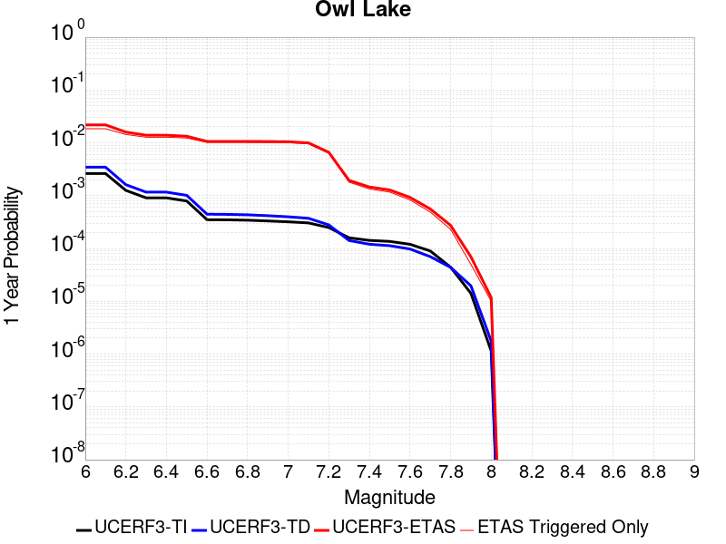 |  |

| Magnitude | 1 wk TI Prob | 1 wk TD Prob | 1 wk ETAS Prob | 1 wk ETAS/TD Gain | 1 wk ETAS Triggered Only | 1 mo TI Prob | 1 mo TD Prob | 1 mo ETAS Prob | 1 mo ETAS/TD Gain | 1 mo ETAS Triggered Only | 1 yr TI Prob | 1 yr TD Prob | 1 yr ETAS Prob | 1 yr ETAS/TD Gain | 1 yr ETAS Triggered Only | 10 yr TI Prob | 10 yr TD Prob | 10 yr ETAS Prob | 10 yr ETAS/TD Gain | 10 yr ETAS Triggered Only |
|-----|-----|-----|-----|-----|-----|-----|-----|-----|-----|-----|-----|-----|-----|-----|-----|-----|-----|-----|-----|-----|
| 6.0 | 5.0320643E-5 | 6.635816E-5 | 0.014468446 | 218.03569 | 0.014403043 | 2.1564208E-4 | 2.843674E-4 | 0.016675623 | 58.641125 | 0.016395917 | 0.0026222812 | 0.0034577388 | 0.022053763 | 6.378088 | 0.018660547 | 0.02591553 | 0.034140717 | 0.053301584 | 1.5612321 | 0.019838154 |
| 6.1 | 5.0320643E-5 | 6.635816E-5 | 0.014468446 | 218.03569 | 0.014403043 | 2.1564208E-4 | 2.843674E-4 | 0.016675623 | 58.641125 | 0.016395917 | 0.0026222812 | 0.0034577388 | 0.022053763 | 6.378088 | 0.018660547 | 0.02591553 | 0.034140717 | 0.053301584 | 1.5612321 | 0.019838154 |
| 6.2 | 2.4125871E-5 | 3.0981035E-5 | 0.011202808 | 361.60208 | 0.011172173 | 1.0339249E-4 | 1.3277028E-4 | 0.0126922475 | 95.59555 | 0.012561145 | 0.0012580766 | 0.001615439 | 0.015814338 | 9.789498 | 0.014221873 | 0.012509781 | 0.016070465 | 0.03095508 | 1.9262094 | 0.015127725 |
| 6.3 | 1.7433485E-5 | 2.2355514E-5 | 0.010258252 | 458.869 | 0.010236125 | 7.471279E-5 | 9.580672E-5 | 0.011478254 | 119.80636 | 0.011383537 | 9.0924866E-4 | 0.0011659743 | 0.014014072 | 12.019195 | 0.012863096 | 0.009055373 | 0.011628896 | 0.025058663 | 2.1548617 | 0.0135877775 |
| 6.4 | 1.7433485E-5 | 2.2355514E-5 | 0.010258252 | 458.869 | 0.010236125 | 7.471279E-5 | 9.580672E-5 | 0.011478254 | 119.80636 | 0.011383537 | 9.0924866E-4 | 0.0011659743 | 0.014014072 | 12.019195 | 0.012863096 | 0.009055373 | 0.011628896 | 0.025058663 | 2.1548617 | 0.0135877775 |
| 6.5 | 1.5182742E-5 | 1.9429144E-5 | 0.009923217 | 510.7387 | 0.0099039795 | 6.506727E-5 | 8.326596E-5 | 0.011103545 | 133.35036 | 0.011021197 | 7.919061E-4 | 0.0010134429 | 0.013471364 | 13.292673 | 0.01247056 | 0.0078909 | 0.010118429 | 0.023150265 | 2.287931 | 0.013165046 |
| 6.6 | 6.7271576E-6 | 8.547361E-6 | 0.0082517285 | 965.4124 | 0.008243252 | 2.8830356E-5 | 3.6631063E-5 | 0.009064623 | 247.45728 | 0.009028323 | 3.5095305E-4 | 4.458976E-4 | 0.010617096 | 23.810614 | 0.010175736 | 0.0035039932 | 0.004467813 | 0.015139167 | 3.3884964 | 0.010719246 |
| 6.7 | 6.682835E-6 | 8.479807E-6 | 0.008251661 | 973.0954 | 0.008243252 | 2.8640408E-5 | 3.6341557E-5 | 0.009064336 | 249.4207 | 0.009028323 | 3.4864116E-4 | 4.4237426E-4 | 0.010613608 | 23.992373 | 0.010175736 | 0.003480947 | 0.0044327388 | 0.01510447 | 3.40748 | 0.010719246 |
| 6.8 | 6.5774975E-6 | 8.32628E-6 | 0.008251509 | 991.01984 | 0.008243252 | 2.8188972E-5 | 3.5683603E-5 | 0.009063684 | 254.00137 | 0.009028323 | 3.4314668E-4 | 4.343669E-4 | 0.010605682 | 24.416414 | 0.010175736 | 0.0034261728 | 0.004352885 | 0.015025471 | 3.4518423 | 0.010719246 |
| 6.9 | 6.363419E-6 | 7.999454E-6 | 0.008251185 | 1031.4684 | 0.008243252 | 2.727151E-5 | 3.428296E-5 | 0.009062297 | 264.33823 | 0.009028323 | 3.3198006E-4 | 4.1732067E-4 | 0.010588809 | 25.373318 | 0.010175736 | 0.0033148455 | 0.0041828766 | 0.014857286 | 3.5519302 | 0.010719246 |
| 7.0 | 6.1342453E-6 | 7.6316555E-6 | 0.00825082 | 1081.1311 | 0.008243252 | 2.6289357E-5 | 3.2706717E-5 | 0.009060734 | 277.0298 | 0.009028323 | 3.2002592E-4 | 3.9813702E-4 | 0.010569821 | 26.548199 | 0.010175736 | 0.0031956544 | 0.003991571 | 0.014668031 | 3.6747515 | 0.010719246 |
| 7.1 | 5.842926E-6 | 7.142211E-6 | 0.007857801 | 1100.1918 | 0.007850716 | 2.504087E-5 | 3.0609146E-5 | 0.008635938 | 282.13583 | 0.008605592 | 3.0482994E-4 | 3.7260808E-4 | 0.010031427 | 26.922195 | 0.00966242 | 0.0030441214 | 0.0037370329 | 0.013904823 | 3.720819 | 0.01020593 |
| 7.2 | 4.77173E-6 | 5.358483E-6 | 0.00544044 | 1015.2948 | 0.005435111 | 2.045011E-5 | 2.2964748E-5 | 0.006001449 | 261.3331 | 0.005978622 | 2.4895166E-4 | 2.79564E-4 | 0.007041367 | 25.186958 | 0.0067636934 | 0.0024867293 | 0.002808645 | 0.009854444 | 3.5086114 | 0.007065644 |
| 7.3 | 3.0494948E-6 | 2.710463E-6 | 0.0015426544 | 569.14795 | 0.001539948 | 1.3069198E-5 | 1.1616219E-5 | 0.00170252 | 146.56404 | 0.0016909234 | 1.5910587E-4 | 1.4141845E-4 | 0.0020132475 | 14.236102 | 0.0018720938 | 0.0015899199 | 0.0014232415 | 0.0032926707 | 2.3135011 | 0.0018720938 |
| 7.4 | 2.7263884E-6 | 2.3056762E-6 | 0.0010893253 | 472.45374 | 0.0010870221 | 1.1684469E-5 | 9.881433E-6 | 0.0012478667 | 126.28398 | 0.0012379974 | 1.4224913E-4 | 1.20299905E-4 | 0.0015091056 | 12.544528 | 0.0013889727 | 0.0014215811 | 0.0012112238 | 0.0025985143 | 2.1453626 | 0.0013889727 |
| 7.5 | 2.6090431E-6 | 2.1656133E-6 | 8.778205E-4 | 405.34497 | 8.756567E-4 | 1.1181565E-5 | 9.281167E-6 | 0.0010057089 | 108.360176 | 9.96437E-4 | 1.3612706E-4 | 1.1299244E-4 | 0.0012602751 | 11.153623 | 0.0011474122 | 0.001360437 | 0.0011379806 | 0.0022840872 | 2.0071406 | 0.0011474122 |
| 7.6 | 2.3008756E-6 | 1.8727933E-6 | 6.661629E-4 | 355.70547 | 6.642913E-4 | 9.860858E-6 | 8.0262325E-6 | 7.3270185E-4 | 91.28838 | 7.246814E-4 | 1.20049335E-4 | 9.7715085E-5 | 9.4309414E-4 | 9.651469 | 8.454617E-4 | 0.001199845 | 9.849932E-4 | 0.0018296221 | 1.8574972 | 8.454617E-4 |
| 7.7 | 1.7184348E-6 | 1.3419171E-6 | 4.8446222E-4 | 361.02246 | 4.8312097E-4 | 7.3646997E-6 | 5.7510606E-6 | 5.1906414E-4 | 90.25537 | 5.13316E-4 | 8.966153E-5 | 7.0016955E-5 | 6.4368296E-4 | 9.193243 | 5.737061E-4 | 8.962536E-4 | 7.078345E-4 | 0.0012811346 | 1.8099352 | 5.737061E-4 |
| 7.8 | 8.4612907E-7 | 8.4058576E-7 | 2.1220584E-4 | 252.44995 | 2.1136542E-4 | 3.6262625E-6 | 3.6025056E-6 | 2.1496716E-4 | 59.67157 | 2.1136542E-4 | 4.4148852E-5 | 4.3859643E-5 | 3.1560328E-4 | 7.1957555 | 2.7175553E-4 | 4.414008E-4 | 4.4398365E-4 | 7.1561855E-4 | 1.6118128 | 2.7175553E-4 |
| 7.9 | 2.716738E-7 | 3.768106E-7 | 3.057186E-5 | 81.13323 | 3.019506E-5 | 1.1643157E-6 | 1.6149015E-6 | 3.1809912E-5 | 19.69774 | 3.019506E-5 | 1.4175452E-5 | 1.966126E-5 | 4.9855727E-5 | 2.5357342 | 3.019506E-5 | 1.4174548E-4 | 1.9836679E-4 | 2.2855586E-4 | 1.1521882 | 3.019506E-5 |
| 8.0 | 2.1995428E-8 | 3.384878E-8 | 3.384878E-8 | 1.0 | 0.0 | 9.426611E-8 | 1.4506621E-7 | 1.4506621E-7 | 1.0 | 0.0 | 1.1476893E-6 | 1.7661803E-6 | 1.7661803E-6 | 1.0 | 0.0 | 1.14768345E-5 | 1.7963059E-5 | 1.7963059E-5 | 1.0 | 0.0 |

## Panamint Valley
*[(top)](#table-of-contents)*

| 1 Week | 1 Month | 1 Year | 10 Year |
|-----|-----|-----|-----|
|  |  |  |  |

| Magnitude | 1 wk TI Prob | 1 wk TD Prob | 1 wk ETAS Prob | 1 wk ETAS/TD Gain | 1 wk ETAS Triggered Only | 1 mo TI Prob | 1 mo TD Prob | 1 mo ETAS Prob | 1 mo ETAS/TD Gain | 1 mo ETAS Triggered Only | 1 yr TI Prob | 1 yr TD Prob | 1 yr ETAS Prob | 1 yr ETAS/TD Gain | 1 yr ETAS Triggered Only | 10 yr TI Prob | 10 yr TD Prob | 10 yr ETAS Prob | 10 yr ETAS/TD Gain | 10 yr ETAS Triggered Only |
|-----|-----|-----|-----|-----|-----|-----|-----|-----|-----|-----|-----|-----|-----|-----|-----|-----|-----|-----|-----|-----|
| 6.0 | 3.0211835E-5 | 3.3984514E-5 | 0.012292762 | 361.7166 | 0.012259195 | 1.2947287E-4 | 1.4563995E-4 | 0.013701247 | 94.076164 | 0.013557582 | 0.0015751923 | 0.0017717537 | 0.016571261 | 9.353027 | 0.014825774 | 0.015640736 | 0.017583137 | 0.032830503 | 1.8671584 | 0.015520261 |
| 6.1 | 3.0211835E-5 | 3.3984514E-5 | 0.012292762 | 361.7166 | 0.012259195 | 1.2947287E-4 | 1.4563995E-4 | 0.013701247 | 94.076164 | 0.013557582 | 0.0015751923 | 0.0017717537 | 0.016571261 | 9.353027 | 0.014825774 | 0.015640736 | 0.017583137 | 0.032830503 | 1.8671584 | 0.015520261 |
| 6.2 | 3.0211835E-5 | 3.3984514E-5 | 0.012292762 | 361.7166 | 0.012259195 | 1.2947287E-4 | 1.4563995E-4 | 0.013701247 | 94.076164 | 0.013557582 | 0.0015751923 | 0.0017717537 | 0.016571261 | 9.353027 | 0.014825774 | 0.015640736 | 0.017583137 | 0.032830503 | 1.8671584 | 0.015520261 |
| 6.3 | 2.8573924E-5 | 3.210268E-5 | 0.011837992 | 368.75403 | 0.011806268 | 1.2245393E-4 | 1.3757581E-4 | 0.013180047 | 95.80206 | 0.013044266 | 0.001489857 | 0.0016737265 | 0.015841652 | 9.464899 | 0.014191678 | 0.01479908 | 0.016617801 | 0.031226898 | 1.8791233 | 0.01485597 |
| 6.4 | 2.8573924E-5 | 3.210268E-5 | 0.011837992 | 368.75403 | 0.011806268 | 1.2245393E-4 | 1.3757581E-4 | 0.013180047 | 95.80206 | 0.013044266 | 0.001489857 | 0.0016737265 | 0.015841652 | 9.464899 | 0.014191678 | 0.01479908 | 0.016617801 | 0.031226898 | 1.8791233 | 0.01485597 |
| 6.5 | 2.7468774E-5 | 3.0828433E-5 | 0.011504598 | 373.1814 | 0.011474123 | 1.1771801E-4 | 1.3211532E-4 | 0.012721792 | 96.29308 | 0.01259134 | 0.0014322745 | 0.0016073446 | 0.015293867 | 9.51499 | 0.013708557 | 0.014230782 | 0.015963677 | 0.030107081 | 1.8859742 | 0.014372849 |
| 6.6 | 2.6135967E-5 | 2.925248E-5 | 0.011231292 | 383.94324 | 0.011202367 | 1.1200648E-4 | 1.253619E-4 | 0.012352828 | 98.53734 | 0.012228999 | 0.0013628257 | 0.0015252391 | 0.014760653 | 9.677599 | 0.013255632 | 0.013544982 | 0.015154043 | 0.028833285 | 1.9026793 | 0.013889727 |
| 6.7 | 2.4498746E-5 | 2.7341335E-5 | 0.01113882 | 407.39853 | 0.011111782 | 1.04990395E-4 | 1.1717203E-4 | 0.012223972 | 104.325005 | 0.012108219 | 0.0012775084 | 0.0014256609 | 0.014541786 | 10.200031 | 0.013134851 | 0.012701893 | 0.014171274 | 0.02762603 | 1.9494386 | 0.013648167 |
| 6.8 | 2.2244329E-5 | 2.4935423E-5 | 0.0106231375 | 426.02594 | 0.010598466 | 9.532935E-5 | 1.0686185E-4 | 0.011640143 | 108.92702 | 0.011534513 | 0.0011600169 | 0.0013002884 | 0.0138451 | 10.647716 | 0.012561145 | 0.011539802 | 0.0129325185 | 0.02574848 | 1.9909873 | 0.012983876 |
| 6.9 | 1.9902658E-5 | 2.2290267E-5 | 0.009714688 | 435.82648 | 0.009692614 | 8.529431E-5 | 9.552632E-5 | 0.010662788 | 111.62147 | 0.010568271 | 0.0010379635 | 0.0011624309 | 0.012683536 | 10.911217 | 0.011534513 | 0.010331288 | 0.011568608 | 0.023297986 | 2.0138972 | 0.011866659 |
| 7.0 | 1.8353881E-5 | 2.0566185E-5 | 0.009018509 | 438.5115 | 0.008998128 | 7.865712E-5 | 8.813792E-5 | 0.009900668 | 112.33153 | 0.009813394 | 9.5722964E-4 | 0.0010725686 | 0.011840643 | 11.03952 | 0.010779637 | 0.009531168 | 0.010678849 | 0.02167197 | 2.0294294 | 0.011111782 |
| 7.1 | 1.7667631E-5 | 1.9772613E-5 | 0.008685583 | 439.27344 | 0.008665983 | 7.571623E-5 | 8.473711E-5 | 0.009474605 | 111.81175 | 0.009390663 | 9.2145515E-4 | 0.0010312037 | 0.011347265 | 11.003903 | 0.0103267105 | 0.009176437 | 0.010269073 | 0.020788588 | 2.024388 | 0.010628661 |
| 7.2 | 1.6381597E-5 | 1.8158249E-5 | 0.0074762027 | 411.72485 | 0.0074581797 | 7.020495E-5 | 7.781885E-5 | 0.008229851 | 105.75652 | 0.0081526665 | 8.544101E-4 | 9.4704994E-4 | 0.009936656 | 10.49222 | 0.008998128 | 0.008511325 | 0.009434792 | 0.018647127 | 1.9764216 | 0.009300078 |
| 7.3 | 1.4520491E-5 | 1.5966476E-5 | 0.0062360493 | 390.57144 | 0.0062201824 | 6.222919E-5 | 6.842605E-5 | 0.0067108846 | 98.075 | 0.0066429134 | 7.57377E-4 | 8.327849E-4 | 0.008164074 | 9.80334 | 0.0073373998 | 0.0075480095 | 0.00829975 | 0.015815808 | 1.9055762 | 0.00757896 |
| 7.4 | 1.2852287E-5 | 1.4145411E-5 | 0.0060228775 | 425.78314 | 0.006008817 | 5.5080065E-5 | 6.062187E-5 | 0.0064615863 | 106.58837 | 0.0064013526 | 6.7039346E-4 | 7.378371E-4 | 0.007798268 | 10.569091 | 0.007065644 | 0.0066837464 | 0.0073567946 | 0.014610241 | 1.9859521 | 0.0073072044 |
| 7.5 | 1.1637851E-5 | 1.2836797E-5 | 0.0060215765 | 469.08713 | 0.006008817 | 4.987555E-5 | 5.5013777E-5 | 0.0064560142 | 117.352684 | 0.0064013526 | 6.070656E-4 | 6.6960254E-4 | 0.007639991 | 11.4097395 | 0.006975059 | 0.006054099 | 0.0066787465 | 0.013847168 | 2.0733185 | 0.0072166193 |
| 7.6 | 3.0068115E-6 | 3.3330316E-6 | 0.0026906845 | 807.2784 | 0.0026873604 | 1.2886271E-5 | 1.4284384E-5 | 0.0029129686 | 203.9268 | 0.0028987257 | 1.5687906E-4 | 1.7390578E-4 | 0.0033740255 | 19.401459 | 0.0032006763 | 0.0015676835 | 0.0017391363 | 0.0050548166 | 2.9065096 | 0.0033214567 |

## Garlock (East)
*[(top)](#table-of-contents)*

| 1 Week | 1 Month | 1 Year | 10 Year |
|-----|-----|-----|-----|
|  |  |  |  |

| Magnitude | 1 wk TI Prob | 1 wk TD Prob | 1 wk ETAS Prob | 1 wk ETAS/TD Gain | 1 wk ETAS Triggered Only | 1 mo TI Prob | 1 mo TD Prob | 1 mo ETAS Prob | 1 mo ETAS/TD Gain | 1 mo ETAS Triggered Only | 1 yr TI Prob | 1 yr TD Prob | 1 yr ETAS Prob | 1 yr ETAS/TD Gain | 1 yr ETAS Triggered Only | 10 yr TI Prob | 10 yr TD Prob | 10 yr ETAS Prob | 10 yr ETAS/TD Gain | 10 yr ETAS Triggered Only |
|-----|-----|-----|-----|-----|-----|-----|-----|-----|-----|-----|-----|-----|-----|-----|-----|-----|-----|-----|-----|-----|
| 6.0 | 4.5092507E-5 | 6.290325E-5 | 0.008879306 | 141.15814 | 0.0088169575 | 1.9323928E-4 | 2.6956003E-4 | 0.01026143 | 38.067333 | 0.009994565 | 0.0023501497 | 0.0032774 | 0.014533341 | 4.4344115 | 0.011292952 | 0.023254504 | 0.032351844 | 0.044097558 | 1.3630617 | 0.012138414 |
| 6.1 | 4.5092507E-5 | 6.290325E-5 | 0.008879306 | 141.15814 | 0.0088169575 | 1.9323928E-4 | 2.6956003E-4 | 0.01026143 | 38.067333 | 0.009994565 | 0.0023501497 | 0.0032774 | 0.014533341 | 4.4344115 | 0.011292952 | 0.023254504 | 0.032351844 | 0.044097558 | 1.3630617 | 0.012138414 |
| 6.2 | 2.6674514E-5 | 3.4509674E-5 | 0.0066469996 | 192.61264 | 0.006612718 | 1.1431433E-4 | 1.4789042E-4 | 0.007695539 | 52.035416 | 0.007548765 | 0.0013908884 | 0.0017991117 | 0.010148096 | 5.6406145 | 0.008364032 | 0.01382215 | 0.017890299 | 0.026579173 | 1.4856752 | 0.008847153 |
| 6.3 | 2.6674514E-5 | 3.4509674E-5 | 0.0066469996 | 192.61264 | 0.006612718 | 1.1431433E-4 | 1.4789042E-4 | 0.007695539 | 52.035416 | 0.007548765 | 0.0013908884 | 0.0017991117 | 0.010148096 | 5.6406145 | 0.008364032 | 0.01382215 | 0.017890299 | 0.026579173 | 1.4856752 | 0.008847153 |
| 6.4 | 2.5312667E-5 | 3.233893E-5 | 0.006493873 | 200.80667 | 0.006461743 | 1.0847834E-4 | 1.3858822E-4 | 0.0075051617 | 54.1544 | 0.0073675946 | 0.0013199237 | 0.0016860351 | 0.009824956 | 5.827255 | 0.0081526665 | 0.013121112 | 0.016778335 | 0.025269229 | 1.5060629 | 0.008635787 |
| 6.5 | 2.5312667E-5 | 3.233893E-5 | 0.006493873 | 200.80667 | 0.006461743 | 1.0847834E-4 | 1.3858822E-4 | 0.0075051617 | 54.1544 | 0.0073675946 | 0.0013199237 | 0.0016860351 | 0.009824956 | 5.827255 | 0.0081526665 | 0.013121112 | 0.016778335 | 0.025269229 | 1.5060629 | 0.008635787 |
| 6.6 | 2.246556E-5 | 2.8133776E-5 | 0.0061273645 | 217.79388 | 0.006099402 | 9.627742E-5 | 1.20567885E-4 | 0.0070645944 | 58.594326 | 0.0069448636 | 0.0011715472 | 0.0014669491 | 0.0091553945 | 6.241112 | 0.00769974 | 0.011653901 | 0.01461866 | 0.022652145 | 1.5495363 | 0.0081526665 |
| 6.7 | 2.2241198E-5 | 2.7803519E-5 | 0.006127036 | 220.36908 | 0.006099402 | 9.531594E-5 | 1.1915263E-4 | 0.0070329974 | 59.025112 | 0.0069146687 | 0.0011598538 | 0.0014497414 | 0.009108168 | 6.2826157 | 0.0076695452 | 0.011538187 | 0.014448853 | 0.022453964 | 1.5540309 | 0.008122471 |
| 6.8 | 1.9528685E-5 | 2.389819E-5 | 0.0058212113 | 243.58376 | 0.0057974514 | 8.369167E-5 | 1.0241691E-4 | 0.006654074 | 64.97046 | 0.006552328 | 0.0010184698 | 0.0012462323 | 0.008514173 | 6.831931 | 0.0072770095 | 0.010138147 | 0.012436427 | 0.02007023 | 1.613826 | 0.0077299355 |
| 6.9 | 1.3318621E-5 | 1.5198884E-5 | 0.005389838 | 354.6206 | 0.005374721 | 5.7078556E-5 | 6.513648E-5 | 0.0061339485 | 94.1707 | 0.006069207 | 6.9470983E-4 | 7.927538E-4 | 0.007520914 | 9.487074 | 0.0067334985 | 0.0069254204 | 0.007939888 | 0.015039298 | 1.8941448 | 0.007156229 |
| 7.0 | 1.1760853E-5 | 1.31077895E-5 | 0.0052669793 | 401.82056 | 0.0052539404 | 5.0402683E-5 | 5.6175057E-5 | 0.0059740744 | 106.34745 | 0.005918232 | 6.134799E-4 | 6.8372174E-4 | 0.0072013955 | 10.53264 | 0.006522133 | 0.0061178906 | 0.00685652 | 0.013753766 | 2.0059397 | 0.0069448636 |
| 7.1 | 1.0064758E-5 | 1.0902931E-5 | 0.005264786 | 482.87808 | 0.0052539404 | 4.3133965E-5 | 4.672603E-5 | 0.0059344876 | 127.006035 | 0.005888037 | 5.2502943E-4 | 5.687444E-4 | 0.007026812 | 12.354957 | 0.006461743 | 0.005237907 | 0.0057129986 | 0.012558142 | 2.19817 | 0.006884474 |
| 7.2 | 9.768808E-6 | 1.0498807E-5 | 0.0051134103 | 487.0468 | 0.005102965 | 4.186565E-5 | 4.499413E-5 | 0.0057516037 | 127.83009 | 0.0057068663 | 5.095951E-4 | 5.4766936E-4 | 0.006824802 | 12.461537 | 0.0062805726 | 0.0050842804 | 0.0055032647 | 0.012169678 | 2.2113562 | 0.006703303 |
| 7.3 | 9.344516E-6 | 9.944468E-6 | 0.004720327 | 474.66864 | 0.0047104293 | 4.004731E-5 | 4.261847E-5 | 0.0053265286 | 124.9817 | 0.0052841357 | 4.8746695E-4 | 5.1875977E-4 | 0.0063433833 | 12.227978 | 0.0058276467 | 0.0048639905 | 0.0052149445 | 0.011372651 | 2.180781 | 0.0061899875 |
| 7.4 | 9.023491E-6 | 9.490661E-6 | 0.0041461745 | 436.8689 | 0.004136723 | 3.867153E-5 | 4.0673647E-5 | 0.0047207177 | 116.0633 | 0.0046802345 | 4.7072413E-4 | 4.950925E-4 | 0.0056257113 | 11.36295 | 0.0051331604 | 0.004697283 | 0.0049783974 | 0.010446539 | 2.098374 | 0.0054955008 |
| 7.5 | 7.081253E-6 | 7.087672E-6 | 0.002090532 | 294.95328 | 0.0020834592 | 3.0347876E-5 | 3.0375388E-5 | 0.0024157127 | 79.52862 | 0.0023854098 | 3.6942272E-4 | 3.6975832E-4 | 0.003025941 | 8.183564 | 0.0026571653 | 0.003688092 | 0.0037243143 | 0.006612244 | 1.775426 | 0.0028987257 |
| 7.6 | 6.116396E-6 | 5.959245E-6 | 0.001304339 | 218.87659 | 0.0012983875 | 2.6212863E-5 | 2.5539372E-5 | 0.0015050595 | 58.930954 | 0.001479558 | 3.1909486E-4 | 3.1089774E-4 | 0.0019409241 | 6.242966 | 0.0016305333 | 0.0031863707 | 0.0031357552 | 0.004941778 | 1.575945 | 0.0018117036 |
| 7.7 | 4.797145E-6 | 4.757281E-6 | 6.6904543E-4 | 140.6361 | 6.642913E-4 | 2.055903E-5 | 2.0388188E-5 | 7.752493E-4 | 38.024433 | 7.548765E-4 | 2.5027743E-4 | 2.4819805E-4 | 0.0010632623 | 4.283927 | 8.152666E-4 | 0.0024999576 | 0.0025093474 | 0.0034430453 | 1.372088 | 9.360469E-4 |
| 7.8 | 3.4028885E-6 | 3.978462E-6 | 4.870975E-4 | 122.433624 | 4.8312097E-4 | 1.4583726E-5 | 1.7050439E-5 | 5.6055223E-4 | 32.876118 | 5.4351107E-4 | 1.775424E-4 | 2.0756939E-4 | 7.5096765E-4 | 3.6179113 | 5.4351107E-4 | 0.0017740062 | 0.0021012232 | 0.0026737237 | 1.2724607 | 5.737061E-4 |
| 7.9 | 2.5928412E-6 | 3.3724489E-6 | 3.35517E-4 | 99.48764 | 3.3214566E-4 | 1.1112129E-5 | 1.4453272E-5 | 4.0698337E-4 | 28.158562 | 3.925358E-4 | 1.3528178E-4 | 1.7595445E-4 | 5.6842115E-4 | 3.230502 | 3.925358E-4 | 0.0013519945 | 0.0017812408 | 0.0022032186 | 1.236901 | 4.2273084E-4 |
| 8.0 | 1.3743648E-6 | 1.6734747E-6 | 1.8284353E-4 | 109.25981 | 1.8117036E-4 | 5.8901214E-6 | 7.1720146E-6 | 2.4873076E-4 | 34.680737 | 2.4156048E-4 | 7.1709874E-5 | 8.731581E-5 | 3.288552E-4 | 3.7662733 | 2.4156048E-4 | 7.1686733E-4 | 8.837234E-4 | 0.0011250704 | 1.2731024 | 2.4156048E-4 |
| 8.1 | 3.6733252E-7 | 3.1489964E-7 | 3.1489964E-7 | 1.0 | 0.0 | 1.5742813E-6 | 1.3495693E-6 | 1.3495693E-6 | 1.0 | 0.0 | 1.9166706E-5 | 1.6430899E-5 | 1.6430899E-5 | 1.0 | 0.0 | 1.9165053E-4 | 1.6638759E-4 | 1.6638759E-4 | 1.0 | 0.0 |

## Hunter Mountain-Saline Valley
*[(top)](#table-of-contents)*

| 1 Week | 1 Month | 1 Year | 10 Year |
|-----|-----|-----|-----|
|  |  |  |  |

| Magnitude | 1 wk TI Prob | 1 wk TD Prob | 1 wk ETAS Prob | 1 wk ETAS/TD Gain | 1 wk ETAS Triggered Only | 1 mo TI Prob | 1 mo TD Prob | 1 mo ETAS Prob | 1 mo ETAS/TD Gain | 1 mo ETAS Triggered Only | 1 yr TI Prob | 1 yr TD Prob | 1 yr ETAS Prob | 1 yr ETAS/TD Gain | 1 yr ETAS Triggered Only | 10 yr TI Prob | 10 yr TD Prob | 10 yr ETAS Prob | 10 yr ETAS/TD Gain | 10 yr ETAS Triggered Only |
|-----|-----|-----|-----|-----|-----|-----|-----|-----|-----|-----|-----|-----|-----|-----|-----|-----|-----|-----|-----|-----|
| 6.0 | 4.5103672E-5 | 5.4570177E-5 | 0.006183833 | 113.31891 | 0.0061295973 | 1.9328714E-4 | 2.3385242E-4 | 0.006784648 | 29.01252 | 0.006552328 | 0.002350731 | 0.0028435152 | 0.010099833 | 3.5518825 | 0.0072770095 | 0.023260195 | 0.028091887 | 0.035428595 | 1.2611681 | 0.007548765 |
| 6.1 | 4.5103672E-5 | 5.4570177E-5 | 0.006183833 | 113.31891 | 0.0061295973 | 1.9328714E-4 | 2.3385242E-4 | 0.006784648 | 29.01252 | 0.006552328 | 0.002350731 | 0.0028435152 | 0.010099833 | 3.5518825 | 0.0072770095 | 0.023260195 | 0.028091887 | 0.035428595 | 1.2611681 | 0.007548765 |
| 6.2 | 3.9363465E-5 | 4.706337E-5 | 0.006176372 | 131.23523 | 0.0061295973 | 1.6868966E-4 | 2.0168544E-4 | 0.006722503 | 33.331623 | 0.006522133 | 0.002051862 | 0.0024528175 | 0.009681857 | 3.947239 | 0.007246814 | 0.020330196 | 0.024273481 | 0.03160955 | 1.3022256 | 0.00751857 |
| 6.3 | 3.9363465E-5 | 4.706337E-5 | 0.006176372 | 131.23523 | 0.0061295973 | 1.6868966E-4 | 2.0168544E-4 | 0.006722503 | 33.331623 | 0.006522133 | 0.002051862 | 0.0024528175 | 0.009681857 | 3.947239 | 0.007246814 | 0.020330196 | 0.024273481 | 0.03160955 | 1.3022256 | 0.00751857 |
| 6.4 | 3.2311684E-5 | 3.795099E-5 | 0.0061371215 | 161.71176 | 0.006099402 | 1.384713E-4 | 1.6263737E-4 | 0.0066535193 | 40.910152 | 0.006491938 | 0.0016845843 | 0.0019783843 | 0.0091807265 | 4.640517 | 0.0072166193 | 0.016718714 | 0.019616475 | 0.026957953 | 1.3742507 | 0.007488375 |
| 6.5 | 3.2311684E-5 | 3.795099E-5 | 0.0061371215 | 161.71176 | 0.006099402 | 1.384713E-4 | 1.6263737E-4 | 0.0066535193 | 40.910152 | 0.006491938 | 0.0016845843 | 0.0019783843 | 0.0091807265 | 4.640517 | 0.0072166193 | 0.016718714 | 0.019616475 | 0.026957953 | 1.3742507 | 0.007488375 |
| 6.6 | 2.9305844E-5 | 3.418183E-5 | 0.0061333757 | 179.43379 | 0.006099402 | 1.2559042E-4 | 1.4648569E-4 | 0.0066374727 | 45.311405 | 0.006491938 | 0.0015279909 | 0.001782067 | 0.008985826 | 5.0423613 | 0.0072166193 | 0.015175272 | 0.01768569 | 0.025041629 | 1.415926 | 0.007488375 |
| 6.7 | 2.7826512E-5 | 3.2344276E-5 | 0.006131549 | 189.57138 | 0.006099402 | 1.19251024E-4 | 1.386113E-4 | 0.0066296495 | 47.82907 | 0.006491938 | 0.0014509142 | 0.0016863465 | 0.008890796 | 5.272224 | 0.0072166193 | 0.014414776 | 0.016743187 | 0.024106182 | 1.4397607 | 0.007488375 |
| 6.8 | 2.3389874E-5 | 2.6866714E-5 | 0.006095911 | 226.89455 | 0.006069207 | 1.0023846E-4 | 1.15138246E-4 | 0.006576137 | 57.11514 | 0.006461743 | 0.00121972 | 0.001400954 | 0.0085773105 | 6.1224785 | 0.0071864245 | 0.01213047 | 0.013927434 | 0.021251965 | 1.5259068 | 0.007427985 |
| 6.9 | 2.069209E-5 | 2.3570032E-5 | 0.006092634 | 258.4907 | 0.006069207 | 8.867737E-5 | 1.01010715E-4 | 0.0065621007 | 64.9644 | 0.006461743 | 0.0010791123 | 0.0012291478 | 0.008406739 | 6.839486 | 0.0071864245 | 0.010738871 | 0.012228523 | 0.019565675 | 1.600003 | 0.007427985 |
| 7.0 | 1.7462342E-5 | 1.9633546E-5 | 0.0060887216 | 310.1183 | 0.006069207 | 7.483646E-5 | 8.414118E-5 | 0.00654534 | 77.78997 | 0.006461743 | 9.1075303E-4 | 0.0010239601 | 0.008172861 | 7.9816213 | 0.007156229 | 0.009070295 | 0.0101960525 | 0.017518414 | 1.7181565 | 0.0073977895 |
| 7.1 | 1.4807709E-5 | 1.6441749E-5 | 0.006085549 | 370.12784 | 0.006069207 | 6.3460066E-5 | 7.046283E-5 | 0.0065317503 | 92.697815 | 0.006461743 | 7.723524E-4 | 8.575638E-4 | 0.008007656 | 9.33768 | 0.007156229 | 0.007696735 | 0.008545532 | 0.015880104 | 1.8582932 | 0.0073977895 |
| 7.2 | 1.4180048E-5 | 1.5698337E-5 | 0.00608481 | 387.6086 | 0.006069207 | 6.077022E-5 | 6.727694E-5 | 0.006528585 | 97.04046 | 0.006461743 | 7.396263E-4 | 8.188051E-4 | 0.0079691745 | 9.732688 | 0.007156229 | 0.0073716943 | 0.008160833 | 0.015498251 | 1.8991015 | 0.0073977895 |
| 7.3 | 1.3730402E-5 | 1.5172075E-5 | 0.006084287 | 401.01877 | 0.006069207 | 5.8843252E-5 | 6.502165E-5 | 0.0065263445 | 100.371864 | 0.006461743 | 7.161811E-4 | 7.9136714E-4 | 0.007941933 | 10.035712 | 0.007156229 | 0.007138774 | 0.007888422 | 0.015227855 | 1.9304056 | 0.0073977895 |
| 7.4 | 1.2810095E-5 | 1.4109277E-5 | 0.0060228417 | 426.871 | 0.006008817 | 5.489925E-5 | 6.0467017E-5 | 0.0064614327 | 106.858795 | 0.0064013526 | 6.681934E-4 | 7.359531E-4 | 0.007796397 | 10.593606 | 0.007065644 | 0.006661878 | 0.007338053 | 0.014591637 | 1.9884889 | 0.0073072044 |
| 7.5 | 1.1595659E-5 | 1.2800664E-5 | 0.0060215406 | 470.40848 | 0.006008817 | 4.9694736E-5 | 5.4858923E-5 | 0.0064558606 | 117.68114 | 0.0064013526 | 6.0486543E-4 | 6.6771836E-4 | 0.00763812 | 11.439134 | 0.006975059 | 0.006032217 | 0.0066599925 | 0.013828549 | 2.0763612 | 0.0072166193 |
| 7.6 | 2.997694E-6 | 3.3251579E-6 | 0.0026906766 | 809.1876 | 0.0026873604 | 1.28471975E-5 | 1.425064E-5 | 0.002912935 | 204.40732 | 0.0028987257 | 1.564034E-4 | 1.73495E-4 | 0.0033736161 | 19.445032 | 0.0032006763 | 0.0015629337 | 0.001735031 | 0.005050725 | 2.9110286 | 0.0033214567 |

## Blackwater
*[(top)](#table-of-contents)*

| 1 Week | 1 Month | 1 Year | 10 Year |
|-----|-----|-----|-----|
|  |  |  |  |

| Magnitude | 1 wk TI Prob | 1 wk TD Prob | 1 wk ETAS Prob | 1 wk ETAS/TD Gain | 1 wk ETAS Triggered Only | 1 mo TI Prob | 1 mo TD Prob | 1 mo ETAS Prob | 1 mo ETAS/TD Gain | 1 mo ETAS Triggered Only | 1 yr TI Prob | 1 yr TD Prob | 1 yr ETAS Prob | 1 yr ETAS/TD Gain | 1 yr ETAS Triggered Only | 10 yr TI Prob | 10 yr TD Prob | 10 yr ETAS Prob | 10 yr ETAS/TD Gain | 10 yr ETAS Triggered Only |
|-----|-----|-----|-----|-----|-----|-----|-----|-----|-----|-----|-----|-----|-----|-----|-----|-----|-----|-----|-----|-----|
| 6.0 | 3.0708583E-5 | 3.3095846E-5 | 0.003958324 | 119.60182 | 0.003925358 | 1.3160157E-4 | 1.4183241E-4 | 0.0047308304 | 33.355076 | 0.004589649 | 0.0016010714 | 0.0017255784 | 0.007000596 | 4.056956 | 0.0052841357 | 0.015895851 | 0.017135633 | 0.02286342 | 1.3342618 | 0.0058276467 |
| 6.1 | 3.0708583E-5 | 3.3095846E-5 | 0.003958324 | 119.60182 | 0.003925358 | 1.3160157E-4 | 1.4183241E-4 | 0.0047308304 | 33.355076 | 0.004589649 | 0.0016010714 | 0.0017255784 | 0.007000596 | 4.056956 | 0.0052841357 | 0.015895851 | 0.017135633 | 0.02286342 | 1.3342618 | 0.0058276467 |
| 6.2 | 1.1707779E-5 | 1.2545122E-5 | 0.0016128633 | 128.56497 | 0.0016003381 | 5.017523E-5 | 5.3763757E-5 | 0.0019861436 | 36.942055 | 0.0019324839 | 6.107122E-4 | 6.5438676E-4 | 0.0027666579 | 4.2278633 | 0.0021136543 | 0.006090366 | 0.0065255696 | 0.008745423 | 1.3401778 | 0.0022344345 |
| 6.3 | 1.1707779E-5 | 1.2545122E-5 | 0.0016128633 | 128.56497 | 0.0016003381 | 5.017523E-5 | 5.3763757E-5 | 0.0019861436 | 36.942055 | 0.0019324839 | 6.107122E-4 | 6.5438676E-4 | 0.0027666579 | 4.2278633 | 0.0021136543 | 0.006090366 | 0.0065255696 | 0.008745423 | 1.3401778 | 0.0022344345 |
| 6.4 | 7.929244E-6 | 8.480098E-6 | 0.0010652982 | 125.62334 | 0.0010568271 | 3.3982033E-5 | 3.6342793E-5 | 0.0012742953 | 35.063217 | 0.0012379974 | 4.136527E-4 | 4.423877E-4 | 0.0018005644 | 4.0701046 | 0.0013587778 | 0.0041288356 | 0.0044154758 | 0.005858439 | 1.3267968 | 0.0014493628 |
| 6.5 | 5.8832115E-6 | 6.285991E-6 | 7.611578E-4 | 121.08795 | 7.548765E-4 | 2.521352E-5 | 2.6939697E-5 | 8.119901E-4 | 30.141026 | 7.850716E-4 | 3.0693135E-4 | 3.27944E-4 | 0.0012334987 | 3.7613091 | 9.058518E-4 | 0.0030650778 | 0.0032748538 | 0.004237931 | 1.2940826 | 9.6624193E-4 |
| 6.6 | 5.8832115E-6 | 6.285991E-6 | 7.611578E-4 | 121.08795 | 7.548765E-4 | 2.521352E-5 | 2.6939697E-5 | 8.119901E-4 | 30.141026 | 7.850716E-4 | 3.0693135E-4 | 3.27944E-4 | 0.0012334987 | 3.7613091 | 9.058518E-4 | 0.0030650778 | 0.0032748538 | 0.004237931 | 1.2940826 | 9.6624193E-4 |
| 6.7 | 3.0715053E-6 | 3.2814662E-6 | 3.3542604E-4 | 102.218346 | 3.3214566E-4 | 1.3163528E-5 | 1.4063357E-5 | 3.4620435E-4 | 24.617476 | 3.3214566E-4 | 1.6025416E-4 | 1.7120909E-4 | 5.3348776E-4 | 3.1160016 | 3.623407E-4 | 0.0016013865 | 0.0017108864 | 0.0021027506 | 1.2290416 | 3.925358E-4 |
| 6.8 | 2.2722281E-6 | 2.4287538E-6 | 1.5340369E-4 | 63.161484 | 1.509753E-4 | 9.738084E-6 | 1.0408908E-5 | 1.6138263E-4 | 15.504281 | 1.509753E-4 | 1.1855473E-4 | 1.26722E-4 | 3.078694E-4 | 2.4294865 | 1.8117036E-4 | 0.001184915 | 0.0012665876 | 0.0014475285 | 1.142857 | 1.8117036E-4 |
| 6.9 | 9.952399E-7 | 1.0653489E-6 | 6.145541E-5 | 57.68571 | 6.039012E-5 | 4.265307E-6 | 4.5657757E-6 | 6.495562E-5 | 14.226634 | 6.039012E-5 | 5.1928873E-5 | 5.5587418E-5 | 1.4616756E-4 | 2.629508 | 9.058518E-5 | 5.191674E-4 | 5.557858E-4 | 6.463206E-4 | 1.1628952 | 9.058518E-5 |
| 7.0 | 4.7385504E-7 | 5.0755597E-7 | 3.0702602E-5 | 60.491066 | 3.019506E-5 | 2.0308057E-6 | 2.1752398E-6 | 3.2370233E-5 | 14.881226 | 3.019506E-5 | 2.4724779E-5 | 2.6483543E-5 | 5.6677804E-5 | 2.140114 | 3.019506E-5 | 2.4722028E-4 | 2.6483546E-4 | 2.950225E-4 | 1.1139842 | 3.019506E-5 |

## Garlock (West)
*[(top)](#table-of-contents)*

| 1 Week | 1 Month | 1 Year | 10 Year |
|-----|-----|-----|-----|
|  |  |  |  |

| Magnitude | 1 wk TI Prob | 1 wk TD Prob | 1 wk ETAS Prob | 1 wk ETAS/TD Gain | 1 wk ETAS Triggered Only | 1 mo TI Prob | 1 mo TD Prob | 1 mo ETAS Prob | 1 mo ETAS/TD Gain | 1 mo ETAS Triggered Only | 1 yr TI Prob | 1 yr TD Prob | 1 yr ETAS Prob | 1 yr ETAS/TD Gain | 1 yr ETAS Triggered Only | 10 yr TI Prob | 10 yr TD Prob | 10 yr ETAS Prob | 10 yr ETAS/TD Gain | 10 yr ETAS Triggered Only |
|-----|-----|-----|-----|-----|-----|-----|-----|-----|-----|-----|-----|-----|-----|-----|-----|-----|-----|-----|-----|-----|
| 6.0 | 2.5181727E-5 | 2.51973E-5 | 0.0042523993 | 168.76408 | 0.0042273086 | 1.0791722E-4 | 1.0798398E-4 | 0.004968864 | 46.014824 | 0.0048614047 | 0.0013131002 | 0.0013139155 | 0.0066514187 | 5.0622883 | 0.0053445254 | 0.013053683 | 0.013141977 | 0.01865465 | 1.4194707 | 0.0055860863 |
| 6.1 | 2.5077732E-5 | 2.5098372E-5 | 0.0042523006 | 169.42535 | 0.0042273086 | 1.0747157E-4 | 1.0756004E-4 | 0.004968442 | 46.192265 | 0.0048614047 | 0.001307681 | 0.0013087603 | 0.0066462914 | 5.078311 | 0.0053445254 | 0.013000126 | 0.013091032 | 0.018603992 | 1.4211248 | 0.0055860863 |
| 6.2 | 2.494612E-5 | 2.498005E-5 | 0.004252183 | 170.22314 | 0.0042273086 | 1.0690756E-4 | 1.0705298E-4 | 0.0049679372 | 46.40634 | 0.0048614047 | 0.0013008224 | 0.0013025942 | 0.006640158 | 5.0976415 | 0.0053445254 | 0.012932341 | 0.013030097 | 0.018543396 | 1.4231204 | 0.0055860863 |
| 6.3 | 2.4733758E-5 | 2.479942E-5 | 0.004252003 | 171.45575 | 0.0042273086 | 1.0599751E-4 | 1.06278916E-4 | 0.004967167 | 46.737087 | 0.0048614047 | 0.0012897556 | 0.0012931811 | 0.0066307955 | 5.127507 | 0.0053445254 | 0.012822957 | 0.012937066 | 0.018450884 | 1.4262031 | 0.0055860863 |
| 6.4 | 2.3237335E-5 | 2.317873E-5 | 0.0042201946 | 182.07187 | 0.004197113 | 9.958477E-5 | 9.933365E-5 | 0.004899871 | 49.327408 | 0.0048010144 | 0.0012117702 | 0.001208719 | 0.0064864676 | 5.3663983 | 0.0052841357 | 0.012051838 | 0.012101916 | 0.017560741 | 1.4510711 | 0.005525696 |
| 6.5 | 2.2732203E-5 | 2.2993298E-5 | 0.0042200102 | 183.53218 | 0.004197113 | 9.742009E-5 | 9.8539E-5 | 0.0048990804 | 49.717175 | 0.0048010144 | 0.0011854442 | 0.0011990548 | 0.0064768544 | 5.4016333 | 0.0052841357 | 0.011791403 | 0.012006322 | 0.017465675 | 1.4547065 | 0.005525696 |
| 6.6 | 2.1319436E-5 | 2.17735E-5 | 0.0042187953 | 193.75827 | 0.004197113 | 9.136581E-5 | 9.331167E-5 | 0.004893878 | 52.446583 | 0.0048010144 | 0.001111811 | 0.0011354799 | 0.0064136153 | 5.6483746 | 0.0052841357 | 0.011062649 | 0.011377227 | 0.016840056 | 1.4801548 | 0.005525696 |
| 6.7 | 1.970802E-5 | 2.0393396E-5 | 0.004217421 | 206.80328 | 0.004197113 | 8.446021E-5 | 8.739735E-5 | 0.0048879925 | 55.928383 | 0.0048010144 | 0.001027818 | 0.001063545 | 0.006342061 | 5.9631333 | 0.0052841357 | 0.010230771 | 0.010664964 | 0.016131729 | 1.512591 | 0.005525696 |
| 6.8 | 1.8744462E-5 | 1.9901045E-5 | 0.0041867364 | 210.37772 | 0.0041669183 | 8.033094E-5 | 8.5287415E-5 | 0.0048557 | 56.933372 | 0.0047708196 | 9.775903E-4 | 0.0010378812 | 0.0062863687 | 6.056925 | 0.0052539404 | 0.009733009 | 0.01041075 | 0.015849039 | 1.5223724 | 0.0054955008 |
| 6.9 | 1.7559682E-5 | 1.8953415E-5 | 0.0041857925 | 220.84636 | 0.0041669183 | 7.5253614E-5 | 8.12264E-5 | 0.0048516584 | 59.73007 | 0.0047708196 | 9.158276E-4 | 9.884841E-4 | 0.006237231 | 6.309895 | 0.0052539404 | 0.0091206245 | 0.009921231 | 0.015362211 | 1.5484177 | 0.0054955008 |
| 7.0 | 1.6794445E-5 | 1.8216237E-5 | 0.0041850586 | 229.74332 | 0.0041669183 | 7.197421E-5 | 7.8067256E-5 | 0.004848514 | 62.106884 | 0.0047708196 | 8.759337E-4 | 9.5005584E-4 | 0.0061990046 | 6.5248847 | 0.0052539404 | 0.008724891 | 0.009540141 | 0.0149832135 | 1.5705444 | 0.0054955008 |
| 7.1 | 1.6337795E-5 | 1.7717046E-5 | 0.0041845613 | 236.18845 | 0.0041669183 | 7.0017246E-5 | 7.5927994E-5 | 0.0048161927 | 63.431053 | 0.004740624 | 8.521265E-4 | 9.240326E-4 | 0.006142951 | 6.647981 | 0.0052237455 | 0.008488664 | 0.009281996 | 0.014696573 | 1.5833418 | 0.005465306 |
| 7.2 | 1.5780008E-5 | 1.7165687E-5 | 0.0041840123 | 243.7428 | 0.0041669183 | 6.762685E-5 | 7.356516E-5 | 0.004813841 | 65.436424 | 0.004740624 | 8.2304585E-4 | 8.9528906E-4 | 0.0061143576 | 6.8294787 | 0.0052237455 | 0.008200042 | 0.008996838 | 0.014412973 | 1.6020043 | 0.005465306 |
| 7.3 | 1.5058865E-5 | 1.6618762E-5 | 0.004183468 | 251.73161 | 0.0041669183 | 6.45364E-5 | 7.122133E-5 | 0.004811508 | 67.55712 | 0.004740624 | 7.854473E-4 | 8.667759E-4 | 0.0060859933 | 7.021415 | 0.0052237455 | 0.00782677 | 0.008713539 | 0.014131222 | 1.6217548 | 0.005465306 |
| 7.4 | 1.4887923E-5 | 1.6454731E-5 | 0.0040323315 | 245.05606 | 0.004015943 | 6.380382E-5 | 7.051838E-5 | 0.0046598436 | 66.07985 | 0.004589649 | 7.7653467E-4 | 8.582243E-4 | 0.0059266407 | 6.9057016 | 0.00507277 | 0.0077382675 | 0.008628399 | 0.013896875 | 1.6105973 | 0.0053143306 |
| 7.5 | 1.4509299E-5 | 1.6046748E-5 | 0.0036695905 | 228.68124 | 0.0036536022 | 6.218123E-5 | 6.876997E-5 | 0.0042354017 | 61.58795 | 0.0041669183 | 7.567935E-4 | 8.36954E-4 | 0.005483101 | 6.551258 | 0.004650039 | 0.0075422134 | 0.008416704 | 0.013267132 | 1.576286 | 0.0048915995 |
| 7.6 | 1.2756717E-5 | 1.4050848E-5 | 0.0025202057 | 179.36324 | 0.00250619 | 5.4670498E-5 | 6.0216535E-5 | 0.002868188 | 47.631237 | 0.0028081406 | 6.6541E-4 | 7.328904E-4 | 0.0038407021 | 5.2404866 | 0.0031100912 | 0.006634211 | 0.0073816874 | 0.010648654 | 1.4425771 | 0.0032912616 |
| 7.7 | 1.0328985E-5 | 1.1460557E-5 | 0.0016721698 | 145.90651 | 0.0016607284 | 4.4266326E-5 | 4.911575E-5 | 0.0018607304 | 37.884598 | 0.0018117036 | 5.388092E-4 | 5.978206E-4 | 0.0025593261 | 4.281094 | 0.001962679 | 0.0053750467 | 0.006038511 | 0.00810939 | 1.3429451 | 0.0020834592 |
| 7.8 | 7.0306583E-6 | 8.899601E-6 | 0.0010959121 | 123.14171 | 0.0010870221 | 3.0131043E-5 | 3.814059E-5 | 0.001215703 | 31.874258 | 0.0011776073 | 3.667837E-4 | 4.642629E-4 | 0.0017318666 | 3.7303576 | 0.0012681925 | 0.003661789 | 0.0046952725 | 0.0059875636 | 1.2752324 | 0.0012983875 |
| 7.9 | 4.060633E-6 | 5.4653938E-6 | 4.885837E-4 | 89.39588 | 4.8312097E-4 | 1.7402595E-5 | 2.3422906E-5 | 5.6692126E-4 | 24.20371 | 5.4351107E-4 | 2.11856E-4 | 2.851367E-4 | 8.5867924E-4 | 3.0114653 | 5.737061E-4 | 0.0021165414 | 0.002884201 | 0.0034863604 | 1.2087786 | 6.039012E-4 |
| 8.0 | 1.6729537E-6 | 2.0775144E-6 | 2.134425E-4 | 102.73936 | 2.1136542E-4 | 7.169782E-6 | 8.903603E-6 | 2.8065674E-4 | 31.521704 | 2.7175553E-4 | 8.7288594E-5 | 1.0839601E-4 | 3.801221E-4 | 3.5067906 | 2.7175553E-4 | 8.7254314E-4 | 0.0010969337 | 0.0013683912 | 1.2474693 | 2.7175553E-4 |
| 8.1 | 3.6733252E-7 | 3.1489964E-7 | 3.1489964E-7 | 1.0 | 0.0 | 1.5742813E-6 | 1.3495693E-6 | 1.3495693E-6 | 1.0 | 0.0 | 1.9166706E-5 | 1.6430899E-5 | 1.6430899E-5 | 1.0 | 0.0 | 1.9165053E-4 | 1.6638759E-4 | 1.6638759E-4 | 1.0 | 0.0 |

## Ash Hill
*[(top)](#table-of-contents)*

| 1 Week | 1 Month | 1 Year | 10 Year |
|-----|-----|-----|-----|
|  |  |  |  |

| Magnitude | 1 wk TI Prob | 1 wk TD Prob | 1 wk ETAS Prob | 1 wk ETAS/TD Gain | 1 wk ETAS Triggered Only | 1 mo TI Prob | 1 mo TD Prob | 1 mo ETAS Prob | 1 mo ETAS/TD Gain | 1 mo ETAS Triggered Only | 1 yr TI Prob | 1 yr TD Prob | 1 yr ETAS Prob | 1 yr ETAS/TD Gain | 1 yr ETAS Triggered Only | 10 yr TI Prob | 10 yr TD Prob | 10 yr ETAS Prob | 10 yr ETAS/TD Gain | 10 yr ETAS Triggered Only |
|-----|-----|-----|-----|-----|-----|-----|-----|-----|-----|-----|-----|-----|-----|-----|-----|-----|-----|-----|-----|-----|
| 6.0 | 2.1545662E-5 | 2.3194447E-5 | 0.0033143796 | 142.8954 | 0.0032912616 | 9.2335285E-5 | 9.940143E-5 | 0.0038734088 | 38.96733 | 0.0037743824 | 0.0011236023 | 0.0012096206 | 0.005522291 | 4.5653086 | 0.0043178936 | 0.011179381 | 0.012038348 | 0.016453419 | 1.3667506 | 0.004468869 |
| 6.1 | 2.1545662E-5 | 2.3194447E-5 | 0.0033143796 | 142.8954 | 0.0032912616 | 9.2335285E-5 | 9.940143E-5 | 0.0038734088 | 38.96733 | 0.0037743824 | 0.0011236023 | 0.0012096206 | 0.005522291 | 4.5653086 | 0.0043178936 | 0.011179381 | 0.012038348 | 0.016453419 | 1.3667506 | 0.004468869 |
| 6.2 | 2.1545662E-5 | 2.3194447E-5 | 0.0033143796 | 142.8954 | 0.0032912616 | 9.2335285E-5 | 9.940143E-5 | 0.0038734088 | 38.96733 | 0.0037743824 | 0.0011236023 | 0.0012096206 | 0.005522291 | 4.5653086 | 0.0043178936 | 0.011179381 | 0.012038348 | 0.016453419 | 1.3667506 | 0.004468869 |
| 6.3 | 1.0025529E-5 | 1.0746934E-5 | 0.0012789258 | 119.003784 | 0.0012681925 | 4.2965847E-5 | 4.605755E-5 | 0.0014047726 | 30.500378 | 0.0013587778 | 5.229836E-4 | 5.6061964E-4 | 0.0021298826 | 3.7991579 | 0.0015701432 | 0.005217545 | 0.0055933665 | 0.007184753 | 1.2845132 | 0.0016003381 |
| 6.4 | 1.0025529E-5 | 1.0746934E-5 | 0.0012789258 | 119.003784 | 0.0012681925 | 4.2965847E-5 | 4.605755E-5 | 0.0014047726 | 30.500378 | 0.0013587778 | 5.229836E-4 | 5.6061964E-4 | 0.0021298826 | 3.7991579 | 0.0015701432 | 0.005217545 | 0.0055933665 | 0.007184753 | 1.2845132 | 0.0016003381 |
| 6.5 | 6.9617327E-6 | 7.456634E-6 | 0.0010038862 | 134.62994 | 9.96437E-4 | 2.9835655E-5 | 3.195666E-5 | 0.00108875 | 34.06958 | 0.0010568271 | 3.6318856E-4 | 3.8901155E-4 | 0.001596344 | 4.1035905 | 0.0012078024 | 0.0036259557 | 0.0038841602 | 0.0051173493 | 1.3174918 | 0.0012379974 |
| 6.6 | 4.9919777E-6 | 5.3466883E-6 | 7.3002424E-4 | 136.53764 | 7.246814E-4 | 2.1394015E-5 | 2.2914215E-5 | 7.7777344E-4 | 33.942837 | 7.548765E-4 | 2.60441E-4 | 2.7895154E-4 | 0.0011241774 | 4.0300093 | 8.454617E-4 | 0.0026013597 | 0.0027866727 | 0.003659889 | 1.3133546 | 8.756567E-4 |
| 6.7 | 3.6630722E-6 | 3.924624E-6 | 4.870437E-4 | 124.099464 | 4.8312097E-4 | 1.5698786E-5 | 1.681974E-5 | 5.3012714E-4 | 31.518152 | 5.13316E-4 | 1.9111596E-4 | 2.0476682E-4 | 7.783555E-4 | 3.8011796 | 5.737061E-4 | 0.0019095168 | 0.0020463446 | 0.00264901 | 1.2945083 | 6.039012E-4 |
| 6.8 | 2.5599613E-6 | 2.744925E-6 | 3.348897E-4 | 122.00321 | 3.3214566E-4 | 1.0971216E-5 | 1.1763939E-5 | 3.439057E-4 | 29.233889 | 3.3214566E-4 | 1.3356637E-4 | 1.4322149E-4 | 5.3570105E-4 | 3.7403677 | 3.925358E-4 | 0.0013348613 | 0.0014317769 | 0.0018539025 | 1.2948264 | 4.2273084E-4 |
| 6.9 | 1.7684905E-6 | 1.8968707E-6 | 2.132619E-4 | 112.42827 | 2.1136542E-4 | 7.579223E-6 | 8.129446E-6 | 2.1949314E-4 | 26.999767 | 2.1136542E-4 | 9.2273134E-5 | 9.8976E-5 | 3.4051258E-4 | 3.4403548 | 2.4156048E-4 | 9.223483E-4 | 9.8976E-4 | 0.0012612466 | 1.2742953 | 2.7175553E-4 |

## Gravel Hills-Harper Lk
*[(top)](#table-of-contents)*

| 1 Week | 1 Month | 1 Year | 10 Year |
|-----|-----|-----|-----|
|  |  |  |  |

| Magnitude | 1 wk TI Prob | 1 wk TD Prob | 1 wk ETAS Prob | 1 wk ETAS/TD Gain | 1 wk ETAS Triggered Only | 1 mo TI Prob | 1 mo TD Prob | 1 mo ETAS Prob | 1 mo ETAS/TD Gain | 1 mo ETAS Triggered Only | 1 yr TI Prob | 1 yr TD Prob | 1 yr ETAS Prob | 1 yr ETAS/TD Gain | 1 yr ETAS Triggered Only | 10 yr TI Prob | 10 yr TD Prob | 10 yr ETAS Prob | 10 yr ETAS/TD Gain | 10 yr ETAS Triggered Only |
|-----|-----|-----|-----|-----|-----|-----|-----|-----|-----|-----|-----|-----|-----|-----|-----|-----|-----|-----|-----|-----|
| 6.0 | 3.0679566E-5 | 3.1464646E-5 | 0.002265829 | 72.011894 | 0.0022344345 | 1.3147724E-4 | 1.3484273E-4 | 0.0026708858 | 19.807413 | 0.002536385 | 0.0015995599 | 0.0016406906 | 0.004564806 | 2.7822466 | 0.0029289208 | 0.015880952 | 0.01630734 | 0.01945582 | 1.1930715 | 0.0032006763 |
| 6.1 | 3.0679566E-5 | 3.1464646E-5 | 0.002265829 | 72.011894 | 0.0022344345 | 1.3147724E-4 | 1.3484273E-4 | 0.0026708858 | 19.807413 | 0.002536385 | 0.0015995599 | 0.0016406906 | 0.004564806 | 2.7822466 | 0.0029289208 | 0.015880952 | 0.01630734 | 0.01945582 | 1.1930715 | 0.0032006763 |
| 6.2 | 1.514536E-5 | 1.3635206E-5 | 5.873335E-4 | 43.07478 | 5.737061E-4 | 6.490707E-5 | 5.843536E-5 | 7.5288117E-4 | 12.884 | 6.9448637E-4 | 7.8995706E-4 | 7.1123015E-4 | 0.0015862641 | 2.2303104 | 8.756567E-4 | 0.007871548 | 0.0070907404 | 0.0080201505 | 1.1310737 | 9.360469E-4 |
| 6.3 | 1.514536E-5 | 1.3635206E-5 | 5.873335E-4 | 43.07478 | 5.737061E-4 | 6.490707E-5 | 5.843536E-5 | 7.5288117E-4 | 12.884 | 6.9448637E-4 | 7.8995706E-4 | 7.1123015E-4 | 0.0015862641 | 2.2303104 | 8.756567E-4 | 0.007871548 | 0.0070907404 | 0.0080201505 | 1.1310737 | 9.360469E-4 |
| 6.4 | 1.2532521E-5 | 1.06896905E-5 | 4.032213E-4 | 37.720573 | 3.925358E-4 | 5.37097E-5 | 4.581219E-5 | 5.28911E-4 | 11.545203 | 4.8312097E-4 | 6.537194E-4 | 5.576265E-4 | 0.0011310127 | 2.0282621 | 5.737061E-4 | 0.0065179965 | 0.005562863 | 0.006163405 | 1.1079556 | 6.039012E-4 |
| 6.5 | 1.1094058E-5 | 9.083664E-6 | 2.8083674E-4 | 30.916683 | 2.7175553E-4 | 4.7545094E-5 | 3.892943E-5 | 3.4086828E-4 | 8.756057 | 3.019506E-4 | 5.787078E-4 | 4.7386673E-4 | 8.3603576E-4 | 1.7642845 | 3.623407E-4 | 0.0057720304 | 0.0047289706 | 0.00511965 | 1.0826141 | 3.925358E-4 |
| 6.6 | 9.688328E-6 | 7.5316952E-6 | 2.4909034E-4 | 33.072285 | 2.4156048E-4 | 4.1520743E-5 | 3.227831E-5 | 2.7383098E-4 | 8.483437 | 2.4156048E-4 | 5.053978E-4 | 3.9292008E-4 | 6.9475203E-4 | 1.7681764 | 3.019506E-4 | 0.0050424994 | 0.0039225104 | 0.004223277 | 1.076677 | 3.019506E-4 |
| 6.7 | 8.974824E-6 | 6.749413E-6 | 1.8791854E-4 | 27.842207 | 1.8117036E-4 | 3.8462964E-5 | 2.8925748E-5 | 2.1009086E-4 | 7.263109 | 1.8117036E-4 | 4.6818596E-4 | 3.5211627E-4 | 5.935917E-4 | 1.6857831 | 2.4156048E-4 | 0.004672008 | 0.0035158044 | 0.0037565157 | 1.0684655 | 2.4156048E-4 |
| 6.8 | 7.4780046E-6 | 5.1161933E-6 | 9.570091E-5 | 18.705492 | 9.058518E-5 | 3.20482E-5 | 2.1926366E-5 | 1.1250956E-4 | 5.131245 | 9.058518E-5 | 3.9011694E-4 | 2.669222E-4 | 4.178572E-4 | 1.5654644 | 1.509753E-4 | 0.0038943281 | 0.0026661542 | 0.002816727 | 1.0564756 | 1.509753E-4 |
| 6.9 | 6.3409307E-6 | 3.9074966E-6 | 6.429738E-5 | 16.454878 | 6.039012E-5 | 2.7175134E-5 | 1.6746313E-5 | 7.7135424E-5 | 4.606114 | 6.039012E-5 | 3.3080703E-4 | 2.0386827E-4 | 3.246239E-4 | 1.5923218 | 1.2078024E-4 | 0.0033031502 | 0.0020369107 | 0.0021574448 | 1.059175 | 1.2078024E-4 |
| 7.0 | 5.1239335E-6 | 2.6058565E-6 | 3.280084E-5 | 12.587354 | 3.019506E-5 | 2.195953E-5 | 1.116791E-5 | 4.1362633E-5 | 3.703704 | 3.019506E-5 | 2.6732447E-4 | 1.3596108E-4 | 1.9634298E-4 | 1.4441117 | 6.039012E-5 | 0.0026700313 | 0.0013588042 | 0.0014191122 | 1.0443832 | 6.039012E-5 |
| 7.1 | 4.438899E-6 | 2.0984728E-6 | 3.229347E-5 | 15.389034 | 3.019506E-5 | 1.9023713E-5 | 8.993425E-6 | 3.9188213E-5 | 4.3574295 | 3.019506E-5 | 2.315891E-4 | 1.0948967E-4 | 1.6987318E-4 | 1.5514996 | 6.039012E-5 | 0.002313479 | 0.0010943791 | 0.0011547032 | 1.0551217 | 6.039012E-5 |
| 7.2 | 3.50367E-6 | 1.2615716E-6 | 1.2615716E-6 | 1.0 | 0.0 | 1.5015643E-5 | 5.4067245E-6 | 5.4067245E-6 | 1.0 | 0.0 | 1.8280011E-4 | 6.582497E-5 | 9.601804E-5 | 1.4586872 | 3.019506E-5 | 0.0018264982 | 6.580629E-4 | 6.882381E-4 | 1.0458546 | 3.019506E-5 |
| 7.3 | 2.561638E-6 | 7.1191585E-7 | 7.1191585E-7 | 1.0 | 0.0 | 1.0978401E-5 | 3.0510646E-6 | 3.0510646E-6 | 1.0 | 0.0 | 1.3365384E-4 | 3.71461E-5 | 6.7340035E-5 | 1.8128428 | 3.019506E-5 | 0.0013357349 | 3.7140088E-4 | 4.0158472E-4 | 1.0812702 | 3.019506E-5 |
| 7.4 | 2.0368864E-6 | 5.304837E-7 | 5.304837E-7 | 1.0 | 0.0 | 8.729483E-6 | 2.2734996E-6 | 2.2734996E-6 | 1.0 | 0.0 | 1.06276275E-4 | 2.7679513E-5 | 2.7679513E-5 | 1.0 | 0.0 | 0.0010622547 | 2.767612E-4 | 2.767612E-4 | 1.0 | 0.0 |
| 7.5 | 1.1681728E-6 | 3.6030585E-7 | 3.6030585E-7 | 1.0 | 0.0 | 5.0064455E-6 | 1.544167E-6 | 1.544167E-6 | 1.0 | 0.0 | 6.0951766E-5 | 1.8800076E-5 | 1.8800076E-5 | 1.0 | 0.0 | 6.093505E-4 | 1.8798532E-4 | 1.8798532E-4 | 1.0 | 0.0 |
| 7.6 | 1.3154387E-7 | 7.1197384E-8 | 7.1197384E-8 | 1.0 | 0.0 | 5.6375933E-7 | 3.051316E-7 | 3.051316E-7 | 1.0 | 0.0 | 6.863748E-6 | 3.7149728E-6 | 3.7149728E-6 | 1.0 | 0.0 | 6.863536E-5 | 3.7149264E-5 | 3.7149264E-5 | 1.0 | 0.0 |

## San Andreas (Mojave S)
*[(top)](#table-of-contents)*

| 1 Week | 1 Month | 1 Year | 10 Year |
|-----|-----|-----|-----|
|  |  |  |  |

| Magnitude | 1 wk TI Prob | 1 wk TD Prob | 1 wk ETAS Prob | 1 wk ETAS/TD Gain | 1 wk ETAS Triggered Only | 1 mo TI Prob | 1 mo TD Prob | 1 mo ETAS Prob | 1 mo ETAS/TD Gain | 1 mo ETAS Triggered Only | 1 yr TI Prob | 1 yr TD Prob | 1 yr ETAS Prob | 1 yr ETAS/TD Gain | 1 yr ETAS Triggered Only | 10 yr TI Prob | 10 yr TD Prob | 10 yr ETAS Prob | 10 yr ETAS/TD Gain | 10 yr ETAS Triggered Only |
|-----|-----|-----|-----|-----|-----|-----|-----|-----|-----|-----|-----|-----|-----|-----|-----|-----|-----|-----|-----|-----|
| 6.0 | 3.1064058E-4 | 6.7460834E-4 | 0.0025454392 | 3.7732105 | 0.0018720938 | 0.0013306376 | 0.0028881032 | 0.004995653 | 1.7297349 | 0.0021136543 | 0.016080605 | 0.03462235 | 0.036779422 | 1.062303 | 0.0022344345 | 0.1496549 | 0.28660452 | 0.2883278 | 1.0060128 | 0.002415605 |
| 6.1 | 3.1064058E-4 | 6.7460834E-4 | 0.0025454392 | 3.7732105 | 0.0018720938 | 0.0013306376 | 0.0028881032 | 0.004995653 | 1.7297349 | 0.0021136543 | 0.016080605 | 0.03462235 | 0.036779422 | 1.062303 | 0.0022344345 | 0.1496549 | 0.28660452 | 0.2883278 | 1.0060128 | 0.002415605 |
| 6.2 | 3.1064058E-4 | 6.7460834E-4 | 0.0025454392 | 3.7732105 | 0.0018720938 | 0.0013306376 | 0.0028881032 | 0.004995653 | 1.7297349 | 0.0021136543 | 0.016080605 | 0.03462235 | 0.036779422 | 1.062303 | 0.0022344345 | 0.1496549 | 0.28660452 | 0.2883278 | 1.0060128 | 0.002415605 |
| 6.3 | 3.1064058E-4 | 6.7460834E-4 | 0.0025454392 | 3.7732105 | 0.0018720938 | 0.0013306376 | 0.0028881032 | 0.004995653 | 1.7297349 | 0.0021136543 | 0.016080605 | 0.03462235 | 0.036779422 | 1.062303 | 0.0022344345 | 0.1496549 | 0.28660452 | 0.2883278 | 1.0060128 | 0.002415605 |
| 6.4 | 1.9872203E-4 | 4.3179357E-4 | 0.0021219868 | 4.914355 | 0.0016909234 | 8.5138786E-4 | 0.0018492596 | 0.0036877522 | 1.9941776 | 0.0018418987 | 0.010316478 | 0.02228844 | 0.024207374 | 1.0860955 | 0.001962679 | 0.098504856 | 0.19699748 | 0.19869475 | 1.0086157 | 0.0021136543 |
| 6.5 | 1.291105E-4 | 2.875267E-4 | 0.0017364728 | 6.039345 | 0.0014493628 | 5.5321335E-4 | 0.0012316781 | 0.002830045 | 2.297715 | 0.0016003381 | 0.006714592 | 0.0148934 | 0.016559139 | 1.1118442 | 0.0016909234 | 0.065152965 | 0.13803436 | 0.13959599 | 1.0113133 | 0.0018117036 |
| 6.6 | 1.291105E-4 | 2.875267E-4 | 0.0017364728 | 6.039345 | 0.0014493628 | 5.5321335E-4 | 0.0012316781 | 0.002830045 | 2.297715 | 0.0016003381 | 0.006714592 | 0.0148934 | 0.016559139 | 1.1118442 | 0.0016909234 | 0.065152965 | 0.13803436 | 0.13959599 | 1.0113133 | 0.0018117036 |
| 6.7 | 1.08001186E-4 | 2.4333889E-4 | 0.0016923491 | 6.9547005 | 0.0014493628 | 4.6278012E-4 | 0.0010424647 | 0.0026411347 | 2.533548 | 0.0016003381 | 0.0056198016 | 0.012618446 | 0.014288032 | 1.1323131 | 0.0016909234 | 0.054797906 | 0.119176775 | 0.12077256 | 1.0133901 | 0.0018117036 |
| 6.8 | 1.0624356E-4 | 2.3851555E-4 | 0.0016875328 | 7.0751476 | 0.0014493628 | 4.5525006E-4 | 0.0010218095 | 0.0026205126 | 2.5645802 | 0.0016003381 | 0.0055285925 | 0.012369843 | 0.01403985 | 1.1350063 | 0.0016909234 | 0.053930566 | 0.11712591 | 0.11872542 | 1.0136563 | 0.0018117036 |
| 6.9 | 1.0393785E-4 | 2.3221898E-4 | 0.0016812453 | 7.239913 | 0.0014493628 | 4.4537184E-4 | 9.948451E-4 | 0.002593591 | 2.6070302 | 0.0016003381 | 0.0054089287 | 0.012045221 | 0.013715777 | 1.1386904 | 0.0016909234 | 0.05279156 | 0.11442335 | 0.11602776 | 1.0140216 | 0.0018117036 |
| 7.0 | 1.0155622E-4 | 2.2591476E-4 | 0.0016749502 | 7.4140806 | 0.0014493628 | 4.3516833E-4 | 9.6784724E-4 | 0.0025666365 | 2.6519024 | 0.0016003381 | 0.005285311 | 0.0117200995 | 0.013391205 | 1.1425846 | 0.0016909234 | 0.05161361 | 0.111683756 | 0.11329312 | 1.01441 | 0.0018117036 |
| 7.1 | 9.885595E-5 | 2.1879886E-4 | 0.0016678446 | 7.6227303 | 0.0014493628 | 4.2359953E-4 | 9.3737274E-4 | 0.0025362107 | 2.705659 | 0.0016003381 | 0.0051451353 | 0.011352993 | 0.013024719 | 1.1472498 | 0.0016909234 | 0.05027629 | 0.1085682 | 0.11018321 | 1.0148755 | 0.0018117036 |
| 7.2 | 9.6411415E-5 | 2.124288E-4 | 0.0016614838 | 7.8213677 | 0.0014493628 | 4.1312634E-4 | 9.1009185E-4 | 0.0025089735 | 2.7568357 | 0.0016003381 | 0.005018219 | 0.011024255 | 0.012696538 | 1.1516912 | 0.0016909234 | 0.049064007 | 0.105758004 | 0.1073511 | 1.0150636 | 0.0017815086 |
| 7.3 | 9.1180635E-5 | 1.9471257E-4 | 0.0016437933 | 8.442152 | 0.0014493628 | 3.907156E-4 | 8.342157E-4 | 0.0024332188 | 2.9167743 | 0.0016003381 | 0.004746591 | 0.01010939 | 0.011783219 | 1.1655717 | 0.0016909234 | 0.046464786 | 0.09795115 | 0.09955816 | 1.0164062 | 0.0017815086 |
| 7.4 | 8.887388E-5 | 1.8719878E-4 | 0.0016061009 | 8.579655 | 0.0014191678 | 3.8083247E-4 | 8.020339E-4 | 0.0023709177 | 2.9561315 | 0.0015701432 | 0.0046267817 | 0.00972114 | 0.011365725 | 1.1691761 | 0.0016607284 | 0.045316286 | 0.09458615 | 0.09617181 | 1.0167643 | 0.0017513135 |
| 7.5 | 8.6750515E-5 | 1.8051457E-4 | 0.0015994263 | 8.860372 | 0.0014191678 | 3.7173493E-4 | 7.7340455E-4 | 0.0023423333 | 3.0286005 | 0.0015701432 | 0.004516484 | 0.009375632 | 0.01102079 | 1.1754717 | 0.0016607284 | 0.04425787 | 0.091549896 | 0.09314088 | 1.0173783 | 0.0017513135 |
| 7.6 | 8.453092E-5 | 1.7439072E-4 | 0.0015933111 | 9.136444 | 0.0014191678 | 3.6222505E-4 | 7.471748E-4 | 0.0023161448 | 3.09987 | 0.0015701432 | 0.0044011753 | 0.009058985 | 0.010704668 | 1.1816632 | 0.0016607284 | 0.04315024 | 0.08870898 | 0.09030494 | 1.017991 | 0.0017513135 |
| 7.7 | 8.259102E-5 | 1.6961215E-4 | 0.0015583494 | 9.187722 | 0.0013889727 | 3.539135E-4 | 7.2670676E-4 | 0.0022655358 | 3.1175377 | 0.001539948 | 0.004300386 | 0.008811831 | 0.010427996 | 1.1834086 | 0.0016305333 | 0.042181134 | 0.08645982 | 0.088032134 | 1.0181855 | 0.0017211185 |
| 7.8 | 7.444844E-5 | 1.5283503E-4 | 0.001300072 | 8.506374 | 0.0011474122 | 3.1902574E-4 | 6.548429E-4 | 0.0018920297 | 2.889288 | 0.0012379974 | 0.0038772223 | 0.007943616 | 0.009261645 | 1.165923 | 0.0013285826 | 0.03810269 | 0.078290746 | 0.07954314 | 1.0159968 | 0.0013587778 |
| 7.9 | 5.2586525E-5 | 1.00064186E-4 | 6.435209E-4 | 6.431081 | 5.4351107E-4 | 2.2535135E-4 | 4.2877605E-4 | 0.0010324183 | 2.4078264 | 6.039012E-4 | 0.0027402006 | 0.005207864 | 0.0058386577 | 1.1211233 | 6.340963E-4 | 0.027066574 | 0.052200034 | 0.05282965 | 1.0120616 | 6.642913E-4 |
| 8.0 | 3.379877E-5 | 5.4074168E-5 | 2.9562158E-4 | 5.466965 | 2.4156048E-4 | 1.4484383E-4 | 2.3172585E-4 | 5.336065E-4 | 2.3027492 | 3.019506E-4 | 0.0017620471 | 0.002817614 | 0.0031187139 | 1.1068634 | 3.019506E-4 | 0.017481409 | 0.028834904 | 0.029128147 | 1.0101697 | 3.019506E-4 |
| 8.1 | 1.8668277E-5 | 1.9309397E-5 | 1.9309397E-5 | 1.0 | 0.0 | 8.000444E-5 | 8.275194E-5 | 8.275194E-5 | 1.0 | 0.0 | 9.736188E-4 | 0.0010070398 | 0.0010070398 | 1.0 | 0.0 | 0.009693642 | 0.010798888 | 0.010798888 | 1.0 | 0.0 |
| 8.2 | 8.541571E-6 | 5.460819E-6 | 5.460819E-6 | 1.0 | 0.0 | 3.660622E-5 | 2.3403301E-5 | 2.3403301E-5 | 1.0 | 0.0 | 4.455896E-4 | 2.84898E-4 | 2.84898E-4 | 1.0 | 0.0 | 0.0044469717 | 0.0032408056 | 0.0032408056 | 1.0 | 0.0 |
| 8.3 | 1.983087E-6 | 7.6599065E-7 | 7.6599065E-7 | 1.0 | 0.0 | 8.498917E-6 | 3.282813E-6 | 3.282813E-6 | 1.0 | 0.0 | 1.034694E-4 | 3.9967534E-5 | 3.9967534E-5 | 1.0 | 0.0 | 0.0010342124 | 4.719687E-4 | 4.719687E-4 | 1.0 | 0.0 |

## San Andreas (Mojave N)
*[(top)](#table-of-contents)*

| 1 Week | 1 Month | 1 Year | 10 Year |
|-----|-----|-----|-----|
|  |  |  |  |

| Magnitude | 1 wk TI Prob | 1 wk TD Prob | 1 wk ETAS Prob | 1 wk ETAS/TD Gain | 1 wk ETAS Triggered Only | 1 mo TI Prob | 1 mo TD Prob | 1 mo ETAS Prob | 1 mo ETAS/TD Gain | 1 mo ETAS Triggered Only | 1 yr TI Prob | 1 yr TD Prob | 1 yr ETAS Prob | 1 yr ETAS/TD Gain | 1 yr ETAS Triggered Only | 10 yr TI Prob | 10 yr TD Prob | 10 yr ETAS Prob | 10 yr ETAS/TD Gain | 10 yr ETAS Triggered Only |
|-----|-----|-----|-----|-----|-----|-----|-----|-----|-----|-----|-----|-----|-----|-----|-----|-----|-----|-----|-----|-----|
| 6.0 | 9.877682E-5 | 1.9400702E-4 | 0.0021563051 | 11.114573 | 0.001962679 | 4.2326056E-4 | 8.311939E-4 | 0.0030034313 | 3.6133943 | 0.0021740443 | 0.0051410277 | 0.010072956 | 0.0124044465 | 1.2314605 | 0.0023552147 | 0.05023708 | 0.09831428 | 0.100546844 | 1.0227085 | 0.0024759949 |
| 6.1 | 9.877682E-5 | 1.9400702E-4 | 0.0021563051 | 11.114573 | 0.001962679 | 4.2326056E-4 | 8.311939E-4 | 0.0030034313 | 3.6133943 | 0.0021740443 | 0.0051410277 | 0.010072956 | 0.0124044465 | 1.2314605 | 0.0023552147 | 0.05023708 | 0.09831428 | 0.100546844 | 1.0227085 | 0.0024759949 |
| 6.2 | 9.877682E-5 | 1.9400702E-4 | 0.0021563051 | 11.114573 | 0.001962679 | 4.2326056E-4 | 8.311939E-4 | 0.0030034313 | 3.6133943 | 0.0021740443 | 0.0051410277 | 0.010072956 | 0.0124044465 | 1.2314605 | 0.0023552147 | 0.05023708 | 0.09831428 | 0.100546844 | 1.0227085 | 0.0024759949 |
| 6.3 | 9.877682E-5 | 1.9400702E-4 | 0.0021563051 | 11.114573 | 0.001962679 | 4.2326056E-4 | 8.311939E-4 | 0.0030034313 | 3.6133943 | 0.0021740443 | 0.0051410277 | 0.010072956 | 0.0124044465 | 1.2314605 | 0.0023552147 | 0.05023708 | 0.09831428 | 0.100546844 | 1.0227085 | 0.0024759949 |
| 6.4 | 9.877682E-5 | 1.9400702E-4 | 0.0021563051 | 11.114573 | 0.001962679 | 4.2326056E-4 | 8.311939E-4 | 0.0030034313 | 3.6133943 | 0.0021740443 | 0.0051410277 | 0.010072956 | 0.0124044465 | 1.2314605 | 0.0023552147 | 0.05023708 | 0.09831428 | 0.100546844 | 1.0227085 | 0.0024759949 |
| 6.5 | 9.861474E-5 | 1.9374468E-4 | 0.0021560434 | 11.128271 | 0.001962679 | 4.2256617E-4 | 8.300703E-4 | 0.00300231 | 3.6169345 | 0.0021740443 | 0.0051326132 | 0.010059402 | 0.012390926 | 1.2317754 | 0.0023552147 | 0.050156746 | 0.098192066 | 0.10042494 | 1.0227399 | 0.0024759949 |
| 6.6 | 9.861474E-5 | 1.9374468E-4 | 0.0021560434 | 11.128271 | 0.001962679 | 4.2256617E-4 | 8.300703E-4 | 0.00300231 | 3.6169345 | 0.0021740443 | 0.0051326132 | 0.010059402 | 0.012390926 | 1.2317754 | 0.0023552147 | 0.050156746 | 0.098192066 | 0.10042494 | 1.0227399 | 0.0024759949 |
| 6.7 | 9.8552715E-5 | 1.9364421E-4 | 0.002155943 | 11.133527 | 0.001962679 | 4.223004E-4 | 8.2964E-4 | 0.0030018806 | 3.618293 | 0.0021740443 | 0.0051293927 | 0.010054212 | 0.012385747 | 1.2318963 | 0.0023552147 | 0.050125998 | 0.098145254 | 0.100378245 | 1.0227518 | 0.0024759949 |
| 6.8 | 9.8464974E-5 | 1.9349584E-4 | 0.002155795 | 11.141298 | 0.001962679 | 4.219245E-4 | 8.290045E-4 | 0.0030012466 | 3.6203017 | 0.0021740443 | 0.0051248376 | 0.010046546 | 0.012378099 | 1.2320751 | 0.0023552147 | 0.05008251 | 0.09807528 | 0.10030844 | 1.0227698 | 0.0024759949 |
| 6.9 | 9.825824E-5 | 1.9317595E-4 | 0.0021554758 | 11.158096 | 0.001962679 | 4.2103877E-4 | 8.276344E-4 | 0.0029998794 | 3.6246433 | 0.0021740443 | 0.0051141046 | 0.010030019 | 0.012361611 | 1.2324613 | 0.0023552147 | 0.049980022 | 0.09792438 | 0.10015792 | 1.0228088 | 0.0024759949 |
| 7.0 | 9.781462E-5 | 1.924896E-4 | 0.0021547908 | 11.194323 | 0.001962679 | 4.1913814E-4 | 8.246948E-4 | 0.0029969462 | 3.6340065 | 0.0021740443 | 0.005091073 | 0.009994558 | 0.012326234 | 1.2332945 | 0.0023552147 | 0.04976007 | 0.09760077 | 0.09983511 | 1.0228926 | 0.0024759949 |
| 7.1 | 9.7121134E-5 | 1.9150671E-4 | 0.0021538096 | 11.246654 | 0.001962679 | 4.1616702E-4 | 8.204851E-4 | 0.0029927457 | 3.647532 | 0.0021740443 | 0.005055068 | 0.009943774 | 0.012275569 | 1.234498 | 0.0023552147 | 0.04941613 | 0.09713728 | 0.09937277 | 1.0230136 | 0.0024759949 |
| 7.2 | 9.663819E-5 | 1.9081456E-4 | 0.002153119 | 11.283829 | 0.001962679 | 4.1409794E-4 | 8.175206E-4 | 0.0029897876 | 3.6571403 | 0.0021740443 | 0.0050299936 | 0.00990801 | 0.01223989 | 1.2353529 | 0.0023552147 | 0.049176537 | 0.09681055 | 0.09904684 | 1.0230997 | 0.0024759949 |
| 7.3 | 9.6277574E-5 | 1.9033969E-4 | 0.002152645 | 11.309491 | 0.001962679 | 4.125529E-4 | 8.154867E-4 | 0.0029877583 | 3.6637728 | 0.0021740443 | 0.0050112694 | 0.009883473 | 0.012215409 | 1.2359431 | 0.0023552147 | 0.04899759 | 0.09658401 | 0.09882086 | 1.0231596 | 0.0024759949 |
| 7.4 | 9.593308E-5 | 1.897375E-4 | 0.002152044 | 11.342217 | 0.001962679 | 4.1107697E-4 | 8.129075E-4 | 0.0029851845 | 3.6722314 | 0.0021740443 | 0.0049933824 | 0.009852355 | 0.012184366 | 1.2366958 | 0.0023552147 | 0.04882661 | 0.09630218 | 0.09853974 | 1.0232347 | 0.0024759949 |
| 7.5 | 9.561707E-5 | 1.8919831E-4 | 0.0021515058 | 11.371696 | 0.001962679 | 4.0972308E-4 | 8.1059814E-4 | 0.0029828802 | 3.6798508 | 0.0021740443 | 0.0049769743 | 0.009824493 | 0.0121565685 | 1.2373737 | 0.0023552147 | 0.048669744 | 0.09604836 | 0.09828654 | 1.0233027 | 0.0024759949 |
| 7.6 | 9.418194E-5 | 1.8572104E-4 | 0.0021480354 | 11.565924 | 0.001962679 | 4.0357444E-4 | 7.957047E-4 | 0.002968019 | 3.730051 | 0.0021740443 | 0.004902454 | 0.009644784 | 0.011977283 | 1.2418405 | 0.0023552147 | 0.047957025 | 0.094430685 | 0.09667287 | 1.0237442 | 0.0024759949 |
| 7.7 | 8.202141E-5 | 1.6021315E-4 | 0.0018810559 | 11.740957 | 0.0017211185 | 3.51473E-4 | 6.8644714E-4 | 0.0025572558 | 3.72535 | 0.0018720938 | 0.00427079 | 0.008325525 | 0.010331751 | 1.2409729 | 0.002023069 | 0.04189639 | 0.08223219 | 0.08419975 | 1.0239269 | 0.0021438492 |
| 7.8 | 7.2859846E-5 | 1.4516473E-4 | 0.0012924104 | 8.903062 | 0.0011474122 | 3.1221908E-4 | 6.219862E-4 | 0.0018592137 | 2.9891558 | 0.0012379974 | 0.003794643 | 0.0075464295 | 0.008864987 | 1.1747259 | 0.0013285826 | 0.037304975 | 0.07472468 | 0.07598192 | 1.016825 | 0.0013587778 |
| 7.9 | 5.3874453E-5 | 1.0045676E-4 | 6.439132E-4 | 6.409855 | 5.4351107E-4 | 2.3087008E-4 | 4.3045796E-4 | 0.0010340993 | 2.4023232 | 6.039012E-4 | 0.0028072202 | 0.0052282433 | 0.0058590244 | 1.1206487 | 6.340963E-4 | 0.02772022 | 0.05242443 | 0.053053897 | 1.0120071 | 6.642913E-4 |
| 8.0 | 3.468538E-5 | 5.4260272E-5 | 2.9580764E-4 | 5.4516435 | 2.4156048E-4 | 1.4864317E-4 | 2.325233E-4 | 5.344037E-4 | 2.2982802 | 3.019506E-4 | 0.0018082283 | 0.002827298 | 0.0031283947 | 1.1064963 | 3.019506E-4 | 0.017935853 | 0.028947512 | 0.029240722 | 1.010129 | 3.019506E-4 |
| 8.1 | 1.9152367E-5 | 1.940263E-5 | 1.940263E-5 | 1.0 | 0.0 | 8.207899E-5 | 8.3151484E-5 | 8.3151484E-5 | 1.0 | 0.0 | 9.988535E-4 | 0.0010118998 | 0.0010118998 | 1.0 | 0.0 | 0.009943757 | 0.01085625 | 0.01085625 | 1.0 | 0.0 |
| 8.2 | 8.643924E-6 | 5.4748625E-6 | 5.4748625E-6 | 1.0 | 0.0 | 3.704486E-5 | 2.3463486E-5 | 2.3463486E-5 | 1.0 | 0.0 | 4.5092785E-4 | 2.8563058E-4 | 2.8563058E-4 | 1.0 | 0.0 | 0.0045001395 | 0.0032487072 | 0.0032487072 | 1.0 | 0.0 |
| 8.3 | 1.983087E-6 | 7.6599065E-7 | 7.6599065E-7 | 1.0 | 0.0 | 8.498917E-6 | 3.282813E-6 | 3.282813E-6 | 1.0 | 0.0 | 1.034694E-4 | 3.9967534E-5 | 3.9967534E-5 | 1.0 | 0.0 | 0.0010342124 | 4.719687E-4 | 4.719687E-4 | 1.0 | 0.0 |

## McLean Lake
*[(top)](#table-of-contents)*

| 1 Week | 1 Month | 1 Year | 10 Year |
|-----|-----|-----|-----|
|  |  |  |  |

| Magnitude | 1 wk TI Prob | 1 wk TD Prob | 1 wk ETAS Prob | 1 wk ETAS/TD Gain | 1 wk ETAS Triggered Only | 1 mo TI Prob | 1 mo TD Prob | 1 mo ETAS Prob | 1 mo ETAS/TD Gain | 1 mo ETAS Triggered Only | 1 yr TI Prob | 1 yr TD Prob | 1 yr ETAS Prob | 1 yr ETAS/TD Gain | 1 yr ETAS Triggered Only | 10 yr TI Prob | 10 yr TD Prob | 10 yr ETAS Prob | 10 yr ETAS/TD Gain | 10 yr ETAS Triggered Only |
|-----|-----|-----|-----|-----|-----|-----|-----|-----|-----|-----|-----|-----|-----|-----|-----|-----|-----|-----|-----|-----|
| 6.0 | 1.7360222E-5 | 1.8501627E-5 | 0.0016791992 | 90.75954 | 0.0016607284 | 7.439883E-5 | 7.9290556E-5 | 0.0019814286 | 24.989466 | 0.0019022888 | 9.0542925E-4 | 9.6498354E-4 | 0.003076598 | 3.1882389 | 0.0021136543 | 0.009017491 | 0.0096127745 | 0.011975254 | 1.2457646 | 0.0023854098 |
| 6.1 | 9.062689E-6 | 9.592193E-6 | 9.154353E-4 | 95.43545 | 9.058518E-4 | 3.8839516E-5 | 4.1108804E-5 | 0.0010676987 | 25.972506 | 0.001026632 | 4.727685E-4 | 5.003936E-4 | 0.0017377716 | 3.4728093 | 0.0012379974 | 0.0047176396 | 0.004993552 | 0.0063755885 | 1.2767643 | 0.0013889727 |
| 6.2 | 9.062689E-6 | 9.592193E-6 | 9.154353E-4 | 95.43545 | 9.058518E-4 | 3.8839516E-5 | 4.1108804E-5 | 0.0010676987 | 25.972506 | 0.001026632 | 4.727685E-4 | 5.003936E-4 | 0.0017377716 | 3.4728093 | 0.0012379974 | 0.0047176396 | 0.004993552 | 0.0063755885 | 1.2767643 | 0.0013889727 |
| 6.3 | 7.2575485E-6 | 7.66771E-6 | 7.323436E-4 | 95.510086 | 7.246814E-4 | 3.110341E-5 | 3.2861237E-5 | 8.4810104E-4 | 25.808556 | 8.152666E-4 | 3.786182E-4 | 4.0001926E-4 | 0.0014262407 | 3.56543 | 0.001026632 | 0.0037797375 | 0.0039936965 | 0.005166601 | 1.2936889 | 0.0011776073 |
| 6.4 | 7.2575485E-6 | 7.66771E-6 | 7.323436E-4 | 95.510086 | 7.246814E-4 | 3.110341E-5 | 3.2861237E-5 | 8.4810104E-4 | 25.808556 | 8.152666E-4 | 3.786182E-4 | 4.0001926E-4 | 0.0014262407 | 3.56543 | 0.001026632 | 0.0037797375 | 0.0039936965 | 0.005166601 | 1.2936889 | 0.0011776073 |
| 6.5 | 6.06582E-6 | 6.4038773E-6 | 7.0088584E-4 | 109.447105 | 6.9448637E-4 | 2.5996113E-5 | 2.7444936E-5 | 8.1249495E-4 | 29.60455 | 7.850716E-4 | 3.164567E-4 | 3.3409733E-4 | 0.0012698314 | 3.800783 | 9.360469E-4 | 0.0031600643 | 0.0033365893 | 0.0044199843 | 1.3247014 | 0.0010870221 |
| 6.6 | 5.598744E-6 | 5.910262E-6 | 6.400028E-4 | 108.2867 | 6.340963E-4 | 2.3994397E-5 | 2.5329486E-5 | 7.4999256E-4 | 29.609467 | 7.246814E-4 | 2.9209262E-4 | 3.0834923E-4 | 0.0011535502 | 3.741051 | 8.454617E-4 | 0.0029170897 | 0.003079843 | 0.0040431092 | 1.3127646 | 9.6624193E-4 |
| 6.7 | 5.246996E-6 | 5.539162E-6 | 5.792421E-4 | 104.57216 | 5.737061E-4 | 2.2486933E-5 | 2.3739085E-5 | 6.880146E-4 | 28.982357 | 6.642913E-4 | 2.73744E-4 | 2.8899137E-4 | 0.0010738361 | 3.7158065 | 7.850716E-4 | 0.0027340704 | 0.0028867796 | 0.0037900165 | 1.3128873 | 9.058518E-4 |
| 6.8 | 4.02324E-6 | 4.2469046E-6 | 4.2697595E-4 | 100.538155 | 4.2273084E-4 | 1.7242342E-5 | 1.8200926E-5 | 5.013131E-4 | 27.543274 | 4.8312097E-4 | 2.099053E-4 | 2.2157968E-4 | 7.649703E-4 | 3.4523487 | 5.4351107E-4 | 0.0020970714 | 0.002214172 | 0.002816736 | 1.2721397 | 6.039012E-4 |
| 6.9 | 6.835972E-7 | 7.1399285E-7 | 6.110407E-5 | 85.58079 | 6.039012E-5 | 2.9296991E-6 | 3.0599674E-6 | 6.34499E-5 | 20.735483 | 6.039012E-5 | 3.56685E-5 | 3.7254784E-5 | 9.764265E-5 | 2.6209426 | 6.039012E-5 | 3.5662777E-4 | 3.7251666E-4 | 4.328843E-4 | 1.1620535 | 6.039012E-5 |

## Goldstone Lake
*[(top)](#table-of-contents)*

| 1 Week | 1 Month | 1 Year | 10 Year |
|-----|-----|-----|-----|
|  |  |  |  |

| Magnitude | 1 wk TI Prob | 1 wk TD Prob | 1 wk ETAS Prob | 1 wk ETAS/TD Gain | 1 wk ETAS Triggered Only | 1 mo TI Prob | 1 mo TD Prob | 1 mo ETAS Prob | 1 mo ETAS/TD Gain | 1 mo ETAS Triggered Only | 1 yr TI Prob | 1 yr TD Prob | 1 yr ETAS Prob | 1 yr ETAS/TD Gain | 1 yr ETAS Triggered Only | 10 yr TI Prob | 10 yr TD Prob | 10 yr ETAS Prob | 10 yr ETAS/TD Gain | 10 yr ETAS Triggered Only |
|-----|-----|-----|-----|-----|-----|-----|-----|-----|-----|-----|-----|-----|-----|-----|-----|-----|-----|-----|-----|-----|
| 6.0 | 2.671352E-5 | 3.037609E-5 | 0.0013287242 | 43.74244 | 0.0012983875 | 1.1448149E-4 | 1.3017785E-4 | 0.0017604989 | 13.523797 | 0.0016305333 | 0.001392921 | 0.0015839594 | 0.003362646 | 2.122937 | 0.0017815086 | 0.013842222 | 0.015746197 | 0.017618531 | 1.1189071 | 0.0019022888 |
| 6.1 | 2.671352E-5 | 3.037609E-5 | 0.0013287242 | 43.74244 | 0.0012983875 | 1.1448149E-4 | 1.3017785E-4 | 0.0017604989 | 13.523797 | 0.0016305333 | 0.001392921 | 0.0015839594 | 0.003362646 | 2.122937 | 0.0017815086 | 0.013842222 | 0.015746197 | 0.017618531 | 1.1189071 | 0.0019022888 |
| 6.2 | 1.4197047E-5 | 1.6096245E-5 | 4.9920945E-4 | 31.01403 | 4.8312097E-4 | 6.0843064E-5 | 6.8982634E-5 | 7.0303516E-4 | 10.19148 | 6.340963E-4 | 7.4051257E-4 | 8.3963864E-4 | 0.0015637116 | 1.8623626 | 7.246814E-4 | 0.007380498 | 0.0083743585 | 0.009152856 | 1.092962 | 7.850716E-4 |
| 6.3 | 1.4197047E-5 | 1.6096245E-5 | 4.9920945E-4 | 31.01403 | 4.8312097E-4 | 6.0843064E-5 | 6.8982634E-5 | 7.0303516E-4 | 10.19148 | 6.340963E-4 | 7.4051257E-4 | 8.3963864E-4 | 0.0015637116 | 1.8623626 | 7.246814E-4 | 0.007380498 | 0.0083743585 | 0.009152856 | 1.092962 | 7.850716E-4 |
| 6.4 | 1.3238931E-5 | 1.500846E-5 | 4.6792757E-4 | 31.177588 | 4.529259E-4 | 5.6737044E-5 | 6.4320935E-5 | 6.681833E-4 | 10.38827 | 6.039012E-4 | 6.9055456E-4 | 7.82924E-4 | 0.0014768667 | 1.8863474 | 6.9448637E-4 | 0.006884126 | 0.0078112837 | 0.008560264 | 1.0958843 | 7.548765E-4 |
| 6.5 | 1.3238931E-5 | 1.500846E-5 | 4.6792757E-4 | 31.177588 | 4.529259E-4 | 5.6737044E-5 | 6.4320935E-5 | 6.681833E-4 | 10.38827 | 6.039012E-4 | 6.9055456E-4 | 7.82924E-4 | 0.0014768667 | 1.8863474 | 6.9448637E-4 | 0.006884126 | 0.0078112837 | 0.008560264 | 1.0958843 | 7.548765E-4 |
| 6.6 | 1.1328278E-5 | 1.2855166E-5 | 4.053859E-4 | 31.534864 | 3.925358E-4 | 4.8548856E-5 | 5.5092944E-5 | 5.683807E-4 | 10.31676 | 5.13316E-4 | 5.90922E-4 | 6.7064585E-4 | 0.0012439672 | 1.8548795 | 5.737061E-4 | 0.0058935313 | 0.0066956086 | 0.0073254593 | 1.0940692 | 6.340963E-4 |
| 6.7 | 8.651175E-6 | 9.824565E-6 | 3.117722E-4 | 31.733946 | 3.019506E-4 | 3.707594E-5 | 4.2105108E-5 | 4.3462435E-4 | 10.322367 | 3.925358E-4 | 4.5130608E-4 | 5.1259965E-4 | 9.652934E-4 | 1.8831332 | 4.529259E-4 | 0.0045039062 | 0.005123051 | 0.0056337374 | 1.099684 | 5.13316E-4 |
| 6.8 | 1.0215377E-6 | 1.1754702E-6 | 3.1370495E-5 | 26.687613 | 3.019506E-5 | 4.378012E-6 | 5.0377203E-6 | 3.5232628E-5 | 6.993764 | 3.019506E-5 | 5.3300988E-5 | 6.1332634E-5 | 9.152584E-5 | 1.4922862 | 3.019506E-5 | 5.3288206E-4 | 6.1316835E-4 | 6.433449E-4 | 1.0492141 | 3.019506E-5 |
| 6.9 | 7.9360774E-7 | 9.2833966E-7 | 9.2833966E-7 | 1.0 | 0.0 | 3.4011714E-6 | 3.9785928E-6 | 3.9785928E-6 | 1.0 | 0.0 | 4.1408475E-5 | 4.843836E-5 | 4.843836E-5 | 1.0 | 0.0 | 4.140076E-4 | 4.8428503E-4 | 4.8428503E-4 | 1.0 | 0.0 |
| 7.0 | 7.4382757E-7 | 8.7473285E-7 | 8.7473285E-7 | 1.0 | 0.0 | 3.1878285E-6 | 3.74885E-6 | 3.74885E-6 | 1.0 | 0.0 | 3.8811122E-5 | 4.564136E-5 | 4.564136E-5 | 1.0 | 0.0 | 3.8804344E-4 | 4.5632652E-4 | 4.5632652E-4 | 1.0 | 0.0 |
| 7.1 | 6.4709513E-7 | 7.7113E-7 | 7.7113E-7 | 1.0 | 0.0 | 2.773262E-6 | 3.3048389E-6 | 3.3048389E-6 | 1.0 | 0.0 | 3.376394E-5 | 4.0235733E-5 | 4.0235733E-5 | 1.0 | 0.0 | 3.375881E-4 | 4.0229043E-4 | 4.0229043E-4 | 1.0 | 0.0 |
| 7.2 | 6.356704E-7 | 7.5883594E-7 | 7.5883594E-7 | 1.0 | 0.0 | 2.7242988E-6 | 3.2521505E-6 | 3.2521505E-6 | 1.0 | 0.0 | 3.3167835E-5 | 3.959427E-5 | 3.959427E-5 | 1.0 | 0.0 | 3.3162883E-4 | 3.958781E-4 | 3.958781E-4 | 1.0 | 0.0 |
| 7.3 | 5.7695723E-7 | 6.8965653E-7 | 6.8965653E-7 | 1.0 | 0.0 | 2.4726714E-6 | 2.9556677E-6 | 2.9556677E-6 | 1.0 | 0.0 | 3.0104358E-5 | 3.5984718E-5 | 3.5984718E-5 | 1.0 | 0.0 | 3.0100282E-4 | 3.5979465E-4 | 3.5979465E-4 | 1.0 | 0.0 |
| 7.4 | 5.209647E-7 | 6.193514E-7 | 6.193514E-7 | 1.0 | 0.0 | 2.232704E-6 | 2.6543607E-6 | 2.6543607E-6 | 1.0 | 0.0 | 2.718283E-5 | 3.2316417E-5 | 3.2316417E-5 | 1.0 | 0.0 | 2.7179506E-4 | 3.2312275E-4 | 3.2312275E-4 | 1.0 | 0.0 |
| 7.5 | 4.512955E-7 | 5.348885E-7 | 5.348885E-7 | 1.0 | 0.0 | 1.934122E-6 | 2.2923775E-6 | 2.2923775E-6 | 1.0 | 0.0 | 2.3547682E-5 | 2.7909393E-5 | 2.7909393E-5 | 1.0 | 0.0 | 2.3545188E-4 | 2.7906417E-4 | 2.7906417E-4 | 1.0 | 0.0 |
| 7.6 | 2.21172E-7 | 2.603961E-7 | 2.603961E-7 | 1.0 | 0.0 | 9.478797E-7 | 1.1159829E-6 | 1.1159829E-6 | 1.0 | 0.0 | 1.1540374E-5 | 1.3587036E-5 | 1.3587036E-5 | 1.0 | 0.0 | 1.1539775E-4 | 1.3586486E-4 | 1.3586486E-4 | 1.0 | 0.0 |

## So Sierra Nevada
*[(top)](#table-of-contents)*

| 1 Week | 1 Month | 1 Year | 10 Year |
|-----|-----|-----|-----|
|  |  |  |  |

| Magnitude | 1 wk TI Prob | 1 wk TD Prob | 1 wk ETAS Prob | 1 wk ETAS/TD Gain | 1 wk ETAS Triggered Only | 1 mo TI Prob | 1 mo TD Prob | 1 mo ETAS Prob | 1 mo ETAS/TD Gain | 1 mo ETAS Triggered Only | 1 yr TI Prob | 1 yr TD Prob | 1 yr ETAS Prob | 1 yr ETAS/TD Gain | 1 yr ETAS Triggered Only | 10 yr TI Prob | 10 yr TD Prob | 10 yr ETAS Prob | 10 yr ETAS/TD Gain | 10 yr ETAS Triggered Only |
|-----|-----|-----|-----|-----|-----|-----|-----|-----|-----|-----|-----|-----|-----|-----|-----|-----|-----|-----|-----|-----|
| 6.0 | 1.15488665E-5 | 1.1079643E-5 | 0.0014604265 | 131.81169 | 0.0014493628 | 4.9494203E-5 | 4.748339E-5 | 0.0016477456 | 34.701515 | 0.0016003381 | 6.024253E-4 | 5.7796965E-4 | 0.002388626 | 4.132788 | 0.0018117036 | 0.006007948 | 0.005765934 | 0.007747317 | 1.3436362 | 0.001992874 |
| 6.1 | 1.15488665E-5 | 1.1079643E-5 | 0.0014604265 | 131.81169 | 0.0014493628 | 4.9494203E-5 | 4.748339E-5 | 0.0016477456 | 34.701515 | 0.0016003381 | 6.024253E-4 | 5.7796965E-4 | 0.002388626 | 4.132788 | 0.0018117036 | 0.006007948 | 0.005765934 | 0.007747317 | 1.3436362 | 0.001992874 |
| 6.2 | 1.15488665E-5 | 1.1079643E-5 | 0.0014604265 | 131.81169 | 0.0014493628 | 4.9494203E-5 | 4.748339E-5 | 0.0016477456 | 34.701515 | 0.0016003381 | 6.024253E-4 | 5.7796965E-4 | 0.002388626 | 4.132788 | 0.0018117036 | 0.006007948 | 0.005765934 | 0.007747317 | 1.3436362 | 0.001992874 |
| 6.3 | 1.15488665E-5 | 1.1079643E-5 | 0.0014604265 | 131.81169 | 0.0014493628 | 4.9494203E-5 | 4.748339E-5 | 0.0016477456 | 34.701515 | 0.0016003381 | 6.024253E-4 | 5.7796965E-4 | 0.002388626 | 4.132788 | 0.0018117036 | 0.006007948 | 0.005765934 | 0.007747317 | 1.3436362 | 0.001992874 |
| 6.4 | 1.15488665E-5 | 1.1079643E-5 | 0.0014604265 | 131.81169 | 0.0014493628 | 4.9494203E-5 | 4.748339E-5 | 0.0016477456 | 34.701515 | 0.0016003381 | 6.024253E-4 | 5.7796965E-4 | 0.002388626 | 4.132788 | 0.0018117036 | 0.006007948 | 0.005765934 | 0.007747317 | 1.3436362 | 0.001992874 |
| 6.5 | 1.15488665E-5 | 1.1079643E-5 | 0.0014604265 | 131.81169 | 0.0014493628 | 4.9494203E-5 | 4.748339E-5 | 0.0016477456 | 34.701515 | 0.0016003381 | 6.024253E-4 | 5.7796965E-4 | 0.002388626 | 4.132788 | 0.0018117036 | 0.006007948 | 0.005765934 | 0.007747317 | 1.3436362 | 0.001992874 |
| 6.6 | 7.587044E-6 | 6.935635E-6 | 7.920018E-4 | 114.19311 | 7.850716E-4 | 3.2515498E-5 | 2.9723828E-5 | 8.751604E-4 | 29.443058 | 8.454617E-4 | 3.9580427E-4 | 3.6183043E-4 | 0.0013579068 | 3.7528818 | 9.96437E-4 | 0.003951 | 0.0036127048 | 0.0046957997 | 1.2998017 | 0.0010870221 |
| 6.7 | 7.587044E-6 | 6.935635E-6 | 7.920018E-4 | 114.19311 | 7.850716E-4 | 3.2515498E-5 | 2.9723828E-5 | 8.751604E-4 | 29.443058 | 8.454617E-4 | 3.9580427E-4 | 3.6183043E-4 | 0.0013579068 | 3.7528818 | 9.96437E-4 | 0.003951 | 0.0036127048 | 0.0046957997 | 1.2998017 | 0.0010870221 |
| 6.8 | 5.9026956E-6 | 5.1793927E-6 | 4.2790803E-4 | 82.61742 | 4.2273084E-4 | 2.5297022E-5 | 2.2197215E-5 | 5.0530746E-4 | 22.764452 | 4.8312097E-4 | 3.0794772E-4 | 2.7021873E-4 | 8.1358297E-4 | 3.0108309 | 5.4351107E-4 | 0.0030752132 | 0.002699018 | 0.0033314028 | 1.2343018 | 6.340963E-4 |
| 6.9 | 5.0118915E-6 | 4.2524252E-6 | 2.4581188E-4 | 57.805103 | 2.4156048E-4 | 2.1479358E-5 | 1.8224557E-5 | 3.2016967E-4 | 17.568035 | 3.019506E-4 | 2.614798E-4 | 2.2186211E-4 | 5.8412243E-4 | 2.6328175 | 3.623407E-4 | 0.0026117235 | 0.0022164788 | 0.0026684008 | 1.2038919 | 4.529259E-4 |
| 7.0 | 4.4924795E-6 | 3.7139177E-6 | 1.8488361E-4 | 49.78129 | 1.8117036E-4 | 1.925334E-5 | 1.5916696E-5 | 2.5747332E-4 | 16.176304 | 2.4156048E-4 | 2.3438422E-4 | 1.9376918E-4 | 4.956613E-4 | 2.5579984 | 3.019506E-4 | 0.0023413717 | 0.0019360651 | 0.002327841 | 1.2023567 | 3.925358E-4 |
| 7.1 | 3.9118436E-6 | 3.1119775E-6 | 1.2389185E-4 | 39.81129 | 1.2078024E-4 | 1.6764936E-5 | 1.3336982E-5 | 1.3411562E-4 | 10.055919 | 1.2078024E-4 | 2.0409399E-4 | 1.6236622E-4 | 3.13317E-4 | 1.9296933 | 1.509753E-4 | 0.0020390663 | 0.001622532 | 0.0018637006 | 1.1486372 | 2.4156048E-4 |
| 7.2 | 3.4200818E-6 | 2.6054543E-6 | 1.2338538E-4 | 47.35657 | 1.2078024E-4 | 1.4657411E-5 | 1.11661875E-5 | 1.3194508E-4 | 11.816484 | 1.2078024E-4 | 1.7843937E-4 | 1.3594035E-4 | 2.8689514E-4 | 2.1104486 | 1.509753E-4 | 0.0017829615 | 0.0013586218 | 0.0015998541 | 1.1775566 | 2.4156048E-4 |
| 7.3 | 2.6593618E-6 | 1.8284203E-6 | 1.2260844E-4 | 67.05704 | 1.2078024E-4 | 1.13972155E-5 | 7.836065E-6 | 1.2861536E-4 | 16.413258 | 1.2078024E-4 | 1.3875226E-4 | 9.540021E-5 | 2.463611E-4 | 2.5823958 | 1.509753E-4 | 0.0013866565 | 9.5362146E-4 | 0.0011647854 | 1.2214336 | 2.1136542E-4 |
| 7.4 | 2.2577992E-6 | 1.436438E-6 | 6.1826475E-5 | 43.041515 | 6.039012E-5 | 9.676246E-6 | 6.15615E-6 | 6.65459E-5 | 10.809662 | 6.039012E-5 | 1.1780193E-4 | 7.49488E-5 | 1.6552719E-4 | 2.2085369 | 9.058518E-5 | 0.001177395 | 7.492603E-4 | 9.0012245E-4 | 1.2013482 | 1.509753E-4 |
| 7.5 | 1.489319E-6 | 7.353936E-7 | 7.353936E-7 | 1.0 | 0.0 | 6.3827797E-6 | 3.1516831E-6 | 3.1516831E-6 | 1.0 | 0.0 | 7.770758E-5 | 3.8371072E-5 | 3.8371072E-5 | 1.0 | 0.0 | 7.7680405E-4 | 3.836449E-4 | 3.836449E-4 | 1.0 | 0.0 |
| 7.6 | 1.0680322E-6 | 4.6596554E-7 | 4.6596554E-7 | 1.0 | 0.0 | 4.577273E-6 | 1.9969937E-6 | 1.9969937E-6 | 1.0 | 0.0 | 5.5726876E-5 | 2.4313129E-5 | 2.4313129E-5 | 1.0 | 0.0 | 5.5712904E-4 | 2.4310495E-4 | 2.4310495E-4 | 1.0 | 0.0 |
| 7.7 | 5.509146E-7 | 1.5580486E-7 | 1.5580486E-7 | 1.0 | 0.0 | 2.3610605E-6 | 6.677349E-7 | 6.677349E-7 | 1.0 | 0.0 | 2.8745531E-5 | 8.129644E-6 | 8.129644E-6 | 1.0 | 0.0 | 2.8741814E-4 | 8.1293576E-5 | 8.1293576E-5 | 1.0 | 0.0 |

## Death Valley (So)
*[(top)](#table-of-contents)*

| 1 Week | 1 Month | 1 Year | 10 Year |
|-----|-----|-----|-----|
|  |  |  |  |

| Magnitude | 1 wk TI Prob | 1 wk TD Prob | 1 wk ETAS Prob | 1 wk ETAS/TD Gain | 1 wk ETAS Triggered Only | 1 mo TI Prob | 1 mo TD Prob | 1 mo ETAS Prob | 1 mo ETAS/TD Gain | 1 mo ETAS Triggered Only | 1 yr TI Prob | 1 yr TD Prob | 1 yr ETAS Prob | 1 yr ETAS/TD Gain | 1 yr ETAS Triggered Only | 10 yr TI Prob | 10 yr TD Prob | 10 yr ETAS Prob | 10 yr ETAS/TD Gain | 10 yr ETAS Triggered Only |
|-----|-----|-----|-----|-----|-----|-----|-----|-----|-----|-----|-----|-----|-----|-----|-----|-----|-----|-----|-----|-----|
| 6.0 | 2.0684236E-5 | 2.5617775E-5 | 9.918349E-4 | 38.716667 | 9.6624193E-4 | 8.864371E-5 | 1.0978594E-4 | 0.0012268805 | 11.175206 | 0.0011172172 | 0.0010787029 | 0.0013358411 | 0.0026626491 | 1.9932377 | 0.0013285826 | 0.010734817 | 0.013281397 | 0.014651922 | 1.1031914 | 0.0013889727 |
| 6.1 | 2.0684236E-5 | 2.5617775E-5 | 9.918349E-4 | 38.716667 | 9.6624193E-4 | 8.864371E-5 | 1.0978594E-4 | 0.0012268805 | 11.175206 | 0.0011172172 | 0.0010787029 | 0.0013358411 | 0.0026626491 | 1.9932377 | 0.0013285826 | 0.010734817 | 0.013281397 | 0.014651922 | 1.1031914 | 0.0013889727 |
| 6.2 | 2.0684236E-5 | 2.5617775E-5 | 9.918349E-4 | 38.716667 | 9.6624193E-4 | 8.864371E-5 | 1.0978594E-4 | 0.0012268805 | 11.175206 | 0.0011172172 | 0.0010787029 | 0.0013358411 | 0.0026626491 | 1.9932377 | 0.0013285826 | 0.010734817 | 0.013281397 | 0.014651922 | 1.1031914 | 0.0013889727 |
| 6.3 | 2.0240292E-5 | 2.511786E-5 | 9.611412E-4 | 38.26525 | 9.360469E-4 | 8.6741224E-5 | 1.07643624E-4 | 0.0011945488 | 11.097255 | 0.0010870221 | 0.0010555626 | 0.00130979 | 0.002606477 | 1.9899961 | 0.0012983875 | 0.010505628 | 0.013023956 | 0.014365037 | 1.1029704 | 0.0013587778 |
| 6.4 | 2.0240292E-5 | 2.511786E-5 | 9.611412E-4 | 38.26525 | 9.360469E-4 | 8.6741224E-5 | 1.07643624E-4 | 0.0011945488 | 11.097255 | 0.0010870221 | 0.0010555626 | 0.00130979 | 0.002606477 | 1.9899961 | 0.0012983875 | 0.010505628 | 0.013023956 | 0.014365037 | 1.1029704 | 0.0013587778 |
| 6.5 | 1.9962767E-5 | 2.4807114E-5 | 8.098592E-4 | 32.646248 | 7.850716E-4 | 8.55519E-5 | 1.0631196E-4 | 0.0010422593 | 9.803782 | 9.360469E-4 | 0.0010410968 | 0.0012935963 | 0.0024395243 | 1.8858467 | 0.0011474122 | 0.010362327 | 0.012863902 | 0.014056168 | 1.0926831 | 0.0012078024 |
| 6.6 | 1.8937297E-5 | 2.3310964E-5 | 6.875868E-4 | 29.496283 | 6.642913E-4 | 8.115732E-5 | 9.990039E-5 | 9.1508555E-4 | 9.15998 | 8.152666E-4 | 9.876423E-4 | 0.0012156231 | 0.0022410073 | 1.8435049 | 0.001026632 | 0.009832645 | 0.012092789 | 0.013166666 | 1.088803 | 0.0010870221 |
| 6.7 | 1.8621096E-5 | 2.2911607E-5 | 6.871877E-4 | 29.992996 | 6.642913E-4 | 7.980225E-5 | 9.818898E-5 | 8.8318344E-4 | 8.994731 | 7.850716E-4 | 9.711593E-4 | 0.0011948098 | 0.0021900563 | 1.8329748 | 9.96437E-4 | 0.009669261 | 0.011886904 | 0.012931169 | 1.08785 | 0.0010568271 |
| 6.8 | 1.7830353E-5 | 2.1805688E-5 | 6.256937E-4 | 28.69406 | 6.039012E-4 | 7.641356E-5 | 9.344968E-5 | 7.878712E-4 | 8.430967 | 6.9448637E-4 | 9.29938E-4 | 0.00113717 | 0.0020419918 | 1.7956785 | 9.058518E-4 | 0.009260561 | 0.011316354 | 0.012271662 | 1.0844183 | 9.6624193E-4 |
| 6.9 | 1.3135183E-5 | 1.5303925E-5 | 3.474445E-4 | 22.702967 | 3.3214566E-4 | 5.6292425E-5 | 6.558664E-5 | 4.5809668E-4 | 6.984604 | 3.925358E-4 | 6.8514474E-4 | 7.982312E-4 | 0.0012809666 | 1.6047562 | 4.8312097E-4 | 0.006830362 | 0.007954649 | 0.008493836 | 1.0677828 | 5.4351107E-4 |
| 7.0 | 1.1507512E-5 | 1.3154199E-5 | 2.2451684E-4 | 17.068073 | 2.1136542E-4 | 4.9316975E-5 | 5.6373956E-5 | 2.979208E-4 | 5.284724 | 2.4156048E-4 | 6.002687E-4 | 6.8614254E-4 | 9.275373E-4 | 1.3518143 | 2.4156048E-4 | 0.0059864987 | 0.0068409415 | 0.0071408264 | 1.0438368 | 3.019506E-4 |
| 7.1 | 9.715903E-6 | 1.0865278E-5 | 2.2222841E-4 | 20.45308 | 2.1136542E-4 | 4.1638916E-5 | 4.656467E-5 | 2.5792024E-4 | 5.5389686 | 2.1136542E-4 | 5.068359E-4 | 5.667817E-4 | 7.780273E-4 | 1.3727107 | 2.1136542E-4 | 0.0050568148 | 0.0056538144 | 0.0059240335 | 1.0477941 | 2.7175553E-4 |
| 7.2 | 9.233269E-6 | 1.02863105E-5 | 1.914548E-4 | 18.612583 | 1.8117036E-4 | 3.9570554E-5 | 4.4083466E-5 | 2.2524584E-4 | 5.109531 | 1.8117036E-4 | 4.81665E-4 | 5.3658825E-4 | 7.176614E-4 | 1.3374527 | 1.8117036E-4 | 0.0048062233 | 0.0053533576 | 0.005593625 | 1.0448816 | 2.4156048E-4 |
| 7.3 | 8.8041315E-6 | 9.808164E-6 | 1.3058721E-4 | 13.314136 | 1.2078024E-4 | 3.7731446E-5 | 4.2034335E-5 | 1.628095E-4 | 3.8732502 | 1.2078024E-4 | 4.592835E-4 | 5.1165203E-4 | 6.323705E-4 | 1.2359385 | 1.2078024E-4 | 0.0045833546 | 0.005105167 | 0.0052854125 | 1.0353065 | 1.8117036E-4 |
| 7.4 | 8.708749E-6 | 9.707175E-6 | 1.3048624E-4 | 13.442247 | 1.2078024E-4 | 3.7322676E-5 | 4.160154E-5 | 1.6237676E-4 | 3.903143 | 1.2078024E-4 | 4.5430884E-4 | 5.0638523E-4 | 6.271043E-4 | 1.2383938 | 1.2078024E-4 | 0.004533812 | 0.0050527398 | 0.0052329944 | 1.0356747 | 1.8117036E-4 |
| 7.5 | 8.612678E-6 | 9.604817E-6 | 1.303839E-4 | 13.574844 | 1.2078024E-4 | 3.6910955E-5 | 4.1162875E-5 | 1.6193815E-4 | 3.9340823 | 1.2078024E-4 | 4.492982E-4 | 5.01047E-4 | 6.217667E-4 | 1.240935 | 1.2078024E-4 | 0.004483909 | 0.0049995985 | 0.0051798634 | 1.0360558 | 1.8117036E-4 |
| 7.6 | 8.319024E-6 | 9.283916E-6 | 1.3006304E-4 | 14.0095005 | 1.2078024E-4 | 3.5652476E-5 | 3.978763E-5 | 1.6056307E-4 | 4.035502 | 1.2078024E-4 | 4.3398244E-4 | 4.8431093E-4 | 6.0503266E-4 | 1.249265 | 1.2078024E-4 | 0.0043313587 | 0.0048329784 | 0.005013273 | 1.0373051 | 1.8117036E-4 |
| 7.7 | 7.4718328E-6 | 8.34517E-6 | 9.8929595E-5 | 11.854713 | 9.058518E-5 | 3.2021748E-5 | 3.5764548E-5 | 1.2634648E-4 | 3.53273 | 9.058518E-5 | 3.8979502E-4 | 4.353504E-4 | 5.2589615E-4 | 1.2079836 | 9.058518E-5 | 0.00389112 | 0.0043453807 | 0.0044355723 | 1.0207558 | 9.058518E-5 |
| 7.8 | 3.4586725E-7 | 3.6482615E-7 | 3.6482615E-7 | 1.0 | 0.0 | 1.4822873E-6 | 1.5635396E-6 | 1.5635396E-6 | 1.0 | 0.0 | 1.80467E-5 | 1.9035933E-5 | 1.9035933E-5 | 1.0 | 0.0 | 1.8045233E-4 | 1.9034347E-4 | 1.9034347E-4 | 1.0 | 0.0 |
| 7.9 | 2.5591178E-9 | 2.6696718E-9 | 2.6696718E-9 | 1.0 | 0.0 | 1.0967647E-8 | 1.14414505E-8 | 1.14414505E-8 | 1.0 | 0.0 | 1.335311E-7 | 1.3929966E-7 | 1.3929966E-7 | 1.0 | 0.0 | 1.3353102E-6 | 1.3929966E-6 | 1.3929966E-6 | 1.0 | 0.0 |

## Lenwood-Lockhart-Old Woman Springs
*[(top)](#table-of-contents)*

| 1 Week | 1 Month | 1 Year | 10 Year |
|-----|-----|-----|-----|
|  |  |  |  |

| Magnitude | 1 wk TI Prob | 1 wk TD Prob | 1 wk ETAS Prob | 1 wk ETAS/TD Gain | 1 wk ETAS Triggered Only | 1 mo TI Prob | 1 mo TD Prob | 1 mo ETAS Prob | 1 mo ETAS/TD Gain | 1 mo ETAS Triggered Only | 1 yr TI Prob | 1 yr TD Prob | 1 yr ETAS Prob | 1 yr ETAS/TD Gain | 1 yr ETAS Triggered Only | 10 yr TI Prob | 10 yr TD Prob | 10 yr ETAS Prob | 10 yr ETAS/TD Gain | 10 yr ETAS Triggered Only |
|-----|-----|-----|-----|-----|-----|-----|-----|-----|-----|-----|-----|-----|-----|-----|-----|-----|-----|-----|-----|-----|
| 6.0 | 3.744542E-5 | 4.396252E-5 | 7.9880585E-4 | 18.170156 | 7.548765E-4 | 1.604705E-4 | 1.8839816E-4 | 0.0010940793 | 5.8072715 | 9.058518E-4 | 0.0019519776 | 0.0022915069 | 0.003376038 | 1.473283 | 0.0010870221 | 0.019349206 | 0.022696787 | 0.023818158 | 1.0494065 | 0.0011474122 |
| 6.1 | 3.744542E-5 | 4.396252E-5 | 7.9880585E-4 | 18.170156 | 7.548765E-4 | 1.604705E-4 | 1.8839816E-4 | 0.0010940793 | 5.8072715 | 9.058518E-4 | 0.0019519776 | 0.0022915069 | 0.003376038 | 1.473283 | 0.0010870221 | 0.019349206 | 0.022696787 | 0.023818158 | 1.0494065 | 0.0011474122 |
| 6.2 | 3.744542E-5 | 4.396252E-5 | 7.9880585E-4 | 18.170156 | 7.548765E-4 | 1.604705E-4 | 1.8839816E-4 | 0.0010940793 | 5.8072715 | 9.058518E-4 | 0.0019519776 | 0.0022915069 | 0.003376038 | 1.473283 | 0.0010870221 | 0.019349206 | 0.022696787 | 0.023818158 | 1.0494065 | 0.0011474122 |
| 6.3 | 2.1079984E-5 | 2.5353434E-5 | 3.2729638E-4 | 12.909351 | 3.019506E-4 | 9.0339665E-5 | 1.0865316E-4 | 5.011463E-4 | 4.612349 | 3.925358E-4 | 0.0010993304 | 0.0013220694 | 0.0017442415 | 1.3193266 | 4.2273084E-4 | 0.010939079 | 0.0131442575 | 0.0136210285 | 1.0362722 | 4.8312097E-4 |
| 6.4 | 2.1079984E-5 | 2.5353434E-5 | 3.2729638E-4 | 12.909351 | 3.019506E-4 | 9.0339665E-5 | 1.0865316E-4 | 5.011463E-4 | 4.612349 | 3.925358E-4 | 0.0010993304 | 0.0013220694 | 0.0017442415 | 1.3193266 | 4.2273084E-4 | 0.010939079 | 0.0131442575 | 0.0136210285 | 1.0362722 | 4.8312097E-4 |
| 6.5 | 1.7397282E-5 | 2.066241E-5 | 2.622179E-4 | 12.690577 | 2.4156048E-4 | 7.455765E-5 | 8.8550245E-5 | 3.904741E-4 | 4.409633 | 3.019506E-4 | 9.073613E-4 | 0.0010775778 | 0.0014093656 | 1.3079014 | 3.3214566E-4 | 0.009036654 | 0.010724821 | 0.011083276 | 1.033423 | 3.623407E-4 |
| 6.6 | 1.52050325E-5 | 1.7679693E-5 | 2.2904138E-4 | 12.955053 | 2.1136542E-4 | 6.51628E-5 | 7.576796E-5 | 3.475029E-4 | 4.5864096 | 2.7175553E-4 | 7.9306826E-4 | 9.220924E-4 | 0.0012237646 | 1.3271605 | 3.019506E-4 | 0.007902439 | 0.009183526 | 0.009482704 | 1.0325776 | 3.019506E-4 |
| 6.7 | 1.332523E-5 | 1.5264002E-5 | 1.66237E-4 | 10.890787 | 1.509753E-4 | 5.7106878E-5 | 6.5415545E-5 | 2.7676715E-4 | 4.230908 | 2.1136542E-4 | 6.950544E-4 | 7.961491E-4 | 0.0010375172 | 1.3031695 | 2.4156048E-4 | 0.006928845 | 0.007933599 | 0.008173243 | 1.0302062 | 2.4156048E-4 |
| 6.8 | 1.1525329E-5 | 1.3030979E-5 | 1.3380965E-4 | 10.2685795 | 1.2078024E-4 | 4.9393333E-5 | 5.584588E-5 | 2.3700613E-4 | 4.2439322 | 1.8117036E-4 | 6.011979E-4 | 6.797157E-4 | 8.6076296E-4 | 1.2663573 | 1.8117036E-4 | 0.00599574 | 0.006776819 | 0.0069567617 | 1.0265527 | 1.8117036E-4 |
| 6.9 | 1.0253909E-5 | 1.15144385E-5 | 1.0209857E-4 | 8.867004 | 9.058518E-5 | 4.3944583E-5 | 4.9346683E-5 | 2.0031453E-4 | 4.0593314 | 1.509753E-4 | 5.3489394E-4 | 6.0063385E-4 | 7.5151847E-4 | 1.251209 | 1.509753E-4 | 0.0053360825 | 0.0059904843 | 0.0061405553 | 1.0250516 | 1.509753E-4 |
| 7.0 | 8.104563E-6 | 8.991279E-6 | 6.9380854E-5 | 7.716461 | 6.039012E-5 | 3.4733377E-5 | 3.8533497E-5 | 1.2911519E-4 | 3.350726 | 9.058518E-5 | 4.2279682E-4 | 4.6904673E-4 | 5.595894E-4 | 1.1930355 | 9.058518E-5 | 0.0042199334 | 0.0046808156 | 0.004770977 | 1.0192618 | 9.058518E-5 |
| 7.1 | 6.7986157E-6 | 7.515816E-6 | 6.790548E-5 | 9.035011 | 6.039012E-5 | 2.91366E-5 | 3.2210253E-5 | 1.2279251E-4 | 3.8122182 | 9.058518E-5 | 3.5468035E-4 | 3.920914E-4 | 4.8264107E-4 | 1.2309402 | 9.058518E-5 | 0.003541148 | 0.003914213 | 0.004004443 | 1.0230521 | 9.058518E-5 |
| 7.2 | 5.6893327E-6 | 6.2800136E-6 | 3.6474885E-5 | 5.8080897 | 3.019506E-5 | 2.4382627E-5 | 2.6914078E-5 | 5.7108326E-5 | 2.1218755 | 3.019506E-5 | 2.9681803E-4 | 3.2763163E-4 | 3.5781678E-4 | 1.0921314 | 3.019506E-5 | 0.002964219 | 0.0032716845 | 0.003301781 | 1.009199 | 3.019506E-5 |
| 7.3 | 4.253348E-6 | 4.7069107E-6 | 3.490183E-5 | 7.4150186 | 3.019506E-5 | 1.8228506E-5 | 2.0172329E-5 | 5.036678E-5 | 2.4968252 | 3.019506E-5 | 2.2190946E-4 | 2.4557224E-4 | 2.757599E-4 | 1.1229278 | 3.019506E-5 | 0.00221688 | 0.0024531898 | 0.0024833106 | 1.0122783 | 3.019506E-5 |
| 7.4 | 2.5448119E-6 | 2.852045E-6 | 3.3047017E-5 | 11.587131 | 3.019506E-5 | 1.0906291E-5 | 1.2223002E-5 | 4.2417694E-5 | 3.4703171 | 3.019506E-5 | 1.3277601E-4 | 1.4880655E-4 | 1.789971E-4 | 1.2028847 | 3.019506E-5 | 0.001326967 | 0.0014872311 | 0.0015173813 | 1.0202727 | 3.019506E-5 |
| 7.5 | 4.3706837E-8 | 4.562909E-8 | 4.562909E-8 | 1.0 | 0.0 | 1.8731501E-7 | 1.9555324E-7 | 1.9555324E-7 | 1.0 | 0.0 | 2.2805577E-6 | 2.3808586E-6 | 2.3808586E-6 | 1.0 | 0.0 | 2.2805343E-5 | 2.3808387E-5 | 2.3808387E-5 | 1.0 | 0.0 |

## Towne Pass
*[(top)](#table-of-contents)*

| 1 Week | 1 Month | 1 Year | 10 Year |
|-----|-----|-----|-----|
|  |  |  |  |

| Magnitude | 1 wk TI Prob | 1 wk TD Prob | 1 wk ETAS Prob | 1 wk ETAS/TD Gain | 1 wk ETAS Triggered Only | 1 mo TI Prob | 1 mo TD Prob | 1 mo ETAS Prob | 1 mo ETAS/TD Gain | 1 mo ETAS Triggered Only | 1 yr TI Prob | 1 yr TD Prob | 1 yr ETAS Prob | 1 yr ETAS/TD Gain | 1 yr ETAS Triggered Only | 10 yr TI Prob | 10 yr TD Prob | 10 yr ETAS Prob | 10 yr ETAS/TD Gain | 10 yr ETAS Triggered Only |
|-----|-----|-----|-----|-----|-----|-----|-----|-----|-----|-----|-----|-----|-----|-----|-----|-----|-----|-----|-----|-----|
| 6.0 | 3.849728E-6 | 3.8945414E-6 | 6.6818326E-4 | 171.56918 | 6.642913E-4 | 1.649873E-5 | 1.669081E-5 | 8.319438E-4 | 49.844425 | 8.152666E-4 | 2.0085352E-4 | 2.0319603E-4 | 0.0011994306 | 5.902825 | 9.96437E-4 | 0.0020067208 | 0.0020305314 | 0.0031153464 | 1.5342517 | 0.0010870221 |
| 6.1 | 3.849728E-6 | 3.8945414E-6 | 6.6818326E-4 | 171.56918 | 6.642913E-4 | 1.649873E-5 | 1.669081E-5 | 8.319438E-4 | 49.844425 | 8.152666E-4 | 2.0085352E-4 | 2.0319603E-4 | 0.0011994306 | 5.902825 | 9.96437E-4 | 0.0020067208 | 0.0020305314 | 0.0031153464 | 1.5342517 | 0.0010870221 |
| 6.2 | 3.849728E-6 | 3.8945414E-6 | 6.6818326E-4 | 171.56918 | 6.642913E-4 | 1.649873E-5 | 1.669081E-5 | 8.319438E-4 | 49.844425 | 8.152666E-4 | 2.0085352E-4 | 2.0319603E-4 | 0.0011994306 | 5.902825 | 9.96437E-4 | 0.0020067208 | 0.0020305314 | 0.0031153464 | 1.5342517 | 0.0010870221 |
| 6.3 | 3.849728E-6 | 3.8945414E-6 | 6.6818326E-4 | 171.56918 | 6.642913E-4 | 1.649873E-5 | 1.669081E-5 | 8.319438E-4 | 49.844425 | 8.152666E-4 | 2.0085352E-4 | 2.0319603E-4 | 0.0011994306 | 5.902825 | 9.96437E-4 | 0.0020067208 | 0.0020305314 | 0.0031153464 | 1.5342517 | 0.0010870221 |
| 6.4 | 3.849728E-6 | 3.8945414E-6 | 6.6818326E-4 | 171.56918 | 6.642913E-4 | 1.649873E-5 | 1.669081E-5 | 8.319438E-4 | 49.844425 | 8.152666E-4 | 2.0085352E-4 | 2.0319603E-4 | 0.0011994306 | 5.902825 | 9.96437E-4 | 0.0020067208 | 0.0020305314 | 0.0031153464 | 1.5342517 | 0.0010870221 |
| 6.5 | 1.1953545E-6 | 1.203052E-6 | 3.1398074E-5 | 26.098684 | 3.019506E-5 | 5.1229376E-6 | 5.1559277E-6 | 9.574064E-5 | 18.569042 | 9.058518E-5 | 6.236998E-5 | 6.277173E-5 | 1.8354438E-4 | 2.9239976 | 1.2078024E-4 | 6.235248E-4 | 6.275517E-4 | 7.4825616E-4 | 1.1923418 | 1.2078024E-4 |
| 6.6 | 1.1953545E-6 | 1.203052E-6 | 3.1398074E-5 | 26.098684 | 3.019506E-5 | 5.1229376E-6 | 5.1559277E-6 | 9.574064E-5 | 18.569042 | 9.058518E-5 | 6.236998E-5 | 6.277173E-5 | 1.8354438E-4 | 2.9239976 | 1.2078024E-4 | 6.235248E-4 | 6.275517E-4 | 7.4825616E-4 | 1.1923418 | 1.2078024E-4 |
| 6.7 | 8.375951E-7 | 8.4106705E-7 | 3.1036103E-5 | 36.900864 | 3.019506E-5 | 3.5896885E-6 | 3.6045683E-6 | 9.4189425E-5 | 26.13057 | 9.058518E-5 | 4.370358E-5 | 4.3884793E-5 | 1.34466E-4 | 3.064068 | 9.058518E-5 | 4.3694986E-4 | 4.38767E-4 | 5.293124E-4 | 1.2063633 | 9.058518E-5 |
| 6.8 | 6.38041E-7 | 6.392156E-7 | 3.0834257E-5 | 48.237644 | 3.019506E-5 | 2.7344586E-6 | 2.7394929E-6 | 6.3129446E-5 | 23.044209 | 6.039012E-5 | 3.3291526E-5 | 3.3352855E-5 | 9.3740964E-5 | 2.8105829 | 6.039012E-5 | 3.3286537E-4 | 3.334823E-4 | 3.9385227E-4 | 1.1810291 | 6.039012E-5 |
| 6.9 | 5.3460053E-7 | 5.345333E-7 | 3.0729578E-5 | 57.48861 | 3.019506E-5 | 2.2911431E-6 | 2.2908553E-6 | 6.268084E-5 | 27.361326 | 6.039012E-5 | 2.789431E-5 | 2.789084E-5 | 8.8279274E-5 | 3.165171 | 6.039012E-5 | 2.789081E-4 | 2.7887672E-4 | 3.3925E-4 | 1.2164874 | 6.039012E-5 |
| 7.0 | 3.557783E-7 | 3.5324226E-7 | 3.054829E-5 | 86.47972 | 3.019506E-5 | 1.5247632E-6 | 1.5138945E-6 | 6.190392E-5 | 40.89051 | 6.039012E-5 | 1.8563835E-5 | 1.843152E-5 | 7.882053E-5 | 4.2763987 | 6.039012E-5 | 1.8562283E-4 | 1.8430075E-4 | 2.4467974E-4 | 1.3276112 | 6.039012E-5 |
| 7.1 | 3.037942E-7 | 3.0002218E-7 | 3.0495074E-5 | 101.64273 | 3.019506E-5 | 1.3019744E-6 | 1.2858087E-6 | 6.167585E-5 | 47.966583 | 6.039012E-5 | 1.5851423E-5 | 1.5654618E-5 | 7.604379E-5 | 4.8575954 | 6.039012E-5 | 1.5850292E-4 | 1.5653588E-4 | 2.1691655E-4 | 1.3857305 | 6.039012E-5 |
| 7.2 | 2.0808248E-7 | 2.0217689E-7 | 3.039723E-5 | 150.34969 | 3.019506E-5 | 8.917818E-7 | 8.6647213E-7 | 6.125654E-5 | 70.696495 | 6.039012E-5 | 1.0857389E-5 | 1.0549252E-5 | 7.093873E-5 | 6.724528 | 6.039012E-5 | 1.0856859E-4 | 1.0548797E-4 | 1.6587172E-4 | 1.5724231 | 6.039012E-5 |
| 7.3 | 1.1162073E-7 | 1.0636894E-7 | 3.0301426E-5 | 284.871 | 3.019506E-5 | 4.7837443E-7 | 4.558668E-7 | 6.084596E-5 | 133.47311 | 6.039012E-5 | 5.8241935E-6 | 5.550166E-6 | 6.593995E-5 | 11.880716 | 6.039012E-5 | 5.8240406E-5 | 5.5500474E-5 | 1.1588725E-4 | 2.0880406 | 6.039012E-5 |

## San Andreas (San Bernardino N)
*[(top)](#table-of-contents)*

| 1 Week | 1 Month | 1 Year | 10 Year |
|-----|-----|-----|-----|
|  |  |  |  |

| Magnitude | 1 wk TI Prob | 1 wk TD Prob | 1 wk ETAS Prob | 1 wk ETAS/TD Gain | 1 wk ETAS Triggered Only | 1 mo TI Prob | 1 mo TD Prob | 1 mo ETAS Prob | 1 mo ETAS/TD Gain | 1 mo ETAS Triggered Only | 1 yr TI Prob | 1 yr TD Prob | 1 yr ETAS Prob | 1 yr ETAS/TD Gain | 1 yr ETAS Triggered Only | 10 yr TI Prob | 10 yr TD Prob | 10 yr ETAS Prob | 10 yr ETAS/TD Gain | 10 yr ETAS Triggered Only |
|-----|-----|-----|-----|-----|-----|-----|-----|-----|-----|-----|-----|-----|-----|-----|-----|-----|-----|-----|-----|-----|
| 6.0 | 1.4273766E-4 | 3.1606483E-4 | 0.0010707028 | 3.3876047 | 7.548765E-4 | 6.115894E-4 | 0.0013538664 | 0.0021981834 | 1.623634 | 8.454617E-4 | 0.0074207084 | 0.016360244 | 0.017221574 | 1.0526478 | 8.756567E-4 | 0.07177748 | 0.15026689 | 0.15106228 | 1.0052931 | 9.360469E-4 |
| 6.1 | 1.4273766E-4 | 3.1606483E-4 | 0.0010707028 | 3.3876047 | 7.548765E-4 | 6.115894E-4 | 0.0013538664 | 0.0021981834 | 1.623634 | 8.454617E-4 | 0.0074207084 | 0.016360244 | 0.017221574 | 1.0526478 | 8.756567E-4 | 0.07177748 | 0.15026689 | 0.15106228 | 1.0052931 | 9.360469E-4 |
| 6.2 | 1.4273766E-4 | 3.1606483E-4 | 0.0010707028 | 3.3876047 | 7.548765E-4 | 6.115894E-4 | 0.0013538664 | 0.0021981834 | 1.623634 | 8.454617E-4 | 0.0074207084 | 0.016360244 | 0.017221574 | 1.0526478 | 8.756567E-4 | 0.07177748 | 0.15026689 | 0.15106228 | 1.0052931 | 9.360469E-4 |
| 6.3 | 1.3730655E-4 | 3.0511338E-4 | 0.0010597595 | 3.4733303 | 7.548765E-4 | 5.883239E-4 | 0.0013069791 | 0.0021513358 | 1.6460369 | 8.454617E-4 | 0.0071393442 | 0.015797773 | 0.016659595 | 1.0545535 | 8.756567E-4 | 0.06914291 | 0.14556676 | 0.14636655 | 1.0054944 | 9.360469E-4 |
| 6.4 | 1.3730655E-4 | 3.0511338E-4 | 0.0010597595 | 3.4733303 | 7.548765E-4 | 5.883239E-4 | 0.0013069791 | 0.0021513358 | 1.6460369 | 8.454617E-4 | 0.0071393442 | 0.015797773 | 0.016659595 | 1.0545535 | 8.756567E-4 | 0.06914291 | 0.14556676 | 0.14636655 | 1.0054944 | 9.360469E-4 |
| 6.5 | 1.2942807E-4 | 2.8925808E-4 | 0.0010439162 | 3.6089442 | 7.548765E-4 | 5.545738E-4 | 0.0012390936 | 0.0020835078 | 1.6814772 | 8.454617E-4 | 0.0067310524 | 0.01498286 | 0.015845397 | 1.0575682 | 8.756567E-4 | 0.06530788 | 0.13870941 | 0.13951562 | 1.0058122 | 9.360469E-4 |
| 6.6 | 1.1125901E-4 | 2.536472E-4 | 0.0010083322 | 3.9753337 | 7.548765E-4 | 4.767372E-4 | 0.0010866089 | 0.0019311518 | 1.7772281 | 8.454617E-4 | 0.005788839 | 0.013149847 | 0.014013989 | 1.065715 | 8.756567E-4 | 0.056403454 | 0.122999296 | 0.12382021 | 1.0066742 | 9.360469E-4 |
| 6.7 | 1.02209575E-4 | 2.3499702E-4 | 9.896961E-4 | 4.2115264 | 7.548765E-4 | 4.3796748E-4 | 0.0010067427 | 0.0018513532 | 1.8389537 | 8.454617E-4 | 0.0053192247 | 0.012188629 | 0.013053614 | 1.0709665 | 8.756567E-4 | 0.051936906 | 0.114790924 | 0.11561952 | 1.0072184 | 9.360469E-4 |
| 6.8 | 9.610582E-5 | 2.2025521E-4 | 9.7496546E-4 | 4.426526 | 7.548765E-4 | 4.1181705E-4 | 9.436101E-4 | 0.001788274 | 1.8951408 | 8.454617E-4 | 0.0050023515 | 0.011428202 | 0.012293851 | 1.0757468 | 8.756567E-4 | 0.048912346 | 0.1081929 | 0.10902768 | 1.0077156 | 9.360469E-4 |
| 6.9 | 9.3877505E-5 | 2.1481077E-4 | 9.6952514E-4 | 4.5133915 | 7.548765E-4 | 4.0227012E-4 | 9.2029345E-4 | 0.001764977 | 1.9178416 | 8.454617E-4 | 0.0048866454 | 0.011147255 | 0.012013151 | 1.077678 | 8.756567E-4 | 0.04780577 | 0.10578323 | 0.10662026 | 1.0079126 | 9.360469E-4 |
| 7.0 | 9.1019785E-5 | 2.0808022E-4 | 9.6279965E-4 | 4.62706 | 7.548765E-4 | 3.900265E-4 | 8.914682E-4 | 0.0017361762 | 1.947547 | 8.454617E-4 | 0.0047382377 | 0.010799837 | 0.011666037 | 1.0802048 | 8.756567E-4 | 0.046384744 | 0.102753714 | 0.10359358 | 1.0081736 | 9.360469E-4 |
| 7.1 | 8.771155E-5 | 1.9982594E-4 | 9.545516E-4 | 4.776915 | 7.548765E-4 | 3.758525E-4 | 8.5611636E-4 | 0.0017008543 | 1.9867091 | 8.454617E-4 | 0.0045664064 | 0.0103736 | 0.011240172 | 1.0835364 | 8.756567E-4 | 0.044737056 | 0.09906527 | 0.09990858 | 1.0085127 | 9.360469E-4 |
| 7.2 | 8.0830236E-5 | 1.8388197E-4 | 9.3861966E-4 | 5.104468 | 7.548765E-4 | 3.4636928E-4 | 7.8782777E-4 | 0.0016326234 | 2.07231 | 8.454617E-4 | 0.0042088944 | 0.009549725 | 0.010417019 | 1.0908188 | 8.756567E-4 | 0.041300658 | 0.09179615 | 0.092618845 | 1.0089623 | 9.058518E-4 |
| 7.3 | 7.7668235E-5 | 1.7331762E-4 | 9.280633E-4 | 5.3546968 | 7.548765E-4 | 3.328214E-4 | 7.425784E-4 | 0.0015874123 | 2.1377032 | 8.454617E-4 | 0.0040445733 | 0.009003494 | 0.009871267 | 1.0963818 | 8.756567E-4 | 0.03971748 | 0.08706327 | 0.08789025 | 1.0094987 | 9.058518E-4 |
| 7.4 | 7.520177E-5 | 1.6551897E-4 | 8.9008047E-4 | 5.377513 | 7.246814E-4 | 3.2225347E-4 | 7.0917426E-4 | 0.0015238627 | 2.1487846 | 8.152666E-4 | 0.0039163795 | 0.008600081 | 0.009438272 | 1.0974631 | 8.454617E-4 | 0.038480744 | 0.08351955 | 0.08432207 | 1.0096087 | 8.756567E-4 |
| 7.5 | 7.274697E-5 | 1.5839566E-4 | 8.829623E-4 | 5.57441 | 7.246814E-4 | 3.1173544E-4 | 6.78662E-4 | 0.0014933753 | 2.20047 | 8.152666E-4 | 0.003788775 | 0.008231463 | 0.009069965 | 1.1018655 | 8.454617E-4 | 0.03724827 | 0.08023631 | 0.08104171 | 1.0100378 | 8.756567E-4 |
| 7.6 | 7.1185845E-5 | 1.540943E-4 | 8.786641E-4 | 5.7021194 | 7.246814E-4 | 3.0504653E-4 | 6.6023704E-4 | 0.0014749654 | 2.2339938 | 8.152666E-4 | 0.0037076178 | 0.008008812 | 0.008847502 | 1.104721 | 8.454617E-4 | 0.036463667 | 0.07822598 | 0.07903314 | 1.0103183 | 8.756567E-4 |
| 7.7 | 6.709961E-5 | 1.4318313E-4 | 8.677608E-4 | 6.060496 | 7.246814E-4 | 2.8753807E-4 | 6.1349774E-4 | 0.0014282642 | 2.3280675 | 8.152666E-4 | 0.003495157 | 0.0074437927 | 0.00828296 | 1.112734 | 8.454617E-4 | 0.034406938 | 0.07305469 | 0.07386638 | 1.0111107 | 8.756567E-4 |
| 7.8 | 6.300812E-5 | 1.3202413E-4 | 8.566099E-4 | 6.488283 | 7.246814E-4 | 2.7000686E-4 | 5.65695E-4 | 0.0013805005 | 2.4403617 | 8.152666E-4 | 0.0032823787 | 0.006865616 | 0.007705273 | 1.1222988 | 8.454617E-4 | 0.032343175 | 0.06771354 | 0.068529904 | 1.0120561 | 8.756567E-4 |
| 7.9 | 4.983037E-5 | 9.723488E-5 | 6.406931E-4 | 6.5891285 | 5.4351107E-4 | 2.1354125E-4 | 4.1665437E-4 | 0.0010203039 | 2.4488018 | 6.039012E-4 | 0.0025967648 | 0.0050609782 | 0.0056918655 | 1.1246572 | 6.340963E-4 | 0.025666296 | 0.05064886 | 0.051279508 | 1.0124513 | 6.642913E-4 |
| 8.0 | 3.2211527E-5 | 5.3304586E-5 | 2.948522E-4 | 5.5314603 | 2.4156048E-4 | 1.380421E-4 | 2.2842824E-4 | 5.3030986E-4 | 2.3215601 | 3.019506E-4 | 0.0016793669 | 0.0027775685 | 0.0030786805 | 1.1084085 | 3.019506E-4 | 0.016667323 | 0.028361378 | 0.028654765 | 1.0103446 | 3.019506E-4 |
| 8.1 | 1.743376E-5 | 1.8824427E-5 | 1.8824427E-5 | 1.0 | 0.0 | 7.471398E-5 | 8.067362E-5 | 8.067362E-5 | 1.0 | 0.0 | 9.0926304E-4 | 9.817594E-4 | 9.817594E-4 | 1.0 | 0.0 | 0.009055517 | 0.010484105 | 0.010484105 | 1.0 | 0.0 |
| 8.2 | 7.831616E-6 | 5.1551065E-6 | 5.1551065E-6 | 1.0 | 0.0 | 3.3563636E-5 | 2.2093127E-5 | 2.2093127E-5 | 1.0 | 0.0 | 4.0856065E-4 | 2.6895068E-4 | 2.6895068E-4 | 1.0 | 0.0 | 0.004078103 | 0.0030418145 | 0.0030418145 | 1.0 | 0.0 |
| 8.3 | 1.983087E-6 | 7.6599065E-7 | 7.6599065E-7 | 1.0 | 0.0 | 8.498917E-6 | 3.282813E-6 | 3.282813E-6 | 1.0 | 0.0 | 1.034694E-4 | 3.9967534E-5 | 3.9967534E-5 | 1.0 | 0.0 | 0.0010342124 | 4.719687E-4 | 4.719687E-4 | 1.0 | 0.0 |

## Coyote Canyon
*[(top)](#table-of-contents)*

| 1 Week | 1 Month | 1 Year | 10 Year |
|-----|-----|-----|-----|
|  |  |  |  |

| Magnitude | 1 wk TI Prob | 1 wk TD Prob | 1 wk ETAS Prob | 1 wk ETAS/TD Gain | 1 wk ETAS Triggered Only | 1 mo TI Prob | 1 mo TD Prob | 1 mo ETAS Prob | 1 mo ETAS/TD Gain | 1 mo ETAS Triggered Only | 1 yr TI Prob | 1 yr TD Prob | 1 yr ETAS Prob | 1 yr ETAS/TD Gain | 1 yr ETAS Triggered Only | 10 yr TI Prob | 10 yr TD Prob | 10 yr ETAS Prob | 10 yr ETAS/TD Gain | 10 yr ETAS Triggered Only |
|-----|-----|-----|-----|-----|-----|-----|-----|-----|-----|-----|-----|-----|-----|-----|-----|-----|-----|-----|-----|-----|
| 6.0 | 3.5090034E-5 | 4.0364324E-5 | 6.4424117E-4 | 15.960658 | 6.039012E-4 | 1.503772E-4 | 1.7297994E-4 | 8.069665E-4 | 4.665087 | 6.340963E-4 | 0.0018293047 | 0.0021042528 | 0.0028575407 | 1.3579836 | 7.548765E-4 | 0.018143194 | 0.020869201 | 0.021667454 | 1.0382503 | 8.152666E-4 |
| 6.1 | 3.5090034E-5 | 4.0364324E-5 | 6.4424117E-4 | 15.960658 | 6.039012E-4 | 1.503772E-4 | 1.7297994E-4 | 8.069665E-4 | 4.665087 | 6.340963E-4 | 0.0018293047 | 0.0021042528 | 0.0028575407 | 1.3579836 | 7.548765E-4 | 0.018143194 | 0.020869201 | 0.021667454 | 1.0382503 | 8.152666E-4 |
| 6.2 | 1.841879E-5 | 2.1059794E-5 | 4.1358732E-4 | 19.638716 | 3.925358E-4 | 7.8935285E-5 | 9.0253714E-5 | 5.129464E-4 | 5.683383 | 4.2273084E-4 | 9.606133E-4 | 0.001098387 | 0.0015206535 | 1.3844424 | 4.2273084E-4 | 0.0095647145 | 0.010939667 | 0.011417503 | 1.0436792 | 4.8312097E-4 |
| 6.3 | 1.841879E-5 | 2.1059794E-5 | 4.1358732E-4 | 19.638716 | 3.925358E-4 | 7.8935285E-5 | 9.0253714E-5 | 5.129464E-4 | 5.683383 | 4.2273084E-4 | 9.606133E-4 | 0.001098387 | 0.0015206535 | 1.3844424 | 4.2273084E-4 | 0.0095647145 | 0.010939667 | 0.011417503 | 1.0436792 | 4.8312097E-4 |
| 6.4 | 1.712201E-5 | 1.9565212E-5 | 3.8189883E-4 | 19.51928 | 3.623407E-4 | 7.337798E-5 | 8.3848776E-5 | 4.7635165E-4 | 5.6810803 | 3.925358E-4 | 8.930107E-4 | 0.0010204813 | 0.0014126166 | 1.384265 | 3.925358E-4 | 0.008894307 | 0.010167871 | 0.010616191 | 1.0440919 | 4.529259E-4 |
| 6.5 | 1.4744935E-5 | 1.6836972E-5 | 2.5839338E-4 | 15.346786 | 2.4156048E-4 | 6.3191044E-5 | 7.215698E-5 | 3.4389293E-4 | 4.765899 | 2.7175553E-4 | 7.6907943E-4 | 8.7825063E-4 | 0.0011497675 | 1.3091564 | 2.7175553E-4 | 0.007664232 | 0.008756994 | 0.009086232 | 1.0375971 | 3.3214566E-4 |
| 6.6 | 1.2017839E-5 | 1.37240895E-5 | 1.6469731E-4 | 12.000601 | 1.509753E-4 | 5.150401E-5 | 5.88167E-5 | 2.0978312E-4 | 3.5667272 | 1.509753E-4 | 6.268809E-4 | 7.159466E-4 | 8.668138E-4 | 1.2107241 | 1.509753E-4 | 0.0062511545 | 0.0071450938 | 0.0073549487 | 1.0293705 | 2.1136542E-4 |
| 6.7 | 1.00956095E-5 | 1.1533517E-5 | 1.0211765E-4 | 8.8539915 | 9.058518E-5 | 4.326618E-5 | 4.942891E-5 | 1.4000961E-4 | 2.832545 | 9.058518E-5 | 5.266384E-4 | 6.017178E-4 | 6.9224846E-4 | 1.1504537 | 9.058518E-5 | 0.005253921 | 0.0060094125 | 0.0061594807 | 1.0249722 | 1.509753E-4 |

## Nelson Lake
*[(top)](#table-of-contents)*

| 1 Week | 1 Month | 1 Year | 10 Year |
|-----|-----|-----|-----|
|  |  |  |  |

| Magnitude | 1 wk TI Prob | 1 wk TD Prob | 1 wk ETAS Prob | 1 wk ETAS/TD Gain | 1 wk ETAS Triggered Only | 1 mo TI Prob | 1 mo TD Prob | 1 mo ETAS Prob | 1 mo ETAS/TD Gain | 1 mo ETAS Triggered Only | 1 yr TI Prob | 1 yr TD Prob | 1 yr ETAS Prob | 1 yr ETAS/TD Gain | 1 yr ETAS Triggered Only | 10 yr TI Prob | 10 yr TD Prob | 10 yr ETAS Prob | 10 yr ETAS/TD Gain | 10 yr ETAS Triggered Only |
|-----|-----|-----|-----|-----|-----|-----|-----|-----|-----|-----|-----|-----|-----|-----|-----|-----|-----|-----|-----|-----|
| 6.0 | 9.913453E-6 | 1.0192255E-5 | 4.933083E-4 | 48.400307 | 4.8312097E-4 | 4.2485535E-5 | 4.3680422E-5 | 6.77749E-4 | 15.516082 | 6.340963E-4 | 5.1713863E-4 | 5.316897E-4 | 0.0012861649 | 2.419014 | 7.548765E-4 | 0.0051593683 | 0.005305204 | 0.0061461804 | 1.1585191 | 8.454617E-4 |
| 6.1 | 9.913453E-6 | 1.0192255E-5 | 4.933083E-4 | 48.400307 | 4.8312097E-4 | 4.2485535E-5 | 4.3680422E-5 | 6.77749E-4 | 15.516082 | 6.340963E-4 | 5.1713863E-4 | 5.316897E-4 | 0.0012861649 | 2.419014 | 7.548765E-4 | 0.0051593683 | 0.005305204 | 0.0061461804 | 1.1585191 | 8.454617E-4 |
| 6.2 | 4.5596407E-6 | 4.696313E-6 | 1.2547598E-4 | 26.717978 | 1.2078024E-4 | 1.954117E-5 | 2.0126909E-5 | 2.0129362E-4 | 10.00122 | 1.8117036E-4 | 2.3788778E-4 | 2.4501883E-4 | 4.8652012E-4 | 1.9856439 | 2.4156048E-4 | 0.0023763329 | 0.0024476128 | 0.002688582 | 1.0984507 | 2.4156048E-4 |
| 6.3 | 4.5596407E-6 | 4.696313E-6 | 1.2547598E-4 | 26.717978 | 1.2078024E-4 | 1.954117E-5 | 2.0126909E-5 | 2.0129362E-4 | 10.00122 | 1.8117036E-4 | 2.3788778E-4 | 2.4501883E-4 | 4.8652012E-4 | 1.9856439 | 2.4156048E-4 | 0.0023763329 | 0.0024476128 | 0.002688582 | 1.0984507 | 2.4156048E-4 |
| 6.4 | 3.4025713E-6 | 3.5098972E-6 | 1.2428971E-4 | 35.411213 | 1.2078024E-4 | 1.4582367E-5 | 1.5042335E-5 | 1.6601536E-4 | 11.036542 | 1.509753E-4 | 1.7752586E-4 | 1.8312587E-4 | 3.944526E-4 | 2.153997 | 2.1136542E-4 | 0.001773841 | 0.0018298327 | 0.0020408113 | 1.1152995 | 2.1136542E-4 |
| 6.5 | 2.8352947E-6 | 2.927856E-6 | 9.351277E-5 | 31.938992 | 9.058518E-5 | 1.2151207E-5 | 1.2547898E-5 | 1.3332663E-4 | 10.625415 | 1.2078024E-4 | 1.479309E-4 | 1.5276071E-4 | 3.339034E-4 | 2.1857936 | 1.8117036E-4 | 0.0014783246 | 0.0015266308 | 0.0017075246 | 1.1184921 | 1.8117036E-4 |
| 6.6 | 2.251518E-6 | 2.3290677E-6 | 9.291404E-5 | 39.893234 | 9.058518E-5 | 9.649328E-6 | 9.981683E-6 | 1.3076072E-4 | 13.100066 | 1.2078024E-4 | 1.1747423E-4 | 1.2152085E-4 | 2.724778E-4 | 2.242231 | 1.509753E-4 | 0.0011741214 | 0.0012146058 | 0.0013653976 | 1.1241488 | 1.509753E-4 |
| 6.7 | 1.8911853E-6 | 1.9591396E-6 | 9.254414E-5 | 47.237133 | 9.058518E-5 | 8.105055E-6 | 8.39629E-6 | 1.2917552E-4 | 15.384834 | 1.2078024E-4 | 9.867457E-5 | 1.0222061E-4 | 2.229885E-4 | 2.1814437 | 1.2078024E-4 | 9.863076E-4 | 0.0010217935 | 0.0011424503 | 1.1180834 | 1.2078024E-4 |
| 6.8 | 1.4874814E-6 | 1.5438305E-6 | 9.2128874E-5 | 59.67551 | 9.058518E-5 | 6.374905E-6 | 6.6164025E-6 | 1.2739585E-4 | 19.254549 | 1.2078024E-4 | 7.76117E-5 | 8.055224E-5 | 2.0132275E-4 | 2.499282 | 1.2078024E-4 | 7.75846E-4 | 8.0528157E-4 | 9.259645E-4 | 1.1498643 | 1.2078024E-4 |
| 6.9 | 6.835972E-7 | 7.1399285E-7 | 6.110407E-5 | 85.58079 | 6.039012E-5 | 2.9296991E-6 | 3.0599674E-6 | 6.34499E-5 | 20.735483 | 6.039012E-5 | 3.56685E-5 | 3.7254784E-5 | 9.764265E-5 | 2.6209426 | 6.039012E-5 | 3.5662777E-4 | 3.7251666E-4 | 4.328843E-4 | 1.1620535 | 6.039012E-5 |

## Paradise
*[(top)](#table-of-contents)*

| 1 Week | 1 Month | 1 Year | 10 Year |
|-----|-----|-----|-----|
|  |  |  |  |

| Magnitude | 1 wk TI Prob | 1 wk TD Prob | 1 wk ETAS Prob | 1 wk ETAS/TD Gain | 1 wk ETAS Triggered Only | 1 mo TI Prob | 1 mo TD Prob | 1 mo ETAS Prob | 1 mo ETAS/TD Gain | 1 mo ETAS Triggered Only | 1 yr TI Prob | 1 yr TD Prob | 1 yr ETAS Prob | 1 yr ETAS/TD Gain | 1 yr ETAS Triggered Only | 10 yr TI Prob | 10 yr TD Prob | 10 yr ETAS Prob | 10 yr ETAS/TD Gain | 10 yr ETAS Triggered Only |
|-----|-----|-----|-----|-----|-----|-----|-----|-----|-----|-----|-----|-----|-----|-----|-----|-----|-----|-----|-----|-----|
| 6.0 | 1.4851273E-5 | 1.6694692E-5 | 4.998076E-4 | 29.938114 | 4.8312097E-4 | 6.364676E-5 | 7.154685E-5 | 6.1501906E-4 | 8.596033 | 5.4351107E-4 | 7.7462377E-4 | 8.707584E-4 | 0.0015344713 | 1.762224 | 6.642913E-4 | 0.0077192914 | 0.008675844 | 0.009364305 | 1.0793538 | 6.9448637E-4 |
| 6.1 | 1.4851273E-5 | 1.6694692E-5 | 4.998076E-4 | 29.938114 | 4.8312097E-4 | 6.364676E-5 | 7.154685E-5 | 6.1501906E-4 | 8.596033 | 5.4351107E-4 | 7.7462377E-4 | 8.707584E-4 | 0.0015344713 | 1.762224 | 6.642913E-4 | 0.0077192914 | 0.008675844 | 0.009364305 | 1.0793538 | 6.9448637E-4 |
| 6.2 | 1.4851273E-5 | 1.6694692E-5 | 4.998076E-4 | 29.938114 | 4.8312097E-4 | 6.364676E-5 | 7.154685E-5 | 6.1501906E-4 | 8.596033 | 5.4351107E-4 | 7.7462377E-4 | 8.707584E-4 | 0.0015344713 | 1.762224 | 6.642913E-4 | 0.0077192914 | 0.008675844 | 0.009364305 | 1.0793538 | 6.9448637E-4 |
| 6.3 | 1.0426831E-5 | 1.188862E-5 | 1.9305683E-4 | 16.238792 | 1.8117036E-4 | 4.4685654E-5 | 5.0950268E-5 | 2.623049E-4 | 5.148254 | 2.1136542E-4 | 5.43912E-4 | 6.201489E-4 | 8.917359E-4 | 1.4379383 | 2.7175553E-4 | 0.0054258266 | 0.0061847917 | 0.0064548664 | 1.0436676 | 2.7175553E-4 |
| 6.4 | 1.0426831E-5 | 1.188862E-5 | 1.9305683E-4 | 16.238792 | 1.8117036E-4 | 4.4685654E-5 | 5.0950268E-5 | 2.623049E-4 | 5.148254 | 2.1136542E-4 | 5.43912E-4 | 6.201489E-4 | 8.917359E-4 | 1.4379383 | 2.7175553E-4 | 0.0054258266 | 0.0061847917 | 0.0064548664 | 1.0436676 | 2.7175553E-4 |
| 6.5 | 9.25027E-6 | 1.06199595E-5 | 1.3139892E-4 | 12.372827 | 1.2078024E-4 | 3.964341E-5 | 4.551335E-5 | 1.9648178E-4 | 4.317014 | 1.509753E-4 | 4.8255164E-4 | 5.53989E-4 | 7.652373E-4 | 1.3813223 | 2.1136542E-4 | 0.0048150513 | 0.0055265795 | 0.0057367766 | 1.0380338 | 2.1136542E-4 |
| 6.6 | 7.904275E-6 | 9.159525E-6 | 9.974388E-5 | 10.889634 | 9.058518E-5 | 3.3875025E-5 | 3.9254537E-5 | 1.2983616E-4 | 3.3075452 | 9.058518E-5 | 4.1235037E-4 | 4.7782314E-4 | 5.6836504E-4 | 1.1894883 | 9.058518E-5 | 0.0041158604 | 0.0047683544 | 0.004858508 | 1.0189066 | 9.058518E-5 |
| 6.7 | 7.2061953E-6 | 8.407248E-6 | 9.8991666E-5 | 11.774562 | 9.058518E-5 | 3.088333E-5 | 3.6030586E-5 | 1.266125E-4 | 3.5140283 | 9.058518E-5 | 3.7593965E-4 | 4.3858777E-4 | 5.2913325E-4 | 1.2064477 | 9.058518E-5 | 0.003753043 | 0.004377591 | 0.00446778 | 1.0206023 | 9.058518E-5 |
| 6.8 | 6.6948724E-6 | 7.842166E-6 | 3.803699E-5 | 4.850317 | 3.019506E-5 | 2.8691995E-5 | 3.360887E-5 | 6.3802916E-5 | 1.8983952 | 3.019506E-5 | 3.4926904E-4 | 4.0911473E-4 | 4.3929744E-4 | 1.0737756 | 3.019506E-5 | 0.003487206 | 0.0040839734 | 0.004114045 | 1.0073633 | 3.019506E-5 |
| 6.9 | 6.0421025E-6 | 7.130621E-6 | 7.130621E-6 | 1.0 | 0.0 | 2.5894467E-5 | 3.0559466E-5 | 3.0559466E-5 | 1.0 | 0.0 | 3.1521954E-4 | 3.7200135E-4 | 3.7200135E-4 | 1.0 | 0.0 | 0.0031477278 | 0.0037141247 | 0.0037141247 | 1.0 | 0.0 |
| 7.0 | 4.134091E-6 | 5.0803087E-6 | 5.0803087E-6 | 1.0 | 0.0 | 1.7717413E-5 | 2.177258E-5 | 2.177258E-5 | 1.0 | 0.0 | 2.1568815E-4 | 2.6505045E-4 | 2.6505045E-4 | 1.0 | 0.0 | 0.0021547892 | 0.0026474963 | 0.0026474963 | 1.0 | 0.0 |
| 7.1 | 3.7674888E-6 | 4.6318696E-6 | 4.6318696E-6 | 1.0 | 0.0 | 1.6146281E-5 | 1.9850726E-5 | 1.9850726E-5 | 1.0 | 0.0 | 1.9656324E-4 | 2.4165731E-4 | 2.4165731E-4 | 1.0 | 0.0 | 0.0019638946 | 0.002414096 | 0.002414096 | 1.0 | 0.0 |
| 7.2 | 3.4065345E-6 | 4.156723E-6 | 4.156723E-6 | 1.0 | 0.0 | 1.4599351E-5 | 1.7814415E-5 | 1.7814415E-5 | 1.0 | 0.0 | 1.777326E-4 | 2.1687041E-4 | 2.1687041E-4 | 1.0 | 0.0 | 0.0017759053 | 0.002166736 | 0.002166736 | 1.0 | 0.0 |
| 7.3 | 2.9934936E-6 | 3.6293168E-6 | 3.6293168E-6 | 1.0 | 0.0 | 1.2829195E-5 | 1.555413E-5 | 1.555413E-5 | 1.0 | 0.0 | 1.5618425E-4 | 1.8935655E-4 | 1.8935655E-4 | 1.0 | 0.0 | 0.0015607453 | 0.0018920974 | 0.0018920974 | 1.0 | 0.0 |
| 7.4 | 2.4049796E-6 | 2.8889842E-6 | 2.8889842E-6 | 1.0 | 0.0 | 1.0307015E-5 | 1.238131E-5 | 1.238131E-5 | 1.0 | 0.0 | 1.2548068E-4 | 1.5073347E-4 | 1.5073347E-4 | 1.0 | 0.0 | 0.0012540985 | 0.0015064536 | 0.0015064536 | 1.0 | 0.0 |
| 7.5 | 1.2710091E-6 | 1.5134682E-6 | 1.5134682E-6 | 1.0 | 0.0 | 5.44717E-6 | 6.4862834E-6 | 6.4862834E-6 | 1.0 | 0.0 | 6.631728E-5 | 7.8968886E-5 | 7.8968886E-5 | 1.0 | 0.0 | 6.6297496E-4 | 7.8953087E-4 | 7.8953087E-4 | 1.0 | 0.0 |
| 7.6 | 2.21172E-7 | 2.603961E-7 | 2.603961E-7 | 1.0 | 0.0 | 9.478797E-7 | 1.1159829E-6 | 1.1159829E-6 | 1.0 | 0.0 | 1.1540374E-5 | 1.3587036E-5 | 1.3587036E-5 | 1.0 | 0.0 | 1.1539775E-4 | 1.3586486E-4 | 1.3586486E-4 | 1.0 | 0.0 |

## Bicycle Lake
*[(top)](#table-of-contents)*

| 1 Week | 1 Month | 1 Year | 10 Year |
|-----|-----|-----|-----|
|  |  |  |  |

| Magnitude | 1 wk TI Prob | 1 wk TD Prob | 1 wk ETAS Prob | 1 wk ETAS/TD Gain | 1 wk ETAS Triggered Only | 1 mo TI Prob | 1 mo TD Prob | 1 mo ETAS Prob | 1 mo ETAS/TD Gain | 1 mo ETAS Triggered Only | 1 yr TI Prob | 1 yr TD Prob | 1 yr ETAS Prob | 1 yr ETAS/TD Gain | 1 yr ETAS Triggered Only | 10 yr TI Prob | 10 yr TD Prob | 10 yr ETAS Prob | 10 yr ETAS/TD Gain | 10 yr ETAS Triggered Only |
|-----|-----|-----|-----|-----|-----|-----|-----|-----|-----|-----|-----|-----|-----|-----|-----|-----|-----|-----|-----|-----|
| 6.0 | 1.9621975E-5 | 2.2097078E-5 | 5.0520734E-4 | 22.863085 | 4.8312097E-4 | 8.4091465E-5 | 9.4699084E-5 | 6.079665E-4 | 6.419983 | 5.13316E-4 | 0.0010233327 | 0.0011524865 | 0.0016953712 | 1.4710552 | 5.4351107E-4 | 0.01018633 | 0.011478408 | 0.012045529 | 1.0494076 | 5.737061E-4 |
| 6.1 | 1.9621975E-5 | 2.2097078E-5 | 5.0520734E-4 | 22.863085 | 4.8312097E-4 | 8.4091465E-5 | 9.4699084E-5 | 6.079665E-4 | 6.419983 | 5.13316E-4 | 0.0010233327 | 0.0011524865 | 0.0016953712 | 1.4710552 | 5.4351107E-4 | 0.01018633 | 0.011478408 | 0.012045529 | 1.0494076 | 5.737061E-4 |
| 6.2 | 9.9971285E-6 | 1.1255639E-5 | 2.2261868E-4 | 19.778412 | 2.1136542E-4 | 4.2844134E-5 | 4.8237856E-5 | 2.897867E-4 | 6.0074534 | 2.4156048E-4 | 5.2150246E-4 | 5.871896E-4 | 8.286083E-4 | 1.4111426 | 2.4156048E-4 | 0.0052028033 | 0.005861487 | 0.006131649 | 1.0460912 | 2.7175553E-4 |
| 6.3 | 9.589428E-6 | 1.0798346E-5 | 1.9196676E-4 | 17.777422 | 1.8117036E-4 | 4.10969E-5 | 4.62781E-5 | 2.5763374E-4 | 5.567077 | 2.1136542E-4 | 5.002399E-4 | 5.6334207E-4 | 7.745884E-4 | 1.3749877 | 2.1136542E-4 | 0.0049911533 | 0.0056242296 | 0.0058644316 | 1.0427084 | 2.4156048E-4 |
| 6.4 | 9.589428E-6 | 1.0798346E-5 | 1.9196676E-4 | 17.777422 | 1.8117036E-4 | 4.10969E-5 | 4.62781E-5 | 2.5763374E-4 | 5.567077 | 2.1136542E-4 | 5.002399E-4 | 5.6334207E-4 | 7.745884E-4 | 1.3749877 | 2.1136542E-4 | 0.0049911533 | 0.0056242296 | 0.0058644316 | 1.0427084 | 2.4156048E-4 |
| 6.5 | 5.557707E-6 | 6.2856016E-6 | 9.6870215E-5 | 15.411447 | 9.058518E-5 | 2.3818526E-5 | 2.6938165E-5 | 1.175209E-4 | 4.3626175 | 9.058518E-5 | 2.8995197E-4 | 3.2794967E-4 | 4.1850517E-4 | 1.2761261 | 9.058518E-5 | 0.0028957394 | 0.0032772934 | 0.0033976778 | 1.0367329 | 1.2078024E-4 |
| 6.6 | 4.8742945E-6 | 5.5132896E-6 | 6.590308E-5 | 11.953494 | 6.039012E-5 | 2.0889667E-5 | 2.3628318E-5 | 8.401701E-5 | 3.5557761 | 6.039012E-5 | 2.54302E-4 | 2.87663E-4 | 3.4803574E-4 | 1.2098732 | 6.039012E-5 | 0.002540112 | 0.0028754752 | 0.0029658 | 1.0314121 | 9.058518E-5 |
| 6.7 | 3.991108E-6 | 4.5159104E-6 | 3.4710833E-5 | 7.6863427 | 3.019506E-5 | 1.7104636E-5 | 1.9353902E-5 | 4.9548376E-5 | 2.5601234 | 3.019506E-5 | 2.0822904E-4 | 2.3563375E-4 | 2.658217E-4 | 1.1281139 | 3.019506E-5 | 0.0020803404 | 0.0023563374 | 0.0024165853 | 1.0255684 | 6.039012E-5 |

## San Andreas (San Bernardino S)
*[(top)](#table-of-contents)*

| 1 Week | 1 Month | 1 Year | 10 Year |
|-----|-----|-----|-----|
|  |  |  |  |

| Magnitude | 1 wk TI Prob | 1 wk TD Prob | 1 wk ETAS Prob | 1 wk ETAS/TD Gain | 1 wk ETAS Triggered Only | 1 mo TI Prob | 1 mo TD Prob | 1 mo ETAS Prob | 1 mo ETAS/TD Gain | 1 mo ETAS Triggered Only | 1 yr TI Prob | 1 yr TD Prob | 1 yr ETAS Prob | 1 yr ETAS/TD Gain | 1 yr ETAS Triggered Only | 10 yr TI Prob | 10 yr TD Prob | 10 yr ETAS Prob | 10 yr ETAS/TD Gain | 10 yr ETAS Triggered Only |
|-----|-----|-----|-----|-----|-----|-----|-----|-----|-----|-----|-----|-----|-----|-----|-----|-----|-----|-----|-----|-----|
| 6.0 | 1.2336002E-4 | 3.0004102E-4 | 6.62273E-4 | 2.207275 | 3.623407E-4 | 5.2857865E-4 | 0.0012852824 | 0.0017074699 | 1.3284783 | 4.2273084E-4 | 0.006416472 | 0.015540994 | 0.015957154 | 1.0267783 | 4.2273084E-4 | 0.06234337 | 0.14283717 | 0.14319952 | 1.0025368 | 4.2273084E-4 |
| 6.1 | 1.2336002E-4 | 3.0004102E-4 | 6.62273E-4 | 2.207275 | 3.623407E-4 | 5.2857865E-4 | 0.0012852824 | 0.0017074699 | 1.3284783 | 4.2273084E-4 | 0.006416472 | 0.015540994 | 0.015957154 | 1.0267783 | 4.2273084E-4 | 0.06234337 | 0.14283717 | 0.14319952 | 1.0025368 | 4.2273084E-4 |
| 6.2 | 1.2336002E-4 | 3.0004102E-4 | 6.62273E-4 | 2.207275 | 3.623407E-4 | 5.2857865E-4 | 0.0012852824 | 0.0017074699 | 1.3284783 | 4.2273084E-4 | 0.006416472 | 0.015540994 | 0.015957154 | 1.0267783 | 4.2273084E-4 | 0.06234337 | 0.14283717 | 0.14319952 | 1.0025368 | 4.2273084E-4 |
| 6.3 | 1.1712257E-4 | 2.8792414E-4 | 6.5016054E-4 | 2.2580967 | 3.623407E-4 | 5.018573E-4 | 0.0012334028 | 0.0016556121 | 1.3423127 | 4.2273084E-4 | 0.006093008 | 0.014918125 | 0.015334549 | 1.027914 | 4.2273084E-4 | 0.059286322 | 0.13754563 | 0.13791022 | 1.0026506 | 4.2273084E-4 |
| 6.4 | 1.1712257E-4 | 2.8792414E-4 | 6.5016054E-4 | 2.2580967 | 3.623407E-4 | 5.018573E-4 | 0.0012334028 | 0.0016556121 | 1.3423127 | 4.2273084E-4 | 0.006093008 | 0.014918125 | 0.015334549 | 1.027914 | 4.2273084E-4 | 0.059286322 | 0.13754563 | 0.13791022 | 1.0026506 | 4.2273084E-4 |
| 6.5 | 1.0689076E-4 | 2.680528E-4 | 6.302964E-4 | 2.351389 | 3.623407E-4 | 4.5802278E-4 | 0.0011483167 | 0.0015705621 | 1.3677082 | 4.2273084E-4 | 0.0055621783 | 0.01389575 | 0.014312607 | 1.0299989 | 4.2273084E-4 | 0.05425003 | 0.12879294 | 0.12916124 | 1.0028595 | 4.2273084E-4 |
| 6.6 | 9.7648895E-5 | 2.50501E-4 | 6.1275094E-4 | 2.4461017 | 3.623407E-4 | 4.1842813E-4 | 0.0010731576 | 0.0014954349 | 1.3934903 | 4.2273084E-4 | 0.005082469 | 0.012991785 | 0.013409024 | 1.0321156 | 4.2273084E-4 | 0.049677886 | 0.12095292 | 0.12132452 | 1.0030723 | 4.2273084E-4 |
| 6.7 | 8.757013E-5 | 2.3120902E-4 | 5.93466E-4 | 2.5667942 | 3.623407E-4 | 3.7524657E-4 | 9.905418E-4 | 0.001412854 | 1.4263445 | 4.2273084E-4 | 0.00455906 | 0.011997245 | 0.012414904 | 1.0348129 | 4.2273084E-4 | 0.04466656 | 0.11226123 | 0.1126365 | 1.0033429 | 4.2273084E-4 |
| 6.8 | 8.562978E-5 | 2.2680782E-4 | 5.8906636E-4 | 2.5972047 | 3.623407E-4 | 3.6693315E-4 | 9.7169366E-4 | 0.0013940138 | 1.4346226 | 4.2273084E-4 | 0.004458263 | 0.011770263 | 0.012188018 | 1.0354924 | 4.2273084E-4 | 0.043698758 | 0.11027153 | 0.11064765 | 1.0034108 | 4.2273084E-4 |
| 6.9 | 6.124075E-5 | 1.7065753E-4 | 5.329364E-4 | 3.1228416 | 3.623407E-4 | 2.6243398E-4 | 7.311852E-4 | 0.0011536069 | 1.577722 | 4.2273084E-4 | 0.0031904527 | 0.008866051 | 0.009285034 | 1.047257 | 4.2273084E-4 | 0.031450346 | 0.08418263 | 0.084569775 | 1.0045989 | 4.2273084E-4 |
| 7.0 | 5.8598747E-5 | 1.649477E-4 | 5.2722864E-4 | 3.1963382 | 3.623407E-4 | 2.5111332E-4 | 7.06728E-4 | 0.0011291602 | 1.5977293 | 4.2273084E-4 | 0.0030530186 | 0.008570663 | 0.008989771 | 1.0489002 | 4.2273084E-4 | 0.03011414 | 0.081500374 | 0.081888646 | 1.0047641 | 4.2273084E-4 |
| 7.1 | 5.613814E-5 | 1.5913323E-4 | 5.214163E-4 | 3.2766023 | 3.623407E-4 | 2.4056983E-4 | 6.818221E-4 | 0.0011042646 | 1.619579 | 4.2273084E-4 | 0.0029250039 | 0.008269769 | 0.008689004 | 1.0506948 | 4.2273084E-4 | 0.028868021 | 0.07879931 | 0.07918873 | 1.0049419 | 4.2273084E-4 |
| 7.2 | 4.991222E-5 | 1.4519796E-4 | 5.0748605E-4 | 3.4951322 | 3.623407E-4 | 2.1389198E-4 | 6.2212895E-4 | 0.0010445968 | 1.679068 | 4.2273084E-4 | 0.002601025 | 0.007548217 | 0.007967757 | 1.0555813 | 4.2273084E-4 | 0.025707912 | 0.07225321 | 0.072645396 | 1.005428 | 4.2273084E-4 |
| 7.3 | 4.7410045E-5 | 1.3714004E-4 | 4.9943104E-4 | 3.6417596 | 3.623407E-4 | 2.0317009E-4 | 5.8761094E-4 | 0.0010100934 | 1.7189833 | 4.2273084E-4 | 0.0024707897 | 0.0071307817 | 0.007550498 | 1.0588598 | 4.2273084E-4 | 0.024434982 | 0.06853558 | 0.06892934 | 1.0057453 | 4.2273084E-4 |
| 7.4 | 4.5556746E-5 | 1.3121912E-4 | 4.633212E-4 | 3.5308971 | 3.3214566E-4 | 1.952286E-4 | 5.622468E-4 | 9.545618E-4 | 1.6977632 | 3.925358E-4 | 0.002374317 | 0.0068239477 | 0.007213805 | 1.0571307 | 3.925358E-4 | 0.023491086 | 0.065788016 | 0.066154726 | 1.0055741 | 3.925358E-4 |
| 7.5 | 4.3084514E-5 | 1.2357246E-4 | 4.5567707E-4 | 3.687529 | 3.3214566E-4 | 1.8463485E-4 | 5.2948913E-4 | 9.2181703E-4 | 1.7409556 | 3.925358E-4 | 0.0022456115 | 0.0064275465 | 0.0068175592 | 1.0606784 | 3.925358E-4 | 0.022230545 | 0.062188786 | 0.06255691 | 1.0059195 | 3.925358E-4 |
| 7.6 | 3.408608E-5 | 9.83552E-5 | 4.3046818E-4 | 4.3766694 | 3.3214566E-4 | 1.4607502E-4 | 4.214543E-4 | 8.1382465E-4 | 1.9309915 | 3.925358E-4 | 0.0017770125 | 0.0051191594 | 0.0055096853 | 1.0762872 | 3.925358E-4 | 0.017628696 | 0.050020292 | 0.050393194 | 1.007455 | 3.925358E-4 |
| 7.7 | 2.8315713E-5 | 8.248679E-5 | 4.1460505E-4 | 5.0263205 | 3.3214566E-4 | 1.2134742E-4 | 3.5346695E-4 | 7.45864E-4 | 2.1101377 | 3.925358E-4 | 0.0014764034 | 0.0042949775 | 0.0046858275 | 1.0910016 | 3.925358E-4 | 0.01466633 | 0.0422714 | 0.042647347 | 1.0088935 | 3.925358E-4 |
| 7.8 | 2.6222975E-5 | 7.463088E-5 | 4.0675176E-4 | 5.4501805 | 3.3214566E-4 | 1.1237934E-4 | 3.1980744E-4 | 7.122177E-4 | 2.2270205 | 3.925358E-4 | 0.0013673597 | 0.0038867102 | 0.00427772 | 1.1006018 | 3.925358E-4 | 0.013589768 | 0.03843674 | 0.03881419 | 1.00982 | 3.925358E-4 |
| 7.9 | 2.1469694E-5 | 5.787864E-5 | 3.5981176E-4 | 6.216659 | 3.019506E-4 | 9.200973E-5 | 2.4802773E-4 | 6.1027857E-4 | 2.4605255 | 3.623407E-4 | 0.0011196428 | 0.0030155594 | 0.0033768073 | 1.1197947 | 3.623407E-4 | 0.011140184 | 0.030152109 | 0.030503524 | 1.0116547 | 3.623407E-4 |
| 8.0 | 1.2420249E-5 | 3.131896E-5 | 1.8228953E-4 | 5.820421 | 1.509753E-4 | 5.322855E-5 | 1.342172E-4 | 3.4555426E-4 | 2.5745897 | 2.1136542E-4 | 6.478649E-4 | 0.0016328706 | 0.001843891 | 1.1292326 | 2.1136542E-4 | 0.0064597935 | 0.016522504 | 0.016730377 | 1.0125812 | 2.1136542E-4 |
| 8.1 | 4.9197724E-6 | 7.822348E-6 | 7.822348E-6 | 1.0 | 0.0 | 2.1084568E-5 | 3.352392E-5 | 3.352392E-5 | 1.0 | 0.0 | 2.566744E-4 | 4.0807744E-4 | 4.0807744E-4 | 1.0 | 0.0 | 0.002563781 | 0.0043843705 | 0.0043843705 | 1.0 | 0.0 |
| 8.2 | 2.5634774E-6 | 2.9067196E-6 | 2.9067196E-6 | 1.0 | 0.0 | 1.0986286E-5 | 1.2457311E-5 | 1.2457311E-5 | 1.0 | 0.0 | 1.3374983E-4 | 1.5165724E-4 | 1.5165724E-4 | 1.0 | 0.0 | 0.0013366934 | 0.0017049741 | 0.0017049741 | 1.0 | 0.0 |
| 8.3 | 5.2850464E-7 | 3.2088764E-7 | 3.2088764E-7 | 1.0 | 0.0 | 2.2650179E-6 | 1.375232E-6 | 1.375232E-6 | 1.0 | 0.0 | 2.7576245E-5 | 1.6743334E-5 | 1.6743334E-5 | 1.0 | 0.0 | 2.7572823E-4 | 1.9870348E-4 | 1.9870348E-4 | 1.0 | 0.0 |

## Helendale-So Lockhart
*[(top)](#table-of-contents)*

| 1 Week | 1 Month | 1 Year | 10 Year |
|-----|-----|-----|-----|
|  |  |  | 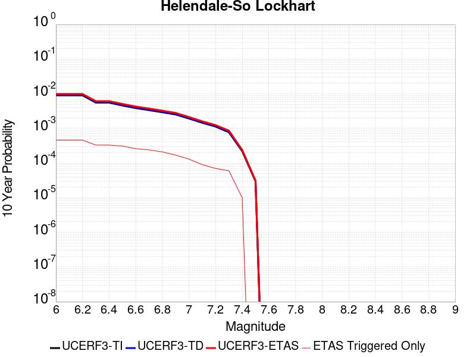 |

| Magnitude | 1 wk TI Prob | 1 wk TD Prob | 1 wk ETAS Prob | 1 wk ETAS/TD Gain | 1 wk ETAS Triggered Only | 1 mo TI Prob | 1 mo TD Prob | 1 mo ETAS Prob | 1 mo ETAS/TD Gain | 1 mo ETAS Triggered Only | 1 yr TI Prob | 1 yr TD Prob | 1 yr ETAS Prob | 1 yr ETAS/TD Gain | 1 yr ETAS Triggered Only | 10 yr TI Prob | 10 yr TD Prob | 10 yr ETAS Prob | 10 yr ETAS/TD Gain | 10 yr ETAS Triggered Only |
|-----|-----|-----|-----|-----|-----|-----|-----|-----|-----|-----|-----|-----|-----|-----|-----|-----|-----|-----|-----|-----|
| 6.0 | 1.7296055E-5 | 1.8103729E-5 | 2.5965984E-4 | 14.342892 | 2.4156048E-4 | 7.412385E-5 | 7.7585224E-5 | 4.097051E-4 | 5.2807107 | 3.3214566E-4 | 9.0208417E-4 | 9.4421144E-4 | 0.0013062101 | 1.3833872 | 3.623407E-4 | 0.008984311 | 0.009404116 | 0.009822872 | 1.044529 | 4.2273084E-4 |
| 6.1 | 1.7296055E-5 | 1.8103729E-5 | 2.5965984E-4 | 14.342892 | 2.4156048E-4 | 7.412385E-5 | 7.7585224E-5 | 4.097051E-4 | 5.2807107 | 3.3214566E-4 | 9.0208417E-4 | 9.4421144E-4 | 0.0013062101 | 1.3833872 | 3.623407E-4 | 0.008984311 | 0.009404116 | 0.009822872 | 1.044529 | 4.2273084E-4 |
| 6.2 | 1.7296055E-5 | 1.8103729E-5 | 2.5965984E-4 | 14.342892 | 2.4156048E-4 | 7.412385E-5 | 7.7585224E-5 | 4.097051E-4 | 5.2807107 | 3.3214566E-4 | 9.0208417E-4 | 9.4421144E-4 | 0.0013062101 | 1.3833872 | 3.623407E-4 | 0.008984311 | 0.009404116 | 0.009822872 | 1.044529 | 4.2273084E-4 |
| 6.3 | 1.0669118E-5 | 1.1135425E-5 | 1.9230376E-4 | 17.26955 | 1.8117036E-4 | 4.5723988E-5 | 4.772239E-5 | 2.8927135E-4 | 6.0615435 | 2.4156048E-4 | 5.5654737E-4 | 5.80868E-4 | 8.2228816E-4 | 1.4156196 | 2.4156048E-4 | 0.0055515557 | 0.0057937936 | 0.0060339547 | 1.0414515 | 2.4156048E-4 |
| 6.4 | 1.0669118E-5 | 1.1135425E-5 | 1.9230376E-4 | 17.26955 | 1.8117036E-4 | 4.5723988E-5 | 4.772239E-5 | 2.8927135E-4 | 6.0615435 | 2.4156048E-4 | 5.5654737E-4 | 5.80868E-4 | 8.2228816E-4 | 1.4156196 | 2.4156048E-4 | 0.0055515557 | 0.0057937936 | 0.0060339547 | 1.0414515 | 2.4156048E-4 |
| 6.5 | 8.790038E-6 | 9.170197E-6 | 1.9033889E-4 | 20.75625 | 1.8117036E-4 | 3.767105E-5 | 3.930026E-5 | 2.5065738E-4 | 6.378008 | 2.1136542E-4 | 4.585485E-4 | 4.7837716E-4 | 6.8964146E-4 | 1.441627 | 2.1136542E-4 | 0.0045760344 | 0.004773638 | 0.0049839946 | 1.0440663 | 2.1136542E-4 |
| 6.6 | 7.396949E-6 | 7.715537E-6 | 1.888845E-4 | 24.481056 | 1.8117036E-4 | 3.1700827E-5 | 3.3066175E-5 | 2.444246E-4 | 7.3919835 | 2.1136542E-4 | 3.858892E-4 | 4.025073E-4 | 6.137877E-4 | 1.5249106 | 2.1136542E-4 | 0.003852198 | 0.00401789 | 0.004228406 | 1.0523947 | 2.1136542E-4 |
| 6.7 | 6.4600285E-6 | 6.738031E-6 | 1.5771232E-4 | 23.40629 | 1.509753E-4 | 2.7685543E-5 | 2.887696E-5 | 2.1004208E-4 | 7.273691 | 1.8117036E-4 | 3.3701936E-4 | 3.5152107E-4 | 5.3262775E-4 | 1.5152086 | 1.8117036E-4 | 0.0033650869 | 0.003509732 | 0.0036902665 | 1.0514382 | 1.8117036E-4 |
| 6.8 | 5.600104E-6 | 5.836009E-6 | 1.5681043E-4 | 26.869461 | 1.509753E-4 | 2.4000226E-5 | 2.5011232E-5 | 2.0617706E-4 | 8.243379 | 1.8117036E-4 | 2.9216358E-4 | 3.044698E-4 | 4.8558498E-4 | 1.5948544 | 1.8117036E-4 | 0.0029177975 | 0.003040588 | 0.0032212075 | 1.0594028 | 1.8117036E-4 |
| 6.9 | 4.839122E-6 | 5.0395092E-6 | 9.562424E-5 | 18.974909 | 9.058518E-5 | 2.0738931E-5 | 2.159772E-5 | 1.4237536E-4 | 6.5921474 | 1.2078024E-4 | 2.5246723E-4 | 2.6292098E-4 | 3.8366948E-4 | 1.4592577 | 1.2078024E-4 | 0.002521806 | 0.002626147 | 0.0027466097 | 1.0458707 | 1.2078024E-4 |
| 7.0 | 3.6937633E-6 | 3.845208E-6 | 6.423509E-5 | 16.705233 | 6.039012E-5 | 1.5830317E-5 | 1.647936E-5 | 7.6868484E-5 | 4.6645308 | 6.039012E-5 | 1.9271708E-4 | 2.0061806E-4 | 2.6099605E-4 | 1.30096 | 6.039012E-5 | 0.0019255003 | 0.002004401 | 0.00206467 | 1.0300684 | 6.039012E-5 |
| 7.1 | 2.7858857E-6 | 2.8978538E-6 | 6.32878E-5 | 21.839542 | 6.039012E-5 | 1.1939455E-5 | 1.2419316E-5 | 7.280869E-5 | 5.862536 | 6.039012E-5 | 1.4535317E-4 | 1.511949E-4 | 2.1157588E-4 | 1.3993586 | 6.039012E-5 | 0.0014525814 | 0.0015109418 | 0.0015712406 | 1.0399082 | 6.039012E-5 |
| 7.2 | 2.1672065E-6 | 2.2540128E-6 | 3.2449007E-5 | 14.396105 | 3.019506E-5 | 9.2879945E-6 | 9.66002E-6 | 3.985479E-5 | 4.125746 | 3.019506E-5 | 1.1307546E-4 | 1.1760458E-4 | 1.4779609E-4 | 1.2567205 | 3.019506E-5 | 0.0011301794 | 0.0011754417 | 0.0012056013 | 1.0256581 | 3.019506E-5 |
| 7.3 | 1.4823496E-6 | 1.5422102E-6 | 3.1737225E-5 | 20.579052 | 3.019506E-5 | 6.3529114E-6 | 6.6094562E-6 | 3.680432E-5 | 5.5684333 | 3.019506E-5 | 7.734395E-5 | 8.046731E-5 | 1.10659945E-4 | 1.3752161 | 3.019506E-5 | 7.731704E-4 | 8.0439687E-4 | 8.3456765E-4 | 1.0375073 | 3.019506E-5 |
| 7.4 | 4.2321457E-7 | 4.4108765E-7 | 3.0636136E-5 | 69.45589 | 3.019506E-5 | 1.8137755E-6 | 1.8903745E-6 | 3.2085376E-5 | 16.973026 | 3.019506E-5 | 2.2082493E-5 | 2.3015113E-5 | 5.320948E-5 | 2.3119364 | 3.019506E-5 | 2.2080299E-4 | 2.3013182E-4 | 2.6031994E-4 | 1.1311774 | 3.019506E-5 |
| 7.5 | 5.6942316E-8 | 5.9415648E-8 | 5.9415648E-8 | 1.0 | 0.0 | 2.440385E-7 | 2.5463845E-7 | 2.5463845E-7 | 1.0 | 0.0 | 2.9711643E-6 | 3.1002196E-6 | 3.1002196E-6 | 1.0 | 0.0 | 2.9711247E-5 | 3.1001844E-5 | 3.1001844E-5 | 1.0 | 0.0 |

## Death Valley (Black Mtns Frontal)
*[(top)](#table-of-contents)*

| 1 Week | 1 Month | 1 Year | 10 Year |
|-----|-----|-----|-----|
|  |  |  |  |

| Magnitude | 1 wk TI Prob | 1 wk TD Prob | 1 wk ETAS Prob | 1 wk ETAS/TD Gain | 1 wk ETAS Triggered Only | 1 mo TI Prob | 1 mo TD Prob | 1 mo ETAS Prob | 1 mo ETAS/TD Gain | 1 mo ETAS Triggered Only | 1 yr TI Prob | 1 yr TD Prob | 1 yr ETAS Prob | 1 yr ETAS/TD Gain | 1 yr ETAS Triggered Only | 10 yr TI Prob | 10 yr TD Prob | 10 yr ETAS Prob | 10 yr ETAS/TD Gain | 10 yr ETAS Triggered Only |
|-----|-----|-----|-----|-----|-----|-----|-----|-----|-----|-----|-----|-----|-----|-----|-----|-----|-----|-----|-----|-----|
| 6.0 | 1.6707214E-5 | 1.867027E-5 | 3.2061522E-4 | 17.172503 | 3.019506E-4 | 7.160038E-5 | 8.001302E-5 | 3.8193946E-4 | 4.773466 | 3.019506E-4 | 8.71386E-4 | 9.737309E-4 | 0.0012753875 | 1.3097947 | 3.019506E-4 | 0.00867977 | 0.009695496 | 0.010114129 | 1.043178 | 4.2273084E-4 |
| 6.1 | 1.6707214E-5 | 1.867027E-5 | 3.2061522E-4 | 17.172503 | 3.019506E-4 | 7.160038E-5 | 8.001302E-5 | 3.8193946E-4 | 4.773466 | 3.019506E-4 | 8.71386E-4 | 9.737309E-4 | 0.0012753875 | 1.3097947 | 3.019506E-4 | 0.00867977 | 0.009695496 | 0.010114129 | 1.043178 | 4.2273084E-4 |
| 6.2 | 1.6707214E-5 | 1.867027E-5 | 3.2061522E-4 | 17.172503 | 3.019506E-4 | 7.160038E-5 | 8.001302E-5 | 3.8193946E-4 | 4.773466 | 3.019506E-4 | 8.71386E-4 | 9.737309E-4 | 0.0012753875 | 1.3097947 | 3.019506E-4 | 0.00867977 | 0.009695496 | 0.010114129 | 1.043178 | 4.2273084E-4 |
| 6.3 | 1.6707214E-5 | 1.867027E-5 | 3.2061522E-4 | 17.172503 | 3.019506E-4 | 7.160038E-5 | 8.001302E-5 | 3.8193946E-4 | 4.773466 | 3.019506E-4 | 8.71386E-4 | 9.737309E-4 | 0.0012753875 | 1.3097947 | 3.019506E-4 | 0.00867977 | 0.009695496 | 0.010114129 | 1.043178 | 4.2273084E-4 |
| 6.4 | 1.5515609E-5 | 1.7338214E-5 | 2.8908905E-4 | 16.67352 | 2.7175553E-4 | 6.649377E-5 | 7.4304546E-5 | 3.460399E-4 | 4.6570487 | 2.7175553E-4 | 8.0926094E-4 | 9.042885E-4 | 0.0011757982 | 1.3002468 | 2.7175553E-4 | 0.008063202 | 0.009006773 | 0.00936585 | 1.0398675 | 3.623407E-4 |
| 6.5 | 1.5515609E-5 | 1.7338214E-5 | 2.8908905E-4 | 16.67352 | 2.7175553E-4 | 6.649377E-5 | 7.4304546E-5 | 3.460399E-4 | 4.6570487 | 2.7175553E-4 | 8.0926094E-4 | 9.042885E-4 | 0.0011757982 | 1.3002468 | 2.7175553E-4 | 0.008063202 | 0.009006773 | 0.00936585 | 1.0398675 | 3.623407E-4 |
| 6.6 | 1.5041828E-5 | 1.6809145E-5 | 2.885601E-4 | 17.166853 | 2.7175553E-4 | 6.4463384E-5 | 7.203723E-5 | 3.437732E-4 | 4.77216 | 2.7175553E-4 | 7.8455906E-4 | 8.767063E-4 | 0.0011482236 | 1.3097016 | 2.7175553E-4 | 0.00781795 | 0.008733132 | 0.009092309 | 1.041128 | 3.623407E-4 |
| 6.7 | 1.4634985E-5 | 1.6356016E-5 | 2.881071E-4 | 17.614748 | 2.7175553E-4 | 6.271985E-5 | 7.009536E-5 | 3.4183185E-4 | 4.8766685 | 2.7175553E-4 | 7.6334673E-4 | 8.5308263E-4 | 0.0011246064 | 1.3182853 | 2.7175553E-4 | 0.007607299 | 0.008498715 | 0.008857977 | 1.0422724 | 3.623407E-4 |
| 6.8 | 1.4209158E-5 | 1.5882048E-5 | 2.574387E-4 | 16.209414 | 2.4156048E-4 | 6.089497E-5 | 6.8064175E-5 | 3.096082E-4 | 4.548769 | 2.4156048E-4 | 7.4114406E-4 | 8.2837185E-4 | 0.0010697322 | 1.2913672 | 2.4156048E-4 | 0.007386771 | 0.008253456 | 0.0085529145 | 1.0362828 | 3.019506E-4 |
| 6.9 | 1.3780098E-5 | 1.5404594E-5 | 1.9657216E-4 | 12.76062 | 1.8117036E-4 | 5.9056227E-5 | 6.6018045E-5 | 2.4717645E-4 | 3.744074 | 1.8117036E-4 | 7.1877235E-4 | 8.0347876E-4 | 9.845035E-4 | 1.2253013 | 1.8117036E-4 | 0.0071645193 | 0.008006332 | 0.008245959 | 1.0299296 | 2.4156048E-4 |
| 7.0 | 1.3585064E-5 | 1.5188155E-5 | 1.9635576E-4 | 12.928217 | 1.8117036E-4 | 5.8220405E-5 | 6.50905E-5 | 2.4624908E-4 | 3.7831798 | 1.8117036E-4 | 7.086029E-4 | 7.9219416E-4 | 9.7322103E-4 | 1.2285132 | 1.8117036E-4 | 0.007063476 | 0.007894293 | 0.008133947 | 1.0303578 | 2.4156048E-4 |
| 7.1 | 1.3398601E-5 | 1.49813395E-5 | 1.9614899E-4 | 13.092887 | 1.8117036E-4 | 5.742131E-5 | 6.420419E-5 | 2.4536293E-4 | 3.8216028 | 1.8117036E-4 | 6.9888023E-4 | 7.8141113E-4 | 9.624399E-4 | 1.2316691 | 1.8117036E-4 | 0.0069668638 | 0.007787224 | 0.0080269035 | 1.0307785 | 2.4156048E-4 |
| 7.2 | 1.3126312E-5 | 1.4679561E-5 | 1.9584726E-4 | 13.341494 | 1.8117036E-4 | 5.6254412E-5 | 6.291092E-5 | 2.4406987E-4 | 3.879611 | 1.8117036E-4 | 6.846822E-4 | 7.6567667E-4 | 9.467083E-4 | 1.2364335 | 1.8117036E-4 | 0.006825765 | 0.00763097 | 0.007870687 | 1.0314137 | 2.4156048E-4 |
| 7.3 | 1.2922429E-5 | 1.4453788E-5 | 1.654269E-4 | 11.445229 | 1.509753E-4 | 5.5380664E-5 | 6.194336E-5 | 2.1290932E-4 | 3.437161 | 1.509753E-4 | 6.74051E-4 | 7.53905E-4 | 9.0476644E-4 | 1.2001067 | 1.509753E-4 | 0.006720101 | 0.007514055 | 0.007723832 | 1.027918 | 2.1136542E-4 |
| 7.4 | 1.2768878E-5 | 1.4283772E-5 | 1.6525692E-4 | 11.569557 | 1.509753E-4 | 5.4722615E-5 | 6.1214756E-5 | 2.1218082E-4 | 3.466171 | 1.509753E-4 | 6.660441E-4 | 7.4504025E-4 | 8.9590304E-4 | 1.2024895 | 1.509753E-4 | 0.0066405144 | 0.0074260035 | 0.0076357992 | 1.0282515 | 2.1136542E-4 |
| 7.5 | 1.2521929E-5 | 1.40120155E-5 | 1.649852E-4 | 11.774552 | 1.509753E-4 | 5.366431E-5 | 6.005014E-5 | 2.1101638E-4 | 3.514003 | 1.509753E-4 | 6.531671E-4 | 7.3087064E-4 | 8.817356E-4 | 1.2064182 | 1.509753E-4 | 0.006512506 | 0.0072852457 | 0.0074950713 | 1.0288014 | 2.1136542E-4 |
| 7.6 | 1.1301089E-5 | 1.2648149E-5 | 1.6362155E-4 | 12.936402 | 1.509753E-4 | 4.8432343E-5 | 5.4205255E-5 | 2.0517237E-4 | 3.7851012 | 1.509753E-4 | 5.895042E-4 | 6.5975444E-4 | 8.1063015E-4 | 1.2286847 | 1.509753E-4 | 0.0058794282 | 0.00657851 | 0.006788485 | 1.0319183 | 2.1136542E-4 |
| 7.7 | 9.189108E-6 | 1.0283358E-5 | 1.3106236E-4 | 12.745092 | 1.2078024E-4 | 3.93813E-5 | 4.407082E-5 | 1.6484574E-4 | 3.7404735 | 1.2078024E-4 | 4.7936183E-4 | 5.3643517E-4 | 6.5715064E-4 | 1.2250327 | 1.2078024E-4 | 0.004783291 | 0.005351914 | 0.0054720477 | 1.0224469 | 1.2078024E-4 |
| 7.8 | 3.4586725E-7 | 3.6482615E-7 | 3.6482615E-7 | 1.0 | 0.0 | 1.4822873E-6 | 1.5635396E-6 | 1.5635396E-6 | 1.0 | 0.0 | 1.80467E-5 | 1.9035933E-5 | 1.9035933E-5 | 1.0 | 0.0 | 1.8045233E-4 | 1.9034347E-4 | 1.9034347E-4 | 1.0 | 0.0 |
| 7.9 | 2.5591178E-9 | 2.6696718E-9 | 2.6696718E-9 | 1.0 | 0.0 | 1.0967647E-8 | 1.14414505E-8 | 1.14414505E-8 | 1.0 | 0.0 | 1.335311E-7 | 1.3929966E-7 | 1.3929966E-7 | 1.0 | 0.0 | 1.3353102E-6 | 1.3929966E-6 | 1.3929966E-6 | 1.0 | 0.0 |

## Garlic Springs
*[(top)](#table-of-contents)*

| 1 Week | 1 Month | 1 Year | 10 Year |
|-----|-----|-----|-----|
|  |  |  |  |

| Magnitude | 1 wk TI Prob | 1 wk TD Prob | 1 wk ETAS Prob | 1 wk ETAS/TD Gain | 1 wk ETAS Triggered Only | 1 mo TI Prob | 1 mo TD Prob | 1 mo ETAS Prob | 1 mo ETAS/TD Gain | 1 mo ETAS Triggered Only | 1 yr TI Prob | 1 yr TD Prob | 1 yr ETAS Prob | 1 yr ETAS/TD Gain | 1 yr ETAS Triggered Only | 10 yr TI Prob | 10 yr TD Prob | 10 yr ETAS Prob | 10 yr ETAS/TD Gain | 10 yr ETAS Triggered Only |
|-----|-----|-----|-----|-----|-----|-----|-----|-----|-----|-----|-----|-----|-----|-----|-----|-----|-----|-----|-----|-----|
| 6.0 | 1.6760017E-5 | 1.8776833E-5 | 1.999438E-4 | 10.64843 | 1.8117036E-4 | 7.182667E-5 | 8.0470316E-5 | 3.2201136E-4 | 4.0016165 | 2.4156048E-4 | 8.7413884E-4 | 9.794032E-4 | 0.0012508925 | 1.2771988 | 2.7175553E-4 | 0.008707083 | 0.009762413 | 0.010061416 | 1.030628 | 3.019506E-4 |
| 6.1 | 9.852767E-6 | 1.09735865E-5 | 1.0155777E-4 | 9.254747 | 9.058518E-5 | 4.222546E-5 | 4.702921E-5 | 1.6780377E-4 | 3.5680754 | 1.2078024E-4 | 5.139737E-4 | 5.7250116E-4 | 7.2339E-4 | 1.2635608 | 1.509753E-4 | 0.005127866 | 0.005717221 | 0.0058673336 | 1.0262561 | 1.509753E-4 |
| 6.2 | 9.852767E-6 | 1.09735865E-5 | 1.0155777E-4 | 9.254747 | 9.058518E-5 | 4.222546E-5 | 4.702921E-5 | 1.6780377E-4 | 3.5680754 | 1.2078024E-4 | 5.139737E-4 | 5.7250116E-4 | 7.2339E-4 | 1.2635608 | 1.509753E-4 | 0.005127866 | 0.005717221 | 0.0058673336 | 1.0262561 | 1.509753E-4 |
| 6.3 | 4.3167724E-6 | 4.7780286E-6 | 3.4972945E-5 | 7.3195343 | 3.019506E-5 | 1.8500323E-5 | 2.0477235E-5 | 8.086612E-5 | 3.9490743 | 6.039012E-5 | 2.2521814E-4 | 2.4930484E-4 | 3.096799E-4 | 1.2421737 | 6.039012E-5 | 0.0022499003 | 0.00249251 | 0.0025527496 | 1.0241683 | 6.039012E-5 |
| 6.4 | 4.3167724E-6 | 4.7780286E-6 | 3.4972945E-5 | 7.3195343 | 3.019506E-5 | 1.8500323E-5 | 2.0477235E-5 | 8.086612E-5 | 3.9490743 | 6.039012E-5 | 2.2521814E-4 | 2.4930484E-4 | 3.096799E-4 | 1.2421737 | 6.039012E-5 | 0.0022499003 | 0.00249251 | 0.0025527496 | 1.0241683 | 6.039012E-5 |
| 6.5 | 4.3167724E-6 | 4.7780286E-6 | 3.4972945E-5 | 7.3195343 | 3.019506E-5 | 1.8500323E-5 | 2.0477235E-5 | 8.086612E-5 | 3.9490743 | 6.039012E-5 | 2.2521814E-4 | 2.4930484E-4 | 3.096799E-4 | 1.2421737 | 6.039012E-5 | 0.0022499003 | 0.00249251 | 0.0025527496 | 1.0241683 | 6.039012E-5 |
| 6.6 | 4.301311E-6 | 4.760897E-6 | 3.4955814E-5 | 7.3422747 | 3.019506E-5 | 1.8434059E-5 | 2.0403815E-5 | 8.0792706E-5 | 3.9596863 | 6.039012E-5 | 2.2441156E-4 | 2.4841115E-4 | 3.087863E-4 | 1.2430451 | 6.039012E-5 | 0.0022418506 | 0.002483593 | 0.0025438333 | 1.0242553 | 6.039012E-5 |
| 6.7 | 3.8599724E-6 | 4.27106E-6 | 3.446599E-5 | 8.069657 | 3.019506E-5 | 1.6542634E-5 | 1.8304541E-5 | 7.8693556E-5 | 4.299127 | 6.039012E-5 | 2.0138794E-4 | 2.228578E-4 | 2.8323446E-4 | 1.2709202 | 6.039012E-5 | 0.0020120554 | 0.002228578 | 0.0022888335 | 1.0270376 | 6.039012E-5 |

## San Andreas (Parkfield)
*[(top)](#table-of-contents)*

| 1 Week | 1 Month | 1 Year | 10 Year |
|-----|-----|-----|-----|
|  |  |  |  |

| Magnitude | 1 wk TI Prob | 1 wk TD Prob | 1 wk ETAS Prob | 1 wk ETAS/TD Gain | 1 wk ETAS Triggered Only | 1 mo TI Prob | 1 mo TD Prob | 1 mo ETAS Prob | 1 mo ETAS/TD Gain | 1 mo ETAS Triggered Only | 1 yr TI Prob | 1 yr TD Prob | 1 yr ETAS Prob | 1 yr ETAS/TD Gain | 1 yr ETAS Triggered Only | 10 yr TI Prob | 10 yr TD Prob | 10 yr ETAS Prob | 10 yr ETAS/TD Gain | 10 yr ETAS Triggered Only |
|-----|-----|-----|-----|-----|-----|-----|-----|-----|-----|-----|-----|-----|-----|-----|-----|-----|-----|-----|-----|-----|
| 6.0 | 5.556969E-4 | 7.7782426E-4 | 9.588537E-4 | 1.2327383 | 1.8117036E-4 | 0.0023793848 | 0.0033298214 | 0.0035103885 | 1.0542272 | 1.8117036E-4 | 0.028586963 | 0.040191233 | 0.040423084 | 1.0057688 | 2.4156048E-4 | 0.25176284 | 0.33716413 | 0.3373643 | 1.0005937 | 3.019506E-4 |
| 6.1 | 1.925858E-4 | 3.0276453E-4 | 4.235082E-4 | 1.398804 | 1.2078024E-4 | 8.2510663E-4 | 0.0012970108 | 0.0014176343 | 1.0930012 | 1.2078024E-4 | 0.0099994885 | 0.015778083 | 0.015896957 | 1.0075341 | 1.2078024E-4 | 0.095613256 | 0.1497237 | 0.14982638 | 1.0006859 | 1.2078024E-4 |
| 6.2 | 9.4306815E-5 | 1.8242796E-4 | 3.0318616E-4 | 1.6619501 | 1.2078024E-4 | 4.0410945E-4 | 7.816011E-4 | 9.0228696E-4 | 1.1544085 | 1.2078024E-4 | 0.0049089384 | 0.009474681 | 0.009594317 | 1.0126269 | 1.2078024E-4 | 0.048019063 | 0.09185409 | 0.091963775 | 1.0011941 | 1.2078024E-4 |
| 6.3 | 9.283051E-5 | 1.7939322E-4 | 3.001518E-4 | 1.6731502 | 1.2078024E-4 | 3.9778434E-4 | 7.686027E-4 | 8.892901E-4 | 1.1570219 | 1.2078024E-4 | 0.0048322747 | 0.009317789 | 0.009437444 | 1.0128416 | 1.2078024E-4 | 0.047285385 | 0.09050704 | 0.09061688 | 1.0012137 | 1.2078024E-4 |
| 6.4 | 9.138826E-5 | 1.770153E-4 | 2.9777418E-4 | 1.6821945 | 1.2078024E-4 | 3.916052E-4 | 7.5841765E-4 | 8.791063E-4 | 1.1591321 | 1.2078024E-4 | 0.0047573745 | 0.00919484 | 0.009314509 | 1.0130149 | 1.2078024E-4 | 0.046568092 | 0.08940927 | 0.089519255 | 1.0012301 | 1.2078024E-4 |
| 6.5 | 9.000255E-5 | 1.7459576E-4 | 2.9535493E-4 | 1.6916499 | 1.2078024E-4 | 3.8566816E-4 | 7.480541E-4 | 8.6874404E-4 | 1.1613384 | 1.2078024E-4 | 0.0046854047 | 0.009069731 | 0.009189417 | 1.0131961 | 1.2078024E-4 | 0.045878403 | 0.088295065 | 0.088405184 | 1.0012472 | 1.2078024E-4 |
| 6.6 | 8.8109264E-5 | 1.7140752E-4 | 2.9216707E-4 | 1.7045171 | 1.2078024E-4 | 3.7755648E-4 | 7.3439797E-4 | 8.550895E-4 | 1.1643407 | 1.2078024E-4 | 0.0045870654 | 0.008904854 | 0.009024559 | 1.0134426 | 1.2078024E-4 | 0.04493529 | 0.0868267 | 0.08693699 | 1.0012703 | 1.2078024E-4 |
| 6.7 | 8.738073E-5 | 1.7007832E-4 | 2.90838E-4 | 1.710024 | 1.2078024E-4 | 3.7443507E-4 | 7.287046E-4 | 8.4939686E-4 | 1.1656257 | 1.2078024E-4 | 0.0045492216 | 0.008836143 | 0.008955856 | 1.0135481 | 1.2078024E-4 | 0.04457213 | 0.08622707 | 0.08633743 | 1.00128 | 1.2078024E-4 |
| 6.8 | 8.710195E-5 | 1.6953335E-4 | 2.902931E-4 | 1.7123069 | 1.2078024E-4 | 3.7324068E-4 | 7.263703E-4 | 8.470628E-4 | 1.1661583 | 1.2078024E-4 | 0.0045347405 | 0.008807961 | 0.008927677 | 1.0135919 | 1.2078024E-4 | 0.04443313 | 0.08597467 | 0.086085066 | 1.001284 | 1.2078024E-4 |
| 6.9 | 8.6801556E-5 | 1.689429E-4 | 2.8970273E-4 | 1.7147968 | 1.2078024E-4 | 3.7195362E-4 | 7.2384125E-4 | 8.445341E-4 | 1.1667393 | 1.2078024E-4 | 0.0045191357 | 0.008777418 | 0.008897138 | 1.0136396 | 1.2078024E-4 | 0.044283327 | 0.085700735 | 0.08581116 | 1.0012885 | 1.2078024E-4 |
| 7.0 | 8.5571606E-5 | 1.6647128E-4 | 2.872314E-4 | 1.7254112 | 1.2078024E-4 | 3.6668387E-4 | 7.132544E-4 | 8.339485E-4 | 1.169216 | 1.2078024E-4 | 0.004455241 | 0.008649553 | 0.008769289 | 1.0138429 | 1.2078024E-4 | 0.043669727 | 0.08454914 | 0.08465971 | 1.0013077 | 1.2078024E-4 |
| 7.1 | 7.82589E-5 | 1.5128135E-4 | 2.720433E-4 | 1.7982608 | 1.2078024E-4 | 3.3535215E-4 | 6.481883E-4 | 7.6889026E-4 | 1.1862143 | 1.2078024E-4 | 0.0040752706 | 0.007863307 | 0.007983138 | 1.0152392 | 1.2078024E-4 | 0.040013418 | 0.07746111 | 0.07757253 | 1.0014385 | 1.2078024E-4 |
| 7.2 | 7.690929E-5 | 1.4865391E-4 | 2.694162E-4 | 1.8123721 | 1.2078024E-4 | 3.2956956E-4 | 6.369334E-4 | 7.576367E-4 | 1.189507 | 1.2078024E-4 | 0.004005129 | 0.007727258 | 0.007847105 | 1.0155096 | 1.2078024E-4 | 0.0393371 | 0.07623427 | 0.076345846 | 1.0014635 | 1.2078024E-4 |
| 7.3 | 7.5543794E-5 | 1.4561978E-4 | 2.6638244E-4 | 1.8293011 | 1.2078024E-4 | 3.2371894E-4 | 6.2393624E-4 | 7.446411E-4 | 1.1934571 | 1.2078024E-4 | 0.003934157 | 0.007570127 | 0.0076899934 | 1.0158341 | 1.2078024E-4 | 0.038652334 | 0.074797355 | 0.0749091 | 1.0014939 | 1.2078024E-4 |
| 7.4 | 7.4214564E-5 | 1.4262961E-4 | 2.6339263E-4 | 1.8466896 | 1.2078024E-4 | 3.1802364E-4 | 6.111273E-4 | 7.3183374E-4 | 1.1975144 | 1.2078024E-4 | 0.003865065 | 0.00741525 | 0.0075351344 | 1.0161673 | 1.2078024E-4 | 0.03798529 | 0.07337123 | 0.073483154 | 1.0015254 | 1.2078024E-4 |
| 7.5 | 6.149578E-5 | 1.11907226E-4 | 2.0248228E-4 | 1.8093761 | 9.058518E-5 | 2.6352672E-4 | 4.7951436E-4 | 5.700561E-4 | 1.1888196 | 9.058518E-5 | 0.0032037178 | 0.0058224914 | 0.005912549 | 1.0154672 | 9.058518E-5 | 0.03157923 | 0.058557566 | 0.058642846 | 1.0014564 | 9.058518E-5 |
| 7.6 | 6.0643448E-5 | 1.10193796E-4 | 2.0076899E-4 | 1.8219627 | 9.058518E-5 | 2.598746E-4 | 4.7217376E-4 | 5.6271616E-4 | 1.1917565 | 9.058518E-5 | 0.0031593828 | 0.0057335934 | 0.0058236592 | 1.0157084 | 9.058518E-5 | 0.031148417 | 0.057718582 | 0.057803936 | 1.0014788 | 9.058518E-5 |
| 7.7 | 5.1652263E-5 | 9.174698E-5 | 1.2193927E-4 | 1.3290821 | 3.019506E-5 | 2.2134806E-4 | 3.931421E-4 | 4.233253E-4 | 1.0767742 | 3.019506E-5 | 0.002691582 | 0.0047760103 | 0.0048060613 | 1.006292 | 3.019506E-5 | 0.026592141 | 0.04853623 | 0.04856496 | 1.0005919 | 3.019506E-5 |
| 7.8 | 4.8090482E-5 | 8.559635E-5 | 1.1578883E-4 | 1.3527309 | 3.019506E-5 | 2.060858E-4 | 3.6678996E-4 | 3.9697395E-4 | 1.0822923 | 3.019506E-5 | 0.0025062072 | 0.0044565317 | 0.0044865925 | 1.0067452 | 3.019506E-5 | 0.024781305 | 0.04530245 | 0.045331277 | 1.0006363 | 3.019506E-5 |
| 7.9 | 3.970278E-5 | 6.750426E-5 | 9.769728E-5 | 1.4472758 | 3.019506E-5 | 1.7014367E-4 | 2.892719E-4 | 3.1945822E-4 | 1.1043528 | 3.019506E-5 | 0.002069531 | 0.0035162016 | 0.0035462906 | 1.0085572 | 3.019506E-5 | 0.020503636 | 0.035881363 | 0.035910472 | 1.0008113 | 3.019506E-5 |
| 8.0 | 2.8982335E-5 | 4.069796E-5 | 7.0891794E-5 | 1.7419003 | 3.019506E-5 | 1.2420409E-4 | 1.7440817E-4 | 2.0459796E-4 | 1.1730986 | 3.019506E-5 | 0.0015111357 | 0.0021213528 | 0.0021514837 | 1.0142037 | 3.019506E-5 | 0.015009012 | 0.022010697 | 0.022040227 | 1.0013416 | 3.019506E-5 |
| 8.1 | 1.8836186E-5 | 1.8681134E-5 | 1.8681134E-5 | 1.0 | 0.0 | 8.0724014E-5 | 8.005955E-5 | 8.005955E-5 | 1.0 | 0.0 | 9.823717E-4 | 9.742898E-4 | 9.742898E-4 | 1.0 | 0.0 | 0.009780403 | 0.010488115 | 0.010488115 | 1.0 | 0.0 |
| 8.2 | 8.643924E-6 | 5.4748625E-6 | 5.4748625E-6 | 1.0 | 0.0 | 3.704486E-5 | 2.3463486E-5 | 2.3463486E-5 | 1.0 | 0.0 | 4.5092785E-4 | 2.8563058E-4 | 2.8563058E-4 | 1.0 | 0.0 | 0.0045001395 | 0.0032487072 | 0.0032487072 | 1.0 | 0.0 |
| 8.3 | 1.983087E-6 | 7.6599065E-7 | 7.6599065E-7 | 1.0 | 0.0 | 8.498917E-6 | 3.282813E-6 | 3.282813E-6 | 1.0 | 0.0 | 1.034694E-4 | 3.9967534E-5 | 3.9967534E-5 | 1.0 | 0.0 | 0.0010342124 | 4.719687E-4 | 4.719687E-4 | 1.0 | 0.0 |

## Death Valley (No)
*[(top)](#table-of-contents)*

| 1 Week | 1 Month | 1 Year | 10 Year |
|-----|-----|-----|-----|
|  |  |  |  |

| Magnitude | 1 wk TI Prob | 1 wk TD Prob | 1 wk ETAS Prob | 1 wk ETAS/TD Gain | 1 wk ETAS Triggered Only | 1 mo TI Prob | 1 mo TD Prob | 1 mo ETAS Prob | 1 mo ETAS/TD Gain | 1 mo ETAS Triggered Only | 1 yr TI Prob | 1 yr TD Prob | 1 yr ETAS Prob | 1 yr ETAS/TD Gain | 1 yr ETAS Triggered Only | 10 yr TI Prob | 10 yr TD Prob | 10 yr ETAS Prob | 10 yr ETAS/TD Gain | 10 yr ETAS Triggered Only |
|-----|-----|-----|-----|-----|-----|-----|-----|-----|-----|-----|-----|-----|-----|-----|-----|-----|-----|-----|-----|-----|
| 6.0 | 2.0074807E-5 | 2.2500084E-5 | 2.3386074E-4 | 10.393772 | 2.1136542E-4 | 8.603206E-5 | 9.642541E-5 | 3.0777045E-4 | 3.1917982 | 2.1136542E-4 | 0.001046937 | 0.0011733545 | 0.0014146315 | 1.2056302 | 2.4156048E-4 | 0.010420183 | 0.011672506 | 0.011970933 | 1.0255666 | 3.019506E-4 |
| 6.1 | 2.0074807E-5 | 2.2500084E-5 | 2.3386074E-4 | 10.393772 | 2.1136542E-4 | 8.603206E-5 | 9.642541E-5 | 3.0777045E-4 | 3.1917982 | 2.1136542E-4 | 0.001046937 | 0.0011733545 | 0.0014146315 | 1.2056302 | 2.4156048E-4 | 0.010420183 | 0.011672506 | 0.011970933 | 1.0255666 | 3.019506E-4 |
| 6.2 | 2.0074807E-5 | 2.2500084E-5 | 2.3386074E-4 | 10.393772 | 2.1136542E-4 | 8.603206E-5 | 9.642541E-5 | 3.0777045E-4 | 3.1917982 | 2.1136542E-4 | 0.001046937 | 0.0011733545 | 0.0014146315 | 1.2056302 | 2.4156048E-4 | 0.010420183 | 0.011672506 | 0.011970933 | 1.0255666 | 3.019506E-4 |
| 6.3 | 1.9050609E-5 | 2.1336948E-5 | 2.3269786E-4 | 10.905865 | 2.1136542E-4 | 8.164292E-5 | 9.1440896E-5 | 3.02787E-4 | 3.3112864 | 2.1136542E-4 | 9.935491E-4 | 0.001112731 | 0.0013540228 | 1.2168463 | 2.4156048E-4 | 0.009891188 | 0.011072419 | 0.011371026 | 1.0269686 | 3.019506E-4 |
| 6.4 | 1.9050609E-5 | 2.1336948E-5 | 2.3269786E-4 | 10.905865 | 2.1136542E-4 | 8.164292E-5 | 9.1440896E-5 | 3.02787E-4 | 3.3112864 | 2.1136542E-4 | 9.935491E-4 | 0.001112731 | 0.0013540228 | 1.2168463 | 2.4156048E-4 | 0.009891188 | 0.011072419 | 0.011371026 | 1.0269686 | 3.019506E-4 |
| 6.5 | 1.8367004E-5 | 2.0561009E-5 | 2.3192208E-4 | 11.279704 | 2.1136542E-4 | 7.8713354E-5 | 8.811567E-5 | 2.9946247E-4 | 3.3985155 | 2.1136542E-4 | 9.5791375E-4 | 0.0010722869 | 0.0013135882 | 1.2250345 | 2.4156048E-4 | 0.009537951 | 0.0106719155 | 0.010970644 | 1.027992 | 3.019506E-4 |
| 6.6 | 1.779439E-5 | 1.9910927E-5 | 2.3127213E-4 | 11.615337 | 2.1136542E-4 | 7.625944E-5 | 8.53298E-5 | 2.9667717E-4 | 3.47683 | 2.1136542E-4 | 9.280632E-4 | 0.0010384015 | 0.0012797111 | 1.2323856 | 2.4156048E-4 | 0.009241969 | 0.010336253 | 0.010635083 | 1.0289109 | 3.019506E-4 |
| 6.7 | 1.7025437E-5 | 1.9043426E-5 | 2.0021034E-4 | 10.513357 | 1.8117036E-4 | 7.296412E-5 | 8.161216E-5 | 2.6276775E-4 | 3.219713 | 1.8117036E-4 | 8.87976E-4 | 9.931813E-4 | 0.0012043368 | 1.2126052 | 2.1136542E-4 | 0.008844362 | 0.009888145 | 0.010157214 | 1.0272112 | 2.7175553E-4 |
| 6.8 | 1.6545107E-5 | 1.8512545E-5 | 1.9967955E-4 | 10.786175 | 1.8117036E-4 | 7.090568E-5 | 7.93371E-5 | 2.6049308E-4 | 3.2833703 | 1.8117036E-4 | 8.629347E-4 | 9.655073E-4 | 0.0011766687 | 1.218705 | 2.1136542E-4 | 0.008595915 | 0.009613829 | 0.009882972 | 1.0279953 | 2.7175553E-4 |
| 6.9 | 1.615478E-5 | 1.8087594E-5 | 1.9925467E-4 | 11.016096 | 1.8117036E-4 | 6.9232934E-5 | 7.751599E-5 | 2.586723E-4 | 3.3370187 | 1.8117036E-4 | 8.4258494E-4 | 9.433546E-4 | 0.0011545207 | 1.2238458 | 2.1136542E-4 | 0.008393973 | 0.009394196 | 0.009663398 | 1.0286562 | 2.7175553E-4 |
| 7.0 | 1.5894311E-5 | 1.780555E-5 | 1.9897269E-4 | 11.174757 | 1.8117036E-4 | 6.81167E-5 | 7.6307304E-5 | 2.5746383E-4 | 3.3740394 | 1.8117036E-4 | 8.2900526E-4 | 9.286515E-4 | 0.0011398207 | 1.2273933 | 2.1136542E-4 | 0.008259195 | 0.009248397 | 0.00951764 | 1.0291123 | 2.7175553E-4 |
| 7.1 | 1.5602263E-5 | 1.7483504E-5 | 1.986507E-4 | 11.362179 | 1.8117036E-4 | 6.6865134E-5 | 7.492718E-5 | 2.5608396E-4 | 3.4177713 | 1.8117036E-4 | 8.137789E-4 | 9.118627E-4 | 0.0011230354 | 1.2315838 | 2.1136542E-4 | 0.008108052 | 0.009081894 | 0.009351182 | 1.029651 | 2.7175553E-4 |
| 7.2 | 1.5323829E-5 | 1.717063E-5 | 1.9833788E-4 | 11.550996 | 1.8117036E-4 | 6.56719E-5 | 7.358637E-5 | 2.547434E-4 | 3.4618285 | 1.8117036E-4 | 7.99262E-4 | 8.9555193E-4 | 0.001106728 | 1.2358056 | 2.1136542E-4 | 0.007963934 | 0.008920107 | 0.009189438 | 1.0301938 | 2.7175553E-4 |
| 7.3 | 1.4556212E-5 | 1.6302456E-5 | 1.9746987E-4 | 12.112891 | 1.8117036E-4 | 6.238227E-5 | 6.9865826E-5 | 2.5102354E-4 | 3.5929372 | 1.8117036E-4 | 7.592395E-4 | 8.5029035E-4 | 0.0010614761 | 1.248369 | 2.1136542E-4 | 0.0075665074 | 0.008471014 | 0.008740468 | 1.0318089 | 2.7175553E-4 |
| 7.4 | 1.411725E-5 | 1.580796E-5 | 1.9697545E-4 | 12.460524 | 1.8117036E-4 | 6.0501097E-5 | 6.7746674E-5 | 2.4890475E-4 | 3.6740513 | 1.8117036E-4 | 7.363519E-4 | 8.245094E-4 | 0.0010357006 | 1.2561415 | 2.1136542E-4 | 0.0073391674 | 0.008215138 | 0.008484662 | 1.0328081 | 2.7175553E-4 |
| 7.5 | 1.3503312E-5 | 1.5126289E-5 | 1.660993E-4 | 10.980837 | 1.509753E-4 | 5.7870053E-5 | 6.482538E-5 | 2.1579089E-4 | 3.3288028 | 1.509753E-4 | 7.043401E-4 | 7.8896893E-4 | 9.699964E-4 | 1.2294481 | 1.8117036E-4 | 0.007021119 | 0.007862304 | 0.008101965 | 1.0304823 | 2.4156048E-4 |
| 7.6 | 1.1279839E-5 | 1.2626327E-5 | 1.6359972E-4 | 12.957032 | 1.509753E-4 | 4.834127E-5 | 5.4111737E-5 | 2.0507886E-4 | 3.7899146 | 1.509753E-4 | 5.88396E-4 | 6.5861654E-4 | 8.094924E-4 | 1.22908 | 1.509753E-4 | 0.005868405 | 0.006567199 | 0.0067771757 | 1.0319736 | 2.1136542E-4 |
| 7.7 | 9.189108E-6 | 1.0283358E-5 | 1.3106236E-4 | 12.745092 | 1.2078024E-4 | 3.93813E-5 | 4.407082E-5 | 1.6484574E-4 | 3.7404735 | 1.2078024E-4 | 4.7936183E-4 | 5.3643517E-4 | 6.5715064E-4 | 1.2250327 | 1.2078024E-4 | 0.004783291 | 0.005351914 | 0.0054720477 | 1.0224469 | 1.2078024E-4 |
| 7.8 | 3.4586725E-7 | 3.6482615E-7 | 3.6482615E-7 | 1.0 | 0.0 | 1.4822873E-6 | 1.5635396E-6 | 1.5635396E-6 | 1.0 | 0.0 | 1.80467E-5 | 1.9035933E-5 | 1.9035933E-5 | 1.0 | 0.0 | 1.8045233E-4 | 1.9034347E-4 | 1.9034347E-4 | 1.0 | 0.0 |
| 7.9 | 2.5591178E-9 | 2.6696718E-9 | 2.6696718E-9 | 1.0 | 0.0 | 1.0967647E-8 | 1.14414505E-8 | 1.14414505E-8 | 1.0 | 0.0 | 1.335311E-7 | 1.3929966E-7 | 1.3929966E-7 | 1.0 | 0.0 | 1.3353102E-6 | 1.3929966E-6 | 1.3929966E-6 | 1.0 | 0.0 |

## San Andreas (Big Bend)
*[(top)](#table-of-contents)*

| 1 Week | 1 Month | 1 Year | 10 Year |
|-----|-----|-----|-----|
|  |  |  |  |

| Magnitude | 1 wk TI Prob | 1 wk TD Prob | 1 wk ETAS Prob | 1 wk ETAS/TD Gain | 1 wk ETAS Triggered Only | 1 mo TI Prob | 1 mo TD Prob | 1 mo ETAS Prob | 1 mo ETAS/TD Gain | 1 mo ETAS Triggered Only | 1 yr TI Prob | 1 yr TD Prob | 1 yr ETAS Prob | 1 yr ETAS/TD Gain | 1 yr ETAS Triggered Only | 10 yr TI Prob | 10 yr TD Prob | 10 yr ETAS Prob | 10 yr ETAS/TD Gain | 10 yr ETAS Triggered Only |
|-----|-----|-----|-----|-----|-----|-----|-----|-----|-----|-----|-----|-----|-----|-----|-----|-----|-----|-----|-----|-----|
| 6.0 | 1.0179969E-4 | 2.0072258E-4 | 4.120456E-4 | 2.0528111 | 2.1136542E-4 | 4.362114E-4 | 8.599571E-4 | 0.0011013099 | 1.2806567 | 2.4156048E-4 | 0.0052979486 | 0.010419999 | 0.010659042 | 1.0229409 | 2.4156048E-4 | 0.051734097 | 0.10144902 | 0.101693206 | 1.002407 | 2.7175553E-4 |
| 6.1 | 1.0179969E-4 | 2.0072258E-4 | 4.120456E-4 | 2.0528111 | 2.1136542E-4 | 4.362114E-4 | 8.599571E-4 | 0.0011013099 | 1.2806567 | 2.4156048E-4 | 0.0052979486 | 0.010419999 | 0.010659042 | 1.0229409 | 2.4156048E-4 | 0.051734097 | 0.10144902 | 0.101693206 | 1.002407 | 2.7175553E-4 |
| 6.2 | 1.0179969E-4 | 2.0072258E-4 | 4.120456E-4 | 2.0528111 | 2.1136542E-4 | 4.362114E-4 | 8.599571E-4 | 0.0011013099 | 1.2806567 | 2.4156048E-4 | 0.0052979486 | 0.010419999 | 0.010659042 | 1.0229409 | 2.4156048E-4 | 0.051734097 | 0.10144902 | 0.101693206 | 1.002407 | 2.7175553E-4 |
| 6.3 | 1.0179969E-4 | 2.0072258E-4 | 4.120456E-4 | 2.0528111 | 2.1136542E-4 | 4.362114E-4 | 8.599571E-4 | 0.0011013099 | 1.2806567 | 2.4156048E-4 | 0.0052979486 | 0.010419999 | 0.010659042 | 1.0229409 | 2.4156048E-4 | 0.051734097 | 0.10144902 | 0.101693206 | 1.002407 | 2.7175553E-4 |
| 6.4 | 9.1639464E-5 | 1.8429532E-4 | 3.352428E-4 | 1.8190521 | 1.509753E-4 | 3.9268145E-4 | 7.895982E-4 | 9.404543E-4 | 1.1910542 | 1.509753E-4 | 0.0047704205 | 0.009571102 | 0.009720633 | 1.0156231 | 1.509753E-4 | 0.046693064 | 0.09377527 | 0.09391209 | 1.001459 | 1.509753E-4 |
| 6.5 | 9.1639464E-5 | 1.8429532E-4 | 3.352428E-4 | 1.8190521 | 1.509753E-4 | 3.9268145E-4 | 7.895982E-4 | 9.404543E-4 | 1.1910542 | 1.509753E-4 | 0.0047704205 | 0.009571102 | 0.009720633 | 1.0156231 | 1.509753E-4 | 0.046693064 | 0.09377527 | 0.09391209 | 1.001459 | 1.509753E-4 |
| 6.6 | 9.042622E-5 | 1.823659E-4 | 3.3331368E-4 | 1.8277192 | 1.509753E-4 | 3.8748336E-4 | 7.8133424E-4 | 9.321916E-4 | 1.1930766 | 1.509753E-4 | 0.0047074095 | 0.009471365 | 0.0096209105 | 1.0157892 | 1.509753E-4 | 0.046089325 | 0.092869274 | 0.09300623 | 1.0014747 | 1.509753E-4 |
| 6.7 | 8.9836685E-5 | 1.8150927E-4 | 3.3245716E-4 | 1.8316264 | 1.509753E-4 | 3.8495753E-4 | 7.776651E-4 | 9.28523E-4 | 1.1939882 | 1.509753E-4 | 0.00467679 | 0.00942708 | 0.009576633 | 1.0158641 | 1.509753E-4 | 0.045795817 | 0.09246355 | 0.09260056 | 1.0014819 | 1.509753E-4 |
| 6.8 | 8.9471854E-5 | 1.8097709E-4 | 3.3192505E-4 | 1.8340724 | 1.509753E-4 | 3.8339442E-4 | 7.7538576E-4 | 9.26244E-4 | 1.194559 | 1.509753E-4 | 0.004657841 | 0.009399569 | 0.009549125 | 1.015911 | 1.509753E-4 | 0.04561414 | 0.092210755 | 0.09234781 | 1.0014863 | 1.509753E-4 |
| 6.9 | 8.858234E-5 | 1.7979681E-4 | 3.3074498E-4 | 1.8395486 | 1.509753E-4 | 3.7958333E-4 | 7.703304E-4 | 9.2118944E-4 | 1.1958368 | 1.509753E-4 | 0.004611638 | 0.009338548 | 0.009488114 | 1.0160159 | 1.509753E-4 | 0.04517103 | 0.09165087 | 0.09178801 | 1.0014963 | 1.509753E-4 |
| 7.0 | 8.7433385E-5 | 1.7818481E-4 | 3.291332E-4 | 1.8471452 | 1.509753E-4 | 3.746607E-4 | 7.634259E-4 | 9.1428595E-4 | 1.1976093 | 1.509753E-4 | 0.004551957 | 0.009255203 | 0.009404781 | 1.0161616 | 1.509753E-4 | 0.044598386 | 0.09088532 | 0.09102257 | 1.0015101 | 1.509753E-4 |
| 7.1 | 8.684964E-5 | 1.7730435E-4 | 3.2825288E-4 | 1.8513527 | 1.509753E-4 | 3.7215967E-4 | 7.596547E-4 | 9.105153E-4 | 1.198591 | 1.509753E-4 | 0.0045216335 | 0.009209678 | 0.009359263 | 1.0162421 | 1.509753E-4 | 0.04430731 | 0.09046686 | 0.09060418 | 1.0015179 | 1.509753E-4 |
| 7.2 | 8.606521E-5 | 1.762105E-4 | 3.2715918E-4 | 1.8566384 | 1.509753E-4 | 3.6879873E-4 | 7.549695E-4 | 9.058308E-4 | 1.1998243 | 1.509753E-4 | 0.0044808835 | 0.0091531165 | 0.009302709 | 1.0163435 | 1.509753E-4 | 0.043916024 | 0.089947365 | 0.09008476 | 1.0015275 | 1.509753E-4 |
| 7.3 | 8.568266E-5 | 1.7563057E-4 | 2.963896E-4 | 1.6875741 | 1.2078024E-4 | 3.6715972E-4 | 7.524855E-4 | 8.7317487E-4 | 1.1603876 | 1.2078024E-4 | 0.0044610105 | 0.009123127 | 0.009242806 | 1.0131181 | 1.2078024E-4 | 0.043725148 | 0.08966853 | 0.089778475 | 1.0012262 | 1.2078024E-4 |
| 7.4 | 8.5432206E-5 | 1.7525644E-4 | 2.9601553E-4 | 1.6890421 | 1.2078024E-4 | 3.6608664E-4 | 7.50883E-4 | 8.715726E-4 | 1.1607301 | 1.2078024E-4 | 0.004447999 | 0.009103781 | 0.009223461 | 1.0131463 | 1.2078024E-4 | 0.043600157 | 0.08948871 | 0.08959868 | 1.0012289 | 1.2078024E-4 |
| 7.5 | 8.4791965E-5 | 1.7394972E-4 | 2.6451916E-4 | 1.5206643 | 9.058518E-5 | 3.633435E-4 | 7.4528606E-4 | 8.358037E-4 | 1.1214536 | 9.058518E-5 | 0.0044147377 | 0.009036204 | 0.009125971 | 1.0099341 | 9.058518E-5 | 0.043280575 | 0.088866346 | 0.08894888 | 1.0009288 | 9.058518E-5 |
| 7.6 | 8.241105E-5 | 1.6840403E-4 | 2.5897397E-4 | 1.5378133 | 9.058518E-5 | 3.531424E-4 | 7.215321E-4 | 8.1205193E-4 | 1.125455 | 9.058518E-5 | 0.0042910352 | 0.008749358 | 0.008839151 | 1.0102627 | 9.058518E-5 | 0.042091176 | 0.086243294 | 0.08632607 | 1.0009598 | 9.058518E-5 |
| 7.7 | 7.00432E-5 | 1.42045E-4 | 1.7223577E-4 | 1.2125437 | 3.019506E-5 | 3.001506E-4 | 6.0862233E-4 | 6.38799E-4 | 1.049582 | 3.019506E-5 | 0.0036482112 | 0.0073848404 | 0.007414812 | 1.0040586 | 3.019506E-5 | 0.035888977 | 0.07351733 | 0.07354531 | 1.0003805 | 3.019506E-5 |
| 7.8 | 6.415362E-5 | 1.2968935E-4 | 1.5988048E-4 | 1.2327958 | 3.019506E-5 | 2.749151E-4 | 5.556931E-4 | 5.858714E-4 | 1.0543075 | 3.019506E-5 | 0.0033419547 | 0.0067446055 | 0.006774597 | 1.0044467 | 3.019506E-5 | 0.03292141 | 0.06725231 | 0.06728047 | 1.0004188 | 3.019506E-5 |
| 7.9 | 4.939911E-5 | 9.3411545E-5 | 1.2360378E-4 | 1.3232174 | 3.019506E-5 | 2.116933E-4 | 4.0027377E-4 | 4.3045674E-4 | 1.0754058 | 3.019506E-5 | 0.0025743195 | 0.004862453 | 0.004892501 | 1.0061797 | 3.019506E-5 | 0.025447013 | 0.048914436 | 0.048943155 | 1.0005871 | 3.019506E-5 |
| 8.0 | 3.344983E-5 | 5.222685E-5 | 8.242033E-5 | 1.5781219 | 3.019506E-5 | 1.4334853E-4 | 2.2381016E-4 | 2.5399847E-4 | 1.1348835 | 3.019506E-5 | 0.0017438711 | 0.0027214854 | 0.0027515984 | 1.0110649 | 3.019506E-5 | 0.017302496 | 0.027922187 | 0.02795154 | 1.0010512 | 3.019506E-5 |
| 8.1 | 1.9104898E-5 | 1.9173063E-5 | 1.9173063E-5 | 1.0 | 0.0 | 8.1875565E-5 | 8.216769E-5 | 8.216769E-5 | 1.0 | 0.0 | 9.963791E-4 | 9.999331E-4 | 9.999331E-4 | 1.0 | 0.0 | 0.009919235 | 0.010749801 | 0.010749801 | 1.0 | 0.0 |
| 8.2 | 8.643924E-6 | 5.4748625E-6 | 5.4748625E-6 | 1.0 | 0.0 | 3.704486E-5 | 2.3463486E-5 | 2.3463486E-5 | 1.0 | 0.0 | 4.5092785E-4 | 2.8563058E-4 | 2.8563058E-4 | 1.0 | 0.0 | 0.0045001395 | 0.0032487072 | 0.0032487072 | 1.0 | 0.0 |
| 8.3 | 1.983087E-6 | 7.6599065E-7 | 7.6599065E-7 | 1.0 | 0.0 | 8.498917E-6 | 3.282813E-6 | 3.282813E-6 | 1.0 | 0.0 | 1.034694E-4 | 3.9967534E-5 | 3.9967534E-5 | 1.0 | 0.0 | 0.0010342124 | 4.719687E-4 | 4.719687E-4 | 1.0 | 0.0 |

## San Andreas (Coachella) rev
*[(top)](#table-of-contents)*

| 1 Week | 1 Month | 1 Year | 10 Year |
|-----|-----|-----|-----|
|  |  |  |  |

| Magnitude | 1 wk TI Prob | 1 wk TD Prob | 1 wk ETAS Prob | 1 wk ETAS/TD Gain | 1 wk ETAS Triggered Only | 1 mo TI Prob | 1 mo TD Prob | 1 mo ETAS Prob | 1 mo ETAS/TD Gain | 1 mo ETAS Triggered Only | 1 yr TI Prob | 1 yr TD Prob | 1 yr ETAS Prob | 1 yr ETAS/TD Gain | 1 yr ETAS Triggered Only | 10 yr TI Prob | 10 yr TD Prob | 10 yr ETAS Prob | 10 yr ETAS/TD Gain | 10 yr ETAS Triggered Only |
|-----|-----|-----|-----|-----|-----|-----|-----|-----|-----|-----|-----|-----|-----|-----|-----|-----|-----|-----|-----|-----|
| 6.0 | 1.1925945E-4 | 3.2729402E-4 | 5.687754E-4 | 1.7378119 | 2.4156048E-4 | 5.110118E-4 | 0.0014019393 | 0.0016733139 | 1.1935709 | 2.7175553E-4 | 0.0062038354 | 0.016936364 | 0.017203517 | 1.0157739 | 2.7175553E-4 | 0.060334753 | 0.15265316 | 0.15288343 | 1.0015085 | 2.7175553E-4 |
| 6.1 | 1.1925945E-4 | 3.2729402E-4 | 5.687754E-4 | 1.7378119 | 2.4156048E-4 | 5.110118E-4 | 0.0014019393 | 0.0016733139 | 1.1935709 | 2.7175553E-4 | 0.0062038354 | 0.016936364 | 0.017203517 | 1.0157739 | 2.7175553E-4 | 0.060334753 | 0.15265316 | 0.15288343 | 1.0015085 | 2.7175553E-4 |
| 6.2 | 1.07432395E-4 | 3.0230157E-4 | 5.43789E-4 | 1.7988297 | 2.4156048E-4 | 4.603433E-4 | 0.0012949388 | 0.0015663424 | 1.209588 | 2.7175553E-4 | 0.005590286 | 0.015653009 | 0.01592051 | 1.0170895 | 2.7175553E-4 | 0.05451731 | 0.14182423 | 0.14205745 | 1.0016444 | 2.7175553E-4 |
| 6.3 | 1.0718766E-4 | 3.0175463E-4 | 5.432422E-4 | 1.8002781 | 2.4156048E-4 | 4.592948E-4 | 0.0012925972 | 0.0015640014 | 1.2099682 | 2.7175553E-4 | 0.005577586 | 0.015624908 | 0.015892416 | 1.0171207 | 2.7175553E-4 | 0.054396555 | 0.14159249 | 0.14182577 | 1.0016475 | 2.7175553E-4 |
| 6.4 | 1.0355944E-4 | 2.9383553E-4 | 5.3532503E-4 | 1.8218527 | 2.4156048E-4 | 4.4375064E-4 | 0.0012586913 | 0.0015301048 | 1.2156315 | 2.7175553E-4 | 0.0053892885 | 0.015217941 | 0.015485561 | 1.0175859 | 2.7175553E-4 | 0.052604496 | 0.13815255 | 0.13838677 | 1.0016953 | 2.7175553E-4 |
| 6.5 | 1.0227914E-4 | 2.9102986E-4 | 5.3252006E-4 | 1.829778 | 2.4156048E-4 | 4.382655E-4 | 0.0012466786 | 0.0015180954 | 1.2177119 | 2.7175553E-4 | 0.0053228354 | 0.01507372 | 0.01534138 | 1.0177567 | 2.7175553E-4 | 0.051971316 | 0.13693172 | 0.13716626 | 1.0017128 | 2.7175553E-4 |
| 6.6 | 1.0116757E-4 | 2.8868738E-4 | 5.3017813E-4 | 1.836513 | 2.4156048E-4 | 4.3350324E-4 | 0.0012366489 | 0.0015080684 | 1.2194798 | 2.7175553E-4 | 0.0052651367 | 0.01495329 | 0.015220982 | 1.0179019 | 2.7175553E-4 | 0.051421247 | 0.1359099 | 0.13614471 | 1.0017278 | 2.7175553E-4 |
| 6.7 | 1.0050676E-4 | 2.8727303E-4 | 5.287641E-4 | 1.8406327 | 2.4156048E-4 | 4.3067214E-4 | 0.0012305931 | 0.0015020142 | 1.2205613 | 2.7175553E-4 | 0.005230834 | 0.014880571 | 0.015148282 | 1.0179907 | 2.7175553E-4 | 0.051094085 | 0.13529462 | 0.13552961 | 1.0017369 | 2.7175553E-4 |
| 6.8 | 9.976819E-5 | 2.853096E-4 | 5.2680116E-4 | 1.8464193 | 2.4156048E-4 | 4.2750788E-4 | 0.0012221863 | 0.0014936097 | 1.2220802 | 2.7175553E-4 | 0.0051924936 | 0.0147796115 | 0.01504735 | 1.0181154 | 2.7175553E-4 | 0.050728295 | 0.13444631 | 0.13468152 | 1.0017495 | 2.7175553E-4 |
| 6.9 | 9.77719E-5 | 2.8027873E-4 | 5.217715E-4 | 1.8616165 | 2.4156048E-4 | 4.1895514E-4 | 0.0012006456 | 0.0014720748 | 1.2260695 | 2.7175553E-4 | 0.0050888555 | 0.014520878 | 0.014788687 | 1.0184431 | 2.7175553E-4 | 0.049738888 | 0.1322748 | 0.13251062 | 1.0017828 | 2.7175553E-4 |
| 7.0 | 8.500761E-5 | 2.4762485E-4 | 4.5893792E-4 | 1.8533597 | 2.1136542E-4 | 3.6426744E-4 | 0.001060821 | 0.0013021252 | 1.2274693 | 2.4156048E-4 | 0.0044259406 | 0.012839786 | 0.013078244 | 1.0185719 | 2.4156048E-4 | 0.04338823 | 0.11813272 | 0.118345745 | 1.0018033 | 2.4156048E-4 |
| 7.1 | 8.319876E-5 | 2.4365232E-4 | 4.5496624E-4 | 1.8672764 | 2.1136542E-4 | 3.5651738E-4 | 0.0010438096 | 0.0012851179 | 1.2311804 | 2.4156048E-4 | 0.004331963 | 0.012635092 | 0.012873601 | 1.0188767 | 2.4156048E-4 | 0.042484846 | 0.116353 | 0.11656646 | 1.0018345 | 2.4156048E-4 |
| 7.2 | 7.563917E-5 | 2.2413683E-4 | 4.354549E-4 | 1.9428082 | 2.1136542E-4 | 3.2412758E-4 | 9.602359E-4 | 0.0012015644 | 1.2513222 | 2.4156048E-4 | 0.0039391145 | 0.011628893 | 0.011867645 | 1.0205308 | 2.4156048E-4 | 0.03870018 | 0.10775925 | 0.10797478 | 1.0020001 | 2.4156048E-4 |
| 7.3 | 7.082985E-5 | 2.0729867E-4 | 4.1862027E-4 | 2.0194066 | 2.1136542E-4 | 3.0352117E-4 | 8.881233E-4 | 0.0011294693 | 1.2717483 | 2.4156048E-4 | 0.0036891096 | 0.010759917 | 0.010998879 | 1.0222085 | 2.4156048E-4 | 0.03628465 | 0.100282 | 0.10049934 | 1.0021672 | 2.4156048E-4 |
| 7.4 | 5.146215E-5 | 1.4273795E-4 | 3.5407319E-4 | 2.4805822 | 2.1136542E-4 | 2.2053342E-4 | 6.115915E-4 | 8.530042E-4 | 1.3947288 | 2.4156048E-4 | 0.0026816884 | 0.0074208933 | 0.0076606614 | 1.0323099 | 2.4156048E-4 | 0.02649557 | 0.070849575 | 0.071074024 | 1.0031679 | 2.4156048E-4 |
| 7.5 | 4.0285166E-5 | 1.09416E-4 | 3.207583E-4 | 2.9315484 | 2.1136542E-4 | 1.7263928E-4 | 4.6884175E-4 | 7.10289E-4 | 1.5149866 | 2.4156048E-4 | 0.002099857 | 0.0056932783 | 0.0059334636 | 1.0421875 | 2.4156048E-4 | 0.020801254 | 0.055011146 | 0.05523942 | 1.0041496 | 2.4156048E-4 |
| 7.6 | 3.1168736E-5 | 8.4389096E-5 | 2.9573668E-4 | 3.504442 | 2.1136542E-4 | 1.3357346E-4 | 3.6161754E-4 | 6.030907E-4 | 1.6677583 | 2.4156048E-4 | 0.0016250437 | 0.0043938323 | 0.0046343314 | 1.0547357 | 2.4156048E-4 | 0.016132116 | 0.04281005 | 0.04304127 | 1.005401 | 2.4156048E-4 |
| 7.7 | 2.2100989E-5 | 6.238755E-5 | 2.7373977E-4 | 4.3877306 | 2.1136542E-4 | 9.4715084E-5 | 2.6734784E-4 | 5.0884375E-4 | 1.9033022 | 2.4156048E-4 | 0.001152546 | 0.0032501083 | 0.0034908839 | 1.0740823 | 2.4156048E-4 | 0.011465867 | 0.0319002 | 0.032134052 | 1.0073308 | 2.4156048E-4 |
| 7.8 | 1.7484861E-5 | 5.179572E-5 | 2.631502E-4 | 5.080539 | 2.1136542E-4 | 7.493296E-5 | 2.2196278E-4 | 4.6346965E-4 | 2.088051 | 2.4156048E-4 | 9.1192697E-4 | 0.0026990508 | 0.0029399593 | 1.0892568 | 2.4156048E-4 | 0.009081938 | 0.026640115 | 0.02687524 | 1.008826 | 2.4156048E-4 |
| 7.9 | 1.3967285E-5 | 3.822255E-5 | 2.495799E-4 | 6.52965 | 2.1136542E-4 | 5.985842E-5 | 1.6380067E-4 | 4.0532157E-4 | 2.4744806 | 2.4156048E-4 | 7.2853256E-4 | 0.00199245 | 0.0022335292 | 1.1209964 | 2.4156048E-4 | 0.0072614877 | 0.019909438 | 0.020146187 | 1.0118914 | 2.4156048E-4 |
| 8.0 | 1.1887396E-5 | 3.106521E-5 | 2.4242407E-4 | 7.8037157 | 2.1136542E-4 | 5.094499E-5 | 1.3312983E-4 | 3.7465815E-4 | 2.8142314 | 2.4156048E-4 | 6.200787E-4 | 0.0016196516 | 0.0018608208 | 1.1489019 | 2.4156048E-4 | 0.006183513 | 0.016279267 | 0.016516896 | 1.0145969 | 2.4156048E-4 |
| 8.1 | 5.100864E-6 | 8.973418E-6 | 8.973418E-6 | 1.0 | 0.0 | 2.1860664E-5 | 3.8456936E-5 | 3.8456936E-5 | 1.0 | 0.0 | 2.6612106E-4 | 4.6811273E-4 | 4.6811273E-4 | 1.0 | 0.0 | 0.002658026 | 0.004917731 | 0.004917731 | 1.0 | 0.0 |
| 8.2 | 2.3004484E-6 | 2.7864487E-6 | 2.7864487E-6 | 1.0 | 0.0 | 9.859027E-6 | 1.1941868E-5 | 1.1941868E-5 | 1.0 | 0.0 | 1.2002704E-4 | 1.4538258E-4 | 1.4538258E-4 | 1.0 | 0.0 | 0.0011996223 | 0.0015973912 | 0.0015973912 | 1.0 | 0.0 |
| 8.3 | 1.0424446E-7 | 5.8161504E-8 | 5.8161504E-8 | 1.0 | 0.0 | 4.4676187E-7 | 2.4926356E-7 | 2.4926356E-7 | 1.0 | 0.0 | 5.439312E-6 | 3.03478E-6 | 3.03478E-6 | 1.0 | 0.0 | 5.4391792E-5 | 3.190716E-5 | 3.190716E-5 | 1.0 | 0.0 |

## San Andreas (San Gorgonio Pass-Garnet HIll)
*[(top)](#table-of-contents)*

| 1 Week | 1 Month | 1 Year | 10 Year |
|-----|-----|-----|-----|
|  |  |  |  |

| Magnitude | 1 wk TI Prob | 1 wk TD Prob | 1 wk ETAS Prob | 1 wk ETAS/TD Gain | 1 wk ETAS Triggered Only | 1 mo TI Prob | 1 mo TD Prob | 1 mo ETAS Prob | 1 mo ETAS/TD Gain | 1 mo ETAS Triggered Only | 1 yr TI Prob | 1 yr TD Prob | 1 yr ETAS Prob | 1 yr ETAS/TD Gain | 1 yr ETAS Triggered Only | 10 yr TI Prob | 10 yr TD Prob | 10 yr ETAS Prob | 10 yr ETAS/TD Gain | 10 yr ETAS Triggered Only |
|-----|-----|-----|-----|-----|-----|-----|-----|-----|-----|-----|-----|-----|-----|-----|-----|-----|-----|-----|-----|-----|
| 6.0 | 8.31567E-5 | 2.3382473E-4 | 4.4514073E-4 | 1.9037367 | 2.1136542E-4 | 3.5633717E-4 | 0.0010017233 | 0.0012732067 | 1.2710162 | 2.7175553E-4 | 0.004329778 | 0.012127888 | 0.012396349 | 1.0221357 | 2.7175553E-4 | 0.042463828 | 0.11257892 | 0.11282008 | 1.0021422 | 2.7175553E-4 |
| 6.1 | 8.31567E-5 | 2.3382473E-4 | 4.4514073E-4 | 1.9037367 | 2.1136542E-4 | 3.5633717E-4 | 0.0010017233 | 0.0012732067 | 1.2710162 | 2.7175553E-4 | 0.004329778 | 0.012127888 | 0.012396349 | 1.0221357 | 2.7175553E-4 | 0.042463828 | 0.11257892 | 0.11282008 | 1.0021422 | 2.7175553E-4 |
| 6.2 | 8.31567E-5 | 2.3382473E-4 | 4.4514073E-4 | 1.9037367 | 2.1136542E-4 | 3.5633717E-4 | 0.0010017233 | 0.0012732067 | 1.2710162 | 2.7175553E-4 | 0.004329778 | 0.012127888 | 0.012396349 | 1.0221357 | 2.7175553E-4 | 0.042463828 | 0.11257892 | 0.11282008 | 1.0021422 | 2.7175553E-4 |
| 6.3 | 8.31567E-5 | 2.3382473E-4 | 4.4514073E-4 | 1.9037367 | 2.1136542E-4 | 3.5633717E-4 | 0.0010017233 | 0.0012732067 | 1.2710162 | 2.7175553E-4 | 0.004329778 | 0.012127888 | 0.012396349 | 1.0221357 | 2.7175553E-4 | 0.042463828 | 0.11257892 | 0.11282008 | 1.0021422 | 2.7175553E-4 |
| 6.4 | 8.059055E-5 | 2.2940808E-4 | 4.40725E-4 | 1.9211398 | 2.1136542E-4 | 3.4534236E-4 | 9.828096E-4 | 0.001254298 | 1.2762371 | 2.7175553E-4 | 0.0041964394 | 0.011900152 | 0.012168674 | 1.0225645 | 2.7175553E-4 | 0.041180745 | 0.11056015 | 0.11080185 | 1.0021862 | 2.7175553E-4 |
| 6.5 | 8.059055E-5 | 2.2940808E-4 | 4.40725E-4 | 1.9211398 | 2.1136542E-4 | 3.4534236E-4 | 9.828096E-4 | 0.001254298 | 1.2762371 | 2.7175553E-4 | 0.0041964394 | 0.011900152 | 0.012168674 | 1.0225645 | 2.7175553E-4 | 0.041180745 | 0.11056015 | 0.11080185 | 1.0021862 | 2.7175553E-4 |
| 6.6 | 7.619237E-5 | 2.218517E-4 | 4.3317024E-4 | 1.9525216 | 2.1136542E-4 | 3.2649786E-4 | 9.5044886E-4 | 0.0012219461 | 1.2856516 | 2.7175553E-4 | 0.0039678677 | 0.01151087 | 0.011779497 | 1.0233369 | 2.7175553E-4 | 0.03897764 | 0.10709683 | 0.10733948 | 1.0022657 | 2.7175553E-4 |
| 6.7 | 7.440636E-5 | 2.1860997E-4 | 4.2992918E-4 | 1.9666495 | 2.1136542E-4 | 3.188454E-4 | 9.3656575E-4 | 0.0012080667 | 1.2898899 | 2.7175553E-4 | 0.0038750346 | 0.011343609 | 0.011612281 | 1.023685 | 2.7175553E-4 | 0.038081564 | 0.105605274 | 0.105848335 | 1.0023016 | 2.7175553E-4 |
| 6.8 | 7.3735864E-5 | 2.1708169E-4 | 4.2840122E-4 | 1.9734563 | 2.1136542E-4 | 3.1597257E-4 | 9.3002064E-4 | 0.0012015235 | 1.291932 | 2.7175553E-4 | 0.0038401815 | 0.011264749 | 0.011533443 | 1.0238527 | 2.7175553E-4 | 0.03774495 | 0.10490683 | 0.105150074 | 1.0023187 | 2.7175553E-4 |
| 6.9 | 7.27575E-5 | 2.1477141E-4 | 4.2609143E-4 | 1.9839299 | 2.1136542E-4 | 3.117806E-4 | 9.201265E-4 | 0.001191632 | 1.2950741 | 2.7175553E-4 | 0.003789323 | 0.011145527 | 0.011414253 | 1.0241107 | 2.7175553E-4 | 0.037253562 | 0.103854746 | 0.104098275 | 1.002345 | 2.7175553E-4 |
| 7.0 | 7.102591E-5 | 2.1061185E-4 | 4.2193275E-4 | 2.0033667 | 2.1136542E-4 | 3.0436125E-4 | 9.023122E-4 | 0.0011738226 | 1.3009051 | 2.7175553E-4 | 0.003699303 | 0.010930831 | 0.011199616 | 1.0245897 | 2.7175553E-4 | 0.03638325 | 0.10195695 | 0.10220099 | 1.0023936 | 2.7175553E-4 |
| 7.1 | 7.028513E-5 | 2.0896831E-4 | 4.2028955E-4 | 2.0112598 | 2.1136542E-4 | 3.0118722E-4 | 8.9527335E-4 | 0.0011667856 | 1.303273 | 2.7175553E-4 | 0.0036607897 | 0.010845989 | 0.011114798 | 1.0247841 | 2.7175553E-4 | 0.036010686 | 0.101199985 | 0.10144424 | 1.0024136 | 2.7175553E-4 |
| 7.2 | 6.8498244E-5 | 2.0504706E-4 | 4.1636915E-4 | 2.0306027 | 2.1136542E-4 | 2.9353087E-4 | 8.784794E-4 | 0.0011499962 | 1.309076 | 2.7175553E-4 | 0.003567883 | 0.010643536 | 0.010912399 | 1.0252607 | 2.7175553E-4 | 0.035111405 | 0.09939202 | 0.09963676 | 1.0024624 | 2.7175553E-4 |
| 7.3 | 6.622592E-5 | 1.9732013E-4 | 4.0864383E-4 | 2.0709689 | 2.1136542E-4 | 2.8379448E-4 | 8.453858E-4 | 0.0011169115 | 1.3211857 | 2.7175553E-4 | 0.0034497243 | 0.0102444785 | 0.01051345 | 1.0262552 | 2.7175553E-4 | 0.033966612 | 0.095888525 | 0.09613422 | 1.0025623 | 2.7175553E-4 |
| 7.4 | 5.1050705E-5 | 1.4689034E-4 | 3.582247E-4 | 2.4387221 | 2.1136542E-4 | 2.1877038E-4 | 6.29379E-4 | 9.009635E-4 | 1.4315119 | 2.7175553E-4 | 0.002660276 | 0.0076359594 | 0.00790564 | 1.0353172 | 2.7175553E-4 | 0.02628654 | 0.07286301 | 0.07311497 | 1.0034579 | 2.7175553E-4 |
| 7.5 | 3.9302922E-5 | 1.1129847E-4 | 3.2264035E-4 | 2.8988752 | 2.1136542E-4 | 1.6843023E-4 | 4.7690657E-4 | 7.485325E-4 | 1.569558 | 2.7175553E-4 | 0.0020487092 | 0.005790949 | 0.0060611307 | 1.0466559 | 2.7175553E-4 | 0.020299247 | 0.05600951 | 0.056266043 | 1.0045801 | 2.7175553E-4 |
| 7.6 | 2.9851626E-5 | 8.4949745E-5 | 2.9629722E-4 | 3.4879117 | 2.1136542E-4 | 1.2792926E-4 | 3.6401965E-4 | 6.3567626E-4 | 1.7462691 | 2.7175553E-4 | 0.0015564259 | 0.0044229585 | 0.004693512 | 1.0611702 | 2.7175553E-4 | 0.0154556995 | 0.04319374 | 0.043453757 | 1.0060198 | 2.7175553E-4 |
| 7.7 | 2.1135214E-5 | 6.3529005E-5 | 2.74881E-4 | 4.3268585 | 2.1136542E-4 | 9.0576345E-5 | 2.7223877E-4 | 5.439203E-4 | 1.9979533 | 2.7175553E-4 | 0.0011022091 | 0.0033094748 | 0.0035803309 | 1.0818427 | 2.7175553E-4 | 0.010967582 | 0.032582592 | 0.032845493 | 1.0080688 | 2.7175553E-4 |
| 7.8 | 1.883379E-5 | 5.564028E-5 | 2.6699394E-4 | 4.798573 | 2.1136542E-4 | 8.0713755E-5 | 2.3843657E-4 | 5.101273E-4 | 2.1394677 | 2.7175553E-4 | 9.822468E-4 | 0.0028991038 | 0.0031700716 | 1.093466 | 2.7175553E-4 | 0.0097791655 | 0.028695205 | 0.028959164 | 1.0091987 | 2.7175553E-4 |
| 7.9 | 1.5156185E-5 | 4.1658426E-5 | 2.5301505E-4 | 6.073562 | 2.1136542E-4 | 6.495346E-5 | 1.785239E-4 | 4.5023093E-4 | 2.5219643 | 2.7175553E-4 | 7.9052144E-4 | 0.0021713632 | 0.0024425287 | 1.1248826 | 2.7175553E-4 | 0.007877152 | 0.021759422 | 0.022025265 | 1.0122173 | 2.7175553E-4 |
| 8.0 | 1.1405907E-5 | 2.9974231E-5 | 1.80945E-4 | 6.0366855 | 1.509753E-4 | 4.8881542E-5 | 1.2845467E-4 | 3.3979295E-4 | 2.6452363 | 2.1136542E-4 | 5.9497025E-4 | 0.0015628147 | 0.0017738497 | 1.1350353 | 2.1136542E-4 | 0.005933798 | 0.015772851 | 0.015980883 | 1.0131892 | 2.1136542E-4 |
| 8.1 | 4.3511436E-6 | 7.369219E-6 | 7.369219E-6 | 1.0 | 0.0 | 1.8647626E-5 | 3.1581985E-5 | 3.1581985E-5 | 1.0 | 0.0 | 2.2701119E-4 | 3.8444297E-4 | 3.8444297E-4 | 1.0 | 0.0 | 0.0022677942 | 0.0041163345 | 0.0041163345 | 1.0 | 0.0 |
| 8.2 | 2.3042528E-6 | 2.7329415E-6 | 2.7329415E-6 | 1.0 | 0.0 | 9.875332E-6 | 1.1712554E-5 | 1.1712554E-5 | 1.0 | 0.0 | 1.2022553E-4 | 1.4259106E-4 | 1.4259106E-4 | 1.0 | 0.0 | 0.0012016051 | 0.0015979785 | 0.0015979785 | 1.0 | 0.0 |
| 8.3 | 5.202968E-7 | 3.1598344E-7 | 3.1598344E-7 | 1.0 | 0.0 | 2.2298414E-6 | 1.3542141E-6 | 1.3542141E-6 | 1.0 | 0.0 | 2.714798E-5 | 1.6487444E-5 | 1.6487444E-5 | 1.0 | 0.0 | 2.7144665E-4 | 1.9563142E-4 | 1.9563142E-4 | 1.0 | 0.0 |

## Red Pass
*[(top)](#table-of-contents)*

| 1 Week | 1 Month | 1 Year | 10 Year |
|-----|-----|-----|-----|
|  |  |  |  |

| Magnitude | 1 wk TI Prob | 1 wk TD Prob | 1 wk ETAS Prob | 1 wk ETAS/TD Gain | 1 wk ETAS Triggered Only | 1 mo TI Prob | 1 mo TD Prob | 1 mo ETAS Prob | 1 mo ETAS/TD Gain | 1 mo ETAS Triggered Only | 1 yr TI Prob | 1 yr TD Prob | 1 yr ETAS Prob | 1 yr ETAS/TD Gain | 1 yr ETAS Triggered Only | 10 yr TI Prob | 10 yr TD Prob | 10 yr ETAS Prob | 10 yr ETAS/TD Gain | 10 yr ETAS Triggered Only |
|-----|-----|-----|-----|-----|-----|-----|-----|-----|-----|-----|-----|-----|-----|-----|-----|-----|-----|-----|-----|-----|
| 6.0 | 8.258278E-6 | 8.551265E-6 | 1.8972007E-4 | 22.186201 | 1.8117036E-4 | 3.539214E-5 | 3.6647863E-5 | 2.781995E-4 | 7.5911517 | 2.4156048E-4 | 4.308141E-4 | 4.4611428E-4 | 6.87567E-4 | 1.5412351 | 2.4156048E-4 | 0.0042997985 | 0.004453945 | 0.004694429 | 1.0539936 | 2.4156048E-4 |
| 6.1 | 3.649988E-6 | 3.7753161E-6 | 9.4360155E-5 | 24.993975 | 9.058518E-5 | 1.5642712E-5 | 1.6179853E-5 | 1.0676357E-4 | 6.59855 | 9.058518E-5 | 1.9043336E-4 | 1.9697666E-4 | 2.87544E-4 | 1.4597871 | 9.058518E-5 | 0.0019027026 | 0.001968488 | 0.0020588948 | 1.045927 | 9.058518E-5 |
| 6.2 | 3.649988E-6 | 3.7753161E-6 | 9.4360155E-5 | 24.993975 | 9.058518E-5 | 1.5642712E-5 | 1.6179853E-5 | 1.0676357E-4 | 6.59855 | 9.058518E-5 | 1.9043336E-4 | 1.9697666E-4 | 2.87544E-4 | 1.4597871 | 9.058518E-5 | 0.0019027026 | 0.001968488 | 0.0020588948 | 1.045927 | 9.058518E-5 |
| 6.3 | 1.3924937E-6 | 1.4411166E-6 | 1.4411166E-6 | 1.0 | 0.0 | 5.9678164E-6 | 6.1762075E-6 | 6.1762075E-6 | 1.0 | 0.0 | 7.265574E-5 | 7.519415E-5 | 7.519415E-5 | 1.0 | 0.0 | 7.263199E-4 | 7.518258E-4 | 7.518258E-4 | 1.0 | 0.0 |
| 6.4 | 1.3924937E-6 | 1.4411166E-6 | 1.4411166E-6 | 1.0 | 0.0 | 5.9678164E-6 | 6.1762075E-6 | 6.1762075E-6 | 1.0 | 0.0 | 7.265574E-5 | 7.519415E-5 | 7.519415E-5 | 1.0 | 0.0 | 7.263199E-4 | 7.518258E-4 | 7.518258E-4 | 1.0 | 0.0 |
| 6.5 | 9.876812E-7 | 1.0221912E-6 | 1.0221912E-6 | 1.0 | 0.0 | 4.2329125E-6 | 4.3808195E-6 | 4.3808195E-6 | 1.0 | 0.0 | 5.153449E-5 | 5.3336476E-5 | 5.3336476E-5 | 1.0 | 0.0 | 5.1522546E-4 | 5.333648E-4 | 5.333648E-4 | 1.0 | 0.0 |

## Coyote Lake
*[(top)](#table-of-contents)*

| 1 Week | 1 Month | 1 Year | 10 Year |
|-----|-----|-----|-----|
|  |  |  |  |

| Magnitude | 1 wk TI Prob | 1 wk TD Prob | 1 wk ETAS Prob | 1 wk ETAS/TD Gain | 1 wk ETAS Triggered Only | 1 mo TI Prob | 1 mo TD Prob | 1 mo ETAS Prob | 1 mo ETAS/TD Gain | 1 mo ETAS Triggered Only | 1 yr TI Prob | 1 yr TD Prob | 1 yr ETAS Prob | 1 yr ETAS/TD Gain | 1 yr ETAS Triggered Only | 10 yr TI Prob | 10 yr TD Prob | 10 yr ETAS Prob | 10 yr ETAS/TD Gain | 10 yr ETAS Triggered Only |
|-----|-----|-----|-----|-----|-----|-----|-----|-----|-----|-----|-----|-----|-----|-----|-----|-----|-----|-----|-----|-----|
| 6.0 | 1.980352E-5 | 2.1706745E-5 | 1.7267877E-4 | 7.9550743 | 1.509753E-4 | 8.486947E-5 | 9.302599E-5 | 2.741795E-4 | 2.9473429 | 1.8117036E-4 | 0.0010327959 | 0.0011320751 | 0.0013432011 | 1.1864948 | 2.1136542E-4 | 0.010280091 | 0.011270258 | 0.011479242 | 1.0185429 | 2.1136542E-4 |
| 6.1 | 1.980352E-5 | 2.1706745E-5 | 1.7267877E-4 | 7.9550743 | 1.509753E-4 | 8.486947E-5 | 9.302599E-5 | 2.741795E-4 | 2.9473429 | 1.8117036E-4 | 0.0010327959 | 0.0011320751 | 0.0013432011 | 1.1864948 | 2.1136542E-4 | 0.010280091 | 0.011270258 | 0.011479242 | 1.0185429 | 2.1136542E-4 |
| 6.2 | 1.980352E-5 | 2.1706745E-5 | 1.7267877E-4 | 7.9550743 | 1.509753E-4 | 8.486947E-5 | 9.302599E-5 | 2.741795E-4 | 2.9473429 | 1.8117036E-4 | 0.0010327959 | 0.0011320751 | 0.0013432011 | 1.1864948 | 2.1136542E-4 | 0.010280091 | 0.011270258 | 0.011479242 | 1.0185429 | 2.1136542E-4 |
| 6.3 | 1.5344787E-5 | 1.682067E-5 | 1.07404325E-4 | 6.3852587 | 9.058518E-5 | 6.576172E-5 | 7.2086936E-5 | 1.9285847E-4 | 2.6753595 | 1.2078024E-4 | 8.003548E-4 | 8.773662E-4 | 0.0010282091 | 1.1719269 | 1.509753E-4 | 0.007974784 | 0.00874507 | 0.008894724 | 1.0171131 | 1.509753E-4 |
| 6.4 | 1.5344787E-5 | 1.682067E-5 | 1.07404325E-4 | 6.3852587 | 9.058518E-5 | 6.576172E-5 | 7.2086936E-5 | 1.9285847E-4 | 2.6753595 | 1.2078024E-4 | 8.003548E-4 | 8.773662E-4 | 0.0010282091 | 1.1719269 | 1.509753E-4 | 0.007974784 | 0.00874507 | 0.008894724 | 1.0171131 | 1.509753E-4 |
| 6.5 | 1.4189697E-5 | 1.5557987E-5 | 1.0614176E-4 | 6.8223324 | 9.058518E-5 | 6.081157E-5 | 6.6675726E-5 | 1.874479E-4 | 2.8113368 | 1.2078024E-4 | 7.401293E-4 | 8.115349E-4 | 9.6238765E-4 | 1.1858858 | 1.509753E-4 | 0.0073766913 | 0.008091656 | 0.008241409 | 1.0185071 | 1.509753E-4 |
| 6.6 | 1.3469301E-5 | 1.4771577E-5 | 1.0535542E-4 | 7.1323066 | 9.058518E-5 | 5.7724297E-5 | 6.330556E-5 | 1.8407816E-4 | 2.9077723 | 1.2078024E-4 | 7.025667E-4 | 7.7053264E-4 | 9.213916E-4 | 1.1957853 | 1.509753E-4 | 0.0070034964 | 0.0076845144 | 0.007834329 | 1.0194957 | 1.509753E-4 |
| 6.7 | 1.3027966E-5 | 1.4281745E-5 | 1.04865634E-4 | 7.342634 | 9.058518E-5 | 5.5832945E-5 | 6.120638E-5 | 1.8197922E-4 | 2.9732068 | 1.2078024E-4 | 6.7955407E-4 | 7.4499263E-4 | 8.958555E-4 | 1.2025025 | 1.509753E-4 | 0.006774798 | 0.0074308286 | 0.007580682 | 1.0201664 | 1.509753E-4 |
| 6.8 | 5.695434E-6 | 6.2244176E-6 | 6.6614164E-5 | 10.702071 | 6.039012E-5 | 2.4408775E-5 | 2.6675973E-5 | 8.706448E-5 | 3.2637792 | 6.039012E-5 | 2.971363E-4 | 3.2476155E-4 | 4.153173E-4 | 1.2788377 | 9.058518E-5 | 0.0029673933 | 0.0032458105 | 0.0033361015 | 1.0278177 | 9.058518E-5 |
| 6.9 | 4.385688E-6 | 4.7930553E-6 | 6.518289E-5 | 13.599443 | 6.039012E-5 | 1.879567E-5 | 2.0541665E-5 | 8.093054E-5 | 3.9398239 | 6.039012E-5 | 2.2881327E-4 | 2.5009477E-4 | 3.406573E-4 | 1.3621128 | 9.058518E-5 | 0.002285778 | 0.0025009478 | 0.0025913063 | 1.0361297 | 9.058518E-5 |

## White Wolf (Extension)
*[(top)](#table-of-contents)*

| 1 Week | 1 Month | 1 Year | 10 Year |
|-----|-----|-----|-----|
|  |  |  |  |

| Magnitude | 1 wk TI Prob | 1 wk TD Prob | 1 wk ETAS Prob | 1 wk ETAS/TD Gain | 1 wk ETAS Triggered Only | 1 mo TI Prob | 1 mo TD Prob | 1 mo ETAS Prob | 1 mo ETAS/TD Gain | 1 mo ETAS Triggered Only | 1 yr TI Prob | 1 yr TD Prob | 1 yr ETAS Prob | 1 yr ETAS/TD Gain | 1 yr ETAS Triggered Only | 10 yr TI Prob | 10 yr TD Prob | 10 yr ETAS Prob | 10 yr ETAS/TD Gain | 10 yr ETAS Triggered Only |
|-----|-----|-----|-----|-----|-----|-----|-----|-----|-----|-----|-----|-----|-----|-----|-----|-----|-----|-----|-----|-----|
| 6.0 | 8.222555E-6 | 6.0666657E-6 | 1.5704105E-4 | 25.885891 | 1.509753E-4 | 3.5239045E-5 | 2.5999774E-5 | 1.7697115E-4 | 6.806642 | 1.509753E-4 | 4.289509E-4 | 3.1650788E-4 | 5.278064E-4 | 1.6675932 | 2.1136542E-4 | 0.0042812387 | 0.003161223 | 0.0033719202 | 1.0666505 | 2.1136542E-4 |
| 6.1 | 8.222555E-6 | 6.0666657E-6 | 1.5704105E-4 | 25.885891 | 1.509753E-4 | 3.5239045E-5 | 2.5999774E-5 | 1.7697115E-4 | 6.806642 | 1.509753E-4 | 4.289509E-4 | 3.1650788E-4 | 5.278064E-4 | 1.6675932 | 2.1136542E-4 | 0.0042812387 | 0.003161223 | 0.0033719202 | 1.0666505 | 2.1136542E-4 |
| 6.2 | 8.222555E-6 | 6.0666657E-6 | 1.5704105E-4 | 25.885891 | 1.509753E-4 | 3.5239045E-5 | 2.5999774E-5 | 1.7697115E-4 | 6.806642 | 1.509753E-4 | 4.289509E-4 | 3.1650788E-4 | 5.278064E-4 | 1.6675932 | 2.1136542E-4 | 0.0042812387 | 0.003161223 | 0.0033719202 | 1.0666505 | 2.1136542E-4 |
| 6.3 | 8.222555E-6 | 6.0666657E-6 | 1.5704105E-4 | 25.885891 | 1.509753E-4 | 3.5239045E-5 | 2.5999774E-5 | 1.7697115E-4 | 6.806642 | 1.509753E-4 | 4.289509E-4 | 3.1650788E-4 | 5.278064E-4 | 1.6675932 | 2.1136542E-4 | 0.0042812387 | 0.003161223 | 0.0033719202 | 1.0666505 | 2.1136542E-4 |
| 6.4 | 5.821773E-6 | 3.5571766E-6 | 6.394708E-5 | 17.976921 | 6.039012E-5 | 2.4950215E-5 | 1.5244959E-5 | 7.563416E-5 | 4.961257 | 6.039012E-5 | 3.0372653E-4 | 1.8559267E-4 | 2.7616104E-4 | 1.4879954 | 9.058518E-5 | 0.0030331176 | 0.001854485 | 0.0019449022 | 1.048756 | 9.058518E-5 |
| 6.5 | 5.766023E-6 | 3.4991106E-6 | 6.388902E-5 | 18.258646 | 6.039012E-5 | 2.4711293E-5 | 1.4996108E-5 | 7.5385324E-5 | 5.0269923 | 6.039012E-5 | 3.0081844E-4 | 1.8256342E-4 | 2.7313206E-4 | 1.4960941 | 9.058518E-5 | 0.0030041158 | 0.0018242426 | 0.0019146625 | 1.0495658 | 9.058518E-5 |
| 6.6 | 4.643576E-6 | 2.332624E-6 | 3.2527612E-5 | 13.944645 | 3.019506E-5 | 1.9900888E-5 | 9.996925E-6 | 4.0191684E-5 | 4.020405 | 3.019506E-5 | 2.4226638E-4 | 1.2170619E-4 | 1.8208896E-4 | 1.4961356 | 6.039012E-5 | 0.0024200242 | 0.0012164378 | 0.0012767544 | 1.0495846 | 6.039012E-5 |
| 6.7 | 3.9529173E-6 | 1.6483477E-6 | 3.184336E-5 | 19.31835 | 3.019506E-5 | 1.6940963E-5 | 7.0643296E-6 | 3.7259175E-5 | 5.274269 | 3.019506E-5 | 2.0623671E-4 | 8.6005006E-5 | 1.1619747E-4 | 1.3510547 | 3.019506E-5 | 0.002060454 | 8.597357E-4 | 8.899048E-4 | 1.0350912 | 3.019506E-5 |
| 6.8 | 3.4377522E-6 | 1.2245237E-6 | 3.1419546E-5 | 25.658587 | 3.019506E-5 | 1.473314E-5 | 5.2479486E-6 | 3.544285E-5 | 6.753658 | 3.019506E-5 | 1.7936122E-4 | 6.3891996E-5 | 9.4085124E-5 | 1.4725652 | 3.019506E-5 | 0.0017921652 | 6.387454E-4 | 6.689211E-4 | 1.0472423 | 3.019506E-5 |
| 6.9 | 3.1367306E-6 | 1.0033783E-6 | 1.0033783E-6 | 1.0 | 0.0 | 1.3443062E-5 | 4.3001864E-6 | 4.3001864E-6 | 1.0 | 0.0 | 1.63657E-4 | 5.235359E-5 | 5.235359E-5 | 1.0 | 0.0 | 0.0016353652 | 5.2342017E-4 | 5.2342017E-4 | 1.0 | 0.0 |
| 7.0 | 2.8298145E-6 | 7.4286646E-7 | 7.4286646E-7 | 1.0 | 0.0 | 1.2127721E-5 | 3.1837099E-6 | 3.1837099E-6 | 1.0 | 0.0 | 1.47645E-4 | 3.8761027E-5 | 3.8761027E-5 | 1.0 | 0.0 | 0.0014754693 | 3.8754768E-4 | 3.8754768E-4 | 1.0 | 0.0 |
| 7.1 | 2.4091064E-6 | 5.4227525E-7 | 5.4227525E-7 | 1.0 | 0.0 | 1.03247E-5 | 2.3240348E-6 | 2.3240348E-6 | 1.0 | 0.0 | 1.2569598E-4 | 2.8294799E-5 | 2.8294799E-5 | 1.0 | 0.0 | 0.001256249 | 2.8291598E-4 | 2.8291598E-4 | 1.0 | 0.0 |
| 7.2 | 1.3875518E-6 | 1.0743063E-7 | 1.0743063E-7 | 1.0 | 0.0 | 5.9466374E-6 | 4.6041689E-7 | 4.6041689E-7 | 1.0 | 0.0 | 7.23979E-5 | 5.6055624E-6 | 5.6055624E-6 | 1.0 | 0.0 | 7.2374323E-4 | 5.6054323E-5 | 5.6054323E-5 | 1.0 | 0.0 |
| 7.3 | 7.056077E-7 | 5.002034E-8 | 5.002034E-8 | 1.0 | 0.0 | 3.0240296E-6 | 2.1437286E-7 | 2.1437286E-7 | 1.0 | 0.0 | 3.681694E-5 | 2.609987E-6 | 2.609987E-6 | 1.0 | 0.0 | 3.681084E-4 | 2.609961E-5 | 2.609961E-5 | 1.0 | 0.0 |
| 7.4 | 5.9334678E-8 | 4.8683537E-9 | 4.8683537E-9 | 1.0 | 0.0 | 2.5429145E-7 | 2.0864372E-8 | 2.0864372E-8 | 1.0 | 0.0 | 3.095994E-6 | 2.5402372E-7 | 2.5402372E-7 | 1.0 | 0.0 | 3.095951E-5 | 2.5402353E-6 | 2.5402353E-6 | 1.0 | 0.0 |

## Baker
*[(top)](#table-of-contents)*

| 1 Week | 1 Month | 1 Year | 10 Year |
|-----|-----|-----|-----|
|  |  |  |  |

| Magnitude | 1 wk TI Prob | 1 wk TD Prob | 1 wk ETAS Prob | 1 wk ETAS/TD Gain | 1 wk ETAS Triggered Only | 1 mo TI Prob | 1 mo TD Prob | 1 mo ETAS Prob | 1 mo ETAS/TD Gain | 1 mo ETAS Triggered Only | 1 yr TI Prob | 1 yr TD Prob | 1 yr ETAS Prob | 1 yr ETAS/TD Gain | 1 yr ETAS Triggered Only | 10 yr TI Prob | 10 yr TD Prob | 10 yr ETAS Prob | 10 yr ETAS/TD Gain | 10 yr ETAS Triggered Only |
|-----|-----|-----|-----|-----|-----|-----|-----|-----|-----|-----|-----|-----|-----|-----|-----|-----|-----|-----|-----|-----|
| 6.0 | 5.695525E-6 | 5.8348373E-6 | 1.2661437E-4 | 21.699726 | 1.2078024E-4 | 2.4409164E-5 | 2.5006228E-5 | 1.7597775E-4 | 7.037357 | 1.509753E-4 | 2.9714106E-4 | 3.044123E-4 | 4.5534165E-4 | 1.4958056 | 1.509753E-4 | 0.0029674405 | 0.0030403486 | 0.0032209682 | 1.0594075 | 1.8117036E-4 |
| 6.1 | 5.695525E-6 | 5.8348373E-6 | 1.2661437E-4 | 21.699726 | 1.2078024E-4 | 2.4409164E-5 | 2.5006228E-5 | 1.7597775E-4 | 7.037357 | 1.509753E-4 | 2.9714106E-4 | 3.044123E-4 | 4.5534165E-4 | 1.4958056 | 1.509753E-4 | 0.0029674405 | 0.0030403486 | 0.0032209682 | 1.0594075 | 1.8117036E-4 |
| 6.2 | 5.695525E-6 | 5.8348373E-6 | 1.2661437E-4 | 21.699726 | 1.2078024E-4 | 2.4409164E-5 | 2.5006228E-5 | 1.7597775E-4 | 7.037357 | 1.509753E-4 | 2.9714106E-4 | 3.044123E-4 | 4.5534165E-4 | 1.4958056 | 1.509753E-4 | 0.0029674405 | 0.0030403486 | 0.0032209682 | 1.0594075 | 1.8117036E-4 |
| 6.3 | 3.2995713E-6 | 3.383667E-6 | 1.241635E-4 | 36.69495 | 1.2078024E-4 | 1.4140943E-5 | 1.4501353E-5 | 1.3527984E-4 | 9.328774 | 1.2078024E-4 | 1.7215237E-4 | 1.7654014E-4 | 2.9729906E-4 | 1.684031 | 1.2078024E-4 | 0.0017201907 | 0.001764046 | 0.001914755 | 1.0854337 | 1.509753E-4 |
| 6.4 | 3.2995713E-6 | 3.383667E-6 | 1.241635E-4 | 36.69495 | 1.2078024E-4 | 1.4140943E-5 | 1.4501353E-5 | 1.3527984E-4 | 9.328774 | 1.2078024E-4 | 1.7215237E-4 | 1.7654014E-4 | 2.9729906E-4 | 1.684031 | 1.2078024E-4 | 0.0017201907 | 0.001764046 | 0.001914755 | 1.0854337 | 1.509753E-4 |
| 6.5 | 2.782202E-6 | 2.8558404E-6 | 9.3440765E-5 | 32.71918 | 9.058518E-5 | 1.1923668E-5 | 1.223926E-5 | 1.0282333E-4 | 8.401107 | 9.058518E-5 | 1.4516099E-4 | 1.4900314E-4 | 2.3957482E-4 | 1.6078508 | 9.058518E-5 | 0.001450662 | 0.0014890651 | 0.0016096655 | 1.0809907 | 1.2078024E-4 |
| 6.6 | 2.3163404E-6 | 2.38092E-6 | 9.2965885E-5 | 39.046204 | 9.058518E-5 | 9.927136E-6 | 1.0203904E-5 | 1.0078816E-4 | 9.877412 | 9.058518E-5 | 1.20856166E-4 | 1.2422565E-4 | 2.1479958E-4 | 1.7291081 | 9.058518E-5 | 0.0012079047 | 0.0012415823 | 0.0013622126 | 1.0971586 | 1.2078024E-4 |
| 6.7 | 2.037056E-6 | 2.0965003E-6 | 9.268149E-5 | 44.207714 | 9.058518E-5 | 8.7302105E-6 | 8.984972E-6 | 9.956934E-5 | 11.081764 | 9.058518E-5 | 1.0628513E-4 | 1.093867E-4 | 1.9996197E-4 | 1.8280282 | 9.058518E-5 | 0.0010623431 | 0.0010933448 | 0.001213993 | 1.1103477 | 1.2078024E-4 |
| 6.8 | 1.8356744E-6 | 1.8915287E-6 | 9.247654E-5 | 48.889843 | 9.058518E-5 | 7.867153E-6 | 8.106527E-6 | 9.869097E-5 | 12.17426 | 9.058518E-5 | 9.577837E-5 | 9.869264E-5 | 1.8926887E-4 | 1.9177608 | 9.058518E-5 | 9.57371E-4 | 9.86502E-4 | 0.0011071631 | 1.1223121 | 1.2078024E-4 |
| 6.9 | 1.6310546E-6 | 1.6832072E-6 | 9.226824E-5 | 54.81692 | 9.058518E-5 | 6.9902153E-6 | 7.213726E-6 | 9.779825E-5 | 13.557245 | 9.058518E-5 | 8.510255E-5 | 8.782368E-5 | 1.7840091E-4 | 2.031353 | 9.058518E-5 | 8.5069967E-4 | 8.7790104E-4 | 9.985752E-4 | 1.1374576 | 1.2078024E-4 |
| 7.0 | 1.2058036E-6 | 1.2508665E-6 | 6.164091E-5 | 49.27857 | 6.039012E-5 | 5.1677193E-6 | 5.3608455E-6 | 6.575064E-5 | 12.264976 | 6.039012E-5 | 6.291517E-5 | 6.5266366E-5 | 1.2565254E-4 | 1.9252266 | 6.039012E-5 | 6.289736E-4 | 6.524743E-4 | 7.4300036E-4 | 1.1387428 | 9.058518E-5 |
| 7.1 | 1.052382E-6 | 1.0951609E-6 | 6.148522E-5 | 56.142635 | 6.039012E-5 | 4.5102006E-6 | 4.693538E-6 | 6.5083375E-5 | 13.866591 | 6.039012E-5 | 5.491031E-5 | 5.7142337E-5 | 1.1752901E-4 | 2.0567763 | 6.039012E-5 | 5.4896745E-4 | 5.7127734E-4 | 6.6181074E-4 | 1.1584754 | 9.058518E-5 |
| 7.2 | 1.0067454E-6 | 1.0487711E-6 | 6.143883E-5 | 58.581734 | 6.039012E-5 | 4.3146156E-6 | 4.4947255E-6 | 6.4884574E-5 | 14.435715 | 6.039012E-5 | 5.252918E-5 | 5.4721917E-5 | 1.15108734E-4 | 2.1035216 | 6.039012E-5 | 5.251676E-4 | 5.470853E-4 | 6.376209E-4 | 1.1654872 | 9.058518E-5 |
| 7.3 | 9.3596316E-7 | 9.767723E-7 | 3.1171803E-5 | 31.913069 | 3.019506E-5 | 4.0112645E-6 | 4.1861604E-6 | 3.4381093E-5 | 8.2130375 | 3.019506E-5 | 4.8836053E-5 | 5.096532E-5 | 8.115884E-5 | 1.5924327 | 3.019506E-5 | 4.8825322E-4 | 5.095371E-4 | 5.698964E-4 | 1.1184592 | 6.039012E-5 |
| 7.4 | 8.8117395E-7 | 9.2076635E-7 | 3.11158E-5 | 33.793373 | 3.019506E-5 | 3.7764542E-6 | 3.9461356E-6 | 3.4141078E-5 | 8.651775 | 3.019506E-5 | 4.5977362E-5 | 4.8043148E-5 | 7.823676E-5 | 1.6284686 | 3.019506E-5 | 4.596785E-4 | 4.8032837E-4 | 5.406895E-4 | 1.1256664 | 6.039012E-5 |
| 7.5 | 8.292386E-7 | 8.6745956E-7 | 3.1062493E-5 | 35.80858 | 3.019506E-5 | 3.5538749E-6 | 3.7176785E-6 | 3.3912627E-5 | 9.12199 | 3.019506E-5 | 4.326757E-5 | 4.5261804E-5 | 7.54555E-5 | 1.6670899 | 3.019506E-5 | 4.3259145E-4 | 4.5252658E-4 | 5.128894E-4 | 1.1333905 | 6.039012E-5 |
| 7.6 | 7.553842E-7 | 7.9144706E-7 | 3.0986484E-5 | 39.15168 | 3.019506E-5 | 3.2373566E-6 | 3.3919116E-6 | 3.3586868E-5 | 9.902047 | 3.019506E-5 | 3.9414106E-5 | 4.129575E-5 | 7.148956E-5 | 1.7311603 | 3.019506E-5 | 3.9407116E-4 | 4.1288146E-4 | 4.7324665E-4 | 1.1462046 | 6.039012E-5 |
| 7.7 | 6.5285366E-7 | 6.852797E-7 | 3.0880317E-5 | 45.06236 | 3.019506E-5 | 2.797941E-6 | 2.9369096E-6 | 3.313188E-5 | 11.281205 | 3.019506E-5 | 3.40644E-5 | 3.5756293E-5 | 6.595028E-5 | 1.8444382 | 3.019506E-5 | 3.405918E-4 | 3.5750607E-4 | 3.8769035E-4 | 1.0844301 | 3.019506E-5 |
| 7.8 | 3.4586725E-7 | 3.6482615E-7 | 3.6482615E-7 | 1.0 | 0.0 | 1.4822873E-6 | 1.5635396E-6 | 1.5635396E-6 | 1.0 | 0.0 | 1.80467E-5 | 1.9035933E-5 | 1.9035933E-5 | 1.0 | 0.0 | 1.8045233E-4 | 1.9034347E-4 | 1.9034347E-4 | 1.0 | 0.0 |
| 7.9 | 2.5591178E-9 | 2.6696718E-9 | 2.6696718E-9 | 1.0 | 0.0 | 1.0967647E-8 | 1.14414505E-8 | 1.14414505E-8 | 1.0 | 0.0 | 1.335311E-7 | 1.3929966E-7 | 1.3929966E-7 | 1.0 | 0.0 | 1.3353102E-6 | 1.3929966E-6 | 1.3929966E-6 | 1.0 | 0.0 |

## San Andreas (Carrizo) rev
*[(top)](#table-of-contents)*

| 1 Week | 1 Month | 1 Year | 10 Year |
|-----|-----|-----|-----|
|  |  | 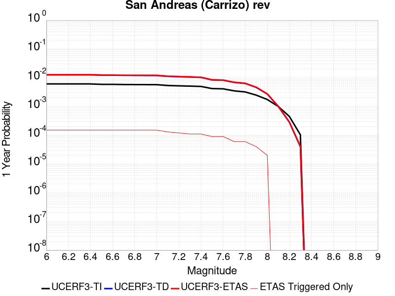 |  |

| Magnitude | 1 wk TI Prob | 1 wk TD Prob | 1 wk ETAS Prob | 1 wk ETAS/TD Gain | 1 wk ETAS Triggered Only | 1 mo TI Prob | 1 mo TD Prob | 1 mo ETAS Prob | 1 mo ETAS/TD Gain | 1 mo ETAS Triggered Only | 1 yr TI Prob | 1 yr TD Prob | 1 yr ETAS Prob | 1 yr ETAS/TD Gain | 1 yr ETAS Triggered Only | 10 yr TI Prob | 10 yr TD Prob | 10 yr ETAS Prob | 10 yr ETAS/TD Gain | 10 yr ETAS Triggered Only |
|-----|-----|-----|-----|-----|-----|-----|-----|-----|-----|-----|-----|-----|-----|-----|-----|-----|-----|-----|-----|-----|
| 6.0 | 1.1674632E-4 | 2.432302E-4 | 4.243565E-4 | 1.7446703 | 1.8117036E-4 | 5.002454E-4 | 0.0010420004 | 0.001222982 | 1.1736866 | 1.8117036E-4 | 0.006073493 | 0.012613042 | 0.012791928 | 1.0141826 | 1.8117036E-4 | 0.0591016 | 0.12061418 | 0.120773494 | 1.0013208 | 1.8117036E-4 |
| 6.1 | 1.1674632E-4 | 2.432302E-4 | 4.243565E-4 | 1.7446703 | 1.8117036E-4 | 5.002454E-4 | 0.0010420004 | 0.001222982 | 1.1736866 | 1.8117036E-4 | 0.006073493 | 0.012613042 | 0.012791928 | 1.0141826 | 1.8117036E-4 | 0.0591016 | 0.12061418 | 0.120773494 | 1.0013208 | 1.8117036E-4 |
| 6.2 | 1.1674632E-4 | 2.432302E-4 | 4.243565E-4 | 1.7446703 | 1.8117036E-4 | 5.002454E-4 | 0.0010420004 | 0.001222982 | 1.1736866 | 1.8117036E-4 | 0.006073493 | 0.012613042 | 0.012791928 | 1.0141826 | 1.8117036E-4 | 0.0591016 | 0.12061418 | 0.120773494 | 1.0013208 | 1.8117036E-4 |
| 6.3 | 1.1674632E-4 | 2.432302E-4 | 4.243565E-4 | 1.7446703 | 1.8117036E-4 | 5.002454E-4 | 0.0010420004 | 0.001222982 | 1.1736866 | 1.8117036E-4 | 0.006073493 | 0.012613042 | 0.012791928 | 1.0141826 | 1.8117036E-4 | 0.0591016 | 0.12061418 | 0.120773494 | 1.0013208 | 1.8117036E-4 |
| 6.4 | 1.1674632E-4 | 2.432302E-4 | 4.243565E-4 | 1.7446703 | 1.8117036E-4 | 5.002454E-4 | 0.0010420004 | 0.001222982 | 1.1736866 | 1.8117036E-4 | 0.006073493 | 0.012613042 | 0.012791928 | 1.0141826 | 1.8117036E-4 | 0.0591016 | 0.12061418 | 0.120773494 | 1.0013208 | 1.8117036E-4 |
| 6.5 | 1.13136164E-4 | 2.3643032E-4 | 4.1755784E-4 | 1.7660927 | 1.8117036E-4 | 4.847792E-4 | 0.0010128808 | 0.0011938676 | 1.1786852 | 1.8117036E-4 | 0.0058862255 | 0.012262545 | 0.012441493 | 1.0145931 | 1.8117036E-4 | 0.057327334 | 0.117585555 | 0.11774542 | 1.0013596 | 1.8117036E-4 |
| 6.6 | 1.13136164E-4 | 2.3643032E-4 | 4.1755784E-4 | 1.7660927 | 1.8117036E-4 | 4.847792E-4 | 0.0010128808 | 0.0011938676 | 1.1786852 | 1.8117036E-4 | 0.0058862255 | 0.012262545 | 0.012441493 | 1.0145931 | 1.8117036E-4 | 0.057327334 | 0.117585555 | 0.11774542 | 1.0013596 | 1.8117036E-4 |
| 6.7 | 1.1149675E-4 | 2.3334254E-4 | 4.1447062E-4 | 1.7762326 | 1.8117036E-4 | 4.777557E-4 | 9.996577E-4 | 0.0011806469 | 1.1810513 | 1.8117036E-4 | 0.0058011734 | 0.012103349 | 0.012282327 | 1.0147874 | 1.8117036E-4 | 0.05652051 | 0.1162071 | 0.11636721 | 1.0013778 | 1.8117036E-4 |
| 6.8 | 1.1103589E-4 | 2.3236412E-4 | 4.1349238E-4 | 1.7795018 | 1.8117036E-4 | 4.7578133E-4 | 9.954676E-4 | 0.0011764577 | 1.1818141 | 1.8117036E-4 | 0.005777263 | 0.012052901 | 0.012231888 | 1.0148501 | 1.8117036E-4 | 0.056293584 | 0.1157674 | 0.11592759 | 1.0013838 | 1.8117036E-4 |
| 6.9 | 1.1053259E-4 | 2.3128795E-4 | 4.124164E-4 | 1.7831297 | 1.8117036E-4 | 4.7362508E-4 | 9.90859E-4 | 0.0011718499 | 1.1826606 | 1.8117036E-4 | 0.0057511497 | 0.01199741 | 0.0121764075 | 1.0149196 | 1.8117036E-4 | 0.05604569 | 0.11528359 | 0.11544388 | 1.0013903 | 1.8117036E-4 |
| 7.0 | 1.1005377E-4 | 2.3029637E-4 | 4.1142502E-4 | 1.7865024 | 1.8117036E-4 | 4.7157376E-4 | 9.866126E-4 | 0.0011676042 | 1.1834475 | 1.8117036E-4 | 0.0057263062 | 0.011946279 | 0.012125284 | 1.0149843 | 1.8117036E-4 | 0.055809796 | 0.11483591 | 0.11499628 | 1.0013964 | 1.8117036E-4 |
| 7.1 | 1.0308142E-4 | 2.1539345E-4 | 3.6633623E-4 | 1.700777 | 1.509753E-4 | 4.417027E-4 | 9.227892E-4 | 0.0010736252 | 1.1634566 | 1.509753E-4 | 0.0053644776 | 0.011177397 | 0.011326686 | 1.0133562 | 1.509753E-4 | 0.052368138 | 0.108092256 | 0.10822691 | 1.0012457 | 1.509753E-4 |
| 7.2 | 1.0027479E-4 | 2.094724E-4 | 3.6041607E-4 | 1.7205898 | 1.509753E-4 | 4.296783E-4 | 8.9743105E-4 | 0.0010482708 | 1.1680796 | 1.509753E-4 | 0.0052187922 | 0.010871782 | 0.011021116 | 1.0137359 | 1.509753E-4 | 0.050979212 | 0.10539625 | 0.10553131 | 1.0012815 | 1.509753E-4 |
| 7.3 | 9.816942E-5 | 2.0422463E-4 | 3.249802E-4 | 1.591288 | 1.2078024E-4 | 4.2065824E-4 | 8.7495585E-4 | 9.956304E-4 | 1.1379207 | 1.2078024E-4 | 0.005109493 | 0.010600842 | 0.0107203415 | 1.0112727 | 1.2078024E-4 | 0.049935985 | 0.102979995 | 0.10308834 | 1.001052 | 1.2078024E-4 |
| 7.4 | 9.5634205E-5 | 1.9791997E-4 | 3.186763E-4 | 1.6101271 | 1.2078024E-4 | 4.0979648E-4 | 8.479536E-4 | 9.686314E-4 | 1.1423166 | 1.2078024E-4 | 0.0049778637 | 0.010275229 | 0.010394768 | 1.0116338 | 1.2078024E-4 | 0.048678253 | 0.10006632 | 0.100175016 | 1.0010862 | 1.2078024E-4 |
| 7.5 | 8.052417E-5 | 1.611261E-4 | 2.5169668E-4 | 1.56211 | 9.058518E-5 | 3.4505792E-4 | 6.903579E-4 | 7.808805E-4 | 1.1311243 | 9.058518E-5 | 0.0041929903 | 0.008372796 | 0.008462623 | 1.0107284 | 9.058518E-5 | 0.04114753 | 0.08281049 | 0.08289357 | 1.0010033 | 9.058518E-5 |
| 7.6 | 7.897024E-5 | 1.5765853E-4 | 2.4822942E-4 | 1.574475 | 9.058518E-5 | 3.384E-4 | 6.755046E-4 | 7.6602865E-4 | 1.1340095 | 9.058518E-5 | 0.0041122385 | 0.008193332 | 0.008283175 | 1.0109653 | 9.058518E-5 | 0.040369697 | 0.08115171 | 0.08123494 | 1.0010257 | 9.058518E-5 |
| 7.7 | 6.707427E-5 | 1.3276102E-4 | 1.6295208E-4 | 1.227409 | 3.019506E-5 | 2.8742946E-4 | 5.688518E-4 | 5.990297E-4 | 1.0530505 | 3.019506E-5 | 0.003493839 | 0.00690381 | 0.0069337967 | 1.0043435 | 3.019506E-5 | 0.034394164 | 0.069048055 | 0.069076166 | 1.0004071 | 3.019506E-5 |
| 7.8 | 6.147705E-5 | 1.2197486E-4 | 1.5216623E-4 | 1.2475213 | 3.019506E-5 | 2.6344648E-4 | 5.226447E-4 | 5.52824E-4 | 1.0577434 | 3.019506E-5 | 0.0032027436 | 0.006344659 | 0.0063746623 | 1.0047289 | 3.019506E-5 | 0.031569764 | 0.06351457 | 0.06354284 | 1.0004452 | 3.019506E-5 |
| 7.9 | 4.7636717E-5 | 8.87977E-5 | 1.1899008E-4 | 1.340013 | 3.019506E-5 | 2.0414138E-4 | 3.8050607E-4 | 4.1068965E-4 | 1.0793248 | 3.019506E-5 | 0.0024825884 | 0.0046228287 | 0.0046528843 | 1.0065016 | 3.019506E-5 | 0.024550365 | 0.046628095 | 0.04665688 | 1.0006174 | 3.019506E-5 |
| 8.0 | 3.3554235E-5 | 5.2136907E-5 | 8.233039E-5 | 1.5791192 | 3.019506E-5 | 1.4379594E-4 | 2.2342477E-4 | 2.5361308E-4 | 1.1351162 | 3.019506E-5 | 0.0017493097 | 0.002716805 | 0.002746918 | 1.011084 | 3.019506E-5 | 0.017356034 | 0.027880952 | 0.027910305 | 1.0010529 | 3.019506E-5 |
| 8.1 | 1.9175432E-5 | 1.9184976E-5 | 1.9184976E-5 | 1.0 | 0.0 | 8.217783E-5 | 8.2218736E-5 | 8.2218736E-5 | 1.0 | 0.0 | 0.0010000558 | 0.0010005541 | 0.0010005541 | 1.0 | 0.0 | 0.009955673 | 0.0107580265 | 0.0107580265 | 1.0 | 0.0 |
| 8.2 | 8.643924E-6 | 5.4748625E-6 | 5.4748625E-6 | 1.0 | 0.0 | 3.704486E-5 | 2.3463486E-5 | 2.3463486E-5 | 1.0 | 0.0 | 4.5092785E-4 | 2.8563058E-4 | 2.8563058E-4 | 1.0 | 0.0 | 0.0045001395 | 0.0032487072 | 0.0032487072 | 1.0 | 0.0 |
| 8.3 | 1.983087E-6 | 7.6599065E-7 | 7.6599065E-7 | 1.0 | 0.0 | 8.498917E-6 | 3.282813E-6 | 3.282813E-6 | 1.0 | 0.0 | 1.034694E-4 | 3.9967534E-5 | 3.9967534E-5 | 1.0 | 0.0 | 0.0010342124 | 4.719687E-4 | 4.719687E-4 | 1.0 | 0.0 |

## Calico-Hidalgo
*[(top)](#table-of-contents)*

| 1 Week | 1 Month | 1 Year | 10 Year |
|-----|-----|-----|-----|
|  |  |  |  |

| Magnitude | 1 wk TI Prob | 1 wk TD Prob | 1 wk ETAS Prob | 1 wk ETAS/TD Gain | 1 wk ETAS Triggered Only | 1 mo TI Prob | 1 mo TD Prob | 1 mo ETAS Prob | 1 mo ETAS/TD Gain | 1 mo ETAS Triggered Only | 1 yr TI Prob | 1 yr TD Prob | 1 yr ETAS Prob | 1 yr ETAS/TD Gain | 1 yr ETAS Triggered Only | 10 yr TI Prob | 10 yr TD Prob | 10 yr ETAS Prob | 10 yr ETAS/TD Gain | 10 yr ETAS Triggered Only |
|-----|-----|-----|-----|-----|-----|-----|-----|-----|-----|-----|-----|-----|-----|-----|-----|-----|-----|-----|-----|-----|
| 6.0 | 4.0906612E-5 | 5.0703686E-5 | 1.1109075E-4 | 2.1909797 | 6.039012E-5 | 1.7530227E-4 | 2.172857E-4 | 3.380397E-4 | 1.5557383 | 1.2078024E-4 | 0.0021322158 | 0.002642648 | 0.002763109 | 1.0455835 | 1.2078024E-4 | 0.02111873 | 0.026152607 | 0.026299633 | 1.0056219 | 1.509753E-4 |
| 6.1 | 4.0906612E-5 | 5.0703686E-5 | 1.1109075E-4 | 2.1909797 | 6.039012E-5 | 1.7530227E-4 | 2.172857E-4 | 3.380397E-4 | 1.5557383 | 1.2078024E-4 | 0.0021322158 | 0.002642648 | 0.002763109 | 1.0455835 | 1.2078024E-4 | 0.02111873 | 0.026152607 | 0.026299633 | 1.0056219 | 1.509753E-4 |
| 6.2 | 4.0906612E-5 | 5.0703686E-5 | 1.1109075E-4 | 2.1909797 | 6.039012E-5 | 1.7530227E-4 | 2.172857E-4 | 3.380397E-4 | 1.5557383 | 1.2078024E-4 | 0.0021322158 | 0.002642648 | 0.002763109 | 1.0455835 | 1.2078024E-4 | 0.02111873 | 0.026152607 | 0.026299633 | 1.0056219 | 1.509753E-4 |
| 6.3 | 2.4242801E-5 | 3.0090669E-5 | 6.028482E-5 | 2.003439 | 3.019506E-5 | 1.0389358E-4 | 1.2895382E-4 | 1.8933615E-4 | 1.4682478 | 6.039012E-5 | 0.0012641704 | 0.0015689151 | 0.0016292104 | 1.0384313 | 6.039012E-5 | 0.01257003 | 0.01558206 | 0.015641509 | 1.0038152 | 6.039012E-5 |
| 6.4 | 2.4242801E-5 | 3.0090669E-5 | 6.028482E-5 | 2.003439 | 3.019506E-5 | 1.0389358E-4 | 1.2895382E-4 | 1.8933615E-4 | 1.4682478 | 6.039012E-5 | 0.0012641704 | 0.0015689151 | 0.0016292104 | 1.0384313 | 6.039012E-5 | 0.01257003 | 0.01558206 | 0.015641509 | 1.0038152 | 6.039012E-5 |
| 6.5 | 2.0286952E-5 | 2.5315738E-5 | 5.5510034E-5 | 2.1927085 | 3.019506E-5 | 8.694118E-5 | 1.0849161E-4 | 1.3868339E-4 | 1.2782868 | 3.019506E-5 | 0.0010579949 | 0.001320102 | 0.0013502572 | 1.0228431 | 3.019506E-5 | 0.010529719 | 0.013124538 | 0.013154336 | 1.0022705 | 3.019506E-5 |
| 6.6 | 2.0269223E-5 | 2.5296687E-5 | 5.5490982E-5 | 2.1936066 | 3.019506E-5 | 8.6865206E-5 | 1.08409964E-4 | 1.3860175E-4 | 1.2784964 | 3.019506E-5 | 0.0010570707 | 0.0013191093 | 0.0013492645 | 1.0228603 | 3.019506E-5 | 0.010520565 | 0.013114728 | 0.013144527 | 1.0022721 | 3.019506E-5 |
| 6.7 | 1.799852E-5 | 2.25406E-5 | 5.273498E-5 | 2.3395553 | 3.019506E-5 | 7.713423E-5 | 9.659908E-5 | 1.2679122E-4 | 1.312551 | 3.019506E-5 | 9.3870464E-4 | 0.0011754738 | 0.0012056334 | 1.0256574 | 3.019506E-5 | 0.009347493 | 0.011694173 | 0.011724016 | 1.0025519 | 3.019506E-5 |
| 6.8 | 1.7458793E-5 | 2.184212E-5 | 5.203652E-5 | 2.3823934 | 3.019506E-5 | 7.4821255E-5 | 9.3605806E-5 | 1.2379805E-4 | 1.3225466 | 3.019506E-5 | 9.10568E-4 | 0.0011390693 | 0.00116923 | 1.0264783 | 3.019506E-5 | 0.009068459 | 0.011333893 | 0.011363746 | 1.0026339 | 3.019506E-5 |
| 6.9 | 1.542884E-5 | 1.9025927E-5 | 4.9220413E-5 | 2.5870178 | 3.019506E-5 | 6.612192E-5 | 8.153721E-5 | 1.1172981E-4 | 1.3702923 | 3.019506E-5 | 8.04737E-4 | 9.922766E-4 | 0.0010224417 | 1.0303999 | 3.019506E-5 | 0.008018291 | 0.009879857 | 0.009909755 | 1.003026 | 3.019506E-5 |
| 7.0 | 1.468253E-5 | 1.8030598E-5 | 4.8225116E-5 | 2.6746264 | 3.019506E-5 | 6.292361E-5 | 7.7271776E-5 | 1.07464504E-4 | 1.3907342 | 3.019506E-5 | 7.658257E-4 | 9.4039086E-4 | 9.705575E-4 | 1.0320789 | 3.019506E-5 | 0.0076319184 | 0.009365481 | 0.009395394 | 1.0031939 | 3.019506E-5 |
| 7.1 | 1.3139281E-5 | 1.6200942E-5 | 4.6395515E-5 | 2.863754 | 3.019506E-5 | 5.6309986E-5 | 6.943083E-5 | 9.96238E-5 | 1.4348639 | 3.019506E-5 | 6.853584E-4 | 8.4500515E-4 | 8.751747E-4 | 1.0357034 | 3.019506E-5 | 0.0068324856 | 0.0084192185 | 0.00844916 | 1.0035563 | 3.019506E-5 |
| 7.2 | 1.1127404E-5 | 1.3866597E-5 | 4.406124E-5 | 3.177509 | 3.019506E-5 | 4.7688E-5 | 5.942698E-5 | 8.962025E-5 | 1.5080733 | 3.019506E-5 | 5.8044674E-4 | 7.232942E-4 | 7.5346744E-4 | 1.0417163 | 3.019506E-5 | 0.0057893298 | 0.0072105085 | 0.007240486 | 1.0041574 | 3.019506E-5 |
| 7.3 | 9.808154E-6 | 1.2176215E-5 | 4.2370906E-5 | 3.4798093 | 3.019506E-5 | 4.2034266E-5 | 5.2182797E-5 | 8.237628E-5 | 1.57861 | 3.019506E-5 | 5.11647E-4 | 6.3515105E-4 | 6.6532695E-4 | 1.0475098 | 3.019506E-5 | 0.0051047057 | 0.006334433 | 0.006364437 | 1.0047367 | 3.019506E-5 |
| 7.4 | 7.942452E-6 | 9.792144E-6 | 3.998691E-5 | 4.0835705 | 3.019506E-5 | 3.4038632E-5 | 4.1965708E-5 | 7.21595E-5 | 1.7194873 | 3.019506E-5 | 4.1434157E-4 | 5.1082217E-4 | 5.410018E-4 | 1.0590805 | 3.019506E-5 | 0.0041356985 | 0.005097421 | 0.005127462 | 1.0058933 | 3.019506E-5 |
| 7.5 | 4.7121216E-6 | 5.772836E-6 | 3.596772E-5 | 6.230511 | 3.019506E-5 | 2.019465E-5 | 2.4740535E-5 | 5.4934848E-5 | 2.220439 | 3.019506E-5 | 2.4584212E-4 | 3.0118204E-4 | 3.31368E-4 | 1.100225 | 3.019506E-5 | 0.0024557032 | 0.0030084911 | 0.0030385952 | 1.0100064 | 3.019506E-5 |
| 7.6 | 2.21172E-7 | 2.603961E-7 | 2.603961E-7 | 1.0 | 0.0 | 9.478797E-7 | 1.1159829E-6 | 1.1159829E-6 | 1.0 | 0.0 | 1.1540374E-5 | 1.3587036E-5 | 1.3587036E-5 | 1.0 | 0.0 | 1.1539775E-4 | 1.3586486E-4 | 1.3586486E-4 | 1.0 | 0.0 |

## San Andreas (Creeping Section) 2011 CFM
*[(top)](#table-of-contents)*

| 1 Week | 1 Month | 1 Year | 10 Year |
|-----|-----|-----|-----|
|  |  |  |  |

| Magnitude | 1 wk TI Prob | 1 wk TD Prob | 1 wk ETAS Prob | 1 wk ETAS/TD Gain | 1 wk ETAS Triggered Only | 1 mo TI Prob | 1 mo TD Prob | 1 mo ETAS Prob | 1 mo ETAS/TD Gain | 1 mo ETAS Triggered Only | 1 yr TI Prob | 1 yr TD Prob | 1 yr ETAS Prob | 1 yr ETAS/TD Gain | 1 yr ETAS Triggered Only | 10 yr TI Prob | 10 yr TD Prob | 10 yr ETAS Prob | 10 yr ETAS/TD Gain | 10 yr ETAS Triggered Only |
|-----|-----|-----|-----|-----|-----|-----|-----|-----|-----|-----|-----|-----|-----|-----|-----|-----|-----|-----|-----|-----|
| 6.0 | 5.986481E-4 | 0.001228691 | 0.0013493228 | 1.0981791 | 1.2078024E-4 | 0.0025631124 | 0.005246795 | 0.0053669414 | 1.022899 | 1.2078024E-4 | 0.030762846 | 0.061203245 | 0.061316635 | 1.0018526 | 1.2078024E-4 | 0.26835477 | 0.425928 | 0.42599735 | 1.0001628 | 1.2078024E-4 |
| 6.1 | 5.015945E-4 | 0.0010230356 | 0.0011135282 | 1.0884548 | 9.058518E-5 | 0.00214792 | 0.004369436 | 0.004459625 | 1.020641 | 9.058518E-5 | 0.025839351 | 0.051246606 | 0.05133255 | 1.001677 | 9.058518E-5 | 0.23032776 | 0.37284943 | 0.37290627 | 1.0001523 | 9.058518E-5 |
| 6.2 | 4.073338E-4 | 8.1157376E-4 | 9.020854E-4 | 1.1115261 | 9.058518E-5 | 0.0017445484 | 0.0034683137 | 0.0035585847 | 1.0260273 | 9.058518E-5 | 0.021034058 | 0.04093177 | 0.041018646 | 1.0021225 | 9.058518E-5 | 0.19150782 | 0.31302592 | 0.31308815 | 1.0001988 | 9.058518E-5 |
| 6.3 | 3.464099E-4 | 6.7455834E-4 | 7.650824E-4 | 1.1341976 | 9.058518E-5 | 0.0014837692 | 0.0028832308 | 0.002973555 | 1.0313274 | 9.058518E-5 | 0.017915873 | 0.034187846 | 0.034275334 | 1.0025591 | 9.058518E-5 | 0.16538359 | 0.27130842 | 0.27137443 | 1.0002433 | 9.058518E-5 |
| 6.4 | 2.935057E-4 | 5.5516965E-4 | 6.4570457E-4 | 1.163076 | 9.058518E-5 | 0.0012572751 | 0.0023727308 | 0.0024631012 | 1.038087 | 9.058518E-5 | 0.015200248 | 0.02826279 | 0.028350815 | 1.0031145 | 9.058518E-5 | 0.14201577 | 0.23297668 | 0.23304616 | 1.0002983 | 9.058518E-5 |
| 6.5 | 2.3409708E-4 | 4.2132285E-4 | 5.1186985E-4 | 1.2149112 | 9.058518E-5 | 0.0010028875 | 0.0018017791 | 0.0018922011 | 1.0501848 | 9.058518E-5 | 0.012141965 | 0.021586355 | 0.021674983 | 1.0041058 | 9.058518E-5 | 0.11499573 | 0.1868149 | 0.18688858 | 1.0003943 | 9.058518E-5 |
| 6.6 | 1.5842178E-4 | 2.5068692E-4 | 3.412494E-4 | 1.3612573 | 9.058518E-5 | 6.7877385E-4 | 0.0010739256 | 0.0011644135 | 1.084259 | 9.058518E-5 | 0.0082328 | 0.012995283 | 0.013084691 | 1.00688 | 9.058518E-5 | 0.07934396 | 0.12313759 | 0.123217024 | 1.000645 | 9.058518E-5 |
| 6.7 | 1.5616413E-4 | 2.4605254E-4 | 3.3661543E-4 | 1.3680632 | 9.058518E-5 | 6.691031E-4 | 0.0010540807 | 0.0011445703 | 1.085847 | 9.058518E-5 | 0.0081159435 | 0.012757154 | 0.0128465835 | 1.0070101 | 9.058518E-5 | 0.0782586 | 0.12116472 | 0.121244326 | 1.0006571 | 9.058518E-5 |
| 6.8 | 1.5538467E-4 | 2.442914E-4 | 3.3485447E-4 | 1.3707173 | 9.058518E-5 | 6.6576427E-4 | 0.001046539 | 0.0011370295 | 1.0864663 | 9.058518E-5 | 0.008075596 | 0.012666538 | 0.012755976 | 1.007061 | 9.058518E-5 | 0.07788358 | 0.12039561 | 0.120475285 | 1.0006618 | 9.058518E-5 |
| 6.9 | 1.5153569E-4 | 2.3538464E-4 | 3.259485E-4 | 1.3847483 | 9.058518E-5 | 6.49277E-4 | 0.0010084033 | 0.0010988972 | 1.0897397 | 9.058518E-5 | 0.007876333 | 0.012208726 | 0.012298206 | 1.0073291 | 9.058518E-5 | 0.07602952 | 0.11646574 | 0.116545774 | 1.0006872 | 9.058518E-5 |
| 7.0 | 1.4588932E-4 | 2.2395732E-4 | 3.145222E-4 | 1.4043846 | 9.058518E-5 | 6.250901E-4 | 9.59466E-4 | 0.0010499642 | 1.0943215 | 9.058518E-5 | 0.0075839474 | 0.011619428 | 0.011708961 | 1.0077055 | 9.058518E-5 | 0.073302895 | 0.11131206 | 0.111392565 | 1.0007232 | 9.058518E-5 |
| 7.1 | 1.1565079E-4 | 1.6281323E-4 | 2.5338365E-4 | 1.5562842 | 9.058518E-5 | 4.955521E-4 | 6.9758523E-4 | 7.881072E-4 | 1.1297648 | 9.058518E-5 | 0.006016669 | 0.008460228 | 0.008550047 | 1.0106165 | 9.058518E-5 | 0.058563538 | 0.08366478 | 0.08374779 | 1.0009922 | 9.058518E-5 |
| 7.2 | 1.0393792E-4 | 1.4615392E-4 | 2.3672586E-4 | 1.6197025 | 9.058518E-5 | 4.4537216E-4 | 6.262243E-4 | 7.167528E-4 | 1.1445624 | 9.058518E-5 | 0.005408933 | 0.0075977976 | 0.0076876944 | 1.011832 | 9.058518E-5 | 0.052791595 | 0.07561503 | 0.07569877 | 1.0011073 | 9.058518E-5 |
| 7.3 | 9.332884E-5 | 1.2780601E-4 | 2.183796E-4 | 1.7086804 | 9.058518E-5 | 3.999194E-4 | 5.4762565E-4 | 6.3816126E-4 | 1.1653239 | 9.058518E-5 | 0.0048581534 | 0.0066470946 | 0.0067370776 | 1.0135372 | 9.058518E-5 | 0.047533102 | 0.06647954 | 0.066564105 | 1.001272 | 9.058518E-5 |
| 7.4 | 8.670252E-5 | 1.1702972E-4 | 2.0760429E-4 | 1.7739451 | 9.058518E-5 | 3.715293E-4 | 5.014601E-4 | 5.9199985E-4 | 1.1805522 | 9.058518E-5 | 0.004513991 | 0.0060883067 | 0.0061783404 | 1.0147879 | 9.058518E-5 | 0.044233937 | 0.061148684 | 0.06123373 | 1.0013908 | 9.058518E-5 |
| 7.5 | 7.3036405E-5 | 9.005699E-5 | 1.80634E-4 | 2.0057745 | 9.058518E-5 | 3.129756E-4 | 3.859015E-4 | 4.7645174E-4 | 1.234646 | 9.058518E-5 | 0.0038038217 | 0.0046882504 | 0.004778411 | 1.0192312 | 9.058518E-5 | 0.03739367 | 0.047875606 | 0.047961857 | 1.0018015 | 9.058518E-5 |
| 7.6 | 6.3935775E-5 | 8.280209E-5 | 1.7337977E-4 | 2.0939057 | 9.058518E-5 | 2.7398168E-4 | 3.5481792E-4 | 4.4537097E-4 | 1.2552099 | 9.058518E-5 | 0.0033306254 | 0.00431137 | 0.0044015646 | 1.0209202 | 9.058518E-5 | 0.032811474 | 0.043990135 | 0.044076733 | 1.0019686 | 9.058518E-5 |
| 7.7 | 5.5050095E-5 | 6.661729E-5 | 9.681034E-5 | 1.4532313 | 3.019506E-5 | 2.3590765E-4 | 2.8547147E-4 | 3.156579E-4 | 1.1057425 | 3.019506E-5 | 0.0028683927 | 0.0034700802 | 0.0035001703 | 1.0086714 | 3.019506E-5 | 0.0283165 | 0.03579509 | 0.035824202 | 1.0008134 | 3.019506E-5 |
| 7.8 | 5.027131E-5 | 6.1627725E-5 | 9.182092E-5 | 1.4899288 | 3.019506E-5 | 2.1543067E-4 | 2.640921E-4 | 2.9427916E-4 | 1.1143051 | 3.019506E-5 | 0.0026197135 | 0.003210584 | 0.003240682 | 1.0093746 | 3.019506E-5 | 0.025890453 | 0.03312572 | 0.033154916 | 1.0008813 | 3.019506E-5 |
| 7.9 | 3.7271806E-5 | 5.0224386E-5 | 8.041793E-5 | 1.6011729 | 3.019506E-5 | 1.5972654E-4 | 2.1522962E-4 | 2.4541817E-4 | 1.1402621 | 3.019506E-5 | 0.0019429359 | 0.0026172737 | 0.0026473897 | 1.0115067 | 3.019506E-5 | 0.019260362 | 0.027066687 | 0.027096065 | 1.0010854 | 3.019506E-5 |
| 8.0 | 2.7310243E-5 | 3.1428404E-5 | 6.1622515E-5 | 1.9607269 | 3.019506E-5 | 1.17038646E-4 | 1.3468621E-4 | 1.648772E-4 | 1.224158 | 3.019506E-5 | 0.0014240141 | 0.0016385721 | 0.0016687176 | 1.0183975 | 3.019506E-5 | 0.014149235 | 0.01721387 | 0.017243544 | 1.0017239 | 3.019506E-5 |
| 8.1 | 1.7940547E-5 | 1.7400796E-5 | 1.7400796E-5 | 1.0 | 0.0 | 7.688579E-5 | 7.457271E-5 | 7.457271E-5 | 1.0 | 0.0 | 9.3568244E-4 | 9.075451E-4 | 9.075451E-4 | 1.0 | 0.0 | 0.009317525 | 0.009799073 | 0.009799073 | 1.0 | 0.0 |
| 8.2 | 8.643924E-6 | 5.4748625E-6 | 5.4748625E-6 | 1.0 | 0.0 | 3.704486E-5 | 2.3463486E-5 | 2.3463486E-5 | 1.0 | 0.0 | 4.5092785E-4 | 2.8563058E-4 | 2.8563058E-4 | 1.0 | 0.0 | 0.0045001395 | 0.0032487072 | 0.0032487072 | 1.0 | 0.0 |
| 8.3 | 1.983087E-6 | 7.6599065E-7 | 7.6599065E-7 | 1.0 | 0.0 | 8.498917E-6 | 3.282813E-6 | 3.282813E-6 | 1.0 | 0.0 | 1.034694E-4 | 3.9967534E-5 | 3.9967534E-5 | 1.0 | 0.0 | 0.0010342124 | 4.719687E-4 | 4.719687E-4 | 1.0 | 0.0 |

## Death Valley (Fish Lake Valley)
*[(top)](#table-of-contents)*

| 1 Week | 1 Month | 1 Year | 10 Year |
|-----|-----|-----|-----|
|  |  |  |  |

| Magnitude | 1 wk TI Prob | 1 wk TD Prob | 1 wk ETAS Prob | 1 wk ETAS/TD Gain | 1 wk ETAS Triggered Only | 1 mo TI Prob | 1 mo TD Prob | 1 mo ETAS Prob | 1 mo ETAS/TD Gain | 1 mo ETAS Triggered Only | 1 yr TI Prob | 1 yr TD Prob | 1 yr ETAS Prob | 1 yr ETAS/TD Gain | 1 yr ETAS Triggered Only | 10 yr TI Prob | 10 yr TD Prob | 10 yr ETAS Prob | 10 yr ETAS/TD Gain | 10 yr ETAS Triggered Only |
|-----|-----|-----|-----|-----|-----|-----|-----|-----|-----|-----|-----|-----|-----|-----|-----|-----|-----|-----|-----|-----|
| 6.0 | 3.872328E-5 | 4.7267473E-5 | 1.6804201E-4 | 3.55513 | 1.2078024E-4 | 1.6594635E-4 | 2.0256084E-4 | 3.2331664E-4 | 1.5961456 | 1.2078024E-4 | 0.0020185246 | 0.002463534 | 0.0026141375 | 1.061133 | 1.509753E-4 | 0.02000288 | 0.024388181 | 0.024535473 | 1.0060395 | 1.509753E-4 |
| 6.1 | 3.872328E-5 | 4.7267473E-5 | 1.6804201E-4 | 3.55513 | 1.2078024E-4 | 1.6594635E-4 | 2.0256084E-4 | 3.2331664E-4 | 1.5961456 | 1.2078024E-4 | 0.0020185246 | 0.002463534 | 0.0026141375 | 1.061133 | 1.509753E-4 | 0.02000288 | 0.024388181 | 0.024535473 | 1.0060395 | 1.509753E-4 |
| 6.2 | 3.872328E-5 | 4.7267473E-5 | 1.6804201E-4 | 3.55513 | 1.2078024E-4 | 1.6594635E-4 | 2.0256084E-4 | 3.2331664E-4 | 1.5961456 | 1.2078024E-4 | 0.0020185246 | 0.002463534 | 0.0026141375 | 1.061133 | 1.509753E-4 | 0.02000288 | 0.024388181 | 0.024535473 | 1.0060395 | 1.509753E-4 |
| 6.3 | 2.8356371E-5 | 3.3609853E-5 | 1.5438603E-4 | 4.593476 | 1.2078024E-4 | 1.2152165E-4 | 1.4403471E-4 | 2.6479756E-4 | 1.8384287 | 1.2078024E-4 | 0.0014785219 | 0.0017522911 | 0.0019030018 | 1.0860078 | 1.509753E-4 | 0.014687235 | 0.017391782 | 0.017540133 | 1.0085299 | 1.509753E-4 |
| 6.4 | 2.8356371E-5 | 3.3609853E-5 | 1.5438603E-4 | 4.593476 | 1.2078024E-4 | 1.2152165E-4 | 1.4403471E-4 | 2.6479756E-4 | 1.8384287 | 1.2078024E-4 | 0.0014785219 | 0.0017522911 | 0.0019030018 | 1.0860078 | 1.509753E-4 | 0.014687235 | 0.017391782 | 0.017540133 | 1.0085299 | 1.509753E-4 |
| 6.5 | 2.4448687E-5 | 2.8607552E-5 | 1.4938434E-4 | 5.2218494 | 1.2078024E-4 | 1.0477588E-4 | 1.2259831E-4 | 2.4336376E-4 | 1.9850496 | 1.2078024E-4 | 0.0012748998 | 0.0014916632 | 0.0016424132 | 1.1010617 | 1.509753E-4 | 0.012676105 | 0.014821377 | 0.014970114 | 1.0100354 | 1.509753E-4 |
| 6.6 | 2.1298161E-5 | 2.4660083E-5 | 1.4543734E-4 | 5.8976827 | 1.2078024E-4 | 9.127464E-5 | 1.0568198E-4 | 2.2644945E-4 | 2.1427443 | 1.2078024E-4 | 0.0011107022 | 0.0012859525 | 0.0014367336 | 1.1172525 | 1.509753E-4 | 0.011051672 | 0.012788526 | 0.01293757 | 1.0116545 | 1.509753E-4 |
| 6.7 | 1.8959729E-5 | 2.1781025E-5 | 1.4255864E-4 | 6.5450835 | 1.2078024E-4 | 8.125345E-5 | 9.334405E-5 | 2.1411302E-4 | 2.2938046 | 1.2078024E-4 | 9.888117E-4 | 0.001135897 | 0.0012867007 | 1.1327618 | 1.509753E-4 | 0.009844234 | 0.01130357 | 0.011452839 | 1.0132054 | 1.509753E-4 |
| 6.8 | 1.6691629E-5 | 1.9018353E-5 | 1.3979629E-4 | 7.3506 | 1.2078024E-4 | 7.153359E-5 | 8.150477E-5 | 2.0227517E-4 | 2.4817586 | 1.2078024E-4 | 8.7057345E-4 | 9.918857E-4 | 0.0011427113 | 1.1520594 | 1.509753E-4 | 0.008671708 | 0.009876343 | 0.010025828 | 1.0151355 | 1.509753E-4 |
| 6.9 | 1.450505E-5 | 1.638954E-5 | 1.371678E-4 | 8.369228 | 1.2078024E-4 | 6.216302E-5 | 7.0239046E-5 | 1.910108E-4 | 2.719439 | 1.2078024E-4 | 7.5657194E-4 | 8.5483363E-4 | 0.0010056798 | 1.1764627 | 1.509753E-4 | 0.007540013 | 0.008516385 | 0.008666075 | 1.0175767 | 1.509753E-4 |
| 7.0 | 1.2940855E-5 | 1.4537972E-5 | 1.3531646E-4 | 9.307795 | 1.2078024E-4 | 5.545963E-5 | 6.230414E-5 | 1.8307686E-4 | 2.9384382 | 1.2078024E-4 | 6.750118E-4 | 7.5829466E-4 | 9.091555E-4 | 1.1989474 | 1.509753E-4 | 0.006729651 | 0.0075576897 | 0.007707524 | 1.0198255 | 1.509753E-4 |
| 7.1 | 1.2544658E-5 | 1.4078208E-5 | 1.3485675E-4 | 9.579113 | 1.2078024E-4 | 5.3761712E-5 | 6.0333812E-5 | 1.8110676E-4 | 3.0017457 | 1.2078024E-4 | 6.5435225E-4 | 7.343222E-4 | 8.851866E-4 | 1.2054472 | 1.509753E-4 | 0.006524288 | 0.007319551 | 0.0074694213 | 1.0204754 | 1.509753E-4 |
| 7.2 | 1.2489416E-5 | 1.4015674E-5 | 1.3479422E-4 | 9.617392 | 1.2078024E-4 | 5.3524967E-5 | 6.0065824E-5 | 1.808388E-4 | 3.0106773 | 1.2078024E-4 | 6.514716E-4 | 7.310616E-4 | 8.8192656E-4 | 1.2063642 | 1.509753E-4 | 0.006495651 | 0.0072871596 | 0.007437035 | 1.020567 | 1.509753E-4 |
| 7.3 | 1.2368307E-5 | 1.3879812E-5 | 1.3465837E-4 | 9.701743 | 1.2078024E-4 | 5.3005948E-5 | 5.9483587E-5 | 1.8025664E-4 | 3.0303593 | 1.2078024E-4 | 6.451563E-4 | 7.2397763E-4 | 8.748436E-4 | 1.2083849 | 1.509753E-4 | 0.0064328653 | 0.007216782 | 0.0073666675 | 1.020769 | 1.509753E-4 |
| 7.4 | 1.2161707E-5 | 1.36478675E-5 | 1.3442646E-4 | 9.84963 | 1.2078024E-4 | 5.212056E-5 | 5.8489582E-5 | 1.7926276E-4 | 3.0648665 | 1.2078024E-4 | 6.3438306E-4 | 7.118836E-4 | 8.6275145E-4 | 1.2119277 | 1.509753E-4 | 0.006325751 | 0.0070966207 | 0.0072465246 | 1.0211233 | 1.509753E-4 |
| 7.5 | 1.1707948E-5 | 1.3145515E-5 | 1.0372951E-4 | 7.8908663 | 9.058518E-5 | 5.0175953E-5 | 5.6336736E-5 | 1.4691682E-4 | 2.6078331 | 9.058518E-5 | 6.10721E-4 | 6.856895E-4 | 8.0638693E-4 | 1.1760235 | 1.2078024E-4 | 0.0060904534 | 0.006836321 | 0.0069562756 | 1.0175467 | 1.2078024E-4 |
| 7.6 | 1.0319538E-5 | 1.1579622E-5 | 1.0216375E-4 | 8.822719 | 9.058518E-5 | 4.4225842E-5 | 4.9626036E-5 | 1.4020673E-4 | 2.8252654 | 9.058518E-5 | 5.383166E-4 | 6.040347E-4 | 6.945651E-4 | 1.1498762 | 9.058518E-5 | 0.0053701443 | 0.0060244603 | 0.0061144996 | 1.0149456 | 9.058518E-5 |
| 7.7 | 8.937764E-6 | 1.0022779E-5 | 1.0060705E-4 | 10.03784 | 9.058518E-5 | 3.830414E-5 | 4.295409E-5 | 1.3353537E-4 | 3.1087933 | 9.058518E-5 | 4.6625308E-4 | 5.228456E-4 | 6.133834E-4 | 1.1731635 | 9.058518E-5 | 0.0046527605 | 0.005216664 | 0.005306777 | 1.017274 | 9.058518E-5 |
| 7.8 | 3.108007E-7 | 3.284654E-7 | 3.284654E-7 | 1.0 | 0.0 | 1.3320023E-6 | 1.407708E-6 | 1.407708E-6 | 1.0 | 0.0 | 1.6217007E-5 | 1.7138715E-5 | 1.7138715E-5 | 1.0 | 0.0 | 1.6215823E-4 | 1.7137431E-4 | 1.7137431E-4 | 1.0 | 0.0 |
| 7.9 | 2.5591178E-9 | 2.6696718E-9 | 2.6696718E-9 | 1.0 | 0.0 | 1.0967647E-8 | 1.14414505E-8 | 1.14414505E-8 | 1.0 | 0.0 | 1.335311E-7 | 1.3929966E-7 | 1.3929966E-7 | 1.0 | 0.0 | 1.3353102E-6 | 1.3929966E-6 | 1.3929966E-6 | 1.0 | 0.0 |

## Lake Isabella (Seismicity)
*[(top)](#table-of-contents)*

| 1 Week | 1 Month | 1 Year | 10 Year |
|-----|-----|-----|-----|
|  |  |  |  |

| Magnitude | 1 wk TI Prob | 1 wk TD Prob | 1 wk ETAS Prob | 1 wk ETAS/TD Gain | 1 wk ETAS Triggered Only | 1 mo TI Prob | 1 mo TD Prob | 1 mo ETAS Prob | 1 mo ETAS/TD Gain | 1 mo ETAS Triggered Only | 1 yr TI Prob | 1 yr TD Prob | 1 yr ETAS Prob | 1 yr ETAS/TD Gain | 1 yr ETAS Triggered Only | 10 yr TI Prob | 10 yr TD Prob | 10 yr ETAS Prob | 10 yr ETAS/TD Gain | 10 yr ETAS Triggered Only |
|-----|-----|-----|-----|-----|-----|-----|-----|-----|-----|-----|-----|-----|-----|-----|-----|-----|-----|-----|-----|-----|
| 6.0 | 9.431637E-6 | 9.741651E-6 | 1.3052071E-4 | 13.398212 | 1.2078024E-4 | 4.0420677E-5 | 4.1749343E-5 | 1.6252453E-4 | 3.8928647 | 1.2078024E-4 | 4.920106E-4 | 5.0819275E-4 | 6.289116E-4 | 1.2375454 | 1.2078024E-4 | 0.004909227 | 0.005071599 | 0.0051917667 | 1.0236943 | 1.2078024E-4 |
| 6.1 | 9.431637E-6 | 9.741651E-6 | 1.3052071E-4 | 13.398212 | 1.2078024E-4 | 4.0420677E-5 | 4.1749343E-5 | 1.6252453E-4 | 3.8928647 | 1.2078024E-4 | 4.920106E-4 | 5.0819275E-4 | 6.289116E-4 | 1.2375454 | 1.2078024E-4 | 0.004909227 | 0.005071599 | 0.0051917667 | 1.0236943 | 1.2078024E-4 |
| 6.2 | 9.431637E-6 | 9.741651E-6 | 1.3052071E-4 | 13.398212 | 1.2078024E-4 | 4.0420677E-5 | 4.1749343E-5 | 1.6252453E-4 | 3.8928647 | 1.2078024E-4 | 4.920106E-4 | 5.0819275E-4 | 6.289116E-4 | 1.2375454 | 1.2078024E-4 | 0.004909227 | 0.005071599 | 0.0051917667 | 1.0236943 | 1.2078024E-4 |
| 6.3 | 9.431637E-6 | 9.741651E-6 | 1.3052071E-4 | 13.398212 | 1.2078024E-4 | 4.0420677E-5 | 4.1749343E-5 | 1.6252453E-4 | 3.8928647 | 1.2078024E-4 | 4.920106E-4 | 5.0819275E-4 | 6.289116E-4 | 1.2375454 | 1.2078024E-4 | 0.004909227 | 0.005071599 | 0.0051917667 | 1.0236943 | 1.2078024E-4 |
| 6.4 | 5.144063E-6 | 5.3000763E-6 | 3.5494977E-5 | 6.697069 | 3.019506E-5 | 2.2045799E-5 | 2.2714434E-5 | 5.2908807E-5 | 2.3293035 | 3.019506E-5 | 2.6837454E-4 | 2.765166E-4 | 3.067033E-4 | 1.1091678 | 3.019506E-5 | 0.0026805066 | 0.0027620657 | 0.0027921773 | 1.0109018 | 3.019506E-5 |
| 6.5 | 5.144063E-6 | 5.3000763E-6 | 3.5494977E-5 | 6.697069 | 3.019506E-5 | 2.2045799E-5 | 2.2714434E-5 | 5.2908807E-5 | 2.3293035 | 3.019506E-5 | 2.6837454E-4 | 2.765166E-4 | 3.067033E-4 | 1.1091678 | 3.019506E-5 | 0.0026805066 | 0.0027620657 | 0.0027921773 | 1.0109018 | 3.019506E-5 |
| 6.6 | 3.4009804E-6 | 3.498786E-6 | 3.498786E-6 | 1.0 | 0.0 | 1.4575549E-5 | 1.4994721E-5 | 1.4994721E-5 | 1.0 | 0.0 | 1.7744285E-4 | 1.8254704E-4 | 1.8254704E-4 | 1.0 | 0.0 | 0.0017730123 | 0.0018241286 | 0.0018241286 | 1.0 | 0.0 |
| 6.7 | 3.3880428E-6 | 3.4856528E-6 | 3.4856528E-6 | 1.0 | 0.0 | 1.4520103E-5 | 1.4938435E-5 | 1.4938435E-5 | 1.0 | 0.0 | 1.767679E-4 | 1.8186188E-4 | 1.8186188E-4 | 1.0 | 0.0 | 0.0017662736 | 0.0018172882 | 0.0018172882 | 1.0 | 0.0 |
| 6.8 | 2.6582E-6 | 2.7337003E-6 | 2.7337003E-6 | 1.0 | 0.0 | 1.1392236E-5 | 1.1715813E-5 | 1.1715813E-5 | 1.0 | 0.0 | 1.3869164E-4 | 1.4263204E-4 | 1.4263204E-4 | 1.0 | 0.0 | 0.0013860512 | 0.0014255369 | 0.0014255369 | 1.0 | 0.0 |
| 6.9 | 2.406011E-6 | 2.4743288E-6 | 2.4743288E-6 | 1.0 | 0.0 | 1.0311434E-5 | 1.0604231E-5 | 1.0604231E-5 | 1.0 | 0.0 | 1.2553448E-4 | 1.2910018E-4 | 1.2910018E-4 | 1.0 | 0.0 | 0.0012546359 | 0.0012903814 | 0.0012903814 | 1.0 | 0.0 |
| 7.0 | 1.6953097E-6 | 1.7429371E-6 | 1.7429371E-6 | 1.0 | 0.0 | 7.265593E-6 | 7.469715E-6 | 7.469715E-6 | 1.0 | 0.0 | 8.8455E-5 | 9.094104E-5 | 9.094104E-5 | 1.0 | 0.0 | 8.84198E-4 | 9.09141E-4 | 9.09141E-4 | 1.0 | 0.0 |
| 7.1 | 3.5013824E-7 | 3.5714822E-7 | 3.5714822E-7 | 1.0 | 0.0 | 1.5005916E-6 | 1.5306344E-6 | 1.5306344E-6 | 1.0 | 0.0 | 1.826955E-5 | 1.8635317E-5 | 1.8635317E-5 | 1.0 | 0.0 | 1.8268047E-4 | 1.863378E-4 | 1.863378E-4 | 1.0 | 0.0 |
| 7.2 | 2.2321095E-7 | 2.2750574E-7 | 2.2750574E-7 | 1.0 | 0.0 | 9.56618E-7 | 9.750242E-7 | 9.750242E-7 | 1.0 | 0.0 | 1.1646762E-5 | 1.1870856E-5 | 1.1870856E-5 | 1.0 | 0.0 | 1.1646151E-4 | 1.1870232E-4 | 1.1870232E-4 | 1.0 | 0.0 |
| 7.3 | 1.5760406E-7 | 1.6060922E-7 | 1.6060922E-7 | 1.0 | 0.0 | 6.7544585E-7 | 6.8832503E-7 | 6.8832503E-7 | 1.0 | 0.0 | 8.223522E-6 | 8.380326E-6 | 8.380326E-6 | 1.0 | 0.0 | 8.2232174E-5 | 8.3800165E-5 | 8.3800165E-5 | 1.0 | 0.0 |
| 7.4 | 1.1216497E-7 | 1.1431706E-7 | 1.1431706E-7 | 1.0 | 0.0 | 4.8070694E-7 | 4.899302E-7 | 4.899302E-7 | 1.0 | 0.0 | 5.852591E-6 | 5.964884E-6 | 5.964884E-6 | 1.0 | 0.0 | 5.8524372E-5 | 5.9647282E-5 | 5.9647282E-5 | 1.0 | 0.0 |
| 7.5 | 4.885185E-8 | 4.9787737E-8 | 4.9787737E-8 | 1.0 | 0.0 | 2.0936506E-7 | 2.13376E-7 | 2.13376E-7 | 1.0 | 0.0 | 2.5490165E-6 | 2.59785E-6 | 2.59785E-6 | 1.0 | 0.0 | 2.5489873E-5 | 2.5978214E-5 | 2.5978214E-5 | 1.0 | 0.0 |
| 7.6 | 1.504641E-9 | 1.5317903E-9 | 1.5317903E-9 | 1.0 | 0.0 | 6.4484613E-9 | 6.5648154E-9 | 6.5648154E-9 | 1.0 | 0.0 | 7.851001E-8 | 7.992663E-8 | 7.992663E-8 | 1.0 | 0.0 | 7.8509987E-7 | 7.992663E-7 | 7.992663E-7 | 1.0 | 0.0 |

## Scodie Lineament
*[(top)](#table-of-contents)*

| 1 Week | 1 Month | 1 Year | 10 Year |
|-----|-----|-----|-----|
|  |  | 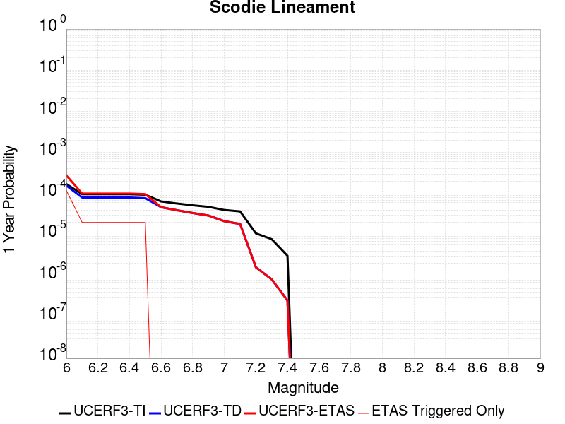 |  |

| Magnitude | 1 wk TI Prob | 1 wk TD Prob | 1 wk ETAS Prob | 1 wk ETAS/TD Gain | 1 wk ETAS Triggered Only | 1 mo TI Prob | 1 mo TD Prob | 1 mo ETAS Prob | 1 mo ETAS/TD Gain | 1 mo ETAS Triggered Only | 1 yr TI Prob | 1 yr TD Prob | 1 yr ETAS Prob | 1 yr ETAS/TD Gain | 1 yr ETAS Triggered Only | 10 yr TI Prob | 10 yr TD Prob | 10 yr ETAS Prob | 10 yr ETAS/TD Gain | 10 yr ETAS Triggered Only |
|-----|-----|-----|-----|-----|-----|-----|-----|-----|-----|-----|-----|-----|-----|-----|-----|-----|-----|-----|-----|-----|
| 6.0 | 3.2919327E-6 | 3.0133422E-6 | 1.2379322E-4 | 41.0817 | 1.2078024E-4 | 1.4108206E-5 | 1.2914278E-5 | 1.3369296E-4 | 10.352337 | 1.2078024E-4 | 1.7175387E-4 | 1.5722317E-4 | 2.7798442E-4 | 1.7680881 | 1.2078024E-4 | 0.0017162118 | 0.0015714309 | 0.0016920214 | 1.0767393 | 1.2078024E-4 |
| 6.1 | 1.8663811E-6 | 1.5490499E-6 | 3.1744064E-5 | 20.492601 | 3.019506E-5 | 7.998751E-6 | 6.6387715E-6 | 3.683363E-5 | 5.54826 | 3.019506E-5 | 9.738045E-5 | 8.082454E-5 | 1.1101716E-4 | 1.3735576 | 3.019506E-5 | 9.7337784E-4 | 8.080003E-4 | 8.3817093E-4 | 1.0373399 | 3.019506E-5 |
| 6.2 | 1.8663811E-6 | 1.5490499E-6 | 3.1744064E-5 | 20.492601 | 3.019506E-5 | 7.998751E-6 | 6.6387715E-6 | 3.683363E-5 | 5.54826 | 3.019506E-5 | 9.738045E-5 | 8.082454E-5 | 1.1101716E-4 | 1.3735576 | 3.019506E-5 | 9.7337784E-4 | 8.080003E-4 | 8.3817093E-4 | 1.0373399 | 3.019506E-5 |
| 6.3 | 1.8663811E-6 | 1.5490499E-6 | 3.1744064E-5 | 20.492601 | 3.019506E-5 | 7.998751E-6 | 6.6387715E-6 | 3.683363E-5 | 5.54826 | 3.019506E-5 | 9.738045E-5 | 8.082454E-5 | 1.1101716E-4 | 1.3735576 | 3.019506E-5 | 9.7337784E-4 | 8.080003E-4 | 8.3817093E-4 | 1.0373399 | 3.019506E-5 |
| 6.4 | 1.8663811E-6 | 1.5490499E-6 | 3.1744064E-5 | 20.492601 | 3.019506E-5 | 7.998751E-6 | 6.6387715E-6 | 3.683363E-5 | 5.54826 | 3.019506E-5 | 9.738045E-5 | 8.082454E-5 | 1.1101716E-4 | 1.3735576 | 3.019506E-5 | 9.7337784E-4 | 8.080003E-4 | 8.3817093E-4 | 1.0373399 | 3.019506E-5 |
| 6.5 | 1.8106311E-6 | 1.4909839E-6 | 3.1686E-5 | 21.251738 | 3.019506E-5 | 7.759824E-6 | 6.3899183E-6 | 3.6584785E-5 | 5.725392 | 3.019506E-5 | 9.447177E-5 | 7.7794975E-5 | 1.0798768E-4 | 1.3881062 | 3.019506E-5 | 9.4431615E-4 | 7.7772606E-4 | 8.0789765E-4 | 1.0387946 | 3.019506E-5 |
| 6.6 | 1.2414679E-6 | 8.997558E-7 | 8.997558E-7 | 1.0 | 0.0 | 5.320566E-6 | 3.856091E-6 | 3.856091E-6 | 1.0 | 0.0 | 6.477596E-5 | 4.6946985E-5 | 4.6946985E-5 | 1.0 | 0.0 | 6.475708E-4 | 4.693793E-4 | 4.693793E-4 | 1.0 | 0.0 |
| 6.7 | 1.1062215E-6 | 7.594311E-7 | 7.594311E-7 | 1.0 | 0.0 | 4.7409408E-6 | 3.2547011E-6 | 3.2547011E-6 | 1.0 | 0.0 | 5.7719422E-5 | 3.9625334E-5 | 3.9625334E-5 | 1.0 | 0.0 | 5.770443E-4 | 3.961897E-4 | 3.961897E-4 | 1.0 | 0.0 |
| 6.8 | 1.0006736E-6 | 6.500397E-7 | 6.500397E-7 | 1.0 | 0.0 | 4.288594E-6 | 2.7858816E-6 | 2.7858816E-6 | 1.0 | 0.0 | 5.221238E-5 | 3.3917644E-5 | 3.3917644E-5 | 1.0 | 0.0 | 5.220012E-4 | 3.3913075E-4 | 3.3913075E-4 | 1.0 | 0.0 |
| 6.9 | 9.167364E-7 | 5.631625E-7 | 5.631625E-7 | 1.0 | 0.0 | 3.9288643E-6 | 2.4135516E-6 | 2.4135516E-6 | 1.0 | 0.0 | 4.7832873E-5 | 2.9384651E-5 | 2.9384651E-5 | 1.0 | 0.0 | 4.782258E-4 | 2.9381333E-4 | 2.9381333E-4 | 1.0 | 0.0 |
| 7.0 | 7.6987664E-7 | 4.113383E-7 | 4.113383E-7 | 1.0 | 0.0 | 3.2994672E-6 | 1.7628774E-6 | 1.7628774E-6 | 1.0 | 0.0 | 4.0170275E-5 | 2.1462862E-5 | 2.1462862E-5 | 1.0 | 0.0 | 4.0163012E-4 | 2.1461173E-4 | 2.1461173E-4 | 1.0 | 0.0 |
| 7.1 | 7.1038727E-7 | 3.5211494E-7 | 3.5211494E-7 | 1.0 | 0.0 | 3.0445133E-6 | 1.5090633E-6 | 1.5090633E-6 | 1.0 | 0.0 | 3.706632E-5 | 1.8372726E-5 | 1.8372726E-5 | 1.0 | 0.0 | 3.7060137E-4 | 1.8371557E-4 | 1.8371557E-4 | 1.0 | 0.0 |
| 7.2 | 2.0799602E-7 | 3.1186854E-8 | 3.1186854E-8 | 1.0 | 0.0 | 8.914113E-7 | 1.3365793E-7 | 1.3365793E-7 | 1.0 | 0.0 | 1.0852878E-5 | 1.6272843E-6 | 1.6272843E-6 | 1.0 | 0.0 | 1.08523476E-4 | 1.627273E-5 | 1.627273E-5 | 1.0 | 0.0 |
| 7.3 | 1.5048182E-7 | 1.5945696E-8 | 1.5945696E-8 | 1.0 | 0.0 | 6.449219E-7 | 6.83387E-8 | 6.83387E-8 | 1.0 | 0.0 | 7.851896E-6 | 8.320234E-7 | 8.320234E-7 | 1.0 | 0.0 | 7.851618E-5 | 8.320206E-6 | 8.320206E-6 | 1.0 | 0.0 |
| 7.4 | 5.9334678E-8 | 4.8683537E-9 | 4.8683537E-9 | 1.0 | 0.0 | 2.5429145E-7 | 2.0864372E-8 | 2.0864372E-8 | 1.0 | 0.0 | 3.095994E-6 | 2.5402372E-7 | 2.5402372E-7 | 1.0 | 0.0 | 3.095951E-5 | 2.5402353E-6 | 2.5402353E-6 | 1.0 | 0.0 |

## San Andreas (North Branch Mill Creek)
*[(top)](#table-of-contents)*

| 1 Week | 1 Month | 1 Year | 10 Year |
|-----|-----|-----|-----|
|  |  |  |  |

| Magnitude | 1 wk TI Prob | 1 wk TD Prob | 1 wk ETAS Prob | 1 wk ETAS/TD Gain | 1 wk ETAS Triggered Only | 1 mo TI Prob | 1 mo TD Prob | 1 mo ETAS Prob | 1 mo ETAS/TD Gain | 1 mo ETAS Triggered Only | 1 yr TI Prob | 1 yr TD Prob | 1 yr ETAS Prob | 1 yr ETAS/TD Gain | 1 yr ETAS Triggered Only | 10 yr TI Prob | 10 yr TD Prob | 10 yr ETAS Prob | 10 yr ETAS/TD Gain | 10 yr ETAS Triggered Only |
|-----|-----|-----|-----|-----|-----|-----|-----|-----|-----|-----|-----|-----|-----|-----|-----|-----|-----|-----|-----|-----|
| 6.0 | 1.3461156E-5 | 2.3499893E-5 | 1.1408294E-4 | 4.8546157 | 9.058518E-5 | 5.7689394E-5 | 1.00709956E-4 | 1.9128602E-4 | 1.8993754 | 9.058518E-5 | 7.02142E-4 | 0.0012254574 | 0.0013460896 | 1.0984385 | 1.2078024E-4 | 0.0069992766 | 0.01222957 | 0.012348873 | 1.0097553 | 1.2078024E-4 |
| 6.1 | 1.3461156E-5 | 2.3499893E-5 | 1.1408294E-4 | 4.8546157 | 9.058518E-5 | 5.7689394E-5 | 1.00709956E-4 | 1.9128602E-4 | 1.8993754 | 9.058518E-5 | 7.02142E-4 | 0.0012254574 | 0.0013460896 | 1.0984385 | 1.2078024E-4 | 0.0069992766 | 0.01222957 | 0.012348873 | 1.0097553 | 1.2078024E-4 |
| 6.2 | 1.3461156E-5 | 2.3499893E-5 | 1.1408294E-4 | 4.8546157 | 9.058518E-5 | 5.7689394E-5 | 1.00709956E-4 | 1.9128602E-4 | 1.8993754 | 9.058518E-5 | 7.02142E-4 | 0.0012254574 | 0.0013460896 | 1.0984385 | 1.2078024E-4 | 0.0069992766 | 0.01222957 | 0.012348873 | 1.0097553 | 1.2078024E-4 |
| 6.3 | 1.3461156E-5 | 2.3499893E-5 | 1.1408294E-4 | 4.8546157 | 9.058518E-5 | 5.7689394E-5 | 1.00709956E-4 | 1.9128602E-4 | 1.8993754 | 9.058518E-5 | 7.02142E-4 | 0.0012254574 | 0.0013460896 | 1.0984385 | 1.2078024E-4 | 0.0069992766 | 0.01222957 | 0.012348873 | 1.0097553 | 1.2078024E-4 |
| 6.4 | 1.3461156E-5 | 2.3499893E-5 | 1.1408294E-4 | 4.8546157 | 9.058518E-5 | 5.7689394E-5 | 1.00709956E-4 | 1.9128602E-4 | 1.8993754 | 9.058518E-5 | 7.02142E-4 | 0.0012254574 | 0.0013460896 | 1.0984385 | 1.2078024E-4 | 0.0069992766 | 0.01222957 | 0.012348873 | 1.0097553 | 1.2078024E-4 |
| 6.5 | 1.3450706E-5 | 2.3488852E-5 | 1.140719E-4 | 4.856427 | 9.058518E-5 | 5.764461E-5 | 1.0066265E-4 | 1.9123871E-4 | 1.8997982 | 9.058518E-5 | 7.0159714E-4 | 0.001224882 | 0.0013455143 | 1.0984849 | 1.2078024E-4 | 0.006993862 | 0.01222388 | 0.012343183 | 1.0097599 | 1.2078024E-4 |
| 6.6 | 1.3074523E-5 | 2.3103135E-5 | 1.1368623E-4 | 4.9208136 | 9.058518E-5 | 5.6032466E-5 | 9.9009696E-5 | 1.8958592E-4 | 1.9148216 | 9.058518E-5 | 6.8198174E-4 | 0.0012047797 | 0.0013254144 | 1.1001301 | 1.2078024E-4 | 0.006798926 | 0.012025044 | 0.012144373 | 1.0099232 | 1.2078024E-4 |
| 6.7 | 1.3050216E-5 | 2.3078432E-5 | 1.13661525E-4 | 4.9250107 | 9.058518E-5 | 5.59283E-5 | 9.890384E-5 | 1.8948005E-4 | 1.9158009 | 9.058518E-5 | 6.8071426E-4 | 0.0012034923 | 0.0013241271 | 1.1002374 | 1.2078024E-4 | 0.0067863287 | 0.012012309 | 0.012131639 | 1.009934 | 1.2078024E-4 |
| 6.8 | 1.29049395E-5 | 2.292684E-5 | 1.13509945E-4 | 4.950963 | 9.058518E-5 | 5.530571E-5 | 9.825421E-5 | 1.8883048E-4 | 1.9218565 | 9.058518E-5 | 6.73139E-4 | 0.0011955918 | 0.0013162276 | 1.1009005 | 1.2078024E-4 | 0.0067110364 | 0.011934154 | 0.012053493 | 1.0099998 | 1.2078024E-4 |
| 6.9 | 1.2867369E-5 | 2.2886245E-5 | 1.1346935E-4 | 4.9579716 | 9.058518E-5 | 5.51447E-5 | 9.8080236E-5 | 1.8865653E-4 | 1.9234918 | 9.058518E-5 | 6.711799E-4 | 0.0011934759 | 0.001314112 | 1.1010796 | 1.2078024E-4 | 0.006691564 | 0.011913223 | 0.012032565 | 1.0100175 | 1.2078024E-4 |
| 7.0 | 1.2495996E-5 | 2.2286325E-5 | 1.12869486E-4 | 5.0645175 | 9.058518E-5 | 5.3553173E-5 | 9.550934E-5 | 1.8608588E-4 | 1.9483526 | 9.058518E-5 | 6.518148E-4 | 0.0011622087 | 0.0012828487 | 1.1038022 | 1.2078024E-4 | 0.0064990623 | 0.0116038285 | 0.011723207 | 1.0102879 | 1.2078024E-4 |
| 7.1 | 1.2452067E-5 | 2.2231397E-5 | 1.1281457E-4 | 5.07456 | 9.058518E-5 | 5.3364907E-5 | 9.527396E-5 | 1.8585051E-4 | 1.9506958 | 9.058518E-5 | 6.4952404E-4 | 0.0011593461 | 0.0012799862 | 1.1040589 | 1.2078024E-4 | 0.0064762887 | 0.0115755 | 0.011694882 | 1.0103134 | 1.2078024E-4 |
| 7.2 | 1.2002777E-5 | 2.1609963E-5 | 1.12193185E-4 | 5.1917343 | 9.058518E-5 | 5.143946E-5 | 9.2610855E-5 | 1.8318764E-4 | 1.9780364 | 9.058518E-5 | 6.2609545E-4 | 0.0011269567 | 0.0012476008 | 1.107053 | 1.2078024E-4 | 0.006243344 | 0.011254923 | 0.011374344 | 1.0106106 | 1.2078024E-4 |
| 7.3 | 1.1923425E-5 | 2.1479793E-5 | 1.12063026E-4 | 5.2171373 | 9.058518E-5 | 5.109939E-5 | 9.205302E-5 | 1.8262987E-4 | 1.9839638 | 9.058518E-5 | 6.219575E-4 | 0.001120172 | 0.0012408169 | 1.1077021 | 1.2078024E-4 | 0.0062021962 | 0.011187789 | 0.011307218 | 1.010675 | 1.2078024E-4 |
| 7.4 | 1.16105175E-5 | 2.0853771E-5 | 1.1143706E-4 | 5.3437366 | 9.058518E-5 | 4.975841E-5 | 8.937026E-5 | 1.7994734E-4 | 2.0135036 | 9.058518E-5 | 6.0564023E-4 | 0.0010875424 | 0.0012081913 | 1.1109372 | 1.2078024E-4 | 0.006039923 | 0.010865397 | 0.010984864 | 1.0109953 | 1.2078024E-4 |
| 7.5 | 1.1037265E-5 | 1.9553907E-5 | 1.1013731E-4 | 5.632497 | 9.058518E-5 | 4.7301706E-5 | 8.379978E-5 | 1.7437738E-4 | 2.0808809 | 9.058518E-5 | 5.757461E-4 | 0.0010197869 | 0.0011404441 | 1.1183159 | 1.2078024E-4 | 0.005742567 | 0.010194898 | 0.010314447 | 1.0117264 | 1.2078024E-4 |
| 7.6 | 1.0720915E-5 | 1.899582E-5 | 1.09579276E-4 | 5.7686 | 9.058518E-5 | 4.5945973E-5 | 8.140812E-5 | 1.7198593E-4 | 2.1126385 | 9.058518E-5 | 5.592486E-4 | 9.906954E-4 | 0.001111356 | 1.1217939 | 1.2078024E-4 | 0.005578433 | 0.009906623 | 0.010026206 | 1.0120711 | 1.2078024E-4 |
| 7.7 | 9.276279E-6 | 1.6441649E-5 | 1.0702534E-4 | 6.509404 | 9.058518E-5 | 3.9754876E-5 | 7.0462316E-5 | 1.6104111E-4 | 2.285493 | 9.058518E-5 | 4.839081E-4 | 8.575427E-4 | 9.782193E-4 | 1.1407238 | 1.2078024E-4 | 0.0048285574 | 0.008586041 | 0.008705785 | 1.0139463 | 1.2078024E-4 |
| 7.8 | 5.8346777E-6 | 1.1155013E-5 | 1.01739184E-4 | 9.120489 | 9.058518E-5 | 2.5005522E-5 | 4.7806327E-5 | 1.3838717E-4 | 2.894746 | 9.058518E-5 | 3.043997E-4 | 5.818867E-4 | 7.025966E-4 | 1.2074459 | 1.2078024E-4 | 0.0030398308 | 0.0058469265 | 0.0059670005 | 1.0205363 | 1.2078024E-4 |
| 7.9 | 4.690204E-6 | 8.509093E-6 | 9.90935E-5 | 11.6456 | 9.058518E-5 | 2.0100719E-5 | 3.6467034E-5 | 1.2704892E-4 | 3.4839387 | 9.058518E-5 | 2.4469878E-4 | 4.4389578E-4 | 5.646224E-4 | 1.2719706 | 1.2078024E-4 | 0.002444295 | 0.0044707474 | 0.0045909877 | 1.0268949 | 1.2078024E-4 |
| 8.0 | 2.9570454E-6 | 4.846947E-6 | 6.5236774E-5 | 13.459354 | 6.039012E-5 | 1.267299E-5 | 2.0772464E-5 | 8.116133E-5 | 3.9071596 | 6.039012E-5 | 1.5428272E-4 | 2.5287544E-4 | 3.132503E-4 | 1.2387533 | 6.039012E-5 | 0.0015417566 | 0.002549644 | 0.0026098804 | 1.0236254 | 6.039012E-5 |
| 8.1 | 1.6376824E-6 | 2.1968929E-6 | 2.1968929E-6 | 1.0 | 0.0 | 7.01862E-6 | 9.41522E-6 | 9.41522E-6 | 1.0 | 0.0 | 8.544835E-5 | 1.14624294E-4 | 1.14624294E-4 | 1.0 | 0.0 | 8.54155E-4 | 0.0011606582 | 0.0011606582 | 1.0 | 0.0 |
| 8.2 | 6.9631557E-7 | 4.5360213E-7 | 4.5360213E-7 | 1.0 | 0.0 | 2.984206E-6 | 1.9440076E-6 | 1.9440076E-6 | 1.0 | 0.0 | 3.63321E-5 | 2.3668037E-5 | 2.3668037E-5 | 1.0 | 0.0 | 3.6326164E-4 | 2.451564E-4 | 2.451564E-4 | 1.0 | 0.0 |
| 8.3 | 1.7876137E-7 | 8.360375E-8 | 8.360375E-8 | 1.0 | 0.0 | 7.661199E-7 | 3.5830175E-7 | 3.5830175E-7 | 1.0 | 0.0 | 9.32747E-6 | 4.3623154E-6 | 4.3623154E-6 | 1.0 | 0.0 | 9.3270784E-5 | 4.5817014E-5 | 4.5817014E-5 | 1.0 | 0.0 |

## Ludlow
*[(top)](#table-of-contents)*

| 1 Week | 1 Month | 1 Year | 10 Year |
|-----|-----|-----|-----|
|  |  |  |  |

| Magnitude | 1 wk TI Prob | 1 wk TD Prob | 1 wk ETAS Prob | 1 wk ETAS/TD Gain | 1 wk ETAS Triggered Only | 1 mo TI Prob | 1 mo TD Prob | 1 mo ETAS Prob | 1 mo ETAS/TD Gain | 1 mo ETAS Triggered Only | 1 yr TI Prob | 1 yr TD Prob | 1 yr ETAS Prob | 1 yr ETAS/TD Gain | 1 yr ETAS Triggered Only | 10 yr TI Prob | 10 yr TD Prob | 10 yr ETAS Prob | 10 yr ETAS/TD Gain | 10 yr ETAS Triggered Only |
|-----|-----|-----|-----|-----|-----|-----|-----|-----|-----|-----|-----|-----|-----|-----|-----|-----|-----|-----|-----|-----|
| 6.0 | 2.2407607E-5 | 2.3657254E-5 | 1.1424029E-4 | 4.828975 | 9.058518E-5 | 9.602906E-5 | 1.0138454E-4 | 2.2215254E-4 | 2.1911876 | 1.2078024E-4 | 0.0011685267 | 0.001233702 | 0.0013543331 | 1.0977799 | 1.2078024E-4 | 0.011624013 | 0.012273042 | 0.01239234 | 1.0097203 | 1.2078024E-4 |
| 6.1 | 2.2407607E-5 | 2.3657254E-5 | 1.1424029E-4 | 4.828975 | 9.058518E-5 | 9.602906E-5 | 1.0138454E-4 | 2.2215254E-4 | 2.1911876 | 1.2078024E-4 | 0.0011685267 | 0.001233702 | 0.0013543331 | 1.0977799 | 1.2078024E-4 | 0.011624013 | 0.012273042 | 0.01239234 | 1.0097203 | 1.2078024E-4 |
| 6.2 | 1.0781252E-5 | 1.1365663E-5 | 1.1365663E-5 | 1.0 | 0.0 | 4.620455E-5 | 4.8709102E-5 | 7.890269E-5 | 1.6198758 | 3.019506E-5 | 5.623952E-4 | 5.9287593E-4 | 6.230531E-4 | 1.0508996 | 3.019506E-5 | 0.00560974 | 0.0059133614 | 0.005943378 | 1.005076 | 3.019506E-5 |
| 6.3 | 1.0781252E-5 | 1.1365663E-5 | 1.1365663E-5 | 1.0 | 0.0 | 4.620455E-5 | 4.8709102E-5 | 7.890269E-5 | 1.6198758 | 3.019506E-5 | 5.623952E-4 | 5.9287593E-4 | 6.230531E-4 | 1.0508996 | 3.019506E-5 | 0.00560974 | 0.0059133614 | 0.005943378 | 1.005076 | 3.019506E-5 |
| 6.4 | 7.814439E-6 | 8.237729E-6 | 8.237729E-6 | 1.0 | 0.0 | 3.3490025E-5 | 3.530408E-5 | 6.5498076E-5 | 1.855255 | 3.019506E-5 | 4.0766477E-4 | 4.2974384E-4 | 4.599259E-4 | 1.0702327 | 3.019506E-5 | 0.0040691774 | 0.0042892746 | 0.00431934 | 1.0070095 | 3.019506E-5 |
| 6.5 | 6.4986366E-6 | 6.85092E-6 | 6.85092E-6 | 1.0 | 0.0 | 2.7851002E-5 | 2.9360759E-5 | 5.955493E-5 | 2.0283854 | 3.019506E-5 | 3.390332E-4 | 3.5740953E-4 | 3.875938E-4 | 1.0844529 | 3.019506E-5 | 0.003385164 | 0.0035684432 | 0.0035985305 | 1.0084316 | 3.019506E-5 |
| 6.6 | 5.582177E-6 | 5.8860055E-6 | 5.8860055E-6 | 1.0 | 0.0 | 2.3923398E-5 | 2.5225498E-5 | 5.5419798E-5 | 2.1969752 | 3.019506E-5 | 2.9122844E-4 | 3.0707786E-4 | 3.3726366E-4 | 1.0983001 | 3.019506E-5 | 0.0029084706 | 0.003066609 | 0.0030967114 | 1.0098162 | 3.019506E-5 |
| 6.7 | 4.6858763E-6 | 4.940427E-6 | 4.940427E-6 | 1.0 | 0.0 | 2.0082172E-5 | 2.1173091E-5 | 2.1173091E-5 | 1.0 | 0.0 | 2.4447302E-4 | 2.5775246E-4 | 2.5775246E-4 | 1.0 | 0.0 | 0.0024420423 | 0.0025745912 | 0.0025745912 | 1.0 | 0.0 |
| 6.8 | 3.5584908E-6 | 3.7520183E-6 | 3.7520183E-6 | 1.0 | 0.0 | 1.5250586E-5 | 1.6079981E-5 | 1.6079981E-5 | 1.0 | 0.0 | 1.8566006E-4 | 1.957566E-4 | 1.957566E-4 | 1.0 | 0.0 | 0.0018550502 | 0.0019558826 | 0.0019558826 | 1.0 | 0.0 |
| 6.9 | 2.532834E-6 | 2.6710034E-6 | 2.6710034E-6 | 1.0 | 0.0 | 1.0854958E-5 | 1.1447109E-5 | 1.1447109E-5 | 1.0 | 0.0 | 1.3215111E-4 | 1.3935992E-4 | 1.3935992E-4 | 1.0 | 0.0 | 0.0013207254 | 0.0013927529 | 0.0013927529 | 1.0 | 0.0 |
| 7.0 | 1.7083285E-6 | 1.8019439E-6 | 1.8019439E-6 | 1.0 | 0.0 | 7.3213873E-6 | 7.722595E-6 | 7.722595E-6 | 1.0 | 0.0 | 8.913424E-5 | 9.40187E-5 | 9.40187E-5 | 1.0 | 0.0 | 8.9098496E-4 | 9.3980576E-4 | 9.3980576E-4 | 1.0 | 0.0 |
| 7.1 | 1.0905424E-6 | 1.1497619E-6 | 1.1497619E-6 | 1.0 | 0.0 | 4.6737446E-6 | 4.9275427E-6 | 4.9275427E-6 | 1.0 | 0.0 | 5.6901354E-5 | 5.999128E-5 | 5.999128E-5 | 1.0 | 0.0 | 5.6886784E-4 | 5.997606E-4 | 5.997606E-4 | 1.0 | 0.0 |
| 7.2 | 6.06668E-7 | 6.387277E-7 | 6.387277E-7 | 1.0 | 0.0 | 2.600003E-6 | 2.7374022E-6 | 2.7374022E-6 | 1.0 | 0.0 | 3.1654577E-5 | 3.3327433E-5 | 3.3327433E-5 | 1.0 | 0.0 | 3.1650066E-4 | 3.3323118E-4 | 3.3323118E-4 | 1.0 | 0.0 |

## San Andreas (Cholame) rev
*[(top)](#table-of-contents)*

| 1 Week | 1 Month | 1 Year | 10 Year |
|-----|-----|-----|-----|
|  |  |  |  |

| Magnitude | 1 wk TI Prob | 1 wk TD Prob | 1 wk ETAS Prob | 1 wk ETAS/TD Gain | 1 wk ETAS Triggered Only | 1 mo TI Prob | 1 mo TD Prob | 1 mo ETAS Prob | 1 mo ETAS/TD Gain | 1 mo ETAS Triggered Only | 1 yr TI Prob | 1 yr TD Prob | 1 yr ETAS Prob | 1 yr ETAS/TD Gain | 1 yr ETAS Triggered Only | 10 yr TI Prob | 10 yr TD Prob | 10 yr ETAS Prob | 10 yr ETAS/TD Gain | 10 yr ETAS Triggered Only |
|-----|-----|-----|-----|-----|-----|-----|-----|-----|-----|-----|-----|-----|-----|-----|-----|-----|-----|-----|-----|-----|
| 6.0 | 1.2302514E-4 | 2.5204287E-4 | 3.7279268E-4 | 1.4790844 | 1.2078024E-4 | 5.27144E-4 | 0.0010797381 | 0.0012003881 | 1.1117399 | 1.2078024E-4 | 0.0063991086 | 0.0130670825 | 0.013186284 | 1.0091223 | 1.2078024E-4 | 0.06217949 | 0.12439073 | 0.12449648 | 1.0008502 | 1.2078024E-4 |
| 6.1 | 1.2302514E-4 | 2.5204287E-4 | 3.7279268E-4 | 1.4790844 | 1.2078024E-4 | 5.27144E-4 | 0.0010797381 | 0.0012003881 | 1.1117399 | 1.2078024E-4 | 0.0063991086 | 0.0130670825 | 0.013186284 | 1.0091223 | 1.2078024E-4 | 0.06217949 | 0.12439073 | 0.12449648 | 1.0008502 | 1.2078024E-4 |
| 6.2 | 1.2203569E-4 | 2.5021084E-4 | 3.7096086E-4 | 1.482593 | 1.2078024E-4 | 5.2290526E-4 | 0.0010718931 | 0.0011925439 | 1.1125586 | 1.2078024E-4 | 0.006347804 | 0.01297271 | 0.013091923 | 1.0091896 | 1.2078024E-4 | 0.061695136 | 0.12357691 | 0.12368276 | 1.0008566 | 1.2078024E-4 |
| 6.3 | 1.2142645E-4 | 2.4907055E-4 | 3.6982071E-4 | 1.484803 | 1.2078024E-4 | 5.202953E-4 | 0.0010670102 | 0.0011876615 | 1.1130742 | 1.2078024E-4 | 0.006316212 | 0.012913967 | 0.013033187 | 1.0092319 | 1.2078024E-4 | 0.06139677 | 0.12307103 | 0.12317695 | 1.0008606 | 1.2078024E-4 |
| 6.4 | 1.1865206E-4 | 2.44126E-4 | 3.6487676E-4 | 1.4946247 | 1.2078024E-4 | 5.0840975E-4 | 0.0010458364 | 0.0011664903 | 1.115366 | 1.2078024E-4 | 0.006172335 | 0.012659196 | 0.012778448 | 1.0094202 | 1.2078024E-4 | 0.060036868 | 0.1208638 | 0.12096999 | 1.0008786 | 1.2078024E-4 |
| 6.5 | 1.17443946E-4 | 2.4205919E-4 | 3.6281018E-4 | 1.498849 | 1.2078024E-4 | 5.032341E-4 | 0.0010369857 | 0.0011576407 | 1.1163516 | 1.2078024E-4 | 0.006109677 | 0.012552682 | 0.012671947 | 1.0095011 | 1.2078024E-4 | 0.059444077 | 0.11993805 | 0.12004435 | 1.0008862 | 1.2078024E-4 |
| 6.6 | 1.13579066E-4 | 2.3514954E-4 | 3.5590137E-4 | 1.5135108 | 1.2078024E-4 | 4.866766E-4 | 0.001007396 | 0.0011280546 | 1.1197727 | 1.2078024E-4 | 0.0059092017 | 0.012196515 | 0.012315822 | 1.0097821 | 1.2078024E-4 | 0.057545185 | 0.11685214 | 0.11695881 | 1.0009128 | 1.2078024E-4 |
| 6.7 | 1.1271412E-4 | 2.3359268E-4 | 3.5434472E-4 | 1.5169342 | 1.2078024E-4 | 4.829711E-4 | 0.0010007289 | 0.0011213883 | 1.1205715 | 1.2078024E-4 | 0.005864331 | 0.012116249 | 0.012235565 | 1.0098476 | 1.2078024E-4 | 0.057119697 | 0.116155714 | 0.116262466 | 1.000919 | 1.2078024E-4 |
| 6.8 | 1.1217975E-4 | 2.3247694E-4 | 3.5322912E-4 | 1.5194156 | 1.2078024E-4 | 4.8068175E-4 | 9.959509E-4 | 0.0011166108 | 1.1211505 | 1.2078024E-4 | 0.005836608 | 0.012058721 | 0.012178045 | 1.0098952 | 1.2078024E-4 | 0.056856725 | 0.11565396 | 0.11576077 | 1.0009235 | 1.2078024E-4 |
| 6.9 | 1.1146753E-4 | 2.3096445E-4 | 3.517168E-4 | 1.5228179 | 1.2078024E-4 | 4.7763053E-4 | 9.894737E-4 | 0.0011101344 | 1.1219443 | 1.2078024E-4 | 0.0057996577 | 0.011980731 | 0.012100065 | 1.0099604 | 1.2078024E-4 | 0.056506127 | 0.11497439 | 0.11508128 | 1.0009297 | 1.2078024E-4 |
| 7.0 | 1.0965793E-4 | 2.2719789E-4 | 3.479507E-4 | 1.5314873 | 1.2078024E-4 | 4.698779E-4 | 9.733434E-4 | 0.0010940061 | 1.1239672 | 1.2078024E-4 | 0.005705768 | 0.011786487 | 0.011905843 | 1.0101266 | 1.2078024E-4 | 0.055614736 | 0.11327597 | 0.11338306 | 1.0009454 | 1.2078024E-4 |
| 7.1 | 9.927982E-5 | 2.0538924E-4 | 3.2614465E-4 | 1.5879346 | 1.2078024E-4 | 4.2541555E-4 | 8.7994366E-4 | 0.0010006176 | 1.1371382 | 1.2078024E-4 | 0.0051671406 | 0.010660981 | 0.010780473 | 1.0112084 | 1.2078024E-4 | 0.05048634 | 0.1033706 | 0.10347889 | 1.0010476 | 1.2078024E-4 |
| 7.2 | 9.696786E-5 | 2.0043184E-4 | 3.2118786E-4 | 1.6024793 | 1.2078024E-4 | 4.1551032E-4 | 8.5871184E-4 | 9.793884E-4 | 1.140532 | 1.2078024E-4 | 0.00504711 | 0.010404981 | 0.010524504 | 1.0114871 | 1.2078024E-4 | 0.04934009 | 0.1011086 | 0.101217166 | 1.0010738 | 1.2078024E-4 |
| 7.3 | 9.4727984E-5 | 1.9472468E-4 | 3.1548142E-4 | 1.6201408 | 1.2078024E-4 | 4.0591392E-4 | 8.3426846E-4 | 9.549479E-4 | 1.1446531 | 1.2078024E-4 | 0.0049308087 | 0.010110183 | 0.010229742 | 1.0118256 | 1.2078024E-4 | 0.048228268 | 0.09847952 | 0.0985884 | 1.0011057 | 1.2078024E-4 |
| 7.4 | 9.220358E-5 | 1.8843076E-4 | 3.0918824E-4 | 1.6408587 | 1.2078024E-4 | 3.9509835E-4 | 8.073114E-4 | 9.279941E-4 | 1.1494873 | 1.2078024E-4 | 0.004799717 | 0.009784967 | 0.009904565 | 1.0122226 | 1.2078024E-4 | 0.046973653 | 0.095557496 | 0.09566674 | 1.0011432 | 1.2078024E-4 |
| 7.5 | 7.71631E-5 | 1.5177966E-4 | 2.4235109E-4 | 1.5967296 | 9.058518E-5 | 3.306571E-4 | 6.503223E-4 | 7.4084854E-4 | 1.1392021 | 9.058518E-5 | 0.0040183207 | 0.007889002 | 0.007978871 | 1.0113919 | 9.058518E-5 | 0.03946433 | 0.07828531 | 0.0783688 | 1.0010666 | 9.058518E-5 |
| 7.6 | 7.5634416E-5 | 1.483744E-4 | 2.3894613E-4 | 1.610427 | 9.058518E-5 | 3.241072E-4 | 6.3573546E-4 | 7.2626304E-4 | 1.1423982 | 9.058518E-5 | 0.0039388672 | 0.0077126776 | 0.007802564 | 1.0116544 | 9.058518E-5 | 0.038697794 | 0.07664872 | 0.07673236 | 1.0010912 | 9.058518E-5 |
| 7.7 | 6.3783E-5 | 1.235872E-4 | 1.5377853E-4 | 1.2442917 | 3.019506E-5 | 2.7332708E-4 | 5.29552E-4 | 5.5973104E-4 | 1.0569898 | 3.019506E-5 | 0.0033226798 | 0.0064282627 | 0.0064582634 | 1.004667 | 3.019506E-5 | 0.032734364 | 0.06454029 | 0.06456854 | 1.0004376 | 3.019506E-5 |
| 7.8 | 5.863422E-5 | 1.1416107E-4 | 1.4435269E-4 | 1.2644651 | 3.019506E-5 | 2.512653E-4 | 4.8917E-4 | 5.1935035E-4 | 1.0616969 | 3.019506E-5 | 0.003054864 | 0.0059394026 | 0.005969418 | 1.0050536 | 3.019506E-5 | 0.030132094 | 0.059659187 | 0.05968758 | 1.0004759 | 3.019506E-5 |
| 7.9 | 4.595283E-5 | 8.426331E-5 | 1.1445583E-4 | 1.3583115 | 3.019506E-5 | 1.9692584E-4 | 3.610785E-4 | 3.9126267E-4 | 1.0835944 | 3.019506E-5 | 0.0023949358 | 0.0043872762 | 0.004417339 | 1.0068523 | 3.019506E-5 | 0.023692891 | 0.044362005 | 0.04439086 | 1.0006504 | 3.019506E-5 |
| 8.0 | 3.2950178E-5 | 5.0772942E-5 | 8.096647E-5 | 1.5946776 | 3.019506E-5 | 1.412074E-4 | 2.1758018E-4 | 2.4776868E-4 | 1.1387465 | 3.019506E-5 | 0.0017178444 | 0.0026458222 | 0.0026759375 | 1.0113821 | 3.019506E-5 | 0.017046256 | 0.027180137 | 0.027209511 | 1.0010808 | 3.019506E-5 |
| 8.1 | 1.9177472E-5 | 1.9185145E-5 | 1.9185145E-5 | 1.0 | 0.0 | 8.218658E-5 | 8.221946E-5 | 8.221946E-5 | 1.0 | 0.0 | 0.0010001622 | 0.0010005629 | 0.0010005629 | 1.0 | 0.0 | 0.009956728 | 0.010758142 | 0.010758142 | 1.0 | 0.0 |
| 8.2 | 8.643924E-6 | 5.4748625E-6 | 5.4748625E-6 | 1.0 | 0.0 | 3.704486E-5 | 2.3463486E-5 | 2.3463486E-5 | 1.0 | 0.0 | 4.5092785E-4 | 2.8563058E-4 | 2.8563058E-4 | 1.0 | 0.0 | 0.0045001395 | 0.0032487072 | 0.0032487072 | 1.0 | 0.0 |
| 8.3 | 1.983087E-6 | 7.6599065E-7 | 7.6599065E-7 | 1.0 | 0.0 | 8.498917E-6 | 3.282813E-6 | 3.282813E-6 | 1.0 | 0.0 | 1.034694E-4 | 3.9967534E-5 | 3.9967534E-5 | 1.0 | 0.0 | 0.0010342124 | 4.719687E-4 | 4.719687E-4 | 1.0 | 0.0 |

## Sierra Nevada  (No Extension)
*[(top)](#table-of-contents)*

| 1 Week | 1 Month | 1 Year | 10 Year |
|-----|-----|-----|-----|
|  |  |  |  |

| Magnitude | 1 wk TI Prob | 1 wk TD Prob | 1 wk ETAS Prob | 1 wk ETAS/TD Gain | 1 wk ETAS Triggered Only | 1 mo TI Prob | 1 mo TD Prob | 1 mo ETAS Prob | 1 mo ETAS/TD Gain | 1 mo ETAS Triggered Only | 1 yr TI Prob | 1 yr TD Prob | 1 yr ETAS Prob | 1 yr ETAS/TD Gain | 1 yr ETAS Triggered Only | 10 yr TI Prob | 10 yr TD Prob | 10 yr ETAS Prob | 10 yr ETAS/TD Gain | 10 yr ETAS Triggered Only |
|-----|-----|-----|-----|-----|-----|-----|-----|-----|-----|-----|-----|-----|-----|-----|-----|-----|-----|-----|-----|-----|
| 6.0 | 7.7690465E-6 | 6.976322E-6 | 9.756087E-5 | 13.984571 | 9.058518E-5 | 3.329549E-5 | 2.9898381E-5 | 1.5067501E-4 | 5.039571 | 1.2078024E-4 | 4.0529718E-4 | 3.6398784E-4 | 4.8472412E-4 | 1.3317041 | 1.2078024E-4 | 0.004045588 | 0.0036374326 | 0.0037577737 | 1.033084 | 1.2078024E-4 |
| 6.1 | 7.7690465E-6 | 6.976322E-6 | 9.756087E-5 | 13.984571 | 9.058518E-5 | 3.329549E-5 | 2.9898381E-5 | 1.5067501E-4 | 5.039571 | 1.2078024E-4 | 4.0529718E-4 | 3.6398784E-4 | 4.8472412E-4 | 1.3317041 | 1.2078024E-4 | 0.004045588 | 0.0036374326 | 0.0037577737 | 1.033084 | 1.2078024E-4 |
| 6.2 | 7.7690465E-6 | 6.976322E-6 | 9.756087E-5 | 13.984571 | 9.058518E-5 | 3.329549E-5 | 2.9898381E-5 | 1.5067501E-4 | 5.039571 | 1.2078024E-4 | 4.0529718E-4 | 3.6398784E-4 | 4.8472412E-4 | 1.3317041 | 1.2078024E-4 | 0.004045588 | 0.0036374326 | 0.0037577737 | 1.033084 | 1.2078024E-4 |
| 6.3 | 7.7690465E-6 | 6.976322E-6 | 9.756087E-5 | 13.984571 | 9.058518E-5 | 3.329549E-5 | 2.9898381E-5 | 1.5067501E-4 | 5.039571 | 1.2078024E-4 | 4.0529718E-4 | 3.6398784E-4 | 4.8472412E-4 | 1.3317041 | 1.2078024E-4 | 0.004045588 | 0.0036374326 | 0.0037577737 | 1.033084 | 1.2078024E-4 |
| 6.4 | 7.7690465E-6 | 6.976322E-6 | 9.756087E-5 | 13.984571 | 9.058518E-5 | 3.329549E-5 | 2.9898381E-5 | 1.5067501E-4 | 5.039571 | 1.2078024E-4 | 4.0529718E-4 | 3.6398784E-4 | 4.8472412E-4 | 1.3317041 | 1.2078024E-4 | 0.004045588 | 0.0036374326 | 0.0037577737 | 1.033084 | 1.2078024E-4 |
| 6.5 | 7.7690465E-6 | 6.976322E-6 | 9.756087E-5 | 13.984571 | 9.058518E-5 | 3.329549E-5 | 2.9898381E-5 | 1.5067501E-4 | 5.039571 | 1.2078024E-4 | 4.0529718E-4 | 3.6398784E-4 | 4.8472412E-4 | 1.3317041 | 1.2078024E-4 | 0.004045588 | 0.0036374326 | 0.0037577737 | 1.033084 | 1.2078024E-4 |
| 6.6 | 2.653E-6 | 1.614854E-6 | 6.2004874E-5 | 38.396584 | 6.039012E-5 | 1.136995E-5 | 6.9207845E-6 | 6.731049E-5 | 9.725846 | 6.039012E-5 | 1.3842035E-4 | 8.425733E-5 | 1.4464236E-4 | 1.716674 | 6.039012E-5 | 0.0013833415 | 8.422573E-4 | 9.025965E-4 | 1.0716399 | 6.039012E-5 |
| 6.7 | 2.5902466E-6 | 1.5501876E-6 | 6.194021E-5 | 39.956593 | 6.039012E-5 | 1.11010095E-5 | 6.643644E-6 | 6.703336E-5 | 10.0898485 | 6.039012E-5 | 1.351464E-4 | 8.0883394E-5 | 1.4126863E-4 | 1.7465715 | 6.039012E-5 | 0.0013506424 | 8.0854254E-4 | 8.688838E-4 | 1.0746297 | 6.039012E-5 |
| 6.8 | 2.5853892E-6 | 1.5469877E-6 | 6.193701E-5 | 40.03717 | 6.039012E-5 | 1.1080193E-5 | 6.629931E-6 | 6.701965E-5 | 10.10865 | 6.039012E-5 | 1.34893E-4 | 8.071645E-5 | 1.411017E-4 | 1.7481158 | 6.039012E-5 | 0.0013481114 | 8.068743E-4 | 8.672157E-4 | 1.0747842 | 6.039012E-5 |
| 6.9 | 2.458257E-6 | 1.4220619E-6 | 6.18121E-5 | 43.466526 | 6.039012E-5 | 1.0535345E-5 | 6.094537E-6 | 6.648429E-5 | 10.9088335 | 6.039012E-5 | 1.2826028E-4 | 7.4198484E-5 | 1.3458412E-4 | 1.8138393 | 6.039012E-5 | 0.0012818627 | 7.4173906E-4 | 8.020844E-4 | 1.0813565 | 6.039012E-5 |
| 7.0 | 2.4341468E-6 | 1.3990258E-6 | 6.178906E-5 | 44.165775 | 6.039012E-5 | 1.0432016E-5 | 5.9958115E-6 | 6.638557E-5 | 11.071991 | 6.039012E-5 | 1.270024E-4 | 7.2996576E-5 | 1.3338229E-4 | 1.8272403 | 6.039012E-5 | 0.0012692984 | 7.297279E-4 | 7.9007394E-4 | 1.0826967 | 6.039012E-5 |
| 7.1 | 2.3652476E-6 | 1.3339754E-6 | 6.1724015E-5 | 46.27073 | 6.039012E-5 | 1.0136736E-5 | 5.717025E-6 | 6.61068E-5 | 11.563147 | 6.039012E-5 | 1.2340778E-4 | 6.9602575E-5 | 1.2998849E-4 | 1.8675816 | 6.039012E-5 | 0.0012333926 | 6.9580943E-4 | 7.5615756E-4 | 1.0867308 | 6.039012E-5 |
| 7.2 | 2.272158E-6 | 1.2502821E-6 | 6.164033E-5 | 49.301132 | 6.039012E-5 | 9.737784E-6 | 5.3583412E-6 | 6.5748136E-5 | 12.270241 | 6.039012E-5 | 1.1855107E-4 | 6.5235865E-5 | 1.2562204E-4 | 1.9256592 | 6.039012E-5 | 0.0011848784 | 6.5216864E-4 | 7.125194E-4 | 1.0925386 | 6.039012E-5 |
| 7.3 | 2.1382127E-6 | 1.1419703E-6 | 6.1532024E-5 | 53.88233 | 6.039012E-5 | 9.163737E-6 | 4.8941492E-6 | 6.528397E-5 | 13.339188 | 6.039012E-5 | 1.1156279E-4 | 5.958465E-5 | 1.1997117E-4 | 2.0134578 | 6.039012E-5 | 0.001115068 | 5.956879E-4 | 6.560421E-4 | 1.1013184 | 6.039012E-5 |
| 7.4 | 1.9048055E-6 | 9.575242E-7 | 9.575242E-7 | 1.0 | 0.0 | 8.163426E-6 | 4.1036687E-6 | 4.1036687E-6 | 1.0 | 0.0 | 9.9385186E-5 | 4.996103E-5 | 4.996103E-5 | 1.0 | 0.0 | 9.934074E-4 | 4.994987E-4 | 4.994987E-4 | 1.0 | 0.0 |
| 7.5 | 1.5373403E-6 | 7.560042E-7 | 7.560042E-7 | 1.0 | 0.0 | 6.5885843E-6 | 3.2400142E-6 | 3.2400142E-6 | 1.0 | 0.0 | 8.021306E-5 | 3.9446462E-5 | 3.9446462E-5 | 1.0 | 0.0 | 8.0184115E-4 | 3.943951E-4 | 3.943951E-4 | 1.0 | 0.0 |
| 7.6 | 1.0680322E-6 | 4.6596554E-7 | 4.6596554E-7 | 1.0 | 0.0 | 4.577273E-6 | 1.9969937E-6 | 1.9969937E-6 | 1.0 | 0.0 | 5.5726876E-5 | 2.4313129E-5 | 2.4313129E-5 | 1.0 | 0.0 | 5.5712904E-4 | 2.4310495E-4 | 2.4310495E-4 | 1.0 | 0.0 |
| 7.7 | 5.509146E-7 | 1.5580486E-7 | 1.5580486E-7 | 1.0 | 0.0 | 2.3610605E-6 | 6.677349E-7 | 6.677349E-7 | 1.0 | 0.0 | 2.8745531E-5 | 8.129644E-6 | 8.129644E-6 | 1.0 | 0.0 | 2.8741814E-4 | 8.1293576E-5 | 8.1293576E-5 | 1.0 | 0.0 |

## San Jacinto (San Bernardino)
*[(top)](#table-of-contents)*

| 1 Week | 1 Month | 1 Year | 10 Year |
|-----|-----|-----|-----|
|  |  | 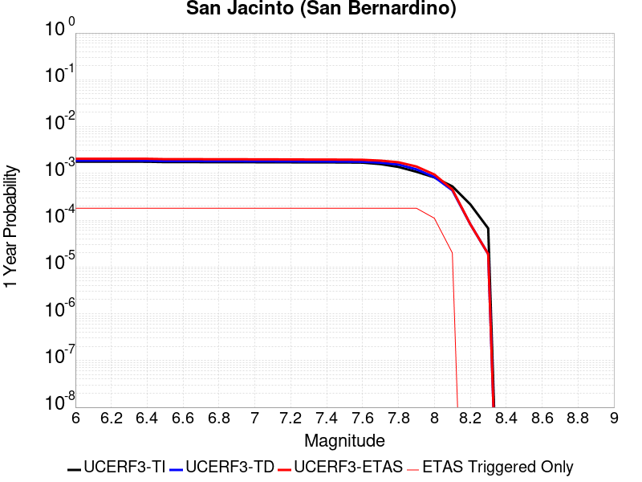 |  |

| Magnitude | 1 wk TI Prob | 1 wk TD Prob | 1 wk ETAS Prob | 1 wk ETAS/TD Gain | 1 wk ETAS Triggered Only | 1 mo TI Prob | 1 mo TD Prob | 1 mo ETAS Prob | 1 mo ETAS/TD Gain | 1 mo ETAS Triggered Only | 1 yr TI Prob | 1 yr TD Prob | 1 yr ETAS Prob | 1 yr ETAS/TD Gain | 1 yr ETAS Triggered Only | 10 yr TI Prob | 10 yr TD Prob | 10 yr ETAS Prob | 10 yr ETAS/TD Gain | 10 yr ETAS Triggered Only |
|-----|-----|-----|-----|-----|-----|-----|-----|-----|-----|-----|-----|-----|-----|-----|-----|-----|-----|-----|-----|-----|
| 6.0 | 3.409352E-5 | 3.5986508E-5 | 1.567624E-4 | 4.3561435 | 1.2078024E-4 | 1.461069E-4 | 1.542188E-4 | 2.749804E-4 | 1.7830538 | 1.2078024E-4 | 0.0017774 | 0.0018759987 | 0.0019965523 | 1.0642611 | 1.2078024E-4 | 0.01763251 | 0.019349935 | 0.019468378 | 1.0061212 | 1.2078024E-4 |
| 6.1 | 3.409352E-5 | 3.5986508E-5 | 1.567624E-4 | 4.3561435 | 1.2078024E-4 | 1.461069E-4 | 1.542188E-4 | 2.749804E-4 | 1.7830538 | 1.2078024E-4 | 0.0017774 | 0.0018759987 | 0.0019965523 | 1.0642611 | 1.2078024E-4 | 0.01763251 | 0.019349935 | 0.019468378 | 1.0061212 | 1.2078024E-4 |
| 6.2 | 3.409352E-5 | 3.5986508E-5 | 1.567624E-4 | 4.3561435 | 1.2078024E-4 | 1.461069E-4 | 1.542188E-4 | 2.749804E-4 | 1.7830538 | 1.2078024E-4 | 0.0017774 | 0.0018759987 | 0.0019965523 | 1.0642611 | 1.2078024E-4 | 0.01763251 | 0.019349935 | 0.019468378 | 1.0061212 | 1.2078024E-4 |
| 6.3 | 3.409352E-5 | 3.5986508E-5 | 1.567624E-4 | 4.3561435 | 1.2078024E-4 | 1.461069E-4 | 1.542188E-4 | 2.749804E-4 | 1.7830538 | 1.2078024E-4 | 0.0017774 | 0.0018759987 | 0.0019965523 | 1.0642611 | 1.2078024E-4 | 0.01763251 | 0.019349935 | 0.019468378 | 1.0061212 | 1.2078024E-4 |
| 6.4 | 3.400795E-5 | 3.5879173E-5 | 1.5665508E-4 | 4.366184 | 1.2078024E-4 | 1.4574021E-4 | 1.5375883E-4 | 2.745205E-4 | 1.7853967 | 1.2078024E-4 | 0.0017729428 | 0.0018704084 | 0.0019909628 | 1.0644535 | 1.2078024E-4 | 0.017588645 | 0.019295016 | 0.019413467 | 1.0061389 | 1.2078024E-4 |
| 6.5 | 3.341482E-5 | 3.5139812E-5 | 1.5591581E-4 | 4.437013 | 1.2078024E-4 | 1.4319851E-4 | 1.5059051E-4 | 2.7135256E-4 | 1.8019234 | 1.2078024E-4 | 0.0017420477 | 0.0018318989 | 0.0019524579 | 1.0658109 | 1.2078024E-4 | 0.017284546 | 0.018916558 | 0.019035054 | 1.0062641 | 1.2078024E-4 |
| 6.6 | 3.3364955E-5 | 3.5077028E-5 | 1.5585303E-4 | 4.4431653 | 1.2078024E-4 | 1.4298483E-4 | 1.5032147E-4 | 2.7108355E-4 | 1.8033588 | 1.2078024E-4 | 0.0017394501 | 0.001828629 | 0.0019491884 | 1.0659288 | 1.2078024E-4 | 0.017258976 | 0.018884424 | 0.019002924 | 1.0062749 | 1.2078024E-4 |
| 6.7 | 3.335922E-5 | 3.5066805E-5 | 1.558428E-4 | 4.444169 | 1.2078024E-4 | 1.4296026E-4 | 1.5027766E-4 | 2.7103975E-4 | 1.8035932 | 1.2078024E-4 | 0.0017391514 | 0.0018280965 | 0.0019486558 | 1.0659481 | 1.2078024E-4 | 0.017256035 | 0.018879214 | 0.018997716 | 1.0062767 | 1.2078024E-4 |
| 6.8 | 3.327683E-5 | 3.496087E-5 | 1.5573688E-4 | 4.4546056 | 1.2078024E-4 | 1.4260718E-4 | 1.498237E-4 | 2.7058585E-4 | 1.8060284 | 1.2078024E-4 | 0.0017348597 | 0.0018225788 | 0.0019431389 | 1.066148 | 1.2078024E-4 | 0.017213784 | 0.018824987 | 0.018943492 | 1.0062952 | 1.2078024E-4 |
| 6.9 | 3.3235785E-5 | 3.4901823E-5 | 1.5567784E-4 | 4.46045 | 1.2078024E-4 | 1.4243131E-4 | 1.4957068E-4 | 2.7033285E-4 | 1.807392 | 1.2078024E-4 | 0.0017327217 | 0.0018195034 | 0.0019400639 | 1.0662601 | 1.2078024E-4 | 0.017192734 | 0.018794855 | 0.018913366 | 1.0063055 | 1.2078024E-4 |
| 7.0 | 3.3197095E-5 | 3.4841752E-5 | 1.5561779E-4 | 4.4664164 | 1.2078024E-4 | 1.422655E-4 | 1.4931326E-4 | 2.7007548E-4 | 1.8087841 | 1.2078024E-4 | 0.0017307063 | 0.0018163746 | 0.0019369355 | 1.0663744 | 1.2078024E-4 | 0.017172894 | 0.018764233 | 0.018882746 | 1.006316 | 1.2078024E-4 |
| 7.1 | 3.3129716E-5 | 3.4721965E-5 | 1.5549801E-4 | 4.478376 | 1.2078024E-4 | 1.4197677E-4 | 1.4879994E-4 | 2.695622E-4 | 1.8115747 | 1.2078024E-4 | 0.0017271966 | 0.0018101353 | 0.001930697 | 1.0666037 | 1.2078024E-4 | 0.017138338 | 0.018703312 | 0.018821834 | 1.0063369 | 1.2078024E-4 |
| 7.2 | 3.3034008E-5 | 3.458941E-5 | 1.5536547E-4 | 4.4917064 | 1.2078024E-4 | 1.4156665E-4 | 1.4823192E-4 | 2.6899425E-4 | 1.8146851 | 1.2078024E-4 | 0.0017222111 | 0.0018032312 | 0.0019237936 | 1.0668591 | 1.2078024E-4 | 0.017089253 | 0.018635705 | 0.018754235 | 1.0063603 | 1.2078024E-4 |
| 7.3 | 3.2956614E-5 | 3.445717E-5 | 1.5523325E-4 | 4.5051074 | 1.2078024E-4 | 1.4123498E-4 | 1.4766524E-4 | 2.6842763E-4 | 1.8178121 | 1.2078024E-4 | 0.0017181796 | 0.0017963431 | 0.0019169064 | 1.0671159 | 1.2078024E-4 | 0.017049557 | 0.018568452 | 0.018686991 | 1.0063838 | 1.2078024E-4 |
| 7.4 | 3.2915937E-5 | 3.4378863E-5 | 1.5515495E-4 | 4.513091 | 1.2078024E-4 | 1.4106068E-4 | 1.4732967E-4 | 2.6809212E-4 | 1.819675 | 1.2078024E-4 | 0.0017160608 | 0.0017922645 | 0.0019128283 | 1.067269 | 1.2078024E-4 | 0.017028693 | 0.018528719 | 0.018647261 | 1.0063977 | 1.2078024E-4 |
| 7.5 | 3.281791E-5 | 3.4243778E-5 | 1.5501988E-4 | 4.5269504 | 1.2078024E-4 | 1.406406E-4 | 1.4675081E-4 | 2.6751333E-4 | 1.8229088 | 1.2078024E-4 | 0.0017109542 | 0.0017852283 | 0.0019057929 | 1.0675346 | 1.2078024E-4 | 0.016978411 | 0.018459605 | 0.018578157 | 1.0064222 | 1.2078024E-4 |
| 7.6 | 3.2521442E-5 | 3.396873E-5 | 1.5474486E-4 | 4.5555096 | 1.2078024E-4 | 1.3937015E-4 | 1.4557215E-4 | 2.6633483E-4 | 1.8295726 | 1.2078024E-4 | 0.0016955109 | 0.0017709016 | 0.001891468 | 1.0680819 | 1.2078024E-4 | 0.016826328 | 0.018317232 | 0.0184358 | 1.0064731 | 1.2078024E-4 |
| 7.7 | 3.0287873E-5 | 3.245276E-5 | 1.5322908E-4 | 4.721604 | 1.2078024E-4 | 1.297987E-4 | 1.3907586E-4 | 2.598393E-4 | 1.8683279 | 1.2078024E-4 | 0.0015791537 | 0.0016919347 | 0.0018125105 | 1.0712651 | 1.2078024E-4 | 0.01567979 | 0.01752809 | 0.017646754 | 1.0067699 | 1.2078024E-4 |
| 7.8 | 2.6316151E-5 | 2.9663592E-5 | 1.5044025E-4 | 5.0715456 | 1.2078024E-4 | 1.1277862E-4 | 1.2712348E-4 | 2.4788838E-4 | 1.949981 | 1.2078024E-4 | 0.0013722149 | 0.0015466306 | 0.001667224 | 1.0779717 | 1.2078024E-4 | 0.013637724 | 0.016069634 | 0.016188473 | 1.0073953 | 1.2078024E-4 |
| 7.9 | 2.0761147E-5 | 2.34181E-5 | 1.4419551E-4 | 6.1574383 | 1.2078024E-4 | 8.897331E-5 | 1.0035944E-4 | 2.2112756E-4 | 2.2033558 | 1.2078024E-4 | 0.0010827117 | 0.0012211921 | 0.0013418248 | 1.0987828 | 1.2078024E-4 | 0.010774517 | 0.012793174 | 0.012912409 | 1.0093203 | 1.2078024E-4 |
| 8.0 | 1.5738568E-5 | 1.6033575E-5 | 4.622815E-5 | 2.8832092 | 3.019506E-5 | 6.744926E-5 | 6.871352E-5 | 9.89065E-5 | 1.4394039 | 3.019506E-5 | 8.2088535E-4 | 8.3626667E-4 | 8.6643646E-4 | 1.0360768 | 3.019506E-5 | 0.008178596 | 0.008865921 | 0.008895848 | 1.0033755 | 3.019506E-5 |
| 8.1 | 1.0105832E-5 | 8.3304985E-6 | 8.3304985E-6 | 1.0 | 0.0 | 4.3309992E-5 | 3.570165E-5 | 3.570165E-5 | 1.0 | 0.0 | 5.2717153E-4 | 4.345814E-4 | 4.345814E-4 | 1.0 | 0.0 | 0.005259227 | 0.004677232 | 0.004677232 | 1.0 | 0.0 |
| 8.2 | 4.189207E-6 | 1.5784357E-6 | 1.5784357E-6 | 1.0 | 0.0 | 1.7953622E-5 | 6.7647065E-6 | 6.7647065E-6 | 1.0 | 0.0 | 2.1856341E-4 | 8.235722E-5 | 8.235722E-5 | 1.0 | 0.0 | 0.0021834858 | 9.565867E-4 | 9.565867E-4 | 1.0 | 0.0 |
| 8.3 | 1.2758221E-6 | 3.6149942E-7 | 3.6149942E-7 | 1.0 | 0.0 | 5.4677976E-6 | 1.5492824E-6 | 1.5492824E-6 | 1.0 | 0.0 | 6.65684E-5 | 1.8862354E-5 | 1.8862354E-5 | 1.0 | 0.0 | 6.6548464E-4 | 2.2751294E-4 | 2.2751294E-4 | 1.0 | 0.0 |

## Cady
*[(top)](#table-of-contents)*

| 1 Week | 1 Month | 1 Year | 10 Year |
|-----|-----|-----|-----|
|  |  |  |  |

| Magnitude | 1 wk TI Prob | 1 wk TD Prob | 1 wk ETAS Prob | 1 wk ETAS/TD Gain | 1 wk ETAS Triggered Only | 1 mo TI Prob | 1 mo TD Prob | 1 mo ETAS Prob | 1 mo ETAS/TD Gain | 1 mo ETAS Triggered Only | 1 yr TI Prob | 1 yr TD Prob | 1 yr ETAS Prob | 1 yr ETAS/TD Gain | 1 yr ETAS Triggered Only | 10 yr TI Prob | 10 yr TD Prob | 10 yr ETAS Prob | 10 yr ETAS/TD Gain | 10 yr ETAS Triggered Only |
|-----|-----|-----|-----|-----|-----|-----|-----|-----|-----|-----|-----|-----|-----|-----|-----|-----|-----|-----|-----|-----|
| 6.0 | 1.9892565E-5 | 2.1858728E-5 | 1.1244193E-4 | 5.1440287 | 9.058518E-5 | 8.525106E-5 | 9.3677416E-5 | 1.8425411E-4 | 1.9669 | 9.058518E-5 | 0.0010374374 | 0.0011400167 | 0.0012304987 | 1.079369 | 9.058518E-5 | 0.010326075 | 0.011350701 | 0.011440258 | 1.00789 | 9.058518E-5 |
| 6.1 | 1.9892565E-5 | 2.1858728E-5 | 1.1244193E-4 | 5.1440287 | 9.058518E-5 | 8.525106E-5 | 9.3677416E-5 | 1.8425411E-4 | 1.9669 | 9.058518E-5 | 0.0010374374 | 0.0011400167 | 0.0012304987 | 1.079369 | 9.058518E-5 | 0.010326075 | 0.011350701 | 0.011440258 | 1.00789 | 9.058518E-5 |
| 6.2 | 1.9892565E-5 | 2.1858728E-5 | 1.1244193E-4 | 5.1440287 | 9.058518E-5 | 8.525106E-5 | 9.3677416E-5 | 1.8425411E-4 | 1.9669 | 9.058518E-5 | 0.0010374374 | 0.0011400167 | 0.0012304987 | 1.079369 | 9.058518E-5 | 0.010326075 | 0.011350701 | 0.011440258 | 1.00789 | 9.058518E-5 |
| 6.3 | 1.1117327E-5 | 1.2176583E-5 | 7.256597E-5 | 5.959469 | 6.039012E-5 | 4.764482E-5 | 5.2184492E-5 | 1.1257146E-4 | 2.1571822 | 6.039012E-5 | 5.7992124E-4 | 6.351925E-4 | 6.9554424E-4 | 1.0950134 | 6.039012E-5 | 0.0057841022 | 0.0063368753 | 0.0063968827 | 1.0094695 | 6.039012E-5 |
| 6.4 | 1.1117327E-5 | 1.2176583E-5 | 7.256597E-5 | 5.959469 | 6.039012E-5 | 4.764482E-5 | 5.2184492E-5 | 1.1257146E-4 | 2.1571822 | 6.039012E-5 | 5.7992124E-4 | 6.351925E-4 | 6.9554424E-4 | 1.0950134 | 6.039012E-5 | 0.0057841022 | 0.0063368753 | 0.0063968827 | 1.0094695 | 6.039012E-5 |
| 6.5 | 6.103093E-6 | 6.672021E-6 | 3.686688E-5 | 5.525594 | 3.019506E-5 | 2.615585E-5 | 2.8594131E-5 | 5.878833E-5 | 2.0559578 | 3.019506E-5 | 3.1840094E-4 | 3.480905E-4 | 3.7827506E-4 | 1.0867146 | 3.019506E-5 | 0.0031794512 | 0.0034766865 | 0.0035067766 | 1.0086548 | 3.019506E-5 |
| 6.6 | 5.817237E-6 | 6.3656585E-6 | 3.6560526E-5 | 5.7434006 | 3.019506E-5 | 2.4930776E-5 | 2.728118E-5 | 5.7475416E-5 | 2.106779 | 3.019506E-5 | 3.034899E-4 | 3.3211018E-4 | 3.622952E-4 | 1.0908886 | 3.019506E-5 | 0.0030307577 | 0.0033173605 | 0.0033474555 | 1.009072 | 3.019506E-5 |
| 6.7 | 4.8846314E-6 | 5.3405684E-6 | 5.3405684E-6 | 1.0 | 0.0 | 2.0933967E-5 | 2.2888014E-5 | 2.2888014E-5 | 1.0 | 0.0 | 2.5484123E-4 | 2.7863772E-4 | 2.7863772E-4 | 1.0 | 0.0 | 0.0025454918 | 0.0027840391 | 0.0027840391 | 1.0 | 0.0 |
| 6.8 | 1.7788773E-6 | 1.9399079E-6 | 1.9399079E-6 | 1.0 | 0.0 | 7.6237375E-6 | 8.313874E-6 | 8.313874E-6 | 1.0 | 0.0 | 9.281505E-5 | 1.01218284E-4 | 1.01218284E-4 | 1.0 | 0.0 | 9.2776294E-4 | 0.0010118765 | 0.0010118765 | 1.0 | 0.0 |
| 6.9 | 7.5455404E-7 | 8.297092E-7 | 8.297092E-7 | 1.0 | 0.0 | 3.233799E-6 | 3.5558937E-6 | 3.5558937E-6 | 1.0 | 0.0 | 3.937079E-5 | 4.3292483E-5 | 4.3292483E-5 | 1.0 | 0.0 | 3.9363815E-4 | 4.3287344E-4 | 4.3287344E-4 | 1.0 | 0.0 |
| 7.0 | 6.8578805E-7 | 7.541816E-7 | 7.541816E-7 | 1.0 | 0.0 | 2.9390883E-6 | 3.2322048E-6 | 3.2322048E-6 | 1.0 | 0.0 | 3.578281E-5 | 3.9351715E-5 | 3.9351715E-5 | 1.0 | 0.0 | 3.577705E-4 | 3.9347992E-4 | 3.9347992E-4 | 1.0 | 0.0 |

## Deep Springs
*[(top)](#table-of-contents)*

| 1 Week | 1 Month | 1 Year | 10 Year |
|-----|-----|-----|-----|
|  |  |  |  |

| Magnitude | 1 wk TI Prob | 1 wk TD Prob | 1 wk ETAS Prob | 1 wk ETAS/TD Gain | 1 wk ETAS Triggered Only | 1 mo TI Prob | 1 mo TD Prob | 1 mo ETAS Prob | 1 mo ETAS/TD Gain | 1 mo ETAS Triggered Only | 1 yr TI Prob | 1 yr TD Prob | 1 yr ETAS Prob | 1 yr ETAS/TD Gain | 1 yr ETAS Triggered Only | 10 yr TI Prob | 10 yr TD Prob | 10 yr ETAS Prob | 10 yr ETAS/TD Gain | 10 yr ETAS Triggered Only |
|-----|-----|-----|-----|-----|-----|-----|-----|-----|-----|-----|-----|-----|-----|-----|-----|-----|-----|-----|-----|-----|
| 6.0 | 1.9810619E-5 | 2.311252E-5 | 1.13695605E-4 | 4.9192214 | 9.058518E-5 | 8.489989E-5 | 9.905276E-5 | 1.8962896E-4 | 1.9144238 | 9.058518E-5 | 0.001033166 | 0.0012058079 | 0.0012962839 | 1.0750334 | 9.058518E-5 | 0.010283757 | 0.012042425 | 0.012131919 | 1.0074316 | 9.058518E-5 |
| 6.1 | 1.9810619E-5 | 2.311252E-5 | 1.13695605E-4 | 4.9192214 | 9.058518E-5 | 8.489989E-5 | 9.905276E-5 | 1.8962896E-4 | 1.9144238 | 9.058518E-5 | 0.001033166 | 0.0012058079 | 0.0012962839 | 1.0750334 | 9.058518E-5 | 0.010283757 | 0.012042425 | 0.012131919 | 1.0074316 | 9.058518E-5 |
| 6.2 | 1.9810619E-5 | 2.311252E-5 | 1.13695605E-4 | 4.9192214 | 9.058518E-5 | 8.489989E-5 | 9.905276E-5 | 1.8962896E-4 | 1.9144238 | 9.058518E-5 | 0.001033166 | 0.0012058079 | 0.0012962839 | 1.0750334 | 9.058518E-5 | 0.010283757 | 0.012042425 | 0.012131919 | 1.0074316 | 9.058518E-5 |
| 6.3 | 1.9810619E-5 | 2.311252E-5 | 1.13695605E-4 | 4.9192214 | 9.058518E-5 | 8.489989E-5 | 9.905276E-5 | 1.8962896E-4 | 1.9144238 | 9.058518E-5 | 0.001033166 | 0.0012058079 | 0.0012962839 | 1.0750334 | 9.058518E-5 | 0.010283757 | 0.012042425 | 0.012131919 | 1.0074316 | 9.058518E-5 |
| 6.4 | 1.9810619E-5 | 2.311252E-5 | 1.13695605E-4 | 4.9192214 | 9.058518E-5 | 8.489989E-5 | 9.905276E-5 | 1.8962896E-4 | 1.9144238 | 9.058518E-5 | 0.001033166 | 0.0012058079 | 0.0012962839 | 1.0750334 | 9.058518E-5 | 0.010283757 | 0.012042425 | 0.012131919 | 1.0074316 | 9.058518E-5 |
| 6.5 | 1.7190405E-5 | 2.0050555E-5 | 1.1063392E-4 | 5.5177484 | 9.058518E-5 | 7.367108E-5 | 8.593095E-5 | 1.7650834E-4 | 2.054072 | 9.058518E-5 | 8.9657627E-4 | 0.0010462094 | 0.0011366998 | 1.0864936 | 9.058518E-5 | 0.008929676 | 0.010462056 | 0.010551694 | 1.0085678 | 9.058518E-5 |
| 6.6 | 1.7190405E-5 | 2.0050555E-5 | 1.1063392E-4 | 5.5177484 | 9.058518E-5 | 7.367108E-5 | 8.593095E-5 | 1.7650834E-4 | 2.054072 | 9.058518E-5 | 8.9657627E-4 | 0.0010462094 | 0.0011366998 | 1.0864936 | 9.058518E-5 | 0.008929676 | 0.010462056 | 0.010551694 | 1.0085678 | 9.058518E-5 |

## Santa Ynez (East)
*[(top)](#table-of-contents)*

| 1 Week | 1 Month | 1 Year | 10 Year |
|-----|-----|-----|-----|
|  |  |  |  |

| Magnitude | 1 wk TI Prob | 1 wk TD Prob | 1 wk ETAS Prob | 1 wk ETAS/TD Gain | 1 wk ETAS Triggered Only | 1 mo TI Prob | 1 mo TD Prob | 1 mo ETAS Prob | 1 mo ETAS/TD Gain | 1 mo ETAS Triggered Only | 1 yr TI Prob | 1 yr TD Prob | 1 yr ETAS Prob | 1 yr ETAS/TD Gain | 1 yr ETAS Triggered Only | 10 yr TI Prob | 10 yr TD Prob | 10 yr ETAS Prob | 10 yr ETAS/TD Gain | 10 yr ETAS Triggered Only |
|-----|-----|-----|-----|-----|-----|-----|-----|-----|-----|-----|-----|-----|-----|-----|-----|-----|-----|-----|-----|-----|
| 6.0 | 3.2269712E-5 | 3.67505E-5 | 9.713841E-5 | 2.6431856 | 6.039012E-5 | 1.3829143E-4 | 1.5749598E-4 | 2.1787659E-4 | 1.3833787 | 6.039012E-5 | 0.0016823979 | 0.0019164166 | 0.002006828 | 1.0471774 | 9.058518E-5 | 0.016697178 | 0.019056441 | 0.0191453 | 1.004663 | 9.058518E-5 |
| 6.1 | 3.2269712E-5 | 3.67505E-5 | 9.713841E-5 | 2.6431856 | 6.039012E-5 | 1.3829143E-4 | 1.5749598E-4 | 2.1787659E-4 | 1.3833787 | 6.039012E-5 | 0.0016823979 | 0.0019164166 | 0.002006828 | 1.0471774 | 9.058518E-5 | 0.016697178 | 0.019056441 | 0.0191453 | 1.004663 | 9.058518E-5 |
| 6.2 | 3.2269712E-5 | 3.67505E-5 | 9.713841E-5 | 2.6431856 | 6.039012E-5 | 1.3829143E-4 | 1.5749598E-4 | 2.1787659E-4 | 1.3833787 | 6.039012E-5 | 0.0016823979 | 0.0019164166 | 0.002006828 | 1.0471774 | 9.058518E-5 | 0.016697178 | 0.019056441 | 0.0191453 | 1.004663 | 9.058518E-5 |
| 6.3 | 3.2269712E-5 | 3.67505E-5 | 9.713841E-5 | 2.6431856 | 6.039012E-5 | 1.3829143E-4 | 1.5749598E-4 | 2.1787659E-4 | 1.3833787 | 6.039012E-5 | 0.0016823979 | 0.0019164166 | 0.002006828 | 1.0471774 | 9.058518E-5 | 0.016697178 | 0.019056441 | 0.0191453 | 1.004663 | 9.058518E-5 |
| 6.4 | 1.4404779E-5 | 1.4849382E-5 | 1.4849382E-5 | 1.0 | 0.0 | 6.1733306E-5 | 6.363868E-5 | 6.363868E-5 | 1.0 | 0.0 | 7.513438E-4 | 7.745306E-4 | 7.745306E-4 | 1.0 | 0.0 | 0.0074880854 | 0.007718862 | 0.007718862 | 1.0 | 0.0 |
| 6.5 | 1.4404779E-5 | 1.4849382E-5 | 1.4849382E-5 | 1.0 | 0.0 | 6.1733306E-5 | 6.363868E-5 | 6.363868E-5 | 1.0 | 0.0 | 7.513438E-4 | 7.745306E-4 | 7.745306E-4 | 1.0 | 0.0 | 0.0074880854 | 0.007718862 | 0.007718862 | 1.0 | 0.0 |
| 6.6 | 1.280208E-5 | 1.3011947E-5 | 1.3011947E-5 | 1.0 | 0.0 | 5.4864904E-5 | 5.5764307E-5 | 5.5764307E-5 | 1.0 | 0.0 | 6.6777546E-4 | 6.787207E-4 | 6.787207E-4 | 1.0 | 0.0 | 0.006657724 | 0.0067666885 | 0.0067666885 | 1.0 | 0.0 |
| 6.7 | 1.2457027E-5 | 1.2628468E-5 | 1.2628468E-5 | 1.0 | 0.0 | 5.3386164E-5 | 5.412089E-5 | 5.412089E-5 | 1.0 | 0.0 | 6.497827E-4 | 6.587243E-4 | 6.587243E-4 | 1.0 | 0.0 | 0.00647886 | 0.006567915 | 0.006567915 | 1.0 | 0.0 |
| 6.8 | 1.2095134E-5 | 1.2230915E-5 | 1.2230915E-5 | 1.0 | 0.0 | 5.1835254E-5 | 5.241716E-5 | 5.241716E-5 | 1.0 | 0.0 | 6.309115E-4 | 6.379937E-4 | 6.379937E-4 | 1.0 | 0.0 | 0.0062912325 | 0.006361809 | 0.006361809 | 1.0 | 0.0 |
| 6.9 | 1.1104036E-5 | 1.1157347E-5 | 1.1157347E-5 | 1.0 | 0.0 | 4.758786E-5 | 4.781633E-5 | 4.781633E-5 | 1.0 | 0.0 | 5.7922816E-4 | 5.820096E-4 | 5.820096E-4 | 1.0 | 0.0 | 0.005777207 | 0.0058049993 | 0.0058049993 | 1.0 | 0.0 |
| 7.0 | 1.0577444E-5 | 1.058168E-5 | 1.058168E-5 | 1.0 | 0.0 | 4.5331115E-5 | 4.5349276E-5 | 4.5349276E-5 | 1.0 | 0.0 | 5.5176654E-4 | 5.519888E-4 | 5.519888E-4 | 1.0 | 0.0 | 0.0055039856 | 0.0055063153 | 0.0055063153 | 1.0 | 0.0 |
| 7.1 | 1.0021775E-5 | 9.980988E-6 | 9.980988E-6 | 1.0 | 0.0 | 4.294976E-5 | 4.2774966E-5 | 4.2774966E-5 | 1.0 | 0.0 | 5.2278786E-4 | 5.2066194E-4 | 5.2066194E-4 | 1.0 | 0.0 | 0.0052155964 | 0.0051945536 | 0.0051945536 | 1.0 | 0.0 |
| 7.2 | 8.874109E-6 | 8.748793E-6 | 8.748793E-6 | 1.0 | 0.0 | 3.8031343E-5 | 3.7494297E-5 | 3.7494297E-5 | 1.0 | 0.0 | 4.629332E-4 | 4.5639853E-4 | 4.5639853E-4 | 1.0 | 0.0 | 0.0046197 | 0.0045547304 | 0.0045547304 | 1.0 | 0.0 |
| 7.3 | 7.5504267E-6 | 7.5051175E-6 | 7.5051175E-6 | 1.0 | 0.0 | 3.235857E-5 | 3.21644E-5 | 3.21644E-5 | 1.0 | 0.0 | 3.9389438E-4 | 3.915322E-4 | 3.915322E-4 | 1.0 | 0.0 | 0.0039319694 | 0.003908531 | 0.003908531 | 1.0 | 0.0 |
| 7.4 | 6.309394E-6 | 6.1831556E-6 | 6.1831556E-6 | 1.0 | 0.0 | 2.703998E-5 | 2.6498974E-5 | 2.6498974E-5 | 1.0 | 0.0 | 3.2916202E-4 | 3.225782E-4 | 3.225782E-4 | 1.0 | 0.0 | 0.003286749 | 0.003221197 | 0.003221197 | 1.0 | 0.0 |
| 7.5 | 4.6103073E-6 | 4.4408903E-6 | 4.4408903E-6 | 1.0 | 0.0 | 1.975831E-5 | 1.9032252E-5 | 1.9032252E-5 | 1.0 | 0.0 | 2.4053088E-4 | 2.3169373E-4 | 2.3169373E-4 | 1.0 | 0.0 | 0.002402707 | 0.002314591 | 0.002314591 | 1.0 | 0.0 |
| 7.6 | 1.2858658E-6 | 1.3008173E-6 | 1.3008173E-6 | 1.0 | 0.0 | 5.5108417E-6 | 5.5749197E-6 | 5.5749197E-6 | 1.0 | 0.0 | 6.7092435E-5 | 6.78726E-5 | 6.78726E-5 | 1.0 | 0.0 | 6.707218E-4 | 6.785256E-4 | 6.785256E-4 | 1.0 | 0.0 |
| 7.7 | 5.3302307E-7 | 5.612138E-7 | 5.612138E-7 | 1.0 | 0.0 | 2.2843826E-6 | 2.4052001E-6 | 2.4052001E-6 | 1.0 | 0.0 | 2.7812002E-5 | 2.9282954E-5 | 2.9282954E-5 | 1.0 | 0.0 | 2.7808524E-4 | 2.9279452E-4 | 2.9279452E-4 | 1.0 | 0.0 |
| 7.8 | 4.613933E-8 | 4.80301E-8 | 4.80301E-8 | 1.0 | 0.0 | 1.9773998E-7 | 2.0584326E-7 | 2.0584326E-7 | 1.0 | 0.0 | 2.4074816E-6 | 2.5061388E-6 | 2.5061388E-6 | 1.0 | 0.0 | 2.4074554E-5 | 2.5061116E-5 | 2.5061116E-5 | 1.0 | 0.0 |

## Manix-Afton Hills
*[(top)](#table-of-contents)*

| 1 Week | 1 Month | 1 Year | 10 Year |
|-----|-----|-----|-----|
|  |  |  |  |

| Magnitude | 1 wk TI Prob | 1 wk TD Prob | 1 wk ETAS Prob | 1 wk ETAS/TD Gain | 1 wk ETAS Triggered Only | 1 mo TI Prob | 1 mo TD Prob | 1 mo ETAS Prob | 1 mo ETAS/TD Gain | 1 mo ETAS Triggered Only | 1 yr TI Prob | 1 yr TD Prob | 1 yr ETAS Prob | 1 yr ETAS/TD Gain | 1 yr ETAS Triggered Only | 10 yr TI Prob | 10 yr TD Prob | 10 yr ETAS Prob | 10 yr ETAS/TD Gain | 10 yr ETAS Triggered Only |
|-----|-----|-----|-----|-----|-----|-----|-----|-----|-----|-----|-----|-----|-----|-----|-----|-----|-----|-----|-----|-----|
| 6.0 | 1.3783202E-5 | 1.47110895E-5 | 1.0529494E-4 | 7.1575212 | 9.058518E-5 | 5.906953E-5 | 6.30461E-5 | 1.5362557E-4 | 2.436718 | 9.058518E-5 | 7.189342E-4 | 7.6733343E-4 | 8.5784914E-4 | 1.1179613 | 9.058518E-5 | 0.0071661277 | 0.007648596 | 0.0077384883 | 1.0117528 | 9.058518E-5 |
| 6.1 | 1.3783202E-5 | 1.47110895E-5 | 1.0529494E-4 | 7.1575212 | 9.058518E-5 | 5.906953E-5 | 6.30461E-5 | 1.5362557E-4 | 2.436718 | 9.058518E-5 | 7.189342E-4 | 7.6733343E-4 | 8.5784914E-4 | 1.1179613 | 9.058518E-5 | 0.0071661277 | 0.007648596 | 0.0077384883 | 1.0117528 | 9.058518E-5 |
| 6.2 | 1.3783202E-5 | 1.47110895E-5 | 1.0529494E-4 | 7.1575212 | 9.058518E-5 | 5.906953E-5 | 6.30461E-5 | 1.5362557E-4 | 2.436718 | 9.058518E-5 | 7.189342E-4 | 7.6733343E-4 | 8.5784914E-4 | 1.1179613 | 9.058518E-5 | 0.0071661277 | 0.007648596 | 0.0077384883 | 1.0117528 | 9.058518E-5 |
| 6.3 | 1.10494875E-5 | 1.1793136E-5 | 7.218254E-5 | 6.120725 | 6.039012E-5 | 4.7354086E-5 | 5.054109E-5 | 1.1092816E-4 | 2.1948113 | 6.039012E-5 | 5.763835E-4 | 6.151744E-4 | 6.755274E-4 | 1.0981071 | 6.039012E-5 | 0.005748908 | 0.0061357557 | 0.0061957752 | 1.009782 | 6.039012E-5 |
| 6.4 | 1.10494875E-5 | 1.1793136E-5 | 7.218254E-5 | 6.120725 | 6.039012E-5 | 4.7354086E-5 | 5.054109E-5 | 1.1092816E-4 | 2.1948113 | 6.039012E-5 | 5.763835E-4 | 6.151744E-4 | 6.755274E-4 | 1.0981071 | 6.039012E-5 | 0.005748908 | 0.0061357557 | 0.0061957752 | 1.009782 | 6.039012E-5 |
| 6.5 | 9.788949E-6 | 1.045432E-5 | 7.084381E-5 | 6.7765107 | 6.039012E-5 | 4.1951964E-5 | 4.480351E-5 | 1.0519093E-4 | 2.3478277 | 6.039012E-5 | 5.1064545E-4 | 5.453555E-4 | 6.057127E-4 | 1.110675 | 6.039012E-5 | 0.0050947363 | 0.0054410985 | 0.00550116 | 1.0110385 | 6.039012E-5 |
| 6.6 | 8.810006E-6 | 9.4136285E-6 | 6.980318E-5 | 7.4151196 | 6.039012E-5 | 3.775662E-5 | 4.0343548E-5 | 1.0073123E-4 | 2.4968362 | 6.039012E-5 | 4.5958988E-4 | 4.9108086E-4 | 5.5144134E-4 | 1.1229135 | 6.039012E-5 | 0.0045864056 | 0.004900839 | 0.0049609332 | 1.012262 | 6.039012E-5 |
| 6.7 | 8.80128E-6 | 9.404108E-6 | 6.979366E-5 | 7.421614 | 6.039012E-5 | 3.7719226E-5 | 4.0302748E-5 | 1.00690435E-4 | 2.4983516 | 6.039012E-5 | 4.591348E-4 | 4.9058435E-4 | 5.509448E-4 | 1.1230379 | 6.039012E-5 | 0.004581874 | 0.0048958957 | 0.0049559902 | 1.0122745 | 6.039012E-5 |
| 6.8 | 6.8994877E-6 | 7.380076E-6 | 6.776975E-5 | 9.182798 | 6.039012E-5 | 2.9568899E-5 | 3.162856E-5 | 9.201677E-5 | 2.9092937 | 6.039012E-5 | 3.5994186E-4 | 3.8501783E-4 | 4.453847E-4 | 1.1567898 | 6.039012E-5 | 0.003593594 | 0.0038443129 | 0.003904471 | 1.0156486 | 6.039012E-5 |
| 6.9 | 4.9328037E-6 | 5.2709615E-6 | 6.5660766E-5 | 12.457075 | 6.039012E-5 | 2.1140417E-5 | 2.2589675E-5 | 8.297843E-5 | 3.6732903 | 6.039012E-5 | 2.5735417E-4 | 2.7500073E-4 | 3.3537424E-4 | 1.2195395 | 6.039012E-5 | 0.0025705635 | 0.0027472095 | 0.0028074337 | 1.021922 | 6.039012E-5 |
| 7.0 | 3.347973E-6 | 3.59003E-6 | 3.59003E-6 | 1.0 | 0.0 | 1.4348378E-5 | 1.5385775E-5 | 1.5385775E-5 | 1.0 | 0.0 | 1.746775E-4 | 1.8730981E-4 | 1.8730981E-4 | 1.0 | 0.0 | 0.0017454025 | 0.0018719219 | 0.0018719219 | 1.0 | 0.0 |
| 7.1 | 1.2073567E-6 | 1.293482E-6 | 1.293482E-6 | 1.0 | 0.0 | 5.1743755E-6 | 5.543492E-6 | 5.543492E-6 | 1.0 | 0.0 | 6.29962E-5 | 6.749156E-5 | 6.749156E-5 | 1.0 | 0.0 | 6.297835E-4 | 6.7487074E-4 | 6.7487074E-4 | 1.0 | 0.0 |

## Whittier alt 1
*[(top)](#table-of-contents)*

| 1 Week | 1 Month | 1 Year | 10 Year |
|-----|-----|-----|-----|
|  |  |  |  |

| Magnitude | 1 wk TI Prob | 1 wk TD Prob | 1 wk ETAS Prob | 1 wk ETAS/TD Gain | 1 wk ETAS Triggered Only | 1 mo TI Prob | 1 mo TD Prob | 1 mo ETAS Prob | 1 mo ETAS/TD Gain | 1 mo ETAS Triggered Only | 1 yr TI Prob | 1 yr TD Prob | 1 yr ETAS Prob | 1 yr ETAS/TD Gain | 1 yr ETAS Triggered Only | 10 yr TI Prob | 10 yr TD Prob | 10 yr ETAS Prob | 10 yr ETAS/TD Gain | 10 yr ETAS Triggered Only |
|-----|-----|-----|-----|-----|-----|-----|-----|-----|-----|-----|-----|-----|-----|-----|-----|-----|-----|-----|-----|-----|
| 6.0 | 4.2554693E-5 | 4.725218E-5 | 7.744581E-5 | 1.6389892 | 3.019506E-5 | 1.8236451E-4 | 2.0249544E-4 | 2.3268438E-4 | 1.1490846 | 3.019506E-5 | 0.002218027 | 0.0024629154 | 0.0025532774 | 1.036689 | 9.058518E-5 | 0.02196019 | 0.024390234 | 0.02447861 | 1.0036234 | 9.058518E-5 |
| 6.1 | 4.2554693E-5 | 4.725218E-5 | 7.744581E-5 | 1.6389892 | 3.019506E-5 | 1.8236451E-4 | 2.0249544E-4 | 2.3268438E-4 | 1.1490846 | 3.019506E-5 | 0.002218027 | 0.0024629154 | 0.0025532774 | 1.036689 | 9.058518E-5 | 0.02196019 | 0.024390234 | 0.02447861 | 1.0036234 | 9.058518E-5 |
| 6.2 | 4.2554693E-5 | 4.725218E-5 | 7.744581E-5 | 1.6389892 | 3.019506E-5 | 1.8236451E-4 | 2.0249544E-4 | 2.3268438E-4 | 1.1490846 | 3.019506E-5 | 0.002218027 | 0.0024629154 | 0.0025532774 | 1.036689 | 9.058518E-5 | 0.02196019 | 0.024390234 | 0.02447861 | 1.0036234 | 9.058518E-5 |
| 6.3 | 1.9617712E-5 | 1.8268593E-5 | 1.8268593E-5 | 1.0 | 0.0 | 8.40732E-5 | 7.829172E-5 | 7.829172E-5 | 1.0 | 0.0 | 0.0010231105 | 9.52804E-4 | 0.0010131366 | 1.0633211 | 6.039012E-5 | 0.01018413 | 0.009490474 | 0.009550291 | 1.0063028 | 6.039012E-5 |
| 6.4 | 1.5611336E-5 | 1.3604271E-5 | 1.3604271E-5 | 1.0 | 0.0 | 6.690401E-5 | 5.8302747E-5 | 5.8302747E-5 | 1.0 | 0.0 | 8.142519E-4 | 7.0961076E-4 | 7.397844E-4 | 1.0425214 | 3.019506E-5 | 0.008112748 | 0.0070754145 | 0.007105396 | 1.0042374 | 3.019506E-5 |
| 6.5 | 1.5150166E-5 | 1.3100925E-5 | 1.3100925E-5 | 1.0 | 0.0 | 6.492767E-5 | 5.6145647E-5 | 5.6145647E-5 | 1.0 | 0.0 | 7.9020765E-4 | 6.8336475E-4 | 7.1353914E-4 | 1.0441557 | 3.019506E-5 | 0.007874036 | 0.0068145846 | 0.006844574 | 1.0044007 | 3.019506E-5 |
| 6.6 | 1.295588E-5 | 1.0380725E-5 | 1.0380725E-5 | 1.0 | 0.0 | 5.552402E-5 | 4.4488075E-5 | 4.4488075E-5 | 1.0 | 0.0 | 6.7579525E-4 | 5.4150965E-4 | 5.4150965E-4 | 1.0 | 0.0 | 0.006737438 | 0.0054033357 | 0.0054033357 | 1.0 | 0.0 |
| 6.7 | 1.2542085E-5 | 9.899369E-6 | 9.899369E-6 | 1.0 | 0.0 | 5.3750682E-5 | 4.242519E-5 | 4.242519E-5 | 1.0 | 0.0 | 6.542181E-4 | 5.164061E-4 | 5.164061E-4 | 1.0 | 0.0 | 0.006522954 | 0.0051534795 | 0.0051534795 | 1.0 | 0.0 |
| 6.8 | 1.2195878E-5 | 9.495415E-6 | 9.495415E-6 | 1.0 | 0.0 | 5.2267E-5 | 4.069401E-5 | 4.069401E-5 | 1.0 | 0.0 | 6.36165E-4 | 4.9533875E-4 | 4.9533875E-4 | 1.0 | 0.0 | 0.0063434686 | 0.004943688 | 0.004943688 | 1.0 | 0.0 |
| 6.9 | 1.1580298E-5 | 8.772933E-6 | 8.772933E-6 | 1.0 | 0.0 | 4.9628903E-5 | 3.7597754E-5 | 3.7597754E-5 | 1.0 | 0.0 | 6.040644E-4 | 4.5765814E-4 | 4.5765814E-4 | 1.0 | 0.0 | 0.00602425 | 0.0045684157 | 0.0045684157 | 1.0 | 0.0 |
| 7.0 | 1.0964795E-5 | 8.083994E-6 | 8.083994E-6 | 1.0 | 0.0 | 4.6991136E-5 | 3.4645236E-5 | 3.4645236E-5 | 1.0 | 0.0 | 5.7196687E-4 | 4.2172565E-4 | 4.2172565E-4 | 1.0 | 0.0 | 0.0057049696 | 0.004210462 | 0.004210462 | 1.0 | 0.0 |
| 7.1 | 1.0230601E-5 | 7.3266697E-6 | 7.3266697E-6 | 1.0 | 0.0 | 4.3844695E-5 | 3.1399642E-5 | 3.1399642E-5 | 1.0 | 0.0 | 5.336784E-4 | 3.8222488E-4 | 3.8222488E-4 | 1.0 | 0.0 | 0.005323986 | 0.0038168381 | 0.0038168381 | 1.0 | 0.0 |
| 7.2 | 9.40865E-6 | 6.543289E-6 | 6.543289E-6 | 1.0 | 0.0 | 4.032216E-5 | 2.8042374E-5 | 2.8042374E-5 | 1.0 | 0.0 | 4.908117E-4 | 3.4136363E-4 | 3.4136363E-4 | 1.0 | 0.0 | 0.0048972913 | 0.003409485 | 0.003409485 | 1.0 | 0.0 |
| 7.3 | 8.237384E-6 | 5.5977525E-6 | 5.5977525E-6 | 1.0 | 0.0 | 3.5302593E-5 | 2.3990153E-5 | 2.3990153E-5 | 1.0 | 0.0 | 4.2972428E-4 | 2.92042E-4 | 2.92042E-4 | 1.0 | 0.0 | 0.0042889426 | 0.002916903 | 0.002916903 | 1.0 | 0.0 |
| 7.4 | 7.5316966E-6 | 5.027819E-6 | 5.027819E-6 | 1.0 | 0.0 | 3.2278298E-5 | 2.1547625E-5 | 2.1547625E-5 | 1.0 | 0.0 | 3.9291743E-4 | 2.6231175E-4 | 2.6231175E-4 | 1.0 | 0.0 | 0.0039222343 | 0.0026201333 | 0.0026201333 | 1.0 | 0.0 |
| 7.5 | 6.149649E-6 | 3.933841E-6 | 3.933841E-6 | 1.0 | 0.0 | 2.6355372E-5 | 1.6859214E-5 | 1.6859214E-5 | 1.0 | 0.0 | 3.208294E-4 | 2.052425E-4 | 2.052425E-4 | 1.0 | 0.0 | 0.003203666 | 0.0020506186 | 0.0020506186 | 1.0 | 0.0 |
| 7.6 | 5.457711E-6 | 3.3953788E-6 | 3.3953788E-6 | 1.0 | 0.0 | 2.338998E-5 | 1.4551547E-5 | 1.4551547E-5 | 1.0 | 0.0 | 2.8473578E-4 | 1.771515E-4 | 1.771515E-4 | 1.0 | 0.0 | 0.0028437122 | 0.0017701836 | 0.0017701836 | 1.0 | 0.0 |
| 7.7 | 4.1676276E-6 | 2.3331952E-6 | 2.3331952E-6 | 1.0 | 0.0 | 1.7861139E-5 | 9.999374E-6 | 9.999374E-6 | 1.0 | 0.0 | 2.1743766E-4 | 1.2173632E-4 | 1.2173632E-4 | 1.0 | 0.0 | 0.0021722503 | 0.0012167693 | 0.0012167693 | 1.0 | 0.0 |
| 7.8 | 2.2692414E-7 | 9.3854695E-8 | 9.3854695E-8 | 1.0 | 0.0 | 9.725317E-7 | 4.0223435E-7 | 4.0223435E-7 | 1.0 | 0.0 | 1.1840509E-5 | 4.8971956E-6 | 4.8971956E-6 | 1.0 | 0.0 | 1.1839878E-4 | 4.8971204E-5 | 4.8971204E-5 | 1.0 | 0.0 |
| 7.9 | 6.676829E-9 | 3.439853E-9 | 3.439853E-9 | 1.0 | 0.0 | 2.861498E-8 | 1.4742227E-8 | 1.4742227E-8 | 1.0 | 0.0 | 3.4838732E-7 | 1.7948659E-7 | 1.7948659E-7 | 1.0 | 0.0 | 3.4838679E-6 | 1.7948646E-6 | 1.7948646E-6 | 1.0 | 0.0 |

## Camp Rock 2011
*[(top)](#table-of-contents)*

| 1 Week | 1 Month | 1 Year | 10 Year |
|-----|-----|-----|-----|
|  |  |  |  |

| Magnitude | 1 wk TI Prob | 1 wk TD Prob | 1 wk ETAS Prob | 1 wk ETAS/TD Gain | 1 wk ETAS Triggered Only | 1 mo TI Prob | 1 mo TD Prob | 1 mo ETAS Prob | 1 mo ETAS/TD Gain | 1 mo ETAS Triggered Only | 1 yr TI Prob | 1 yr TD Prob | 1 yr ETAS Prob | 1 yr ETAS/TD Gain | 1 yr ETAS Triggered Only | 10 yr TI Prob | 10 yr TD Prob | 10 yr ETAS Prob | 10 yr ETAS/TD Gain | 10 yr ETAS Triggered Only |
|-----|-----|-----|-----|-----|-----|-----|-----|-----|-----|-----|-----|-----|-----|-----|-----|-----|-----|-----|-----|-----|
| 6.0 | 1.6710783E-5 | 4.25026E-6 | 3.444519E-5 | 8.104255 | 3.019506E-5 | 7.161568E-5 | 1.8215276E-5 | 4.8409787E-5 | 2.6576476 | 3.019506E-5 | 8.7157206E-4 | 2.2174895E-4 | 2.821257E-4 | 1.2722751 | 6.039012E-5 | 0.008681616 | 0.0022153298 | 0.0022755861 | 1.0271997 | 6.039012E-5 |
| 6.1 | 1.6710783E-5 | 4.25026E-6 | 3.444519E-5 | 8.104255 | 3.019506E-5 | 7.161568E-5 | 1.8215276E-5 | 4.8409787E-5 | 2.6576476 | 3.019506E-5 | 8.7157206E-4 | 2.2174895E-4 | 2.821257E-4 | 1.2722751 | 6.039012E-5 | 0.008681616 | 0.0022153298 | 0.0022755861 | 1.0271997 | 6.039012E-5 |
| 6.2 | 1.6710783E-5 | 4.25026E-6 | 3.444519E-5 | 8.104255 | 3.019506E-5 | 7.161568E-5 | 1.8215276E-5 | 4.8409787E-5 | 2.6576476 | 3.019506E-5 | 8.7157206E-4 | 2.2174895E-4 | 2.821257E-4 | 1.2722751 | 6.039012E-5 | 0.008681616 | 0.0022153298 | 0.0022755861 | 1.0271997 | 6.039012E-5 |
| 6.3 | 1.6710783E-5 | 4.25026E-6 | 3.444519E-5 | 8.104255 | 3.019506E-5 | 7.161568E-5 | 1.8215276E-5 | 4.8409787E-5 | 2.6576476 | 3.019506E-5 | 8.7157206E-4 | 2.2174895E-4 | 2.821257E-4 | 1.2722751 | 6.039012E-5 | 0.008681616 | 0.0022153298 | 0.0022755861 | 1.0271997 | 6.039012E-5 |
| 6.4 | 7.982846E-6 | 3.6820884E-6 | 3.3877037E-5 | 9.200495 | 3.019506E-5 | 3.421175E-5 | 1.5780286E-5 | 4.597487E-5 | 2.9134371 | 3.019506E-5 | 4.1644843E-4 | 1.9210839E-4 | 2.524869E-4 | 1.314294 | 6.039012E-5 | 0.0041566887 | 0.001919458 | 0.0019797322 | 1.0314016 | 6.039012E-5 |
| 6.5 | 7.982846E-6 | 3.6820884E-6 | 3.3877037E-5 | 9.200495 | 3.019506E-5 | 3.421175E-5 | 1.5780286E-5 | 4.597487E-5 | 2.9134371 | 3.019506E-5 | 4.1644843E-4 | 1.9210839E-4 | 2.524869E-4 | 1.314294 | 6.039012E-5 | 0.0041566887 | 0.001919458 | 0.0019797322 | 1.0314016 | 6.039012E-5 |
| 6.6 | 7.048869E-6 | 3.4243571E-6 | 3.3619315E-5 | 9.8177 | 3.019506E-5 | 3.0209088E-5 | 1.4675736E-5 | 4.4870354E-5 | 3.0574517 | 3.019506E-5 | 3.677336E-4 | 1.7866275E-4 | 2.3904209E-4 | 1.3379514 | 6.039012E-5 | 0.0036712566 | 0.0017852228 | 0.0018455051 | 1.0337673 | 6.039012E-5 |
| 6.7 | 6.987307E-6 | 3.3623348E-6 | 3.3557295E-5 | 9.980354 | 3.019506E-5 | 2.9945259E-5 | 1.4409929E-5 | 4.4604552E-5 | 3.0954041 | 3.019506E-5 | 3.6452254E-4 | 1.7542706E-4 | 2.3580658E-4 | 1.344186 | 6.039012E-5 | 0.0036392517 | 0.001752917 | 0.0018132012 | 1.0343908 | 6.039012E-5 |
| 6.8 | 6.3737602E-6 | 3.1179077E-6 | 3.3312874E-5 | 10.684368 | 3.019506E-5 | 2.731583E-5 | 1.3362394E-5 | 4.355705E-5 | 3.259674 | 3.019506E-5 | 3.3251947E-4 | 1.626753E-4 | 2.2305558E-4 | 1.3711706 | 6.039012E-5 | 0.0033202237 | 0.0016255907 | 0.0016858827 | 1.0370892 | 6.039012E-5 |
| 6.9 | 6.112211E-6 | 2.9331156E-6 | 3.3128086E-5 | 11.294504 | 3.019506E-5 | 2.6194928E-5 | 1.2570436E-5 | 4.2765118E-5 | 3.4020393 | 3.019506E-5 | 3.1887658E-4 | 1.5303459E-4 | 2.1341546E-4 | 1.394557 | 6.039012E-5 | 0.003184194 | 0.0015293199 | 0.0015896176 | 1.0394279 | 6.039012E-5 |
| 7.0 | 5.5140117E-6 | 2.641923E-6 | 3.2836902E-5 | 12.429168 | 3.019506E-5 | 2.3631264E-5 | 1.132248E-5 | 4.1517196E-5 | 3.6667938 | 3.019506E-5 | 2.8767265E-4 | 1.3784273E-4 | 1.9822452E-4 | 1.4380485 | 6.039012E-5 | 0.0028730053 | 0.0013775975 | 0.0014379044 | 1.0437769 | 6.039012E-5 |
| 7.1 | 4.8151105E-6 | 2.1342705E-6 | 3.2329266E-5 | 15.14769 | 3.019506E-5 | 2.0636026E-5 | 9.146843E-6 | 3.9341627E-5 | 4.3011155 | 3.019506E-5 | 2.5121463E-4 | 1.1135734E-4 | 1.7174073E-4 | 1.542249 | 6.039012E-5 | 0.0025093083 | 0.0011130372 | 0.0011733602 | 1.0541967 | 6.039012E-5 |
| 7.2 | 3.818335E-6 | 1.2937425E-6 | 1.2937425E-6 | 1.0 | 0.0 | 1.6364189E-5 | 5.5445994E-6 | 5.5445994E-6 | 1.0 | 0.0 | 1.9921579E-4 | 6.750349E-5 | 9.769651E-5 | 1.4472809 | 3.019506E-5 | 0.0019903728 | 6.748381E-4 | 7.0501276E-4 | 1.044714 | 3.019506E-5 |
| 7.3 | 2.7166698E-6 | 7.3835776E-7 | 7.3835776E-7 | 1.0 | 0.0 | 1.1642818E-5 | 3.1643867E-6 | 3.1643867E-6 | 1.0 | 0.0 | 1.4174209E-4 | 3.8525748E-5 | 6.8719644E-5 | 1.7837329 | 3.019506E-5 | 0.0014165172 | 3.851927E-4 | 4.1537613E-4 | 1.0783592 | 3.019506E-5 |
| 7.4 | 2.0893426E-6 | 5.4618386E-7 | 5.4618386E-7 | 1.0 | 0.0 | 8.954295E-6 | 2.3407858E-6 | 2.3407858E-6 | 1.0 | 0.0 | 1.0901308E-4 | 2.84987E-5 | 2.84987E-5 | 1.0 | 0.0 | 0.0010895962 | 2.84951E-4 | 2.84951E-4 | 1.0 | 0.0 |
| 7.5 | 1.1681728E-6 | 3.6030585E-7 | 3.6030585E-7 | 1.0 | 0.0 | 5.0064455E-6 | 1.544167E-6 | 1.544167E-6 | 1.0 | 0.0 | 6.0951766E-5 | 1.8800076E-5 | 1.8800076E-5 | 1.0 | 0.0 | 6.093505E-4 | 1.8798532E-4 | 1.8798532E-4 | 1.0 | 0.0 |
| 7.6 | 1.3154387E-7 | 7.1197384E-8 | 7.1197384E-8 | 1.0 | 0.0 | 5.6375933E-7 | 3.051316E-7 | 3.051316E-7 | 1.0 | 0.0 | 6.863748E-6 | 3.7149728E-6 | 3.7149728E-6 | 1.0 | 0.0 | 6.863536E-5 | 3.7149264E-5 | 3.7149264E-5 | 1.0 | 0.0 |

## San Pedro Basin
*[(top)](#table-of-contents)*

| 1 Week | 1 Month | 1 Year | 10 Year |
|-----|-----|-----|-----|
|  |  |  |  |

| Magnitude | 1 wk TI Prob | 1 wk TD Prob | 1 wk ETAS Prob | 1 wk ETAS/TD Gain | 1 wk ETAS Triggered Only | 1 mo TI Prob | 1 mo TD Prob | 1 mo ETAS Prob | 1 mo ETAS/TD Gain | 1 mo ETAS Triggered Only | 1 yr TI Prob | 1 yr TD Prob | 1 yr ETAS Prob | 1 yr ETAS/TD Gain | 1 yr ETAS Triggered Only | 10 yr TI Prob | 10 yr TD Prob | 10 yr ETAS Prob | 10 yr ETAS/TD Gain | 10 yr ETAS Triggered Only |
|-----|-----|-----|-----|-----|-----|-----|-----|-----|-----|-----|-----|-----|-----|-----|-----|-----|-----|-----|-----|-----|
| 6.0 | 5.3449043E-5 | 6.336954E-5 | 9.356268E-5 | 1.4764615 | 3.019506E-5 | 2.2904722E-4 | 2.715589E-4 | 3.0174578E-4 | 1.1111614 | 3.019506E-5 | 0.0027850836 | 0.0033018254 | 0.003362016 | 1.0182295 | 6.039012E-5 | 0.027504366 | 0.03258945 | 0.032647874 | 1.0017927 | 6.039012E-5 |
| 6.1 | 5.3449043E-5 | 6.336954E-5 | 9.356268E-5 | 1.4764615 | 3.019506E-5 | 2.2904722E-4 | 2.715589E-4 | 3.0174578E-4 | 1.1111614 | 3.019506E-5 | 0.0027850836 | 0.0033018254 | 0.003362016 | 1.0182295 | 6.039012E-5 | 0.027504366 | 0.03258945 | 0.032647874 | 1.0017927 | 6.039012E-5 |
| 6.2 | 2.3189454E-5 | 2.6642796E-5 | 2.6642796E-5 | 1.0 | 0.0 | 9.9379584E-5 | 1.14178685E-4 | 1.14178685E-4 | 1.0 | 0.0 | 0.0012092749 | 0.0013892864 | 0.0014194394 | 1.0217041 | 3.019506E-5 | 0.012027155 | 0.013810883 | 0.013840661 | 1.0021561 | 3.019506E-5 |
| 6.3 | 2.3189454E-5 | 2.6642796E-5 | 2.6642796E-5 | 1.0 | 0.0 | 9.9379584E-5 | 1.14178685E-4 | 1.14178685E-4 | 1.0 | 0.0 | 0.0012092749 | 0.0013892864 | 0.0014194394 | 1.0217041 | 3.019506E-5 | 0.012027155 | 0.013810883 | 0.013840661 | 1.0021561 | 3.019506E-5 |
| 6.4 | 1.966056E-5 | 2.2463413E-5 | 2.2463413E-5 | 1.0 | 0.0 | 8.425682E-5 | 9.626844E-5 | 9.626844E-5 | 1.0 | 0.0 | 0.001025344 | 0.0011714783 | 0.0011714783 | 1.0 | 0.0 | 0.010206259 | 0.011657117 | 0.011657117 | 1.0 | 0.0 |
| 6.5 | 1.7342953E-5 | 1.9745148E-5 | 1.9745148E-5 | 1.0 | 0.0 | 7.4324824E-5 | 8.4619525E-5 | 8.4619525E-5 | 1.0 | 0.0 | 9.04529E-4 | 0.0010297928 | 0.0010297928 | 1.0 | 0.0 | 0.009008561 | 0.010253931 | 0.010253931 | 1.0 | 0.0 |
| 6.6 | 1.439804E-5 | 1.6322716E-5 | 1.6322716E-5 | 1.0 | 0.0 | 6.170443E-5 | 6.99528E-5 | 6.99528E-5 | 1.0 | 0.0 | 7.509924E-4 | 8.513747E-4 | 8.513747E-4 | 1.0 | 0.0 | 0.0074845953 | 0.008484332 | 0.008484332 | 1.0 | 0.0 |
| 6.7 | 1.2634884E-5 | 1.4285297E-5 | 1.4285297E-5 | 1.0 | 0.0 | 5.414838E-5 | 6.1221435E-5 | 6.1221435E-5 | 1.0 | 0.0 | 6.590571E-4 | 7.4514654E-4 | 7.4514654E-4 | 1.0 | 0.0 | 0.006571059 | 0.007429501 | 0.007429501 | 1.0 | 0.0 |
| 6.8 | 1.146091E-5 | 1.2933192E-5 | 1.2933192E-5 | 1.0 | 0.0 | 4.911726E-5 | 5.5426954E-5 | 5.5426954E-5 | 1.0 | 0.0 | 5.9783855E-4 | 6.7464396E-4 | 6.7464396E-4 | 1.0 | 0.0 | 0.0059623276 | 0.006728899 | 0.006728899 | 1.0 | 0.0 |
| 6.9 | 9.109035E-6 | 1.0235011E-5 | 1.0235011E-5 | 1.0 | 0.0 | 3.9038136E-5 | 4.3863754E-5 | 4.3863754E-5 | 1.0 | 0.0 | 4.7518566E-4 | 5.3393835E-4 | 5.3393835E-4 | 1.0 | 0.0 | 0.0047417083 | 0.005329309 | 0.005329309 | 1.0 | 0.0 |
| 7.0 | 5.9351028E-6 | 6.583964E-6 | 6.583964E-6 | 1.0 | 0.0 | 2.5435906E-5 | 2.8216817E-5 | 2.8216817E-5 | 1.0 | 0.0 | 3.0963816E-4 | 3.435092E-4 | 3.435092E-4 | 1.0 | 0.0 | 0.0030920706 | 0.0034320992 | 0.0034320992 | 1.0 | 0.0 |
| 7.1 | 2.1557585E-6 | 2.209648E-6 | 2.209648E-6 | 1.0 | 0.0 | 9.238933E-6 | 9.469887E-6 | 9.469887E-6 | 1.0 | 0.0 | 1.1247819E-4 | 1.1528993E-4 | 1.1528993E-4 | 1.0 | 0.0 | 0.0011242128 | 0.0011523166 | 0.0011523166 | 1.0 | 0.0 |
| 7.2 | 2.1251979E-6 | 2.1779945E-6 | 2.1779945E-6 | 1.0 | 0.0 | 9.107958E-6 | 9.334229E-6 | 9.334229E-6 | 1.0 | 0.0 | 1.1088375E-4 | 1.1363847E-4 | 1.1363847E-4 | 1.0 | 0.0 | 0.0011082845 | 0.0011358189 | 0.0011358189 | 1.0 | 0.0 |
| 7.3 | 1.7145798E-6 | 1.7442874E-6 | 1.7442874E-6 | 1.0 | 0.0 | 7.3481783E-6 | 7.4754967E-6 | 7.4754967E-6 | 1.0 | 0.0 | 8.94604E-5 | 9.1010465E-5 | 9.1010465E-5 | 1.0 | 0.0 | 8.9424395E-4 | 9.0974104E-4 | 9.0974104E-4 | 1.0 | 0.0 |
| 7.4 | 1.4467993E-6 | 1.4641868E-6 | 1.4641868E-6 | 1.0 | 0.0 | 6.200554E-6 | 6.2750714E-6 | 6.2750714E-6 | 1.0 | 0.0 | 7.548913E-5 | 7.639639E-5 | 7.639639E-5 | 1.0 | 0.0 | 7.546349E-4 | 7.6370855E-4 | 7.6370855E-4 | 1.0 | 0.0 |
| 7.5 | 1.2803735E-6 | 1.2931497E-6 | 1.2931497E-6 | 1.0 | 0.0 | 5.487303E-6 | 5.5420587E-6 | 5.5420587E-6 | 1.0 | 0.0 | 6.680587E-5 | 6.7472545E-5 | 6.7472545E-5 | 1.0 | 0.0 | 6.678579E-4 | 6.7452766E-4 | 6.7452766E-4 | 1.0 | 0.0 |
| 7.6 | 6.755009E-7 | 6.769465E-7 | 6.769465E-7 | 1.0 | 0.0 | 2.8950008E-6 | 2.9011965E-6 | 2.9011965E-6 | 1.0 | 0.0 | 3.5246063E-5 | 3.5321555E-5 | 3.5321555E-5 | 1.0 | 0.0 | 3.5240475E-4 | 3.5316512E-4 | 3.5316512E-4 | 1.0 | 0.0 |
| 7.7 | 6.211885E-8 | 4.569953E-8 | 4.569953E-8 | 1.0 | 0.0 | 2.6622362E-7 | 1.9585512E-7 | 1.9585512E-7 | 1.0 | 0.0 | 3.2412677E-6 | 2.3845337E-6 | 2.3845337E-6 | 1.0 | 0.0 | 3.2412205E-5 | 2.3845101E-5 | 2.3845101E-5 | 1.0 | 0.0 |
| 7.8 | 2.6580573E-9 | 1.5138163E-9 | 1.5138163E-9 | 1.0 | 0.0 | 1.1391674E-8 | 6.487784E-9 | 6.487784E-9 | 1.0 | 0.0 | 1.3869362E-7 | 7.898877E-8 | 7.898877E-8 | 1.0 | 0.0 | 1.3869354E-6 | 7.898877E-7 | 7.898877E-7 | 1.0 | 0.0 |

## Emerson-Copper Mtn 2011
*[(top)](#table-of-contents)*

| 1 Week | 1 Month | 1 Year | 10 Year |
|-----|-----|-----|-----|
|  |  | 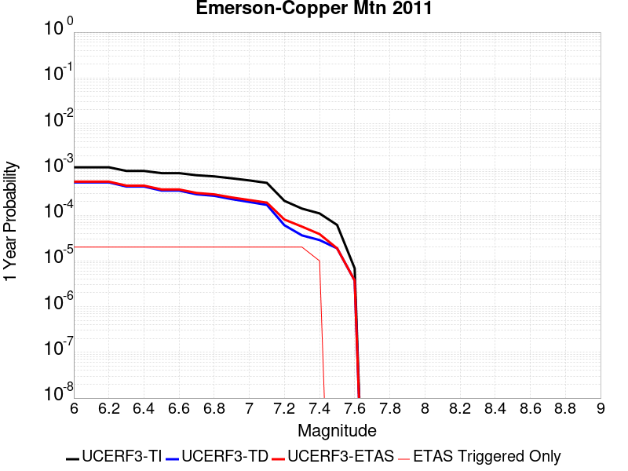 |  |

| Magnitude | 1 wk TI Prob | 1 wk TD Prob | 1 wk ETAS Prob | 1 wk ETAS/TD Gain | 1 wk ETAS Triggered Only | 1 mo TI Prob | 1 mo TD Prob | 1 mo ETAS Prob | 1 mo ETAS/TD Gain | 1 mo ETAS Triggered Only | 1 yr TI Prob | 1 yr TD Prob | 1 yr ETAS Prob | 1 yr ETAS/TD Gain | 1 yr ETAS Triggered Only | 10 yr TI Prob | 10 yr TD Prob | 10 yr ETAS Prob | 10 yr ETAS/TD Gain | 10 yr ETAS Triggered Only |
|-----|-----|-----|-----|-----|-----|-----|-----|-----|-----|-----|-----|-----|-----|-----|-----|-----|-----|-----|-----|-----|
| 6.0 | 2.1364202E-5 | 9.968114E-6 | 9.968114E-6 | 1.0 | 0.0 | 9.1557646E-5 | 4.2719836E-5 | 4.2719836E-5 | 1.0 | 0.0 | 0.0011141442 | 5.199986E-4 | 5.5017794E-4 | 1.0580374 | 3.019506E-5 | 0.011085749 | 0.005188688 | 0.005248765 | 1.0115784 | 6.039012E-5 |
| 6.1 | 2.1364202E-5 | 9.968114E-6 | 9.968114E-6 | 1.0 | 0.0 | 9.1557646E-5 | 4.2719836E-5 | 4.2719836E-5 | 1.0 | 0.0 | 0.0011141442 | 5.199986E-4 | 5.5017794E-4 | 1.0580374 | 3.019506E-5 | 0.011085749 | 0.005188688 | 0.005248765 | 1.0115784 | 6.039012E-5 |
| 6.2 | 2.1364202E-5 | 9.968114E-6 | 9.968114E-6 | 1.0 | 0.0 | 9.1557646E-5 | 4.2719836E-5 | 4.2719836E-5 | 1.0 | 0.0 | 0.0011141442 | 5.199986E-4 | 5.5017794E-4 | 1.0580374 | 3.019506E-5 | 0.011085749 | 0.005188688 | 0.005248765 | 1.0115784 | 6.039012E-5 |
| 6.3 | 1.7751237E-5 | 8.089227E-6 | 8.089227E-6 | 1.0 | 0.0 | 7.607452E-5 | 3.466769E-5 | 3.466769E-5 | 1.0 | 0.0 | 9.258136E-4 | 4.2200365E-4 | 4.5218595E-4 | 1.0715215 | 3.019506E-5 | 0.00921966 | 0.0042126453 | 0.004242713 | 1.0071375 | 3.019506E-5 |
| 6.4 | 1.7751237E-5 | 8.089227E-6 | 8.089227E-6 | 1.0 | 0.0 | 7.607452E-5 | 3.466769E-5 | 3.466769E-5 | 1.0 | 0.0 | 9.258136E-4 | 4.2200365E-4 | 4.5218595E-4 | 1.0715215 | 3.019506E-5 | 0.00921966 | 0.0042126453 | 0.004242713 | 1.0071375 | 3.019506E-5 |
| 6.5 | 1.5886664E-5 | 6.603819E-6 | 6.603819E-6 | 1.0 | 0.0 | 6.808392E-5 | 2.8301802E-5 | 2.8301802E-5 | 1.0 | 0.0 | 8.286065E-4 | 3.4452465E-4 | 3.747093E-4 | 1.0876125 | 3.019506E-5 | 0.008255237 | 0.0034403696 | 0.0034704607 | 1.0087465 | 3.019506E-5 |
| 6.6 | 1.5886664E-5 | 6.603819E-6 | 6.603819E-6 | 1.0 | 0.0 | 6.808392E-5 | 2.8301802E-5 | 2.8301802E-5 | 1.0 | 0.0 | 8.286065E-4 | 3.4452465E-4 | 3.747093E-4 | 1.0876125 | 3.019506E-5 | 0.008255237 | 0.0034403696 | 0.0034704607 | 1.0087465 | 3.019506E-5 |
| 6.7 | 1.428471E-5 | 5.470403E-6 | 5.470403E-6 | 1.0 | 0.0 | 6.121875E-5 | 2.3444394E-5 | 2.3444394E-5 | 1.0 | 0.0 | 7.450834E-4 | 2.8540206E-4 | 3.155885E-4 | 1.1057681 | 3.019506E-5 | 0.007425902 | 0.0028507432 | 0.0028808522 | 1.0105618 | 3.019506E-5 |
| 6.8 | 1.3490684E-5 | 5.073699E-6 | 5.073699E-6 | 1.0 | 0.0 | 5.7815934E-5 | 2.1744265E-5 | 2.1744265E-5 | 1.0 | 0.0 | 7.0368167E-4 | 2.6470813E-4 | 2.948952E-4 | 1.1140391 | 3.019506E-5 | 0.007014576 | 0.002644309 | 0.0026744243 | 1.0113887 | 3.019506E-5 |
| 6.9 | 1.2235421E-5 | 4.289677E-6 | 4.289677E-6 | 1.0 | 0.0 | 5.2436466E-5 | 1.838422E-5 | 1.838422E-5 | 1.0 | 0.0 | 6.38227E-4 | 2.238085E-4 | 2.539968E-4 | 1.1348845 | 3.019506E-5 | 0.0063639707 | 0.0022361854 | 0.002266313 | 1.0134728 | 3.019506E-5 |
| 7.0 | 1.1009851E-5 | 3.7189886E-6 | 3.7189886E-6 | 1.0 | 0.0 | 4.7184225E-5 | 1.5938444E-5 | 1.5938444E-5 | 1.0 | 0.0 | 5.743165E-4 | 1.9403672E-4 | 2.2422592E-4 | 1.1555849 | 3.019506E-5 | 0.005728345 | 0.0019390108 | 0.0019691472 | 1.0155423 | 3.019506E-5 |
| 7.1 | 9.726373E-6 | 3.2117953E-6 | 3.2117953E-6 | 1.0 | 0.0 | 4.168379E-5 | 1.3764783E-5 | 1.3764783E-5 | 1.0 | 0.0 | 5.07382E-4 | 1.6757673E-4 | 1.9776673E-4 | 1.1801562 | 3.019506E-5 | 0.0050622504 | 0.0016748349 | 0.0017049793 | 1.0179985 | 3.019506E-5 |
| 7.2 | 3.9335127E-6 | 1.1524792E-6 | 1.1524792E-6 | 1.0 | 0.0 | 1.6857803E-5 | 4.9391874E-6 | 4.9391874E-6 | 1.0 | 0.0 | 2.0522442E-4 | 6.0133007E-5 | 9.032625E-5 | 1.5021076 | 3.019506E-5 | 0.00205035 | 6.011733E-4 | 6.313502E-4 | 1.0501966 | 3.019506E-5 |
| 7.3 | 2.661632E-6 | 6.911505E-7 | 6.911505E-7 | 1.0 | 0.0 | 1.14069435E-5 | 2.9620703E-6 | 2.9620703E-6 | 1.0 | 0.0 | 1.3887069E-4 | 3.6062618E-5 | 6.625659E-5 | 1.8372651 | 3.019506E-5 | 0.0013878393 | 3.605687E-4 | 3.907529E-4 | 1.0837127 | 3.019506E-5 |
| 7.4 | 2.0893426E-6 | 5.4618386E-7 | 5.4618386E-7 | 1.0 | 0.0 | 8.954295E-6 | 2.3407858E-6 | 2.3407858E-6 | 1.0 | 0.0 | 1.0901308E-4 | 2.84987E-5 | 2.84987E-5 | 1.0 | 0.0 | 0.0010895962 | 2.84951E-4 | 2.84951E-4 | 1.0 | 0.0 |
| 7.5 | 1.1681728E-6 | 3.6030585E-7 | 3.6030585E-7 | 1.0 | 0.0 | 5.0064455E-6 | 1.544167E-6 | 1.544167E-6 | 1.0 | 0.0 | 6.0951766E-5 | 1.8800076E-5 | 1.8800076E-5 | 1.0 | 0.0 | 6.093505E-4 | 1.8798532E-4 | 1.8798532E-4 | 1.0 | 0.0 |
| 7.6 | 1.3154387E-7 | 7.1197384E-8 | 7.1197384E-8 | 1.0 | 0.0 | 5.6375933E-7 | 3.051316E-7 | 3.051316E-7 | 1.0 | 0.0 | 6.863748E-6 | 3.7149728E-6 | 3.7149728E-6 | 1.0 | 0.0 | 6.863536E-5 | 3.7149264E-5 | 3.7149264E-5 | 1.0 | 0.0 |

## Ventura-Pitas Point
*[(top)](#table-of-contents)*

| 1 Week | 1 Month | 1 Year | 10 Year |
|-----|-----|-----|-----|
| 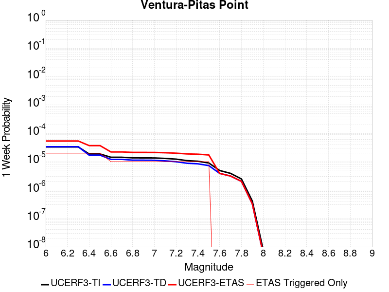 |  |  |  |

| Magnitude | 1 wk TI Prob | 1 wk TD Prob | 1 wk ETAS Prob | 1 wk ETAS/TD Gain | 1 wk ETAS Triggered Only | 1 mo TI Prob | 1 mo TD Prob | 1 mo ETAS Prob | 1 mo ETAS/TD Gain | 1 mo ETAS Triggered Only | 1 yr TI Prob | 1 yr TD Prob | 1 yr ETAS Prob | 1 yr ETAS/TD Gain | 1 yr ETAS Triggered Only | 10 yr TI Prob | 10 yr TD Prob | 10 yr ETAS Prob | 10 yr ETAS/TD Gain | 10 yr ETAS Triggered Only |
|-----|-----|-----|-----|-----|-----|-----|-----|-----|-----|-----|-----|-----|-----|-----|-----|-----|-----|-----|-----|-----|
| 6.0 | 3.3179622E-5 | 3.3735185E-5 | 9.4123265E-5 | 2.7900624 | 6.039012E-5 | 1.4219063E-4 | 1.445728E-4 | 2.0495418E-4 | 1.4176539 | 6.039012E-5 | 0.0017297962 | 0.0017590096 | 0.0018192935 | 1.0342715 | 6.039012E-5 | 0.017163932 | 0.0174764 | 0.017535735 | 1.0033951 | 6.039012E-5 |
| 6.1 | 3.3179622E-5 | 3.3735185E-5 | 9.4123265E-5 | 2.7900624 | 6.039012E-5 | 1.4219063E-4 | 1.445728E-4 | 2.0495418E-4 | 1.4176539 | 6.039012E-5 | 0.0017297962 | 0.0017590096 | 0.0018192935 | 1.0342715 | 6.039012E-5 | 0.017163932 | 0.0174764 | 0.017535735 | 1.0033951 | 6.039012E-5 |
| 6.2 | 3.3179622E-5 | 3.3735185E-5 | 9.4123265E-5 | 2.7900624 | 6.039012E-5 | 1.4219063E-4 | 1.445728E-4 | 2.0495418E-4 | 1.4176539 | 6.039012E-5 | 0.0017297962 | 0.0017590096 | 0.0018192935 | 1.0342715 | 6.039012E-5 | 0.017163932 | 0.0174764 | 0.017535735 | 1.0033951 | 6.039012E-5 |
| 6.3 | 3.3179622E-5 | 3.3735185E-5 | 9.4123265E-5 | 2.7900624 | 6.039012E-5 | 1.4219063E-4 | 1.445728E-4 | 2.0495418E-4 | 1.4176539 | 6.039012E-5 | 0.0017297962 | 0.0017590096 | 0.0018192935 | 1.0342715 | 6.039012E-5 | 0.017163932 | 0.0174764 | 0.017535735 | 1.0033951 | 6.039012E-5 |
| 6.4 | 1.8754668E-5 | 1.701961E-5 | 7.74087E-5 | 4.5482063 | 6.039012E-5 | 8.037467E-5 | 7.293928E-5 | 1.33325E-4 | 1.8278902 | 6.039012E-5 | 9.781223E-4 | 8.8769704E-4 | 9.480335E-4 | 1.0679697 | 6.039012E-5 | 0.009738282 | 0.008843848 | 0.008903704 | 1.0067681 | 6.039012E-5 |
| 6.5 | 1.8754668E-5 | 1.701961E-5 | 7.74087E-5 | 4.5482063 | 6.039012E-5 | 8.037467E-5 | 7.293928E-5 | 1.33325E-4 | 1.8278902 | 6.039012E-5 | 9.781223E-4 | 8.8769704E-4 | 9.480335E-4 | 1.0679697 | 6.039012E-5 | 0.009738282 | 0.008843848 | 0.008903704 | 1.0067681 | 6.039012E-5 |
| 6.6 | 1.4361558E-5 | 1.2122275E-5 | 4.231697E-5 | 3.490844 | 3.019506E-5 | 6.154808E-5 | 5.1951585E-5 | 8.2145074E-5 | 1.5811852 | 3.019506E-5 | 7.490902E-4 | 6.3232926E-4 | 6.625052E-4 | 1.0477219 | 3.019506E-5 | 0.0074657016 | 0.0063055577 | 0.006335562 | 1.0047585 | 3.019506E-5 |
| 6.7 | 1.4361558E-5 | 1.2122275E-5 | 4.231697E-5 | 3.490844 | 3.019506E-5 | 6.154808E-5 | 5.1951585E-5 | 8.2145074E-5 | 1.5811852 | 3.019506E-5 | 7.490902E-4 | 6.3232926E-4 | 6.625052E-4 | 1.0477219 | 3.019506E-5 | 0.0074657016 | 0.0063055577 | 0.006335562 | 1.0047585 | 3.019506E-5 |
| 6.8 | 1.3663846E-5 | 1.13444175E-5 | 4.1539137E-5 | 3.6616366 | 3.019506E-5 | 5.8558027E-5 | 4.861804E-5 | 7.881163E-5 | 1.6210368 | 3.019506E-5 | 7.127108E-4 | 5.917658E-4 | 6.21943E-4 | 1.0509951 | 3.019506E-5 | 0.007104293 | 0.005902116 | 0.0059321327 | 1.0050858 | 3.019506E-5 |
| 6.9 | 1.3644157E-5 | 1.1322519E-5 | 4.1517236E-5 | 3.6667845 | 3.019506E-5 | 5.8473648E-5 | 4.8524187E-5 | 7.8717785E-5 | 1.622238 | 3.019506E-5 | 7.116841E-4 | 5.9062376E-4 | 6.20801E-4 | 1.0510938 | 3.019506E-5 | 0.007094092 | 0.0058907564 | 0.005920774 | 1.0050956 | 3.019506E-5 |
| 7.0 | 1.3568845E-5 | 1.1242086E-5 | 4.1436808E-5 | 3.6858647 | 3.019506E-5 | 5.8150898E-5 | 4.817949E-5 | 7.8373094E-5 | 1.62669 | 3.019506E-5 | 7.077572E-4 | 5.864293E-4 | 6.166067E-4 | 1.0514594 | 3.019506E-5 | 0.007055073 | 0.0058490336 | 0.005879052 | 1.0051322 | 3.019506E-5 |
| 7.1 | 1.306572E-5 | 1.072054E-5 | 4.0915274E-5 | 3.8165314 | 3.019506E-5 | 5.599474E-5 | 4.5944373E-5 | 7.613804E-5 | 1.6571789 | 3.019506E-5 | 6.815227E-4 | 5.5923103E-4 | 5.894092E-4 | 1.0539637 | 3.019506E-5 | 0.0067943637 | 0.0055784425 | 0.005608469 | 1.0053827 | 3.019506E-5 |
| 7.2 | 1.232604E-5 | 9.995143E-6 | 4.01899E-5 | 4.020943 | 3.019506E-5 | 5.2824813E-5 | 4.2835632E-5 | 7.30294E-5 | 1.704875 | 3.019506E-5 | 6.429523E-4 | 5.214008E-4 | 5.5158016E-4 | 1.0578812 | 3.019506E-5 | 0.0064109527 | 0.005201967 | 0.005232005 | 1.0057744 | 3.019506E-5 |
| 7.3 | 1.0917261E-5 | 8.84384E-6 | 3.9038634E-5 | 4.4142175 | 3.019506E-5 | 4.678742E-5 | 3.790163E-5 | 6.809555E-5 | 1.796639 | 3.019506E-5 | 5.69488E-4 | 4.6135622E-4 | 4.915373E-4 | 1.0654182 | 3.019506E-5 | 0.0056803077 | 0.00460415 | 0.004634206 | 1.006528 | 3.019506E-5 |
| 7.4 | 1.039959E-5 | 8.423562E-6 | 3.8618367E-5 | 4.584565 | 3.019506E-5 | 4.456891E-5 | 3.610049E-5 | 6.629446E-5 | 1.8363867 | 3.019506E-5 | 5.424914E-4 | 4.3943635E-4 | 4.6961813E-4 | 1.0686829 | 3.019506E-5 | 0.0054116896 | 0.004385836 | 0.0044158986 | 1.0068545 | 3.019506E-5 |
| 7.5 | 9.015877E-6 | 7.2975445E-6 | 3.7492384E-5 | 5.137671 | 3.019506E-5 | 3.86389E-5 | 3.1274823E-5 | 6.146894E-5 | 1.9654448 | 3.019506E-5 | 4.7032707E-4 | 3.8070587E-4 | 4.1088942E-4 | 1.0792831 | 3.019506E-5 | 0.004693329 | 0.0038006818 | 0.003830762 | 1.0079144 | 3.019506E-5 |
| 7.6 | 4.900162E-6 | 3.8741155E-6 | 3.8741155E-6 | 1.0 | 0.0 | 2.1000526E-5 | 1.6603248E-5 | 1.6603248E-5 | 1.0 | 0.0 | 2.556514E-4 | 2.0212591E-4 | 2.0212591E-4 | 1.0 | 0.0 | 0.0025535747 | 0.0020194345 | 0.0020194345 | 1.0 | 0.0 |
| 7.7 | 3.8850626E-6 | 3.1267302E-6 | 3.1267302E-6 | 1.0 | 0.0 | 1.6650163E-5 | 1.3400205E-5 | 1.3400205E-5 | 1.0 | 0.0 | 2.0269687E-4 | 1.6313537E-4 | 1.6313537E-4 | 1.0 | 0.0 | 0.002025121 | 0.0016301654 | 0.0016301654 | 1.0 | 0.0 |
| 7.8 | 2.4654719E-6 | 2.029875E-6 | 2.029875E-6 | 1.0 | 0.0 | 1.0566265E-5 | 8.699436E-6 | 8.699436E-6 | 1.0 | 0.0 | 1.2863669E-4 | 1.0591053E-4 | 1.0591053E-4 | 1.0 | 0.0 | 0.0012856225 | 0.0010586053 | 0.0010586053 | 1.0 | 0.0 |
| 7.9 | 4.095894E-7 | 3.2764765E-7 | 3.2764765E-7 | 1.0 | 0.0 | 1.7553821E-6 | 1.4042034E-6 | 1.4042034E-6 | 1.0 | 0.0 | 2.1371567E-5 | 1.7096047E-5 | 1.7096047E-5 | 1.0 | 0.0 | 2.1369511E-4 | 1.7094762E-4 | 1.7094762E-4 | 1.0 | 0.0 |
| 8.0 | 7.791402E-9 | 5.683497E-9 | 5.683497E-9 | 1.0 | 0.0 | 3.3391725E-8 | 2.4357844E-8 | 2.4357844E-8 | 1.0 | 0.0 | 4.0654416E-7 | 2.9655675E-7 | 2.9655675E-7 | 1.0 | 0.0 | 4.065434E-6 | 2.9655655E-6 | 2.9655655E-6 | 1.0 | 0.0 |

## Santa Cruz Catalina Ridge alt1
*[(top)](#table-of-contents)*

| 1 Week | 1 Month | 1 Year | 10 Year |
|-----|-----|-----|-----|
|  |  |  |  |

| Magnitude | 1 wk TI Prob | 1 wk TD Prob | 1 wk ETAS Prob | 1 wk ETAS/TD Gain | 1 wk ETAS Triggered Only | 1 mo TI Prob | 1 mo TD Prob | 1 mo ETAS Prob | 1 mo ETAS/TD Gain | 1 mo ETAS Triggered Only | 1 yr TI Prob | 1 yr TD Prob | 1 yr ETAS Prob | 1 yr ETAS/TD Gain | 1 yr ETAS Triggered Only | 10 yr TI Prob | 10 yr TD Prob | 10 yr ETAS Prob | 10 yr ETAS/TD Gain | 10 yr ETAS Triggered Only |
|-----|-----|-----|-----|-----|-----|-----|-----|-----|-----|-----|-----|-----|-----|-----|-----|-----|-----|-----|-----|-----|
| 6.0 | 3.2833184E-5 | 3.65584E-5 | 6.6752356E-5 | 1.8259102 | 3.019506E-5 | 1.4070606E-4 | 1.5667039E-4 | 1.868607E-4 | 1.1926997 | 3.019506E-5 | 0.00171175 | 0.0019059596 | 0.0019662345 | 1.0316246 | 6.039012E-5 | 0.016986247 | 0.018913029 | 0.018972278 | 1.0031327 | 6.039012E-5 |
| 6.1 | 1.9835548E-5 | 2.1659505E-5 | 5.1853913E-5 | 2.3940487 | 3.019506E-5 | 8.500672E-5 | 9.282326E-5 | 1.2301552E-4 | 1.3252661 | 3.019506E-5 | 0.0010344655 | 0.0011295575 | 0.0011898794 | 1.0534031 | 6.039012E-5 | 0.010296632 | 0.011240295 | 0.011300007 | 1.0053122 | 6.039012E-5 |
| 6.2 | 1.9835548E-5 | 2.1659505E-5 | 5.1853913E-5 | 2.3940487 | 3.019506E-5 | 8.500672E-5 | 9.282326E-5 | 1.2301552E-4 | 1.3252661 | 3.019506E-5 | 0.0010344655 | 0.0011295575 | 0.0011898794 | 1.0534031 | 6.039012E-5 | 0.010296632 | 0.011240295 | 0.011300007 | 1.0053122 | 6.039012E-5 |
| 6.3 | 1.5728183E-5 | 1.703395E-5 | 4.7228496E-5 | 2.77261 | 3.019506E-5 | 6.7404755E-5 | 7.300063E-5 | 1.0319349E-4 | 1.4135972 | 3.019506E-5 | 8.2034385E-4 | 8.884264E-4 | 9.4876287E-4 | 1.0679139 | 6.039012E-5 | 0.008173222 | 0.008849427 | 0.008909282 | 1.0067638 | 6.039012E-5 |
| 6.4 | 1.5728183E-5 | 1.703395E-5 | 4.7228496E-5 | 2.77261 | 3.019506E-5 | 6.7404755E-5 | 7.300063E-5 | 1.0319349E-4 | 1.4135972 | 3.019506E-5 | 8.2034385E-4 | 8.884264E-4 | 9.4876287E-4 | 1.0679139 | 6.039012E-5 | 0.008173222 | 0.008849427 | 0.008909282 | 1.0067638 | 6.039012E-5 |
| 6.5 | 1.3707734E-5 | 1.4794522E-5 | 4.4989134E-5 | 3.040932 | 3.019506E-5 | 5.8746107E-5 | 6.3403575E-5 | 9.359672E-5 | 1.4762057 | 3.019506E-5 | 7.1499916E-4 | 7.716686E-4 | 8.018404E-4 | 1.0390993 | 3.019506E-5 | 0.0071270303 | 0.0076902895 | 0.0077202525 | 1.0038962 | 3.019506E-5 |
| 6.6 | 1.2539813E-5 | 1.3510219E-5 | 4.3704873E-5 | 3.234949 | 3.019506E-5 | 5.3740947E-5 | 5.789967E-5 | 8.809298E-5 | 1.5214764 | 3.019506E-5 | 6.540996E-4 | 7.0470315E-4 | 7.3487696E-4 | 1.0428177 | 3.019506E-5 | 0.0065217763 | 0.0070249885 | 0.0070549715 | 1.004268 | 3.019506E-5 |
| 6.7 | 1.1504083E-5 | 1.2377375E-5 | 4.257206E-5 | 3.4395065 | 3.019506E-5 | 4.930228E-5 | 5.3044827E-5 | 8.323829E-5 | 1.5692065 | 3.019506E-5 | 6.0008996E-4 | 6.456314E-4 | 6.7580695E-4 | 1.046738 | 3.019506E-5 | 0.005984721 | 0.006437786 | 0.0064677866 | 1.0046601 | 3.019506E-5 |
| 6.8 | 1.012739E-5 | 1.0877071E-5 | 4.1071802E-5 | 3.7759984 | 3.019506E-5 | 4.340238E-5 | 4.6615194E-5 | 7.680885E-5 | 1.6477213 | 3.019506E-5 | 5.282958E-4 | 5.673937E-4 | 5.9757166E-4 | 1.0531869 | 3.019506E-5 | 0.0052704164 | 0.0056596193 | 0.005689644 | 1.0053049 | 3.019506E-5 |
| 6.9 | 8.9607865E-6 | 9.609117E-6 | 3.9803886E-5 | 4.1423044 | 3.019506E-5 | 3.8402806E-5 | 4.1181287E-5 | 7.137511E-5 | 1.7331927 | 3.019506E-5 | 4.6745385E-4 | 5.012679E-4 | 5.314478E-4 | 1.0602071 | 3.019506E-5 | 0.0046647177 | 0.005001492 | 0.005031536 | 1.0060071 | 3.019506E-5 |
| 7.0 | 8.046829E-6 | 8.619746E-6 | 3.8814545E-5 | 4.50298 | 3.019506E-5 | 3.4485955E-5 | 3.694125E-5 | 6.7135195E-5 | 1.8173504 | 3.019506E-5 | 4.1978562E-4 | 4.496677E-4 | 4.798492E-4 | 1.0671195 | 3.019506E-5 | 0.004189935 | 0.0044876686 | 0.0045177285 | 1.0066983 | 3.019506E-5 |
| 7.1 | 7.136131E-6 | 7.637656E-6 | 3.7832484E-5 | 4.953416 | 3.019506E-5 | 3.0583058E-5 | 3.2732405E-5 | 6.2926476E-5 | 1.922452 | 3.019506E-5 | 3.7228514E-4 | 3.9844486E-4 | 4.2862789E-4 | 1.0757521 | 3.019506E-5 | 0.0037166206 | 0.003977381 | 0.0040074564 | 1.0075614 | 3.019506E-5 |
| 7.2 | 6.362014E-6 | 6.8049585E-6 | 3.6999812E-5 | 5.4371843 | 3.019506E-5 | 2.726549E-5 | 2.9163786E-5 | 5.9357964E-5 | 2.0353312 | 3.019506E-5 | 3.3190678E-4 | 3.550119E-4 | 3.8519624E-4 | 1.0850235 | 3.019506E-5 | 0.0033141149 | 0.003544516 | 0.0035746042 | 1.0084887 | 3.019506E-5 |
| 7.3 | 5.004101E-6 | 5.351715E-6 | 5.351715E-6 | 1.0 | 0.0 | 2.1445969E-5 | 2.2935723E-5 | 2.2935723E-5 | 1.0 | 0.0 | 2.6107338E-4 | 2.792072E-4 | 2.792072E-4 | 1.0 | 0.0 | 0.002607669 | 0.0027886187 | 0.0027886187 | 1.0 | 0.0 |
| 7.4 | 3.4901443E-6 | 3.7320526E-6 | 3.7320526E-6 | 1.0 | 0.0 | 1.4957676E-5 | 1.5994416E-5 | 1.5994416E-5 | 1.0 | 0.0 | 1.8209449E-4 | 1.9471499E-4 | 1.9471499E-4 | 1.0 | 0.0 | 0.0018194534 | 0.0019454823 | 0.0019454823 | 1.0 | 0.0 |
| 7.5 | 1.1215045E-6 | 1.189387E-6 | 1.189387E-6 | 1.0 | 0.0 | 4.806439E-6 | 5.097363E-6 | 5.097363E-6 | 1.0 | 0.0 | 5.851682E-5 | 6.205866E-5 | 6.205866E-5 | 1.0 | 0.0 | 5.850142E-4 | 6.2041637E-4 | 6.2041637E-4 | 1.0 | 0.0 |
| 7.6 | 2.8599047E-7 | 2.9951994E-7 | 2.9951994E-7 | 1.0 | 0.0 | 1.2256729E-6 | 1.2836562E-6 | 1.2836562E-6 | 1.0 | 0.0 | 1.4922465E-5 | 1.5628404E-5 | 1.5628404E-5 | 1.0 | 0.0 | 1.4921463E-4 | 1.5627318E-4 | 1.5627318E-4 | 1.0 | 0.0 |
| 7.7 | 2.0781519E-7 | 2.1744323E-7 | 2.1744323E-7 | 1.0 | 0.0 | 8.906362E-7 | 9.3189925E-7 | 9.3189925E-7 | 1.0 | 0.0 | 1.08434415E-5 | 1.13458145E-5 | 1.13458145E-5 | 1.0 | 0.0 | 1.0842913E-4 | 1.1345245E-4 | 1.1345245E-4 | 1.0 | 0.0 |
| 7.8 | 3.614776E-8 | 3.764102E-8 | 3.764102E-8 | 1.0 | 0.0 | 1.5491896E-7 | 1.6131864E-7 | 1.6131864E-7 | 1.0 | 0.0 | 1.8861368E-6 | 1.9640527E-6 | 1.9640527E-6 | 1.0 | 0.0 | 1.8861208E-5 | 1.9640367E-5 | 1.9640367E-5 | 1.0 | 0.0 |

## Cleghorn Lake
*[(top)](#table-of-contents)*

| 1 Week | 1 Month | 1 Year | 10 Year |
|-----|-----|-----|-----|
|  |  |  |  |

| Magnitude | 1 wk TI Prob | 1 wk TD Prob | 1 wk ETAS Prob | 1 wk ETAS/TD Gain | 1 wk ETAS Triggered Only | 1 mo TI Prob | 1 mo TD Prob | 1 mo ETAS Prob | 1 mo ETAS/TD Gain | 1 mo ETAS Triggered Only | 1 yr TI Prob | 1 yr TD Prob | 1 yr ETAS Prob | 1 yr ETAS/TD Gain | 1 yr ETAS Triggered Only | 10 yr TI Prob | 10 yr TD Prob | 10 yr ETAS Prob | 10 yr ETAS/TD Gain | 10 yr ETAS Triggered Only |
|-----|-----|-----|-----|-----|-----|-----|-----|-----|-----|-----|-----|-----|-----|-----|-----|-----|-----|-----|-----|-----|
| 6.0 | 1.5467183E-5 | 1.6794203E-5 | 1.6794203E-5 | 1.0 | 0.0 | 6.6286244E-5 | 7.197348E-5 | 7.197348E-5 | 1.0 | 0.0 | 8.067362E-4 | 8.759797E-4 | 9.0614834E-4 | 1.0344398 | 3.019506E-5 | 0.008038137 | 0.008730696 | 0.008790558 | 1.0068566 | 6.039012E-5 |
| 6.1 | 1.5467183E-5 | 1.6794203E-5 | 1.6794203E-5 | 1.0 | 0.0 | 6.6286244E-5 | 7.197348E-5 | 7.197348E-5 | 1.0 | 0.0 | 8.067362E-4 | 8.759797E-4 | 9.0614834E-4 | 1.0344398 | 3.019506E-5 | 0.008038137 | 0.008730696 | 0.008790558 | 1.0068566 | 6.039012E-5 |
| 6.2 | 1.2624631E-5 | 1.3681544E-5 | 1.3681544E-5 | 1.0 | 0.0 | 5.410444E-5 | 5.863415E-5 | 5.863415E-5 | 1.0 | 0.0 | 6.585225E-4 | 7.1368564E-4 | 7.438591E-4 | 1.0422784 | 3.019506E-5 | 0.0065657445 | 0.0071187317 | 0.007178692 | 1.0084229 | 6.039012E-5 |
| 6.3 | 1.2624631E-5 | 1.3681544E-5 | 1.3681544E-5 | 1.0 | 0.0 | 5.410444E-5 | 5.863415E-5 | 5.863415E-5 | 1.0 | 0.0 | 6.585225E-4 | 7.1368564E-4 | 7.438591E-4 | 1.0422784 | 3.019506E-5 | 0.0065657445 | 0.0071187317 | 0.007178692 | 1.0084229 | 6.039012E-5 |
| 6.4 | 9.417684E-6 | 1.0170118E-5 | 1.0170118E-5 | 1.0 | 0.0 | 4.036088E-5 | 4.3585722E-5 | 4.3585722E-5 | 1.0 | 0.0 | 4.912829E-4 | 5.3056807E-4 | 5.607471E-4 | 1.0568806 | 3.019506E-5 | 0.004901982 | 0.005297049 | 0.0053571193 | 1.0113403 | 6.039012E-5 |
| 6.5 | 9.368219E-6 | 1.0117545E-5 | 1.0117545E-5 | 1.0 | 0.0 | 4.014889E-5 | 4.3360415E-5 | 4.3360415E-5 | 1.0 | 0.0 | 4.8870314E-4 | 5.2782625E-4 | 5.580054E-4 | 1.0571762 | 3.019506E-5 | 0.004876298 | 0.0052697617 | 0.0053298334 | 1.0113994 | 6.039012E-5 |
| 6.6 | 7.803798E-6 | 8.441831E-6 | 8.441831E-6 | 1.0 | 0.0 | 3.3444423E-5 | 3.6179E-5 | 3.6179E-5 | 1.0 | 0.0 | 4.0710976E-4 | 4.4043022E-4 | 4.7061197E-4 | 1.0685279 | 3.019506E-5 | 0.0040636472 | 0.0043994905 | 0.004459615 | 1.0136663 | 6.039012E-5 |
| 6.7 | 2.3108669E-6 | 2.4438336E-6 | 2.4438336E-6 | 1.0 | 0.0 | 9.903678E-6 | 1.0473532E-5 | 1.0473532E-5 | 1.0 | 0.0 | 1.205706E-4 | 1.2750797E-4 | 1.2750797E-4 | 1.0 | 0.0 | 0.001205052 | 0.0012743667 | 0.0012743667 | 1.0 | 0.0 |
| 6.8 | 2.0882828E-6 | 2.2062823E-6 | 2.2062823E-6 | 1.0 | 0.0 | 8.949753E-6 | 9.455462E-6 | 9.455462E-6 | 1.0 | 0.0 | 1.08957785E-4 | 1.1511434E-4 | 1.1511434E-4 | 1.0 | 0.0 | 0.0010890438 | 0.0011505639 | 0.0011505639 | 1.0 | 0.0 |
| 6.9 | 1.876935E-6 | 1.981051E-6 | 1.981051E-6 | 1.0 | 0.0 | 8.043982E-6 | 8.490192E-6 | 8.490192E-6 | 1.0 | 0.0 | 9.7931086E-5 | 1.03363345E-4 | 1.03363345E-4 | 1.0 | 0.0 | 9.788794E-4 | 0.0010331686 | 0.0010331686 | 1.0 | 0.0 |
| 7.0 | 1.5357559E-6 | 1.6202807E-6 | 1.6202807E-6 | 1.0 | 0.0 | 6.5817944E-6 | 6.9440425E-6 | 6.9440425E-6 | 1.0 | 0.0 | 8.01304E-5 | 8.454057E-5 | 8.454057E-5 | 1.0 | 0.0 | 8.010151E-4 | 8.450965E-4 | 8.450965E-4 | 1.0 | 0.0 |
| 7.1 | 1.0905424E-6 | 1.1497619E-6 | 1.1497619E-6 | 1.0 | 0.0 | 4.6737446E-6 | 4.9275427E-6 | 4.9275427E-6 | 1.0 | 0.0 | 5.6901354E-5 | 5.999128E-5 | 5.999128E-5 | 1.0 | 0.0 | 5.6886784E-4 | 5.997606E-4 | 5.997606E-4 | 1.0 | 0.0 |
| 7.2 | 6.06668E-7 | 6.387277E-7 | 6.387277E-7 | 1.0 | 0.0 | 2.600003E-6 | 2.7374022E-6 | 2.7374022E-6 | 1.0 | 0.0 | 3.1654577E-5 | 3.3327433E-5 | 3.3327433E-5 | 1.0 | 0.0 | 3.1650066E-4 | 3.3323118E-4 | 3.3323118E-4 | 1.0 | 0.0 |

## San Jacinto (San Jacinto Valley) rev
*[(top)](#table-of-contents)*

| 1 Week | 1 Month | 1 Year | 10 Year |
|-----|-----|-----|-----|
|  |  |  |  |

| Magnitude | 1 wk TI Prob | 1 wk TD Prob | 1 wk ETAS Prob | 1 wk ETAS/TD Gain | 1 wk ETAS Triggered Only | 1 mo TI Prob | 1 mo TD Prob | 1 mo ETAS Prob | 1 mo ETAS/TD Gain | 1 mo ETAS Triggered Only | 1 yr TI Prob | 1 yr TD Prob | 1 yr ETAS Prob | 1 yr ETAS/TD Gain | 1 yr ETAS Triggered Only | 10 yr TI Prob | 10 yr TD Prob | 10 yr ETAS Prob | 10 yr ETAS/TD Gain | 10 yr ETAS Triggered Only |
|-----|-----|-----|-----|-----|-----|-----|-----|-----|-----|-----|-----|-----|-----|-----|-----|-----|-----|-----|-----|-----|
| 6.0 | 3.652694E-5 | 3.4402394E-5 | 9.4790434E-5 | 2.7553444 | 6.039012E-5 | 1.5653463E-4 | 1.474305E-4 | 2.0781172E-4 | 1.4095571 | 6.039012E-5 | 0.0019041431 | 0.00179349 | 0.0018537719 | 1.0336114 | 6.039012E-5 | 0.018879099 | 0.018526595 | 0.018585866 | 1.0031992 | 6.039012E-5 |
| 6.1 | 3.652694E-5 | 3.4402394E-5 | 9.4790434E-5 | 2.7553444 | 6.039012E-5 | 1.5653463E-4 | 1.474305E-4 | 2.0781172E-4 | 1.4095571 | 6.039012E-5 | 0.0019041431 | 0.00179349 | 0.0018537719 | 1.0336114 | 6.039012E-5 | 0.018879099 | 0.018526595 | 0.018585866 | 1.0031992 | 6.039012E-5 |
| 6.2 | 3.652694E-5 | 3.4402394E-5 | 9.4790434E-5 | 2.7553444 | 6.039012E-5 | 1.5653463E-4 | 1.474305E-4 | 2.0781172E-4 | 1.4095571 | 6.039012E-5 | 0.0019041431 | 0.00179349 | 0.0018537719 | 1.0336114 | 6.039012E-5 | 0.018879099 | 0.018526595 | 0.018585866 | 1.0031992 | 6.039012E-5 |
| 6.3 | 3.652694E-5 | 3.4402394E-5 | 9.4790434E-5 | 2.7553444 | 6.039012E-5 | 1.5653463E-4 | 1.474305E-4 | 2.0781172E-4 | 1.4095571 | 6.039012E-5 | 0.0019041431 | 0.00179349 | 0.0018537719 | 1.0336114 | 6.039012E-5 | 0.018879099 | 0.018526595 | 0.018585866 | 1.0031992 | 6.039012E-5 |
| 6.4 | 3.646941E-5 | 3.432397E-5 | 9.471201E-5 | 2.759355 | 6.039012E-5 | 1.5628811E-4 | 1.4709444E-4 | 2.0747568E-4 | 1.410493 | 6.039012E-5 | 0.0019011468 | 0.0017894056 | 0.0018496877 | 1.0336883 | 6.039012E-5 | 0.018849645 | 0.018486476 | 0.01854575 | 1.0032064 | 6.039012E-5 |
| 6.5 | 3.646941E-5 | 3.432397E-5 | 9.471201E-5 | 2.759355 | 6.039012E-5 | 1.5628811E-4 | 1.4709444E-4 | 2.0747568E-4 | 1.410493 | 6.039012E-5 | 0.0019011468 | 0.0017894056 | 0.0018496877 | 1.0336883 | 6.039012E-5 | 0.018849645 | 0.018486476 | 0.01854575 | 1.0032064 | 6.039012E-5 |
| 6.6 | 3.6442503E-5 | 3.4287354E-5 | 9.46754E-5 | 2.7612338 | 6.039012E-5 | 1.561728E-4 | 1.4693754E-4 | 2.073188E-4 | 1.4109313 | 6.039012E-5 | 0.0018997455 | 0.0017874985 | 0.0018477807 | 1.0337243 | 6.039012E-5 | 0.018835869 | 0.018467745 | 0.01852702 | 1.0032096 | 6.039012E-5 |
| 6.7 | 3.6432113E-5 | 3.4272925E-5 | 9.466098E-5 | 2.7619753 | 6.039012E-5 | 1.5612828E-4 | 1.4687571E-4 | 2.0725696E-4 | 1.4111044 | 6.039012E-5 | 0.0018992044 | 0.0017867472 | 0.0018470294 | 1.0337385 | 6.039012E-5 | 0.018830549 | 0.018460369 | 0.018519644 | 1.0032109 | 6.039012E-5 |
| 6.8 | 3.6409598E-5 | 3.424198E-5 | 9.4630035E-5 | 2.7635677 | 6.039012E-5 | 1.560318E-4 | 1.4674311E-4 | 2.0712437E-4 | 1.4114759 | 6.039012E-5 | 0.0018980318 | 0.0017851355 | 0.0018454178 | 1.033769 | 6.039012E-5 | 0.018819023 | 0.018444523 | 0.0185038 | 1.0032138 | 6.039012E-5 |
| 6.9 | 3.638078E-5 | 3.4202407E-5 | 9.459046E-5 | 2.7656083 | 6.039012E-5 | 1.5590832E-4 | 1.4657351E-4 | 2.0695479E-4 | 1.4119521 | 6.039012E-5 | 0.0018965311 | 0.001783074 | 0.0018433565 | 1.0338081 | 6.039012E-5 | 0.018804269 | 0.018424258 | 0.018483534 | 1.0032173 | 6.039012E-5 |
| 7.0 | 3.6294874E-5 | 3.408442E-5 | 9.447248E-5 | 2.7717204 | 6.039012E-5 | 1.5554018E-4 | 1.4606792E-4 | 2.0644921E-4 | 1.4133782 | 6.039012E-5 | 0.0018920569 | 0.001776929 | 0.0018372118 | 1.0339253 | 6.039012E-5 | 0.018760284 | 0.018363839 | 0.01842312 | 1.0032282 | 6.039012E-5 |
| 7.1 | 3.6260717E-5 | 3.4040702E-5 | 9.442877E-5 | 2.7739959 | 6.039012E-5 | 1.5539382E-4 | 1.4588058E-4 | 2.0626189E-4 | 1.4139092 | 6.039012E-5 | 0.001890278 | 0.0017746518 | 0.0018349348 | 1.0339689 | 6.039012E-5 | 0.018742796 | 0.018341439 | 0.018400721 | 1.0032321 | 6.039012E-5 |
| 7.2 | 3.6210204E-5 | 3.397492E-5 | 9.436299E-5 | 2.7774308 | 6.039012E-5 | 1.5517735E-4 | 1.455987E-4 | 2.0598002E-4 | 1.4147106 | 6.039012E-5 | 0.001887647 | 0.0017712255 | 0.0018315086 | 1.0340347 | 6.039012E-5 | 0.01871693 | 0.01830772 | 0.018367004 | 1.0032382 | 6.039012E-5 |
| 7.3 | 3.6119454E-5 | 3.386321E-5 | 9.4251285E-5 | 2.7832947 | 6.039012E-5 | 1.5478847E-4 | 1.4511998E-4 | 2.0550133E-4 | 1.4160789 | 6.039012E-5 | 0.0018829206 | 0.0017654065 | 0.00182569 | 1.0341471 | 6.039012E-5 | 0.018670462 | 0.018250274 | 0.018309562 | 1.0032486 | 6.039012E-5 |
| 7.4 | 3.607848E-5 | 3.381071E-5 | 9.419879E-5 | 2.7860637 | 6.039012E-5 | 1.5461289E-4 | 1.44895E-4 | 2.0527637E-4 | 1.416725 | 6.039012E-5 | 0.0018807866 | 0.0017626719 | 0.0018229556 | 1.0342002 | 6.039012E-5 | 0.018649481 | 0.018223269 | 0.018282559 | 1.0032535 | 6.039012E-5 |
| 7.5 | 3.5856774E-5 | 3.3620483E-5 | 9.4008574E-5 | 2.7961698 | 6.039012E-5 | 1.5366284E-4 | 1.4407984E-4 | 2.0446125E-4 | 1.4190831 | 6.039012E-5 | 0.0018692396 | 0.0017527633 | 0.0018130476 | 1.0343939 | 6.039012E-5 | 0.018535944 | 0.018124366 | 0.018183662 | 1.0032716 | 6.039012E-5 |
| 7.6 | 3.286655E-5 | 3.2143445E-5 | 9.253163E-5 | 2.8787088 | 6.039012E-5 | 1.4084904E-4 | 1.3775036E-4 | 1.9813217E-4 | 1.4383422 | 6.039012E-5 | 0.001713488 | 0.0016758227 | 0.0017361115 | 1.0359757 | 6.039012E-5 | 0.017003361 | 0.017344031 | 0.017403373 | 1.0034215 | 6.039012E-5 |
| 7.7 | 2.8882527E-5 | 2.9236293E-5 | 8.962465E-5 | 3.065527 | 6.039012E-5 | 1.237764E-4 | 1.2529238E-4 | 1.8567494E-4 | 1.4819331 | 6.039012E-5 | 0.0015059357 | 0.0015243685 | 0.0015846665 | 1.0395561 | 6.039012E-5 | 0.014957713 | 0.015830461 | 0.015889894 | 1.0037544 | 6.039012E-5 |
| 7.8 | 2.4950225E-5 | 2.6527203E-5 | 8.691572E-5 | 3.2764752 | 6.039012E-5 | 1.0692515E-4 | 1.1368306E-4 | 1.7406631E-4 | 1.5311544 | 6.039012E-5 | 0.0013010362 | 0.0013832134 | 0.00144352 | 1.0435989 | 6.039012E-5 | 0.012934455 | 0.014411755 | 0.014471275 | 1.00413 | 6.039012E-5 |
| 7.9 | 1.9881603E-5 | 2.1507445E-5 | 8.1896265E-5 | 3.80781 | 6.039012E-5 | 8.520408E-5 | 9.217151E-5 | 1.5255607E-4 | 1.6551325 | 6.039012E-5 | 0.001036866 | 0.0011216112 | 0.0011819337 | 1.0537819 | 6.039012E-5 | 0.010320415 | 0.011777027 | 0.011836706 | 1.0050673 | 6.039012E-5 |
| 8.0 | 1.563292E-5 | 1.5937347E-5 | 4.6131925E-5 | 2.8945801 | 3.019506E-5 | 6.6996516E-5 | 6.8301124E-5 | 9.849412E-5 | 1.4420571 | 3.019506E-5 | 8.153773E-4 | 8.3124964E-4 | 8.614196E-4 | 1.0362947 | 3.019506E-5 | 0.00812392 | 0.008810506 | 0.008840435 | 1.003397 | 3.019506E-5 |
| 8.1 | 1.0045313E-5 | 8.301802E-6 | 8.301802E-6 | 1.0 | 0.0 | 4.305063E-5 | 3.5578672E-5 | 3.5578672E-5 | 1.0 | 0.0 | 5.2401534E-4 | 4.3308473E-4 | 4.3308473E-4 | 1.0 | 0.0 | 0.0052278144 | 0.0046591135 | 0.0046591135 | 1.0 | 0.0 |
| 8.2 | 4.1554413E-6 | 1.5655598E-6 | 1.5655598E-6 | 1.0 | 0.0 | 1.7808914E-5 | 6.709525E-6 | 6.709525E-6 | 1.0 | 0.0 | 2.1680194E-4 | 8.168544E-5 | 8.168544E-5 | 1.0 | 0.0 | 0.0021659054 | 9.482903E-4 | 9.482903E-4 | 1.0 | 0.0 |
| 8.3 | 1.2758221E-6 | 3.6149942E-7 | 3.6149942E-7 | 1.0 | 0.0 | 5.4677976E-6 | 1.5492824E-6 | 1.5492824E-6 | 1.0 | 0.0 | 6.65684E-5 | 1.8862354E-5 | 1.8862354E-5 | 1.0 | 0.0 | 6.6548464E-4 | 2.2751294E-4 | 2.2751294E-4 | 1.0 | 0.0 |

## San Jacinto (Stepovers Combined)
*[(top)](#table-of-contents)*

| 1 Week | 1 Month | 1 Year | 10 Year |
|-----|-----|-----|-----|
|  |  |  |  |

| Magnitude | 1 wk TI Prob | 1 wk TD Prob | 1 wk ETAS Prob | 1 wk ETAS/TD Gain | 1 wk ETAS Triggered Only | 1 mo TI Prob | 1 mo TD Prob | 1 mo ETAS Prob | 1 mo ETAS/TD Gain | 1 mo ETAS Triggered Only | 1 yr TI Prob | 1 yr TD Prob | 1 yr ETAS Prob | 1 yr ETAS/TD Gain | 1 yr ETAS Triggered Only | 10 yr TI Prob | 10 yr TD Prob | 10 yr ETAS Prob | 10 yr ETAS/TD Gain | 10 yr ETAS Triggered Only |
|-----|-----|-----|-----|-----|-----|-----|-----|-----|-----|-----|-----|-----|-----|-----|-----|-----|-----|-----|-----|-----|
| 6.0 | 4.0667746E-5 | 3.5272755E-5 | 9.566075E-5 | 2.7120292 | 6.039012E-5 | 1.742787E-4 | 1.5116022E-4 | 2.115412E-4 | 1.3994503 | 6.039012E-5 | 0.0021197782 | 0.0018388226 | 0.0018991017 | 1.0327814 | 6.039012E-5 | 0.020996714 | 0.018986892 | 0.019046135 | 1.0031202 | 6.039012E-5 |
| 6.1 | 4.0667746E-5 | 3.5272755E-5 | 9.566075E-5 | 2.7120292 | 6.039012E-5 | 1.742787E-4 | 1.5116022E-4 | 2.115412E-4 | 1.3994503 | 6.039012E-5 | 0.0021197782 | 0.0018388226 | 0.0018991017 | 1.0327814 | 6.039012E-5 | 0.020996714 | 0.018986892 | 0.019046135 | 1.0031202 | 6.039012E-5 |
| 6.2 | 4.0667746E-5 | 3.5272755E-5 | 9.566075E-5 | 2.7120292 | 6.039012E-5 | 1.742787E-4 | 1.5116022E-4 | 2.115412E-4 | 1.3994503 | 6.039012E-5 | 0.0021197782 | 0.0018388226 | 0.0018991017 | 1.0327814 | 6.039012E-5 | 0.020996714 | 0.018986892 | 0.019046135 | 1.0031202 | 6.039012E-5 |
| 6.3 | 4.0667746E-5 | 3.5272755E-5 | 9.566075E-5 | 2.7120292 | 6.039012E-5 | 1.742787E-4 | 1.5116022E-4 | 2.115412E-4 | 1.3994503 | 6.039012E-5 | 0.0021197782 | 0.0018388226 | 0.0018991017 | 1.0327814 | 6.039012E-5 | 0.020996714 | 0.018986892 | 0.019046135 | 1.0031202 | 6.039012E-5 |
| 6.4 | 4.0577226E-5 | 3.5144654E-5 | 9.5532654E-5 | 2.7182698 | 6.039012E-5 | 1.738908E-4 | 1.5061127E-4 | 2.109923E-4 | 1.4009064 | 6.039012E-5 | 0.0021150648 | 0.0018321523 | 0.0018924318 | 1.0329009 | 6.039012E-5 | 0.020950472 | 0.018921461 | 0.018980708 | 1.0031313 | 6.039012E-5 |
| 6.5 | 4.0577226E-5 | 3.5144654E-5 | 9.5532654E-5 | 2.7182698 | 6.039012E-5 | 1.738908E-4 | 1.5061127E-4 | 2.109923E-4 | 1.4009064 | 6.039012E-5 | 0.0021150648 | 0.0018321523 | 0.0018924318 | 1.0329009 | 6.039012E-5 | 0.020950472 | 0.018921461 | 0.018980708 | 1.0031313 | 6.039012E-5 |
| 6.6 | 4.053861E-5 | 3.509E-5 | 9.5478004E-5 | 2.720946 | 6.039012E-5 | 1.7372532E-4 | 1.5037706E-4 | 2.1075811E-4 | 1.4015309 | 6.039012E-5 | 0.0021130538 | 0.0018293057 | 0.0018895853 | 1.0329522 | 6.039012E-5 | 0.020930743 | 0.018893538 | 0.018952787 | 1.0031359 | 6.039012E-5 |
| 6.7 | 4.0516545E-5 | 3.5059067E-5 | 9.5447074E-5 | 2.7224646 | 6.039012E-5 | 1.7363077E-4 | 1.5024451E-4 | 2.1062556E-4 | 1.4018852 | 6.039012E-5 | 0.002111905 | 0.001827695 | 0.0018879748 | 1.0329813 | 6.039012E-5 | 0.020919468 | 0.018877735 | 0.018936984 | 1.0031387 | 6.039012E-5 |
| 6.8 | 4.049434E-5 | 3.5030633E-5 | 9.541863E-5 | 2.723863 | 6.039012E-5 | 1.7353562E-4 | 1.5012265E-4 | 2.1050371E-4 | 1.4022114 | 6.039012E-5 | 0.0021107488 | 0.0018262138 | 0.0018864936 | 1.0330081 | 6.039012E-5 | 0.020908125 | 0.018863149 | 0.0189224 | 1.003141 | 6.039012E-5 |
| 6.9 | 4.046386E-5 | 3.499319E-5 | 9.53812E-5 | 2.7257073 | 6.039012E-5 | 1.73405E-4 | 1.4996222E-4 | 2.1034328E-4 | 1.4026419 | 6.039012E-5 | 0.0021091616 | 0.0018242638 | 0.0018845438 | 1.0330434 | 6.039012E-5 | 0.020892553 | 0.01884392 | 0.018903174 | 1.0031444 | 6.039012E-5 |
| 7.0 | 4.036382E-5 | 3.487376E-5 | 9.526177E-5 | 2.7316177 | 6.039012E-5 | 1.7297632E-4 | 1.4945042E-4 | 2.0983152E-4 | 1.4040209 | 6.039012E-5 | 0.0021039525 | 0.0018180435 | 0.0018783238 | 1.0331568 | 6.039012E-5 | 0.02084144 | 0.018782536 | 0.018841792 | 1.0031549 | 6.039012E-5 |
| 7.1 | 4.0343282E-5 | 3.4852223E-5 | 9.524023E-5 | 2.7326877 | 6.039012E-5 | 1.7288832E-4 | 1.4935812E-4 | 2.0973923E-4 | 1.4042706 | 6.039012E-5 | 0.002102883 | 0.0018169218 | 0.0018772022 | 1.0331773 | 6.039012E-5 | 0.020830948 | 0.018771412 | 0.01883067 | 1.0031568 | 6.039012E-5 |
| 7.2 | 4.0257353E-5 | 3.4756722E-5 | 9.5144744E-5 | 2.7374487 | 6.039012E-5 | 1.725201E-4 | 1.489489E-4 | 2.0933001E-4 | 1.4053814 | 6.039012E-5 | 0.0020984085 | 0.0018119477 | 0.0018722283 | 1.0332685 | 6.039012E-5 | 0.020787042 | 0.018722152 | 0.018781412 | 1.0031652 | 6.039012E-5 |
| 7.3 | 3.9940667E-5 | 3.4584376E-5 | 9.4972405E-5 | 2.7461073 | 6.039012E-5 | 1.7116306E-4 | 1.4821035E-4 | 2.0859153E-4 | 1.4074018 | 6.039012E-5 | 0.0020819185 | 0.0018029709 | 0.0018632521 | 1.0334344 | 6.039012E-5 | 0.020625217 | 0.018630784 | 0.01869005 | 1.003181 | 6.039012E-5 |
| 7.4 | 3.9721202E-5 | 3.4469766E-5 | 9.48578E-5 | 2.751913 | 6.039012E-5 | 1.7022261E-4 | 1.4771923E-4 | 2.0810042E-4 | 1.4087565 | 6.039012E-5 | 0.0020704903 | 0.0017970012 | 0.0018572828 | 1.0335456 | 6.039012E-5 | 0.020513052 | 0.018569905 | 0.018629175 | 1.0031917 | 6.039012E-5 |
| 7.5 | 3.7036873E-5 | 3.3537188E-5 | 9.392528E-5 | 2.800631 | 6.039012E-5 | 1.5871979E-4 | 1.437229E-4 | 2.0410433E-4 | 1.420124 | 6.039012E-5 | 0.0019307006 | 0.0017484248 | 0.0018087093 | 1.0344794 | 6.039012E-5 | 0.019140124 | 0.018071463 | 0.018130763 | 1.0032814 | 6.039012E-5 |
| 7.6 | 3.2940967E-5 | 3.1317984E-5 | 9.170621E-5 | 2.9282284 | 6.039012E-5 | 1.4116794E-4 | 1.3421304E-4 | 1.9459506E-4 | 1.4498968 | 6.039012E-5 | 0.0017173645 | 0.0016328214 | 0.0016931129 | 1.0369247 | 6.039012E-5 | 0.01704153 | 0.016904354 | 0.016963722 | 1.003512 | 6.039012E-5 |
| 7.7 | 2.8236149E-5 | 2.7883889E-5 | 8.8272325E-5 | 3.1657107 | 6.039012E-5 | 1.2100645E-4 | 1.19496915E-4 | 1.7987982E-4 | 1.5053093 | 6.039012E-5 | 0.0014722579 | 0.001453905 | 0.0015142073 | 1.0414761 | 6.039012E-5 | 0.014625421 | 0.015115095 | 0.015174572 | 1.003935 | 6.039012E-5 |
| 7.8 | 2.4329287E-5 | 2.5207537E-5 | 8.559613E-5 | 3.3956563 | 6.039012E-5 | 1.042642E-4 | 1.0802783E-4 | 1.6841142E-4 | 1.5589633 | 6.039012E-5 | 0.0012686774 | 0.0013144462 | 0.0013747569 | 1.045883 | 6.039012E-5 | 0.012614589 | 0.013712396 | 0.013771958 | 1.0043436 | 6.039012E-5 |
| 7.9 | 1.9370926E-5 | 2.0421452E-5 | 8.0810336E-5 | 3.95713 | 6.039012E-5 | 8.301561E-5 | 8.7517576E-5 | 1.479024E-4 | 1.6899738 | 6.039012E-5 | 0.0010102465 | 0.0010650064 | 0.0011253322 | 1.0566436 | 6.039012E-5 | 0.0100566605 | 0.011199483 | 0.011259196 | 1.0053319 | 6.039012E-5 |
| 8.0 | 1.5583017E-5 | 1.588647E-5 | 4.6081048E-5 | 2.9006476 | 3.019506E-5 | 6.6782646E-5 | 6.808309E-5 | 9.82761E-5 | 1.4434729 | 3.019506E-5 | 8.127754E-4 | 8.285971E-4 | 8.5876713E-4 | 1.036411 | 3.019506E-5 | 0.008098091 | 0.008781809 | 0.008811739 | 1.0034082 | 3.019506E-5 |
| 8.1 | 1.0024873E-5 | 8.292404E-6 | 8.292404E-6 | 1.0 | 0.0 | 4.2963035E-5 | 3.5538393E-5 | 3.5538393E-5 | 1.0 | 0.0 | 5.229494E-4 | 4.3259456E-4 | 4.3259456E-4 | 1.0 | 0.0 | 0.0052172043 | 0.0046534105 | 0.0046534105 | 1.0 | 0.0 |
| 8.2 | 4.142796E-6 | 1.5610041E-6 | 1.5610041E-6 | 1.0 | 0.0 | 1.775472E-5 | 6.69E-6 | 6.69E-6 | 1.0 | 0.0 | 2.1614227E-4 | 8.144774E-5 | 8.144774E-5 | 1.0 | 0.0 | 0.0021593217 | 9.454649E-4 | 9.454649E-4 | 1.0 | 0.0 |
| 8.3 | 1.2750878E-6 | 3.612133E-7 | 3.612133E-7 | 1.0 | 0.0 | 5.4646503E-6 | 1.548056E-6 | 1.548056E-6 | 1.0 | 0.0 | 6.653009E-5 | 1.8847424E-5 | 1.8847424E-5 | 1.0 | 0.0 | 6.6510175E-4 | 2.2734253E-4 | 2.2734253E-4 | 1.0 | 0.0 |

## Coronado Bank alt1
*[(top)](#table-of-contents)*

| 1 Week | 1 Month | 1 Year | 10 Year |
|-----|-----|-----|-----|
|  |  |  |  |

| Magnitude | 1 wk TI Prob | 1 wk TD Prob | 1 wk ETAS Prob | 1 wk ETAS/TD Gain | 1 wk ETAS Triggered Only | 1 mo TI Prob | 1 mo TD Prob | 1 mo ETAS Prob | 1 mo ETAS/TD Gain | 1 mo ETAS Triggered Only | 1 yr TI Prob | 1 yr TD Prob | 1 yr ETAS Prob | 1 yr ETAS/TD Gain | 1 yr ETAS Triggered Only | 10 yr TI Prob | 10 yr TD Prob | 10 yr ETAS Prob | 10 yr ETAS/TD Gain | 10 yr ETAS Triggered Only |
|-----|-----|-----|-----|-----|-----|-----|-----|-----|-----|-----|-----|-----|-----|-----|-----|-----|-----|-----|-----|-----|
| 6.0 | 7.533492E-5 | 9.394913E-5 | 9.394913E-5 | 1.0 | 0.0 | 3.22824E-4 | 4.0258127E-4 | 4.0258127E-4 | 1.0 | 0.0 | 0.0039233007 | 0.0048909658 | 0.0049510603 | 1.0122869 | 6.039012E-5 | 0.03854755 | 0.04790356 | 0.04796106 | 1.0012003 | 6.039012E-5 |
| 6.1 | 4.1807285E-5 | 5.049283E-5 | 5.049283E-5 | 1.0 | 0.0 | 1.7916178E-4 | 2.1638049E-4 | 2.1638049E-4 | 1.0 | 0.0 | 0.0021791123 | 0.0026313474 | 0.0026915786 | 1.0228899 | 6.039012E-5 | 0.021578677 | 0.026011046 | 0.026069866 | 1.0022613 | 6.039012E-5 |
| 6.2 | 4.1807285E-5 | 5.049283E-5 | 5.049283E-5 | 1.0 | 0.0 | 1.7916178E-4 | 2.1638049E-4 | 2.1638049E-4 | 1.0 | 0.0 | 0.0021791123 | 0.0026313474 | 0.0026915786 | 1.0228899 | 6.039012E-5 | 0.021578677 | 0.026011046 | 0.026069866 | 1.0022613 | 6.039012E-5 |
| 6.3 | 3.1793104E-5 | 3.7711117E-5 | 3.7711117E-5 | 1.0 | 0.0 | 1.3624904E-4 | 1.6160926E-4 | 1.6160926E-4 | 1.0 | 0.0 | 0.0016575698 | 0.001965848 | 0.0019959838 | 1.0153296 | 3.019506E-5 | 0.016452603 | 0.019488465 | 0.019518072 | 1.0015192 | 3.019506E-5 |
| 6.4 | 2.9878007E-5 | 3.5335794E-5 | 3.5335794E-5 | 1.0 | 0.0 | 1.2804232E-4 | 1.5143053E-4 | 1.5143053E-4 | 1.0 | 0.0 | 0.0015578003 | 0.0018421387 | 0.0018722782 | 1.0163611 | 3.019506E-5 | 0.015469253 | 0.01827244 | 0.018302085 | 1.0016223 | 3.019506E-5 |
| 6.5 | 2.4512565E-5 | 2.8764043E-5 | 2.8764043E-5 | 1.0 | 0.0 | 1.0504962E-4 | 1.2326881E-4 | 1.2326881E-4 | 1.0 | 0.0 | 0.0012782287 | 0.0014997921 | 0.0015299419 | 1.0201026 | 3.019506E-5 | 0.012709012 | 0.014899683 | 0.014929429 | 1.0019964 | 3.019506E-5 |
| 6.6 | 2.1317413E-5 | 2.490667E-5 | 2.490667E-5 | 1.0 | 0.0 | 9.135714E-5 | 1.0673863E-4 | 1.0673863E-4 | 1.0 | 0.0 | 0.0011117056 | 0.0012987906 | 0.0013289463 | 1.0232184 | 3.019506E-5 | 0.011061605 | 0.012914404 | 0.012944209 | 1.0023079 | 3.019506E-5 |
| 6.7 | 1.8585655E-5 | 2.163488E-5 | 2.163488E-5 | 1.0 | 0.0 | 7.9650374E-5 | 9.271773E-5 | 9.271773E-5 | 1.0 | 0.0 | 9.6931186E-4 | 0.0011282742 | 0.0011584352 | 1.026732 | 3.019506E-5 | 0.0096509475 | 0.011227623 | 0.011257478 | 1.0026592 | 3.019506E-5 |
| 6.8 | 1.5862879E-5 | 1.8419474E-5 | 1.8419474E-5 | 1.0 | 0.0 | 6.798199E-5 | 7.893833E-5 | 7.893833E-5 | 1.0 | 0.0 | 8.273665E-4 | 9.6066965E-4 | 9.908357E-4 | 1.031401 | 3.019506E-5 | 0.008242928 | 0.00956715 | 0.009597057 | 1.0031259 | 3.019506E-5 |
| 6.9 | 1.3021509E-5 | 1.5095265E-5 | 1.5095265E-5 | 1.0 | 0.0 | 5.5805274E-5 | 6.469249E-5 | 6.469249E-5 | 1.0 | 0.0 | 6.792174E-4 | 7.8736455E-4 | 8.175358E-4 | 1.0383193 | 3.019506E-5 | 0.006771452 | 0.007847573 | 0.0078775305 | 1.0038176 | 3.019506E-5 |
| 7.0 | 1.0974371E-5 | 1.2720104E-5 | 1.2720104E-5 | 1.0 | 0.0 | 4.7032172E-5 | 5.451369E-5 | 5.451369E-5 | 1.0 | 0.0 | 5.7246623E-4 | 6.6351966E-4 | 6.936947E-4 | 1.0454773 | 3.019506E-5 | 0.0057099373 | 0.006617135 | 0.00664713 | 1.0045329 | 3.019506E-5 |
| 7.1 | 8.766221E-6 | 1.01638325E-5 | 1.01638325E-5 | 1.0 | 0.0 | 3.7568978E-5 | 4.355865E-5 | 4.355865E-5 | 1.0 | 0.0 | 4.573063E-4 | 5.3021475E-4 | 5.603938E-4 | 1.0569185 | 3.019506E-5 | 0.0045636636 | 0.0052911965 | 0.0053212317 | 1.0056765 | 3.019506E-5 |
| 7.2 | 8.026024E-7 | 8.331765E-7 | 8.331765E-7 | 1.0 | 0.0 | 3.43972E-6 | 3.5707515E-6 | 3.5707515E-6 | 1.0 | 0.0 | 4.1877785E-5 | 4.3473043E-5 | 4.3473043E-5 | 1.0 | 0.0 | 4.1869894E-4 | 4.3464647E-4 | 4.3464647E-4 | 1.0 | 0.0 |
| 7.3 | 3.7293114E-7 | 3.7000953E-7 | 3.7000953E-7 | 1.0 | 0.0 | 1.5982754E-6 | 1.5857541E-6 | 1.5857541E-6 | 1.0 | 0.0 | 1.9458828E-5 | 1.9306386E-5 | 1.9306386E-5 | 1.0 | 0.0 | 1.9457124E-4 | 1.9304715E-4 | 1.9304715E-4 | 1.0 | 0.0 |
| 7.4 | 2.0557036E-7 | 1.9674363E-7 | 1.9674363E-7 | 1.0 | 0.0 | 8.810155E-7 | 8.431867E-7 | 8.431867E-7 | 1.0 | 0.0 | 1.0726311E-5 | 1.026575E-5 | 1.026575E-5 | 1.0 | 0.0 | 1.0725793E-4 | 1.0265279E-4 | 1.0265279E-4 | 1.0 | 0.0 |
| 7.5 | 6.845446E-8 | 6.279369E-8 | 6.279369E-8 | 1.0 | 0.0 | 2.9337625E-7 | 2.691158E-7 | 2.691158E-7 | 1.0 | 0.0 | 3.5718497E-6 | 3.2764797E-6 | 3.2764797E-6 | 1.0 | 0.0 | 3.5717923E-5 | 3.2764325E-5 | 3.2764325E-5 | 1.0 | 0.0 |
| 7.6 | 6.0975145E-9 | 5.53185E-9 | 5.53185E-9 | 1.0 | 0.0 | 2.6132206E-8 | 2.370793E-8 | 2.370793E-8 | 1.0 | 0.0 | 3.1815955E-7 | 2.88644E-7 | 2.88644E-7 | 1.0 | 0.0 | 3.181591E-6 | 2.8864374E-6 | 2.8864374E-6 | 1.0 | 0.0 |

## Mission Ridge-Arroyo Parida-Santa Ana
*[(top)](#table-of-contents)*

| 1 Week | 1 Month | 1 Year | 10 Year |
|-----|-----|-----|-----|
|  |  |  |  |

| Magnitude | 1 wk TI Prob | 1 wk TD Prob | 1 wk ETAS Prob | 1 wk ETAS/TD Gain | 1 wk ETAS Triggered Only | 1 mo TI Prob | 1 mo TD Prob | 1 mo ETAS Prob | 1 mo ETAS/TD Gain | 1 mo ETAS Triggered Only | 1 yr TI Prob | 1 yr TD Prob | 1 yr ETAS Prob | 1 yr ETAS/TD Gain | 1 yr ETAS Triggered Only | 10 yr TI Prob | 10 yr TD Prob | 10 yr ETAS Prob | 10 yr ETAS/TD Gain | 10 yr ETAS Triggered Only |
|-----|-----|-----|-----|-----|-----|-----|-----|-----|-----|-----|-----|-----|-----|-----|-----|-----|-----|-----|-----|-----|
| 6.0 | 4.169034E-5 | 4.7138263E-5 | 7.73319E-5 | 1.6405334 | 3.019506E-5 | 1.7866064E-4 | 2.0201034E-4 | 2.3219931E-4 | 1.1494427 | 3.019506E-5 | 0.0021730233 | 0.00245745 | 0.0024875707 | 1.012257 | 3.019506E-5 | 0.021518968 | 0.024384614 | 0.024443531 | 1.0024161 | 6.039012E-5 |
| 6.1 | 1.73813E-5 | 1.6854226E-5 | 4.7048776E-5 | 2.7915123 | 3.019506E-5 | 7.4489166E-5 | 7.223046E-5 | 1.02423335E-4 | 1.4180076 | 3.019506E-5 | 9.065282E-4 | 8.790618E-4 | 9.092303E-4 | 1.034319 | 3.019506E-5 | 0.009028391 | 0.008756988 | 0.008786919 | 1.003418 | 3.019506E-5 |
| 6.2 | 1.4622182E-5 | 1.367329E-5 | 1.367329E-5 | 1.0 | 0.0 | 6.2664985E-5 | 5.8598518E-5 | 5.8598518E-5 | 1.0 | 0.0 | 7.6267915E-4 | 7.132073E-4 | 7.132073E-4 | 1.0 | 0.0 | 0.007600669 | 0.007109627 | 0.007109627 | 1.0 | 0.0 |
| 6.3 | 1.3552434E-5 | 1.2482201E-5 | 1.2482201E-5 | 1.0 | 0.0 | 5.8080568E-5 | 5.3494066E-5 | 5.3494066E-5 | 1.0 | 0.0 | 7.069015E-4 | 6.510988E-4 | 6.510988E-4 | 1.0 | 0.0 | 0.00704657 | 0.006492275 | 0.006492275 | 1.0 | 0.0 |
| 6.4 | 1.30977305E-5 | 1.1979156E-5 | 1.1979156E-5 | 1.0 | 0.0 | 5.613192E-5 | 5.1338247E-5 | 5.1338247E-5 | 1.0 | 0.0 | 6.831918E-4 | 6.248669E-4 | 6.248669E-4 | 1.0 | 0.0 | 0.006810953 | 0.0062314444 | 0.0062314444 | 1.0 | 0.0 |
| 6.5 | 1.225205E-5 | 1.1048803E-5 | 1.1048803E-5 | 1.0 | 0.0 | 5.2507727E-5 | 4.7351168E-5 | 4.7351168E-5 | 1.0 | 0.0 | 6.3909404E-4 | 5.7635066E-4 | 5.7635066E-4 | 1.0 | 0.0 | 0.006372592 | 0.005748869 | 0.005748869 | 1.0 | 0.0 |
| 6.6 | 1.1352241E-5 | 1.0063535E-5 | 1.0063535E-5 | 1.0 | 0.0 | 4.8651553E-5 | 4.3128734E-5 | 4.3128734E-5 | 1.0 | 0.0 | 5.921717E-4 | 5.2496797E-4 | 5.2496797E-4 | 1.0 | 0.0 | 0.0059059616 | 0.0052375244 | 0.0052375244 | 1.0 | 0.0 |
| 6.7 | 1.0864116E-5 | 9.517027E-6 | 9.517027E-6 | 1.0 | 0.0 | 4.6559664E-5 | 4.0786632E-5 | 4.0786632E-5 | 1.0 | 0.0 | 5.667165E-4 | 4.964661E-4 | 4.964661E-4 | 1.0 | 0.0 | 0.005652734 | 0.004953804 | 0.004953804 | 1.0 | 0.0 |
| 6.8 | 1.0666365E-5 | 9.299779E-6 | 9.299779E-6 | 1.0 | 0.0 | 4.571219E-5 | 3.9855597E-5 | 3.9855597E-5 | 1.0 | 0.0 | 5.564038E-4 | 4.8513585E-4 | 4.8513585E-4 | 1.0 | 0.0 | 0.005550127 | 0.0048410003 | 0.0048410003 | 1.0 | 0.0 |
| 6.9 | 1.0038665E-5 | 8.592046E-6 | 8.592046E-6 | 1.0 | 0.0 | 4.302214E-5 | 3.682254E-5 | 3.682254E-5 | 1.0 | 0.0 | 5.236687E-4 | 4.4822405E-4 | 4.4822405E-4 | 1.0 | 0.0 | 0.005224364 | 0.004473411 | 0.004473411 | 1.0 | 0.0 |
| 7.0 | 9.5379955E-6 | 8.025073E-6 | 8.025073E-6 | 1.0 | 0.0 | 4.0876483E-5 | 3.4392728E-5 | 3.4392728E-5 | 1.0 | 0.0 | 4.975576E-4 | 4.1865272E-4 | 4.1865272E-4 | 1.0 | 0.0 | 0.00496445 | 0.0041788397 | 0.0041788397 | 1.0 | 0.0 |
| 7.1 | 9.207389E-6 | 7.652375E-6 | 7.652375E-6 | 1.0 | 0.0 | 3.945964E-5 | 3.279549E-5 | 3.279549E-5 | 1.0 | 0.0 | 4.803152E-4 | 3.9921363E-4 | 3.9921363E-4 | 1.0 | 0.0 | 0.004792784 | 0.003985161 | 0.003985161 | 1.0 | 0.0 |
| 7.2 | 7.638091E-6 | 5.9311183E-6 | 5.9311183E-6 | 1.0 | 0.0 | 3.2734264E-5 | 2.541883E-5 | 2.541883E-5 | 1.0 | 0.0 | 3.984668E-4 | 3.0943064E-4 | 3.0943064E-4 | 1.0 | 0.0 | 0.0039775306 | 0.0030900547 | 0.0030900547 | 1.0 | 0.0 |
| 7.3 | 7.2500147E-6 | 5.5961527E-6 | 5.5961527E-6 | 1.0 | 0.0 | 3.1071122E-5 | 2.3983293E-5 | 2.3983293E-5 | 1.0 | 0.0 | 3.7822526E-4 | 2.9195778E-4 | 2.9195778E-4 | 1.0 | 0.0 | 0.0037758215 | 0.0029157975 | 0.0029157975 | 1.0 | 0.0 |
| 7.4 | 6.3899715E-6 | 4.9184964E-6 | 4.9184964E-6 | 1.0 | 0.0 | 2.7385306E-5 | 2.10791E-5 | 2.10791E-5 | 1.0 | 0.0 | 3.3336508E-4 | 2.5660804E-4 | 2.5660804E-4 | 1.0 | 0.0 | 0.0033286542 | 0.0025631618 | 0.0025631618 | 1.0 | 0.0 |
| 7.5 | 5.379025E-6 | 4.0838527E-6 | 4.0838527E-6 | 1.0 | 0.0 | 2.305276E-5 | 1.7502109E-5 | 1.7502109E-5 | 1.0 | 0.0 | 2.806312E-4 | 2.1306744E-4 | 2.1306744E-4 | 1.0 | 0.0 | 0.0028027708 | 0.002128643 | 0.002128643 | 1.0 | 0.0 |
| 7.6 | 4.1270696E-6 | 3.0883439E-6 | 3.0883439E-6 | 1.0 | 0.0 | 1.768732E-5 | 1.3235693E-5 | 1.3235693E-5 | 1.0 | 0.0 | 2.1532185E-4 | 1.6113273E-4 | 1.6113273E-4 | 1.0 | 0.0 | 0.0021511333 | 0.001610167 | 0.001610167 | 1.0 | 0.0 |
| 7.7 | 2.5406805E-6 | 1.8282013E-6 | 1.8282013E-6 | 1.0 | 0.0 | 1.0888585E-5 | 7.835125E-6 | 7.835125E-6 | 1.0 | 0.0 | 1.3256045E-4 | 9.538854E-5 | 9.538854E-5 | 1.0 | 0.0 | 0.0013248142 | 9.534821E-4 | 9.534821E-4 | 1.0 | 0.0 |
| 7.8 | 4.8608285E-7 | 3.5098864E-7 | 3.5098864E-7 | 1.0 | 0.0 | 2.0832106E-6 | 1.5042363E-6 | 1.5042363E-6 | 1.0 | 0.0 | 2.5362791E-5 | 1.8313924E-5 | 1.8313924E-5 | 1.0 | 0.0 | 2.5359896E-4 | 1.8312426E-4 | 1.8312426E-4 | 1.0 | 0.0 |
| 7.9 | 2.0472514E-8 | 1.2688783E-8 | 1.2688783E-8 | 1.0 | 0.0 | 8.7739345E-8 | 5.43805E-8 | 5.43805E-8 | 1.0 | 0.0 | 1.068226E-6 | 6.6208236E-7 | 6.6208236E-7 | 1.0 | 0.0 | 1.0682209E-5 | 6.620805E-6 | 6.620805E-6 | 1.0 | 0.0 |
| 8.0 | 4.443582E-9 | 2.0321211E-9 | 2.0321211E-9 | 1.0 | 0.0 | 1.9043922E-8 | 8.70909E-9 | 8.70909E-9 | 1.0 | 0.0 | 2.3185973E-7 | 1.0603316E-7 | 1.0603316E-7 | 1.0 | 0.0 | 2.3185949E-6 | 1.0603312E-6 | 1.0603312E-6 | 1.0 | 0.0 |

## San Jacinto (Anza) rev
*[(top)](#table-of-contents)*

| 1 Week | 1 Month | 1 Year | 10 Year |
|-----|-----|-----|-----|
|  | 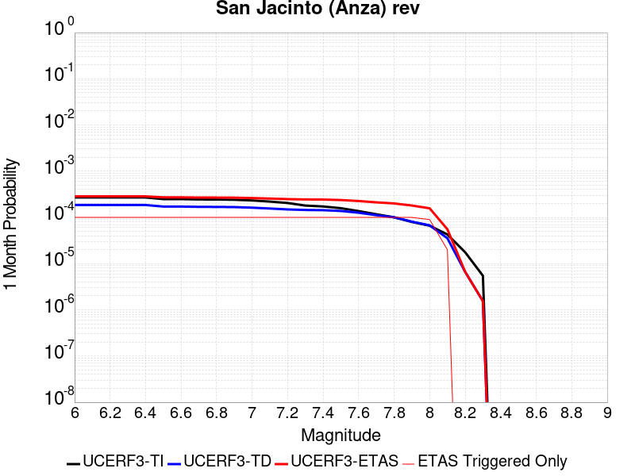 |  |  |

| Magnitude | 1 wk TI Prob | 1 wk TD Prob | 1 wk ETAS Prob | 1 wk ETAS/TD Gain | 1 wk ETAS Triggered Only | 1 mo TI Prob | 1 mo TD Prob | 1 mo ETAS Prob | 1 mo ETAS/TD Gain | 1 mo ETAS Triggered Only | 1 yr TI Prob | 1 yr TD Prob | 1 yr ETAS Prob | 1 yr ETAS/TD Gain | 1 yr ETAS Triggered Only | 10 yr TI Prob | 10 yr TD Prob | 10 yr ETAS Prob | 10 yr ETAS/TD Gain | 10 yr ETAS Triggered Only |
|-----|-----|-----|-----|-----|-----|-----|-----|-----|-----|-----|-----|-----|-----|-----|-----|-----|-----|-----|-----|-----|
| 6.0 | 6.3015636E-5 | 4.3302647E-5 | 1.0369015E-4 | 2.3945453 | 6.039012E-5 | 2.7003905E-4 | 1.8556965E-4 | 2.4594855E-4 | 1.3253707 | 6.039012E-5 | 0.0032827691 | 0.0022569813 | 0.002317235 | 1.0266967 | 6.039012E-5 | 0.032346968 | 0.023296192 | 0.023355175 | 1.0025319 | 6.039012E-5 |
| 6.1 | 6.3015636E-5 | 4.3302647E-5 | 1.0369015E-4 | 2.3945453 | 6.039012E-5 | 2.7003905E-4 | 1.8556965E-4 | 2.4594855E-4 | 1.3253707 | 6.039012E-5 | 0.0032827691 | 0.0022569813 | 0.002317235 | 1.0266967 | 6.039012E-5 | 0.032346968 | 0.023296192 | 0.023355175 | 1.0025319 | 6.039012E-5 |
| 6.2 | 6.3015636E-5 | 4.3302647E-5 | 1.0369015E-4 | 2.3945453 | 6.039012E-5 | 2.7003905E-4 | 1.8556965E-4 | 2.4594855E-4 | 1.3253707 | 6.039012E-5 | 0.0032827691 | 0.0022569813 | 0.002317235 | 1.0266967 | 6.039012E-5 | 0.032346968 | 0.023296192 | 0.023355175 | 1.0025319 | 6.039012E-5 |
| 6.3 | 6.3015636E-5 | 4.3302647E-5 | 1.0369015E-4 | 2.3945453 | 6.039012E-5 | 2.7003905E-4 | 1.8556965E-4 | 2.4594855E-4 | 1.3253707 | 6.039012E-5 | 0.0032827691 | 0.0022569813 | 0.002317235 | 1.0266967 | 6.039012E-5 | 0.032346968 | 0.023296192 | 0.023355175 | 1.0025319 | 6.039012E-5 |
| 6.4 | 6.3015636E-5 | 4.3302647E-5 | 1.0369015E-4 | 2.3945453 | 6.039012E-5 | 2.7003905E-4 | 1.8556965E-4 | 2.4594855E-4 | 1.3253707 | 6.039012E-5 | 0.0032827691 | 0.0022569813 | 0.002317235 | 1.0266967 | 6.039012E-5 | 0.032346968 | 0.023296192 | 0.023355175 | 1.0025319 | 6.039012E-5 |
| 6.5 | 5.811017E-5 | 4.0082516E-5 | 1.0047021E-4 | 2.5065846 | 6.039012E-5 | 2.4901982E-4 | 1.7177092E-4 | 2.3215068E-4 | 1.3515131 | 6.039012E-5 | 0.0030276014 | 0.002089311 | 0.0021495747 | 1.0288439 | 6.039012E-5 | 0.02986684 | 0.021593736 | 0.021652823 | 1.0027362 | 6.039012E-5 |
| 6.6 | 5.811017E-5 | 4.0082516E-5 | 1.0047021E-4 | 2.5065846 | 6.039012E-5 | 2.4901982E-4 | 1.7177092E-4 | 2.3215068E-4 | 1.3515131 | 6.039012E-5 | 0.0030276014 | 0.002089311 | 0.0021495747 | 1.0288439 | 6.039012E-5 | 0.02986684 | 0.021593736 | 0.021652823 | 1.0027362 | 6.039012E-5 |
| 6.7 | 5.712442E-5 | 3.9505223E-5 | 9.989296E-5 | 2.5286012 | 6.039012E-5 | 2.4479596E-4 | 1.6929714E-4 | 2.2967704E-4 | 1.3566505 | 6.039012E-5 | 0.0029763177 | 0.0020592497 | 0.0021195153 | 1.0292659 | 6.039012E-5 | 0.029367693 | 0.021285562 | 0.021344667 | 1.0027767 | 6.039012E-5 |
| 6.8 | 5.6967532E-5 | 3.9361643E-5 | 9.9749384E-5 | 2.5341773 | 6.039012E-5 | 2.4412372E-4 | 1.6868189E-4 | 2.2906181E-4 | 1.3579515 | 6.039012E-5 | 0.0029681553 | 0.002051773 | 0.0021120391 | 1.0293727 | 6.039012E-5 | 0.029288229 | 0.021210281 | 0.02126939 | 1.0027869 | 6.039012E-5 |
| 6.9 | 5.6211324E-5 | 3.9066435E-5 | 9.94542E-5 | 2.545771 | 6.039012E-5 | 2.4088343E-4 | 1.6741687E-4 | 2.2779687E-4 | 1.3606566 | 6.039012E-5 | 0.0029288116 | 0.0020364004 | 0.0020966674 | 1.0295949 | 6.039012E-5 | 0.028905109 | 0.021049714 | 0.021108832 | 1.0028086 | 6.039012E-5 |
| 7.0 | 5.4383527E-5 | 3.792697E-5 | 9.83148E-5 | 2.5922134 | 6.039012E-5 | 2.3305144E-4 | 1.6253405E-4 | 2.2291436E-4 | 1.3714932 | 6.039012E-5 | 0.0028337094 | 0.001977061 | 0.0020373317 | 1.030485 | 6.039012E-5 | 0.027978465 | 0.020440677 | 0.020499833 | 1.002894 | 6.039012E-5 |
| 7.1 | 5.1393665E-5 | 3.6389913E-5 | 9.677783E-5 | 2.6594687 | 6.039012E-5 | 2.2023996E-4 | 1.5594746E-4 | 2.1632818E-4 | 1.3871862 | 6.039012E-5 | 0.0026781242 | 0.0018970112 | 0.0019572868 | 1.0317739 | 6.039012E-5 | 0.026460782 | 0.019614287 | 0.019673493 | 1.0030185 | 6.039012E-5 |
| 7.2 | 4.785222E-5 | 3.4741795E-5 | 9.512982E-5 | 2.7381952 | 6.039012E-5 | 2.0506482E-4 | 1.4888494E-4 | 2.0926606E-4 | 1.4055557 | 6.039012E-5 | 0.0024938055 | 0.0018111705 | 0.0018714513 | 1.0332828 | 6.039012E-5 | 0.024660049 | 0.018728992 | 0.01878825 | 1.003164 | 6.039012E-5 |
| 7.3 | 4.2143256E-5 | 3.383628E-5 | 9.422436E-5 | 2.784714 | 6.039012E-5 | 1.8060145E-4 | 1.4500458E-4 | 2.0538595E-4 | 1.4164101 | 6.039012E-5 | 0.002196605 | 0.0017640047 | 0.0018242883 | 1.0341743 | 6.039012E-5 | 0.02175019 | 0.01823724 | 0.01829653 | 1.003251 | 6.039012E-5 |
| 7.4 | 4.0264713E-5 | 3.347446E-5 | 9.386256E-5 | 2.804005 | 6.039012E-5 | 1.7255165E-4 | 1.4345412E-4 | 2.0383557E-4 | 1.4209113 | 6.039012E-5 | 0.002098792 | 0.0017451581 | 0.0018054429 | 1.034544 | 6.039012E-5 | 0.020790804 | 0.018041821 | 0.01810112 | 1.0032868 | 6.039012E-5 |
| 7.5 | 3.694492E-5 | 3.218847E-5 | 9.257664E-5 | 2.8760812 | 6.039012E-5 | 1.5832575E-4 | 1.379433E-4 | 1.9832508E-4 | 1.437729 | 6.039012E-5 | 0.0019259118 | 0.001678169 | 0.0017384577 | 1.0359254 | 6.039012E-5 | 0.01909306 | 0.01735827 | 0.017417612 | 1.0034187 | 6.039012E-5 |
| 7.6 | 3.200565E-5 | 2.9504106E-5 | 8.989245E-5 | 3.0467775 | 6.039012E-5 | 1.3715986E-4 | 1.2644005E-4 | 1.8682254E-4 | 1.4775581 | 6.039012E-5 | 0.001668642 | 0.0015383229 | 0.0015986201 | 1.0391967 | 6.039012E-5 | 0.01656168 | 0.0159463 | 0.016005727 | 1.0037267 | 6.039012E-5 |
| 7.7 | 2.731642E-5 | 2.6092788E-5 | 8.6481334E-5 | 3.3143768 | 6.039012E-5 | 1.1706512E-4 | 1.1182144E-4 | 1.7220482E-4 | 1.539998 | 6.039012E-5 | 0.001424336 | 0.0013605768 | 0.0014208849 | 1.0443252 | 6.039012E-5 | 0.014152412 | 0.014167004 | 0.014226539 | 1.0042024 | 6.039012E-5 |
| 7.8 | 2.3466424E-5 | 2.3504817E-5 | 8.3893516E-5 | 3.5692053 | 6.039012E-5 | 1.0056651E-4 | 1.0073105E-4 | 1.6111508E-4 | 1.599458 | 6.039012E-5 | 0.0012237094 | 0.0012257113 | 0.0012860275 | 1.049209 | 6.039012E-5 | 0.012169928 | 0.012808893 | 0.01286851 | 1.0046543 | 6.039012E-5 |
| 7.9 | 1.8611925E-5 | 1.8908117E-5 | 7.92971E-5 | 4.1938124 | 6.039012E-5 | 7.9762955E-5 | 8.1032274E-5 | 1.414175E-4 | 1.7451997 | 6.039012E-5 | 9.7068126E-4 | 9.861222E-4 | 0.0010464527 | 1.0611796 | 6.039012E-5 | 0.0096645225 | 0.010393824 | 0.0104535865 | 1.0057498 | 6.039012E-5 |
| 8.0 | 1.5460775E-5 | 1.5740965E-5 | 4.593555E-5 | 2.918217 | 3.019506E-5 | 6.6258784E-5 | 6.7459536E-5 | 9.765256E-5 | 1.4475724 | 3.019506E-5 | 8.0640207E-4 | 8.21011E-4 | 8.5118134E-4 | 1.0367477 | 3.019506E-5 | 0.008034821 | 0.0087028835 | 0.008732816 | 1.0034393 | 3.019506E-5 |
| 8.1 | 9.983884E-6 | 8.269952E-6 | 8.269952E-6 | 1.0 | 0.0 | 4.2787375E-5 | 3.544217E-5 | 3.544217E-5 | 1.0 | 0.0 | 5.2081177E-4 | 4.314235E-4 | 4.314235E-4 | 1.0 | 0.0 | 0.0051959283 | 0.004640022 | 0.004640022 | 1.0 | 0.0 |
| 8.2 | 4.1226E-6 | 1.5529788E-6 | 1.5529788E-6 | 1.0 | 0.0 | 1.7668166E-5 | 6.6556063E-6 | 6.6556063E-6 | 1.0 | 0.0 | 2.1508869E-4 | 8.102902E-5 | 8.102902E-5 | 1.0 | 0.0 | 0.0021488064 | 9.4050163E-4 | 9.4050163E-4 | 1.0 | 0.0 |
| 8.3 | 1.2750878E-6 | 3.612133E-7 | 3.612133E-7 | 1.0 | 0.0 | 5.4646503E-6 | 1.548056E-6 | 1.548056E-6 | 1.0 | 0.0 | 6.653009E-5 | 1.8847424E-5 | 1.8847424E-5 | 1.0 | 0.0 | 6.6510175E-4 | 2.2734253E-4 | 2.2734253E-4 | 1.0 | 0.0 |

## Kern Canyon (South Kern) 2011
*[(top)](#table-of-contents)*

| 1 Week | 1 Month | 1 Year | 10 Year |
|-----|-----|-----|-----|
| 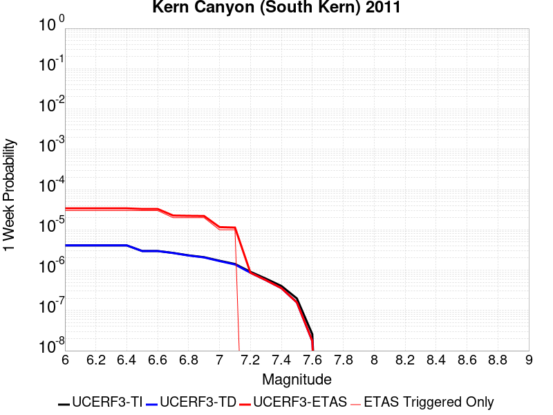 |  |  |  |

| Magnitude | 1 wk TI Prob | 1 wk TD Prob | 1 wk ETAS Prob | 1 wk ETAS/TD Gain | 1 wk ETAS Triggered Only | 1 mo TI Prob | 1 mo TD Prob | 1 mo ETAS Prob | 1 mo ETAS/TD Gain | 1 mo ETAS Triggered Only | 1 yr TI Prob | 1 yr TD Prob | 1 yr ETAS Prob | 1 yr ETAS/TD Gain | 1 yr ETAS Triggered Only | 10 yr TI Prob | 10 yr TD Prob | 10 yr ETAS Prob | 10 yr ETAS/TD Gain | 10 yr ETAS Triggered Only |
|-----|-----|-----|-----|-----|-----|-----|-----|-----|-----|-----|-----|-----|-----|-----|-----|-----|-----|-----|-----|-----|
| 6.0 | 4.105075E-6 | 4.1137264E-6 | 6.45036E-5 | 15.680089 | 6.039012E-5 | 1.7593058E-5 | 1.763014E-5 | 7.80192E-5 | 4.42533 | 6.039012E-5 | 2.1417443E-4 | 2.1462646E-4 | 2.750036E-4 | 1.2813127 | 6.039012E-5 | 0.0021396813 | 0.0021442557 | 0.0022045162 | 1.0281032 | 6.039012E-5 |
| 6.1 | 4.105075E-6 | 4.1137264E-6 | 6.45036E-5 | 15.680089 | 6.039012E-5 | 1.7593058E-5 | 1.763014E-5 | 7.80192E-5 | 4.42533 | 6.039012E-5 | 2.1417443E-4 | 2.1462646E-4 | 2.750036E-4 | 1.2813127 | 6.039012E-5 | 0.0021396813 | 0.0021442557 | 0.0022045162 | 1.0281032 | 6.039012E-5 |
| 6.2 | 4.105075E-6 | 4.1137264E-6 | 6.45036E-5 | 15.680089 | 6.039012E-5 | 1.7593058E-5 | 1.763014E-5 | 7.80192E-5 | 4.42533 | 6.039012E-5 | 2.1417443E-4 | 2.1462646E-4 | 2.750036E-4 | 1.2813127 | 6.039012E-5 | 0.0021396813 | 0.0021442557 | 0.0022045162 | 1.0281032 | 6.039012E-5 |
| 6.3 | 4.105075E-6 | 4.1137264E-6 | 6.45036E-5 | 15.680089 | 6.039012E-5 | 1.7593058E-5 | 1.763014E-5 | 7.80192E-5 | 4.42533 | 6.039012E-5 | 2.1417443E-4 | 2.1462646E-4 | 2.750036E-4 | 1.2813127 | 6.039012E-5 | 0.0021396813 | 0.0021442557 | 0.0022045162 | 1.0281032 | 6.039012E-5 |
| 6.4 | 4.105075E-6 | 4.1137264E-6 | 6.45036E-5 | 15.680089 | 6.039012E-5 | 1.7593058E-5 | 1.763014E-5 | 7.80192E-5 | 4.42533 | 6.039012E-5 | 2.1417443E-4 | 2.1462646E-4 | 2.750036E-4 | 1.2813127 | 6.039012E-5 | 0.0021396813 | 0.0021442557 | 0.0022045162 | 1.0281032 | 6.039012E-5 |
| 6.5 | 2.9849807E-6 | 2.9731548E-6 | 6.33631E-5 | 21.311739 | 6.039012E-5 | 1.2792712E-5 | 1.274203E-5 | 7.313138E-5 | 5.7393823 | 6.039012E-5 | 1.5574014E-4 | 1.5512333E-4 | 2.1550407E-4 | 1.3892435 | 6.039012E-5 | 0.0015563103 | 0.0015501656 | 0.0016104621 | 1.0388968 | 6.039012E-5 |
| 6.6 | 2.9849807E-6 | 2.9731548E-6 | 6.33631E-5 | 21.311739 | 6.039012E-5 | 1.2792712E-5 | 1.274203E-5 | 7.313138E-5 | 5.7393823 | 6.039012E-5 | 1.5574014E-4 | 1.5512333E-4 | 2.1550407E-4 | 1.3892435 | 6.039012E-5 | 0.0015563103 | 0.0015501656 | 0.0016104621 | 1.0388968 | 6.039012E-5 |
| 6.7 | 2.6756725E-6 | 2.6582206E-6 | 6.304818E-5 | 23.71819 | 6.039012E-5 | 1.1467117E-5 | 1.1392325E-5 | 7.178176E-5 | 6.300887 | 6.039012E-5 | 1.396032E-4 | 1.3869285E-4 | 1.9907458E-4 | 1.435363 | 6.039012E-5 | 0.0013951553 | 0.0013860738 | 0.0014463802 | 1.0435088 | 6.039012E-5 |
| 6.8 | 2.3283721E-6 | 2.3047787E-6 | 6.269476E-5 | 27.202072 | 6.039012E-5 | 9.9787E-6 | 9.877586E-6 | 7.026711E-5 | 7.1137934 | 6.039012E-5 | 1.214839E-4 | 1.20253055E-4 | 1.806359E-4 | 1.5021316 | 6.039012E-5 | 0.001214175 | 0.0012018873 | 0.0012622048 | 1.0501857 | 6.039012E-5 |
| 6.9 | 2.0972677E-6 | 2.0696411E-6 | 6.2459636E-5 | 30.17897 | 6.039012E-5 | 8.988259E-6 | 8.869861E-6 | 6.925945E-5 | 7.808403 | 6.039012E-5 | 1.0942656E-4 | 1.0798526E-4 | 1.6836886E-4 | 1.5591837 | 6.039012E-5 | 0.0010937268 | 0.0010793337 | 0.0011396586 | 1.0558909 | 6.039012E-5 |
| 7.0 | 1.7132242E-6 | 1.6787036E-6 | 3.1873715E-5 | 18.9871 | 3.019506E-5 | 7.3423685E-6 | 7.194424E-6 | 3.7389265E-5 | 5.1969786 | 3.019506E-5 | 8.938967E-5 | 8.758863E-5 | 1.1778105E-4 | 1.344707 | 3.019506E-5 | 8.935372E-4 | 8.7554497E-4 | 9.057136E-4 | 1.034457 | 3.019506E-5 |
| 7.1 | 1.4215541E-6 | 1.3815752E-6 | 3.1576594E-5 | 22.855501 | 3.019506E-5 | 6.0923603E-6 | 5.9210233E-6 | 3.6115904E-5 | 6.099605 | 3.019506E-5 | 7.417196E-5 | 7.20861E-5 | 1.0227899E-4 | 1.4188447 | 3.019506E-5 | 7.414721E-4 | 7.206299E-4 | 7.5080316E-4 | 1.0418707 | 3.019506E-5 |
| 7.2 | 9.097853E-7 | 8.6037755E-7 | 8.6037755E-7 | 1.0 | 0.0 | 3.899074E-6 | 3.6873273E-6 | 3.6873273E-6 | 1.0 | 0.0 | 4.7470192E-5 | 4.4892295E-5 | 4.4892295E-5 | 1.0 | 0.0 | 4.7460053E-4 | 4.4883334E-4 | 4.4883334E-4 | 1.0 | 0.0 |
| 7.3 | 6.144169E-7 | 5.628206E-7 | 5.628206E-7 | 1.0 | 0.0 | 2.6332125E-6 | 2.4120861E-6 | 2.4120861E-6 | 1.0 | 0.0 | 3.205889E-5 | 2.9366758E-5 | 2.9366758E-5 | 1.0 | 0.0 | 3.2054266E-4 | 2.936293E-4 | 2.936293E-4 | 1.0 | 0.0 |
| 7.4 | 4.049844E-7 | 3.5728314E-7 | 3.5728314E-7 | 1.0 | 0.0 | 1.7356463E-6 | 1.5312125E-6 | 1.5312125E-6 | 1.0 | 0.0 | 2.1131287E-5 | 1.8642357E-5 | 1.8642357E-5 | 1.0 | 0.0 | 2.1129279E-4 | 1.8640817E-4 | 1.8640817E-4 | 1.0 | 0.0 |
| 7.5 | 1.9871162E-7 | 1.583044E-7 | 1.583044E-7 | 1.0 | 0.0 | 8.5162094E-7 | 6.7844724E-7 | 6.7844724E-7 | 1.0 | 0.0 | 1.0368436E-5 | 8.260065E-6 | 8.260065E-6 | 1.0 | 0.0 | 1.0367952E-4 | 8.259767E-5 | 8.259767E-5 | 1.0 | 0.0 |
| 7.6 | 2.572245E-8 | 1.7352555E-8 | 1.7352555E-8 | 1.0 | 0.0 | 1.10239064E-7 | 7.436809E-8 | 7.436809E-8 | 1.0 | 0.0 | 1.3421597E-6 | 9.054312E-7 | 9.054312E-7 | 1.0 | 0.0 | 1.3421517E-5 | 9.05428E-6 | 9.05428E-6 | 1.0 | 0.0 |

## Bullion Mountains
*[(top)](#table-of-contents)*

| 1 Week | 1 Month | 1 Year | 10 Year |
|-----|-----|-----|-----|
|  |  |  | 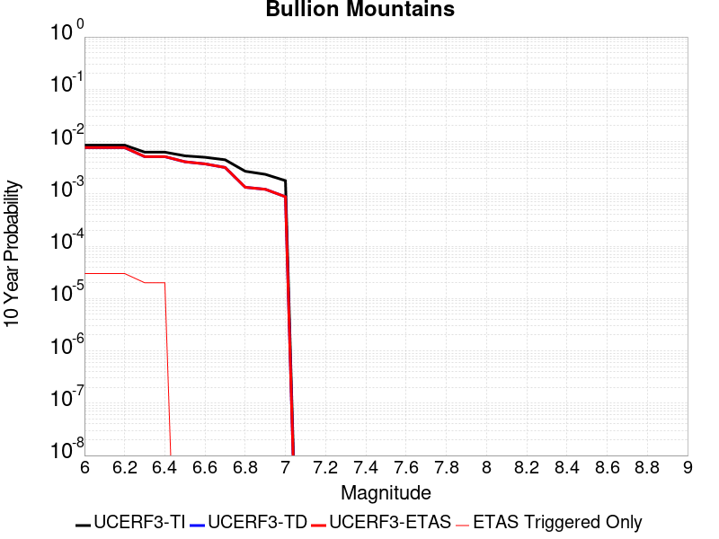 |

| Magnitude | 1 wk TI Prob | 1 wk TD Prob | 1 wk ETAS Prob | 1 wk ETAS/TD Gain | 1 wk ETAS Triggered Only | 1 mo TI Prob | 1 mo TD Prob | 1 mo ETAS Prob | 1 mo ETAS/TD Gain | 1 mo ETAS Triggered Only | 1 yr TI Prob | 1 yr TD Prob | 1 yr ETAS Prob | 1 yr ETAS/TD Gain | 1 yr ETAS Triggered Only | 10 yr TI Prob | 10 yr TD Prob | 10 yr ETAS Prob | 10 yr ETAS/TD Gain | 10 yr ETAS Triggered Only |
|-----|-----|-----|-----|-----|-----|-----|-----|-----|-----|-----|-----|-----|-----|-----|-----|-----|-----|-----|-----|-----|
| 6.0 | 1.6420427E-5 | 1.4692089E-5 | 7.508132E-5 | 5.110323 | 6.039012E-5 | 7.037136E-5 | 6.296479E-5 | 1.2335111E-4 | 1.9590489 | 6.039012E-5 | 8.5643446E-4 | 7.663651E-4 | 8.267089E-4 | 1.0787404 | 6.039012E-5 | 0.008531413 | 0.007641016 | 0.007700945 | 1.007843 | 6.039012E-5 |
| 6.1 | 1.6420427E-5 | 1.4692089E-5 | 7.508132E-5 | 5.110323 | 6.039012E-5 | 7.037136E-5 | 6.296479E-5 | 1.2335111E-4 | 1.9590489 | 6.039012E-5 | 8.5643446E-4 | 7.663651E-4 | 8.267089E-4 | 1.0787404 | 6.039012E-5 | 0.008531413 | 0.007641016 | 0.007700945 | 1.007843 | 6.039012E-5 |
| 6.2 | 1.6420427E-5 | 1.4692089E-5 | 7.508132E-5 | 5.110323 | 6.039012E-5 | 7.037136E-5 | 6.296479E-5 | 1.2335111E-4 | 1.9590489 | 6.039012E-5 | 8.5643446E-4 | 7.663651E-4 | 8.267089E-4 | 1.0787404 | 6.039012E-5 | 0.008531413 | 0.007641016 | 0.007700945 | 1.007843 | 6.039012E-5 |
| 6.3 | 1.2046778E-5 | 9.862335E-6 | 7.025186E-5 | 7.123248 | 6.039012E-5 | 5.1628023E-5 | 4.2266598E-5 | 1.02654165E-4 | 2.4287302 | 6.039012E-5 | 6.283899E-4 | 5.144975E-4 | 5.7485653E-4 | 1.1173165 | 6.039012E-5 | 0.0062661595 | 0.005135345 | 0.005195425 | 1.0116993 | 6.039012E-5 |
| 6.4 | 1.2046778E-5 | 9.862335E-6 | 7.025186E-5 | 7.123248 | 6.039012E-5 | 5.1628023E-5 | 4.2266598E-5 | 1.02654165E-4 | 2.4287302 | 6.039012E-5 | 6.283899E-4 | 5.144975E-4 | 5.7485653E-4 | 1.1173165 | 6.039012E-5 | 0.0062661595 | 0.005135345 | 0.005195425 | 1.0116993 | 6.039012E-5 |
| 6.5 | 1.0244343E-5 | 7.879458E-6 | 7.879458E-6 | 1.0 | 0.0 | 4.390359E-5 | 3.3768785E-5 | 3.3768785E-5 | 1.0 | 0.0 | 5.343951E-4 | 4.110781E-4 | 4.110781E-4 | 1.0 | 0.0 | 0.005331118 | 0.004105208 | 0.004105208 | 1.0 | 0.0 |
| 6.6 | 9.605408E-6 | 7.1774966E-6 | 7.1774966E-6 | 1.0 | 0.0 | 4.1165385E-5 | 3.076045E-5 | 3.076045E-5 | 1.0 | 0.0 | 5.010733E-4 | 3.744645E-4 | 3.744645E-4 | 1.0 | 0.0 | 0.00499945 | 0.003740332 | 0.003740332 | 1.0 | 0.0 |
| 6.7 | 8.60418E-6 | 6.1240044E-6 | 6.1240044E-6 | 1.0 | 0.0 | 3.687454E-5 | 2.624558E-5 | 2.624558E-5 | 1.0 | 0.0 | 4.48855E-4 | 3.1951256E-4 | 3.1951256E-4 | 1.0 | 0.0 | 0.004479495 | 0.0031924439 | 0.0031924439 | 1.0 | 0.0 |
| 6.8 | 5.187994E-6 | 2.5631666E-6 | 2.5631666E-6 | 1.0 | 0.0 | 2.223407E-5 | 1.0984976E-5 | 1.0984976E-5 | 1.0 | 0.0 | 2.7066618E-4 | 1.3373788E-4 | 1.3373788E-4 | 1.0 | 0.0 | 0.0027033675 | 0.0013369655 | 0.0013369655 | 1.0 | 0.0 |
| 6.9 | 4.5302368E-6 | 2.3443165E-6 | 2.3443165E-6 | 1.0 | 0.0 | 1.9415156E-5 | 1.0047055E-5 | 1.0047055E-5 | 1.0 | 0.0 | 2.3635388E-4 | 1.2232E-4 | 1.2232E-4 | 1.0 | 0.0 | 0.0023610266 | 0.0012229157 | 0.0012229157 | 1.0 | 0.0 |
| 7.0 | 3.431668E-6 | 1.6882402E-6 | 1.6882402E-6 | 1.0 | 0.0 | 1.4707065E-5 | 7.235315E-6 | 7.235315E-6 | 1.0 | 0.0 | 1.7904381E-4 | 8.808996E-5 | 8.808996E-5 | 1.0 | 0.0 | 0.0017889962 | 8.808996E-4 | 8.808996E-4 | 1.0 | 0.0 |

## Lost Hills
*[(top)](#table-of-contents)*

| 1 Week | 1 Month | 1 Year | 10 Year |
|-----|-----|-----|-----|
|  |  |  |  |

| Magnitude | 1 wk TI Prob | 1 wk TD Prob | 1 wk ETAS Prob | 1 wk ETAS/TD Gain | 1 wk ETAS Triggered Only | 1 mo TI Prob | 1 mo TD Prob | 1 mo ETAS Prob | 1 mo ETAS/TD Gain | 1 mo ETAS Triggered Only | 1 yr TI Prob | 1 yr TD Prob | 1 yr ETAS Prob | 1 yr ETAS/TD Gain | 1 yr ETAS Triggered Only | 10 yr TI Prob | 10 yr TD Prob | 10 yr ETAS Prob | 10 yr ETAS/TD Gain | 10 yr ETAS Triggered Only |
|-----|-----|-----|-----|-----|-----|-----|-----|-----|-----|-----|-----|-----|-----|-----|-----|-----|-----|-----|-----|-----|
| 6.0 | 2.233523E-5 | 2.5106583E-5 | 8.549519E-5 | 3.4052896 | 6.039012E-5 | 9.571891E-5 | 1.0759615E-4 | 1.6797977E-4 | 1.5612062 | 6.039012E-5 | 0.0011647546 | 0.001309364 | 0.001369675 | 1.0460613 | 6.039012E-5 | 0.011586686 | 0.013033091 | 0.013092694 | 1.0045732 | 6.039012E-5 |
| 6.1 | 2.233523E-5 | 2.5106583E-5 | 8.549519E-5 | 3.4052896 | 6.039012E-5 | 9.571891E-5 | 1.0759615E-4 | 1.6797977E-4 | 1.5612062 | 6.039012E-5 | 0.0011647546 | 0.001309364 | 0.001369675 | 1.0460613 | 6.039012E-5 | 0.011586686 | 0.013033091 | 0.013092694 | 1.0045732 | 6.039012E-5 |
| 6.2 | 2.233523E-5 | 2.5106583E-5 | 8.549519E-5 | 3.4052896 | 6.039012E-5 | 9.571891E-5 | 1.0759615E-4 | 1.6797977E-4 | 1.5612062 | 6.039012E-5 | 0.0011647546 | 0.001309364 | 0.001369675 | 1.0460613 | 6.039012E-5 | 0.011586686 | 0.013033091 | 0.013092694 | 1.0045732 | 6.039012E-5 |
| 6.3 | 2.233523E-5 | 2.5106583E-5 | 8.549519E-5 | 3.4052896 | 6.039012E-5 | 9.571891E-5 | 1.0759615E-4 | 1.6797977E-4 | 1.5612062 | 6.039012E-5 | 0.0011647546 | 0.001309364 | 0.001369675 | 1.0460613 | 6.039012E-5 | 0.011586686 | 0.013033091 | 0.013092694 | 1.0045732 | 6.039012E-5 |
| 6.4 | 1.2288092E-5 | 1.3781108E-5 | 4.397575E-5 | 3.1910172 | 3.019506E-5 | 5.2662188E-5 | 5.906108E-5 | 8.9254354E-5 | 1.5112212 | 3.019506E-5 | 6.409735E-4 | 7.189252E-4 | 7.4909854E-4 | 1.0419701 | 3.019506E-5 | 0.006391279 | 0.0071752006 | 0.007205179 | 1.004178 | 3.019506E-5 |
| 6.5 | 1.2288092E-5 | 1.3781108E-5 | 4.397575E-5 | 3.1910172 | 3.019506E-5 | 5.2662188E-5 | 5.906108E-5 | 8.9254354E-5 | 1.5112212 | 3.019506E-5 | 6.409735E-4 | 7.189252E-4 | 7.4909854E-4 | 1.0419701 | 3.019506E-5 | 0.006391279 | 0.0071752006 | 0.007205179 | 1.004178 | 3.019506E-5 |
| 6.6 | 8.58281E-6 | 9.63377E-6 | 3.9828537E-5 | 4.134263 | 3.019506E-5 | 3.6782953E-5 | 4.12874E-5 | 7.148121E-5 | 1.7313081 | 3.019506E-5 | 4.4774043E-4 | 5.026414E-4 | 5.328213E-4 | 1.0600426 | 3.019506E-5 | 0.0044683935 | 0.005023205 | 0.0050532487 | 1.005981 | 3.019506E-5 |
| 6.7 | 7.205685E-6 | 8.088302E-6 | 3.8283117E-5 | 4.7331467 | 3.019506E-5 | 3.088114E-5 | 3.466415E-5 | 6.485816E-5 | 1.8710444 | 3.019506E-5 | 3.7591302E-4 | 4.2203604E-4 | 4.5221834E-4 | 1.0715159 | 3.019506E-5 | 0.0037527776 | 0.0042203604 | 0.0042504277 | 1.0071244 | 3.019506E-5 |

## Palos Verdes
*[(top)](#table-of-contents)*

| 1 Week | 1 Month | 1 Year | 10 Year |
|-----|-----|-----|-----|
|  |  |  |  |

| Magnitude | 1 wk TI Prob | 1 wk TD Prob | 1 wk ETAS Prob | 1 wk ETAS/TD Gain | 1 wk ETAS Triggered Only | 1 mo TI Prob | 1 mo TD Prob | 1 mo ETAS Prob | 1 mo ETAS/TD Gain | 1 mo ETAS Triggered Only | 1 yr TI Prob | 1 yr TD Prob | 1 yr ETAS Prob | 1 yr ETAS/TD Gain | 1 yr ETAS Triggered Only | 10 yr TI Prob | 10 yr TD Prob | 10 yr ETAS Prob | 10 yr ETAS/TD Gain | 10 yr ETAS Triggered Only |
|-----|-----|-----|-----|-----|-----|-----|-----|-----|-----|-----|-----|-----|-----|-----|-----|-----|-----|-----|-----|-----|
| 6.0 | 6.126063E-5 | 7.622612E-5 | 1.3661163E-4 | 1.7921894 | 6.039012E-5 | 2.6251914E-4 | 3.2664582E-4 | 3.8701622E-4 | 1.1848191 | 6.039012E-5 | 0.0031914865 | 0.003970174 | 0.0040303245 | 1.0151505 | 6.039012E-5 | 0.031460393 | 0.039048895 | 0.039106928 | 1.0014862 | 6.039012E-5 |
| 6.1 | 6.126063E-5 | 7.622612E-5 | 1.3661163E-4 | 1.7921894 | 6.039012E-5 | 2.6251914E-4 | 3.2664582E-4 | 3.8701622E-4 | 1.1848191 | 6.039012E-5 | 0.0031914865 | 0.003970174 | 0.0040303245 | 1.0151505 | 6.039012E-5 | 0.031460393 | 0.039048895 | 0.039106928 | 1.0014862 | 6.039012E-5 |
| 6.2 | 6.126063E-5 | 7.622612E-5 | 1.3661163E-4 | 1.7921894 | 6.039012E-5 | 2.6251914E-4 | 3.2664582E-4 | 3.8701622E-4 | 1.1848191 | 6.039012E-5 | 0.0031914865 | 0.003970174 | 0.0040303245 | 1.0151505 | 6.039012E-5 | 0.031460393 | 0.039048895 | 0.039106928 | 1.0014862 | 6.039012E-5 |
| 6.3 | 4.0838047E-5 | 4.9749437E-5 | 7.994299E-5 | 1.6069126 | 3.019506E-5 | 1.7500846E-4 | 2.1319572E-4 | 2.4338433E-4 | 1.1416005 | 3.019506E-5 | 0.0021286458 | 0.0025927818 | 0.0026228987 | 1.0116156 | 3.019506E-5 | 0.021083709 | 0.025646681 | 0.025676101 | 1.0011472 | 3.019506E-5 |
| 6.4 | 4.0838047E-5 | 4.9749437E-5 | 7.994299E-5 | 1.6069126 | 3.019506E-5 | 1.7500846E-4 | 2.1319572E-4 | 2.4338433E-4 | 1.1416005 | 3.019506E-5 | 0.0021286458 | 0.0025927818 | 0.0026228987 | 1.0116156 | 3.019506E-5 | 0.021083709 | 0.025646681 | 0.025676101 | 1.0011472 | 3.019506E-5 |
| 6.5 | 3.0512005E-5 | 3.656162E-5 | 6.675558E-5 | 1.8258374 | 3.019506E-5 | 1.3075917E-4 | 1.5668393E-4 | 1.8687425E-4 | 1.192683 | 3.019506E-5 | 0.0015908304 | 0.0019060767 | 0.0019362142 | 1.0158113 | 3.019506E-5 | 0.015794903 | 0.018909154 | 0.018938778 | 1.0015666 | 3.019506E-5 |
| 6.6 | 2.9255087E-5 | 3.515442E-5 | 6.534842E-5 | 1.8588963 | 3.019506E-5 | 1.2537291E-4 | 1.5065377E-4 | 1.8084428E-4 | 1.2003967 | 3.019506E-5 | 0.0015253464 | 0.0018327828 | 0.0018629226 | 1.0164448 | 3.019506E-5 | 0.015149189 | 0.018188225 | 0.018217871 | 1.00163 | 3.019506E-5 |
| 6.7 | 2.287198E-5 | 2.7248278E-5 | 5.7442518E-5 | 2.1081154 | 3.019506E-5 | 9.801909E-5 | 1.16773626E-4 | 1.4696516E-4 | 1.2585475 | 3.019506E-5 | 0.001192729 | 0.0014208833 | 0.0014510355 | 1.0212207 | 3.019506E-5 | 0.011863477 | 0.014127217 | 0.014156986 | 1.0021071 | 3.019506E-5 |
| 6.8 | 2.1325764E-5 | 2.5431877E-5 | 5.562617E-5 | 2.1872616 | 3.019506E-5 | 9.139293E-5 | 1.0898971E-4 | 1.3918149E-4 | 1.2770149 | 3.019506E-5 | 0.001112141 | 0.0013262323 | 0.0013563873 | 1.0227374 | 3.019506E-5 | 0.011065915 | 0.013192211 | 0.013222008 | 1.0022587 | 3.019506E-5 |
| 6.9 | 1.9009392E-5 | 2.2613547E-5 | 5.2807925E-5 | 2.335234 | 3.019506E-5 | 8.1466285E-5 | 9.6912096E-5 | 1.2710423E-4 | 1.3115414 | 3.019506E-5 | 9.914007E-4 | 0.0011793535 | 0.0012095129 | 1.0255729 | 3.019506E-5 | 0.009869894 | 0.011739632 | 0.011769473 | 1.0025419 | 3.019506E-5 |
| 7.0 | 1.7098473E-5 | 2.0319356E-5 | 5.05138E-5 | 2.4859943 | 3.019506E-5 | 7.3277115E-5 | 8.708052E-5 | 1.1727295E-4 | 1.3467185 | 3.019506E-5 | 8.917837E-4 | 0.001059775 | 0.001089938 | 1.0284618 | 3.019506E-5 | 0.008882134 | 0.010555646 | 0.010585523 | 1.0028304 | 3.019506E-5 |
| 7.1 | 1.5982785E-5 | 1.899476E-5 | 4.9189246E-5 | 2.5896218 | 3.019506E-5 | 6.849585E-5 | 8.1404054E-5 | 1.1159665E-4 | 1.370898 | 3.019506E-5 | 8.336179E-4 | 9.907284E-4 | 0.0010208936 | 1.0304475 | 3.019506E-5 | 0.008304977 | 0.009871479 | 0.009901376 | 1.0030286 | 3.019506E-5 |
| 7.2 | 1.4468002E-5 | 1.7197237E-5 | 4.7391775E-5 | 2.7557788 | 3.019506E-5 | 6.200425E-5 | 7.370083E-5 | 1.0389367E-4 | 1.4096675 | 3.019506E-5 | 7.546402E-4 | 8.970222E-4 | 9.271902E-4 | 1.0336312 | 3.019506E-5 | 0.007520827 | 0.008942284 | 0.008972209 | 1.0033464 | 3.019506E-5 |
| 7.3 | 5.288233E-6 | 6.2036747E-6 | 3.639855E-5 | 5.867256 | 3.019506E-5 | 2.2663658E-5 | 2.6587102E-5 | 5.678136E-5 | 2.135673 | 3.019506E-5 | 2.7589512E-4 | 3.236848E-4 | 3.538701E-4 | 1.0932552 | 3.019506E-5 | 0.0027555283 | 0.0032355562 | 0.0032656535 | 1.009302 | 3.019506E-5 |
| 7.4 | 8.279556E-7 | 8.408347E-7 | 8.408347E-7 | 1.0 | 0.0 | 3.5483763E-6 | 3.6035726E-6 | 3.6035726E-6 | 1.0 | 0.0 | 4.3200624E-5 | 4.3872686E-5 | 4.3872686E-5 | 1.0 | 0.0 | 4.3192226E-4 | 4.3864746E-4 | 4.3864746E-4 | 1.0 | 0.0 |
| 7.5 | 6.559831E-7 | 6.667229E-7 | 6.667229E-7 | 1.0 | 0.0 | 2.8113532E-6 | 2.857381E-6 | 2.857381E-6 | 1.0 | 0.0 | 3.4227687E-5 | 3.4788125E-5 | 3.4788125E-5 | 1.0 | 0.0 | 3.4222414E-4 | 3.4783344E-4 | 3.4783344E-4 | 1.0 | 0.0 |
| 7.6 | 3.5018968E-7 | 3.5620027E-7 | 3.5620027E-7 | 1.0 | 0.0 | 1.500812E-6 | 1.526572E-6 | 1.526572E-6 | 1.0 | 0.0 | 1.8272232E-5 | 1.8585903E-5 | 1.8585903E-5 | 1.0 | 0.0 | 1.8270731E-4 | 1.8584808E-4 | 1.8584808E-4 | 1.0 | 0.0 |
| 7.7 | 1.1986104E-7 | 1.2198376E-7 | 1.2198376E-7 | 1.0 | 0.0 | 5.1369005E-7 | 5.2278745E-7 | 5.2278745E-7 | 1.0 | 0.0 | 6.2541585E-6 | 6.364919E-6 | 6.364919E-6 | 1.0 | 0.0 | 6.2539824E-5 | 6.364741E-5 | 6.364741E-5 | 1.0 | 0.0 |
| 7.8 | 3.0445005E-8 | 3.1027582E-8 | 3.1027582E-8 | 1.0 | 0.0 | 1.3047858E-7 | 1.3297536E-7 | 1.3297536E-7 | 1.0 | 0.0 | 1.5885756E-6 | 1.6189739E-6 | 1.6189739E-6 | 1.0 | 0.0 | 1.5885644E-5 | 1.6189642E-5 | 1.6189642E-5 | 1.0 | 0.0 |

## Santa Ynez (West)
*[(top)](#table-of-contents)*

| 1 Week | 1 Month | 1 Year | 10 Year |
|-----|-----|-----|-----|
|  |  |  |  |

| Magnitude | 1 wk TI Prob | 1 wk TD Prob | 1 wk ETAS Prob | 1 wk ETAS/TD Gain | 1 wk ETAS Triggered Only | 1 mo TI Prob | 1 mo TD Prob | 1 mo ETAS Prob | 1 mo ETAS/TD Gain | 1 mo ETAS Triggered Only | 1 yr TI Prob | 1 yr TD Prob | 1 yr ETAS Prob | 1 yr ETAS/TD Gain | 1 yr ETAS Triggered Only | 10 yr TI Prob | 10 yr TD Prob | 10 yr ETAS Prob | 10 yr ETAS/TD Gain | 10 yr ETAS Triggered Only |
|-----|-----|-----|-----|-----|-----|-----|-----|-----|-----|-----|-----|-----|-----|-----|-----|-----|-----|-----|-----|-----|
| 6.0 | 4.7352758E-5 | 5.4972126E-5 | 8.516553E-5 | 1.5492493 | 3.019506E-5 | 2.0292461E-4 | 2.3557522E-4 | 2.6576317E-4 | 1.1281457 | 3.019506E-5 | 0.0024678076 | 0.0028645284 | 0.0029247454 | 1.0210216 | 6.039012E-5 | 0.024405818 | 0.028304417 | 0.028363097 | 1.0020732 | 6.039012E-5 |
| 6.1 | 4.7352758E-5 | 5.4972126E-5 | 5.4972126E-5 | 1.0 | 0.0 | 2.0292461E-4 | 2.3557522E-4 | 2.3557522E-4 | 1.0 | 0.0 | 0.0024678076 | 0.0028645284 | 0.0028645284 | 1.0 | 0.0 | 0.024405818 | 0.028304417 | 0.028304417 | 1.0 | 0.0 |
| 6.2 | 3.0415853E-5 | 3.392511E-5 | 3.392511E-5 | 1.0 | 0.0 | 1.3034715E-4 | 1.4538545E-4 | 1.4538545E-4 | 1.0 | 0.0 | 0.0015858212 | 0.0017686661 | 0.0017686661 | 1.0 | 0.0 | 0.015745522 | 0.017549807 | 0.017549807 | 1.0 | 0.0 |
| 6.3 | 3.0415853E-5 | 3.392511E-5 | 3.392511E-5 | 1.0 | 0.0 | 1.3034715E-4 | 1.4538545E-4 | 1.4538545E-4 | 1.0 | 0.0 | 0.0015858212 | 0.0017686661 | 0.0017686661 | 1.0 | 0.0 | 0.015745522 | 0.017549807 | 0.017549807 | 1.0 | 0.0 |
| 6.4 | 2.5452082E-5 | 2.7912422E-5 | 2.7912422E-5 | 1.0 | 0.0 | 1.09075794E-4 | 1.196193E-4 | 1.196193E-4 | 1.0 | 0.0 | 0.0013271887 | 0.0014554089 | 0.0014554089 | 1.0 | 0.0 | 0.013192902 | 0.014460951 | 0.014460951 | 1.0 | 0.0 |
| 6.5 | 2.3143784E-5 | 2.5128256E-5 | 2.5128256E-5 | 1.0 | 0.0 | 9.9183875E-5 | 1.0768817E-4 | 1.0768817E-4 | 1.0 | 0.0 | 0.0012068948 | 0.0013103267 | 0.0013103267 | 1.0 | 0.0 | 0.012003611 | 0.01302768 | 0.01302768 | 1.0 | 0.0 |
| 6.6 | 1.9118515E-5 | 2.035434E-5 | 2.035434E-5 | 1.0 | 0.0 | 8.193392E-5 | 8.7230015E-5 | 8.7230015E-5 | 1.0 | 0.0 | 9.97089E-4 | 0.001061516 | 0.001061516 | 1.0 | 0.0 | 0.00992627 | 0.010565365 | 0.010565365 | 1.0 | 0.0 |
| 6.7 | 1.722807E-5 | 1.8146347E-5 | 1.8146347E-5 | 1.0 | 0.0 | 7.3832496E-5 | 7.776777E-5 | 7.776777E-5 | 1.0 | 0.0 | 8.985399E-4 | 9.464169E-4 | 9.464169E-4 | 1.0 | 0.0 | 0.008949154 | 0.0094245095 | 0.0094245095 | 1.0 | 0.0 |
| 6.8 | 1.5317364E-5 | 1.5926486E-5 | 1.5926486E-5 | 1.0 | 0.0 | 6.56442E-5 | 6.82546E-5 | 6.82546E-5 | 1.0 | 0.0 | 7.98925E-4 | 8.306873E-4 | 8.306873E-4 | 1.0 | 0.0 | 0.007960589 | 0.00827631 | 0.00827631 | 1.0 | 0.0 |
| 6.9 | 1.3071226E-5 | 1.3329624E-5 | 1.3329624E-5 | 1.0 | 0.0 | 5.6018336E-5 | 5.7125722E-5 | 5.7125722E-5 | 1.0 | 0.0 | 6.8180985E-4 | 6.9528597E-4 | 6.9528597E-4 | 1.0 | 0.0 | 0.0067972173 | 0.006931367 | 0.006931367 | 1.0 | 0.0 |
| 7.0 | 1.1836986E-5 | 1.19327815E-5 | 1.19327815E-5 | 1.0 | 0.0 | 5.0728955E-5 | 5.11395E-5 | 5.11395E-5 | 1.0 | 0.0 | 6.1745E-4 | 6.2244723E-4 | 6.2244723E-4 | 1.0 | 0.0 | 0.006157372 | 0.006207231 | 0.006207231 | 1.0 | 0.0 |
| 7.1 | 1.0597169E-5 | 1.0542201E-5 | 1.0542201E-5 | 1.0 | 0.0 | 4.541565E-5 | 4.5180084E-5 | 4.5180084E-5 | 1.0 | 0.0 | 5.5279525E-4 | 5.4992986E-4 | 5.4992986E-4 | 1.0 | 0.0 | 0.0055142213 | 0.005485821 | 0.005485821 | 1.0 | 0.0 |
| 7.2 | 9.59113E-6 | 9.459144E-6 | 9.459144E-6 | 1.0 | 0.0 | 4.11042E-5 | 4.0538565E-5 | 4.0538565E-5 | 1.0 | 0.0 | 5.0032866E-4 | 4.934463E-4 | 4.934463E-4 | 1.0 | 0.0 | 0.004992037 | 0.0049236254 | 0.0049236254 | 1.0 | 0.0 |
| 7.3 | 8.586084E-6 | 8.379583E-6 | 8.379583E-6 | 1.0 | 0.0 | 3.679698E-5 | 3.5912013E-5 | 3.5912013E-5 | 1.0 | 0.0 | 4.4791115E-4 | 4.3714207E-4 | 4.3714207E-4 | 1.0 | 0.0 | 0.004470094 | 0.004362933 | 0.004362933 | 1.0 | 0.0 |
| 7.4 | 7.2622997E-6 | 6.9515427E-6 | 6.9515427E-6 | 1.0 | 0.0 | 3.112377E-5 | 2.979199E-5 | 2.979199E-5 | 1.0 | 0.0 | 3.78866E-4 | 3.626581E-4 | 3.626581E-4 | 1.0 | 0.0 | 0.0037822074 | 0.0036207628 | 0.0036207628 | 1.0 | 0.0 |
| 7.5 | 5.627296E-6 | 5.251588E-6 | 5.251588E-6 | 1.0 | 0.0 | 2.411676E-5 | 2.2506614E-5 | 2.2506614E-5 | 1.0 | 0.0 | 2.9358198E-4 | 2.739843E-4 | 2.739843E-4 | 1.0 | 0.0 | 0.0029319443 | 0.002736537 | 0.002736537 | 1.0 | 0.0 |
| 7.6 | 2.265244E-6 | 2.0608625E-6 | 2.0608625E-6 | 1.0 | 0.0 | 9.708152E-6 | 8.832238E-6 | 8.832238E-6 | 1.0 | 0.0 | 1.18190335E-4 | 1.0752728E-4 | 1.0752728E-4 | 1.0 | 0.0 | 0.001181275 | 0.0010747612 | 0.0010747612 | 1.0 | 0.0 |
| 7.7 | 1.3099874E-6 | 1.1016252E-6 | 1.1016252E-6 | 1.0 | 0.0 | 5.61422E-6 | 4.7212425E-6 | 4.7212425E-6 | 1.0 | 0.0 | 6.8350986E-5 | 5.7479636E-5 | 5.7479636E-5 | 1.0 | 0.0 | 6.832996E-4 | 5.7465007E-4 | 5.7465007E-4 | 1.0 | 0.0 |
| 7.8 | 7.903951E-7 | 6.0711415E-7 | 6.0711415E-7 | 1.0 | 0.0 | 3.3874032E-6 | 2.6019152E-6 | 2.6019152E-6 | 1.0 | 0.0 | 4.1240855E-5 | 3.167787E-5 | 3.167787E-5 | 1.0 | 0.0 | 4.12332E-4 | 3.167349E-4 | 3.167349E-4 | 1.0 | 0.0 |
| 7.9 | 7.0753297E-9 | 5.0899476E-9 | 5.0899476E-9 | 1.0 | 0.0 | 3.032284E-8 | 2.181406E-8 | 2.181406E-8 | 1.0 | 0.0 | 3.6918053E-7 | 2.6558615E-7 | 2.6558615E-7 | 1.0 | 0.0 | 3.691799E-6 | 2.6558594E-6 | 2.6558594E-6 | 1.0 | 0.0 |

## Kern Canyon (North Kern) 2011
*[(top)](#table-of-contents)*

| 1 Week | 1 Month | 1 Year | 10 Year |
|-----|-----|-----|-----|
|  |  |  |  |

| Magnitude | 1 wk TI Prob | 1 wk TD Prob | 1 wk ETAS Prob | 1 wk ETAS/TD Gain | 1 wk ETAS Triggered Only | 1 mo TI Prob | 1 mo TD Prob | 1 mo ETAS Prob | 1 mo ETAS/TD Gain | 1 mo ETAS Triggered Only | 1 yr TI Prob | 1 yr TD Prob | 1 yr ETAS Prob | 1 yr ETAS/TD Gain | 1 yr ETAS Triggered Only | 10 yr TI Prob | 10 yr TD Prob | 10 yr ETAS Prob | 10 yr ETAS/TD Gain | 10 yr ETAS Triggered Only |
|-----|-----|-----|-----|-----|-----|-----|-----|-----|-----|-----|-----|-----|-----|-----|-----|-----|-----|-----|-----|-----|
| 6.0 | 6.6264497E-6 | 6.75733E-6 | 3.6952188E-5 | 5.4684596 | 3.019506E-5 | 2.8398761E-5 | 2.895971E-5 | 5.9153896E-5 | 2.0426273 | 3.019506E-5 | 3.4570007E-4 | 3.5253543E-4 | 3.8271985E-4 | 1.085621 | 3.019506E-5 | 0.0034516277 | 0.0035205502 | 0.003550639 | 1.0085466 | 3.019506E-5 |
| 6.1 | 6.6264497E-6 | 6.75733E-6 | 3.6952188E-5 | 5.4684596 | 3.019506E-5 | 2.8398761E-5 | 2.895971E-5 | 5.9153896E-5 | 2.0426273 | 3.019506E-5 | 3.4570007E-4 | 3.5253543E-4 | 3.8271985E-4 | 1.085621 | 3.019506E-5 | 0.0034516277 | 0.0035205502 | 0.003550639 | 1.0085466 | 3.019506E-5 |
| 6.2 | 6.6264497E-6 | 6.75733E-6 | 3.6952188E-5 | 5.4684596 | 3.019506E-5 | 2.8398761E-5 | 2.895971E-5 | 5.9153896E-5 | 2.0426273 | 3.019506E-5 | 3.4570007E-4 | 3.5253543E-4 | 3.8271985E-4 | 1.085621 | 3.019506E-5 | 0.0034516277 | 0.0035205502 | 0.003550639 | 1.0085466 | 3.019506E-5 |
| 6.3 | 6.6264497E-6 | 6.75733E-6 | 3.6952188E-5 | 5.4684596 | 3.019506E-5 | 2.8398761E-5 | 2.895971E-5 | 5.9153896E-5 | 2.0426273 | 3.019506E-5 | 3.4570007E-4 | 3.5253543E-4 | 3.8271985E-4 | 1.085621 | 3.019506E-5 | 0.0034516277 | 0.0035205502 | 0.003550639 | 1.0085466 | 3.019506E-5 |
| 6.4 | 6.6264497E-6 | 6.75733E-6 | 3.6952188E-5 | 5.4684596 | 3.019506E-5 | 2.8398761E-5 | 2.895971E-5 | 5.9153896E-5 | 2.0426273 | 3.019506E-5 | 3.4570007E-4 | 3.5253543E-4 | 3.8271985E-4 | 1.085621 | 3.019506E-5 | 0.0034516277 | 0.0035205502 | 0.003550639 | 1.0085466 | 3.019506E-5 |
| 6.5 | 3.2162225E-6 | 3.2570915E-6 | 3.3452052E-5 | 10.27053 | 3.019506E-5 | 1.3783738E-5 | 1.3958893E-5 | 4.415353E-5 | 3.1631112 | 3.019506E-5 | 1.6780409E-4 | 1.6993708E-4 | 2.00127E-4 | 1.1776536 | 3.019506E-5 | 0.0016767744 | 0.001698151 | 0.0017282948 | 1.017751 | 3.019506E-5 |
| 6.6 | 3.2162225E-6 | 3.2570915E-6 | 3.3452052E-5 | 10.27053 | 3.019506E-5 | 1.3783738E-5 | 1.3958893E-5 | 4.415353E-5 | 3.1631112 | 3.019506E-5 | 1.6780409E-4 | 1.6993708E-4 | 2.00127E-4 | 1.1776536 | 3.019506E-5 | 0.0016767744 | 0.001698151 | 0.0017282948 | 1.017751 | 3.019506E-5 |
| 6.7 | 2.1908265E-6 | 2.2071222E-6 | 3.2402117E-5 | 14.680708 | 3.019506E-5 | 9.389223E-6 | 9.459061E-6 | 3.9653834E-5 | 4.1921535 | 3.019506E-5 | 1.1430779E-4 | 1.1515819E-4 | 1.4534977E-4 | 1.2621748 | 3.019506E-5 | 0.0011424901 | 0.0011510046 | 0.0011811649 | 1.0262035 | 3.019506E-5 |
| 6.8 | 1.7303895E-6 | 1.7365529E-6 | 3.1931562E-5 | 18.3879 | 3.019506E-5 | 7.415934E-6 | 7.4423488E-6 | 3.7637183E-5 | 5.0571647 | 3.019506E-5 | 9.028525E-5 | 9.0606925E-5 | 1.2079925E-4 | 1.3332231 | 3.019506E-5 | 9.024858E-4 | 9.057096E-4 | 9.358773E-4 | 1.0333084 | 3.019506E-5 |
| 6.9 | 1.3700314E-6 | 1.3688622E-6 | 3.1563883E-5 | 23.05848 | 3.019506E-5 | 5.87155E-6 | 5.8665396E-6 | 3.606142E-5 | 6.1469665 | 3.019506E-5 | 7.148377E-5 | 7.142282E-5 | 1.01615726E-4 | 1.4227346 | 3.019506E-5 | 7.146078E-4 | 7.140032E-4 | 7.4417674E-4 | 1.0422596 | 3.019506E-5 |
| 7.0 | 1.1467797E-6 | 1.1413804E-6 | 3.1336407E-5 | 27.45483 | 3.019506E-5 | 4.9147607E-6 | 4.8916213E-6 | 3.5086534E-5 | 7.172782 | 3.019506E-5 | 5.983557E-5 | 5.9553895E-5 | 8.9747155E-5 | 1.5069906 | 3.019506E-5 | 5.981946E-4 | 5.953825E-4 | 6.255596E-4 | 1.0506852 | 3.019506E-5 |
| 7.1 | 9.3952065E-7 | 9.3026904E-7 | 3.1125302E-5 | 33.458385 | 3.019506E-5 | 4.026511E-6 | 3.9868614E-6 | 3.41818E-5 | 8.573612 | 3.019506E-5 | 4.9021666E-5 | 4.8538972E-5 | 7.873257E-5 | 1.6220485 | 3.019506E-5 | 4.901085E-4 | 4.8528548E-4 | 5.154659E-4 | 1.062191 | 3.019506E-5 |
| 7.2 | 6.858055E-7 | 6.7193E-7 | 6.7193E-7 | 1.0 | 0.0 | 2.939163E-6 | 2.879697E-6 | 2.879697E-6 | 1.0 | 0.0 | 3.5783723E-5 | 3.5059755E-5 | 3.5059755E-5 | 1.0 | 0.0 | 3.5777962E-4 | 3.5054312E-4 | 3.5054312E-4 | 1.0 | 0.0 |
| 7.3 | 5.1101983E-7 | 4.9393E-7 | 4.9393E-7 | 1.0 | 0.0 | 2.1900833E-6 | 2.116841E-6 | 2.116841E-6 | 1.0 | 0.0 | 2.6663936E-5 | 2.5772239E-5 | 2.5772239E-5 | 1.0 | 0.0 | 2.6660739E-4 | 2.57693E-4 | 2.57693E-4 | 1.0 | 0.0 |
| 7.4 | 3.4999414E-7 | 3.2995905E-7 | 3.2995905E-7 | 1.0 | 0.0 | 1.499974E-6 | 1.4141094E-6 | 1.4141094E-6 | 1.0 | 0.0 | 1.8262032E-5 | 1.721665E-5 | 1.721665E-5 | 1.0 | 0.0 | 1.826053E-4 | 1.7215339E-4 | 1.7215339E-4 | 1.0 | 0.0 |
| 7.5 | 1.7021522E-7 | 1.4750044E-7 | 1.4750044E-7 | 1.0 | 0.0 | 7.2949354E-7 | 6.321446E-7 | 6.321446E-7 | 1.0 | 0.0 | 8.881548E-6 | 7.696334E-6 | 7.696334E-6 | 1.0 | 0.0 | 8.8811925E-5 | 7.696076E-5 | 7.696076E-5 | 1.0 | 0.0 |
| 7.6 | 2.572245E-8 | 1.7352555E-8 | 1.7352555E-8 | 1.0 | 0.0 | 1.10239064E-7 | 7.436809E-8 | 7.436809E-8 | 1.0 | 0.0 | 1.3421597E-6 | 9.054312E-7 | 9.054312E-7 | 1.0 | 0.0 | 1.3421517E-5 | 9.05428E-6 | 9.05428E-6 | 1.0 | 0.0 |

## Hayward (No) 2011 CFM
*[(top)](#table-of-contents)*

| 1 Week | 1 Month | 1 Year | 10 Year |
|-----|-----|-----|-----|
|  |  |  |  |

| Magnitude | 1 wk TI Prob | 1 wk TD Prob | 1 wk ETAS Prob | 1 wk ETAS/TD Gain | 1 wk ETAS Triggered Only | 1 mo TI Prob | 1 mo TD Prob | 1 mo ETAS Prob | 1 mo ETAS/TD Gain | 1 mo ETAS Triggered Only | 1 yr TI Prob | 1 yr TD Prob | 1 yr ETAS Prob | 1 yr ETAS/TD Gain | 1 yr ETAS Triggered Only | 10 yr TI Prob | 10 yr TD Prob | 10 yr ETAS Prob | 10 yr ETAS/TD Gain | 10 yr ETAS Triggered Only |
|-----|-----|-----|-----|-----|-----|-----|-----|-----|-----|-----|-----|-----|-----|-----|-----|-----|-----|-----|-----|-----|
| 6.0 | 9.3068506E-5 | 1.739599E-4 | 2.041497E-4 | 1.1735446 | 3.019506E-5 | 3.9880406E-4 | 7.453244E-4 | 7.7549694E-4 | 1.0404824 | 3.019506E-5 | 0.0048446343 | 0.009036438 | 0.00906636 | 1.0033113 | 3.019506E-5 | 0.047403704 | 0.08637534 | 0.08640292 | 1.0003194 | 3.019506E-5 |
| 6.1 | 9.055486E-5 | 1.6947114E-4 | 1.9966108E-4 | 1.1781421 | 3.019506E-5 | 3.880345E-4 | 7.261021E-4 | 7.562752E-4 | 1.0415549 | 3.019506E-5 | 0.0047140904 | 0.008804537 | 0.008834467 | 1.0033993 | 3.019506E-5 | 0.046153355 | 0.08426854 | 0.08429619 | 1.0003282 | 3.019506E-5 |
| 6.2 | 9.006742E-5 | 1.6867711E-4 | 1.9886708E-4 | 1.1789808 | 3.019506E-5 | 3.859461E-4 | 7.22701E-4 | 7.528743E-4 | 1.0417507 | 3.019506E-5 | 0.0046887742 | 0.008763513 | 0.008793443 | 1.0034153 | 3.019506E-5 | 0.0459107 | 0.083892785 | 0.08392044 | 1.0003297 | 3.019506E-5 |
| 6.3 | 8.8336754E-5 | 1.6547246E-4 | 1.9566253E-4 | 1.1824477 | 3.019506E-5 | 3.7853114E-4 | 7.089758E-4 | 7.3914946E-4 | 1.0425595 | 3.019506E-5 | 0.004598882 | 0.008597788 | 0.008627724 | 1.0034817 | 3.019506E-5 | 0.04504866 | 0.08238599 | 0.082413696 | 1.0003363 | 3.019506E-5 |
| 6.4 | 8.526157E-5 | 1.5974249E-4 | 1.8993272E-4 | 1.1889932 | 3.019506E-5 | 3.6535555E-4 | 6.8443175E-4 | 7.1460614E-4 | 1.0440868 | 3.019506E-5 | 0.0044391346 | 0.008301278 | 0.008331222 | 1.0036072 | 3.019506E-5 | 0.043514993 | 0.079682834 | 0.079710625 | 1.0003487 | 3.019506E-5 |
| 6.5 | 8.152396E-5 | 1.530663E-4 | 1.8325674E-4 | 1.1972376 | 3.019506E-5 | 3.493416E-4 | 6.558342E-4 | 6.860095E-4 | 1.0460105 | 3.019506E-5 | 0.0042449418 | 0.007955698 | 0.007985653 | 1.0037652 | 3.019506E-5 | 0.04164765 | 0.07651369 | 0.07654157 | 1.0003644 | 3.019506E-5 |
| 6.6 | 7.987405E-5 | 1.5010842E-4 | 1.8029894E-4 | 1.2011248 | 3.019506E-5 | 3.4227243E-4 | 6.4316386E-4 | 6.733395E-4 | 1.0469176 | 3.019506E-5 | 0.0041592065 | 0.0078025614 | 0.007832521 | 1.0038397 | 3.019506E-5 | 0.04082218 | 0.07510622 | 0.07513414 | 1.0003718 | 3.019506E-5 |
| 6.7 | 7.777665E-5 | 1.4650106E-4 | 1.766917E-4 | 1.2060779 | 3.019506E-5 | 3.332859E-4 | 6.277113E-4 | 6.578874E-4 | 1.0480732 | 3.019506E-5 | 0.004050208 | 0.00761576 | 0.007645725 | 1.0039346 | 3.019506E-5 | 0.039771806 | 0.073382616 | 0.07341059 | 1.0003812 | 3.019506E-5 |
| 6.8 | 7.3284005E-5 | 1.3800753E-4 | 1.6819843E-4 | 1.2187626 | 3.019506E-5 | 3.140365E-4 | 5.913274E-4 | 6.215046E-4 | 1.051033 | 3.019506E-5 | 0.0038166929 | 0.0071757827 | 0.007205761 | 1.0041777 | 3.019506E-5 | 0.037518036 | 0.06929621 | 0.069324315 | 1.0004056 | 3.019506E-5 |
| 6.9 | 6.458263E-5 | 1.2131439E-4 | 1.515058E-4 | 1.2488691 | 3.019506E-5 | 2.7675333E-4 | 5.198157E-4 | 5.4999505E-4 | 1.0580578 | 3.019506E-5 | 0.0033642664 | 0.0063104923 | 0.0063404967 | 1.0047547 | 3.019506E-5 | 0.033137884 | 0.061225023 | 0.06125337 | 1.000463 | 3.019506E-5 |
| 7.0 | 5.3853604E-5 | 1.00250414E-4 | 1.00250414E-4 | 1.0 | 0.0 | 2.3078074E-4 | 4.295742E-4 | 4.295742E-4 | 1.0 | 0.0 | 0.0028061352 | 0.0052175885 | 0.0052175885 | 1.0 | 0.0 | 0.027709642 | 0.0509578 | 0.0509578 | 1.0 | 0.0 |
| 7.1 | 4.4308683E-5 | 8.170626E-5 | 8.170626E-5 | 1.0 | 0.0 | 1.8988053E-4 | 3.501229E-4 | 3.501229E-4 | 1.0 | 0.0 | 0.0023093442 | 0.0042544557 | 0.0042544557 | 1.0 | 0.0 | 0.022854926 | 0.04182473 | 0.04182473 | 1.0 | 0.0 |
| 7.2 | 3.295973E-5 | 6.0771144E-5 | 6.0771144E-5 | 1.0 | 0.0 | 1.4124835E-4 | 2.604219E-4 | 2.604219E-4 | 1.0 | 0.0 | 0.0017183421 | 0.0031660495 | 0.0031660495 | 1.0 | 0.0 | 0.017051157 | 0.031369876 | 0.031369876 | 1.0 | 0.0 |
| 7.3 | 2.452256E-5 | 4.5180346E-5 | 4.5180346E-5 | 1.0 | 0.0 | 1.05092455E-4 | 1.9361576E-4 | 1.9361576E-4 | 1.0 | 0.0 | 0.0012787496 | 0.0023547374 | 0.0023547374 | 1.0 | 0.0 | 0.0127141625 | 0.02344111 | 0.02344111 | 1.0 | 0.0 |
| 7.4 | 1.8829967E-5 | 3.4602548E-5 | 3.4602548E-5 | 1.0 | 0.0 | 8.069736E-5 | 1.4828827E-4 | 1.4828827E-4 | 1.0 | 0.0 | 9.820475E-4 | 0.0018039243 | 0.0018039243 | 1.0 | 0.0 | 0.009777189 | 0.0180195 | 0.0180195 | 1.0 | 0.0 |
| 7.5 | 1.26374125E-5 | 2.2921116E-5 | 2.2921116E-5 | 1.0 | 0.0 | 5.4159216E-5 | 9.822969E-5 | 9.822969E-5 | 1.0 | 0.0 | 6.5918895E-4 | 0.0011952962 | 0.0011952962 | 1.0 | 0.0 | 0.00657237 | 0.011988836 | 0.011988836 | 1.0 | 0.0 |
| 7.6 | 4.666429E-6 | 8.4791645E-6 | 8.4791645E-6 | 1.0 | 0.0 | 1.9998828E-5 | 3.6338777E-5 | 3.6338777E-5 | 1.0 | 0.0 | 2.4345852E-4 | 4.4233602E-4 | 4.4233602E-4 | 1.0 | 0.0 | 0.0024319198 | 0.0044591012 | 0.0044591012 | 1.0 | 0.0 |
| 7.7 | 3.8399318E-7 | 7.133867E-7 | 7.133867E-7 | 1.0 | 0.0 | 1.6456839E-6 | 3.057368E-6 | 3.057368E-6 | 1.0 | 0.0 | 2.003602E-5 | 3.722282E-5 | 3.722282E-5 | 1.0 | 0.0 | 2.0034213E-4 | 3.8614936E-4 | 3.8614936E-4 | 1.0 | 0.0 |
| 7.8 | 2.5637698E-7 | 5.3662194E-7 | 5.3662194E-7 | 1.0 | 0.0 | 1.098758E-6 | 2.299806E-6 | 2.299806E-6 | 1.0 | 0.0 | 1.3377297E-5 | 2.7999782E-5 | 2.7999782E-5 | 1.0 | 0.0 | 1.3376492E-4 | 2.9244382E-4 | 2.9244382E-4 | 1.0 | 0.0 |
| 7.9 | 1.7141245E-7 | 3.7290573E-7 | 3.7290573E-7 | 1.0 | 0.0 | 7.3462456E-7 | 1.5981665E-6 | 1.5981665E-6 | 1.0 | 0.0 | 8.944017E-6 | 1.9457504E-5 | 1.9457504E-5 | 1.0 | 0.0 | 8.943657E-5 | 2.0245428E-4 | 2.0245428E-4 | 1.0 | 0.0 |
| 8.0 | 1.1808895E-7 | 2.7509762E-7 | 2.7509762E-7 | 1.0 | 0.0 | 5.060954E-7 | 1.1789892E-6 | 1.1789892E-6 | 1.0 | 0.0 | 6.161694E-6 | 1.43541E-5 | 1.43541E-5 | 1.0 | 0.0 | 6.161523E-5 | 1.4816441E-4 | 1.4816441E-4 | 1.0 | 0.0 |
| 8.1 | 5.138535E-8 | 1.1229867E-7 | 1.1229867E-7 | 1.0 | 0.0 | 2.2022292E-7 | 4.812799E-7 | 4.812799E-7 | 1.0 | 0.0 | 2.6812106E-6 | 5.8595674E-6 | 5.8595674E-6 | 1.0 | 0.0 | 2.6811784E-5 | 6.0158476E-5 | 6.0158476E-5 | 1.0 | 0.0 |

## Great Valley 05 Pittsburg - Kirby Hills alt1
*[(top)](#table-of-contents)*

| 1 Week | 1 Month | 1 Year | 10 Year |
|-----|-----|-----|-----|
|  |  |  |  |

| Magnitude | 1 wk TI Prob | 1 wk TD Prob | 1 wk ETAS Prob | 1 wk ETAS/TD Gain | 1 wk ETAS Triggered Only | 1 mo TI Prob | 1 mo TD Prob | 1 mo ETAS Prob | 1 mo ETAS/TD Gain | 1 mo ETAS Triggered Only | 1 yr TI Prob | 1 yr TD Prob | 1 yr ETAS Prob | 1 yr ETAS/TD Gain | 1 yr ETAS Triggered Only | 10 yr TI Prob | 10 yr TD Prob | 10 yr ETAS Prob | 10 yr ETAS/TD Gain | 10 yr ETAS Triggered Only |
|-----|-----|-----|-----|-----|-----|-----|-----|-----|-----|-----|-----|-----|-----|-----|-----|-----|-----|-----|-----|-----|
| 6.0 | 4.187212E-5 | 5.3442072E-5 | 8.363552E-5 | 1.5649753 | 3.019506E-5 | 1.794396E-4 | 2.290231E-4 | 2.5921126E-4 | 1.1318127 | 3.019506E-5 | 0.002182488 | 0.0027857882 | 0.002815899 | 1.0108088 | 3.019506E-5 | 0.021611776 | 0.02760304 | 0.0276324 | 1.0010637 | 3.019506E-5 |
| 6.1 | 4.187212E-5 | 5.3442072E-5 | 8.363552E-5 | 1.5649753 | 3.019506E-5 | 1.794396E-4 | 2.290231E-4 | 2.5921126E-4 | 1.1318127 | 3.019506E-5 | 0.002182488 | 0.0027857882 | 0.002815899 | 1.0108088 | 3.019506E-5 | 0.021611776 | 0.02760304 | 0.0276324 | 1.0010637 | 3.019506E-5 |
| 6.2 | 1.7353306E-5 | 2.2154374E-5 | 5.2348765E-5 | 2.3629088 | 3.019506E-5 | 7.436919E-5 | 9.494618E-5 | 1.2513837E-4 | 1.3179927 | 3.019506E-5 | 9.050688E-4 | 0.0011557543 | 0.0011859144 | 1.0260956 | 3.019506E-5 | 0.009013915 | 0.011535114 | 0.01156496 | 1.0025874 | 3.019506E-5 |
| 6.3 | 1.7353306E-5 | 2.2154374E-5 | 5.2348765E-5 | 2.3629088 | 3.019506E-5 | 7.436919E-5 | 9.494618E-5 | 1.2513837E-4 | 1.3179927 | 3.019506E-5 | 9.050688E-4 | 0.0011557543 | 0.0011859144 | 1.0260956 | 3.019506E-5 | 0.009013915 | 0.011535114 | 0.01156496 | 1.0025874 | 3.019506E-5 |
| 6.4 | 1.4028824E-5 | 1.7900597E-5 | 1.7900597E-5 | 1.0 | 0.0 | 6.0122147E-5 | 7.671684E-5 | 7.671684E-5 | 1.0 | 0.0 | 7.3174125E-4 | 9.340275E-4 | 9.340275E-4 | 1.0 | 0.0 | 0.0072933645 | 0.009338138 | 0.009338138 | 1.0 | 0.0 |

## South Klamath Lake East
*[(top)](#table-of-contents)*

| 1 Week | 1 Month | 1 Year | 10 Year |
|-----|-----|-----|-----|
|  |  |  |  |

| Magnitude | 1 wk TI Prob | 1 wk TD Prob | 1 wk ETAS Prob | 1 wk ETAS/TD Gain | 1 wk ETAS Triggered Only | 1 mo TI Prob | 1 mo TD Prob | 1 mo ETAS Prob | 1 mo ETAS/TD Gain | 1 mo ETAS Triggered Only | 1 yr TI Prob | 1 yr TD Prob | 1 yr ETAS Prob | 1 yr ETAS/TD Gain | 1 yr ETAS Triggered Only | 10 yr TI Prob | 10 yr TD Prob | 10 yr ETAS Prob | 10 yr ETAS/TD Gain | 10 yr ETAS Triggered Only |
|-----|-----|-----|-----|-----|-----|-----|-----|-----|-----|-----|-----|-----|-----|-----|-----|-----|-----|-----|-----|-----|
| 6.0 | 2.3539369E-5 | 2.5047308E-5 | 5.524161E-5 | 2.205491 | 3.019506E-5 | 1.0087911E-4 | 1.0734166E-4 | 1.3753347E-4 | 1.2812685 | 3.019506E-5 | 0.0012275111 | 0.0013061843 | 0.00133634 | 1.0230868 | 3.019506E-5 | 0.012207527 | 0.012993417 | 0.01302322 | 1.0022937 | 3.019506E-5 |
| 6.1 | 2.3539369E-5 | 2.5047308E-5 | 5.524161E-5 | 2.205491 | 3.019506E-5 | 1.0087911E-4 | 1.0734166E-4 | 1.3753347E-4 | 1.2812685 | 3.019506E-5 | 0.0012275111 | 0.0013061843 | 0.00133634 | 1.0230868 | 3.019506E-5 | 0.012207527 | 0.012993417 | 0.01302322 | 1.0022937 | 3.019506E-5 |
| 6.2 | 2.3539369E-5 | 2.5047308E-5 | 5.524161E-5 | 2.205491 | 3.019506E-5 | 1.0087911E-4 | 1.0734166E-4 | 1.3753347E-4 | 1.2812685 | 3.019506E-5 | 0.0012275111 | 0.0013061843 | 0.00133634 | 1.0230868 | 3.019506E-5 | 0.012207527 | 0.012993417 | 0.01302322 | 1.0022937 | 3.019506E-5 |
| 6.3 | 9.807823E-6 | 1.0396044E-5 | 1.0396044E-5 | 1.0 | 0.0 | 4.2032847E-5 | 4.455376E-5 | 4.455376E-5 | 1.0 | 0.0 | 5.1162974E-4 | 5.4231536E-4 | 5.4231536E-4 | 1.0 | 0.0 | 0.005104534 | 0.005410756 | 0.005410756 | 1.0 | 0.0 |
| 6.4 | 9.807823E-6 | 1.0396044E-5 | 1.0396044E-5 | 1.0 | 0.0 | 4.2032847E-5 | 4.455376E-5 | 4.455376E-5 | 1.0 | 0.0 | 5.1162974E-4 | 5.4231536E-4 | 5.4231536E-4 | 1.0 | 0.0 | 0.005104534 | 0.005410756 | 0.005410756 | 1.0 | 0.0 |
| 6.5 | 6.191981E-6 | 6.5508398E-6 | 6.5508398E-6 | 1.0 | 0.0 | 2.653679E-5 | 2.8074743E-5 | 2.8074743E-5 | 1.0 | 0.0 | 3.2303753E-4 | 3.4175918E-4 | 3.4175918E-4 | 1.0 | 0.0 | 0.0032256835 | 0.003412614 | 0.003412614 | 1.0 | 0.0 |
| 6.6 | 4.3693776E-6 | 4.6165574E-6 | 4.6165574E-6 | 1.0 | 0.0 | 1.8725768E-5 | 1.9785102E-5 | 1.9785102E-5 | 1.0 | 0.0 | 2.2796239E-4 | 2.4085813E-4 | 2.4085813E-4 | 1.0 | 0.0 | 0.0022772867 | 0.0024060833 | 0.0024060833 | 1.0 | 0.0 |
| 6.7 | 3.360834E-6 | 3.5512403E-6 | 3.5512403E-6 | 1.0 | 0.0 | 1.4403494E-5 | 1.5219517E-5 | 1.5219517E-5 | 1.0 | 0.0 | 1.7534842E-4 | 1.8528267E-4 | 1.8528267E-4 | 1.0 | 0.0 | 0.0017521014 | 0.0018513618 | 0.0018513618 | 1.0 | 0.0 |
| 6.8 | 2.57873E-6 | 2.7251708E-6 | 2.7251708E-6 | 1.0 | 0.0 | 1.1051653E-5 | 1.1679254E-5 | 1.1679254E-5 | 1.0 | 0.0 | 1.3454557E-4 | 1.4218627E-4 | 1.4218627E-4 | 1.0 | 0.0 | 0.0013446413 | 0.0014210136 | 0.0014210136 | 1.0 | 0.0 |
| 6.9 | 9.987825E-7 | 1.0566213E-6 | 1.0566213E-6 | 1.0 | 0.0 | 4.2804895E-6 | 4.528371E-6 | 4.528371E-6 | 1.0 | 0.0 | 5.211371E-5 | 5.5131848E-5 | 5.5131848E-5 | 1.0 | 0.0 | 5.210149E-4 | 5.5121386E-4 | 5.5121386E-4 | 1.0 | 0.0 |

## Rodgers Creek - Healdsburg 2011 CFM
*[(top)](#table-of-contents)*

| 1 Week | 1 Month | 1 Year | 10 Year |
|-----|-----|-----|-----|
|  |  |  |  |

| Magnitude | 1 wk TI Prob | 1 wk TD Prob | 1 wk ETAS Prob | 1 wk ETAS/TD Gain | 1 wk ETAS Triggered Only | 1 mo TI Prob | 1 mo TD Prob | 1 mo ETAS Prob | 1 mo ETAS/TD Gain | 1 mo ETAS Triggered Only | 1 yr TI Prob | 1 yr TD Prob | 1 yr ETAS Prob | 1 yr ETAS/TD Gain | 1 yr ETAS Triggered Only | 10 yr TI Prob | 10 yr TD Prob | 10 yr ETAS Prob | 10 yr ETAS/TD Gain | 10 yr ETAS Triggered Only |
|-----|-----|-----|-----|-----|-----|-----|-----|-----|-----|-----|-----|-----|-----|-----|-----|-----|-----|-----|-----|-----|
| 6.0 | 7.390182E-5 | 1.3136698E-4 | 1.6155807E-4 | 1.2298225 | 3.019506E-5 | 3.1668364E-4 | 5.6287815E-4 | 5.930562E-4 | 1.0536139 | 3.019506E-5 | 0.0038488081 | 0.0068315 | 0.0068614893 | 1.0043898 | 3.019506E-5 | 0.037828278 | 0.06619178 | 0.06621998 | 1.0004259 | 3.019506E-5 |
| 6.1 | 7.318768E-5 | 1.3034661E-4 | 1.6053773E-4 | 1.2316219 | 3.019506E-5 | 3.1362378E-4 | 5.585081E-4 | 5.886863E-4 | 1.0540336 | 3.019506E-5 | 0.0038116854 | 0.0067786723 | 0.006808663 | 1.0044242 | 3.019506E-5 | 0.037469655 | 0.06569639 | 0.065724604 | 1.0004294 | 3.019506E-5 |
| 6.2 | 7.1379836E-5 | 1.2727521E-4 | 1.5746642E-4 | 1.2372121 | 3.019506E-5 | 3.058777E-4 | 5.453505E-4 | 5.755291E-4 | 1.055338 | 3.019506E-5 | 0.003717703 | 0.0066194604 | 0.0066494555 | 1.0045314 | 3.019506E-5 | 0.0365612 | 0.06421462 | 0.06424287 | 1.00044 | 3.019506E-5 |
| 6.3 | 6.9255926E-5 | 1.2382054E-4 | 1.5401185E-4 | 1.2438313 | 3.019506E-5 | 2.9677735E-4 | 5.3055194E-4 | 5.60731E-4 | 1.0568824 | 3.019506E-5 | 0.0036072785 | 0.006440372 | 0.006470373 | 1.0046582 | 3.019506E-5 | 0.035492823 | 0.06254096 | 0.06256927 | 1.0004526 | 3.019506E-5 |
| 6.4 | 6.6757144E-5 | 1.1958744E-4 | 1.4977889E-4 | 1.2524633 | 3.019506E-5 | 2.8607066E-4 | 5.1241735E-4 | 5.42597E-4 | 1.0588965 | 3.019506E-5 | 0.0034773487 | 0.0062209065 | 0.0062509137 | 1.0048236 | 3.019506E-5 | 0.034234364 | 0.060490217 | 0.060518585 | 1.000469 | 3.019506E-5 |
| 6.5 | 6.5735134E-5 | 1.1808043E-4 | 1.4827192E-4 | 1.2556858 | 3.019506E-5 | 2.8169158E-4 | 5.0596124E-4 | 5.3614104E-4 | 1.0596484 | 3.019506E-5 | 0.003424202 | 0.0061427657 | 0.0061727758 | 1.0048853 | 3.019506E-5 | 0.03371918 | 0.059755135 | 0.059783526 | 1.0004752 | 3.019506E-5 |
| 6.6 | 6.289601E-5 | 1.1343802E-4 | 1.4362966E-4 | 1.266151 | 3.019506E-5 | 2.6952647E-4 | 4.8607276E-4 | 5.162532E-4 | 1.0620903 | 3.019506E-5 | 0.0032765474 | 0.005901959 | 0.005931976 | 1.005086 | 3.019506E-5 | 0.032286562 | 0.057494484 | 0.057522945 | 1.000495 | 3.019506E-5 |
| 6.7 | 6.115274E-5 | 1.1060895E-4 | 1.4080066E-4 | 1.2729591 | 3.019506E-5 | 2.6205686E-4 | 4.7395262E-4 | 5.0413335E-4 | 1.0636789 | 3.019506E-5 | 0.0031858748 | 0.0057551847 | 0.005785206 | 1.0052164 | 3.019506E-5 | 0.031405866 | 0.05611298 | 0.05614148 | 1.000508 | 3.019506E-5 |
| 6.8 | 5.9232367E-5 | 1.0728244E-4 | 1.3747426E-4 | 1.2814237 | 3.019506E-5 | 2.538283E-4 | 4.597012E-4 | 4.8988237E-4 | 1.0656539 | 3.019506E-5 | 0.0030859804 | 0.0055825757 | 0.0056126025 | 1.0053786 | 3.019506E-5 | 0.030434765 | 0.054479737 | 0.054508287 | 1.000524 | 3.019506E-5 |
| 6.9 | 5.4030377E-5 | 9.8224424E-5 | 1.2841652E-4 | 1.3073786 | 3.019506E-5 | 2.315382E-4 | 4.2089424E-4 | 4.510766E-4 | 1.0717101 | 3.019506E-5 | 0.0028153337 | 0.005112413 | 0.0051424536 | 1.0058761 | 3.019506E-5 | 0.027799325 | 0.05001516 | 0.050043844 | 1.0005735 | 3.019506E-5 |
| 7.0 | 4.8260714E-5 | 8.740524E-5 | 8.740524E-5 | 1.0 | 0.0 | 2.0681522E-4 | 3.745404E-4 | 3.745404E-4 | 1.0 | 0.0 | 0.0025150678 | 0.004550549 | 0.004550549 | 1.0 | 0.0 | 0.024867928 | 0.044667665 | 0.044667665 | 1.0 | 0.0 |
| 7.1 | 4.0294493E-5 | 7.389041E-5 | 7.389041E-5 | 1.0 | 0.0 | 1.7267925E-4 | 3.1663495E-4 | 3.1663495E-4 | 1.0 | 0.0 | 0.0021003427 | 0.0038482544 | 0.0038482544 | 1.0 | 0.0 | 0.02080602 | 0.037923392 | 0.037923392 | 1.0 | 0.0 |
| 7.2 | 3.096388E-5 | 5.697752E-5 | 5.697752E-5 | 1.0 | 0.0 | 1.326956E-4 | 2.4416664E-4 | 2.4416664E-4 | 1.0 | 0.0 | 0.0016143717 | 0.0029686983 | 0.0029686983 | 1.0 | 0.0 | 0.01602694 | 0.029436996 | 0.029436996 | 1.0 | 0.0 |
| 7.3 | 2.3615226E-5 | 4.3628002E-5 | 4.3628002E-5 | 1.0 | 0.0 | 1.0120418E-4 | 1.8696384E-4 | 1.8696384E-4 | 1.0 | 0.0 | 0.0012314644 | 0.002273922 | 0.002273922 | 1.0 | 0.0 | 0.0122466255 | 0.022636993 | 0.022636993 | 1.0 | 0.0 |
| 7.4 | 1.8251132E-5 | 3.3541033E-5 | 3.3541033E-5 | 1.0 | 0.0 | 7.821679E-5 | 1.4373941E-4 | 1.4373941E-4 | 1.0 | 0.0 | 9.518733E-4 | 0.0017486324 | 0.0017486324 | 1.0 | 0.0 | 0.009478063 | 0.017465532 | 0.017465532 | 1.0 | 0.0 |
| 7.5 | 1.2411432E-5 | 2.246003E-5 | 2.246003E-5 | 1.0 | 0.0 | 5.3190768E-5 | 9.625375E-5 | 9.625375E-5 | 1.0 | 0.0 | 6.4740516E-4 | 0.0011712653 | 0.0011712653 | 1.0 | 0.0 | 0.006455223 | 0.011743283 | 0.011743283 | 1.0 | 0.0 |
| 7.6 | 4.4771446E-6 | 8.083989E-6 | 8.083989E-6 | 1.0 | 0.0 | 1.918762E-5 | 3.4645214E-5 | 3.4645214E-5 | 1.0 | 0.0 | 2.3358424E-4 | 4.2172507E-4 | 4.2172507E-4 | 1.0 | 0.0 | 0.0023333887 | 0.004246066 | 0.004246066 | 1.0 | 0.0 |
| 7.7 | 2.157941E-7 | 3.5349316E-7 | 3.5349316E-7 | 1.0 | 0.0 | 9.248315E-7 | 1.5149698E-6 | 1.5149698E-6 | 1.0 | 0.0 | 1.1259765E-5 | 1.8444602E-5 | 1.8444602E-5 | 1.0 | 0.0 | 1.1259195E-4 | 1.9069147E-4 | 1.9069147E-4 | 1.0 | 0.0 |
| 7.8 | 9.9623286E-8 | 1.989979E-7 | 1.989979E-7 | 1.0 | 0.0 | 4.269569E-7 | 8.528478E-7 | 8.528478E-7 | 1.0 | 0.0 | 5.1981874E-6 | 1.0383373E-5 | 1.0383373E-5 | 1.0 | 0.0 | 5.198066E-5 | 1.09018714E-4 | 1.09018714E-4 | 1.0 | 0.0 |
| 7.9 | 5.6745257E-8 | 1.1773924E-7 | 1.1773924E-7 | 1.0 | 0.0 | 2.4319394E-7 | 5.0459664E-7 | 5.0459664E-7 | 1.0 | 0.0 | 2.960882E-6 | 6.1434466E-6 | 6.1434466E-6 | 1.0 | 0.0 | 2.9608427E-5 | 6.470911E-5 | 6.470911E-5 | 1.0 | 0.0 |
| 8.0 | 2.8614323E-8 | 6.57845E-8 | 6.57845E-8 | 1.0 | 0.0 | 1.2263281E-7 | 2.8193355E-7 | 2.8193355E-7 | 1.0 | 0.0 | 1.4930534E-6 | 3.4325356E-6 | 3.4325356E-6 | 1.0 | 0.0 | 1.4930434E-5 | 3.582588E-5 | 3.582588E-5 | 1.0 | 0.0 |
| 8.1 | 3.5045191E-9 | 8.965783E-9 | 8.965783E-9 | 1.0 | 0.0 | 1.5019367E-8 | 3.8424783E-8 | 3.8424783E-8 | 1.0 | 0.0 | 1.8286079E-7 | 4.6782165E-7 | 4.6782165E-7 | 1.0 | 0.0 | 1.8286064E-6 | 4.8327956E-6 | 4.8327956E-6 | 1.0 | 0.0 |

## Elsinore (Stepovers Combined)
*[(top)](#table-of-contents)*

| 1 Week | 1 Month | 1 Year | 10 Year |
|-----|-----|-----|-----|
|  |  |  |  |

| Magnitude | 1 wk TI Prob | 1 wk TD Prob | 1 wk ETAS Prob | 1 wk ETAS/TD Gain | 1 wk ETAS Triggered Only | 1 mo TI Prob | 1 mo TD Prob | 1 mo ETAS Prob | 1 mo ETAS/TD Gain | 1 mo ETAS Triggered Only | 1 yr TI Prob | 1 yr TD Prob | 1 yr ETAS Prob | 1 yr ETAS/TD Gain | 1 yr ETAS Triggered Only | 10 yr TI Prob | 10 yr TD Prob | 10 yr ETAS Prob | 10 yr ETAS/TD Gain | 10 yr ETAS Triggered Only |
|-----|-----|-----|-----|-----|-----|-----|-----|-----|-----|-----|-----|-----|-----|-----|-----|-----|-----|-----|-----|-----|
| 6.0 | 2.144392E-5 | 1.9760193E-5 | 4.9954655E-5 | 2.528045 | 3.019506E-5 | 9.189928E-5 | 8.468392E-5 | 1.1487642E-4 | 1.3565317 | 3.019506E-5 | 0.0011182994 | 0.0010305607 | 0.0010607246 | 1.0292695 | 3.019506E-5 | 0.011126885 | 0.010264917 | 0.0102948025 | 1.0029113 | 3.019506E-5 |
| 6.1 | 2.144392E-5 | 1.9760193E-5 | 4.9954655E-5 | 2.528045 | 3.019506E-5 | 9.189928E-5 | 8.468392E-5 | 1.1487642E-4 | 1.3565317 | 3.019506E-5 | 0.0011182994 | 0.0010305607 | 0.0010607246 | 1.0292695 | 3.019506E-5 | 0.011126885 | 0.010264917 | 0.0102948025 | 1.0029113 | 3.019506E-5 |
| 6.2 | 2.144392E-5 | 1.9760193E-5 | 4.9954655E-5 | 2.528045 | 3.019506E-5 | 9.189928E-5 | 8.468392E-5 | 1.1487642E-4 | 1.3565317 | 3.019506E-5 | 0.0011182994 | 0.0010305607 | 0.0010607246 | 1.0292695 | 3.019506E-5 | 0.011126885 | 0.010264917 | 0.0102948025 | 1.0029113 | 3.019506E-5 |
| 6.3 | 1.9751555E-5 | 1.7741453E-5 | 4.7935977E-5 | 2.7019196 | 3.019506E-5 | 8.4646774E-5 | 7.603267E-5 | 1.0622544E-4 | 1.3971025 | 3.019506E-5 | 0.0010300872 | 9.253213E-4 | 9.554884E-4 | 1.0326018 | 3.019506E-5 | 0.010253254 | 0.009221276 | 0.009251193 | 1.0032443 | 3.019506E-5 |
| 6.4 | 1.9751555E-5 | 1.7741453E-5 | 4.7935977E-5 | 2.7019196 | 3.019506E-5 | 8.4646774E-5 | 7.603267E-5 | 1.0622544E-4 | 1.3971025 | 3.019506E-5 | 0.0010300872 | 9.253213E-4 | 9.554884E-4 | 1.0326018 | 3.019506E-5 | 0.010253254 | 0.009221276 | 0.009251193 | 1.0032443 | 3.019506E-5 |
| 6.5 | 1.9751555E-5 | 1.7741453E-5 | 4.7935977E-5 | 2.7019196 | 3.019506E-5 | 8.4646774E-5 | 7.603267E-5 | 1.0622544E-4 | 1.3971025 | 3.019506E-5 | 0.0010300872 | 9.253213E-4 | 9.554884E-4 | 1.0326018 | 3.019506E-5 | 0.010253254 | 0.009221276 | 0.009251193 | 1.0032443 | 3.019506E-5 |
| 6.6 | 1.9188685E-5 | 1.7003393E-5 | 4.719794E-5 | 2.7757955 | 3.019506E-5 | 8.2234634E-5 | 7.286974E-5 | 1.030626E-4 | 1.4143401 | 3.019506E-5 | 0.0010007467 | 8.868442E-4 | 9.1701245E-4 | 1.0340176 | 3.019506E-5 | 0.00996252 | 0.0088398475 | 0.008869776 | 1.0033855 | 3.019506E-5 |
| 6.7 | 1.7608272E-5 | 1.4732616E-5 | 4.492723E-5 | 3.049508 | 3.019506E-5 | 7.546184E-5 | 6.3138315E-5 | 9.3331466E-5 | 1.4782065 | 3.019506E-5 | 9.183606E-4 | 7.684476E-4 | 7.9861947E-4 | 1.0392634 | 3.019506E-5 | 0.009145746 | 0.00766491 | 0.0076948735 | 1.0039092 | 3.019506E-5 |
| 6.8 | 1.697165E-5 | 1.3783365E-5 | 4.397801E-5 | 3.1906583 | 3.019506E-5 | 7.273361E-5 | 5.9070277E-5 | 8.926355E-5 | 1.5111417 | 3.019506E-5 | 8.8517193E-4 | 7.18952E-4 | 7.491253E-4 | 1.0419685 | 3.019506E-5 | 0.008816543 | 0.007172675 | 0.0072026537 | 1.0041796 | 3.019506E-5 |
| 6.9 | 1.600365E-5 | 1.2846671E-5 | 1.2846671E-5 | 1.0 | 0.0 | 6.858527E-5 | 5.5056043E-5 | 5.5056043E-5 | 1.0 | 0.0 | 8.347058E-4 | 6.7010894E-4 | 6.7010894E-4 | 1.0 | 0.0 | 0.008315775 | 0.0066867657 | 0.0066867657 | 1.0 | 0.0 |
| 7.0 | 1.3314581E-5 | 1.0447548E-5 | 1.0447548E-5 | 1.0 | 0.0 | 5.7061243E-5 | 4.4774453E-5 | 4.4774453E-5 | 1.0 | 0.0 | 6.944992E-4 | 5.449953E-4 | 5.449953E-4 | 1.0 | 0.0 | 0.006923327 | 0.0054405155 | 0.0054405155 | 1.0 | 0.0 |
| 7.1 | 1.2865345E-5 | 9.937536E-6 | 9.937536E-6 | 1.0 | 0.0 | 5.5136024E-5 | 4.258876E-5 | 4.258876E-5 | 1.0 | 0.0 | 6.710743E-4 | 5.183973E-4 | 5.183973E-4 | 1.0 | 0.0 | 0.0066905143 | 0.0051752133 | 0.0051752133 | 1.0 | 0.0 |
| 7.2 | 1.1650051E-5 | 8.633809E-6 | 8.633809E-6 | 1.0 | 0.0 | 4.9927836E-5 | 3.7001522E-5 | 3.7001522E-5 | 1.0 | 0.0 | 6.0770183E-4 | 4.504022E-4 | 4.504022E-4 | 1.0 | 0.0 | 0.0060604266 | 0.0044963174 | 0.0044963174 | 1.0 | 0.0 |
| 7.3 | 1.0008533E-5 | 7.2010425E-6 | 7.2010425E-6 | 1.0 | 0.0 | 4.2893007E-5 | 3.0861254E-5 | 3.0861254E-5 | 1.0 | 0.0 | 5.220972E-4 | 3.7567242E-4 | 3.7567242E-4 | 1.0 | 0.0 | 0.005208723 | 0.003750761 | 0.003750761 | 1.0 | 0.0 |
| 7.4 | 9.116759E-6 | 6.410068E-6 | 6.410068E-6 | 1.0 | 0.0 | 3.907124E-5 | 2.747144E-5 | 2.747144E-5 | 1.0 | 0.0 | 4.7558855E-4 | 3.3441483E-4 | 3.3441483E-4 | 1.0 | 0.0 | 0.00474572 | 0.0033392678 | 0.0033392678 | 1.0 | 0.0 |
| 7.5 | 7.870524E-6 | 5.3825365E-6 | 5.3825365E-6 | 1.0 | 0.0 | 3.3730383E-5 | 2.3067816E-5 | 2.3067816E-5 | 1.0 | 0.0 | 4.1059E-4 | 2.8081573E-4 | 2.8081573E-4 | 1.0 | 0.0 | 0.0040983222 | 0.0028047354 | 0.0028047354 | 1.0 | 0.0 |
| 7.6 | 6.9774537E-6 | 4.6776067E-6 | 4.6776067E-6 | 1.0 | 0.0 | 2.990303E-5 | 2.0046738E-5 | 2.0046738E-5 | 1.0 | 0.0 | 3.640086E-4 | 2.4404288E-4 | 2.4404288E-4 | 1.0 | 0.0 | 0.003634129 | 0.0024378651 | 0.0024378651 | 1.0 | 0.0 |
| 7.7 | 4.1616954E-6 | 2.32834E-6 | 2.32834E-6 | 1.0 | 0.0 | 1.7835715E-5 | 9.978567E-6 | 9.978567E-6 | 1.0 | 0.0 | 2.171282E-4 | 1.2148302E-4 | 1.2148302E-4 | 1.0 | 0.0 | 0.0021691616 | 0.0012142392 | 0.0012142392 | 1.0 | 0.0 |
| 7.8 | 2.2692414E-7 | 9.3854695E-8 | 9.3854695E-8 | 1.0 | 0.0 | 9.725317E-7 | 4.0223435E-7 | 4.0223435E-7 | 1.0 | 0.0 | 1.1840509E-5 | 4.8971956E-6 | 4.8971956E-6 | 1.0 | 0.0 | 1.1839878E-4 | 4.8971204E-5 | 4.8971204E-5 | 1.0 | 0.0 |
| 7.9 | 6.676829E-9 | 3.439853E-9 | 3.439853E-9 | 1.0 | 0.0 | 2.861498E-8 | 1.4742227E-8 | 1.4742227E-8 | 1.0 | 0.0 | 3.4838732E-7 | 1.7948659E-7 | 1.7948659E-7 | 1.0 | 0.0 | 3.4838679E-6 | 1.7948646E-6 | 1.7948646E-6 | 1.0 | 0.0 |

## San Jacinto (Coyote Creek)
*[(top)](#table-of-contents)*

| 1 Week | 1 Month | 1 Year | 10 Year |
|-----|-----|-----|-----|
|  |  |  |  |

| Magnitude | 1 wk TI Prob | 1 wk TD Prob | 1 wk ETAS Prob | 1 wk ETAS/TD Gain | 1 wk ETAS Triggered Only | 1 mo TI Prob | 1 mo TD Prob | 1 mo ETAS Prob | 1 mo ETAS/TD Gain | 1 mo ETAS Triggered Only | 1 yr TI Prob | 1 yr TD Prob | 1 yr ETAS Prob | 1 yr ETAS/TD Gain | 1 yr ETAS Triggered Only | 10 yr TI Prob | 10 yr TD Prob | 10 yr ETAS Prob | 10 yr ETAS/TD Gain | 10 yr ETAS Triggered Only |
|-----|-----|-----|-----|-----|-----|-----|-----|-----|-----|-----|-----|-----|-----|-----|-----|-----|-----|-----|-----|-----|
| 6.0 | 2.7374346E-5 | 2.4145214E-5 | 5.4339544E-5 | 2.2505307 | 3.019506E-5 | 1.1731335E-4 | 1.034754E-4 | 1.3366733E-4 | 1.2917789 | 3.019506E-5 | 0.0014273542 | 0.0012590875 | 0.0012892445 | 1.0239515 | 3.019506E-5 | 0.01418221 | 0.012928318 | 0.012958122 | 1.0023054 | 3.019506E-5 |
| 6.1 | 2.7374346E-5 | 2.4145214E-5 | 5.4339544E-5 | 2.2505307 | 3.019506E-5 | 1.1731335E-4 | 1.034754E-4 | 1.3366733E-4 | 1.2917789 | 3.019506E-5 | 0.0014273542 | 0.0012590875 | 0.0012892445 | 1.0239515 | 3.019506E-5 | 0.01418221 | 0.012928318 | 0.012958122 | 1.0023054 | 3.019506E-5 |
| 6.2 | 2.7374346E-5 | 2.4145214E-5 | 5.4339544E-5 | 2.2505307 | 3.019506E-5 | 1.1731335E-4 | 1.034754E-4 | 1.3366733E-4 | 1.2917789 | 3.019506E-5 | 0.0014273542 | 0.0012590875 | 0.0012892445 | 1.0239515 | 3.019506E-5 | 0.01418221 | 0.012928318 | 0.012958122 | 1.0023054 | 3.019506E-5 |
| 6.3 | 2.7374346E-5 | 2.4145214E-5 | 5.4339544E-5 | 2.2505307 | 3.019506E-5 | 1.1731335E-4 | 1.034754E-4 | 1.3366733E-4 | 1.2917789 | 3.019506E-5 | 0.0014273542 | 0.0012590875 | 0.0012892445 | 1.0239515 | 3.019506E-5 | 0.01418221 | 0.012928318 | 0.012958122 | 1.0023054 | 3.019506E-5 |
| 6.4 | 2.7374346E-5 | 2.4145214E-5 | 5.4339544E-5 | 2.2505307 | 3.019506E-5 | 1.1731335E-4 | 1.034754E-4 | 1.3366733E-4 | 1.2917789 | 3.019506E-5 | 0.0014273542 | 0.0012590875 | 0.0012892445 | 1.0239515 | 3.019506E-5 | 0.01418221 | 0.012928318 | 0.012958122 | 1.0023054 | 3.019506E-5 |
| 6.5 | 2.7282445E-5 | 2.4031293E-5 | 5.4225628E-5 | 2.256459 | 3.019506E-5 | 1.16919524E-4 | 1.029872E-4 | 1.3317916E-4 | 1.2931621 | 3.019506E-5 | 0.0014225657 | 0.0012531505 | 0.0012833078 | 1.0240651 | 3.019506E-5 | 0.014134934 | 0.012869646 | 0.012899452 | 1.002316 | 3.019506E-5 |
| 6.6 | 2.7282445E-5 | 2.4031293E-5 | 5.4225628E-5 | 2.256459 | 3.019506E-5 | 1.16919524E-4 | 1.029872E-4 | 1.3317916E-4 | 1.2931621 | 3.019506E-5 | 0.0014225657 | 0.0012531505 | 0.0012833078 | 1.0240651 | 3.019506E-5 | 0.014134934 | 0.012869646 | 0.012899452 | 1.002316 | 3.019506E-5 |
| 6.7 | 2.7216198E-5 | 2.3956412E-5 | 5.415075E-5 | 2.2603865 | 3.019506E-5 | 1.1663563E-4 | 1.02666316E-4 | 1.3285827E-4 | 1.2940786 | 3.019506E-5 | 0.0014191137 | 0.0012492483 | 0.0012794057 | 1.0241404 | 3.019506E-5 | 0.014100855 | 0.0128310565 | 0.012860864 | 1.002323 | 3.019506E-5 |
| 6.8 | 2.7078617E-5 | 2.387363E-5 | 5.406797E-5 | 2.264757 | 3.019506E-5 | 1.1604605E-4 | 1.0231156E-4 | 1.3250353E-4 | 1.2950983 | 3.019506E-5 | 0.001411945 | 0.0012449342 | 0.0012750915 | 1.0242242 | 3.019506E-5 | 0.014030075 | 0.012788199 | 0.012818008 | 1.002331 | 3.019506E-5 |
| 6.9 | 2.6982952E-5 | 2.3793142E-5 | 5.398748E-5 | 2.2690356 | 3.019506E-5 | 1.15636096E-4 | 1.0196664E-4 | 1.3215862E-4 | 1.2960967 | 3.019506E-5 | 0.0014069602 | 0.0012407395 | 0.0012708971 | 1.0243062 | 3.019506E-5 | 0.013980856 | 0.012746515 | 0.0127763245 | 1.0023386 | 3.019506E-5 |
| 7.0 | 2.6449972E-5 | 2.3370165E-5 | 5.356452E-5 | 2.2920043 | 3.019506E-5 | 1.1335209E-4 | 1.00154015E-4 | 1.3034604E-4 | 1.3014561 | 3.019506E-5 | 0.001379188 | 0.0012186957 | 0.0012488539 | 1.0247463 | 3.019506E-5 | 0.0137065975 | 0.0125278765 | 0.012557694 | 1.00238 | 3.019506E-5 |
| 7.1 | 2.6257849E-5 | 2.3196202E-5 | 5.3390562E-5 | 2.3016942 | 3.019506E-5 | 1.1252879E-4 | 9.940852E-5 | 1.2960058E-4 | 1.303717 | 3.019506E-5 | 0.0013691769 | 0.0012096294 | 0.0012397879 | 1.024932 | 3.019506E-5 | 0.013607717 | 0.012437741 | 0.012467561 | 1.0023975 | 3.019506E-5 |
| 7.2 | 2.5270041E-5 | 2.2390966E-5 | 5.258535E-5 | 2.3485074 | 3.019506E-5 | 1.0829568E-4 | 9.595777E-5 | 1.2614993E-4 | 1.3146402 | 3.019506E-5 | 0.0013177024 | 0.0011676621 | 0.0011978218 | 1.0258292 | 3.019506E-5 | 0.013099162 | 0.012018777 | 0.01204861 | 1.0024822 | 3.019506E-5 |
| 7.3 | 2.339701E-5 | 2.1122814E-5 | 5.1317238E-5 | 2.4294696 | 3.019506E-5 | 1.0026905E-4 | 9.0523215E-5 | 1.20715544E-4 | 1.3335313 | 3.019506E-5 | 0.001220092 | 0.0011015651 | 0.0011317268 | 1.0273808 | 3.019506E-5 | 0.012134149 | 0.011357696 | 0.011387548 | 1.0026283 | 3.019506E-5 |
| 7.4 | 2.296333E-5 | 2.0853171E-5 | 5.1047602E-5 | 2.447954 | 3.019506E-5 | 9.841056E-5 | 8.936768E-5 | 1.1956004E-4 | 1.3378443 | 3.019506E-5 | 0.0011974899 | 0.0010875105 | 0.0011176727 | 1.0277351 | 3.019506E-5 | 0.011910575 | 0.01121681 | 0.011246666 | 1.0026617 | 3.019506E-5 |
| 7.5 | 2.2188895E-5 | 2.0376096E-5 | 5.057054E-5 | 2.4818563 | 3.019506E-5 | 9.50918E-5 | 8.732321E-5 | 1.17515636E-4 | 1.3457549 | 3.019506E-5 | 0.0011571277 | 0.0010626436 | 0.0010928066 | 1.0283848 | 3.019506E-5 | 0.011511209 | 0.010966429 | 0.010996292 | 1.0027232 | 3.019506E-5 |
| 7.6 | 2.0013189E-5 | 1.8962366E-5 | 4.9156853E-5 | 2.5923376 | 3.019506E-5 | 8.5767984E-5 | 8.1264756E-5 | 1.1145737E-4 | 1.3715339 | 3.019506E-5 | 0.001043725 | 9.889511E-4 | 0.0010191163 | 1.0305022 | 3.019506E-5 | 0.010388365 | 0.010224434 | 0.01025432 | 1.002923 | 3.019506E-5 |
| 7.7 | 1.7230794E-5 | 1.674371E-5 | 4.6938265E-5 | 2.803337 | 3.019506E-5 | 7.384417E-5 | 7.175679E-5 | 1.0194968E-4 | 1.4207671 | 3.019506E-5 | 8.986819E-4 | 8.7328954E-4 | 9.034582E-4 | 1.034546 | 3.019506E-5 | 0.008950562 | 0.009062956 | 0.009092878 | 1.0033015 | 3.019506E-5 |
| 7.8 | 1.4478809E-5 | 1.4990978E-5 | 4.5185585E-5 | 3.0141852 | 3.019506E-5 | 6.205057E-5 | 6.424547E-5 | 9.443859E-5 | 1.469965 | 3.019506E-5 | 7.552038E-4 | 7.819085E-4 | 8.1208E-4 | 1.038587 | 3.019506E-5 | 0.0075264242 | 0.008141387 | 0.008171337 | 1.0036787 | 3.019506E-5 |
| 7.9 | 1.1114467E-5 | 1.1645102E-5 | 4.1839812E-5 | 3.5929105 | 3.019506E-5 | 4.7632562E-5 | 4.990663E-5 | 8.010018E-5 | 1.6050009 | 3.019506E-5 | 5.797721E-4 | 6.074444E-4 | 6.376211E-4 | 1.0496782 | 3.019506E-5 | 0.0057826187 | 0.0063803247 | 0.0064103273 | 1.0047023 | 3.019506E-5 |
| 8.0 | 9.327402E-6 | 9.899186E-6 | 9.899186E-6 | 1.0 | 0.0 | 3.9973966E-5 | 4.2424395E-5 | 4.2424395E-5 | 1.0 | 0.0 | 4.8657437E-4 | 5.1639514E-4 | 5.1639514E-4 | 1.0 | 0.0 | 0.0048551033 | 0.0054499684 | 0.0054499684 | 1.0 | 0.0 |
| 8.1 | 7.0235833E-6 | 6.827495E-6 | 6.827495E-6 | 1.0 | 0.0 | 3.0100724E-5 | 2.9260367E-5 | 2.9260367E-5 | 1.0 | 0.0 | 3.664147E-4 | 3.5618723E-4 | 3.5618723E-4 | 1.0 | 0.0 | 0.003658111 | 0.0037876023 | 0.0037876023 | 1.0 | 0.0 |
| 8.2 | 2.0358202E-6 | 8.994527E-7 | 8.994527E-7 | 1.0 | 0.0 | 8.724915E-6 | 3.854792E-6 | 3.854792E-6 | 1.0 | 0.0 | 1.06220665E-4 | 4.69311E-5 | 4.69311E-5 | 1.0 | 0.0 | 0.001061699 | 5.3254166E-4 | 5.3254166E-4 | 1.0 | 0.0 |
| 8.3 | 2.0051264E-7 | 6.617272E-8 | 6.617272E-8 | 1.0 | 0.0 | 8.5933965E-7 | 2.8359733E-7 | 2.8359733E-7 | 1.0 | 0.0 | 1.046241E-5 | 3.4527925E-6 | 3.4527925E-6 | 1.0 | 0.0 | 1.0461917E-4 | 4.01389E-5 | 4.01389E-5 | 1.0 | 0.0 |

## San Diego Trough north alt1
*[(top)](#table-of-contents)*

| 1 Week | 1 Month | 1 Year | 10 Year |
|-----|-----|-----|-----|
|  |  |  |  |

| Magnitude | 1 wk TI Prob | 1 wk TD Prob | 1 wk ETAS Prob | 1 wk ETAS/TD Gain | 1 wk ETAS Triggered Only | 1 mo TI Prob | 1 mo TD Prob | 1 mo ETAS Prob | 1 mo ETAS/TD Gain | 1 mo ETAS Triggered Only | 1 yr TI Prob | 1 yr TD Prob | 1 yr ETAS Prob | 1 yr ETAS/TD Gain | 1 yr ETAS Triggered Only | 10 yr TI Prob | 10 yr TD Prob | 10 yr ETAS Prob | 10 yr ETAS/TD Gain | 10 yr ETAS Triggered Only |
|-----|-----|-----|-----|-----|-----|-----|-----|-----|-----|-----|-----|-----|-----|-----|-----|-----|-----|-----|-----|-----|
| 6.0 | 7.329252E-5 | 8.821093E-5 | 1.18403324E-4 | 1.342275 | 3.019506E-5 | 3.14073E-4 | 3.7799572E-4 | 4.0817936E-4 | 1.0798519 | 3.019506E-5 | 0.0038171355 | 0.004593027 | 0.0046230834 | 1.0065439 | 3.019506E-5 | 0.03752231 | 0.045044992 | 0.045073826 | 1.0006402 | 3.019506E-5 |
| 6.1 | 3.7940346E-5 | 4.4885E-5 | 4.4885E-5 | 1.0 | 0.0 | 1.6259136E-4 | 1.9235066E-4 | 1.9235066E-4 | 1.0 | 0.0 | 0.0019777524 | 0.0023394432 | 0.0023394432 | 1.0 | 0.0 | 0.019602431 | 0.023156688 | 0.023156688 | 1.0 | 0.0 |
| 6.2 | 2.8645263E-5 | 3.329678E-5 | 3.329678E-5 | 1.0 | 0.0 | 1.2275964E-4 | 1.4269284E-4 | 1.4269284E-4 | 1.0 | 0.0 | 0.0014935739 | 0.0017359189 | 0.0017359189 | 1.0 | 0.0 | 0.0148357535 | 0.017226247 | 0.017226247 | 1.0 | 0.0 |
| 6.3 | 2.8645263E-5 | 3.329678E-5 | 3.329678E-5 | 1.0 | 0.0 | 1.2275964E-4 | 1.4269284E-4 | 1.4269284E-4 | 1.0 | 0.0 | 0.0014935739 | 0.0017359189 | 0.0017359189 | 1.0 | 0.0 | 0.0148357535 | 0.017226247 | 0.017226247 | 1.0 | 0.0 |
| 6.4 | 2.2204576E-5 | 2.5448318E-5 | 2.5448318E-5 | 1.0 | 0.0 | 9.5159E-5 | 1.0905972E-4 | 1.0905972E-4 | 1.0 | 0.0 | 0.001157945 | 0.0013270034 | 0.0013270034 | 1.0 | 0.0 | 0.011519298 | 0.013191955 | 0.013191955 | 1.0 | 0.0 |
| 6.5 | 2.1004838E-5 | 2.4024694E-5 | 2.4024694E-5 | 1.0 | 0.0 | 9.0017624E-5 | 1.0295896E-4 | 1.0295896E-4 | 1.0 | 0.0 | 0.0010954136 | 0.0012528138 | 0.0012528138 | 1.0 | 0.0 | 0.010900296 | 0.012458589 | 0.012458589 | 1.0 | 0.0 |
| 6.6 | 1.820557E-5 | 2.0704787E-5 | 2.0704787E-5 | 1.0 | 0.0 | 7.802154E-5 | 8.873181E-5 | 8.873181E-5 | 1.0 | 0.0 | 9.4949827E-4 | 0.0010797799 | 0.0010797799 | 1.0 | 0.0 | 0.009454516 | 0.010746004 | 0.010746004 | 1.0 | 0.0 |
| 6.7 | 1.5884485E-5 | 1.7983646E-5 | 1.7983646E-5 | 1.0 | 0.0 | 6.807459E-5 | 7.707051E-5 | 7.707051E-5 | 1.0 | 0.0 | 8.284929E-4 | 9.3793223E-4 | 9.3793223E-4 | 1.0 | 0.0 | 0.008254109 | 0.009340104 | 0.009340104 | 1.0 | 0.0 |
| 6.8 | 1.4331171E-5 | 1.6201066E-5 | 1.6201066E-5 | 1.0 | 0.0 | 6.141786E-5 | 6.94313E-5 | 6.94313E-5 | 1.0 | 0.0 | 7.4750587E-4 | 8.450002E-4 | 8.450002E-4 | 1.0 | 0.0 | 0.0074499645 | 0.008418139 | 0.008418139 | 1.0 | 0.0 |
| 6.9 | 1.2574203E-5 | 1.4205835E-5 | 1.4205835E-5 | 1.0 | 0.0 | 5.3888325E-5 | 6.0880735E-5 | 6.0880735E-5 | 1.0 | 0.0 | 6.558929E-4 | 7.409723E-4 | 7.409723E-4 | 1.0 | 0.0 | 0.0065396037 | 0.007385203 | 0.007385203 | 1.0 | 0.0 |
| 7.0 | 1.0883844E-5 | 1.2289262E-5 | 1.2289262E-5 | 1.0 | 0.0 | 4.664421E-5 | 5.2667205E-5 | 5.2667205E-5 | 1.0 | 0.0 | 5.677453E-4 | 6.4103556E-4 | 6.4103556E-4 | 1.0 | 0.0 | 0.00566297 | 0.006391993 | 0.006391993 | 1.0 | 0.0 |
| 7.1 | 9.393088E-6 | 1.060702E-5 | 1.060702E-5 | 1.0 | 0.0 | 4.025547E-5 | 4.545787E-5 | 4.545787E-5 | 1.0 | 0.0 | 4.900001E-4 | 5.533098E-4 | 5.533098E-4 | 1.0 | 0.0 | 0.0048892107 | 0.005519418 | 0.005519418 | 1.0 | 0.0 |
| 7.2 | 8.190791E-6 | 9.258625E-6 | 9.258625E-6 | 1.0 | 0.0 | 3.510292E-5 | 3.9679224E-5 | 3.9679224E-5 | 1.0 | 0.0 | 4.2729423E-4 | 4.8298817E-4 | 4.8298817E-4 | 1.0 | 0.0 | 0.0042647356 | 0.004819465 | 0.004819465 | 1.0 | 0.0 |
| 7.3 | 6.268162E-6 | 7.089716E-6 | 7.089716E-6 | 1.0 | 0.0 | 2.6863276E-5 | 3.0384144E-5 | 3.0384144E-5 | 1.0 | 0.0 | 3.2701128E-4 | 3.6986457E-4 | 3.6986457E-4 | 1.0 | 0.0 | 0.003265305 | 0.003692536 | 0.003692536 | 1.0 | 0.0 |
| 7.4 | 4.985186E-6 | 5.6426816E-6 | 5.6426816E-6 | 1.0 | 0.0 | 2.1364907E-5 | 2.4182698E-5 | 2.4182698E-5 | 1.0 | 0.0 | 2.600867E-4 | 2.9438498E-4 | 2.9438498E-4 | 1.0 | 0.0 | 0.002597825 | 0.0029399914 | 0.0029399914 | 1.0 | 0.0 |
| 7.5 | 1.7489613E-6 | 1.969678E-6 | 1.969678E-6 | 1.0 | 0.0 | 7.495527E-6 | 8.4414505E-6 | 8.4414505E-6 | 1.0 | 0.0 | 9.125422E-5 | 1.02770035E-4 | 1.02770035E-4 | 1.0 | 0.0 | 9.1216754E-4 | 0.0010272472 | 0.0010272472 | 1.0 | 0.0 |
| 7.6 | 1.6988751E-7 | 1.7533823E-7 | 1.7533823E-7 | 1.0 | 0.0 | 7.2808916E-7 | 7.5144936E-7 | 7.5144936E-7 | 1.0 | 0.0 | 8.864449E-6 | 9.14886E-6 | 9.14886E-6 | 1.0 | 0.0 | 8.8640954E-5 | 9.1485024E-5 | 9.1485024E-5 | 1.0 | 0.0 |

## Big Lagoon - Bald Mtn 2011 CFM
*[(top)](#table-of-contents)*

| 1 Week | 1 Month | 1 Year | 10 Year |
|-----|-----|-----|-----|
|  |  |  |  |

| Magnitude | 1 wk TI Prob | 1 wk TD Prob | 1 wk ETAS Prob | 1 wk ETAS/TD Gain | 1 wk ETAS Triggered Only | 1 mo TI Prob | 1 mo TD Prob | 1 mo ETAS Prob | 1 mo ETAS/TD Gain | 1 mo ETAS Triggered Only | 1 yr TI Prob | 1 yr TD Prob | 1 yr ETAS Prob | 1 yr ETAS/TD Gain | 1 yr ETAS Triggered Only | 10 yr TI Prob | 10 yr TD Prob | 10 yr ETAS Prob | 10 yr ETAS/TD Gain | 10 yr ETAS Triggered Only |
|-----|-----|-----|-----|-----|-----|-----|-----|-----|-----|-----|-----|-----|-----|-----|-----|-----|-----|-----|-----|-----|
| 6.0 | 1.8699735E-5 | 1.985018E-5 | 5.004464E-5 | 2.5211177 | 3.019506E-5 | 8.013926E-5 | 8.5069645E-5 | 1.1526213E-4 | 1.354915 | 3.019506E-5 | 9.752587E-4 | 0.0010352687 | 0.0010654324 | 1.0291362 | 3.019506E-5 | 0.009709897 | 0.010308274 | 0.010338157 | 1.002899 | 3.019506E-5 |
| 6.1 | 1.8699735E-5 | 1.985018E-5 | 5.004464E-5 | 2.5211177 | 3.019506E-5 | 8.013926E-5 | 8.5069645E-5 | 1.1526213E-4 | 1.354915 | 3.019506E-5 | 9.752587E-4 | 0.0010352687 | 0.0010654324 | 1.0291362 | 3.019506E-5 | 0.009709897 | 0.010308274 | 0.010338157 | 1.002899 | 3.019506E-5 |
| 6.2 | 1.8699735E-5 | 1.985018E-5 | 5.004464E-5 | 2.5211177 | 3.019506E-5 | 8.013926E-5 | 8.5069645E-5 | 1.1526213E-4 | 1.354915 | 3.019506E-5 | 9.752587E-4 | 0.0010352687 | 0.0010654324 | 1.0291362 | 3.019506E-5 | 0.009709897 | 0.010308274 | 0.010338157 | 1.002899 | 3.019506E-5 |
| 6.3 | 1.8699735E-5 | 1.985018E-5 | 5.004464E-5 | 2.5211177 | 3.019506E-5 | 8.013926E-5 | 8.5069645E-5 | 1.1526213E-4 | 1.354915 | 3.019506E-5 | 9.752587E-4 | 0.0010352687 | 0.0010654324 | 1.0291362 | 3.019506E-5 | 0.009709897 | 0.010308274 | 0.010338157 | 1.002899 | 3.019506E-5 |
| 6.4 | 1.8699735E-5 | 1.985018E-5 | 5.004464E-5 | 2.5211177 | 3.019506E-5 | 8.013926E-5 | 8.5069645E-5 | 1.1526213E-4 | 1.354915 | 3.019506E-5 | 9.752587E-4 | 0.0010352687 | 0.0010654324 | 1.0291362 | 3.019506E-5 | 0.009709897 | 0.010308274 | 0.010338157 | 1.002899 | 3.019506E-5 |
| 6.5 | 1.8699735E-5 | 1.985018E-5 | 5.004464E-5 | 2.5211177 | 3.019506E-5 | 8.013926E-5 | 8.5069645E-5 | 1.1526213E-4 | 1.354915 | 3.019506E-5 | 9.752587E-4 | 0.0010352687 | 0.0010654324 | 1.0291362 | 3.019506E-5 | 0.009709897 | 0.010308274 | 0.010338157 | 1.002899 | 3.019506E-5 |
| 6.6 | 1.8699735E-5 | 1.985018E-5 | 5.004464E-5 | 2.5211177 | 3.019506E-5 | 8.013926E-5 | 8.5069645E-5 | 1.1526213E-4 | 1.354915 | 3.019506E-5 | 9.752587E-4 | 0.0010352687 | 0.0010654324 | 1.0291362 | 3.019506E-5 | 0.009709897 | 0.010308274 | 0.010338157 | 1.002899 | 3.019506E-5 |
| 6.7 | 1.8699735E-5 | 1.985018E-5 | 5.004464E-5 | 2.5211177 | 3.019506E-5 | 8.013926E-5 | 8.5069645E-5 | 1.1526213E-4 | 1.354915 | 3.019506E-5 | 9.752587E-4 | 0.0010352687 | 0.0010654324 | 1.0291362 | 3.019506E-5 | 0.009709897 | 0.010308274 | 0.010338157 | 1.002899 | 3.019506E-5 |
| 6.8 | 1.18505095E-5 | 1.2499804E-5 | 1.2499804E-5 | 1.0 | 0.0 | 5.078691E-5 | 5.3569514E-5 | 5.3569514E-5 | 1.0 | 0.0 | 6.181552E-4 | 6.520185E-4 | 6.520185E-4 | 1.0 | 0.0 | 0.006164385 | 0.0065015587 | 0.0065015587 | 1.0 | 0.0 |
| 6.9 | 1.18505095E-5 | 1.2499804E-5 | 1.2499804E-5 | 1.0 | 0.0 | 5.078691E-5 | 5.3569514E-5 | 5.3569514E-5 | 1.0 | 0.0 | 6.181552E-4 | 6.520185E-4 | 6.520185E-4 | 1.0 | 0.0 | 0.006164385 | 0.0065015587 | 0.0065015587 | 1.0 | 0.0 |
| 7.0 | 9.719786E-6 | 1.0235487E-5 | 1.0235487E-5 | 1.0 | 0.0 | 4.1655563E-5 | 4.386565E-5 | 4.386565E-5 | 1.0 | 0.0 | 5.0703844E-4 | 5.3393573E-4 | 5.3393573E-4 | 1.0 | 0.0 | 0.005058831 | 0.0053267754 | 0.0053267754 | 1.0 | 0.0 |
| 7.1 | 8.523418E-6 | 8.969463E-6 | 8.969463E-6 | 1.0 | 0.0 | 3.652842E-5 | 3.844E-5 | 3.844E-5 | 1.0 | 0.0 | 4.4464276E-4 | 4.6790804E-4 | 4.6790804E-4 | 1.0 | 0.0 | 0.0044375416 | 0.004669392 | 0.004669392 | 1.0 | 0.0 |
| 7.2 | 7.378894E-6 | 7.761112E-6 | 7.761112E-6 | 1.0 | 0.0 | 3.162345E-5 | 3.326149E-5 | 3.326149E-5 | 1.0 | 0.0 | 3.8494746E-4 | 4.048843E-4 | 4.048843E-4 | 1.0 | 0.0 | 0.0038428132 | 0.0040415623 | 0.0040415623 | 1.0 | 0.0 |
| 7.3 | 6.4640294E-6 | 6.7924434E-6 | 6.7924434E-6 | 1.0 | 0.0 | 2.7702688E-5 | 2.9110151E-5 | 2.9110151E-5 | 1.0 | 0.0 | 3.3722803E-4 | 3.5435913E-4 | 3.5435913E-4 | 1.0 | 0.0 | 0.0033671674 | 0.0035380109 | 0.0035380109 | 1.0 | 0.0 |
| 7.4 | 5.9959093E-6 | 6.2988E-6 | 6.2988E-6 | 1.0 | 0.0 | 2.5696501E-5 | 2.6994581E-5 | 2.6994581E-5 | 1.0 | 0.0 | 3.1280998E-4 | 3.2861007E-4 | 3.2861007E-4 | 1.0 | 0.0 | 0.0031237002 | 0.0032813034 | 0.0032813034 | 1.0 | 0.0 |
| 7.5 | 4.929265E-6 | 5.176396E-6 | 5.176396E-6 | 1.0 | 0.0 | 2.112525E-5 | 2.2184367E-5 | 2.2184367E-5 | 1.0 | 0.0 | 2.5716957E-4 | 2.700616E-4 | 2.700616E-4 | 1.0 | 0.0 | 0.0025687215 | 0.002697375 | 0.002697375 | 1.0 | 0.0 |
| 7.6 | 3.8982403E-6 | 4.0889267E-6 | 4.0889267E-6 | 1.0 | 0.0 | 1.6706637E-5 | 1.7523857E-5 | 1.7523857E-5 | 1.0 | 0.0 | 2.0338432E-4 | 2.1333233E-4 | 2.1333233E-4 | 1.0 | 0.0 | 0.0020319829 | 0.002131303 | 0.002131303 | 1.0 | 0.0 |
| 7.7 | 2.820968E-6 | 2.9572116E-6 | 2.9572116E-6 | 1.0 | 0.0 | 1.2089806E-5 | 1.2673704E-5 | 1.2673704E-5 | 1.0 | 0.0 | 1.4718344E-4 | 1.5429159E-4 | 1.5429159E-4 | 1.0 | 0.0 | 0.00147086 | 0.0015418624 | 0.0015418624 | 1.0 | 0.0 |
| 7.8 | 1.9314455E-6 | 2.0260186E-6 | 2.0260186E-6 | 1.0 | 0.0 | 8.277597E-6 | 8.682909E-6 | 8.682909E-6 | 1.0 | 0.0 | 1.0077508E-4 | 1.0570941E-4 | 1.0570941E-4 | 1.0 | 0.0 | 0.0010072939 | 0.0010566041 | 0.0010566041 | 1.0 | 0.0 |
| 7.9 | 4.9586197E-7 | 5.2189216E-7 | 5.2189216E-7 | 1.0 | 0.0 | 2.125121E-6 | 2.2366787E-6 | 2.2366787E-6 | 1.0 | 0.0 | 2.5873042E-5 | 2.7231245E-5 | 2.7231245E-5 | 1.0 | 0.0 | 2.5870028E-4 | 2.7228118E-4 | 2.7228118E-4 | 1.0 | 0.0 |

## Pinto Mtn
*[(top)](#table-of-contents)*

| 1 Week | 1 Month | 1 Year | 10 Year |
|-----|-----|-----|-----|
|  |  |  |  |

| Magnitude | 1 wk TI Prob | 1 wk TD Prob | 1 wk ETAS Prob | 1 wk ETAS/TD Gain | 1 wk ETAS Triggered Only | 1 mo TI Prob | 1 mo TD Prob | 1 mo ETAS Prob | 1 mo ETAS/TD Gain | 1 mo ETAS Triggered Only | 1 yr TI Prob | 1 yr TD Prob | 1 yr ETAS Prob | 1 yr ETAS/TD Gain | 1 yr ETAS Triggered Only | 10 yr TI Prob | 10 yr TD Prob | 10 yr ETAS Prob | 10 yr ETAS/TD Gain | 10 yr ETAS Triggered Only |
|-----|-----|-----|-----|-----|-----|-----|-----|-----|-----|-----|-----|-----|-----|-----|-----|-----|-----|-----|-----|-----|
| 6.0 | 4.4194956E-5 | 4.785362E-5 | 7.804723E-5 | 1.6309578 | 3.019506E-5 | 1.893932E-4 | 2.0507174E-4 | 2.3526061E-4 | 1.1472112 | 3.019506E-5 | 0.0023034236 | 0.0024940541 | 0.002524174 | 1.0120766 | 3.019506E-5 | 0.022796938 | 0.024678145 | 0.024707595 | 1.0011934 | 3.019506E-5 |
| 6.1 | 4.4194956E-5 | 4.785362E-5 | 7.804723E-5 | 1.6309578 | 3.019506E-5 | 1.893932E-4 | 2.0507174E-4 | 2.3526061E-4 | 1.1472112 | 3.019506E-5 | 0.0023034236 | 0.0024940541 | 0.002524174 | 1.0120766 | 3.019506E-5 | 0.022796938 | 0.024678145 | 0.024707595 | 1.0011934 | 3.019506E-5 |
| 6.2 | 4.4194956E-5 | 4.785362E-5 | 7.804723E-5 | 1.6309578 | 3.019506E-5 | 1.893932E-4 | 2.0507174E-4 | 2.3526061E-4 | 1.1472112 | 3.019506E-5 | 0.0023034236 | 0.0024940541 | 0.002524174 | 1.0120766 | 3.019506E-5 | 0.022796938 | 0.024678145 | 0.024707595 | 1.0011934 | 3.019506E-5 |
| 6.3 | 4.4194956E-5 | 4.785362E-5 | 7.804723E-5 | 1.6309578 | 3.019506E-5 | 1.893932E-4 | 2.0507174E-4 | 2.3526061E-4 | 1.1472112 | 3.019506E-5 | 0.0023034236 | 0.0024940541 | 0.002524174 | 1.0120766 | 3.019506E-5 | 0.022796938 | 0.024678145 | 0.024707595 | 1.0011934 | 3.019506E-5 |
| 6.4 | 3.729929E-5 | 3.9603186E-5 | 6.9797046E-5 | 1.76241 | 3.019506E-5 | 1.5984432E-4 | 1.6971743E-4 | 1.9990736E-4 | 1.1778835 | 3.019506E-5 | 0.0019443673 | 0.002064445 | 0.0020945778 | 1.014596 | 3.019506E-5 | 0.019274427 | 0.02046269 | 0.020492267 | 1.0014454 | 3.019506E-5 |
| 6.5 | 3.729929E-5 | 3.9603186E-5 | 6.9797046E-5 | 1.76241 | 3.019506E-5 | 1.5984432E-4 | 1.6971743E-4 | 1.9990736E-4 | 1.1778835 | 3.019506E-5 | 0.0019443673 | 0.002064445 | 0.0020945778 | 1.014596 | 3.019506E-5 | 0.019274427 | 0.02046269 | 0.020492267 | 1.0014454 | 3.019506E-5 |
| 6.6 | 3.0204548E-5 | 3.1205298E-5 | 6.139941E-5 | 1.9675959 | 3.019506E-5 | 1.2944164E-4 | 1.3373033E-4 | 1.6392136E-4 | 1.2257605 | 3.019506E-5 | 0.0015748127 | 0.0016269855 | 0.0016571314 | 1.0185287 | 3.019506E-5 | 0.015636992 | 0.01615461 | 0.016184317 | 1.0018389 | 3.019506E-5 |
| 6.7 | 2.9857754E-5 | 3.081468E-5 | 6.100881E-5 | 1.9798617 | 3.019506E-5 | 1.2795553E-4 | 1.3205643E-4 | 1.6224751E-4 | 1.2286226 | 3.019506E-5 | 0.0015567453 | 0.001606636 | 0.0016367824 | 1.0187638 | 3.019506E-5 | 0.015458848 | 0.01595405 | 0.015983762 | 1.0018624 | 3.019506E-5 |
| 6.8 | 2.4819734E-5 | 2.5009364E-5 | 5.520367E-5 | 2.20732 | 3.019506E-5 | 1.0636595E-4 | 1.07178705E-4 | 1.3737053E-4 | 1.2816961 | 3.019506E-5 | 0.0012942362 | 0.0013041412 | 0.0013342969 | 1.023123 | 3.019506E-5 | 0.012867244 | 0.0129672475 | 0.012997051 | 1.0022984 | 3.019506E-5 |
| 6.9 | 2.331124E-5 | 2.3337643E-5 | 5.3532E-5 | 2.293805 | 3.019506E-5 | 9.990149E-5 | 1.00014746E-4 | 1.3020678E-4 | 1.3018758 | 3.019506E-5 | 0.001215622 | 0.0012170197 | 0.0012471781 | 1.0247805 | 3.019506E-5 | 0.012089936 | 0.012105742 | 0.012135571 | 1.002464 | 3.019506E-5 |
| 7.0 | 2.1818534E-5 | 2.1760772E-5 | 5.1955176E-5 | 2.387561 | 3.019506E-5 | 9.3504656E-5 | 9.325723E-5 | 1.2344947E-4 | 1.3237523 | 3.019506E-5 | 0.0011378246 | 0.0011348352 | 0.0011649961 | 1.0265772 | 3.019506E-5 | 0.011320163 | 0.011292503 | 0.011322358 | 1.0026437 | 3.019506E-5 |
| 7.1 | 2.066081E-5 | 2.0540418E-5 | 5.0734856E-5 | 2.4700012 | 3.019506E-5 | 8.854332E-5 | 8.8027504E-5 | 1.18219905E-4 | 1.3429883 | 3.019506E-5 | 0.0010774818 | 0.0010712275 | 0.0011013901 | 1.0281571 | 3.019506E-5 | 0.010722724 | 0.010662688 | 0.010692561 | 1.0028017 | 3.019506E-5 |
| 7.2 | 1.8990233E-5 | 1.9053701E-5 | 4.9248185E-5 | 2.5847044 | 3.019506E-5 | 8.138417E-5 | 8.1656275E-5 | 1.1184887E-4 | 1.3697523 | 3.019506E-5 | 9.904018E-4 | 9.937311E-4 | 0.0010238962 | 1.0303553 | 3.019506E-5 | 0.009859995 | 0.009894874 | 0.00992477 | 1.0030214 | 3.019506E-5 |
| 7.3 | 1.3335872E-5 | 1.4906372E-5 | 4.510098E-5 | 3.0256176 | 3.019506E-5 | 5.7152483E-5 | 6.388296E-5 | 9.407609E-5 | 1.472632 | 3.019506E-5 | 6.956093E-4 | 7.775102E-4 | 8.076818E-4 | 1.0388054 | 3.019506E-5 | 0.006934359 | 0.0077491994 | 0.0077791605 | 1.0038663 | 3.019506E-5 |
| 7.4 | 9.414066E-6 | 1.186061E-5 | 4.205531E-5 | 3.5457966 | 3.019506E-5 | 4.0345374E-5 | 5.0830247E-5 | 8.1023776E-5 | 1.594007 | 3.019506E-5 | 4.910942E-4 | 6.1869196E-4 | 6.488684E-4 | 1.0487745 | 3.019506E-5 | 0.0049001034 | 0.006170644 | 0.0062006526 | 1.0048631 | 3.019506E-5 |
| 7.5 | 7.2101157E-6 | 9.157893E-6 | 3.935268E-5 | 4.297132 | 3.019506E-5 | 3.090013E-5 | 3.924757E-5 | 6.944144E-5 | 1.7693183 | 3.019506E-5 | 3.7614413E-4 | 4.7774217E-4 | 5.0792284E-4 | 1.0631735 | 3.019506E-5 | 0.0037550807 | 0.004767927 | 0.004797978 | 1.0063027 | 3.019506E-5 |
| 7.6 | 3.296375E-6 | 4.5453176E-6 | 4.5453176E-6 | 1.0 | 0.0 | 1.4127245E-5 | 1.9479796E-5 | 1.9479796E-5 | 1.0 | 0.0 | 1.7198564E-4 | 2.3714209E-4 | 2.3714209E-4 | 1.0 | 0.0 | 0.0017185259 | 0.0023690276 | 0.0023690276 | 1.0 | 0.0 |
| 7.7 | 2.5741092E-6 | 3.584251E-6 | 3.584251E-6 | 1.0 | 0.0 | 1.103185E-5 | 1.5360993E-5 | 1.5360993E-5 | 1.0 | 0.0 | 1.3430449E-4 | 1.8700535E-4 | 1.8700535E-4 | 1.0 | 0.0 | 0.0013422335 | 0.0018686098 | 0.0018686098 | 1.0 | 0.0 |

## Malibu Coast alt 1
*[(top)](#table-of-contents)*

| 1 Week | 1 Month | 1 Year | 10 Year |
|-----|-----|-----|-----|
|  |  |  |  |

| Magnitude | 1 wk TI Prob | 1 wk TD Prob | 1 wk ETAS Prob | 1 wk ETAS/TD Gain | 1 wk ETAS Triggered Only | 1 mo TI Prob | 1 mo TD Prob | 1 mo ETAS Prob | 1 mo ETAS/TD Gain | 1 mo ETAS Triggered Only | 1 yr TI Prob | 1 yr TD Prob | 1 yr ETAS Prob | 1 yr ETAS/TD Gain | 1 yr ETAS Triggered Only | 10 yr TI Prob | 10 yr TD Prob | 10 yr ETAS Prob | 10 yr ETAS/TD Gain | 10 yr ETAS Triggered Only |
|-----|-----|-----|-----|-----|-----|-----|-----|-----|-----|-----|-----|-----|-----|-----|-----|-----|-----|-----|-----|-----|
| 6.0 | 1.6572556E-5 | 1.7598066E-5 | 4.7792593E-5 | 2.7157867 | 3.019506E-5 | 7.102331E-5 | 7.541821E-5 | 1.0561099E-4 | 1.400338 | 3.019506E-5 | 8.6436566E-4 | 9.178488E-4 | 9.480161E-4 | 1.0328674 | 3.019506E-5 | 0.0086101135 | 0.009142512 | 0.009172431 | 1.0032725 | 3.019506E-5 |
| 6.1 | 1.6572556E-5 | 1.7598066E-5 | 4.7792593E-5 | 2.7157867 | 3.019506E-5 | 7.102331E-5 | 7.541821E-5 | 1.0561099E-4 | 1.400338 | 3.019506E-5 | 8.6436566E-4 | 9.178488E-4 | 9.480161E-4 | 1.0328674 | 3.019506E-5 | 0.0086101135 | 0.009142512 | 0.009172431 | 1.0032725 | 3.019506E-5 |
| 6.2 | 1.1085717E-5 | 1.1557147E-5 | 4.1751857E-5 | 3.612644 | 3.019506E-5 | 4.750935E-5 | 4.952971E-5 | 7.972327E-5 | 1.6096051 | 3.019506E-5 | 5.782728E-4 | 6.028609E-4 | 6.3303777E-4 | 1.0500561 | 3.019506E-5 | 0.0057677035 | 0.0060126255 | 0.0060426393 | 1.0049918 | 3.019506E-5 |
| 6.3 | 1.0208568E-5 | 1.0592237E-5 | 4.0786977E-5 | 3.850648 | 3.019506E-5 | 4.375027E-5 | 4.539453E-5 | 7.558822E-5 | 1.6651393 | 3.019506E-5 | 5.325294E-4 | 5.5254117E-4 | 5.827196E-4 | 1.0546174 | 3.019506E-5 | 0.0053125503 | 0.0055119814 | 0.00554201 | 1.0054479 | 3.019506E-5 |
| 6.4 | 9.0682315E-6 | 9.342637E-6 | 3.9537415E-5 | 4.231933 | 3.019506E-5 | 3.8863272E-5 | 4.003927E-5 | 7.023312E-5 | 1.7541059 | 3.019506E-5 | 4.730576E-4 | 4.8737114E-4 | 5.175515E-4 | 1.0619248 | 3.019506E-5 | 0.0047205184 | 0.004863236 | 0.0048932848 | 1.0061786 | 3.019506E-5 |
| 6.5 | 7.605796E-6 | 7.748587E-6 | 7.748587E-6 | 1.0 | 0.0 | 3.259586E-5 | 3.3207816E-5 | 3.3207816E-5 | 1.0 | 0.0 | 3.9678233E-4 | 4.0423148E-4 | 4.0423148E-4 | 1.0 | 0.0 | 0.0039607463 | 0.0040351 | 0.0040351 | 1.0 | 0.0 |
| 6.6 | 5.889873E-6 | 5.8795385E-6 | 5.8795385E-6 | 1.0 | 0.0 | 2.5242069E-5 | 2.519778E-5 | 2.519778E-5 | 1.0 | 0.0 | 3.0727885E-4 | 3.0673988E-4 | 3.0673988E-4 | 1.0 | 0.0 | 0.003068543 | 0.0030631777 | 0.0030631777 | 1.0 | 0.0 |
| 6.7 | 5.66586E-6 | 5.641641E-6 | 5.641641E-6 | 1.0 | 0.0 | 2.428203E-5 | 2.417824E-5 | 2.417824E-5 | 1.0 | 0.0 | 2.955936E-4 | 2.9433038E-4 | 2.9433038E-4 | 1.0 | 0.0 | 0.0029520073 | 0.0029394177 | 0.0029394177 | 1.0 | 0.0 |
| 6.8 | 5.521556E-6 | 5.489427E-6 | 5.489427E-6 | 1.0 | 0.0 | 2.3663597E-5 | 2.3525903E-5 | 2.3525903E-5 | 1.0 | 0.0 | 2.880662E-4 | 2.8639034E-4 | 2.8639034E-4 | 1.0 | 0.0 | 0.0028769306 | 0.002860224 | 0.002860224 | 1.0 | 0.0 |
| 6.9 | 5.29752E-6 | 5.2499317E-6 | 5.2499317E-6 | 1.0 | 0.0 | 2.270346E-5 | 2.2499513E-5 | 2.2499513E-5 | 1.0 | 0.0 | 2.7637955E-4 | 2.7389723E-4 | 2.7389723E-4 | 1.0 | 0.0 | 0.0027603607 | 0.0027356069 | 0.0027356069 | 1.0 | 0.0 |
| 7.0 | 5.106743E-6 | 5.0476788E-6 | 5.0476788E-6 | 1.0 | 0.0 | 2.1885859E-5 | 2.163273E-5 | 2.163273E-5 | 1.0 | 0.0 | 2.6642776E-4 | 2.6334674E-4 | 2.6334674E-4 | 1.0 | 0.0 | 0.0026610855 | 0.0026303562 | 0.0026303562 | 1.0 | 0.0 |
| 7.1 | 4.8469647E-6 | 4.770373E-6 | 4.770373E-6 | 1.0 | 0.0 | 2.0772539E-5 | 2.0444295E-5 | 2.0444295E-5 | 1.0 | 0.0 | 2.528763E-4 | 2.4888094E-4 | 2.4888094E-4 | 1.0 | 0.0 | 0.0025258875 | 0.00248603 | 0.00248603 | 1.0 | 0.0 |
| 7.2 | 4.545514E-6 | 4.4481935E-6 | 4.4481935E-6 | 1.0 | 0.0 | 1.9480629E-5 | 1.9063547E-5 | 1.9063547E-5 | 1.0 | 0.0 | 2.3715083E-4 | 2.3207403E-4 | 2.3207403E-4 | 1.0 | 0.0 | 0.0023689792 | 0.0023183243 | 0.0023183243 | 1.0 | 0.0 |
| 7.3 | 3.794097E-6 | 3.6519348E-6 | 3.6519348E-6 | 1.0 | 0.0 | 1.6260314E-5 | 1.5651056E-5 | 1.5651056E-5 | 1.0 | 0.0 | 1.9795135E-4 | 1.9053498E-4 | 1.9053498E-4 | 1.0 | 0.0 | 0.001977751 | 0.0019037209 | 0.0019037209 | 1.0 | 0.0 |
| 7.4 | 2.808217E-6 | 2.719077E-6 | 2.719077E-6 | 1.0 | 0.0 | 1.203516E-5 | 1.1653135E-5 | 1.1653135E-5 | 1.0 | 0.0 | 1.4651821E-4 | 1.418677E-4 | 1.418677E-4 | 1.0 | 0.0 | 0.0014642165 | 0.001417774 | 0.001417774 | 1.0 | 0.0 |
| 7.5 | 1.83809E-6 | 1.8190691E-6 | 1.8190691E-6 | 1.0 | 0.0 | 7.877505E-6 | 7.795988E-6 | 7.795988E-6 | 1.0 | 0.0 | 9.59044E-5 | 9.491203E-5 | 9.491203E-5 | 1.0 | 0.0 | 9.5863023E-4 | 9.48717E-4 | 9.48717E-4 | 1.0 | 0.0 |
| 7.6 | 1.1292672E-6 | 1.1001447E-6 | 1.1001447E-6 | 1.0 | 0.0 | 4.839708E-6 | 4.714897E-6 | 4.714897E-6 | 1.0 | 0.0 | 5.8921847E-5 | 5.7402376E-5 | 5.7402376E-5 | 1.0 | 0.0 | 5.890623E-4 | 5.738771E-4 | 5.738771E-4 | 1.0 | 0.0 |
| 7.7 | 5.065272E-7 | 4.609151E-7 | 4.609151E-7 | 1.0 | 0.0 | 2.170829E-6 | 1.975349E-6 | 1.975349E-6 | 1.0 | 0.0 | 2.6429525E-5 | 2.404962E-5 | 2.404962E-5 | 1.0 | 0.0 | 2.642638E-4 | 2.4047129E-4 | 2.4047129E-4 | 1.0 | 0.0 |
| 7.8 | 8.952991E-8 | 6.707874E-8 | 6.707874E-8 | 1.0 | 0.0 | 3.8369956E-7 | 2.8748025E-7 | 2.8748025E-7 | 1.0 | 0.0 | 4.671532E-6 | 3.5000667E-6 | 3.5000667E-6 | 1.0 | 0.0 | 4.671434E-5 | 3.5000136E-5 | 3.5000136E-5 | 1.0 | 0.0 |
| 7.9 | 8.007447E-10 | 6.1608785E-10 | 6.1608785E-10 | 1.0 | 0.0 | 3.4317629E-9 | 2.6403764E-9 | 2.6403764E-9 | 1.0 | 0.0 | 4.1781714E-8 | 3.2146584E-8 | 3.2146584E-8 | 1.0 | 0.0 | 4.1781706E-7 | 3.214658E-7 | 3.214658E-7 | 1.0 | 0.0 |

## Surprise Valley 2011 CFM
*[(top)](#table-of-contents)*

| 1 Week | 1 Month | 1 Year | 10 Year |
|-----|-----|-----|-----|
|  |  |  |  |

| Magnitude | 1 wk TI Prob | 1 wk TD Prob | 1 wk ETAS Prob | 1 wk ETAS/TD Gain | 1 wk ETAS Triggered Only | 1 mo TI Prob | 1 mo TD Prob | 1 mo ETAS Prob | 1 mo ETAS/TD Gain | 1 mo ETAS Triggered Only | 1 yr TI Prob | 1 yr TD Prob | 1 yr ETAS Prob | 1 yr ETAS/TD Gain | 1 yr ETAS Triggered Only | 10 yr TI Prob | 10 yr TD Prob | 10 yr ETAS Prob | 10 yr ETAS/TD Gain | 10 yr ETAS Triggered Only |
|-----|-----|-----|-----|-----|-----|-----|-----|-----|-----|-----|-----|-----|-----|-----|-----|-----|-----|-----|-----|-----|
| 6.0 | 4.0396248E-5 | 4.485131E-5 | 4.485131E-5 | 1.0 | 0.0 | 1.7311527E-4 | 1.9220692E-4 | 2.2239618E-4 | 1.1570665 | 3.019506E-5 | 0.002105641 | 0.0023378176 | 0.0023679421 | 1.0128857 | 3.019506E-5 | 0.020858008 | 0.023153966 | 0.023183461 | 1.0012739 | 3.019506E-5 |
| 6.1 | 4.0396248E-5 | 4.485131E-5 | 4.485131E-5 | 1.0 | 0.0 | 1.7311527E-4 | 1.9220692E-4 | 2.2239618E-4 | 1.1570665 | 3.019506E-5 | 0.002105641 | 0.0023378176 | 0.0023679421 | 1.0128857 | 3.019506E-5 | 0.020858008 | 0.023153966 | 0.023183461 | 1.0012739 | 3.019506E-5 |
| 6.2 | 2.2295266E-5 | 2.440125E-5 | 2.440125E-5 | 1.0 | 0.0 | 9.554764E-5 | 1.0457276E-4 | 1.3476466E-4 | 1.2887167 | 3.019506E-5 | 0.0011626717 | 0.0012724606 | 0.0013026173 | 1.0236995 | 3.019506E-5 | 0.011566074 | 0.012654981 | 0.012684794 | 1.0023558 | 3.019506E-5 |
| 6.3 | 1.572643E-5 | 1.7096807E-5 | 1.7096807E-5 | 1.0 | 0.0 | 6.7397246E-5 | 7.327003E-5 | 1.0346288E-4 | 1.4120764 | 3.019506E-5 | 8.202525E-4 | 8.91708E-4 | 9.2187617E-4 | 1.0338318 | 3.019506E-5 | 0.008172315 | 0.008882407 | 0.008912333 | 1.0033692 | 3.019506E-5 |
| 6.4 | 1.5714395E-5 | 1.7084629E-5 | 1.7084629E-5 | 1.0 | 0.0 | 6.734567E-5 | 7.3217845E-5 | 1.0341069E-4 | 1.4123701 | 3.019506E-5 | 8.1962504E-4 | 8.9107314E-4 | 9.212413E-4 | 1.033856 | 3.019506E-5 | 0.008166086 | 0.008876109 | 0.008906036 | 1.0033716 | 3.019506E-5 |
| 6.5 | 1.2733495E-5 | 1.38016E-5 | 1.38016E-5 | 1.0 | 0.0 | 5.457098E-5 | 5.9148413E-5 | 8.934169E-5 | 1.5104663 | 3.019506E-5 | 6.641992E-4 | 7.1990065E-4 | 7.5007393E-4 | 1.0419132 | 3.019506E-5 | 0.0066221743 | 0.0071763797 | 0.007206358 | 1.0041773 | 3.019506E-5 |
| 6.6 | 1.0983784E-5 | 1.1886554E-5 | 1.1886554E-5 | 1.0 | 0.0 | 4.7072506E-5 | 5.094141E-5 | 8.113493E-5 | 1.5927107 | 3.019506E-5 | 5.7295704E-4 | 6.200405E-4 | 6.502168E-4 | 1.0486684 | 3.019506E-5 | 0.0057148207 | 0.0061836545 | 0.0062136627 | 1.0048529 | 3.019506E-5 |
| 6.7 | 9.104806E-6 | 9.839491E-6 | 9.839491E-6 | 1.0 | 0.0 | 3.902001E-5 | 4.2168587E-5 | 4.2168587E-5 | 1.0 | 0.0 | 4.7496508E-4 | 5.132855E-4 | 5.132855E-4 | 1.0 | 0.0 | 0.004739512 | 0.005121397 | 0.005121397 | 1.0 | 0.0 |
| 6.8 | 6.2162403E-6 | 6.7041337E-6 | 6.7041337E-6 | 1.0 | 0.0 | 2.6640759E-5 | 2.8731698E-5 | 2.8731698E-5 | 1.0 | 0.0 | 3.2430296E-4 | 3.497545E-4 | 3.497545E-4 | 1.0 | 0.0 | 0.003238301 | 0.0034922638 | 0.0034922638 | 1.0 | 0.0 |
| 6.9 | 4.1792696E-6 | 4.50323E-6 | 4.50323E-6 | 1.0 | 0.0 | 1.7911032E-5 | 1.9299423E-5 | 1.9299423E-5 | 1.0 | 0.0 | 2.1804498E-4 | 2.3494668E-4 | 2.3494668E-4 | 1.0 | 0.0 | 0.0021783116 | 0.0023471361 | 0.0023471361 | 1.0 | 0.0 |
| 7.0 | 2.7478413E-6 | 2.9622424E-6 | 2.9622424E-6 | 1.0 | 0.0 | 1.177641E-5 | 1.269527E-5 | 1.269527E-5 | 1.0 | 0.0 | 1.4336836E-4 | 1.545552E-4 | 1.545552E-4 | 1.0 | 0.0 | 0.001432759 | 0.0015445995 | 0.0015445995 | 1.0 | 0.0 |
| 7.1 | 8.128648E-7 | 8.724922E-7 | 8.724922E-7 | 1.0 | 0.0 | 3.4837017E-6 | 3.7392501E-6 | 3.7392501E-6 | 1.0 | 0.0 | 4.2413245E-5 | 4.552502E-5 | 4.552502E-5 | 1.0 | 0.0 | 4.2405148E-4 | 4.5521575E-4 | 4.5521575E-4 | 1.0 | 0.0 |
| 7.2 | 4.8641045E-8 | 4.9402068E-8 | 4.9402068E-8 | 1.0 | 0.0 | 2.084616E-7 | 2.1172312E-7 | 2.1172312E-7 | 1.0 | 0.0 | 2.538017E-6 | 2.577726E-6 | 2.577726E-6 | 1.0 | 0.0 | 2.537988E-5 | 2.5776973E-5 | 2.5776973E-5 | 1.0 | 0.0 |
| 7.3 | 5.3911844E-9 | 5.4758145E-9 | 5.4758145E-9 | 1.0 | 0.0 | 2.3105075E-8 | 2.3467775E-8 | 2.3467775E-8 | 1.0 | 0.0 | 2.8130427E-7 | 2.8572015E-7 | 2.8572015E-7 | 1.0 | 0.0 | 2.8130391E-6 | 2.8571992E-6 | 2.8571992E-6 | 1.0 | 0.0 |

## Elsinore (Temecula) rev
*[(top)](#table-of-contents)*

| 1 Week | 1 Month | 1 Year | 10 Year |
|-----|-----|-----|-----|
|  |  |  |  |

| Magnitude | 1 wk TI Prob | 1 wk TD Prob | 1 wk ETAS Prob | 1 wk ETAS/TD Gain | 1 wk ETAS Triggered Only | 1 mo TI Prob | 1 mo TD Prob | 1 mo ETAS Prob | 1 mo ETAS/TD Gain | 1 mo ETAS Triggered Only | 1 yr TI Prob | 1 yr TD Prob | 1 yr ETAS Prob | 1 yr ETAS/TD Gain | 1 yr ETAS Triggered Only | 10 yr TI Prob | 10 yr TD Prob | 10 yr ETAS Prob | 10 yr ETAS/TD Gain | 10 yr ETAS Triggered Only |
|-----|-----|-----|-----|-----|-----|-----|-----|-----|-----|-----|-----|-----|-----|-----|-----|-----|-----|-----|-----|-----|
| 6.0 | 2.9514995E-5 | 2.2517117E-5 | 5.2711497E-5 | 2.3409524 | 3.019506E-5 | 1.264867E-4 | 9.649849E-5 | 1.2669063E-4 | 1.3128769 | 3.019506E-5 | 0.0015388876 | 0.0011742581 | 0.0012044177 | 1.025684 | 3.019506E-5 | 0.015282745 | 0.011696897 | 0.01172674 | 1.0025513 | 3.019506E-5 |
| 6.1 | 2.9514995E-5 | 2.2517117E-5 | 5.2711497E-5 | 2.3409524 | 3.019506E-5 | 1.264867E-4 | 9.649849E-5 | 1.2669063E-4 | 1.3128769 | 3.019506E-5 | 0.0015388876 | 0.0011742581 | 0.0012044177 | 1.025684 | 3.019506E-5 | 0.015282745 | 0.011696897 | 0.01172674 | 1.0025513 | 3.019506E-5 |
| 6.2 | 2.9514995E-5 | 2.2517117E-5 | 5.2711497E-5 | 2.3409524 | 3.019506E-5 | 1.264867E-4 | 9.649849E-5 | 1.2669063E-4 | 1.3128769 | 3.019506E-5 | 0.0015388876 | 0.0011742581 | 0.0012044177 | 1.025684 | 3.019506E-5 | 0.015282745 | 0.011696897 | 0.01172674 | 1.0025513 | 3.019506E-5 |
| 6.3 | 2.3223649E-5 | 1.8406454E-5 | 4.860096E-5 | 2.6404302 | 3.019506E-5 | 9.952613E-5 | 7.888251E-5 | 1.090752E-4 | 1.382755 | 3.019506E-5 | 0.001211057 | 9.599888E-4 | 9.901548E-4 | 1.0314233 | 3.019506E-5 | 0.012044783 | 0.009569948 | 0.009599853 | 1.003125 | 3.019506E-5 |
| 6.4 | 2.3223649E-5 | 1.8406454E-5 | 4.860096E-5 | 2.6404302 | 3.019506E-5 | 9.952613E-5 | 7.888251E-5 | 1.090752E-4 | 1.382755 | 3.019506E-5 | 0.001211057 | 9.599888E-4 | 9.901548E-4 | 1.0314233 | 3.019506E-5 | 0.012044783 | 0.009569948 | 0.009599853 | 1.003125 | 3.019506E-5 |
| 6.5 | 1.8338875E-5 | 1.4750118E-5 | 4.4944733E-5 | 3.0470762 | 3.019506E-5 | 7.8592806E-5 | 6.321331E-5 | 9.340646E-5 | 1.4776392 | 3.019506E-5 | 9.5644733E-4 | 7.69359E-4 | 7.995308E-4 | 1.0392169 | 3.019506E-5 | 0.009523412 | 0.0076739118 | 0.007703875 | 1.0039046 | 3.019506E-5 |
| 6.6 | 1.8223333E-5 | 1.4612673E-5 | 4.4807293E-5 | 3.066331 | 3.019506E-5 | 7.809766E-5 | 6.262429E-5 | 9.2817456E-5 | 1.482132 | 3.019506E-5 | 9.504242E-4 | 7.6219277E-4 | 7.923648E-4 | 1.0395858 | 3.019506E-5 | 0.009463696 | 0.0076027405 | 0.0076327063 | 1.0039414 | 3.019506E-5 |
| 6.7 | 1.7512752E-5 | 1.402721E-5 | 4.4221848E-5 | 3.152576 | 3.019506E-5 | 7.505249E-5 | 6.011528E-5 | 9.0308524E-5 | 1.5022558 | 3.019506E-5 | 9.13381E-4 | 7.3166634E-4 | 7.6183927E-4 | 1.0412387 | 3.019506E-5 | 0.00909636 | 0.00729892 | 0.0073288945 | 1.0041068 | 3.019506E-5 |
| 6.8 | 1.7417142E-5 | 1.3951195E-5 | 4.4145832E-5 | 3.164305 | 3.019506E-5 | 7.4642754E-5 | 5.9789512E-5 | 8.9982765E-5 | 1.5049925 | 3.019506E-5 | 9.083966E-4 | 7.277028E-4 | 7.5787585E-4 | 1.0414635 | 3.019506E-5 | 0.009046922 | 0.0072594886 | 0.0072894646 | 1.0041292 | 3.019506E-5 |
| 6.9 | 1.6402591E-5 | 1.2988613E-5 | 1.2988613E-5 | 1.0 | 0.0 | 7.0294926E-5 | 5.5664343E-5 | 5.5664343E-5 | 1.0 | 0.0 | 8.5550465E-4 | 6.775103E-4 | 6.775103E-4 | 1.0 | 0.0 | 0.008522186 | 0.006760169 | 0.006760169 | 1.0 | 0.0 |
| 7.0 | 1.3912486E-5 | 1.0878233E-5 | 1.0878233E-5 | 1.0 | 0.0 | 5.9623577E-5 | 4.6620182E-5 | 4.6620182E-5 | 1.0 | 0.0 | 7.2567526E-4 | 5.674556E-4 | 5.674556E-4 | 1.0 | 0.0 | 0.0072331014 | 0.005663986 | 0.005663986 | 1.0 | 0.0 |
| 7.1 | 1.3405147E-5 | 1.03274215E-5 | 1.03274215E-5 | 1.0 | 0.0 | 5.7449364E-5 | 4.425964E-5 | 4.425964E-5 | 1.0 | 0.0 | 6.9922156E-4 | 5.3873047E-4 | 5.3873047E-4 | 1.0 | 0.0 | 0.0069702556 | 0.005377577 | 0.005377577 | 1.0 | 0.0 |
| 7.2 | 1.21402E-5 | 8.996737E-6 | 8.996737E-6 | 1.0 | 0.0 | 5.202839E-5 | 3.8556886E-5 | 3.8556886E-5 | 1.0 | 0.0 | 6.332616E-4 | 4.6933076E-4 | 4.6933076E-4 | 1.0 | 0.0 | 0.0063146 | 0.004684821 | 0.004684821 | 1.0 | 0.0 |
| 7.3 | 1.05047775E-5 | 7.571771E-6 | 7.571771E-6 | 1.0 | 0.0 | 4.5019697E-5 | 3.245005E-5 | 3.245005E-5 | 1.0 | 0.0 | 5.4797693E-4 | 3.950092E-4 | 3.950092E-4 | 1.0 | 0.0 | 0.005466277 | 0.00394346 | 0.00394346 | 1.0 | 0.0 |
| 7.4 | 9.624483E-6 | 6.7868696E-6 | 6.7868696E-6 | 1.0 | 0.0 | 4.124713E-5 | 2.9086266E-5 | 2.9086266E-5 | 1.0 | 0.0 | 5.0206814E-4 | 3.5406914E-4 | 3.5406914E-4 | 1.0 | 0.0 | 0.005009353 | 0.003535204 | 0.003535204 | 1.0 | 0.0 |
| 7.5 | 8.215151E-6 | 5.635538E-6 | 5.635538E-6 | 1.0 | 0.0 | 3.5207315E-5 | 2.4152088E-5 | 2.4152088E-5 | 1.0 | 0.0 | 4.2856473E-4 | 2.9401327E-4 | 2.9401327E-4 | 1.0 | 0.0 | 0.004277392 | 0.002936371 | 0.002936371 | 1.0 | 0.0 |
| 7.6 | 6.975058E-6 | 4.676045E-6 | 4.676045E-6 | 1.0 | 0.0 | 2.9892764E-5 | 2.0040046E-5 | 2.0040046E-5 | 1.0 | 0.0 | 3.6388362E-4 | 2.439614E-4 | 2.439614E-4 | 1.0 | 0.0 | 0.0036328835 | 0.002437052 | 0.002437052 | 1.0 | 0.0 |
| 7.7 | 4.159604E-6 | 2.3269924E-6 | 2.3269924E-6 | 1.0 | 0.0 | 1.7826753E-5 | 9.97279E-6 | 9.97279E-6 | 1.0 | 0.0 | 2.1701909E-4 | 1.21412704E-4 | 1.21412704E-4 | 1.0 | 0.0 | 0.0021680726 | 0.0012135367 | 0.0012135367 | 1.0 | 0.0 |
| 7.8 | 2.2692414E-7 | 9.3854695E-8 | 9.3854695E-8 | 1.0 | 0.0 | 9.725317E-7 | 4.0223435E-7 | 4.0223435E-7 | 1.0 | 0.0 | 1.1840509E-5 | 4.8971956E-6 | 4.8971956E-6 | 1.0 | 0.0 | 1.1839878E-4 | 4.8971204E-5 | 4.8971204E-5 | 1.0 | 0.0 |
| 7.9 | 6.676829E-9 | 3.439853E-9 | 3.439853E-9 | 1.0 | 0.0 | 2.861498E-8 | 1.4742227E-8 | 1.4742227E-8 | 1.0 | 0.0 | 3.4838732E-7 | 1.7948659E-7 | 1.7948659E-7 | 1.0 | 0.0 | 3.4838679E-6 | 1.7948646E-6 | 1.7948646E-6 | 1.0 | 0.0 |

## San Jacinto (Clark) rev
*[(top)](#table-of-contents)*

| 1 Week | 1 Month | 1 Year | 10 Year |
|-----|-----|-----|-----|
|  |  |  |  |

| Magnitude | 1 wk TI Prob | 1 wk TD Prob | 1 wk ETAS Prob | 1 wk ETAS/TD Gain | 1 wk ETAS Triggered Only | 1 mo TI Prob | 1 mo TD Prob | 1 mo ETAS Prob | 1 mo ETAS/TD Gain | 1 mo ETAS Triggered Only | 1 yr TI Prob | 1 yr TD Prob | 1 yr ETAS Prob | 1 yr ETAS/TD Gain | 1 yr ETAS Triggered Only | 10 yr TI Prob | 10 yr TD Prob | 10 yr ETAS Prob | 10 yr ETAS/TD Gain | 10 yr ETAS Triggered Only |
|-----|-----|-----|-----|-----|-----|-----|-----|-----|-----|-----|-----|-----|-----|-----|-----|-----|-----|-----|-----|-----|
| 6.0 | 4.482615E-5 | 2.1154196E-5 | 5.1348616E-5 | 2.427349 | 3.019506E-5 | 1.9209793E-4 | 9.065773E-5 | 1.2085006E-4 | 1.3330363 | 3.019506E-5 | 0.0023362834 | 0.0011032083 | 0.00113337 | 1.02734 | 3.019506E-5 | 0.02311874 | 0.011503847 | 0.011533694 | 1.0025946 | 3.019506E-5 |
| 6.1 | 4.482615E-5 | 2.1154196E-5 | 5.1348616E-5 | 2.427349 | 3.019506E-5 | 1.9209793E-4 | 9.065773E-5 | 1.2085006E-4 | 1.3330363 | 3.019506E-5 | 0.0023362834 | 0.0011032083 | 0.00113337 | 1.02734 | 3.019506E-5 | 0.02311874 | 0.011503847 | 0.011533694 | 1.0025946 | 3.019506E-5 |
| 6.2 | 4.482615E-5 | 2.1154196E-5 | 5.1348616E-5 | 2.427349 | 3.019506E-5 | 1.9209793E-4 | 9.065773E-5 | 1.2085006E-4 | 1.3330363 | 3.019506E-5 | 0.0023362834 | 0.0011032083 | 0.00113337 | 1.02734 | 3.019506E-5 | 0.02311874 | 0.011503847 | 0.011533694 | 1.0025946 | 3.019506E-5 |
| 6.3 | 4.482615E-5 | 2.1154196E-5 | 5.1348616E-5 | 2.427349 | 3.019506E-5 | 1.9209793E-4 | 9.065773E-5 | 1.2085006E-4 | 1.3330363 | 3.019506E-5 | 0.0023362834 | 0.0011032083 | 0.00113337 | 1.02734 | 3.019506E-5 | 0.02311874 | 0.011503847 | 0.011533694 | 1.0025946 | 3.019506E-5 |
| 6.4 | 4.482615E-5 | 2.1154196E-5 | 5.1348616E-5 | 2.427349 | 3.019506E-5 | 1.9209793E-4 | 9.065773E-5 | 1.2085006E-4 | 1.3330363 | 3.019506E-5 | 0.0023362834 | 0.0011032083 | 0.00113337 | 1.02734 | 3.019506E-5 | 0.02311874 | 0.011503847 | 0.011533694 | 1.0025946 | 3.019506E-5 |
| 6.5 | 3.7294863E-5 | 1.7356087E-5 | 4.7550624E-5 | 2.7397087 | 3.019506E-5 | 1.5982533E-4 | 7.438113E-5 | 1.0457395E-4 | 1.4059203 | 3.019506E-5 | 0.0019441366 | 9.052186E-4 | 9.353863E-4 | 1.0333265 | 3.019506E-5 | 0.01927216 | 0.0094941035 | 0.009524012 | 1.0031502 | 3.019506E-5 |
| 6.6 | 3.7294863E-5 | 1.7356087E-5 | 4.7550624E-5 | 2.7397087 | 3.019506E-5 | 1.5982533E-4 | 7.438113E-5 | 1.0457395E-4 | 1.4059203 | 3.019506E-5 | 0.0019441366 | 9.052186E-4 | 9.353863E-4 | 1.0333265 | 3.019506E-5 | 0.01927216 | 0.0094941035 | 0.009524012 | 1.0031502 | 3.019506E-5 |
| 6.7 | 3.6039248E-5 | 1.6604314E-5 | 4.6798872E-5 | 2.818477 | 3.019506E-5 | 1.5444479E-4 | 7.1159426E-5 | 1.01352336E-4 | 1.4242996 | 3.019506E-5 | 0.0018787434 | 8.6602574E-4 | 8.9619466E-4 | 1.034836 | 3.019506E-5 | 0.01862939 | 0.009096047 | 0.0091259675 | 1.0032893 | 3.019506E-5 |
| 6.8 | 3.5031844E-5 | 1.6232942E-5 | 4.642751E-5 | 2.86008 | 3.019506E-5 | 1.5012783E-4 | 6.956792E-5 | 9.976087E-5 | 1.4340069 | 3.019506E-5 | 0.0018262739 | 8.4666436E-4 | 8.7683386E-4 | 1.0356333 | 3.019506E-5 | 0.01811338 | 0.008895969 | 0.008925895 | 1.0033641 | 3.019506E-5 |
| 6.9 | 3.435112E-5 | 1.6063195E-5 | 4.625777E-5 | 2.8797367 | 3.019506E-5 | 1.4721078E-4 | 6.884047E-5 | 9.903345E-5 | 1.4385935 | 3.019506E-5 | 0.0017908178 | 8.3781447E-4 | 8.6798426E-4 | 1.03601 | 3.019506E-5 | 0.017764548 | 0.008804181 | 0.00883411 | 1.0033995 | 3.019506E-5 |
| 7.0 | 2.8959772E-5 | 1.4336745E-5 | 4.453137E-5 | 3.1061006 | 3.019506E-5 | 1.241074E-4 | 6.144176E-5 | 9.163497E-5 | 1.4914118 | 3.019506E-5 | 0.0015099603 | 7.477995E-4 | 7.77972E-4 | 1.0403484 | 3.019506E-5 | 0.014997416 | 0.007868037 | 0.007897994 | 1.0038075 | 3.019506E-5 |
| 7.1 | 2.6002877E-5 | 1.2829002E-5 | 4.3023676E-5 | 3.353626 | 3.019506E-5 | 1.11436144E-4 | 5.498029E-5 | 8.517369E-5 | 1.5491678 | 3.019506E-5 | 0.0013558907 | 6.691816E-4 | 6.9935643E-4 | 1.0450922 | 3.019506E-5 | 0.013476475 | 0.0070465137 | 0.0070764963 | 1.0042549 | 3.019506E-5 |
| 7.2 | 2.2544838E-5 | 1.1262543E-5 | 4.1457264E-5 | 3.680986 | 3.019506E-5 | 9.661716E-5 | 4.8267157E-5 | 7.846076E-5 | 1.6255517 | 3.019506E-5 | 0.001175679 | 5.874956E-4 | 6.17673E-4 | 1.0513661 | 3.019506E-5 | 0.011694785 | 0.0061927503 | 0.006222758 | 1.0048456 | 3.019506E-5 |
| 7.3 | 1.75334E-5 | 1.0811715E-5 | 4.100645E-5 | 3.7927794 | 3.019506E-5 | 7.514098E-5 | 4.6335106E-5 | 7.652876E-5 | 1.6516368 | 3.019506E-5 | 9.144575E-4 | 5.6398526E-4 | 5.941633E-4 | 1.0535085 | 3.019506E-5 | 0.009107036 | 0.0059337732 | 0.0059637893 | 1.0050585 | 3.019506E-5 |
| 7.4 | 1.5924552E-5 | 1.0611516E-5 | 4.0806255E-5 | 3.845469 | 3.019506E-5 | 6.82463E-5 | 4.547714E-5 | 7.5670825E-5 | 1.663931 | 3.019506E-5 | 8.305819E-4 | 5.535449E-4 | 5.8372325E-4 | 1.0545183 | 3.019506E-5 | 0.008274844 | 0.0058210334 | 0.0058510527 | 1.005157 | 3.019506E-5 |
| 7.5 | 1.3428931E-5 | 9.8519E-6 | 4.0046663E-5 | 4.064867 | 3.019506E-5 | 5.7551293E-5 | 4.2221753E-5 | 7.241554E-5 | 1.7151239 | 3.019506E-5 | 7.004617E-4 | 5.1392964E-4 | 5.441092E-4 | 1.0587231 | 3.019506E-5 | 0.006982579 | 0.0054066023 | 0.005436634 | 1.0055547 | 3.019506E-5 |
| 7.6 | 1.0688787E-5 | 8.614839E-6 | 3.880964E-5 | 4.5049753 | 3.019506E-5 | 4.5808283E-5 | 3.692022E-5 | 6.711417E-5 | 1.8178159 | 3.019506E-5 | 5.5757316E-4 | 4.4941145E-4 | 4.7959294E-4 | 1.0671579 | 3.019506E-5 | 0.005561762 | 0.0047416524 | 0.0047717043 | 1.0063379 | 3.019506E-5 |
| 7.7 | 8.81236E-6 | 7.4680274E-6 | 3.7662863E-5 | 5.0432143 | 3.019506E-5 | 3.776671E-5 | 3.2005442E-5 | 6.2199535E-5 | 1.943405 | 3.019506E-5 | 4.597127E-4 | 3.8959677E-4 | 4.1978006E-4 | 1.0774732 | 3.019506E-5 | 0.0045876284 | 0.0041346536 | 0.0041647237 | 1.0072727 | 3.019506E-5 |
| 7.8 | 7.780431E-6 | 6.696579E-6 | 3.6891437E-5 | 5.5089974 | 3.019506E-5 | 3.3344273E-5 | 2.8699309E-5 | 5.8893504E-5 | 2.0520878 | 3.019506E-5 | 4.0589093E-4 | 3.4935825E-4 | 3.7954276E-4 | 1.0863999 | 3.019506E-5 | 0.0040515037 | 0.0037227906 | 0.0037528733 | 1.0080807 | 3.019506E-5 |
| 7.9 | 6.5437994E-6 | 5.780382E-6 | 3.5975267E-5 | 6.223684 | 3.019506E-5 | 2.8044553E-5 | 2.477283E-5 | 5.4967142E-5 | 2.218848 | 3.019506E-5 | 3.4138895E-4 | 3.0156763E-4 | 3.3175357E-4 | 1.1000968 | 3.019506E-5 | 0.0034086495 | 0.0032344845 | 0.003264582 | 1.0093051 | 3.019506E-5 |
| 8.0 | 5.4488164E-6 | 4.8133406E-6 | 3.5008256E-5 | 7.273172 | 3.019506E-5 | 2.3351862E-5 | 2.062844E-5 | 5.0822877E-5 | 2.4637284 | 3.019506E-5 | 2.8427184E-4 | 2.5112246E-4 | 2.8130994E-4 | 1.1202102 | 3.019506E-5 | 0.0028390845 | 0.002710839 | 0.0027409522 | 1.0111084 | 3.019506E-5 |
| 8.1 | 2.8397242E-6 | 1.3670389E-6 | 1.3670389E-6 | 1.0 | 0.0 | 1.217019E-5 | 5.858725E-6 | 5.858725E-6 | 1.0 | 0.0 | 1.4816198E-4 | 7.132765E-5 | 7.132765E-5 | 1.0 | 0.0 | 0.0014806325 | 8.115382E-4 | 8.115382E-4 | 1.0 | 0.0 |
| 8.2 | 2.030244E-6 | 6.318974E-7 | 6.318974E-7 | 1.0 | 0.0 | 8.701017E-6 | 2.708129E-6 | 2.708129E-6 | 1.0 | 0.0 | 1.05929736E-4 | 3.2970976E-5 | 3.2970976E-5 | 1.0 | 0.0 | 0.0010587925 | 3.9486602E-4 | 3.9486602E-4 | 1.0 | 0.0 |
| 8.3 | 1.0659804E-6 | 2.9250086E-7 | 2.9250086E-7 | 1.0 | 0.0 | 4.568479E-6 | 1.2535745E-6 | 1.2535745E-6 | 1.0 | 0.0 | 5.5619817E-5 | 1.5262167E-5 | 1.5262167E-5 | 1.0 | 0.0 | 5.5605895E-4 | 1.8566217E-4 | 1.8566217E-4 | 1.0 | 0.0 |

## Chino alt 1
*[(top)](#table-of-contents)*

| 1 Week | 1 Month | 1 Year | 10 Year |
|-----|-----|-----|-----|
|  |  |  |  |

| Magnitude | 1 wk TI Prob | 1 wk TD Prob | 1 wk ETAS Prob | 1 wk ETAS/TD Gain | 1 wk ETAS Triggered Only | 1 mo TI Prob | 1 mo TD Prob | 1 mo ETAS Prob | 1 mo ETAS/TD Gain | 1 mo ETAS Triggered Only | 1 yr TI Prob | 1 yr TD Prob | 1 yr ETAS Prob | 1 yr ETAS/TD Gain | 1 yr ETAS Triggered Only | 10 yr TI Prob | 10 yr TD Prob | 10 yr ETAS Prob | 10 yr ETAS/TD Gain | 10 yr ETAS Triggered Only |
|-----|-----|-----|-----|-----|-----|-----|-----|-----|-----|-----|-----|-----|-----|-----|-----|-----|-----|-----|-----|-----|
| 6.0 | 3.939946E-5 | 4.8948554E-5 | 4.8948554E-5 | 1.0 | 0.0 | 1.6884391E-4 | 2.097656E-4 | 2.097656E-4 | 1.0 | 0.0 | 0.0020537362 | 0.0025513945 | 0.0025815126 | 1.0118046 | 3.019506E-5 | 0.020348595 | 0.025277847 | 0.02530728 | 1.0011643 | 3.019506E-5 |
| 6.1 | 2.1505624E-5 | 2.6879026E-5 | 2.6879026E-5 | 1.0 | 0.0 | 9.2163704E-5 | 1.1519137E-4 | 1.1519137E-4 | 1.0 | 0.0 | 0.0011215154 | 0.001401664 | 0.0014318167 | 1.0215122 | 3.019506E-5 | 0.011158722 | 0.013945141 | 0.013974915 | 1.002135 | 3.019506E-5 |
| 6.2 | 2.1505624E-5 | 2.6879026E-5 | 2.6879026E-5 | 1.0 | 0.0 | 9.2163704E-5 | 1.1519137E-4 | 1.1519137E-4 | 1.0 | 0.0 | 0.0011215154 | 0.001401664 | 0.0014318167 | 1.0215122 | 3.019506E-5 | 0.011158722 | 0.013945141 | 0.013974915 | 1.002135 | 3.019506E-5 |
| 6.3 | 1.4290785E-5 | 1.8165128E-5 | 1.8165128E-5 | 1.0 | 0.0 | 6.1244784E-5 | 7.784848E-5 | 7.784848E-5 | 1.0 | 0.0 | 7.454001E-4 | 9.4743853E-4 | 9.77605E-4 | 1.03184 | 3.019506E-5 | 0.007429048 | 0.0094444575 | 0.009474368 | 1.0031669 | 3.019506E-5 |
| 6.4 | 1.4290785E-5 | 1.8165128E-5 | 1.8165128E-5 | 1.0 | 0.0 | 6.1244784E-5 | 7.784848E-5 | 7.784848E-5 | 1.0 | 0.0 | 7.454001E-4 | 9.4743853E-4 | 9.77605E-4 | 1.03184 | 3.019506E-5 | 0.007429048 | 0.0094444575 | 0.009474368 | 1.0031669 | 3.019506E-5 |
| 6.5 | 1.3017944E-5 | 1.6652088E-5 | 1.6652088E-5 | 1.0 | 0.0 | 5.5789995E-5 | 7.136439E-5 | 7.136439E-5 | 1.0 | 0.0 | 6.790315E-4 | 8.685589E-4 | 8.987277E-4 | 1.0347344 | 3.019506E-5 | 0.0067696036 | 0.008661949 | 0.008691883 | 1.0034558 | 3.019506E-5 |
| 6.6 | 9.470016E-6 | 1.2039424E-5 | 1.2039424E-5 | 1.0 | 0.0 | 4.058515E-5 | 5.1596704E-5 | 5.1596704E-5 | 1.0 | 0.0 | 4.940122E-4 | 6.280428E-4 | 6.280428E-4 | 1.0 | 0.0 | 0.004929154 | 0.0062718987 | 0.0062718987 | 1.0 | 0.0 |
| 6.7 | 8.314155E-6 | 1.0407736E-5 | 1.0407736E-5 | 1.0 | 0.0 | 3.5631605E-5 | 4.4604003E-5 | 4.4604003E-5 | 1.0 | 0.0 | 4.3372845E-4 | 5.429507E-4 | 5.429507E-4 | 1.0 | 0.0 | 0.004328829 | 0.005425775 | 0.005425775 | 1.0 | 0.0 |
| 6.8 | 3.4856364E-6 | 3.8133708E-6 | 3.8133708E-6 | 1.0 | 0.0 | 1.4938357E-5 | 1.6342927E-5 | 1.6342927E-5 | 1.0 | 0.0 | 1.8185932E-4 | 1.9895904E-4 | 1.9895904E-4 | 1.0 | 0.0 | 0.0018171056 | 0.0019894864 | 0.0019894864 | 1.0 | 0.0 |
| 6.9 | 2.2645952E-6 | 2.1529022E-6 | 2.1529022E-6 | 1.0 | 0.0 | 9.705372E-6 | 9.226692E-6 | 9.226692E-6 | 1.0 | 0.0 | 1.18156495E-4 | 1.123294E-4 | 1.123294E-4 | 1.0 | 0.0 | 0.0011809369 | 0.0011233423 | 0.0011233423 | 1.0 | 0.0 |
| 7.0 | 1.7864003E-6 | 1.5430785E-6 | 1.5430785E-6 | 1.0 | 0.0 | 7.655979E-6 | 6.613177E-6 | 6.613177E-6 | 1.0 | 0.0 | 9.3207556E-5 | 8.051251E-5 | 8.051251E-5 | 1.0 | 0.0 | 9.316847E-4 | 8.0528046E-4 | 8.0528046E-4 | 1.0 | 0.0 |
| 7.1 | 1.7315456E-6 | 1.4733511E-6 | 1.4733511E-6 | 1.0 | 0.0 | 7.420889E-6 | 6.3143466E-6 | 6.3143466E-6 | 1.0 | 0.0 | 9.034557E-5 | 7.6874516E-5 | 7.6874516E-5 | 1.0 | 0.0 | 9.0308854E-4 | 7.6891703E-4 | 7.6891703E-4 | 1.0 | 0.0 |
| 7.2 | 1.6008337E-6 | 1.3574215E-6 | 1.3574215E-6 | 1.0 | 0.0 | 6.860698E-6 | 5.817508E-6 | 5.817508E-6 | 1.0 | 0.0 | 8.352579E-5 | 7.082591E-5 | 7.082591E-5 | 1.0 | 0.0 | 8.34944E-4 | 7.0845755E-4 | 7.0845755E-4 | 1.0 | 0.0 |
| 7.3 | 1.3320939E-6 | 1.121782E-6 | 1.121782E-6 | 1.0 | 0.0 | 5.7089615E-6 | 4.807629E-6 | 4.807629E-6 | 1.0 | 0.0 | 6.9504385E-5 | 5.8531357E-5 | 5.8531357E-5 | 1.0 | 0.0 | 6.9482654E-4 | 5.8530393E-4 | 5.8530393E-4 | 1.0 | 0.0 |
| 7.4 | 1.114294E-6 | 9.237111E-7 | 9.237111E-7 | 1.0 | 0.0 | 4.775537E-6 | 3.958756E-6 | 3.958756E-6 | 1.0 | 0.0 | 5.8140613E-5 | 4.8196827E-5 | 4.8196827E-5 | 1.0 | 0.0 | 5.81254E-4 | 4.8188053E-4 | 4.8188053E-4 | 1.0 | 0.0 |
| 7.5 | 9.354081E-7 | 7.6234323E-7 | 7.6234323E-7 | 1.0 | 0.0 | 4.0088858E-6 | 3.2671815E-6 | 3.2671815E-6 | 1.0 | 0.0 | 4.8807087E-5 | 3.9777242E-5 | 3.9777242E-5 | 1.0 | 0.0 | 4.879637E-4 | 3.977046E-4 | 3.977046E-4 | 1.0 | 0.0 |
| 7.6 | 8.521771E-7 | 6.88071E-7 | 6.88071E-7 | 1.0 | 0.0 | 3.6521824E-6 | 2.9488726E-6 | 2.9488726E-6 | 1.0 | 0.0 | 4.4464414E-5 | 3.5901965E-5 | 3.5901965E-5 | 1.0 | 0.0 | 4.4455516E-4 | 3.589648E-4 | 3.589648E-4 | 1.0 | 0.0 |
| 7.7 | 2.1803626E-7 | 1.418649E-7 | 1.418649E-7 | 1.0 | 0.0 | 9.344408E-7 | 6.079923E-7 | 6.079923E-7 | 1.0 | 0.0 | 1.1376757E-5 | 7.4022914E-6 | 7.4022914E-6 | 1.0 | 0.0 | 1.13761744E-4 | 7.402141E-5 | 7.402141E-5 | 1.0 | 0.0 |

## Pisgah-Bullion Mtn-Mesquite Lk
*[(top)](#table-of-contents)*

| 1 Week | 1 Month | 1 Year | 10 Year |
|-----|-----|-----|-----|
|  |  |  |  |

| Magnitude | 1 wk TI Prob | 1 wk TD Prob | 1 wk ETAS Prob | 1 wk ETAS/TD Gain | 1 wk ETAS Triggered Only | 1 mo TI Prob | 1 mo TD Prob | 1 mo ETAS Prob | 1 mo ETAS/TD Gain | 1 mo ETAS Triggered Only | 1 yr TI Prob | 1 yr TD Prob | 1 yr ETAS Prob | 1 yr ETAS/TD Gain | 1 yr ETAS Triggered Only | 10 yr TI Prob | 10 yr TD Prob | 10 yr ETAS Prob | 10 yr ETAS/TD Gain | 10 yr ETAS Triggered Only |
|-----|-----|-----|-----|-----|-----|-----|-----|-----|-----|-----|-----|-----|-----|-----|-----|-----|-----|-----|-----|-----|
| 6.0 | 3.0240792E-5 | 2.4091114E-5 | 2.4091114E-5 | 1.0 | 0.0 | 1.2959696E-4 | 1.03244114E-4 | 1.03244114E-4 | 1.0 | 0.0 | 0.0015767008 | 0.0012563728 | 0.0012865298 | 1.0240033 | 3.019506E-5 | 0.015655609 | 0.012502721 | 0.012532539 | 1.0023849 | 3.019506E-5 |
| 6.1 | 3.0240792E-5 | 2.4091114E-5 | 2.4091114E-5 | 1.0 | 0.0 | 1.2959696E-4 | 1.03244114E-4 | 1.03244114E-4 | 1.0 | 0.0 | 0.0015767008 | 0.0012563728 | 0.0012865298 | 1.0240033 | 3.019506E-5 | 0.015655609 | 0.012502721 | 0.012532539 | 1.0023849 | 3.019506E-5 |
| 6.2 | 3.0240792E-5 | 2.4091114E-5 | 2.4091114E-5 | 1.0 | 0.0 | 1.2959696E-4 | 1.03244114E-4 | 1.03244114E-4 | 1.0 | 0.0 | 0.0015767008 | 0.0012563728 | 0.0012865298 | 1.0240033 | 3.019506E-5 | 0.015655609 | 0.012502721 | 0.012532539 | 1.0023849 | 3.019506E-5 |
| 6.3 | 2.0498217E-5 | 1.36380695E-5 | 1.36380695E-5 | 1.0 | 0.0 | 8.784654E-5 | 5.844765E-5 | 5.844765E-5 | 1.0 | 0.0 | 0.0010690069 | 7.1138405E-4 | 7.415576E-4 | 1.0424153 | 3.019506E-5 | 0.01063879 | 0.0070926943 | 0.0071226754 | 1.004227 | 3.019506E-5 |
| 6.4 | 2.0498217E-5 | 1.36380695E-5 | 1.36380695E-5 | 1.0 | 0.0 | 8.784654E-5 | 5.844765E-5 | 5.844765E-5 | 1.0 | 0.0 | 0.0010690069 | 7.1138405E-4 | 7.415576E-4 | 1.0424153 | 3.019506E-5 | 0.01063879 | 0.0070926943 | 0.0071226754 | 1.004227 | 3.019506E-5 |
| 6.5 | 1.7316182E-5 | 1.0477042E-5 | 1.0477042E-5 | 1.0 | 0.0 | 7.42101E-5 | 4.4900895E-5 | 4.4900895E-5 | 1.0 | 0.0 | 9.0313336E-4 | 5.465413E-4 | 5.767198E-4 | 1.0552174 | 3.019506E-5 | 0.008994718 | 0.0054529672 | 0.0054829973 | 1.0055071 | 3.019506E-5 |
| 6.6 | 1.5251077E-5 | 8.414273E-6 | 8.414273E-6 | 1.0 | 0.0 | 6.536012E-5 | 3.6060712E-5 | 3.6060712E-5 | 1.0 | 0.0 | 7.9546886E-4 | 4.3895794E-4 | 4.6913975E-4 | 1.0687579 | 3.019506E-5 | 0.007926274 | 0.0043816264 | 0.004411689 | 1.0068611 | 3.019506E-5 |
| 6.7 | 1.2997425E-5 | 6.4114965E-6 | 6.4114965E-6 | 1.0 | 0.0 | 5.570206E-5 | 2.7477578E-5 | 2.7477578E-5 | 1.0 | 0.0 | 6.7796157E-4 | 3.3449283E-4 | 3.3449283E-4 | 1.0 | 0.0 | 0.0067589693 | 0.0033403537 | 0.0033403537 | 1.0 | 0.0 |
| 6.8 | 1.035386E-5 | 4.3332193E-6 | 4.3332193E-6 | 1.0 | 0.0 | 4.437293E-5 | 1.8570812E-5 | 1.8570812E-5 | 1.0 | 0.0 | 5.401065E-4 | 2.2607706E-4 | 2.2607706E-4 | 1.0 | 0.0 | 0.0053879567 | 0.0022585576 | 0.0022585576 | 1.0 | 0.0 |
| 6.9 | 8.816252E-6 | 3.580638E-6 | 3.580638E-6 | 1.0 | 0.0 | 3.778339E-5 | 1.5345504E-5 | 1.5345504E-5 | 1.0 | 0.0 | 4.5991567E-4 | 1.8681608E-4 | 1.8681608E-4 | 1.0 | 0.0 | 0.00458965 | 0.0018666488 | 0.0018666488 | 1.0 | 0.0 |
| 7.0 | 6.8232207E-6 | 2.5675843E-6 | 2.5675843E-6 | 1.0 | 0.0 | 2.9242048E-5 | 1.1003888E-5 | 1.1003888E-5 | 1.0 | 0.0 | 3.5596377E-4 | 1.3396442E-4 | 1.3396442E-4 | 1.0 | 0.0 | 0.0035539411 | 0.0013388677 | 0.0013388677 | 1.0 | 0.0 |
| 7.1 | 5.837013E-6 | 2.22738E-6 | 2.22738E-6 | 1.0 | 0.0 | 2.501553E-5 | 9.545881E-6 | 9.545881E-6 | 1.0 | 0.0 | 3.045215E-4 | 1.16215204E-4 | 1.16215204E-4 | 1.0 | 0.0 | 0.0030410455 | 0.0011615733 | 0.0011615733 | 1.0 | 0.0 |
| 7.2 | 4.278052E-6 | 1.6275711E-6 | 1.6275711E-6 | 1.0 | 0.0 | 1.833438E-5 | 6.9752873E-6 | 6.9752873E-6 | 1.0 | 0.0 | 2.231982E-4 | 8.492105E-5 | 8.492105E-5 | 1.0 | 0.0 | 0.0022297418 | 8.489092E-4 | 8.489092E-4 | 1.0 | 0.0 |
| 7.3 | 1.8803692E-6 | 8.344926E-7 | 8.344926E-7 | 1.0 | 0.0 | 8.0587E-6 | 3.5763926E-6 | 3.5763926E-6 | 1.0 | 0.0 | 9.811026E-5 | 4.354186E-5 | 4.354186E-5 | 1.0 | 0.0 | 9.806695E-4 | 4.3534773E-4 | 4.3534773E-4 | 1.0 | 0.0 |

## San Juan
*[(top)](#table-of-contents)*

| 1 Week | 1 Month | 1 Year | 10 Year |
|-----|-----|-----|-----|
|  |  |  |  |

| Magnitude | 1 wk TI Prob | 1 wk TD Prob | 1 wk ETAS Prob | 1 wk ETAS/TD Gain | 1 wk ETAS Triggered Only | 1 mo TI Prob | 1 mo TD Prob | 1 mo ETAS Prob | 1 mo ETAS/TD Gain | 1 mo ETAS Triggered Only | 1 yr TI Prob | 1 yr TD Prob | 1 yr ETAS Prob | 1 yr ETAS/TD Gain | 1 yr ETAS Triggered Only | 10 yr TI Prob | 10 yr TD Prob | 10 yr ETAS Prob | 10 yr ETAS/TD Gain | 10 yr ETAS Triggered Only |
|-----|-----|-----|-----|-----|-----|-----|-----|-----|-----|-----|-----|-----|-----|-----|-----|-----|-----|-----|-----|-----|
| 6.0 | 8.682808E-6 | 8.7491635E-6 | 8.7491635E-6 | 1.0 | 0.0 | 3.72115E-5 | 3.74959E-5 | 3.74959E-5 | 1.0 | 0.0 | 4.5295584E-4 | 4.564218E-4 | 4.866031E-4 | 1.0661259 | 3.019506E-5 | 0.004520337 | 0.004555385 | 0.0045854426 | 1.0065982 | 3.019506E-5 |
| 6.1 | 8.682808E-6 | 8.7491635E-6 | 8.7491635E-6 | 1.0 | 0.0 | 3.72115E-5 | 3.74959E-5 | 3.74959E-5 | 1.0 | 0.0 | 4.5295584E-4 | 4.564218E-4 | 4.866031E-4 | 1.0661259 | 3.019506E-5 | 0.004520337 | 0.004555385 | 0.0045854426 | 1.0065982 | 3.019506E-5 |
| 6.2 | 8.682808E-6 | 8.7491635E-6 | 8.7491635E-6 | 1.0 | 0.0 | 3.72115E-5 | 3.74959E-5 | 3.74959E-5 | 1.0 | 0.0 | 4.5295584E-4 | 4.564218E-4 | 4.866031E-4 | 1.0661259 | 3.019506E-5 | 0.004520337 | 0.004555385 | 0.0045854426 | 1.0065982 | 3.019506E-5 |
| 6.3 | 6.3054235E-6 | 6.2825848E-6 | 6.2825848E-6 | 1.0 | 0.0 | 2.7022963E-5 | 2.6925094E-5 | 2.6925094E-5 | 1.0 | 0.0 | 3.2895492E-4 | 3.2776513E-4 | 3.5795028E-4 | 1.092094 | 3.019506E-5 | 0.003284684 | 0.003273017 | 0.0033031132 | 1.0091952 | 3.019506E-5 |
| 6.4 | 6.1490473E-6 | 6.1144656E-6 | 6.1144656E-6 | 1.0 | 0.0 | 2.6352795E-5 | 2.6204598E-5 | 2.6204598E-5 | 1.0 | 0.0 | 3.2079802E-4 | 3.1899565E-4 | 3.4918106E-4 | 1.0946264 | 3.019506E-5 | 0.0032033534 | 0.0031855737 | 0.0032156727 | 1.0094485 | 3.019506E-5 |
| 6.5 | 5.204848E-6 | 5.137233E-6 | 5.137233E-6 | 1.0 | 0.0 | 2.23063E-5 | 2.2016533E-5 | 2.2016533E-5 | 1.0 | 0.0 | 2.7154534E-4 | 2.6801927E-4 | 2.9820626E-4 | 1.1126299 | 3.019506E-5 | 0.0027121378 | 0.0026771144 | 0.0027072288 | 1.0112487 | 3.019506E-5 |
| 6.6 | 4.5179986E-6 | 4.4150297E-6 | 4.4150297E-6 | 1.0 | 0.0 | 1.9362706E-5 | 1.8921424E-5 | 1.8921424E-5 | 1.0 | 0.0 | 2.3571544E-4 | 2.3034477E-4 | 2.605329E-4 | 1.1310562 | 3.019506E-5 | 0.0023546559 | 0.0023011973 | 0.0023313228 | 1.0130912 | 3.019506E-5 |
| 6.7 | 3.9442616E-6 | 3.819828E-6 | 3.819828E-6 | 1.0 | 0.0 | 1.6903869E-5 | 1.6370592E-5 | 1.6370592E-5 | 1.0 | 0.0 | 2.0578515E-4 | 1.992944E-4 | 1.992944E-4 | 1.0 | 0.0 | 0.002055947 | 0.0019912818 | 0.0019912818 | 1.0 | 0.0 |
| 6.8 | 3.4536245E-6 | 3.3163353E-6 | 3.3163353E-6 | 1.0 | 0.0 | 1.4801163E-5 | 1.4212792E-5 | 1.4212792E-5 | 1.0 | 0.0 | 1.8018926E-4 | 1.7302761E-4 | 1.7302761E-4 | 1.0 | 0.0 | 0.0018004322 | 0.0017290477 | 0.0017290477 | 1.0 | 0.0 |
| 6.9 | 3.059865E-6 | 2.9120315E-6 | 2.9120315E-6 | 1.0 | 0.0 | 1.3113641E-5 | 1.2480078E-5 | 1.2480078E-5 | 1.0 | 0.0 | 1.596469E-4 | 1.5193493E-4 | 1.5193493E-4 | 1.0 | 0.0 | 0.0015953224 | 0.0015184252 | 0.0015184252 | 1.0 | 0.0 |
| 7.0 | 2.6504351E-6 | 2.4920002E-6 | 2.4920002E-6 | 1.0 | 0.0 | 1.1358958E-5 | 1.0679961E-5 | 1.0679961E-5 | 1.0 | 0.0 | 1.3828653E-4 | 1.300213E-4 | 1.300213E-4 | 1.0 | 0.0 | 0.0013820052 | 0.0012995641 | 0.0012995641 | 1.0 | 0.0 |
| 7.1 | 2.2039317E-6 | 2.0338296E-6 | 2.0338296E-6 | 1.0 | 0.0 | 9.445387E-6 | 8.716386E-6 | 8.716386E-6 | 1.0 | 0.0 | 1.1499152E-4 | 1.0611736E-4 | 1.0611736E-4 | 1.0 | 0.0 | 0.0011493203 | 0.0010607769 | 0.0010607769 | 1.0 | 0.0 |
| 7.2 | 1.0786707E-6 | 8.7701903E-7 | 8.7701903E-7 | 1.0 | 0.0 | 4.622866E-6 | 3.7586476E-6 | 3.7586476E-6 | 1.0 | 0.0 | 5.628194E-5 | 4.5760586E-5 | 4.5760586E-5 | 1.0 | 0.0 | 5.6267687E-4 | 4.5757066E-4 | 4.5757066E-4 | 1.0 | 0.0 |
| 7.3 | 6.846433E-7 | 4.868805E-7 | 4.868805E-7 | 1.0 | 0.0 | 2.9341822E-6 | 2.086629E-6 | 2.086629E-6 | 1.0 | 0.0 | 3.5723086E-5 | 2.5404412E-5 | 2.5404412E-5 | 1.0 | 0.0 | 3.571734E-4 | 2.540486E-4 | 2.540486E-4 | 1.0 | 0.0 |
| 7.4 | 5.23043E-7 | 3.2628162E-7 | 3.2628162E-7 | 1.0 | 0.0 | 2.2416111E-6 | 1.398349E-6 | 1.398349E-6 | 1.0 | 0.0 | 2.7291273E-5 | 1.7024766E-5 | 1.7024766E-5 | 1.0 | 0.0 | 2.7287923E-4 | 1.7026656E-4 | 1.7026656E-4 | 1.0 | 0.0 |
| 7.5 | 4.648444E-7 | 2.7234944E-7 | 2.7234944E-7 | 1.0 | 0.0 | 1.9921886E-6 | 1.1672114E-6 | 1.1672114E-6 | 1.0 | 0.0 | 2.4254627E-5 | 1.42107065E-5 | 1.42107065E-5 | 1.0 | 0.0 | 2.425198E-4 | 1.421276E-4 | 1.421276E-4 | 1.0 | 0.0 |
| 7.6 | 3.9906567E-7 | 2.2083314E-7 | 2.2083314E-7 | 1.0 | 0.0 | 1.7102802E-6 | 9.464274E-7 | 9.464274E-7 | 1.0 | 0.0 | 2.0822463E-5 | 1.1522693E-5 | 1.1522693E-5 | 1.0 | 0.0 | 2.0820512E-4 | 1.15245566E-4 | 1.15245566E-4 | 1.0 | 0.0 |
| 7.7 | 1.8784601E-7 | 5.3666906E-8 | 5.3666906E-8 | 1.0 | 0.0 | 8.0505407E-7 | 2.30001E-7 | 2.30001E-7 | 1.0 | 0.0 | 9.80149E-6 | 2.8002585E-6 | 2.8002585E-6 | 1.0 | 0.0 | 9.801057E-5 | 2.8011282E-5 | 2.8011282E-5 | 1.0 | 0.0 |
| 7.8 | 1.00154914E-7 | 1.2415832E-8 | 1.2415832E-8 | 1.0 | 0.0 | 4.2923529E-7 | 5.3210716E-8 | 5.3210716E-8 | 1.0 | 0.0 | 5.225927E-6 | 6.4784024E-7 | 6.4784024E-7 | 1.0 | 0.0 | 5.225804E-5 | 6.484273E-6 | 6.484273E-6 | 1.0 | 0.0 |
| 7.9 | 6.171429E-8 | 4.2966155E-9 | 4.2966155E-9 | 1.0 | 0.0 | 2.6448978E-7 | 1.8414067E-8 | 1.8414067E-8 | 1.0 | 0.0 | 3.2201583E-6 | 2.2419121E-7 | 2.2419121E-7 | 1.0 | 0.0 | 3.2201115E-5 | 2.2472002E-6 | 2.2472002E-6 | 1.0 | 0.0 |
| 8.0 | 1.3974572E-8 | 3.3788217E-10 | 3.3788217E-10 | 1.0 | 0.0 | 5.989102E-8 | 1.448067E-9 | 1.448067E-9 | 1.0 | 0.0 | 7.2917294E-7 | 1.763022E-8 | 1.763022E-8 | 1.0 | 0.0 | 7.2917055E-6 | 1.8060365E-7 | 1.8060365E-7 | 1.0 | 0.0 |
| 8.1 | 1.8403477E-9 | 1.1302803E-10 | 1.1302803E-10 | 1.0 | 0.0 | 7.887204E-9 | 4.844063E-10 | 4.844063E-10 | 1.0 | 0.0 | 9.602671E-8 | 5.8976446E-9 | 5.8976446E-9 | 1.0 | 0.0 | 9.602667E-7 | 6.021993E-8 | 6.021993E-8 | 1.0 | 0.0 |

## Robinson Creek
*[(top)](#table-of-contents)*

| 1 Week | 1 Month | 1 Year | 10 Year |
|-----|-----|-----|-----|
|  |  |  |  |

| Magnitude | 1 wk TI Prob | 1 wk TD Prob | 1 wk ETAS Prob | 1 wk ETAS/TD Gain | 1 wk ETAS Triggered Only | 1 mo TI Prob | 1 mo TD Prob | 1 mo ETAS Prob | 1 mo ETAS/TD Gain | 1 mo ETAS Triggered Only | 1 yr TI Prob | 1 yr TD Prob | 1 yr ETAS Prob | 1 yr ETAS/TD Gain | 1 yr ETAS Triggered Only | 10 yr TI Prob | 10 yr TD Prob | 10 yr ETAS Prob | 10 yr ETAS/TD Gain | 10 yr ETAS Triggered Only |
|-----|-----|-----|-----|-----|-----|-----|-----|-----|-----|-----|-----|-----|-----|-----|-----|-----|-----|-----|-----|-----|
| 6.0 | 1.3705327E-5 | 1.5285013E-5 | 4.5479614E-5 | 2.975438 | 3.019506E-5 | 5.8735794E-5 | 6.55072E-5 | 9.5700285E-5 | 1.4609125 | 3.019506E-5 | 7.1487366E-4 | 7.9755014E-4 | 8.2772115E-4 | 1.0378295 | 3.019506E-5 | 0.0071257832 | 0.007975501 | 0.008005455 | 1.0037558 | 3.019506E-5 |
| 6.1 | 1.3705327E-5 | 1.5285013E-5 | 4.5479614E-5 | 2.975438 | 3.019506E-5 | 5.8735794E-5 | 6.55072E-5 | 9.5700285E-5 | 1.4609125 | 3.019506E-5 | 7.1487366E-4 | 7.9755014E-4 | 8.2772115E-4 | 1.0378295 | 3.019506E-5 | 0.0071257832 | 0.007975501 | 0.008005455 | 1.0037558 | 3.019506E-5 |
| 6.2 | 1.3705327E-5 | 1.5285013E-5 | 4.5479614E-5 | 2.975438 | 3.019506E-5 | 5.8735794E-5 | 6.55072E-5 | 9.5700285E-5 | 1.4609125 | 3.019506E-5 | 7.1487366E-4 | 7.9755014E-4 | 8.2772115E-4 | 1.0378295 | 3.019506E-5 | 0.0071257832 | 0.007975501 | 0.008005455 | 1.0037558 | 3.019506E-5 |
| 6.3 | 1.3705327E-5 | 1.5285013E-5 | 4.5479614E-5 | 2.975438 | 3.019506E-5 | 5.8735794E-5 | 6.55072E-5 | 9.5700285E-5 | 1.4609125 | 3.019506E-5 | 7.1487366E-4 | 7.9755014E-4 | 8.2772115E-4 | 1.0378295 | 3.019506E-5 | 0.0071257832 | 0.007975501 | 0.008005455 | 1.0037558 | 3.019506E-5 |
| 6.4 | 1.3705327E-5 | 1.5285013E-5 | 4.5479614E-5 | 2.975438 | 3.019506E-5 | 5.8735794E-5 | 6.55072E-5 | 9.5700285E-5 | 1.4609125 | 3.019506E-5 | 7.1487366E-4 | 7.9755014E-4 | 8.2772115E-4 | 1.0378295 | 3.019506E-5 | 0.0071257832 | 0.007975501 | 0.008005455 | 1.0037558 | 3.019506E-5 |

## Blue Cut
*[(top)](#table-of-contents)*

| 1 Week | 1 Month | 1 Year | 10 Year |
|-----|-----|-----|-----|
|  |  |  |  |

| Magnitude | 1 wk TI Prob | 1 wk TD Prob | 1 wk ETAS Prob | 1 wk ETAS/TD Gain | 1 wk ETAS Triggered Only | 1 mo TI Prob | 1 mo TD Prob | 1 mo ETAS Prob | 1 mo ETAS/TD Gain | 1 mo ETAS Triggered Only | 1 yr TI Prob | 1 yr TD Prob | 1 yr ETAS Prob | 1 yr ETAS/TD Gain | 1 yr ETAS Triggered Only | 10 yr TI Prob | 10 yr TD Prob | 10 yr ETAS Prob | 10 yr ETAS/TD Gain | 10 yr ETAS Triggered Only |
|-----|-----|-----|-----|-----|-----|-----|-----|-----|-----|-----|-----|-----|-----|-----|-----|-----|-----|-----|-----|-----|
| 6.0 | 2.1227985E-5 | 2.2719574E-5 | 5.2913947E-5 | 2.3290026 | 3.019506E-5 | 9.097391E-5 | 9.73663E-5 | 1.2755842E-4 | 1.310088 | 3.019506E-5 | 0.0011070445 | 0.0011848481 | 0.0012150074 | 1.0254542 | 3.019506E-5 | 0.011015458 | 0.011791152 | 0.011820991 | 1.0025306 | 3.019506E-5 |
| 6.1 | 2.1227985E-5 | 2.2719574E-5 | 5.2913947E-5 | 2.3290026 | 3.019506E-5 | 9.097391E-5 | 9.73663E-5 | 1.2755842E-4 | 1.310088 | 3.019506E-5 | 0.0011070445 | 0.0011848481 | 0.0012150074 | 1.0254542 | 3.019506E-5 | 0.011015458 | 0.011791152 | 0.011820991 | 1.0025306 | 3.019506E-5 |
| 6.2 | 2.1227985E-5 | 2.2719574E-5 | 5.2913947E-5 | 2.3290026 | 3.019506E-5 | 9.097391E-5 | 9.73663E-5 | 1.2755842E-4 | 1.310088 | 3.019506E-5 | 0.0011070445 | 0.0011848481 | 0.0012150074 | 1.0254542 | 3.019506E-5 | 0.011015458 | 0.011791152 | 0.011820991 | 1.0025306 | 3.019506E-5 |
| 6.3 | 1.1613981E-5 | 1.2353542E-5 | 4.254823E-5 | 3.444213 | 3.019506E-5 | 4.9773254E-5 | 5.2942745E-5 | 8.3136205E-5 | 1.570304 | 3.019506E-5 | 6.0582085E-4 | 6.443998E-4 | 6.745754E-4 | 1.0468274 | 3.019506E-5 | 0.0060417196 | 0.0064265593 | 0.0064565605 | 1.0046682 | 3.019506E-5 |
| 6.4 | 1.1613981E-5 | 1.2353542E-5 | 4.254823E-5 | 3.444213 | 3.019506E-5 | 4.9773254E-5 | 5.2942745E-5 | 8.3136205E-5 | 1.570304 | 3.019506E-5 | 6.0582085E-4 | 6.443998E-4 | 6.745754E-4 | 1.0468274 | 3.019506E-5 | 0.0060417196 | 0.0064265593 | 0.0064565605 | 1.0046682 | 3.019506E-5 |
| 6.5 | 8.931326E-6 | 9.4816E-6 | 3.9676375E-5 | 4.1845655 | 3.019506E-5 | 3.8276554E-5 | 4.0634844E-5 | 7.082868E-5 | 1.7430527 | 3.019506E-5 | 4.6591737E-4 | 4.946261E-4 | 5.248062E-4 | 1.0610161 | 3.019506E-5 | 0.0046494175 | 0.004936161 | 0.0049662073 | 1.006087 | 3.019506E-5 |
| 6.6 | 7.345353E-6 | 7.79028E-6 | 3.7985104E-5 | 4.875962 | 3.019506E-5 | 3.1479703E-5 | 3.338653E-5 | 6.358058E-5 | 1.9043783 | 3.019506E-5 | 3.83198E-4 | 4.064132E-4 | 4.3659596E-4 | 1.0742663 | 3.019506E-5 | 0.0038253788 | 0.0040574907 | 0.004087563 | 1.0074116 | 3.019506E-5 |
| 6.7 | 6.2775666E-6 | 6.655149E-6 | 3.6850008E-5 | 5.5370674 | 3.019506E-5 | 2.690358E-5 | 2.8521798E-5 | 5.8715996E-5 | 2.058636 | 3.019506E-5 | 3.2750185E-4 | 3.472051E-4 | 3.7738966E-4 | 1.0869359 | 3.019506E-5 | 0.0032701963 | 0.003467367 | 0.0034974574 | 1.0086782 | 3.019506E-5 |
| 6.8 | 5.5234095E-6 | 5.8551113E-6 | 3.6049994E-5 | 6.157013 | 3.019506E-5 | 2.367154E-5 | 2.5093133E-5 | 5.5287437E-5 | 2.2032895 | 3.019506E-5 | 2.8816288E-4 | 3.0547334E-4 | 3.356592E-4 | 1.0988166 | 3.019506E-5 | 0.002877895 | 0.0030512505 | 0.0030813534 | 1.0098658 | 3.019506E-5 |
| 6.9 | 4.7780054E-6 | 5.0654203E-6 | 3.5260327E-5 | 6.960987 | 3.019506E-5 | 2.0477004E-5 | 2.1708804E-5 | 5.1903207E-5 | 2.390883 | 3.019506E-5 | 2.4927902E-4 | 2.642797E-4 | 2.9446676E-4 | 1.114224 | 3.019506E-5 | 0.0024899957 | 0.002640346 | 0.0026704615 | 1.0114058 | 3.019506E-5 |
| 7.0 | 3.883171E-6 | 4.118487E-6 | 3.4313423E-5 | 8.33156 | 3.019506E-5 | 1.6642054E-5 | 1.7650578E-5 | 4.7845104E-5 | 2.710682 | 3.019506E-5 | 2.0259817E-4 | 2.1488148E-4 | 2.4507006E-4 | 1.1404895 | 3.019506E-5 | 0.0020241356 | 0.0021474129 | 0.002177543 | 1.0140309 | 3.019506E-5 |
| 7.1 | 2.8358215E-6 | 3.0097158E-6 | 3.3204684E-5 | 11.032498 | 3.019506E-5 | 1.2153464E-5 | 1.2898756E-5 | 4.3093427E-5 | 3.340898 | 3.019506E-5 | 1.4795837E-4 | 1.5703762E-4 | 1.8722792E-4 | 1.192249 | 3.019506E-5 | 0.001478599 | 0.0015699116 | 0.0016000593 | 1.0192034 | 3.019506E-5 |

## Mono Lake 2011 CFM
*[(top)](#table-of-contents)*

| 1 Week | 1 Month | 1 Year | 10 Year |
|-----|-----|-----|-----|
|  |  |  |  |

| Magnitude | 1 wk TI Prob | 1 wk TD Prob | 1 wk ETAS Prob | 1 wk ETAS/TD Gain | 1 wk ETAS Triggered Only | 1 mo TI Prob | 1 mo TD Prob | 1 mo ETAS Prob | 1 mo ETAS/TD Gain | 1 mo ETAS Triggered Only | 1 yr TI Prob | 1 yr TD Prob | 1 yr ETAS Prob | 1 yr ETAS/TD Gain | 1 yr ETAS Triggered Only | 10 yr TI Prob | 10 yr TD Prob | 10 yr ETAS Prob | 10 yr ETAS/TD Gain | 10 yr ETAS Triggered Only |
|-----|-----|-----|-----|-----|-----|-----|-----|-----|-----|-----|-----|-----|-----|-----|-----|-----|-----|-----|-----|-----|
| 6.0 | 2.0341662E-5 | 2.3828166E-5 | 2.3828166E-5 | 1.0 | 0.0 | 8.717564E-5 | 1.0211971E-4 | 1.0211971E-4 | 1.0 | 0.0 | 0.0010608466 | 0.0012431298 | 0.0012732873 | 1.0242593 | 3.019506E-5 | 0.010557966 | 0.012413835 | 0.012443655 | 1.0024022 | 3.019506E-5 |
| 6.1 | 2.0341662E-5 | 2.3828166E-5 | 2.3828166E-5 | 1.0 | 0.0 | 8.717564E-5 | 1.0211971E-4 | 1.0211971E-4 | 1.0 | 0.0 | 0.0010608466 | 0.0012431298 | 0.0012732873 | 1.0242593 | 3.019506E-5 | 0.010557966 | 0.012413835 | 0.012443655 | 1.0024022 | 3.019506E-5 |
| 6.2 | 2.0341662E-5 | 2.3828166E-5 | 2.3828166E-5 | 1.0 | 0.0 | 8.717564E-5 | 1.0211971E-4 | 1.0211971E-4 | 1.0 | 0.0 | 0.0010608466 | 0.0012431298 | 0.0012732873 | 1.0242593 | 3.019506E-5 | 0.010557966 | 0.012413835 | 0.012443655 | 1.0024022 | 3.019506E-5 |
| 6.3 | 2.0341662E-5 | 2.3828166E-5 | 2.3828166E-5 | 1.0 | 0.0 | 8.717564E-5 | 1.0211971E-4 | 1.0211971E-4 | 1.0 | 0.0 | 0.0010608466 | 0.0012431298 | 0.0012732873 | 1.0242593 | 3.019506E-5 | 0.010557966 | 0.012413835 | 0.012443655 | 1.0024022 | 3.019506E-5 |
| 6.4 | 1.749821E-5 | 2.0490985E-5 | 2.0490985E-5 | 1.0 | 0.0 | 7.499018E-5 | 8.781851E-5 | 8.781851E-5 | 1.0 | 0.0 | 9.1262296E-4 | 0.0010691903 | 0.0010993531 | 1.0282109 | 3.019506E-5 | 0.009088841 | 0.010691865 | 0.0107217375 | 1.0027939 | 3.019506E-5 |
| 6.5 | 1.749821E-5 | 2.0490985E-5 | 2.0490985E-5 | 1.0 | 0.0 | 7.499018E-5 | 8.781851E-5 | 8.781851E-5 | 1.0 | 0.0 | 9.1262296E-4 | 0.0010691903 | 0.0010993531 | 1.0282109 | 3.019506E-5 | 0.009088841 | 0.010691865 | 0.0107217375 | 1.0027939 | 3.019506E-5 |

## San Cayetano
*[(top)](#table-of-contents)*

| 1 Week | 1 Month | 1 Year | 10 Year |
|-----|-----|-----|-----|
| 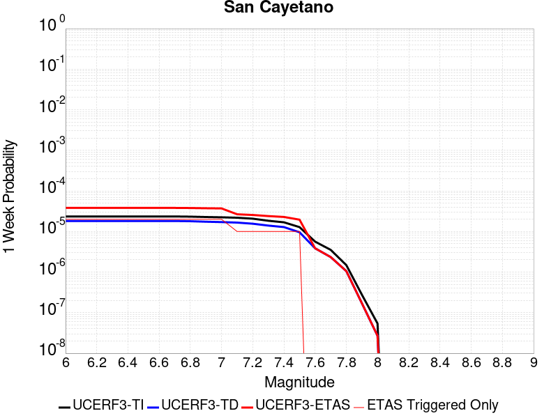 |  |  |  |

| Magnitude | 1 wk TI Prob | 1 wk TD Prob | 1 wk ETAS Prob | 1 wk ETAS/TD Gain | 1 wk ETAS Triggered Only | 1 mo TI Prob | 1 mo TD Prob | 1 mo ETAS Prob | 1 mo ETAS/TD Gain | 1 mo ETAS Triggered Only | 1 yr TI Prob | 1 yr TD Prob | 1 yr ETAS Prob | 1 yr ETAS/TD Gain | 1 yr ETAS Triggered Only | 10 yr TI Prob | 10 yr TD Prob | 10 yr ETAS Prob | 10 yr ETAS/TD Gain | 10 yr ETAS Triggered Only |
|-----|-----|-----|-----|-----|-----|-----|-----|-----|-----|-----|-----|-----|-----|-----|-----|-----|-----|-----|-----|-----|
| 6.0 | 2.3476267E-5 | 1.816928E-5 | 4.836379E-5 | 2.6618443 | 3.019506E-5 | 1.0060869E-4 | 7.786603E-5 | 1.08058746E-4 | 1.3877519 | 3.019506E-5 | 0.0012242225 | 9.476103E-4 | 9.777767E-4 | 1.0318342 | 3.019506E-5 | 0.012175002 | 0.009436584 | 0.009466494 | 1.0031695 | 3.019506E-5 |
| 6.1 | 2.3476267E-5 | 1.816928E-5 | 4.836379E-5 | 2.6618443 | 3.019506E-5 | 1.0060869E-4 | 7.786603E-5 | 1.08058746E-4 | 1.3877519 | 3.019506E-5 | 0.0012242225 | 9.476103E-4 | 9.777767E-4 | 1.0318342 | 3.019506E-5 | 0.012175002 | 0.009436584 | 0.009466494 | 1.0031695 | 3.019506E-5 |
| 6.2 | 2.3476267E-5 | 1.816928E-5 | 4.836379E-5 | 2.6618443 | 3.019506E-5 | 1.0060869E-4 | 7.786603E-5 | 1.08058746E-4 | 1.3877519 | 3.019506E-5 | 0.0012242225 | 9.476103E-4 | 9.777767E-4 | 1.0318342 | 3.019506E-5 | 0.012175002 | 0.009436584 | 0.009466494 | 1.0031695 | 3.019506E-5 |
| 6.3 | 2.3476267E-5 | 1.816928E-5 | 4.836379E-5 | 2.6618443 | 3.019506E-5 | 1.0060869E-4 | 7.786603E-5 | 1.08058746E-4 | 1.3877519 | 3.019506E-5 | 0.0012242225 | 9.476103E-4 | 9.777767E-4 | 1.0318342 | 3.019506E-5 | 0.012175002 | 0.009436584 | 0.009466494 | 1.0031695 | 3.019506E-5 |
| 6.4 | 2.3476267E-5 | 1.816928E-5 | 4.836379E-5 | 2.6618443 | 3.019506E-5 | 1.0060869E-4 | 7.786603E-5 | 1.08058746E-4 | 1.3877519 | 3.019506E-5 | 0.0012242225 | 9.476103E-4 | 9.777767E-4 | 1.0318342 | 3.019506E-5 | 0.012175002 | 0.009436584 | 0.009466494 | 1.0031695 | 3.019506E-5 |
| 6.5 | 2.3476267E-5 | 1.816928E-5 | 4.836379E-5 | 2.6618443 | 3.019506E-5 | 1.0060869E-4 | 7.786603E-5 | 1.08058746E-4 | 1.3877519 | 3.019506E-5 | 0.0012242225 | 9.476103E-4 | 9.777767E-4 | 1.0318342 | 3.019506E-5 | 0.012175002 | 0.009436584 | 0.009466494 | 1.0031695 | 3.019506E-5 |
| 6.6 | 2.3476267E-5 | 1.816928E-5 | 4.836379E-5 | 2.6618443 | 3.019506E-5 | 1.0060869E-4 | 7.786603E-5 | 1.08058746E-4 | 1.3877519 | 3.019506E-5 | 0.0012242225 | 9.476103E-4 | 9.777767E-4 | 1.0318342 | 3.019506E-5 | 0.012175002 | 0.009436584 | 0.009466494 | 1.0031695 | 3.019506E-5 |
| 6.7 | 2.3476267E-5 | 1.816928E-5 | 4.836379E-5 | 2.6618443 | 3.019506E-5 | 1.0060869E-4 | 7.786603E-5 | 1.08058746E-4 | 1.3877519 | 3.019506E-5 | 0.0012242225 | 9.476103E-4 | 9.777767E-4 | 1.0318342 | 3.019506E-5 | 0.012175002 | 0.009436584 | 0.009466494 | 1.0031695 | 3.019506E-5 |
| 6.8 | 2.3241924E-5 | 1.7936987E-5 | 4.8131507E-5 | 2.6833663 | 3.019506E-5 | 9.960445E-5 | 7.687056E-5 | 1.0706329E-4 | 1.3927737 | 3.019506E-5 | 0.0012120095 | 9.3550084E-4 | 9.656676E-4 | 1.0322467 | 3.019506E-5 | 0.012054204 | 0.009316482 | 0.009346396 | 1.0032108 | 3.019506E-5 |
| 6.9 | 2.2761007E-5 | 1.7432423E-5 | 4.7626956E-5 | 2.7320905 | 3.019506E-5 | 9.7543525E-5 | 7.470827E-5 | 1.0490107E-4 | 1.4041427 | 3.019506E-5 | 0.0011869454 | 9.09197E-4 | 9.393646E-4 | 1.0331805 | 3.019506E-5 | 0.011806256 | 0.009055603 | 0.009085525 | 1.0033042 | 3.019506E-5 |
| 7.0 | 2.240283E-5 | 1.7066168E-5 | 4.7260713E-5 | 2.7692633 | 3.019506E-5 | 9.600859E-5 | 7.313869E-5 | 1.0333154E-4 | 1.4128164 | 3.019506E-5 | 0.0011682777 | 8.9010317E-4 | 9.202714E-4 | 1.0338929 | 3.019506E-5 | 0.011621549 | 0.008866196 | 0.008896123 | 1.0033754 | 3.019506E-5 |
| 7.1 | 2.1871154E-5 | 1.6586018E-5 | 4.6780577E-5 | 2.8204827 | 3.019506E-5 | 9.373015E-5 | 7.108101E-5 | 1.0127393E-4 | 1.4247676 | 3.019506E-5 | 0.0011405671 | 8.6507114E-4 | 8.9524005E-4 | 1.0348746 | 3.019506E-5 | 0.011347309 | 0.008617838 | 0.008647773 | 1.0034736 | 3.019506E-5 |
| 7.2 | 2.0714133E-5 | 1.5564561E-5 | 4.5759152E-5 | 2.9399579 | 3.019506E-5 | 8.8771834E-5 | 6.670357E-5 | 9.689662E-5 | 1.4526451 | 3.019506E-5 | 0.0010802611 | 8.1181666E-4 | 8.419872E-4 | 1.0371642 | 3.019506E-5 | 0.010750249 | 0.008089285 | 0.008119236 | 1.0037025 | 3.019506E-5 |
| 7.3 | 1.8408395E-5 | 1.3996864E-5 | 4.4191504E-5 | 3.157243 | 3.019506E-5 | 7.8890735E-5 | 5.99852E-5 | 9.017845E-5 | 1.503345 | 3.019506E-5 | 9.600714E-4 | 7.300781E-4 | 7.6025113E-4 | 1.0413284 | 3.019506E-5 | 0.009559342 | 0.0072775153 | 0.007307491 | 1.0041189 | 3.019506E-5 |
| 7.4 | 1.6856795E-5 | 1.28500815E-5 | 4.3044754E-5 | 3.349765 | 3.019506E-5 | 7.2241404E-5 | 5.5070628E-5 | 8.526403E-5 | 1.5482668 | 3.019506E-5 | 8.7918417E-4 | 6.7028153E-4 | 7.004563E-4 | 1.0450181 | 3.019506E-5 | 0.00875714 | 0.0066832784 | 0.0067132716 | 1.0044878 | 3.019506E-5 |
| 7.5 | 1.2822778E-5 | 9.577542E-6 | 3.9772312E-5 | 4.1526637 | 3.019506E-5 | 5.495361E-5 | 4.1045972E-5 | 7.123979E-5 | 1.7356099 | 3.019506E-5 | 6.688548E-4 | 4.996217E-4 | 5.2980165E-4 | 1.0604056 | 3.019506E-5 | 0.006668452 | 0.0049851555 | 0.0050152 | 1.0060267 | 3.019506E-5 |
| 7.6 | 5.6272684E-6 | 3.854903E-6 | 3.854903E-6 | 1.0 | 0.0 | 2.4116642E-5 | 1.652091E-5 | 1.652091E-5 | 1.0 | 0.0 | 2.9358055E-4 | 2.0112359E-4 | 2.0112359E-4 | 1.0 | 0.0 | 0.0029319301 | 0.0020094267 | 0.0020094267 | 1.0 | 0.0 |
| 7.7 | 3.5261346E-6 | 2.3407013E-6 | 2.3407013E-6 | 1.0 | 0.0 | 1.5111918E-5 | 1.0031539E-5 | 1.0031539E-5 | 1.0 | 0.0 | 1.8397206E-4 | 1.2212721E-4 | 1.2212721E-4 | 1.0 | 0.0 | 0.0018381984 | 0.0012206084 | 0.0012206084 | 1.0 | 0.0 |
| 7.8 | 1.4826929E-6 | 1.056428E-6 | 1.056428E-6 | 1.0 | 0.0 | 6.354383E-6 | 4.5275406E-6 | 4.5275406E-6 | 1.0 | 0.0 | 7.736187E-5 | 5.5121433E-5 | 5.5121433E-5 | 1.0 | 0.0 | 7.733494E-4 | 5.5107963E-4 | 5.5107963E-4 | 1.0 | 0.0 |
| 7.9 | 2.7568166E-7 | 1.6978244E-7 | 1.6978244E-7 | 1.0 | 0.0 | 1.1814923E-6 | 7.2763885E-7 | 7.2763885E-7 | 1.0 | 0.0 | 1.4384574E-5 | 8.858967E-6 | 8.858967E-6 | 1.0 | 0.0 | 1.4383643E-4 | 8.8586174E-5 | 8.8586174E-5 | 1.0 | 0.0 |
| 8.0 | 5.407832E-8 | 2.6887697E-8 | 2.6887697E-8 | 1.0 | 0.0 | 2.3176422E-7 | 1.15232986E-7 | 1.15232986E-7 | 1.0 | 0.0 | 2.8217257E-6 | 1.4029607E-6 | 1.4029607E-6 | 1.0 | 0.0 | 2.8216898E-5 | 1.4029522E-5 | 1.4029522E-5 | 1.0 | 0.0 |

## Ortigalita (North)
*[(top)](#table-of-contents)*

| 1 Week | 1 Month | 1 Year | 10 Year |
|-----|-----|-----|-----|
|  |  |  |  |

| Magnitude | 1 wk TI Prob | 1 wk TD Prob | 1 wk ETAS Prob | 1 wk ETAS/TD Gain | 1 wk ETAS Triggered Only | 1 mo TI Prob | 1 mo TD Prob | 1 mo ETAS Prob | 1 mo ETAS/TD Gain | 1 mo ETAS Triggered Only | 1 yr TI Prob | 1 yr TD Prob | 1 yr ETAS Prob | 1 yr ETAS/TD Gain | 1 yr ETAS Triggered Only | 10 yr TI Prob | 10 yr TD Prob | 10 yr ETAS Prob | 10 yr ETAS/TD Gain | 10 yr ETAS Triggered Only |
|-----|-----|-----|-----|-----|-----|-----|-----|-----|-----|-----|-----|-----|-----|-----|-----|-----|-----|-----|-----|-----|
| 6.0 | 7.711876E-5 | 1.05064966E-4 | 1.3525685E-4 | 1.287364 | 3.019506E-5 | 3.3046713E-4 | 4.502116E-4 | 4.8039306E-4 | 1.0670384 | 3.019506E-5 | 0.004016016 | 0.0054681194 | 0.0054981494 | 1.0054919 | 3.019506E-5 | 0.039442103 | 0.053454787 | 0.05348337 | 1.0005347 | 3.019506E-5 |
| 6.1 | 4.607858E-5 | 6.0239203E-5 | 9.043244E-5 | 1.5012225 | 3.019506E-5 | 1.9746469E-4 | 2.5814527E-4 | 2.8833252E-4 | 1.1169391 | 3.019506E-5 | 0.0024014818 | 0.0031387596 | 0.00316886 | 1.0095899 | 3.019506E-5 | 0.023756953 | 0.030975068 | 0.031004328 | 1.0009446 | 3.019506E-5 |
| 6.2 | 4.607858E-5 | 6.0239203E-5 | 9.043244E-5 | 1.5012225 | 3.019506E-5 | 1.9746469E-4 | 2.5814527E-4 | 2.8833252E-4 | 1.1169391 | 3.019506E-5 | 0.0024014818 | 0.0031387596 | 0.00316886 | 1.0095899 | 3.019506E-5 | 0.023756953 | 0.030975068 | 0.031004328 | 1.0009446 | 3.019506E-5 |
| 6.3 | 3.327423E-5 | 4.2475127E-5 | 7.26689E-5 | 1.7108579 | 3.019506E-5 | 1.4259605E-4 | 1.8202531E-4 | 2.1221487E-4 | 1.1658536 | 3.019506E-5 | 0.0017347244 | 0.002214197 | 0.0022443254 | 1.0136068 | 3.019506E-5 | 0.017212452 | 0.021945644 | 0.021975176 | 1.0013458 | 3.019506E-5 |
| 6.4 | 2.7732503E-5 | 3.4998593E-5 | 6.5192595E-5 | 1.8627205 | 3.019506E-5 | 1.1884817E-4 | 1.4998685E-4 | 1.8017739E-4 | 1.2012879 | 3.019506E-5 | 0.001446016 | 0.0018248095 | 0.0018549495 | 1.0165168 | 3.019506E-5 | 0.014366428 | 0.018121224 | 0.018150872 | 1.001636 | 3.019506E-5 |
| 6.5 | 2.7689714E-5 | 3.4948407E-5 | 6.514241E-5 | 1.8639594 | 3.019506E-5 | 1.186648E-4 | 1.497718E-4 | 1.7996234E-4 | 1.201577 | 3.019506E-5 | 0.0014437864 | 0.0018221956 | 0.0018523356 | 1.0165405 | 3.019506E-5 | 0.014344421 | 0.01809551 | 0.018125158 | 1.0016384 | 3.019506E-5 |
| 6.6 | 2.2976905E-5 | 2.8718265E-5 | 5.8912457E-5 | 2.0513933 | 3.019506E-5 | 9.846873E-5 | 1.230739E-4 | 1.5326525E-4 | 1.2453107 | 3.019506E-5 | 0.0011981975 | 0.0014976363 | 0.0015277863 | 1.0201316 | 3.019506E-5 | 0.011917574 | 0.014898697 | 0.014928442 | 1.0019965 | 3.019506E-5 |
| 6.7 | 1.9871539E-5 | 2.4904411E-5 | 5.509872E-5 | 2.212408 | 3.019506E-5 | 8.516096E-5 | 1.0673023E-4 | 1.3692207E-4 | 1.28288 | 3.019506E-5 | 0.0010363415 | 0.0012989145 | 0.0013290704 | 1.0232161 | 3.019506E-5 | 0.010315218 | 0.012936919 | 0.012966723 | 1.0023038 | 3.019506E-5 |
| 6.8 | 6.5640475E-6 | 7.6054926E-6 | 7.6054926E-6 | 1.0 | 0.0 | 2.813133E-5 | 3.2594577E-5 | 3.2594577E-5 | 1.0 | 0.0 | 3.424451E-4 | 3.9676955E-4 | 3.9676955E-4 | 1.0 | 0.0 | 0.0034191788 | 0.003960899 | 0.003960899 | 1.0 | 0.0 |
| 6.9 | 5.6219683E-6 | 6.5018376E-6 | 6.5018376E-6 | 1.0 | 0.0 | 2.4093928E-5 | 2.7864735E-5 | 2.7864735E-5 | 1.0 | 0.0 | 2.933041E-4 | 3.3920293E-4 | 3.3920293E-4 | 1.0 | 0.0 | 0.0029291727 | 0.003387109 | 0.003387109 | 1.0 | 0.0 |
| 7.0 | 3.875591E-6 | 4.4847548E-6 | 4.4847548E-6 | 1.0 | 0.0 | 1.6609569E-5 | 1.9220248E-5 | 1.9220248E-5 | 1.0 | 0.0 | 2.0220275E-4 | 2.339835E-4 | 2.339835E-4 | 1.0 | 0.0 | 0.0020201886 | 0.0023375798 | 0.0023375798 | 1.0 | 0.0 |
| 7.1 | 1.6017933E-6 | 1.8570418E-6 | 1.8570418E-6 | 1.0 | 0.0 | 6.8648105E-6 | 7.958732E-6 | 7.958732E-6 | 1.0 | 0.0 | 8.357586E-5 | 9.689432E-5 | 9.689432E-5 | 1.0 | 0.0 | 8.3544437E-4 | 9.686254E-4 | 9.686254E-4 | 1.0 | 0.0 |

## Cleghorn Pass
*[(top)](#table-of-contents)*

| 1 Week | 1 Month | 1 Year | 10 Year |
|-----|-----|-----|-----|
|  |  |  |  |

| Magnitude | 1 wk TI Prob | 1 wk TD Prob | 1 wk ETAS Prob | 1 wk ETAS/TD Gain | 1 wk ETAS Triggered Only | 1 mo TI Prob | 1 mo TD Prob | 1 mo ETAS Prob | 1 mo ETAS/TD Gain | 1 mo ETAS Triggered Only | 1 yr TI Prob | 1 yr TD Prob | 1 yr ETAS Prob | 1 yr ETAS/TD Gain | 1 yr ETAS Triggered Only | 10 yr TI Prob | 10 yr TD Prob | 10 yr ETAS Prob | 10 yr ETAS/TD Gain | 10 yr ETAS Triggered Only |
|-----|-----|-----|-----|-----|-----|-----|-----|-----|-----|-----|-----|-----|-----|-----|-----|-----|-----|-----|-----|-----|
| 6.0 | 1.0522846E-5 | 1.1040642E-5 | 1.1040642E-5 | 1.0 | 0.0 | 4.509713E-5 | 4.7316473E-5 | 4.7316473E-5 | 1.0 | 0.0 | 5.4891926E-4 | 5.759784E-4 | 5.759784E-4 | 1.0 | 0.0 | 0.0054756533 | 0.005750022 | 0.005780043 | 1.0052211 | 3.019506E-5 |
| 6.1 | 1.0522846E-5 | 1.1040642E-5 | 1.1040642E-5 | 1.0 | 0.0 | 4.509713E-5 | 4.7316473E-5 | 4.7316473E-5 | 1.0 | 0.0 | 5.4891926E-4 | 5.759784E-4 | 5.759784E-4 | 1.0 | 0.0 | 0.0054756533 | 0.005750022 | 0.005780043 | 1.0052211 | 3.019506E-5 |
| 6.2 | 2.1045846E-6 | 2.2082024E-6 | 2.2082024E-6 | 1.0 | 0.0 | 9.019617E-6 | 9.463714E-6 | 9.463714E-6 | 1.0 | 0.0 | 1.098083E-4 | 1.1521882E-4 | 1.1521882E-4 | 1.0 | 0.0 | 0.0010975406 | 0.0011520023 | 0.0011520023 | 1.0 | 0.0 |
| 6.3 | 2.1045846E-6 | 2.2082024E-6 | 2.2082024E-6 | 1.0 | 0.0 | 9.019617E-6 | 9.463714E-6 | 9.463714E-6 | 1.0 | 0.0 | 1.098083E-4 | 1.1521882E-4 | 1.1521882E-4 | 1.0 | 0.0 | 0.0010975406 | 0.0011520023 | 0.0011520023 | 1.0 | 0.0 |
| 6.4 | 1.7259927E-6 | 1.810877E-6 | 1.810877E-6 | 1.0 | 0.0 | 7.3970905E-6 | 7.760902E-6 | 7.760902E-6 | 1.0 | 0.0 | 9.005586E-5 | 9.4488976E-5 | 9.4488976E-5 | 1.0 | 0.0 | 9.001937E-4 | 9.448898E-4 | 9.448898E-4 | 1.0 | 0.0 |

## Santa Susana alt 1
*[(top)](#table-of-contents)*

| 1 Week | 1 Month | 1 Year | 10 Year |
|-----|-----|-----|-----|
|  |  |  |  |

| Magnitude | 1 wk TI Prob | 1 wk TD Prob | 1 wk ETAS Prob | 1 wk ETAS/TD Gain | 1 wk ETAS Triggered Only | 1 mo TI Prob | 1 mo TD Prob | 1 mo ETAS Prob | 1 mo ETAS/TD Gain | 1 mo ETAS Triggered Only | 1 yr TI Prob | 1 yr TD Prob | 1 yr ETAS Prob | 1 yr ETAS/TD Gain | 1 yr ETAS Triggered Only | 10 yr TI Prob | 10 yr TD Prob | 10 yr ETAS Prob | 10 yr ETAS/TD Gain | 10 yr ETAS Triggered Only |
|-----|-----|-----|-----|-----|-----|-----|-----|-----|-----|-----|-----|-----|-----|-----|-----|-----|-----|-----|-----|-----|
| 6.0 | 2.674877E-5 | 2.7198023E-5 | 5.7392263E-5 | 2.110163 | 3.019506E-5 | 1.1463255E-4 | 1.1655839E-4 | 1.4674992E-4 | 1.2590251 | 3.019506E-5 | 0.0013947578 | 0.0014182882 | 0.0014484405 | 1.0212595 | 3.019506E-5 | 0.013860362 | 0.014104128 | 0.014133897 | 1.0021107 | 3.019506E-5 |
| 6.1 | 2.674877E-5 | 2.7198023E-5 | 5.7392263E-5 | 2.110163 | 3.019506E-5 | 1.1463255E-4 | 1.1655839E-4 | 1.4674992E-4 | 1.2590251 | 3.019506E-5 | 0.0013947578 | 0.0014182882 | 0.0014484405 | 1.0212595 | 3.019506E-5 | 0.013860362 | 0.014104128 | 0.014133897 | 1.0021107 | 3.019506E-5 |
| 6.2 | 2.674877E-5 | 2.7198023E-5 | 5.7392263E-5 | 2.110163 | 3.019506E-5 | 1.1463255E-4 | 1.1655839E-4 | 1.4674992E-4 | 1.2590251 | 3.019506E-5 | 0.0013947578 | 0.0014182882 | 0.0014484405 | 1.0212595 | 3.019506E-5 | 0.013860362 | 0.014104128 | 0.014133897 | 1.0021107 | 3.019506E-5 |
| 6.3 | 2.674877E-5 | 2.7198023E-5 | 5.7392263E-5 | 2.110163 | 3.019506E-5 | 1.1463255E-4 | 1.1655839E-4 | 1.4674992E-4 | 1.2590251 | 3.019506E-5 | 0.0013947578 | 0.0014182882 | 0.0014484405 | 1.0212595 | 3.019506E-5 | 0.013860362 | 0.014104128 | 0.014133897 | 1.0021107 | 3.019506E-5 |
| 6.4 | 2.674877E-5 | 2.7198023E-5 | 5.7392263E-5 | 2.110163 | 3.019506E-5 | 1.1463255E-4 | 1.1655839E-4 | 1.4674992E-4 | 1.2590251 | 3.019506E-5 | 0.0013947578 | 0.0014182882 | 0.0014484405 | 1.0212595 | 3.019506E-5 | 0.013860362 | 0.014104128 | 0.014133897 | 1.0021107 | 3.019506E-5 |
| 6.5 | 2.674877E-5 | 2.7198023E-5 | 5.7392263E-5 | 2.110163 | 3.019506E-5 | 1.1463255E-4 | 1.1655839E-4 | 1.4674992E-4 | 1.2590251 | 3.019506E-5 | 0.0013947578 | 0.0014182882 | 0.0014484405 | 1.0212595 | 3.019506E-5 | 0.013860362 | 0.014104128 | 0.014133897 | 1.0021107 | 3.019506E-5 |
| 6.6 | 2.6647976E-5 | 2.7074359E-5 | 5.72686E-5 | 2.115234 | 3.019506E-5 | 1.14200615E-4 | 1.1602845E-4 | 1.4622E-4 | 1.2602082 | 3.019506E-5 | 0.0013895056 | 0.0014118447 | 0.0014419972 | 1.0213567 | 3.019506E-5 | 0.013808494 | 0.014040513 | 0.014070285 | 1.0021204 | 3.019506E-5 |
| 6.7 | 2.6647976E-5 | 2.7074359E-5 | 5.72686E-5 | 2.115234 | 3.019506E-5 | 1.14200615E-4 | 1.1602845E-4 | 1.4622E-4 | 1.2602082 | 3.019506E-5 | 0.0013895056 | 0.0014118447 | 0.0014419972 | 1.0213567 | 3.019506E-5 | 0.013808494 | 0.014040513 | 0.014070285 | 1.0021204 | 3.019506E-5 |
| 6.8 | 1.9073179E-5 | 1.7637283E-5 | 4.783181E-5 | 2.7119715 | 3.019506E-5 | 8.1739636E-5 | 7.558627E-5 | 1.0577905E-4 | 1.3994479 | 3.019506E-5 | 9.947256E-4 | 9.198925E-4 | 9.500598E-4 | 1.0327944 | 3.019506E-5 | 0.009902848 | 0.009163101 | 0.00919302 | 1.0032651 | 3.019506E-5 |
| 6.9 | 1.9041876E-5 | 1.7619415E-5 | 4.7813945E-5 | 2.7137077 | 3.019506E-5 | 8.160549E-5 | 7.55097E-5 | 1.0570248E-4 | 1.399853 | 3.019506E-5 | 9.930939E-4 | 9.1896096E-4 | 9.4912824E-4 | 1.0328276 | 3.019506E-5 | 0.0098866755 | 0.0091538625 | 0.009183781 | 1.0032684 | 3.019506E-5 |
| 7.0 | 1.5917482E-5 | 1.3863864E-5 | 4.4058506E-5 | 3.1779382 | 3.019506E-5 | 6.8215995E-5 | 5.9415237E-5 | 8.9608504E-5 | 1.5081738 | 3.019506E-5 | 8.302132E-4 | 7.231451E-4 | 7.533183E-4 | 1.041725 | 3.019506E-5 | 0.008271185 | 0.0072088144 | 0.007238792 | 1.0041584 | 3.019506E-5 |
| 7.1 | 1.577788E-5 | 1.3743872E-5 | 4.393852E-5 | 3.1969533 | 3.019506E-5 | 6.761774E-5 | 5.8901005E-5 | 8.909429E-5 | 1.5126107 | 3.019506E-5 | 8.2293496E-4 | 7.1688846E-4 | 7.4706186E-4 | 1.0420895 | 3.019506E-5 | 0.008198941 | 0.007146652 | 0.007176631 | 1.0041949 | 3.019506E-5 |
| 7.2 | 1.5416446E-5 | 1.3469944E-5 | 4.3664597E-5 | 3.2416317 | 3.019506E-5 | 6.606882E-5 | 5.772708E-5 | 8.79204E-5 | 1.5230355 | 3.019506E-5 | 8.0409093E-4 | 7.026052E-4 | 7.3277904E-4 | 1.0429456 | 3.019506E-5 | 0.008011877 | 0.0070047234 | 0.007034707 | 1.0042804 | 3.019506E-5 |
| 7.3 | 1.4534083E-5 | 1.2717879E-5 | 4.2912554E-5 | 3.3741913 | 3.019506E-5 | 6.228744E-5 | 5.4504082E-5 | 8.4697494E-5 | 1.5539662 | 3.019506E-5 | 7.580857E-4 | 6.633896E-4 | 6.9356465E-4 | 1.0454861 | 3.019506E-5 | 0.007555048 | 0.0066149444 | 0.0066449395 | 1.0045345 | 3.019506E-5 |
| 7.4 | 1.2858995E-5 | 1.1229652E-5 | 4.1424373E-5 | 3.6888385 | 3.019506E-5 | 5.5108816E-5 | 4.8126214E-5 | 7.831982E-5 | 1.6273838 | 3.019506E-5 | 6.7074323E-4 | 5.857831E-4 | 6.1596045E-4 | 1.0515163 | 3.019506E-5 | 0.0066872234 | 0.005843165 | 0.0058731837 | 1.0051374 | 3.019506E-5 |
| 7.5 | 8.827668E-6 | 7.805457E-6 | 3.8000282E-5 | 4.868425 | 3.019506E-5 | 3.7832317E-5 | 3.3451546E-5 | 6.3645595E-5 | 1.9026206 | 3.019506E-5 | 4.605111E-4 | 4.071989E-4 | 4.3738168E-4 | 1.0741229 | 3.019506E-5 | 0.0045955796 | 0.0040647765 | 0.004094849 | 1.0073982 | 3.019506E-5 |
| 7.6 | 3.2533426E-6 | 2.871988E-6 | 2.871988E-6 | 1.0 | 0.0 | 1.3942822E-5 | 1.2308465E-5 | 1.2308465E-5 | 1.0 | 0.0 | 1.6974064E-4 | 1.4984563E-4 | 1.4984563E-4 | 1.0 | 0.0 | 0.0016961104 | 0.0014974826 | 0.0014974826 | 1.0 | 0.0 |
| 7.7 | 1.2751709E-6 | 1.1491089E-6 | 1.1491089E-6 | 1.0 | 0.0 | 5.4650063E-6 | 4.9247437E-6 | 4.9247437E-6 | 1.0 | 0.0 | 6.653442E-5 | 5.9957198E-5 | 5.9957198E-5 | 1.0 | 0.0 | 6.6514505E-4 | 5.994191E-4 | 5.994191E-4 | 1.0 | 0.0 |
| 7.8 | 3.067544E-7 | 3.2400436E-7 | 3.2400436E-7 | 1.0 | 0.0 | 1.3146611E-6 | 1.3885895E-6 | 1.3885895E-6 | 1.0 | 0.0 | 1.600588E-5 | 1.6905957E-5 | 1.6905957E-5 | 1.0 | 0.0 | 1.6004729E-4 | 1.6904772E-4 | 1.6904772E-4 | 1.0 | 0.0 |
| 7.9 | 7.622999E-8 | 8.087964E-8 | 8.087964E-8 | 1.0 | 0.0 | 3.2669993E-7 | 3.4662696E-7 | 3.4662696E-7 | 1.0 | 0.0 | 3.977564E-6 | 4.2201773E-6 | 4.2201773E-6 | 1.0 | 0.0 | 3.977493E-5 | 4.220118E-5 | 4.220118E-5 | 1.0 | 0.0 |

## Red Mountain
*[(top)](#table-of-contents)*

| 1 Week | 1 Month | 1 Year | 10 Year |
|-----|-----|-----|-----|
|  |  | 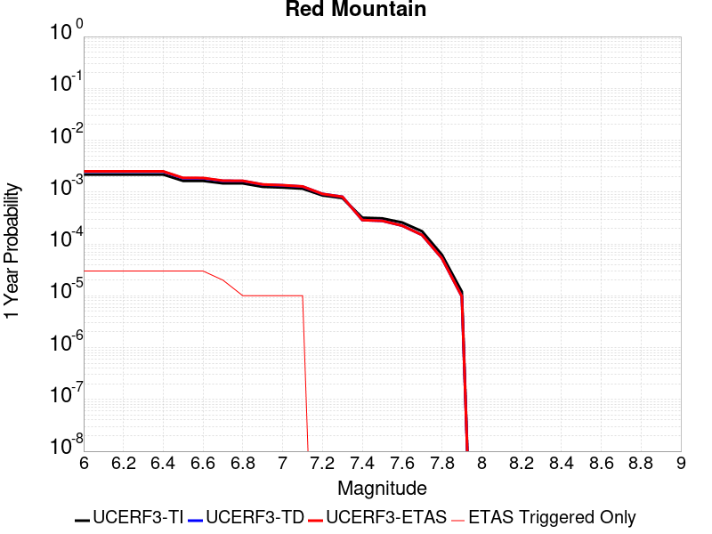 |  |

| Magnitude | 1 wk TI Prob | 1 wk TD Prob | 1 wk ETAS Prob | 1 wk ETAS/TD Gain | 1 wk ETAS Triggered Only | 1 mo TI Prob | 1 mo TD Prob | 1 mo ETAS Prob | 1 mo ETAS/TD Gain | 1 mo ETAS Triggered Only | 1 yr TI Prob | 1 yr TD Prob | 1 yr ETAS Prob | 1 yr ETAS/TD Gain | 1 yr ETAS Triggered Only | 10 yr TI Prob | 10 yr TD Prob | 10 yr ETAS Prob | 10 yr ETAS/TD Gain | 10 yr ETAS Triggered Only |
|-----|-----|-----|-----|-----|-----|-----|-----|-----|-----|-----|-----|-----|-----|-----|-----|-----|-----|-----|-----|-----|
| 6.0 | 4.1810763E-5 | 4.7589947E-5 | 7.778357E-5 | 1.6344538 | 3.019506E-5 | 1.7917668E-4 | 2.039419E-4 | 2.341308E-4 | 1.148027 | 3.019506E-5 | 0.0021792934 | 0.0024803306 | 0.0025104508 | 1.0121436 | 3.019506E-5 | 0.021580452 | 0.024544092 | 0.024573546 | 1.0012001 | 3.019506E-5 |
| 6.1 | 4.1810763E-5 | 4.7589947E-5 | 7.778357E-5 | 1.6344538 | 3.019506E-5 | 1.7917668E-4 | 2.039419E-4 | 2.341308E-4 | 1.148027 | 3.019506E-5 | 0.0021792934 | 0.0024803306 | 0.0025104508 | 1.0121436 | 3.019506E-5 | 0.021580452 | 0.024544092 | 0.024573546 | 1.0012001 | 3.019506E-5 |
| 6.2 | 4.1810763E-5 | 4.7589947E-5 | 7.778357E-5 | 1.6344538 | 3.019506E-5 | 1.7917668E-4 | 2.039419E-4 | 2.341308E-4 | 1.148027 | 3.019506E-5 | 0.0021792934 | 0.0024803306 | 0.0025104508 | 1.0121436 | 3.019506E-5 | 0.021580452 | 0.024544092 | 0.024573546 | 1.0012001 | 3.019506E-5 |
| 6.3 | 4.1810763E-5 | 4.7589947E-5 | 7.778357E-5 | 1.6344538 | 3.019506E-5 | 1.7917668E-4 | 2.039419E-4 | 2.341308E-4 | 1.148027 | 3.019506E-5 | 0.0021792934 | 0.0024803306 | 0.0025104508 | 1.0121436 | 3.019506E-5 | 0.021580452 | 0.024544092 | 0.024573546 | 1.0012001 | 3.019506E-5 |
| 6.4 | 4.1810763E-5 | 4.7589947E-5 | 7.778357E-5 | 1.6344538 | 3.019506E-5 | 1.7917668E-4 | 2.039419E-4 | 2.341308E-4 | 1.148027 | 3.019506E-5 | 0.0021792934 | 0.0024803306 | 0.0025104508 | 1.0121436 | 3.019506E-5 | 0.021580452 | 0.024544092 | 0.024573546 | 1.0012001 | 3.019506E-5 |
| 6.5 | 3.154503E-5 | 3.5359728E-5 | 6.555372E-5 | 1.853909 | 3.019506E-5 | 1.3518598E-4 | 1.5153342E-4 | 1.817239E-4 | 1.1992332 | 3.019506E-5 | 0.0016446467 | 0.0018434501 | 0.0018735895 | 1.0163494 | 3.019506E-5 | 0.01632528 | 0.018291233 | 0.018320877 | 1.0016207 | 3.019506E-5 |
| 6.6 | 3.1535834E-5 | 3.534911E-5 | 6.55431E-5 | 1.8541656 | 3.019506E-5 | 1.3514658E-4 | 1.5148791E-4 | 1.8167839E-4 | 1.199293 | 3.019506E-5 | 0.0016441676 | 0.001842897 | 0.0018730365 | 1.0163543 | 3.019506E-5 | 0.01632056 | 0.018285794 | 0.018315438 | 1.0016211 | 3.019506E-5 |
| 6.7 | 2.8267326E-5 | 3.146934E-5 | 3.146934E-5 | 1.0 | 0.0 | 1.2114006E-4 | 1.348621E-4 | 1.348621E-4 | 1.0 | 0.0 | 0.0014738824 | 0.0016407946 | 0.0016407946 | 1.0 | 0.0 | 0.014641452 | 0.016295563 | 0.016295563 | 1.0 | 0.0 |
| 6.8 | 2.8212884E-5 | 3.1407224E-5 | 3.1407224E-5 | 1.0 | 0.0 | 1.20906756E-4 | 1.3459593E-4 | 1.3459593E-4 | 1.0 | 0.0 | 0.0014710457 | 0.0016375587 | 0.0016375587 | 1.0 | 0.0 | 0.014613459 | 0.01626368 | 0.01626368 | 1.0 | 0.0 |
| 6.9 | 2.4227871E-5 | 2.6706979E-5 | 2.6706979E-5 | 1.0 | 0.0 | 1.03829596E-4 | 1.14453884E-4 | 1.14453884E-4 | 1.0 | 0.0 | 0.0012633923 | 0.0013926612 | 0.0013926612 | 1.0 | 0.0 | 0.012562336 | 0.013847026 | 0.013847026 | 1.0 | 0.0 |
| 7.0 | 2.348524E-5 | 2.5835763E-5 | 2.5835763E-5 | 1.0 | 0.0 | 1.0064714E-4 | 1.1072042E-4 | 1.1072042E-4 | 1.0 | 0.0 | 0.0012246901 | 0.0013472632 | 0.0013472632 | 1.0 | 0.0 | 0.012179627 | 0.01339859 | 0.01339859 | 1.0 | 0.0 |
| 7.1 | 2.2311642E-5 | 2.4462828E-5 | 2.4462828E-5 | 1.0 | 0.0 | 9.561782E-5 | 1.048369E-4 | 1.048369E-4 | 1.0 | 0.0 | 0.0011635252 | 0.0012757168 | 0.0012757168 | 1.0 | 0.0 | 0.01157452 | 0.012691451 | 0.012691451 | 1.0 | 0.0 |
| 7.2 | 1.6533986E-5 | 1.7670347E-5 | 1.7670347E-5 | 1.0 | 0.0 | 7.085802E-5 | 7.572822E-5 | 7.572822E-5 | 1.0 | 0.0 | 8.623549E-4 | 9.216645E-4 | 9.216645E-4 | 1.0 | 0.0 | 0.008590161 | 0.009184699 | 0.009184699 | 1.0 | 0.0 |
| 7.3 | 1.4703092E-5 | 1.555952E-5 | 1.555952E-5 | 1.0 | 0.0 | 6.301173E-5 | 6.66823E-5 | 6.66823E-5 | 1.0 | 0.0 | 7.668978E-4 | 8.1161625E-4 | 8.1161625E-4 | 1.0 | 0.0 | 0.0076425658 | 0.008092596 | 0.008092596 | 1.0 | 0.0 |
| 7.4 | 6.1331984E-6 | 5.528872E-6 | 5.528872E-6 | 1.0 | 0.0 | 2.6284872E-5 | 2.3694953E-5 | 2.3694953E-5 | 1.0 | 0.0 | 3.199713E-4 | 2.8844838E-4 | 2.8844838E-4 | 1.0 | 0.0 | 0.0031951098 | 0.0028807942 | 0.0028807942 | 1.0 | 0.0 |
| 7.5 | 5.954766E-6 | 5.3385015E-6 | 5.3385015E-6 | 1.0 | 0.0 | 2.5520176E-5 | 2.2879094E-5 | 2.2879094E-5 | 1.0 | 0.0 | 3.1066386E-4 | 2.785179E-4 | 2.785179E-4 | 1.0 | 0.0 | 0.003102299 | 0.0027817423 | 0.0027817423 | 1.0 | 0.0 |
| 7.6 | 4.9726646E-6 | 4.315295E-6 | 4.315295E-6 | 1.0 | 0.0 | 2.1311245E-5 | 1.8493993E-5 | 1.8493993E-5 | 1.0 | 0.0 | 2.5943352E-4 | 2.2514143E-4 | 2.2514143E-4 | 1.0 | 0.0 | 0.0025913084 | 0.002249168 | 0.002249168 | 1.0 | 0.0 |
| 7.7 | 3.3613894E-6 | 2.8526642E-6 | 2.8526642E-6 | 1.0 | 0.0 | 1.4405875E-5 | 1.2225649E-5 | 1.2225649E-5 | 1.0 | 0.0 | 1.7537741E-4 | 1.4883737E-4 | 1.4883737E-4 | 1.0 | 0.0 | 0.0017523908 | 0.0014874031 | 0.0014874031 | 1.0 | 0.0 |
| 7.8 | 1.1828961E-6 | 1.0122756E-6 | 1.0122756E-6 | 1.0 | 0.0 | 5.069545E-6 | 4.338317E-6 | 4.338317E-6 | 1.0 | 0.0 | 6.171996E-5 | 5.281776E-5 | 5.281776E-5 | 1.0 | 0.0 | 6.170282E-4 | 5.2805495E-4 | 5.2805495E-4 | 1.0 | 0.0 |
| 7.9 | 2.2967266E-7 | 1.8618952E-7 | 1.8618952E-7 | 1.0 | 0.0 | 9.843111E-7 | 7.9795484E-7 | 7.9795484E-7 | 1.0 | 0.0 | 1.19839215E-5 | 9.7150605E-6 | 9.7150605E-6 | 1.0 | 0.0 | 1.1983275E-4 | 9.714664E-5 | 9.714664E-5 | 1.0 | 0.0 |

## San Diego Trough south
*[(top)](#table-of-contents)*

| 1 Week | 1 Month | 1 Year | 10 Year |
|-----|-----|-----|-----|
|  |  |  |  |

| Magnitude | 1 wk TI Prob | 1 wk TD Prob | 1 wk ETAS Prob | 1 wk ETAS/TD Gain | 1 wk ETAS Triggered Only | 1 mo TI Prob | 1 mo TD Prob | 1 mo ETAS Prob | 1 mo ETAS/TD Gain | 1 mo ETAS Triggered Only | 1 yr TI Prob | 1 yr TD Prob | 1 yr ETAS Prob | 1 yr ETAS/TD Gain | 1 yr ETAS Triggered Only | 10 yr TI Prob | 10 yr TD Prob | 10 yr ETAS Prob | 10 yr ETAS/TD Gain | 10 yr ETAS Triggered Only |
|-----|-----|-----|-----|-----|-----|-----|-----|-----|-----|-----|-----|-----|-----|-----|-----|-----|-----|-----|-----|-----|
| 6.0 | 8.279495E-5 | 1.04241306E-4 | 1.3443321E-4 | 1.2896348 | 3.019506E-5 | 3.5478722E-4 | 4.4667677E-4 | 4.7685835E-4 | 1.0675691 | 3.019506E-5 | 0.004310982 | 0.0054256152 | 0.0054556467 | 1.0055351 | 3.019506E-5 | 0.042283054 | 0.05299221 | 0.053020805 | 1.0005397 | 3.019506E-5 |
| 6.1 | 4.6961468E-5 | 5.772944E-5 | 5.772944E-5 | 1.0 | 0.0 | 2.0124791E-4 | 2.473894E-4 | 2.473894E-4 | 1.0 | 0.0 | 0.00244744 | 0.0030079768 | 0.0030079768 | 1.0 | 0.0 | 0.024206603 | 0.029679462 | 0.029679462 | 1.0 | 0.0 |
| 6.2 | 3.5079658E-5 | 4.214154E-5 | 4.214154E-5 | 1.0 | 0.0 | 1.5033272E-4 | 1.8059435E-4 | 1.8059435E-4 | 1.0 | 0.0 | 0.0018287642 | 0.0021965632 | 0.0021965632 | 1.0 | 0.0 | 0.018137876 | 0.021751117 | 0.021751117 | 1.0 | 0.0 |
| 6.3 | 3.5079658E-5 | 4.214154E-5 | 4.214154E-5 | 1.0 | 0.0 | 1.5033272E-4 | 1.8059435E-4 | 1.8059435E-4 | 1.0 | 0.0 | 0.0018287642 | 0.0021965632 | 0.0021965632 | 1.0 | 0.0 | 0.018137876 | 0.021751117 | 0.021751117 | 1.0 | 0.0 |
| 6.4 | 2.7196904E-5 | 3.2087162E-5 | 3.2087162E-5 | 1.0 | 0.0 | 1.16552954E-4 | 1.3750927E-4 | 1.3750927E-4 | 1.0 | 0.0 | 0.0014181085 | 0.0016729041 | 0.0016729041 | 1.0 | 0.0 | 0.014090929 | 0.016604643 | 0.016604643 | 1.0 | 0.0 |
| 6.5 | 2.5584688E-5 | 3.010164E-5 | 3.010164E-5 | 1.0 | 0.0 | 1.0964406E-4 | 1.2900073E-4 | 1.2900073E-4 | 1.0 | 0.0 | 0.0013340989 | 0.0015694655 | 0.0015694655 | 1.0 | 0.0 | 0.013261181 | 0.015585314 | 0.015585314 | 1.0 | 0.0 |
| 6.6 | 2.2034688E-5 | 2.5742738E-5 | 2.5742738E-5 | 1.0 | 0.0 | 9.443096E-5 | 1.1032141E-4 | 1.1032141E-4 | 1.0 | 0.0 | 0.0011490905 | 0.0013423424 | 0.0013423424 | 1.0 | 0.0 | 0.011431668 | 0.013343317 | 0.013343317 | 1.0 | 0.0 |
| 6.7 | 1.9394853E-5 | 2.254176E-5 | 2.254176E-5 | 1.0 | 0.0 | 8.311815E-5 | 9.6603995E-5 | 9.6603995E-5 | 1.0 | 0.0 | 0.0010114936 | 0.0011755243 | 0.0011755243 | 1.0 | 0.0 | 0.01006902 | 0.011693766 | 0.011693766 | 1.0 | 0.0 |
| 6.8 | 1.7615313E-5 | 2.0403182E-5 | 2.0403182E-5 | 1.0 | 0.0 | 7.549201E-5 | 8.74393E-5 | 8.74393E-5 | 1.0 | 0.0 | 9.1872766E-4 | 0.0010640579 | 0.0010640579 | 1.0 | 0.0 | 0.009149387 | 0.010590198 | 0.010590198 | 1.0 | 0.0 |
| 6.9 | 1.5621423E-5 | 1.8026114E-5 | 1.8026114E-5 | 1.0 | 0.0 | 6.6947236E-5 | 7.725251E-5 | 7.725251E-5 | 1.0 | 0.0 | 8.147778E-4 | 9.40147E-4 | 9.40147E-4 | 1.0 | 0.0 | 0.008117969 | 0.009362142 | 0.009362142 | 1.0 | 0.0 |
| 7.0 | 1.3444376E-5 | 1.544809E-5 | 1.544809E-5 | 1.0 | 0.0 | 5.7617483E-5 | 6.620443E-5 | 6.620443E-5 | 1.0 | 0.0 | 7.0126704E-4 | 8.057436E-4 | 8.057436E-4 | 1.0 | 0.0 | 0.006990582 | 0.008028555 | 0.008028555 | 1.0 | 0.0 |
| 7.1 | 1.2268361E-5 | 1.407303E-5 | 1.407303E-5 | 1.0 | 0.0 | 5.2577634E-5 | 6.0311606E-5 | 6.0311606E-5 | 1.0 | 0.0 | 6.399447E-4 | 7.3404907E-4 | 7.3404907E-4 | 1.0 | 0.0 | 0.0063810493 | 0.0073165493 | 0.0073165493 | 1.0 | 0.0 |
| 7.2 | 1.0922655E-5 | 1.2513563E-5 | 1.2513563E-5 | 1.0 | 0.0 | 4.681054E-5 | 5.3628468E-5 | 5.3628468E-5 | 1.0 | 0.0 | 5.697693E-4 | 6.5273355E-4 | 6.5273355E-4 | 1.0 | 0.0 | 0.0056831064 | 0.0065084435 | 0.0065084435 | 1.0 | 0.0 |
| 7.3 | 6.1106753E-6 | 6.928925E-6 | 6.928925E-6 | 1.0 | 0.0 | 2.6188345E-5 | 2.9695057E-5 | 2.9695057E-5 | 1.0 | 0.0 | 3.1879646E-4 | 3.6147775E-4 | 3.6147775E-4 | 1.0 | 0.0 | 0.0031833951 | 0.003608943 | 0.003608943 | 1.0 | 0.0 |
| 7.4 | 4.933187E-6 | 5.5895525E-6 | 5.5895525E-6 | 1.0 | 0.0 | 2.114206E-5 | 2.3955008E-5 | 2.3955008E-5 | 1.0 | 0.0 | 2.5737417E-4 | 2.9161357E-4 | 2.9161357E-4 | 1.0 | 0.0 | 0.002570763 | 0.0029123505 | 0.0029123505 | 1.0 | 0.0 |
| 7.5 | 1.7489613E-6 | 1.969678E-6 | 1.969678E-6 | 1.0 | 0.0 | 7.495527E-6 | 8.4414505E-6 | 8.4414505E-6 | 1.0 | 0.0 | 9.125422E-5 | 1.02770035E-4 | 1.02770035E-4 | 1.0 | 0.0 | 9.1216754E-4 | 0.0010272472 | 0.0010272472 | 1.0 | 0.0 |
| 7.6 | 1.6988751E-7 | 1.7533823E-7 | 1.7533823E-7 | 1.0 | 0.0 | 7.2808916E-7 | 7.5144936E-7 | 7.5144936E-7 | 1.0 | 0.0 | 8.864449E-6 | 9.14886E-6 | 9.14886E-6 | 1.0 | 0.0 | 8.8640954E-5 | 9.1485024E-5 | 9.1485024E-5 | 1.0 | 0.0 |

## Goose Lake 2011 CFM
*[(top)](#table-of-contents)*

| 1 Week | 1 Month | 1 Year | 10 Year |
|-----|-----|-----|-----|
|  | 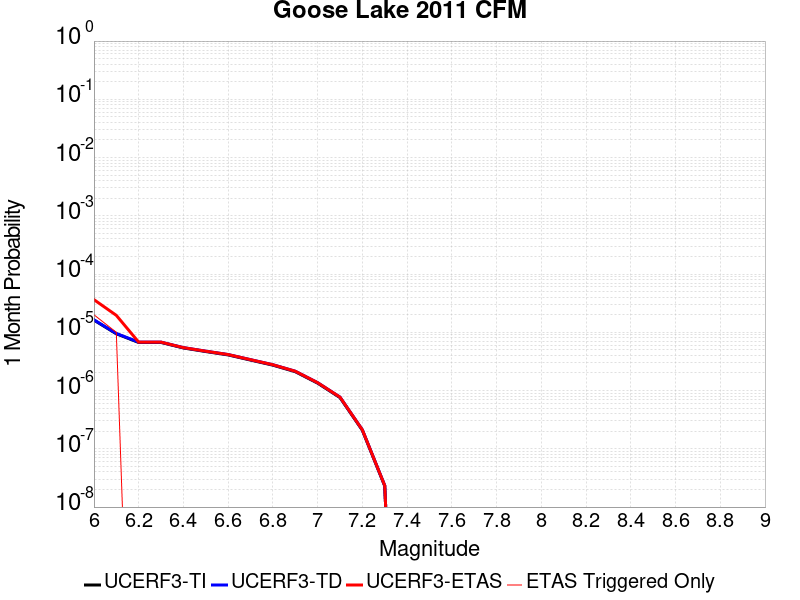 |  |  |

| Magnitude | 1 wk TI Prob | 1 wk TD Prob | 1 wk ETAS Prob | 1 wk ETAS/TD Gain | 1 wk ETAS Triggered Only | 1 mo TI Prob | 1 mo TD Prob | 1 mo ETAS Prob | 1 mo ETAS/TD Gain | 1 mo ETAS Triggered Only | 1 yr TI Prob | 1 yr TD Prob | 1 yr ETAS Prob | 1 yr ETAS/TD Gain | 1 yr ETAS Triggered Only | 10 yr TI Prob | 10 yr TD Prob | 10 yr ETAS Prob | 10 yr ETAS/TD Gain | 10 yr ETAS Triggered Only |
|-----|-----|-----|-----|-----|-----|-----|-----|-----|-----|-----|-----|-----|-----|-----|-----|-----|-----|-----|-----|-----|
| 6.0 | 3.780968E-6 | 3.8230223E-6 | 3.8230223E-6 | 1.0 | 0.0 | 1.6204049E-5 | 1.6384285E-5 | 4.657885E-5 | 2.8428981 | 3.019506E-5 | 1.9726643E-4 | 1.994615E-4 | 2.2965054E-4 | 1.1513528 | 3.019506E-5 | 0.001970914 | 0.001992933 | 0.0020230678 | 1.0151209 | 3.019506E-5 |
| 6.1 | 2.2035124E-6 | 2.229801E-6 | 2.229801E-6 | 1.0 | 0.0 | 9.443591E-6 | 9.556257E-6 | 3.975103E-5 | 4.159686 | 3.019506E-5 | 1.1496965E-4 | 1.163414E-4 | 1.4653296E-4 | 1.2595083 | 3.019506E-5 | 0.0011491019 | 0.0011628233 | 0.0011929832 | 1.0259368 | 3.019506E-5 |
| 6.2 | 1.5624689E-6 | 1.5826923E-6 | 1.5826923E-6 | 1.0 | 0.0 | 6.6962784E-6 | 6.7829496E-6 | 6.7829496E-6 | 1.0 | 0.0 | 8.152414E-5 | 8.2579325E-5 | 8.2579325E-5 | 1.0 | 0.0 | 8.1494235E-4 | 8.2549086E-4 | 8.2549086E-4 | 1.0 | 0.0 |
| 6.3 | 1.5624689E-6 | 1.5826923E-6 | 1.5826923E-6 | 1.0 | 0.0 | 6.6962784E-6 | 6.7829496E-6 | 6.7829496E-6 | 1.0 | 0.0 | 8.152414E-5 | 8.2579325E-5 | 8.2579325E-5 | 1.0 | 0.0 | 8.1494235E-4 | 8.2549086E-4 | 8.2549086E-4 | 1.0 | 0.0 |
| 6.4 | 1.256464E-6 | 1.2738695E-6 | 1.2738695E-6 | 1.0 | 0.0 | 5.3848344E-6 | 5.4594293E-6 | 5.4594293E-6 | 1.0 | 0.0 | 6.5558386E-5 | 6.646655E-5 | 6.646655E-5 | 1.0 | 0.0 | 6.553905E-4 | 6.644687E-4 | 6.644687E-4 | 1.0 | 0.0 |
| 6.5 | 1.0910911E-6 | 1.1069404E-6 | 1.1069404E-6 | 1.0 | 0.0 | 4.6760965E-6 | 4.7440217E-6 | 4.7440217E-6 | 1.0 | 0.0 | 5.692999E-5 | 5.7756948E-5 | 5.7756948E-5 | 1.0 | 0.0 | 5.6915404E-4 | 5.7742064E-4 | 5.7742064E-4 | 1.0 | 0.0 |
| 6.6 | 9.546601E-7 | 9.691246E-7 | 9.691246E-7 | 1.0 | 0.0 | 4.091394E-6 | 4.1533845E-6 | 4.1533845E-6 | 1.0 | 0.0 | 4.9811584E-5 | 5.056629E-5 | 5.056629E-5 | 1.0 | 0.0 | 4.980042E-4 | 5.055487E-4 | 5.055487E-4 | 1.0 | 0.0 |
| 6.7 | 7.790316E-7 | 7.9159634E-7 | 7.9159634E-7 | 1.0 | 0.0 | 3.3387028E-6 | 3.3925514E-6 | 3.3925514E-6 | 1.0 | 0.0 | 4.0647945E-5 | 4.1303538E-5 | 4.1303538E-5 | 1.0 | 0.0 | 4.0640513E-4 | 4.129592E-4 | 4.129592E-4 | 1.0 | 0.0 |
| 6.8 | 6.3714384E-7 | 6.4787395E-7 | 6.4787395E-7 | 1.0 | 0.0 | 2.7306137E-6 | 2.7765998E-6 | 2.7765998E-6 | 1.0 | 0.0 | 3.3244716E-5 | 3.3804583E-5 | 3.3804583E-5 | 1.0 | 0.0 | 3.323974E-4 | 3.379949E-4 | 3.379949E-4 | 1.0 | 0.0 |
| 6.9 | 4.92586E-7 | 5.0139147E-7 | 5.0139147E-7 | 1.0 | 0.0 | 2.1110811E-6 | 2.1488188E-6 | 2.1488188E-6 | 1.0 | 0.0 | 2.5702111E-5 | 2.616156E-5 | 2.616156E-5 | 1.0 | 0.0 | 2.569914E-4 | 2.6158517E-4 | 2.6158517E-4 | 1.0 | 0.0 |
| 7.0 | 3.130245E-7 | 3.190354E-7 | 3.190354E-7 | 1.0 | 0.0 | 1.3415328E-6 | 1.3672939E-6 | 1.3672939E-6 | 1.0 | 0.0 | 1.6333039E-5 | 1.6646678E-5 | 1.6646678E-5 | 1.0 | 0.0 | 1.6331839E-4 | 1.6645451E-4 | 1.6645451E-4 | 1.0 | 0.0 |
| 7.1 | 1.7680084E-7 | 1.8023923E-7 | 1.8023923E-7 | 1.0 | 0.0 | 7.5771766E-7 | 7.724536E-7 | 7.724536E-7 | 1.0 | 0.0 | 9.225173E-6 | 9.404583E-6 | 9.404583E-6 | 1.0 | 0.0 | 9.22479E-5 | 9.4041956E-5 | 9.4041956E-5 | 1.0 | 0.0 |
| 7.2 | 4.8641045E-8 | 4.9402068E-8 | 4.9402068E-8 | 1.0 | 0.0 | 2.084616E-7 | 2.1172312E-7 | 2.1172312E-7 | 1.0 | 0.0 | 2.538017E-6 | 2.577726E-6 | 2.577726E-6 | 1.0 | 0.0 | 2.537988E-5 | 2.5776973E-5 | 2.5776973E-5 | 1.0 | 0.0 |
| 7.3 | 5.3911844E-9 | 5.4758145E-9 | 5.4758145E-9 | 1.0 | 0.0 | 2.3105075E-8 | 2.3467775E-8 | 2.3467775E-8 | 1.0 | 0.0 | 2.8130427E-7 | 2.8572015E-7 | 2.8572015E-7 | 1.0 | 0.0 | 2.8130391E-6 | 2.8571992E-6 | 2.8571992E-6 | 1.0 | 0.0 |

## Oak Ridge (Onshore)
*[(top)](#table-of-contents)*

| 1 Week | 1 Month | 1 Year | 10 Year |
|-----|-----|-----|-----|
|  |  |  |  |

| Magnitude | 1 wk TI Prob | 1 wk TD Prob | 1 wk ETAS Prob | 1 wk ETAS/TD Gain | 1 wk ETAS Triggered Only | 1 mo TI Prob | 1 mo TD Prob | 1 mo ETAS Prob | 1 mo ETAS/TD Gain | 1 mo ETAS Triggered Only | 1 yr TI Prob | 1 yr TD Prob | 1 yr ETAS Prob | 1 yr ETAS/TD Gain | 1 yr ETAS Triggered Only | 10 yr TI Prob | 10 yr TD Prob | 10 yr ETAS Prob | 10 yr ETAS/TD Gain | 10 yr ETAS Triggered Only |
|-----|-----|-----|-----|-----|-----|-----|-----|-----|-----|-----|-----|-----|-----|-----|-----|-----|-----|-----|-----|-----|
| 6.0 | 3.155064E-5 | 2.9525974E-5 | 5.9720143E-5 | 2.0226307 | 3.019506E-5 | 1.3521002E-4 | 1.2653397E-4 | 1.567252E-4 | 1.2386018 | 3.019506E-5 | 0.001644939 | 0.0015395004 | 0.001569649 | 1.0195833 | 3.019506E-5 | 0.01632816 | 0.015292859 | 0.015322592 | 1.0019443 | 3.019506E-5 |
| 6.1 | 3.155064E-5 | 2.9525974E-5 | 5.9720143E-5 | 2.0226307 | 3.019506E-5 | 1.3521002E-4 | 1.2653397E-4 | 1.567252E-4 | 1.2386018 | 3.019506E-5 | 0.001644939 | 0.0015395004 | 0.001569649 | 1.0195833 | 3.019506E-5 | 0.01632816 | 0.015292859 | 0.015322592 | 1.0019443 | 3.019506E-5 |
| 6.2 | 3.155064E-5 | 2.9525974E-5 | 5.9720143E-5 | 2.0226307 | 3.019506E-5 | 1.3521002E-4 | 1.2653397E-4 | 1.567252E-4 | 1.2386018 | 3.019506E-5 | 0.001644939 | 0.0015395004 | 0.001569649 | 1.0195833 | 3.019506E-5 | 0.01632816 | 0.015292859 | 0.015322592 | 1.0019443 | 3.019506E-5 |
| 6.3 | 3.155064E-5 | 2.9525974E-5 | 5.9720143E-5 | 2.0226307 | 3.019506E-5 | 1.3521002E-4 | 1.2653397E-4 | 1.567252E-4 | 1.2386018 | 3.019506E-5 | 0.001644939 | 0.0015395004 | 0.001569649 | 1.0195833 | 3.019506E-5 | 0.01632816 | 0.015292859 | 0.015322592 | 1.0019443 | 3.019506E-5 |
| 6.4 | 3.155064E-5 | 2.9525974E-5 | 5.9720143E-5 | 2.0226307 | 3.019506E-5 | 1.3521002E-4 | 1.2653397E-4 | 1.567252E-4 | 1.2386018 | 3.019506E-5 | 0.001644939 | 0.0015395004 | 0.001569649 | 1.0195833 | 3.019506E-5 | 0.01632816 | 0.015292859 | 0.015322592 | 1.0019443 | 3.019506E-5 |
| 6.5 | 3.155064E-5 | 2.9525974E-5 | 5.9720143E-5 | 2.0226307 | 3.019506E-5 | 1.3521002E-4 | 1.2653397E-4 | 1.567252E-4 | 1.2386018 | 3.019506E-5 | 0.001644939 | 0.0015395004 | 0.001569649 | 1.0195833 | 3.019506E-5 | 0.01632816 | 0.015292859 | 0.015322592 | 1.0019443 | 3.019506E-5 |
| 6.6 | 3.155064E-5 | 2.9525974E-5 | 5.9720143E-5 | 2.0226307 | 3.019506E-5 | 1.3521002E-4 | 1.2653397E-4 | 1.567252E-4 | 1.2386018 | 3.019506E-5 | 0.001644939 | 0.0015395004 | 0.001569649 | 1.0195833 | 3.019506E-5 | 0.01632816 | 0.015292859 | 0.015322592 | 1.0019443 | 3.019506E-5 |
| 6.7 | 3.098897E-5 | 2.8864175E-5 | 5.9058362E-5 | 2.0460784 | 3.019506E-5 | 1.328031E-4 | 1.2369796E-4 | 1.5388928E-4 | 1.2440729 | 3.019506E-5 | 0.0016156785 | 0.0015050198 | 0.0015351694 | 1.0200326 | 3.019506E-5 | 0.016039822 | 0.014952714 | 0.014982457 | 1.0019891 | 3.019506E-5 |
| 6.8 | 3.0449872E-5 | 2.8239372E-5 | 5.843358E-5 | 2.0692236 | 3.019506E-5 | 1.3049292E-4 | 1.2102048E-4 | 1.5121189E-4 | 1.2494736 | 3.019506E-5 | 0.0015875935 | 0.0014724657 | 0.0015026162 | 1.0204762 | 3.019506E-5 | 0.015762992 | 0.014631462 | 0.014661215 | 1.0020335 | 3.019506E-5 |
| 6.9 | 2.697928E-5 | 2.4219773E-5 | 5.4414104E-5 | 2.246681 | 3.019506E-5 | 1.15620365E-4 | 1.0379502E-4 | 1.3398695E-4 | 1.2908803 | 3.019506E-5 | 0.0014067689 | 0.0012629933 | 0.0012931502 | 1.0238774 | 3.019506E-5 | 0.0139789665 | 0.01256087 | 0.012590686 | 1.0023737 | 3.019506E-5 |
| 7.0 | 2.4893961E-5 | 2.1862043E-5 | 5.2056443E-5 | 2.3811336 | 3.019506E-5 | 1.0668404E-4 | 9.3691204E-5 | 1.2388344E-4 | 1.3222526 | 3.019506E-5 | 0.0012981043 | 0.0011401111 | 0.0011702718 | 1.0264541 | 3.019506E-5 | 0.012905477 | 0.011344905 | 0.011374758 | 1.0026313 | 3.019506E-5 |
| 7.1 | 2.0945363E-5 | 1.7354487E-5 | 4.7549023E-5 | 2.739869 | 3.019506E-5 | 8.976275E-5 | 7.437428E-5 | 1.04567094E-4 | 1.4059577 | 3.019506E-5 | 0.0010923136 | 9.051354E-4 | 9.3530316E-4 | 1.0333295 | 3.019506E-5 | 0.0108696 | 0.009015423 | 0.009045346 | 1.003319 | 3.019506E-5 |
| 7.2 | 2.0439404E-5 | 1.6809423E-5 | 4.7003978E-5 | 2.7962873 | 3.019506E-5 | 8.7594504E-5 | 7.203843E-5 | 1.0223131E-4 | 1.419122 | 3.019506E-5 | 0.0010659413 | 8.767196E-4 | 9.0688816E-4 | 1.0344107 | 3.019506E-5 | 0.010608427 | 0.008733526 | 0.008763458 | 1.0034271 | 3.019506E-5 |
| 7.3 | 1.8463334E-5 | 1.5381811E-5 | 4.5576406E-5 | 2.9630065 | 3.019506E-5 | 7.912617E-5 | 6.59204E-5 | 9.611347E-5 | 1.4580231 | 3.019506E-5 | 9.6293533E-4 | 8.0228975E-4 | 8.324606E-4 | 1.0376059 | 3.019506E-5 | 0.009587734 | 0.007994797 | 0.00802475 | 1.0037466 | 3.019506E-5 |
| 7.4 | 1.763139E-5 | 1.451684E-5 | 4.471146E-5 | 3.079972 | 3.019506E-5 | 7.556091E-5 | 6.221356E-5 | 9.240675E-5 | 1.4853151 | 3.019506E-5 | 9.1956573E-4 | 7.571909E-4 | 7.873631E-4 | 1.0398475 | 3.019506E-5 | 0.009157699 | 0.007546914 | 0.007576881 | 1.0039707 | 3.019506E-5 |
| 7.5 | 1.3594944E-5 | 1.1163356E-5 | 4.135808E-5 | 3.704807 | 3.019506E-5 | 5.8262744E-5 | 4.784209E-5 | 7.803571E-5 | 1.6311098 | 3.019506E-5 | 7.0911803E-4 | 5.8232434E-4 | 6.125018E-4 | 1.0518224 | 3.019506E-5 | 0.007068595 | 0.0058082556 | 0.0058382754 | 1.0051684 | 3.019506E-5 |
| 7.6 | 6.9889534E-6 | 5.6367144E-6 | 5.6367144E-6 | 1.0 | 0.0 | 2.9952313E-5 | 2.4157125E-5 | 2.4157125E-5 | 1.0 | 0.0 | 3.646084E-4 | 2.9407372E-4 | 2.9407372E-4 | 1.0 | 0.0 | 0.0036401073 | 0.0029368899 | 0.0029368899 | 1.0 | 0.0 |
| 7.7 | 4.0824193E-6 | 3.2832586E-6 | 3.2832586E-6 | 1.0 | 0.0 | 1.7495966E-5 | 1.4071033E-5 | 1.4071033E-5 | 1.0 | 0.0 | 2.1299256E-4 | 1.713015E-4 | 1.713015E-4 | 1.0 | 0.0 | 0.0021278851 | 0.0017117079 | 0.0017117079 | 1.0 | 0.0 |
| 7.8 | 1.7023609E-6 | 1.4370495E-6 | 1.4370495E-6 | 1.0 | 0.0 | 7.295812E-6 | 6.1587693E-6 | 6.1587693E-6 | 1.0 | 0.0 | 8.882289E-5 | 7.498047E-5 | 7.498047E-5 | 1.0 | 0.0 | 8.8787393E-4 | 7.495545E-4 | 7.495545E-4 | 1.0 | 0.0 |
| 7.9 | 2.721225E-7 | 2.2616497E-7 | 2.2616497E-7 | 1.0 | 0.0 | 1.1662388E-6 | 9.692781E-7 | 9.692781E-7 | 1.0 | 0.0 | 1.4198865E-5 | 1.1800899E-5 | 1.1800899E-5 | 1.0 | 0.0 | 1.4197957E-4 | 1.1800301E-4 | 1.1800301E-4 | 1.0 | 0.0 |
| 8.0 | 9.364255E-9 | 5.1206666E-9 | 5.1206666E-9 | 1.0 | 0.0 | 4.0132523E-8 | 2.1945715E-8 | 2.1945715E-8 | 1.0 | 0.0 | 4.8861335E-7 | 2.6718905E-7 | 2.6718905E-7 | 1.0 | 0.0 | 4.8861225E-6 | 2.6718876E-6 | 2.6718876E-6 | 1.0 | 0.0 |

## Elsinore (Glen Ivy) rev
*[(top)](#table-of-contents)*

| 1 Week | 1 Month | 1 Year | 10 Year |
|-----|-----|-----|-----|
|  |  |  |  |

| Magnitude | 1 wk TI Prob | 1 wk TD Prob | 1 wk ETAS Prob | 1 wk ETAS/TD Gain | 1 wk ETAS Triggered Only | 1 mo TI Prob | 1 mo TD Prob | 1 mo ETAS Prob | 1 mo ETAS/TD Gain | 1 mo ETAS Triggered Only | 1 yr TI Prob | 1 yr TD Prob | 1 yr ETAS Prob | 1 yr ETAS/TD Gain | 1 yr ETAS Triggered Only | 10 yr TI Prob | 10 yr TD Prob | 10 yr ETAS Prob | 10 yr ETAS/TD Gain | 10 yr ETAS Triggered Only |
|-----|-----|-----|-----|-----|-----|-----|-----|-----|-----|-----|-----|-----|-----|-----|-----|-----|-----|-----|-----|-----|
| 6.0 | 1.6204086E-4 | 2.9360707E-4 | 3.2379327E-4 | 1.1028116 | 3.019506E-5 | 6.94276E-4 | 0.0012578638 | 0.001288021 | 1.0239748 | 3.019506E-5 | 0.008420097 | 0.015234485 | 0.01526422 | 1.0019518 | 3.019506E-5 | 0.081081145 | 0.13969168 | 0.13971765 | 1.000186 | 3.019506E-5 |
| 6.1 | 1.6204086E-4 | 2.9360707E-4 | 3.2379327E-4 | 1.1028116 | 3.019506E-5 | 6.94276E-4 | 0.0012578638 | 0.001288021 | 1.0239748 | 3.019506E-5 | 0.008420097 | 0.015234485 | 0.01526422 | 1.0019518 | 3.019506E-5 | 0.081081145 | 0.13969168 | 0.13971765 | 1.000186 | 3.019506E-5 |
| 6.2 | 1.6204086E-4 | 2.9360707E-4 | 3.2379327E-4 | 1.1028116 | 3.019506E-5 | 6.94276E-4 | 0.0012578638 | 0.001288021 | 1.0239748 | 3.019506E-5 | 0.008420097 | 0.015234485 | 0.01526422 | 1.0019518 | 3.019506E-5 | 0.081081145 | 0.13969168 | 0.13971765 | 1.000186 | 3.019506E-5 |
| 6.3 | 1.0111737E-4 | 1.7703383E-4 | 2.0722354E-4 | 1.1705308 | 3.019506E-5 | 4.332882E-4 | 7.5861247E-4 | 7.887846E-4 | 1.0397729 | 3.019506E-5 | 0.005262531 | 0.009217682 | 0.009247599 | 1.0032456 | 3.019506E-5 | 0.0513964 | 0.0870191 | 0.08704667 | 1.0003167 | 3.019506E-5 |
| 6.4 | 1.0111737E-4 | 1.7703383E-4 | 2.0722354E-4 | 1.1705308 | 3.019506E-5 | 4.332882E-4 | 7.5861247E-4 | 7.887846E-4 | 1.0397729 | 3.019506E-5 | 0.005262531 | 0.009217682 | 0.009247599 | 1.0032456 | 3.019506E-5 | 0.0513964 | 0.0870191 | 0.08704667 | 1.0003167 | 3.019506E-5 |
| 6.5 | 3.6624708E-5 | 4.6391084E-5 | 4.6391084E-5 | 1.0 | 0.0 | 1.569536E-4 | 1.9880582E-4 | 1.9880582E-4 | 1.0 | 0.0 | 0.001909235 | 0.0024181372 | 0.0024181372 | 1.0 | 0.0 | 0.01892915 | 0.023739954 | 0.023739954 | 1.0 | 0.0 |
| 6.6 | 2.5051324E-5 | 2.614772E-5 | 2.614772E-5 | 1.0 | 0.0 | 1.073584E-4 | 1.12057096E-4 | 1.12057096E-4 | 1.0 | 0.0 | 0.0013063047 | 0.0013634858 | 0.0013634858 | 1.0 | 0.0 | 0.012986525 | 0.013564618 | 0.013564618 | 1.0 | 0.0 |
| 6.7 | 2.2189772E-5 | 2.2072849E-5 | 2.2072849E-5 | 1.0 | 0.0 | 9.509556E-5 | 9.4594696E-5 | 9.4594696E-5 | 1.0 | 0.0 | 0.0011571734 | 0.0011511183 | 0.0011511183 | 1.0 | 0.0 | 0.011511663 | 0.011465415 | 0.011465415 | 1.0 | 0.0 |
| 6.8 | 1.6654378E-5 | 1.4437705E-5 | 1.4437705E-5 | 1.0 | 0.0 | 7.137396E-5 | 6.187444E-5 | 6.187444E-5 | 1.0 | 0.0 | 8.686314E-4 | 7.530661E-4 | 7.530661E-4 | 1.0 | 0.0 | 0.008652439 | 0.00751048 | 0.00751048 | 1.0 | 0.0 |
| 6.9 | 1.5042909E-5 | 1.2332022E-5 | 1.2332022E-5 | 1.0 | 0.0 | 6.446802E-5 | 5.285047E-5 | 5.285047E-5 | 1.0 | 0.0 | 7.8461546E-4 | 6.4326765E-4 | 6.4326765E-4 | 1.0 | 0.0 | 0.007818509 | 0.00641828 | 0.00641828 | 1.0 | 0.0 |
| 7.0 | 1.4361385E-5 | 1.1451324E-5 | 1.1451324E-5 | 1.0 | 0.0 | 6.154734E-5 | 4.9076196E-5 | 4.9076196E-5 | 1.0 | 0.0 | 7.490812E-4 | 5.973418E-4 | 5.973418E-4 | 1.0 | 0.0 | 0.007465612 | 0.0059613534 | 0.0059613534 | 1.0 | 0.0 |
| 7.1 | 1.3265571E-5 | 1.0244926E-5 | 1.0244926E-5 | 1.0 | 0.0 | 5.6851208E-5 | 4.39061E-5 | 4.39061E-5 | 1.0 | 0.0 | 6.919436E-4 | 5.344282E-4 | 5.344282E-4 | 1.0 | 0.0 | 0.006897931 | 0.0053347866 | 0.0053347866 | 1.0 | 0.0 |
| 7.2 | 1.1596403E-5 | 8.505067E-6 | 8.505067E-6 | 1.0 | 0.0 | 4.9697923E-5 | 3.6449786E-5 | 3.6449786E-5 | 1.0 | 0.0 | 6.049042E-4 | 4.436875E-4 | 4.436875E-4 | 1.0 | 0.0 | 0.006032603 | 0.0044294316 | 0.0044294316 | 1.0 | 0.0 |
| 7.3 | 1.0150827E-5 | 7.2387597E-6 | 7.2387597E-6 | 1.0 | 0.0 | 4.3502816E-5 | 3.1022897E-5 | 3.1022897E-5 | 1.0 | 0.0 | 5.2951806E-4 | 3.7763975E-4 | 3.7763975E-4 | 1.0 | 0.0 | 0.005282581 | 0.0037703665 | 0.0037703665 | 1.0 | 0.0 |
| 7.4 | 9.080705E-6 | 6.352519E-6 | 6.352519E-6 | 1.0 | 0.0 | 3.8916725E-5 | 2.7224805E-5 | 2.7224805E-5 | 1.0 | 0.0 | 4.7370812E-4 | 3.3141294E-4 | 3.3141294E-4 | 1.0 | 0.0 | 0.004726996 | 0.0033093381 | 0.0033093381 | 1.0 | 0.0 |
| 7.5 | 7.671649E-6 | 5.2256332E-6 | 5.2256332E-6 | 1.0 | 0.0 | 3.287808E-5 | 2.2395385E-5 | 2.2395385E-5 | 1.0 | 0.0 | 4.0021708E-4 | 2.7263095E-4 | 2.7263095E-4 | 1.0 | 0.0 | 0.0039949706 | 0.00272309 | 0.00272309 | 1.0 | 0.0 |
| 7.6 | 6.990086E-6 | 4.687545E-6 | 4.687545E-6 | 1.0 | 0.0 | 2.9957167E-5 | 2.008933E-5 | 2.008933E-5 | 1.0 | 0.0 | 3.6466747E-4 | 2.445613E-4 | 2.445613E-4 | 1.0 | 0.0 | 0.0036406964 | 0.002443038 | 0.002443038 | 1.0 | 0.0 |
| 7.7 | 4.163505E-6 | 2.3295343E-6 | 2.3295343E-6 | 1.0 | 0.0 | 1.7843471E-5 | 9.983683E-6 | 9.983683E-6 | 1.0 | 0.0 | 2.172226E-4 | 1.21545316E-4 | 1.21545316E-4 | 1.0 | 0.0 | 0.0021701038 | 0.0012148614 | 0.0012148614 | 1.0 | 0.0 |
| 7.8 | 2.2692414E-7 | 9.3854695E-8 | 9.3854695E-8 | 1.0 | 0.0 | 9.725317E-7 | 4.0223435E-7 | 4.0223435E-7 | 1.0 | 0.0 | 1.1840509E-5 | 4.8971956E-6 | 4.8971956E-6 | 1.0 | 0.0 | 1.1839878E-4 | 4.8971204E-5 | 4.8971204E-5 | 1.0 | 0.0 |
| 7.9 | 6.676829E-9 | 3.439853E-9 | 3.439853E-9 | 1.0 | 0.0 | 2.861498E-8 | 1.4742227E-8 | 1.4742227E-8 | 1.0 | 0.0 | 3.4838732E-7 | 1.7948659E-7 | 1.7948659E-7 | 1.0 | 0.0 | 3.4838679E-6 | 1.7948646E-6 | 1.7948646E-6 | 1.0 | 0.0 |

## Brawley (Seismic Zone) alt 1
*[(top)](#table-of-contents)*

| 1 Week | 1 Month | 1 Year | 10 Year |
|-----|-----|-----|-----|
|  |  |  |  |

| Magnitude | 1 wk TI Prob | 1 wk TD Prob | 1 wk ETAS Prob | 1 wk ETAS/TD Gain | 1 wk ETAS Triggered Only | 1 mo TI Prob | 1 mo TD Prob | 1 mo ETAS Prob | 1 mo ETAS/TD Gain | 1 mo ETAS Triggered Only | 1 yr TI Prob | 1 yr TD Prob | 1 yr ETAS Prob | 1 yr ETAS/TD Gain | 1 yr ETAS Triggered Only | 10 yr TI Prob | 10 yr TD Prob | 10 yr ETAS Prob | 10 yr ETAS/TD Gain | 10 yr ETAS Triggered Only |
|-----|-----|-----|-----|-----|-----|-----|-----|-----|-----|-----|-----|-----|-----|-----|-----|-----|-----|-----|-----|-----|
| 6.0 | 2.2521618E-4 | 4.7632487E-4 | 5.0650554E-4 | 1.0633615 | 3.019506E-5 | 9.6485513E-4 | 0.0020398323 | 0.0020699657 | 1.0147725 | 3.019506E-5 | 0.011683988 | 0.024546238 | 0.02457569 | 1.0012 | 3.019506E-5 | 0.11088423 | 0.21350002 | 0.21352378 | 1.0001112 | 3.019506E-5 |
| 6.1 | 2.2521618E-4 | 4.7632487E-4 | 5.0650554E-4 | 1.0633615 | 3.019506E-5 | 9.6485513E-4 | 0.0020398323 | 0.0020699657 | 1.0147725 | 3.019506E-5 | 0.011683988 | 0.024546238 | 0.02457569 | 1.0012 | 3.019506E-5 | 0.11088423 | 0.21350002 | 0.21352378 | 1.0001112 | 3.019506E-5 |
| 6.2 | 2.198148E-4 | 4.6717093E-4 | 4.9735187E-4 | 1.0646037 | 3.019506E-5 | 9.417233E-4 | 0.0020006616 | 0.0020307961 | 1.0150623 | 3.019506E-5 | 0.011405343 | 0.024080504 | 0.02410997 | 1.0012237 | 3.019506E-5 | 0.10837428 | 0.20993657 | 0.20996043 | 1.0001136 | 3.019506E-5 |
| 6.3 | 2.1704129E-4 | 4.615278E-4 | 4.917089E-4 | 1.0653939 | 3.019506E-5 | 9.298453E-4 | 0.0019765133 | 0.0020066488 | 1.0152467 | 3.019506E-5 | 0.011262234 | 0.02379366 | 0.023823138 | 1.0012388 | 3.019506E-5 | 0.107082725 | 0.20782755 | 0.20785147 | 1.000115 | 3.019506E-5 |
| 6.4 | 1.876142E-4 | 4.00449E-4 | 4.3063198E-4 | 1.0753728 | 3.019506E-5 | 8.038131E-4 | 0.0017150956 | 0.0017452389 | 1.0175753 | 3.019506E-5 | 0.00974259 | 0.020680401 | 0.020709971 | 1.0014299 | 3.019506E-5 | 0.093263686 | 0.18457815 | 0.18460278 | 1.0001334 | 3.019506E-5 |
| 6.5 | 1.7390939E-4 | 3.7477075E-4 | 3.7477075E-4 | 1.0 | 0.0 | 7.45113E-4 | 0.0016051838 | 0.0016051838 | 1.0 | 0.0 | 0.009034078 | 0.019368723 | 0.019368723 | 1.0 | 0.0 | 0.086755216 | 0.17440031 | 0.17440031 | 1.0 | 0.0 |
| 6.6 | 1.591791E-4 | 3.4891962E-4 | 3.4891962E-4 | 1.0 | 0.0 | 6.8201777E-4 | 0.0014945229 | 0.0014945229 | 1.0 | 0.0 | 0.008271996 | 0.018045569 | 0.018045569 | 1.0 | 0.0 | 0.07970774 | 0.16380852 | 0.16380852 | 1.0 | 0.0 |
| 6.7 | 1.4268003E-4 | 3.20582E-4 | 3.20582E-4 | 1.0 | 0.0 | 6.1134255E-4 | 0.0013732077 | 0.0013732077 | 1.0 | 0.0 | 0.007417723 | 0.016592601 | 0.016592601 | 1.0 | 0.0 | 0.07174956 | 0.15193306 | 0.15193306 | 1.0 | 0.0 |
| 6.8 | 1.239713E-4 | 2.9053655E-4 | 2.9053655E-4 | 1.0 | 0.0 | 5.3119735E-4 | 0.0012445687 | 0.0012445687 | 1.0 | 0.0 | 0.0064481674 | 0.015048777 | 0.015048777 | 1.0 | 0.0 | 0.06264243 | 0.13837762 | 0.13837762 | 1.0 | 0.0 |
| 6.9 | 1.0180238E-4 | 2.625439E-4 | 2.625439E-4 | 1.0 | 0.0 | 4.3622297E-4 | 0.0011247073 | 0.0011247073 | 1.0 | 0.0 | 0.005298089 | 0.013608336 | 0.013608336 | 1.0 | 0.0 | 0.05173543 | 0.124961674 | 0.124961674 | 1.0 | 0.0 |
| 7.0 | 7.6619996E-5 | 2.23993E-4 | 2.23993E-4 | 1.0 | 0.0 | 3.283301E-4 | 9.5962E-4 | 9.5962E-4 | 1.0 | 0.0 | 0.0039900932 | 0.011621496 | 0.011621496 | 1.0 | 0.0 | 0.039192066 | 0.107266866 | 0.107266866 | 1.0 | 0.0 |
| 7.1 | 7.5127435E-5 | 2.2082464E-4 | 2.2082464E-4 | 1.0 | 0.0 | 3.2193496E-4 | 9.4605127E-4 | 9.4605127E-4 | 1.0 | 0.0 | 0.0039125155 | 0.011458045 | 0.011458045 | 1.0 | 0.0 | 0.038443442 | 0.10583085 | 0.10583085 | 1.0 | 0.0 |
| 7.2 | 6.788582E-5 | 2.0210193E-4 | 2.0210193E-4 | 1.0 | 0.0 | 2.9090676E-4 | 8.6586666E-4 | 8.6586666E-4 | 1.0 | 0.0 | 0.0035360386 | 0.0104916105 | 0.0104916105 | 1.0 | 0.0 | 0.034803 | 0.09750131 | 0.09750131 | 1.0 | 0.0 |
| 7.3 | 6.399602E-5 | 1.8841137E-4 | 1.8841137E-4 | 1.0 | 0.0 | 2.7423984E-4 | 8.072303E-4 | 8.072303E-4 | 1.0 | 0.0 | 0.0033337586 | 0.009784332 | 0.009784332 | 1.0 | 0.0 | 0.03284188 | 0.09139617 | 0.09139617 | 1.0 | 0.0 |
| 7.4 | 4.506759E-5 | 1.2529209E-4 | 1.2529209E-4 | 1.0 | 0.0 | 1.9313251E-4 | 5.368565E-4 | 5.368565E-4 | 1.0 | 0.0 | 0.0023488526 | 0.0065168133 | 0.0065168133 | 1.0 | 0.0 | 0.023241805 | 0.062363707 | 0.062363707 | 1.0 | 0.0 |
| 7.5 | 3.43289E-5 | 9.33541E-5 | 9.33541E-5 | 1.0 | 0.0 | 1.4711556E-4 | 4.00028E-4 | 4.00028E-4 | 1.0 | 0.0 | 0.0017896603 | 0.0048595266 | 0.0048595266 | 1.0 | 0.0 | 0.01775316 | 0.04705519 | 0.04705519 | 1.0 | 0.0 |
| 7.6 | 2.5980507E-5 | 7.053101E-5 | 7.053101E-5 | 1.0 | 0.0 | 1.1134028E-4 | 3.0224086E-4 | 3.0224086E-4 | 1.0 | 0.0 | 0.001354725 | 0.003673598 | 0.003673598 | 1.0 | 0.0 | 0.013464959 | 0.035840835 | 0.035840835 | 1.0 | 0.0 |
| 7.7 | 1.7292105E-5 | 4.9407296E-5 | 4.9407296E-5 | 1.0 | 0.0 | 7.4106916E-5 | 2.117284E-4 | 2.117284E-4 | 1.0 | 0.0 | 9.018782E-4 | 0.0025747516 | 0.0025747516 | 1.0 | 0.0 | 0.008982267 | 0.025290398 | 0.025290398 | 1.0 | 0.0 |
| 7.8 | 1.2927471E-5 | 3.9693266E-5 | 3.9693266E-5 | 1.0 | 0.0 | 5.5402274E-5 | 1.7010293E-4 | 1.7010293E-4 | 1.0 | 0.0 | 6.743139E-4 | 0.0020690386 | 0.0020690386 | 1.0 | 0.0 | 0.0067227143 | 0.020431727 | 0.020431727 | 1.0 | 0.0 |
| 7.9 | 1.0200774E-5 | 2.874569E-5 | 2.874569E-5 | 1.0 | 0.0 | 4.371687E-5 | 1.2319001E-4 | 1.2319001E-4 | 1.0 | 0.0 | 5.321229E-4 | 0.0014988075 | 0.0014988075 | 1.0 | 0.0 | 0.005308505 | 0.014991644 | 0.014991644 | 1.0 | 0.0 |
| 8.0 | 8.650396E-6 | 2.3277367E-5 | 2.3277367E-5 | 1.0 | 0.0 | 3.70726E-5 | 9.975634E-5 | 9.975634E-5 | 1.0 | 0.0 | 4.5126543E-4 | 0.0012138576 | 0.0012138576 | 1.0 | 0.0 | 0.0045035016 | 0.012211097 | 0.012211097 | 1.0 | 0.0 |
| 8.1 | 3.9368224E-6 | 7.3279825E-6 | 7.3279825E-6 | 1.0 | 0.0 | 1.6871985E-5 | 3.140526E-5 | 3.140526E-5 | 1.0 | 0.0 | 2.0539707E-4 | 3.8229208E-4 | 3.8229208E-4 | 1.0 | 0.0 | 0.0020520731 | 0.004001185 | 0.004001185 | 1.0 | 0.0 |
| 8.2 | 1.7101195E-6 | 2.217876E-6 | 2.217876E-6 | 1.0 | 0.0 | 7.329063E-6 | 9.505149E-6 | 9.505149E-6 | 1.0 | 0.0 | 8.922769E-5 | 1.1571907E-4 | 1.1571907E-4 | 1.0 | 0.0 | 8.9191867E-4 | 0.0012666774 | 0.0012666774 | 1.0 | 0.0 |
| 8.3 | 3.0346666E-8 | 1.721586E-8 | 1.721586E-8 | 1.0 | 0.0 | 1.3005713E-7 | 7.378226E-8 | 7.378226E-8 | 1.0 | 0.0 | 1.5834444E-6 | 8.9829894E-7 | 8.9829894E-7 | 1.0 | 0.0 | 1.5834332E-5 | 9.367729E-6 | 9.367729E-6 | 1.0 | 0.0 |

## San Gabriel
*[(top)](#table-of-contents)*

| 1 Week | 1 Month | 1 Year | 10 Year |
|-----|-----|-----|-----|
|  |  |  |  |

| Magnitude | 1 wk TI Prob | 1 wk TD Prob | 1 wk ETAS Prob | 1 wk ETAS/TD Gain | 1 wk ETAS Triggered Only | 1 mo TI Prob | 1 mo TD Prob | 1 mo ETAS Prob | 1 mo ETAS/TD Gain | 1 mo ETAS Triggered Only | 1 yr TI Prob | 1 yr TD Prob | 1 yr ETAS Prob | 1 yr ETAS/TD Gain | 1 yr ETAS Triggered Only | 10 yr TI Prob | 10 yr TD Prob | 10 yr ETAS Prob | 10 yr ETAS/TD Gain | 10 yr ETAS Triggered Only |
|-----|-----|-----|-----|-----|-----|-----|-----|-----|-----|-----|-----|-----|-----|-----|-----|-----|-----|-----|-----|-----|
| 6.0 | 1.083775E-5 | 1.19851875E-5 | 4.2179887E-5 | 3.5193346 | 3.019506E-5 | 4.6446676E-5 | 5.1364143E-5 | 8.155765E-5 | 1.5878325 | 3.019506E-5 | 5.653415E-4 | 6.251903E-4 | 6.553665E-4 | 1.0482672 | 3.019506E-5 | 0.0056390543 | 0.006246409 | 0.0062764157 | 1.0048038 | 3.019506E-5 |
| 6.1 | 1.083775E-5 | 1.19851875E-5 | 4.2179887E-5 | 3.5193346 | 3.019506E-5 | 4.6446676E-5 | 5.1364143E-5 | 8.155765E-5 | 1.5878325 | 3.019506E-5 | 5.653415E-4 | 6.251903E-4 | 6.553665E-4 | 1.0482672 | 3.019506E-5 | 0.0056390543 | 0.006246409 | 0.0062764157 | 1.0048038 | 3.019506E-5 |
| 6.2 | 1.083775E-5 | 1.19851875E-5 | 4.2179887E-5 | 3.5193346 | 3.019506E-5 | 4.6446676E-5 | 5.1364143E-5 | 8.155765E-5 | 1.5878325 | 3.019506E-5 | 5.653415E-4 | 6.251903E-4 | 6.553665E-4 | 1.0482672 | 3.019506E-5 | 0.0056390543 | 0.006246409 | 0.0062764157 | 1.0048038 | 3.019506E-5 |
| 6.3 | 1.083775E-5 | 1.19851875E-5 | 4.2179887E-5 | 3.5193346 | 3.019506E-5 | 4.6446676E-5 | 5.1364143E-5 | 8.155765E-5 | 1.5878325 | 3.019506E-5 | 5.653415E-4 | 6.251903E-4 | 6.553665E-4 | 1.0482672 | 3.019506E-5 | 0.0056390543 | 0.006246409 | 0.0062764157 | 1.0048038 | 3.019506E-5 |
| 6.4 | 1.083775E-5 | 1.19851875E-5 | 4.2179887E-5 | 3.5193346 | 3.019506E-5 | 4.6446676E-5 | 5.1364143E-5 | 8.155765E-5 | 1.5878325 | 3.019506E-5 | 5.653415E-4 | 6.251903E-4 | 6.553665E-4 | 1.0482672 | 3.019506E-5 | 0.0056390543 | 0.006246409 | 0.0062764157 | 1.0048038 | 3.019506E-5 |
| 6.5 | 6.7317824E-6 | 7.716944E-6 | 7.716944E-6 | 1.0 | 0.0 | 2.8850178E-5 | 3.3072207E-5 | 3.3072207E-5 | 1.0 | 0.0 | 3.511943E-4 | 4.0258077E-4 | 4.0258077E-4 | 1.0 | 0.0 | 0.003506398 | 0.0040296097 | 0.0040296097 | 1.0 | 0.0 |
| 6.6 | 6.7317824E-6 | 7.716944E-6 | 7.716944E-6 | 1.0 | 0.0 | 2.8850178E-5 | 3.3072207E-5 | 3.3072207E-5 | 1.0 | 0.0 | 3.511943E-4 | 4.0258077E-4 | 4.0258077E-4 | 1.0 | 0.0 | 0.003506398 | 0.0040296097 | 0.0040296097 | 1.0 | 0.0 |
| 6.7 | 6.274881E-6 | 7.2458647E-6 | 7.2458647E-6 | 1.0 | 0.0 | 2.6892068E-5 | 3.1053343E-5 | 3.1053343E-5 | 1.0 | 0.0 | 3.2736175E-4 | 3.780098E-4 | 3.780098E-4 | 1.0 | 0.0 | 0.0032687993 | 0.0037847564 | 0.0037847564 | 1.0 | 0.0 |
| 6.8 | 5.996209E-6 | 6.958585E-6 | 6.958585E-6 | 1.0 | 0.0 | 2.5697784E-5 | 2.9822171E-5 | 2.9822171E-5 | 1.0 | 0.0 | 3.128256E-4 | 3.6302538E-4 | 3.6302538E-4 | 1.0 | 0.0 | 0.003123856 | 0.0036354093 | 0.0036354093 | 1.0 | 0.0 |
| 6.9 | 5.686331E-6 | 6.6236316E-6 | 6.6236316E-6 | 1.0 | 0.0 | 2.4369761E-5 | 2.8386688E-5 | 2.8386688E-5 | 1.0 | 0.0 | 2.9666146E-4 | 3.4555403E-4 | 3.4555403E-4 | 1.0 | 0.0 | 0.0029626573 | 0.0034612515 | 0.0034612515 | 1.0 | 0.0 |
| 7.0 | 5.2329838E-6 | 6.147514E-6 | 6.147514E-6 | 1.0 | 0.0 | 2.242688E-5 | 2.6346226E-5 | 2.6346226E-5 | 1.0 | 0.0 | 2.7301308E-4 | 3.2071886E-4 | 3.2071886E-4 | 1.0 | 0.0 | 0.002726779 | 0.0032136322 | 0.0032136322 | 1.0 | 0.0 |
| 7.1 | 5.135671E-6 | 6.03764E-6 | 6.03764E-6 | 1.0 | 0.0 | 2.2009834E-5 | 2.5875348E-5 | 2.5875348E-5 | 1.0 | 0.0 | 2.6793676E-4 | 3.1498758E-4 | 3.1498758E-4 | 1.0 | 0.0 | 0.0026761394 | 0.0031564834 | 0.0031564834 | 1.0 | 0.0 |
| 7.2 | 4.989062E-6 | 5.87102E-6 | 5.87102E-6 | 1.0 | 0.0 | 2.1381518E-5 | 2.5161276E-5 | 2.5161276E-5 | 1.0 | 0.0 | 2.6028889E-4 | 3.0629625E-4 | 3.0629625E-4 | 1.0 | 0.0 | 0.0025998424 | 0.003069813 | 0.003069813 | 1.0 | 0.0 |
| 7.3 | 4.8219395E-6 | 5.702574E-6 | 5.702574E-6 | 1.0 | 0.0 | 2.0665291E-5 | 2.443938E-5 | 2.443938E-5 | 1.0 | 0.0 | 2.5157086E-4 | 2.9750957E-4 | 2.9750957E-4 | 1.0 | 0.0 | 0.0025128627 | 0.0029821852 | 0.0029821852 | 1.0 | 0.0 |
| 7.4 | 4.7118383E-6 | 5.5911332E-6 | 5.5911332E-6 | 1.0 | 0.0 | 2.0193436E-5 | 2.3961782E-5 | 2.3961782E-5 | 1.0 | 0.0 | 2.4582737E-4 | 2.916964E-4 | 2.916964E-4 | 1.0 | 0.0 | 0.002455556 | 0.0029242067 | 0.0029242067 | 1.0 | 0.0 |
| 7.5 | 4.5506545E-6 | 5.4365014E-6 | 5.4365014E-6 | 1.0 | 0.0 | 1.9502659E-5 | 2.3299088E-5 | 2.3299088E-5 | 1.0 | 0.0 | 2.37419E-4 | 2.8363022E-4 | 2.8363022E-4 | 1.0 | 0.0 | 0.002371655 | 0.002843753 | 0.002843753 | 1.0 | 0.0 |
| 7.6 | 4.343636E-6 | 5.2293817E-6 | 5.2293817E-6 | 1.0 | 0.0 | 1.861545E-5 | 2.2411448E-5 | 2.2411448E-5 | 1.0 | 0.0 | 2.2661954E-4 | 2.7282597E-4 | 2.7282597E-4 | 1.0 | 0.0 | 0.0022638857 | 0.0027359722 | 0.0027359722 | 1.0 | 0.0 |
| 7.7 | 2.936235E-6 | 2.7440458E-6 | 2.7440458E-6 | 1.0 | 0.0 | 1.2583803E-5 | 1.1760143E-5 | 1.1760143E-5 | 1.0 | 0.0 | 1.5319703E-4 | 1.4317037E-4 | 1.4317037E-4 | 1.0 | 0.0 | 0.0015309147 | 0.0014380751 | 0.0014380751 | 1.0 | 0.0 |
| 7.8 | 1.4541639E-6 | 9.1237047E-7 | 9.1237047E-7 | 1.0 | 0.0 | 6.232116E-6 | 3.9101533E-6 | 3.9101533E-6 | 1.0 | 0.0 | 7.587337E-5 | 4.7605077E-5 | 4.7605077E-5 | 1.0 | 0.0 | 7.584747E-4 | 4.8085177E-4 | 4.8085177E-4 | 1.0 | 0.0 |
| 7.9 | 8.098958E-7 | 2.41753E-7 | 2.41753E-7 | 1.0 | 0.0 | 3.4709774E-6 | 1.0360839E-6 | 1.0360839E-6 | 1.0 | 0.0 | 4.225833E-5 | 1.2614248E-5 | 1.2614248E-5 | 1.0 | 0.0 | 4.2250296E-4 | 1.2921814E-4 | 1.2921814E-4 | 1.0 | 0.0 |
| 8.0 | 5.2473234E-7 | 7.6792055E-8 | 7.6792055E-8 | 1.0 | 0.0 | 2.248851E-6 | 3.2910876E-7 | 3.2910876E-7 | 1.0 | 0.0 | 2.7379416E-5 | 4.0068917E-6 | 4.0068917E-6 | 1.0 | 0.0 | 2.7376044E-4 | 4.21918E-5 | 4.21918E-5 | 1.0 | 0.0 |
| 8.1 | 3.3162388E-7 | 4.1496126E-8 | 4.1496126E-8 | 1.0 | 0.0 | 1.4212444E-6 | 1.7784053E-7 | 1.7784053E-7 | 1.0 | 0.0 | 1.7303513E-5 | 2.1652063E-6 | 2.1652063E-6 | 1.0 | 0.0 | 1.7302166E-4 | 2.2965523E-5 | 2.2965523E-5 | 1.0 | 0.0 |
| 8.2 | 1.0235345E-7 | 1.4043474E-8 | 1.4043474E-8 | 1.0 | 0.0 | 4.3865757E-7 | 6.0186316E-8 | 6.0186316E-8 | 1.0 | 0.0 | 5.340643E-6 | 7.327681E-7 | 7.327681E-7 | 1.0 | 0.0 | 5.3405143E-5 | 7.9273705E-6 | 7.9273705E-6 | 1.0 | 0.0 |

## Oceanic - West Huasna
*[(top)](#table-of-contents)*

| 1 Week | 1 Month | 1 Year | 10 Year |
|-----|-----|-----|-----|
|  | 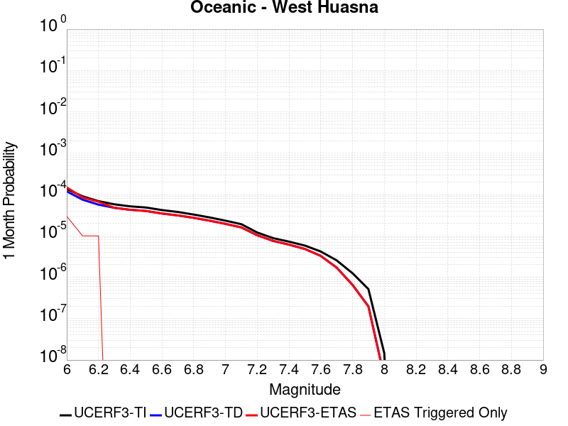 |  |  |

| Magnitude | 1 wk TI Prob | 1 wk TD Prob | 1 wk ETAS Prob | 1 wk ETAS/TD Gain | 1 wk ETAS Triggered Only | 1 mo TI Prob | 1 mo TD Prob | 1 mo ETAS Prob | 1 mo ETAS/TD Gain | 1 mo ETAS Triggered Only | 1 yr TI Prob | 1 yr TD Prob | 1 yr ETAS Prob | 1 yr ETAS/TD Gain | 1 yr ETAS Triggered Only | 10 yr TI Prob | 10 yr TD Prob | 10 yr ETAS Prob | 10 yr ETAS/TD Gain | 10 yr ETAS Triggered Only |
|-----|-----|-----|-----|-----|-----|-----|-----|-----|-----|-----|-----|-----|-----|-----|-----|-----|-----|-----|-----|-----|
| 6.0 | 3.195567E-5 | 2.7926868E-5 | 5.8121084E-5 | 2.0811887 | 3.019506E-5 | 1.3694567E-4 | 1.1968133E-4 | 1.4987278E-4 | 1.2522653 | 3.019506E-5 | 0.0016660384 | 0.0014561893 | 0.0014863404 | 1.0207055 | 3.019506E-5 | 0.016536033 | 0.014471028 | 0.014500786 | 1.0020564 | 3.019506E-5 |
| 6.1 | 2.1156782E-5 | 1.7573486E-5 | 4.7768015E-5 | 2.7181866 | 3.019506E-5 | 9.066878E-5 | 7.531282E-5 | 1.05505605E-4 | 1.4008983 | 3.019506E-5 | 0.0011033333 | 9.165572E-4 | 9.467246E-4 | 1.0329138 | 3.019506E-5 | 0.010978713 | 0.009128777 | 0.009158697 | 1.0032775 | 3.019506E-5 |
| 6.2 | 1.6195117E-5 | 1.3327152E-5 | 4.352181E-5 | 3.2656496 | 3.019506E-5 | 6.9405796E-5 | 5.7115132E-5 | 8.730847E-5 | 1.5286399 | 3.019506E-5 | 8.44688E-4 | 6.9515745E-4 | 7.2533154E-4 | 1.0434061 | 3.019506E-5 | 0.008414844 | 0.006930123 | 0.006960109 | 1.0043268 | 3.019506E-5 |
| 6.3 | 1.3559345E-5 | 1.1179142E-5 | 1.1179142E-5 | 1.0 | 0.0 | 5.811018E-5 | 4.7909736E-5 | 4.7909736E-5 | 1.0 | 0.0 | 7.072618E-4 | 5.831459E-4 | 5.831459E-4 | 1.0 | 0.0 | 0.0070501505 | 0.0058162753 | 0.0058162753 | 1.0 | 0.0 |
| 6.4 | 1.2120619E-5 | 1.0000977E-5 | 1.0000977E-5 | 1.0 | 0.0 | 5.1944477E-5 | 4.2860633E-5 | 4.2860633E-5 | 1.0 | 0.0 | 6.322405E-4 | 5.2170374E-4 | 5.2170374E-4 | 1.0 | 0.0 | 0.006304447 | 0.0052048573 | 0.0052048573 | 1.0 | 0.0 |
| 6.5 | 1.13511915E-5 | 9.3674735E-6 | 9.3674735E-6 | 1.0 | 0.0 | 4.8647056E-5 | 4.01457E-5 | 4.01457E-5 | 1.0 | 0.0 | 5.9211696E-4 | 4.886647E-4 | 4.886647E-4 | 1.0 | 0.0 | 0.0059054173 | 0.0048759608 | 0.0048759608 | 1.0 | 0.0 |
| 6.6 | 9.850605E-6 | 8.135418E-6 | 8.135418E-6 | 1.0 | 0.0 | 4.2216197E-5 | 3.4865614E-5 | 3.4865614E-5 | 1.0 | 0.0 | 5.1386096E-4 | 4.2440637E-4 | 4.2440637E-4 | 1.0 | 0.0 | 0.0051267436 | 0.004235991 | 0.004235991 | 1.0 | 0.0 |
| 6.7 | 8.8558645E-6 | 7.318433E-6 | 7.318433E-6 | 1.0 | 0.0 | 3.7953152E-5 | 3.1364336E-5 | 3.1364336E-5 | 1.0 | 0.0 | 4.6198163E-4 | 3.8179406E-4 | 3.8179406E-4 | 1.0 | 0.0 | 0.004610224 | 0.0038114067 | 0.0038114067 | 1.0 | 0.0 |
| 6.8 | 7.67136E-6 | 6.391756E-6 | 6.391756E-6 | 1.0 | 0.0 | 3.2876844E-5 | 2.7392953E-5 | 2.7392953E-5 | 1.0 | 0.0 | 4.0020206E-4 | 3.3345833E-4 | 3.3345833E-4 | 1.0 | 0.0 | 0.003994821 | 0.0033296007 | 0.0033296007 | 1.0 | 0.0 |
| 6.9 | 6.534529E-6 | 5.4583297E-6 | 5.4583297E-6 | 1.0 | 0.0 | 2.8004823E-5 | 2.3392633E-5 | 2.3392633E-5 | 1.0 | 0.0 | 3.4090536E-4 | 2.847682E-4 | 2.847682E-4 | 1.0 | 0.0 | 0.0034038287 | 0.0028440498 | 0.0028440498 | 1.0 | 0.0 |
| 7.0 | 5.460525E-6 | 4.5699517E-6 | 4.5699517E-6 | 1.0 | 0.0 | 2.3402039E-5 | 1.958536E-5 | 1.958536E-5 | 1.0 | 0.0 | 2.8488258E-4 | 2.3842578E-4 | 2.3842578E-4 | 1.0 | 0.0 | 0.0028451765 | 0.0023817138 | 0.0023817138 | 1.0 | 0.0 |
| 7.1 | 4.4825083E-6 | 3.7524428E-6 | 3.7524428E-6 | 1.0 | 0.0 | 1.9210609E-5 | 1.60818E-5 | 1.60818E-5 | 1.0 | 0.0 | 2.3386406E-4 | 1.9577841E-4 | 1.9577841E-4 | 1.0 | 0.0 | 0.002336181 | 0.0019560715 | 0.0019560715 | 1.0 | 0.0 |
| 7.2 | 2.821708E-6 | 2.4249334E-6 | 2.4249334E-6 | 1.0 | 0.0 | 1.2092979E-5 | 1.039253E-5 | 1.039253E-5 | 1.0 | 0.0 | 1.4722206E-4 | 1.2652173E-4 | 1.2652173E-4 | 1.0 | 0.0 | 0.0014712457 | 0.0012644994 | 0.0012644994 | 1.0 | 0.0 |
| 7.3 | 2.0644757E-6 | 1.7687412E-6 | 1.7687412E-6 | 1.0 | 0.0 | 8.847723E-6 | 7.5802973E-6 | 7.5802973E-6 | 1.0 | 0.0 | 1.0771569E-4 | 9.228622E-5 | 9.228622E-5 | 1.0 | 0.0 | 0.001076635 | 9.2248066E-4 | 9.2248066E-4 | 1.0 | 0.0 |
| 7.4 | 1.6980367E-6 | 1.4379892E-6 | 1.4379892E-6 | 1.0 | 0.0 | 7.27728E-6 | 6.162796E-6 | 6.162796E-6 | 1.0 | 0.0 | 8.8597284E-5 | 7.5029464E-5 | 7.5029464E-5 | 1.0 | 0.0 | 8.8561967E-4 | 7.500429E-4 | 7.500429E-4 | 1.0 | 0.0 |
| 7.5 | 1.3637683E-6 | 1.1302635E-6 | 1.1302635E-6 | 1.0 | 0.0 | 5.844708E-6 | 4.8439774E-6 | 4.8439774E-6 | 1.0 | 0.0 | 7.1156996E-5 | 5.897383E-5 | 5.897383E-5 | 1.0 | 0.0 | 7.1134215E-4 | 5.895833E-4 | 5.895833E-4 | 1.0 | 0.0 |
| 7.6 | 9.802994E-7 | 7.677247E-7 | 7.677247E-7 | 1.0 | 0.0 | 4.2012766E-6 | 3.2902446E-6 | 3.2902446E-6 | 1.0 | 0.0 | 5.1149345E-5 | 4.0057992E-5 | 4.0057992E-5 | 1.0 | 0.0 | 5.113757E-4 | 4.0050913E-4 | 4.0050913E-4 | 1.0 | 0.0 |
| 7.7 | 5.986191E-7 | 4.0050548E-7 | 4.0050548E-7 | 1.0 | 0.0 | 2.5655079E-6 | 1.7164509E-6 | 1.7164509E-6 | 1.0 | 0.0 | 3.1234613E-5 | 2.089759E-5 | 2.089759E-5 | 1.0 | 0.0 | 3.123022E-4 | 2.089576E-4 | 2.089576E-4 | 1.0 | 0.0 |
| 7.8 | 2.9189815E-7 | 1.5285792E-7 | 1.5285792E-7 | 1.0 | 0.0 | 1.2509914E-6 | 6.5510517E-7 | 6.5510517E-7 | 1.0 | 0.0 | 1.5230714E-5 | 7.9758765E-6 | 7.9758765E-6 | 1.0 | 0.0 | 1.522967E-4 | 7.9757214E-5 | 7.9757214E-5 | 1.0 | 0.0 |
| 7.9 | 1.2057845E-7 | 4.621248E-8 | 4.621248E-8 | 1.0 | 0.0 | 5.1676466E-7 | 1.9805347E-7 | 1.9805347E-7 | 1.0 | 0.0 | 6.2915915E-6 | 2.4112983E-6 | 2.4112983E-6 | 1.0 | 0.0 | 6.2914136E-5 | 2.4114026E-5 | 2.4114026E-5 | 1.0 | 0.0 |
| 8.0 | 3.3806387E-9 | 9.011393E-10 | 9.011393E-10 | 1.0 | 0.0 | 1.4488451E-8 | 3.8620254E-9 | 3.8620254E-9 | 1.0 | 0.0 | 1.7639688E-7 | 4.702016E-8 | 4.702016E-8 | 1.0 | 0.0 | 1.7639674E-6 | 4.7129527E-7 | 4.7129527E-7 | 1.0 | 0.0 |

## Santa Rosa Island
*[(top)](#table-of-contents)*

| 1 Week | 1 Month | 1 Year | 10 Year |
|-----|-----|-----|-----|
|  |  |  |  |

| Magnitude | 1 wk TI Prob | 1 wk TD Prob | 1 wk ETAS Prob | 1 wk ETAS/TD Gain | 1 wk ETAS Triggered Only | 1 mo TI Prob | 1 mo TD Prob | 1 mo ETAS Prob | 1 mo ETAS/TD Gain | 1 mo ETAS Triggered Only | 1 yr TI Prob | 1 yr TD Prob | 1 yr ETAS Prob | 1 yr ETAS/TD Gain | 1 yr ETAS Triggered Only | 10 yr TI Prob | 10 yr TD Prob | 10 yr ETAS Prob | 10 yr ETAS/TD Gain | 10 yr ETAS Triggered Only |
|-----|-----|-----|-----|-----|-----|-----|-----|-----|-----|-----|-----|-----|-----|-----|-----|-----|-----|-----|-----|-----|
| 6.0 | 4.1143165E-5 | 4.7091133E-5 | 7.728477E-5 | 1.6411746 | 3.019506E-5 | 1.7631594E-4 | 2.0180465E-4 | 2.3199362E-4 | 1.149595 | 3.019506E-5 | 0.002144533 | 0.0024544 | 0.002484521 | 1.0122722 | 3.019506E-5 | 0.021239553 | 0.024293551 | 0.024323013 | 1.0012127 | 3.019506E-5 |
| 6.1 | 2.1061249E-5 | 2.3864959E-5 | 2.3864959E-5 | 1.0 | 0.0 | 9.0259375E-5 | 1.0227455E-4 | 1.0227455E-4 | 1.0 | 0.0 | 0.0010983539 | 0.0012445104 | 0.0012445104 | 1.0 | 0.0 | 0.01092941 | 0.012378449 | 0.012378449 | 1.0 | 0.0 |
| 6.2 | 2.1061249E-5 | 2.3864959E-5 | 2.3864959E-5 | 1.0 | 0.0 | 9.0259375E-5 | 1.0227455E-4 | 1.0227455E-4 | 1.0 | 0.0 | 0.0010983539 | 0.0012445104 | 0.0012445104 | 1.0 | 0.0 | 0.01092941 | 0.012378449 | 0.012378449 | 1.0 | 0.0 |
| 6.3 | 1.5158236E-5 | 1.7074419E-5 | 1.7074419E-5 | 1.0 | 0.0 | 6.496225E-5 | 7.3174095E-5 | 7.3174095E-5 | 1.0 | 0.0 | 7.906284E-4 | 8.905424E-4 | 8.905424E-4 | 1.0 | 0.0 | 0.007878214 | 0.008870989 | 0.008870989 | 1.0 | 0.0 |
| 6.4 | 1.2341918E-5 | 1.3852917E-5 | 1.3852917E-5 | 1.0 | 0.0 | 5.2892858E-5 | 5.9368336E-5 | 5.9368336E-5 | 1.0 | 0.0 | 6.437803E-4 | 7.225779E-4 | 7.225779E-4 | 1.0 | 0.0 | 0.006419184 | 0.007203121 | 0.007203121 | 1.0 | 0.0 |
| 6.5 | 9.061158E-6 | 1.0117031E-5 | 1.0117031E-5 | 1.0 | 0.0 | 3.883296E-5 | 4.3358013E-5 | 4.3358013E-5 | 1.0 | 0.0 | 4.726887E-4 | 5.277613E-4 | 5.277613E-4 | 1.0 | 0.0 | 0.004716845 | 0.0052656173 | 0.0052656173 | 1.0 | 0.0 |
| 6.6 | 7.5461685E-6 | 8.400733E-6 | 8.400733E-6 | 1.0 | 0.0 | 3.2340322E-5 | 3.600267E-5 | 3.600267E-5 | 1.0 | 0.0 | 3.936723E-4 | 4.3824865E-4 | 4.3824865E-4 | 1.0 | 0.0 | 0.003929756 | 0.0043742736 | 0.0043742736 | 1.0 | 0.0 |
| 6.7 | 5.5023775E-6 | 6.087381E-6 | 6.087381E-6 | 1.0 | 0.0 | 2.3581404E-5 | 2.6088532E-5 | 2.6088532E-5 | 1.0 | 0.0 | 2.8706578E-4 | 3.1758484E-4 | 3.1758484E-4 | 1.0 | 0.0 | 0.0028669522 | 0.0031716314 | 0.0031716314 | 1.0 | 0.0 |
| 6.8 | 3.7351679E-6 | 4.0831405E-6 | 4.0831405E-6 | 1.0 | 0.0 | 1.6007763E-5 | 1.749907E-5 | 1.749907E-5 | 1.0 | 0.0 | 1.948771E-4 | 2.1303284E-4 | 2.1303284E-4 | 1.0 | 0.0 | 0.0019470629 | 0.0021285315 | 0.0021285315 | 1.0 | 0.0 |
| 6.9 | 2.456366E-6 | 2.6292705E-6 | 2.6292705E-6 | 1.0 | 0.0 | 1.0527241E-5 | 1.1268254E-5 | 1.1268254E-5 | 1.0 | 0.0 | 1.2816161E-4 | 1.3718237E-4 | 1.3718237E-4 | 1.0 | 0.0 | 0.0012808773 | 0.0013709799 | 0.0013709799 | 1.0 | 0.0 |
| 7.0 | 2.3245157E-6 | 2.4827782E-6 | 2.4827782E-6 | 1.0 | 0.0 | 9.962172E-6 | 1.0640435E-5 | 1.0640435E-5 | 1.0 | 0.0 | 1.2128269E-4 | 1.2953962E-4 | 1.2953962E-4 | 1.0 | 0.0 | 0.0012121652 | 0.0012946434 | 0.0012946434 | 1.0 | 0.0 |
| 7.1 | 2.2248344E-6 | 2.37325E-6 | 2.37325E-6 | 1.0 | 0.0 | 9.53497E-6 | 1.0171032E-5 | 1.0171032E-5 | 1.0 | 0.0 | 1.1608207E-4 | 1.2382529E-4 | 1.2382529E-4 | 1.0 | 0.0 | 0.0011602144 | 0.001237565 | 0.001237565 | 1.0 | 0.0 |
| 7.2 | 2.1350402E-6 | 2.276154E-6 | 2.276154E-6 | 1.0 | 0.0 | 9.150141E-6 | 9.754909E-6 | 9.754909E-6 | 1.0 | 0.0 | 1.1139726E-4 | 1.1875956E-4 | 1.1875956E-4 | 1.0 | 0.0 | 0.0011134144 | 0.0011869629 | 0.0011869629 | 1.0 | 0.0 |
| 7.3 | 1.9793572E-6 | 2.108719E-6 | 2.108719E-6 | 1.0 | 0.0 | 8.482932E-6 | 9.037336E-6 | 9.037336E-6 | 1.0 | 0.0 | 1.032748E-4 | 1.10024026E-4 | 1.10024026E-4 | 1.0 | 0.0 | 0.0010322682 | 0.0010996973 | 0.0010996973 | 1.0 | 0.0 |
| 7.4 | 1.6951194E-6 | 1.8045733E-6 | 1.8045733E-6 | 1.0 | 0.0 | 7.264777E-6 | 7.733863E-6 | 7.733863E-6 | 1.0 | 0.0 | 8.844508E-5 | 9.415573E-5 | 9.415573E-5 | 1.0 | 0.0 | 8.840988E-4 | 9.4116E-4 | 9.4116E-4 | 1.0 | 0.0 |
| 7.5 | 8.987207E-7 | 9.5122147E-7 | 9.5122147E-7 | 1.0 | 0.0 | 3.8516546E-6 | 4.076657E-6 | 4.076657E-6 | 1.0 | 0.0 | 4.6892885E-5 | 4.963218E-5 | 4.963218E-5 | 1.0 | 0.0 | 4.688299E-4 | 4.9621216E-4 | 4.9621216E-4 | 1.0 | 0.0 |
| 7.6 | 3.8783037E-7 | 4.052932E-7 | 4.052932E-7 | 1.0 | 0.0 | 1.6621291E-6 | 1.7369698E-6 | 1.7369698E-6 | 1.0 | 0.0 | 2.0236233E-5 | 2.1147409E-5 | 2.1147409E-5 | 1.0 | 0.0 | 2.023439E-4 | 2.1145462E-4 | 2.1145462E-4 | 1.0 | 0.0 |
| 7.7 | 6.181804E-8 | 6.339035E-8 | 6.339035E-8 | 1.0 | 0.0 | 2.6493444E-7 | 2.7167292E-7 | 2.7167292E-7 | 1.0 | 0.0 | 3.225572E-6 | 3.3076128E-6 | 3.3076128E-6 | 1.0 | 0.0 | 3.225525E-5 | 3.307564E-5 | 3.307564E-5 | 1.0 | 0.0 |
| 7.8 | 1.3704449E-9 | 1.3964153E-9 | 1.3964153E-9 | 1.0 | 0.0 | 5.873335E-9 | 5.984637E-9 | 5.984637E-9 | 1.0 | 0.0 | 7.1507856E-8 | 7.286295E-8 | 7.286295E-8 | 1.0 | 0.0 | 7.1507833E-7 | 7.286294E-7 | 7.286294E-7 | 1.0 | 0.0 |

## San Jacinto (Borrego)
*[(top)](#table-of-contents)*

| 1 Week | 1 Month | 1 Year | 10 Year |
|-----|-----|-----|-----|
|  |  |  |  |

| Magnitude | 1 wk TI Prob | 1 wk TD Prob | 1 wk ETAS Prob | 1 wk ETAS/TD Gain | 1 wk ETAS Triggered Only | 1 mo TI Prob | 1 mo TD Prob | 1 mo ETAS Prob | 1 mo ETAS/TD Gain | 1 mo ETAS Triggered Only | 1 yr TI Prob | 1 yr TD Prob | 1 yr ETAS Prob | 1 yr ETAS/TD Gain | 1 yr ETAS Triggered Only | 10 yr TI Prob | 10 yr TD Prob | 10 yr ETAS Prob | 10 yr ETAS/TD Gain | 10 yr ETAS Triggered Only |
|-----|-----|-----|-----|-----|-----|-----|-----|-----|-----|-----|-----|-----|-----|-----|-----|-----|-----|-----|-----|-----|
| 6.0 | 3.543992E-5 | 2.7926513E-5 | 5.8120728E-5 | 2.0812025 | 3.019506E-5 | 1.5187653E-4 | 1.1967963E-4 | 1.4987108E-4 | 1.2522689 | 3.019506E-5 | 0.0018475284 | 0.0014561379 | 0.001486289 | 1.0207062 | 3.019506E-5 | 0.018322436 | 0.014869647 | 0.014899394 | 1.0020005 | 3.019506E-5 |
| 6.1 | 3.542281E-5 | 2.7926513E-5 | 5.8120728E-5 | 2.0812025 | 3.019506E-5 | 1.5180321E-4 | 1.1967963E-4 | 1.4987108E-4 | 1.2522689 | 3.019506E-5 | 0.0018466372 | 0.0014561379 | 0.001486289 | 1.0207062 | 3.019506E-5 | 0.018313672 | 0.014869647 | 0.014899394 | 1.0020005 | 3.019506E-5 |
| 6.2 | 3.4688688E-5 | 2.7926511E-5 | 5.8120728E-5 | 2.0812025 | 3.019506E-5 | 1.4865733E-4 | 1.1967963E-4 | 1.4987108E-4 | 1.2522689 | 3.019506E-5 | 0.0018084005 | 0.0014561379 | 0.001486289 | 1.0207062 | 3.019506E-5 | 0.017937548 | 0.014869647 | 0.014899393 | 1.0020005 | 3.019506E-5 |
| 6.3 | 3.2087122E-5 | 2.7771865E-5 | 5.7966085E-5 | 2.0872235 | 3.019506E-5 | 1.3750899E-4 | 1.1901691E-4 | 1.4920838E-4 | 1.2536738 | 3.019506E-5 | 0.0016728862 | 0.00144808 | 0.0014782313 | 1.0208216 | 3.019506E-5 | 0.016603488 | 0.014790683 | 0.014820431 | 1.0020113 | 3.019506E-5 |
| 6.4 | 3.1828724E-5 | 2.7738852E-5 | 5.7933074E-5 | 2.0885174 | 3.019506E-5 | 1.364017E-4 | 1.1887544E-4 | 1.4906691E-4 | 1.2539756 | 3.019506E-5 | 0.0016594254 | 0.0014463598 | 0.0014765112 | 1.0208464 | 3.019506E-5 | 0.016470885 | 0.014773762 | 0.014803511 | 1.0020137 | 3.019506E-5 |
| 6.5 | 3.1563577E-5 | 2.747857E-5 | 5.76728E-5 | 2.0988283 | 3.019506E-5 | 1.3526545E-4 | 1.1776006E-4 | 1.4795156E-4 | 1.2563815 | 3.019506E-5 | 0.0016456128 | 0.0014327979 | 0.0014629497 | 1.021044 | 3.019506E-5 | 0.0163348 | 0.014640348 | 0.014670101 | 1.0020323 | 3.019506E-5 |
| 6.6 | 3.1467625E-5 | 2.7322796E-5 | 5.751703E-5 | 2.1050932 | 3.019506E-5 | 1.3485427E-4 | 1.1709251E-4 | 1.4728404E-4 | 1.2578434 | 3.019506E-5 | 0.0016406142 | 0.0014246812 | 0.0014548332 | 1.0211641 | 3.019506E-5 | 0.016285548 | 0.014560594 | 0.01459035 | 1.0020436 | 3.019506E-5 |
| 6.7 | 3.1223695E-5 | 2.6940816E-5 | 5.713506E-5 | 2.120762 | 3.019506E-5 | 1.3380898E-4 | 1.15455594E-4 | 1.4564717E-4 | 1.2614994 | 3.019506E-5 | 0.0016279068 | 0.0014047775 | 0.0014349303 | 1.0214643 | 3.019506E-5 | 0.01616033 | 0.014364966 | 0.014394728 | 1.0020719 | 3.019506E-5 |
| 6.8 | 3.1015585E-5 | 2.6761822E-5 | 5.6956073E-5 | 2.1282585 | 3.019506E-5 | 1.3291716E-4 | 1.1468855E-4 | 1.4488015E-4 | 1.2632486 | 3.019506E-5 | 0.001617065 | 0.0013954508 | 0.0014256038 | 1.021608 | 3.019506E-5 | 0.016053487 | 0.014272246 | 0.01430201 | 1.0020854 | 3.019506E-5 |
| 6.9 | 2.6641965E-5 | 2.2184247E-5 | 5.2378637E-5 | 2.3610735 | 3.019506E-5 | 1.1417485E-4 | 9.50719E-5 | 1.252641E-4 | 1.3175721 | 3.019506E-5 | 0.0013891924 | 0.0011568897 | 0.0011870498 | 1.02607 | 3.019506E-5 | 0.0138054015 | 0.011882438 | 0.011912275 | 1.0025109 | 3.019506E-5 |
| 7.0 | 2.3854353E-5 | 2.0479023E-5 | 5.0673465E-5 | 2.4744084 | 3.019506E-5 | 1.02228936E-4 | 8.77643E-5 | 1.1795671E-4 | 1.3440169 | 3.019506E-5 | 0.0012439266 | 0.0010680092 | 0.001098172 | 1.0282421 | 3.019506E-5 | 0.012369866 | 0.0109828 | 0.011012664 | 1.0027192 | 3.019506E-5 |
| 7.1 | 2.3672901E-5 | 2.031551E-5 | 5.0509956E-5 | 2.4862754 | 3.019506E-5 | 1.0145135E-4 | 8.7063585E-5 | 1.17256015E-4 | 1.346786 | 3.019506E-5 | 0.0012344702 | 0.0010594862 | 0.0010896493 | 1.0284696 | 3.019506E-5 | 0.0122763505 | 0.010897976 | 0.010927842 | 1.0027405 | 3.019506E-5 |
| 7.2 | 2.2717244E-5 | 1.9542893E-5 | 4.9737362E-5 | 2.5450358 | 3.019506E-5 | 9.735599E-5 | 8.375258E-5 | 1.1394511E-4 | 1.3604968 | 3.019506E-5 | 0.0011846646 | 0.001019213 | 0.0010493773 | 1.0295956 | 3.019506E-5 | 0.01178369 | 0.010495341 | 0.01052522 | 1.0028468 | 3.019506E-5 |
| 7.3 | 2.1016205E-5 | 1.8384526E-5 | 4.857903E-5 | 2.642387 | 3.019506E-5 | 9.006634E-5 | 7.878846E-5 | 1.08981134E-4 | 1.383212 | 3.019506E-5 | 0.001096006 | 9.5882936E-4 | 9.889954E-4 | 1.0314614 | 3.019506E-5 | 0.010906163 | 0.009890967 | 0.009920863 | 1.0030226 | 3.019506E-5 |
| 7.4 | 2.0683625E-5 | 1.8187047E-5 | 4.8381557E-5 | 2.6602206 | 3.019506E-5 | 8.86411E-5 | 7.794217E-5 | 1.08134875E-4 | 1.3873732 | 3.019506E-5 | 0.001078671 | 9.485349E-4 | 9.787013E-4 | 1.0318031 | 3.019506E-5 | 0.010734501 | 0.009787692 | 0.009817592 | 1.0030549 | 3.019506E-5 |
| 7.5 | 1.9993966E-5 | 1.7782075E-5 | 4.79766E-5 | 2.6980317 | 3.019506E-5 | 8.568561E-5 | 7.620667E-5 | 1.06399435E-4 | 1.3961958 | 3.019506E-5 | 0.001042723 | 9.2742336E-4 | 9.575904E-4 | 1.0325278 | 3.019506E-5 | 0.010378438 | 0.009574614 | 0.00960452 | 1.0031235 | 3.019506E-5 |
| 7.6 | 1.788966E-5 | 1.6435291E-5 | 4.6629855E-5 | 2.8371787 | 3.019506E-5 | 7.666772E-5 | 7.043507E-5 | 1.00628E-4 | 1.4286634 | 3.019506E-5 | 9.3302975E-4 | 8.572113E-4 | 8.873805E-4 | 1.0351945 | 3.019506E-5 | 0.00929122 | 0.008866487 | 0.008896414 | 1.0033753 | 3.019506E-5 |
| 7.7 | 1.5125781E-5 | 1.4237377E-5 | 4.4432007E-5 | 3.1208 | 3.019506E-5 | 6.4823165E-5 | 6.1015908E-5 | 9.120913E-5 | 1.4948417 | 3.019506E-5 | 7.889362E-4 | 7.426163E-4 | 7.7278895E-4 | 1.0406302 | 3.019506E-5 | 0.007861412 | 0.0077142045 | 0.0077441665 | 1.0038841 | 3.019506E-5 |
| 7.8 | 1.250089E-5 | 1.26304985E-5 | 4.2825177E-5 | 3.3906167 | 3.019506E-5 | 5.3574146E-5 | 5.412959E-5 | 8.4323015E-5 | 1.5577989 | 3.019506E-5 | 6.5207E-4 | 6.588291E-4 | 6.8900426E-4 | 1.0458012 | 3.019506E-5 | 0.006501599 | 0.0068677636 | 0.0068977512 | 1.0043664 | 3.019506E-5 |
| 7.9 | 9.561E-6 | 9.754616E-6 | 3.9949384E-5 | 4.095433 | 3.019506E-5 | 4.0975072E-5 | 4.1804833E-5 | 7.199863E-5 | 1.7222562 | 3.019506E-5 | 4.987573E-4 | 5.088555E-4 | 5.3903525E-4 | 1.059309 | 3.019506E-5 | 0.0049763937 | 0.0053523467 | 0.00538238 | 1.0056113 | 3.019506E-5 |
| 8.0 | 8.01699E-6 | 8.293488E-6 | 8.293488E-6 | 1.0 | 0.0 | 3.4358076E-5 | 3.554304E-5 | 3.554304E-5 | 1.0 | 0.0 | 4.1822926E-4 | 4.3265108E-4 | 4.3265108E-4 | 1.0 | 0.0 | 0.0041744304 | 0.004573375 | 0.004573375 | 1.0 | 0.0 |
| 8.1 | 6.541947E-6 | 6.4622354E-6 | 6.4622354E-6 | 1.0 | 0.0 | 2.8036617E-5 | 2.7695003E-5 | 2.7695003E-5 | 1.0 | 0.0 | 3.4129233E-4 | 3.37135E-4 | 3.37135E-4 | 1.0 | 0.0 | 0.0034076865 | 0.0035806994 | 0.0035806994 | 1.0 | 0.0 |
| 8.2 | 1.7968189E-6 | 7.9713476E-7 | 7.9713476E-7 | 1.0 | 0.0 | 7.70063E-6 | 3.4162877E-6 | 3.4162877E-6 | 1.0 | 0.0 | 9.3751136E-5 | 4.159253E-5 | 4.159253E-5 | 1.0 | 0.0 | 9.371159E-4 | 4.712058E-4 | 4.712058E-4 | 1.0 | 0.0 |
| 8.3 | 1.5167889E-7 | 4.897714E-8 | 4.897714E-8 | 1.0 | 0.0 | 6.500522E-7 | 2.09902E-7 | 2.09902E-7 | 1.0 | 0.0 | 7.9143565E-6 | 2.5555544E-6 | 2.5555544E-6 | 1.0 | 0.0 | 7.914075E-5 | 2.969505E-5 | 2.969505E-5 | 1.0 | 0.0 |

## Channel Islands Thrust
*[(top)](#table-of-contents)*

| 1 Week | 1 Month | 1 Year | 10 Year |
|-----|-----|-----|-----|
|  |  |  |  |

| Magnitude | 1 wk TI Prob | 1 wk TD Prob | 1 wk ETAS Prob | 1 wk ETAS/TD Gain | 1 wk ETAS Triggered Only | 1 mo TI Prob | 1 mo TD Prob | 1 mo ETAS Prob | 1 mo ETAS/TD Gain | 1 mo ETAS Triggered Only | 1 yr TI Prob | 1 yr TD Prob | 1 yr ETAS Prob | 1 yr ETAS/TD Gain | 1 yr ETAS Triggered Only | 10 yr TI Prob | 10 yr TD Prob | 10 yr ETAS Prob | 10 yr ETAS/TD Gain | 10 yr ETAS Triggered Only |
|-----|-----|-----|-----|-----|-----|-----|-----|-----|-----|-----|-----|-----|-----|-----|-----|-----|-----|-----|-----|-----|
| 6.0 | 2.2156251E-5 | 2.4092022E-5 | 5.4286356E-5 | 2.2532918 | 3.019506E-5 | 9.495191E-5 | 1.03248036E-4 | 1.3343999E-4 | 1.2924215 | 3.019506E-5 | 0.0011554264 | 0.0012564264 | 0.0012865836 | 1.0240023 | 3.019506E-5 | 0.011494373 | 0.0125038205 | 0.012533638 | 1.0023847 | 3.019506E-5 |
| 6.1 | 2.2156251E-5 | 2.4092022E-5 | 5.4286356E-5 | 2.2532918 | 3.019506E-5 | 9.495191E-5 | 1.03248036E-4 | 1.3343999E-4 | 1.2924215 | 3.019506E-5 | 0.0011554264 | 0.0012564264 | 0.0012865836 | 1.0240023 | 3.019506E-5 | 0.011494373 | 0.0125038205 | 0.012533638 | 1.0023847 | 3.019506E-5 |
| 6.2 | 2.2156251E-5 | 2.4092022E-5 | 5.4286356E-5 | 2.2532918 | 3.019506E-5 | 9.495191E-5 | 1.03248036E-4 | 1.3343999E-4 | 1.2924215 | 3.019506E-5 | 0.0011554264 | 0.0012564264 | 0.0012865836 | 1.0240023 | 3.019506E-5 | 0.011494373 | 0.0125038205 | 0.012533638 | 1.0023847 | 3.019506E-5 |
| 6.3 | 2.2156251E-5 | 2.4092022E-5 | 5.4286356E-5 | 2.2532918 | 3.019506E-5 | 9.495191E-5 | 1.03248036E-4 | 1.3343999E-4 | 1.2924215 | 3.019506E-5 | 0.0011554264 | 0.0012564264 | 0.0012865836 | 1.0240023 | 3.019506E-5 | 0.011494373 | 0.0125038205 | 0.012533638 | 1.0023847 | 3.019506E-5 |
| 6.4 | 2.2156251E-5 | 2.4092022E-5 | 5.4286356E-5 | 2.2532918 | 3.019506E-5 | 9.495191E-5 | 1.03248036E-4 | 1.3343999E-4 | 1.2924215 | 3.019506E-5 | 0.0011554264 | 0.0012564264 | 0.0012865836 | 1.0240023 | 3.019506E-5 | 0.011494373 | 0.0125038205 | 0.012533638 | 1.0023847 | 3.019506E-5 |
| 6.5 | 2.2156251E-5 | 2.4092022E-5 | 5.4286356E-5 | 2.2532918 | 3.019506E-5 | 9.495191E-5 | 1.03248036E-4 | 1.3343999E-4 | 1.2924215 | 3.019506E-5 | 0.0011554264 | 0.0012564264 | 0.0012865836 | 1.0240023 | 3.019506E-5 | 0.011494373 | 0.0125038205 | 0.012533638 | 1.0023847 | 3.019506E-5 |
| 6.6 | 2.2156251E-5 | 2.4092022E-5 | 5.4286356E-5 | 2.2532918 | 3.019506E-5 | 9.495191E-5 | 1.03248036E-4 | 1.3343999E-4 | 1.2924215 | 3.019506E-5 | 0.0011554264 | 0.0012564264 | 0.0012865836 | 1.0240023 | 3.019506E-5 | 0.011494373 | 0.0125038205 | 0.012533638 | 1.0023847 | 3.019506E-5 |
| 6.7 | 1.0601296E-5 | 1.1379544E-5 | 1.1379544E-5 | 1.0 | 0.0 | 4.5433335E-5 | 4.876859E-5 | 4.876859E-5 | 1.0 | 0.0 | 5.5301044E-4 | 5.936007E-4 | 5.936007E-4 | 1.0 | 0.0 | 0.005516363 | 0.005920653 | 0.005920653 | 1.0 | 0.0 |
| 6.8 | 1.0246747E-5 | 1.0996669E-5 | 1.0996669E-5 | 1.0 | 0.0 | 4.391389E-5 | 4.7127756E-5 | 4.7127756E-5 | 1.0 | 0.0 | 5.345204E-4 | 5.7363417E-4 | 5.7363417E-4 | 1.0 | 0.0 | 0.0053323656 | 0.005722025 | 0.005722025 | 1.0 | 0.0 |
| 6.9 | 9.049551E-6 | 9.699645E-6 | 9.699645E-6 | 1.0 | 0.0 | 3.878322E-5 | 4.1569267E-5 | 4.1569267E-5 | 1.0 | 0.0 | 4.7208337E-4 | 5.059924E-4 | 5.059924E-4 | 1.0 | 0.0 | 0.0047108172 | 0.0050488203 | 0.0050488203 | 1.0 | 0.0 |
| 7.0 | 8.6542195E-6 | 9.274603E-6 | 9.274603E-6 | 1.0 | 0.0 | 3.7088983E-5 | 3.9747716E-5 | 3.9747716E-5 | 1.0 | 0.0 | 4.5146482E-4 | 4.8382508E-4 | 4.8382508E-4 | 1.0 | 0.0 | 0.004505487 | 0.004828129 | 0.004828129 | 1.0 | 0.0 |
| 7.1 | 8.391028E-6 | 8.992924E-6 | 8.992924E-6 | 1.0 | 0.0 | 3.5961057E-5 | 3.854056E-5 | 3.854056E-5 | 1.0 | 0.0 | 4.3773788E-4 | 4.6913436E-4 | 4.6913436E-4 | 1.0 | 0.0 | 0.004368766 | 0.0046818503 | 0.0046818503 | 1.0 | 0.0 |
| 7.2 | 5.965188E-6 | 6.3716952E-6 | 6.3716952E-6 | 1.0 | 0.0 | 2.556484E-5 | 2.7306982E-5 | 2.7306982E-5 | 1.0 | 0.0 | 3.1120746E-4 | 3.3241234E-4 | 3.3241234E-4 | 1.0 | 0.0 | 0.00310772 | 0.0033192092 | 0.0033192092 | 1.0 | 0.0 |
| 7.3 | 4.877518E-6 | 5.2060063E-6 | 5.2060063E-6 | 1.0 | 0.0 | 2.0903482E-5 | 2.2311267E-5 | 2.2311267E-5 | 1.0 | 0.0 | 2.5447016E-4 | 2.716063E-4 | 2.716063E-4 | 1.0 | 0.0 | 0.0025417898 | 0.0027127895 | 0.0027127895 | 1.0 | 0.0 |
| 7.4 | 3.8829853E-6 | 4.141863E-6 | 4.141863E-6 | 1.0 | 0.0 | 1.664126E-5 | 1.7750723E-5 | 1.7750723E-5 | 1.0 | 0.0 | 2.0258849E-4 | 2.1609402E-4 | 2.1609402E-4 | 1.0 | 0.0 | 0.002024039 | 0.0021588807 | 0.0021588807 | 1.0 | 0.0 |
| 7.5 | 1.3489616E-6 | 1.4277903E-6 | 1.4277903E-6 | 1.0 | 0.0 | 5.7812517E-6 | 6.119087E-6 | 6.119087E-6 | 1.0 | 0.0 | 7.038446E-5 | 7.449738E-5 | 7.449738E-5 | 1.0 | 0.0 | 7.036218E-4 | 7.44728E-4 | 7.44728E-4 | 1.0 | 0.0 |
| 7.6 | 6.058192E-7 | 6.353778E-7 | 6.353778E-7 | 1.0 | 0.0 | 2.5963652E-6 | 2.7230449E-6 | 2.7230449E-6 | 1.0 | 0.0 | 3.161029E-5 | 3.3152584E-5 | 3.3152584E-5 | 1.0 | 0.0 | 3.1605794E-4 | 3.31478E-4 | 3.31478E-4 | 1.0 | 0.0 |
| 7.7 | 2.2170494E-7 | 2.2607902E-7 | 2.2607902E-7 | 1.0 | 0.0 | 9.5016367E-7 | 9.689098E-7 | 9.689098E-7 | 1.0 | 0.0 | 1.1568181E-5 | 1.1796425E-5 | 1.1796425E-5 | 1.0 | 0.0 | 1.1567579E-4 | 1.1795909E-4 | 1.1795909E-4 | 1.0 | 0.0 |
| 7.8 | 2.1613102E-8 | 1.5466682E-8 | 1.5466682E-8 | 1.0 | 0.0 | 9.262757E-8 | 6.628578E-8 | 6.628578E-8 | 1.0 | 0.0 | 1.1277401E-6 | 8.070291E-7 | 8.070291E-7 | 1.0 | 0.0 | 1.1277344E-5 | 8.070269E-6 | 8.070269E-6 | 1.0 | 0.0 |

## Imperial
*[(top)](#table-of-contents)*

| 1 Week | 1 Month | 1 Year | 10 Year |
|-----|-----|-----|-----|
|  |  |  |  |

| Magnitude | 1 wk TI Prob | 1 wk TD Prob | 1 wk ETAS Prob | 1 wk ETAS/TD Gain | 1 wk ETAS Triggered Only | 1 mo TI Prob | 1 mo TD Prob | 1 mo ETAS Prob | 1 mo ETAS/TD Gain | 1 mo ETAS Triggered Only | 1 yr TI Prob | 1 yr TD Prob | 1 yr ETAS Prob | 1 yr ETAS/TD Gain | 1 yr ETAS Triggered Only | 10 yr TI Prob | 10 yr TD Prob | 10 yr ETAS Prob | 10 yr ETAS/TD Gain | 10 yr ETAS Triggered Only |
|-----|-----|-----|-----|-----|-----|-----|-----|-----|-----|-----|-----|-----|-----|-----|-----|-----|-----|-----|-----|-----|
| 6.0 | 2.7496446E-4 | 5.0552754E-4 | 5.3570734E-4 | 1.0596997 | 3.019506E-5 | 0.0011778869 | 0.002164787 | 0.0021949166 | 1.013918 | 3.019506E-5 | 0.0142467655 | 0.026038699 | 0.026068106 | 1.0011294 | 3.019506E-5 | 0.13367249 | 0.2280438 | 0.2280671 | 1.0001022 | 3.019506E-5 |
| 6.1 | 2.5356023E-4 | 4.8656776E-4 | 5.167481E-4 | 1.0620271 | 3.019506E-5 | 0.001086234 | 0.0020836622 | 0.0021137944 | 1.0144612 | 3.019506E-5 | 0.013144928 | 0.025071215 | 0.025100652 | 1.0011742 | 3.019506E-5 | 0.123940155 | 0.21947981 | 0.21950337 | 1.0001074 | 3.019506E-5 |
| 6.2 | 2.4820742E-4 | 4.7752203E-4 | 5.0770264E-4 | 1.0632026 | 3.019506E-5 | 0.0010633124 | 0.0020449557 | 0.0020750891 | 1.0147355 | 3.019506E-5 | 0.01286919 | 0.024611235 | 0.024640687 | 1.0011967 | 3.019506E-5 | 0.12148927 | 0.21598552 | 0.2160092 | 1.0001096 | 3.019506E-5 |
| 6.3 | 2.3205351E-4 | 4.5890483E-4 | 4.8908603E-4 | 1.0657679 | 3.019506E-5 | 9.94136E-4 | 0.0019652895 | 0.0019954252 | 1.015334 | 3.019506E-5 | 0.012036599 | 0.02366133 | 0.023690812 | 1.001246 | 3.019506E-5 | 0.11405133 | 0.20793462 | 0.20795853 | 1.000115 | 3.019506E-5 |
| 6.4 | 2.0304754E-4 | 3.987652E-4 | 4.289482E-4 | 1.0756912 | 3.019506E-5 | 8.6991355E-4 | 0.0017078889 | 0.0017380324 | 1.0176495 | 3.019506E-5 | 0.010539869 | 0.020595672 | 0.020625245 | 1.0014359 | 3.019506E-5 | 0.100537635 | 0.1850669 | 0.1850915 | 1.0001329 | 3.019506E-5 |
| 6.5 | 1.854992E-4 | 3.6988858E-4 | 3.6988858E-4 | 1.0 | 0.0 | 7.9475436E-4 | 0.0015842861 | 0.0015842861 | 1.0 | 0.0 | 0.009633281 | 0.01911948 | 0.01911948 | 1.0 | 0.0 | 0.0922623 | 0.173298 | 0.173298 | 1.0 | 0.0 |
| 6.6 | 1.6586106E-4 | 3.403506E-4 | 3.403506E-4 | 1.0 | 0.0 | 7.106394E-4 | 0.0014578402 | 0.0014578402 | 1.0 | 0.0 | 0.008617763 | 0.01760642 | 0.01760642 | 1.0 | 0.0 | 0.08291132 | 0.16077545 | 0.16077545 | 1.0 | 0.0 |
| 6.7 | 1.4224656E-4 | 3.076692E-4 | 3.076692E-4 | 1.0 | 0.0 | 6.094856E-4 | 0.001317924 | 0.001317924 | 1.0 | 0.0 | 0.0073952693 | 0.015929576 | 0.015929576 | 1.0 | 0.0 | 0.07153955 | 0.14648417 | 0.14648417 | 1.0 | 0.0 |
| 6.8 | 1.2317259E-4 | 2.779122E-4 | 2.779122E-4 | 1.0 | 0.0 | 5.2777573E-4 | 0.0011905148 | 0.0011905148 | 1.0 | 0.0 | 0.0064067547 | 0.0143995695 | 0.0143995695 | 1.0 | 0.0 | 0.06225166 | 0.13293684 | 0.13293684 | 1.0 | 0.0 |
| 6.9 | 9.859898E-5 | 2.5014306E-4 | 2.5014306E-4 | 1.0 | 0.0 | 4.2249862E-4 | 0.0010716055 | 0.0010716055 | 1.0 | 0.0 | 0.0051317946 | 0.012969712 | 0.012969712 | 1.0 | 0.0 | 0.05014893 | 0.11940631 | 0.11940631 | 1.0 | 0.0 |
| 7.0 | 7.3191884E-5 | 2.1266776E-4 | 2.1266776E-4 | 1.0 | 0.0 | 3.136418E-4 | 9.1111806E-4 | 9.1111806E-4 | 1.0 | 0.0 | 0.003811904 | 0.011037128 | 0.011037128 | 1.0 | 0.0 | 0.037471764 | 0.10206493 | 0.10206493 | 1.0 | 0.0 |
| 7.1 | 7.1760296E-5 | 2.0968143E-4 | 2.0968143E-4 | 1.0 | 0.0 | 3.0750787E-4 | 8.983284E-4 | 8.983284E-4 | 1.0 | 0.0 | 0.003737482 | 0.010882978 | 0.010882978 | 1.0 | 0.0 | 0.03675245 | 0.10070146 | 0.10070146 | 1.0 | 0.0 |
| 7.2 | 6.46614E-5 | 1.9136685E-4 | 1.9136685E-4 | 1.0 | 0.0 | 2.7709085E-4 | 8.1988896E-4 | 8.1988896E-4 | 1.0 | 0.0 | 0.0033683628 | 0.0099370815 | 0.0099370815 | 1.0 | 0.0 | 0.033177625 | 0.09250898 | 0.09250898 | 1.0 | 0.0 |
| 7.3 | 6.088115E-5 | 1.78084E-4 | 1.78084E-4 | 1.0 | 0.0 | 2.6089314E-4 | 7.6299673E-4 | 7.6299673E-4 | 1.0 | 0.0 | 0.0031717476 | 0.009250494 | 0.009250494 | 1.0 | 0.0 | 0.031268585 | 0.08655989 | 0.08655989 | 1.0 | 0.0 |
| 7.4 | 4.199346E-5 | 1.1510366E-4 | 1.1510366E-4 | 1.0 | 0.0 | 1.7995955E-4 | 4.9320905E-4 | 4.9320905E-4 | 1.0 | 0.0 | 0.0021888057 | 0.0059884563 | 0.0059884563 | 1.0 | 0.0 | 0.02167372 | 0.057439793 | 0.057439793 | 1.0 | 0.0 |
| 7.5 | 3.130448E-5 | 8.33328E-5 | 8.33328E-5 | 1.0 | 0.0 | 1.3415517E-4 | 3.57092E-4 | 3.57092E-4 | 1.0 | 0.0 | 0.0016321153 | 0.004338988 | 0.004338988 | 1.0 | 0.0 | 0.016201803 | 0.04213201 | 0.04213201 | 1.0 | 0.0 |
| 7.6 | 2.3074248E-5 | 6.0844646E-5 | 6.0844646E-5 | 1.0 | 0.0 | 9.888588E-5 | 2.6073685E-4 | 2.6073685E-4 | 1.0 | 0.0 | 0.0012032706 | 0.0031698733 | 0.0031698733 | 1.0 | 0.0 | 0.011967761 | 0.031026395 | 0.031026395 | 1.0 | 0.0 |
| 7.7 | 1.45864815E-5 | 4.0124698E-5 | 4.0124698E-5 | 1.0 | 0.0 | 6.2511994E-5 | 1.7195169E-4 | 1.7195169E-4 | 1.0 | 0.0 | 7.608177E-4 | 0.0020915072 | 0.0020915072 | 1.0 | 0.0 | 0.007582182 | 0.020627763 | 0.020627763 | 1.0 | 0.0 |
| 7.8 | 1.0352979E-5 | 3.0960902E-5 | 3.0960902E-5 | 1.0 | 0.0 | 4.4369157E-5 | 1.3268284E-4 | 1.3268284E-4 | 1.0 | 0.0 | 5.400606E-4 | 0.0016142189 | 0.0016142189 | 1.0 | 0.0 | 0.0053875 | 0.016016833 | 0.016016833 | 1.0 | 0.0 |
| 7.9 | 8.137906E-6 | 2.2149103E-5 | 2.2149103E-5 | 1.0 | 0.0 | 3.4876273E-5 | 9.492128E-5 | 9.492128E-5 | 1.0 | 0.0 | 4.2453592E-4 | 0.0011550548 | 0.0011550548 | 1.0 | 0.0 | 0.004237258 | 0.011617903 | 0.011617903 | 1.0 | 0.0 |
| 8.0 | 6.93792E-6 | 1.8008766E-5 | 1.8008766E-5 | 1.0 | 0.0 | 2.9733603E-5 | 7.717814E-5 | 7.717814E-5 | 1.0 | 0.0 | 3.6194647E-4 | 9.3923963E-4 | 9.3923963E-4 | 1.0 | 0.0 | 0.0036135751 | 0.00950155 | 0.00950155 | 1.0 | 0.0 |
| 8.1 | 3.4286315E-6 | 6.379872E-6 | 6.379872E-6 | 1.0 | 0.0 | 1.4694053E-5 | 2.7342023E-5 | 2.7342023E-5 | 1.0 | 0.0 | 1.7888541E-4 | 3.328384E-4 | 3.328384E-4 | 1.0 | 0.0 | 0.0017874148 | 0.003486031 | 0.003486031 | 1.0 | 0.0 |
| 8.2 | 1.4906886E-6 | 1.9366646E-6 | 1.9366646E-6 | 1.0 | 0.0 | 6.3886496E-6 | 8.299965E-6 | 8.299965E-6 | 1.0 | 0.0 | 7.7779034E-5 | 1.0104742E-4 | 1.0104742E-4 | 1.0 | 0.0 | 7.775182E-4 | 0.0011075331 | 0.0011075331 | 1.0 | 0.0 |
| 8.3 | 2.5758007E-8 | 1.4500102E-8 | 1.4500102E-8 | 1.0 | 0.0 | 1.10391454E-7 | 6.214329E-8 | 6.214329E-8 | 1.0 | 0.0 | 1.3440151E-6 | 7.565946E-7 | 7.565946E-7 | 1.0 | 0.0 | 1.344007E-5 | 7.887763E-6 | 7.887763E-6 | 1.0 | 0.0 |

## Great Valley 09 (Laguna Seca)
*[(top)](#table-of-contents)*

| 1 Week | 1 Month | 1 Year | 10 Year |
|-----|-----|-----|-----|
|  |  |  |  |

| Magnitude | 1 wk TI Prob | 1 wk TD Prob | 1 wk ETAS Prob | 1 wk ETAS/TD Gain | 1 wk ETAS Triggered Only | 1 mo TI Prob | 1 mo TD Prob | 1 mo ETAS Prob | 1 mo ETAS/TD Gain | 1 mo ETAS Triggered Only | 1 yr TI Prob | 1 yr TD Prob | 1 yr ETAS Prob | 1 yr ETAS/TD Gain | 1 yr ETAS Triggered Only | 10 yr TI Prob | 10 yr TD Prob | 10 yr ETAS Prob | 10 yr ETAS/TD Gain | 10 yr ETAS Triggered Only |
|-----|-----|-----|-----|-----|-----|-----|-----|-----|-----|-----|-----|-----|-----|-----|-----|-----|-----|-----|-----|-----|
| 6.0 | 5.4353277E-5 | 7.05022E-5 | 1.00695135E-4 | 1.4282552 | 3.019506E-5 | 2.3292181E-4 | 3.0211566E-4 | 3.323016E-4 | 1.0999151 | 3.019506E-5 | 0.0028321352 | 0.0036721937 | 0.003702278 | 1.0081924 | 3.019506E-5 | 0.02796312 | 0.03611547 | 0.036144577 | 1.0008059 | 3.019506E-5 |
| 6.1 | 4.5578287E-5 | 5.822118E-5 | 8.841448E-5 | 1.5185965 | 3.019506E-5 | 1.953209E-4 | 2.4949326E-4 | 2.796808E-4 | 1.1209954 | 3.019506E-5 | 0.0023754383 | 0.003033432 | 0.0030635356 | 1.0099239 | 3.019506E-5 | 0.023502063 | 0.029919548 | 0.029948838 | 1.0009791 | 3.019506E-5 |
| 6.2 | 2.8536782E-5 | 3.4737273E-5 | 6.4931286E-5 | 1.8692107 | 3.019506E-5 | 1.2229476E-4 | 1.4886224E-4 | 1.790528E-4 | 1.2028087 | 3.019506E-5 | 0.0014879217 | 0.001810813 | 0.0018409534 | 1.0166447 | 3.019506E-5 | 0.014779986 | 0.017958116 | 0.01798777 | 1.0016512 | 3.019506E-5 |
| 6.3 | 2.3698774E-5 | 2.8213295E-5 | 5.8407502E-5 | 2.0702121 | 3.019506E-5 | 1.01562226E-4 | 1.20905075E-4 | 1.510965E-4 | 1.2497116 | 3.019506E-5 | 0.0012358186 | 0.0014710218 | 0.0015011724 | 1.0204964 | 3.019506E-5 | 0.012289686 | 0.014611342 | 0.014641096 | 1.0020363 | 3.019506E-5 |
| 6.4 | 1.9191197E-5 | 2.2123184E-5 | 5.2317577E-5 | 2.3648303 | 3.019506E-5 | 8.2245395E-5 | 9.4806666E-5 | 1.2499887E-4 | 1.3184607 | 3.019506E-5 | 0.0010008777 | 0.0011536429 | 0.0011838031 | 1.0261434 | 3.019506E-5 | 0.009963818 | 0.011476948 | 0.011506796 | 1.0026008 | 3.019506E-5 |
| 6.5 | 1.5203241E-5 | 1.6802203E-5 | 1.6802203E-5 | 1.0 | 0.0 | 6.5155116E-5 | 7.200386E-5 | 7.200386E-5 | 1.0 | 0.0 | 7.9297484E-4 | 8.7626575E-4 | 8.7626575E-4 | 1.0 | 0.0 | 0.007901512 | 0.0087295165 | 0.0087295165 | 1.0 | 0.0 |
| 6.6 | 1.0984925E-5 | 1.1242595E-5 | 1.1242595E-5 | 1.0 | 0.0 | 4.70774E-5 | 4.8181686E-5 | 4.8181686E-5 | 1.0 | 0.0 | 5.730166E-4 | 5.8645656E-4 | 5.8645656E-4 | 1.0 | 0.0 | 0.005715413 | 0.0058494853 | 0.0058494853 | 1.0 | 0.0 |
| 6.7 | 9.134616E-6 | 9.019894E-6 | 9.019894E-6 | 1.0 | 0.0 | 3.9147766E-5 | 3.865613E-5 | 3.865613E-5 | 1.0 | 0.0 | 4.7651984E-4 | 4.7053912E-4 | 4.7053912E-4 | 1.0 | 0.0 | 0.004754993 | 0.0046956735 | 0.0046956735 | 1.0 | 0.0 |
| 6.8 | 7.785589E-6 | 7.4519444E-6 | 7.4519444E-6 | 1.0 | 0.0 | 3.3366385E-5 | 3.1936524E-5 | 3.1936524E-5 | 1.0 | 0.0 | 4.0616E-4 | 3.8875983E-4 | 3.8875983E-4 | 1.0 | 0.0 | 0.0040541845 | 0.0038810016 | 0.0038810016 | 1.0 | 0.0 |
| 6.9 | 5.579095E-6 | 4.898492E-6 | 4.898492E-6 | 1.0 | 0.0 | 2.3910188E-5 | 2.0993377E-5 | 2.0993377E-5 | 1.0 | 0.0 | 2.9106764E-4 | 2.5556577E-4 | 2.5556577E-4 | 1.0 | 0.0 | 0.002906867 | 0.002552856 | 0.002552856 | 1.0 | 0.0 |
| 7.0 | 2.6816688E-6 | 1.5216126E-6 | 1.5216126E-6 | 1.0 | 0.0 | 1.1492816E-5 | 6.521181E-6 | 6.521181E-6 | 1.0 | 0.0 | 1.3991605E-4 | 7.939258E-5 | 7.939258E-5 | 1.0 | 0.0 | 0.0013982799 | 7.9365086E-4 | 7.9365086E-4 | 1.0 | 0.0 |
| 7.1 | 1.9951021E-6 | 7.453827E-7 | 7.453827E-7 | 1.0 | 0.0 | 8.55041E-6 | 3.1944935E-6 | 3.1944935E-6 | 1.0 | 0.0 | 1.0409627E-4 | 3.8892307E-5 | 3.8892307E-5 | 1.0 | 0.0 | 0.0010404752 | 3.8885913E-4 | 3.8885913E-4 | 1.0 | 0.0 |
| 7.2 | 1.9951021E-6 | 7.453827E-7 | 7.453827E-7 | 1.0 | 0.0 | 8.55041E-6 | 3.1944935E-6 | 3.1944935E-6 | 1.0 | 0.0 | 1.0409627E-4 | 3.8892307E-5 | 3.8892307E-5 | 1.0 | 0.0 | 0.0010404752 | 3.8885913E-4 | 3.8885913E-4 | 1.0 | 0.0 |
| 7.3 | 1.7087556E-6 | 6.578881E-7 | 6.578881E-7 | 1.0 | 0.0 | 7.3232177E-6 | 2.8195177E-6 | 2.8195177E-6 | 1.0 | 0.0 | 8.915652E-5 | 3.4327128E-5 | 3.4327128E-5 | 1.0 | 0.0 | 8.9120766E-4 | 3.432223E-4 | 3.432223E-4 | 1.0 | 0.0 |
| 7.4 | 1.3804846E-6 | 6.073852E-7 | 6.073852E-7 | 1.0 | 0.0 | 5.916349E-6 | 2.6030768E-6 | 2.6030768E-6 | 1.0 | 0.0 | 7.2029165E-5 | 3.169204E-5 | 3.169204E-5 | 1.0 | 0.0 | 7.200583E-4 | 3.1687922E-4 | 3.1687922E-4 | 1.0 | 0.0 |
| 7.5 | 1.3804846E-6 | 6.073852E-7 | 6.073852E-7 | 1.0 | 0.0 | 5.916349E-6 | 2.6030768E-6 | 2.6030768E-6 | 1.0 | 0.0 | 7.2029165E-5 | 3.169204E-5 | 3.169204E-5 | 1.0 | 0.0 | 7.200583E-4 | 3.1687922E-4 | 3.1687922E-4 | 1.0 | 0.0 |

