# Parent Section Magnitude-Probability Distributions

Only fault sections with at least one triggered aftershock are plotted. Sections are sorted by total supraseismogenic trigger rate (decreasing)

## Table Of Contents

* [Garlock (Central)](#garlock-central)
* [Tank Canyon](#tank-canyon)
* [Little Lake](#little-lake)
* [Airport Lake](#airport-lake)
* [Owl Lake](#owl-lake)
* [Panamint Valley](#panamint-valley)
* [Garlock (East)](#garlock-east)
* [Hunter Mountain-Saline Valley](#hunter-mountain-saline-valley)
* [Blackwater](#blackwater)
* [Garlock (West)](#garlock-west)
* [Ash Hill](#ash-hill)
* [Gravel Hills-Harper Lk](#gravel-hills-harper-lk)
* [San Andreas (Mojave S)](#san-andreas-mojave-s)
* [San Andreas (Mojave N)](#san-andreas-mojave-n)
* [McLean Lake](#mclean-lake)
* [Goldstone Lake](#goldstone-lake)
* [So Sierra Nevada](#so-sierra-nevada)
* [Death Valley (So)](#death-valley-so)
* [Lenwood-Lockhart-Old Woman Springs](#lenwood-lockhart-old-woman-springs)
* [Towne Pass](#towne-pass)
* [San Andreas (San Bernardino N)](#san-andreas-san-bernardino-n)
* [Coyote Canyon](#coyote-canyon)
* [Nelson Lake](#nelson-lake)
* [Paradise](#paradise)
* [Bicycle Lake](#bicycle-lake)
* [San Andreas (San Bernardino S)](#san-andreas-san-bernardino-s)
* [Helendale-So Lockhart](#helendale-so-lockhart)
* [Death Valley (Black Mtns Frontal)](#death-valley-black-mtns-frontal)
* [San Andreas (Parkfield)](#san-andreas-parkfield)
* [Garlic Springs](#garlic-springs)
* [San Andreas (San Gorgonio Pass-Garnet HIll)](#san-andreas-san-gorgonio-pass-garnet-hill)
* [Death Valley (No)](#death-valley-no)
* [San Andreas (Big Bend)](#san-andreas-big-bend)
* [Red Pass](#red-pass)
* [San Andreas (Coachella) rev](#san-andreas-coachella-rev)
* [Coyote Lake](#coyote-lake)
* [White Wolf (Extension)](#white-wolf-extension)
* [Baker](#baker)
* [San Andreas (Carrizo) rev](#san-andreas-carrizo-rev)
* [San Andreas (Creeping Section) 2011 CFM](#san-andreas-creeping-section-2011-cfm)
* [Ludlow](#ludlow)
* [Calico-Hidalgo](#calico-hidalgo)
* [Death Valley (Fish Lake Valley)](#death-valley-fish-lake-valley)
* [Lake Isabella (Seismicity)](#lake-isabella-seismicity)
* [Cady](#cady)
* [San Jacinto (San Bernardino)](#san-jacinto-san-bernardino)
* [Sierra Nevada  (No Extension)](#sierra-nevada--no-extension)
* [San Andreas (Cholame) rev](#san-andreas-cholame-rev)
* [Scodie Lineament](#scodie-lineament)
* [San Andreas (North Branch Mill Creek)](#san-andreas-north-branch-mill-creek)
* [Manix-Afton Hills](#manix-afton-hills)
* [Santa Ynez (East)](#santa-ynez-east)
* [Palos Verdes](#palos-verdes)
* [Deep Springs](#deep-springs)
* [Cleghorn Lake](#cleghorn-lake)
* [Santa Cruz Catalina Ridge alt1](#santa-cruz-catalina-ridge-alt1)
* [Whittier alt 1](#whittier-alt-1)
* [Lost Hills](#lost-hills)
* [Mission Ridge-Arroyo Parida-Santa Ana](#mission-ridge-arroyo-parida-santa-ana)
* [Camp Rock 2011](#camp-rock-2011)
* [San Jacinto (Stepovers Combined)](#san-jacinto-stepovers-combined)
* [Ventura-Pitas Point](#ventura-pitas-point)
* [San Jacinto (San Jacinto Valley) rev](#san-jacinto-san-jacinto-valley-rev)
* [Bullion Mountains](#bullion-mountains)
* [Pinto Mtn](#pinto-mtn)
* [San Pedro Basin](#san-pedro-basin)
* [Emerson-Copper Mtn 2011](#emerson-copper-mtn-2011)
* [Coronado Bank alt1](#coronado-bank-alt1)
* [Santa Ynez (West)](#santa-ynez-west)
* [Kern Canyon (South Kern) 2011](#kern-canyon-south-kern-2011)
* [Newport-Inglewood alt 1](#newport-inglewood-alt-1)
* [Mission Creek](#mission-creek)
* [San Jacinto (Anza) rev](#san-jacinto-anza-rev)
* [San Diego Trough north alt1](#san-diego-trough-north-alt1)
* [San Gabriel](#san-gabriel)
* [Newport-Inglewood (Offshore)](#newport-inglewood-offshore)
* [Santa Susana alt 1](#santa-susana-alt-1)
* [San Cayetano](#san-cayetano)
* [Robinson Creek](#robinson-creek)
* [Pisgah-Bullion Mtn-Mesquite Lk](#pisgah-bullion-mtn-mesquite-lk)
* [South Klamath Lake East](#south-klamath-lake-east)
* [San Diego Trough south](#san-diego-trough-south)
* [San Juan](#san-juan)
* [Red Mountain](#red-mountain)
* [Compton](#compton)
* [Elsinore (Glen Ivy) rev](#elsinore-glen-ivy-rev)
* [Malibu Coast alt 1](#malibu-coast-alt-1)
* [Hayward (No) 2011 CFM](#hayward-no-2011-cfm)
* [Big Lagoon - Bald Mtn 2011 CFM](#big-lagoon---bald-mtn-2011-cfm)
* [Great Valley 05 Pittsburg - Kirby Hills alt1](#great-valley-05-pittsburg---kirby-hills-alt1)
* [Channel Islands Thrust](#channel-islands-thrust)
* [Rose Canyon](#rose-canyon)
* [Oak Ridge (Onshore)](#oak-ridge-onshore)
* [San Jacinto (Borrego)](#san-jacinto-borrego)
* [San Jacinto (Coyote Creek)](#san-jacinto-coyote-creek)
* [Mono Lake 2011 CFM](#mono-lake-2011-cfm)
* [Elsinore (Stepovers Combined)](#elsinore-stepovers-combined)
* [San Jacinto (Lytle Creek connector)](#san-jacinto-lytle-creek-connector)
* [Oceanic - West Huasna](#oceanic---west-huasna)
* [Kern Canyon (North Kern) 2011](#kern-canyon-north-kern-2011)
* [San Jacinto (Clark) rev](#san-jacinto-clark-rev)
* [Brawley (Seismic Zone) alt 1](#brawley-seismic-zone-alt-1)
* [Ortigalita (North)](#ortigalita-north)
* [Santa Rosa Island](#santa-rosa-island)
* [Imperial](#imperial)
* [Surprise Valley 2011 CFM](#surprise-valley-2011-cfm)
* [Chino alt 1](#chino-alt-1)
* [San Joaquin Hills](#san-joaquin-hills)
* [Goose Lake 2011 CFM](#goose-lake-2011-cfm)
* [Cleghorn Pass](#cleghorn-pass)
* [Elsinore (Temecula) rev](#elsinore-temecula-rev)
* [Blue Cut](#blue-cut)
* [Great Valley 09 (Laguna Seca)](#great-valley-09-laguna-seca)
* [Rodgers Creek - Healdsburg 2011 CFM](#rodgers-creek---healdsburg-2011-cfm)

## Garlock (Central)
*[(top)](#table-of-contents)*

| 1 Week | 1 Month | 1 Year | 10 Year |
|-----|-----|-----|-----|
|  |  |  |  |

| Magnitude | 1 wk TI Prob | 1 wk TD Prob | 1 wk ETAS Prob | 1 wk ETAS/TD Gain | 1 wk ETAS Triggered Only | 1 mo TI Prob | 1 mo TD Prob | 1 mo ETAS Prob | 1 mo ETAS/TD Gain | 1 mo ETAS Triggered Only | 1 yr TI Prob | 1 yr TD Prob | 1 yr ETAS Prob | 1 yr ETAS/TD Gain | 1 yr ETAS Triggered Only | 10 yr TI Prob | 10 yr TD Prob | 10 yr ETAS Prob | 10 yr ETAS/TD Gain | 10 yr ETAS Triggered Only |
|-----|-----|-----|-----|-----|-----|-----|-----|-----|-----|-----|-----|-----|-----|-----|-----|-----|-----|-----|-----|-----|
| 6.0 | 5.5131142E-5 | 7.024681E-5 | 0.06145157 | 874.79517 | 0.061385635 | 2.3625491E-4 | 3.010234E-4 | 0.06769455 | 224.88138 | 0.06741382 | 0.0028726095 | 0.0036588663 | 0.077565305 | 21.199272 | 0.07417785 | 0.028357591 | 0.036079824 | 0.11090954 | 3.0740042 | 0.07763061 |
| 6.1 | 5.5131142E-5 | 7.024681E-5 | 0.06145157 | 874.79517 | 0.061385635 | 2.3625491E-4 | 3.010234E-4 | 0.06769455 | 224.88138 | 0.06741382 | 0.0028726095 | 0.0036588663 | 0.077565305 | 21.199272 | 0.07417785 | 0.028357591 | 0.036079824 | 0.11090954 | 3.0740042 | 0.07763061 |
| 6.2 | 4.216245E-5 | 5.1661493E-5 | 0.03706792 | 717.51544 | 0.03701817 | 1.806837E-4 | 2.2138779E-4 | 0.040513594 | 182.99832 | 0.040301125 | 0.0021976046 | 0.0026920962 | 0.046920925 | 17.429142 | 0.04434822 | 0.021759989 | 0.026689773 | 0.07200294 | 2.6977725 | 0.046555724 |
| 6.3 | 4.216245E-5 | 5.1661493E-5 | 0.03706792 | 717.51544 | 0.03701817 | 1.806837E-4 | 2.2138779E-4 | 0.040513594 | 182.99832 | 0.040301125 | 0.0021976046 | 0.0026920962 | 0.046920925 | 17.429142 | 0.04434822 | 0.021759989 | 0.026689773 | 0.07200294 | 2.6977725 | 0.046555724 |
| 6.4 | 3.6858168E-5 | 4.411054E-5 | 0.027948013 | 633.59033 | 0.027905134 | 1.5795401E-4 | 1.8903162E-4 | 0.030692123 | 162.36502 | 0.03050886 | 0.0019213937 | 0.002299056 | 0.035928473 | 15.62749 | 0.03370691 | 0.019048655 | 0.02284894 | 0.057555586 | 2.5189607 | 0.0355182 |
| 6.5 | 3.39199E-5 | 4.0018083E-5 | 0.025114013 | 627.5666 | 0.025074998 | 1.453629E-4 | 1.7149492E-4 | 0.027675692 | 161.37907 | 0.027508914 | 0.0017683565 | 0.002085973 | 0.03227701 | 15.473359 | 0.030254146 | 0.017543508 | 0.020759864 | 0.052021053 | 2.5058475 | 0.031923927 |
| 6.6 | 3.3571985E-5 | 3.9472274E-5 | 0.02505688 | 634.797 | 0.025018396 | 1.4387199E-4 | 1.6915603E-4 | 0.027616825 | 163.26242 | 0.027452312 | 0.0017502342 | 0.0020575512 | 0.03219296 | 15.646251 | 0.030197544 | 0.017365133 | 0.020481179 | 0.05169582 | 2.5240648 | 0.03186732 |
| 6.7 | 3.2580007E-5 | 3.8088703E-5 | 0.024121623 | 633.3013 | 0.02408445 | 1.3962112E-4 | 1.632272E-4 | 0.026535783 | 162.56961 | 0.02637686 | 0.0016985617 | 0.0019855013 | 0.030993281 | 15.609801 | 0.02906549 | 0.016856372 | 0.019773813 | 0.049818106 | 2.519398 | 0.030650364 |
| 6.8 | 3.2185937E-5 | 3.7515918E-5 | 0.023639958 | 630.1314 | 0.023603328 | 1.3793244E-4 | 1.6077272E-4 | 0.026024051 | 161.86856 | 0.025867436 | 0.0016780337 | 0.001955672 | 0.030427644 | 15.558664 | 0.028527763 | 0.016654192 | 0.019480614 | 0.04895114 | 2.512813 | 0.030056037 |
| 6.9 | 3.165394E-5 | 3.6720503E-5 | 0.023327878 | 635.2821 | 0.023292013 | 1.3565269E-4 | 1.5736422E-4 | 0.025681168 | 163.19572 | 0.02552782 | 0.0016503202 | 0.001914247 | 0.030048436 | 15.697261 | 0.028188147 | 0.01638118 | 0.019073246 | 0.048139594 | 2.523933 | 0.029631516 |
| 7.0 | 3.0903822E-5 | 3.5625766E-5 | 0.022987206 | 645.241 | 0.022952396 | 1.3243823E-4 | 1.5267303E-4 | 0.025308734 | 165.77081 | 0.025159903 | 0.0016112428 | 0.0018572307 | 0.029597543 | 15.936385 | 0.027791928 | 0.015996104 | 0.018512413 | 0.04717872 | 2.548491 | 0.029206997 |
| 7.1 | 3.0069863E-5 | 3.4392073E-5 | 0.021797383 | 633.79095 | 0.02176374 | 1.2886449E-4 | 1.4738638E-4 | 0.023945317 | 162.46628 | 0.023801439 | 0.0015677959 | 0.0017929734 | 0.027953038 | 15.590325 | 0.026207052 | 0.01556781 | 0.017880075 | 0.044924922 | 2.5125692 | 0.027537216 |
| 7.2 | 2.7957109E-5 | 3.128145E-5 | 0.018285083 | 584.5343 | 0.018254373 | 1.1981068E-4 | 1.340566E-4 | 0.020197026 | 150.66045 | 0.02006566 | 0.0014577188 | 0.0016309366 | 0.023726499 | 14.547775 | 0.022131657 | 0.014481937 | 0.016283695 | 0.039140746 | 2.4036772 | 0.02323541 |
| 7.3 | 2.4519275E-5 | 2.6714795E-5 | 0.0129317865 | 484.06836 | 0.012905417 | 1.0507837E-4 | 1.1448703E-4 | 0.014178649 | 123.84502 | 0.014065772 | 0.0012785783 | 0.001393003 | 0.01673923 | 12.01665 | 0.015367635 | 0.012712469 | 0.013928054 | 0.029751418 | 2.1360788 | 0.016046867 |
| 7.4 | 2.3225532E-5 | 2.51994E-5 | 0.011656762 | 462.58093 | 0.011631856 | 9.95342E-5 | 1.0799304E-4 | 0.012870525 | 119.17921 | 0.01276391 | 0.0012111551 | 0.0013140367 | 0.01524827 | 11.604143 | 0.013952567 | 0.012045753 | 0.013145725 | 0.027585179 | 2.0984144 | 0.014631799 |
| 7.5 | 2.097765E-5 | 2.2483688E-5 | 0.009446622 | 420.15448 | 0.00942435 | 8.9901114E-5 | 9.635517E-5 | 0.010368756 | 107.60976 | 0.010273391 | 0.0010939965 | 0.0011725046 | 0.012451504 | 10.619577 | 0.01129224 | 0.010886264 | 0.011740365 | 0.023431443 | 1.9958018 | 0.011829966 |
| 7.6 | 1.511254E-5 | 1.5991332E-5 | 0.005223357 | 326.63675 | 0.0052074487 | 6.476642E-5 | 6.853253E-5 | 0.005813313 | 84.82561 | 0.005745175 | 7.882459E-4 | 8.3407195E-4 | 0.007224843 | 8.662134 | 0.0063961055 | 0.007854558 | 0.008383559 | 0.015034747 | 1.793361 | 0.0067074206 |
| 7.7 | 9.934069E-6 | 1.0678794E-5 | 0.0016804407 | 157.36243 | 0.0016697798 | 4.2573887E-5 | 4.5765457E-5 | 0.0018569691 | 40.57578 | 0.0018112866 | 5.182138E-4 | 5.570524E-4 | 0.0025370435 | 4.5544076 | 0.0019810947 | 0.00517007 | 0.005627684 | 0.0077383397 | 1.3750488 | 0.0021226015 |
| 7.8 | 6.7562896E-6 | 8.428449E-6 | 0.0011404731 | 135.31232 | 0.0011320541 | 2.8955206E-5 | 3.6121426E-5 | 0.0012530356 | 34.68954 | 0.0012169582 | 3.5247262E-4 | 4.3968976E-4 | 0.0017692685 | 4.023902 | 0.0013301636 | 0.0035191406 | 0.004446654 | 0.005827254 | 1.3104806 | 0.0013867663 |
| 7.9 | 3.975453E-6 | 5.37103E-6 | 5.147926E-4 | 95.84616 | 5.0942437E-4 | 1.7037546E-5 | 2.3018498E-5 | 5.8903254E-4 | 25.589529 | 5.6602707E-4 | 2.0741238E-4 | 2.8021427E-4 | 9.0266956E-4 | 3.2213547 | 6.2262977E-4 | 0.002072189 | 0.0028336283 | 0.0035109362 | 1.2390249 | 6.792325E-4 |
| 8.0 | 1.6729537E-6 | 2.0775144E-6 | 2.0018658E-4 | 96.358696 | 1.9810947E-4 | 7.169782E-6 | 8.903603E-6 | 2.636135E-4 | 29.60751 | 2.5471218E-4 | 8.7288594E-5 | 1.0839601E-4 | 3.6308056E-4 | 3.349575 | 2.5471218E-4 | 8.7254314E-4 | 0.0010969337 | 0.0013513665 | 1.2319491 | 2.5471218E-4 |
| 8.1 | 3.6733252E-7 | 3.1489964E-7 | 3.1489964E-7 | 1.0 | 0.0 | 1.5742813E-6 | 1.3495693E-6 | 1.3495693E-6 | 1.0 | 0.0 | 1.9166706E-5 | 1.6430899E-5 | 1.6430899E-5 | 1.0 | 0.0 | 1.9165053E-4 | 1.6638759E-4 | 1.6638759E-4 | 1.0 | 0.0 |

## Tank Canyon
*[(top)](#table-of-contents)*

| 1 Week | 1 Month | 1 Year | 10 Year |
|-----|-----|-----|-----|
|  |  |  |  |

| Magnitude | 1 wk TI Prob | 1 wk TD Prob | 1 wk ETAS Prob | 1 wk ETAS/TD Gain | 1 wk ETAS Triggered Only | 1 mo TI Prob | 1 mo TD Prob | 1 mo ETAS Prob | 1 mo ETAS/TD Gain | 1 mo ETAS Triggered Only | 1 yr TI Prob | 1 yr TD Prob | 1 yr ETAS Prob | 1 yr ETAS/TD Gain | 1 yr ETAS Triggered Only | 10 yr TI Prob | 10 yr TD Prob | 10 yr ETAS Prob | 10 yr ETAS/TD Gain | 10 yr ETAS Triggered Only |
|-----|-----|-----|-----|-----|-----|-----|-----|-----|-----|-----|-----|-----|-----|-----|-----|-----|-----|-----|-----|-----|
| 6.0 | 4.8284557E-5 | 5.7964822E-5 | 0.03376292 | 582.4726 | 0.03370691 | 2.0691741E-4 | 2.4840087E-4 | 0.038162794 | 153.6339 | 0.037923813 | 0.0025163088 | 0.0030207601 | 0.045711357 | 15.132402 | 0.042819947 | 0.02488006 | 0.029863637 | 0.07406807 | 2.4802094 | 0.045565177 |
| 6.1 | 1.7796336E-5 | 2.0873314E-5 | 0.0121619 | 582.653 | 0.012141281 | 7.626778E-5 | 8.945422E-5 | 0.014069072 | 157.27678 | 0.013980868 | 9.281647E-4 | 0.0010885983 | 0.01677875 | 15.413171 | 0.01570725 | 0.009242975 | 0.010836744 | 0.027241614 | 2.513819 | 0.016584592 |
| 6.2 | 1.7796336E-5 | 2.0873314E-5 | 0.0121619 | 582.653 | 0.012141281 | 7.626778E-5 | 8.945422E-5 | 0.014069072 | 157.27678 | 0.013980868 | 9.281647E-4 | 0.0010885983 | 0.01677875 | 15.413171 | 0.01570725 | 0.009242975 | 0.010836744 | 0.027241614 | 2.513819 | 0.016584592 |
| 6.3 | 1.3515912E-5 | 1.5759564E-5 | 0.008392828 | 532.55457 | 0.0083772 | 5.792405E-5 | 6.753938E-5 | 0.009745948 | 144.30023 | 0.009679062 | 7.049971E-4 | 8.2200574E-4 | 0.011624236 | 14.141307 | 0.010811117 | 0.007027647 | 0.0081922645 | 0.019448135 | 2.373963 | 0.011348843 |
| 6.4 | 1.0870146E-5 | 1.2618021E-5 | 0.006408643 | 507.89606 | 0.0063961055 | 4.658551E-5 | 5.4076212E-5 | 0.007270531 | 134.4497 | 0.007216845 | 5.67031E-4 | 6.581969E-4 | 0.008605642 | 13.074572 | 0.00795268 | 0.005655863 | 0.0065644905 | 0.014858583 | 2.2634785 | 0.008348899 |
| 6.5 | 7.964826E-6 | 9.196094E-6 | 0.0041977577 | 456.47183 | 0.0041886 | 3.4134522E-5 | 3.9411298E-5 | 0.00465235 | 118.046104 | 0.0046131206 | 4.1550855E-4 | 4.7973756E-4 | 0.005458386 | 11.377858 | 0.004981038 | 0.0041473247 | 0.004788321 | 0.0099990005 | 2.088206 | 0.00523575 |
| 6.6 | 6.6317E-6 | 7.6122988E-6 | 0.003064135 | 402.5243 | 0.0030565462 | 2.8421264E-5 | 3.2623782E-5 | 0.003400375 | 104.22994 | 0.003367861 | 3.4597394E-4 | 3.9713128E-4 | 0.0040182658 | 10.118231 | 0.003622573 | 0.0034543579 | 0.003965368 | 0.007742711 | 1.9525832 | 0.0037923814 |
| 6.7 | 4.793663E-6 | 5.4307857E-6 | 0.00187331 | 344.94272 | 0.0018678893 | 2.0544108E-5 | 2.3274613E-5 | 0.0020326239 | 87.33223 | 0.002009396 | 2.500958E-4 | 2.8333595E-4 | 0.0023770425 | 8.389485 | 0.0020943 | 0.0024981452 | 0.0028304397 | 0.0050034756 | 1.767738 | 0.0021792043 |
| 6.8 | 4.382823E-6 | 4.9692567E-6 | 0.0017879456 | 359.80142 | 0.0017829852 | 1.8783392E-5 | 2.1296666E-5 | 0.0019457476 | 91.36396 | 0.001924492 | 2.286638E-4 | 2.5926033E-4 | 0.0022681353 | 8.7484865 | 0.002009396 | 0.0022842865 | 0.002590253 | 0.0046509 | 1.795539 | 0.0020659987 |
| 6.9 | 2.729601E-6 | 3.0735416E-6 | 9.3701534E-4 | 304.86502 | 9.3394466E-4 | 1.1698237E-5 | 1.3172262E-5 | 0.0010603085 | 80.49555 | 0.00104715 | 1.4241673E-4 | 1.6036171E-4 | 0.0012639374 | 7.8817906 | 0.0011037528 | 0.001423255 | 0.0016026258 | 0.0027046097 | 1.6876115 | 0.0011037528 |
| 7.0 | 1.8987357E-6 | 2.126939E-6 | 3.9834503E-4 | 187.28558 | 3.9621894E-4 | 8.137413E-6 | 9.115425E-6 | 4.9023406E-4 | 53.78071 | 4.81123E-4 | 9.90685E-5 | 1.1097535E-4 | 6.486414E-4 | 5.844914 | 5.377257E-4 | 9.902435E-4 | 0.0011092679 | 0.0016463972 | 1.4842196 | 5.377257E-4 |
| 7.1 | 1.4928986E-6 | 1.6641272E-6 | 1.7147195E-4 | 103.04018 | 1.6980812E-4 | 6.398121E-6 | 7.1319573E-6 | 2.3354117E-4 | 32.74573 | 2.2641082E-4 | 7.789434E-5 | 8.682871E-5 | 3.6981766E-4 | 4.2591634 | 2.8301353E-4 | 7.786704E-4 | 8.6800574E-4 | 0.0011507736 | 1.3257673 | 2.8301353E-4 |
| 7.2 | 1.069082E-6 | 1.1828573E-6 | 5.7785495E-5 | 48.852467 | 5.6602705E-5 | 4.581772E-6 | 5.0693816E-6 | 8.997301E-5 | 17.748322 | 8.490406E-5 | 5.5781646E-5 | 6.171851E-5 | 1.7491693E-4 | 2.8341084 | 1.1320541E-4 | 5.576765E-4 | 6.170659E-4 | 7.302014E-4 | 1.1833444 | 1.1320541E-4 |
| 7.3 | 8.776551E-7 | 9.770005E-7 | 9.770005E-7 | 1.0 | 0.0 | 3.7613736E-6 | 4.1871413E-6 | 3.2488377E-5 | 7.759083 | 2.8301352E-5 | 4.579376E-5 | 5.097777E-5 | 1.07577594E-4 | 2.1102843 | 5.6602705E-5 | 4.5784327E-4 | 5.097118E-4 | 5.662856E-4 | 1.1109918 | 5.6602705E-5 |
| 7.4 | 7.55721E-7 | 8.510244E-7 | 8.510244E-7 | 1.0 | 0.0 | 3.2388E-6 | 3.6472454E-6 | 3.6472454E-6 | 1.0 | 0.0 | 3.9431678E-5 | 4.4404827E-5 | 4.4404827E-5 | 1.0 | 0.0 | 3.942468E-4 | 4.440104E-4 | 4.440104E-4 | 1.0 | 0.0 |
| 7.5 | 5.587665E-7 | 6.305619E-7 | 6.305619E-7 | 1.0 | 0.0 | 2.3947114E-6 | 2.702408E-6 | 2.702408E-6 | 1.0 | 0.0 | 2.915522E-5 | 3.290182E-5 | 3.290182E-5 | 1.0 | 0.0 | 2.9151395E-4 | 3.290182E-4 | 3.290182E-4 | 1.0 | 0.0 |

## Little Lake
*[(top)](#table-of-contents)*

| 1 Week | 1 Month | 1 Year | 10 Year |
|-----|-----|-----|-----|
|  |  |  |  |

| Magnitude | 1 wk TI Prob | 1 wk TD Prob | 1 wk ETAS Prob | 1 wk ETAS/TD Gain | 1 wk ETAS Triggered Only | 1 mo TI Prob | 1 mo TD Prob | 1 mo ETAS Prob | 1 mo ETAS/TD Gain | 1 mo ETAS Triggered Only | 1 yr TI Prob | 1 yr TD Prob | 1 yr ETAS Prob | 1 yr ETAS/TD Gain | 1 yr ETAS Triggered Only | 10 yr TI Prob | 10 yr TD Prob | 10 yr ETAS Prob | 10 yr ETAS/TD Gain | 10 yr ETAS Triggered Only |
|-----|-----|-----|-----|-----|-----|-----|-----|-----|-----|-----|-----|-----|-----|-----|-----|-----|-----|-----|-----|-----|
| 6.0 | 2.8424427E-5 | 3.120572E-5 | 0.0298033 | 955.05884 | 0.029773023 | 1.2181328E-4 | 1.337327E-4 | 0.03264764 | 244.12607 | 0.032518253 | 0.0014820677 | 0.0016271127 | 0.036578923 | 22.480879 | 0.035008773 | 0.014722223 | 0.016165402 | 0.051638465 | 3.194382 | 0.036055923 |
| 6.1 | 2.8424427E-5 | 3.120572E-5 | 0.0298033 | 955.05884 | 0.029773023 | 1.2181328E-4 | 1.337327E-4 | 0.03264764 | 244.12607 | 0.032518253 | 0.0014820677 | 0.0016271127 | 0.036578923 | 22.480879 | 0.035008773 | 0.014722223 | 0.016165402 | 0.051638465 | 3.194382 | 0.036055923 |
| 6.2 | 2.8424427E-5 | 3.120572E-5 | 0.0298033 | 955.05884 | 0.029773023 | 1.2181328E-4 | 1.337327E-4 | 0.03264764 | 244.12607 | 0.032518253 | 0.0014820677 | 0.0016271127 | 0.036578923 | 22.480879 | 0.035008773 | 0.014722223 | 0.016165402 | 0.051638465 | 3.194382 | 0.036055923 |
| 6.3 | 1.48860645E-5 | 1.6081389E-5 | 0.02047763 | 1273.3744 | 0.020461878 | 6.379586E-5 | 6.8918576E-5 | 0.022170752 | 321.69485 | 0.022103356 | 7.7643775E-4 | 8.3878887E-4 | 0.024789928 | 29.55443 | 0.023971247 | 0.007737305 | 0.008359048 | 0.032831535 | 3.9276645 | 0.02467878 |
| 6.4 | 1.48860645E-5 | 1.6081389E-5 | 0.02047763 | 1273.3744 | 0.020461878 | 6.379586E-5 | 6.8918576E-5 | 0.022170752 | 321.69485 | 0.022103356 | 7.7643775E-4 | 8.3878887E-4 | 0.024789928 | 29.55443 | 0.023971247 | 0.007737305 | 0.008359048 | 0.032831535 | 3.9276645 | 0.02467878 |
| 6.5 | 1.2797581E-5 | 1.3765565E-5 | 0.019286722 | 1401.0846 | 0.019273221 | 5.4845623E-5 | 5.899409E-5 | 0.020830961 | 353.1025 | 0.020773193 | 6.675408E-4 | 7.18042E-4 | 0.023229742 | 32.35151 | 0.022527877 | 0.006655392 | 0.00715977 | 0.030116426 | 4.20634 | 0.023122204 |
| 6.6 | 9.661896E-6 | 1.0289038E-5 | 0.016792819 | 1632.1078 | 0.016782703 | 4.1407468E-5 | 4.409522E-5 | 0.018241063 | 413.67435 | 0.01819777 | 5.040193E-4 | 5.367433E-4 | 0.020252198 | 37.731625 | 0.019726044 | 0.005028777 | 0.0053560743 | 0.02551131 | 4.763061 | 0.020263769 |
| 6.7 | 7.767871E-6 | 8.199687E-6 | 0.014837987 | 1809.5797 | 0.0148299085 | 3.329045E-5 | 3.5141118E-5 | 0.016279547 | 463.26205 | 0.016244976 | 4.0523586E-4 | 4.2777284E-4 | 0.018051973 | 42.199905 | 0.017631743 | 0.004044977 | 0.004270846 | 0.022278175 | 5.2163377 | 0.018084565 |
| 6.8 | 6.4235196E-6 | 6.7357446E-6 | 0.0112422975 | 1669.0504 | 0.011235637 | 2.752908E-5 | 2.8867229E-5 | 0.012424502 | 430.4016 | 0.012395993 | 3.35115E-4 | 3.5141467E-4 | 0.013874708 | 39.482437 | 0.013528046 | 0.003346101 | 0.00350985 | 0.017413445 | 4.9613075 | 0.013952567 |
| 6.9 | 3.1283696E-6 | 3.1121804E-6 | 0.0068803197 | 2210.7715 | 0.0068772286 | 1.3407229E-5 | 1.3337856E-5 | 0.007767805 | 582.3878 | 0.007754571 | 1.6322079E-4 | 1.6237781E-4 | 0.008566515 | 52.756683 | 0.008405502 | 0.0016310095 | 0.00162274 | 0.010297156 | 6.3455367 | 0.008688515 |
| 7.0 | 2.290603E-6 | 2.2286815E-6 | 0.0041625183 | 1867.7043 | 0.004160299 | 9.816834E-6 | 9.551463E-6 | 0.004764133 | 498.7857 | 0.004754627 | 1.19513395E-4 | 1.162839E-4 | 0.005238233 | 45.046932 | 0.0051225447 | 0.0011944914 | 0.0011623327 | 0.006505071 | 5.5965657 | 0.0053489557 |
| 7.1 | 1.293693E-6 | 1.1776827E-6 | 0.0018973661 | 1611.1012 | 0.0018961907 | 5.5443866E-6 | 5.0472063E-6 | 0.0021276379 | 421.54767 | 0.0021226015 | 6.750081E-5 | 6.14487E-5 | 0.002382017 | 38.76432 | 0.002320711 | 6.7480316E-4 | 6.143856E-4 | 0.0031033745 | 5.0511837 | 0.002490519 |
| 7.2 | 4.715842E-7 | 3.0917857E-7 | 5.6911867E-5 | 184.07442 | 5.6602705E-5 | 2.0210737E-6 | 1.3250503E-6 | 5.7927682E-5 | 43.717342 | 5.6602705E-5 | 2.4606294E-5 | 1.6132375E-5 | 7.273417E-5 | 4.508584 | 5.6602705E-5 | 2.460357E-4 | 1.6131258E-4 | 2.1790616E-4 | 1.3508317 | 5.6602705E-5 |
| 7.3 | 3.9430947E-7 | 2.3097488E-7 | 5.683367E-5 | 246.05995 | 5.6602705E-5 | 1.6898966E-6 | 9.89892E-7 | 5.759254E-5 | 58.180634 | 5.6602705E-5 | 2.0574296E-5 | 1.2051869E-5 | 6.865389E-5 | 5.696535 | 5.6602705E-5 | 2.0572392E-4 | 1.20512224E-4 | 1.771081E-4 | 1.4696277 | 5.6602705E-5 |
| 7.4 | 3.547123E-7 | 1.9679135E-7 | 1.9679135E-7 | 1.0 | 0.0 | 1.5201948E-6 | 8.4339126E-7 | 8.4339126E-7 | 1.0 | 0.0 | 1.8508214E-5 | 1.0268241E-5 | 1.0268241E-5 | 1.0 | 0.0 | 1.8506673E-4 | 1.02677724E-4 | 1.02677724E-4 | 1.0 | 0.0 |
| 7.5 | 2.6354266E-7 | 1.4423138E-7 | 1.4423138E-7 | 1.0 | 0.0 | 1.129468E-6 | 6.181344E-7 | 6.181344E-7 | 1.0 | 0.0 | 1.3751187E-5 | 7.5257603E-6 | 7.5257603E-6 | 1.0 | 0.0 | 1.3750336E-4 | 7.5255106E-5 | 7.5255106E-5 | 1.0 | 0.0 |
| 7.6 | 1.269913E-7 | 7.572556E-8 | 7.572556E-8 | 1.0 | 0.0 | 5.4424834E-7 | 3.245381E-7 | 3.245381E-7 | 1.0 | 0.0 | 6.6262032E-6 | 3.9512443E-6 | 3.9512443E-6 | 1.0 | 0.0 | 6.626006E-5 | 3.9511775E-5 | 3.9511775E-5 | 1.0 | 0.0 |

## Airport Lake
*[(top)](#table-of-contents)*

| 1 Week | 1 Month | 1 Year | 10 Year |
|-----|-----|-----|-----|
|  |  |  |  |

| Magnitude | 1 wk TI Prob | 1 wk TD Prob | 1 wk ETAS Prob | 1 wk ETAS/TD Gain | 1 wk ETAS Triggered Only | 1 mo TI Prob | 1 mo TD Prob | 1 mo ETAS Prob | 1 mo ETAS/TD Gain | 1 mo ETAS Triggered Only | 1 yr TI Prob | 1 yr TD Prob | 1 yr ETAS Prob | 1 yr ETAS/TD Gain | 1 yr ETAS Triggered Only | 10 yr TI Prob | 10 yr TD Prob | 10 yr ETAS Prob | 10 yr ETAS/TD Gain | 10 yr ETAS Triggered Only |
|-----|-----|-----|-----|-----|-----|-----|-----|-----|-----|-----|-----|-----|-----|-----|-----|-----|-----|-----|-----|-----|
| 6.0 | 1.2387061E-5 | 1.3103157E-5 | 0.02698394 | 2059.3464 | 0.02697119 | 5.3086325E-5 | 5.615534E-5 | 0.02926151 | 521.08154 | 0.029206997 | 6.461343E-4 | 6.8350515E-4 | 0.032472484 | 47.50876 | 0.03181072 | 0.0064425888 | 0.0068168393 | 0.039394505 | 5.778999 | 0.032801267 |
| 6.1 | 1.2387061E-5 | 1.3103157E-5 | 0.02698394 | 2059.3464 | 0.02697119 | 5.3086325E-5 | 5.615534E-5 | 0.02926151 | 521.08154 | 0.029206997 | 6.461343E-4 | 6.8350515E-4 | 0.032472484 | 47.50876 | 0.03181072 | 0.0064425888 | 0.0068168393 | 0.039394505 | 5.778999 | 0.032801267 |
| 6.2 | 1.2387061E-5 | 1.3103157E-5 | 0.02698394 | 2059.3464 | 0.02697119 | 5.3086325E-5 | 5.615534E-5 | 0.02926151 | 521.08154 | 0.029206997 | 6.461343E-4 | 6.8350515E-4 | 0.032472484 | 47.50876 | 0.03181072 | 0.0064425888 | 0.0068168393 | 0.039394505 | 5.778999 | 0.032801267 |
| 6.3 | 1.2387061E-5 | 1.3103157E-5 | 0.02698394 | 2059.3464 | 0.02697119 | 5.3086325E-5 | 5.615534E-5 | 0.02926151 | 521.08154 | 0.029206997 | 6.461343E-4 | 6.8350515E-4 | 0.032472484 | 47.50876 | 0.03181072 | 0.0064425888 | 0.0068168393 | 0.039394505 | 5.778999 | 0.032801267 |
| 6.4 | 1.2387061E-5 | 1.3103157E-5 | 0.02698394 | 2059.3464 | 0.02697119 | 5.3086325E-5 | 5.615534E-5 | 0.02926151 | 521.08154 | 0.029206997 | 6.461343E-4 | 6.8350515E-4 | 0.032472484 | 47.50876 | 0.03181072 | 0.0064425888 | 0.0068168393 | 0.039394505 | 5.778999 | 0.032801267 |
| 6.5 | 6.9922594E-6 | 7.384925E-6 | 0.020582316 | 2787.0718 | 0.020575084 | 2.996648E-5 | 3.1649324E-5 | 0.02233241 | 705.62036 | 0.022301465 | 3.6478083E-4 | 3.8526783E-4 | 0.024601892 | 63.856594 | 0.024225958 | 0.003641826 | 0.0038465366 | 0.02868412 | 7.4571295 | 0.02493349 |
| 6.6 | 6.9922594E-6 | 7.384925E-6 | 0.020582316 | 2787.0718 | 0.020575084 | 2.996648E-5 | 3.1649324E-5 | 0.02233241 | 705.62036 | 0.022301465 | 3.6478083E-4 | 3.8526783E-4 | 0.024601892 | 63.856594 | 0.024225958 | 0.003641826 | 0.0038465366 | 0.02868412 | 7.4571295 | 0.02493349 |
| 6.7 | 5.477277E-6 | 5.7860684E-6 | 0.017156307 | 2965.106 | 0.01715062 | 2.3473833E-5 | 2.4797222E-5 | 0.018703226 | 754.2468 | 0.018678892 | 2.8575645E-4 | 3.0186825E-4 | 0.02055952 | 68.10759 | 0.020263769 | 0.0028538927 | 0.003014966 | 0.023810176 | 7.897329 | 0.020858098 |
| 6.8 | 3.9950432E-6 | 4.2190873E-6 | 0.01288128 | 3053.0967 | 0.012877116 | 1.7121502E-5 | 1.8081691E-5 | 0.014253405 | 788.27826 | 0.01423558 | 2.0843433E-4 | 2.2012512E-4 | 0.015669262 | 71.18343 | 0.015452539 | 0.0020823893 | 0.0021993418 | 0.01809796 | 8.228807 | 0.01593366 |
| 6.9 | 2.95695E-6 | 3.1230243E-6 | 0.009399143 | 3009.6284 | 0.009396049 | 1.2672582E-5 | 1.3384334E-5 | 0.010484745 | 783.35944 | 0.0104715 | 1.5427776E-4 | 1.6294434E-4 | 0.011509937 | 70.63723 | 0.011348843 | 0.001541707 | 0.0016284712 | 0.013354406 | 8.200579 | 0.011745062 |
| 7.0 | 1.456072E-6 | 1.540812E-6 | 0.004048628 | 2627.5938 | 0.0040470934 | 6.2402937E-6 | 6.603469E-6 | 0.0045913924 | 695.30005 | 0.004584819 | 7.597293E-5 | 8.039528E-5 | 0.005004435 | 62.24787 | 0.004924435 | 7.594696E-4 | 8.0376083E-4 | 0.005950467 | 7.4032807 | 0.005150846 |
| 7.1 | 6.995192E-7 | 7.4089746E-7 | 0.0018403275 | 2483.9165 | 0.0018395879 | 2.997936E-6 | 3.1752747E-6 | 0.0020691676 | 651.6499 | 0.0020659987 | 3.649926E-5 | 3.865897E-5 | 0.0023026797 | 59.563915 | 0.0022641083 | 3.6493264E-4 | 3.865897E-4 | 0.0028195651 | 7.2934303 | 0.0024339163 |

## Owl Lake
*[(top)](#table-of-contents)*

| 1 Week | 1 Month | 1 Year | 10 Year |
|-----|-----|-----|-----|
| 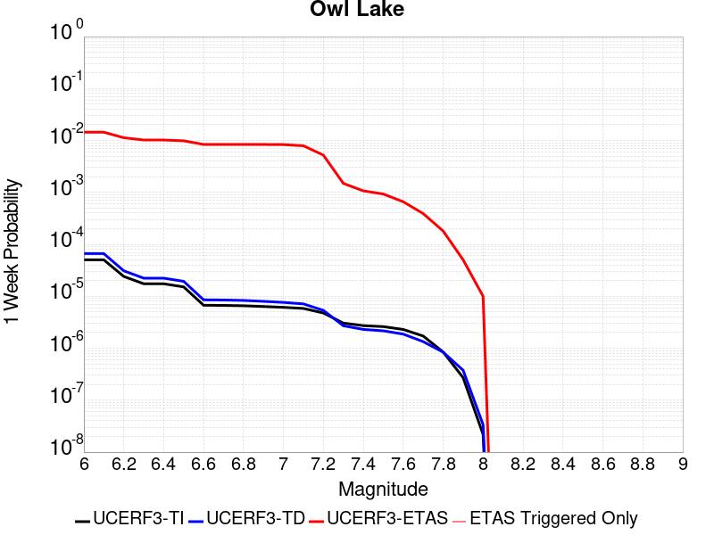 |  |  |  |

| Magnitude | 1 wk TI Prob | 1 wk TD Prob | 1 wk ETAS Prob | 1 wk ETAS/TD Gain | 1 wk ETAS Triggered Only | 1 mo TI Prob | 1 mo TD Prob | 1 mo ETAS Prob | 1 mo ETAS/TD Gain | 1 mo ETAS Triggered Only | 1 yr TI Prob | 1 yr TD Prob | 1 yr ETAS Prob | 1 yr ETAS/TD Gain | 1 yr ETAS Triggered Only | 10 yr TI Prob | 10 yr TD Prob | 10 yr ETAS Prob | 10 yr ETAS/TD Gain | 10 yr ETAS Triggered Only |
|-----|-----|-----|-----|-----|-----|-----|-----|-----|-----|-----|-----|-----|-----|-----|-----|-----|-----|-----|-----|-----|
| 6.0 | 5.0320643E-5 | 6.635816E-5 | 0.0144707905 | 218.07101 | 0.014405388 | 2.1564208E-4 | 2.843674E-4 | 0.016722778 | 58.80695 | 0.016443087 | 0.0026222812 | 0.0034577388 | 0.022015639 | 6.367062 | 0.01862229 | 0.02591553 | 0.034140717 | 0.05330264 | 1.561263 | 0.019839248 |
| 6.1 | 5.0320643E-5 | 6.635816E-5 | 0.0144707905 | 218.07101 | 0.014405388 | 2.1564208E-4 | 2.843674E-4 | 0.016722778 | 58.80695 | 0.016443087 | 0.0026222812 | 0.0034577388 | 0.022015639 | 6.367062 | 0.01862229 | 0.02591553 | 0.034140717 | 0.05330264 | 1.561263 | 0.019839248 |
| 6.2 | 2.4125871E-5 | 3.0981035E-5 | 0.01123797 | 362.73706 | 0.011207336 | 1.0339249E-4 | 1.3277028E-4 | 0.0127252005 | 95.84374 | 0.012594102 | 0.0012580766 | 0.001615439 | 0.015771512 | 9.762988 | 0.014178977 | 0.012509781 | 0.016070465 | 0.030940514 | 1.9253031 | 0.0151129225 |
| 6.3 | 1.7433485E-5 | 2.2355514E-5 | 0.010323818 | 461.80185 | 0.010301692 | 7.471279E-5 | 9.580672E-5 | 0.011556757 | 120.62574 | 0.011462048 | 9.0924866E-4 | 0.0011659743 | 0.014028075 | 12.031204 | 0.012877116 | 0.009055373 | 0.011628896 | 0.02505557 | 2.1545959 | 0.013584649 |
| 6.4 | 1.7433485E-5 | 2.2355514E-5 | 0.010323818 | 461.80185 | 0.010301692 | 7.471279E-5 | 9.580672E-5 | 0.011556757 | 120.62574 | 0.011462048 | 9.0924866E-4 | 0.0011659743 | 0.014028075 | 12.031204 | 0.012877116 | 0.009055373 | 0.011628896 | 0.02505557 | 2.1545959 | 0.013584649 |
| 6.5 | 1.5182742E-5 | 1.9429144E-5 | 0.009981312 | 513.7288 | 0.009962076 | 6.506727E-5 | 8.326596E-5 | 0.0111764725 | 134.2262 | 0.011094131 | 7.919061E-4 | 0.0010134429 | 0.013481691 | 13.302862 | 0.012480897 | 0.0078909 | 0.010118429 | 0.023145398 | 2.2874498 | 0.013160129 |
| 6.6 | 6.7271576E-6 | 8.547361E-6 | 0.008357375 | 977.7726 | 0.008348899 | 2.8830356E-5 | 3.6631063E-5 | 0.009177634 | 250.54236 | 0.009141337 | 3.5095305E-4 | 4.458976E-4 | 0.010686419 | 23.966084 | 0.010245089 | 0.0035039932 | 0.004467813 | 0.015202452 | 3.402661 | 0.0107828155 |
| 6.7 | 6.682835E-6 | 8.479807E-6 | 0.008357308 | 985.554 | 0.008348899 | 2.8640408E-5 | 3.6341557E-5 | 0.009177347 | 252.53036 | 0.009141337 | 3.4864116E-4 | 4.4237426E-4 | 0.010682932 | 24.14908 | 0.010245089 | 0.003480947 | 0.0044327388 | 0.015167757 | 3.4217572 | 0.0107828155 |
| 6.8 | 6.5774975E-6 | 8.32628E-6 | 0.008357156 | 1003.7082 | 0.008348899 | 2.8188972E-5 | 3.5683603E-5 | 0.009176695 | 257.16837 | 0.009141337 | 3.4314668E-4 | 4.343669E-4 | 0.010675007 | 24.576014 | 0.010245089 | 0.0034261728 | 0.004352885 | 0.015088764 | 3.4663825 | 0.0107828155 |
| 6.9 | 6.363419E-6 | 7.999454E-6 | 0.008356832 | 1044.6752 | 0.008348899 | 2.727151E-5 | 3.428296E-5 | 0.009175306 | 267.6346 | 0.009141337 | 3.3198006E-4 | 4.1732067E-4 | 0.010658135 | 25.539438 | 0.010245089 | 0.0033148455 | 0.0041828766 | 0.014920589 | 3.567064 | 0.0107828155 |
| 7.0 | 6.1342453E-6 | 7.6316555E-6 | 0.008356467 | 1094.9744 | 0.008348899 | 2.6289357E-5 | 3.2706717E-5 | 0.009173744 | 280.48505 | 0.009141337 | 3.2002592E-4 | 3.9813702E-4 | 0.010639148 | 26.722328 | 0.010245089 | 0.0031956544 | 0.003991571 | 0.014731346 | 3.6906137 | 0.0107828155 |
| 7.1 | 5.842926E-6 | 7.142211E-6 | 0.007931464 | 1110.5055 | 0.007924379 | 2.504087E-5 | 3.0609146E-5 | 0.0087188585 | 284.84485 | 0.008688515 | 3.0482994E-4 | 3.7260808E-4 | 0.010076355 | 27.042772 | 0.009707364 | 0.0030441214 | 0.0037370329 | 0.013943836 | 3.7312586 | 0.010245089 |
| 7.2 | 4.77173E-6 | 5.358483E-6 | 0.0054957913 | 1025.6245 | 0.0054904623 | 2.045011E-5 | 2.2964748E-5 | 0.006079315 | 264.7238 | 0.0060564894 | 2.4895166E-4 | 2.79564E-4 | 0.007098283 | 25.390549 | 0.006820626 | 0.0024867293 | 0.002808645 | 0.009920555 | 3.5321498 | 0.0071319407 |
| 7.3 | 3.0494948E-6 | 2.710463E-6 | 0.0015875819 | 585.7235 | 0.0015848757 | 1.3069198E-5 | 1.1616219E-5 | 0.0017379787 | 149.61656 | 0.0017263825 | 1.5910587E-4 | 1.4141845E-4 | 0.0020656383 | 14.606568 | 0.001924492 | 0.0015899199 | 0.0014232415 | 0.0033732555 | 2.3701217 | 0.0019527933 |
| 7.4 | 2.7263884E-6 | 2.3056762E-6 | 0.0011060559 | 479.70996 | 0.0011037528 | 1.1684469E-5 | 9.881433E-6 | 0.0012551286 | 127.01889 | 0.0012452595 | 1.4224913E-4 | 1.20299905E-4 | 0.0015351974 | 12.761417 | 0.0014150676 | 0.0014215811 | 0.0012112238 | 0.0026528446 | 2.1902182 | 0.001443369 |
| 7.5 | 2.6090431E-6 | 2.1656133E-6 | 9.0780697E-4 | 419.19162 | 9.056433E-4 | 1.1181565E-5 | 9.281167E-6 | 0.0010281204 | 110.7749 | 0.0010188487 | 1.3612706E-4 | 1.1299244E-4 | 0.0013015149 | 11.518601 | 0.0011886568 | 0.001360437 | 0.0011379806 | 0.002353554 | 2.0681846 | 0.0012169582 |
| 7.6 | 2.3008756E-6 | 1.8727933E-6 | 6.528027E-4 | 348.57166 | 6.509311E-4 | 9.860858E-6 | 8.0262325E-6 | 7.155544E-4 | 89.151955 | 7.075338E-4 | 1.20049335E-4 | 9.7715085E-5 | 9.183741E-4 | 9.398488 | 8.2073925E-4 | 0.001199845 | 9.849932E-4 | 0.0018331974 | 1.861127 | 8.490406E-4 |
| 7.7 | 1.7184348E-6 | 1.3419171E-6 | 4.8246427E-4 | 359.5336 | 4.81123E-4 | 7.3646997E-6 | 5.7510606E-6 | 5.151725E-4 | 89.57869 | 5.0942437E-4 | 8.966153E-5 | 7.0016955E-5 | 6.360044E-4 | 9.083576 | 5.6602707E-4 | 8.962536E-4 | 7.078345E-4 | 0.0013017422 | 1.8390489 | 5.943284E-4 |
| 7.8 | 8.4612907E-7 | 8.4058576E-7 | 2.2725122E-4 | 270.34863 | 2.2641082E-4 | 3.6262625E-6 | 3.6025056E-6 | 2.300125E-4 | 63.847927 | 2.2641082E-4 | 4.4148852E-5 | 4.3859643E-5 | 3.2686075E-4 | 7.452426 | 2.8301353E-4 | 4.414008E-4 | 4.4398365E-4 | 7.551603E-4 | 1.7008742 | 3.1131489E-4 |
| 7.9 | 2.716738E-7 | 3.768106E-7 | 2.8678152E-5 | 76.10761 | 2.8301352E-5 | 1.1643157E-6 | 1.6149015E-6 | 2.991621E-5 | 18.525097 | 2.8301352E-5 | 1.4175452E-5 | 1.966126E-5 | 4.7962058E-5 | 2.4394193 | 2.8301352E-5 | 1.4174548E-4 | 1.9836679E-4 | 2.5495826E-4 | 1.285287 | 5.6602705E-5 |
| 8.0 | 2.1995428E-8 | 3.384878E-8 | 3.384878E-8 | 1.0 | 0.0 | 9.426611E-8 | 1.4506621E-7 | 1.4506621E-7 | 1.0 | 0.0 | 1.1476893E-6 | 1.7661803E-6 | 1.7661803E-6 | 1.0 | 0.0 | 1.14768345E-5 | 1.7963059E-5 | 1.7963059E-5 | 1.0 | 0.0 |

## Panamint Valley
*[(top)](#table-of-contents)*

| 1 Week | 1 Month | 1 Year | 10 Year |
|-----|-----|-----|-----|
|  |  |  |  |

| Magnitude | 1 wk TI Prob | 1 wk TD Prob | 1 wk ETAS Prob | 1 wk ETAS/TD Gain | 1 wk ETAS Triggered Only | 1 mo TI Prob | 1 mo TD Prob | 1 mo ETAS Prob | 1 mo ETAS/TD Gain | 1 mo ETAS Triggered Only | 1 yr TI Prob | 1 yr TD Prob | 1 yr ETAS Prob | 1 yr ETAS/TD Gain | 1 yr ETAS Triggered Only | 10 yr TI Prob | 10 yr TD Prob | 10 yr ETAS Prob | 10 yr ETAS/TD Gain | 10 yr ETAS Triggered Only |
|-----|-----|-----|-----|-----|-----|-----|-----|-----|-----|-----|-----|-----|-----|-----|-----|-----|-----|-----|-----|-----|
| 6.0 | 3.0211835E-5 | 3.3984514E-5 | 0.012203152 | 359.07983 | 0.012169582 | 1.2947287E-4 | 1.4563995E-4 | 0.013586825 | 93.29051 | 0.013443142 | 0.0015751923 | 0.0017717537 | 0.016518885 | 9.323466 | 0.014773306 | 0.015640736 | 0.017583137 | 0.03281958 | 1.8665372 | 0.015509142 |
| 6.1 | 3.0211835E-5 | 3.3984514E-5 | 0.012203152 | 359.07983 | 0.012169582 | 1.2947287E-4 | 1.4563995E-4 | 0.013586825 | 93.29051 | 0.013443142 | 0.0015751923 | 0.0017717537 | 0.016518885 | 9.323466 | 0.014773306 | 0.015640736 | 0.017583137 | 0.03281958 | 1.8665372 | 0.015509142 |
| 6.2 | 3.0211835E-5 | 3.3984514E-5 | 0.012203152 | 359.07983 | 0.012169582 | 1.2947287E-4 | 1.4563995E-4 | 0.013586825 | 93.29051 | 0.013443142 | 0.0015751923 | 0.0017717537 | 0.016518885 | 9.323466 | 0.014773306 | 0.015640736 | 0.017583137 | 0.03281958 | 1.8665372 | 0.015509142 |
| 6.3 | 2.8573924E-5 | 3.210268E-5 | 0.011776787 | 366.84747 | 0.011745062 | 1.2245393E-4 | 1.3757581E-4 | 0.013097812 | 95.20432 | 0.01296202 | 0.001489857 | 0.0016737265 | 0.015828973 | 9.457323 | 0.014178977 | 0.01479908 | 0.016617801 | 0.031256933 | 1.8809307 | 0.0148865115 |
| 6.4 | 2.8573924E-5 | 3.210268E-5 | 0.011776787 | 366.84747 | 0.011745062 | 1.2245393E-4 | 1.3757581E-4 | 0.013097812 | 95.20432 | 0.01296202 | 0.001489857 | 0.0016737265 | 0.015828973 | 9.457323 | 0.014178977 | 0.01479908 | 0.016617801 | 0.031256933 | 1.8809307 | 0.0148865115 |
| 6.5 | 2.7468774E-5 | 3.0828433E-5 | 0.011464222 | 371.8717 | 0.011433747 | 1.1771801E-4 | 1.3211532E-4 | 0.012667959 | 95.88561 | 0.012537499 | 0.0014322745 | 0.0016073446 | 0.015311438 | 9.525921 | 0.013726156 | 0.014230782 | 0.015963677 | 0.030166952 | 1.8897246 | 0.01443369 |
| 6.6 | 2.6135967E-5 | 2.925248E-5 | 0.0111796595 | 382.17816 | 0.011150733 | 1.1200648E-4 | 1.253619E-4 | 0.012293418 | 98.06343 | 0.012169582 | 0.0013628257 | 0.0015252391 | 0.014778328 | 9.689188 | 0.013273334 | 0.013544982 | 0.015154043 | 0.028895173 | 1.9067632 | 0.013952567 |
| 6.7 | 2.4498746E-5 | 2.7341335E-5 | 0.011064568 | 404.68277 | 0.011037528 | 1.04990395E-4 | 1.1717203E-4 | 0.012143837 | 103.6411 | 0.012028075 | 0.0012775084 | 0.0014256609 | 0.014538767 | 10.197913 | 0.013131828 | 0.012701893 | 0.014171274 | 0.027675014 | 1.9528952 | 0.013697855 |
| 6.8 | 2.2244329E-5 | 2.4935423E-5 | 0.010552776 | 423.2042 | 0.010528103 | 9.532935E-5 | 1.0686185E-4 | 0.011567685 | 108.24897 | 0.011462048 | 0.0011600169 | 0.0013002884 | 0.01384975 | 10.651292 | 0.012565801 | 0.011539802 | 0.0129325185 | 0.025810713 | 1.9957993 | 0.013046924 |
| 6.9 | 1.9902658E-5 | 2.2290267E-5 | 0.009587934 | 430.13995 | 0.009565857 | 8.529431E-5 | 9.552632E-5 | 0.010537728 | 110.3123 | 0.010443199 | 0.0010379635 | 0.0011624309 | 0.012611155 | 10.84895 | 0.011462048 | 0.010331288 | 0.011568608 | 0.023289692 | 2.01318 | 0.011858267 |
| 7.0 | 1.8353881E-5 | 2.0566185E-5 | 0.008907008 | 433.08994 | 0.008886625 | 7.865712E-5 | 8.813792E-5 | 0.009794646 | 111.12863 | 0.009707364 | 9.5722964E-4 | 0.0010725686 | 0.011787277 | 10.989765 | 0.0107262125 | 0.009531168 | 0.010678849 | 0.021682506 | 2.030416 | 0.011122432 |
| 7.1 | 1.7667631E-5 | 1.9772613E-5 | 0.008538311 | 431.82516 | 0.008518707 | 7.571623E-5 | 8.473711E-5 | 0.009338495 | 110.20549 | 0.009254542 | 9.2145515E-4 | 0.0010312037 | 0.011265729 | 10.924834 | 0.010245089 | 0.009176437 | 0.010269073 | 0.020773094 | 2.0228794 | 0.0106130075 |
| 7.2 | 1.6381597E-5 | 1.8158249E-5 | 0.007404677 | 407.78583 | 0.007386653 | 7.020495E-5 | 7.781885E-5 | 0.008171376 | 105.0051 | 0.008094187 | 8.544101E-4 | 9.4704994E-4 | 0.009910082 | 10.46416 | 0.008971529 | 0.008511325 | 0.009434792 | 0.018686123 | 1.9805548 | 0.009339446 |
| 7.3 | 1.4520491E-5 | 1.5966476E-5 | 0.006185563 | 387.4094 | 0.006169695 | 6.222919E-5 | 6.842605E-5 | 0.0066904896 | 97.77693 | 0.0066225166 | 7.57377E-4 | 8.327849E-4 | 0.008185009 | 9.828478 | 0.0073583517 | 0.0075480095 | 0.00829975 | 0.015877694 | 1.9130327 | 0.0076413653 |
| 7.4 | 1.2852287E-5 | 1.4145411E-5 | 0.0059856465 | 423.15112 | 0.0059715854 | 5.5080065E-5 | 6.062187E-5 | 0.0064563397 | 106.50182 | 0.0063961055 | 6.7039346E-4 | 7.378371E-4 | 0.007836236 | 10.620549 | 0.0071036397 | 0.0066837464 | 0.0073567946 | 0.014689106 | 1.996672 | 0.007386653 |
| 7.5 | 1.1637851E-5 | 1.2836797E-5 | 0.0059843455 | 466.1868 | 0.0059715854 | 4.987555E-5 | 5.5013777E-5 | 0.0064507676 | 117.25732 | 0.0063961055 | 6.070656E-4 | 6.6960254E-4 | 0.0076836385 | 11.474924 | 0.0070187356 | 0.006054099 | 0.0066787465 | 0.013931729 | 2.0859797 | 0.007301749 |
| 7.6 | 3.0068115E-6 | 3.3330316E-6 | 0.0026636512 | 799.1677 | 0.0026603271 | 1.2886271E-5 | 1.4284384E-5 | 0.0029292821 | 205.06885 | 0.0029150394 | 1.5687906E-4 | 1.7390578E-4 | 0.0034562917 | 19.874508 | 0.003282957 | 0.0015676835 | 0.0017391363 | 0.0051293923 | 2.9493906 | 0.0033961623 |

## Garlock (East)
*[(top)](#table-of-contents)*

| 1 Week | 1 Month | 1 Year | 10 Year |
|-----|-----|-----|-----|
|  |  |  |  |

| Magnitude | 1 wk TI Prob | 1 wk TD Prob | 1 wk ETAS Prob | 1 wk ETAS/TD Gain | 1 wk ETAS Triggered Only | 1 mo TI Prob | 1 mo TD Prob | 1 mo ETAS Prob | 1 mo ETAS/TD Gain | 1 mo ETAS Triggered Only | 1 yr TI Prob | 1 yr TD Prob | 1 yr ETAS Prob | 1 yr ETAS/TD Gain | 1 yr ETAS Triggered Only | 10 yr TI Prob | 10 yr TD Prob | 10 yr ETAS Prob | 10 yr ETAS/TD Gain | 10 yr ETAS Triggered Only |
|-----|-----|-----|-----|-----|-----|-----|-----|-----|-----|-----|-----|-----|-----|-----|-----|-----|-----|-----|-----|-----|
| 6.0 | 4.5092507E-5 | 6.290325E-5 | 0.008835771 | 140.46605 | 0.008773419 | 1.9323928E-4 | 2.6956003E-4 | 0.010200657 | 37.841877 | 0.009933775 | 0.0023501497 | 0.0032774 | 0.014504422 | 4.425588 | 0.011263939 | 0.023254504 | 0.032351844 | 0.04404556 | 1.3614544 | 0.012084678 |
| 6.1 | 4.5092507E-5 | 6.290325E-5 | 0.008835771 | 140.46605 | 0.008773419 | 1.9323928E-4 | 2.6956003E-4 | 0.010200657 | 37.841877 | 0.009933775 | 0.0023501497 | 0.0032774 | 0.014504422 | 4.425588 | 0.011263939 | 0.023254504 | 0.032351844 | 0.04404556 | 1.3614544 | 0.012084678 |
| 6.2 | 2.6674514E-5 | 3.4509674E-5 | 0.0065435963 | 189.61627 | 0.006509311 | 1.1431433E-4 | 1.4789042E-4 | 0.0075617484 | 51.130753 | 0.0074149542 | 0.0013908884 | 0.0017991117 | 0.010048239 | 5.585111 | 0.008263995 | 0.01382215 | 0.017890299 | 0.026478965 | 1.4800739 | 0.008745118 |
| 6.3 | 2.6674514E-5 | 3.4509674E-5 | 0.0065435963 | 189.61627 | 0.006509311 | 1.1431433E-4 | 1.4789042E-4 | 0.0075617484 | 51.130753 | 0.0074149542 | 0.0013908884 | 0.0017991117 | 0.010048239 | 5.585111 | 0.008263995 | 0.01382215 | 0.017890299 | 0.026478965 | 1.4800739 | 0.008745118 |
| 6.4 | 2.5312667E-5 | 3.233893E-5 | 0.0063999374 | 197.90195 | 0.0063678045 | 1.0847834E-4 | 1.3858822E-4 | 0.0073827305 | 53.27098 | 0.007245146 | 0.0013199237 | 0.0016860351 | 0.009738321 | 5.7758713 | 0.008065886 | 0.013121112 | 0.016778335 | 0.02518194 | 1.5008605 | 0.008547009 |
| 6.5 | 2.5312667E-5 | 3.233893E-5 | 0.0063999374 | 197.90195 | 0.0063678045 | 1.0847834E-4 | 1.3858822E-4 | 0.0073827305 | 53.27098 | 0.007245146 | 0.0013199237 | 0.0016860351 | 0.009738321 | 5.7758713 | 0.008065886 | 0.013121112 | 0.016778335 | 0.02518194 | 1.5008605 | 0.008547009 |
| 6.6 | 2.246556E-5 | 2.8133776E-5 | 0.0060278517 | 214.25676 | 0.005999887 | 9.627742E-5 | 1.20567885E-4 | 0.0069403714 | 57.564014 | 0.006820626 | 0.0011715472 | 0.0014669491 | 0.009068845 | 6.1821127 | 0.007613064 | 0.011653901 | 0.01461866 | 0.022566633 | 1.5436869 | 0.008065886 |
| 6.7 | 2.2241198E-5 | 2.7803519E-5 | 0.0060275234 | 216.78995 | 0.005999887 | 9.531594E-5 | 1.1915263E-4 | 0.0069106678 | 57.99845 | 0.0067923246 | 0.0011598538 | 0.0014497414 | 0.009023508 | 6.224219 | 0.0075847628 | 0.011538187 | 0.014448853 | 0.022370303 | 1.5482408 | 0.008037584 |
| 6.8 | 1.9528685E-5 | 2.389819E-5 | 0.005712334 | 239.0279 | 0.005688572 | 8.369167E-5 | 1.0241691E-4 | 0.006526166 | 63.72157 | 0.006424407 | 0.0010184698 | 0.0012462323 | 0.008425817 | 6.761033 | 0.0071885437 | 0.010138147 | 0.012436427 | 0.01998276 | 1.6067928 | 0.0076413653 |
| 6.9 | 1.3318621E-5 | 1.5198884E-5 | 0.0053074714 | 349.2014 | 0.0052923528 | 5.7078556E-5 | 6.513648E-5 | 0.006036333 | 92.67207 | 0.0059715854 | 6.9470983E-4 | 7.927538E-4 | 0.0074382992 | 9.382861 | 0.006650818 | 0.0069254204 | 0.007939888 | 0.0149590485 | 1.8840377 | 0.007075338 |
| 7.0 | 1.1760853E-5 | 1.31077895E-5 | 0.0051921876 | 396.11465 | 0.0051791477 | 5.0402683E-5 | 5.6175057E-5 | 0.005885926 | 104.77828 | 0.005830079 | 6.134799E-4 | 6.8372174E-4 | 0.0071320185 | 10.43117 | 0.0064527085 | 0.0061178906 | 0.00685652 | 0.0136865955 | 1.996143 | 0.0068772286 |
| 7.1 | 1.0064758E-5 | 1.0902931E-5 | 0.005189994 | 476.01828 | 0.0051791477 | 4.3133965E-5 | 4.672603E-5 | 0.005848232 | 125.16006 | 0.0058017774 | 5.2502943E-4 | 5.687444E-4 | 0.0069612125 | 12.2396145 | 0.0063961055 | 0.005237907 | 0.0057129986 | 0.012494658 | 2.1870577 | 0.006820626 |
| 7.2 | 9.768808E-6 | 1.0498807E-5 | 0.005048087 | 480.8248 | 0.0050376407 | 4.186565E-5 | 4.499413E-5 | 0.00567671 | 126.165565 | 0.0056319693 | 5.095951E-4 | 5.4766936E-4 | 0.006770557 | 12.362491 | 0.0062262975 | 0.0050842804 | 0.0055032647 | 0.012117482 | 2.2018714 | 0.006650818 |
| 7.3 | 9.344516E-6 | 9.944468E-6 | 0.004623019 | 464.8835 | 0.0046131206 | 4.004731E-5 | 4.261847E-5 | 0.005221545 | 122.518364 | 0.0051791477 | 4.8746695E-4 | 5.1875977E-4 | 0.0062326672 | 12.014554 | 0.0057168733 | 0.0048639905 | 0.0052149445 | 0.011268004 | 2.160714 | 0.006084791 |
| 7.4 | 9.023491E-6 | 9.490661E-6 | 0.004084847 | 430.40698 | 0.004075395 | 3.867153E-5 | 4.0673647E-5 | 0.0046536066 | 114.41331 | 0.0046131206 | 4.7072413E-4 | 4.950925E-4 | 0.0055585266 | 11.227249 | 0.005065942 | 0.004697283 | 0.0049783974 | 0.010385205 | 2.0860538 | 0.00543386 |
| 7.5 | 7.081253E-6 | 7.087672E-6 | 0.002073072 | 292.4898 | 0.0020659987 | 3.0347876E-5 | 3.0375388E-5 | 0.0023793164 | 78.3304 | 0.0023490123 | 3.6942272E-4 | 3.6975832E-4 | 0.003000811 | 8.115601 | 0.0026320259 | 0.003688092 | 0.0037243143 | 0.006572105 | 1.7646484 | 0.0028584367 |
| 7.6 | 6.116396E-6 | 5.959245E-6 | 0.001336115 | 224.20877 | 0.0013301636 | 2.6212863E-5 | 2.5539372E-5 | 0.0015254727 | 59.73024 | 0.0014999717 | 3.1909486E-4 | 3.1089774E-4 | 0.0019801585 | 6.369163 | 0.0016697798 | 0.0031863707 | 0.0031357552 | 0.0049695745 | 1.5848095 | 0.0018395879 |
| 7.7 | 4.797145E-6 | 4.757281E-6 | 6.556853E-4 | 137.82774 | 6.509311E-4 | 2.055903E-5 | 2.0388188E-5 | 7.562084E-4 | 37.09051 | 7.358352E-4 | 2.5027743E-4 | 2.4819805E-4 | 0.0010687336 | 4.3059707 | 8.2073925E-4 | 0.0024999576 | 0.0025093474 | 0.0034409484 | 1.3712523 | 9.3394466E-4 |
| 7.8 | 3.4028885E-6 | 3.978462E-6 | 4.8509953E-4 | 121.931435 | 4.81123E-4 | 1.4583726E-5 | 1.7050439E-5 | 5.54767E-4 | 32.536816 | 5.377257E-4 | 1.775424E-4 | 2.0756939E-4 | 7.7347894E-4 | 3.7263632 | 5.6602707E-4 | 0.0017740062 | 0.0021012232 | 0.0026943027 | 1.2822545 | 5.943284E-4 |
| 7.9 | 2.5928412E-6 | 3.3724489E-6 | 3.1468627E-4 | 93.31091 | 3.1131489E-4 | 1.1112129E-5 | 1.4453272E-5 | 3.8236554E-4 | 26.455292 | 3.679176E-4 | 1.3528178E-4 | 1.7595445E-4 | 5.7210366E-4 | 3.2514305 | 3.9621894E-4 | 0.0013519945 | 0.0017812408 | 0.002205005 | 1.2379038 | 4.245203E-4 |
| 8.0 | 1.3743648E-6 | 1.6734747E-6 | 1.7148131E-4 | 102.470215 | 1.6980812E-4 | 5.8901214E-6 | 7.1720146E-6 | 2.3358122E-4 | 32.568424 | 2.2641082E-4 | 7.1709874E-5 | 8.731581E-5 | 3.1370687E-4 | 3.5927842 | 2.2641082E-4 | 7.1686733E-4 | 8.837234E-4 | 0.0011099341 | 1.2559747 | 2.2641082E-4 |
| 8.1 | 3.6733252E-7 | 3.1489964E-7 | 3.1489964E-7 | 1.0 | 0.0 | 1.5742813E-6 | 1.3495693E-6 | 1.3495693E-6 | 1.0 | 0.0 | 1.9166706E-5 | 1.6430899E-5 | 1.6430899E-5 | 1.0 | 0.0 | 1.9165053E-4 | 1.6638759E-4 | 1.6638759E-4 | 1.0 | 0.0 |

## Hunter Mountain-Saline Valley
*[(top)](#table-of-contents)*

| 1 Week | 1 Month | 1 Year | 10 Year |
|-----|-----|-----|-----|
|  |  |  |  |

| Magnitude | 1 wk TI Prob | 1 wk TD Prob | 1 wk ETAS Prob | 1 wk ETAS/TD Gain | 1 wk ETAS Triggered Only | 1 mo TI Prob | 1 mo TD Prob | 1 mo ETAS Prob | 1 mo ETAS/TD Gain | 1 mo ETAS Triggered Only | 1 yr TI Prob | 1 yr TD Prob | 1 yr ETAS Prob | 1 yr ETAS/TD Gain | 1 yr ETAS Triggered Only | 10 yr TI Prob | 10 yr TD Prob | 10 yr ETAS Prob | 10 yr ETAS/TD Gain | 10 yr ETAS Triggered Only |
|-----|-----|-----|-----|-----|-----|-----|-----|-----|-----|-----|-----|-----|-----|-----|-----|-----|-----|-----|-----|-----|
| 6.0 | 4.5103672E-5 | 5.4570177E-5 | 0.006167329 | 113.01647 | 0.0061130924 | 1.9328714E-4 | 2.3385242E-4 | 0.006798231 | 29.070602 | 0.006565914 | 0.002350731 | 0.0028435152 | 0.010152723 | 3.5704827 | 0.00733005 | 0.023260195 | 0.028091887 | 0.03551859 | 1.2643719 | 0.0076413653 |
| 6.1 | 4.5103672E-5 | 5.4570177E-5 | 0.006167329 | 113.01647 | 0.0061130924 | 1.9328714E-4 | 2.3385242E-4 | 0.006798231 | 29.070602 | 0.006565914 | 0.002350731 | 0.0028435152 | 0.010152723 | 3.5704827 | 0.00733005 | 0.023260195 | 0.028091887 | 0.03551859 | 1.2643719 | 0.0076413653 |
| 6.2 | 3.9363465E-5 | 4.706337E-5 | 0.006159868 | 130.88455 | 0.0061130924 | 1.6868966E-4 | 2.0168544E-4 | 0.0067379796 | 33.40836 | 0.0065376125 | 0.002051862 | 0.0024528175 | 0.009736656 | 3.9695807 | 0.007301749 | 0.020330196 | 0.024273481 | 0.03170175 | 1.3060241 | 0.007613064 |
| 6.3 | 3.9363465E-5 | 4.706337E-5 | 0.006159868 | 130.88455 | 0.0061130924 | 1.6868966E-4 | 2.0168544E-4 | 0.0067379796 | 33.40836 | 0.0065376125 | 0.002051862 | 0.0024528175 | 0.009736656 | 3.9695807 | 0.007301749 | 0.020330196 | 0.024273481 | 0.03170175 | 1.3060241 | 0.007613064 |
| 6.4 | 3.2311684E-5 | 3.795099E-5 | 0.006122511 | 161.32678 | 0.006084791 | 1.384713E-4 | 1.6263737E-4 | 0.00667089 | 41.016956 | 0.006509311 | 0.0016845843 | 0.0019783843 | 0.009237442 | 4.6691847 | 0.0072734477 | 0.016718714 | 0.019616475 | 0.02705245 | 1.3790679 | 0.0075847628 |
| 6.5 | 3.2311684E-5 | 3.795099E-5 | 0.006122511 | 161.32678 | 0.006084791 | 1.384713E-4 | 1.6263737E-4 | 0.00667089 | 41.016956 | 0.006509311 | 0.0016845843 | 0.0019783843 | 0.009237442 | 4.6691847 | 0.0072734477 | 0.016718714 | 0.019616475 | 0.02705245 | 1.3790679 | 0.0075847628 |
| 6.6 | 2.9305844E-5 | 3.418183E-5 | 0.0061187646 | 179.00635 | 0.006084791 | 1.2559042E-4 | 1.4648569E-4 | 0.006654843 | 45.42999 | 0.006509311 | 0.0015279909 | 0.001782067 | 0.009042553 | 5.0741935 | 0.0072734477 | 0.015175272 | 0.01768569 | 0.025136312 | 1.4212795 | 0.0075847628 |
| 6.7 | 2.7826512E-5 | 3.2344276E-5 | 0.0060886377 | 188.24469 | 0.0060564894 | 1.19251024E-4 | 1.386113E-4 | 0.006618723 | 47.75024 | 0.00648101 | 0.0014509142 | 0.0016863465 | 0.008919275 | 5.2891116 | 0.007245146 | 0.014414776 | 0.016743187 | 0.024173127 | 1.4437591 | 0.0075564613 |
| 6.8 | 2.3389874E-5 | 2.6866714E-5 | 0.006054893 | 225.36783 | 0.006028188 | 1.0023846E-4 | 1.15138246E-4 | 0.006567104 | 57.036682 | 0.0064527085 | 0.00121972 | 0.001400954 | 0.008607688 | 6.144162 | 0.007216845 | 0.01213047 | 0.013927434 | 0.021322839 | 1.5309955 | 0.0074998583 |
| 6.9 | 2.069209E-5 | 2.3570032E-5 | 0.0060516163 | 256.75046 | 0.006028188 | 8.867737E-5 | 1.01010715E-4 | 0.0065530674 | 64.87498 | 0.0064527085 | 0.0010791123 | 0.0012291478 | 0.008437122 | 6.864205 | 0.007216845 | 0.010738871 | 0.012228523 | 0.01963667 | 1.6058087 | 0.0074998583 |
| 7.0 | 1.7462342E-5 | 1.9633546E-5 | 0.0060477033 | 308.02908 | 0.006028188 | 7.483646E-5 | 8.414118E-5 | 0.006536307 | 77.68261 | 0.0064527085 | 9.1075303E-4 | 0.0010239601 | 0.008205143 | 8.013147 | 0.0071885437 | 0.009070295 | 0.0101960525 | 0.01759143 | 1.7253176 | 0.0074715572 |
| 7.1 | 1.4807709E-5 | 1.6441749E-5 | 0.006044531 | 367.63306 | 0.006028188 | 6.3460066E-5 | 7.046283E-5 | 0.0065227165 | 92.56961 | 0.0064527085 | 7.723524E-4 | 8.575638E-4 | 0.008039943 | 9.375329 | 0.0071885437 | 0.007696735 | 0.008545532 | 0.01595324 | 1.8668517 | 0.0074715572 |
| 7.2 | 1.4180048E-5 | 1.5698337E-5 | 0.006043792 | 384.9957 | 0.006028188 | 6.077022E-5 | 6.727694E-5 | 0.0065195514 | 96.90618 | 0.0064527085 | 7.396263E-4 | 8.188051E-4 | 0.008001463 | 9.77212 | 0.0071885437 | 0.0073716943 | 0.008160833 | 0.015571416 | 1.908067 | 0.0074715572 |
| 7.3 | 1.3730402E-5 | 1.5172075E-5 | 0.006043269 | 398.31525 | 0.006028188 | 5.8843252E-5 | 6.502165E-5 | 0.0065173106 | 100.23293 | 0.0064527085 | 7.161811E-4 | 7.9136714E-4 | 0.007974222 | 10.076513 | 0.0071885437 | 0.007138774 | 0.007888422 | 0.015301041 | 1.9396832 | 0.0074715572 |
| 7.4 | 1.2810095E-5 | 1.4109277E-5 | 0.0059856107 | 424.23227 | 0.0059715854 | 5.489925E-5 | 6.0467017E-5 | 0.006456186 | 106.772026 | 0.0063961055 | 6.681934E-4 | 7.359531E-4 | 0.007834365 | 10.645196 | 0.0071036397 | 0.006661878 | 0.007338053 | 0.014670502 | 1.9992363 | 0.007386653 |
| 7.5 | 1.1595659E-5 | 1.2800664E-5 | 0.0059843096 | 467.49994 | 0.0059715854 | 4.9694736E-5 | 5.4858923E-5 | 0.006450614 | 117.585495 | 0.0063961055 | 6.0486543E-4 | 6.6771836E-4 | 0.0076817675 | 11.504502 | 0.0070187356 | 0.006032217 | 0.0066599925 | 0.013913112 | 2.0890582 | 0.007301749 |
| 7.6 | 2.997694E-6 | 3.3251579E-6 | 0.0026636436 | 801.05774 | 0.0026603271 | 1.28471975E-5 | 1.425064E-5 | 0.0029292484 | 205.55206 | 0.0029150394 | 1.564034E-4 | 1.73495E-4 | 0.0034558824 | 19.919203 | 0.003282957 | 0.0015629337 | 0.001735031 | 0.005125301 | 2.9540112 | 0.0033961623 |

## Blackwater
*[(top)](#table-of-contents)*

| 1 Week | 1 Month | 1 Year | 10 Year |
|-----|-----|-----|-----|
|  |  | 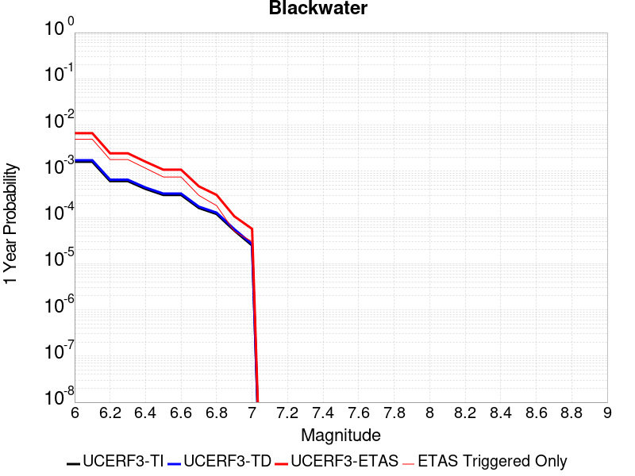 |  |

| Magnitude | 1 wk TI Prob | 1 wk TD Prob | 1 wk ETAS Prob | 1 wk ETAS/TD Gain | 1 wk ETAS Triggered Only | 1 mo TI Prob | 1 mo TD Prob | 1 mo ETAS Prob | 1 mo ETAS/TD Gain | 1 mo ETAS Triggered Only | 1 yr TI Prob | 1 yr TD Prob | 1 yr ETAS Prob | 1 yr ETAS/TD Gain | 1 yr ETAS Triggered Only | 10 yr TI Prob | 10 yr TD Prob | 10 yr ETAS Prob | 10 yr ETAS/TD Gain | 10 yr ETAS Triggered Only |
|-----|-----|-----|-----|-----|-----|-----|-----|-----|-----|-----|-----|-----|-----|-----|-----|-----|-----|-----|-----|-----|
| 6.0 | 3.0708583E-5 | 3.3095846E-5 | 0.0038253516 | 115.58403 | 0.0037923814 | 1.3160157E-4 | 1.4183241E-4 | 0.0045845145 | 32.323463 | 0.0044433125 | 0.0016010714 | 0.0017255784 | 0.006839284 | 3.963473 | 0.0051225447 | 0.015895851 | 0.017135633 | 0.022671094 | 1.3230381 | 0.0056319693 |
| 6.1 | 3.0708583E-5 | 3.3095846E-5 | 0.0038253516 | 115.58403 | 0.0037923814 | 1.3160157E-4 | 1.4183241E-4 | 0.0045845145 | 32.323463 | 0.0044433125 | 0.0016010714 | 0.0017255784 | 0.006839284 | 3.963473 | 0.0051225447 | 0.015895851 | 0.017135633 | 0.022671094 | 1.3230381 | 0.0056319693 |
| 6.2 | 1.1707779E-5 | 1.2545122E-5 | 0.001540799 | 122.820564 | 0.0015282731 | 5.017523E-5 | 5.3763757E-5 | 0.0018932528 | 35.214294 | 0.0018395879 | 6.107122E-4 | 6.5438676E-4 | 0.0026624678 | 4.068646 | 0.002009396 | 0.006090366 | 0.0065255696 | 0.0086343195 | 1.323152 | 0.0021226015 |
| 6.3 | 1.1707779E-5 | 1.2545122E-5 | 0.001540799 | 122.820564 | 0.0015282731 | 5.017523E-5 | 5.3763757E-5 | 0.0018932528 | 35.214294 | 0.0018395879 | 6.107122E-4 | 6.5438676E-4 | 0.0026624678 | 4.068646 | 0.002009396 | 0.006090366 | 0.0065255696 | 0.0086343195 | 1.323152 | 0.0021226015 |
| 6.4 | 7.929244E-6 | 8.480098E-6 | 9.99019E-4 | 117.80749 | 9.905474E-4 | 3.3982033E-5 | 3.6342793E-5 | 0.0011966561 | 32.926914 | 0.0011603555 | 4.136527E-4 | 4.423877E-4 | 0.0017153852 | 3.8775606 | 0.0012735609 | 0.0041288356 | 0.0044154758 | 0.005767943 | 1.3063015 | 0.001358465 |
| 6.5 | 5.8832115E-6 | 6.285991E-6 | 7.138154E-4 | 113.55654 | 7.075338E-4 | 2.521352E-5 | 2.6939697E-5 | 7.6275505E-4 | 28.313423 | 7.358352E-4 | 3.0693135E-4 | 3.27944E-4 | 0.0011767062 | 3.5881314 | 8.490406E-4 | 0.0030650778 | 0.0032748538 | 0.004177531 | 1.275639 | 9.056433E-4 |
| 6.6 | 5.8832115E-6 | 6.285991E-6 | 7.138154E-4 | 113.55654 | 7.075338E-4 | 2.521352E-5 | 2.6939697E-5 | 7.6275505E-4 | 28.313423 | 7.358352E-4 | 3.0693135E-4 | 3.27944E-4 | 0.0011767062 | 3.5881314 | 8.490406E-4 | 0.0030650778 | 0.0032748538 | 0.004177531 | 1.275639 | 9.056433E-4 |
| 6.7 | 3.0715053E-6 | 3.2814662E-6 | 3.1459532E-4 | 95.87035 | 3.1131489E-4 | 1.3163528E-5 | 1.4063357E-5 | 3.2537387E-4 | 23.136286 | 3.1131489E-4 | 1.6025416E-4 | 1.7120909E-4 | 5.1076716E-4 | 2.9832947 | 3.3961624E-4 | 0.0016013865 | 0.0017108864 | 0.0020781746 | 1.2146771 | 3.679176E-4 |
| 6.8 | 2.2722281E-6 | 2.4287538E-6 | 1.4393518E-4 | 59.262978 | 1.4150677E-4 | 9.738084E-6 | 1.0408908E-5 | 1.519142E-4 | 14.594634 | 1.4150677E-4 | 1.1855473E-4 | 1.26722E-4 | 2.965086E-4 | 2.3398352 | 1.6980812E-4 | 0.001184915 | 0.0012665876 | 0.0014361807 | 1.1338975 | 1.6980812E-4 |
| 6.9 | 9.952399E-7 | 1.0653489E-6 | 5.7667996E-5 | 54.13062 | 5.6602705E-5 | 4.265307E-6 | 4.5657757E-6 | 6.1168226E-5 | 13.397115 | 5.6602705E-5 | 5.1928873E-5 | 5.5587418E-5 | 1.4048675E-4 | 2.527312 | 8.490406E-5 | 5.191674E-4 | 5.557858E-4 | 6.406426E-4 | 1.1526791 | 8.490406E-5 |
| 7.0 | 4.7385504E-7 | 5.0755597E-7 | 2.8808894E-5 | 56.760036 | 2.8301352E-5 | 2.0308057E-6 | 2.1752398E-6 | 3.047653E-5 | 14.0106535 | 2.8301352E-5 | 2.4724779E-5 | 2.6483543E-5 | 5.478415E-5 | 2.068611 | 2.8301352E-5 | 2.4722028E-4 | 2.6483546E-4 | 2.931293E-4 | 1.1068356 | 2.8301352E-5 |

## Garlock (West)
*[(top)](#table-of-contents)*

| 1 Week | 1 Month | 1 Year | 10 Year |
|-----|-----|-----|-----|
|  |  |  |  |

| Magnitude | 1 wk TI Prob | 1 wk TD Prob | 1 wk ETAS Prob | 1 wk ETAS/TD Gain | 1 wk ETAS Triggered Only | 1 mo TI Prob | 1 mo TD Prob | 1 mo ETAS Prob | 1 mo ETAS/TD Gain | 1 mo ETAS Triggered Only | 1 yr TI Prob | 1 yr TD Prob | 1 yr ETAS Prob | 1 yr ETAS/TD Gain | 1 yr ETAS Triggered Only | 10 yr TI Prob | 10 yr TD Prob | 10 yr ETAS Prob | 10 yr ETAS/TD Gain | 10 yr ETAS Triggered Only |
|-----|-----|-----|-----|-----|-----|-----|-----|-----|-----|-----|-----|-----|-----|-----|-----|-----|-----|-----|-----|-----|
| 6.0 | 2.5181727E-5 | 2.51973E-5 | 0.004298594 | 170.5974 | 0.0042735045 | 1.0791722E-4 | 1.0798398E-4 | 0.004975291 | 46.074345 | 0.0048678326 | 0.0013131002 | 0.0013139155 | 0.0066841072 | 5.087167 | 0.0053772572 | 0.013053683 | 0.013141977 | 0.018699931 | 1.4229162 | 0.0056319693 |
| 6.1 | 2.5077732E-5 | 2.5098372E-5 | 0.0042984956 | 171.2659 | 0.0042735045 | 1.0747157E-4 | 1.0756004E-4 | 0.004974869 | 46.25202 | 0.0048678326 | 0.001307681 | 0.0013087603 | 0.00667898 | 5.1032877 | 0.0053772572 | 0.013000126 | 0.013091032 | 0.018649273 | 1.4245838 | 0.0056319693 |
| 6.2 | 2.494612E-5 | 2.498005E-5 | 0.004298378 | 172.07242 | 0.0042735045 | 1.0690756E-4 | 1.0705298E-4 | 0.004974365 | 46.466377 | 0.0048678326 | 0.0013008224 | 0.0013025942 | 0.006672847 | 5.1227365 | 0.0053772572 | 0.012932341 | 0.013030097 | 0.01858868 | 1.4265958 | 0.0056319693 |
| 6.3 | 2.4733758E-5 | 2.479942E-5 | 0.0042981976 | 173.31848 | 0.0042735045 | 1.0599751E-4 | 1.06278916E-4 | 0.004973594 | 46.79756 | 0.0048678326 | 0.0012897556 | 0.0012931811 | 0.0066634845 | 5.152785 | 0.0053772572 | 0.012822957 | 0.012937066 | 0.018496174 | 1.429704 | 0.0056319693 |
| 6.4 | 2.3237335E-5 | 2.317873E-5 | 0.004268283 | 184.14655 | 0.004245203 | 9.958477E-5 | 9.933365E-5 | 0.004910086 | 49.430237 | 0.00481123 | 0.0012117702 | 0.001208719 | 0.0065229423 | 5.3965745 | 0.0053206543 | 0.012051838 | 0.012101916 | 0.01760981 | 1.4551258 | 0.0055753663 |
| 6.5 | 2.2732203E-5 | 2.2993298E-5 | 0.0042680986 | 185.6236 | 0.004245203 | 9.742009E-5 | 9.8539E-5 | 0.0049092947 | 49.82083 | 0.00481123 | 0.0011854442 | 0.0011990548 | 0.006513329 | 5.432053 | 0.0053206543 | 0.011791403 | 0.012006322 | 0.017514748 | 1.4587939 | 0.0055753663 |
| 6.6 | 2.1319436E-5 | 2.17735E-5 | 0.004266884 | 195.96684 | 0.004245203 | 9.136581E-5 | 9.331167E-5 | 0.0049040928 | 52.55605 | 0.00481123 | 0.001111811 | 0.0011354799 | 0.006450093 | 5.6804996 | 0.0053206543 | 0.011062649 | 0.011377227 | 0.01688916 | 1.4844708 | 0.0055753663 |
| 6.7 | 1.970802E-5 | 2.0393396E-5 | 0.0042655095 | 209.16133 | 0.004245203 | 8.446021E-5 | 8.739735E-5 | 0.004898207 | 56.045258 | 0.00481123 | 0.001027818 | 0.001063545 | 0.006378541 | 5.9974337 | 0.0053206543 | 0.010230771 | 0.010664964 | 0.01618087 | 1.5171987 | 0.0055753663 |
| 6.8 | 1.8744462E-5 | 1.9901045E-5 | 0.0042367186 | 212.88927 | 0.0042169015 | 8.033094E-5 | 8.5287415E-5 | 0.004867808 | 57.07534 | 0.0047829286 | 9.775903E-4 | 0.0010378812 | 0.0063247415 | 6.093897 | 0.0052923528 | 0.009733009 | 0.01041075 | 0.015900066 | 1.5272738 | 0.0055470653 |
| 6.9 | 1.7559682E-5 | 1.8953415E-5 | 0.004235775 | 223.48347 | 0.0042169015 | 7.5253614E-5 | 8.12264E-5 | 0.0048637665 | 59.879135 | 0.0047829286 | 9.158276E-4 | 9.884841E-4 | 0.006275606 | 6.3487163 | 0.0052923528 | 0.0091206245 | 0.009921231 | 0.015413263 | 1.5535635 | 0.0055470653 |
| 7.0 | 1.6794445E-5 | 1.8216237E-5 | 0.004235041 | 232.48715 | 0.0042169015 | 7.197421E-5 | 7.8067256E-5 | 0.0048606223 | 62.261986 | 0.0047829286 | 8.759337E-4 | 9.5005584E-4 | 0.0062373807 | 6.565278 | 0.0052923528 | 0.008724891 | 0.009540141 | 0.015034286 | 1.5758977 | 0.0055470653 |
| 7.1 | 1.6337795E-5 | 1.7717046E-5 | 0.004234544 | 239.0096 | 0.0042169015 | 7.0017246E-5 | 7.5927994E-5 | 0.004830194 | 63.615463 | 0.004754627 | 8.521265E-4 | 9.240326E-4 | 0.00618322 | 6.6915607 | 0.0052640517 | 0.008488664 | 0.009281996 | 0.014749534 | 1.5890477 | 0.005518764 |
| 7.2 | 1.5780008E-5 | 1.7165687E-5 | 0.004233995 | 246.65456 | 0.0042169015 | 6.762685E-5 | 7.356516E-5 | 0.0048278426 | 65.626755 | 0.004754627 | 8.2304585E-4 | 8.9528906E-4 | 0.006154628 | 6.874459 | 0.0052640517 | 0.008200042 | 0.008996838 | 0.01446595 | 1.6078928 | 0.005518764 |
| 7.3 | 1.5058865E-5 | 1.6618762E-5 | 0.00423345 | 254.73921 | 0.0042169015 | 6.45364E-5 | 7.122133E-5 | 0.00482551 | 67.75372 | 0.004754627 | 7.854473E-4 | 8.667759E-4 | 0.0061262646 | 7.0678763 | 0.0052640517 | 0.00782677 | 0.008713539 | 0.014184214 | 1.6278363 | 0.005518764 |
| 7.4 | 1.4887923E-5 | 1.6454731E-5 | 0.0040634815 | 246.94913 | 0.0040470934 | 6.380382E-5 | 7.051838E-5 | 0.0046550143 | 66.01136 | 0.004584819 | 7.7653467E-4 | 8.582243E-4 | 0.0059480956 | 6.930701 | 0.0050942437 | 0.0077382675 | 0.008628399 | 0.013931202 | 1.6145755 | 0.0053489557 |
| 7.5 | 1.4509299E-5 | 1.6046748E-5 | 0.0037234644 | 232.03857 | 0.0037074771 | 6.218123E-5 | 6.876997E-5 | 0.004257082 | 61.90321 | 0.0041886 | 7.567935E-4 | 8.36954E-4 | 0.0055310465 | 6.6085434 | 0.0046980246 | 0.0075422134 | 0.008416704 | 0.013327755 | 1.5834886 | 0.0049527367 |
| 7.6 | 1.2756717E-5 | 1.4050848E-5 | 0.0025611368 | 182.2763 | 0.0025471218 | 5.4670498E-5 | 6.0216535E-5 | 0.0028901815 | 47.996475 | 0.0028301352 | 6.6541E-4 | 7.328904E-4 | 0.003872038 | 5.283243 | 0.0031414502 | 0.006634211 | 0.0073816874 | 0.010696596 | 1.4490719 | 0.0033395595 |
| 7.7 | 1.0328985E-5 | 1.1460557E-5 | 0.0016812212 | 146.69629 | 0.0016697798 | 4.4266326E-5 | 4.911575E-5 | 0.0018603134 | 37.876106 | 0.0018112866 | 5.388092E-4 | 5.978206E-4 | 0.002577731 | 4.3118806 | 0.0019810947 | 0.0053750467 | 0.006038511 | 0.008148296 | 1.3493881 | 0.0021226015 |
| 7.8 | 7.0306583E-6 | 8.899601E-6 | 0.0011409436 | 128.20166 | 0.0011320541 | 3.0131043E-5 | 3.814059E-5 | 0.0012550524 | 32.90595 | 0.0012169582 | 3.667837E-4 | 4.642629E-4 | 0.001793809 | 3.8637784 | 0.0013301636 | 0.003661789 | 0.0046952725 | 0.0060755275 | 1.293967 | 0.0013867663 |
| 7.9 | 4.060633E-6 | 5.4653938E-6 | 5.14887E-4 | 94.20857 | 5.0942437E-4 | 1.7402595E-5 | 2.3422906E-5 | 5.894367E-4 | 25.164968 | 5.6602707E-4 | 2.11856E-4 | 2.851367E-4 | 9.075889E-4 | 3.182996 | 6.2262977E-4 | 0.0021165414 | 0.002884201 | 0.0035614744 | 1.2348218 | 6.792325E-4 |
| 8.0 | 1.6729537E-6 | 2.0775144E-6 | 2.0018658E-4 | 96.358696 | 1.9810947E-4 | 7.169782E-6 | 8.903603E-6 | 2.636135E-4 | 29.60751 | 2.5471218E-4 | 8.7288594E-5 | 1.0839601E-4 | 3.6308056E-4 | 3.349575 | 2.5471218E-4 | 8.7254314E-4 | 0.0010969337 | 0.0013513665 | 1.2319491 | 2.5471218E-4 |
| 8.1 | 3.6733252E-7 | 3.1489964E-7 | 3.1489964E-7 | 1.0 | 0.0 | 1.5742813E-6 | 1.3495693E-6 | 1.3495693E-6 | 1.0 | 0.0 | 1.9166706E-5 | 1.6430899E-5 | 1.6430899E-5 | 1.0 | 0.0 | 1.9165053E-4 | 1.6638759E-4 | 1.6638759E-4 | 1.0 | 0.0 |

## Ash Hill
*[(top)](#table-of-contents)*

| 1 Week | 1 Month | 1 Year | 10 Year |
|-----|-----|-----|-----|
|  |  |  |  |

| Magnitude | 1 wk TI Prob | 1 wk TD Prob | 1 wk ETAS Prob | 1 wk ETAS/TD Gain | 1 wk ETAS Triggered Only | 1 mo TI Prob | 1 mo TD Prob | 1 mo ETAS Prob | 1 mo ETAS/TD Gain | 1 mo ETAS Triggered Only | 1 yr TI Prob | 1 yr TD Prob | 1 yr ETAS Prob | 1 yr ETAS/TD Gain | 1 yr ETAS Triggered Only | 10 yr TI Prob | 10 yr TD Prob | 10 yr ETAS Prob | 10 yr ETAS/TD Gain | 10 yr ETAS Triggered Only |
|-----|-----|-----|-----|-----|-----|-----|-----|-----|-----|-----|-----|-----|-----|-----|-----|-----|-----|-----|-----|-----|
| 6.0 | 2.1545662E-5 | 2.3194447E-5 | 0.0033909774 | 146.19781 | 0.003367861 | 9.2335285E-5 | 9.940143E-5 | 0.0039197044 | 39.433075 | 0.0038206826 | 0.0011236023 | 0.0012096206 | 0.0055627567 | 4.5987616 | 0.0043584085 | 0.011179381 | 0.012038348 | 0.016512053 | 1.3716211 | 0.0045282166 |
| 6.1 | 2.1545662E-5 | 2.3194447E-5 | 0.0033909774 | 146.19781 | 0.003367861 | 9.2335285E-5 | 9.940143E-5 | 0.0039197044 | 39.433075 | 0.0038206826 | 0.0011236023 | 0.0012096206 | 0.0055627567 | 4.5987616 | 0.0043584085 | 0.011179381 | 0.012038348 | 0.016512053 | 1.3716211 | 0.0045282166 |
| 6.2 | 2.1545662E-5 | 2.3194447E-5 | 0.0033909774 | 146.19781 | 0.003367861 | 9.2335285E-5 | 9.940143E-5 | 0.0039197044 | 39.433075 | 0.0038206826 | 0.0011236023 | 0.0012096206 | 0.0055627567 | 4.5987616 | 0.0043584085 | 0.011179381 | 0.012038348 | 0.016512053 | 1.3716211 | 0.0045282166 |
| 6.3 | 1.0025529E-5 | 1.0746934E-5 | 0.0013408962 | 124.77011 | 0.0013301636 | 4.2965847E-5 | 4.605755E-5 | 0.00146106 | 31.722486 | 0.0014150676 | 5.229836E-4 | 5.6061964E-4 | 0.0022011779 | 3.9263303 | 0.0016414785 | 0.005217545 | 0.0055933665 | 0.0072819497 | 1.3018904 | 0.0016980811 |
| 6.4 | 1.0025529E-5 | 1.0746934E-5 | 0.0013408962 | 124.77011 | 0.0013301636 | 4.2965847E-5 | 4.605755E-5 | 0.00146106 | 31.722486 | 0.0014150676 | 5.229836E-4 | 5.6061964E-4 | 0.0022011779 | 3.9263303 | 0.0016414785 | 0.005217545 | 0.0055933665 | 0.0072819497 | 1.3018904 | 0.0016980811 |
| 6.5 | 6.9617327E-6 | 7.456634E-6 | 0.0010545988 | 141.43095 | 0.00104715 | 2.9835655E-5 | 3.195666E-5 | 0.0011356742 | 35.53795 | 0.0011037528 | 3.6318856E-4 | 3.8901155E-4 | 0.001662077 | 4.2725644 | 0.0012735609 | 0.0036259557 | 0.0038841602 | 0.005180966 | 1.3338703 | 0.0013018622 |
| 6.6 | 4.9919777E-6 | 5.3466883E-6 | 7.6947914E-4 | 143.91696 | 7.6413655E-4 | 2.1394015E-5 | 2.2914215E-5 | 8.153339E-4 | 35.582016 | 7.924379E-4 | 2.60441E-4 | 2.7895154E-4 | 0.0011843422 | 4.2456913 | 9.056433E-4 | 0.0026013597 | 0.0027866727 | 0.0037180146 | 1.3342129 | 9.3394466E-4 |
| 6.7 | 3.6630722E-6 | 3.924624E-6 | 5.4164825E-4 | 138.01277 | 5.377257E-4 | 1.5698786E-5 | 1.681974E-5 | 5.8283727E-4 | 34.65198 | 5.6602707E-4 | 1.9111596E-4 | 2.0476682E-4 | 8.5556466E-4 | 4.1782384 | 6.509311E-4 | 0.0019095168 | 0.0020463446 | 0.002724187 | 1.3312455 | 6.792325E-4 |
| 6.8 | 2.5599613E-6 | 2.744925E-6 | 3.4236023E-4 | 124.7248 | 3.3961624E-4 | 1.0971216E-5 | 1.1763939E-5 | 3.513762E-4 | 29.868921 | 3.3961624E-4 | 1.3356637E-4 | 1.4322149E-4 | 5.67681E-4 | 3.9636576 | 4.245203E-4 | 0.0013348613 | 0.0014317769 | 0.0018839502 | 1.3158127 | 4.5282164E-4 |
| 6.9 | 1.7684905E-6 | 1.8968707E-6 | 2.2830727E-4 | 120.35995 | 2.2641082E-4 | 7.579223E-6 | 8.129446E-6 | 2.3453843E-4 | 28.850481 | 2.2641082E-4 | 9.2273134E-5 | 9.8976E-5 | 3.8196152E-4 | 3.8591325 | 2.8301353E-4 | 9.223483E-4 | 9.8976E-4 | 0.0013007668 | 1.3142244 | 3.1131489E-4 |

## Gravel Hills-Harper Lk
*[(top)](#table-of-contents)*

| 1 Week | 1 Month | 1 Year | 10 Year |
|-----|-----|-----|-----|
|  |  |  |  |

| Magnitude | 1 wk TI Prob | 1 wk TD Prob | 1 wk ETAS Prob | 1 wk ETAS/TD Gain | 1 wk ETAS Triggered Only | 1 mo TI Prob | 1 mo TD Prob | 1 mo ETAS Prob | 1 mo ETAS/TD Gain | 1 mo ETAS Triggered Only | 1 yr TI Prob | 1 yr TD Prob | 1 yr ETAS Prob | 1 yr ETAS/TD Gain | 1 yr ETAS Triggered Only | 10 yr TI Prob | 10 yr TD Prob | 10 yr ETAS Prob | 10 yr ETAS/TD Gain | 10 yr ETAS Triggered Only |
|-----|-----|-----|-----|-----|-----|-----|-----|-----|-----|-----|-----|-----|-----|-----|-----|-----|-----|-----|-----|-----|
| 6.0 | 3.0679566E-5 | 3.1464646E-5 | 0.0021822997 | 69.3572 | 0.0021509028 | 1.3147724E-4 | 1.3484273E-4 | 0.0025967285 | 19.257458 | 0.0024622176 | 0.0015995599 | 0.0016406906 | 0.0044661826 | 2.7221358 | 0.0028301352 | 0.015880952 | 0.01630734 | 0.01934188 | 1.1860844 | 0.0030848475 |
| 6.1 | 3.0679566E-5 | 3.1464646E-5 | 0.0021822997 | 69.3572 | 0.0021509028 | 1.3147724E-4 | 1.3484273E-4 | 0.0025967285 | 19.257458 | 0.0024622176 | 0.0015995599 | 0.0016406906 | 0.0044661826 | 2.7221358 | 0.0028301352 | 0.015880952 | 0.01630734 | 0.01934188 | 1.1860844 | 0.0030848475 |
| 6.2 | 1.514536E-5 | 1.3635206E-5 | 5.7965453E-4 | 42.51161 | 5.6602707E-4 | 6.490707E-5 | 5.843536E-5 | 7.6592783E-4 | 13.107266 | 7.075338E-4 | 7.8995706E-4 | 7.1123015E-4 | 0.0015879481 | 2.2326782 | 8.7734195E-4 | 0.007871548 | 0.0070907404 | 0.008018062 | 1.1307794 | 9.3394466E-4 |
| 6.3 | 1.514536E-5 | 1.3635206E-5 | 5.7965453E-4 | 42.51161 | 5.6602707E-4 | 6.490707E-5 | 5.843536E-5 | 7.6592783E-4 | 13.107266 | 7.075338E-4 | 7.8995706E-4 | 7.1123015E-4 | 0.0015879481 | 2.2326782 | 8.7734195E-4 | 0.007871548 | 0.0070907404 | 0.008018062 | 1.1307794 | 9.3394466E-4 |
| 6.4 | 1.2532521E-5 | 1.06896905E-5 | 4.069044E-4 | 38.065125 | 3.9621894E-4 | 5.37097E-5 | 4.581219E-5 | 5.552132E-4 | 12.119333 | 5.0942437E-4 | 6.537194E-4 | 5.576265E-4 | 0.0011516234 | 2.0652237 | 5.943284E-4 | 0.0065179965 | 0.005562863 | 0.006182029 | 1.1113036 | 6.2262977E-4 |
| 6.5 | 1.1094058E-5 | 9.083664E-6 | 2.9209463E-4 | 32.156036 | 2.8301353E-4 | 4.7545094E-5 | 3.892943E-5 | 3.7853245E-4 | 9.723556 | 3.3961624E-4 | 5.787078E-4 | 4.7386673E-4 | 8.6989795E-4 | 1.8357438 | 3.9621894E-4 | 0.0057720304 | 0.0047289706 | 0.005151483 | 1.0893456 | 4.245203E-4 |
| 6.6 | 9.688328E-6 | 7.5316952E-6 | 2.6224196E-4 | 34.81845 | 2.5471218E-4 | 4.1520743E-5 | 3.227831E-5 | 3.152827E-4 | 9.767634 | 2.8301353E-4 | 5.053978E-4 | 3.9292008E-4 | 7.324029E-4 | 1.8639996 | 3.3961624E-4 | 0.0050424994 | 0.0039225104 | 0.0042607947 | 1.0862417 | 3.3961624E-4 |
| 6.7 | 8.974824E-6 | 6.749413E-6 | 2.0485754E-4 | 30.351906 | 1.9810947E-4 | 3.8462964E-5 | 2.8925748E-5 | 2.5533003E-4 | 8.827085 | 2.2641082E-4 | 4.6818596E-4 | 3.5211627E-4 | 6.3503016E-4 | 1.8034672 | 2.8301353E-4 | 0.004672008 | 0.0035158044 | 0.003797823 | 1.0802145 | 2.8301353E-4 |
| 6.8 | 7.4780046E-6 | 5.1161933E-6 | 1.18321026E-4 | 23.12677 | 1.1320541E-4 | 3.20482E-5 | 2.1926366E-5 | 1.3512929E-4 | 6.162868 | 1.1320541E-4 | 3.9011694E-4 | 2.669222E-4 | 4.36685E-4 | 1.636001 | 1.6980812E-4 | 0.0038943281 | 0.0026661542 | 0.0028355096 | 1.0635204 | 1.6980812E-4 |
| 6.9 | 6.3409307E-6 | 3.9074966E-6 | 8.8811226E-5 | 22.728418 | 8.490406E-5 | 2.7175134E-5 | 1.6746313E-5 | 1.0164895E-4 | 6.06993 | 8.490406E-5 | 3.3080703E-4 | 2.0386827E-4 | 3.453462E-4 | 1.6939673 | 1.4150677E-4 | 0.0033031502 | 0.0020369107 | 0.0021781293 | 1.0693297 | 1.4150677E-4 |
| 7.0 | 5.1239335E-6 | 2.6058565E-6 | 3.0907137E-5 | 11.860644 | 2.8301352E-5 | 2.195953E-5 | 1.116791E-5 | 3.9468945E-5 | 3.5341392 | 2.8301352E-5 | 2.6732447E-4 | 1.3596108E-4 | 1.9255608E-4 | 1.4162589 | 5.6602705E-5 | 0.0026700313 | 0.0013588042 | 0.00141533 | 1.0415996 | 5.6602705E-5 |
| 7.1 | 4.438899E-6 | 2.0984728E-6 | 3.0399766E-5 | 14.486614 | 2.8301352E-5 | 1.9023713E-5 | 8.993425E-6 | 3.729452E-5 | 4.1468654 | 2.8301352E-5 | 2.315891E-4 | 1.0948967E-4 | 1.6608617E-4 | 1.5169119 | 5.6602705E-5 | 0.002313479 | 0.0010943791 | 0.0011509199 | 1.0516647 | 5.6602705E-5 |
| 7.2 | 3.50367E-6 | 1.2615716E-6 | 1.2615716E-6 | 1.0 | 0.0 | 1.5015643E-5 | 5.4067245E-6 | 5.4067245E-6 | 1.0 | 0.0 | 1.8280011E-4 | 6.582497E-5 | 9.412446E-5 | 1.4299203 | 2.8301352E-5 | 0.0018264982 | 6.580629E-4 | 6.863457E-4 | 1.0429788 | 2.8301352E-5 |
| 7.3 | 2.561638E-6 | 7.1191585E-7 | 7.1191585E-7 | 1.0 | 0.0 | 1.0978401E-5 | 3.0510646E-6 | 3.0510646E-6 | 1.0 | 0.0 | 1.3365384E-4 | 3.71461E-5 | 6.54464E-5 | 1.7618648 | 2.8301352E-5 | 0.0013357349 | 3.7140088E-4 | 3.9969172E-4 | 1.0761733 | 2.8301352E-5 |
| 7.4 | 2.0368864E-6 | 5.304837E-7 | 5.304837E-7 | 1.0 | 0.0 | 8.729483E-6 | 2.2734996E-6 | 2.2734996E-6 | 1.0 | 0.0 | 1.06276275E-4 | 2.7679513E-5 | 2.7679513E-5 | 1.0 | 0.0 | 0.0010622547 | 2.767612E-4 | 2.767612E-4 | 1.0 | 0.0 |
| 7.5 | 1.1681728E-6 | 3.6030585E-7 | 3.6030585E-7 | 1.0 | 0.0 | 5.0064455E-6 | 1.544167E-6 | 1.544167E-6 | 1.0 | 0.0 | 6.0951766E-5 | 1.8800076E-5 | 1.8800076E-5 | 1.0 | 0.0 | 6.093505E-4 | 1.8798532E-4 | 1.8798532E-4 | 1.0 | 0.0 |
| 7.6 | 1.3154387E-7 | 7.1197384E-8 | 7.1197384E-8 | 1.0 | 0.0 | 5.6375933E-7 | 3.051316E-7 | 3.051316E-7 | 1.0 | 0.0 | 6.863748E-6 | 3.7149728E-6 | 3.7149728E-6 | 1.0 | 0.0 | 6.863536E-5 | 3.7149264E-5 | 3.7149264E-5 | 1.0 | 0.0 |

## San Andreas (Mojave S)
*[(top)](#table-of-contents)*

| 1 Week | 1 Month | 1 Year | 10 Year |
|-----|-----|-----|-----|
|  |  |  |  |

| Magnitude | 1 wk TI Prob | 1 wk TD Prob | 1 wk ETAS Prob | 1 wk ETAS/TD Gain | 1 wk ETAS Triggered Only | 1 mo TI Prob | 1 mo TD Prob | 1 mo ETAS Prob | 1 mo ETAS/TD Gain | 1 mo ETAS Triggered Only | 1 yr TI Prob | 1 yr TD Prob | 1 yr ETAS Prob | 1 yr ETAS/TD Gain | 1 yr ETAS Triggered Only | 10 yr TI Prob | 10 yr TD Prob | 10 yr ETAS Prob | 10 yr ETAS/TD Gain | 10 yr ETAS Triggered Only |
|-----|-----|-----|-----|-----|-----|-----|-----|-----|-----|-----|-----|-----|-----|-----|-----|-----|-----|-----|-----|-----|
| 6.0 | 3.1064058E-4 | 6.7460834E-4 | 0.0025695197 | 3.808906 | 0.0018961907 | 0.0013306376 | 0.0028881032 | 0.0050045745 | 1.732824 | 0.0021226015 | 0.016080605 | 0.03462235 | 0.03680807 | 1.0631303 | 0.0022641083 | 0.1496549 | 0.28660452 | 0.28838125 | 1.0061992 | 0.002490519 |
| 6.1 | 3.1064058E-4 | 6.7460834E-4 | 0.0025695197 | 3.808906 | 0.0018961907 | 0.0013306376 | 0.0028881032 | 0.0050045745 | 1.732824 | 0.0021226015 | 0.016080605 | 0.03462235 | 0.03680807 | 1.0631303 | 0.0022641083 | 0.1496549 | 0.28660452 | 0.28838125 | 1.0061992 | 0.002490519 |
| 6.2 | 3.1064058E-4 | 6.7460834E-4 | 0.0025695197 | 3.808906 | 0.0018961907 | 0.0013306376 | 0.0028881032 | 0.0050045745 | 1.732824 | 0.0021226015 | 0.016080605 | 0.03462235 | 0.03680807 | 1.0631303 | 0.0022641083 | 0.1496549 | 0.28660452 | 0.28838125 | 1.0061992 | 0.002490519 |
| 6.3 | 3.1064058E-4 | 6.7460834E-4 | 0.0025695197 | 3.808906 | 0.0018961907 | 0.0013306376 | 0.0028881032 | 0.0050045745 | 1.732824 | 0.0021226015 | 0.016080605 | 0.03462235 | 0.03680807 | 1.0631303 | 0.0022641083 | 0.1496549 | 0.28660452 | 0.28838125 | 1.0061992 | 0.002490519 |
| 6.4 | 1.9872203E-4 | 4.3179357E-4 | 0.0021574306 | 4.99644 | 0.0017263825 | 8.5138786E-4 | 0.0018492596 | 0.0037136946 | 2.0082061 | 0.0018678893 | 0.010316478 | 0.02228844 | 0.02425305 | 1.0881448 | 0.002009396 | 0.098504856 | 0.19699748 | 0.19874738 | 1.0088829 | 0.0021792043 |
| 6.5 | 1.291105E-4 | 2.875267E-4 | 0.0017587739 | 6.1169066 | 0.0014716703 | 5.5321335E-4 | 0.0012316781 | 0.0028428682 | 2.308126 | 0.0016131771 | 0.006714592 | 0.0148934 | 0.016594071 | 1.1141895 | 0.0017263825 | 0.065152965 | 0.13803436 | 0.13964441 | 1.0116642 | 0.0018678893 |
| 6.6 | 1.291105E-4 | 2.875267E-4 | 0.0017587739 | 6.1169066 | 0.0014716703 | 5.5321335E-4 | 0.0012316781 | 0.0028428682 | 2.308126 | 0.0016131771 | 0.006714592 | 0.0148934 | 0.016594071 | 1.1141895 | 0.0017263825 | 0.065152965 | 0.13803436 | 0.13964441 | 1.0116642 | 0.0018678893 |
| 6.7 | 1.08001186E-4 | 2.4333889E-4 | 0.0017146511 | 7.0463505 | 0.0014716703 | 4.6278012E-4 | 0.0010424647 | 0.0026539601 | 2.5458512 | 0.0016131771 | 0.0056198016 | 0.012618446 | 0.014323045 | 1.1350878 | 0.0017263825 | 0.054797906 | 0.119176775 | 0.12082206 | 1.0138054 | 0.0018678893 |
| 6.8 | 1.0624356E-4 | 2.3851555E-4 | 0.0017098349 | 7.1686516 | 0.0014716703 | 4.5525006E-4 | 0.0010218095 | 0.0026333383 | 2.5771322 | 0.0016131771 | 0.0055285925 | 0.012369843 | 0.01407487 | 1.1378374 | 0.0017263825 | 0.053930566 | 0.11712591 | 0.118775025 | 1.0140798 | 0.0018678893 |
| 6.9 | 1.0393785E-4 | 2.3221898E-4 | 0.0017035475 | 7.335953 | 0.0014716703 | 4.4537184E-4 | 9.948451E-4 | 0.0026064173 | 2.6199229 | 0.0016131771 | 0.0054089287 | 0.012045221 | 0.013750809 | 1.1415987 | 0.0017263825 | 0.05279156 | 0.11442335 | 0.11607751 | 1.0144565 | 0.0018678893 |
| 7.0 | 1.0155622E-4 | 2.2591476E-4 | 0.0016972526 | 7.512801 | 0.0014716703 | 4.3516833E-4 | 9.6784724E-4 | 0.002579463 | 2.6651552 | 0.0016131771 | 0.005285311 | 0.0117200995 | 0.013426249 | 1.1455746 | 0.0017263825 | 0.05161361 | 0.111683756 | 0.11334303 | 1.0148569 | 0.0018678893 |
| 7.1 | 9.885595E-5 | 2.1879886E-4 | 0.0016901472 | 7.724662 | 0.0014716703 | 4.2359953E-4 | 9.3737274E-4 | 0.0025490378 | 2.7193427 | 0.0016131771 | 0.0051451353 | 0.011352993 | 0.013059775 | 1.1503377 | 0.0017263825 | 0.05027629 | 0.1085682 | 0.1102333 | 1.0153369 | 0.0018678893 |
| 7.2 | 9.6411415E-5 | 2.124288E-4 | 0.0016837865 | 7.926357 | 0.0014716703 | 4.1312634E-4 | 9.1009185E-4 | 0.0025218008 | 2.77093 | 0.0016131771 | 0.005018219 | 0.011024255 | 0.012731606 | 1.1548722 | 0.0017263825 | 0.049064007 | 0.105758004 | 0.10740304 | 1.0155548 | 0.0018395879 |
| 7.3 | 9.1180635E-5 | 1.9471257E-4 | 0.0016660964 | 8.556696 | 0.0014716703 | 3.907156E-4 | 8.342157E-4 | 0.002446047 | 2.9321518 | 0.0016131771 | 0.004746591 | 0.01010939 | 0.01181832 | 1.1690438 | 0.0017263825 | 0.046464786 | 0.09795115 | 0.09961055 | 1.0169411 | 0.0018395879 |
| 7.4 | 8.887388E-5 | 1.8719878E-4 | 0.0016302976 | 8.708911 | 0.001443369 | 3.8083247E-4 | 8.020339E-4 | 0.0023856384 | 2.9744859 | 0.0015848757 | 0.0046267817 | 0.00972114 | 0.011402714 | 1.1729811 | 0.0016980811 | 0.045316286 | 0.09458615 | 0.09622611 | 1.0173383 | 0.0018112866 |
| 7.5 | 8.6750515E-5 | 1.8051457E-4 | 0.001623623 | 8.994415 | 0.001443369 | 3.7173493E-4 | 7.7340455E-4 | 0.0023570545 | 3.0476346 | 0.0015848757 | 0.004516484 | 0.009375632 | 0.011057792 | 1.1794183 | 0.0016980811 | 0.04425787 | 0.091549896 | 0.09319536 | 1.0179734 | 0.0018112866 |
| 7.6 | 8.453092E-5 | 1.7439072E-4 | 0.001617508 | 9.275195 | 0.001443369 | 3.6222505E-4 | 7.471748E-4 | 0.0023308664 | 3.119573 | 0.0015848757 | 0.0044011753 | 0.009058985 | 0.010741683 | 1.185749 | 0.0016980811 | 0.04315024 | 0.08870898 | 0.09035959 | 1.018607 | 0.0018112866 |
| 7.7 | 8.259102E-5 | 1.6961215E-4 | 0.0015844398 | 9.341546 | 0.0014150676 | 3.539135E-4 | 7.2670676E-4 | 0.00228215 | 3.1404002 | 0.0015565744 | 0.004300386 | 0.008811831 | 0.010466896 | 1.1878232 | 0.0016697798 | 0.042181134 | 0.08645982 | 0.088088654 | 1.0188391 | 0.0017829852 |
| 7.8 | 7.444844E-5 | 1.5283503E-4 | 0.0013413102 | 8.7761965 | 0.0011886568 | 3.1902574E-4 | 6.548429E-4 | 0.0019275697 | 2.9435608 | 0.0012735609 | 0.0038772223 | 0.007943616 | 0.009319367 | 1.1731894 | 0.0013867663 | 0.03810269 | 0.078290746 | 0.079621114 | 1.0169927 | 0.001443369 |
| 7.9 | 5.2586525E-5 | 1.00064186E-4 | 6.660346E-4 | 6.6560736 | 5.6602707E-4 | 2.2535135E-4 | 4.2877605E-4 | 0.0010511389 | 2.4514868 | 6.2262977E-4 | 0.0027402006 | 0.005207864 | 0.005883559 | 1.1297451 | 6.792325E-4 | 0.027066574 | 0.052200034 | 0.05289746 | 1.0133606 | 7.358352E-4 |
| 8.0 | 3.379877E-5 | 5.4074168E-5 | 2.8047274E-4 | 5.1868157 | 2.2641082E-4 | 1.4484383E-4 | 2.3172585E-4 | 5.146738E-4 | 2.2210462 | 2.8301353E-4 | 0.0017620471 | 0.002817614 | 0.0030998301 | 1.1001614 | 2.8301353E-4 | 0.017481409 | 0.028834904 | 0.029109756 | 1.009532 | 2.8301353E-4 |
| 8.1 | 1.8668277E-5 | 1.9309397E-5 | 1.9309397E-5 | 1.0 | 0.0 | 8.000444E-5 | 8.275194E-5 | 8.275194E-5 | 1.0 | 0.0 | 9.736188E-4 | 0.0010070398 | 0.0010070398 | 1.0 | 0.0 | 0.009693642 | 0.010798888 | 0.010798888 | 1.0 | 0.0 |
| 8.2 | 8.541571E-6 | 5.460819E-6 | 5.460819E-6 | 1.0 | 0.0 | 3.660622E-5 | 2.3403301E-5 | 2.3403301E-5 | 1.0 | 0.0 | 4.455896E-4 | 2.84898E-4 | 2.84898E-4 | 1.0 | 0.0 | 0.0044469717 | 0.0032408056 | 0.0032408056 | 1.0 | 0.0 |
| 8.3 | 1.983087E-6 | 7.6599065E-7 | 7.6599065E-7 | 1.0 | 0.0 | 8.498917E-6 | 3.282813E-6 | 3.282813E-6 | 1.0 | 0.0 | 1.034694E-4 | 3.9967534E-5 | 3.9967534E-5 | 1.0 | 0.0 | 0.0010342124 | 4.719687E-4 | 4.719687E-4 | 1.0 | 0.0 |

## San Andreas (Mojave N)
*[(top)](#table-of-contents)*

| 1 Week | 1 Month | 1 Year | 10 Year |
|-----|-----|-----|-----|
|  |  |  |  |

| Magnitude | 1 wk TI Prob | 1 wk TD Prob | 1 wk ETAS Prob | 1 wk ETAS/TD Gain | 1 wk ETAS Triggered Only | 1 mo TI Prob | 1 mo TD Prob | 1 mo ETAS Prob | 1 mo ETAS/TD Gain | 1 mo ETAS Triggered Only | 1 yr TI Prob | 1 yr TD Prob | 1 yr ETAS Prob | 1 yr ETAS/TD Gain | 1 yr ETAS Triggered Only | 10 yr TI Prob | 10 yr TD Prob | 10 yr ETAS Prob | 10 yr ETAS/TD Gain | 10 yr ETAS Triggered Only |
|-----|-----|-----|-----|-----|-----|-----|-----|-----|-----|-----|-----|-----|-----|-----|-----|-----|-----|-----|-----|-----|
| 6.0 | 9.877682E-5 | 1.9400702E-4 | 0.0021464215 | 11.063628 | 0.0019527933 | 4.2326056E-4 | 8.311939E-4 | 0.0029803088 | 3.585576 | 0.0021509028 | 0.0051410277 | 0.010072956 | 0.012398306 | 1.2308509 | 0.0023490123 | 0.05023708 | 0.09831428 | 0.10055994 | 1.0228417 | 0.002490519 |
| 6.1 | 9.877682E-5 | 1.9400702E-4 | 0.0021464215 | 11.063628 | 0.0019527933 | 4.2326056E-4 | 8.311939E-4 | 0.0029803088 | 3.585576 | 0.0021509028 | 0.0051410277 | 0.010072956 | 0.012398306 | 1.2308509 | 0.0023490123 | 0.05023708 | 0.09831428 | 0.10055994 | 1.0228417 | 0.002490519 |
| 6.2 | 9.877682E-5 | 1.9400702E-4 | 0.0021464215 | 11.063628 | 0.0019527933 | 4.2326056E-4 | 8.311939E-4 | 0.0029803088 | 3.585576 | 0.0021509028 | 0.0051410277 | 0.010072956 | 0.012398306 | 1.2308509 | 0.0023490123 | 0.05023708 | 0.09831428 | 0.10055994 | 1.0228417 | 0.002490519 |
| 6.3 | 9.877682E-5 | 1.9400702E-4 | 0.0021464215 | 11.063628 | 0.0019527933 | 4.2326056E-4 | 8.311939E-4 | 0.0029803088 | 3.585576 | 0.0021509028 | 0.0051410277 | 0.010072956 | 0.012398306 | 1.2308509 | 0.0023490123 | 0.05023708 | 0.09831428 | 0.10055994 | 1.0228417 | 0.002490519 |
| 6.4 | 9.877682E-5 | 1.9400702E-4 | 0.0021464215 | 11.063628 | 0.0019527933 | 4.2326056E-4 | 8.311939E-4 | 0.0029803088 | 3.585576 | 0.0021509028 | 0.0051410277 | 0.010072956 | 0.012398306 | 1.2308509 | 0.0023490123 | 0.05023708 | 0.09831428 | 0.10055994 | 1.0228417 | 0.002490519 |
| 6.5 | 9.861474E-5 | 1.9374468E-4 | 0.0021461598 | 11.077257 | 0.0019527933 | 4.2256617E-4 | 8.300703E-4 | 0.0029791878 | 3.5890787 | 0.0021509028 | 0.0051326132 | 0.010059402 | 0.012384785 | 1.231165 | 0.0023490123 | 0.050156746 | 0.098192066 | 0.100438036 | 1.0228733 | 0.002490519 |
| 6.6 | 9.861474E-5 | 1.9374468E-4 | 0.0021461598 | 11.077257 | 0.0019527933 | 4.2256617E-4 | 8.300703E-4 | 0.0029791878 | 3.5890787 | 0.0021509028 | 0.0051326132 | 0.010059402 | 0.012384785 | 1.231165 | 0.0023490123 | 0.050156746 | 0.098192066 | 0.100438036 | 1.0228733 | 0.002490519 |
| 6.7 | 9.8552715E-5 | 1.9364421E-4 | 0.0021460594 | 11.082487 | 0.0019527933 | 4.223004E-4 | 8.2964E-4 | 0.0029787584 | 3.5904229 | 0.0021509028 | 0.0051293927 | 0.010054212 | 0.012379607 | 1.2312857 | 0.0023490123 | 0.050125998 | 0.098145254 | 0.10039134 | 1.0228853 | 0.002490519 |
| 6.8 | 9.8464974E-5 | 1.9349584E-4 | 0.0021459113 | 11.0902195 | 0.0019527933 | 4.219245E-4 | 8.290045E-4 | 0.0029781242 | 3.59241 | 0.0021509028 | 0.0051248376 | 0.010046546 | 0.012371959 | 1.2314639 | 0.0023490123 | 0.05008251 | 0.09807528 | 0.10032154 | 1.0229034 | 0.002490519 |
| 6.9 | 9.825824E-5 | 1.9317595E-4 | 0.0021455921 | 11.106932 | 0.0019527933 | 4.2103877E-4 | 8.276344E-4 | 0.002976757 | 3.5967054 | 0.0021509028 | 0.0051141046 | 0.010030019 | 0.012355471 | 1.2318492 | 0.0023490123 | 0.049980022 | 0.09792438 | 0.100171015 | 1.0229425 | 0.002490519 |
| 7.0 | 9.781462E-5 | 1.924896E-4 | 0.0021449071 | 11.142976 | 0.0019527933 | 4.1913814E-4 | 8.246948E-4 | 0.0029738238 | 3.605969 | 0.0021509028 | 0.005091073 | 0.009994558 | 0.012320094 | 1.2326801 | 0.0023490123 | 0.04976007 | 0.09760077 | 0.09984822 | 1.023027 | 0.002490519 |
| 7.1 | 9.7121134E-5 | 1.9150671E-4 | 0.002143926 | 11.195044 | 0.0019527933 | 4.1616702E-4 | 8.204851E-4 | 0.002969623 | 3.6193504 | 0.0021509028 | 0.005055068 | 0.009943774 | 0.012269429 | 1.2338804 | 0.0023490123 | 0.04941613 | 0.09713728 | 0.09938588 | 1.0231487 | 0.002490519 |
| 7.2 | 9.663819E-5 | 1.9081456E-4 | 0.0021432352 | 11.232032 | 0.0019527933 | 4.1409794E-4 | 8.175206E-4 | 0.002966665 | 3.6288564 | 0.0021509028 | 0.0050299936 | 0.00990801 | 0.012233749 | 1.2347331 | 0.0023490123 | 0.049176537 | 0.09681055 | 0.099059954 | 1.0232352 | 0.002490519 |
| 7.3 | 9.6277574E-5 | 1.9033969E-4 | 0.0021427614 | 11.257565 | 0.0019527933 | 4.125529E-4 | 8.154867E-4 | 0.0029646356 | 3.6354184 | 0.0021509028 | 0.0050112694 | 0.009883473 | 0.012209268 | 1.2353218 | 0.0023490123 | 0.04899759 | 0.09658401 | 0.09883398 | 1.0232955 | 0.002490519 |
| 7.4 | 9.593308E-5 | 1.897375E-4 | 0.0021421604 | 11.290126 | 0.0019527933 | 4.1107697E-4 | 8.129075E-4 | 0.002962062 | 3.6437871 | 0.0021509028 | 0.0049933824 | 0.009852355 | 0.0121782245 | 1.2360724 | 0.0023490123 | 0.04882661 | 0.09630218 | 0.09855286 | 1.023371 | 0.002490519 |
| 7.5 | 9.561707E-5 | 1.8919831E-4 | 0.0021416221 | 11.319457 | 0.0019527933 | 4.0972308E-4 | 8.1059814E-4 | 0.0029597573 | 3.6513252 | 0.0021509028 | 0.0049769743 | 0.009824493 | 0.012150427 | 1.2367486 | 0.0023490123 | 0.048669744 | 0.09604836 | 0.098299675 | 1.0234393 | 0.002490519 |
| 7.6 | 9.418194E-5 | 1.8572104E-4 | 0.0021381518 | 11.512706 | 0.0019527933 | 4.0357444E-4 | 7.957047E-4 | 0.002944896 | 3.7009912 | 0.0021509028 | 0.004902454 | 0.009644784 | 0.011971141 | 1.2412035 | 0.0023490123 | 0.047957025 | 0.094430685 | 0.09668602 | 1.0238836 | 0.002490519 |
| 7.7 | 8.202141E-5 | 1.6021315E-4 | 0.0018863191 | 11.773809 | 0.0017263825 | 3.51473E-4 | 6.8644714E-4 | 0.0025530541 | 3.719229 | 0.0018678893 | 0.00427079 | 0.008325525 | 0.010346257 | 1.2427154 | 0.0020376975 | 0.04189639 | 0.08223219 | 0.084232196 | 1.0243214 | 0.0021792043 |
| 7.8 | 7.2859846E-5 | 1.4516473E-4 | 0.001333649 | 9.187142 | 0.0011886568 | 3.1221908E-4 | 6.219862E-4 | 0.0018947549 | 3.0462973 | 0.0012735609 | 0.003794643 | 0.0075464295 | 0.008922731 | 1.1823778 | 0.0013867663 | 0.037304975 | 0.07472468 | 0.0760602 | 1.0178725 | 0.001443369 |
| 7.9 | 5.3874453E-5 | 1.0045676E-4 | 6.6642696E-4 | 6.6339684 | 5.6602707E-4 | 2.3087008E-4 | 4.3045796E-4 | 0.0010528197 | 2.4458132 | 6.2262977E-4 | 0.0028072202 | 0.0052282433 | 0.0059039243 | 1.1292368 | 6.792325E-4 | 0.02772022 | 0.05242443 | 0.05312169 | 1.0133003 | 7.358352E-4 |
| 8.0 | 3.468538E-5 | 5.4260272E-5 | 2.806588E-4 | 5.172455 | 2.2641082E-4 | 1.4864317E-4 | 2.325233E-4 | 5.1547104E-4 | 2.2168574 | 2.8301353E-4 | 0.0018082283 | 0.002827298 | 0.0031095112 | 1.0998174 | 2.8301353E-4 | 0.017935853 | 0.028947512 | 0.029222332 | 1.0094938 | 2.8301353E-4 |
| 8.1 | 1.9152367E-5 | 1.940263E-5 | 1.940263E-5 | 1.0 | 0.0 | 8.207899E-5 | 8.3151484E-5 | 8.3151484E-5 | 1.0 | 0.0 | 9.988535E-4 | 0.0010118998 | 0.0010118998 | 1.0 | 0.0 | 0.009943757 | 0.01085625 | 0.01085625 | 1.0 | 0.0 |
| 8.2 | 8.643924E-6 | 5.4748625E-6 | 5.4748625E-6 | 1.0 | 0.0 | 3.704486E-5 | 2.3463486E-5 | 2.3463486E-5 | 1.0 | 0.0 | 4.5092785E-4 | 2.8563058E-4 | 2.8563058E-4 | 1.0 | 0.0 | 0.0045001395 | 0.0032487072 | 0.0032487072 | 1.0 | 0.0 |
| 8.3 | 1.983087E-6 | 7.6599065E-7 | 7.6599065E-7 | 1.0 | 0.0 | 8.498917E-6 | 3.282813E-6 | 3.282813E-6 | 1.0 | 0.0 | 1.034694E-4 | 3.9967534E-5 | 3.9967534E-5 | 1.0 | 0.0 | 0.0010342124 | 4.719687E-4 | 4.719687E-4 | 1.0 | 0.0 |

## McLean Lake
*[(top)](#table-of-contents)*

| 1 Week | 1 Month | 1 Year | 10 Year |
|-----|-----|-----|-----|
|  |  |  | 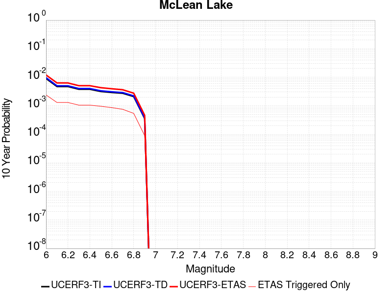 |

| Magnitude | 1 wk TI Prob | 1 wk TD Prob | 1 wk ETAS Prob | 1 wk ETAS/TD Gain | 1 wk ETAS Triggered Only | 1 mo TI Prob | 1 mo TD Prob | 1 mo ETAS Prob | 1 mo ETAS/TD Gain | 1 mo ETAS Triggered Only | 1 yr TI Prob | 1 yr TD Prob | 1 yr ETAS Prob | 1 yr ETAS/TD Gain | 1 yr ETAS Triggered Only | 10 yr TI Prob | 10 yr TD Prob | 10 yr ETAS Prob | 10 yr ETAS/TD Gain | 10 yr ETAS Triggered Only |
|-----|-----|-----|-----|-----|-----|-----|-----|-----|-----|-----|-----|-----|-----|-----|-----|-----|-----|-----|-----|-----|
| 6.0 | 1.7360222E-5 | 1.8501627E-5 | 0.0016033481 | 86.659836 | 0.0015848757 | 7.439883E-5 | 7.9290556E-5 | 0.0018904335 | 23.84185 | 0.0018112866 | 9.0542925E-4 | 9.6498354E-4 | 0.0029724406 | 3.0803018 | 0.002009396 | 0.009017491 | 0.0096127745 | 0.011855118 | 1.2332671 | 0.0022641083 |
| 6.1 | 9.062689E-6 | 9.592193E-6 | 8.5862464E-4 | 89.512856 | 8.490406E-4 | 3.8839516E-5 | 4.1108804E-5 | 0.0010033152 | 24.406336 | 9.62246E-4 | 4.727685E-4 | 5.003936E-4 | 0.0016601684 | 3.317725 | 0.0011603555 | 0.0047176396 | 0.004993552 | 0.006288913 | 1.2594068 | 0.0013018622 |
| 6.2 | 9.062689E-6 | 9.592193E-6 | 8.5862464E-4 | 89.512856 | 8.490406E-4 | 3.8839516E-5 | 4.1108804E-5 | 0.0010033152 | 24.406336 | 9.62246E-4 | 4.727685E-4 | 5.003936E-4 | 0.0016601684 | 3.317725 | 0.0011603555 | 0.0047176396 | 0.004993552 | 0.006288913 | 1.2594068 | 0.0013018622 |
| 6.3 | 7.2575485E-6 | 7.66771E-6 | 6.86895E-4 | 89.58281 | 6.792325E-4 | 3.110341E-5 | 3.2861237E-5 | 7.9697266E-4 | 24.252666 | 7.6413655E-4 | 3.786182E-4 | 4.0001926E-4 | 0.0013618803 | 3.404537 | 9.62246E-4 | 0.0037797375 | 0.0039936965 | 0.0050930413 | 1.27527 | 0.0011037528 |
| 6.4 | 7.2575485E-6 | 7.66771E-6 | 6.86895E-4 | 89.58281 | 6.792325E-4 | 3.110341E-5 | 3.2861237E-5 | 7.9697266E-4 | 24.252666 | 7.6413655E-4 | 3.786182E-4 | 4.0001926E-4 | 0.0013618803 | 3.404537 | 9.62246E-4 | 0.0037797375 | 0.0039936965 | 0.0050930413 | 1.27527 | 0.0011037528 |
| 6.5 | 6.06582E-6 | 6.4038773E-6 | 6.5733085E-4 | 102.64576 | 6.509311E-4 | 2.5996113E-5 | 2.7444936E-5 | 7.632599E-4 | 27.810593 | 7.358352E-4 | 3.164567E-4 | 3.3409733E-4 | 0.0012111461 | 3.6251297 | 8.7734195E-4 | 0.0031600643 | 0.0033365893 | 0.0043520383 | 1.3043375 | 0.0010188487 |
| 6.6 | 5.598744E-6 | 5.910262E-6 | 6.002352E-4 | 101.55813 | 5.943284E-4 | 2.3994397E-5 | 2.5329486E-5 | 7.045448E-4 | 27.815203 | 6.792325E-4 | 2.9209262E-4 | 3.0834923E-4 | 0.0011005427 | 3.5691438 | 7.924379E-4 | 0.0029170897 | 0.003079843 | 0.003982697 | 1.2931494 | 9.056433E-4 |
| 6.7 | 5.246996E-6 | 5.539162E-6 | 5.432619E-4 | 98.076546 | 5.377257E-4 | 2.2486933E-5 | 2.3739085E-5 | 6.4635405E-4 | 27.22742 | 6.2262977E-4 | 2.73744E-4 | 2.8899137E-4 | 0.0010246139 | 3.5454826 | 7.358352E-4 | 0.0027340704 | 0.0028867796 | 0.0037333693 | 1.2932644 | 8.490406E-4 |
| 6.8 | 4.02324E-6 | 4.2469046E-6 | 4.0046417E-4 | 94.29554 | 3.9621894E-4 | 1.7242342E-5 | 1.8200926E-5 | 4.7101433E-4 | 25.878592 | 4.5282164E-4 | 2.099053E-4 | 2.2157968E-4 | 7.308912E-4 | 3.2985477 | 5.0942437E-4 | 0.0020970714 | 0.002214172 | 0.0027789457 | 1.2550722 | 5.6602707E-4 |
| 6.9 | 6.835972E-7 | 7.1399285E-7 | 5.7316658E-5 | 80.27624 | 5.6602705E-5 | 2.9296991E-6 | 3.0599674E-6 | 5.96625E-5 | 19.497757 | 5.6602705E-5 | 3.56685E-5 | 3.7254784E-5 | 9.3855386E-5 | 2.519284 | 5.6602705E-5 | 3.5662777E-4 | 3.7251666E-4 | 4.290983E-4 | 1.1518902 | 5.6602705E-5 |

## Goldstone Lake
*[(top)](#table-of-contents)*

| 1 Week | 1 Month | 1 Year | 10 Year |
|-----|-----|-----|-----|
|  |  |  |  |

| Magnitude | 1 wk TI Prob | 1 wk TD Prob | 1 wk ETAS Prob | 1 wk ETAS/TD Gain | 1 wk ETAS Triggered Only | 1 mo TI Prob | 1 mo TD Prob | 1 mo ETAS Prob | 1 mo ETAS/TD Gain | 1 mo ETAS Triggered Only | 1 yr TI Prob | 1 yr TD Prob | 1 yr ETAS Prob | 1 yr ETAS/TD Gain | 1 yr ETAS Triggered Only | 10 yr TI Prob | 10 yr TD Prob | 10 yr ETAS Prob | 10 yr ETAS/TD Gain | 10 yr ETAS Triggered Only |
|-----|-----|-----|-----|-----|-----|-----|-----|-----|-----|-----|-----|-----|-----|-----|-----|-----|-----|-----|-----|-----|
| 6.0 | 2.671352E-5 | 3.037609E-5 | 0.0012755978 | 41.99348 | 0.0012452595 | 1.1448149E-4 | 1.3017785E-4 | 0.0017431449 | 13.390488 | 0.0016131771 | 0.001392921 | 0.0015839594 | 0.003335864 | 2.1060286 | 0.0017546839 | 0.013842222 | 0.015746197 | 0.017584674 | 1.1167569 | 0.0018678893 |
| 6.1 | 2.671352E-5 | 3.037609E-5 | 0.0012755978 | 41.99348 | 0.0012452595 | 1.1448149E-4 | 1.3017785E-4 | 0.0017431449 | 13.390488 | 0.0016131771 | 0.001392921 | 0.0015839594 | 0.003335864 | 2.1060286 | 0.0017546839 | 0.013842222 | 0.015746197 | 0.017584674 | 1.1167569 | 0.0018678893 |
| 6.2 | 1.4197047E-5 | 1.6096245E-5 | 4.689106E-4 | 29.131678 | 4.5282164E-4 | 6.0843064E-5 | 6.8982634E-5 | 6.9156947E-4 | 10.025269 | 6.2262977E-4 | 7.4051257E-4 | 8.3963864E-4 | 0.0015465784 | 1.8419572 | 7.075338E-4 | 0.007380498 | 0.0083743585 | 0.009132097 | 1.0904831 | 7.6413655E-4 |
| 6.3 | 1.4197047E-5 | 1.6096245E-5 | 4.689106E-4 | 29.131678 | 4.5282164E-4 | 6.0843064E-5 | 6.8982634E-5 | 6.9156947E-4 | 10.025269 | 6.2262977E-4 | 7.4051257E-4 | 8.3963864E-4 | 0.0015465784 | 1.8419572 | 7.075338E-4 | 0.007380498 | 0.0083743585 | 0.009132097 | 1.0904831 | 7.6413655E-4 |
| 6.4 | 1.3238931E-5 | 1.500846E-5 | 4.3952238E-4 | 29.284977 | 4.245203E-4 | 5.6737044E-5 | 6.4320935E-5 | 6.586111E-4 | 10.239451 | 5.943284E-4 | 6.9055456E-4 | 7.82924E-4 | 0.0014616247 | 1.8668793 | 6.792325E-4 | 0.006884126 | 0.0078112837 | 0.008541371 | 1.0934657 | 7.358352E-4 |
| 6.5 | 1.3238931E-5 | 1.500846E-5 | 4.3952238E-4 | 29.284977 | 4.245203E-4 | 5.6737044E-5 | 6.4320935E-5 | 6.586111E-4 | 10.239451 | 5.943284E-4 | 6.9055456E-4 | 7.82924E-4 | 0.0014616247 | 1.8668793 | 6.792325E-4 | 0.006884126 | 0.0078112837 | 0.008541371 | 1.0934657 | 7.358352E-4 |
| 6.6 | 1.1328278E-5 | 1.2855166E-5 | 3.8076803E-4 | 29.619846 | 3.679176E-4 | 4.8548856E-5 | 5.5092944E-5 | 5.644892E-4 | 10.246126 | 5.0942437E-4 | 5.90922E-4 | 6.7064585E-4 | 0.0012362932 | 1.843437 | 5.6602707E-4 | 0.0058935313 | 0.0066956086 | 0.007314069 | 1.0923681 | 6.2262977E-4 |
| 6.7 | 8.651175E-6 | 9.824565E-6 | 2.9283532E-4 | 29.806442 | 2.8301353E-4 | 3.707594E-5 | 4.2105108E-5 | 4.100072E-4 | 9.737707 | 3.679176E-4 | 4.5130608E-4 | 5.1259965E-4 | 9.369023E-4 | 1.8277467 | 4.245203E-4 | 0.0045039062 | 0.005123051 | 0.0056017092 | 1.0934323 | 4.81123E-4 |
| 6.8 | 1.0215377E-6 | 1.1754702E-6 | 2.947679E-5 | 25.076593 | 2.8301352E-5 | 4.378012E-6 | 5.0377203E-6 | 3.333893E-5 | 6.6178603 | 2.8301352E-5 | 5.3300988E-5 | 6.1332634E-5 | 8.963225E-5 | 1.4614121 | 2.8301352E-5 | 5.3288206E-4 | 6.1316835E-4 | 6.414523E-4 | 1.0461277 | 2.8301352E-5 |
| 6.9 | 7.9360774E-7 | 9.2833966E-7 | 9.2833966E-7 | 1.0 | 0.0 | 3.4011714E-6 | 3.9785928E-6 | 3.9785928E-6 | 1.0 | 0.0 | 4.1408475E-5 | 4.843836E-5 | 4.843836E-5 | 1.0 | 0.0 | 4.140076E-4 | 4.8428503E-4 | 4.8428503E-4 | 1.0 | 0.0 |
| 7.0 | 7.4382757E-7 | 8.7473285E-7 | 8.7473285E-7 | 1.0 | 0.0 | 3.1878285E-6 | 3.74885E-6 | 3.74885E-6 | 1.0 | 0.0 | 3.8811122E-5 | 4.564136E-5 | 4.564136E-5 | 1.0 | 0.0 | 3.8804344E-4 | 4.5632652E-4 | 4.5632652E-4 | 1.0 | 0.0 |
| 7.1 | 6.4709513E-7 | 7.7113E-7 | 7.7113E-7 | 1.0 | 0.0 | 2.773262E-6 | 3.3048389E-6 | 3.3048389E-6 | 1.0 | 0.0 | 3.376394E-5 | 4.0235733E-5 | 4.0235733E-5 | 1.0 | 0.0 | 3.375881E-4 | 4.0229043E-4 | 4.0229043E-4 | 1.0 | 0.0 |
| 7.2 | 6.356704E-7 | 7.5883594E-7 | 7.5883594E-7 | 1.0 | 0.0 | 2.7242988E-6 | 3.2521505E-6 | 3.2521505E-6 | 1.0 | 0.0 | 3.3167835E-5 | 3.959427E-5 | 3.959427E-5 | 1.0 | 0.0 | 3.3162883E-4 | 3.958781E-4 | 3.958781E-4 | 1.0 | 0.0 |
| 7.3 | 5.7695723E-7 | 6.8965653E-7 | 6.8965653E-7 | 1.0 | 0.0 | 2.4726714E-6 | 2.9556677E-6 | 2.9556677E-6 | 1.0 | 0.0 | 3.0104358E-5 | 3.5984718E-5 | 3.5984718E-5 | 1.0 | 0.0 | 3.0100282E-4 | 3.5979465E-4 | 3.5979465E-4 | 1.0 | 0.0 |
| 7.4 | 5.209647E-7 | 6.193514E-7 | 6.193514E-7 | 1.0 | 0.0 | 2.232704E-6 | 2.6543607E-6 | 2.6543607E-6 | 1.0 | 0.0 | 2.718283E-5 | 3.2316417E-5 | 3.2316417E-5 | 1.0 | 0.0 | 2.7179506E-4 | 3.2312275E-4 | 3.2312275E-4 | 1.0 | 0.0 |
| 7.5 | 4.512955E-7 | 5.348885E-7 | 5.348885E-7 | 1.0 | 0.0 | 1.934122E-6 | 2.2923775E-6 | 2.2923775E-6 | 1.0 | 0.0 | 2.3547682E-5 | 2.7909393E-5 | 2.7909393E-5 | 1.0 | 0.0 | 2.3545188E-4 | 2.7906417E-4 | 2.7906417E-4 | 1.0 | 0.0 |
| 7.6 | 2.21172E-7 | 2.603961E-7 | 2.603961E-7 | 1.0 | 0.0 | 9.478797E-7 | 1.1159829E-6 | 1.1159829E-6 | 1.0 | 0.0 | 1.1540374E-5 | 1.3587036E-5 | 1.3587036E-5 | 1.0 | 0.0 | 1.1539775E-4 | 1.3586486E-4 | 1.3586486E-4 | 1.0 | 0.0 |

## So Sierra Nevada
*[(top)](#table-of-contents)*

| 1 Week | 1 Month | 1 Year | 10 Year |
|-----|-----|-----|-----|
|  |  |  |  |

| Magnitude | 1 wk TI Prob | 1 wk TD Prob | 1 wk ETAS Prob | 1 wk ETAS/TD Gain | 1 wk ETAS Triggered Only | 1 mo TI Prob | 1 mo TD Prob | 1 mo ETAS Prob | 1 mo ETAS/TD Gain | 1 mo ETAS Triggered Only | 1 yr TI Prob | 1 yr TD Prob | 1 yr ETAS Prob | 1 yr ETAS/TD Gain | 1 yr ETAS Triggered Only | 10 yr TI Prob | 10 yr TD Prob | 10 yr ETAS Prob | 10 yr ETAS/TD Gain | 10 yr ETAS Triggered Only |
|-----|-----|-----|-----|-----|-----|-----|-----|-----|-----|-----|-----|-----|-----|-----|-----|-----|-----|-----|-----|-----|
| 6.0 | 1.15488665E-5 | 1.1079643E-5 | 0.0013978306 | 126.16206 | 0.0013867663 | 4.9494203E-5 | 4.748339E-5 | 0.0016039839 | 33.779896 | 0.0015565744 | 6.024253E-4 | 5.7796965E-4 | 0.0023599244 | 4.0831285 | 0.0017829852 | 0.006007948 | 0.005765934 | 0.007735606 | 1.341605 | 0.0019810947 |
| 6.1 | 1.15488665E-5 | 1.1079643E-5 | 0.0013978306 | 126.16206 | 0.0013867663 | 4.9494203E-5 | 4.748339E-5 | 0.0016039839 | 33.779896 | 0.0015565744 | 6.024253E-4 | 5.7796965E-4 | 0.0023599244 | 4.0831285 | 0.0017829852 | 0.006007948 | 0.005765934 | 0.007735606 | 1.341605 | 0.0019810947 |
| 6.2 | 1.15488665E-5 | 1.1079643E-5 | 0.0013978306 | 126.16206 | 0.0013867663 | 4.9494203E-5 | 4.748339E-5 | 0.0016039839 | 33.779896 | 0.0015565744 | 6.024253E-4 | 5.7796965E-4 | 0.0023599244 | 4.0831285 | 0.0017829852 | 0.006007948 | 0.005765934 | 0.007735606 | 1.341605 | 0.0019810947 |
| 6.3 | 1.15488665E-5 | 1.1079643E-5 | 0.0013978306 | 126.16206 | 0.0013867663 | 4.9494203E-5 | 4.748339E-5 | 0.0016039839 | 33.779896 | 0.0015565744 | 6.024253E-4 | 5.7796965E-4 | 0.0023599244 | 4.0831285 | 0.0017829852 | 0.006007948 | 0.005765934 | 0.007735606 | 1.341605 | 0.0019810947 |
| 6.4 | 1.15488665E-5 | 1.1079643E-5 | 0.0013978306 | 126.16206 | 0.0013867663 | 4.9494203E-5 | 4.748339E-5 | 0.0016039839 | 33.779896 | 0.0015565744 | 6.024253E-4 | 5.7796965E-4 | 0.0023599244 | 4.0831285 | 0.0017829852 | 0.006007948 | 0.005765934 | 0.007735606 | 1.341605 | 0.0019810947 |
| 6.5 | 1.15488665E-5 | 1.1079643E-5 | 0.0013978306 | 126.16206 | 0.0013867663 | 4.9494203E-5 | 4.748339E-5 | 0.0016039839 | 33.779896 | 0.0015565744 | 6.024253E-4 | 5.7796965E-4 | 0.0023599244 | 4.0831285 | 0.0017829852 | 0.006007948 | 0.005765934 | 0.007735606 | 1.341605 | 0.0019810947 |
| 6.6 | 7.587044E-6 | 6.935635E-6 | 7.710669E-4 | 111.17466 | 7.6413655E-4 | 3.2515498E-5 | 2.9723828E-5 | 8.5043866E-4 | 28.611343 | 8.2073925E-4 | 3.9580427E-4 | 3.6183043E-4 | 0.0013237282 | 3.6584215 | 9.62246E-4 | 0.003951 | 0.0036127048 | 0.004656072 | 1.2888049 | 0.00104715 |
| 6.7 | 7.587044E-6 | 6.935635E-6 | 7.710669E-4 | 111.17466 | 7.6413655E-4 | 3.2515498E-5 | 2.9723828E-5 | 8.5043866E-4 | 28.611343 | 8.2073925E-4 | 3.9580427E-4 | 3.6183043E-4 | 0.0013237282 | 3.6584215 | 9.62246E-4 | 0.003951 | 0.0036127048 | 0.004656072 | 1.2888049 | 0.00104715 |
| 6.8 | 5.9026956E-6 | 5.1793927E-6 | 4.0139628E-4 | 77.49872 | 3.9621894E-4 | 2.5297022E-5 | 2.2197215E-5 | 4.750088E-4 | 21.399477 | 4.5282164E-4 | 3.0794772E-4 | 2.7021873E-4 | 7.795054E-4 | 2.88472 | 5.0942437E-4 | 0.0030752132 | 0.002699018 | 0.0032917422 | 1.2196074 | 5.943284E-4 |
| 6.9 | 5.0118915E-6 | 4.2524252E-6 | 2.3066229E-4 | 54.242523 | 2.2641082E-4 | 2.1479358E-5 | 1.8224557E-5 | 3.0123294E-4 | 16.528957 | 2.8301353E-4 | 2.614798E-4 | 2.2186211E-4 | 5.61403E-4 | 2.530414 | 3.3961624E-4 | 0.0026117235 | 0.0022164788 | 0.002640058 | 1.1911047 | 4.245203E-4 |
| 7.0 | 4.4924795E-6 | 3.7139177E-6 | 1.735214E-4 | 46.72193 | 1.6980812E-4 | 1.925334E-5 | 1.5916696E-5 | 2.4232392E-4 | 15.224511 | 2.2641082E-4 | 2.3438422E-4 | 1.9376918E-4 | 4.7672787E-4 | 2.4602873 | 2.8301353E-4 | 0.0023413717 | 0.0019360651 | 0.0023032704 | 1.1896658 | 3.679176E-4 |
| 7.1 | 3.9118436E-6 | 3.1119775E-6 | 1.1631704E-4 | 37.37721 | 1.1320541E-4 | 1.6764936E-5 | 1.3336982E-5 | 1.2654088E-4 | 9.48797 | 1.1320541E-4 | 2.0409399E-4 | 1.6236622E-4 | 3.0385E-4 | 1.8713869 | 1.4150677E-4 | 0.0020390663 | 0.001622532 | 0.0018485755 | 1.1393152 | 2.2641082E-4 |
| 7.2 | 3.4200818E-6 | 2.6054543E-6 | 1.1581057E-4 | 44.44928 | 1.1320541E-4 | 1.4657411E-5 | 1.11661875E-5 | 1.2437033E-4 | 11.13812 | 1.1320541E-4 | 1.7843937E-4 | 1.3594035E-4 | 2.774279E-4 | 2.0408058 | 1.4150677E-4 | 0.0017829615 | 0.0013586218 | 0.001584725 | 1.166421 | 2.2641082E-4 |
| 7.3 | 2.6593618E-6 | 1.8284203E-6 | 1.15033625E-4 | 62.914215 | 1.1320541E-4 | 1.13972155E-5 | 7.836065E-6 | 1.2104059E-4 | 15.446604 | 1.1320541E-4 | 1.3875226E-4 | 9.540021E-5 | 2.3689347E-4 | 2.4831548 | 1.4150677E-4 | 0.0013866565 | 9.5362146E-4 | 0.0011515421 | 1.2075462 | 1.9810947E-4 |
| 7.4 | 2.2577992E-6 | 1.436438E-6 | 5.8039062E-5 | 40.40485 | 5.6602705E-5 | 9.676246E-6 | 6.15615E-6 | 6.275851E-5 | 10.194441 | 5.6602705E-5 | 1.1780193E-4 | 7.49488E-5 | 1.598465E-4 | 2.1327426 | 8.490406E-5 | 0.001177395 | 7.492603E-4 | 8.9066103E-4 | 1.1887205 | 1.4150677E-4 |
| 7.5 | 1.489319E-6 | 7.353936E-7 | 7.353936E-7 | 1.0 | 0.0 | 6.3827797E-6 | 3.1516831E-6 | 3.1516831E-6 | 1.0 | 0.0 | 7.770758E-5 | 3.8371072E-5 | 3.8371072E-5 | 1.0 | 0.0 | 7.7680405E-4 | 3.836449E-4 | 3.836449E-4 | 1.0 | 0.0 |
| 7.6 | 1.0680322E-6 | 4.6596554E-7 | 4.6596554E-7 | 1.0 | 0.0 | 4.577273E-6 | 1.9969937E-6 | 1.9969937E-6 | 1.0 | 0.0 | 5.5726876E-5 | 2.4313129E-5 | 2.4313129E-5 | 1.0 | 0.0 | 5.5712904E-4 | 2.4310495E-4 | 2.4310495E-4 | 1.0 | 0.0 |
| 7.7 | 5.509146E-7 | 1.5580486E-7 | 1.5580486E-7 | 1.0 | 0.0 | 2.3610605E-6 | 6.677349E-7 | 6.677349E-7 | 1.0 | 0.0 | 2.8745531E-5 | 8.129644E-6 | 8.129644E-6 | 1.0 | 0.0 | 2.8741814E-4 | 8.1293576E-5 | 8.1293576E-5 | 1.0 | 0.0 |

## Death Valley (So)
*[(top)](#table-of-contents)*

| 1 Week | 1 Month | 1 Year | 10 Year |
|-----|-----|-----|-----|
|  |  |  |  |

| Magnitude | 1 wk TI Prob | 1 wk TD Prob | 1 wk ETAS Prob | 1 wk ETAS/TD Gain | 1 wk ETAS Triggered Only | 1 mo TI Prob | 1 mo TD Prob | 1 mo ETAS Prob | 1 mo ETAS/TD Gain | 1 mo ETAS Triggered Only | 1 yr TI Prob | 1 yr TD Prob | 1 yr ETAS Prob | 1 yr ETAS/TD Gain | 1 yr ETAS Triggered Only | 10 yr TI Prob | 10 yr TD Prob | 10 yr ETAS Prob | 10 yr ETAS/TD Gain | 10 yr ETAS Triggered Only |
|-----|-----|-----|-----|-----|-----|-----|-----|-----|-----|-----|-----|-----|-----|-----|-----|-----|-----|-----|-----|-----|
| 6.0 | 2.0684236E-5 | 2.5617775E-5 | 9.878391E-4 | 38.560688 | 9.62246E-4 | 8.864371E-5 | 1.0978594E-4 | 0.0012134175 | 11.052576 | 0.0011037528 | 0.0010787029 | 0.0013358411 | 0.002664228 | 1.9944196 | 0.0013301636 | 0.010734817 | 0.013281397 | 0.014649745 | 1.1030275 | 0.0013867663 |
| 6.1 | 2.0684236E-5 | 2.5617775E-5 | 9.878391E-4 | 38.560688 | 9.62246E-4 | 8.864371E-5 | 1.0978594E-4 | 0.0012134175 | 11.052576 | 0.0011037528 | 0.0010787029 | 0.0013358411 | 0.002664228 | 1.9944196 | 0.0013301636 | 0.010734817 | 0.013281397 | 0.014649745 | 1.1030275 | 0.0013867663 |
| 6.2 | 2.0684236E-5 | 2.5617775E-5 | 9.878391E-4 | 38.560688 | 9.62246E-4 | 8.864371E-5 | 1.0978594E-4 | 0.0012134175 | 11.052576 | 0.0011037528 | 0.0010787029 | 0.0013358411 | 0.002664228 | 1.9944196 | 0.0013301636 | 0.010734817 | 0.013281397 | 0.014649745 | 1.1030275 | 0.0013867663 |
| 6.3 | 2.0240292E-5 | 2.511786E-5 | 9.307384E-4 | 37.054844 | 9.056433E-4 | 8.6741224E-5 | 1.07643624E-4 | 0.001154681 | 10.726887 | 0.00104715 | 0.0010555626 | 0.00130979 | 0.0025816828 | 1.9710662 | 0.0012735609 | 0.010505628 | 0.013023956 | 0.014336796 | 1.100802 | 0.0013301636 |
| 6.4 | 2.0240292E-5 | 2.511786E-5 | 9.307384E-4 | 37.054844 | 9.056433E-4 | 8.6741224E-5 | 1.07643624E-4 | 0.001154681 | 10.726887 | 0.00104715 | 0.0010555626 | 0.00130979 | 0.0025816828 | 1.9710662 | 0.0012735609 | 0.010505628 | 0.013023956 | 0.014336796 | 1.100802 | 0.0013301636 |
| 6.5 | 1.9962767E-5 | 2.4807114E-5 | 7.889247E-4 | 31.802357 | 7.6413655E-4 | 8.55519E-5 | 1.0631196E-4 | 0.0010118589 | 9.517828 | 9.056433E-4 | 0.0010410968 | 0.0012935963 | 0.002424186 | 1.8739896 | 0.0011320541 | 0.010362327 | 0.012863902 | 0.014037268 | 1.0912138 | 0.0011886568 |
| 6.6 | 1.8937297E-5 | 2.3310964E-5 | 6.742269E-4 | 28.923166 | 6.509311E-4 | 8.115732E-5 | 9.990039E-5 | 8.922591E-4 | 8.931488 | 7.924379E-4 | 9.876423E-4 | 0.0012156231 | 0.0022332333 | 1.8371099 | 0.0010188487 | 0.009832645 | 0.012092789 | 0.013155235 | 1.0878578 | 0.0010754514 |
| 6.7 | 1.8621096E-5 | 2.2911607E-5 | 6.7382783E-4 | 29.40989 | 6.509311E-4 | 7.980225E-5 | 9.818898E-5 | 8.6225045E-4 | 8.78154 | 7.6413655E-4 | 9.711593E-4 | 0.0011948098 | 0.0021841736 | 1.8280513 | 9.905474E-4 | 0.009669261 | 0.011886904 | 0.012921606 | 1.0870456 | 0.00104715 |
| 6.8 | 1.7830353E-5 | 2.1805688E-5 | 6.1612116E-4 | 28.255066 | 5.943284E-4 | 7.641356E-5 | 9.344968E-5 | 7.726187E-4 | 8.267751 | 6.792325E-4 | 9.29938E-4 | 0.00113717 | 0.0020417834 | 1.7954953 | 9.056433E-4 | 0.009260561 | 0.011316354 | 0.012267712 | 1.0840693 | 9.62246E-4 |
| 6.9 | 1.3135183E-5 | 1.5303925E-5 | 3.5491496E-4 | 23.191107 | 3.3961624E-4 | 5.6292425E-5 | 6.558664E-5 | 4.617796E-4 | 7.040757 | 3.9621894E-4 | 6.8514474E-4 | 7.982312E-4 | 0.0012789702 | 1.6022552 | 4.81123E-4 | 0.006830362 | 0.007954649 | 0.008488097 | 1.0670612 | 5.377257E-4 |
| 7.0 | 1.1507512E-5 | 1.3154199E-5 | 2.3956204E-4 | 18.21183 | 2.2641082E-4 | 4.9316975E-5 | 5.6373956E-5 | 3.1107178E-4 | 5.518005 | 2.5471218E-4 | 6.002687E-4 | 6.8614254E-4 | 9.406799E-4 | 1.3709687 | 2.5471218E-4 | 0.0059864987 | 0.0068409415 | 0.0071501266 | 1.0451963 | 3.1131489E-4 |
| 7.1 | 9.715903E-6 | 1.0865278E-5 | 2.3727363E-4 | 21.837788 | 2.2641082E-4 | 4.1638916E-5 | 4.656467E-5 | 2.7296494E-4 | 5.862061 | 2.2641082E-4 | 5.068359E-4 | 5.667817E-4 | 7.9306413E-4 | 1.3992411 | 2.2641082E-4 | 0.0050568148 | 0.0056538144 | 0.005935228 | 1.049774 | 2.8301353E-4 |
| 7.2 | 9.233269E-6 | 1.02863105E-5 | 2.0839374E-4 | 20.259329 | 1.9810947E-4 | 3.9570554E-5 | 4.4083466E-5 | 2.4218421E-4 | 5.493765 | 1.9810947E-4 | 4.81665E-4 | 5.3658825E-4 | 7.345914E-4 | 1.3690039 | 1.9810947E-4 | 0.0048062233 | 0.0053533576 | 0.0056067063 | 1.0473251 | 2.5471218E-4 |
| 7.3 | 8.8041315E-6 | 9.808164E-6 | 1.2301246E-4 | 12.541844 | 1.1320541E-4 | 3.7731446E-5 | 4.2034335E-5 | 1.5523499E-4 | 3.693052 | 1.1320541E-4 | 4.592835E-4 | 5.1165203E-4 | 6.247995E-4 | 1.2211415 | 1.1320541E-4 | 0.0045833546 | 0.005105167 | 0.0052741086 | 1.0330923 | 1.6980812E-4 |
| 7.4 | 8.708749E-6 | 9.707175E-6 | 1.2291149E-4 | 12.6619215 | 1.1320541E-4 | 3.7322676E-5 | 4.160154E-5 | 1.5480224E-4 | 3.72107 | 1.1320541E-4 | 4.5430884E-4 | 5.0638523E-4 | 6.195333E-4 | 1.2234427 | 1.1320541E-4 | 0.004533812 | 0.0050527398 | 0.0052216896 | 1.0334374 | 1.6980812E-4 |
| 7.5 | 8.612678E-6 | 9.604817E-6 | 1.2280914E-4 | 12.786202 | 1.1320541E-4 | 3.6910955E-5 | 4.1162875E-5 | 1.5436363E-4 | 3.750069 | 1.1320541E-4 | 4.492982E-4 | 5.01047E-4 | 6.1419565E-4 | 1.2258245 | 1.1320541E-4 | 0.004483909 | 0.0049995985 | 0.0051685576 | 1.0337945 | 1.6980812E-4 |
| 7.6 | 8.319024E-6 | 9.283916E-6 | 1.2248827E-4 | 13.1936 | 1.1320541E-4 | 3.5652476E-5 | 3.978763E-5 | 1.5298853E-4 | 3.8451283 | 1.1320541E-4 | 4.3398244E-4 | 4.8431093E-4 | 5.9746153E-4 | 1.2336321 | 1.1320541E-4 | 0.0043313587 | 0.0048329784 | 0.005001966 | 1.0349655 | 1.6980812E-4 |
| 7.7 | 7.4718328E-6 | 8.34517E-6 | 9.324852E-5 | 11.173951 | 8.490406E-5 | 3.2021748E-5 | 3.5764548E-5 | 1.20665565E-4 | 3.3738878 | 8.490406E-5 | 3.8979502E-4 | 4.353504E-4 | 5.2021747E-4 | 1.1949397 | 8.490406E-5 | 0.00389112 | 0.0043453807 | 0.004429916 | 1.019454 | 8.490406E-5 |
| 7.8 | 3.4586725E-7 | 3.6482615E-7 | 3.6482615E-7 | 1.0 | 0.0 | 1.4822873E-6 | 1.5635396E-6 | 1.5635396E-6 | 1.0 | 0.0 | 1.80467E-5 | 1.9035933E-5 | 1.9035933E-5 | 1.0 | 0.0 | 1.8045233E-4 | 1.9034347E-4 | 1.9034347E-4 | 1.0 | 0.0 |
| 7.9 | 2.5591178E-9 | 2.6696718E-9 | 2.6696718E-9 | 1.0 | 0.0 | 1.0967647E-8 | 1.14414505E-8 | 1.14414505E-8 | 1.0 | 0.0 | 1.335311E-7 | 1.3929966E-7 | 1.3929966E-7 | 1.0 | 0.0 | 1.3353102E-6 | 1.3929966E-6 | 1.3929966E-6 | 1.0 | 0.0 |

## Lenwood-Lockhart-Old Woman Springs
*[(top)](#table-of-contents)*

| 1 Week | 1 Month | 1 Year | 10 Year |
|-----|-----|-----|-----|
|  |  |  |  |

| Magnitude | 1 wk TI Prob | 1 wk TD Prob | 1 wk ETAS Prob | 1 wk ETAS/TD Gain | 1 wk ETAS Triggered Only | 1 mo TI Prob | 1 mo TD Prob | 1 mo ETAS Prob | 1 mo ETAS/TD Gain | 1 mo ETAS Triggered Only | 1 yr TI Prob | 1 yr TD Prob | 1 yr ETAS Prob | 1 yr ETAS/TD Gain | 1 yr ETAS Triggered Only | 10 yr TI Prob | 10 yr TD Prob | 10 yr ETAS Prob | 10 yr ETAS/TD Gain | 10 yr ETAS Triggered Only |
|-----|-----|-----|-----|-----|-----|-----|-----|-----|-----|-----|-----|-----|-----|-----|-----|-----|-----|-----|-----|-----|
| 6.0 | 3.744542E-5 | 4.396252E-5 | 8.3636557E-4 | 19.024513 | 7.924379E-4 | 1.604705E-4 | 1.8839816E-4 | 0.0011504629 | 6.10655 | 9.62246E-4 | 0.0019519776 | 0.0022915069 | 0.0034492032 | 1.505212 | 0.0011603555 | 0.019349206 | 0.022696787 | 0.023886126 | 1.0524011 | 0.0012169582 |
| 6.1 | 3.744542E-5 | 4.396252E-5 | 8.3636557E-4 | 19.024513 | 7.924379E-4 | 1.604705E-4 | 1.8839816E-4 | 0.0011504629 | 6.10655 | 9.62246E-4 | 0.0019519776 | 0.0022915069 | 0.0034492032 | 1.505212 | 0.0011603555 | 0.019349206 | 0.022696787 | 0.023886126 | 1.0524011 | 0.0012169582 |
| 6.2 | 3.744542E-5 | 4.396252E-5 | 8.3636557E-4 | 19.024513 | 7.924379E-4 | 1.604705E-4 | 1.8839816E-4 | 0.0011504629 | 6.10655 | 9.62246E-4 | 0.0019519776 | 0.0022915069 | 0.0034492032 | 1.505212 | 0.0011603555 | 0.019349206 | 0.022696787 | 0.023886126 | 1.0524011 | 0.0012169582 |
| 6.3 | 2.1079984E-5 | 2.5353434E-5 | 3.6496104E-4 | 14.394936 | 3.3961624E-4 | 9.0339665E-5 | 1.0865316E-4 | 5.3312734E-4 | 4.9066896 | 4.245203E-4 | 0.0010993304 | 0.0013220694 | 0.0017742924 | 1.3420569 | 4.5282164E-4 | 0.010939079 | 0.0131442575 | 0.013646986 | 1.038247 | 5.0942437E-4 |
| 6.4 | 2.1079984E-5 | 2.5353434E-5 | 3.6496104E-4 | 14.394936 | 3.3961624E-4 | 9.0339665E-5 | 1.0865316E-4 | 5.3312734E-4 | 4.9066896 | 4.245203E-4 | 0.0010993304 | 0.0013220694 | 0.0017742924 | 1.3420569 | 4.5282164E-4 | 0.010939079 | 0.0131442575 | 0.013646986 | 1.038247 | 5.0942437E-4 |
| 6.5 | 1.7397282E-5 | 2.066241E-5 | 3.036701E-4 | 14.696741 | 2.8301353E-4 | 7.455765E-5 | 8.8550245E-5 | 4.281364E-4 | 4.8349543 | 3.3961624E-4 | 9.073613E-4 | 0.0010775778 | 0.0014450989 | 1.3410623 | 3.679176E-4 | 0.009036654 | 0.010724821 | 0.011116791 | 1.0365479 | 3.9621894E-4 |
| 6.6 | 1.52050325E-5 | 1.7679693E-5 | 2.7238738E-4 | 15.406792 | 2.5471218E-4 | 6.51628E-5 | 7.576796E-5 | 3.8705926E-4 | 5.108482 | 3.1131489E-4 | 7.9306826E-4 | 9.220924E-4 | 0.0012613955 | 1.3679708 | 3.3961624E-4 | 0.007902439 | 0.009183526 | 0.009520024 | 1.0366414 | 3.3961624E-4 |
| 6.7 | 1.332523E-5 | 1.5264002E-5 | 2.1337045E-4 | 13.978669 | 1.9810947E-4 | 5.7106878E-5 | 6.5415545E-5 | 3.2011105E-4 | 4.8935013 | 2.5471218E-4 | 6.950544E-4 | 7.961491E-4 | 0.0010789373 | 1.355195 | 2.8301353E-4 | 0.006928845 | 0.007933599 | 0.008214367 | 1.0353898 | 2.8301353E-4 |
| 6.8 | 1.1525329E-5 | 1.3030979E-5 | 1.8283688E-4 | 14.03094 | 1.6980812E-4 | 4.9393333E-5 | 5.584588E-5 | 2.8224406E-4 | 5.053982 | 2.2641082E-4 | 6.011979E-4 | 6.797157E-4 | 9.059727E-4 | 1.3328699 | 2.2641082E-4 | 0.00599574 | 0.006776819 | 0.0070016957 | 1.0331832 | 2.2641082E-4 |
| 6.9 | 1.0253909E-5 | 1.15144385E-5 | 1.5301957E-4 | 13.289365 | 1.4150677E-4 | 4.3944583E-5 | 4.9346683E-5 | 2.4744638E-4 | 5.014448 | 1.9810947E-4 | 5.3489394E-4 | 6.0063385E-4 | 7.9862436E-4 | 1.3296359 | 1.9810947E-4 | 0.0053360825 | 0.0059904843 | 0.006187407 | 1.0328726 | 1.9810947E-4 |
| 7.0 | 8.104563E-6 | 8.991279E-6 | 9.3894574E-5 | 10.44285 | 8.490406E-5 | 3.4733377E-5 | 3.8533497E-5 | 1.5173455E-4 | 3.937731 | 1.1320541E-4 | 4.2279682E-4 | 4.6904673E-4 | 5.821991E-4 | 1.2412388 | 1.1320541E-4 | 0.0042199334 | 0.0046808156 | 0.004793491 | 1.0240718 | 1.1320541E-4 |
| 7.1 | 6.7986157E-6 | 7.515816E-6 | 9.2419235E-5 | 12.296634 | 8.490406E-5 | 2.91366E-5 | 3.2210253E-5 | 1.4541202E-4 | 4.5144634 | 1.1320541E-4 | 3.5468035E-4 | 3.920914E-4 | 5.0525245E-4 | 1.2886088 | 1.1320541E-4 | 0.003541148 | 0.003914213 | 0.004026975 | 1.0288085 | 1.1320541E-4 |
| 7.2 | 5.6893327E-6 | 6.2800136E-6 | 6.288236E-5 | 10.013093 | 5.6602705E-5 | 2.4382627E-5 | 2.6914078E-5 | 8.351526E-5 | 3.1030326 | 5.6602705E-5 | 2.9681803E-4 | 3.2763163E-4 | 3.842158E-4 | 1.1727066 | 5.6602705E-5 | 0.002964219 | 0.0032716845 | 0.0033281022 | 1.0172442 | 5.6602705E-5 |
| 7.3 | 4.253348E-6 | 4.7069107E-6 | 6.130935E-5 | 13.025391 | 5.6602705E-5 | 1.8228506E-5 | 2.0172329E-5 | 7.677389E-5 | 3.8059015 | 5.6602705E-5 | 2.2190946E-4 | 2.4557224E-4 | 3.0216106E-4 | 1.2304364 | 5.6602705E-5 | 0.00221688 | 0.0024531898 | 0.0025096536 | 1.0230165 | 5.6602705E-5 |
| 7.4 | 2.5448119E-6 | 2.852045E-6 | 3.115332E-5 | 10.923151 | 2.8301352E-5 | 1.0906291E-5 | 1.2223002E-5 | 4.052401E-5 | 3.3153892 | 2.8301352E-5 | 1.3277601E-4 | 1.4880655E-4 | 1.7710368E-4 | 1.1901606 | 2.8301352E-5 | 0.001326967 | 0.0014872311 | 0.0015154905 | 1.0190012 | 2.8301352E-5 |
| 7.5 | 4.3706837E-8 | 4.562909E-8 | 4.562909E-8 | 1.0 | 0.0 | 1.8731501E-7 | 1.9555324E-7 | 1.9555324E-7 | 1.0 | 0.0 | 2.2805577E-6 | 2.3808586E-6 | 2.3808586E-6 | 1.0 | 0.0 | 2.2805343E-5 | 2.3808387E-5 | 2.3808387E-5 | 1.0 | 0.0 |

## Towne Pass
*[(top)](#table-of-contents)*

| 1 Week | 1 Month | 1 Year | 10 Year |
|-----|-----|-----|-----|
|  |  |  |  |

| Magnitude | 1 wk TI Prob | 1 wk TD Prob | 1 wk ETAS Prob | 1 wk ETAS/TD Gain | 1 wk ETAS Triggered Only | 1 mo TI Prob | 1 mo TD Prob | 1 mo ETAS Prob | 1 mo ETAS/TD Gain | 1 mo ETAS Triggered Only | 1 yr TI Prob | 1 yr TD Prob | 1 yr ETAS Prob | 1 yr ETAS/TD Gain | 1 yr ETAS Triggered Only | 10 yr TI Prob | 10 yr TD Prob | 10 yr ETAS Prob | 10 yr ETAS/TD Gain | 10 yr ETAS Triggered Only |
|-----|-----|-----|-----|-----|-----|-----|-----|-----|-----|-----|-----|-----|-----|-----|-----|-----|-----|-----|-----|-----|
| 6.0 | 3.849728E-6 | 3.8945414E-6 | 6.5482315E-4 | 168.1387 | 6.509311E-4 | 1.649873E-5 | 1.669081E-5 | 8.091155E-4 | 48.476707 | 7.924379E-4 | 2.0085352E-4 | 2.0319603E-4 | 0.0011935421 | 5.8738456 | 9.905474E-4 | 0.0020067208 | 0.0020305314 | 0.003132043 | 1.5424745 | 0.0011037528 |
| 6.1 | 3.849728E-6 | 3.8945414E-6 | 6.5482315E-4 | 168.1387 | 6.509311E-4 | 1.649873E-5 | 1.669081E-5 | 8.091155E-4 | 48.476707 | 7.924379E-4 | 2.0085352E-4 | 2.0319603E-4 | 0.0011935421 | 5.8738456 | 9.905474E-4 | 0.0020067208 | 0.0020305314 | 0.003132043 | 1.5424745 | 0.0011037528 |
| 6.2 | 3.849728E-6 | 3.8945414E-6 | 6.5482315E-4 | 168.1387 | 6.509311E-4 | 1.649873E-5 | 1.669081E-5 | 8.091155E-4 | 48.476707 | 7.924379E-4 | 2.0085352E-4 | 2.0319603E-4 | 0.0011935421 | 5.8738456 | 9.905474E-4 | 0.0020067208 | 0.0020305314 | 0.003132043 | 1.5424745 | 0.0011037528 |
| 6.3 | 3.849728E-6 | 3.8945414E-6 | 6.5482315E-4 | 168.1387 | 6.509311E-4 | 1.649873E-5 | 1.669081E-5 | 8.091155E-4 | 48.476707 | 7.924379E-4 | 2.0085352E-4 | 2.0319603E-4 | 0.0011935421 | 5.8738456 | 9.905474E-4 | 0.0020067208 | 0.0020305314 | 0.003132043 | 1.5424745 | 0.0011037528 |
| 6.4 | 3.849728E-6 | 3.8945414E-6 | 6.5482315E-4 | 168.1387 | 6.509311E-4 | 1.649873E-5 | 1.669081E-5 | 8.091155E-4 | 48.476707 | 7.924379E-4 | 2.0085352E-4 | 2.0319603E-4 | 0.0011935421 | 5.8738456 | 9.905474E-4 | 0.0020067208 | 0.0020305314 | 0.003132043 | 1.5424745 | 0.0011037528 |
| 6.5 | 1.1953545E-6 | 1.203052E-6 | 2.950437E-5 | 24.524601 | 2.8301352E-5 | 5.1229376E-6 | 5.1559277E-6 | 9.005955E-5 | 17.467186 | 8.490406E-5 | 6.236998E-5 | 6.277173E-5 | 1.7597004E-4 | 2.8033326 | 1.1320541E-4 | 6.235248E-4 | 6.275517E-4 | 7.406861E-4 | 1.1802789 | 1.1320541E-4 |
| 6.6 | 1.1953545E-6 | 1.203052E-6 | 2.950437E-5 | 24.524601 | 2.8301352E-5 | 5.1229376E-6 | 5.1559277E-6 | 9.005955E-5 | 17.467186 | 8.490406E-5 | 6.236998E-5 | 6.277173E-5 | 1.7597004E-4 | 2.8033326 | 1.1320541E-4 | 6.235248E-4 | 6.275517E-4 | 7.406861E-4 | 1.1802789 | 1.1320541E-4 |
| 6.7 | 8.375951E-7 | 8.4106705E-7 | 2.9142397E-5 | 34.649315 | 2.8301352E-5 | 3.5896885E-6 | 3.6045683E-6 | 8.850832E-5 | 24.554485 | 8.490406E-5 | 4.370358E-5 | 4.3884793E-5 | 1.2878513E-4 | 2.9346185 | 8.490406E-5 | 4.3694986E-4 | 4.38767E-4 | 5.236338E-4 | 1.1934211 | 8.490406E-5 |
| 6.8 | 6.38041E-7 | 6.392156E-7 | 2.894055E-5 | 45.275097 | 2.8301352E-5 | 2.7344586E-6 | 2.7394929E-6 | 5.9342045E-5 | 21.661688 | 5.6602705E-5 | 3.3291526E-5 | 3.3352855E-5 | 8.9953675E-5 | 2.6970308 | 5.6602705E-5 | 3.3286537E-4 | 3.334823E-4 | 3.9006612E-4 | 1.1696757 | 5.6602705E-5 |
| 6.9 | 5.3460053E-7 | 5.345333E-7 | 2.8835871E-5 | 53.94588 | 2.8301352E-5 | 2.2911431E-6 | 2.2908553E-6 | 5.889343E-5 | 25.708055 | 5.6602705E-5 | 2.789431E-5 | 2.789084E-5 | 8.449196E-5 | 3.0293806 | 5.6602705E-5 | 2.789081E-4 | 2.7887672E-4 | 3.354636E-4 | 1.2029102 | 5.6602705E-5 |
| 7.0 | 3.557783E-7 | 3.5324226E-7 | 2.8654586E-5 | 81.11879 | 2.8301352E-5 | 1.5247632E-6 | 1.5138945E-6 | 5.8116515E-5 | 38.388744 | 5.6602705E-5 | 1.8563835E-5 | 1.843152E-5 | 7.503318E-5 | 4.0709167 | 5.6602705E-5 | 1.8562283E-4 | 1.8430075E-4 | 2.4089302E-4 | 1.3070648 | 5.6602705E-5 |
| 7.1 | 3.037942E-7 | 3.0002218E-7 | 2.8601367E-5 | 95.33084 | 2.8301352E-5 | 1.3019744E-6 | 1.2858087E-6 | 5.7888443E-5 | 45.021034 | 5.6602705E-5 | 1.5851423E-5 | 1.5654618E-5 | 7.225644E-5 | 4.615663 | 5.6602705E-5 | 1.5850292E-4 | 1.5653588E-4 | 2.1312974E-4 | 1.3615391 | 5.6602705E-5 |
| 7.2 | 2.0808248E-7 | 2.0217689E-7 | 2.8503524E-5 | 140.9831 | 2.8301352E-5 | 8.917818E-7 | 8.6647213E-7 | 5.746913E-5 | 66.325424 | 5.6602705E-5 | 1.0857389E-5 | 1.0549252E-5 | 6.715136E-5 | 6.3655095 | 5.6602705E-5 | 1.0856859E-4 | 1.0548797E-4 | 1.620847E-4 | 1.5365231 | 5.6602705E-5 |
| 7.3 | 1.1162073E-7 | 1.0636894E-7 | 2.840772E-5 | 267.0678 | 2.8301352E-5 | 4.7837443E-7 | 4.558668E-7 | 5.7058547E-5 | 125.164955 | 5.6602705E-5 | 5.8241935E-6 | 5.550166E-6 | 6.2152554E-5 | 11.198324 | 5.6602705E-5 | 5.8240406E-5 | 5.5500474E-5 | 1.1210004E-4 | 2.0198033 | 5.6602705E-5 |

## San Andreas (San Bernardino N)
*[(top)](#table-of-contents)*

| 1 Week | 1 Month | 1 Year | 10 Year |
|-----|-----|-----|-----|
|  |  |  |  |

| Magnitude | 1 wk TI Prob | 1 wk TD Prob | 1 wk ETAS Prob | 1 wk ETAS/TD Gain | 1 wk ETAS Triggered Only | 1 mo TI Prob | 1 mo TD Prob | 1 mo ETAS Prob | 1 mo ETAS/TD Gain | 1 mo ETAS Triggered Only | 1 yr TI Prob | 1 yr TD Prob | 1 yr ETAS Prob | 1 yr ETAS/TD Gain | 1 yr ETAS Triggered Only | 10 yr TI Prob | 10 yr TD Prob | 10 yr ETAS Prob | 10 yr ETAS/TD Gain | 10 yr ETAS Triggered Only |
|-----|-----|-----|-----|-----|-----|-----|-----|-----|-----|-----|-----|-----|-----|-----|-----|-----|-----|-----|-----|-----|
| 6.0 | 1.4273766E-4 | 3.1606483E-4 | 0.0011082522 | 3.506408 | 7.924379E-4 | 6.115894E-4 | 0.0013538664 | 0.0022300205 | 1.6471497 | 8.7734195E-4 | 0.0074207084 | 0.016360244 | 0.017278908 | 1.0561523 | 9.3394466E-4 | 0.07177748 | 0.15026689 | 0.15113263 | 1.0057614 | 0.0010188487 |
| 6.1 | 1.4273766E-4 | 3.1606483E-4 | 0.0011082522 | 3.506408 | 7.924379E-4 | 6.115894E-4 | 0.0013538664 | 0.0022300205 | 1.6471497 | 8.7734195E-4 | 0.0074207084 | 0.016360244 | 0.017278908 | 1.0561523 | 9.3394466E-4 | 0.07177748 | 0.15026689 | 0.15113263 | 1.0057614 | 0.0010188487 |
| 6.2 | 1.4273766E-4 | 3.1606483E-4 | 0.0011082522 | 3.506408 | 7.924379E-4 | 6.115894E-4 | 0.0013538664 | 0.0022300205 | 1.6471497 | 8.7734195E-4 | 0.0074207084 | 0.016360244 | 0.017278908 | 1.0561523 | 9.3394466E-4 | 0.07177748 | 0.15026689 | 0.15113263 | 1.0057614 | 0.0010188487 |
| 6.3 | 1.3730655E-4 | 3.0511338E-4 | 0.0010973095 | 3.596399 | 7.924379E-4 | 5.883239E-4 | 0.0013069791 | 0.0021831745 | 1.6703973 | 8.7734195E-4 | 0.0071393442 | 0.015797773 | 0.016716963 | 1.0581849 | 9.3394466E-4 | 0.06914291 | 0.14556676 | 0.1464373 | 1.0059804 | 0.0010188487 |
| 6.4 | 1.3730655E-4 | 3.0511338E-4 | 0.0010973095 | 3.596399 | 7.924379E-4 | 5.883239E-4 | 0.0013069791 | 0.0021831745 | 1.6703973 | 8.7734195E-4 | 0.0071393442 | 0.015797773 | 0.016716963 | 1.0581849 | 9.3394466E-4 | 0.06914291 | 0.14556676 | 0.1464373 | 1.0059804 | 0.0010188487 |
| 6.5 | 1.2942807E-4 | 2.8925808E-4 | 0.0010814668 | 3.7387607 | 7.924379E-4 | 5.545738E-4 | 0.0012390936 | 0.0021153486 | 1.7071741 | 8.7734195E-4 | 0.0067310524 | 0.01498286 | 0.015902812 | 1.0614003 | 9.3394466E-4 | 0.06530788 | 0.13870941 | 0.13958694 | 1.0063263 | 0.0010188487 |
| 6.6 | 1.1125901E-4 | 2.536472E-4 | 0.0010458841 | 4.123381 | 7.924379E-4 | 4.767372E-4 | 0.0010866089 | 0.0019629975 | 1.8065355 | 8.7734195E-4 | 0.005788839 | 0.013149847 | 0.01407151 | 1.0700893 | 9.3394466E-4 | 0.056403454 | 0.122999296 | 0.12389282 | 1.0072645 | 0.0010188487 |
| 6.7 | 1.02209575E-4 | 2.3499702E-4 | 9.989539E-4 | 4.250922 | 7.6413655E-4 | 4.3796748E-4 | 0.0010067427 | 0.0018549286 | 1.842505 | 8.490406E-4 | 0.0053192247 | 0.012188629 | 0.013083234 | 1.0733967 | 9.056433E-4 | 0.051936906 | 0.114790924 | 0.11566776 | 1.0076386 | 9.905474E-4 |
| 6.8 | 9.610582E-5 | 2.2025521E-4 | 9.842234E-4 | 4.4685593 | 7.6413655E-4 | 4.1181705E-4 | 9.436101E-4 | 0.0017918495 | 1.89893 | 8.490406E-4 | 0.0050023515 | 0.011428202 | 0.012323495 | 1.0783408 | 9.056433E-4 | 0.048912346 | 0.1081929 | 0.10907628 | 1.0081649 | 9.905474E-4 |
| 6.9 | 9.3877505E-5 | 2.1481077E-4 | 9.787831E-4 | 4.55649 | 7.6413655E-4 | 4.0227012E-4 | 9.2029345E-4 | 0.0017685527 | 1.921727 | 8.490406E-4 | 0.0048866454 | 0.011147255 | 0.012042804 | 1.080338 | 9.056433E-4 | 0.04780577 | 0.10578323 | 0.106668994 | 1.0083734 | 9.905474E-4 |
| 7.0 | 9.1019785E-5 | 2.0808022E-4 | 9.7205775E-4 | 4.6715527 | 7.6413655E-4 | 3.900265E-4 | 8.914682E-4 | 0.0017397519 | 1.951558 | 8.490406E-4 | 0.0047382377 | 0.010799837 | 0.0116957 | 1.0829514 | 9.056433E-4 | 0.046384744 | 0.102753714 | 0.10364248 | 1.0086495 | 9.905474E-4 |
| 7.1 | 8.771155E-5 | 1.9982594E-4 | 9.638098E-4 | 4.8232465 | 7.6413655E-4 | 3.758525E-4 | 8.5611636E-4 | 0.0017044301 | 1.990886 | 8.490406E-4 | 0.0045664064 | 0.0103736 | 0.011269848 | 1.086397 | 9.056433E-4 | 0.044737056 | 0.09906527 | 0.09995768 | 1.0090084 | 9.905474E-4 |
| 7.2 | 8.0830236E-5 | 1.8388197E-4 | 9.47878E-4 | 5.154817 | 7.6413655E-4 | 3.4636928E-4 | 7.8782777E-4 | 0.0016361994 | 2.0768492 | 8.490406E-4 | 0.0042088944 | 0.009549725 | 0.010446719 | 1.0939288 | 9.056433E-4 | 0.041300658 | 0.09179615 | 0.09267007 | 1.0095202 | 9.62246E-4 |
| 7.3 | 7.7668235E-5 | 1.7331762E-4 | 9.373217E-4 | 5.4081154 | 7.6413655E-4 | 3.328214E-4 | 7.425784E-4 | 0.0015909886 | 2.1425192 | 8.490406E-4 | 0.0040445733 | 0.009003494 | 0.009900983 | 1.0996823 | 9.056433E-4 | 0.03971748 | 0.08706327 | 0.087941736 | 1.01009 | 9.62246E-4 |
| 7.4 | 7.520177E-5 | 1.6551897E-4 | 9.0123236E-4 | 5.4448886 | 7.358352E-4 | 3.2225347E-4 | 7.0917426E-4 | 0.0015293314 | 2.156496 | 8.2073925E-4 | 0.0039163795 | 0.008600081 | 0.009469878 | 1.1011382 | 8.7734195E-4 | 0.038480744 | 0.08351955 | 0.08437549 | 1.0102484 | 9.3394466E-4 |
| 7.5 | 7.274697E-5 | 1.5839566E-4 | 8.9411426E-4 | 5.6448154 | 7.358352E-4 | 3.1173544E-4 | 6.78662E-4 | 0.0014988442 | 2.2085283 | 8.2073925E-4 | 0.003788775 | 0.008231463 | 0.009101583 | 1.1057066 | 8.7734195E-4 | 0.03724827 | 0.08023631 | 0.081095316 | 1.010706 | 9.3394466E-4 |
| 7.6 | 7.1185845E-5 | 1.540943E-4 | 8.898161E-4 | 5.7744904 | 7.358352E-4 | 3.0504653E-4 | 6.6023704E-4 | 0.0014804344 | 2.2422771 | 8.2073925E-4 | 0.0037076178 | 0.008008812 | 0.008879127 | 1.1086698 | 8.7734195E-4 | 0.036463667 | 0.07822598 | 0.07908686 | 1.0110052 | 9.3394466E-4 |
| 7.7 | 6.709961E-5 | 1.4318313E-4 | 8.789129E-4 | 6.1383834 | 7.358352E-4 | 2.8753807E-4 | 6.1349774E-4 | 0.0014337334 | 2.3369825 | 8.2073925E-4 | 0.003495157 | 0.0074437927 | 0.008314604 | 1.1169848 | 8.7734195E-4 | 0.034406938 | 0.07305469 | 0.073920414 | 1.0118502 | 9.3394466E-4 |
| 7.8 | 6.300812E-5 | 1.3202413E-4 | 8.6776214E-4 | 6.5727544 | 7.358352E-4 | 2.7000686E-4 | 5.65695E-4 | 0.0013859699 | 2.4500303 | 8.2073925E-4 | 0.0032823787 | 0.006865616 | 0.0077369343 | 1.1269104 | 8.7734195E-4 | 0.032343175 | 0.06771354 | 0.06858424 | 1.0128586 | 9.3394466E-4 |
| 7.9 | 4.983037E-5 | 9.723488E-5 | 6.632069E-4 | 6.8206687 | 5.6602707E-4 | 2.1354125E-4 | 4.1665437E-4 | 0.0010390247 | 2.493733 | 6.2262977E-4 | 0.0025967648 | 0.0050609782 | 0.005736773 | 1.1335305 | 6.792325E-4 | 0.025666296 | 0.05064886 | 0.051347427 | 1.0137923 | 7.358352E-4 |
| 8.0 | 3.2211527E-5 | 5.3304586E-5 | 2.7970335E-4 | 5.247266 | 2.2641082E-4 | 1.380421E-4 | 2.2842824E-4 | 5.113771E-4 | 2.2386773 | 2.8301353E-4 | 0.0016793669 | 0.0027775685 | 0.003059796 | 1.1016095 | 2.8301353E-4 | 0.016667323 | 0.028361378 | 0.028636366 | 1.0096958 | 2.8301353E-4 |
| 8.1 | 1.743376E-5 | 1.8824427E-5 | 1.8824427E-5 | 1.0 | 0.0 | 7.471398E-5 | 8.067362E-5 | 8.067362E-5 | 1.0 | 0.0 | 9.0926304E-4 | 9.817594E-4 | 9.817594E-4 | 1.0 | 0.0 | 0.009055517 | 0.010484105 | 0.010484105 | 1.0 | 0.0 |
| 8.2 | 7.831616E-6 | 5.1551065E-6 | 5.1551065E-6 | 1.0 | 0.0 | 3.3563636E-5 | 2.2093127E-5 | 2.2093127E-5 | 1.0 | 0.0 | 4.0856065E-4 | 2.6895068E-4 | 2.6895068E-4 | 1.0 | 0.0 | 0.004078103 | 0.0030418145 | 0.0030418145 | 1.0 | 0.0 |
| 8.3 | 1.983087E-6 | 7.6599065E-7 | 7.6599065E-7 | 1.0 | 0.0 | 8.498917E-6 | 3.282813E-6 | 3.282813E-6 | 1.0 | 0.0 | 1.034694E-4 | 3.9967534E-5 | 3.9967534E-5 | 1.0 | 0.0 | 0.0010342124 | 4.719687E-4 | 4.719687E-4 | 1.0 | 0.0 |

## Coyote Canyon
*[(top)](#table-of-contents)*

| 1 Week | 1 Month | 1 Year | 10 Year |
|-----|-----|-----|-----|
|  |  |  |  |

| Magnitude | 1 wk TI Prob | 1 wk TD Prob | 1 wk ETAS Prob | 1 wk ETAS/TD Gain | 1 wk ETAS Triggered Only | 1 mo TI Prob | 1 mo TD Prob | 1 mo ETAS Prob | 1 mo ETAS/TD Gain | 1 mo ETAS Triggered Only | 1 yr TI Prob | 1 yr TD Prob | 1 yr ETAS Prob | 1 yr ETAS/TD Gain | 1 yr ETAS Triggered Only | 10 yr TI Prob | 10 yr TD Prob | 10 yr ETAS Prob | 10 yr ETAS/TD Gain | 10 yr ETAS Triggered Only |
|-----|-----|-----|-----|-----|-----|-----|-----|-----|-----|-----|-----|-----|-----|-----|-----|-----|-----|-----|-----|-----|
| 6.0 | 3.5090034E-5 | 4.0364324E-5 | 6.3466874E-4 | 15.723508 | 5.943284E-4 | 1.503772E-4 | 1.7297994E-4 | 7.95502E-4 | 4.5988107 | 6.2262977E-4 | 0.0018293047 | 0.0021042528 | 0.0028385394 | 1.3489537 | 7.358352E-4 | 0.018143194 | 0.020869201 | 0.021645103 | 1.0371792 | 7.924379E-4 |
| 6.1 | 3.5090034E-5 | 4.0364324E-5 | 6.3466874E-4 | 15.723508 | 5.943284E-4 | 1.503772E-4 | 1.7297994E-4 | 7.95502E-4 | 4.5988107 | 6.2262977E-4 | 0.0018293047 | 0.0021042528 | 0.0028385394 | 1.3489537 | 7.358352E-4 | 0.018143194 | 0.020869201 | 0.021645103 | 1.0371792 | 7.924379E-4 |
| 6.2 | 1.841879E-5 | 2.1059794E-5 | 4.1727038E-4 | 19.813602 | 3.9621894E-4 | 7.8935285E-5 | 9.0253714E-5 | 5.147357E-4 | 5.703208 | 4.245203E-4 | 9.606133E-4 | 0.001098387 | 0.0015224409 | 1.3860698 | 4.245203E-4 | 0.0095647145 | 0.010939667 | 0.011415526 | 1.0434985 | 4.81123E-4 |
| 6.3 | 1.841879E-5 | 2.1059794E-5 | 4.1727038E-4 | 19.813602 | 3.9621894E-4 | 7.8935285E-5 | 9.0253714E-5 | 5.147357E-4 | 5.703208 | 4.245203E-4 | 9.606133E-4 | 0.001098387 | 0.0015224409 | 1.3860698 | 4.245203E-4 | 0.0095647145 | 0.010939667 | 0.011415526 | 1.0434985 | 4.81123E-4 |
| 6.4 | 1.712201E-5 | 1.9565212E-5 | 3.874756E-4 | 19.804314 | 3.679176E-4 | 7.337798E-5 | 8.3848776E-5 | 4.800345E-4 | 5.725003 | 3.9621894E-4 | 8.930107E-4 | 0.0010204813 | 0.0014162959 | 1.3878706 | 3.9621894E-4 | 0.008894307 | 0.010167871 | 0.010616088 | 1.0440817 | 4.5282164E-4 |
| 6.5 | 1.4744935E-5 | 1.6836972E-5 | 2.7154485E-4 | 16.127892 | 2.5471218E-4 | 6.3191044E-5 | 7.215698E-5 | 3.5515008E-4 | 4.921909 | 2.8301353E-4 | 7.6907943E-4 | 8.7825063E-4 | 0.0011610156 | 1.3219639 | 2.8301353E-4 | 0.007664232 | 0.008756994 | 0.009093637 | 1.0384426 | 3.3961624E-4 |
| 6.6 | 1.2017839E-5 | 1.37240895E-5 | 1.8352988E-4 | 13.372828 | 1.6980812E-4 | 5.150401E-5 | 5.88167E-5 | 2.2861482E-4 | 3.8869035 | 1.6980812E-4 | 6.268809E-4 | 7.159466E-4 | 8.8563317E-4 | 1.23701 | 1.6980812E-4 | 0.0062511545 | 0.0071450938 | 0.0073698866 | 1.0314612 | 2.2641082E-4 |
| 6.7 | 1.00956095E-5 | 1.1533517E-5 | 1.2473762E-4 | 10.815229 | 1.1320541E-4 | 4.326618E-5 | 4.942891E-5 | 1.6262873E-4 | 3.290154 | 1.1320541E-4 | 5.266384E-4 | 6.017178E-4 | 7.148551E-4 | 1.1880238 | 1.1320541E-4 | 0.005253921 | 0.0060094125 | 0.0061782002 | 1.0280873 | 1.6980812E-4 |

## Nelson Lake
*[(top)](#table-of-contents)*

| 1 Week | 1 Month | 1 Year | 10 Year |
|-----|-----|-----|-----|
|  |  |  |  |

| Magnitude | 1 wk TI Prob | 1 wk TD Prob | 1 wk ETAS Prob | 1 wk ETAS/TD Gain | 1 wk ETAS Triggered Only | 1 mo TI Prob | 1 mo TD Prob | 1 mo ETAS Prob | 1 mo ETAS/TD Gain | 1 mo ETAS Triggered Only | 1 yr TI Prob | 1 yr TD Prob | 1 yr ETAS Prob | 1 yr ETAS/TD Gain | 1 yr ETAS Triggered Only | 10 yr TI Prob | 10 yr TD Prob | 10 yr ETAS Prob | 10 yr ETAS/TD Gain | 10 yr ETAS Triggered Only |
|-----|-----|-----|-----|-----|-----|-----|-----|-----|-----|-----|-----|-----|-----|-----|-----|-----|-----|-----|-----|-----|
| 6.0 | 9.913453E-6 | 1.0192255E-5 | 4.630093E-4 | 45.42756 | 4.5282164E-4 | 4.2485535E-5 | 4.3680422E-5 | 6.3798286E-4 | 14.605694 | 5.943284E-4 | 5.1713863E-4 | 5.316897E-4 | 0.0012388474 | 2.3300195 | 7.075338E-4 | 0.0051593683 | 0.005305204 | 0.006093438 | 1.1485775 | 7.924379E-4 |
| 6.1 | 9.913453E-6 | 1.0192255E-5 | 4.630093E-4 | 45.42756 | 4.5282164E-4 | 4.2485535E-5 | 4.3680422E-5 | 6.3798286E-4 | 14.605694 | 5.943284E-4 | 5.1713863E-4 | 5.316897E-4 | 0.0012388474 | 2.3300195 | 7.075338E-4 | 0.0051593683 | 0.005305204 | 0.006093438 | 1.1485775 | 7.924379E-4 |
| 6.2 | 4.5596407E-6 | 4.696313E-6 | 1.17901196E-4 | 25.105053 | 1.1320541E-4 | 1.954117E-5 | 2.0126909E-5 | 1.8993161E-4 | 9.436701 | 1.6980812E-4 | 2.3788778E-4 | 2.4501883E-4 | 4.7137417E-4 | 1.9238284 | 2.2641082E-4 | 0.0023763329 | 0.0024476128 | 0.0026734695 | 1.0922763 | 2.2641082E-4 |
| 6.3 | 4.5596407E-6 | 4.696313E-6 | 1.17901196E-4 | 25.105053 | 1.1320541E-4 | 1.954117E-5 | 2.0126909E-5 | 1.8993161E-4 | 9.436701 | 1.6980812E-4 | 2.3788778E-4 | 2.4501883E-4 | 4.7137417E-4 | 1.9238284 | 2.2641082E-4 | 0.0023763329 | 0.0024476128 | 0.0026734695 | 1.0922763 | 2.2641082E-4 |
| 6.4 | 3.4025713E-6 | 3.5098972E-6 | 1.1671491E-4 | 33.253086 | 1.1320541E-4 | 1.4582367E-5 | 1.5042335E-5 | 1.5654697E-4 | 10.407092 | 1.4150677E-4 | 1.7752586E-4 | 1.8312587E-4 | 3.8119906E-4 | 2.081623 | 1.9810947E-4 | 0.001773841 | 0.0018298327 | 0.0020275796 | 1.1080683 | 1.9810947E-4 |
| 6.5 | 2.8352947E-6 | 2.927856E-6 | 8.7831664E-5 | 29.998629 | 8.490406E-5 | 1.2151207E-5 | 1.2547898E-5 | 1.2575189E-4 | 10.021749 | 1.1320541E-4 | 1.479309E-4 | 1.5276071E-4 | 3.2254288E-4 | 2.1114256 | 1.6980812E-4 | 0.0014783246 | 0.0015266308 | 0.0016961797 | 1.1110609 | 1.6980812E-4 |
| 6.6 | 2.251518E-6 | 2.3290677E-6 | 8.7232926E-5 | 37.454014 | 8.490406E-5 | 9.649328E-6 | 9.981683E-6 | 1.2318596E-4 | 12.341201 | 1.1320541E-4 | 1.1747423E-4 | 1.2152085E-4 | 2.630104E-4 | 2.1643233 | 1.4150677E-4 | 0.0011741214 | 0.0012146058 | 0.0013559406 | 1.1163628 | 1.4150677E-4 |
| 6.7 | 1.8911853E-6 | 1.9591396E-6 | 8.686303E-5 | 44.337334 | 8.490406E-5 | 8.105055E-6 | 8.39629E-6 | 1.2160075E-4 | 14.482677 | 1.1320541E-4 | 9.867457E-5 | 1.0222061E-4 | 2.1541445E-4 | 2.1073484 | 1.1320541E-4 | 9.863076E-4 | 0.0010217935 | 0.0011348831 | 1.1106777 | 1.1320541E-4 |
| 6.8 | 1.4874814E-6 | 1.5438305E-6 | 8.6447755E-5 | 55.99563 | 8.490406E-5 | 6.374905E-6 | 6.6164025E-6 | 1.1982107E-4 | 18.1097 | 1.1320541E-4 | 7.76117E-5 | 8.055224E-5 | 1.9374854E-4 | 2.4052532 | 1.1320541E-4 | 7.75846E-4 | 8.0528157E-4 | 9.183958E-4 | 1.1404655 | 1.1320541E-4 |
| 6.9 | 6.835972E-7 | 7.1399285E-7 | 5.7316658E-5 | 80.27624 | 5.6602705E-5 | 2.9296991E-6 | 3.0599674E-6 | 5.96625E-5 | 19.497757 | 5.6602705E-5 | 3.56685E-5 | 3.7254784E-5 | 9.3855386E-5 | 2.519284 | 5.6602705E-5 | 3.5662777E-4 | 3.7251666E-4 | 4.290983E-4 | 1.1518902 | 5.6602705E-5 |

## Paradise
*[(top)](#table-of-contents)*

| 1 Week | 1 Month | 1 Year | 10 Year |
|-----|-----|-----|-----|
|  |  |  |  |

| Magnitude | 1 wk TI Prob | 1 wk TD Prob | 1 wk ETAS Prob | 1 wk ETAS/TD Gain | 1 wk ETAS Triggered Only | 1 mo TI Prob | 1 mo TD Prob | 1 mo ETAS Prob | 1 mo ETAS/TD Gain | 1 mo ETAS Triggered Only | 1 yr TI Prob | 1 yr TD Prob | 1 yr ETAS Prob | 1 yr ETAS/TD Gain | 1 yr ETAS Triggered Only | 10 yr TI Prob | 10 yr TD Prob | 10 yr ETAS Prob | 10 yr ETAS/TD Gain | 10 yr ETAS Triggered Only |
|-----|-----|-----|-----|-----|-----|-----|-----|-----|-----|-----|-----|-----|-----|-----|-----|-----|-----|-----|-----|-----|
| 6.0 | 1.4851273E-5 | 1.6694692E-5 | 4.6950878E-4 | 28.123238 | 4.5282164E-4 | 6.364676E-5 | 7.154685E-5 | 6.092341E-4 | 8.515177 | 5.377257E-4 | 7.7462377E-4 | 8.707584E-4 | 0.0015211226 | 1.7468941 | 6.509311E-4 | 0.0077192914 | 0.008675844 | 0.009349184 | 1.0776109 | 6.792325E-4 |
| 6.1 | 1.4851273E-5 | 1.6694692E-5 | 4.6950878E-4 | 28.123238 | 4.5282164E-4 | 6.364676E-5 | 7.154685E-5 | 6.092341E-4 | 8.515177 | 5.377257E-4 | 7.7462377E-4 | 8.707584E-4 | 0.0015211226 | 1.7468941 | 6.509311E-4 | 0.0077192914 | 0.008675844 | 0.009349184 | 1.0776109 | 6.792325E-4 |
| 6.2 | 1.4851273E-5 | 1.6694692E-5 | 4.6950878E-4 | 28.123238 | 4.5282164E-4 | 6.364676E-5 | 7.154685E-5 | 6.092341E-4 | 8.515177 | 5.377257E-4 | 7.7462377E-4 | 8.707584E-4 | 0.0015211226 | 1.7468941 | 6.509311E-4 | 0.0077192914 | 0.008675844 | 0.009349184 | 1.0776109 | 6.792325E-4 |
| 6.3 | 1.0426831E-5 | 1.188862E-5 | 1.8169472E-4 | 15.283078 | 1.6980812E-4 | 4.4685654E-5 | 5.0950268E-5 | 2.4904966E-4 | 4.888093 | 1.9810947E-4 | 5.43912E-4 | 6.201489E-4 | 8.747031E-4 | 1.4104728 | 2.5471218E-4 | 0.0054258266 | 0.0061847917 | 0.0064379284 | 1.040929 | 2.5471218E-4 |
| 6.4 | 1.0426831E-5 | 1.188862E-5 | 1.8169472E-4 | 15.283078 | 1.6980812E-4 | 4.4685654E-5 | 5.0950268E-5 | 2.4904966E-4 | 4.888093 | 1.9810947E-4 | 5.43912E-4 | 6.201489E-4 | 8.747031E-4 | 1.4104728 | 2.5471218E-4 | 0.0054258266 | 0.0061847917 | 0.0064379284 | 1.040929 | 2.5471218E-4 |
| 6.5 | 9.25027E-6 | 1.06199595E-5 | 1.2382417E-4 | 11.659571 | 1.1320541E-4 | 3.964341E-5 | 4.551335E-5 | 1.8701368E-4 | 4.1089854 | 1.4150677E-4 | 4.8255164E-4 | 5.53989E-4 | 7.5198873E-4 | 1.3574073 | 1.9810947E-4 | 0.0048150513 | 0.0055265795 | 0.0057235938 | 1.0356486 | 1.9810947E-4 |
| 6.6 | 7.904275E-6 | 9.159525E-6 | 9.406281E-5 | 10.269398 | 8.490406E-5 | 3.3875025E-5 | 3.9254537E-5 | 1.2415527E-4 | 3.1628258 | 8.490406E-5 | 4.1235037E-4 | 4.7782314E-4 | 5.6268665E-4 | 1.1776044 | 8.490406E-5 | 0.0041158604 | 0.0047683544 | 0.0048528537 | 1.0177208 | 8.490406E-5 |
| 6.7 | 7.2061953E-6 | 8.407248E-6 | 9.331059E-5 | 11.098826 | 8.490406E-5 | 3.088333E-5 | 3.6030586E-5 | 1.2093159E-4 | 3.356359 | 8.490406E-5 | 3.7593965E-4 | 4.3858777E-4 | 5.234546E-4 | 1.1935002 | 8.490406E-5 | 0.003753043 | 0.004377591 | 0.0044621234 | 1.0193102 | 8.490406E-5 |
| 6.8 | 6.6948724E-6 | 7.842166E-6 | 3.6143298E-5 | 4.608841 | 2.8301352E-5 | 2.8691995E-5 | 3.360887E-5 | 6.190927E-5 | 1.8420516 | 2.8301352E-5 | 3.4926904E-4 | 4.0911473E-4 | 4.374045E-4 | 1.0691488 | 2.8301352E-5 | 0.003487206 | 0.0040839734 | 0.004112159 | 1.0069015 | 2.8301352E-5 |
| 6.9 | 6.0421025E-6 | 7.130621E-6 | 7.130621E-6 | 1.0 | 0.0 | 2.5894467E-5 | 3.0559466E-5 | 3.0559466E-5 | 1.0 | 0.0 | 3.1521954E-4 | 3.7200135E-4 | 3.7200135E-4 | 1.0 | 0.0 | 0.0031477278 | 0.0037141247 | 0.0037141247 | 1.0 | 0.0 |
| 7.0 | 4.134091E-6 | 5.0803087E-6 | 5.0803087E-6 | 1.0 | 0.0 | 1.7717413E-5 | 2.177258E-5 | 2.177258E-5 | 1.0 | 0.0 | 2.1568815E-4 | 2.6505045E-4 | 2.6505045E-4 | 1.0 | 0.0 | 0.0021547892 | 0.0026474963 | 0.0026474963 | 1.0 | 0.0 |
| 7.1 | 3.7674888E-6 | 4.6318696E-6 | 4.6318696E-6 | 1.0 | 0.0 | 1.6146281E-5 | 1.9850726E-5 | 1.9850726E-5 | 1.0 | 0.0 | 1.9656324E-4 | 2.4165731E-4 | 2.4165731E-4 | 1.0 | 0.0 | 0.0019638946 | 0.002414096 | 0.002414096 | 1.0 | 0.0 |
| 7.2 | 3.4065345E-6 | 4.156723E-6 | 4.156723E-6 | 1.0 | 0.0 | 1.4599351E-5 | 1.7814415E-5 | 1.7814415E-5 | 1.0 | 0.0 | 1.777326E-4 | 2.1687041E-4 | 2.1687041E-4 | 1.0 | 0.0 | 0.0017759053 | 0.002166736 | 0.002166736 | 1.0 | 0.0 |
| 7.3 | 2.9934936E-6 | 3.6293168E-6 | 3.6293168E-6 | 1.0 | 0.0 | 1.2829195E-5 | 1.555413E-5 | 1.555413E-5 | 1.0 | 0.0 | 1.5618425E-4 | 1.8935655E-4 | 1.8935655E-4 | 1.0 | 0.0 | 0.0015607453 | 0.0018920974 | 0.0018920974 | 1.0 | 0.0 |
| 7.4 | 2.4049796E-6 | 2.8889842E-6 | 2.8889842E-6 | 1.0 | 0.0 | 1.0307015E-5 | 1.238131E-5 | 1.238131E-5 | 1.0 | 0.0 | 1.2548068E-4 | 1.5073347E-4 | 1.5073347E-4 | 1.0 | 0.0 | 0.0012540985 | 0.0015064536 | 0.0015064536 | 1.0 | 0.0 |
| 7.5 | 1.2710091E-6 | 1.5134682E-6 | 1.5134682E-6 | 1.0 | 0.0 | 5.44717E-6 | 6.4862834E-6 | 6.4862834E-6 | 1.0 | 0.0 | 6.631728E-5 | 7.8968886E-5 | 7.8968886E-5 | 1.0 | 0.0 | 6.6297496E-4 | 7.8953087E-4 | 7.8953087E-4 | 1.0 | 0.0 |
| 7.6 | 2.21172E-7 | 2.603961E-7 | 2.603961E-7 | 1.0 | 0.0 | 9.478797E-7 | 1.1159829E-6 | 1.1159829E-6 | 1.0 | 0.0 | 1.1540374E-5 | 1.3587036E-5 | 1.3587036E-5 | 1.0 | 0.0 | 1.1539775E-4 | 1.3586486E-4 | 1.3586486E-4 | 1.0 | 0.0 |

## Bicycle Lake
*[(top)](#table-of-contents)*

| 1 Week | 1 Month | 1 Year | 10 Year |
|-----|-----|-----|-----|
|  |  |  |  |

| Magnitude | 1 wk TI Prob | 1 wk TD Prob | 1 wk ETAS Prob | 1 wk ETAS/TD Gain | 1 wk ETAS Triggered Only | 1 mo TI Prob | 1 mo TD Prob | 1 mo ETAS Prob | 1 mo ETAS/TD Gain | 1 mo ETAS Triggered Only | 1 yr TI Prob | 1 yr TD Prob | 1 yr ETAS Prob | 1 yr ETAS/TD Gain | 1 yr ETAS Triggered Only | 10 yr TI Prob | 10 yr TD Prob | 10 yr ETAS Prob | 10 yr ETAS/TD Gain | 10 yr ETAS Triggered Only |
|-----|-----|-----|-----|-----|-----|-----|-----|-----|-----|-----|-----|-----|-----|-----|-----|-----|-----|-----|-----|-----|
| 6.0 | 1.9621975E-5 | 2.2097078E-5 | 5.032094E-4 | 22.772669 | 4.81123E-4 | 8.4091465E-5 | 9.4699084E-5 | 6.040752E-4 | 6.3788915 | 5.0942437E-4 | 0.0010233327 | 0.0011524865 | 0.0016895925 | 1.466041 | 5.377257E-4 | 0.01018633 | 0.011478408 | 0.0120379375 | 1.0487463 | 5.6602707E-4 |
| 6.1 | 1.9621975E-5 | 2.2097078E-5 | 5.032094E-4 | 22.772669 | 4.81123E-4 | 8.4091465E-5 | 9.4699084E-5 | 6.040752E-4 | 6.3788915 | 5.0942437E-4 | 0.0010233327 | 0.0011524865 | 0.0016895925 | 1.466041 | 5.377257E-4 | 0.01018633 | 0.011478408 | 0.0120379375 | 1.0487463 | 5.6602707E-4 |
| 6.2 | 9.9971285E-6 | 1.1255639E-5 | 2.3766392E-4 | 21.115097 | 2.2641082E-4 | 4.2844134E-5 | 4.8237856E-5 | 3.0293775E-4 | 6.280083 | 2.5471218E-4 | 5.2150246E-4 | 5.871896E-4 | 8.417523E-4 | 1.4335271 | 2.5471218E-4 | 0.0052028033 | 0.005861487 | 0.006142841 | 1.0480006 | 2.8301353E-4 |
| 6.3 | 9.589428E-6 | 1.0798346E-5 | 2.0890568E-4 | 19.34608 | 1.9810947E-4 | 4.10969E-5 | 4.62781E-5 | 2.7267844E-4 | 5.8921704 | 2.2641082E-4 | 5.002399E-4 | 5.6334207E-4 | 7.8962534E-4 | 1.4016801 | 2.2641082E-4 | 0.0049911533 | 0.0056242296 | 0.0058775092 | 1.0450337 | 2.5471218E-4 |
| 6.4 | 9.589428E-6 | 1.0798346E-5 | 2.0890568E-4 | 19.34608 | 1.9810947E-4 | 4.10969E-5 | 4.62781E-5 | 2.7267844E-4 | 5.8921704 | 2.2641082E-4 | 5.002399E-4 | 5.6334207E-4 | 7.8962534E-4 | 1.4016801 | 2.2641082E-4 | 0.0049911533 | 0.0056242296 | 0.0058775092 | 1.0450337 | 2.5471218E-4 |
| 6.5 | 5.557707E-6 | 6.2856016E-6 | 9.1189126E-5 | 14.507622 | 8.490406E-5 | 2.3818526E-5 | 2.6938165E-5 | 1.1183994E-4 | 4.151728 | 8.490406E-5 | 2.8995197E-4 | 3.2794967E-4 | 4.128259E-4 | 1.2588086 | 8.490406E-5 | 0.0028957394 | 0.0032772934 | 0.0033901278 | 1.0344292 | 1.1320541E-4 |
| 6.6 | 4.8742945E-6 | 5.5132896E-6 | 6.211569E-5 | 11.266537 | 5.6602705E-5 | 2.0889667E-5 | 2.3628318E-5 | 8.0229685E-5 | 3.3954887 | 5.6602705E-5 | 2.54302E-4 | 2.87663E-4 | 3.4424942E-4 | 1.1967108 | 5.6602705E-5 | 0.002540112 | 0.0028754752 | 0.0029601352 | 1.0294421 | 8.490406E-5 |
| 6.7 | 3.991108E-6 | 4.5159104E-6 | 3.2817134E-5 | 7.2670035 | 2.8301352E-5 | 1.7104636E-5 | 1.9353902E-5 | 4.7654707E-5 | 2.462279 | 2.8301352E-5 | 2.0822904E-4 | 2.3563375E-4 | 2.6392844E-4 | 1.120079 | 2.8301352E-5 | 0.0020803404 | 0.0023563374 | 0.0024128067 | 1.0239649 | 5.6602705E-5 |

## San Andreas (San Bernardino S)
*[(top)](#table-of-contents)*

| 1 Week | 1 Month | 1 Year | 10 Year |
|-----|-----|-----|-----|
|  |  |  |  |

| Magnitude | 1 wk TI Prob | 1 wk TD Prob | 1 wk ETAS Prob | 1 wk ETAS/TD Gain | 1 wk ETAS Triggered Only | 1 mo TI Prob | 1 mo TD Prob | 1 mo ETAS Prob | 1 mo ETAS/TD Gain | 1 mo ETAS Triggered Only | 1 yr TI Prob | 1 yr TD Prob | 1 yr ETAS Prob | 1 yr ETAS/TD Gain | 1 yr ETAS Triggered Only | 10 yr TI Prob | 10 yr TD Prob | 10 yr ETAS Prob | 10 yr ETAS/TD Gain | 10 yr ETAS Triggered Only |
|-----|-----|-----|-----|-----|-----|-----|-----|-----|-----|-----|-----|-----|-----|-----|-----|-----|-----|-----|-----|-----|
| 6.0 | 1.2336002E-4 | 3.0004102E-4 | 6.961411E-4 | 2.320153 | 3.9621894E-4 | 5.2857865E-4 | 0.0012852824 | 0.0017375221 | 1.3518602 | 4.5282164E-4 | 0.006416472 | 0.015540994 | 0.015986778 | 1.0286844 | 4.5282164E-4 | 0.06234337 | 0.14283717 | 0.14324957 | 1.0028872 | 4.81123E-4 |
| 6.1 | 1.2336002E-4 | 3.0004102E-4 | 6.961411E-4 | 2.320153 | 3.9621894E-4 | 5.2857865E-4 | 0.0012852824 | 0.0017375221 | 1.3518602 | 4.5282164E-4 | 0.006416472 | 0.015540994 | 0.015986778 | 1.0286844 | 4.5282164E-4 | 0.06234337 | 0.14283717 | 0.14324957 | 1.0028872 | 4.81123E-4 |
| 6.2 | 1.2336002E-4 | 3.0004102E-4 | 6.961411E-4 | 2.320153 | 3.9621894E-4 | 5.2857865E-4 | 0.0012852824 | 0.0017375221 | 1.3518602 | 4.5282164E-4 | 0.006416472 | 0.015540994 | 0.015986778 | 1.0286844 | 4.5282164E-4 | 0.06234337 | 0.14283717 | 0.14324957 | 1.0028872 | 4.81123E-4 |
| 6.3 | 1.1712257E-4 | 2.8792414E-4 | 6.84029E-4 | 2.3757265 | 3.9621894E-4 | 5.018573E-4 | 0.0012334028 | 0.0016856659 | 1.3666792 | 4.5282164E-4 | 0.006093008 | 0.014918125 | 0.0153641915 | 1.029901 | 4.5282164E-4 | 0.059286322 | 0.13754563 | 0.13796057 | 1.0030168 | 4.81123E-4 |
| 6.4 | 1.1712257E-4 | 2.8792414E-4 | 6.84029E-4 | 2.3757265 | 3.9621894E-4 | 5.018573E-4 | 0.0012334028 | 0.0016856659 | 1.3666792 | 4.5282164E-4 | 0.006093008 | 0.014918125 | 0.0153641915 | 1.029901 | 4.5282164E-4 | 0.059286322 | 0.13754563 | 0.13796057 | 1.0030168 | 4.81123E-4 |
| 6.5 | 1.0689076E-4 | 2.680528E-4 | 6.6416553E-4 | 2.4777415 | 3.9621894E-4 | 4.5802278E-4 | 0.0011483167 | 0.0016006184 | 1.3938824 | 4.5282164E-4 | 0.0055621783 | 0.01389575 | 0.01434228 | 1.0321343 | 4.5282164E-4 | 0.05425003 | 0.12879294 | 0.12921211 | 1.0032545 | 4.81123E-4 |
| 6.6 | 9.7648895E-5 | 2.50501E-4 | 6.466207E-4 | 2.5813098 | 3.9621894E-4 | 4.1842813E-4 | 0.0010731576 | 0.0015254933 | 1.4214997 | 4.5282164E-4 | 0.005082469 | 0.012991785 | 0.013438724 | 1.0344017 | 4.5282164E-4 | 0.049677886 | 0.12095292 | 0.121375844 | 1.0034966 | 4.81123E-4 |
| 6.7 | 8.757013E-5 | 2.3120902E-4 | 6.273364E-4 | 2.7132866 | 3.9621894E-4 | 3.7524657E-4 | 9.905418E-4 | 0.001442915 | 1.4566926 | 4.5282164E-4 | 0.00455906 | 0.011997245 | 0.012444634 | 1.0372909 | 4.5282164E-4 | 0.04466656 | 0.11226123 | 0.11268834 | 1.0038046 | 4.81123E-4 |
| 6.8 | 8.562978E-5 | 2.2680782E-4 | 6.229369E-4 | 2.7465405 | 3.9621894E-4 | 3.6693315E-4 | 9.7169366E-4 | 0.0014240753 | 1.46556 | 4.5282164E-4 | 0.004458263 | 0.011770263 | 0.012217755 | 1.0380188 | 4.5282164E-4 | 0.043698758 | 0.11027153 | 0.1106996 | 1.0038819 | 4.81123E-4 |
| 6.9 | 6.124075E-5 | 1.7065753E-4 | 5.6680886E-4 | 3.3213234 | 3.9621894E-4 | 2.6243398E-4 | 7.311852E-4 | 0.0011836757 | 1.6188453 | 4.5282164E-4 | 0.0031904527 | 0.008866051 | 0.009314857 | 1.0506208 | 4.5282164E-4 | 0.031450346 | 0.08418263 | 0.08462325 | 1.0052341 | 4.81123E-4 |
| 7.0 | 5.8598747E-5 | 1.649477E-4 | 5.611013E-4 | 3.401692 | 3.9621894E-4 | 2.5111332E-4 | 7.06728E-4 | 0.0011592297 | 1.6402769 | 4.5282164E-4 | 0.0030530186 | 0.008570663 | 0.009019604 | 1.052381 | 4.5282164E-4 | 0.03011414 | 0.081500374 | 0.08194228 | 1.0054222 | 4.81123E-4 |
| 7.1 | 5.613814E-5 | 1.5913323E-4 | 5.552891E-4 | 3.4894605 | 3.9621894E-4 | 2.4056983E-4 | 6.818221E-4 | 0.001134335 | 1.6636819 | 4.5282164E-4 | 0.0029250039 | 0.008269769 | 0.008718845 | 1.0543034 | 4.5282164E-4 | 0.028868021 | 0.07879931 | 0.07924252 | 1.0056245 | 4.81123E-4 |
| 7.2 | 4.991222E-5 | 1.4519796E-4 | 5.4135936E-4 | 3.7284229 | 3.9621894E-4 | 2.1389198E-4 | 6.2212895E-4 | 0.0010746688 | 1.7274054 | 4.5282164E-4 | 0.002601025 | 0.007548217 | 0.007997621 | 1.0595378 | 4.5282164E-4 | 0.025707912 | 0.07225321 | 0.07269957 | 1.0061777 | 4.81123E-4 |
| 7.3 | 4.7410045E-5 | 1.3714004E-4 | 5.3330464E-4 | 3.8887596 | 3.9621894E-4 | 2.0317009E-4 | 5.8761094E-4 | 0.0010401665 | 1.7701619 | 4.5282164E-4 | 0.0024707897 | 0.0071307817 | 0.007580374 | 1.0630496 | 4.5282164E-4 | 0.024434982 | 0.06853558 | 0.068983726 | 1.0065389 | 4.81123E-4 |
| 7.4 | 4.5556746E-5 | 1.3121912E-4 | 4.9908843E-4 | 3.8034735 | 3.679176E-4 | 1.952286E-4 | 5.622468E-4 | 9.865284E-4 | 1.7546182 | 4.245203E-4 | 0.002374317 | 0.0068239477 | 0.007245571 | 1.0617858 | 4.245203E-4 | 0.023491086 | 0.065788016 | 0.066211045 | 1.0064303 | 4.5282164E-4 |
| 7.5 | 4.3084514E-5 | 1.2357246E-4 | 4.914446E-4 | 3.9769747 | 3.679176E-4 | 1.8463485E-4 | 5.2948913E-4 | 9.537846E-4 | 1.80133 | 4.245203E-4 | 0.0022456115 | 0.0064275465 | 0.0068493383 | 1.0656224 | 4.245203E-4 | 0.022230545 | 0.062188786 | 0.06261345 | 1.0068285 | 4.5282164E-4 |
| 7.6 | 3.408608E-5 | 9.83552E-5 | 4.662366E-4 | 4.740335 | 3.679176E-4 | 1.4607502E-4 | 4.214543E-4 | 8.457957E-4 | 2.0068502 | 4.245203E-4 | 0.0017770125 | 0.0051191594 | 0.005541506 | 1.0825032 | 4.245203E-4 | 0.017628696 | 0.050020292 | 0.050450463 | 1.0086 | 4.5282164E-4 |
| 7.7 | 2.8315713E-5 | 8.248679E-5 | 4.5037403E-4 | 5.4599533 | 3.679176E-4 | 1.2134742E-4 | 3.5346695E-4 | 7.778372E-4 | 2.2005937 | 4.245203E-4 | 0.0014764034 | 0.0042949775 | 0.0047176746 | 1.0984166 | 4.245203E-4 | 0.01466633 | 0.0422714 | 0.04270508 | 1.0102594 | 4.5282164E-4 |
| 7.8 | 2.6222975E-5 | 7.463088E-5 | 4.42521E-4 | 5.9294624 | 3.679176E-4 | 1.1237934E-4 | 3.1980744E-4 | 7.44192E-4 | 2.3270001 | 4.245203E-4 | 0.0013673597 | 0.0038867102 | 0.0043095807 | 1.108799 | 4.245203E-4 | 0.013589768 | 0.03843674 | 0.03887216 | 1.0113281 | 4.5282164E-4 |
| 7.9 | 2.1469694E-5 | 5.787864E-5 | 3.974752E-4 | 6.8673906 | 3.3961624E-4 | 9.200973E-5 | 2.4802773E-4 | 6.441484E-4 | 2.5970821 | 3.9621894E-4 | 0.0011196428 | 0.0030155594 | 0.0034105834 | 1.1309953 | 3.9621894E-4 | 0.011140184 | 0.030152109 | 0.03056383 | 1.0136548 | 4.245203E-4 |
| 8.0 | 1.2420249E-5 | 3.131896E-5 | 1.728213E-4 | 5.5181046 | 1.4150677E-4 | 5.322855E-5 | 1.342172E-4 | 3.323001E-4 | 2.4758382 | 1.9810947E-4 | 6.478649E-4 | 0.0016328706 | 0.0018306567 | 1.1211277 | 1.9810947E-4 | 0.0064597935 | 0.016522504 | 0.016717339 | 1.0117922 | 1.9810947E-4 |
| 8.1 | 4.9197724E-6 | 7.822348E-6 | 7.822348E-6 | 1.0 | 0.0 | 2.1084568E-5 | 3.352392E-5 | 3.352392E-5 | 1.0 | 0.0 | 2.566744E-4 | 4.0807744E-4 | 4.0807744E-4 | 1.0 | 0.0 | 0.002563781 | 0.0043843705 | 0.0043843705 | 1.0 | 0.0 |
| 8.2 | 2.5634774E-6 | 2.9067196E-6 | 2.9067196E-6 | 1.0 | 0.0 | 1.0986286E-5 | 1.2457311E-5 | 1.2457311E-5 | 1.0 | 0.0 | 1.3374983E-4 | 1.5165724E-4 | 1.5165724E-4 | 1.0 | 0.0 | 0.0013366934 | 0.0017049741 | 0.0017049741 | 1.0 | 0.0 |
| 8.3 | 5.2850464E-7 | 3.2088764E-7 | 3.2088764E-7 | 1.0 | 0.0 | 2.2650179E-6 | 1.375232E-6 | 1.375232E-6 | 1.0 | 0.0 | 2.7576245E-5 | 1.6743334E-5 | 1.6743334E-5 | 1.0 | 0.0 | 2.7572823E-4 | 1.9870348E-4 | 1.9870348E-4 | 1.0 | 0.0 |

## Helendale-So Lockhart
*[(top)](#table-of-contents)*

| 1 Week | 1 Month | 1 Year | 10 Year |
|-----|-----|-----|-----|
| 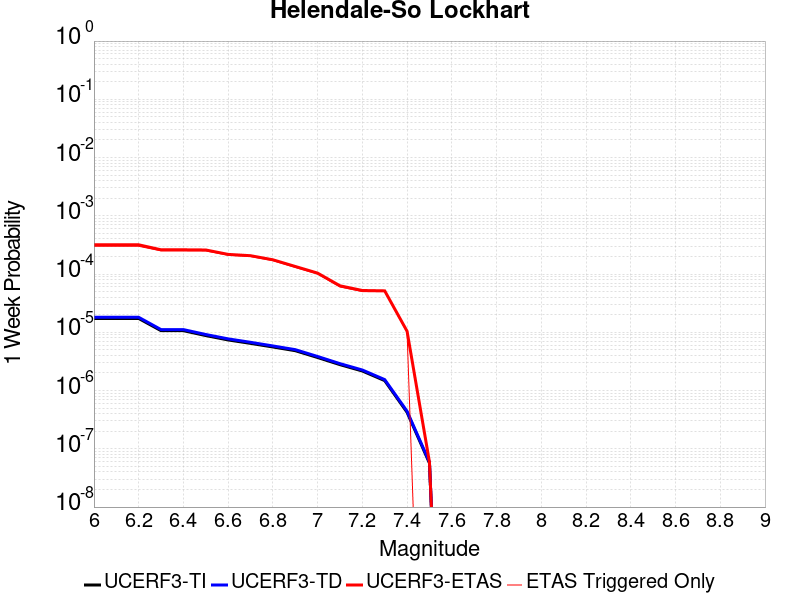 |  |  |  |

| Magnitude | 1 wk TI Prob | 1 wk TD Prob | 1 wk ETAS Prob | 1 wk ETAS/TD Gain | 1 wk ETAS Triggered Only | 1 mo TI Prob | 1 mo TD Prob | 1 mo ETAS Prob | 1 mo ETAS/TD Gain | 1 mo ETAS Triggered Only | 1 yr TI Prob | 1 yr TD Prob | 1 yr ETAS Prob | 1 yr ETAS/TD Gain | 1 yr ETAS Triggered Only | 10 yr TI Prob | 10 yr TD Prob | 10 yr ETAS Prob | 10 yr ETAS/TD Gain | 10 yr ETAS Triggered Only |
|-----|-----|-----|-----|-----|-----|-----|-----|-----|-----|-----|-----|-----|-----|-----|-----|-----|-----|-----|-----|-----|
| 6.0 | 1.7296055E-5 | 1.8103729E-5 | 3.0111213E-4 | 16.632603 | 2.8301353E-4 | 7.412385E-5 | 7.7585224E-5 | 4.4547426E-4 | 5.741741 | 3.679176E-4 | 9.0208417E-4 | 9.4421144E-4 | 0.0013400563 | 1.4192332 | 3.9621894E-4 | 0.008984311 | 0.009404116 | 0.009852679 | 1.0476986 | 4.5282164E-4 |
| 6.1 | 1.7296055E-5 | 1.8103729E-5 | 3.0111213E-4 | 16.632603 | 2.8301353E-4 | 7.412385E-5 | 7.7585224E-5 | 4.4547426E-4 | 5.741741 | 3.679176E-4 | 9.0208417E-4 | 9.4421144E-4 | 0.0013400563 | 1.4192332 | 3.9621894E-4 | 0.008984311 | 0.009404116 | 0.009852679 | 1.0476986 | 4.5282164E-4 |
| 6.2 | 1.7296055E-5 | 1.8103729E-5 | 3.0111213E-4 | 16.632603 | 2.8301353E-4 | 7.412385E-5 | 7.7585224E-5 | 4.4547426E-4 | 5.741741 | 3.679176E-4 | 9.0208417E-4 | 9.4421144E-4 | 0.0013400563 | 1.4192332 | 3.9621894E-4 | 0.008984311 | 0.009404116 | 0.009852679 | 1.0476986 | 4.5282164E-4 |
| 6.3 | 1.0669118E-5 | 1.1135425E-5 | 2.3754373E-4 | 21.332256 | 2.2641082E-4 | 4.5723988E-5 | 4.772239E-5 | 3.3072243E-4 | 6.930131 | 2.8301353E-4 | 5.5654737E-4 | 5.80868E-4 | 8.637171E-4 | 1.4869422 | 2.8301353E-4 | 0.0055515557 | 0.0057937936 | 0.0060751676 | 1.0485647 | 2.8301353E-4 |
| 6.4 | 1.0669118E-5 | 1.1135425E-5 | 2.3754373E-4 | 21.332256 | 2.2641082E-4 | 4.5723988E-5 | 4.772239E-5 | 3.3072243E-4 | 6.930131 | 2.8301353E-4 | 5.5654737E-4 | 5.80868E-4 | 8.637171E-4 | 1.4869422 | 2.8301353E-4 | 0.0055515557 | 0.0057937936 | 0.0060751676 | 1.0485647 | 2.8301353E-4 |
| 6.5 | 8.790038E-6 | 9.170197E-6 | 2.3557895E-4 | 25.689629 | 2.2641082E-4 | 3.767105E-5 | 3.930026E-5 | 2.940024E-4 | 7.4809284 | 2.5471218E-4 | 4.585485E-4 | 4.7837716E-4 | 7.329675E-4 | 1.5321958 | 2.5471218E-4 | 0.0045760344 | 0.004773638 | 0.0050271344 | 1.0531033 | 2.5471218E-4 |
| 6.6 | 7.396949E-6 | 7.715537E-6 | 2.3412461E-4 | 30.344564 | 2.2641082E-4 | 3.1700827E-5 | 3.3066175E-5 | 2.8776992E-4 | 8.702849 | 2.5471218E-4 | 3.858892E-4 | 4.025073E-4 | 6.5711694E-4 | 1.6325591 | 2.5471218E-4 | 0.003852198 | 0.00401789 | 0.0042715785 | 1.0631398 | 2.5471218E-4 |
| 6.7 | 6.4600285E-6 | 6.738031E-6 | 2.0484616E-4 | 30.401487 | 1.9810947E-4 | 2.7685543E-5 | 2.887696E-5 | 2.5528125E-4 | 8.840309 | 2.2641082E-4 | 3.3701936E-4 | 3.5152107E-4 | 5.778523E-4 | 1.6438625 | 2.2641082E-4 | 0.0033650869 | 0.003509732 | 0.0037353481 | 1.064283 | 2.2641082E-4 |
| 6.8 | 5.600104E-6 | 5.836009E-6 | 2.0394432E-4 | 34.945854 | 1.9810947E-4 | 2.4000226E-5 | 2.5011232E-5 | 2.5141638E-4 | 10.052139 | 2.2641082E-4 | 2.9216358E-4 | 3.044698E-4 | 5.3081167E-4 | 1.7433969 | 2.2641082E-4 | 0.0029177975 | 0.003040588 | 0.0032663106 | 1.0742364 | 2.2641082E-4 |
| 6.9 | 4.839122E-6 | 5.0395092E-6 | 1.4654556E-4 | 29.079332 | 1.4150677E-4 | 2.0738931E-5 | 2.159772E-5 | 1.9140217E-4 | 8.862146 | 1.6980812E-4 | 2.5246723E-4 | 2.6292098E-4 | 4.3268446E-4 | 1.6456825 | 1.6980812E-4 | 0.002521806 | 0.002626147 | 0.002795509 | 1.0644908 | 1.6980812E-4 |
| 7.0 | 3.6937633E-6 | 3.845208E-6 | 8.874894E-5 | 23.0804 | 8.490406E-5 | 1.5830317E-5 | 1.647936E-5 | 1.0138202E-4 | 6.1520605 | 8.490406E-5 | 1.9271708E-4 | 2.0061806E-4 | 2.8550508E-4 | 1.4231275 | 8.490406E-5 | 0.0019255003 | 0.002004401 | 0.0020891349 | 1.0422739 | 8.490406E-5 |
| 7.1 | 2.7858857E-6 | 2.8978538E-6 | 8.7801665E-5 | 30.29886 | 8.490406E-5 | 1.1939455E-5 | 1.2419316E-5 | 9.732232E-5 | 7.8363676 | 8.490406E-5 | 1.4535317E-4 | 1.511949E-4 | 2.3608611E-4 | 1.5614688 | 8.490406E-5 | 0.0014525814 | 0.0015109418 | 0.0015957175 | 1.0561079 | 8.490406E-5 |
| 7.2 | 2.1672065E-6 | 2.2540128E-6 | 5.885659E-5 | 26.111916 | 5.6602705E-5 | 9.2879945E-6 | 9.66002E-6 | 6.626218E-5 | 6.8594246 | 5.6602705E-5 | 1.1307546E-4 | 1.1760458E-4 | 1.7420063E-4 | 1.4812402 | 5.6602705E-5 | 0.0011301794 | 0.0011754417 | 0.0012319778 | 1.0480978 | 5.6602705E-5 |
| 7.3 | 1.4823496E-6 | 1.5422102E-6 | 5.814483E-5 | 37.70227 | 5.6602705E-5 | 6.3529114E-6 | 6.6094562E-6 | 6.321179E-5 | 9.563841 | 5.6602705E-5 | 7.734395E-5 | 8.046731E-5 | 1.3706546E-4 | 1.7033682 | 5.6602705E-5 | 7.731704E-4 | 8.0439687E-4 | 8.6095405E-4 | 1.07031 | 5.6602705E-5 |
| 7.4 | 4.2321457E-7 | 4.4108765E-7 | 2.8742428E-5 | 65.16262 | 2.8301352E-5 | 1.8137755E-6 | 1.8903745E-6 | 3.0191673E-5 | 15.971266 | 2.8301352E-5 | 2.2082493E-5 | 2.3015113E-5 | 5.1315816E-5 | 2.2296572 | 2.8301352E-5 | 2.2080299E-4 | 2.3013182E-4 | 2.5842668E-4 | 1.1229506 | 2.8301352E-5 |
| 7.5 | 5.6942316E-8 | 5.9415648E-8 | 5.9415648E-8 | 1.0 | 0.0 | 2.440385E-7 | 2.5463845E-7 | 2.5463845E-7 | 1.0 | 0.0 | 2.9711643E-6 | 3.1002196E-6 | 3.1002196E-6 | 1.0 | 0.0 | 2.9711247E-5 | 3.1001844E-5 | 3.1001844E-5 | 1.0 | 0.0 |

## Death Valley (Black Mtns Frontal)
*[(top)](#table-of-contents)*

| 1 Week | 1 Month | 1 Year | 10 Year |
|-----|-----|-----|-----|
|  |  |  |  |

| Magnitude | 1 wk TI Prob | 1 wk TD Prob | 1 wk ETAS Prob | 1 wk ETAS/TD Gain | 1 wk ETAS Triggered Only | 1 mo TI Prob | 1 mo TD Prob | 1 mo ETAS Prob | 1 mo ETAS/TD Gain | 1 mo ETAS Triggered Only | 1 yr TI Prob | 1 yr TD Prob | 1 yr ETAS Prob | 1 yr ETAS/TD Gain | 1 yr ETAS Triggered Only | 10 yr TI Prob | 10 yr TD Prob | 10 yr ETAS Prob | 10 yr ETAS/TD Gain | 10 yr ETAS Triggered Only |
|-----|-----|-----|-----|-----|-----|-----|-----|-----|-----|-----|-----|-----|-----|-----|-----|-----|-----|-----|-----|-----|
| 6.0 | 1.6707214E-5 | 1.867027E-5 | 3.0167852E-4 | 16.158232 | 2.8301353E-4 | 7.160038E-5 | 8.001302E-5 | 3.630039E-4 | 4.5368104 | 2.8301353E-4 | 8.71386E-4 | 9.737309E-4 | 0.0012564688 | 1.2903656 | 2.8301353E-4 | 0.00867977 | 0.009695496 | 0.010087874 | 1.0404701 | 3.9621894E-4 |
| 6.1 | 1.6707214E-5 | 1.867027E-5 | 3.0167852E-4 | 16.158232 | 2.8301353E-4 | 7.160038E-5 | 8.001302E-5 | 3.630039E-4 | 4.5368104 | 2.8301353E-4 | 8.71386E-4 | 9.737309E-4 | 0.0012564688 | 1.2903656 | 2.8301353E-4 | 0.00867977 | 0.009695496 | 0.010087874 | 1.0404701 | 3.9621894E-4 |
| 6.2 | 1.6707214E-5 | 1.867027E-5 | 3.0167852E-4 | 16.158232 | 2.8301353E-4 | 7.160038E-5 | 8.001302E-5 | 3.630039E-4 | 4.5368104 | 2.8301353E-4 | 8.71386E-4 | 9.737309E-4 | 0.0012564688 | 1.2903656 | 2.8301353E-4 | 0.00867977 | 0.009695496 | 0.010087874 | 1.0404701 | 3.9621894E-4 |
| 6.3 | 1.6707214E-5 | 1.867027E-5 | 3.0167852E-4 | 16.158232 | 2.8301353E-4 | 7.160038E-5 | 8.001302E-5 | 3.630039E-4 | 4.5368104 | 2.8301353E-4 | 8.71386E-4 | 9.737309E-4 | 0.0012564688 | 1.2903656 | 2.8301353E-4 | 0.00867977 | 0.009695496 | 0.010087874 | 1.0404701 | 3.9621894E-4 |
| 6.4 | 1.5515609E-5 | 1.7338214E-5 | 2.7204596E-4 | 15.690542 | 2.5471218E-4 | 6.649377E-5 | 7.4304546E-5 | 3.289978E-4 | 4.427694 | 2.5471218E-4 | 8.0926094E-4 | 9.042885E-4 | 0.0011587703 | 1.2814167 | 2.5471218E-4 | 0.008063202 | 0.009006773 | 0.00934333 | 1.0373671 | 3.3961624E-4 |
| 6.5 | 1.5515609E-5 | 1.7338214E-5 | 2.7204596E-4 | 15.690542 | 2.5471218E-4 | 6.649377E-5 | 7.4304546E-5 | 3.289978E-4 | 4.427694 | 2.5471218E-4 | 8.0926094E-4 | 9.042885E-4 | 0.0011587703 | 1.2814167 | 2.5471218E-4 | 0.008063202 | 0.009006773 | 0.00934333 | 1.0373671 | 3.3961624E-4 |
| 6.6 | 1.5041828E-5 | 1.6809145E-5 | 2.7151703E-4 | 16.152937 | 2.5471218E-4 | 6.4463384E-5 | 7.203723E-5 | 3.2673107E-4 | 4.535586 | 2.5471218E-4 | 7.8455906E-4 | 8.767063E-4 | 0.0011311952 | 1.2902783 | 2.5471218E-4 | 0.00781795 | 0.008733132 | 0.009069783 | 1.0385486 | 3.3961624E-4 |
| 6.7 | 1.4634985E-5 | 1.6356016E-5 | 2.7106403E-4 | 16.57274 | 2.5471218E-4 | 6.271985E-5 | 7.009536E-5 | 3.247897E-4 | 4.63354 | 2.5471218E-4 | 7.6334673E-4 | 8.5308263E-4 | 0.0011075776 | 1.2983239 | 2.5471218E-4 | 0.007607299 | 0.008498715 | 0.008835445 | 1.0396212 | 3.3961624E-4 |
| 6.8 | 1.4209158E-5 | 1.5882048E-5 | 2.4228927E-4 | 15.255544 | 2.2641082E-4 | 6.089497E-5 | 6.8064175E-5 | 2.9445958E-4 | 4.3262053 | 2.2641082E-4 | 7.4114406E-4 | 8.2837185E-4 | 0.0010545951 | 1.2730938 | 2.2641082E-4 | 0.007386771 | 0.008253456 | 0.008534134 | 1.0340073 | 2.8301353E-4 |
| 6.9 | 1.3780098E-5 | 1.5404594E-5 | 1.852101E-4 | 12.023044 | 1.6980812E-4 | 5.9056227E-5 | 6.6018045E-5 | 2.3581495E-4 | 3.5719771 | 1.6980812E-4 | 7.1877235E-4 | 8.0347876E-4 | 9.731504E-4 | 1.2111714 | 1.6980812E-4 | 0.0071645193 | 0.008006332 | 0.008230931 | 1.0280526 | 2.2641082E-4 |
| 7.0 | 1.3585064E-5 | 1.5188155E-5 | 1.849937E-4 | 12.180129 | 1.6980812E-4 | 5.8220405E-5 | 6.50905E-5 | 2.3488757E-4 | 3.6086304 | 1.6980812E-4 | 7.086029E-4 | 7.9219416E-4 | 9.6186774E-4 | 1.2141818 | 1.6980812E-4 | 0.007063476 | 0.007894293 | 0.008118917 | 1.028454 | 2.2641082E-4 |
| 7.1 | 1.3398601E-5 | 1.49813395E-5 | 1.8478691E-4 | 12.334472 | 1.6980812E-4 | 5.742131E-5 | 6.420419E-5 | 2.340014E-4 | 3.6446438 | 1.6980812E-4 | 6.9888023E-4 | 7.8141113E-4 | 9.510866E-4 | 1.2171397 | 1.6980812E-4 | 0.0069668638 | 0.007787224 | 0.008011872 | 1.0288483 | 2.2641082E-4 |
| 7.2 | 1.3126312E-5 | 1.4679561E-5 | 1.8448518E-4 | 12.567487 | 1.6980812E-4 | 5.6254412E-5 | 6.291092E-5 | 2.3270835E-4 | 3.699014 | 1.6980812E-4 | 6.846822E-4 | 7.6567667E-4 | 9.353548E-4 | 1.2216054 | 1.6980812E-4 | 0.006825765 | 0.00763097 | 0.007855653 | 1.0294436 | 2.2641082E-4 |
| 7.3 | 1.2922429E-5 | 1.4453788E-5 | 1.559585E-4 | 10.790148 | 1.4150677E-4 | 5.5380664E-5 | 6.194336E-5 | 2.0344136E-4 | 3.2843125 | 1.4150677E-4 | 6.74051E-4 | 7.53905E-4 | 8.95305E-4 | 1.1875569 | 1.4150677E-4 | 0.006720101 | 0.007514055 | 0.0077106757 | 1.026167 | 1.9810947E-4 |
| 7.4 | 1.2768878E-5 | 1.4283772E-5 | 1.5578851E-4 | 10.906679 | 1.4150677E-4 | 5.4722615E-5 | 6.1214756E-5 | 2.0271286E-4 | 3.3115032 | 1.4150677E-4 | 6.660441E-4 | 7.4504025E-4 | 8.8644156E-4 | 1.1897902 | 1.4150677E-4 | 0.0066405144 | 0.0074260035 | 0.007622642 | 1.0264797 | 1.9810947E-4 |
| 7.5 | 1.2521929E-5 | 1.40120155E-5 | 1.555168E-4 | 11.098818 | 1.4150677E-4 | 5.366431E-5 | 6.005014E-5 | 2.015484E-4 | 3.3563352 | 1.4150677E-4 | 6.531671E-4 | 7.3087064E-4 | 8.72274E-4 | 1.1934725 | 1.4150677E-4 | 0.006512506 | 0.0072852457 | 0.007481912 | 1.0269952 | 1.9810947E-4 |
| 7.6 | 1.1301089E-5 | 1.2648149E-5 | 1.5415312E-4 | 12.187801 | 1.4150677E-4 | 4.8432343E-5 | 5.4205255E-5 | 1.9570434E-4 | 3.6104312 | 1.4150677E-4 | 5.895042E-4 | 6.5975444E-4 | 8.0116786E-4 | 1.2143425 | 1.4150677E-4 | 0.0058794282 | 0.00657851 | 0.0067753163 | 1.0299165 | 1.9810947E-4 |
| 7.7 | 9.189108E-6 | 1.0283358E-5 | 1.2348761E-4 | 12.00849 | 1.1320541E-4 | 3.93813E-5 | 4.407082E-5 | 1.5727124E-4 | 3.5686026 | 1.1320541E-4 | 4.7936183E-4 | 5.3643517E-4 | 6.4957986E-4 | 1.2109196 | 1.1320541E-4 | 0.004783291 | 0.005351914 | 0.0054645133 | 1.0210391 | 1.1320541E-4 |
| 7.8 | 3.4586725E-7 | 3.6482615E-7 | 3.6482615E-7 | 1.0 | 0.0 | 1.4822873E-6 | 1.5635396E-6 | 1.5635396E-6 | 1.0 | 0.0 | 1.80467E-5 | 1.9035933E-5 | 1.9035933E-5 | 1.0 | 0.0 | 1.8045233E-4 | 1.9034347E-4 | 1.9034347E-4 | 1.0 | 0.0 |
| 7.9 | 2.5591178E-9 | 2.6696718E-9 | 2.6696718E-9 | 1.0 | 0.0 | 1.0967647E-8 | 1.14414505E-8 | 1.14414505E-8 | 1.0 | 0.0 | 1.335311E-7 | 1.3929966E-7 | 1.3929966E-7 | 1.0 | 0.0 | 1.3353102E-6 | 1.3929966E-6 | 1.3929966E-6 | 1.0 | 0.0 |

## San Andreas (Parkfield)
*[(top)](#table-of-contents)*

| 1 Week | 1 Month | 1 Year | 10 Year |
|-----|-----|-----|-----|
|  |  |  |  |

| Magnitude | 1 wk TI Prob | 1 wk TD Prob | 1 wk ETAS Prob | 1 wk ETAS/TD Gain | 1 wk ETAS Triggered Only | 1 mo TI Prob | 1 mo TD Prob | 1 mo ETAS Prob | 1 mo ETAS/TD Gain | 1 mo ETAS Triggered Only | 1 yr TI Prob | 1 yr TD Prob | 1 yr ETAS Prob | 1 yr ETAS/TD Gain | 1 yr ETAS Triggered Only | 10 yr TI Prob | 10 yr TD Prob | 10 yr ETAS Prob | 10 yr ETAS/TD Gain | 10 yr ETAS Triggered Only |
|-----|-----|-----|-----|-----|-----|-----|-----|-----|-----|-----|-----|-----|-----|-----|-----|-----|-----|-----|-----|-----|
| 6.0 | 5.556969E-4 | 7.7782426E-4 | 9.757796E-4 | 1.2544988 | 1.9810947E-4 | 0.0023793848 | 0.0033298214 | 0.0035272713 | 1.0592974 | 1.9810947E-4 | 0.028586963 | 0.040191233 | 0.04043571 | 1.0060828 | 2.5471218E-4 | 0.25176284 | 0.33716413 | 0.33737049 | 1.000612 | 3.1131489E-4 |
| 6.1 | 1.925858E-4 | 3.0276453E-4 | 4.1593568E-4 | 1.3737925 | 1.1320541E-4 | 8.2510663E-4 | 0.0012970108 | 0.0014100694 | 1.0871686 | 1.1320541E-4 | 0.0099994885 | 0.015778083 | 0.015889503 | 1.0070616 | 1.1320541E-4 | 0.095613256 | 0.1497237 | 0.14981994 | 1.0006429 | 1.1320541E-4 |
| 6.2 | 9.4306815E-5 | 1.8242796E-4 | 2.9561273E-4 | 1.6204354 | 1.1320541E-4 | 4.0410945E-4 | 7.816011E-4 | 8.9471805E-4 | 1.1447246 | 1.1320541E-4 | 0.0049089384 | 0.009474681 | 0.009586814 | 1.011835 | 1.1320541E-4 | 0.048019063 | 0.09185409 | 0.0919569 | 1.0011193 | 1.1320541E-4 |
| 6.3 | 9.283051E-5 | 1.7939322E-4 | 2.925783E-4 | 1.630933 | 1.1320541E-4 | 3.9778434E-4 | 7.686027E-4 | 8.8172115E-4 | 1.1471741 | 1.1320541E-4 | 0.0048322747 | 0.009317789 | 0.00942994 | 1.0120362 | 1.1320541E-4 | 0.047285385 | 0.09050704 | 0.09061 | 1.0011376 | 1.1320541E-4 |
| 6.4 | 9.138826E-5 | 1.770153E-4 | 2.9020067E-4 | 1.63941 | 1.1320541E-4 | 3.916052E-4 | 7.5841765E-4 | 8.715372E-4 | 1.149152 | 1.1320541E-4 | 0.0047573745 | 0.00919484 | 0.0093070045 | 1.0121987 | 1.1320541E-4 | 0.046568092 | 0.08940927 | 0.089512356 | 1.001153 | 1.1320541E-4 |
| 6.5 | 9.000255E-5 | 1.7459576E-4 | 2.877814E-4 | 1.6482726 | 1.1320541E-4 | 3.8566816E-4 | 7.480541E-4 | 8.6117483E-4 | 1.15122 | 1.1320541E-4 | 0.0046854047 | 0.009069731 | 0.00918191 | 1.0123684 | 1.1320541E-4 | 0.045878403 | 0.088295065 | 0.08839828 | 1.001169 | 1.1320541E-4 |
| 6.6 | 8.8109264E-5 | 1.7140752E-4 | 2.8459352E-4 | 1.6603328 | 1.1320541E-4 | 3.7755648E-4 | 7.3439797E-4 | 8.4752025E-4 | 1.154034 | 1.1320541E-4 | 0.0045870654 | 0.008904854 | 0.009017051 | 1.0125996 | 1.1320541E-4 | 0.04493529 | 0.0868267 | 0.08693007 | 1.0011907 | 1.1320541E-4 |
| 6.7 | 8.738073E-5 | 1.7007832E-4 | 2.8326447E-4 | 1.6654943 | 1.1320541E-4 | 3.7443507E-4 | 7.287046E-4 | 8.4182754E-4 | 1.1552384 | 1.1320541E-4 | 0.0045492216 | 0.008836143 | 0.008948348 | 1.0126984 | 1.1320541E-4 | 0.04457213 | 0.08622707 | 0.08633051 | 1.0011997 | 1.1320541E-4 |
| 6.8 | 8.710195E-5 | 1.6953335E-4 | 2.8271956E-4 | 1.667634 | 1.1320541E-4 | 3.7324068E-4 | 7.263703E-4 | 8.3949347E-4 | 1.1557376 | 1.1320541E-4 | 0.0045347405 | 0.008807961 | 0.008920169 | 1.0127394 | 1.1320541E-4 | 0.04443313 | 0.08597467 | 0.086078145 | 1.0012035 | 1.1320541E-4 |
| 6.9 | 8.6801556E-5 | 1.689429E-4 | 2.821292E-4 | 1.6699677 | 1.1320541E-4 | 3.7195362E-4 | 7.2384125E-4 | 8.369647E-4 | 1.1562822 | 1.1320541E-4 | 0.0045191357 | 0.008777418 | 0.0088896295 | 1.0127841 | 1.1320541E-4 | 0.044283327 | 0.085700735 | 0.08580424 | 1.0012077 | 1.1320541E-4 |
| 7.0 | 8.5571606E-5 | 1.6647128E-4 | 2.7965783E-4 | 1.6799165 | 1.1320541E-4 | 3.6668387E-4 | 7.132544E-4 | 8.2637905E-4 | 1.1586035 | 1.1320541E-4 | 0.004455241 | 0.008649553 | 0.008761779 | 1.0129749 | 1.1320541E-4 | 0.043669727 | 0.08454914 | 0.084652774 | 1.0012257 | 1.1320541E-4 |
| 7.1 | 7.82589E-5 | 1.5128135E-4 | 2.6446965E-4 | 1.7481972 | 1.1320541E-4 | 3.3535215E-4 | 6.481883E-4 | 7.613203E-4 | 1.1745358 | 1.1320541E-4 | 0.0040752706 | 0.007863307 | 0.007975622 | 1.0142834 | 1.1320541E-4 | 0.040013418 | 0.07746111 | 0.07756554 | 1.0013483 | 1.1320541E-4 |
| 7.2 | 7.690929E-5 | 1.4865391E-4 | 2.618425E-4 | 1.7614235 | 1.1320541E-4 | 3.2956956E-4 | 6.369334E-4 | 7.5006665E-4 | 1.1776218 | 1.1320541E-4 | 0.004005129 | 0.007727258 | 0.007839588 | 1.014537 | 1.1320541E-4 | 0.0393371 | 0.07623427 | 0.07633885 | 1.0013717 | 1.1320541E-4 |
| 7.3 | 7.5543794E-5 | 1.4561978E-4 | 2.588087E-4 | 1.7772908 | 1.1320541E-4 | 3.2371894E-4 | 6.2393624E-4 | 7.37071E-4 | 1.1813242 | 1.1320541E-4 | 0.003934157 | 0.007570127 | 0.0076824757 | 1.0148411 | 1.1320541E-4 | 0.038652334 | 0.074797355 | 0.07490209 | 1.0014002 | 1.1320541E-4 |
| 7.4 | 7.4214564E-5 | 1.4262961E-4 | 2.558189E-4 | 1.7935888 | 1.1320541E-4 | 3.1802364E-4 | 6.111273E-4 | 7.2426355E-4 | 1.1851271 | 1.1320541E-4 | 0.003865065 | 0.00741525 | 0.007527616 | 1.0151534 | 1.1320541E-4 | 0.03798529 | 0.07337123 | 0.073476136 | 1.0014297 | 1.1320541E-4 |
| 7.5 | 6.149578E-5 | 1.11907226E-4 | 1.9680179E-4 | 1.7586155 | 8.490406E-5 | 2.6352672E-4 | 4.7951436E-4 | 5.643777E-4 | 1.1769778 | 8.490406E-5 | 0.0032037178 | 0.0058224914 | 0.005906901 | 1.0144972 | 8.490406E-5 | 0.03157923 | 0.058557566 | 0.058637496 | 1.0013651 | 8.490406E-5 |
| 7.6 | 6.0643448E-5 | 1.10193796E-4 | 1.950885E-4 | 1.7704127 | 8.490406E-5 | 2.598746E-4 | 4.7217376E-4 | 5.570377E-4 | 1.1797304 | 8.490406E-5 | 0.0031593828 | 0.0057335934 | 0.005818011 | 1.0147233 | 8.490406E-5 | 0.031148417 | 0.057718582 | 0.057798583 | 1.001386 | 8.490406E-5 |
| 7.7 | 5.1652263E-5 | 9.174698E-5 | 1.20045734E-4 | 1.3084434 | 2.8301352E-5 | 2.2134806E-4 | 3.931421E-4 | 4.2143234E-4 | 1.0719593 | 2.8301352E-5 | 0.002691582 | 0.0047760103 | 0.0048041763 | 1.0058974 | 2.8301352E-5 | 0.026592141 | 0.04853623 | 0.048563156 | 1.0005548 | 2.8301352E-5 |
| 7.8 | 4.8090482E-5 | 8.559635E-5 | 1.1389529E-4 | 1.3306091 | 2.8301352E-5 | 2.060858E-4 | 3.6678996E-4 | 3.9508095E-4 | 1.0771313 | 2.8301352E-5 | 0.0025062072 | 0.0044565317 | 0.004484707 | 1.0063223 | 2.8301352E-5 | 0.024781305 | 0.04530245 | 0.04532947 | 1.0005964 | 2.8301352E-5 |
| 7.9 | 3.970278E-5 | 6.750426E-5 | 9.58037E-5 | 1.4192245 | 2.8301352E-5 | 1.7014367E-4 | 2.892719E-4 | 3.1756508E-4 | 1.0978082 | 2.8301352E-5 | 0.002069531 | 0.0035162016 | 0.0035444035 | 1.0080205 | 2.8301352E-5 | 0.020503636 | 0.035881363 | 0.035908647 | 1.0007604 | 2.8301352E-5 |
| 8.0 | 2.8982335E-5 | 4.069796E-5 | 6.899816E-5 | 1.6953715 | 2.8301352E-5 | 1.2420409E-4 | 1.7440817E-4 | 2.0270458E-4 | 1.1622425 | 2.8301352E-5 | 0.0015111357 | 0.0021213528 | 0.002149594 | 1.0133129 | 2.8301352E-5 | 0.015009012 | 0.022010697 | 0.022038374 | 1.0012575 | 2.8301352E-5 |
| 8.1 | 1.8836186E-5 | 1.8681134E-5 | 1.8681134E-5 | 1.0 | 0.0 | 8.0724014E-5 | 8.005955E-5 | 8.005955E-5 | 1.0 | 0.0 | 9.823717E-4 | 9.742898E-4 | 9.742898E-4 | 1.0 | 0.0 | 0.009780403 | 0.010488115 | 0.010488115 | 1.0 | 0.0 |
| 8.2 | 8.643924E-6 | 5.4748625E-6 | 5.4748625E-6 | 1.0 | 0.0 | 3.704486E-5 | 2.3463486E-5 | 2.3463486E-5 | 1.0 | 0.0 | 4.5092785E-4 | 2.8563058E-4 | 2.8563058E-4 | 1.0 | 0.0 | 0.0045001395 | 0.0032487072 | 0.0032487072 | 1.0 | 0.0 |
| 8.3 | 1.983087E-6 | 7.6599065E-7 | 7.6599065E-7 | 1.0 | 0.0 | 8.498917E-6 | 3.282813E-6 | 3.282813E-6 | 1.0 | 0.0 | 1.034694E-4 | 3.9967534E-5 | 3.9967534E-5 | 1.0 | 0.0 | 0.0010342124 | 4.719687E-4 | 4.719687E-4 | 1.0 | 0.0 |

## Garlic Springs
*[(top)](#table-of-contents)*

| 1 Week | 1 Month | 1 Year | 10 Year |
|-----|-----|-----|-----|
|  |  |  |  |

| Magnitude | 1 wk TI Prob | 1 wk TD Prob | 1 wk ETAS Prob | 1 wk ETAS/TD Gain | 1 wk ETAS Triggered Only | 1 mo TI Prob | 1 mo TD Prob | 1 mo ETAS Prob | 1 mo ETAS/TD Gain | 1 mo ETAS Triggered Only | 1 yr TI Prob | 1 yr TD Prob | 1 yr ETAS Prob | 1 yr ETAS/TD Gain | 1 yr ETAS Triggered Only | 10 yr TI Prob | 10 yr TD Prob | 10 yr ETAS Prob | 10 yr ETAS/TD Gain | 10 yr ETAS Triggered Only |
|-----|-----|-----|-----|-----|-----|-----|-----|-----|-----|-----|-----|-----|-----|-----|-----|-----|-----|-----|-----|-----|
| 6.0 | 1.6760017E-5 | 1.8776833E-5 | 1.8858176E-4 | 10.043322 | 1.6980812E-4 | 7.182667E-5 | 8.0470316E-5 | 3.0686293E-4 | 3.8133678 | 2.2641082E-4 | 8.7413884E-4 | 9.794032E-4 | 0.0012338659 | 1.259814 | 2.5471218E-4 | 0.008707083 | 0.009762413 | 0.010042664 | 1.0287071 | 2.8301353E-4 |
| 6.1 | 9.852767E-6 | 1.09735865E-5 | 9.587671E-5 | 8.737044 | 8.490406E-5 | 4.222546E-5 | 4.702921E-5 | 1.6022929E-4 | 3.4070165 | 1.1320541E-4 | 5.139737E-4 | 5.7250116E-4 | 7.139269E-4 | 1.2470313 | 1.4150677E-4 | 0.005127866 | 0.005717221 | 0.0058579193 | 1.0246094 | 1.4150677E-4 |
| 6.2 | 9.852767E-6 | 1.09735865E-5 | 9.587671E-5 | 8.737044 | 8.490406E-5 | 4.222546E-5 | 4.702921E-5 | 1.6022929E-4 | 3.4070165 | 1.1320541E-4 | 5.139737E-4 | 5.7250116E-4 | 7.139269E-4 | 1.2470313 | 1.4150677E-4 | 0.005127866 | 0.005717221 | 0.0058579193 | 1.0246094 | 1.4150677E-4 |
| 6.3 | 4.3167724E-6 | 4.7780286E-6 | 3.3079246E-5 | 6.9231997 | 2.8301352E-5 | 1.8500323E-5 | 2.0477235E-5 | 7.707878E-5 | 3.7641206 | 5.6602705E-5 | 2.2521814E-4 | 2.4930484E-4 | 3.0589342E-4 | 1.2269856 | 5.6602705E-5 | 0.0022499003 | 0.00249251 | 0.0025489714 | 1.0226525 | 5.6602705E-5 |
| 6.4 | 4.3167724E-6 | 4.7780286E-6 | 3.3079246E-5 | 6.9231997 | 2.8301352E-5 | 1.8500323E-5 | 2.0477235E-5 | 7.707878E-5 | 3.7641206 | 5.6602705E-5 | 2.2521814E-4 | 2.4930484E-4 | 3.0589342E-4 | 1.2269856 | 5.6602705E-5 | 0.0022499003 | 0.00249251 | 0.0025489714 | 1.0226525 | 5.6602705E-5 |
| 6.5 | 4.3167724E-6 | 4.7780286E-6 | 3.3079246E-5 | 6.9231997 | 2.8301352E-5 | 1.8500323E-5 | 2.0477235E-5 | 7.707878E-5 | 3.7641206 | 5.6602705E-5 | 2.2521814E-4 | 2.4930484E-4 | 3.0589342E-4 | 1.2269856 | 5.6602705E-5 | 0.0022499003 | 0.00249251 | 0.0025489714 | 1.0226525 | 5.6602705E-5 |
| 6.6 | 4.301311E-6 | 4.760897E-6 | 3.3062115E-5 | 6.944514 | 2.8301352E-5 | 1.8434059E-5 | 2.0403815E-5 | 7.700537E-5 | 3.7740672 | 5.6602705E-5 | 2.2441156E-4 | 2.4841115E-4 | 3.049998E-4 | 1.2278024 | 5.6602705E-5 | 0.0022418506 | 0.002483593 | 0.0025400552 | 1.022734 | 5.6602705E-5 |
| 6.7 | 3.8599724E-6 | 4.27106E-6 | 3.257229E-5 | 7.6262784 | 2.8301352E-5 | 1.6542634E-5 | 1.8304541E-5 | 7.490621E-5 | 4.09222 | 5.6602705E-5 | 2.0138794E-4 | 2.228578E-4 | 2.7944788E-4 | 1.2539291 | 5.6602705E-5 | 0.0020120554 | 0.002228578 | 0.0022850547 | 1.025342 | 5.6602705E-5 |

## San Andreas (San Gorgonio Pass-Garnet HIll)
*[(top)](#table-of-contents)*

| 1 Week | 1 Month | 1 Year | 10 Year |
|-----|-----|-----|-----|
|  |  |  |  |

| Magnitude | 1 wk TI Prob | 1 wk TD Prob | 1 wk ETAS Prob | 1 wk ETAS/TD Gain | 1 wk ETAS Triggered Only | 1 mo TI Prob | 1 mo TD Prob | 1 mo ETAS Prob | 1 mo ETAS/TD Gain | 1 mo ETAS Triggered Only | 1 yr TI Prob | 1 yr TD Prob | 1 yr ETAS Prob | 1 yr ETAS/TD Gain | 1 yr ETAS Triggered Only | 10 yr TI Prob | 10 yr TD Prob | 10 yr ETAS Prob | 10 yr ETAS/TD Gain | 10 yr ETAS Triggered Only |
|-----|-----|-----|-----|-----|-----|-----|-----|-----|-----|-----|-----|-----|-----|-----|-----|-----|-----|-----|-----|-----|
| 6.0 | 8.31567E-5 | 2.3382473E-4 | 4.601826E-4 | 1.9680665 | 2.2641082E-4 | 3.5633717E-4 | 0.0010017233 | 0.0012844534 | 1.2822436 | 2.8301353E-4 | 0.004329778 | 0.012127888 | 0.01240747 | 1.0230527 | 2.8301353E-4 | 0.042463828 | 0.11257892 | 0.11283007 | 1.0022309 | 2.8301353E-4 |
| 6.1 | 8.31567E-5 | 2.3382473E-4 | 4.601826E-4 | 1.9680665 | 2.2641082E-4 | 3.5633717E-4 | 0.0010017233 | 0.0012844534 | 1.2822436 | 2.8301353E-4 | 0.004329778 | 0.012127888 | 0.01240747 | 1.0230527 | 2.8301353E-4 | 0.042463828 | 0.11257892 | 0.11283007 | 1.0022309 | 2.8301353E-4 |
| 6.2 | 8.31567E-5 | 2.3382473E-4 | 4.601826E-4 | 1.9680665 | 2.2641082E-4 | 3.5633717E-4 | 0.0010017233 | 0.0012844534 | 1.2822436 | 2.8301353E-4 | 0.004329778 | 0.012127888 | 0.01240747 | 1.0230527 | 2.8301353E-4 | 0.042463828 | 0.11257892 | 0.11283007 | 1.0022309 | 2.8301353E-4 |
| 6.3 | 8.31567E-5 | 2.3382473E-4 | 4.601826E-4 | 1.9680665 | 2.2641082E-4 | 3.5633717E-4 | 0.0010017233 | 0.0012844534 | 1.2822436 | 2.8301353E-4 | 0.004329778 | 0.012127888 | 0.01240747 | 1.0230527 | 2.8301353E-4 | 0.042463828 | 0.11257892 | 0.11283007 | 1.0022309 | 2.8301353E-4 |
| 6.4 | 8.059055E-5 | 2.2940808E-4 | 4.5576697E-4 | 1.9867084 | 2.2641082E-4 | 3.4534236E-4 | 9.828096E-4 | 0.0012655449 | 1.2876807 | 2.8301353E-4 | 0.0041964394 | 0.011900152 | 0.0121797975 | 1.0234994 | 2.8301353E-4 | 0.041180745 | 0.11056015 | 0.11081187 | 1.0022768 | 2.8301353E-4 |
| 6.5 | 8.059055E-5 | 2.2940808E-4 | 4.5576697E-4 | 1.9867084 | 2.2641082E-4 | 3.4534236E-4 | 9.828096E-4 | 0.0012655449 | 1.2876807 | 2.8301353E-4 | 0.0041964394 | 0.011900152 | 0.0121797975 | 1.0234994 | 2.8301353E-4 | 0.041180745 | 0.11056015 | 0.11081187 | 1.0022768 | 2.8301353E-4 |
| 6.6 | 7.619237E-5 | 2.218517E-4 | 4.482123E-4 | 2.020324 | 2.2641082E-4 | 3.2649786E-4 | 9.5044886E-4 | 0.0012331934 | 1.2974852 | 2.8301353E-4 | 0.0039678677 | 0.01151087 | 0.011790626 | 1.0243037 | 2.8301353E-4 | 0.03897764 | 0.10709683 | 0.10734953 | 1.0023596 | 2.8301353E-4 |
| 6.7 | 7.440636E-5 | 2.1860997E-4 | 4.449713E-4 | 2.0354574 | 2.2641082E-4 | 3.188454E-4 | 9.3656575E-4 | 0.0012193142 | 1.3018992 | 2.8301353E-4 | 0.0038750346 | 0.011343609 | 0.011623411 | 1.0246662 | 2.8301353E-4 | 0.038081564 | 0.105605274 | 0.1058584 | 1.002397 | 2.8301353E-4 |
| 6.8 | 7.3735864E-5 | 2.1708169E-4 | 4.4344336E-4 | 2.042749 | 2.2641082E-4 | 3.1597257E-4 | 9.3002064E-4 | 0.0012127709 | 1.3040259 | 2.8301353E-4 | 0.0038401815 | 0.011264749 | 0.011544574 | 1.0248408 | 2.8301353E-4 | 0.03774495 | 0.10490683 | 0.10516015 | 1.0024147 | 2.8301353E-4 |
| 6.9 | 7.27575E-5 | 2.1477141E-4 | 4.4113363E-4 | 2.053968 | 2.2641082E-4 | 3.117806E-4 | 9.201265E-4 | 0.0012028796 | 1.3072981 | 2.8301353E-4 | 0.003789323 | 0.011145527 | 0.011425385 | 1.0251095 | 2.8301353E-4 | 0.037253562 | 0.103854746 | 0.10410836 | 1.0024421 | 2.8301353E-4 |
| 7.0 | 7.102591E-5 | 2.1061185E-4 | 4.3697498E-4 | 2.0747883 | 2.2641082E-4 | 3.0436125E-4 | 9.023122E-4 | 0.0011850704 | 1.3133707 | 2.8301353E-4 | 0.003699303 | 0.010930831 | 0.011210751 | 1.0256083 | 2.8301353E-4 | 0.03638325 | 0.10195695 | 0.1022111 | 1.0024928 | 2.8301353E-4 |
| 7.1 | 7.028513E-5 | 2.0896831E-4 | 4.3533184E-4 | 2.0832431 | 2.2641082E-4 | 3.0118722E-4 | 8.9527335E-4 | 0.0011780335 | 1.3158367 | 2.8301353E-4 | 0.0036607897 | 0.010845989 | 0.011125933 | 1.0258108 | 2.8301353E-4 | 0.036010686 | 0.101199985 | 0.101454355 | 1.0025135 | 2.8301353E-4 |
| 7.2 | 6.8498244E-5 | 2.0504706E-4 | 4.3141146E-4 | 2.1039631 | 2.2641082E-4 | 2.9353087E-4 | 8.784794E-4 | 0.0011612443 | 1.32188 | 2.8301353E-4 | 0.003567883 | 0.010643536 | 0.010923537 | 1.0263071 | 2.8301353E-4 | 0.035111405 | 0.09939202 | 0.0996469 | 1.0025644 | 2.8301353E-4 |
| 7.3 | 6.622592E-5 | 1.9732013E-4 | 4.2368626E-4 | 2.1472025 | 2.2641082E-4 | 2.8379448E-4 | 8.453858E-4 | 0.00112816 | 1.3344914 | 2.8301353E-4 | 0.0034497243 | 0.0102444785 | 0.010524593 | 1.0273429 | 2.8301353E-4 | 0.033966612 | 0.095888525 | 0.0961444 | 1.0026685 | 2.8301353E-4 |
| 7.4 | 5.1050705E-5 | 1.4689034E-4 | 3.732679E-4 | 2.5411332 | 2.2641082E-4 | 2.1877038E-4 | 6.29379E-4 | 9.122144E-4 | 1.449388 | 2.8301353E-4 | 0.002660276 | 0.0076359594 | 0.007916812 | 1.0367802 | 2.8301353E-4 | 0.02628654 | 0.07286301 | 0.07312541 | 1.0036012 | 2.8301353E-4 |
| 7.5 | 3.9302922E-5 | 1.1129847E-4 | 3.376841E-4 | 3.0340407 | 2.2641082E-4 | 1.6843023E-4 | 4.7690657E-4 | 7.597851E-4 | 1.593153 | 2.8301353E-4 | 0.0020487092 | 0.005790949 | 0.0060723233 | 1.0485886 | 2.8301353E-4 | 0.020299247 | 0.05600951 | 0.05627667 | 1.0047699 | 2.8301353E-4 |
| 7.6 | 2.9851626E-5 | 8.4949745E-5 | 3.1134134E-4 | 3.6650062 | 2.2641082E-4 | 1.2792926E-4 | 3.6401965E-4 | 6.4693013E-4 | 1.7771847 | 2.8301353E-4 | 0.0015564259 | 0.0044229585 | 0.0047047203 | 1.0637044 | 2.8301353E-4 | 0.0154556995 | 0.04319374 | 0.043464527 | 1.0062692 | 2.8301353E-4 |
| 7.7 | 2.1135214E-5 | 6.3529005E-5 | 2.8992543E-4 | 4.5636706 | 2.2641082E-4 | 9.0576345E-5 | 2.7223877E-4 | 5.5517524E-4 | 2.0392954 | 2.8301353E-4 | 0.0011022091 | 0.0033094748 | 0.0035915517 | 1.0852331 | 2.8301353E-4 | 0.010967582 | 0.032582592 | 0.032856386 | 1.0084031 | 2.8301353E-4 |
| 7.8 | 1.883379E-5 | 5.564028E-5 | 2.820385E-4 | 5.0689626 | 2.2641082E-4 | 8.0713755E-5 | 2.3843657E-4 | 5.213826E-4 | 2.1866722 | 2.8301353E-4 | 9.822468E-4 | 0.0028991038 | 0.0031812969 | 1.0973381 | 2.8301353E-4 | 0.0097791655 | 0.028695205 | 0.028970098 | 1.0095798 | 2.8301353E-4 |
| 7.9 | 1.5156185E-5 | 4.1658426E-5 | 2.680598E-4 | 6.434708 | 2.2641082E-4 | 6.495346E-5 | 1.785239E-4 | 4.614869E-4 | 2.5850146 | 2.8301353E-4 | 7.9052144E-4 | 0.0021713632 | 0.002453762 | 1.1300561 | 2.8301353E-4 | 0.007877152 | 0.021759422 | 0.022036279 | 1.0127234 | 2.8301353E-4 |
| 8.0 | 1.1405907E-5 | 2.9974231E-5 | 1.7147676E-4 | 5.7208056 | 1.4150677E-4 | 4.8881542E-5 | 1.2845467E-4 | 3.265387E-4 | 2.542054 | 1.9810947E-4 | 5.9497025E-4 | 0.0015628147 | 0.0017606146 | 1.1265664 | 1.9810947E-4 | 0.005933798 | 0.015772851 | 0.015967835 | 1.012362 | 1.9810947E-4 |
| 8.1 | 4.3511436E-6 | 7.369219E-6 | 7.369219E-6 | 1.0 | 0.0 | 1.8647626E-5 | 3.1581985E-5 | 3.1581985E-5 | 1.0 | 0.0 | 2.2701119E-4 | 3.8444297E-4 | 3.8444297E-4 | 1.0 | 0.0 | 0.0022677942 | 0.0041163345 | 0.0041163345 | 1.0 | 0.0 |
| 8.2 | 2.3042528E-6 | 2.7329415E-6 | 2.7329415E-6 | 1.0 | 0.0 | 9.875332E-6 | 1.1712554E-5 | 1.1712554E-5 | 1.0 | 0.0 | 1.2022553E-4 | 1.4259106E-4 | 1.4259106E-4 | 1.0 | 0.0 | 0.0012016051 | 0.0015979785 | 0.0015979785 | 1.0 | 0.0 |
| 8.3 | 5.202968E-7 | 3.1598344E-7 | 3.1598344E-7 | 1.0 | 0.0 | 2.2298414E-6 | 1.3542141E-6 | 1.3542141E-6 | 1.0 | 0.0 | 2.714798E-5 | 1.6487444E-5 | 1.6487444E-5 | 1.0 | 0.0 | 2.7144665E-4 | 1.9563142E-4 | 1.9563142E-4 | 1.0 | 0.0 |

## Death Valley (No)
*[(top)](#table-of-contents)*

| 1 Week | 1 Month | 1 Year | 10 Year |
|-----|-----|-----|-----|
|  |  |  |  |

| Magnitude | 1 wk TI Prob | 1 wk TD Prob | 1 wk ETAS Prob | 1 wk ETAS/TD Gain | 1 wk ETAS Triggered Only | 1 mo TI Prob | 1 mo TD Prob | 1 mo ETAS Prob | 1 mo ETAS/TD Gain | 1 mo ETAS Triggered Only | 1 yr TI Prob | 1 yr TD Prob | 1 yr ETAS Prob | 1 yr ETAS/TD Gain | 1 yr ETAS Triggered Only | 10 yr TI Prob | 10 yr TD Prob | 10 yr ETAS Prob | 10 yr ETAS/TD Gain | 10 yr ETAS Triggered Only |
|-----|-----|-----|-----|-----|-----|-----|-----|-----|-----|-----|-----|-----|-----|-----|-----|-----|-----|-----|-----|-----|
| 6.0 | 2.0074807E-5 | 2.2500084E-5 | 2.206051E-4 | 9.804634 | 1.9810947E-4 | 8.603206E-5 | 9.642541E-5 | 2.9451578E-4 | 3.054338 | 1.9810947E-4 | 0.001046937 | 0.0011733545 | 0.0013994996 | 1.1927339 | 2.2641082E-4 | 0.010420183 | 0.011672506 | 0.011952217 | 1.0239631 | 2.8301353E-4 |
| 6.1 | 2.0074807E-5 | 2.2500084E-5 | 2.206051E-4 | 9.804634 | 1.9810947E-4 | 8.603206E-5 | 9.642541E-5 | 2.9451578E-4 | 3.054338 | 1.9810947E-4 | 0.001046937 | 0.0011733545 | 0.0013994996 | 1.1927339 | 2.2641082E-4 | 0.010420183 | 0.011672506 | 0.011952217 | 1.0239631 | 2.8301353E-4 |
| 6.2 | 2.0074807E-5 | 2.2500084E-5 | 2.206051E-4 | 9.804634 | 1.9810947E-4 | 8.603206E-5 | 9.642541E-5 | 2.9451578E-4 | 3.054338 | 1.9810947E-4 | 0.001046937 | 0.0011733545 | 0.0013994996 | 1.1927339 | 2.2641082E-4 | 0.010420183 | 0.011672506 | 0.011952217 | 1.0239631 | 2.8301353E-4 |
| 6.3 | 1.9050609E-5 | 2.1336948E-5 | 2.1944218E-4 | 10.284611 | 1.9810947E-4 | 8.164292E-5 | 9.1440896E-5 | 2.8953224E-4 | 3.1663322 | 1.9810947E-4 | 9.935491E-4 | 0.001112731 | 0.0013388899 | 1.2032467 | 2.2641082E-4 | 0.009891188 | 0.011072419 | 0.011352299 | 1.0252773 | 2.8301353E-4 |
| 6.4 | 1.9050609E-5 | 2.1336948E-5 | 2.1944218E-4 | 10.284611 | 1.9810947E-4 | 8.164292E-5 | 9.1440896E-5 | 2.8953224E-4 | 3.1663322 | 1.9810947E-4 | 9.935491E-4 | 0.001112731 | 0.0013388899 | 1.2032467 | 2.2641082E-4 | 0.009891188 | 0.011072419 | 0.011352299 | 1.0252773 | 2.8301353E-4 |
| 6.5 | 1.8367004E-5 | 2.0561009E-5 | 2.186664E-4 | 10.635004 | 1.9810947E-4 | 7.8713354E-5 | 8.811567E-5 | 2.8620768E-4 | 3.2480907 | 1.9810947E-4 | 9.5791375E-4 | 0.0010722869 | 0.0012984548 | 1.2109212 | 2.2641082E-4 | 0.009537951 | 0.0106719155 | 0.010951908 | 1.0262364 | 2.8301353E-4 |
| 6.6 | 1.779439E-5 | 1.9910927E-5 | 2.1801646E-4 | 10.949588 | 1.9810947E-4 | 7.625944E-5 | 8.53298E-5 | 2.8342236E-4 | 3.3214936 | 1.9810947E-4 | 9.280632E-4 | 0.0010384015 | 0.0012645773 | 1.2178115 | 2.2641082E-4 | 0.009241969 | 0.010336253 | 0.010616341 | 1.0270977 | 2.8301353E-4 |
| 6.7 | 1.7025437E-5 | 1.9043426E-5 | 1.8884831E-4 | 9.916719 | 1.6980812E-4 | 7.296412E-5 | 8.161216E-5 | 2.5140643E-4 | 3.0805018 | 1.6980812E-4 | 8.87976E-4 | 9.931813E-4 | 0.001191094 | 1.1992714 | 1.9810947E-4 | 0.008844362 | 0.009888145 | 0.010140339 | 1.0255046 | 2.5471218E-4 |
| 6.8 | 1.6545107E-5 | 1.8512545E-5 | 1.8831751E-4 | 10.172427 | 1.6980812E-4 | 7.090568E-5 | 7.93371E-5 | 2.4913176E-4 | 3.140167 | 1.6980812E-4 | 8.629347E-4 | 9.655073E-4 | 0.0011634255 | 1.2049888 | 1.9810947E-4 | 0.008595915 | 0.009613829 | 0.009866092 | 1.0262396 | 2.5471218E-4 |
| 6.9 | 1.615478E-5 | 1.8087594E-5 | 1.8789264E-4 | 10.387929 | 1.6980812E-4 | 6.9232934E-5 | 7.751599E-5 | 2.4731093E-4 | 3.1904507 | 1.6980812E-4 | 8.4258494E-4 | 9.433546E-4 | 0.0011412773 | 1.2098072 | 1.9810947E-4 | 0.008393973 | 0.009394196 | 0.009646515 | 1.026859 | 2.5471218E-4 |
| 7.0 | 1.5894311E-5 | 1.780555E-5 | 1.8761064E-4 | 10.536638 | 1.6980812E-4 | 6.81167E-5 | 7.6307304E-5 | 2.4610246E-4 | 3.2251496 | 1.6980812E-4 | 8.2900526E-4 | 9.286515E-4 | 0.001126577 | 1.2131321 | 1.9810947E-4 | 0.008259195 | 0.009248397 | 0.009500754 | 1.0272865 | 2.5471218E-4 |
| 7.1 | 1.5602263E-5 | 1.7483504E-5 | 1.8728865E-4 | 10.712307 | 1.6980812E-4 | 6.6865134E-5 | 7.492718E-5 | 2.4472259E-4 | 3.2661388 | 1.6980812E-4 | 8.137789E-4 | 9.118627E-4 | 0.0011097916 | 1.2170599 | 1.9810947E-4 | 0.008108052 | 0.009081894 | 0.009334293 | 1.0277914 | 2.5471218E-4 |
| 7.2 | 1.5323829E-5 | 1.717063E-5 | 1.8697583E-4 | 10.889282 | 1.6980812E-4 | 6.56719E-5 | 7.358637E-5 | 2.4338199E-4 | 3.307433 | 1.6980812E-4 | 7.99262E-4 | 8.9555193E-4 | 0.001093484 | 1.2210169 | 1.9810947E-4 | 0.007963934 | 0.008920107 | 0.009172547 | 1.0283002 | 2.5471218E-4 |
| 7.3 | 1.4556212E-5 | 1.6302456E-5 | 1.861078E-4 | 11.415937 | 1.6980812E-4 | 6.238227E-5 | 6.9865826E-5 | 2.3966208E-4 | 3.430319 | 1.6980812E-4 | 7.592395E-4 | 8.5029035E-4 | 0.0010482314 | 1.2327923 | 1.9810947E-4 | 0.0075665074 | 0.008471014 | 0.008723569 | 1.029814 | 2.5471218E-4 |
| 7.4 | 1.411725E-5 | 1.580796E-5 | 1.8561339E-4 | 11.741768 | 1.6980812E-4 | 6.0501097E-5 | 6.7746674E-5 | 2.3754328E-4 | 3.5063462 | 1.6980812E-4 | 7.363519E-4 | 8.245094E-4 | 0.0010224555 | 1.2400775 | 1.9810947E-4 | 0.0073391674 | 0.008215138 | 0.008467758 | 1.0307505 | 2.5471218E-4 |
| 7.5 | 1.3503312E-5 | 1.5126289E-5 | 1.5663091E-4 | 10.35488 | 1.4150677E-4 | 5.7870053E-5 | 6.482538E-5 | 2.0632296E-4 | 3.18275 | 1.4150677E-4 | 7.043401E-4 | 7.8896893E-4 | 9.586431E-4 | 1.2150581 | 1.6980812E-4 | 0.007021119 | 0.007862304 | 0.008086935 | 1.0285707 | 2.2641082E-4 |
| 7.6 | 1.1279839E-5 | 1.2626327E-5 | 1.5413131E-4 | 12.207137 | 1.4150677E-4 | 4.834127E-5 | 5.4111737E-5 | 1.9561085E-4 | 3.614943 | 1.4150677E-4 | 5.88396E-4 | 6.5861654E-4 | 8.0003013E-4 | 1.2147131 | 1.4150677E-4 | 0.005868405 | 0.006567199 | 0.006764007 | 1.0299684 | 1.9810947E-4 |
| 7.7 | 9.189108E-6 | 1.0283358E-5 | 1.2348761E-4 | 12.00849 | 1.1320541E-4 | 3.93813E-5 | 4.407082E-5 | 1.5727124E-4 | 3.5686026 | 1.1320541E-4 | 4.7936183E-4 | 5.3643517E-4 | 6.4957986E-4 | 1.2109196 | 1.1320541E-4 | 0.004783291 | 0.005351914 | 0.0054645133 | 1.0210391 | 1.1320541E-4 |
| 7.8 | 3.4586725E-7 | 3.6482615E-7 | 3.6482615E-7 | 1.0 | 0.0 | 1.4822873E-6 | 1.5635396E-6 | 1.5635396E-6 | 1.0 | 0.0 | 1.80467E-5 | 1.9035933E-5 | 1.9035933E-5 | 1.0 | 0.0 | 1.8045233E-4 | 1.9034347E-4 | 1.9034347E-4 | 1.0 | 0.0 |
| 7.9 | 2.5591178E-9 | 2.6696718E-9 | 2.6696718E-9 | 1.0 | 0.0 | 1.0967647E-8 | 1.14414505E-8 | 1.14414505E-8 | 1.0 | 0.0 | 1.335311E-7 | 1.3929966E-7 | 1.3929966E-7 | 1.0 | 0.0 | 1.3353102E-6 | 1.3929966E-6 | 1.3929966E-6 | 1.0 | 0.0 |

## San Andreas (Big Bend)
*[(top)](#table-of-contents)*

| 1 Week | 1 Month | 1 Year | 10 Year |
|-----|-----|-----|-----|
|  |  |  |  |

| Magnitude | 1 wk TI Prob | 1 wk TD Prob | 1 wk ETAS Prob | 1 wk ETAS/TD Gain | 1 wk ETAS Triggered Only | 1 mo TI Prob | 1 mo TD Prob | 1 mo ETAS Prob | 1 mo ETAS/TD Gain | 1 mo ETAS Triggered Only | 1 yr TI Prob | 1 yr TD Prob | 1 yr ETAS Prob | 1 yr ETAS/TD Gain | 1 yr ETAS Triggered Only | 10 yr TI Prob | 10 yr TD Prob | 10 yr ETAS Prob | 10 yr ETAS/TD Gain | 10 yr ETAS Triggered Only |
|-----|-----|-----|-----|-----|-----|-----|-----|-----|-----|-----|-----|-----|-----|-----|-----|-----|-----|-----|-----|-----|
| 6.0 | 1.0179969E-4 | 2.0072258E-4 | 3.987923E-4 | 1.9867833 | 1.9810947E-4 | 4.362114E-4 | 8.599571E-4 | 0.0010861732 | 1.2630551 | 2.2641082E-4 | 0.0052979486 | 0.010419999 | 0.01064405 | 1.021502 | 2.2641082E-4 | 0.051734097 | 0.10144902 | 0.101677895 | 1.002256 | 2.5471218E-4 |
| 6.1 | 1.0179969E-4 | 2.0072258E-4 | 3.987923E-4 | 1.9867833 | 1.9810947E-4 | 4.362114E-4 | 8.599571E-4 | 0.0010861732 | 1.2630551 | 2.2641082E-4 | 0.0052979486 | 0.010419999 | 0.01064405 | 1.021502 | 2.2641082E-4 | 0.051734097 | 0.10144902 | 0.101677895 | 1.002256 | 2.5471218E-4 |
| 6.2 | 1.0179969E-4 | 2.0072258E-4 | 3.987923E-4 | 1.9867833 | 1.9810947E-4 | 4.362114E-4 | 8.599571E-4 | 0.0010861732 | 1.2630551 | 2.2641082E-4 | 0.0052979486 | 0.010419999 | 0.01064405 | 1.021502 | 2.2641082E-4 | 0.051734097 | 0.10144902 | 0.101677895 | 1.002256 | 2.5471218E-4 |
| 6.3 | 1.0179969E-4 | 2.0072258E-4 | 3.987923E-4 | 1.9867833 | 1.9810947E-4 | 4.362114E-4 | 8.599571E-4 | 0.0010861732 | 1.2630551 | 2.2641082E-4 | 0.0052979486 | 0.010419999 | 0.01064405 | 1.021502 | 2.2641082E-4 | 0.051734097 | 0.10144902 | 0.101677895 | 1.002256 | 2.5471218E-4 |
| 6.4 | 9.1639464E-5 | 1.8429532E-4 | 3.25776E-4 | 1.7676846 | 1.4150677E-4 | 3.9268145E-4 | 7.895982E-4 | 9.3099324E-4 | 1.1790721 | 1.4150677E-4 | 0.0047704205 | 0.009571102 | 0.009711254 | 1.0146433 | 1.4150677E-4 | 0.046693064 | 0.09377527 | 0.09390351 | 1.0013674 | 1.4150677E-4 |
| 6.5 | 9.1639464E-5 | 1.8429532E-4 | 3.25776E-4 | 1.7676846 | 1.4150677E-4 | 3.9268145E-4 | 7.895982E-4 | 9.3099324E-4 | 1.1790721 | 1.4150677E-4 | 0.0047704205 | 0.009571102 | 0.009711254 | 1.0146433 | 1.4150677E-4 | 0.046693064 | 0.09377527 | 0.09390351 | 1.0013674 | 1.4150677E-4 |
| 6.6 | 9.042622E-5 | 1.823659E-4 | 3.2384685E-4 | 1.7758082 | 1.4150677E-4 | 3.8748336E-4 | 7.8133424E-4 | 9.227305E-4 | 1.1809676 | 1.4150677E-4 | 0.0047074095 | 0.009471365 | 0.009611532 | 1.014799 | 1.4150677E-4 | 0.046089325 | 0.092869274 | 0.09299764 | 1.0013822 | 1.4150677E-4 |
| 6.7 | 8.9836685E-5 | 1.8150927E-4 | 3.2299035E-4 | 1.7794703 | 1.4150677E-4 | 3.8495753E-4 | 7.776651E-4 | 9.1906183E-4 | 1.1818221 | 1.4150677E-4 | 0.00467679 | 0.00942708 | 0.009567253 | 1.0148692 | 1.4150677E-4 | 0.045795817 | 0.09246355 | 0.09259197 | 1.0013889 | 1.4150677E-4 |
| 6.8 | 8.9471854E-5 | 1.8097709E-4 | 3.2245825E-4 | 1.7817628 | 1.4150677E-4 | 3.8339442E-4 | 7.7538576E-4 | 9.1678277E-4 | 1.1823571 | 1.4150677E-4 | 0.004657841 | 0.009399569 | 0.009539745 | 1.0149131 | 1.4150677E-4 | 0.04561414 | 0.092210755 | 0.09233922 | 1.0013931 | 1.4150677E-4 |
| 6.9 | 8.858234E-5 | 1.7979681E-4 | 3.2127814E-4 | 1.7868956 | 1.4150677E-4 | 3.7958333E-4 | 7.703304E-4 | 9.117282E-4 | 1.1835546 | 1.4150677E-4 | 0.004611638 | 0.009338548 | 0.009478734 | 1.0150114 | 1.4150677E-4 | 0.04517103 | 0.09165087 | 0.09177941 | 1.0014025 | 1.4150677E-4 |
| 7.0 | 8.7433385E-5 | 1.7818481E-4 | 3.1966637E-4 | 1.7940158 | 1.4150677E-4 | 3.746607E-4 | 7.634259E-4 | 9.0482464E-4 | 1.1852161 | 1.4150677E-4 | 0.004551957 | 0.009255203 | 0.0093954 | 1.0151479 | 1.4150677E-4 | 0.044598386 | 0.09088532 | 0.09101396 | 1.0014155 | 1.4150677E-4 |
| 7.1 | 8.684964E-5 | 1.7730435E-4 | 3.18786E-4 | 1.7979594 | 1.4150677E-4 | 3.7215967E-4 | 7.596547E-4 | 9.0105395E-4 | 1.1861362 | 1.4150677E-4 | 0.0045216335 | 0.009209678 | 0.009349882 | 1.0152235 | 1.4150677E-4 | 0.04430731 | 0.09046686 | 0.090595566 | 1.0014226 | 1.4150677E-4 |
| 7.2 | 8.606521E-5 | 1.762105E-4 | 3.1769232E-4 | 1.8029137 | 1.4150677E-4 | 3.6879873E-4 | 7.549695E-4 | 8.963694E-4 | 1.1872922 | 1.4150677E-4 | 0.0044808835 | 0.0091531165 | 0.009293328 | 1.0153184 | 1.4150677E-4 | 0.043916024 | 0.089947365 | 0.09007615 | 1.0014317 | 1.4150677E-4 |
| 7.3 | 8.568266E-5 | 1.7563057E-4 | 2.8881608E-4 | 1.6444523 | 1.1320541E-4 | 3.6715972E-4 | 7.524855E-4 | 8.656057E-4 | 1.1503288 | 1.1320541E-4 | 0.0044610105 | 0.009123127 | 0.0092353 | 1.0122954 | 1.1320541E-4 | 0.043725148 | 0.08966853 | 0.08977158 | 1.0011493 | 1.1320541E-4 |
| 7.4 | 8.5432206E-5 | 1.7525644E-4 | 2.88442E-4 | 1.6458282 | 1.1320541E-4 | 3.6608664E-4 | 7.50883E-4 | 8.6400344E-4 | 1.1506498 | 1.1320541E-4 | 0.004447999 | 0.009103781 | 0.009215956 | 1.0123218 | 1.1320541E-4 | 0.043600157 | 0.08948871 | 0.089591786 | 1.0011518 | 1.1320541E-4 |
| 7.5 | 8.4791965E-5 | 1.7394972E-4 | 2.5883902E-4 | 1.4880105 | 8.490406E-5 | 3.633435E-4 | 7.4528606E-4 | 8.301268E-4 | 1.1138365 | 8.490406E-5 | 0.0044147377 | 0.009036204 | 0.009120341 | 1.0093111 | 8.490406E-5 | 0.043280575 | 0.088866346 | 0.088943705 | 1.0008705 | 8.490406E-5 |
| 7.6 | 8.241105E-5 | 1.6840403E-4 | 2.532938E-4 | 1.5040839 | 8.490406E-5 | 3.531424E-4 | 7.215321E-4 | 8.0637494E-4 | 1.117587 | 8.490406E-5 | 0.0042910352 | 0.008749358 | 0.00883352 | 1.0096191 | 8.490406E-5 | 0.042091176 | 0.086243294 | 0.08632088 | 1.0008996 | 8.490406E-5 |
| 7.7 | 7.00432E-5 | 1.42045E-4 | 1.7034233E-4 | 1.1992139 | 2.8301352E-5 | 3.001506E-4 | 6.0862233E-4 | 6.369065E-4 | 1.0464724 | 2.8301352E-5 | 0.0036482112 | 0.0073848404 | 0.007412933 | 1.0038041 | 2.8301352E-5 | 0.035888977 | 0.07351733 | 0.07354355 | 1.0003567 | 2.8301352E-5 |
| 7.8 | 6.415362E-5 | 1.2968935E-4 | 1.5798701E-4 | 1.2181959 | 2.8301352E-5 | 2.749151E-4 | 5.556931E-4 | 5.839787E-4 | 1.0509015 | 2.8301352E-5 | 0.0033419547 | 0.0067446055 | 0.006772716 | 1.0041678 | 2.8301352E-5 | 0.03292141 | 0.06725231 | 0.067278706 | 1.0003926 | 2.8301352E-5 |
| 7.9 | 4.939911E-5 | 9.3411545E-5 | 1.21710254E-4 | 1.3029466 | 2.8301352E-5 | 2.116933E-4 | 4.0027377E-4 | 4.285638E-4 | 1.0706767 | 2.8301352E-5 | 0.0025743195 | 0.004862453 | 0.0048906165 | 1.0057921 | 2.8301352E-5 | 0.025447013 | 0.048914436 | 0.048941355 | 1.0005503 | 2.8301352E-5 |
| 8.0 | 3.344983E-5 | 5.222685E-5 | 8.052673E-5 | 1.5418645 | 2.8301352E-5 | 1.4334853E-4 | 2.2381016E-4 | 2.5210518E-4 | 1.1264242 | 2.8301352E-5 | 0.0017438711 | 0.0027214854 | 0.0027497099 | 1.010371 | 2.8301352E-5 | 0.017302496 | 0.027922187 | 0.027949698 | 1.0009853 | 2.8301352E-5 |
| 8.1 | 1.9104898E-5 | 1.9173063E-5 | 1.9173063E-5 | 1.0 | 0.0 | 8.1875565E-5 | 8.216769E-5 | 8.216769E-5 | 1.0 | 0.0 | 9.963791E-4 | 9.999331E-4 | 9.999331E-4 | 1.0 | 0.0 | 0.009919235 | 0.010749801 | 0.010749801 | 1.0 | 0.0 |
| 8.2 | 8.643924E-6 | 5.4748625E-6 | 5.4748625E-6 | 1.0 | 0.0 | 3.704486E-5 | 2.3463486E-5 | 2.3463486E-5 | 1.0 | 0.0 | 4.5092785E-4 | 2.8563058E-4 | 2.8563058E-4 | 1.0 | 0.0 | 0.0045001395 | 0.0032487072 | 0.0032487072 | 1.0 | 0.0 |
| 8.3 | 1.983087E-6 | 7.6599065E-7 | 7.6599065E-7 | 1.0 | 0.0 | 8.498917E-6 | 3.282813E-6 | 3.282813E-6 | 1.0 | 0.0 | 1.034694E-4 | 3.9967534E-5 | 3.9967534E-5 | 1.0 | 0.0 | 0.0010342124 | 4.719687E-4 | 4.719687E-4 | 1.0 | 0.0 |

## Red Pass
*[(top)](#table-of-contents)*

| 1 Week | 1 Month | 1 Year | 10 Year |
|-----|-----|-----|-----|
|  |  |  |  |

| Magnitude | 1 wk TI Prob | 1 wk TD Prob | 1 wk ETAS Prob | 1 wk ETAS/TD Gain | 1 wk ETAS Triggered Only | 1 mo TI Prob | 1 mo TD Prob | 1 mo ETAS Prob | 1 mo ETAS/TD Gain | 1 mo ETAS Triggered Only | 1 yr TI Prob | 1 yr TD Prob | 1 yr ETAS Prob | 1 yr ETAS/TD Gain | 1 yr ETAS Triggered Only | 10 yr TI Prob | 10 yr TD Prob | 10 yr ETAS Prob | 10 yr ETAS/TD Gain | 10 yr ETAS Triggered Only |
|-----|-----|-----|-----|-----|-----|-----|-----|-----|-----|-----|-----|-----|-----|-----|-----|-----|-----|-----|-----|-----|
| 6.0 | 8.258278E-6 | 8.551265E-6 | 2.0665904E-4 | 24.167072 | 1.9810947E-4 | 3.539214E-5 | 3.6647863E-5 | 2.913507E-4 | 7.950005 | 2.5471218E-4 | 4.308141E-4 | 4.4611428E-4 | 7.0071284E-4 | 1.5707026 | 2.5471218E-4 | 0.0042997985 | 0.004453945 | 0.0047075227 | 1.0569333 | 2.5471218E-4 |
| 6.1 | 3.649988E-6 | 3.7753161E-6 | 1.169803E-4 | 30.985565 | 1.1320541E-4 | 1.5642712E-5 | 1.6179853E-5 | 1.2938344E-4 | 7.996577 | 1.1320541E-4 | 1.9043336E-4 | 1.9697666E-4 | 3.1015978E-4 | 1.5746017 | 1.1320541E-4 | 0.0019027026 | 0.001968488 | 0.0020814706 | 1.0573956 | 1.1320541E-4 |
| 6.2 | 3.649988E-6 | 3.7753161E-6 | 1.169803E-4 | 30.985565 | 1.1320541E-4 | 1.5642712E-5 | 1.6179853E-5 | 1.2938344E-4 | 7.996577 | 1.1320541E-4 | 1.9043336E-4 | 1.9697666E-4 | 3.1015978E-4 | 1.5746017 | 1.1320541E-4 | 0.0019027026 | 0.001968488 | 0.0020814706 | 1.0573956 | 1.1320541E-4 |
| 6.3 | 1.3924937E-6 | 1.4411166E-6 | 1.4411166E-6 | 1.0 | 0.0 | 5.9678164E-6 | 6.1762075E-6 | 6.1762075E-6 | 1.0 | 0.0 | 7.265574E-5 | 7.519415E-5 | 7.519415E-5 | 1.0 | 0.0 | 7.263199E-4 | 7.518258E-4 | 7.518258E-4 | 1.0 | 0.0 |
| 6.4 | 1.3924937E-6 | 1.4411166E-6 | 1.4411166E-6 | 1.0 | 0.0 | 5.9678164E-6 | 6.1762075E-6 | 6.1762075E-6 | 1.0 | 0.0 | 7.265574E-5 | 7.519415E-5 | 7.519415E-5 | 1.0 | 0.0 | 7.263199E-4 | 7.518258E-4 | 7.518258E-4 | 1.0 | 0.0 |
| 6.5 | 9.876812E-7 | 1.0221912E-6 | 1.0221912E-6 | 1.0 | 0.0 | 4.2329125E-6 | 4.3808195E-6 | 4.3808195E-6 | 1.0 | 0.0 | 5.153449E-5 | 5.3336476E-5 | 5.3336476E-5 | 1.0 | 0.0 | 5.1522546E-4 | 5.333648E-4 | 5.333648E-4 | 1.0 | 0.0 |

## San Andreas (Coachella) rev
*[(top)](#table-of-contents)*

| 1 Week | 1 Month | 1 Year | 10 Year |
|-----|-----|-----|-----|
|  |  |  |  |

| Magnitude | 1 wk TI Prob | 1 wk TD Prob | 1 wk ETAS Prob | 1 wk ETAS/TD Gain | 1 wk ETAS Triggered Only | 1 mo TI Prob | 1 mo TD Prob | 1 mo ETAS Prob | 1 mo ETAS/TD Gain | 1 mo ETAS Triggered Only | 1 yr TI Prob | 1 yr TD Prob | 1 yr ETAS Prob | 1 yr ETAS/TD Gain | 1 yr ETAS Triggered Only | 10 yr TI Prob | 10 yr TD Prob | 10 yr ETAS Prob | 10 yr ETAS/TD Gain | 10 yr ETAS Triggered Only |
|-----|-----|-----|-----|-----|-----|-----|-----|-----|-----|-----|-----|-----|-----|-----|-----|-----|-----|-----|-----|-----|
| 6.0 | 1.1925945E-4 | 3.2729402E-4 | 5.5363076E-4 | 1.6915394 | 2.2641082E-4 | 5.110118E-4 | 0.0014019393 | 0.0016562943 | 1.1814309 | 2.5471218E-4 | 0.0062038354 | 0.016936364 | 0.017186763 | 1.0147847 | 2.5471218E-4 | 0.060334753 | 0.15265316 | 0.15286899 | 1.0014138 | 2.5471218E-4 |
| 6.1 | 1.1925945E-4 | 3.2729402E-4 | 5.5363076E-4 | 1.6915394 | 2.2641082E-4 | 5.110118E-4 | 0.0014019393 | 0.0016562943 | 1.1814309 | 2.5471218E-4 | 0.0062038354 | 0.016936364 | 0.017186763 | 1.0147847 | 2.5471218E-4 | 0.060334753 | 0.15265316 | 0.15286899 | 1.0014138 | 2.5471218E-4 |
| 6.2 | 1.07432395E-4 | 3.0230157E-4 | 5.2864396E-4 | 1.7487304 | 2.2641082E-4 | 4.603433E-4 | 0.0012949388 | 0.0015493212 | 1.1964436 | 2.5471218E-4 | 0.005590286 | 0.015653009 | 0.015903734 | 1.0160177 | 2.5471218E-4 | 0.05451731 | 0.14182423 | 0.14204282 | 1.0015413 | 2.5471218E-4 |
| 6.3 | 1.0718766E-4 | 3.0175463E-4 | 5.280971E-4 | 1.750088 | 2.2641082E-4 | 4.592948E-4 | 0.0012925972 | 0.0015469801 | 1.1967999 | 2.5471218E-4 | 0.005577586 | 0.015624908 | 0.01587564 | 1.016047 | 2.5471218E-4 | 0.054396555 | 0.14159249 | 0.14181115 | 1.0015442 | 2.5471218E-4 |
| 6.4 | 1.0355944E-4 | 2.9383553E-4 | 5.201798E-4 | 1.7703094 | 2.2641082E-4 | 4.4375064E-4 | 0.0012586913 | 0.0015130829 | 1.202108 | 2.5471218E-4 | 0.0053892885 | 0.015217941 | 0.015468777 | 1.016483 | 2.5471218E-4 | 0.052604496 | 0.13815255 | 0.13837208 | 1.001589 | 2.5471218E-4 |
| 6.5 | 1.0227914E-4 | 2.9102986E-4 | 5.173748E-4 | 1.7777379 | 2.2641082E-4 | 4.382655E-4 | 0.0012466786 | 0.0015010732 | 1.2040579 | 2.5471218E-4 | 0.0053228354 | 0.01507372 | 0.015324593 | 1.016643 | 2.5471218E-4 | 0.051971316 | 0.13693172 | 0.13715155 | 1.0016054 | 2.5471218E-4 |
| 6.6 | 1.0116757E-4 | 2.8868738E-4 | 5.1503285E-4 | 1.7840505 | 2.2641082E-4 | 4.3350324E-4 | 0.0012366489 | 0.0014910462 | 1.205715 | 2.5471218E-4 | 0.0052651367 | 0.01495329 | 0.015204194 | 1.0167792 | 2.5471218E-4 | 0.051421247 | 0.1359099 | 0.13612999 | 1.0016195 | 2.5471218E-4 |
| 6.7 | 1.0050676E-4 | 2.8727303E-4 | 5.136188E-4 | 1.7879118 | 2.2641082E-4 | 4.3067214E-4 | 0.0012305931 | 0.0014849917 | 1.2067286 | 2.5471218E-4 | 0.005230834 | 0.014880571 | 0.015131492 | 1.0168624 | 2.5471218E-4 | 0.051094085 | 0.13529462 | 0.13551487 | 1.0016279 | 2.5471218E-4 |
| 6.8 | 9.976819E-5 | 2.853096E-4 | 5.116558E-4 | 1.7933354 | 2.2641082E-4 | 4.2750788E-4 | 0.0012221863 | 0.0014765871 | 1.2081523 | 2.5471218E-4 | 0.0051924936 | 0.0147796115 | 0.015030559 | 1.0169793 | 2.5471218E-4 | 0.050728295 | 0.13444631 | 0.13466677 | 1.0016398 | 2.5471218E-4 |
| 6.9 | 9.77719E-5 | 2.8027873E-4 | 5.066261E-4 | 1.8075795 | 2.2641082E-4 | 4.1895514E-4 | 0.0012006456 | 0.0014550519 | 1.2118913 | 2.5471218E-4 | 0.0050888555 | 0.014520878 | 0.014771891 | 1.0172864 | 2.5471218E-4 | 0.049738888 | 0.1322748 | 0.13249584 | 1.001671 | 2.5471218E-4 |
| 7.0 | 8.500761E-5 | 2.4762485E-4 | 4.4568526E-4 | 1.7998406 | 1.9810947E-4 | 3.6426744E-4 | 0.001060821 | 0.0012869916 | 1.2132034 | 2.2641082E-4 | 0.0044259406 | 0.012839786 | 0.013063289 | 1.0174072 | 2.2641082E-4 | 0.04338823 | 0.11813272 | 0.118332386 | 1.0016901 | 2.2641082E-4 |
| 7.1 | 8.319876E-5 | 2.4365232E-4 | 4.4171352E-4 | 1.8128846 | 1.9810947E-4 | 3.5651738E-4 | 0.0010438096 | 0.0012699841 | 1.2166817 | 2.2641082E-4 | 0.004331963 | 0.012635092 | 0.012858642 | 1.0176928 | 2.2641082E-4 | 0.042484846 | 0.116353 | 0.11655307 | 1.0017195 | 2.2641082E-4 |
| 7.2 | 7.563917E-5 | 2.2413683E-4 | 4.222019E-4 | 1.8836793 | 1.9810947E-4 | 3.2412758E-4 | 9.602359E-4 | 0.0011864293 | 1.2355603 | 2.2641082E-4 | 0.0039391145 | 0.011628893 | 0.011852671 | 1.0192432 | 2.2641082E-4 | 0.03870018 | 0.10775925 | 0.10796126 | 1.0018747 | 2.2641082E-4 |
| 7.3 | 7.082985E-5 | 2.0729867E-4 | 4.053671E-4 | 1.9554735 | 1.9810947E-4 | 3.0352117E-4 | 8.881233E-4 | 0.001114333 | 1.2547053 | 2.2641082E-4 | 0.0036891096 | 0.010759917 | 0.010983892 | 1.0208156 | 2.2641082E-4 | 0.03628465 | 0.100282 | 0.100485705 | 1.0020313 | 2.2641082E-4 |
| 7.4 | 5.146215E-5 | 1.4273795E-4 | 3.4081913E-4 | 2.3877263 | 1.9810947E-4 | 2.2053342E-4 | 6.115915E-4 | 8.3786383E-4 | 1.3699731 | 2.2641082E-4 | 0.0026816884 | 0.0074208933 | 0.0076456238 | 1.0302835 | 2.2641082E-4 | 0.02649557 | 0.070849575 | 0.07105995 | 1.0029693 | 2.2641082E-4 |
| 7.5 | 4.0285166E-5 | 1.09416E-4 | 3.075038E-4 | 2.8104098 | 1.9810947E-4 | 1.7263928E-4 | 4.6884175E-4 | 6.9514645E-4 | 1.4826888 | 2.2641082E-4 | 0.002099857 | 0.0056932783 | 0.0059184 | 1.0395417 | 2.2641082E-4 | 0.020801254 | 0.055011146 | 0.055225104 | 1.0038893 | 2.2641082E-4 |
| 7.6 | 3.1168736E-5 | 8.4389096E-5 | 2.8248184E-4 | 3.3473737 | 1.9810947E-4 | 1.3357346E-4 | 3.6161754E-4 | 5.879465E-4 | 1.6258793 | 2.2641082E-4 | 0.0016250437 | 0.0043938323 | 0.004619248 | 1.0513028 | 2.2641082E-4 | 0.016132116 | 0.04281005 | 0.043026768 | 1.0050623 | 2.2641082E-4 |
| 7.7 | 2.2100989E-5 | 6.238755E-5 | 2.6048467E-4 | 4.1752667 | 1.9810947E-4 | 9.4715084E-5 | 2.6734784E-4 | 4.936982E-4 | 1.8466508 | 2.2641082E-4 | 0.001152546 | 0.0032501083 | 0.0034757834 | 1.0694362 | 2.2641082E-4 | 0.011465867 | 0.0319002 | 0.032119386 | 1.0068711 | 2.2641082E-4 |
| 7.8 | 1.7484861E-5 | 5.179572E-5 | 2.4989492E-4 | 4.824625 | 1.9810947E-4 | 7.493296E-5 | 2.2196278E-4 | 4.4832335E-4 | 2.019813 | 2.2641082E-4 | 9.1192697E-4 | 0.0026990508 | 0.0029248504 | 1.0836589 | 2.2641082E-4 | 0.009081938 | 0.026640115 | 0.026860494 | 1.0082724 | 2.2641082E-4 |
| 7.9 | 1.3967285E-5 | 3.822255E-5 | 2.3632446E-4 | 6.1828537 | 1.9810947E-4 | 5.985842E-5 | 1.6380067E-4 | 3.901744E-4 | 2.3820076 | 2.2641082E-4 | 7.2853256E-4 | 0.00199245 | 0.00221841 | 1.113408 | 2.2641082E-4 | 0.0072614877 | 0.019909438 | 0.02013134 | 1.0111456 | 2.2641082E-4 |
| 8.0 | 1.1887396E-5 | 3.106521E-5 | 2.2916852E-4 | 7.377015 | 1.9810947E-4 | 5.094499E-5 | 1.3312983E-4 | 3.595105E-4 | 2.7004504 | 2.2641082E-4 | 6.200787E-4 | 0.0016196516 | 0.0018456957 | 1.1395634 | 2.2641082E-4 | 0.006183513 | 0.016279267 | 0.016501993 | 1.0136815 | 2.2641082E-4 |
| 8.1 | 5.100864E-6 | 8.973418E-6 | 8.973418E-6 | 1.0 | 0.0 | 2.1860664E-5 | 3.8456936E-5 | 3.8456936E-5 | 1.0 | 0.0 | 2.6612106E-4 | 4.6811273E-4 | 4.6811273E-4 | 1.0 | 0.0 | 0.002658026 | 0.004917731 | 0.004917731 | 1.0 | 0.0 |
| 8.2 | 2.3004484E-6 | 2.7864487E-6 | 2.7864487E-6 | 1.0 | 0.0 | 9.859027E-6 | 1.1941868E-5 | 1.1941868E-5 | 1.0 | 0.0 | 1.2002704E-4 | 1.4538258E-4 | 1.4538258E-4 | 1.0 | 0.0 | 0.0011996223 | 0.0015973912 | 0.0015973912 | 1.0 | 0.0 |
| 8.3 | 1.0424446E-7 | 5.8161504E-8 | 5.8161504E-8 | 1.0 | 0.0 | 4.4676187E-7 | 2.4926356E-7 | 2.4926356E-7 | 1.0 | 0.0 | 5.439312E-6 | 3.03478E-6 | 3.03478E-6 | 1.0 | 0.0 | 5.4391792E-5 | 3.190716E-5 | 3.190716E-5 | 1.0 | 0.0 |

## Coyote Lake
*[(top)](#table-of-contents)*

| 1 Week | 1 Month | 1 Year | 10 Year |
|-----|-----|-----|-----|
| 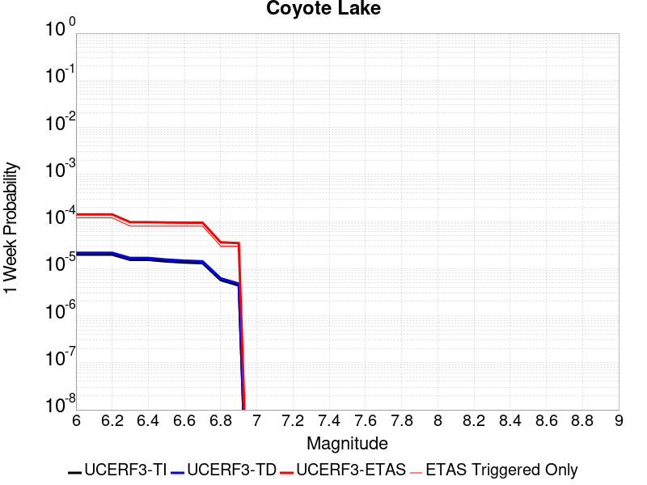 |  | 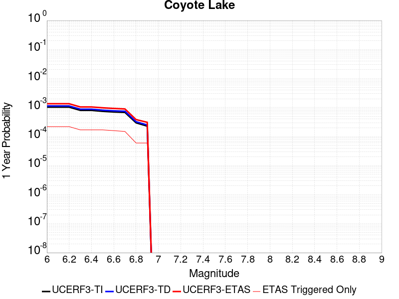 |  |

| Magnitude | 1 wk TI Prob | 1 wk TD Prob | 1 wk ETAS Prob | 1 wk ETAS/TD Gain | 1 wk ETAS Triggered Only | 1 mo TI Prob | 1 mo TD Prob | 1 mo ETAS Prob | 1 mo ETAS/TD Gain | 1 mo ETAS Triggered Only | 1 yr TI Prob | 1 yr TD Prob | 1 yr ETAS Prob | 1 yr ETAS/TD Gain | 1 yr ETAS Triggered Only | 10 yr TI Prob | 10 yr TD Prob | 10 yr ETAS Prob | 10 yr ETAS/TD Gain | 10 yr ETAS Triggered Only |
|-----|-----|-----|-----|-----|-----|-----|-----|-----|-----|-----|-----|-----|-----|-----|-----|-----|-----|-----|-----|-----|
| 6.0 | 1.980352E-5 | 2.1706745E-5 | 1.6321044E-4 | 7.5188813 | 1.4150677E-4 | 8.486947E-5 | 9.302599E-5 | 2.6281833E-4 | 2.8252137 | 1.6980812E-4 | 0.0010327959 | 0.0011320751 | 0.0013299603 | 1.1747986 | 1.9810947E-4 | 0.010280091 | 0.011270258 | 0.011466134 | 1.01738 | 1.9810947E-4 |
| 6.1 | 1.980352E-5 | 2.1706745E-5 | 1.6321044E-4 | 7.5188813 | 1.4150677E-4 | 8.486947E-5 | 9.302599E-5 | 2.6281833E-4 | 2.8252137 | 1.6980812E-4 | 0.0010327959 | 0.0011320751 | 0.0013299603 | 1.1747986 | 1.9810947E-4 | 0.010280091 | 0.011270258 | 0.011466134 | 1.01738 | 1.9810947E-4 |
| 6.2 | 1.980352E-5 | 2.1706745E-5 | 1.6321044E-4 | 7.5188813 | 1.4150677E-4 | 8.486947E-5 | 9.302599E-5 | 2.6281833E-4 | 2.8252137 | 1.6980812E-4 | 0.0010327959 | 0.0011320751 | 0.0013299603 | 1.1747986 | 1.9810947E-4 | 0.010280091 | 0.011270258 | 0.011466134 | 1.01738 | 1.9810947E-4 |
| 6.3 | 1.5344787E-5 | 1.682067E-5 | 1.017233E-4 | 6.047518 | 8.490406E-5 | 6.576172E-5 | 7.2086936E-5 | 1.8528418E-4 | 2.570288 | 1.1320541E-4 | 8.003548E-4 | 8.773662E-4 | 0.0010187489 | 1.1611444 | 1.4150677E-4 | 0.007974784 | 0.00874507 | 0.008885339 | 1.0160398 | 1.4150677E-4 |
| 6.4 | 1.5344787E-5 | 1.682067E-5 | 1.017233E-4 | 6.047518 | 8.490406E-5 | 6.576172E-5 | 7.2086936E-5 | 1.8528418E-4 | 2.570288 | 1.1320541E-4 | 8.003548E-4 | 8.773662E-4 | 0.0010187489 | 1.1611444 | 1.4150677E-4 | 0.007974784 | 0.00874507 | 0.008885339 | 1.0160398 | 1.4150677E-4 |
| 6.5 | 1.4189697E-5 | 1.5557987E-5 | 1.00460726E-4 | 6.45718 | 8.490406E-5 | 6.081157E-5 | 6.6675726E-5 | 1.7987359E-4 | 2.6977372 | 1.1320541E-4 | 7.401293E-4 | 8.115349E-4 | 9.529268E-4 | 1.1742278 | 1.4150677E-4 | 0.0073766913 | 0.008091656 | 0.008232018 | 1.0173465 | 1.4150677E-4 |
| 6.6 | 1.3469301E-5 | 1.4771577E-5 | 9.9674384E-5 | 6.747714 | 8.490406E-5 | 5.7724297E-5 | 6.330556E-5 | 1.765038E-4 | 2.7881248 | 1.1320541E-4 | 7.025667E-4 | 7.7053264E-4 | 9.1193034E-4 | 1.1835065 | 1.4150677E-4 | 0.0070034964 | 0.0076845144 | 0.007824933 | 1.018273 | 1.4150677E-4 |
| 6.7 | 1.3027966E-5 | 1.4281745E-5 | 9.918459E-5 | 6.944851 | 8.490406E-5 | 5.5832945E-5 | 6.120638E-5 | 1.7440486E-4 | 2.8494556 | 1.1320541E-4 | 6.7955407E-4 | 7.4499263E-4 | 8.86394E-4 | 1.1898023 | 1.4150677E-4 | 0.006774798 | 0.0074308286 | 0.007571284 | 1.0189017 | 1.4150677E-4 |
| 6.8 | 5.695434E-6 | 6.2244176E-6 | 6.282677E-5 | 10.093598 | 5.6602705E-5 | 2.4408775E-5 | 2.6675973E-5 | 8.327717E-5 | 3.1218045 | 5.6602705E-5 | 2.971363E-4 | 3.2476155E-4 | 4.0963804E-4 | 1.2613502 | 8.490406E-5 | 0.0029673933 | 0.0032458105 | 0.0033304389 | 1.0260731 | 8.490406E-5 |
| 6.9 | 4.385688E-6 | 4.7930553E-6 | 6.139549E-5 | 12.809259 | 5.6602705E-5 | 1.879567E-5 | 2.0541665E-5 | 7.714321E-5 | 3.7554505 | 5.6602705E-5 | 2.2881327E-4 | 2.5009477E-4 | 3.349776E-4 | 1.3394027 | 8.490406E-5 | 0.002285778 | 0.0025009478 | 0.0025856395 | 1.0338639 | 8.490406E-5 |

## White Wolf (Extension)
*[(top)](#table-of-contents)*

| 1 Week | 1 Month | 1 Year | 10 Year |
|-----|-----|-----|-----|
|  |  |  |  |

| Magnitude | 1 wk TI Prob | 1 wk TD Prob | 1 wk ETAS Prob | 1 wk ETAS/TD Gain | 1 wk ETAS Triggered Only | 1 mo TI Prob | 1 mo TD Prob | 1 mo ETAS Prob | 1 mo ETAS/TD Gain | 1 mo ETAS Triggered Only | 1 yr TI Prob | 1 yr TD Prob | 1 yr ETAS Prob | 1 yr ETAS/TD Gain | 1 yr ETAS Triggered Only | 10 yr TI Prob | 10 yr TD Prob | 10 yr ETAS Prob | 10 yr ETAS/TD Gain | 10 yr ETAS Triggered Only |
|-----|-----|-----|-----|-----|-----|-----|-----|-----|-----|-----|-----|-----|-----|-----|-----|-----|-----|-----|-----|-----|
| 6.0 | 8.222555E-6 | 6.0666657E-6 | 1.4757257E-4 | 24.325153 | 1.4150677E-4 | 3.5239045E-5 | 2.5999774E-5 | 1.6750286E-4 | 6.442474 | 1.4150677E-4 | 4.289509E-4 | 3.1650788E-4 | 5.145547E-4 | 1.6257246 | 1.9810947E-4 | 0.0042812387 | 0.003161223 | 0.0033587061 | 1.0624706 | 1.9810947E-4 |
| 6.1 | 8.222555E-6 | 6.0666657E-6 | 1.4757257E-4 | 24.325153 | 1.4150677E-4 | 3.5239045E-5 | 2.5999774E-5 | 1.6750286E-4 | 6.442474 | 1.4150677E-4 | 4.289509E-4 | 3.1650788E-4 | 5.145547E-4 | 1.6257246 | 1.9810947E-4 | 0.0042812387 | 0.003161223 | 0.0033587061 | 1.0624706 | 1.9810947E-4 |
| 6.2 | 8.222555E-6 | 6.0666657E-6 | 1.4757257E-4 | 24.325153 | 1.4150677E-4 | 3.5239045E-5 | 2.5999774E-5 | 1.6750286E-4 | 6.442474 | 1.4150677E-4 | 4.289509E-4 | 3.1650788E-4 | 5.145547E-4 | 1.6257246 | 1.9810947E-4 | 0.0042812387 | 0.003161223 | 0.0033587061 | 1.0624706 | 1.9810947E-4 |
| 6.3 | 8.222555E-6 | 6.0666657E-6 | 1.4757257E-4 | 24.325153 | 1.4150677E-4 | 3.5239045E-5 | 2.5999774E-5 | 1.6750286E-4 | 6.442474 | 1.4150677E-4 | 4.289509E-4 | 3.1650788E-4 | 5.145547E-4 | 1.6257246 | 1.9810947E-4 | 0.0042812387 | 0.003161223 | 0.0033587061 | 1.0624706 | 1.9810947E-4 |
| 6.4 | 5.821773E-6 | 3.5571766E-6 | 6.015968E-5 | 16.9122 | 5.6602705E-5 | 2.4950215E-5 | 1.5244959E-5 | 7.18468E-5 | 4.7128234 | 5.6602705E-5 | 3.0372653E-4 | 1.8559267E-4 | 2.7048096E-4 | 1.4573904 | 8.490406E-5 | 0.0030331176 | 0.001854485 | 0.0019392316 | 1.0456982 | 8.490406E-5 |
| 6.5 | 5.766023E-6 | 3.4991106E-6 | 6.0101618E-5 | 17.176256 | 5.6602705E-5 | 2.4711293E-5 | 1.4996108E-5 | 7.159796E-5 | 4.7744365 | 5.6602705E-5 | 3.0081844E-4 | 1.8256342E-4 | 2.6745198E-4 | 1.4649812 | 8.490406E-5 | 0.0030041158 | 0.0018242426 | 0.0019089917 | 1.0464572 | 8.490406E-5 |
| 6.6 | 4.643576E-6 | 2.332624E-6 | 3.063391E-5 | 13.132811 | 2.8301352E-5 | 1.9900888E-5 | 9.996925E-6 | 3.8297996E-5 | 3.8309777 | 2.8301352E-5 | 2.4226638E-4 | 1.2170619E-4 | 1.78302E-4 | 1.4650201 | 5.6602705E-5 | 0.0024200242 | 0.0012164378 | 0.0012729716 | 1.0464749 | 5.6602705E-5 |
| 6.7 | 3.9529173E-6 | 1.6483477E-6 | 2.9949653E-5 | 18.169498 | 2.8301352E-5 | 1.6940963E-5 | 7.0643296E-6 | 3.5365483E-5 | 5.006205 | 2.8301352E-5 | 2.0623671E-4 | 8.6005006E-5 | 1.14303926E-4 | 1.329038 | 2.8301352E-5 | 0.002060454 | 8.597357E-4 | 8.8801276E-4 | 1.0328903 | 2.8301352E-5 |
| 6.8 | 3.4377522E-6 | 1.2245237E-6 | 2.9525841E-5 | 24.112103 | 2.8301352E-5 | 1.473314E-5 | 5.2479486E-6 | 3.3549153E-5 | 6.3928127 | 2.8301352E-5 | 1.7936122E-4 | 6.3891996E-5 | 9.219154E-5 | 1.4429278 | 2.8301352E-5 | 0.0017921652 | 6.387454E-4 | 6.6702865E-4 | 1.0442795 | 2.8301352E-5 |
| 6.9 | 3.1367306E-6 | 1.0033783E-6 | 1.0033783E-6 | 1.0 | 0.0 | 1.3443062E-5 | 4.3001864E-6 | 4.3001864E-6 | 1.0 | 0.0 | 1.63657E-4 | 5.235359E-5 | 5.235359E-5 | 1.0 | 0.0 | 0.0016353652 | 5.2342017E-4 | 5.2342017E-4 | 1.0 | 0.0 |
| 7.0 | 2.8298145E-6 | 7.4286646E-7 | 7.4286646E-7 | 1.0 | 0.0 | 1.2127721E-5 | 3.1837099E-6 | 3.1837099E-6 | 1.0 | 0.0 | 1.47645E-4 | 3.8761027E-5 | 3.8761027E-5 | 1.0 | 0.0 | 0.0014754693 | 3.8754768E-4 | 3.8754768E-4 | 1.0 | 0.0 |
| 7.1 | 2.4091064E-6 | 5.4227525E-7 | 5.4227525E-7 | 1.0 | 0.0 | 1.03247E-5 | 2.3240348E-6 | 2.3240348E-6 | 1.0 | 0.0 | 1.2569598E-4 | 2.8294799E-5 | 2.8294799E-5 | 1.0 | 0.0 | 0.001256249 | 2.8291598E-4 | 2.8291598E-4 | 1.0 | 0.0 |
| 7.2 | 1.3875518E-6 | 1.0743063E-7 | 1.0743063E-7 | 1.0 | 0.0 | 5.9466374E-6 | 4.6041689E-7 | 4.6041689E-7 | 1.0 | 0.0 | 7.23979E-5 | 5.6055624E-6 | 5.6055624E-6 | 1.0 | 0.0 | 7.2374323E-4 | 5.6054323E-5 | 5.6054323E-5 | 1.0 | 0.0 |
| 7.3 | 7.056077E-7 | 5.002034E-8 | 5.002034E-8 | 1.0 | 0.0 | 3.0240296E-6 | 2.1437286E-7 | 2.1437286E-7 | 1.0 | 0.0 | 3.681694E-5 | 2.609987E-6 | 2.609987E-6 | 1.0 | 0.0 | 3.681084E-4 | 2.609961E-5 | 2.609961E-5 | 1.0 | 0.0 |
| 7.4 | 5.9334678E-8 | 4.8683537E-9 | 4.8683537E-9 | 1.0 | 0.0 | 2.5429145E-7 | 2.0864372E-8 | 2.0864372E-8 | 1.0 | 0.0 | 3.095994E-6 | 2.5402372E-7 | 2.5402372E-7 | 1.0 | 0.0 | 3.095951E-5 | 2.5402353E-6 | 2.5402353E-6 | 1.0 | 0.0 |

## Baker
*[(top)](#table-of-contents)*

| 1 Week | 1 Month | 1 Year | 10 Year |
|-----|-----|-----|-----|
|  |  |  |  |

| Magnitude | 1 wk TI Prob | 1 wk TD Prob | 1 wk ETAS Prob | 1 wk ETAS/TD Gain | 1 wk ETAS Triggered Only | 1 mo TI Prob | 1 mo TD Prob | 1 mo ETAS Prob | 1 mo ETAS/TD Gain | 1 mo ETAS Triggered Only | 1 yr TI Prob | 1 yr TD Prob | 1 yr ETAS Prob | 1 yr ETAS/TD Gain | 1 yr ETAS Triggered Only | 10 yr TI Prob | 10 yr TD Prob | 10 yr ETAS Prob | 10 yr ETAS/TD Gain | 10 yr ETAS Triggered Only |
|-----|-----|-----|-----|-----|-----|-----|-----|-----|-----|-----|-----|-----|-----|-----|-----|-----|-----|-----|-----|-----|
| 6.0 | 5.695525E-6 | 5.8348373E-6 | 1.19039585E-4 | 20.401527 | 1.1320541E-4 | 2.4409164E-5 | 2.5006228E-5 | 1.6650945E-4 | 6.6587195 | 1.4150677E-4 | 2.9714106E-4 | 3.044123E-4 | 4.4587598E-4 | 1.4647108 | 1.4150677E-4 | 0.0029674405 | 0.0030403486 | 0.0032096405 | 1.0556817 | 1.6980812E-4 |
| 6.1 | 5.695525E-6 | 5.8348373E-6 | 1.19039585E-4 | 20.401527 | 1.1320541E-4 | 2.4409164E-5 | 2.5006228E-5 | 1.6650945E-4 | 6.6587195 | 1.4150677E-4 | 2.9714106E-4 | 3.044123E-4 | 4.4587598E-4 | 1.4647108 | 1.4150677E-4 | 0.0029674405 | 0.0030403486 | 0.0032096405 | 1.0556817 | 1.6980812E-4 |
| 6.2 | 5.695525E-6 | 5.8348373E-6 | 1.19039585E-4 | 20.401527 | 1.1320541E-4 | 2.4409164E-5 | 2.5006228E-5 | 1.6650945E-4 | 6.6587195 | 1.4150677E-4 | 2.9714106E-4 | 3.044123E-4 | 4.4587598E-4 | 1.4647108 | 1.4150677E-4 | 0.0029674405 | 0.0030403486 | 0.0032096405 | 1.0556817 | 1.6980812E-4 |
| 6.3 | 3.2995713E-6 | 3.383667E-6 | 1.1658869E-4 | 34.456314 | 1.1320541E-4 | 1.4140943E-5 | 1.4501353E-5 | 1.2770512E-4 | 8.806428 | 1.1320541E-4 | 1.7215237E-4 | 1.7654014E-4 | 2.8972558E-4 | 1.6411314 | 1.1320541E-4 | 0.0017201907 | 0.001764046 | 0.0019053031 | 1.0800756 | 1.4150677E-4 |
| 6.4 | 3.2995713E-6 | 3.383667E-6 | 1.1658869E-4 | 34.456314 | 1.1320541E-4 | 1.4140943E-5 | 1.4501353E-5 | 1.2770512E-4 | 8.806428 | 1.1320541E-4 | 1.7215237E-4 | 1.7654014E-4 | 2.8972558E-4 | 1.6411314 | 1.1320541E-4 | 0.0017201907 | 0.001764046 | 0.0019053031 | 1.0800756 | 1.4150677E-4 |
| 6.5 | 2.782202E-6 | 2.8558404E-6 | 8.7759654E-5 | 30.729889 | 8.490406E-5 | 1.1923668E-5 | 1.223926E-5 | 9.714228E-5 | 7.93694 | 8.490406E-5 | 1.4516099E-4 | 1.4900314E-4 | 2.3389455E-4 | 1.569729 | 8.490406E-5 | 0.001450662 | 0.0014890651 | 0.001602102 | 1.0759113 | 1.1320541E-4 |
| 6.6 | 2.3163404E-6 | 2.38092E-6 | 8.7284774E-5 | 36.660107 | 8.490406E-5 | 9.927136E-6 | 1.0203904E-5 | 9.51071E-5 | 9.320658 | 8.490406E-5 | 1.20856166E-4 | 1.2422565E-4 | 2.0911916E-4 | 1.6833814 | 8.490406E-5 | 0.0012079047 | 0.0012415823 | 0.0013546472 | 1.0910652 | 1.1320541E-4 |
| 6.7 | 2.037056E-6 | 2.0965003E-6 | 8.700038E-5 | 41.497906 | 8.490406E-5 | 8.7302105E-6 | 8.984972E-6 | 9.3888266E-5 | 10.449478 | 8.490406E-5 | 1.0628513E-4 | 1.093867E-4 | 1.9428147E-4 | 1.7760977 | 8.490406E-5 | 0.0010623431 | 0.0010933448 | 0.0012064264 | 1.1034273 | 1.1320541E-4 |
| 6.8 | 1.8356744E-6 | 1.8915287E-6 | 8.679543E-5 | 45.88639 | 8.490406E-5 | 7.867153E-6 | 8.106527E-6 | 9.30099E-5 | 11.473458 | 8.490406E-5 | 9.577837E-5 | 9.869264E-5 | 1.8358832E-4 | 1.8602028 | 8.490406E-5 | 9.57371E-4 | 9.86502E-4 | 0.0010995958 | 1.1146412 | 1.1320541E-4 |
| 6.9 | 1.6310546E-6 | 1.6832072E-6 | 8.6587126E-5 | 51.44175 | 8.490406E-5 | 6.9902153E-6 | 7.213726E-6 | 9.2117174E-5 | 12.769708 | 8.490406E-5 | 8.510255E-5 | 8.782368E-5 | 1.7272029E-4 | 1.9666709 | 8.490406E-5 | 8.5069967E-4 | 8.7790104E-4 | 9.910071E-4 | 1.1288369 | 1.1320541E-4 |
| 7.0 | 1.2058036E-6 | 1.2508665E-6 | 5.78535E-5 | 46.25074 | 5.6602705E-5 | 5.1677193E-6 | 5.3608455E-6 | 6.196325E-5 | 11.558484 | 5.6602705E-5 | 6.291517E-5 | 6.5266366E-5 | 1.2186538E-4 | 1.8672003 | 5.6602705E-5 | 6.289736E-4 | 6.524743E-4 | 7.3732296E-4 | 1.1300414 | 8.490406E-5 |
| 7.1 | 1.052382E-6 | 1.0951609E-6 | 5.7697805E-5 | 52.68432 | 5.6602705E-5 | 4.5102006E-6 | 4.693538E-6 | 6.129598E-5 | 13.059652 | 5.6602705E-5 | 5.491031E-5 | 5.7142337E-5 | 1.1374181E-4 | 1.9904997 | 5.6602705E-5 | 5.4896745E-4 | 5.7127734E-4 | 6.561329E-4 | 1.1485366 | 8.490406E-5 |
| 7.2 | 1.0067454E-6 | 1.0487711E-6 | 5.7651418E-5 | 54.97045 | 5.6602705E-5 | 4.3146156E-6 | 4.4947255E-6 | 6.109718E-5 | 13.593083 | 5.6602705E-5 | 5.252918E-5 | 5.4721917E-5 | 1.11321526E-4 | 2.0343134 | 5.6602705E-5 | 5.251676E-4 | 5.470853E-4 | 6.319429E-4 | 1.1551086 | 8.490406E-5 |
| 7.3 | 9.3596316E-7 | 9.767723E-7 | 2.9278097E-5 | 29.97433 | 2.8301352E-5 | 4.0112645E-6 | 4.1861604E-6 | 3.2487394E-5 | 7.7606664 | 2.8301352E-5 | 4.8836053E-5 | 5.096532E-5 | 7.926523E-5 | 1.5552778 | 2.8301352E-5 | 4.8825322E-4 | 5.095371E-4 | 5.6611095E-4 | 1.1110299 | 5.6602705E-5 |
| 7.4 | 8.8117395E-7 | 9.2076635E-7 | 2.9222094E-5 | 31.73671 | 2.8301352E-5 | 3.7764542E-6 | 3.9461356E-6 | 3.2247375E-5 | 8.171887 | 2.8301352E-5 | 4.5977362E-5 | 4.8043148E-5 | 7.634314E-5 | 1.5890536 | 2.8301352E-5 | 4.596785E-4 | 4.8032837E-4 | 5.369039E-4 | 1.1177851 | 5.6602705E-5 |
| 7.5 | 8.292386E-7 | 8.6745956E-7 | 2.9168788E-5 | 33.62553 | 2.8301352E-5 | 3.5538749E-6 | 3.7176785E-6 | 3.2018925E-5 | 8.612613 | 2.8301352E-5 | 4.326757E-5 | 4.5261804E-5 | 7.3561874E-5 | 1.6252528 | 2.8301352E-5 | 4.3259145E-4 | 4.5252658E-4 | 5.091037E-4 | 1.1250249 | 5.6602705E-5 |
| 7.6 | 7.553842E-7 | 7.9144706E-7 | 2.9092778E-5 | 36.75897 | 2.8301352E-5 | 3.2373566E-6 | 3.3919116E-6 | 3.169317E-5 | 9.343748 | 2.8301352E-5 | 3.9414106E-5 | 4.129575E-5 | 6.959593E-5 | 1.685305 | 2.8301352E-5 | 3.9407116E-4 | 4.1288146E-4 | 4.694608E-4 | 1.1370353 | 5.6602705E-5 |
| 7.7 | 6.5285366E-7 | 6.852797E-7 | 2.8986613E-5 | 42.298954 | 2.8301352E-5 | 2.797941E-6 | 2.9369096E-6 | 3.1238178E-5 | 10.636412 | 2.8301352E-5 | 3.40644E-5 | 3.5756293E-5 | 6.4056636E-5 | 1.7914785 | 2.8301352E-5 | 3.405918E-4 | 3.5750607E-4 | 3.8579732E-4 | 1.079135 | 2.8301352E-5 |
| 7.8 | 3.4586725E-7 | 3.6482615E-7 | 3.6482615E-7 | 1.0 | 0.0 | 1.4822873E-6 | 1.5635396E-6 | 1.5635396E-6 | 1.0 | 0.0 | 1.80467E-5 | 1.9035933E-5 | 1.9035933E-5 | 1.0 | 0.0 | 1.8045233E-4 | 1.9034347E-4 | 1.9034347E-4 | 1.0 | 0.0 |
| 7.9 | 2.5591178E-9 | 2.6696718E-9 | 2.6696718E-9 | 1.0 | 0.0 | 1.0967647E-8 | 1.14414505E-8 | 1.14414505E-8 | 1.0 | 0.0 | 1.335311E-7 | 1.3929966E-7 | 1.3929966E-7 | 1.0 | 0.0 | 1.3353102E-6 | 1.3929966E-6 | 1.3929966E-6 | 1.0 | 0.0 |

## San Andreas (Carrizo) rev
*[(top)](#table-of-contents)*

| 1 Week | 1 Month | 1 Year | 10 Year |
|-----|-----|-----|-----|
|  |  |  |  |

| Magnitude | 1 wk TI Prob | 1 wk TD Prob | 1 wk ETAS Prob | 1 wk ETAS/TD Gain | 1 wk ETAS Triggered Only | 1 mo TI Prob | 1 mo TD Prob | 1 mo ETAS Prob | 1 mo ETAS/TD Gain | 1 mo ETAS Triggered Only | 1 yr TI Prob | 1 yr TD Prob | 1 yr ETAS Prob | 1 yr ETAS/TD Gain | 1 yr ETAS Triggered Only | 10 yr TI Prob | 10 yr TD Prob | 10 yr ETAS Prob | 10 yr ETAS/TD Gain | 10 yr ETAS Triggered Only |
|-----|-----|-----|-----|-----|-----|-----|-----|-----|-----|-----|-----|-----|-----|-----|-----|-----|-----|-----|-----|-----|
| 6.0 | 1.1674632E-4 | 2.432302E-4 | 4.12997E-4 | 1.6979676 | 1.6980812E-4 | 5.002454E-4 | 0.0010420004 | 0.0012116316 | 1.1627938 | 1.6980812E-4 | 0.006073493 | 0.012613042 | 0.012780708 | 1.0132931 | 1.6980812E-4 | 0.0591016 | 0.12061418 | 0.1207635 | 1.0012381 | 1.6980812E-4 |
| 6.1 | 1.1674632E-4 | 2.432302E-4 | 4.12997E-4 | 1.6979676 | 1.6980812E-4 | 5.002454E-4 | 0.0010420004 | 0.0012116316 | 1.1627938 | 1.6980812E-4 | 0.006073493 | 0.012613042 | 0.012780708 | 1.0132931 | 1.6980812E-4 | 0.0591016 | 0.12061418 | 0.1207635 | 1.0012381 | 1.6980812E-4 |
| 6.2 | 1.1674632E-4 | 2.432302E-4 | 4.12997E-4 | 1.6979676 | 1.6980812E-4 | 5.002454E-4 | 0.0010420004 | 0.0012116316 | 1.1627938 | 1.6980812E-4 | 0.006073493 | 0.012613042 | 0.012780708 | 1.0132931 | 1.6980812E-4 | 0.0591016 | 0.12061418 | 0.1207635 | 1.0012381 | 1.6980812E-4 |
| 6.3 | 1.1674632E-4 | 2.432302E-4 | 4.12997E-4 | 1.6979676 | 1.6980812E-4 | 5.002454E-4 | 0.0010420004 | 0.0012116316 | 1.1627938 | 1.6980812E-4 | 0.006073493 | 0.012613042 | 0.012780708 | 1.0132931 | 1.6980812E-4 | 0.0591016 | 0.12061418 | 0.1207635 | 1.0012381 | 1.6980812E-4 |
| 6.4 | 1.1674632E-4 | 2.432302E-4 | 4.12997E-4 | 1.6979676 | 1.6980812E-4 | 5.002454E-4 | 0.0010420004 | 0.0012116316 | 1.1627938 | 1.6980812E-4 | 0.006073493 | 0.012613042 | 0.012780708 | 1.0132931 | 1.6980812E-4 | 0.0591016 | 0.12061418 | 0.1207635 | 1.0012381 | 1.6980812E-4 |
| 6.5 | 1.13136164E-4 | 2.3643032E-4 | 4.061983E-4 | 1.7180465 | 1.6980812E-4 | 4.847792E-4 | 0.0010128808 | 0.0011825169 | 1.1674788 | 1.6980812E-4 | 0.0058862255 | 0.012262545 | 0.01243027 | 1.013678 | 1.6980812E-4 | 0.057327334 | 0.117585555 | 0.11773539 | 1.0012743 | 1.6980812E-4 |
| 6.6 | 1.13136164E-4 | 2.3643032E-4 | 4.061983E-4 | 1.7180465 | 1.6980812E-4 | 4.847792E-4 | 0.0010128808 | 0.0011825169 | 1.1674788 | 1.6980812E-4 | 0.0058862255 | 0.012262545 | 0.01243027 | 1.013678 | 1.6980812E-4 | 0.057327334 | 0.117585555 | 0.11773539 | 1.0012743 | 1.6980812E-4 |
| 6.7 | 1.1149675E-4 | 2.3334254E-4 | 4.0311104E-4 | 1.7275505 | 1.6980812E-4 | 4.777557E-4 | 9.996577E-4 | 0.0011692961 | 1.1696965 | 1.6980812E-4 | 0.0058011734 | 0.012103349 | 0.012271102 | 1.01386 | 1.6980812E-4 | 0.05652051 | 0.1162071 | 0.11635718 | 1.0012914 | 1.6980812E-4 |
| 6.8 | 1.1103589E-4 | 2.3236412E-4 | 4.0213278E-4 | 1.7306148 | 1.6980812E-4 | 4.7578133E-4 | 9.954676E-4 | 0.0011651068 | 1.1704115 | 1.6980812E-4 | 0.005777263 | 0.012052901 | 0.012220663 | 1.0139188 | 1.6980812E-4 | 0.056293584 | 0.1157674 | 0.11591755 | 1.001297 | 1.6980812E-4 |
| 6.9 | 1.1053259E-4 | 2.3128795E-4 | 4.010568E-4 | 1.7340151 | 1.6980812E-4 | 4.7362508E-4 | 9.90859E-4 | 0.0011604989 | 1.1712048 | 1.6980812E-4 | 0.0057511497 | 0.01199741 | 0.012165181 | 1.013984 | 1.6980812E-4 | 0.05604569 | 0.11528359 | 0.11543383 | 1.0013032 | 1.6980812E-4 |
| 7.0 | 1.1005377E-4 | 2.3029637E-4 | 4.000654E-4 | 1.7371762 | 1.6980812E-4 | 4.7157376E-4 | 9.866126E-4 | 0.0011562532 | 1.1719425 | 1.6980812E-4 | 0.0057263062 | 0.011946279 | 0.012114058 | 1.0140445 | 1.6980812E-4 | 0.055809796 | 0.11483591 | 0.11498622 | 1.0013089 | 1.6980812E-4 |
| 7.1 | 1.0308142E-4 | 2.1539345E-4 | 3.568697E-4 | 1.6568272 | 1.4150677E-4 | 4.417027E-4 | 9.227892E-4 | 0.0010641654 | 1.1532053 | 1.4150677E-4 | 0.0053644776 | 0.011177397 | 0.011317323 | 1.0125185 | 1.4150677E-4 | 0.052368138 | 0.108092256 | 0.10821847 | 1.0011677 | 1.4150677E-4 |
| 7.2 | 1.0027479E-4 | 2.094724E-4 | 3.5094953E-4 | 1.6753974 | 1.4150677E-4 | 4.296783E-4 | 8.9743105E-4 | 0.0010388108 | 1.1575383 | 1.4150677E-4 | 0.0052187922 | 0.010871782 | 0.01101175 | 1.0128745 | 1.4150677E-4 | 0.050979212 | 0.10539625 | 0.10552284 | 1.0012012 | 1.4150677E-4 |
| 7.3 | 9.816942E-5 | 2.0422463E-4 | 3.1740693E-4 | 1.5542048 | 1.1320541E-4 | 4.2065824E-4 | 8.7495585E-4 | 9.880622E-4 | 1.1292709 | 1.1320541E-4 | 0.005109493 | 0.010600842 | 0.010712847 | 1.0105658 | 1.1320541E-4 | 0.049935985 | 0.102979995 | 0.10308155 | 1.0009861 | 1.1320541E-4 |
| 7.4 | 9.5634205E-5 | 1.9791997E-4 | 3.1110298E-4 | 1.5718625 | 1.1320541E-4 | 4.0979648E-4 | 8.479536E-4 | 9.61063E-4 | 1.133391 | 1.1320541E-4 | 0.0049778637 | 0.010275229 | 0.010387271 | 1.0109041 | 1.1320541E-4 | 0.048678253 | 0.10006632 | 0.1001682 | 1.001018 | 1.1320541E-4 |
| 7.5 | 8.052417E-5 | 1.611261E-4 | 2.4601648E-4 | 1.5268568 | 8.490406E-5 | 3.4505792E-4 | 6.903579E-4 | 7.752033E-4 | 1.1229007 | 8.490406E-5 | 0.0041929903 | 0.008372796 | 0.008456989 | 1.0100555 | 8.490406E-5 | 0.04114753 | 0.08281049 | 0.082888365 | 1.0009403 | 8.490406E-5 |
| 7.6 | 7.897024E-5 | 1.5765853E-4 | 2.4254921E-4 | 1.5384464 | 8.490406E-5 | 3.384E-4 | 6.755046E-4 | 7.6035137E-4 | 1.1256049 | 8.490406E-5 | 0.0041122385 | 0.008193332 | 0.00827754 | 1.0102776 | 8.490406E-5 | 0.040369697 | 0.08115171 | 0.08122972 | 1.0009613 | 8.490406E-5 |
| 7.7 | 6.707427E-5 | 1.3276102E-4 | 1.6105862E-4 | 1.2131468 | 2.8301352E-5 | 2.8742946E-4 | 5.688518E-4 | 5.971371E-4 | 1.0497234 | 2.8301352E-5 | 0.003493839 | 0.00690381 | 0.006931916 | 1.0040711 | 2.8301352E-5 | 0.034394164 | 0.069048055 | 0.06907441 | 1.0003816 | 2.8301352E-5 |
| 7.8 | 6.147705E-5 | 1.2197486E-4 | 1.5027277E-4 | 1.2319978 | 2.8301352E-5 | 2.6344648E-4 | 5.226447E-4 | 5.5093126E-4 | 1.054122 | 2.8301352E-5 | 0.0032027436 | 0.006344659 | 0.006372781 | 1.0044323 | 2.8301352E-5 | 0.031569764 | 0.06351457 | 0.06354107 | 1.0004172 | 2.8301352E-5 |
| 7.9 | 4.7636717E-5 | 8.87977E-5 | 1.1709654E-4 | 1.3186889 | 2.8301352E-5 | 2.0414138E-4 | 3.8050607E-4 | 4.0879665E-4 | 1.0743499 | 2.8301352E-5 | 0.0024825884 | 0.0046228287 | 0.0046509993 | 1.0060937 | 2.8301352E-5 | 0.024550365 | 0.046628095 | 0.046655074 | 1.0005786 | 2.8301352E-5 |
| 8.0 | 3.3554235E-5 | 5.2136907E-5 | 8.043679E-5 | 1.5427992 | 2.8301352E-5 | 1.4379594E-4 | 2.2342477E-4 | 2.517198E-4 | 1.1266423 | 2.8301352E-5 | 0.0017493097 | 0.002716805 | 0.0027450295 | 1.0103889 | 2.8301352E-5 | 0.017356034 | 0.027880952 | 0.027908465 | 1.0009868 | 2.8301352E-5 |
| 8.1 | 1.9175432E-5 | 1.9184976E-5 | 1.9184976E-5 | 1.0 | 0.0 | 8.217783E-5 | 8.2218736E-5 | 8.2218736E-5 | 1.0 | 0.0 | 0.0010000558 | 0.0010005541 | 0.0010005541 | 1.0 | 0.0 | 0.009955673 | 0.0107580265 | 0.0107580265 | 1.0 | 0.0 |
| 8.2 | 8.643924E-6 | 5.4748625E-6 | 5.4748625E-6 | 1.0 | 0.0 | 3.704486E-5 | 2.3463486E-5 | 2.3463486E-5 | 1.0 | 0.0 | 4.5092785E-4 | 2.8563058E-4 | 2.8563058E-4 | 1.0 | 0.0 | 0.0045001395 | 0.0032487072 | 0.0032487072 | 1.0 | 0.0 |
| 8.3 | 1.983087E-6 | 7.6599065E-7 | 7.6599065E-7 | 1.0 | 0.0 | 8.498917E-6 | 3.282813E-6 | 3.282813E-6 | 1.0 | 0.0 | 1.034694E-4 | 3.9967534E-5 | 3.9967534E-5 | 1.0 | 0.0 | 0.0010342124 | 4.719687E-4 | 4.719687E-4 | 1.0 | 0.0 |

## San Andreas (Creeping Section) 2011 CFM
*[(top)](#table-of-contents)*

| 1 Week | 1 Month | 1 Year | 10 Year |
|-----|-----|-----|-----|
|  |  |  |  |

| Magnitude | 1 wk TI Prob | 1 wk TD Prob | 1 wk ETAS Prob | 1 wk ETAS/TD Gain | 1 wk ETAS Triggered Only | 1 mo TI Prob | 1 mo TD Prob | 1 mo ETAS Prob | 1 mo ETAS/TD Gain | 1 mo ETAS Triggered Only | 1 yr TI Prob | 1 yr TD Prob | 1 yr ETAS Prob | 1 yr ETAS/TD Gain | 1 yr ETAS Triggered Only | 10 yr TI Prob | 10 yr TD Prob | 10 yr ETAS Prob | 10 yr ETAS/TD Gain | 10 yr ETAS Triggered Only |
|-----|-----|-----|-----|-----|-----|-----|-----|-----|-----|-----|-----|-----|-----|-----|-----|-----|-----|-----|-----|-----|
| 6.0 | 5.986481E-4 | 0.001228691 | 0.0013417574 | 1.0920218 | 1.1320541E-4 | 0.0025631124 | 0.005246795 | 0.0053594066 | 1.0214629 | 1.1320541E-4 | 0.030762846 | 0.061203245 | 0.061309524 | 1.0017364 | 1.1320541E-4 | 0.26835477 | 0.425928 | 0.425993 | 1.0001526 | 1.1320541E-4 |
| 6.1 | 5.015945E-4 | 0.0010230356 | 0.0011078528 | 1.0829073 | 8.490406E-5 | 0.00214792 | 0.004369436 | 0.0044539687 | 1.0193465 | 8.490406E-5 | 0.025839351 | 0.051246606 | 0.05132716 | 1.0015719 | 8.490406E-5 | 0.23032776 | 0.37284943 | 0.3729027 | 1.0001428 | 8.490406E-5 |
| 6.2 | 4.073338E-4 | 8.1157376E-4 | 8.9640886E-4 | 1.1045316 | 8.490406E-5 | 0.0017445484 | 0.0034683137 | 0.0035529232 | 1.024395 | 8.490406E-5 | 0.021034058 | 0.04093177 | 0.041013196 | 1.0019894 | 8.490406E-5 | 0.19150782 | 0.31302592 | 0.31308424 | 1.0001863 | 8.490406E-5 |
| 6.3 | 3.464099E-4 | 6.7455834E-4 | 7.5940514E-4 | 1.1257813 | 8.490406E-5 | 0.0014837692 | 0.0028832308 | 0.0029678901 | 1.0293627 | 8.490406E-5 | 0.017915873 | 0.034187846 | 0.034269847 | 1.0023986 | 8.490406E-5 | 0.16538359 | 0.27130842 | 0.2713703 | 1.000228 | 8.490406E-5 |
| 6.4 | 2.935057E-4 | 5.5516965E-4 | 6.400266E-4 | 1.1528486 | 8.490406E-5 | 0.0012572751 | 0.0023727308 | 0.0024574334 | 1.0356984 | 8.490406E-5 | 0.015200248 | 0.02826279 | 0.028345294 | 1.0029192 | 8.490406E-5 | 0.14201577 | 0.23297668 | 0.2330418 | 1.0002795 | 8.490406E-5 |
| 6.5 | 2.3409708E-4 | 4.2132285E-4 | 5.0619117E-4 | 1.201433 | 8.490406E-5 | 0.0010028875 | 0.0018017791 | 0.0018865303 | 1.0470375 | 8.490406E-5 | 0.012141965 | 0.021586355 | 0.021669425 | 1.0038483 | 8.490406E-5 | 0.11499573 | 0.1868149 | 0.18688396 | 1.0003695 | 8.490406E-5 |
| 6.6 | 1.5842178E-4 | 2.5068692E-4 | 3.355697E-4 | 1.3386008 | 8.490406E-5 | 6.7877385E-4 | 0.0010739256 | 0.0011587385 | 1.0789746 | 8.490406E-5 | 0.0082328 | 0.012995283 | 0.0130790835 | 1.0064485 | 8.490406E-5 | 0.07934396 | 0.12313759 | 0.12321205 | 1.0006046 | 8.490406E-5 |
| 6.7 | 1.5616413E-4 | 2.4605254E-4 | 3.309357E-4 | 1.3449799 | 8.490406E-5 | 6.691031E-4 | 0.0010540807 | 0.0011388952 | 1.080463 | 8.490406E-5 | 0.0081159435 | 0.012757154 | 0.012840975 | 1.0065705 | 8.490406E-5 | 0.0782586 | 0.12116472 | 0.121239334 | 1.0006158 | 8.490406E-5 |
| 6.8 | 1.5538467E-4 | 2.442914E-4 | 3.2917474E-4 | 1.3474674 | 8.490406E-5 | 6.6576427E-4 | 0.001046539 | 0.0011313542 | 1.0810435 | 8.490406E-5 | 0.008075596 | 0.012666538 | 0.012750367 | 1.0066181 | 8.490406E-5 | 0.07788358 | 0.12039561 | 0.120470285 | 1.0006202 | 8.490406E-5 |
| 6.9 | 1.5153569E-4 | 2.3538464E-4 | 3.202687E-4 | 1.3606186 | 8.490406E-5 | 6.49277E-4 | 0.0010084033 | 0.0010932217 | 1.0841116 | 8.490406E-5 | 0.007876333 | 0.012208726 | 0.012292594 | 1.0068694 | 8.490406E-5 | 0.07602952 | 0.11646574 | 0.11654076 | 1.0006441 | 8.490406E-5 |
| 7.0 | 1.4588932E-4 | 2.2395732E-4 | 3.0884237E-4 | 1.3790233 | 8.490406E-5 | 6.250901E-4 | 9.59466E-4 | 0.0010442886 | 1.0884061 | 8.490406E-5 | 0.0075839474 | 0.011619428 | 0.011703345 | 1.0072222 | 8.490406E-5 | 0.073302895 | 0.11131206 | 0.11138751 | 1.0006778 | 8.490406E-5 |
| 7.1 | 1.1565079E-4 | 1.6281323E-4 | 2.4770346E-4 | 1.5213964 | 8.490406E-5 | 4.955521E-4 | 6.9758523E-4 | 7.8243006E-4 | 1.1216265 | 8.490406E-5 | 0.006016669 | 0.008460228 | 0.008544413 | 1.0099508 | 8.490406E-5 | 0.058563538 | 0.08366478 | 0.08374259 | 1.00093 | 8.490406E-5 |
| 7.2 | 1.0393792E-4 | 1.4615392E-4 | 2.3104557E-4 | 1.5808374 | 8.490406E-5 | 4.4537216E-4 | 6.262243E-4 | 7.110752E-4 | 1.135496 | 8.490406E-5 | 0.005408933 | 0.0075977976 | 0.0076820566 | 1.0110899 | 8.490406E-5 | 0.052791595 | 0.07561503 | 0.07569352 | 1.001038 | 8.490406E-5 |
| 7.3 | 9.332884E-5 | 1.2780601E-4 | 2.126992E-4 | 1.6642349 | 8.490406E-5 | 3.999194E-4 | 5.4762565E-4 | 6.324832E-4 | 1.1549554 | 8.490406E-5 | 0.0048581534 | 0.0066470946 | 0.0067314343 | 1.0126882 | 8.490406E-5 | 0.047533102 | 0.06647954 | 0.0665588 | 1.0011922 | 8.490406E-5 |
| 7.4 | 8.670252E-5 | 1.1702972E-4 | 2.0192383E-4 | 1.7254065 | 8.490406E-5 | 3.715293E-4 | 5.014601E-4 | 5.863216E-4 | 1.1692288 | 8.490406E-5 | 0.004513991 | 0.0060883067 | 0.006172694 | 1.0138606 | 8.490406E-5 | 0.044233937 | 0.061148684 | 0.061228395 | 1.0013036 | 8.490406E-5 |
| 7.5 | 7.3036405E-5 | 9.005699E-5 | 1.749534E-4 | 1.9426966 | 8.490406E-5 | 3.129756E-4 | 3.859015E-4 | 4.707728E-4 | 1.2199299 | 8.490406E-5 | 0.0038038217 | 0.0046882504 | 0.0047727562 | 1.018025 | 8.490406E-5 | 0.03739367 | 0.047875606 | 0.047956448 | 1.0016885 | 8.490406E-5 |
| 7.6 | 6.3935775E-5 | 8.280209E-5 | 1.6769912E-4 | 2.0253005 | 8.490406E-5 | 2.7398168E-4 | 3.5481792E-4 | 4.3969185E-4 | 1.2392042 | 8.490406E-5 | 0.0033306254 | 0.00431137 | 0.004395908 | 1.0196081 | 8.490406E-5 | 0.032811474 | 0.043990135 | 0.044071306 | 1.0018451 | 8.490406E-5 |
| 7.7 | 5.5050095E-5 | 6.661729E-5 | 9.491676E-5 | 1.4248066 | 2.8301352E-5 | 2.3590765E-4 | 2.8547147E-4 | 3.1376473E-4 | 1.0991107 | 2.8301352E-5 | 0.0028683927 | 0.0034700802 | 0.0034982832 | 1.0081276 | 2.8301352E-5 | 0.0283165 | 0.03579509 | 0.035822377 | 1.0007623 | 2.8301352E-5 |
| 7.8 | 5.027131E-5 | 6.1627725E-5 | 8.992733E-5 | 1.4592025 | 2.8301352E-5 | 2.1543067E-4 | 2.640921E-4 | 2.9238596E-4 | 1.1071364 | 2.8301352E-5 | 0.0026197135 | 0.003210584 | 0.0032387944 | 1.0087867 | 2.8301352E-5 | 0.025890453 | 0.03312572 | 0.033153083 | 1.000826 | 2.8301352E-5 |
| 7.9 | 3.7271806E-5 | 5.0224386E-5 | 7.852432E-5 | 1.5634699 | 2.8301352E-5 | 1.5972654E-4 | 2.1522962E-4 | 2.4352488E-4 | 1.1314654 | 2.8301352E-5 | 0.0019429359 | 0.0026172737 | 0.002645501 | 1.010785 | 2.8301352E-5 | 0.019260362 | 0.027066687 | 0.027094223 | 1.0010173 | 2.8301352E-5 |
| 8.0 | 2.7310243E-5 | 3.1428404E-5 | 5.9728867E-5 | 1.9004741 | 2.8301352E-5 | 1.17038646E-4 | 1.3468621E-4 | 1.6298375E-4 | 1.2100998 | 2.8301352E-5 | 0.0014240141 | 0.0016385721 | 0.001666827 | 1.0172436 | 2.8301352E-5 | 0.014149235 | 0.01721387 | 0.017241683 | 1.0016158 | 2.8301352E-5 |
| 8.1 | 1.7940547E-5 | 1.7400796E-5 | 1.7400796E-5 | 1.0 | 0.0 | 7.688579E-5 | 7.457271E-5 | 7.457271E-5 | 1.0 | 0.0 | 9.3568244E-4 | 9.075451E-4 | 9.075451E-4 | 1.0 | 0.0 | 0.009317525 | 0.009799073 | 0.009799073 | 1.0 | 0.0 |
| 8.2 | 8.643924E-6 | 5.4748625E-6 | 5.4748625E-6 | 1.0 | 0.0 | 3.704486E-5 | 2.3463486E-5 | 2.3463486E-5 | 1.0 | 0.0 | 4.5092785E-4 | 2.8563058E-4 | 2.8563058E-4 | 1.0 | 0.0 | 0.0045001395 | 0.0032487072 | 0.0032487072 | 1.0 | 0.0 |
| 8.3 | 1.983087E-6 | 7.6599065E-7 | 7.6599065E-7 | 1.0 | 0.0 | 8.498917E-6 | 3.282813E-6 | 3.282813E-6 | 1.0 | 0.0 | 1.034694E-4 | 3.9967534E-5 | 3.9967534E-5 | 1.0 | 0.0 | 0.0010342124 | 4.719687E-4 | 4.719687E-4 | 1.0 | 0.0 |

## Ludlow
*[(top)](#table-of-contents)*

| 1 Week | 1 Month | 1 Year | 10 Year |
|-----|-----|-----|-----|
|  |  |  |  |

| Magnitude | 1 wk TI Prob | 1 wk TD Prob | 1 wk ETAS Prob | 1 wk ETAS/TD Gain | 1 wk ETAS Triggered Only | 1 mo TI Prob | 1 mo TD Prob | 1 mo ETAS Prob | 1 mo ETAS/TD Gain | 1 mo ETAS Triggered Only | 1 yr TI Prob | 1 yr TD Prob | 1 yr ETAS Prob | 1 yr ETAS/TD Gain | 1 yr ETAS Triggered Only | 10 yr TI Prob | 10 yr TD Prob | 10 yr ETAS Prob | 10 yr ETAS/TD Gain | 10 yr ETAS Triggered Only |
|-----|-----|-----|-----|-----|-----|-----|-----|-----|-----|-----|-----|-----|-----|-----|-----|-----|-----|-----|-----|-----|
| 6.0 | 2.2407607E-5 | 2.3657254E-5 | 1.085593E-4 | 4.588838 | 8.490406E-5 | 9.602906E-5 | 1.0138454E-4 | 2.4287695E-4 | 2.3956015 | 1.4150677E-4 | 0.0011685267 | 0.001233702 | 0.0013750341 | 1.1145594 | 1.4150677E-4 | 0.011624013 | 0.012273042 | 0.012412812 | 1.0113884 | 1.4150677E-4 |
| 6.1 | 2.2407607E-5 | 2.3657254E-5 | 1.085593E-4 | 4.588838 | 8.490406E-5 | 9.602906E-5 | 1.0138454E-4 | 2.4287695E-4 | 2.3956015 | 1.4150677E-4 | 0.0011685267 | 0.001233702 | 0.0013750341 | 1.1145594 | 1.4150677E-4 | 0.011624013 | 0.012273042 | 0.012412812 | 1.0113884 | 1.4150677E-4 |
| 6.2 | 1.0781252E-5 | 1.1365663E-5 | 1.1365663E-5 | 1.0 | 0.0 | 4.620455E-5 | 4.8709102E-5 | 7.700908E-5 | 1.5809997 | 2.8301352E-5 | 5.623952E-4 | 5.9287593E-4 | 6.2116055E-4 | 1.0477074 | 2.8301352E-5 | 0.00560974 | 0.0059133614 | 0.0059414953 | 1.0047576 | 2.8301352E-5 |
| 6.3 | 1.0781252E-5 | 1.1365663E-5 | 1.1365663E-5 | 1.0 | 0.0 | 4.620455E-5 | 4.8709102E-5 | 7.700908E-5 | 1.5809997 | 2.8301352E-5 | 5.623952E-4 | 5.9287593E-4 | 6.2116055E-4 | 1.0477074 | 2.8301352E-5 | 0.00560974 | 0.0059133614 | 0.0059414953 | 1.0047576 | 2.8301352E-5 |
| 6.4 | 7.814439E-6 | 8.237729E-6 | 8.237729E-6 | 1.0 | 0.0 | 3.3490025E-5 | 3.530408E-5 | 6.3604435E-5 | 1.801617 | 2.8301352E-5 | 4.0766477E-4 | 4.2974384E-4 | 4.5803303E-4 | 1.0658281 | 2.8301352E-5 | 0.0040691774 | 0.0042892746 | 0.0043174545 | 1.0065699 | 2.8301352E-5 |
| 6.5 | 6.4986366E-6 | 6.85092E-6 | 6.85092E-6 | 1.0 | 0.0 | 2.7851002E-5 | 2.9360759E-5 | 5.766128E-5 | 1.9638894 | 2.8301352E-5 | 3.390332E-4 | 3.5740953E-4 | 3.8570075E-4 | 1.0791564 | 2.8301352E-5 | 0.003385164 | 0.0035684432 | 0.0035966437 | 1.0079027 | 2.8301352E-5 |
| 6.6 | 5.582177E-6 | 5.8860055E-6 | 5.8860055E-6 | 1.0 | 0.0 | 2.3923398E-5 | 2.5225498E-5 | 5.352614E-5 | 2.121906 | 2.8301352E-5 | 2.9122844E-4 | 3.0707786E-4 | 3.3537054E-4 | 1.0921352 | 2.8301352E-5 | 0.0029084706 | 0.003066609 | 0.0030948233 | 1.0092006 | 2.8301352E-5 |
| 6.7 | 4.6858763E-6 | 4.940427E-6 | 4.940427E-6 | 1.0 | 0.0 | 2.0082172E-5 | 2.1173091E-5 | 2.1173091E-5 | 1.0 | 0.0 | 2.4447302E-4 | 2.5775246E-4 | 2.5775246E-4 | 1.0 | 0.0 | 0.0024420423 | 0.0025745912 | 0.0025745912 | 1.0 | 0.0 |
| 6.8 | 3.5584908E-6 | 3.7520183E-6 | 3.7520183E-6 | 1.0 | 0.0 | 1.5250586E-5 | 1.6079981E-5 | 1.6079981E-5 | 1.0 | 0.0 | 1.8566006E-4 | 1.957566E-4 | 1.957566E-4 | 1.0 | 0.0 | 0.0018550502 | 0.0019558826 | 0.0019558826 | 1.0 | 0.0 |
| 6.9 | 2.532834E-6 | 2.6710034E-6 | 2.6710034E-6 | 1.0 | 0.0 | 1.0854958E-5 | 1.1447109E-5 | 1.1447109E-5 | 1.0 | 0.0 | 1.3215111E-4 | 1.3935992E-4 | 1.3935992E-4 | 1.0 | 0.0 | 0.0013207254 | 0.0013927529 | 0.0013927529 | 1.0 | 0.0 |
| 7.0 | 1.7083285E-6 | 1.8019439E-6 | 1.8019439E-6 | 1.0 | 0.0 | 7.3213873E-6 | 7.722595E-6 | 7.722595E-6 | 1.0 | 0.0 | 8.913424E-5 | 9.40187E-5 | 9.40187E-5 | 1.0 | 0.0 | 8.9098496E-4 | 9.3980576E-4 | 9.3980576E-4 | 1.0 | 0.0 |
| 7.1 | 1.0905424E-6 | 1.1497619E-6 | 1.1497619E-6 | 1.0 | 0.0 | 4.6737446E-6 | 4.9275427E-6 | 4.9275427E-6 | 1.0 | 0.0 | 5.6901354E-5 | 5.999128E-5 | 5.999128E-5 | 1.0 | 0.0 | 5.6886784E-4 | 5.997606E-4 | 5.997606E-4 | 1.0 | 0.0 |
| 7.2 | 6.06668E-7 | 6.387277E-7 | 6.387277E-7 | 1.0 | 0.0 | 2.600003E-6 | 2.7374022E-6 | 2.7374022E-6 | 1.0 | 0.0 | 3.1654577E-5 | 3.3327433E-5 | 3.3327433E-5 | 1.0 | 0.0 | 3.1650066E-4 | 3.3323118E-4 | 3.3323118E-4 | 1.0 | 0.0 |

## Calico-Hidalgo
*[(top)](#table-of-contents)*

| 1 Week | 1 Month | 1 Year | 10 Year |
|-----|-----|-----|-----|
|  | 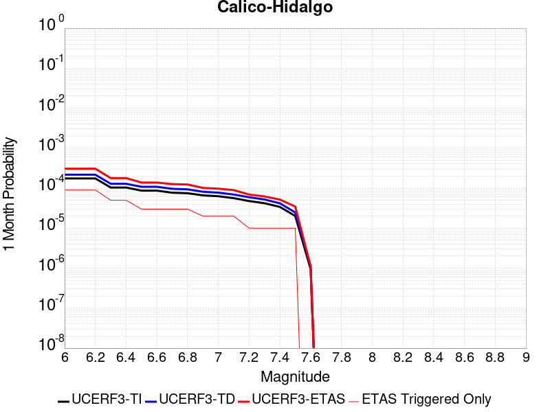 |  |  |

| Magnitude | 1 wk TI Prob | 1 wk TD Prob | 1 wk ETAS Prob | 1 wk ETAS/TD Gain | 1 wk ETAS Triggered Only | 1 mo TI Prob | 1 mo TD Prob | 1 mo ETAS Prob | 1 mo ETAS/TD Gain | 1 mo ETAS Triggered Only | 1 yr TI Prob | 1 yr TD Prob | 1 yr ETAS Prob | 1 yr ETAS/TD Gain | 1 yr ETAS Triggered Only | 10 yr TI Prob | 10 yr TD Prob | 10 yr ETAS Prob | 10 yr ETAS/TD Gain | 10 yr ETAS Triggered Only |
|-----|-----|-----|-----|-----|-----|-----|-----|-----|-----|-----|-----|-----|-----|-----|-----|-----|-----|-----|-----|-----|
| 6.0 | 4.0906612E-5 | 5.0703686E-5 | 1.07303524E-4 | 2.1162863 | 5.6602705E-5 | 1.7530227E-4 | 2.172857E-4 | 3.3046652E-4 | 1.5208848 | 1.1320541E-4 | 0.0021322158 | 0.002642648 | 0.0027555544 | 1.0427246 | 1.1320541E-4 | 0.02111873 | 0.026152607 | 0.026290413 | 1.0052693 | 1.4150677E-4 |
| 6.1 | 4.0906612E-5 | 5.0703686E-5 | 1.07303524E-4 | 2.1162863 | 5.6602705E-5 | 1.7530227E-4 | 2.172857E-4 | 3.3046652E-4 | 1.5208848 | 1.1320541E-4 | 0.0021322158 | 0.002642648 | 0.0027555544 | 1.0427246 | 1.1320541E-4 | 0.02111873 | 0.026152607 | 0.026290413 | 1.0052693 | 1.4150677E-4 |
| 6.2 | 4.0906612E-5 | 5.0703686E-5 | 1.07303524E-4 | 2.1162863 | 5.6602705E-5 | 1.7530227E-4 | 2.172857E-4 | 3.3046652E-4 | 1.5208848 | 1.1320541E-4 | 0.0021322158 | 0.002642648 | 0.0027555544 | 1.0427246 | 1.1320541E-4 | 0.02111873 | 0.026152607 | 0.026290413 | 1.0052693 | 1.4150677E-4 |
| 6.3 | 2.4242801E-5 | 3.0090669E-5 | 5.8391168E-5 | 1.9405075 | 2.8301352E-5 | 1.0389358E-4 | 1.2895382E-4 | 1.8554923E-4 | 1.4388812 | 5.6602705E-5 | 0.0012641704 | 0.0015689151 | 0.001625429 | 1.036021 | 5.6602705E-5 | 0.01257003 | 0.01558206 | 0.015637781 | 1.0035759 | 5.6602705E-5 |
| 6.4 | 2.4242801E-5 | 3.0090669E-5 | 5.8391168E-5 | 1.9405075 | 2.8301352E-5 | 1.0389358E-4 | 1.2895382E-4 | 1.8554923E-4 | 1.4388812 | 5.6602705E-5 | 0.0012641704 | 0.0015689151 | 0.001625429 | 1.036021 | 5.6602705E-5 | 0.01257003 | 0.01558206 | 0.015637781 | 1.0035759 | 5.6602705E-5 |
| 6.5 | 2.0286952E-5 | 2.5315738E-5 | 5.3616375E-5 | 2.1179068 | 2.8301352E-5 | 8.694118E-5 | 1.0849161E-4 | 1.3678988E-4 | 1.2608339 | 2.8301352E-5 | 0.0010579949 | 0.001320102 | 0.001348366 | 1.0214105 | 2.8301352E-5 | 0.010529719 | 0.013124538 | 0.013152468 | 1.0021281 | 2.8301352E-5 |
| 6.6 | 2.0269223E-5 | 2.5296687E-5 | 5.3597323E-5 | 2.1187487 | 2.8301352E-5 | 8.6865206E-5 | 1.08409964E-4 | 1.3670824E-4 | 1.2610303 | 2.8301352E-5 | 0.0010570707 | 0.0013191093 | 0.0013473734 | 1.0214266 | 2.8301352E-5 | 0.010520565 | 0.013114728 | 0.0131426575 | 1.0021297 | 2.8301352E-5 |
| 6.7 | 1.799852E-5 | 2.25406E-5 | 5.0841314E-5 | 2.255544 | 2.8301352E-5 | 7.713423E-5 | 9.659908E-5 | 1.2489769E-4 | 1.2929492 | 2.8301352E-5 | 9.3870464E-4 | 0.0011754738 | 0.0012037419 | 1.0240482 | 2.8301352E-5 | 0.009347493 | 0.011694173 | 0.011722144 | 1.0023918 | 2.8301352E-5 |
| 6.8 | 1.7458793E-5 | 2.184212E-5 | 5.0142855E-5 | 2.2956953 | 2.8301352E-5 | 7.4821255E-5 | 9.3605806E-5 | 1.21904515E-4 | 1.3023179 | 2.8301352E-5 | 9.10568E-4 | 0.0011390693 | 0.0011673385 | 1.0248177 | 2.8301352E-5 | 0.009068459 | 0.011333893 | 0.011361874 | 1.0024687 | 2.8301352E-5 |
| 6.9 | 1.542884E-5 | 1.9025927E-5 | 4.7326743E-5 | 2.4874868 | 2.8301352E-5 | 6.612192E-5 | 8.153721E-5 | 1.09836255E-4 | 1.347069 | 2.8301352E-5 | 8.04737E-4 | 9.922766E-4 | 0.0010205499 | 1.0284933 | 2.8301352E-5 | 0.008018291 | 0.009879857 | 0.00990788 | 1.0028362 | 2.8301352E-5 |
| 7.0 | 1.468253E-5 | 1.8030598E-5 | 4.6331443E-5 | 2.5696008 | 2.8301352E-5 | 6.292361E-5 | 7.7271776E-5 | 1.0557094E-4 | 1.3662289 | 2.8301352E-5 | 7.658257E-4 | 9.4039086E-4 | 9.686656E-4 | 1.030067 | 2.8301352E-5 | 0.0076319184 | 0.009365481 | 0.009393518 | 1.0029936 | 2.8301352E-5 |
| 7.1 | 1.3139281E-5 | 1.6200942E-5 | 4.4501838E-5 | 2.7468672 | 2.8301352E-5 | 5.6309986E-5 | 6.943083E-5 | 9.773022E-5 | 1.4075911 | 2.8301352E-5 | 6.853584E-4 | 8.4500515E-4 | 8.732826E-4 | 1.0334642 | 2.8301352E-5 | 0.0068324856 | 0.0084192185 | 0.008447282 | 1.0033332 | 2.8301352E-5 |
| 7.2 | 1.1127404E-5 | 1.3866597E-5 | 4.2167558E-5 | 3.0409448 | 2.8301352E-5 | 4.7688E-5 | 5.942698E-5 | 8.772665E-5 | 1.4762092 | 2.8301352E-5 | 5.8044674E-4 | 7.232942E-4 | 7.515751E-4 | 1.0391 | 2.8301352E-5 | 0.0057893298 | 0.0072105085 | 0.007238606 | 1.0038967 | 2.8301352E-5 |
| 7.3 | 9.808154E-6 | 1.2176215E-5 | 4.047722E-5 | 3.3242862 | 2.8301352E-5 | 4.2034266E-5 | 5.2182797E-5 | 8.048267E-5 | 1.5423219 | 2.8301352E-5 | 5.11647E-4 | 6.3515105E-4 | 6.6343445E-4 | 1.0445302 | 2.8301352E-5 | 0.0051047057 | 0.006334433 | 0.006362555 | 1.0044396 | 2.8301352E-5 |
| 7.4 | 7.942452E-6 | 9.792144E-6 | 3.8093218E-5 | 3.890182 | 2.8301352E-5 | 3.4038632E-5 | 4.1965708E-5 | 7.026587E-5 | 1.6743641 | 2.8301352E-5 | 4.1434157E-4 | 5.1082217E-4 | 5.3910905E-4 | 1.0553752 | 2.8301352E-5 | 0.0041356985 | 0.005097421 | 0.005125578 | 1.0055238 | 2.8301352E-5 |
| 7.5 | 4.7121216E-6 | 5.772836E-6 | 3.4074026E-5 | 5.902476 | 2.8301352E-5 | 2.019465E-5 | 2.4740535E-5 | 5.304119E-5 | 2.1438982 | 2.8301352E-5 | 2.4584212E-4 | 3.0118204E-4 | 3.294749E-4 | 1.0939393 | 2.8301352E-5 | 0.0024557032 | 0.0030084911 | 0.0030367074 | 1.0093789 | 2.8301352E-5 |
| 7.6 | 2.21172E-7 | 2.603961E-7 | 2.603961E-7 | 1.0 | 0.0 | 9.478797E-7 | 1.1159829E-6 | 1.1159829E-6 | 1.0 | 0.0 | 1.1540374E-5 | 1.3587036E-5 | 1.3587036E-5 | 1.0 | 0.0 | 1.1539775E-4 | 1.3586486E-4 | 1.3586486E-4 | 1.0 | 0.0 |

## Death Valley (Fish Lake Valley)
*[(top)](#table-of-contents)*

| 1 Week | 1 Month | 1 Year | 10 Year |
|-----|-----|-----|-----|
|  |  |  |  |

| Magnitude | 1 wk TI Prob | 1 wk TD Prob | 1 wk ETAS Prob | 1 wk ETAS/TD Gain | 1 wk ETAS Triggered Only | 1 mo TI Prob | 1 mo TD Prob | 1 mo ETAS Prob | 1 mo ETAS/TD Gain | 1 mo ETAS Triggered Only | 1 yr TI Prob | 1 yr TD Prob | 1 yr ETAS Prob | 1 yr ETAS/TD Gain | 1 yr ETAS Triggered Only | 10 yr TI Prob | 10 yr TD Prob | 10 yr ETAS Prob | 10 yr ETAS/TD Gain | 10 yr ETAS Triggered Only |
|-----|-----|-----|-----|-----|-----|-----|-----|-----|-----|-----|-----|-----|-----|-----|-----|-----|-----|-----|-----|-----|
| 6.0 | 3.872328E-5 | 4.7267473E-5 | 1.6046753E-4 | 3.394883 | 1.1320541E-4 | 1.6594635E-4 | 2.0256084E-4 | 3.1574332E-4 | 1.5587579 | 1.1320541E-4 | 0.0020185246 | 0.002463534 | 0.0026046922 | 1.057299 | 1.4150677E-4 | 0.02000288 | 0.024388181 | 0.024526237 | 1.0056608 | 1.4150677E-4 |
| 6.1 | 3.872328E-5 | 4.7267473E-5 | 1.6046753E-4 | 3.394883 | 1.1320541E-4 | 1.6594635E-4 | 2.0256084E-4 | 3.1574332E-4 | 1.5587579 | 1.1320541E-4 | 0.0020185246 | 0.002463534 | 0.0026046922 | 1.057299 | 1.4150677E-4 | 0.02000288 | 0.024388181 | 0.024526237 | 1.0056608 | 1.4150677E-4 |
| 6.2 | 3.872328E-5 | 4.7267473E-5 | 1.6046753E-4 | 3.394883 | 1.1320541E-4 | 1.6594635E-4 | 2.0256084E-4 | 3.1574332E-4 | 1.5587579 | 1.1320541E-4 | 0.0020185246 | 0.002463534 | 0.0026046922 | 1.057299 | 1.4150677E-4 | 0.02000288 | 0.024388181 | 0.024526237 | 1.0056608 | 1.4150677E-4 |
| 6.3 | 2.8356371E-5 | 3.3609853E-5 | 1.4681146E-4 | 4.368108 | 1.1320541E-4 | 1.2152165E-4 | 1.4403471E-4 | 2.5722382E-4 | 1.785846 | 1.1320541E-4 | 0.0014785219 | 0.0017522911 | 0.0018935499 | 1.0806137 | 1.4150677E-4 | 0.014687235 | 0.017391782 | 0.017530829 | 1.0079949 | 1.4150677E-4 |
| 6.4 | 2.8356371E-5 | 3.3609853E-5 | 1.4681146E-4 | 4.368108 | 1.1320541E-4 | 1.2152165E-4 | 1.4403471E-4 | 2.5722382E-4 | 1.785846 | 1.1320541E-4 | 0.0014785219 | 0.0017522911 | 0.0018935499 | 1.0806137 | 1.4150677E-4 | 0.014687235 | 0.017391782 | 0.017530829 | 1.0079949 | 1.4150677E-4 |
| 6.5 | 2.4448687E-5 | 2.8607552E-5 | 1.4180972E-4 | 4.9570727 | 1.1320541E-4 | 1.0477588E-4 | 1.2259831E-4 | 2.3578985E-4 | 1.9232715 | 1.1320541E-4 | 0.0012748998 | 0.0014916632 | 0.0016329588 | 1.0947236 | 1.4150677E-4 | 0.012676105 | 0.014821377 | 0.014960786 | 1.009406 | 1.4150677E-4 |
| 6.6 | 2.1298161E-5 | 2.4660083E-5 | 1.378627E-4 | 5.5905204 | 1.1320541E-4 | 9.127464E-5 | 1.0568198E-4 | 2.1887543E-4 | 2.0710762 | 1.1320541E-4 | 0.0011107022 | 0.0012859525 | 0.0014272773 | 1.1098989 | 1.4150677E-4 | 0.011051672 | 0.012788526 | 0.012928222 | 1.0109236 | 1.4150677E-4 |
| 6.7 | 1.8959729E-5 | 2.1781025E-5 | 1.3498397E-4 | 6.1973195 | 1.1320541E-4 | 8.125345E-5 | 9.334405E-5 | 2.065389E-4 | 2.2126625 | 1.1320541E-4 | 9.888117E-4 | 0.001135897 | 0.001277243 | 1.1244357 | 1.4150677E-4 | 0.009844234 | 0.01130357 | 0.011443477 | 1.0123773 | 1.4150677E-4 |
| 6.8 | 1.6691629E-5 | 1.9018353E-5 | 1.3222161E-4 | 6.9523168 | 1.1320541E-4 | 7.153359E-5 | 8.150477E-5 | 1.9470096E-4 | 2.388829 | 1.1320541E-4 | 8.7057345E-4 | 9.918857E-4 | 0.001133252 | 1.1425229 | 1.4150677E-4 | 0.008671708 | 0.009876343 | 0.0100164525 | 1.0141864 | 1.4150677E-4 |
| 6.9 | 1.450505E-5 | 1.638954E-5 | 1.295931E-4 | 7.907061 | 1.1320541E-4 | 6.216302E-5 | 7.0239046E-5 | 1.834365E-4 | 2.611603 | 1.1320541E-4 | 7.5657194E-4 | 8.5483363E-4 | 9.962195E-4 | 1.1653957 | 1.4150677E-4 | 0.007540013 | 0.008516385 | 0.008656687 | 1.0164744 | 1.4150677E-4 |
| 7.0 | 1.2940855E-5 | 1.4537972E-5 | 1.2774173E-4 | 8.786765 | 1.1320541E-4 | 5.545963E-5 | 6.230414E-5 | 1.755025E-4 | 2.8168674 | 1.1320541E-4 | 6.750118E-4 | 7.5829466E-4 | 8.9969416E-4 | 1.1864704 | 1.4150677E-4 | 0.006729651 | 0.0075576897 | 0.007698127 | 1.018582 | 1.4150677E-4 |
| 7.1 | 1.2544658E-5 | 1.4078208E-5 | 1.2728202E-4 | 9.041067 | 1.1320541E-4 | 5.3761712E-5 | 6.0333812E-5 | 1.7353239E-4 | 2.8762047 | 1.1320541E-4 | 6.5435225E-4 | 7.343222E-4 | 8.7572506E-4 | 1.1925625 | 1.4150677E-4 | 0.006524288 | 0.007319551 | 0.007460022 | 1.0191911 | 1.4150677E-4 |
| 7.2 | 1.2489416E-5 | 1.4015674E-5 | 1.272195E-4 | 9.076944 | 1.1320541E-4 | 5.3524967E-5 | 6.0065824E-5 | 1.7326443E-4 | 2.884576 | 1.1320541E-4 | 6.514716E-4 | 7.310616E-4 | 8.7246497E-4 | 1.1934218 | 1.4150677E-4 | 0.006495651 | 0.0072871596 | 0.007427635 | 1.0192771 | 1.4150677E-4 |
| 7.3 | 1.2368307E-5 | 1.3879812E-5 | 1.2708365E-4 | 9.156007 | 1.1320541E-4 | 5.3005948E-5 | 5.9483587E-5 | 1.7268227E-4 | 2.9030237 | 1.1320541E-4 | 6.451563E-4 | 7.2397763E-4 | 8.653819E-4 | 1.1953158 | 1.4150677E-4 | 0.0064328653 | 0.007216782 | 0.007357267 | 1.0194665 | 1.4150677E-4 |
| 7.4 | 1.2161707E-5 | 1.36478675E-5 | 1.2685174E-4 | 9.29462 | 1.1320541E-4 | 5.212056E-5 | 5.8489582E-5 | 1.7168837E-4 | 2.9353666 | 1.1320541E-4 | 6.3438306E-4 | 7.118836E-4 | 8.532896E-4 | 1.1986364 | 1.4150677E-4 | 0.006325751 | 0.0070966207 | 0.0072371233 | 1.0197985 | 1.4150677E-4 |
| 7.5 | 1.1707948E-5 | 1.3145515E-5 | 9.8048455E-5 | 7.4587 | 8.490406E-5 | 5.0175953E-5 | 5.6336736E-5 | 1.4123601E-4 | 2.5069966 | 8.490406E-5 | 6.10721E-4 | 6.856895E-4 | 7.9881726E-4 | 1.164984 | 1.1320541E-4 | 0.0060904534 | 0.006836321 | 0.006948753 | 1.0164462 | 1.1320541E-4 |
| 7.6 | 1.0319538E-5 | 1.1579622E-5 | 9.64827E-5 | 8.332111 | 8.490406E-5 | 4.4225842E-5 | 4.9626036E-5 | 1.3452588E-4 | 2.7107923 | 8.490406E-5 | 5.383166E-4 | 6.040347E-4 | 6.8888743E-4 | 1.1404767 | 8.490406E-5 | 0.0053701443 | 0.0060244603 | 0.006108853 | 1.0140083 | 8.490406E-5 |
| 7.7 | 8.937764E-6 | 1.0022779E-5 | 9.4925985E-5 | 9.4710245 | 8.490406E-5 | 3.830414E-5 | 4.295409E-5 | 1.278545E-4 | 2.9765384 | 8.490406E-5 | 4.6625308E-4 | 5.228456E-4 | 6.0770527E-4 | 1.1623034 | 8.490406E-5 | 0.0046527605 | 0.005216664 | 0.0053011253 | 1.0161906 | 8.490406E-5 |
| 7.8 | 3.108007E-7 | 3.284654E-7 | 3.284654E-7 | 1.0 | 0.0 | 1.3320023E-6 | 1.407708E-6 | 1.407708E-6 | 1.0 | 0.0 | 1.6217007E-5 | 1.7138715E-5 | 1.7138715E-5 | 1.0 | 0.0 | 1.6215823E-4 | 1.7137431E-4 | 1.7137431E-4 | 1.0 | 0.0 |
| 7.9 | 2.5591178E-9 | 2.6696718E-9 | 2.6696718E-9 | 1.0 | 0.0 | 1.0967647E-8 | 1.14414505E-8 | 1.14414505E-8 | 1.0 | 0.0 | 1.335311E-7 | 1.3929966E-7 | 1.3929966E-7 | 1.0 | 0.0 | 1.3353102E-6 | 1.3929966E-6 | 1.3929966E-6 | 1.0 | 0.0 |

## Lake Isabella (Seismicity)
*[(top)](#table-of-contents)*

| 1 Week | 1 Month | 1 Year | 10 Year |
|-----|-----|-----|-----|
|  |  |  |  |

| Magnitude | 1 wk TI Prob | 1 wk TD Prob | 1 wk ETAS Prob | 1 wk ETAS/TD Gain | 1 wk ETAS Triggered Only | 1 mo TI Prob | 1 mo TD Prob | 1 mo ETAS Prob | 1 mo ETAS/TD Gain | 1 mo ETAS Triggered Only | 1 yr TI Prob | 1 yr TD Prob | 1 yr ETAS Prob | 1 yr ETAS/TD Gain | 1 yr ETAS Triggered Only | 10 yr TI Prob | 10 yr TD Prob | 10 yr ETAS Prob | 10 yr ETAS/TD Gain | 10 yr ETAS Triggered Only |
|-----|-----|-----|-----|-----|-----|-----|-----|-----|-----|-----|-----|-----|-----|-----|-----|-----|-----|-----|-----|-----|
| 6.0 | 9.431637E-6 | 9.741651E-6 | 1.5124703E-4 | 15.52581 | 1.4150677E-4 | 4.0420677E-5 | 4.1749343E-5 | 1.832502E-4 | 4.3892956 | 1.4150677E-4 | 4.920106E-4 | 5.0819275E-4 | 6.496276E-4 | 1.2783095 | 1.4150677E-4 | 0.004909227 | 0.005071599 | 0.005212388 | 1.0277603 | 1.4150677E-4 |
| 6.1 | 9.431637E-6 | 9.741651E-6 | 1.5124703E-4 | 15.52581 | 1.4150677E-4 | 4.0420677E-5 | 4.1749343E-5 | 1.832502E-4 | 4.3892956 | 1.4150677E-4 | 4.920106E-4 | 5.0819275E-4 | 6.496276E-4 | 1.2783095 | 1.4150677E-4 | 0.004909227 | 0.005071599 | 0.005212388 | 1.0277603 | 1.4150677E-4 |
| 6.2 | 9.431637E-6 | 9.741651E-6 | 1.5124703E-4 | 15.52581 | 1.4150677E-4 | 4.0420677E-5 | 4.1749343E-5 | 1.832502E-4 | 4.3892956 | 1.4150677E-4 | 4.920106E-4 | 5.0819275E-4 | 6.496276E-4 | 1.2783095 | 1.4150677E-4 | 0.004909227 | 0.005071599 | 0.005212388 | 1.0277603 | 1.4150677E-4 |
| 6.3 | 9.431637E-6 | 9.741651E-6 | 1.5124703E-4 | 15.52581 | 1.4150677E-4 | 4.0420677E-5 | 4.1749343E-5 | 1.832502E-4 | 4.3892956 | 1.4150677E-4 | 4.920106E-4 | 5.0819275E-4 | 6.496276E-4 | 1.2783095 | 1.4150677E-4 | 0.004909227 | 0.005071599 | 0.005212388 | 1.0277603 | 1.4150677E-4 |
| 6.4 | 5.144063E-6 | 5.3000763E-6 | 6.190248E-5 | 11.679545 | 5.6602705E-5 | 2.2045799E-5 | 2.2714434E-5 | 7.9315854E-5 | 3.4918702 | 5.6602705E-5 | 2.6837454E-4 | 2.765166E-4 | 3.3310364E-4 | 1.2046425 | 5.6602705E-5 | 0.0026805066 | 0.0027620657 | 0.002818512 | 1.0204363 | 5.6602705E-5 |
| 6.5 | 5.144063E-6 | 5.3000763E-6 | 6.190248E-5 | 11.679545 | 5.6602705E-5 | 2.2045799E-5 | 2.2714434E-5 | 7.9315854E-5 | 3.4918702 | 5.6602705E-5 | 2.6837454E-4 | 2.765166E-4 | 3.3310364E-4 | 1.2046425 | 5.6602705E-5 | 0.0026805066 | 0.0027620657 | 0.002818512 | 1.0204363 | 5.6602705E-5 |
| 6.6 | 3.4009804E-6 | 3.498786E-6 | 3.180004E-5 | 9.088878 | 2.8301352E-5 | 1.4575549E-5 | 1.4994721E-5 | 4.3295648E-5 | 2.8873928 | 2.8301352E-5 | 1.7744285E-4 | 1.8254704E-4 | 2.1084322E-4 | 1.1550076 | 2.8301352E-5 | 0.0017730123 | 0.0018241286 | 0.0018523784 | 1.0154867 | 2.8301352E-5 |
| 6.7 | 3.3880428E-6 | 3.4856528E-6 | 3.1786905E-5 | 9.119355 | 2.8301352E-5 | 1.4520103E-5 | 1.4938435E-5 | 4.3239364E-5 | 2.8945043 | 2.8301352E-5 | 1.767679E-4 | 1.8186188E-4 | 2.1015808E-4 | 1.1555917 | 2.8301352E-5 | 0.0017662736 | 0.0018172882 | 0.0018455382 | 1.0155451 | 2.8301352E-5 |
| 6.8 | 2.6582E-6 | 2.7337003E-6 | 3.1034975E-5 | 11.3527355 | 2.8301352E-5 | 1.1392236E-5 | 1.1715813E-5 | 4.0016836E-5 | 3.4156258 | 2.8301352E-5 | 1.3869164E-4 | 1.4263204E-4 | 1.7092934E-4 | 1.1983938 | 2.8301352E-5 | 0.0013860512 | 0.0014255369 | 0.0014537979 | 1.0198249 | 2.8301352E-5 |
| 6.9 | 2.406011E-6 | 2.4743288E-6 | 3.0775613E-5 | 12.4379635 | 2.8301352E-5 | 1.0311434E-5 | 1.0604231E-5 | 3.8905284E-5 | 3.6688454 | 2.8301352E-5 | 1.2553448E-4 | 1.2910018E-4 | 1.5739788E-4 | 1.2191918 | 2.8301352E-5 | 0.0012546359 | 0.0012903814 | 0.0013186462 | 1.0219042 | 2.8301352E-5 |
| 7.0 | 1.6953097E-6 | 1.7429371E-6 | 1.7429371E-6 | 1.0 | 0.0 | 7.265593E-6 | 7.469715E-6 | 7.469715E-6 | 1.0 | 0.0 | 8.8455E-5 | 9.094104E-5 | 9.094104E-5 | 1.0 | 0.0 | 8.84198E-4 | 9.09141E-4 | 9.09141E-4 | 1.0 | 0.0 |
| 7.1 | 3.5013824E-7 | 3.5714822E-7 | 3.5714822E-7 | 1.0 | 0.0 | 1.5005916E-6 | 1.5306344E-6 | 1.5306344E-6 | 1.0 | 0.0 | 1.826955E-5 | 1.8635317E-5 | 1.8635317E-5 | 1.0 | 0.0 | 1.8268047E-4 | 1.863378E-4 | 1.863378E-4 | 1.0 | 0.0 |
| 7.2 | 2.2321095E-7 | 2.2750574E-7 | 2.2750574E-7 | 1.0 | 0.0 | 9.56618E-7 | 9.750242E-7 | 9.750242E-7 | 1.0 | 0.0 | 1.1646762E-5 | 1.1870856E-5 | 1.1870856E-5 | 1.0 | 0.0 | 1.1646151E-4 | 1.1870232E-4 | 1.1870232E-4 | 1.0 | 0.0 |
| 7.3 | 1.5760406E-7 | 1.6060922E-7 | 1.6060922E-7 | 1.0 | 0.0 | 6.7544585E-7 | 6.8832503E-7 | 6.8832503E-7 | 1.0 | 0.0 | 8.223522E-6 | 8.380326E-6 | 8.380326E-6 | 1.0 | 0.0 | 8.2232174E-5 | 8.3800165E-5 | 8.3800165E-5 | 1.0 | 0.0 |
| 7.4 | 1.1216497E-7 | 1.1431706E-7 | 1.1431706E-7 | 1.0 | 0.0 | 4.8070694E-7 | 4.899302E-7 | 4.899302E-7 | 1.0 | 0.0 | 5.852591E-6 | 5.964884E-6 | 5.964884E-6 | 1.0 | 0.0 | 5.8524372E-5 | 5.9647282E-5 | 5.9647282E-5 | 1.0 | 0.0 |
| 7.5 | 4.885185E-8 | 4.9787737E-8 | 4.9787737E-8 | 1.0 | 0.0 | 2.0936506E-7 | 2.13376E-7 | 2.13376E-7 | 1.0 | 0.0 | 2.5490165E-6 | 2.59785E-6 | 2.59785E-6 | 1.0 | 0.0 | 2.5489873E-5 | 2.5978214E-5 | 2.5978214E-5 | 1.0 | 0.0 |
| 7.6 | 1.504641E-9 | 1.5317903E-9 | 1.5317903E-9 | 1.0 | 0.0 | 6.4484613E-9 | 6.5648154E-9 | 6.5648154E-9 | 1.0 | 0.0 | 7.851001E-8 | 7.992663E-8 | 7.992663E-8 | 1.0 | 0.0 | 7.8509987E-7 | 7.992663E-7 | 7.992663E-7 | 1.0 | 0.0 |

## Cady
*[(top)](#table-of-contents)*

| 1 Week | 1 Month | 1 Year | 10 Year |
|-----|-----|-----|-----|
|  |  |  |  |

| Magnitude | 1 wk TI Prob | 1 wk TD Prob | 1 wk ETAS Prob | 1 wk ETAS/TD Gain | 1 wk ETAS Triggered Only | 1 mo TI Prob | 1 mo TD Prob | 1 mo ETAS Prob | 1 mo ETAS/TD Gain | 1 mo ETAS Triggered Only | 1 yr TI Prob | 1 yr TD Prob | 1 yr ETAS Prob | 1 yr ETAS/TD Gain | 1 yr ETAS Triggered Only | 10 yr TI Prob | 10 yr TD Prob | 10 yr ETAS Prob | 10 yr ETAS/TD Gain | 10 yr ETAS Triggered Only |
|-----|-----|-----|-----|-----|-----|-----|-----|-----|-----|-----|-----|-----|-----|-----|-----|-----|-----|-----|-----|-----|
| 6.0 | 1.9892565E-5 | 2.1858728E-5 | 1.3506167E-4 | 6.1788435 | 1.1320541E-4 | 8.525106E-5 | 9.3677416E-5 | 2.0687222E-4 | 2.2083468 | 1.1320541E-4 | 0.0010374374 | 0.0011400167 | 0.001253093 | 1.0991883 | 1.1320541E-4 | 0.010326075 | 0.011350701 | 0.01146262 | 1.0098603 | 1.1320541E-4 |
| 6.1 | 1.9892565E-5 | 2.1858728E-5 | 1.3506167E-4 | 6.1788435 | 1.1320541E-4 | 8.525106E-5 | 9.3677416E-5 | 2.0687222E-4 | 2.2083468 | 1.1320541E-4 | 0.0010374374 | 0.0011400167 | 0.001253093 | 1.0991883 | 1.1320541E-4 | 0.010326075 | 0.011350701 | 0.01146262 | 1.0098603 | 1.1320541E-4 |
| 6.2 | 1.9892565E-5 | 2.1858728E-5 | 1.3506167E-4 | 6.1788435 | 1.1320541E-4 | 8.525106E-5 | 9.3677416E-5 | 2.0687222E-4 | 2.2083468 | 1.1320541E-4 | 0.0010374374 | 0.0011400167 | 0.001253093 | 1.0991883 | 1.1320541E-4 | 0.010326075 | 0.011350701 | 0.01146262 | 1.0098603 | 1.1320541E-4 |
| 6.3 | 1.1117327E-5 | 1.2176583E-5 | 9.707961E-5 | 7.9726477 | 8.490406E-5 | 4.764482E-5 | 5.2184492E-5 | 1.3708412E-4 | 2.626913 | 8.490406E-5 | 5.7992124E-4 | 6.351925E-4 | 7.200426E-4 | 1.1335818 | 8.490406E-5 | 0.0057841022 | 0.0063368753 | 0.0064212414 | 1.0133135 | 8.490406E-5 |
| 6.4 | 1.1117327E-5 | 1.2176583E-5 | 9.707961E-5 | 7.9726477 | 8.490406E-5 | 4.764482E-5 | 5.2184492E-5 | 1.3708412E-4 | 2.626913 | 8.490406E-5 | 5.7992124E-4 | 6.351925E-4 | 7.200426E-4 | 1.1335818 | 8.490406E-5 | 0.0057841022 | 0.0063368753 | 0.0064212414 | 1.0133135 | 8.490406E-5 |
| 6.5 | 6.103093E-6 | 6.672021E-6 | 3.4973185E-5 | 5.241768 | 2.8301352E-5 | 2.615585E-5 | 2.8594131E-5 | 5.6894674E-5 | 1.9897326 | 2.8301352E-5 | 3.1840094E-4 | 3.480905E-4 | 3.76382E-4 | 1.0812763 | 2.8301352E-5 | 0.0031794512 | 0.0034766865 | 0.0035048896 | 1.0081121 | 2.8301352E-5 |
| 6.6 | 5.817237E-6 | 6.3656585E-6 | 3.466683E-5 | 5.4459143 | 2.8301352E-5 | 2.4930776E-5 | 2.728118E-5 | 5.558176E-5 | 2.0373664 | 2.8301352E-5 | 3.034899E-4 | 3.3211018E-4 | 3.6040213E-4 | 1.0851885 | 2.8301352E-5 | 0.0030307577 | 0.0033173605 | 0.003345568 | 1.008503 | 2.8301352E-5 |
| 6.7 | 4.8846314E-6 | 5.3405684E-6 | 5.3405684E-6 | 1.0 | 0.0 | 2.0933967E-5 | 2.2888014E-5 | 2.2888014E-5 | 1.0 | 0.0 | 2.5484123E-4 | 2.7863772E-4 | 2.7863772E-4 | 1.0 | 0.0 | 0.0025454918 | 0.0027840391 | 0.0027840391 | 1.0 | 0.0 |
| 6.8 | 1.7788773E-6 | 1.9399079E-6 | 1.9399079E-6 | 1.0 | 0.0 | 7.6237375E-6 | 8.313874E-6 | 8.313874E-6 | 1.0 | 0.0 | 9.281505E-5 | 1.01218284E-4 | 1.01218284E-4 | 1.0 | 0.0 | 9.2776294E-4 | 0.0010118765 | 0.0010118765 | 1.0 | 0.0 |
| 6.9 | 7.5455404E-7 | 8.297092E-7 | 8.297092E-7 | 1.0 | 0.0 | 3.233799E-6 | 3.5558937E-6 | 3.5558937E-6 | 1.0 | 0.0 | 3.937079E-5 | 4.3292483E-5 | 4.3292483E-5 | 1.0 | 0.0 | 3.9363815E-4 | 4.3287344E-4 | 4.3287344E-4 | 1.0 | 0.0 |
| 7.0 | 6.8578805E-7 | 7.541816E-7 | 7.541816E-7 | 1.0 | 0.0 | 2.9390883E-6 | 3.2322048E-6 | 3.2322048E-6 | 1.0 | 0.0 | 3.578281E-5 | 3.9351715E-5 | 3.9351715E-5 | 1.0 | 0.0 | 3.577705E-4 | 3.9347992E-4 | 3.9347992E-4 | 1.0 | 0.0 |

## San Jacinto (San Bernardino)
*[(top)](#table-of-contents)*

| 1 Week | 1 Month | 1 Year | 10 Year |
|-----|-----|-----|-----|
|  |  |  |  |

| Magnitude | 1 wk TI Prob | 1 wk TD Prob | 1 wk ETAS Prob | 1 wk ETAS/TD Gain | 1 wk ETAS Triggered Only | 1 mo TI Prob | 1 mo TD Prob | 1 mo ETAS Prob | 1 mo ETAS/TD Gain | 1 mo ETAS Triggered Only | 1 yr TI Prob | 1 yr TD Prob | 1 yr ETAS Prob | 1 yr ETAS/TD Gain | 1 yr ETAS Triggered Only | 10 yr TI Prob | 10 yr TD Prob | 10 yr ETAS Prob | 10 yr ETAS/TD Gain | 10 yr ETAS Triggered Only |
|-----|-----|-----|-----|-----|-----|-----|-----|-----|-----|-----|-----|-----|-----|-----|-----|-----|-----|-----|-----|-----|
| 6.0 | 3.409352E-5 | 3.5986508E-5 | 1.4918785E-4 | 4.1456604 | 1.1320541E-4 | 1.461069E-4 | 1.542188E-4 | 2.6740675E-4 | 1.7339439 | 1.1320541E-4 | 0.0017774 | 0.0018759987 | 0.0019889919 | 1.0602309 | 1.1320541E-4 | 0.01763251 | 0.019349935 | 0.01946095 | 1.0057372 | 1.1320541E-4 |
| 6.1 | 3.409352E-5 | 3.5986508E-5 | 1.4918785E-4 | 4.1456604 | 1.1320541E-4 | 1.461069E-4 | 1.542188E-4 | 2.6740675E-4 | 1.7339439 | 1.1320541E-4 | 0.0017774 | 0.0018759987 | 0.0019889919 | 1.0602309 | 1.1320541E-4 | 0.01763251 | 0.019349935 | 0.01946095 | 1.0057372 | 1.1320541E-4 |
| 6.2 | 3.409352E-5 | 3.5986508E-5 | 1.4918785E-4 | 4.1456604 | 1.1320541E-4 | 1.461069E-4 | 1.542188E-4 | 2.6740675E-4 | 1.7339439 | 1.1320541E-4 | 0.0017774 | 0.0018759987 | 0.0019889919 | 1.0602309 | 1.1320541E-4 | 0.01763251 | 0.019349935 | 0.01946095 | 1.0057372 | 1.1320541E-4 |
| 6.3 | 3.409352E-5 | 3.5986508E-5 | 1.4918785E-4 | 4.1456604 | 1.1320541E-4 | 1.461069E-4 | 1.542188E-4 | 2.6740675E-4 | 1.7339439 | 1.1320541E-4 | 0.0017774 | 0.0018759987 | 0.0019889919 | 1.0602309 | 1.1320541E-4 | 0.01763251 | 0.019349935 | 0.01946095 | 1.0057372 | 1.1320541E-4 |
| 6.4 | 3.400795E-5 | 3.5879173E-5 | 1.4908052E-4 | 4.1550713 | 1.1320541E-4 | 1.4574021E-4 | 1.5375883E-4 | 2.6694682E-4 | 1.7361399 | 1.1320541E-4 | 0.0017729428 | 0.0018704084 | 0.001983402 | 1.0604112 | 1.1320541E-4 | 0.017588645 | 0.019295016 | 0.019406037 | 1.0057539 | 1.1320541E-4 |
| 6.5 | 3.341482E-5 | 3.5139812E-5 | 1.4834125E-4 | 4.2214584 | 1.1320541E-4 | 1.4319851E-4 | 1.5059051E-4 | 2.6377887E-4 | 1.7516302 | 1.1320541E-4 | 0.0017420477 | 0.0018318989 | 0.001944897 | 1.0616835 | 1.1320541E-4 | 0.017284546 | 0.018916558 | 0.019027622 | 1.0058713 | 1.1320541E-4 |
| 6.6 | 3.3364955E-5 | 3.5077028E-5 | 1.4827847E-4 | 4.2272243 | 1.1320541E-4 | 1.4298483E-4 | 1.5032147E-4 | 2.6350986E-4 | 1.7529756 | 1.1320541E-4 | 0.0017394501 | 0.001828629 | 0.0019416275 | 1.061794 | 1.1320541E-4 | 0.017258976 | 0.018884424 | 0.018995492 | 1.0058814 | 1.1320541E-4 |
| 6.7 | 3.335922E-5 | 3.5066805E-5 | 1.4826824E-4 | 4.228165 | 1.1320541E-4 | 1.4296026E-4 | 1.5027766E-4 | 2.6346606E-4 | 1.7531952 | 1.1320541E-4 | 0.0017391514 | 0.0018280965 | 0.0019410949 | 1.061812 | 1.1320541E-4 | 0.017256035 | 0.018879214 | 0.018990284 | 1.0058831 | 1.1320541E-4 |
| 6.8 | 3.327683E-5 | 3.496087E-5 | 1.4816232E-4 | 4.2379475 | 1.1320541E-4 | 1.4260718E-4 | 1.498237E-4 | 2.6301216E-4 | 1.7554775 | 1.1320541E-4 | 0.0017348597 | 0.0018225788 | 0.001935578 | 1.0619996 | 1.1320541E-4 | 0.017213784 | 0.018824987 | 0.01893606 | 1.0059004 | 1.1320541E-4 |
| 6.9 | 3.3235785E-5 | 3.4901823E-5 | 1.4810328E-4 | 4.2434254 | 1.1320541E-4 | 1.4243131E-4 | 1.4957068E-4 | 2.6275916E-4 | 1.7567558 | 1.1320541E-4 | 0.0017327217 | 0.0018195034 | 0.0019325028 | 1.0621046 | 1.1320541E-4 | 0.017192734 | 0.018794855 | 0.018905934 | 1.00591 | 1.1320541E-4 |
| 7.0 | 3.3197095E-5 | 3.4841752E-5 | 1.4804323E-4 | 4.2490172 | 1.1320541E-4 | 1.422655E-4 | 1.4931326E-4 | 2.6250177E-4 | 1.7580607 | 1.1320541E-4 | 0.0017307063 | 0.0018163746 | 0.0019293744 | 1.0622118 | 1.1320541E-4 | 0.017172894 | 0.018764233 | 0.018875314 | 1.0059198 | 1.1320541E-4 |
| 7.1 | 3.3129716E-5 | 3.4721965E-5 | 1.4792345E-4 | 4.2602267 | 1.1320541E-4 | 1.4197677E-4 | 1.4879994E-4 | 2.6198852E-4 | 1.7606761 | 1.1320541E-4 | 0.0017271966 | 0.0018101353 | 0.0019231358 | 1.0624266 | 1.1320541E-4 | 0.017138338 | 0.018703312 | 0.0188144 | 1.0059395 | 1.1320541E-4 |
| 7.2 | 3.3034008E-5 | 3.458941E-5 | 1.4779091E-4 | 4.272721 | 1.1320541E-4 | 1.4156665E-4 | 1.4823192E-4 | 2.6142056E-4 | 1.7635914 | 1.1320541E-4 | 0.0017222111 | 0.0018032312 | 0.0019162324 | 1.0626659 | 1.1320541E-4 | 0.017089253 | 0.018635705 | 0.0187468 | 1.0059614 | 1.1320541E-4 |
| 7.3 | 3.2956614E-5 | 3.445717E-5 | 1.4765868E-4 | 4.2852817 | 1.1320541E-4 | 1.4123498E-4 | 1.4766524E-4 | 2.6085394E-4 | 1.7665223 | 1.1320541E-4 | 0.0017181796 | 0.0017963431 | 0.0019093452 | 1.0629067 | 1.1320541E-4 | 0.017049557 | 0.018568452 | 0.018679556 | 1.0059835 | 1.1320541E-4 |
| 7.4 | 3.2915937E-5 | 3.4378863E-5 | 1.4758039E-4 | 4.2927647 | 1.1320541E-4 | 1.4106068E-4 | 1.4732967E-4 | 2.605184E-4 | 1.7682683 | 1.1320541E-4 | 0.0017160608 | 0.0017922645 | 0.001905267 | 1.0630502 | 1.1320541E-4 | 0.017028693 | 0.018528719 | 0.018639827 | 1.0059965 | 1.1320541E-4 |
| 7.5 | 3.281791E-5 | 3.4243778E-5 | 1.4744532E-4 | 4.3057547 | 1.1320541E-4 | 1.406406E-4 | 1.4675081E-4 | 2.599396E-4 | 1.7712994 | 1.1320541E-4 | 0.0017109542 | 0.0017852283 | 0.0018982316 | 1.0632991 | 1.1320541E-4 | 0.016978411 | 0.018459605 | 0.018570721 | 1.0060194 | 1.1320541E-4 |
| 7.6 | 3.2521442E-5 | 3.396873E-5 | 1.471703E-4 | 4.332523 | 1.1320541E-4 | 1.3937015E-4 | 1.4557215E-4 | 2.5876108E-4 | 1.7775452 | 1.1320541E-4 | 0.0016955109 | 0.0017709016 | 0.0018839065 | 1.0638121 | 1.1320541E-4 | 0.016826328 | 0.018317232 | 0.018428365 | 1.006067 | 1.1320541E-4 |
| 7.7 | 3.0287873E-5 | 3.245276E-5 | 1.456545E-4 | 4.4882 | 1.1320541E-4 | 1.297987E-4 | 1.3907586E-4 | 2.522655E-4 | 1.81387 | 1.1320541E-4 | 0.0015791537 | 0.0016919347 | 0.0018049486 | 1.0667957 | 1.1320541E-4 | 0.01567979 | 0.01752809 | 0.017639311 | 1.0063453 | 1.1320541E-4 |
| 7.8 | 2.6316151E-5 | 2.9663592E-5 | 1.4286564E-4 | 4.816195 | 1.1320541E-4 | 1.1277862E-4 | 1.2712348E-4 | 2.403145E-4 | 1.8904021 | 1.1320541E-4 | 0.0013722149 | 0.0015466306 | 0.001659661 | 1.0730816 | 1.1320541E-4 | 0.013637724 | 0.016069634 | 0.01618102 | 1.0069314 | 1.1320541E-4 |
| 7.9 | 2.0761147E-5 | 2.34181E-5 | 1.3662086E-4 | 5.8339853 | 1.1320541E-4 | 8.897331E-5 | 1.0035944E-4 | 2.1355349E-4 | 2.1278865 | 1.1320541E-4 | 0.0010827117 | 0.0012211921 | 0.0013342592 | 1.0925876 | 1.1320541E-4 | 0.010774517 | 0.012793174 | 0.012904931 | 1.0087357 | 1.1320541E-4 |
| 8.0 | 1.5738568E-5 | 1.6033575E-5 | 4.4334476E-5 | 2.7651021 | 2.8301352E-5 | 6.744926E-5 | 6.871352E-5 | 9.7012926E-5 | 1.4118463 | 2.8301352E-5 | 8.2088535E-4 | 8.3626667E-4 | 8.6454436E-4 | 1.0338142 | 2.8301352E-5 | 0.008178596 | 0.008865921 | 0.008893971 | 1.0031638 | 2.8301352E-5 |
| 8.1 | 1.0105832E-5 | 8.3304985E-6 | 8.3304985E-6 | 1.0 | 0.0 | 4.3309992E-5 | 3.570165E-5 | 3.570165E-5 | 1.0 | 0.0 | 5.2717153E-4 | 4.345814E-4 | 4.345814E-4 | 1.0 | 0.0 | 0.005259227 | 0.004677232 | 0.004677232 | 1.0 | 0.0 |
| 8.2 | 4.189207E-6 | 1.5784357E-6 | 1.5784357E-6 | 1.0 | 0.0 | 1.7953622E-5 | 6.7647065E-6 | 6.7647065E-6 | 1.0 | 0.0 | 2.1856341E-4 | 8.235722E-5 | 8.235722E-5 | 1.0 | 0.0 | 0.0021834858 | 9.565867E-4 | 9.565867E-4 | 1.0 | 0.0 |
| 8.3 | 1.2758221E-6 | 3.6149942E-7 | 3.6149942E-7 | 1.0 | 0.0 | 5.4677976E-6 | 1.5492824E-6 | 1.5492824E-6 | 1.0 | 0.0 | 6.65684E-5 | 1.8862354E-5 | 1.8862354E-5 | 1.0 | 0.0 | 6.6548464E-4 | 2.2751294E-4 | 2.2751294E-4 | 1.0 | 0.0 |

## Sierra Nevada  (No Extension)
*[(top)](#table-of-contents)*

| 1 Week | 1 Month | 1 Year | 10 Year |
|-----|-----|-----|-----|
|  | 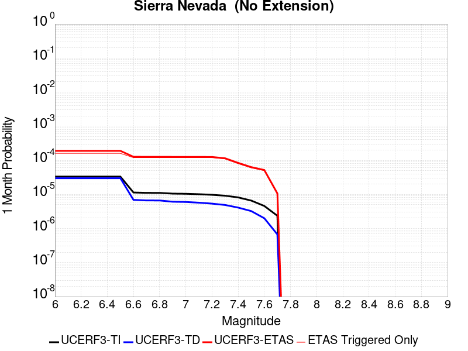 |  |  |

| Magnitude | 1 wk TI Prob | 1 wk TD Prob | 1 wk ETAS Prob | 1 wk ETAS/TD Gain | 1 wk ETAS Triggered Only | 1 mo TI Prob | 1 mo TD Prob | 1 mo ETAS Prob | 1 mo ETAS/TD Gain | 1 mo ETAS Triggered Only | 1 yr TI Prob | 1 yr TD Prob | 1 yr ETAS Prob | 1 yr ETAS/TD Gain | 1 yr ETAS Triggered Only | 10 yr TI Prob | 10 yr TD Prob | 10 yr ETAS Prob | 10 yr ETAS/TD Gain | 10 yr ETAS Triggered Only |
|-----|-----|-----|-----|-----|-----|-----|-----|-----|-----|-----|-----|-----|-----|-----|-----|-----|-----|-----|-----|-----|
| 6.0 | 7.7690465E-6 | 6.976322E-6 | 9.187979E-5 | 13.170234 | 8.490406E-5 | 3.329549E-5 | 2.9898381E-5 | 1.431004E-4 | 4.786226 | 1.1320541E-4 | 4.0529718E-4 | 3.6398784E-4 | 4.7715203E-4 | 1.310901 | 1.1320541E-4 | 0.004045588 | 0.0036374326 | 0.0037502262 | 1.0310091 | 1.1320541E-4 |
| 6.1 | 7.7690465E-6 | 6.976322E-6 | 9.187979E-5 | 13.170234 | 8.490406E-5 | 3.329549E-5 | 2.9898381E-5 | 1.431004E-4 | 4.786226 | 1.1320541E-4 | 4.0529718E-4 | 3.6398784E-4 | 4.7715203E-4 | 1.310901 | 1.1320541E-4 | 0.004045588 | 0.0036374326 | 0.0037502262 | 1.0310091 | 1.1320541E-4 |
| 6.2 | 7.7690465E-6 | 6.976322E-6 | 9.187979E-5 | 13.170234 | 8.490406E-5 | 3.329549E-5 | 2.9898381E-5 | 1.431004E-4 | 4.786226 | 1.1320541E-4 | 4.0529718E-4 | 3.6398784E-4 | 4.7715203E-4 | 1.310901 | 1.1320541E-4 | 0.004045588 | 0.0036374326 | 0.0037502262 | 1.0310091 | 1.1320541E-4 |
| 6.3 | 7.7690465E-6 | 6.976322E-6 | 9.187979E-5 | 13.170234 | 8.490406E-5 | 3.329549E-5 | 2.9898381E-5 | 1.431004E-4 | 4.786226 | 1.1320541E-4 | 4.0529718E-4 | 3.6398784E-4 | 4.7715203E-4 | 1.310901 | 1.1320541E-4 | 0.004045588 | 0.0036374326 | 0.0037502262 | 1.0310091 | 1.1320541E-4 |
| 6.4 | 7.7690465E-6 | 6.976322E-6 | 9.187979E-5 | 13.170234 | 8.490406E-5 | 3.329549E-5 | 2.9898381E-5 | 1.431004E-4 | 4.786226 | 1.1320541E-4 | 4.0529718E-4 | 3.6398784E-4 | 4.7715203E-4 | 1.310901 | 1.1320541E-4 | 0.004045588 | 0.0036374326 | 0.0037502262 | 1.0310091 | 1.1320541E-4 |
| 6.5 | 7.7690465E-6 | 6.976322E-6 | 9.187979E-5 | 13.170234 | 8.490406E-5 | 3.329549E-5 | 2.9898381E-5 | 1.431004E-4 | 4.786226 | 1.1320541E-4 | 4.0529718E-4 | 3.6398784E-4 | 4.7715203E-4 | 1.310901 | 1.1320541E-4 | 0.004045588 | 0.0036374326 | 0.0037502262 | 1.0310091 | 1.1320541E-4 |
| 6.6 | 2.653E-6 | 1.614854E-6 | 5.821747E-5 | 36.051228 | 5.6602705E-5 | 1.136995E-5 | 6.9207845E-6 | 6.35231E-5 | 9.178597 | 5.6602705E-5 | 1.3842035E-4 | 8.425733E-5 | 1.4085526E-4 | 1.6717272 | 5.6602705E-5 | 0.0013833415 | 8.422573E-4 | 8.988123E-4 | 1.067147 | 5.6602705E-5 |
| 6.7 | 2.5902466E-6 | 1.5501876E-6 | 5.8152804E-5 | 37.5134 | 5.6602705E-5 | 1.11010095E-5 | 6.643644E-6 | 6.324597E-5 | 9.519772 | 5.6602705E-5 | 1.351464E-4 | 8.0883394E-5 | 1.3748152E-4 | 1.6997497 | 5.6602705E-5 | 0.0013506424 | 8.0854254E-4 | 8.650995E-4 | 1.0699493 | 5.6602705E-5 |
| 6.8 | 2.5853892E-6 | 1.5469877E-6 | 5.8149606E-5 | 37.588924 | 5.6602705E-5 | 1.1080193E-5 | 6.629931E-6 | 6.323226E-5 | 9.537394 | 5.6602705E-5 | 1.34893E-4 | 8.071645E-5 | 1.3731458E-4 | 1.701197 | 5.6602705E-5 | 0.0013481114 | 8.068743E-4 | 8.634313E-4 | 1.070094 | 5.6602705E-5 |
| 6.9 | 2.458257E-6 | 1.4220619E-6 | 5.802469E-5 | 40.803207 | 5.6602705E-5 | 1.0535345E-5 | 6.094537E-6 | 6.26969E-5 | 10.287393 | 5.6602705E-5 | 1.2826028E-4 | 7.4198484E-5 | 1.30797E-4 | 1.7627987 | 5.6602705E-5 | 0.0012818627 | 7.4173906E-4 | 7.982998E-4 | 1.0762542 | 5.6602705E-5 |
| 7.0 | 2.4341468E-6 | 1.3990258E-6 | 5.8001653E-5 | 41.4586 | 5.6602705E-5 | 1.0432016E-5 | 5.9958115E-6 | 6.259818E-5 | 10.440318 | 5.6602705E-5 | 1.270024E-4 | 7.2996576E-5 | 1.2959515E-4 | 1.7753593 | 5.6602705E-5 | 0.0012692984 | 7.297279E-4 | 7.862893E-4 | 1.0775102 | 5.6602705E-5 |
| 7.1 | 2.3652476E-6 | 1.3339754E-6 | 5.7936606E-5 | 43.431538 | 5.6602705E-5 | 1.0136736E-5 | 5.717025E-6 | 6.231941E-5 | 10.90067 | 5.6602705E-5 | 1.2340778E-4 | 6.9602575E-5 | 1.2620134E-4 | 1.8131706 | 5.6602705E-5 | 0.0012333926 | 6.9580943E-4 | 7.523728E-4 | 1.0812914 | 5.6602705E-5 |
| 7.2 | 2.272158E-6 | 1.2502821E-6 | 5.7852918E-5 | 46.27189 | 5.6602705E-5 | 9.737784E-6 | 5.3583412E-6 | 6.1960745E-5 | 11.563419 | 5.6602705E-5 | 1.1855107E-4 | 6.5235865E-5 | 1.2183488E-4 | 1.8676058 | 5.6602705E-5 | 0.0011848784 | 6.5216864E-4 | 7.0873444E-4 | 1.0867349 | 5.6602705E-5 |
| 7.3 | 2.1382127E-6 | 1.1419703E-6 | 5.774461E-5 | 50.565773 | 5.6602705E-5 | 9.163737E-6 | 4.8941492E-6 | 6.1496576E-5 | 12.565326 | 5.6602705E-5 | 1.1156279E-4 | 5.958465E-5 | 1.1618398E-4 | 1.9498979 | 5.6602705E-5 | 0.001115068 | 5.956879E-4 | 6.522569E-4 | 1.0949641 | 5.6602705E-5 |
| 7.4 | 1.9048055E-6 | 9.575242E-7 | 9.575242E-7 | 1.0 | 0.0 | 8.163426E-6 | 4.1036687E-6 | 4.1036687E-6 | 1.0 | 0.0 | 9.9385186E-5 | 4.996103E-5 | 4.996103E-5 | 1.0 | 0.0 | 9.934074E-4 | 4.994987E-4 | 4.994987E-4 | 1.0 | 0.0 |
| 7.5 | 1.5373403E-6 | 7.560042E-7 | 7.560042E-7 | 1.0 | 0.0 | 6.5885843E-6 | 3.2400142E-6 | 3.2400142E-6 | 1.0 | 0.0 | 8.021306E-5 | 3.9446462E-5 | 3.9446462E-5 | 1.0 | 0.0 | 8.0184115E-4 | 3.943951E-4 | 3.943951E-4 | 1.0 | 0.0 |
| 7.6 | 1.0680322E-6 | 4.6596554E-7 | 4.6596554E-7 | 1.0 | 0.0 | 4.577273E-6 | 1.9969937E-6 | 1.9969937E-6 | 1.0 | 0.0 | 5.5726876E-5 | 2.4313129E-5 | 2.4313129E-5 | 1.0 | 0.0 | 5.5712904E-4 | 2.4310495E-4 | 2.4310495E-4 | 1.0 | 0.0 |
| 7.7 | 5.509146E-7 | 1.5580486E-7 | 1.5580486E-7 | 1.0 | 0.0 | 2.3610605E-6 | 6.677349E-7 | 6.677349E-7 | 1.0 | 0.0 | 2.8745531E-5 | 8.129644E-6 | 8.129644E-6 | 1.0 | 0.0 | 2.8741814E-4 | 8.1293576E-5 | 8.1293576E-5 | 1.0 | 0.0 |

## San Andreas (Cholame) rev
*[(top)](#table-of-contents)*

| 1 Week | 1 Month | 1 Year | 10 Year |
|-----|-----|-----|-----|
|  |  |  |  |

| Magnitude | 1 wk TI Prob | 1 wk TD Prob | 1 wk ETAS Prob | 1 wk ETAS/TD Gain | 1 wk ETAS Triggered Only | 1 mo TI Prob | 1 mo TD Prob | 1 mo ETAS Prob | 1 mo ETAS/TD Gain | 1 mo ETAS Triggered Only | 1 yr TI Prob | 1 yr TD Prob | 1 yr ETAS Prob | 1 yr ETAS/TD Gain | 1 yr ETAS Triggered Only | 10 yr TI Prob | 10 yr TD Prob | 10 yr ETAS Prob | 10 yr ETAS/TD Gain | 10 yr ETAS Triggered Only |
|-----|-----|-----|-----|-----|-----|-----|-----|-----|-----|-----|-----|-----|-----|-----|-----|-----|-----|-----|-----|-----|
| 6.0 | 1.2302514E-4 | 2.5204287E-4 | 3.6521975E-4 | 1.4490381 | 1.1320541E-4 | 5.27144E-4 | 0.0010797381 | 0.0011928214 | 1.104732 | 1.1320541E-4 | 0.0063991086 | 0.0130670825 | 0.013178809 | 1.0085502 | 1.1320541E-4 | 0.06217949 | 0.12439073 | 0.12448985 | 1.0007969 | 1.1320541E-4 |
| 6.1 | 1.2302514E-4 | 2.5204287E-4 | 3.6521975E-4 | 1.4490381 | 1.1320541E-4 | 5.27144E-4 | 0.0010797381 | 0.0011928214 | 1.104732 | 1.1320541E-4 | 0.0063991086 | 0.0130670825 | 0.013178809 | 1.0085502 | 1.1320541E-4 | 0.06217949 | 0.12439073 | 0.12448985 | 1.0007969 | 1.1320541E-4 |
| 6.2 | 1.2203569E-4 | 2.5021084E-4 | 3.6338792E-4 | 1.4523269 | 1.1320541E-4 | 5.2290526E-4 | 0.0010718931 | 0.0011849771 | 1.1054994 | 1.1320541E-4 | 0.006347804 | 0.01297271 | 0.013084446 | 1.0086132 | 1.1320541E-4 | 0.061695136 | 0.12357691 | 0.12367612 | 1.0008029 | 1.1320541E-4 |
| 6.3 | 1.2142645E-4 | 2.4907055E-4 | 3.6224778E-4 | 1.4543982 | 1.1320541E-4 | 5.202953E-4 | 0.0010670102 | 0.0011800948 | 1.1059827 | 1.1320541E-4 | 0.006316212 | 0.012913967 | 0.01302571 | 1.0086529 | 1.1320541E-4 | 0.06139677 | 0.12307103 | 0.1231703 | 1.0008067 | 1.1320541E-4 |
| 6.4 | 1.1865206E-4 | 2.44126E-4 | 3.5730377E-4 | 1.463604 | 1.1320541E-4 | 5.0840975E-4 | 0.0010458364 | 0.0011589234 | 1.1081307 | 1.1320541E-4 | 0.006172335 | 0.012659196 | 0.0127709685 | 1.0088294 | 1.1320541E-4 | 0.060036868 | 0.1208638 | 0.12096333 | 1.0008234 | 1.1320541E-4 |
| 6.5 | 1.17443946E-4 | 2.4205919E-4 | 3.552372E-4 | 1.4675634 | 1.1320541E-4 | 5.032341E-4 | 0.0010369857 | 0.0011500737 | 1.1090546 | 1.1320541E-4 | 0.006109677 | 0.012552682 | 0.012664467 | 1.0089052 | 1.1320541E-4 | 0.059444077 | 0.11993805 | 0.12003768 | 1.0008307 | 1.1320541E-4 |
| 6.6 | 1.13579066E-4 | 2.3514954E-4 | 3.4832832E-4 | 1.4813056 | 1.1320541E-4 | 4.866766E-4 | 0.001007396 | 0.0011204873 | 1.112261 | 1.1320541E-4 | 0.0059092017 | 0.012196515 | 0.01230834 | 1.0091686 | 1.1320541E-4 | 0.057545185 | 0.11685214 | 0.11695212 | 1.0008556 | 1.1320541E-4 |
| 6.7 | 1.1271412E-4 | 2.3359268E-4 | 3.4677165E-4 | 1.4845141 | 1.1320541E-4 | 4.829711E-4 | 0.0010007289 | 0.001113821 | 1.1130097 | 1.1320541E-4 | 0.005864331 | 0.012116249 | 0.012228083 | 1.00923 | 1.1320541E-4 | 0.057119697 | 0.116155714 | 0.11625577 | 1.0008614 | 1.1320541E-4 |
| 6.8 | 1.1217975E-4 | 2.3247694E-4 | 3.4565604E-4 | 1.48684 | 1.1320541E-4 | 4.8068175E-4 | 9.959509E-4 | 0.0011090435 | 1.1135525 | 1.1320541E-4 | 0.005836608 | 0.012058721 | 0.012170562 | 1.0092746 | 1.1320541E-4 | 0.056856725 | 0.11565396 | 0.115754075 | 1.0008656 | 1.1320541E-4 |
| 6.9 | 1.1146753E-4 | 2.3096445E-4 | 3.4414371E-4 | 1.490029 | 1.1320541E-4 | 4.7763053E-4 | 9.894737E-4 | 0.0011025671 | 1.1142966 | 1.1320541E-4 | 0.0057996577 | 0.011980731 | 0.012092581 | 1.0093358 | 1.1320541E-4 | 0.056506127 | 0.11497439 | 0.11507458 | 1.0008714 | 1.1320541E-4 |
| 7.0 | 1.0965793E-4 | 2.2719789E-4 | 3.403776E-4 | 1.4981546 | 1.1320541E-4 | 4.698779E-4 | 9.733434E-4 | 0.0010864387 | 1.1161926 | 1.1320541E-4 | 0.005705768 | 0.011786487 | 0.011898358 | 1.0094914 | 1.1320541E-4 | 0.055614736 | 0.11327597 | 0.11337635 | 1.0008862 | 1.1320541E-4 |
| 7.1 | 9.927982E-5 | 2.0538924E-4 | 3.185714E-4 | 1.5510617 | 1.1320541E-4 | 4.2541555E-4 | 8.7994366E-4 | 9.930495E-4 | 1.1285375 | 1.1320541E-4 | 0.0051671406 | 0.010660981 | 0.01077298 | 1.0105054 | 1.1320541E-4 | 0.05048634 | 0.1033706 | 0.1034721 | 1.0009819 | 1.1320541E-4 |
| 7.2 | 9.696786E-5 | 2.0043184E-4 | 3.1361455E-4 | 1.5646943 | 1.1320541E-4 | 4.1551032E-4 | 8.5871184E-4 | 9.7182003E-4 | 1.1317185 | 1.1320541E-4 | 0.00504711 | 0.010404981 | 0.010517009 | 1.0107667 | 1.1320541E-4 | 0.04934009 | 0.1011086 | 0.10121036 | 1.0010065 | 1.1320541E-4 |
| 7.3 | 9.4727984E-5 | 1.9472468E-4 | 3.0790805E-4 | 1.5812482 | 1.1320541E-4 | 4.0591392E-4 | 8.3426846E-4 | 9.473794E-4 | 1.135581 | 1.1320541E-4 | 0.0049308087 | 0.010110183 | 0.010222243 | 1.011084 | 1.1320541E-4 | 0.048228268 | 0.09847952 | 0.098581575 | 1.0010363 | 1.1320541E-4 |
| 7.4 | 9.220358E-5 | 1.8843076E-4 | 3.0161484E-4 | 1.6006666 | 1.1320541E-4 | 3.9509835E-4 | 8.073114E-4 | 9.204254E-4 | 1.140112 | 1.1320541E-4 | 0.004799717 | 0.009784967 | 0.009897064 | 1.0114561 | 1.1320541E-4 | 0.046973653 | 0.095557496 | 0.09565989 | 1.0010715 | 1.1320541E-4 |
| 7.5 | 7.71631E-5 | 1.5177966E-4 | 2.3667084E-4 | 1.5593053 | 8.490406E-5 | 3.306571E-4 | 6.503223E-4 | 7.3517114E-4 | 1.130472 | 8.490406E-5 | 0.0040183207 | 0.007889002 | 0.007973235 | 1.0106775 | 8.490406E-5 | 0.03946433 | 0.07828531 | 0.07836356 | 1.0009997 | 8.490406E-5 |
| 7.6 | 7.5634416E-5 | 1.483744E-4 | 2.3326586E-4 | 1.5721436 | 8.490406E-5 | 3.241072E-4 | 6.3573546E-4 | 7.205855E-4 | 1.1334676 | 8.490406E-5 | 0.0039388672 | 0.0077126776 | 0.007796927 | 1.0109235 | 8.490406E-5 | 0.038697794 | 0.07664872 | 0.076727115 | 1.0010228 | 8.490406E-5 |
| 7.7 | 6.3783E-5 | 1.235872E-4 | 1.5188506E-4 | 1.2289708 | 2.8301352E-5 | 2.7332708E-4 | 5.29552E-4 | 5.5783836E-4 | 1.0534157 | 2.8301352E-5 | 0.0033226798 | 0.0064282627 | 0.006456382 | 1.0043744 | 2.8301352E-5 | 0.032734364 | 0.06454029 | 0.06456677 | 1.0004102 | 2.8301352E-5 |
| 7.8 | 5.863422E-5 | 1.1416107E-4 | 1.4245919E-4 | 1.2478789 | 2.8301352E-5 | 2.512653E-4 | 4.8917E-4 | 5.1745755E-4 | 1.0578276 | 2.8301352E-5 | 0.003054864 | 0.0059394026 | 0.005967536 | 1.0047367 | 2.8301352E-5 | 0.030132094 | 0.059659187 | 0.0596858 | 1.0004461 | 2.8301352E-5 |
| 7.9 | 4.595283E-5 | 8.426331E-5 | 1.1256228E-4 | 1.3358397 | 2.8301352E-5 | 1.9692584E-4 | 3.610785E-4 | 3.8936964E-4 | 1.0783517 | 2.8301352E-5 | 0.0023949358 | 0.0043872762 | 0.0044154534 | 1.0064225 | 2.8301352E-5 | 0.023692891 | 0.044362005 | 0.04438905 | 1.0006096 | 2.8301352E-5 |
| 8.0 | 3.2950178E-5 | 5.0772942E-5 | 7.907286E-5 | 1.5573819 | 2.8301352E-5 | 1.412074E-4 | 2.1758018E-4 | 2.458754E-4 | 1.1300449 | 2.8301352E-5 | 0.0017178444 | 0.0026458222 | 0.0026740488 | 1.0106683 | 2.8301352E-5 | 0.017046256 | 0.027180137 | 0.027207669 | 1.0010129 | 2.8301352E-5 |
| 8.1 | 1.9177472E-5 | 1.9185145E-5 | 1.9185145E-5 | 1.0 | 0.0 | 8.218658E-5 | 8.221946E-5 | 8.221946E-5 | 1.0 | 0.0 | 0.0010001622 | 0.0010005629 | 0.0010005629 | 1.0 | 0.0 | 0.009956728 | 0.010758142 | 0.010758142 | 1.0 | 0.0 |
| 8.2 | 8.643924E-6 | 5.4748625E-6 | 5.4748625E-6 | 1.0 | 0.0 | 3.704486E-5 | 2.3463486E-5 | 2.3463486E-5 | 1.0 | 0.0 | 4.5092785E-4 | 2.8563058E-4 | 2.8563058E-4 | 1.0 | 0.0 | 0.0045001395 | 0.0032487072 | 0.0032487072 | 1.0 | 0.0 |
| 8.3 | 1.983087E-6 | 7.6599065E-7 | 7.6599065E-7 | 1.0 | 0.0 | 8.498917E-6 | 3.282813E-6 | 3.282813E-6 | 1.0 | 0.0 | 1.034694E-4 | 3.9967534E-5 | 3.9967534E-5 | 1.0 | 0.0 | 0.0010342124 | 4.719687E-4 | 4.719687E-4 | 1.0 | 0.0 |

## Scodie Lineament
*[(top)](#table-of-contents)*

| 1 Week | 1 Month | 1 Year | 10 Year |
|-----|-----|-----|-----|
|  |  |  |  |

| Magnitude | 1 wk TI Prob | 1 wk TD Prob | 1 wk ETAS Prob | 1 wk ETAS/TD Gain | 1 wk ETAS Triggered Only | 1 mo TI Prob | 1 mo TD Prob | 1 mo ETAS Prob | 1 mo ETAS/TD Gain | 1 mo ETAS Triggered Only | 1 yr TI Prob | 1 yr TD Prob | 1 yr ETAS Prob | 1 yr ETAS/TD Gain | 1 yr ETAS Triggered Only | 10 yr TI Prob | 10 yr TD Prob | 10 yr ETAS Prob | 10 yr ETAS/TD Gain | 10 yr ETAS Triggered Only |
|-----|-----|-----|-----|-----|-----|-----|-----|-----|-----|-----|-----|-----|-----|-----|-----|-----|-----|-----|-----|-----|
| 6.0 | 3.2919327E-6 | 3.0133422E-6 | 1.1621841E-4 | 38.567944 | 1.1320541E-4 | 1.4108206E-5 | 1.2914278E-5 | 1.2611823E-4 | 9.765798 | 1.1320541E-4 | 1.7175387E-4 | 1.5722317E-4 | 2.704108E-4 | 1.7199169 | 1.1320541E-4 | 0.0017162118 | 0.0015714309 | 0.0016844585 | 1.0719265 | 1.1320541E-4 |
| 6.1 | 1.8663811E-6 | 1.5490499E-6 | 2.9850358E-5 | 19.270107 | 2.8301352E-5 | 7.998751E-6 | 6.6387715E-6 | 3.4939938E-5 | 5.2630124 | 2.8301352E-5 | 9.738045E-5 | 8.082454E-5 | 1.09123604E-4 | 1.3501296 | 2.8301352E-5 | 9.7337784E-4 | 8.080003E-4 | 8.362787E-4 | 1.034998 | 2.8301352E-5 |
| 6.2 | 1.8663811E-6 | 1.5490499E-6 | 2.9850358E-5 | 19.270107 | 2.8301352E-5 | 7.998751E-6 | 6.6387715E-6 | 3.4939938E-5 | 5.2630124 | 2.8301352E-5 | 9.738045E-5 | 8.082454E-5 | 1.09123604E-4 | 1.3501296 | 2.8301352E-5 | 9.7337784E-4 | 8.080003E-4 | 8.362787E-4 | 1.034998 | 2.8301352E-5 |
| 6.3 | 1.8663811E-6 | 1.5490499E-6 | 2.9850358E-5 | 19.270107 | 2.8301352E-5 | 7.998751E-6 | 6.6387715E-6 | 3.4939938E-5 | 5.2630124 | 2.8301352E-5 | 9.738045E-5 | 8.082454E-5 | 1.09123604E-4 | 1.3501296 | 2.8301352E-5 | 9.7337784E-4 | 8.080003E-4 | 8.362787E-4 | 1.034998 | 2.8301352E-5 |
| 6.4 | 1.8663811E-6 | 1.5490499E-6 | 2.9850358E-5 | 19.270107 | 2.8301352E-5 | 7.998751E-6 | 6.6387715E-6 | 3.4939938E-5 | 5.2630124 | 2.8301352E-5 | 9.738045E-5 | 8.082454E-5 | 1.09123604E-4 | 1.3501296 | 2.8301352E-5 | 9.7337784E-4 | 8.080003E-4 | 8.362787E-4 | 1.034998 | 2.8301352E-5 |
| 6.5 | 1.8106311E-6 | 1.4909839E-6 | 2.9792294E-5 | 19.981634 | 2.8301352E-5 | 7.759824E-6 | 6.3899183E-6 | 3.469109E-5 | 5.429035 | 2.8301352E-5 | 9.447177E-5 | 7.7794975E-5 | 1.0609413E-4 | 1.3637658 | 2.8301352E-5 | 9.4431615E-4 | 7.7772606E-4 | 8.0600544E-4 | 1.0363616 | 2.8301352E-5 |
| 6.6 | 1.2414679E-6 | 8.997558E-7 | 8.997558E-7 | 1.0 | 0.0 | 5.320566E-6 | 3.856091E-6 | 3.856091E-6 | 1.0 | 0.0 | 6.477596E-5 | 4.6946985E-5 | 4.6946985E-5 | 1.0 | 0.0 | 6.475708E-4 | 4.693793E-4 | 4.693793E-4 | 1.0 | 0.0 |
| 6.7 | 1.1062215E-6 | 7.594311E-7 | 7.594311E-7 | 1.0 | 0.0 | 4.7409408E-6 | 3.2547011E-6 | 3.2547011E-6 | 1.0 | 0.0 | 5.7719422E-5 | 3.9625334E-5 | 3.9625334E-5 | 1.0 | 0.0 | 5.770443E-4 | 3.961897E-4 | 3.961897E-4 | 1.0 | 0.0 |
| 6.8 | 1.0006736E-6 | 6.500397E-7 | 6.500397E-7 | 1.0 | 0.0 | 4.288594E-6 | 2.7858816E-6 | 2.7858816E-6 | 1.0 | 0.0 | 5.221238E-5 | 3.3917644E-5 | 3.3917644E-5 | 1.0 | 0.0 | 5.220012E-4 | 3.3913075E-4 | 3.3913075E-4 | 1.0 | 0.0 |
| 6.9 | 9.167364E-7 | 5.631625E-7 | 5.631625E-7 | 1.0 | 0.0 | 3.9288643E-6 | 2.4135516E-6 | 2.4135516E-6 | 1.0 | 0.0 | 4.7832873E-5 | 2.9384651E-5 | 2.9384651E-5 | 1.0 | 0.0 | 4.782258E-4 | 2.9381333E-4 | 2.9381333E-4 | 1.0 | 0.0 |
| 7.0 | 7.6987664E-7 | 4.113383E-7 | 4.113383E-7 | 1.0 | 0.0 | 3.2994672E-6 | 1.7628774E-6 | 1.7628774E-6 | 1.0 | 0.0 | 4.0170275E-5 | 2.1462862E-5 | 2.1462862E-5 | 1.0 | 0.0 | 4.0163012E-4 | 2.1461173E-4 | 2.1461173E-4 | 1.0 | 0.0 |
| 7.1 | 7.1038727E-7 | 3.5211494E-7 | 3.5211494E-7 | 1.0 | 0.0 | 3.0445133E-6 | 1.5090633E-6 | 1.5090633E-6 | 1.0 | 0.0 | 3.706632E-5 | 1.8372726E-5 | 1.8372726E-5 | 1.0 | 0.0 | 3.7060137E-4 | 1.8371557E-4 | 1.8371557E-4 | 1.0 | 0.0 |
| 7.2 | 2.0799602E-7 | 3.1186854E-8 | 3.1186854E-8 | 1.0 | 0.0 | 8.914113E-7 | 1.3365793E-7 | 1.3365793E-7 | 1.0 | 0.0 | 1.0852878E-5 | 1.6272843E-6 | 1.6272843E-6 | 1.0 | 0.0 | 1.08523476E-4 | 1.627273E-5 | 1.627273E-5 | 1.0 | 0.0 |
| 7.3 | 1.5048182E-7 | 1.5945696E-8 | 1.5945696E-8 | 1.0 | 0.0 | 6.449219E-7 | 6.83387E-8 | 6.83387E-8 | 1.0 | 0.0 | 7.851896E-6 | 8.320234E-7 | 8.320234E-7 | 1.0 | 0.0 | 7.851618E-5 | 8.320206E-6 | 8.320206E-6 | 1.0 | 0.0 |
| 7.4 | 5.9334678E-8 | 4.8683537E-9 | 4.8683537E-9 | 1.0 | 0.0 | 2.5429145E-7 | 2.0864372E-8 | 2.0864372E-8 | 1.0 | 0.0 | 3.095994E-6 | 2.5402372E-7 | 2.5402372E-7 | 1.0 | 0.0 | 3.095951E-5 | 2.5402353E-6 | 2.5402353E-6 | 1.0 | 0.0 |

## San Andreas (North Branch Mill Creek)
*[(top)](#table-of-contents)*

| 1 Week | 1 Month | 1 Year | 10 Year |
|-----|-----|-----|-----|
|  |  |  |  |

| Magnitude | 1 wk TI Prob | 1 wk TD Prob | 1 wk ETAS Prob | 1 wk ETAS/TD Gain | 1 wk ETAS Triggered Only | 1 mo TI Prob | 1 mo TD Prob | 1 mo ETAS Prob | 1 mo ETAS/TD Gain | 1 mo ETAS Triggered Only | 1 yr TI Prob | 1 yr TD Prob | 1 yr ETAS Prob | 1 yr ETAS/TD Gain | 1 yr ETAS Triggered Only | 10 yr TI Prob | 10 yr TD Prob | 10 yr ETAS Prob | 10 yr ETAS/TD Gain | 10 yr ETAS Triggered Only |
|-----|-----|-----|-----|-----|-----|-----|-----|-----|-----|-----|-----|-----|-----|-----|-----|-----|-----|-----|-----|-----|
| 6.0 | 1.3461156E-5 | 2.3499893E-5 | 1.0840195E-4 | 4.61287 | 8.490406E-5 | 5.7689394E-5 | 1.00709956E-4 | 1.8560546E-4 | 1.8429704 | 8.490406E-5 | 7.02142E-4 | 0.0012254574 | 0.001338524 | 1.0922649 | 1.1320541E-4 | 0.0069992766 | 0.01222957 | 0.01234139 | 1.0091435 | 1.1320541E-4 |
| 6.1 | 1.3461156E-5 | 2.3499893E-5 | 1.0840195E-4 | 4.61287 | 8.490406E-5 | 5.7689394E-5 | 1.00709956E-4 | 1.8560546E-4 | 1.8429704 | 8.490406E-5 | 7.02142E-4 | 0.0012254574 | 0.001338524 | 1.0922649 | 1.1320541E-4 | 0.0069992766 | 0.01222957 | 0.01234139 | 1.0091435 | 1.1320541E-4 |
| 6.2 | 1.3461156E-5 | 2.3499893E-5 | 1.0840195E-4 | 4.61287 | 8.490406E-5 | 5.7689394E-5 | 1.00709956E-4 | 1.8560546E-4 | 1.8429704 | 8.490406E-5 | 7.02142E-4 | 0.0012254574 | 0.001338524 | 1.0922649 | 1.1320541E-4 | 0.0069992766 | 0.01222957 | 0.01234139 | 1.0091435 | 1.1320541E-4 |
| 6.3 | 1.3461156E-5 | 2.3499893E-5 | 1.0840195E-4 | 4.61287 | 8.490406E-5 | 5.7689394E-5 | 1.00709956E-4 | 1.8560546E-4 | 1.8429704 | 8.490406E-5 | 7.02142E-4 | 0.0012254574 | 0.001338524 | 1.0922649 | 1.1320541E-4 | 0.0069992766 | 0.01222957 | 0.01234139 | 1.0091435 | 1.1320541E-4 |
| 6.4 | 1.3461156E-5 | 2.3499893E-5 | 1.0840195E-4 | 4.61287 | 8.490406E-5 | 5.7689394E-5 | 1.00709956E-4 | 1.8560546E-4 | 1.8429704 | 8.490406E-5 | 7.02142E-4 | 0.0012254574 | 0.001338524 | 1.0922649 | 1.1320541E-4 | 0.0069992766 | 0.01222957 | 0.01234139 | 1.0091435 | 1.1320541E-4 |
| 6.5 | 1.3450706E-5 | 2.3488852E-5 | 1.08390916E-4 | 4.614568 | 8.490406E-5 | 5.764461E-5 | 1.0066265E-4 | 1.8555816E-4 | 1.8433666 | 8.490406E-5 | 7.0159714E-4 | 0.001224882 | 0.0013379487 | 1.0923083 | 1.1320541E-4 | 0.006993862 | 0.01222388 | 0.012335701 | 1.0091478 | 1.1320541E-4 |
| 6.6 | 1.3074523E-5 | 2.3103135E-5 | 1.0800523E-4 | 4.6749167 | 8.490406E-5 | 5.6032466E-5 | 9.9009696E-5 | 1.8390536E-4 | 1.8574479 | 8.490406E-5 | 6.8198174E-4 | 0.0012047797 | 0.0013178488 | 1.0938504 | 1.1320541E-4 | 0.006798926 | 0.012025044 | 0.012136889 | 1.009301 | 1.1320541E-4 |
| 6.7 | 1.3050216E-5 | 2.3078432E-5 | 1.0798053E-4 | 4.67885 | 8.490406E-5 | 5.59283E-5 | 9.890384E-5 | 1.837995E-4 | 1.8583658 | 8.490406E-5 | 6.8071426E-4 | 0.0012034923 | 0.0013165614 | 1.0939509 | 1.1320541E-4 | 0.0067863287 | 0.012012309 | 0.012124155 | 1.009311 | 1.1320541E-4 |
| 6.8 | 1.29049395E-5 | 2.292684E-5 | 1.0782895E-4 | 4.703175 | 8.490406E-5 | 5.530571E-5 | 9.825421E-5 | 1.8314992E-4 | 1.8640416 | 8.490406E-5 | 6.73139E-4 | 0.0011955918 | 0.0013086618 | 1.0945724 | 1.1320541E-4 | 0.0067110364 | 0.011934154 | 0.012046008 | 1.0093726 | 1.1320541E-4 |
| 6.9 | 1.2867369E-5 | 2.2886245E-5 | 1.0778836E-4 | 4.7097445 | 8.490406E-5 | 5.51447E-5 | 9.8080236E-5 | 1.8297597E-4 | 1.8655742 | 8.490406E-5 | 6.711799E-4 | 0.0011934759 | 0.0013065463 | 1.0947403 | 1.1320541E-4 | 0.006691564 | 0.011913223 | 0.012025081 | 1.0093893 | 1.1320541E-4 |
| 7.0 | 1.2495996E-5 | 2.2286325E-5 | 1.0718849E-4 | 4.809608 | 8.490406E-5 | 5.3553173E-5 | 9.550934E-5 | 1.8040529E-4 | 1.8888758 | 8.490406E-5 | 6.518148E-4 | 0.0011622087 | 0.0012752826 | 1.0972922 | 1.1320541E-4 | 0.0064990623 | 0.0116038285 | 0.01171572 | 1.0096427 | 1.1320541E-4 |
| 7.1 | 1.2452067E-5 | 2.2231397E-5 | 1.0713357E-4 | 4.8190207 | 8.490406E-5 | 5.3364907E-5 | 9.527396E-5 | 1.8016993E-4 | 1.8910722 | 8.490406E-5 | 6.4952404E-4 | 0.0011593461 | 0.0012724202 | 1.0975327 | 1.1320541E-4 | 0.0064762887 | 0.0115755 | 0.011687395 | 1.0096666 | 1.1320541E-4 |
| 7.2 | 1.2002777E-5 | 2.1609963E-5 | 1.0651219E-4 | 4.9288464 | 8.490406E-5 | 5.143946E-5 | 9.2610855E-5 | 1.7750706E-4 | 1.9166981 | 8.490406E-5 | 6.2609545E-4 | 0.0011269567 | 0.0012400345 | 1.1003392 | 1.1320541E-4 | 0.006243344 | 0.011254923 | 0.011366854 | 1.0099452 | 1.1320541E-4 |
| 7.3 | 1.1923425E-5 | 2.1479793E-5 | 1.0638203E-4 | 4.9526563 | 8.490406E-5 | 5.109939E-5 | 9.205302E-5 | 1.7694927E-4 | 1.9222537 | 8.490406E-5 | 6.219575E-4 | 0.001120172 | 0.0012332506 | 1.1009475 | 1.1320541E-4 | 0.0062021962 | 0.011187789 | 0.0112997275 | 1.0100055 | 1.1320541E-4 |
| 7.4 | 1.16105175E-5 | 2.0853771E-5 | 1.0575606E-4 | 5.071316 | 8.490406E-5 | 4.975841E-5 | 8.937026E-5 | 1.7426674E-4 | 1.9499409 | 8.490406E-5 | 6.0564023E-4 | 0.0010875424 | 0.0012006246 | 1.1039797 | 1.1320541E-4 | 0.006039923 | 0.010865397 | 0.010977372 | 1.0103056 | 1.1320541E-4 |
| 7.5 | 1.1037265E-5 | 1.9553907E-5 | 1.044563E-4 | 5.3419657 | 8.490406E-5 | 4.7301706E-5 | 8.379978E-5 | 1.6869673E-4 | 2.0130928 | 8.490406E-5 | 5.757461E-4 | 0.0010197869 | 0.001132877 | 1.1108956 | 1.1320541E-4 | 0.005742567 | 0.010194898 | 0.010306949 | 1.010991 | 1.1320541E-4 |
| 7.6 | 1.0720915E-5 | 1.899582E-5 | 1.0389827E-4 | 5.4695334 | 8.490406E-5 | 4.5945973E-5 | 8.140812E-5 | 1.6630527E-4 | 2.0428584 | 8.490406E-5 | 5.592486E-4 | 9.906954E-4 | 0.0011037886 | 1.1141554 | 1.1320541E-4 | 0.005578433 | 0.009906623 | 0.010018706 | 1.011314 | 1.1320541E-4 |
| 7.7 | 9.276279E-6 | 1.6441649E-5 | 1.0134431E-4 | 6.1638775 | 8.490406E-5 | 3.9754876E-5 | 7.0462316E-5 | 1.553604E-4 | 2.2048721 | 8.490406E-5 | 4.839081E-4 | 8.575427E-4 | 9.7065105E-4 | 1.1318982 | 1.1320541E-4 | 0.0048285574 | 0.008586041 | 0.008698274 | 1.0130717 | 1.1320541E-4 |
| 7.8 | 5.8346777E-6 | 1.1155013E-5 | 9.6058124E-5 | 8.611207 | 8.490406E-5 | 2.5005522E-5 | 4.7806327E-5 | 1.3270632E-4 | 2.7759156 | 8.490406E-5 | 3.043997E-4 | 5.818867E-4 | 6.9502625E-4 | 1.1944357 | 1.1320541E-4 | 0.0030398308 | 0.0058469265 | 0.00595947 | 1.0192484 | 1.1320541E-4 |
| 7.9 | 4.690204E-6 | 8.509093E-6 | 9.341243E-5 | 10.977953 | 8.490406E-5 | 2.0100719E-5 | 3.6467034E-5 | 1.2136799E-4 | 3.3281565 | 8.490406E-5 | 2.4469878E-4 | 4.4389578E-4 | 5.570509E-4 | 1.2549138 | 1.1320541E-4 | 0.002444295 | 0.0044707474 | 0.0045834463 | 1.0252081 | 1.1320541E-4 |
| 8.0 | 2.9570454E-6 | 4.846947E-6 | 6.144938E-5 | 12.677956 | 5.6602705E-5 | 1.267299E-5 | 2.0772464E-5 | 7.7373996E-5 | 3.7248347 | 5.6602705E-5 | 1.5428272E-4 | 2.5287544E-4 | 3.0946382E-4 | 1.2237797 | 5.6602705E-5 | 0.0015417566 | 0.002549644 | 0.0026061025 | 1.0221436 | 5.6602705E-5 |
| 8.1 | 1.6376824E-6 | 2.1968929E-6 | 2.1968929E-6 | 1.0 | 0.0 | 7.01862E-6 | 9.41522E-6 | 9.41522E-6 | 1.0 | 0.0 | 8.544835E-5 | 1.14624294E-4 | 1.14624294E-4 | 1.0 | 0.0 | 8.54155E-4 | 0.0011606582 | 0.0011606582 | 1.0 | 0.0 |
| 8.2 | 6.9631557E-7 | 4.5360213E-7 | 4.5360213E-7 | 1.0 | 0.0 | 2.984206E-6 | 1.9440076E-6 | 1.9440076E-6 | 1.0 | 0.0 | 3.63321E-5 | 2.3668037E-5 | 2.3668037E-5 | 1.0 | 0.0 | 3.6326164E-4 | 2.451564E-4 | 2.451564E-4 | 1.0 | 0.0 |
| 8.3 | 1.7876137E-7 | 8.360375E-8 | 8.360375E-8 | 1.0 | 0.0 | 7.661199E-7 | 3.5830175E-7 | 3.5830175E-7 | 1.0 | 0.0 | 9.32747E-6 | 4.3623154E-6 | 4.3623154E-6 | 1.0 | 0.0 | 9.3270784E-5 | 4.5817014E-5 | 4.5817014E-5 | 1.0 | 0.0 |

## Manix-Afton Hills
*[(top)](#table-of-contents)*

| 1 Week | 1 Month | 1 Year | 10 Year |
|-----|-----|-----|-----|
|  |  |  |  |

| Magnitude | 1 wk TI Prob | 1 wk TD Prob | 1 wk ETAS Prob | 1 wk ETAS/TD Gain | 1 wk ETAS Triggered Only | 1 mo TI Prob | 1 mo TD Prob | 1 mo ETAS Prob | 1 mo ETAS/TD Gain | 1 mo ETAS Triggered Only | 1 yr TI Prob | 1 yr TD Prob | 1 yr ETAS Prob | 1 yr ETAS/TD Gain | 1 yr ETAS Triggered Only | 10 yr TI Prob | 10 yr TD Prob | 10 yr ETAS Prob | 10 yr ETAS/TD Gain | 10 yr ETAS Triggered Only |
|-----|-----|-----|-----|-----|-----|-----|-----|-----|-----|-----|-----|-----|-----|-----|-----|-----|-----|-----|-----|-----|
| 6.0 | 1.3783202E-5 | 1.47110895E-5 | 9.96139E-5 | 6.7713475 | 8.490406E-5 | 5.906953E-5 | 6.30461E-5 | 1.7624437E-4 | 2.795484 | 1.1320541E-4 | 7.189342E-4 | 7.6733343E-4 | 8.80452E-4 | 1.1474177 | 1.1320541E-4 | 0.0071661277 | 0.007648596 | 0.0077609355 | 1.0146877 | 1.1320541E-4 |
| 6.1 | 1.3783202E-5 | 1.47110895E-5 | 9.96139E-5 | 6.7713475 | 8.490406E-5 | 5.906953E-5 | 6.30461E-5 | 1.7624437E-4 | 2.795484 | 1.1320541E-4 | 7.189342E-4 | 7.6733343E-4 | 8.80452E-4 | 1.1474177 | 1.1320541E-4 | 0.0071661277 | 0.007648596 | 0.0077609355 | 1.0146877 | 1.1320541E-4 |
| 6.2 | 1.3783202E-5 | 1.47110895E-5 | 9.96139E-5 | 6.7713475 | 8.490406E-5 | 5.906953E-5 | 6.30461E-5 | 1.7624437E-4 | 2.795484 | 1.1320541E-4 | 7.189342E-4 | 7.6733343E-4 | 8.80452E-4 | 1.1474177 | 1.1320541E-4 | 0.0071661277 | 0.007648596 | 0.0077609355 | 1.0146877 | 1.1320541E-4 |
| 6.3 | 1.10494875E-5 | 1.1793136E-5 | 6.839517E-5 | 5.799575 | 5.6602705E-5 | 4.7354086E-5 | 5.054109E-5 | 1.3544086E-4 | 2.6798167 | 8.490406E-5 | 5.763835E-4 | 6.151744E-4 | 7.000262E-4 | 1.1379313 | 8.490406E-5 | 0.005748908 | 0.0061357557 | 0.0062201386 | 1.0137527 | 8.490406E-5 |
| 6.4 | 1.10494875E-5 | 1.1793136E-5 | 6.839517E-5 | 5.799575 | 5.6602705E-5 | 4.7354086E-5 | 5.054109E-5 | 1.3544086E-4 | 2.6798167 | 8.490406E-5 | 5.763835E-4 | 6.151744E-4 | 7.000262E-4 | 1.1379313 | 8.490406E-5 | 0.005748908 | 0.0061357557 | 0.0062201386 | 1.0137527 | 8.490406E-5 |
| 6.5 | 9.788949E-6 | 1.045432E-5 | 6.705643E-5 | 6.4142323 | 5.6602705E-5 | 4.1951964E-5 | 4.480351E-5 | 1.2970377E-4 | 2.8949466 | 8.490406E-5 | 5.1064545E-4 | 5.453555E-4 | 6.3021324E-4 | 1.1556008 | 8.490406E-5 | 0.0050947363 | 0.0054410985 | 0.0055255406 | 1.0155193 | 8.490406E-5 |
| 6.6 | 8.810006E-6 | 9.4136285E-6 | 6.6015804E-5 | 7.01279 | 5.6602705E-5 | 3.775662E-5 | 4.0343548E-5 | 1.2524419E-4 | 3.1044414 | 8.490406E-5 | 4.5958988E-4 | 4.9108086E-4 | 5.759432E-4 | 1.1728073 | 8.490406E-5 | 0.0045864056 | 0.004900839 | 0.004985327 | 1.0172395 | 8.490406E-5 |
| 6.7 | 8.80128E-6 | 9.404108E-6 | 6.600628E-5 | 7.0188775 | 5.6602705E-5 | 3.7719226E-5 | 4.0302748E-5 | 1.2520338E-4 | 3.106572 | 8.490406E-5 | 4.591348E-4 | 4.9058435E-4 | 5.7544676E-4 | 1.1729823 | 8.490406E-5 | 0.004581874 | 0.0048958957 | 0.0049803844 | 1.017257 | 8.490406E-5 |
| 6.8 | 6.8994877E-6 | 7.380076E-6 | 6.398236E-5 | 8.669608 | 5.6602705E-5 | 2.9568899E-5 | 3.162856E-5 | 1.1652993E-4 | 3.6843262 | 8.490406E-5 | 3.5994186E-4 | 3.8501783E-4 | 4.698892E-4 | 1.2204349 | 8.490406E-5 | 0.003593594 | 0.0038443129 | 0.0039288905 | 1.0220007 | 8.490406E-5 |
| 6.9 | 4.9328037E-6 | 5.2709615E-6 | 6.187337E-5 | 11.738536 | 5.6602705E-5 | 2.1140417E-5 | 2.2589675E-5 | 1.0749181E-4 | 4.758449 | 8.490406E-5 | 2.5735417E-4 | 2.7500073E-4 | 3.5988144E-4 | 1.3086563 | 8.490406E-5 | 0.0025705635 | 0.0027472095 | 0.0028318802 | 1.0308206 | 8.490406E-5 |
| 7.0 | 3.347973E-6 | 3.59003E-6 | 3.59003E-6 | 1.0 | 0.0 | 1.4348378E-5 | 1.5385775E-5 | 1.5385775E-5 | 1.0 | 0.0 | 1.746775E-4 | 1.8730981E-4 | 1.8730981E-4 | 1.0 | 0.0 | 0.0017454025 | 0.0018719219 | 0.0018719219 | 1.0 | 0.0 |
| 7.1 | 1.2073567E-6 | 1.293482E-6 | 1.293482E-6 | 1.0 | 0.0 | 5.1743755E-6 | 5.543492E-6 | 5.543492E-6 | 1.0 | 0.0 | 6.29962E-5 | 6.749156E-5 | 6.749156E-5 | 1.0 | 0.0 | 6.297835E-4 | 6.7487074E-4 | 6.7487074E-4 | 1.0 | 0.0 |

## Santa Ynez (East)
*[(top)](#table-of-contents)*

| 1 Week | 1 Month | 1 Year | 10 Year |
|-----|-----|-----|-----|
|  |  |  |  |

| Magnitude | 1 wk TI Prob | 1 wk TD Prob | 1 wk ETAS Prob | 1 wk ETAS/TD Gain | 1 wk ETAS Triggered Only | 1 mo TI Prob | 1 mo TD Prob | 1 mo ETAS Prob | 1 mo ETAS/TD Gain | 1 mo ETAS Triggered Only | 1 yr TI Prob | 1 yr TD Prob | 1 yr ETAS Prob | 1 yr ETAS/TD Gain | 1 yr ETAS Triggered Only | 10 yr TI Prob | 10 yr TD Prob | 10 yr ETAS Prob | 10 yr ETAS/TD Gain | 10 yr ETAS Triggered Only |
|-----|-----|-----|-----|-----|-----|-----|-----|-----|-----|-----|-----|-----|-----|-----|-----|-----|-----|-----|-----|-----|
| 6.0 | 3.2269712E-5 | 3.67505E-5 | 9.3351126E-5 | 2.540132 | 5.6602705E-5 | 1.3829143E-4 | 1.5749598E-4 | 2.1408977E-4 | 1.3593348 | 5.6602705E-5 | 0.0016823979 | 0.0019164166 | 0.002001158 | 1.0442187 | 8.490406E-5 | 0.016697178 | 0.019056441 | 0.019139728 | 1.0043705 | 8.490406E-5 |
| 6.1 | 3.2269712E-5 | 3.67505E-5 | 9.3351126E-5 | 2.540132 | 5.6602705E-5 | 1.3829143E-4 | 1.5749598E-4 | 2.1408977E-4 | 1.3593348 | 5.6602705E-5 | 0.0016823979 | 0.0019164166 | 0.002001158 | 1.0442187 | 8.490406E-5 | 0.016697178 | 0.019056441 | 0.019139728 | 1.0043705 | 8.490406E-5 |
| 6.2 | 3.2269712E-5 | 3.67505E-5 | 9.3351126E-5 | 2.540132 | 5.6602705E-5 | 1.3829143E-4 | 1.5749598E-4 | 2.1408977E-4 | 1.3593348 | 5.6602705E-5 | 0.0016823979 | 0.0019164166 | 0.002001158 | 1.0442187 | 8.490406E-5 | 0.016697178 | 0.019056441 | 0.019139728 | 1.0043705 | 8.490406E-5 |
| 6.3 | 3.2269712E-5 | 3.67505E-5 | 9.3351126E-5 | 2.540132 | 5.6602705E-5 | 1.3829143E-4 | 1.5749598E-4 | 2.1408977E-4 | 1.3593348 | 5.6602705E-5 | 0.0016823979 | 0.0019164166 | 0.002001158 | 1.0442187 | 8.490406E-5 | 0.016697178 | 0.019056441 | 0.019139728 | 1.0043705 | 8.490406E-5 |
| 6.4 | 1.4404779E-5 | 1.4849382E-5 | 1.4849382E-5 | 1.0 | 0.0 | 6.1733306E-5 | 6.363868E-5 | 6.363868E-5 | 1.0 | 0.0 | 7.513438E-4 | 7.745306E-4 | 7.745306E-4 | 1.0 | 0.0 | 0.0074880854 | 0.007718862 | 0.007718862 | 1.0 | 0.0 |
| 6.5 | 1.4404779E-5 | 1.4849382E-5 | 1.4849382E-5 | 1.0 | 0.0 | 6.1733306E-5 | 6.363868E-5 | 6.363868E-5 | 1.0 | 0.0 | 7.513438E-4 | 7.745306E-4 | 7.745306E-4 | 1.0 | 0.0 | 0.0074880854 | 0.007718862 | 0.007718862 | 1.0 | 0.0 |
| 6.6 | 1.280208E-5 | 1.3011947E-5 | 1.3011947E-5 | 1.0 | 0.0 | 5.4864904E-5 | 5.5764307E-5 | 5.5764307E-5 | 1.0 | 0.0 | 6.6777546E-4 | 6.787207E-4 | 6.787207E-4 | 1.0 | 0.0 | 0.006657724 | 0.0067666885 | 0.0067666885 | 1.0 | 0.0 |
| 6.7 | 1.2457027E-5 | 1.2628468E-5 | 1.2628468E-5 | 1.0 | 0.0 | 5.3386164E-5 | 5.412089E-5 | 5.412089E-5 | 1.0 | 0.0 | 6.497827E-4 | 6.587243E-4 | 6.587243E-4 | 1.0 | 0.0 | 0.00647886 | 0.006567915 | 0.006567915 | 1.0 | 0.0 |
| 6.8 | 1.2095134E-5 | 1.2230915E-5 | 1.2230915E-5 | 1.0 | 0.0 | 5.1835254E-5 | 5.241716E-5 | 5.241716E-5 | 1.0 | 0.0 | 6.309115E-4 | 6.379937E-4 | 6.379937E-4 | 1.0 | 0.0 | 0.0062912325 | 0.006361809 | 0.006361809 | 1.0 | 0.0 |
| 6.9 | 1.1104036E-5 | 1.1157347E-5 | 1.1157347E-5 | 1.0 | 0.0 | 4.758786E-5 | 4.781633E-5 | 4.781633E-5 | 1.0 | 0.0 | 5.7922816E-4 | 5.820096E-4 | 5.820096E-4 | 1.0 | 0.0 | 0.005777207 | 0.0058049993 | 0.0058049993 | 1.0 | 0.0 |
| 7.0 | 1.0577444E-5 | 1.058168E-5 | 1.058168E-5 | 1.0 | 0.0 | 4.5331115E-5 | 4.5349276E-5 | 4.5349276E-5 | 1.0 | 0.0 | 5.5176654E-4 | 5.519888E-4 | 5.519888E-4 | 1.0 | 0.0 | 0.0055039856 | 0.0055063153 | 0.0055063153 | 1.0 | 0.0 |
| 7.1 | 1.0021775E-5 | 9.980988E-6 | 9.980988E-6 | 1.0 | 0.0 | 4.294976E-5 | 4.2774966E-5 | 4.2774966E-5 | 1.0 | 0.0 | 5.2278786E-4 | 5.2066194E-4 | 5.2066194E-4 | 1.0 | 0.0 | 0.0052155964 | 0.0051945536 | 0.0051945536 | 1.0 | 0.0 |
| 7.2 | 8.874109E-6 | 8.748793E-6 | 8.748793E-6 | 1.0 | 0.0 | 3.8031343E-5 | 3.7494297E-5 | 3.7494297E-5 | 1.0 | 0.0 | 4.629332E-4 | 4.5639853E-4 | 4.5639853E-4 | 1.0 | 0.0 | 0.0046197 | 0.0045547304 | 0.0045547304 | 1.0 | 0.0 |
| 7.3 | 7.5504267E-6 | 7.5051175E-6 | 7.5051175E-6 | 1.0 | 0.0 | 3.235857E-5 | 3.21644E-5 | 3.21644E-5 | 1.0 | 0.0 | 3.9389438E-4 | 3.915322E-4 | 3.915322E-4 | 1.0 | 0.0 | 0.0039319694 | 0.003908531 | 0.003908531 | 1.0 | 0.0 |
| 7.4 | 6.309394E-6 | 6.1831556E-6 | 6.1831556E-6 | 1.0 | 0.0 | 2.703998E-5 | 2.6498974E-5 | 2.6498974E-5 | 1.0 | 0.0 | 3.2916202E-4 | 3.225782E-4 | 3.225782E-4 | 1.0 | 0.0 | 0.003286749 | 0.003221197 | 0.003221197 | 1.0 | 0.0 |
| 7.5 | 4.6103073E-6 | 4.4408903E-6 | 4.4408903E-6 | 1.0 | 0.0 | 1.975831E-5 | 1.9032252E-5 | 1.9032252E-5 | 1.0 | 0.0 | 2.4053088E-4 | 2.3169373E-4 | 2.3169373E-4 | 1.0 | 0.0 | 0.002402707 | 0.002314591 | 0.002314591 | 1.0 | 0.0 |
| 7.6 | 1.2858658E-6 | 1.3008173E-6 | 1.3008173E-6 | 1.0 | 0.0 | 5.5108417E-6 | 5.5749197E-6 | 5.5749197E-6 | 1.0 | 0.0 | 6.7092435E-5 | 6.78726E-5 | 6.78726E-5 | 1.0 | 0.0 | 6.707218E-4 | 6.785256E-4 | 6.785256E-4 | 1.0 | 0.0 |
| 7.7 | 5.3302307E-7 | 5.612138E-7 | 5.612138E-7 | 1.0 | 0.0 | 2.2843826E-6 | 2.4052001E-6 | 2.4052001E-6 | 1.0 | 0.0 | 2.7812002E-5 | 2.9282954E-5 | 2.9282954E-5 | 1.0 | 0.0 | 2.7808524E-4 | 2.9279452E-4 | 2.9279452E-4 | 1.0 | 0.0 |
| 7.8 | 4.613933E-8 | 4.80301E-8 | 4.80301E-8 | 1.0 | 0.0 | 1.9773998E-7 | 2.0584326E-7 | 2.0584326E-7 | 1.0 | 0.0 | 2.4074816E-6 | 2.5061388E-6 | 2.5061388E-6 | 1.0 | 0.0 | 2.4074554E-5 | 2.5061116E-5 | 2.5061116E-5 | 1.0 | 0.0 |

## Palos Verdes
*[(top)](#table-of-contents)*

| 1 Week | 1 Month | 1 Year | 10 Year |
|-----|-----|-----|-----|
|  |  |  |  |

| Magnitude | 1 wk TI Prob | 1 wk TD Prob | 1 wk ETAS Prob | 1 wk ETAS/TD Gain | 1 wk ETAS Triggered Only | 1 mo TI Prob | 1 mo TD Prob | 1 mo ETAS Prob | 1 mo ETAS/TD Gain | 1 mo ETAS Triggered Only | 1 yr TI Prob | 1 yr TD Prob | 1 yr ETAS Prob | 1 yr ETAS/TD Gain | 1 yr ETAS Triggered Only | 10 yr TI Prob | 10 yr TD Prob | 10 yr ETAS Prob | 10 yr ETAS/TD Gain | 10 yr ETAS Triggered Only |
|-----|-----|-----|-----|-----|-----|-----|-----|-----|-----|-----|-----|-----|-----|-----|-----|-----|-----|-----|-----|-----|
| 6.0 | 6.126063E-5 | 7.622612E-5 | 1.6112371E-4 | 2.1137598 | 8.490406E-5 | 2.6251914E-4 | 3.2664582E-4 | 4.1152214E-4 | 1.259842 | 8.490406E-5 | 0.0031914865 | 0.003970174 | 0.004054741 | 1.0213006 | 8.490406E-5 | 0.031460393 | 0.039048895 | 0.039130487 | 1.0020894 | 8.490406E-5 |
| 6.1 | 6.126063E-5 | 7.622612E-5 | 1.6112371E-4 | 2.1137598 | 8.490406E-5 | 2.6251914E-4 | 3.2664582E-4 | 4.1152214E-4 | 1.259842 | 8.490406E-5 | 0.0031914865 | 0.003970174 | 0.004054741 | 1.0213006 | 8.490406E-5 | 0.031460393 | 0.039048895 | 0.039130487 | 1.0020894 | 8.490406E-5 |
| 6.2 | 6.126063E-5 | 7.622612E-5 | 1.6112371E-4 | 2.1137598 | 8.490406E-5 | 2.6251914E-4 | 3.2664582E-4 | 4.1152214E-4 | 1.259842 | 8.490406E-5 | 0.0031914865 | 0.003970174 | 0.004054741 | 1.0213006 | 8.490406E-5 | 0.031460393 | 0.039048895 | 0.039130487 | 1.0020894 | 8.490406E-5 |
| 6.3 | 4.0838047E-5 | 4.9749437E-5 | 1.06349326E-4 | 2.1376991 | 5.6602705E-5 | 1.7500846E-4 | 2.1319572E-4 | 2.6978634E-4 | 1.2654399 | 5.6602705E-5 | 0.0021286458 | 0.0025927818 | 0.0026492379 | 1.0217743 | 5.6602705E-5 | 0.021083709 | 0.025646681 | 0.025701832 | 1.0021504 | 5.6602705E-5 |
| 6.4 | 4.0838047E-5 | 4.9749437E-5 | 1.06349326E-4 | 2.1376991 | 5.6602705E-5 | 1.7500846E-4 | 2.1319572E-4 | 2.6978634E-4 | 1.2654399 | 5.6602705E-5 | 0.0021286458 | 0.0025927818 | 0.0026492379 | 1.0217743 | 5.6602705E-5 | 0.021083709 | 0.025646681 | 0.025701832 | 1.0021504 | 5.6602705E-5 |
| 6.5 | 3.0512005E-5 | 3.656162E-5 | 9.3162256E-5 | 2.5480888 | 5.6602705E-5 | 1.3075917E-4 | 1.5668393E-4 | 2.1327777E-4 | 1.3611975 | 5.6602705E-5 | 0.0015908304 | 0.0019060767 | 0.0019625714 | 1.0296394 | 5.6602705E-5 | 0.015794903 | 0.018909154 | 0.018964685 | 1.0029368 | 5.6602705E-5 |
| 6.6 | 2.9255087E-5 | 3.515442E-5 | 9.175514E-5 | 2.6100597 | 5.6602705E-5 | 1.2537291E-4 | 1.5065377E-4 | 2.0724794E-4 | 1.3756572 | 5.6602705E-5 | 0.0015253464 | 0.0018327828 | 0.0018892818 | 1.0308269 | 5.6602705E-5 | 0.015149189 | 0.018188225 | 0.018243799 | 1.0030555 | 5.6602705E-5 |
| 6.7 | 2.287198E-5 | 2.7248278E-5 | 8.3849445E-5 | 3.077238 | 5.6602705E-5 | 9.801909E-5 | 1.16773626E-4 | 1.7336973E-4 | 1.484665 | 5.6602705E-5 | 0.001192729 | 0.0014208833 | 0.0014774057 | 1.0397797 | 5.6602705E-5 | 0.011863477 | 0.014127217 | 0.01418302 | 1.00395 | 5.6602705E-5 |
| 6.8 | 2.1325764E-5 | 2.5431877E-5 | 8.203314E-5 | 3.225603 | 5.6602705E-5 | 9.139293E-5 | 1.0898971E-4 | 1.6558626E-4 | 1.5192833 | 5.6602705E-5 | 0.001112141 | 0.0013262323 | 0.0013827599 | 1.0426227 | 5.6602705E-5 | 0.011065915 | 0.013192211 | 0.013248067 | 1.004234 | 5.6602705E-5 |
| 6.9 | 1.9009392E-5 | 2.2613547E-5 | 7.921497E-5 | 3.5029874 | 5.6602705E-5 | 8.1466285E-5 | 9.6912096E-5 | 1.5350932E-4 | 1.5840057 | 5.6602705E-5 | 9.914007E-4 | 0.0011793535 | 0.0012358894 | 1.0479381 | 5.6602705E-5 | 0.009869894 | 0.011739632 | 0.011795571 | 1.0047649 | 5.6602705E-5 |
| 7.0 | 1.7098473E-5 | 2.0319356E-5 | 7.692091E-5 | 3.785598 | 5.6602705E-5 | 7.3277115E-5 | 8.708052E-5 | 1.436783E-4 | 1.6499475 | 5.6602705E-5 | 8.917837E-4 | 0.001059775 | 0.0011163177 | 1.0533535 | 5.6602705E-5 | 0.008882134 | 0.010555646 | 0.010611651 | 1.0053058 | 5.6602705E-5 |
| 7.1 | 1.5982785E-5 | 1.899476E-5 | 7.559639E-5 | 3.979855 | 5.6602705E-5 | 6.849585E-5 | 8.1404054E-5 | 1.3800216E-4 | 1.6952738 | 5.6602705E-5 | 8.336179E-4 | 9.907284E-4 | 0.001047275 | 1.0570759 | 5.6602705E-5 | 0.008304977 | 0.009871479 | 0.009927523 | 1.0056773 | 5.6602705E-5 |
| 7.2 | 1.4468002E-5 | 1.7197237E-5 | 7.379897E-5 | 4.2913275 | 5.6602705E-5 | 6.200425E-5 | 7.370083E-5 | 1.3029936E-4 | 1.7679497 | 5.6602705E-5 | 7.546402E-4 | 8.970222E-4 | 9.5357414E-4 | 1.0630441 | 5.6602705E-5 | 0.007520827 | 0.008942284 | 0.00899838 | 1.0062732 | 5.6602705E-5 |
| 7.3 | 5.288233E-6 | 6.2036747E-6 | 3.450485E-5 | 5.562002 | 2.8301352E-5 | 2.2663658E-5 | 2.6587102E-5 | 5.4887703E-5 | 2.0644484 | 2.8301352E-5 | 2.7589512E-4 | 3.236848E-4 | 3.5197698E-4 | 1.0874066 | 2.8301352E-5 | 0.0027555283 | 0.0032355562 | 0.003263766 | 1.0087187 | 2.8301352E-5 |
| 7.4 | 8.279556E-7 | 8.408347E-7 | 8.408347E-7 | 1.0 | 0.0 | 3.5483763E-6 | 3.6035726E-6 | 3.6035726E-6 | 1.0 | 0.0 | 4.3200624E-5 | 4.3872686E-5 | 4.3872686E-5 | 1.0 | 0.0 | 4.3192226E-4 | 4.3864746E-4 | 4.3864746E-4 | 1.0 | 0.0 |
| 7.5 | 6.559831E-7 | 6.667229E-7 | 6.667229E-7 | 1.0 | 0.0 | 2.8113532E-6 | 2.857381E-6 | 2.857381E-6 | 1.0 | 0.0 | 3.4227687E-5 | 3.4788125E-5 | 3.4788125E-5 | 1.0 | 0.0 | 3.4222414E-4 | 3.4783344E-4 | 3.4783344E-4 | 1.0 | 0.0 |
| 7.6 | 3.5018968E-7 | 3.5620027E-7 | 3.5620027E-7 | 1.0 | 0.0 | 1.500812E-6 | 1.526572E-6 | 1.526572E-6 | 1.0 | 0.0 | 1.8272232E-5 | 1.8585903E-5 | 1.8585903E-5 | 1.0 | 0.0 | 1.8270731E-4 | 1.8584808E-4 | 1.8584808E-4 | 1.0 | 0.0 |
| 7.7 | 1.1986104E-7 | 1.2198376E-7 | 1.2198376E-7 | 1.0 | 0.0 | 5.1369005E-7 | 5.2278745E-7 | 5.2278745E-7 | 1.0 | 0.0 | 6.2541585E-6 | 6.364919E-6 | 6.364919E-6 | 1.0 | 0.0 | 6.2539824E-5 | 6.364741E-5 | 6.364741E-5 | 1.0 | 0.0 |
| 7.8 | 3.0445005E-8 | 3.1027582E-8 | 3.1027582E-8 | 1.0 | 0.0 | 1.3047858E-7 | 1.3297536E-7 | 1.3297536E-7 | 1.0 | 0.0 | 1.5885756E-6 | 1.6189739E-6 | 1.6189739E-6 | 1.0 | 0.0 | 1.5885644E-5 | 1.6189642E-5 | 1.6189642E-5 | 1.0 | 0.0 |

## Deep Springs
*[(top)](#table-of-contents)*

| 1 Week | 1 Month | 1 Year | 10 Year |
|-----|-----|-----|-----|
|  |  |  |  |

| Magnitude | 1 wk TI Prob | 1 wk TD Prob | 1 wk ETAS Prob | 1 wk ETAS/TD Gain | 1 wk ETAS Triggered Only | 1 mo TI Prob | 1 mo TD Prob | 1 mo ETAS Prob | 1 mo ETAS/TD Gain | 1 mo ETAS Triggered Only | 1 yr TI Prob | 1 yr TD Prob | 1 yr ETAS Prob | 1 yr ETAS/TD Gain | 1 yr ETAS Triggered Only | 10 yr TI Prob | 10 yr TD Prob | 10 yr ETAS Prob | 10 yr ETAS/TD Gain | 10 yr ETAS Triggered Only |
|-----|-----|-----|-----|-----|-----|-----|-----|-----|-----|-----|-----|-----|-----|-----|-----|-----|-----|-----|-----|-----|
| 6.0 | 1.9810619E-5 | 2.311252E-5 | 1.0801462E-4 | 4.6734242 | 8.490406E-5 | 8.489989E-5 | 9.905276E-5 | 1.839484E-4 | 1.8570751 | 8.490406E-5 | 0.001033166 | 0.0012058079 | 0.0012906096 | 1.0703276 | 8.490406E-5 | 0.010283757 | 0.012042425 | 0.012126306 | 1.0069655 | 8.490406E-5 |
| 6.1 | 1.9810619E-5 | 2.311252E-5 | 1.0801462E-4 | 4.6734242 | 8.490406E-5 | 8.489989E-5 | 9.905276E-5 | 1.839484E-4 | 1.8570751 | 8.490406E-5 | 0.001033166 | 0.0012058079 | 0.0012906096 | 1.0703276 | 8.490406E-5 | 0.010283757 | 0.012042425 | 0.012126306 | 1.0069655 | 8.490406E-5 |
| 6.2 | 1.9810619E-5 | 2.311252E-5 | 1.0801462E-4 | 4.6734242 | 8.490406E-5 | 8.489989E-5 | 9.905276E-5 | 1.839484E-4 | 1.8570751 | 8.490406E-5 | 0.001033166 | 0.0012058079 | 0.0012906096 | 1.0703276 | 8.490406E-5 | 0.010283757 | 0.012042425 | 0.012126306 | 1.0069655 | 8.490406E-5 |
| 6.3 | 1.9810619E-5 | 2.311252E-5 | 1.0801462E-4 | 4.6734242 | 8.490406E-5 | 8.489989E-5 | 9.905276E-5 | 1.839484E-4 | 1.8570751 | 8.490406E-5 | 0.001033166 | 0.0012058079 | 0.0012906096 | 1.0703276 | 8.490406E-5 | 0.010283757 | 0.012042425 | 0.012126306 | 1.0069655 | 8.490406E-5 |
| 6.4 | 1.9810619E-5 | 2.311252E-5 | 1.0801462E-4 | 4.6734242 | 8.490406E-5 | 8.489989E-5 | 9.905276E-5 | 1.839484E-4 | 1.8570751 | 8.490406E-5 | 0.001033166 | 0.0012058079 | 0.0012906096 | 1.0703276 | 8.490406E-5 | 0.010283757 | 0.012042425 | 0.012126306 | 1.0069655 | 8.490406E-5 |
| 6.5 | 1.7190405E-5 | 2.0050555E-5 | 1.0495291E-4 | 5.234414 | 8.490406E-5 | 7.367108E-5 | 8.593095E-5 | 1.7082771E-4 | 1.9879649 | 8.490406E-5 | 8.9657627E-4 | 0.0010462094 | 0.0011310246 | 1.0810691 | 8.490406E-5 | 0.008929676 | 0.010462056 | 0.010546072 | 1.0080305 | 8.490406E-5 |
| 6.6 | 1.7190405E-5 | 2.0050555E-5 | 1.0495291E-4 | 5.234414 | 8.490406E-5 | 7.367108E-5 | 8.593095E-5 | 1.7082771E-4 | 1.9879649 | 8.490406E-5 | 8.9657627E-4 | 0.0010462094 | 0.0011310246 | 1.0810691 | 8.490406E-5 | 0.008929676 | 0.010462056 | 0.010546072 | 1.0080305 | 8.490406E-5 |

## Cleghorn Lake
*[(top)](#table-of-contents)*

| 1 Week | 1 Month | 1 Year | 10 Year |
|-----|-----|-----|-----|
|  |  |  |  |

| Magnitude | 1 wk TI Prob | 1 wk TD Prob | 1 wk ETAS Prob | 1 wk ETAS/TD Gain | 1 wk ETAS Triggered Only | 1 mo TI Prob | 1 mo TD Prob | 1 mo ETAS Prob | 1 mo ETAS/TD Gain | 1 mo ETAS Triggered Only | 1 yr TI Prob | 1 yr TD Prob | 1 yr ETAS Prob | 1 yr ETAS/TD Gain | 1 yr ETAS Triggered Only | 10 yr TI Prob | 10 yr TD Prob | 10 yr ETAS Prob | 10 yr ETAS/TD Gain | 10 yr ETAS Triggered Only |
|-----|-----|-----|-----|-----|-----|-----|-----|-----|-----|-----|-----|-----|-----|-----|-----|-----|-----|-----|-----|-----|
| 6.0 | 1.5467183E-5 | 1.6794203E-5 | 4.5095083E-5 | 2.6851575 | 2.8301352E-5 | 6.6286244E-5 | 7.197348E-5 | 1.002728E-4 | 1.3931909 | 2.8301352E-5 | 8.067362E-4 | 8.759797E-4 | 9.325328E-4 | 1.0645598 | 5.6602705E-5 | 0.008038137 | 0.008730696 | 0.008814858 | 1.0096399 | 8.490406E-5 |
| 6.1 | 1.5467183E-5 | 1.6794203E-5 | 4.5095083E-5 | 2.6851575 | 2.8301352E-5 | 6.6286244E-5 | 7.197348E-5 | 1.002728E-4 | 1.3931909 | 2.8301352E-5 | 8.067362E-4 | 8.759797E-4 | 9.325328E-4 | 1.0645598 | 5.6602705E-5 | 0.008038137 | 0.008730696 | 0.008814858 | 1.0096399 | 8.490406E-5 |
| 6.2 | 1.2624631E-5 | 1.3681544E-5 | 4.1982512E-5 | 3.0685506 | 2.8301352E-5 | 5.410444E-5 | 5.863415E-5 | 8.693384E-5 | 1.4826486 | 2.8301352E-5 | 6.585225E-4 | 7.1368564E-4 | 7.7024795E-4 | 1.0792538 | 5.6602705E-5 | 0.0065657445 | 0.0071187317 | 0.0072030313 | 1.0118419 | 8.490406E-5 |
| 6.3 | 1.2624631E-5 | 1.3681544E-5 | 4.1982512E-5 | 3.0685506 | 2.8301352E-5 | 5.410444E-5 | 5.863415E-5 | 8.693384E-5 | 1.4826486 | 2.8301352E-5 | 6.585225E-4 | 7.1368564E-4 | 7.7024795E-4 | 1.0792538 | 5.6602705E-5 | 0.0065657445 | 0.0071187317 | 0.0072030313 | 1.0118419 | 8.490406E-5 |
| 6.4 | 9.417684E-6 | 1.0170118E-5 | 3.8471182E-5 | 3.7827668 | 2.8301352E-5 | 4.036088E-5 | 4.3585722E-5 | 7.188584E-5 | 1.649298 | 2.8301352E-5 | 4.912829E-4 | 5.3056807E-4 | 5.8714073E-4 | 1.1066266 | 5.6602705E-5 | 0.004901982 | 0.005297049 | 0.005381503 | 1.0159436 | 8.490406E-5 |
| 6.5 | 9.368219E-6 | 1.0117545E-5 | 3.841861E-5 | 3.797227 | 2.8301352E-5 | 4.014889E-5 | 4.3360415E-5 | 7.166054E-5 | 1.6526719 | 2.8301352E-5 | 4.8870314E-4 | 5.2782625E-4 | 5.843991E-4 | 1.1071808 | 5.6602705E-5 | 0.004876298 | 0.0052697617 | 0.005354218 | 1.0160266 | 8.490406E-5 |
| 6.6 | 7.803798E-6 | 8.441831E-6 | 3.6742946E-5 | 4.352485 | 2.8301352E-5 | 3.3444423E-5 | 3.6179E-5 | 6.4479325E-5 | 1.7822309 | 2.8301352E-5 | 4.0710976E-4 | 4.4043022E-4 | 4.97008E-4 | 1.1284603 | 5.6602705E-5 | 0.0040636472 | 0.0043994905 | 0.004484021 | 1.0192137 | 8.490406E-5 |
| 6.7 | 2.3108669E-6 | 2.4438336E-6 | 2.4438336E-6 | 1.0 | 0.0 | 9.903678E-6 | 1.0473532E-5 | 1.0473532E-5 | 1.0 | 0.0 | 1.205706E-4 | 1.2750797E-4 | 1.2750797E-4 | 1.0 | 0.0 | 0.001205052 | 0.0012743667 | 0.0012743667 | 1.0 | 0.0 |
| 6.8 | 2.0882828E-6 | 2.2062823E-6 | 2.2062823E-6 | 1.0 | 0.0 | 8.949753E-6 | 9.455462E-6 | 9.455462E-6 | 1.0 | 0.0 | 1.08957785E-4 | 1.1511434E-4 | 1.1511434E-4 | 1.0 | 0.0 | 0.0010890438 | 0.0011505639 | 0.0011505639 | 1.0 | 0.0 |
| 6.9 | 1.876935E-6 | 1.981051E-6 | 1.981051E-6 | 1.0 | 0.0 | 8.043982E-6 | 8.490192E-6 | 8.490192E-6 | 1.0 | 0.0 | 9.7931086E-5 | 1.03363345E-4 | 1.03363345E-4 | 1.0 | 0.0 | 9.788794E-4 | 0.0010331686 | 0.0010331686 | 1.0 | 0.0 |
| 7.0 | 1.5357559E-6 | 1.6202807E-6 | 1.6202807E-6 | 1.0 | 0.0 | 6.5817944E-6 | 6.9440425E-6 | 6.9440425E-6 | 1.0 | 0.0 | 8.01304E-5 | 8.454057E-5 | 8.454057E-5 | 1.0 | 0.0 | 8.010151E-4 | 8.450965E-4 | 8.450965E-4 | 1.0 | 0.0 |
| 7.1 | 1.0905424E-6 | 1.1497619E-6 | 1.1497619E-6 | 1.0 | 0.0 | 4.6737446E-6 | 4.9275427E-6 | 4.9275427E-6 | 1.0 | 0.0 | 5.6901354E-5 | 5.999128E-5 | 5.999128E-5 | 1.0 | 0.0 | 5.6886784E-4 | 5.997606E-4 | 5.997606E-4 | 1.0 | 0.0 |
| 7.2 | 6.06668E-7 | 6.387277E-7 | 6.387277E-7 | 1.0 | 0.0 | 2.600003E-6 | 2.7374022E-6 | 2.7374022E-6 | 1.0 | 0.0 | 3.1654577E-5 | 3.3327433E-5 | 3.3327433E-5 | 1.0 | 0.0 | 3.1650066E-4 | 3.3323118E-4 | 3.3323118E-4 | 1.0 | 0.0 |

## Santa Cruz Catalina Ridge alt1
*[(top)](#table-of-contents)*

| 1 Week | 1 Month | 1 Year | 10 Year |
|-----|-----|-----|-----|
|  |  |  |  |

| Magnitude | 1 wk TI Prob | 1 wk TD Prob | 1 wk ETAS Prob | 1 wk ETAS/TD Gain | 1 wk ETAS Triggered Only | 1 mo TI Prob | 1 mo TD Prob | 1 mo ETAS Prob | 1 mo ETAS/TD Gain | 1 mo ETAS Triggered Only | 1 yr TI Prob | 1 yr TD Prob | 1 yr ETAS Prob | 1 yr ETAS/TD Gain | 1 yr ETAS Triggered Only | 10 yr TI Prob | 10 yr TD Prob | 10 yr ETAS Prob | 10 yr ETAS/TD Gain | 10 yr ETAS Triggered Only |
|-----|-----|-----|-----|-----|-----|-----|-----|-----|-----|-----|-----|-----|-----|-----|-----|-----|-----|-----|-----|-----|
| 6.0 | 3.2833184E-5 | 3.65584E-5 | 9.315903E-5 | 2.5482252 | 5.6602705E-5 | 1.4070606E-4 | 1.5667039E-4 | 2.1326421E-4 | 1.3612287 | 5.6602705E-5 | 0.00171175 | 0.0019059596 | 0.0019907018 | 1.0444617 | 8.490406E-5 | 0.016986247 | 0.018913029 | 0.018996328 | 1.0044043 | 8.490406E-5 |
| 6.1 | 1.9835548E-5 | 2.1659505E-5 | 7.8260986E-5 | 3.6132398 | 5.6602705E-5 | 8.500672E-5 | 9.282326E-5 | 1.4942071E-4 | 1.6097335 | 5.6602705E-5 | 0.0010344655 | 0.0011295575 | 0.0012143656 | 1.0750809 | 8.490406E-5 | 0.010296632 | 0.011240295 | 0.0113242455 | 1.0074686 | 8.490406E-5 |
| 6.2 | 1.9835548E-5 | 2.1659505E-5 | 7.8260986E-5 | 3.6132398 | 5.6602705E-5 | 8.500672E-5 | 9.282326E-5 | 1.4942071E-4 | 1.6097335 | 5.6602705E-5 | 0.0010344655 | 0.0011295575 | 0.0012143656 | 1.0750809 | 8.490406E-5 | 0.010296632 | 0.011240295 | 0.0113242455 | 1.0074686 | 8.490406E-5 |
| 6.3 | 1.5728183E-5 | 1.703395E-5 | 7.363569E-5 | 4.3228784 | 5.6602705E-5 | 6.7404755E-5 | 7.300063E-5 | 1.2959921E-4 | 1.7753162 | 5.6602705E-5 | 8.2034385E-4 | 8.884264E-4 | 9.73255E-4 | 1.0954819 | 8.490406E-5 | 0.008173222 | 0.008849427 | 0.00893358 | 1.0095094 | 8.490406E-5 |
| 6.4 | 1.5728183E-5 | 1.703395E-5 | 7.363569E-5 | 4.3228784 | 5.6602705E-5 | 6.7404755E-5 | 7.300063E-5 | 1.2959921E-4 | 1.7753162 | 5.6602705E-5 | 8.2034385E-4 | 8.884264E-4 | 9.73255E-4 | 1.0954819 | 8.490406E-5 | 0.008173222 | 0.008849427 | 0.00893358 | 1.0095094 | 8.490406E-5 |
| 6.5 | 1.3707734E-5 | 1.4794522E-5 | 4.3095457E-5 | 2.9129333 | 2.8301352E-5 | 5.8746107E-5 | 6.3403575E-5 | 9.170313E-5 | 1.4463401 | 2.8301352E-5 | 7.1499916E-4 | 7.716686E-4 | 7.999481E-4 | 1.0366472 | 2.8301352E-5 | 0.0071270303 | 0.0076902895 | 0.0077183736 | 1.0036519 | 2.8301352E-5 |
| 6.6 | 1.2539813E-5 | 1.3510219E-5 | 4.181119E-5 | 3.0947824 | 2.8301352E-5 | 5.3740947E-5 | 5.789967E-5 | 8.619938E-5 | 1.4887716 | 2.8301352E-5 | 6.540996E-4 | 7.0470315E-4 | 7.3298457E-4 | 1.0401324 | 2.8301352E-5 | 0.0065217763 | 0.0070249885 | 0.007053091 | 1.0040004 | 2.8301352E-5 |
| 6.7 | 1.1504083E-5 | 1.2377375E-5 | 4.0678377E-5 | 3.286511 | 2.8301352E-5 | 4.930228E-5 | 5.3044827E-5 | 8.1344675E-5 | 1.5335083 | 2.8301352E-5 | 6.0008996E-4 | 6.456314E-4 | 6.739145E-4 | 1.0438069 | 2.8301352E-5 | 0.005984721 | 0.006437786 | 0.0064659053 | 1.0043678 | 2.8301352E-5 |
| 6.8 | 1.012739E-5 | 1.0877071E-5 | 3.9178118E-5 | 3.6018994 | 2.8301352E-5 | 4.340238E-5 | 4.6615194E-5 | 7.491523E-5 | 1.6070989 | 2.8301352E-5 | 5.282958E-4 | 5.673937E-4 | 5.9567904E-4 | 1.0498513 | 2.8301352E-5 | 0.0052704164 | 0.0056596193 | 0.0056877607 | 1.0049722 | 2.8301352E-5 |
| 6.9 | 8.9607865E-6 | 9.609117E-6 | 3.79102E-5 | 3.9452322 | 2.8301352E-5 | 3.8402806E-5 | 4.1181287E-5 | 6.948147E-5 | 1.6872098 | 2.8301352E-5 | 4.6745385E-4 | 5.012679E-4 | 5.295551E-4 | 1.0564313 | 2.8301352E-5 | 0.0046647177 | 0.005001492 | 0.0050296513 | 1.0056303 | 2.8301352E-5 |
| 7.0 | 8.046829E-6 | 8.619746E-6 | 3.6920854E-5 | 4.283288 | 2.8301352E-5 | 3.4485955E-5 | 3.694125E-5 | 6.5241555E-5 | 1.7660896 | 2.8301352E-5 | 4.1978562E-4 | 4.496677E-4 | 4.7795635E-4 | 1.0629101 | 2.8301352E-5 | 0.004189935 | 0.0044876686 | 0.004515843 | 1.0062782 | 2.8301352E-5 |
| 7.1 | 7.136131E-6 | 7.637656E-6 | 3.5938792E-5 | 4.705474 | 2.8301352E-5 | 3.0583058E-5 | 3.2732405E-5 | 6.103283E-5 | 1.8645997 | 2.8301352E-5 | 3.7228514E-4 | 3.9844486E-4 | 4.2673494E-4 | 1.0710013 | 2.8301352E-5 | 0.0037166206 | 0.003977381 | 0.00400557 | 1.0070872 | 2.8301352E-5 |
| 7.2 | 6.362014E-6 | 6.8049585E-6 | 3.5106117E-5 | 5.1589026 | 2.8301352E-5 | 2.726549E-5 | 2.9163786E-5 | 5.7464313E-5 | 1.9703996 | 2.8301352E-5 | 3.3190678E-4 | 3.550119E-4 | 3.8330318E-4 | 1.0796912 | 2.8301352E-5 | 0.0033141149 | 0.003544516 | 0.003572717 | 1.0079563 | 2.8301352E-5 |
| 7.3 | 5.004101E-6 | 5.351715E-6 | 5.351715E-6 | 1.0 | 0.0 | 2.1445969E-5 | 2.2935723E-5 | 2.2935723E-5 | 1.0 | 0.0 | 2.6107338E-4 | 2.792072E-4 | 2.792072E-4 | 1.0 | 0.0 | 0.002607669 | 0.0027886187 | 0.0027886187 | 1.0 | 0.0 |
| 7.4 | 3.4901443E-6 | 3.7320526E-6 | 3.7320526E-6 | 1.0 | 0.0 | 1.4957676E-5 | 1.5994416E-5 | 1.5994416E-5 | 1.0 | 0.0 | 1.8209449E-4 | 1.9471499E-4 | 1.9471499E-4 | 1.0 | 0.0 | 0.0018194534 | 0.0019454823 | 0.0019454823 | 1.0 | 0.0 |
| 7.5 | 1.1215045E-6 | 1.189387E-6 | 1.189387E-6 | 1.0 | 0.0 | 4.806439E-6 | 5.097363E-6 | 5.097363E-6 | 1.0 | 0.0 | 5.851682E-5 | 6.205866E-5 | 6.205866E-5 | 1.0 | 0.0 | 5.850142E-4 | 6.2041637E-4 | 6.2041637E-4 | 1.0 | 0.0 |
| 7.6 | 2.8599047E-7 | 2.9951994E-7 | 2.9951994E-7 | 1.0 | 0.0 | 1.2256729E-6 | 1.2836562E-6 | 1.2836562E-6 | 1.0 | 0.0 | 1.4922465E-5 | 1.5628404E-5 | 1.5628404E-5 | 1.0 | 0.0 | 1.4921463E-4 | 1.5627318E-4 | 1.5627318E-4 | 1.0 | 0.0 |
| 7.7 | 2.0781519E-7 | 2.1744323E-7 | 2.1744323E-7 | 1.0 | 0.0 | 8.906362E-7 | 9.3189925E-7 | 9.3189925E-7 | 1.0 | 0.0 | 1.08434415E-5 | 1.13458145E-5 | 1.13458145E-5 | 1.0 | 0.0 | 1.0842913E-4 | 1.1345245E-4 | 1.1345245E-4 | 1.0 | 0.0 |
| 7.8 | 3.614776E-8 | 3.764102E-8 | 3.764102E-8 | 1.0 | 0.0 | 1.5491896E-7 | 1.6131864E-7 | 1.6131864E-7 | 1.0 | 0.0 | 1.8861368E-6 | 1.9640527E-6 | 1.9640527E-6 | 1.0 | 0.0 | 1.8861208E-5 | 1.9640367E-5 | 1.9640367E-5 | 1.0 | 0.0 |

## Whittier alt 1
*[(top)](#table-of-contents)*

| 1 Week | 1 Month | 1 Year | 10 Year |
|-----|-----|-----|-----|
|  |  |  |  |

| Magnitude | 1 wk TI Prob | 1 wk TD Prob | 1 wk ETAS Prob | 1 wk ETAS/TD Gain | 1 wk ETAS Triggered Only | 1 mo TI Prob | 1 mo TD Prob | 1 mo ETAS Prob | 1 mo ETAS/TD Gain | 1 mo ETAS Triggered Only | 1 yr TI Prob | 1 yr TD Prob | 1 yr ETAS Prob | 1 yr ETAS/TD Gain | 1 yr ETAS Triggered Only | 10 yr TI Prob | 10 yr TD Prob | 10 yr ETAS Prob | 10 yr ETAS/TD Gain | 10 yr ETAS Triggered Only |
|-----|-----|-----|-----|-----|-----|-----|-----|-----|-----|-----|-----|-----|-----|-----|-----|-----|-----|-----|-----|-----|
| 6.0 | 4.2554693E-5 | 4.725218E-5 | 7.555219E-5 | 1.5989145 | 2.8301352E-5 | 1.8236451E-4 | 2.0249544E-4 | 2.3079106E-4 | 1.1397346 | 2.8301352E-5 | 0.002218027 | 0.0024629154 | 0.0025476103 | 1.0343881 | 8.490406E-5 | 0.02196019 | 0.024390234 | 0.024473067 | 1.0033962 | 8.490406E-5 |
| 6.1 | 4.2554693E-5 | 4.725218E-5 | 7.555219E-5 | 1.5989145 | 2.8301352E-5 | 1.8236451E-4 | 2.0249544E-4 | 2.3079106E-4 | 1.1397346 | 2.8301352E-5 | 0.002218027 | 0.0024629154 | 0.0025476103 | 1.0343881 | 8.490406E-5 | 0.02196019 | 0.024390234 | 0.024473067 | 1.0033962 | 8.490406E-5 |
| 6.2 | 4.2554693E-5 | 4.725218E-5 | 7.555219E-5 | 1.5989145 | 2.8301352E-5 | 1.8236451E-4 | 2.0249544E-4 | 2.3079106E-4 | 1.1397346 | 2.8301352E-5 | 0.002218027 | 0.0024629154 | 0.0025476103 | 1.0343881 | 8.490406E-5 | 0.02196019 | 0.024390234 | 0.024473067 | 1.0033962 | 8.490406E-5 |
| 6.3 | 1.9617712E-5 | 1.8268593E-5 | 1.8268593E-5 | 1.0 | 0.0 | 8.40732E-5 | 7.829172E-5 | 7.829172E-5 | 1.0 | 0.0 | 0.0010231105 | 9.52804E-4 | 0.0010093527 | 1.0593499 | 5.6602705E-5 | 0.01018413 | 0.009490474 | 0.00954654 | 1.0059075 | 5.6602705E-5 |
| 6.4 | 1.5611336E-5 | 1.3604271E-5 | 1.3604271E-5 | 1.0 | 0.0 | 6.690401E-5 | 5.8302747E-5 | 5.8302747E-5 | 1.0 | 0.0 | 8.142519E-4 | 7.0961076E-4 | 7.3789206E-4 | 1.0398546 | 2.8301352E-5 | 0.008112748 | 0.0070754145 | 0.007103516 | 1.0039717 | 2.8301352E-5 |
| 6.5 | 1.5150166E-5 | 1.3100925E-5 | 1.3100925E-5 | 1.0 | 0.0 | 6.492767E-5 | 5.6145647E-5 | 5.6145647E-5 | 1.0 | 0.0 | 7.9020765E-4 | 6.8336475E-4 | 7.1164675E-4 | 1.0413864 | 2.8301352E-5 | 0.007874036 | 0.0068145846 | 0.0068426933 | 1.0041248 | 2.8301352E-5 |
| 6.6 | 1.295588E-5 | 1.0380725E-5 | 1.0380725E-5 | 1.0 | 0.0 | 5.552402E-5 | 4.4488075E-5 | 4.4488075E-5 | 1.0 | 0.0 | 6.7579525E-4 | 5.4150965E-4 | 5.4150965E-4 | 1.0 | 0.0 | 0.006737438 | 0.0054033357 | 0.0054033357 | 1.0 | 0.0 |
| 6.7 | 1.2542085E-5 | 9.899369E-6 | 9.899369E-6 | 1.0 | 0.0 | 5.3750682E-5 | 4.242519E-5 | 4.242519E-5 | 1.0 | 0.0 | 6.542181E-4 | 5.164061E-4 | 5.164061E-4 | 1.0 | 0.0 | 0.006522954 | 0.0051534795 | 0.0051534795 | 1.0 | 0.0 |
| 6.8 | 1.2195878E-5 | 9.495415E-6 | 9.495415E-6 | 1.0 | 0.0 | 5.2267E-5 | 4.069401E-5 | 4.069401E-5 | 1.0 | 0.0 | 6.36165E-4 | 4.9533875E-4 | 4.9533875E-4 | 1.0 | 0.0 | 0.0063434686 | 0.004943688 | 0.004943688 | 1.0 | 0.0 |
| 6.9 | 1.1580298E-5 | 8.772933E-6 | 8.772933E-6 | 1.0 | 0.0 | 4.9628903E-5 | 3.7597754E-5 | 3.7597754E-5 | 1.0 | 0.0 | 6.040644E-4 | 4.5765814E-4 | 4.5765814E-4 | 1.0 | 0.0 | 0.00602425 | 0.0045684157 | 0.0045684157 | 1.0 | 0.0 |
| 7.0 | 1.0964795E-5 | 8.083994E-6 | 8.083994E-6 | 1.0 | 0.0 | 4.6991136E-5 | 3.4645236E-5 | 3.4645236E-5 | 1.0 | 0.0 | 5.7196687E-4 | 4.2172565E-4 | 4.2172565E-4 | 1.0 | 0.0 | 0.0057049696 | 0.004210462 | 0.004210462 | 1.0 | 0.0 |
| 7.1 | 1.0230601E-5 | 7.3266697E-6 | 7.3266697E-6 | 1.0 | 0.0 | 4.3844695E-5 | 3.1399642E-5 | 3.1399642E-5 | 1.0 | 0.0 | 5.336784E-4 | 3.8222488E-4 | 3.8222488E-4 | 1.0 | 0.0 | 0.005323986 | 0.0038168381 | 0.0038168381 | 1.0 | 0.0 |
| 7.2 | 9.40865E-6 | 6.543289E-6 | 6.543289E-6 | 1.0 | 0.0 | 4.032216E-5 | 2.8042374E-5 | 2.8042374E-5 | 1.0 | 0.0 | 4.908117E-4 | 3.4136363E-4 | 3.4136363E-4 | 1.0 | 0.0 | 0.0048972913 | 0.003409485 | 0.003409485 | 1.0 | 0.0 |
| 7.3 | 8.237384E-6 | 5.5977525E-6 | 5.5977525E-6 | 1.0 | 0.0 | 3.5302593E-5 | 2.3990153E-5 | 2.3990153E-5 | 1.0 | 0.0 | 4.2972428E-4 | 2.92042E-4 | 2.92042E-4 | 1.0 | 0.0 | 0.0042889426 | 0.002916903 | 0.002916903 | 1.0 | 0.0 |
| 7.4 | 7.5316966E-6 | 5.027819E-6 | 5.027819E-6 | 1.0 | 0.0 | 3.2278298E-5 | 2.1547625E-5 | 2.1547625E-5 | 1.0 | 0.0 | 3.9291743E-4 | 2.6231175E-4 | 2.6231175E-4 | 1.0 | 0.0 | 0.0039222343 | 0.0026201333 | 0.0026201333 | 1.0 | 0.0 |
| 7.5 | 6.149649E-6 | 3.933841E-6 | 3.933841E-6 | 1.0 | 0.0 | 2.6355372E-5 | 1.6859214E-5 | 1.6859214E-5 | 1.0 | 0.0 | 3.208294E-4 | 2.052425E-4 | 2.052425E-4 | 1.0 | 0.0 | 0.003203666 | 0.0020506186 | 0.0020506186 | 1.0 | 0.0 |
| 7.6 | 5.457711E-6 | 3.3953788E-6 | 3.3953788E-6 | 1.0 | 0.0 | 2.338998E-5 | 1.4551547E-5 | 1.4551547E-5 | 1.0 | 0.0 | 2.8473578E-4 | 1.771515E-4 | 1.771515E-4 | 1.0 | 0.0 | 0.0028437122 | 0.0017701836 | 0.0017701836 | 1.0 | 0.0 |
| 7.7 | 4.1676276E-6 | 2.3331952E-6 | 2.3331952E-6 | 1.0 | 0.0 | 1.7861139E-5 | 9.999374E-6 | 9.999374E-6 | 1.0 | 0.0 | 2.1743766E-4 | 1.2173632E-4 | 1.2173632E-4 | 1.0 | 0.0 | 0.0021722503 | 0.0012167693 | 0.0012167693 | 1.0 | 0.0 |
| 7.8 | 2.2692414E-7 | 9.3854695E-8 | 9.3854695E-8 | 1.0 | 0.0 | 9.725317E-7 | 4.0223435E-7 | 4.0223435E-7 | 1.0 | 0.0 | 1.1840509E-5 | 4.8971956E-6 | 4.8971956E-6 | 1.0 | 0.0 | 1.1839878E-4 | 4.8971204E-5 | 4.8971204E-5 | 1.0 | 0.0 |
| 7.9 | 6.676829E-9 | 3.439853E-9 | 3.439853E-9 | 1.0 | 0.0 | 2.861498E-8 | 1.4742227E-8 | 1.4742227E-8 | 1.0 | 0.0 | 3.4838732E-7 | 1.7948659E-7 | 1.7948659E-7 | 1.0 | 0.0 | 3.4838679E-6 | 1.7948646E-6 | 1.7948646E-6 | 1.0 | 0.0 |

## Lost Hills
*[(top)](#table-of-contents)*

| 1 Week | 1 Month | 1 Year | 10 Year |
|-----|-----|-----|-----|
|  |  |  |  |

| Magnitude | 1 wk TI Prob | 1 wk TD Prob | 1 wk ETAS Prob | 1 wk ETAS/TD Gain | 1 wk ETAS Triggered Only | 1 mo TI Prob | 1 mo TD Prob | 1 mo ETAS Prob | 1 mo ETAS/TD Gain | 1 mo ETAS Triggered Only | 1 yr TI Prob | 1 yr TD Prob | 1 yr ETAS Prob | 1 yr ETAS/TD Gain | 1 yr ETAS Triggered Only | 10 yr TI Prob | 10 yr TD Prob | 10 yr ETAS Prob | 10 yr ETAS/TD Gain | 10 yr ETAS Triggered Only |
|-----|-----|-----|-----|-----|-----|-----|-----|-----|-----|-----|-----|-----|-----|-----|-----|-----|-----|-----|-----|-----|
| 6.0 | 2.233523E-5 | 2.5106583E-5 | 8.170787E-5 | 3.25444 | 5.6602705E-5 | 9.571891E-5 | 1.0759615E-4 | 1.6419277E-4 | 1.5260097 | 5.6602705E-5 | 0.0011647546 | 0.001309364 | 0.0013658926 | 1.0431726 | 5.6602705E-5 | 0.011586686 | 0.013033091 | 0.013088956 | 1.0042864 | 5.6602705E-5 |
| 6.1 | 2.233523E-5 | 2.5106583E-5 | 8.170787E-5 | 3.25444 | 5.6602705E-5 | 9.571891E-5 | 1.0759615E-4 | 1.6419277E-4 | 1.5260097 | 5.6602705E-5 | 0.0011647546 | 0.001309364 | 0.0013658926 | 1.0431726 | 5.6602705E-5 | 0.011586686 | 0.013033091 | 0.013088956 | 1.0042864 | 5.6602705E-5 |
| 6.2 | 2.233523E-5 | 2.5106583E-5 | 8.170787E-5 | 3.25444 | 5.6602705E-5 | 9.571891E-5 | 1.0759615E-4 | 1.6419277E-4 | 1.5260097 | 5.6602705E-5 | 0.0011647546 | 0.001309364 | 0.0013658926 | 1.0431726 | 5.6602705E-5 | 0.011586686 | 0.013033091 | 0.013088956 | 1.0042864 | 5.6602705E-5 |
| 6.3 | 2.233523E-5 | 2.5106583E-5 | 8.170787E-5 | 3.25444 | 5.6602705E-5 | 9.571891E-5 | 1.0759615E-4 | 1.6419277E-4 | 1.5260097 | 5.6602705E-5 | 0.0011647546 | 0.001309364 | 0.0013658926 | 1.0431726 | 5.6602705E-5 | 0.011586686 | 0.013033091 | 0.013088956 | 1.0042864 | 5.6602705E-5 |
| 6.4 | 1.2288092E-5 | 1.3781108E-5 | 4.208207E-5 | 3.0536058 | 2.8301352E-5 | 5.2662188E-5 | 5.906108E-5 | 8.7360764E-5 | 1.4791596 | 2.8301352E-5 | 6.409735E-4 | 7.189252E-4 | 7.472062E-4 | 1.0393379 | 2.8301352E-5 | 0.006391279 | 0.0071752006 | 0.007203299 | 1.003916 | 2.8301352E-5 |
| 6.5 | 1.2288092E-5 | 1.3781108E-5 | 4.208207E-5 | 3.0536058 | 2.8301352E-5 | 5.2662188E-5 | 5.906108E-5 | 8.7360764E-5 | 1.4791596 | 2.8301352E-5 | 6.409735E-4 | 7.189252E-4 | 7.472062E-4 | 1.0393379 | 2.8301352E-5 | 0.006391279 | 0.0071752006 | 0.007203299 | 1.003916 | 2.8301352E-5 |
| 6.6 | 8.58281E-6 | 9.63377E-6 | 3.793485E-5 | 3.9376953 | 2.8301352E-5 | 3.6782953E-5 | 4.12874E-5 | 6.9587586E-5 | 1.6854436 | 2.8301352E-5 | 4.4774043E-4 | 5.026414E-4 | 5.309285E-4 | 1.0562769 | 2.8301352E-5 | 0.0044683935 | 0.005023205 | 0.005051364 | 1.0056058 | 2.8301352E-5 |
| 6.7 | 7.205685E-6 | 8.088302E-6 | 3.6389425E-5 | 4.499019 | 2.8301352E-5 | 3.088114E-5 | 3.466415E-5 | 6.296452E-5 | 1.8164161 | 2.8301352E-5 | 3.7591302E-4 | 4.2203604E-4 | 4.5032543E-4 | 1.0670308 | 2.8301352E-5 | 0.0037527776 | 0.0042203604 | 0.0042485422 | 1.0066776 | 2.8301352E-5 |

## Mission Ridge-Arroyo Parida-Santa Ana
*[(top)](#table-of-contents)*

| 1 Week | 1 Month | 1 Year | 10 Year |
|-----|-----|-----|-----|
|  |  |  |  |

| Magnitude | 1 wk TI Prob | 1 wk TD Prob | 1 wk ETAS Prob | 1 wk ETAS/TD Gain | 1 wk ETAS Triggered Only | 1 mo TI Prob | 1 mo TD Prob | 1 mo ETAS Prob | 1 mo ETAS/TD Gain | 1 mo ETAS Triggered Only | 1 yr TI Prob | 1 yr TD Prob | 1 yr ETAS Prob | 1 yr ETAS/TD Gain | 1 yr ETAS Triggered Only | 10 yr TI Prob | 10 yr TD Prob | 10 yr ETAS Prob | 10 yr ETAS/TD Gain | 10 yr ETAS Triggered Only |
|-----|-----|-----|-----|-----|-----|-----|-----|-----|-----|-----|-----|-----|-----|-----|-----|-----|-----|-----|-----|-----|
| 6.0 | 4.169034E-5 | 4.7138263E-5 | 7.5438285E-5 | 1.600362 | 2.8301352E-5 | 1.7866064E-4 | 2.0201034E-4 | 2.3030597E-4 | 1.1400702 | 2.8301352E-5 | 0.0021730233 | 0.00245745 | 0.0024856818 | 1.0114882 | 2.8301352E-5 | 0.021518968 | 0.024384614 | 0.024439838 | 1.0022646 | 5.6602705E-5 |
| 6.1 | 1.73813E-5 | 1.6854226E-5 | 4.5155102E-5 | 2.679156 | 2.8301352E-5 | 7.4489166E-5 | 7.223046E-5 | 1.0052977E-4 | 1.3917919 | 2.8301352E-5 | 9.065282E-4 | 8.790618E-4 | 9.073383E-4 | 1.0321666 | 2.8301352E-5 | 0.009028391 | 0.008756988 | 0.008785042 | 1.0032035 | 2.8301352E-5 |
| 6.2 | 1.4622182E-5 | 1.367329E-5 | 1.367329E-5 | 1.0 | 0.0 | 6.2664985E-5 | 5.8598518E-5 | 5.8598518E-5 | 1.0 | 0.0 | 7.6267915E-4 | 7.132073E-4 | 7.132073E-4 | 1.0 | 0.0 | 0.007600669 | 0.007109627 | 0.007109627 | 1.0 | 0.0 |
| 6.3 | 1.3552434E-5 | 1.2482201E-5 | 1.2482201E-5 | 1.0 | 0.0 | 5.8080568E-5 | 5.3494066E-5 | 5.3494066E-5 | 1.0 | 0.0 | 7.069015E-4 | 6.510988E-4 | 6.510988E-4 | 1.0 | 0.0 | 0.00704657 | 0.006492275 | 0.006492275 | 1.0 | 0.0 |
| 6.4 | 1.30977305E-5 | 1.1979156E-5 | 1.1979156E-5 | 1.0 | 0.0 | 5.613192E-5 | 5.1338247E-5 | 5.1338247E-5 | 1.0 | 0.0 | 6.831918E-4 | 6.248669E-4 | 6.248669E-4 | 1.0 | 0.0 | 0.006810953 | 0.0062314444 | 0.0062314444 | 1.0 | 0.0 |
| 6.5 | 1.225205E-5 | 1.1048803E-5 | 1.1048803E-5 | 1.0 | 0.0 | 5.2507727E-5 | 4.7351168E-5 | 4.7351168E-5 | 1.0 | 0.0 | 6.3909404E-4 | 5.7635066E-4 | 5.7635066E-4 | 1.0 | 0.0 | 0.006372592 | 0.005748869 | 0.005748869 | 1.0 | 0.0 |
| 6.6 | 1.1352241E-5 | 1.0063535E-5 | 1.0063535E-5 | 1.0 | 0.0 | 4.8651553E-5 | 4.3128734E-5 | 4.3128734E-5 | 1.0 | 0.0 | 5.921717E-4 | 5.2496797E-4 | 5.2496797E-4 | 1.0 | 0.0 | 0.0059059616 | 0.0052375244 | 0.0052375244 | 1.0 | 0.0 |
| 6.7 | 1.0864116E-5 | 9.517027E-6 | 9.517027E-6 | 1.0 | 0.0 | 4.6559664E-5 | 4.0786632E-5 | 4.0786632E-5 | 1.0 | 0.0 | 5.667165E-4 | 4.964661E-4 | 4.964661E-4 | 1.0 | 0.0 | 0.005652734 | 0.004953804 | 0.004953804 | 1.0 | 0.0 |
| 6.8 | 1.0666365E-5 | 9.299779E-6 | 9.299779E-6 | 1.0 | 0.0 | 4.571219E-5 | 3.9855597E-5 | 3.9855597E-5 | 1.0 | 0.0 | 5.564038E-4 | 4.8513585E-4 | 4.8513585E-4 | 1.0 | 0.0 | 0.005550127 | 0.0048410003 | 0.0048410003 | 1.0 | 0.0 |
| 6.9 | 1.0038665E-5 | 8.592046E-6 | 8.592046E-6 | 1.0 | 0.0 | 4.302214E-5 | 3.682254E-5 | 3.682254E-5 | 1.0 | 0.0 | 5.236687E-4 | 4.4822405E-4 | 4.4822405E-4 | 1.0 | 0.0 | 0.005224364 | 0.004473411 | 0.004473411 | 1.0 | 0.0 |
| 7.0 | 9.5379955E-6 | 8.025073E-6 | 8.025073E-6 | 1.0 | 0.0 | 4.0876483E-5 | 3.4392728E-5 | 3.4392728E-5 | 1.0 | 0.0 | 4.975576E-4 | 4.1865272E-4 | 4.1865272E-4 | 1.0 | 0.0 | 0.00496445 | 0.0041788397 | 0.0041788397 | 1.0 | 0.0 |
| 7.1 | 9.207389E-6 | 7.652375E-6 | 7.652375E-6 | 1.0 | 0.0 | 3.945964E-5 | 3.279549E-5 | 3.279549E-5 | 1.0 | 0.0 | 4.803152E-4 | 3.9921363E-4 | 3.9921363E-4 | 1.0 | 0.0 | 0.004792784 | 0.003985161 | 0.003985161 | 1.0 | 0.0 |
| 7.2 | 7.638091E-6 | 5.9311183E-6 | 5.9311183E-6 | 1.0 | 0.0 | 3.2734264E-5 | 2.541883E-5 | 2.541883E-5 | 1.0 | 0.0 | 3.984668E-4 | 3.0943064E-4 | 3.0943064E-4 | 1.0 | 0.0 | 0.0039775306 | 0.0030900547 | 0.0030900547 | 1.0 | 0.0 |
| 7.3 | 7.2500147E-6 | 5.5961527E-6 | 5.5961527E-6 | 1.0 | 0.0 | 3.1071122E-5 | 2.3983293E-5 | 2.3983293E-5 | 1.0 | 0.0 | 3.7822526E-4 | 2.9195778E-4 | 2.9195778E-4 | 1.0 | 0.0 | 0.0037758215 | 0.0029157975 | 0.0029157975 | 1.0 | 0.0 |
| 7.4 | 6.3899715E-6 | 4.9184964E-6 | 4.9184964E-6 | 1.0 | 0.0 | 2.7385306E-5 | 2.10791E-5 | 2.10791E-5 | 1.0 | 0.0 | 3.3336508E-4 | 2.5660804E-4 | 2.5660804E-4 | 1.0 | 0.0 | 0.0033286542 | 0.0025631618 | 0.0025631618 | 1.0 | 0.0 |
| 7.5 | 5.379025E-6 | 4.0838527E-6 | 4.0838527E-6 | 1.0 | 0.0 | 2.305276E-5 | 1.7502109E-5 | 1.7502109E-5 | 1.0 | 0.0 | 2.806312E-4 | 2.1306744E-4 | 2.1306744E-4 | 1.0 | 0.0 | 0.0028027708 | 0.002128643 | 0.002128643 | 1.0 | 0.0 |
| 7.6 | 4.1270696E-6 | 3.0883439E-6 | 3.0883439E-6 | 1.0 | 0.0 | 1.768732E-5 | 1.3235693E-5 | 1.3235693E-5 | 1.0 | 0.0 | 2.1532185E-4 | 1.6113273E-4 | 1.6113273E-4 | 1.0 | 0.0 | 0.0021511333 | 0.001610167 | 0.001610167 | 1.0 | 0.0 |
| 7.7 | 2.5406805E-6 | 1.8282013E-6 | 1.8282013E-6 | 1.0 | 0.0 | 1.0888585E-5 | 7.835125E-6 | 7.835125E-6 | 1.0 | 0.0 | 1.3256045E-4 | 9.538854E-5 | 9.538854E-5 | 1.0 | 0.0 | 0.0013248142 | 9.534821E-4 | 9.534821E-4 | 1.0 | 0.0 |
| 7.8 | 4.8608285E-7 | 3.5098864E-7 | 3.5098864E-7 | 1.0 | 0.0 | 2.0832106E-6 | 1.5042363E-6 | 1.5042363E-6 | 1.0 | 0.0 | 2.5362791E-5 | 1.8313924E-5 | 1.8313924E-5 | 1.0 | 0.0 | 2.5359896E-4 | 1.8312426E-4 | 1.8312426E-4 | 1.0 | 0.0 |
| 7.9 | 2.0472514E-8 | 1.2688783E-8 | 1.2688783E-8 | 1.0 | 0.0 | 8.7739345E-8 | 5.43805E-8 | 5.43805E-8 | 1.0 | 0.0 | 1.068226E-6 | 6.6208236E-7 | 6.6208236E-7 | 1.0 | 0.0 | 1.0682209E-5 | 6.620805E-6 | 6.620805E-6 | 1.0 | 0.0 |
| 8.0 | 4.443582E-9 | 2.0321211E-9 | 2.0321211E-9 | 1.0 | 0.0 | 1.9043922E-8 | 8.70909E-9 | 8.70909E-9 | 1.0 | 0.0 | 2.3185973E-7 | 1.0603316E-7 | 1.0603316E-7 | 1.0 | 0.0 | 2.3185949E-6 | 1.0603312E-6 | 1.0603312E-6 | 1.0 | 0.0 |

## Camp Rock 2011
*[(top)](#table-of-contents)*

| 1 Week | 1 Month | 1 Year | 10 Year |
|-----|-----|-----|-----|
|  |  |  |  |

| Magnitude | 1 wk TI Prob | 1 wk TD Prob | 1 wk ETAS Prob | 1 wk ETAS/TD Gain | 1 wk ETAS Triggered Only | 1 mo TI Prob | 1 mo TD Prob | 1 mo ETAS Prob | 1 mo ETAS/TD Gain | 1 mo ETAS Triggered Only | 1 yr TI Prob | 1 yr TD Prob | 1 yr ETAS Prob | 1 yr ETAS/TD Gain | 1 yr ETAS Triggered Only | 10 yr TI Prob | 10 yr TD Prob | 10 yr ETAS Prob | 10 yr ETAS/TD Gain | 10 yr ETAS Triggered Only |
|-----|-----|-----|-----|-----|-----|-----|-----|-----|-----|-----|-----|-----|-----|-----|-----|-----|-----|-----|-----|-----|
| 6.0 | 1.6710783E-5 | 4.25026E-6 | 3.2551492E-5 | 7.6587057 | 2.8301352E-5 | 7.161568E-5 | 1.8215276E-5 | 4.6516114E-5 | 2.5536869 | 2.8301352E-5 | 8.7157206E-4 | 2.2174895E-4 | 2.783391E-4 | 1.2551992 | 5.6602705E-5 | 0.008681616 | 0.0022153298 | 0.002271807 | 1.0254939 | 5.6602705E-5 |
| 6.1 | 1.6710783E-5 | 4.25026E-6 | 3.2551492E-5 | 7.6587057 | 2.8301352E-5 | 7.161568E-5 | 1.8215276E-5 | 4.6516114E-5 | 2.5536869 | 2.8301352E-5 | 8.7157206E-4 | 2.2174895E-4 | 2.783391E-4 | 1.2551992 | 5.6602705E-5 | 0.008681616 | 0.0022153298 | 0.002271807 | 1.0254939 | 5.6602705E-5 |
| 6.2 | 1.6710783E-5 | 4.25026E-6 | 3.2551492E-5 | 7.6587057 | 2.8301352E-5 | 7.161568E-5 | 1.8215276E-5 | 4.6516114E-5 | 2.5536869 | 2.8301352E-5 | 8.7157206E-4 | 2.2174895E-4 | 2.783391E-4 | 1.2551992 | 5.6602705E-5 | 0.008681616 | 0.0022153298 | 0.002271807 | 1.0254939 | 5.6602705E-5 |
| 6.3 | 1.6710783E-5 | 4.25026E-6 | 3.2551492E-5 | 7.6587057 | 2.8301352E-5 | 7.161568E-5 | 1.8215276E-5 | 4.6516114E-5 | 2.5536869 | 2.8301352E-5 | 8.7157206E-4 | 2.2174895E-4 | 2.783391E-4 | 1.2551992 | 5.6602705E-5 | 0.008681616 | 0.0022153298 | 0.002271807 | 1.0254939 | 5.6602705E-5 |
| 6.4 | 7.982846E-6 | 3.6820884E-6 | 3.1983338E-5 | 8.686194 | 2.8301352E-5 | 3.421175E-5 | 1.5780286E-5 | 4.4081193E-5 | 2.7934344 | 2.8301352E-5 | 4.1644843E-4 | 1.9210839E-4 | 2.487002E-4 | 1.2945828 | 5.6602705E-5 | 0.0041566887 | 0.001919458 | 0.0019759522 | 1.0294323 | 5.6602705E-5 |
| 6.5 | 7.982846E-6 | 3.6820884E-6 | 3.1983338E-5 | 8.686194 | 2.8301352E-5 | 3.421175E-5 | 1.5780286E-5 | 4.4081193E-5 | 2.7934344 | 2.8301352E-5 | 4.1644843E-4 | 1.9210839E-4 | 2.487002E-4 | 1.2945828 | 5.6602705E-5 | 0.0041566887 | 0.001919458 | 0.0019759522 | 1.0294323 | 5.6602705E-5 |
| 6.6 | 7.048869E-6 | 3.4243571E-6 | 3.1725613E-5 | 9.264691 | 2.8301352E-5 | 3.0209088E-5 | 1.4675736E-5 | 4.2976673E-5 | 2.928417 | 2.8301352E-5 | 3.677336E-4 | 1.7866275E-4 | 2.3525534E-4 | 1.3167565 | 5.6602705E-5 | 0.0036712566 | 0.0017852228 | 0.0018417244 | 1.0316496 | 5.6602705E-5 |
| 6.7 | 6.987307E-6 | 3.3623348E-6 | 3.1663592E-5 | 9.417145 | 2.8301352E-5 | 2.9945259E-5 | 1.4409929E-5 | 4.271087E-5 | 2.9639893 | 2.8301352E-5 | 3.6452254E-4 | 1.7542706E-4 | 2.3201984E-4 | 1.3226 | 5.6602705E-5 | 0.0036392517 | 0.001752917 | 0.0018094204 | 1.032234 | 5.6602705E-5 |
| 6.8 | 6.3737602E-6 | 3.1179077E-6 | 3.141917E-5 | 10.077005 | 2.8301352E-5 | 2.731583E-5 | 1.3362394E-5 | 4.166337E-5 | 3.1179569 | 2.8301352E-5 | 3.3251947E-4 | 1.626753E-4 | 2.192688E-4 | 1.3478924 | 5.6602705E-5 | 0.0033202237 | 0.0016255907 | 0.0016821014 | 1.0347632 | 5.6602705E-5 |
| 6.9 | 6.112211E-6 | 2.9331156E-6 | 3.1234384E-5 | 10.648876 | 2.8301352E-5 | 2.6194928E-5 | 1.2570436E-5 | 4.0871433E-5 | 3.2513933 | 2.8301352E-5 | 3.1887658E-4 | 1.5303459E-4 | 2.0962863E-4 | 1.3698121 | 5.6602705E-5 | 0.003184194 | 0.0015293199 | 0.001585836 | 1.0369551 | 5.6602705E-5 |
| 7.0 | 5.5140117E-6 | 2.641923E-6 | 3.09432E-5 | 11.7123785 | 2.8301352E-5 | 2.3631264E-5 | 1.132248E-5 | 3.9623512E-5 | 3.4995437 | 2.8301352E-5 | 2.8767265E-4 | 1.3784273E-4 | 1.9443763E-4 | 1.410576 | 5.6602705E-5 | 0.0028730053 | 0.0013775975 | 0.0014341222 | 1.0410314 | 5.6602705E-5 |
| 7.1 | 4.8151105E-6 | 2.1342705E-6 | 3.0435564E-5 | 14.2604065 | 2.8301352E-5 | 2.0636026E-5 | 9.146843E-6 | 3.7447935E-5 | 4.0940833 | 2.8301352E-5 | 2.5121463E-4 | 1.1135734E-4 | 1.6795374E-4 | 1.5082413 | 5.6602705E-5 | 0.0025093083 | 0.0011130372 | 0.001169577 | 1.0507977 | 5.6602705E-5 |
| 7.2 | 3.818335E-6 | 1.2937425E-6 | 1.2937425E-6 | 1.0 | 0.0 | 1.6364189E-5 | 5.5445994E-6 | 5.5445994E-6 | 1.0 | 0.0 | 1.9921579E-4 | 6.750349E-5 | 9.580293E-5 | 1.4192294 | 2.8301352E-5 | 0.0019903728 | 6.748381E-4 | 7.031203E-4 | 1.0419097 | 2.8301352E-5 |
| 7.3 | 2.7166698E-6 | 7.3835776E-7 | 7.3835776E-7 | 1.0 | 0.0 | 1.1642818E-5 | 3.1643867E-6 | 3.1643867E-6 | 1.0 | 0.0 | 1.4174209E-4 | 3.8525748E-5 | 6.682601E-5 | 1.7345805 | 2.8301352E-5 | 0.0014165172 | 3.851927E-4 | 4.1348313E-4 | 1.073445 | 2.8301352E-5 |
| 7.4 | 2.0893426E-6 | 5.4618386E-7 | 5.4618386E-7 | 1.0 | 0.0 | 8.954295E-6 | 2.3407858E-6 | 2.3407858E-6 | 1.0 | 0.0 | 1.0901308E-4 | 2.84987E-5 | 2.84987E-5 | 1.0 | 0.0 | 0.0010895962 | 2.84951E-4 | 2.84951E-4 | 1.0 | 0.0 |
| 7.5 | 1.1681728E-6 | 3.6030585E-7 | 3.6030585E-7 | 1.0 | 0.0 | 5.0064455E-6 | 1.544167E-6 | 1.544167E-6 | 1.0 | 0.0 | 6.0951766E-5 | 1.8800076E-5 | 1.8800076E-5 | 1.0 | 0.0 | 6.093505E-4 | 1.8798532E-4 | 1.8798532E-4 | 1.0 | 0.0 |
| 7.6 | 1.3154387E-7 | 7.1197384E-8 | 7.1197384E-8 | 1.0 | 0.0 | 5.6375933E-7 | 3.051316E-7 | 3.051316E-7 | 1.0 | 0.0 | 6.863748E-6 | 3.7149728E-6 | 3.7149728E-6 | 1.0 | 0.0 | 6.863536E-5 | 3.7149264E-5 | 3.7149264E-5 | 1.0 | 0.0 |

## San Jacinto (Stepovers Combined)
*[(top)](#table-of-contents)*

| 1 Week | 1 Month | 1 Year | 10 Year |
|-----|-----|-----|-----|
|  |  |  |  |

| Magnitude | 1 wk TI Prob | 1 wk TD Prob | 1 wk ETAS Prob | 1 wk ETAS/TD Gain | 1 wk ETAS Triggered Only | 1 mo TI Prob | 1 mo TD Prob | 1 mo ETAS Prob | 1 mo ETAS/TD Gain | 1 mo ETAS Triggered Only | 1 yr TI Prob | 1 yr TD Prob | 1 yr ETAS Prob | 1 yr ETAS/TD Gain | 1 yr ETAS Triggered Only | 10 yr TI Prob | 10 yr TD Prob | 10 yr ETAS Prob | 10 yr ETAS/TD Gain | 10 yr ETAS Triggered Only |
|-----|-----|-----|-----|-----|-----|-----|-----|-----|-----|-----|-----|-----|-----|-----|-----|-----|-----|-----|-----|-----|
| 6.0 | 4.0667746E-5 | 3.5272755E-5 | 9.1873466E-5 | 2.604658 | 5.6602705E-5 | 1.742787E-4 | 1.5116022E-4 | 2.0775436E-4 | 1.3743985 | 5.6602705E-5 | 0.0021197782 | 0.0018388226 | 0.0018953213 | 1.0307255 | 5.6602705E-5 | 0.020996714 | 0.018986892 | 0.01904242 | 1.0029246 | 5.6602705E-5 |
| 6.1 | 4.0667746E-5 | 3.5272755E-5 | 9.1873466E-5 | 2.604658 | 5.6602705E-5 | 1.742787E-4 | 1.5116022E-4 | 2.0775436E-4 | 1.3743985 | 5.6602705E-5 | 0.0021197782 | 0.0018388226 | 0.0018953213 | 1.0307255 | 5.6602705E-5 | 0.020996714 | 0.018986892 | 0.01904242 | 1.0029246 | 5.6602705E-5 |
| 6.2 | 4.0667746E-5 | 3.5272755E-5 | 9.1873466E-5 | 2.604658 | 5.6602705E-5 | 1.742787E-4 | 1.5116022E-4 | 2.0775436E-4 | 1.3743985 | 5.6602705E-5 | 0.0021197782 | 0.0018388226 | 0.0018953213 | 1.0307255 | 5.6602705E-5 | 0.020996714 | 0.018986892 | 0.01904242 | 1.0029246 | 5.6602705E-5 |
| 6.3 | 4.0667746E-5 | 3.5272755E-5 | 9.1873466E-5 | 2.604658 | 5.6602705E-5 | 1.742787E-4 | 1.5116022E-4 | 2.0775436E-4 | 1.3743985 | 5.6602705E-5 | 0.0021197782 | 0.0018388226 | 0.0018953213 | 1.0307255 | 5.6602705E-5 | 0.020996714 | 0.018986892 | 0.01904242 | 1.0029246 | 5.6602705E-5 |
| 6.4 | 4.0577226E-5 | 3.5144654E-5 | 9.174537E-5 | 2.610507 | 5.6602705E-5 | 1.738908E-4 | 1.5061127E-4 | 2.0720545E-4 | 1.3757633 | 5.6602705E-5 | 0.0021150648 | 0.0018321523 | 0.0018886513 | 1.0308375 | 5.6602705E-5 | 0.020950472 | 0.018921461 | 0.018976992 | 1.0029348 | 5.6602705E-5 |
| 6.5 | 4.0577226E-5 | 3.5144654E-5 | 9.174537E-5 | 2.610507 | 5.6602705E-5 | 1.738908E-4 | 1.5061127E-4 | 2.0720545E-4 | 1.3757633 | 5.6602705E-5 | 0.0021150648 | 0.0018321523 | 0.0018886513 | 1.0308375 | 5.6602705E-5 | 0.020950472 | 0.018921461 | 0.018976992 | 1.0029348 | 5.6602705E-5 |
| 6.6 | 4.053861E-5 | 3.509E-5 | 9.169072E-5 | 2.6130157 | 5.6602705E-5 | 1.7372532E-4 | 1.5037706E-4 | 2.0697126E-4 | 1.3763486 | 5.6602705E-5 | 0.0021130538 | 0.0018293057 | 0.0018858048 | 1.0308856 | 5.6602705E-5 | 0.020930743 | 0.018893538 | 0.018949071 | 1.0029392 | 5.6602705E-5 |
| 6.7 | 4.0516545E-5 | 3.5059067E-5 | 9.165979E-5 | 2.6144388 | 5.6602705E-5 | 1.7363077E-4 | 1.5024451E-4 | 2.0683871E-4 | 1.3766806 | 5.6602705E-5 | 0.002111905 | 0.001827695 | 0.0018841942 | 1.0309129 | 5.6602705E-5 | 0.020919468 | 0.018877735 | 0.01893327 | 1.0029417 | 5.6602705E-5 |
| 6.8 | 4.049434E-5 | 3.5030633E-5 | 9.163135E-5 | 2.6157494 | 5.6602705E-5 | 1.7353562E-4 | 1.5012265E-4 | 2.0671687E-4 | 1.3769865 | 5.6602705E-5 | 0.0021107488 | 0.0018262138 | 0.0018827132 | 1.0309379 | 5.6602705E-5 | 0.020908125 | 0.018863149 | 0.018918684 | 1.0029441 | 5.6602705E-5 |
| 6.9 | 4.046386E-5 | 3.499319E-5 | 9.1593916E-5 | 2.6174781 | 5.6602705E-5 | 1.73405E-4 | 1.4996222E-4 | 2.0655643E-4 | 1.3773898 | 5.6602705E-5 | 0.0021091616 | 0.0018242638 | 0.0018807632 | 1.030971 | 5.6602705E-5 | 0.020892553 | 0.01884392 | 0.018899458 | 1.0029472 | 5.6602705E-5 |
| 7.0 | 4.036382E-5 | 3.487376E-5 | 9.147449E-5 | 2.6230178 | 5.6602705E-5 | 1.7297632E-4 | 1.4945042E-4 | 2.0604467E-4 | 1.3786824 | 5.6602705E-5 | 0.0021039525 | 0.0018180435 | 0.0018745434 | 1.0310773 | 5.6602705E-5 | 0.02084144 | 0.018782536 | 0.018838076 | 1.002957 | 5.6602705E-5 |
| 7.1 | 4.0343282E-5 | 3.4852223E-5 | 9.145295E-5 | 2.6240208 | 5.6602705E-5 | 1.7288832E-4 | 1.4935812E-4 | 2.0595238E-4 | 1.3789165 | 5.6602705E-5 | 0.002102883 | 0.0018169218 | 0.0018734217 | 1.0310965 | 5.6602705E-5 | 0.020830948 | 0.018771412 | 0.018826952 | 1.0029588 | 5.6602705E-5 |
| 7.2 | 4.0257353E-5 | 3.4756722E-5 | 9.135746E-5 | 2.6284833 | 5.6602705E-5 | 1.725201E-4 | 1.489489E-4 | 2.0554317E-4 | 1.3799577 | 5.6602705E-5 | 0.0020984085 | 0.0018119477 | 0.0018684478 | 1.031182 | 5.6602705E-5 | 0.020787042 | 0.018722152 | 0.018777695 | 1.0029666 | 5.6602705E-5 |
| 7.3 | 3.9940667E-5 | 3.4584376E-5 | 9.1185124E-5 | 2.6365988 | 5.6602705E-5 | 1.7116306E-4 | 1.4821035E-4 | 2.0480467E-4 | 1.3818513 | 5.6602705E-5 | 0.0020819185 | 0.0018029709 | 0.0018594716 | 1.0313375 | 5.6602705E-5 | 0.020625217 | 0.018630784 | 0.018686332 | 1.0029815 | 5.6602705E-5 |
| 7.4 | 3.9721202E-5 | 3.4469766E-5 | 9.107052E-5 | 2.6420405 | 5.6602705E-5 | 1.7022261E-4 | 1.4771923E-4 | 2.0431358E-4 | 1.383121 | 5.6602705E-5 | 0.0020704903 | 0.0017970012 | 0.0018535022 | 1.0314418 | 5.6602705E-5 | 0.020513052 | 0.018569905 | 0.018625457 | 1.0029914 | 5.6602705E-5 |
| 7.5 | 3.7036873E-5 | 3.3537188E-5 | 9.013799E-5 | 2.687703 | 5.6602705E-5 | 1.5871979E-4 | 1.437229E-4 | 2.0031746E-4 | 1.3937756 | 5.6602705E-5 | 0.0019307006 | 0.0017484248 | 0.0018049285 | 1.0323169 | 5.6602705E-5 | 0.019140124 | 0.018071463 | 0.018127043 | 1.0030756 | 5.6602705E-5 |
| 7.6 | 3.2940967E-5 | 3.1317984E-5 | 8.791892E-5 | 2.807298 | 5.6602705E-5 | 1.4116794E-4 | 1.3421304E-4 | 1.9080816E-4 | 1.4216812 | 5.6602705E-5 | 0.0017173645 | 0.0016328214 | 0.0016893316 | 1.034609 | 5.6602705E-5 | 0.01704153 | 0.016904354 | 0.016959999 | 1.0032918 | 5.6602705E-5 |
| 7.7 | 2.8236149E-5 | 2.7883889E-5 | 8.4485015E-5 | 3.0298865 | 5.6602705E-5 | 1.2100645E-4 | 1.19496915E-4 | 1.7609286E-4 | 1.4736184 | 5.6602705E-5 | 0.0014722579 | 0.001453905 | 0.0015104255 | 1.0388749 | 5.6602705E-5 | 0.014625421 | 0.015115095 | 0.015170842 | 1.0036882 | 5.6602705E-5 |
| 7.8 | 2.4329287E-5 | 2.5207537E-5 | 8.1808816E-5 | 3.245411 | 5.6602705E-5 | 1.042642E-4 | 1.0802783E-4 | 1.6462442E-4 | 1.5239075 | 5.6602705E-5 | 0.0012686774 | 0.0013144462 | 0.0013709745 | 1.0430055 | 5.6602705E-5 | 0.012614589 | 0.013712396 | 0.013768222 | 1.0040712 | 5.6602705E-5 |
| 7.9 | 1.9370926E-5 | 2.0421452E-5 | 7.7023E-5 | 3.7716713 | 5.6602705E-5 | 8.301561E-5 | 8.7517576E-5 | 1.4411533E-4 | 1.6467016 | 5.6602705E-5 | 0.0010102465 | 0.0010650064 | 0.0011215488 | 1.0530912 | 5.6602705E-5 | 0.0100566605 | 0.011199483 | 0.0112554515 | 1.0049975 | 5.6602705E-5 |
| 8.0 | 1.5583017E-5 | 1.588647E-5 | 4.418737E-5 | 2.7814472 | 2.8301352E-5 | 6.6782646E-5 | 6.808309E-5 | 9.638252E-5 | 1.4156601 | 2.8301352E-5 | 8.127754E-4 | 8.285971E-4 | 8.56875E-4 | 1.0341275 | 2.8301352E-5 | 0.008098091 | 0.008781809 | 0.008809863 | 1.0031945 | 2.8301352E-5 |
| 8.1 | 1.0024873E-5 | 8.292404E-6 | 8.292404E-6 | 1.0 | 0.0 | 4.2963035E-5 | 3.5538393E-5 | 3.5538393E-5 | 1.0 | 0.0 | 5.229494E-4 | 4.3259456E-4 | 4.3259456E-4 | 1.0 | 0.0 | 0.0052172043 | 0.0046534105 | 0.0046534105 | 1.0 | 0.0 |
| 8.2 | 4.142796E-6 | 1.5610041E-6 | 1.5610041E-6 | 1.0 | 0.0 | 1.775472E-5 | 6.69E-6 | 6.69E-6 | 1.0 | 0.0 | 2.1614227E-4 | 8.144774E-5 | 8.144774E-5 | 1.0 | 0.0 | 0.0021593217 | 9.454649E-4 | 9.454649E-4 | 1.0 | 0.0 |
| 8.3 | 1.2750878E-6 | 3.612133E-7 | 3.612133E-7 | 1.0 | 0.0 | 5.4646503E-6 | 1.548056E-6 | 1.548056E-6 | 1.0 | 0.0 | 6.653009E-5 | 1.8847424E-5 | 1.8847424E-5 | 1.0 | 0.0 | 6.6510175E-4 | 2.2734253E-4 | 2.2734253E-4 | 1.0 | 0.0 |

## Ventura-Pitas Point
*[(top)](#table-of-contents)*

| 1 Week | 1 Month | 1 Year | 10 Year |
|-----|-----|-----|-----|
|  |  |  |  |

| Magnitude | 1 wk TI Prob | 1 wk TD Prob | 1 wk ETAS Prob | 1 wk ETAS/TD Gain | 1 wk ETAS Triggered Only | 1 mo TI Prob | 1 mo TD Prob | 1 mo ETAS Prob | 1 mo ETAS/TD Gain | 1 mo ETAS Triggered Only | 1 yr TI Prob | 1 yr TD Prob | 1 yr ETAS Prob | 1 yr ETAS/TD Gain | 1 yr ETAS Triggered Only | 10 yr TI Prob | 10 yr TD Prob | 10 yr ETAS Prob | 10 yr ETAS/TD Gain | 10 yr ETAS Triggered Only |
|-----|-----|-----|-----|-----|-----|-----|-----|-----|-----|-----|-----|-----|-----|-----|-----|-----|-----|-----|-----|-----|
| 6.0 | 3.3179622E-5 | 3.3735185E-5 | 9.033598E-5 | 2.677797 | 5.6602705E-5 | 1.4219063E-4 | 1.445728E-4 | 2.0116732E-4 | 1.3914604 | 5.6602705E-5 | 0.0017297962 | 0.0017590096 | 0.0018155128 | 1.0321221 | 5.6602705E-5 | 0.017163932 | 0.0174764 | 0.017532013 | 1.0031822 | 5.6602705E-5 |
| 6.1 | 3.3179622E-5 | 3.3735185E-5 | 9.033598E-5 | 2.677797 | 5.6602705E-5 | 1.4219063E-4 | 1.445728E-4 | 2.0116732E-4 | 1.3914604 | 5.6602705E-5 | 0.0017297962 | 0.0017590096 | 0.0018155128 | 1.0321221 | 5.6602705E-5 | 0.017163932 | 0.0174764 | 0.017532013 | 1.0031822 | 5.6602705E-5 |
| 6.2 | 3.3179622E-5 | 3.3735185E-5 | 9.033598E-5 | 2.677797 | 5.6602705E-5 | 1.4219063E-4 | 1.445728E-4 | 2.0116732E-4 | 1.3914604 | 5.6602705E-5 | 0.0017297962 | 0.0017590096 | 0.0018155128 | 1.0321221 | 5.6602705E-5 | 0.017163932 | 0.0174764 | 0.017532013 | 1.0031822 | 5.6602705E-5 |
| 6.3 | 3.3179622E-5 | 3.3735185E-5 | 9.033598E-5 | 2.677797 | 5.6602705E-5 | 1.4219063E-4 | 1.445728E-4 | 2.0116732E-4 | 1.3914604 | 5.6602705E-5 | 0.0017297962 | 0.0017590096 | 0.0018155128 | 1.0321221 | 5.6602705E-5 | 0.017163932 | 0.0174764 | 0.017532013 | 1.0031822 | 5.6602705E-5 |
| 6.4 | 1.8754668E-5 | 1.701961E-5 | 7.3621355E-5 | 4.325678 | 5.6602705E-5 | 8.037467E-5 | 7.293928E-5 | 1.2953786E-4 | 1.7759684 | 5.6602705E-5 | 9.781223E-4 | 8.8769704E-4 | 9.442495E-4 | 1.063707 | 5.6602705E-5 | 0.009738282 | 0.008843848 | 0.00889995 | 1.0063436 | 5.6602705E-5 |
| 6.5 | 1.8754668E-5 | 1.701961E-5 | 7.3621355E-5 | 4.325678 | 5.6602705E-5 | 8.037467E-5 | 7.293928E-5 | 1.2953786E-4 | 1.7759684 | 5.6602705E-5 | 9.781223E-4 | 8.8769704E-4 | 9.442495E-4 | 1.063707 | 5.6602705E-5 | 0.009738282 | 0.008843848 | 0.00889995 | 1.0063436 | 5.6602705E-5 |
| 6.6 | 1.4361558E-5 | 1.2122275E-5 | 4.0423285E-5 | 3.3346286 | 2.8301352E-5 | 6.154808E-5 | 5.1951585E-5 | 8.025147E-5 | 1.5447357 | 2.8301352E-5 | 7.490902E-4 | 6.3232926E-4 | 6.606127E-4 | 1.044729 | 2.8301352E-5 | 0.0074657016 | 0.0063055577 | 0.0063336804 | 1.00446 | 2.8301352E-5 |
| 6.7 | 1.4361558E-5 | 1.2122275E-5 | 4.0423285E-5 | 3.3346286 | 2.8301352E-5 | 6.154808E-5 | 5.1951585E-5 | 8.025147E-5 | 1.5447357 | 2.8301352E-5 | 7.490902E-4 | 6.3232926E-4 | 6.606127E-4 | 1.044729 | 2.8301352E-5 | 0.0074657016 | 0.0063055577 | 0.0063336804 | 1.00446 | 2.8301352E-5 |
| 6.8 | 1.3663846E-5 | 1.13444175E-5 | 3.964545E-5 | 3.49471 | 2.8301352E-5 | 5.8558027E-5 | 4.861804E-5 | 7.691802E-5 | 1.582088 | 2.8301352E-5 | 7.127108E-4 | 5.917658E-4 | 6.200504E-4 | 1.047797 | 2.8301352E-5 | 0.007104293 | 0.005902116 | 0.0059302505 | 1.0047668 | 2.8301352E-5 |
| 6.9 | 1.3644157E-5 | 1.1322519E-5 | 3.9623552E-5 | 3.499535 | 2.8301352E-5 | 5.8473648E-5 | 4.8524187E-5 | 7.6824166E-5 | 1.5832139 | 2.8301352E-5 | 7.116841E-4 | 5.9062376E-4 | 6.1890844E-4 | 1.0478895 | 2.8301352E-5 | 0.007094092 | 0.0058907564 | 0.005918891 | 1.0047761 | 2.8301352E-5 |
| 7.0 | 1.3568845E-5 | 1.1242086E-5 | 3.954312E-5 | 3.5174186 | 2.8301352E-5 | 5.8150898E-5 | 4.817949E-5 | 7.6479475E-5 | 1.5873867 | 2.8301352E-5 | 7.077572E-4 | 5.864293E-4 | 6.1471405E-4 | 1.0482322 | 2.8301352E-5 | 0.007055073 | 0.0058490336 | 0.0058771693 | 1.0048103 | 2.8301352E-5 |
| 7.1 | 1.306572E-5 | 1.072054E-5 | 3.902159E-5 | 3.6398904 | 2.8301352E-5 | 5.599474E-5 | 4.5944373E-5 | 7.4244424E-5 | 1.6159635 | 2.8301352E-5 | 6.815227E-4 | 5.5923103E-4 | 5.875165E-4 | 1.0505793 | 2.8301352E-5 | 0.0067943637 | 0.0055784425 | 0.0056065856 | 1.005045 | 2.8301352E-5 |
| 7.2 | 1.232604E-5 | 9.995143E-6 | 3.8296213E-5 | 3.8314822 | 2.8301352E-5 | 5.2824813E-5 | 4.2835632E-5 | 7.113577E-5 | 1.6606681 | 2.8301352E-5 | 6.429523E-4 | 5.214008E-4 | 5.496874E-4 | 1.0542512 | 2.8301352E-5 | 0.0064109527 | 0.005201967 | 0.005230121 | 1.0054122 | 2.8301352E-5 |
| 7.3 | 1.0917261E-5 | 8.84384E-6 | 3.7144942E-5 | 4.200092 | 2.8301352E-5 | 4.678742E-5 | 3.790163E-5 | 6.620191E-5 | 1.746677 | 2.8301352E-5 | 5.69488E-4 | 4.6135622E-4 | 4.8964453E-4 | 1.0613155 | 2.8301352E-5 | 0.0056803077 | 0.00460415 | 0.004632321 | 1.0061187 | 2.8301352E-5 |
| 7.4 | 1.039959E-5 | 8.423562E-6 | 3.6724676E-5 | 4.359756 | 2.8301352E-5 | 4.456891E-5 | 3.610049E-5 | 6.440082E-5 | 1.7839321 | 2.8301352E-5 | 5.424914E-4 | 4.3943635E-4 | 4.6772527E-4 | 1.0643754 | 2.8301352E-5 | 0.0054116896 | 0.004385836 | 0.004414013 | 1.0064245 | 2.8301352E-5 |
| 7.5 | 9.015877E-6 | 7.2975445E-6 | 3.5598692E-5 | 4.878174 | 2.8301352E-5 | 3.86389E-5 | 3.1274823E-5 | 5.9575294E-5 | 1.9048961 | 2.8301352E-5 | 4.7032707E-4 | 3.8070587E-4 | 4.0899645E-4 | 1.0743109 | 2.8301352E-5 | 0.004693329 | 0.0038006818 | 0.0038288755 | 1.007418 | 2.8301352E-5 |
| 7.6 | 4.900162E-6 | 3.8741155E-6 | 3.8741155E-6 | 1.0 | 0.0 | 2.1000526E-5 | 1.6603248E-5 | 1.6603248E-5 | 1.0 | 0.0 | 2.556514E-4 | 2.0212591E-4 | 2.0212591E-4 | 1.0 | 0.0 | 0.0025535747 | 0.0020194345 | 0.0020194345 | 1.0 | 0.0 |
| 7.7 | 3.8850626E-6 | 3.1267302E-6 | 3.1267302E-6 | 1.0 | 0.0 | 1.6650163E-5 | 1.3400205E-5 | 1.3400205E-5 | 1.0 | 0.0 | 2.0269687E-4 | 1.6313537E-4 | 1.6313537E-4 | 1.0 | 0.0 | 0.002025121 | 0.0016301654 | 0.0016301654 | 1.0 | 0.0 |
| 7.8 | 2.4654719E-6 | 2.029875E-6 | 2.029875E-6 | 1.0 | 0.0 | 1.0566265E-5 | 8.699436E-6 | 8.699436E-6 | 1.0 | 0.0 | 1.2863669E-4 | 1.0591053E-4 | 1.0591053E-4 | 1.0 | 0.0 | 0.0012856225 | 0.0010586053 | 0.0010586053 | 1.0 | 0.0 |
| 7.9 | 4.095894E-7 | 3.2764765E-7 | 3.2764765E-7 | 1.0 | 0.0 | 1.7553821E-6 | 1.4042034E-6 | 1.4042034E-6 | 1.0 | 0.0 | 2.1371567E-5 | 1.7096047E-5 | 1.7096047E-5 | 1.0 | 0.0 | 2.1369511E-4 | 1.7094762E-4 | 1.7094762E-4 | 1.0 | 0.0 |
| 8.0 | 7.791402E-9 | 5.683497E-9 | 5.683497E-9 | 1.0 | 0.0 | 3.3391725E-8 | 2.4357844E-8 | 2.4357844E-8 | 1.0 | 0.0 | 4.0654416E-7 | 2.9655675E-7 | 2.9655675E-7 | 1.0 | 0.0 | 4.065434E-6 | 2.9655655E-6 | 2.9655655E-6 | 1.0 | 0.0 |

## San Jacinto (San Jacinto Valley) rev
*[(top)](#table-of-contents)*

| 1 Week | 1 Month | 1 Year | 10 Year |
|-----|-----|-----|-----|
|  |  |  |  |

| Magnitude | 1 wk TI Prob | 1 wk TD Prob | 1 wk ETAS Prob | 1 wk ETAS/TD Gain | 1 wk ETAS Triggered Only | 1 mo TI Prob | 1 mo TD Prob | 1 mo ETAS Prob | 1 mo ETAS/TD Gain | 1 mo ETAS Triggered Only | 1 yr TI Prob | 1 yr TD Prob | 1 yr ETAS Prob | 1 yr ETAS/TD Gain | 1 yr ETAS Triggered Only | 10 yr TI Prob | 10 yr TD Prob | 10 yr ETAS Prob | 10 yr ETAS/TD Gain | 10 yr ETAS Triggered Only |
|-----|-----|-----|-----|-----|-----|-----|-----|-----|-----|-----|-----|-----|-----|-----|-----|-----|-----|-----|-----|-----|
| 6.0 | 3.652694E-5 | 3.4402394E-5 | 9.100315E-5 | 2.6452565 | 5.6602705E-5 | 1.5653463E-4 | 1.474305E-4 | 2.0402487E-4 | 1.3838714 | 5.6602705E-5 | 0.0019041431 | 0.00179349 | 0.0018499912 | 1.0315034 | 5.6602705E-5 | 0.018879099 | 0.018526595 | 0.018582148 | 1.0029986 | 5.6602705E-5 |
| 6.1 | 3.652694E-5 | 3.4402394E-5 | 9.100315E-5 | 2.6452565 | 5.6602705E-5 | 1.5653463E-4 | 1.474305E-4 | 2.0402487E-4 | 1.3838714 | 5.6602705E-5 | 0.0019041431 | 0.00179349 | 0.0018499912 | 1.0315034 | 5.6602705E-5 | 0.018879099 | 0.018526595 | 0.018582148 | 1.0029986 | 5.6602705E-5 |
| 6.2 | 3.652694E-5 | 3.4402394E-5 | 9.100315E-5 | 2.6452565 | 5.6602705E-5 | 1.5653463E-4 | 1.474305E-4 | 2.0402487E-4 | 1.3838714 | 5.6602705E-5 | 0.0019041431 | 0.00179349 | 0.0018499912 | 1.0315034 | 5.6602705E-5 | 0.018879099 | 0.018526595 | 0.018582148 | 1.0029986 | 5.6602705E-5 |
| 6.3 | 3.652694E-5 | 3.4402394E-5 | 9.100315E-5 | 2.6452565 | 5.6602705E-5 | 1.5653463E-4 | 1.474305E-4 | 2.0402487E-4 | 1.3838714 | 5.6602705E-5 | 0.0019041431 | 0.00179349 | 0.0018499912 | 1.0315034 | 5.6602705E-5 | 0.018879099 | 0.018526595 | 0.018582148 | 1.0029986 | 5.6602705E-5 |
| 6.4 | 3.646941E-5 | 3.432397E-5 | 9.092473E-5 | 2.6490157 | 5.6602705E-5 | 1.5628811E-4 | 1.4709444E-4 | 2.0368882E-4 | 1.3847486 | 5.6602705E-5 | 0.0019011468 | 0.0017894056 | 0.0018459071 | 1.0315756 | 5.6602705E-5 | 0.018849645 | 0.018486476 | 0.018542033 | 1.0030053 | 5.6602705E-5 |
| 6.5 | 3.646941E-5 | 3.432397E-5 | 9.092473E-5 | 2.6490157 | 5.6602705E-5 | 1.5628811E-4 | 1.4709444E-4 | 2.0368882E-4 | 1.3847486 | 5.6602705E-5 | 0.0019011468 | 0.0017894056 | 0.0018459071 | 1.0315756 | 5.6602705E-5 | 0.018849645 | 0.018486476 | 0.018542033 | 1.0030053 | 5.6602705E-5 |
| 6.6 | 3.6442503E-5 | 3.4287354E-5 | 9.088812E-5 | 2.6507766 | 5.6602705E-5 | 1.561728E-4 | 1.4693754E-4 | 2.0353193E-4 | 1.3851595 | 5.6602705E-5 | 0.0018997455 | 0.0017874985 | 0.001844 | 1.0316093 | 5.6602705E-5 | 0.018835869 | 0.018467745 | 0.018523302 | 1.0030084 | 5.6602705E-5 |
| 6.7 | 3.6432113E-5 | 3.4272925E-5 | 9.087369E-5 | 2.6514716 | 5.6602705E-5 | 1.5612828E-4 | 1.4687571E-4 | 2.034701E-4 | 1.3853216 | 5.6602705E-5 | 0.0018992044 | 0.0017867472 | 0.0018432488 | 1.0316225 | 5.6602705E-5 | 0.018830549 | 0.018460369 | 0.018515926 | 1.0030096 | 5.6602705E-5 |
| 6.8 | 3.6409598E-5 | 3.424198E-5 | 9.084275E-5 | 2.652964 | 5.6602705E-5 | 1.560318E-4 | 1.4674311E-4 | 2.033375E-4 | 1.38567 | 5.6602705E-5 | 0.0018980318 | 0.0017851355 | 0.0018416371 | 1.0316511 | 5.6602705E-5 | 0.018819023 | 0.018444523 | 0.018500082 | 1.0030122 | 5.6602705E-5 |
| 6.9 | 3.638078E-5 | 3.4202407E-5 | 9.080317E-5 | 2.654877 | 5.6602705E-5 | 1.5590832E-4 | 1.4657351E-4 | 2.0316793E-4 | 1.3861161 | 5.6602705E-5 | 0.0018965311 | 0.001783074 | 0.0018395758 | 1.0316879 | 5.6602705E-5 | 0.018804269 | 0.018424258 | 0.018479817 | 1.0030156 | 5.6602705E-5 |
| 7.0 | 3.6294874E-5 | 3.408442E-5 | 9.068519E-5 | 2.6606054 | 5.6602705E-5 | 1.5554018E-4 | 1.4606792E-4 | 2.0266236E-4 | 1.3874528 | 5.6602705E-5 | 0.0018920569 | 0.001776929 | 0.0018334311 | 1.0317976 | 5.6602705E-5 | 0.018760284 | 0.018363839 | 0.018419402 | 1.0030257 | 5.6602705E-5 |
| 7.1 | 3.6260717E-5 | 3.4040702E-5 | 9.064148E-5 | 2.6627383 | 5.6602705E-5 | 1.5539382E-4 | 1.4588058E-4 | 2.0247503E-4 | 1.3879505 | 5.6602705E-5 | 0.001890278 | 0.0017746518 | 0.0018311541 | 1.0318385 | 5.6602705E-5 | 0.018742796 | 0.018341439 | 0.018397003 | 1.0030295 | 5.6602705E-5 |
| 7.2 | 3.6210204E-5 | 3.397492E-5 | 9.0575704E-5 | 2.6659577 | 5.6602705E-5 | 1.5517735E-4 | 1.455987E-4 | 2.0219316E-4 | 1.3887017 | 5.6602705E-5 | 0.001887647 | 0.0017712255 | 0.0018277279 | 1.0319002 | 5.6602705E-5 | 0.01871693 | 0.01830772 | 0.018363286 | 1.0030352 | 5.6602705E-5 |
| 7.3 | 3.6119454E-5 | 3.386321E-5 | 9.0464E-5 | 2.671454 | 5.6602705E-5 | 1.5478847E-4 | 1.4511998E-4 | 2.0171447E-4 | 1.3899841 | 5.6602705E-5 | 0.0018829206 | 0.0017654065 | 0.0018219093 | 1.0320055 | 5.6602705E-5 | 0.018670462 | 0.018250274 | 0.018305842 | 1.0030448 | 5.6602705E-5 |
| 7.4 | 3.607848E-5 | 3.381071E-5 | 9.04115E-5 | 2.6740494 | 5.6602705E-5 | 1.5461289E-4 | 1.44895E-4 | 2.014895E-4 | 1.3905897 | 5.6602705E-5 | 0.0018807866 | 0.0017626719 | 0.0018191749 | 1.0320553 | 5.6602705E-5 | 0.018649481 | 0.018223269 | 0.018278839 | 1.0030495 | 5.6602705E-5 |
| 7.5 | 3.5856774E-5 | 3.3620483E-5 | 9.0221285E-5 | 2.6835215 | 5.6602705E-5 | 1.5366284E-4 | 1.4407984E-4 | 2.0067439E-4 | 1.3928 | 5.6602705E-5 | 0.0018692396 | 0.0017527633 | 0.0018092667 | 1.0322368 | 5.6602705E-5 | 0.018535944 | 0.018124366 | 0.018179944 | 1.0030664 | 5.6602705E-5 |
| 7.6 | 3.286655E-5 | 3.2143445E-5 | 8.874433E-5 | 2.7608843 | 5.6602705E-5 | 1.4084904E-4 | 1.3775036E-4 | 1.9434528E-4 | 1.4108512 | 5.6602705E-5 | 0.001713488 | 0.0016758227 | 0.0017323304 | 1.0337194 | 5.6602705E-5 | 0.017003361 | 0.017344031 | 0.017399652 | 1.003207 | 5.6602705E-5 |
| 7.7 | 2.8882527E-5 | 2.9236293E-5 | 8.5837346E-5 | 2.9359858 | 5.6602705E-5 | 1.237764E-4 | 1.2529238E-4 | 1.81888E-4 | 1.4517083 | 5.6602705E-5 | 0.0015059357 | 0.0015243685 | 0.0015808849 | 1.0370753 | 5.6602705E-5 | 0.014957713 | 0.015830461 | 0.015886167 | 1.0035189 | 5.6602705E-5 |
| 7.8 | 2.4950225E-5 | 2.6527203E-5 | 8.3128405E-5 | 3.1337042 | 5.6602705E-5 | 1.0692515E-4 | 1.1368306E-4 | 1.7027934E-4 | 1.4978426 | 5.6602705E-5 | 0.0013010362 | 0.0013832134 | 0.0014397379 | 1.0408646 | 5.6602705E-5 | 0.012934455 | 0.014411755 | 0.014467542 | 1.003871 | 5.6602705E-5 |
| 7.9 | 1.9881603E-5 | 2.1507445E-5 | 7.810893E-5 | 3.631716 | 5.6602705E-5 | 8.520408E-5 | 9.217151E-5 | 1.48769E-4 | 1.6140454 | 5.6602705E-5 | 0.001036866 | 0.0011216112 | 0.0011781505 | 1.050409 | 5.6602705E-5 | 0.010320415 | 0.011777027 | 0.011832963 | 1.0047495 | 5.6602705E-5 |
| 8.0 | 1.563292E-5 | 1.5937347E-5 | 4.4238248E-5 | 2.77576 | 2.8301352E-5 | 6.6996516E-5 | 6.8301124E-5 | 9.660055E-5 | 1.4143331 | 2.8301352E-5 | 8.153773E-4 | 8.3124964E-4 | 8.595275E-4 | 1.0340184 | 2.8301352E-5 | 0.00812392 | 0.008810506 | 0.008838559 | 1.003184 | 2.8301352E-5 |
| 8.1 | 1.0045313E-5 | 8.301802E-6 | 8.301802E-6 | 1.0 | 0.0 | 4.305063E-5 | 3.5578672E-5 | 3.5578672E-5 | 1.0 | 0.0 | 5.2401534E-4 | 4.3308473E-4 | 4.3308473E-4 | 1.0 | 0.0 | 0.0052278144 | 0.0046591135 | 0.0046591135 | 1.0 | 0.0 |
| 8.2 | 4.1554413E-6 | 1.5655598E-6 | 1.5655598E-6 | 1.0 | 0.0 | 1.7808914E-5 | 6.709525E-6 | 6.709525E-6 | 1.0 | 0.0 | 2.1680194E-4 | 8.168544E-5 | 8.168544E-5 | 1.0 | 0.0 | 0.0021659054 | 9.482903E-4 | 9.482903E-4 | 1.0 | 0.0 |
| 8.3 | 1.2758221E-6 | 3.6149942E-7 | 3.6149942E-7 | 1.0 | 0.0 | 5.4677976E-6 | 1.5492824E-6 | 1.5492824E-6 | 1.0 | 0.0 | 6.65684E-5 | 1.8862354E-5 | 1.8862354E-5 | 1.0 | 0.0 | 6.6548464E-4 | 2.2751294E-4 | 2.2751294E-4 | 1.0 | 0.0 |

## Bullion Mountains
*[(top)](#table-of-contents)*

| 1 Week | 1 Month | 1 Year | 10 Year |
|-----|-----|-----|-----|
|  |  |  |  |

| Magnitude | 1 wk TI Prob | 1 wk TD Prob | 1 wk ETAS Prob | 1 wk ETAS/TD Gain | 1 wk ETAS Triggered Only | 1 mo TI Prob | 1 mo TD Prob | 1 mo ETAS Prob | 1 mo ETAS/TD Gain | 1 mo ETAS Triggered Only | 1 yr TI Prob | 1 yr TD Prob | 1 yr ETAS Prob | 1 yr ETAS/TD Gain | 1 yr ETAS Triggered Only | 10 yr TI Prob | 10 yr TD Prob | 10 yr ETAS Prob | 10 yr ETAS/TD Gain | 10 yr ETAS Triggered Only |
|-----|-----|-----|-----|-----|-----|-----|-----|-----|-----|-----|-----|-----|-----|-----|-----|-----|-----|-----|-----|-----|
| 6.0 | 1.6420427E-5 | 1.4692089E-5 | 7.1293965E-5 | 4.852541 | 5.6602705E-5 | 7.037136E-5 | 6.296479E-5 | 1.19563934E-4 | 1.8989013 | 5.6602705E-5 | 8.5643446E-4 | 7.663651E-4 | 8.229244E-4 | 1.0738021 | 5.6602705E-5 | 0.008531413 | 0.007641016 | 0.0076971864 | 1.0073512 | 5.6602705E-5 |
| 6.1 | 1.6420427E-5 | 1.4692089E-5 | 7.1293965E-5 | 4.852541 | 5.6602705E-5 | 7.037136E-5 | 6.296479E-5 | 1.19563934E-4 | 1.8989013 | 5.6602705E-5 | 8.5643446E-4 | 7.663651E-4 | 8.229244E-4 | 1.0738021 | 5.6602705E-5 | 0.008531413 | 0.007641016 | 0.0076971864 | 1.0073512 | 5.6602705E-5 |
| 6.2 | 1.6420427E-5 | 1.4692089E-5 | 7.1293965E-5 | 4.852541 | 5.6602705E-5 | 7.037136E-5 | 6.296479E-5 | 1.19563934E-4 | 1.8989013 | 5.6602705E-5 | 8.5643446E-4 | 7.663651E-4 | 8.229244E-4 | 1.0738021 | 5.6602705E-5 | 0.008531413 | 0.007641016 | 0.0076971864 | 1.0073512 | 5.6602705E-5 |
| 6.3 | 1.2046778E-5 | 9.862335E-6 | 6.646448E-5 | 6.739224 | 5.6602705E-5 | 5.1628023E-5 | 4.2266598E-5 | 9.886691E-5 | 2.3391263 | 5.6602705E-5 | 6.283899E-4 | 5.144975E-4 | 5.7107105E-4 | 1.1099589 | 5.6602705E-5 | 0.0062661595 | 0.005135345 | 0.0051916568 | 1.0109656 | 5.6602705E-5 |
| 6.4 | 1.2046778E-5 | 9.862335E-6 | 6.646448E-5 | 6.739224 | 5.6602705E-5 | 5.1628023E-5 | 4.2266598E-5 | 9.886691E-5 | 2.3391263 | 5.6602705E-5 | 6.283899E-4 | 5.144975E-4 | 5.7107105E-4 | 1.1099589 | 5.6602705E-5 | 0.0062661595 | 0.005135345 | 0.0051916568 | 1.0109656 | 5.6602705E-5 |
| 6.5 | 1.0244343E-5 | 7.879458E-6 | 7.879458E-6 | 1.0 | 0.0 | 4.390359E-5 | 3.3768785E-5 | 3.3768785E-5 | 1.0 | 0.0 | 5.343951E-4 | 4.110781E-4 | 4.110781E-4 | 1.0 | 0.0 | 0.005331118 | 0.004105208 | 0.004105208 | 1.0 | 0.0 |
| 6.6 | 9.605408E-6 | 7.1774966E-6 | 7.1774966E-6 | 1.0 | 0.0 | 4.1165385E-5 | 3.076045E-5 | 3.076045E-5 | 1.0 | 0.0 | 5.010733E-4 | 3.744645E-4 | 3.744645E-4 | 1.0 | 0.0 | 0.00499945 | 0.003740332 | 0.003740332 | 1.0 | 0.0 |
| 6.7 | 8.60418E-6 | 6.1240044E-6 | 6.1240044E-6 | 1.0 | 0.0 | 3.687454E-5 | 2.624558E-5 | 2.624558E-5 | 1.0 | 0.0 | 4.48855E-4 | 3.1951256E-4 | 3.1951256E-4 | 1.0 | 0.0 | 0.004479495 | 0.0031924439 | 0.0031924439 | 1.0 | 0.0 |
| 6.8 | 5.187994E-6 | 2.5631666E-6 | 2.5631666E-6 | 1.0 | 0.0 | 2.223407E-5 | 1.0984976E-5 | 1.0984976E-5 | 1.0 | 0.0 | 2.7066618E-4 | 1.3373788E-4 | 1.3373788E-4 | 1.0 | 0.0 | 0.0027033675 | 0.0013369655 | 0.0013369655 | 1.0 | 0.0 |
| 6.9 | 4.5302368E-6 | 2.3443165E-6 | 2.3443165E-6 | 1.0 | 0.0 | 1.9415156E-5 | 1.0047055E-5 | 1.0047055E-5 | 1.0 | 0.0 | 2.3635388E-4 | 1.2232E-4 | 1.2232E-4 | 1.0 | 0.0 | 0.0023610266 | 0.0012229157 | 0.0012229157 | 1.0 | 0.0 |
| 7.0 | 3.431668E-6 | 1.6882402E-6 | 1.6882402E-6 | 1.0 | 0.0 | 1.4707065E-5 | 7.235315E-6 | 7.235315E-6 | 1.0 | 0.0 | 1.7904381E-4 | 8.808996E-5 | 8.808996E-5 | 1.0 | 0.0 | 0.0017889962 | 8.808996E-4 | 8.808996E-4 | 1.0 | 0.0 |

## Pinto Mtn
*[(top)](#table-of-contents)*

| 1 Week | 1 Month | 1 Year | 10 Year |
|-----|-----|-----|-----|
|  |  |  |  |

| Magnitude | 1 wk TI Prob | 1 wk TD Prob | 1 wk ETAS Prob | 1 wk ETAS/TD Gain | 1 wk ETAS Triggered Only | 1 mo TI Prob | 1 mo TD Prob | 1 mo ETAS Prob | 1 mo ETAS/TD Gain | 1 mo ETAS Triggered Only | 1 yr TI Prob | 1 yr TD Prob | 1 yr ETAS Prob | 1 yr ETAS/TD Gain | 1 yr ETAS Triggered Only | 10 yr TI Prob | 10 yr TD Prob | 10 yr ETAS Prob | 10 yr ETAS/TD Gain | 10 yr ETAS Triggered Only |
|-----|-----|-----|-----|-----|-----|-----|-----|-----|-----|-----|-----|-----|-----|-----|-----|-----|-----|-----|-----|-----|
| 6.0 | 4.4194956E-5 | 4.785362E-5 | 1.0445362E-4 | 2.1827736 | 5.6602705E-5 | 1.893932E-4 | 2.0507174E-4 | 2.6166285E-4 | 1.2759576 | 5.6602705E-5 | 0.0023034236 | 0.0024940541 | 0.0025505158 | 1.0226384 | 5.6602705E-5 | 0.022796938 | 0.024678145 | 0.024733352 | 1.0022371 | 5.6602705E-5 |
| 6.1 | 4.4194956E-5 | 4.785362E-5 | 1.0445362E-4 | 2.1827736 | 5.6602705E-5 | 1.893932E-4 | 2.0507174E-4 | 2.6166285E-4 | 1.2759576 | 5.6602705E-5 | 0.0023034236 | 0.0024940541 | 0.0025505158 | 1.0226384 | 5.6602705E-5 | 0.022796938 | 0.024678145 | 0.024733352 | 1.0022371 | 5.6602705E-5 |
| 6.2 | 4.4194956E-5 | 4.785362E-5 | 1.0445362E-4 | 2.1827736 | 5.6602705E-5 | 1.893932E-4 | 2.0507174E-4 | 2.6166285E-4 | 1.2759576 | 5.6602705E-5 | 0.0023034236 | 0.0024940541 | 0.0025505158 | 1.0226384 | 5.6602705E-5 | 0.022796938 | 0.024678145 | 0.024733352 | 1.0022371 | 5.6602705E-5 |
| 6.3 | 4.4194956E-5 | 4.785362E-5 | 1.0445362E-4 | 2.1827736 | 5.6602705E-5 | 1.893932E-4 | 2.0507174E-4 | 2.6166285E-4 | 1.2759576 | 5.6602705E-5 | 0.0023034236 | 0.0024940541 | 0.0025505158 | 1.0226384 | 5.6602705E-5 | 0.022796938 | 0.024678145 | 0.024733352 | 1.0022371 | 5.6602705E-5 |
| 6.4 | 3.729929E-5 | 3.9603186E-5 | 6.790342E-5 | 1.7145948 | 2.8301352E-5 | 1.5984432E-4 | 1.6971743E-4 | 1.9801398E-4 | 1.1667274 | 2.8301352E-5 | 0.0019443673 | 0.002064445 | 0.0020926879 | 1.0136807 | 2.8301352E-5 | 0.019274427 | 0.02046269 | 0.020490412 | 1.0013548 | 2.8301352E-5 |
| 6.5 | 3.729929E-5 | 3.9603186E-5 | 6.790342E-5 | 1.7145948 | 2.8301352E-5 | 1.5984432E-4 | 1.6971743E-4 | 1.9801398E-4 | 1.1667274 | 2.8301352E-5 | 0.0019443673 | 0.002064445 | 0.0020926879 | 1.0136807 | 2.8301352E-5 | 0.019274427 | 0.02046269 | 0.020490412 | 1.0013548 | 2.8301352E-5 |
| 6.6 | 3.0204548E-5 | 3.1205298E-5 | 5.9505768E-5 | 1.9069123 | 2.8301352E-5 | 1.2944164E-4 | 1.3373033E-4 | 1.6202789E-4 | 1.2116017 | 2.8301352E-5 | 0.0015748127 | 0.0016269855 | 0.0016552408 | 1.0173666 | 2.8301352E-5 | 0.015636992 | 0.01615461 | 0.016182452 | 1.0017236 | 2.8301352E-5 |
| 6.7 | 2.9857754E-5 | 3.081468E-5 | 5.9115162E-5 | 1.918409 | 2.8301352E-5 | 1.2795553E-4 | 1.3205643E-4 | 1.6035404E-4 | 1.2142843 | 2.8301352E-5 | 0.0015567453 | 0.001606636 | 0.0016348918 | 1.017587 | 2.8301352E-5 | 0.015458848 | 0.01595405 | 0.015981898 | 1.0017456 | 2.8301352E-5 |
| 6.8 | 2.4819734E-5 | 2.5009364E-5 | 5.3310006E-5 | 2.131602 | 2.8301352E-5 | 1.0636595E-4 | 1.07178705E-4 | 1.3547702E-4 | 1.2640293 | 2.8301352E-5 | 0.0012942362 | 0.0013041412 | 0.0013324057 | 1.0216728 | 2.8301352E-5 | 0.012867244 | 0.0129672475 | 0.012995182 | 1.0021542 | 2.8301352E-5 |
| 6.9 | 2.331124E-5 | 2.3337643E-5 | 5.1638333E-5 | 2.212663 | 2.8301352E-5 | 9.990149E-5 | 1.00014746E-4 | 1.2831327E-4 | 1.2829435 | 2.8301352E-5 | 0.001215622 | 0.0012170197 | 0.0012452867 | 1.0232264 | 2.8301352E-5 | 0.012089936 | 0.012105742 | 0.0121337 | 1.0023096 | 2.8301352E-5 |
| 7.0 | 2.1818534E-5 | 2.1760772E-5 | 5.006151E-5 | 2.3005393 | 2.8301352E-5 | 9.3504656E-5 | 9.325723E-5 | 1.21555946E-4 | 1.303448 | 2.8301352E-5 | 0.0011378246 | 0.0011348352 | 0.0011631044 | 1.0249104 | 2.8301352E-5 | 0.011320163 | 0.011292503 | 0.011320486 | 1.0024779 | 2.8301352E-5 |
| 7.1 | 2.066081E-5 | 2.0540418E-5 | 4.884119E-5 | 2.377809 | 2.8301352E-5 | 8.854332E-5 | 8.8027504E-5 | 1.16326366E-4 | 1.3214775 | 2.8301352E-5 | 0.0010774818 | 0.0010712275 | 0.0010994985 | 1.0263913 | 2.8301352E-5 | 0.010722724 | 0.010662688 | 0.010690688 | 1.002626 | 2.8301352E-5 |
| 7.2 | 1.8990233E-5 | 1.9053701E-5 | 4.7354515E-5 | 2.4853184 | 2.8301352E-5 | 8.138417E-5 | 8.1656275E-5 | 1.0995532E-4 | 1.346563 | 2.8301352E-5 | 9.904018E-4 | 9.937311E-4 | 0.0010220043 | 1.0284516 | 2.8301352E-5 | 0.009859995 | 0.009894874 | 0.009922895 | 1.0028319 | 2.8301352E-5 |
| 7.3 | 1.3335872E-5 | 1.4906372E-5 | 4.3207303E-5 | 2.8985794 | 2.8301352E-5 | 5.7152483E-5 | 6.388296E-5 | 9.2182505E-5 | 1.4429905 | 2.8301352E-5 | 6.956093E-4 | 7.775102E-4 | 8.0578955E-4 | 1.0363717 | 2.8301352E-5 | 0.006934359 | 0.0077491994 | 0.007777281 | 1.0036238 | 2.8301352E-5 |
| 7.4 | 9.414066E-6 | 1.186061E-5 | 4.0161627E-5 | 3.386135 | 2.8301352E-5 | 4.0345374E-5 | 5.0830247E-5 | 7.9130165E-5 | 1.5567534 | 2.8301352E-5 | 4.910942E-4 | 6.1869196E-4 | 6.469758E-4 | 1.0457156 | 2.8301352E-5 | 0.0049001034 | 0.006170644 | 0.006198771 | 1.0045582 | 2.8301352E-5 |
| 7.5 | 7.2101157E-6 | 9.157893E-6 | 3.7458987E-5 | 4.0903497 | 2.8301352E-5 | 3.090013E-5 | 3.924757E-5 | 6.754781E-5 | 1.7210699 | 2.8301352E-5 | 3.7614413E-4 | 4.7774217E-4 | 5.0603E-4 | 1.0592115 | 2.8301352E-5 | 0.0037550807 | 0.004767927 | 0.0047960933 | 1.0059075 | 2.8301352E-5 |
| 7.6 | 3.296375E-6 | 4.5453176E-6 | 4.5453176E-6 | 1.0 | 0.0 | 1.4127245E-5 | 1.9479796E-5 | 1.9479796E-5 | 1.0 | 0.0 | 1.7198564E-4 | 2.3714209E-4 | 2.3714209E-4 | 1.0 | 0.0 | 0.0017185259 | 0.0023690276 | 0.0023690276 | 1.0 | 0.0 |
| 7.7 | 2.5741092E-6 | 3.584251E-6 | 3.584251E-6 | 1.0 | 0.0 | 1.103185E-5 | 1.5360993E-5 | 1.5360993E-5 | 1.0 | 0.0 | 1.3430449E-4 | 1.8700535E-4 | 1.8700535E-4 | 1.0 | 0.0 | 0.0013422335 | 0.0018686098 | 0.0018686098 | 1.0 | 0.0 |

## San Pedro Basin
*[(top)](#table-of-contents)*

| 1 Week | 1 Month | 1 Year | 10 Year |
|-----|-----|-----|-----|
|  |  |  |  |

| Magnitude | 1 wk TI Prob | 1 wk TD Prob | 1 wk ETAS Prob | 1 wk ETAS/TD Gain | 1 wk ETAS Triggered Only | 1 mo TI Prob | 1 mo TD Prob | 1 mo ETAS Prob | 1 mo ETAS/TD Gain | 1 mo ETAS Triggered Only | 1 yr TI Prob | 1 yr TD Prob | 1 yr ETAS Prob | 1 yr ETAS/TD Gain | 1 yr ETAS Triggered Only | 10 yr TI Prob | 10 yr TD Prob | 10 yr ETAS Prob | 10 yr ETAS/TD Gain | 10 yr ETAS Triggered Only |
|-----|-----|-----|-----|-----|-----|-----|-----|-----|-----|-----|-----|-----|-----|-----|-----|-----|-----|-----|-----|-----|
| 6.0 | 5.3449043E-5 | 6.336954E-5 | 9.166909E-5 | 1.4465799 | 2.8301352E-5 | 2.2904722E-4 | 2.715589E-4 | 2.9985257E-4 | 1.1041898 | 2.8301352E-5 | 0.0027850836 | 0.0033018254 | 0.0033582412 | 1.0170863 | 5.6602705E-5 | 0.027504366 | 0.03258945 | 0.03264421 | 1.0016803 | 5.6602705E-5 |
| 6.1 | 5.3449043E-5 | 6.336954E-5 | 9.166909E-5 | 1.4465799 | 2.8301352E-5 | 2.2904722E-4 | 2.715589E-4 | 2.9985257E-4 | 1.1041898 | 2.8301352E-5 | 0.0027850836 | 0.0033018254 | 0.0033582412 | 1.0170863 | 5.6602705E-5 | 0.027504366 | 0.03258945 | 0.03264421 | 1.0016803 | 5.6602705E-5 |
| 6.2 | 2.3189454E-5 | 2.6642796E-5 | 2.6642796E-5 | 1.0 | 0.0 | 9.9379584E-5 | 1.14178685E-4 | 1.14178685E-4 | 1.0 | 0.0 | 0.0012092749 | 0.0013892864 | 0.0014175484 | 1.0203428 | 2.8301352E-5 | 0.012027155 | 0.013810883 | 0.013838794 | 1.002021 | 2.8301352E-5 |
| 6.3 | 2.3189454E-5 | 2.6642796E-5 | 2.6642796E-5 | 1.0 | 0.0 | 9.9379584E-5 | 1.14178685E-4 | 1.14178685E-4 | 1.0 | 0.0 | 0.0012092749 | 0.0013892864 | 0.0014175484 | 1.0203428 | 2.8301352E-5 | 0.012027155 | 0.013810883 | 0.013838794 | 1.002021 | 2.8301352E-5 |
| 6.4 | 1.966056E-5 | 2.2463413E-5 | 2.2463413E-5 | 1.0 | 0.0 | 8.425682E-5 | 9.626844E-5 | 9.626844E-5 | 1.0 | 0.0 | 0.001025344 | 0.0011714783 | 0.0011714783 | 1.0 | 0.0 | 0.010206259 | 0.011657117 | 0.011657117 | 1.0 | 0.0 |
| 6.5 | 1.7342953E-5 | 1.9745148E-5 | 1.9745148E-5 | 1.0 | 0.0 | 7.4324824E-5 | 8.4619525E-5 | 8.4619525E-5 | 1.0 | 0.0 | 9.04529E-4 | 0.0010297928 | 0.0010297928 | 1.0 | 0.0 | 0.009008561 | 0.010253931 | 0.010253931 | 1.0 | 0.0 |
| 6.6 | 1.439804E-5 | 1.6322716E-5 | 1.6322716E-5 | 1.0 | 0.0 | 6.170443E-5 | 6.99528E-5 | 6.99528E-5 | 1.0 | 0.0 | 7.509924E-4 | 8.513747E-4 | 8.513747E-4 | 1.0 | 0.0 | 0.0074845953 | 0.008484332 | 0.008484332 | 1.0 | 0.0 |
| 6.7 | 1.2634884E-5 | 1.4285297E-5 | 1.4285297E-5 | 1.0 | 0.0 | 5.414838E-5 | 6.1221435E-5 | 6.1221435E-5 | 1.0 | 0.0 | 6.590571E-4 | 7.4514654E-4 | 7.4514654E-4 | 1.0 | 0.0 | 0.006571059 | 0.007429501 | 0.007429501 | 1.0 | 0.0 |
| 6.8 | 1.146091E-5 | 1.2933192E-5 | 1.2933192E-5 | 1.0 | 0.0 | 4.911726E-5 | 5.5426954E-5 | 5.5426954E-5 | 1.0 | 0.0 | 5.9783855E-4 | 6.7464396E-4 | 6.7464396E-4 | 1.0 | 0.0 | 0.0059623276 | 0.006728899 | 0.006728899 | 1.0 | 0.0 |
| 6.9 | 9.109035E-6 | 1.0235011E-5 | 1.0235011E-5 | 1.0 | 0.0 | 3.9038136E-5 | 4.3863754E-5 | 4.3863754E-5 | 1.0 | 0.0 | 4.7518566E-4 | 5.3393835E-4 | 5.3393835E-4 | 1.0 | 0.0 | 0.0047417083 | 0.005329309 | 0.005329309 | 1.0 | 0.0 |
| 7.0 | 5.9351028E-6 | 6.583964E-6 | 6.583964E-6 | 1.0 | 0.0 | 2.5435906E-5 | 2.8216817E-5 | 2.8216817E-5 | 1.0 | 0.0 | 3.0963816E-4 | 3.435092E-4 | 3.435092E-4 | 1.0 | 0.0 | 0.0030920706 | 0.0034320992 | 0.0034320992 | 1.0 | 0.0 |
| 7.1 | 2.1557585E-6 | 2.209648E-6 | 2.209648E-6 | 1.0 | 0.0 | 9.238933E-6 | 9.469887E-6 | 9.469887E-6 | 1.0 | 0.0 | 1.1247819E-4 | 1.1528993E-4 | 1.1528993E-4 | 1.0 | 0.0 | 0.0011242128 | 0.0011523166 | 0.0011523166 | 1.0 | 0.0 |
| 7.2 | 2.1251979E-6 | 2.1779945E-6 | 2.1779945E-6 | 1.0 | 0.0 | 9.107958E-6 | 9.334229E-6 | 9.334229E-6 | 1.0 | 0.0 | 1.1088375E-4 | 1.1363847E-4 | 1.1363847E-4 | 1.0 | 0.0 | 0.0011082845 | 0.0011358189 | 0.0011358189 | 1.0 | 0.0 |
| 7.3 | 1.7145798E-6 | 1.7442874E-6 | 1.7442874E-6 | 1.0 | 0.0 | 7.3481783E-6 | 7.4754967E-6 | 7.4754967E-6 | 1.0 | 0.0 | 8.94604E-5 | 9.1010465E-5 | 9.1010465E-5 | 1.0 | 0.0 | 8.9424395E-4 | 9.0974104E-4 | 9.0974104E-4 | 1.0 | 0.0 |
| 7.4 | 1.4467993E-6 | 1.4641868E-6 | 1.4641868E-6 | 1.0 | 0.0 | 6.200554E-6 | 6.2750714E-6 | 6.2750714E-6 | 1.0 | 0.0 | 7.548913E-5 | 7.639639E-5 | 7.639639E-5 | 1.0 | 0.0 | 7.546349E-4 | 7.6370855E-4 | 7.6370855E-4 | 1.0 | 0.0 |
| 7.5 | 1.2803735E-6 | 1.2931497E-6 | 1.2931497E-6 | 1.0 | 0.0 | 5.487303E-6 | 5.5420587E-6 | 5.5420587E-6 | 1.0 | 0.0 | 6.680587E-5 | 6.7472545E-5 | 6.7472545E-5 | 1.0 | 0.0 | 6.678579E-4 | 6.7452766E-4 | 6.7452766E-4 | 1.0 | 0.0 |
| 7.6 | 6.755009E-7 | 6.769465E-7 | 6.769465E-7 | 1.0 | 0.0 | 2.8950008E-6 | 2.9011965E-6 | 2.9011965E-6 | 1.0 | 0.0 | 3.5246063E-5 | 3.5321555E-5 | 3.5321555E-5 | 1.0 | 0.0 | 3.5240475E-4 | 3.5316512E-4 | 3.5316512E-4 | 1.0 | 0.0 |
| 7.7 | 6.211885E-8 | 4.569953E-8 | 4.569953E-8 | 1.0 | 0.0 | 2.6622362E-7 | 1.9585512E-7 | 1.9585512E-7 | 1.0 | 0.0 | 3.2412677E-6 | 2.3845337E-6 | 2.3845337E-6 | 1.0 | 0.0 | 3.2412205E-5 | 2.3845101E-5 | 2.3845101E-5 | 1.0 | 0.0 |
| 7.8 | 2.6580573E-9 | 1.5138163E-9 | 1.5138163E-9 | 1.0 | 0.0 | 1.1391674E-8 | 6.487784E-9 | 6.487784E-9 | 1.0 | 0.0 | 1.3869362E-7 | 7.898877E-8 | 7.898877E-8 | 1.0 | 0.0 | 1.3869354E-6 | 7.898877E-7 | 7.898877E-7 | 1.0 | 0.0 |

## Emerson-Copper Mtn 2011
*[(top)](#table-of-contents)*

| 1 Week | 1 Month | 1 Year | 10 Year |
|-----|-----|-----|-----|
|  |  |  |  |

| Magnitude | 1 wk TI Prob | 1 wk TD Prob | 1 wk ETAS Prob | 1 wk ETAS/TD Gain | 1 wk ETAS Triggered Only | 1 mo TI Prob | 1 mo TD Prob | 1 mo ETAS Prob | 1 mo ETAS/TD Gain | 1 mo ETAS Triggered Only | 1 yr TI Prob | 1 yr TD Prob | 1 yr ETAS Prob | 1 yr ETAS/TD Gain | 1 yr ETAS Triggered Only | 10 yr TI Prob | 10 yr TD Prob | 10 yr ETAS Prob | 10 yr ETAS/TD Gain | 10 yr ETAS Triggered Only |
|-----|-----|-----|-----|-----|-----|-----|-----|-----|-----|-----|-----|-----|-----|-----|-----|-----|-----|-----|-----|-----|
| 6.0 | 2.1364202E-5 | 9.968114E-6 | 9.968114E-6 | 1.0 | 0.0 | 9.1557646E-5 | 4.2719836E-5 | 4.2719836E-5 | 1.0 | 0.0 | 0.0011141442 | 5.199986E-4 | 5.4828526E-4 | 1.0543976 | 2.8301352E-5 | 0.011085749 | 0.005188688 | 0.005244997 | 1.0108522 | 5.6602705E-5 |
| 6.1 | 2.1364202E-5 | 9.968114E-6 | 9.968114E-6 | 1.0 | 0.0 | 9.1557646E-5 | 4.2719836E-5 | 4.2719836E-5 | 1.0 | 0.0 | 0.0011141442 | 5.199986E-4 | 5.4828526E-4 | 1.0543976 | 2.8301352E-5 | 0.011085749 | 0.005188688 | 0.005244997 | 1.0108522 | 5.6602705E-5 |
| 6.2 | 2.1364202E-5 | 9.968114E-6 | 9.968114E-6 | 1.0 | 0.0 | 9.1557646E-5 | 4.2719836E-5 | 4.2719836E-5 | 1.0 | 0.0 | 0.0011141442 | 5.199986E-4 | 5.4828526E-4 | 1.0543976 | 2.8301352E-5 | 0.011085749 | 0.005188688 | 0.005244997 | 1.0108522 | 5.6602705E-5 |
| 6.3 | 1.7751237E-5 | 8.089227E-6 | 8.089227E-6 | 1.0 | 0.0 | 7.607452E-5 | 3.466769E-5 | 3.466769E-5 | 1.0 | 0.0 | 9.258136E-4 | 4.2200365E-4 | 4.5029307E-4 | 1.0670359 | 2.8301352E-5 | 0.00921966 | 0.0042126453 | 0.0042408276 | 1.0066899 | 2.8301352E-5 |
| 6.4 | 1.7751237E-5 | 8.089227E-6 | 8.089227E-6 | 1.0 | 0.0 | 7.607452E-5 | 3.466769E-5 | 3.466769E-5 | 1.0 | 0.0 | 9.258136E-4 | 4.2200365E-4 | 4.5029307E-4 | 1.0670359 | 2.8301352E-5 | 0.00921966 | 0.0042126453 | 0.0042408276 | 1.0066899 | 2.8301352E-5 |
| 6.5 | 1.5886664E-5 | 6.603819E-6 | 6.603819E-6 | 1.0 | 0.0 | 6.808392E-5 | 2.8301802E-5 | 2.8301802E-5 | 1.0 | 0.0 | 8.286065E-4 | 3.4452465E-4 | 3.7281626E-4 | 1.0821178 | 2.8301352E-5 | 0.008255237 | 0.0034403696 | 0.0034685736 | 1.0081979 | 2.8301352E-5 |
| 6.6 | 1.5886664E-5 | 6.603819E-6 | 6.603819E-6 | 1.0 | 0.0 | 6.808392E-5 | 2.8301802E-5 | 2.8301802E-5 | 1.0 | 0.0 | 8.286065E-4 | 3.4452465E-4 | 3.7281626E-4 | 1.0821178 | 2.8301352E-5 | 0.008255237 | 0.0034403696 | 0.0034685736 | 1.0081979 | 2.8301352E-5 |
| 6.7 | 1.428471E-5 | 5.470403E-6 | 5.470403E-6 | 1.0 | 0.0 | 6.121875E-5 | 2.3444394E-5 | 2.3444394E-5 | 1.0 | 0.0 | 7.450834E-4 | 2.8540206E-4 | 3.1369532E-4 | 1.0991348 | 2.8301352E-5 | 0.007425902 | 0.0028507432 | 0.002878964 | 1.0098994 | 2.8301352E-5 |
| 6.8 | 1.3490684E-5 | 5.073699E-6 | 5.073699E-6 | 1.0 | 0.0 | 5.7815934E-5 | 2.1744265E-5 | 2.1744265E-5 | 1.0 | 0.0 | 7.0368167E-4 | 2.6470813E-4 | 2.93002E-4 | 1.106887 | 2.8301352E-5 | 0.007014576 | 0.002644309 | 0.0026725356 | 1.0106745 | 2.8301352E-5 |
| 6.9 | 1.2235421E-5 | 4.289677E-6 | 4.289677E-6 | 1.0 | 0.0 | 5.2436466E-5 | 1.838422E-5 | 1.838422E-5 | 1.0 | 0.0 | 6.38227E-4 | 2.238085E-4 | 2.5210352E-4 | 1.1264251 | 2.8301352E-5 | 0.0063639707 | 0.0022361854 | 0.0022644235 | 1.0126278 | 2.8301352E-5 |
| 7.0 | 1.1009851E-5 | 3.7189886E-6 | 3.7189886E-6 | 1.0 | 0.0 | 4.7184225E-5 | 1.5938444E-5 | 1.5938444E-5 | 1.0 | 0.0 | 5.743165E-4 | 1.9403672E-4 | 2.2233259E-4 | 1.1458273 | 2.8301352E-5 | 0.005728345 | 0.0019390108 | 0.0019672574 | 1.0145675 | 2.8301352E-5 |
| 7.1 | 9.726373E-6 | 3.2117953E-6 | 3.2117953E-6 | 1.0 | 0.0 | 4.168379E-5 | 1.3764783E-5 | 1.3764783E-5 | 1.0 | 0.0 | 5.07382E-4 | 1.6757673E-4 | 1.9587333E-4 | 1.1688577 | 2.8301352E-5 | 0.0050622504 | 0.0016748349 | 0.0017030888 | 1.0168697 | 2.8301352E-5 |
| 7.2 | 3.9335127E-6 | 1.1524792E-6 | 1.1524792E-6 | 1.0 | 0.0 | 1.6857803E-5 | 4.9391874E-6 | 4.9391874E-6 | 1.0 | 0.0 | 2.0522442E-4 | 6.0133007E-5 | 8.843266E-5 | 1.4706175 | 2.8301352E-5 | 0.00205035 | 6.011733E-4 | 6.2945765E-4 | 1.0470486 | 2.8301352E-5 |
| 7.3 | 2.661632E-6 | 6.911505E-7 | 6.911505E-7 | 1.0 | 0.0 | 1.14069435E-5 | 2.9620703E-6 | 2.9620703E-6 | 1.0 | 0.0 | 1.3887069E-4 | 3.6062618E-5 | 6.4362954E-5 | 1.7847553 | 2.8301352E-5 | 0.0013878393 | 3.605687E-4 | 3.8885986E-4 | 1.0784626 | 2.8301352E-5 |
| 7.4 | 2.0893426E-6 | 5.4618386E-7 | 5.4618386E-7 | 1.0 | 0.0 | 8.954295E-6 | 2.3407858E-6 | 2.3407858E-6 | 1.0 | 0.0 | 1.0901308E-4 | 2.84987E-5 | 2.84987E-5 | 1.0 | 0.0 | 0.0010895962 | 2.84951E-4 | 2.84951E-4 | 1.0 | 0.0 |
| 7.5 | 1.1681728E-6 | 3.6030585E-7 | 3.6030585E-7 | 1.0 | 0.0 | 5.0064455E-6 | 1.544167E-6 | 1.544167E-6 | 1.0 | 0.0 | 6.0951766E-5 | 1.8800076E-5 | 1.8800076E-5 | 1.0 | 0.0 | 6.093505E-4 | 1.8798532E-4 | 1.8798532E-4 | 1.0 | 0.0 |
| 7.6 | 1.3154387E-7 | 7.1197384E-8 | 7.1197384E-8 | 1.0 | 0.0 | 5.6375933E-7 | 3.051316E-7 | 3.051316E-7 | 1.0 | 0.0 | 6.863748E-6 | 3.7149728E-6 | 3.7149728E-6 | 1.0 | 0.0 | 6.863536E-5 | 3.7149264E-5 | 3.7149264E-5 | 1.0 | 0.0 |

## Coronado Bank alt1
*[(top)](#table-of-contents)*

| 1 Week | 1 Month | 1 Year | 10 Year |
|-----|-----|-----|-----|
|  |  |  |  |

| Magnitude | 1 wk TI Prob | 1 wk TD Prob | 1 wk ETAS Prob | 1 wk ETAS/TD Gain | 1 wk ETAS Triggered Only | 1 mo TI Prob | 1 mo TD Prob | 1 mo ETAS Prob | 1 mo ETAS/TD Gain | 1 mo ETAS Triggered Only | 1 yr TI Prob | 1 yr TD Prob | 1 yr ETAS Prob | 1 yr ETAS/TD Gain | 1 yr ETAS Triggered Only | 10 yr TI Prob | 10 yr TD Prob | 10 yr ETAS Prob | 10 yr ETAS/TD Gain | 10 yr ETAS Triggered Only |
|-----|-----|-----|-----|-----|-----|-----|-----|-----|-----|-----|-----|-----|-----|-----|-----|-----|-----|-----|-----|-----|
| 6.0 | 7.533492E-5 | 9.394913E-5 | 9.394913E-5 | 1.0 | 0.0 | 3.22824E-4 | 4.0258127E-4 | 4.0258127E-4 | 1.0 | 0.0 | 0.0039233007 | 0.0048909658 | 0.004947291 | 1.0115163 | 5.6602705E-5 | 0.03854755 | 0.04790356 | 0.047957454 | 1.001125 | 5.6602705E-5 |
| 6.1 | 4.1807285E-5 | 5.049283E-5 | 5.049283E-5 | 1.0 | 0.0 | 1.7916178E-4 | 2.1638049E-4 | 2.1638049E-4 | 1.0 | 0.0 | 0.0021791123 | 0.0026313474 | 0.0026878011 | 1.0214543 | 5.6602705E-5 | 0.021578677 | 0.026011046 | 0.026066177 | 1.0021195 | 5.6602705E-5 |
| 6.2 | 4.1807285E-5 | 5.049283E-5 | 5.049283E-5 | 1.0 | 0.0 | 1.7916178E-4 | 2.1638049E-4 | 2.1638049E-4 | 1.0 | 0.0 | 0.0021791123 | 0.0026313474 | 0.0026878011 | 1.0214543 | 5.6602705E-5 | 0.021578677 | 0.026011046 | 0.026066177 | 1.0021195 | 5.6602705E-5 |
| 6.3 | 3.1793104E-5 | 3.7711117E-5 | 3.7711117E-5 | 1.0 | 0.0 | 1.3624904E-4 | 1.6160926E-4 | 1.6160926E-4 | 1.0 | 0.0 | 0.0016575698 | 0.001965848 | 0.0019940936 | 1.0143682 | 2.8301352E-5 | 0.016452603 | 0.019488465 | 0.019516215 | 1.001424 | 2.8301352E-5 |
| 6.4 | 2.9878007E-5 | 3.5335794E-5 | 3.5335794E-5 | 1.0 | 0.0 | 1.2804232E-4 | 1.5143053E-4 | 1.5143053E-4 | 1.0 | 0.0 | 0.0015578003 | 0.0018421387 | 0.0018703879 | 1.015335 | 2.8301352E-5 | 0.015469253 | 0.01827244 | 0.018300226 | 1.0015205 | 2.8301352E-5 |
| 6.5 | 2.4512565E-5 | 2.8764043E-5 | 2.8764043E-5 | 1.0 | 0.0 | 1.0504962E-4 | 1.2326881E-4 | 1.2326881E-4 | 1.0 | 0.0 | 0.0012782287 | 0.0014997921 | 0.001528051 | 1.0188419 | 2.8301352E-5 | 0.012709012 | 0.014899683 | 0.014927562 | 1.0018711 | 2.8301352E-5 |
| 6.6 | 2.1317413E-5 | 2.490667E-5 | 2.490667E-5 | 1.0 | 0.0 | 9.135714E-5 | 1.0673863E-4 | 1.0673863E-4 | 1.0 | 0.0 | 0.0011117056 | 0.0012987906 | 0.0013270552 | 1.0217623 | 2.8301352E-5 | 0.011061605 | 0.012914404 | 0.01294234 | 1.0021632 | 2.8301352E-5 |
| 6.7 | 1.8585655E-5 | 2.163488E-5 | 2.163488E-5 | 1.0 | 0.0 | 7.9650374E-5 | 9.271773E-5 | 9.271773E-5 | 1.0 | 0.0 | 9.6931186E-4 | 0.0011282742 | 0.0011565437 | 1.0250554 | 2.8301352E-5 | 0.0096509475 | 0.011227623 | 0.011255606 | 1.0024924 | 2.8301352E-5 |
| 6.8 | 1.5862879E-5 | 1.8419474E-5 | 1.8419474E-5 | 1.0 | 0.0 | 6.798199E-5 | 7.893833E-5 | 7.893833E-5 | 1.0 | 0.0 | 8.273665E-4 | 9.6066965E-4 | 9.889439E-4 | 1.0294317 | 2.8301352E-5 | 0.008242928 | 0.00956715 | 0.009595181 | 1.0029299 | 2.8301352E-5 |
| 6.9 | 1.3021509E-5 | 1.5095265E-5 | 1.5095265E-5 | 1.0 | 0.0 | 5.5805274E-5 | 6.469249E-5 | 6.469249E-5 | 1.0 | 0.0 | 6.792174E-4 | 7.8736455E-4 | 8.156436E-4 | 1.0359161 | 2.8301352E-5 | 0.006771452 | 0.007847573 | 0.007875651 | 1.0035781 | 2.8301352E-5 |
| 7.0 | 1.0974371E-5 | 1.2720104E-5 | 1.2720104E-5 | 1.0 | 0.0 | 4.7032172E-5 | 5.451369E-5 | 5.451369E-5 | 1.0 | 0.0 | 5.7246623E-4 | 6.6351966E-4 | 6.9180224E-4 | 1.0426251 | 2.8301352E-5 | 0.0057099373 | 0.006617135 | 0.0066452487 | 1.0042486 | 2.8301352E-5 |
| 7.1 | 8.766221E-6 | 1.01638325E-5 | 1.01638325E-5 | 1.0 | 0.0 | 3.7568978E-5 | 4.355865E-5 | 4.355865E-5 | 1.0 | 0.0 | 4.573063E-4 | 5.3021475E-4 | 5.585011E-4 | 1.0533489 | 2.8301352E-5 | 0.0045636636 | 0.0052911965 | 0.005319348 | 1.0053204 | 2.8301352E-5 |
| 7.2 | 8.026024E-7 | 8.331765E-7 | 8.331765E-7 | 1.0 | 0.0 | 3.43972E-6 | 3.5707515E-6 | 3.5707515E-6 | 1.0 | 0.0 | 4.1877785E-5 | 4.3473043E-5 | 4.3473043E-5 | 1.0 | 0.0 | 4.1869894E-4 | 4.3464647E-4 | 4.3464647E-4 | 1.0 | 0.0 |
| 7.3 | 3.7293114E-7 | 3.7000953E-7 | 3.7000953E-7 | 1.0 | 0.0 | 1.5982754E-6 | 1.5857541E-6 | 1.5857541E-6 | 1.0 | 0.0 | 1.9458828E-5 | 1.9306386E-5 | 1.9306386E-5 | 1.0 | 0.0 | 1.9457124E-4 | 1.9304715E-4 | 1.9304715E-4 | 1.0 | 0.0 |
| 7.4 | 2.0557036E-7 | 1.9674363E-7 | 1.9674363E-7 | 1.0 | 0.0 | 8.810155E-7 | 8.431867E-7 | 8.431867E-7 | 1.0 | 0.0 | 1.0726311E-5 | 1.026575E-5 | 1.026575E-5 | 1.0 | 0.0 | 1.0725793E-4 | 1.0265279E-4 | 1.0265279E-4 | 1.0 | 0.0 |
| 7.5 | 6.845446E-8 | 6.279369E-8 | 6.279369E-8 | 1.0 | 0.0 | 2.9337625E-7 | 2.691158E-7 | 2.691158E-7 | 1.0 | 0.0 | 3.5718497E-6 | 3.2764797E-6 | 3.2764797E-6 | 1.0 | 0.0 | 3.5717923E-5 | 3.2764325E-5 | 3.2764325E-5 | 1.0 | 0.0 |
| 7.6 | 6.0975145E-9 | 5.53185E-9 | 5.53185E-9 | 1.0 | 0.0 | 2.6132206E-8 | 2.370793E-8 | 2.370793E-8 | 1.0 | 0.0 | 3.1815955E-7 | 2.88644E-7 | 2.88644E-7 | 1.0 | 0.0 | 3.181591E-6 | 2.8864374E-6 | 2.8864374E-6 | 1.0 | 0.0 |

## Santa Ynez (West)
*[(top)](#table-of-contents)*

| 1 Week | 1 Month | 1 Year | 10 Year |
|-----|-----|-----|-----|
|  |  |  |  |

| Magnitude | 1 wk TI Prob | 1 wk TD Prob | 1 wk ETAS Prob | 1 wk ETAS/TD Gain | 1 wk ETAS Triggered Only | 1 mo TI Prob | 1 mo TD Prob | 1 mo ETAS Prob | 1 mo ETAS/TD Gain | 1 mo ETAS Triggered Only | 1 yr TI Prob | 1 yr TD Prob | 1 yr ETAS Prob | 1 yr ETAS/TD Gain | 1 yr ETAS Triggered Only | 10 yr TI Prob | 10 yr TD Prob | 10 yr ETAS Prob | 10 yr ETAS/TD Gain | 10 yr ETAS Triggered Only |
|-----|-----|-----|-----|-----|-----|-----|-----|-----|-----|-----|-----|-----|-----|-----|-----|-----|-----|-----|-----|-----|
| 6.0 | 4.7352758E-5 | 5.4972126E-5 | 8.327192E-5 | 1.5148027 | 2.8301352E-5 | 2.0292461E-4 | 2.3557522E-4 | 2.638699E-4 | 1.120109 | 2.8301352E-5 | 0.0024678076 | 0.0028645284 | 0.002920969 | 1.0197033 | 5.6602705E-5 | 0.024405818 | 0.028304417 | 0.028359417 | 1.0019432 | 5.6602705E-5 |
| 6.1 | 4.7352758E-5 | 5.4972126E-5 | 5.4972126E-5 | 1.0 | 0.0 | 2.0292461E-4 | 2.3557522E-4 | 2.3557522E-4 | 1.0 | 0.0 | 0.0024678076 | 0.0028645284 | 0.0028645284 | 1.0 | 0.0 | 0.024405818 | 0.028304417 | 0.028304417 | 1.0 | 0.0 |
| 6.2 | 3.0415853E-5 | 3.392511E-5 | 3.392511E-5 | 1.0 | 0.0 | 1.3034715E-4 | 1.4538545E-4 | 1.4538545E-4 | 1.0 | 0.0 | 0.0015858212 | 0.0017686661 | 0.0017686661 | 1.0 | 0.0 | 0.015745522 | 0.017549807 | 0.017549807 | 1.0 | 0.0 |
| 6.3 | 3.0415853E-5 | 3.392511E-5 | 3.392511E-5 | 1.0 | 0.0 | 1.3034715E-4 | 1.4538545E-4 | 1.4538545E-4 | 1.0 | 0.0 | 0.0015858212 | 0.0017686661 | 0.0017686661 | 1.0 | 0.0 | 0.015745522 | 0.017549807 | 0.017549807 | 1.0 | 0.0 |
| 6.4 | 2.5452082E-5 | 2.7912422E-5 | 2.7912422E-5 | 1.0 | 0.0 | 1.09075794E-4 | 1.196193E-4 | 1.196193E-4 | 1.0 | 0.0 | 0.0013271887 | 0.0014554089 | 0.0014554089 | 1.0 | 0.0 | 0.013192902 | 0.014460951 | 0.014460951 | 1.0 | 0.0 |
| 6.5 | 2.3143784E-5 | 2.5128256E-5 | 2.5128256E-5 | 1.0 | 0.0 | 9.9183875E-5 | 1.0768817E-4 | 1.0768817E-4 | 1.0 | 0.0 | 0.0012068948 | 0.0013103267 | 0.0013103267 | 1.0 | 0.0 | 0.012003611 | 0.01302768 | 0.01302768 | 1.0 | 0.0 |
| 6.6 | 1.9118515E-5 | 2.035434E-5 | 2.035434E-5 | 1.0 | 0.0 | 8.193392E-5 | 8.7230015E-5 | 8.7230015E-5 | 1.0 | 0.0 | 9.97089E-4 | 0.001061516 | 0.001061516 | 1.0 | 0.0 | 0.00992627 | 0.010565365 | 0.010565365 | 1.0 | 0.0 |
| 6.7 | 1.722807E-5 | 1.8146347E-5 | 1.8146347E-5 | 1.0 | 0.0 | 7.3832496E-5 | 7.776777E-5 | 7.776777E-5 | 1.0 | 0.0 | 8.985399E-4 | 9.464169E-4 | 9.464169E-4 | 1.0 | 0.0 | 0.008949154 | 0.0094245095 | 0.0094245095 | 1.0 | 0.0 |
| 6.8 | 1.5317364E-5 | 1.5926486E-5 | 1.5926486E-5 | 1.0 | 0.0 | 6.56442E-5 | 6.82546E-5 | 6.82546E-5 | 1.0 | 0.0 | 7.98925E-4 | 8.306873E-4 | 8.306873E-4 | 1.0 | 0.0 | 0.007960589 | 0.00827631 | 0.00827631 | 1.0 | 0.0 |
| 6.9 | 1.3071226E-5 | 1.3329624E-5 | 1.3329624E-5 | 1.0 | 0.0 | 5.6018336E-5 | 5.7125722E-5 | 5.7125722E-5 | 1.0 | 0.0 | 6.8180985E-4 | 6.9528597E-4 | 6.9528597E-4 | 1.0 | 0.0 | 0.0067972173 | 0.006931367 | 0.006931367 | 1.0 | 0.0 |
| 7.0 | 1.1836986E-5 | 1.19327815E-5 | 1.19327815E-5 | 1.0 | 0.0 | 5.0728955E-5 | 5.11395E-5 | 5.11395E-5 | 1.0 | 0.0 | 6.1745E-4 | 6.2244723E-4 | 6.2244723E-4 | 1.0 | 0.0 | 0.006157372 | 0.006207231 | 0.006207231 | 1.0 | 0.0 |
| 7.1 | 1.0597169E-5 | 1.0542201E-5 | 1.0542201E-5 | 1.0 | 0.0 | 4.541565E-5 | 4.5180084E-5 | 4.5180084E-5 | 1.0 | 0.0 | 5.5279525E-4 | 5.4992986E-4 | 5.4992986E-4 | 1.0 | 0.0 | 0.0055142213 | 0.005485821 | 0.005485821 | 1.0 | 0.0 |
| 7.2 | 9.59113E-6 | 9.459144E-6 | 9.459144E-6 | 1.0 | 0.0 | 4.11042E-5 | 4.0538565E-5 | 4.0538565E-5 | 1.0 | 0.0 | 5.0032866E-4 | 4.934463E-4 | 4.934463E-4 | 1.0 | 0.0 | 0.004992037 | 0.0049236254 | 0.0049236254 | 1.0 | 0.0 |
| 7.3 | 8.586084E-6 | 8.379583E-6 | 8.379583E-6 | 1.0 | 0.0 | 3.679698E-5 | 3.5912013E-5 | 3.5912013E-5 | 1.0 | 0.0 | 4.4791115E-4 | 4.3714207E-4 | 4.3714207E-4 | 1.0 | 0.0 | 0.004470094 | 0.004362933 | 0.004362933 | 1.0 | 0.0 |
| 7.4 | 7.2622997E-6 | 6.9515427E-6 | 6.9515427E-6 | 1.0 | 0.0 | 3.112377E-5 | 2.979199E-5 | 2.979199E-5 | 1.0 | 0.0 | 3.78866E-4 | 3.626581E-4 | 3.626581E-4 | 1.0 | 0.0 | 0.0037822074 | 0.0036207628 | 0.0036207628 | 1.0 | 0.0 |
| 7.5 | 5.627296E-6 | 5.251588E-6 | 5.251588E-6 | 1.0 | 0.0 | 2.411676E-5 | 2.2506614E-5 | 2.2506614E-5 | 1.0 | 0.0 | 2.9358198E-4 | 2.739843E-4 | 2.739843E-4 | 1.0 | 0.0 | 0.0029319443 | 0.002736537 | 0.002736537 | 1.0 | 0.0 |
| 7.6 | 2.265244E-6 | 2.0608625E-6 | 2.0608625E-6 | 1.0 | 0.0 | 9.708152E-6 | 8.832238E-6 | 8.832238E-6 | 1.0 | 0.0 | 1.18190335E-4 | 1.0752728E-4 | 1.0752728E-4 | 1.0 | 0.0 | 0.001181275 | 0.0010747612 | 0.0010747612 | 1.0 | 0.0 |
| 7.7 | 1.3099874E-6 | 1.1016252E-6 | 1.1016252E-6 | 1.0 | 0.0 | 5.61422E-6 | 4.7212425E-6 | 4.7212425E-6 | 1.0 | 0.0 | 6.8350986E-5 | 5.7479636E-5 | 5.7479636E-5 | 1.0 | 0.0 | 6.832996E-4 | 5.7465007E-4 | 5.7465007E-4 | 1.0 | 0.0 |
| 7.8 | 7.903951E-7 | 6.0711415E-7 | 6.0711415E-7 | 1.0 | 0.0 | 3.3874032E-6 | 2.6019152E-6 | 2.6019152E-6 | 1.0 | 0.0 | 4.1240855E-5 | 3.167787E-5 | 3.167787E-5 | 1.0 | 0.0 | 4.12332E-4 | 3.167349E-4 | 3.167349E-4 | 1.0 | 0.0 |
| 7.9 | 7.0753297E-9 | 5.0899476E-9 | 5.0899476E-9 | 1.0 | 0.0 | 3.032284E-8 | 2.181406E-8 | 2.181406E-8 | 1.0 | 0.0 | 3.6918053E-7 | 2.6558615E-7 | 2.6558615E-7 | 1.0 | 0.0 | 3.691799E-6 | 2.6558594E-6 | 2.6558594E-6 | 1.0 | 0.0 |

## Kern Canyon (South Kern) 2011
*[(top)](#table-of-contents)*

| 1 Week | 1 Month | 1 Year | 10 Year |
|-----|-----|-----|-----|
|  |  |  |  |

| Magnitude | 1 wk TI Prob | 1 wk TD Prob | 1 wk ETAS Prob | 1 wk ETAS/TD Gain | 1 wk ETAS Triggered Only | 1 mo TI Prob | 1 mo TD Prob | 1 mo ETAS Prob | 1 mo ETAS/TD Gain | 1 mo ETAS Triggered Only | 1 yr TI Prob | 1 yr TD Prob | 1 yr ETAS Prob | 1 yr ETAS/TD Gain | 1 yr ETAS Triggered Only | 10 yr TI Prob | 10 yr TD Prob | 10 yr ETAS Prob | 10 yr ETAS/TD Gain | 10 yr ETAS Triggered Only |
|-----|-----|-----|-----|-----|-----|-----|-----|-----|-----|-----|-----|-----|-----|-----|-----|-----|-----|-----|-----|-----|
| 6.0 | 4.105075E-6 | 4.1137264E-6 | 6.07162E-5 | 14.759416 | 5.6602705E-5 | 1.7593058E-5 | 1.763014E-5 | 7.423185E-5 | 4.210508 | 5.6602705E-5 | 2.1417443E-4 | 2.1462646E-4 | 2.7121702E-4 | 1.26367 | 5.6602705E-5 | 0.0021396813 | 0.0021442557 | 0.0022007371 | 1.0263407 | 5.6602705E-5 |
| 6.1 | 4.105075E-6 | 4.1137264E-6 | 6.07162E-5 | 14.759416 | 5.6602705E-5 | 1.7593058E-5 | 1.763014E-5 | 7.423185E-5 | 4.210508 | 5.6602705E-5 | 2.1417443E-4 | 2.1462646E-4 | 2.7121702E-4 | 1.26367 | 5.6602705E-5 | 0.0021396813 | 0.0021442557 | 0.0022007371 | 1.0263407 | 5.6602705E-5 |
| 6.2 | 4.105075E-6 | 4.1137264E-6 | 6.07162E-5 | 14.759416 | 5.6602705E-5 | 1.7593058E-5 | 1.763014E-5 | 7.423185E-5 | 4.210508 | 5.6602705E-5 | 2.1417443E-4 | 2.1462646E-4 | 2.7121702E-4 | 1.26367 | 5.6602705E-5 | 0.0021396813 | 0.0021442557 | 0.0022007371 | 1.0263407 | 5.6602705E-5 |
| 6.3 | 4.105075E-6 | 4.1137264E-6 | 6.07162E-5 | 14.759416 | 5.6602705E-5 | 1.7593058E-5 | 1.763014E-5 | 7.423185E-5 | 4.210508 | 5.6602705E-5 | 2.1417443E-4 | 2.1462646E-4 | 2.7121702E-4 | 1.26367 | 5.6602705E-5 | 0.0021396813 | 0.0021442557 | 0.0022007371 | 1.0263407 | 5.6602705E-5 |
| 6.4 | 4.105075E-6 | 4.1137264E-6 | 6.07162E-5 | 14.759416 | 5.6602705E-5 | 1.7593058E-5 | 1.763014E-5 | 7.423185E-5 | 4.210508 | 5.6602705E-5 | 2.1417443E-4 | 2.1462646E-4 | 2.7121702E-4 | 1.26367 | 5.6602705E-5 | 0.0021396813 | 0.0021442557 | 0.0022007371 | 1.0263407 | 5.6602705E-5 |
| 6.5 | 2.9849807E-6 | 2.9731548E-6 | 5.9575694E-5 | 20.037872 | 5.6602705E-5 | 1.2792712E-5 | 1.274203E-5 | 6.9344016E-5 | 5.442148 | 5.6602705E-5 | 1.5574014E-4 | 1.5512333E-4 | 2.1171726E-4 | 1.3648318 | 5.6602705E-5 | 0.0015563103 | 0.0015501656 | 0.0016066806 | 1.0364574 | 5.6602705E-5 |
| 6.6 | 2.9849807E-6 | 2.9731548E-6 | 5.9575694E-5 | 20.037872 | 5.6602705E-5 | 1.2792712E-5 | 1.274203E-5 | 6.9344016E-5 | 5.442148 | 5.6602705E-5 | 1.5574014E-4 | 1.5512333E-4 | 2.1171726E-4 | 1.3648318 | 5.6602705E-5 | 0.0015563103 | 0.0015501656 | 0.0016066806 | 1.0364574 | 5.6602705E-5 |
| 6.7 | 2.6756725E-6 | 2.6582206E-6 | 5.9260776E-5 | 22.2934 | 5.6602705E-5 | 1.1467117E-5 | 1.1392325E-5 | 6.7994384E-5 | 5.9684377 | 5.6602705E-5 | 1.396032E-4 | 1.3869285E-4 | 1.9528769E-4 | 1.408059 | 5.6602705E-5 | 0.0013951553 | 0.0013860738 | 0.0014425981 | 1.0407801 | 5.6602705E-5 |
| 6.8 | 2.3283721E-6 | 2.3047787E-6 | 5.8907353E-5 | 25.558788 | 5.6602705E-5 | 9.9787E-6 | 9.877586E-6 | 6.647973E-5 | 6.730362 | 5.6602705E-5 | 1.214839E-4 | 1.20253055E-4 | 1.7684895E-4 | 1.4706401 | 5.6602705E-5 | 0.001214175 | 0.0012018873 | 0.0012584219 | 1.0470382 | 5.6602705E-5 |
| 6.9 | 2.0972677E-6 | 2.0696411E-6 | 5.867223E-5 | 28.348988 | 5.6602705E-5 | 8.988259E-6 | 8.869861E-6 | 6.5472064E-5 | 7.381408 | 5.6602705E-5 | 1.0942656E-4 | 1.0798526E-4 | 1.6458186E-4 | 1.524114 | 5.6602705E-5 | 0.0010937268 | 0.0010793337 | 0.0011358754 | 1.0523857 | 5.6602705E-5 |
| 7.0 | 1.7132242E-6 | 1.6787036E-6 | 2.9980009E-5 | 17.859026 | 2.8301352E-5 | 7.3423685E-6 | 7.194424E-6 | 3.5495574E-5 | 4.9337616 | 2.8301352E-5 | 8.938967E-5 | 8.758863E-5 | 1.1588751E-4 | 1.3230884 | 2.8301352E-5 | 8.935372E-4 | 8.7554497E-4 | 9.0382155E-4 | 1.032296 | 2.8301352E-5 |
| 7.1 | 1.4215541E-6 | 1.3815752E-6 | 2.968289E-5 | 21.484816 | 2.8301352E-5 | 6.0923603E-6 | 5.9210233E-6 | 3.422221E-5 | 5.7797794 | 2.8301352E-5 | 7.417196E-5 | 7.20861E-5 | 1.0038541E-4 | 1.3925766 | 2.8301352E-5 | 7.414721E-4 | 7.206299E-4 | 7.489108E-4 | 1.0392448 | 2.8301352E-5 |
| 7.2 | 9.097853E-7 | 8.6037755E-7 | 8.6037755E-7 | 1.0 | 0.0 | 3.899074E-6 | 3.6873273E-6 | 3.6873273E-6 | 1.0 | 0.0 | 4.7470192E-5 | 4.4892295E-5 | 4.4892295E-5 | 1.0 | 0.0 | 4.7460053E-4 | 4.4883334E-4 | 4.4883334E-4 | 1.0 | 0.0 |
| 7.3 | 6.144169E-7 | 5.628206E-7 | 5.628206E-7 | 1.0 | 0.0 | 2.6332125E-6 | 2.4120861E-6 | 2.4120861E-6 | 1.0 | 0.0 | 3.205889E-5 | 2.9366758E-5 | 2.9366758E-5 | 1.0 | 0.0 | 3.2054266E-4 | 2.936293E-4 | 2.936293E-4 | 1.0 | 0.0 |
| 7.4 | 4.049844E-7 | 3.5728314E-7 | 3.5728314E-7 | 1.0 | 0.0 | 1.7356463E-6 | 1.5312125E-6 | 1.5312125E-6 | 1.0 | 0.0 | 2.1131287E-5 | 1.8642357E-5 | 1.8642357E-5 | 1.0 | 0.0 | 2.1129279E-4 | 1.8640817E-4 | 1.8640817E-4 | 1.0 | 0.0 |
| 7.5 | 1.9871162E-7 | 1.583044E-7 | 1.583044E-7 | 1.0 | 0.0 | 8.5162094E-7 | 6.7844724E-7 | 6.7844724E-7 | 1.0 | 0.0 | 1.0368436E-5 | 8.260065E-6 | 8.260065E-6 | 1.0 | 0.0 | 1.0367952E-4 | 8.259767E-5 | 8.259767E-5 | 1.0 | 0.0 |
| 7.6 | 2.572245E-8 | 1.7352555E-8 | 1.7352555E-8 | 1.0 | 0.0 | 1.10239064E-7 | 7.436809E-8 | 7.436809E-8 | 1.0 | 0.0 | 1.3421597E-6 | 9.054312E-7 | 9.054312E-7 | 1.0 | 0.0 | 1.3421517E-5 | 9.05428E-6 | 9.05428E-6 | 1.0 | 0.0 |

## Newport-Inglewood alt 1
*[(top)](#table-of-contents)*

| 1 Week | 1 Month | 1 Year | 10 Year |
|-----|-----|-----|-----|
| 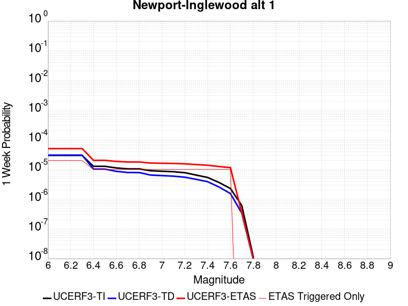 |  |  |  |

| Magnitude | 1 wk TI Prob | 1 wk TD Prob | 1 wk ETAS Prob | 1 wk ETAS/TD Gain | 1 wk ETAS Triggered Only | 1 mo TI Prob | 1 mo TD Prob | 1 mo ETAS Prob | 1 mo ETAS/TD Gain | 1 mo ETAS Triggered Only | 1 yr TI Prob | 1 yr TD Prob | 1 yr ETAS Prob | 1 yr ETAS/TD Gain | 1 yr ETAS Triggered Only | 10 yr TI Prob | 10 yr TD Prob | 10 yr ETAS Prob | 10 yr ETAS/TD Gain | 10 yr ETAS Triggered Only |
|-----|-----|-----|-----|-----|-----|-----|-----|-----|-----|-----|-----|-----|-----|-----|-----|-----|-----|-----|-----|-----|
| 6.0 | 2.9668912E-5 | 3.0404817E-5 | 5.870531E-5 | 1.9307897 | 2.8301352E-5 | 1.2714628E-4 | 1.303026E-4 | 1.5860026E-4 | 1.2171688 | 2.8301352E-5 | 0.0015469068 | 0.0015857625 | 0.0016140189 | 1.0178188 | 2.8301352E-5 | 0.015361829 | 0.015792042 | 0.015819898 | 1.0017638 | 2.8301352E-5 |
| 6.1 | 2.9668912E-5 | 3.0404817E-5 | 5.870531E-5 | 1.9307897 | 2.8301352E-5 | 1.2714628E-4 | 1.303026E-4 | 1.5860026E-4 | 1.2171688 | 2.8301352E-5 | 0.0015469068 | 0.0015857625 | 0.0016140189 | 1.0178188 | 2.8301352E-5 | 0.015361829 | 0.015792042 | 0.015819898 | 1.0017638 | 2.8301352E-5 |
| 6.2 | 2.9668912E-5 | 3.0404817E-5 | 5.870531E-5 | 1.9307897 | 2.8301352E-5 | 1.2714628E-4 | 1.303026E-4 | 1.5860026E-4 | 1.2171688 | 2.8301352E-5 | 0.0015469068 | 0.0015857625 | 0.0016140189 | 1.0178188 | 2.8301352E-5 | 0.015361829 | 0.015792042 | 0.015819898 | 1.0017638 | 2.8301352E-5 |
| 6.3 | 2.9668912E-5 | 3.0404817E-5 | 5.870531E-5 | 1.9307897 | 2.8301352E-5 | 1.2714628E-4 | 1.303026E-4 | 1.5860026E-4 | 1.2171688 | 2.8301352E-5 | 0.0015469068 | 0.0015857625 | 0.0016140189 | 1.0178188 | 2.8301352E-5 | 0.015361829 | 0.015792042 | 0.015819898 | 1.0017638 | 2.8301352E-5 |
| 6.4 | 1.275942E-5 | 1.0272503E-5 | 3.8573566E-5 | 3.7550309 | 2.8301352E-5 | 5.4682085E-5 | 4.402429E-5 | 7.23244E-5 | 1.6428293 | 2.8301352E-5 | 6.65551E-4 | 5.358681E-4 | 5.641543E-4 | 1.0527858 | 2.8301352E-5 | 0.0066356123 | 0.005346184 | 0.0053743343 | 1.0052655 | 2.8301352E-5 |
| 6.5 | 1.275942E-5 | 1.0272503E-5 | 3.8573566E-5 | 3.7550309 | 2.8301352E-5 | 5.4682085E-5 | 4.402429E-5 | 7.23244E-5 | 1.6428293 | 2.8301352E-5 | 6.65551E-4 | 5.358681E-4 | 5.641543E-4 | 1.0527858 | 2.8301352E-5 | 0.0066356123 | 0.005346184 | 0.0053743343 | 1.0052655 | 2.8301352E-5 |
| 6.6 | 1.1255358E-5 | 8.661884E-6 | 3.6962992E-5 | 4.2673154 | 2.8301352E-5 | 4.8236358E-5 | 3.712184E-5 | 6.5422144E-5 | 1.7623626 | 2.8301352E-5 | 5.871194E-4 | 4.518664E-4 | 4.8015494E-4 | 1.0626038 | 2.8301352E-5 | 0.005855706 | 0.004509653 | 0.004537827 | 1.0062474 | 2.8301352E-5 |
| 6.7 | 1.0504745E-5 | 7.8997955E-6 | 3.6200923E-5 | 4.5825143 | 2.8301352E-5 | 4.5019555E-5 | 3.3855835E-5 | 6.215623E-5 | 1.8359089 | 2.8301352E-5 | 5.4797524E-4 | 4.1211807E-4 | 4.4040775E-4 | 1.0686446 | 2.8301352E-5 | 0.0054662596 | 0.004113668 | 0.0041418527 | 1.0068516 | 2.8301352E-5 |
| 6.8 | 1.0476007E-5 | 7.881176E-6 | 3.6182308E-5 | 4.5909777 | 2.8301352E-5 | 4.4896402E-5 | 3.3776043E-5 | 6.207644E-5 | 1.8378838 | 2.8301352E-5 | 5.464766E-4 | 4.1114696E-4 | 4.3943667E-4 | 1.0688068 | 2.8301352E-5 | 0.005451347 | 0.0041039926 | 0.004132178 | 1.0068678 | 2.8301352E-5 |
| 6.9 | 9.076797E-6 | 6.4896312E-6 | 3.47908E-5 | 5.360983 | 2.8301352E-5 | 3.889998E-5 | 2.781241E-5 | 5.6112975E-5 | 2.0175517 | 2.8301352E-5 | 4.7350433E-4 | 3.385638E-4 | 3.668556E-4 | 1.083564 | 2.8301352E-5 | 0.004724967 | 0.0033805177 | 0.0034087233 | 1.0083436 | 2.8301352E-5 |
| 7.0 | 8.73795E-6 | 6.2120125E-6 | 3.451319E-5 | 5.555879 | 2.8301352E-5 | 3.7447822E-5 | 2.6622642E-5 | 5.492324E-5 | 2.0630276 | 2.8301352E-5 | 4.5583185E-4 | 3.2408274E-4 | 3.523749E-4 | 1.0872992 | 2.8301352E-5 | 0.0045489795 | 0.0032361327 | 0.0032643424 | 1.0087172 | 2.8301352E-5 |
| 7.1 | 8.391299E-6 | 5.95579E-6 | 3.4256973E-5 | 5.7518773 | 2.8301352E-5 | 3.5962214E-5 | 2.5524565E-5 | 5.3825195E-5 | 2.1087606 | 2.8301352E-5 | 4.37752E-4 | 3.1071753E-4 | 3.390101E-4 | 1.0910555 | 2.8301352E-5 | 0.004368907 | 0.0031028606 | 0.0031310741 | 1.0090928 | 2.8301352E-5 |
| 7.2 | 7.796882E-6 | 5.4965344E-6 | 3.3797733E-5 | 6.1489167 | 2.8301352E-5 | 3.341478E-5 | 2.3556364E-5 | 5.185705E-5 | 2.201403 | 2.8301352E-5 | 4.06749E-4 | 2.867612E-4 | 3.1505444E-4 | 1.0986648 | 2.8301352E-5 | 0.0040600533 | 0.0028639357 | 0.002892156 | 1.0098537 | 2.8301352E-5 |
| 7.3 | 6.4738833E-6 | 4.6478162E-6 | 3.2949036E-5 | 7.0891438 | 2.8301352E-5 | 2.774492E-5 | 1.9919062E-5 | 4.8219852E-5 | 2.4207892 | 2.8301352E-5 | 3.3774204E-4 | 2.4248775E-4 | 2.7078224E-4 | 1.1166842 | 2.8301352E-5 | 0.0033722918 | 0.0024222482 | 0.002450481 | 1.0116556 | 2.8301352E-5 |
| 7.4 | 5.382145E-6 | 3.8857597E-6 | 3.2187003E-5 | 8.283323 | 2.8301352E-5 | 2.3066134E-5 | 1.665315E-5 | 4.495403E-5 | 2.6994312 | 2.8301352E-5 | 2.8079396E-4 | 2.0273338E-4 | 2.31029E-4 | 1.1395706 | 2.8301352E-5 | 0.0028043943 | 0.0020254988 | 0.002053743 | 1.0139443 | 2.8301352E-5 |
| 7.5 | 3.648244E-6 | 2.5737843E-6 | 3.0875064E-5 | 11.99598 | 2.8301352E-5 | 1.5635238E-5 | 1.1030458E-5 | 3.93315E-5 | 3.5657177 | 2.8301352E-5 | 1.9034238E-4 | 1.3428765E-4 | 1.625852E-4 | 1.2107234 | 2.8301352E-5 | 0.0019017943 | 0.0013420755 | 0.0013703388 | 1.0210594 | 2.8301352E-5 |
| 7.6 | 2.2906888E-6 | 1.5479842E-6 | 2.9849294E-5 | 19.282686 | 2.8301352E-5 | 9.817201E-6 | 6.634202E-6 | 3.4935365E-5 | 5.265949 | 2.8301352E-5 | 1.1951787E-4 | 8.076848E-5 | 1.0906755E-4 | 1.3503727 | 2.8301352E-5 | 0.0011945361 | 8.07398E-4 | 8.356765E-4 | 1.0350243 | 2.8301352E-5 |
| 7.7 | 6.0479874E-7 | 3.397512E-7 | 3.397512E-7 | 1.0 | 0.0 | 2.5919921E-6 | 1.4560758E-6 | 1.4560758E-6 | 1.0 | 0.0 | 3.1557047E-5 | 1.7727592E-5 | 1.7727592E-5 | 1.0 | 0.0 | 3.1552566E-4 | 1.7726317E-4 | 1.7726317E-4 | 1.0 | 0.0 |
| 7.8 | 1.16056995E-8 | 9.782373E-9 | 9.782373E-9 | 1.0 | 0.0 | 4.9738713E-8 | 4.1924455E-8 | 4.1924455E-8 | 1.0 | 0.0 | 6.0556863E-7 | 5.1043025E-7 | 5.1043025E-7 | 1.0 | 0.0 | 6.05567E-6 | 5.1043025E-6 | 5.1043025E-6 | 1.0 | 0.0 |

## Mission Creek
*[(top)](#table-of-contents)*

| 1 Week | 1 Month | 1 Year | 10 Year |
|-----|-----|-----|-----|
|  |  |  |  |

| Magnitude | 1 wk TI Prob | 1 wk TD Prob | 1 wk ETAS Prob | 1 wk ETAS/TD Gain | 1 wk ETAS Triggered Only | 1 mo TI Prob | 1 mo TD Prob | 1 mo ETAS Prob | 1 mo ETAS/TD Gain | 1 mo ETAS Triggered Only | 1 yr TI Prob | 1 yr TD Prob | 1 yr ETAS Prob | 1 yr ETAS/TD Gain | 1 yr ETAS Triggered Only | 10 yr TI Prob | 10 yr TD Prob | 10 yr ETAS Prob | 10 yr ETAS/TD Gain | 10 yr ETAS Triggered Only |
|-----|-----|-----|-----|-----|-----|-----|-----|-----|-----|-----|-----|-----|-----|-----|-----|-----|-----|-----|-----|-----|
| 6.0 | 1.1549387E-5 | 1.632237E-5 | 4.4623263E-5 | 2.7338715 | 2.8301352E-5 | 4.9496433E-5 | 6.9951224E-5 | 9.8250595E-5 | 1.4045587 | 2.8301352E-5 | 6.0245243E-4 | 8.513384E-4 | 8.7961566E-4 | 1.033215 | 2.8301352E-5 | 0.006008218 | 0.008509998 | 0.008566119 | 1.0065947 | 5.6602705E-5 |
| 6.1 | 1.1549387E-5 | 1.632237E-5 | 4.4623263E-5 | 2.7338715 | 2.8301352E-5 | 4.9496433E-5 | 6.9951224E-5 | 9.8250595E-5 | 1.4045587 | 2.8301352E-5 | 6.0245243E-4 | 8.513384E-4 | 8.7961566E-4 | 1.033215 | 2.8301352E-5 | 0.006008218 | 0.008509998 | 0.008566119 | 1.0065947 | 5.6602705E-5 |
| 6.2 | 1.1549387E-5 | 1.632237E-5 | 4.4623263E-5 | 2.7338715 | 2.8301352E-5 | 4.9496433E-5 | 6.9951224E-5 | 9.8250595E-5 | 1.4045587 | 2.8301352E-5 | 6.0245243E-4 | 8.513384E-4 | 8.7961566E-4 | 1.033215 | 2.8301352E-5 | 0.006008218 | 0.008509998 | 0.008566119 | 1.0065947 | 5.6602705E-5 |
| 6.3 | 1.1549387E-5 | 1.632237E-5 | 4.4623263E-5 | 2.7338715 | 2.8301352E-5 | 4.9496433E-5 | 6.9951224E-5 | 9.8250595E-5 | 1.4045587 | 2.8301352E-5 | 6.0245243E-4 | 8.513384E-4 | 8.7961566E-4 | 1.033215 | 2.8301352E-5 | 0.006008218 | 0.008509998 | 0.008566119 | 1.0065947 | 5.6602705E-5 |
| 6.4 | 1.1549387E-5 | 1.632237E-5 | 4.4623263E-5 | 2.7338715 | 2.8301352E-5 | 4.9496433E-5 | 6.9951224E-5 | 9.8250595E-5 | 1.4045587 | 2.8301352E-5 | 6.0245243E-4 | 8.513384E-4 | 8.7961566E-4 | 1.033215 | 2.8301352E-5 | 0.006008218 | 0.008509998 | 0.008566119 | 1.0065947 | 5.6602705E-5 |
| 6.5 | 1.1549387E-5 | 1.632237E-5 | 4.4623263E-5 | 2.7338715 | 2.8301352E-5 | 4.9496433E-5 | 6.9951224E-5 | 9.8250595E-5 | 1.4045587 | 2.8301352E-5 | 6.0245243E-4 | 8.513384E-4 | 8.7961566E-4 | 1.033215 | 2.8301352E-5 | 0.006008218 | 0.008509998 | 0.008566119 | 1.0065947 | 5.6602705E-5 |
| 6.6 | 9.202681E-6 | 1.3845646E-5 | 4.2146607E-5 | 3.0440333 | 2.8301352E-5 | 3.9439463E-5 | 5.9337188E-5 | 8.763686E-5 | 1.4769298 | 2.8301352E-5 | 4.800697E-4 | 7.221998E-4 | 7.5048074E-4 | 1.0391594 | 2.8301352E-5 | 0.004790339 | 0.0072271815 | 0.007283375 | 1.0077753 | 5.6602705E-5 |
| 6.7 | 9.019164E-6 | 1.3651316E-5 | 4.1952284E-5 | 3.073131 | 2.8301352E-5 | 3.8652986E-5 | 5.8504378E-5 | 8.680407E-5 | 1.4837193 | 2.8301352E-5 | 4.7049852E-4 | 7.12067E-4 | 7.4034825E-4 | 1.0397171 | 2.8301352E-5 | 0.004695036 | 0.007126506 | 0.007182705 | 1.0078859 | 5.6602705E-5 |
| 6.8 | 8.673558E-6 | 1.3273427E-5 | 4.1574403E-5 | 3.132153 | 2.8301352E-5 | 3.717186E-5 | 5.6884925E-5 | 8.518467E-5 | 1.4974911 | 2.8301352E-5 | 4.524734E-4 | 6.923627E-4 | 7.206445E-4 | 1.0408481 | 2.8301352E-5 | 0.0045155324 | 0.006930694 | 0.0069869044 | 1.0081104 | 5.6602705E-5 |
| 6.9 | 7.002255E-6 | 1.1477657E-5 | 3.9778686E-5 | 3.4657497 | 2.8301352E-5 | 3.000932E-5 | 4.9189068E-5 | 7.748903E-5 | 1.5753303 | 2.8301352E-5 | 3.653022E-4 | 5.9871917E-4 | 6.270036E-4 | 1.0472416 | 2.8301352E-5 | 0.0036470229 | 0.005999517 | 0.00605578 | 1.009378 | 5.6602705E-5 |
| 7.0 | 5.84644E-6 | 9.67498E-6 | 3.797606E-5 | 3.925182 | 2.8301352E-5 | 2.5055931E-5 | 4.1463565E-5 | 6.9763744E-5 | 1.6825312 | 2.8301352E-5 | 3.0501327E-4 | 5.047066E-4 | 5.3299364E-4 | 1.0560466 | 2.8301352E-5 | 0.0030459496 | 0.0050638523 | 0.0051201684 | 1.0111212 | 5.6602705E-5 |
| 7.1 | 5.54703E-6 | 9.329456E-6 | 3.7630543E-5 | 4.0335197 | 2.8301352E-5 | 2.377277E-5 | 3.9982795E-5 | 6.8283014E-5 | 1.7078099 | 2.8301352E-5 | 2.8939504E-4 | 4.8668624E-4 | 5.149738E-4 | 1.0581229 | 2.8301352E-5 | 0.0028901845 | 0.004884446 | 0.0049407724 | 1.0115317 | 5.6602705E-5 |
| 7.2 | 4.384709E-6 | 7.68157E-6 | 3.5982706E-5 | 4.6842904 | 2.8301352E-5 | 1.8791474E-5 | 3.2920623E-5 | 6.122104E-5 | 1.8596563 | 2.8301352E-5 | 2.2876218E-4 | 4.0073853E-4 | 4.2902853E-4 | 1.0705947 | 2.8301352E-5 | 0.0022852682 | 0.004028366 | 0.0040847403 | 1.0139945 | 5.6602705E-5 |
| 7.3 | 3.7888456E-6 | 6.915452E-6 | 3.521661E-5 | 5.0924525 | 2.8301352E-5 | 1.623781E-5 | 2.9637333E-5 | 5.7937847E-5 | 1.9548941 | 2.8301352E-5 | 1.9767738E-4 | 3.6077813E-4 | 3.890693E-4 | 1.0784171 | 2.8301352E-5 | 0.0019750162 | 0.0036301152 | 0.0036865124 | 1.015536 | 5.6602705E-5 |
| 7.4 | 2.1982462E-6 | 5.0237763E-6 | 3.3324988E-5 | 6.6334534 | 2.8301352E-5 | 9.421021E-6 | 2.1530293E-5 | 4.9831036E-5 | 2.3144615 | 2.8301352E-5 | 1.1469489E-4 | 2.621E-4 | 2.9039392E-4 | 1.1079509 | 2.8301352E-5 | 0.0011463572 | 0.0026458844 | 0.0027023375 | 1.0213361 | 5.6602705E-5 |
| 7.5 | 2.051923E-6 | 4.615016E-6 | 3.291624E-5 | 7.132421 | 2.8301352E-5 | 8.793926E-6 | 1.9778492E-5 | 4.8079284E-5 | 2.4308875 | 2.8301352E-5 | 1.0706078E-4 | 2.4077666E-4 | 2.690712E-4 | 1.1175137 | 2.8301352E-5 | 0.0010700922 | 0.0024335422 | 0.002490007 | 1.0232028 | 5.6602705E-5 |
| 7.6 | 1.8733427E-6 | 4.1233748E-6 | 3.242461E-5 | 7.86361 | 2.8301352E-5 | 8.028587E-6 | 1.7671488E-5 | 4.597234E-5 | 2.6014981 | 2.8301352E-5 | 9.774366E-5 | 2.151292E-4 | 2.4342447E-4 | 1.1315268 | 2.8301352E-5 | 9.770069E-4 | 0.0021780801 | 0.0022345597 | 1.0259309 | 5.6602705E-5 |
| 7.7 | 1.8411953E-6 | 4.0430496E-6 | 3.2344287E-5 | 7.999973 | 2.8301352E-5 | 7.890813E-6 | 1.732724E-5 | 4.5628105E-5 | 2.633316 | 2.8301352E-5 | 9.606641E-5 | 2.1093882E-4 | 2.392342E-4 | 1.1341403 | 2.8301352E-5 | 9.6024893E-4 | 0.0021363653 | 0.002192847 | 1.0264382 | 5.6602705E-5 |
| 7.8 | 1.7194251E-6 | 3.7104276E-6 | 3.2011674E-5 | 8.62749 | 2.8301352E-5 | 7.368944E-6 | 1.5901736E-5 | 4.420264E-5 | 2.7797368 | 2.8301352E-5 | 8.97132E-5 | 1.9358651E-4 | 2.2188238E-4 | 1.1461666 | 2.8301352E-5 | 8.967699E-4 | 0.0019623525 | 0.002018844 | 1.0287877 | 5.6602705E-5 |
| 7.9 | 1.4035052E-6 | 2.9500632E-6 | 3.1251333E-5 | 10.593446 | 2.8301352E-5 | 6.0150082E-6 | 1.2643067E-5 | 4.094406E-5 | 3.2384596 | 2.8301352E-5 | 7.3230265E-5 | 1.5391852E-4 | 1.8221552E-4 | 1.183844 | 2.8301352E-5 | 7.3206134E-4 | 0.0015631086 | 0.0016196229 | 1.036155 | 5.6602705E-5 |
| 8.0 | 3.9318823E-7 | 5.528522E-7 | 5.528522E-7 | 1.0 | 0.0 | 1.6850913E-6 | 2.3693647E-6 | 2.3693647E-6 | 1.0 | 0.0 | 2.0515794E-5 | 2.8846638E-5 | 2.8846638E-5 | 1.0 | 0.0 | 2.0513899E-4 | 2.9899E-4 | 2.9899E-4 | 1.0 | 0.0 |
| 8.1 | 1.596793E-7 | 1.1380002E-7 | 1.1380002E-7 | 1.0 | 0.0 | 6.8433974E-7 | 4.877143E-7 | 4.877143E-7 | 1.0 | 0.0 | 8.331805E-6 | 5.937906E-6 | 5.937906E-6 | 1.0 | 0.0 | 8.331492E-5 | 6.549966E-5 | 6.549966E-5 | 1.0 | 0.0 |
| 8.2 | 4.9003038E-8 | 2.5444924E-8 | 2.5444924E-8 | 1.0 | 0.0 | 2.10013E-7 | 1.0904967E-7 | 1.0904967E-7 | 1.0 | 0.0 | 2.5569052E-6 | 1.327679E-6 | 1.327679E-6 | 1.0 | 0.0 | 2.556876E-5 | 1.495635E-5 | 1.495635E-5 | 1.0 | 0.0 |

## San Jacinto (Anza) rev
*[(top)](#table-of-contents)*

| 1 Week | 1 Month | 1 Year | 10 Year |
|-----|-----|-----|-----|
|  |  |  |  |

| Magnitude | 1 wk TI Prob | 1 wk TD Prob | 1 wk ETAS Prob | 1 wk ETAS/TD Gain | 1 wk ETAS Triggered Only | 1 mo TI Prob | 1 mo TD Prob | 1 mo ETAS Prob | 1 mo ETAS/TD Gain | 1 mo ETAS Triggered Only | 1 yr TI Prob | 1 yr TD Prob | 1 yr ETAS Prob | 1 yr ETAS/TD Gain | 1 yr ETAS Triggered Only | 10 yr TI Prob | 10 yr TD Prob | 10 yr ETAS Prob | 10 yr ETAS/TD Gain | 10 yr ETAS Triggered Only |
|-----|-----|-----|-----|-----|-----|-----|-----|-----|-----|-----|-----|-----|-----|-----|-----|-----|-----|-----|-----|-----|
| 6.0 | 6.3015636E-5 | 4.3302647E-5 | 9.99029E-5 | 2.3070853 | 5.6602705E-5 | 2.7003905E-4 | 1.8556965E-4 | 2.4216184E-4 | 1.3049648 | 5.6602705E-5 | 0.0032827691 | 0.0022569813 | 0.0023134563 | 1.0250224 | 5.6602705E-5 | 0.032346968 | 0.023296192 | 0.023351476 | 1.0023731 | 5.6602705E-5 |
| 6.1 | 6.3015636E-5 | 4.3302647E-5 | 9.99029E-5 | 2.3070853 | 5.6602705E-5 | 2.7003905E-4 | 1.8556965E-4 | 2.4216184E-4 | 1.3049648 | 5.6602705E-5 | 0.0032827691 | 0.0022569813 | 0.0023134563 | 1.0250224 | 5.6602705E-5 | 0.032346968 | 0.023296192 | 0.023351476 | 1.0023731 | 5.6602705E-5 |
| 6.2 | 6.3015636E-5 | 4.3302647E-5 | 9.99029E-5 | 2.3070853 | 5.6602705E-5 | 2.7003905E-4 | 1.8556965E-4 | 2.4216184E-4 | 1.3049648 | 5.6602705E-5 | 0.0032827691 | 0.0022569813 | 0.0023134563 | 1.0250224 | 5.6602705E-5 | 0.032346968 | 0.023296192 | 0.023351476 | 1.0023731 | 5.6602705E-5 |
| 6.3 | 6.3015636E-5 | 4.3302647E-5 | 9.99029E-5 | 2.3070853 | 5.6602705E-5 | 2.7003905E-4 | 1.8556965E-4 | 2.4216184E-4 | 1.3049648 | 5.6602705E-5 | 0.0032827691 | 0.0022569813 | 0.0023134563 | 1.0250224 | 5.6602705E-5 | 0.032346968 | 0.023296192 | 0.023351476 | 1.0023731 | 5.6602705E-5 |
| 6.4 | 6.3015636E-5 | 4.3302647E-5 | 9.99029E-5 | 2.3070853 | 5.6602705E-5 | 2.7003905E-4 | 1.8556965E-4 | 2.4216184E-4 | 1.3049648 | 5.6602705E-5 | 0.0032827691 | 0.0022569813 | 0.0023134563 | 1.0250224 | 5.6602705E-5 | 0.032346968 | 0.023296192 | 0.023351476 | 1.0023731 | 5.6602705E-5 |
| 6.5 | 5.811017E-5 | 4.0082516E-5 | 9.6682954E-5 | 2.412098 | 5.6602705E-5 | 2.4901982E-4 | 1.7177092E-4 | 2.283639E-4 | 1.3294678 | 5.6602705E-5 | 0.0030276014 | 0.002089311 | 0.0021457952 | 1.027035 | 5.6602705E-5 | 0.02986684 | 0.021593736 | 0.021649119 | 1.0025647 | 5.6602705E-5 |
| 6.6 | 5.811017E-5 | 4.0082516E-5 | 9.6682954E-5 | 2.412098 | 5.6602705E-5 | 2.4901982E-4 | 1.7177092E-4 | 2.283639E-4 | 1.3294678 | 5.6602705E-5 | 0.0030276014 | 0.002089311 | 0.0021457952 | 1.027035 | 5.6602705E-5 | 0.02986684 | 0.021593736 | 0.021649119 | 1.0025647 | 5.6602705E-5 |
| 6.7 | 5.712442E-5 | 3.9505223E-5 | 9.6105694E-5 | 2.4327338 | 5.6602705E-5 | 2.4479596E-4 | 1.6929714E-4 | 2.2589027E-4 | 1.3342828 | 5.6602705E-5 | 0.0029763177 | 0.0020592497 | 0.0021157358 | 1.0274304 | 5.6602705E-5 | 0.029367693 | 0.021285562 | 0.02134096 | 1.0026026 | 5.6602705E-5 |
| 6.8 | 5.6967532E-5 | 3.9361643E-5 | 9.5962125E-5 | 2.4379601 | 5.6602705E-5 | 2.4412372E-4 | 1.6868189E-4 | 2.2527504E-4 | 1.3355023 | 5.6602705E-5 | 0.0029681553 | 0.002051773 | 0.0021082596 | 1.0275307 | 5.6602705E-5 | 0.029288229 | 0.021210281 | 0.021265684 | 1.002612 | 5.6602705E-5 |
| 6.9 | 5.6211324E-5 | 3.9066435E-5 | 9.566693E-5 | 2.4488266 | 5.6602705E-5 | 2.4088343E-4 | 1.6741687E-4 | 2.240101E-4 | 1.3380378 | 5.6602705E-5 | 0.0029288116 | 0.0020364004 | 0.0020928879 | 1.0277388 | 5.6602705E-5 | 0.028905109 | 0.021049714 | 0.021105126 | 1.0026324 | 5.6602705E-5 |
| 7.0 | 5.4383527E-5 | 3.792697E-5 | 9.452753E-5 | 2.4923565 | 5.6602705E-5 | 2.3305144E-4 | 1.6253405E-4 | 2.1912756E-4 | 1.3481947 | 5.6602705E-5 | 0.0028337094 | 0.001977061 | 0.0020335517 | 1.0285732 | 5.6602705E-5 | 0.027978465 | 0.020440677 | 0.020496123 | 1.0027125 | 5.6602705E-5 |
| 7.1 | 5.1393665E-5 | 3.6389913E-5 | 9.299056E-5 | 2.555394 | 5.6602705E-5 | 2.2023996E-4 | 1.5594746E-4 | 2.1254134E-4 | 1.3629035 | 5.6602705E-5 | 0.0026781242 | 0.0018970112 | 0.0019535066 | 1.0297812 | 5.6602705E-5 | 0.026460782 | 0.019614287 | 0.019669779 | 1.0028292 | 5.6602705E-5 |
| 7.2 | 4.785222E-5 | 3.4741795E-5 | 9.134253E-5 | 2.6291828 | 5.6602705E-5 | 2.0506482E-4 | 1.4888494E-4 | 2.0547921E-4 | 1.3801209 | 5.6602705E-5 | 0.0024938055 | 0.0018111705 | 0.0018676707 | 1.0311954 | 5.6602705E-5 | 0.024660049 | 0.018728992 | 0.018784534 | 1.0029656 | 5.6602705E-5 |
| 7.3 | 4.2143256E-5 | 3.383628E-5 | 9.043707E-5 | 2.672784 | 5.6602705E-5 | 1.8060145E-4 | 1.4500458E-4 | 2.0159908E-4 | 1.3902946 | 5.6602705E-5 | 0.002196605 | 0.0017640047 | 0.0018205075 | 1.032031 | 5.6602705E-5 | 0.02175019 | 0.01823724 | 0.01829281 | 1.0030471 | 5.6602705E-5 |
| 7.4 | 4.0264713E-5 | 3.347446E-5 | 9.007527E-5 | 2.6908653 | 5.6602705E-5 | 1.7255165E-4 | 1.4345412E-4 | 2.000487E-4 | 1.3945135 | 5.6602705E-5 | 0.002098792 | 0.0017451581 | 0.001801662 | 1.0323775 | 5.6602705E-5 | 0.020790804 | 0.018041821 | 0.018097403 | 1.0030807 | 5.6602705E-5 |
| 7.5 | 3.694492E-5 | 3.218847E-5 | 8.878935E-5 | 2.7584212 | 5.6602705E-5 | 1.5832575E-4 | 1.379433E-4 | 1.945382E-4 | 1.4102765 | 5.6602705E-5 | 0.0019259118 | 0.001678169 | 0.0017346767 | 1.0336722 | 5.6602705E-5 | 0.01909306 | 0.01735827 | 0.01741389 | 1.0032042 | 5.6602705E-5 |
| 7.6 | 3.200565E-5 | 2.9504106E-5 | 8.6105145E-5 | 2.9184122 | 5.6602705E-5 | 1.3715986E-4 | 1.2644005E-4 | 1.830356E-4 | 1.4476078 | 5.6602705E-5 | 0.001668642 | 0.0015383229 | 0.0015948385 | 1.0367385 | 5.6602705E-5 | 0.01656168 | 0.0159463 | 0.016002001 | 1.003493 | 5.6602705E-5 |
| 7.7 | 2.731642E-5 | 2.6092788E-5 | 8.2694016E-5 | 3.1692288 | 5.6602705E-5 | 1.1706512E-4 | 1.1182144E-4 | 1.6841783E-4 | 1.5061316 | 5.6602705E-5 | 0.001424336 | 0.0013605768 | 0.0014171025 | 1.0415454 | 5.6602705E-5 | 0.014152412 | 0.014167004 | 0.014222805 | 1.0039388 | 5.6602705E-5 |
| 7.8 | 2.3466424E-5 | 2.3504817E-5 | 8.010619E-5 | 3.4080756 | 5.6602705E-5 | 1.0056651E-4 | 1.0073105E-4 | 1.5732805E-4 | 1.5618626 | 5.6602705E-5 | 0.0012237094 | 0.0012257113 | 0.0012822447 | 1.0461229 | 5.6602705E-5 | 0.012169928 | 0.012808893 | 0.01286477 | 1.0043625 | 5.6602705E-5 |
| 7.9 | 1.8611925E-5 | 1.8908117E-5 | 7.550975E-5 | 3.99351 | 5.6602705E-5 | 7.9762955E-5 | 8.1032274E-5 | 1.376304E-4 | 1.6984639 | 5.6602705E-5 | 9.7068126E-4 | 9.861222E-4 | 0.001042669 | 1.0573426 | 5.6602705E-5 | 0.0096645225 | 0.010393824 | 0.010449839 | 1.0053892 | 5.6602705E-5 |
| 8.0 | 1.5460775E-5 | 1.5740965E-5 | 4.4041873E-5 | 2.7979145 | 2.8301352E-5 | 6.6258784E-5 | 6.7459536E-5 | 9.575898E-5 | 1.4195025 | 2.8301352E-5 | 8.0640207E-4 | 8.21011E-4 | 8.492892E-4 | 1.034443 | 2.8301352E-5 | 0.008034821 | 0.0087028835 | 0.008730939 | 1.0032237 | 2.8301352E-5 |
| 8.1 | 9.983884E-6 | 8.269952E-6 | 8.269952E-6 | 1.0 | 0.0 | 4.2787375E-5 | 3.544217E-5 | 3.544217E-5 | 1.0 | 0.0 | 5.2081177E-4 | 4.314235E-4 | 4.314235E-4 | 1.0 | 0.0 | 0.0051959283 | 0.004640022 | 0.004640022 | 1.0 | 0.0 |
| 8.2 | 4.1226E-6 | 1.5529788E-6 | 1.5529788E-6 | 1.0 | 0.0 | 1.7668166E-5 | 6.6556063E-6 | 6.6556063E-6 | 1.0 | 0.0 | 2.1508869E-4 | 8.102902E-5 | 8.102902E-5 | 1.0 | 0.0 | 0.0021488064 | 9.4050163E-4 | 9.4050163E-4 | 1.0 | 0.0 |
| 8.3 | 1.2750878E-6 | 3.612133E-7 | 3.612133E-7 | 1.0 | 0.0 | 5.4646503E-6 | 1.548056E-6 | 1.548056E-6 | 1.0 | 0.0 | 6.653009E-5 | 1.8847424E-5 | 1.8847424E-5 | 1.0 | 0.0 | 6.6510175E-4 | 2.2734253E-4 | 2.2734253E-4 | 1.0 | 0.0 |

## San Diego Trough north alt1
*[(top)](#table-of-contents)*

| 1 Week | 1 Month | 1 Year | 10 Year |
|-----|-----|-----|-----|
|  |  |  |  |

| Magnitude | 1 wk TI Prob | 1 wk TD Prob | 1 wk ETAS Prob | 1 wk ETAS/TD Gain | 1 wk ETAS Triggered Only | 1 mo TI Prob | 1 mo TD Prob | 1 mo ETAS Prob | 1 mo ETAS/TD Gain | 1 mo ETAS Triggered Only | 1 yr TI Prob | 1 yr TD Prob | 1 yr ETAS Prob | 1 yr ETAS/TD Gain | 1 yr ETAS Triggered Only | 10 yr TI Prob | 10 yr TD Prob | 10 yr ETAS Prob | 10 yr ETAS/TD Gain | 10 yr ETAS Triggered Only |
|-----|-----|-----|-----|-----|-----|-----|-----|-----|-----|-----|-----|-----|-----|-----|-----|-----|-----|-----|-----|-----|
| 6.0 | 7.329252E-5 | 8.821093E-5 | 1.4480864E-4 | 1.6416179 | 5.6602705E-5 | 3.14073E-4 | 3.7799572E-4 | 4.3457703E-4 | 1.1496876 | 5.6602705E-5 | 0.0038171355 | 0.004593027 | 0.0046493695 | 1.012267 | 5.6602705E-5 | 0.03752231 | 0.045044992 | 0.045099042 | 1.0012 | 5.6602705E-5 |
| 6.1 | 3.7940346E-5 | 4.4885E-5 | 4.4885E-5 | 1.0 | 0.0 | 1.6259136E-4 | 1.9235066E-4 | 1.9235066E-4 | 1.0 | 0.0 | 0.0019777524 | 0.0023394432 | 0.0023394432 | 1.0 | 0.0 | 0.019602431 | 0.023156688 | 0.023156688 | 1.0 | 0.0 |
| 6.2 | 2.8645263E-5 | 3.329678E-5 | 3.329678E-5 | 1.0 | 0.0 | 1.2275964E-4 | 1.4269284E-4 | 1.4269284E-4 | 1.0 | 0.0 | 0.0014935739 | 0.0017359189 | 0.0017359189 | 1.0 | 0.0 | 0.0148357535 | 0.017226247 | 0.017226247 | 1.0 | 0.0 |
| 6.3 | 2.8645263E-5 | 3.329678E-5 | 3.329678E-5 | 1.0 | 0.0 | 1.2275964E-4 | 1.4269284E-4 | 1.4269284E-4 | 1.0 | 0.0 | 0.0014935739 | 0.0017359189 | 0.0017359189 | 1.0 | 0.0 | 0.0148357535 | 0.017226247 | 0.017226247 | 1.0 | 0.0 |
| 6.4 | 2.2204576E-5 | 2.5448318E-5 | 2.5448318E-5 | 1.0 | 0.0 | 9.5159E-5 | 1.0905972E-4 | 1.0905972E-4 | 1.0 | 0.0 | 0.001157945 | 0.0013270034 | 0.0013270034 | 1.0 | 0.0 | 0.011519298 | 0.013191955 | 0.013191955 | 1.0 | 0.0 |
| 6.5 | 2.1004838E-5 | 2.4024694E-5 | 2.4024694E-5 | 1.0 | 0.0 | 9.0017624E-5 | 1.0295896E-4 | 1.0295896E-4 | 1.0 | 0.0 | 0.0010954136 | 0.0012528138 | 0.0012528138 | 1.0 | 0.0 | 0.010900296 | 0.012458589 | 0.012458589 | 1.0 | 0.0 |
| 6.6 | 1.820557E-5 | 2.0704787E-5 | 2.0704787E-5 | 1.0 | 0.0 | 7.802154E-5 | 8.873181E-5 | 8.873181E-5 | 1.0 | 0.0 | 9.4949827E-4 | 0.0010797799 | 0.0010797799 | 1.0 | 0.0 | 0.009454516 | 0.010746004 | 0.010746004 | 1.0 | 0.0 |
| 6.7 | 1.5884485E-5 | 1.7983646E-5 | 1.7983646E-5 | 1.0 | 0.0 | 6.807459E-5 | 7.707051E-5 | 7.707051E-5 | 1.0 | 0.0 | 8.284929E-4 | 9.3793223E-4 | 9.3793223E-4 | 1.0 | 0.0 | 0.008254109 | 0.009340104 | 0.009340104 | 1.0 | 0.0 |
| 6.8 | 1.4331171E-5 | 1.6201066E-5 | 1.6201066E-5 | 1.0 | 0.0 | 6.141786E-5 | 6.94313E-5 | 6.94313E-5 | 1.0 | 0.0 | 7.4750587E-4 | 8.450002E-4 | 8.450002E-4 | 1.0 | 0.0 | 0.0074499645 | 0.008418139 | 0.008418139 | 1.0 | 0.0 |
| 6.9 | 1.2574203E-5 | 1.4205835E-5 | 1.4205835E-5 | 1.0 | 0.0 | 5.3888325E-5 | 6.0880735E-5 | 6.0880735E-5 | 1.0 | 0.0 | 6.558929E-4 | 7.409723E-4 | 7.409723E-4 | 1.0 | 0.0 | 0.0065396037 | 0.007385203 | 0.007385203 | 1.0 | 0.0 |
| 7.0 | 1.0883844E-5 | 1.2289262E-5 | 1.2289262E-5 | 1.0 | 0.0 | 4.664421E-5 | 5.2667205E-5 | 5.2667205E-5 | 1.0 | 0.0 | 5.677453E-4 | 6.4103556E-4 | 6.4103556E-4 | 1.0 | 0.0 | 0.00566297 | 0.006391993 | 0.006391993 | 1.0 | 0.0 |
| 7.1 | 9.393088E-6 | 1.060702E-5 | 1.060702E-5 | 1.0 | 0.0 | 4.025547E-5 | 4.545787E-5 | 4.545787E-5 | 1.0 | 0.0 | 4.900001E-4 | 5.533098E-4 | 5.533098E-4 | 1.0 | 0.0 | 0.0048892107 | 0.005519418 | 0.005519418 | 1.0 | 0.0 |
| 7.2 | 8.190791E-6 | 9.258625E-6 | 9.258625E-6 | 1.0 | 0.0 | 3.510292E-5 | 3.9679224E-5 | 3.9679224E-5 | 1.0 | 0.0 | 4.2729423E-4 | 4.8298817E-4 | 4.8298817E-4 | 1.0 | 0.0 | 0.0042647356 | 0.004819465 | 0.004819465 | 1.0 | 0.0 |
| 7.3 | 6.268162E-6 | 7.089716E-6 | 7.089716E-6 | 1.0 | 0.0 | 2.6863276E-5 | 3.0384144E-5 | 3.0384144E-5 | 1.0 | 0.0 | 3.2701128E-4 | 3.6986457E-4 | 3.6986457E-4 | 1.0 | 0.0 | 0.003265305 | 0.003692536 | 0.003692536 | 1.0 | 0.0 |
| 7.4 | 4.985186E-6 | 5.6426816E-6 | 5.6426816E-6 | 1.0 | 0.0 | 2.1364907E-5 | 2.4182698E-5 | 2.4182698E-5 | 1.0 | 0.0 | 2.600867E-4 | 2.9438498E-4 | 2.9438498E-4 | 1.0 | 0.0 | 0.002597825 | 0.0029399914 | 0.0029399914 | 1.0 | 0.0 |
| 7.5 | 1.7489613E-6 | 1.969678E-6 | 1.969678E-6 | 1.0 | 0.0 | 7.495527E-6 | 8.4414505E-6 | 8.4414505E-6 | 1.0 | 0.0 | 9.125422E-5 | 1.02770035E-4 | 1.02770035E-4 | 1.0 | 0.0 | 9.1216754E-4 | 0.0010272472 | 0.0010272472 | 1.0 | 0.0 |
| 7.6 | 1.6988751E-7 | 1.7533823E-7 | 1.7533823E-7 | 1.0 | 0.0 | 7.2808916E-7 | 7.5144936E-7 | 7.5144936E-7 | 1.0 | 0.0 | 8.864449E-6 | 9.14886E-6 | 9.14886E-6 | 1.0 | 0.0 | 8.8640954E-5 | 9.1485024E-5 | 9.1485024E-5 | 1.0 | 0.0 |

## San Gabriel
*[(top)](#table-of-contents)*

| 1 Week | 1 Month | 1 Year | 10 Year |
|-----|-----|-----|-----|
|  |  |  | 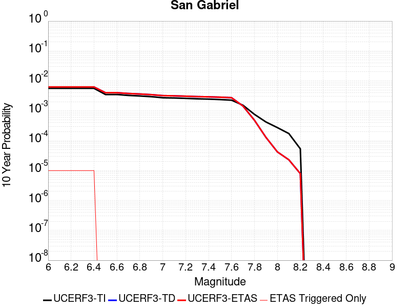 |

| Magnitude | 1 wk TI Prob | 1 wk TD Prob | 1 wk ETAS Prob | 1 wk ETAS/TD Gain | 1 wk ETAS Triggered Only | 1 mo TI Prob | 1 mo TD Prob | 1 mo ETAS Prob | 1 mo ETAS/TD Gain | 1 mo ETAS Triggered Only | 1 yr TI Prob | 1 yr TD Prob | 1 yr ETAS Prob | 1 yr ETAS/TD Gain | 1 yr ETAS Triggered Only | 10 yr TI Prob | 10 yr TD Prob | 10 yr ETAS Prob | 10 yr ETAS/TD Gain | 10 yr ETAS Triggered Only |
|-----|-----|-----|-----|-----|-----|-----|-----|-----|-----|-----|-----|-----|-----|-----|-----|-----|-----|-----|-----|-----|
| 6.0 | 1.083775E-5 | 1.19851875E-5 | 4.0286202E-5 | 3.3613327 | 2.8301352E-5 | 4.6446676E-5 | 5.1364143E-5 | 7.966404E-5 | 1.550966 | 2.8301352E-5 | 5.653415E-4 | 6.251903E-4 | 6.5347395E-4 | 1.04524 | 2.8301352E-5 | 0.0056390543 | 0.006246409 | 0.0062745335 | 1.0045025 | 2.8301352E-5 |
| 6.1 | 1.083775E-5 | 1.19851875E-5 | 4.0286202E-5 | 3.3613327 | 2.8301352E-5 | 4.6446676E-5 | 5.1364143E-5 | 7.966404E-5 | 1.550966 | 2.8301352E-5 | 5.653415E-4 | 6.251903E-4 | 6.5347395E-4 | 1.04524 | 2.8301352E-5 | 0.0056390543 | 0.006246409 | 0.0062745335 | 1.0045025 | 2.8301352E-5 |
| 6.2 | 1.083775E-5 | 1.19851875E-5 | 4.0286202E-5 | 3.3613327 | 2.8301352E-5 | 4.6446676E-5 | 5.1364143E-5 | 7.966404E-5 | 1.550966 | 2.8301352E-5 | 5.653415E-4 | 6.251903E-4 | 6.5347395E-4 | 1.04524 | 2.8301352E-5 | 0.0056390543 | 0.006246409 | 0.0062745335 | 1.0045025 | 2.8301352E-5 |
| 6.3 | 1.083775E-5 | 1.19851875E-5 | 4.0286202E-5 | 3.3613327 | 2.8301352E-5 | 4.6446676E-5 | 5.1364143E-5 | 7.966404E-5 | 1.550966 | 2.8301352E-5 | 5.653415E-4 | 6.251903E-4 | 6.5347395E-4 | 1.04524 | 2.8301352E-5 | 0.0056390543 | 0.006246409 | 0.0062745335 | 1.0045025 | 2.8301352E-5 |
| 6.4 | 1.083775E-5 | 1.19851875E-5 | 4.0286202E-5 | 3.3613327 | 2.8301352E-5 | 4.6446676E-5 | 5.1364143E-5 | 7.966404E-5 | 1.550966 | 2.8301352E-5 | 5.653415E-4 | 6.251903E-4 | 6.5347395E-4 | 1.04524 | 2.8301352E-5 | 0.0056390543 | 0.006246409 | 0.0062745335 | 1.0045025 | 2.8301352E-5 |
| 6.5 | 6.7317824E-6 | 7.716944E-6 | 7.716944E-6 | 1.0 | 0.0 | 2.8850178E-5 | 3.3072207E-5 | 3.3072207E-5 | 1.0 | 0.0 | 3.511943E-4 | 4.0258077E-4 | 4.0258077E-4 | 1.0 | 0.0 | 0.003506398 | 0.0040296097 | 0.0040296097 | 1.0 | 0.0 |
| 6.6 | 6.7317824E-6 | 7.716944E-6 | 7.716944E-6 | 1.0 | 0.0 | 2.8850178E-5 | 3.3072207E-5 | 3.3072207E-5 | 1.0 | 0.0 | 3.511943E-4 | 4.0258077E-4 | 4.0258077E-4 | 1.0 | 0.0 | 0.003506398 | 0.0040296097 | 0.0040296097 | 1.0 | 0.0 |
| 6.7 | 6.274881E-6 | 7.2458647E-6 | 7.2458647E-6 | 1.0 | 0.0 | 2.6892068E-5 | 3.1053343E-5 | 3.1053343E-5 | 1.0 | 0.0 | 3.2736175E-4 | 3.780098E-4 | 3.780098E-4 | 1.0 | 0.0 | 0.0032687993 | 0.0037847564 | 0.0037847564 | 1.0 | 0.0 |
| 6.8 | 5.996209E-6 | 6.958585E-6 | 6.958585E-6 | 1.0 | 0.0 | 2.5697784E-5 | 2.9822171E-5 | 2.9822171E-5 | 1.0 | 0.0 | 3.128256E-4 | 3.6302538E-4 | 3.6302538E-4 | 1.0 | 0.0 | 0.003123856 | 0.0036354093 | 0.0036354093 | 1.0 | 0.0 |
| 6.9 | 5.686331E-6 | 6.6236316E-6 | 6.6236316E-6 | 1.0 | 0.0 | 2.4369761E-5 | 2.8386688E-5 | 2.8386688E-5 | 1.0 | 0.0 | 2.9666146E-4 | 3.4555403E-4 | 3.4555403E-4 | 1.0 | 0.0 | 0.0029626573 | 0.0034612515 | 0.0034612515 | 1.0 | 0.0 |
| 7.0 | 5.2329838E-6 | 6.147514E-6 | 6.147514E-6 | 1.0 | 0.0 | 2.242688E-5 | 2.6346226E-5 | 2.6346226E-5 | 1.0 | 0.0 | 2.7301308E-4 | 3.2071886E-4 | 3.2071886E-4 | 1.0 | 0.0 | 0.002726779 | 0.0032136322 | 0.0032136322 | 1.0 | 0.0 |
| 7.1 | 5.135671E-6 | 6.03764E-6 | 6.03764E-6 | 1.0 | 0.0 | 2.2009834E-5 | 2.5875348E-5 | 2.5875348E-5 | 1.0 | 0.0 | 2.6793676E-4 | 3.1498758E-4 | 3.1498758E-4 | 1.0 | 0.0 | 0.0026761394 | 0.0031564834 | 0.0031564834 | 1.0 | 0.0 |
| 7.2 | 4.989062E-6 | 5.87102E-6 | 5.87102E-6 | 1.0 | 0.0 | 2.1381518E-5 | 2.5161276E-5 | 2.5161276E-5 | 1.0 | 0.0 | 2.6028889E-4 | 3.0629625E-4 | 3.0629625E-4 | 1.0 | 0.0 | 0.0025998424 | 0.003069813 | 0.003069813 | 1.0 | 0.0 |
| 7.3 | 4.8219395E-6 | 5.702574E-6 | 5.702574E-6 | 1.0 | 0.0 | 2.0665291E-5 | 2.443938E-5 | 2.443938E-5 | 1.0 | 0.0 | 2.5157086E-4 | 2.9750957E-4 | 2.9750957E-4 | 1.0 | 0.0 | 0.0025128627 | 0.0029821852 | 0.0029821852 | 1.0 | 0.0 |
| 7.4 | 4.7118383E-6 | 5.5911332E-6 | 5.5911332E-6 | 1.0 | 0.0 | 2.0193436E-5 | 2.3961782E-5 | 2.3961782E-5 | 1.0 | 0.0 | 2.4582737E-4 | 2.916964E-4 | 2.916964E-4 | 1.0 | 0.0 | 0.002455556 | 0.0029242067 | 0.0029242067 | 1.0 | 0.0 |
| 7.5 | 4.5506545E-6 | 5.4365014E-6 | 5.4365014E-6 | 1.0 | 0.0 | 1.9502659E-5 | 2.3299088E-5 | 2.3299088E-5 | 1.0 | 0.0 | 2.37419E-4 | 2.8363022E-4 | 2.8363022E-4 | 1.0 | 0.0 | 0.002371655 | 0.002843753 | 0.002843753 | 1.0 | 0.0 |
| 7.6 | 4.343636E-6 | 5.2293817E-6 | 5.2293817E-6 | 1.0 | 0.0 | 1.861545E-5 | 2.2411448E-5 | 2.2411448E-5 | 1.0 | 0.0 | 2.2661954E-4 | 2.7282597E-4 | 2.7282597E-4 | 1.0 | 0.0 | 0.0022638857 | 0.0027359722 | 0.0027359722 | 1.0 | 0.0 |
| 7.7 | 2.936235E-6 | 2.7440458E-6 | 2.7440458E-6 | 1.0 | 0.0 | 1.2583803E-5 | 1.1760143E-5 | 1.1760143E-5 | 1.0 | 0.0 | 1.5319703E-4 | 1.4317037E-4 | 1.4317037E-4 | 1.0 | 0.0 | 0.0015309147 | 0.0014380751 | 0.0014380751 | 1.0 | 0.0 |
| 7.8 | 1.4541639E-6 | 9.1237047E-7 | 9.1237047E-7 | 1.0 | 0.0 | 6.232116E-6 | 3.9101533E-6 | 3.9101533E-6 | 1.0 | 0.0 | 7.587337E-5 | 4.7605077E-5 | 4.7605077E-5 | 1.0 | 0.0 | 7.584747E-4 | 4.8085177E-4 | 4.8085177E-4 | 1.0 | 0.0 |
| 7.9 | 8.098958E-7 | 2.41753E-7 | 2.41753E-7 | 1.0 | 0.0 | 3.4709774E-6 | 1.0360839E-6 | 1.0360839E-6 | 1.0 | 0.0 | 4.225833E-5 | 1.2614248E-5 | 1.2614248E-5 | 1.0 | 0.0 | 4.2250296E-4 | 1.2921814E-4 | 1.2921814E-4 | 1.0 | 0.0 |
| 8.0 | 5.2473234E-7 | 7.6792055E-8 | 7.6792055E-8 | 1.0 | 0.0 | 2.248851E-6 | 3.2910876E-7 | 3.2910876E-7 | 1.0 | 0.0 | 2.7379416E-5 | 4.0068917E-6 | 4.0068917E-6 | 1.0 | 0.0 | 2.7376044E-4 | 4.21918E-5 | 4.21918E-5 | 1.0 | 0.0 |
| 8.1 | 3.3162388E-7 | 4.1496126E-8 | 4.1496126E-8 | 1.0 | 0.0 | 1.4212444E-6 | 1.7784053E-7 | 1.7784053E-7 | 1.0 | 0.0 | 1.7303513E-5 | 2.1652063E-6 | 2.1652063E-6 | 1.0 | 0.0 | 1.7302166E-4 | 2.2965523E-5 | 2.2965523E-5 | 1.0 | 0.0 |
| 8.2 | 1.0235345E-7 | 1.4043474E-8 | 1.4043474E-8 | 1.0 | 0.0 | 4.3865757E-7 | 6.0186316E-8 | 6.0186316E-8 | 1.0 | 0.0 | 5.340643E-6 | 7.327681E-7 | 7.327681E-7 | 1.0 | 0.0 | 5.3405143E-5 | 7.9273705E-6 | 7.9273705E-6 | 1.0 | 0.0 |

## Newport-Inglewood (Offshore)
*[(top)](#table-of-contents)*

| 1 Week | 1 Month | 1 Year | 10 Year |
|-----|-----|-----|-----|
| 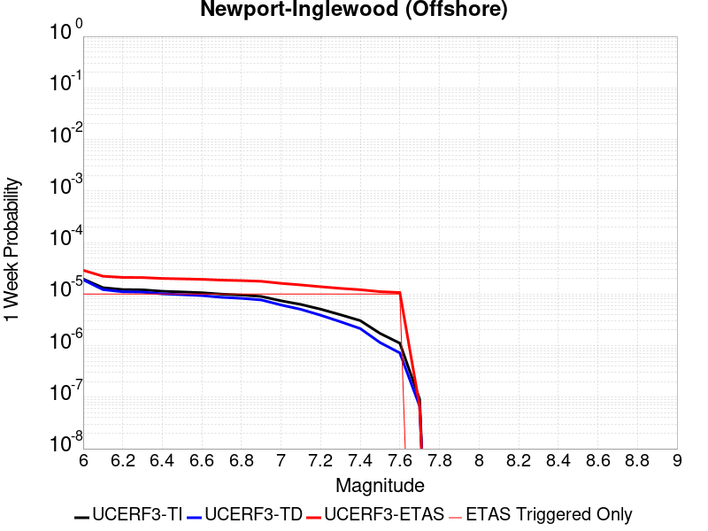 |  |  |  |

| Magnitude | 1 wk TI Prob | 1 wk TD Prob | 1 wk ETAS Prob | 1 wk ETAS/TD Gain | 1 wk ETAS Triggered Only | 1 mo TI Prob | 1 mo TD Prob | 1 mo ETAS Prob | 1 mo ETAS/TD Gain | 1 mo ETAS Triggered Only | 1 yr TI Prob | 1 yr TD Prob | 1 yr ETAS Prob | 1 yr ETAS/TD Gain | 1 yr ETAS Triggered Only | 10 yr TI Prob | 10 yr TD Prob | 10 yr ETAS Prob | 10 yr ETAS/TD Gain | 10 yr ETAS Triggered Only |
|-----|-----|-----|-----|-----|-----|-----|-----|-----|-----|-----|-----|-----|-----|-----|-----|-----|-----|-----|-----|-----|
| 6.0 | 1.9626508E-5 | 1.8965357E-5 | 4.726617E-5 | 2.4922376 | 2.8301352E-5 | 8.411089E-5 | 8.1277634E-5 | 1.09576686E-4 | 1.3481776 | 2.8301352E-5 | 0.001023569 | 9.891186E-4 | 0.0010173919 | 1.0285844 | 2.8301352E-5 | 0.010188672 | 0.009848503 | 0.009876526 | 1.0028454 | 2.8301352E-5 |
| 6.1 | 1.331886E-5 | 1.2218092E-5 | 4.05191E-5 | 3.3163197 | 2.8301352E-5 | 5.707958E-5 | 5.2362207E-5 | 8.066208E-5 | 1.5404637 | 2.8301352E-5 | 6.947222E-4 | 6.3732493E-4 | 6.656082E-4 | 1.0443782 | 2.8301352E-5 | 0.006925544 | 0.006355149 | 0.0063832705 | 1.004425 | 2.8301352E-5 |
| 6.2 | 1.2250852E-5 | 1.1076029E-5 | 3.9377068E-5 | 3.555161 | 2.8301352E-5 | 5.2502597E-5 | 4.7467838E-5 | 7.576785E-5 | 1.5961933 | 2.8301352E-5 | 6.3903164E-4 | 5.777687E-4 | 6.060537E-4 | 1.0489556 | 2.8301352E-5 | 0.006371971 | 0.0057627866 | 0.005790925 | 1.0048827 | 2.8301352E-5 |
| 6.3 | 1.2106258E-5 | 1.0918891E-5 | 3.9219936E-5 | 3.591934 | 2.8301352E-5 | 5.1882926E-5 | 4.6794412E-5 | 7.509444E-5 | 1.6047736 | 2.8301352E-5 | 6.3149154E-4 | 5.69574E-4 | 5.9785927E-4 | 1.0496603 | 2.8301352E-5 | 0.0062970007 | 0.005681259 | 0.0057093995 | 1.0049533 | 2.8301352E-5 |
| 6.4 | 1.1348758E-5 | 1.0109362E-5 | 3.8410428E-5 | 3.799491 | 2.8301352E-5 | 4.8636626E-5 | 4.3325123E-5 | 7.162525E-5 | 1.6532036 | 2.8301352E-5 | 5.919901E-4 | 5.273565E-4 | 5.5564294E-4 | 1.0536381 | 2.8301352E-5 | 0.005904155 | 0.0052611465 | 0.005289299 | 1.0053511 | 2.8301352E-5 |
| 6.5 | 1.100837E-5 | 9.7433895E-6 | 3.8044465E-5 | 3.904644 | 2.8301352E-5 | 4.7177873E-5 | 4.1756717E-5 | 7.0056885E-5 | 1.6777394 | 2.8301352E-5 | 5.7423924E-4 | 5.082702E-4 | 5.3655717E-4 | 1.0556535 | 2.8301352E-5 | 0.005727576 | 0.0050711688 | 0.0050993264 | 1.0055525 | 2.8301352E-5 |
| 6.6 | 1.0634696E-5 | 9.345544E-6 | 3.764663E-5 | 4.028298 | 2.8301352E-5 | 4.557647E-5 | 4.0051716E-5 | 6.835194E-5 | 1.7065918 | 2.8301352E-5 | 5.5475225E-4 | 4.8752132E-4 | 5.158089E-4 | 1.0580232 | 2.8301352E-5 | 0.0055336943 | 0.0048646047 | 0.0048927683 | 1.0057895 | 2.8301352E-5 |
| 6.7 | 9.9780855E-6 | 8.667911E-6 | 3.6969017E-5 | 4.2650437 | 2.8301352E-5 | 4.276252E-5 | 3.7147664E-5 | 6.5447966E-5 | 1.7618326 | 2.8301352E-5 | 5.205093E-4 | 4.5217964E-4 | 4.804682E-4 | 1.0625604 | 2.8301352E-5 | 0.0051929182 | 0.004512675 | 0.0045408485 | 1.0062432 | 2.8301352E-5 |
| 6.8 | 9.59546E-6 | 8.27295E-6 | 3.657407E-5 | 4.420922 | 2.8301352E-5 | 4.1122752E-5 | 3.5455025E-5 | 6.3755375E-5 | 1.7982042 | 2.8301352E-5 | 5.0055445E-4 | 4.315801E-4 | 4.5986922E-4 | 1.0655478 | 2.8301352E-5 | 0.004994285 | 0.004307495 | 0.0043356745 | 1.006542 | 2.8301352E-5 |
| 6.9 | 9.000614E-6 | 7.70684E-6 | 3.6007976E-5 | 4.6722097 | 2.8301352E-5 | 3.857349E-5 | 3.30289E-5 | 6.1329316E-5 | 1.856838 | 2.8301352E-5 | 4.6953102E-4 | 4.0205332E-4 | 4.303433E-4 | 1.0703638 | 2.8301352E-5 | 0.004685402 | 0.0040133307 | 0.0040415186 | 1.0070236 | 2.8301352E-5 |
| 7.0 | 7.4070194E-6 | 6.148904E-6 | 3.4450084E-5 | 5.602638 | 2.8301352E-5 | 3.1743984E-5 | 2.635218E-5 | 5.4652788E-5 | 2.073938 | 2.8301352E-5 | 3.8641447E-4 | 3.207907E-4 | 3.4908298E-4 | 1.0881954 | 2.8301352E-5 | 0.0038574322 | 0.0032032963 | 0.003231507 | 1.0088068 | 2.8301352E-5 |
| 7.1 | 6.299615E-6 | 5.0565927E-6 | 3.3357803E-5 | 6.5968933 | 2.8301352E-5 | 2.699807E-5 | 2.1670932E-5 | 4.9971673E-5 | 2.3059309 | 2.8301352E-5 | 3.2865192E-4 | 2.638118E-4 | 2.921057E-4 | 1.1072503 | 2.8301352E-5 | 0.003281663 | 0.002635001 | 0.0026632277 | 1.0107123 | 2.8301352E-5 |
| 7.2 | 5.096653E-6 | 3.892769E-6 | 3.2194013E-5 | 8.270208 | 2.8301352E-5 | 2.1842614E-5 | 1.668319E-5 | 4.498407E-5 | 2.696371 | 2.8301352E-5 | 2.6590136E-4 | 2.0309901E-4 | 2.3139462E-4 | 1.1393193 | 2.8301352E-5 | 0.0026558342 | 0.0020291451 | 0.0020573891 | 1.0139191 | 2.8301352E-5 |
| 7.3 | 3.9753018E-6 | 2.9099103E-6 | 3.121118E-5 | 10.725822 | 2.8301352E-5 | 1.7036897E-5 | 1.2470985E-5 | 4.0771985E-5 | 3.2693477 | 2.8301352E-5 | 2.0740448E-4 | 1.5182374E-4 | 1.801208E-4 | 1.186381 | 2.8301352E-5 | 0.00207211 | 0.0015172083 | 0.0015454667 | 1.0186253 | 2.8301352E-5 |
| 7.4 | 3.0568392E-6 | 2.1449955E-6 | 3.0446288E-5 | 14.194103 | 2.8301352E-5 | 1.3100675E-5 | 9.192806E-6 | 3.7493897E-5 | 4.0786133 | 2.8301352E-5 | 1.5948903E-4 | 1.1191672E-4 | 1.402149E-4 | 1.2528504 | 2.8301352E-5 | 0.0015937461 | 0.0011186098 | 0.0011468795 | 1.0252721 | 2.8301352E-5 |
| 7.5 | 1.7279019E-6 | 1.1469883E-6 | 2.9448309E-5 | 25.674463 | 2.8301352E-5 | 7.405273E-6 | 4.915655E-6 | 3.3216867E-5 | 6.757364 | 2.8301352E-5 | 9.015547E-5 | 5.9846494E-5 | 8.814615E-5 | 1.4728708 | 2.8301352E-5 | 9.01189E-4 | 5.9830764E-4 | 6.265921E-4 | 1.047274 | 2.8301352E-5 |
| 7.6 | 1.1156416E-6 | 7.223012E-7 | 2.9023633E-5 | 40.182175 | 2.8301352E-5 | 4.7813123E-6 | 3.095573E-6 | 3.1396838E-5 | 10.142496 | 2.8301352E-5 | 5.821092E-5 | 3.7687976E-5 | 6.598826E-5 | 1.7509103 | 2.8301352E-5 | 5.8195676E-4 | 3.7681818E-4 | 4.0510885E-4 | 1.0750778 | 2.8301352E-5 |
| 7.7 | 9.117973E-8 | 6.734145E-8 | 6.734145E-8 | 1.0 | 0.0 | 3.907702E-7 | 2.886062E-7 | 2.886062E-7 | 1.0 | 0.0 | 4.757617E-6 | 3.513775E-6 | 3.513775E-6 | 1.0 | 0.0 | 4.7575148E-5 | 3.5137225E-5 | 3.5137225E-5 | 1.0 | 0.0 |

## Santa Susana alt 1
*[(top)](#table-of-contents)*

| 1 Week | 1 Month | 1 Year | 10 Year |
|-----|-----|-----|-----|
|  |  |  |  |

| Magnitude | 1 wk TI Prob | 1 wk TD Prob | 1 wk ETAS Prob | 1 wk ETAS/TD Gain | 1 wk ETAS Triggered Only | 1 mo TI Prob | 1 mo TD Prob | 1 mo ETAS Prob | 1 mo ETAS/TD Gain | 1 mo ETAS Triggered Only | 1 yr TI Prob | 1 yr TD Prob | 1 yr ETAS Prob | 1 yr ETAS/TD Gain | 1 yr ETAS Triggered Only | 10 yr TI Prob | 10 yr TD Prob | 10 yr ETAS Prob | 10 yr ETAS/TD Gain | 10 yr ETAS Triggered Only |
|-----|-----|-----|-----|-----|-----|-----|-----|-----|-----|-----|-----|-----|-----|-----|-----|-----|-----|-----|-----|-----|
| 6.0 | 2.674877E-5 | 2.7198023E-5 | 5.5498604E-5 | 2.0405383 | 2.8301352E-5 | 1.1463255E-4 | 1.1655839E-4 | 1.4485644E-4 | 1.2427801 | 2.8301352E-5 | 0.0013947578 | 0.0014182882 | 0.0014465494 | 1.0199263 | 2.8301352E-5 | 0.013860362 | 0.014104128 | 0.014132029 | 1.0019783 | 2.8301352E-5 |
| 6.1 | 2.674877E-5 | 2.7198023E-5 | 5.5498604E-5 | 2.0405383 | 2.8301352E-5 | 1.1463255E-4 | 1.1655839E-4 | 1.4485644E-4 | 1.2427801 | 2.8301352E-5 | 0.0013947578 | 0.0014182882 | 0.0014465494 | 1.0199263 | 2.8301352E-5 | 0.013860362 | 0.014104128 | 0.014132029 | 1.0019783 | 2.8301352E-5 |
| 6.2 | 2.674877E-5 | 2.7198023E-5 | 5.5498604E-5 | 2.0405383 | 2.8301352E-5 | 1.1463255E-4 | 1.1655839E-4 | 1.4485644E-4 | 1.2427801 | 2.8301352E-5 | 0.0013947578 | 0.0014182882 | 0.0014465494 | 1.0199263 | 2.8301352E-5 | 0.013860362 | 0.014104128 | 0.014132029 | 1.0019783 | 2.8301352E-5 |
| 6.3 | 2.674877E-5 | 2.7198023E-5 | 5.5498604E-5 | 2.0405383 | 2.8301352E-5 | 1.1463255E-4 | 1.1655839E-4 | 1.4485644E-4 | 1.2427801 | 2.8301352E-5 | 0.0013947578 | 0.0014182882 | 0.0014465494 | 1.0199263 | 2.8301352E-5 | 0.013860362 | 0.014104128 | 0.014132029 | 1.0019783 | 2.8301352E-5 |
| 6.4 | 2.674877E-5 | 2.7198023E-5 | 5.5498604E-5 | 2.0405383 | 2.8301352E-5 | 1.1463255E-4 | 1.1655839E-4 | 1.4485644E-4 | 1.2427801 | 2.8301352E-5 | 0.0013947578 | 0.0014182882 | 0.0014465494 | 1.0199263 | 2.8301352E-5 | 0.013860362 | 0.014104128 | 0.014132029 | 1.0019783 | 2.8301352E-5 |
| 6.5 | 2.674877E-5 | 2.7198023E-5 | 5.5498604E-5 | 2.0405383 | 2.8301352E-5 | 1.1463255E-4 | 1.1655839E-4 | 1.4485644E-4 | 1.2427801 | 2.8301352E-5 | 0.0013947578 | 0.0014182882 | 0.0014465494 | 1.0199263 | 2.8301352E-5 | 0.013860362 | 0.014104128 | 0.014132029 | 1.0019783 | 2.8301352E-5 |
| 6.6 | 2.6647976E-5 | 2.7074359E-5 | 5.5374945E-5 | 2.0452912 | 2.8301352E-5 | 1.14200615E-4 | 1.1602845E-4 | 1.4432652E-4 | 1.2438891 | 2.8301352E-5 | 0.0013895056 | 0.0014118447 | 0.0014401062 | 1.0200174 | 2.8301352E-5 | 0.013808494 | 0.014040513 | 0.014068417 | 1.0019873 | 2.8301352E-5 |
| 6.7 | 2.6647976E-5 | 2.7074359E-5 | 5.5374945E-5 | 2.0452912 | 2.8301352E-5 | 1.14200615E-4 | 1.1602845E-4 | 1.4432652E-4 | 1.2438891 | 2.8301352E-5 | 0.0013895056 | 0.0014118447 | 0.0014401062 | 1.0200174 | 2.8301352E-5 | 0.013808494 | 0.014040513 | 0.014068417 | 1.0019873 | 2.8301352E-5 |
| 6.8 | 1.9073179E-5 | 1.7637283E-5 | 4.5938137E-5 | 2.6046038 | 2.8301352E-5 | 8.1739636E-5 | 7.558627E-5 | 1.0388548E-4 | 1.3743962 | 2.8301352E-5 | 9.947256E-4 | 9.198925E-4 | 9.481678E-4 | 1.0307376 | 2.8301352E-5 | 0.009902848 | 0.009163101 | 0.009191143 | 1.0030603 | 2.8301352E-5 |
| 6.9 | 1.9041876E-5 | 1.7619415E-5 | 4.592027E-5 | 2.6062312 | 2.8301352E-5 | 8.160549E-5 | 7.55097E-5 | 1.0380891E-4 | 1.3747759 | 2.8301352E-5 | 9.930939E-4 | 9.1896096E-4 | 9.472363E-4 | 1.0307689 | 2.8301352E-5 | 0.0098866755 | 0.0091538625 | 0.009181905 | 1.0030634 | 2.8301352E-5 |
| 7.0 | 1.5917482E-5 | 1.3863864E-5 | 4.2164826E-5 | 3.041347 | 2.8301352E-5 | 6.8215995E-5 | 5.9415237E-5 | 8.771491E-5 | 1.4763032 | 2.8301352E-5 | 8.302132E-4 | 7.231451E-4 | 7.51426E-4 | 1.0391082 | 2.8301352E-5 | 0.008271185 | 0.0072088144 | 0.007236912 | 1.0038977 | 2.8301352E-5 |
| 7.1 | 1.577788E-5 | 1.3743872E-5 | 4.2044834E-5 | 3.0591695 | 2.8301352E-5 | 6.761774E-5 | 5.8901005E-5 | 8.720069E-5 | 1.4804618 | 2.8301352E-5 | 8.2293496E-4 | 7.1688846E-4 | 7.451695E-4 | 1.0394497 | 2.8301352E-5 | 0.008198941 | 0.007146652 | 0.0071747513 | 1.0039318 | 2.8301352E-5 |
| 7.2 | 1.5416446E-5 | 1.3469944E-5 | 4.1770916E-5 | 3.1010458 | 2.8301352E-5 | 6.606882E-5 | 5.772708E-5 | 8.60268E-5 | 1.490233 | 2.8301352E-5 | 8.0409093E-4 | 7.026052E-4 | 7.3088665E-4 | 1.0402523 | 2.8301352E-5 | 0.008011877 | 0.0070047234 | 0.0070328265 | 1.004012 | 2.8301352E-5 |
| 7.3 | 1.4534083E-5 | 1.2717879E-5 | 4.1018873E-5 | 3.225292 | 2.8301352E-5 | 6.228744E-5 | 5.4504082E-5 | 8.280389E-5 | 1.5192237 | 2.8301352E-5 | 7.580857E-4 | 6.633896E-4 | 6.916722E-4 | 1.0426334 | 2.8301352E-5 | 0.007555048 | 0.0066149444 | 0.0066430587 | 1.00425 | 2.8301352E-5 |
| 7.4 | 1.2858995E-5 | 1.1229652E-5 | 3.953069E-5 | 3.5202057 | 2.8301352E-5 | 5.5108816E-5 | 4.8126214E-5 | 7.642621E-5 | 1.5880369 | 2.8301352E-5 | 6.7074323E-4 | 5.857831E-4 | 6.1406783E-4 | 1.0482854 | 2.8301352E-5 | 0.0066872234 | 0.005843165 | 0.005871301 | 1.0048152 | 2.8301352E-5 |
| 7.5 | 8.827668E-6 | 7.805457E-6 | 3.610659E-5 | 4.6258135 | 2.8301352E-5 | 3.7832317E-5 | 3.3451546E-5 | 6.175195E-5 | 1.846012 | 2.8301352E-5 | 4.605111E-4 | 4.071989E-4 | 4.3548874E-4 | 1.0694742 | 2.8301352E-5 | 0.0045955796 | 0.0040647765 | 0.004092963 | 1.0069343 | 2.8301352E-5 |
| 7.6 | 3.2533426E-6 | 2.871988E-6 | 2.871988E-6 | 1.0 | 0.0 | 1.3942822E-5 | 1.2308465E-5 | 1.2308465E-5 | 1.0 | 0.0 | 1.6974064E-4 | 1.4984563E-4 | 1.4984563E-4 | 1.0 | 0.0 | 0.0016961104 | 0.0014974826 | 0.0014974826 | 1.0 | 0.0 |
| 7.7 | 1.2751709E-6 | 1.1491089E-6 | 1.1491089E-6 | 1.0 | 0.0 | 5.4650063E-6 | 4.9247437E-6 | 4.9247437E-6 | 1.0 | 0.0 | 6.653442E-5 | 5.9957198E-5 | 5.9957198E-5 | 1.0 | 0.0 | 6.6514505E-4 | 5.994191E-4 | 5.994191E-4 | 1.0 | 0.0 |
| 7.8 | 3.067544E-7 | 3.2400436E-7 | 3.2400436E-7 | 1.0 | 0.0 | 1.3146611E-6 | 1.3885895E-6 | 1.3885895E-6 | 1.0 | 0.0 | 1.600588E-5 | 1.6905957E-5 | 1.6905957E-5 | 1.0 | 0.0 | 1.6004729E-4 | 1.6904772E-4 | 1.6904772E-4 | 1.0 | 0.0 |
| 7.9 | 7.622999E-8 | 8.087964E-8 | 8.087964E-8 | 1.0 | 0.0 | 3.2669993E-7 | 3.4662696E-7 | 3.4662696E-7 | 1.0 | 0.0 | 3.977564E-6 | 4.2201773E-6 | 4.2201773E-6 | 1.0 | 0.0 | 3.977493E-5 | 4.220118E-5 | 4.220118E-5 | 1.0 | 0.0 |

## San Cayetano
*[(top)](#table-of-contents)*

| 1 Week | 1 Month | 1 Year | 10 Year |
|-----|-----|-----|-----|
|  |  |  |  |

| Magnitude | 1 wk TI Prob | 1 wk TD Prob | 1 wk ETAS Prob | 1 wk ETAS/TD Gain | 1 wk ETAS Triggered Only | 1 mo TI Prob | 1 mo TD Prob | 1 mo ETAS Prob | 1 mo ETAS/TD Gain | 1 mo ETAS Triggered Only | 1 yr TI Prob | 1 yr TD Prob | 1 yr ETAS Prob | 1 yr ETAS/TD Gain | 1 yr ETAS Triggered Only | 10 yr TI Prob | 10 yr TD Prob | 10 yr ETAS Prob | 10 yr ETAS/TD Gain | 10 yr ETAS Triggered Only |
|-----|-----|-----|-----|-----|-----|-----|-----|-----|-----|-----|-----|-----|-----|-----|-----|-----|-----|-----|-----|-----|
| 6.0 | 2.3476267E-5 | 1.816928E-5 | 4.647012E-5 | 2.5576203 | 2.8301352E-5 | 1.0060869E-4 | 7.786603E-5 | 1.06165186E-4 | 1.3634338 | 2.8301352E-5 | 0.0012242225 | 9.476103E-4 | 9.7588485E-4 | 1.0298377 | 2.8301352E-5 | 0.012175002 | 0.009436584 | 0.009464619 | 1.0029708 | 2.8301352E-5 |
| 6.1 | 2.3476267E-5 | 1.816928E-5 | 4.647012E-5 | 2.5576203 | 2.8301352E-5 | 1.0060869E-4 | 7.786603E-5 | 1.06165186E-4 | 1.3634338 | 2.8301352E-5 | 0.0012242225 | 9.476103E-4 | 9.7588485E-4 | 1.0298377 | 2.8301352E-5 | 0.012175002 | 0.009436584 | 0.009464619 | 1.0029708 | 2.8301352E-5 |
| 6.2 | 2.3476267E-5 | 1.816928E-5 | 4.647012E-5 | 2.5576203 | 2.8301352E-5 | 1.0060869E-4 | 7.786603E-5 | 1.06165186E-4 | 1.3634338 | 2.8301352E-5 | 0.0012242225 | 9.476103E-4 | 9.7588485E-4 | 1.0298377 | 2.8301352E-5 | 0.012175002 | 0.009436584 | 0.009464619 | 1.0029708 | 2.8301352E-5 |
| 6.3 | 2.3476267E-5 | 1.816928E-5 | 4.647012E-5 | 2.5576203 | 2.8301352E-5 | 1.0060869E-4 | 7.786603E-5 | 1.06165186E-4 | 1.3634338 | 2.8301352E-5 | 0.0012242225 | 9.476103E-4 | 9.7588485E-4 | 1.0298377 | 2.8301352E-5 | 0.012175002 | 0.009436584 | 0.009464619 | 1.0029708 | 2.8301352E-5 |
| 6.4 | 2.3476267E-5 | 1.816928E-5 | 4.647012E-5 | 2.5576203 | 2.8301352E-5 | 1.0060869E-4 | 7.786603E-5 | 1.06165186E-4 | 1.3634338 | 2.8301352E-5 | 0.0012242225 | 9.476103E-4 | 9.7588485E-4 | 1.0298377 | 2.8301352E-5 | 0.012175002 | 0.009436584 | 0.009464619 | 1.0029708 | 2.8301352E-5 |
| 6.5 | 2.3476267E-5 | 1.816928E-5 | 4.647012E-5 | 2.5576203 | 2.8301352E-5 | 1.0060869E-4 | 7.786603E-5 | 1.06165186E-4 | 1.3634338 | 2.8301352E-5 | 0.0012242225 | 9.476103E-4 | 9.7588485E-4 | 1.0298377 | 2.8301352E-5 | 0.012175002 | 0.009436584 | 0.009464619 | 1.0029708 | 2.8301352E-5 |
| 6.6 | 2.3476267E-5 | 1.816928E-5 | 4.647012E-5 | 2.5576203 | 2.8301352E-5 | 1.0060869E-4 | 7.786603E-5 | 1.06165186E-4 | 1.3634338 | 2.8301352E-5 | 0.0012242225 | 9.476103E-4 | 9.7588485E-4 | 1.0298377 | 2.8301352E-5 | 0.012175002 | 0.009436584 | 0.009464619 | 1.0029708 | 2.8301352E-5 |
| 6.7 | 2.3476267E-5 | 1.816928E-5 | 4.647012E-5 | 2.5576203 | 2.8301352E-5 | 1.0060869E-4 | 7.786603E-5 | 1.06165186E-4 | 1.3634338 | 2.8301352E-5 | 0.0012242225 | 9.476103E-4 | 9.7588485E-4 | 1.0298377 | 2.8301352E-5 | 0.012175002 | 0.009436584 | 0.009464619 | 1.0029708 | 2.8301352E-5 |
| 6.8 | 2.3241924E-5 | 1.7936987E-5 | 4.6237834E-5 | 2.5777926 | 2.8301352E-5 | 9.960445E-5 | 7.687056E-5 | 1.0516973E-4 | 1.3681407 | 2.8301352E-5 | 0.0012120095 | 9.3550084E-4 | 9.637757E-4 | 1.0302243 | 2.8301352E-5 | 0.012054204 | 0.009316482 | 0.00934452 | 1.0030094 | 2.8301352E-5 |
| 6.9 | 2.2761007E-5 | 1.7432423E-5 | 4.5733283E-5 | 2.623461 | 2.8301352E-5 | 9.7543525E-5 | 7.470827E-5 | 1.0300751E-4 | 1.3787966 | 2.8301352E-5 | 0.0011869454 | 9.09197E-4 | 9.374726E-4 | 1.0310996 | 2.8301352E-5 | 0.011806256 | 0.009055603 | 0.009083648 | 1.0030969 | 2.8301352E-5 |
| 7.0 | 2.240283E-5 | 1.7066168E-5 | 4.536704E-5 | 2.6583025 | 2.8301352E-5 | 9.600859E-5 | 7.313869E-5 | 1.01437974E-4 | 1.3869263 | 2.8301352E-5 | 0.0011682777 | 8.9010317E-4 | 9.1837934E-4 | 1.0317672 | 2.8301352E-5 | 0.011621549 | 0.008866196 | 0.008894246 | 1.0031637 | 2.8301352E-5 |
| 7.1 | 2.1871154E-5 | 1.6586018E-5 | 4.48869E-5 | 2.7063098 | 2.8301352E-5 | 9.373015E-5 | 7.108101E-5 | 9.9380355E-5 | 1.398128 | 2.8301352E-5 | 0.0011405671 | 8.6507114E-4 | 8.93348E-4 | 1.0326873 | 2.8301352E-5 | 0.011347309 | 0.008617838 | 0.008645896 | 1.0032557 | 2.8301352E-5 |
| 7.2 | 2.0714133E-5 | 1.5564561E-5 | 4.386547E-5 | 2.8182917 | 2.8301352E-5 | 8.8771834E-5 | 6.670357E-5 | 9.500304E-5 | 1.4242572 | 2.8301352E-5 | 0.0010802611 | 8.1181666E-4 | 8.4009505E-4 | 1.0348334 | 2.8301352E-5 | 0.010750249 | 0.008089285 | 0.008117358 | 1.0034703 | 2.8301352E-5 |
| 7.3 | 1.8408395E-5 | 1.3996864E-5 | 4.2297823E-5 | 3.0219498 | 2.8301352E-5 | 7.8890735E-5 | 5.99852E-5 | 8.8284854E-5 | 1.4717773 | 2.8301352E-5 | 9.600714E-4 | 7.300781E-4 | 7.583588E-4 | 1.0387366 | 2.8301352E-5 | 0.009559342 | 0.0072775153 | 0.007305611 | 1.0038606 | 2.8301352E-5 |
| 7.4 | 1.6856795E-5 | 1.28500815E-5 | 4.115107E-5 | 3.2023978 | 2.8301352E-5 | 7.2241404E-5 | 5.5070628E-5 | 8.3370425E-5 | 1.5138818 | 2.8301352E-5 | 8.7918417E-4 | 6.7028153E-4 | 6.985639E-4 | 1.0421947 | 2.8301352E-5 | 0.00875714 | 0.0066832784 | 0.006711391 | 1.0042063 | 2.8301352E-5 |
| 7.5 | 1.2822778E-5 | 9.577542E-6 | 3.7878624E-5 | 3.954942 | 2.8301352E-5 | 5.495361E-5 | 4.1045972E-5 | 6.934616E-5 | 1.6894755 | 2.8301352E-5 | 6.688548E-4 | 4.996217E-4 | 5.279089E-4 | 1.0566173 | 2.8301352E-5 | 0.006668452 | 0.0049851555 | 0.005013316 | 1.0056489 | 2.8301352E-5 |
| 7.6 | 5.6272684E-6 | 3.854903E-6 | 3.854903E-6 | 1.0 | 0.0 | 2.4116642E-5 | 1.652091E-5 | 1.652091E-5 | 1.0 | 0.0 | 2.9358055E-4 | 2.0112359E-4 | 2.0112359E-4 | 1.0 | 0.0 | 0.0029319301 | 0.0020094267 | 0.0020094267 | 1.0 | 0.0 |
| 7.7 | 3.5261346E-6 | 2.3407013E-6 | 2.3407013E-6 | 1.0 | 0.0 | 1.5111918E-5 | 1.0031539E-5 | 1.0031539E-5 | 1.0 | 0.0 | 1.8397206E-4 | 1.2212721E-4 | 1.2212721E-4 | 1.0 | 0.0 | 0.0018381984 | 0.0012206084 | 0.0012206084 | 1.0 | 0.0 |
| 7.8 | 1.4826929E-6 | 1.056428E-6 | 1.056428E-6 | 1.0 | 0.0 | 6.354383E-6 | 4.5275406E-6 | 4.5275406E-6 | 1.0 | 0.0 | 7.736187E-5 | 5.5121433E-5 | 5.5121433E-5 | 1.0 | 0.0 | 7.733494E-4 | 5.5107963E-4 | 5.5107963E-4 | 1.0 | 0.0 |
| 7.9 | 2.7568166E-7 | 1.6978244E-7 | 1.6978244E-7 | 1.0 | 0.0 | 1.1814923E-6 | 7.2763885E-7 | 7.2763885E-7 | 1.0 | 0.0 | 1.4384574E-5 | 8.858967E-6 | 8.858967E-6 | 1.0 | 0.0 | 1.4383643E-4 | 8.8586174E-5 | 8.8586174E-5 | 1.0 | 0.0 |
| 8.0 | 5.407832E-8 | 2.6887697E-8 | 2.6887697E-8 | 1.0 | 0.0 | 2.3176422E-7 | 1.15232986E-7 | 1.15232986E-7 | 1.0 | 0.0 | 2.8217257E-6 | 1.4029607E-6 | 1.4029607E-6 | 1.0 | 0.0 | 2.8216898E-5 | 1.4029522E-5 | 1.4029522E-5 | 1.0 | 0.0 |

## Robinson Creek
*[(top)](#table-of-contents)*

| 1 Week | 1 Month | 1 Year | 10 Year |
|-----|-----|-----|-----|
|  |  |  |  |

| Magnitude | 1 wk TI Prob | 1 wk TD Prob | 1 wk ETAS Prob | 1 wk ETAS/TD Gain | 1 wk ETAS Triggered Only | 1 mo TI Prob | 1 mo TD Prob | 1 mo ETAS Prob | 1 mo ETAS/TD Gain | 1 mo ETAS Triggered Only | 1 yr TI Prob | 1 yr TD Prob | 1 yr ETAS Prob | 1 yr ETAS/TD Gain | 1 yr ETAS Triggered Only | 10 yr TI Prob | 10 yr TD Prob | 10 yr ETAS Prob | 10 yr ETAS/TD Gain | 10 yr ETAS Triggered Only |
|-----|-----|-----|-----|-----|-----|-----|-----|-----|-----|-----|-----|-----|-----|-----|-----|-----|-----|-----|-----|-----|
| 6.0 | 1.3705327E-5 | 1.5285013E-5 | 4.3585933E-5 | 2.851547 | 2.8301352E-5 | 5.8735794E-5 | 6.55072E-5 | 9.38067E-5 | 1.4320059 | 2.8301352E-5 | 7.1487366E-4 | 7.9755014E-4 | 8.2582893E-4 | 1.035457 | 2.8301352E-5 | 0.0071257832 | 0.007975501 | 0.008003577 | 1.0035203 | 2.8301352E-5 |
| 6.1 | 1.3705327E-5 | 1.5285013E-5 | 4.3585933E-5 | 2.851547 | 2.8301352E-5 | 5.8735794E-5 | 6.55072E-5 | 9.38067E-5 | 1.4320059 | 2.8301352E-5 | 7.1487366E-4 | 7.9755014E-4 | 8.2582893E-4 | 1.035457 | 2.8301352E-5 | 0.0071257832 | 0.007975501 | 0.008003577 | 1.0035203 | 2.8301352E-5 |
| 6.2 | 1.3705327E-5 | 1.5285013E-5 | 4.3585933E-5 | 2.851547 | 2.8301352E-5 | 5.8735794E-5 | 6.55072E-5 | 9.38067E-5 | 1.4320059 | 2.8301352E-5 | 7.1487366E-4 | 7.9755014E-4 | 8.2582893E-4 | 1.035457 | 2.8301352E-5 | 0.0071257832 | 0.007975501 | 0.008003577 | 1.0035203 | 2.8301352E-5 |
| 6.3 | 1.3705327E-5 | 1.5285013E-5 | 4.3585933E-5 | 2.851547 | 2.8301352E-5 | 5.8735794E-5 | 6.55072E-5 | 9.38067E-5 | 1.4320059 | 2.8301352E-5 | 7.1487366E-4 | 7.9755014E-4 | 8.2582893E-4 | 1.035457 | 2.8301352E-5 | 0.0071257832 | 0.007975501 | 0.008003577 | 1.0035203 | 2.8301352E-5 |
| 6.4 | 1.3705327E-5 | 1.5285013E-5 | 4.3585933E-5 | 2.851547 | 2.8301352E-5 | 5.8735794E-5 | 6.55072E-5 | 9.38067E-5 | 1.4320059 | 2.8301352E-5 | 7.1487366E-4 | 7.9755014E-4 | 8.2582893E-4 | 1.035457 | 2.8301352E-5 | 0.0071257832 | 0.007975501 | 0.008003577 | 1.0035203 | 2.8301352E-5 |

## Pisgah-Bullion Mtn-Mesquite Lk
*[(top)](#table-of-contents)*

| 1 Week | 1 Month | 1 Year | 10 Year |
|-----|-----|-----|-----|
|  |  |  |  |

| Magnitude | 1 wk TI Prob | 1 wk TD Prob | 1 wk ETAS Prob | 1 wk ETAS/TD Gain | 1 wk ETAS Triggered Only | 1 mo TI Prob | 1 mo TD Prob | 1 mo ETAS Prob | 1 mo ETAS/TD Gain | 1 mo ETAS Triggered Only | 1 yr TI Prob | 1 yr TD Prob | 1 yr ETAS Prob | 1 yr ETAS/TD Gain | 1 yr ETAS Triggered Only | 10 yr TI Prob | 10 yr TD Prob | 10 yr ETAS Prob | 10 yr ETAS/TD Gain | 10 yr ETAS Triggered Only |
|-----|-----|-----|-----|-----|-----|-----|-----|-----|-----|-----|-----|-----|-----|-----|-----|-----|-----|-----|-----|-----|
| 6.0 | 3.0240792E-5 | 2.4091114E-5 | 2.4091114E-5 | 1.0 | 0.0 | 1.2959696E-4 | 1.03244114E-4 | 1.03244114E-4 | 1.0 | 0.0 | 0.0015767008 | 0.0012563728 | 0.0012846385 | 1.0224979 | 2.8301352E-5 | 0.015655609 | 0.012502721 | 0.012530669 | 1.0022353 | 2.8301352E-5 |
| 6.1 | 3.0240792E-5 | 2.4091114E-5 | 2.4091114E-5 | 1.0 | 0.0 | 1.2959696E-4 | 1.03244114E-4 | 1.03244114E-4 | 1.0 | 0.0 | 0.0015767008 | 0.0012563728 | 0.0012846385 | 1.0224979 | 2.8301352E-5 | 0.015655609 | 0.012502721 | 0.012530669 | 1.0022353 | 2.8301352E-5 |
| 6.2 | 3.0240792E-5 | 2.4091114E-5 | 2.4091114E-5 | 1.0 | 0.0 | 1.2959696E-4 | 1.03244114E-4 | 1.03244114E-4 | 1.0 | 0.0 | 0.0015767008 | 0.0012563728 | 0.0012846385 | 1.0224979 | 2.8301352E-5 | 0.015655609 | 0.012502721 | 0.012530669 | 1.0022353 | 2.8301352E-5 |
| 6.3 | 2.0498217E-5 | 1.36380695E-5 | 1.36380695E-5 | 1.0 | 0.0 | 8.784654E-5 | 5.844765E-5 | 5.844765E-5 | 1.0 | 0.0 | 0.0010690069 | 7.1138405E-4 | 7.3966524E-4 | 1.0397552 | 2.8301352E-5 | 0.01063879 | 0.0070926943 | 0.007120795 | 1.0039619 | 2.8301352E-5 |
| 6.4 | 2.0498217E-5 | 1.36380695E-5 | 1.36380695E-5 | 1.0 | 0.0 | 8.784654E-5 | 5.844765E-5 | 5.844765E-5 | 1.0 | 0.0 | 0.0010690069 | 7.1138405E-4 | 7.3966524E-4 | 1.0397552 | 2.8301352E-5 | 0.01063879 | 0.0070926943 | 0.007120795 | 1.0039619 | 2.8301352E-5 |
| 6.5 | 1.7316182E-5 | 1.0477042E-5 | 1.0477042E-5 | 1.0 | 0.0 | 7.42101E-5 | 4.4900895E-5 | 4.4900895E-5 | 1.0 | 0.0 | 9.0313336E-4 | 5.465413E-4 | 5.7482714E-4 | 1.0517544 | 2.8301352E-5 | 0.008994718 | 0.0054529672 | 0.005481114 | 1.0051618 | 2.8301352E-5 |
| 6.6 | 1.5251077E-5 | 8.414273E-6 | 8.414273E-6 | 1.0 | 0.0 | 6.536012E-5 | 3.6060712E-5 | 3.6060712E-5 | 1.0 | 0.0 | 7.9546886E-4 | 4.3895794E-4 | 4.672469E-4 | 1.0644456 | 2.8301352E-5 | 0.007926274 | 0.0043816264 | 0.0044098035 | 1.0064307 | 2.8301352E-5 |
| 6.7 | 1.2997425E-5 | 6.4114965E-6 | 6.4114965E-6 | 1.0 | 0.0 | 5.570206E-5 | 2.7477578E-5 | 2.7477578E-5 | 1.0 | 0.0 | 6.7796157E-4 | 3.3449283E-4 | 3.3449283E-4 | 1.0 | 0.0 | 0.0067589693 | 0.0033403537 | 0.0033403537 | 1.0 | 0.0 |
| 6.8 | 1.035386E-5 | 4.3332193E-6 | 4.3332193E-6 | 1.0 | 0.0 | 4.437293E-5 | 1.8570812E-5 | 1.8570812E-5 | 1.0 | 0.0 | 5.401065E-4 | 2.2607706E-4 | 2.2607706E-4 | 1.0 | 0.0 | 0.0053879567 | 0.0022585576 | 0.0022585576 | 1.0 | 0.0 |
| 6.9 | 8.816252E-6 | 3.580638E-6 | 3.580638E-6 | 1.0 | 0.0 | 3.778339E-5 | 1.5345504E-5 | 1.5345504E-5 | 1.0 | 0.0 | 4.5991567E-4 | 1.8681608E-4 | 1.8681608E-4 | 1.0 | 0.0 | 0.00458965 | 0.0018666488 | 0.0018666488 | 1.0 | 0.0 |
| 7.0 | 6.8232207E-6 | 2.5675843E-6 | 2.5675843E-6 | 1.0 | 0.0 | 2.9242048E-5 | 1.1003888E-5 | 1.1003888E-5 | 1.0 | 0.0 | 3.5596377E-4 | 1.3396442E-4 | 1.3396442E-4 | 1.0 | 0.0 | 0.0035539411 | 0.0013388677 | 0.0013388677 | 1.0 | 0.0 |
| 7.1 | 5.837013E-6 | 2.22738E-6 | 2.22738E-6 | 1.0 | 0.0 | 2.501553E-5 | 9.545881E-6 | 9.545881E-6 | 1.0 | 0.0 | 3.045215E-4 | 1.16215204E-4 | 1.16215204E-4 | 1.0 | 0.0 | 0.0030410455 | 0.0011615733 | 0.0011615733 | 1.0 | 0.0 |
| 7.2 | 4.278052E-6 | 1.6275711E-6 | 1.6275711E-6 | 1.0 | 0.0 | 1.833438E-5 | 6.9752873E-6 | 6.9752873E-6 | 1.0 | 0.0 | 2.231982E-4 | 8.492105E-5 | 8.492105E-5 | 1.0 | 0.0 | 0.0022297418 | 8.489092E-4 | 8.489092E-4 | 1.0 | 0.0 |
| 7.3 | 1.8803692E-6 | 8.344926E-7 | 8.344926E-7 | 1.0 | 0.0 | 8.0587E-6 | 3.5763926E-6 | 3.5763926E-6 | 1.0 | 0.0 | 9.811026E-5 | 4.354186E-5 | 4.354186E-5 | 1.0 | 0.0 | 9.806695E-4 | 4.3534773E-4 | 4.3534773E-4 | 1.0 | 0.0 |

## South Klamath Lake East
*[(top)](#table-of-contents)*

| 1 Week | 1 Month | 1 Year | 10 Year |
|-----|-----|-----|-----|
|  |  |  |  |

| Magnitude | 1 wk TI Prob | 1 wk TD Prob | 1 wk ETAS Prob | 1 wk ETAS/TD Gain | 1 wk ETAS Triggered Only | 1 mo TI Prob | 1 mo TD Prob | 1 mo ETAS Prob | 1 mo ETAS/TD Gain | 1 mo ETAS Triggered Only | 1 yr TI Prob | 1 yr TD Prob | 1 yr ETAS Prob | 1 yr ETAS/TD Gain | 1 yr ETAS Triggered Only | 10 yr TI Prob | 10 yr TD Prob | 10 yr ETAS Prob | 10 yr ETAS/TD Gain | 10 yr ETAS Triggered Only |
|-----|-----|-----|-----|-----|-----|-----|-----|-----|-----|-----|-----|-----|-----|-----|-----|-----|-----|-----|-----|-----|
| 6.0 | 2.3539369E-5 | 2.5047308E-5 | 5.334795E-5 | 2.1298876 | 2.8301352E-5 | 1.0087911E-4 | 1.0734166E-4 | 1.3563997E-4 | 1.2636285 | 2.8301352E-5 | 0.0012275111 | 0.0013061843 | 0.0013344488 | 1.0216389 | 2.8301352E-5 | 0.012207527 | 0.012993417 | 0.013021351 | 1.0021498 | 2.8301352E-5 |
| 6.1 | 2.3539369E-5 | 2.5047308E-5 | 5.334795E-5 | 2.1298876 | 2.8301352E-5 | 1.0087911E-4 | 1.0734166E-4 | 1.3563997E-4 | 1.2636285 | 2.8301352E-5 | 0.0012275111 | 0.0013061843 | 0.0013344488 | 1.0216389 | 2.8301352E-5 | 0.012207527 | 0.012993417 | 0.013021351 | 1.0021498 | 2.8301352E-5 |
| 6.2 | 2.3539369E-5 | 2.5047308E-5 | 5.334795E-5 | 2.1298876 | 2.8301352E-5 | 1.0087911E-4 | 1.0734166E-4 | 1.3563997E-4 | 1.2636285 | 2.8301352E-5 | 0.0012275111 | 0.0013061843 | 0.0013344488 | 1.0216389 | 2.8301352E-5 | 0.012207527 | 0.012993417 | 0.013021351 | 1.0021498 | 2.8301352E-5 |
| 6.3 | 9.807823E-6 | 1.0396044E-5 | 1.0396044E-5 | 1.0 | 0.0 | 4.2032847E-5 | 4.455376E-5 | 4.455376E-5 | 1.0 | 0.0 | 5.1162974E-4 | 5.4231536E-4 | 5.4231536E-4 | 1.0 | 0.0 | 0.005104534 | 0.005410756 | 0.005410756 | 1.0 | 0.0 |
| 6.4 | 9.807823E-6 | 1.0396044E-5 | 1.0396044E-5 | 1.0 | 0.0 | 4.2032847E-5 | 4.455376E-5 | 4.455376E-5 | 1.0 | 0.0 | 5.1162974E-4 | 5.4231536E-4 | 5.4231536E-4 | 1.0 | 0.0 | 0.005104534 | 0.005410756 | 0.005410756 | 1.0 | 0.0 |
| 6.5 | 6.191981E-6 | 6.5508398E-6 | 6.5508398E-6 | 1.0 | 0.0 | 2.653679E-5 | 2.8074743E-5 | 2.8074743E-5 | 1.0 | 0.0 | 3.2303753E-4 | 3.4175918E-4 | 3.4175918E-4 | 1.0 | 0.0 | 0.0032256835 | 0.003412614 | 0.003412614 | 1.0 | 0.0 |
| 6.6 | 4.3693776E-6 | 4.6165574E-6 | 4.6165574E-6 | 1.0 | 0.0 | 1.8725768E-5 | 1.9785102E-5 | 1.9785102E-5 | 1.0 | 0.0 | 2.2796239E-4 | 2.4085813E-4 | 2.4085813E-4 | 1.0 | 0.0 | 0.0022772867 | 0.0024060833 | 0.0024060833 | 1.0 | 0.0 |
| 6.7 | 3.360834E-6 | 3.5512403E-6 | 3.5512403E-6 | 1.0 | 0.0 | 1.4403494E-5 | 1.5219517E-5 | 1.5219517E-5 | 1.0 | 0.0 | 1.7534842E-4 | 1.8528267E-4 | 1.8528267E-4 | 1.0 | 0.0 | 0.0017521014 | 0.0018513618 | 0.0018513618 | 1.0 | 0.0 |
| 6.8 | 2.57873E-6 | 2.7251708E-6 | 2.7251708E-6 | 1.0 | 0.0 | 1.1051653E-5 | 1.1679254E-5 | 1.1679254E-5 | 1.0 | 0.0 | 1.3454557E-4 | 1.4218627E-4 | 1.4218627E-4 | 1.0 | 0.0 | 0.0013446413 | 0.0014210136 | 0.0014210136 | 1.0 | 0.0 |
| 6.9 | 9.987825E-7 | 1.0566213E-6 | 1.0566213E-6 | 1.0 | 0.0 | 4.2804895E-6 | 4.528371E-6 | 4.528371E-6 | 1.0 | 0.0 | 5.211371E-5 | 5.5131848E-5 | 5.5131848E-5 | 1.0 | 0.0 | 5.210149E-4 | 5.5121386E-4 | 5.5121386E-4 | 1.0 | 0.0 |

## San Diego Trough south
*[(top)](#table-of-contents)*

| 1 Week | 1 Month | 1 Year | 10 Year |
|-----|-----|-----|-----|
|  |  |  |  |

| Magnitude | 1 wk TI Prob | 1 wk TD Prob | 1 wk ETAS Prob | 1 wk ETAS/TD Gain | 1 wk ETAS Triggered Only | 1 mo TI Prob | 1 mo TD Prob | 1 mo ETAS Prob | 1 mo ETAS/TD Gain | 1 mo ETAS Triggered Only | 1 yr TI Prob | 1 yr TD Prob | 1 yr ETAS Prob | 1 yr ETAS/TD Gain | 1 yr ETAS Triggered Only | 10 yr TI Prob | 10 yr TD Prob | 10 yr ETAS Prob | 10 yr ETAS/TD Gain | 10 yr ETAS Triggered Only |
|-----|-----|-----|-----|-----|-----|-----|-----|-----|-----|-----|-----|-----|-----|-----|-----|-----|-----|-----|-----|-----|
| 6.0 | 8.279495E-5 | 1.04241306E-4 | 1.325397E-4 | 1.2714702 | 2.8301352E-5 | 3.5478722E-4 | 4.4667677E-4 | 4.749655E-4 | 1.0633315 | 2.8301352E-5 | 0.004310982 | 0.0054256152 | 0.005453763 | 1.005188 | 2.8301352E-5 | 0.042283054 | 0.05299221 | 0.05301901 | 1.0005058 | 2.8301352E-5 |
| 6.1 | 4.6961468E-5 | 5.772944E-5 | 5.772944E-5 | 1.0 | 0.0 | 2.0124791E-4 | 2.473894E-4 | 2.473894E-4 | 1.0 | 0.0 | 0.00244744 | 0.0030079768 | 0.0030079768 | 1.0 | 0.0 | 0.024206603 | 0.029679462 | 0.029679462 | 1.0 | 0.0 |
| 6.2 | 3.5079658E-5 | 4.214154E-5 | 4.214154E-5 | 1.0 | 0.0 | 1.5033272E-4 | 1.8059435E-4 | 1.8059435E-4 | 1.0 | 0.0 | 0.0018287642 | 0.0021965632 | 0.0021965632 | 1.0 | 0.0 | 0.018137876 | 0.021751117 | 0.021751117 | 1.0 | 0.0 |
| 6.3 | 3.5079658E-5 | 4.214154E-5 | 4.214154E-5 | 1.0 | 0.0 | 1.5033272E-4 | 1.8059435E-4 | 1.8059435E-4 | 1.0 | 0.0 | 0.0018287642 | 0.0021965632 | 0.0021965632 | 1.0 | 0.0 | 0.018137876 | 0.021751117 | 0.021751117 | 1.0 | 0.0 |
| 6.4 | 2.7196904E-5 | 3.2087162E-5 | 3.2087162E-5 | 1.0 | 0.0 | 1.16552954E-4 | 1.3750927E-4 | 1.3750927E-4 | 1.0 | 0.0 | 0.0014181085 | 0.0016729041 | 0.0016729041 | 1.0 | 0.0 | 0.014090929 | 0.016604643 | 0.016604643 | 1.0 | 0.0 |
| 6.5 | 2.5584688E-5 | 3.010164E-5 | 3.010164E-5 | 1.0 | 0.0 | 1.0964406E-4 | 1.2900073E-4 | 1.2900073E-4 | 1.0 | 0.0 | 0.0013340989 | 0.0015694655 | 0.0015694655 | 1.0 | 0.0 | 0.013261181 | 0.015585314 | 0.015585314 | 1.0 | 0.0 |
| 6.6 | 2.2034688E-5 | 2.5742738E-5 | 2.5742738E-5 | 1.0 | 0.0 | 9.443096E-5 | 1.1032141E-4 | 1.1032141E-4 | 1.0 | 0.0 | 0.0011490905 | 0.0013423424 | 0.0013423424 | 1.0 | 0.0 | 0.011431668 | 0.013343317 | 0.013343317 | 1.0 | 0.0 |
| 6.7 | 1.9394853E-5 | 2.254176E-5 | 2.254176E-5 | 1.0 | 0.0 | 8.311815E-5 | 9.6603995E-5 | 9.6603995E-5 | 1.0 | 0.0 | 0.0010114936 | 0.0011755243 | 0.0011755243 | 1.0 | 0.0 | 0.01006902 | 0.011693766 | 0.011693766 | 1.0 | 0.0 |
| 6.8 | 1.7615313E-5 | 2.0403182E-5 | 2.0403182E-5 | 1.0 | 0.0 | 7.549201E-5 | 8.74393E-5 | 8.74393E-5 | 1.0 | 0.0 | 9.1872766E-4 | 0.0010640579 | 0.0010640579 | 1.0 | 0.0 | 0.009149387 | 0.010590198 | 0.010590198 | 1.0 | 0.0 |
| 6.9 | 1.5621423E-5 | 1.8026114E-5 | 1.8026114E-5 | 1.0 | 0.0 | 6.6947236E-5 | 7.725251E-5 | 7.725251E-5 | 1.0 | 0.0 | 8.147778E-4 | 9.40147E-4 | 9.40147E-4 | 1.0 | 0.0 | 0.008117969 | 0.009362142 | 0.009362142 | 1.0 | 0.0 |
| 7.0 | 1.3444376E-5 | 1.544809E-5 | 1.544809E-5 | 1.0 | 0.0 | 5.7617483E-5 | 6.620443E-5 | 6.620443E-5 | 1.0 | 0.0 | 7.0126704E-4 | 8.057436E-4 | 8.057436E-4 | 1.0 | 0.0 | 0.006990582 | 0.008028555 | 0.008028555 | 1.0 | 0.0 |
| 7.1 | 1.2268361E-5 | 1.407303E-5 | 1.407303E-5 | 1.0 | 0.0 | 5.2577634E-5 | 6.0311606E-5 | 6.0311606E-5 | 1.0 | 0.0 | 6.399447E-4 | 7.3404907E-4 | 7.3404907E-4 | 1.0 | 0.0 | 0.0063810493 | 0.0073165493 | 0.0073165493 | 1.0 | 0.0 |
| 7.2 | 1.0922655E-5 | 1.2513563E-5 | 1.2513563E-5 | 1.0 | 0.0 | 4.681054E-5 | 5.3628468E-5 | 5.3628468E-5 | 1.0 | 0.0 | 5.697693E-4 | 6.5273355E-4 | 6.5273355E-4 | 1.0 | 0.0 | 0.0056831064 | 0.0065084435 | 0.0065084435 | 1.0 | 0.0 |
| 7.3 | 6.1106753E-6 | 6.928925E-6 | 6.928925E-6 | 1.0 | 0.0 | 2.6188345E-5 | 2.9695057E-5 | 2.9695057E-5 | 1.0 | 0.0 | 3.1879646E-4 | 3.6147775E-4 | 3.6147775E-4 | 1.0 | 0.0 | 0.0031833951 | 0.003608943 | 0.003608943 | 1.0 | 0.0 |
| 7.4 | 4.933187E-6 | 5.5895525E-6 | 5.5895525E-6 | 1.0 | 0.0 | 2.114206E-5 | 2.3955008E-5 | 2.3955008E-5 | 1.0 | 0.0 | 2.5737417E-4 | 2.9161357E-4 | 2.9161357E-4 | 1.0 | 0.0 | 0.002570763 | 0.0029123505 | 0.0029123505 | 1.0 | 0.0 |
| 7.5 | 1.7489613E-6 | 1.969678E-6 | 1.969678E-6 | 1.0 | 0.0 | 7.495527E-6 | 8.4414505E-6 | 8.4414505E-6 | 1.0 | 0.0 | 9.125422E-5 | 1.02770035E-4 | 1.02770035E-4 | 1.0 | 0.0 | 9.1216754E-4 | 0.0010272472 | 0.0010272472 | 1.0 | 0.0 |
| 7.6 | 1.6988751E-7 | 1.7533823E-7 | 1.7533823E-7 | 1.0 | 0.0 | 7.2808916E-7 | 7.5144936E-7 | 7.5144936E-7 | 1.0 | 0.0 | 8.864449E-6 | 9.14886E-6 | 9.14886E-6 | 1.0 | 0.0 | 8.8640954E-5 | 9.1485024E-5 | 9.1485024E-5 | 1.0 | 0.0 |

## San Juan
*[(top)](#table-of-contents)*

| 1 Week | 1 Month | 1 Year | 10 Year |
|-----|-----|-----|-----|
|  |  |  |  |

| Magnitude | 1 wk TI Prob | 1 wk TD Prob | 1 wk ETAS Prob | 1 wk ETAS/TD Gain | 1 wk ETAS Triggered Only | 1 mo TI Prob | 1 mo TD Prob | 1 mo ETAS Prob | 1 mo ETAS/TD Gain | 1 mo ETAS Triggered Only | 1 yr TI Prob | 1 yr TD Prob | 1 yr ETAS Prob | 1 yr ETAS/TD Gain | 1 yr ETAS Triggered Only | 10 yr TI Prob | 10 yr TD Prob | 10 yr ETAS Prob | 10 yr ETAS/TD Gain | 10 yr ETAS Triggered Only |
|-----|-----|-----|-----|-----|-----|-----|-----|-----|-----|-----|-----|-----|-----|-----|-----|-----|-----|-----|-----|-----|
| 6.0 | 8.682808E-6 | 8.7491635E-6 | 8.7491635E-6 | 1.0 | 0.0 | 3.72115E-5 | 3.74959E-5 | 3.74959E-5 | 1.0 | 0.0 | 4.5295584E-4 | 4.564218E-4 | 4.8471024E-4 | 1.0619787 | 2.8301352E-5 | 0.004520337 | 0.004555385 | 0.0045835576 | 1.0061845 | 2.8301352E-5 |
| 6.1 | 8.682808E-6 | 8.7491635E-6 | 8.7491635E-6 | 1.0 | 0.0 | 3.72115E-5 | 3.74959E-5 | 3.74959E-5 | 1.0 | 0.0 | 4.5295584E-4 | 4.564218E-4 | 4.8471024E-4 | 1.0619787 | 2.8301352E-5 | 0.004520337 | 0.004555385 | 0.0045835576 | 1.0061845 | 2.8301352E-5 |
| 6.2 | 8.682808E-6 | 8.7491635E-6 | 8.7491635E-6 | 1.0 | 0.0 | 3.72115E-5 | 3.74959E-5 | 3.74959E-5 | 1.0 | 0.0 | 4.5295584E-4 | 4.564218E-4 | 4.8471024E-4 | 1.0619787 | 2.8301352E-5 | 0.004520337 | 0.004555385 | 0.0045835576 | 1.0061845 | 2.8301352E-5 |
| 6.3 | 6.3054235E-6 | 6.2825848E-6 | 6.2825848E-6 | 1.0 | 0.0 | 2.7022963E-5 | 2.6925094E-5 | 2.6925094E-5 | 1.0 | 0.0 | 3.2895492E-4 | 3.2776513E-4 | 3.560572E-4 | 1.0863181 | 2.8301352E-5 | 0.003284684 | 0.003273017 | 0.0033012256 | 1.0086186 | 2.8301352E-5 |
| 6.4 | 6.1490473E-6 | 6.1144656E-6 | 6.1144656E-6 | 1.0 | 0.0 | 2.6352795E-5 | 2.6204598E-5 | 2.6204598E-5 | 1.0 | 0.0 | 3.2079802E-4 | 3.1899565E-4 | 3.4728798E-4 | 1.0886918 | 2.8301352E-5 | 0.0032033534 | 0.0031855737 | 0.003213785 | 1.0088559 | 2.8301352E-5 |
| 6.5 | 5.204848E-6 | 5.137233E-6 | 5.137233E-6 | 1.0 | 0.0 | 2.23063E-5 | 2.2016533E-5 | 2.2016533E-5 | 1.0 | 0.0 | 2.7154534E-4 | 2.6801927E-4 | 2.9631305E-4 | 1.1055661 | 2.8301352E-5 | 0.0027121378 | 0.0026771144 | 0.00270534 | 1.0105433 | 2.8301352E-5 |
| 6.6 | 4.5179986E-6 | 4.4150297E-6 | 4.4150297E-6 | 1.0 | 0.0 | 1.9362706E-5 | 1.8921424E-5 | 1.8921424E-5 | 1.0 | 0.0 | 2.3571544E-4 | 2.3034477E-4 | 2.586396E-4 | 1.1228368 | 2.8301352E-5 | 0.0023546559 | 0.0023011973 | 0.0023294333 | 1.0122702 | 2.8301352E-5 |
| 6.7 | 3.9442616E-6 | 3.819828E-6 | 3.819828E-6 | 1.0 | 0.0 | 1.6903869E-5 | 1.6370592E-5 | 1.6370592E-5 | 1.0 | 0.0 | 2.0578515E-4 | 1.992944E-4 | 1.992944E-4 | 1.0 | 0.0 | 0.002055947 | 0.0019912818 | 0.0019912818 | 1.0 | 0.0 |
| 6.8 | 3.4536245E-6 | 3.3163353E-6 | 3.3163353E-6 | 1.0 | 0.0 | 1.4801163E-5 | 1.4212792E-5 | 1.4212792E-5 | 1.0 | 0.0 | 1.8018926E-4 | 1.7302761E-4 | 1.7302761E-4 | 1.0 | 0.0 | 0.0018004322 | 0.0017290477 | 0.0017290477 | 1.0 | 0.0 |
| 6.9 | 3.059865E-6 | 2.9120315E-6 | 2.9120315E-6 | 1.0 | 0.0 | 1.3113641E-5 | 1.2480078E-5 | 1.2480078E-5 | 1.0 | 0.0 | 1.596469E-4 | 1.5193493E-4 | 1.5193493E-4 | 1.0 | 0.0 | 0.0015953224 | 0.0015184252 | 0.0015184252 | 1.0 | 0.0 |
| 7.0 | 2.6504351E-6 | 2.4920002E-6 | 2.4920002E-6 | 1.0 | 0.0 | 1.1358958E-5 | 1.0679961E-5 | 1.0679961E-5 | 1.0 | 0.0 | 1.3828653E-4 | 1.300213E-4 | 1.300213E-4 | 1.0 | 0.0 | 0.0013820052 | 0.0012995641 | 0.0012995641 | 1.0 | 0.0 |
| 7.1 | 2.2039317E-6 | 2.0338296E-6 | 2.0338296E-6 | 1.0 | 0.0 | 9.445387E-6 | 8.716386E-6 | 8.716386E-6 | 1.0 | 0.0 | 1.1499152E-4 | 1.0611736E-4 | 1.0611736E-4 | 1.0 | 0.0 | 0.0011493203 | 0.0010607769 | 0.0010607769 | 1.0 | 0.0 |
| 7.2 | 1.0786707E-6 | 8.7701903E-7 | 8.7701903E-7 | 1.0 | 0.0 | 4.622866E-6 | 3.7586476E-6 | 3.7586476E-6 | 1.0 | 0.0 | 5.628194E-5 | 4.5760586E-5 | 4.5760586E-5 | 1.0 | 0.0 | 5.6267687E-4 | 4.5757066E-4 | 4.5757066E-4 | 1.0 | 0.0 |
| 7.3 | 6.846433E-7 | 4.868805E-7 | 4.868805E-7 | 1.0 | 0.0 | 2.9341822E-6 | 2.086629E-6 | 2.086629E-6 | 1.0 | 0.0 | 3.5723086E-5 | 2.5404412E-5 | 2.5404412E-5 | 1.0 | 0.0 | 3.571734E-4 | 2.540486E-4 | 2.540486E-4 | 1.0 | 0.0 |
| 7.4 | 5.23043E-7 | 3.2628162E-7 | 3.2628162E-7 | 1.0 | 0.0 | 2.2416111E-6 | 1.398349E-6 | 1.398349E-6 | 1.0 | 0.0 | 2.7291273E-5 | 1.7024766E-5 | 1.7024766E-5 | 1.0 | 0.0 | 2.7287923E-4 | 1.7026656E-4 | 1.7026656E-4 | 1.0 | 0.0 |
| 7.5 | 4.648444E-7 | 2.7234944E-7 | 2.7234944E-7 | 1.0 | 0.0 | 1.9921886E-6 | 1.1672114E-6 | 1.1672114E-6 | 1.0 | 0.0 | 2.4254627E-5 | 1.42107065E-5 | 1.42107065E-5 | 1.0 | 0.0 | 2.425198E-4 | 1.421276E-4 | 1.421276E-4 | 1.0 | 0.0 |
| 7.6 | 3.9906567E-7 | 2.2083314E-7 | 2.2083314E-7 | 1.0 | 0.0 | 1.7102802E-6 | 9.464274E-7 | 9.464274E-7 | 1.0 | 0.0 | 2.0822463E-5 | 1.1522693E-5 | 1.1522693E-5 | 1.0 | 0.0 | 2.0820512E-4 | 1.15245566E-4 | 1.15245566E-4 | 1.0 | 0.0 |
| 7.7 | 1.8784601E-7 | 5.3666906E-8 | 5.3666906E-8 | 1.0 | 0.0 | 8.0505407E-7 | 2.30001E-7 | 2.30001E-7 | 1.0 | 0.0 | 9.80149E-6 | 2.8002585E-6 | 2.8002585E-6 | 1.0 | 0.0 | 9.801057E-5 | 2.8011282E-5 | 2.8011282E-5 | 1.0 | 0.0 |
| 7.8 | 1.00154914E-7 | 1.2415832E-8 | 1.2415832E-8 | 1.0 | 0.0 | 4.2923529E-7 | 5.3210716E-8 | 5.3210716E-8 | 1.0 | 0.0 | 5.225927E-6 | 6.4784024E-7 | 6.4784024E-7 | 1.0 | 0.0 | 5.225804E-5 | 6.484273E-6 | 6.484273E-6 | 1.0 | 0.0 |
| 7.9 | 6.171429E-8 | 4.2966155E-9 | 4.2966155E-9 | 1.0 | 0.0 | 2.6448978E-7 | 1.8414067E-8 | 1.8414067E-8 | 1.0 | 0.0 | 3.2201583E-6 | 2.2419121E-7 | 2.2419121E-7 | 1.0 | 0.0 | 3.2201115E-5 | 2.2472002E-6 | 2.2472002E-6 | 1.0 | 0.0 |
| 8.0 | 1.3974572E-8 | 3.3788217E-10 | 3.3788217E-10 | 1.0 | 0.0 | 5.989102E-8 | 1.448067E-9 | 1.448067E-9 | 1.0 | 0.0 | 7.2917294E-7 | 1.763022E-8 | 1.763022E-8 | 1.0 | 0.0 | 7.2917055E-6 | 1.8060365E-7 | 1.8060365E-7 | 1.0 | 0.0 |
| 8.1 | 1.8403477E-9 | 1.1302803E-10 | 1.1302803E-10 | 1.0 | 0.0 | 7.887204E-9 | 4.844063E-10 | 4.844063E-10 | 1.0 | 0.0 | 9.602671E-8 | 5.8976446E-9 | 5.8976446E-9 | 1.0 | 0.0 | 9.602667E-7 | 6.021993E-8 | 6.021993E-8 | 1.0 | 0.0 |

## Red Mountain
*[(top)](#table-of-contents)*

| 1 Week | 1 Month | 1 Year | 10 Year |
|-----|-----|-----|-----|
|  | 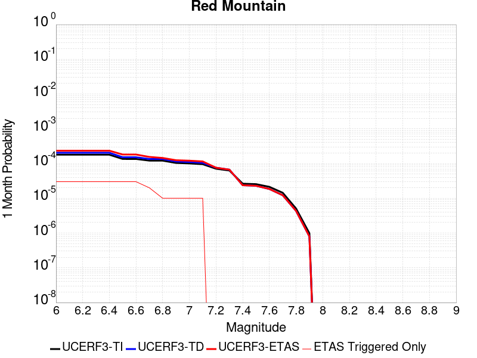 |  |  |

| Magnitude | 1 wk TI Prob | 1 wk TD Prob | 1 wk ETAS Prob | 1 wk ETAS/TD Gain | 1 wk ETAS Triggered Only | 1 mo TI Prob | 1 mo TD Prob | 1 mo ETAS Prob | 1 mo ETAS/TD Gain | 1 mo ETAS Triggered Only | 1 yr TI Prob | 1 yr TD Prob | 1 yr ETAS Prob | 1 yr ETAS/TD Gain | 1 yr ETAS Triggered Only | 10 yr TI Prob | 10 yr TD Prob | 10 yr ETAS Prob | 10 yr ETAS/TD Gain | 10 yr ETAS Triggered Only |
|-----|-----|-----|-----|-----|-----|-----|-----|-----|-----|-----|-----|-----|-----|-----|-----|-----|-----|-----|-----|-----|
| 6.0 | 4.1810763E-5 | 4.7589947E-5 | 7.5889955E-5 | 1.5946635 | 2.8301352E-5 | 1.7917668E-4 | 2.039419E-4 | 2.3223748E-4 | 1.1387434 | 2.8301352E-5 | 0.0021792934 | 0.0024803306 | 0.0025085618 | 1.011382 | 2.8301352E-5 | 0.021580452 | 0.024544092 | 0.024571698 | 1.0011247 | 2.8301352E-5 |
| 6.1 | 4.1810763E-5 | 4.7589947E-5 | 7.5889955E-5 | 1.5946635 | 2.8301352E-5 | 1.7917668E-4 | 2.039419E-4 | 2.3223748E-4 | 1.1387434 | 2.8301352E-5 | 0.0021792934 | 0.0024803306 | 0.0025085618 | 1.011382 | 2.8301352E-5 | 0.021580452 | 0.024544092 | 0.024571698 | 1.0011247 | 2.8301352E-5 |
| 6.2 | 4.1810763E-5 | 4.7589947E-5 | 7.5889955E-5 | 1.5946635 | 2.8301352E-5 | 1.7917668E-4 | 2.039419E-4 | 2.3223748E-4 | 1.1387434 | 2.8301352E-5 | 0.0021792934 | 0.0024803306 | 0.0025085618 | 1.011382 | 2.8301352E-5 | 0.021580452 | 0.024544092 | 0.024571698 | 1.0011247 | 2.8301352E-5 |
| 6.3 | 4.1810763E-5 | 4.7589947E-5 | 7.5889955E-5 | 1.5946635 | 2.8301352E-5 | 1.7917668E-4 | 2.039419E-4 | 2.3223748E-4 | 1.1387434 | 2.8301352E-5 | 0.0021792934 | 0.0024803306 | 0.0025085618 | 1.011382 | 2.8301352E-5 | 0.021580452 | 0.024544092 | 0.024571698 | 1.0011247 | 2.8301352E-5 |
| 6.4 | 4.1810763E-5 | 4.7589947E-5 | 7.5889955E-5 | 1.5946635 | 2.8301352E-5 | 1.7917668E-4 | 2.039419E-4 | 2.3223748E-4 | 1.1387434 | 2.8301352E-5 | 0.0021792934 | 0.0024803306 | 0.0025085618 | 1.011382 | 2.8301352E-5 | 0.021580452 | 0.024544092 | 0.024571698 | 1.0011247 | 2.8301352E-5 |
| 6.5 | 3.154503E-5 | 3.5359728E-5 | 6.366008E-5 | 1.8003554 | 2.8301352E-5 | 1.3518598E-4 | 1.5153342E-4 | 1.7983047E-4 | 1.1867381 | 2.8301352E-5 | 0.0016446467 | 0.0018434501 | 0.0018716994 | 1.0153241 | 2.8301352E-5 | 0.01632528 | 0.018291233 | 0.018319018 | 1.001519 | 2.8301352E-5 |
| 6.6 | 3.1535834E-5 | 3.534911E-5 | 6.364946E-5 | 1.8005959 | 2.8301352E-5 | 1.3514658E-4 | 1.5148791E-4 | 1.7978497E-4 | 1.1867942 | 2.8301352E-5 | 0.0016441676 | 0.001842897 | 0.0018711463 | 1.0153286 | 2.8301352E-5 | 0.01632056 | 0.018285794 | 0.01831358 | 1.0015194 | 2.8301352E-5 |
| 6.7 | 2.8267326E-5 | 3.146934E-5 | 3.146934E-5 | 1.0 | 0.0 | 1.2114006E-4 | 1.348621E-4 | 1.348621E-4 | 1.0 | 0.0 | 0.0014738824 | 0.0016407946 | 0.0016407946 | 1.0 | 0.0 | 0.014641452 | 0.016295563 | 0.016295563 | 1.0 | 0.0 |
| 6.8 | 2.8212884E-5 | 3.1407224E-5 | 3.1407224E-5 | 1.0 | 0.0 | 1.20906756E-4 | 1.3459593E-4 | 1.3459593E-4 | 1.0 | 0.0 | 0.0014710457 | 0.0016375587 | 0.0016375587 | 1.0 | 0.0 | 0.014613459 | 0.01626368 | 0.01626368 | 1.0 | 0.0 |
| 6.9 | 2.4227871E-5 | 2.6706979E-5 | 2.6706979E-5 | 1.0 | 0.0 | 1.03829596E-4 | 1.14453884E-4 | 1.14453884E-4 | 1.0 | 0.0 | 0.0012633923 | 0.0013926612 | 0.0013926612 | 1.0 | 0.0 | 0.012562336 | 0.013847026 | 0.013847026 | 1.0 | 0.0 |
| 7.0 | 2.348524E-5 | 2.5835763E-5 | 2.5835763E-5 | 1.0 | 0.0 | 1.0064714E-4 | 1.1072042E-4 | 1.1072042E-4 | 1.0 | 0.0 | 0.0012246901 | 0.0013472632 | 0.0013472632 | 1.0 | 0.0 | 0.012179627 | 0.01339859 | 0.01339859 | 1.0 | 0.0 |
| 7.1 | 2.2311642E-5 | 2.4462828E-5 | 2.4462828E-5 | 1.0 | 0.0 | 9.561782E-5 | 1.048369E-4 | 1.048369E-4 | 1.0 | 0.0 | 0.0011635252 | 0.0012757168 | 0.0012757168 | 1.0 | 0.0 | 0.01157452 | 0.012691451 | 0.012691451 | 1.0 | 0.0 |
| 7.2 | 1.6533986E-5 | 1.7670347E-5 | 1.7670347E-5 | 1.0 | 0.0 | 7.085802E-5 | 7.572822E-5 | 7.572822E-5 | 1.0 | 0.0 | 8.623549E-4 | 9.216645E-4 | 9.216645E-4 | 1.0 | 0.0 | 0.008590161 | 0.009184699 | 0.009184699 | 1.0 | 0.0 |
| 7.3 | 1.4703092E-5 | 1.555952E-5 | 1.555952E-5 | 1.0 | 0.0 | 6.301173E-5 | 6.66823E-5 | 6.66823E-5 | 1.0 | 0.0 | 7.668978E-4 | 8.1161625E-4 | 8.1161625E-4 | 1.0 | 0.0 | 0.0076425658 | 0.008092596 | 0.008092596 | 1.0 | 0.0 |
| 7.4 | 6.1331984E-6 | 5.528872E-6 | 5.528872E-6 | 1.0 | 0.0 | 2.6284872E-5 | 2.3694953E-5 | 2.3694953E-5 | 1.0 | 0.0 | 3.199713E-4 | 2.8844838E-4 | 2.8844838E-4 | 1.0 | 0.0 | 0.0031951098 | 0.0028807942 | 0.0028807942 | 1.0 | 0.0 |
| 7.5 | 5.954766E-6 | 5.3385015E-6 | 5.3385015E-6 | 1.0 | 0.0 | 2.5520176E-5 | 2.2879094E-5 | 2.2879094E-5 | 1.0 | 0.0 | 3.1066386E-4 | 2.785179E-4 | 2.785179E-4 | 1.0 | 0.0 | 0.003102299 | 0.0027817423 | 0.0027817423 | 1.0 | 0.0 |
| 7.6 | 4.9726646E-6 | 4.315295E-6 | 4.315295E-6 | 1.0 | 0.0 | 2.1311245E-5 | 1.8493993E-5 | 1.8493993E-5 | 1.0 | 0.0 | 2.5943352E-4 | 2.2514143E-4 | 2.2514143E-4 | 1.0 | 0.0 | 0.0025913084 | 0.002249168 | 0.002249168 | 1.0 | 0.0 |
| 7.7 | 3.3613894E-6 | 2.8526642E-6 | 2.8526642E-6 | 1.0 | 0.0 | 1.4405875E-5 | 1.2225649E-5 | 1.2225649E-5 | 1.0 | 0.0 | 1.7537741E-4 | 1.4883737E-4 | 1.4883737E-4 | 1.0 | 0.0 | 0.0017523908 | 0.0014874031 | 0.0014874031 | 1.0 | 0.0 |
| 7.8 | 1.1828961E-6 | 1.0122756E-6 | 1.0122756E-6 | 1.0 | 0.0 | 5.069545E-6 | 4.338317E-6 | 4.338317E-6 | 1.0 | 0.0 | 6.171996E-5 | 5.281776E-5 | 5.281776E-5 | 1.0 | 0.0 | 6.170282E-4 | 5.2805495E-4 | 5.2805495E-4 | 1.0 | 0.0 |
| 7.9 | 2.2967266E-7 | 1.8618952E-7 | 1.8618952E-7 | 1.0 | 0.0 | 9.843111E-7 | 7.9795484E-7 | 7.9795484E-7 | 1.0 | 0.0 | 1.19839215E-5 | 9.7150605E-6 | 9.7150605E-6 | 1.0 | 0.0 | 1.1983275E-4 | 9.714664E-5 | 9.714664E-5 | 1.0 | 0.0 |

## Compton
*[(top)](#table-of-contents)*

| 1 Week | 1 Month | 1 Year | 10 Year |
|-----|-----|-----|-----|
| 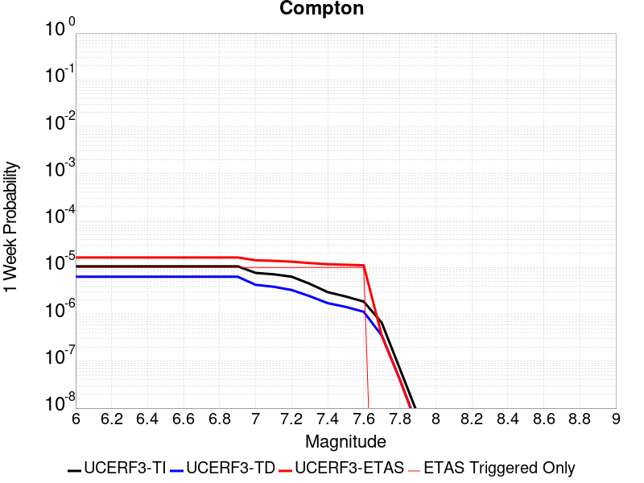 |  |  |  |

| Magnitude | 1 wk TI Prob | 1 wk TD Prob | 1 wk ETAS Prob | 1 wk ETAS/TD Gain | 1 wk ETAS Triggered Only | 1 mo TI Prob | 1 mo TD Prob | 1 mo ETAS Prob | 1 mo ETAS/TD Gain | 1 mo ETAS Triggered Only | 1 yr TI Prob | 1 yr TD Prob | 1 yr ETAS Prob | 1 yr ETAS/TD Gain | 1 yr ETAS Triggered Only | 10 yr TI Prob | 10 yr TD Prob | 10 yr ETAS Prob | 10 yr ETAS/TD Gain | 10 yr ETAS Triggered Only |
|-----|-----|-----|-----|-----|-----|-----|-----|-----|-----|-----|-----|-----|-----|-----|-----|-----|-----|-----|-----|-----|
| 6.0 | 1.06050875E-5 | 6.358671E-6 | 3.4659843E-5 | 5.4508004 | 2.8301352E-5 | 4.5449582E-5 | 2.7251177E-5 | 5.5551758E-5 | 2.0385087 | 2.8301352E-5 | 5.5320817E-4 | 3.317354E-4 | 3.600274E-4 | 1.0852847 | 2.8301352E-5 | 0.0055183303 | 0.0033126862 | 0.0033408937 | 1.008515 | 2.8301352E-5 |
| 6.1 | 1.06050875E-5 | 6.358671E-6 | 3.4659843E-5 | 5.4508004 | 2.8301352E-5 | 4.5449582E-5 | 2.7251177E-5 | 5.5551758E-5 | 2.0385087 | 2.8301352E-5 | 5.5320817E-4 | 3.317354E-4 | 3.600274E-4 | 1.0852847 | 2.8301352E-5 | 0.0055183303 | 0.0033126862 | 0.0033408937 | 1.008515 | 2.8301352E-5 |
| 6.2 | 1.06050875E-5 | 6.358671E-6 | 3.4659843E-5 | 5.4508004 | 2.8301352E-5 | 4.5449582E-5 | 2.7251177E-5 | 5.5551758E-5 | 2.0385087 | 2.8301352E-5 | 5.5320817E-4 | 3.317354E-4 | 3.600274E-4 | 1.0852847 | 2.8301352E-5 | 0.0055183303 | 0.0033126862 | 0.0033408937 | 1.008515 | 2.8301352E-5 |
| 6.3 | 1.06050875E-5 | 6.358671E-6 | 3.4659843E-5 | 5.4508004 | 2.8301352E-5 | 4.5449582E-5 | 2.7251177E-5 | 5.5551758E-5 | 2.0385087 | 2.8301352E-5 | 5.5320817E-4 | 3.317354E-4 | 3.600274E-4 | 1.0852847 | 2.8301352E-5 | 0.0055183303 | 0.0033126862 | 0.0033408937 | 1.008515 | 2.8301352E-5 |
| 6.4 | 1.06050875E-5 | 6.358671E-6 | 3.4659843E-5 | 5.4508004 | 2.8301352E-5 | 4.5449582E-5 | 2.7251177E-5 | 5.5551758E-5 | 2.0385087 | 2.8301352E-5 | 5.5320817E-4 | 3.317354E-4 | 3.600274E-4 | 1.0852847 | 2.8301352E-5 | 0.0055183303 | 0.0033126862 | 0.0033408937 | 1.008515 | 2.8301352E-5 |
| 6.5 | 1.06050875E-5 | 6.358671E-6 | 3.4659843E-5 | 5.4508004 | 2.8301352E-5 | 4.5449582E-5 | 2.7251177E-5 | 5.5551758E-5 | 2.0385087 | 2.8301352E-5 | 5.5320817E-4 | 3.317354E-4 | 3.600274E-4 | 1.0852847 | 2.8301352E-5 | 0.0055183303 | 0.0033126862 | 0.0033408937 | 1.008515 | 2.8301352E-5 |
| 6.6 | 1.06050875E-5 | 6.358671E-6 | 3.4659843E-5 | 5.4508004 | 2.8301352E-5 | 4.5449582E-5 | 2.7251177E-5 | 5.5551758E-5 | 2.0385087 | 2.8301352E-5 | 5.5320817E-4 | 3.317354E-4 | 3.600274E-4 | 1.0852847 | 2.8301352E-5 | 0.0055183303 | 0.0033126862 | 0.0033408937 | 1.008515 | 2.8301352E-5 |
| 6.7 | 1.06050875E-5 | 6.358671E-6 | 3.4659843E-5 | 5.4508004 | 2.8301352E-5 | 4.5449582E-5 | 2.7251177E-5 | 5.5551758E-5 | 2.0385087 | 2.8301352E-5 | 5.5320817E-4 | 3.317354E-4 | 3.600274E-4 | 1.0852847 | 2.8301352E-5 | 0.0055183303 | 0.0033126862 | 0.0033408937 | 1.008515 | 2.8301352E-5 |
| 6.8 | 1.06050875E-5 | 6.358671E-6 | 3.4659843E-5 | 5.4508004 | 2.8301352E-5 | 4.5449582E-5 | 2.7251177E-5 | 5.5551758E-5 | 2.0385087 | 2.8301352E-5 | 5.5320817E-4 | 3.317354E-4 | 3.600274E-4 | 1.0852847 | 2.8301352E-5 | 0.0055183303 | 0.0033126862 | 0.0033408937 | 1.008515 | 2.8301352E-5 |
| 6.9 | 1.06050875E-5 | 6.358671E-6 | 3.4659843E-5 | 5.4508004 | 2.8301352E-5 | 4.5449582E-5 | 2.7251177E-5 | 5.5551758E-5 | 2.0385087 | 2.8301352E-5 | 5.5320817E-4 | 3.317354E-4 | 3.600274E-4 | 1.0852847 | 2.8301352E-5 | 0.0055183303 | 0.0033126862 | 0.0033408937 | 1.008515 | 2.8301352E-5 |
| 7.0 | 7.672486E-6 | 4.2720512E-6 | 3.2573284E-5 | 7.624741 | 2.8301352E-5 | 3.288167E-5 | 1.8308665E-5 | 4.66095E-5 | 2.5457618 | 2.8301352E-5 | 4.0026082E-4 | 2.2288582E-4 | 2.5118087E-4 | 1.1269486 | 2.8301352E-5 | 0.0039954064 | 0.002226685 | 0.0022549233 | 1.0126818 | 2.8301352E-5 |
| 7.1 | 7.163992E-6 | 3.883762E-6 | 3.2185006E-5 | 8.287069 | 2.8301352E-5 | 3.0702464E-5 | 1.6644592E-5 | 4.494547E-5 | 2.700305 | 2.8301352E-5 | 3.7373835E-4 | 2.0262963E-4 | 2.3092524E-4 | 1.1396421 | 2.8301352E-5 | 0.0037311043 | 0.0020245055 | 0.0020527497 | 1.0139511 | 2.8301352E-5 |
| 7.2 | 6.3689185E-6 | 3.3102428E-6 | 3.16115E-5 | 9.5496025 | 2.8301352E-5 | 2.729508E-5 | 1.418668E-5 | 4.248763E-5 | 2.994896 | 2.8301352E-5 | 3.322669E-4 | 1.7270957E-4 | 2.0100603E-4 | 1.1638384 | 2.8301352E-5 | 0.0033177056 | 0.0017257951 | 0.0017540477 | 1.0163708 | 2.8301352E-5 |
| 7.3 | 4.4987873E-6 | 2.4480942E-6 | 3.074938E-5 | 12.560536 | 2.8301352E-5 | 1.9280375E-5 | 1.0491792E-5 | 3.879285E-5 | 3.6974473 | 2.8301352E-5 | 2.3471327E-4 | 1.2773038E-4 | 1.5602812E-4 | 1.2215427 | 2.8301352E-5 | 0.002344655 | 0.0012765999 | 0.0013048651 | 1.022141 | 2.8301352E-5 |
| 7.4 | 2.987296E-6 | 1.7394335E-6 | 3.0040737E-5 | 17.270414 | 2.8301352E-5 | 1.2802635E-5 | 7.454694E-6 | 3.5755835E-5 | 4.796419 | 2.8301352E-5 | 1.5586092E-4 | 9.0757174E-5 | 1.1905596E-4 | 1.3118076 | 2.8301352E-5 | 0.0015575165 | 9.072069E-4 | 9.3548256E-4 | 1.0311679 | 2.8301352E-5 |
| 7.5 | 2.4111696E-6 | 1.4472155E-6 | 2.9748528E-5 | 20.5557 | 2.8301352E-5 | 1.0333543E-5 | 6.2023378E-6 | 3.4503515E-5 | 5.5629854 | 2.8301352E-5 | 1.2580362E-4 | 7.551089E-5 | 1.0381011E-4 | 1.3747699 | 2.8301352E-5 | 0.0012573242 | 7.54857E-4 | 7.83137E-4 | 1.037464 | 2.8301352E-5 |
| 7.6 | 1.8783096E-6 | 1.1360459E-6 | 2.9437366E-5 | 25.912128 | 2.8301352E-5 | 8.049874E-6 | 4.8687593E-6 | 3.3169974E-5 | 6.812819 | 2.8301352E-5 | 9.8002805E-5 | 5.927557E-5 | 8.7575245E-5 | 1.4774256 | 2.8301352E-5 | 9.795959E-4 | 5.926016E-4 | 6.2088616E-4 | 1.0477295 | 2.8301352E-5 |
| 7.7 | 6.6646817E-7 | 3.560237E-7 | 3.560237E-7 | 1.0 | 0.0 | 2.856289E-6 | 1.525815E-6 | 1.525815E-6 | 1.0 | 0.0 | 3.4774763E-5 | 1.8576653E-5 | 1.8576653E-5 | 1.0 | 0.0 | 3.4769322E-4 | 1.8575235E-4 | 1.8575235E-4 | 1.0 | 0.0 |
| 7.8 | 7.054689E-8 | 4.1342968E-8 | 4.1342968E-8 | 1.0 | 0.0 | 3.0234378E-7 | 1.7718413E-7 | 1.7718413E-7 | 1.0 | 0.0 | 3.6810293E-6 | 2.1572148E-6 | 2.1572148E-6 | 1.0 | 0.0 | 3.6809684E-5 | 2.1571948E-5 | 2.1571948E-5 | 1.0 | 0.0 |
| 7.9 | 7.420925E-9 | 4.0131285E-9 | 4.0131285E-9 | 1.0 | 0.0 | 3.1803964E-8 | 1.7199122E-8 | 1.7199122E-8 | 1.0 | 0.0 | 3.872132E-7 | 2.093993E-7 | 2.093993E-7 | 1.0 | 0.0 | 3.872125E-6 | 2.0939913E-6 | 2.0939913E-6 | 1.0 | 0.0 |

## Elsinore (Glen Ivy) rev
*[(top)](#table-of-contents)*

| 1 Week | 1 Month | 1 Year | 10 Year |
|-----|-----|-----|-----|
|  |  |  |  |

| Magnitude | 1 wk TI Prob | 1 wk TD Prob | 1 wk ETAS Prob | 1 wk ETAS/TD Gain | 1 wk ETAS Triggered Only | 1 mo TI Prob | 1 mo TD Prob | 1 mo ETAS Prob | 1 mo ETAS/TD Gain | 1 mo ETAS Triggered Only | 1 yr TI Prob | 1 yr TD Prob | 1 yr ETAS Prob | 1 yr ETAS/TD Gain | 1 yr ETAS Triggered Only | 10 yr TI Prob | 10 yr TD Prob | 10 yr ETAS Prob | 10 yr ETAS/TD Gain | 10 yr ETAS Triggered Only |
|-----|-----|-----|-----|-----|-----|-----|-----|-----|-----|-----|-----|-----|-----|-----|-----|-----|-----|-----|-----|-----|
| 6.0 | 1.6204086E-4 | 2.9360707E-4 | 3.219001E-4 | 1.0963637 | 2.8301352E-5 | 6.94276E-4 | 0.0012578638 | 0.0012861296 | 1.0224712 | 2.8301352E-5 | 0.008420097 | 0.015234485 | 0.015262355 | 1.0018294 | 2.8301352E-5 | 0.081081145 | 0.13969168 | 0.13971603 | 1.0001743 | 2.8301352E-5 |
| 6.1 | 1.6204086E-4 | 2.9360707E-4 | 3.219001E-4 | 1.0963637 | 2.8301352E-5 | 6.94276E-4 | 0.0012578638 | 0.0012861296 | 1.0224712 | 2.8301352E-5 | 0.008420097 | 0.015234485 | 0.015262355 | 1.0018294 | 2.8301352E-5 | 0.081081145 | 0.13969168 | 0.13971603 | 1.0001743 | 2.8301352E-5 |
| 6.2 | 1.6204086E-4 | 2.9360707E-4 | 3.219001E-4 | 1.0963637 | 2.8301352E-5 | 6.94276E-4 | 0.0012578638 | 0.0012861296 | 1.0224712 | 2.8301352E-5 | 0.008420097 | 0.015234485 | 0.015262355 | 1.0018294 | 2.8301352E-5 | 0.081081145 | 0.13969168 | 0.13971603 | 1.0001743 | 2.8301352E-5 |
| 6.3 | 1.0111737E-4 | 1.7703383E-4 | 2.0533016E-4 | 1.1598358 | 2.8301352E-5 | 4.332882E-4 | 7.5861247E-4 | 7.868923E-4 | 1.0372784 | 2.8301352E-5 | 0.005262531 | 0.009217682 | 0.009245723 | 1.003042 | 2.8301352E-5 | 0.0513964 | 0.0870191 | 0.08704494 | 1.000297 | 2.8301352E-5 |
| 6.4 | 1.0111737E-4 | 1.7703383E-4 | 2.0533016E-4 | 1.1598358 | 2.8301352E-5 | 4.332882E-4 | 7.5861247E-4 | 7.868923E-4 | 1.0372784 | 2.8301352E-5 | 0.005262531 | 0.009217682 | 0.009245723 | 1.003042 | 2.8301352E-5 | 0.0513964 | 0.0870191 | 0.08704494 | 1.000297 | 2.8301352E-5 |
| 6.5 | 3.6624708E-5 | 4.6391084E-5 | 4.6391084E-5 | 1.0 | 0.0 | 1.569536E-4 | 1.9880582E-4 | 1.9880582E-4 | 1.0 | 0.0 | 0.001909235 | 0.0024181372 | 0.0024181372 | 1.0 | 0.0 | 0.01892915 | 0.023739954 | 0.023739954 | 1.0 | 0.0 |
| 6.6 | 2.5051324E-5 | 2.614772E-5 | 2.614772E-5 | 1.0 | 0.0 | 1.073584E-4 | 1.12057096E-4 | 1.12057096E-4 | 1.0 | 0.0 | 0.0013063047 | 0.0013634858 | 0.0013634858 | 1.0 | 0.0 | 0.012986525 | 0.013564618 | 0.013564618 | 1.0 | 0.0 |
| 6.7 | 2.2189772E-5 | 2.2072849E-5 | 2.2072849E-5 | 1.0 | 0.0 | 9.509556E-5 | 9.4594696E-5 | 9.4594696E-5 | 1.0 | 0.0 | 0.0011571734 | 0.0011511183 | 0.0011511183 | 1.0 | 0.0 | 0.011511663 | 0.011465415 | 0.011465415 | 1.0 | 0.0 |
| 6.8 | 1.6654378E-5 | 1.4437705E-5 | 1.4437705E-5 | 1.0 | 0.0 | 7.137396E-5 | 6.187444E-5 | 6.187444E-5 | 1.0 | 0.0 | 8.686314E-4 | 7.530661E-4 | 7.530661E-4 | 1.0 | 0.0 | 0.008652439 | 0.00751048 | 0.00751048 | 1.0 | 0.0 |
| 6.9 | 1.5042909E-5 | 1.2332022E-5 | 1.2332022E-5 | 1.0 | 0.0 | 6.446802E-5 | 5.285047E-5 | 5.285047E-5 | 1.0 | 0.0 | 7.8461546E-4 | 6.4326765E-4 | 6.4326765E-4 | 1.0 | 0.0 | 0.007818509 | 0.00641828 | 0.00641828 | 1.0 | 0.0 |
| 7.0 | 1.4361385E-5 | 1.1451324E-5 | 1.1451324E-5 | 1.0 | 0.0 | 6.154734E-5 | 4.9076196E-5 | 4.9076196E-5 | 1.0 | 0.0 | 7.490812E-4 | 5.973418E-4 | 5.973418E-4 | 1.0 | 0.0 | 0.007465612 | 0.0059613534 | 0.0059613534 | 1.0 | 0.0 |
| 7.1 | 1.3265571E-5 | 1.0244926E-5 | 1.0244926E-5 | 1.0 | 0.0 | 5.6851208E-5 | 4.39061E-5 | 4.39061E-5 | 1.0 | 0.0 | 6.919436E-4 | 5.344282E-4 | 5.344282E-4 | 1.0 | 0.0 | 0.006897931 | 0.0053347866 | 0.0053347866 | 1.0 | 0.0 |
| 7.2 | 1.1596403E-5 | 8.505067E-6 | 8.505067E-6 | 1.0 | 0.0 | 4.9697923E-5 | 3.6449786E-5 | 3.6449786E-5 | 1.0 | 0.0 | 6.049042E-4 | 4.436875E-4 | 4.436875E-4 | 1.0 | 0.0 | 0.006032603 | 0.0044294316 | 0.0044294316 | 1.0 | 0.0 |
| 7.3 | 1.0150827E-5 | 7.2387597E-6 | 7.2387597E-6 | 1.0 | 0.0 | 4.3502816E-5 | 3.1022897E-5 | 3.1022897E-5 | 1.0 | 0.0 | 5.2951806E-4 | 3.7763975E-4 | 3.7763975E-4 | 1.0 | 0.0 | 0.005282581 | 0.0037703665 | 0.0037703665 | 1.0 | 0.0 |
| 7.4 | 9.080705E-6 | 6.352519E-6 | 6.352519E-6 | 1.0 | 0.0 | 3.8916725E-5 | 2.7224805E-5 | 2.7224805E-5 | 1.0 | 0.0 | 4.7370812E-4 | 3.3141294E-4 | 3.3141294E-4 | 1.0 | 0.0 | 0.004726996 | 0.0033093381 | 0.0033093381 | 1.0 | 0.0 |
| 7.5 | 7.671649E-6 | 5.2256332E-6 | 5.2256332E-6 | 1.0 | 0.0 | 3.287808E-5 | 2.2395385E-5 | 2.2395385E-5 | 1.0 | 0.0 | 4.0021708E-4 | 2.7263095E-4 | 2.7263095E-4 | 1.0 | 0.0 | 0.0039949706 | 0.00272309 | 0.00272309 | 1.0 | 0.0 |
| 7.6 | 6.990086E-6 | 4.687545E-6 | 4.687545E-6 | 1.0 | 0.0 | 2.9957167E-5 | 2.008933E-5 | 2.008933E-5 | 1.0 | 0.0 | 3.6466747E-4 | 2.445613E-4 | 2.445613E-4 | 1.0 | 0.0 | 0.0036406964 | 0.002443038 | 0.002443038 | 1.0 | 0.0 |
| 7.7 | 4.163505E-6 | 2.3295343E-6 | 2.3295343E-6 | 1.0 | 0.0 | 1.7843471E-5 | 9.983683E-6 | 9.983683E-6 | 1.0 | 0.0 | 2.172226E-4 | 1.21545316E-4 | 1.21545316E-4 | 1.0 | 0.0 | 0.0021701038 | 0.0012148614 | 0.0012148614 | 1.0 | 0.0 |
| 7.8 | 2.2692414E-7 | 9.3854695E-8 | 9.3854695E-8 | 1.0 | 0.0 | 9.725317E-7 | 4.0223435E-7 | 4.0223435E-7 | 1.0 | 0.0 | 1.1840509E-5 | 4.8971956E-6 | 4.8971956E-6 | 1.0 | 0.0 | 1.1839878E-4 | 4.8971204E-5 | 4.8971204E-5 | 1.0 | 0.0 |
| 7.9 | 6.676829E-9 | 3.439853E-9 | 3.439853E-9 | 1.0 | 0.0 | 2.861498E-8 | 1.4742227E-8 | 1.4742227E-8 | 1.0 | 0.0 | 3.4838732E-7 | 1.7948659E-7 | 1.7948659E-7 | 1.0 | 0.0 | 3.4838679E-6 | 1.7948646E-6 | 1.7948646E-6 | 1.0 | 0.0 |

## Malibu Coast alt 1
*[(top)](#table-of-contents)*

| 1 Week | 1 Month | 1 Year | 10 Year |
|-----|-----|-----|-----|
|  |  |  |  |

| Magnitude | 1 wk TI Prob | 1 wk TD Prob | 1 wk ETAS Prob | 1 wk ETAS/TD Gain | 1 wk ETAS Triggered Only | 1 mo TI Prob | 1 mo TD Prob | 1 mo ETAS Prob | 1 mo ETAS/TD Gain | 1 mo ETAS Triggered Only | 1 yr TI Prob | 1 yr TD Prob | 1 yr ETAS Prob | 1 yr ETAS/TD Gain | 1 yr ETAS Triggered Only | 10 yr TI Prob | 10 yr TD Prob | 10 yr ETAS Prob | 10 yr ETAS/TD Gain | 10 yr ETAS Triggered Only |
|-----|-----|-----|-----|-----|-----|-----|-----|-----|-----|-----|-----|-----|-----|-----|-----|-----|-----|-----|-----|-----|
| 6.0 | 1.6572556E-5 | 1.7598066E-5 | 4.589892E-5 | 2.6081798 | 2.8301352E-5 | 7.102331E-5 | 7.541821E-5 | 1.0371743E-4 | 1.3752306 | 2.8301352E-5 | 8.6436566E-4 | 9.178488E-4 | 9.4612414E-4 | 1.0308062 | 2.8301352E-5 | 0.0086101135 | 0.009142512 | 0.0091705555 | 1.0030673 | 2.8301352E-5 |
| 6.1 | 1.6572556E-5 | 1.7598066E-5 | 4.589892E-5 | 2.6081798 | 2.8301352E-5 | 7.102331E-5 | 7.541821E-5 | 1.0371743E-4 | 1.3752306 | 2.8301352E-5 | 8.6436566E-4 | 9.178488E-4 | 9.4612414E-4 | 1.0308062 | 2.8301352E-5 | 0.0086101135 | 0.009142512 | 0.0091705555 | 1.0030673 | 2.8301352E-5 |
| 6.2 | 1.1085717E-5 | 1.1557147E-5 | 3.9858172E-5 | 3.4487898 | 2.8301352E-5 | 4.750935E-5 | 4.952971E-5 | 7.782966E-5 | 1.5713732 | 2.8301352E-5 | 5.782728E-4 | 6.028609E-4 | 6.311452E-4 | 1.0469167 | 2.8301352E-5 | 0.0057677035 | 0.0060126255 | 0.006040757 | 1.0046787 | 2.8301352E-5 |
| 6.3 | 1.0208568E-5 | 1.0592237E-5 | 3.889329E-5 | 3.6718674 | 2.8301352E-5 | 4.375027E-5 | 4.539453E-5 | 7.3694595E-5 | 1.6234246 | 2.8301352E-5 | 5.325294E-4 | 5.5254117E-4 | 5.808269E-4 | 1.051192 | 2.8301352E-5 | 0.0053125503 | 0.0055119814 | 0.005540127 | 1.0051062 | 2.8301352E-5 |
| 6.4 | 9.0682315E-6 | 9.342637E-6 | 3.7643727E-5 | 4.0292397 | 2.8301352E-5 | 3.8863272E-5 | 4.003927E-5 | 6.833949E-5 | 1.7068115 | 2.8301352E-5 | 4.730576E-4 | 4.8737114E-4 | 5.156587E-4 | 1.0580411 | 2.8301352E-5 | 0.0047205184 | 0.004863236 | 0.0048914 | 1.0057912 | 2.8301352E-5 |
| 6.5 | 7.605796E-6 | 7.748587E-6 | 7.748587E-6 | 1.0 | 0.0 | 3.259586E-5 | 3.3207816E-5 | 3.3207816E-5 | 1.0 | 0.0 | 3.9678233E-4 | 4.0423148E-4 | 4.0423148E-4 | 1.0 | 0.0 | 0.0039607463 | 0.0040351 | 0.0040351 | 1.0 | 0.0 |
| 6.6 | 5.889873E-6 | 5.8795385E-6 | 5.8795385E-6 | 1.0 | 0.0 | 2.5242069E-5 | 2.519778E-5 | 2.519778E-5 | 1.0 | 0.0 | 3.0727885E-4 | 3.0673988E-4 | 3.0673988E-4 | 1.0 | 0.0 | 0.003068543 | 0.0030631777 | 0.0030631777 | 1.0 | 0.0 |
| 6.7 | 5.66586E-6 | 5.641641E-6 | 5.641641E-6 | 1.0 | 0.0 | 2.428203E-5 | 2.417824E-5 | 2.417824E-5 | 1.0 | 0.0 | 2.955936E-4 | 2.9433038E-4 | 2.9433038E-4 | 1.0 | 0.0 | 0.0029520073 | 0.0029394177 | 0.0029394177 | 1.0 | 0.0 |
| 6.8 | 5.521556E-6 | 5.489427E-6 | 5.489427E-6 | 1.0 | 0.0 | 2.3663597E-5 | 2.3525903E-5 | 2.3525903E-5 | 1.0 | 0.0 | 2.880662E-4 | 2.8639034E-4 | 2.8639034E-4 | 1.0 | 0.0 | 0.0028769306 | 0.002860224 | 0.002860224 | 1.0 | 0.0 |
| 6.9 | 5.29752E-6 | 5.2499317E-6 | 5.2499317E-6 | 1.0 | 0.0 | 2.270346E-5 | 2.2499513E-5 | 2.2499513E-5 | 1.0 | 0.0 | 2.7637955E-4 | 2.7389723E-4 | 2.7389723E-4 | 1.0 | 0.0 | 0.0027603607 | 0.0027356069 | 0.0027356069 | 1.0 | 0.0 |
| 7.0 | 5.106743E-6 | 5.0476788E-6 | 5.0476788E-6 | 1.0 | 0.0 | 2.1885859E-5 | 2.163273E-5 | 2.163273E-5 | 1.0 | 0.0 | 2.6642776E-4 | 2.6334674E-4 | 2.6334674E-4 | 1.0 | 0.0 | 0.0026610855 | 0.0026303562 | 0.0026303562 | 1.0 | 0.0 |
| 7.1 | 4.8469647E-6 | 4.770373E-6 | 4.770373E-6 | 1.0 | 0.0 | 2.0772539E-5 | 2.0444295E-5 | 2.0444295E-5 | 1.0 | 0.0 | 2.528763E-4 | 2.4888094E-4 | 2.4888094E-4 | 1.0 | 0.0 | 0.0025258875 | 0.00248603 | 0.00248603 | 1.0 | 0.0 |
| 7.2 | 4.545514E-6 | 4.4481935E-6 | 4.4481935E-6 | 1.0 | 0.0 | 1.9480629E-5 | 1.9063547E-5 | 1.9063547E-5 | 1.0 | 0.0 | 2.3715083E-4 | 2.3207403E-4 | 2.3207403E-4 | 1.0 | 0.0 | 0.0023689792 | 0.0023183243 | 0.0023183243 | 1.0 | 0.0 |
| 7.3 | 3.794097E-6 | 3.6519348E-6 | 3.6519348E-6 | 1.0 | 0.0 | 1.6260314E-5 | 1.5651056E-5 | 1.5651056E-5 | 1.0 | 0.0 | 1.9795135E-4 | 1.9053498E-4 | 1.9053498E-4 | 1.0 | 0.0 | 0.001977751 | 0.0019037209 | 0.0019037209 | 1.0 | 0.0 |
| 7.4 | 2.808217E-6 | 2.719077E-6 | 2.719077E-6 | 1.0 | 0.0 | 1.203516E-5 | 1.1653135E-5 | 1.1653135E-5 | 1.0 | 0.0 | 1.4651821E-4 | 1.418677E-4 | 1.418677E-4 | 1.0 | 0.0 | 0.0014642165 | 0.001417774 | 0.001417774 | 1.0 | 0.0 |
| 7.5 | 1.83809E-6 | 1.8190691E-6 | 1.8190691E-6 | 1.0 | 0.0 | 7.877505E-6 | 7.795988E-6 | 7.795988E-6 | 1.0 | 0.0 | 9.59044E-5 | 9.491203E-5 | 9.491203E-5 | 1.0 | 0.0 | 9.5863023E-4 | 9.48717E-4 | 9.48717E-4 | 1.0 | 0.0 |
| 7.6 | 1.1292672E-6 | 1.1001447E-6 | 1.1001447E-6 | 1.0 | 0.0 | 4.839708E-6 | 4.714897E-6 | 4.714897E-6 | 1.0 | 0.0 | 5.8921847E-5 | 5.7402376E-5 | 5.7402376E-5 | 1.0 | 0.0 | 5.890623E-4 | 5.738771E-4 | 5.738771E-4 | 1.0 | 0.0 |
| 7.7 | 5.065272E-7 | 4.609151E-7 | 4.609151E-7 | 1.0 | 0.0 | 2.170829E-6 | 1.975349E-6 | 1.975349E-6 | 1.0 | 0.0 | 2.6429525E-5 | 2.404962E-5 | 2.404962E-5 | 1.0 | 0.0 | 2.642638E-4 | 2.4047129E-4 | 2.4047129E-4 | 1.0 | 0.0 |
| 7.8 | 8.952991E-8 | 6.707874E-8 | 6.707874E-8 | 1.0 | 0.0 | 3.8369956E-7 | 2.8748025E-7 | 2.8748025E-7 | 1.0 | 0.0 | 4.671532E-6 | 3.5000667E-6 | 3.5000667E-6 | 1.0 | 0.0 | 4.671434E-5 | 3.5000136E-5 | 3.5000136E-5 | 1.0 | 0.0 |
| 7.9 | 8.007447E-10 | 6.1608785E-10 | 6.1608785E-10 | 1.0 | 0.0 | 3.4317629E-9 | 2.6403764E-9 | 2.6403764E-9 | 1.0 | 0.0 | 4.1781714E-8 | 3.2146584E-8 | 3.2146584E-8 | 1.0 | 0.0 | 4.1781706E-7 | 3.214658E-7 | 3.214658E-7 | 1.0 | 0.0 |

## Hayward (No) 2011 CFM
*[(top)](#table-of-contents)*

| 1 Week | 1 Month | 1 Year | 10 Year |
|-----|-----|-----|-----|
|  |  |  |  |

| Magnitude | 1 wk TI Prob | 1 wk TD Prob | 1 wk ETAS Prob | 1 wk ETAS/TD Gain | 1 wk ETAS Triggered Only | 1 mo TI Prob | 1 mo TD Prob | 1 mo ETAS Prob | 1 mo ETAS/TD Gain | 1 mo ETAS Triggered Only | 1 yr TI Prob | 1 yr TD Prob | 1 yr ETAS Prob | 1 yr ETAS/TD Gain | 1 yr ETAS Triggered Only | 10 yr TI Prob | 10 yr TD Prob | 10 yr ETAS Prob | 10 yr ETAS/TD Gain | 10 yr ETAS Triggered Only |
|-----|-----|-----|-----|-----|-----|-----|-----|-----|-----|-----|-----|-----|-----|-----|-----|-----|-----|-----|-----|-----|
| 6.0 | 9.3068506E-5 | 1.739599E-4 | 2.0225633E-4 | 1.1626606 | 2.8301352E-5 | 3.9880406E-4 | 7.453244E-4 | 7.7360467E-4 | 1.0379436 | 2.8301352E-5 | 0.0048446343 | 0.009036438 | 0.009064483 | 1.0031036 | 2.8301352E-5 | 0.047403704 | 0.08637534 | 0.086401194 | 1.0002993 | 2.8301352E-5 |
| 6.1 | 9.055486E-5 | 1.6947114E-4 | 1.9776769E-4 | 1.1669698 | 2.8301352E-5 | 3.880345E-4 | 7.261021E-4 | 7.5438287E-4 | 1.0389488 | 2.8301352E-5 | 0.0047140904 | 0.008804537 | 0.00883259 | 1.0031861 | 2.8301352E-5 | 0.046153355 | 0.08426854 | 0.08429445 | 1.0003076 | 2.8301352E-5 |
| 6.2 | 9.006742E-5 | 1.6867711E-4 | 1.9697369E-4 | 1.1677558 | 2.8301352E-5 | 3.859461E-4 | 7.22701E-4 | 7.5098197E-4 | 1.0391322 | 2.8301352E-5 | 0.0046887742 | 0.008763513 | 0.008791566 | 1.0032011 | 2.8301352E-5 | 0.0459107 | 0.083892785 | 0.083918706 | 1.0003091 | 2.8301352E-5 |
| 6.3 | 8.8336754E-5 | 1.6547246E-4 | 1.9376914E-4 | 1.1710052 | 2.8301352E-5 | 3.7853114E-4 | 7.089758E-4 | 7.3725707E-4 | 1.0398903 | 2.8301352E-5 | 0.004598882 | 0.008597788 | 0.008625846 | 1.0032634 | 2.8301352E-5 | 0.04504866 | 0.08238599 | 0.08241196 | 1.0003152 | 2.8301352E-5 |
| 6.4 | 8.526157E-5 | 1.5974249E-4 | 1.8803931E-4 | 1.1771404 | 2.8301352E-5 | 3.6535555E-4 | 6.8443175E-4 | 7.1271375E-4 | 1.0413219 | 2.8301352E-5 | 0.0044391346 | 0.008301278 | 0.008329344 | 1.003381 | 2.8301352E-5 | 0.043514993 | 0.079682834 | 0.07970888 | 1.0003269 | 2.8301352E-5 |
| 6.5 | 8.152396E-5 | 1.530663E-4 | 1.8136333E-4 | 1.1848677 | 2.8301352E-5 | 3.493416E-4 | 6.558342E-4 | 6.84117E-4 | 1.0431249 | 2.8301352E-5 | 0.0042449418 | 0.007955698 | 0.007983775 | 1.0035291 | 2.8301352E-5 | 0.04164765 | 0.07651369 | 0.07653983 | 1.0003415 | 2.8301352E-5 |
| 6.6 | 7.987405E-5 | 1.5010842E-4 | 1.7840552E-4 | 1.1885111 | 2.8301352E-5 | 3.4227243E-4 | 6.4316386E-4 | 6.71447E-4 | 1.043975 | 2.8301352E-5 | 0.0041592065 | 0.0078025614 | 0.007830642 | 1.0035989 | 2.8301352E-5 | 0.04082218 | 0.07510622 | 0.07513239 | 1.0003486 | 2.8301352E-5 |
| 6.7 | 7.777665E-5 | 1.4650106E-4 | 1.7479826E-4 | 1.1931536 | 2.8301352E-5 | 3.332859E-4 | 6.277113E-4 | 6.5599487E-4 | 1.0450583 | 2.8301352E-5 | 0.004050208 | 0.00761576 | 0.0076438454 | 1.0036879 | 2.8301352E-5 | 0.039771806 | 0.073382616 | 0.07340884 | 1.0003574 | 2.8301352E-5 |
| 6.8 | 7.3284005E-5 | 1.3800753E-4 | 1.6630498E-4 | 1.2050427 | 2.8301352E-5 | 3.140365E-4 | 5.913274E-4 | 6.19612E-4 | 1.0478324 | 2.8301352E-5 | 0.0038166929 | 0.0071757827 | 0.007203881 | 1.0039157 | 2.8301352E-5 | 0.037518036 | 0.06929621 | 0.06932255 | 1.0003802 | 2.8301352E-5 |
| 6.9 | 6.458263E-5 | 1.2131439E-4 | 1.4961231E-4 | 1.233261 | 2.8301352E-5 | 2.7675333E-4 | 5.198157E-4 | 5.4810237E-4 | 1.0544167 | 2.8301352E-5 | 0.0033642664 | 0.0063104923 | 0.006338615 | 1.0044565 | 2.8301352E-5 | 0.033137884 | 0.061225023 | 0.061251592 | 1.0004339 | 2.8301352E-5 |
| 7.0 | 5.3853604E-5 | 1.00250414E-4 | 1.00250414E-4 | 1.0 | 0.0 | 2.3078074E-4 | 4.295742E-4 | 4.295742E-4 | 1.0 | 0.0 | 0.0028061352 | 0.0052175885 | 0.0052175885 | 1.0 | 0.0 | 0.027709642 | 0.0509578 | 0.0509578 | 1.0 | 0.0 |
| 7.1 | 4.4308683E-5 | 8.170626E-5 | 8.170626E-5 | 1.0 | 0.0 | 1.8988053E-4 | 3.501229E-4 | 3.501229E-4 | 1.0 | 0.0 | 0.0023093442 | 0.0042544557 | 0.0042544557 | 1.0 | 0.0 | 0.022854926 | 0.04182473 | 0.04182473 | 1.0 | 0.0 |
| 7.2 | 3.295973E-5 | 6.0771144E-5 | 6.0771144E-5 | 1.0 | 0.0 | 1.4124835E-4 | 2.604219E-4 | 2.604219E-4 | 1.0 | 0.0 | 0.0017183421 | 0.0031660495 | 0.0031660495 | 1.0 | 0.0 | 0.017051157 | 0.031369876 | 0.031369876 | 1.0 | 0.0 |
| 7.3 | 2.452256E-5 | 4.5180346E-5 | 4.5180346E-5 | 1.0 | 0.0 | 1.05092455E-4 | 1.9361576E-4 | 1.9361576E-4 | 1.0 | 0.0 | 0.0012787496 | 0.0023547374 | 0.0023547374 | 1.0 | 0.0 | 0.0127141625 | 0.02344111 | 0.02344111 | 1.0 | 0.0 |
| 7.4 | 1.8829967E-5 | 3.4602548E-5 | 3.4602548E-5 | 1.0 | 0.0 | 8.069736E-5 | 1.4828827E-4 | 1.4828827E-4 | 1.0 | 0.0 | 9.820475E-4 | 0.0018039243 | 0.0018039243 | 1.0 | 0.0 | 0.009777189 | 0.0180195 | 0.0180195 | 1.0 | 0.0 |
| 7.5 | 1.26374125E-5 | 2.2921116E-5 | 2.2921116E-5 | 1.0 | 0.0 | 5.4159216E-5 | 9.822969E-5 | 9.822969E-5 | 1.0 | 0.0 | 6.5918895E-4 | 0.0011952962 | 0.0011952962 | 1.0 | 0.0 | 0.00657237 | 0.011988836 | 0.011988836 | 1.0 | 0.0 |
| 7.6 | 4.666429E-6 | 8.4791645E-6 | 8.4791645E-6 | 1.0 | 0.0 | 1.9998828E-5 | 3.6338777E-5 | 3.6338777E-5 | 1.0 | 0.0 | 2.4345852E-4 | 4.4233602E-4 | 4.4233602E-4 | 1.0 | 0.0 | 0.0024319198 | 0.0044591012 | 0.0044591012 | 1.0 | 0.0 |
| 7.7 | 3.8399318E-7 | 7.133867E-7 | 7.133867E-7 | 1.0 | 0.0 | 1.6456839E-6 | 3.057368E-6 | 3.057368E-6 | 1.0 | 0.0 | 2.003602E-5 | 3.722282E-5 | 3.722282E-5 | 1.0 | 0.0 | 2.0034213E-4 | 3.8614936E-4 | 3.8614936E-4 | 1.0 | 0.0 |
| 7.8 | 2.5637698E-7 | 5.3662194E-7 | 5.3662194E-7 | 1.0 | 0.0 | 1.098758E-6 | 2.299806E-6 | 2.299806E-6 | 1.0 | 0.0 | 1.3377297E-5 | 2.7999782E-5 | 2.7999782E-5 | 1.0 | 0.0 | 1.3376492E-4 | 2.9244382E-4 | 2.9244382E-4 | 1.0 | 0.0 |
| 7.9 | 1.7141245E-7 | 3.7290573E-7 | 3.7290573E-7 | 1.0 | 0.0 | 7.3462456E-7 | 1.5981665E-6 | 1.5981665E-6 | 1.0 | 0.0 | 8.944017E-6 | 1.9457504E-5 | 1.9457504E-5 | 1.0 | 0.0 | 8.943657E-5 | 2.0245428E-4 | 2.0245428E-4 | 1.0 | 0.0 |
| 8.0 | 1.1808895E-7 | 2.7509762E-7 | 2.7509762E-7 | 1.0 | 0.0 | 5.060954E-7 | 1.1789892E-6 | 1.1789892E-6 | 1.0 | 0.0 | 6.161694E-6 | 1.43541E-5 | 1.43541E-5 | 1.0 | 0.0 | 6.161523E-5 | 1.4816441E-4 | 1.4816441E-4 | 1.0 | 0.0 |
| 8.1 | 5.138535E-8 | 1.1229867E-7 | 1.1229867E-7 | 1.0 | 0.0 | 2.2022292E-7 | 4.812799E-7 | 4.812799E-7 | 1.0 | 0.0 | 2.6812106E-6 | 5.8595674E-6 | 5.8595674E-6 | 1.0 | 0.0 | 2.6811784E-5 | 6.0158476E-5 | 6.0158476E-5 | 1.0 | 0.0 |

## Big Lagoon - Bald Mtn 2011 CFM
*[(top)](#table-of-contents)*

| 1 Week | 1 Month | 1 Year | 10 Year |
|-----|-----|-----|-----|
|  |  |  |  |

| Magnitude | 1 wk TI Prob | 1 wk TD Prob | 1 wk ETAS Prob | 1 wk ETAS/TD Gain | 1 wk ETAS Triggered Only | 1 mo TI Prob | 1 mo TD Prob | 1 mo ETAS Prob | 1 mo ETAS/TD Gain | 1 mo ETAS Triggered Only | 1 yr TI Prob | 1 yr TD Prob | 1 yr ETAS Prob | 1 yr ETAS/TD Gain | 1 yr ETAS Triggered Only | 10 yr TI Prob | 10 yr TD Prob | 10 yr ETAS Prob | 10 yr ETAS/TD Gain | 10 yr ETAS Triggered Only |
|-----|-----|-----|-----|-----|-----|-----|-----|-----|-----|-----|-----|-----|-----|-----|-----|-----|-----|-----|-----|-----|
| 6.0 | 1.8699735E-5 | 1.985018E-5 | 4.815097E-5 | 2.4257195 | 2.8301352E-5 | 8.013926E-5 | 8.5069645E-5 | 1.1336859E-4 | 1.3326563 | 2.8301352E-5 | 9.752587E-4 | 0.0010352687 | 0.0010635407 | 1.027309 | 2.8301352E-5 | 0.009709897 | 0.010308274 | 0.010336284 | 1.0027173 | 2.8301352E-5 |
| 6.1 | 1.8699735E-5 | 1.985018E-5 | 4.815097E-5 | 2.4257195 | 2.8301352E-5 | 8.013926E-5 | 8.5069645E-5 | 1.1336859E-4 | 1.3326563 | 2.8301352E-5 | 9.752587E-4 | 0.0010352687 | 0.0010635407 | 1.027309 | 2.8301352E-5 | 0.009709897 | 0.010308274 | 0.010336284 | 1.0027173 | 2.8301352E-5 |
| 6.2 | 1.8699735E-5 | 1.985018E-5 | 4.815097E-5 | 2.4257195 | 2.8301352E-5 | 8.013926E-5 | 8.5069645E-5 | 1.1336859E-4 | 1.3326563 | 2.8301352E-5 | 9.752587E-4 | 0.0010352687 | 0.0010635407 | 1.027309 | 2.8301352E-5 | 0.009709897 | 0.010308274 | 0.010336284 | 1.0027173 | 2.8301352E-5 |
| 6.3 | 1.8699735E-5 | 1.985018E-5 | 4.815097E-5 | 2.4257195 | 2.8301352E-5 | 8.013926E-5 | 8.5069645E-5 | 1.1336859E-4 | 1.3326563 | 2.8301352E-5 | 9.752587E-4 | 0.0010352687 | 0.0010635407 | 1.027309 | 2.8301352E-5 | 0.009709897 | 0.010308274 | 0.010336284 | 1.0027173 | 2.8301352E-5 |
| 6.4 | 1.8699735E-5 | 1.985018E-5 | 4.815097E-5 | 2.4257195 | 2.8301352E-5 | 8.013926E-5 | 8.5069645E-5 | 1.1336859E-4 | 1.3326563 | 2.8301352E-5 | 9.752587E-4 | 0.0010352687 | 0.0010635407 | 1.027309 | 2.8301352E-5 | 0.009709897 | 0.010308274 | 0.010336284 | 1.0027173 | 2.8301352E-5 |
| 6.5 | 1.8699735E-5 | 1.985018E-5 | 4.815097E-5 | 2.4257195 | 2.8301352E-5 | 8.013926E-5 | 8.5069645E-5 | 1.1336859E-4 | 1.3326563 | 2.8301352E-5 | 9.752587E-4 | 0.0010352687 | 0.0010635407 | 1.027309 | 2.8301352E-5 | 0.009709897 | 0.010308274 | 0.010336284 | 1.0027173 | 2.8301352E-5 |
| 6.6 | 1.8699735E-5 | 1.985018E-5 | 4.815097E-5 | 2.4257195 | 2.8301352E-5 | 8.013926E-5 | 8.5069645E-5 | 1.1336859E-4 | 1.3326563 | 2.8301352E-5 | 9.752587E-4 | 0.0010352687 | 0.0010635407 | 1.027309 | 2.8301352E-5 | 0.009709897 | 0.010308274 | 0.010336284 | 1.0027173 | 2.8301352E-5 |
| 6.7 | 1.8699735E-5 | 1.985018E-5 | 4.815097E-5 | 2.4257195 | 2.8301352E-5 | 8.013926E-5 | 8.5069645E-5 | 1.1336859E-4 | 1.3326563 | 2.8301352E-5 | 9.752587E-4 | 0.0010352687 | 0.0010635407 | 1.027309 | 2.8301352E-5 | 0.009709897 | 0.010308274 | 0.010336284 | 1.0027173 | 2.8301352E-5 |
| 6.8 | 1.18505095E-5 | 1.2499804E-5 | 1.2499804E-5 | 1.0 | 0.0 | 5.078691E-5 | 5.3569514E-5 | 5.3569514E-5 | 1.0 | 0.0 | 6.181552E-4 | 6.520185E-4 | 6.520185E-4 | 1.0 | 0.0 | 0.006164385 | 0.0065015587 | 0.0065015587 | 1.0 | 0.0 |
| 6.9 | 1.18505095E-5 | 1.2499804E-5 | 1.2499804E-5 | 1.0 | 0.0 | 5.078691E-5 | 5.3569514E-5 | 5.3569514E-5 | 1.0 | 0.0 | 6.181552E-4 | 6.520185E-4 | 6.520185E-4 | 1.0 | 0.0 | 0.006164385 | 0.0065015587 | 0.0065015587 | 1.0 | 0.0 |
| 7.0 | 9.719786E-6 | 1.0235487E-5 | 1.0235487E-5 | 1.0 | 0.0 | 4.1655563E-5 | 4.386565E-5 | 4.386565E-5 | 1.0 | 0.0 | 5.0703844E-4 | 5.3393573E-4 | 5.3393573E-4 | 1.0 | 0.0 | 0.005058831 | 0.0053267754 | 0.0053267754 | 1.0 | 0.0 |
| 7.1 | 8.523418E-6 | 8.969463E-6 | 8.969463E-6 | 1.0 | 0.0 | 3.652842E-5 | 3.844E-5 | 3.844E-5 | 1.0 | 0.0 | 4.4464276E-4 | 4.6790804E-4 | 4.6790804E-4 | 1.0 | 0.0 | 0.0044375416 | 0.004669392 | 0.004669392 | 1.0 | 0.0 |
| 7.2 | 7.378894E-6 | 7.761112E-6 | 7.761112E-6 | 1.0 | 0.0 | 3.162345E-5 | 3.326149E-5 | 3.326149E-5 | 1.0 | 0.0 | 3.8494746E-4 | 4.048843E-4 | 4.048843E-4 | 1.0 | 0.0 | 0.0038428132 | 0.0040415623 | 0.0040415623 | 1.0 | 0.0 |
| 7.3 | 6.4640294E-6 | 6.7924434E-6 | 6.7924434E-6 | 1.0 | 0.0 | 2.7702688E-5 | 2.9110151E-5 | 2.9110151E-5 | 1.0 | 0.0 | 3.3722803E-4 | 3.5435913E-4 | 3.5435913E-4 | 1.0 | 0.0 | 0.0033671674 | 0.0035380109 | 0.0035380109 | 1.0 | 0.0 |
| 7.4 | 5.9959093E-6 | 6.2988E-6 | 6.2988E-6 | 1.0 | 0.0 | 2.5696501E-5 | 2.6994581E-5 | 2.6994581E-5 | 1.0 | 0.0 | 3.1280998E-4 | 3.2861007E-4 | 3.2861007E-4 | 1.0 | 0.0 | 0.0031237002 | 0.0032813034 | 0.0032813034 | 1.0 | 0.0 |
| 7.5 | 4.929265E-6 | 5.176396E-6 | 5.176396E-6 | 1.0 | 0.0 | 2.112525E-5 | 2.2184367E-5 | 2.2184367E-5 | 1.0 | 0.0 | 2.5716957E-4 | 2.700616E-4 | 2.700616E-4 | 1.0 | 0.0 | 0.0025687215 | 0.002697375 | 0.002697375 | 1.0 | 0.0 |
| 7.6 | 3.8982403E-6 | 4.0889267E-6 | 4.0889267E-6 | 1.0 | 0.0 | 1.6706637E-5 | 1.7523857E-5 | 1.7523857E-5 | 1.0 | 0.0 | 2.0338432E-4 | 2.1333233E-4 | 2.1333233E-4 | 1.0 | 0.0 | 0.0020319829 | 0.002131303 | 0.002131303 | 1.0 | 0.0 |
| 7.7 | 2.820968E-6 | 2.9572116E-6 | 2.9572116E-6 | 1.0 | 0.0 | 1.2089806E-5 | 1.2673704E-5 | 1.2673704E-5 | 1.0 | 0.0 | 1.4718344E-4 | 1.5429159E-4 | 1.5429159E-4 | 1.0 | 0.0 | 0.00147086 | 0.0015418624 | 0.0015418624 | 1.0 | 0.0 |
| 7.8 | 1.9314455E-6 | 2.0260186E-6 | 2.0260186E-6 | 1.0 | 0.0 | 8.277597E-6 | 8.682909E-6 | 8.682909E-6 | 1.0 | 0.0 | 1.0077508E-4 | 1.0570941E-4 | 1.0570941E-4 | 1.0 | 0.0 | 0.0010072939 | 0.0010566041 | 0.0010566041 | 1.0 | 0.0 |
| 7.9 | 4.9586197E-7 | 5.2189216E-7 | 5.2189216E-7 | 1.0 | 0.0 | 2.125121E-6 | 2.2366787E-6 | 2.2366787E-6 | 1.0 | 0.0 | 2.5873042E-5 | 2.7231245E-5 | 2.7231245E-5 | 1.0 | 0.0 | 2.5870028E-4 | 2.7228118E-4 | 2.7228118E-4 | 1.0 | 0.0 |

## Great Valley 05 Pittsburg - Kirby Hills alt1
*[(top)](#table-of-contents)*

| 1 Week | 1 Month | 1 Year | 10 Year |
|-----|-----|-----|-----|
|  |  |  |  |

| Magnitude | 1 wk TI Prob | 1 wk TD Prob | 1 wk ETAS Prob | 1 wk ETAS/TD Gain | 1 wk ETAS Triggered Only | 1 mo TI Prob | 1 mo TD Prob | 1 mo ETAS Prob | 1 mo ETAS/TD Gain | 1 mo ETAS Triggered Only | 1 yr TI Prob | 1 yr TD Prob | 1 yr ETAS Prob | 1 yr ETAS/TD Gain | 1 yr ETAS Triggered Only | 10 yr TI Prob | 10 yr TD Prob | 10 yr ETAS Prob | 10 yr ETAS/TD Gain | 10 yr ETAS Triggered Only |
|-----|-----|-----|-----|-----|-----|-----|-----|-----|-----|-----|-----|-----|-----|-----|-----|-----|-----|-----|-----|-----|
| 6.0 | 4.187212E-5 | 5.3442072E-5 | 8.174191E-5 | 1.5295423 | 2.8301352E-5 | 1.794396E-4 | 2.290231E-4 | 2.5731797E-4 | 1.1235459 | 2.8301352E-5 | 0.002182488 | 0.0027857882 | 0.0028140107 | 1.0101309 | 2.8301352E-5 | 0.021611776 | 0.02760304 | 0.027630558 | 1.000997 | 2.8301352E-5 |
| 6.1 | 4.187212E-5 | 5.3442072E-5 | 8.174191E-5 | 1.5295423 | 2.8301352E-5 | 1.794396E-4 | 2.290231E-4 | 2.5731797E-4 | 1.1235459 | 2.8301352E-5 | 0.002182488 | 0.0027857882 | 0.0028140107 | 1.0101309 | 2.8301352E-5 | 0.021611776 | 0.02760304 | 0.027630558 | 1.000997 | 2.8301352E-5 |
| 6.2 | 1.7353306E-5 | 2.2154374E-5 | 5.04551E-5 | 2.277433 | 2.8301352E-5 | 7.436919E-5 | 9.494618E-5 | 1.2324484E-4 | 1.2980496 | 2.8301352E-5 | 9.050688E-4 | 0.0011557543 | 0.0011840229 | 1.024459 | 2.8301352E-5 | 0.009013915 | 0.011535114 | 0.011563088 | 1.0024252 | 2.8301352E-5 |
| 6.3 | 1.7353306E-5 | 2.2154374E-5 | 5.04551E-5 | 2.277433 | 2.8301352E-5 | 7.436919E-5 | 9.494618E-5 | 1.2324484E-4 | 1.2980496 | 2.8301352E-5 | 9.050688E-4 | 0.0011557543 | 0.0011840229 | 1.024459 | 2.8301352E-5 | 0.009013915 | 0.011535114 | 0.011563088 | 1.0024252 | 2.8301352E-5 |
| 6.4 | 1.4028824E-5 | 1.7900597E-5 | 1.7900597E-5 | 1.0 | 0.0 | 6.0122147E-5 | 7.671684E-5 | 7.671684E-5 | 1.0 | 0.0 | 7.3174125E-4 | 9.340275E-4 | 9.340275E-4 | 1.0 | 0.0 | 0.0072933645 | 0.009338138 | 0.009338138 | 1.0 | 0.0 |

## Channel Islands Thrust
*[(top)](#table-of-contents)*

| 1 Week | 1 Month | 1 Year | 10 Year |
|-----|-----|-----|-----|
|  |  |  |  |

| Magnitude | 1 wk TI Prob | 1 wk TD Prob | 1 wk ETAS Prob | 1 wk ETAS/TD Gain | 1 wk ETAS Triggered Only | 1 mo TI Prob | 1 mo TD Prob | 1 mo ETAS Prob | 1 mo ETAS/TD Gain | 1 mo ETAS Triggered Only | 1 yr TI Prob | 1 yr TD Prob | 1 yr ETAS Prob | 1 yr ETAS/TD Gain | 1 yr ETAS Triggered Only | 10 yr TI Prob | 10 yr TD Prob | 10 yr ETAS Prob | 10 yr ETAS/TD Gain | 10 yr ETAS Triggered Only |
|-----|-----|-----|-----|-----|-----|-----|-----|-----|-----|-----|-----|-----|-----|-----|-----|-----|-----|-----|-----|-----|
| 6.0 | 2.2156251E-5 | 2.4092022E-5 | 5.2392694E-5 | 2.1746905 | 2.8301352E-5 | 9.495191E-5 | 1.03248036E-4 | 1.3154646E-4 | 1.2740821 | 2.8301352E-5 | 0.0011554264 | 0.0012564264 | 0.0012846923 | 1.0224969 | 2.8301352E-5 | 0.011494373 | 0.0125038205 | 0.012531768 | 1.0022352 | 2.8301352E-5 |
| 6.1 | 2.2156251E-5 | 2.4092022E-5 | 5.2392694E-5 | 2.1746905 | 2.8301352E-5 | 9.495191E-5 | 1.03248036E-4 | 1.3154646E-4 | 1.2740821 | 2.8301352E-5 | 0.0011554264 | 0.0012564264 | 0.0012846923 | 1.0224969 | 2.8301352E-5 | 0.011494373 | 0.0125038205 | 0.012531768 | 1.0022352 | 2.8301352E-5 |
| 6.2 | 2.2156251E-5 | 2.4092022E-5 | 5.2392694E-5 | 2.1746905 | 2.8301352E-5 | 9.495191E-5 | 1.03248036E-4 | 1.3154646E-4 | 1.2740821 | 2.8301352E-5 | 0.0011554264 | 0.0012564264 | 0.0012846923 | 1.0224969 | 2.8301352E-5 | 0.011494373 | 0.0125038205 | 0.012531768 | 1.0022352 | 2.8301352E-5 |
| 6.3 | 2.2156251E-5 | 2.4092022E-5 | 5.2392694E-5 | 2.1746905 | 2.8301352E-5 | 9.495191E-5 | 1.03248036E-4 | 1.3154646E-4 | 1.2740821 | 2.8301352E-5 | 0.0011554264 | 0.0012564264 | 0.0012846923 | 1.0224969 | 2.8301352E-5 | 0.011494373 | 0.0125038205 | 0.012531768 | 1.0022352 | 2.8301352E-5 |
| 6.4 | 2.2156251E-5 | 2.4092022E-5 | 5.2392694E-5 | 2.1746905 | 2.8301352E-5 | 9.495191E-5 | 1.03248036E-4 | 1.3154646E-4 | 1.2740821 | 2.8301352E-5 | 0.0011554264 | 0.0012564264 | 0.0012846923 | 1.0224969 | 2.8301352E-5 | 0.011494373 | 0.0125038205 | 0.012531768 | 1.0022352 | 2.8301352E-5 |
| 6.5 | 2.2156251E-5 | 2.4092022E-5 | 5.2392694E-5 | 2.1746905 | 2.8301352E-5 | 9.495191E-5 | 1.03248036E-4 | 1.3154646E-4 | 1.2740821 | 2.8301352E-5 | 0.0011554264 | 0.0012564264 | 0.0012846923 | 1.0224969 | 2.8301352E-5 | 0.011494373 | 0.0125038205 | 0.012531768 | 1.0022352 | 2.8301352E-5 |
| 6.6 | 2.2156251E-5 | 2.4092022E-5 | 5.2392694E-5 | 2.1746905 | 2.8301352E-5 | 9.495191E-5 | 1.03248036E-4 | 1.3154646E-4 | 1.2740821 | 2.8301352E-5 | 0.0011554264 | 0.0012564264 | 0.0012846923 | 1.0224969 | 2.8301352E-5 | 0.011494373 | 0.0125038205 | 0.012531768 | 1.0022352 | 2.8301352E-5 |
| 6.7 | 1.0601296E-5 | 1.1379544E-5 | 1.1379544E-5 | 1.0 | 0.0 | 4.5433335E-5 | 4.876859E-5 | 4.876859E-5 | 1.0 | 0.0 | 5.5301044E-4 | 5.936007E-4 | 5.936007E-4 | 1.0 | 0.0 | 0.005516363 | 0.005920653 | 0.005920653 | 1.0 | 0.0 |
| 6.8 | 1.0246747E-5 | 1.0996669E-5 | 1.0996669E-5 | 1.0 | 0.0 | 4.391389E-5 | 4.7127756E-5 | 4.7127756E-5 | 1.0 | 0.0 | 5.345204E-4 | 5.7363417E-4 | 5.7363417E-4 | 1.0 | 0.0 | 0.0053323656 | 0.005722025 | 0.005722025 | 1.0 | 0.0 |
| 6.9 | 9.049551E-6 | 9.699645E-6 | 9.699645E-6 | 1.0 | 0.0 | 3.878322E-5 | 4.1569267E-5 | 4.1569267E-5 | 1.0 | 0.0 | 4.7208337E-4 | 5.059924E-4 | 5.059924E-4 | 1.0 | 0.0 | 0.0047108172 | 0.0050488203 | 0.0050488203 | 1.0 | 0.0 |
| 7.0 | 8.6542195E-6 | 9.274603E-6 | 9.274603E-6 | 1.0 | 0.0 | 3.7088983E-5 | 3.9747716E-5 | 3.9747716E-5 | 1.0 | 0.0 | 4.5146482E-4 | 4.8382508E-4 | 4.8382508E-4 | 1.0 | 0.0 | 0.004505487 | 0.004828129 | 0.004828129 | 1.0 | 0.0 |
| 7.1 | 8.391028E-6 | 8.992924E-6 | 8.992924E-6 | 1.0 | 0.0 | 3.5961057E-5 | 3.854056E-5 | 3.854056E-5 | 1.0 | 0.0 | 4.3773788E-4 | 4.6913436E-4 | 4.6913436E-4 | 1.0 | 0.0 | 0.004368766 | 0.0046818503 | 0.0046818503 | 1.0 | 0.0 |
| 7.2 | 5.965188E-6 | 6.3716952E-6 | 6.3716952E-6 | 1.0 | 0.0 | 2.556484E-5 | 2.7306982E-5 | 2.7306982E-5 | 1.0 | 0.0 | 3.1120746E-4 | 3.3241234E-4 | 3.3241234E-4 | 1.0 | 0.0 | 0.00310772 | 0.0033192092 | 0.0033192092 | 1.0 | 0.0 |
| 7.3 | 4.877518E-6 | 5.2060063E-6 | 5.2060063E-6 | 1.0 | 0.0 | 2.0903482E-5 | 2.2311267E-5 | 2.2311267E-5 | 1.0 | 0.0 | 2.5447016E-4 | 2.716063E-4 | 2.716063E-4 | 1.0 | 0.0 | 0.0025417898 | 0.0027127895 | 0.0027127895 | 1.0 | 0.0 |
| 7.4 | 3.8829853E-6 | 4.141863E-6 | 4.141863E-6 | 1.0 | 0.0 | 1.664126E-5 | 1.7750723E-5 | 1.7750723E-5 | 1.0 | 0.0 | 2.0258849E-4 | 2.1609402E-4 | 2.1609402E-4 | 1.0 | 0.0 | 0.002024039 | 0.0021588807 | 0.0021588807 | 1.0 | 0.0 |
| 7.5 | 1.3489616E-6 | 1.4277903E-6 | 1.4277903E-6 | 1.0 | 0.0 | 5.7812517E-6 | 6.119087E-6 | 6.119087E-6 | 1.0 | 0.0 | 7.038446E-5 | 7.449738E-5 | 7.449738E-5 | 1.0 | 0.0 | 7.036218E-4 | 7.44728E-4 | 7.44728E-4 | 1.0 | 0.0 |
| 7.6 | 6.058192E-7 | 6.353778E-7 | 6.353778E-7 | 1.0 | 0.0 | 2.5963652E-6 | 2.7230449E-6 | 2.7230449E-6 | 1.0 | 0.0 | 3.161029E-5 | 3.3152584E-5 | 3.3152584E-5 | 1.0 | 0.0 | 3.1605794E-4 | 3.31478E-4 | 3.31478E-4 | 1.0 | 0.0 |
| 7.7 | 2.2170494E-7 | 2.2607902E-7 | 2.2607902E-7 | 1.0 | 0.0 | 9.5016367E-7 | 9.689098E-7 | 9.689098E-7 | 1.0 | 0.0 | 1.1568181E-5 | 1.1796425E-5 | 1.1796425E-5 | 1.0 | 0.0 | 1.1567579E-4 | 1.1795909E-4 | 1.1795909E-4 | 1.0 | 0.0 |
| 7.8 | 2.1613102E-8 | 1.5466682E-8 | 1.5466682E-8 | 1.0 | 0.0 | 9.262757E-8 | 6.628578E-8 | 6.628578E-8 | 1.0 | 0.0 | 1.1277401E-6 | 8.070291E-7 | 8.070291E-7 | 1.0 | 0.0 | 1.1277344E-5 | 8.070269E-6 | 8.070269E-6 | 1.0 | 0.0 |

## Rose Canyon
*[(top)](#table-of-contents)*

| 1 Week | 1 Month | 1 Year | 10 Year |
|-----|-----|-----|-----|
|  |  |  |  |

| Magnitude | 1 wk TI Prob | 1 wk TD Prob | 1 wk ETAS Prob | 1 wk ETAS/TD Gain | 1 wk ETAS Triggered Only | 1 mo TI Prob | 1 mo TD Prob | 1 mo ETAS Prob | 1 mo ETAS/TD Gain | 1 mo ETAS Triggered Only | 1 yr TI Prob | 1 yr TD Prob | 1 yr ETAS Prob | 1 yr ETAS/TD Gain | 1 yr ETAS Triggered Only | 10 yr TI Prob | 10 yr TD Prob | 10 yr ETAS Prob | 10 yr ETAS/TD Gain | 10 yr ETAS Triggered Only |
|-----|-----|-----|-----|-----|-----|-----|-----|-----|-----|-----|-----|-----|-----|-----|-----|-----|-----|-----|-----|-----|
| 6.0 | 4.5923203E-5 | 4.9714225E-5 | 7.801417E-5 | 1.5692525 | 2.8301352E-5 | 1.9679888E-4 | 2.1304491E-4 | 2.4134024E-4 | 1.1328139 | 2.8301352E-5 | 0.0023933933 | 0.0025909345 | 0.0026191624 | 1.0108949 | 2.8301352E-5 | 0.023677798 | 0.02563999 | 0.025667567 | 1.0010755 | 2.8301352E-5 |
| 6.1 | 4.5923203E-5 | 4.9714225E-5 | 7.801417E-5 | 1.5692525 | 2.8301352E-5 | 1.9679888E-4 | 2.1304491E-4 | 2.4134024E-4 | 1.1328139 | 2.8301352E-5 | 0.0023933933 | 0.0025909345 | 0.0026191624 | 1.0108949 | 2.8301352E-5 | 0.023677798 | 0.02563999 | 0.025667567 | 1.0010755 | 2.8301352E-5 |
| 6.2 | 2.8844734E-5 | 2.9668723E-5 | 5.7969235E-5 | 1.9538838 | 2.8301352E-5 | 1.2361443E-4 | 1.2714567E-4 | 1.5544343E-4 | 1.2225617 | 2.8301352E-5 | 0.0015039665 | 0.0015468939 | 0.0015751515 | 1.0182673 | 2.8301352E-5 | 0.0149382865 | 0.015374276 | 0.015402142 | 1.0018126 | 2.8301352E-5 |
| 6.3 | 2.3171577E-5 | 2.3161238E-5 | 5.1461935E-5 | 2.2218993 | 2.8301352E-5 | 9.9302975E-5 | 9.9258745E-5 | 1.2755729E-4 | 1.2850988 | 2.8301352E-5 | 0.0012083431 | 0.0012078186 | 0.0012360858 | 1.0234035 | 2.8301352E-5 | 0.012017938 | 0.012022437 | 0.012050398 | 1.0023258 | 2.8301352E-5 |
| 6.4 | 2.0066604E-5 | 1.9667024E-5 | 4.796782E-5 | 2.4389973 | 2.8301352E-5 | 8.599689E-5 | 8.4284584E-5 | 1.1258355E-4 | 1.335755 | 2.8301352E-5 | 0.0010465092 | 0.0010256917 | 0.001053964 | 1.0275642 | 2.8301352E-5 | 0.010415946 | 0.010217559 | 0.010245571 | 1.0027416 | 2.8301352E-5 |
| 6.5 | 1.776989E-5 | 1.7113807E-5 | 4.5414676E-5 | 2.6536863 | 2.8301352E-5 | 7.615444E-5 | 7.334287E-5 | 1.01642145E-4 | 1.3858491 | 2.8301352E-5 | 9.267859E-4 | 8.925905E-4 | 9.208666E-4 | 1.0316787 | 2.8301352E-5 | 0.009229303 | 0.008896211 | 0.008924261 | 1.003153 | 2.8301352E-5 |
| 6.6 | 1.5227364E-5 | 1.433926E-5 | 4.2640208E-5 | 2.9736686 | 2.8301352E-5 | 6.52585E-5 | 6.1452556E-5 | 8.975217E-5 | 1.4605116 | 2.8301352E-5 | 7.942326E-4 | 7.479332E-4 | 7.762134E-4 | 1.0378112 | 2.8301352E-5 | 0.007914 | 0.007458359 | 0.0074864496 | 1.0037663 | 2.8301352E-5 |
| 6.7 | 1.2703898E-5 | 1.1673274E-5 | 3.9974297E-5 | 3.424429 | 2.8301352E-5 | 5.4444143E-5 | 5.0027378E-5 | 7.832731E-5 | 1.565689 | 2.8301352E-5 | 6.626558E-4 | 6.089174E-4 | 6.372015E-4 | 1.0464499 | 2.8301352E-5 | 0.006606833 | 0.0060750856 | 0.0061032153 | 1.0046303 | 2.8301352E-5 |
| 6.8 | 1.1554917E-5 | 1.0609337E-5 | 3.8910388E-5 | 3.6675608 | 2.8301352E-5 | 4.9520135E-5 | 4.546782E-5 | 7.3767886E-5 | 1.6224197 | 2.8301352E-5 | 6.0274085E-4 | 5.5343413E-4 | 5.817198E-4 | 1.0511094 | 2.8301352E-5 | 0.0060110865 | 0.0055225673 | 0.0055507123 | 1.0050963 | 2.8301352E-5 |
| 6.9 | 8.732078E-6 | 7.881357E-6 | 3.6182486E-5 | 4.590895 | 2.8301352E-5 | 3.7422655E-5 | 3.3776825E-5 | 6.2077226E-5 | 1.8378643 | 2.8301352E-5 | 4.5552556E-4 | 4.111582E-4 | 4.394479E-4 | 1.068805 | 2.8301352E-5 | 0.0045459294 | 0.0041048084 | 0.0041329935 | 1.0068663 | 2.8301352E-5 |
| 7.0 | 5.9337494E-6 | 5.1074853E-6 | 3.3408694E-5 | 6.541124 | 2.8301352E-5 | 2.5430107E-5 | 2.188904E-5 | 5.0189774E-5 | 2.292918 | 2.8301352E-5 | 3.0956755E-4 | 2.664666E-4 | 2.9476042E-4 | 1.1061815 | 2.8301352E-5 | 0.0030913667 | 0.0026614866 | 0.0026897127 | 1.0106053 | 2.8301352E-5 |
| 7.1 | 5.013409E-6 | 4.1773833E-6 | 3.2478616E-5 | 7.7748713 | 2.8301352E-5 | 2.1485863E-5 | 1.7902948E-5 | 4.6203793E-5 | 2.5807924 | 2.8301352E-5 | 2.6155898E-4 | 2.179467E-4 | 2.462419E-4 | 1.1298262 | 2.8301352E-5 | 0.0026125133 | 0.0021773411 | 0.002205581 | 1.0129699 | 2.8301352E-5 |
| 7.2 | 4.120763E-6 | 3.2821383E-6 | 3.1583397E-5 | 9.622811 | 2.8301352E-5 | 1.7660293E-5 | 1.4066231E-5 | 4.2367188E-5 | 3.0119784 | 2.8301352E-5 | 2.1499286E-4 | 1.7124301E-4 | 1.9953951E-4 | 1.1652418 | 2.8301352E-5 | 0.0021478499 | 0.00171112 | 0.001739373 | 1.0165113 | 2.8301352E-5 |
| 7.3 | 3.2081239E-6 | 2.4405372E-6 | 3.074182E-5 | 12.5963335 | 2.8301352E-5 | 1.374903E-5 | 1.0459404E-5 | 3.876046E-5 | 3.7058 | 2.8301352E-5 | 1.6738157E-4 | 1.2733586E-4 | 1.5563362E-4 | 1.2222292 | 2.8301352E-5 | 0.0016725556 | 0.001272636 | 0.0013009014 | 1.0222101 | 2.8301352E-5 |
| 7.4 | 2.4194755E-6 | 1.7680634E-6 | 3.0069366E-5 | 17.00695 | 2.8301352E-5 | 1.0369139E-5 | 7.577393E-6 | 3.5878533E-5 | 4.734944 | 2.8301352E-5 | 1.2623696E-4 | 9.2250906E-5 | 1.20549645E-4 | 1.3067584 | 2.8301352E-5 | 0.0012616527 | 9.2213147E-4 | 9.504067E-4 | 1.0306629 | 2.8301352E-5 |
| 7.5 | 1.3842889E-6 | 9.3786275E-7 | 2.9239189E-5 | 31.176405 | 2.8301352E-5 | 5.9326535E-6 | 4.019406E-6 | 3.2320644E-5 | 8.04115 | 2.8301352E-5 | 7.222766E-5 | 4.8935202E-5 | 7.723517E-5 | 1.5783151 | 2.8301352E-5 | 7.220419E-4 | 4.892478E-4 | 5.175353E-4 | 1.0578184 | 2.8301352E-5 |
| 7.6 | 1.0021575E-6 | 6.411463E-7 | 2.894248E-5 | 45.141773 | 2.8301352E-5 | 4.2949537E-6 | 2.7477672E-6 | 3.1049043E-5 | 11.299736 | 2.8301352E-5 | 5.2289808E-5 | 3.3453573E-5 | 6.175398E-5 | 1.8459606 | 2.8301352E-5 | 5.2277505E-4 | 3.344875E-4 | 3.627794E-4 | 1.0845828 | 2.8301352E-5 |
| 7.7 | 8.7620116E-8 | 6.4492404E-8 | 6.4492404E-8 | 1.0 | 0.0 | 3.7551473E-7 | 2.76396E-7 | 2.76396E-7 | 1.0 | 0.0 | 4.5718825E-6 | 3.3651165E-6 | 3.3651165E-6 | 1.0 | 0.0 | 4.5717883E-5 | 3.3650686E-5 | 3.3650686E-5 | 1.0 | 0.0 |

## Oak Ridge (Onshore)
*[(top)](#table-of-contents)*

| 1 Week | 1 Month | 1 Year | 10 Year |
|-----|-----|-----|-----|
|  |  |  |  |

| Magnitude | 1 wk TI Prob | 1 wk TD Prob | 1 wk ETAS Prob | 1 wk ETAS/TD Gain | 1 wk ETAS Triggered Only | 1 mo TI Prob | 1 mo TD Prob | 1 mo ETAS Prob | 1 mo ETAS/TD Gain | 1 mo ETAS Triggered Only | 1 yr TI Prob | 1 yr TD Prob | 1 yr ETAS Prob | 1 yr ETAS/TD Gain | 1 yr ETAS Triggered Only | 10 yr TI Prob | 10 yr TD Prob | 10 yr ETAS Prob | 10 yr ETAS/TD Gain | 10 yr ETAS Triggered Only |
|-----|-----|-----|-----|-----|-----|-----|-----|-----|-----|-----|-----|-----|-----|-----|-----|-----|-----|-----|-----|-----|
| 6.0 | 3.155064E-5 | 2.9525974E-5 | 5.782649E-5 | 1.9584956 | 2.8301352E-5 | 1.3521002E-4 | 1.2653397E-4 | 1.5483174E-4 | 1.2236377 | 2.8301352E-5 | 0.001644939 | 0.0015395004 | 0.0015677583 | 1.0183551 | 2.8301352E-5 | 0.01632816 | 0.015292859 | 0.015320728 | 1.0018224 | 2.8301352E-5 |
| 6.1 | 3.155064E-5 | 2.9525974E-5 | 5.782649E-5 | 1.9584956 | 2.8301352E-5 | 1.3521002E-4 | 1.2653397E-4 | 1.5483174E-4 | 1.2236377 | 2.8301352E-5 | 0.001644939 | 0.0015395004 | 0.0015677583 | 1.0183551 | 2.8301352E-5 | 0.01632816 | 0.015292859 | 0.015320728 | 1.0018224 | 2.8301352E-5 |
| 6.2 | 3.155064E-5 | 2.9525974E-5 | 5.782649E-5 | 1.9584956 | 2.8301352E-5 | 1.3521002E-4 | 1.2653397E-4 | 1.5483174E-4 | 1.2236377 | 2.8301352E-5 | 0.001644939 | 0.0015395004 | 0.0015677583 | 1.0183551 | 2.8301352E-5 | 0.01632816 | 0.015292859 | 0.015320728 | 1.0018224 | 2.8301352E-5 |
| 6.3 | 3.155064E-5 | 2.9525974E-5 | 5.782649E-5 | 1.9584956 | 2.8301352E-5 | 1.3521002E-4 | 1.2653397E-4 | 1.5483174E-4 | 1.2236377 | 2.8301352E-5 | 0.001644939 | 0.0015395004 | 0.0015677583 | 1.0183551 | 2.8301352E-5 | 0.01632816 | 0.015292859 | 0.015320728 | 1.0018224 | 2.8301352E-5 |
| 6.4 | 3.155064E-5 | 2.9525974E-5 | 5.782649E-5 | 1.9584956 | 2.8301352E-5 | 1.3521002E-4 | 1.2653397E-4 | 1.5483174E-4 | 1.2236377 | 2.8301352E-5 | 0.001644939 | 0.0015395004 | 0.0015677583 | 1.0183551 | 2.8301352E-5 | 0.01632816 | 0.015292859 | 0.015320728 | 1.0018224 | 2.8301352E-5 |
| 6.5 | 3.155064E-5 | 2.9525974E-5 | 5.782649E-5 | 1.9584956 | 2.8301352E-5 | 1.3521002E-4 | 1.2653397E-4 | 1.5483174E-4 | 1.2236377 | 2.8301352E-5 | 0.001644939 | 0.0015395004 | 0.0015677583 | 1.0183551 | 2.8301352E-5 | 0.01632816 | 0.015292859 | 0.015320728 | 1.0018224 | 2.8301352E-5 |
| 6.6 | 3.155064E-5 | 2.9525974E-5 | 5.782649E-5 | 1.9584956 | 2.8301352E-5 | 1.3521002E-4 | 1.2653397E-4 | 1.5483174E-4 | 1.2236377 | 2.8301352E-5 | 0.001644939 | 0.0015395004 | 0.0015677583 | 1.0183551 | 2.8301352E-5 | 0.01632816 | 0.015292859 | 0.015320728 | 1.0018224 | 2.8301352E-5 |
| 6.7 | 3.098897E-5 | 2.8864175E-5 | 5.716471E-5 | 1.9804727 | 2.8301352E-5 | 1.328031E-4 | 1.2369796E-4 | 1.519958E-4 | 1.2287657 | 2.8301352E-5 | 0.0016156785 | 0.0015050198 | 0.0015332786 | 1.0187763 | 2.8301352E-5 | 0.016039822 | 0.014952714 | 0.014980592 | 1.0018644 | 2.8301352E-5 |
| 6.8 | 3.0449872E-5 | 2.8239372E-5 | 5.6539928E-5 | 2.0021665 | 2.8301352E-5 | 1.3049292E-4 | 1.2102048E-4 | 1.4931841E-4 | 1.2338276 | 2.8301352E-5 | 0.0015875935 | 0.0014724657 | 0.0015007253 | 1.0191921 | 2.8301352E-5 | 0.015762992 | 0.014631462 | 0.014659349 | 1.001906 | 2.8301352E-5 |
| 6.9 | 2.697928E-5 | 2.4219773E-5 | 5.252044E-5 | 2.1684942 | 2.8301352E-5 | 1.15620365E-4 | 1.0379502E-4 | 1.3209344E-4 | 1.2726375 | 2.8301352E-5 | 0.0014067689 | 0.0012629933 | 0.001291259 | 1.0223799 | 2.8301352E-5 | 0.0139789665 | 0.01256087 | 0.012588816 | 1.0022248 | 2.8301352E-5 |
| 7.0 | 2.4893961E-5 | 2.1862043E-5 | 5.0162776E-5 | 2.2945147 | 2.8301352E-5 | 1.0668404E-4 | 9.3691204E-5 | 1.219899E-4 | 1.3020422 | 2.8301352E-5 | 0.0012981043 | 0.0011401111 | 0.0011683803 | 1.024795 | 2.8301352E-5 | 0.012905477 | 0.011344905 | 0.011372886 | 1.0024663 | 2.8301352E-5 |
| 7.1 | 2.0945363E-5 | 1.7354487E-5 | 4.565535E-5 | 2.6307518 | 2.8301352E-5 | 8.976275E-5 | 7.437428E-5 | 1.02673526E-4 | 1.3804978 | 2.8301352E-5 | 0.0010923136 | 9.051354E-4 | 9.334112E-4 | 1.0312393 | 2.8301352E-5 | 0.0108696 | 0.009015423 | 0.009043469 | 1.0031109 | 2.8301352E-5 |
| 7.2 | 2.0439404E-5 | 1.6809423E-5 | 4.51103E-5 | 2.6836317 | 2.8301352E-5 | 8.7594504E-5 | 7.203843E-5 | 1.0033774E-4 | 1.3928363 | 2.8301352E-5 | 0.0010659413 | 8.767196E-4 | 9.049961E-4 | 1.0322527 | 2.8301352E-5 | 0.010608427 | 0.008733526 | 0.00876158 | 1.0032122 | 2.8301352E-5 |
| 7.3 | 1.8463334E-5 | 1.5381811E-5 | 4.368273E-5 | 2.839895 | 2.8301352E-5 | 7.912617E-5 | 6.59204E-5 | 9.421989E-5 | 1.4292978 | 2.8301352E-5 | 9.6293533E-4 | 8.0228975E-4 | 8.305684E-4 | 1.0352474 | 2.8301352E-5 | 0.009587734 | 0.007994797 | 0.008022872 | 1.0035117 | 2.8301352E-5 |
| 7.4 | 1.763139E-5 | 1.451684E-5 | 4.281778E-5 | 2.9495249 | 2.8301352E-5 | 7.556091E-5 | 6.221356E-5 | 9.051316E-5 | 1.4548782 | 2.8301352E-5 | 9.1956573E-4 | 7.571909E-4 | 7.854708E-4 | 1.0373485 | 2.8301352E-5 | 0.009157699 | 0.007546914 | 0.0075750016 | 1.0037217 | 2.8301352E-5 |
| 7.5 | 1.3594944E-5 | 1.1163356E-5 | 3.9464394E-5 | 3.5351727 | 2.8301352E-5 | 5.8262744E-5 | 4.784209E-5 | 7.614209E-5 | 1.5915293 | 2.8301352E-5 | 7.0911803E-4 | 5.8232434E-4 | 6.106092E-4 | 1.0485724 | 2.8301352E-5 | 0.007068595 | 0.0058082556 | 0.0058363928 | 1.0048443 | 2.8301352E-5 |
| 7.6 | 6.9889534E-6 | 5.6367144E-6 | 5.6367144E-6 | 1.0 | 0.0 | 2.9952313E-5 | 2.4157125E-5 | 2.4157125E-5 | 1.0 | 0.0 | 3.646084E-4 | 2.9407372E-4 | 2.9407372E-4 | 1.0 | 0.0 | 0.0036401073 | 0.0029368899 | 0.0029368899 | 1.0 | 0.0 |
| 7.7 | 4.0824193E-6 | 3.2832586E-6 | 3.2832586E-6 | 1.0 | 0.0 | 1.7495966E-5 | 1.4071033E-5 | 1.4071033E-5 | 1.0 | 0.0 | 2.1299256E-4 | 1.713015E-4 | 1.713015E-4 | 1.0 | 0.0 | 0.0021278851 | 0.0017117079 | 0.0017117079 | 1.0 | 0.0 |
| 7.8 | 1.7023609E-6 | 1.4370495E-6 | 1.4370495E-6 | 1.0 | 0.0 | 7.295812E-6 | 6.1587693E-6 | 6.1587693E-6 | 1.0 | 0.0 | 8.882289E-5 | 7.498047E-5 | 7.498047E-5 | 1.0 | 0.0 | 8.8787393E-4 | 7.495545E-4 | 7.495545E-4 | 1.0 | 0.0 |
| 7.9 | 2.721225E-7 | 2.2616497E-7 | 2.2616497E-7 | 1.0 | 0.0 | 1.1662388E-6 | 9.692781E-7 | 9.692781E-7 | 1.0 | 0.0 | 1.4198865E-5 | 1.1800899E-5 | 1.1800899E-5 | 1.0 | 0.0 | 1.4197957E-4 | 1.1800301E-4 | 1.1800301E-4 | 1.0 | 0.0 |
| 8.0 | 9.364255E-9 | 5.1206666E-9 | 5.1206666E-9 | 1.0 | 0.0 | 4.0132523E-8 | 2.1945715E-8 | 2.1945715E-8 | 1.0 | 0.0 | 4.8861335E-7 | 2.6718905E-7 | 2.6718905E-7 | 1.0 | 0.0 | 4.8861225E-6 | 2.6718876E-6 | 2.6718876E-6 | 1.0 | 0.0 |

## San Jacinto (Borrego)
*[(top)](#table-of-contents)*

| 1 Week | 1 Month | 1 Year | 10 Year |
|-----|-----|-----|-----|
|  |  |  |  |

| Magnitude | 1 wk TI Prob | 1 wk TD Prob | 1 wk ETAS Prob | 1 wk ETAS/TD Gain | 1 wk ETAS Triggered Only | 1 mo TI Prob | 1 mo TD Prob | 1 mo ETAS Prob | 1 mo ETAS/TD Gain | 1 mo ETAS Triggered Only | 1 yr TI Prob | 1 yr TD Prob | 1 yr ETAS Prob | 1 yr ETAS/TD Gain | 1 yr ETAS Triggered Only | 10 yr TI Prob | 10 yr TD Prob | 10 yr ETAS Prob | 10 yr ETAS/TD Gain | 10 yr ETAS Triggered Only |
|-----|-----|-----|-----|-----|-----|-----|-----|-----|-----|-----|-----|-----|-----|-----|-----|-----|-----|-----|-----|-----|
| 6.0 | 3.543992E-5 | 2.7926513E-5 | 5.6227076E-5 | 2.013394 | 2.8301352E-5 | 1.5187653E-4 | 1.1967963E-4 | 1.479776E-4 | 1.2364477 | 2.8301352E-5 | 0.0018475284 | 0.0014561379 | 0.001484398 | 1.0194076 | 2.8301352E-5 | 0.018322436 | 0.014869647 | 0.014897528 | 1.001875 | 2.8301352E-5 |
| 6.1 | 3.542281E-5 | 2.7926513E-5 | 5.6227076E-5 | 2.013394 | 2.8301352E-5 | 1.5180321E-4 | 1.1967963E-4 | 1.479776E-4 | 1.2364477 | 2.8301352E-5 | 0.0018466372 | 0.0014561379 | 0.001484398 | 1.0194076 | 2.8301352E-5 | 0.018313672 | 0.014869647 | 0.014897528 | 1.001875 | 2.8301352E-5 |
| 6.2 | 3.4688688E-5 | 2.7926511E-5 | 5.6227076E-5 | 2.013394 | 2.8301352E-5 | 1.4865733E-4 | 1.1967963E-4 | 1.479776E-4 | 1.2364477 | 2.8301352E-5 | 0.0018084005 | 0.0014561379 | 0.0014843979 | 1.0194076 | 2.8301352E-5 | 0.017937548 | 0.014869647 | 0.014897527 | 1.001875 | 2.8301352E-5 |
| 6.3 | 3.2087122E-5 | 2.7771865E-5 | 5.607243E-5 | 2.0190372 | 2.8301352E-5 | 1.3750899E-4 | 1.1901691E-4 | 1.473149E-4 | 1.2377644 | 2.8301352E-5 | 0.0016728862 | 0.00144808 | 0.0014763403 | 1.0195158 | 2.8301352E-5 | 0.016603488 | 0.014790683 | 0.014818566 | 1.0018852 | 2.8301352E-5 |
| 6.4 | 3.1828724E-5 | 2.7738852E-5 | 5.603942E-5 | 2.02025 | 2.8301352E-5 | 1.364017E-4 | 1.1887544E-4 | 1.4717343E-4 | 1.2380474 | 2.8301352E-5 | 0.0016594254 | 0.0014463598 | 0.0014746203 | 1.019539 | 2.8301352E-5 | 0.016470885 | 0.014773762 | 0.014801645 | 1.0018873 | 2.8301352E-5 |
| 6.5 | 3.1563577E-5 | 2.747857E-5 | 5.5779146E-5 | 2.0299144 | 2.8301352E-5 | 1.3526545E-4 | 1.1776006E-4 | 1.4605807E-4 | 1.2403023 | 2.8301352E-5 | 0.0016456128 | 0.0014327979 | 0.0014610587 | 1.0197242 | 2.8301352E-5 | 0.0163348 | 0.014640348 | 0.014668235 | 1.0019048 | 2.8301352E-5 |
| 6.6 | 3.1467625E-5 | 2.7322796E-5 | 5.5623375E-5 | 2.0357864 | 2.8301352E-5 | 1.3485427E-4 | 1.1709251E-4 | 1.4539054E-4 | 1.2416725 | 2.8301352E-5 | 0.0016406142 | 0.0014246812 | 0.0014529423 | 1.0198368 | 2.8301352E-5 | 0.016285548 | 0.014560594 | 0.014588484 | 1.0019153 | 2.8301352E-5 |
| 6.7 | 3.1223695E-5 | 2.6940816E-5 | 5.5241406E-5 | 2.0504727 | 2.8301352E-5 | 1.3380898E-4 | 1.15455594E-4 | 1.4375368E-4 | 1.2450993 | 2.8301352E-5 | 0.0016279068 | 0.0014047775 | 0.0014330392 | 1.0201182 | 2.8301352E-5 | 0.01616033 | 0.014364966 | 0.014392861 | 1.0019419 | 2.8301352E-5 |
| 6.8 | 3.1015585E-5 | 2.6761822E-5 | 5.5062417E-5 | 2.057499 | 2.8301352E-5 | 1.3291716E-4 | 1.1468855E-4 | 1.4298665E-4 | 1.2467387 | 2.8301352E-5 | 0.001617065 | 0.0013954508 | 0.0014237127 | 1.0202528 | 2.8301352E-5 | 0.016053487 | 0.014272246 | 0.014300143 | 1.0019547 | 2.8301352E-5 |
| 6.9 | 2.6641965E-5 | 2.2184247E-5 | 5.048497E-5 | 2.2757127 | 2.8301352E-5 | 1.1417485E-4 | 9.50719E-5 | 1.2337056E-4 | 1.2976553 | 2.8301352E-5 | 0.0013891924 | 0.0011568897 | 0.0011851583 | 1.024435 | 2.8301352E-5 | 0.0138054015 | 0.011882438 | 0.011910404 | 1.0023534 | 2.8301352E-5 |
| 7.0 | 2.3854353E-5 | 2.0479023E-5 | 4.8779795E-5 | 2.3819396 | 2.8301352E-5 | 1.02228936E-4 | 8.77643E-5 | 1.1606317E-4 | 1.3224417 | 2.8301352E-5 | 0.0012439266 | 0.0010680092 | 0.0010962803 | 1.0264709 | 2.8301352E-5 | 0.012369866 | 0.0109828 | 0.011010791 | 1.0025486 | 2.8301352E-5 |
| 7.1 | 2.3672901E-5 | 2.031551E-5 | 4.861629E-5 | 2.3930626 | 2.8301352E-5 | 1.0145135E-4 | 8.7063585E-5 | 1.15362476E-4 | 1.325037 | 2.8301352E-5 | 0.0012344702 | 0.0010594862 | 0.0010877576 | 1.026684 | 2.8301352E-5 | 0.0122763505 | 0.010897976 | 0.010925969 | 1.0025686 | 2.8301352E-5 |
| 7.2 | 2.2717244E-5 | 1.9542893E-5 | 4.7843692E-5 | 2.4481378 | 2.8301352E-5 | 9.735599E-5 | 8.375258E-5 | 1.1205156E-4 | 1.3378879 | 2.8301352E-5 | 0.0011846646 | 0.001019213 | 0.0010474855 | 1.0277395 | 2.8301352E-5 | 0.01178369 | 0.010495341 | 0.010523345 | 1.0026683 | 2.8301352E-5 |
| 7.3 | 2.1016205E-5 | 1.8384526E-5 | 4.6685356E-5 | 2.5393834 | 2.8301352E-5 | 9.006634E-5 | 7.878846E-5 | 1.0708758E-4 | 1.3591785 | 2.8301352E-5 | 0.001096006 | 9.5882936E-4 | 9.871036E-4 | 1.0294883 | 2.8301352E-5 | 0.010906163 | 0.009890967 | 0.009918988 | 1.002833 | 2.8301352E-5 |
| 7.4 | 2.0683625E-5 | 1.8187047E-5 | 4.6487887E-5 | 2.5560987 | 2.8301352E-5 | 8.86411E-5 | 7.794217E-5 | 1.06241314E-4 | 1.3630787 | 2.8301352E-5 | 0.001078671 | 9.485349E-4 | 9.768093E-4 | 1.0298086 | 2.8301352E-5 | 0.010734501 | 0.009787692 | 0.009815716 | 1.0028632 | 2.8301352E-5 |
| 7.5 | 1.9993966E-5 | 1.7782075E-5 | 4.6082925E-5 | 2.5915382 | 2.8301352E-5 | 8.568561E-5 | 7.620667E-5 | 1.0450587E-4 | 1.371348 | 2.8301352E-5 | 0.001042723 | 9.2742336E-4 | 9.5569843E-4 | 1.0304878 | 2.8301352E-5 | 0.010378438 | 0.009574614 | 0.0096026445 | 1.0029275 | 2.8301352E-5 |
| 7.6 | 1.788966E-5 | 1.6435291E-5 | 4.4736178E-5 | 2.7219584 | 2.8301352E-5 | 7.666772E-5 | 7.043507E-5 | 9.8734425E-5 | 1.4017794 | 2.8301352E-5 | 9.3302975E-4 | 8.572113E-4 | 8.854884E-4 | 1.0329874 | 2.8301352E-5 | 0.00929122 | 0.008866487 | 0.008894538 | 1.0031637 | 2.8301352E-5 |
| 7.7 | 1.5125781E-5 | 1.4237377E-5 | 4.2538326E-5 | 2.9877923 | 2.8301352E-5 | 6.4823165E-5 | 6.1015908E-5 | 8.931554E-5 | 1.4638073 | 2.8301352E-5 | 7.889362E-4 | 7.426163E-4 | 7.708966E-4 | 1.038082 | 2.8301352E-5 | 0.007861412 | 0.0077142045 | 0.007742287 | 1.0036404 | 2.8301352E-5 |
| 7.8 | 1.250089E-5 | 1.26304985E-5 | 4.0931493E-5 | 3.2406871 | 2.8301352E-5 | 5.3574146E-5 | 5.412959E-5 | 8.242941E-5 | 1.5228161 | 2.8301352E-5 | 6.5207E-4 | 6.588291E-4 | 6.871118E-4 | 1.0429287 | 2.8301352E-5 | 0.006501599 | 0.0068677636 | 0.0068958704 | 1.0040926 | 2.8301352E-5 |
| 7.9 | 9.561E-6 | 9.754616E-6 | 3.8055692E-5 | 3.901301 | 2.8301352E-5 | 4.0975072E-5 | 4.1804833E-5 | 7.0105E-5 | 1.6769593 | 2.8301352E-5 | 4.987573E-4 | 5.088555E-4 | 5.371425E-4 | 1.0555893 | 2.8301352E-5 | 0.0049763937 | 0.0053523467 | 0.0053804964 | 1.0052594 | 2.8301352E-5 |
| 8.0 | 8.01699E-6 | 8.293488E-6 | 8.293488E-6 | 1.0 | 0.0 | 3.4358076E-5 | 3.554304E-5 | 3.554304E-5 | 1.0 | 0.0 | 4.1822926E-4 | 4.3265108E-4 | 4.3265108E-4 | 1.0 | 0.0 | 0.0041744304 | 0.004573375 | 0.004573375 | 1.0 | 0.0 |
| 8.1 | 6.541947E-6 | 6.4622354E-6 | 6.4622354E-6 | 1.0 | 0.0 | 2.8036617E-5 | 2.7695003E-5 | 2.7695003E-5 | 1.0 | 0.0 | 3.4129233E-4 | 3.37135E-4 | 3.37135E-4 | 1.0 | 0.0 | 0.0034076865 | 0.0035806994 | 0.0035806994 | 1.0 | 0.0 |
| 8.2 | 1.7968189E-6 | 7.9713476E-7 | 7.9713476E-7 | 1.0 | 0.0 | 7.70063E-6 | 3.4162877E-6 | 3.4162877E-6 | 1.0 | 0.0 | 9.3751136E-5 | 4.159253E-5 | 4.159253E-5 | 1.0 | 0.0 | 9.371159E-4 | 4.712058E-4 | 4.712058E-4 | 1.0 | 0.0 |
| 8.3 | 1.5167889E-7 | 4.897714E-8 | 4.897714E-8 | 1.0 | 0.0 | 6.500522E-7 | 2.09902E-7 | 2.09902E-7 | 1.0 | 0.0 | 7.9143565E-6 | 2.5555544E-6 | 2.5555544E-6 | 1.0 | 0.0 | 7.914075E-5 | 2.969505E-5 | 2.969505E-5 | 1.0 | 0.0 |

## San Jacinto (Coyote Creek)
*[(top)](#table-of-contents)*

| 1 Week | 1 Month | 1 Year | 10 Year |
|-----|-----|-----|-----|
|  |  |  |  |

| Magnitude | 1 wk TI Prob | 1 wk TD Prob | 1 wk ETAS Prob | 1 wk ETAS/TD Gain | 1 wk ETAS Triggered Only | 1 mo TI Prob | 1 mo TD Prob | 1 mo ETAS Prob | 1 mo ETAS/TD Gain | 1 mo ETAS Triggered Only | 1 yr TI Prob | 1 yr TD Prob | 1 yr ETAS Prob | 1 yr ETAS/TD Gain | 1 yr ETAS Triggered Only | 10 yr TI Prob | 10 yr TD Prob | 10 yr ETAS Prob | 10 yr ETAS/TD Gain | 10 yr ETAS Triggered Only |
|-----|-----|-----|-----|-----|-----|-----|-----|-----|-----|-----|-----|-----|-----|-----|-----|-----|-----|-----|-----|-----|
| 6.0 | 2.7374346E-5 | 2.4145214E-5 | 5.2445885E-5 | 2.1721027 | 2.8301352E-5 | 1.1731335E-4 | 1.034754E-4 | 1.3177382E-4 | 1.2734797 | 2.8301352E-5 | 0.0014273542 | 0.0012590875 | 0.0012873532 | 1.0224494 | 2.8301352E-5 | 0.01418221 | 0.012928318 | 0.012956253 | 1.0021608 | 2.8301352E-5 |
| 6.1 | 2.7374346E-5 | 2.4145214E-5 | 5.2445885E-5 | 2.1721027 | 2.8301352E-5 | 1.1731335E-4 | 1.034754E-4 | 1.3177382E-4 | 1.2734797 | 2.8301352E-5 | 0.0014273542 | 0.0012590875 | 0.0012873532 | 1.0224494 | 2.8301352E-5 | 0.01418221 | 0.012928318 | 0.012956253 | 1.0021608 | 2.8301352E-5 |
| 6.2 | 2.7374346E-5 | 2.4145214E-5 | 5.2445885E-5 | 2.1721027 | 2.8301352E-5 | 1.1731335E-4 | 1.034754E-4 | 1.3177382E-4 | 1.2734797 | 2.8301352E-5 | 0.0014273542 | 0.0012590875 | 0.0012873532 | 1.0224494 | 2.8301352E-5 | 0.01418221 | 0.012928318 | 0.012956253 | 1.0021608 | 2.8301352E-5 |
| 6.3 | 2.7374346E-5 | 2.4145214E-5 | 5.2445885E-5 | 2.1721027 | 2.8301352E-5 | 1.1731335E-4 | 1.034754E-4 | 1.3177382E-4 | 1.2734797 | 2.8301352E-5 | 0.0014273542 | 0.0012590875 | 0.0012873532 | 1.0224494 | 2.8301352E-5 | 0.01418221 | 0.012928318 | 0.012956253 | 1.0021608 | 2.8301352E-5 |
| 6.4 | 2.7374346E-5 | 2.4145214E-5 | 5.2445885E-5 | 2.1721027 | 2.8301352E-5 | 1.1731335E-4 | 1.034754E-4 | 1.3177382E-4 | 1.2734797 | 2.8301352E-5 | 0.0014273542 | 0.0012590875 | 0.0012873532 | 1.0224494 | 2.8301352E-5 | 0.01418221 | 0.012928318 | 0.012956253 | 1.0021608 | 2.8301352E-5 |
| 6.5 | 2.7282445E-5 | 2.4031293E-5 | 5.2331965E-5 | 2.1776593 | 2.8301352E-5 | 1.16919524E-4 | 1.029872E-4 | 1.3128563E-4 | 1.2747762 | 2.8301352E-5 | 0.0014225657 | 0.0012531505 | 0.0012814165 | 1.0225558 | 2.8301352E-5 | 0.014134934 | 0.012869646 | 0.012897583 | 1.0021708 | 2.8301352E-5 |
| 6.6 | 2.7282445E-5 | 2.4031293E-5 | 5.2331965E-5 | 2.1776593 | 2.8301352E-5 | 1.16919524E-4 | 1.029872E-4 | 1.3128563E-4 | 1.2747762 | 2.8301352E-5 | 0.0014225657 | 0.0012531505 | 0.0012814165 | 1.0225558 | 2.8301352E-5 | 0.014134934 | 0.012869646 | 0.012897583 | 1.0021708 | 2.8301352E-5 |
| 6.7 | 2.7216198E-5 | 2.3956412E-5 | 5.2257088E-5 | 2.1813402 | 2.8301352E-5 | 1.1663563E-4 | 1.02666316E-4 | 1.3096476E-4 | 1.2756351 | 2.8301352E-5 | 0.0014191137 | 0.0012492483 | 0.0012775143 | 1.0226264 | 2.8301352E-5 | 0.014100855 | 0.0128310565 | 0.012858995 | 1.0021774 | 2.8301352E-5 |
| 6.8 | 2.7078617E-5 | 2.387363E-5 | 5.2174306E-5 | 2.1854367 | 2.8301352E-5 | 1.1604605E-4 | 1.0231156E-4 | 1.3061002E-4 | 1.2765911 | 2.8301352E-5 | 0.001411945 | 0.0012449342 | 0.0012732003 | 1.022705 | 2.8301352E-5 | 0.014030075 | 0.012788199 | 0.012816139 | 1.0021847 | 2.8301352E-5 |
| 6.9 | 2.6982952E-5 | 2.3793142E-5 | 5.2093823E-5 | 2.189447 | 2.8301352E-5 | 1.15636096E-4 | 1.0196664E-4 | 1.302651E-4 | 1.2775267 | 2.8301352E-5 | 0.0014069602 | 0.0012407395 | 0.0012690057 | 1.0227817 | 2.8301352E-5 | 0.013980856 | 0.012746515 | 0.012774455 | 1.002192 | 2.8301352E-5 |
| 7.0 | 2.6449972E-5 | 2.3370165E-5 | 5.1670857E-5 | 2.2109754 | 2.8301352E-5 | 1.1335209E-4 | 1.00154015E-4 | 1.2845254E-4 | 1.28255 | 2.8301352E-5 | 0.001379188 | 0.0012186957 | 0.0012469625 | 1.0231943 | 2.8301352E-5 | 0.0137065975 | 0.0125278765 | 0.012555824 | 1.0022308 | 2.8301352E-5 |
| 7.1 | 2.6257849E-5 | 2.3196202E-5 | 5.1496896E-5 | 2.2200572 | 2.8301352E-5 | 1.1252879E-4 | 9.940852E-5 | 1.2770706E-4 | 1.2846692 | 2.8301352E-5 | 0.0013691769 | 0.0012096294 | 0.0012378964 | 1.0233684 | 2.8301352E-5 | 0.013607717 | 0.012437741 | 0.012465691 | 1.0022471 | 2.8301352E-5 |
| 7.2 | 2.5270041E-5 | 2.2390966E-5 | 5.0691684E-5 | 2.2639346 | 2.8301352E-5 | 1.0829568E-4 | 9.595777E-5 | 1.242564E-4 | 1.2949072 | 2.8301352E-5 | 0.0013177024 | 0.0011676621 | 0.0011959304 | 1.0242094 | 2.8301352E-5 | 0.013099162 | 0.012018777 | 0.0120467385 | 1.0023265 | 2.8301352E-5 |
| 7.3 | 2.339701E-5 | 2.1122814E-5 | 4.942357E-5 | 2.3398194 | 2.8301352E-5 | 1.0026905E-4 | 9.0523215E-5 | 1.1882201E-4 | 1.3126136 | 2.8301352E-5 | 0.001220092 | 0.0011015651 | 0.0011298353 | 1.0256636 | 2.8301352E-5 | 0.012134149 | 0.011357696 | 0.0113856755 | 1.0024636 | 2.8301352E-5 |
| 7.4 | 2.296333E-5 | 2.0853171E-5 | 4.9153932E-5 | 2.3571444 | 2.8301352E-5 | 9.841056E-5 | 8.936768E-5 | 1.176665E-4 | 1.3166561 | 2.8301352E-5 | 0.0011974899 | 0.0010875105 | 0.001115781 | 1.0259957 | 2.8301352E-5 | 0.011910575 | 0.01121681 | 0.011244793 | 1.0024948 | 2.8301352E-5 |
| 7.5 | 2.2188895E-5 | 2.0376096E-5 | 4.8676873E-5 | 2.3889205 | 2.8301352E-5 | 9.50918E-5 | 8.732321E-5 | 1.1562209E-4 | 1.3240706 | 2.8301352E-5 | 0.0011571277 | 0.0010626436 | 0.0010909148 | 1.0266047 | 2.8301352E-5 | 0.011511209 | 0.010966429 | 0.010994419 | 1.0025524 | 2.8301352E-5 |
| 7.6 | 2.0013189E-5 | 1.8962366E-5 | 4.726318E-5 | 2.492473 | 2.8301352E-5 | 8.5767984E-5 | 8.1264756E-5 | 1.09563814E-4 | 1.3482327 | 2.8301352E-5 | 0.001043725 | 9.889511E-4 | 0.0010172245 | 1.0285892 | 2.8301352E-5 | 0.010388365 | 0.010224434 | 0.010252446 | 1.0027397 | 2.8301352E-5 |
| 7.7 | 1.7230794E-5 | 1.674371E-5 | 4.5044588E-5 | 2.6902394 | 2.8301352E-5 | 7.384417E-5 | 7.175679E-5 | 1.0005611E-4 | 1.3943783 | 2.8301352E-5 | 8.986819E-4 | 8.7328954E-4 | 9.015662E-4 | 1.0323795 | 2.8301352E-5 | 0.008950562 | 0.009062956 | 0.009091001 | 1.0030944 | 2.8301352E-5 |
| 7.8 | 1.4478809E-5 | 1.4990978E-5 | 4.3291908E-5 | 2.887864 | 2.8301352E-5 | 6.205057E-5 | 6.424547E-5 | 9.254501E-5 | 1.4404907 | 2.8301352E-5 | 7.552038E-4 | 7.819085E-4 | 8.101878E-4 | 1.0361669 | 2.8301352E-5 | 0.0075264242 | 0.008141387 | 0.008169458 | 1.0034479 | 2.8301352E-5 |
| 7.9 | 1.1114467E-5 | 1.1645102E-5 | 3.9946124E-5 | 3.430294 | 2.8301352E-5 | 4.7632562E-5 | 4.990663E-5 | 7.820657E-5 | 1.5670577 | 2.8301352E-5 | 5.797721E-4 | 6.074444E-4 | 6.3572853E-4 | 1.0465626 | 2.8301352E-5 | 0.0057826187 | 0.0063803247 | 0.0064084455 | 1.0044074 | 2.8301352E-5 |
| 8.0 | 9.327402E-6 | 9.899186E-6 | 9.899186E-6 | 1.0 | 0.0 | 3.9973966E-5 | 4.2424395E-5 | 4.2424395E-5 | 1.0 | 0.0 | 4.8657437E-4 | 5.1639514E-4 | 5.1639514E-4 | 1.0 | 0.0 | 0.0048551033 | 0.0054499684 | 0.0054499684 | 1.0 | 0.0 |
| 8.1 | 7.0235833E-6 | 6.827495E-6 | 6.827495E-6 | 1.0 | 0.0 | 3.0100724E-5 | 2.9260367E-5 | 2.9260367E-5 | 1.0 | 0.0 | 3.664147E-4 | 3.5618723E-4 | 3.5618723E-4 | 1.0 | 0.0 | 0.003658111 | 0.0037876023 | 0.0037876023 | 1.0 | 0.0 |
| 8.2 | 2.0358202E-6 | 8.994527E-7 | 8.994527E-7 | 1.0 | 0.0 | 8.724915E-6 | 3.854792E-6 | 3.854792E-6 | 1.0 | 0.0 | 1.06220665E-4 | 4.69311E-5 | 4.69311E-5 | 1.0 | 0.0 | 0.001061699 | 5.3254166E-4 | 5.3254166E-4 | 1.0 | 0.0 |
| 8.3 | 2.0051264E-7 | 6.617272E-8 | 6.617272E-8 | 1.0 | 0.0 | 8.5933965E-7 | 2.8359733E-7 | 2.8359733E-7 | 1.0 | 0.0 | 1.046241E-5 | 3.4527925E-6 | 3.4527925E-6 | 1.0 | 0.0 | 1.0461917E-4 | 4.01389E-5 | 4.01389E-5 | 1.0 | 0.0 |

## Mono Lake 2011 CFM
*[(top)](#table-of-contents)*

| 1 Week | 1 Month | 1 Year | 10 Year |
|-----|-----|-----|-----|
|  |  |  |  |

| Magnitude | 1 wk TI Prob | 1 wk TD Prob | 1 wk ETAS Prob | 1 wk ETAS/TD Gain | 1 wk ETAS Triggered Only | 1 mo TI Prob | 1 mo TD Prob | 1 mo ETAS Prob | 1 mo ETAS/TD Gain | 1 mo ETAS Triggered Only | 1 yr TI Prob | 1 yr TD Prob | 1 yr ETAS Prob | 1 yr ETAS/TD Gain | 1 yr ETAS Triggered Only | 10 yr TI Prob | 10 yr TD Prob | 10 yr ETAS Prob | 10 yr ETAS/TD Gain | 10 yr ETAS Triggered Only |
|-----|-----|-----|-----|-----|-----|-----|-----|-----|-----|-----|-----|-----|-----|-----|-----|-----|-----|-----|-----|-----|
| 6.0 | 2.0341662E-5 | 2.3828166E-5 | 2.3828166E-5 | 1.0 | 0.0 | 8.717564E-5 | 1.0211971E-4 | 1.0211971E-4 | 1.0 | 0.0 | 0.0010608466 | 0.0012431298 | 0.001271396 | 1.0227379 | 2.8301352E-5 | 0.010557966 | 0.012413835 | 0.012441785 | 1.0022515 | 2.8301352E-5 |
| 6.1 | 2.0341662E-5 | 2.3828166E-5 | 2.3828166E-5 | 1.0 | 0.0 | 8.717564E-5 | 1.0211971E-4 | 1.0211971E-4 | 1.0 | 0.0 | 0.0010608466 | 0.0012431298 | 0.001271396 | 1.0227379 | 2.8301352E-5 | 0.010557966 | 0.012413835 | 0.012441785 | 1.0022515 | 2.8301352E-5 |
| 6.2 | 2.0341662E-5 | 2.3828166E-5 | 2.3828166E-5 | 1.0 | 0.0 | 8.717564E-5 | 1.0211971E-4 | 1.0211971E-4 | 1.0 | 0.0 | 0.0010608466 | 0.0012431298 | 0.001271396 | 1.0227379 | 2.8301352E-5 | 0.010557966 | 0.012413835 | 0.012441785 | 1.0022515 | 2.8301352E-5 |
| 6.3 | 2.0341662E-5 | 2.3828166E-5 | 2.3828166E-5 | 1.0 | 0.0 | 8.717564E-5 | 1.0211971E-4 | 1.0211971E-4 | 1.0 | 0.0 | 0.0010608466 | 0.0012431298 | 0.001271396 | 1.0227379 | 2.8301352E-5 | 0.010557966 | 0.012413835 | 0.012441785 | 1.0022515 | 2.8301352E-5 |
| 6.4 | 1.749821E-5 | 2.0490985E-5 | 2.0490985E-5 | 1.0 | 0.0 | 7.499018E-5 | 8.781851E-5 | 8.781851E-5 | 1.0 | 0.0 | 9.1262296E-4 | 0.0010691903 | 0.0010974614 | 1.0264416 | 2.8301352E-5 | 0.009088841 | 0.010691865 | 0.010719864 | 1.0026187 | 2.8301352E-5 |
| 6.5 | 1.749821E-5 | 2.0490985E-5 | 2.0490985E-5 | 1.0 | 0.0 | 7.499018E-5 | 8.781851E-5 | 8.781851E-5 | 1.0 | 0.0 | 9.1262296E-4 | 0.0010691903 | 0.0010974614 | 1.0264416 | 2.8301352E-5 | 0.009088841 | 0.010691865 | 0.010719864 | 1.0026187 | 2.8301352E-5 |

## Elsinore (Stepovers Combined)
*[(top)](#table-of-contents)*

| 1 Week | 1 Month | 1 Year | 10 Year |
|-----|-----|-----|-----|
|  | 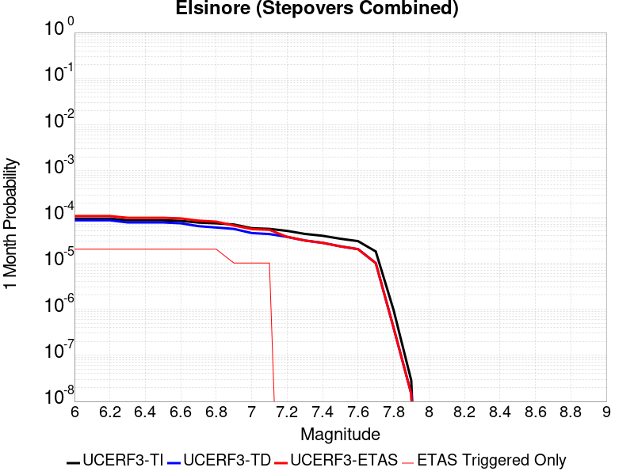 |  |  |

| Magnitude | 1 wk TI Prob | 1 wk TD Prob | 1 wk ETAS Prob | 1 wk ETAS/TD Gain | 1 wk ETAS Triggered Only | 1 mo TI Prob | 1 mo TD Prob | 1 mo ETAS Prob | 1 mo ETAS/TD Gain | 1 mo ETAS Triggered Only | 1 yr TI Prob | 1 yr TD Prob | 1 yr ETAS Prob | 1 yr ETAS/TD Gain | 1 yr ETAS Triggered Only | 10 yr TI Prob | 10 yr TD Prob | 10 yr ETAS Prob | 10 yr ETAS/TD Gain | 10 yr ETAS Triggered Only |
|-----|-----|-----|-----|-----|-----|-----|-----|-----|-----|-----|-----|-----|-----|-----|-----|-----|-----|-----|-----|-----|
| 6.0 | 2.144392E-5 | 1.9760193E-5 | 4.8060985E-5 | 2.4322124 | 2.8301352E-5 | 9.189928E-5 | 8.468392E-5 | 1.12982874E-4 | 1.3341715 | 2.8301352E-5 | 0.0011182994 | 0.0010305607 | 0.0010588329 | 1.0274338 | 2.8301352E-5 | 0.011126885 | 0.010264917 | 0.010292929 | 1.0027288 | 2.8301352E-5 |
| 6.1 | 2.144392E-5 | 1.9760193E-5 | 4.8060985E-5 | 2.4322124 | 2.8301352E-5 | 9.189928E-5 | 8.468392E-5 | 1.12982874E-4 | 1.3341715 | 2.8301352E-5 | 0.0011182994 | 0.0010305607 | 0.0010588329 | 1.0274338 | 2.8301352E-5 | 0.011126885 | 0.010264917 | 0.010292929 | 1.0027288 | 2.8301352E-5 |
| 6.2 | 2.144392E-5 | 1.9760193E-5 | 4.8060985E-5 | 2.4322124 | 2.8301352E-5 | 9.189928E-5 | 8.468392E-5 | 1.12982874E-4 | 1.3341715 | 2.8301352E-5 | 0.0011182994 | 0.0010305607 | 0.0010588329 | 1.0274338 | 2.8301352E-5 | 0.011126885 | 0.010264917 | 0.010292929 | 1.0027288 | 2.8301352E-5 |
| 6.3 | 1.9751555E-5 | 1.7741453E-5 | 4.6042303E-5 | 2.5951822 | 2.8301352E-5 | 8.4646774E-5 | 7.603267E-5 | 1.0433188E-4 | 1.3721979 | 2.8301352E-5 | 0.0010300872 | 9.253213E-4 | 9.5359643E-4 | 1.0305572 | 2.8301352E-5 | 0.010253254 | 0.009221276 | 0.0092493165 | 1.0030408 | 2.8301352E-5 |
| 6.4 | 1.9751555E-5 | 1.7741453E-5 | 4.6042303E-5 | 2.5951822 | 2.8301352E-5 | 8.4646774E-5 | 7.603267E-5 | 1.0433188E-4 | 1.3721979 | 2.8301352E-5 | 0.0010300872 | 9.253213E-4 | 9.5359643E-4 | 1.0305572 | 2.8301352E-5 | 0.010253254 | 0.009221276 | 0.0092493165 | 1.0030408 | 2.8301352E-5 |
| 6.5 | 1.9751555E-5 | 1.7741453E-5 | 4.6042303E-5 | 2.5951822 | 2.8301352E-5 | 8.4646774E-5 | 7.603267E-5 | 1.0433188E-4 | 1.3721979 | 2.8301352E-5 | 0.0010300872 | 9.253213E-4 | 9.5359643E-4 | 1.0305572 | 2.8301352E-5 | 0.010253254 | 0.009221276 | 0.0092493165 | 1.0030408 | 2.8301352E-5 |
| 6.6 | 1.9188685E-5 | 1.7003393E-5 | 4.5304263E-5 | 2.664425 | 2.8301352E-5 | 8.2234634E-5 | 7.286974E-5 | 1.0116903E-4 | 1.3883545 | 2.8301352E-5 | 0.0010007467 | 8.868442E-4 | 9.151204E-4 | 1.0318841 | 2.8301352E-5 | 0.00996252 | 0.0088398475 | 0.008867899 | 1.0031732 | 2.8301352E-5 |
| 6.7 | 1.7608272E-5 | 1.4732616E-5 | 4.3033553E-5 | 2.9209714 | 2.8301352E-5 | 7.546184E-5 | 6.3138315E-5 | 9.1437876E-5 | 1.4482155 | 2.8301352E-5 | 9.183606E-4 | 7.684476E-4 | 7.967272E-4 | 1.036801 | 2.8301352E-5 | 0.009145746 | 0.00766491 | 0.0076929945 | 1.003664 | 2.8301352E-5 |
| 6.8 | 1.697165E-5 | 1.3783365E-5 | 4.2084328E-5 | 3.0532694 | 2.8301352E-5 | 7.273361E-5 | 5.9070277E-5 | 8.7369954E-5 | 1.479085 | 2.8301352E-5 | 8.8517193E-4 | 7.18952E-4 | 7.47233E-4 | 1.0393364 | 2.8301352E-5 | 0.008816543 | 0.007172675 | 0.0072007733 | 1.0039175 | 2.8301352E-5 |
| 6.9 | 1.600365E-5 | 1.2846671E-5 | 1.2846671E-5 | 1.0 | 0.0 | 6.858527E-5 | 5.5056043E-5 | 5.5056043E-5 | 1.0 | 0.0 | 8.347058E-4 | 6.7010894E-4 | 6.7010894E-4 | 1.0 | 0.0 | 0.008315775 | 0.0066867657 | 0.0066867657 | 1.0 | 0.0 |
| 7.0 | 1.3314581E-5 | 1.0447548E-5 | 1.0447548E-5 | 1.0 | 0.0 | 5.7061243E-5 | 4.4774453E-5 | 4.4774453E-5 | 1.0 | 0.0 | 6.944992E-4 | 5.449953E-4 | 5.449953E-4 | 1.0 | 0.0 | 0.006923327 | 0.0054405155 | 0.0054405155 | 1.0 | 0.0 |
| 7.1 | 1.2865345E-5 | 9.937536E-6 | 9.937536E-6 | 1.0 | 0.0 | 5.5136024E-5 | 4.258876E-5 | 4.258876E-5 | 1.0 | 0.0 | 6.710743E-4 | 5.183973E-4 | 5.183973E-4 | 1.0 | 0.0 | 0.0066905143 | 0.0051752133 | 0.0051752133 | 1.0 | 0.0 |
| 7.2 | 1.1650051E-5 | 8.633809E-6 | 8.633809E-6 | 1.0 | 0.0 | 4.9927836E-5 | 3.7001522E-5 | 3.7001522E-5 | 1.0 | 0.0 | 6.0770183E-4 | 4.504022E-4 | 4.504022E-4 | 1.0 | 0.0 | 0.0060604266 | 0.0044963174 | 0.0044963174 | 1.0 | 0.0 |
| 7.3 | 1.0008533E-5 | 7.2010425E-6 | 7.2010425E-6 | 1.0 | 0.0 | 4.2893007E-5 | 3.0861254E-5 | 3.0861254E-5 | 1.0 | 0.0 | 5.220972E-4 | 3.7567242E-4 | 3.7567242E-4 | 1.0 | 0.0 | 0.005208723 | 0.003750761 | 0.003750761 | 1.0 | 0.0 |
| 7.4 | 9.116759E-6 | 6.410068E-6 | 6.410068E-6 | 1.0 | 0.0 | 3.907124E-5 | 2.747144E-5 | 2.747144E-5 | 1.0 | 0.0 | 4.7558855E-4 | 3.3441483E-4 | 3.3441483E-4 | 1.0 | 0.0 | 0.00474572 | 0.0033392678 | 0.0033392678 | 1.0 | 0.0 |
| 7.5 | 7.870524E-6 | 5.3825365E-6 | 5.3825365E-6 | 1.0 | 0.0 | 3.3730383E-5 | 2.3067816E-5 | 2.3067816E-5 | 1.0 | 0.0 | 4.1059E-4 | 2.8081573E-4 | 2.8081573E-4 | 1.0 | 0.0 | 0.0040983222 | 0.0028047354 | 0.0028047354 | 1.0 | 0.0 |
| 7.6 | 6.9774537E-6 | 4.6776067E-6 | 4.6776067E-6 | 1.0 | 0.0 | 2.990303E-5 | 2.0046738E-5 | 2.0046738E-5 | 1.0 | 0.0 | 3.640086E-4 | 2.4404288E-4 | 2.4404288E-4 | 1.0 | 0.0 | 0.003634129 | 0.0024378651 | 0.0024378651 | 1.0 | 0.0 |
| 7.7 | 4.1616954E-6 | 2.32834E-6 | 2.32834E-6 | 1.0 | 0.0 | 1.7835715E-5 | 9.978567E-6 | 9.978567E-6 | 1.0 | 0.0 | 2.171282E-4 | 1.2148302E-4 | 1.2148302E-4 | 1.0 | 0.0 | 0.0021691616 | 0.0012142392 | 0.0012142392 | 1.0 | 0.0 |
| 7.8 | 2.2692414E-7 | 9.3854695E-8 | 9.3854695E-8 | 1.0 | 0.0 | 9.725317E-7 | 4.0223435E-7 | 4.0223435E-7 | 1.0 | 0.0 | 1.1840509E-5 | 4.8971956E-6 | 4.8971956E-6 | 1.0 | 0.0 | 1.1839878E-4 | 4.8971204E-5 | 4.8971204E-5 | 1.0 | 0.0 |
| 7.9 | 6.676829E-9 | 3.439853E-9 | 3.439853E-9 | 1.0 | 0.0 | 2.861498E-8 | 1.4742227E-8 | 1.4742227E-8 | 1.0 | 0.0 | 3.4838732E-7 | 1.7948659E-7 | 1.7948659E-7 | 1.0 | 0.0 | 3.4838679E-6 | 1.7948646E-6 | 1.7948646E-6 | 1.0 | 0.0 |

## San Jacinto (Lytle Creek connector)
*[(top)](#table-of-contents)*

| 1 Week | 1 Month | 1 Year | 10 Year |
|-----|-----|-----|-----|
|  |  |  |  |

| Magnitude | 1 wk TI Prob | 1 wk TD Prob | 1 wk ETAS Prob | 1 wk ETAS/TD Gain | 1 wk ETAS Triggered Only | 1 mo TI Prob | 1 mo TD Prob | 1 mo ETAS Prob | 1 mo ETAS/TD Gain | 1 mo ETAS Triggered Only | 1 yr TI Prob | 1 yr TD Prob | 1 yr ETAS Prob | 1 yr ETAS/TD Gain | 1 yr ETAS Triggered Only | 10 yr TI Prob | 10 yr TD Prob | 10 yr ETAS Prob | 10 yr ETAS/TD Gain | 10 yr ETAS Triggered Only |
|-----|-----|-----|-----|-----|-----|-----|-----|-----|-----|-----|-----|-----|-----|-----|-----|-----|-----|-----|-----|-----|
| 6.0 | 6.693995E-6 | 6.660216E-6 | 6.660216E-6 | 1.0 | 0.0 | 2.8688235E-5 | 2.854347E-5 | 2.854347E-5 | 1.0 | 0.0 | 3.492233E-4 | 3.4746144E-4 | 3.7575295E-4 | 1.0814235 | 2.8301352E-5 | 0.00348675 | 0.0035493854 | 0.0035775863 | 1.0079453 | 2.8301352E-5 |
| 6.1 | 6.693995E-6 | 6.660216E-6 | 6.660216E-6 | 1.0 | 0.0 | 2.8688235E-5 | 2.854347E-5 | 2.854347E-5 | 1.0 | 0.0 | 3.492233E-4 | 3.4746144E-4 | 3.7575295E-4 | 1.0814235 | 2.8301352E-5 | 0.00348675 | 0.0035493854 | 0.0035775863 | 1.0079453 | 2.8301352E-5 |
| 6.2 | 6.693995E-6 | 6.660216E-6 | 6.660216E-6 | 1.0 | 0.0 | 2.8688235E-5 | 2.854347E-5 | 2.854347E-5 | 1.0 | 0.0 | 3.492233E-4 | 3.4746144E-4 | 3.7575295E-4 | 1.0814235 | 2.8301352E-5 | 0.00348675 | 0.0035493854 | 0.0035775863 | 1.0079453 | 2.8301352E-5 |
| 6.3 | 6.693995E-6 | 6.660216E-6 | 6.660216E-6 | 1.0 | 0.0 | 2.8688235E-5 | 2.854347E-5 | 2.854347E-5 | 1.0 | 0.0 | 3.492233E-4 | 3.4746144E-4 | 3.7575295E-4 | 1.0814235 | 2.8301352E-5 | 0.00348675 | 0.0035493854 | 0.0035775863 | 1.0079453 | 2.8301352E-5 |
| 6.4 | 6.693995E-6 | 6.660216E-6 | 6.660216E-6 | 1.0 | 0.0 | 2.8688235E-5 | 2.854347E-5 | 2.854347E-5 | 1.0 | 0.0 | 3.492233E-4 | 3.4746144E-4 | 3.7575295E-4 | 1.0814235 | 2.8301352E-5 | 0.00348675 | 0.0035493854 | 0.0035775863 | 1.0079453 | 2.8301352E-5 |
| 6.5 | 6.6561875E-6 | 6.6204343E-6 | 6.6204343E-6 | 1.0 | 0.0 | 2.8526205E-5 | 2.837298E-5 | 2.837298E-5 | 1.0 | 0.0 | 3.472512E-4 | 3.4538636E-4 | 3.7367796E-4 | 1.0819129 | 2.8301352E-5 | 0.0034670907 | 0.003528701 | 0.0035569023 | 1.007992 | 2.8301352E-5 |
| 6.6 | 6.6561875E-6 | 6.6204343E-6 | 6.6204343E-6 | 1.0 | 0.0 | 2.8526205E-5 | 2.837298E-5 | 2.837298E-5 | 1.0 | 0.0 | 3.472512E-4 | 3.4538636E-4 | 3.7367796E-4 | 1.0819129 | 2.8301352E-5 | 0.0034670907 | 0.003528701 | 0.0035569023 | 1.007992 | 2.8301352E-5 |
| 6.7 | 6.5802237E-6 | 6.539611E-6 | 6.539611E-6 | 1.0 | 0.0 | 2.8200653E-5 | 2.8026603E-5 | 2.8026603E-5 | 1.0 | 0.0 | 3.4328885E-4 | 3.4117055E-4 | 3.6946224E-4 | 1.0829254 | 2.8301352E-5 | 0.0034275902 | 0.0034866752 | 0.003514878 | 1.0080887 | 2.8301352E-5 |
| 6.8 | 6.575632E-6 | 6.5341005E-6 | 6.5341005E-6 | 1.0 | 0.0 | 2.8180975E-5 | 2.8002989E-5 | 2.8002989E-5 | 1.0 | 0.0 | 3.4304935E-4 | 3.4088313E-4 | 3.691748E-4 | 1.0829953 | 2.8301352E-5 | 0.0034252026 | 0.00348381 | 0.0035120128 | 1.0080954 | 2.8301352E-5 |
| 6.9 | 6.570433E-6 | 6.525495E-6 | 6.525495E-6 | 1.0 | 0.0 | 2.8158694E-5 | 2.7966107E-5 | 2.7966107E-5 | 1.0 | 0.0 | 3.4277816E-4 | 3.4043423E-4 | 3.6872595E-4 | 1.0831048 | 2.8301352E-5 | 0.0034224992 | 0.0034793352 | 0.003507538 | 1.0081059 | 2.8301352E-5 |
| 7.0 | 6.5643826E-6 | 6.515616E-6 | 6.515616E-6 | 1.0 | 0.0 | 2.8132765E-5 | 2.792377E-5 | 2.792377E-5 | 1.0 | 0.0 | 3.424626E-4 | 3.3991894E-4 | 3.6821066E-4 | 1.0832309 | 2.8301352E-5 | 0.0034193532 | 0.0034741985 | 0.0035024015 | 1.0081178 | 2.8301352E-5 |
| 7.1 | 6.557402E-6 | 6.5043278E-6 | 6.5043278E-6 | 1.0 | 0.0 | 2.8102848E-5 | 2.7875392E-5 | 2.7875392E-5 | 1.0 | 0.0 | 3.4209844E-4 | 3.3933012E-4 | 3.676219E-4 | 1.0833753 | 2.8301352E-5 | 0.0034157229 | 0.0034683298 | 0.003496533 | 1.0081316 | 2.8301352E-5 |
| 7.2 | 6.546394E-6 | 6.4862943E-6 | 6.4862943E-6 | 1.0 | 0.0 | 2.8055672E-5 | 2.7798109E-5 | 2.7798109E-5 | 1.0 | 0.0 | 3.4152428E-4 | 3.3838948E-4 | 3.6668126E-4 | 1.0836071 | 2.8301352E-5 | 0.0034099987 | 0.0034589572 | 0.0034871607 | 1.0081538 | 2.8301352E-5 |
| 7.3 | 6.5364216E-6 | 6.4670803E-6 | 6.4670803E-6 | 1.0 | 0.0 | 2.8012933E-5 | 2.7715765E-5 | 2.7715765E-5 | 1.0 | 0.0 | 3.4100408E-4 | 3.3738726E-4 | 3.6567906E-4 | 1.0838556 | 2.8301352E-5 | 0.003404813 | 0.0034489788 | 0.0034771825 | 1.0081774 | 2.8301352E-5 |
| 7.4 | 6.5269523E-6 | 6.4481674E-6 | 6.4481674E-6 | 1.0 | 0.0 | 2.7972354E-5 | 2.7634711E-5 | 2.7634711E-5 | 1.0 | 0.0 | 3.4051016E-4 | 3.3640073E-4 | 3.6469256E-4 | 1.0841016 | 2.8301352E-5 | 0.0033998888 | 0.003439161 | 0.003467365 | 1.0082009 | 2.8301352E-5 |
| 7.5 | 6.5111835E-6 | 6.424442E-6 | 6.424442E-6 | 1.0 | 0.0 | 2.7904773E-5 | 2.7533031E-5 | 2.7533031E-5 | 1.0 | 0.0 | 3.3968766E-4 | 3.3516317E-4 | 3.6345504E-4 | 1.0844122 | 2.8301352E-5 | 0.0033916887 | 0.003426834 | 0.0034550384 | 1.0082304 | 2.8301352E-5 |
| 7.6 | 6.4768806E-6 | 6.383551E-6 | 6.383551E-6 | 1.0 | 0.0 | 2.7757764E-5 | 2.735779E-5 | 2.735779E-5 | 1.0 | 0.0 | 3.3789838E-4 | 3.3303024E-4 | 3.613222E-4 | 1.0849531 | 2.8301352E-5 | 0.0033738504 | 0.0034055663 | 0.0034337712 | 1.0082821 | 2.8301352E-5 |
| 7.7 | 6.1655364E-6 | 6.1760365E-6 | 6.1760365E-6 | 1.0 | 0.0 | 2.642346E-5 | 2.646846E-5 | 2.646846E-5 | 1.0 | 0.0 | 3.2165812E-4 | 3.2220592E-4 | 3.5049813E-4 | 1.0878079 | 2.8301352E-5 | 0.0032119295 | 0.0032971818 | 0.0033253897 | 1.0085552 | 2.8301352E-5 |
| 7.8 | 5.5043524E-6 | 5.737097E-6 | 5.737097E-6 | 1.0 | 0.0 | 2.3589868E-5 | 2.4587327E-5 | 2.4587327E-5 | 1.0 | 0.0 | 2.871688E-4 | 2.9930964E-4 | 3.2760252E-4 | 1.0945271 | 2.8301352E-5 | 0.0028679797 | 0.0030672832 | 0.0030954978 | 1.0091985 | 2.8301352E-5 |
| 7.9 | 3.889249E-6 | 4.076761E-6 | 4.076761E-6 | 1.0 | 0.0 | 1.6668104E-5 | 1.7471715E-5 | 1.7471715E-5 | 1.0 | 0.0 | 2.0291525E-4 | 2.1269741E-4 | 2.4099275E-4 | 1.1330309 | 2.8301352E-5 | 0.0020273007 | 0.0021943315 | 0.0022225708 | 1.0128692 | 2.8301352E-5 |
| 8.0 | 2.668535E-6 | 2.5315155E-6 | 2.5315155E-6 | 1.0 | 0.0 | 1.1436528E-5 | 1.0849307E-5 | 1.0849307E-5 | 1.0 | 0.0 | 1.3923083E-4 | 1.3208234E-4 | 1.3208234E-4 | 1.0 | 0.0 | 0.0013914363 | 0.0013757964 | 0.0013757964 | 1.0 | 0.0 |
| 8.1 | 1.5911459E-6 | 1.218661E-6 | 1.218661E-6 | 1.0 | 0.0 | 6.8191785E-6 | 5.2228224E-6 | 5.2228224E-6 | 1.0 | 0.0 | 8.3020335E-5 | 6.3586034E-5 | 6.3586034E-5 | 1.0 | 0.0 | 8.298933E-4 | 6.6932244E-4 | 6.6932244E-4 | 1.0 | 0.0 |
| 8.2 | 6.1294963E-7 | 2.1812275E-7 | 2.1812275E-7 | 1.0 | 0.0 | 2.6269242E-6 | 9.3481145E-7 | 9.3481145E-7 | 1.0 | 0.0 | 3.1982334E-5 | 1.138127E-5 | 1.138127E-5 | 1.0 | 0.0 | 3.1977732E-4 | 1.2784546E-4 | 1.2784546E-4 | 1.0 | 0.0 |
| 8.3 | 1.762871E-7 | 4.7546838E-8 | 4.7546838E-8 | 1.0 | 0.0 | 7.5551594E-7 | 2.0377215E-7 | 2.0377215E-7 | 1.0 | 0.0 | 9.1983675E-6 | 2.480923E-6 | 2.480923E-6 | 1.0 | 0.0 | 9.197987E-5 | 2.868753E-5 | 2.868753E-5 | 1.0 | 0.0 |

## Oceanic - West Huasna
*[(top)](#table-of-contents)*

| 1 Week | 1 Month | 1 Year | 10 Year |
|-----|-----|-----|-----|
|  |  |  |  |

| Magnitude | 1 wk TI Prob | 1 wk TD Prob | 1 wk ETAS Prob | 1 wk ETAS/TD Gain | 1 wk ETAS Triggered Only | 1 mo TI Prob | 1 mo TD Prob | 1 mo ETAS Prob | 1 mo ETAS/TD Gain | 1 mo ETAS Triggered Only | 1 yr TI Prob | 1 yr TD Prob | 1 yr ETAS Prob | 1 yr ETAS/TD Gain | 1 yr ETAS Triggered Only | 10 yr TI Prob | 10 yr TD Prob | 10 yr ETAS Prob | 10 yr ETAS/TD Gain | 10 yr ETAS Triggered Only |
|-----|-----|-----|-----|-----|-----|-----|-----|-----|-----|-----|-----|-----|-----|-----|-----|-----|-----|-----|-----|-----|
| 6.0 | 3.195567E-5 | 2.7926868E-5 | 5.622743E-5 | 2.0133812 | 2.8301352E-5 | 1.3694567E-4 | 1.1968133E-4 | 1.479793E-4 | 1.2364442 | 2.8301352E-5 | 0.0016660384 | 0.0014561893 | 0.0014844495 | 1.0194069 | 2.8301352E-5 | 0.016536033 | 0.014471028 | 0.014498919 | 1.0019274 | 2.8301352E-5 |
| 6.1 | 2.1156782E-5 | 1.7573486E-5 | 4.587434E-5 | 2.6104293 | 2.8301352E-5 | 9.066878E-5 | 7.531282E-5 | 1.0361204E-4 | 1.3757557 | 2.8301352E-5 | 0.0011033333 | 9.165572E-4 | 9.4483263E-4 | 1.0308496 | 2.8301352E-5 | 0.010978713 | 0.009128777 | 0.00915682 | 1.0030719 | 2.8301352E-5 |
| 6.2 | 1.6195117E-5 | 1.3327152E-5 | 4.162813E-5 | 3.1235576 | 2.8301352E-5 | 6.9405796E-5 | 5.7115132E-5 | 8.541487E-5 | 1.4954858 | 2.8301352E-5 | 8.44688E-4 | 6.9515745E-4 | 7.2343915E-4 | 1.0406839 | 2.8301352E-5 | 0.008414844 | 0.006930123 | 0.0069582285 | 1.0040555 | 2.8301352E-5 |
| 6.3 | 1.3559345E-5 | 1.1179142E-5 | 1.1179142E-5 | 1.0 | 0.0 | 5.811018E-5 | 4.7909736E-5 | 4.7909736E-5 | 1.0 | 0.0 | 7.072618E-4 | 5.831459E-4 | 5.831459E-4 | 1.0 | 0.0 | 0.0070501505 | 0.0058162753 | 0.0058162753 | 1.0 | 0.0 |
| 6.4 | 1.2120619E-5 | 1.0000977E-5 | 1.0000977E-5 | 1.0 | 0.0 | 5.1944477E-5 | 4.2860633E-5 | 4.2860633E-5 | 1.0 | 0.0 | 6.322405E-4 | 5.2170374E-4 | 5.2170374E-4 | 1.0 | 0.0 | 0.006304447 | 0.0052048573 | 0.0052048573 | 1.0 | 0.0 |
| 6.5 | 1.13511915E-5 | 9.3674735E-6 | 9.3674735E-6 | 1.0 | 0.0 | 4.8647056E-5 | 4.01457E-5 | 4.01457E-5 | 1.0 | 0.0 | 5.9211696E-4 | 4.886647E-4 | 4.886647E-4 | 1.0 | 0.0 | 0.0059054173 | 0.0048759608 | 0.0048759608 | 1.0 | 0.0 |
| 6.6 | 9.850605E-6 | 8.135418E-6 | 8.135418E-6 | 1.0 | 0.0 | 4.2216197E-5 | 3.4865614E-5 | 3.4865614E-5 | 1.0 | 0.0 | 5.1386096E-4 | 4.2440637E-4 | 4.2440637E-4 | 1.0 | 0.0 | 0.0051267436 | 0.004235991 | 0.004235991 | 1.0 | 0.0 |
| 6.7 | 8.8558645E-6 | 7.318433E-6 | 7.318433E-6 | 1.0 | 0.0 | 3.7953152E-5 | 3.1364336E-5 | 3.1364336E-5 | 1.0 | 0.0 | 4.6198163E-4 | 3.8179406E-4 | 3.8179406E-4 | 1.0 | 0.0 | 0.004610224 | 0.0038114067 | 0.0038114067 | 1.0 | 0.0 |
| 6.8 | 7.67136E-6 | 6.391756E-6 | 6.391756E-6 | 1.0 | 0.0 | 3.2876844E-5 | 2.7392953E-5 | 2.7392953E-5 | 1.0 | 0.0 | 4.0020206E-4 | 3.3345833E-4 | 3.3345833E-4 | 1.0 | 0.0 | 0.003994821 | 0.0033296007 | 0.0033296007 | 1.0 | 0.0 |
| 6.9 | 6.534529E-6 | 5.4583297E-6 | 5.4583297E-6 | 1.0 | 0.0 | 2.8004823E-5 | 2.3392633E-5 | 2.3392633E-5 | 1.0 | 0.0 | 3.4090536E-4 | 2.847682E-4 | 2.847682E-4 | 1.0 | 0.0 | 0.0034038287 | 0.0028440498 | 0.0028440498 | 1.0 | 0.0 |
| 7.0 | 5.460525E-6 | 4.5699517E-6 | 4.5699517E-6 | 1.0 | 0.0 | 2.3402039E-5 | 1.958536E-5 | 1.958536E-5 | 1.0 | 0.0 | 2.8488258E-4 | 2.3842578E-4 | 2.3842578E-4 | 1.0 | 0.0 | 0.0028451765 | 0.0023817138 | 0.0023817138 | 1.0 | 0.0 |
| 7.1 | 4.4825083E-6 | 3.7524428E-6 | 3.7524428E-6 | 1.0 | 0.0 | 1.9210609E-5 | 1.60818E-5 | 1.60818E-5 | 1.0 | 0.0 | 2.3386406E-4 | 1.9577841E-4 | 1.9577841E-4 | 1.0 | 0.0 | 0.002336181 | 0.0019560715 | 0.0019560715 | 1.0 | 0.0 |
| 7.2 | 2.821708E-6 | 2.4249334E-6 | 2.4249334E-6 | 1.0 | 0.0 | 1.2092979E-5 | 1.039253E-5 | 1.039253E-5 | 1.0 | 0.0 | 1.4722206E-4 | 1.2652173E-4 | 1.2652173E-4 | 1.0 | 0.0 | 0.0014712457 | 0.0012644994 | 0.0012644994 | 1.0 | 0.0 |
| 7.3 | 2.0644757E-6 | 1.7687412E-6 | 1.7687412E-6 | 1.0 | 0.0 | 8.847723E-6 | 7.5802973E-6 | 7.5802973E-6 | 1.0 | 0.0 | 1.0771569E-4 | 9.228622E-5 | 9.228622E-5 | 1.0 | 0.0 | 0.001076635 | 9.2248066E-4 | 9.2248066E-4 | 1.0 | 0.0 |
| 7.4 | 1.6980367E-6 | 1.4379892E-6 | 1.4379892E-6 | 1.0 | 0.0 | 7.27728E-6 | 6.162796E-6 | 6.162796E-6 | 1.0 | 0.0 | 8.8597284E-5 | 7.5029464E-5 | 7.5029464E-5 | 1.0 | 0.0 | 8.8561967E-4 | 7.500429E-4 | 7.500429E-4 | 1.0 | 0.0 |
| 7.5 | 1.3637683E-6 | 1.1302635E-6 | 1.1302635E-6 | 1.0 | 0.0 | 5.844708E-6 | 4.8439774E-6 | 4.8439774E-6 | 1.0 | 0.0 | 7.1156996E-5 | 5.897383E-5 | 5.897383E-5 | 1.0 | 0.0 | 7.1134215E-4 | 5.895833E-4 | 5.895833E-4 | 1.0 | 0.0 |
| 7.6 | 9.802994E-7 | 7.677247E-7 | 7.677247E-7 | 1.0 | 0.0 | 4.2012766E-6 | 3.2902446E-6 | 3.2902446E-6 | 1.0 | 0.0 | 5.1149345E-5 | 4.0057992E-5 | 4.0057992E-5 | 1.0 | 0.0 | 5.113757E-4 | 4.0050913E-4 | 4.0050913E-4 | 1.0 | 0.0 |
| 7.7 | 5.986191E-7 | 4.0050548E-7 | 4.0050548E-7 | 1.0 | 0.0 | 2.5655079E-6 | 1.7164509E-6 | 1.7164509E-6 | 1.0 | 0.0 | 3.1234613E-5 | 2.089759E-5 | 2.089759E-5 | 1.0 | 0.0 | 3.123022E-4 | 2.089576E-4 | 2.089576E-4 | 1.0 | 0.0 |
| 7.8 | 2.9189815E-7 | 1.5285792E-7 | 1.5285792E-7 | 1.0 | 0.0 | 1.2509914E-6 | 6.5510517E-7 | 6.5510517E-7 | 1.0 | 0.0 | 1.5230714E-5 | 7.9758765E-6 | 7.9758765E-6 | 1.0 | 0.0 | 1.522967E-4 | 7.9757214E-5 | 7.9757214E-5 | 1.0 | 0.0 |
| 7.9 | 1.2057845E-7 | 4.621248E-8 | 4.621248E-8 | 1.0 | 0.0 | 5.1676466E-7 | 1.9805347E-7 | 1.9805347E-7 | 1.0 | 0.0 | 6.2915915E-6 | 2.4112983E-6 | 2.4112983E-6 | 1.0 | 0.0 | 6.2914136E-5 | 2.4114026E-5 | 2.4114026E-5 | 1.0 | 0.0 |
| 8.0 | 3.3806387E-9 | 9.011393E-10 | 9.011393E-10 | 1.0 | 0.0 | 1.4488451E-8 | 3.8620254E-9 | 3.8620254E-9 | 1.0 | 0.0 | 1.7639688E-7 | 4.702016E-8 | 4.702016E-8 | 1.0 | 0.0 | 1.7639674E-6 | 4.7129527E-7 | 4.7129527E-7 | 1.0 | 0.0 |

## Kern Canyon (North Kern) 2011
*[(top)](#table-of-contents)*

| 1 Week | 1 Month | 1 Year | 10 Year |
|-----|-----|-----|-----|
|  |  |  |  |

| Magnitude | 1 wk TI Prob | 1 wk TD Prob | 1 wk ETAS Prob | 1 wk ETAS/TD Gain | 1 wk ETAS Triggered Only | 1 mo TI Prob | 1 mo TD Prob | 1 mo ETAS Prob | 1 mo ETAS/TD Gain | 1 mo ETAS Triggered Only | 1 yr TI Prob | 1 yr TD Prob | 1 yr ETAS Prob | 1 yr ETAS/TD Gain | 1 yr ETAS Triggered Only | 10 yr TI Prob | 10 yr TD Prob | 10 yr ETAS Prob | 10 yr ETAS/TD Gain | 10 yr ETAS Triggered Only |
|-----|-----|-----|-----|-----|-----|-----|-----|-----|-----|-----|-----|-----|-----|-----|-----|-----|-----|-----|-----|-----|
| 6.0 | 6.6264497E-6 | 6.75733E-6 | 3.5058492E-5 | 5.1882167 | 2.8301352E-5 | 2.8398761E-5 | 2.895971E-5 | 5.7260244E-5 | 1.9772382 | 2.8301352E-5 | 3.4570007E-4 | 3.5253543E-4 | 3.808268E-4 | 1.0802511 | 2.8301352E-5 | 0.0034516277 | 0.0035205502 | 0.003548752 | 1.0080106 | 2.8301352E-5 |
| 6.1 | 6.6264497E-6 | 6.75733E-6 | 3.5058492E-5 | 5.1882167 | 2.8301352E-5 | 2.8398761E-5 | 2.895971E-5 | 5.7260244E-5 | 1.9772382 | 2.8301352E-5 | 3.4570007E-4 | 3.5253543E-4 | 3.808268E-4 | 1.0802511 | 2.8301352E-5 | 0.0034516277 | 0.0035205502 | 0.003548752 | 1.0080106 | 2.8301352E-5 |
| 6.2 | 6.6264497E-6 | 6.75733E-6 | 3.5058492E-5 | 5.1882167 | 2.8301352E-5 | 2.8398761E-5 | 2.895971E-5 | 5.7260244E-5 | 1.9772382 | 2.8301352E-5 | 3.4570007E-4 | 3.5253543E-4 | 3.808268E-4 | 1.0802511 | 2.8301352E-5 | 0.0034516277 | 0.0035205502 | 0.003548752 | 1.0080106 | 2.8301352E-5 |
| 6.3 | 6.6264497E-6 | 6.75733E-6 | 3.5058492E-5 | 5.1882167 | 2.8301352E-5 | 2.8398761E-5 | 2.895971E-5 | 5.7260244E-5 | 1.9772382 | 2.8301352E-5 | 3.4570007E-4 | 3.5253543E-4 | 3.808268E-4 | 1.0802511 | 2.8301352E-5 | 0.0034516277 | 0.0035205502 | 0.003548752 | 1.0080106 | 2.8301352E-5 |
| 6.4 | 6.6264497E-6 | 6.75733E-6 | 3.5058492E-5 | 5.1882167 | 2.8301352E-5 | 2.8398761E-5 | 2.895971E-5 | 5.7260244E-5 | 1.9772382 | 2.8301352E-5 | 3.4570007E-4 | 3.5253543E-4 | 3.808268E-4 | 1.0802511 | 2.8301352E-5 | 0.0034516277 | 0.0035205502 | 0.003548752 | 1.0080106 | 2.8301352E-5 |
| 6.5 | 3.2162225E-6 | 3.2570915E-6 | 3.1558353E-5 | 9.68912 | 2.8301352E-5 | 1.3783738E-5 | 1.3958893E-5 | 4.225985E-5 | 3.02745 | 2.8301352E-5 | 1.6780409E-4 | 1.6993708E-4 | 1.9823363E-4 | 1.1665119 | 2.8301352E-5 | 0.0016767744 | 0.001698151 | 0.0017264043 | 1.0166377 | 2.8301352E-5 |
| 6.6 | 3.2162225E-6 | 3.2570915E-6 | 3.1558353E-5 | 9.68912 | 2.8301352E-5 | 1.3783738E-5 | 1.3958893E-5 | 4.225985E-5 | 3.02745 | 2.8301352E-5 | 1.6780409E-4 | 1.6993708E-4 | 1.9823363E-4 | 1.1665119 | 2.8301352E-5 | 0.0016767744 | 0.001698151 | 0.0017264043 | 1.0166377 | 2.8301352E-5 |
| 6.7 | 2.1908265E-6 | 2.2071222E-6 | 3.0508412E-5 | 13.822711 | 2.8301352E-5 | 9.389223E-6 | 9.459061E-6 | 3.7760146E-5 | 3.9919548 | 2.8301352E-5 | 1.1430779E-4 | 1.1515819E-4 | 1.4345629E-4 | 1.2457323 | 2.8301352E-5 | 0.0011424901 | 0.0011510046 | 0.0011792734 | 1.0245601 | 2.8301352E-5 |
| 6.8 | 1.7303895E-6 | 1.7365529E-6 | 3.0037856E-5 | 17.297403 | 2.8301352E-5 | 7.415934E-6 | 7.4423488E-6 | 3.574349E-5 | 4.8027163 | 2.8301352E-5 | 9.028525E-5 | 9.0606925E-5 | 1.18905715E-4 | 1.3123248 | 2.8301352E-5 | 9.024858E-4 | 9.057096E-4 | 9.339853E-4 | 1.0312194 | 2.8301352E-5 |
| 6.9 | 1.3700314E-6 | 1.3688622E-6 | 2.9670176E-5 | 21.675064 | 2.8301352E-5 | 5.87155E-6 | 5.8665396E-6 | 3.4167726E-5 | 5.8241706 | 2.8301352E-5 | 7.148377E-5 | 7.142282E-5 | 9.972216E-5 | 1.3962225 | 2.8301352E-5 | 7.146078E-4 | 7.140032E-4 | 7.422844E-4 | 1.0396093 | 2.8301352E-5 |
| 7.0 | 1.1467797E-6 | 1.1413804E-6 | 2.94427E-5 | 25.795694 | 2.8301352E-5 | 4.9147607E-6 | 4.8916213E-6 | 3.3192835E-5 | 6.785651 | 2.8301352E-5 | 5.983557E-5 | 5.9553895E-5 | 8.7853565E-5 | 1.4751942 | 2.8301352E-5 | 5.981946E-4 | 5.953825E-4 | 6.2366703E-4 | 1.0475065 | 2.8301352E-5 |
| 7.1 | 9.3952065E-7 | 9.3026904E-7 | 2.9231596E-5 | 31.422733 | 2.8301352E-5 | 4.026511E-6 | 3.9868614E-6 | 3.2288102E-5 | 8.098627 | 2.8301352E-5 | 4.9021666E-5 | 4.8538972E-5 | 7.683895E-5 | 1.5830362 | 2.8301352E-5 | 4.901085E-4 | 4.8528548E-4 | 5.135731E-4 | 1.0582907 | 2.8301352E-5 |
| 7.2 | 6.858055E-7 | 6.7193E-7 | 6.7193E-7 | 1.0 | 0.0 | 2.939163E-6 | 2.879697E-6 | 2.879697E-6 | 1.0 | 0.0 | 3.5783723E-5 | 3.5059755E-5 | 3.5059755E-5 | 1.0 | 0.0 | 3.5777962E-4 | 3.5054312E-4 | 3.5054312E-4 | 1.0 | 0.0 |
| 7.3 | 5.1101983E-7 | 4.9393E-7 | 4.9393E-7 | 1.0 | 0.0 | 2.1900833E-6 | 2.116841E-6 | 2.116841E-6 | 1.0 | 0.0 | 2.6663936E-5 | 2.5772239E-5 | 2.5772239E-5 | 1.0 | 0.0 | 2.6660739E-4 | 2.57693E-4 | 2.57693E-4 | 1.0 | 0.0 |
| 7.4 | 3.4999414E-7 | 3.2995905E-7 | 3.2995905E-7 | 1.0 | 0.0 | 1.499974E-6 | 1.4141094E-6 | 1.4141094E-6 | 1.0 | 0.0 | 1.8262032E-5 | 1.721665E-5 | 1.721665E-5 | 1.0 | 0.0 | 1.826053E-4 | 1.7215339E-4 | 1.7215339E-4 | 1.0 | 0.0 |
| 7.5 | 1.7021522E-7 | 1.4750044E-7 | 1.4750044E-7 | 1.0 | 0.0 | 7.2949354E-7 | 6.321446E-7 | 6.321446E-7 | 1.0 | 0.0 | 8.881548E-6 | 7.696334E-6 | 7.696334E-6 | 1.0 | 0.0 | 8.8811925E-5 | 7.696076E-5 | 7.696076E-5 | 1.0 | 0.0 |
| 7.6 | 2.572245E-8 | 1.7352555E-8 | 1.7352555E-8 | 1.0 | 0.0 | 1.10239064E-7 | 7.436809E-8 | 7.436809E-8 | 1.0 | 0.0 | 1.3421597E-6 | 9.054312E-7 | 9.054312E-7 | 1.0 | 0.0 | 1.3421517E-5 | 9.05428E-6 | 9.05428E-6 | 1.0 | 0.0 |

## San Jacinto (Clark) rev
*[(top)](#table-of-contents)*

| 1 Week | 1 Month | 1 Year | 10 Year |
|-----|-----|-----|-----|
|  |  |  |  |

| Magnitude | 1 wk TI Prob | 1 wk TD Prob | 1 wk ETAS Prob | 1 wk ETAS/TD Gain | 1 wk ETAS Triggered Only | 1 mo TI Prob | 1 mo TD Prob | 1 mo ETAS Prob | 1 mo ETAS/TD Gain | 1 mo ETAS Triggered Only | 1 yr TI Prob | 1 yr TD Prob | 1 yr ETAS Prob | 1 yr ETAS/TD Gain | 1 yr ETAS Triggered Only | 10 yr TI Prob | 10 yr TD Prob | 10 yr ETAS Prob | 10 yr ETAS/TD Gain | 10 yr ETAS Triggered Only |
|-----|-----|-----|-----|-----|-----|-----|-----|-----|-----|-----|-----|-----|-----|-----|-----|-----|-----|-----|-----|-----|
| 6.0 | 4.482615E-5 | 2.1154196E-5 | 4.945495E-5 | 2.3378317 | 2.8301352E-5 | 1.9209793E-4 | 9.065773E-5 | 1.1895652E-4 | 1.3121498 | 2.8301352E-5 | 0.0023362834 | 0.0011032083 | 0.0011314785 | 1.0256253 | 2.8301352E-5 | 0.02311874 | 0.011503847 | 0.011531822 | 1.0024319 | 2.8301352E-5 |
| 6.1 | 4.482615E-5 | 2.1154196E-5 | 4.945495E-5 | 2.3378317 | 2.8301352E-5 | 1.9209793E-4 | 9.065773E-5 | 1.1895652E-4 | 1.3121498 | 2.8301352E-5 | 0.0023362834 | 0.0011032083 | 0.0011314785 | 1.0256253 | 2.8301352E-5 | 0.02311874 | 0.011503847 | 0.011531822 | 1.0024319 | 2.8301352E-5 |
| 6.2 | 4.482615E-5 | 2.1154196E-5 | 4.945495E-5 | 2.3378317 | 2.8301352E-5 | 1.9209793E-4 | 9.065773E-5 | 1.1895652E-4 | 1.3121498 | 2.8301352E-5 | 0.0023362834 | 0.0011032083 | 0.0011314785 | 1.0256253 | 2.8301352E-5 | 0.02311874 | 0.011503847 | 0.011531822 | 1.0024319 | 2.8301352E-5 |
| 6.3 | 4.482615E-5 | 2.1154196E-5 | 4.945495E-5 | 2.3378317 | 2.8301352E-5 | 1.9209793E-4 | 9.065773E-5 | 1.1895652E-4 | 1.3121498 | 2.8301352E-5 | 0.0023362834 | 0.0011032083 | 0.0011314785 | 1.0256253 | 2.8301352E-5 | 0.02311874 | 0.011503847 | 0.011531822 | 1.0024319 | 2.8301352E-5 |
| 6.4 | 4.482615E-5 | 2.1154196E-5 | 4.945495E-5 | 2.3378317 | 2.8301352E-5 | 1.9209793E-4 | 9.065773E-5 | 1.1895652E-4 | 1.3121498 | 2.8301352E-5 | 0.0023362834 | 0.0011032083 | 0.0011314785 | 1.0256253 | 2.8301352E-5 | 0.02311874 | 0.011503847 | 0.011531822 | 1.0024319 | 2.8301352E-5 |
| 6.5 | 3.7294863E-5 | 1.7356087E-5 | 4.565695E-5 | 2.6306014 | 2.8301352E-5 | 1.5982533E-4 | 7.438113E-5 | 1.0268038E-4 | 1.3804626 | 2.8301352E-5 | 0.0019441366 | 9.052186E-4 | 9.334943E-4 | 1.0312364 | 2.8301352E-5 | 0.01927216 | 0.0094941035 | 0.009522136 | 1.0029527 | 2.8301352E-5 |
| 6.6 | 3.7294863E-5 | 1.7356087E-5 | 4.565695E-5 | 2.6306014 | 2.8301352E-5 | 1.5982533E-4 | 7.438113E-5 | 1.0268038E-4 | 1.3804626 | 2.8301352E-5 | 0.0019441366 | 9.052186E-4 | 9.334943E-4 | 1.0312364 | 2.8301352E-5 | 0.01927216 | 0.0094941035 | 0.009522136 | 1.0029527 | 2.8301352E-5 |
| 6.7 | 3.6039248E-5 | 1.6604314E-5 | 4.4905195E-5 | 2.7044296 | 2.8301352E-5 | 1.5444479E-4 | 7.1159426E-5 | 9.945876E-5 | 1.3976892 | 2.8301352E-5 | 0.0018787434 | 8.6602574E-4 | 8.943026E-4 | 1.0326513 | 2.8301352E-5 | 0.01862939 | 0.009096047 | 0.009124091 | 1.0030831 | 2.8301352E-5 |
| 6.8 | 3.5031844E-5 | 1.6232942E-5 | 4.4533834E-5 | 2.7434237 | 2.8301352E-5 | 1.5012783E-4 | 6.956792E-5 | 9.78673E-5 | 1.4067879 | 2.8301352E-5 | 0.0018262739 | 8.4666436E-4 | 8.7494176E-4 | 1.0333986 | 2.8301352E-5 | 0.01811338 | 0.008895969 | 0.008924019 | 1.0031531 | 2.8301352E-5 |
| 6.9 | 3.435112E-5 | 1.6063195E-5 | 4.4364093E-5 | 2.7618475 | 2.8301352E-5 | 1.4721078E-4 | 6.884047E-5 | 9.713988E-5 | 1.4110868 | 2.8301352E-5 | 0.0017908178 | 8.3781447E-4 | 8.6609216E-4 | 1.0337517 | 2.8301352E-5 | 0.017764548 | 0.008804181 | 0.008832232 | 1.0031862 | 2.8301352E-5 |
| 7.0 | 2.8959772E-5 | 1.4336745E-5 | 4.2637694E-5 | 2.9740148 | 2.8301352E-5 | 1.241074E-4 | 6.144176E-5 | 8.974138E-5 | 1.4605925 | 2.8301352E-5 | 0.0015099603 | 7.477995E-4 | 7.7607966E-4 | 1.0378178 | 2.8301352E-5 | 0.014997416 | 0.007868037 | 0.007896115 | 1.0035686 | 2.8301352E-5 |
| 7.1 | 2.6002877E-5 | 1.2829002E-5 | 4.112999E-5 | 3.2060165 | 2.8301352E-5 | 1.11436144E-4 | 5.498029E-5 | 8.328009E-5 | 1.5147263 | 2.8301352E-5 | 0.0013558907 | 6.691816E-4 | 6.97464E-4 | 1.0422642 | 2.8301352E-5 | 0.013476475 | 0.0070465137 | 0.007074616 | 1.003988 | 2.8301352E-5 |
| 7.2 | 2.2544838E-5 | 1.1262543E-5 | 3.9563576E-5 | 3.5128458 | 2.8301352E-5 | 9.661716E-5 | 4.8267157E-5 | 7.656714E-5 | 1.5863197 | 2.8301352E-5 | 0.001175679 | 5.874956E-4 | 6.1578036E-4 | 1.0481446 | 2.8301352E-5 | 0.011694785 | 0.0061927503 | 0.0062208762 | 1.0045418 | 2.8301352E-5 |
| 7.3 | 1.75334E-5 | 1.0811715E-5 | 3.911276E-5 | 3.617628 | 2.8301352E-5 | 7.514098E-5 | 4.6335106E-5 | 7.463514E-5 | 1.6107689 | 2.8301352E-5 | 9.144575E-4 | 5.6398526E-4 | 5.9227063E-4 | 1.0501527 | 2.8301352E-5 | 0.009107036 | 0.0059337732 | 0.005961907 | 1.0047412 | 2.8301352E-5 |
| 7.4 | 1.5924552E-5 | 1.0611516E-5 | 3.8912567E-5 | 3.6670132 | 2.8301352E-5 | 6.82463E-5 | 4.547714E-5 | 7.3777206E-5 | 1.622292 | 2.8301352E-5 | 8.305819E-4 | 5.535449E-4 | 5.818306E-4 | 1.0510992 | 2.8301352E-5 | 0.008274844 | 0.0058210334 | 0.00584917 | 1.0048336 | 2.8301352E-5 |
| 7.5 | 1.3428931E-5 | 9.8519E-6 | 3.8152975E-5 | 3.8726513 | 2.8301352E-5 | 5.7551293E-5 | 4.2221753E-5 | 7.0521906E-5 | 1.6702744 | 2.8301352E-5 | 7.004617E-4 | 5.1392964E-4 | 5.4221647E-4 | 1.0550402 | 2.8301352E-5 | 0.006982579 | 0.0054066023 | 0.0054347506 | 1.0052063 | 2.8301352E-5 |
| 7.6 | 1.0688787E-5 | 8.614839E-6 | 3.691595E-5 | 4.285158 | 2.8301352E-5 | 4.5808283E-5 | 3.692022E-5 | 6.522053E-5 | 1.766526 | 2.8301352E-5 | 5.5757316E-4 | 4.4941145E-4 | 4.777001E-4 | 1.062946 | 2.8301352E-5 | 0.005561762 | 0.0047416524 | 0.0047698193 | 1.0059403 | 2.8301352E-5 |
| 7.7 | 8.81236E-6 | 7.4680274E-6 | 3.5769168E-5 | 4.789641 | 2.8301352E-5 | 3.776671E-5 | 3.2005442E-5 | 6.0305887E-5 | 1.8842386 | 2.8301352E-5 | 4.597127E-4 | 3.8959677E-4 | 4.178871E-4 | 1.0726144 | 2.8301352E-5 | 0.0045876284 | 0.0041346536 | 0.0041628378 | 1.0068166 | 2.8301352E-5 |
| 7.8 | 7.780431E-6 | 6.696579E-6 | 3.499774E-5 | 5.226212 | 2.8301352E-5 | 3.3344273E-5 | 2.8699309E-5 | 5.6999852E-5 | 1.9861053 | 2.8301352E-5 | 4.0589093E-4 | 3.4935825E-4 | 3.7764973E-4 | 1.0809813 | 2.8301352E-5 | 0.0040515037 | 0.0037227906 | 0.0037509867 | 1.0075738 | 2.8301352E-5 |
| 7.9 | 6.5437994E-6 | 5.780382E-6 | 3.408157E-5 | 5.896076 | 2.8301352E-5 | 2.8044553E-5 | 2.477283E-5 | 5.3073483E-5 | 2.142407 | 2.8301352E-5 | 3.4138895E-4 | 3.0156763E-4 | 3.2986046E-4 | 1.0938191 | 2.8301352E-5 | 0.0034086495 | 0.0032344845 | 0.0032626942 | 1.0087216 | 2.8301352E-5 |
| 8.0 | 5.4488164E-6 | 4.8133406E-6 | 3.3114557E-5 | 6.879745 | 2.8301352E-5 | 2.3351862E-5 | 2.062844E-5 | 4.892921E-5 | 2.3719296 | 2.8301352E-5 | 2.8427184E-4 | 2.5112246E-4 | 2.794167E-4 | 1.1126711 | 2.8301352E-5 | 0.0028390845 | 0.002710839 | 0.0027390637 | 1.0104117 | 2.8301352E-5 |
| 8.1 | 2.8397242E-6 | 1.3670389E-6 | 1.3670389E-6 | 1.0 | 0.0 | 1.217019E-5 | 5.858725E-6 | 5.858725E-6 | 1.0 | 0.0 | 1.4816198E-4 | 7.132765E-5 | 7.132765E-5 | 1.0 | 0.0 | 0.0014806325 | 8.115382E-4 | 8.115382E-4 | 1.0 | 0.0 |
| 8.2 | 2.030244E-6 | 6.318974E-7 | 6.318974E-7 | 1.0 | 0.0 | 8.701017E-6 | 2.708129E-6 | 2.708129E-6 | 1.0 | 0.0 | 1.05929736E-4 | 3.2970976E-5 | 3.2970976E-5 | 1.0 | 0.0 | 0.0010587925 | 3.9486602E-4 | 3.9486602E-4 | 1.0 | 0.0 |
| 8.3 | 1.0659804E-6 | 2.9250086E-7 | 2.9250086E-7 | 1.0 | 0.0 | 4.568479E-6 | 1.2535745E-6 | 1.2535745E-6 | 1.0 | 0.0 | 5.5619817E-5 | 1.5262167E-5 | 1.5262167E-5 | 1.0 | 0.0 | 5.5605895E-4 | 1.8566217E-4 | 1.8566217E-4 | 1.0 | 0.0 |

## Brawley (Seismic Zone) alt 1
*[(top)](#table-of-contents)*

| 1 Week | 1 Month | 1 Year | 10 Year |
|-----|-----|-----|-----|
|  | 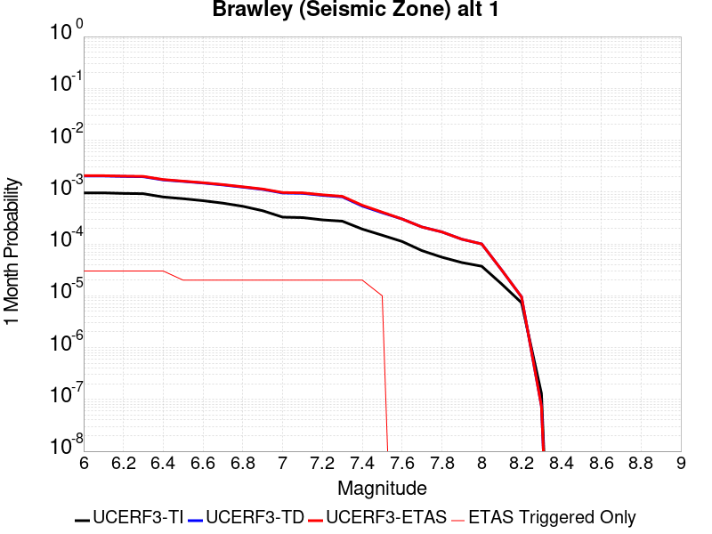 |  |  |

| Magnitude | 1 wk TI Prob | 1 wk TD Prob | 1 wk ETAS Prob | 1 wk ETAS/TD Gain | 1 wk ETAS Triggered Only | 1 mo TI Prob | 1 mo TD Prob | 1 mo ETAS Prob | 1 mo ETAS/TD Gain | 1 mo ETAS Triggered Only | 1 yr TI Prob | 1 yr TD Prob | 1 yr ETAS Prob | 1 yr ETAS/TD Gain | 1 yr ETAS Triggered Only | 10 yr TI Prob | 10 yr TD Prob | 10 yr ETAS Prob | 10 yr ETAS/TD Gain | 10 yr ETAS Triggered Only |
|-----|-----|-----|-----|-----|-----|-----|-----|-----|-----|-----|-----|-----|-----|-----|-----|-----|-----|-----|-----|-----|
| 6.0 | 2.2521618E-4 | 4.7632487E-4 | 5.0461275E-4 | 1.0593878 | 2.8301352E-5 | 9.6485513E-4 | 0.0020398323 | 0.0020680758 | 1.013846 | 2.8301352E-5 | 0.011683988 | 0.024546238 | 0.024573844 | 1.0011246 | 2.8301352E-5 | 0.11088423 | 0.21350002 | 0.21352229 | 1.0001043 | 2.8301352E-5 |
| 6.1 | 2.2521618E-4 | 4.7632487E-4 | 5.0461275E-4 | 1.0593878 | 2.8301352E-5 | 9.6485513E-4 | 0.0020398323 | 0.0020680758 | 1.013846 | 2.8301352E-5 | 0.011683988 | 0.024546238 | 0.024573844 | 1.0011246 | 2.8301352E-5 | 0.11088423 | 0.21350002 | 0.21352229 | 1.0001043 | 2.8301352E-5 |
| 6.2 | 2.198148E-4 | 4.6717093E-4 | 4.9545907E-4 | 1.060552 | 2.8301352E-5 | 9.417233E-4 | 0.0020006616 | 0.0020289063 | 1.0141177 | 2.8301352E-5 | 0.011405343 | 0.024080504 | 0.024108123 | 1.001147 | 2.8301352E-5 | 0.10837428 | 0.20993657 | 0.20995893 | 1.0001065 | 2.8301352E-5 |
| 6.3 | 2.1704129E-4 | 4.615278E-4 | 4.8981607E-4 | 1.0612928 | 2.8301352E-5 | 9.298453E-4 | 0.0019765133 | 0.0020047587 | 1.0142906 | 2.8301352E-5 | 0.011262234 | 0.02379366 | 0.023821289 | 1.0011611 | 2.8301352E-5 | 0.107082725 | 0.20782755 | 0.20784996 | 1.0001079 | 2.8301352E-5 |
| 6.4 | 1.876142E-4 | 4.00449E-4 | 4.2873903E-4 | 1.0706457 | 2.8301352E-5 | 8.038131E-4 | 0.0017150956 | 0.0017433484 | 1.016473 | 2.8301352E-5 | 0.00974259 | 0.020680401 | 0.020708118 | 1.0013402 | 2.8301352E-5 | 0.093263686 | 0.18457815 | 0.18460123 | 1.000125 | 2.8301352E-5 |
| 6.5 | 1.7390939E-4 | 3.7477075E-4 | 3.7477075E-4 | 1.0 | 0.0 | 7.45113E-4 | 0.0016051838 | 0.0016051838 | 1.0 | 0.0 | 0.009034078 | 0.019368723 | 0.019368723 | 1.0 | 0.0 | 0.086755216 | 0.17440031 | 0.17440031 | 1.0 | 0.0 |
| 6.6 | 1.591791E-4 | 3.4891962E-4 | 3.4891962E-4 | 1.0 | 0.0 | 6.8201777E-4 | 0.0014945229 | 0.0014945229 | 1.0 | 0.0 | 0.008271996 | 0.018045569 | 0.018045569 | 1.0 | 0.0 | 0.07970774 | 0.16380852 | 0.16380852 | 1.0 | 0.0 |
| 6.7 | 1.4268003E-4 | 3.20582E-4 | 3.20582E-4 | 1.0 | 0.0 | 6.1134255E-4 | 0.0013732077 | 0.0013732077 | 1.0 | 0.0 | 0.007417723 | 0.016592601 | 0.016592601 | 1.0 | 0.0 | 0.07174956 | 0.15193306 | 0.15193306 | 1.0 | 0.0 |
| 6.8 | 1.239713E-4 | 2.9053655E-4 | 2.9053655E-4 | 1.0 | 0.0 | 5.3119735E-4 | 0.0012445687 | 0.0012445687 | 1.0 | 0.0 | 0.0064481674 | 0.015048777 | 0.015048777 | 1.0 | 0.0 | 0.06264243 | 0.13837762 | 0.13837762 | 1.0 | 0.0 |
| 6.9 | 1.0180238E-4 | 2.625439E-4 | 2.625439E-4 | 1.0 | 0.0 | 4.3622297E-4 | 0.0011247073 | 0.0011247073 | 1.0 | 0.0 | 0.005298089 | 0.013608336 | 0.013608336 | 1.0 | 0.0 | 0.05173543 | 0.124961674 | 0.124961674 | 1.0 | 0.0 |
| 7.0 | 7.6619996E-5 | 2.23993E-4 | 2.23993E-4 | 1.0 | 0.0 | 3.283301E-4 | 9.5962E-4 | 9.5962E-4 | 1.0 | 0.0 | 0.0039900932 | 0.011621496 | 0.011621496 | 1.0 | 0.0 | 0.039192066 | 0.107266866 | 0.107266866 | 1.0 | 0.0 |
| 7.1 | 7.5127435E-5 | 2.2082464E-4 | 2.2082464E-4 | 1.0 | 0.0 | 3.2193496E-4 | 9.4605127E-4 | 9.4605127E-4 | 1.0 | 0.0 | 0.0039125155 | 0.011458045 | 0.011458045 | 1.0 | 0.0 | 0.038443442 | 0.10583085 | 0.10583085 | 1.0 | 0.0 |
| 7.2 | 6.788582E-5 | 2.0210193E-4 | 2.0210193E-4 | 1.0 | 0.0 | 2.9090676E-4 | 8.6586666E-4 | 8.6586666E-4 | 1.0 | 0.0 | 0.0035360386 | 0.0104916105 | 0.0104916105 | 1.0 | 0.0 | 0.034803 | 0.09750131 | 0.09750131 | 1.0 | 0.0 |
| 7.3 | 6.399602E-5 | 1.8841137E-4 | 1.8841137E-4 | 1.0 | 0.0 | 2.7423984E-4 | 8.072303E-4 | 8.072303E-4 | 1.0 | 0.0 | 0.0033337586 | 0.009784332 | 0.009784332 | 1.0 | 0.0 | 0.03284188 | 0.09139617 | 0.09139617 | 1.0 | 0.0 |
| 7.4 | 4.506759E-5 | 1.2529209E-4 | 1.2529209E-4 | 1.0 | 0.0 | 1.9313251E-4 | 5.368565E-4 | 5.368565E-4 | 1.0 | 0.0 | 0.0023488526 | 0.0065168133 | 0.0065168133 | 1.0 | 0.0 | 0.023241805 | 0.062363707 | 0.062363707 | 1.0 | 0.0 |
| 7.5 | 3.43289E-5 | 9.33541E-5 | 9.33541E-5 | 1.0 | 0.0 | 1.4711556E-4 | 4.00028E-4 | 4.00028E-4 | 1.0 | 0.0 | 0.0017896603 | 0.0048595266 | 0.0048595266 | 1.0 | 0.0 | 0.01775316 | 0.04705519 | 0.04705519 | 1.0 | 0.0 |
| 7.6 | 2.5980507E-5 | 7.053101E-5 | 7.053101E-5 | 1.0 | 0.0 | 1.1134028E-4 | 3.0224086E-4 | 3.0224086E-4 | 1.0 | 0.0 | 0.001354725 | 0.003673598 | 0.003673598 | 1.0 | 0.0 | 0.013464959 | 0.035840835 | 0.035840835 | 1.0 | 0.0 |
| 7.7 | 1.7292105E-5 | 4.9407296E-5 | 4.9407296E-5 | 1.0 | 0.0 | 7.4106916E-5 | 2.117284E-4 | 2.117284E-4 | 1.0 | 0.0 | 9.018782E-4 | 0.0025747516 | 0.0025747516 | 1.0 | 0.0 | 0.008982267 | 0.025290398 | 0.025290398 | 1.0 | 0.0 |
| 7.8 | 1.2927471E-5 | 3.9693266E-5 | 3.9693266E-5 | 1.0 | 0.0 | 5.5402274E-5 | 1.7010293E-4 | 1.7010293E-4 | 1.0 | 0.0 | 6.743139E-4 | 0.0020690386 | 0.0020690386 | 1.0 | 0.0 | 0.0067227143 | 0.020431727 | 0.020431727 | 1.0 | 0.0 |
| 7.9 | 1.0200774E-5 | 2.874569E-5 | 2.874569E-5 | 1.0 | 0.0 | 4.371687E-5 | 1.2319001E-4 | 1.2319001E-4 | 1.0 | 0.0 | 5.321229E-4 | 0.0014988075 | 0.0014988075 | 1.0 | 0.0 | 0.005308505 | 0.014991644 | 0.014991644 | 1.0 | 0.0 |
| 8.0 | 8.650396E-6 | 2.3277367E-5 | 2.3277367E-5 | 1.0 | 0.0 | 3.70726E-5 | 9.975634E-5 | 9.975634E-5 | 1.0 | 0.0 | 4.5126543E-4 | 0.0012138576 | 0.0012138576 | 1.0 | 0.0 | 0.0045035016 | 0.012211097 | 0.012211097 | 1.0 | 0.0 |
| 8.1 | 3.9368224E-6 | 7.3279825E-6 | 7.3279825E-6 | 1.0 | 0.0 | 1.6871985E-5 | 3.140526E-5 | 3.140526E-5 | 1.0 | 0.0 | 2.0539707E-4 | 3.8229208E-4 | 3.8229208E-4 | 1.0 | 0.0 | 0.0020520731 | 0.004001185 | 0.004001185 | 1.0 | 0.0 |
| 8.2 | 1.7101195E-6 | 2.217876E-6 | 2.217876E-6 | 1.0 | 0.0 | 7.329063E-6 | 9.505149E-6 | 9.505149E-6 | 1.0 | 0.0 | 8.922769E-5 | 1.1571907E-4 | 1.1571907E-4 | 1.0 | 0.0 | 8.9191867E-4 | 0.0012666774 | 0.0012666774 | 1.0 | 0.0 |
| 8.3 | 3.0346666E-8 | 1.721586E-8 | 1.721586E-8 | 1.0 | 0.0 | 1.3005713E-7 | 7.378226E-8 | 7.378226E-8 | 1.0 | 0.0 | 1.5834444E-6 | 8.9829894E-7 | 8.9829894E-7 | 1.0 | 0.0 | 1.5834332E-5 | 9.367729E-6 | 9.367729E-6 | 1.0 | 0.0 |

## Ortigalita (North)
*[(top)](#table-of-contents)*

| 1 Week | 1 Month | 1 Year | 10 Year |
|-----|-----|-----|-----|
|  |  |  |  |

| Magnitude | 1 wk TI Prob | 1 wk TD Prob | 1 wk ETAS Prob | 1 wk ETAS/TD Gain | 1 wk ETAS Triggered Only | 1 mo TI Prob | 1 mo TD Prob | 1 mo ETAS Prob | 1 mo ETAS/TD Gain | 1 mo ETAS Triggered Only | 1 yr TI Prob | 1 yr TD Prob | 1 yr ETAS Prob | 1 yr ETAS/TD Gain | 1 yr ETAS Triggered Only | 10 yr TI Prob | 10 yr TD Prob | 10 yr ETAS Prob | 10 yr ETAS/TD Gain | 10 yr ETAS Triggered Only |
|-----|-----|-----|-----|-----|-----|-----|-----|-----|-----|-----|-----|-----|-----|-----|-----|-----|-----|-----|-----|-----|
| 6.0 | 7.711876E-5 | 1.05064966E-4 | 1.3336334E-4 | 1.2693417 | 2.8301352E-5 | 3.3046713E-4 | 4.502116E-4 | 4.785002E-4 | 1.062834 | 2.8301352E-5 | 0.004016016 | 0.0054681194 | 0.0054962663 | 1.0051475 | 2.8301352E-5 | 0.039442103 | 0.053454787 | 0.053481575 | 1.0005012 | 2.8301352E-5 |
| 6.1 | 4.607858E-5 | 6.0239203E-5 | 8.853885E-5 | 1.469788 | 2.8301352E-5 | 1.9746469E-4 | 2.5814527E-4 | 2.8643932E-4 | 1.1096052 | 2.8301352E-5 | 0.0024014818 | 0.0031387596 | 0.0031669722 | 1.0089884 | 2.8301352E-5 | 0.023756953 | 0.030975068 | 0.031002494 | 1.0008854 | 2.8301352E-5 |
| 6.2 | 4.607858E-5 | 6.0239203E-5 | 8.853885E-5 | 1.469788 | 2.8301352E-5 | 1.9746469E-4 | 2.5814527E-4 | 2.8643932E-4 | 1.1096052 | 2.8301352E-5 | 0.0024014818 | 0.0031387596 | 0.0031669722 | 1.0089884 | 2.8301352E-5 | 0.023756953 | 0.030975068 | 0.031002494 | 1.0008854 | 2.8301352E-5 |
| 6.3 | 3.327423E-5 | 4.2475127E-5 | 7.077528E-5 | 1.6662759 | 2.8301352E-5 | 1.4259605E-4 | 1.8202531E-4 | 2.1032151E-4 | 1.155452 | 2.8301352E-5 | 0.0017347244 | 0.002214197 | 0.0022424357 | 1.0127535 | 2.8301352E-5 | 0.017212452 | 0.021945644 | 0.021973325 | 1.0012614 | 2.8301352E-5 |
| 6.4 | 2.7732503E-5 | 3.4998593E-5 | 6.3298954E-5 | 1.8086143 | 2.8301352E-5 | 1.1884817E-4 | 1.4998685E-4 | 1.7828397E-4 | 1.188664 | 2.8301352E-5 | 0.001446016 | 0.0018248095 | 0.0018530593 | 1.0154809 | 2.8301352E-5 | 0.014366428 | 0.018121224 | 0.018149013 | 1.0015335 | 2.8301352E-5 |
| 6.5 | 2.7689714E-5 | 3.4948407E-5 | 6.324877E-5 | 1.8097755 | 2.8301352E-5 | 1.186648E-4 | 1.497718E-4 | 1.780689E-4 | 1.1889348 | 2.8301352E-5 | 0.0014437864 | 0.0018221956 | 0.0018504454 | 1.0155032 | 2.8301352E-5 | 0.014344421 | 0.01809551 | 0.018123299 | 1.0015357 | 2.8301352E-5 |
| 6.6 | 2.2976905E-5 | 2.8718265E-5 | 5.7018806E-5 | 1.9854543 | 2.8301352E-5 | 9.846873E-5 | 1.230739E-4 | 1.5137177E-4 | 1.2299259 | 2.8301352E-5 | 0.0011981975 | 0.0014976363 | 0.0015258953 | 1.018869 | 2.8301352E-5 | 0.011917574 | 0.014898697 | 0.014926577 | 1.0018712 | 2.8301352E-5 |
| 6.7 | 1.9871539E-5 | 2.4904411E-5 | 5.320506E-5 | 2.136371 | 2.8301352E-5 | 8.516096E-5 | 1.0673023E-4 | 1.3502856E-4 | 1.2651389 | 2.8301352E-5 | 0.0010363415 | 0.0012989145 | 0.0013271791 | 1.0217601 | 2.8301352E-5 | 0.010315218 | 0.012936919 | 0.012964854 | 1.0021594 | 2.8301352E-5 |
| 6.8 | 6.5640475E-6 | 7.6054926E-6 | 7.6054926E-6 | 1.0 | 0.0 | 2.813133E-5 | 3.2594577E-5 | 3.2594577E-5 | 1.0 | 0.0 | 3.424451E-4 | 3.9676955E-4 | 3.9676955E-4 | 1.0 | 0.0 | 0.0034191788 | 0.003960899 | 0.003960899 | 1.0 | 0.0 |
| 6.9 | 5.6219683E-6 | 6.5018376E-6 | 6.5018376E-6 | 1.0 | 0.0 | 2.4093928E-5 | 2.7864735E-5 | 2.7864735E-5 | 1.0 | 0.0 | 2.933041E-4 | 3.3920293E-4 | 3.3920293E-4 | 1.0 | 0.0 | 0.0029291727 | 0.003387109 | 0.003387109 | 1.0 | 0.0 |
| 7.0 | 3.875591E-6 | 4.4847548E-6 | 4.4847548E-6 | 1.0 | 0.0 | 1.6609569E-5 | 1.9220248E-5 | 1.9220248E-5 | 1.0 | 0.0 | 2.0220275E-4 | 2.339835E-4 | 2.339835E-4 | 1.0 | 0.0 | 0.0020201886 | 0.0023375798 | 0.0023375798 | 1.0 | 0.0 |
| 7.1 | 1.6017933E-6 | 1.8570418E-6 | 1.8570418E-6 | 1.0 | 0.0 | 6.8648105E-6 | 7.958732E-6 | 7.958732E-6 | 1.0 | 0.0 | 8.357586E-5 | 9.689432E-5 | 9.689432E-5 | 1.0 | 0.0 | 8.3544437E-4 | 9.686254E-4 | 9.686254E-4 | 1.0 | 0.0 |

## Santa Rosa Island
*[(top)](#table-of-contents)*

| 1 Week | 1 Month | 1 Year | 10 Year |
|-----|-----|-----|-----|
|  |  |  |  |

| Magnitude | 1 wk TI Prob | 1 wk TD Prob | 1 wk ETAS Prob | 1 wk ETAS/TD Gain | 1 wk ETAS Triggered Only | 1 mo TI Prob | 1 mo TD Prob | 1 mo ETAS Prob | 1 mo ETAS/TD Gain | 1 mo ETAS Triggered Only | 1 yr TI Prob | 1 yr TD Prob | 1 yr ETAS Prob | 1 yr ETAS/TD Gain | 1 yr ETAS Triggered Only | 10 yr TI Prob | 10 yr TD Prob | 10 yr ETAS Prob | 10 yr ETAS/TD Gain | 10 yr ETAS Triggered Only |
|-----|-----|-----|-----|-----|-----|-----|-----|-----|-----|-----|-----|-----|-----|-----|-----|-----|-----|-----|-----|-----|
| 6.0 | 4.1143165E-5 | 4.7091133E-5 | 7.539115E-5 | 1.6009628 | 2.8301352E-5 | 1.7631594E-4 | 2.0180465E-4 | 2.3010028E-4 | 1.140213 | 2.8301352E-5 | 0.002144533 | 0.0024544 | 0.002482632 | 1.0115025 | 2.8301352E-5 | 0.021239553 | 0.024293551 | 0.024321165 | 1.0011367 | 2.8301352E-5 |
| 6.1 | 2.1061249E-5 | 2.3864959E-5 | 2.3864959E-5 | 1.0 | 0.0 | 9.0259375E-5 | 1.0227455E-4 | 1.0227455E-4 | 1.0 | 0.0 | 0.0010983539 | 0.0012445104 | 0.0012445104 | 1.0 | 0.0 | 0.01092941 | 0.012378449 | 0.012378449 | 1.0 | 0.0 |
| 6.2 | 2.1061249E-5 | 2.3864959E-5 | 2.3864959E-5 | 1.0 | 0.0 | 9.0259375E-5 | 1.0227455E-4 | 1.0227455E-4 | 1.0 | 0.0 | 0.0010983539 | 0.0012445104 | 0.0012445104 | 1.0 | 0.0 | 0.01092941 | 0.012378449 | 0.012378449 | 1.0 | 0.0 |
| 6.3 | 1.5158236E-5 | 1.7074419E-5 | 1.7074419E-5 | 1.0 | 0.0 | 6.496225E-5 | 7.3174095E-5 | 7.3174095E-5 | 1.0 | 0.0 | 7.906284E-4 | 8.905424E-4 | 8.905424E-4 | 1.0 | 0.0 | 0.007878214 | 0.008870989 | 0.008870989 | 1.0 | 0.0 |
| 6.4 | 1.2341918E-5 | 1.3852917E-5 | 1.3852917E-5 | 1.0 | 0.0 | 5.2892858E-5 | 5.9368336E-5 | 5.9368336E-5 | 1.0 | 0.0 | 6.437803E-4 | 7.225779E-4 | 7.225779E-4 | 1.0 | 0.0 | 0.006419184 | 0.007203121 | 0.007203121 | 1.0 | 0.0 |
| 6.5 | 9.061158E-6 | 1.0117031E-5 | 1.0117031E-5 | 1.0 | 0.0 | 3.883296E-5 | 4.3358013E-5 | 4.3358013E-5 | 1.0 | 0.0 | 4.726887E-4 | 5.277613E-4 | 5.277613E-4 | 1.0 | 0.0 | 0.004716845 | 0.0052656173 | 0.0052656173 | 1.0 | 0.0 |
| 6.6 | 7.5461685E-6 | 8.400733E-6 | 8.400733E-6 | 1.0 | 0.0 | 3.2340322E-5 | 3.600267E-5 | 3.600267E-5 | 1.0 | 0.0 | 3.936723E-4 | 4.3824865E-4 | 4.3824865E-4 | 1.0 | 0.0 | 0.003929756 | 0.0043742736 | 0.0043742736 | 1.0 | 0.0 |
| 6.7 | 5.5023775E-6 | 6.087381E-6 | 6.087381E-6 | 1.0 | 0.0 | 2.3581404E-5 | 2.6088532E-5 | 2.6088532E-5 | 1.0 | 0.0 | 2.8706578E-4 | 3.1758484E-4 | 3.1758484E-4 | 1.0 | 0.0 | 0.0028669522 | 0.0031716314 | 0.0031716314 | 1.0 | 0.0 |
| 6.8 | 3.7351679E-6 | 4.0831405E-6 | 4.0831405E-6 | 1.0 | 0.0 | 1.6007763E-5 | 1.749907E-5 | 1.749907E-5 | 1.0 | 0.0 | 1.948771E-4 | 2.1303284E-4 | 2.1303284E-4 | 1.0 | 0.0 | 0.0019470629 | 0.0021285315 | 0.0021285315 | 1.0 | 0.0 |
| 6.9 | 2.456366E-6 | 2.6292705E-6 | 2.6292705E-6 | 1.0 | 0.0 | 1.0527241E-5 | 1.1268254E-5 | 1.1268254E-5 | 1.0 | 0.0 | 1.2816161E-4 | 1.3718237E-4 | 1.3718237E-4 | 1.0 | 0.0 | 0.0012808773 | 0.0013709799 | 0.0013709799 | 1.0 | 0.0 |
| 7.0 | 2.3245157E-6 | 2.4827782E-6 | 2.4827782E-6 | 1.0 | 0.0 | 9.962172E-6 | 1.0640435E-5 | 1.0640435E-5 | 1.0 | 0.0 | 1.2128269E-4 | 1.2953962E-4 | 1.2953962E-4 | 1.0 | 0.0 | 0.0012121652 | 0.0012946434 | 0.0012946434 | 1.0 | 0.0 |
| 7.1 | 2.2248344E-6 | 2.37325E-6 | 2.37325E-6 | 1.0 | 0.0 | 9.53497E-6 | 1.0171032E-5 | 1.0171032E-5 | 1.0 | 0.0 | 1.1608207E-4 | 1.2382529E-4 | 1.2382529E-4 | 1.0 | 0.0 | 0.0011602144 | 0.001237565 | 0.001237565 | 1.0 | 0.0 |
| 7.2 | 2.1350402E-6 | 2.276154E-6 | 2.276154E-6 | 1.0 | 0.0 | 9.150141E-6 | 9.754909E-6 | 9.754909E-6 | 1.0 | 0.0 | 1.1139726E-4 | 1.1875956E-4 | 1.1875956E-4 | 1.0 | 0.0 | 0.0011134144 | 0.0011869629 | 0.0011869629 | 1.0 | 0.0 |
| 7.3 | 1.9793572E-6 | 2.108719E-6 | 2.108719E-6 | 1.0 | 0.0 | 8.482932E-6 | 9.037336E-6 | 9.037336E-6 | 1.0 | 0.0 | 1.032748E-4 | 1.10024026E-4 | 1.10024026E-4 | 1.0 | 0.0 | 0.0010322682 | 0.0010996973 | 0.0010996973 | 1.0 | 0.0 |
| 7.4 | 1.6951194E-6 | 1.8045733E-6 | 1.8045733E-6 | 1.0 | 0.0 | 7.264777E-6 | 7.733863E-6 | 7.733863E-6 | 1.0 | 0.0 | 8.844508E-5 | 9.415573E-5 | 9.415573E-5 | 1.0 | 0.0 | 8.840988E-4 | 9.4116E-4 | 9.4116E-4 | 1.0 | 0.0 |
| 7.5 | 8.987207E-7 | 9.5122147E-7 | 9.5122147E-7 | 1.0 | 0.0 | 3.8516546E-6 | 4.076657E-6 | 4.076657E-6 | 1.0 | 0.0 | 4.6892885E-5 | 4.963218E-5 | 4.963218E-5 | 1.0 | 0.0 | 4.688299E-4 | 4.9621216E-4 | 4.9621216E-4 | 1.0 | 0.0 |
| 7.6 | 3.8783037E-7 | 4.052932E-7 | 4.052932E-7 | 1.0 | 0.0 | 1.6621291E-6 | 1.7369698E-6 | 1.7369698E-6 | 1.0 | 0.0 | 2.0236233E-5 | 2.1147409E-5 | 2.1147409E-5 | 1.0 | 0.0 | 2.023439E-4 | 2.1145462E-4 | 2.1145462E-4 | 1.0 | 0.0 |
| 7.7 | 6.181804E-8 | 6.339035E-8 | 6.339035E-8 | 1.0 | 0.0 | 2.6493444E-7 | 2.7167292E-7 | 2.7167292E-7 | 1.0 | 0.0 | 3.225572E-6 | 3.3076128E-6 | 3.3076128E-6 | 1.0 | 0.0 | 3.225525E-5 | 3.307564E-5 | 3.307564E-5 | 1.0 | 0.0 |
| 7.8 | 1.3704449E-9 | 1.3964153E-9 | 1.3964153E-9 | 1.0 | 0.0 | 5.873335E-9 | 5.984637E-9 | 5.984637E-9 | 1.0 | 0.0 | 7.1507856E-8 | 7.286295E-8 | 7.286295E-8 | 1.0 | 0.0 | 7.1507833E-7 | 7.286294E-7 | 7.286294E-7 | 1.0 | 0.0 |

## Imperial
*[(top)](#table-of-contents)*

| 1 Week | 1 Month | 1 Year | 10 Year |
|-----|-----|-----|-----|
|  |  | 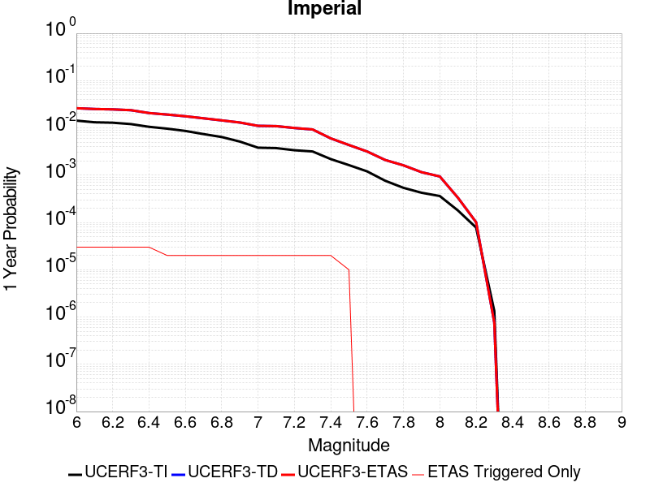 |  |

| Magnitude | 1 wk TI Prob | 1 wk TD Prob | 1 wk ETAS Prob | 1 wk ETAS/TD Gain | 1 wk ETAS Triggered Only | 1 mo TI Prob | 1 mo TD Prob | 1 mo ETAS Prob | 1 mo ETAS/TD Gain | 1 mo ETAS Triggered Only | 1 yr TI Prob | 1 yr TD Prob | 1 yr ETAS Prob | 1 yr ETAS/TD Gain | 1 yr ETAS Triggered Only | 10 yr TI Prob | 10 yr TD Prob | 10 yr ETAS Prob | 10 yr ETAS/TD Gain | 10 yr ETAS Triggered Only |
|-----|-----|-----|-----|-----|-----|-----|-----|-----|-----|-----|-----|-----|-----|-----|-----|-----|-----|-----|-----|-----|
| 6.0 | 2.7496446E-4 | 5.0552754E-4 | 5.338146E-4 | 1.0559555 | 2.8301352E-5 | 0.0011778869 | 0.002164787 | 0.0021930272 | 1.0130452 | 2.8301352E-5 | 0.0142467655 | 0.026038699 | 0.026066262 | 1.0010586 | 2.8301352E-5 | 0.13367249 | 0.2280438 | 0.22806564 | 1.0000958 | 2.8301352E-5 |
| 6.1 | 2.5356023E-4 | 4.8656776E-4 | 5.148554E-4 | 1.0581369 | 2.8301352E-5 | 0.001086234 | 0.0020836622 | 0.0021119046 | 1.0135542 | 2.8301352E-5 | 0.013144928 | 0.025071215 | 0.025098806 | 1.0011005 | 2.8301352E-5 | 0.123940155 | 0.21947981 | 0.2195019 | 1.0001006 | 2.8301352E-5 |
| 6.2 | 2.4820742E-4 | 4.7752203E-4 | 5.0580985E-4 | 1.0592388 | 2.8301352E-5 | 0.0010633124 | 0.0020449557 | 0.0020731993 | 1.0138113 | 2.8301352E-5 | 0.01286919 | 0.024611235 | 0.024638839 | 1.0011216 | 2.8301352E-5 | 0.12148927 | 0.21598552 | 0.21600771 | 1.0001028 | 2.8301352E-5 |
| 6.3 | 2.3205351E-4 | 4.5890483E-4 | 4.8719317E-4 | 1.0616432 | 2.8301352E-5 | 9.94136E-4 | 0.0019652895 | 0.001993535 | 1.0143723 | 2.8301352E-5 | 0.012036599 | 0.02366133 | 0.023688963 | 1.0011678 | 2.8301352E-5 | 0.11405133 | 0.20793462 | 0.20795703 | 1.0001078 | 2.8301352E-5 |
| 6.4 | 2.0304754E-4 | 3.987652E-4 | 4.2705526E-4 | 1.0709442 | 2.8301352E-5 | 8.6991355E-4 | 0.0017078889 | 0.001736142 | 1.0165427 | 2.8301352E-5 | 0.010539869 | 0.020595672 | 0.02062339 | 1.0013459 | 2.8301352E-5 | 0.100537635 | 0.1850669 | 0.18508996 | 1.0001246 | 2.8301352E-5 |
| 6.5 | 1.854992E-4 | 3.6988858E-4 | 3.6988858E-4 | 1.0 | 0.0 | 7.9475436E-4 | 0.0015842861 | 0.0015842861 | 1.0 | 0.0 | 0.009633281 | 0.01911948 | 0.01911948 | 1.0 | 0.0 | 0.0922623 | 0.173298 | 0.173298 | 1.0 | 0.0 |
| 6.6 | 1.6586106E-4 | 3.403506E-4 | 3.403506E-4 | 1.0 | 0.0 | 7.106394E-4 | 0.0014578402 | 0.0014578402 | 1.0 | 0.0 | 0.008617763 | 0.01760642 | 0.01760642 | 1.0 | 0.0 | 0.08291132 | 0.16077545 | 0.16077545 | 1.0 | 0.0 |
| 6.7 | 1.4224656E-4 | 3.076692E-4 | 3.076692E-4 | 1.0 | 0.0 | 6.094856E-4 | 0.001317924 | 0.001317924 | 1.0 | 0.0 | 0.0073952693 | 0.015929576 | 0.015929576 | 1.0 | 0.0 | 0.07153955 | 0.14648417 | 0.14648417 | 1.0 | 0.0 |
| 6.8 | 1.2317259E-4 | 2.779122E-4 | 2.779122E-4 | 1.0 | 0.0 | 5.2777573E-4 | 0.0011905148 | 0.0011905148 | 1.0 | 0.0 | 0.0064067547 | 0.0143995695 | 0.0143995695 | 1.0 | 0.0 | 0.06225166 | 0.13293684 | 0.13293684 | 1.0 | 0.0 |
| 6.9 | 9.859898E-5 | 2.5014306E-4 | 2.5014306E-4 | 1.0 | 0.0 | 4.2249862E-4 | 0.0010716055 | 0.0010716055 | 1.0 | 0.0 | 0.0051317946 | 0.012969712 | 0.012969712 | 1.0 | 0.0 | 0.05014893 | 0.11940631 | 0.11940631 | 1.0 | 0.0 |
| 7.0 | 7.3191884E-5 | 2.1266776E-4 | 2.1266776E-4 | 1.0 | 0.0 | 3.136418E-4 | 9.1111806E-4 | 9.1111806E-4 | 1.0 | 0.0 | 0.003811904 | 0.011037128 | 0.011037128 | 1.0 | 0.0 | 0.037471764 | 0.10206493 | 0.10206493 | 1.0 | 0.0 |
| 7.1 | 7.1760296E-5 | 2.0968143E-4 | 2.0968143E-4 | 1.0 | 0.0 | 3.0750787E-4 | 8.983284E-4 | 8.983284E-4 | 1.0 | 0.0 | 0.003737482 | 0.010882978 | 0.010882978 | 1.0 | 0.0 | 0.03675245 | 0.10070146 | 0.10070146 | 1.0 | 0.0 |
| 7.2 | 6.46614E-5 | 1.9136685E-4 | 1.9136685E-4 | 1.0 | 0.0 | 2.7709085E-4 | 8.1988896E-4 | 8.1988896E-4 | 1.0 | 0.0 | 0.0033683628 | 0.0099370815 | 0.0099370815 | 1.0 | 0.0 | 0.033177625 | 0.09250898 | 0.09250898 | 1.0 | 0.0 |
| 7.3 | 6.088115E-5 | 1.78084E-4 | 1.78084E-4 | 1.0 | 0.0 | 2.6089314E-4 | 7.6299673E-4 | 7.6299673E-4 | 1.0 | 0.0 | 0.0031717476 | 0.009250494 | 0.009250494 | 1.0 | 0.0 | 0.031268585 | 0.08655989 | 0.08655989 | 1.0 | 0.0 |
| 7.4 | 4.199346E-5 | 1.1510366E-4 | 1.1510366E-4 | 1.0 | 0.0 | 1.7995955E-4 | 4.9320905E-4 | 4.9320905E-4 | 1.0 | 0.0 | 0.0021888057 | 0.0059884563 | 0.0059884563 | 1.0 | 0.0 | 0.02167372 | 0.057439793 | 0.057439793 | 1.0 | 0.0 |
| 7.5 | 3.130448E-5 | 8.33328E-5 | 8.33328E-5 | 1.0 | 0.0 | 1.3415517E-4 | 3.57092E-4 | 3.57092E-4 | 1.0 | 0.0 | 0.0016321153 | 0.004338988 | 0.004338988 | 1.0 | 0.0 | 0.016201803 | 0.04213201 | 0.04213201 | 1.0 | 0.0 |
| 7.6 | 2.3074248E-5 | 6.0844646E-5 | 6.0844646E-5 | 1.0 | 0.0 | 9.888588E-5 | 2.6073685E-4 | 2.6073685E-4 | 1.0 | 0.0 | 0.0012032706 | 0.0031698733 | 0.0031698733 | 1.0 | 0.0 | 0.011967761 | 0.031026395 | 0.031026395 | 1.0 | 0.0 |
| 7.7 | 1.45864815E-5 | 4.0124698E-5 | 4.0124698E-5 | 1.0 | 0.0 | 6.2511994E-5 | 1.7195169E-4 | 1.7195169E-4 | 1.0 | 0.0 | 7.608177E-4 | 0.0020915072 | 0.0020915072 | 1.0 | 0.0 | 0.007582182 | 0.020627763 | 0.020627763 | 1.0 | 0.0 |
| 7.8 | 1.0352979E-5 | 3.0960902E-5 | 3.0960902E-5 | 1.0 | 0.0 | 4.4369157E-5 | 1.3268284E-4 | 1.3268284E-4 | 1.0 | 0.0 | 5.400606E-4 | 0.0016142189 | 0.0016142189 | 1.0 | 0.0 | 0.0053875 | 0.016016833 | 0.016016833 | 1.0 | 0.0 |
| 7.9 | 8.137906E-6 | 2.2149103E-5 | 2.2149103E-5 | 1.0 | 0.0 | 3.4876273E-5 | 9.492128E-5 | 9.492128E-5 | 1.0 | 0.0 | 4.2453592E-4 | 0.0011550548 | 0.0011550548 | 1.0 | 0.0 | 0.004237258 | 0.011617903 | 0.011617903 | 1.0 | 0.0 |
| 8.0 | 6.93792E-6 | 1.8008766E-5 | 1.8008766E-5 | 1.0 | 0.0 | 2.9733603E-5 | 7.717814E-5 | 7.717814E-5 | 1.0 | 0.0 | 3.6194647E-4 | 9.3923963E-4 | 9.3923963E-4 | 1.0 | 0.0 | 0.0036135751 | 0.00950155 | 0.00950155 | 1.0 | 0.0 |
| 8.1 | 3.4286315E-6 | 6.379872E-6 | 6.379872E-6 | 1.0 | 0.0 | 1.4694053E-5 | 2.7342023E-5 | 2.7342023E-5 | 1.0 | 0.0 | 1.7888541E-4 | 3.328384E-4 | 3.328384E-4 | 1.0 | 0.0 | 0.0017874148 | 0.003486031 | 0.003486031 | 1.0 | 0.0 |
| 8.2 | 1.4906886E-6 | 1.9366646E-6 | 1.9366646E-6 | 1.0 | 0.0 | 6.3886496E-6 | 8.299965E-6 | 8.299965E-6 | 1.0 | 0.0 | 7.7779034E-5 | 1.0104742E-4 | 1.0104742E-4 | 1.0 | 0.0 | 7.775182E-4 | 0.0011075331 | 0.0011075331 | 1.0 | 0.0 |
| 8.3 | 2.5758007E-8 | 1.4500102E-8 | 1.4500102E-8 | 1.0 | 0.0 | 1.10391454E-7 | 6.214329E-8 | 6.214329E-8 | 1.0 | 0.0 | 1.3440151E-6 | 7.565946E-7 | 7.565946E-7 | 1.0 | 0.0 | 1.344007E-5 | 7.887763E-6 | 7.887763E-6 | 1.0 | 0.0 |

## Surprise Valley 2011 CFM
*[(top)](#table-of-contents)*

| 1 Week | 1 Month | 1 Year | 10 Year |
|-----|-----|-----|-----|
|  |  |  |  |

| Magnitude | 1 wk TI Prob | 1 wk TD Prob | 1 wk ETAS Prob | 1 wk ETAS/TD Gain | 1 wk ETAS Triggered Only | 1 mo TI Prob | 1 mo TD Prob | 1 mo ETAS Prob | 1 mo ETAS/TD Gain | 1 mo ETAS Triggered Only | 1 yr TI Prob | 1 yr TD Prob | 1 yr ETAS Prob | 1 yr ETAS/TD Gain | 1 yr ETAS Triggered Only | 10 yr TI Prob | 10 yr TD Prob | 10 yr ETAS Prob | 10 yr ETAS/TD Gain | 10 yr ETAS Triggered Only |
|-----|-----|-----|-----|-----|-----|-----|-----|-----|-----|-----|-----|-----|-----|-----|-----|-----|-----|-----|-----|-----|
| 6.0 | 4.0396248E-5 | 4.485131E-5 | 4.485131E-5 | 1.0 | 0.0 | 1.7311527E-4 | 1.9220692E-4 | 2.2050283E-4 | 1.1472158 | 2.8301352E-5 | 0.002105641 | 0.0023378176 | 0.002366053 | 1.0120776 | 2.8301352E-5 | 0.020858008 | 0.023153966 | 0.023181612 | 1.001194 | 2.8301352E-5 |
| 6.1 | 4.0396248E-5 | 4.485131E-5 | 4.485131E-5 | 1.0 | 0.0 | 1.7311527E-4 | 1.9220692E-4 | 2.2050283E-4 | 1.1472158 | 2.8301352E-5 | 0.002105641 | 0.0023378176 | 0.002366053 | 1.0120776 | 2.8301352E-5 | 0.020858008 | 0.023153966 | 0.023181612 | 1.001194 | 2.8301352E-5 |
| 6.2 | 2.2295266E-5 | 2.440125E-5 | 2.440125E-5 | 1.0 | 0.0 | 9.554764E-5 | 1.0457276E-4 | 1.3287115E-4 | 1.2706096 | 2.8301352E-5 | 0.0011626717 | 0.0012724606 | 0.001300726 | 1.0222131 | 2.8301352E-5 | 0.011566074 | 0.012654981 | 0.012682924 | 1.0022081 | 2.8301352E-5 |
| 6.3 | 1.572643E-5 | 1.7096807E-5 | 1.7096807E-5 | 1.0 | 0.0 | 6.7397246E-5 | 7.327003E-5 | 1.0156931E-4 | 1.3862326 | 2.8301352E-5 | 8.202525E-4 | 8.91708E-4 | 9.1998413E-4 | 1.03171 | 2.8301352E-5 | 0.008172315 | 0.008882407 | 0.008910457 | 1.003158 | 2.8301352E-5 |
| 6.4 | 1.5714395E-5 | 1.7084629E-5 | 1.7084629E-5 | 1.0 | 0.0 | 6.734567E-5 | 7.3217845E-5 | 1.0151712E-4 | 1.386508 | 2.8301352E-5 | 8.1962504E-4 | 8.9107314E-4 | 9.1934926E-4 | 1.0317327 | 2.8301352E-5 | 0.008166086 | 0.008876109 | 0.008904159 | 1.0031602 | 2.8301352E-5 |
| 6.5 | 1.2733495E-5 | 1.38016E-5 | 1.38016E-5 | 1.0 | 0.0 | 5.457098E-5 | 5.9148413E-5 | 8.744809E-5 | 1.4784521 | 2.8301352E-5 | 6.641992E-4 | 7.1990065E-4 | 7.481816E-4 | 1.0392846 | 2.8301352E-5 | 0.0066221743 | 0.0071763797 | 0.0072044777 | 1.0039154 | 2.8301352E-5 |
| 6.6 | 1.0983784E-5 | 1.1886554E-5 | 1.1886554E-5 | 1.0 | 0.0 | 4.7072506E-5 | 5.094141E-5 | 7.924132E-5 | 1.5555384 | 2.8301352E-5 | 5.7295704E-4 | 6.200405E-4 | 6.483243E-4 | 1.045616 | 2.8301352E-5 | 0.0057148207 | 0.0061836545 | 0.006211781 | 1.0045485 | 2.8301352E-5 |
| 6.7 | 9.104806E-6 | 9.839491E-6 | 9.839491E-6 | 1.0 | 0.0 | 3.902001E-5 | 4.2168587E-5 | 4.2168587E-5 | 1.0 | 0.0 | 4.7496508E-4 | 5.132855E-4 | 5.132855E-4 | 1.0 | 0.0 | 0.004739512 | 0.005121397 | 0.005121397 | 1.0 | 0.0 |
| 6.8 | 6.2162403E-6 | 6.7041337E-6 | 6.7041337E-6 | 1.0 | 0.0 | 2.6640759E-5 | 2.8731698E-5 | 2.8731698E-5 | 1.0 | 0.0 | 3.2430296E-4 | 3.497545E-4 | 3.497545E-4 | 1.0 | 0.0 | 0.003238301 | 0.0034922638 | 0.0034922638 | 1.0 | 0.0 |
| 6.9 | 4.1792696E-6 | 4.50323E-6 | 4.50323E-6 | 1.0 | 0.0 | 1.7911032E-5 | 1.9299423E-5 | 1.9299423E-5 | 1.0 | 0.0 | 2.1804498E-4 | 2.3494668E-4 | 2.3494668E-4 | 1.0 | 0.0 | 0.0021783116 | 0.0023471361 | 0.0023471361 | 1.0 | 0.0 |
| 7.0 | 2.7478413E-6 | 2.9622424E-6 | 2.9622424E-6 | 1.0 | 0.0 | 1.177641E-5 | 1.269527E-5 | 1.269527E-5 | 1.0 | 0.0 | 1.4336836E-4 | 1.545552E-4 | 1.545552E-4 | 1.0 | 0.0 | 0.001432759 | 0.0015445995 | 0.0015445995 | 1.0 | 0.0 |
| 7.1 | 8.128648E-7 | 8.724922E-7 | 8.724922E-7 | 1.0 | 0.0 | 3.4837017E-6 | 3.7392501E-6 | 3.7392501E-6 | 1.0 | 0.0 | 4.2413245E-5 | 4.552502E-5 | 4.552502E-5 | 1.0 | 0.0 | 4.2405148E-4 | 4.5521575E-4 | 4.5521575E-4 | 1.0 | 0.0 |
| 7.2 | 4.8641045E-8 | 4.9402068E-8 | 4.9402068E-8 | 1.0 | 0.0 | 2.084616E-7 | 2.1172312E-7 | 2.1172312E-7 | 1.0 | 0.0 | 2.538017E-6 | 2.577726E-6 | 2.577726E-6 | 1.0 | 0.0 | 2.537988E-5 | 2.5776973E-5 | 2.5776973E-5 | 1.0 | 0.0 |
| 7.3 | 5.3911844E-9 | 5.4758145E-9 | 5.4758145E-9 | 1.0 | 0.0 | 2.3105075E-8 | 2.3467775E-8 | 2.3467775E-8 | 1.0 | 0.0 | 2.8130427E-7 | 2.8572015E-7 | 2.8572015E-7 | 1.0 | 0.0 | 2.8130391E-6 | 2.8571992E-6 | 2.8571992E-6 | 1.0 | 0.0 |

## Chino alt 1
*[(top)](#table-of-contents)*

| 1 Week | 1 Month | 1 Year | 10 Year |
|-----|-----|-----|-----|
|  | 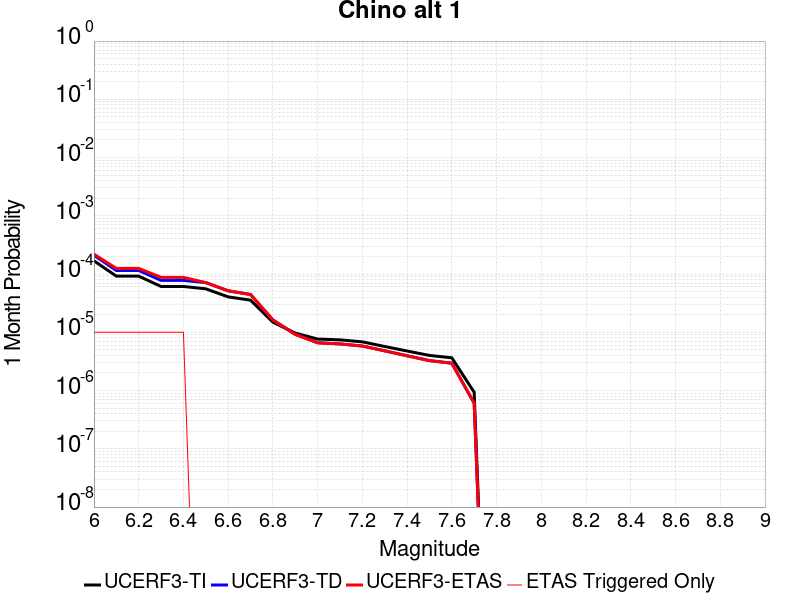 |  |  |

| Magnitude | 1 wk TI Prob | 1 wk TD Prob | 1 wk ETAS Prob | 1 wk ETAS/TD Gain | 1 wk ETAS Triggered Only | 1 mo TI Prob | 1 mo TD Prob | 1 mo ETAS Prob | 1 mo ETAS/TD Gain | 1 mo ETAS Triggered Only | 1 yr TI Prob | 1 yr TD Prob | 1 yr ETAS Prob | 1 yr ETAS/TD Gain | 1 yr ETAS Triggered Only | 10 yr TI Prob | 10 yr TD Prob | 10 yr ETAS Prob | 10 yr ETAS/TD Gain | 10 yr ETAS Triggered Only |
|-----|-----|-----|-----|-----|-----|-----|-----|-----|-----|-----|-----|-----|-----|-----|-----|-----|-----|-----|-----|-----|
| 6.0 | 3.939946E-5 | 4.8948554E-5 | 4.8948554E-5 | 1.0 | 0.0 | 1.6884391E-4 | 2.097656E-4 | 2.097656E-4 | 1.0 | 0.0 | 0.0020537362 | 0.0025513945 | 0.0025796238 | 1.0110642 | 2.8301352E-5 | 0.020348595 | 0.025277847 | 0.025305433 | 1.0010914 | 2.8301352E-5 |
| 6.1 | 2.1505624E-5 | 2.6879026E-5 | 2.6879026E-5 | 1.0 | 0.0 | 9.2163704E-5 | 1.1519137E-4 | 1.1519137E-4 | 1.0 | 0.0 | 0.0011215154 | 0.001401664 | 0.0014299257 | 1.0201629 | 2.8301352E-5 | 0.011158722 | 0.013945141 | 0.013973048 | 1.0020012 | 2.8301352E-5 |
| 6.2 | 2.1505624E-5 | 2.6879026E-5 | 2.6879026E-5 | 1.0 | 0.0 | 9.2163704E-5 | 1.1519137E-4 | 1.1519137E-4 | 1.0 | 0.0 | 0.0011215154 | 0.001401664 | 0.0014299257 | 1.0201629 | 2.8301352E-5 | 0.011158722 | 0.013945141 | 0.013973048 | 1.0020012 | 2.8301352E-5 |
| 6.3 | 1.4290785E-5 | 1.8165128E-5 | 1.8165128E-5 | 1.0 | 0.0 | 6.1244784E-5 | 7.784848E-5 | 7.784848E-5 | 1.0 | 0.0 | 7.454001E-4 | 9.4743853E-4 | 9.75713E-4 | 1.0298431 | 2.8301352E-5 | 0.007429048 | 0.0094444575 | 0.009472491 | 1.0029683 | 2.8301352E-5 |
| 6.4 | 1.4290785E-5 | 1.8165128E-5 | 1.8165128E-5 | 1.0 | 0.0 | 6.1244784E-5 | 7.784848E-5 | 7.784848E-5 | 1.0 | 0.0 | 7.454001E-4 | 9.4743853E-4 | 9.75713E-4 | 1.0298431 | 2.8301352E-5 | 0.007429048 | 0.0094444575 | 0.009472491 | 1.0029683 | 2.8301352E-5 |
| 6.5 | 1.3017944E-5 | 1.6652088E-5 | 1.6652088E-5 | 1.0 | 0.0 | 5.5789995E-5 | 7.136439E-5 | 7.136439E-5 | 1.0 | 0.0 | 6.790315E-4 | 8.685589E-4 | 8.9683564E-4 | 1.0325559 | 2.8301352E-5 | 0.0067696036 | 0.008661949 | 0.008690005 | 1.003239 | 2.8301352E-5 |
| 6.6 | 9.470016E-6 | 1.2039424E-5 | 1.2039424E-5 | 1.0 | 0.0 | 4.058515E-5 | 5.1596704E-5 | 5.1596704E-5 | 1.0 | 0.0 | 4.940122E-4 | 6.280428E-4 | 6.280428E-4 | 1.0 | 0.0 | 0.004929154 | 0.0062718987 | 0.0062718987 | 1.0 | 0.0 |
| 6.7 | 8.314155E-6 | 1.0407736E-5 | 1.0407736E-5 | 1.0 | 0.0 | 3.5631605E-5 | 4.4604003E-5 | 4.4604003E-5 | 1.0 | 0.0 | 4.3372845E-4 | 5.429507E-4 | 5.429507E-4 | 1.0 | 0.0 | 0.004328829 | 0.005425775 | 0.005425775 | 1.0 | 0.0 |
| 6.8 | 3.4856364E-6 | 3.8133708E-6 | 3.8133708E-6 | 1.0 | 0.0 | 1.4938357E-5 | 1.6342927E-5 | 1.6342927E-5 | 1.0 | 0.0 | 1.8185932E-4 | 1.9895904E-4 | 1.9895904E-4 | 1.0 | 0.0 | 0.0018171056 | 0.0019894864 | 0.0019894864 | 1.0 | 0.0 |
| 6.9 | 2.2645952E-6 | 2.1529022E-6 | 2.1529022E-6 | 1.0 | 0.0 | 9.705372E-6 | 9.226692E-6 | 9.226692E-6 | 1.0 | 0.0 | 1.18156495E-4 | 1.123294E-4 | 1.123294E-4 | 1.0 | 0.0 | 0.0011809369 | 0.0011233423 | 0.0011233423 | 1.0 | 0.0 |
| 7.0 | 1.7864003E-6 | 1.5430785E-6 | 1.5430785E-6 | 1.0 | 0.0 | 7.655979E-6 | 6.613177E-6 | 6.613177E-6 | 1.0 | 0.0 | 9.3207556E-5 | 8.051251E-5 | 8.051251E-5 | 1.0 | 0.0 | 9.316847E-4 | 8.0528046E-4 | 8.0528046E-4 | 1.0 | 0.0 |
| 7.1 | 1.7315456E-6 | 1.4733511E-6 | 1.4733511E-6 | 1.0 | 0.0 | 7.420889E-6 | 6.3143466E-6 | 6.3143466E-6 | 1.0 | 0.0 | 9.034557E-5 | 7.6874516E-5 | 7.6874516E-5 | 1.0 | 0.0 | 9.0308854E-4 | 7.6891703E-4 | 7.6891703E-4 | 1.0 | 0.0 |
| 7.2 | 1.6008337E-6 | 1.3574215E-6 | 1.3574215E-6 | 1.0 | 0.0 | 6.860698E-6 | 5.817508E-6 | 5.817508E-6 | 1.0 | 0.0 | 8.352579E-5 | 7.082591E-5 | 7.082591E-5 | 1.0 | 0.0 | 8.34944E-4 | 7.0845755E-4 | 7.0845755E-4 | 1.0 | 0.0 |
| 7.3 | 1.3320939E-6 | 1.121782E-6 | 1.121782E-6 | 1.0 | 0.0 | 5.7089615E-6 | 4.807629E-6 | 4.807629E-6 | 1.0 | 0.0 | 6.9504385E-5 | 5.8531357E-5 | 5.8531357E-5 | 1.0 | 0.0 | 6.9482654E-4 | 5.8530393E-4 | 5.8530393E-4 | 1.0 | 0.0 |
| 7.4 | 1.114294E-6 | 9.237111E-7 | 9.237111E-7 | 1.0 | 0.0 | 4.775537E-6 | 3.958756E-6 | 3.958756E-6 | 1.0 | 0.0 | 5.8140613E-5 | 4.8196827E-5 | 4.8196827E-5 | 1.0 | 0.0 | 5.81254E-4 | 4.8188053E-4 | 4.8188053E-4 | 1.0 | 0.0 |
| 7.5 | 9.354081E-7 | 7.6234323E-7 | 7.6234323E-7 | 1.0 | 0.0 | 4.0088858E-6 | 3.2671815E-6 | 3.2671815E-6 | 1.0 | 0.0 | 4.8807087E-5 | 3.9777242E-5 | 3.9777242E-5 | 1.0 | 0.0 | 4.879637E-4 | 3.977046E-4 | 3.977046E-4 | 1.0 | 0.0 |
| 7.6 | 8.521771E-7 | 6.88071E-7 | 6.88071E-7 | 1.0 | 0.0 | 3.6521824E-6 | 2.9488726E-6 | 2.9488726E-6 | 1.0 | 0.0 | 4.4464414E-5 | 3.5901965E-5 | 3.5901965E-5 | 1.0 | 0.0 | 4.4455516E-4 | 3.589648E-4 | 3.589648E-4 | 1.0 | 0.0 |
| 7.7 | 2.1803626E-7 | 1.418649E-7 | 1.418649E-7 | 1.0 | 0.0 | 9.344408E-7 | 6.079923E-7 | 6.079923E-7 | 1.0 | 0.0 | 1.1376757E-5 | 7.4022914E-6 | 7.4022914E-6 | 1.0 | 0.0 | 1.13761744E-4 | 7.402141E-5 | 7.402141E-5 | 1.0 | 0.0 |

## San Joaquin Hills
*[(top)](#table-of-contents)*

| 1 Week | 1 Month | 1 Year | 10 Year |
|-----|-----|-----|-----|
|  |  |  |  |

| Magnitude | 1 wk TI Prob | 1 wk TD Prob | 1 wk ETAS Prob | 1 wk ETAS/TD Gain | 1 wk ETAS Triggered Only | 1 mo TI Prob | 1 mo TD Prob | 1 mo ETAS Prob | 1 mo ETAS/TD Gain | 1 mo ETAS Triggered Only | 1 yr TI Prob | 1 yr TD Prob | 1 yr ETAS Prob | 1 yr ETAS/TD Gain | 1 yr ETAS Triggered Only | 10 yr TI Prob | 10 yr TD Prob | 10 yr ETAS Prob | 10 yr ETAS/TD Gain | 10 yr ETAS Triggered Only |
|-----|-----|-----|-----|-----|-----|-----|-----|-----|-----|-----|-----|-----|-----|-----|-----|-----|-----|-----|-----|-----|
| 6.0 | 3.4525704E-6 | 2.8139818E-6 | 2.8139818E-6 | 1.0 | 0.0 | 1.4796647E-5 | 1.2059867E-5 | 1.2059867E-5 | 1.0 | 0.0 | 1.8013427E-4 | 1.4681912E-4 | 1.751163E-4 | 1.1927351 | 2.8301352E-5 | 0.0017998833 | 0.0014672345 | 0.0014954943 | 1.0192606 | 2.8301352E-5 |
| 6.1 | 3.4525704E-6 | 2.8139818E-6 | 2.8139818E-6 | 1.0 | 0.0 | 1.4796647E-5 | 1.2059867E-5 | 1.2059867E-5 | 1.0 | 0.0 | 1.8013427E-4 | 1.4681912E-4 | 1.751163E-4 | 1.1927351 | 2.8301352E-5 | 0.0017998833 | 0.0014672345 | 0.0014954943 | 1.0192606 | 2.8301352E-5 |
| 6.2 | 3.4525704E-6 | 2.8139818E-6 | 2.8139818E-6 | 1.0 | 0.0 | 1.4796647E-5 | 1.2059867E-5 | 1.2059867E-5 | 1.0 | 0.0 | 1.8013427E-4 | 1.4681912E-4 | 1.751163E-4 | 1.1927351 | 2.8301352E-5 | 0.0017998833 | 0.0014672345 | 0.0014954943 | 1.0192606 | 2.8301352E-5 |
| 6.3 | 3.4525704E-6 | 2.8139818E-6 | 2.8139818E-6 | 1.0 | 0.0 | 1.4796647E-5 | 1.2059867E-5 | 1.2059867E-5 | 1.0 | 0.0 | 1.8013427E-4 | 1.4681912E-4 | 1.751163E-4 | 1.1927351 | 2.8301352E-5 | 0.0017998833 | 0.0014672345 | 0.0014954943 | 1.0192606 | 2.8301352E-5 |
| 6.4 | 3.4525704E-6 | 2.8139818E-6 | 2.8139818E-6 | 1.0 | 0.0 | 1.4796647E-5 | 1.2059867E-5 | 1.2059867E-5 | 1.0 | 0.0 | 1.8013427E-4 | 1.4681912E-4 | 1.751163E-4 | 1.1927351 | 2.8301352E-5 | 0.0017998833 | 0.0014672345 | 0.0014954943 | 1.0192606 | 2.8301352E-5 |
| 6.5 | 3.4525704E-6 | 2.8139818E-6 | 2.8139818E-6 | 1.0 | 0.0 | 1.4796647E-5 | 1.2059867E-5 | 1.2059867E-5 | 1.0 | 0.0 | 1.8013427E-4 | 1.4681912E-4 | 1.751163E-4 | 1.1927351 | 2.8301352E-5 | 0.0017998833 | 0.0014672345 | 0.0014954943 | 1.0192606 | 2.8301352E-5 |
| 6.6 | 3.4525704E-6 | 2.8139818E-6 | 2.8139818E-6 | 1.0 | 0.0 | 1.4796647E-5 | 1.2059867E-5 | 1.2059867E-5 | 1.0 | 0.0 | 1.8013427E-4 | 1.4681912E-4 | 1.751163E-4 | 1.1927351 | 2.8301352E-5 | 0.0017998833 | 0.0014672345 | 0.0014954943 | 1.0192606 | 2.8301352E-5 |
| 6.7 | 3.4525704E-6 | 2.8139818E-6 | 2.8139818E-6 | 1.0 | 0.0 | 1.4796647E-5 | 1.2059867E-5 | 1.2059867E-5 | 1.0 | 0.0 | 1.8013427E-4 | 1.4681912E-4 | 1.751163E-4 | 1.1927351 | 2.8301352E-5 | 0.0017998833 | 0.0014672345 | 0.0014954943 | 1.0192606 | 2.8301352E-5 |
| 6.8 | 3.388654E-6 | 2.7484202E-6 | 2.7484202E-6 | 1.0 | 0.0 | 1.4522722E-5 | 1.1778891E-5 | 1.1778891E-5 | 1.0 | 0.0 | 1.767998E-4 | 1.4339869E-4 | 1.4339869E-4 | 1.0 | 0.0 | 0.001766592 | 0.0014330745 | 0.0014330745 | 1.0 | 0.0 |
| 6.9 | 3.2694352E-6 | 2.6283346E-6 | 2.6283346E-6 | 1.0 | 0.0 | 1.401179E-5 | 1.1264243E-5 | 1.1264243E-5 | 1.0 | 0.0 | 1.7058018E-4 | 1.3713364E-4 | 1.3713364E-4 | 1.0 | 0.0 | 0.0017044931 | 0.0013705015 | 0.0013705015 | 1.0 | 0.0 |
| 7.0 | 3.246912E-6 | 2.6069915E-6 | 2.6069915E-6 | 1.0 | 0.0 | 1.39152635E-5 | 1.1172774E-5 | 1.1172774E-5 | 1.0 | 0.0 | 1.6940516E-4 | 1.3602014E-4 | 1.3602014E-4 | 1.0 | 0.0 | 0.0016927607 | 0.0013593802 | 0.0013593802 | 1.0 | 0.0 |
| 7.1 | 3.1864927E-6 | 2.5523198E-6 | 2.5523198E-6 | 1.0 | 0.0 | 1.3656326E-5 | 1.0938467E-5 | 1.0938467E-5 | 1.0 | 0.0 | 1.6625308E-4 | 1.3316782E-4 | 1.3316782E-4 | 1.0 | 0.0 | 0.0016612876 | 0.0013308912 | 0.0013308912 | 1.0 | 0.0 |
| 7.2 | 3.0220644E-6 | 2.3991677E-6 | 2.3991677E-6 | 1.0 | 0.0 | 1.295164E-5 | 1.0282108E-5 | 1.0282108E-5 | 1.0 | 0.0 | 1.576748E-4 | 1.2517757E-4 | 1.2517757E-4 | 1.0 | 0.0 | 0.0015756298 | 0.0012510809 | 0.0012510809 | 1.0 | 0.0 |
| 7.3 | 2.787619E-6 | 2.2173858E-6 | 2.2173858E-6 | 1.0 | 0.0 | 1.1946884E-5 | 9.503048E-6 | 9.503048E-6 | 1.0 | 0.0 | 1.454436E-4 | 1.1569356E-4 | 1.1569356E-4 | 1.0 | 0.0 | 0.0014534845 | 0.0011563431 | 0.0011563431 | 1.0 | 0.0 |
| 7.4 | 2.4593792E-6 | 1.9226306E-6 | 1.9226306E-6 | 1.0 | 0.0 | 1.0540153E-5 | 8.23982E-6 | 8.23982E-6 | 1.0 | 0.0 | 1.2831882E-4 | 1.0031529E-4 | 1.0031529E-4 | 1.0 | 0.0 | 0.0012824474 | 0.0010027088 | 0.0010027088 | 1.0 | 0.0 |
| 7.5 | 1.926764E-6 | 1.4383021E-6 | 1.4383021E-6 | 1.0 | 0.0 | 8.257534E-6 | 6.1641376E-6 | 6.1641376E-6 | 1.0 | 0.0 | 1.00530844E-4 | 7.504586E-5 | 7.504586E-5 | 1.0 | 0.0 | 0.0010048538 | 7.502115E-4 | 7.502115E-4 | 1.0 | 0.0 |
| 7.6 | 1.1609359E-6 | 8.14558E-7 | 8.14558E-7 | 1.0 | 0.0 | 4.97543E-6 | 3.4909585E-6 | 3.4909585E-6 | 1.0 | 0.0 | 6.0574173E-5 | 4.2501633E-5 | 4.2501633E-5 | 1.0 | 0.0 | 6.055767E-4 | 4.249394E-4 | 4.249394E-4 | 1.0 | 0.0 |
| 7.7 | 5.1168536E-7 | 2.7155914E-7 | 2.7155914E-7 | 1.0 | 0.0 | 2.1929354E-6 | 1.1638244E-6 | 1.1638244E-6 | 1.0 | 0.0 | 2.669866E-5 | 1.41694845E-5 | 1.41694845E-5 | 1.0 | 0.0 | 2.6695454E-4 | 1.4168715E-4 | 1.4168715E-4 | 1.0 | 0.0 |
| 7.8 | 1.16056995E-8 | 9.782373E-9 | 9.782373E-9 | 1.0 | 0.0 | 4.9738713E-8 | 4.1924455E-8 | 4.1924455E-8 | 1.0 | 0.0 | 6.0556863E-7 | 5.1043025E-7 | 5.1043025E-7 | 1.0 | 0.0 | 6.05567E-6 | 5.1043025E-6 | 5.1043025E-6 | 1.0 | 0.0 |

## Goose Lake 2011 CFM
*[(top)](#table-of-contents)*

| 1 Week | 1 Month | 1 Year | 10 Year |
|-----|-----|-----|-----|
|  |  |  |  |

| Magnitude | 1 wk TI Prob | 1 wk TD Prob | 1 wk ETAS Prob | 1 wk ETAS/TD Gain | 1 wk ETAS Triggered Only | 1 mo TI Prob | 1 mo TD Prob | 1 mo ETAS Prob | 1 mo ETAS/TD Gain | 1 mo ETAS Triggered Only | 1 yr TI Prob | 1 yr TD Prob | 1 yr ETAS Prob | 1 yr ETAS/TD Gain | 1 yr ETAS Triggered Only | 10 yr TI Prob | 10 yr TD Prob | 10 yr ETAS Prob | 10 yr ETAS/TD Gain | 10 yr ETAS Triggered Only |
|-----|-----|-----|-----|-----|-----|-----|-----|-----|-----|-----|-----|-----|-----|-----|-----|-----|-----|-----|-----|-----|
| 6.0 | 3.780968E-6 | 3.8230223E-6 | 3.8230223E-6 | 1.0 | 0.0 | 1.6204049E-5 | 1.6384285E-5 | 4.4685174E-5 | 2.7273192 | 2.8301352E-5 | 1.9726643E-4 | 1.994615E-4 | 2.277572E-4 | 1.1418605 | 2.8301352E-5 | 0.001970914 | 0.001992933 | 0.002021178 | 1.0141726 | 2.8301352E-5 |
| 6.1 | 2.2035124E-6 | 2.229801E-6 | 2.229801E-6 | 1.0 | 0.0 | 9.443591E-6 | 9.556257E-6 | 3.785734E-5 | 3.9615238 | 2.8301352E-5 | 1.1496965E-4 | 1.163414E-4 | 1.4463946E-4 | 1.243233 | 2.8301352E-5 | 0.0011491019 | 0.0011628233 | 0.0011910917 | 1.0243102 | 2.8301352E-5 |
| 6.2 | 1.5624689E-6 | 1.5826923E-6 | 1.5826923E-6 | 1.0 | 0.0 | 6.6962784E-6 | 6.7829496E-6 | 6.7829496E-6 | 1.0 | 0.0 | 8.152414E-5 | 8.2579325E-5 | 8.2579325E-5 | 1.0 | 0.0 | 8.1494235E-4 | 8.2549086E-4 | 8.2549086E-4 | 1.0 | 0.0 |
| 6.3 | 1.5624689E-6 | 1.5826923E-6 | 1.5826923E-6 | 1.0 | 0.0 | 6.6962784E-6 | 6.7829496E-6 | 6.7829496E-6 | 1.0 | 0.0 | 8.152414E-5 | 8.2579325E-5 | 8.2579325E-5 | 1.0 | 0.0 | 8.1494235E-4 | 8.2549086E-4 | 8.2549086E-4 | 1.0 | 0.0 |
| 6.4 | 1.256464E-6 | 1.2738695E-6 | 1.2738695E-6 | 1.0 | 0.0 | 5.3848344E-6 | 5.4594293E-6 | 5.4594293E-6 | 1.0 | 0.0 | 6.5558386E-5 | 6.646655E-5 | 6.646655E-5 | 1.0 | 0.0 | 6.553905E-4 | 6.644687E-4 | 6.644687E-4 | 1.0 | 0.0 |
| 6.5 | 1.0910911E-6 | 1.1069404E-6 | 1.1069404E-6 | 1.0 | 0.0 | 4.6760965E-6 | 4.7440217E-6 | 4.7440217E-6 | 1.0 | 0.0 | 5.692999E-5 | 5.7756948E-5 | 5.7756948E-5 | 1.0 | 0.0 | 5.6915404E-4 | 5.7742064E-4 | 5.7742064E-4 | 1.0 | 0.0 |
| 6.6 | 9.546601E-7 | 9.691246E-7 | 9.691246E-7 | 1.0 | 0.0 | 4.091394E-6 | 4.1533845E-6 | 4.1533845E-6 | 1.0 | 0.0 | 4.9811584E-5 | 5.056629E-5 | 5.056629E-5 | 1.0 | 0.0 | 4.980042E-4 | 5.055487E-4 | 5.055487E-4 | 1.0 | 0.0 |
| 6.7 | 7.790316E-7 | 7.9159634E-7 | 7.9159634E-7 | 1.0 | 0.0 | 3.3387028E-6 | 3.3925514E-6 | 3.3925514E-6 | 1.0 | 0.0 | 4.0647945E-5 | 4.1303538E-5 | 4.1303538E-5 | 1.0 | 0.0 | 4.0640513E-4 | 4.129592E-4 | 4.129592E-4 | 1.0 | 0.0 |
| 6.8 | 6.3714384E-7 | 6.4787395E-7 | 6.4787395E-7 | 1.0 | 0.0 | 2.7306137E-6 | 2.7765998E-6 | 2.7765998E-6 | 1.0 | 0.0 | 3.3244716E-5 | 3.3804583E-5 | 3.3804583E-5 | 1.0 | 0.0 | 3.323974E-4 | 3.379949E-4 | 3.379949E-4 | 1.0 | 0.0 |
| 6.9 | 4.92586E-7 | 5.0139147E-7 | 5.0139147E-7 | 1.0 | 0.0 | 2.1110811E-6 | 2.1488188E-6 | 2.1488188E-6 | 1.0 | 0.0 | 2.5702111E-5 | 2.616156E-5 | 2.616156E-5 | 1.0 | 0.0 | 2.569914E-4 | 2.6158517E-4 | 2.6158517E-4 | 1.0 | 0.0 |
| 7.0 | 3.130245E-7 | 3.190354E-7 | 3.190354E-7 | 1.0 | 0.0 | 1.3415328E-6 | 1.3672939E-6 | 1.3672939E-6 | 1.0 | 0.0 | 1.6333039E-5 | 1.6646678E-5 | 1.6646678E-5 | 1.0 | 0.0 | 1.6331839E-4 | 1.6645451E-4 | 1.6645451E-4 | 1.0 | 0.0 |
| 7.1 | 1.7680084E-7 | 1.8023923E-7 | 1.8023923E-7 | 1.0 | 0.0 | 7.5771766E-7 | 7.724536E-7 | 7.724536E-7 | 1.0 | 0.0 | 9.225173E-6 | 9.404583E-6 | 9.404583E-6 | 1.0 | 0.0 | 9.22479E-5 | 9.4041956E-5 | 9.4041956E-5 | 1.0 | 0.0 |
| 7.2 | 4.8641045E-8 | 4.9402068E-8 | 4.9402068E-8 | 1.0 | 0.0 | 2.084616E-7 | 2.1172312E-7 | 2.1172312E-7 | 1.0 | 0.0 | 2.538017E-6 | 2.577726E-6 | 2.577726E-6 | 1.0 | 0.0 | 2.537988E-5 | 2.5776973E-5 | 2.5776973E-5 | 1.0 | 0.0 |
| 7.3 | 5.3911844E-9 | 5.4758145E-9 | 5.4758145E-9 | 1.0 | 0.0 | 2.3105075E-8 | 2.3467775E-8 | 2.3467775E-8 | 1.0 | 0.0 | 2.8130427E-7 | 2.8572015E-7 | 2.8572015E-7 | 1.0 | 0.0 | 2.8130391E-6 | 2.8571992E-6 | 2.8571992E-6 | 1.0 | 0.0 |

## Cleghorn Pass
*[(top)](#table-of-contents)*

| 1 Week | 1 Month | 1 Year | 10 Year |
|-----|-----|-----|-----|
|  |  |  |  |

| Magnitude | 1 wk TI Prob | 1 wk TD Prob | 1 wk ETAS Prob | 1 wk ETAS/TD Gain | 1 wk ETAS Triggered Only | 1 mo TI Prob | 1 mo TD Prob | 1 mo ETAS Prob | 1 mo ETAS/TD Gain | 1 mo ETAS Triggered Only | 1 yr TI Prob | 1 yr TD Prob | 1 yr ETAS Prob | 1 yr ETAS/TD Gain | 1 yr ETAS Triggered Only | 10 yr TI Prob | 10 yr TD Prob | 10 yr ETAS Prob | 10 yr ETAS/TD Gain | 10 yr ETAS Triggered Only |
|-----|-----|-----|-----|-----|-----|-----|-----|-----|-----|-----|-----|-----|-----|-----|-----|-----|-----|-----|-----|-----|
| 6.0 | 1.0522846E-5 | 1.1040642E-5 | 1.1040642E-5 | 1.0 | 0.0 | 4.509713E-5 | 4.7316473E-5 | 4.7316473E-5 | 1.0 | 0.0 | 5.4891926E-4 | 5.759784E-4 | 5.759784E-4 | 1.0 | 0.0 | 0.0054756533 | 0.005750022 | 0.0057781604 | 1.0048937 | 2.8301352E-5 |
| 6.1 | 1.0522846E-5 | 1.1040642E-5 | 1.1040642E-5 | 1.0 | 0.0 | 4.509713E-5 | 4.7316473E-5 | 4.7316473E-5 | 1.0 | 0.0 | 5.4891926E-4 | 5.759784E-4 | 5.759784E-4 | 1.0 | 0.0 | 0.0054756533 | 0.005750022 | 0.0057781604 | 1.0048937 | 2.8301352E-5 |
| 6.2 | 2.1045846E-6 | 2.2082024E-6 | 2.2082024E-6 | 1.0 | 0.0 | 9.019617E-6 | 9.463714E-6 | 9.463714E-6 | 1.0 | 0.0 | 1.098083E-4 | 1.1521882E-4 | 1.1521882E-4 | 1.0 | 0.0 | 0.0010975406 | 0.0011520023 | 0.0011520023 | 1.0 | 0.0 |
| 6.3 | 2.1045846E-6 | 2.2082024E-6 | 2.2082024E-6 | 1.0 | 0.0 | 9.019617E-6 | 9.463714E-6 | 9.463714E-6 | 1.0 | 0.0 | 1.098083E-4 | 1.1521882E-4 | 1.1521882E-4 | 1.0 | 0.0 | 0.0010975406 | 0.0011520023 | 0.0011520023 | 1.0 | 0.0 |
| 6.4 | 1.7259927E-6 | 1.810877E-6 | 1.810877E-6 | 1.0 | 0.0 | 7.3970905E-6 | 7.760902E-6 | 7.760902E-6 | 1.0 | 0.0 | 9.005586E-5 | 9.4488976E-5 | 9.4488976E-5 | 1.0 | 0.0 | 9.001937E-4 | 9.448898E-4 | 9.448898E-4 | 1.0 | 0.0 |

## Elsinore (Temecula) rev
*[(top)](#table-of-contents)*

| 1 Week | 1 Month | 1 Year | 10 Year |
|-----|-----|-----|-----|
|  |  |  |  |

| Magnitude | 1 wk TI Prob | 1 wk TD Prob | 1 wk ETAS Prob | 1 wk ETAS/TD Gain | 1 wk ETAS Triggered Only | 1 mo TI Prob | 1 mo TD Prob | 1 mo ETAS Prob | 1 mo ETAS/TD Gain | 1 mo ETAS Triggered Only | 1 yr TI Prob | 1 yr TD Prob | 1 yr ETAS Prob | 1 yr ETAS/TD Gain | 1 yr ETAS Triggered Only | 10 yr TI Prob | 10 yr TD Prob | 10 yr ETAS Prob | 10 yr ETAS/TD Gain | 10 yr ETAS Triggered Only |
|-----|-----|-----|-----|-----|-----|-----|-----|-----|-----|-----|-----|-----|-----|-----|-----|-----|-----|-----|-----|-----|
| 6.0 | 2.9514995E-5 | 2.2517117E-5 | 5.081783E-5 | 2.2568533 | 2.8301352E-5 | 1.264867E-4 | 9.649849E-5 | 1.2479711E-4 | 1.2932546 | 2.8301352E-5 | 0.0015388876 | 0.0011742581 | 0.0012025262 | 1.0240731 | 2.8301352E-5 | 0.015282745 | 0.011696897 | 0.011724868 | 1.0023912 | 2.8301352E-5 |
| 6.1 | 2.9514995E-5 | 2.2517117E-5 | 5.081783E-5 | 2.2568533 | 2.8301352E-5 | 1.264867E-4 | 9.649849E-5 | 1.2479711E-4 | 1.2932546 | 2.8301352E-5 | 0.0015388876 | 0.0011742581 | 0.0012025262 | 1.0240731 | 2.8301352E-5 | 0.015282745 | 0.011696897 | 0.011724868 | 1.0023912 | 2.8301352E-5 |
| 6.2 | 2.9514995E-5 | 2.2517117E-5 | 5.081783E-5 | 2.2568533 | 2.8301352E-5 | 1.264867E-4 | 9.649849E-5 | 1.2479711E-4 | 1.2932546 | 2.8301352E-5 | 0.0015388876 | 0.0011742581 | 0.0012025262 | 1.0240731 | 2.8301352E-5 | 0.015282745 | 0.011696897 | 0.011724868 | 1.0023912 | 2.8301352E-5 |
| 6.3 | 2.3223649E-5 | 1.8406454E-5 | 4.6707286E-5 | 2.5375493 | 2.8301352E-5 | 9.952613E-5 | 7.888251E-5 | 1.0718164E-4 | 1.3587502 | 2.8301352E-5 | 0.001211057 | 9.599888E-4 | 9.882629E-4 | 1.0294526 | 2.8301352E-5 | 0.012044783 | 0.009569948 | 0.009597979 | 1.002929 | 2.8301352E-5 |
| 6.4 | 2.3223649E-5 | 1.8406454E-5 | 4.6707286E-5 | 2.5375493 | 2.8301352E-5 | 9.952613E-5 | 7.888251E-5 | 1.0718164E-4 | 1.3587502 | 2.8301352E-5 | 0.001211057 | 9.599888E-4 | 9.882629E-4 | 1.0294526 | 2.8301352E-5 | 0.012044783 | 0.009569948 | 0.009597979 | 1.002929 | 2.8301352E-5 |
| 6.5 | 1.8338875E-5 | 1.4750118E-5 | 4.305105E-5 | 2.918692 | 2.8301352E-5 | 7.8592806E-5 | 6.321331E-5 | 9.151287E-5 | 1.4476837 | 2.8301352E-5 | 9.5644733E-4 | 7.69359E-4 | 7.976386E-4 | 1.0367573 | 2.8301352E-5 | 0.009523412 | 0.0076739118 | 0.007701996 | 1.0036597 | 2.8301352E-5 |
| 6.6 | 1.8223333E-5 | 1.4612673E-5 | 4.2913613E-5 | 2.9367394 | 2.8301352E-5 | 7.809766E-5 | 6.262429E-5 | 9.0923866E-5 | 1.4518946 | 2.8301352E-5 | 9.504242E-4 | 7.6219277E-4 | 7.9047255E-4 | 1.0371032 | 2.8301352E-5 | 0.009463696 | 0.0076027405 | 0.007630827 | 1.0036942 | 2.8301352E-5 |
| 6.7 | 1.7512752E-5 | 1.402721E-5 | 4.2328167E-5 | 3.0175755 | 2.8301352E-5 | 7.505249E-5 | 6.011528E-5 | 8.841493E-5 | 1.4707564 | 2.8301352E-5 | 9.13381E-4 | 7.3166634E-4 | 7.5994694E-4 | 1.0386524 | 2.8301352E-5 | 0.00909636 | 0.00729892 | 0.0073270146 | 1.0038491 | 2.8301352E-5 |
| 6.8 | 1.7417142E-5 | 1.3951195E-5 | 4.225215E-5 | 3.0285687 | 2.8301352E-5 | 7.4642754E-5 | 5.9789512E-5 | 8.8089175E-5 | 1.4733214 | 2.8301352E-5 | 9.083966E-4 | 7.277028E-4 | 7.559835E-4 | 1.0388631 | 2.8301352E-5 | 0.009046922 | 0.0072594886 | 0.0072875842 | 1.0038702 | 2.8301352E-5 |
| 6.9 | 1.6402591E-5 | 1.2988613E-5 | 1.2988613E-5 | 1.0 | 0.0 | 7.0294926E-5 | 5.5664343E-5 | 5.5664343E-5 | 1.0 | 0.0 | 8.5550465E-4 | 6.775103E-4 | 6.775103E-4 | 1.0 | 0.0 | 0.008522186 | 0.006760169 | 0.006760169 | 1.0 | 0.0 |
| 7.0 | 1.3912486E-5 | 1.0878233E-5 | 1.0878233E-5 | 1.0 | 0.0 | 5.9623577E-5 | 4.6620182E-5 | 4.6620182E-5 | 1.0 | 0.0 | 7.2567526E-4 | 5.674556E-4 | 5.674556E-4 | 1.0 | 0.0 | 0.0072331014 | 0.005663986 | 0.005663986 | 1.0 | 0.0 |
| 7.1 | 1.3405147E-5 | 1.03274215E-5 | 1.03274215E-5 | 1.0 | 0.0 | 5.7449364E-5 | 4.425964E-5 | 4.425964E-5 | 1.0 | 0.0 | 6.9922156E-4 | 5.3873047E-4 | 5.3873047E-4 | 1.0 | 0.0 | 0.0069702556 | 0.005377577 | 0.005377577 | 1.0 | 0.0 |
| 7.2 | 1.21402E-5 | 8.996737E-6 | 8.996737E-6 | 1.0 | 0.0 | 5.202839E-5 | 3.8556886E-5 | 3.8556886E-5 | 1.0 | 0.0 | 6.332616E-4 | 4.6933076E-4 | 4.6933076E-4 | 1.0 | 0.0 | 0.0063146 | 0.004684821 | 0.004684821 | 1.0 | 0.0 |
| 7.3 | 1.05047775E-5 | 7.571771E-6 | 7.571771E-6 | 1.0 | 0.0 | 4.5019697E-5 | 3.245005E-5 | 3.245005E-5 | 1.0 | 0.0 | 5.4797693E-4 | 3.950092E-4 | 3.950092E-4 | 1.0 | 0.0 | 0.005466277 | 0.00394346 | 0.00394346 | 1.0 | 0.0 |
| 7.4 | 9.624483E-6 | 6.7868696E-6 | 6.7868696E-6 | 1.0 | 0.0 | 4.124713E-5 | 2.9086266E-5 | 2.9086266E-5 | 1.0 | 0.0 | 5.0206814E-4 | 3.5406914E-4 | 3.5406914E-4 | 1.0 | 0.0 | 0.005009353 | 0.003535204 | 0.003535204 | 1.0 | 0.0 |
| 7.5 | 8.215151E-6 | 5.635538E-6 | 5.635538E-6 | 1.0 | 0.0 | 3.5207315E-5 | 2.4152088E-5 | 2.4152088E-5 | 1.0 | 0.0 | 4.2856473E-4 | 2.9401327E-4 | 2.9401327E-4 | 1.0 | 0.0 | 0.004277392 | 0.002936371 | 0.002936371 | 1.0 | 0.0 |
| 7.6 | 6.975058E-6 | 4.676045E-6 | 4.676045E-6 | 1.0 | 0.0 | 2.9892764E-5 | 2.0040046E-5 | 2.0040046E-5 | 1.0 | 0.0 | 3.6388362E-4 | 2.439614E-4 | 2.439614E-4 | 1.0 | 0.0 | 0.0036328835 | 0.002437052 | 0.002437052 | 1.0 | 0.0 |
| 7.7 | 4.159604E-6 | 2.3269924E-6 | 2.3269924E-6 | 1.0 | 0.0 | 1.7826753E-5 | 9.97279E-6 | 9.97279E-6 | 1.0 | 0.0 | 2.1701909E-4 | 1.21412704E-4 | 1.21412704E-4 | 1.0 | 0.0 | 0.0021680726 | 0.0012135367 | 0.0012135367 | 1.0 | 0.0 |
| 7.8 | 2.2692414E-7 | 9.3854695E-8 | 9.3854695E-8 | 1.0 | 0.0 | 9.725317E-7 | 4.0223435E-7 | 4.0223435E-7 | 1.0 | 0.0 | 1.1840509E-5 | 4.8971956E-6 | 4.8971956E-6 | 1.0 | 0.0 | 1.1839878E-4 | 4.8971204E-5 | 4.8971204E-5 | 1.0 | 0.0 |
| 7.9 | 6.676829E-9 | 3.439853E-9 | 3.439853E-9 | 1.0 | 0.0 | 2.861498E-8 | 1.4742227E-8 | 1.4742227E-8 | 1.0 | 0.0 | 3.4838732E-7 | 1.7948659E-7 | 1.7948659E-7 | 1.0 | 0.0 | 3.4838679E-6 | 1.7948646E-6 | 1.7948646E-6 | 1.0 | 0.0 |

## Blue Cut
*[(top)](#table-of-contents)*

| 1 Week | 1 Month | 1 Year | 10 Year |
|-----|-----|-----|-----|
|  |  |  |  |

| Magnitude | 1 wk TI Prob | 1 wk TD Prob | 1 wk ETAS Prob | 1 wk ETAS/TD Gain | 1 wk ETAS Triggered Only | 1 mo TI Prob | 1 mo TD Prob | 1 mo ETAS Prob | 1 mo ETAS/TD Gain | 1 mo ETAS Triggered Only | 1 yr TI Prob | 1 yr TD Prob | 1 yr ETAS Prob | 1 yr ETAS/TD Gain | 1 yr ETAS Triggered Only | 10 yr TI Prob | 10 yr TD Prob | 10 yr ETAS Prob | 10 yr ETAS/TD Gain | 10 yr ETAS Triggered Only |
|-----|-----|-----|-----|-----|-----|-----|-----|-----|-----|-----|-----|-----|-----|-----|-----|-----|-----|-----|-----|-----|
| 6.0 | 2.1227985E-5 | 2.2719574E-5 | 5.1020284E-5 | 2.2456532 | 2.8301352E-5 | 9.097391E-5 | 9.73663E-5 | 1.256649E-4 | 1.2906406 | 2.8301352E-5 | 0.0011070445 | 0.0011848481 | 0.0012131159 | 1.0238577 | 2.8301352E-5 | 0.011015458 | 0.011791152 | 0.01181912 | 1.0023719 | 2.8301352E-5 |
| 6.1 | 2.1227985E-5 | 2.2719574E-5 | 5.1020284E-5 | 2.2456532 | 2.8301352E-5 | 9.097391E-5 | 9.73663E-5 | 1.256649E-4 | 1.2906406 | 2.8301352E-5 | 0.0011070445 | 0.0011848481 | 0.0012131159 | 1.0238577 | 2.8301352E-5 | 0.011015458 | 0.011791152 | 0.01181912 | 1.0023719 | 2.8301352E-5 |
| 6.2 | 2.1227985E-5 | 2.2719574E-5 | 5.1020284E-5 | 2.2456532 | 2.8301352E-5 | 9.097391E-5 | 9.73663E-5 | 1.256649E-4 | 1.2906406 | 2.8301352E-5 | 0.0011070445 | 0.0011848481 | 0.0012131159 | 1.0238577 | 2.8301352E-5 | 0.011015458 | 0.011791152 | 0.01181912 | 1.0023719 | 2.8301352E-5 |
| 6.3 | 1.1613981E-5 | 1.2353542E-5 | 4.0654544E-5 | 3.2909222 | 2.8301352E-5 | 4.9773254E-5 | 5.2942745E-5 | 8.12426E-5 | 1.534537 | 2.8301352E-5 | 6.0582085E-4 | 6.443998E-4 | 6.726829E-4 | 1.0438906 | 2.8301352E-5 | 0.0060417196 | 0.0064265593 | 0.0064546787 | 1.0043755 | 2.8301352E-5 |
| 6.4 | 1.1613981E-5 | 1.2353542E-5 | 4.0654544E-5 | 3.2909222 | 2.8301352E-5 | 4.9773254E-5 | 5.2942745E-5 | 8.12426E-5 | 1.534537 | 2.8301352E-5 | 6.0582085E-4 | 6.443998E-4 | 6.726829E-4 | 1.0438906 | 2.8301352E-5 | 0.0060417196 | 0.0064265593 | 0.0064546787 | 1.0043755 | 2.8301352E-5 |
| 6.5 | 8.931326E-6 | 9.4816E-6 | 3.7782684E-5 | 3.9848428 | 2.8301352E-5 | 3.8276554E-5 | 4.0634844E-5 | 6.893505E-5 | 1.6964515 | 2.8301352E-5 | 4.6591737E-4 | 4.946261E-4 | 5.2291347E-4 | 1.0571893 | 2.8301352E-5 | 0.0046494175 | 0.004936161 | 0.004964323 | 1.0057051 | 2.8301352E-5 |
| 6.6 | 7.345353E-6 | 7.79028E-6 | 3.6091413E-5 | 4.632878 | 2.8301352E-5 | 3.1479703E-5 | 3.338653E-5 | 6.168694E-5 | 1.8476595 | 2.8301352E-5 | 3.83198E-4 | 4.064132E-4 | 4.3470305E-4 | 1.0696086 | 2.8301352E-5 | 0.0038253788 | 0.0040574907 | 0.004085677 | 1.0069468 | 2.8301352E-5 |
| 6.7 | 6.2775666E-6 | 6.655149E-6 | 3.4956312E-5 | 5.2525215 | 2.8301352E-5 | 2.690358E-5 | 2.8521798E-5 | 5.6822344E-5 | 1.9922427 | 2.8301352E-5 | 3.2750185E-4 | 3.472051E-4 | 3.754966E-4 | 1.0814836 | 2.8301352E-5 | 0.0032701963 | 0.003467367 | 0.0034955703 | 1.0081339 | 2.8301352E-5 |
| 6.8 | 5.5234095E-6 | 5.8551113E-6 | 3.41563E-5 | 5.8335867 | 2.8301352E-5 | 2.367154E-5 | 2.5093133E-5 | 5.3393775E-5 | 2.127824 | 2.8301352E-5 | 2.8816288E-4 | 3.0547334E-4 | 3.3376607E-4 | 1.0926192 | 2.8301352E-5 | 0.002877895 | 0.0030512505 | 0.0030794656 | 1.0092471 | 2.8301352E-5 |
| 6.9 | 4.7780054E-6 | 5.0654203E-6 | 3.336663E-5 | 6.587139 | 2.8301352E-5 | 2.0477004E-5 | 2.1708804E-5 | 5.000954E-5 | 2.3036525 | 2.8301352E-5 | 2.4927902E-4 | 2.642797E-4 | 2.9257356E-4 | 1.1070603 | 2.8301352E-5 | 0.0024899957 | 0.002640346 | 0.0026685728 | 1.0106905 | 2.8301352E-5 |
| 7.0 | 3.883171E-6 | 4.118487E-6 | 3.2419724E-5 | 7.8717556 | 2.8301352E-5 | 1.6642054E-5 | 1.7650578E-5 | 4.595143E-5 | 2.6033952 | 2.8301352E-5 | 2.0259817E-4 | 2.1488148E-4 | 2.4317676E-4 | 1.1316785 | 2.8301352E-5 | 0.0020241356 | 0.0021474129 | 0.0021756534 | 1.0131509 | 2.8301352E-5 |
| 7.1 | 2.8358215E-6 | 3.0097158E-6 | 3.1310985E-5 | 10.403302 | 2.8301352E-5 | 1.2153464E-5 | 1.2898756E-5 | 4.1199743E-5 | 3.1940868 | 2.8301352E-5 | 1.4795837E-4 | 1.5703762E-4 | 1.8533452E-4 | 1.1801919 | 2.8301352E-5 | 0.001478599 | 0.0015699116 | 0.0015981685 | 1.017999 | 2.8301352E-5 |

## Great Valley 09 (Laguna Seca)
*[(top)](#table-of-contents)*

| 1 Week | 1 Month | 1 Year | 10 Year |
|-----|-----|-----|-----|
|  |  |  |  |

| Magnitude | 1 wk TI Prob | 1 wk TD Prob | 1 wk ETAS Prob | 1 wk ETAS/TD Gain | 1 wk ETAS Triggered Only | 1 mo TI Prob | 1 mo TD Prob | 1 mo ETAS Prob | 1 mo ETAS/TD Gain | 1 mo ETAS Triggered Only | 1 yr TI Prob | 1 yr TD Prob | 1 yr ETAS Prob | 1 yr ETAS/TD Gain | 1 yr ETAS Triggered Only | 10 yr TI Prob | 10 yr TD Prob | 10 yr ETAS Prob | 10 yr ETAS/TD Gain | 10 yr ETAS Triggered Only |
|-----|-----|-----|-----|-----|-----|-----|-----|-----|-----|-----|-----|-----|-----|-----|-----|-----|-----|-----|-----|-----|
| 6.0 | 5.4353277E-5 | 7.05022E-5 | 9.880156E-5 | 1.4013968 | 2.8301352E-5 | 2.3292181E-4 | 3.0211566E-4 | 3.3040848E-4 | 1.0936489 | 2.8301352E-5 | 0.0028321352 | 0.0036721937 | 0.0037003912 | 1.0076786 | 2.8301352E-5 | 0.02796312 | 0.03611547 | 0.03614275 | 1.0007553 | 2.8301352E-5 |
| 6.1 | 4.5578287E-5 | 5.822118E-5 | 8.6520886E-5 | 1.4860723 | 2.8301352E-5 | 1.953209E-4 | 2.4949326E-4 | 2.7778753E-4 | 1.113407 | 2.8301352E-5 | 0.0023754383 | 0.003033432 | 0.0030616475 | 1.0093015 | 2.8301352E-5 | 0.023502063 | 0.029919548 | 0.029947001 | 1.0009177 | 2.8301352E-5 |
| 6.2 | 2.8536782E-5 | 3.4737273E-5 | 6.3037645E-5 | 1.8146975 | 2.8301352E-5 | 1.2229476E-4 | 1.4886224E-4 | 1.7715937E-4 | 1.1900895 | 2.8301352E-5 | 0.0014879217 | 0.001810813 | 0.0018390631 | 1.0156008 | 2.8301352E-5 | 0.014779986 | 0.017958116 | 0.01798591 | 1.0015477 | 2.8301352E-5 |
| 6.3 | 2.3698774E-5 | 2.8213295E-5 | 5.651385E-5 | 2.0030928 | 2.8301352E-5 | 1.01562226E-4 | 1.20905075E-4 | 1.4920301E-4 | 1.2340508 | 2.8301352E-5 | 0.0012358186 | 0.0014710218 | 0.0014992815 | 1.0192109 | 2.8301352E-5 | 0.012289686 | 0.014611342 | 0.0146392295 | 1.0019087 | 2.8301352E-5 |
| 6.4 | 1.9191197E-5 | 2.2123184E-5 | 5.042391E-5 | 2.279234 | 2.8301352E-5 | 8.2245395E-5 | 9.4806666E-5 | 1.2310533E-4 | 1.2984881 | 2.8301352E-5 | 0.0010008777 | 0.0011536429 | 0.0011819116 | 1.0245038 | 2.8301352E-5 | 0.009963818 | 0.011476948 | 0.011504924 | 1.0024376 | 2.8301352E-5 |
| 6.5 | 1.5203241E-5 | 1.6802203E-5 | 1.6802203E-5 | 1.0 | 0.0 | 6.5155116E-5 | 7.200386E-5 | 7.200386E-5 | 1.0 | 0.0 | 7.9297484E-4 | 8.7626575E-4 | 8.7626575E-4 | 1.0 | 0.0 | 0.007901512 | 0.0087295165 | 0.0087295165 | 1.0 | 0.0 |
| 6.6 | 1.0984925E-5 | 1.1242595E-5 | 1.1242595E-5 | 1.0 | 0.0 | 4.70774E-5 | 4.8181686E-5 | 4.8181686E-5 | 1.0 | 0.0 | 5.730166E-4 | 5.8645656E-4 | 5.8645656E-4 | 1.0 | 0.0 | 0.005715413 | 0.0058494853 | 0.0058494853 | 1.0 | 0.0 |
| 6.7 | 9.134616E-6 | 9.019894E-6 | 9.019894E-6 | 1.0 | 0.0 | 3.9147766E-5 | 3.865613E-5 | 3.865613E-5 | 1.0 | 0.0 | 4.7651984E-4 | 4.7053912E-4 | 4.7053912E-4 | 1.0 | 0.0 | 0.004754993 | 0.0046956735 | 0.0046956735 | 1.0 | 0.0 |
| 6.8 | 7.785589E-6 | 7.4519444E-6 | 7.4519444E-6 | 1.0 | 0.0 | 3.3366385E-5 | 3.1936524E-5 | 3.1936524E-5 | 1.0 | 0.0 | 4.0616E-4 | 3.8875983E-4 | 3.8875983E-4 | 1.0 | 0.0 | 0.0040541845 | 0.0038810016 | 0.0038810016 | 1.0 | 0.0 |
| 6.9 | 5.579095E-6 | 4.898492E-6 | 4.898492E-6 | 1.0 | 0.0 | 2.3910188E-5 | 2.0993377E-5 | 2.0993377E-5 | 1.0 | 0.0 | 2.9106764E-4 | 2.5556577E-4 | 2.5556577E-4 | 1.0 | 0.0 | 0.002906867 | 0.002552856 | 0.002552856 | 1.0 | 0.0 |
| 7.0 | 2.6816688E-6 | 1.5216126E-6 | 1.5216126E-6 | 1.0 | 0.0 | 1.1492816E-5 | 6.521181E-6 | 6.521181E-6 | 1.0 | 0.0 | 1.3991605E-4 | 7.939258E-5 | 7.939258E-5 | 1.0 | 0.0 | 0.0013982799 | 7.9365086E-4 | 7.9365086E-4 | 1.0 | 0.0 |
| 7.1 | 1.9951021E-6 | 7.453827E-7 | 7.453827E-7 | 1.0 | 0.0 | 8.55041E-6 | 3.1944935E-6 | 3.1944935E-6 | 1.0 | 0.0 | 1.0409627E-4 | 3.8892307E-5 | 3.8892307E-5 | 1.0 | 0.0 | 0.0010404752 | 3.8885913E-4 | 3.8885913E-4 | 1.0 | 0.0 |
| 7.2 | 1.9951021E-6 | 7.453827E-7 | 7.453827E-7 | 1.0 | 0.0 | 8.55041E-6 | 3.1944935E-6 | 3.1944935E-6 | 1.0 | 0.0 | 1.0409627E-4 | 3.8892307E-5 | 3.8892307E-5 | 1.0 | 0.0 | 0.0010404752 | 3.8885913E-4 | 3.8885913E-4 | 1.0 | 0.0 |
| 7.3 | 1.7087556E-6 | 6.578881E-7 | 6.578881E-7 | 1.0 | 0.0 | 7.3232177E-6 | 2.8195177E-6 | 2.8195177E-6 | 1.0 | 0.0 | 8.915652E-5 | 3.4327128E-5 | 3.4327128E-5 | 1.0 | 0.0 | 8.9120766E-4 | 3.432223E-4 | 3.432223E-4 | 1.0 | 0.0 |
| 7.4 | 1.3804846E-6 | 6.073852E-7 | 6.073852E-7 | 1.0 | 0.0 | 5.916349E-6 | 2.6030768E-6 | 2.6030768E-6 | 1.0 | 0.0 | 7.2029165E-5 | 3.169204E-5 | 3.169204E-5 | 1.0 | 0.0 | 7.200583E-4 | 3.1687922E-4 | 3.1687922E-4 | 1.0 | 0.0 |
| 7.5 | 1.3804846E-6 | 6.073852E-7 | 6.073852E-7 | 1.0 | 0.0 | 5.916349E-6 | 2.6030768E-6 | 2.6030768E-6 | 1.0 | 0.0 | 7.2029165E-5 | 3.169204E-5 | 3.169204E-5 | 1.0 | 0.0 | 7.200583E-4 | 3.1687922E-4 | 3.1687922E-4 | 1.0 | 0.0 |

## Rodgers Creek - Healdsburg 2011 CFM
*[(top)](#table-of-contents)*

| 1 Week | 1 Month | 1 Year | 10 Year |
|-----|-----|-----|-----|
|  |  |  |  |

| Magnitude | 1 wk TI Prob | 1 wk TD Prob | 1 wk ETAS Prob | 1 wk ETAS/TD Gain | 1 wk ETAS Triggered Only | 1 mo TI Prob | 1 mo TD Prob | 1 mo ETAS Prob | 1 mo ETAS/TD Gain | 1 mo ETAS Triggered Only | 1 yr TI Prob | 1 yr TD Prob | 1 yr ETAS Prob | 1 yr ETAS/TD Gain | 1 yr ETAS Triggered Only | 10 yr TI Prob | 10 yr TD Prob | 10 yr ETAS Prob | 10 yr ETAS/TD Gain | 10 yr ETAS Triggered Only |
|-----|-----|-----|-----|-----|-----|-----|-----|-----|-----|-----|-----|-----|-----|-----|-----|-----|-----|-----|-----|-----|
| 6.0 | 7.390182E-5 | 1.3136698E-4 | 1.5966462E-4 | 1.215409 | 2.8301352E-5 | 3.1668364E-4 | 5.6287815E-4 | 5.911636E-4 | 1.0502514 | 2.8301352E-5 | 0.0038488081 | 0.0068315 | 0.0068596085 | 1.0041145 | 2.8301352E-5 | 0.037828278 | 0.06619178 | 0.066218205 | 1.0003992 | 2.8301352E-5 |
| 6.1 | 7.318768E-5 | 1.3034661E-4 | 1.5864428E-4 | 1.2170955 | 2.8301352E-5 | 3.1362378E-4 | 5.585081E-4 | 5.8679364E-4 | 1.0506449 | 2.8301352E-5 | 0.0038116854 | 0.0067786723 | 0.0068067815 | 1.0041468 | 2.8301352E-5 | 0.037469655 | 0.06569639 | 0.06572283 | 1.0004025 | 2.8301352E-5 |
| 6.2 | 7.1379836E-5 | 1.2727521E-4 | 1.5557295E-4 | 1.2223351 | 2.8301352E-5 | 3.058777E-4 | 5.453505E-4 | 5.7363644E-4 | 1.0518674 | 2.8301352E-5 | 0.003717703 | 0.0066194604 | 0.0066475747 | 1.0042472 | 2.8301352E-5 | 0.0365612 | 0.06421462 | 0.064241104 | 1.0004125 | 2.8301352E-5 |
| 6.3 | 6.9255926E-5 | 1.2382054E-4 | 1.5211839E-4 | 1.2285392 | 2.8301352E-5 | 2.9677735E-4 | 5.3055194E-4 | 5.588383E-4 | 1.0533149 | 2.8301352E-5 | 0.0036072785 | 0.006440372 | 0.006468491 | 1.004366 | 2.8301352E-5 | 0.035492823 | 0.06254096 | 0.062567495 | 1.0004243 | 2.8301352E-5 |
| 6.4 | 6.6757144E-5 | 1.1958744E-4 | 1.4788541E-4 | 1.23663 | 2.8301352E-5 | 2.8607066E-4 | 5.1241735E-4 | 5.4070423E-4 | 1.0552027 | 2.8301352E-5 | 0.0034773487 | 0.0062209065 | 0.006249032 | 1.0045211 | 2.8301352E-5 | 0.034234364 | 0.060490217 | 0.06051681 | 1.0004395 | 2.8301352E-5 |
| 6.5 | 6.5735134E-5 | 1.1808043E-4 | 1.4637844E-4 | 1.2396502 | 2.8301352E-5 | 2.8169158E-4 | 5.0596124E-4 | 5.342483E-4 | 1.0559075 | 2.8301352E-5 | 0.003424202 | 0.0061427657 | 0.0061708936 | 1.004579 | 2.8301352E-5 | 0.03371918 | 0.059755135 | 0.059781745 | 1.0004454 | 2.8301352E-5 |
| 6.6 | 6.289601E-5 | 1.1343802E-4 | 1.4173616E-4 | 1.249459 | 2.8301352E-5 | 2.6952647E-4 | 4.8607276E-4 | 5.143604E-4 | 1.0581962 | 2.8301352E-5 | 0.0032765474 | 0.005901959 | 0.005930093 | 1.004767 | 2.8301352E-5 | 0.032286562 | 0.057494484 | 0.057521157 | 1.000464 | 2.8301352E-5 |
| 6.7 | 6.115274E-5 | 1.1060895E-4 | 1.3890717E-4 | 1.2558403 | 2.8301352E-5 | 2.6205686E-4 | 4.7395262E-4 | 5.0224055E-4 | 1.0596851 | 2.8301352E-5 | 0.0031858748 | 0.0057551847 | 0.005783323 | 1.0048892 | 2.8301352E-5 | 0.031405866 | 0.05611298 | 0.056139693 | 1.0004761 | 2.8301352E-5 |
| 6.8 | 5.9232367E-5 | 1.0728244E-4 | 1.3558075E-4 | 1.263774 | 2.8301352E-5 | 2.538283E-4 | 4.597012E-4 | 4.8798954E-4 | 1.0615363 | 2.8301352E-5 | 0.0030859804 | 0.0055825757 | 0.0056107193 | 1.0050412 | 2.8301352E-5 | 0.030434765 | 0.054479737 | 0.054506496 | 1.0004911 | 2.8301352E-5 |
| 6.9 | 5.4030377E-5 | 9.8224424E-5 | 1.26523E-4 | 1.2881012 | 2.8301352E-5 | 2.315382E-4 | 4.2089424E-4 | 4.491837E-4 | 1.0672127 | 2.8301352E-5 | 0.0028153337 | 0.005112413 | 0.0051405695 | 1.0055075 | 2.8301352E-5 | 0.027799325 | 0.05001516 | 0.050042044 | 1.0005375 | 2.8301352E-5 |
| 7.0 | 4.8260714E-5 | 8.740524E-5 | 8.740524E-5 | 1.0 | 0.0 | 2.0681522E-4 | 3.745404E-4 | 3.745404E-4 | 1.0 | 0.0 | 0.0025150678 | 0.004550549 | 0.004550549 | 1.0 | 0.0 | 0.024867928 | 0.044667665 | 0.044667665 | 1.0 | 0.0 |
| 7.1 | 4.0294493E-5 | 7.389041E-5 | 7.389041E-5 | 1.0 | 0.0 | 1.7267925E-4 | 3.1663495E-4 | 3.1663495E-4 | 1.0 | 0.0 | 0.0021003427 | 0.0038482544 | 0.0038482544 | 1.0 | 0.0 | 0.02080602 | 0.037923392 | 0.037923392 | 1.0 | 0.0 |
| 7.2 | 3.096388E-5 | 5.697752E-5 | 5.697752E-5 | 1.0 | 0.0 | 1.326956E-4 | 2.4416664E-4 | 2.4416664E-4 | 1.0 | 0.0 | 0.0016143717 | 0.0029686983 | 0.0029686983 | 1.0 | 0.0 | 0.01602694 | 0.029436996 | 0.029436996 | 1.0 | 0.0 |
| 7.3 | 2.3615226E-5 | 4.3628002E-5 | 4.3628002E-5 | 1.0 | 0.0 | 1.0120418E-4 | 1.8696384E-4 | 1.8696384E-4 | 1.0 | 0.0 | 0.0012314644 | 0.002273922 | 0.002273922 | 1.0 | 0.0 | 0.0122466255 | 0.022636993 | 0.022636993 | 1.0 | 0.0 |
| 7.4 | 1.8251132E-5 | 3.3541033E-5 | 3.3541033E-5 | 1.0 | 0.0 | 7.821679E-5 | 1.4373941E-4 | 1.4373941E-4 | 1.0 | 0.0 | 9.518733E-4 | 0.0017486324 | 0.0017486324 | 1.0 | 0.0 | 0.009478063 | 0.017465532 | 0.017465532 | 1.0 | 0.0 |
| 7.5 | 1.2411432E-5 | 2.246003E-5 | 2.246003E-5 | 1.0 | 0.0 | 5.3190768E-5 | 9.625375E-5 | 9.625375E-5 | 1.0 | 0.0 | 6.4740516E-4 | 0.0011712653 | 0.0011712653 | 1.0 | 0.0 | 0.006455223 | 0.011743283 | 0.011743283 | 1.0 | 0.0 |
| 7.6 | 4.4771446E-6 | 8.083989E-6 | 8.083989E-6 | 1.0 | 0.0 | 1.918762E-5 | 3.4645214E-5 | 3.4645214E-5 | 1.0 | 0.0 | 2.3358424E-4 | 4.2172507E-4 | 4.2172507E-4 | 1.0 | 0.0 | 0.0023333887 | 0.004246066 | 0.004246066 | 1.0 | 0.0 |
| 7.7 | 2.157941E-7 | 3.5349316E-7 | 3.5349316E-7 | 1.0 | 0.0 | 9.248315E-7 | 1.5149698E-6 | 1.5149698E-6 | 1.0 | 0.0 | 1.1259765E-5 | 1.8444602E-5 | 1.8444602E-5 | 1.0 | 0.0 | 1.1259195E-4 | 1.9069147E-4 | 1.9069147E-4 | 1.0 | 0.0 |
| 7.8 | 9.9623286E-8 | 1.989979E-7 | 1.989979E-7 | 1.0 | 0.0 | 4.269569E-7 | 8.528478E-7 | 8.528478E-7 | 1.0 | 0.0 | 5.1981874E-6 | 1.0383373E-5 | 1.0383373E-5 | 1.0 | 0.0 | 5.198066E-5 | 1.09018714E-4 | 1.09018714E-4 | 1.0 | 0.0 |
| 7.9 | 5.6745257E-8 | 1.1773924E-7 | 1.1773924E-7 | 1.0 | 0.0 | 2.4319394E-7 | 5.0459664E-7 | 5.0459664E-7 | 1.0 | 0.0 | 2.960882E-6 | 6.1434466E-6 | 6.1434466E-6 | 1.0 | 0.0 | 2.9608427E-5 | 6.470911E-5 | 6.470911E-5 | 1.0 | 0.0 |
| 8.0 | 2.8614323E-8 | 6.57845E-8 | 6.57845E-8 | 1.0 | 0.0 | 1.2263281E-7 | 2.8193355E-7 | 2.8193355E-7 | 1.0 | 0.0 | 1.4930534E-6 | 3.4325356E-6 | 3.4325356E-6 | 1.0 | 0.0 | 1.4930434E-5 | 3.582588E-5 | 3.582588E-5 | 1.0 | 0.0 |
| 8.1 | 3.5045191E-9 | 8.965783E-9 | 8.965783E-9 | 1.0 | 0.0 | 1.5019367E-8 | 3.8424783E-8 | 3.8424783E-8 | 1.0 | 0.0 | 1.8286079E-7 | 4.6782165E-7 | 4.6782165E-7 | 1.0 | 0.0 | 1.8286064E-6 | 4.8327956E-6 | 4.8327956E-6 | 1.0 | 0.0 |

