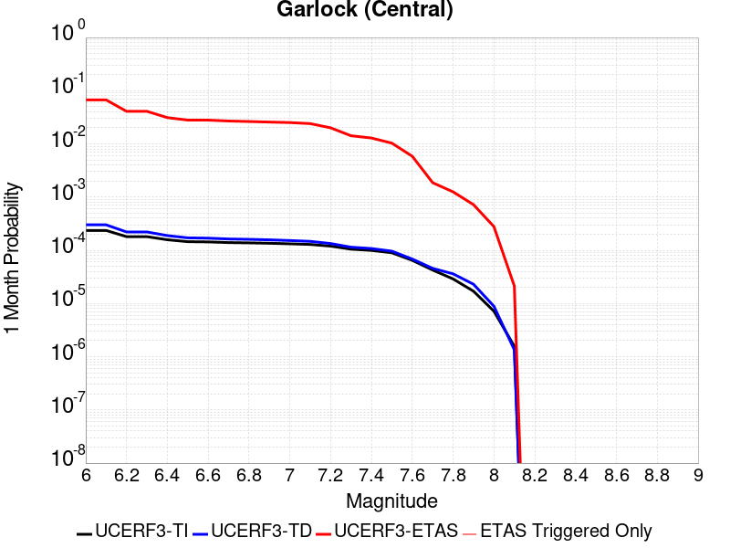
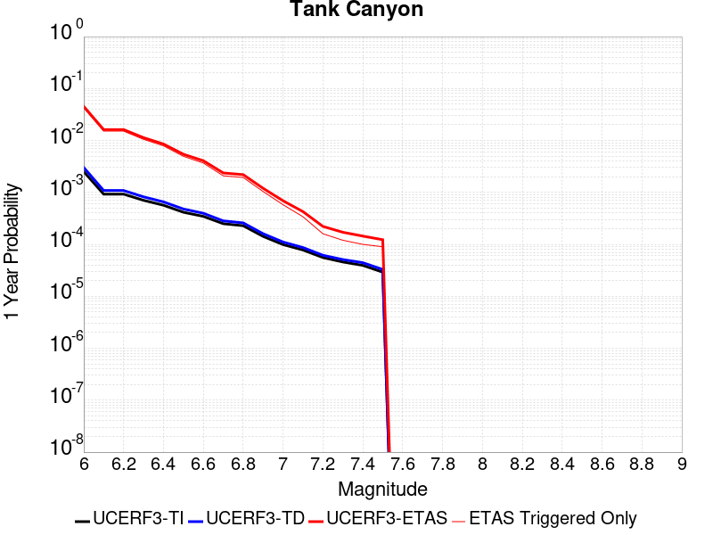
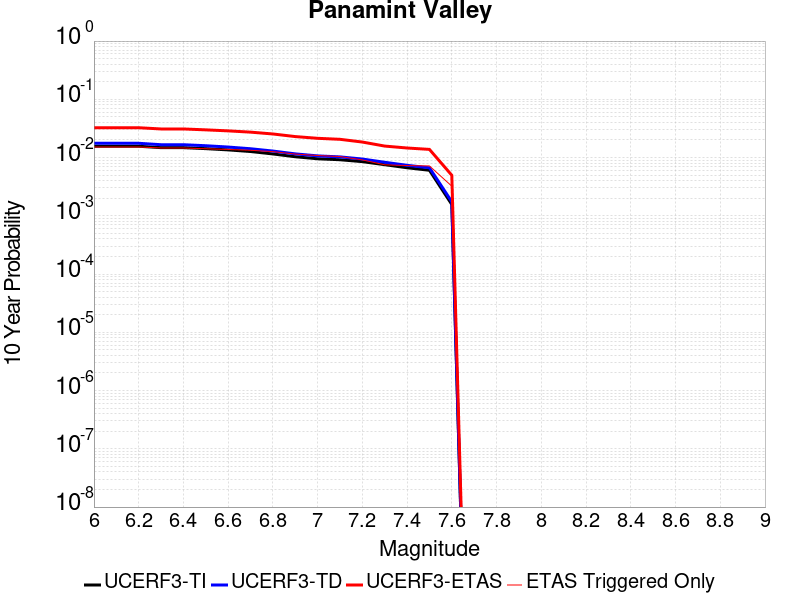
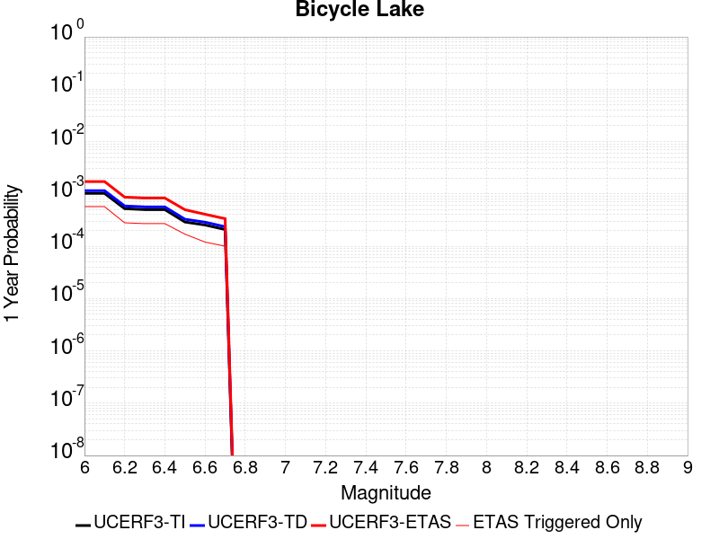
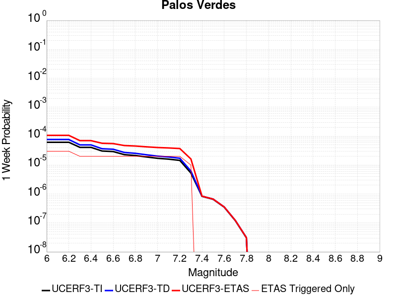

# Parent Section Magnitude-Probability Distributions

Only fault sections with at least one triggered aftershock are plotted. Sections are sorted by total supraseismogenic trigger rate (decreasing)

## Table Of Contents

* [Garlock (Central)](#garlock-central)
* [Tank Canyon](#tank-canyon)
* [Little Lake](#little-lake)
* [Airport Lake](#airport-lake)
* [Owl Lake](#owl-lake)
* [Panamint Valley](#panamint-valley)
* [Garlock (East)](#garlock-east)
* [Hunter Mountain-Saline Valley](#hunter-mountain-saline-valley)
* [Garlock (West)](#garlock-west)
* [Blackwater](#blackwater)
* [Ash Hill](#ash-hill)
* [Gravel Hills-Harper Lk](#gravel-hills-harper-lk)
* [McLean Lake](#mclean-lake)
* [San Andreas (Mojave S)](#san-andreas-mojave-s)
* [San Andreas (Mojave N)](#san-andreas-mojave-n)
* [Goldstone Lake](#goldstone-lake)
* [So Sierra Nevada](#so-sierra-nevada)
* [Death Valley (So)](#death-valley-so)
* [Nelson Lake](#nelson-lake)
* [Towne Pass](#towne-pass)
* [Lenwood-Lockhart-Old Woman Springs](#lenwood-lockhart-old-woman-springs)
* [Coyote Canyon](#coyote-canyon)
* [Death Valley (Black Mtns Frontal)](#death-valley-black-mtns-frontal)
* [San Andreas (San Bernardino N)](#san-andreas-san-bernardino-n)
* [Bicycle Lake](#bicycle-lake)
* [Paradise](#paradise)
* [Helendale-So Lockhart](#helendale-so-lockhart)
* [Garlic Springs](#garlic-springs)
* [San Andreas (Parkfield)](#san-andreas-parkfield)
* [Death Valley (No)](#death-valley-no)
* [San Andreas (Big Bend)](#san-andreas-big-bend)
* [Baker](#baker)
* [San Andreas (San Bernardino S)](#san-andreas-san-bernardino-s)
* [Calico-Hidalgo](#calico-hidalgo)
* [Lake Isabella (Seismicity)](#lake-isabella-seismicity)
* [San Andreas (Carrizo) rev](#san-andreas-carrizo-rev)
* [Coyote Lake](#coyote-lake)
* [Red Pass](#red-pass)
* [White Wolf (Extension)](#white-wolf-extension)
* [Santa Ynez (West)](#santa-ynez-west)
* [San Jacinto (San Bernardino)](#san-jacinto-san-bernardino)
* [Ludlow](#ludlow)
* [San Andreas (Cholame) rev](#san-andreas-cholame-rev)
* [Death Valley (Fish Lake Valley)](#death-valley-fish-lake-valley)
* [Bullion Mountains](#bullion-mountains)
* [Scodie Lineament](#scodie-lineament)
* [San Andreas (Coachella) rev](#san-andreas-coachella-rev)
* [San Pedro Basin](#san-pedro-basin)
* [Deep Springs](#deep-springs)
* [Elsinore (Stepovers Combined)](#elsinore-stepovers-combined)
* [Lost Hills](#lost-hills)
* [Coronado Bank alt1](#coronado-bank-alt1)
* [Cleghorn Lake](#cleghorn-lake)
* [Cady](#cady)
* [Mission Ridge-Arroyo Parida-Santa Ana](#mission-ridge-arroyo-parida-santa-ana)
* [Santa Ynez (East)](#santa-ynez-east)
* [Camp Rock 2011](#camp-rock-2011)
* [San Jacinto (Clark) rev](#san-jacinto-clark-rev)
* [San Jacinto (Stepovers Combined)](#san-jacinto-stepovers-combined)
* [San Andreas (Creeping Section) 2011 CFM](#san-andreas-creeping-section-2011-cfm)
* [Kern Canyon (South Kern) 2011](#kern-canyon-south-kern-2011)
* [Robinson Creek](#robinson-creek)
* [Pisgah-Bullion Mtn-Mesquite Lk](#pisgah-bullion-mtn-mesquite-lk)
* [San Jacinto (San Jacinto Valley) rev](#san-jacinto-san-jacinto-valley-rev)
* [Santa Cruz Catalina Ridge alt1](#santa-cruz-catalina-ridge-alt1)
* [Sierra Nevada  (No Extension)](#sierra-nevada--no-extension)
* [Santa Rosa Island](#santa-rosa-island)
* [San Andreas (North Branch Mill Creek)](#san-andreas-north-branch-mill-creek)
* [Elsinore (Glen Ivy) rev](#elsinore-glen-ivy-rev)
* [Surprise Valley 2011 CFM](#surprise-valley-2011-cfm)
* [Whittier alt 1](#whittier-alt-1)
* [San Jacinto (Anza) rev](#san-jacinto-anza-rev)
* [Manix-Afton Hills](#manix-afton-hills)
* [Hayward (No) 2011 CFM](#hayward-no-2011-cfm)
* [Palos Verdes](#palos-verdes)
* [Great Valley 05 Pittsburg - Kirby Hills alt1](#great-valley-05-pittsburg---kirby-hills-alt1)
* [Cleghorn Pass](#cleghorn-pass)
* [Channel Islands Thrust](#channel-islands-thrust)
* [Pinto Mtn](#pinto-mtn)
* [San Andreas (San Gorgonio Pass-Garnet HIll)](#san-andreas-san-gorgonio-pass-garnet-hill)
* [Elsinore (Temecula) rev](#elsinore-temecula-rev)
* [Blue Cut](#blue-cut)
* [Rodgers Creek - Healdsburg 2011 CFM](#rodgers-creek---healdsburg-2011-cfm)
* [Mono Lake 2011 CFM](#mono-lake-2011-cfm)
* [Emerson-Copper Mtn 2011](#emerson-copper-mtn-2011)

## Garlock (Central)
*[(top)](#table-of-contents)*

| 1 Week | 1 Month | 1 Year | 10 Year |
|-----|-----|-----|-----|
|  |  |  |  |

| Magnitude | 1 wk TI Prob | 1 wk TD Prob | 1 wk ETAS Prob | 1 wk ETAS/TD Gain | 1 wk ETAS Triggered Only | 1 mo TI Prob | 1 mo TD Prob | 1 mo ETAS Prob | 1 mo ETAS/TD Gain | 1 mo ETAS Triggered Only | 1 yr TI Prob | 1 yr TD Prob | 1 yr ETAS Prob | 1 yr ETAS/TD Gain | 1 yr ETAS Triggered Only | 10 yr TI Prob | 10 yr TD Prob | 10 yr ETAS Prob | 10 yr ETAS/TD Gain | 10 yr ETAS Triggered Only |
|-----|-----|-----|-----|-----|-----|-----|-----|-----|-----|-----|-----|-----|-----|-----|-----|-----|-----|-----|-----|-----|
| 6.0 | 5.5131142E-5 | 7.024681E-5 | 0.062005695 | 882.6834 | 0.0619398 | 2.3625491E-4 | 3.010234E-4 | 0.06757174 | 224.47339 | 0.06729097 | 0.0028726095 | 0.0036588663 | 0.07750141 | 21.181808 | 0.07411371 | 0.028357591 | 0.036079824 | 0.11054991 | 3.0640368 | 0.07725752 |
| 6.1 | 5.5131142E-5 | 7.024681E-5 | 0.062005695 | 882.6834 | 0.0619398 | 2.3625491E-4 | 3.010234E-4 | 0.06757174 | 224.47339 | 0.06729097 | 0.0028726095 | 0.0036588663 | 0.07750141 | 21.181808 | 0.07411371 | 0.028357591 | 0.036079824 | 0.11054991 | 3.0640368 | 0.07725752 |
| 6.2 | 4.216245E-5 | 5.1661493E-5 | 0.037374146 | 723.44305 | 0.037324414 | 1.806837E-4 | 2.2138779E-4 | 0.040546905 | 183.14879 | 0.04033445 | 0.0021976046 | 0.0026920962 | 0.046787113 | 17.379436 | 0.044214047 | 0.021759989 | 0.026689773 | 0.07167689 | 2.6855562 | 0.046220735 |
| 6.3 | 4.216245E-5 | 5.1661493E-5 | 0.037374146 | 723.44305 | 0.037324414 | 1.806837E-4 | 2.2138779E-4 | 0.040546905 | 183.14879 | 0.04033445 | 0.0021976046 | 0.0026920962 | 0.046787113 | 17.379436 | 0.044214047 | 0.021759989 | 0.026689773 | 0.07167689 | 2.6855562 | 0.046220735 |
| 6.4 | 3.6858168E-5 | 4.411054E-5 | 0.02786897 | 631.7984 | 0.027826088 | 1.5795401E-4 | 1.8903162E-4 | 0.030283676 | 160.20428 | 0.030100334 | 0.0019213937 | 0.002299056 | 0.03519983 | 15.310558 | 0.03297659 | 0.019048655 | 0.02284894 | 0.056836803 | 2.4875028 | 0.034782607 |
| 6.5 | 3.39199E-5 | 4.0018083E-5 | 0.025523948 | 637.81036 | 0.02548495 | 1.453629E-4 | 1.7149492E-4 | 0.027792176 | 162.0583 | 0.027625417 | 0.0017683565 | 0.002085973 | 0.032123517 | 15.399777 | 0.030100334 | 0.017543508 | 0.020759864 | 0.051872846 | 2.4987082 | 0.031772576 |
| 6.6 | 3.3571985E-5 | 3.9472274E-5 | 0.02545653 | 644.9218 | 0.02541806 | 1.4387199E-4 | 1.6915603E-4 | 0.027723024 | 163.89024 | 0.027558528 | 0.0017502342 | 0.0020575512 | 0.0320292 | 15.566661 | 0.030033445 | 0.017365133 | 0.020481179 | 0.051537495 | 2.5163343 | 0.031705685 |
| 6.7 | 3.2580007E-5 | 3.8088703E-5 | 0.024451874 | 641.97186 | 0.024414716 | 1.3962112E-4 | 1.632272E-4 | 0.026580319 | 162.84247 | 0.026421405 | 0.0016985617 | 0.0019855013 | 0.030824449 | 15.524769 | 0.02889632 | 0.016856372 | 0.019773813 | 0.049606785 | 2.508711 | 0.030434782 |
| 6.8 | 3.2185937E-5 | 3.7515918E-5 | 0.024183767 | 644.62683 | 0.024147157 | 1.3793244E-4 | 1.6077272E-4 | 0.026243536 | 163.23375 | 0.026086956 | 0.0016780337 | 0.001955672 | 0.030461688 | 15.576072 | 0.028561873 | 0.016654192 | 0.019480614 | 0.048863403 | 2.5083091 | 0.029966556 |
| 6.9 | 3.165394E-5 | 3.6720503E-5 | 0.023781668 | 647.64 | 0.02374582 | 1.3565269E-4 | 1.5736422E-4 | 0.025838941 | 164.19832 | 0.02568562 | 0.0016503202 | 0.001914247 | 0.030020876 | 15.682863 | 0.028160535 | 0.01638118 | 0.019073246 | 0.04794333 | 2.513643 | 0.029431438 |
| 7.0 | 3.0903822E-5 | 3.5625766E-5 | 0.023446163 | 658.1238 | 0.02341137 | 1.3243823E-4 | 1.5267303E-4 | 0.025499973 | 167.02342 | 0.02535117 | 0.0016112428 | 0.0018572307 | 0.029631639 | 15.954743 | 0.027826088 | 0.015996104 | 0.018512413 | 0.04707075 | 2.5426586 | 0.02909699 |
| 7.1 | 3.0069863E-5 | 3.4392073E-5 | 0.022240987 | 646.68933 | 0.022207357 | 1.2886449E-4 | 1.4738638E-4 | 0.024090346 | 163.45027 | 0.023946488 | 0.0015677959 | 0.0017929734 | 0.027833156 | 15.523463 | 0.026086956 | 0.01556781 | 0.017880075 | 0.04461739 | 2.4953692 | 0.02722408 |
| 7.2 | 2.7957109E-5 | 3.128145E-5 | 0.019696219 | 629.64526 | 0.019665552 | 1.1981068E-4 | 1.340566E-4 | 0.02146899 | 160.1487 | 0.021337792 | 0.0014577188 | 0.0016309366 | 0.025004126 | 15.331145 | 0.02341137 | 0.014481937 | 0.016283695 | 0.040103447 | 2.4627979 | 0.024214046 |
| 7.3 | 2.4519275E-5 | 2.6714795E-5 | 0.0132705085 | 496.74753 | 0.013244147 | 1.0507837E-4 | 1.1448703E-4 | 0.014494112 | 126.600464 | 0.014381271 | 0.0012785783 | 0.001393003 | 0.017023373 | 12.220629 | 0.015652174 | 0.012712469 | 0.013928054 | 0.029889887 | 2.1460204 | 0.016187292 |
| 7.4 | 2.3225532E-5 | 2.51994E-5 | 0.012198806 | 484.09113 | 0.012173913 | 9.95342E-5 | 1.0799304E-4 | 0.01335071 | 123.625656 | 0.013244147 | 0.0012111551 | 0.0013140367 | 0.01574321 | 11.980802 | 0.01444816 | 0.012045753 | 0.013145725 | 0.027932037 | 2.1248 | 0.014983278 |
| 7.5 | 2.097765E-5 | 2.2483688E-5 | 0.010055703 | 447.2444 | 0.0100334445 | 8.9901114E-5 | 9.635517E-5 | 0.011065198 | 114.837616 | 0.0109699 | 0.0010939965 | 0.0011725046 | 0.013064899 | 11.142727 | 0.011906355 | 0.010886264 | 0.011740365 | 0.023969665 | 2.0416455 | 0.012374582 |
| 7.6 | 1.511254E-5 | 1.5991332E-5 | 0.005300188 | 331.44128 | 0.005284281 | 6.476642E-5 | 6.853253E-5 | 0.005820647 | 84.93262 | 0.0057525085 | 7.882459E-4 | 8.3407195E-4 | 0.007183287 | 8.612311 | 0.006354515 | 0.007854558 | 0.008383559 | 0.014950116 | 1.7832661 | 0.0066220737 |
| 7.7 | 9.934069E-6 | 1.0678794E-5 | 0.0016160128 | 151.32916 | 0.0016053512 | 4.2573887E-5 | 4.5765457E-5 | 0.0017179297 | 37.537693 | 0.0016722408 | 5.182138E-4 | 5.570524E-4 | 0.0024289188 | 4.360306 | 0.0018729097 | 0.00517007 | 0.005627684 | 0.007689593 | 1.3663868 | 0.0020735785 |
| 7.8 | 6.7562896E-6 | 8.428449E-6 | 0.0010786535 | 127.9777 | 0.0010702341 | 2.8955206E-5 | 3.6121426E-5 | 0.001173204 | 32.479454 | 0.0011371238 | 3.5247262E-4 | 4.3968976E-4 | 0.001710034 | 3.889183 | 0.001270903 | 0.0035191406 | 0.004446654 | 0.005711906 | 1.2845402 | 0.001270903 |
| 7.9 | 3.975453E-6 | 5.37103E-6 | 4.0670668E-4 | 75.72228 | 4.013378E-4 | 1.7037546E-5 | 2.3018498E-5 | 4.2434706E-4 | 18.435045 | 4.013378E-4 | 2.0741238E-4 | 2.8021427E-4 | 6.814396E-4 | 2.4318519 | 4.013378E-4 | 0.002072189 | 0.0028336283 | 0.0032338288 | 1.1412326 | 4.013378E-4 |
| 8.0 | 1.6729537E-6 | 2.0775144E-6 | 2.02746E-4 | 97.59066 | 2.006689E-4 | 7.169782E-6 | 8.903603E-6 | 2.0957072E-4 | 23.537743 | 2.006689E-4 | 8.7288594E-5 | 1.0839601E-4 | 3.0904316E-4 | 2.8510566 | 2.006689E-4 | 8.7254314E-4 | 0.0010969337 | 0.0012973825 | 1.1827356 | 2.006689E-4 |
| 8.1 | 3.6733252E-7 | 3.1489964E-7 | 3.1489964E-7 | 1.0 | 0.0 | 1.5742813E-6 | 1.3495693E-6 | 1.3495693E-6 | 1.0 | 0.0 | 1.9166706E-5 | 1.6430899E-5 | 1.6430899E-5 | 1.0 | 0.0 | 1.9165053E-4 | 1.6638759E-4 | 1.6638759E-4 | 1.0 | 0.0 |

## Tank Canyon
*[(top)](#table-of-contents)*

| 1 Week | 1 Month | 1 Year | 10 Year |
|-----|-----|-----|-----|
|  |  |  |  |

| Magnitude | 1 wk TI Prob | 1 wk TD Prob | 1 wk ETAS Prob | 1 wk ETAS/TD Gain | 1 wk ETAS Triggered Only | 1 mo TI Prob | 1 mo TD Prob | 1 mo ETAS Prob | 1 mo ETAS/TD Gain | 1 mo ETAS Triggered Only | 1 yr TI Prob | 1 yr TD Prob | 1 yr ETAS Prob | 1 yr ETAS/TD Gain | 1 yr ETAS Triggered Only | 10 yr TI Prob | 10 yr TD Prob | 10 yr ETAS Prob | 10 yr ETAS/TD Gain | 10 yr ETAS Triggered Only |
|-----|-----|-----|-----|-----|-----|-----|-----|-----|-----|-----|-----|-----|-----|-----|-----|-----|-----|-----|-----|-----|
| 6.0 | 4.8284557E-5 | 5.7964822E-5 | 0.0341697 | 589.4903 | 0.034113713 | 2.0691741E-4 | 2.4840087E-4 | 0.038299147 | 154.18283 | 0.0380602 | 0.0025163088 | 0.0030207601 | 0.046300996 | 15.327598 | 0.04341137 | 0.02488006 | 0.029863637 | 0.07483384 | 2.5058515 | 0.046354514 |
| 6.1 | 1.7796336E-5 | 2.0873314E-5 | 0.012462085 | 597.0343 | 0.012441471 | 7.626778E-5 | 8.945422E-5 | 0.014335671 | 160.25708 | 0.014247492 | 9.281647E-4 | 0.0010885983 | 0.017325085 | 15.91504 | 0.016254181 | 0.009242975 | 0.010836744 | 0.02784109 | 2.5691378 | 0.017190635 |
| 6.2 | 1.7796336E-5 | 2.0873314E-5 | 0.012462085 | 597.0343 | 0.012441471 | 7.626778E-5 | 8.945422E-5 | 0.014335671 | 160.25708 | 0.014247492 | 9.281647E-4 | 0.0010885983 | 0.017325085 | 15.91504 | 0.016254181 | 0.009242975 | 0.010836744 | 0.02784109 | 2.5691378 | 0.017190635 |
| 6.3 | 1.3515912E-5 | 1.5759564E-5 | 0.008243055 | 523.0509 | 0.008227425 | 5.792405E-5 | 6.753938E-5 | 0.009565226 | 141.62442 | 0.009498328 | 7.049971E-4 | 8.2200574E-4 | 0.011716054 | 14.253007 | 0.01090301 | 0.007027647 | 0.0081922645 | 0.019404003 | 2.3685763 | 0.011304348 |
| 6.4 | 1.0870146E-5 | 1.2618021E-5 | 0.006367053 | 504.59998 | 0.006354515 | 4.658551E-5 | 5.4076212E-5 | 0.0072108796 | 133.34662 | 0.0071571907 | 5.67031E-4 | 6.581969E-4 | 0.008679669 | 13.18704 | 0.008026755 | 0.005655863 | 0.0065644905 | 0.014804357 | 2.255218 | 0.008294314 |
| 6.5 | 7.964826E-6 | 9.196094E-6 | 0.004423871 | 481.0598 | 0.004414716 | 3.4134522E-5 | 3.9411298E-5 | 0.004855275 | 123.19501 | 0.0048160534 | 4.1550855E-4 | 4.7973756E-4 | 0.005828341 | 12.149019 | 0.0053511704 | 0.0041473247 | 0.004788321 | 0.010313576 | 2.1539025 | 0.0055518392 |
| 6.6 | 6.6317E-6 | 7.6122988E-6 | 0.0034189576 | 449.13602 | 0.0034113713 | 2.8421264E-5 | 3.2623782E-5 | 0.0038452083 | 117.8652 | 0.0038127091 | 3.4597394E-4 | 3.9713128E-4 | 0.0046095047 | 11.607005 | 0.004214047 | 0.0034543579 | 0.003965368 | 0.008362577 | 2.1089034 | 0.004414716 |
| 6.7 | 4.793663E-6 | 5.4307857E-6 | 0.002012109 | 370.50052 | 0.0020066889 | 2.0544108E-5 | 2.3274613E-5 | 0.002163693 | 92.96365 | 0.0021404682 | 2.500958E-4 | 2.8333595E-4 | 0.0025569391 | 9.024407 | 0.0022742476 | 0.0024981452 | 0.0028304397 | 0.00516495 | 1.8247873 | 0.002341137 |
| 6.8 | 4.382823E-6 | 4.9692567E-6 | 0.0018778696 | 377.8975 | 0.0018729097 | 1.8783392E-5 | 2.1296666E-5 | 0.0020279428 | 95.223495 | 0.0020066889 | 2.286638E-4 | 2.5926033E-4 | 0.0023991736 | 9.253918 | 0.0021404682 | 0.0022842865 | 0.002590253 | 0.004725177 | 1.8242145 | 0.0021404682 |
| 6.9 | 2.729601E-6 | 3.0735416E-6 | 0.0012739727 | 414.4966 | 0.001270903 | 1.1698237E-5 | 1.3172262E-5 | 0.001417836 | 107.63801 | 0.0014046823 | 1.4241673E-4 | 1.6036171E-4 | 0.0016316976 | 10.175107 | 0.0014715719 | 0.001423255 | 0.0016026258 | 0.0030718395 | 1.9167539 | 0.0014715719 |
| 7.0 | 1.8987357E-6 | 2.126939E-6 | 4.7035338E-4 | 221.14098 | 4.6822743E-4 | 8.137413E-6 | 9.115425E-6 | 6.1111664E-4 | 67.04203 | 6.020067E-4 | 9.90685E-5 | 1.1097535E-4 | 7.7979744E-4 | 7.0267625 | 6.688963E-4 | 9.902435E-4 | 0.0011092679 | 0.0017774223 | 1.6023381 | 6.688963E-4 |
| 7.1 | 1.4928986E-6 | 1.6641272E-6 | 2.023327E-4 | 121.58487 | 2.006689E-4 | 6.398121E-6 | 7.1319573E-6 | 2.746886E-4 | 38.515175 | 2.6755853E-4 | 7.789434E-5 | 8.682871E-5 | 4.2124782E-4 | 4.851481 | 3.3444815E-4 | 7.786704E-4 | 8.6800574E-4 | 0.0012021636 | 1.384972 | 3.3444815E-4 |
| 7.2 | 1.069082E-6 | 1.1828573E-6 | 1.1828573E-6 | 1.0 | 0.0 | 4.581772E-6 | 5.0693816E-6 | 7.1958675E-5 | 14.194764 | 6.688963E-5 | 5.5781646E-5 | 6.171851E-5 | 1.9548951E-4 | 3.1674376 | 1.3377926E-4 | 5.576765E-4 | 6.170659E-4 | 7.507626E-4 | 1.2166653 | 1.3377926E-4 |
| 7.3 | 8.776551E-7 | 9.770005E-7 | 9.770005E-7 | 1.0 | 0.0 | 3.7613736E-6 | 4.1871413E-6 | 7.1076494E-5 | 16.974945 | 6.688963E-5 | 4.579376E-5 | 5.097777E-5 | 1.8475021E-4 | 3.6241329 | 1.3377926E-4 | 4.5784327E-4 | 5.097118E-4 | 6.434229E-4 | 1.2623268 | 1.3377926E-4 |
| 7.4 | 7.55721E-7 | 8.510244E-7 | 8.510244E-7 | 1.0 | 0.0 | 3.2388E-6 | 3.6472454E-6 | 3.6472454E-6 | 1.0 | 0.0 | 3.9431678E-5 | 4.4404827E-5 | 4.4404827E-5 | 1.0 | 0.0 | 3.942468E-4 | 4.440104E-4 | 4.440104E-4 | 1.0 | 0.0 |
| 7.5 | 5.587665E-7 | 6.305619E-7 | 6.305619E-7 | 1.0 | 0.0 | 2.3947114E-6 | 2.702408E-6 | 2.702408E-6 | 1.0 | 0.0 | 2.915522E-5 | 3.290182E-5 | 3.290182E-5 | 1.0 | 0.0 | 2.9151395E-4 | 3.290182E-4 | 3.290182E-4 | 1.0 | 0.0 |

## Little Lake
*[(top)](#table-of-contents)*

| 1 Week | 1 Month | 1 Year | 10 Year |
|-----|-----|-----|-----|
|  |  |  |  |

| Magnitude | 1 wk TI Prob | 1 wk TD Prob | 1 wk ETAS Prob | 1 wk ETAS/TD Gain | 1 wk ETAS Triggered Only | 1 mo TI Prob | 1 mo TD Prob | 1 mo ETAS Prob | 1 mo ETAS/TD Gain | 1 mo ETAS Triggered Only | 1 yr TI Prob | 1 yr TD Prob | 1 yr ETAS Prob | 1 yr ETAS/TD Gain | 1 yr ETAS Triggered Only | 10 yr TI Prob | 10 yr TD Prob | 10 yr ETAS Prob | 10 yr ETAS/TD Gain | 10 yr ETAS Triggered Only |
|-----|-----|-----|-----|-----|-----|-----|-----|-----|-----|-----|-----|-----|-----|-----|-----|-----|-----|-----|-----|-----|
| 6.0 | 2.8424427E-5 | 3.120572E-5 | 0.029194174 | 935.5392 | 0.02916388 | 1.2181328E-4 | 1.337327E-4 | 0.031768296 | 237.5507 | 0.031638797 | 0.0014820677 | 0.0016271127 | 0.035484977 | 21.808554 | 0.033913042 | 0.014722223 | 0.016165402 | 0.050122503 | 3.1006036 | 0.03451505 |
| 6.1 | 2.8424427E-5 | 3.120572E-5 | 0.029194174 | 935.5392 | 0.02916388 | 1.2181328E-4 | 1.337327E-4 | 0.031768296 | 237.5507 | 0.031638797 | 0.0014820677 | 0.0016271127 | 0.035484977 | 21.808554 | 0.033913042 | 0.014722223 | 0.016165402 | 0.050122503 | 3.1006036 | 0.03451505 |
| 6.2 | 2.8424427E-5 | 3.120572E-5 | 0.029194174 | 935.5392 | 0.02916388 | 1.2181328E-4 | 1.337327E-4 | 0.031768296 | 237.5507 | 0.031638797 | 0.0014820677 | 0.0016271127 | 0.035484977 | 21.808554 | 0.033913042 | 0.014722223 | 0.016165402 | 0.050122503 | 3.1006036 | 0.03451505 |
| 6.3 | 1.48860645E-5 | 1.6081389E-5 | 0.019748205 | 1228.0161 | 0.019732442 | 6.379586E-5 | 6.8918576E-5 | 0.021137701 | 306.7054 | 0.021070234 | 7.7643775E-4 | 8.3878887E-4 | 0.023562187 | 28.090725 | 0.022742474 | 0.007737305 | 0.008359048 | 0.0313094 | 3.7455702 | 0.023143813 |
| 6.4 | 1.48860645E-5 | 1.6081389E-5 | 0.019748205 | 1228.0161 | 0.019732442 | 6.379586E-5 | 6.8918576E-5 | 0.021137701 | 306.7054 | 0.021070234 | 7.7643775E-4 | 8.3878887E-4 | 0.023562187 | 28.090725 | 0.022742474 | 0.007737305 | 0.008359048 | 0.0313094 | 3.7455702 | 0.023143813 |
| 6.5 | 1.2797581E-5 | 1.3765565E-5 | 0.018541938 | 1346.9799 | 0.018528428 | 5.4845623E-5 | 5.899409E-5 | 0.019723386 | 334.32816 | 0.019665552 | 6.675408E-4 | 7.18042E-4 | 0.02190683 | 30.509119 | 0.021204013 | 0.006655392 | 0.00715977 | 0.028610433 | 3.9959986 | 0.021605352 |
| 6.6 | 9.661896E-6 | 1.0289038E-5 | 0.016264303 | 1580.7408 | 0.016254181 | 4.1407468E-5 | 4.409522E-5 | 0.017434632 | 395.386 | 0.017391304 | 5.040193E-4 | 5.367433E-4 | 0.018988373 | 35.377007 | 0.018461538 | 0.005028777 | 0.0053560743 | 0.024051389 | 4.490488 | 0.018795986 |
| 6.7 | 7.767871E-6 | 8.199687E-6 | 0.0140549075 | 1714.0786 | 0.014046823 | 3.329045E-5 | 3.5141118E-5 | 0.015285442 | 434.9731 | 0.0152508365 | 4.0523586E-4 | 4.2777284E-4 | 0.01660814 | 38.82467 | 0.016187292 | 0.004044977 | 0.004270846 | 0.02065542 | 4.8363767 | 0.01645485 |
| 6.8 | 6.4235196E-6 | 6.7357446E-6 | 0.010976561 | 1629.5989 | 0.0109699 | 2.752908E-5 | 2.8867229E-5 | 0.012001766 | 415.75745 | 0.011973244 | 3.35115E-4 | 3.5141467E-4 | 0.012989112 | 36.962353 | 0.0126421405 | 0.003346101 | 0.00350985 | 0.016374238 | 4.6652246 | 0.012909699 |
| 6.9 | 3.1283696E-6 | 3.1121804E-6 | 0.006625165 | 2128.7856 | 0.0066220737 | 1.3407229E-5 | 1.3337856E-5 | 0.007437988 | 557.6599 | 0.007424749 | 1.6322079E-4 | 1.6237781E-4 | 0.00818783 | 50.424564 | 0.008026755 | 0.0016310095 | 0.00162274 | 0.009836813 | 6.0618544 | 0.008227425 |
| 7.0 | 2.290603E-6 | 2.2286815E-6 | 0.004483824 | 2011.8729 | 0.0044816053 | 9.816834E-6 | 9.551463E-6 | 0.005093115 | 533.22876 | 0.005083612 | 1.19513395E-4 | 1.162839E-4 | 0.005667478 | 48.738285 | 0.0055518392 | 0.0011944914 | 0.0011623327 | 0.006841343 | 5.8858733 | 0.0056856186 |
| 7.1 | 1.293693E-6 | 1.1776827E-6 | 0.0020078642 | 1704.928 | 0.0020066889 | 5.5443866E-6 | 5.0472063E-6 | 0.002212394 | 438.34033 | 0.002207358 | 6.750081E-5 | 6.14487E-5 | 0.002536213 | 41.273666 | 0.0024749164 | 6.7480316E-4 | 6.143856E-4 | 0.0032214785 | 5.243415 | 0.0026086958 |
| 7.2 | 4.715842E-7 | 3.0917857E-7 | 3.0917857E-7 | 1.0 | 0.0 | 2.0210737E-6 | 1.3250503E-6 | 1.3250503E-6 | 1.0 | 0.0 | 2.4606294E-5 | 1.6132375E-5 | 1.6132375E-5 | 1.0 | 0.0 | 2.460357E-4 | 1.6131258E-4 | 1.6131258E-4 | 1.0 | 0.0 |
| 7.3 | 3.9430947E-7 | 2.3097488E-7 | 2.3097488E-7 | 1.0 | 0.0 | 1.6898966E-6 | 9.89892E-7 | 9.89892E-7 | 1.0 | 0.0 | 2.0574296E-5 | 1.2051869E-5 | 1.2051869E-5 | 1.0 | 0.0 | 2.0572392E-4 | 1.20512224E-4 | 1.20512224E-4 | 1.0 | 0.0 |
| 7.4 | 3.547123E-7 | 1.9679135E-7 | 1.9679135E-7 | 1.0 | 0.0 | 1.5201948E-6 | 8.4339126E-7 | 8.4339126E-7 | 1.0 | 0.0 | 1.8508214E-5 | 1.0268241E-5 | 1.0268241E-5 | 1.0 | 0.0 | 1.8506673E-4 | 1.02677724E-4 | 1.02677724E-4 | 1.0 | 0.0 |
| 7.5 | 2.6354266E-7 | 1.4423138E-7 | 1.4423138E-7 | 1.0 | 0.0 | 1.129468E-6 | 6.181344E-7 | 6.181344E-7 | 1.0 | 0.0 | 1.3751187E-5 | 7.5257603E-6 | 7.5257603E-6 | 1.0 | 0.0 | 1.3750336E-4 | 7.5255106E-5 | 7.5255106E-5 | 1.0 | 0.0 |
| 7.6 | 1.269913E-7 | 7.572556E-8 | 7.572556E-8 | 1.0 | 0.0 | 5.4424834E-7 | 3.245381E-7 | 3.245381E-7 | 1.0 | 0.0 | 6.6262032E-6 | 3.9512443E-6 | 3.9512443E-6 | 1.0 | 0.0 | 6.626006E-5 | 3.9511775E-5 | 3.9511775E-5 | 1.0 | 0.0 |

## Airport Lake
*[(top)](#table-of-contents)*

| 1 Week | 1 Month | 1 Year | 10 Year |
|-----|-----|-----|-----|
|  |  |  |  |

| Magnitude | 1 wk TI Prob | 1 wk TD Prob | 1 wk ETAS Prob | 1 wk ETAS/TD Gain | 1 wk ETAS Triggered Only | 1 mo TI Prob | 1 mo TD Prob | 1 mo ETAS Prob | 1 mo ETAS/TD Gain | 1 mo ETAS Triggered Only | 1 yr TI Prob | 1 yr TD Prob | 1 yr ETAS Prob | 1 yr ETAS/TD Gain | 1 yr ETAS Triggered Only | 10 yr TI Prob | 10 yr TD Prob | 10 yr ETAS Prob | 10 yr ETAS/TD Gain | 10 yr ETAS Triggered Only |
|-----|-----|-----|-----|-----|-----|-----|-----|-----|-----|-----|-----|-----|-----|-----|-----|-----|-----|-----|-----|-----|
| 6.0 | 1.2387061E-5 | 1.3103157E-5 | 0.025765274 | 1966.341 | 0.025752509 | 5.3086325E-5 | 5.615534E-5 | 0.028081337 | 500.06534 | 0.028026756 | 6.461343E-4 | 6.8350515E-4 | 0.03116433 | 45.59487 | 0.030501673 | 0.0064425888 | 0.0068168393 | 0.037974223 | 5.5706496 | 0.031371236 |
| 6.1 | 1.2387061E-5 | 1.3103157E-5 | 0.025765274 | 1966.341 | 0.025752509 | 5.3086325E-5 | 5.615534E-5 | 0.028081337 | 500.06534 | 0.028026756 | 6.461343E-4 | 6.8350515E-4 | 0.03116433 | 45.59487 | 0.030501673 | 0.0064425888 | 0.0068168393 | 0.037974223 | 5.5706496 | 0.031371236 |
| 6.2 | 1.2387061E-5 | 1.3103157E-5 | 0.025765274 | 1966.341 | 0.025752509 | 5.3086325E-5 | 5.615534E-5 | 0.028081337 | 500.06534 | 0.028026756 | 6.461343E-4 | 6.8350515E-4 | 0.03116433 | 45.59487 | 0.030501673 | 0.0064425888 | 0.0068168393 | 0.037974223 | 5.5706496 | 0.031371236 |
| 6.3 | 1.2387061E-5 | 1.3103157E-5 | 0.025765274 | 1966.341 | 0.025752509 | 5.3086325E-5 | 5.615534E-5 | 0.028081337 | 500.06534 | 0.028026756 | 6.461343E-4 | 6.8350515E-4 | 0.03116433 | 45.59487 | 0.030501673 | 0.0064425888 | 0.0068168393 | 0.037974223 | 5.5706496 | 0.031371236 |
| 6.4 | 1.2387061E-5 | 1.3103157E-5 | 0.025765274 | 1966.341 | 0.025752509 | 5.3086325E-5 | 5.615534E-5 | 0.028081337 | 500.06534 | 0.028026756 | 6.461343E-4 | 6.8350515E-4 | 0.03116433 | 45.59487 | 0.030501673 | 0.0064425888 | 0.0068168393 | 0.037974223 | 5.5706496 | 0.031371236 |
| 6.5 | 6.9922594E-6 | 7.384925E-6 | 0.01907079 | 2582.3943 | 0.019063545 | 2.996648E-5 | 3.1649324E-5 | 0.02076678 | 656.15234 | 0.020735785 | 3.6478083E-4 | 3.8526783E-4 | 0.022851525 | 59.313347 | 0.022474917 | 0.003641826 | 0.0038465366 | 0.026834693 | 6.976326 | 0.023076924 |
| 6.6 | 6.9922594E-6 | 7.384925E-6 | 0.01907079 | 2582.3943 | 0.019063545 | 2.996648E-5 | 3.1649324E-5 | 0.02076678 | 656.15234 | 0.020735785 | 3.6478083E-4 | 3.8526783E-4 | 0.022851525 | 59.313347 | 0.022474917 | 0.003641826 | 0.0038465366 | 0.026834693 | 6.976326 | 0.023076924 |
| 6.7 | 5.477277E-6 | 5.7860684E-6 | 0.01565787 | 2706.1328 | 0.015652174 | 2.3473833E-5 | 2.4797222E-5 | 0.01708123 | 688.8364 | 0.017056856 | 2.8575645E-4 | 3.0186825E-4 | 0.018891573 | 62.58218 | 0.018595317 | 0.0028538927 | 0.003014966 | 0.022087723 | 7.3260274 | 0.019130435 |
| 6.8 | 3.9950432E-6 | 4.2190873E-6 | 0.012244971 | 2902.2795 | 0.012240803 | 1.7121502E-5 | 1.8081691E-5 | 0.013462654 | 744.5462 | 0.013444816 | 2.0843433E-4 | 2.2012512E-4 | 0.01473198 | 66.92548 | 0.01451505 | 0.0020823893 | 0.0021993418 | 0.017082924 | 7.767289 | 0.014916388 |
| 6.9 | 2.95695E-6 | 3.1230243E-6 | 0.009233863 | 2956.7056 | 0.009230769 | 1.2672582E-5 | 1.3384334E-5 | 0.010180472 | 760.626 | 0.010167224 | 1.5427776E-4 | 1.6294434E-4 | 0.011264814 | 69.13289 | 0.0111036785 | 0.001541707 | 0.0016284712 | 0.012981191 | 7.9713974 | 0.011371237 |
| 7.0 | 1.456072E-6 | 1.540812E-6 | 0.0044162497 | 2866.1833 | 0.004414716 | 6.2402937E-6 | 6.603469E-6 | 0.0049564037 | 750.57574 | 0.004949833 | 7.597293E-5 | 8.039528E-5 | 0.0054311357 | 67.555405 | 0.0053511704 | 7.594696E-4 | 8.0376083E-4 | 0.006284302 | 7.818622 | 0.00548495 |
| 7.1 | 6.995192E-7 | 7.4089746E-7 | 0.0020074283 | 2709.455 | 0.0020066889 | 2.997936E-6 | 3.1752747E-6 | 0.002210526 | 696.16846 | 0.002207358 | 3.649926E-5 | 3.865897E-5 | 0.0025134797 | 65.01672 | 0.0024749164 | 3.6493264E-4 | 3.865897E-4 | 0.0029942768 | 7.7453613 | 0.0026086958 |

## Owl Lake
*[(top)](#table-of-contents)*

| 1 Week | 1 Month | 1 Year | 10 Year |
|-----|-----|-----|-----|
|  |  |  |  |

| Magnitude | 1 wk TI Prob | 1 wk TD Prob | 1 wk ETAS Prob | 1 wk ETAS/TD Gain | 1 wk ETAS Triggered Only | 1 mo TI Prob | 1 mo TD Prob | 1 mo ETAS Prob | 1 mo ETAS/TD Gain | 1 mo ETAS Triggered Only | 1 yr TI Prob | 1 yr TD Prob | 1 yr ETAS Prob | 1 yr ETAS/TD Gain | 1 yr ETAS Triggered Only | 10 yr TI Prob | 10 yr TD Prob | 10 yr ETAS Prob | 10 yr ETAS/TD Gain | 10 yr ETAS Triggered Only |
|-----|-----|-----|-----|-----|-----|-----|-----|-----|-----|-----|-----|-----|-----|-----|-----|-----|-----|-----|-----|-----|
| 6.0 | 5.0320643E-5 | 6.635816E-5 | 0.014981756 | 225.77113 | 0.014916388 | 2.1564208E-4 | 2.843674E-4 | 0.016734537 | 58.848305 | 0.01645485 | 0.0026222812 | 0.0034577388 | 0.021988759 | 6.3592887 | 0.018595317 | 0.02591553 | 0.034140717 | 0.053264085 | 1.5601337 | 0.019799331 |
| 6.1 | 5.0320643E-5 | 6.635816E-5 | 0.014981756 | 225.77113 | 0.014916388 | 2.1564208E-4 | 2.843674E-4 | 0.016734537 | 58.848305 | 0.01645485 | 0.0026222812 | 0.0034577388 | 0.021988759 | 6.3592887 | 0.018595317 | 0.02591553 | 0.034140717 | 0.053264085 | 1.5601337 | 0.019799331 |
| 6.2 | 2.4125871E-5 | 3.0981035E-5 | 0.011669416 | 376.6632 | 0.011638796 | 1.0339249E-4 | 1.3277028E-4 | 0.01263947 | 95.198044 | 0.012508362 | 0.0012580766 | 0.001615439 | 0.015706351 | 9.722652 | 0.014113712 | 0.012509781 | 0.016070465 | 0.030812953 | 1.9173656 | 0.014983278 |
| 6.3 | 1.7433485E-5 | 2.2355514E-5 | 0.010590681 | 473.7391 | 0.010568562 | 7.471279E-5 | 9.580672E-5 | 0.011465955 | 119.67798 | 0.011371237 | 9.0924866E-4 | 0.0011659743 | 0.013993809 | 12.001816 | 0.01284281 | 0.009055373 | 0.011628896 | 0.024983475 | 2.1483963 | 0.013511706 |
| 6.4 | 1.7433485E-5 | 2.2355514E-5 | 0.010590681 | 473.7391 | 0.010568562 | 7.471279E-5 | 9.580672E-5 | 0.011465955 | 119.67798 | 0.011371237 | 9.0924866E-4 | 0.0011659743 | 0.013993809 | 12.001816 | 0.01284281 | 0.009055373 | 0.011628896 | 0.024983475 | 2.1483963 | 0.013511706 |
| 6.5 | 1.5182742E-5 | 1.9429144E-5 | 0.010119568 | 520.8447 | 0.010100335 | 6.506727E-5 | 8.326596E-5 | 0.010985368 | 131.93108 | 0.01090301 | 7.919061E-4 | 0.0010134429 | 0.013375483 | 13.198064 | 0.012374582 | 0.0078909 | 0.010118429 | 0.023029927 | 2.276038 | 0.013043478 |
| 6.6 | 6.7271576E-6 | 8.547361E-6 | 0.008235902 | 963.5608 | 0.008227425 | 2.8830356E-5 | 3.6631063E-5 | 0.008798852 | 240.20192 | 0.008762542 | 3.5095305E-4 | 4.458976E-4 | 0.010274289 | 23.041813 | 0.009832776 | 0.0035039932 | 0.004467813 | 0.014722793 | 3.2953022 | 0.010301003 |
| 6.7 | 6.682835E-6 | 8.479807E-6 | 0.008235835 | 971.229 | 0.008227425 | 2.8640408E-5 | 3.6341557E-5 | 0.008798565 | 242.10754 | 0.008762542 | 3.4864116E-4 | 4.4237426E-4 | 0.0102708 | 23.217445 | 0.009832776 | 0.003480947 | 0.0044327388 | 0.01468808 | 3.3135452 | 0.010301003 |
| 6.8 | 6.5774975E-6 | 8.32628E-6 | 0.008235683 | 989.119 | 0.008227425 | 2.8188972E-5 | 3.5683603E-5 | 0.008797913 | 246.55338 | 0.008762542 | 3.4314668E-4 | 4.343669E-4 | 0.010262872 | 23.627195 | 0.009832776 | 0.0034261728 | 0.004352885 | 0.014609049 | 3.3561764 | 0.010301003 |
| 6.9 | 6.363419E-6 | 7.999454E-6 | 0.008235359 | 1029.49 | 0.008227425 | 2.727151E-5 | 3.428296E-5 | 0.008796524 | 256.58594 | 0.008762542 | 3.3198006E-4 | 4.1732067E-4 | 0.010245993 | 24.551847 | 0.009832776 | 0.0033148455 | 0.0041828766 | 0.014440792 | 3.4523592 | 0.010301003 |
| 7.0 | 6.1342453E-6 | 7.6316555E-6 | 0.008234994 | 1079.0573 | 0.008227425 | 2.6289357E-5 | 3.2706717E-5 | 0.0087949615 | 268.90384 | 0.008762542 | 3.2002592E-4 | 3.9813702E-4 | 0.0102269985 | 25.687132 | 0.009832776 | 0.0031956544 | 0.003991571 | 0.014251457 | 3.5703883 | 0.010301003 |
| 7.1 | 5.842926E-6 | 7.142211E-6 | 0.007699395 | 1078.0128 | 0.0076923077 | 2.504087E-5 | 3.0609146E-5 | 0.0081908945 | 267.59628 | 0.008160535 | 3.0482994E-4 | 3.7260808E-4 | 0.009399343 | 25.225819 | 0.0090301 | 0.0030441214 | 0.0037370329 | 0.013199865 | 3.532178 | 0.009498328 |
| 7.2 | 4.77173E-6 | 5.358483E-6 | 0.005958504 | 1111.9758 | 0.0059531773 | 2.045011E-5 | 2.2964748E-5 | 0.006377334 | 277.70102 | 0.006354515 | 2.4895166E-4 | 2.79564E-4 | 0.0074347537 | 26.594103 | 0.0071571907 | 0.0024867293 | 0.002808645 | 0.010079137 | 3.588612 | 0.00729097 |
| 7.3 | 3.0494948E-6 | 2.710463E-6 | 0.0013404995 | 494.56476 | 0.0013377926 | 1.3069198E-5 | 1.1616219E-5 | 0.001483171 | 127.68105 | 0.0014715719 | 1.5910587E-4 | 1.4141845E-4 | 0.0017465426 | 12.350175 | 0.0016053512 | 0.0015899199 | 0.0014232415 | 0.0030263078 | 2.126349 | 0.0016053512 |
| 7.4 | 2.7263884E-6 | 2.3056762E-6 | 8.7186886E-4 | 378.1402 | 8.6956524E-4 | 1.1684469E-5 | 9.881433E-6 | 0.001013216 | 102.53735 | 0.0010033444 | 1.4224913E-4 | 1.20299905E-4 | 0.0012572869 | 10.45127 | 0.0011371238 | 0.0014215811 | 0.0012112238 | 0.0023469701 | 1.937685 | 0.0011371238 |
| 7.5 | 2.6090431E-6 | 2.1656133E-6 | 8.048395E-4 | 371.64505 | 8.026756E-4 | 1.1181565E-5 | 9.281167E-6 | 8.788383E-4 | 94.6905 | 8.6956524E-4 | 1.3612706E-4 | 1.1299244E-4 | 0.0011162235 | 9.878745 | 0.0010033444 | 0.001360437 | 0.0011379806 | 0.0021401832 | 1.8806852 | 0.0010033444 |
| 7.6 | 2.3008756E-6 | 1.8727933E-6 | 6.7076785E-4 | 358.16437 | 6.688963E-4 | 9.860858E-6 | 8.0262325E-6 | 7.438063E-4 | 92.671906 | 7.357859E-4 | 1.20049335E-4 | 9.7715085E-5 | 9.671953E-4 | 9.898117 | 8.6956524E-4 | 0.001199845 | 9.849932E-4 | 0.0018537019 | 1.881944 | 8.6956524E-4 |
| 7.7 | 1.7184348E-6 | 1.3419171E-6 | 6.033478E-4 | 449.6163 | 6.020067E-4 | 7.3646997E-6 | 5.7510606E-6 | 6.077543E-4 | 105.6769 | 6.020067E-4 | 8.966153E-5 | 7.0016955E-5 | 8.057514E-4 | 11.507947 | 7.357859E-4 | 8.962536E-4 | 7.078345E-4 | 0.0014430996 | 2.0387528 | 7.357859E-4 |
| 7.8 | 8.4612907E-7 | 8.4058576E-7 | 3.3528847E-4 | 398.8748 | 3.3444815E-4 | 3.6262625E-6 | 3.6025056E-6 | 3.3804946E-4 | 93.83732 | 3.3444815E-4 | 4.4148852E-5 | 4.3859643E-5 | 5.1206653E-4 | 11.675118 | 4.6822743E-4 | 4.414008E-4 | 4.4398365E-4 | 9.1200316E-4 | 2.054137 | 4.6822743E-4 |
| 7.9 | 2.716738E-7 | 3.768106E-7 | 3.768106E-7 | 1.0 | 0.0 | 1.1643157E-6 | 1.6149015E-6 | 1.6149015E-6 | 1.0 | 0.0 | 1.4175452E-5 | 1.966126E-5 | 1.966126E-5 | 1.0 | 0.0 | 1.4174548E-4 | 1.9836679E-4 | 1.9836679E-4 | 1.0 | 0.0 |
| 8.0 | 2.1995428E-8 | 3.384878E-8 | 3.384878E-8 | 1.0 | 0.0 | 9.426611E-8 | 1.4506621E-7 | 1.4506621E-7 | 1.0 | 0.0 | 1.1476893E-6 | 1.7661803E-6 | 1.7661803E-6 | 1.0 | 0.0 | 1.14768345E-5 | 1.7963059E-5 | 1.7963059E-5 | 1.0 | 0.0 |

## Panamint Valley
*[(top)](#table-of-contents)*

| 1 Week | 1 Month | 1 Year | 10 Year |
|-----|-----|-----|-----|
|  |  |  |  |

| Magnitude | 1 wk TI Prob | 1 wk TD Prob | 1 wk ETAS Prob | 1 wk ETAS/TD Gain | 1 wk ETAS Triggered Only | 1 mo TI Prob | 1 mo TD Prob | 1 mo ETAS Prob | 1 mo ETAS/TD Gain | 1 mo ETAS Triggered Only | 1 yr TI Prob | 1 yr TD Prob | 1 yr ETAS Prob | 1 yr ETAS/TD Gain | 1 yr ETAS Triggered Only | 10 yr TI Prob | 10 yr TD Prob | 10 yr ETAS Prob | 10 yr ETAS/TD Gain | 10 yr ETAS Triggered Only |
|-----|-----|-----|-----|-----|-----|-----|-----|-----|-----|-----|-----|-----|-----|-----|-----|-----|-----|-----|-----|-----|
| 6.0 | 3.0211835E-5 | 3.3984514E-5 | 0.012675695 | 372.98447 | 0.0126421405 | 1.2947287E-4 | 1.4563995E-4 | 0.013922897 | 95.59807 | 0.013779264 | 0.0015751923 | 0.0017717537 | 0.016795255 | 9.479453 | 0.015050167 | 0.015640736 | 0.017583137 | 0.032894384 | 1.8707914 | 0.015585285 |
| 6.1 | 3.0211835E-5 | 3.3984514E-5 | 0.012675695 | 372.98447 | 0.0126421405 | 1.2947287E-4 | 1.4563995E-4 | 0.013922897 | 95.59807 | 0.013779264 | 0.0015751923 | 0.0017717537 | 0.016795255 | 9.479453 | 0.015050167 | 0.015640736 | 0.017583137 | 0.032894384 | 1.8707914 | 0.015585285 |
| 6.2 | 3.0211835E-5 | 3.3984514E-5 | 0.012675695 | 372.98447 | 0.0126421405 | 1.2947287E-4 | 1.4563995E-4 | 0.013922897 | 95.59807 | 0.013779264 | 0.0015751923 | 0.0017717537 | 0.016795255 | 9.479453 | 0.015050167 | 0.015640736 | 0.017583137 | 0.032894384 | 1.8707914 | 0.015585285 |
| 6.3 | 2.8573924E-5 | 3.210268E-5 | 0.0123394 | 384.3729 | 0.012307692 | 1.2245393E-4 | 1.3757581E-4 | 0.013580542 | 98.71315 | 0.013444816 | 0.001489857 | 0.0016737265 | 0.01623126 | 9.697678 | 0.01458194 | 0.01479908 | 0.016617801 | 0.031483646 | 1.8945736 | 0.015117057 |
| 6.4 | 2.8573924E-5 | 3.210268E-5 | 0.0123394 | 384.3729 | 0.012307692 | 1.2245393E-4 | 1.3757581E-4 | 0.013580542 | 98.71315 | 0.013444816 | 0.001489857 | 0.0016737265 | 0.01623126 | 9.697678 | 0.01458194 | 0.01479908 | 0.016617801 | 0.031483646 | 1.8945736 | 0.015117057 |
| 6.5 | 2.7468774E-5 | 3.0828433E-5 | 0.011936815 | 387.2015 | 0.011906355 | 1.1771801E-4 | 1.3211532E-4 | 0.01310699 | 99.2087 | 0.012976589 | 0.0014322745 | 0.0016073446 | 0.01563159 | 9.725101 | 0.014046823 | 0.014230782 | 0.015963677 | 0.030312834 | 1.898863 | 0.01458194 |
| 6.6 | 2.6135967E-5 | 2.925248E-5 | 0.0117345955 | 401.14874 | 0.011705685 | 1.1200648E-4 | 1.253619E-4 | 0.012832799 | 102.36602 | 0.01270903 | 0.0013628257 | 0.0015252391 | 0.015283487 | 10.020388 | 0.013779264 | 0.013544982 | 0.015154043 | 0.029251505 | 1.9302771 | 0.014314381 |
| 6.7 | 2.4498746E-5 | 2.7341335E-5 | 0.011532043 | 421.78055 | 0.011505017 | 1.04990395E-4 | 1.1717203E-4 | 0.012624067 | 107.7396 | 0.012508362 | 0.0012775084 | 0.0014256609 | 0.014984898 | 10.510842 | 0.013578596 | 0.012701893 | 0.014171274 | 0.027953094 | 1.972518 | 0.013979933 |
| 6.8 | 2.2244329E-5 | 2.4935423E-5 | 0.010860786 | 435.5565 | 0.010836121 | 9.532935E-5 | 1.0686185E-4 | 0.011878179 | 111.15453 | 0.011772575 | 0.0011600169 | 0.0013002884 | 0.014126399 | 10.864051 | 0.01284281 | 0.011539802 | 0.0129325185 | 0.025873337 | 2.0006418 | 0.013110368 |
| 6.9 | 1.9902658E-5 | 2.2290267E-5 | 0.009988624 | 448.1159 | 0.009966555 | 8.529431E-5 | 9.552632E-5 | 0.010997495 | 115.12528 | 0.01090301 | 0.0010379635 | 0.0011624309 | 0.0130549455 | 11.230728 | 0.011906355 | 0.010331288 | 0.011568608 | 0.023601685 | 2.0401492 | 0.012173913 |
| 7.0 | 1.8353881E-5 | 2.0566185E-5 | 0.009117369 | 443.31842 | 0.00909699 | 7.865712E-5 | 8.813792E-5 | 0.010053814 | 114.069115 | 0.009966555 | 9.5722964E-4 | 0.0010725686 | 0.012030702 | 11.216721 | 0.0109699 | 0.009531168 | 0.010678849 | 0.021796305 | 2.0410724 | 0.011237458 |
| 7.1 | 1.7667631E-5 | 1.9772613E-5 | 0.008648365 | 437.39108 | 0.008628762 | 7.571623E-5 | 8.473711E-5 | 0.009515376 | 112.2929 | 0.0094314385 | 9.2145515E-4 | 0.0010312037 | 0.011455226 | 11.108597 | 0.010434783 | 0.009176437 | 0.010269073 | 0.02086151 | 2.0314894 | 0.010702341 |
| 7.2 | 1.6381597E-5 | 1.8158249E-5 | 0.0075765494 | 417.25107 | 0.0075585283 | 7.020495E-5 | 7.781885E-5 | 0.008438372 | 108.4361 | 0.008361204 | 8.544101E-4 | 9.4704994E-4 | 0.01030273 | 10.87876 | 0.009364548 | 0.008511325 | 0.009434792 | 0.018976022 | 2.0112815 | 0.009632107 |
| 7.3 | 1.4520491E-5 | 1.5966476E-5 | 0.006236603 | 390.6061 | 0.0062207356 | 6.222919E-5 | 6.842605E-5 | 0.0067569315 | 98.74794 | 0.006688963 | 7.57377E-4 | 8.327849E-4 | 0.008385018 | 10.068648 | 0.0075585283 | 0.0075480095 | 0.00829975 | 0.015994549 | 1.927112 | 0.007759197 |
| 7.4 | 1.2852287E-5 | 1.4145411E-5 | 0.0061679045 | 436.03574 | 0.006153846 | 5.5080065E-5 | 6.062187E-5 | 0.006615408 | 109.12577 | 0.006555184 | 6.7039346E-4 | 7.378371E-4 | 0.008090268 | 10.964842 | 0.0073578595 | 0.0066837464 | 0.0073567946 | 0.014859716 | 2.019863 | 0.0075585283 |
| 7.5 | 1.1637851E-5 | 1.2836797E-5 | 0.006166604 | 480.38492 | 0.006153846 | 4.987555E-5 | 5.5013777E-5 | 0.006609837 | 120.148766 | 0.006555184 | 6.070656E-4 | 6.6960254E-4 | 0.007822 | 11.681558 | 0.0071571907 | 0.006054099 | 0.0066787465 | 0.013987465 | 2.0943248 | 0.0073578595 |
| 7.6 | 3.0068115E-6 | 3.3330316E-6 | 0.0026789093 | 803.7456 | 0.0026755852 | 1.2886271E-5 | 1.4284384E-5 | 0.0028904974 | 202.35367 | 0.0028762543 | 1.5687906E-4 | 1.7390578E-4 | 0.0033840497 | 19.459099 | 0.0032107024 | 0.0015676835 | 0.0017391363 | 0.005011028 | 2.8813314 | 0.003277592 |

## Garlock (East)
*[(top)](#table-of-contents)*

| 1 Week | 1 Month | 1 Year | 10 Year |
|-----|-----|-----|-----|
|  |  |  |  |

| Magnitude | 1 wk TI Prob | 1 wk TD Prob | 1 wk ETAS Prob | 1 wk ETAS/TD Gain | 1 wk ETAS Triggered Only | 1 mo TI Prob | 1 mo TD Prob | 1 mo ETAS Prob | 1 mo ETAS/TD Gain | 1 mo ETAS Triggered Only | 1 yr TI Prob | 1 yr TD Prob | 1 yr ETAS Prob | 1 yr ETAS/TD Gain | 1 yr ETAS Triggered Only | 10 yr TI Prob | 10 yr TD Prob | 10 yr ETAS Prob | 10 yr ETAS/TD Gain | 10 yr ETAS Triggered Only |
|-----|-----|-----|-----|-----|-----|-----|-----|-----|-----|-----|-----|-----|-----|-----|-----|-----|-----|-----|-----|-----|
| 6.0 | 4.5092507E-5 | 6.290325E-5 | 0.009560633 | 151.9895 | 0.009498328 | 1.9323928E-4 | 2.6956003E-4 | 0.010567786 | 39.203835 | 0.010301003 | 0.0023501497 | 0.0032774 | 0.015011392 | 4.5802746 | 0.011772575 | 0.023254504 | 0.032351844 | 0.04458499 | 1.3781282 | 0.0126421405 |
| 6.1 | 4.5092507E-5 | 6.290325E-5 | 0.009560633 | 151.9895 | 0.009498328 | 1.9323928E-4 | 2.6956003E-4 | 0.010567786 | 39.203835 | 0.010301003 | 0.0023501497 | 0.0032774 | 0.015011392 | 4.5802746 | 0.011772575 | 0.023254504 | 0.032351844 | 0.04458499 | 1.3781282 | 0.0126421405 |
| 6.2 | 2.6674514E-5 | 3.4509674E-5 | 0.00752589 | 218.08058 | 0.007491639 | 1.1431433E-4 | 1.4789042E-4 | 0.008240339 | 55.719223 | 0.008093646 | 0.0013908884 | 0.0017991117 | 0.010746197 | 5.973057 | 0.0089632105 | 0.01382215 | 0.017890299 | 0.027153006 | 1.5177503 | 0.0094314385 |
| 6.3 | 2.6674514E-5 | 3.4509674E-5 | 0.00752589 | 218.08058 | 0.007491639 | 1.1431433E-4 | 1.4789042E-4 | 0.008240339 | 55.719223 | 0.008093646 | 0.0013908884 | 0.0017991117 | 0.010746197 | 5.973057 | 0.0089632105 | 0.01382215 | 0.017890299 | 0.027153006 | 1.5177503 | 0.0094314385 |
| 6.4 | 2.5312667E-5 | 3.233893E-5 | 0.007323073 | 226.4476 | 0.00729097 | 1.0847834E-4 | 1.3858822E-4 | 0.008030471 | 57.94483 | 0.0078929765 | 0.0013199237 | 0.0016860351 | 0.010367026 | 6.148761 | 0.008695652 | 0.013121112 | 0.016778335 | 0.02578846 | 1.5370095 | 0.00916388 |
| 6.5 | 2.5312667E-5 | 3.233893E-5 | 0.007323073 | 226.4476 | 0.00729097 | 1.0847834E-4 | 1.3858822E-4 | 0.008030471 | 57.94483 | 0.0078929765 | 0.0013199237 | 0.0016860351 | 0.010367026 | 6.148761 | 0.008695652 | 0.013121112 | 0.016778335 | 0.02578846 | 1.5370095 | 0.00916388 |
| 6.6 | 2.246556E-5 | 2.8133776E-5 | 0.0069844597 | 248.25888 | 0.006956522 | 9.627742E-5 | 1.20567885E-4 | 0.007678185 | 63.6835 | 0.0075585283 | 0.0011715472 | 0.0014669491 | 0.009815888 | 6.691362 | 0.008361204 | 0.011653901 | 0.01461866 | 0.023253106 | 1.5906454 | 0.008762542 |
| 6.7 | 2.2241198E-5 | 2.7803519E-5 | 0.006984132 | 251.19597 | 0.006956522 | 9.531594E-5 | 1.1915263E-4 | 0.0076098987 | 63.866814 | 0.007491639 | 0.0011598538 | 0.0014497414 | 0.009732031 | 6.712943 | 0.008294314 | 0.011538187 | 0.014448853 | 0.023018863 | 1.5931274 | 0.008695652 |
| 6.8 | 1.9528685E-5 | 2.389819E-5 | 0.0067795897 | 283.6863 | 0.006755853 | 8.369167E-5 | 1.0241691E-4 | 0.00739264 | 72.18183 | 0.00729097 | 0.0010184698 | 0.0012462323 | 0.009262985 | 7.4327917 | 0.008026755 | 0.010138147 | 0.012436427 | 0.020759705 | 1.669266 | 0.008428094 |
| 6.9 | 1.3318621E-5 | 1.5198884E-5 | 0.0061020628 | 401.48096 | 0.0060869567 | 5.7078556E-5 | 6.513648E-5 | 0.0066198935 | 101.63112 | 0.006555184 | 6.9470983E-4 | 7.927538E-4 | 0.008077944 | 10.189725 | 0.00729097 | 0.0069254204 | 0.007939888 | 0.015571119 | 1.9611259 | 0.0076923077 |
| 7.0 | 1.1760853E-5 | 1.31077895E-5 | 0.005966207 | 455.165 | 0.0059531773 | 5.0402683E-5 | 5.6175057E-5 | 0.006477219 | 115.30418 | 0.006421405 | 6.134799E-4 | 6.8372174E-4 | 0.007769175 | 11.363066 | 0.007090301 | 0.0061178906 | 0.00685652 | 0.014296792 | 2.0851383 | 0.007491639 |
| 7.1 | 1.0064758E-5 | 1.0902931E-5 | 0.005964015 | 547.0103 | 0.0059531773 | 4.3133965E-5 | 4.672603E-5 | 0.006400944 | 136.98883 | 0.006354515 | 5.2502943E-4 | 5.687444E-4 | 0.0075213094 | 13.224411 | 0.006956522 | 0.005237907 | 0.0057129986 | 0.013028823 | 2.2805576 | 0.0073578595 |
| 7.2 | 9.768808E-6 | 1.0498807E-5 | 0.005762947 | 548.9144 | 0.0057525085 | 4.186565E-5 | 4.499413E-5 | 0.0061985636 | 137.76382 | 0.006153846 | 5.095951E-4 | 5.4766936E-4 | 0.0072998223 | 13.328886 | 0.006755853 | 0.0050842804 | 0.0055032647 | 0.012621067 | 2.2933784 | 0.0071571907 |
| 7.3 | 9.344516E-6 | 9.944468E-6 | 0.005227284 | 525.64746 | 0.0052173915 | 4.004731E-5 | 4.261847E-5 | 0.005661108 | 132.83228 | 0.005618729 | 4.8746695E-4 | 5.1875977E-4 | 0.0067362683 | 12.9853325 | 0.0062207356 | 0.0048639905 | 0.0052149445 | 0.011735943 | 2.2504447 | 0.006555184 |
| 7.4 | 9.023491E-6 | 9.490661E-6 | 0.0046917205 | 494.3513 | 0.004682274 | 3.867153E-5 | 4.0673647E-5 | 0.005057192 | 124.33584 | 0.0050167223 | 4.7072413E-4 | 4.950925E-4 | 0.0060441834 | 12.20819 | 0.0055518392 | 0.004697283 | 0.0049783974 | 0.01083538 | 2.1764796 | 0.0058862874 |
| 7.5 | 7.081253E-6 | 7.087672E-6 | 0.0026157647 | 369.05838 | 0.0026086958 | 3.0347876E-5 | 3.0375388E-5 | 0.0029065423 | 95.68741 | 0.0028762543 | 3.6942272E-4 | 3.6975832E-4 | 0.0035792736 | 9.680035 | 0.0032107024 | 0.003688092 | 0.0037243143 | 0.0071896208 | 1.930455 | 0.003478261 |
| 7.6 | 6.116396E-6 | 5.959245E-6 | 0.0015444116 | 259.16232 | 0.0015384615 | 2.6212863E-5 | 2.5539372E-5 | 0.0016308496 | 63.856293 | 0.0016053512 | 3.1909486E-4 | 3.1089774E-4 | 0.0021163563 | 6.8072424 | 0.00180602 | 0.0031863707 | 0.0031357552 | 0.005136152 | 1.6379313 | 0.0020066889 |
| 7.7 | 4.797145E-6 | 4.757281E-6 | 6.067611E-4 | 127.54368 | 6.020067E-4 | 2.055903E-5 | 2.0388188E-5 | 6.223826E-4 | 30.526627 | 6.020067E-4 | 2.5027743E-4 | 2.4819805E-4 | 9.1692834E-4 | 3.6943414 | 6.688963E-4 | 0.0024999576 | 0.0025093474 | 0.0033767305 | 1.3456609 | 8.6956524E-4 |
| 7.8 | 3.4028885E-6 | 3.978462E-6 | 4.7220403E-4 | 118.6901 | 4.6822743E-4 | 1.4583726E-5 | 1.7050439E-5 | 4.8526988E-4 | 28.460844 | 4.6822743E-4 | 1.775424E-4 | 2.0756939E-4 | 6.756996E-4 | 3.255295 | 4.6822743E-4 | 0.0017740062 | 0.0021012232 | 0.0025684668 | 1.2223674 | 4.6822743E-4 |
| 7.9 | 2.5928412E-6 | 3.3724489E-6 | 2.7093006E-4 | 80.3363 | 2.6755853E-4 | 1.1112129E-5 | 1.4453272E-5 | 2.8200794E-4 | 19.511702 | 2.6755853E-4 | 1.3528178E-4 | 1.7595445E-4 | 4.434659E-4 | 2.520345 | 2.6755853E-4 | 0.0013519945 | 0.0017812408 | 0.0020483227 | 1.1499416 | 2.6755853E-4 |
| 8.0 | 1.3743648E-6 | 1.6734747E-6 | 2.0234204E-4 | 120.91132 | 2.006689E-4 | 5.8901214E-6 | 7.1720146E-6 | 2.0783948E-4 | 28.97923 | 2.006689E-4 | 7.1709874E-5 | 8.731581E-5 | 2.8796718E-4 | 3.2979958 | 2.006689E-4 | 7.1686733E-4 | 8.837234E-4 | 0.0010842149 | 1.2268714 | 2.006689E-4 |
| 8.1 | 3.6733252E-7 | 3.1489964E-7 | 3.1489964E-7 | 1.0 | 0.0 | 1.5742813E-6 | 1.3495693E-6 | 1.3495693E-6 | 1.0 | 0.0 | 1.9166706E-5 | 1.6430899E-5 | 1.6430899E-5 | 1.0 | 0.0 | 1.9165053E-4 | 1.6638759E-4 | 1.6638759E-4 | 1.0 | 0.0 |

## Hunter Mountain-Saline Valley
*[(top)](#table-of-contents)*

| 1 Week | 1 Month | 1 Year | 10 Year |
|-----|-----|-----|-----|
|  |  |  |  |

| Magnitude | 1 wk TI Prob | 1 wk TD Prob | 1 wk ETAS Prob | 1 wk ETAS/TD Gain | 1 wk ETAS Triggered Only | 1 mo TI Prob | 1 mo TD Prob | 1 mo ETAS Prob | 1 mo ETAS/TD Gain | 1 mo ETAS Triggered Only | 1 yr TI Prob | 1 yr TD Prob | 1 yr ETAS Prob | 1 yr ETAS/TD Gain | 1 yr ETAS Triggered Only | 10 yr TI Prob | 10 yr TD Prob | 10 yr ETAS Prob | 10 yr ETAS/TD Gain | 10 yr ETAS Triggered Only |
|-----|-----|-----|-----|-----|-----|-----|-----|-----|-----|-----|-----|-----|-----|-----|-----|-----|-----|-----|-----|-----|
| 6.0 | 4.5103672E-5 | 5.4570177E-5 | 0.0063418522 | 116.21462 | 0.0062876255 | 1.9328714E-4 | 2.3385242E-4 | 0.0069212513 | 29.596663 | 0.006688963 | 0.002350731 | 0.0028435152 | 0.010447251 | 3.6740615 | 0.0076254182 | 0.023260195 | 0.028091887 | 0.035698123 | 1.2707628 | 0.007826087 |
| 6.1 | 4.5103672E-5 | 5.4570177E-5 | 0.0063418522 | 116.21462 | 0.0062876255 | 1.9328714E-4 | 2.3385242E-4 | 0.0069212513 | 29.596663 | 0.006688963 | 0.002350731 | 0.0028435152 | 0.010447251 | 3.6740615 | 0.0076254182 | 0.023260195 | 0.028091887 | 0.035698123 | 1.2707628 | 0.007826087 |
| 6.2 | 3.9363465E-5 | 4.706337E-5 | 0.006334393 | 134.59285 | 0.0062876255 | 1.6868966E-4 | 2.0168544E-4 | 0.0068892995 | 34.158634 | 0.006688963 | 0.002051862 | 0.0024528175 | 0.010059532 | 4.101215 | 0.0076254182 | 0.020330196 | 0.024273481 | 0.031909604 | 1.314587 | 0.007826087 |
| 6.3 | 3.9363465E-5 | 4.706337E-5 | 0.006334393 | 134.59285 | 0.0062876255 | 1.6868966E-4 | 2.0168544E-4 | 0.0068892995 | 34.158634 | 0.006688963 | 0.002051862 | 0.0024528175 | 0.010059532 | 4.101215 | 0.0076254182 | 0.020330196 | 0.024273481 | 0.031909604 | 1.314587 | 0.007826087 |
| 6.4 | 3.2311684E-5 | 3.795099E-5 | 0.0063253376 | 166.67122 | 0.0062876255 | 1.384713E-4 | 1.6263737E-4 | 0.0068505127 | 42.121395 | 0.006688963 | 0.0016845843 | 0.0019783843 | 0.009588717 | 4.8467407 | 0.0076254182 | 0.016718714 | 0.019616475 | 0.02728904 | 1.3911288 | 0.007826087 |
| 6.5 | 3.2311684E-5 | 3.795099E-5 | 0.0063253376 | 166.67122 | 0.0062876255 | 1.384713E-4 | 1.6263737E-4 | 0.0068505127 | 42.121395 | 0.006688963 | 0.0016845843 | 0.0019783843 | 0.009588717 | 4.8467407 | 0.0076254182 | 0.016718714 | 0.019616475 | 0.02728904 | 1.3911288 | 0.007826087 |
| 6.6 | 2.9305844E-5 | 3.418183E-5 | 0.0063215923 | 184.94012 | 0.0062876255 | 1.2559042E-4 | 1.4648569E-4 | 0.0068344693 | 46.656223 | 0.006688963 | 0.0015279909 | 0.001782067 | 0.009393896 | 5.2713485 | 0.0076254182 | 0.015175272 | 0.01768569 | 0.02537337 | 1.4346834 | 0.007826087 |
| 6.7 | 2.7826512E-5 | 3.2344276E-5 | 0.0063197664 | 195.39056 | 0.0062876255 | 1.19251024E-4 | 1.386113E-4 | 0.0068266476 | 49.250294 | 0.006688963 | 0.0014509142 | 0.0016863465 | 0.009298906 | 5.514232 | 0.0076254182 | 0.014414776 | 0.016743187 | 0.02443824 | 1.4595932 | 0.007826087 |
| 6.8 | 2.3389874E-5 | 2.6866714E-5 | 0.006247435 | 232.53441 | 0.0062207356 | 1.0023846E-4 | 1.15138246E-4 | 0.0067364494 | 58.50749 | 0.0066220737 | 0.00121972 | 0.001400954 | 0.008948893 | 6.387714 | 0.0075585283 | 0.01213047 | 0.013927434 | 0.021578565 | 1.5493569 | 0.007759197 |
| 6.9 | 2.069209E-5 | 2.3570032E-5 | 0.0062441593 | 264.91943 | 0.0062207356 | 8.867737E-5 | 1.01010715E-4 | 0.0067224153 | 66.551506 | 0.0066220737 | 0.0010791123 | 0.0012291478 | 0.008778386 | 7.141847 | 0.0075585283 | 0.010738871 | 0.012228523 | 0.019892838 | 1.6267571 | 0.007759197 |
| 7.0 | 1.7462342E-5 | 1.9633546E-5 | 0.0062402473 | 317.83597 | 0.0062207356 | 7.483646E-5 | 8.414118E-5 | 0.0067056576 | 79.69531 | 0.0066220737 | 9.1075303E-4 | 0.0010239601 | 0.008507928 | 8.308847 | 0.007491639 | 0.009070295 | 0.0101960525 | 0.01780993 | 1.7467475 | 0.0076923077 |
| 7.1 | 1.4807709E-5 | 1.6441749E-5 | 0.006237075 | 379.34378 | 0.0062207356 | 6.3460066E-5 | 7.046283E-5 | 0.0066920696 | 94.973045 | 0.0066220737 | 7.723524E-4 | 8.575638E-4 | 0.008342778 | 9.728463 | 0.007491639 | 0.007696735 | 0.008545532 | 0.016172105 | 1.8924632 | 0.0076923077 |
| 7.2 | 1.4180048E-5 | 1.5698337E-5 | 0.0062363367 | 397.261 | 0.0062207356 | 6.077022E-5 | 6.727694E-5 | 0.006688905 | 99.42344 | 0.0066220737 | 7.396263E-4 | 8.188051E-4 | 0.00830431 | 10.141985 | 0.007491639 | 0.0073716943 | 0.008160833 | 0.015790366 | 1.9348962 | 0.0076923077 |
| 7.3 | 1.3730402E-5 | 1.5172075E-5 | 0.0062358133 | 411.00595 | 0.0062207356 | 5.8843252E-5 | 6.502165E-5 | 0.0066866647 | 102.83751 | 0.0066220737 | 7.161811E-4 | 7.9136714E-4 | 0.008277077 | 10.459212 | 0.007491639 | 0.007138774 | 0.007888422 | 0.01552005 | 1.9674466 | 0.0076923077 |
| 7.4 | 1.2810095E-5 | 1.4109277E-5 | 0.0061678686 | 437.14987 | 0.006153846 | 5.489925E-5 | 6.0467017E-5 | 0.0066152546 | 109.402695 | 0.006555184 | 6.681934E-4 | 7.359531E-4 | 0.008088398 | 10.990371 | 0.0073578595 | 0.006661878 | 0.007338053 | 0.014841117 | 2.022487 | 0.0075585283 |
| 7.5 | 1.1595659E-5 | 1.2800664E-5 | 0.006166568 | 481.73813 | 0.006153846 | 4.9694736E-5 | 5.4858923E-5 | 0.0066096834 | 120.48511 | 0.006555184 | 6.0486543E-4 | 6.6771836E-4 | 0.00782013 | 11.711719 | 0.0071571907 | 0.006032217 | 0.0066599925 | 0.013968849 | 2.0974271 | 0.0073578595 |
| 7.6 | 2.997694E-6 | 3.3251579E-6 | 0.0026789017 | 805.6464 | 0.0026755852 | 1.28471975E-5 | 1.425064E-5 | 0.002890464 | 202.83046 | 0.0028762543 | 1.564034E-4 | 1.73495E-4 | 0.0033836402 | 19.502811 | 0.0032107024 | 0.0015629337 | 0.001735031 | 0.0050069364 | 2.8857906 | 0.003277592 |

## Garlock (West)
*[(top)](#table-of-contents)*

| 1 Week | 1 Month | 1 Year | 10 Year |
|-----|-----|-----|-----|
|  |  |  |  |

| Magnitude | 1 wk TI Prob | 1 wk TD Prob | 1 wk ETAS Prob | 1 wk ETAS/TD Gain | 1 wk ETAS Triggered Only | 1 mo TI Prob | 1 mo TD Prob | 1 mo ETAS Prob | 1 mo ETAS/TD Gain | 1 mo ETAS Triggered Only | 1 yr TI Prob | 1 yr TD Prob | 1 yr ETAS Prob | 1 yr ETAS/TD Gain | 1 yr ETAS Triggered Only | 10 yr TI Prob | 10 yr TD Prob | 10 yr ETAS Prob | 10 yr ETAS/TD Gain | 10 yr ETAS Triggered Only |
|-----|-----|-----|-----|-----|-----|-----|-----|-----|-----|-----|-----|-----|-----|-----|-----|-----|-----|-----|-----|-----|
| 6.0 | 2.5181727E-5 | 2.51973E-5 | 0.0045735775 | 181.51062 | 0.004548495 | 1.0791722E-4 | 1.0798398E-4 | 0.005391694 | 49.930504 | 0.005284281 | 0.0013131002 | 0.0013139155 | 0.0070588654 | 5.3723893 | 0.0057525085 | 0.013053683 | 0.013141977 | 0.019082928 | 1.4520591 | 0.006020067 |
| 6.1 | 2.5077732E-5 | 2.5098372E-5 | 0.0045734793 | 182.22214 | 0.004548495 | 1.0747157E-4 | 1.0756004E-4 | 0.0053912727 | 50.12338 | 0.005284281 | 0.001307681 | 0.0013087603 | 0.00705374 | 5.389635 | 0.0057525085 | 0.013000126 | 0.013091032 | 0.01903229 | 1.4538418 | 0.006020067 |
| 6.2 | 2.494612E-5 | 2.498005E-5 | 0.0045733615 | 183.08055 | 0.004548495 | 1.0690756E-4 | 1.0705298E-4 | 0.0053907684 | 50.356075 | 0.005284281 | 0.0013008224 | 0.0013025942 | 0.0070476094 | 5.4104414 | 0.0057525085 | 0.012932341 | 0.013030097 | 0.018971723 | 1.4559923 | 0.006020067 |
| 6.3 | 2.4733758E-5 | 2.479942E-5 | 0.0045731817 | 184.4068 | 0.004548495 | 1.0599751E-4 | 1.06278916E-4 | 0.005389998 | 50.715595 | 0.005284281 | 0.0012897556 | 0.0012931811 | 0.0070382506 | 5.442587 | 0.0057525085 | 0.012822957 | 0.012937066 | 0.018879252 | 1.4593147 | 0.006020067 |
| 6.4 | 2.3237335E-5 | 2.317873E-5 | 0.00450468 | 194.34543 | 0.0044816053 | 9.958477E-5 | 9.933365E-5 | 0.0053162067 | 53.51869 | 0.0052173915 | 0.0012117702 | 0.001208719 | 0.0068874652 | 5.6981525 | 0.0056856186 | 0.012051838 | 0.012101916 | 0.017983047 | 1.485967 | 0.0059531773 |
| 6.5 | 2.2732203E-5 | 2.2993298E-5 | 0.0045044958 | 195.90472 | 0.0044816053 | 9.742009E-5 | 9.8539E-5 | 0.005315416 | 53.94226 | 0.0052173915 | 0.0011854442 | 0.0011990548 | 0.0068778563 | 5.736065 | 0.0056856186 | 0.011791403 | 0.012006322 | 0.017888024 | 1.4898837 | 0.0059531773 |
| 6.6 | 2.1319436E-5 | 2.17735E-5 | 0.0045032813 | 206.82396 | 0.0044816053 | 9.136581E-5 | 9.331167E-5 | 0.005310216 | 56.908382 | 0.0052173915 | 0.001111811 | 0.0011354799 | 0.006814643 | 6.001553 | 0.0056856186 | 0.011062649 | 0.011377227 | 0.017262673 | 1.5173006 | 0.0059531773 |
| 6.7 | 1.970802E-5 | 2.0393396E-5 | 0.004501907 | 220.7532 | 0.0044816053 | 8.446021E-5 | 8.739735E-5 | 0.005304333 | 60.692146 | 0.0052173915 | 0.001027818 | 0.001063545 | 0.006743117 | 6.340227 | 0.0056856186 | 0.010230771 | 0.010664964 | 0.016554652 | 1.5522463 | 0.0059531773 |
| 6.8 | 1.8744462E-5 | 1.9901045E-5 | 0.0044345288 | 222.82895 | 0.004414716 | 8.033094E-5 | 8.5287415E-5 | 0.0052353498 | 61.38479 | 0.0051505016 | 9.775903E-4 | 0.0010378812 | 0.006650779 | 6.4080343 | 0.005618729 | 0.009733009 | 0.01041075 | 0.016235758 | 1.5595185 | 0.0058862874 |
| 6.9 | 1.7559682E-5 | 1.8953415E-5 | 0.0044335853 | 233.92015 | 0.004414716 | 7.5253614E-5 | 8.12264E-5 | 0.0052313097 | 64.40406 | 0.0051505016 | 9.158276E-4 | 9.884841E-4 | 0.006601659 | 6.6785684 | 0.005618729 | 0.0091206245 | 0.009921231 | 0.01574912 | 1.5874158 | 0.0058862874 |
| 7.0 | 1.6794445E-5 | 1.8216237E-5 | 0.0044328514 | 243.34618 | 0.004414716 | 7.197421E-5 | 7.8067256E-5 | 0.005228167 | 66.97003 | 0.0051505016 | 8.759337E-4 | 9.5005584E-4 | 0.006563447 | 6.9084854 | 0.005618729 | 0.008724891 | 0.009540141 | 0.015370272 | 1.6111159 | 0.0058862874 |
| 7.1 | 1.6337795E-5 | 1.7717046E-5 | 0.0044323546 | 250.17459 | 0.004414716 | 7.0017246E-5 | 7.5927994E-5 | 0.005159154 | 67.94798 | 0.005083612 | 8.521265E-4 | 9.240326E-4 | 0.006470742 | 7.0027204 | 0.0055518392 | 0.008488664 | 0.009281996 | 0.015047379 | 1.6211361 | 0.005819398 |
| 7.2 | 1.5780008E-5 | 1.7165687E-5 | 0.0044318056 | 258.1782 | 0.004414716 | 6.762685E-5 | 7.356516E-5 | 0.0051568034 | 70.09844 | 0.005083612 | 8.2304585E-4 | 8.9528906E-4 | 0.006442158 | 7.1956177 | 0.0055518392 | 0.008200042 | 0.008996838 | 0.01476388 | 1.6410077 | 0.005819398 |
| 7.3 | 1.5058865E-5 | 1.6618762E-5 | 0.004431261 | 266.64206 | 0.004414716 | 6.45364E-5 | 7.122133E-5 | 0.0051544714 | 72.37258 | 0.005083612 | 7.854473E-4 | 8.667759E-4 | 0.006413803 | 7.3996096 | 0.0055518392 | 0.00782677 | 0.008713539 | 0.014482229 | 1.6620376 | 0.005819398 |
| 7.4 | 1.4887923E-5 | 1.6454731E-5 | 0.0043642092 | 265.2252 | 0.004347826 | 6.380382E-5 | 7.051838E-5 | 0.005086887 | 72.13562 | 0.0050167223 | 7.7653467E-4 | 8.582243E-4 | 0.006338467 | 7.38556 | 0.00548495 | 0.0077382675 | 0.008628399 | 0.014331273 | 1.6609422 | 0.0057525085 |
| 7.5 | 1.4509299E-5 | 1.6046748E-5 | 0.00402936 | 251.10136 | 0.0040133777 | 6.218123E-5 | 6.876997E-5 | 0.004616952 | 67.13616 | 0.004548495 | 7.567935E-4 | 8.36954E-4 | 0.005849478 | 6.9890075 | 0.0050167223 | 0.0075422134 | 0.008416704 | 0.013656509 | 1.6225482 | 0.005284281 |
| 7.6 | 1.2756717E-5 | 1.4050848E-5 | 0.0026227098 | 186.65846 | 0.0026086958 | 5.4670498E-5 | 6.0216535E-5 | 0.0029362976 | 48.762314 | 0.0028762543 | 6.6541E-4 | 7.328904E-4 | 0.00394124 | 5.377666 | 0.0032107024 | 0.006634211 | 0.0073816874 | 0.010767877 | 1.4587284 | 0.0034113713 |
| 7.7 | 1.0328985E-5 | 1.1460557E-5 | 0.0016167933 | 141.07458 | 0.0016053512 | 4.4266326E-5 | 4.911575E-5 | 0.0017212745 | 35.045265 | 0.0016722408 | 5.388092E-4 | 5.978206E-4 | 0.0024696107 | 4.131023 | 0.0018729097 | 0.0053750467 | 0.006038511 | 0.008099568 | 1.3413187 | 0.0020735785 |
| 7.8 | 7.0306583E-6 | 8.899601E-6 | 0.0010791242 | 121.25535 | 0.0010702341 | 3.0131043E-5 | 3.814059E-5 | 0.0011752209 | 30.812868 | 0.0011371238 | 3.667837E-4 | 4.642629E-4 | 0.0017345758 | 3.7361932 | 0.001270903 | 0.003661789 | 0.0046952725 | 0.0059602084 | 1.2694062 | 0.001270903 |
| 7.9 | 4.060633E-6 | 5.4653938E-6 | 4.06801E-4 | 74.432144 | 4.013378E-4 | 1.7402595E-5 | 2.3422906E-5 | 4.247513E-4 | 18.134012 | 4.013378E-4 | 2.11856E-4 | 2.851367E-4 | 6.8636006E-4 | 2.4071264 | 4.013378E-4 | 0.0021165414 | 0.002884201 | 0.0032843812 | 1.1387491 | 4.013378E-4 |
| 8.0 | 1.6729537E-6 | 2.0775144E-6 | 2.02746E-4 | 97.59066 | 2.006689E-4 | 7.169782E-6 | 8.903603E-6 | 2.0957072E-4 | 23.537743 | 2.006689E-4 | 8.7288594E-5 | 1.0839601E-4 | 3.0904316E-4 | 2.8510566 | 2.006689E-4 | 8.7254314E-4 | 0.0010969337 | 0.0012973825 | 1.1827356 | 2.006689E-4 |
| 8.1 | 3.6733252E-7 | 3.1489964E-7 | 3.1489964E-7 | 1.0 | 0.0 | 1.5742813E-6 | 1.3495693E-6 | 1.3495693E-6 | 1.0 | 0.0 | 1.9166706E-5 | 1.6430899E-5 | 1.6430899E-5 | 1.0 | 0.0 | 1.9165053E-4 | 1.6638759E-4 | 1.6638759E-4 | 1.0 | 0.0 |

## Blackwater
*[(top)](#table-of-contents)*

| 1 Week | 1 Month | 1 Year | 10 Year |
|-----|-----|-----|-----|
|  |  |  |  |

| Magnitude | 1 wk TI Prob | 1 wk TD Prob | 1 wk ETAS Prob | 1 wk ETAS/TD Gain | 1 wk ETAS Triggered Only | 1 mo TI Prob | 1 mo TD Prob | 1 mo ETAS Prob | 1 mo ETAS/TD Gain | 1 mo ETAS Triggered Only | 1 yr TI Prob | 1 yr TD Prob | 1 yr ETAS Prob | 1 yr ETAS/TD Gain | 1 yr ETAS Triggered Only | 10 yr TI Prob | 10 yr TD Prob | 10 yr ETAS Prob | 10 yr ETAS/TD Gain | 10 yr ETAS Triggered Only |
|-----|-----|-----|-----|-----|-----|-----|-----|-----|-----|-----|-----|-----|-----|-----|-----|-----|-----|-----|-----|-----|
| 6.0 | 3.0708583E-5 | 3.3095846E-5 | 0.003711904 | 112.15618 | 0.0036789298 | 1.3160157E-4 | 1.4183241E-4 | 0.0042884015 | 30.235695 | 0.004147157 | 0.0016010714 | 0.0017255784 | 0.006600096 | 3.8248599 | 0.0048829434 | 0.015895851 | 0.017135633 | 0.022395108 | 1.3069321 | 0.0053511704 |
| 6.1 | 3.0708583E-5 | 3.3095846E-5 | 0.003711904 | 112.15618 | 0.0036789298 | 1.3160157E-4 | 1.4183241E-4 | 0.0042884015 | 30.235695 | 0.004147157 | 0.0016010714 | 0.0017255784 | 0.006600096 | 3.8248599 | 0.0048829434 | 0.015895851 | 0.017135633 | 0.022395108 | 1.3069321 | 0.0053511704 |
| 6.2 | 1.1707779E-5 | 1.2545122E-5 | 0.0014840986 | 118.30084 | 0.0014715719 | 5.017523E-5 | 5.3763757E-5 | 0.0017928007 | 33.345898 | 0.0017391305 | 6.107122E-4 | 6.5438676E-4 | 0.0026597625 | 4.064512 | 0.0020066889 | 0.006090366 | 0.0065255696 | 0.00865207 | 1.3258721 | 0.0021404682 |
| 6.3 | 1.1707779E-5 | 1.2545122E-5 | 0.0014840986 | 118.30084 | 0.0014715719 | 5.017523E-5 | 5.3763757E-5 | 0.0017928007 | 33.345898 | 0.0017391305 | 6.107122E-4 | 6.5438676E-4 | 0.0026597625 | 4.064512 | 0.0020066889 | 0.006090366 | 0.0065255696 | 0.00865207 | 1.3258721 | 0.0021404682 |
| 6.4 | 7.929244E-6 | 8.480098E-6 | 0.0010787052 | 127.20432 | 0.0010702341 | 3.3982033E-5 | 3.6342793E-5 | 0.0011734252 | 32.2877 | 0.0011371238 | 4.136527E-4 | 4.423877E-4 | 0.0017795885 | 4.02269 | 0.0013377926 | 0.0041288356 | 0.0044154758 | 0.005813956 | 1.3167224 | 0.0014046823 |
| 6.5 | 5.8832115E-6 | 6.285991E-6 | 8.758457E-4 | 139.33296 | 8.6956524E-4 | 2.521352E-5 | 2.6939697E-5 | 8.964815E-4 | 33.27734 | 8.6956524E-4 | 3.0693135E-4 | 3.27944E-4 | 0.0013978272 | 4.262396 | 0.0010702341 | 0.0030650778 | 0.0032748538 | 0.004408254 | 1.3460917 | 0.0011371238 |
| 6.6 | 5.8832115E-6 | 6.285991E-6 | 8.758457E-4 | 139.33296 | 8.6956524E-4 | 2.521352E-5 | 2.6939697E-5 | 8.964815E-4 | 33.27734 | 8.6956524E-4 | 3.0693135E-4 | 3.27944E-4 | 0.0013978272 | 4.262396 | 0.0010702341 | 0.0030650778 | 0.0032748538 | 0.004408254 | 1.3460917 | 0.0011371238 |
| 6.7 | 3.0715053E-6 | 3.2814662E-6 | 3.3772853E-4 | 102.920006 | 3.3444815E-4 | 1.3163528E-5 | 1.4063357E-5 | 3.4850682E-4 | 24.781197 | 3.3444815E-4 | 1.6025416E-4 | 1.7120909E-4 | 5.7247817E-4 | 3.3437371 | 4.013378E-4 | 0.0016013865 | 0.0017108864 | 0.0021115376 | 1.2341775 | 4.013378E-4 |
| 6.8 | 2.2722281E-6 | 2.4287538E-6 | 2.0309717E-4 | 83.62197 | 2.006689E-4 | 9.738084E-6 | 1.0408908E-5 | 2.1107572E-4 | 20.278374 | 2.006689E-4 | 1.1855473E-4 | 1.26722E-4 | 3.9424663E-4 | 3.1111143 | 2.6755853E-4 | 0.001184915 | 0.0012665876 | 0.0015338073 | 1.210976 | 2.6755853E-4 |
| 6.9 | 9.952399E-7 | 1.0653489E-6 | 6.795491E-5 | 63.786533 | 6.688963E-5 | 4.265307E-6 | 4.5657757E-6 | 7.1455106E-5 | 15.650156 | 6.688963E-5 | 5.1928873E-5 | 5.5587418E-5 | 1.8935924E-4 | 3.4065127 | 1.3377926E-4 | 5.191674E-4 | 5.557858E-4 | 6.8949064E-4 | 1.2405691 | 1.3377926E-4 |
| 7.0 | 4.7385504E-7 | 5.0755597E-7 | 6.739715E-5 | 132.78763 | 6.688963E-5 | 2.0308057E-6 | 2.1752398E-6 | 6.906473E-5 | 31.750397 | 6.688963E-5 | 2.4724779E-5 | 2.6483543E-5 | 9.33714E-5 | 3.5256386 | 6.688963E-5 | 2.4722028E-4 | 2.6483546E-4 | 3.3170736E-4 | 1.2525036 | 6.688963E-5 |

## Ash Hill
*[(top)](#table-of-contents)*

| 1 Week | 1 Month | 1 Year | 10 Year |
|-----|-----|-----|-----|
|  |  |  |  |

| Magnitude | 1 wk TI Prob | 1 wk TD Prob | 1 wk ETAS Prob | 1 wk ETAS/TD Gain | 1 wk ETAS Triggered Only | 1 mo TI Prob | 1 mo TD Prob | 1 mo ETAS Prob | 1 mo ETAS/TD Gain | 1 mo ETAS Triggered Only | 1 yr TI Prob | 1 yr TD Prob | 1 yr ETAS Prob | 1 yr ETAS/TD Gain | 1 yr ETAS Triggered Only | 10 yr TI Prob | 10 yr TD Prob | 10 yr ETAS Prob | 10 yr ETAS/TD Gain | 10 yr ETAS Triggered Only |
|-----|-----|-----|-----|-----|-----|-----|-----|-----|-----|-----|-----|-----|-----|-----|-----|-----|-----|-----|-----|-----|
| 6.0 | 2.1545662E-5 | 2.3194447E-5 | 0.0027656057 | 119.23569 | 0.002742475 | 9.2335285E-5 | 9.940143E-5 | 0.0033097847 | 33.29715 | 0.0032107024 | 0.0011236023 | 0.0012096206 | 0.0048841 | 4.0377126 | 0.0036789298 | 0.011179381 | 0.012038348 | 0.015739074 | 1.3074114 | 0.0037458194 |
| 6.1 | 2.1545662E-5 | 2.3194447E-5 | 0.0027656057 | 119.23569 | 0.002742475 | 9.2335285E-5 | 9.940143E-5 | 0.0033097847 | 33.29715 | 0.0032107024 | 0.0011236023 | 0.0012096206 | 0.0048841 | 4.0377126 | 0.0036789298 | 0.011179381 | 0.012038348 | 0.015739074 | 1.3074114 | 0.0037458194 |
| 6.2 | 2.1545662E-5 | 2.3194447E-5 | 0.0027656057 | 119.23569 | 0.002742475 | 9.2335285E-5 | 9.940143E-5 | 0.0033097847 | 33.29715 | 0.0032107024 | 0.0011236023 | 0.0012096206 | 0.0048841 | 4.0377126 | 0.0036789298 | 0.011179381 | 0.012038348 | 0.015739074 | 1.3074114 | 0.0037458194 |
| 6.3 | 1.0025529E-5 | 1.0746934E-5 | 8.803028E-4 | 81.911995 | 8.6956524E-4 | 4.2965847E-5 | 4.605755E-5 | 9.824693E-4 | 21.331339 | 9.3645486E-4 | 5.229836E-4 | 5.6061964E-4 | 0.001763958 | 3.1464436 | 0.0012040134 | 0.005217545 | 0.0055933665 | 0.006857161 | 1.2259452 | 0.001270903 |
| 6.4 | 1.0025529E-5 | 1.0746934E-5 | 8.803028E-4 | 81.911995 | 8.6956524E-4 | 4.2965847E-5 | 4.605755E-5 | 9.824693E-4 | 21.331339 | 9.3645486E-4 | 5.229836E-4 | 5.6061964E-4 | 0.001763958 | 3.1464436 | 0.0012040134 | 0.005217545 | 0.0055933665 | 0.006857161 | 1.2259452 | 0.001270903 |
| 6.5 | 6.9617327E-6 | 7.456634E-6 | 7.432371E-4 | 99.674614 | 7.357859E-4 | 2.9835655E-5 | 3.195666E-5 | 8.346066E-4 | 26.116827 | 8.026756E-4 | 3.6318856E-4 | 3.8901155E-4 | 0.001325102 | 3.406331 | 9.3645486E-4 | 0.0036259557 | 0.0038841602 | 0.004883608 | 1.2573136 | 0.0010033444 |
| 6.6 | 4.9919777E-6 | 5.3466883E-6 | 3.3979307E-4 | 63.552063 | 3.3444815E-4 | 2.1394015E-5 | 2.2914215E-5 | 3.573547E-4 | 15.595328 | 3.3444815E-4 | 2.60441E-4 | 2.7895154E-4 | 7.4704835E-4 | 2.6780577 | 4.6822743E-4 | 0.0026013597 | 0.0027866727 | 0.0033202984 | 1.1914921 | 5.3511705E-4 |
| 6.7 | 3.6630722E-6 | 3.924624E-6 | 1.3770336E-4 | 35.087025 | 1.3377926E-4 | 1.5698786E-5 | 1.681974E-5 | 1.5059675E-4 | 8.953572 | 1.3377926E-4 | 1.9111596E-4 | 2.0476682E-4 | 4.0539462E-4 | 1.9797866 | 2.006689E-4 | 0.0019095168 | 0.0020463446 | 0.0023133554 | 1.130482 | 2.6755853E-4 |
| 6.8 | 2.5599613E-6 | 2.744925E-6 | 6.963437E-5 | 25.368406 | 6.688963E-5 | 1.0971216E-5 | 1.1763939E-5 | 7.865278E-5 | 6.685922 | 6.688963E-5 | 1.3356637E-4 | 1.4322149E-4 | 2.769816E-4 | 1.9339387 | 1.3377926E-4 | 0.0013348613 | 0.0014317769 | 0.0016321585 | 1.1399531 | 2.006689E-4 |
| 6.9 | 1.7684905E-6 | 1.8968707E-6 | 6.878638E-5 | 36.26308 | 6.688963E-5 | 7.579223E-6 | 8.129446E-6 | 7.5018535E-5 | 9.228001 | 6.688963E-5 | 9.2273134E-5 | 9.8976E-5 | 2.3274202E-4 | 2.3514996 | 1.3377926E-4 | 9.223483E-4 | 9.8976E-4 | 0.0011902304 | 1.2025443 | 2.006689E-4 |

## Gravel Hills-Harper Lk
*[(top)](#table-of-contents)*

| 1 Week | 1 Month | 1 Year | 10 Year |
|-----|-----|-----|-----|
|  |  |  |  |

| Magnitude | 1 wk TI Prob | 1 wk TD Prob | 1 wk ETAS Prob | 1 wk ETAS/TD Gain | 1 wk ETAS Triggered Only | 1 mo TI Prob | 1 mo TD Prob | 1 mo ETAS Prob | 1 mo ETAS/TD Gain | 1 mo ETAS Triggered Only | 1 yr TI Prob | 1 yr TD Prob | 1 yr ETAS Prob | 1 yr ETAS/TD Gain | 1 yr ETAS Triggered Only | 10 yr TI Prob | 10 yr TD Prob | 10 yr ETAS Prob | 10 yr ETAS/TD Gain | 10 yr ETAS Triggered Only |
|-----|-----|-----|-----|-----|-----|-----|-----|-----|-----|-----|-----|-----|-----|-----|-----|-----|-----|-----|-----|-----|
| 6.0 | 3.0679566E-5 | 3.1464646E-5 | 0.002104978 | 66.89978 | 0.0020735785 | 1.3147724E-4 | 1.3484273E-4 | 0.0027431867 | 20.3436 | 0.0026086958 | 0.0015995599 | 0.0016406906 | 0.004645786 | 2.8316035 | 0.0030100334 | 0.015880952 | 0.01630734 | 0.019399883 | 1.1896414 | 0.0031438128 |
| 6.1 | 3.0679566E-5 | 3.1464646E-5 | 0.002104978 | 66.89978 | 0.0020735785 | 1.3147724E-4 | 1.3484273E-4 | 0.0027431867 | 20.3436 | 0.0026086958 | 0.0015995599 | 0.0016406906 | 0.004645786 | 2.8316035 | 0.0030100334 | 0.015880952 | 0.01630734 | 0.019399883 | 1.1896414 | 0.0031438128 |
| 6.2 | 1.514536E-5 | 1.3635206E-5 | 5.48745E-4 | 40.244713 | 5.3511705E-4 | 6.490707E-5 | 5.843536E-5 | 8.6106407E-4 | 14.735326 | 8.026756E-4 | 7.8995706E-4 | 7.1123015E-4 | 0.0017807031 | 2.5036945 | 0.0010702341 | 0.007871548 | 0.0070907404 | 0.008219801 | 1.1592304 | 0.0011371238 |
| 6.3 | 1.514536E-5 | 1.3635206E-5 | 5.48745E-4 | 40.244713 | 5.3511705E-4 | 6.490707E-5 | 5.843536E-5 | 8.6106407E-4 | 14.735326 | 8.026756E-4 | 7.8995706E-4 | 7.1123015E-4 | 0.0017807031 | 2.5036945 | 0.0010702341 | 0.007871548 | 0.0070907404 | 0.008219801 | 1.1592304 | 0.0011371238 |
| 6.4 | 1.2532521E-5 | 1.06896905E-5 | 4.7891212E-4 | 44.801308 | 4.6822743E-4 | 5.37097E-5 | 4.581219E-5 | 7.1467785E-4 | 15.600168 | 6.688963E-4 | 6.537194E-4 | 5.576265E-4 | 0.0013598545 | 2.4386475 | 8.026756E-4 | 0.0065179965 | 0.005562863 | 0.0063610733 | 1.1434891 | 8.026756E-4 |
| 6.5 | 1.1094058E-5 | 9.083664E-6 | 3.4352878E-4 | 37.81831 | 3.3444815E-4 | 4.7545094E-5 | 3.892943E-5 | 4.402516E-4 | 11.308967 | 4.013378E-4 | 5.787078E-4 | 4.7386673E-4 | 9.418723E-4 | 1.9876311 | 4.6822743E-4 | 0.0057720304 | 0.0047289706 | 0.0051949834 | 1.0985444 | 4.6822743E-4 |
| 6.6 | 9.688328E-6 | 7.5316952E-6 | 3.4197734E-4 | 45.405094 | 3.3444815E-4 | 4.1520743E-5 | 3.227831E-5 | 3.6671569E-4 | 11.361056 | 3.3444815E-4 | 5.053978E-4 | 3.9292008E-4 | 7.9410017E-4 | 2.021022 | 4.013378E-4 | 0.0050424994 | 0.0039225104 | 0.004322274 | 1.1019152 | 4.013378E-4 |
| 6.7 | 8.974824E-6 | 6.749413E-6 | 2.0741696E-4 | 30.73111 | 2.006689E-4 | 3.8462964E-5 | 2.8925748E-5 | 2.2958884E-4 | 7.937179 | 2.006689E-4 | 4.6818596E-4 | 3.5211627E-4 | 6.1958056E-4 | 1.7595909 | 2.6755853E-4 | 0.004672008 | 0.0035158044 | 0.0037824223 | 1.075834 | 2.6755853E-4 |
| 6.8 | 7.4780046E-6 | 5.1161933E-6 | 1.3889477E-4 | 27.14807 | 1.3377926E-4 | 3.20482E-5 | 2.1926366E-5 | 1.557027E-4 | 7.101163 | 1.3377926E-4 | 3.9011694E-4 | 2.669222E-4 | 4.6753752E-4 | 1.7515873 | 2.006689E-4 | 0.0038943281 | 0.0026661542 | 0.002866288 | 1.0750647 | 2.006689E-4 |
| 6.9 | 6.3409307E-6 | 3.9074966E-6 | 7.0796865E-5 | 18.118216 | 6.688963E-5 | 2.7175134E-5 | 1.6746313E-5 | 8.3634826E-5 | 4.994223 | 6.688963E-5 | 3.3080703E-4 | 2.0386827E-4 | 3.3762027E-4 | 1.6560706 | 1.3377926E-4 | 0.0033031502 | 0.0020369107 | 0.0021704175 | 1.0655438 | 1.3377926E-4 |
| 7.0 | 5.1239335E-6 | 2.6058565E-6 | 6.949531E-5 | 26.668896 | 6.688963E-5 | 2.195953E-5 | 1.116791E-5 | 7.805679E-5 | 6.9893827 | 6.688963E-5 | 2.6732447E-4 | 1.3596108E-4 | 2.028416E-4 | 1.4919095 | 6.688963E-5 | 0.0026700313 | 0.0013588042 | 0.0014256029 | 1.04916 | 6.688963E-5 |
| 7.1 | 4.438899E-6 | 2.0984728E-6 | 6.898797E-5 | 32.87532 | 6.688963E-5 | 1.9023713E-5 | 8.993425E-6 | 7.588245E-5 | 8.437548 | 6.688963E-5 | 2.315891E-4 | 1.0948967E-4 | 1.7637198E-4 | 1.610855 | 6.688963E-5 | 0.002313479 | 0.0010943791 | 0.0011611956 | 1.0610542 | 6.688963E-5 |
| 7.2 | 3.50367E-6 | 1.2615716E-6 | 1.2615716E-6 | 1.0 | 0.0 | 1.5015643E-5 | 5.4067245E-6 | 5.4067245E-6 | 1.0 | 0.0 | 1.8280011E-4 | 6.582497E-5 | 6.582497E-5 | 1.0 | 0.0 | 0.0018264982 | 6.580629E-4 | 6.580629E-4 | 1.0 | 0.0 |
| 7.3 | 2.561638E-6 | 7.1191585E-7 | 7.1191585E-7 | 1.0 | 0.0 | 1.0978401E-5 | 3.0510646E-6 | 3.0510646E-6 | 1.0 | 0.0 | 1.3365384E-4 | 3.71461E-5 | 3.71461E-5 | 1.0 | 0.0 | 0.0013357349 | 3.7140088E-4 | 3.7140088E-4 | 1.0 | 0.0 |
| 7.4 | 2.0368864E-6 | 5.304837E-7 | 5.304837E-7 | 1.0 | 0.0 | 8.729483E-6 | 2.2734996E-6 | 2.2734996E-6 | 1.0 | 0.0 | 1.06276275E-4 | 2.7679513E-5 | 2.7679513E-5 | 1.0 | 0.0 | 0.0010622547 | 2.767612E-4 | 2.767612E-4 | 1.0 | 0.0 |
| 7.5 | 1.1681728E-6 | 3.6030585E-7 | 3.6030585E-7 | 1.0 | 0.0 | 5.0064455E-6 | 1.544167E-6 | 1.544167E-6 | 1.0 | 0.0 | 6.0951766E-5 | 1.8800076E-5 | 1.8800076E-5 | 1.0 | 0.0 | 6.093505E-4 | 1.8798532E-4 | 1.8798532E-4 | 1.0 | 0.0 |
| 7.6 | 1.3154387E-7 | 7.1197384E-8 | 7.1197384E-8 | 1.0 | 0.0 | 5.6375933E-7 | 3.051316E-7 | 3.051316E-7 | 1.0 | 0.0 | 6.863748E-6 | 3.7149728E-6 | 3.7149728E-6 | 1.0 | 0.0 | 6.863536E-5 | 3.7149264E-5 | 3.7149264E-5 | 1.0 | 0.0 |

## McLean Lake
*[(top)](#table-of-contents)*

| 1 Week | 1 Month | 1 Year | 10 Year |
|-----|-----|-----|-----|
|  |  |  |  |

| Magnitude | 1 wk TI Prob | 1 wk TD Prob | 1 wk ETAS Prob | 1 wk ETAS/TD Gain | 1 wk ETAS Triggered Only | 1 mo TI Prob | 1 mo TD Prob | 1 mo ETAS Prob | 1 mo ETAS/TD Gain | 1 mo ETAS Triggered Only | 1 yr TI Prob | 1 yr TD Prob | 1 yr ETAS Prob | 1 yr ETAS/TD Gain | 1 yr ETAS Triggered Only | 10 yr TI Prob | 10 yr TD Prob | 10 yr ETAS Prob | 10 yr ETAS/TD Gain | 10 yr ETAS Triggered Only |
|-----|-----|-----|-----|-----|-----|-----|-----|-----|-----|-----|-----|-----|-----|-----|-----|-----|-----|-----|-----|-----|
| 6.0 | 1.7360222E-5 | 1.8501627E-5 | 0.0023595954 | 127.53448 | 0.002341137 | 7.439883E-5 | 7.9290556E-5 | 0.002620895 | 33.054317 | 0.002541806 | 9.0542925E-4 | 9.6498354E-4 | 0.0035711618 | 3.700749 | 0.0026086958 | 0.009017491 | 0.0096127745 | 0.012328886 | 1.2825524 | 0.002742475 |
| 6.1 | 9.062689E-6 | 9.592193E-6 | 0.001347372 | 140.46547 | 0.0013377926 | 3.8839516E-5 | 4.1108804E-5 | 0.0014457334 | 35.16846 | 0.0014046823 | 4.727685E-4 | 5.003936E-4 | 0.0019712292 | 3.939357 | 0.0014715719 | 0.0047176396 | 0.004993552 | 0.0064577754 | 1.2932229 | 0.0014715719 |
| 6.2 | 9.062689E-6 | 9.592193E-6 | 0.001347372 | 140.46547 | 0.0013377926 | 3.8839516E-5 | 4.1108804E-5 | 0.0014457334 | 35.16846 | 0.0014046823 | 4.727685E-4 | 5.003936E-4 | 0.0019712292 | 3.939357 | 0.0014715719 | 0.0047176396 | 0.004993552 | 0.0064577754 | 1.2932229 | 0.0014715719 |
| 6.3 | 7.2575485E-6 | 7.66771E-6 | 0.0011447828 | 149.29918 | 0.0011371238 | 3.110341E-5 | 3.2861237E-5 | 0.001236835 | 37.638115 | 0.0012040134 | 3.786182E-4 | 4.0001926E-4 | 0.0016704139 | 4.1758337 | 0.001270903 | 0.0037797375 | 0.0039936965 | 0.005259524 | 1.3169563 | 0.001270903 |
| 6.4 | 7.2575485E-6 | 7.66771E-6 | 0.0011447828 | 149.29918 | 0.0011371238 | 3.110341E-5 | 3.2861237E-5 | 0.001236835 | 37.638115 | 0.0012040134 | 3.786182E-4 | 4.0001926E-4 | 0.0016704139 | 4.1758337 | 0.001270903 | 0.0037797375 | 0.0039936965 | 0.005259524 | 1.3169563 | 0.001270903 |
| 6.5 | 6.06582E-6 | 6.4038773E-6 | 0.0010766311 | 168.12177 | 0.0010702341 | 2.5996113E-5 | 2.7444936E-5 | 0.0011645375 | 42.43178 | 0.0011371238 | 3.164567E-4 | 3.3409733E-4 | 0.0014708411 | 4.402433 | 0.0011371238 | 0.0031600643 | 0.0033365893 | 0.004469919 | 1.3396671 | 0.0011371238 |
| 6.6 | 5.598744E-6 | 5.910262E-6 | 0.0010092488 | 170.7621 | 0.0010033444 | 2.3994397E-5 | 2.5329486E-5 | 0.0010955365 | 43.25143 | 0.0010702341 | 2.9209262E-4 | 3.0834923E-4 | 0.0013782533 | 4.4697804 | 0.0010702341 | 0.0029170897 | 0.003079843 | 0.004146781 | 1.3464261 | 0.0010702341 |
| 6.7 | 5.246996E-6 | 5.539162E-6 | 9.4198884E-4 | 170.0598 | 9.3645486E-4 | 2.2486933E-5 | 2.3739085E-5 | 0.0010270597 | 43.264503 | 0.0010033444 | 2.73744E-4 | 2.8899137E-4 | 0.0012920459 | 4.4708805 | 0.0010033444 | 0.0027340704 | 0.0028867796 | 0.0038872277 | 1.346562 | 0.0010033444 |
| 6.8 | 4.02324E-6 | 4.2469046E-6 | 7.4002973E-4 | 174.25156 | 7.357859E-4 | 1.7242342E-5 | 1.8200926E-5 | 8.208619E-4 | 45.10001 | 8.026756E-4 | 2.099053E-4 | 2.2157968E-4 | 0.0010240774 | 4.6217117 | 8.026756E-4 | 0.0020970714 | 0.002214172 | 0.0030150702 | 1.3617146 | 8.026756E-4 |
| 6.9 | 6.835972E-7 | 7.1399285E-7 | 1.3449317E-4 | 188.36766 | 1.3377926E-4 | 2.9296991E-6 | 3.0599674E-6 | 1.3683882E-4 | 44.719044 | 1.3377926E-4 | 3.56685E-5 | 3.7254784E-5 | 1.7102907E-4 | 4.5907946 | 1.3377926E-4 | 3.5662777E-4 | 3.7251666E-4 | 5.062461E-4 | 1.3589891 | 1.3377926E-4 |

## San Andreas (Mojave S)
*[(top)](#table-of-contents)*

| 1 Week | 1 Month | 1 Year | 10 Year |
|-----|-----|-----|-----|
|  |  |  |  |

| Magnitude | 1 wk TI Prob | 1 wk TD Prob | 1 wk ETAS Prob | 1 wk ETAS/TD Gain | 1 wk ETAS Triggered Only | 1 mo TI Prob | 1 mo TD Prob | 1 mo ETAS Prob | 1 mo ETAS/TD Gain | 1 mo ETAS Triggered Only | 1 yr TI Prob | 1 yr TD Prob | 1 yr ETAS Prob | 1 yr ETAS/TD Gain | 1 yr ETAS Triggered Only | 10 yr TI Prob | 10 yr TD Prob | 10 yr ETAS Prob | 10 yr ETAS/TD Gain | 10 yr ETAS Triggered Only |
|-----|-----|-----|-----|-----|-----|-----|-----|-----|-----|-----|-----|-----|-----|-----|-----|-----|-----|-----|-----|-----|
| 6.0 | 3.1064058E-4 | 6.7460834E-4 | 0.002613099 | 3.8735056 | 0.0019397993 | 0.0013306376 | 0.0028881032 | 0.00502239 | 1.7389923 | 0.0021404682 | 0.016080605 | 0.03462235 | 0.036817856 | 1.063413 | 0.0022742476 | 0.1496549 | 0.28660452 | 0.2883224 | 1.0059938 | 0.0024080267 |
| 6.1 | 3.1064058E-4 | 6.7460834E-4 | 0.002613099 | 3.8735056 | 0.0019397993 | 0.0013306376 | 0.0028881032 | 0.00502239 | 1.7389923 | 0.0021404682 | 0.016080605 | 0.03462235 | 0.036817856 | 1.063413 | 0.0022742476 | 0.1496549 | 0.28660452 | 0.2883224 | 1.0059938 | 0.0024080267 |
| 6.2 | 3.1064058E-4 | 6.7460834E-4 | 0.002613099 | 3.8735056 | 0.0019397993 | 0.0013306376 | 0.0028881032 | 0.00502239 | 1.7389923 | 0.0021404682 | 0.016080605 | 0.03462235 | 0.036817856 | 1.063413 | 0.0022742476 | 0.1496549 | 0.28660452 | 0.2883224 | 1.0059938 | 0.0024080267 |
| 6.3 | 3.1064058E-4 | 6.7460834E-4 | 0.002613099 | 3.8735056 | 0.0019397993 | 0.0013306376 | 0.0028881032 | 0.00502239 | 1.7389923 | 0.0021404682 | 0.016080605 | 0.03462235 | 0.036817856 | 1.063413 | 0.0022742476 | 0.1496549 | 0.28660452 | 0.2883224 | 1.0059938 | 0.0024080267 |
| 6.4 | 1.9872203E-4 | 4.3179357E-4 | 0.002170173 | 5.0259504 | 0.0017391305 | 8.5138786E-4 | 0.0018492596 | 0.0036519398 | 1.9748119 | 0.00180602 | 0.010316478 | 0.02228844 | 0.024185004 | 1.0850918 | 0.0019397993 | 0.098504856 | 0.19699748 | 0.19866256 | 1.0084523 | 0.0020735785 |
| 6.5 | 1.291105E-4 | 2.875267E-4 | 0.0014911939 | 5.18628 | 0.0012040134 | 5.5321335E-4 | 0.0012316781 | 0.0025010158 | 2.0305758 | 0.001270903 | 0.006714592 | 0.0148934 | 0.016277162 | 1.0929111 | 0.0014046823 | 0.065152965 | 0.13803436 | 0.13936046 | 1.0096071 | 0.0015384615 |
| 6.6 | 1.291105E-4 | 2.875267E-4 | 0.0014911939 | 5.18628 | 0.0012040134 | 5.5321335E-4 | 0.0012316781 | 0.0025010158 | 2.0305758 | 0.001270903 | 0.006714592 | 0.0148934 | 0.016277162 | 1.0929111 | 0.0014046823 | 0.065152965 | 0.13803436 | 0.13936046 | 1.0096071 | 0.0015384615 |
| 6.7 | 1.08001186E-4 | 2.4333889E-4 | 0.0014470593 | 5.9466834 | 0.0012040134 | 4.6278012E-4 | 0.0010424647 | 0.0023120428 | 2.217862 | 0.001270903 | 0.0056198016 | 0.012618446 | 0.014005403 | 1.109915 | 0.0014046823 | 0.054797906 | 0.119176775 | 0.12053189 | 1.0113707 | 0.0015384615 |
| 6.8 | 1.0624356E-4 | 2.3851555E-4 | 0.0014422417 | 6.046741 | 0.0012040134 | 4.5525006E-4 | 0.0010218095 | 0.002291414 | 2.2425058 | 0.001270903 | 0.0055285925 | 0.012369843 | 0.01375715 | 1.1121523 | 0.0014046823 | 0.053930566 | 0.11712591 | 0.118484184 | 1.0115967 | 0.0015384615 |
| 6.9 | 1.0393785E-4 | 2.3221898E-4 | 0.0014359527 | 6.1836147 | 0.0012040134 | 4.4537184E-4 | 9.948451E-4 | 0.0022644838 | 2.2762175 | 0.001270903 | 0.0054089287 | 0.012045221 | 0.013432984 | 1.1152127 | 0.0014046823 | 0.05279156 | 0.11442335 | 0.11578578 | 1.0119069 | 0.0015384615 |
| 7.0 | 1.0155622E-4 | 2.2591476E-4 | 0.0014296562 | 6.328299 | 0.0012040134 | 4.3516833E-4 | 9.6784724E-4 | 0.0022375202 | 2.3118527 | 0.001270903 | 0.005285311 | 0.0117200995 | 0.013108319 | 1.1184478 | 0.0014046823 | 0.05161361 | 0.111683756 | 0.113050394 | 1.0122367 | 0.0015384615 |
| 7.1 | 9.885595E-5 | 2.1879886E-4 | 0.0014225488 | 6.501628 | 0.0012040134 | 4.2359953E-4 | 9.3737274E-4 | 0.0022070843 | 2.354543 | 0.001270903 | 0.0051451353 | 0.011352993 | 0.012741728 | 1.1223233 | 0.0014046823 | 0.05027629 | 0.1085682 | 0.109939635 | 1.012632 | 0.0015384615 |
| 7.2 | 9.6411415E-5 | 2.124288E-4 | 0.0014161865 | 6.6666403 | 0.0012040134 | 4.1312634E-4 | 9.1009185E-4 | 0.0021798383 | 2.395185 | 0.001270903 | 0.005018219 | 0.011024255 | 0.012413452 | 1.1260128 | 0.0014046823 | 0.049064007 | 0.105758004 | 0.10713376 | 1.0130086 | 0.0015384615 |
| 7.3 | 9.1180635E-5 | 1.9471257E-4 | 0.0013984916 | 7.1823378 | 0.0012040134 | 3.907156E-4 | 8.342157E-4 | 0.0021040584 | 2.5221996 | 0.001270903 | 0.004746591 | 0.01010939 | 0.0114998715 | 1.1375436 | 0.0014046823 | 0.046464786 | 0.09795115 | 0.09933892 | 1.0141679 | 0.0015384615 |
| 7.4 | 8.887388E-5 | 1.8719878E-4 | 0.0013909867 | 7.4305334 | 0.0012040134 | 3.8083247E-4 | 8.020339E-4 | 0.0020719175 | 2.5833292 | 0.001270903 | 0.0046267817 | 0.00972114 | 0.0111121675 | 1.143093 | 0.0014046823 | 0.045316286 | 0.09458615 | 0.095979095 | 1.0147268 | 0.0015384615 |
| 7.5 | 8.6750515E-5 | 1.8051457E-4 | 0.0013843107 | 7.6686916 | 0.0012040134 | 3.7173493E-4 | 7.7340455E-4 | 0.0020433248 | 2.6419868 | 0.001270903 | 0.004516484 | 0.009375632 | 0.010767144 | 1.148418 | 0.0014046823 | 0.04425787 | 0.091549896 | 0.09294751 | 1.0152662 | 0.0015384615 |
| 7.6 | 8.453092E-5 | 1.7439072E-4 | 0.0013781941 | 7.9029098 | 0.0012040134 | 3.6222505E-4 | 7.471748E-4 | 0.0020171283 | 2.699674 | 0.001270903 | 0.0044011753 | 0.009058985 | 0.0104509415 | 1.1536549 | 0.0014046823 | 0.04315024 | 0.08870898 | 0.090110965 | 1.0158043 | 0.0015384615 |
| 7.7 | 8.259102E-5 | 1.6961215E-4 | 0.0013734213 | 8.097423 | 0.0012040134 | 3.539135E-4 | 7.2670676E-4 | 0.0019966862 | 2.7475817 | 0.001270903 | 0.004300386 | 0.008811831 | 0.0102041345 | 1.158004 | 0.0014046823 | 0.042181134 | 0.08645982 | 0.08786527 | 1.0162555 | 0.0015384615 |
| 7.8 | 7.444844E-5 | 1.5283503E-4 | 0.0012229056 | 8.001474 | 0.0010702341 | 3.1902574E-4 | 6.548429E-4 | 0.001791222 | 2.7353463 | 0.0011371238 | 0.0038772223 | 0.007943616 | 0.009204424 | 1.1587195 | 0.001270903 | 0.03810269 | 0.078290746 | 0.07946215 | 1.0149622 | 0.001270903 |
| 7.9 | 5.2586525E-5 | 1.00064186E-4 | 5.013618E-4 | 5.010402 | 4.013378E-4 | 2.2535135E-4 | 4.2877605E-4 | 8.2994177E-4 | 1.9356066 | 4.013378E-4 | 0.0027402006 | 0.005207864 | 0.0056071114 | 1.0766624 | 4.013378E-4 | 0.027066574 | 0.052200034 | 0.052580424 | 1.0072871 | 4.013378E-4 |
| 8.0 | 3.379877E-5 | 5.4074168E-5 | 2.547322E-4 | 4.710793 | 2.006689E-4 | 1.4484383E-4 | 2.3172585E-4 | 4.3234826E-4 | 1.8657748 | 2.006689E-4 | 0.0017620471 | 0.002817614 | 0.0030177175 | 1.0710188 | 2.006689E-4 | 0.017481409 | 0.028834904 | 0.029029785 | 1.0067586 | 2.006689E-4 |
| 8.1 | 1.8668277E-5 | 1.9309397E-5 | 1.9309397E-5 | 1.0 | 0.0 | 8.000444E-5 | 8.275194E-5 | 8.275194E-5 | 1.0 | 0.0 | 9.736188E-4 | 0.0010070398 | 0.0010070398 | 1.0 | 0.0 | 0.009693642 | 0.010798888 | 0.010798888 | 1.0 | 0.0 |
| 8.2 | 8.541571E-6 | 5.460819E-6 | 5.460819E-6 | 1.0 | 0.0 | 3.660622E-5 | 2.3403301E-5 | 2.3403301E-5 | 1.0 | 0.0 | 4.455896E-4 | 2.84898E-4 | 2.84898E-4 | 1.0 | 0.0 | 0.0044469717 | 0.0032408056 | 0.0032408056 | 1.0 | 0.0 |
| 8.3 | 1.983087E-6 | 7.6599065E-7 | 7.6599065E-7 | 1.0 | 0.0 | 8.498917E-6 | 3.282813E-6 | 3.282813E-6 | 1.0 | 0.0 | 1.034694E-4 | 3.9967534E-5 | 3.9967534E-5 | 1.0 | 0.0 | 0.0010342124 | 4.719687E-4 | 4.719687E-4 | 1.0 | 0.0 |

## San Andreas (Mojave N)
*[(top)](#table-of-contents)*

| 1 Week | 1 Month | 1 Year | 10 Year |
|-----|-----|-----|-----|
|  |  |  |  |

| Magnitude | 1 wk TI Prob | 1 wk TD Prob | 1 wk ETAS Prob | 1 wk ETAS/TD Gain | 1 wk ETAS Triggered Only | 1 mo TI Prob | 1 mo TD Prob | 1 mo ETAS Prob | 1 mo ETAS/TD Gain | 1 mo ETAS Triggered Only | 1 yr TI Prob | 1 yr TD Prob | 1 yr ETAS Prob | 1 yr ETAS/TD Gain | 1 yr ETAS Triggered Only | 10 yr TI Prob | 10 yr TD Prob | 10 yr ETAS Prob | 10 yr ETAS/TD Gain | 10 yr ETAS Triggered Only |
|-----|-----|-----|-----|-----|-----|-----|-----|-----|-----|-----|-----|-----|-----|-----|-----|-----|-----|-----|-----|-----|
| 6.0 | 9.877682E-5 | 1.9400702E-4 | 0.0019996767 | 10.307239 | 0.00180602 | 4.2326056E-4 | 8.311939E-4 | 0.0028362148 | 3.412218 | 0.0020066889 | 0.0051410277 | 0.010072956 | 0.012324295 | 1.2235034 | 0.0022742476 | 0.05023708 | 0.09831428 | 0.10054587 | 1.0226986 | 0.0024749164 |
| 6.1 | 9.877682E-5 | 1.9400702E-4 | 0.0019996767 | 10.307239 | 0.00180602 | 4.2326056E-4 | 8.311939E-4 | 0.0028362148 | 3.412218 | 0.0020066889 | 0.0051410277 | 0.010072956 | 0.012324295 | 1.2235034 | 0.0022742476 | 0.05023708 | 0.09831428 | 0.10054587 | 1.0226986 | 0.0024749164 |
| 6.2 | 9.877682E-5 | 1.9400702E-4 | 0.0019996767 | 10.307239 | 0.00180602 | 4.2326056E-4 | 8.311939E-4 | 0.0028362148 | 3.412218 | 0.0020066889 | 0.0051410277 | 0.010072956 | 0.012324295 | 1.2235034 | 0.0022742476 | 0.05023708 | 0.09831428 | 0.10054587 | 1.0226986 | 0.0024749164 |
| 6.3 | 9.877682E-5 | 1.9400702E-4 | 0.0019996767 | 10.307239 | 0.00180602 | 4.2326056E-4 | 8.311939E-4 | 0.0028362148 | 3.412218 | 0.0020066889 | 0.0051410277 | 0.010072956 | 0.012324295 | 1.2235034 | 0.0022742476 | 0.05023708 | 0.09831428 | 0.10054587 | 1.0226986 | 0.0024749164 |
| 6.4 | 9.877682E-5 | 1.9400702E-4 | 0.0019996767 | 10.307239 | 0.00180602 | 4.2326056E-4 | 8.311939E-4 | 0.0028362148 | 3.412218 | 0.0020066889 | 0.0051410277 | 0.010072956 | 0.012324295 | 1.2235034 | 0.0022742476 | 0.05023708 | 0.09831428 | 0.10054587 | 1.0226986 | 0.0024749164 |
| 6.5 | 9.861474E-5 | 1.9374468E-4 | 0.0019994148 | 10.319843 | 0.00180602 | 4.2256617E-4 | 8.300703E-4 | 0.0028350935 | 3.415486 | 0.0020066889 | 0.0051326132 | 0.010059402 | 0.012310773 | 1.2238075 | 0.0022742476 | 0.050156746 | 0.098192066 | 0.10042397 | 1.02273 | 0.0024749164 |
| 6.6 | 9.861474E-5 | 1.9374468E-4 | 0.0019994148 | 10.319843 | 0.00180602 | 4.2256617E-4 | 8.300703E-4 | 0.0028350935 | 3.415486 | 0.0020066889 | 0.0051326132 | 0.010059402 | 0.012310773 | 1.2238075 | 0.0022742476 | 0.050156746 | 0.098192066 | 0.10042397 | 1.02273 | 0.0024749164 |
| 6.7 | 9.8552715E-5 | 1.9364421E-4 | 0.0019993146 | 10.32468 | 0.00180602 | 4.223004E-4 | 8.2964E-4 | 0.0028346642 | 3.41674 | 0.0020066889 | 0.0051293927 | 0.010054212 | 0.012305594 | 1.2239243 | 0.0022742476 | 0.050125998 | 0.098145254 | 0.10037727 | 1.0227419 | 0.0024749164 |
| 6.8 | 9.8464974E-5 | 1.9349584E-4 | 0.0019991666 | 10.331832 | 0.00180602 | 4.219245E-4 | 8.290045E-4 | 0.00283403 | 3.4185941 | 0.0020066889 | 0.0051248376 | 0.010046546 | 0.012297946 | 1.2240968 | 0.0022742476 | 0.05008251 | 0.09807528 | 0.10030747 | 1.0227599 | 0.0024749164 |
| 6.9 | 9.825824E-5 | 1.9317595E-4 | 0.0019988471 | 10.347288 | 0.00180602 | 4.2103877E-4 | 8.276344E-4 | 0.0028326625 | 3.4226012 | 0.0020066889 | 0.0051141046 | 0.010030019 | 0.012281456 | 1.2244698 | 0.0022742476 | 0.049980022 | 0.09792438 | 0.10015694 | 1.0227988 | 0.0024749164 |
| 7.0 | 9.781462E-5 | 1.924896E-4 | 0.0019981621 | 10.380623 | 0.00180602 | 4.1913814E-4 | 8.246948E-4 | 0.0028297289 | 3.4312437 | 0.0020066889 | 0.005091073 | 0.009994558 | 0.012246076 | 1.2252743 | 0.0022742476 | 0.04976007 | 0.09760077 | 0.09983414 | 1.0228826 | 0.0024749164 |
| 7.1 | 9.7121134E-5 | 1.9150671E-4 | 0.001997181 | 10.428778 | 0.00180602 | 4.1616702E-4 | 8.204851E-4 | 0.0028255277 | 3.4437282 | 0.0020066889 | 0.005055068 | 0.009943774 | 0.012195407 | 1.2264365 | 0.0022742476 | 0.04941613 | 0.09713728 | 0.09937179 | 1.0230036 | 0.0024749164 |
| 7.2 | 9.663819E-5 | 1.9081456E-4 | 0.00199649 | 10.462985 | 0.00180602 | 4.1409794E-4 | 8.175206E-4 | 0.002822569 | 3.452597 | 0.0020066889 | 0.0050299936 | 0.00990801 | 0.012159725 | 1.227262 | 0.0022742476 | 0.049176537 | 0.09681055 | 0.099045865 | 1.0230896 | 0.0024749164 |
| 7.3 | 9.6277574E-5 | 1.9033969E-4 | 0.001996016 | 10.486599 | 0.00180602 | 4.125529E-4 | 8.154867E-4 | 0.0028205393 | 3.4587188 | 0.0020066889 | 0.0050112694 | 0.009883473 | 0.012135243 | 1.2278318 | 0.0022742476 | 0.04899759 | 0.09658401 | 0.09881989 | 1.0231496 | 0.0024749164 |
| 7.4 | 9.593308E-5 | 1.897375E-4 | 0.001995415 | 10.516713 | 0.00180602 | 4.1107697E-4 | 8.129075E-4 | 0.002817965 | 3.4665263 | 0.0020066889 | 0.0049933824 | 0.009852355 | 0.0121041965 | 1.2285587 | 0.0022742476 | 0.04882661 | 0.09630218 | 0.098538764 | 1.0232246 | 0.0024749164 |
| 7.5 | 9.561707E-5 | 1.8919831E-4 | 0.0019948767 | 10.543839 | 0.00180602 | 4.0972308E-4 | 8.1059814E-4 | 0.0028156606 | 3.4735591 | 0.0020066889 | 0.0049769743 | 0.009824493 | 0.0120763965 | 1.2292132 | 0.0022742476 | 0.048669744 | 0.09604836 | 0.09828557 | 1.0232924 | 0.0024749164 |
| 7.6 | 9.418194E-5 | 1.8572104E-4 | 0.0019914056 | 10.722564 | 0.00180602 | 4.0357444E-4 | 7.957047E-4 | 0.0028007969 | 3.5198948 | 0.0020066889 | 0.004902454 | 0.009644784 | 0.011897097 | 1.2335265 | 0.0022742476 | 0.047957025 | 0.094430685 | 0.096671894 | 1.0237339 | 0.0024749164 |
| 7.7 | 8.202141E-5 | 1.6021315E-4 | 0.0017653072 | 11.018491 | 0.0016053512 | 3.51473E-4 | 6.8644714E-4 | 0.00235754 | 3.4344087 | 0.0016722408 | 0.00427079 | 0.008325525 | 0.010182842 | 1.2230871 | 0.0018729097 | 0.04189639 | 0.08223219 | 0.08413526 | 1.0231426 | 0.0020735785 |
| 7.8 | 7.2859846E-5 | 1.4516473E-4 | 0.0012152435 | 8.37148 | 0.0010702341 | 3.1221908E-4 | 6.219862E-4 | 0.0017584027 | 2.8270767 | 0.0011371238 | 0.003794643 | 0.0075464295 | 0.008807742 | 1.1671402 | 0.001270903 | 0.037304975 | 0.07472468 | 0.075900614 | 1.0157369 | 0.001270903 |
| 7.9 | 5.3874453E-5 | 1.0045676E-4 | 5.017542E-4 | 4.9947286 | 4.013378E-4 | 2.3087008E-4 | 4.3045796E-4 | 8.31623E-4 | 1.9319494 | 4.013378E-4 | 0.0028072202 | 0.0052282433 | 0.0056274827 | 1.0763621 | 4.013378E-4 | 0.02772022 | 0.05242443 | 0.052804727 | 1.0072542 | 4.013378E-4 |
| 8.0 | 3.468538E-5 | 5.4260272E-5 | 2.5491827E-4 | 4.698065 | 2.006689E-4 | 1.4864317E-4 | 2.325233E-4 | 4.3314553E-4 | 1.8628049 | 2.006689E-4 | 0.0018082283 | 0.002827298 | 0.0030273993 | 1.0707748 | 2.006689E-4 | 0.017935853 | 0.028947512 | 0.02914237 | 1.0067315 | 2.006689E-4 |
| 8.1 | 1.9152367E-5 | 1.940263E-5 | 1.940263E-5 | 1.0 | 0.0 | 8.207899E-5 | 8.3151484E-5 | 8.3151484E-5 | 1.0 | 0.0 | 9.988535E-4 | 0.0010118998 | 0.0010118998 | 1.0 | 0.0 | 0.009943757 | 0.01085625 | 0.01085625 | 1.0 | 0.0 |
| 8.2 | 8.643924E-6 | 5.4748625E-6 | 5.4748625E-6 | 1.0 | 0.0 | 3.704486E-5 | 2.3463486E-5 | 2.3463486E-5 | 1.0 | 0.0 | 4.5092785E-4 | 2.8563058E-4 | 2.8563058E-4 | 1.0 | 0.0 | 0.0045001395 | 0.0032487072 | 0.0032487072 | 1.0 | 0.0 |
| 8.3 | 1.983087E-6 | 7.6599065E-7 | 7.6599065E-7 | 1.0 | 0.0 | 8.498917E-6 | 3.282813E-6 | 3.282813E-6 | 1.0 | 0.0 | 1.034694E-4 | 3.9967534E-5 | 3.9967534E-5 | 1.0 | 0.0 | 0.0010342124 | 4.719687E-4 | 4.719687E-4 | 1.0 | 0.0 |

## Goldstone Lake
*[(top)](#table-of-contents)*

| 1 Week | 1 Month | 1 Year | 10 Year |
|-----|-----|-----|-----|
|  |  |  |  |

| Magnitude | 1 wk TI Prob | 1 wk TD Prob | 1 wk ETAS Prob | 1 wk ETAS/TD Gain | 1 wk ETAS Triggered Only | 1 mo TI Prob | 1 mo TD Prob | 1 mo ETAS Prob | 1 mo ETAS/TD Gain | 1 mo ETAS Triggered Only | 1 yr TI Prob | 1 yr TD Prob | 1 yr ETAS Prob | 1 yr ETAS/TD Gain | 1 yr ETAS Triggered Only | 10 yr TI Prob | 10 yr TD Prob | 10 yr ETAS Prob | 10 yr ETAS/TD Gain | 10 yr ETAS Triggered Only |
|-----|-----|-----|-----|-----|-----|-----|-----|-----|-----|-----|-----|-----|-----|-----|-----|-----|-----|-----|-----|-----|
| 6.0 | 2.671352E-5 | 3.037609E-5 | 0.0013681281 | 45.03964 | 0.0013377926 | 1.1448149E-4 | 1.3017785E-4 | 0.0016015582 | 12.302847 | 0.0014715719 | 0.001392921 | 0.0015839594 | 0.0030532004 | 1.9275749 | 0.0014715719 | 0.013842222 | 0.015746197 | 0.01732627 | 1.1003463 | 0.0016053512 |
| 6.1 | 2.671352E-5 | 3.037609E-5 | 0.0013681281 | 45.03964 | 0.0013377926 | 1.1448149E-4 | 1.3017785E-4 | 0.0016015582 | 12.302847 | 0.0014715719 | 0.001392921 | 0.0015839594 | 0.0030532004 | 1.9275749 | 0.0014715719 | 0.013842222 | 0.015746197 | 0.01732627 | 1.1003463 | 0.0016053512 |
| 6.2 | 1.4197047E-5 | 1.6096245E-5 | 2.8365047E-4 | 17.622152 | 2.6755853E-4 | 6.0843064E-5 | 6.8982634E-5 | 3.365227E-4 | 4.8783684 | 2.6755853E-4 | 7.4051257E-4 | 8.3963864E-4 | 0.0011738059 | 1.3979895 | 3.3444815E-4 | 0.007380498 | 0.0083743585 | 0.008772336 | 1.0475233 | 4.013378E-4 |
| 6.3 | 1.4197047E-5 | 1.6096245E-5 | 2.8365047E-4 | 17.622152 | 2.6755853E-4 | 6.0843064E-5 | 6.8982634E-5 | 3.365227E-4 | 4.8783684 | 2.6755853E-4 | 7.4051257E-4 | 8.3963864E-4 | 0.0011738059 | 1.3979895 | 3.3444815E-4 | 0.007380498 | 0.0083743585 | 0.008772336 | 1.0475233 | 4.013378E-4 |
| 6.4 | 1.3238931E-5 | 1.500846E-5 | 2.8256298E-4 | 18.826914 | 2.6755853E-4 | 5.6737044E-5 | 6.4320935E-5 | 3.3186225E-4 | 5.159475 | 2.6755853E-4 | 6.9055456E-4 | 7.82924E-4 | 0.0011171104 | 1.4268439 | 3.3444815E-4 | 0.006884126 | 0.0078112837 | 0.0082094865 | 1.050978 | 4.013378E-4 |
| 6.5 | 1.3238931E-5 | 1.500846E-5 | 2.8256298E-4 | 18.826914 | 2.6755853E-4 | 5.6737044E-5 | 6.4320935E-5 | 3.3186225E-4 | 5.159475 | 2.6755853E-4 | 6.9055456E-4 | 7.82924E-4 | 0.0011171104 | 1.4268439 | 3.3444815E-4 | 0.006884126 | 0.0078112837 | 0.0082094865 | 1.050978 | 4.013378E-4 |
| 6.6 | 1.1328278E-5 | 1.2855166E-5 | 1.4663271E-4 | 11.406521 | 1.3377926E-4 | 4.8548856E-5 | 5.5092944E-5 | 1.8886484E-4 | 3.428113 | 1.3377926E-4 | 5.90922E-4 | 6.7064585E-4 | 8.043354E-4 | 1.1993445 | 1.3377926E-4 | 0.0058935313 | 0.0066956086 | 0.006894934 | 1.0297695 | 2.006689E-4 |
| 6.7 | 8.651175E-6 | 9.824565E-6 | 1.4360252E-4 | 14.61668 | 1.3377926E-4 | 3.707594E-5 | 4.2105108E-5 | 1.7587874E-4 | 4.1771355 | 1.3377926E-4 | 4.5130608E-4 | 5.1259965E-4 | 6.4631033E-4 | 1.2608482 | 1.3377926E-4 | 0.0045039062 | 0.005123051 | 0.005322692 | 1.0389692 | 2.006689E-4 |
| 6.8 | 1.0215377E-6 | 1.1754702E-6 | 1.1754702E-6 | 1.0 | 0.0 | 4.378012E-6 | 5.0377203E-6 | 5.0377203E-6 | 1.0 | 0.0 | 5.3300988E-5 | 6.1332634E-5 | 6.1332634E-5 | 1.0 | 0.0 | 5.3288206E-4 | 6.1316835E-4 | 6.1316835E-4 | 1.0 | 0.0 |
| 6.9 | 7.9360774E-7 | 9.2833966E-7 | 9.2833966E-7 | 1.0 | 0.0 | 3.4011714E-6 | 3.9785928E-6 | 3.9785928E-6 | 1.0 | 0.0 | 4.1408475E-5 | 4.843836E-5 | 4.843836E-5 | 1.0 | 0.0 | 4.140076E-4 | 4.8428503E-4 | 4.8428503E-4 | 1.0 | 0.0 |
| 7.0 | 7.4382757E-7 | 8.7473285E-7 | 8.7473285E-7 | 1.0 | 0.0 | 3.1878285E-6 | 3.74885E-6 | 3.74885E-6 | 1.0 | 0.0 | 3.8811122E-5 | 4.564136E-5 | 4.564136E-5 | 1.0 | 0.0 | 3.8804344E-4 | 4.5632652E-4 | 4.5632652E-4 | 1.0 | 0.0 |
| 7.1 | 6.4709513E-7 | 7.7113E-7 | 7.7113E-7 | 1.0 | 0.0 | 2.773262E-6 | 3.3048389E-6 | 3.3048389E-6 | 1.0 | 0.0 | 3.376394E-5 | 4.0235733E-5 | 4.0235733E-5 | 1.0 | 0.0 | 3.375881E-4 | 4.0229043E-4 | 4.0229043E-4 | 1.0 | 0.0 |
| 7.2 | 6.356704E-7 | 7.5883594E-7 | 7.5883594E-7 | 1.0 | 0.0 | 2.7242988E-6 | 3.2521505E-6 | 3.2521505E-6 | 1.0 | 0.0 | 3.3167835E-5 | 3.959427E-5 | 3.959427E-5 | 1.0 | 0.0 | 3.3162883E-4 | 3.958781E-4 | 3.958781E-4 | 1.0 | 0.0 |
| 7.3 | 5.7695723E-7 | 6.8965653E-7 | 6.8965653E-7 | 1.0 | 0.0 | 2.4726714E-6 | 2.9556677E-6 | 2.9556677E-6 | 1.0 | 0.0 | 3.0104358E-5 | 3.5984718E-5 | 3.5984718E-5 | 1.0 | 0.0 | 3.0100282E-4 | 3.5979465E-4 | 3.5979465E-4 | 1.0 | 0.0 |
| 7.4 | 5.209647E-7 | 6.193514E-7 | 6.193514E-7 | 1.0 | 0.0 | 2.232704E-6 | 2.6543607E-6 | 2.6543607E-6 | 1.0 | 0.0 | 2.718283E-5 | 3.2316417E-5 | 3.2316417E-5 | 1.0 | 0.0 | 2.7179506E-4 | 3.2312275E-4 | 3.2312275E-4 | 1.0 | 0.0 |
| 7.5 | 4.512955E-7 | 5.348885E-7 | 5.348885E-7 | 1.0 | 0.0 | 1.934122E-6 | 2.2923775E-6 | 2.2923775E-6 | 1.0 | 0.0 | 2.3547682E-5 | 2.7909393E-5 | 2.7909393E-5 | 1.0 | 0.0 | 2.3545188E-4 | 2.7906417E-4 | 2.7906417E-4 | 1.0 | 0.0 |
| 7.6 | 2.21172E-7 | 2.603961E-7 | 2.603961E-7 | 1.0 | 0.0 | 9.478797E-7 | 1.1159829E-6 | 1.1159829E-6 | 1.0 | 0.0 | 1.1540374E-5 | 1.3587036E-5 | 1.3587036E-5 | 1.0 | 0.0 | 1.1539775E-4 | 1.3586486E-4 | 1.3586486E-4 | 1.0 | 0.0 |

## So Sierra Nevada
*[(top)](#table-of-contents)*

| 1 Week | 1 Month | 1 Year | 10 Year |
|-----|-----|-----|-----|
|  |  |  |  |

| Magnitude | 1 wk TI Prob | 1 wk TD Prob | 1 wk ETAS Prob | 1 wk ETAS/TD Gain | 1 wk ETAS Triggered Only | 1 mo TI Prob | 1 mo TD Prob | 1 mo ETAS Prob | 1 mo ETAS/TD Gain | 1 mo ETAS Triggered Only | 1 yr TI Prob | 1 yr TD Prob | 1 yr ETAS Prob | 1 yr ETAS/TD Gain | 1 yr ETAS Triggered Only | 10 yr TI Prob | 10 yr TD Prob | 10 yr ETAS Prob | 10 yr ETAS/TD Gain | 10 yr ETAS Triggered Only |
|-----|-----|-----|-----|-----|-----|-----|-----|-----|-----|-----|-----|-----|-----|-----|-----|-----|-----|-----|-----|-----|
| 6.0 | 1.15488665E-5 | 1.1079643E-5 | 0.001081302 | 97.593575 | 0.0010702341 | 4.9494203E-5 | 4.748339E-5 | 0.0013183261 | 27.763943 | 0.001270903 | 6.024253E-4 | 5.7796965E-4 | 0.002182393 | 3.7759645 | 0.0016053512 | 0.006007948 | 0.005765934 | 0.007495037 | 1.2998825 | 0.0017391305 |
| 6.1 | 1.15488665E-5 | 1.1079643E-5 | 0.001081302 | 97.593575 | 0.0010702341 | 4.9494203E-5 | 4.748339E-5 | 0.0013183261 | 27.763943 | 0.001270903 | 6.024253E-4 | 5.7796965E-4 | 0.002182393 | 3.7759645 | 0.0016053512 | 0.006007948 | 0.005765934 | 0.007495037 | 1.2998825 | 0.0017391305 |
| 6.2 | 1.15488665E-5 | 1.1079643E-5 | 0.001081302 | 97.593575 | 0.0010702341 | 4.9494203E-5 | 4.748339E-5 | 0.0013183261 | 27.763943 | 0.001270903 | 6.024253E-4 | 5.7796965E-4 | 0.002182393 | 3.7759645 | 0.0016053512 | 0.006007948 | 0.005765934 | 0.007495037 | 1.2998825 | 0.0017391305 |
| 6.3 | 1.15488665E-5 | 1.1079643E-5 | 0.001081302 | 97.593575 | 0.0010702341 | 4.9494203E-5 | 4.748339E-5 | 0.0013183261 | 27.763943 | 0.001270903 | 6.024253E-4 | 5.7796965E-4 | 0.002182393 | 3.7759645 | 0.0016053512 | 0.006007948 | 0.005765934 | 0.007495037 | 1.2998825 | 0.0017391305 |
| 6.4 | 1.15488665E-5 | 1.1079643E-5 | 0.001081302 | 97.593575 | 0.0010702341 | 4.9494203E-5 | 4.748339E-5 | 0.0013183261 | 27.763943 | 0.001270903 | 6.024253E-4 | 5.7796965E-4 | 0.002182393 | 3.7759645 | 0.0016053512 | 0.006007948 | 0.005765934 | 0.007495037 | 1.2998825 | 0.0017391305 |
| 6.5 | 1.15488665E-5 | 1.1079643E-5 | 0.001081302 | 97.593575 | 0.0010702341 | 4.9494203E-5 | 4.748339E-5 | 0.0013183261 | 27.763943 | 0.001270903 | 6.024253E-4 | 5.7796965E-4 | 0.002182393 | 3.7759645 | 0.0016053512 | 0.006007948 | 0.005765934 | 0.007495037 | 1.2998825 | 0.0017391305 |
| 6.6 | 7.587044E-6 | 6.935635E-6 | 4.0827066E-4 | 58.865646 | 4.013378E-4 | 3.2515498E-5 | 2.9723828E-5 | 4.979373E-4 | 16.752127 | 4.6822743E-4 | 3.9580427E-4 | 3.6183043E-4 | 0.0010304847 | 2.847977 | 6.688963E-4 | 0.003951 | 0.0036127048 | 0.0043458324 | 1.2029305 | 7.357859E-4 |
| 6.7 | 7.587044E-6 | 6.935635E-6 | 4.0827066E-4 | 58.865646 | 4.013378E-4 | 3.2515498E-5 | 2.9723828E-5 | 4.979373E-4 | 16.752127 | 4.6822743E-4 | 3.9580427E-4 | 3.6183043E-4 | 0.0010304847 | 2.847977 | 6.688963E-4 | 0.003951 | 0.0036127048 | 0.0043458324 | 1.2029305 | 7.357859E-4 |
| 6.8 | 5.9026956E-6 | 5.1793927E-6 | 1.3895797E-4 | 26.829006 | 1.3377926E-4 | 2.5297022E-5 | 2.2197215E-5 | 2.2286165E-4 | 10.040072 | 2.006689E-4 | 3.0794772E-4 | 2.7021873E-4 | 5.3770497E-4 | 1.9898877 | 2.6755853E-4 | 0.0030752132 | 0.002699018 | 0.0030325635 | 1.1235803 | 3.3444815E-4 |
| 6.9 | 5.0118915E-6 | 4.2524252E-6 | 7.1141774E-5 | 16.729694 | 6.688963E-5 | 2.1479358E-5 | 1.8224557E-5 | 1.5200138E-4 | 8.34047 | 1.3377926E-4 | 2.614798E-4 | 2.2186211E-4 | 4.2248648E-4 | 1.9042751 | 2.006689E-4 | 0.0026117235 | 0.0022164788 | 0.0024834443 | 1.1204457 | 2.6755853E-4 |
| 7.0 | 4.4924795E-6 | 3.7139177E-6 | 7.06033E-5 | 19.010466 | 6.688963E-5 | 1.925334E-5 | 1.5916696E-5 | 1.4969383E-4 | 9.404831 | 1.3377926E-4 | 2.3438422E-4 | 1.9376918E-4 | 3.943992E-4 | 2.0354073 | 2.006689E-4 | 0.0023413717 | 0.0019360651 | 0.0022031057 | 1.1379296 | 2.6755853E-4 |
| 7.1 | 3.9118436E-6 | 3.1119775E-6 | 3.1119775E-6 | 1.0 | 0.0 | 1.6764936E-5 | 1.3336982E-5 | 1.3336982E-5 | 1.0 | 0.0 | 2.0409399E-4 | 1.6236622E-4 | 1.6236622E-4 | 1.0 | 0.0 | 0.0020390663 | 0.001622532 | 0.0016893131 | 1.0411586 | 6.688963E-5 |
| 7.2 | 3.4200818E-6 | 2.6054543E-6 | 2.6054543E-6 | 1.0 | 0.0 | 1.4657411E-5 | 1.11661875E-5 | 1.11661875E-5 | 1.0 | 0.0 | 1.7843937E-4 | 1.3594035E-4 | 1.3594035E-4 | 1.0 | 0.0 | 0.0017829615 | 0.0013586218 | 0.0014254205 | 1.0491666 | 6.688963E-5 |
| 7.3 | 2.6593618E-6 | 1.8284203E-6 | 1.8284203E-6 | 1.0 | 0.0 | 1.13972155E-5 | 7.836065E-6 | 7.836065E-6 | 1.0 | 0.0 | 1.3875226E-4 | 9.540021E-5 | 9.540021E-5 | 1.0 | 0.0 | 0.0013866565 | 9.5362146E-4 | 0.0010204474 | 1.0700759 | 6.688963E-5 |
| 7.4 | 2.2577992E-6 | 1.436438E-6 | 1.436438E-6 | 1.0 | 0.0 | 9.676246E-6 | 6.15615E-6 | 6.15615E-6 | 1.0 | 0.0 | 1.1780193E-4 | 7.49488E-5 | 7.49488E-5 | 1.0 | 0.0 | 0.001177395 | 7.492603E-4 | 8.160998E-4 | 1.0892073 | 6.688963E-5 |
| 7.5 | 1.489319E-6 | 7.353936E-7 | 7.353936E-7 | 1.0 | 0.0 | 6.3827797E-6 | 3.1516831E-6 | 3.1516831E-6 | 1.0 | 0.0 | 7.770758E-5 | 3.8371072E-5 | 3.8371072E-5 | 1.0 | 0.0 | 7.7680405E-4 | 3.836449E-4 | 3.836449E-4 | 1.0 | 0.0 |
| 7.6 | 1.0680322E-6 | 4.6596554E-7 | 4.6596554E-7 | 1.0 | 0.0 | 4.577273E-6 | 1.9969937E-6 | 1.9969937E-6 | 1.0 | 0.0 | 5.5726876E-5 | 2.4313129E-5 | 2.4313129E-5 | 1.0 | 0.0 | 5.5712904E-4 | 2.4310495E-4 | 2.4310495E-4 | 1.0 | 0.0 |
| 7.7 | 5.509146E-7 | 1.5580486E-7 | 1.5580486E-7 | 1.0 | 0.0 | 2.3610605E-6 | 6.677349E-7 | 6.677349E-7 | 1.0 | 0.0 | 2.8745531E-5 | 8.129644E-6 | 8.129644E-6 | 1.0 | 0.0 | 2.8741814E-4 | 8.1293576E-5 | 8.1293576E-5 | 1.0 | 0.0 |

## Death Valley (So)
*[(top)](#table-of-contents)*

| 1 Week | 1 Month | 1 Year | 10 Year |
|-----|-----|-----|-----|
|  |  |  |  |

| Magnitude | 1 wk TI Prob | 1 wk TD Prob | 1 wk ETAS Prob | 1 wk ETAS/TD Gain | 1 wk ETAS Triggered Only | 1 mo TI Prob | 1 mo TD Prob | 1 mo ETAS Prob | 1 mo ETAS/TD Gain | 1 mo ETAS Triggered Only | 1 yr TI Prob | 1 yr TD Prob | 1 yr ETAS Prob | 1 yr ETAS/TD Gain | 1 yr ETAS Triggered Only | 10 yr TI Prob | 10 yr TD Prob | 10 yr ETAS Prob | 10 yr ETAS/TD Gain | 10 yr ETAS Triggered Only |
|-----|-----|-----|-----|-----|-----|-----|-----|-----|-----|-----|-----|-----|-----|-----|-----|-----|-----|-----|-----|-----|
| 6.0 | 2.0684236E-5 | 2.5617775E-5 | 0.0010958245 | 42.77594 | 0.0010702341 | 8.864371E-5 | 1.0978594E-4 | 0.0013805494 | 12.57492 | 0.001270903 | 0.0010787029 | 0.0013358411 | 0.0028054472 | 2.1001353 | 0.0014715719 | 0.010734817 | 0.013281397 | 0.014799425 | 1.1142974 | 0.0015384615 |
| 6.1 | 2.0684236E-5 | 2.5617775E-5 | 0.0010958245 | 42.77594 | 0.0010702341 | 8.864371E-5 | 1.0978594E-4 | 0.0013805494 | 12.57492 | 0.001270903 | 0.0010787029 | 0.0013358411 | 0.0028054472 | 2.1001353 | 0.0014715719 | 0.010734817 | 0.013281397 | 0.014799425 | 1.1142974 | 0.0015384615 |
| 6.2 | 2.0684236E-5 | 2.5617775E-5 | 0.0010958245 | 42.77594 | 0.0010702341 | 8.864371E-5 | 1.0978594E-4 | 0.0013805494 | 12.57492 | 0.001270903 | 0.0010787029 | 0.0013358411 | 0.0028054472 | 2.1001353 | 0.0014715719 | 0.010734817 | 0.013281397 | 0.014799425 | 1.1142974 | 0.0015384615 |
| 6.3 | 2.0240292E-5 | 2.511786E-5 | 0.0010953251 | 43.60742 | 0.0010702341 | 8.6741224E-5 | 1.07643624E-4 | 0.0013784098 | 12.805308 | 0.001270903 | 0.0010555626 | 0.00130979 | 0.0027794344 | 2.122046 | 0.0014715719 | 0.010505628 | 0.013023956 | 0.014542381 | 1.116587 | 0.0015384615 |
| 6.4 | 2.0240292E-5 | 2.511786E-5 | 0.0010953251 | 43.60742 | 0.0010702341 | 8.6741224E-5 | 1.07643624E-4 | 0.0013784098 | 12.805308 | 0.001270903 | 0.0010555626 | 0.00130979 | 0.0027794344 | 2.122046 | 0.0014715719 | 0.010505628 | 0.013023956 | 0.014542381 | 1.116587 | 0.0015384615 |
| 6.5 | 1.9962767E-5 | 2.4807114E-5 | 0.0010281267 | 41.444836 | 0.0010033444 | 8.55519E-5 | 1.0631196E-4 | 0.0013101973 | 12.324081 | 0.0012040134 | 0.0010410968 | 0.0012935963 | 0.0026964615 | 2.084469 | 0.0014046823 | 0.010362327 | 0.012863902 | 0.014316544 | 1.1129239 | 0.0014715719 |
| 6.6 | 1.8937297E-5 | 2.3310964E-5 | 9.59744E-4 | 41.171352 | 9.3645486E-4 | 8.115732E-5 | 9.990039E-5 | 0.0012369106 | 12.381438 | 0.0011371238 | 9.876423E-4 | 0.0012156231 | 0.0025517896 | 2.0991616 | 0.0013377926 | 0.009832645 | 0.012092789 | 0.0134804845 | 1.114754 | 0.0014046823 |
| 6.7 | 1.8621096E-5 | 2.2911607E-5 | 9.59345E-4 | 41.871574 | 9.3645486E-4 | 7.980225E-5 | 9.818898E-5 | 0.001168318 | 11.898666 | 0.0010702341 | 9.711593E-4 | 0.0011948098 | 0.0024641943 | 2.0624156 | 0.001270903 | 0.009669261 | 0.011886904 | 0.013208794 | 1.1112056 | 0.0013377926 |
| 6.8 | 1.7830353E-5 | 2.1805688E-5 | 9.582401E-4 | 43.944504 | 9.3645486E-4 | 7.641356E-5 | 9.344968E-5 | 0.0011635838 | 12.4514475 | 0.0010702341 | 9.29938E-4 | 0.00113717 | 0.0024066279 | 2.1163306 | 0.001270903 | 0.009260561 | 0.011316354 | 0.012639008 | 1.1168798 | 0.0013377926 |
| 6.9 | 1.3135183E-5 | 1.5303925E-5 | 5.504128E-4 | 35.965466 | 5.3511705E-4 | 5.6292425E-5 | 6.558664E-5 | 6.6755386E-4 | 10.178199 | 6.020067E-4 | 6.8514474E-4 | 7.982312E-4 | 0.0015334298 | 1.9210347 | 7.357859E-4 | 0.006830362 | 0.007954649 | 0.008750939 | 1.1001039 | 8.026756E-4 |
| 7.0 | 1.1507512E-5 | 1.3154199E-5 | 4.144867E-4 | 31.50984 | 4.013378E-4 | 4.9316975E-5 | 5.6373956E-5 | 5.24575E-4 | 9.305272 | 4.6822743E-4 | 6.002687E-4 | 6.8614254E-4 | 0.0011540487 | 1.6819372 | 4.6822743E-4 | 0.0059864987 | 0.0068409415 | 0.007372398 | 1.0776876 | 5.3511705E-4 |
| 7.1 | 9.715903E-6 | 1.0865278E-5 | 4.1219871E-4 | 37.937244 | 4.013378E-4 | 4.1638916E-5 | 4.656467E-5 | 4.4788377E-4 | 9.618532 | 4.013378E-4 | 5.068359E-4 | 5.667817E-4 | 9.6789195E-4 | 1.7076981 | 4.013378E-4 | 0.0050568148 | 0.0056538144 | 0.0061193947 | 1.082348 | 4.6822743E-4 |
| 7.2 | 9.233269E-6 | 1.02863105E-5 | 3.4473103E-4 | 33.513577 | 3.3444815E-4 | 3.9570554E-5 | 4.4083466E-5 | 3.7851688E-4 | 8.586369 | 3.3444815E-4 | 4.81665E-4 | 5.3658825E-4 | 8.70857E-4 | 1.622952 | 3.3444815E-4 | 0.0048062233 | 0.0053533576 | 0.005752547 | 1.074568 | 4.013378E-4 |
| 7.3 | 8.8041315E-6 | 9.808164E-6 | 2.1047509E-4 | 21.459173 | 2.006689E-4 | 3.7731446E-5 | 4.2034335E-5 | 2.4269479E-4 | 5.7737274 | 2.006689E-4 | 4.592835E-4 | 5.1165203E-4 | 7.122183E-4 | 1.3919973 | 2.006689E-4 | 0.0045833546 | 0.005105167 | 0.0053713596 | 1.0521418 | 2.6755853E-4 |
| 7.4 | 8.708749E-6 | 9.707175E-6 | 2.1037413E-4 | 21.672024 | 2.006689E-4 | 3.7322676E-5 | 4.160154E-5 | 2.4226209E-4 | 5.8233924 | 2.006689E-4 | 4.5430884E-4 | 5.0638523E-4 | 7.0695253E-4 | 1.3960764 | 2.006689E-4 | 0.004533812 | 0.0050527398 | 0.005318946 | 1.0526856 | 2.6755853E-4 |
| 7.5 | 8.612678E-6 | 9.604817E-6 | 2.1027178E-4 | 21.892326 | 2.006689E-4 | 3.6910955E-5 | 4.1162875E-5 | 2.4182351E-4 | 5.8747964 | 2.006689E-4 | 4.492982E-4 | 5.01047E-4 | 7.0161535E-4 | 1.4002985 | 2.006689E-4 | 0.004483909 | 0.0049995985 | 0.0052658194 | 1.0532484 | 2.6755853E-4 |
| 7.6 | 8.319024E-6 | 9.283916E-6 | 2.0995094E-4 | 22.614481 | 2.006689E-4 | 3.5652476E-5 | 3.978763E-5 | 2.4044854E-4 | 6.0432987 | 2.006689E-4 | 4.3398244E-4 | 4.8431093E-4 | 6.8488263E-4 | 1.4141383 | 2.006689E-4 | 0.0043313587 | 0.0048329784 | 0.005099244 | 1.0550934 | 2.6755853E-4 |
| 7.7 | 7.4718328E-6 | 8.34517E-6 | 1.4212332E-4 | 17.03061 | 1.3377926E-4 | 3.2021748E-5 | 3.5764548E-5 | 1.6953902E-4 | 4.740422 | 1.3377926E-4 | 3.8979502E-4 | 4.353504E-4 | 5.6907145E-4 | 1.3071573 | 1.3377926E-4 | 0.00389112 | 0.0043453807 | 0.0044785785 | 1.0306528 | 1.3377926E-4 |
| 7.8 | 3.4586725E-7 | 3.6482615E-7 | 3.6482615E-7 | 1.0 | 0.0 | 1.4822873E-6 | 1.5635396E-6 | 1.5635396E-6 | 1.0 | 0.0 | 1.80467E-5 | 1.9035933E-5 | 1.9035933E-5 | 1.0 | 0.0 | 1.8045233E-4 | 1.9034347E-4 | 1.9034347E-4 | 1.0 | 0.0 |
| 7.9 | 2.5591178E-9 | 2.6696718E-9 | 2.6696718E-9 | 1.0 | 0.0 | 1.0967647E-8 | 1.14414505E-8 | 1.14414505E-8 | 1.0 | 0.0 | 1.335311E-7 | 1.3929966E-7 | 1.3929966E-7 | 1.0 | 0.0 | 1.3353102E-6 | 1.3929966E-6 | 1.3929966E-6 | 1.0 | 0.0 |

## Nelson Lake
*[(top)](#table-of-contents)*

| 1 Week | 1 Month | 1 Year | 10 Year |
|-----|-----|-----|-----|
|  |  |  |  |

| Magnitude | 1 wk TI Prob | 1 wk TD Prob | 1 wk ETAS Prob | 1 wk ETAS/TD Gain | 1 wk ETAS Triggered Only | 1 mo TI Prob | 1 mo TD Prob | 1 mo ETAS Prob | 1 mo ETAS/TD Gain | 1 mo ETAS Triggered Only | 1 yr TI Prob | 1 yr TD Prob | 1 yr ETAS Prob | 1 yr ETAS/TD Gain | 1 yr ETAS Triggered Only | 10 yr TI Prob | 10 yr TD Prob | 10 yr ETAS Prob | 10 yr ETAS/TD Gain | 10 yr ETAS Triggered Only |
|-----|-----|-----|-----|-----|-----|-----|-----|-----|-----|-----|-----|-----|-----|-----|-----|-----|-----|-----|-----|-----|
| 6.0 | 9.913453E-6 | 1.0192255E-5 | 8.128597E-4 | 79.75268 | 8.026756E-4 | 4.2485535E-5 | 4.3680422E-5 | 0.0010469811 | 23.969116 | 0.0010033444 | 5.1713863E-4 | 5.316897E-4 | 0.0016013548 | 3.011822 | 0.0010702341 | 0.0051593683 | 0.005305204 | 0.006436295 | 1.213204 | 0.0011371238 |
| 6.1 | 9.913453E-6 | 1.0192255E-5 | 8.128597E-4 | 79.75268 | 8.026756E-4 | 4.2485535E-5 | 4.3680422E-5 | 0.0010469811 | 23.969116 | 0.0010033444 | 5.1713863E-4 | 5.316897E-4 | 0.0016013548 | 3.011822 | 0.0010702341 | 0.0051593683 | 0.005305204 | 0.006436295 | 1.213204 | 0.0011371238 |
| 6.2 | 4.5596407E-6 | 4.696313E-6 | 2.722536E-4 | 57.97177 | 2.6755853E-4 | 1.954117E-5 | 2.0126909E-5 | 4.214566E-4 | 20.939959 | 4.013378E-4 | 2.3788778E-4 | 2.4501883E-4 | 6.462583E-4 | 2.6375864 | 4.013378E-4 | 0.0023763329 | 0.0024476128 | 0.0028479684 | 1.1635698 | 4.013378E-4 |
| 6.3 | 4.5596407E-6 | 4.696313E-6 | 2.722536E-4 | 57.97177 | 2.6755853E-4 | 1.954117E-5 | 2.0126909E-5 | 4.214566E-4 | 20.939959 | 4.013378E-4 | 2.3788778E-4 | 2.4501883E-4 | 6.462583E-4 | 2.6375864 | 4.013378E-4 | 0.0023763329 | 0.0024476128 | 0.0028479684 | 1.1635698 | 4.013378E-4 |
| 6.4 | 3.4025713E-6 | 3.5098972E-6 | 2.710675E-4 | 77.22946 | 2.6755853E-4 | 1.4582367E-5 | 1.5042335E-5 | 3.4948546E-4 | 23.23346 | 3.3444815E-4 | 1.7752586E-4 | 1.8312587E-4 | 5.175128E-4 | 2.825995 | 3.3444815E-4 | 0.001773841 | 0.0018298327 | 0.0021636689 | 1.1824409 | 3.3444815E-4 |
| 6.5 | 2.8352947E-6 | 2.927856E-6 | 2.0359617E-4 | 69.53763 | 2.006689E-4 | 1.2151207E-5 | 1.2547898E-5 | 2.8010306E-4 | 22.322708 | 2.6755853E-4 | 1.479309E-4 | 1.5276071E-4 | 4.2027837E-4 | 2.7512205 | 2.6755853E-4 | 0.0014783246 | 0.0015266308 | 0.001793781 | 1.1749933 | 2.6755853E-4 |
| 6.6 | 2.251518E-6 | 2.3290677E-6 | 2.029975E-4 | 87.15827 | 2.006689E-4 | 9.649328E-6 | 9.981683E-6 | 2.7753753E-4 | 27.804682 | 2.6755853E-4 | 1.1747423E-4 | 1.2152085E-4 | 3.8904685E-4 | 3.2014825 | 2.6755853E-4 | 0.0011741214 | 0.0012146058 | 0.0014818392 | 1.2200167 | 2.6755853E-4 |
| 6.7 | 1.8911853E-6 | 1.9591396E-6 | 2.0262765E-4 | 103.42685 | 2.006689E-4 | 8.105055E-6 | 8.39629E-6 | 2.7595257E-4 | 32.866016 | 2.6755853E-4 | 9.867457E-5 | 1.0222061E-4 | 3.697518E-4 | 3.6171942 | 2.6755853E-4 | 9.863076E-4 | 0.0010217935 | 0.0012890786 | 1.2615843 | 2.6755853E-4 |
| 6.8 | 1.4874814E-6 | 1.5438305E-6 | 2.0221241E-4 | 130.98097 | 2.006689E-4 | 6.374905E-6 | 6.6164025E-6 | 2.7417316E-4 | 41.438404 | 2.6755853E-4 | 7.76117E-5 | 8.055224E-5 | 3.4808923E-4 | 4.3212852 | 2.6755853E-4 | 7.75846E-4 | 8.0528157E-4 | 0.0010726246 | 1.331987 | 2.6755853E-4 |
| 6.9 | 6.835972E-7 | 7.1399285E-7 | 1.3449317E-4 | 188.36766 | 1.3377926E-4 | 2.9296991E-6 | 3.0599674E-6 | 1.3683882E-4 | 44.719044 | 1.3377926E-4 | 3.56685E-5 | 3.7254784E-5 | 1.7102907E-4 | 4.5907946 | 1.3377926E-4 | 3.5662777E-4 | 3.7251666E-4 | 5.062461E-4 | 1.3589891 | 1.3377926E-4 |

## Towne Pass
*[(top)](#table-of-contents)*

| 1 Week | 1 Month | 1 Year | 10 Year |
|-----|-----|-----|-----|
|  |  |  |  |

| Magnitude | 1 wk TI Prob | 1 wk TD Prob | 1 wk ETAS Prob | 1 wk ETAS/TD Gain | 1 wk ETAS Triggered Only | 1 mo TI Prob | 1 mo TD Prob | 1 mo ETAS Prob | 1 mo ETAS/TD Gain | 1 mo ETAS Triggered Only | 1 yr TI Prob | 1 yr TD Prob | 1 yr ETAS Prob | 1 yr ETAS/TD Gain | 1 yr ETAS Triggered Only | 10 yr TI Prob | 10 yr TD Prob | 10 yr ETAS Prob | 10 yr ETAS/TD Gain | 10 yr ETAS Triggered Only |
|-----|-----|-----|-----|-----|-----|-----|-----|-----|-----|-----|-----|-----|-----|-----|-----|-----|-----|-----|-----|-----|
| 6.0 | 3.849728E-6 | 3.8945414E-6 | 7.3967763E-4 | 189.92676 | 7.357859E-4 | 1.649873E-5 | 1.669081E-5 | 8.862415E-4 | 53.097576 | 8.6956524E-4 | 2.0085352E-4 | 2.0319603E-4 | 0.0012063367 | 5.936812 | 0.0010033444 | 0.0020067208 | 0.0020305314 | 0.0030985924 | 1.5260007 | 0.0010702341 |
| 6.1 | 3.849728E-6 | 3.8945414E-6 | 7.3967763E-4 | 189.92676 | 7.357859E-4 | 1.649873E-5 | 1.669081E-5 | 8.862415E-4 | 53.097576 | 8.6956524E-4 | 2.0085352E-4 | 2.0319603E-4 | 0.0012063367 | 5.936812 | 0.0010033444 | 0.0020067208 | 0.0020305314 | 0.0030985924 | 1.5260007 | 0.0010702341 |
| 6.2 | 3.849728E-6 | 3.8945414E-6 | 7.3967763E-4 | 189.92676 | 7.357859E-4 | 1.649873E-5 | 1.669081E-5 | 8.862415E-4 | 53.097576 | 8.6956524E-4 | 2.0085352E-4 | 2.0319603E-4 | 0.0012063367 | 5.936812 | 0.0010033444 | 0.0020067208 | 0.0020305314 | 0.0030985924 | 1.5260007 | 0.0010702341 |
| 6.3 | 3.849728E-6 | 3.8945414E-6 | 7.3967763E-4 | 189.92676 | 7.357859E-4 | 1.649873E-5 | 1.669081E-5 | 8.862415E-4 | 53.097576 | 8.6956524E-4 | 2.0085352E-4 | 2.0319603E-4 | 0.0012063367 | 5.936812 | 0.0010033444 | 0.0020067208 | 0.0020305314 | 0.0030985924 | 1.5260007 | 0.0010702341 |
| 6.4 | 3.849728E-6 | 3.8945414E-6 | 7.3967763E-4 | 189.92676 | 7.357859E-4 | 1.649873E-5 | 1.669081E-5 | 8.862415E-4 | 53.097576 | 8.6956524E-4 | 2.0085352E-4 | 2.0319603E-4 | 0.0012063367 | 5.936812 | 0.0010033444 | 0.0020067208 | 0.0020305314 | 0.0030985924 | 1.5260007 | 0.0010702341 |
| 6.5 | 1.1953545E-6 | 1.203052E-6 | 1.203052E-6 | 1.0 | 0.0 | 5.1229376E-6 | 5.1559277E-6 | 1.389345E-4 | 26.946558 | 1.3377926E-4 | 6.236998E-5 | 6.277173E-5 | 2.6342802E-4 | 4.196603 | 2.006689E-4 | 6.235248E-4 | 6.275517E-4 | 8.2809466E-4 | 1.3195641 | 2.006689E-4 |
| 6.6 | 1.1953545E-6 | 1.203052E-6 | 1.203052E-6 | 1.0 | 0.0 | 5.1229376E-6 | 5.1559277E-6 | 1.389345E-4 | 26.946558 | 1.3377926E-4 | 6.236998E-5 | 6.277173E-5 | 2.6342802E-4 | 4.196603 | 2.006689E-4 | 6.235248E-4 | 6.275517E-4 | 8.2809466E-4 | 1.3195641 | 2.006689E-4 |
| 6.7 | 8.375951E-7 | 8.4106705E-7 | 8.4106705E-7 | 1.0 | 0.0 | 3.5896885E-6 | 3.6045683E-6 | 1.3738335E-4 | 38.113674 | 1.3377926E-4 | 4.370358E-5 | 4.3884793E-5 | 1.7765819E-4 | 4.048286 | 1.3377926E-4 | 4.3694986E-4 | 4.38767E-4 | 5.7248754E-4 | 1.3047644 | 1.3377926E-4 |
| 6.8 | 6.38041E-7 | 6.392156E-7 | 6.392156E-7 | 1.0 | 0.0 | 2.7344586E-6 | 2.7394929E-6 | 6.962894E-5 | 25.416725 | 6.688963E-5 | 3.3291526E-5 | 3.3352855E-5 | 1.0024026E-4 | 3.0054476 | 6.688963E-5 | 3.3286537E-4 | 3.334823E-4 | 4.0034964E-4 | 1.2005124 | 6.688963E-5 |
| 6.9 | 5.3460053E-7 | 5.345333E-7 | 5.345333E-7 | 1.0 | 0.0 | 2.2911431E-6 | 2.2908553E-6 | 6.9180336E-5 | 30.198475 | 6.688963E-5 | 2.789431E-5 | 2.789084E-5 | 9.47786E-5 | 3.3981984 | 6.688963E-5 | 2.789081E-4 | 2.7887672E-4 | 3.4574769E-4 | 1.2397869 | 6.688963E-5 |
| 7.0 | 3.557783E-7 | 3.5324226E-7 | 3.5324226E-7 | 1.0 | 0.0 | 1.5247632E-6 | 1.5138945E-6 | 6.8403424E-5 | 45.183746 | 6.688963E-5 | 1.8563835E-5 | 1.843152E-5 | 8.5319916E-5 | 4.6290226 | 6.688963E-5 | 1.8562283E-4 | 1.8430075E-4 | 2.5117805E-4 | 1.3628705 | 6.688963E-5 |
| 7.1 | 3.037942E-7 | 3.0002218E-7 | 3.0002218E-7 | 1.0 | 0.0 | 1.3019744E-6 | 1.2858087E-6 | 6.817535E-5 | 53.02138 | 6.688963E-5 | 1.5851423E-5 | 1.5654618E-5 | 8.25432E-5 | 5.2727704 | 6.688963E-5 | 1.5850292E-4 | 1.5653588E-4 | 2.2341505E-4 | 1.4272449 | 6.688963E-5 |
| 7.2 | 2.0808248E-7 | 2.0217689E-7 | 2.0217689E-7 | 1.0 | 0.0 | 8.917818E-7 | 8.6647213E-7 | 6.7756046E-5 | 78.19761 | 6.688963E-5 | 1.0857389E-5 | 1.0549252E-5 | 7.743818E-5 | 7.3406324 | 6.688963E-5 | 1.0856859E-4 | 1.0548797E-4 | 1.7237055E-4 | 1.6340303 | 6.688963E-5 |
| 7.3 | 1.1162073E-7 | 1.0636894E-7 | 1.0636894E-7 | 1.0 | 0.0 | 4.7837443E-7 | 4.558668E-7 | 6.734547E-5 | 147.73059 | 6.688963E-5 | 5.8241935E-6 | 5.550166E-6 | 7.243943E-5 | 13.051759 | 6.688963E-5 | 5.8240406E-5 | 5.5500474E-5 | 1.223864E-4 | 2.2051413 | 6.688963E-5 |

## Lenwood-Lockhart-Old Woman Springs
*[(top)](#table-of-contents)*

| 1 Week | 1 Month | 1 Year | 10 Year |
|-----|-----|-----|-----|
|  |  |  |  |

| Magnitude | 1 wk TI Prob | 1 wk TD Prob | 1 wk ETAS Prob | 1 wk ETAS/TD Gain | 1 wk ETAS Triggered Only | 1 mo TI Prob | 1 mo TD Prob | 1 mo ETAS Prob | 1 mo ETAS/TD Gain | 1 mo ETAS Triggered Only | 1 yr TI Prob | 1 yr TD Prob | 1 yr ETAS Prob | 1 yr ETAS/TD Gain | 1 yr ETAS Triggered Only | 10 yr TI Prob | 10 yr TD Prob | 10 yr ETAS Prob | 10 yr ETAS/TD Gain | 10 yr ETAS Triggered Only |
|-----|-----|-----|-----|-----|-----|-----|-----|-----|-----|-----|-----|-----|-----|-----|-----|-----|-----|-----|-----|-----|
| 6.0 | 3.744542E-5 | 4.396252E-5 | 5.7905604E-4 | 13.171585 | 5.3511705E-4 | 1.604705E-4 | 1.8839816E-4 | 8.5716846E-4 | 4.549771 | 6.688963E-4 | 0.0019519776 | 0.0022915069 | 0.0031590795 | 1.3786036 | 8.6956524E-4 | 0.019349206 | 0.022696787 | 0.023611987 | 1.0403229 | 9.3645486E-4 |
| 6.1 | 3.744542E-5 | 4.396252E-5 | 5.7905604E-4 | 13.171585 | 5.3511705E-4 | 1.604705E-4 | 1.8839816E-4 | 8.5716846E-4 | 4.549771 | 6.688963E-4 | 0.0019519776 | 0.0022915069 | 0.0031590795 | 1.3786036 | 8.6956524E-4 | 0.019349206 | 0.022696787 | 0.023611987 | 1.0403229 | 9.3645486E-4 |
| 6.2 | 3.744542E-5 | 4.396252E-5 | 5.7905604E-4 | 13.171585 | 5.3511705E-4 | 1.604705E-4 | 1.8839816E-4 | 8.5716846E-4 | 4.549771 | 6.688963E-4 | 0.0019519776 | 0.0022915069 | 0.0031590795 | 1.3786036 | 8.6956524E-4 | 0.019349206 | 0.022696787 | 0.023611987 | 1.0403229 | 9.3645486E-4 |
| 6.3 | 2.1079984E-5 | 2.5353434E-5 | 2.9290517E-4 | 11.55288 | 2.6755853E-4 | 9.0339665E-5 | 1.0865316E-4 | 3.761826E-4 | 3.4622335 | 2.6755853E-4 | 0.0010993304 | 0.0013220694 | 0.0015892743 | 1.202111 | 2.6755853E-4 | 0.010939079 | 0.0131442575 | 0.0134083 | 1.020088 | 2.6755853E-4 |
| 6.4 | 2.1079984E-5 | 2.5353434E-5 | 2.9290517E-4 | 11.55288 | 2.6755853E-4 | 9.0339665E-5 | 1.0865316E-4 | 3.761826E-4 | 3.4622335 | 2.6755853E-4 | 0.0010993304 | 0.0013220694 | 0.0015892743 | 1.202111 | 2.6755853E-4 | 0.010939079 | 0.0131442575 | 0.0134083 | 1.020088 | 2.6755853E-4 |
| 6.5 | 1.7397282E-5 | 2.066241E-5 | 2.882154E-4 | 13.94878 | 2.6755853E-4 | 7.455765E-5 | 8.8550245E-5 | 3.5608507E-4 | 4.021277 | 2.6755853E-4 | 9.073613E-4 | 0.0010775778 | 0.001344848 | 1.2480286 | 2.6755853E-4 | 0.009036654 | 0.010724821 | 0.01098951 | 1.02468 | 2.6755853E-4 |
| 6.6 | 1.52050325E-5 | 1.7679693E-5 | 2.852335E-4 | 16.133396 | 2.6755853E-4 | 6.51628E-5 | 7.576796E-5 | 3.4330622E-4 | 4.531021 | 2.6755853E-4 | 7.9306826E-4 | 9.220924E-4 | 0.0011894042 | 1.289897 | 2.6755853E-4 | 0.007902439 | 0.009183526 | 0.009448628 | 1.028867 | 2.6755853E-4 |
| 6.7 | 1.332523E-5 | 1.5264002E-5 | 2.1592983E-4 | 14.146344 | 2.006689E-4 | 5.7106878E-5 | 6.5415545E-5 | 2.6607132E-4 | 4.067402 | 2.006689E-4 | 6.950544E-4 | 7.961491E-4 | 9.966582E-4 | 1.2518487 | 2.006689E-4 | 0.006928845 | 0.007933599 | 0.008132676 | 1.0250928 | 2.006689E-4 |
| 6.8 | 1.1525329E-5 | 1.3030979E-5 | 2.1369726E-4 | 16.399172 | 2.006689E-4 | 4.9393333E-5 | 5.584588E-5 | 2.5650358E-4 | 4.5930614 | 2.006689E-4 | 6.011979E-4 | 6.797157E-4 | 8.8024826E-4 | 1.295024 | 2.006689E-4 | 0.00599574 | 0.006776819 | 0.006976128 | 1.0294104 | 2.006689E-4 |
| 6.9 | 1.0253909E-5 | 1.15144385E-5 | 1.4529216E-4 | 12.618258 | 1.3377926E-4 | 4.3944583E-5 | 4.9346683E-5 | 1.8311935E-4 | 3.7108746 | 1.3377926E-4 | 5.3489394E-4 | 6.0063385E-4 | 7.343328E-4 | 1.2225964 | 1.3377926E-4 | 0.0053360825 | 0.0059904843 | 0.006123462 | 1.0221982 | 1.3377926E-4 |
| 7.0 | 8.104563E-6 | 8.991279E-6 | 7.588031E-5 | 8.439323 | 6.688963E-5 | 3.4733377E-5 | 3.8533497E-5 | 1.0542055E-4 | 2.7358158 | 6.688963E-5 | 4.2279682E-4 | 4.6904673E-4 | 5.35905E-4 | 1.1425407 | 6.688963E-5 | 0.0042199334 | 0.0046808156 | 0.004747392 | 1.0142232 | 6.688963E-5 |
| 7.1 | 6.7986157E-6 | 7.515816E-6 | 7.440495E-5 | 9.899783 | 6.688963E-5 | 2.91366E-5 | 3.2210253E-5 | 9.909773E-5 | 3.0765896 | 6.688963E-5 | 3.5468035E-4 | 3.920914E-4 | 4.589548E-4 | 1.1705302 | 6.688963E-5 | 0.003541148 | 0.003914213 | 0.0039808406 | 1.017022 | 6.688963E-5 |
| 7.2 | 5.6893327E-6 | 6.2800136E-6 | 6.2800136E-6 | 1.0 | 0.0 | 2.4382627E-5 | 2.6914078E-5 | 2.6914078E-5 | 1.0 | 0.0 | 2.9681803E-4 | 3.2763163E-4 | 3.2763163E-4 | 1.0 | 0.0 | 0.002964219 | 0.0032716845 | 0.0032716845 | 1.0 | 0.0 |
| 7.3 | 4.253348E-6 | 4.7069107E-6 | 4.7069107E-6 | 1.0 | 0.0 | 1.8228506E-5 | 2.0172329E-5 | 2.0172329E-5 | 1.0 | 0.0 | 2.2190946E-4 | 2.4557224E-4 | 2.4557224E-4 | 1.0 | 0.0 | 0.00221688 | 0.0024531898 | 0.0024531898 | 1.0 | 0.0 |
| 7.4 | 2.5448119E-6 | 2.852045E-6 | 2.852045E-6 | 1.0 | 0.0 | 1.0906291E-5 | 1.2223002E-5 | 1.2223002E-5 | 1.0 | 0.0 | 1.3277601E-4 | 1.4880655E-4 | 1.4880655E-4 | 1.0 | 0.0 | 0.001326967 | 0.0014872311 | 0.0014872311 | 1.0 | 0.0 |
| 7.5 | 4.3706837E-8 | 4.562909E-8 | 4.562909E-8 | 1.0 | 0.0 | 1.8731501E-7 | 1.9555324E-7 | 1.9555324E-7 | 1.0 | 0.0 | 2.2805577E-6 | 2.3808586E-6 | 2.3808586E-6 | 1.0 | 0.0 | 2.2805343E-5 | 2.3808387E-5 | 2.3808387E-5 | 1.0 | 0.0 |

## Coyote Canyon
*[(top)](#table-of-contents)*

| 1 Week | 1 Month | 1 Year | 10 Year |
|-----|-----|-----|-----|
|  |  |  |  |

| Magnitude | 1 wk TI Prob | 1 wk TD Prob | 1 wk ETAS Prob | 1 wk ETAS/TD Gain | 1 wk ETAS Triggered Only | 1 mo TI Prob | 1 mo TD Prob | 1 mo ETAS Prob | 1 mo ETAS/TD Gain | 1 mo ETAS Triggered Only | 1 yr TI Prob | 1 yr TD Prob | 1 yr ETAS Prob | 1 yr ETAS/TD Gain | 1 yr ETAS Triggered Only | 10 yr TI Prob | 10 yr TD Prob | 10 yr ETAS Prob | 10 yr ETAS/TD Gain | 10 yr ETAS Triggered Only |
|-----|-----|-----|-----|-----|-----|-----|-----|-----|-----|-----|-----|-----|-----|-----|-----|-----|-----|-----|-----|-----|
| 6.0 | 3.5090034E-5 | 4.0364324E-5 | 5.754598E-4 | 14.256643 | 5.3511705E-4 | 1.503772E-4 | 1.7297994E-4 | 7.0800446E-4 | 4.0929856 | 5.3511705E-4 | 0.0018293047 | 0.0021042528 | 0.0027049927 | 1.2854885 | 6.020067E-4 | 0.018143194 | 0.020869201 | 0.021589633 | 1.0345212 | 7.357859E-4 |
| 6.1 | 3.5090034E-5 | 4.0364324E-5 | 5.754598E-4 | 14.256643 | 5.3511705E-4 | 1.503772E-4 | 1.7297994E-4 | 7.0800446E-4 | 4.0929856 | 5.3511705E-4 | 0.0018293047 | 0.0021042528 | 0.0027049927 | 1.2854885 | 6.020067E-4 | 0.018143194 | 0.020869201 | 0.021589633 | 1.0345212 | 7.357859E-4 |
| 6.2 | 1.841879E-5 | 2.1059794E-5 | 3.555009E-4 | 16.88055 | 3.3444815E-4 | 7.8935285E-5 | 9.0253714E-5 | 4.2467169E-4 | 4.70531 | 3.3444815E-4 | 9.606133E-4 | 0.001098387 | 0.0014324677 | 1.3041558 | 3.3444815E-4 | 0.0095647145 | 0.010939667 | 0.011402772 | 1.0423326 | 4.6822743E-4 |
| 6.3 | 1.841879E-5 | 2.1059794E-5 | 3.555009E-4 | 16.88055 | 3.3444815E-4 | 7.8935285E-5 | 9.0253714E-5 | 4.2467169E-4 | 4.70531 | 3.3444815E-4 | 9.606133E-4 | 0.001098387 | 0.0014324677 | 1.3041558 | 3.3444815E-4 | 0.0095647145 | 0.010939667 | 0.011402772 | 1.0423326 | 4.6822743E-4 |
| 6.4 | 1.712201E-5 | 1.9565212E-5 | 2.871185E-4 | 14.674951 | 2.6755853E-4 | 7.337798E-5 | 8.3848776E-5 | 3.5138486E-4 | 4.1906977 | 2.6755853E-4 | 8.930107E-4 | 0.0010204813 | 0.0012877668 | 1.261921 | 2.6755853E-4 | 0.008894307 | 0.010167871 | 0.010565127 | 1.0390699 | 4.013378E-4 |
| 6.5 | 1.4744935E-5 | 1.6836972E-5 | 2.84391E-4 | 16.890863 | 2.6755853E-4 | 6.3191044E-5 | 7.215698E-5 | 3.396962E-4 | 4.7077384 | 2.6755853E-4 | 7.6907943E-4 | 8.7825063E-4 | 0.0011455741 | 1.3043818 | 2.6755853E-4 | 0.007664232 | 0.008756994 | 0.009154818 | 1.0454292 | 4.013378E-4 |
| 6.6 | 1.2017839E-5 | 1.37240895E-5 | 1.4750152E-4 | 10.747636 | 1.3377926E-4 | 5.150401E-5 | 5.88167E-5 | 1.925881E-4 | 3.2743778 | 1.3377926E-4 | 6.268809E-4 | 7.159466E-4 | 8.496301E-4 | 1.1867228 | 1.3377926E-4 | 0.0062511545 | 0.0071450938 | 0.0074107405 | 1.0371789 | 2.6755853E-4 |
| 6.7 | 1.00956095E-5 | 1.1533517E-5 | 7.8422374E-5 | 6.79952 | 6.688963E-5 | 4.326618E-5 | 4.942891E-5 | 1.16315234E-4 | 2.3531823 | 6.688963E-5 | 5.266384E-4 | 6.017178E-4 | 6.685672E-4 | 1.1110976 | 6.688963E-5 | 0.005253921 | 0.0060094125 | 0.0062088757 | 1.0331918 | 2.006689E-4 |

## Death Valley (Black Mtns Frontal)
*[(top)](#table-of-contents)*

| 1 Week | 1 Month | 1 Year | 10 Year |
|-----|-----|-----|-----|
|  |  |  |  |

| Magnitude | 1 wk TI Prob | 1 wk TD Prob | 1 wk ETAS Prob | 1 wk ETAS/TD Gain | 1 wk ETAS Triggered Only | 1 mo TI Prob | 1 mo TD Prob | 1 mo ETAS Prob | 1 mo ETAS/TD Gain | 1 mo ETAS Triggered Only | 1 yr TI Prob | 1 yr TD Prob | 1 yr ETAS Prob | 1 yr ETAS/TD Gain | 1 yr ETAS Triggered Only | 10 yr TI Prob | 10 yr TD Prob | 10 yr ETAS Prob | 10 yr ETAS/TD Gain | 10 yr ETAS Triggered Only |
|-----|-----|-----|-----|-----|-----|-----|-----|-----|-----|-----|-----|-----|-----|-----|-----|-----|-----|-----|-----|-----|
| 6.0 | 1.6707214E-5 | 1.867027E-5 | 4.8688895E-4 | 26.078304 | 4.6822743E-4 | 7.160038E-5 | 8.001302E-5 | 5.48203E-4 | 6.851422 | 4.6822743E-4 | 8.71386E-4 | 9.737309E-4 | 0.0014415024 | 1.4803909 | 4.6822743E-4 | 0.00867977 | 0.009695496 | 0.010357908 | 1.0683215 | 6.688963E-4 |
| 6.1 | 1.6707214E-5 | 1.867027E-5 | 4.8688895E-4 | 26.078304 | 4.6822743E-4 | 7.160038E-5 | 8.001302E-5 | 5.48203E-4 | 6.851422 | 4.6822743E-4 | 8.71386E-4 | 9.737309E-4 | 0.0014415024 | 1.4803909 | 4.6822743E-4 | 0.00867977 | 0.009695496 | 0.010357908 | 1.0683215 | 6.688963E-4 |
| 6.2 | 1.6707214E-5 | 1.867027E-5 | 4.8688895E-4 | 26.078304 | 4.6822743E-4 | 7.160038E-5 | 8.001302E-5 | 5.48203E-4 | 6.851422 | 4.6822743E-4 | 8.71386E-4 | 9.737309E-4 | 0.0014415024 | 1.4803909 | 4.6822743E-4 | 0.00867977 | 0.009695496 | 0.010357908 | 1.0683215 | 6.688963E-4 |
| 6.3 | 1.6707214E-5 | 1.867027E-5 | 4.8688895E-4 | 26.078304 | 4.6822743E-4 | 7.160038E-5 | 8.001302E-5 | 5.48203E-4 | 6.851422 | 4.6822743E-4 | 8.71386E-4 | 9.737309E-4 | 0.0014415024 | 1.4803909 | 4.6822743E-4 | 0.00867977 | 0.009695496 | 0.010357908 | 1.0683215 | 6.688963E-4 |
| 6.4 | 1.5515609E-5 | 1.7338214E-5 | 4.1866905E-4 | 24.147184 | 4.013378E-4 | 6.649377E-5 | 7.4304546E-5 | 4.7561253E-4 | 6.4008536 | 4.013378E-4 | 8.0926094E-4 | 9.042885E-4 | 0.0013052634 | 1.4434148 | 4.013378E-4 | 0.008063202 | 0.009006773 | 0.00953707 | 1.0588776 | 5.3511705E-4 |
| 6.5 | 1.5515609E-5 | 1.7338214E-5 | 4.1866905E-4 | 24.147184 | 4.013378E-4 | 6.649377E-5 | 7.4304546E-5 | 4.7561253E-4 | 6.4008536 | 4.013378E-4 | 8.0926094E-4 | 9.042885E-4 | 0.0013052634 | 1.4434148 | 4.013378E-4 | 0.008063202 | 0.009006773 | 0.00953707 | 1.0588776 | 5.3511705E-4 |
| 6.6 | 1.5041828E-5 | 1.6809145E-5 | 4.181402E-4 | 24.875757 | 4.013378E-4 | 6.4463384E-5 | 7.203723E-5 | 4.7334612E-4 | 6.570853 | 4.013378E-4 | 7.8455906E-4 | 8.767063E-4 | 0.0012776923 | 1.4573777 | 4.013378E-4 | 0.00781795 | 0.008733132 | 0.009263576 | 1.0607393 | 5.3511705E-4 |
| 6.7 | 1.4634985E-5 | 1.6356016E-5 | 4.1768723E-4 | 25.537224 | 4.013378E-4 | 6.271985E-5 | 7.009536E-5 | 4.7140502E-4 | 6.725196 | 4.013378E-4 | 7.6334673E-4 | 8.5308263E-4 | 0.0012540781 | 1.4700546 | 4.013378E-4 | 0.007607299 | 0.008498715 | 0.009029285 | 1.0624293 | 5.3511705E-4 |
| 6.8 | 1.4209158E-5 | 1.5882048E-5 | 4.1721348E-4 | 26.2695 | 4.013378E-4 | 6.089497E-5 | 6.8064175E-5 | 4.6937465E-4 | 6.8960605 | 4.013378E-4 | 7.4114406E-4 | 8.2837185E-4 | 0.0012293772 | 1.4840885 | 4.013378E-4 | 0.007386771 | 0.008253456 | 0.008717819 | 1.0562629 | 4.6822743E-4 |
| 6.9 | 1.3780098E-5 | 1.5404594E-5 | 3.498476E-4 | 22.710604 | 3.3444815E-4 | 5.9056227E-5 | 6.6018045E-5 | 4.004441E-4 | 6.0656767 | 3.3444815E-4 | 7.1877235E-4 | 8.0347876E-4 | 0.0011376581 | 1.4159157 | 3.3444815E-4 | 0.0071645193 | 0.008006332 | 0.008404457 | 1.0497262 | 4.013378E-4 |
| 7.0 | 1.3585064E-5 | 1.5188155E-5 | 3.4963124E-4 | 23.019993 | 3.3444815E-4 | 5.8220405E-5 | 6.50905E-5 | 3.995169E-4 | 6.137868 | 3.3444815E-4 | 7.086029E-4 | 7.9219416E-4 | 0.0011263774 | 1.4218451 | 3.3444815E-4 | 0.007063476 | 0.007894293 | 0.008292464 | 1.0504377 | 4.013378E-4 |
| 7.1 | 1.3398601E-5 | 1.49813395E-5 | 3.494245E-4 | 23.323982 | 3.3444815E-4 | 5.742131E-5 | 6.420419E-5 | 3.986309E-4 | 6.2087984 | 3.3444815E-4 | 6.9888023E-4 | 7.8141113E-4 | 0.0011155979 | 1.427671 | 3.3444815E-4 | 0.0069668638 | 0.007787224 | 0.008185437 | 1.0511366 | 4.013378E-4 |
| 7.2 | 1.3126312E-5 | 1.4679561E-5 | 3.491228E-4 | 23.782919 | 3.3444815E-4 | 5.6254412E-5 | 6.291092E-5 | 3.9733804E-4 | 6.3158836 | 3.3444815E-4 | 6.846822E-4 | 7.6567667E-4 | 0.0010998688 | 1.4364663 | 3.3444815E-4 | 0.006825765 | 0.00763097 | 0.008029245 | 1.052192 | 4.013378E-4 |
| 7.3 | 1.2922429E-5 | 1.4453788E-5 | 2.8200846E-4 | 19.511042 | 2.6755853E-4 | 5.5380664E-5 | 6.194336E-5 | 3.294853E-4 | 5.319138 | 2.6755853E-4 | 6.74051E-4 | 7.53905E-4 | 0.0010212618 | 1.3546293 | 2.6755853E-4 | 0.006720101 | 0.007514055 | 0.007845989 | 1.0441753 | 3.3444815E-4 |
| 7.4 | 1.2768878E-5 | 1.4283772E-5 | 2.8183847E-4 | 19.731377 | 2.6755853E-4 | 5.4722615E-5 | 6.1214756E-5 | 3.287569E-4 | 5.3705497 | 2.6755853E-4 | 6.660441E-4 | 7.4504025E-4 | 0.0010123994 | 1.358852 | 2.6755853E-4 | 0.0066405144 | 0.0074260035 | 0.0077579683 | 1.044703 | 3.3444815E-4 |
| 7.5 | 1.2521929E-5 | 1.40120155E-5 | 2.8156678E-4 | 20.094667 | 2.6755853E-4 | 5.366431E-5 | 6.005014E-5 | 3.275926E-4 | 5.455318 | 2.6755853E-4 | 6.531671E-4 | 7.3087064E-4 | 9.982337E-4 | 1.3658143 | 2.6755853E-4 | 0.006512506 | 0.0072852457 | 0.0076172575 | 1.0455731 | 3.3444815E-4 |
| 7.6 | 1.1301089E-5 | 1.2648149E-5 | 2.802033E-4 | 22.1537 | 2.6755853E-4 | 4.8432343E-5 | 5.4205255E-5 | 3.2174928E-4 | 5.935758 | 2.6755853E-4 | 5.895042E-4 | 6.5975444E-4 | 9.2713645E-4 | 1.405275 | 2.6755853E-4 | 0.0058794282 | 0.00657851 | 0.006910758 | 1.050505 | 3.3444815E-4 |
| 7.7 | 9.189108E-6 | 1.0283358E-5 | 2.109502E-4 | 20.513744 | 2.006689E-4 | 3.93813E-5 | 4.407082E-5 | 2.4473088E-4 | 5.5531273 | 2.006689E-4 | 4.7936183E-4 | 5.3643517E-4 | 7.369964E-4 | 1.3738779 | 2.006689E-4 | 0.004783291 | 0.005351914 | 0.0055515086 | 1.0372941 | 2.006689E-4 |
| 7.8 | 3.4586725E-7 | 3.6482615E-7 | 3.6482615E-7 | 1.0 | 0.0 | 1.4822873E-6 | 1.5635396E-6 | 1.5635396E-6 | 1.0 | 0.0 | 1.80467E-5 | 1.9035933E-5 | 1.9035933E-5 | 1.0 | 0.0 | 1.8045233E-4 | 1.9034347E-4 | 1.9034347E-4 | 1.0 | 0.0 |
| 7.9 | 2.5591178E-9 | 2.6696718E-9 | 2.6696718E-9 | 1.0 | 0.0 | 1.0967647E-8 | 1.14414505E-8 | 1.14414505E-8 | 1.0 | 0.0 | 1.335311E-7 | 1.3929966E-7 | 1.3929966E-7 | 1.0 | 0.0 | 1.3353102E-6 | 1.3929966E-6 | 1.3929966E-6 | 1.0 | 0.0 |

## San Andreas (San Bernardino N)
*[(top)](#table-of-contents)*

| 1 Week | 1 Month | 1 Year | 10 Year |
|-----|-----|-----|-----|
|  |  |  |  |

| Magnitude | 1 wk TI Prob | 1 wk TD Prob | 1 wk ETAS Prob | 1 wk ETAS/TD Gain | 1 wk ETAS Triggered Only | 1 mo TI Prob | 1 mo TD Prob | 1 mo ETAS Prob | 1 mo ETAS/TD Gain | 1 mo ETAS Triggered Only | 1 yr TI Prob | 1 yr TD Prob | 1 yr ETAS Prob | 1 yr ETAS/TD Gain | 1 yr ETAS Triggered Only | 10 yr TI Prob | 10 yr TD Prob | 10 yr ETAS Prob | 10 yr ETAS/TD Gain | 10 yr ETAS Triggered Only |
|-----|-----|-----|-----|-----|-----|-----|-----|-----|-----|-----|-----|-----|-----|-----|-----|-----|-----|-----|-----|-----|
| 6.0 | 1.4273766E-4 | 3.1606483E-4 | 8.5101277E-4 | 2.6925259 | 5.3511705E-4 | 6.115894E-4 | 0.0013538664 | 0.001955058 | 1.4440554 | 6.020067E-4 | 0.0074207084 | 0.016360244 | 0.016952401 | 1.0361949 | 6.020067E-4 | 0.07177748 | 0.15026689 | 0.15077843 | 1.0034043 | 6.020067E-4 |
| 6.1 | 1.4273766E-4 | 3.1606483E-4 | 8.5101277E-4 | 2.6925259 | 5.3511705E-4 | 6.115894E-4 | 0.0013538664 | 0.001955058 | 1.4440554 | 6.020067E-4 | 0.0074207084 | 0.016360244 | 0.016952401 | 1.0361949 | 6.020067E-4 | 0.07177748 | 0.15026689 | 0.15077843 | 1.0034043 | 6.020067E-4 |
| 6.2 | 1.4273766E-4 | 3.1606483E-4 | 8.5101277E-4 | 2.6925259 | 5.3511705E-4 | 6.115894E-4 | 0.0013538664 | 0.001955058 | 1.4440554 | 6.020067E-4 | 0.0074207084 | 0.016360244 | 0.016952401 | 1.0361949 | 6.020067E-4 | 0.07177748 | 0.15026689 | 0.15077843 | 1.0034043 | 6.020067E-4 |
| 6.3 | 1.3730655E-4 | 3.0511338E-4 | 8.4006716E-4 | 2.753295 | 5.3511705E-4 | 5.883239E-4 | 0.0013069791 | 0.001908199 | 1.4600072 | 6.020067E-4 | 0.0071393442 | 0.015797773 | 0.01639027 | 1.037505 | 6.020067E-4 | 0.06914291 | 0.14556676 | 0.14608113 | 1.0035336 | 6.020067E-4 |
| 6.4 | 1.3730655E-4 | 3.0511338E-4 | 8.4006716E-4 | 2.753295 | 5.3511705E-4 | 5.883239E-4 | 0.0013069791 | 0.001908199 | 1.4600072 | 6.020067E-4 | 0.0071393442 | 0.015797773 | 0.01639027 | 1.037505 | 6.020067E-4 | 0.06914291 | 0.14556676 | 0.14608113 | 1.0035336 | 6.020067E-4 |
| 6.5 | 1.2942807E-4 | 2.8925808E-4 | 8.2422036E-4 | 2.849429 | 5.3511705E-4 | 5.545738E-4 | 0.0012390936 | 0.0018403544 | 1.4852424 | 6.020067E-4 | 0.0067310524 | 0.01498286 | 0.015575847 | 1.0395777 | 6.020067E-4 | 0.06530788 | 0.13870941 | 0.13922793 | 1.003738 | 6.020067E-4 |
| 6.6 | 1.1125901E-4 | 2.536472E-4 | 7.8862853E-4 | 3.1091554 | 5.3511705E-4 | 4.767372E-4 | 0.0010866089 | 0.0016879614 | 1.5534214 | 6.020067E-4 | 0.005788839 | 0.013149847 | 0.013743937 | 1.0451785 | 6.020067E-4 | 0.056403454 | 0.122999296 | 0.12352725 | 1.0042924 | 6.020067E-4 |
| 6.7 | 1.02209575E-4 | 2.3499702E-4 | 7.6998834E-4 | 3.2765877 | 5.3511705E-4 | 4.3796748E-4 | 0.0010067427 | 0.0016081433 | 1.5973727 | 6.020067E-4 | 0.0053192247 | 0.012188629 | 0.012783298 | 1.0487888 | 6.020067E-4 | 0.051936906 | 0.114790924 | 0.11532383 | 1.0046424 | 6.020067E-4 |
| 6.8 | 9.610582E-5 | 2.2025521E-4 | 7.552544E-4 | 3.4289968 | 5.3511705E-4 | 4.1181705E-4 | 9.436101E-4 | 0.0015450488 | 1.6373805 | 6.020067E-4 | 0.0050023515 | 0.011428202 | 0.012023328 | 1.0520753 | 6.020067E-4 | 0.048912346 | 0.1081929 | 0.10872977 | 1.0049622 | 6.020067E-4 |
| 6.9 | 9.3877505E-5 | 2.1481077E-4 | 7.4981287E-4 | 3.490574 | 5.3511705E-4 | 4.0227012E-4 | 9.2029345E-4 | 0.0015217462 | 1.6535444 | 6.020067E-4 | 0.0048866454 | 0.011147255 | 0.011742552 | 1.0534029 | 6.020067E-4 | 0.04780577 | 0.10578323 | 0.10632155 | 1.0050889 | 6.020067E-4 |
| 7.0 | 9.1019785E-5 | 2.0808022E-4 | 7.430859E-4 | 3.5711513 | 5.3511705E-4 | 3.900265E-4 | 8.914682E-4 | 0.0014929383 | 1.674696 | 6.020067E-4 | 0.0047382377 | 0.010799837 | 0.011395342 | 1.0551401 | 6.020067E-4 | 0.046384744 | 0.102753714 | 0.103293866 | 1.0052568 | 6.020067E-4 |
| 7.1 | 8.771155E-5 | 1.9982594E-4 | 7.348361E-4 | 3.6773806 | 5.3511705E-4 | 3.758525E-4 | 8.5611636E-4 | 0.0014576077 | 1.7025813 | 6.020067E-4 | 0.0045664064 | 0.0103736 | 0.010969361 | 1.0574306 | 6.020067E-4 | 0.044737056 | 0.09906527 | 0.09960763 | 1.0054748 | 6.020067E-4 |
| 7.2 | 8.0830236E-5 | 1.8388197E-4 | 7.1890064E-4 | 3.9095764 | 5.3511705E-4 | 3.4636928E-4 | 7.8782777E-4 | 0.0013893602 | 1.7635329 | 6.020067E-4 | 0.0042088944 | 0.009549725 | 0.010145982 | 1.0624372 | 6.020067E-4 | 0.041300658 | 0.09179615 | 0.0923429 | 1.005956 | 6.020067E-4 |
| 7.3 | 7.7668235E-5 | 1.7331762E-4 | 7.0834195E-4 | 4.0869584 | 5.3511705E-4 | 3.328214E-4 | 7.425784E-4 | 0.001344138 | 1.8100958 | 6.020067E-4 | 0.0040445733 | 0.009003494 | 0.009600081 | 1.0662616 | 6.020067E-4 | 0.03971748 | 0.08706327 | 0.08761286 | 1.0063126 | 6.020067E-4 |
| 7.4 | 7.520177E-5 | 1.6551897E-4 | 7.005475E-4 | 4.23243 | 5.3511705E-4 | 3.2225347E-4 | 7.0917426E-4 | 0.001310754 | 1.848282 | 6.020067E-4 | 0.0039163795 | 0.008600081 | 0.009196911 | 1.0693982 | 6.020067E-4 | 0.038480744 | 0.08351955 | 0.08407128 | 1.006606 | 6.020067E-4 |
| 7.5 | 7.274697E-5 | 1.5839566E-4 | 6.93428E-4 | 4.377822 | 5.3511705E-4 | 3.1173544E-4 | 6.78662E-4 | 0.0012802602 | 1.8864474 | 6.020067E-4 | 0.003788775 | 0.008231463 | 0.008828514 | 1.0725328 | 6.020067E-4 | 0.03724827 | 0.08023631 | 0.08079001 | 1.0069009 | 6.020067E-4 |
| 7.6 | 7.1185845E-5 | 1.540943E-4 | 6.891289E-4 | 4.4721246 | 5.3511705E-4 | 3.0504653E-4 | 6.6023704E-4 | 0.0012618463 | 1.9112018 | 6.020067E-4 | 0.0037076178 | 0.008008812 | 0.008605996 | 1.074566 | 6.020067E-4 | 0.036463667 | 0.07822598 | 0.07878089 | 1.0070938 | 6.020067E-4 |
| 7.7 | 6.709961E-5 | 1.4318313E-4 | 6.7822356E-4 | 4.736756 | 5.3511705E-4 | 2.8753807E-4 | 6.1349774E-4 | 0.0012151351 | 1.9806676 | 6.020067E-4 | 0.003495157 | 0.0074437927 | 0.008041318 | 1.0802716 | 6.020067E-4 | 0.034406938 | 0.07305469 | 0.07361272 | 1.0076385 | 6.020067E-4 |
| 7.8 | 6.300812E-5 | 1.3202413E-4 | 6.6707056E-4 | 5.052641 | 5.3511705E-4 | 2.7000686E-4 | 5.65695E-4 | 0.0011673612 | 2.0635874 | 6.020067E-4 | 0.0032823787 | 0.006865616 | 0.007463489 | 1.0870823 | 6.020067E-4 | 0.032343175 | 0.06771354 | 0.06827478 | 1.0082885 | 6.020067E-4 |
| 7.9 | 4.983037E-5 | 9.723488E-5 | 4.9853366E-4 | 5.127107 | 4.013378E-4 | 2.1354125E-4 | 4.1665437E-4 | 8.1782497E-4 | 1.9628378 | 4.013378E-4 | 0.0025967648 | 0.0050609782 | 0.0054602847 | 1.0788991 | 4.013378E-4 | 0.025666296 | 0.05064886 | 0.051029872 | 1.0075226 | 4.013378E-4 |
| 8.0 | 3.2211527E-5 | 5.3304586E-5 | 2.539628E-4 | 4.7643704 | 2.006689E-4 | 1.380421E-4 | 2.2842824E-4 | 4.290513E-4 | 1.8782761 | 2.006689E-4 | 0.0016793669 | 0.0027775685 | 0.0029776802 | 1.0720456 | 2.006689E-4 | 0.016667323 | 0.028361378 | 0.028556356 | 1.0068748 | 2.006689E-4 |
| 8.1 | 1.743376E-5 | 1.8824427E-5 | 1.8824427E-5 | 1.0 | 0.0 | 7.471398E-5 | 8.067362E-5 | 8.067362E-5 | 1.0 | 0.0 | 9.0926304E-4 | 9.817594E-4 | 9.817594E-4 | 1.0 | 0.0 | 0.009055517 | 0.010484105 | 0.010484105 | 1.0 | 0.0 |
| 8.2 | 7.831616E-6 | 5.1551065E-6 | 5.1551065E-6 | 1.0 | 0.0 | 3.3563636E-5 | 2.2093127E-5 | 2.2093127E-5 | 1.0 | 0.0 | 4.0856065E-4 | 2.6895068E-4 | 2.6895068E-4 | 1.0 | 0.0 | 0.004078103 | 0.0030418145 | 0.0030418145 | 1.0 | 0.0 |
| 8.3 | 1.983087E-6 | 7.6599065E-7 | 7.6599065E-7 | 1.0 | 0.0 | 8.498917E-6 | 3.282813E-6 | 3.282813E-6 | 1.0 | 0.0 | 1.034694E-4 | 3.9967534E-5 | 3.9967534E-5 | 1.0 | 0.0 | 0.0010342124 | 4.719687E-4 | 4.719687E-4 | 1.0 | 0.0 |

## Bicycle Lake
*[(top)](#table-of-contents)*

| 1 Week | 1 Month | 1 Year | 10 Year |
|-----|-----|-----|-----|
|  |  |  |  |

| Magnitude | 1 wk TI Prob | 1 wk TD Prob | 1 wk ETAS Prob | 1 wk ETAS/TD Gain | 1 wk ETAS Triggered Only | 1 mo TI Prob | 1 mo TD Prob | 1 mo ETAS Prob | 1 mo ETAS/TD Gain | 1 mo ETAS Triggered Only | 1 yr TI Prob | 1 yr TD Prob | 1 yr ETAS Prob | 1 yr ETAS/TD Gain | 1 yr ETAS Triggered Only | 10 yr TI Prob | 10 yr TD Prob | 10 yr ETAS Prob | 10 yr ETAS/TD Gain | 10 yr ETAS Triggered Only |
|-----|-----|-----|-----|-----|-----|-----|-----|-----|-----|-----|-----|-----|-----|-----|-----|-----|-----|-----|-----|-----|
| 6.0 | 1.9621975E-5 | 2.2097078E-5 | 4.9031415E-4 | 22.189095 | 4.6822743E-4 | 8.4091465E-5 | 9.4699084E-5 | 5.6288217E-4 | 5.943903 | 4.6822743E-4 | 0.0010233327 | 0.0011524865 | 0.0016869869 | 1.4637802 | 5.3511705E-4 | 0.01018633 | 0.011478408 | 0.012073505 | 1.0518448 | 6.020067E-4 |
| 6.1 | 1.9621975E-5 | 2.2097078E-5 | 4.9031415E-4 | 22.189095 | 4.6822743E-4 | 8.4091465E-5 | 9.4699084E-5 | 5.6288217E-4 | 5.943903 | 4.6822743E-4 | 0.0010233327 | 0.0011524865 | 0.0016869869 | 1.4637802 | 5.3511705E-4 | 0.01018633 | 0.011478408 | 0.012073505 | 1.0518448 | 6.020067E-4 |
| 6.2 | 9.9971285E-6 | 1.1255639E-5 | 1.450334E-4 | 12.885398 | 1.3377926E-4 | 4.2844134E-5 | 4.8237856E-5 | 1.8201067E-4 | 3.7731915 | 1.3377926E-4 | 5.2150246E-4 | 5.871896E-4 | 7.2089036E-4 | 1.227696 | 1.3377926E-4 | 0.0052028033 | 0.005861487 | 0.0060609793 | 1.0340345 | 2.006689E-4 |
| 6.3 | 9.589428E-6 | 1.0798346E-5 | 1.4457616E-4 | 13.388733 | 1.3377926E-4 | 4.10969E-5 | 4.62781E-5 | 1.8005117E-4 | 3.8906348 | 1.3377926E-4 | 5.002399E-4 | 5.6334207E-4 | 6.9704594E-4 | 1.2373406 | 1.3377926E-4 | 0.0049911533 | 0.0056242296 | 0.00582377 | 1.0354787 | 2.006689E-4 |
| 6.4 | 9.589428E-6 | 1.0798346E-5 | 1.4457616E-4 | 13.388733 | 1.3377926E-4 | 4.10969E-5 | 4.62781E-5 | 1.8005117E-4 | 3.8906348 | 1.3377926E-4 | 5.002399E-4 | 5.6334207E-4 | 6.9704594E-4 | 1.2373406 | 1.3377926E-4 | 0.0049911533 | 0.0056242296 | 0.00582377 | 1.0354787 | 2.006689E-4 |
| 6.5 | 5.557707E-6 | 6.2856016E-6 | 7.3174815E-5 | 11.641657 | 6.688963E-5 | 2.3818526E-5 | 2.6938165E-5 | 9.3826E-5 | 3.4830136 | 6.688963E-5 | 2.8995197E-4 | 3.2794967E-4 | 3.9481738E-4 | 1.2038962 | 6.688963E-5 | 0.0028957394 | 0.0032772934 | 0.0034106344 | 1.0406862 | 1.3377926E-4 |
| 6.6 | 4.8742945E-6 | 5.5132896E-6 | 5.5132896E-6 | 1.0 | 0.0 | 2.0889667E-5 | 2.3628318E-5 | 2.3628318E-5 | 1.0 | 0.0 | 2.54302E-4 | 2.87663E-4 | 2.87663E-4 | 1.0 | 0.0 | 0.002540112 | 0.0028754752 | 0.0029421726 | 1.0231953 | 6.688963E-5 |
| 6.7 | 3.991108E-6 | 4.5159104E-6 | 4.5159104E-6 | 1.0 | 0.0 | 1.7104636E-5 | 1.9353902E-5 | 1.9353902E-5 | 1.0 | 0.0 | 2.0822904E-4 | 2.3563375E-4 | 2.3563375E-4 | 1.0 | 0.0 | 0.0020803404 | 0.0023563374 | 0.0024230694 | 1.0283202 | 6.688963E-5 |

## Paradise
*[(top)](#table-of-contents)*

| 1 Week | 1 Month | 1 Year | 10 Year |
|-----|-----|-----|-----|
|  |  |  |  |

| Magnitude | 1 wk TI Prob | 1 wk TD Prob | 1 wk ETAS Prob | 1 wk ETAS/TD Gain | 1 wk ETAS Triggered Only | 1 mo TI Prob | 1 mo TD Prob | 1 mo ETAS Prob | 1 mo ETAS/TD Gain | 1 mo ETAS Triggered Only | 1 yr TI Prob | 1 yr TD Prob | 1 yr ETAS Prob | 1 yr ETAS/TD Gain | 1 yr ETAS Triggered Only | 10 yr TI Prob | 10 yr TD Prob | 10 yr ETAS Prob | 10 yr ETAS/TD Gain | 10 yr ETAS Triggered Only |
|-----|-----|-----|-----|-----|-----|-----|-----|-----|-----|-----|-----|-----|-----|-----|-----|-----|-----|-----|-----|-----|
| 6.0 | 1.4851273E-5 | 1.6694692E-5 | 3.5113728E-4 | 21.03287 | 3.3444815E-4 | 6.364676E-5 | 7.154685E-5 | 4.7285593E-4 | 6.6090393 | 4.013378E-4 | 7.7462377E-4 | 8.707584E-4 | 0.0013385781 | 1.5372555 | 4.6822743E-4 | 0.0077192914 | 0.008675844 | 0.009140009 | 1.0535009 | 4.6822743E-4 |
| 6.1 | 1.4851273E-5 | 1.6694692E-5 | 3.5113728E-4 | 21.03287 | 3.3444815E-4 | 6.364676E-5 | 7.154685E-5 | 4.7285593E-4 | 6.6090393 | 4.013378E-4 | 7.7462377E-4 | 8.707584E-4 | 0.0013385781 | 1.5372555 | 4.6822743E-4 | 0.0077192914 | 0.008675844 | 0.009140009 | 1.0535009 | 4.6822743E-4 |
| 6.2 | 1.4851273E-5 | 1.6694692E-5 | 3.5113728E-4 | 21.03287 | 3.3444815E-4 | 6.364676E-5 | 7.154685E-5 | 4.7285593E-4 | 6.6090393 | 4.013378E-4 | 7.7462377E-4 | 8.707584E-4 | 0.0013385781 | 1.5372555 | 4.6822743E-4 | 0.0077192914 | 0.008675844 | 0.009140009 | 1.0535009 | 4.6822743E-4 |
| 6.3 | 1.0426831E-5 | 1.188862E-5 | 1.456663E-4 | 12.252582 | 1.3377926E-4 | 4.4685654E-5 | 5.0950268E-5 | 1.8472271E-4 | 3.6255496 | 1.3377926E-4 | 5.43912E-4 | 6.201489E-4 | 7.538452E-4 | 1.2155874 | 1.3377926E-4 | 0.0054258266 | 0.0061847917 | 0.0063177436 | 1.0214965 | 1.3377926E-4 |
| 6.4 | 1.0426831E-5 | 1.188862E-5 | 1.456663E-4 | 12.252582 | 1.3377926E-4 | 4.4685654E-5 | 5.0950268E-5 | 1.8472271E-4 | 3.6255496 | 1.3377926E-4 | 5.43912E-4 | 6.201489E-4 | 7.538452E-4 | 1.2155874 | 1.3377926E-4 | 0.0054258266 | 0.0061847917 | 0.0063177436 | 1.0214965 | 1.3377926E-4 |
| 6.5 | 9.25027E-6 | 1.06199595E-5 | 1.443978E-4 | 13.596831 | 1.3377926E-4 | 3.964341E-5 | 4.551335E-5 | 1.7928652E-4 | 3.9392076 | 1.3377926E-4 | 4.8255164E-4 | 5.53989E-4 | 6.876942E-4 | 1.2413498 | 1.3377926E-4 | 0.0048150513 | 0.0055265795 | 0.0056596193 | 1.0240728 | 1.3377926E-4 |
| 6.6 | 7.904275E-6 | 9.159525E-6 | 7.604854E-5 | 8.302673 | 6.688963E-5 | 3.3875025E-5 | 3.9254537E-5 | 1.06141546E-4 | 2.7039306 | 6.688963E-5 | 4.1235037E-4 | 4.7782314E-4 | 5.446808E-4 | 1.1399214 | 6.688963E-5 | 0.0041158604 | 0.0047683544 | 0.0048349253 | 1.013961 | 6.688963E-5 |
| 6.7 | 7.2061953E-6 | 8.407248E-6 | 7.529632E-5 | 8.95612 | 6.688963E-5 | 3.088333E-5 | 3.6030586E-5 | 1.0291781E-4 | 2.8564012 | 6.688963E-5 | 3.7593965E-4 | 4.3858777E-4 | 5.054481E-4 | 1.1524445 | 6.688963E-5 | 0.003753043 | 0.004377591 | 0.004444188 | 1.0152131 | 6.688963E-5 |
| 6.8 | 6.6948724E-6 | 7.842166E-6 | 7.842166E-6 | 1.0 | 0.0 | 2.8691995E-5 | 3.360887E-5 | 3.360887E-5 | 1.0 | 0.0 | 3.4926904E-4 | 4.0911473E-4 | 4.0911473E-4 | 1.0 | 0.0 | 0.003487206 | 0.0040839734 | 0.0040839734 | 1.0 | 0.0 |
| 6.9 | 6.0421025E-6 | 7.130621E-6 | 7.130621E-6 | 1.0 | 0.0 | 2.5894467E-5 | 3.0559466E-5 | 3.0559466E-5 | 1.0 | 0.0 | 3.1521954E-4 | 3.7200135E-4 | 3.7200135E-4 | 1.0 | 0.0 | 0.0031477278 | 0.0037141247 | 0.0037141247 | 1.0 | 0.0 |
| 7.0 | 4.134091E-6 | 5.0803087E-6 | 5.0803087E-6 | 1.0 | 0.0 | 1.7717413E-5 | 2.177258E-5 | 2.177258E-5 | 1.0 | 0.0 | 2.1568815E-4 | 2.6505045E-4 | 2.6505045E-4 | 1.0 | 0.0 | 0.0021547892 | 0.0026474963 | 0.0026474963 | 1.0 | 0.0 |
| 7.1 | 3.7674888E-6 | 4.6318696E-6 | 4.6318696E-6 | 1.0 | 0.0 | 1.6146281E-5 | 1.9850726E-5 | 1.9850726E-5 | 1.0 | 0.0 | 1.9656324E-4 | 2.4165731E-4 | 2.4165731E-4 | 1.0 | 0.0 | 0.0019638946 | 0.002414096 | 0.002414096 | 1.0 | 0.0 |
| 7.2 | 3.4065345E-6 | 4.156723E-6 | 4.156723E-6 | 1.0 | 0.0 | 1.4599351E-5 | 1.7814415E-5 | 1.7814415E-5 | 1.0 | 0.0 | 1.777326E-4 | 2.1687041E-4 | 2.1687041E-4 | 1.0 | 0.0 | 0.0017759053 | 0.002166736 | 0.002166736 | 1.0 | 0.0 |
| 7.3 | 2.9934936E-6 | 3.6293168E-6 | 3.6293168E-6 | 1.0 | 0.0 | 1.2829195E-5 | 1.555413E-5 | 1.555413E-5 | 1.0 | 0.0 | 1.5618425E-4 | 1.8935655E-4 | 1.8935655E-4 | 1.0 | 0.0 | 0.0015607453 | 0.0018920974 | 0.0018920974 | 1.0 | 0.0 |
| 7.4 | 2.4049796E-6 | 2.8889842E-6 | 2.8889842E-6 | 1.0 | 0.0 | 1.0307015E-5 | 1.238131E-5 | 1.238131E-5 | 1.0 | 0.0 | 1.2548068E-4 | 1.5073347E-4 | 1.5073347E-4 | 1.0 | 0.0 | 0.0012540985 | 0.0015064536 | 0.0015064536 | 1.0 | 0.0 |
| 7.5 | 1.2710091E-6 | 1.5134682E-6 | 1.5134682E-6 | 1.0 | 0.0 | 5.44717E-6 | 6.4862834E-6 | 6.4862834E-6 | 1.0 | 0.0 | 6.631728E-5 | 7.8968886E-5 | 7.8968886E-5 | 1.0 | 0.0 | 6.6297496E-4 | 7.8953087E-4 | 7.8953087E-4 | 1.0 | 0.0 |
| 7.6 | 2.21172E-7 | 2.603961E-7 | 2.603961E-7 | 1.0 | 0.0 | 9.478797E-7 | 1.1159829E-6 | 1.1159829E-6 | 1.0 | 0.0 | 1.1540374E-5 | 1.3587036E-5 | 1.3587036E-5 | 1.0 | 0.0 | 1.1539775E-4 | 1.3586486E-4 | 1.3586486E-4 | 1.0 | 0.0 |

## Helendale-So Lockhart
*[(top)](#table-of-contents)*

| 1 Week | 1 Month | 1 Year | 10 Year |
|-----|-----|-----|-----|
|  |  |  |  |

| Magnitude | 1 wk TI Prob | 1 wk TD Prob | 1 wk ETAS Prob | 1 wk ETAS/TD Gain | 1 wk ETAS Triggered Only | 1 mo TI Prob | 1 mo TD Prob | 1 mo ETAS Prob | 1 mo ETAS/TD Gain | 1 mo ETAS Triggered Only | 1 yr TI Prob | 1 yr TD Prob | 1 yr ETAS Prob | 1 yr ETAS/TD Gain | 1 yr ETAS Triggered Only | 10 yr TI Prob | 10 yr TD Prob | 10 yr ETAS Prob | 10 yr ETAS/TD Gain | 10 yr ETAS Triggered Only |
|-----|-----|-----|-----|-----|-----|-----|-----|-----|-----|-----|-----|-----|-----|-----|-----|-----|-----|-----|-----|-----|
| 6.0 | 1.7296055E-5 | 1.8103729E-5 | 4.1943425E-4 | 23.16839 | 4.013378E-4 | 7.412385E-5 | 7.7585224E-5 | 4.788919E-4 | 6.1724625 | 4.013378E-4 | 9.0208417E-4 | 9.4421144E-4 | 0.0014119968 | 1.4954243 | 4.6822743E-4 | 0.008984311 | 0.009404116 | 0.00986794 | 1.0493214 | 4.6822743E-4 |
| 6.1 | 1.7296055E-5 | 1.8103729E-5 | 4.1943425E-4 | 23.16839 | 4.013378E-4 | 7.412385E-5 | 7.7585224E-5 | 4.788919E-4 | 6.1724625 | 4.013378E-4 | 9.0208417E-4 | 9.4421144E-4 | 0.0014119968 | 1.4954243 | 4.6822743E-4 | 0.008984311 | 0.009404116 | 0.00986794 | 1.0493214 | 4.6822743E-4 |
| 6.2 | 1.7296055E-5 | 1.8103729E-5 | 4.1943425E-4 | 23.16839 | 4.013378E-4 | 7.412385E-5 | 7.7585224E-5 | 4.788919E-4 | 6.1724625 | 4.013378E-4 | 9.0208417E-4 | 9.4421144E-4 | 0.0014119968 | 1.4954243 | 4.6822743E-4 | 0.008984311 | 0.009404116 | 0.00986794 | 1.0493214 | 4.6822743E-4 |
| 6.3 | 1.0669118E-5 | 1.1135425E-5 | 2.7869098E-4 | 25.027422 | 2.6755853E-4 | 4.5723988E-5 | 4.772239E-5 | 3.1526815E-4 | 6.606294 | 2.6755853E-4 | 5.5654737E-4 | 5.80868E-4 | 8.482711E-4 | 1.4603509 | 2.6755853E-4 | 0.0055515557 | 0.0057937936 | 0.006059802 | 1.0459126 | 2.6755853E-4 |
| 6.4 | 1.0669118E-5 | 1.1135425E-5 | 2.7869098E-4 | 25.027422 | 2.6755853E-4 | 4.5723988E-5 | 4.772239E-5 | 3.1526815E-4 | 6.606294 | 2.6755853E-4 | 5.5654737E-4 | 5.80868E-4 | 8.482711E-4 | 1.4603509 | 2.6755853E-4 | 0.0055515557 | 0.0057937936 | 0.006059802 | 1.0459126 | 2.6755853E-4 |
| 6.5 | 8.790038E-6 | 9.170197E-6 | 2.7672626E-4 | 30.176699 | 2.6755853E-4 | 3.767105E-5 | 3.930026E-5 | 3.0684826E-4 | 7.807792 | 2.6755853E-4 | 4.585485E-4 | 4.7837716E-4 | 7.458077E-4 | 1.559037 | 2.6755853E-4 | 0.0045760344 | 0.004773638 | 0.0050399196 | 1.0557816 | 2.6755853E-4 |
| 6.6 | 7.396949E-6 | 7.715537E-6 | 2.75272E-4 | 35.67762 | 2.6755853E-4 | 3.1700827E-5 | 3.3066175E-5 | 3.0061585E-4 | 9.091341 | 2.6755853E-4 | 3.858892E-4 | 4.025073E-4 | 6.699581E-4 | 1.6644621 | 2.6755853E-4 | 0.003852198 | 0.00401789 | 0.0042843735 | 1.0663242 | 2.6755853E-4 |
| 6.7 | 6.4600285E-6 | 6.738031E-6 | 2.7429475E-4 | 40.708443 | 2.6755853E-4 | 2.7685543E-5 | 2.887696E-5 | 2.9642775E-4 | 10.2652 | 2.6755853E-4 | 3.3701936E-4 | 3.5152107E-4 | 6.189855E-4 | 1.7608775 | 2.6755853E-4 | 0.0033650869 | 0.003509732 | 0.0037763515 | 1.0759658 | 2.6755853E-4 |
| 6.8 | 5.600104E-6 | 5.836009E-6 | 2.7339297E-4 | 46.845875 | 2.6755853E-4 | 2.4000226E-5 | 2.5011232E-5 | 2.9256308E-4 | 11.697268 | 2.6755853E-4 | 2.9216358E-4 | 3.044698E-4 | 5.7194685E-4 | 1.8785012 | 2.6755853E-4 | 0.0029177975 | 0.003040588 | 0.003307333 | 1.0877281 | 2.6755853E-4 |
| 6.9 | 4.839122E-6 | 5.0395092E-6 | 1.388181E-4 | 27.545956 | 1.3377926E-4 | 2.0738931E-5 | 2.159772E-5 | 1.553741E-4 | 7.1940045 | 1.3377926E-4 | 2.5246723E-4 | 2.6292098E-4 | 3.9666507E-4 | 1.5086855 | 1.3377926E-4 | 0.002521806 | 0.002626147 | 0.0027595747 | 1.0508075 | 1.3377926E-4 |
| 7.0 | 3.6937633E-6 | 3.845208E-6 | 7.073458E-5 | 18.395515 | 6.688963E-5 | 1.5830317E-5 | 1.647936E-5 | 8.336789E-5 | 5.0589275 | 6.688963E-5 | 1.9271708E-4 | 2.0061806E-4 | 2.6749427E-4 | 1.3333509 | 6.688963E-5 | 0.0019255003 | 0.002004401 | 0.0020711564 | 1.0333045 | 6.688963E-5 |
| 7.1 | 2.7858857E-6 | 2.8978538E-6 | 6.978729E-5 | 24.082407 | 6.688963E-5 | 1.1939455E-5 | 1.2419316E-5 | 7.930812E-5 | 6.3858685 | 6.688963E-5 | 1.4535317E-4 | 1.511949E-4 | 2.180744E-4 | 1.4423398 | 6.688963E-5 | 0.0014525814 | 0.0015109418 | 0.0015777303 | 1.0442033 | 6.688963E-5 |
| 7.2 | 2.1672065E-6 | 2.2540128E-6 | 2.2540128E-6 | 1.0 | 0.0 | 9.2879945E-6 | 9.66002E-6 | 9.66002E-6 | 1.0 | 0.0 | 1.1307546E-4 | 1.1760458E-4 | 1.1760458E-4 | 1.0 | 0.0 | 0.0011301794 | 0.0011754417 | 0.0011754417 | 1.0 | 0.0 |
| 7.3 | 1.4823496E-6 | 1.5422102E-6 | 1.5422102E-6 | 1.0 | 0.0 | 6.3529114E-6 | 6.6094562E-6 | 6.6094562E-6 | 1.0 | 0.0 | 7.734395E-5 | 8.046731E-5 | 8.046731E-5 | 1.0 | 0.0 | 7.731704E-4 | 8.0439687E-4 | 8.0439687E-4 | 1.0 | 0.0 |
| 7.4 | 4.2321457E-7 | 4.4108765E-7 | 4.4108765E-7 | 1.0 | 0.0 | 1.8137755E-6 | 1.8903745E-6 | 1.8903745E-6 | 1.0 | 0.0 | 2.2082493E-5 | 2.3015113E-5 | 2.3015113E-5 | 1.0 | 0.0 | 2.2080299E-4 | 2.3013182E-4 | 2.3013182E-4 | 1.0 | 0.0 |
| 7.5 | 5.6942316E-8 | 5.9415648E-8 | 5.9415648E-8 | 1.0 | 0.0 | 2.440385E-7 | 2.5463845E-7 | 2.5463845E-7 | 1.0 | 0.0 | 2.9711643E-6 | 3.1002196E-6 | 3.1002196E-6 | 1.0 | 0.0 | 2.9711247E-5 | 3.1001844E-5 | 3.1001844E-5 | 1.0 | 0.0 |

## Garlic Springs
*[(top)](#table-of-contents)*

| 1 Week | 1 Month | 1 Year | 10 Year |
|-----|-----|-----|-----|
|  |  |  |  |

| Magnitude | 1 wk TI Prob | 1 wk TD Prob | 1 wk ETAS Prob | 1 wk ETAS/TD Gain | 1 wk ETAS Triggered Only | 1 mo TI Prob | 1 mo TD Prob | 1 mo ETAS Prob | 1 mo ETAS/TD Gain | 1 mo ETAS Triggered Only | 1 yr TI Prob | 1 yr TD Prob | 1 yr ETAS Prob | 1 yr ETAS/TD Gain | 1 yr ETAS Triggered Only | 10 yr TI Prob | 10 yr TD Prob | 10 yr ETAS Prob | 10 yr ETAS/TD Gain | 10 yr ETAS Triggered Only |
|-----|-----|-----|-----|-----|-----|-----|-----|-----|-----|-----|-----|-----|-----|-----|-----|-----|-----|-----|-----|-----|
| 6.0 | 1.6760017E-5 | 1.8776833E-5 | 1.5255359E-4 | 8.124564 | 1.3377926E-4 | 7.182667E-5 | 8.0470316E-5 | 2.8112307E-4 | 3.4935 | 2.006689E-4 | 8.7413884E-4 | 9.794032E-4 | 0.0012466996 | 1.2729177 | 2.6755853E-4 | 0.008707083 | 0.009762413 | 0.010093596 | 1.0339243 | 3.3444815E-4 |
| 6.1 | 9.852767E-6 | 1.09735865E-5 | 7.786248E-5 | 7.095445 | 6.688963E-5 | 4.222546E-5 | 4.702921E-5 | 1.8080218E-4 | 3.8444657 | 1.3377926E-4 | 5.139737E-4 | 5.7250116E-4 | 7.730552E-4 | 1.350312 | 2.006689E-4 | 0.005127866 | 0.005717221 | 0.005916743 | 1.0348984 | 2.006689E-4 |
| 6.2 | 9.852767E-6 | 1.09735865E-5 | 7.786248E-5 | 7.095445 | 6.688963E-5 | 4.222546E-5 | 4.702921E-5 | 1.8080218E-4 | 3.8444657 | 1.3377926E-4 | 5.139737E-4 | 5.7250116E-4 | 7.730552E-4 | 1.350312 | 2.006689E-4 | 0.005127866 | 0.005717221 | 0.005916743 | 1.0348984 | 2.006689E-4 |
| 6.3 | 4.3167724E-6 | 4.7780286E-6 | 7.166734E-5 | 14.999353 | 6.688963E-5 | 1.8500323E-5 | 2.0477235E-5 | 1.5425376E-4 | 7.532939 | 1.3377926E-4 | 2.2521814E-4 | 2.4930484E-4 | 3.8305076E-4 | 1.5364754 | 1.3377926E-4 | 0.0022499003 | 0.00249251 | 0.0026259557 | 1.0535387 | 1.3377926E-4 |
| 6.4 | 4.3167724E-6 | 4.7780286E-6 | 7.166734E-5 | 14.999353 | 6.688963E-5 | 1.8500323E-5 | 2.0477235E-5 | 1.5425376E-4 | 7.532939 | 1.3377926E-4 | 2.2521814E-4 | 2.4930484E-4 | 3.8305076E-4 | 1.5364754 | 1.3377926E-4 | 0.0022499003 | 0.00249251 | 0.0026259557 | 1.0535387 | 1.3377926E-4 |
| 6.5 | 4.3167724E-6 | 4.7780286E-6 | 7.166734E-5 | 14.999353 | 6.688963E-5 | 1.8500323E-5 | 2.0477235E-5 | 1.5425376E-4 | 7.532939 | 1.3377926E-4 | 2.2521814E-4 | 2.4930484E-4 | 3.8305076E-4 | 1.5364754 | 1.3377926E-4 | 0.0022499003 | 0.00249251 | 0.0026259557 | 1.0535387 | 1.3377926E-4 |
| 6.6 | 4.301311E-6 | 4.760897E-6 | 7.165021E-5 | 15.049729 | 6.688963E-5 | 1.8434059E-5 | 2.0403815E-5 | 1.5418035E-4 | 7.556447 | 1.3377926E-4 | 2.2441156E-4 | 2.4841115E-4 | 3.821572E-4 | 1.5384059 | 1.3377926E-4 | 0.0022418506 | 0.002483593 | 0.0026170402 | 1.0537314 | 1.3377926E-4 |
| 6.7 | 3.8599724E-6 | 4.27106E-6 | 7.116041E-5 | 16.661066 | 6.688963E-5 | 1.6542634E-5 | 1.8304541E-5 | 1.5208135E-4 | 8.308394 | 1.3377926E-4 | 2.0138794E-4 | 2.228578E-4 | 3.5660726E-4 | 1.6001561 | 1.3377926E-4 | 0.0020120554 | 0.002228578 | 0.0023620592 | 1.0598952 | 1.3377926E-4 |

## San Andreas (Parkfield)
*[(top)](#table-of-contents)*

| 1 Week | 1 Month | 1 Year | 10 Year |
|-----|-----|-----|-----|
|  |  |  |  |

| Magnitude | 1 wk TI Prob | 1 wk TD Prob | 1 wk ETAS Prob | 1 wk ETAS/TD Gain | 1 wk ETAS Triggered Only | 1 mo TI Prob | 1 mo TD Prob | 1 mo ETAS Prob | 1 mo ETAS/TD Gain | 1 mo ETAS Triggered Only | 1 yr TI Prob | 1 yr TD Prob | 1 yr ETAS Prob | 1 yr ETAS/TD Gain | 1 yr ETAS Triggered Only | 10 yr TI Prob | 10 yr TD Prob | 10 yr ETAS Prob | 10 yr ETAS/TD Gain | 10 yr ETAS Triggered Only |
|-----|-----|-----|-----|-----|-----|-----|-----|-----|-----|-----|-----|-----|-----|-----|-----|-----|-----|-----|-----|-----|
| 6.0 | 5.556969E-4 | 7.7782426E-4 | 9.78337E-4 | 1.2577868 | 2.006689E-4 | 0.0023793848 | 0.0033298214 | 0.0035298222 | 1.0600635 | 2.006689E-4 | 0.028586963 | 0.040191233 | 0.040383834 | 1.0047922 | 2.006689E-4 | 0.25176284 | 0.33716413 | 0.33738583 | 1.0006574 | 3.3444815E-4 |
| 6.1 | 1.925858E-4 | 3.0276453E-4 | 4.365033E-4 | 1.4417254 | 1.3377926E-4 | 8.2510663E-4 | 0.0012970108 | 0.0014306165 | 1.1030105 | 1.3377926E-4 | 0.0099994885 | 0.015778083 | 0.015909752 | 1.008345 | 1.3377926E-4 | 0.095613256 | 0.1497237 | 0.14983743 | 1.0007597 | 1.3377926E-4 |
| 6.2 | 9.4306815E-5 | 1.8242796E-4 | 3.1618282E-4 | 1.7331928 | 1.3377926E-4 | 4.0410945E-4 | 7.816011E-4 | 9.1527577E-4 | 1.1710267 | 1.3377926E-4 | 0.0049089384 | 0.009474681 | 0.009607192 | 1.0139859 | 1.3377926E-4 | 0.048019063 | 0.09185409 | 0.09197558 | 1.0013226 | 1.3377926E-4 |
| 6.3 | 9.283051E-5 | 1.7939322E-4 | 3.1314848E-4 | 1.7455982 | 1.3377926E-4 | 3.9778434E-4 | 7.686027E-4 | 9.0227916E-4 | 1.1739213 | 1.3377926E-4 | 0.0048322747 | 0.009317789 | 0.009450322 | 1.0142236 | 1.3377926E-4 | 0.047285385 | 0.09050704 | 0.090628706 | 1.0013443 | 1.3377926E-4 |
| 6.4 | 9.138826E-5 | 1.770153E-4 | 3.107709E-4 | 1.755616 | 1.3377926E-4 | 3.916052E-4 | 7.5841765E-4 | 8.9209544E-4 | 1.1762588 | 1.3377926E-4 | 0.0047573745 | 0.00919484 | 0.009327389 | 1.0144156 | 1.3377926E-4 | 0.046568092 | 0.08940927 | 0.089531094 | 1.0013624 | 1.3377926E-4 |
| 6.5 | 9.000255E-5 | 1.7459576E-4 | 3.0835168E-4 | 1.7660891 | 1.3377926E-4 | 3.8566816E-4 | 7.480541E-4 | 8.817333E-4 | 1.1787026 | 1.3377926E-4 | 0.0046854047 | 0.009069731 | 0.009202298 | 1.0146163 | 1.3377926E-4 | 0.045878403 | 0.088295065 | 0.08841703 | 1.0013814 | 1.3377926E-4 |
| 6.6 | 8.8109264E-5 | 1.7140752E-4 | 3.0516385E-4 | 1.7803411 | 1.3377926E-4 | 3.7755648E-4 | 7.3439797E-4 | 8.68079E-4 | 1.182028 | 1.3377926E-4 | 0.0045870654 | 0.008904854 | 0.009037442 | 1.0148894 | 1.3377926E-4 | 0.04493529 | 0.0868267 | 0.08694886 | 1.001407 | 1.3377926E-4 |
| 6.7 | 8.738073E-5 | 1.7007832E-4 | 3.0383482E-4 | 1.7864407 | 1.3377926E-4 | 3.7443507E-4 | 7.287046E-4 | 8.623864E-4 | 1.1834513 | 1.3377926E-4 | 0.0045492216 | 0.008836143 | 0.00896874 | 1.0150062 | 1.3377926E-4 | 0.04457213 | 0.08622707 | 0.08634931 | 1.0014178 | 1.3377926E-4 |
| 6.8 | 8.710195E-5 | 1.6953335E-4 | 3.0328994E-4 | 1.7889692 | 1.3377926E-4 | 3.7324068E-4 | 7.263703E-4 | 8.600524E-4 | 1.1840413 | 1.3377926E-4 | 0.0045347405 | 0.008807961 | 0.008940562 | 1.0150547 | 1.3377926E-4 | 0.04443313 | 0.08597467 | 0.08609695 | 1.0014223 | 1.3377926E-4 |
| 6.9 | 8.6801556E-5 | 1.689429E-4 | 3.0269957E-4 | 1.7917271 | 1.3377926E-4 | 3.7195362E-4 | 7.2384125E-4 | 8.5752364E-4 | 1.1846848 | 1.3377926E-4 | 0.0045191357 | 0.008777418 | 0.008910024 | 1.0151075 | 1.3377926E-4 | 0.044283327 | 0.085700735 | 0.085823044 | 1.0014272 | 1.3377926E-4 |
| 7.0 | 8.5571606E-5 | 1.6647128E-4 | 3.0022828E-4 | 1.803484 | 1.3377926E-4 | 3.6668387E-4 | 7.132544E-4 | 8.4693823E-4 | 1.187428 | 1.3377926E-4 | 0.004455241 | 0.008649553 | 0.008782175 | 1.0153328 | 1.3377926E-4 | 0.043669727 | 0.08454914 | 0.08467161 | 1.0014485 | 1.3377926E-4 |
| 7.1 | 7.82589E-5 | 1.5128135E-4 | 2.8504038E-4 | 1.8841739 | 1.3377926E-4 | 3.3535215E-4 | 6.481883E-4 | 7.818808E-4 | 1.2062557 | 1.3377926E-4 | 0.0040752706 | 0.007863307 | 0.007996034 | 1.0168793 | 1.3377926E-4 | 0.040013418 | 0.07746111 | 0.07758453 | 1.0015932 | 1.3377926E-4 |
| 7.2 | 7.690929E-5 | 1.4865391E-4 | 2.824133E-4 | 1.899804 | 1.3377926E-4 | 3.2956956E-4 | 6.369334E-4 | 7.706274E-4 | 1.2099028 | 1.3377926E-4 | 0.004005129 | 0.007727258 | 0.007860003 | 1.0171789 | 1.3377926E-4 | 0.0393371 | 0.07623427 | 0.07635786 | 1.001621 | 1.3377926E-4 |
| 7.3 | 7.5543794E-5 | 1.4561978E-4 | 2.7937957E-4 | 1.918555 | 1.3377926E-4 | 3.2371894E-4 | 6.2393624E-4 | 7.57632E-4 | 1.214278 | 1.3377926E-4 | 0.003934157 | 0.007570127 | 0.0077028936 | 1.0175382 | 1.3377926E-4 | 0.038652334 | 0.074797355 | 0.07492112 | 1.0016547 | 1.3377926E-4 |
| 7.4 | 7.4214564E-5 | 1.4262961E-4 | 2.763898E-4 | 1.937815 | 1.3377926E-4 | 3.1802364E-4 | 6.111273E-4 | 7.448248E-4 | 1.2187719 | 1.3377926E-4 | 0.003865065 | 0.00741525 | 0.007548037 | 1.0179073 | 1.3377926E-4 | 0.03798529 | 0.07337123 | 0.073495194 | 1.0016896 | 1.3377926E-4 |
| 7.5 | 6.149578E-5 | 1.11907226E-4 | 1.7878937E-4 | 1.5976571 | 6.688963E-5 | 2.6352672E-4 | 4.7951436E-4 | 5.463719E-4 | 1.1394277 | 6.688963E-5 | 0.0032037178 | 0.0058224914 | 0.0058889915 | 1.0114212 | 6.688963E-5 | 0.03157923 | 0.058557566 | 0.05862054 | 1.0010754 | 6.688963E-5 |
| 7.6 | 6.0643448E-5 | 1.10193796E-4 | 1.7707606E-4 | 1.6069512 | 6.688963E-5 | 2.598746E-4 | 4.7217376E-4 | 5.390318E-4 | 1.1415963 | 6.688963E-5 | 0.0031593828 | 0.0057335934 | 0.0058000996 | 1.0115994 | 6.688963E-5 | 0.031148417 | 0.057718582 | 0.05778161 | 1.001092 | 6.688963E-5 |
| 7.7 | 5.1652263E-5 | 9.174698E-5 | 9.174698E-5 | 1.0 | 0.0 | 2.2134806E-4 | 3.931421E-4 | 3.931421E-4 | 1.0 | 0.0 | 0.002691582 | 0.0047760103 | 0.0047760103 | 1.0 | 0.0 | 0.026592141 | 0.04853623 | 0.04853623 | 1.0 | 0.0 |
| 7.8 | 4.8090482E-5 | 8.559635E-5 | 8.559635E-5 | 1.0 | 0.0 | 2.060858E-4 | 3.6678996E-4 | 3.6678996E-4 | 1.0 | 0.0 | 0.0025062072 | 0.0044565317 | 0.0044565317 | 1.0 | 0.0 | 0.024781305 | 0.04530245 | 0.04530245 | 1.0 | 0.0 |
| 7.9 | 3.970278E-5 | 6.750426E-5 | 6.750426E-5 | 1.0 | 0.0 | 1.7014367E-4 | 2.892719E-4 | 2.892719E-4 | 1.0 | 0.0 | 0.002069531 | 0.0035162016 | 0.0035162016 | 1.0 | 0.0 | 0.020503636 | 0.035881363 | 0.035881363 | 1.0 | 0.0 |
| 8.0 | 2.8982335E-5 | 4.069796E-5 | 4.069796E-5 | 1.0 | 0.0 | 1.2420409E-4 | 1.7440817E-4 | 1.7440817E-4 | 1.0 | 0.0 | 0.0015111357 | 0.0021213528 | 0.0021213528 | 1.0 | 0.0 | 0.015009012 | 0.022010697 | 0.022010697 | 1.0 | 0.0 |
| 8.1 | 1.8836186E-5 | 1.8681134E-5 | 1.8681134E-5 | 1.0 | 0.0 | 8.0724014E-5 | 8.005955E-5 | 8.005955E-5 | 1.0 | 0.0 | 9.823717E-4 | 9.742898E-4 | 9.742898E-4 | 1.0 | 0.0 | 0.009780403 | 0.010488115 | 0.010488115 | 1.0 | 0.0 |
| 8.2 | 8.643924E-6 | 5.4748625E-6 | 5.4748625E-6 | 1.0 | 0.0 | 3.704486E-5 | 2.3463486E-5 | 2.3463486E-5 | 1.0 | 0.0 | 4.5092785E-4 | 2.8563058E-4 | 2.8563058E-4 | 1.0 | 0.0 | 0.0045001395 | 0.0032487072 | 0.0032487072 | 1.0 | 0.0 |
| 8.3 | 1.983087E-6 | 7.6599065E-7 | 7.6599065E-7 | 1.0 | 0.0 | 8.498917E-6 | 3.282813E-6 | 3.282813E-6 | 1.0 | 0.0 | 1.034694E-4 | 3.9967534E-5 | 3.9967534E-5 | 1.0 | 0.0 | 0.0010342124 | 4.719687E-4 | 4.719687E-4 | 1.0 | 0.0 |

## Death Valley (No)
*[(top)](#table-of-contents)*

| 1 Week | 1 Month | 1 Year | 10 Year |
|-----|-----|-----|-----|
|  |  |  |  |

| Magnitude | 1 wk TI Prob | 1 wk TD Prob | 1 wk ETAS Prob | 1 wk ETAS/TD Gain | 1 wk ETAS Triggered Only | 1 mo TI Prob | 1 mo TD Prob | 1 mo ETAS Prob | 1 mo ETAS/TD Gain | 1 mo ETAS Triggered Only | 1 yr TI Prob | 1 yr TD Prob | 1 yr ETAS Prob | 1 yr ETAS/TD Gain | 1 yr ETAS Triggered Only | 10 yr TI Prob | 10 yr TD Prob | 10 yr ETAS Prob | 10 yr ETAS/TD Gain | 10 yr ETAS Triggered Only |
|-----|-----|-----|-----|-----|-----|-----|-----|-----|-----|-----|-----|-----|-----|-----|-----|-----|-----|-----|-----|-----|
| 6.0 | 2.0074807E-5 | 2.2500084E-5 | 2.900526E-4 | 12.891178 | 2.6755853E-4 | 8.603206E-5 | 9.642541E-5 | 3.6395813E-4 | 3.7745047 | 2.6755853E-4 | 0.001046937 | 0.0011733545 | 0.0014405991 | 1.2277611 | 2.6755853E-4 | 0.010420183 | 0.011672506 | 0.012003051 | 1.0283182 | 3.3444815E-4 |
| 6.1 | 2.0074807E-5 | 2.2500084E-5 | 2.900526E-4 | 12.891178 | 2.6755853E-4 | 8.603206E-5 | 9.642541E-5 | 3.6395813E-4 | 3.7745047 | 2.6755853E-4 | 0.001046937 | 0.0011733545 | 0.0014405991 | 1.2277611 | 2.6755853E-4 | 0.010420183 | 0.011672506 | 0.012003051 | 1.0283182 | 3.3444815E-4 |
| 6.2 | 2.0074807E-5 | 2.2500084E-5 | 2.900526E-4 | 12.891178 | 2.6755853E-4 | 8.603206E-5 | 9.642541E-5 | 3.6395813E-4 | 3.7745047 | 2.6755853E-4 | 0.001046937 | 0.0011733545 | 0.0014405991 | 1.2277611 | 2.6755853E-4 | 0.010420183 | 0.011672506 | 0.012003051 | 1.0283182 | 3.3444815E-4 |
| 6.3 | 1.9050609E-5 | 2.1336948E-5 | 2.8888977E-4 | 13.539414 | 2.6755853E-4 | 8.164292E-5 | 9.1440896E-5 | 3.5897497E-4 | 3.9257596 | 2.6755853E-4 | 9.935491E-4 | 0.001112731 | 0.0013799919 | 1.2401845 | 2.6755853E-4 | 0.009891188 | 0.011072419 | 0.011403164 | 1.0298711 | 3.3444815E-4 |
| 6.4 | 1.9050609E-5 | 2.1336948E-5 | 2.8888977E-4 | 13.539414 | 2.6755853E-4 | 8.164292E-5 | 9.1440896E-5 | 3.5897497E-4 | 3.9257596 | 2.6755853E-4 | 9.935491E-4 | 0.001112731 | 0.0013799919 | 1.2401845 | 2.6755853E-4 | 0.009891188 | 0.011072419 | 0.011403164 | 1.0298711 | 3.3444815E-4 |
| 6.5 | 1.8367004E-5 | 2.0561009E-5 | 2.8811404E-4 | 14.012641 | 2.6755853E-4 | 7.8713354E-5 | 8.811567E-5 | 3.556506E-4 | 4.036179 | 2.6755853E-4 | 9.5791375E-4 | 0.0010722869 | 0.0013395584 | 1.2492539 | 2.6755853E-4 | 0.009537951 | 0.0106719155 | 0.011002795 | 1.0310047 | 3.3444815E-4 |
| 6.6 | 1.779439E-5 | 1.9910927E-5 | 2.8746412E-4 | 14.437506 | 2.6755853E-4 | 7.625944E-5 | 8.53298E-5 | 3.528655E-4 | 4.135314 | 2.6755853E-4 | 9.280632E-4 | 0.0010384015 | 0.0013056822 | 1.2573963 | 2.6755853E-4 | 0.009241969 | 0.010336253 | 0.010667244 | 1.0320224 | 3.3444815E-4 |
| 6.7 | 1.7025437E-5 | 1.9043426E-5 | 2.8659686E-4 | 15.049648 | 2.6755853E-4 | 7.296412E-5 | 8.161216E-5 | 3.4914885E-4 | 4.278147 | 2.6755853E-4 | 8.87976E-4 | 9.931813E-4 | 0.0012604741 | 1.2691278 | 2.6755853E-4 | 0.008844362 | 0.009888145 | 0.010219286 | 1.0334888 | 3.3444815E-4 |
| 6.8 | 1.6545107E-5 | 1.8512545E-5 | 2.8606612E-4 | 15.452555 | 2.6755853E-4 | 7.090568E-5 | 7.93371E-5 | 3.468744E-4 | 4.3721585 | 2.6755853E-4 | 8.629347E-4 | 9.655073E-4 | 0.0012328075 | 1.2768495 | 2.6755853E-4 | 0.008595915 | 0.009613829 | 0.009945062 | 1.0344537 | 3.3444815E-4 |
| 6.9 | 1.615478E-5 | 1.8087594E-5 | 2.856413E-4 | 15.79211 | 2.6755853E-4 | 6.9232934E-5 | 7.751599E-5 | 3.450538E-4 | 4.4513884 | 2.6755853E-4 | 8.4258494E-4 | 9.433546E-4 | 0.0012106608 | 1.283357 | 2.6755853E-4 | 0.008393973 | 0.009394196 | 0.009725502 | 1.0352671 | 3.3444815E-4 |
| 7.0 | 1.5894311E-5 | 1.780555E-5 | 2.853593E-4 | 16.026424 | 2.6755853E-4 | 6.81167E-5 | 7.6307304E-5 | 3.438454E-4 | 4.5060616 | 2.6755853E-4 | 8.2900526E-4 | 9.286515E-4 | 0.0011959616 | 1.2878475 | 2.6755853E-4 | 0.008259195 | 0.009248397 | 0.009579753 | 1.0358284 | 3.3444815E-4 |
| 7.1 | 1.5602263E-5 | 1.7483504E-5 | 2.8503736E-4 | 16.303217 | 2.6755853E-4 | 6.6865134E-5 | 7.492718E-5 | 3.4246568E-4 | 4.570647 | 2.6755853E-4 | 8.137789E-4 | 9.118627E-4 | 0.0011791773 | 1.2931522 | 2.6755853E-4 | 0.008108052 | 0.009081894 | 0.009413305 | 1.0364914 | 3.3444815E-4 |
| 7.2 | 1.5323829E-5 | 1.717063E-5 | 2.8472458E-4 | 16.58207 | 2.6755853E-4 | 6.56719E-5 | 7.358637E-5 | 3.411252E-4 | 4.6357117 | 2.6755853E-4 | 7.99262E-4 | 8.9555193E-4 | 0.0011628708 | 1.2984962 | 2.6755853E-4 | 0.007963934 | 0.008920107 | 0.009251571 | 1.0371593 | 3.3444815E-4 |
| 7.3 | 1.4556212E-5 | 1.6302456E-5 | 2.838566E-4 | 17.411894 | 2.6755853E-4 | 6.238227E-5 | 6.9865826E-5 | 3.3740565E-4 | 4.8293376 | 2.6755853E-4 | 7.592395E-4 | 8.5029035E-4 | 0.0011176213 | 1.3143997 | 2.6755853E-4 | 0.0075665074 | 0.008471014 | 0.008802629 | 1.039147 | 3.3444815E-4 |
| 7.4 | 1.411725E-5 | 1.580796E-5 | 2.8336226E-4 | 17.92529 | 2.6755853E-4 | 6.0501097E-5 | 6.7746674E-5 | 3.3528707E-4 | 4.9491296 | 2.6755853E-4 | 7.363519E-4 | 8.245094E-4 | 0.0010918473 | 1.3242388 | 2.6755853E-4 | 0.0073391674 | 0.008215138 | 0.008546839 | 1.0403768 | 3.3444815E-4 |
| 7.5 | 1.3503312E-5 | 1.5126289E-5 | 2.8268076E-4 | 18.688046 | 2.6755853E-4 | 5.7870053E-5 | 6.482538E-5 | 3.3236656E-4 | 5.1271057 | 2.6755853E-4 | 7.043401E-4 | 7.8896893E-4 | 0.0010563164 | 1.3388567 | 2.6755853E-4 | 0.007021119 | 0.007862304 | 0.008194122 | 1.0422038 | 3.3444815E-4 |
| 7.6 | 1.1279839E-5 | 1.2626327E-5 | 2.8018147E-4 | 22.19026 | 2.6755853E-4 | 4.834127E-5 | 5.4111737E-5 | 3.216558E-4 | 5.9442887 | 2.6755853E-4 | 5.88396E-4 | 6.5861654E-4 | 9.2599884E-4 | 1.4059757 | 2.6755853E-4 | 0.005868405 | 0.006567199 | 0.0068994504 | 1.0505927 | 3.3444815E-4 |
| 7.7 | 9.189108E-6 | 1.0283358E-5 | 2.109502E-4 | 20.513744 | 2.006689E-4 | 3.93813E-5 | 4.407082E-5 | 2.4473088E-4 | 5.5531273 | 2.006689E-4 | 4.7936183E-4 | 5.3643517E-4 | 7.369964E-4 | 1.3738779 | 2.006689E-4 | 0.004783291 | 0.005351914 | 0.0055515086 | 1.0372941 | 2.006689E-4 |
| 7.8 | 3.4586725E-7 | 3.6482615E-7 | 3.6482615E-7 | 1.0 | 0.0 | 1.4822873E-6 | 1.5635396E-6 | 1.5635396E-6 | 1.0 | 0.0 | 1.80467E-5 | 1.9035933E-5 | 1.9035933E-5 | 1.0 | 0.0 | 1.8045233E-4 | 1.9034347E-4 | 1.9034347E-4 | 1.0 | 0.0 |
| 7.9 | 2.5591178E-9 | 2.6696718E-9 | 2.6696718E-9 | 1.0 | 0.0 | 1.0967647E-8 | 1.14414505E-8 | 1.14414505E-8 | 1.0 | 0.0 | 1.335311E-7 | 1.3929966E-7 | 1.3929966E-7 | 1.0 | 0.0 | 1.3353102E-6 | 1.3929966E-6 | 1.3929966E-6 | 1.0 | 0.0 |

## San Andreas (Big Bend)
*[(top)](#table-of-contents)*

| 1 Week | 1 Month | 1 Year | 10 Year |
|-----|-----|-----|-----|
|  |  |  |  |

| Magnitude | 1 wk TI Prob | 1 wk TD Prob | 1 wk ETAS Prob | 1 wk ETAS/TD Gain | 1 wk ETAS Triggered Only | 1 mo TI Prob | 1 mo TD Prob | 1 mo ETAS Prob | 1 mo ETAS/TD Gain | 1 mo ETAS Triggered Only | 1 yr TI Prob | 1 yr TD Prob | 1 yr ETAS Prob | 1 yr ETAS/TD Gain | 1 yr ETAS Triggered Only | 10 yr TI Prob | 10 yr TD Prob | 10 yr ETAS Prob | 10 yr ETAS/TD Gain | 10 yr ETAS Triggered Only |
|-----|-----|-----|-----|-----|-----|-----|-----|-----|-----|-----|-----|-----|-----|-----|-----|-----|-----|-----|-----|-----|
| 6.0 | 1.0179969E-4 | 2.0072258E-4 | 4.0135122E-4 | 1.9995319 | 2.006689E-4 | 4.362114E-4 | 8.599571E-4 | 0.0010604535 | 1.2331469 | 2.006689E-4 | 0.0052979486 | 0.010419999 | 0.010618577 | 1.0190574 | 2.006689E-4 | 0.051734097 | 0.10144902 | 0.101689436 | 1.0023698 | 2.6755853E-4 |
| 6.1 | 1.0179969E-4 | 2.0072258E-4 | 4.0135122E-4 | 1.9995319 | 2.006689E-4 | 4.362114E-4 | 8.599571E-4 | 0.0010604535 | 1.2331469 | 2.006689E-4 | 0.0052979486 | 0.010419999 | 0.010618577 | 1.0190574 | 2.006689E-4 | 0.051734097 | 0.10144902 | 0.101689436 | 1.0023698 | 2.6755853E-4 |
| 6.2 | 1.0179969E-4 | 2.0072258E-4 | 4.0135122E-4 | 1.9995319 | 2.006689E-4 | 4.362114E-4 | 8.599571E-4 | 0.0010604535 | 1.2331469 | 2.006689E-4 | 0.0052979486 | 0.010419999 | 0.010618577 | 1.0190574 | 2.006689E-4 | 0.051734097 | 0.10144902 | 0.101689436 | 1.0023698 | 2.6755853E-4 |
| 6.3 | 1.0179969E-4 | 2.0072258E-4 | 4.0135122E-4 | 1.9995319 | 2.006689E-4 | 4.362114E-4 | 8.599571E-4 | 0.0010604535 | 1.2331469 | 2.006689E-4 | 0.0052979486 | 0.010419999 | 0.010618577 | 1.0190574 | 2.006689E-4 | 0.051734097 | 0.10144902 | 0.101689436 | 1.0023698 | 2.6755853E-4 |
| 6.4 | 9.1639464E-5 | 1.8429532E-4 | 3.8492723E-4 | 2.0886436 | 2.006689E-4 | 3.9268145E-4 | 7.895982E-4 | 9.901087E-4 | 1.2539399 | 2.006689E-4 | 0.0047704205 | 0.009571102 | 0.00976985 | 1.0207654 | 2.006689E-4 | 0.046693064 | 0.09377527 | 0.093957126 | 1.0019392 | 2.006689E-4 |
| 6.5 | 9.1639464E-5 | 1.8429532E-4 | 3.8492723E-4 | 2.0886436 | 2.006689E-4 | 3.9268145E-4 | 7.895982E-4 | 9.901087E-4 | 1.2539399 | 2.006689E-4 | 0.0047704205 | 0.009571102 | 0.00976985 | 1.0207654 | 2.006689E-4 | 0.046693064 | 0.09377527 | 0.093957126 | 1.0019392 | 2.006689E-4 |
| 6.6 | 9.042622E-5 | 1.823659E-4 | 3.829982E-4 | 2.1001635 | 2.006689E-4 | 3.8748336E-4 | 7.8133424E-4 | 9.818464E-4 | 1.2566278 | 2.006689E-4 | 0.0047074095 | 0.009471365 | 0.009670134 | 1.0209862 | 2.006689E-4 | 0.046089325 | 0.092869274 | 0.09305131 | 1.00196 | 2.006689E-4 |
| 6.7 | 8.9836685E-5 | 1.8150927E-4 | 3.8214173E-4 | 2.1053567 | 2.006689E-4 | 3.8495753E-4 | 7.776651E-4 | 9.78178E-4 | 1.2578396 | 2.006689E-4 | 0.00467679 | 0.00942708 | 0.009625858 | 1.0210857 | 2.006689E-4 | 0.045795817 | 0.09246355 | 0.09264567 | 1.0019696 | 2.006689E-4 |
| 6.8 | 8.9471854E-5 | 1.8097709E-4 | 3.8160966E-4 | 2.1086075 | 2.006689E-4 | 3.8339442E-4 | 7.7538576E-4 | 9.7589905E-4 | 1.2585981 | 2.006689E-4 | 0.004657841 | 0.009399569 | 0.009598351 | 1.0211481 | 2.006689E-4 | 0.04561414 | 0.092210755 | 0.09239292 | 1.0019755 | 2.006689E-4 |
| 6.9 | 8.858234E-5 | 1.7979681E-4 | 3.8042964E-4 | 2.1158864 | 2.006689E-4 | 3.7958333E-4 | 7.703304E-4 | 9.7084476E-4 | 1.2602965 | 2.006689E-4 | 0.004611638 | 0.009338548 | 0.009537344 | 1.0212876 | 2.006689E-4 | 0.04517103 | 0.09165087 | 0.09183315 | 1.0019888 | 2.006689E-4 |
| 7.0 | 8.7433385E-5 | 1.7818481E-4 | 3.7881796E-4 | 2.1259835 | 2.006689E-4 | 3.746607E-4 | 7.634259E-4 | 9.639416E-4 | 1.2626525 | 2.006689E-4 | 0.004551957 | 0.009255203 | 0.009454015 | 1.021481 | 2.006689E-4 | 0.044598386 | 0.09088532 | 0.09106775 | 1.0020072 | 2.006689E-4 |
| 7.1 | 8.684964E-5 | 1.7730435E-4 | 3.7793766E-4 | 2.1315758 | 2.006689E-4 | 3.7215967E-4 | 7.596547E-4 | 9.6017116E-4 | 1.2639574 | 2.006689E-4 | 0.0045216335 | 0.009209678 | 0.009408498 | 1.0215882 | 2.006689E-4 | 0.04430731 | 0.09046686 | 0.090649374 | 1.0020175 | 2.006689E-4 |
| 7.2 | 8.606521E-5 | 1.762105E-4 | 3.7684405E-4 | 2.1386015 | 2.006689E-4 | 3.6879873E-4 | 7.549695E-4 | 9.554869E-4 | 1.2655967 | 2.006689E-4 | 0.0044808835 | 0.0091531165 | 0.009351948 | 1.0217229 | 2.006689E-4 | 0.043916024 | 0.089947365 | 0.09012999 | 1.0020303 | 2.006689E-4 |
| 7.3 | 8.568266E-5 | 1.7563057E-4 | 3.0938632E-4 | 1.7615745 | 1.3377926E-4 | 3.6715972E-4 | 7.524855E-4 | 8.861641E-4 | 1.1776494 | 1.3377926E-4 | 0.0044610105 | 0.009123127 | 0.009255686 | 1.01453 | 1.3377926E-4 | 0.043725148 | 0.08966853 | 0.08979031 | 1.0013582 | 1.3377926E-4 |
| 7.4 | 8.5432206E-5 | 1.7525644E-4 | 3.0901225E-4 | 1.7632005 | 1.3377926E-4 | 3.6608664E-4 | 7.50883E-4 | 8.8456186E-4 | 1.1780288 | 1.3377926E-4 | 0.004447999 | 0.009103781 | 0.009236341 | 1.0145612 | 1.3377926E-4 | 0.043600157 | 0.08948871 | 0.08961052 | 1.0013611 | 1.3377926E-4 |
| 7.5 | 8.4791965E-5 | 1.7394972E-4 | 2.4082772E-4 | 1.3844674 | 6.688963E-5 | 3.633435E-4 | 7.4528606E-4 | 8.121258E-4 | 1.0896834 | 6.688963E-5 | 0.0044147377 | 0.009036204 | 0.00910249 | 1.0073355 | 6.688963E-5 | 0.043280575 | 0.088866346 | 0.08892729 | 1.0006858 | 6.688963E-5 |
| 7.6 | 8.241105E-5 | 1.6840403E-4 | 2.3528241E-4 | 1.3971305 | 6.688963E-5 | 3.531424E-4 | 7.215321E-4 | 7.8837347E-4 | 1.0926381 | 6.688963E-5 | 0.0042910352 | 0.008749358 | 0.008815663 | 1.0075783 | 6.688963E-5 | 0.042091176 | 0.086243294 | 0.08630441 | 1.0007087 | 6.688963E-5 |
| 7.7 | 7.00432E-5 | 1.42045E-4 | 1.42045E-4 | 1.0 | 0.0 | 3.001506E-4 | 6.0862233E-4 | 6.0862233E-4 | 1.0 | 0.0 | 0.0036482112 | 0.0073848404 | 0.0073848404 | 1.0 | 0.0 | 0.035888977 | 0.07351733 | 0.07351733 | 1.0 | 0.0 |
| 7.8 | 6.415362E-5 | 1.2968935E-4 | 1.2968935E-4 | 1.0 | 0.0 | 2.749151E-4 | 5.556931E-4 | 5.556931E-4 | 1.0 | 0.0 | 0.0033419547 | 0.0067446055 | 0.0067446055 | 1.0 | 0.0 | 0.03292141 | 0.06725231 | 0.06725231 | 1.0 | 0.0 |
| 7.9 | 4.939911E-5 | 9.3411545E-5 | 9.3411545E-5 | 1.0 | 0.0 | 2.116933E-4 | 4.0027377E-4 | 4.0027377E-4 | 1.0 | 0.0 | 0.0025743195 | 0.004862453 | 0.004862453 | 1.0 | 0.0 | 0.025447013 | 0.048914436 | 0.048914436 | 1.0 | 0.0 |
| 8.0 | 3.344983E-5 | 5.222685E-5 | 5.222685E-5 | 1.0 | 0.0 | 1.4334853E-4 | 2.2381016E-4 | 2.2381016E-4 | 1.0 | 0.0 | 0.0017438711 | 0.0027214854 | 0.0027214854 | 1.0 | 0.0 | 0.017302496 | 0.027922187 | 0.027922187 | 1.0 | 0.0 |
| 8.1 | 1.9104898E-5 | 1.9173063E-5 | 1.9173063E-5 | 1.0 | 0.0 | 8.1875565E-5 | 8.216769E-5 | 8.216769E-5 | 1.0 | 0.0 | 9.963791E-4 | 9.999331E-4 | 9.999331E-4 | 1.0 | 0.0 | 0.009919235 | 0.010749801 | 0.010749801 | 1.0 | 0.0 |
| 8.2 | 8.643924E-6 | 5.4748625E-6 | 5.4748625E-6 | 1.0 | 0.0 | 3.704486E-5 | 2.3463486E-5 | 2.3463486E-5 | 1.0 | 0.0 | 4.5092785E-4 | 2.8563058E-4 | 2.8563058E-4 | 1.0 | 0.0 | 0.0045001395 | 0.0032487072 | 0.0032487072 | 1.0 | 0.0 |
| 8.3 | 1.983087E-6 | 7.6599065E-7 | 7.6599065E-7 | 1.0 | 0.0 | 8.498917E-6 | 3.282813E-6 | 3.282813E-6 | 1.0 | 0.0 | 1.034694E-4 | 3.9967534E-5 | 3.9967534E-5 | 1.0 | 0.0 | 0.0010342124 | 4.719687E-4 | 4.719687E-4 | 1.0 | 0.0 |

## Baker
*[(top)](#table-of-contents)*

| 1 Week | 1 Month | 1 Year | 10 Year |
|-----|-----|-----|-----|
|  |  |  |  |

| Magnitude | 1 wk TI Prob | 1 wk TD Prob | 1 wk ETAS Prob | 1 wk ETAS/TD Gain | 1 wk ETAS Triggered Only | 1 mo TI Prob | 1 mo TD Prob | 1 mo ETAS Prob | 1 mo ETAS/TD Gain | 1 mo ETAS Triggered Only | 1 yr TI Prob | 1 yr TD Prob | 1 yr ETAS Prob | 1 yr ETAS/TD Gain | 1 yr ETAS Triggered Only | 10 yr TI Prob | 10 yr TD Prob | 10 yr ETAS Prob | 10 yr ETAS/TD Gain | 10 yr ETAS Triggered Only |
|-----|-----|-----|-----|-----|-----|-----|-----|-----|-----|-----|-----|-----|-----|-----|-----|-----|-----|-----|-----|-----|
| 6.0 | 5.695525E-6 | 5.8348373E-6 | 2.0650256E-4 | 35.391315 | 2.006689E-4 | 2.4409164E-5 | 2.5006228E-5 | 2.9255808E-4 | 11.699409 | 2.6755853E-4 | 2.9714106E-4 | 3.044123E-4 | 5.718894E-4 | 1.8786671 | 2.6755853E-4 | 0.0029674405 | 0.0030403486 | 0.0033070939 | 1.087735 | 2.6755853E-4 |
| 6.1 | 5.695525E-6 | 5.8348373E-6 | 2.0650256E-4 | 35.391315 | 2.006689E-4 | 2.4409164E-5 | 2.5006228E-5 | 2.9255808E-4 | 11.699409 | 2.6755853E-4 | 2.9714106E-4 | 3.044123E-4 | 5.718894E-4 | 1.8786671 | 2.6755853E-4 | 0.0029674405 | 0.0030403486 | 0.0033070939 | 1.087735 | 2.6755853E-4 |
| 6.2 | 5.695525E-6 | 5.8348373E-6 | 2.0650256E-4 | 35.391315 | 2.006689E-4 | 2.4409164E-5 | 2.5006228E-5 | 2.9255808E-4 | 11.699409 | 2.6755853E-4 | 2.9714106E-4 | 3.044123E-4 | 5.718894E-4 | 1.8786671 | 2.6755853E-4 | 0.0029674405 | 0.0030403486 | 0.0033070939 | 1.087735 | 2.6755853E-4 |
| 6.3 | 3.2995713E-6 | 3.383667E-6 | 2.0405189E-4 | 60.304955 | 2.006689E-4 | 1.4140943E-5 | 1.4501353E-5 | 2.1516734E-4 | 14.837743 | 2.006689E-4 | 1.7215237E-4 | 1.7654014E-4 | 3.771736E-4 | 2.136475 | 2.006689E-4 | 0.0017201907 | 0.001764046 | 0.001964361 | 1.1135542 | 2.006689E-4 |
| 6.4 | 3.2995713E-6 | 3.383667E-6 | 2.0405189E-4 | 60.304955 | 2.006689E-4 | 1.4140943E-5 | 1.4501353E-5 | 2.1516734E-4 | 14.837743 | 2.006689E-4 | 1.7215237E-4 | 1.7654014E-4 | 3.771736E-4 | 2.136475 | 2.006689E-4 | 0.0017201907 | 0.001764046 | 0.001964361 | 1.1135542 | 2.006689E-4 |
| 6.5 | 2.782202E-6 | 2.8558404E-6 | 2.0352416E-4 | 71.265945 | 2.006689E-4 | 1.1923668E-5 | 1.223926E-5 | 2.129057E-4 | 17.395308 | 2.006689E-4 | 1.4516099E-4 | 1.4900314E-4 | 3.4964213E-4 | 2.3465421 | 2.006689E-4 | 0.001450662 | 0.0014890651 | 0.0016894352 | 1.134561 | 2.006689E-4 |
| 6.6 | 2.3163404E-6 | 2.38092E-6 | 2.0304933E-4 | 85.28188 | 2.006689E-4 | 9.927136E-6 | 1.0203904E-5 | 2.1087076E-4 | 20.665693 | 2.006689E-4 | 1.20856166E-4 | 1.2422565E-4 | 3.2486962E-4 | 2.6151574 | 2.006689E-4 | 0.0012079047 | 0.0012415823 | 0.001442002 | 1.1614228 | 2.006689E-4 |
| 6.7 | 2.037056E-6 | 2.0965003E-6 | 2.0276498E-4 | 96.71592 | 2.006689E-4 | 8.7302105E-6 | 8.984972E-6 | 2.0965206E-4 | 23.333635 | 2.006689E-4 | 1.0628513E-4 | 1.093867E-4 | 3.1003365E-4 | 2.83429 | 2.006689E-4 | 0.0010623431 | 0.0010933448 | 0.0012937943 | 1.183336 | 2.006689E-4 |
| 6.8 | 1.8356744E-6 | 1.8915287E-6 | 2.0256004E-4 | 107.08801 | 2.006689E-4 | 7.867153E-6 | 8.106527E-6 | 2.087738E-4 | 25.75379 | 2.006689E-4 | 9.577837E-5 | 9.869264E-5 | 2.9934174E-4 | 3.0330706 | 2.006689E-4 | 9.57371E-4 | 9.86502E-4 | 0.001186973 | 1.2032139 | 2.006689E-4 |
| 6.9 | 1.6310546E-6 | 1.6832072E-6 | 2.0235176E-4 | 120.21798 | 2.006689E-4 | 6.9902153E-6 | 7.213726E-6 | 2.0788118E-4 | 28.81745 | 2.006689E-4 | 8.510255E-5 | 8.782368E-5 | 2.8847496E-4 | 3.2847056 | 2.006689E-4 | 8.5069967E-4 | 8.7790104E-4 | 0.0010783938 | 1.2283773 | 2.006689E-4 |
| 7.0 | 1.2058036E-6 | 1.2508665E-6 | 1.3502996E-4 | 107.949135 | 1.3377926E-4 | 5.1677193E-6 | 5.3608455E-6 | 1.3913939E-4 | 25.954746 | 1.3377926E-4 | 6.291517E-5 | 6.5266366E-5 | 1.9903689E-4 | 3.049609 | 1.3377926E-4 | 6.289736E-4 | 6.524743E-4 | 7.861663E-4 | 1.2049 | 1.3377926E-4 |
| 7.1 | 1.052382E-6 | 1.0951609E-6 | 1.3487428E-4 | 123.15476 | 1.3377926E-4 | 4.5102006E-6 | 4.693538E-6 | 1.3847217E-4 | 29.502728 | 1.3377926E-4 | 5.491031E-5 | 5.7142337E-5 | 1.9091395E-4 | 3.3410246 | 1.3377926E-4 | 5.4896745E-4 | 5.7127734E-4 | 7.0498016E-4 | 1.2340419 | 1.3377926E-4 |
| 7.2 | 1.0067454E-6 | 1.0487711E-6 | 1.3482789E-4 | 128.55798 | 1.3377926E-4 | 4.3146156E-6 | 4.4947255E-6 | 1.3827339E-4 | 30.76348 | 1.3377926E-4 | 5.252918E-5 | 5.4721917E-5 | 1.8849385E-4 | 3.4445772 | 1.3377926E-4 | 5.251676E-4 | 5.470853E-4 | 6.8079133E-4 | 1.2443972 | 1.3377926E-4 |
| 7.3 | 9.3596316E-7 | 9.767723E-7 | 6.786634E-5 | 69.4802 | 6.688963E-5 | 4.0112645E-6 | 4.1861604E-6 | 7.107551E-5 | 16.978687 | 6.688963E-5 | 4.8836053E-5 | 5.096532E-5 | 1.17851545E-4 | 2.312387 | 6.688963E-5 | 4.8825322E-4 | 5.095371E-4 | 5.7639263E-4 | 1.1312084 | 6.688963E-5 |
| 7.4 | 8.8117395E-7 | 9.2076635E-7 | 6.781034E-5 | 73.645546 | 6.688963E-5 | 3.7764542E-6 | 3.9461356E-6 | 7.08355E-5 | 17.950602 | 6.688963E-5 | 4.5977362E-5 | 4.8043148E-5 | 1.14929564E-4 | 2.3922155 | 6.688963E-5 | 4.596785E-4 | 4.8032837E-4 | 5.471859E-4 | 1.1391913 | 6.688963E-5 |
| 7.5 | 8.292386E-7 | 8.6745956E-7 | 6.7757035E-5 | 78.10973 | 6.688963E-5 | 3.5538749E-6 | 3.7176785E-6 | 7.0607064E-5 | 18.992245 | 6.688963E-5 | 4.326757E-5 | 4.5261804E-5 | 1.1214841E-4 | 2.4777715 | 6.688963E-5 | 4.3259145E-4 | 4.5252658E-4 | 5.1938597E-4 | 1.1477468 | 6.688963E-5 |
| 7.6 | 7.553842E-7 | 7.9144706E-7 | 6.768102E-5 | 85.51555 | 6.688963E-5 | 3.2373566E-6 | 3.3919116E-6 | 7.028132E-5 | 20.720268 | 6.688963E-5 | 3.9414106E-5 | 4.129575E-5 | 1.0818262E-4 | 2.6197035 | 6.688963E-5 | 3.9407116E-4 | 4.1288146E-4 | 4.7974347E-4 | 1.16194 | 6.688963E-5 |
| 7.7 | 6.5285366E-7 | 6.852797E-7 | 6.757487E-5 | 98.60918 | 6.688963E-5 | 2.797941E-6 | 2.9369096E-6 | 6.982635E-5 | 23.77545 | 6.688963E-5 | 3.40644E-5 | 3.5756293E-5 | 1.02643535E-4 | 2.8706424 | 6.688963E-5 | 3.405918E-4 | 3.5750607E-4 | 4.243718E-4 | 1.1870338 | 6.688963E-5 |
| 7.8 | 3.4586725E-7 | 3.6482615E-7 | 3.6482615E-7 | 1.0 | 0.0 | 1.4822873E-6 | 1.5635396E-6 | 1.5635396E-6 | 1.0 | 0.0 | 1.80467E-5 | 1.9035933E-5 | 1.9035933E-5 | 1.0 | 0.0 | 1.8045233E-4 | 1.9034347E-4 | 1.9034347E-4 | 1.0 | 0.0 |
| 7.9 | 2.5591178E-9 | 2.6696718E-9 | 2.6696718E-9 | 1.0 | 0.0 | 1.0967647E-8 | 1.14414505E-8 | 1.14414505E-8 | 1.0 | 0.0 | 1.335311E-7 | 1.3929966E-7 | 1.3929966E-7 | 1.0 | 0.0 | 1.3353102E-6 | 1.3929966E-6 | 1.3929966E-6 | 1.0 | 0.0 |

## San Andreas (San Bernardino S)
*[(top)](#table-of-contents)*

| 1 Week | 1 Month | 1 Year | 10 Year |
|-----|-----|-----|-----|
|  |  |  |  |

| Magnitude | 1 wk TI Prob | 1 wk TD Prob | 1 wk ETAS Prob | 1 wk ETAS/TD Gain | 1 wk ETAS Triggered Only | 1 mo TI Prob | 1 mo TD Prob | 1 mo ETAS Prob | 1 mo ETAS/TD Gain | 1 mo ETAS Triggered Only | 1 yr TI Prob | 1 yr TD Prob | 1 yr ETAS Prob | 1 yr ETAS/TD Gain | 1 yr ETAS Triggered Only | 10 yr TI Prob | 10 yr TD Prob | 10 yr ETAS Prob | 10 yr ETAS/TD Gain | 10 yr ETAS Triggered Only |
|-----|-----|-----|-----|-----|-----|-----|-----|-----|-----|-----|-----|-----|-----|-----|-----|-----|-----|-----|-----|-----|
| 6.0 | 1.2336002E-4 | 3.0004102E-4 | 5.675193E-4 | 1.8914722 | 2.6755853E-4 | 5.2857865E-4 | 0.0012852824 | 0.0015524972 | 1.2079034 | 2.6755853E-4 | 0.006416472 | 0.015540994 | 0.015804395 | 1.0169487 | 2.6755853E-4 | 0.06234337 | 0.14283717 | 0.14306651 | 1.0016056 | 2.6755853E-4 |
| 6.1 | 1.2336002E-4 | 3.0004102E-4 | 5.675193E-4 | 1.8914722 | 2.6755853E-4 | 5.2857865E-4 | 0.0012852824 | 0.0015524972 | 1.2079034 | 2.6755853E-4 | 0.006416472 | 0.015540994 | 0.015804395 | 1.0169487 | 2.6755853E-4 | 0.06234337 | 0.14283717 | 0.14306651 | 1.0016056 | 2.6755853E-4 |
| 6.2 | 1.2336002E-4 | 3.0004102E-4 | 5.675193E-4 | 1.8914722 | 2.6755853E-4 | 5.2857865E-4 | 0.0012852824 | 0.0015524972 | 1.2079034 | 2.6755853E-4 | 0.006416472 | 0.015540994 | 0.015804395 | 1.0169487 | 2.6755853E-4 | 0.06234337 | 0.14283717 | 0.14306651 | 1.0016056 | 2.6755853E-4 |
| 6.3 | 1.1712257E-4 | 2.8792414E-4 | 5.554056E-4 | 1.9289999 | 2.6755853E-4 | 5.018573E-4 | 0.0012334028 | 0.0015006312 | 1.2166595 | 2.6755853E-4 | 0.006093008 | 0.014918125 | 0.015181692 | 1.0176675 | 2.6755853E-4 | 0.059286322 | 0.13754563 | 0.13777639 | 1.0016776 | 2.6755853E-4 |
| 6.4 | 1.1712257E-4 | 2.8792414E-4 | 5.554056E-4 | 1.9289999 | 2.6755853E-4 | 5.018573E-4 | 0.0012334028 | 0.0015006312 | 1.2166595 | 2.6755853E-4 | 0.006093008 | 0.014918125 | 0.015181692 | 1.0176675 | 2.6755853E-4 | 0.059286322 | 0.13754563 | 0.13777639 | 1.0016776 | 2.6755853E-4 |
| 6.5 | 1.0689076E-4 | 2.680528E-4 | 5.355396E-4 | 1.9978886 | 2.6755853E-4 | 4.5802278E-4 | 0.0011483167 | 0.0014155679 | 1.2327331 | 2.6755853E-4 | 0.0055621783 | 0.01389575 | 0.014159591 | 1.0189872 | 2.6755853E-4 | 0.05425003 | 0.12879294 | 0.12902604 | 1.0018098 | 2.6755853E-4 |
| 6.6 | 9.7648895E-5 | 2.50501E-4 | 5.1799254E-4 | 2.067826 | 2.6755853E-4 | 4.1842813E-4 | 0.0010731576 | 0.0013404291 | 1.2490513 | 2.6755853E-4 | 0.005082469 | 0.012991785 | 0.013255868 | 1.0203269 | 2.6755853E-4 | 0.049677886 | 0.12095292 | 0.12118811 | 1.0019445 | 2.6755853E-4 |
| 6.7 | 8.757013E-5 | 2.3120902E-4 | 4.987057E-4 | 2.1569474 | 2.6755853E-4 | 3.7524657E-4 | 9.905418E-4 | 0.0012578353 | 1.2698457 | 2.6755853E-4 | 0.00455906 | 0.011997245 | 0.012261594 | 1.022034 | 2.6755853E-4 | 0.04466656 | 0.11226123 | 0.11249875 | 1.0021158 | 2.6755853E-4 |
| 6.8 | 8.562978E-5 | 2.2680782E-4 | 4.943057E-4 | 2.179403 | 2.6755853E-4 | 3.6693315E-4 | 9.7169366E-4 | 0.0012389922 | 1.2750852 | 2.6755853E-4 | 0.004458263 | 0.011770263 | 0.012034673 | 1.0224642 | 2.6755853E-4 | 0.043698758 | 0.11027153 | 0.11050959 | 1.0021588 | 2.6755853E-4 |
| 6.9 | 6.124075E-5 | 1.7065753E-4 | 4.381704E-4 | 2.567542 | 2.6755853E-4 | 2.6243398E-4 | 7.311852E-4 | 9.985481E-4 | 1.3656569 | 2.6755853E-4 | 0.0031904527 | 0.008866051 | 0.009131237 | 1.0299103 | 2.6755853E-4 | 0.031450346 | 0.08418263 | 0.08442766 | 1.0029107 | 2.6755853E-4 |
| 7.0 | 5.8598747E-5 | 1.649477E-4 | 4.324621E-4 | 2.6218133 | 2.6755853E-4 | 2.5111332E-4 | 7.06728E-4 | 9.7409746E-4 | 1.3783201 | 2.6755853E-4 | 0.0030530186 | 0.008570663 | 0.0088359285 | 1.0309504 | 2.6755853E-4 | 0.03011414 | 0.081500374 | 0.081746124 | 1.0030154 | 2.6755853E-4 |
| 7.1 | 5.613814E-5 | 1.5913323E-4 | 4.2664917E-4 | 2.6810815 | 2.6755853E-4 | 2.4056983E-4 | 6.818221E-4 | 9.4919815E-4 | 1.3921493 | 2.6755853E-4 | 0.0029250039 | 0.008269769 | 0.008535115 | 1.0320863 | 2.6755853E-4 | 0.028868021 | 0.07879931 | 0.07904579 | 1.0031279 | 2.6755853E-4 |
| 7.2 | 4.991222E-5 | 1.4519796E-4 | 4.1271764E-4 | 2.842448 | 2.6755853E-4 | 2.1389198E-4 | 6.2212895E-4 | 8.8952103E-4 | 1.4298017 | 2.6755853E-4 | 0.002601025 | 0.007548217 | 0.007813756 | 1.035179 | 2.6755853E-4 | 0.025707912 | 0.07225321 | 0.072501436 | 1.0034355 | 2.6755853E-4 |
| 7.3 | 4.7410045E-5 | 1.3714004E-4 | 4.0466187E-4 | 2.95072 | 2.6755853E-4 | 2.0317009E-4 | 5.8761094E-4 | 8.550123E-4 | 1.4550653 | 2.6755853E-4 | 0.0024707897 | 0.0071307817 | 0.007396432 | 1.0372541 | 2.6755853E-4 | 0.024434982 | 0.06853558 | 0.0687848 | 1.0036364 | 2.6755853E-4 |
| 7.4 | 4.5556746E-5 | 1.3121912E-4 | 3.9874253E-4 | 3.0387533 | 2.6755853E-4 | 1.952286E-4 | 5.622468E-4 | 8.2965486E-4 | 1.4756063 | 2.6755853E-4 | 0.002374317 | 0.0068239477 | 0.0070896805 | 1.0389411 | 2.6755853E-4 | 0.023491086 | 0.065788016 | 0.06603797 | 1.0037994 | 2.6755853E-4 |
| 7.5 | 4.3084514E-5 | 1.2357246E-4 | 3.9109794E-4 | 3.1649277 | 2.6755853E-4 | 1.8463485E-4 | 5.2948913E-4 | 7.9690595E-4 | 1.505047 | 2.6755853E-4 | 0.0022456115 | 0.0064275465 | 0.0066933855 | 1.0413593 | 2.6755853E-4 | 0.022230545 | 0.062188786 | 0.062439706 | 1.0040348 | 2.6755853E-4 |
| 7.6 | 3.408608E-5 | 9.83552E-5 | 3.6588742E-4 | 3.7200618 | 2.6755853E-4 | 1.4607502E-4 | 4.214543E-4 | 6.8890007E-4 | 1.6345783 | 2.6755853E-4 | 0.0017770125 | 0.0051191594 | 0.005385348 | 1.0519985 | 2.6755853E-4 | 0.017628696 | 0.050020292 | 0.05027447 | 1.0050814 | 2.6755853E-4 |
| 7.7 | 2.8315713E-5 | 8.248679E-5 | 3.5002324E-4 | 4.2433853 | 2.6755853E-4 | 1.2134742E-4 | 3.5346695E-4 | 6.209309E-4 | 1.7566873 | 2.6755853E-4 | 0.0014764034 | 0.0042949775 | 0.004561387 | 1.0620282 | 2.6755853E-4 | 0.01466633 | 0.0422714 | 0.04252765 | 1.006062 | 2.6755853E-4 |
| 7.8 | 2.6222975E-5 | 7.463088E-5 | 3.4216943E-4 | 4.584824 | 2.6755853E-4 | 1.1237934E-4 | 3.1980744E-4 | 5.872804E-4 | 1.8363563 | 2.6755853E-4 | 0.0013673597 | 0.0038867102 | 0.004153229 | 1.0685718 | 2.6755853E-4 | 0.013589768 | 0.03843674 | 0.038694017 | 1.0066935 | 2.6755853E-4 |
| 7.9 | 2.1469694E-5 | 5.787864E-5 | 2.5853593E-4 | 4.466862 | 2.006689E-4 | 9.200973E-5 | 2.4802773E-4 | 4.4864687E-4 | 1.8088576 | 2.006689E-4 | 0.0011196428 | 0.0030155594 | 0.003215623 | 1.0663438 | 2.006689E-4 | 0.011140184 | 0.030152109 | 0.030346727 | 1.0064546 | 2.006689E-4 |
| 8.0 | 1.2420249E-5 | 3.131896E-5 | 9.8206496E-5 | 3.1356883 | 6.688963E-5 | 5.322855E-5 | 1.342172E-4 | 2.0109786E-4 | 1.4983016 | 6.688963E-5 | 6.478649E-4 | 0.0016328706 | 0.0016996511 | 1.0408976 | 6.688963E-5 | 0.0064597935 | 0.016522504 | 0.016588287 | 1.0039815 | 6.688963E-5 |
| 8.1 | 4.9197724E-6 | 7.822348E-6 | 7.822348E-6 | 1.0 | 0.0 | 2.1084568E-5 | 3.352392E-5 | 3.352392E-5 | 1.0 | 0.0 | 2.566744E-4 | 4.0807744E-4 | 4.0807744E-4 | 1.0 | 0.0 | 0.002563781 | 0.0043843705 | 0.0043843705 | 1.0 | 0.0 |
| 8.2 | 2.5634774E-6 | 2.9067196E-6 | 2.9067196E-6 | 1.0 | 0.0 | 1.0986286E-5 | 1.2457311E-5 | 1.2457311E-5 | 1.0 | 0.0 | 1.3374983E-4 | 1.5165724E-4 | 1.5165724E-4 | 1.0 | 0.0 | 0.0013366934 | 0.0017049741 | 0.0017049741 | 1.0 | 0.0 |
| 8.3 | 5.2850464E-7 | 3.2088764E-7 | 3.2088764E-7 | 1.0 | 0.0 | 2.2650179E-6 | 1.375232E-6 | 1.375232E-6 | 1.0 | 0.0 | 2.7576245E-5 | 1.6743334E-5 | 1.6743334E-5 | 1.0 | 0.0 | 2.7572823E-4 | 1.9870348E-4 | 1.9870348E-4 | 1.0 | 0.0 |

## Calico-Hidalgo
*[(top)](#table-of-contents)*

| 1 Week | 1 Month | 1 Year | 10 Year |
|-----|-----|-----|-----|
|  |  |  |  |

| Magnitude | 1 wk TI Prob | 1 wk TD Prob | 1 wk ETAS Prob | 1 wk ETAS/TD Gain | 1 wk ETAS Triggered Only | 1 mo TI Prob | 1 mo TD Prob | 1 mo ETAS Prob | 1 mo ETAS/TD Gain | 1 mo ETAS Triggered Only | 1 yr TI Prob | 1 yr TD Prob | 1 yr ETAS Prob | 1 yr ETAS/TD Gain | 1 yr ETAS Triggered Only | 10 yr TI Prob | 10 yr TD Prob | 10 yr ETAS Prob | 10 yr ETAS/TD Gain | 10 yr ETAS Triggered Only |
|-----|-----|-----|-----|-----|-----|-----|-----|-----|-----|-----|-----|-----|-----|-----|-----|-----|-----|-----|-----|-----|
| 6.0 | 4.0906612E-5 | 5.0703686E-5 | 1.8447617E-4 | 3.6383185 | 1.3377926E-4 | 1.7530227E-4 | 2.172857E-4 | 4.1791098E-4 | 1.9233248 | 2.006689E-4 | 0.0021322158 | 0.002642648 | 0.0028427867 | 1.0757341 | 2.006689E-4 | 0.02111873 | 0.026152607 | 0.026413169 | 1.0099632 | 2.6755853E-4 |
| 6.1 | 4.0906612E-5 | 5.0703686E-5 | 1.8447617E-4 | 3.6383185 | 1.3377926E-4 | 1.7530227E-4 | 2.172857E-4 | 4.1791098E-4 | 1.9233248 | 2.006689E-4 | 0.0021322158 | 0.002642648 | 0.0028427867 | 1.0757341 | 2.006689E-4 | 0.02111873 | 0.026152607 | 0.026413169 | 1.0099632 | 2.6755853E-4 |
| 6.2 | 4.0906612E-5 | 5.0703686E-5 | 1.8447617E-4 | 3.6383185 | 1.3377926E-4 | 1.7530227E-4 | 2.172857E-4 | 4.1791098E-4 | 1.9233248 | 2.006689E-4 | 0.0021322158 | 0.002642648 | 0.0028427867 | 1.0757341 | 2.006689E-4 | 0.02111873 | 0.026152607 | 0.026413169 | 1.0099632 | 2.6755853E-4 |
| 6.3 | 2.4242801E-5 | 3.0090669E-5 | 9.6978285E-5 | 3.2228692 | 6.688963E-5 | 1.0389358E-4 | 1.2895382E-4 | 2.6271582E-4 | 2.037286 | 1.3377926E-4 | 0.0012641704 | 0.0015689151 | 0.0017024844 | 1.0851349 | 1.3377926E-4 | 0.01257003 | 0.01558206 | 0.015713755 | 1.0084517 | 1.3377926E-4 |
| 6.4 | 2.4242801E-5 | 3.0090669E-5 | 9.6978285E-5 | 3.2228692 | 6.688963E-5 | 1.0389358E-4 | 1.2895382E-4 | 2.6271582E-4 | 2.037286 | 1.3377926E-4 | 0.0012641704 | 0.0015689151 | 0.0017024844 | 1.0851349 | 1.3377926E-4 | 0.01257003 | 0.01558206 | 0.015713755 | 1.0084517 | 1.3377926E-4 |
| 6.5 | 2.0286952E-5 | 2.5315738E-5 | 9.220368E-5 | 3.6421485 | 6.688963E-5 | 8.694118E-5 | 1.0849161E-4 | 1.7537398E-4 | 1.6164751 | 6.688963E-5 | 0.0010579949 | 0.001320102 | 0.0013869033 | 1.0506032 | 6.688963E-5 | 0.010529719 | 0.013124538 | 0.01319055 | 1.0050297 | 6.688963E-5 |
| 6.6 | 2.0269223E-5 | 2.5296687E-5 | 9.218463E-5 | 3.6441383 | 6.688963E-5 | 8.6865206E-5 | 1.08409964E-4 | 1.7529234E-4 | 1.6169394 | 6.688963E-5 | 0.0010570707 | 0.0013191093 | 0.0013859107 | 1.0506413 | 6.688963E-5 | 0.010520565 | 0.013114728 | 0.01318074 | 1.0050335 | 6.688963E-5 |
| 6.7 | 1.799852E-5 | 2.25406E-5 | 8.942872E-5 | 3.9674509 | 6.688963E-5 | 7.713423E-5 | 9.659908E-5 | 1.6348225E-4 | 1.692379 | 6.688963E-5 | 9.3870464E-4 | 0.0011754738 | 0.0012422848 | 1.0568376 | 6.688963E-5 | 0.009347493 | 0.011694173 | 0.0117602805 | 1.005653 | 6.688963E-5 |
| 6.8 | 1.7458793E-5 | 2.184212E-5 | 8.873029E-5 | 4.062348 | 6.688963E-5 | 7.4821255E-5 | 9.3605806E-5 | 1.6048917E-4 | 1.7145215 | 6.688963E-5 | 9.10568E-4 | 0.0011390693 | 0.0012058828 | 1.0586562 | 6.688963E-5 | 0.009068459 | 0.011333893 | 0.011400024 | 1.0058348 | 6.688963E-5 |
| 6.9 | 1.542884E-5 | 1.9025927E-5 | 8.591429E-5 | 4.5156426 | 6.688963E-5 | 6.612192E-5 | 8.153721E-5 | 1.4842139E-4 | 1.8202902 | 6.688963E-5 | 8.04737E-4 | 9.922766E-4 | 0.0010590999 | 1.0673434 | 6.688963E-5 | 0.008018291 | 0.009879857 | 0.009946086 | 1.0067034 | 6.688963E-5 |
| 7.0 | 1.468253E-5 | 1.8030598E-5 | 8.4919026E-5 | 4.7097173 | 6.688963E-5 | 6.292361E-5 | 7.7271776E-5 | 1.4415625E-4 | 1.8655742 | 6.688963E-5 | 7.658257E-4 | 9.4039086E-4 | 0.0010072176 | 1.0710627 | 6.688963E-5 | 0.0076319184 | 0.009365481 | 0.009431744 | 1.0070753 | 6.688963E-5 |
| 7.1 | 1.3139281E-5 | 1.6200942E-5 | 8.308949E-5 | 5.1286826 | 6.688963E-5 | 5.6309986E-5 | 6.943083E-5 | 1.3631582E-4 | 1.9633327 | 6.688963E-5 | 6.853584E-4 | 8.4500515E-4 | 9.1183826E-4 | 1.0790919 | 6.688963E-5 | 0.0068324856 | 0.0084192185 | 0.008485545 | 1.007878 | 6.688963E-5 |
| 7.2 | 1.1127404E-5 | 1.3866597E-5 | 8.07553E-5 | 5.8237286 | 6.688963E-5 | 4.7688E-5 | 5.942698E-5 | 1.2631263E-4 | 2.12551 | 6.688963E-5 | 5.8044674E-4 | 7.232942E-4 | 7.9013547E-4 | 1.0924122 | 6.688963E-5 | 0.0057893298 | 0.0072105085 | 0.007276916 | 1.0092098 | 6.688963E-5 |
| 7.3 | 9.808154E-6 | 1.2176215E-5 | 7.906503E-5 | 6.4933996 | 6.688963E-5 | 4.2034266E-5 | 5.2182797E-5 | 1.19068936E-4 | 2.2817662 | 6.688963E-5 | 5.11647E-4 | 6.3515105E-4 | 7.019982E-4 | 1.1052461 | 6.688963E-5 | 0.0051047057 | 0.006334433 | 0.006400899 | 1.0104928 | 6.688963E-5 |
| 7.4 | 7.942452E-6 | 9.792144E-6 | 7.668112E-5 | 7.830882 | 6.688963E-5 | 3.4038632E-5 | 4.1965708E-5 | 1.0885253E-4 | 2.593845 | 6.688963E-5 | 4.1434157E-4 | 5.1082217E-4 | 5.776776E-4 | 1.1308782 | 6.688963E-5 | 0.0041356985 | 0.005097421 | 0.00516397 | 1.0130553 | 6.688963E-5 |
| 7.5 | 4.7121216E-6 | 5.772836E-6 | 7.2662086E-5 | 12.586895 | 6.688963E-5 | 2.019465E-5 | 2.4740535E-5 | 9.162851E-5 | 3.7035785 | 6.688963E-5 | 2.4584212E-4 | 3.0118204E-4 | 3.6805152E-4 | 1.2220235 | 6.688963E-5 | 0.0024557032 | 0.0030084911 | 0.0030751794 | 1.0221667 | 6.688963E-5 |
| 7.6 | 2.21172E-7 | 2.603961E-7 | 2.603961E-7 | 1.0 | 0.0 | 9.478797E-7 | 1.1159829E-6 | 1.1159829E-6 | 1.0 | 0.0 | 1.1540374E-5 | 1.3587036E-5 | 1.3587036E-5 | 1.0 | 0.0 | 1.1539775E-4 | 1.3586486E-4 | 1.3586486E-4 | 1.0 | 0.0 |

## Lake Isabella (Seismicity)
*[(top)](#table-of-contents)*

| 1 Week | 1 Month | 1 Year | 10 Year |
|-----|-----|-----|-----|
|  |  |  |  |

| Magnitude | 1 wk TI Prob | 1 wk TD Prob | 1 wk ETAS Prob | 1 wk ETAS/TD Gain | 1 wk ETAS Triggered Only | 1 mo TI Prob | 1 mo TD Prob | 1 mo ETAS Prob | 1 mo ETAS/TD Gain | 1 mo ETAS Triggered Only | 1 yr TI Prob | 1 yr TD Prob | 1 yr ETAS Prob | 1 yr ETAS/TD Gain | 1 yr ETAS Triggered Only | 10 yr TI Prob | 10 yr TD Prob | 10 yr ETAS Prob | 10 yr ETAS/TD Gain | 10 yr ETAS Triggered Only |
|-----|-----|-----|-----|-----|-----|-----|-----|-----|-----|-----|-----|-----|-----|-----|-----|-----|-----|-----|-----|-----|
| 6.0 | 9.431637E-6 | 9.741651E-6 | 2.7729757E-4 | 28.465149 | 2.6755853E-4 | 4.0420677E-5 | 4.1749343E-5 | 3.092967E-4 | 7.408421 | 2.6755853E-4 | 4.920106E-4 | 5.0819275E-4 | 7.7561534E-4 | 1.5262227 | 2.6755853E-4 | 0.004909227 | 0.005071599 | 0.0053378004 | 1.0524887 | 2.6755853E-4 |
| 6.1 | 9.431637E-6 | 9.741651E-6 | 2.7729757E-4 | 28.465149 | 2.6755853E-4 | 4.0420677E-5 | 4.1749343E-5 | 3.092967E-4 | 7.408421 | 2.6755853E-4 | 4.920106E-4 | 5.0819275E-4 | 7.7561534E-4 | 1.5262227 | 2.6755853E-4 | 0.004909227 | 0.005071599 | 0.0053378004 | 1.0524887 | 2.6755853E-4 |
| 6.2 | 9.431637E-6 | 9.741651E-6 | 2.7729757E-4 | 28.465149 | 2.6755853E-4 | 4.0420677E-5 | 4.1749343E-5 | 3.092967E-4 | 7.408421 | 2.6755853E-4 | 4.920106E-4 | 5.0819275E-4 | 7.7561534E-4 | 1.5262227 | 2.6755853E-4 | 0.004909227 | 0.005071599 | 0.0053378004 | 1.0524887 | 2.6755853E-4 |
| 6.3 | 9.431637E-6 | 9.741651E-6 | 2.7729757E-4 | 28.465149 | 2.6755853E-4 | 4.0420677E-5 | 4.1749343E-5 | 3.092967E-4 | 7.408421 | 2.6755853E-4 | 4.920106E-4 | 5.0819275E-4 | 7.7561534E-4 | 1.5262227 | 2.6755853E-4 | 0.004909227 | 0.005071599 | 0.0053378004 | 1.0524887 | 2.6755853E-4 |
| 6.4 | 5.144063E-6 | 5.3000763E-6 | 7.218935E-5 | 13.620437 | 6.688963E-5 | 2.2045799E-5 | 2.2714434E-5 | 8.9602545E-5 | 3.9447405 | 6.688963E-5 | 2.6837454E-4 | 2.765166E-4 | 3.433877E-4 | 1.241834 | 6.688963E-5 | 0.0026805066 | 0.0027620657 | 0.0028287705 | 1.0241504 | 6.688963E-5 |
| 6.5 | 5.144063E-6 | 5.3000763E-6 | 7.218935E-5 | 13.620437 | 6.688963E-5 | 2.2045799E-5 | 2.2714434E-5 | 8.9602545E-5 | 3.9447405 | 6.688963E-5 | 2.6837454E-4 | 2.765166E-4 | 3.433877E-4 | 1.241834 | 6.688963E-5 | 0.0026805066 | 0.0027620657 | 0.0028287705 | 1.0241504 | 6.688963E-5 |
| 6.6 | 3.4009804E-6 | 3.498786E-6 | 3.498786E-6 | 1.0 | 0.0 | 1.4575549E-5 | 1.4994721E-5 | 1.4994721E-5 | 1.0 | 0.0 | 1.7744285E-4 | 1.8254704E-4 | 1.8254704E-4 | 1.0 | 0.0 | 0.0017730123 | 0.0018241286 | 0.0018241286 | 1.0 | 0.0 |
| 6.7 | 3.3880428E-6 | 3.4856528E-6 | 3.4856528E-6 | 1.0 | 0.0 | 1.4520103E-5 | 1.4938435E-5 | 1.4938435E-5 | 1.0 | 0.0 | 1.767679E-4 | 1.8186188E-4 | 1.8186188E-4 | 1.0 | 0.0 | 0.0017662736 | 0.0018172882 | 0.0018172882 | 1.0 | 0.0 |
| 6.8 | 2.6582E-6 | 2.7337003E-6 | 2.7337003E-6 | 1.0 | 0.0 | 1.1392236E-5 | 1.1715813E-5 | 1.1715813E-5 | 1.0 | 0.0 | 1.3869164E-4 | 1.4263204E-4 | 1.4263204E-4 | 1.0 | 0.0 | 0.0013860512 | 0.0014255369 | 0.0014255369 | 1.0 | 0.0 |
| 6.9 | 2.406011E-6 | 2.4743288E-6 | 2.4743288E-6 | 1.0 | 0.0 | 1.0311434E-5 | 1.0604231E-5 | 1.0604231E-5 | 1.0 | 0.0 | 1.2553448E-4 | 1.2910018E-4 | 1.2910018E-4 | 1.0 | 0.0 | 0.0012546359 | 0.0012903814 | 0.0012903814 | 1.0 | 0.0 |
| 7.0 | 1.6953097E-6 | 1.7429371E-6 | 1.7429371E-6 | 1.0 | 0.0 | 7.265593E-6 | 7.469715E-6 | 7.469715E-6 | 1.0 | 0.0 | 8.8455E-5 | 9.094104E-5 | 9.094104E-5 | 1.0 | 0.0 | 8.84198E-4 | 9.09141E-4 | 9.09141E-4 | 1.0 | 0.0 |
| 7.1 | 3.5013824E-7 | 3.5714822E-7 | 3.5714822E-7 | 1.0 | 0.0 | 1.5005916E-6 | 1.5306344E-6 | 1.5306344E-6 | 1.0 | 0.0 | 1.826955E-5 | 1.8635317E-5 | 1.8635317E-5 | 1.0 | 0.0 | 1.8268047E-4 | 1.863378E-4 | 1.863378E-4 | 1.0 | 0.0 |
| 7.2 | 2.2321095E-7 | 2.2750574E-7 | 2.2750574E-7 | 1.0 | 0.0 | 9.56618E-7 | 9.750242E-7 | 9.750242E-7 | 1.0 | 0.0 | 1.1646762E-5 | 1.1870856E-5 | 1.1870856E-5 | 1.0 | 0.0 | 1.1646151E-4 | 1.1870232E-4 | 1.1870232E-4 | 1.0 | 0.0 |
| 7.3 | 1.5760406E-7 | 1.6060922E-7 | 1.6060922E-7 | 1.0 | 0.0 | 6.7544585E-7 | 6.8832503E-7 | 6.8832503E-7 | 1.0 | 0.0 | 8.223522E-6 | 8.380326E-6 | 8.380326E-6 | 1.0 | 0.0 | 8.2232174E-5 | 8.3800165E-5 | 8.3800165E-5 | 1.0 | 0.0 |
| 7.4 | 1.1216497E-7 | 1.1431706E-7 | 1.1431706E-7 | 1.0 | 0.0 | 4.8070694E-7 | 4.899302E-7 | 4.899302E-7 | 1.0 | 0.0 | 5.852591E-6 | 5.964884E-6 | 5.964884E-6 | 1.0 | 0.0 | 5.8524372E-5 | 5.9647282E-5 | 5.9647282E-5 | 1.0 | 0.0 |
| 7.5 | 4.885185E-8 | 4.9787737E-8 | 4.9787737E-8 | 1.0 | 0.0 | 2.0936506E-7 | 2.13376E-7 | 2.13376E-7 | 1.0 | 0.0 | 2.5490165E-6 | 2.59785E-6 | 2.59785E-6 | 1.0 | 0.0 | 2.5489873E-5 | 2.5978214E-5 | 2.5978214E-5 | 1.0 | 0.0 |
| 7.6 | 1.504641E-9 | 1.5317903E-9 | 1.5317903E-9 | 1.0 | 0.0 | 6.4484613E-9 | 6.5648154E-9 | 6.5648154E-9 | 1.0 | 0.0 | 7.851001E-8 | 7.992663E-8 | 7.992663E-8 | 1.0 | 0.0 | 7.8509987E-7 | 7.992663E-7 | 7.992663E-7 | 1.0 | 0.0 |

## San Andreas (Carrizo) rev
*[(top)](#table-of-contents)*

| 1 Week | 1 Month | 1 Year | 10 Year |
|-----|-----|-----|-----|
|  |  |  |  |

| Magnitude | 1 wk TI Prob | 1 wk TD Prob | 1 wk ETAS Prob | 1 wk ETAS/TD Gain | 1 wk ETAS Triggered Only | 1 mo TI Prob | 1 mo TD Prob | 1 mo ETAS Prob | 1 mo ETAS/TD Gain | 1 mo ETAS Triggered Only | 1 yr TI Prob | 1 yr TD Prob | 1 yr ETAS Prob | 1 yr ETAS/TD Gain | 1 yr ETAS Triggered Only | 10 yr TI Prob | 10 yr TD Prob | 10 yr ETAS Prob | 10 yr ETAS/TD Gain | 10 yr ETAS Triggered Only |
|-----|-----|-----|-----|-----|-----|-----|-----|-----|-----|-----|-----|-----|-----|-----|-----|-----|-----|-----|-----|-----|
| 6.0 | 1.1674632E-4 | 2.432302E-4 | 4.438503E-4 | 1.8248156 | 2.006689E-4 | 5.002454E-4 | 0.0010420004 | 0.0012424601 | 1.1923798 | 2.006689E-4 | 0.006073493 | 0.012613042 | 0.01281118 | 1.0157089 | 2.006689E-4 | 0.0591016 | 0.12061418 | 0.120790645 | 1.001463 | 2.006689E-4 |
| 6.1 | 1.1674632E-4 | 2.432302E-4 | 4.438503E-4 | 1.8248156 | 2.006689E-4 | 5.002454E-4 | 0.0010420004 | 0.0012424601 | 1.1923798 | 2.006689E-4 | 0.006073493 | 0.012613042 | 0.01281118 | 1.0157089 | 2.006689E-4 | 0.0591016 | 0.12061418 | 0.120790645 | 1.001463 | 2.006689E-4 |
| 6.2 | 1.1674632E-4 | 2.432302E-4 | 4.438503E-4 | 1.8248156 | 2.006689E-4 | 5.002454E-4 | 0.0010420004 | 0.0012424601 | 1.1923798 | 2.006689E-4 | 0.006073493 | 0.012613042 | 0.01281118 | 1.0157089 | 2.006689E-4 | 0.0591016 | 0.12061418 | 0.120790645 | 1.001463 | 2.006689E-4 |
| 6.3 | 1.1674632E-4 | 2.432302E-4 | 4.438503E-4 | 1.8248156 | 2.006689E-4 | 5.002454E-4 | 0.0010420004 | 0.0012424601 | 1.1923798 | 2.006689E-4 | 0.006073493 | 0.012613042 | 0.01281118 | 1.0157089 | 2.006689E-4 | 0.0591016 | 0.12061418 | 0.120790645 | 1.001463 | 2.006689E-4 |
| 6.4 | 1.1674632E-4 | 2.432302E-4 | 4.438503E-4 | 1.8248156 | 2.006689E-4 | 5.002454E-4 | 0.0010420004 | 0.0012424601 | 1.1923798 | 2.006689E-4 | 0.006073493 | 0.012613042 | 0.01281118 | 1.0157089 | 2.006689E-4 | 0.0591016 | 0.12061418 | 0.120790645 | 1.001463 | 2.006689E-4 |
| 6.5 | 1.13136164E-4 | 2.3643032E-4 | 4.3705179E-4 | 1.8485436 | 2.006689E-4 | 4.847792E-4 | 0.0010128808 | 0.0012133465 | 1.1979163 | 2.006689E-4 | 0.0058862255 | 0.012262545 | 0.012460752 | 1.0161637 | 2.006689E-4 | 0.057327334 | 0.117585555 | 0.117762625 | 1.0015059 | 2.006689E-4 |
| 6.6 | 1.13136164E-4 | 2.3643032E-4 | 4.3705179E-4 | 1.8485436 | 2.006689E-4 | 4.847792E-4 | 0.0010128808 | 0.0012133465 | 1.1979163 | 2.006689E-4 | 0.0058862255 | 0.012262545 | 0.012460752 | 1.0161637 | 2.006689E-4 | 0.057327334 | 0.117585555 | 0.117762625 | 1.0015059 | 2.006689E-4 |
| 6.7 | 1.1149675E-4 | 2.3334254E-4 | 4.3396463E-4 | 1.859775 | 2.006689E-4 | 4.777557E-4 | 9.996577E-4 | 0.001200126 | 1.200537 | 2.006689E-4 | 0.0058011734 | 0.012103349 | 0.012301589 | 1.016379 | 2.006689E-4 | 0.05652051 | 0.1162071 | 0.11638445 | 1.0015261 | 2.006689E-4 |
| 6.8 | 1.1103589E-4 | 2.3236412E-4 | 4.329864E-4 | 1.863396 | 2.006689E-4 | 4.7578133E-4 | 9.954676E-4 | 0.0011959368 | 1.2013818 | 2.006689E-4 | 0.005777263 | 0.012052901 | 0.012251152 | 1.0164484 | 2.006689E-4 | 0.056293584 | 0.1157674 | 0.11594483 | 1.0015327 | 2.006689E-4 |
| 6.9 | 1.1053259E-4 | 2.3128795E-4 | 4.3191045E-4 | 1.8674144 | 2.006689E-4 | 4.7362508E-4 | 9.90859E-4 | 0.0011913291 | 1.2023195 | 2.006689E-4 | 0.0057511497 | 0.01199741 | 0.012195672 | 1.0165254 | 2.006689E-4 | 0.05604569 | 0.11528359 | 0.11546113 | 1.00154 | 2.006689E-4 |
| 7.0 | 1.1005377E-4 | 2.3029637E-4 | 4.3091906E-4 | 1.87115 | 2.006689E-4 | 4.7157376E-4 | 9.866126E-4 | 0.0011870835 | 1.2031912 | 2.006689E-4 | 0.0057263062 | 0.011946279 | 0.012144551 | 1.0165969 | 2.006689E-4 | 0.055809796 | 0.11483591 | 0.11501353 | 1.0015467 | 2.006689E-4 |
| 7.1 | 1.0308142E-4 | 2.1539345E-4 | 4.1601912E-4 | 1.9314382 | 2.006689E-4 | 4.417027E-4 | 9.227892E-4 | 0.0011232729 | 1.2172585 | 2.006689E-4 | 0.0053644776 | 0.011177397 | 0.011375824 | 1.0177524 | 2.006689E-4 | 0.052368138 | 0.108092256 | 0.108271234 | 1.0016558 | 2.006689E-4 |
| 7.2 | 1.0027479E-4 | 2.094724E-4 | 4.1009928E-4 | 1.9577723 | 2.006689E-4 | 4.296783E-4 | 8.9743105E-4 | 0.0010979199 | 1.223403 | 2.006689E-4 | 0.0052187922 | 0.010871782 | 0.011070269 | 1.0182571 | 2.006689E-4 | 0.050979212 | 0.10539625 | 0.10557577 | 1.0017033 | 2.006689E-4 |
| 7.3 | 9.816942E-5 | 2.0422463E-4 | 3.3797658E-4 | 1.6549256 | 1.3377926E-4 | 4.2065824E-4 | 8.7495585E-4 | 0.001008618 | 1.1527646 | 1.3377926E-4 | 0.005109493 | 0.010600842 | 0.010733203 | 1.0124859 | 1.3377926E-4 | 0.049935985 | 0.102979995 | 0.1031 | 1.0011653 | 1.3377926E-4 |
| 7.4 | 9.5634205E-5 | 1.9791997E-4 | 3.3167275E-4 | 1.6757923 | 1.3377926E-4 | 4.0979648E-4 | 8.479536E-4 | 9.816195E-4 | 1.1576334 | 1.3377926E-4 | 0.0049778637 | 0.010275229 | 0.010407633 | 1.0128858 | 1.3377926E-4 | 0.048678253 | 0.10006632 | 0.10018671 | 1.0012032 | 1.3377926E-4 |
| 7.5 | 8.052417E-5 | 1.611261E-4 | 2.2800495E-4 | 1.4150715 | 6.688963E-5 | 3.4505792E-4 | 6.903579E-4 | 7.572013E-4 | 1.0968244 | 6.688963E-5 | 0.0041929903 | 0.008372796 | 0.0084391255 | 1.007922 | 6.688963E-5 | 0.04114753 | 0.08281049 | 0.08287184 | 1.0007409 | 6.688963E-5 |
| 7.6 | 7.897024E-5 | 1.5765853E-4 | 2.2453762E-4 | 1.4242021 | 6.688963E-5 | 3.384E-4 | 6.755046E-4 | 7.423491E-4 | 1.0989548 | 6.688963E-5 | 0.0041122385 | 0.008193332 | 0.008259674 | 1.008097 | 6.688963E-5 | 0.040369697 | 0.08115171 | 0.08121317 | 1.0007573 | 6.688963E-5 |
| 7.7 | 6.707427E-5 | 1.3276102E-4 | 1.3276102E-4 | 1.0 | 0.0 | 2.8742946E-4 | 5.688518E-4 | 5.688518E-4 | 1.0 | 0.0 | 0.003493839 | 0.00690381 | 0.00690381 | 1.0 | 0.0 | 0.034394164 | 0.069048055 | 0.069048055 | 1.0 | 0.0 |
| 7.8 | 6.147705E-5 | 1.2197486E-4 | 1.2197486E-4 | 1.0 | 0.0 | 2.6344648E-4 | 5.226447E-4 | 5.226447E-4 | 1.0 | 0.0 | 0.0032027436 | 0.006344659 | 0.006344659 | 1.0 | 0.0 | 0.031569764 | 0.06351457 | 0.06351457 | 1.0 | 0.0 |
| 7.9 | 4.7636717E-5 | 8.87977E-5 | 8.87977E-5 | 1.0 | 0.0 | 2.0414138E-4 | 3.8050607E-4 | 3.8050607E-4 | 1.0 | 0.0 | 0.0024825884 | 0.0046228287 | 0.0046228287 | 1.0 | 0.0 | 0.024550365 | 0.046628095 | 0.046628095 | 1.0 | 0.0 |
| 8.0 | 3.3554235E-5 | 5.2136907E-5 | 5.2136907E-5 | 1.0 | 0.0 | 1.4379594E-4 | 2.2342477E-4 | 2.2342477E-4 | 1.0 | 0.0 | 0.0017493097 | 0.002716805 | 0.002716805 | 1.0 | 0.0 | 0.017356034 | 0.027880952 | 0.027880952 | 1.0 | 0.0 |
| 8.1 | 1.9175432E-5 | 1.9184976E-5 | 1.9184976E-5 | 1.0 | 0.0 | 8.217783E-5 | 8.2218736E-5 | 8.2218736E-5 | 1.0 | 0.0 | 0.0010000558 | 0.0010005541 | 0.0010005541 | 1.0 | 0.0 | 0.009955673 | 0.0107580265 | 0.0107580265 | 1.0 | 0.0 |
| 8.2 | 8.643924E-6 | 5.4748625E-6 | 5.4748625E-6 | 1.0 | 0.0 | 3.704486E-5 | 2.3463486E-5 | 2.3463486E-5 | 1.0 | 0.0 | 4.5092785E-4 | 2.8563058E-4 | 2.8563058E-4 | 1.0 | 0.0 | 0.0045001395 | 0.0032487072 | 0.0032487072 | 1.0 | 0.0 |
| 8.3 | 1.983087E-6 | 7.6599065E-7 | 7.6599065E-7 | 1.0 | 0.0 | 8.498917E-6 | 3.282813E-6 | 3.282813E-6 | 1.0 | 0.0 | 1.034694E-4 | 3.9967534E-5 | 3.9967534E-5 | 1.0 | 0.0 | 0.0010342124 | 4.719687E-4 | 4.719687E-4 | 1.0 | 0.0 |

## Coyote Lake
*[(top)](#table-of-contents)*

| 1 Week | 1 Month | 1 Year | 10 Year |
|-----|-----|-----|-----|
|  |  |  |  |

| Magnitude | 1 wk TI Prob | 1 wk TD Prob | 1 wk ETAS Prob | 1 wk ETAS/TD Gain | 1 wk ETAS Triggered Only | 1 mo TI Prob | 1 mo TD Prob | 1 mo ETAS Prob | 1 mo ETAS/TD Gain | 1 mo ETAS Triggered Only | 1 yr TI Prob | 1 yr TD Prob | 1 yr ETAS Prob | 1 yr ETAS/TD Gain | 1 yr ETAS Triggered Only | 10 yr TI Prob | 10 yr TD Prob | 10 yr ETAS Prob | 10 yr ETAS/TD Gain | 10 yr ETAS Triggered Only |
|-----|-----|-----|-----|-----|-----|-----|-----|-----|-----|-----|-----|-----|-----|-----|-----|-----|-----|-----|-----|-----|
| 6.0 | 1.980352E-5 | 2.1706745E-5 | 8.859493E-5 | 4.0814466 | 6.688963E-5 | 8.486947E-5 | 9.302599E-5 | 2.2679282E-4 | 2.4379508 | 1.3377926E-4 | 0.0010327959 | 0.0011320751 | 0.0013325168 | 1.1770569 | 2.006689E-4 | 0.010280091 | 0.011270258 | 0.011468666 | 1.0176045 | 2.006689E-4 |
| 6.1 | 1.980352E-5 | 2.1706745E-5 | 8.859493E-5 | 4.0814466 | 6.688963E-5 | 8.486947E-5 | 9.302599E-5 | 2.2679282E-4 | 2.4379508 | 1.3377926E-4 | 0.0010327959 | 0.0011320751 | 0.0013325168 | 1.1770569 | 2.006689E-4 | 0.010280091 | 0.011270258 | 0.011468666 | 1.0176045 | 2.006689E-4 |
| 6.2 | 1.980352E-5 | 2.1706745E-5 | 8.859493E-5 | 4.0814466 | 6.688963E-5 | 8.486947E-5 | 9.302599E-5 | 2.2679282E-4 | 2.4379508 | 1.3377926E-4 | 0.0010327959 | 0.0011320751 | 0.0013325168 | 1.1770569 | 2.006689E-4 | 0.010280091 | 0.011270258 | 0.011468666 | 1.0176045 | 2.006689E-4 |
| 6.3 | 1.5344787E-5 | 1.682067E-5 | 8.370918E-5 | 4.9765663 | 6.688963E-5 | 6.576172E-5 | 7.2086936E-5 | 2.0585656E-4 | 2.8556707 | 1.3377926E-4 | 8.003548E-4 | 8.773662E-4 | 0.0010778591 | 1.2285167 | 2.006689E-4 | 0.007974784 | 0.00874507 | 0.008943983 | 1.0227458 | 2.006689E-4 |
| 6.4 | 1.5344787E-5 | 1.682067E-5 | 8.370918E-5 | 4.9765663 | 6.688963E-5 | 6.576172E-5 | 7.2086936E-5 | 2.0585656E-4 | 2.8556707 | 1.3377926E-4 | 8.003548E-4 | 8.773662E-4 | 0.0010778591 | 1.2285167 | 2.006689E-4 | 0.007974784 | 0.00874507 | 0.008943983 | 1.0227458 | 2.006689E-4 |
| 6.5 | 1.4189697E-5 | 1.5557987E-5 | 8.2446575E-5 | 5.299309 | 6.688963E-5 | 6.081157E-5 | 6.6675726E-5 | 2.0044607E-4 | 3.0062826 | 1.3377926E-4 | 7.401293E-4 | 8.115349E-4 | 0.0010120409 | 1.2470702 | 2.006689E-4 | 0.0073766913 | 0.008091656 | 0.008290702 | 1.0245988 | 2.006689E-4 |
| 6.6 | 1.3469301E-5 | 1.4771577E-5 | 8.166022E-5 | 5.528199 | 6.688963E-5 | 5.7724297E-5 | 6.330556E-5 | 1.9707636E-4 | 3.113097 | 1.3377926E-4 | 7.025667E-4 | 7.7053264E-4 | 9.710469E-4 | 1.2602282 | 2.006689E-4 | 0.0070034964 | 0.0076845144 | 0.007883641 | 1.0259128 | 2.006689E-4 |
| 6.7 | 1.3027966E-5 | 1.4281745E-5 | 8.117042E-5 | 5.683509 | 6.688963E-5 | 5.5832945E-5 | 6.120638E-5 | 1.9497746E-4 | 3.185574 | 1.3377926E-4 | 6.7955407E-4 | 7.4499263E-4 | 9.4551203E-4 | 1.2691562 | 2.006689E-4 | 0.006774798 | 0.0074308286 | 0.0076300064 | 1.0268042 | 2.006689E-4 |
| 6.8 | 5.695434E-6 | 6.2244176E-6 | 6.2244176E-6 | 1.0 | 0.0 | 2.4408775E-5 | 2.6675973E-5 | 2.6675973E-5 | 1.0 | 0.0 | 2.971363E-4 | 3.2476155E-4 | 3.9162947E-4 | 1.2058985 | 6.688963E-5 | 0.0029673933 | 0.0032458105 | 0.003312483 | 1.0205411 | 6.688963E-5 |
| 6.9 | 4.385688E-6 | 4.7930553E-6 | 4.7930553E-6 | 1.0 | 0.0 | 1.879567E-5 | 2.0541665E-5 | 2.0541665E-5 | 1.0 | 0.0 | 2.2881327E-4 | 2.5009477E-4 | 3.169677E-4 | 1.2673903 | 6.688963E-5 | 0.002285778 | 0.0025009478 | 0.00256767 | 1.0266788 | 6.688963E-5 |

## Red Pass
*[(top)](#table-of-contents)*

| 1 Week | 1 Month | 1 Year | 10 Year |
|-----|-----|-----|-----|
|  |  |  |  |

| Magnitude | 1 wk TI Prob | 1 wk TD Prob | 1 wk ETAS Prob | 1 wk ETAS/TD Gain | 1 wk ETAS Triggered Only | 1 mo TI Prob | 1 mo TD Prob | 1 mo ETAS Prob | 1 mo ETAS/TD Gain | 1 mo ETAS Triggered Only | 1 yr TI Prob | 1 yr TD Prob | 1 yr ETAS Prob | 1 yr ETAS/TD Gain | 1 yr ETAS Triggered Only | 10 yr TI Prob | 10 yr TD Prob | 10 yr ETAS Prob | 10 yr ETAS/TD Gain | 10 yr ETAS Triggered Only |
|-----|-----|-----|-----|-----|-----|-----|-----|-----|-----|-----|-----|-----|-----|-----|-----|-----|-----|-----|-----|-----|
| 6.0 | 8.258278E-6 | 8.551265E-6 | 2.0921844E-4 | 24.466373 | 2.006689E-4 | 3.539214E-5 | 3.6647863E-5 | 2.373094E-4 | 6.475395 | 2.006689E-4 | 4.308141E-4 | 4.4611428E-4 | 6.4669363E-4 | 1.4496143 | 2.006689E-4 | 0.0042997985 | 0.004453945 | 0.00465372 | 1.0448536 | 2.006689E-4 |
| 6.1 | 3.649988E-6 | 3.7753161E-6 | 1.3755407E-4 | 36.435116 | 1.3377926E-4 | 1.5642712E-5 | 1.6179853E-5 | 1.4995695E-4 | 9.268128 | 1.3377926E-4 | 1.9043336E-4 | 1.9697666E-4 | 3.3072958E-4 | 1.6790292 | 1.3377926E-4 | 0.0019027026 | 0.001968488 | 0.002102004 | 1.0678266 | 1.3377926E-4 |
| 6.2 | 3.649988E-6 | 3.7753161E-6 | 1.3755407E-4 | 36.435116 | 1.3377926E-4 | 1.5642712E-5 | 1.6179853E-5 | 1.4995695E-4 | 9.268128 | 1.3377926E-4 | 1.9043336E-4 | 1.9697666E-4 | 3.3072958E-4 | 1.6790292 | 1.3377926E-4 | 0.0019027026 | 0.001968488 | 0.002102004 | 1.0678266 | 1.3377926E-4 |
| 6.3 | 1.3924937E-6 | 1.4411166E-6 | 1.4411166E-6 | 1.0 | 0.0 | 5.9678164E-6 | 6.1762075E-6 | 6.1762075E-6 | 1.0 | 0.0 | 7.265574E-5 | 7.519415E-5 | 7.519415E-5 | 1.0 | 0.0 | 7.263199E-4 | 7.518258E-4 | 7.518258E-4 | 1.0 | 0.0 |
| 6.4 | 1.3924937E-6 | 1.4411166E-6 | 1.4411166E-6 | 1.0 | 0.0 | 5.9678164E-6 | 6.1762075E-6 | 6.1762075E-6 | 1.0 | 0.0 | 7.265574E-5 | 7.519415E-5 | 7.519415E-5 | 1.0 | 0.0 | 7.263199E-4 | 7.518258E-4 | 7.518258E-4 | 1.0 | 0.0 |
| 6.5 | 9.876812E-7 | 1.0221912E-6 | 1.0221912E-6 | 1.0 | 0.0 | 4.2329125E-6 | 4.3808195E-6 | 4.3808195E-6 | 1.0 | 0.0 | 5.153449E-5 | 5.3336476E-5 | 5.3336476E-5 | 1.0 | 0.0 | 5.1522546E-4 | 5.333648E-4 | 5.333648E-4 | 1.0 | 0.0 |

## White Wolf (Extension)
*[(top)](#table-of-contents)*

| 1 Week | 1 Month | 1 Year | 10 Year |
|-----|-----|-----|-----|
|  |  |  |  |

| Magnitude | 1 wk TI Prob | 1 wk TD Prob | 1 wk ETAS Prob | 1 wk ETAS/TD Gain | 1 wk ETAS Triggered Only | 1 mo TI Prob | 1 mo TD Prob | 1 mo ETAS Prob | 1 mo ETAS/TD Gain | 1 mo ETAS Triggered Only | 1 yr TI Prob | 1 yr TD Prob | 1 yr ETAS Prob | 1 yr ETAS/TD Gain | 1 yr ETAS Triggered Only | 10 yr TI Prob | 10 yr TD Prob | 10 yr ETAS Prob | 10 yr ETAS/TD Gain | 10 yr ETAS Triggered Only |
|-----|-----|-----|-----|-----|-----|-----|-----|-----|-----|-----|-----|-----|-----|-----|-----|-----|-----|-----|-----|-----|
| 6.0 | 8.222555E-6 | 6.0666657E-6 | 1.3984511E-4 | 23.051397 | 1.3377926E-4 | 3.5239045E-5 | 2.5999774E-5 | 1.5977556E-4 | 6.1452675 | 1.3377926E-4 | 4.289509E-4 | 3.1650788E-4 | 5.1711325E-4 | 1.6338085 | 2.006689E-4 | 0.0042812387 | 0.003161223 | 0.0033612575 | 1.0632776 | 2.006689E-4 |
| 6.1 | 8.222555E-6 | 6.0666657E-6 | 1.3984511E-4 | 23.051397 | 1.3377926E-4 | 3.5239045E-5 | 2.5999774E-5 | 1.5977556E-4 | 6.1452675 | 1.3377926E-4 | 4.289509E-4 | 3.1650788E-4 | 5.1711325E-4 | 1.6338085 | 2.006689E-4 | 0.0042812387 | 0.003161223 | 0.0033612575 | 1.0632776 | 2.006689E-4 |
| 6.2 | 8.222555E-6 | 6.0666657E-6 | 1.3984511E-4 | 23.051397 | 1.3377926E-4 | 3.5239045E-5 | 2.5999774E-5 | 1.5977556E-4 | 6.1452675 | 1.3377926E-4 | 4.289509E-4 | 3.1650788E-4 | 5.1711325E-4 | 1.6338085 | 2.006689E-4 | 0.0042812387 | 0.003161223 | 0.0033612575 | 1.0632776 | 2.006689E-4 |
| 6.3 | 8.222555E-6 | 6.0666657E-6 | 1.3984511E-4 | 23.051397 | 1.3377926E-4 | 3.5239045E-5 | 2.5999774E-5 | 1.5977556E-4 | 6.1452675 | 1.3377926E-4 | 4.289509E-4 | 3.1650788E-4 | 5.1711325E-4 | 1.6338085 | 2.006689E-4 | 0.0042812387 | 0.003161223 | 0.0033612575 | 1.0632776 | 2.006689E-4 |
| 6.4 | 5.821773E-6 | 3.5571766E-6 | 1.3733597E-4 | 38.60814 | 1.3377926E-4 | 2.4950215E-5 | 1.5244959E-5 | 1.4902219E-4 | 9.775178 | 1.3377926E-4 | 3.0372653E-4 | 1.8559267E-4 | 3.193471E-4 | 1.7206881 | 1.3377926E-4 | 0.0030331176 | 0.001854485 | 0.0019880163 | 1.0720044 | 1.3377926E-4 |
| 6.5 | 5.766023E-6 | 3.4991106E-6 | 1.3727791E-4 | 39.232227 | 1.3377926E-4 | 2.4711293E-5 | 1.4996108E-5 | 1.4877337E-4 | 9.920798 | 1.3377926E-4 | 3.0081844E-4 | 1.8256342E-4 | 3.1631827E-4 | 1.7326486 | 1.3377926E-4 | 0.0030041158 | 0.0018242426 | 0.001957778 | 1.0732003 | 1.3377926E-4 |
| 6.6 | 4.643576E-6 | 2.332624E-6 | 6.92221E-5 | 29.675634 | 6.688963E-5 | 1.9900888E-5 | 9.996925E-6 | 7.688589E-5 | 7.690954 | 6.688963E-5 | 2.4226638E-4 | 1.2170619E-4 | 1.8858768E-4 | 1.5495324 | 6.688963E-5 | 0.0024200242 | 0.0012164378 | 0.0012832461 | 1.0549213 | 6.688963E-5 |
| 6.7 | 3.9529173E-6 | 1.6483477E-6 | 6.853787E-5 | 41.57974 | 6.688963E-5 | 1.6940963E-5 | 7.0643296E-6 | 7.395349E-5 | 10.468578 | 6.688963E-5 | 2.0623671E-4 | 8.6005006E-5 | 1.5288888E-4 | 1.7776743 | 6.688963E-5 | 0.002060454 | 8.597357E-4 | 9.265678E-4 | 1.0777357 | 6.688963E-5 |
| 6.8 | 3.4377522E-6 | 1.2245237E-6 | 6.8114074E-5 | 55.624954 | 6.688963E-5 | 1.473314E-5 | 5.2479486E-6 | 7.213723E-5 | 13.745795 | 6.688963E-5 | 1.7936122E-4 | 6.3891996E-5 | 1.3077735E-4 | 2.0468504 | 6.688963E-5 | 0.0017921652 | 6.387454E-4 | 7.055923E-4 | 1.1046535 | 6.688963E-5 |
| 6.9 | 3.1367306E-6 | 1.0033783E-6 | 1.0033783E-6 | 1.0 | 0.0 | 1.3443062E-5 | 4.3001864E-6 | 4.3001864E-6 | 1.0 | 0.0 | 1.63657E-4 | 5.235359E-5 | 5.235359E-5 | 1.0 | 0.0 | 0.0016353652 | 5.2342017E-4 | 5.2342017E-4 | 1.0 | 0.0 |
| 7.0 | 2.8298145E-6 | 7.4286646E-7 | 7.4286646E-7 | 1.0 | 0.0 | 1.2127721E-5 | 3.1837099E-6 | 3.1837099E-6 | 1.0 | 0.0 | 1.47645E-4 | 3.8761027E-5 | 3.8761027E-5 | 1.0 | 0.0 | 0.0014754693 | 3.8754768E-4 | 3.8754768E-4 | 1.0 | 0.0 |
| 7.1 | 2.4091064E-6 | 5.4227525E-7 | 5.4227525E-7 | 1.0 | 0.0 | 1.03247E-5 | 2.3240348E-6 | 2.3240348E-6 | 1.0 | 0.0 | 1.2569598E-4 | 2.8294799E-5 | 2.8294799E-5 | 1.0 | 0.0 | 0.001256249 | 2.8291598E-4 | 2.8291598E-4 | 1.0 | 0.0 |
| 7.2 | 1.3875518E-6 | 1.0743063E-7 | 1.0743063E-7 | 1.0 | 0.0 | 5.9466374E-6 | 4.6041689E-7 | 4.6041689E-7 | 1.0 | 0.0 | 7.23979E-5 | 5.6055624E-6 | 5.6055624E-6 | 1.0 | 0.0 | 7.2374323E-4 | 5.6054323E-5 | 5.6054323E-5 | 1.0 | 0.0 |
| 7.3 | 7.056077E-7 | 5.002034E-8 | 5.002034E-8 | 1.0 | 0.0 | 3.0240296E-6 | 2.1437286E-7 | 2.1437286E-7 | 1.0 | 0.0 | 3.681694E-5 | 2.609987E-6 | 2.609987E-6 | 1.0 | 0.0 | 3.681084E-4 | 2.609961E-5 | 2.609961E-5 | 1.0 | 0.0 |
| 7.4 | 5.9334678E-8 | 4.8683537E-9 | 4.8683537E-9 | 1.0 | 0.0 | 2.5429145E-7 | 2.0864372E-8 | 2.0864372E-8 | 1.0 | 0.0 | 3.095994E-6 | 2.5402372E-7 | 2.5402372E-7 | 1.0 | 0.0 | 3.095951E-5 | 2.5402353E-6 | 2.5402353E-6 | 1.0 | 0.0 |

## Santa Ynez (West)
*[(top)](#table-of-contents)*

| 1 Week | 1 Month | 1 Year | 10 Year |
|-----|-----|-----|-----|
|  |  |  |  |

| Magnitude | 1 wk TI Prob | 1 wk TD Prob | 1 wk ETAS Prob | 1 wk ETAS/TD Gain | 1 wk ETAS Triggered Only | 1 mo TI Prob | 1 mo TD Prob | 1 mo ETAS Prob | 1 mo ETAS/TD Gain | 1 mo ETAS Triggered Only | 1 yr TI Prob | 1 yr TD Prob | 1 yr ETAS Prob | 1 yr ETAS/TD Gain | 1 yr ETAS Triggered Only | 10 yr TI Prob | 10 yr TD Prob | 10 yr ETAS Prob | 10 yr ETAS/TD Gain | 10 yr ETAS Triggered Only |
|-----|-----|-----|-----|-----|-----|-----|-----|-----|-----|-----|-----|-----|-----|-----|-----|-----|-----|-----|-----|-----|
| 6.0 | 4.7352758E-5 | 5.4972126E-5 | 1.2185808E-4 | 2.2167249 | 6.688963E-5 | 2.0292461E-4 | 2.3557522E-4 | 3.024491E-4 | 1.2838749 | 6.688963E-5 | 0.0024678076 | 0.0028645284 | 0.0029979243 | 1.0465683 | 1.3377926E-4 | 0.024405818 | 0.028304417 | 0.02843441 | 1.0045927 | 1.3377926E-4 |
| 6.1 | 4.7352758E-5 | 5.4972126E-5 | 5.4972126E-5 | 1.0 | 0.0 | 2.0292461E-4 | 2.3557522E-4 | 2.3557522E-4 | 1.0 | 0.0 | 0.0024678076 | 0.0028645284 | 0.0028645284 | 1.0 | 0.0 | 0.024405818 | 0.028304417 | 0.028304417 | 1.0 | 0.0 |
| 6.2 | 3.0415853E-5 | 3.392511E-5 | 3.392511E-5 | 1.0 | 0.0 | 1.3034715E-4 | 1.4538545E-4 | 1.4538545E-4 | 1.0 | 0.0 | 0.0015858212 | 0.0017686661 | 0.0017686661 | 1.0 | 0.0 | 0.015745522 | 0.017549807 | 0.017549807 | 1.0 | 0.0 |
| 6.3 | 3.0415853E-5 | 3.392511E-5 | 3.392511E-5 | 1.0 | 0.0 | 1.3034715E-4 | 1.4538545E-4 | 1.4538545E-4 | 1.0 | 0.0 | 0.0015858212 | 0.0017686661 | 0.0017686661 | 1.0 | 0.0 | 0.015745522 | 0.017549807 | 0.017549807 | 1.0 | 0.0 |
| 6.4 | 2.5452082E-5 | 2.7912422E-5 | 2.7912422E-5 | 1.0 | 0.0 | 1.09075794E-4 | 1.196193E-4 | 1.196193E-4 | 1.0 | 0.0 | 0.0013271887 | 0.0014554089 | 0.0014554089 | 1.0 | 0.0 | 0.013192902 | 0.014460951 | 0.014460951 | 1.0 | 0.0 |
| 6.5 | 2.3143784E-5 | 2.5128256E-5 | 2.5128256E-5 | 1.0 | 0.0 | 9.9183875E-5 | 1.0768817E-4 | 1.0768817E-4 | 1.0 | 0.0 | 0.0012068948 | 0.0013103267 | 0.0013103267 | 1.0 | 0.0 | 0.012003611 | 0.01302768 | 0.01302768 | 1.0 | 0.0 |
| 6.6 | 1.9118515E-5 | 2.035434E-5 | 2.035434E-5 | 1.0 | 0.0 | 8.193392E-5 | 8.7230015E-5 | 8.7230015E-5 | 1.0 | 0.0 | 9.97089E-4 | 0.001061516 | 0.001061516 | 1.0 | 0.0 | 0.00992627 | 0.010565365 | 0.010565365 | 1.0 | 0.0 |
| 6.7 | 1.722807E-5 | 1.8146347E-5 | 1.8146347E-5 | 1.0 | 0.0 | 7.3832496E-5 | 7.776777E-5 | 7.776777E-5 | 1.0 | 0.0 | 8.985399E-4 | 9.464169E-4 | 9.464169E-4 | 1.0 | 0.0 | 0.008949154 | 0.0094245095 | 0.0094245095 | 1.0 | 0.0 |
| 6.8 | 1.5317364E-5 | 1.5926486E-5 | 1.5926486E-5 | 1.0 | 0.0 | 6.56442E-5 | 6.82546E-5 | 6.82546E-5 | 1.0 | 0.0 | 7.98925E-4 | 8.306873E-4 | 8.306873E-4 | 1.0 | 0.0 | 0.007960589 | 0.00827631 | 0.00827631 | 1.0 | 0.0 |
| 6.9 | 1.3071226E-5 | 1.3329624E-5 | 1.3329624E-5 | 1.0 | 0.0 | 5.6018336E-5 | 5.7125722E-5 | 5.7125722E-5 | 1.0 | 0.0 | 6.8180985E-4 | 6.9528597E-4 | 6.9528597E-4 | 1.0 | 0.0 | 0.0067972173 | 0.006931367 | 0.006931367 | 1.0 | 0.0 |
| 7.0 | 1.1836986E-5 | 1.19327815E-5 | 1.19327815E-5 | 1.0 | 0.0 | 5.0728955E-5 | 5.11395E-5 | 5.11395E-5 | 1.0 | 0.0 | 6.1745E-4 | 6.2244723E-4 | 6.2244723E-4 | 1.0 | 0.0 | 0.006157372 | 0.006207231 | 0.006207231 | 1.0 | 0.0 |
| 7.1 | 1.0597169E-5 | 1.0542201E-5 | 1.0542201E-5 | 1.0 | 0.0 | 4.541565E-5 | 4.5180084E-5 | 4.5180084E-5 | 1.0 | 0.0 | 5.5279525E-4 | 5.4992986E-4 | 5.4992986E-4 | 1.0 | 0.0 | 0.0055142213 | 0.005485821 | 0.005485821 | 1.0 | 0.0 |
| 7.2 | 9.59113E-6 | 9.459144E-6 | 9.459144E-6 | 1.0 | 0.0 | 4.11042E-5 | 4.0538565E-5 | 4.0538565E-5 | 1.0 | 0.0 | 5.0032866E-4 | 4.934463E-4 | 4.934463E-4 | 1.0 | 0.0 | 0.004992037 | 0.0049236254 | 0.0049236254 | 1.0 | 0.0 |
| 7.3 | 8.586084E-6 | 8.379583E-6 | 8.379583E-6 | 1.0 | 0.0 | 3.679698E-5 | 3.5912013E-5 | 3.5912013E-5 | 1.0 | 0.0 | 4.4791115E-4 | 4.3714207E-4 | 4.3714207E-4 | 1.0 | 0.0 | 0.004470094 | 0.004362933 | 0.004362933 | 1.0 | 0.0 |
| 7.4 | 7.2622997E-6 | 6.9515427E-6 | 6.9515427E-6 | 1.0 | 0.0 | 3.112377E-5 | 2.979199E-5 | 2.979199E-5 | 1.0 | 0.0 | 3.78866E-4 | 3.626581E-4 | 3.626581E-4 | 1.0 | 0.0 | 0.0037822074 | 0.0036207628 | 0.0036207628 | 1.0 | 0.0 |
| 7.5 | 5.627296E-6 | 5.251588E-6 | 5.251588E-6 | 1.0 | 0.0 | 2.411676E-5 | 2.2506614E-5 | 2.2506614E-5 | 1.0 | 0.0 | 2.9358198E-4 | 2.739843E-4 | 2.739843E-4 | 1.0 | 0.0 | 0.0029319443 | 0.002736537 | 0.002736537 | 1.0 | 0.0 |
| 7.6 | 2.265244E-6 | 2.0608625E-6 | 2.0608625E-6 | 1.0 | 0.0 | 9.708152E-6 | 8.832238E-6 | 8.832238E-6 | 1.0 | 0.0 | 1.18190335E-4 | 1.0752728E-4 | 1.0752728E-4 | 1.0 | 0.0 | 0.001181275 | 0.0010747612 | 0.0010747612 | 1.0 | 0.0 |
| 7.7 | 1.3099874E-6 | 1.1016252E-6 | 1.1016252E-6 | 1.0 | 0.0 | 5.61422E-6 | 4.7212425E-6 | 4.7212425E-6 | 1.0 | 0.0 | 6.8350986E-5 | 5.7479636E-5 | 5.7479636E-5 | 1.0 | 0.0 | 6.832996E-4 | 5.7465007E-4 | 5.7465007E-4 | 1.0 | 0.0 |
| 7.8 | 7.903951E-7 | 6.0711415E-7 | 6.0711415E-7 | 1.0 | 0.0 | 3.3874032E-6 | 2.6019152E-6 | 2.6019152E-6 | 1.0 | 0.0 | 4.1240855E-5 | 3.167787E-5 | 3.167787E-5 | 1.0 | 0.0 | 4.12332E-4 | 3.167349E-4 | 3.167349E-4 | 1.0 | 0.0 |
| 7.9 | 7.0753297E-9 | 5.0899476E-9 | 5.0899476E-9 | 1.0 | 0.0 | 3.032284E-8 | 2.181406E-8 | 2.181406E-8 | 1.0 | 0.0 | 3.6918053E-7 | 2.6558615E-7 | 2.6558615E-7 | 1.0 | 0.0 | 3.691799E-6 | 2.6558594E-6 | 2.6558594E-6 | 1.0 | 0.0 |

## San Jacinto (San Bernardino)
*[(top)](#table-of-contents)*

| 1 Week | 1 Month | 1 Year | 10 Year |
|-----|-----|-----|-----|
|  |  |  |  |

| Magnitude | 1 wk TI Prob | 1 wk TD Prob | 1 wk ETAS Prob | 1 wk ETAS/TD Gain | 1 wk ETAS Triggered Only | 1 mo TI Prob | 1 mo TD Prob | 1 mo ETAS Prob | 1 mo ETAS/TD Gain | 1 mo ETAS Triggered Only | 1 yr TI Prob | 1 yr TD Prob | 1 yr ETAS Prob | 1 yr ETAS/TD Gain | 1 yr ETAS Triggered Only | 10 yr TI Prob | 10 yr TD Prob | 10 yr ETAS Prob | 10 yr ETAS/TD Gain | 10 yr ETAS Triggered Only |
|-----|-----|-----|-----|-----|-----|-----|-----|-----|-----|-----|-----|-----|-----|-----|-----|-----|-----|-----|-----|-----|
| 6.0 | 3.409352E-5 | 3.5986508E-5 | 1.6976096E-4 | 4.71735 | 1.3377926E-4 | 1.461069E-4 | 1.542188E-4 | 2.8797743E-4 | 1.8673303 | 1.3377926E-4 | 0.0017774 | 0.0018759987 | 0.002009527 | 1.0711771 | 1.3377926E-4 | 0.01763251 | 0.019349935 | 0.019481126 | 1.0067799 | 1.3377926E-4 |
| 6.1 | 3.409352E-5 | 3.5986508E-5 | 1.6976096E-4 | 4.71735 | 1.3377926E-4 | 1.461069E-4 | 1.542188E-4 | 2.8797743E-4 | 1.8673303 | 1.3377926E-4 | 0.0017774 | 0.0018759987 | 0.002009527 | 1.0711771 | 1.3377926E-4 | 0.01763251 | 0.019349935 | 0.019481126 | 1.0067799 | 1.3377926E-4 |
| 6.2 | 3.409352E-5 | 3.5986508E-5 | 1.6976096E-4 | 4.71735 | 1.3377926E-4 | 1.461069E-4 | 1.542188E-4 | 2.8797743E-4 | 1.8673303 | 1.3377926E-4 | 0.0017774 | 0.0018759987 | 0.002009527 | 1.0711771 | 1.3377926E-4 | 0.01763251 | 0.019349935 | 0.019481126 | 1.0067799 | 1.3377926E-4 |
| 6.3 | 3.409352E-5 | 3.5986508E-5 | 1.6976096E-4 | 4.71735 | 1.3377926E-4 | 1.461069E-4 | 1.542188E-4 | 2.8797743E-4 | 1.8673303 | 1.3377926E-4 | 0.0017774 | 0.0018759987 | 0.002009527 | 1.0711771 | 1.3377926E-4 | 0.01763251 | 0.019349935 | 0.019481126 | 1.0067799 | 1.3377926E-4 |
| 6.4 | 3.400795E-5 | 3.5879173E-5 | 1.6965363E-4 | 4.7284713 | 1.3377926E-4 | 1.4574021E-4 | 1.5375883E-4 | 2.8751753E-4 | 1.8699253 | 1.3377926E-4 | 0.0017729428 | 0.0018704084 | 0.0020039375 | 1.0713903 | 1.3377926E-4 | 0.017588645 | 0.019295016 | 0.019426215 | 1.0067996 | 1.3377926E-4 |
| 6.5 | 3.341482E-5 | 3.5139812E-5 | 1.6891437E-4 | 4.8069234 | 1.3377926E-4 | 1.4319851E-4 | 1.5059051E-4 | 2.8434963E-4 | 1.8882308 | 1.3377926E-4 | 0.0017420477 | 0.0018318989 | 0.0019654331 | 1.0728939 | 1.3377926E-4 | 0.017284546 | 0.018916558 | 0.019047808 | 1.0069383 | 1.3377926E-4 |
| 6.6 | 3.3364955E-5 | 3.5077028E-5 | 1.688516E-4 | 4.8137374 | 1.3377926E-4 | 1.4298483E-4 | 1.5032147E-4 | 2.8408063E-4 | 1.8898207 | 1.3377926E-4 | 0.0017394501 | 0.001828629 | 0.0019621637 | 1.0730244 | 1.3377926E-4 | 0.017258976 | 0.018884424 | 0.019015677 | 1.0069504 | 1.3377926E-4 |
| 6.7 | 3.335922E-5 | 3.5066805E-5 | 1.6884138E-4 | 4.8148494 | 1.3377926E-4 | 1.4296026E-4 | 1.5027766E-4 | 2.8403683E-4 | 1.8900802 | 1.3377926E-4 | 0.0017391514 | 0.0018280965 | 0.0019616312 | 1.0730457 | 1.3377926E-4 | 0.017256035 | 0.018879214 | 0.01901047 | 1.0069523 | 1.3377926E-4 |
| 6.8 | 3.327683E-5 | 3.496087E-5 | 1.6873545E-4 | 4.826409 | 1.3377926E-4 | 1.4260718E-4 | 1.498237E-4 | 2.8358292E-4 | 1.8927774 | 1.3377926E-4 | 0.0017348597 | 0.0018225788 | 0.0019561143 | 1.0732673 | 1.3377926E-4 | 0.017213784 | 0.018824987 | 0.018956248 | 1.0069727 | 1.3377926E-4 |
| 6.9 | 3.3235785E-5 | 3.4901823E-5 | 1.6867642E-4 | 4.8328824 | 1.3377926E-4 | 1.4243131E-4 | 1.4957068E-4 | 2.8332992E-4 | 1.894288 | 1.3377926E-4 | 0.0017327217 | 0.0018195034 | 0.0019530392 | 1.0733913 | 1.3377926E-4 | 0.017192734 | 0.018794855 | 0.01892612 | 1.0069841 | 1.3377926E-4 |
| 7.0 | 3.3197095E-5 | 3.4841752E-5 | 1.6861636E-4 | 4.839491 | 1.3377926E-4 | 1.422655E-4 | 1.4931326E-4 | 2.8307256E-4 | 1.8958299 | 1.3377926E-4 | 0.0017307063 | 0.0018163746 | 0.0019499109 | 1.073518 | 1.3377926E-4 | 0.017172894 | 0.018764233 | 0.018895501 | 1.0069957 | 1.3377926E-4 |
| 7.1 | 3.3129716E-5 | 3.4721965E-5 | 1.6849658E-4 | 4.8527374 | 1.3377926E-4 | 1.4197677E-4 | 1.4879994E-4 | 2.825593E-4 | 1.8989208 | 1.3377926E-4 | 0.0017271966 | 0.0018101353 | 0.0019436724 | 1.0737718 | 1.3377926E-4 | 0.017138338 | 0.018703312 | 0.018834589 | 1.0070189 | 1.3377926E-4 |
| 7.2 | 3.3034008E-5 | 3.458941E-5 | 1.6836404E-4 | 4.8675027 | 1.3377926E-4 | 1.4156665E-4 | 1.4823192E-4 | 2.8199135E-4 | 1.9023659 | 1.3377926E-4 | 0.0017222111 | 0.0018032312 | 0.0019367692 | 1.0740548 | 1.3377926E-4 | 0.017089253 | 0.018635705 | 0.018766992 | 1.0070449 | 1.3377926E-4 |
| 7.3 | 3.2956614E-5 | 3.445717E-5 | 1.6823183E-4 | 4.882346 | 1.3377926E-4 | 1.4123498E-4 | 1.4766524E-4 | 2.8142476E-4 | 1.9058294 | 1.3377926E-4 | 0.0017181796 | 0.0017963431 | 0.0019298821 | 1.0743394 | 1.3377926E-4 | 0.017049557 | 0.018568452 | 0.018699748 | 1.0070709 | 1.3377926E-4 |
| 7.4 | 3.2915937E-5 | 3.4378863E-5 | 1.6815354E-4 | 4.891189 | 1.3377926E-4 | 1.4106068E-4 | 1.4732967E-4 | 2.8108925E-4 | 1.9078928 | 1.3377926E-4 | 0.0017160608 | 0.0017922645 | 0.001925804 | 1.0745088 | 1.3377926E-4 | 0.017028693 | 0.018528719 | 0.018660018 | 1.0070863 | 1.3377926E-4 |
| 7.5 | 3.281791E-5 | 3.4243778E-5 | 1.6801847E-4 | 4.90654 | 1.3377926E-4 | 1.406406E-4 | 1.4675081E-4 | 2.8051043E-4 | 1.9114746 | 1.3377926E-4 | 0.0017109542 | 0.0017852283 | 0.0019187687 | 1.074803 | 1.3377926E-4 | 0.016978411 | 0.018459605 | 0.018590916 | 1.0071133 | 1.3377926E-4 |
| 7.6 | 3.2521442E-5 | 3.396873E-5 | 1.6774345E-4 | 4.9381723 | 1.3377926E-4 | 1.3937015E-4 | 1.4557215E-4 | 2.7933196E-4 | 1.9188555 | 1.3377926E-4 | 0.0016955109 | 0.0017709016 | 0.001904444 | 1.0754093 | 1.3377926E-4 | 0.016826328 | 0.018317232 | 0.018448561 | 1.0071697 | 1.3377926E-4 |
| 7.7 | 3.0287873E-5 | 3.245276E-5 | 1.6622769E-4 | 5.122143 | 1.3377926E-4 | 1.297987E-4 | 1.3907586E-4 | 2.728365E-4 | 1.961782 | 1.3377926E-4 | 0.0015791537 | 0.0016919347 | 0.0018254876 | 1.078935 | 1.3377926E-4 | 0.01567979 | 0.01752809 | 0.017659524 | 1.0074985 | 1.3377926E-4 |
| 7.8 | 2.6316151E-5 | 2.9663592E-5 | 1.6343889E-4 | 5.509747 | 1.3377926E-4 | 1.1277862E-4 | 1.2712348E-4 | 2.6088575E-4 | 2.052223 | 1.3377926E-4 | 0.0013722149 | 0.0015466306 | 0.0016802029 | 1.0863634 | 1.3377926E-4 | 0.013637724 | 0.016069634 | 0.016201263 | 1.0081912 | 1.3377926E-4 |
| 7.9 | 2.0761147E-5 | 2.34181E-5 | 1.5719423E-4 | 6.7125096 | 1.3377926E-4 | 8.897331E-5 | 1.0035944E-4 | 2.3412527E-4 | 2.3328676 | 1.3377926E-4 | 0.0010827117 | 0.0012211921 | 0.001354808 | 1.1094143 | 1.3377926E-4 | 0.010774517 | 0.012793174 | 0.012925242 | 1.0103233 | 1.3377926E-4 |
| 8.0 | 1.5738568E-5 | 1.6033575E-5 | 8.292213E-5 | 5.1717806 | 6.688963E-5 | 6.744926E-5 | 6.871352E-5 | 1.3559856E-4 | 1.9733897 | 6.688963E-5 | 8.2088535E-4 | 8.3626667E-4 | 9.0310036E-4 | 1.0799191 | 6.688963E-5 | 0.008178596 | 0.008865921 | 0.008932217 | 1.0074776 | 6.688963E-5 |
| 8.1 | 1.0105832E-5 | 8.3304985E-6 | 8.3304985E-6 | 1.0 | 0.0 | 4.3309992E-5 | 3.570165E-5 | 3.570165E-5 | 1.0 | 0.0 | 5.2717153E-4 | 4.345814E-4 | 4.345814E-4 | 1.0 | 0.0 | 0.005259227 | 0.004677232 | 0.004677232 | 1.0 | 0.0 |
| 8.2 | 4.189207E-6 | 1.5784357E-6 | 1.5784357E-6 | 1.0 | 0.0 | 1.7953622E-5 | 6.7647065E-6 | 6.7647065E-6 | 1.0 | 0.0 | 2.1856341E-4 | 8.235722E-5 | 8.235722E-5 | 1.0 | 0.0 | 0.0021834858 | 9.565867E-4 | 9.565867E-4 | 1.0 | 0.0 |
| 8.3 | 1.2758221E-6 | 3.6149942E-7 | 3.6149942E-7 | 1.0 | 0.0 | 5.4677976E-6 | 1.5492824E-6 | 1.5492824E-6 | 1.0 | 0.0 | 6.65684E-5 | 1.8862354E-5 | 1.8862354E-5 | 1.0 | 0.0 | 6.6548464E-4 | 2.2751294E-4 | 2.2751294E-4 | 1.0 | 0.0 |

## Ludlow
*[(top)](#table-of-contents)*

| 1 Week | 1 Month | 1 Year | 10 Year |
|-----|-----|-----|-----|
|  |  |  |  |

| Magnitude | 1 wk TI Prob | 1 wk TD Prob | 1 wk ETAS Prob | 1 wk ETAS/TD Gain | 1 wk ETAS Triggered Only | 1 mo TI Prob | 1 mo TD Prob | 1 mo ETAS Prob | 1 mo ETAS/TD Gain | 1 mo ETAS Triggered Only | 1 yr TI Prob | 1 yr TD Prob | 1 yr ETAS Prob | 1 yr ETAS/TD Gain | 1 yr ETAS Triggered Only | 10 yr TI Prob | 10 yr TD Prob | 10 yr ETAS Prob | 10 yr ETAS/TD Gain | 10 yr ETAS Triggered Only |
|-----|-----|-----|-----|-----|-----|-----|-----|-----|-----|-----|-----|-----|-----|-----|-----|-----|-----|-----|-----|-----|
| 6.0 | 2.2407607E-5 | 2.3657254E-5 | 9.0545305E-5 | 3.8273802 | 6.688963E-5 | 9.602906E-5 | 1.0138454E-4 | 2.3515023E-4 | 2.3193896 | 1.3377926E-4 | 0.0011685267 | 0.001233702 | 0.0013673161 | 1.1083034 | 1.3377926E-4 | 0.011624013 | 0.012273042 | 0.012405179 | 1.0107665 | 1.3377926E-4 |
| 6.1 | 2.2407607E-5 | 2.3657254E-5 | 9.0545305E-5 | 3.8273802 | 6.688963E-5 | 9.602906E-5 | 1.0138454E-4 | 2.3515023E-4 | 2.3193896 | 1.3377926E-4 | 0.0011685267 | 0.001233702 | 0.0013673161 | 1.1083034 | 1.3377926E-4 | 0.011624013 | 0.012273042 | 0.012405179 | 1.0107665 | 1.3377926E-4 |
| 6.2 | 1.0781252E-5 | 1.1365663E-5 | 1.1365663E-5 | 1.0 | 0.0 | 4.620455E-5 | 4.8709102E-5 | 1.15595474E-4 | 2.3731802 | 6.688963E-5 | 5.623952E-4 | 5.9287593E-4 | 6.597259E-4 | 1.1127554 | 6.688963E-5 | 0.00560974 | 0.0059133614 | 0.0059798555 | 1.0112448 | 6.688963E-5 |
| 6.3 | 1.0781252E-5 | 1.1365663E-5 | 1.1365663E-5 | 1.0 | 0.0 | 4.620455E-5 | 4.8709102E-5 | 1.15595474E-4 | 2.3731802 | 6.688963E-5 | 5.623952E-4 | 5.9287593E-4 | 6.597259E-4 | 1.1127554 | 6.688963E-5 | 0.00560974 | 0.0059133614 | 0.0059798555 | 1.0112448 | 6.688963E-5 |
| 6.4 | 7.814439E-6 | 8.237729E-6 | 8.237729E-6 | 1.0 | 0.0 | 3.3490025E-5 | 3.530408E-5 | 1.02191356E-4 | 2.8946044 | 6.688963E-5 | 4.0766477E-4 | 4.2974384E-4 | 4.966047E-4 | 1.1555831 | 6.688963E-5 | 0.0040691774 | 0.0042892746 | 0.004355877 | 1.0155277 | 6.688963E-5 |
| 6.5 | 6.4986366E-6 | 6.85092E-6 | 6.85092E-6 | 1.0 | 0.0 | 2.7851002E-5 | 2.9360759E-5 | 9.624843E-5 | 3.2781315 | 6.688963E-5 | 3.390332E-4 | 3.5740953E-4 | 4.2427526E-4 | 1.1870843 | 6.688963E-5 | 0.003385164 | 0.0035684432 | 0.0036350943 | 1.0186778 | 6.688963E-5 |
| 6.6 | 5.582177E-6 | 5.8860055E-6 | 5.8860055E-6 | 1.0 | 0.0 | 2.3923398E-5 | 2.5225498E-5 | 9.211344E-5 | 3.6516006 | 6.688963E-5 | 2.9122844E-4 | 3.0707786E-4 | 3.7394697E-4 | 1.2177594 | 6.688963E-5 | 0.0029084706 | 0.003066609 | 0.0031332935 | 1.0217453 | 6.688963E-5 |
| 6.7 | 4.6858763E-6 | 4.940427E-6 | 4.940427E-6 | 1.0 | 0.0 | 2.0082172E-5 | 2.1173091E-5 | 2.1173091E-5 | 1.0 | 0.0 | 2.4447302E-4 | 2.5775246E-4 | 2.5775246E-4 | 1.0 | 0.0 | 0.0024420423 | 0.0025745912 | 0.0025745912 | 1.0 | 0.0 |
| 6.8 | 3.5584908E-6 | 3.7520183E-6 | 3.7520183E-6 | 1.0 | 0.0 | 1.5250586E-5 | 1.6079981E-5 | 1.6079981E-5 | 1.0 | 0.0 | 1.8566006E-4 | 1.957566E-4 | 1.957566E-4 | 1.0 | 0.0 | 0.0018550502 | 0.0019558826 | 0.0019558826 | 1.0 | 0.0 |
| 6.9 | 2.532834E-6 | 2.6710034E-6 | 2.6710034E-6 | 1.0 | 0.0 | 1.0854958E-5 | 1.1447109E-5 | 1.1447109E-5 | 1.0 | 0.0 | 1.3215111E-4 | 1.3935992E-4 | 1.3935992E-4 | 1.0 | 0.0 | 0.0013207254 | 0.0013927529 | 0.0013927529 | 1.0 | 0.0 |
| 7.0 | 1.7083285E-6 | 1.8019439E-6 | 1.8019439E-6 | 1.0 | 0.0 | 7.3213873E-6 | 7.722595E-6 | 7.722595E-6 | 1.0 | 0.0 | 8.913424E-5 | 9.40187E-5 | 9.40187E-5 | 1.0 | 0.0 | 8.9098496E-4 | 9.3980576E-4 | 9.3980576E-4 | 1.0 | 0.0 |
| 7.1 | 1.0905424E-6 | 1.1497619E-6 | 1.1497619E-6 | 1.0 | 0.0 | 4.6737446E-6 | 4.9275427E-6 | 4.9275427E-6 | 1.0 | 0.0 | 5.6901354E-5 | 5.999128E-5 | 5.999128E-5 | 1.0 | 0.0 | 5.6886784E-4 | 5.997606E-4 | 5.997606E-4 | 1.0 | 0.0 |
| 7.2 | 6.06668E-7 | 6.387277E-7 | 6.387277E-7 | 1.0 | 0.0 | 2.600003E-6 | 2.7374022E-6 | 2.7374022E-6 | 1.0 | 0.0 | 3.1654577E-5 | 3.3327433E-5 | 3.3327433E-5 | 1.0 | 0.0 | 3.1650066E-4 | 3.3323118E-4 | 3.3323118E-4 | 1.0 | 0.0 |

## San Andreas (Cholame) rev
*[(top)](#table-of-contents)*

| 1 Week | 1 Month | 1 Year | 10 Year |
|-----|-----|-----|-----|
|  |  |  |  |

| Magnitude | 1 wk TI Prob | 1 wk TD Prob | 1 wk ETAS Prob | 1 wk ETAS/TD Gain | 1 wk ETAS Triggered Only | 1 mo TI Prob | 1 mo TD Prob | 1 mo ETAS Prob | 1 mo ETAS/TD Gain | 1 mo ETAS Triggered Only | 1 yr TI Prob | 1 yr TD Prob | 1 yr ETAS Prob | 1 yr ETAS/TD Gain | 1 yr ETAS Triggered Only | 10 yr TI Prob | 10 yr TD Prob | 10 yr ETAS Prob | 10 yr ETAS/TD Gain | 10 yr ETAS Triggered Only |
|-----|-----|-----|-----|-----|-----|-----|-----|-----|-----|-----|-----|-----|-----|-----|-----|-----|-----|-----|-----|-----|
| 6.0 | 1.2302514E-4 | 2.5204287E-4 | 3.8578841E-4 | 1.530646 | 1.3377926E-4 | 5.27144E-4 | 0.0010797381 | 0.001213373 | 1.123766 | 1.3377926E-4 | 0.0063991086 | 0.0130670825 | 0.013199114 | 1.0101041 | 1.3377926E-4 | 0.06217949 | 0.12439073 | 0.12450787 | 1.0009418 | 1.3377926E-4 |
| 6.1 | 1.2302514E-4 | 2.5204287E-4 | 3.8578841E-4 | 1.530646 | 1.3377926E-4 | 5.27144E-4 | 0.0010797381 | 0.001213373 | 1.123766 | 1.3377926E-4 | 0.0063991086 | 0.0130670825 | 0.013199114 | 1.0101041 | 1.3377926E-4 | 0.06217949 | 0.12439073 | 0.12450787 | 1.0009418 | 1.3377926E-4 |
| 6.2 | 1.2203569E-4 | 2.5021084E-4 | 3.8395662E-4 | 1.5345323 | 1.3377926E-4 | 5.2290526E-4 | 0.0010718931 | 0.001205529 | 1.1246728 | 1.3377926E-4 | 0.006347804 | 0.01297271 | 0.013104754 | 1.0101786 | 1.3377926E-4 | 0.061695136 | 0.12357691 | 0.12369415 | 1.0009488 | 1.3377926E-4 |
| 6.3 | 1.2142645E-4 | 2.4907055E-4 | 3.828165E-4 | 1.5369802 | 1.3377926E-4 | 5.202953E-4 | 0.0010670102 | 0.0012006467 | 1.1252439 | 1.3377926E-4 | 0.006316212 | 0.012913967 | 0.013046019 | 1.0102255 | 1.3377926E-4 | 0.06139677 | 0.12307103 | 0.12318835 | 1.0009532 | 1.3377926E-4 |
| 6.4 | 1.1865206E-4 | 2.44126E-4 | 3.778726E-4 | 1.547859 | 1.3377926E-4 | 5.0840975E-4 | 0.0010458364 | 0.0011794757 | 1.1277822 | 1.3377926E-4 | 0.006172335 | 0.012659196 | 0.012791282 | 1.010434 | 1.3377926E-4 | 0.060036868 | 0.1208638 | 0.12098142 | 1.0009731 | 1.3377926E-4 |
| 6.5 | 1.17443946E-4 | 2.4205919E-4 | 3.7580606E-4 | 1.5525379 | 1.3377926E-4 | 5.032341E-4 | 0.0010369857 | 0.0011706261 | 1.1288741 | 1.3377926E-4 | 0.006109677 | 0.012552682 | 0.012684782 | 1.0105237 | 1.3377926E-4 | 0.059444077 | 0.11993805 | 0.12005579 | 1.0009816 | 1.3377926E-4 |
| 6.6 | 1.13579066E-4 | 2.3514954E-4 | 3.6889734E-4 | 1.5687777 | 1.3377926E-4 | 4.866766E-4 | 0.001007396 | 0.0011410405 | 1.1326634 | 1.3377926E-4 | 0.0059092017 | 0.012196515 | 0.012328662 | 1.0108348 | 1.3377926E-4 | 0.057545185 | 0.11685214 | 0.11697029 | 1.0010111 | 1.3377926E-4 |
| 6.7 | 1.1271412E-4 | 2.3359268E-4 | 3.673407E-4 | 1.5725694 | 1.3377926E-4 | 4.829711E-4 | 0.0010007289 | 0.0011343743 | 1.133548 | 1.3377926E-4 | 0.005864331 | 0.012116249 | 0.012248407 | 1.0109075 | 1.3377926E-4 | 0.057119697 | 0.116155714 | 0.116273955 | 1.0010179 | 1.3377926E-4 |
| 6.8 | 1.1217975E-4 | 2.3247694E-4 | 3.662251E-4 | 1.575318 | 1.3377926E-4 | 4.8068175E-4 | 9.959509E-4 | 0.0011295968 | 1.1341894 | 1.3377926E-4 | 0.005836608 | 0.012058721 | 0.012190888 | 1.0109602 | 1.3377926E-4 | 0.056856725 | 0.11565396 | 0.11577227 | 1.0010229 | 1.3377926E-4 |
| 6.9 | 1.1146753E-4 | 2.3096445E-4 | 3.6471282E-4 | 1.5790864 | 1.3377926E-4 | 4.7763053E-4 | 9.894737E-4 | 0.0011231205 | 1.1350687 | 1.3377926E-4 | 0.0057996577 | 0.011980731 | 0.012112908 | 1.0110325 | 1.3377926E-4 | 0.056506127 | 0.11497439 | 0.115092784 | 1.0010297 | 1.3377926E-4 |
| 7.0 | 1.0965793E-4 | 2.2719789E-4 | 3.6094675E-4 | 1.5886889 | 1.3377926E-4 | 4.698779E-4 | 9.733434E-4 | 0.0011069925 | 1.1373092 | 1.3377926E-4 | 0.005705768 | 0.011786487 | 0.011918689 | 1.0112164 | 1.3377926E-4 | 0.055614736 | 0.11327597 | 0.11339459 | 1.0010473 | 1.3377926E-4 |
| 7.1 | 9.927982E-5 | 2.0538924E-4 | 3.3914103E-4 | 1.6512113 | 1.3377926E-4 | 4.2541555E-4 | 8.7994366E-4 | 0.0010136052 | 1.1518979 | 1.3377926E-4 | 0.0051671406 | 0.010660981 | 0.010793334 | 1.0124147 | 1.3377926E-4 | 0.05048634 | 0.1033706 | 0.10349055 | 1.0011604 | 1.3377926E-4 |
| 7.2 | 9.696786E-5 | 2.0043184E-4 | 3.341843E-4 | 1.6673213 | 1.3377926E-4 | 4.1551032E-4 | 8.5871184E-4 | 9.923762E-4 | 1.1556568 | 1.3377926E-4 | 0.00504711 | 0.010404981 | 0.010537368 | 1.0127234 | 1.3377926E-4 | 0.04934009 | 0.1011086 | 0.101228856 | 1.0011894 | 1.3377926E-4 |
| 7.3 | 9.4727984E-5 | 1.9472468E-4 | 3.284779E-4 | 1.6868837 | 1.3377926E-4 | 4.0591392E-4 | 8.3426846E-4 | 9.679361E-4 | 1.1602213 | 1.3377926E-4 | 0.0049308087 | 0.010110183 | 0.010242609 | 1.0130984 | 1.3377926E-4 | 0.048228268 | 0.09847952 | 0.09860012 | 1.0012246 | 1.3377926E-4 |
| 7.4 | 9.220358E-5 | 1.8843076E-4 | 3.2218482E-4 | 1.7098314 | 1.3377926E-4 | 3.9509835E-4 | 8.073114E-4 | 9.4098266E-4 | 1.1655759 | 1.3377926E-4 | 0.004799717 | 0.009784967 | 0.009917437 | 1.0135381 | 1.3377926E-4 | 0.046973653 | 0.095557496 | 0.09567849 | 1.0012662 | 1.3377926E-4 |
| 7.5 | 7.71631E-5 | 1.5177966E-4 | 2.1865914E-4 | 1.4406353 | 6.688963E-5 | 3.306571E-4 | 6.503223E-4 | 7.1716844E-4 | 1.1027893 | 6.688963E-5 | 0.0040183207 | 0.007889002 | 0.007955363 | 1.008412 | 6.688963E-5 | 0.03946433 | 0.07828531 | 0.07834696 | 1.0007875 | 6.688963E-5 |
| 7.6 | 7.5634416E-5 | 1.483744E-4 | 2.152541E-4 | 1.4507496 | 6.688963E-5 | 3.241072E-4 | 6.3573546E-4 | 7.025826E-4 | 1.1051493 | 6.688963E-5 | 0.0039388672 | 0.0077126776 | 0.0077790515 | 1.0086058 | 6.688963E-5 | 0.038697794 | 0.07664872 | 0.076710485 | 1.0008057 | 6.688963E-5 |
| 7.7 | 6.3783E-5 | 1.235872E-4 | 1.235872E-4 | 1.0 | 0.0 | 2.7332708E-4 | 5.29552E-4 | 5.29552E-4 | 1.0 | 0.0 | 0.0033226798 | 0.0064282627 | 0.0064282627 | 1.0 | 0.0 | 0.032734364 | 0.06454029 | 0.06454029 | 1.0 | 0.0 |
| 7.8 | 5.863422E-5 | 1.1416107E-4 | 1.1416107E-4 | 1.0 | 0.0 | 2.512653E-4 | 4.8917E-4 | 4.8917E-4 | 1.0 | 0.0 | 0.003054864 | 0.0059394026 | 0.0059394026 | 1.0 | 0.0 | 0.030132094 | 0.059659187 | 0.059659187 | 1.0 | 0.0 |
| 7.9 | 4.595283E-5 | 8.426331E-5 | 8.426331E-5 | 1.0 | 0.0 | 1.9692584E-4 | 3.610785E-4 | 3.610785E-4 | 1.0 | 0.0 | 0.0023949358 | 0.0043872762 | 0.0043872762 | 1.0 | 0.0 | 0.023692891 | 0.044362005 | 0.044362005 | 1.0 | 0.0 |
| 8.0 | 3.2950178E-5 | 5.0772942E-5 | 5.0772942E-5 | 1.0 | 0.0 | 1.412074E-4 | 2.1758018E-4 | 2.1758018E-4 | 1.0 | 0.0 | 0.0017178444 | 0.0026458222 | 0.0026458222 | 1.0 | 0.0 | 0.017046256 | 0.027180137 | 0.027180137 | 1.0 | 0.0 |
| 8.1 | 1.9177472E-5 | 1.9185145E-5 | 1.9185145E-5 | 1.0 | 0.0 | 8.218658E-5 | 8.221946E-5 | 8.221946E-5 | 1.0 | 0.0 | 0.0010001622 | 0.0010005629 | 0.0010005629 | 1.0 | 0.0 | 0.009956728 | 0.010758142 | 0.010758142 | 1.0 | 0.0 |
| 8.2 | 8.643924E-6 | 5.4748625E-6 | 5.4748625E-6 | 1.0 | 0.0 | 3.704486E-5 | 2.3463486E-5 | 2.3463486E-5 | 1.0 | 0.0 | 4.5092785E-4 | 2.8563058E-4 | 2.8563058E-4 | 1.0 | 0.0 | 0.0045001395 | 0.0032487072 | 0.0032487072 | 1.0 | 0.0 |
| 8.3 | 1.983087E-6 | 7.6599065E-7 | 7.6599065E-7 | 1.0 | 0.0 | 8.498917E-6 | 3.282813E-6 | 3.282813E-6 | 1.0 | 0.0 | 1.034694E-4 | 3.9967534E-5 | 3.9967534E-5 | 1.0 | 0.0 | 0.0010342124 | 4.719687E-4 | 4.719687E-4 | 1.0 | 0.0 |

## Death Valley (Fish Lake Valley)
*[(top)](#table-of-contents)*

| 1 Week | 1 Month | 1 Year | 10 Year |
|-----|-----|-----|-----|
|  |  |  |  |

| Magnitude | 1 wk TI Prob | 1 wk TD Prob | 1 wk ETAS Prob | 1 wk ETAS/TD Gain | 1 wk ETAS Triggered Only | 1 mo TI Prob | 1 mo TD Prob | 1 mo ETAS Prob | 1 mo ETAS/TD Gain | 1 mo ETAS Triggered Only | 1 yr TI Prob | 1 yr TD Prob | 1 yr ETAS Prob | 1 yr ETAS/TD Gain | 1 yr ETAS Triggered Only | 10 yr TI Prob | 10 yr TD Prob | 10 yr ETAS Prob | 10 yr ETAS/TD Gain | 10 yr ETAS Triggered Only |
|-----|-----|-----|-----|-----|-----|-----|-----|-----|-----|-----|-----|-----|-----|-----|-----|-----|-----|-----|-----|-----|
| 6.0 | 3.872328E-5 | 4.7267473E-5 | 1.810404E-4 | 3.8301268 | 1.3377926E-4 | 1.6594635E-4 | 2.0256084E-4 | 3.36313E-4 | 1.6603061 | 1.3377926E-4 | 0.0020185246 | 0.002463534 | 0.0025969837 | 1.05417 | 1.3377926E-4 | 0.02000288 | 0.024388181 | 0.024518697 | 1.0053517 | 1.3377926E-4 |
| 6.1 | 3.872328E-5 | 4.7267473E-5 | 1.810404E-4 | 3.8301268 | 1.3377926E-4 | 1.6594635E-4 | 2.0256084E-4 | 3.36313E-4 | 1.6603061 | 1.3377926E-4 | 0.0020185246 | 0.002463534 | 0.0025969837 | 1.05417 | 1.3377926E-4 | 0.02000288 | 0.024388181 | 0.024518697 | 1.0053517 | 1.3377926E-4 |
| 6.2 | 3.872328E-5 | 4.7267473E-5 | 1.810404E-4 | 3.8301268 | 1.3377926E-4 | 1.6594635E-4 | 2.0256084E-4 | 3.36313E-4 | 1.6603061 | 1.3377926E-4 | 0.0020185246 | 0.002463534 | 0.0025969837 | 1.05417 | 1.3377926E-4 | 0.02000288 | 0.024388181 | 0.024518697 | 1.0053517 | 1.3377926E-4 |
| 6.3 | 2.8356371E-5 | 3.3609853E-5 | 1.6738461E-4 | 4.980225 | 1.3377926E-4 | 1.2152165E-4 | 1.4403471E-4 | 2.777947E-4 | 1.928665 | 1.3377926E-4 | 0.0014785219 | 0.0017522911 | 0.0018858359 | 1.0762116 | 1.3377926E-4 | 0.014687235 | 0.017391782 | 0.017523235 | 1.0075583 | 1.3377926E-4 |
| 6.4 | 2.8356371E-5 | 3.3609853E-5 | 1.6738461E-4 | 4.980225 | 1.3377926E-4 | 1.2152165E-4 | 1.4403471E-4 | 2.777947E-4 | 1.928665 | 1.3377926E-4 | 0.0014785219 | 0.0017522911 | 0.0018858359 | 1.0762116 | 1.3377926E-4 | 0.014687235 | 0.017391782 | 0.017523235 | 1.0075583 | 1.3377926E-4 |
| 6.5 | 2.4448687E-5 | 2.8607552E-5 | 1.6238299E-4 | 5.676228 | 1.3377926E-4 | 1.0477588E-4 | 1.2259831E-4 | 2.5636118E-4 | 2.0910661 | 1.3377926E-4 | 0.0012748998 | 0.0014916632 | 0.0016252429 | 1.0895509 | 1.3377926E-4 | 0.012676105 | 0.014821377 | 0.014953173 | 1.0088923 | 1.3377926E-4 |
| 6.6 | 2.1298161E-5 | 2.4660083E-5 | 1.5843604E-4 | 6.4247975 | 1.3377926E-4 | 9.127464E-5 | 1.0568198E-4 | 2.3944711E-4 | 2.2657325 | 1.3377926E-4 | 0.0011107022 | 0.0012859525 | 0.0014195598 | 1.1038975 | 1.3377926E-4 | 0.011051672 | 0.012788526 | 0.012920594 | 1.0103271 | 1.3377926E-4 |
| 6.7 | 1.8959729E-5 | 2.1781025E-5 | 1.5555737E-4 | 7.1418757 | 1.3377926E-4 | 8.125345E-5 | 9.334405E-5 | 2.2711084E-4 | 2.4330509 | 1.3377926E-4 | 9.888117E-4 | 0.001135897 | 0.0012695242 | 1.1176404 | 1.3377926E-4 | 0.009844234 | 0.01130357 | 0.011435837 | 1.0117013 | 1.3377926E-4 |
| 6.8 | 1.6691629E-5 | 1.9018353E-5 | 1.5279507E-4 | 8.034086 | 1.3377926E-4 | 7.153359E-5 | 8.150477E-5 | 2.1527313E-4 | 2.6412334 | 1.3377926E-4 | 8.7057345E-4 | 9.918857E-4 | 0.0011255322 | 1.1347399 | 1.3377926E-4 | 0.008671708 | 0.009876343 | 0.010008802 | 1.0134116 | 1.3377926E-4 |
| 6.9 | 1.450505E-5 | 1.638954E-5 | 1.5016661E-4 | 9.162345 | 1.3377926E-4 | 6.216302E-5 | 7.0239046E-5 | 2.0400892E-4 | 2.9044945 | 1.3377926E-4 | 7.5657194E-4 | 8.5483363E-4 | 9.884986E-4 | 1.1563636 | 1.3377926E-4 | 0.007540013 | 0.008516385 | 0.008649026 | 1.0155747 | 1.3377926E-4 |
| 7.0 | 1.2940855E-5 | 1.4537972E-5 | 1.4831529E-4 | 10.201924 | 1.3377926E-4 | 5.545963E-5 | 6.230414E-5 | 1.9607507E-4 | 3.1470633 | 1.3377926E-4 | 6.750118E-4 | 7.5829466E-4 | 8.919725E-4 | 1.1762874 | 1.3377926E-4 | 0.006729651 | 0.0075576897 | 0.007690458 | 1.0175673 | 1.3377926E-4 |
| 7.1 | 1.2544658E-5 | 1.4078208E-5 | 1.478556E-4 | 10.502444 | 1.3377926E-4 | 5.3761712E-5 | 6.0333812E-5 | 1.94105E-4 | 3.2171845 | 1.3377926E-4 | 6.5435225E-4 | 7.343222E-4 | 8.6800323E-4 | 1.1820468 | 1.3377926E-4 | 0.006524288 | 0.007319551 | 0.007452351 | 1.0181432 | 1.3377926E-4 |
| 7.2 | 1.2489416E-5 | 1.4015674E-5 | 1.4779306E-4 | 10.544842 | 1.3377926E-4 | 5.3524967E-5 | 6.0065824E-5 | 1.9383706E-4 | 3.2270772 | 1.3377926E-4 | 6.514716E-4 | 7.310616E-4 | 8.647431E-4 | 1.1828594 | 1.3377926E-4 | 0.006495651 | 0.0072871596 | 0.007419964 | 1.0182245 | 1.3377926E-4 |
| 7.3 | 1.2368307E-5 | 1.3879812E-5 | 1.4765722E-4 | 10.638272 | 1.3377926E-4 | 5.3005948E-5 | 5.9483587E-5 | 1.9325489E-4 | 3.2488775 | 1.3377926E-4 | 6.451563E-4 | 7.2397763E-4 | 8.5766E-4 | 1.18465 | 1.3377926E-4 | 0.0064328653 | 0.007216782 | 0.0073495954 | 1.0184034 | 1.3377926E-4 |
| 7.4 | 1.2161707E-5 | 1.36478675E-5 | 1.4742531E-4 | 10.802076 | 1.3377926E-4 | 5.212056E-5 | 5.8489582E-5 | 1.9226102E-4 | 3.2870986 | 1.3377926E-4 | 6.3438306E-4 | 7.118836E-4 | 8.455676E-4 | 1.1877892 | 1.3377926E-4 | 0.006325751 | 0.0070966207 | 0.0072294506 | 1.0187173 | 1.3377926E-4 |
| 7.5 | 1.1707948E-5 | 1.3145515E-5 | 1.4692302E-4 | 11.176665 | 1.3377926E-4 | 5.0175953E-5 | 5.6336736E-5 | 1.9010846E-4 | 3.3745027 | 1.3377926E-4 | 6.10721E-4 | 6.856895E-4 | 8.19377E-4 | 1.194968 | 1.3377926E-4 | 0.0060904534 | 0.006836321 | 0.006969186 | 1.0194352 | 1.3377926E-4 |
| 7.6 | 1.0319538E-5 | 1.1579622E-5 | 1.4535733E-4 | 12.552856 | 1.3377926E-4 | 4.4225842E-5 | 4.9626036E-5 | 1.8339866E-4 | 3.6956136 | 1.3377926E-4 | 5.383166E-4 | 6.040347E-4 | 7.3773315E-4 | 1.2213423 | 1.3377926E-4 | 0.0053701443 | 0.0060244603 | 0.0061574336 | 1.0220722 | 1.3377926E-4 |
| 7.7 | 8.937764E-6 | 1.0022779E-5 | 1.438007E-4 | 14.347388 | 1.3377926E-4 | 3.830414E-5 | 4.295409E-5 | 1.7672761E-4 | 4.1143374 | 1.3377926E-4 | 4.6625308E-4 | 5.228456E-4 | 6.565549E-4 | 1.2557338 | 1.3377926E-4 | 0.0046527605 | 0.005216664 | 0.0053497455 | 1.0255108 | 1.3377926E-4 |
| 7.8 | 3.108007E-7 | 3.284654E-7 | 3.284654E-7 | 1.0 | 0.0 | 1.3320023E-6 | 1.407708E-6 | 1.407708E-6 | 1.0 | 0.0 | 1.6217007E-5 | 1.7138715E-5 | 1.7138715E-5 | 1.0 | 0.0 | 1.6215823E-4 | 1.7137431E-4 | 1.7137431E-4 | 1.0 | 0.0 |
| 7.9 | 2.5591178E-9 | 2.6696718E-9 | 2.6696718E-9 | 1.0 | 0.0 | 1.0967647E-8 | 1.14414505E-8 | 1.14414505E-8 | 1.0 | 0.0 | 1.335311E-7 | 1.3929966E-7 | 1.3929966E-7 | 1.0 | 0.0 | 1.3353102E-6 | 1.3929966E-6 | 1.3929966E-6 | 1.0 | 0.0 |

## Bullion Mountains
*[(top)](#table-of-contents)*

| 1 Week | 1 Month | 1 Year | 10 Year |
|-----|-----|-----|-----|
|  |  |  |  |

| Magnitude | 1 wk TI Prob | 1 wk TD Prob | 1 wk ETAS Prob | 1 wk ETAS/TD Gain | 1 wk ETAS Triggered Only | 1 mo TI Prob | 1 mo TD Prob | 1 mo ETAS Prob | 1 mo ETAS/TD Gain | 1 mo ETAS Triggered Only | 1 yr TI Prob | 1 yr TD Prob | 1 yr ETAS Prob | 1 yr ETAS/TD Gain | 1 yr ETAS Triggered Only | 10 yr TI Prob | 10 yr TD Prob | 10 yr ETAS Prob | 10 yr ETAS/TD Gain | 10 yr ETAS Triggered Only |
|-----|-----|-----|-----|-----|-----|-----|-----|-----|-----|-----|-----|-----|-----|-----|-----|-----|-----|-----|-----|-----|
| 6.0 | 1.6420427E-5 | 1.4692089E-5 | 1.484694E-4 | 10.105396 | 1.3377926E-4 | 7.037136E-5 | 6.296479E-5 | 1.9673564E-4 | 3.124534 | 1.3377926E-4 | 8.5643446E-4 | 7.663651E-4 | 9.0004184E-4 | 1.1744295 | 1.3377926E-4 | 0.008531413 | 0.007641016 | 0.0077737733 | 1.0173743 | 1.3377926E-4 |
| 6.1 | 1.6420427E-5 | 1.4692089E-5 | 1.484694E-4 | 10.105396 | 1.3377926E-4 | 7.037136E-5 | 6.296479E-5 | 1.9673564E-4 | 3.124534 | 1.3377926E-4 | 8.5643446E-4 | 7.663651E-4 | 9.0004184E-4 | 1.1744295 | 1.3377926E-4 | 0.008531413 | 0.007641016 | 0.0077737733 | 1.0173743 | 1.3377926E-4 |
| 6.2 | 1.6420427E-5 | 1.4692089E-5 | 1.484694E-4 | 10.105396 | 1.3377926E-4 | 7.037136E-5 | 6.296479E-5 | 1.9673564E-4 | 3.124534 | 1.3377926E-4 | 8.5643446E-4 | 7.663651E-4 | 9.0004184E-4 | 1.1744295 | 1.3377926E-4 | 0.008531413 | 0.007641016 | 0.0077737733 | 1.0173743 | 1.3377926E-4 |
| 6.3 | 1.2046778E-5 | 9.862335E-6 | 1.4364028E-4 | 14.56453 | 1.3377926E-4 | 5.1628023E-5 | 4.2266598E-5 | 1.7604021E-4 | 4.164996 | 1.3377926E-4 | 6.283899E-4 | 5.144975E-4 | 6.482079E-4 | 1.2598855 | 1.3377926E-4 | 0.0062661595 | 0.005135345 | 0.0052684373 | 1.0259169 | 1.3377926E-4 |
| 6.4 | 1.2046778E-5 | 9.862335E-6 | 1.4364028E-4 | 14.56453 | 1.3377926E-4 | 5.1628023E-5 | 4.2266598E-5 | 1.7604021E-4 | 4.164996 | 1.3377926E-4 | 6.283899E-4 | 5.144975E-4 | 6.482079E-4 | 1.2598855 | 1.3377926E-4 | 0.0062661595 | 0.005135345 | 0.0052684373 | 1.0259169 | 1.3377926E-4 |
| 6.5 | 1.0244343E-5 | 7.879458E-6 | 7.879458E-6 | 1.0 | 0.0 | 4.390359E-5 | 3.3768785E-5 | 3.3768785E-5 | 1.0 | 0.0 | 5.343951E-4 | 4.110781E-4 | 4.110781E-4 | 1.0 | 0.0 | 0.005331118 | 0.004105208 | 0.004105208 | 1.0 | 0.0 |
| 6.6 | 9.605408E-6 | 7.1774966E-6 | 7.1774966E-6 | 1.0 | 0.0 | 4.1165385E-5 | 3.076045E-5 | 3.076045E-5 | 1.0 | 0.0 | 5.010733E-4 | 3.744645E-4 | 3.744645E-4 | 1.0 | 0.0 | 0.00499945 | 0.003740332 | 0.003740332 | 1.0 | 0.0 |
| 6.7 | 8.60418E-6 | 6.1240044E-6 | 6.1240044E-6 | 1.0 | 0.0 | 3.687454E-5 | 2.624558E-5 | 2.624558E-5 | 1.0 | 0.0 | 4.48855E-4 | 3.1951256E-4 | 3.1951256E-4 | 1.0 | 0.0 | 0.004479495 | 0.0031924439 | 0.0031924439 | 1.0 | 0.0 |
| 6.8 | 5.187994E-6 | 2.5631666E-6 | 2.5631666E-6 | 1.0 | 0.0 | 2.223407E-5 | 1.0984976E-5 | 1.0984976E-5 | 1.0 | 0.0 | 2.7066618E-4 | 1.3373788E-4 | 1.3373788E-4 | 1.0 | 0.0 | 0.0027033675 | 0.0013369655 | 0.0013369655 | 1.0 | 0.0 |
| 6.9 | 4.5302368E-6 | 2.3443165E-6 | 2.3443165E-6 | 1.0 | 0.0 | 1.9415156E-5 | 1.0047055E-5 | 1.0047055E-5 | 1.0 | 0.0 | 2.3635388E-4 | 1.2232E-4 | 1.2232E-4 | 1.0 | 0.0 | 0.0023610266 | 0.0012229157 | 0.0012229157 | 1.0 | 0.0 |
| 7.0 | 3.431668E-6 | 1.6882402E-6 | 1.6882402E-6 | 1.0 | 0.0 | 1.4707065E-5 | 7.235315E-6 | 7.235315E-6 | 1.0 | 0.0 | 1.7904381E-4 | 8.808996E-5 | 8.808996E-5 | 1.0 | 0.0 | 0.0017889962 | 8.808996E-4 | 8.808996E-4 | 1.0 | 0.0 |

## Scodie Lineament
*[(top)](#table-of-contents)*

| 1 Week | 1 Month | 1 Year | 10 Year |
|-----|-----|-----|-----|
|  |  |  |  |

| Magnitude | 1 wk TI Prob | 1 wk TD Prob | 1 wk ETAS Prob | 1 wk ETAS/TD Gain | 1 wk ETAS Triggered Only | 1 mo TI Prob | 1 mo TD Prob | 1 mo ETAS Prob | 1 mo ETAS/TD Gain | 1 mo ETAS Triggered Only | 1 yr TI Prob | 1 yr TD Prob | 1 yr ETAS Prob | 1 yr ETAS/TD Gain | 1 yr ETAS Triggered Only | 10 yr TI Prob | 10 yr TD Prob | 10 yr ETAS Prob | 10 yr ETAS/TD Gain | 10 yr ETAS Triggered Only |
|-----|-----|-----|-----|-----|-----|-----|-----|-----|-----|-----|-----|-----|-----|-----|-----|-----|-----|-----|-----|-----|
| 6.0 | 3.2919327E-6 | 3.0133422E-6 | 1.3679221E-4 | 45.395508 | 1.3377926E-4 | 1.4108206E-5 | 1.2914278E-5 | 1.4669182E-4 | 11.358887 | 1.3377926E-4 | 1.7175387E-4 | 1.5722317E-4 | 2.909814E-4 | 1.850754 | 1.3377926E-4 | 0.0017162118 | 0.0015714309 | 0.001705 | 1.0849984 | 1.3377926E-4 |
| 6.1 | 1.8663811E-6 | 1.5490499E-6 | 6.843858E-5 | 44.181004 | 6.688963E-5 | 7.998751E-6 | 6.6387715E-6 | 7.352796E-5 | 11.075538 | 6.688963E-5 | 9.738045E-5 | 8.082454E-5 | 1.4770876E-4 | 1.8275237 | 6.688963E-5 | 9.7337784E-4 | 8.080003E-4 | 8.748358E-4 | 1.0827173 | 6.688963E-5 |
| 6.2 | 1.8663811E-6 | 1.5490499E-6 | 6.843858E-5 | 44.181004 | 6.688963E-5 | 7.998751E-6 | 6.6387715E-6 | 7.352796E-5 | 11.075538 | 6.688963E-5 | 9.738045E-5 | 8.082454E-5 | 1.4770876E-4 | 1.8275237 | 6.688963E-5 | 9.7337784E-4 | 8.080003E-4 | 8.748358E-4 | 1.0827173 | 6.688963E-5 |
| 6.3 | 1.8663811E-6 | 1.5490499E-6 | 6.843858E-5 | 44.181004 | 6.688963E-5 | 7.998751E-6 | 6.6387715E-6 | 7.352796E-5 | 11.075538 | 6.688963E-5 | 9.738045E-5 | 8.082454E-5 | 1.4770876E-4 | 1.8275237 | 6.688963E-5 | 9.7337784E-4 | 8.080003E-4 | 8.748358E-4 | 1.0827173 | 6.688963E-5 |
| 6.4 | 1.8663811E-6 | 1.5490499E-6 | 6.843858E-5 | 44.181004 | 6.688963E-5 | 7.998751E-6 | 6.6387715E-6 | 7.352796E-5 | 11.075538 | 6.688963E-5 | 9.738045E-5 | 8.082454E-5 | 1.4770876E-4 | 1.8275237 | 6.688963E-5 | 9.7337784E-4 | 8.080003E-4 | 8.748358E-4 | 1.0827173 | 6.688963E-5 |
| 6.5 | 1.8106311E-6 | 1.4909839E-6 | 6.838052E-5 | 45.86268 | 6.688963E-5 | 7.759824E-6 | 6.3899183E-6 | 7.327912E-5 | 11.467928 | 6.688963E-5 | 9.447177E-5 | 7.7794975E-5 | 1.446794E-4 | 1.8597525 | 6.688963E-5 | 9.4431615E-4 | 7.7772606E-4 | 8.445637E-4 | 1.0859398 | 6.688963E-5 |
| 6.6 | 1.2414679E-6 | 8.997558E-7 | 8.997558E-7 | 1.0 | 0.0 | 5.320566E-6 | 3.856091E-6 | 3.856091E-6 | 1.0 | 0.0 | 6.477596E-5 | 4.6946985E-5 | 4.6946985E-5 | 1.0 | 0.0 | 6.475708E-4 | 4.693793E-4 | 4.693793E-4 | 1.0 | 0.0 |
| 6.7 | 1.1062215E-6 | 7.594311E-7 | 7.594311E-7 | 1.0 | 0.0 | 4.7409408E-6 | 3.2547011E-6 | 3.2547011E-6 | 1.0 | 0.0 | 5.7719422E-5 | 3.9625334E-5 | 3.9625334E-5 | 1.0 | 0.0 | 5.770443E-4 | 3.961897E-4 | 3.961897E-4 | 1.0 | 0.0 |
| 6.8 | 1.0006736E-6 | 6.500397E-7 | 6.500397E-7 | 1.0 | 0.0 | 4.288594E-6 | 2.7858816E-6 | 2.7858816E-6 | 1.0 | 0.0 | 5.221238E-5 | 3.3917644E-5 | 3.3917644E-5 | 1.0 | 0.0 | 5.220012E-4 | 3.3913075E-4 | 3.3913075E-4 | 1.0 | 0.0 |
| 6.9 | 9.167364E-7 | 5.631625E-7 | 5.631625E-7 | 1.0 | 0.0 | 3.9288643E-6 | 2.4135516E-6 | 2.4135516E-6 | 1.0 | 0.0 | 4.7832873E-5 | 2.9384651E-5 | 2.9384651E-5 | 1.0 | 0.0 | 4.782258E-4 | 2.9381333E-4 | 2.9381333E-4 | 1.0 | 0.0 |
| 7.0 | 7.6987664E-7 | 4.113383E-7 | 4.113383E-7 | 1.0 | 0.0 | 3.2994672E-6 | 1.7628774E-6 | 1.7628774E-6 | 1.0 | 0.0 | 4.0170275E-5 | 2.1462862E-5 | 2.1462862E-5 | 1.0 | 0.0 | 4.0163012E-4 | 2.1461173E-4 | 2.1461173E-4 | 1.0 | 0.0 |
| 7.1 | 7.1038727E-7 | 3.5211494E-7 | 3.5211494E-7 | 1.0 | 0.0 | 3.0445133E-6 | 1.5090633E-6 | 1.5090633E-6 | 1.0 | 0.0 | 3.706632E-5 | 1.8372726E-5 | 1.8372726E-5 | 1.0 | 0.0 | 3.7060137E-4 | 1.8371557E-4 | 1.8371557E-4 | 1.0 | 0.0 |
| 7.2 | 2.0799602E-7 | 3.1186854E-8 | 3.1186854E-8 | 1.0 | 0.0 | 8.914113E-7 | 1.3365793E-7 | 1.3365793E-7 | 1.0 | 0.0 | 1.0852878E-5 | 1.6272843E-6 | 1.6272843E-6 | 1.0 | 0.0 | 1.08523476E-4 | 1.627273E-5 | 1.627273E-5 | 1.0 | 0.0 |
| 7.3 | 1.5048182E-7 | 1.5945696E-8 | 1.5945696E-8 | 1.0 | 0.0 | 6.449219E-7 | 6.83387E-8 | 6.83387E-8 | 1.0 | 0.0 | 7.851896E-6 | 8.320234E-7 | 8.320234E-7 | 1.0 | 0.0 | 7.851618E-5 | 8.320206E-6 | 8.320206E-6 | 1.0 | 0.0 |
| 7.4 | 5.9334678E-8 | 4.8683537E-9 | 4.8683537E-9 | 1.0 | 0.0 | 2.5429145E-7 | 2.0864372E-8 | 2.0864372E-8 | 1.0 | 0.0 | 3.095994E-6 | 2.5402372E-7 | 2.5402372E-7 | 1.0 | 0.0 | 3.095951E-5 | 2.5402353E-6 | 2.5402353E-6 | 1.0 | 0.0 |

## San Andreas (Coachella) rev
*[(top)](#table-of-contents)*

| 1 Week | 1 Month | 1 Year | 10 Year |
|-----|-----|-----|-----|
|  |  |  |  |

| Magnitude | 1 wk TI Prob | 1 wk TD Prob | 1 wk ETAS Prob | 1 wk ETAS/TD Gain | 1 wk ETAS Triggered Only | 1 mo TI Prob | 1 mo TD Prob | 1 mo ETAS Prob | 1 mo ETAS/TD Gain | 1 mo ETAS Triggered Only | 1 yr TI Prob | 1 yr TD Prob | 1 yr ETAS Prob | 1 yr ETAS/TD Gain | 1 yr ETAS Triggered Only | 10 yr TI Prob | 10 yr TD Prob | 10 yr ETAS Prob | 10 yr ETAS/TD Gain | 10 yr ETAS Triggered Only |
|-----|-----|-----|-----|-----|-----|-----|-----|-----|-----|-----|-----|-----|-----|-----|-----|-----|-----|-----|-----|-----|
| 6.0 | 1.1925945E-4 | 3.2729402E-4 | 4.610295E-4 | 1.4086096 | 1.3377926E-4 | 5.110118E-4 | 0.0014019393 | 0.001535531 | 1.0952907 | 1.3377926E-4 | 0.0062038354 | 0.016936364 | 0.017067878 | 1.0077652 | 1.3377926E-4 | 0.060334753 | 0.15265316 | 0.15276651 | 1.0007426 | 1.3377926E-4 |
| 6.1 | 1.1925945E-4 | 3.2729402E-4 | 4.610295E-4 | 1.4086096 | 1.3377926E-4 | 5.110118E-4 | 0.0014019393 | 0.001535531 | 1.0952907 | 1.3377926E-4 | 0.0062038354 | 0.016936364 | 0.017067878 | 1.0077652 | 1.3377926E-4 | 0.060334753 | 0.15265316 | 0.15276651 | 1.0007426 | 1.3377926E-4 |
| 6.2 | 1.07432395E-4 | 3.0230157E-4 | 4.3604037E-4 | 1.442402 | 1.3377926E-4 | 4.603433E-4 | 0.0012949388 | 0.0014285449 | 1.1031755 | 1.3377926E-4 | 0.005590286 | 0.015653009 | 0.015784694 | 1.0084127 | 1.3377926E-4 | 0.05451731 | 0.14182423 | 0.14193904 | 1.0008096 | 1.3377926E-4 |
| 6.3 | 1.0718766E-4 | 3.0175463E-4 | 4.354935E-4 | 1.4432042 | 1.3377926E-4 | 4.592948E-4 | 0.0012925972 | 0.0014262034 | 1.1033627 | 1.3377926E-4 | 0.005577586 | 0.015624908 | 0.015756596 | 1.0084281 | 1.3377926E-4 | 0.054396555 | 0.14159249 | 0.14170733 | 1.000811 | 1.3377926E-4 |
| 6.4 | 1.0355944E-4 | 2.9383553E-4 | 4.275755E-4 | 1.4551524 | 1.3377926E-4 | 4.4375064E-4 | 0.0012586913 | 0.0013923022 | 1.1061506 | 1.3377926E-4 | 0.0053892885 | 0.015217941 | 0.015349685 | 1.0086571 | 1.3377926E-4 | 0.052604496 | 0.13815255 | 0.13826786 | 1.0008346 | 1.3377926E-4 |
| 6.5 | 1.0227914E-4 | 2.9102986E-4 | 4.247702E-4 | 1.4595416 | 1.3377926E-4 | 4.382655E-4 | 0.0012466786 | 0.0013802911 | 1.1071748 | 1.3377926E-4 | 0.0053228354 | 0.01507372 | 0.015205483 | 1.0087413 | 1.3377926E-4 | 0.051971316 | 0.13693172 | 0.13704719 | 1.0008432 | 1.3377926E-4 |
| 6.6 | 1.0116757E-4 | 2.8868738E-4 | 4.22428E-4 | 1.4632715 | 1.3377926E-4 | 4.3350324E-4 | 0.0012366489 | 0.0013702627 | 1.1080451 | 1.3377926E-4 | 0.0052651367 | 0.01495329 | 0.015085069 | 1.0088127 | 1.3377926E-4 | 0.051421247 | 0.1359099 | 0.13602549 | 1.0008506 | 1.3377926E-4 |
| 6.7 | 1.0050676E-4 | 2.8727303E-4 | 4.2101386E-4 | 1.465553 | 1.3377926E-4 | 4.3067214E-4 | 0.0012305931 | 0.0013642077 | 1.1085775 | 1.3377926E-4 | 0.005230834 | 0.014880571 | 0.015012358 | 1.0088564 | 1.3377926E-4 | 0.051094085 | 0.13529462 | 0.1354103 | 1.000855 | 1.3377926E-4 |
| 6.8 | 9.976819E-5 | 2.853096E-4 | 4.190507E-4 | 1.4687577 | 1.3377926E-4 | 4.2750788E-4 | 0.0012221863 | 0.0013558021 | 1.1093252 | 1.3377926E-4 | 0.0051924936 | 0.0147796115 | 0.014911413 | 1.0089178 | 1.3377926E-4 | 0.050728295 | 0.13444631 | 0.1345621 | 1.0008613 | 1.3377926E-4 |
| 6.9 | 9.77719E-5 | 2.8027873E-4 | 4.140205E-4 | 1.4771742 | 1.3377926E-4 | 4.1895514E-4 | 0.0012006456 | 0.0013342642 | 1.111289 | 1.3377926E-4 | 0.0050888555 | 0.014520878 | 0.014652714 | 1.0090791 | 1.3377926E-4 | 0.049738888 | 0.1322748 | 0.1323909 | 1.0008776 | 1.3377926E-4 |
| 7.0 | 8.500761E-5 | 2.4762485E-4 | 3.81371E-4 | 1.540116 | 1.3377926E-4 | 3.6426744E-4 | 0.001060821 | 0.0011944583 | 1.1259754 | 1.3377926E-4 | 0.0044259406 | 0.012839786 | 0.012971847 | 1.0102854 | 1.3377926E-4 | 0.04338823 | 0.11813272 | 0.1182507 | 1.0009986 | 1.3377926E-4 |
| 7.1 | 8.319876E-5 | 2.4365232E-4 | 3.77399E-4 | 1.5489242 | 1.3377926E-4 | 3.5651738E-4 | 0.0010438096 | 0.0011774492 | 1.1280307 | 1.3377926E-4 | 0.004331963 | 0.012635092 | 0.012767182 | 1.0104542 | 1.3377926E-4 | 0.042484846 | 0.116353 | 0.116471216 | 1.001016 | 1.3377926E-4 |
| 7.2 | 7.563917E-5 | 2.2413683E-4 | 3.578861E-4 | 1.5967305 | 1.3377926E-4 | 3.2412758E-4 | 9.602359E-4 | 0.0010938867 | 1.1391854 | 1.3377926E-4 | 0.0039391145 | 0.011628893 | 0.011761117 | 1.0113703 | 1.3377926E-4 | 0.03870018 | 0.10775925 | 0.10787861 | 1.0011077 | 1.3377926E-4 |
| 7.3 | 7.082985E-5 | 2.0729867E-4 | 3.410502E-4 | 1.6452117 | 1.3377926E-4 | 3.0352117E-4 | 8.881233E-4 | 0.0010217837 | 1.1504977 | 1.3377926E-4 | 0.0036891096 | 0.010759917 | 0.010892257 | 1.0122993 | 1.3377926E-4 | 0.03628465 | 0.100282 | 0.10040236 | 1.0012002 | 1.3377926E-4 |
| 7.4 | 5.146215E-5 | 1.4273795E-4 | 2.7649812E-4 | 1.9371032 | 1.3377926E-4 | 2.2053342E-4 | 6.115915E-4 | 7.4528897E-4 | 1.2186058 | 1.3377926E-4 | 0.0026816884 | 0.0074208933 | 0.00755368 | 1.0178936 | 1.3377926E-4 | 0.02649557 | 0.070849575 | 0.07097388 | 1.0017544 | 1.3377926E-4 |
| 7.5 | 4.0285166E-5 | 1.09416E-4 | 2.4318062E-4 | 2.2225325 | 1.3377926E-4 | 1.7263928E-4 | 4.6884175E-4 | 6.025583E-4 | 1.2852061 | 1.3377926E-4 | 0.002099857 | 0.0056932783 | 0.005826296 | 1.023364 | 1.3377926E-4 | 0.020801254 | 0.055011146 | 0.055137567 | 1.0022981 | 1.3377926E-4 |
| 7.6 | 3.1168736E-5 | 8.4389096E-5 | 2.1815707E-4 | 2.5851333 | 1.3377926E-4 | 1.3357346E-4 | 3.6161754E-4 | 4.953484E-4 | 1.3698131 | 1.3377926E-4 | 0.0016250437 | 0.0043938323 | 0.004527024 | 1.0303133 | 1.3377926E-4 | 0.016132116 | 0.04281005 | 0.042938102 | 1.0029912 | 1.3377926E-4 |
| 7.7 | 2.2100989E-5 | 6.238755E-5 | 1.9615846E-4 | 3.1441925 | 1.3377926E-4 | 9.4715084E-5 | 2.6734784E-4 | 4.0109135E-4 | 1.5002602 | 1.3377926E-4 | 0.001152546 | 0.0032501083 | 0.0033834528 | 1.0410277 | 1.3377926E-4 | 0.011465867 | 0.0319002 | 0.03202971 | 1.0040599 | 1.3377926E-4 |
| 7.8 | 1.7484861E-5 | 5.179572E-5 | 1.8556806E-4 | 3.582691 | 1.3377926E-4 | 7.493296E-5 | 2.2196278E-4 | 3.5571234E-4 | 1.6025766 | 1.3377926E-4 | 9.1192697E-4 | 0.0026990508 | 0.0028324688 | 1.0494316 | 1.3377926E-4 | 0.009081938 | 0.026640115 | 0.026770331 | 1.0048879 | 1.3377926E-4 |
| 7.9 | 1.3967285E-5 | 3.822255E-5 | 1.719967E-4 | 4.499875 | 1.3377926E-4 | 5.985842E-5 | 1.6380067E-4 | 2.97558E-4 | 1.8165861 | 1.3377926E-4 | 7.2853256E-4 | 0.00199245 | 0.0021259629 | 1.0670093 | 1.3377926E-4 | 0.0072614877 | 0.019909438 | 0.020040553 | 1.0065856 | 1.3377926E-4 |
| 8.0 | 1.1887396E-5 | 3.106521E-5 | 1.6484031E-4 | 5.3062677 | 1.3377926E-4 | 5.094499E-5 | 1.3312983E-4 | 2.668913E-4 | 2.0047445 | 1.3377926E-4 | 6.200787E-4 | 0.0016196516 | 0.0017532142 | 1.0824637 | 1.3377926E-4 | 0.006183513 | 0.016279267 | 0.016410869 | 1.0080839 | 1.3377926E-4 |
| 8.1 | 5.100864E-6 | 8.973418E-6 | 8.973418E-6 | 1.0 | 0.0 | 2.1860664E-5 | 3.8456936E-5 | 3.8456936E-5 | 1.0 | 0.0 | 2.6612106E-4 | 4.6811273E-4 | 4.6811273E-4 | 1.0 | 0.0 | 0.002658026 | 0.004917731 | 0.004917731 | 1.0 | 0.0 |
| 8.2 | 2.3004484E-6 | 2.7864487E-6 | 2.7864487E-6 | 1.0 | 0.0 | 9.859027E-6 | 1.1941868E-5 | 1.1941868E-5 | 1.0 | 0.0 | 1.2002704E-4 | 1.4538258E-4 | 1.4538258E-4 | 1.0 | 0.0 | 0.0011996223 | 0.0015973912 | 0.0015973912 | 1.0 | 0.0 |
| 8.3 | 1.0424446E-7 | 5.8161504E-8 | 5.8161504E-8 | 1.0 | 0.0 | 4.4676187E-7 | 2.4926356E-7 | 2.4926356E-7 | 1.0 | 0.0 | 5.439312E-6 | 3.03478E-6 | 3.03478E-6 | 1.0 | 0.0 | 5.4391792E-5 | 3.190716E-5 | 3.190716E-5 | 1.0 | 0.0 |

## San Pedro Basin
*[(top)](#table-of-contents)*

| 1 Week | 1 Month | 1 Year | 10 Year |
|-----|-----|-----|-----|
|  |  |  |  |

| Magnitude | 1 wk TI Prob | 1 wk TD Prob | 1 wk ETAS Prob | 1 wk ETAS/TD Gain | 1 wk ETAS Triggered Only | 1 mo TI Prob | 1 mo TD Prob | 1 mo ETAS Prob | 1 mo ETAS/TD Gain | 1 mo ETAS Triggered Only | 1 yr TI Prob | 1 yr TD Prob | 1 yr ETAS Prob | 1 yr ETAS/TD Gain | 1 yr ETAS Triggered Only | 10 yr TI Prob | 10 yr TD Prob | 10 yr ETAS Prob | 10 yr ETAS/TD Gain | 10 yr ETAS Triggered Only |
|-----|-----|-----|-----|-----|-----|-----|-----|-----|-----|-----|-----|-----|-----|-----|-----|-----|-----|-----|-----|-----|
| 6.0 | 5.3449043E-5 | 6.336954E-5 | 1.3025494E-4 | 2.055482 | 6.688963E-5 | 2.2904722E-4 | 2.715589E-4 | 3.384304E-4 | 1.2462503 | 6.688963E-5 | 0.0027850836 | 0.0033018254 | 0.0034351628 | 1.040383 | 1.3377926E-4 | 0.027504366 | 0.03258945 | 0.03271887 | 1.0039712 | 1.3377926E-4 |
| 6.1 | 5.3449043E-5 | 6.336954E-5 | 1.3025494E-4 | 2.055482 | 6.688963E-5 | 2.2904722E-4 | 2.715589E-4 | 3.384304E-4 | 1.2462503 | 6.688963E-5 | 0.0027850836 | 0.0033018254 | 0.0034351628 | 1.040383 | 1.3377926E-4 | 0.027504366 | 0.03258945 | 0.03271887 | 1.0039712 | 1.3377926E-4 |
| 6.2 | 2.3189454E-5 | 2.6642796E-5 | 2.6642796E-5 | 1.0 | 0.0 | 9.9379584E-5 | 1.14178685E-4 | 1.14178685E-4 | 1.0 | 0.0 | 0.0012092749 | 0.0013892864 | 0.0014560831 | 1.0480798 | 6.688963E-5 | 0.012027155 | 0.013810883 | 0.01387685 | 1.0047764 | 6.688963E-5 |
| 6.3 | 2.3189454E-5 | 2.6642796E-5 | 2.6642796E-5 | 1.0 | 0.0 | 9.9379584E-5 | 1.14178685E-4 | 1.14178685E-4 | 1.0 | 0.0 | 0.0012092749 | 0.0013892864 | 0.0014560831 | 1.0480798 | 6.688963E-5 | 0.012027155 | 0.013810883 | 0.01387685 | 1.0047764 | 6.688963E-5 |
| 6.4 | 1.966056E-5 | 2.2463413E-5 | 2.2463413E-5 | 1.0 | 0.0 | 8.425682E-5 | 9.626844E-5 | 9.626844E-5 | 1.0 | 0.0 | 0.001025344 | 0.0011714783 | 0.0011714783 | 1.0 | 0.0 | 0.010206259 | 0.011657117 | 0.011657117 | 1.0 | 0.0 |
| 6.5 | 1.7342953E-5 | 1.9745148E-5 | 1.9745148E-5 | 1.0 | 0.0 | 7.4324824E-5 | 8.4619525E-5 | 8.4619525E-5 | 1.0 | 0.0 | 9.04529E-4 | 0.0010297928 | 0.0010297928 | 1.0 | 0.0 | 0.009008561 | 0.010253931 | 0.010253931 | 1.0 | 0.0 |
| 6.6 | 1.439804E-5 | 1.6322716E-5 | 1.6322716E-5 | 1.0 | 0.0 | 6.170443E-5 | 6.99528E-5 | 6.99528E-5 | 1.0 | 0.0 | 7.509924E-4 | 8.513747E-4 | 8.513747E-4 | 1.0 | 0.0 | 0.0074845953 | 0.008484332 | 0.008484332 | 1.0 | 0.0 |
| 6.7 | 1.2634884E-5 | 1.4285297E-5 | 1.4285297E-5 | 1.0 | 0.0 | 5.414838E-5 | 6.1221435E-5 | 6.1221435E-5 | 1.0 | 0.0 | 6.590571E-4 | 7.4514654E-4 | 7.4514654E-4 | 1.0 | 0.0 | 0.006571059 | 0.007429501 | 0.007429501 | 1.0 | 0.0 |
| 6.8 | 1.146091E-5 | 1.2933192E-5 | 1.2933192E-5 | 1.0 | 0.0 | 4.911726E-5 | 5.5426954E-5 | 5.5426954E-5 | 1.0 | 0.0 | 5.9783855E-4 | 6.7464396E-4 | 6.7464396E-4 | 1.0 | 0.0 | 0.0059623276 | 0.006728899 | 0.006728899 | 1.0 | 0.0 |
| 6.9 | 9.109035E-6 | 1.0235011E-5 | 1.0235011E-5 | 1.0 | 0.0 | 3.9038136E-5 | 4.3863754E-5 | 4.3863754E-5 | 1.0 | 0.0 | 4.7518566E-4 | 5.3393835E-4 | 5.3393835E-4 | 1.0 | 0.0 | 0.0047417083 | 0.005329309 | 0.005329309 | 1.0 | 0.0 |
| 7.0 | 5.9351028E-6 | 6.583964E-6 | 6.583964E-6 | 1.0 | 0.0 | 2.5435906E-5 | 2.8216817E-5 | 2.8216817E-5 | 1.0 | 0.0 | 3.0963816E-4 | 3.435092E-4 | 3.435092E-4 | 1.0 | 0.0 | 0.0030920706 | 0.0034320992 | 0.0034320992 | 1.0 | 0.0 |
| 7.1 | 2.1557585E-6 | 2.209648E-6 | 2.209648E-6 | 1.0 | 0.0 | 9.238933E-6 | 9.469887E-6 | 9.469887E-6 | 1.0 | 0.0 | 1.1247819E-4 | 1.1528993E-4 | 1.1528993E-4 | 1.0 | 0.0 | 0.0011242128 | 0.0011523166 | 0.0011523166 | 1.0 | 0.0 |
| 7.2 | 2.1251979E-6 | 2.1779945E-6 | 2.1779945E-6 | 1.0 | 0.0 | 9.107958E-6 | 9.334229E-6 | 9.334229E-6 | 1.0 | 0.0 | 1.1088375E-4 | 1.1363847E-4 | 1.1363847E-4 | 1.0 | 0.0 | 0.0011082845 | 0.0011358189 | 0.0011358189 | 1.0 | 0.0 |
| 7.3 | 1.7145798E-6 | 1.7442874E-6 | 1.7442874E-6 | 1.0 | 0.0 | 7.3481783E-6 | 7.4754967E-6 | 7.4754967E-6 | 1.0 | 0.0 | 8.94604E-5 | 9.1010465E-5 | 9.1010465E-5 | 1.0 | 0.0 | 8.9424395E-4 | 9.0974104E-4 | 9.0974104E-4 | 1.0 | 0.0 |
| 7.4 | 1.4467993E-6 | 1.4641868E-6 | 1.4641868E-6 | 1.0 | 0.0 | 6.200554E-6 | 6.2750714E-6 | 6.2750714E-6 | 1.0 | 0.0 | 7.548913E-5 | 7.639639E-5 | 7.639639E-5 | 1.0 | 0.0 | 7.546349E-4 | 7.6370855E-4 | 7.6370855E-4 | 1.0 | 0.0 |
| 7.5 | 1.2803735E-6 | 1.2931497E-6 | 1.2931497E-6 | 1.0 | 0.0 | 5.487303E-6 | 5.5420587E-6 | 5.5420587E-6 | 1.0 | 0.0 | 6.680587E-5 | 6.7472545E-5 | 6.7472545E-5 | 1.0 | 0.0 | 6.678579E-4 | 6.7452766E-4 | 6.7452766E-4 | 1.0 | 0.0 |
| 7.6 | 6.755009E-7 | 6.769465E-7 | 6.769465E-7 | 1.0 | 0.0 | 2.8950008E-6 | 2.9011965E-6 | 2.9011965E-6 | 1.0 | 0.0 | 3.5246063E-5 | 3.5321555E-5 | 3.5321555E-5 | 1.0 | 0.0 | 3.5240475E-4 | 3.5316512E-4 | 3.5316512E-4 | 1.0 | 0.0 |
| 7.7 | 6.211885E-8 | 4.569953E-8 | 4.569953E-8 | 1.0 | 0.0 | 2.6622362E-7 | 1.9585512E-7 | 1.9585512E-7 | 1.0 | 0.0 | 3.2412677E-6 | 2.3845337E-6 | 2.3845337E-6 | 1.0 | 0.0 | 3.2412205E-5 | 2.3845101E-5 | 2.3845101E-5 | 1.0 | 0.0 |
| 7.8 | 2.6580573E-9 | 1.5138163E-9 | 1.5138163E-9 | 1.0 | 0.0 | 1.1391674E-8 | 6.487784E-9 | 6.487784E-9 | 1.0 | 0.0 | 1.3869362E-7 | 7.898877E-8 | 7.898877E-8 | 1.0 | 0.0 | 1.3869354E-6 | 7.898877E-7 | 7.898877E-7 | 1.0 | 0.0 |

## Deep Springs
*[(top)](#table-of-contents)*

| 1 Week | 1 Month | 1 Year | 10 Year |
|-----|-----|-----|-----|
|  |  |  |  |

| Magnitude | 1 wk TI Prob | 1 wk TD Prob | 1 wk ETAS Prob | 1 wk ETAS/TD Gain | 1 wk ETAS Triggered Only | 1 mo TI Prob | 1 mo TD Prob | 1 mo ETAS Prob | 1 mo ETAS/TD Gain | 1 mo ETAS Triggered Only | 1 yr TI Prob | 1 yr TD Prob | 1 yr ETAS Prob | 1 yr ETAS/TD Gain | 1 yr ETAS Triggered Only | 10 yr TI Prob | 10 yr TD Prob | 10 yr ETAS Prob | 10 yr ETAS/TD Gain | 10 yr ETAS Triggered Only |
|-----|-----|-----|-----|-----|-----|-----|-----|-----|-----|-----|-----|-----|-----|-----|-----|-----|-----|-----|-----|-----|
| 6.0 | 1.9810619E-5 | 2.311252E-5 | 1.568887E-4 | 6.788039 | 1.3377926E-4 | 8.489989E-5 | 9.905276E-5 | 2.3281877E-4 | 2.3504522 | 1.3377926E-4 | 0.001033166 | 0.0012058079 | 0.0013394259 | 1.110812 | 1.3377926E-4 | 0.010283757 | 0.012042425 | 0.012174593 | 1.0109752 | 1.3377926E-4 |
| 6.1 | 1.9810619E-5 | 2.311252E-5 | 1.568887E-4 | 6.788039 | 1.3377926E-4 | 8.489989E-5 | 9.905276E-5 | 2.3281877E-4 | 2.3504522 | 1.3377926E-4 | 0.001033166 | 0.0012058079 | 0.0013394259 | 1.110812 | 1.3377926E-4 | 0.010283757 | 0.012042425 | 0.012174593 | 1.0109752 | 1.3377926E-4 |
| 6.2 | 1.9810619E-5 | 2.311252E-5 | 1.568887E-4 | 6.788039 | 1.3377926E-4 | 8.489989E-5 | 9.905276E-5 | 2.3281877E-4 | 2.3504522 | 1.3377926E-4 | 0.001033166 | 0.0012058079 | 0.0013394259 | 1.110812 | 1.3377926E-4 | 0.010283757 | 0.012042425 | 0.012174593 | 1.0109752 | 1.3377926E-4 |
| 6.3 | 1.9810619E-5 | 2.311252E-5 | 1.568887E-4 | 6.788039 | 1.3377926E-4 | 8.489989E-5 | 9.905276E-5 | 2.3281877E-4 | 2.3504522 | 1.3377926E-4 | 0.001033166 | 0.0012058079 | 0.0013394259 | 1.110812 | 1.3377926E-4 | 0.010283757 | 0.012042425 | 0.012174593 | 1.0109752 | 1.3377926E-4 |
| 6.4 | 1.9810619E-5 | 2.311252E-5 | 1.568887E-4 | 6.788039 | 1.3377926E-4 | 8.489989E-5 | 9.905276E-5 | 2.3281877E-4 | 2.3504522 | 1.3377926E-4 | 0.001033166 | 0.0012058079 | 0.0013394259 | 1.110812 | 1.3377926E-4 | 0.010283757 | 0.012042425 | 0.012174593 | 1.0109752 | 1.3377926E-4 |
| 6.5 | 1.7190405E-5 | 2.0050555E-5 | 1.5382713E-4 | 7.6719637 | 1.3377926E-4 | 7.367108E-5 | 8.593095E-5 | 2.1969872E-4 | 2.556689 | 1.3377926E-4 | 8.9657627E-4 | 0.0010462094 | 0.0011798487 | 1.1277367 | 1.3377926E-4 | 0.008929676 | 0.010462056 | 0.010594436 | 1.0126534 | 1.3377926E-4 |
| 6.6 | 1.7190405E-5 | 2.0050555E-5 | 1.5382713E-4 | 7.6719637 | 1.3377926E-4 | 7.367108E-5 | 8.593095E-5 | 2.1969872E-4 | 2.556689 | 1.3377926E-4 | 8.9657627E-4 | 0.0010462094 | 0.0011798487 | 1.1277367 | 1.3377926E-4 | 0.008929676 | 0.010462056 | 0.010594436 | 1.0126534 | 1.3377926E-4 |

## Elsinore (Stepovers Combined)
*[(top)](#table-of-contents)*

| 1 Week | 1 Month | 1 Year | 10 Year |
|-----|-----|-----|-----|
|  |  |  |  |

| Magnitude | 1 wk TI Prob | 1 wk TD Prob | 1 wk ETAS Prob | 1 wk ETAS/TD Gain | 1 wk ETAS Triggered Only | 1 mo TI Prob | 1 mo TD Prob | 1 mo ETAS Prob | 1 mo ETAS/TD Gain | 1 mo ETAS Triggered Only | 1 yr TI Prob | 1 yr TD Prob | 1 yr ETAS Prob | 1 yr ETAS/TD Gain | 1 yr ETAS Triggered Only | 10 yr TI Prob | 10 yr TD Prob | 10 yr ETAS Prob | 10 yr ETAS/TD Gain | 10 yr ETAS Triggered Only |
|-----|-----|-----|-----|-----|-----|-----|-----|-----|-----|-----|-----|-----|-----|-----|-----|-----|-----|-----|-----|-----|
| 6.0 | 2.144392E-5 | 1.9760193E-5 | 8.6648506E-5 | 4.385003 | 6.688963E-5 | 9.189928E-5 | 8.468392E-5 | 1.5156789E-4 | 1.7898072 | 6.688963E-5 | 0.0011182994 | 0.0010305607 | 0.0010973813 | 1.0648391 | 6.688963E-5 | 0.011126885 | 0.010264917 | 0.01033112 | 1.0064495 | 6.688963E-5 |
| 6.1 | 2.144392E-5 | 1.9760193E-5 | 8.6648506E-5 | 4.385003 | 6.688963E-5 | 9.189928E-5 | 8.468392E-5 | 1.5156789E-4 | 1.7898072 | 6.688963E-5 | 0.0011182994 | 0.0010305607 | 0.0010973813 | 1.0648391 | 6.688963E-5 | 0.011126885 | 0.010264917 | 0.01033112 | 1.0064495 | 6.688963E-5 |
| 6.2 | 2.144392E-5 | 1.9760193E-5 | 8.6648506E-5 | 4.385003 | 6.688963E-5 | 9.189928E-5 | 8.468392E-5 | 1.5156789E-4 | 1.7898072 | 6.688963E-5 | 0.0011182994 | 0.0010305607 | 0.0010973813 | 1.0648391 | 6.688963E-5 | 0.011126885 | 0.010264917 | 0.01033112 | 1.0064495 | 6.688963E-5 |
| 6.3 | 1.9751555E-5 | 1.7741453E-5 | 8.46299E-5 | 4.770179 | 6.688963E-5 | 8.4646774E-5 | 7.603267E-5 | 1.4291723E-4 | 1.8796816 | 6.688963E-5 | 0.0010300872 | 9.253213E-4 | 9.92149E-4 | 1.0722212 | 6.688963E-5 | 0.010253254 | 0.009221276 | 0.009287549 | 1.0071869 | 6.688963E-5 |
| 6.4 | 1.9751555E-5 | 1.7741453E-5 | 8.46299E-5 | 4.770179 | 6.688963E-5 | 8.4646774E-5 | 7.603267E-5 | 1.4291723E-4 | 1.8796816 | 6.688963E-5 | 0.0010300872 | 9.253213E-4 | 9.92149E-4 | 1.0722212 | 6.688963E-5 | 0.010253254 | 0.009221276 | 0.009287549 | 1.0071869 | 6.688963E-5 |
| 6.5 | 1.9751555E-5 | 1.7741453E-5 | 8.46299E-5 | 4.770179 | 6.688963E-5 | 8.4646774E-5 | 7.603267E-5 | 1.4291723E-4 | 1.8796816 | 6.688963E-5 | 0.0010300872 | 9.253213E-4 | 9.92149E-4 | 1.0722212 | 6.688963E-5 | 0.010253254 | 0.009221276 | 0.009287549 | 1.0071869 | 6.688963E-5 |
| 6.6 | 1.9188685E-5 | 1.7003393E-5 | 8.3891886E-5 | 4.933832 | 6.688963E-5 | 8.2234634E-5 | 7.286974E-5 | 1.397545E-4 | 1.9178674 | 6.688963E-5 | 0.0010007467 | 8.868442E-4 | 9.536745E-4 | 1.0753574 | 6.688963E-5 | 0.00996252 | 0.0088398475 | 0.008906146 | 1.0074999 | 6.688963E-5 |
| 6.7 | 1.7608272E-5 | 1.4732616E-5 | 8.162126E-5 | 5.5401745 | 6.688963E-5 | 7.546184E-5 | 6.3138315E-5 | 1.3002372E-4 | 2.0593474 | 6.688963E-5 | 9.183606E-4 | 7.684476E-4 | 8.352858E-4 | 1.0869782 | 6.688963E-5 | 0.009145746 | 0.00766491 | 0.007731287 | 1.0086598 | 6.688963E-5 |
| 6.8 | 1.697165E-5 | 1.3783365E-5 | 8.067208E-5 | 5.8528576 | 6.688963E-5 | 7.273361E-5 | 5.9070277E-5 | 1.2595595E-4 | 2.1323068 | 6.688963E-5 | 8.8517193E-4 | 7.18952E-4 | 7.857935E-4 | 1.0929708 | 6.688963E-5 | 0.008816543 | 0.007172675 | 0.0072390847 | 1.0092587 | 6.688963E-5 |
| 6.9 | 1.600365E-5 | 1.2846671E-5 | 1.2846671E-5 | 1.0 | 0.0 | 6.858527E-5 | 5.5056043E-5 | 5.5056043E-5 | 1.0 | 0.0 | 8.347058E-4 | 6.7010894E-4 | 6.7010894E-4 | 1.0 | 0.0 | 0.008315775 | 0.0066867657 | 0.0066867657 | 1.0 | 0.0 |
| 7.0 | 1.3314581E-5 | 1.0447548E-5 | 1.0447548E-5 | 1.0 | 0.0 | 5.7061243E-5 | 4.4774453E-5 | 4.4774453E-5 | 1.0 | 0.0 | 6.944992E-4 | 5.449953E-4 | 5.449953E-4 | 1.0 | 0.0 | 0.006923327 | 0.0054405155 | 0.0054405155 | 1.0 | 0.0 |
| 7.1 | 1.2865345E-5 | 9.937536E-6 | 9.937536E-6 | 1.0 | 0.0 | 5.5136024E-5 | 4.258876E-5 | 4.258876E-5 | 1.0 | 0.0 | 6.710743E-4 | 5.183973E-4 | 5.183973E-4 | 1.0 | 0.0 | 0.0066905143 | 0.0051752133 | 0.0051752133 | 1.0 | 0.0 |
| 7.2 | 1.1650051E-5 | 8.633809E-6 | 8.633809E-6 | 1.0 | 0.0 | 4.9927836E-5 | 3.7001522E-5 | 3.7001522E-5 | 1.0 | 0.0 | 6.0770183E-4 | 4.504022E-4 | 4.504022E-4 | 1.0 | 0.0 | 0.0060604266 | 0.0044963174 | 0.0044963174 | 1.0 | 0.0 |
| 7.3 | 1.0008533E-5 | 7.2010425E-6 | 7.2010425E-6 | 1.0 | 0.0 | 4.2893007E-5 | 3.0861254E-5 | 3.0861254E-5 | 1.0 | 0.0 | 5.220972E-4 | 3.7567242E-4 | 3.7567242E-4 | 1.0 | 0.0 | 0.005208723 | 0.003750761 | 0.003750761 | 1.0 | 0.0 |
| 7.4 | 9.116759E-6 | 6.410068E-6 | 6.410068E-6 | 1.0 | 0.0 | 3.907124E-5 | 2.747144E-5 | 2.747144E-5 | 1.0 | 0.0 | 4.7558855E-4 | 3.3441483E-4 | 3.3441483E-4 | 1.0 | 0.0 | 0.00474572 | 0.0033392678 | 0.0033392678 | 1.0 | 0.0 |
| 7.5 | 7.870524E-6 | 5.3825365E-6 | 5.3825365E-6 | 1.0 | 0.0 | 3.3730383E-5 | 2.3067816E-5 | 2.3067816E-5 | 1.0 | 0.0 | 4.1059E-4 | 2.8081573E-4 | 2.8081573E-4 | 1.0 | 0.0 | 0.0040983222 | 0.0028047354 | 0.0028047354 | 1.0 | 0.0 |
| 7.6 | 6.9774537E-6 | 4.6776067E-6 | 4.6776067E-6 | 1.0 | 0.0 | 2.990303E-5 | 2.0046738E-5 | 2.0046738E-5 | 1.0 | 0.0 | 3.640086E-4 | 2.4404288E-4 | 2.4404288E-4 | 1.0 | 0.0 | 0.003634129 | 0.0024378651 | 0.0024378651 | 1.0 | 0.0 |
| 7.7 | 4.1616954E-6 | 2.32834E-6 | 2.32834E-6 | 1.0 | 0.0 | 1.7835715E-5 | 9.978567E-6 | 9.978567E-6 | 1.0 | 0.0 | 2.171282E-4 | 1.2148302E-4 | 1.2148302E-4 | 1.0 | 0.0 | 0.0021691616 | 0.0012142392 | 0.0012142392 | 1.0 | 0.0 |
| 7.8 | 2.2692414E-7 | 9.3854695E-8 | 9.3854695E-8 | 1.0 | 0.0 | 9.725317E-7 | 4.0223435E-7 | 4.0223435E-7 | 1.0 | 0.0 | 1.1840509E-5 | 4.8971956E-6 | 4.8971956E-6 | 1.0 | 0.0 | 1.1839878E-4 | 4.8971204E-5 | 4.8971204E-5 | 1.0 | 0.0 |
| 7.9 | 6.676829E-9 | 3.439853E-9 | 3.439853E-9 | 1.0 | 0.0 | 2.861498E-8 | 1.4742227E-8 | 1.4742227E-8 | 1.0 | 0.0 | 3.4838732E-7 | 1.7948659E-7 | 1.7948659E-7 | 1.0 | 0.0 | 3.4838679E-6 | 1.7948646E-6 | 1.7948646E-6 | 1.0 | 0.0 |

## Lost Hills
*[(top)](#table-of-contents)*

| 1 Week | 1 Month | 1 Year | 10 Year |
|-----|-----|-----|-----|
|  |  |  |  |

| Magnitude | 1 wk TI Prob | 1 wk TD Prob | 1 wk ETAS Prob | 1 wk ETAS/TD Gain | 1 wk ETAS Triggered Only | 1 mo TI Prob | 1 mo TD Prob | 1 mo ETAS Prob | 1 mo ETAS/TD Gain | 1 mo ETAS Triggered Only | 1 yr TI Prob | 1 yr TD Prob | 1 yr ETAS Prob | 1 yr ETAS/TD Gain | 1 yr ETAS Triggered Only | 10 yr TI Prob | 10 yr TD Prob | 10 yr ETAS Prob | 10 yr ETAS/TD Gain | 10 yr ETAS Triggered Only |
|-----|-----|-----|-----|-----|-----|-----|-----|-----|-----|-----|-----|-----|-----|-----|-----|-----|-----|-----|-----|-----|
| 6.0 | 2.233523E-5 | 2.5106583E-5 | 9.199454E-5 | 3.66416 | 6.688963E-5 | 9.571891E-5 | 1.0759615E-4 | 1.7447858E-4 | 1.6216062 | 6.688963E-5 | 0.0011647546 | 0.001309364 | 0.0013761661 | 1.0510187 | 6.688963E-5 | 0.011586686 | 0.013033091 | 0.013099109 | 1.0050654 | 6.688963E-5 |
| 6.1 | 2.233523E-5 | 2.5106583E-5 | 9.199454E-5 | 3.66416 | 6.688963E-5 | 9.571891E-5 | 1.0759615E-4 | 1.7447858E-4 | 1.6216062 | 6.688963E-5 | 0.0011647546 | 0.001309364 | 0.0013761661 | 1.0510187 | 6.688963E-5 | 0.011586686 | 0.013033091 | 0.013099109 | 1.0050654 | 6.688963E-5 |
| 6.2 | 2.233523E-5 | 2.5106583E-5 | 9.199454E-5 | 3.66416 | 6.688963E-5 | 9.571891E-5 | 1.0759615E-4 | 1.7447858E-4 | 1.6216062 | 6.688963E-5 | 0.0011647546 | 0.001309364 | 0.0013761661 | 1.0510187 | 6.688963E-5 | 0.011586686 | 0.013033091 | 0.013099109 | 1.0050654 | 6.688963E-5 |
| 6.3 | 2.233523E-5 | 2.5106583E-5 | 9.199454E-5 | 3.66416 | 6.688963E-5 | 9.571891E-5 | 1.0759615E-4 | 1.7447858E-4 | 1.6216062 | 6.688963E-5 | 0.0011647546 | 0.001309364 | 0.0013761661 | 1.0510187 | 6.688963E-5 | 0.011586686 | 0.013033091 | 0.013099109 | 1.0050654 | 6.688963E-5 |
| 6.4 | 1.2288092E-5 | 1.3781108E-5 | 8.0669815E-5 | 5.853653 | 6.688963E-5 | 5.2662188E-5 | 5.906108E-5 | 1.2594677E-4 | 2.1324832 | 6.688963E-5 | 6.409735E-4 | 7.189252E-4 | 7.8576675E-4 | 1.0929743 | 6.688963E-5 | 0.006391279 | 0.0071752006 | 0.0072416104 | 1.0092554 | 6.688963E-5 |
| 6.5 | 1.2288092E-5 | 1.3781108E-5 | 8.0669815E-5 | 5.853653 | 6.688963E-5 | 5.2662188E-5 | 5.906108E-5 | 1.2594677E-4 | 2.1324832 | 6.688963E-5 | 6.409735E-4 | 7.189252E-4 | 7.8576675E-4 | 1.0929743 | 6.688963E-5 | 0.006391279 | 0.0071752006 | 0.0072416104 | 1.0092554 | 6.688963E-5 |
| 6.6 | 8.58281E-6 | 9.63377E-6 | 7.652276E-5 | 7.9431787 | 6.688963E-5 | 3.6782953E-5 | 4.12874E-5 | 1.08174274E-4 | 2.620031 | 6.688963E-5 | 4.4774043E-4 | 5.026414E-4 | 5.694974E-4 | 1.1330093 | 6.688963E-5 | 0.0044683935 | 0.005023205 | 0.005089759 | 1.0132493 | 6.688963E-5 |
| 6.7 | 7.205685E-6 | 8.088302E-6 | 7.497739E-5 | 9.269856 | 6.688963E-5 | 3.088114E-5 | 3.466415E-5 | 1.01551464E-4 | 2.9295819 | 6.688963E-5 | 3.7591302E-4 | 4.2203604E-4 | 4.8889744E-4 | 1.1584258 | 6.688963E-5 | 0.0037527776 | 0.0042203604 | 0.0042869677 | 1.0157824 | 6.688963E-5 |

## Coronado Bank alt1
*[(top)](#table-of-contents)*

| 1 Week | 1 Month | 1 Year | 10 Year |
|-----|-----|-----|-----|
|  |  |  |  |

| Magnitude | 1 wk TI Prob | 1 wk TD Prob | 1 wk ETAS Prob | 1 wk ETAS/TD Gain | 1 wk ETAS Triggered Only | 1 mo TI Prob | 1 mo TD Prob | 1 mo ETAS Prob | 1 mo ETAS/TD Gain | 1 mo ETAS Triggered Only | 1 yr TI Prob | 1 yr TD Prob | 1 yr ETAS Prob | 1 yr ETAS/TD Gain | 1 yr ETAS Triggered Only | 10 yr TI Prob | 10 yr TD Prob | 10 yr ETAS Prob | 10 yr ETAS/TD Gain | 10 yr ETAS Triggered Only |
|-----|-----|-----|-----|-----|-----|-----|-----|-----|-----|-----|-----|-----|-----|-----|-----|-----|-----|-----|-----|-----|
| 6.0 | 7.533492E-5 | 9.394913E-5 | 9.394913E-5 | 1.0 | 0.0 | 3.22824E-4 | 4.0258127E-4 | 4.0258127E-4 | 1.0 | 0.0 | 0.0039233007 | 0.0048909658 | 0.004957528 | 1.0136093 | 6.688963E-5 | 0.03854755 | 0.04790356 | 0.047967248 | 1.0013294 | 6.688963E-5 |
| 6.1 | 4.1807285E-5 | 5.049283E-5 | 5.049283E-5 | 1.0 | 0.0 | 1.7916178E-4 | 2.1638049E-4 | 2.1638049E-4 | 1.0 | 0.0 | 0.0021791123 | 0.0026313474 | 0.002698061 | 1.0253534 | 6.688963E-5 | 0.021578677 | 0.026011046 | 0.026076196 | 1.0025047 | 6.688963E-5 |
| 6.2 | 4.1807285E-5 | 5.049283E-5 | 5.049283E-5 | 1.0 | 0.0 | 1.7916178E-4 | 2.1638049E-4 | 2.1638049E-4 | 1.0 | 0.0 | 0.0021791123 | 0.0026313474 | 0.002698061 | 1.0253534 | 6.688963E-5 | 0.021578677 | 0.026011046 | 0.026076196 | 1.0025047 | 6.688963E-5 |
| 6.3 | 3.1793104E-5 | 3.7711117E-5 | 3.7711117E-5 | 1.0 | 0.0 | 1.3624904E-4 | 1.6160926E-4 | 1.6160926E-4 | 1.0 | 0.0 | 0.0016575698 | 0.001965848 | 0.0020326062 | 1.0339589 | 6.688963E-5 | 0.016452603 | 0.019488465 | 0.01955405 | 1.0033654 | 6.688963E-5 |
| 6.4 | 2.9878007E-5 | 3.5335794E-5 | 3.5335794E-5 | 1.0 | 0.0 | 1.2804232E-4 | 1.5143053E-4 | 1.5143053E-4 | 1.0 | 0.0 | 0.0015578003 | 0.0018421387 | 0.0019089051 | 1.0362439 | 6.688963E-5 | 0.015469253 | 0.01827244 | 0.018338108 | 1.0035938 | 6.688963E-5 |
| 6.5 | 2.4512565E-5 | 2.8764043E-5 | 2.8764043E-5 | 1.0 | 0.0 | 1.0504962E-4 | 1.2326881E-4 | 1.2326881E-4 | 1.0 | 0.0 | 0.0012782287 | 0.0014997921 | 0.0015665814 | 1.0445324 | 6.688963E-5 | 0.012709012 | 0.014899683 | 0.014965576 | 1.0044224 | 6.688963E-5 |
| 6.6 | 2.1317413E-5 | 2.490667E-5 | 2.490667E-5 | 1.0 | 0.0 | 9.135714E-5 | 1.0673863E-4 | 1.0673863E-4 | 1.0 | 0.0 | 0.0011117056 | 0.0012987906 | 0.0013655933 | 1.0514346 | 6.688963E-5 | 0.011061605 | 0.012914404 | 0.01298043 | 1.0051125 | 6.688963E-5 |
| 6.7 | 1.8585655E-5 | 2.163488E-5 | 2.163488E-5 | 1.0 | 0.0 | 7.9650374E-5 | 9.271773E-5 | 9.271773E-5 | 1.0 | 0.0 | 9.6931186E-4 | 0.0011282742 | 0.0011950885 | 1.059218 | 6.688963E-5 | 0.0096509475 | 0.011227623 | 0.0112937605 | 1.0058907 | 6.688963E-5 |
| 6.8 | 1.5862879E-5 | 1.8419474E-5 | 1.8419474E-5 | 1.0 | 0.0 | 6.798199E-5 | 7.893833E-5 | 7.893833E-5 | 1.0 | 0.0 | 8.273665E-4 | 9.6066965E-4 | 0.001027495 | 1.0695612 | 6.688963E-5 | 0.008242928 | 0.00956715 | 0.0096334 | 1.0069247 | 6.688963E-5 |
| 6.9 | 1.3021509E-5 | 1.5095265E-5 | 1.5095265E-5 | 1.0 | 0.0 | 5.5805274E-5 | 6.469249E-5 | 6.469249E-5 | 1.0 | 0.0 | 6.792174E-4 | 7.8736455E-4 | 8.542015E-4 | 1.0848869 | 6.688963E-5 | 0.006771452 | 0.007847573 | 0.007913937 | 1.0084567 | 6.688963E-5 |
| 7.0 | 1.0974371E-5 | 1.2720104E-5 | 1.2720104E-5 | 1.0 | 0.0 | 4.7032172E-5 | 5.451369E-5 | 5.451369E-5 | 1.0 | 0.0 | 5.7246623E-4 | 6.6351966E-4 | 7.303649E-4 | 1.1007434 | 6.688963E-5 | 0.0057099373 | 0.006617135 | 0.0066835815 | 1.0100417 | 6.688963E-5 |
| 7.1 | 8.766221E-6 | 1.01638325E-5 | 1.01638325E-5 | 1.0 | 0.0 | 3.7568978E-5 | 4.355865E-5 | 4.355865E-5 | 1.0 | 0.0 | 4.573063E-4 | 5.3021475E-4 | 5.970689E-4 | 1.1260889 | 6.688963E-5 | 0.0045636636 | 0.0052911965 | 0.0053577325 | 1.0125748 | 6.688963E-5 |
| 7.2 | 8.026024E-7 | 8.331765E-7 | 8.331765E-7 | 1.0 | 0.0 | 3.43972E-6 | 3.5707515E-6 | 3.5707515E-6 | 1.0 | 0.0 | 4.1877785E-5 | 4.3473043E-5 | 4.3473043E-5 | 1.0 | 0.0 | 4.1869894E-4 | 4.3464647E-4 | 4.3464647E-4 | 1.0 | 0.0 |
| 7.3 | 3.7293114E-7 | 3.7000953E-7 | 3.7000953E-7 | 1.0 | 0.0 | 1.5982754E-6 | 1.5857541E-6 | 1.5857541E-6 | 1.0 | 0.0 | 1.9458828E-5 | 1.9306386E-5 | 1.9306386E-5 | 1.0 | 0.0 | 1.9457124E-4 | 1.9304715E-4 | 1.9304715E-4 | 1.0 | 0.0 |
| 7.4 | 2.0557036E-7 | 1.9674363E-7 | 1.9674363E-7 | 1.0 | 0.0 | 8.810155E-7 | 8.431867E-7 | 8.431867E-7 | 1.0 | 0.0 | 1.0726311E-5 | 1.026575E-5 | 1.026575E-5 | 1.0 | 0.0 | 1.0725793E-4 | 1.0265279E-4 | 1.0265279E-4 | 1.0 | 0.0 |
| 7.5 | 6.845446E-8 | 6.279369E-8 | 6.279369E-8 | 1.0 | 0.0 | 2.9337625E-7 | 2.691158E-7 | 2.691158E-7 | 1.0 | 0.0 | 3.5718497E-6 | 3.2764797E-6 | 3.2764797E-6 | 1.0 | 0.0 | 3.5717923E-5 | 3.2764325E-5 | 3.2764325E-5 | 1.0 | 0.0 |
| 7.6 | 6.0975145E-9 | 5.53185E-9 | 5.53185E-9 | 1.0 | 0.0 | 2.6132206E-8 | 2.370793E-8 | 2.370793E-8 | 1.0 | 0.0 | 3.1815955E-7 | 2.88644E-7 | 2.88644E-7 | 1.0 | 0.0 | 3.181591E-6 | 2.8864374E-6 | 2.8864374E-6 | 1.0 | 0.0 |

## Cleghorn Lake
*[(top)](#table-of-contents)*

| 1 Week | 1 Month | 1 Year | 10 Year |
|-----|-----|-----|-----|
|  |  |  |  |

| Magnitude | 1 wk TI Prob | 1 wk TD Prob | 1 wk ETAS Prob | 1 wk ETAS/TD Gain | 1 wk ETAS Triggered Only | 1 mo TI Prob | 1 mo TD Prob | 1 mo ETAS Prob | 1 mo ETAS/TD Gain | 1 mo ETAS Triggered Only | 1 yr TI Prob | 1 yr TD Prob | 1 yr ETAS Prob | 1 yr ETAS/TD Gain | 1 yr ETAS Triggered Only | 10 yr TI Prob | 10 yr TD Prob | 10 yr ETAS Prob | 10 yr ETAS/TD Gain | 10 yr ETAS Triggered Only |
|-----|-----|-----|-----|-----|-----|-----|-----|-----|-----|-----|-----|-----|-----|-----|-----|-----|-----|-----|-----|-----|
| 6.0 | 1.5467183E-5 | 1.6794203E-5 | 1.6794203E-5 | 1.0 | 0.0 | 6.6286244E-5 | 7.197348E-5 | 7.197348E-5 | 1.0 | 0.0 | 8.067362E-4 | 8.759797E-4 | 8.759797E-4 | 1.0 | 0.0 | 0.008038137 | 0.008730696 | 0.008797001 | 1.0075946 | 6.688963E-5 |
| 6.1 | 1.5467183E-5 | 1.6794203E-5 | 1.6794203E-5 | 1.0 | 0.0 | 6.6286244E-5 | 7.197348E-5 | 7.197348E-5 | 1.0 | 0.0 | 8.067362E-4 | 8.759797E-4 | 8.759797E-4 | 1.0 | 0.0 | 0.008038137 | 0.008730696 | 0.008797001 | 1.0075946 | 6.688963E-5 |
| 6.2 | 1.2624631E-5 | 1.3681544E-5 | 1.3681544E-5 | 1.0 | 0.0 | 5.410444E-5 | 5.863415E-5 | 5.863415E-5 | 1.0 | 0.0 | 6.585225E-4 | 7.1368564E-4 | 7.1368564E-4 | 1.0 | 0.0 | 0.0065657445 | 0.0071187317 | 0.0071851453 | 1.0093294 | 6.688963E-5 |
| 6.3 | 1.2624631E-5 | 1.3681544E-5 | 1.3681544E-5 | 1.0 | 0.0 | 5.410444E-5 | 5.863415E-5 | 5.863415E-5 | 1.0 | 0.0 | 6.585225E-4 | 7.1368564E-4 | 7.1368564E-4 | 1.0 | 0.0 | 0.0065657445 | 0.0071187317 | 0.0071851453 | 1.0093294 | 6.688963E-5 |
| 6.4 | 9.417684E-6 | 1.0170118E-5 | 1.0170118E-5 | 1.0 | 0.0 | 4.036088E-5 | 4.3585722E-5 | 4.3585722E-5 | 1.0 | 0.0 | 4.912829E-4 | 5.3056807E-4 | 5.3056807E-4 | 1.0 | 0.0 | 0.004901982 | 0.005297049 | 0.0053635845 | 1.0125608 | 6.688963E-5 |
| 6.5 | 9.368219E-6 | 1.0117545E-5 | 1.0117545E-5 | 1.0 | 0.0 | 4.014889E-5 | 4.3360415E-5 | 4.3360415E-5 | 1.0 | 0.0 | 4.8870314E-4 | 5.2782625E-4 | 5.2782625E-4 | 1.0 | 0.0 | 0.004876298 | 0.0052697617 | 0.0053362986 | 1.0126262 | 6.688963E-5 |
| 6.6 | 7.803798E-6 | 8.441831E-6 | 8.441831E-6 | 1.0 | 0.0 | 3.3444423E-5 | 3.6179E-5 | 3.6179E-5 | 1.0 | 0.0 | 4.0710976E-4 | 4.4043022E-4 | 4.4043022E-4 | 1.0 | 0.0 | 0.0040636472 | 0.0043994905 | 0.0044660857 | 1.0151371 | 6.688963E-5 |
| 6.7 | 2.3108669E-6 | 2.4438336E-6 | 2.4438336E-6 | 1.0 | 0.0 | 9.903678E-6 | 1.0473532E-5 | 1.0473532E-5 | 1.0 | 0.0 | 1.205706E-4 | 1.2750797E-4 | 1.2750797E-4 | 1.0 | 0.0 | 0.001205052 | 0.0012743667 | 0.0012743667 | 1.0 | 0.0 |
| 6.8 | 2.0882828E-6 | 2.2062823E-6 | 2.2062823E-6 | 1.0 | 0.0 | 8.949753E-6 | 9.455462E-6 | 9.455462E-6 | 1.0 | 0.0 | 1.08957785E-4 | 1.1511434E-4 | 1.1511434E-4 | 1.0 | 0.0 | 0.0010890438 | 0.0011505639 | 0.0011505639 | 1.0 | 0.0 |
| 6.9 | 1.876935E-6 | 1.981051E-6 | 1.981051E-6 | 1.0 | 0.0 | 8.043982E-6 | 8.490192E-6 | 8.490192E-6 | 1.0 | 0.0 | 9.7931086E-5 | 1.03363345E-4 | 1.03363345E-4 | 1.0 | 0.0 | 9.788794E-4 | 0.0010331686 | 0.0010331686 | 1.0 | 0.0 |
| 7.0 | 1.5357559E-6 | 1.6202807E-6 | 1.6202807E-6 | 1.0 | 0.0 | 6.5817944E-6 | 6.9440425E-6 | 6.9440425E-6 | 1.0 | 0.0 | 8.01304E-5 | 8.454057E-5 | 8.454057E-5 | 1.0 | 0.0 | 8.010151E-4 | 8.450965E-4 | 8.450965E-4 | 1.0 | 0.0 |
| 7.1 | 1.0905424E-6 | 1.1497619E-6 | 1.1497619E-6 | 1.0 | 0.0 | 4.6737446E-6 | 4.9275427E-6 | 4.9275427E-6 | 1.0 | 0.0 | 5.6901354E-5 | 5.999128E-5 | 5.999128E-5 | 1.0 | 0.0 | 5.6886784E-4 | 5.997606E-4 | 5.997606E-4 | 1.0 | 0.0 |
| 7.2 | 6.06668E-7 | 6.387277E-7 | 6.387277E-7 | 1.0 | 0.0 | 2.600003E-6 | 2.7374022E-6 | 2.7374022E-6 | 1.0 | 0.0 | 3.1654577E-5 | 3.3327433E-5 | 3.3327433E-5 | 1.0 | 0.0 | 3.1650066E-4 | 3.3323118E-4 | 3.3323118E-4 | 1.0 | 0.0 |

## Cady
*[(top)](#table-of-contents)*

| 1 Week | 1 Month | 1 Year | 10 Year |
|-----|-----|-----|-----|
|  |  |  |  |

| Magnitude | 1 wk TI Prob | 1 wk TD Prob | 1 wk ETAS Prob | 1 wk ETAS/TD Gain | 1 wk ETAS Triggered Only | 1 mo TI Prob | 1 mo TD Prob | 1 mo ETAS Prob | 1 mo ETAS/TD Gain | 1 mo ETAS Triggered Only | 1 yr TI Prob | 1 yr TD Prob | 1 yr ETAS Prob | 1 yr ETAS/TD Gain | 1 yr ETAS Triggered Only | 10 yr TI Prob | 10 yr TD Prob | 10 yr ETAS Prob | 10 yr ETAS/TD Gain | 10 yr ETAS Triggered Only |
|-----|-----|-----|-----|-----|-----|-----|-----|-----|-----|-----|-----|-----|-----|-----|-----|-----|-----|-----|-----|-----|
| 6.0 | 1.9892565E-5 | 2.1858728E-5 | 8.87469E-5 | 4.060021 | 6.688963E-5 | 8.525106E-5 | 9.3677416E-5 | 1.6056078E-4 | 1.7139753 | 6.688963E-5 | 0.0010374374 | 0.0011400167 | 0.00120683 | 1.0586073 | 6.688963E-5 | 0.010326075 | 0.011350701 | 0.011416831 | 1.0058261 | 6.688963E-5 |
| 6.1 | 1.9892565E-5 | 2.1858728E-5 | 8.87469E-5 | 4.060021 | 6.688963E-5 | 8.525106E-5 | 9.3677416E-5 | 1.6056078E-4 | 1.7139753 | 6.688963E-5 | 0.0010374374 | 0.0011400167 | 0.00120683 | 1.0586073 | 6.688963E-5 | 0.010326075 | 0.011350701 | 0.011416831 | 1.0058261 | 6.688963E-5 |
| 6.2 | 1.9892565E-5 | 2.1858728E-5 | 8.87469E-5 | 4.060021 | 6.688963E-5 | 8.525106E-5 | 9.3677416E-5 | 1.6056078E-4 | 1.7139753 | 6.688963E-5 | 0.0010374374 | 0.0011400167 | 0.00120683 | 1.0586073 | 6.688963E-5 | 0.010326075 | 0.011350701 | 0.011416831 | 1.0058261 | 6.688963E-5 |
| 6.3 | 1.1117327E-5 | 1.2176583E-5 | 7.90654E-5 | 6.4932337 | 6.688963E-5 | 4.764482E-5 | 5.2184492E-5 | 1.1907063E-4 | 2.2817245 | 6.688963E-5 | 5.7992124E-4 | 6.351925E-4 | 7.0203963E-4 | 1.1052392 | 6.688963E-5 | 0.0057841022 | 0.0063368753 | 0.006403341 | 1.0104887 | 6.688963E-5 |
| 6.4 | 1.1117327E-5 | 1.2176583E-5 | 7.90654E-5 | 6.4932337 | 6.688963E-5 | 4.764482E-5 | 5.2184492E-5 | 1.1907063E-4 | 2.2817245 | 6.688963E-5 | 5.7992124E-4 | 6.351925E-4 | 7.0203963E-4 | 1.1052392 | 6.688963E-5 | 0.0057841022 | 0.0063368753 | 0.006403341 | 1.0104887 | 6.688963E-5 |
| 6.5 | 6.103093E-6 | 6.672021E-6 | 6.672021E-6 | 1.0 | 0.0 | 2.615585E-5 | 2.8594131E-5 | 2.8594131E-5 | 1.0 | 0.0 | 3.1840094E-4 | 3.480905E-4 | 3.480905E-4 | 1.0 | 0.0 | 0.0031794512 | 0.0034766865 | 0.0034766865 | 1.0 | 0.0 |
| 6.6 | 5.817237E-6 | 6.3656585E-6 | 6.3656585E-6 | 1.0 | 0.0 | 2.4930776E-5 | 2.728118E-5 | 2.728118E-5 | 1.0 | 0.0 | 3.034899E-4 | 3.3211018E-4 | 3.3211018E-4 | 1.0 | 0.0 | 0.0030307577 | 0.0033173605 | 0.0033173605 | 1.0 | 0.0 |
| 6.7 | 4.8846314E-6 | 5.3405684E-6 | 5.3405684E-6 | 1.0 | 0.0 | 2.0933967E-5 | 2.2888014E-5 | 2.2888014E-5 | 1.0 | 0.0 | 2.5484123E-4 | 2.7863772E-4 | 2.7863772E-4 | 1.0 | 0.0 | 0.0025454918 | 0.0027840391 | 0.0027840391 | 1.0 | 0.0 |
| 6.8 | 1.7788773E-6 | 1.9399079E-6 | 1.9399079E-6 | 1.0 | 0.0 | 7.6237375E-6 | 8.313874E-6 | 8.313874E-6 | 1.0 | 0.0 | 9.281505E-5 | 1.01218284E-4 | 1.01218284E-4 | 1.0 | 0.0 | 9.2776294E-4 | 0.0010118765 | 0.0010118765 | 1.0 | 0.0 |
| 6.9 | 7.5455404E-7 | 8.297092E-7 | 8.297092E-7 | 1.0 | 0.0 | 3.233799E-6 | 3.5558937E-6 | 3.5558937E-6 | 1.0 | 0.0 | 3.937079E-5 | 4.3292483E-5 | 4.3292483E-5 | 1.0 | 0.0 | 3.9363815E-4 | 4.3287344E-4 | 4.3287344E-4 | 1.0 | 0.0 |
| 7.0 | 6.8578805E-7 | 7.541816E-7 | 7.541816E-7 | 1.0 | 0.0 | 2.9390883E-6 | 3.2322048E-6 | 3.2322048E-6 | 1.0 | 0.0 | 3.578281E-5 | 3.9351715E-5 | 3.9351715E-5 | 1.0 | 0.0 | 3.577705E-4 | 3.9347992E-4 | 3.9347992E-4 | 1.0 | 0.0 |

## Mission Ridge-Arroyo Parida-Santa Ana
*[(top)](#table-of-contents)*

| 1 Week | 1 Month | 1 Year | 10 Year |
|-----|-----|-----|-----|
|  |  |  |  |

| Magnitude | 1 wk TI Prob | 1 wk TD Prob | 1 wk ETAS Prob | 1 wk ETAS/TD Gain | 1 wk ETAS Triggered Only | 1 mo TI Prob | 1 mo TD Prob | 1 mo ETAS Prob | 1 mo ETAS/TD Gain | 1 mo ETAS Triggered Only | 1 yr TI Prob | 1 yr TD Prob | 1 yr ETAS Prob | 1 yr ETAS/TD Gain | 1 yr ETAS Triggered Only | 10 yr TI Prob | 10 yr TD Prob | 10 yr ETAS Prob | 10 yr ETAS/TD Gain | 10 yr ETAS Triggered Only |
|-----|-----|-----|-----|-----|-----|-----|-----|-----|-----|-----|-----|-----|-----|-----|-----|-----|-----|-----|-----|-----|
| 6.0 | 4.169034E-5 | 4.7138263E-5 | 4.7138263E-5 | 1.0 | 0.0 | 1.7866064E-4 | 2.0201034E-4 | 2.0201034E-4 | 1.0 | 0.0 | 0.0021730233 | 0.00245745 | 0.00245745 | 1.0 | 0.0 | 0.021518968 | 0.024384614 | 0.024449874 | 1.0026762 | 6.688963E-5 |
| 6.1 | 1.73813E-5 | 1.6854226E-5 | 1.6854226E-5 | 1.0 | 0.0 | 7.4489166E-5 | 7.223046E-5 | 7.223046E-5 | 1.0 | 0.0 | 9.065282E-4 | 8.790618E-4 | 8.790618E-4 | 1.0 | 0.0 | 0.009028391 | 0.008756988 | 0.008756988 | 1.0 | 0.0 |
| 6.2 | 1.4622182E-5 | 1.367329E-5 | 1.367329E-5 | 1.0 | 0.0 | 6.2664985E-5 | 5.8598518E-5 | 5.8598518E-5 | 1.0 | 0.0 | 7.6267915E-4 | 7.132073E-4 | 7.132073E-4 | 1.0 | 0.0 | 0.007600669 | 0.007109627 | 0.007109627 | 1.0 | 0.0 |
| 6.3 | 1.3552434E-5 | 1.2482201E-5 | 1.2482201E-5 | 1.0 | 0.0 | 5.8080568E-5 | 5.3494066E-5 | 5.3494066E-5 | 1.0 | 0.0 | 7.069015E-4 | 6.510988E-4 | 6.510988E-4 | 1.0 | 0.0 | 0.00704657 | 0.006492275 | 0.006492275 | 1.0 | 0.0 |
| 6.4 | 1.30977305E-5 | 1.1979156E-5 | 1.1979156E-5 | 1.0 | 0.0 | 5.613192E-5 | 5.1338247E-5 | 5.1338247E-5 | 1.0 | 0.0 | 6.831918E-4 | 6.248669E-4 | 6.248669E-4 | 1.0 | 0.0 | 0.006810953 | 0.0062314444 | 0.0062314444 | 1.0 | 0.0 |
| 6.5 | 1.225205E-5 | 1.1048803E-5 | 1.1048803E-5 | 1.0 | 0.0 | 5.2507727E-5 | 4.7351168E-5 | 4.7351168E-5 | 1.0 | 0.0 | 6.3909404E-4 | 5.7635066E-4 | 5.7635066E-4 | 1.0 | 0.0 | 0.006372592 | 0.005748869 | 0.005748869 | 1.0 | 0.0 |
| 6.6 | 1.1352241E-5 | 1.0063535E-5 | 1.0063535E-5 | 1.0 | 0.0 | 4.8651553E-5 | 4.3128734E-5 | 4.3128734E-5 | 1.0 | 0.0 | 5.921717E-4 | 5.2496797E-4 | 5.2496797E-4 | 1.0 | 0.0 | 0.0059059616 | 0.0052375244 | 0.0052375244 | 1.0 | 0.0 |
| 6.7 | 1.0864116E-5 | 9.517027E-6 | 9.517027E-6 | 1.0 | 0.0 | 4.6559664E-5 | 4.0786632E-5 | 4.0786632E-5 | 1.0 | 0.0 | 5.667165E-4 | 4.964661E-4 | 4.964661E-4 | 1.0 | 0.0 | 0.005652734 | 0.004953804 | 0.004953804 | 1.0 | 0.0 |
| 6.8 | 1.0666365E-5 | 9.299779E-6 | 9.299779E-6 | 1.0 | 0.0 | 4.571219E-5 | 3.9855597E-5 | 3.9855597E-5 | 1.0 | 0.0 | 5.564038E-4 | 4.8513585E-4 | 4.8513585E-4 | 1.0 | 0.0 | 0.005550127 | 0.0048410003 | 0.0048410003 | 1.0 | 0.0 |
| 6.9 | 1.0038665E-5 | 8.592046E-6 | 8.592046E-6 | 1.0 | 0.0 | 4.302214E-5 | 3.682254E-5 | 3.682254E-5 | 1.0 | 0.0 | 5.236687E-4 | 4.4822405E-4 | 4.4822405E-4 | 1.0 | 0.0 | 0.005224364 | 0.004473411 | 0.004473411 | 1.0 | 0.0 |
| 7.0 | 9.5379955E-6 | 8.025073E-6 | 8.025073E-6 | 1.0 | 0.0 | 4.0876483E-5 | 3.4392728E-5 | 3.4392728E-5 | 1.0 | 0.0 | 4.975576E-4 | 4.1865272E-4 | 4.1865272E-4 | 1.0 | 0.0 | 0.00496445 | 0.0041788397 | 0.0041788397 | 1.0 | 0.0 |
| 7.1 | 9.207389E-6 | 7.652375E-6 | 7.652375E-6 | 1.0 | 0.0 | 3.945964E-5 | 3.279549E-5 | 3.279549E-5 | 1.0 | 0.0 | 4.803152E-4 | 3.9921363E-4 | 3.9921363E-4 | 1.0 | 0.0 | 0.004792784 | 0.003985161 | 0.003985161 | 1.0 | 0.0 |
| 7.2 | 7.638091E-6 | 5.9311183E-6 | 5.9311183E-6 | 1.0 | 0.0 | 3.2734264E-5 | 2.541883E-5 | 2.541883E-5 | 1.0 | 0.0 | 3.984668E-4 | 3.0943064E-4 | 3.0943064E-4 | 1.0 | 0.0 | 0.0039775306 | 0.0030900547 | 0.0030900547 | 1.0 | 0.0 |
| 7.3 | 7.2500147E-6 | 5.5961527E-6 | 5.5961527E-6 | 1.0 | 0.0 | 3.1071122E-5 | 2.3983293E-5 | 2.3983293E-5 | 1.0 | 0.0 | 3.7822526E-4 | 2.9195778E-4 | 2.9195778E-4 | 1.0 | 0.0 | 0.0037758215 | 0.0029157975 | 0.0029157975 | 1.0 | 0.0 |
| 7.4 | 6.3899715E-6 | 4.9184964E-6 | 4.9184964E-6 | 1.0 | 0.0 | 2.7385306E-5 | 2.10791E-5 | 2.10791E-5 | 1.0 | 0.0 | 3.3336508E-4 | 2.5660804E-4 | 2.5660804E-4 | 1.0 | 0.0 | 0.0033286542 | 0.0025631618 | 0.0025631618 | 1.0 | 0.0 |
| 7.5 | 5.379025E-6 | 4.0838527E-6 | 4.0838527E-6 | 1.0 | 0.0 | 2.305276E-5 | 1.7502109E-5 | 1.7502109E-5 | 1.0 | 0.0 | 2.806312E-4 | 2.1306744E-4 | 2.1306744E-4 | 1.0 | 0.0 | 0.0028027708 | 0.002128643 | 0.002128643 | 1.0 | 0.0 |
| 7.6 | 4.1270696E-6 | 3.0883439E-6 | 3.0883439E-6 | 1.0 | 0.0 | 1.768732E-5 | 1.3235693E-5 | 1.3235693E-5 | 1.0 | 0.0 | 2.1532185E-4 | 1.6113273E-4 | 1.6113273E-4 | 1.0 | 0.0 | 0.0021511333 | 0.001610167 | 0.001610167 | 1.0 | 0.0 |
| 7.7 | 2.5406805E-6 | 1.8282013E-6 | 1.8282013E-6 | 1.0 | 0.0 | 1.0888585E-5 | 7.835125E-6 | 7.835125E-6 | 1.0 | 0.0 | 1.3256045E-4 | 9.538854E-5 | 9.538854E-5 | 1.0 | 0.0 | 0.0013248142 | 9.534821E-4 | 9.534821E-4 | 1.0 | 0.0 |
| 7.8 | 4.8608285E-7 | 3.5098864E-7 | 3.5098864E-7 | 1.0 | 0.0 | 2.0832106E-6 | 1.5042363E-6 | 1.5042363E-6 | 1.0 | 0.0 | 2.5362791E-5 | 1.8313924E-5 | 1.8313924E-5 | 1.0 | 0.0 | 2.5359896E-4 | 1.8312426E-4 | 1.8312426E-4 | 1.0 | 0.0 |
| 7.9 | 2.0472514E-8 | 1.2688783E-8 | 1.2688783E-8 | 1.0 | 0.0 | 8.7739345E-8 | 5.43805E-8 | 5.43805E-8 | 1.0 | 0.0 | 1.068226E-6 | 6.6208236E-7 | 6.6208236E-7 | 1.0 | 0.0 | 1.0682209E-5 | 6.620805E-6 | 6.620805E-6 | 1.0 | 0.0 |
| 8.0 | 4.443582E-9 | 2.0321211E-9 | 2.0321211E-9 | 1.0 | 0.0 | 1.9043922E-8 | 8.70909E-9 | 8.70909E-9 | 1.0 | 0.0 | 2.3185973E-7 | 1.0603316E-7 | 1.0603316E-7 | 1.0 | 0.0 | 2.3185949E-6 | 1.0603312E-6 | 1.0603312E-6 | 1.0 | 0.0 |

## Santa Ynez (East)
*[(top)](#table-of-contents)*

| 1 Week | 1 Month | 1 Year | 10 Year |
|-----|-----|-----|-----|
|  |  |  |  |

| Magnitude | 1 wk TI Prob | 1 wk TD Prob | 1 wk ETAS Prob | 1 wk ETAS/TD Gain | 1 wk ETAS Triggered Only | 1 mo TI Prob | 1 mo TD Prob | 1 mo ETAS Prob | 1 mo ETAS/TD Gain | 1 mo ETAS Triggered Only | 1 yr TI Prob | 1 yr TD Prob | 1 yr ETAS Prob | 1 yr ETAS/TD Gain | 1 yr ETAS Triggered Only | 10 yr TI Prob | 10 yr TD Prob | 10 yr ETAS Prob | 10 yr ETAS/TD Gain | 10 yr ETAS Triggered Only |
|-----|-----|-----|-----|-----|-----|-----|-----|-----|-----|-----|-----|-----|-----|-----|-----|-----|-----|-----|-----|-----|
| 6.0 | 3.2269712E-5 | 3.67505E-5 | 1.0363768E-4 | 2.8200343 | 6.688963E-5 | 1.3829143E-4 | 1.5749598E-4 | 2.2437506E-4 | 1.42464 | 6.688963E-5 | 0.0016823979 | 0.0019164166 | 0.001983178 | 1.0348366 | 6.688963E-5 | 0.016697178 | 0.019056441 | 0.019122057 | 1.0034432 | 6.688963E-5 |
| 6.1 | 3.2269712E-5 | 3.67505E-5 | 1.0363768E-4 | 2.8200343 | 6.688963E-5 | 1.3829143E-4 | 1.5749598E-4 | 2.2437506E-4 | 1.42464 | 6.688963E-5 | 0.0016823979 | 0.0019164166 | 0.001983178 | 1.0348366 | 6.688963E-5 | 0.016697178 | 0.019056441 | 0.019122057 | 1.0034432 | 6.688963E-5 |
| 6.2 | 3.2269712E-5 | 3.67505E-5 | 1.0363768E-4 | 2.8200343 | 6.688963E-5 | 1.3829143E-4 | 1.5749598E-4 | 2.2437506E-4 | 1.42464 | 6.688963E-5 | 0.0016823979 | 0.0019164166 | 0.001983178 | 1.0348366 | 6.688963E-5 | 0.016697178 | 0.019056441 | 0.019122057 | 1.0034432 | 6.688963E-5 |
| 6.3 | 3.2269712E-5 | 3.67505E-5 | 1.0363768E-4 | 2.8200343 | 6.688963E-5 | 1.3829143E-4 | 1.5749598E-4 | 2.2437506E-4 | 1.42464 | 6.688963E-5 | 0.0016823979 | 0.0019164166 | 0.001983178 | 1.0348366 | 6.688963E-5 | 0.016697178 | 0.019056441 | 0.019122057 | 1.0034432 | 6.688963E-5 |
| 6.4 | 1.4404779E-5 | 1.4849382E-5 | 1.4849382E-5 | 1.0 | 0.0 | 6.1733306E-5 | 6.363868E-5 | 6.363868E-5 | 1.0 | 0.0 | 7.513438E-4 | 7.745306E-4 | 7.745306E-4 | 1.0 | 0.0 | 0.0074880854 | 0.007718862 | 0.007718862 | 1.0 | 0.0 |
| 6.5 | 1.4404779E-5 | 1.4849382E-5 | 1.4849382E-5 | 1.0 | 0.0 | 6.1733306E-5 | 6.363868E-5 | 6.363868E-5 | 1.0 | 0.0 | 7.513438E-4 | 7.745306E-4 | 7.745306E-4 | 1.0 | 0.0 | 0.0074880854 | 0.007718862 | 0.007718862 | 1.0 | 0.0 |
| 6.6 | 1.280208E-5 | 1.3011947E-5 | 1.3011947E-5 | 1.0 | 0.0 | 5.4864904E-5 | 5.5764307E-5 | 5.5764307E-5 | 1.0 | 0.0 | 6.6777546E-4 | 6.787207E-4 | 6.787207E-4 | 1.0 | 0.0 | 0.006657724 | 0.0067666885 | 0.0067666885 | 1.0 | 0.0 |
| 6.7 | 1.2457027E-5 | 1.2628468E-5 | 1.2628468E-5 | 1.0 | 0.0 | 5.3386164E-5 | 5.412089E-5 | 5.412089E-5 | 1.0 | 0.0 | 6.497827E-4 | 6.587243E-4 | 6.587243E-4 | 1.0 | 0.0 | 0.00647886 | 0.006567915 | 0.006567915 | 1.0 | 0.0 |
| 6.8 | 1.2095134E-5 | 1.2230915E-5 | 1.2230915E-5 | 1.0 | 0.0 | 5.1835254E-5 | 5.241716E-5 | 5.241716E-5 | 1.0 | 0.0 | 6.309115E-4 | 6.379937E-4 | 6.379937E-4 | 1.0 | 0.0 | 0.0062912325 | 0.006361809 | 0.006361809 | 1.0 | 0.0 |
| 6.9 | 1.1104036E-5 | 1.1157347E-5 | 1.1157347E-5 | 1.0 | 0.0 | 4.758786E-5 | 4.781633E-5 | 4.781633E-5 | 1.0 | 0.0 | 5.7922816E-4 | 5.820096E-4 | 5.820096E-4 | 1.0 | 0.0 | 0.005777207 | 0.0058049993 | 0.0058049993 | 1.0 | 0.0 |
| 7.0 | 1.0577444E-5 | 1.058168E-5 | 1.058168E-5 | 1.0 | 0.0 | 4.5331115E-5 | 4.5349276E-5 | 4.5349276E-5 | 1.0 | 0.0 | 5.5176654E-4 | 5.519888E-4 | 5.519888E-4 | 1.0 | 0.0 | 0.0055039856 | 0.0055063153 | 0.0055063153 | 1.0 | 0.0 |
| 7.1 | 1.0021775E-5 | 9.980988E-6 | 9.980988E-6 | 1.0 | 0.0 | 4.294976E-5 | 4.2774966E-5 | 4.2774966E-5 | 1.0 | 0.0 | 5.2278786E-4 | 5.2066194E-4 | 5.2066194E-4 | 1.0 | 0.0 | 0.0052155964 | 0.0051945536 | 0.0051945536 | 1.0 | 0.0 |
| 7.2 | 8.874109E-6 | 8.748793E-6 | 8.748793E-6 | 1.0 | 0.0 | 3.8031343E-5 | 3.7494297E-5 | 3.7494297E-5 | 1.0 | 0.0 | 4.629332E-4 | 4.5639853E-4 | 4.5639853E-4 | 1.0 | 0.0 | 0.0046197 | 0.0045547304 | 0.0045547304 | 1.0 | 0.0 |
| 7.3 | 7.5504267E-6 | 7.5051175E-6 | 7.5051175E-6 | 1.0 | 0.0 | 3.235857E-5 | 3.21644E-5 | 3.21644E-5 | 1.0 | 0.0 | 3.9389438E-4 | 3.915322E-4 | 3.915322E-4 | 1.0 | 0.0 | 0.0039319694 | 0.003908531 | 0.003908531 | 1.0 | 0.0 |
| 7.4 | 6.309394E-6 | 6.1831556E-6 | 6.1831556E-6 | 1.0 | 0.0 | 2.703998E-5 | 2.6498974E-5 | 2.6498974E-5 | 1.0 | 0.0 | 3.2916202E-4 | 3.225782E-4 | 3.225782E-4 | 1.0 | 0.0 | 0.003286749 | 0.003221197 | 0.003221197 | 1.0 | 0.0 |
| 7.5 | 4.6103073E-6 | 4.4408903E-6 | 4.4408903E-6 | 1.0 | 0.0 | 1.975831E-5 | 1.9032252E-5 | 1.9032252E-5 | 1.0 | 0.0 | 2.4053088E-4 | 2.3169373E-4 | 2.3169373E-4 | 1.0 | 0.0 | 0.002402707 | 0.002314591 | 0.002314591 | 1.0 | 0.0 |
| 7.6 | 1.2858658E-6 | 1.3008173E-6 | 1.3008173E-6 | 1.0 | 0.0 | 5.5108417E-6 | 5.5749197E-6 | 5.5749197E-6 | 1.0 | 0.0 | 6.7092435E-5 | 6.78726E-5 | 6.78726E-5 | 1.0 | 0.0 | 6.707218E-4 | 6.785256E-4 | 6.785256E-4 | 1.0 | 0.0 |
| 7.7 | 5.3302307E-7 | 5.612138E-7 | 5.612138E-7 | 1.0 | 0.0 | 2.2843826E-6 | 2.4052001E-6 | 2.4052001E-6 | 1.0 | 0.0 | 2.7812002E-5 | 2.9282954E-5 | 2.9282954E-5 | 1.0 | 0.0 | 2.7808524E-4 | 2.9279452E-4 | 2.9279452E-4 | 1.0 | 0.0 |
| 7.8 | 4.613933E-8 | 4.80301E-8 | 4.80301E-8 | 1.0 | 0.0 | 1.9773998E-7 | 2.0584326E-7 | 2.0584326E-7 | 1.0 | 0.0 | 2.4074816E-6 | 2.5061388E-6 | 2.5061388E-6 | 1.0 | 0.0 | 2.4074554E-5 | 2.5061116E-5 | 2.5061116E-5 | 1.0 | 0.0 |

## Camp Rock 2011
*[(top)](#table-of-contents)*

| 1 Week | 1 Month | 1 Year | 10 Year |
|-----|-----|-----|-----|
|  |  |  |  |

| Magnitude | 1 wk TI Prob | 1 wk TD Prob | 1 wk ETAS Prob | 1 wk ETAS/TD Gain | 1 wk ETAS Triggered Only | 1 mo TI Prob | 1 mo TD Prob | 1 mo ETAS Prob | 1 mo ETAS/TD Gain | 1 mo ETAS Triggered Only | 1 yr TI Prob | 1 yr TD Prob | 1 yr ETAS Prob | 1 yr ETAS/TD Gain | 1 yr ETAS Triggered Only | 10 yr TI Prob | 10 yr TD Prob | 10 yr ETAS Prob | 10 yr ETAS/TD Gain | 10 yr ETAS Triggered Only |
|-----|-----|-----|-----|-----|-----|-----|-----|-----|-----|-----|-----|-----|-----|-----|-----|-----|-----|-----|-----|-----|
| 6.0 | 1.6710783E-5 | 4.25026E-6 | 7.1139606E-5 | 16.737707 | 6.688963E-5 | 7.161568E-5 | 1.8215276E-5 | 8.510369E-5 | 4.6721053 | 6.688963E-5 | 8.7157206E-4 | 2.2174895E-4 | 2.8862376E-4 | 1.3015789 | 6.688963E-5 | 0.008681616 | 0.0022153298 | 0.0022820712 | 1.030127 | 6.688963E-5 |
| 6.1 | 1.6710783E-5 | 4.25026E-6 | 7.1139606E-5 | 16.737707 | 6.688963E-5 | 7.161568E-5 | 1.8215276E-5 | 8.510369E-5 | 4.6721053 | 6.688963E-5 | 8.7157206E-4 | 2.2174895E-4 | 2.8862376E-4 | 1.3015789 | 6.688963E-5 | 0.008681616 | 0.0022153298 | 0.0022820712 | 1.030127 | 6.688963E-5 |
| 6.2 | 1.6710783E-5 | 4.25026E-6 | 7.1139606E-5 | 16.737707 | 6.688963E-5 | 7.161568E-5 | 1.8215276E-5 | 8.510369E-5 | 4.6721053 | 6.688963E-5 | 8.7157206E-4 | 2.2174895E-4 | 2.8862376E-4 | 1.3015789 | 6.688963E-5 | 0.008681616 | 0.0022153298 | 0.0022820712 | 1.030127 | 6.688963E-5 |
| 6.3 | 1.6710783E-5 | 4.25026E-6 | 7.1139606E-5 | 16.737707 | 6.688963E-5 | 7.161568E-5 | 1.8215276E-5 | 8.510369E-5 | 4.6721053 | 6.688963E-5 | 8.7157206E-4 | 2.2174895E-4 | 2.8862376E-4 | 1.3015789 | 6.688963E-5 | 0.008681616 | 0.0022153298 | 0.0022820712 | 1.030127 | 6.688963E-5 |
| 6.4 | 7.982846E-6 | 3.6820884E-6 | 7.057148E-5 | 19.166153 | 6.688963E-5 | 3.421175E-5 | 1.5780286E-5 | 8.266886E-5 | 5.238743 | 6.688963E-5 | 4.1644843E-4 | 1.9210839E-4 | 2.5898518E-4 | 1.3481201 | 6.688963E-5 | 0.0041566887 | 0.001919458 | 0.0019862193 | 1.0347813 | 6.688963E-5 |
| 6.5 | 7.982846E-6 | 3.6820884E-6 | 7.057148E-5 | 19.166153 | 6.688963E-5 | 3.421175E-5 | 1.5780286E-5 | 8.266886E-5 | 5.238743 | 6.688963E-5 | 4.1644843E-4 | 1.9210839E-4 | 2.5898518E-4 | 1.3481201 | 6.688963E-5 | 0.0041566887 | 0.001919458 | 0.0019862193 | 1.0347813 | 6.688963E-5 |
| 6.6 | 7.048869E-6 | 3.4243571E-6 | 7.031376E-5 | 20.533419 | 6.688963E-5 | 3.0209088E-5 | 1.4675736E-5 | 8.156439E-5 | 5.5577717 | 6.688963E-5 | 3.677336E-4 | 1.7866275E-4 | 2.4554043E-4 | 1.3743236 | 6.688963E-5 | 0.0036712566 | 0.0017852228 | 0.001851993 | 1.0374017 | 6.688963E-5 |
| 6.7 | 6.987307E-6 | 3.3623348E-6 | 7.025174E-5 | 20.893738 | 6.688963E-5 | 2.9945259E-5 | 1.4409929E-5 | 8.1298596E-5 | 5.641846 | 6.688963E-5 | 3.6452254E-4 | 1.7542706E-4 | 2.4230496E-4 | 1.381229 | 6.688963E-5 | 0.0036392517 | 0.001752917 | 0.0018196893 | 1.0380921 | 6.688963E-5 |
| 6.8 | 6.3737602E-6 | 3.1179077E-6 | 7.000733E-5 | 22.453304 | 6.688963E-5 | 2.731583E-5 | 1.3362394E-5 | 8.0251135E-5 | 6.005745 | 6.688963E-5 | 3.3251947E-4 | 1.626753E-4 | 2.2955405E-4 | 1.411118 | 6.688963E-5 | 0.0033202237 | 0.0016255907 | 0.0016923717 | 1.041081 | 6.688963E-5 |
| 6.9 | 6.112211E-6 | 2.9331156E-6 | 6.982255E-5 | 23.80491 | 6.688963E-5 | 2.6194928E-5 | 1.2570436E-5 | 7.945923E-5 | 6.3211193 | 6.688963E-5 | 3.1887658E-4 | 1.5303459E-4 | 2.1991399E-4 | 1.4370214 | 6.688963E-5 | 0.003184194 | 0.0015293199 | 0.0015961071 | 1.0436713 | 6.688963E-5 |
| 7.0 | 5.5140117E-6 | 2.641923E-6 | 6.953138E-5 | 26.318474 | 6.688963E-5 | 2.3631264E-5 | 1.132248E-5 | 7.821136E-5 | 6.9076176 | 6.688963E-5 | 2.8767265E-4 | 1.3784273E-4 | 2.0472312E-4 | 1.4851936 | 6.688963E-5 | 0.0028730053 | 0.0013775975 | 0.0014443949 | 1.0484884 | 6.688963E-5 |
| 7.1 | 4.8151105E-6 | 2.1342705E-6 | 6.902376E-5 | 32.340683 | 6.688963E-5 | 2.0636026E-5 | 9.146843E-6 | 7.603586E-5 | 8.312799 | 6.688963E-5 | 2.5121463E-4 | 1.1135734E-4 | 1.7823953E-4 | 1.6006087 | 6.688963E-5 | 0.0025093083 | 0.0011130372 | 0.0011798524 | 1.0600296 | 6.688963E-5 |
| 7.2 | 3.818335E-6 | 1.2937425E-6 | 1.2937425E-6 | 1.0 | 0.0 | 1.6364189E-5 | 5.5445994E-6 | 5.5445994E-6 | 1.0 | 0.0 | 1.9921579E-4 | 6.750349E-5 | 6.750349E-5 | 1.0 | 0.0 | 0.0019903728 | 6.748381E-4 | 6.748381E-4 | 1.0 | 0.0 |
| 7.3 | 2.7166698E-6 | 7.3835776E-7 | 7.3835776E-7 | 1.0 | 0.0 | 1.1642818E-5 | 3.1643867E-6 | 3.1643867E-6 | 1.0 | 0.0 | 1.4174209E-4 | 3.8525748E-5 | 3.8525748E-5 | 1.0 | 0.0 | 0.0014165172 | 3.851927E-4 | 3.851927E-4 | 1.0 | 0.0 |
| 7.4 | 2.0893426E-6 | 5.4618386E-7 | 5.4618386E-7 | 1.0 | 0.0 | 8.954295E-6 | 2.3407858E-6 | 2.3407858E-6 | 1.0 | 0.0 | 1.0901308E-4 | 2.84987E-5 | 2.84987E-5 | 1.0 | 0.0 | 0.0010895962 | 2.84951E-4 | 2.84951E-4 | 1.0 | 0.0 |
| 7.5 | 1.1681728E-6 | 3.6030585E-7 | 3.6030585E-7 | 1.0 | 0.0 | 5.0064455E-6 | 1.544167E-6 | 1.544167E-6 | 1.0 | 0.0 | 6.0951766E-5 | 1.8800076E-5 | 1.8800076E-5 | 1.0 | 0.0 | 6.093505E-4 | 1.8798532E-4 | 1.8798532E-4 | 1.0 | 0.0 |
| 7.6 | 1.3154387E-7 | 7.1197384E-8 | 7.1197384E-8 | 1.0 | 0.0 | 5.6375933E-7 | 3.051316E-7 | 3.051316E-7 | 1.0 | 0.0 | 6.863748E-6 | 3.7149728E-6 | 3.7149728E-6 | 1.0 | 0.0 | 6.863536E-5 | 3.7149264E-5 | 3.7149264E-5 | 1.0 | 0.0 |

## San Jacinto (Clark) rev
*[(top)](#table-of-contents)*

| 1 Week | 1 Month | 1 Year | 10 Year |
|-----|-----|-----|-----|
|  |  |  |  |

| Magnitude | 1 wk TI Prob | 1 wk TD Prob | 1 wk ETAS Prob | 1 wk ETAS/TD Gain | 1 wk ETAS Triggered Only | 1 mo TI Prob | 1 mo TD Prob | 1 mo ETAS Prob | 1 mo ETAS/TD Gain | 1 mo ETAS Triggered Only | 1 yr TI Prob | 1 yr TD Prob | 1 yr ETAS Prob | 1 yr ETAS/TD Gain | 1 yr ETAS Triggered Only | 10 yr TI Prob | 10 yr TD Prob | 10 yr ETAS Prob | 10 yr ETAS/TD Gain | 10 yr ETAS Triggered Only |
|-----|-----|-----|-----|-----|-----|-----|-----|-----|-----|-----|-----|-----|-----|-----|-----|-----|-----|-----|-----|-----|
| 6.0 | 4.482615E-5 | 2.1154196E-5 | 8.804241E-5 | 4.1619363 | 6.688963E-5 | 1.9209793E-4 | 9.065773E-5 | 1.575413E-4 | 1.7377591 | 6.688963E-5 | 0.0023362834 | 0.0011032083 | 0.0011700242 | 1.060565 | 6.688963E-5 | 0.02311874 | 0.011503847 | 0.0115699675 | 1.0057477 | 6.688963E-5 |
| 6.1 | 4.482615E-5 | 2.1154196E-5 | 8.804241E-5 | 4.1619363 | 6.688963E-5 | 1.9209793E-4 | 9.065773E-5 | 1.575413E-4 | 1.7377591 | 6.688963E-5 | 0.0023362834 | 0.0011032083 | 0.0011700242 | 1.060565 | 6.688963E-5 | 0.02311874 | 0.011503847 | 0.0115699675 | 1.0057477 | 6.688963E-5 |
| 6.2 | 4.482615E-5 | 2.1154196E-5 | 8.804241E-5 | 4.1619363 | 6.688963E-5 | 1.9209793E-4 | 9.065773E-5 | 1.575413E-4 | 1.7377591 | 6.688963E-5 | 0.0023362834 | 0.0011032083 | 0.0011700242 | 1.060565 | 6.688963E-5 | 0.02311874 | 0.011503847 | 0.0115699675 | 1.0057477 | 6.688963E-5 |
| 6.3 | 4.482615E-5 | 2.1154196E-5 | 8.804241E-5 | 4.1619363 | 6.688963E-5 | 1.9209793E-4 | 9.065773E-5 | 1.575413E-4 | 1.7377591 | 6.688963E-5 | 0.0023362834 | 0.0011032083 | 0.0011700242 | 1.060565 | 6.688963E-5 | 0.02311874 | 0.011503847 | 0.0115699675 | 1.0057477 | 6.688963E-5 |
| 6.4 | 4.482615E-5 | 2.1154196E-5 | 8.804241E-5 | 4.1619363 | 6.688963E-5 | 1.9209793E-4 | 9.065773E-5 | 1.575413E-4 | 1.7377591 | 6.688963E-5 | 0.0023362834 | 0.0011032083 | 0.0011700242 | 1.060565 | 6.688963E-5 | 0.02311874 | 0.011503847 | 0.0115699675 | 1.0057477 | 6.688963E-5 |
| 6.5 | 3.7294863E-5 | 1.7356087E-5 | 8.424456E-5 | 4.8538914 | 6.688963E-5 | 1.5982533E-4 | 7.438113E-5 | 1.4126579E-4 | 1.8992153 | 6.688963E-5 | 0.0019441366 | 9.052186E-4 | 9.720476E-4 | 1.0738264 | 6.688963E-5 | 0.01927216 | 0.0094941035 | 0.009560358 | 1.0069785 | 6.688963E-5 |
| 6.6 | 3.7294863E-5 | 1.7356087E-5 | 8.424456E-5 | 4.8538914 | 6.688963E-5 | 1.5982533E-4 | 7.438113E-5 | 1.4126579E-4 | 1.8992153 | 6.688963E-5 | 0.0019441366 | 9.052186E-4 | 9.720476E-4 | 1.0738264 | 6.688963E-5 | 0.01927216 | 0.0094941035 | 0.009560358 | 1.0069785 | 6.688963E-5 |
| 6.7 | 3.6039248E-5 | 1.6604314E-5 | 8.3492836E-5 | 5.0283823 | 6.688963E-5 | 1.5444479E-4 | 7.1159426E-5 | 1.380443E-4 | 1.93993 | 6.688963E-5 | 0.0018787434 | 8.6602574E-4 | 9.3285745E-4 | 1.0771706 | 6.688963E-5 | 0.01862939 | 0.009096047 | 0.009162328 | 1.0072868 | 6.688963E-5 |
| 6.8 | 3.5031844E-5 | 1.6232942E-5 | 8.3121486E-5 | 5.120544 | 6.688963E-5 | 1.5012783E-4 | 6.956792E-5 | 1.364529E-4 | 1.9614342 | 6.688963E-5 | 0.0018262739 | 8.4666436E-4 | 9.1349735E-4 | 1.0789368 | 6.688963E-5 | 0.01811338 | 0.008895969 | 0.008962263 | 1.0074522 | 6.688963E-5 |
| 6.9 | 3.435112E-5 | 1.6063195E-5 | 8.295175E-5 | 5.1640882 | 6.688963E-5 | 1.4721078E-4 | 6.884047E-5 | 1.357255E-4 | 1.9715946 | 6.688963E-5 | 0.0017908178 | 8.3781447E-4 | 9.046481E-4 | 1.0797714 | 6.688963E-5 | 0.017764548 | 0.008804181 | 0.0088704815 | 1.0075306 | 6.688963E-5 |
| 7.0 | 2.8959772E-5 | 1.4336745E-5 | 8.1225415E-5 | 5.665541 | 6.688963E-5 | 1.241074E-4 | 6.144176E-5 | 1.2832729E-4 | 2.0886004 | 6.688963E-5 | 0.0015099603 | 7.477995E-4 | 8.146391E-4 | 1.0893817 | 6.688963E-5 | 0.014997416 | 0.007868037 | 0.0079344 | 1.0084345 | 6.688963E-5 |
| 7.1 | 2.6002877E-5 | 1.2829002E-5 | 7.971778E-5 | 6.213872 | 6.688963E-5 | 1.11436144E-4 | 5.498029E-5 | 1.21866244E-4 | 2.2165442 | 6.688963E-5 | 0.0013558907 | 6.691816E-4 | 7.3602644E-4 | 1.0998905 | 6.688963E-5 | 0.013476475 | 0.0070465137 | 0.0071129324 | 1.0094256 | 6.688963E-5 |
| 7.2 | 2.2544838E-5 | 1.1262543E-5 | 7.8151425E-5 | 6.9390564 | 6.688963E-5 | 9.661716E-5 | 4.8267157E-5 | 1.1515356E-4 | 2.3857539 | 6.688963E-5 | 0.001175679 | 5.874956E-4 | 6.5434596E-4 | 1.1137886 | 6.688963E-5 | 0.011694785 | 0.0061927503 | 0.0062592253 | 1.0107344 | 6.688963E-5 |
| 7.3 | 1.75334E-5 | 1.0811715E-5 | 7.770062E-5 | 7.186707 | 6.688963E-5 | 7.514098E-5 | 4.6335106E-5 | 1.13221635E-4 | 2.4435391 | 6.688963E-5 | 9.144575E-4 | 5.6398526E-4 | 6.3083717E-4 | 1.1185348 | 6.688963E-5 | 0.009107036 | 0.0059337732 | 0.006000266 | 1.0112058 | 6.688963E-5 |
| 7.4 | 1.5924552E-5 | 1.0611516E-5 | 7.750044E-5 | 7.303427 | 6.688963E-5 | 6.82463E-5 | 4.547714E-5 | 1.12363734E-4 | 2.470774 | 6.688963E-5 | 8.305819E-4 | 5.535449E-4 | 6.203975E-4 | 1.1207718 | 6.688963E-5 | 0.008274844 | 0.0058210334 | 0.0058875335 | 1.0114242 | 6.688963E-5 |
| 7.5 | 1.3428931E-5 | 9.8519E-6 | 7.674087E-5 | 7.789449 | 6.688963E-5 | 5.7551293E-5 | 4.2221753E-5 | 1.0910856E-4 | 2.584179 | 6.688963E-5 | 7.004617E-4 | 5.1392964E-4 | 5.807849E-4 | 1.1300864 | 6.688963E-5 | 0.006982579 | 0.0054066023 | 0.0054731304 | 1.0123049 | 6.688963E-5 |
| 7.6 | 1.0688787E-5 | 8.614839E-6 | 7.550389E-5 | 8.7644 | 6.688963E-5 | 4.5808283E-5 | 3.692022E-5 | 1.0380738E-4 | 2.8116674 | 6.688963E-5 | 5.5757316E-4 | 4.4941145E-4 | 5.1627104E-4 | 1.1487714 | 6.688963E-5 | 0.005561762 | 0.0047416524 | 0.0048082247 | 1.0140399 | 6.688963E-5 |
| 7.7 | 8.81236E-6 | 7.4680274E-6 | 7.435716E-5 | 9.956734 | 6.688963E-5 | 3.776671E-5 | 3.2005442E-5 | 9.889293E-5 | 3.0898788 | 6.688963E-5 | 4.597127E-4 | 3.8959677E-4 | 4.5646034E-4 | 1.1716225 | 6.688963E-5 | 0.0045876284 | 0.0041346536 | 0.0042012664 | 1.0161109 | 6.688963E-5 |
| 7.8 | 7.780431E-6 | 6.696579E-6 | 7.358576E-5 | 10.988561 | 6.688963E-5 | 3.3344273E-5 | 2.8699309E-5 | 9.558702E-5 | 3.3306384 | 6.688963E-5 | 4.0589093E-4 | 3.4935825E-4 | 4.162245E-4 | 1.1913974 | 6.688963E-5 | 0.0040515037 | 0.0037227906 | 0.0037894312 | 1.0179007 | 6.688963E-5 |
| 7.9 | 6.5437994E-6 | 5.780382E-6 | 7.266963E-5 | 12.57177 | 6.688963E-5 | 2.8044553E-5 | 2.477283E-5 | 9.1660804E-5 | 3.700054 | 6.688963E-5 | 3.4138895E-4 | 3.0156763E-4 | 3.684371E-4 | 1.2217395 | 6.688963E-5 | 0.0034086495 | 0.0032344845 | 0.0033011578 | 1.0206133 | 6.688963E-5 |
| 8.0 | 5.4488164E-6 | 4.8133406E-6 | 7.170265E-5 | 14.896649 | 6.688963E-5 | 2.3351862E-5 | 2.062844E-5 | 8.7516695E-5 | 4.242526 | 6.688963E-5 | 2.8427184E-4 | 2.5112246E-4 | 3.179953E-4 | 1.2662957 | 6.688963E-5 | 0.0028390845 | 0.002710839 | 0.0027775473 | 1.024608 | 6.688963E-5 |
| 8.1 | 2.8397242E-6 | 1.3670389E-6 | 1.3670389E-6 | 1.0 | 0.0 | 1.217019E-5 | 5.858725E-6 | 5.858725E-6 | 1.0 | 0.0 | 1.4816198E-4 | 7.132765E-5 | 7.132765E-5 | 1.0 | 0.0 | 0.0014806325 | 8.115382E-4 | 8.115382E-4 | 1.0 | 0.0 |
| 8.2 | 2.030244E-6 | 6.318974E-7 | 6.318974E-7 | 1.0 | 0.0 | 8.701017E-6 | 2.708129E-6 | 2.708129E-6 | 1.0 | 0.0 | 1.05929736E-4 | 3.2970976E-5 | 3.2970976E-5 | 1.0 | 0.0 | 0.0010587925 | 3.9486602E-4 | 3.9486602E-4 | 1.0 | 0.0 |
| 8.3 | 1.0659804E-6 | 2.9250086E-7 | 2.9250086E-7 | 1.0 | 0.0 | 4.568479E-6 | 1.2535745E-6 | 1.2535745E-6 | 1.0 | 0.0 | 5.5619817E-5 | 1.5262167E-5 | 1.5262167E-5 | 1.0 | 0.0 | 5.5605895E-4 | 1.8566217E-4 | 1.8566217E-4 | 1.0 | 0.0 |

## San Jacinto (Stepovers Combined)
*[(top)](#table-of-contents)*

| 1 Week | 1 Month | 1 Year | 10 Year |
|-----|-----|-----|-----|
|  |  |  |  |

| Magnitude | 1 wk TI Prob | 1 wk TD Prob | 1 wk ETAS Prob | 1 wk ETAS/TD Gain | 1 wk ETAS Triggered Only | 1 mo TI Prob | 1 mo TD Prob | 1 mo ETAS Prob | 1 mo ETAS/TD Gain | 1 mo ETAS Triggered Only | 1 yr TI Prob | 1 yr TD Prob | 1 yr ETAS Prob | 1 yr ETAS/TD Gain | 1 yr ETAS Triggered Only | 10 yr TI Prob | 10 yr TD Prob | 10 yr ETAS Prob | 10 yr ETAS/TD Gain | 10 yr ETAS Triggered Only |
|-----|-----|-----|-----|-----|-----|-----|-----|-----|-----|-----|-----|-----|-----|-----|-----|-----|-----|-----|-----|-----|
| 6.0 | 4.0667746E-5 | 3.5272755E-5 | 1.02160026E-4 | 2.8962872 | 6.688963E-5 | 1.742787E-4 | 1.5116022E-4 | 2.1803973E-4 | 1.4424413 | 6.688963E-5 | 0.0021197782 | 0.0018388226 | 0.0019055892 | 1.0363095 | 6.688963E-5 | 0.020996714 | 0.018986892 | 0.019052511 | 1.003456 | 6.688963E-5 |
| 6.1 | 4.0667746E-5 | 3.5272755E-5 | 1.02160026E-4 | 2.8962872 | 6.688963E-5 | 1.742787E-4 | 1.5116022E-4 | 2.1803973E-4 | 1.4424413 | 6.688963E-5 | 0.0021197782 | 0.0018388226 | 0.0019055892 | 1.0363095 | 6.688963E-5 | 0.020996714 | 0.018986892 | 0.019052511 | 1.003456 | 6.688963E-5 |
| 6.2 | 4.0667746E-5 | 3.5272755E-5 | 1.02160026E-4 | 2.8962872 | 6.688963E-5 | 1.742787E-4 | 1.5116022E-4 | 2.1803973E-4 | 1.4424413 | 6.688963E-5 | 0.0021197782 | 0.0018388226 | 0.0019055892 | 1.0363095 | 6.688963E-5 | 0.020996714 | 0.018986892 | 0.019052511 | 1.003456 | 6.688963E-5 |
| 6.3 | 4.0667746E-5 | 3.5272755E-5 | 1.02160026E-4 | 2.8962872 | 6.688963E-5 | 1.742787E-4 | 1.5116022E-4 | 2.1803973E-4 | 1.4424413 | 6.688963E-5 | 0.0021197782 | 0.0018388226 | 0.0019055892 | 1.0363095 | 6.688963E-5 | 0.020996714 | 0.018986892 | 0.019052511 | 1.003456 | 6.688963E-5 |
| 6.4 | 4.0577226E-5 | 3.5144654E-5 | 1.0203194E-4 | 2.9031992 | 6.688963E-5 | 1.738908E-4 | 1.5061127E-4 | 2.1749083E-4 | 1.4440541 | 6.688963E-5 | 0.0021150648 | 0.0018321523 | 0.0018989193 | 1.0364419 | 6.688963E-5 | 0.020950472 | 0.018921461 | 0.018987084 | 1.0034683 | 6.688963E-5 |
| 6.5 | 4.0577226E-5 | 3.5144654E-5 | 1.0203194E-4 | 2.9031992 | 6.688963E-5 | 1.738908E-4 | 1.5061127E-4 | 2.1749083E-4 | 1.4440541 | 6.688963E-5 | 0.0021150648 | 0.0018321523 | 0.0018989193 | 1.0364419 | 6.688963E-5 | 0.020950472 | 0.018921461 | 0.018987084 | 1.0034683 | 6.688963E-5 |
| 6.6 | 4.053861E-5 | 3.509E-5 | 1.0197729E-4 | 2.9061637 | 6.688963E-5 | 1.7372532E-4 | 1.5037706E-4 | 2.1725665E-4 | 1.4447458 | 6.688963E-5 | 0.0021130538 | 0.0018293057 | 0.0018960729 | 1.0364987 | 6.688963E-5 | 0.020930743 | 0.018893538 | 0.018959165 | 1.0034734 | 6.688963E-5 |
| 6.7 | 4.0516545E-5 | 3.5059067E-5 | 1.0194635E-4 | 2.9078455 | 6.688963E-5 | 1.7363077E-4 | 1.5024451E-4 | 2.1712409E-4 | 1.4451382 | 6.688963E-5 | 0.002111905 | 0.001827695 | 0.0018944624 | 1.036531 | 6.688963E-5 | 0.020919468 | 0.018877735 | 0.018943362 | 1.0034764 | 6.688963E-5 |
| 6.8 | 4.049434E-5 | 3.5030633E-5 | 1.0191792E-4 | 2.9093943 | 6.688963E-5 | 1.7353562E-4 | 1.5012265E-4 | 2.1700225E-4 | 1.4454997 | 6.688963E-5 | 0.0021107488 | 0.0018262138 | 0.0018929814 | 1.0365607 | 6.688963E-5 | 0.020908125 | 0.018863149 | 0.018928776 | 1.0034791 | 6.688963E-5 |
| 6.9 | 4.046386E-5 | 3.499319E-5 | 1.0188048E-4 | 2.9114373 | 6.688963E-5 | 1.73405E-4 | 1.4996222E-4 | 2.1684181E-4 | 1.4459764 | 6.688963E-5 | 0.0021091616 | 0.0018242638 | 0.0018910314 | 1.0365998 | 6.688963E-5 | 0.020892553 | 0.01884392 | 0.01890955 | 1.0034828 | 6.688963E-5 |
| 7.0 | 4.036382E-5 | 3.487376E-5 | 1.01761056E-4 | 2.9179838 | 6.688963E-5 | 1.7297632E-4 | 1.4945042E-4 | 2.1633005E-4 | 1.4475038 | 6.688963E-5 | 0.0021039525 | 0.0018180435 | 0.0018848116 | 1.0367252 | 6.688963E-5 | 0.02084144 | 0.018782536 | 0.01884817 | 1.0034944 | 6.688963E-5 |
| 7.1 | 4.0343282E-5 | 3.4852223E-5 | 1.0173952E-4 | 2.919169 | 6.688963E-5 | 1.7288832E-4 | 1.4935812E-4 | 2.1623776E-4 | 1.4477804 | 6.688963E-5 | 0.002102883 | 0.0018169218 | 0.0018836899 | 1.0367479 | 6.688963E-5 | 0.020830948 | 0.018771412 | 0.018837046 | 1.0034965 | 6.688963E-5 |
| 7.2 | 4.0257353E-5 | 3.4756722E-5 | 1.0164403E-4 | 2.9244423 | 6.688963E-5 | 1.725201E-4 | 1.489489E-4 | 2.1582856E-4 | 1.4490108 | 6.688963E-5 | 0.0020984085 | 0.0018119477 | 0.001878716 | 1.036849 | 6.688963E-5 | 0.020787042 | 0.018722152 | 0.01878779 | 1.0035058 | 6.688963E-5 |
| 7.3 | 3.9940667E-5 | 3.4584376E-5 | 1.014717E-4 | 2.9340327 | 6.688963E-5 | 1.7116306E-4 | 1.4821035E-4 | 2.1509007E-4 | 1.4512486 | 6.688963E-5 | 0.0020819185 | 0.0018029709 | 0.00186974 | 1.0370328 | 6.688963E-5 | 0.020625217 | 0.018630784 | 0.018696427 | 1.0035233 | 6.688963E-5 |
| 7.4 | 3.9721202E-5 | 3.4469766E-5 | 1.01357095E-4 | 2.9404635 | 6.688963E-5 | 1.7022261E-4 | 1.4771923E-4 | 2.1459897E-4 | 1.4527491 | 6.688963E-5 | 0.0020704903 | 0.0017970012 | 0.0018637707 | 1.037156 | 6.688963E-5 | 0.020513052 | 0.018569905 | 0.018635554 | 1.0035352 | 6.688963E-5 |
| 7.5 | 3.7036873E-5 | 3.3537188E-5 | 1.0042457E-4 | 2.9944246 | 6.688963E-5 | 1.5871979E-4 | 1.437229E-4 | 2.1060291E-4 | 1.46534 | 6.688963E-5 | 0.0019307006 | 0.0017484248 | 0.0018151975 | 1.0381902 | 6.688963E-5 | 0.019140124 | 0.018071463 | 0.018137144 | 1.0036345 | 6.688963E-5 |
| 7.6 | 3.2940967E-5 | 3.1317984E-5 | 9.820552E-5 | 3.1357548 | 6.688963E-5 | 1.4116794E-4 | 1.3421304E-4 | 2.010937E-4 | 1.4983171 | 6.688963E-5 | 0.0017173645 | 0.0016328214 | 0.0016996018 | 1.0408988 | 6.688963E-5 | 0.01704153 | 0.016904354 | 0.016970113 | 1.00389 | 6.688963E-5 |
| 7.7 | 2.8236149E-5 | 2.7883889E-5 | 9.4771654E-5 | 3.398796 | 6.688963E-5 | 1.2100645E-4 | 1.19496915E-4 | 1.8637856E-4 | 1.5596935 | 6.688963E-5 | 0.0014722579 | 0.001453905 | 0.0015206974 | 1.04594 | 6.688963E-5 | 0.014625421 | 0.015115095 | 0.015180974 | 1.0043584 | 6.688963E-5 |
| 7.8 | 2.4329287E-5 | 2.5207537E-5 | 9.2095484E-5 | 3.65349 | 6.688963E-5 | 1.042642E-4 | 1.0802783E-4 | 1.7491024E-4 | 1.619122 | 6.688963E-5 | 0.0012686774 | 0.0013144462 | 0.0013812479 | 1.0508212 | 6.688963E-5 | 0.012614589 | 0.013712396 | 0.013778368 | 1.0048112 | 6.688963E-5 |
| 7.9 | 1.9370926E-5 | 2.0421452E-5 | 8.7309716E-5 | 4.2753925 | 6.688963E-5 | 8.301561E-5 | 8.7517576E-5 | 1.5440135E-4 | 1.7642325 | 6.688963E-5 | 0.0010102465 | 0.0010650064 | 0.0011318248 | 1.0627398 | 6.688963E-5 | 0.0100566605 | 0.011199483 | 0.011265622 | 1.0059056 | 6.688963E-5 |
| 8.0 | 1.5583017E-5 | 1.588647E-5 | 8.277504E-5 | 5.2104115 | 6.688963E-5 | 6.6782646E-5 | 6.808309E-5 | 1.3496817E-4 | 1.9824036 | 6.688963E-5 | 8.127754E-4 | 8.285971E-4 | 8.954313E-4 | 1.0806595 | 6.688963E-5 | 0.008098091 | 0.008781809 | 0.008848112 | 1.00755 | 6.688963E-5 |
| 8.1 | 1.0024873E-5 | 8.292404E-6 | 8.292404E-6 | 1.0 | 0.0 | 4.2963035E-5 | 3.5538393E-5 | 3.5538393E-5 | 1.0 | 0.0 | 5.229494E-4 | 4.3259456E-4 | 4.3259456E-4 | 1.0 | 0.0 | 0.0052172043 | 0.0046534105 | 0.0046534105 | 1.0 | 0.0 |
| 8.2 | 4.142796E-6 | 1.5610041E-6 | 1.5610041E-6 | 1.0 | 0.0 | 1.775472E-5 | 6.69E-6 | 6.69E-6 | 1.0 | 0.0 | 2.1614227E-4 | 8.144774E-5 | 8.144774E-5 | 1.0 | 0.0 | 0.0021593217 | 9.454649E-4 | 9.454649E-4 | 1.0 | 0.0 |
| 8.3 | 1.2750878E-6 | 3.612133E-7 | 3.612133E-7 | 1.0 | 0.0 | 5.4646503E-6 | 1.548056E-6 | 1.548056E-6 | 1.0 | 0.0 | 6.653009E-5 | 1.8847424E-5 | 1.8847424E-5 | 1.0 | 0.0 | 6.6510175E-4 | 2.2734253E-4 | 2.2734253E-4 | 1.0 | 0.0 |

## San Andreas (Creeping Section) 2011 CFM
*[(top)](#table-of-contents)*

| 1 Week | 1 Month | 1 Year | 10 Year |
|-----|-----|-----|-----|
|  |  |  |  |

| Magnitude | 1 wk TI Prob | 1 wk TD Prob | 1 wk ETAS Prob | 1 wk ETAS/TD Gain | 1 wk ETAS Triggered Only | 1 mo TI Prob | 1 mo TD Prob | 1 mo ETAS Prob | 1 mo ETAS/TD Gain | 1 mo ETAS Triggered Only | 1 yr TI Prob | 1 yr TD Prob | 1 yr ETAS Prob | 1 yr ETAS/TD Gain | 1 yr ETAS Triggered Only | 10 yr TI Prob | 10 yr TD Prob | 10 yr ETAS Prob | 10 yr ETAS/TD Gain | 10 yr ETAS Triggered Only |
|-----|-----|-----|-----|-----|-----|-----|-----|-----|-----|-----|-----|-----|-----|-----|-----|-----|-----|-----|-----|-----|
| 6.0 | 5.986481E-4 | 0.001228691 | 0.0012954985 | 1.0543729 | 6.688963E-5 | 0.0025631124 | 0.005246795 | 0.0053133336 | 1.0126817 | 6.688963E-5 | 0.030762846 | 0.061203245 | 0.061266042 | 1.001026 | 6.688963E-5 | 0.26835477 | 0.425928 | 0.4259664 | 1.0000901 | 6.688963E-5 |
| 6.1 | 5.015945E-4 | 0.0010230356 | 0.0010898568 | 1.0653166 | 6.688963E-5 | 0.00214792 | 0.004369436 | 0.004436033 | 1.0152416 | 6.688963E-5 | 0.025839351 | 0.051246606 | 0.05131007 | 1.0012383 | 6.688963E-5 | 0.23032776 | 0.37284943 | 0.3728914 | 1.0001125 | 6.688963E-5 |
| 6.2 | 4.073338E-4 | 8.1157376E-4 | 8.784091E-4 | 1.0823528 | 6.688963E-5 | 0.0017445484 | 0.0034683137 | 0.0035349713 | 1.019219 | 6.688963E-5 | 0.021034058 | 0.04093177 | 0.040995922 | 1.0015672 | 6.688963E-5 | 0.19150782 | 0.31302592 | 0.31307188 | 1.0001467 | 6.688963E-5 |
| 6.3 | 3.464099E-4 | 6.7455834E-4 | 7.4140285E-4 | 1.0990938 | 6.688963E-5 | 0.0014837692 | 0.0028832308 | 0.0029499277 | 1.0231327 | 6.688963E-5 | 0.017915873 | 0.034187846 | 0.03425245 | 1.0018896 | 6.688963E-5 | 0.16538359 | 0.27130842 | 0.27135715 | 1.0001796 | 6.688963E-5 |
| 6.4 | 2.935057E-4 | 5.5516965E-4 | 6.2202214E-4 | 1.1204182 | 6.688963E-5 | 0.0012572751 | 0.0023727308 | 0.0024394619 | 1.0281241 | 6.688963E-5 | 0.015200248 | 0.02826279 | 0.02832779 | 1.0022998 | 6.688963E-5 | 0.14201577 | 0.23297668 | 0.23302798 | 1.0002202 | 6.688963E-5 |
| 6.5 | 2.3409708E-4 | 4.2132285E-4 | 4.881843E-4 | 1.1586941 | 6.688963E-5 | 0.0010028875 | 0.0018017791 | 0.0018685483 | 1.0370573 | 6.688963E-5 | 0.012141965 | 0.021586355 | 0.0216518 | 1.0030318 | 6.688963E-5 | 0.11499573 | 0.1868149 | 0.18686931 | 1.0002911 | 6.688963E-5 |
| 6.6 | 1.5842178E-4 | 2.5068692E-4 | 3.1755978E-4 | 1.2667584 | 6.688963E-5 | 6.7877385E-4 | 0.0010739256 | 0.0011407434 | 1.0622183 | 6.688963E-5 | 0.0082328 | 0.012995283 | 0.013061304 | 1.0050803 | 6.688963E-5 | 0.07934396 | 0.12313759 | 0.123196244 | 1.0004764 | 6.688963E-5 |
| 6.7 | 1.5616413E-4 | 2.4605254E-4 | 3.1292572E-4 | 1.2717841 | 6.688963E-5 | 6.691031E-4 | 0.0010540807 | 0.0011208998 | 1.0633909 | 6.688963E-5 | 0.0081159435 | 0.012757154 | 0.012823191 | 1.0051764 | 6.688963E-5 | 0.0782586 | 0.12116472 | 0.1212235 | 1.0004852 | 6.688963E-5 |
| 6.8 | 1.5538467E-4 | 2.442914E-4 | 3.111647E-4 | 1.2737439 | 6.688963E-5 | 6.6576427E-4 | 0.001046539 | 0.0011133587 | 1.0638481 | 6.688963E-5 | 0.008075596 | 0.012666538 | 0.01273258 | 1.005214 | 6.688963E-5 | 0.07788358 | 0.12039561 | 0.120454445 | 1.0004886 | 6.688963E-5 |
| 6.9 | 1.5153569E-4 | 2.3538464E-4 | 3.0225853E-4 | 1.2841047 | 6.688963E-5 | 6.49277E-4 | 0.0010084033 | 0.0010752255 | 1.0662653 | 6.688963E-5 | 0.007876333 | 0.012208726 | 0.012274799 | 1.005412 | 6.688963E-5 | 0.07602952 | 0.11646574 | 0.11652484 | 1.0005075 | 6.688963E-5 |
| 7.0 | 1.4588932E-4 | 2.2395732E-4 | 2.90832E-4 | 1.2986045 | 6.688963E-5 | 6.250901E-4 | 9.59466E-4 | 0.0010262914 | 1.0696486 | 6.688963E-5 | 0.0075839474 | 0.011619428 | 0.01168554 | 1.0056899 | 6.688963E-5 | 0.073302895 | 0.11131206 | 0.11137151 | 1.000534 | 6.688963E-5 |
| 7.1 | 1.1565079E-4 | 1.6281323E-4 | 2.2969197E-4 | 1.4107697 | 6.688963E-5 | 4.955521E-4 | 6.9758523E-4 | 7.644282E-4 | 1.0958205 | 6.688963E-5 | 0.006016669 | 0.008460228 | 0.008526552 | 1.0078394 | 6.688963E-5 | 0.058563538 | 0.08366478 | 0.08372608 | 1.0007327 | 6.688963E-5 |
| 7.2 | 1.0393792E-4 | 1.4615392E-4 | 2.1303378E-4 | 1.4575988 | 6.688963E-5 | 4.4537216E-4 | 6.262243E-4 | 6.930721E-4 | 1.1067473 | 6.688963E-5 | 0.005408933 | 0.0075977976 | 0.007664179 | 1.008737 | 6.688963E-5 | 0.052791595 | 0.07561503 | 0.075676866 | 1.0008178 | 6.688963E-5 |
| 7.3 | 9.332884E-5 | 1.2780601E-4 | 1.9468709E-4 | 1.5233016 | 6.688963E-5 | 3.999194E-4 | 5.4762565E-4 | 6.1447866E-4 | 1.122078 | 6.688963E-5 | 0.0048581534 | 0.0066470946 | 0.0067135394 | 1.009996 | 6.688963E-5 | 0.047533102 | 0.06647954 | 0.066541985 | 1.0009392 | 6.688963E-5 |
| 7.4 | 8.670252E-5 | 1.1702972E-4 | 1.8391151E-4 | 1.5714942 | 6.688963E-5 | 3.715293E-4 | 5.014601E-4 | 5.683162E-4 | 1.1333228 | 6.688963E-5 | 0.004513991 | 0.0060883067 | 0.006154789 | 1.0109197 | 6.688963E-5 | 0.044233937 | 0.061148684 | 0.06121148 | 1.001027 | 6.688963E-5 |
| 7.5 | 7.3036405E-5 | 9.005699E-5 | 1.5694059E-4 | 1.742681 | 6.688963E-5 | 3.129756E-4 | 3.859015E-4 | 4.5276532E-4 | 1.1732665 | 6.688963E-5 | 0.0038038217 | 0.0046882504 | 0.0047548264 | 1.0142006 | 6.688963E-5 | 0.03739367 | 0.047875606 | 0.047939293 | 1.0013303 | 6.688963E-5 |
| 7.6 | 6.3935775E-5 | 8.280209E-5 | 1.4968618E-4 | 1.8077586 | 6.688963E-5 | 2.7398168E-4 | 3.5481792E-4 | 4.2168383E-4 | 1.1884513 | 6.688963E-5 | 0.0033306254 | 0.00431137 | 0.0043779714 | 1.0154479 | 6.688963E-5 | 0.032811474 | 0.043990135 | 0.044054084 | 1.0014536 | 6.688963E-5 |
| 7.7 | 5.5050095E-5 | 6.661729E-5 | 6.661729E-5 | 1.0 | 0.0 | 2.3590765E-4 | 2.8547147E-4 | 2.8547147E-4 | 1.0 | 0.0 | 0.0028683927 | 0.0034700802 | 0.0034700802 | 1.0 | 0.0 | 0.0283165 | 0.03579509 | 0.03579509 | 1.0 | 0.0 |
| 7.8 | 5.027131E-5 | 6.1627725E-5 | 6.1627725E-5 | 1.0 | 0.0 | 2.1543067E-4 | 2.640921E-4 | 2.640921E-4 | 1.0 | 0.0 | 0.0026197135 | 0.003210584 | 0.003210584 | 1.0 | 0.0 | 0.025890453 | 0.03312572 | 0.03312572 | 1.0 | 0.0 |
| 7.9 | 3.7271806E-5 | 5.0224386E-5 | 5.0224386E-5 | 1.0 | 0.0 | 1.5972654E-4 | 2.1522962E-4 | 2.1522962E-4 | 1.0 | 0.0 | 0.0019429359 | 0.0026172737 | 0.0026172737 | 1.0 | 0.0 | 0.019260362 | 0.027066687 | 0.027066687 | 1.0 | 0.0 |
| 8.0 | 2.7310243E-5 | 3.1428404E-5 | 3.1428404E-5 | 1.0 | 0.0 | 1.17038646E-4 | 1.3468621E-4 | 1.3468621E-4 | 1.0 | 0.0 | 0.0014240141 | 0.0016385721 | 0.0016385721 | 1.0 | 0.0 | 0.014149235 | 0.01721387 | 0.01721387 | 1.0 | 0.0 |
| 8.1 | 1.7940547E-5 | 1.7400796E-5 | 1.7400796E-5 | 1.0 | 0.0 | 7.688579E-5 | 7.457271E-5 | 7.457271E-5 | 1.0 | 0.0 | 9.3568244E-4 | 9.075451E-4 | 9.075451E-4 | 1.0 | 0.0 | 0.009317525 | 0.009799073 | 0.009799073 | 1.0 | 0.0 |
| 8.2 | 8.643924E-6 | 5.4748625E-6 | 5.4748625E-6 | 1.0 | 0.0 | 3.704486E-5 | 2.3463486E-5 | 2.3463486E-5 | 1.0 | 0.0 | 4.5092785E-4 | 2.8563058E-4 | 2.8563058E-4 | 1.0 | 0.0 | 0.0045001395 | 0.0032487072 | 0.0032487072 | 1.0 | 0.0 |
| 8.3 | 1.983087E-6 | 7.6599065E-7 | 7.6599065E-7 | 1.0 | 0.0 | 8.498917E-6 | 3.282813E-6 | 3.282813E-6 | 1.0 | 0.0 | 1.034694E-4 | 3.9967534E-5 | 3.9967534E-5 | 1.0 | 0.0 | 0.0010342124 | 4.719687E-4 | 4.719687E-4 | 1.0 | 0.0 |

## Kern Canyon (South Kern) 2011
*[(top)](#table-of-contents)*

| 1 Week | 1 Month | 1 Year | 10 Year |
|-----|-----|-----|-----|
|  |  |  |  |

| Magnitude | 1 wk TI Prob | 1 wk TD Prob | 1 wk ETAS Prob | 1 wk ETAS/TD Gain | 1 wk ETAS Triggered Only | 1 mo TI Prob | 1 mo TD Prob | 1 mo ETAS Prob | 1 mo ETAS/TD Gain | 1 mo ETAS Triggered Only | 1 yr TI Prob | 1 yr TD Prob | 1 yr ETAS Prob | 1 yr ETAS/TD Gain | 1 yr ETAS Triggered Only | 10 yr TI Prob | 10 yr TD Prob | 10 yr ETAS Prob | 10 yr ETAS/TD Gain | 10 yr ETAS Triggered Only |
|-----|-----|-----|-----|-----|-----|-----|-----|-----|-----|-----|-----|-----|-----|-----|-----|-----|-----|-----|-----|-----|
| 6.0 | 4.105075E-6 | 4.1137264E-6 | 7.100308E-5 | 17.26004 | 6.688963E-5 | 1.7593058E-5 | 1.763014E-5 | 8.451859E-5 | 4.793983 | 6.688963E-5 | 2.1417443E-4 | 2.1462646E-4 | 2.8150174E-4 | 1.3115891 | 6.688963E-5 | 0.0021396813 | 0.0021442557 | 0.002211002 | 1.0311279 | 6.688963E-5 |
| 6.1 | 4.105075E-6 | 4.1137264E-6 | 7.100308E-5 | 17.26004 | 6.688963E-5 | 1.7593058E-5 | 1.763014E-5 | 8.451859E-5 | 4.793983 | 6.688963E-5 | 2.1417443E-4 | 2.1462646E-4 | 2.8150174E-4 | 1.3115891 | 6.688963E-5 | 0.0021396813 | 0.0021442557 | 0.002211002 | 1.0311279 | 6.688963E-5 |
| 6.2 | 4.105075E-6 | 4.1137264E-6 | 7.100308E-5 | 17.26004 | 6.688963E-5 | 1.7593058E-5 | 1.763014E-5 | 8.451859E-5 | 4.793983 | 6.688963E-5 | 2.1417443E-4 | 2.1462646E-4 | 2.8150174E-4 | 1.3115891 | 6.688963E-5 | 0.0021396813 | 0.0021442557 | 0.002211002 | 1.0311279 | 6.688963E-5 |
| 6.3 | 4.105075E-6 | 4.1137264E-6 | 7.100308E-5 | 17.26004 | 6.688963E-5 | 1.7593058E-5 | 1.763014E-5 | 8.451859E-5 | 4.793983 | 6.688963E-5 | 2.1417443E-4 | 2.1462646E-4 | 2.8150174E-4 | 1.3115891 | 6.688963E-5 | 0.0021396813 | 0.0021442557 | 0.002211002 | 1.0311279 | 6.688963E-5 |
| 6.4 | 4.105075E-6 | 4.1137264E-6 | 7.100308E-5 | 17.26004 | 6.688963E-5 | 1.7593058E-5 | 1.763014E-5 | 8.451859E-5 | 4.793983 | 6.688963E-5 | 2.1417443E-4 | 2.1462646E-4 | 2.8150174E-4 | 1.3115891 | 6.688963E-5 | 0.0021396813 | 0.0021442557 | 0.002211002 | 1.0311279 | 6.688963E-5 |
| 6.5 | 2.9849807E-6 | 2.9731548E-6 | 6.986259E-5 | 23.497797 | 6.688963E-5 | 1.2792712E-5 | 1.274203E-5 | 7.963081E-5 | 6.24946 | 6.688963E-5 | 1.5574014E-4 | 1.5512333E-4 | 2.2200258E-4 | 1.431136 | 6.688963E-5 | 0.0015563103 | 0.0015501656 | 0.0016169515 | 1.0430831 | 6.688963E-5 |
| 6.6 | 2.9849807E-6 | 2.9731548E-6 | 6.986259E-5 | 23.497797 | 6.688963E-5 | 1.2792712E-5 | 1.274203E-5 | 7.963081E-5 | 6.24946 | 6.688963E-5 | 1.5574014E-4 | 1.5512333E-4 | 2.2200258E-4 | 1.431136 | 6.688963E-5 | 0.0015563103 | 0.0015501656 | 0.0016169515 | 1.0430831 | 6.688963E-5 |
| 6.7 | 2.6756725E-6 | 2.6582206E-6 | 6.954768E-5 | 26.163242 | 6.688963E-5 | 1.1467117E-5 | 1.1392325E-5 | 7.82812E-5 | 6.8713975 | 6.688963E-5 | 1.396032E-4 | 1.3869285E-4 | 2.055732E-4 | 1.4822192 | 6.688963E-5 | 0.0013951553 | 0.0013860738 | 0.0014528707 | 1.0481914 | 6.688963E-5 |
| 6.8 | 2.3283721E-6 | 2.3047787E-6 | 6.9194255E-5 | 30.022081 | 6.688963E-5 | 9.9787E-6 | 9.877586E-6 | 7.6766555E-5 | 7.771793 | 6.688963E-5 | 1.214839E-4 | 1.20253055E-4 | 1.8713465E-4 | 1.5561737 | 6.688963E-5 | 0.001214175 | 0.0012018873 | 0.0012686965 | 1.0555869 | 6.688963E-5 |
| 6.9 | 2.0972677E-6 | 2.0696411E-6 | 6.895913E-5 | 33.31937 | 6.688963E-5 | 8.988259E-6 | 8.869861E-6 | 7.57589E-5 | 8.54116 | 6.688963E-5 | 1.0942656E-4 | 1.0798526E-4 | 1.7486767E-4 | 1.619366 | 6.688963E-5 | 0.0010937268 | 0.0010793337 | 0.0011461511 | 1.0619062 | 6.688963E-5 |
| 7.0 | 1.7132242E-6 | 1.6787036E-6 | 1.6787036E-6 | 1.0 | 0.0 | 7.3423685E-6 | 7.194424E-6 | 7.194424E-6 | 1.0 | 0.0 | 8.938967E-5 | 8.758863E-5 | 8.758863E-5 | 1.0 | 0.0 | 8.935372E-4 | 8.7554497E-4 | 8.7554497E-4 | 1.0 | 0.0 |
| 7.1 | 1.4215541E-6 | 1.3815752E-6 | 1.3815752E-6 | 1.0 | 0.0 | 6.0923603E-6 | 5.9210233E-6 | 5.9210233E-6 | 1.0 | 0.0 | 7.417196E-5 | 7.20861E-5 | 7.20861E-5 | 1.0 | 0.0 | 7.414721E-4 | 7.206299E-4 | 7.206299E-4 | 1.0 | 0.0 |
| 7.2 | 9.097853E-7 | 8.6037755E-7 | 8.6037755E-7 | 1.0 | 0.0 | 3.899074E-6 | 3.6873273E-6 | 3.6873273E-6 | 1.0 | 0.0 | 4.7470192E-5 | 4.4892295E-5 | 4.4892295E-5 | 1.0 | 0.0 | 4.7460053E-4 | 4.4883334E-4 | 4.4883334E-4 | 1.0 | 0.0 |
| 7.3 | 6.144169E-7 | 5.628206E-7 | 5.628206E-7 | 1.0 | 0.0 | 2.6332125E-6 | 2.4120861E-6 | 2.4120861E-6 | 1.0 | 0.0 | 3.205889E-5 | 2.9366758E-5 | 2.9366758E-5 | 1.0 | 0.0 | 3.2054266E-4 | 2.936293E-4 | 2.936293E-4 | 1.0 | 0.0 |
| 7.4 | 4.049844E-7 | 3.5728314E-7 | 3.5728314E-7 | 1.0 | 0.0 | 1.7356463E-6 | 1.5312125E-6 | 1.5312125E-6 | 1.0 | 0.0 | 2.1131287E-5 | 1.8642357E-5 | 1.8642357E-5 | 1.0 | 0.0 | 2.1129279E-4 | 1.8640817E-4 | 1.8640817E-4 | 1.0 | 0.0 |
| 7.5 | 1.9871162E-7 | 1.583044E-7 | 1.583044E-7 | 1.0 | 0.0 | 8.5162094E-7 | 6.7844724E-7 | 6.7844724E-7 | 1.0 | 0.0 | 1.0368436E-5 | 8.260065E-6 | 8.260065E-6 | 1.0 | 0.0 | 1.0367952E-4 | 8.259767E-5 | 8.259767E-5 | 1.0 | 0.0 |
| 7.6 | 2.572245E-8 | 1.7352555E-8 | 1.7352555E-8 | 1.0 | 0.0 | 1.10239064E-7 | 7.436809E-8 | 7.436809E-8 | 1.0 | 0.0 | 1.3421597E-6 | 9.054312E-7 | 9.054312E-7 | 1.0 | 0.0 | 1.3421517E-5 | 9.05428E-6 | 9.05428E-6 | 1.0 | 0.0 |

## Robinson Creek
*[(top)](#table-of-contents)*

| 1 Week | 1 Month | 1 Year | 10 Year |
|-----|-----|-----|-----|
|  |  |  |  |

| Magnitude | 1 wk TI Prob | 1 wk TD Prob | 1 wk ETAS Prob | 1 wk ETAS/TD Gain | 1 wk ETAS Triggered Only | 1 mo TI Prob | 1 mo TD Prob | 1 mo ETAS Prob | 1 mo ETAS/TD Gain | 1 mo ETAS Triggered Only | 1 yr TI Prob | 1 yr TD Prob | 1 yr ETAS Prob | 1 yr ETAS/TD Gain | 1 yr ETAS Triggered Only | 10 yr TI Prob | 10 yr TD Prob | 10 yr ETAS Prob | 10 yr ETAS/TD Gain | 10 yr ETAS Triggered Only |
|-----|-----|-----|-----|-----|-----|-----|-----|-----|-----|-----|-----|-----|-----|-----|-----|-----|-----|-----|-----|-----|
| 6.0 | 1.3705327E-5 | 1.5285013E-5 | 8.2173625E-5 | 5.376091 | 6.688963E-5 | 5.8735794E-5 | 6.55072E-5 | 1.3239245E-4 | 2.0210366 | 6.688963E-5 | 7.1487366E-4 | 7.9755014E-4 | 8.6438644E-4 | 1.083802 | 6.688963E-5 | 0.0071257832 | 0.007975501 | 0.008041858 | 1.00832 | 6.688963E-5 |
| 6.1 | 1.3705327E-5 | 1.5285013E-5 | 8.2173625E-5 | 5.376091 | 6.688963E-5 | 5.8735794E-5 | 6.55072E-5 | 1.3239245E-4 | 2.0210366 | 6.688963E-5 | 7.1487366E-4 | 7.9755014E-4 | 8.6438644E-4 | 1.083802 | 6.688963E-5 | 0.0071257832 | 0.007975501 | 0.008041858 | 1.00832 | 6.688963E-5 |
| 6.2 | 1.3705327E-5 | 1.5285013E-5 | 8.2173625E-5 | 5.376091 | 6.688963E-5 | 5.8735794E-5 | 6.55072E-5 | 1.3239245E-4 | 2.0210366 | 6.688963E-5 | 7.1487366E-4 | 7.9755014E-4 | 8.6438644E-4 | 1.083802 | 6.688963E-5 | 0.0071257832 | 0.007975501 | 0.008041858 | 1.00832 | 6.688963E-5 |
| 6.3 | 1.3705327E-5 | 1.5285013E-5 | 8.2173625E-5 | 5.376091 | 6.688963E-5 | 5.8735794E-5 | 6.55072E-5 | 1.3239245E-4 | 2.0210366 | 6.688963E-5 | 7.1487366E-4 | 7.9755014E-4 | 8.6438644E-4 | 1.083802 | 6.688963E-5 | 0.0071257832 | 0.007975501 | 0.008041858 | 1.00832 | 6.688963E-5 |
| 6.4 | 1.3705327E-5 | 1.5285013E-5 | 8.2173625E-5 | 5.376091 | 6.688963E-5 | 5.8735794E-5 | 6.55072E-5 | 1.3239245E-4 | 2.0210366 | 6.688963E-5 | 7.1487366E-4 | 7.9755014E-4 | 8.6438644E-4 | 1.083802 | 6.688963E-5 | 0.0071257832 | 0.007975501 | 0.008041858 | 1.00832 | 6.688963E-5 |

## Pisgah-Bullion Mtn-Mesquite Lk
*[(top)](#table-of-contents)*

| 1 Week | 1 Month | 1 Year | 10 Year |
|-----|-----|-----|-----|
|  |  |  |  |

| Magnitude | 1 wk TI Prob | 1 wk TD Prob | 1 wk ETAS Prob | 1 wk ETAS/TD Gain | 1 wk ETAS Triggered Only | 1 mo TI Prob | 1 mo TD Prob | 1 mo ETAS Prob | 1 mo ETAS/TD Gain | 1 mo ETAS Triggered Only | 1 yr TI Prob | 1 yr TD Prob | 1 yr ETAS Prob | 1 yr ETAS/TD Gain | 1 yr ETAS Triggered Only | 10 yr TI Prob | 10 yr TD Prob | 10 yr ETAS Prob | 10 yr ETAS/TD Gain | 10 yr ETAS Triggered Only |
|-----|-----|-----|-----|-----|-----|-----|-----|-----|-----|-----|-----|-----|-----|-----|-----|-----|-----|-----|-----|-----|
| 6.0 | 3.0240792E-5 | 2.4091114E-5 | 2.4091114E-5 | 1.0 | 0.0 | 1.2959696E-4 | 1.03244114E-4 | 1.03244114E-4 | 1.0 | 0.0 | 0.0015767008 | 0.0012563728 | 0.0013231783 | 1.0531734 | 6.688963E-5 | 0.015655609 | 0.012502721 | 0.012568775 | 1.0052831 | 6.688963E-5 |
| 6.1 | 3.0240792E-5 | 2.4091114E-5 | 2.4091114E-5 | 1.0 | 0.0 | 1.2959696E-4 | 1.03244114E-4 | 1.03244114E-4 | 1.0 | 0.0 | 0.0015767008 | 0.0012563728 | 0.0013231783 | 1.0531734 | 6.688963E-5 | 0.015655609 | 0.012502721 | 0.012568775 | 1.0052831 | 6.688963E-5 |
| 6.2 | 3.0240792E-5 | 2.4091114E-5 | 2.4091114E-5 | 1.0 | 0.0 | 1.2959696E-4 | 1.03244114E-4 | 1.03244114E-4 | 1.0 | 0.0 | 0.0015767008 | 0.0012563728 | 0.0013231783 | 1.0531734 | 6.688963E-5 | 0.015655609 | 0.012502721 | 0.012568775 | 1.0052831 | 6.688963E-5 |
| 6.3 | 2.0498217E-5 | 1.36380695E-5 | 1.36380695E-5 | 1.0 | 0.0 | 8.784654E-5 | 5.844765E-5 | 5.844765E-5 | 1.0 | 0.0 | 0.0010690069 | 7.1138405E-4 | 7.7822607E-4 | 1.0939605 | 6.688963E-5 | 0.01063879 | 0.0070926943 | 0.0071591097 | 1.0093639 | 6.688963E-5 |
| 6.4 | 2.0498217E-5 | 1.36380695E-5 | 1.36380695E-5 | 1.0 | 0.0 | 8.784654E-5 | 5.844765E-5 | 5.844765E-5 | 1.0 | 0.0 | 0.0010690069 | 7.1138405E-4 | 7.7822607E-4 | 1.0939605 | 6.688963E-5 | 0.01063879 | 0.0070926943 | 0.0071591097 | 1.0093639 | 6.688963E-5 |
| 6.5 | 1.7316182E-5 | 1.0477042E-5 | 1.0477042E-5 | 1.0 | 0.0 | 7.42101E-5 | 4.4900895E-5 | 4.4900895E-5 | 1.0 | 0.0 | 9.0313336E-4 | 5.465413E-4 | 6.1339437E-4 | 1.1223203 | 6.688963E-5 | 0.008994718 | 0.0054529672 | 0.005519492 | 1.0121998 | 6.688963E-5 |
| 6.6 | 1.5251077E-5 | 8.414273E-6 | 8.414273E-6 | 1.0 | 0.0 | 6.536012E-5 | 3.6060712E-5 | 3.6060712E-5 | 1.0 | 0.0 | 7.9546886E-4 | 4.3895794E-4 | 5.058182E-4 | 1.1523159 | 6.688963E-5 | 0.007926274 | 0.0043816264 | 0.004448223 | 1.0151991 | 6.688963E-5 |
| 6.7 | 1.2997425E-5 | 6.4114965E-6 | 6.4114965E-6 | 1.0 | 0.0 | 5.570206E-5 | 2.7477578E-5 | 2.7477578E-5 | 1.0 | 0.0 | 6.7796157E-4 | 3.3449283E-4 | 3.3449283E-4 | 1.0 | 0.0 | 0.0067589693 | 0.0033403537 | 0.0033403537 | 1.0 | 0.0 |
| 6.8 | 1.035386E-5 | 4.3332193E-6 | 4.3332193E-6 | 1.0 | 0.0 | 4.437293E-5 | 1.8570812E-5 | 1.8570812E-5 | 1.0 | 0.0 | 5.401065E-4 | 2.2607706E-4 | 2.2607706E-4 | 1.0 | 0.0 | 0.0053879567 | 0.0022585576 | 0.0022585576 | 1.0 | 0.0 |
| 6.9 | 8.816252E-6 | 3.580638E-6 | 3.580638E-6 | 1.0 | 0.0 | 3.778339E-5 | 1.5345504E-5 | 1.5345504E-5 | 1.0 | 0.0 | 4.5991567E-4 | 1.8681608E-4 | 1.8681608E-4 | 1.0 | 0.0 | 0.00458965 | 0.0018666488 | 0.0018666488 | 1.0 | 0.0 |
| 7.0 | 6.8232207E-6 | 2.5675843E-6 | 2.5675843E-6 | 1.0 | 0.0 | 2.9242048E-5 | 1.1003888E-5 | 1.1003888E-5 | 1.0 | 0.0 | 3.5596377E-4 | 1.3396442E-4 | 1.3396442E-4 | 1.0 | 0.0 | 0.0035539411 | 0.0013388677 | 0.0013388677 | 1.0 | 0.0 |
| 7.1 | 5.837013E-6 | 2.22738E-6 | 2.22738E-6 | 1.0 | 0.0 | 2.501553E-5 | 9.545881E-6 | 9.545881E-6 | 1.0 | 0.0 | 3.045215E-4 | 1.16215204E-4 | 1.16215204E-4 | 1.0 | 0.0 | 0.0030410455 | 0.0011615733 | 0.0011615733 | 1.0 | 0.0 |
| 7.2 | 4.278052E-6 | 1.6275711E-6 | 1.6275711E-6 | 1.0 | 0.0 | 1.833438E-5 | 6.9752873E-6 | 6.9752873E-6 | 1.0 | 0.0 | 2.231982E-4 | 8.492105E-5 | 8.492105E-5 | 1.0 | 0.0 | 0.0022297418 | 8.489092E-4 | 8.489092E-4 | 1.0 | 0.0 |
| 7.3 | 1.8803692E-6 | 8.344926E-7 | 8.344926E-7 | 1.0 | 0.0 | 8.0587E-6 | 3.5763926E-6 | 3.5763926E-6 | 1.0 | 0.0 | 9.811026E-5 | 4.354186E-5 | 4.354186E-5 | 1.0 | 0.0 | 9.806695E-4 | 4.3534773E-4 | 4.3534773E-4 | 1.0 | 0.0 |

## San Jacinto (San Jacinto Valley) rev
*[(top)](#table-of-contents)*

| 1 Week | 1 Month | 1 Year | 10 Year |
|-----|-----|-----|-----|
|  |  |  |  |

| Magnitude | 1 wk TI Prob | 1 wk TD Prob | 1 wk ETAS Prob | 1 wk ETAS/TD Gain | 1 wk ETAS Triggered Only | 1 mo TI Prob | 1 mo TD Prob | 1 mo ETAS Prob | 1 mo ETAS/TD Gain | 1 mo ETAS Triggered Only | 1 yr TI Prob | 1 yr TD Prob | 1 yr ETAS Prob | 1 yr ETAS/TD Gain | 1 yr ETAS Triggered Only | 10 yr TI Prob | 10 yr TD Prob | 10 yr ETAS Prob | 10 yr ETAS/TD Gain | 10 yr ETAS Triggered Only |
|-----|-----|-----|-----|-----|-----|-----|-----|-----|-----|-----|-----|-----|-----|-----|-----|-----|-----|-----|-----|-----|
| 6.0 | 3.652694E-5 | 3.4402394E-5 | 1.0128973E-4 | 2.944264 | 6.688963E-5 | 1.5653463E-4 | 1.474305E-4 | 2.1431028E-4 | 1.4536359 | 6.688963E-5 | 0.0019041431 | 0.00179349 | 0.0018602597 | 1.037229 | 6.688963E-5 | 0.018879099 | 0.018526595 | 0.018592246 | 1.0035436 | 6.688963E-5 |
| 6.1 | 3.652694E-5 | 3.4402394E-5 | 1.0128973E-4 | 2.944264 | 6.688963E-5 | 1.5653463E-4 | 1.474305E-4 | 2.1431028E-4 | 1.4536359 | 6.688963E-5 | 0.0019041431 | 0.00179349 | 0.0018602597 | 1.037229 | 6.688963E-5 | 0.018879099 | 0.018526595 | 0.018592246 | 1.0035436 | 6.688963E-5 |
| 6.2 | 3.652694E-5 | 3.4402394E-5 | 1.0128973E-4 | 2.944264 | 6.688963E-5 | 1.5653463E-4 | 1.474305E-4 | 2.1431028E-4 | 1.4536359 | 6.688963E-5 | 0.0019041431 | 0.00179349 | 0.0018602597 | 1.037229 | 6.688963E-5 | 0.018879099 | 0.018526595 | 0.018592246 | 1.0035436 | 6.688963E-5 |
| 6.3 | 3.652694E-5 | 3.4402394E-5 | 1.0128973E-4 | 2.944264 | 6.688963E-5 | 1.5653463E-4 | 1.474305E-4 | 2.1431028E-4 | 1.4536359 | 6.688963E-5 | 0.0019041431 | 0.00179349 | 0.0018602597 | 1.037229 | 6.688963E-5 | 0.018879099 | 0.018526595 | 0.018592246 | 1.0035436 | 6.688963E-5 |
| 6.4 | 3.646941E-5 | 3.432397E-5 | 1.01211306E-4 | 2.9487064 | 6.688963E-5 | 1.5628811E-4 | 1.4709444E-4 | 2.1397424E-4 | 1.4546725 | 6.688963E-5 | 0.0019011468 | 0.0017894056 | 0.0018561756 | 1.037314 | 6.688963E-5 | 0.018849645 | 0.018486476 | 0.018552128 | 1.0035514 | 6.688963E-5 |
| 6.5 | 3.646941E-5 | 3.432397E-5 | 1.01211306E-4 | 2.9487064 | 6.688963E-5 | 1.5628811E-4 | 1.4709444E-4 | 2.1397424E-4 | 1.4546725 | 6.688963E-5 | 0.0019011468 | 0.0017894056 | 0.0018561756 | 1.037314 | 6.688963E-5 | 0.018849645 | 0.018486476 | 0.018552128 | 1.0035514 | 6.688963E-5 |
| 6.6 | 3.6442503E-5 | 3.4287354E-5 | 1.0117469E-4 | 2.9507873 | 6.688963E-5 | 1.561728E-4 | 1.4693754E-4 | 2.1381734E-4 | 1.455158 | 6.688963E-5 | 0.0018997455 | 0.0017874985 | 0.0018542686 | 1.0373539 | 6.688963E-5 | 0.018835869 | 0.018467745 | 0.0185334 | 1.003555 | 6.688963E-5 |
| 6.7 | 3.6432113E-5 | 3.4272925E-5 | 1.01160265E-4 | 2.9516087 | 6.688963E-5 | 1.5612828E-4 | 1.4687571E-4 | 2.1375553E-4 | 1.4553497 | 6.688963E-5 | 0.0018992044 | 0.0017867472 | 0.0018535174 | 1.0373696 | 6.688963E-5 | 0.018830549 | 0.018460369 | 0.018526023 | 1.0035565 | 6.688963E-5 |
| 6.8 | 3.6409598E-5 | 3.424198E-5 | 1.0112932E-4 | 2.9533725 | 6.688963E-5 | 1.560318E-4 | 1.4674311E-4 | 2.1362293E-4 | 1.4557612 | 6.688963E-5 | 0.0018980318 | 0.0017851355 | 0.0018519057 | 1.0374035 | 6.688963E-5 | 0.018819023 | 0.018444523 | 0.01851018 | 1.0035596 | 6.688963E-5 |
| 6.9 | 3.638078E-5 | 3.4202407E-5 | 1.0108975E-4 | 2.9556327 | 6.688963E-5 | 1.5590832E-4 | 1.4657351E-4 | 2.1345334E-4 | 1.4562886 | 6.688963E-5 | 0.0018965311 | 0.001783074 | 0.0018498445 | 1.0374467 | 6.688963E-5 | 0.018804269 | 0.018424258 | 0.018489914 | 1.0035636 | 6.688963E-5 |
| 7.0 | 3.6294874E-5 | 3.408442E-5 | 1.00971774E-4 | 2.9624026 | 6.688963E-5 | 1.5554018E-4 | 1.4606792E-4 | 2.1294778E-4 | 1.4578682 | 6.688963E-5 | 0.0018920569 | 0.001776929 | 0.0018436997 | 1.0375766 | 6.688963E-5 | 0.018760284 | 0.018363839 | 0.018429501 | 1.0035756 | 6.688963E-5 |
| 7.1 | 3.6260717E-5 | 3.4040702E-5 | 1.0092806E-4 | 2.964923 | 6.688963E-5 | 1.5539382E-4 | 1.4588058E-4 | 2.1276045E-4 | 1.4584563 | 6.688963E-5 | 0.001890278 | 0.0017746518 | 0.0018414228 | 1.0376248 | 6.688963E-5 | 0.018742796 | 0.018341439 | 0.018407103 | 1.00358 | 6.688963E-5 |
| 7.2 | 3.6210204E-5 | 3.397492E-5 | 1.0086228E-4 | 2.9687274 | 6.688963E-5 | 1.5517735E-4 | 1.455987E-4 | 2.1247858E-4 | 1.459344 | 6.688963E-5 | 0.001887647 | 0.0017712255 | 0.0018379966 | 1.0376977 | 6.688963E-5 | 0.01871693 | 0.01830772 | 0.018373385 | 1.0035868 | 6.688963E-5 |
| 7.3 | 3.6119454E-5 | 3.386321E-5 | 1.0075058E-4 | 2.9752223 | 6.688963E-5 | 1.5478847E-4 | 1.4511998E-4 | 2.119999E-4 | 1.4608595 | 6.688963E-5 | 0.0018829206 | 0.0017654065 | 0.0018321781 | 1.0378222 | 6.688963E-5 | 0.018670462 | 0.018250274 | 0.018315941 | 1.0035982 | 6.688963E-5 |
| 7.4 | 3.607848E-5 | 3.381071E-5 | 1.0069808E-4 | 2.9782896 | 6.688963E-5 | 1.5461289E-4 | 1.44895E-4 | 2.1177494E-4 | 1.4615752 | 6.688963E-5 | 0.0018807866 | 0.0017626719 | 0.0018294436 | 1.037881 | 6.688963E-5 | 0.018649481 | 0.018223269 | 0.018288938 | 1.0036037 | 6.688963E-5 |
| 7.5 | 3.5856774E-5 | 3.3620483E-5 | 1.0050787E-4 | 2.989483 | 6.688963E-5 | 1.5366284E-4 | 1.4407984E-4 | 2.1095983E-4 | 1.464187 | 6.688963E-5 | 0.0018692396 | 0.0017527633 | 0.0018195356 | 1.0380955 | 6.688963E-5 | 0.018535944 | 0.018124366 | 0.018190045 | 1.0036237 | 6.688963E-5 |
| 7.6 | 3.286655E-5 | 3.2143445E-5 | 9.903093E-5 | 3.0809057 | 6.688963E-5 | 1.4084904E-4 | 1.3775036E-4 | 2.0463078E-4 | 1.4855189 | 6.688963E-5 | 0.001713488 | 0.0016758227 | 0.0017426001 | 1.0398476 | 6.688963E-5 | 0.017003361 | 0.017344031 | 0.01740976 | 1.0037898 | 6.688963E-5 |
| 7.7 | 2.8882527E-5 | 2.9236293E-5 | 9.612397E-5 | 3.28783 | 6.688963E-5 | 1.237764E-4 | 1.2529238E-4 | 1.9217364E-4 | 1.5338014 | 6.688963E-5 | 0.0015059357 | 0.0015243685 | 0.0015911562 | 1.0438133 | 6.688963E-5 | 0.014957713 | 0.015830461 | 0.01589629 | 1.0041585 | 6.688963E-5 |
| 7.8 | 2.4950225E-5 | 2.6527203E-5 | 9.341506E-5 | 3.5214818 | 6.688963E-5 | 1.0692515E-4 | 1.1368306E-4 | 1.805651E-4 | 1.58832 | 6.688963E-5 | 0.0013010362 | 0.0013832134 | 0.0014500106 | 1.0482912 | 6.688963E-5 | 0.012934455 | 0.014411755 | 0.01447768 | 1.0045744 | 6.688963E-5 |
| 7.9 | 1.9881603E-5 | 2.1507445E-5 | 8.839564E-5 | 4.1100016 | 6.688963E-5 | 8.520408E-5 | 9.217151E-5 | 1.5905498E-4 | 1.7256414 | 6.688963E-5 | 0.001036866 | 0.0011216112 | 0.0011884258 | 1.0595702 | 6.688963E-5 | 0.010320415 | 0.011777027 | 0.011843128 | 1.0056127 | 6.688963E-5 |
| 8.0 | 1.563292E-5 | 1.5937347E-5 | 8.2825914E-5 | 5.19697 | 6.688963E-5 | 6.6996516E-5 | 6.8301124E-5 | 1.3518619E-4 | 1.9792674 | 6.688963E-5 | 8.153773E-4 | 8.3124964E-4 | 8.980837E-4 | 1.0804019 | 6.688963E-5 | 0.00812392 | 0.008810506 | 0.008876806 | 1.0075251 | 6.688963E-5 |
| 8.1 | 1.0045313E-5 | 8.301802E-6 | 8.301802E-6 | 1.0 | 0.0 | 4.305063E-5 | 3.5578672E-5 | 3.5578672E-5 | 1.0 | 0.0 | 5.2401534E-4 | 4.3308473E-4 | 4.3308473E-4 | 1.0 | 0.0 | 0.0052278144 | 0.0046591135 | 0.0046591135 | 1.0 | 0.0 |
| 8.2 | 4.1554413E-6 | 1.5655598E-6 | 1.5655598E-6 | 1.0 | 0.0 | 1.7808914E-5 | 6.709525E-6 | 6.709525E-6 | 1.0 | 0.0 | 2.1680194E-4 | 8.168544E-5 | 8.168544E-5 | 1.0 | 0.0 | 0.0021659054 | 9.482903E-4 | 9.482903E-4 | 1.0 | 0.0 |
| 8.3 | 1.2758221E-6 | 3.6149942E-7 | 3.6149942E-7 | 1.0 | 0.0 | 5.4677976E-6 | 1.5492824E-6 | 1.5492824E-6 | 1.0 | 0.0 | 6.65684E-5 | 1.8862354E-5 | 1.8862354E-5 | 1.0 | 0.0 | 6.6548464E-4 | 2.2751294E-4 | 2.2751294E-4 | 1.0 | 0.0 |

## Santa Cruz Catalina Ridge alt1
*[(top)](#table-of-contents)*

| 1 Week | 1 Month | 1 Year | 10 Year |
|-----|-----|-----|-----|
|  |  |  |  |

| Magnitude | 1 wk TI Prob | 1 wk TD Prob | 1 wk ETAS Prob | 1 wk ETAS/TD Gain | 1 wk ETAS Triggered Only | 1 mo TI Prob | 1 mo TD Prob | 1 mo ETAS Prob | 1 mo ETAS/TD Gain | 1 mo ETAS Triggered Only | 1 yr TI Prob | 1 yr TD Prob | 1 yr ETAS Prob | 1 yr ETAS/TD Gain | 1 yr ETAS Triggered Only | 10 yr TI Prob | 10 yr TD Prob | 10 yr ETAS Prob | 10 yr ETAS/TD Gain | 10 yr ETAS Triggered Only |
|-----|-----|-----|-----|-----|-----|-----|-----|-----|-----|-----|-----|-----|-----|-----|-----|-----|-----|-----|-----|-----|
| 6.0 | 3.2833184E-5 | 3.65584E-5 | 1.03445585E-4 | 2.8295984 | 6.688963E-5 | 1.4070606E-4 | 1.5667039E-4 | 2.2354953E-4 | 1.4268781 | 6.688963E-5 | 0.00171175 | 0.0019059596 | 0.0019727217 | 1.0350281 | 6.688963E-5 | 0.016986247 | 0.018913029 | 0.018978653 | 1.0034698 | 6.688963E-5 |
| 6.1 | 1.9835548E-5 | 2.1659505E-5 | 8.854769E-5 | 4.0881677 | 6.688963E-5 | 8.500672E-5 | 9.282326E-5 | 1.5970669E-4 | 1.7205459 | 6.688963E-5 | 0.0010344655 | 0.0011295575 | 0.0011963715 | 1.0591507 | 6.688963E-5 | 0.010296632 | 0.011240295 | 0.011306433 | 1.0058839 | 6.688963E-5 |
| 6.2 | 1.9835548E-5 | 2.1659505E-5 | 8.854769E-5 | 4.0881677 | 6.688963E-5 | 8.500672E-5 | 9.282326E-5 | 1.5970669E-4 | 1.7205459 | 6.688963E-5 | 0.0010344655 | 0.0011295575 | 0.0011963715 | 1.0591507 | 6.688963E-5 | 0.010296632 | 0.011240295 | 0.011306433 | 1.0058839 | 6.688963E-5 |
| 6.3 | 1.5728183E-5 | 1.703395E-5 | 8.3922445E-5 | 4.9267755 | 6.688963E-5 | 6.7404755E-5 | 7.300063E-5 | 1.3988538E-4 | 1.9162215 | 6.688963E-5 | 8.2034385E-4 | 8.884264E-4 | 9.552566E-4 | 1.0752231 | 6.688963E-5 | 0.008173222 | 0.008849427 | 0.008915724 | 1.0074917 | 6.688963E-5 |
| 6.4 | 1.5728183E-5 | 1.703395E-5 | 8.3922445E-5 | 4.9267755 | 6.688963E-5 | 6.7404755E-5 | 7.300063E-5 | 1.3988538E-4 | 1.9162215 | 6.688963E-5 | 8.2034385E-4 | 8.884264E-4 | 9.552566E-4 | 1.0752231 | 6.688963E-5 | 0.008173222 | 0.008849427 | 0.008915724 | 1.0074917 | 6.688963E-5 |
| 6.5 | 1.3707734E-5 | 1.4794522E-5 | 8.168317E-5 | 5.5211763 | 6.688963E-5 | 5.8746107E-5 | 6.3403575E-5 | 1.3028896E-4 | 2.0549152 | 6.688963E-5 | 7.1499916E-4 | 7.716686E-4 | 8.385066E-4 | 1.086615 | 6.688963E-5 | 0.0071270303 | 0.0076902895 | 0.007756665 | 1.008631 | 6.688963E-5 |
| 6.6 | 1.2539813E-5 | 1.3510219E-5 | 8.0398946E-5 | 5.9509726 | 6.688963E-5 | 5.3740947E-5 | 5.789967E-5 | 1.2478542E-4 | 2.155201 | 6.688963E-5 | 6.540996E-4 | 7.0470315E-4 | 7.715457E-4 | 1.094852 | 6.688963E-5 | 0.0065217763 | 0.0070249885 | 0.007091408 | 1.0094547 | 6.688963E-5 |
| 6.7 | 1.1504083E-5 | 1.2377375E-5 | 7.926618E-5 | 6.404119 | 6.688963E-5 | 4.930228E-5 | 5.3044827E-5 | 1.1993091E-4 | 2.260935 | 6.688963E-5 | 6.0008996E-4 | 6.456314E-4 | 7.1247783E-4 | 1.1035366 | 6.688963E-5 | 0.005984721 | 0.006437786 | 0.006504245 | 1.0103233 | 6.688963E-5 |
| 6.8 | 1.012739E-5 | 1.0877071E-5 | 7.776597E-5 | 7.149533 | 6.688963E-5 | 4.340238E-5 | 4.6615194E-5 | 1.1350171E-4 | 2.434865 | 6.688963E-5 | 5.282958E-4 | 5.673937E-4 | 6.342454E-4 | 1.1178224 | 6.688963E-5 | 0.0052704164 | 0.0056596193 | 0.0057261307 | 1.0117519 | 6.688963E-5 |
| 6.9 | 8.9607865E-6 | 9.609117E-6 | 7.649811E-5 | 7.960992 | 6.688963E-5 | 3.8402806E-5 | 4.1181287E-5 | 1.0806816E-4 | 2.6242056 | 6.688963E-5 | 4.6745385E-4 | 5.012679E-4 | 5.68124E-4 | 1.133374 | 6.688963E-5 | 0.0046647177 | 0.005001492 | 0.005068047 | 1.0133071 | 6.688963E-5 |
| 7.0 | 8.046829E-6 | 8.619746E-6 | 7.5508804E-5 | 8.75998 | 6.688963E-5 | 3.4485955E-5 | 3.694125E-5 | 1.0382841E-4 | 2.810636 | 6.688963E-5 | 4.1978562E-4 | 4.496677E-4 | 5.165273E-4 | 1.1486865 | 6.688963E-5 | 0.004189935 | 0.0044876686 | 0.004554258 | 1.0148383 | 6.688963E-5 |
| 7.1 | 7.136131E-6 | 7.637656E-6 | 7.4526775E-5 | 9.757808 | 6.688963E-5 | 3.0583058E-5 | 3.2732405E-5 | 9.961985E-5 | 3.0434625 | 6.688963E-5 | 3.7228514E-4 | 3.9844486E-4 | 4.6530785E-4 | 1.1678098 | 6.688963E-5 | 0.0037166206 | 0.003977381 | 0.0040440047 | 1.0167506 | 6.688963E-5 |
| 7.2 | 6.362014E-6 | 6.8049585E-6 | 7.369414E-5 | 10.829476 | 6.688963E-5 | 2.726549E-5 | 2.9163786E-5 | 9.6051466E-5 | 3.2935185 | 6.688963E-5 | 3.3190678E-4 | 3.550119E-4 | 4.2187778E-4 | 1.1883483 | 6.688963E-5 | 0.0033141149 | 0.003544516 | 0.0036111686 | 1.0188044 | 6.688963E-5 |
| 7.3 | 5.004101E-6 | 5.351715E-6 | 5.351715E-6 | 1.0 | 0.0 | 2.1445969E-5 | 2.2935723E-5 | 2.2935723E-5 | 1.0 | 0.0 | 2.6107338E-4 | 2.792072E-4 | 2.792072E-4 | 1.0 | 0.0 | 0.002607669 | 0.0027886187 | 0.0027886187 | 1.0 | 0.0 |
| 7.4 | 3.4901443E-6 | 3.7320526E-6 | 3.7320526E-6 | 1.0 | 0.0 | 1.4957676E-5 | 1.5994416E-5 | 1.5994416E-5 | 1.0 | 0.0 | 1.8209449E-4 | 1.9471499E-4 | 1.9471499E-4 | 1.0 | 0.0 | 0.0018194534 | 0.0019454823 | 0.0019454823 | 1.0 | 0.0 |
| 7.5 | 1.1215045E-6 | 1.189387E-6 | 1.189387E-6 | 1.0 | 0.0 | 4.806439E-6 | 5.097363E-6 | 5.097363E-6 | 1.0 | 0.0 | 5.851682E-5 | 6.205866E-5 | 6.205866E-5 | 1.0 | 0.0 | 5.850142E-4 | 6.2041637E-4 | 6.2041637E-4 | 1.0 | 0.0 |
| 7.6 | 2.8599047E-7 | 2.9951994E-7 | 2.9951994E-7 | 1.0 | 0.0 | 1.2256729E-6 | 1.2836562E-6 | 1.2836562E-6 | 1.0 | 0.0 | 1.4922465E-5 | 1.5628404E-5 | 1.5628404E-5 | 1.0 | 0.0 | 1.4921463E-4 | 1.5627318E-4 | 1.5627318E-4 | 1.0 | 0.0 |
| 7.7 | 2.0781519E-7 | 2.1744323E-7 | 2.1744323E-7 | 1.0 | 0.0 | 8.906362E-7 | 9.3189925E-7 | 9.3189925E-7 | 1.0 | 0.0 | 1.08434415E-5 | 1.13458145E-5 | 1.13458145E-5 | 1.0 | 0.0 | 1.0842913E-4 | 1.1345245E-4 | 1.1345245E-4 | 1.0 | 0.0 |
| 7.8 | 3.614776E-8 | 3.764102E-8 | 3.764102E-8 | 1.0 | 0.0 | 1.5491896E-7 | 1.6131864E-7 | 1.6131864E-7 | 1.0 | 0.0 | 1.8861368E-6 | 1.9640527E-6 | 1.9640527E-6 | 1.0 | 0.0 | 1.8861208E-5 | 1.9640367E-5 | 1.9640367E-5 | 1.0 | 0.0 |

## Sierra Nevada  (No Extension)
*[(top)](#table-of-contents)*

| 1 Week | 1 Month | 1 Year | 10 Year |
|-----|-----|-----|-----|
|  |  |  |  |

| Magnitude | 1 wk TI Prob | 1 wk TD Prob | 1 wk ETAS Prob | 1 wk ETAS/TD Gain | 1 wk ETAS Triggered Only | 1 mo TI Prob | 1 mo TD Prob | 1 mo ETAS Prob | 1 mo ETAS/TD Gain | 1 mo ETAS Triggered Only | 1 yr TI Prob | 1 yr TD Prob | 1 yr ETAS Prob | 1 yr ETAS/TD Gain | 1 yr ETAS Triggered Only | 10 yr TI Prob | 10 yr TD Prob | 10 yr ETAS Prob | 10 yr ETAS/TD Gain | 10 yr ETAS Triggered Only |
|-----|-----|-----|-----|-----|-----|-----|-----|-----|-----|-----|-----|-----|-----|-----|-----|-----|-----|-----|-----|-----|
| 6.0 | 7.7690465E-6 | 6.976322E-6 | 7.3865485E-5 | 10.588028 | 6.688963E-5 | 3.329549E-5 | 2.9898381E-5 | 9.678601E-5 | 3.2371657 | 6.688963E-5 | 4.0529718E-4 | 3.6398784E-4 | 4.3085314E-4 | 1.183702 | 6.688963E-5 | 0.004045588 | 0.0036374326 | 0.003704079 | 1.0183223 | 6.688963E-5 |
| 6.1 | 7.7690465E-6 | 6.976322E-6 | 7.3865485E-5 | 10.588028 | 6.688963E-5 | 3.329549E-5 | 2.9898381E-5 | 9.678601E-5 | 3.2371657 | 6.688963E-5 | 4.0529718E-4 | 3.6398784E-4 | 4.3085314E-4 | 1.183702 | 6.688963E-5 | 0.004045588 | 0.0036374326 | 0.003704079 | 1.0183223 | 6.688963E-5 |
| 6.2 | 7.7690465E-6 | 6.976322E-6 | 7.3865485E-5 | 10.588028 | 6.688963E-5 | 3.329549E-5 | 2.9898381E-5 | 9.678601E-5 | 3.2371657 | 6.688963E-5 | 4.0529718E-4 | 3.6398784E-4 | 4.3085314E-4 | 1.183702 | 6.688963E-5 | 0.004045588 | 0.0036374326 | 0.003704079 | 1.0183223 | 6.688963E-5 |
| 6.3 | 7.7690465E-6 | 6.976322E-6 | 7.3865485E-5 | 10.588028 | 6.688963E-5 | 3.329549E-5 | 2.9898381E-5 | 9.678601E-5 | 3.2371657 | 6.688963E-5 | 4.0529718E-4 | 3.6398784E-4 | 4.3085314E-4 | 1.183702 | 6.688963E-5 | 0.004045588 | 0.0036374326 | 0.003704079 | 1.0183223 | 6.688963E-5 |
| 6.4 | 7.7690465E-6 | 6.976322E-6 | 7.3865485E-5 | 10.588028 | 6.688963E-5 | 3.329549E-5 | 2.9898381E-5 | 9.678601E-5 | 3.2371657 | 6.688963E-5 | 4.0529718E-4 | 3.6398784E-4 | 4.3085314E-4 | 1.183702 | 6.688963E-5 | 0.004045588 | 0.0036374326 | 0.003704079 | 1.0183223 | 6.688963E-5 |
| 6.5 | 7.7690465E-6 | 6.976322E-6 | 7.3865485E-5 | 10.588028 | 6.688963E-5 | 3.329549E-5 | 2.9898381E-5 | 9.678601E-5 | 3.2371657 | 6.688963E-5 | 4.0529718E-4 | 3.6398784E-4 | 4.3085314E-4 | 1.183702 | 6.688963E-5 | 0.004045588 | 0.0036374326 | 0.003704079 | 1.0183223 | 6.688963E-5 |
| 6.6 | 2.653E-6 | 1.614854E-6 | 1.614854E-6 | 1.0 | 0.0 | 1.136995E-5 | 6.9207845E-6 | 6.9207845E-6 | 1.0 | 0.0 | 1.3842035E-4 | 8.425733E-5 | 8.425733E-5 | 1.0 | 0.0 | 0.0013833415 | 8.422573E-4 | 8.422573E-4 | 1.0 | 0.0 |
| 6.7 | 2.5902466E-6 | 1.5501876E-6 | 1.5501876E-6 | 1.0 | 0.0 | 1.11010095E-5 | 6.643644E-6 | 6.643644E-6 | 1.0 | 0.0 | 1.351464E-4 | 8.0883394E-5 | 8.0883394E-5 | 1.0 | 0.0 | 0.0013506424 | 8.0854254E-4 | 8.0854254E-4 | 1.0 | 0.0 |
| 6.8 | 2.5853892E-6 | 1.5469877E-6 | 1.5469877E-6 | 1.0 | 0.0 | 1.1080193E-5 | 6.629931E-6 | 6.629931E-6 | 1.0 | 0.0 | 1.34893E-4 | 8.071645E-5 | 8.071645E-5 | 1.0 | 0.0 | 0.0013481114 | 8.068743E-4 | 8.068743E-4 | 1.0 | 0.0 |
| 6.9 | 2.458257E-6 | 1.4220619E-6 | 1.4220619E-6 | 1.0 | 0.0 | 1.0535345E-5 | 6.094537E-6 | 6.094537E-6 | 1.0 | 0.0 | 1.2826028E-4 | 7.4198484E-5 | 7.4198484E-5 | 1.0 | 0.0 | 0.0012818627 | 7.4173906E-4 | 7.4173906E-4 | 1.0 | 0.0 |
| 7.0 | 2.4341468E-6 | 1.3990258E-6 | 1.3990258E-6 | 1.0 | 0.0 | 1.0432016E-5 | 5.9958115E-6 | 5.9958115E-6 | 1.0 | 0.0 | 1.270024E-4 | 7.2996576E-5 | 7.2996576E-5 | 1.0 | 0.0 | 0.0012692984 | 7.297279E-4 | 7.297279E-4 | 1.0 | 0.0 |
| 7.1 | 2.3652476E-6 | 1.3339754E-6 | 1.3339754E-6 | 1.0 | 0.0 | 1.0136736E-5 | 5.717025E-6 | 5.717025E-6 | 1.0 | 0.0 | 1.2340778E-4 | 6.9602575E-5 | 6.9602575E-5 | 1.0 | 0.0 | 0.0012333926 | 6.9580943E-4 | 6.9580943E-4 | 1.0 | 0.0 |
| 7.2 | 2.272158E-6 | 1.2502821E-6 | 1.2502821E-6 | 1.0 | 0.0 | 9.737784E-6 | 5.3583412E-6 | 5.3583412E-6 | 1.0 | 0.0 | 1.1855107E-4 | 6.5235865E-5 | 6.5235865E-5 | 1.0 | 0.0 | 0.0011848784 | 6.5216864E-4 | 6.5216864E-4 | 1.0 | 0.0 |
| 7.3 | 2.1382127E-6 | 1.1419703E-6 | 1.1419703E-6 | 1.0 | 0.0 | 9.163737E-6 | 4.8941492E-6 | 4.8941492E-6 | 1.0 | 0.0 | 1.1156279E-4 | 5.958465E-5 | 5.958465E-5 | 1.0 | 0.0 | 0.001115068 | 5.956879E-4 | 5.956879E-4 | 1.0 | 0.0 |
| 7.4 | 1.9048055E-6 | 9.575242E-7 | 9.575242E-7 | 1.0 | 0.0 | 8.163426E-6 | 4.1036687E-6 | 4.1036687E-6 | 1.0 | 0.0 | 9.9385186E-5 | 4.996103E-5 | 4.996103E-5 | 1.0 | 0.0 | 9.934074E-4 | 4.994987E-4 | 4.994987E-4 | 1.0 | 0.0 |
| 7.5 | 1.5373403E-6 | 7.560042E-7 | 7.560042E-7 | 1.0 | 0.0 | 6.5885843E-6 | 3.2400142E-6 | 3.2400142E-6 | 1.0 | 0.0 | 8.021306E-5 | 3.9446462E-5 | 3.9446462E-5 | 1.0 | 0.0 | 8.0184115E-4 | 3.943951E-4 | 3.943951E-4 | 1.0 | 0.0 |
| 7.6 | 1.0680322E-6 | 4.6596554E-7 | 4.6596554E-7 | 1.0 | 0.0 | 4.577273E-6 | 1.9969937E-6 | 1.9969937E-6 | 1.0 | 0.0 | 5.5726876E-5 | 2.4313129E-5 | 2.4313129E-5 | 1.0 | 0.0 | 5.5712904E-4 | 2.4310495E-4 | 2.4310495E-4 | 1.0 | 0.0 |
| 7.7 | 5.509146E-7 | 1.5580486E-7 | 1.5580486E-7 | 1.0 | 0.0 | 2.3610605E-6 | 6.677349E-7 | 6.677349E-7 | 1.0 | 0.0 | 2.8745531E-5 | 8.129644E-6 | 8.129644E-6 | 1.0 | 0.0 | 2.8741814E-4 | 8.1293576E-5 | 8.1293576E-5 | 1.0 | 0.0 |

## Santa Rosa Island
*[(top)](#table-of-contents)*

| 1 Week | 1 Month | 1 Year | 10 Year |
|-----|-----|-----|-----|
|  |  |  |  |

| Magnitude | 1 wk TI Prob | 1 wk TD Prob | 1 wk ETAS Prob | 1 wk ETAS/TD Gain | 1 wk ETAS Triggered Only | 1 mo TI Prob | 1 mo TD Prob | 1 mo ETAS Prob | 1 mo ETAS/TD Gain | 1 mo ETAS Triggered Only | 1 yr TI Prob | 1 yr TD Prob | 1 yr ETAS Prob | 1 yr ETAS/TD Gain | 1 yr ETAS Triggered Only | 10 yr TI Prob | 10 yr TD Prob | 10 yr ETAS Prob | 10 yr ETAS/TD Gain | 10 yr ETAS Triggered Only |
|-----|-----|-----|-----|-----|-----|-----|-----|-----|-----|-----|-----|-----|-----|-----|-----|-----|-----|-----|-----|-----|
| 6.0 | 4.1143165E-5 | 4.7091133E-5 | 1.13977614E-4 | 2.4203625 | 6.688963E-5 | 1.7631594E-4 | 2.0180465E-4 | 2.6868077E-4 | 1.3313905 | 6.688963E-5 | 0.002144533 | 0.0024544 | 0.0025211254 | 1.027186 | 6.688963E-5 | 0.021239553 | 0.024293551 | 0.024358816 | 1.0026865 | 6.688963E-5 |
| 6.1 | 2.1061249E-5 | 2.3864959E-5 | 2.3864959E-5 | 1.0 | 0.0 | 9.0259375E-5 | 1.0227455E-4 | 1.0227455E-4 | 1.0 | 0.0 | 0.0010983539 | 0.0012445104 | 0.0012445104 | 1.0 | 0.0 | 0.01092941 | 0.012378449 | 0.012378449 | 1.0 | 0.0 |
| 6.2 | 2.1061249E-5 | 2.3864959E-5 | 2.3864959E-5 | 1.0 | 0.0 | 9.0259375E-5 | 1.0227455E-4 | 1.0227455E-4 | 1.0 | 0.0 | 0.0010983539 | 0.0012445104 | 0.0012445104 | 1.0 | 0.0 | 0.01092941 | 0.012378449 | 0.012378449 | 1.0 | 0.0 |
| 6.3 | 1.5158236E-5 | 1.7074419E-5 | 1.7074419E-5 | 1.0 | 0.0 | 6.496225E-5 | 7.3174095E-5 | 7.3174095E-5 | 1.0 | 0.0 | 7.906284E-4 | 8.905424E-4 | 8.905424E-4 | 1.0 | 0.0 | 0.007878214 | 0.008870989 | 0.008870989 | 1.0 | 0.0 |
| 6.4 | 1.2341918E-5 | 1.3852917E-5 | 1.3852917E-5 | 1.0 | 0.0 | 5.2892858E-5 | 5.9368336E-5 | 5.9368336E-5 | 1.0 | 0.0 | 6.437803E-4 | 7.225779E-4 | 7.225779E-4 | 1.0 | 0.0 | 0.006419184 | 0.007203121 | 0.007203121 | 1.0 | 0.0 |
| 6.5 | 9.061158E-6 | 1.0117031E-5 | 1.0117031E-5 | 1.0 | 0.0 | 3.883296E-5 | 4.3358013E-5 | 4.3358013E-5 | 1.0 | 0.0 | 4.726887E-4 | 5.277613E-4 | 5.277613E-4 | 1.0 | 0.0 | 0.004716845 | 0.0052656173 | 0.0052656173 | 1.0 | 0.0 |
| 6.6 | 7.5461685E-6 | 8.400733E-6 | 8.400733E-6 | 1.0 | 0.0 | 3.2340322E-5 | 3.600267E-5 | 3.600267E-5 | 1.0 | 0.0 | 3.936723E-4 | 4.3824865E-4 | 4.3824865E-4 | 1.0 | 0.0 | 0.003929756 | 0.0043742736 | 0.0043742736 | 1.0 | 0.0 |
| 6.7 | 5.5023775E-6 | 6.087381E-6 | 6.087381E-6 | 1.0 | 0.0 | 2.3581404E-5 | 2.6088532E-5 | 2.6088532E-5 | 1.0 | 0.0 | 2.8706578E-4 | 3.1758484E-4 | 3.1758484E-4 | 1.0 | 0.0 | 0.0028669522 | 0.0031716314 | 0.0031716314 | 1.0 | 0.0 |
| 6.8 | 3.7351679E-6 | 4.0831405E-6 | 4.0831405E-6 | 1.0 | 0.0 | 1.6007763E-5 | 1.749907E-5 | 1.749907E-5 | 1.0 | 0.0 | 1.948771E-4 | 2.1303284E-4 | 2.1303284E-4 | 1.0 | 0.0 | 0.0019470629 | 0.0021285315 | 0.0021285315 | 1.0 | 0.0 |
| 6.9 | 2.456366E-6 | 2.6292705E-6 | 2.6292705E-6 | 1.0 | 0.0 | 1.0527241E-5 | 1.1268254E-5 | 1.1268254E-5 | 1.0 | 0.0 | 1.2816161E-4 | 1.3718237E-4 | 1.3718237E-4 | 1.0 | 0.0 | 0.0012808773 | 0.0013709799 | 0.0013709799 | 1.0 | 0.0 |
| 7.0 | 2.3245157E-6 | 2.4827782E-6 | 2.4827782E-6 | 1.0 | 0.0 | 9.962172E-6 | 1.0640435E-5 | 1.0640435E-5 | 1.0 | 0.0 | 1.2128269E-4 | 1.2953962E-4 | 1.2953962E-4 | 1.0 | 0.0 | 0.0012121652 | 0.0012946434 | 0.0012946434 | 1.0 | 0.0 |
| 7.1 | 2.2248344E-6 | 2.37325E-6 | 2.37325E-6 | 1.0 | 0.0 | 9.53497E-6 | 1.0171032E-5 | 1.0171032E-5 | 1.0 | 0.0 | 1.1608207E-4 | 1.2382529E-4 | 1.2382529E-4 | 1.0 | 0.0 | 0.0011602144 | 0.001237565 | 0.001237565 | 1.0 | 0.0 |
| 7.2 | 2.1350402E-6 | 2.276154E-6 | 2.276154E-6 | 1.0 | 0.0 | 9.150141E-6 | 9.754909E-6 | 9.754909E-6 | 1.0 | 0.0 | 1.1139726E-4 | 1.1875956E-4 | 1.1875956E-4 | 1.0 | 0.0 | 0.0011134144 | 0.0011869629 | 0.0011869629 | 1.0 | 0.0 |
| 7.3 | 1.9793572E-6 | 2.108719E-6 | 2.108719E-6 | 1.0 | 0.0 | 8.482932E-6 | 9.037336E-6 | 9.037336E-6 | 1.0 | 0.0 | 1.032748E-4 | 1.10024026E-4 | 1.10024026E-4 | 1.0 | 0.0 | 0.0010322682 | 0.0010996973 | 0.0010996973 | 1.0 | 0.0 |
| 7.4 | 1.6951194E-6 | 1.8045733E-6 | 1.8045733E-6 | 1.0 | 0.0 | 7.264777E-6 | 7.733863E-6 | 7.733863E-6 | 1.0 | 0.0 | 8.844508E-5 | 9.415573E-5 | 9.415573E-5 | 1.0 | 0.0 | 8.840988E-4 | 9.4116E-4 | 9.4116E-4 | 1.0 | 0.0 |
| 7.5 | 8.987207E-7 | 9.5122147E-7 | 9.5122147E-7 | 1.0 | 0.0 | 3.8516546E-6 | 4.076657E-6 | 4.076657E-6 | 1.0 | 0.0 | 4.6892885E-5 | 4.963218E-5 | 4.963218E-5 | 1.0 | 0.0 | 4.688299E-4 | 4.9621216E-4 | 4.9621216E-4 | 1.0 | 0.0 |
| 7.6 | 3.8783037E-7 | 4.052932E-7 | 4.052932E-7 | 1.0 | 0.0 | 1.6621291E-6 | 1.7369698E-6 | 1.7369698E-6 | 1.0 | 0.0 | 2.0236233E-5 | 2.1147409E-5 | 2.1147409E-5 | 1.0 | 0.0 | 2.023439E-4 | 2.1145462E-4 | 2.1145462E-4 | 1.0 | 0.0 |
| 7.7 | 6.181804E-8 | 6.339035E-8 | 6.339035E-8 | 1.0 | 0.0 | 2.6493444E-7 | 2.7167292E-7 | 2.7167292E-7 | 1.0 | 0.0 | 3.225572E-6 | 3.3076128E-6 | 3.3076128E-6 | 1.0 | 0.0 | 3.225525E-5 | 3.307564E-5 | 3.307564E-5 | 1.0 | 0.0 |
| 7.8 | 1.3704449E-9 | 1.3964153E-9 | 1.3964153E-9 | 1.0 | 0.0 | 5.873335E-9 | 5.984637E-9 | 5.984637E-9 | 1.0 | 0.0 | 7.1507856E-8 | 7.286295E-8 | 7.286295E-8 | 1.0 | 0.0 | 7.1507833E-7 | 7.286294E-7 | 7.286294E-7 | 1.0 | 0.0 |

## San Andreas (North Branch Mill Creek)
*[(top)](#table-of-contents)*

| 1 Week | 1 Month | 1 Year | 10 Year |
|-----|-----|-----|-----|
|  |  |  |  |

| Magnitude | 1 wk TI Prob | 1 wk TD Prob | 1 wk ETAS Prob | 1 wk ETAS/TD Gain | 1 wk ETAS Triggered Only | 1 mo TI Prob | 1 mo TD Prob | 1 mo ETAS Prob | 1 mo ETAS/TD Gain | 1 mo ETAS Triggered Only | 1 yr TI Prob | 1 yr TD Prob | 1 yr ETAS Prob | 1 yr ETAS/TD Gain | 1 yr ETAS Triggered Only | 10 yr TI Prob | 10 yr TD Prob | 10 yr ETAS Prob | 10 yr ETAS/TD Gain | 10 yr ETAS Triggered Only |
|-----|-----|-----|-----|-----|-----|-----|-----|-----|-----|-----|-----|-----|-----|-----|-----|-----|-----|-----|-----|-----|
| 6.0 | 1.3461156E-5 | 2.3499893E-5 | 9.0387955E-5 | 3.8463135 | 6.688963E-5 | 5.7689394E-5 | 1.00709956E-4 | 1.6759285E-4 | 1.664114 | 6.688963E-5 | 7.02142E-4 | 0.0012254574 | 0.001292265 | 1.0545166 | 6.688963E-5 | 0.0069992766 | 0.01222957 | 0.012295641 | 1.0054026 | 6.688963E-5 |
| 6.1 | 1.3461156E-5 | 2.3499893E-5 | 9.0387955E-5 | 3.8463135 | 6.688963E-5 | 5.7689394E-5 | 1.00709956E-4 | 1.6759285E-4 | 1.664114 | 6.688963E-5 | 7.02142E-4 | 0.0012254574 | 0.001292265 | 1.0545166 | 6.688963E-5 | 0.0069992766 | 0.01222957 | 0.012295641 | 1.0054026 | 6.688963E-5 |
| 6.2 | 1.3461156E-5 | 2.3499893E-5 | 9.0387955E-5 | 3.8463135 | 6.688963E-5 | 5.7689394E-5 | 1.00709956E-4 | 1.6759285E-4 | 1.664114 | 6.688963E-5 | 7.02142E-4 | 0.0012254574 | 0.001292265 | 1.0545166 | 6.688963E-5 | 0.0069992766 | 0.01222957 | 0.012295641 | 1.0054026 | 6.688963E-5 |
| 6.3 | 1.3461156E-5 | 2.3499893E-5 | 9.0387955E-5 | 3.8463135 | 6.688963E-5 | 5.7689394E-5 | 1.00709956E-4 | 1.6759285E-4 | 1.664114 | 6.688963E-5 | 7.02142E-4 | 0.0012254574 | 0.001292265 | 1.0545166 | 6.688963E-5 | 0.0069992766 | 0.01222957 | 0.012295641 | 1.0054026 | 6.688963E-5 |
| 6.4 | 1.3461156E-5 | 2.3499893E-5 | 9.0387955E-5 | 3.8463135 | 6.688963E-5 | 5.7689394E-5 | 1.00709956E-4 | 1.6759285E-4 | 1.664114 | 6.688963E-5 | 7.02142E-4 | 0.0012254574 | 0.001292265 | 1.0545166 | 6.688963E-5 | 0.0069992766 | 0.01222957 | 0.012295641 | 1.0054026 | 6.688963E-5 |
| 6.5 | 1.3450706E-5 | 2.3488852E-5 | 9.037691E-5 | 3.8476512 | 6.688963E-5 | 5.764461E-5 | 1.0066265E-4 | 1.6754554E-4 | 1.6644262 | 6.688963E-5 | 7.0159714E-4 | 0.001224882 | 0.0012916897 | 1.0545422 | 6.688963E-5 | 0.006993862 | 0.01222388 | 0.012289952 | 1.0054052 | 6.688963E-5 |
| 6.6 | 1.3074523E-5 | 2.3103135E-5 | 8.999122E-5 | 3.8951952 | 6.688963E-5 | 5.6032466E-5 | 9.9009696E-5 | 1.658927E-4 | 1.6755198 | 6.688963E-5 | 6.8198174E-4 | 0.0012047797 | 0.0012715887 | 1.0554533 | 6.688963E-5 | 0.006798926 | 0.012025044 | 0.01209113 | 1.0054957 | 6.688963E-5 |
| 6.7 | 1.3050216E-5 | 2.3078432E-5 | 8.996652E-5 | 3.8982942 | 6.688963E-5 | 5.59283E-5 | 9.890384E-5 | 1.6578686E-4 | 1.676243 | 6.688963E-5 | 6.8071426E-4 | 0.0012034923 | 0.0012703014 | 1.0555127 | 6.688963E-5 | 0.0067863287 | 0.012012309 | 0.012078395 | 1.0055015 | 6.688963E-5 |
| 6.8 | 1.29049395E-5 | 2.292684E-5 | 8.981494E-5 | 3.917458 | 6.688963E-5 | 5.530571E-5 | 9.825421E-5 | 1.6513727E-4 | 1.6807145 | 6.688963E-5 | 6.73139E-4 | 0.0011955918 | 0.0012624013 | 1.05588 | 6.688963E-5 | 0.0067110364 | 0.011934154 | 0.012000246 | 1.005538 | 6.688963E-5 |
| 6.9 | 1.2867369E-5 | 2.2886245E-5 | 8.9774345E-5 | 3.9226334 | 6.688963E-5 | 5.51447E-5 | 9.8080236E-5 | 1.649633E-4 | 1.681922 | 6.688963E-5 | 6.711799E-4 | 0.0011934759 | 0.0012602857 | 1.0559791 | 6.688963E-5 | 0.006691564 | 0.011913223 | 0.011979316 | 1.0055479 | 6.688963E-5 |
| 7.0 | 1.2495996E-5 | 2.2286325E-5 | 8.9174464E-5 | 4.0013084 | 6.688963E-5 | 5.3553173E-5 | 9.550934E-5 | 1.623926E-4 | 1.7002796 | 6.688963E-5 | 6.518148E-4 | 0.0011622087 | 0.0012290207 | 1.057487 | 6.688963E-5 | 0.0064990623 | 0.0116038285 | 0.011669942 | 1.0056976 | 6.688963E-5 |
| 7.1 | 1.2452067E-5 | 2.2231397E-5 | 8.9119545E-5 | 4.008724 | 6.688963E-5 | 5.3364907E-5 | 9.527396E-5 | 1.6215722E-4 | 1.7020099 | 6.688963E-5 | 6.4952404E-4 | 0.0011593461 | 0.0012261581 | 1.0576291 | 6.688963E-5 | 0.0064762887 | 0.0115755 | 0.011641615 | 1.0057117 | 6.688963E-5 |
| 7.2 | 1.2002777E-5 | 2.1609963E-5 | 8.849815E-5 | 4.0952477 | 6.688963E-5 | 5.143946E-5 | 9.2610855E-5 | 1.5949429E-4 | 1.7221987 | 6.688963E-5 | 6.2609545E-4 | 0.0011269567 | 0.0011937709 | 1.0592873 | 6.688963E-5 | 0.006243344 | 0.011254923 | 0.011321059 | 1.0058763 | 6.688963E-5 |
| 7.3 | 1.1923425E-5 | 2.1479793E-5 | 8.836799E-5 | 4.1140056 | 6.688963E-5 | 5.109939E-5 | 9.205302E-5 | 1.589365E-4 | 1.7265755 | 6.688963E-5 | 6.219575E-4 | 0.001120172 | 0.0011869867 | 1.0596468 | 6.688963E-5 | 0.0062021962 | 0.011187789 | 0.011253931 | 1.005912 | 6.688963E-5 |
| 7.4 | 1.16105175E-5 | 2.0853771E-5 | 8.774201E-5 | 4.2074885 | 6.688963E-5 | 4.975841E-5 | 8.937026E-5 | 1.5625391E-4 | 1.7483883 | 6.688963E-5 | 6.0564023E-4 | 0.0010875424 | 0.0011543593 | 1.0614384 | 6.688963E-5 | 0.006039923 | 0.010865397 | 0.01093156 | 1.0060893 | 6.688963E-5 |
| 7.5 | 1.1037265E-5 | 1.9553907E-5 | 8.644223E-5 | 4.420714 | 6.688963E-5 | 4.7301706E-5 | 8.379978E-5 | 1.506838E-4 | 1.7981409 | 6.688963E-5 | 5.757461E-4 | 0.0010197869 | 0.0010866084 | 1.0655249 | 6.688963E-5 | 0.005742567 | 0.010194898 | 0.010261105 | 1.0064942 | 6.688963E-5 |
| 7.6 | 1.0720915E-5 | 1.899582E-5 | 8.588418E-5 | 4.521215 | 6.688963E-5 | 4.5945973E-5 | 8.140812E-5 | 1.4829231E-4 | 1.821591 | 6.688963E-5 | 5.592486E-4 | 9.906954E-4 | 0.0010575188 | 1.067451 | 6.688963E-5 | 0.005578433 | 0.009906623 | 0.009972849 | 1.0066851 | 6.688963E-5 |
| 7.7 | 9.276279E-6 | 1.6441649E-5 | 8.333018E-5 | 5.0682373 | 6.688963E-5 | 3.9754876E-5 | 7.0462316E-5 | 1.3734723E-4 | 1.9492297 | 6.688963E-5 | 4.839081E-4 | 8.575427E-4 | 9.2437497E-4 | 1.0779346 | 6.688963E-5 | 0.0048285574 | 0.008586041 | 0.008652356 | 1.0077236 | 6.688963E-5 |
| 7.8 | 5.8346777E-6 | 1.1155013E-5 | 7.80439E-5 | 6.996307 | 6.688963E-5 | 2.5005522E-5 | 4.7806327E-5 | 1.1469276E-4 | 2.3991127 | 6.688963E-5 | 3.043997E-4 | 5.818867E-4 | 6.487374E-4 | 1.1148862 | 6.688963E-5 | 0.0030398308 | 0.0058469265 | 0.005913425 | 1.0113733 | 6.688963E-5 |
| 7.9 | 4.690204E-6 | 8.509093E-6 | 7.539816E-5 | 8.860891 | 6.688963E-5 | 2.0100719E-5 | 3.6467034E-5 | 1.0335423E-4 | 2.8341825 | 6.688963E-5 | 2.4469878E-4 | 4.4389578E-4 | 5.1075575E-4 | 1.1506208 | 6.688963E-5 | 0.002444295 | 0.0044707474 | 0.004537338 | 1.0148947 | 6.688963E-5 |
| 8.0 | 2.9570454E-6 | 4.846947E-6 | 7.1736256E-5 | 14.800298 | 6.688963E-5 | 1.267299E-5 | 2.0772464E-5 | 8.766071E-5 | 4.2200437 | 6.688963E-5 | 1.5428272E-4 | 2.5287544E-4 | 3.1974816E-4 | 1.2644492 | 6.688963E-5 | 0.0015417566 | 0.002549644 | 0.0026163633 | 1.026168 | 6.688963E-5 |
| 8.1 | 1.6376824E-6 | 2.1968929E-6 | 2.1968929E-6 | 1.0 | 0.0 | 7.01862E-6 | 9.41522E-6 | 9.41522E-6 | 1.0 | 0.0 | 8.544835E-5 | 1.14624294E-4 | 1.14624294E-4 | 1.0 | 0.0 | 8.54155E-4 | 0.0011606582 | 0.0011606582 | 1.0 | 0.0 |
| 8.2 | 6.9631557E-7 | 4.5360213E-7 | 4.5360213E-7 | 1.0 | 0.0 | 2.984206E-6 | 1.9440076E-6 | 1.9440076E-6 | 1.0 | 0.0 | 3.63321E-5 | 2.3668037E-5 | 2.3668037E-5 | 1.0 | 0.0 | 3.6326164E-4 | 2.451564E-4 | 2.451564E-4 | 1.0 | 0.0 |
| 8.3 | 1.7876137E-7 | 8.360375E-8 | 8.360375E-8 | 1.0 | 0.0 | 7.661199E-7 | 3.5830175E-7 | 3.5830175E-7 | 1.0 | 0.0 | 9.32747E-6 | 4.3623154E-6 | 4.3623154E-6 | 1.0 | 0.0 | 9.3270784E-5 | 4.5817014E-5 | 4.5817014E-5 | 1.0 | 0.0 |

## Elsinore (Glen Ivy) rev
*[(top)](#table-of-contents)*

| 1 Week | 1 Month | 1 Year | 10 Year |
|-----|-----|-----|-----|
|  |  |  |  |

| Magnitude | 1 wk TI Prob | 1 wk TD Prob | 1 wk ETAS Prob | 1 wk ETAS/TD Gain | 1 wk ETAS Triggered Only | 1 mo TI Prob | 1 mo TD Prob | 1 mo ETAS Prob | 1 mo ETAS/TD Gain | 1 mo ETAS Triggered Only | 1 yr TI Prob | 1 yr TD Prob | 1 yr ETAS Prob | 1 yr ETAS/TD Gain | 1 yr ETAS Triggered Only | 10 yr TI Prob | 10 yr TD Prob | 10 yr ETAS Prob | 10 yr ETAS/TD Gain | 10 yr ETAS Triggered Only |
|-----|-----|-----|-----|-----|-----|-----|-----|-----|-----|-----|-----|-----|-----|-----|-----|-----|-----|-----|-----|-----|
| 6.0 | 1.6204086E-4 | 2.9360707E-4 | 3.6047705E-4 | 1.2277534 | 6.688963E-5 | 6.94276E-4 | 0.0012578638 | 0.0013246693 | 1.0531102 | 6.688963E-5 | 0.008420097 | 0.015234485 | 0.015300356 | 1.0043238 | 6.688963E-5 | 0.081081145 | 0.13969168 | 0.13974921 | 1.000412 | 6.688963E-5 |
| 6.1 | 1.6204086E-4 | 2.9360707E-4 | 3.6047705E-4 | 1.2277534 | 6.688963E-5 | 6.94276E-4 | 0.0012578638 | 0.0013246693 | 1.0531102 | 6.688963E-5 | 0.008420097 | 0.015234485 | 0.015300356 | 1.0043238 | 6.688963E-5 | 0.081081145 | 0.13969168 | 0.13974921 | 1.000412 | 6.688963E-5 |
| 6.2 | 1.6204086E-4 | 2.9360707E-4 | 3.6047705E-4 | 1.2277534 | 6.688963E-5 | 6.94276E-4 | 0.0012578638 | 0.0013246693 | 1.0531102 | 6.688963E-5 | 0.008420097 | 0.015234485 | 0.015300356 | 1.0043238 | 6.688963E-5 | 0.081081145 | 0.13969168 | 0.13974921 | 1.000412 | 6.688963E-5 |
| 6.3 | 1.0111737E-4 | 1.7703383E-4 | 2.439116E-4 | 1.3777684 | 6.688963E-5 | 4.332882E-4 | 7.5861247E-4 | 8.2545134E-4 | 1.0881068 | 6.688963E-5 | 0.005262531 | 0.009217682 | 0.009283955 | 1.0071898 | 6.688963E-5 | 0.0513964 | 0.0870191 | 0.087080166 | 1.0007018 | 6.688963E-5 |
| 6.4 | 1.0111737E-4 | 1.7703383E-4 | 2.439116E-4 | 1.3777684 | 6.688963E-5 | 4.332882E-4 | 7.5861247E-4 | 8.2545134E-4 | 1.0881068 | 6.688963E-5 | 0.005262531 | 0.009217682 | 0.009283955 | 1.0071898 | 6.688963E-5 | 0.0513964 | 0.0870191 | 0.087080166 | 1.0007018 | 6.688963E-5 |
| 6.5 | 3.6624708E-5 | 4.6391084E-5 | 4.6391084E-5 | 1.0 | 0.0 | 1.569536E-4 | 1.9880582E-4 | 1.9880582E-4 | 1.0 | 0.0 | 0.001909235 | 0.0024181372 | 0.0024181372 | 1.0 | 0.0 | 0.01892915 | 0.023739954 | 0.023739954 | 1.0 | 0.0 |
| 6.6 | 2.5051324E-5 | 2.614772E-5 | 2.614772E-5 | 1.0 | 0.0 | 1.073584E-4 | 1.12057096E-4 | 1.12057096E-4 | 1.0 | 0.0 | 0.0013063047 | 0.0013634858 | 0.0013634858 | 1.0 | 0.0 | 0.012986525 | 0.013564618 | 0.013564618 | 1.0 | 0.0 |
| 6.7 | 2.2189772E-5 | 2.2072849E-5 | 2.2072849E-5 | 1.0 | 0.0 | 9.509556E-5 | 9.4594696E-5 | 9.4594696E-5 | 1.0 | 0.0 | 0.0011571734 | 0.0011511183 | 0.0011511183 | 1.0 | 0.0 | 0.011511663 | 0.011465415 | 0.011465415 | 1.0 | 0.0 |
| 6.8 | 1.6654378E-5 | 1.4437705E-5 | 1.4437705E-5 | 1.0 | 0.0 | 7.137396E-5 | 6.187444E-5 | 6.187444E-5 | 1.0 | 0.0 | 8.686314E-4 | 7.530661E-4 | 7.530661E-4 | 1.0 | 0.0 | 0.008652439 | 0.00751048 | 0.00751048 | 1.0 | 0.0 |
| 6.9 | 1.5042909E-5 | 1.2332022E-5 | 1.2332022E-5 | 1.0 | 0.0 | 6.446802E-5 | 5.285047E-5 | 5.285047E-5 | 1.0 | 0.0 | 7.8461546E-4 | 6.4326765E-4 | 6.4326765E-4 | 1.0 | 0.0 | 0.007818509 | 0.00641828 | 0.00641828 | 1.0 | 0.0 |
| 7.0 | 1.4361385E-5 | 1.1451324E-5 | 1.1451324E-5 | 1.0 | 0.0 | 6.154734E-5 | 4.9076196E-5 | 4.9076196E-5 | 1.0 | 0.0 | 7.490812E-4 | 5.973418E-4 | 5.973418E-4 | 1.0 | 0.0 | 0.007465612 | 0.0059613534 | 0.0059613534 | 1.0 | 0.0 |
| 7.1 | 1.3265571E-5 | 1.0244926E-5 | 1.0244926E-5 | 1.0 | 0.0 | 5.6851208E-5 | 4.39061E-5 | 4.39061E-5 | 1.0 | 0.0 | 6.919436E-4 | 5.344282E-4 | 5.344282E-4 | 1.0 | 0.0 | 0.006897931 | 0.0053347866 | 0.0053347866 | 1.0 | 0.0 |
| 7.2 | 1.1596403E-5 | 8.505067E-6 | 8.505067E-6 | 1.0 | 0.0 | 4.9697923E-5 | 3.6449786E-5 | 3.6449786E-5 | 1.0 | 0.0 | 6.049042E-4 | 4.436875E-4 | 4.436875E-4 | 1.0 | 0.0 | 0.006032603 | 0.0044294316 | 0.0044294316 | 1.0 | 0.0 |
| 7.3 | 1.0150827E-5 | 7.2387597E-6 | 7.2387597E-6 | 1.0 | 0.0 | 4.3502816E-5 | 3.1022897E-5 | 3.1022897E-5 | 1.0 | 0.0 | 5.2951806E-4 | 3.7763975E-4 | 3.7763975E-4 | 1.0 | 0.0 | 0.005282581 | 0.0037703665 | 0.0037703665 | 1.0 | 0.0 |
| 7.4 | 9.080705E-6 | 6.352519E-6 | 6.352519E-6 | 1.0 | 0.0 | 3.8916725E-5 | 2.7224805E-5 | 2.7224805E-5 | 1.0 | 0.0 | 4.7370812E-4 | 3.3141294E-4 | 3.3141294E-4 | 1.0 | 0.0 | 0.004726996 | 0.0033093381 | 0.0033093381 | 1.0 | 0.0 |
| 7.5 | 7.671649E-6 | 5.2256332E-6 | 5.2256332E-6 | 1.0 | 0.0 | 3.287808E-5 | 2.2395385E-5 | 2.2395385E-5 | 1.0 | 0.0 | 4.0021708E-4 | 2.7263095E-4 | 2.7263095E-4 | 1.0 | 0.0 | 0.0039949706 | 0.00272309 | 0.00272309 | 1.0 | 0.0 |
| 7.6 | 6.990086E-6 | 4.687545E-6 | 4.687545E-6 | 1.0 | 0.0 | 2.9957167E-5 | 2.008933E-5 | 2.008933E-5 | 1.0 | 0.0 | 3.6466747E-4 | 2.445613E-4 | 2.445613E-4 | 1.0 | 0.0 | 0.0036406964 | 0.002443038 | 0.002443038 | 1.0 | 0.0 |
| 7.7 | 4.163505E-6 | 2.3295343E-6 | 2.3295343E-6 | 1.0 | 0.0 | 1.7843471E-5 | 9.983683E-6 | 9.983683E-6 | 1.0 | 0.0 | 2.172226E-4 | 1.21545316E-4 | 1.21545316E-4 | 1.0 | 0.0 | 0.0021701038 | 0.0012148614 | 0.0012148614 | 1.0 | 0.0 |
| 7.8 | 2.2692414E-7 | 9.3854695E-8 | 9.3854695E-8 | 1.0 | 0.0 | 9.725317E-7 | 4.0223435E-7 | 4.0223435E-7 | 1.0 | 0.0 | 1.1840509E-5 | 4.8971956E-6 | 4.8971956E-6 | 1.0 | 0.0 | 1.1839878E-4 | 4.8971204E-5 | 4.8971204E-5 | 1.0 | 0.0 |
| 7.9 | 6.676829E-9 | 3.439853E-9 | 3.439853E-9 | 1.0 | 0.0 | 2.861498E-8 | 1.4742227E-8 | 1.4742227E-8 | 1.0 | 0.0 | 3.4838732E-7 | 1.7948659E-7 | 1.7948659E-7 | 1.0 | 0.0 | 3.4838679E-6 | 1.7948646E-6 | 1.7948646E-6 | 1.0 | 0.0 |

## Surprise Valley 2011 CFM
*[(top)](#table-of-contents)*

| 1 Week | 1 Month | 1 Year | 10 Year |
|-----|-----|-----|-----|
|  |  |  |  |

| Magnitude | 1 wk TI Prob | 1 wk TD Prob | 1 wk ETAS Prob | 1 wk ETAS/TD Gain | 1 wk ETAS Triggered Only | 1 mo TI Prob | 1 mo TD Prob | 1 mo ETAS Prob | 1 mo ETAS/TD Gain | 1 mo ETAS Triggered Only | 1 yr TI Prob | 1 yr TD Prob | 1 yr ETAS Prob | 1 yr ETAS/TD Gain | 1 yr ETAS Triggered Only | 10 yr TI Prob | 10 yr TD Prob | 10 yr ETAS Prob | 10 yr ETAS/TD Gain | 10 yr ETAS Triggered Only |
|-----|-----|-----|-----|-----|-----|-----|-----|-----|-----|-----|-----|-----|-----|-----|-----|-----|-----|-----|-----|-----|
| 6.0 | 4.0396248E-5 | 4.485131E-5 | 4.485131E-5 | 1.0 | 0.0 | 1.7311527E-4 | 1.9220692E-4 | 2.590837E-4 | 1.3479415 | 6.688963E-5 | 0.002105641 | 0.0023378176 | 0.002404551 | 1.0285451 | 6.688963E-5 | 0.020858008 | 0.023153966 | 0.023219306 | 1.002822 | 6.688963E-5 |
| 6.1 | 4.0396248E-5 | 4.485131E-5 | 4.485131E-5 | 1.0 | 0.0 | 1.7311527E-4 | 1.9220692E-4 | 2.590837E-4 | 1.3479415 | 6.688963E-5 | 0.002105641 | 0.0023378176 | 0.002404551 | 1.0285451 | 6.688963E-5 | 0.020858008 | 0.023153966 | 0.023219306 | 1.002822 | 6.688963E-5 |
| 6.2 | 2.2295266E-5 | 2.440125E-5 | 2.440125E-5 | 1.0 | 0.0 | 9.554764E-5 | 1.0457276E-4 | 1.714554E-4 | 1.6395799 | 6.688963E-5 | 0.0011626717 | 0.0012724606 | 0.0013392651 | 1.0525002 | 6.688963E-5 | 0.011566074 | 0.012654981 | 0.0127210235 | 1.0052187 | 6.688963E-5 |
| 6.3 | 1.572643E-5 | 1.7096807E-5 | 1.7096807E-5 | 1.0 | 0.0 | 6.7397246E-5 | 7.327003E-5 | 1.4015476E-4 | 1.9128525 | 6.688963E-5 | 8.202525E-4 | 8.91708E-4 | 9.5853803E-4 | 1.074946 | 6.688963E-5 | 0.008172315 | 0.008882407 | 0.008948702 | 1.0074637 | 6.688963E-5 |
| 6.4 | 1.5714395E-5 | 1.7084629E-5 | 1.7084629E-5 | 1.0 | 0.0 | 6.734567E-5 | 7.3217845E-5 | 1.4010258E-4 | 1.9135032 | 6.688963E-5 | 8.1962504E-4 | 8.9107314E-4 | 9.5790316E-4 | 1.0749995 | 6.688963E-5 | 0.008166086 | 0.008876109 | 0.008942405 | 1.007469 | 6.688963E-5 |
| 6.5 | 1.2733495E-5 | 1.38016E-5 | 1.38016E-5 | 1.0 | 0.0 | 5.457098E-5 | 5.9148413E-5 | 1.260341E-4 | 2.130811 | 6.688963E-5 | 6.641992E-4 | 7.1990065E-4 | 7.8674214E-4 | 1.0928482 | 6.688963E-5 | 0.0066221743 | 0.0071763797 | 0.007242789 | 1.0092539 | 6.688963E-5 |
| 6.6 | 1.0983784E-5 | 1.1886554E-5 | 1.1886554E-5 | 1.0 | 0.0 | 4.7072506E-5 | 5.094141E-5 | 1.17827636E-4 | 2.313003 | 6.688963E-5 | 5.7295704E-4 | 6.200405E-4 | 6.8688864E-4 | 1.1078125 | 6.688963E-5 | 0.0057148207 | 0.0061836545 | 0.0062501305 | 1.0107503 | 6.688963E-5 |
| 6.7 | 9.104806E-6 | 9.839491E-6 | 9.839491E-6 | 1.0 | 0.0 | 3.902001E-5 | 4.2168587E-5 | 4.2168587E-5 | 1.0 | 0.0 | 4.7496508E-4 | 5.132855E-4 | 5.132855E-4 | 1.0 | 0.0 | 0.004739512 | 0.005121397 | 0.005121397 | 1.0 | 0.0 |
| 6.8 | 6.2162403E-6 | 6.7041337E-6 | 6.7041337E-6 | 1.0 | 0.0 | 2.6640759E-5 | 2.8731698E-5 | 2.8731698E-5 | 1.0 | 0.0 | 3.2430296E-4 | 3.497545E-4 | 3.497545E-4 | 1.0 | 0.0 | 0.003238301 | 0.0034922638 | 0.0034922638 | 1.0 | 0.0 |
| 6.9 | 4.1792696E-6 | 4.50323E-6 | 4.50323E-6 | 1.0 | 0.0 | 1.7911032E-5 | 1.9299423E-5 | 1.9299423E-5 | 1.0 | 0.0 | 2.1804498E-4 | 2.3494668E-4 | 2.3494668E-4 | 1.0 | 0.0 | 0.0021783116 | 0.0023471361 | 0.0023471361 | 1.0 | 0.0 |
| 7.0 | 2.7478413E-6 | 2.9622424E-6 | 2.9622424E-6 | 1.0 | 0.0 | 1.177641E-5 | 1.269527E-5 | 1.269527E-5 | 1.0 | 0.0 | 1.4336836E-4 | 1.545552E-4 | 1.545552E-4 | 1.0 | 0.0 | 0.001432759 | 0.0015445995 | 0.0015445995 | 1.0 | 0.0 |
| 7.1 | 8.128648E-7 | 8.724922E-7 | 8.724922E-7 | 1.0 | 0.0 | 3.4837017E-6 | 3.7392501E-6 | 3.7392501E-6 | 1.0 | 0.0 | 4.2413245E-5 | 4.552502E-5 | 4.552502E-5 | 1.0 | 0.0 | 4.2405148E-4 | 4.5521575E-4 | 4.5521575E-4 | 1.0 | 0.0 |
| 7.2 | 4.8641045E-8 | 4.9402068E-8 | 4.9402068E-8 | 1.0 | 0.0 | 2.084616E-7 | 2.1172312E-7 | 2.1172312E-7 | 1.0 | 0.0 | 2.538017E-6 | 2.577726E-6 | 2.577726E-6 | 1.0 | 0.0 | 2.537988E-5 | 2.5776973E-5 | 2.5776973E-5 | 1.0 | 0.0 |
| 7.3 | 5.3911844E-9 | 5.4758145E-9 | 5.4758145E-9 | 1.0 | 0.0 | 2.3105075E-8 | 2.3467775E-8 | 2.3467775E-8 | 1.0 | 0.0 | 2.8130427E-7 | 2.8572015E-7 | 2.8572015E-7 | 1.0 | 0.0 | 2.8130391E-6 | 2.8571992E-6 | 2.8571992E-6 | 1.0 | 0.0 |

## Whittier alt 1
*[(top)](#table-of-contents)*

| 1 Week | 1 Month | 1 Year | 10 Year |
|-----|-----|-----|-----|
|  |  |  |  |

| Magnitude | 1 wk TI Prob | 1 wk TD Prob | 1 wk ETAS Prob | 1 wk ETAS/TD Gain | 1 wk ETAS Triggered Only | 1 mo TI Prob | 1 mo TD Prob | 1 mo ETAS Prob | 1 mo ETAS/TD Gain | 1 mo ETAS Triggered Only | 1 yr TI Prob | 1 yr TD Prob | 1 yr ETAS Prob | 1 yr ETAS/TD Gain | 1 yr ETAS Triggered Only | 10 yr TI Prob | 10 yr TD Prob | 10 yr ETAS Prob | 10 yr ETAS/TD Gain | 10 yr ETAS Triggered Only |
|-----|-----|-----|-----|-----|-----|-----|-----|-----|-----|-----|-----|-----|-----|-----|-----|-----|-----|-----|-----|-----|
| 6.0 | 4.2554693E-5 | 4.725218E-5 | 4.725218E-5 | 1.0 | 0.0 | 1.8236451E-4 | 2.0249544E-4 | 2.0249544E-4 | 1.0 | 0.0 | 0.002218027 | 0.0024629154 | 0.0025296402 | 1.0270919 | 6.688963E-5 | 0.02196019 | 0.024390234 | 0.024455493 | 1.0026755 | 6.688963E-5 |
| 6.1 | 4.2554693E-5 | 4.725218E-5 | 4.725218E-5 | 1.0 | 0.0 | 1.8236451E-4 | 2.0249544E-4 | 2.0249544E-4 | 1.0 | 0.0 | 0.002218027 | 0.0024629154 | 0.0025296402 | 1.0270919 | 6.688963E-5 | 0.02196019 | 0.024390234 | 0.024455493 | 1.0026755 | 6.688963E-5 |
| 6.2 | 4.2554693E-5 | 4.725218E-5 | 4.725218E-5 | 1.0 | 0.0 | 1.8236451E-4 | 2.0249544E-4 | 2.0249544E-4 | 1.0 | 0.0 | 0.002218027 | 0.0024629154 | 0.0025296402 | 1.0270919 | 6.688963E-5 | 0.02196019 | 0.024390234 | 0.024455493 | 1.0026755 | 6.688963E-5 |
| 6.3 | 1.9617712E-5 | 1.8268593E-5 | 1.8268593E-5 | 1.0 | 0.0 | 8.40732E-5 | 7.829172E-5 | 7.829172E-5 | 1.0 | 0.0 | 0.0010231105 | 9.52804E-4 | 0.0010196299 | 1.0701361 | 6.688963E-5 | 0.01018413 | 0.009490474 | 0.009556729 | 1.0069811 | 6.688963E-5 |
| 6.4 | 1.5611336E-5 | 1.3604271E-5 | 1.3604271E-5 | 1.0 | 0.0 | 6.690401E-5 | 5.8302747E-5 | 5.8302747E-5 | 1.0 | 0.0 | 8.142519E-4 | 7.0961076E-4 | 7.7645294E-4 | 1.0941955 | 6.688963E-5 | 0.008112748 | 0.0070754145 | 0.007141831 | 1.0093869 | 6.688963E-5 |
| 6.5 | 1.5150166E-5 | 1.3100925E-5 | 1.3100925E-5 | 1.0 | 0.0 | 6.492767E-5 | 5.6145647E-5 | 5.6145647E-5 | 1.0 | 0.0 | 7.9020765E-4 | 6.8336475E-4 | 7.502087E-4 | 1.0978159 | 6.688963E-5 | 0.007874036 | 0.0068145846 | 0.0068810186 | 1.0097488 | 6.688963E-5 |
| 6.6 | 1.295588E-5 | 1.0380725E-5 | 1.0380725E-5 | 1.0 | 0.0 | 5.552402E-5 | 4.4488075E-5 | 4.4488075E-5 | 1.0 | 0.0 | 6.7579525E-4 | 5.4150965E-4 | 5.4150965E-4 | 1.0 | 0.0 | 0.006737438 | 0.0054033357 | 0.0054033357 | 1.0 | 0.0 |
| 6.7 | 1.2542085E-5 | 9.899369E-6 | 9.899369E-6 | 1.0 | 0.0 | 5.3750682E-5 | 4.242519E-5 | 4.242519E-5 | 1.0 | 0.0 | 6.542181E-4 | 5.164061E-4 | 5.164061E-4 | 1.0 | 0.0 | 0.006522954 | 0.0051534795 | 0.0051534795 | 1.0 | 0.0 |
| 6.8 | 1.2195878E-5 | 9.495415E-6 | 9.495415E-6 | 1.0 | 0.0 | 5.2267E-5 | 4.069401E-5 | 4.069401E-5 | 1.0 | 0.0 | 6.36165E-4 | 4.9533875E-4 | 4.9533875E-4 | 1.0 | 0.0 | 0.0063434686 | 0.004943688 | 0.004943688 | 1.0 | 0.0 |
| 6.9 | 1.1580298E-5 | 8.772933E-6 | 8.772933E-6 | 1.0 | 0.0 | 4.9628903E-5 | 3.7597754E-5 | 3.7597754E-5 | 1.0 | 0.0 | 6.040644E-4 | 4.5765814E-4 | 4.5765814E-4 | 1.0 | 0.0 | 0.00602425 | 0.0045684157 | 0.0045684157 | 1.0 | 0.0 |
| 7.0 | 1.0964795E-5 | 8.083994E-6 | 8.083994E-6 | 1.0 | 0.0 | 4.6991136E-5 | 3.4645236E-5 | 3.4645236E-5 | 1.0 | 0.0 | 5.7196687E-4 | 4.2172565E-4 | 4.2172565E-4 | 1.0 | 0.0 | 0.0057049696 | 0.004210462 | 0.004210462 | 1.0 | 0.0 |
| 7.1 | 1.0230601E-5 | 7.3266697E-6 | 7.3266697E-6 | 1.0 | 0.0 | 4.3844695E-5 | 3.1399642E-5 | 3.1399642E-5 | 1.0 | 0.0 | 5.336784E-4 | 3.8222488E-4 | 3.8222488E-4 | 1.0 | 0.0 | 0.005323986 | 0.0038168381 | 0.0038168381 | 1.0 | 0.0 |
| 7.2 | 9.40865E-6 | 6.543289E-6 | 6.543289E-6 | 1.0 | 0.0 | 4.032216E-5 | 2.8042374E-5 | 2.8042374E-5 | 1.0 | 0.0 | 4.908117E-4 | 3.4136363E-4 | 3.4136363E-4 | 1.0 | 0.0 | 0.0048972913 | 0.003409485 | 0.003409485 | 1.0 | 0.0 |
| 7.3 | 8.237384E-6 | 5.5977525E-6 | 5.5977525E-6 | 1.0 | 0.0 | 3.5302593E-5 | 2.3990153E-5 | 2.3990153E-5 | 1.0 | 0.0 | 4.2972428E-4 | 2.92042E-4 | 2.92042E-4 | 1.0 | 0.0 | 0.0042889426 | 0.002916903 | 0.002916903 | 1.0 | 0.0 |
| 7.4 | 7.5316966E-6 | 5.027819E-6 | 5.027819E-6 | 1.0 | 0.0 | 3.2278298E-5 | 2.1547625E-5 | 2.1547625E-5 | 1.0 | 0.0 | 3.9291743E-4 | 2.6231175E-4 | 2.6231175E-4 | 1.0 | 0.0 | 0.0039222343 | 0.0026201333 | 0.0026201333 | 1.0 | 0.0 |
| 7.5 | 6.149649E-6 | 3.933841E-6 | 3.933841E-6 | 1.0 | 0.0 | 2.6355372E-5 | 1.6859214E-5 | 1.6859214E-5 | 1.0 | 0.0 | 3.208294E-4 | 2.052425E-4 | 2.052425E-4 | 1.0 | 0.0 | 0.003203666 | 0.0020506186 | 0.0020506186 | 1.0 | 0.0 |
| 7.6 | 5.457711E-6 | 3.3953788E-6 | 3.3953788E-6 | 1.0 | 0.0 | 2.338998E-5 | 1.4551547E-5 | 1.4551547E-5 | 1.0 | 0.0 | 2.8473578E-4 | 1.771515E-4 | 1.771515E-4 | 1.0 | 0.0 | 0.0028437122 | 0.0017701836 | 0.0017701836 | 1.0 | 0.0 |
| 7.7 | 4.1676276E-6 | 2.3331952E-6 | 2.3331952E-6 | 1.0 | 0.0 | 1.7861139E-5 | 9.999374E-6 | 9.999374E-6 | 1.0 | 0.0 | 2.1743766E-4 | 1.2173632E-4 | 1.2173632E-4 | 1.0 | 0.0 | 0.0021722503 | 0.0012167693 | 0.0012167693 | 1.0 | 0.0 |
| 7.8 | 2.2692414E-7 | 9.3854695E-8 | 9.3854695E-8 | 1.0 | 0.0 | 9.725317E-7 | 4.0223435E-7 | 4.0223435E-7 | 1.0 | 0.0 | 1.1840509E-5 | 4.8971956E-6 | 4.8971956E-6 | 1.0 | 0.0 | 1.1839878E-4 | 4.8971204E-5 | 4.8971204E-5 | 1.0 | 0.0 |
| 7.9 | 6.676829E-9 | 3.439853E-9 | 3.439853E-9 | 1.0 | 0.0 | 2.861498E-8 | 1.4742227E-8 | 1.4742227E-8 | 1.0 | 0.0 | 3.4838732E-7 | 1.7948659E-7 | 1.7948659E-7 | 1.0 | 0.0 | 3.4838679E-6 | 1.7948646E-6 | 1.7948646E-6 | 1.0 | 0.0 |

## San Jacinto (Anza) rev
*[(top)](#table-of-contents)*

| 1 Week | 1 Month | 1 Year | 10 Year |
|-----|-----|-----|-----|
|  |  |  |  |

| Magnitude | 1 wk TI Prob | 1 wk TD Prob | 1 wk ETAS Prob | 1 wk ETAS/TD Gain | 1 wk ETAS Triggered Only | 1 mo TI Prob | 1 mo TD Prob | 1 mo ETAS Prob | 1 mo ETAS/TD Gain | 1 mo ETAS Triggered Only | 1 yr TI Prob | 1 yr TD Prob | 1 yr ETAS Prob | 1 yr ETAS/TD Gain | 1 yr ETAS Triggered Only | 10 yr TI Prob | 10 yr TD Prob | 10 yr ETAS Prob | 10 yr ETAS/TD Gain | 10 yr ETAS Triggered Only |
|-----|-----|-----|-----|-----|-----|-----|-----|-----|-----|-----|-----|-----|-----|-----|-----|-----|-----|-----|-----|-----|
| 6.0 | 6.3015636E-5 | 4.3302647E-5 | 1.1018938E-4 | 2.5446339 | 6.688963E-5 | 2.7003905E-4 | 1.8556965E-4 | 2.5244686E-4 | 1.3603888 | 6.688963E-5 | 0.0032827691 | 0.0022569813 | 0.00232372 | 1.0295699 | 6.688963E-5 | 0.032346968 | 0.023296192 | 0.023361523 | 1.0028044 | 6.688963E-5 |
| 6.1 | 6.3015636E-5 | 4.3302647E-5 | 1.1018938E-4 | 2.5446339 | 6.688963E-5 | 2.7003905E-4 | 1.8556965E-4 | 2.5244686E-4 | 1.3603888 | 6.688963E-5 | 0.0032827691 | 0.0022569813 | 0.00232372 | 1.0295699 | 6.688963E-5 | 0.032346968 | 0.023296192 | 0.023361523 | 1.0028044 | 6.688963E-5 |
| 6.2 | 6.3015636E-5 | 4.3302647E-5 | 1.1018938E-4 | 2.5446339 | 6.688963E-5 | 2.7003905E-4 | 1.8556965E-4 | 2.5244686E-4 | 1.3603888 | 6.688963E-5 | 0.0032827691 | 0.0022569813 | 0.00232372 | 1.0295699 | 6.688963E-5 | 0.032346968 | 0.023296192 | 0.023361523 | 1.0028044 | 6.688963E-5 |
| 6.3 | 6.3015636E-5 | 4.3302647E-5 | 1.1018938E-4 | 2.5446339 | 6.688963E-5 | 2.7003905E-4 | 1.8556965E-4 | 2.5244686E-4 | 1.3603888 | 6.688963E-5 | 0.0032827691 | 0.0022569813 | 0.00232372 | 1.0295699 | 6.688963E-5 | 0.032346968 | 0.023296192 | 0.023361523 | 1.0028044 | 6.688963E-5 |
| 6.4 | 6.3015636E-5 | 4.3302647E-5 | 1.1018938E-4 | 2.5446339 | 6.688963E-5 | 2.7003905E-4 | 1.8556965E-4 | 2.5244686E-4 | 1.3603888 | 6.688963E-5 | 0.0032827691 | 0.0022569813 | 0.00232372 | 1.0295699 | 6.688963E-5 | 0.032346968 | 0.023296192 | 0.023361523 | 1.0028044 | 6.688963E-5 |
| 6.5 | 5.811017E-5 | 4.0082516E-5 | 1.0696946E-4 | 2.6687315 | 6.688963E-5 | 2.4901982E-4 | 1.7177092E-4 | 2.3864907E-4 | 1.3893449 | 6.688963E-5 | 0.0030276014 | 0.002089311 | 0.0021560607 | 1.0319483 | 6.688963E-5 | 0.02986684 | 0.021593736 | 0.021659182 | 1.0030308 | 6.688963E-5 |
| 6.6 | 5.811017E-5 | 4.0082516E-5 | 1.0696946E-4 | 2.6687315 | 6.688963E-5 | 2.4901982E-4 | 1.7177092E-4 | 2.3864907E-4 | 1.3893449 | 6.688963E-5 | 0.0030276014 | 0.002089311 | 0.0021560607 | 1.0319483 | 6.688963E-5 | 0.02986684 | 0.021593736 | 0.021659182 | 1.0030308 | 6.688963E-5 |
| 6.7 | 5.712442E-5 | 3.9505223E-5 | 1.0639221E-4 | 2.6931176 | 6.688963E-5 | 2.4479596E-4 | 1.6929714E-4 | 2.3617545E-4 | 1.395035 | 6.688963E-5 | 0.0029763177 | 0.0020592497 | 0.0021260015 | 1.0324156 | 6.688963E-5 | 0.029367693 | 0.021285562 | 0.021351028 | 1.0030756 | 6.688963E-5 |
| 6.8 | 5.6967532E-5 | 3.9361643E-5 | 1.0624864E-4 | 2.6992939 | 6.688963E-5 | 2.4412372E-4 | 1.6868189E-4 | 2.3556023E-4 | 1.3964761 | 6.688963E-5 | 0.0029681553 | 0.002051773 | 0.0021185253 | 1.032534 | 6.688963E-5 | 0.029288229 | 0.021210281 | 0.021275751 | 1.0030868 | 6.688963E-5 |
| 6.9 | 5.6211324E-5 | 3.9066435E-5 | 1.05953455E-4 | 2.712135 | 6.688963E-5 | 2.4088343E-4 | 1.6741687E-4 | 2.3429531E-4 | 1.3994725 | 6.688963E-5 | 0.0029288116 | 0.0020364004 | 0.0021031538 | 1.03278 | 6.688963E-5 | 0.028905109 | 0.021049714 | 0.021115195 | 1.0031108 | 6.688963E-5 |
| 7.0 | 5.4383527E-5 | 3.792697E-5 | 1.0481406E-4 | 2.763576 | 6.688963E-5 | 2.3305144E-4 | 1.6253405E-4 | 2.2941282E-4 | 1.4114754 | 6.688963E-5 | 0.0028337094 | 0.001977061 | 0.0020438184 | 1.033766 | 6.688963E-5 | 0.027978465 | 0.020440677 | 0.0205062 | 1.0032055 | 6.688963E-5 |
| 7.1 | 5.1393665E-5 | 3.6389913E-5 | 1.0327711E-4 | 2.8380697 | 6.688963E-5 | 2.2023996E-4 | 1.5594746E-4 | 2.2282667E-4 | 1.4288572 | 6.688963E-5 | 0.0026781242 | 0.0018970112 | 0.001963774 | 1.0351937 | 6.688963E-5 | 0.026460782 | 0.019614287 | 0.019679865 | 1.0033433 | 6.688963E-5 |
| 7.2 | 4.785222E-5 | 3.4741795E-5 | 1.01629106E-4 | 2.9252691 | 6.688963E-5 | 2.0506482E-4 | 1.4888494E-4 | 2.1576461E-4 | 1.4492037 | 6.688963E-5 | 0.0024938055 | 0.0018111705 | 0.001877939 | 1.0368649 | 6.688963E-5 | 0.024660049 | 0.018728992 | 0.018794628 | 1.0035045 | 6.688963E-5 |
| 7.3 | 4.2143256E-5 | 3.383628E-5 | 1.0072365E-4 | 2.9767945 | 6.688963E-5 | 1.8060145E-4 | 1.4500458E-4 | 2.1188452E-4 | 1.4612263 | 6.688963E-5 | 0.002196605 | 0.0017640047 | 0.0018307763 | 1.0378523 | 6.688963E-5 | 0.02175019 | 0.01823724 | 0.01830291 | 1.0036008 | 6.688963E-5 |
| 7.4 | 4.0264713E-5 | 3.347446E-5 | 1.0036185E-4 | 2.9981618 | 6.688963E-5 | 1.7255165E-4 | 1.4345412E-4 | 2.1033415E-4 | 1.466212 | 6.688963E-5 | 0.002098792 | 0.0017451581 | 0.001811931 | 1.0382618 | 6.688963E-5 | 0.020790804 | 0.018041821 | 0.018107504 | 1.0036405 | 6.688963E-5 |
| 7.5 | 3.694492E-5 | 3.218847E-5 | 9.907594E-5 | 3.077995 | 6.688963E-5 | 1.5832575E-4 | 1.379433E-4 | 2.0482371E-4 | 1.4848398 | 6.688963E-5 | 0.0019259118 | 0.001678169 | 0.0017449463 | 1.0397918 | 6.688963E-5 | 0.01909306 | 0.01735827 | 0.017423999 | 1.0037866 | 6.688963E-5 |
| 7.6 | 3.200565E-5 | 2.9504106E-5 | 9.639176E-5 | 3.2670627 | 6.688963E-5 | 1.3715986E-4 | 1.2644005E-4 | 1.9332123E-4 | 1.5289556 | 6.688963E-5 | 0.001668642 | 0.0015383229 | 0.0016051095 | 1.0434153 | 6.688963E-5 | 0.01656168 | 0.0159463 | 0.016012123 | 1.0041277 | 6.688963E-5 |
| 7.7 | 2.731642E-5 | 2.6092788E-5 | 9.298068E-5 | 3.5634627 | 6.688963E-5 | 1.1706512E-4 | 1.1182144E-4 | 1.787036E-4 | 1.5981156 | 6.688963E-5 | 0.001424336 | 0.0013605768 | 0.0014273755 | 1.0490959 | 6.688963E-5 | 0.014152412 | 0.014167004 | 0.014232947 | 1.0046546 | 6.688963E-5 |
| 7.8 | 2.3466424E-5 | 2.3504817E-5 | 9.039288E-5 | 3.845717 | 6.688963E-5 | 1.0056651E-4 | 1.0073105E-4 | 1.6761394E-4 | 1.663975 | 6.688963E-5 | 0.0012237094 | 0.0012257113 | 0.001292519 | 1.0545052 | 6.688963E-5 | 0.012169928 | 0.012808893 | 0.0128749255 | 1.0051552 | 6.688963E-5 |
| 7.9 | 1.8611925E-5 | 1.8908117E-5 | 8.5796484E-5 | 4.5375476 | 6.688963E-5 | 7.9762955E-5 | 8.1032274E-5 | 1.4791648E-4 | 1.8254021 | 6.688963E-5 | 9.7068126E-4 | 9.861222E-4 | 0.0010529459 | 1.067764 | 6.688963E-5 | 0.0096645225 | 0.010393824 | 0.010460019 | 1.0063686 | 6.688963E-5 |
| 8.0 | 1.5460775E-5 | 1.5740965E-5 | 8.262954E-5 | 5.2493315 | 6.688963E-5 | 6.6258784E-5 | 6.7459536E-5 | 1.3434465E-4 | 1.991485 | 6.688963E-5 | 8.0640207E-4 | 8.21011E-4 | 8.8784576E-4 | 1.0814054 | 6.688963E-5 | 0.008034821 | 0.0087028835 | 0.008769191 | 1.007619 | 6.688963E-5 |
| 8.1 | 9.983884E-6 | 8.269952E-6 | 8.269952E-6 | 1.0 | 0.0 | 4.2787375E-5 | 3.544217E-5 | 3.544217E-5 | 1.0 | 0.0 | 5.2081177E-4 | 4.314235E-4 | 4.314235E-4 | 1.0 | 0.0 | 0.0051959283 | 0.004640022 | 0.004640022 | 1.0 | 0.0 |
| 8.2 | 4.1226E-6 | 1.5529788E-6 | 1.5529788E-6 | 1.0 | 0.0 | 1.7668166E-5 | 6.6556063E-6 | 6.6556063E-6 | 1.0 | 0.0 | 2.1508869E-4 | 8.102902E-5 | 8.102902E-5 | 1.0 | 0.0 | 0.0021488064 | 9.4050163E-4 | 9.4050163E-4 | 1.0 | 0.0 |
| 8.3 | 1.2750878E-6 | 3.612133E-7 | 3.612133E-7 | 1.0 | 0.0 | 5.4646503E-6 | 1.548056E-6 | 1.548056E-6 | 1.0 | 0.0 | 6.653009E-5 | 1.8847424E-5 | 1.8847424E-5 | 1.0 | 0.0 | 6.6510175E-4 | 2.2734253E-4 | 2.2734253E-4 | 1.0 | 0.0 |

## Manix-Afton Hills
*[(top)](#table-of-contents)*

| 1 Week | 1 Month | 1 Year | 10 Year |
|-----|-----|-----|-----|
|  |  |  |  |

| Magnitude | 1 wk TI Prob | 1 wk TD Prob | 1 wk ETAS Prob | 1 wk ETAS/TD Gain | 1 wk ETAS Triggered Only | 1 mo TI Prob | 1 mo TD Prob | 1 mo ETAS Prob | 1 mo ETAS/TD Gain | 1 mo ETAS Triggered Only | 1 yr TI Prob | 1 yr TD Prob | 1 yr ETAS Prob | 1 yr ETAS/TD Gain | 1 yr ETAS Triggered Only | 10 yr TI Prob | 10 yr TD Prob | 10 yr ETAS Prob | 10 yr ETAS/TD Gain | 10 yr ETAS Triggered Only |
|-----|-----|-----|-----|-----|-----|-----|-----|-----|-----|-----|-----|-----|-----|-----|-----|-----|-----|-----|-----|-----|
| 6.0 | 1.3783202E-5 | 1.47110895E-5 | 8.159974E-5 | 5.546818 | 6.688963E-5 | 5.906953E-5 | 6.30461E-5 | 1.2993152E-4 | 2.0608969 | 6.688963E-5 | 7.189342E-4 | 7.6733343E-4 | 8.341718E-4 | 1.0871047 | 6.688963E-5 | 0.0071661277 | 0.007648596 | 0.0077149738 | 1.0086784 | 6.688963E-5 |
| 6.1 | 1.3783202E-5 | 1.47110895E-5 | 8.159974E-5 | 5.546818 | 6.688963E-5 | 5.906953E-5 | 6.30461E-5 | 1.2993152E-4 | 2.0608969 | 6.688963E-5 | 7.189342E-4 | 7.6733343E-4 | 8.341718E-4 | 1.0871047 | 6.688963E-5 | 0.0071661277 | 0.007648596 | 0.0077149738 | 1.0086784 | 6.688963E-5 |
| 6.2 | 1.3783202E-5 | 1.47110895E-5 | 8.159974E-5 | 5.546818 | 6.688963E-5 | 5.906953E-5 | 6.30461E-5 | 1.2993152E-4 | 2.0608969 | 6.688963E-5 | 7.189342E-4 | 7.6733343E-4 | 8.341718E-4 | 1.0871047 | 6.688963E-5 | 0.0071661277 | 0.007648596 | 0.0077149738 | 1.0086784 | 6.688963E-5 |
| 6.3 | 1.10494875E-5 | 1.1793136E-5 | 1.1793136E-5 | 1.0 | 0.0 | 4.7354086E-5 | 5.054109E-5 | 5.054109E-5 | 1.0 | 0.0 | 5.763835E-4 | 6.151744E-4 | 6.151744E-4 | 1.0 | 0.0 | 0.005748908 | 0.0061357557 | 0.0061357557 | 1.0 | 0.0 |
| 6.4 | 1.10494875E-5 | 1.1793136E-5 | 1.1793136E-5 | 1.0 | 0.0 | 4.7354086E-5 | 5.054109E-5 | 5.054109E-5 | 1.0 | 0.0 | 5.763835E-4 | 6.151744E-4 | 6.151744E-4 | 1.0 | 0.0 | 0.005748908 | 0.0061357557 | 0.0061357557 | 1.0 | 0.0 |
| 6.5 | 9.788949E-6 | 1.045432E-5 | 1.045432E-5 | 1.0 | 0.0 | 4.1951964E-5 | 4.480351E-5 | 4.480351E-5 | 1.0 | 0.0 | 5.1064545E-4 | 5.453555E-4 | 5.453555E-4 | 1.0 | 0.0 | 0.0050947363 | 0.0054410985 | 0.0054410985 | 1.0 | 0.0 |
| 6.6 | 8.810006E-6 | 9.4136285E-6 | 9.4136285E-6 | 1.0 | 0.0 | 3.775662E-5 | 4.0343548E-5 | 4.0343548E-5 | 1.0 | 0.0 | 4.5958988E-4 | 4.9108086E-4 | 4.9108086E-4 | 1.0 | 0.0 | 0.0045864056 | 0.004900839 | 0.004900839 | 1.0 | 0.0 |
| 6.7 | 8.80128E-6 | 9.404108E-6 | 9.404108E-6 | 1.0 | 0.0 | 3.7719226E-5 | 4.0302748E-5 | 4.0302748E-5 | 1.0 | 0.0 | 4.591348E-4 | 4.9058435E-4 | 4.9058435E-4 | 1.0 | 0.0 | 0.004581874 | 0.0048958957 | 0.0048958957 | 1.0 | 0.0 |
| 6.8 | 6.8994877E-6 | 7.380076E-6 | 7.380076E-6 | 1.0 | 0.0 | 2.9568899E-5 | 3.162856E-5 | 3.162856E-5 | 1.0 | 0.0 | 3.5994186E-4 | 3.8501783E-4 | 3.8501783E-4 | 1.0 | 0.0 | 0.003593594 | 0.0038443129 | 0.0038443129 | 1.0 | 0.0 |
| 6.9 | 4.9328037E-6 | 5.2709615E-6 | 5.2709615E-6 | 1.0 | 0.0 | 2.1140417E-5 | 2.2589675E-5 | 2.2589675E-5 | 1.0 | 0.0 | 2.5735417E-4 | 2.7500073E-4 | 2.7500073E-4 | 1.0 | 0.0 | 0.0025705635 | 0.0027472095 | 0.0027472095 | 1.0 | 0.0 |
| 7.0 | 3.347973E-6 | 3.59003E-6 | 3.59003E-6 | 1.0 | 0.0 | 1.4348378E-5 | 1.5385775E-5 | 1.5385775E-5 | 1.0 | 0.0 | 1.746775E-4 | 1.8730981E-4 | 1.8730981E-4 | 1.0 | 0.0 | 0.0017454025 | 0.0018719219 | 0.0018719219 | 1.0 | 0.0 |
| 7.1 | 1.2073567E-6 | 1.293482E-6 | 1.293482E-6 | 1.0 | 0.0 | 5.1743755E-6 | 5.543492E-6 | 5.543492E-6 | 1.0 | 0.0 | 6.29962E-5 | 6.749156E-5 | 6.749156E-5 | 1.0 | 0.0 | 6.297835E-4 | 6.7487074E-4 | 6.7487074E-4 | 1.0 | 0.0 |

## Hayward (No) 2011 CFM
*[(top)](#table-of-contents)*

| 1 Week | 1 Month | 1 Year | 10 Year |
|-----|-----|-----|-----|
|  |  |  |  |

| Magnitude | 1 wk TI Prob | 1 wk TD Prob | 1 wk ETAS Prob | 1 wk ETAS/TD Gain | 1 wk ETAS Triggered Only | 1 mo TI Prob | 1 mo TD Prob | 1 mo ETAS Prob | 1 mo ETAS/TD Gain | 1 mo ETAS Triggered Only | 1 yr TI Prob | 1 yr TD Prob | 1 yr ETAS Prob | 1 yr ETAS/TD Gain | 1 yr ETAS Triggered Only | 10 yr TI Prob | 10 yr TD Prob | 10 yr ETAS Prob | 10 yr ETAS/TD Gain | 10 yr ETAS Triggered Only |
|-----|-----|-----|-----|-----|-----|-----|-----|-----|-----|-----|-----|-----|-----|-----|-----|-----|-----|-----|-----|-----|
| 6.0 | 9.3068506E-5 | 1.739599E-4 | 2.408379E-4 | 1.384445 | 6.688963E-5 | 3.9880406E-4 | 7.453244E-4 | 8.1216416E-4 | 1.0896788 | 6.688963E-5 | 0.0048446343 | 0.009036438 | 0.009102724 | 1.0073353 | 6.688963E-5 | 0.047403704 | 0.08637534 | 0.08643645 | 1.0007075 | 6.688963E-5 |
| 6.1 | 9.055486E-5 | 1.6947114E-4 | 2.3634943E-4 | 1.3946295 | 6.688963E-5 | 3.880345E-4 | 7.261021E-4 | 7.929432E-4 | 1.0920546 | 6.688963E-5 | 0.0047140904 | 0.008804537 | 0.008870838 | 1.0075303 | 6.688963E-5 | 0.046153355 | 0.08426854 | 0.08432979 | 1.0007268 | 6.688963E-5 |
| 6.2 | 9.006742E-5 | 1.6867711E-4 | 2.3555546E-4 | 1.3964874 | 6.688963E-5 | 3.859461E-4 | 7.22701E-4 | 7.8954233E-4 | 1.0924882 | 6.688963E-5 | 0.0046887742 | 0.008763513 | 0.008829816 | 1.0075659 | 6.688963E-5 | 0.0459107 | 0.083892785 | 0.08395406 | 1.0007304 | 6.688963E-5 |
| 6.3 | 8.8336754E-5 | 1.6547246E-4 | 2.3235103E-4 | 1.4041673 | 6.688963E-5 | 3.7853114E-4 | 7.089758E-4 | 7.75818E-4 | 1.09428 | 6.688963E-5 | 0.004598882 | 0.008597788 | 0.008664103 | 1.007713 | 6.688963E-5 | 0.04504866 | 0.08238599 | 0.08244737 | 1.000745 | 6.688963E-5 |
| 6.4 | 8.526157E-5 | 1.5974249E-4 | 2.2662143E-4 | 1.4186673 | 6.688963E-5 | 3.6535555E-4 | 6.8443175E-4 | 7.512756E-4 | 1.0976633 | 6.688963E-5 | 0.0044391346 | 0.008301278 | 0.008367612 | 1.0079908 | 6.688963E-5 | 0.043514993 | 0.079682834 | 0.0797444 | 1.0007726 | 6.688963E-5 |
| 6.5 | 8.152396E-5 | 1.530663E-4 | 2.199457E-4 | 1.4369309 | 6.688963E-5 | 3.493416E-4 | 6.558342E-4 | 7.2267995E-4 | 1.1019248 | 6.688963E-5 | 0.0042449418 | 0.007955698 | 0.008022056 | 1.0083408 | 6.688963E-5 | 0.04164765 | 0.07651369 | 0.076575466 | 1.0008073 | 6.688963E-5 |
| 6.6 | 7.987405E-5 | 1.5010842E-4 | 2.16988E-4 | 1.4455419 | 6.688963E-5 | 3.4227243E-4 | 6.4316386E-4 | 7.1001047E-4 | 1.103934 | 6.688963E-5 | 0.0041592065 | 0.0078025614 | 0.007868929 | 1.008506 | 6.688963E-5 | 0.04082218 | 0.07510622 | 0.07516808 | 1.0008237 | 6.688963E-5 |
| 6.7 | 7.777665E-5 | 1.4650106E-4 | 2.1338089E-4 | 1.4565144 | 6.688963E-5 | 3.332859E-4 | 6.277113E-4 | 6.945589E-4 | 1.1064943 | 6.688963E-5 | 0.004050208 | 0.00761576 | 0.00768214 | 1.0087161 | 6.688963E-5 | 0.039771806 | 0.073382616 | 0.0734446 | 1.0008446 | 6.688963E-5 |
| 6.8 | 7.3284005E-5 | 1.3800753E-4 | 2.0488794E-4 | 1.4846141 | 6.688963E-5 | 3.140365E-4 | 5.913274E-4 | 6.581775E-4 | 1.1130508 | 6.688963E-5 | 0.0038166929 | 0.0071757827 | 0.0072421925 | 1.0092547 | 6.688963E-5 | 0.037518036 | 0.06929621 | 0.06935847 | 1.0008984 | 6.688963E-5 |
| 6.9 | 6.458263E-5 | 1.2131439E-4 | 1.8819592E-4 | 1.5513073 | 6.688963E-5 | 2.7675333E-4 | 5.198157E-4 | 5.866706E-4 | 1.1286126 | 6.688963E-5 | 0.0033642664 | 0.0063104923 | 0.00637696 | 1.0105329 | 6.688963E-5 | 0.033137884 | 0.061225023 | 0.061287817 | 1.0010257 | 6.688963E-5 |
| 7.0 | 5.3853604E-5 | 1.00250414E-4 | 1.00250414E-4 | 1.0 | 0.0 | 2.3078074E-4 | 4.295742E-4 | 4.295742E-4 | 1.0 | 0.0 | 0.0028061352 | 0.0052175885 | 0.0052175885 | 1.0 | 0.0 | 0.027709642 | 0.0509578 | 0.0509578 | 1.0 | 0.0 |
| 7.1 | 4.4308683E-5 | 8.170626E-5 | 8.170626E-5 | 1.0 | 0.0 | 1.8988053E-4 | 3.501229E-4 | 3.501229E-4 | 1.0 | 0.0 | 0.0023093442 | 0.0042544557 | 0.0042544557 | 1.0 | 0.0 | 0.022854926 | 0.04182473 | 0.04182473 | 1.0 | 0.0 |
| 7.2 | 3.295973E-5 | 6.0771144E-5 | 6.0771144E-5 | 1.0 | 0.0 | 1.4124835E-4 | 2.604219E-4 | 2.604219E-4 | 1.0 | 0.0 | 0.0017183421 | 0.0031660495 | 0.0031660495 | 1.0 | 0.0 | 0.017051157 | 0.031369876 | 0.031369876 | 1.0 | 0.0 |
| 7.3 | 2.452256E-5 | 4.5180346E-5 | 4.5180346E-5 | 1.0 | 0.0 | 1.05092455E-4 | 1.9361576E-4 | 1.9361576E-4 | 1.0 | 0.0 | 0.0012787496 | 0.0023547374 | 0.0023547374 | 1.0 | 0.0 | 0.0127141625 | 0.02344111 | 0.02344111 | 1.0 | 0.0 |
| 7.4 | 1.8829967E-5 | 3.4602548E-5 | 3.4602548E-5 | 1.0 | 0.0 | 8.069736E-5 | 1.4828827E-4 | 1.4828827E-4 | 1.0 | 0.0 | 9.820475E-4 | 0.0018039243 | 0.0018039243 | 1.0 | 0.0 | 0.009777189 | 0.0180195 | 0.0180195 | 1.0 | 0.0 |
| 7.5 | 1.26374125E-5 | 2.2921116E-5 | 2.2921116E-5 | 1.0 | 0.0 | 5.4159216E-5 | 9.822969E-5 | 9.822969E-5 | 1.0 | 0.0 | 6.5918895E-4 | 0.0011952962 | 0.0011952962 | 1.0 | 0.0 | 0.00657237 | 0.011988836 | 0.011988836 | 1.0 | 0.0 |
| 7.6 | 4.666429E-6 | 8.4791645E-6 | 8.4791645E-6 | 1.0 | 0.0 | 1.9998828E-5 | 3.6338777E-5 | 3.6338777E-5 | 1.0 | 0.0 | 2.4345852E-4 | 4.4233602E-4 | 4.4233602E-4 | 1.0 | 0.0 | 0.0024319198 | 0.0044591012 | 0.0044591012 | 1.0 | 0.0 |
| 7.7 | 3.8399318E-7 | 7.133867E-7 | 7.133867E-7 | 1.0 | 0.0 | 1.6456839E-6 | 3.057368E-6 | 3.057368E-6 | 1.0 | 0.0 | 2.003602E-5 | 3.722282E-5 | 3.722282E-5 | 1.0 | 0.0 | 2.0034213E-4 | 3.8614936E-4 | 3.8614936E-4 | 1.0 | 0.0 |
| 7.8 | 2.5637698E-7 | 5.3662194E-7 | 5.3662194E-7 | 1.0 | 0.0 | 1.098758E-6 | 2.299806E-6 | 2.299806E-6 | 1.0 | 0.0 | 1.3377297E-5 | 2.7999782E-5 | 2.7999782E-5 | 1.0 | 0.0 | 1.3376492E-4 | 2.9244382E-4 | 2.9244382E-4 | 1.0 | 0.0 |
| 7.9 | 1.7141245E-7 | 3.7290573E-7 | 3.7290573E-7 | 1.0 | 0.0 | 7.3462456E-7 | 1.5981665E-6 | 1.5981665E-6 | 1.0 | 0.0 | 8.944017E-6 | 1.9457504E-5 | 1.9457504E-5 | 1.0 | 0.0 | 8.943657E-5 | 2.0245428E-4 | 2.0245428E-4 | 1.0 | 0.0 |
| 8.0 | 1.1808895E-7 | 2.7509762E-7 | 2.7509762E-7 | 1.0 | 0.0 | 5.060954E-7 | 1.1789892E-6 | 1.1789892E-6 | 1.0 | 0.0 | 6.161694E-6 | 1.43541E-5 | 1.43541E-5 | 1.0 | 0.0 | 6.161523E-5 | 1.4816441E-4 | 1.4816441E-4 | 1.0 | 0.0 |
| 8.1 | 5.138535E-8 | 1.1229867E-7 | 1.1229867E-7 | 1.0 | 0.0 | 2.2022292E-7 | 4.812799E-7 | 4.812799E-7 | 1.0 | 0.0 | 2.6812106E-6 | 5.8595674E-6 | 5.8595674E-6 | 1.0 | 0.0 | 2.6811784E-5 | 6.0158476E-5 | 6.0158476E-5 | 1.0 | 0.0 |

## Palos Verdes
*[(top)](#table-of-contents)*

| 1 Week | 1 Month | 1 Year | 10 Year |
|-----|-----|-----|-----|
|  |  |  |  |

| Magnitude | 1 wk TI Prob | 1 wk TD Prob | 1 wk ETAS Prob | 1 wk ETAS/TD Gain | 1 wk ETAS Triggered Only | 1 mo TI Prob | 1 mo TD Prob | 1 mo ETAS Prob | 1 mo ETAS/TD Gain | 1 mo ETAS Triggered Only | 1 yr TI Prob | 1 yr TD Prob | 1 yr ETAS Prob | 1 yr ETAS/TD Gain | 1 yr ETAS Triggered Only | 10 yr TI Prob | 10 yr TD Prob | 10 yr ETAS Prob | 10 yr ETAS/TD Gain | 10 yr ETAS Triggered Only |
|-----|-----|-----|-----|-----|-----|-----|-----|-----|-----|-----|-----|-----|-----|-----|-----|-----|-----|-----|-----|-----|
| 6.0 | 6.126063E-5 | 7.622612E-5 | 1.4311065E-4 | 1.877449 | 6.688963E-5 | 2.6251914E-4 | 3.2664582E-4 | 3.935136E-4 | 1.2047104 | 6.688963E-5 | 0.0031914865 | 0.003970174 | 0.004036798 | 1.0167811 | 6.688963E-5 | 0.031460393 | 0.039048895 | 0.039113175 | 1.001646 | 6.688963E-5 |
| 6.1 | 6.126063E-5 | 7.622612E-5 | 1.4311065E-4 | 1.877449 | 6.688963E-5 | 2.6251914E-4 | 3.2664582E-4 | 3.935136E-4 | 1.2047104 | 6.688963E-5 | 0.0031914865 | 0.003970174 | 0.004036798 | 1.0167811 | 6.688963E-5 | 0.031460393 | 0.039048895 | 0.039113175 | 1.001646 | 6.688963E-5 |
| 6.2 | 6.126063E-5 | 7.622612E-5 | 1.4311065E-4 | 1.877449 | 6.688963E-5 | 2.6251914E-4 | 3.2664582E-4 | 3.935136E-4 | 1.2047104 | 6.688963E-5 | 0.0031914865 | 0.003970174 | 0.004036798 | 1.0167811 | 6.688963E-5 | 0.031460393 | 0.039048895 | 0.039113175 | 1.001646 | 6.688963E-5 |
| 6.3 | 4.0838047E-5 | 4.9749437E-5 | 1.1663574E-4 | 2.3444636 | 6.688963E-5 | 1.7500846E-4 | 2.1319572E-4 | 2.8007108E-4 | 1.3136806 | 6.688963E-5 | 0.0021286458 | 0.0025927818 | 0.002659498 | 1.0257316 | 6.688963E-5 | 0.021083709 | 0.025646681 | 0.025711855 | 1.0025412 | 6.688963E-5 |
| 6.4 | 4.0838047E-5 | 4.9749437E-5 | 1.1663574E-4 | 2.3444636 | 6.688963E-5 | 1.7500846E-4 | 2.1319572E-4 | 2.8007108E-4 | 1.3136806 | 6.688963E-5 | 0.0021286458 | 0.0025927818 | 0.002659498 | 1.0257316 | 6.688963E-5 | 0.021083709 | 0.025646681 | 0.025711855 | 1.0025412 | 6.688963E-5 |
| 6.5 | 3.0512005E-5 | 3.656162E-5 | 1.0344881E-4 | 2.829437 | 6.688963E-5 | 1.3075917E-4 | 1.5668393E-4 | 2.2356308E-4 | 1.4268411 | 6.688963E-5 | 0.0015908304 | 0.0019060767 | 0.0019728388 | 1.035026 | 6.688963E-5 | 0.015794903 | 0.018909154 | 0.01897478 | 1.0034705 | 6.688963E-5 |
| 6.6 | 2.9255087E-5 | 3.515442E-5 | 1.02041704E-4 | 2.9026706 | 6.688963E-5 | 1.2537291E-4 | 1.5065377E-4 | 2.1753332E-4 | 1.4439288 | 6.688963E-5 | 0.0015253464 | 0.0018327828 | 0.0018995499 | 1.0364293 | 6.688963E-5 | 0.015149189 | 0.018188225 | 0.018253898 | 1.0036107 | 6.688963E-5 |
| 6.7 | 2.287198E-5 | 2.7248278E-5 | 9.4136085E-5 | 3.4547536 | 6.688963E-5 | 9.801909E-5 | 1.16773626E-4 | 1.8365544E-4 | 1.5727477 | 6.688963E-5 | 0.001192729 | 0.0014208833 | 0.0014876779 | 1.0470092 | 6.688963E-5 | 0.011863477 | 0.014127217 | 0.014193162 | 1.0046679 | 6.688963E-5 |
| 6.8 | 2.1325764E-5 | 2.5431877E-5 | 9.231981E-5 | 3.6300824 | 6.688963E-5 | 9.139293E-5 | 1.0898971E-4 | 1.7587206E-4 | 1.6136574 | 6.688963E-5 | 0.001112141 | 0.0013262323 | 0.0013930332 | 1.0503689 | 6.688963E-5 | 0.011065915 | 0.013192211 | 0.013258219 | 1.0050035 | 6.688963E-5 |
| 6.9 | 1.9009392E-5 | 2.2613547E-5 | 8.9501664E-5 | 3.957878 | 6.688963E-5 | 8.1466285E-5 | 9.6912096E-5 | 1.6379525E-4 | 1.6901424 | 6.688963E-5 | 9.914007E-4 | 0.0011793535 | 0.0012461642 | 1.0566503 | 6.688963E-5 | 0.009869894 | 0.011739632 | 0.011805736 | 1.0056309 | 6.688963E-5 |
| 7.0 | 1.7098473E-5 | 2.0319356E-5 | 8.720763E-5 | 4.29185 | 6.688963E-5 | 7.3277115E-5 | 8.708052E-5 | 1.5396433E-4 | 1.7680684 | 6.688963E-5 | 8.917837E-4 | 0.001059775 | 0.0011265937 | 1.0630499 | 6.688963E-5 | 0.008882134 | 0.010555646 | 0.01062183 | 1.0062699 | 6.688963E-5 |
| 7.1 | 1.5982785E-5 | 1.899476E-5 | 8.588312E-5 | 4.5214114 | 6.688963E-5 | 6.849585E-5 | 8.1404054E-5 | 1.4828824E-4 | 1.8216321 | 6.688963E-5 | 8.336179E-4 | 9.907284E-4 | 0.0010575518 | 1.0674487 | 6.688963E-5 | 0.008304977 | 0.009871479 | 0.009937709 | 1.0067092 | 6.688963E-5 |
| 7.2 | 1.4468002E-5 | 1.7197237E-5 | 8.408572E-5 | 4.88949 | 6.688963E-5 | 6.200425E-5 | 7.370083E-5 | 1.4058553E-4 | 1.9075162 | 6.688963E-5 | 7.546402E-4 | 8.970222E-4 | 9.6385187E-4 | 1.0745016 | 6.688963E-5 | 0.007520827 | 0.008942284 | 0.009008575 | 1.0074133 | 6.688963E-5 |
| 7.3 | 5.288233E-6 | 6.2036747E-6 | 7.3092895E-5 | 11.782193 | 6.688963E-5 | 2.2663658E-5 | 2.6587102E-5 | 9.3474955E-5 | 3.5158007 | 6.688963E-5 | 2.7589512E-4 | 3.236848E-4 | 3.9055277E-4 | 1.2065836 | 6.688963E-5 | 0.0027555283 | 0.0032355562 | 0.0033022293 | 1.0206064 | 6.688963E-5 |
| 7.4 | 8.279556E-7 | 8.408347E-7 | 8.408347E-7 | 1.0 | 0.0 | 3.5483763E-6 | 3.6035726E-6 | 3.6035726E-6 | 1.0 | 0.0 | 4.3200624E-5 | 4.3872686E-5 | 4.3872686E-5 | 1.0 | 0.0 | 4.3192226E-4 | 4.3864746E-4 | 4.3864746E-4 | 1.0 | 0.0 |
| 7.5 | 6.559831E-7 | 6.667229E-7 | 6.667229E-7 | 1.0 | 0.0 | 2.8113532E-6 | 2.857381E-6 | 2.857381E-6 | 1.0 | 0.0 | 3.4227687E-5 | 3.4788125E-5 | 3.4788125E-5 | 1.0 | 0.0 | 3.4222414E-4 | 3.4783344E-4 | 3.4783344E-4 | 1.0 | 0.0 |
| 7.6 | 3.5018968E-7 | 3.5620027E-7 | 3.5620027E-7 | 1.0 | 0.0 | 1.500812E-6 | 1.526572E-6 | 1.526572E-6 | 1.0 | 0.0 | 1.8272232E-5 | 1.8585903E-5 | 1.8585903E-5 | 1.0 | 0.0 | 1.8270731E-4 | 1.8584808E-4 | 1.8584808E-4 | 1.0 | 0.0 |
| 7.7 | 1.1986104E-7 | 1.2198376E-7 | 1.2198376E-7 | 1.0 | 0.0 | 5.1369005E-7 | 5.2278745E-7 | 5.2278745E-7 | 1.0 | 0.0 | 6.2541585E-6 | 6.364919E-6 | 6.364919E-6 | 1.0 | 0.0 | 6.2539824E-5 | 6.364741E-5 | 6.364741E-5 | 1.0 | 0.0 |
| 7.8 | 3.0445005E-8 | 3.1027582E-8 | 3.1027582E-8 | 1.0 | 0.0 | 1.3047858E-7 | 1.3297536E-7 | 1.3297536E-7 | 1.0 | 0.0 | 1.5885756E-6 | 1.6189739E-6 | 1.6189739E-6 | 1.0 | 0.0 | 1.5885644E-5 | 1.6189642E-5 | 1.6189642E-5 | 1.0 | 0.0 |

## Great Valley 05 Pittsburg - Kirby Hills alt1
*[(top)](#table-of-contents)*

| 1 Week | 1 Month | 1 Year | 10 Year |
|-----|-----|-----|-----|
|  |  |  |  |

| Magnitude | 1 wk TI Prob | 1 wk TD Prob | 1 wk ETAS Prob | 1 wk ETAS/TD Gain | 1 wk ETAS Triggered Only | 1 mo TI Prob | 1 mo TD Prob | 1 mo ETAS Prob | 1 mo ETAS/TD Gain | 1 mo ETAS Triggered Only | 1 yr TI Prob | 1 yr TD Prob | 1 yr ETAS Prob | 1 yr ETAS/TD Gain | 1 yr ETAS Triggered Only | 10 yr TI Prob | 10 yr TD Prob | 10 yr ETAS Prob | 10 yr ETAS/TD Gain | 10 yr ETAS Triggered Only |
|-----|-----|-----|-----|-----|-----|-----|-----|-----|-----|-----|-----|-----|-----|-----|-----|-----|-----|-----|-----|-----|
| 6.0 | 4.187212E-5 | 5.3442072E-5 | 1.2032813E-4 | 2.2515619 | 6.688963E-5 | 1.794396E-4 | 2.290231E-4 | 2.9589742E-4 | 1.2919981 | 6.688963E-5 | 0.002182488 | 0.0027857882 | 0.0028524913 | 1.0239441 | 6.688963E-5 | 0.021611776 | 0.02760304 | 0.027668083 | 1.0023564 | 6.688963E-5 |
| 6.1 | 4.187212E-5 | 5.3442072E-5 | 1.2032813E-4 | 2.2515619 | 6.688963E-5 | 1.794396E-4 | 2.290231E-4 | 2.9589742E-4 | 1.2919981 | 6.688963E-5 | 0.002182488 | 0.0027857882 | 0.0028524913 | 1.0239441 | 6.688963E-5 | 0.021611776 | 0.02760304 | 0.027668083 | 1.0023564 | 6.688963E-5 |
| 6.2 | 1.7353306E-5 | 2.2154374E-5 | 8.904252E-5 | 4.019185 | 6.688963E-5 | 7.436919E-5 | 9.494618E-5 | 1.6182946E-4 | 1.7044337 | 6.688963E-5 | 9.050688E-4 | 0.0011557543 | 0.0012225666 | 1.0578084 | 6.688963E-5 | 0.009013915 | 0.011535114 | 0.011601231 | 1.0057319 | 6.688963E-5 |
| 6.3 | 1.7353306E-5 | 2.2154374E-5 | 8.904252E-5 | 4.019185 | 6.688963E-5 | 7.436919E-5 | 9.494618E-5 | 1.6182946E-4 | 1.7044337 | 6.688963E-5 | 9.050688E-4 | 0.0011557543 | 0.0012225666 | 1.0578084 | 6.688963E-5 | 0.009013915 | 0.011535114 | 0.011601231 | 1.0057319 | 6.688963E-5 |
| 6.4 | 1.4028824E-5 | 1.7900597E-5 | 1.7900597E-5 | 1.0 | 0.0 | 6.0122147E-5 | 7.671684E-5 | 7.671684E-5 | 1.0 | 0.0 | 7.3174125E-4 | 9.340275E-4 | 9.340275E-4 | 1.0 | 0.0 | 0.0072933645 | 0.009338138 | 0.009338138 | 1.0 | 0.0 |

## Cleghorn Pass
*[(top)](#table-of-contents)*

| 1 Week | 1 Month | 1 Year | 10 Year |
|-----|-----|-----|-----|
|  |  |  |  |

| Magnitude | 1 wk TI Prob | 1 wk TD Prob | 1 wk ETAS Prob | 1 wk ETAS/TD Gain | 1 wk ETAS Triggered Only | 1 mo TI Prob | 1 mo TD Prob | 1 mo ETAS Prob | 1 mo ETAS/TD Gain | 1 mo ETAS Triggered Only | 1 yr TI Prob | 1 yr TD Prob | 1 yr ETAS Prob | 1 yr ETAS/TD Gain | 1 yr ETAS Triggered Only | 10 yr TI Prob | 10 yr TD Prob | 10 yr ETAS Prob | 10 yr ETAS/TD Gain | 10 yr ETAS Triggered Only |
|-----|-----|-----|-----|-----|-----|-----|-----|-----|-----|-----|-----|-----|-----|-----|-----|-----|-----|-----|-----|-----|
| 6.0 | 1.0522846E-5 | 1.1040642E-5 | 1.1040642E-5 | 1.0 | 0.0 | 4.509713E-5 | 4.7316473E-5 | 4.7316473E-5 | 1.0 | 0.0 | 5.4891926E-4 | 5.759784E-4 | 5.759784E-4 | 1.0 | 0.0 | 0.0054756533 | 0.005750022 | 0.0058165267 | 1.011566 | 6.688963E-5 |
| 6.1 | 1.0522846E-5 | 1.1040642E-5 | 1.1040642E-5 | 1.0 | 0.0 | 4.509713E-5 | 4.7316473E-5 | 4.7316473E-5 | 1.0 | 0.0 | 5.4891926E-4 | 5.759784E-4 | 5.759784E-4 | 1.0 | 0.0 | 0.0054756533 | 0.005750022 | 0.0058165267 | 1.011566 | 6.688963E-5 |
| 6.2 | 2.1045846E-6 | 2.2082024E-6 | 2.2082024E-6 | 1.0 | 0.0 | 9.019617E-6 | 9.463714E-6 | 9.463714E-6 | 1.0 | 0.0 | 1.098083E-4 | 1.1521882E-4 | 1.1521882E-4 | 1.0 | 0.0 | 0.0010975406 | 0.0011520023 | 0.0011520023 | 1.0 | 0.0 |
| 6.3 | 2.1045846E-6 | 2.2082024E-6 | 2.2082024E-6 | 1.0 | 0.0 | 9.019617E-6 | 9.463714E-6 | 9.463714E-6 | 1.0 | 0.0 | 1.098083E-4 | 1.1521882E-4 | 1.1521882E-4 | 1.0 | 0.0 | 0.0010975406 | 0.0011520023 | 0.0011520023 | 1.0 | 0.0 |
| 6.4 | 1.7259927E-6 | 1.810877E-6 | 1.810877E-6 | 1.0 | 0.0 | 7.3970905E-6 | 7.760902E-6 | 7.760902E-6 | 1.0 | 0.0 | 9.005586E-5 | 9.4488976E-5 | 9.4488976E-5 | 1.0 | 0.0 | 9.001937E-4 | 9.448898E-4 | 9.448898E-4 | 1.0 | 0.0 |

## Channel Islands Thrust
*[(top)](#table-of-contents)*

| 1 Week | 1 Month | 1 Year | 10 Year |
|-----|-----|-----|-----|
|  |  |  |  |

| Magnitude | 1 wk TI Prob | 1 wk TD Prob | 1 wk ETAS Prob | 1 wk ETAS/TD Gain | 1 wk ETAS Triggered Only | 1 mo TI Prob | 1 mo TD Prob | 1 mo ETAS Prob | 1 mo ETAS/TD Gain | 1 mo ETAS Triggered Only | 1 yr TI Prob | 1 yr TD Prob | 1 yr ETAS Prob | 1 yr ETAS/TD Gain | 1 yr ETAS Triggered Only | 10 yr TI Prob | 10 yr TD Prob | 10 yr ETAS Prob | 10 yr ETAS/TD Gain | 10 yr ETAS Triggered Only |
|-----|-----|-----|-----|-----|-----|-----|-----|-----|-----|-----|-----|-----|-----|-----|-----|-----|-----|-----|-----|-----|
| 6.0 | 2.2156251E-5 | 2.4092022E-5 | 9.0980044E-5 | 3.7763555 | 6.688963E-5 | 9.495191E-5 | 1.03248036E-4 | 1.7013076E-4 | 1.6477869 | 6.688963E-5 | 0.0011554264 | 0.0012564264 | 0.0013232321 | 1.0531712 | 6.688963E-5 | 0.011494373 | 0.0125038205 | 0.012569874 | 1.0052826 | 6.688963E-5 |
| 6.1 | 2.2156251E-5 | 2.4092022E-5 | 9.0980044E-5 | 3.7763555 | 6.688963E-5 | 9.495191E-5 | 1.03248036E-4 | 1.7013076E-4 | 1.6477869 | 6.688963E-5 | 0.0011554264 | 0.0012564264 | 0.0013232321 | 1.0531712 | 6.688963E-5 | 0.011494373 | 0.0125038205 | 0.012569874 | 1.0052826 | 6.688963E-5 |
| 6.2 | 2.2156251E-5 | 2.4092022E-5 | 9.0980044E-5 | 3.7763555 | 6.688963E-5 | 9.495191E-5 | 1.03248036E-4 | 1.7013076E-4 | 1.6477869 | 6.688963E-5 | 0.0011554264 | 0.0012564264 | 0.0013232321 | 1.0531712 | 6.688963E-5 | 0.011494373 | 0.0125038205 | 0.012569874 | 1.0052826 | 6.688963E-5 |
| 6.3 | 2.2156251E-5 | 2.4092022E-5 | 9.0980044E-5 | 3.7763555 | 6.688963E-5 | 9.495191E-5 | 1.03248036E-4 | 1.7013076E-4 | 1.6477869 | 6.688963E-5 | 0.0011554264 | 0.0012564264 | 0.0013232321 | 1.0531712 | 6.688963E-5 | 0.011494373 | 0.0125038205 | 0.012569874 | 1.0052826 | 6.688963E-5 |
| 6.4 | 2.2156251E-5 | 2.4092022E-5 | 9.0980044E-5 | 3.7763555 | 6.688963E-5 | 9.495191E-5 | 1.03248036E-4 | 1.7013076E-4 | 1.6477869 | 6.688963E-5 | 0.0011554264 | 0.0012564264 | 0.0013232321 | 1.0531712 | 6.688963E-5 | 0.011494373 | 0.0125038205 | 0.012569874 | 1.0052826 | 6.688963E-5 |
| 6.5 | 2.2156251E-5 | 2.4092022E-5 | 9.0980044E-5 | 3.7763555 | 6.688963E-5 | 9.495191E-5 | 1.03248036E-4 | 1.7013076E-4 | 1.6477869 | 6.688963E-5 | 0.0011554264 | 0.0012564264 | 0.0013232321 | 1.0531712 | 6.688963E-5 | 0.011494373 | 0.0125038205 | 0.012569874 | 1.0052826 | 6.688963E-5 |
| 6.6 | 2.2156251E-5 | 2.4092022E-5 | 9.0980044E-5 | 3.7763555 | 6.688963E-5 | 9.495191E-5 | 1.03248036E-4 | 1.7013076E-4 | 1.6477869 | 6.688963E-5 | 0.0011554264 | 0.0012564264 | 0.0013232321 | 1.0531712 | 6.688963E-5 | 0.011494373 | 0.0125038205 | 0.012569874 | 1.0052826 | 6.688963E-5 |
| 6.7 | 1.0601296E-5 | 1.1379544E-5 | 1.1379544E-5 | 1.0 | 0.0 | 4.5433335E-5 | 4.876859E-5 | 4.876859E-5 | 1.0 | 0.0 | 5.5301044E-4 | 5.936007E-4 | 5.936007E-4 | 1.0 | 0.0 | 0.005516363 | 0.005920653 | 0.005920653 | 1.0 | 0.0 |
| 6.8 | 1.0246747E-5 | 1.0996669E-5 | 1.0996669E-5 | 1.0 | 0.0 | 4.391389E-5 | 4.7127756E-5 | 4.7127756E-5 | 1.0 | 0.0 | 5.345204E-4 | 5.7363417E-4 | 5.7363417E-4 | 1.0 | 0.0 | 0.0053323656 | 0.005722025 | 0.005722025 | 1.0 | 0.0 |
| 6.9 | 9.049551E-6 | 9.699645E-6 | 9.699645E-6 | 1.0 | 0.0 | 3.878322E-5 | 4.1569267E-5 | 4.1569267E-5 | 1.0 | 0.0 | 4.7208337E-4 | 5.059924E-4 | 5.059924E-4 | 1.0 | 0.0 | 0.0047108172 | 0.0050488203 | 0.0050488203 | 1.0 | 0.0 |
| 7.0 | 8.6542195E-6 | 9.274603E-6 | 9.274603E-6 | 1.0 | 0.0 | 3.7088983E-5 | 3.9747716E-5 | 3.9747716E-5 | 1.0 | 0.0 | 4.5146482E-4 | 4.8382508E-4 | 4.8382508E-4 | 1.0 | 0.0 | 0.004505487 | 0.004828129 | 0.004828129 | 1.0 | 0.0 |
| 7.1 | 8.391028E-6 | 8.992924E-6 | 8.992924E-6 | 1.0 | 0.0 | 3.5961057E-5 | 3.854056E-5 | 3.854056E-5 | 1.0 | 0.0 | 4.3773788E-4 | 4.6913436E-4 | 4.6913436E-4 | 1.0 | 0.0 | 0.004368766 | 0.0046818503 | 0.0046818503 | 1.0 | 0.0 |
| 7.2 | 5.965188E-6 | 6.3716952E-6 | 6.3716952E-6 | 1.0 | 0.0 | 2.556484E-5 | 2.7306982E-5 | 2.7306982E-5 | 1.0 | 0.0 | 3.1120746E-4 | 3.3241234E-4 | 3.3241234E-4 | 1.0 | 0.0 | 0.00310772 | 0.0033192092 | 0.0033192092 | 1.0 | 0.0 |
| 7.3 | 4.877518E-6 | 5.2060063E-6 | 5.2060063E-6 | 1.0 | 0.0 | 2.0903482E-5 | 2.2311267E-5 | 2.2311267E-5 | 1.0 | 0.0 | 2.5447016E-4 | 2.716063E-4 | 2.716063E-4 | 1.0 | 0.0 | 0.0025417898 | 0.0027127895 | 0.0027127895 | 1.0 | 0.0 |
| 7.4 | 3.8829853E-6 | 4.141863E-6 | 4.141863E-6 | 1.0 | 0.0 | 1.664126E-5 | 1.7750723E-5 | 1.7750723E-5 | 1.0 | 0.0 | 2.0258849E-4 | 2.1609402E-4 | 2.1609402E-4 | 1.0 | 0.0 | 0.002024039 | 0.0021588807 | 0.0021588807 | 1.0 | 0.0 |
| 7.5 | 1.3489616E-6 | 1.4277903E-6 | 1.4277903E-6 | 1.0 | 0.0 | 5.7812517E-6 | 6.119087E-6 | 6.119087E-6 | 1.0 | 0.0 | 7.038446E-5 | 7.449738E-5 | 7.449738E-5 | 1.0 | 0.0 | 7.036218E-4 | 7.44728E-4 | 7.44728E-4 | 1.0 | 0.0 |
| 7.6 | 6.058192E-7 | 6.353778E-7 | 6.353778E-7 | 1.0 | 0.0 | 2.5963652E-6 | 2.7230449E-6 | 2.7230449E-6 | 1.0 | 0.0 | 3.161029E-5 | 3.3152584E-5 | 3.3152584E-5 | 1.0 | 0.0 | 3.1605794E-4 | 3.31478E-4 | 3.31478E-4 | 1.0 | 0.0 |
| 7.7 | 2.2170494E-7 | 2.2607902E-7 | 2.2607902E-7 | 1.0 | 0.0 | 9.5016367E-7 | 9.689098E-7 | 9.689098E-7 | 1.0 | 0.0 | 1.1568181E-5 | 1.1796425E-5 | 1.1796425E-5 | 1.0 | 0.0 | 1.1567579E-4 | 1.1795909E-4 | 1.1795909E-4 | 1.0 | 0.0 |
| 7.8 | 2.1613102E-8 | 1.5466682E-8 | 1.5466682E-8 | 1.0 | 0.0 | 9.262757E-8 | 6.628578E-8 | 6.628578E-8 | 1.0 | 0.0 | 1.1277401E-6 | 8.070291E-7 | 8.070291E-7 | 1.0 | 0.0 | 1.1277344E-5 | 8.070269E-6 | 8.070269E-6 | 1.0 | 0.0 |

## Pinto Mtn
*[(top)](#table-of-contents)*

| 1 Week | 1 Month | 1 Year | 10 Year |
|-----|-----|-----|-----|
|  |  |  |  |

| Magnitude | 1 wk TI Prob | 1 wk TD Prob | 1 wk ETAS Prob | 1 wk ETAS/TD Gain | 1 wk ETAS Triggered Only | 1 mo TI Prob | 1 mo TD Prob | 1 mo ETAS Prob | 1 mo ETAS/TD Gain | 1 mo ETAS Triggered Only | 1 yr TI Prob | 1 yr TD Prob | 1 yr ETAS Prob | 1 yr ETAS/TD Gain | 1 yr ETAS Triggered Only | 10 yr TI Prob | 10 yr TD Prob | 10 yr ETAS Prob | 10 yr ETAS/TD Gain | 10 yr ETAS Triggered Only |
|-----|-----|-----|-----|-----|-----|-----|-----|-----|-----|-----|-----|-----|-----|-----|-----|-----|-----|-----|-----|-----|
| 6.0 | 4.4194956E-5 | 4.785362E-5 | 1.1474005E-4 | 2.3977299 | 6.688963E-5 | 1.893932E-4 | 2.0507174E-4 | 2.7194765E-4 | 1.3261099 | 6.688963E-5 | 0.0023034236 | 0.0024940541 | 0.002560777 | 1.0267527 | 6.688963E-5 | 0.022796938 | 0.024678145 | 0.024743384 | 1.0026436 | 6.688963E-5 |
| 6.1 | 4.4194956E-5 | 4.785362E-5 | 1.1474005E-4 | 2.3977299 | 6.688963E-5 | 1.893932E-4 | 2.0507174E-4 | 2.7194765E-4 | 1.3261099 | 6.688963E-5 | 0.0023034236 | 0.0024940541 | 0.002560777 | 1.0267527 | 6.688963E-5 | 0.022796938 | 0.024678145 | 0.024743384 | 1.0026436 | 6.688963E-5 |
| 6.2 | 4.4194956E-5 | 4.785362E-5 | 1.1474005E-4 | 2.3977299 | 6.688963E-5 | 1.893932E-4 | 2.0507174E-4 | 2.7194765E-4 | 1.3261099 | 6.688963E-5 | 0.0023034236 | 0.0024940541 | 0.002560777 | 1.0267527 | 6.688963E-5 | 0.022796938 | 0.024678145 | 0.024743384 | 1.0026436 | 6.688963E-5 |
| 6.3 | 4.4194956E-5 | 4.785362E-5 | 1.1474005E-4 | 2.3977299 | 6.688963E-5 | 1.893932E-4 | 2.0507174E-4 | 2.7194765E-4 | 1.3261099 | 6.688963E-5 | 0.0023034236 | 0.0024940541 | 0.002560777 | 1.0267527 | 6.688963E-5 | 0.022796938 | 0.024678145 | 0.024743384 | 1.0026436 | 6.688963E-5 |
| 6.4 | 3.729929E-5 | 3.9603186E-5 | 1.06490166E-4 | 2.6889293 | 6.688963E-5 | 1.5984432E-4 | 1.6971743E-4 | 2.365957E-4 | 1.3940567 | 6.688963E-5 | 0.0019443673 | 0.002064445 | 0.0021311964 | 1.0323339 | 6.688963E-5 | 0.019274427 | 0.02046269 | 0.02052821 | 1.003202 | 6.688963E-5 |
| 6.5 | 3.729929E-5 | 3.9603186E-5 | 1.06490166E-4 | 2.6889293 | 6.688963E-5 | 1.5984432E-4 | 1.6971743E-4 | 2.365957E-4 | 1.3940567 | 6.688963E-5 | 0.0019443673 | 0.002064445 | 0.0021311964 | 1.0323339 | 6.688963E-5 | 0.019274427 | 0.02046269 | 0.02052821 | 1.003202 | 6.688963E-5 |
| 6.6 | 3.0204548E-5 | 3.1205298E-5 | 9.8092845E-5 | 3.1434677 | 6.688963E-5 | 1.2944164E-4 | 1.3373033E-4 | 2.0061102E-4 | 1.5001161 | 6.688963E-5 | 0.0015748127 | 0.0016269855 | 0.0016937662 | 1.0410458 | 6.688963E-5 | 0.015636992 | 0.01615461 | 0.016220419 | 1.0040737 | 6.688963E-5 |
| 6.7 | 2.9857754E-5 | 3.081468E-5 | 9.770225E-5 | 3.1706398 | 6.688963E-5 | 1.2795553E-4 | 1.3205643E-4 | 1.9893724E-4 | 1.5064561 | 6.688963E-5 | 0.0015567453 | 0.001606636 | 0.0016734181 | 1.0415665 | 6.688963E-5 | 0.015458848 | 0.01595405 | 0.016019871 | 1.0041257 | 6.688963E-5 |
| 6.8 | 2.4819734E-5 | 2.5009364E-5 | 9.1897324E-5 | 3.6745167 | 6.688963E-5 | 1.0636595E-4 | 1.07178705E-4 | 1.7406116E-4 | 1.6240275 | 6.688963E-5 | 0.0012942362 | 0.0013041412 | 0.0013709436 | 1.0512233 | 6.688963E-5 | 0.012867244 | 0.0129672475 | 0.013033269 | 1.0050914 | 6.688963E-5 |
| 6.9 | 2.331124E-5 | 2.3337643E-5 | 9.0225716E-5 | 3.8661022 | 6.688963E-5 | 9.990149E-5 | 1.00014746E-4 | 1.6689769E-4 | 1.6687309 | 6.688963E-5 | 0.001215622 | 0.0012170197 | 0.0012838279 | 1.0548949 | 6.688963E-5 | 0.012089936 | 0.012105742 | 0.012171821 | 1.0054586 | 6.688963E-5 |
| 7.0 | 2.1818534E-5 | 2.1760772E-5 | 8.864895E-5 | 4.0737963 | 6.688963E-5 | 9.3504656E-5 | 9.325723E-5 | 1.6014063E-4 | 1.7171925 | 6.688963E-5 | 0.0011378246 | 0.0011348352 | 0.001201649 | 1.0588753 | 6.688963E-5 | 0.011320163 | 0.011292503 | 0.011358638 | 1.0058565 | 6.688963E-5 |
| 7.1 | 2.066081E-5 | 2.0540418E-5 | 8.742868E-5 | 4.2564216 | 6.688963E-5 | 8.854332E-5 | 8.8027504E-5 | 1.5491125E-4 | 1.7598051 | 6.688963E-5 | 0.0010774818 | 0.0010712275 | 0.0011380455 | 1.0623752 | 6.688963E-5 | 0.010722724 | 0.010662688 | 0.010728865 | 1.0062064 | 6.688963E-5 |
| 7.2 | 1.8990233E-5 | 1.9053701E-5 | 8.594206E-5 | 4.5105176 | 6.688963E-5 | 8.138417E-5 | 8.1656275E-5 | 1.4854045E-4 | 1.8190941 | 6.688963E-5 | 9.904018E-4 | 9.937311E-4 | 0.0010605542 | 1.0672448 | 6.688963E-5 | 0.009859995 | 0.009894874 | 0.009961101 | 1.0066931 | 6.688963E-5 |
| 7.3 | 1.3335872E-5 | 1.4906372E-5 | 8.1795006E-5 | 5.4872513 | 6.688963E-5 | 5.7152483E-5 | 6.388296E-5 | 1.3076831E-4 | 2.0469985 | 6.688963E-5 | 6.956093E-4 | 7.775102E-4 | 8.443479E-4 | 1.0859636 | 6.688963E-5 | 0.006934359 | 0.0077491994 | 0.007815571 | 1.008565 | 6.688963E-5 |
| 7.4 | 9.414066E-6 | 1.186061E-5 | 7.874945E-5 | 6.6395783 | 6.688963E-5 | 4.0345374E-5 | 5.0830247E-5 | 1.1771648E-4 | 2.3158746 | 6.688963E-5 | 4.910942E-4 | 6.1869196E-4 | 6.8554026E-4 | 1.1080477 | 6.688963E-5 | 0.0049001034 | 0.006170644 | 0.006237121 | 1.0107731 | 6.688963E-5 |
| 7.5 | 7.2101157E-6 | 9.157893E-6 | 7.604691E-5 | 8.303974 | 6.688963E-5 | 3.090013E-5 | 3.924757E-5 | 1.06134576E-4 | 2.7042332 | 6.688963E-5 | 3.7614413E-4 | 4.7774217E-4 | 5.4459984E-4 | 1.1399451 | 6.688963E-5 | 0.0037550807 | 0.004767927 | 0.0048344973 | 1.0139621 | 6.688963E-5 |
| 7.6 | 3.296375E-6 | 4.5453176E-6 | 4.5453176E-6 | 1.0 | 0.0 | 1.4127245E-5 | 1.9479796E-5 | 1.9479796E-5 | 1.0 | 0.0 | 1.7198564E-4 | 2.3714209E-4 | 2.3714209E-4 | 1.0 | 0.0 | 0.0017185259 | 0.0023690276 | 0.0023690276 | 1.0 | 0.0 |
| 7.7 | 2.5741092E-6 | 3.584251E-6 | 3.584251E-6 | 1.0 | 0.0 | 1.103185E-5 | 1.5360993E-5 | 1.5360993E-5 | 1.0 | 0.0 | 1.3430449E-4 | 1.8700535E-4 | 1.8700535E-4 | 1.0 | 0.0 | 0.0013422335 | 0.0018686098 | 0.0018686098 | 1.0 | 0.0 |

## San Andreas (San Gorgonio Pass-Garnet HIll)
*[(top)](#table-of-contents)*

| 1 Week | 1 Month | 1 Year | 10 Year |
|-----|-----|-----|-----|
|  |  |  |  |

| Magnitude | 1 wk TI Prob | 1 wk TD Prob | 1 wk ETAS Prob | 1 wk ETAS/TD Gain | 1 wk ETAS Triggered Only | 1 mo TI Prob | 1 mo TD Prob | 1 mo ETAS Prob | 1 mo ETAS/TD Gain | 1 mo ETAS Triggered Only | 1 yr TI Prob | 1 yr TD Prob | 1 yr ETAS Prob | 1 yr ETAS/TD Gain | 1 yr ETAS Triggered Only | 10 yr TI Prob | 10 yr TD Prob | 10 yr ETAS Prob | 10 yr ETAS/TD Gain | 10 yr ETAS Triggered Only |
|-----|-----|-----|-----|-----|-----|-----|-----|-----|-----|-----|-----|-----|-----|-----|-----|-----|-----|-----|-----|-----|
| 6.0 | 8.31567E-5 | 2.3382473E-4 | 3.0069874E-4 | 1.2860005 | 6.688963E-5 | 3.5633717E-4 | 0.0010017233 | 0.001068546 | 1.0667076 | 6.688963E-5 | 0.004329778 | 0.012127888 | 0.012193967 | 1.0054485 | 6.688963E-5 | 0.042463828 | 0.11257892 | 0.11263828 | 1.0005273 | 6.688963E-5 |
| 6.1 | 8.31567E-5 | 2.3382473E-4 | 3.0069874E-4 | 1.2860005 | 6.688963E-5 | 3.5633717E-4 | 0.0010017233 | 0.001068546 | 1.0667076 | 6.688963E-5 | 0.004329778 | 0.012127888 | 0.012193967 | 1.0054485 | 6.688963E-5 | 0.042463828 | 0.11257892 | 0.11263828 | 1.0005273 | 6.688963E-5 |
| 6.2 | 8.31567E-5 | 2.3382473E-4 | 3.0069874E-4 | 1.2860005 | 6.688963E-5 | 3.5633717E-4 | 0.0010017233 | 0.001068546 | 1.0667076 | 6.688963E-5 | 0.004329778 | 0.012127888 | 0.012193967 | 1.0054485 | 6.688963E-5 | 0.042463828 | 0.11257892 | 0.11263828 | 1.0005273 | 6.688963E-5 |
| 6.3 | 8.31567E-5 | 2.3382473E-4 | 3.0069874E-4 | 1.2860005 | 6.688963E-5 | 3.5633717E-4 | 0.0010017233 | 0.001068546 | 1.0667076 | 6.688963E-5 | 0.004329778 | 0.012127888 | 0.012193967 | 1.0054485 | 6.688963E-5 | 0.042463828 | 0.11257892 | 0.11263828 | 1.0005273 | 6.688963E-5 |
| 6.4 | 8.059055E-5 | 2.2940808E-4 | 2.9628238E-4 | 1.291508 | 6.688963E-5 | 3.4534236E-4 | 9.828096E-4 | 0.0010496334 | 1.0679927 | 6.688963E-5 | 0.0041964394 | 0.011900152 | 0.011966245 | 1.005554 | 6.688963E-5 | 0.041180745 | 0.11056015 | 0.11061964 | 1.0005381 | 6.688963E-5 |
| 6.5 | 8.059055E-5 | 2.2940808E-4 | 2.9628238E-4 | 1.291508 | 6.688963E-5 | 3.4534236E-4 | 9.828096E-4 | 0.0010496334 | 1.0679927 | 6.688963E-5 | 0.0041964394 | 0.011900152 | 0.011966245 | 1.005554 | 6.688963E-5 | 0.041180745 | 0.11056015 | 0.11061964 | 1.0005381 | 6.688963E-5 |
| 6.6 | 7.619237E-5 | 2.218517E-4 | 2.887265E-4 | 1.3014392 | 6.688963E-5 | 3.2649786E-4 | 9.5044886E-4 | 0.0010172749 | 1.07031 | 6.688963E-5 | 0.0039678677 | 0.01151087 | 0.01157699 | 1.0057441 | 6.688963E-5 | 0.03897764 | 0.10709683 | 0.10715655 | 1.0005577 | 6.688963E-5 |
| 6.7 | 7.440636E-5 | 2.1860997E-4 | 2.8548497E-4 | 1.3059101 | 6.688963E-5 | 3.188454E-4 | 9.3656575E-4 | 0.0010033927 | 1.0713532 | 6.688963E-5 | 0.0038750346 | 0.011343609 | 0.011409739 | 1.0058298 | 6.688963E-5 | 0.038081564 | 0.105605274 | 0.1056651 | 1.0005665 | 6.688963E-5 |
| 6.8 | 7.3735864E-5 | 2.1708169E-4 | 2.839568E-4 | 1.3080642 | 6.688963E-5 | 3.1597257E-4 | 9.3002064E-4 | 9.968481E-4 | 1.0718559 | 6.688963E-5 | 0.0038401815 | 0.011264749 | 0.011330885 | 1.005871 | 6.688963E-5 | 0.03774495 | 0.10490683 | 0.1049667 | 1.0005708 | 6.688963E-5 |
| 6.9 | 7.27575E-5 | 2.1477141E-4 | 2.8164667E-4 | 1.3113788 | 6.688963E-5 | 3.117806E-4 | 9.201265E-4 | 9.869545E-4 | 1.0726292 | 6.688963E-5 | 0.003789323 | 0.011145527 | 0.01121167 | 1.0059346 | 6.688963E-5 | 0.037253562 | 0.103854746 | 0.103914686 | 1.0005772 | 6.688963E-5 |
| 7.0 | 7.102591E-5 | 2.1061185E-4 | 2.774874E-4 | 1.3175298 | 6.688963E-5 | 3.0436125E-4 | 9.023122E-4 | 9.691415E-4 | 1.0740645 | 6.688963E-5 | 0.003699303 | 0.010930831 | 0.01099699 | 1.0060525 | 6.688963E-5 | 0.03638325 | 0.10195695 | 0.102017015 | 1.0005891 | 6.688963E-5 |
| 7.1 | 7.028513E-5 | 2.0896831E-4 | 2.7584398E-4 | 1.3200277 | 6.688963E-5 | 3.0118722E-4 | 8.9527335E-4 | 9.621031E-4 | 1.0746473 | 6.688963E-5 | 0.0036607897 | 0.010845989 | 0.010912154 | 1.0061003 | 6.688963E-5 | 0.036010686 | 0.101199985 | 0.1012601 | 1.000594 | 6.688963E-5 |
| 7.2 | 6.8498244E-5 | 2.0504706E-4 | 2.71923E-4 | 1.3261491 | 6.688963E-5 | 2.9353087E-4 | 8.784794E-4 | 9.453103E-4 | 1.0760757 | 6.688963E-5 | 0.003567883 | 0.010643536 | 0.010709714 | 1.0062176 | 6.688963E-5 | 0.035111405 | 0.09939202 | 0.099452265 | 1.0006061 | 6.688963E-5 |
| 7.3 | 6.622592E-5 | 1.9732013E-4 | 2.6419657E-4 | 1.3389236 | 6.688963E-5 | 2.8379448E-4 | 8.453858E-4 | 9.122189E-4 | 1.0790563 | 6.688963E-5 | 0.0034497243 | 0.0102444785 | 0.010310683 | 1.0064625 | 6.688963E-5 | 0.033966612 | 0.095888525 | 0.095949 | 1.0006307 | 6.688963E-5 |
| 7.4 | 5.1050705E-5 | 1.4689034E-4 | 2.1377014E-4 | 1.4553044 | 6.688963E-5 | 2.1877038E-4 | 6.29379E-4 | 6.9622655E-4 | 1.1062119 | 6.688963E-5 | 0.002660276 | 0.0076359594 | 0.0077023385 | 1.008693 | 6.688963E-5 | 0.02628654 | 0.07286301 | 0.07292503 | 1.0008512 | 6.688963E-5 |
| 7.5 | 3.9302922E-5 | 1.1129847E-4 | 1.7818065E-4 | 1.6009264 | 6.688963E-5 | 1.6843023E-4 | 4.7690657E-4 | 5.4376427E-4 | 1.1401905 | 6.688963E-5 | 0.0020487092 | 0.005790949 | 0.005857451 | 1.0114838 | 6.688963E-5 | 0.020299247 | 0.05600951 | 0.056072652 | 1.0011274 | 6.688963E-5 |
| 7.6 | 2.9851626E-5 | 8.4949745E-5 | 1.518337E-4 | 1.7873355 | 6.688963E-5 | 1.2792926E-4 | 3.6401965E-4 | 4.3088495E-4 | 1.1836859 | 6.688963E-5 | 0.0015564259 | 0.0044229585 | 0.004489552 | 1.0150564 | 6.688963E-5 | 0.0154556995 | 0.04319374 | 0.04325774 | 1.0014817 | 6.688963E-5 |
| 7.7 | 2.1135214E-5 | 6.3529005E-5 | 1.3041438E-4 | 2.0528324 | 6.688963E-5 | 9.0576345E-5 | 2.7223877E-4 | 3.3911018E-4 | 1.2456352 | 6.688963E-5 | 0.0011022091 | 0.0033094748 | 0.003376143 | 1.0201447 | 6.688963E-5 | 0.010967582 | 0.032582592 | 0.032647304 | 1.001986 | 6.688963E-5 |
| 7.8 | 1.883379E-5 | 5.564028E-5 | 1.225262E-4 | 2.2021132 | 6.688963E-5 | 8.0713755E-5 | 2.3843657E-4 | 3.0531024E-4 | 1.2804674 | 6.688963E-5 | 9.822468E-4 | 0.0028991038 | 0.0029657995 | 1.0230056 | 6.688963E-5 | 0.0097791655 | 0.028695205 | 0.028760176 | 1.0022641 | 6.688963E-5 |
| 7.9 | 1.5156185E-5 | 4.1658426E-5 | 1.0854527E-4 | 2.6056018 | 6.688963E-5 | 6.495346E-5 | 1.785239E-4 | 2.4540158E-4 | 1.3746147 | 6.688963E-5 | 7.9052144E-4 | 0.0021713632 | 0.0022381076 | 1.0307385 | 6.688963E-5 | 0.007877152 | 0.021759422 | 0.021824857 | 1.0030072 | 6.688963E-5 |
| 8.0 | 1.1405907E-5 | 2.9974231E-5 | 9.6861855E-5 | 3.2315044 | 6.688963E-5 | 4.8881542E-5 | 1.2845467E-4 | 1.9533571E-4 | 1.5206587 | 6.688963E-5 | 5.9497025E-4 | 0.0015628147 | 0.0016295997 | 1.0427339 | 6.688963E-5 | 0.005933798 | 0.015772851 | 0.015838685 | 1.0041739 | 6.688963E-5 |
| 8.1 | 4.3511436E-6 | 7.369219E-6 | 7.369219E-6 | 1.0 | 0.0 | 1.8647626E-5 | 3.1581985E-5 | 3.1581985E-5 | 1.0 | 0.0 | 2.2701119E-4 | 3.8444297E-4 | 3.8444297E-4 | 1.0 | 0.0 | 0.0022677942 | 0.0041163345 | 0.0041163345 | 1.0 | 0.0 |
| 8.2 | 2.3042528E-6 | 2.7329415E-6 | 2.7329415E-6 | 1.0 | 0.0 | 9.875332E-6 | 1.1712554E-5 | 1.1712554E-5 | 1.0 | 0.0 | 1.2022553E-4 | 1.4259106E-4 | 1.4259106E-4 | 1.0 | 0.0 | 0.0012016051 | 0.0015979785 | 0.0015979785 | 1.0 | 0.0 |
| 8.3 | 5.202968E-7 | 3.1598344E-7 | 3.1598344E-7 | 1.0 | 0.0 | 2.2298414E-6 | 1.3542141E-6 | 1.3542141E-6 | 1.0 | 0.0 | 2.714798E-5 | 1.6487444E-5 | 1.6487444E-5 | 1.0 | 0.0 | 2.7144665E-4 | 1.9563142E-4 | 1.9563142E-4 | 1.0 | 0.0 |

## Elsinore (Temecula) rev
*[(top)](#table-of-contents)*

| 1 Week | 1 Month | 1 Year | 10 Year |
|-----|-----|-----|-----|
|  |  |  |  |

| Magnitude | 1 wk TI Prob | 1 wk TD Prob | 1 wk ETAS Prob | 1 wk ETAS/TD Gain | 1 wk ETAS Triggered Only | 1 mo TI Prob | 1 mo TD Prob | 1 mo ETAS Prob | 1 mo ETAS/TD Gain | 1 mo ETAS Triggered Only | 1 yr TI Prob | 1 yr TD Prob | 1 yr ETAS Prob | 1 yr ETAS/TD Gain | 1 yr ETAS Triggered Only | 10 yr TI Prob | 10 yr TD Prob | 10 yr ETAS Prob | 10 yr ETAS/TD Gain | 10 yr ETAS Triggered Only |
|-----|-----|-----|-----|-----|-----|-----|-----|-----|-----|-----|-----|-----|-----|-----|-----|-----|-----|-----|-----|-----|
| 6.0 | 2.9514995E-5 | 2.2517117E-5 | 8.940524E-5 | 3.9705458 | 6.688963E-5 | 1.264867E-4 | 9.649849E-5 | 1.6338166E-4 | 1.6931008 | 6.688963E-5 | 0.0015388876 | 0.0011742581 | 0.001241069 | 1.0568964 | 6.688963E-5 | 0.015282745 | 0.011696897 | 0.011763005 | 1.0056517 | 6.688963E-5 |
| 6.1 | 2.9514995E-5 | 2.2517117E-5 | 8.940524E-5 | 3.9705458 | 6.688963E-5 | 1.264867E-4 | 9.649849E-5 | 1.6338166E-4 | 1.6931008 | 6.688963E-5 | 0.0015388876 | 0.0011742581 | 0.001241069 | 1.0568964 | 6.688963E-5 | 0.015282745 | 0.011696897 | 0.011763005 | 1.0056517 | 6.688963E-5 |
| 6.2 | 2.9514995E-5 | 2.2517117E-5 | 8.940524E-5 | 3.9705458 | 6.688963E-5 | 1.264867E-4 | 9.649849E-5 | 1.6338166E-4 | 1.6931008 | 6.688963E-5 | 0.0015388876 | 0.0011742581 | 0.001241069 | 1.0568964 | 6.688963E-5 | 0.015282745 | 0.011696897 | 0.011763005 | 1.0056517 | 6.688963E-5 |
| 6.3 | 2.3223649E-5 | 1.8406454E-5 | 8.529486E-5 | 4.6339645 | 6.688963E-5 | 9.952613E-5 | 7.888251E-5 | 1.4576687E-4 | 1.8478984 | 6.688963E-5 | 0.001211057 | 9.599888E-4 | 0.0010268142 | 1.0696106 | 6.688963E-5 | 0.012044783 | 0.009569948 | 0.009636197 | 1.0069226 | 6.688963E-5 |
| 6.4 | 2.3223649E-5 | 1.8406454E-5 | 8.529486E-5 | 4.6339645 | 6.688963E-5 | 9.952613E-5 | 7.888251E-5 | 1.4576687E-4 | 1.8478984 | 6.688963E-5 | 0.001211057 | 9.599888E-4 | 0.0010268142 | 1.0696106 | 6.688963E-5 | 0.012044783 | 0.009569948 | 0.009636197 | 1.0069226 | 6.688963E-5 |
| 6.5 | 1.8338875E-5 | 1.4750118E-5 | 8.163876E-5 | 5.534787 | 6.688963E-5 | 7.8592806E-5 | 6.321331E-5 | 1.300987E-4 | 2.0580904 | 6.688963E-5 | 9.5644733E-4 | 7.69359E-4 | 8.3619717E-4 | 1.0868751 | 6.688963E-5 | 0.009523412 | 0.0076739118 | 0.007740288 | 1.0086496 | 6.688963E-5 |
| 6.6 | 1.8223333E-5 | 1.4612673E-5 | 8.1501326E-5 | 5.577441 | 6.688963E-5 | 7.809766E-5 | 6.262429E-5 | 1.2950973E-4 | 2.0680432 | 6.688963E-5 | 9.504242E-4 | 7.6219277E-4 | 8.290314E-4 | 1.0876926 | 6.688963E-5 | 0.009463696 | 0.0076027405 | 0.0076691215 | 1.0087312 | 6.688963E-5 |
| 6.7 | 1.7512752E-5 | 1.402721E-5 | 8.09159E-5 | 5.768496 | 6.688963E-5 | 7.505249E-5 | 6.011528E-5 | 1.270009E-4 | 2.1126225 | 6.688963E-5 | 9.13381E-4 | 7.3166634E-4 | 7.98507E-4 | 1.091354 | 6.688963E-5 | 0.00909636 | 0.00729892 | 0.0073653213 | 1.0090975 | 6.688963E-5 |
| 6.8 | 1.7417142E-5 | 1.3951195E-5 | 8.083989E-5 | 5.794478 | 6.688963E-5 | 7.4642754E-5 | 5.9789512E-5 | 1.2667515E-4 | 2.118685 | 6.688963E-5 | 9.083966E-4 | 7.277028E-4 | 7.945437E-4 | 1.091852 | 6.688963E-5 | 0.009046922 | 0.0072594886 | 0.007325893 | 1.0091472 | 6.688963E-5 |
| 6.9 | 1.6402591E-5 | 1.2988613E-5 | 1.2988613E-5 | 1.0 | 0.0 | 7.0294926E-5 | 5.5664343E-5 | 5.5664343E-5 | 1.0 | 0.0 | 8.5550465E-4 | 6.775103E-4 | 6.775103E-4 | 1.0 | 0.0 | 0.008522186 | 0.006760169 | 0.006760169 | 1.0 | 0.0 |
| 7.0 | 1.3912486E-5 | 1.0878233E-5 | 1.0878233E-5 | 1.0 | 0.0 | 5.9623577E-5 | 4.6620182E-5 | 4.6620182E-5 | 1.0 | 0.0 | 7.2567526E-4 | 5.674556E-4 | 5.674556E-4 | 1.0 | 0.0 | 0.0072331014 | 0.005663986 | 0.005663986 | 1.0 | 0.0 |
| 7.1 | 1.3405147E-5 | 1.03274215E-5 | 1.03274215E-5 | 1.0 | 0.0 | 5.7449364E-5 | 4.425964E-5 | 4.425964E-5 | 1.0 | 0.0 | 6.9922156E-4 | 5.3873047E-4 | 5.3873047E-4 | 1.0 | 0.0 | 0.0069702556 | 0.005377577 | 0.005377577 | 1.0 | 0.0 |
| 7.2 | 1.21402E-5 | 8.996737E-6 | 8.996737E-6 | 1.0 | 0.0 | 5.202839E-5 | 3.8556886E-5 | 3.8556886E-5 | 1.0 | 0.0 | 6.332616E-4 | 4.6933076E-4 | 4.6933076E-4 | 1.0 | 0.0 | 0.0063146 | 0.004684821 | 0.004684821 | 1.0 | 0.0 |
| 7.3 | 1.05047775E-5 | 7.571771E-6 | 7.571771E-6 | 1.0 | 0.0 | 4.5019697E-5 | 3.245005E-5 | 3.245005E-5 | 1.0 | 0.0 | 5.4797693E-4 | 3.950092E-4 | 3.950092E-4 | 1.0 | 0.0 | 0.005466277 | 0.00394346 | 0.00394346 | 1.0 | 0.0 |
| 7.4 | 9.624483E-6 | 6.7868696E-6 | 6.7868696E-6 | 1.0 | 0.0 | 4.124713E-5 | 2.9086266E-5 | 2.9086266E-5 | 1.0 | 0.0 | 5.0206814E-4 | 3.5406914E-4 | 3.5406914E-4 | 1.0 | 0.0 | 0.005009353 | 0.003535204 | 0.003535204 | 1.0 | 0.0 |
| 7.5 | 8.215151E-6 | 5.635538E-6 | 5.635538E-6 | 1.0 | 0.0 | 3.5207315E-5 | 2.4152088E-5 | 2.4152088E-5 | 1.0 | 0.0 | 4.2856473E-4 | 2.9401327E-4 | 2.9401327E-4 | 1.0 | 0.0 | 0.004277392 | 0.002936371 | 0.002936371 | 1.0 | 0.0 |
| 7.6 | 6.975058E-6 | 4.676045E-6 | 4.676045E-6 | 1.0 | 0.0 | 2.9892764E-5 | 2.0040046E-5 | 2.0040046E-5 | 1.0 | 0.0 | 3.6388362E-4 | 2.439614E-4 | 2.439614E-4 | 1.0 | 0.0 | 0.0036328835 | 0.002437052 | 0.002437052 | 1.0 | 0.0 |
| 7.7 | 4.159604E-6 | 2.3269924E-6 | 2.3269924E-6 | 1.0 | 0.0 | 1.7826753E-5 | 9.97279E-6 | 9.97279E-6 | 1.0 | 0.0 | 2.1701909E-4 | 1.21412704E-4 | 1.21412704E-4 | 1.0 | 0.0 | 0.0021680726 | 0.0012135367 | 0.0012135367 | 1.0 | 0.0 |
| 7.8 | 2.2692414E-7 | 9.3854695E-8 | 9.3854695E-8 | 1.0 | 0.0 | 9.725317E-7 | 4.0223435E-7 | 4.0223435E-7 | 1.0 | 0.0 | 1.1840509E-5 | 4.8971956E-6 | 4.8971956E-6 | 1.0 | 0.0 | 1.1839878E-4 | 4.8971204E-5 | 4.8971204E-5 | 1.0 | 0.0 |
| 7.9 | 6.676829E-9 | 3.439853E-9 | 3.439853E-9 | 1.0 | 0.0 | 2.861498E-8 | 1.4742227E-8 | 1.4742227E-8 | 1.0 | 0.0 | 3.4838732E-7 | 1.7948659E-7 | 1.7948659E-7 | 1.0 | 0.0 | 3.4838679E-6 | 1.7948646E-6 | 1.7948646E-6 | 1.0 | 0.0 |

## Blue Cut
*[(top)](#table-of-contents)*

| 1 Week | 1 Month | 1 Year | 10 Year |
|-----|-----|-----|-----|
|  |  |  |  |

| Magnitude | 1 wk TI Prob | 1 wk TD Prob | 1 wk ETAS Prob | 1 wk ETAS/TD Gain | 1 wk ETAS Triggered Only | 1 mo TI Prob | 1 mo TD Prob | 1 mo ETAS Prob | 1 mo ETAS/TD Gain | 1 mo ETAS Triggered Only | 1 yr TI Prob | 1 yr TD Prob | 1 yr ETAS Prob | 1 yr ETAS/TD Gain | 1 yr ETAS Triggered Only | 10 yr TI Prob | 10 yr TD Prob | 10 yr ETAS Prob | 10 yr ETAS/TD Gain | 10 yr ETAS Triggered Only |
|-----|-----|-----|-----|-----|-----|-----|-----|-----|-----|-----|-----|-----|-----|-----|-----|-----|-----|-----|-----|-----|
| 6.0 | 2.1227985E-5 | 2.2719574E-5 | 8.960769E-5 | 3.9440742 | 6.688963E-5 | 9.097391E-5 | 9.73663E-5 | 1.6424942E-4 | 1.6869227 | 6.688963E-5 | 0.0011070445 | 0.0011848481 | 0.0012516585 | 1.0563873 | 6.688963E-5 | 0.011015458 | 0.011791152 | 0.011857253 | 1.0056059 | 6.688963E-5 |
| 6.1 | 2.1227985E-5 | 2.2719574E-5 | 8.960769E-5 | 3.9440742 | 6.688963E-5 | 9.097391E-5 | 9.73663E-5 | 1.6424942E-4 | 1.6869227 | 6.688963E-5 | 0.0011070445 | 0.0011848481 | 0.0012516585 | 1.0563873 | 6.688963E-5 | 0.011015458 | 0.011791152 | 0.011857253 | 1.0056059 | 6.688963E-5 |
| 6.2 | 2.1227985E-5 | 2.2719574E-5 | 8.960769E-5 | 3.9440742 | 6.688963E-5 | 9.097391E-5 | 9.73663E-5 | 1.6424942E-4 | 1.6869227 | 6.688963E-5 | 0.0011070445 | 0.0011848481 | 0.0012516585 | 1.0563873 | 6.688963E-5 | 0.011015458 | 0.011791152 | 0.011857253 | 1.0056059 | 6.688963E-5 |
| 6.3 | 1.1613981E-5 | 1.2353542E-5 | 7.9242345E-5 | 6.4145446 | 6.688963E-5 | 4.9773254E-5 | 5.2942745E-5 | 1.1982884E-4 | 2.2633665 | 6.688963E-5 | 6.0582085E-4 | 6.443998E-4 | 7.112463E-4 | 1.1037346 | 6.688963E-5 | 0.0060417196 | 0.0064265593 | 0.006493019 | 1.0103414 | 6.688963E-5 |
| 6.4 | 1.1613981E-5 | 1.2353542E-5 | 7.9242345E-5 | 6.4145446 | 6.688963E-5 | 4.9773254E-5 | 5.2942745E-5 | 1.1982884E-4 | 2.2633665 | 6.688963E-5 | 6.0582085E-4 | 6.443998E-4 | 7.112463E-4 | 1.1037346 | 6.688963E-5 | 0.0060417196 | 0.0064265593 | 0.006493019 | 1.0103414 | 6.688963E-5 |
| 6.5 | 8.931326E-6 | 9.4816E-6 | 7.63706E-5 | 8.054611 | 6.688963E-5 | 3.8276554E-5 | 4.0634844E-5 | 1.0752176E-4 | 2.646048 | 6.688963E-5 | 4.6591737E-4 | 4.946261E-4 | 5.614826E-4 | 1.1351658 | 6.688963E-5 | 0.0046494175 | 0.004936161 | 0.0050027207 | 1.013484 | 6.688963E-5 |
| 6.6 | 7.345353E-6 | 7.79028E-6 | 7.467939E-5 | 9.586227 | 6.688963E-5 | 3.1479703E-5 | 3.338653E-5 | 1.0027393E-4 | 3.003425 | 6.688963E-5 | 3.83198E-4 | 4.064132E-4 | 4.7327564E-4 | 1.1645184 | 6.688963E-5 | 0.0038253788 | 0.0040574907 | 0.004124109 | 1.0164186 | 6.688963E-5 |
| 6.7 | 6.2775666E-6 | 6.655149E-6 | 7.354434E-5 | 11.050742 | 6.688963E-5 | 2.690358E-5 | 2.8521798E-5 | 9.540952E-5 | 3.345144 | 6.688963E-5 | 3.2750185E-4 | 3.472051E-4 | 4.140715E-4 | 1.1925848 | 6.688963E-5 | 0.0032701963 | 0.003467367 | 0.0035340248 | 1.0192243 | 6.688963E-5 |
| 6.8 | 5.5234095E-6 | 5.8551113E-6 | 7.2744355E-5 | 12.424077 | 6.688963E-5 | 2.367154E-5 | 2.5093133E-5 | 9.1981085E-5 | 3.665588 | 6.688963E-5 | 2.8816288E-4 | 3.0547334E-4 | 3.7234256E-4 | 1.2189035 | 6.688963E-5 | 0.002877895 | 0.0030512505 | 0.0031179362 | 1.0218551 | 6.688963E-5 |
| 6.9 | 4.7780054E-6 | 5.0654203E-6 | 7.195472E-5 | 14.205082 | 6.688963E-5 | 2.0477004E-5 | 2.1708804E-5 | 8.8596986E-5 | 4.0811543 | 6.688963E-5 | 2.4927902E-4 | 2.642797E-4 | 3.3115165E-4 | 1.2530348 | 6.688963E-5 | 0.0024899957 | 0.002640346 | 0.0027070593 | 1.0252668 | 6.688963E-5 |
| 7.0 | 3.883171E-6 | 4.118487E-6 | 7.1007846E-5 | 17.241245 | 6.688963E-5 | 1.6642054E-5 | 1.7650578E-5 | 8.453903E-5 | 4.78959 | 6.688963E-5 | 2.0259817E-4 | 2.1488148E-4 | 2.8175674E-4 | 1.3112192 | 6.688963E-5 | 0.0020241356 | 0.0021474129 | 0.002214159 | 1.031082 | 6.688963E-5 |
| 7.1 | 2.8358215E-6 | 3.0097158E-6 | 6.989915E-5 | 23.2245 | 6.688963E-5 | 1.2153464E-5 | 1.2898756E-5 | 7.9787525E-5 | 6.185676 | 6.688963E-5 | 1.4795837E-4 | 1.5703762E-4 | 2.2391674E-4 | 1.4258797 | 6.688963E-5 | 0.001478599 | 0.0015699116 | 0.0016366963 | 1.0425403 | 6.688963E-5 |

## Rodgers Creek - Healdsburg 2011 CFM
*[(top)](#table-of-contents)*

| 1 Week | 1 Month | 1 Year | 10 Year |
|-----|-----|-----|-----|
|  |  |  |  |

| Magnitude | 1 wk TI Prob | 1 wk TD Prob | 1 wk ETAS Prob | 1 wk ETAS/TD Gain | 1 wk ETAS Triggered Only | 1 mo TI Prob | 1 mo TD Prob | 1 mo ETAS Prob | 1 mo ETAS/TD Gain | 1 mo ETAS Triggered Only | 1 yr TI Prob | 1 yr TD Prob | 1 yr ETAS Prob | 1 yr ETAS/TD Gain | 1 yr ETAS Triggered Only | 10 yr TI Prob | 10 yr TD Prob | 10 yr ETAS Prob | 10 yr ETAS/TD Gain | 10 yr ETAS Triggered Only |
|-----|-----|-----|-----|-----|-----|-----|-----|-----|-----|-----|-----|-----|-----|-----|-----|-----|-----|-----|-----|-----|
| 6.0 | 7.390182E-5 | 1.3136698E-4 | 1.9824783E-4 | 1.5091146 | 6.688963E-5 | 3.1668364E-4 | 5.6287815E-4 | 6.297301E-4 | 1.1187681 | 6.688963E-5 | 0.0038488081 | 0.0068315 | 0.006897933 | 1.0097245 | 6.688963E-5 | 0.037828278 | 0.06619178 | 0.06625424 | 1.0009437 | 6.688963E-5 |
| 6.1 | 7.318768E-5 | 1.3034661E-4 | 1.9722753E-4 | 1.5131005 | 6.688963E-5 | 3.1362378E-4 | 5.585081E-4 | 6.253604E-4 | 1.1196979 | 6.688963E-5 | 0.0038116854 | 0.0067786723 | 0.0068451082 | 1.0098008 | 6.688963E-5 | 0.037469655 | 0.06569639 | 0.065758884 | 1.0009513 | 6.688963E-5 |
| 6.2 | 7.1379836E-5 | 1.2727521E-4 | 1.9415632E-4 | 1.5254842 | 6.688963E-5 | 3.058777E-4 | 5.453505E-4 | 6.122037E-4 | 1.1225874 | 6.688963E-5 | 0.003717703 | 0.0066194604 | 0.0066859075 | 1.0100381 | 6.688963E-5 | 0.0365612 | 0.06421462 | 0.06427721 | 1.0009748 | 6.688963E-5 |
| 6.3 | 6.9255926E-5 | 1.2382054E-4 | 1.9070189E-4 | 1.5401474 | 6.688963E-5 | 2.9677735E-4 | 5.3055194E-4 | 5.974061E-4 | 1.1260086 | 6.688963E-5 | 0.0036072785 | 0.006440372 | 0.006506831 | 1.0103191 | 6.688963E-5 | 0.035492823 | 0.06254096 | 0.06260367 | 1.0010027 | 6.688963E-5 |
| 6.4 | 6.6757144E-5 | 1.1958744E-4 | 1.8646907E-4 | 1.5592697 | 6.688963E-5 | 2.8607066E-4 | 5.1241735E-4 | 5.7927275E-4 | 1.1304705 | 6.688963E-5 | 0.0034773487 | 0.0062209065 | 0.00628738 | 1.0106854 | 6.688963E-5 | 0.034234364 | 0.060490217 | 0.06055306 | 1.0010389 | 6.688963E-5 |
| 6.5 | 6.5735134E-5 | 1.1808043E-4 | 1.8496216E-4 | 1.5664083 | 6.688963E-5 | 2.8169158E-4 | 5.0596124E-4 | 5.7281705E-4 | 1.1321362 | 6.688963E-5 | 0.003424202 | 0.0061427657 | 0.0062092445 | 1.0108223 | 6.688963E-5 | 0.03371918 | 0.059755135 | 0.059818026 | 1.0010525 | 6.688963E-5 |
| 6.6 | 6.289601E-5 | 1.1343802E-4 | 1.8032007E-4 | 1.589591 | 6.688963E-5 | 2.6952647E-4 | 4.8607276E-4 | 5.529299E-4 | 1.1375455 | 6.688963E-5 | 0.0032765474 | 0.005901959 | 0.005968454 | 1.0112666 | 6.688963E-5 | 0.032286562 | 0.057494484 | 0.057557527 | 1.0010965 | 6.688963E-5 |
| 6.7 | 6.115274E-5 | 1.1060895E-4 | 1.7749118E-4 | 1.6046729 | 6.688963E-5 | 2.6205686E-4 | 4.7395262E-4 | 5.408105E-4 | 1.1410646 | 6.688963E-5 | 0.0031858748 | 0.0057551847 | 0.0058216895 | 1.0115556 | 6.688963E-5 | 0.031405866 | 0.05611298 | 0.056176115 | 1.0011252 | 6.688963E-5 |
| 6.8 | 5.9232367E-5 | 1.0728244E-4 | 1.7416489E-4 | 1.623424 | 6.688963E-5 | 2.538283E-4 | 4.597012E-4 | 5.265601E-4 | 1.1454399 | 6.688963E-5 | 0.0030859804 | 0.0055825757 | 0.005649092 | 1.011915 | 6.688963E-5 | 0.030434765 | 0.054479737 | 0.05454298 | 1.0011609 | 6.688963E-5 |
| 6.9 | 5.4030377E-5 | 9.8224424E-5 | 1.6510749E-4 | 1.6809208 | 6.688963E-5 | 2.315382E-4 | 4.2089424E-4 | 4.8775572E-4 | 1.1588558 | 6.688963E-5 | 0.0028153337 | 0.005112413 | 0.0051789605 | 1.0130168 | 6.688963E-5 | 0.027799325 | 0.05001516 | 0.0500787 | 1.0012705 | 6.688963E-5 |
| 7.0 | 4.8260714E-5 | 8.740524E-5 | 8.740524E-5 | 1.0 | 0.0 | 2.0681522E-4 | 3.745404E-4 | 3.745404E-4 | 1.0 | 0.0 | 0.0025150678 | 0.004550549 | 0.004550549 | 1.0 | 0.0 | 0.024867928 | 0.044667665 | 0.044667665 | 1.0 | 0.0 |
| 7.1 | 4.0294493E-5 | 7.389041E-5 | 7.389041E-5 | 1.0 | 0.0 | 1.7267925E-4 | 3.1663495E-4 | 3.1663495E-4 | 1.0 | 0.0 | 0.0021003427 | 0.0038482544 | 0.0038482544 | 1.0 | 0.0 | 0.02080602 | 0.037923392 | 0.037923392 | 1.0 | 0.0 |
| 7.2 | 3.096388E-5 | 5.697752E-5 | 5.697752E-5 | 1.0 | 0.0 | 1.326956E-4 | 2.4416664E-4 | 2.4416664E-4 | 1.0 | 0.0 | 0.0016143717 | 0.0029686983 | 0.0029686983 | 1.0 | 0.0 | 0.01602694 | 0.029436996 | 0.029436996 | 1.0 | 0.0 |
| 7.3 | 2.3615226E-5 | 4.3628002E-5 | 4.3628002E-5 | 1.0 | 0.0 | 1.0120418E-4 | 1.8696384E-4 | 1.8696384E-4 | 1.0 | 0.0 | 0.0012314644 | 0.002273922 | 0.002273922 | 1.0 | 0.0 | 0.0122466255 | 0.022636993 | 0.022636993 | 1.0 | 0.0 |
| 7.4 | 1.8251132E-5 | 3.3541033E-5 | 3.3541033E-5 | 1.0 | 0.0 | 7.821679E-5 | 1.4373941E-4 | 1.4373941E-4 | 1.0 | 0.0 | 9.518733E-4 | 0.0017486324 | 0.0017486324 | 1.0 | 0.0 | 0.009478063 | 0.017465532 | 0.017465532 | 1.0 | 0.0 |
| 7.5 | 1.2411432E-5 | 2.246003E-5 | 2.246003E-5 | 1.0 | 0.0 | 5.3190768E-5 | 9.625375E-5 | 9.625375E-5 | 1.0 | 0.0 | 6.4740516E-4 | 0.0011712653 | 0.0011712653 | 1.0 | 0.0 | 0.006455223 | 0.011743283 | 0.011743283 | 1.0 | 0.0 |
| 7.6 | 4.4771446E-6 | 8.083989E-6 | 8.083989E-6 | 1.0 | 0.0 | 1.918762E-5 | 3.4645214E-5 | 3.4645214E-5 | 1.0 | 0.0 | 2.3358424E-4 | 4.2172507E-4 | 4.2172507E-4 | 1.0 | 0.0 | 0.0023333887 | 0.004246066 | 0.004246066 | 1.0 | 0.0 |
| 7.7 | 2.157941E-7 | 3.5349316E-7 | 3.5349316E-7 | 1.0 | 0.0 | 9.248315E-7 | 1.5149698E-6 | 1.5149698E-6 | 1.0 | 0.0 | 1.1259765E-5 | 1.8444602E-5 | 1.8444602E-5 | 1.0 | 0.0 | 1.1259195E-4 | 1.9069147E-4 | 1.9069147E-4 | 1.0 | 0.0 |
| 7.8 | 9.9623286E-8 | 1.989979E-7 | 1.989979E-7 | 1.0 | 0.0 | 4.269569E-7 | 8.528478E-7 | 8.528478E-7 | 1.0 | 0.0 | 5.1981874E-6 | 1.0383373E-5 | 1.0383373E-5 | 1.0 | 0.0 | 5.198066E-5 | 1.09018714E-4 | 1.09018714E-4 | 1.0 | 0.0 |
| 7.9 | 5.6745257E-8 | 1.1773924E-7 | 1.1773924E-7 | 1.0 | 0.0 | 2.4319394E-7 | 5.0459664E-7 | 5.0459664E-7 | 1.0 | 0.0 | 2.960882E-6 | 6.1434466E-6 | 6.1434466E-6 | 1.0 | 0.0 | 2.9608427E-5 | 6.470911E-5 | 6.470911E-5 | 1.0 | 0.0 |
| 8.0 | 2.8614323E-8 | 6.57845E-8 | 6.57845E-8 | 1.0 | 0.0 | 1.2263281E-7 | 2.8193355E-7 | 2.8193355E-7 | 1.0 | 0.0 | 1.4930534E-6 | 3.4325356E-6 | 3.4325356E-6 | 1.0 | 0.0 | 1.4930434E-5 | 3.582588E-5 | 3.582588E-5 | 1.0 | 0.0 |
| 8.1 | 3.5045191E-9 | 8.965783E-9 | 8.965783E-9 | 1.0 | 0.0 | 1.5019367E-8 | 3.8424783E-8 | 3.8424783E-8 | 1.0 | 0.0 | 1.8286079E-7 | 4.6782165E-7 | 4.6782165E-7 | 1.0 | 0.0 | 1.8286064E-6 | 4.8327956E-6 | 4.8327956E-6 | 1.0 | 0.0 |

## Mono Lake 2011 CFM
*[(top)](#table-of-contents)*

| 1 Week | 1 Month | 1 Year | 10 Year |
|-----|-----|-----|-----|
|  |  |  |  |

| Magnitude | 1 wk TI Prob | 1 wk TD Prob | 1 wk ETAS Prob | 1 wk ETAS/TD Gain | 1 wk ETAS Triggered Only | 1 mo TI Prob | 1 mo TD Prob | 1 mo ETAS Prob | 1 mo ETAS/TD Gain | 1 mo ETAS Triggered Only | 1 yr TI Prob | 1 yr TD Prob | 1 yr ETAS Prob | 1 yr ETAS/TD Gain | 1 yr ETAS Triggered Only | 10 yr TI Prob | 10 yr TD Prob | 10 yr ETAS Prob | 10 yr ETAS/TD Gain | 10 yr ETAS Triggered Only |
|-----|-----|-----|-----|-----|-----|-----|-----|-----|-----|-----|-----|-----|-----|-----|-----|-----|-----|-----|-----|-----|
| 6.0 | 2.0341662E-5 | 2.3828166E-5 | 2.3828166E-5 | 1.0 | 0.0 | 8.717564E-5 | 1.0211971E-4 | 1.0211971E-4 | 1.0 | 0.0 | 0.0010608466 | 0.0012431298 | 0.0013099363 | 1.0537405 | 6.688963E-5 | 0.010557966 | 0.012413835 | 0.012479895 | 1.0053214 | 6.688963E-5 |
| 6.1 | 2.0341662E-5 | 2.3828166E-5 | 2.3828166E-5 | 1.0 | 0.0 | 8.717564E-5 | 1.0211971E-4 | 1.0211971E-4 | 1.0 | 0.0 | 0.0010608466 | 0.0012431298 | 0.0013099363 | 1.0537405 | 6.688963E-5 | 0.010557966 | 0.012413835 | 0.012479895 | 1.0053214 | 6.688963E-5 |
| 6.2 | 2.0341662E-5 | 2.3828166E-5 | 2.3828166E-5 | 1.0 | 0.0 | 8.717564E-5 | 1.0211971E-4 | 1.0211971E-4 | 1.0 | 0.0 | 0.0010608466 | 0.0012431298 | 0.0013099363 | 1.0537405 | 6.688963E-5 | 0.010557966 | 0.012413835 | 0.012479895 | 1.0053214 | 6.688963E-5 |
| 6.3 | 2.0341662E-5 | 2.3828166E-5 | 2.3828166E-5 | 1.0 | 0.0 | 8.717564E-5 | 1.0211971E-4 | 1.0211971E-4 | 1.0 | 0.0 | 0.0010608466 | 0.0012431298 | 0.0013099363 | 1.0537405 | 6.688963E-5 | 0.010557966 | 0.012413835 | 0.012479895 | 1.0053214 | 6.688963E-5 |
| 6.4 | 1.749821E-5 | 2.0490985E-5 | 2.0490985E-5 | 1.0 | 0.0 | 7.499018E-5 | 8.781851E-5 | 8.781851E-5 | 1.0 | 0.0 | 9.1262296E-4 | 0.0010691903 | 0.0011360084 | 1.0624942 | 6.688963E-5 | 0.009088841 | 0.010691865 | 0.01075804 | 1.0061892 | 6.688963E-5 |
| 6.5 | 1.749821E-5 | 2.0490985E-5 | 2.0490985E-5 | 1.0 | 0.0 | 7.499018E-5 | 8.781851E-5 | 8.781851E-5 | 1.0 | 0.0 | 9.1262296E-4 | 0.0010691903 | 0.0011360084 | 1.0624942 | 6.688963E-5 | 0.009088841 | 0.010691865 | 0.01075804 | 1.0061892 | 6.688963E-5 |

## Emerson-Copper Mtn 2011
*[(top)](#table-of-contents)*

| 1 Week | 1 Month | 1 Year | 10 Year |
|-----|-----|-----|-----|
|  |  |  |  |

| Magnitude | 1 wk TI Prob | 1 wk TD Prob | 1 wk ETAS Prob | 1 wk ETAS/TD Gain | 1 wk ETAS Triggered Only | 1 mo TI Prob | 1 mo TD Prob | 1 mo ETAS Prob | 1 mo ETAS/TD Gain | 1 mo ETAS Triggered Only | 1 yr TI Prob | 1 yr TD Prob | 1 yr ETAS Prob | 1 yr ETAS/TD Gain | 1 yr ETAS Triggered Only | 10 yr TI Prob | 10 yr TD Prob | 10 yr ETAS Prob | 10 yr ETAS/TD Gain | 10 yr ETAS Triggered Only |
|-----|-----|-----|-----|-----|-----|-----|-----|-----|-----|-----|-----|-----|-----|-----|-----|-----|-----|-----|-----|-----|
| 6.0 | 2.1364202E-5 | 9.968114E-6 | 9.968114E-6 | 1.0 | 0.0 | 9.1557646E-5 | 4.2719836E-5 | 4.2719836E-5 | 1.0 | 0.0 | 0.0011141442 | 5.199986E-4 | 5.199986E-4 | 1.0 | 0.0 | 0.011085749 | 0.005188688 | 0.0052552307 | 1.0128245 | 6.688963E-5 |
| 6.1 | 2.1364202E-5 | 9.968114E-6 | 9.968114E-6 | 1.0 | 0.0 | 9.1557646E-5 | 4.2719836E-5 | 4.2719836E-5 | 1.0 | 0.0 | 0.0011141442 | 5.199986E-4 | 5.199986E-4 | 1.0 | 0.0 | 0.011085749 | 0.005188688 | 0.0052552307 | 1.0128245 | 6.688963E-5 |
| 6.2 | 2.1364202E-5 | 9.968114E-6 | 9.968114E-6 | 1.0 | 0.0 | 9.1557646E-5 | 4.2719836E-5 | 4.2719836E-5 | 1.0 | 0.0 | 0.0011141442 | 5.199986E-4 | 5.199986E-4 | 1.0 | 0.0 | 0.011085749 | 0.005188688 | 0.0052552307 | 1.0128245 | 6.688963E-5 |
| 6.3 | 1.7751237E-5 | 8.089227E-6 | 8.089227E-6 | 1.0 | 0.0 | 7.607452E-5 | 3.466769E-5 | 3.466769E-5 | 1.0 | 0.0 | 9.258136E-4 | 4.2200365E-4 | 4.2200365E-4 | 1.0 | 0.0 | 0.00921966 | 0.0042126453 | 0.0042126453 | 1.0 | 0.0 |
| 6.4 | 1.7751237E-5 | 8.089227E-6 | 8.089227E-6 | 1.0 | 0.0 | 7.607452E-5 | 3.466769E-5 | 3.466769E-5 | 1.0 | 0.0 | 9.258136E-4 | 4.2200365E-4 | 4.2200365E-4 | 1.0 | 0.0 | 0.00921966 | 0.0042126453 | 0.0042126453 | 1.0 | 0.0 |
| 6.5 | 1.5886664E-5 | 6.603819E-6 | 6.603819E-6 | 1.0 | 0.0 | 6.808392E-5 | 2.8301802E-5 | 2.8301802E-5 | 1.0 | 0.0 | 8.286065E-4 | 3.4452465E-4 | 3.4452465E-4 | 1.0 | 0.0 | 0.008255237 | 0.0034403696 | 0.0034403696 | 1.0 | 0.0 |
| 6.6 | 1.5886664E-5 | 6.603819E-6 | 6.603819E-6 | 1.0 | 0.0 | 6.808392E-5 | 2.8301802E-5 | 2.8301802E-5 | 1.0 | 0.0 | 8.286065E-4 | 3.4452465E-4 | 3.4452465E-4 | 1.0 | 0.0 | 0.008255237 | 0.0034403696 | 0.0034403696 | 1.0 | 0.0 |
| 6.7 | 1.428471E-5 | 5.470403E-6 | 5.470403E-6 | 1.0 | 0.0 | 6.121875E-5 | 2.3444394E-5 | 2.3444394E-5 | 1.0 | 0.0 | 7.450834E-4 | 2.8540206E-4 | 2.8540206E-4 | 1.0 | 0.0 | 0.007425902 | 0.0028507432 | 0.0028507432 | 1.0 | 0.0 |
| 6.8 | 1.3490684E-5 | 5.073699E-6 | 5.073699E-6 | 1.0 | 0.0 | 5.7815934E-5 | 2.1744265E-5 | 2.1744265E-5 | 1.0 | 0.0 | 7.0368167E-4 | 2.6470813E-4 | 2.6470813E-4 | 1.0 | 0.0 | 0.007014576 | 0.002644309 | 0.002644309 | 1.0 | 0.0 |
| 6.9 | 1.2235421E-5 | 4.289677E-6 | 4.289677E-6 | 1.0 | 0.0 | 5.2436466E-5 | 1.838422E-5 | 1.838422E-5 | 1.0 | 0.0 | 6.38227E-4 | 2.238085E-4 | 2.238085E-4 | 1.0 | 0.0 | 0.0063639707 | 0.0022361854 | 0.0022361854 | 1.0 | 0.0 |
| 7.0 | 1.1009851E-5 | 3.7189886E-6 | 3.7189886E-6 | 1.0 | 0.0 | 4.7184225E-5 | 1.5938444E-5 | 1.5938444E-5 | 1.0 | 0.0 | 5.743165E-4 | 1.9403672E-4 | 1.9403672E-4 | 1.0 | 0.0 | 0.005728345 | 0.0019390108 | 0.0019390108 | 1.0 | 0.0 |
| 7.1 | 9.726373E-6 | 3.2117953E-6 | 3.2117953E-6 | 1.0 | 0.0 | 4.168379E-5 | 1.3764783E-5 | 1.3764783E-5 | 1.0 | 0.0 | 5.07382E-4 | 1.6757673E-4 | 1.6757673E-4 | 1.0 | 0.0 | 0.0050622504 | 0.0016748349 | 0.0016748349 | 1.0 | 0.0 |
| 7.2 | 3.9335127E-6 | 1.1524792E-6 | 1.1524792E-6 | 1.0 | 0.0 | 1.6857803E-5 | 4.9391874E-6 | 4.9391874E-6 | 1.0 | 0.0 | 2.0522442E-4 | 6.0133007E-5 | 6.0133007E-5 | 1.0 | 0.0 | 0.00205035 | 6.011733E-4 | 6.011733E-4 | 1.0 | 0.0 |
| 7.3 | 2.661632E-6 | 6.911505E-7 | 6.911505E-7 | 1.0 | 0.0 | 1.14069435E-5 | 2.9620703E-6 | 2.9620703E-6 | 1.0 | 0.0 | 1.3887069E-4 | 3.6062618E-5 | 3.6062618E-5 | 1.0 | 0.0 | 0.0013878393 | 3.605687E-4 | 3.605687E-4 | 1.0 | 0.0 |
| 7.4 | 2.0893426E-6 | 5.4618386E-7 | 5.4618386E-7 | 1.0 | 0.0 | 8.954295E-6 | 2.3407858E-6 | 2.3407858E-6 | 1.0 | 0.0 | 1.0901308E-4 | 2.84987E-5 | 2.84987E-5 | 1.0 | 0.0 | 0.0010895962 | 2.84951E-4 | 2.84951E-4 | 1.0 | 0.0 |
| 7.5 | 1.1681728E-6 | 3.6030585E-7 | 3.6030585E-7 | 1.0 | 0.0 | 5.0064455E-6 | 1.544167E-6 | 1.544167E-6 | 1.0 | 0.0 | 6.0951766E-5 | 1.8800076E-5 | 1.8800076E-5 | 1.0 | 0.0 | 6.093505E-4 | 1.8798532E-4 | 1.8798532E-4 | 1.0 | 0.0 |
| 7.6 | 1.3154387E-7 | 7.1197384E-8 | 7.1197384E-8 | 1.0 | 0.0 | 5.6375933E-7 | 3.051316E-7 | 3.051316E-7 | 1.0 | 0.0 | 6.863748E-6 | 3.7149728E-6 | 3.7149728E-6 | 1.0 | 0.0 | 6.863536E-5 | 3.7149264E-5 | 3.7149264E-5 | 1.0 | 0.0 |

