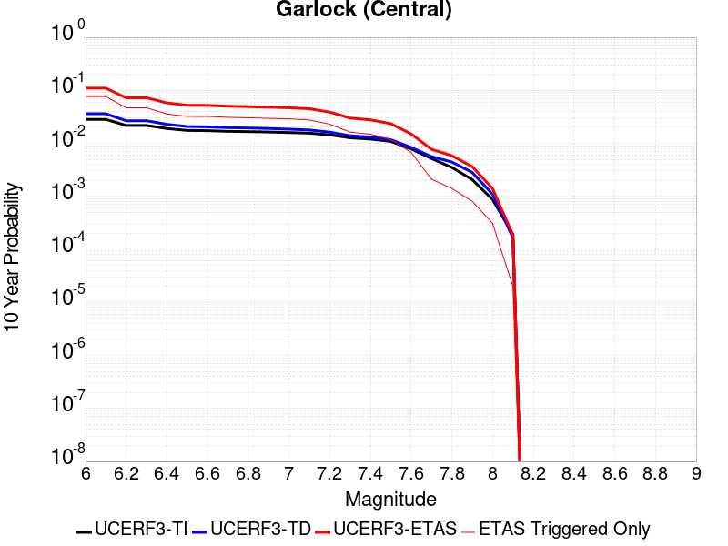
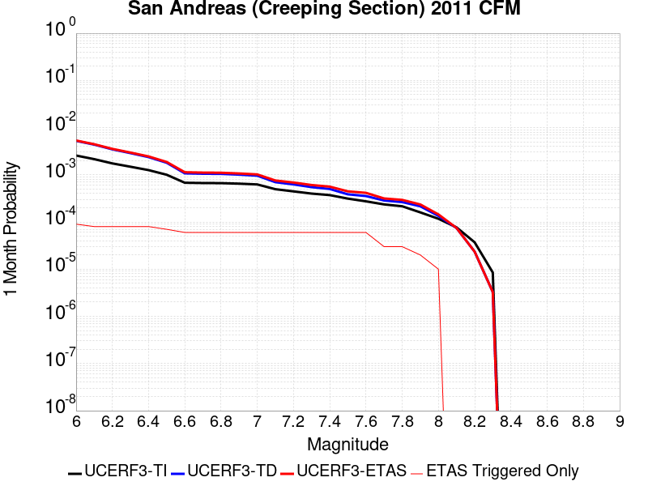

# Parent Section Magnitude-Probability Distributions

Only fault sections with at least one triggered aftershock are plotted. Sections are sorted by total supraseismogenic trigger rate (decreasing)

## Table Of Contents

* [Garlock (Central)](#garlock-central)
* [Tank Canyon](#tank-canyon)
* [Little Lake](#little-lake)
* [Airport Lake](#airport-lake)
* [Owl Lake](#owl-lake)
* [Panamint Valley](#panamint-valley)
* [Garlock (East)](#garlock-east)
* [Hunter Mountain-Saline Valley](#hunter-mountain-saline-valley)
* [Garlock (West)](#garlock-west)
* [Blackwater](#blackwater)
* [Ash Hill](#ash-hill)
* [San Andreas (Mojave N)](#san-andreas-mojave-n)
* [Gravel Hills-Harper Lk](#gravel-hills-harper-lk)
* [McLean Lake](#mclean-lake)
* [San Andreas (Mojave S)](#san-andreas-mojave-s)
* [Towne Pass](#towne-pass)
* [Coyote Canyon](#coyote-canyon)
* [Paradise](#paradise)
* [Death Valley (So)](#death-valley-so)
* [So Sierra Nevada](#so-sierra-nevada)
* [Lenwood-Lockhart-Old Woman Springs](#lenwood-lockhart-old-woman-springs)
* [San Andreas (Carrizo) rev](#san-andreas-carrizo-rev)
* [Death Valley (Black Mtns Frontal)](#death-valley-black-mtns-frontal)
* [San Andreas (Creeping Section) 2011 CFM](#san-andreas-creeping-section-2011-cfm)
* [San Andreas (Parkfield)](#san-andreas-parkfield)
* [San Andreas (Big Bend)](#san-andreas-big-bend)
* [San Jacinto (San Bernardino)](#san-jacinto-san-bernardino)
* [Lake Isabella (Seismicity)](#lake-isabella-seismicity)
* [White Wolf (Extension)](#white-wolf-extension)
* [Garlic Springs](#garlic-springs)
* [Goldstone Lake](#goldstone-lake)
* [Elsinore (Glen Ivy) rev](#elsinore-glen-ivy-rev)
* [San Andreas (San Bernardino N)](#san-andreas-san-bernardino-n)
* [Bicycle Lake](#bicycle-lake)
* [Coyote Lake](#coyote-lake)
* [San Andreas (Cholame) rev](#san-andreas-cholame-rev)
* [Camp Rock 2011](#camp-rock-2011)

## Garlock (Central)
*[(top)](#table-of-contents)*

| 1 Week | 1 Month | 1 Year | 10 Year |
|-----|-----|-----|-----|
|  |  |  |  |

| Magnitude | 1 wk TI Prob | 1 wk TD Prob | 1 wk ETAS Prob | 1 wk ETAS/TD Gain | 1 wk ETAS Triggered Only | 1 mo TI Prob | 1 mo TD Prob | 1 mo ETAS Prob | 1 mo ETAS/TD Gain | 1 mo ETAS Triggered Only | 1 yr TI Prob | 1 yr TD Prob | 1 yr ETAS Prob | 1 yr ETAS/TD Gain | 1 yr ETAS Triggered Only | 10 yr TI Prob | 10 yr TD Prob | 10 yr ETAS Prob | 10 yr ETAS/TD Gain | 10 yr ETAS Triggered Only |
|-----|-----|-----|-----|-----|-----|-----|-----|-----|-----|-----|-----|-----|-----|-----|-----|-----|-----|-----|-----|-----|
| 6.0 | 5.5131142E-5 | 7.024681E-5 | 0.06378852 | 908.06287 | 0.06372275 | 2.3625491E-4 | 3.010234E-4 | 0.07182784 | 238.61215 | 0.07154835 | 0.0028726095 | 0.0036588663 | 0.083299324 | 22.76643 | 0.07993292 | 0.028357591 | 0.036079824 | 0.11743922 | 3.254983 | 0.08440469 |
| 6.1 | 5.5131142E-5 | 7.024681E-5 | 0.06378852 | 908.06287 | 0.06372275 | 2.3625491E-4 | 3.010234E-4 | 0.07182784 | 238.61215 | 0.07154835 | 0.0028726095 | 0.0036588663 | 0.083299324 | 22.76643 | 0.07993292 | 0.028357591 | 0.036079824 | 0.11743922 | 3.254983 | 0.08440469 |
| 6.2 | 4.216245E-5 | 5.1661493E-5 | 0.043090243 | 834.0882 | 0.043040805 | 1.806837E-4 | 2.2138779E-4 | 0.047164597 | 213.04065 | 0.046953604 | 0.0021976046 | 0.0026920962 | 0.055093966 | 20.46508 | 0.05254332 | 0.021759989 | 0.026689773 | 0.08055099 | 3.0180469 | 0.055338178 |
| 6.3 | 4.216245E-5 | 5.1661493E-5 | 0.043090243 | 834.0882 | 0.043040805 | 1.806837E-4 | 2.2138779E-4 | 0.047164597 | 213.04065 | 0.046953604 | 0.0021976046 | 0.0026920962 | 0.055093966 | 20.46508 | 0.05254332 | 0.021759989 | 0.026689773 | 0.08055099 | 3.0180469 | 0.055338178 |
| 6.4 | 3.6858168E-5 | 4.411054E-5 | 0.03358092 | 761.29016 | 0.03353829 | 1.5795401E-4 | 1.8903162E-4 | 0.037074175 | 196.12685 | 0.03689212 | 0.0019213937 | 0.002299056 | 0.04301016 | 18.707748 | 0.04080492 | 0.019048655 | 0.02284894 | 0.06545251 | 2.8645751 | 0.043599777 |
| 6.5 | 3.39199E-5 | 4.0018083E-5 | 0.03134117 | 783.1752 | 0.031302404 | 1.453629E-4 | 1.7149492E-4 | 0.034821782 | 203.0485 | 0.034656234 | 0.0017683565 | 0.002085973 | 0.040016748 | 19.183731 | 0.03801006 | 0.017543508 | 0.020759864 | 0.06071768 | 2.9247627 | 0.04080492 |
| 6.6 | 3.3571985E-5 | 3.9472274E-5 | 0.03078169 | 779.83075 | 0.030743431 | 1.4387199E-4 | 1.6915603E-4 | 0.03426065 | 202.53874 | 0.03409726 | 0.0017502342 | 0.0020575512 | 0.039431583 | 19.164328 | 0.03745109 | 0.017365133 | 0.020481179 | 0.059902843 | 2.9247751 | 0.040245946 |
| 6.7 | 3.2580007E-5 | 3.8088703E-5 | 0.030221399 | 793.4479 | 0.03018446 | 1.3962112E-4 | 1.632272E-4 | 0.03313716 | 203.0125 | 0.032979317 | 0.0016985617 | 0.0019855013 | 0.03824651 | 19.262897 | 0.036333147 | 0.016856372 | 0.019773813 | 0.05758019 | 2.9119415 | 0.038569033 |
| 6.8 | 3.2185937E-5 | 3.7515918E-5 | 0.029102944 | 775.74915 | 0.029066518 | 1.3793244E-4 | 1.6077272E-4 | 0.031458143 | 195.66841 | 0.031302404 | 0.0016780337 | 0.001955672 | 0.03654413 | 18.686226 | 0.034656234 | 0.016654192 | 0.019480614 | 0.055654053 | 2.856894 | 0.03689212 |
| 6.9 | 3.165394E-5 | 3.6720503E-5 | 0.028543219 | 777.3101 | 0.028507546 | 1.3565269E-4 | 1.5736422E-4 | 0.030895958 | 196.33408 | 0.030743431 | 0.0016503202 | 0.001914247 | 0.03594624 | 18.778265 | 0.03409726 | 0.01638118 | 0.019073246 | 0.05416509 | 2.8398466 | 0.035774175 |
| 7.0 | 3.0903822E-5 | 3.5625766E-5 | 0.028542155 | 801.16614 | 0.028507546 | 1.3243823E-4 | 1.5267303E-4 | 0.030891411 | 202.33705 | 0.030743431 | 0.0016112428 | 0.0018572307 | 0.035891164 | 19.325098 | 0.03409726 | 0.015996104 | 0.018512413 | 0.05362432 | 2.8966684 | 0.035774175 |
| 7.1 | 3.0069863E-5 | 3.4392073E-5 | 0.027423054 | 797.36554 | 0.027389603 | 1.2886449E-4 | 1.4738638E-4 | 0.02920962 | 198.18398 | 0.029066518 | 0.0015677959 | 0.0017929734 | 0.03415519 | 19.049469 | 0.03242035 | 0.01556781 | 0.017880075 | 0.051367674 | 2.8729005 | 0.03409726 |
| 7.2 | 2.7957109E-5 | 3.128145E-5 | 0.025743166 | 822.953 | 0.02571269 | 1.1981068E-4 | 1.340566E-4 | 0.027519988 | 205.28635 | 0.027389603 | 0.0014577188 | 0.0016309366 | 0.03232423 | 19.819426 | 0.030743431 | 0.014481937 | 0.016283695 | 0.048176117 | 2.9585495 | 0.03242035 |
| 7.3 | 2.4519275E-5 | 2.6714795E-5 | 0.016795412 | 628.69324 | 0.016769145 | 1.0507837E-4 | 1.1448703E-4 | 0.017999526 | 157.2189 | 0.017887088 | 0.0012785783 | 0.001393003 | 0.022046138 | 15.826339 | 0.020681946 | 0.012712469 | 0.013928054 | 0.03542431 | 2.5433786 | 0.021799888 |
| 7.4 | 2.3225532E-5 | 2.51994E-5 | 0.015676007 | 622.07855 | 0.015651202 | 9.95342E-5 | 1.0799304E-4 | 0.016875327 | 156.26309 | 0.016769145 | 0.0012111551 | 0.0013140367 | 0.020852331 | 15.868912 | 0.019564003 | 0.012045753 | 0.013145725 | 0.03355579 | 2.5526009 | 0.020681946 |
| 7.5 | 2.097765E-5 | 2.2483688E-5 | 0.01231958 | 547.93414 | 0.012297373 | 8.9901114E-5 | 9.635517E-5 | 0.012951461 | 134.41376 | 0.012856345 | 0.0010939965 | 0.0011725046 | 0.015688723 | 13.380521 | 0.014533259 | 0.010886264 | 0.011740365 | 0.027207816 | 2.317459 | 0.015651202 |
| 7.6 | 1.511254E-5 | 1.5991332E-5 | 0.0050466545 | 315.58685 | 0.0050307433 | 6.476642E-5 | 6.853253E-5 | 0.0056578643 | 82.55736 | 0.0055897147 | 7.882459E-4 | 8.3407195E-4 | 0.007536135 | 9.035354 | 0.006707658 | 0.007854558 | 0.008383559 | 0.015589268 | 1.8595048 | 0.0072666295 |
| 7.7 | 9.934069E-6 | 1.0678794E-5 | 0.0016875754 | 158.03053 | 0.0016769145 | 4.2573887E-5 | 4.5765457E-5 | 0.0017226032 | 37.639812 | 0.0016769145 | 5.182138E-4 | 5.570524E-4 | 0.0022330326 | 4.0086584 | 0.0016769145 | 0.00517007 | 0.005627684 | 0.007850987 | 1.3950654 | 0.002235886 |
| 7.8 | 6.7562896E-6 | 8.428449E-6 | 0.0016853288 | 199.95717 | 0.0016769145 | 2.8955206E-5 | 3.6121426E-5 | 0.0017129753 | 47.422695 | 0.0016769145 | 3.5247262E-4 | 4.3968976E-4 | 0.0021158669 | 4.8121815 | 0.0016769145 | 0.0035191406 | 0.004446654 | 0.006116112 | 1.3754413 | 0.0016769145 |
| 7.9 | 3.975453E-6 | 5.37103E-6 | 5.643395E-4 | 105.071 | 5.589715E-4 | 1.7037546E-5 | 2.3018498E-5 | 5.8197713E-4 | 25.283018 | 5.589715E-4 | 2.0741238E-4 | 2.8021427E-4 | 8.3902915E-4 | 2.9942412 | 5.589715E-4 | 0.002072189 | 0.0028336283 | 0.0033910158 | 1.1967045 | 5.589715E-4 |
| 8.0 | 1.6729537E-6 | 2.0775144E-6 | 2.0775144E-6 | 1.0 | 0.0 | 7.169782E-6 | 8.903603E-6 | 8.903603E-6 | 1.0 | 0.0 | 8.7288594E-5 | 1.0839601E-4 | 1.0839601E-4 | 1.0 | 0.0 | 8.7254314E-4 | 0.0010969337 | 0.0010969337 | 1.0 | 0.0 |
| 8.1 | 3.6733252E-7 | 3.1489964E-7 | 3.1489964E-7 | 1.0 | 0.0 | 1.5742813E-6 | 1.3495693E-6 | 1.3495693E-6 | 1.0 | 0.0 | 1.9166706E-5 | 1.6430899E-5 | 1.6430899E-5 | 1.0 | 0.0 | 1.9165053E-4 | 1.6638759E-4 | 1.6638759E-4 | 1.0 | 0.0 |

## Tank Canyon
*[(top)](#table-of-contents)*

| 1 Week | 1 Month | 1 Year | 10 Year |
|-----|-----|-----|-----|
|  |  |  |  |

| Magnitude | 1 wk TI Prob | 1 wk TD Prob | 1 wk ETAS Prob | 1 wk ETAS/TD Gain | 1 wk ETAS Triggered Only | 1 mo TI Prob | 1 mo TD Prob | 1 mo ETAS Prob | 1 mo ETAS/TD Gain | 1 mo ETAS Triggered Only | 1 yr TI Prob | 1 yr TD Prob | 1 yr ETAS Prob | 1 yr ETAS/TD Gain | 1 yr ETAS Triggered Only | 10 yr TI Prob | 10 yr TD Prob | 10 yr ETAS Prob | 10 yr ETAS/TD Gain | 10 yr ETAS Triggered Only |
|-----|-----|-----|-----|-----|-----|-----|-----|-----|-----|-----|-----|-----|-----|-----|-----|-----|-----|-----|-----|-----|
| 6.0 | 4.8284557E-5 | 5.7964822E-5 | 0.03303537 | 569.921 | 0.032979317 | 2.0691741E-4 | 2.4840087E-4 | 0.038807854 | 156.23076 | 0.038569033 | 0.0025163088 | 0.0030207601 | 0.045931548 | 15.205295 | 0.043040805 | 0.02488006 | 0.029863637 | 0.07541504 | 2.5253131 | 0.046953604 |
| 6.1 | 1.7796336E-5 | 2.0873314E-5 | 0.012876949 | 616.90967 | 0.012856345 | 7.626778E-5 | 8.945422E-5 | 0.014621413 | 163.45135 | 0.014533259 | 9.281647E-4 | 0.0010885983 | 0.017839488 | 16.387577 | 0.016769145 | 0.009242975 | 0.010836744 | 0.028529994 | 2.632709 | 0.017887088 |
| 6.2 | 1.7796336E-5 | 2.0873314E-5 | 0.012876949 | 616.90967 | 0.012856345 | 7.626778E-5 | 8.945422E-5 | 0.014621413 | 163.45135 | 0.014533259 | 9.281647E-4 | 0.0010885983 | 0.017839488 | 16.387577 | 0.016769145 | 0.009242975 | 0.010836744 | 0.028529994 | 2.632709 | 0.017887088 |
| 6.3 | 1.3515912E-5 | 1.5759564E-5 | 0.0067233117 | 426.61786 | 0.006707658 | 5.792405E-5 | 6.753938E-5 | 0.007892611 | 116.859406 | 0.007825601 | 7.049971E-4 | 8.2200574E-4 | 0.01031671 | 12.550654 | 0.009502515 | 0.007027647 | 0.0081922645 | 0.018171325 | 2.2181077 | 0.010061487 |
| 6.4 | 1.0870146E-5 | 1.2618021E-5 | 0.003925369 | 311.0923 | 0.0039128005 | 4.658551E-5 | 5.4076212E-5 | 0.0045256065 | 83.68941 | 0.004471772 | 5.67031E-4 | 6.581969E-4 | 0.0068028364 | 10.335564 | 0.0061486866 | 0.005655863 | 0.0065644905 | 0.013228117 | 2.0151017 | 0.006707658 |
| 6.5 | 7.964826E-6 | 9.196094E-6 | 0.0016860951 | 183.34906 | 0.0016769145 | 3.4134522E-5 | 3.9411298E-5 | 0.0017162596 | 43.547405 | 0.0016769145 | 4.1550855E-4 | 4.7973756E-4 | 0.0038319575 | 7.9876122 | 0.003353829 | 0.0041473247 | 0.004788321 | 0.008682386 | 1.8132422 | 0.0039128005 |
| 6.6 | 6.6317E-6 | 7.6122988E-6 | 0.001684514 | 221.28848 | 0.0016769145 | 2.8421264E-5 | 3.2623782E-5 | 0.0017094836 | 52.39992 | 0.0016769145 | 3.4597394E-4 | 3.9713128E-4 | 0.0026321292 | 6.627857 | 0.002235886 | 0.0034543579 | 0.003965368 | 0.006749143 | 1.7020218 | 0.0027948574 |
| 6.7 | 4.793663E-6 | 5.4307857E-6 | 5.4307857E-6 | 1.0 | 0.0 | 2.0544108E-5 | 2.3274613E-5 | 2.3274613E-5 | 1.0 | 0.0 | 2.500958E-4 | 2.8333595E-4 | 8.421491E-4 | 2.9722633 | 5.589715E-4 | 0.0024981452 | 0.0028304397 | 0.003387829 | 1.1969268 | 5.589715E-4 |
| 6.8 | 4.382823E-6 | 4.9692567E-6 | 4.9692567E-6 | 1.0 | 0.0 | 1.8783392E-5 | 2.1296666E-5 | 2.1296666E-5 | 1.0 | 0.0 | 2.286638E-4 | 2.5926033E-4 | 8.180869E-4 | 3.1554651 | 5.589715E-4 | 0.0022842865 | 0.002590253 | 0.0031477765 | 1.215239 | 5.589715E-4 |
| 6.9 | 2.729601E-6 | 3.0735416E-6 | 3.0735416E-6 | 1.0 | 0.0 | 1.1698237E-5 | 1.3172262E-5 | 1.3172262E-5 | 1.0 | 0.0 | 1.4241673E-4 | 1.6036171E-4 | 1.6036171E-4 | 1.0 | 0.0 | 0.001423255 | 0.0016026258 | 0.0016026258 | 1.0 | 0.0 |
| 7.0 | 1.8987357E-6 | 2.126939E-6 | 2.126939E-6 | 1.0 | 0.0 | 8.137413E-6 | 9.115425E-6 | 9.115425E-6 | 1.0 | 0.0 | 9.90685E-5 | 1.1097535E-4 | 1.1097535E-4 | 1.0 | 0.0 | 9.902435E-4 | 0.0011092679 | 0.0011092679 | 1.0 | 0.0 |
| 7.1 | 1.4928986E-6 | 1.6641272E-6 | 1.6641272E-6 | 1.0 | 0.0 | 6.398121E-6 | 7.1319573E-6 | 7.1319573E-6 | 1.0 | 0.0 | 7.789434E-5 | 8.682871E-5 | 8.682871E-5 | 1.0 | 0.0 | 7.786704E-4 | 8.6800574E-4 | 8.6800574E-4 | 1.0 | 0.0 |
| 7.2 | 1.069082E-6 | 1.1828573E-6 | 1.1828573E-6 | 1.0 | 0.0 | 4.581772E-6 | 5.0693816E-6 | 5.0693816E-6 | 1.0 | 0.0 | 5.5781646E-5 | 6.171851E-5 | 6.171851E-5 | 1.0 | 0.0 | 5.576765E-4 | 6.170659E-4 | 6.170659E-4 | 1.0 | 0.0 |
| 7.3 | 8.776551E-7 | 9.770005E-7 | 9.770005E-7 | 1.0 | 0.0 | 3.7613736E-6 | 4.1871413E-6 | 4.1871413E-6 | 1.0 | 0.0 | 4.579376E-5 | 5.097777E-5 | 5.097777E-5 | 1.0 | 0.0 | 4.5784327E-4 | 5.097118E-4 | 5.097118E-4 | 1.0 | 0.0 |
| 7.4 | 7.55721E-7 | 8.510244E-7 | 8.510244E-7 | 1.0 | 0.0 | 3.2388E-6 | 3.6472454E-6 | 3.6472454E-6 | 1.0 | 0.0 | 3.9431678E-5 | 4.4404827E-5 | 4.4404827E-5 | 1.0 | 0.0 | 3.942468E-4 | 4.440104E-4 | 4.440104E-4 | 1.0 | 0.0 |
| 7.5 | 5.587665E-7 | 6.305619E-7 | 6.305619E-7 | 1.0 | 0.0 | 2.3947114E-6 | 2.702408E-6 | 2.702408E-6 | 1.0 | 0.0 | 2.915522E-5 | 3.290182E-5 | 3.290182E-5 | 1.0 | 0.0 | 2.9151395E-4 | 3.290182E-4 | 3.290182E-4 | 1.0 | 0.0 |

## Little Lake
*[(top)](#table-of-contents)*

| 1 Week | 1 Month | 1 Year | 10 Year |
|-----|-----|-----|-----|
|  |  |  |  |

| Magnitude | 1 wk TI Prob | 1 wk TD Prob | 1 wk ETAS Prob | 1 wk ETAS/TD Gain | 1 wk ETAS Triggered Only | 1 mo TI Prob | 1 mo TD Prob | 1 mo ETAS Prob | 1 mo ETAS/TD Gain | 1 mo ETAS Triggered Only | 1 yr TI Prob | 1 yr TD Prob | 1 yr ETAS Prob | 1 yr ETAS/TD Gain | 1 yr ETAS Triggered Only | 10 yr TI Prob | 10 yr TD Prob | 10 yr ETAS Prob | 10 yr ETAS/TD Gain | 10 yr ETAS Triggered Only |
|-----|-----|-----|-----|-----|-----|-----|-----|-----|-----|-----|-----|-----|-----|-----|-----|-----|-----|-----|-----|-----|
| 6.0 | 2.8424427E-5 | 3.120572E-5 | 0.027419955 | 878.6836 | 0.027389603 | 1.2181328E-4 | 1.337327E-4 | 0.028637467 | 214.1396 | 0.028507546 | 0.0014820677 | 0.0016271127 | 0.03232052 | 19.863726 | 0.030743431 | 0.014722223 | 0.016165402 | 0.046411853 | 2.871061 | 0.030743431 |
| 6.1 | 2.8424427E-5 | 3.120572E-5 | 0.027419955 | 878.6836 | 0.027389603 | 1.2181328E-4 | 1.337327E-4 | 0.028637467 | 214.1396 | 0.028507546 | 0.0014820677 | 0.0016271127 | 0.03232052 | 19.863726 | 0.030743431 | 0.014722223 | 0.016165402 | 0.046411853 | 2.871061 | 0.030743431 |
| 6.2 | 2.8424427E-5 | 3.120572E-5 | 0.027419955 | 878.6836 | 0.027389603 | 1.2181328E-4 | 1.337327E-4 | 0.028637467 | 214.1396 | 0.028507546 | 0.0014820677 | 0.0016271127 | 0.03232052 | 19.863726 | 0.030743431 | 0.014722223 | 0.016165402 | 0.046411853 | 2.871061 | 0.030743431 |
| 6.3 | 1.48860645E-5 | 1.6081389E-5 | 0.019020807 | 1182.7838 | 0.01900503 | 6.379586E-5 | 6.8918576E-5 | 0.019631572 | 284.85168 | 0.019564003 | 7.7643775E-4 | 8.3878887E-4 | 0.022061888 | 26.302076 | 0.021240916 | 0.007737305 | 0.008359048 | 0.02942241 | 3.519828 | 0.021240916 |
| 6.4 | 1.48860645E-5 | 1.6081389E-5 | 0.019020807 | 1182.7838 | 0.01900503 | 6.379586E-5 | 6.8918576E-5 | 0.019631572 | 284.85168 | 0.019564003 | 7.7643775E-4 | 8.3878887E-4 | 0.022061888 | 26.302076 | 0.021240916 | 0.007737305 | 0.008359048 | 0.02942241 | 3.519828 | 0.021240916 |
| 6.5 | 1.2797581E-5 | 1.3765565E-5 | 0.018459572 | 1340.9962 | 0.01844606 | 5.4845623E-5 | 5.899409E-5 | 0.018503966 | 313.65796 | 0.01844606 | 6.675408E-4 | 7.18042E-4 | 0.020826567 | 29.004662 | 0.020122973 | 0.006655392 | 0.00715977 | 0.027138667 | 3.7904384 | 0.020122973 |
| 6.6 | 9.661896E-6 | 1.0289038E-5 | 0.01677926 | 1630.7902 | 0.016769145 | 4.1407468E-5 | 4.409522E-5 | 0.016812501 | 381.27716 | 0.016769145 | 5.040193E-4 | 5.367433E-4 | 0.018414231 | 34.30733 | 0.017887088 | 0.005028777 | 0.0053560743 | 0.023147358 | 4.321702 | 0.017887088 |
| 6.7 | 7.767871E-6 | 8.199687E-6 | 0.013982372 | 1705.2325 | 0.013974288 | 3.329045E-5 | 3.5141118E-5 | 0.014008937 | 398.64804 | 0.013974288 | 4.0523586E-4 | 4.2777284E-4 | 0.015513547 | 36.265854 | 0.01509223 | 0.004044977 | 0.004270846 | 0.01929862 | 4.5186877 | 0.01509223 |
| 6.8 | 6.4235196E-6 | 6.7357446E-6 | 0.009509187 | 1411.75 | 0.009502515 | 2.752908E-5 | 2.8867229E-5 | 0.009531109 | 330.17053 | 0.009502515 | 3.35115E-4 | 3.5141467E-4 | 0.010409365 | 29.621319 | 0.010061487 | 0.003346101 | 0.00350985 | 0.013536023 | 3.8565814 | 0.010061487 |
| 6.9 | 3.1283696E-6 | 3.1121804E-6 | 0.0061517796 | 1976.6782 | 0.0061486866 | 1.3407229E-5 | 1.3337856E-5 | 0.006161942 | 461.98895 | 0.0061486866 | 1.6322079E-4 | 1.6237781E-4 | 0.0068689464 | 42.30225 | 0.006707658 | 0.0016310095 | 0.00162274 | 0.008319513 | 5.1268306 | 0.006707658 |
| 7.0 | 2.290603E-6 | 2.2286815E-6 | 0.0033560502 | 1505.8456 | 0.003353829 | 9.816834E-6 | 9.551463E-6 | 0.0033633483 | 352.12912 | 0.003353829 | 1.19513395E-4 | 1.162839E-4 | 0.0040286295 | 34.64477 | 0.0039128005 | 0.0011944914 | 0.0011623327 | 0.0050705853 | 4.3624215 | 0.0039128005 |
| 7.1 | 1.293693E-6 | 1.1776827E-6 | 0.0016780902 | 1424.9084 | 0.0016769145 | 5.5443866E-6 | 5.0472063E-6 | 0.0016819532 | 333.24442 | 0.0016769145 | 6.750081E-5 | 6.14487E-5 | 0.0017382602 | 28.287989 | 0.0016769145 | 6.7480316E-4 | 6.143856E-4 | 0.0022902698 | 3.7277403 | 0.0016769145 |
| 7.2 | 4.715842E-7 | 3.0917857E-7 | 3.0917857E-7 | 1.0 | 0.0 | 2.0210737E-6 | 1.3250503E-6 | 1.3250503E-6 | 1.0 | 0.0 | 2.4606294E-5 | 1.6132375E-5 | 1.6132375E-5 | 1.0 | 0.0 | 2.460357E-4 | 1.6131258E-4 | 1.6131258E-4 | 1.0 | 0.0 |
| 7.3 | 3.9430947E-7 | 2.3097488E-7 | 2.3097488E-7 | 1.0 | 0.0 | 1.6898966E-6 | 9.89892E-7 | 9.89892E-7 | 1.0 | 0.0 | 2.0574296E-5 | 1.2051869E-5 | 1.2051869E-5 | 1.0 | 0.0 | 2.0572392E-4 | 1.20512224E-4 | 1.20512224E-4 | 1.0 | 0.0 |
| 7.4 | 3.547123E-7 | 1.9679135E-7 | 1.9679135E-7 | 1.0 | 0.0 | 1.5201948E-6 | 8.4339126E-7 | 8.4339126E-7 | 1.0 | 0.0 | 1.8508214E-5 | 1.0268241E-5 | 1.0268241E-5 | 1.0 | 0.0 | 1.8506673E-4 | 1.02677724E-4 | 1.02677724E-4 | 1.0 | 0.0 |
| 7.5 | 2.6354266E-7 | 1.4423138E-7 | 1.4423138E-7 | 1.0 | 0.0 | 1.129468E-6 | 6.181344E-7 | 6.181344E-7 | 1.0 | 0.0 | 1.3751187E-5 | 7.5257603E-6 | 7.5257603E-6 | 1.0 | 0.0 | 1.3750336E-4 | 7.5255106E-5 | 7.5255106E-5 | 1.0 | 0.0 |
| 7.6 | 1.269913E-7 | 7.572556E-8 | 7.572556E-8 | 1.0 | 0.0 | 5.4424834E-7 | 3.245381E-7 | 3.245381E-7 | 1.0 | 0.0 | 6.6262032E-6 | 3.9512443E-6 | 3.9512443E-6 | 1.0 | 0.0 | 6.626006E-5 | 3.9511775E-5 | 3.9511775E-5 | 1.0 | 0.0 |

## Airport Lake
*[(top)](#table-of-contents)*

| 1 Week | 1 Month | 1 Year | 10 Year |
|-----|-----|-----|-----|
|  |  |  |  |

| Magnitude | 1 wk TI Prob | 1 wk TD Prob | 1 wk ETAS Prob | 1 wk ETAS/TD Gain | 1 wk ETAS Triggered Only | 1 mo TI Prob | 1 mo TD Prob | 1 mo ETAS Prob | 1 mo ETAS/TD Gain | 1 mo ETAS Triggered Only | 1 yr TI Prob | 1 yr TD Prob | 1 yr ETAS Prob | 1 yr ETAS/TD Gain | 1 yr ETAS Triggered Only | 10 yr TI Prob | 10 yr TD Prob | 10 yr ETAS Prob | 10 yr ETAS/TD Gain | 10 yr ETAS Triggered Only |
|-----|-----|-----|-----|-----|-----|-----|-----|-----|-----|-----|-----|-----|-----|-----|-----|-----|-----|-----|-----|-----|
| 6.0 | 1.2387061E-5 | 1.3103157E-5 | 0.023489598 | 1792.6671 | 0.023476802 | 5.3086325E-5 | 5.615534E-5 | 0.02409058 | 428.99893 | 0.024035774 | 6.461343E-4 | 6.8350515E-4 | 0.02582003 | 37.77591 | 0.025153717 | 0.0064425888 | 0.0068168393 | 0.03290941 | 4.827664 | 0.02627166 |
| 6.1 | 1.2387061E-5 | 1.3103157E-5 | 0.023489598 | 1792.6671 | 0.023476802 | 5.3086325E-5 | 5.615534E-5 | 0.02409058 | 428.99893 | 0.024035774 | 6.461343E-4 | 6.8350515E-4 | 0.02582003 | 37.77591 | 0.025153717 | 0.0064425888 | 0.0068168393 | 0.03290941 | 4.827664 | 0.02627166 |
| 6.2 | 1.2387061E-5 | 1.3103157E-5 | 0.023489598 | 1792.6671 | 0.023476802 | 5.3086325E-5 | 5.615534E-5 | 0.02409058 | 428.99893 | 0.024035774 | 6.461343E-4 | 6.8350515E-4 | 0.02582003 | 37.77591 | 0.025153717 | 0.0064425888 | 0.0068168393 | 0.03290941 | 4.827664 | 0.02627166 |
| 6.3 | 1.2387061E-5 | 1.3103157E-5 | 0.023489598 | 1792.6671 | 0.023476802 | 5.3086325E-5 | 5.615534E-5 | 0.02409058 | 428.99893 | 0.024035774 | 6.461343E-4 | 6.8350515E-4 | 0.02582003 | 37.77591 | 0.025153717 | 0.0064425888 | 0.0068168393 | 0.03290941 | 4.827664 | 0.02627166 |
| 6.4 | 1.2387061E-5 | 1.3103157E-5 | 0.023489598 | 1792.6671 | 0.023476802 | 5.3086325E-5 | 5.615534E-5 | 0.02409058 | 428.99893 | 0.024035774 | 6.461343E-4 | 6.8350515E-4 | 0.02582003 | 37.77591 | 0.025153717 | 0.0064425888 | 0.0068168393 | 0.03290941 | 4.827664 | 0.02627166 |
| 6.5 | 6.9922594E-6 | 7.384925E-6 | 0.018453307 | 2498.7805 | 0.01844606 | 2.996648E-5 | 3.1649324E-5 | 0.018477125 | 583.80786 | 0.01844606 | 3.6478083E-4 | 3.8526783E-4 | 0.019941732 | 51.7607 | 0.019564003 | 0.003641826 | 0.0038465366 | 0.023335285 | 6.0665703 | 0.019564003 |
| 6.6 | 6.9922594E-6 | 7.384925E-6 | 0.018453307 | 2498.7805 | 0.01844606 | 2.996648E-5 | 3.1649324E-5 | 0.018477125 | 583.80786 | 0.01844606 | 3.6478083E-4 | 3.8526783E-4 | 0.019941732 | 51.7607 | 0.019564003 | 0.003641826 | 0.0038465366 | 0.023335285 | 6.0665703 | 0.019564003 |
| 6.7 | 5.477277E-6 | 5.7860684E-6 | 0.0145389605 | 2512.753 | 0.014533259 | 2.3473833E-5 | 2.4797222E-5 | 0.014557696 | 587.0696 | 0.014533259 | 2.8575645E-4 | 3.0186825E-4 | 0.015948346 | 52.832138 | 0.015651202 | 0.0028538927 | 0.003014966 | 0.01861898 | 6.1755195 | 0.015651202 |
| 6.8 | 3.9950432E-6 | 4.2190873E-6 | 0.010065664 | 2385.7444 | 0.010061487 | 1.7121502E-5 | 1.8081691E-5 | 0.010079387 | 557.43604 | 0.010061487 | 2.0843433E-4 | 2.2012512E-4 | 0.010838246 | 49.23675 | 0.010620458 | 0.0020823893 | 0.0021993418 | 0.012796442 | 5.8183055 | 0.010620458 |
| 6.9 | 2.95695E-6 | 3.1230243E-6 | 0.007828699 | 2506.7686 | 0.007825601 | 1.2672582E-5 | 1.3384334E-5 | 0.007838881 | 585.6758 | 0.007825601 | 1.5427776E-4 | 1.6294434E-4 | 0.00854615 | 52.44828 | 0.008384572 | 0.001541707 | 0.0016284712 | 0.00999939 | 6.140354 | 0.008384572 |
| 7.0 | 1.456072E-6 | 1.540812E-6 | 0.0033553645 | 2177.66 | 0.003353829 | 6.2402937E-6 | 6.603469E-6 | 0.0033604102 | 508.8856 | 0.003353829 | 7.597293E-5 | 8.039528E-5 | 0.003992881 | 49.66562 | 0.0039128005 | 7.594696E-4 | 8.0376083E-4 | 0.004713416 | 5.8642025 | 0.0039128005 |
| 7.1 | 6.995192E-7 | 7.4089746E-7 | 0.0016776541 | 2264.354 | 0.0016769145 | 2.997936E-6 | 3.1752747E-6 | 0.0016800844 | 529.1147 | 0.0016769145 | 3.649926E-5 | 3.865897E-5 | 0.0017155086 | 44.375435 | 0.0016769145 | 3.6493264E-4 | 3.865897E-4 | 0.002062856 | 5.3360343 | 0.0016769145 |

## Owl Lake
*[(top)](#table-of-contents)*

| 1 Week | 1 Month | 1 Year | 10 Year |
|-----|-----|-----|-----|
|  |  |  |  |

| Magnitude | 1 wk TI Prob | 1 wk TD Prob | 1 wk ETAS Prob | 1 wk ETAS/TD Gain | 1 wk ETAS Triggered Only | 1 mo TI Prob | 1 mo TD Prob | 1 mo ETAS Prob | 1 mo ETAS/TD Gain | 1 mo ETAS Triggered Only | 1 yr TI Prob | 1 yr TD Prob | 1 yr ETAS Prob | 1 yr ETAS/TD Gain | 1 yr ETAS Triggered Only | 10 yr TI Prob | 10 yr TD Prob | 10 yr ETAS Prob | 10 yr ETAS/TD Gain | 10 yr ETAS Triggered Only |
|-----|-----|-----|-----|-----|-----|-----|-----|-----|-----|-----|-----|-----|-----|-----|-----|-----|-----|-----|-----|-----|
| 6.0 | 5.0320643E-5 | 6.635816E-5 | 0.01795226 | 270.53583 | 0.017887088 | 2.1564208E-4 | 2.843674E-4 | 0.018725181 | 65.84856 | 0.01844606 | 0.0026222812 | 0.0034577388 | 0.024068171 | 6.9606676 | 0.020681946 | 0.02591553 | 0.034140717 | 0.05573623 | 1.6325442 | 0.022358859 |
| 6.1 | 5.0320643E-5 | 6.635816E-5 | 0.01795226 | 270.53583 | 0.017887088 | 2.1564208E-4 | 2.843674E-4 | 0.018725181 | 65.84856 | 0.01844606 | 0.0026222812 | 0.0034577388 | 0.024068171 | 6.9606676 | 0.020681946 | 0.02591553 | 0.034140717 | 0.05573623 | 1.6325442 | 0.022358859 |
| 6.2 | 2.4125871E-5 | 3.0981035E-5 | 0.011769019 | 379.87814 | 0.011738401 | 1.0339249E-4 | 1.3277028E-4 | 0.01242851 | 93.60913 | 0.012297373 | 0.0012580766 | 0.001615439 | 0.015567152 | 9.636484 | 0.013974288 | 0.012509781 | 0.016070465 | 0.031470142 | 1.9582598 | 0.015651202 |
| 6.3 | 1.7433485E-5 | 2.2355514E-5 | 0.011760495 | 526.06683 | 0.011738401 | 7.471279E-5 | 9.580672E-5 | 0.012392001 | 129.34377 | 0.012297373 | 9.0924866E-4 | 0.0011659743 | 0.015123968 | 12.971099 | 0.013974288 | 0.009055373 | 0.011628896 | 0.02654562 | 2.2827291 | 0.01509223 |
| 6.4 | 1.7433485E-5 | 2.2355514E-5 | 0.011760495 | 526.06683 | 0.011738401 | 7.471279E-5 | 9.580672E-5 | 0.012392001 | 129.34377 | 0.012297373 | 9.0924866E-4 | 0.0011659743 | 0.015123968 | 12.971099 | 0.013974288 | 0.009055373 | 0.011628896 | 0.02654562 | 2.2827291 | 0.01509223 |
| 6.5 | 1.5182742E-5 | 1.9429144E-5 | 0.011757602 | 605.15283 | 0.011738401 | 6.506727E-5 | 8.326596E-5 | 0.012379615 | 148.67558 | 0.012297373 | 7.919061E-4 | 0.0010134429 | 0.014973568 | 14.77495 | 0.013974288 | 0.0078909 | 0.010118429 | 0.02505795 | 2.4764664 | 0.01509223 |
| 6.6 | 6.7271576E-6 | 8.547361E-6 | 0.010628915 | 1243.5317 | 0.010620458 | 2.8830356E-5 | 3.6631063E-5 | 0.011215651 | 306.17868 | 0.0111794295 | 3.5095305E-4 | 4.458976E-4 | 0.012179065 | 27.313591 | 0.011738401 | 0.0035039932 | 0.004467813 | 0.01615377 | 3.6155877 | 0.011738401 |
| 6.7 | 6.682835E-6 | 8.479807E-6 | 0.010628848 | 1253.4304 | 0.010620458 | 2.8640408E-5 | 3.6341557E-5 | 0.0112153655 | 308.60992 | 0.0111794295 | 3.4864116E-4 | 4.4237426E-4 | 0.012175583 | 27.523262 | 0.011738401 | 0.003480947 | 0.0044327388 | 0.016119108 | 3.6363764 | 0.011738401 |
| 6.8 | 6.5774975E-6 | 8.32628E-6 | 0.0106286965 | 1276.5239 | 0.010620458 | 2.8188972E-5 | 3.5683603E-5 | 0.0112147145 | 314.282 | 0.0111794295 | 3.4314668E-4 | 4.343669E-4 | 0.01216767 | 28.012423 | 0.011738401 | 0.0034261728 | 0.004352885 | 0.016040191 | 3.6849563 | 0.011738401 |
| 6.9 | 6.363419E-6 | 7.999454E-6 | 0.010628372 | 1328.6372 | 0.010620458 | 2.727151E-5 | 3.428296E-5 | 0.01121333 | 327.08173 | 0.0111794295 | 3.3198006E-4 | 4.1732067E-4 | 0.012150823 | 29.116276 | 0.011738401 | 0.0033148455 | 0.0041828766 | 0.015872179 | 3.7945604 | 0.011738401 |
| 7.0 | 6.1342453E-6 | 7.6316555E-6 | 0.010628009 | 1392.6217 | 0.010620458 | 2.6289357E-5 | 3.2706717E-5 | 0.011211771 | 342.7972 | 0.0111794295 | 3.2002592E-4 | 3.9813702E-4 | 0.012131865 | 30.471582 | 0.011738401 | 0.0031956544 | 0.003991571 | 0.015683118 | 3.9290593 | 0.011738401 |
| 7.1 | 5.842926E-6 | 7.142211E-6 | 0.0095095895 | 1331.463 | 0.009502515 | 2.504087E-5 | 3.0609146E-5 | 0.010091788 | 329.69843 | 0.010061487 | 3.0482994E-4 | 3.7260808E-4 | 0.010989109 | 29.492409 | 0.010620458 | 0.0030441214 | 0.0037370329 | 0.014317802 | 3.8313289 | 0.010620458 |
| 7.2 | 4.77173E-6 | 5.358483E-6 | 0.007830918 | 1461.4056 | 0.007825601 | 2.045011E-5 | 2.2964748E-5 | 0.008407345 | 366.0978 | 0.008384572 | 2.4895166E-4 | 2.79564E-4 | 0.009220608 | 32.982098 | 0.008943544 | 0.0024867293 | 0.002808645 | 0.0117270695 | 4.175348 | 0.008943544 |
| 7.3 | 3.0494948E-6 | 2.710463E-6 | 0.0016796204 | 619.68024 | 0.0016769145 | 1.3069198E-5 | 1.1616219E-5 | 0.0022474763 | 193.47743 | 0.002235886 | 1.5910587E-4 | 1.4141845E-4 | 0.0023769883 | 16.808191 | 0.002235886 | 0.0015899199 | 0.0014232415 | 0.0036559452 | 2.5687456 | 0.002235886 |
| 7.4 | 2.7263884E-6 | 2.3056762E-6 | 0.0011202461 | 485.86444 | 0.001117943 | 1.1684469E-5 | 9.881433E-6 | 0.0016867793 | 170.7019 | 0.0016769145 | 1.4224913E-4 | 1.20299905E-4 | 0.0017970126 | 14.937773 | 0.0016769145 | 0.0014215811 | 0.0012112238 | 0.0028861072 | 2.3828025 | 0.0016769145 |
| 7.5 | 2.6090431E-6 | 2.1656133E-6 | 0.0011201062 | 517.2236 | 0.001117943 | 1.1181565E-5 | 9.281167E-6 | 0.0011272138 | 121.45173 | 0.001117943 | 1.3612706E-4 | 1.1299244E-4 | 0.0012308091 | 10.892844 | 0.001117943 | 0.001360437 | 0.0011379806 | 0.0022546514 | 1.981274 | 0.001117943 |
| 7.6 | 2.3008756E-6 | 1.8727933E-6 | 5.608432E-4 | 299.46884 | 5.589715E-4 | 9.860858E-6 | 8.0262325E-6 | 5.6699326E-4 | 70.64251 | 5.589715E-4 | 1.20049335E-4 | 9.7715085E-5 | 6.5663195E-4 | 6.7198625 | 5.589715E-4 | 0.001199845 | 9.849932E-4 | 0.0015434141 | 1.5669287 | 5.589715E-4 |
| 7.7 | 1.7184348E-6 | 1.3419171E-6 | 5.6031265E-4 | 417.54642 | 5.589715E-4 | 7.3646997E-6 | 5.7510606E-6 | 5.647193E-4 | 98.19395 | 5.589715E-4 | 8.966153E-5 | 7.0016955E-5 | 6.289493E-4 | 8.982814 | 5.589715E-4 | 8.962536E-4 | 7.078345E-4 | 0.0012664103 | 1.7891334 | 5.589715E-4 |
| 7.8 | 8.4612907E-7 | 8.4058576E-7 | 5.598116E-4 | 665.97797 | 5.589715E-4 | 3.6262625E-6 | 3.6025056E-6 | 5.62572E-4 | 156.16132 | 5.589715E-4 | 4.4148852E-5 | 4.3859643E-5 | 6.028066E-4 | 13.743993 | 5.589715E-4 | 4.414008E-4 | 4.4398365E-4 | 0.0010027069 | 2.2584321 | 5.589715E-4 |
| 7.9 | 2.716738E-7 | 3.768106E-7 | 3.768106E-7 | 1.0 | 0.0 | 1.1643157E-6 | 1.6149015E-6 | 1.6149015E-6 | 1.0 | 0.0 | 1.4175452E-5 | 1.966126E-5 | 1.966126E-5 | 1.0 | 0.0 | 1.4174548E-4 | 1.9836679E-4 | 1.9836679E-4 | 1.0 | 0.0 |
| 8.0 | 2.1995428E-8 | 3.384878E-8 | 3.384878E-8 | 1.0 | 0.0 | 9.426611E-8 | 1.4506621E-7 | 1.4506621E-7 | 1.0 | 0.0 | 1.1476893E-6 | 1.7661803E-6 | 1.7661803E-6 | 1.0 | 0.0 | 1.14768345E-5 | 1.7963059E-5 | 1.7963059E-5 | 1.0 | 0.0 |

## Panamint Valley
*[(top)](#table-of-contents)*

| 1 Week | 1 Month | 1 Year | 10 Year |
|-----|-----|-----|-----|
|  |  |  |  |

| Magnitude | 1 wk TI Prob | 1 wk TD Prob | 1 wk ETAS Prob | 1 wk ETAS/TD Gain | 1 wk ETAS Triggered Only | 1 mo TI Prob | 1 mo TD Prob | 1 mo ETAS Prob | 1 mo ETAS/TD Gain | 1 mo ETAS Triggered Only | 1 yr TI Prob | 1 yr TD Prob | 1 yr ETAS Prob | 1 yr ETAS/TD Gain | 1 yr ETAS Triggered Only | 10 yr TI Prob | 10 yr TD Prob | 10 yr ETAS Prob | 10 yr ETAS/TD Gain | 10 yr ETAS Triggered Only |
|-----|-----|-----|-----|-----|-----|-----|-----|-----|-----|-----|-----|-----|-----|-----|-----|-----|-----|-----|-----|-----|
| 6.0 | 3.0211835E-5 | 3.3984514E-5 | 0.016802559 | 494.41815 | 0.016769145 | 1.2947287E-4 | 1.4563995E-4 | 0.017471233 | 119.961815 | 0.017328117 | 0.0015751923 | 0.0017717537 | 0.022417055 | 12.652467 | 0.020681946 | 0.015640736 | 0.017583137 | 0.038450573 | 2.186787 | 0.021240916 |
| 6.1 | 3.0211835E-5 | 3.3984514E-5 | 0.016802559 | 494.41815 | 0.016769145 | 1.2947287E-4 | 1.4563995E-4 | 0.017471233 | 119.961815 | 0.017328117 | 0.0015751923 | 0.0017717537 | 0.022417055 | 12.652467 | 0.020681946 | 0.015640736 | 0.017583137 | 0.038450573 | 2.186787 | 0.021240916 |
| 6.2 | 3.0211835E-5 | 3.3984514E-5 | 0.016802559 | 494.41815 | 0.016769145 | 1.2947287E-4 | 1.4563995E-4 | 0.017471233 | 119.961815 | 0.017328117 | 0.0015751923 | 0.0017717537 | 0.022417055 | 12.652467 | 0.020681946 | 0.015640736 | 0.017583137 | 0.038450573 | 2.186787 | 0.021240916 |
| 6.3 | 2.8573924E-5 | 3.210268E-5 | 0.01680071 | 523.3429 | 0.016769145 | 1.2245393E-4 | 1.3757581E-4 | 0.017463308 | 126.93589 | 0.017328117 | 0.001489857 | 0.0016737265 | 0.02176302 | 13.002734 | 0.020122973 | 0.01479908 | 0.016617801 | 0.036956057 | 2.2238839 | 0.020681946 |
| 6.4 | 2.8573924E-5 | 3.210268E-5 | 0.01680071 | 523.3429 | 0.016769145 | 1.2245393E-4 | 1.3757581E-4 | 0.017463308 | 126.93589 | 0.017328117 | 0.001489857 | 0.0016737265 | 0.02176302 | 13.002734 | 0.020122973 | 0.01479908 | 0.016617801 | 0.036956057 | 2.2238839 | 0.020681946 |
| 6.5 | 2.7468774E-5 | 3.0828433E-5 | 0.016799456 | 544.93384 | 0.016769145 | 1.1771801E-4 | 1.3211532E-4 | 0.017457942 | 132.1417 | 0.017328117 | 0.0014322745 | 0.0016073446 | 0.021139901 | 13.152065 | 0.019564003 | 0.014230782 | 0.015963677 | 0.035765413 | 2.2404246 | 0.020122973 |
| 6.6 | 2.6135967E-5 | 2.925248E-5 | 0.015679996 | 536.0228 | 0.015651202 | 1.1200648E-4 | 1.253619E-4 | 0.016333504 | 130.2908 | 0.016210174 | 0.0013628257 | 0.0015252391 | 0.019943163 | 13.075435 | 0.01844606 | 0.013544982 | 0.015154043 | 0.03387107 | 2.2351177 | 0.01900503 |
| 6.7 | 2.4498746E-5 | 2.7341335E-5 | 0.015119159 | 552.9781 | 0.01509223 | 1.04990395E-4 | 1.1717203E-4 | 0.01576654 | 134.5589 | 0.015651202 | 0.0012775084 | 0.0014256609 | 0.019287247 | 13.528636 | 0.017887088 | 0.012701893 | 0.014171274 | 0.03235593 | 2.2832053 | 0.01844606 |
| 6.8 | 2.2244329E-5 | 2.4935423E-5 | 0.013998874 | 561.4051 | 0.013974288 | 9.532935E-5 | 1.0686185E-4 | 0.014638567 | 136.98592 | 0.014533259 | 0.0011600169 | 0.0013002884 | 0.018047629 | 13.879713 | 0.016769145 | 0.011539802 | 0.0129325185 | 0.030036539 | 2.322559 | 0.017328117 |
| 6.9 | 1.9902658E-5 | 2.2290267E-5 | 0.013437307 | 602.83295 | 0.013415316 | 8.529431E-5 | 9.552632E-5 | 0.014068479 | 147.27333 | 0.013974288 | 0.0010379635 | 0.0011624309 | 0.01679544 | 14.448548 | 0.015651202 | 0.010331288 | 0.011568608 | 0.02759125 | 2.3850107 | 0.016210174 |
| 7.0 | 1.8353881E-5 | 2.0566185E-5 | 0.013435606 | 653.2862 | 0.013415316 | 7.865712E-5 | 8.813792E-5 | 0.014061194 | 159.53625 | 0.013974288 | 9.5722964E-4 | 0.0010725686 | 0.016706983 | 15.576611 | 0.015651202 | 0.009531168 | 0.010678849 | 0.026715916 | 2.5017598 | 0.016210174 |
| 7.1 | 1.7667631E-5 | 1.9772613E-5 | 0.013434824 | 679.46625 | 0.013415316 | 7.571623E-5 | 8.473711E-5 | 0.01405784 | 165.89944 | 0.013974288 | 9.2145515E-4 | 0.0010312037 | 0.016666265 | 16.161955 | 0.015651202 | 0.009176437 | 0.010269073 | 0.026312781 | 2.5623329 | 0.016210174 |
| 7.2 | 1.6381597E-5 | 1.8158249E-5 | 0.012315308 | 678.22107 | 0.012297373 | 7.020495E-5 | 7.781885E-5 | 0.012933163 | 166.19577 | 0.012856345 | 8.544101E-4 | 9.4704994E-4 | 0.015466545 | 16.331287 | 0.014533259 | 0.008511325 | 0.009434792 | 0.02438463 | 2.5845435 | 0.01509223 |
| 7.3 | 1.4520491E-5 | 1.5966476E-5 | 0.00951833 | 596.1447 | 0.009502515 | 6.222919E-5 | 6.842605E-5 | 0.009570291 | 139.86327 | 0.009502515 | 7.57377E-4 | 8.327849E-4 | 0.012002905 | 14.412971 | 0.0111794295 | 0.0075480095 | 0.00829975 | 0.019940726 | 2.4025693 | 0.011738401 |
| 7.4 | 1.2852287E-5 | 1.4145411E-5 | 0.009516526 | 672.7642 | 0.009502515 | 5.5080065E-5 | 6.062187E-5 | 0.009562561 | 157.74112 | 0.009502515 | 6.7039346E-4 | 7.378371E-4 | 0.011909018 | 16.140444 | 0.0111794295 | 0.0066837464 | 0.0073567946 | 0.01900884 | 2.583848 | 0.011738401 |
| 7.5 | 1.1637851E-5 | 1.2836797E-5 | 0.009515231 | 741.2464 | 0.009502515 | 4.987555E-5 | 5.5013777E-5 | 0.009557006 | 173.72025 | 0.009502515 | 6.070656E-4 | 6.6960254E-4 | 0.01128295 | 16.850218 | 0.010620458 | 0.006054099 | 0.0066787465 | 0.017783511 | 2.662702 | 0.0111794295 |
| 7.6 | 3.0068115E-6 | 3.3330316E-6 | 0.0022392115 | 671.8243 | 0.002235886 | 1.2886271E-5 | 1.4284384E-5 | 0.0022501384 | 157.52435 | 0.002235886 | 1.5687906E-4 | 1.7390578E-4 | 0.0035271514 | 20.28197 | 0.003353829 | 0.0015676835 | 0.0017391363 | 0.0050871326 | 2.9250913 | 0.003353829 |

## Garlock (East)
*[(top)](#table-of-contents)*

| 1 Week | 1 Month | 1 Year | 10 Year |
|-----|-----|-----|-----|
|  |  |  |  |

| Magnitude | 1 wk TI Prob | 1 wk TD Prob | 1 wk ETAS Prob | 1 wk ETAS/TD Gain | 1 wk ETAS Triggered Only | 1 mo TI Prob | 1 mo TD Prob | 1 mo ETAS Prob | 1 mo ETAS/TD Gain | 1 mo ETAS Triggered Only | 1 yr TI Prob | 1 yr TD Prob | 1 yr ETAS Prob | 1 yr ETAS/TD Gain | 1 yr ETAS Triggered Only | 10 yr TI Prob | 10 yr TD Prob | 10 yr ETAS Prob | 10 yr ETAS/TD Gain | 10 yr ETAS Triggered Only |
|-----|-----|-----|-----|-----|-----|-----|-----|-----|-----|-----|-----|-----|-----|-----|-----|-----|-----|-----|-----|-----|
| 6.0 | 4.5092507E-5 | 6.290325E-5 | 0.010123758 | 160.94173 | 0.010061487 | 1.9323928E-4 | 2.6956003E-4 | 0.011445977 | 42.4617 | 0.0111794295 | 0.0023501497 | 0.0032774 | 0.016648749 | 5.0798645 | 0.013415316 | 0.023254504 | 0.032351844 | 0.046414927 | 1.4346918 | 0.014533259 |
| 6.1 | 4.5092507E-5 | 6.290325E-5 | 0.010123758 | 160.94173 | 0.010061487 | 1.9323928E-4 | 2.6956003E-4 | 0.011445977 | 42.4617 | 0.0111794295 | 0.0023501497 | 0.0032774 | 0.016648749 | 5.0798645 | 0.013415316 | 0.023254504 | 0.032351844 | 0.046414927 | 1.4346918 | 0.014533259 |
| 6.2 | 2.6674514E-5 | 3.4509674E-5 | 0.007300888 | 211.56062 | 0.0072666295 | 1.1431433E-4 | 1.4789042E-4 | 0.007972334 | 53.90704 | 0.007825601 | 0.0013908884 | 0.0017991117 | 0.0107265655 | 5.962145 | 0.008943544 | 0.01382215 | 0.017890299 | 0.027771782 | 1.5523375 | 0.010061487 |
| 6.3 | 2.6674514E-5 | 3.4509674E-5 | 0.007300888 | 211.56062 | 0.0072666295 | 1.1431433E-4 | 1.4789042E-4 | 0.007972334 | 53.90704 | 0.007825601 | 0.0013908884 | 0.0017991117 | 0.0107265655 | 5.962145 | 0.008943544 | 0.01382215 | 0.017890299 | 0.027771782 | 1.5523375 | 0.010061487 |
| 6.4 | 2.5312667E-5 | 3.233893E-5 | 0.00673978 | 208.41072 | 0.006707658 | 1.0847834E-4 | 1.3858822E-4 | 0.0074042105 | 53.425976 | 0.0072666295 | 0.0013199237 | 0.0016860351 | 0.0100564705 | 5.964568 | 0.008384572 | 0.013121112 | 0.016778335 | 0.026121415 | 1.5568538 | 0.009502515 |
| 6.5 | 2.5312667E-5 | 3.233893E-5 | 0.00673978 | 208.41072 | 0.006707658 | 1.0847834E-4 | 1.3858822E-4 | 0.0074042105 | 53.425976 | 0.0072666295 | 0.0013199237 | 0.0016860351 | 0.0100564705 | 5.964568 | 0.008384572 | 0.013121112 | 0.016778335 | 0.026121415 | 1.5568538 | 0.009502515 |
| 6.6 | 2.246556E-5 | 2.8133776E-5 | 0.0061766473 | 219.54561 | 0.0061486866 | 9.627742E-5 | 1.20567885E-4 | 0.0068274173 | 56.62716 | 0.006707658 | 0.0011715472 | 0.0014669491 | 0.00928107 | 6.3267837 | 0.007825601 | 0.011653901 | 0.01461866 | 0.023431461 | 1.602846 | 0.008943544 |
| 6.7 | 2.2241198E-5 | 2.7803519E-5 | 0.006176319 | 222.14163 | 0.0061486866 | 9.531594E-5 | 1.1915263E-4 | 0.0068260115 | 57.287964 | 0.006707658 | 0.0011598538 | 0.0014497414 | 0.009263997 | 6.3901033 | 0.007825601 | 0.011538187 | 0.014448853 | 0.023263173 | 1.6100359 | 0.008943544 |
| 6.8 | 1.9528685E-5 | 2.389819E-5 | 0.0061724377 | 258.28055 | 0.0061486866 | 8.369167E-5 | 1.0241691E-4 | 0.006809388 | 66.486946 | 0.006707658 | 0.0010184698 | 0.0012462323 | 0.009062081 | 7.2715826 | 0.007825601 | 0.010138147 | 0.012436427 | 0.021268746 | 1.7101973 | 0.008943544 |
| 6.9 | 1.3318621E-5 | 1.5198884E-5 | 0.0056048287 | 368.7658 | 0.0055897147 | 5.7078556E-5 | 6.513648E-5 | 0.0062134224 | 95.390816 | 0.0061486866 | 6.9470983E-4 | 7.927538E-4 | 0.008053622 | 10.159046 | 0.0072666295 | 0.0069254204 | 0.007939888 | 0.016257888 | 2.0476217 | 0.008384572 |
| 7.0 | 1.1760853E-5 | 1.31077895E-5 | 0.0056027495 | 427.43665 | 0.0055897147 | 5.0402683E-5 | 5.6175057E-5 | 0.006204516 | 110.44966 | 0.0061486866 | 6.134799E-4 | 6.8372174E-4 | 0.007945383 | 11.620784 | 0.0072666295 | 0.0061178906 | 0.00685652 | 0.015183603 | 2.2144766 | 0.008384572 |
| 7.1 | 1.0064758E-5 | 1.0902931E-5 | 0.0056005567 | 513.67444 | 0.0055897147 | 4.3133965E-5 | 4.672603E-5 | 0.006195125 | 132.58403 | 0.0061486866 | 5.2502943E-4 | 5.687444E-4 | 0.007831241 | 13.76935 | 0.0072666295 | 0.005237907 | 0.0057129986 | 0.01404967 | 2.4592462 | 0.008384572 |
| 7.2 | 9.768808E-6 | 1.0498807E-5 | 0.005600155 | 533.4087 | 0.0055897147 | 4.186565E-5 | 4.499413E-5 | 0.006193404 | 137.64915 | 0.0061486866 | 5.095951E-4 | 5.4766936E-4 | 0.007810319 | 14.261012 | 0.0072666295 | 0.0050842804 | 0.0055032647 | 0.013841694 | 2.5151787 | 0.008384572 |
| 7.3 | 9.344516E-6 | 9.944468E-6 | 0.005599604 | 563.08734 | 0.0055897147 | 4.004731E-5 | 4.261847E-5 | 0.0061910427 | 145.26666 | 0.0061486866 | 4.8746695E-4 | 5.1875977E-4 | 0.0077816197 | 15.000429 | 0.0072666295 | 0.0048639905 | 0.0052149445 | 0.012999736 | 2.492785 | 0.007825601 |
| 7.4 | 9.023491E-6 | 9.490661E-6 | 0.0055991528 | 589.9644 | 0.0055897147 | 3.867153E-5 | 4.0673647E-5 | 0.0061891098 | 152.16512 | 0.0061486866 | 4.7072413E-4 | 4.950925E-4 | 0.0077581243 | 15.670051 | 0.0072666295 | 0.004697283 | 0.0049783974 | 0.01276504 | 2.564086 | 0.007825601 |
| 7.5 | 7.081253E-6 | 7.087672E-6 | 0.0022429577 | 316.459 | 0.002235886 | 3.0347876E-5 | 3.0375388E-5 | 0.002825148 | 93.0078 | 0.0027948574 | 3.6942272E-4 | 3.6975832E-4 | 0.003722347 | 10.066974 | 0.003353829 | 0.003688092 | 0.0037243143 | 0.0076225423 | 2.046697 | 0.0039128005 |
| 7.6 | 6.116396E-6 | 5.959245E-6 | 0.002241832 | 376.19397 | 0.002235886 | 2.6212863E-5 | 2.5539372E-5 | 0.0028203255 | 110.4305 | 0.0027948574 | 3.1909486E-4 | 3.1089774E-4 | 0.0031048863 | 9.986841 | 0.0027948574 | 0.0031863707 | 0.0031357552 | 0.0064790673 | 2.0661905 | 0.003353829 |
| 7.7 | 4.797145E-6 | 4.757281E-6 | 0.0011226949 | 235.99509 | 0.001117943 | 2.055903E-5 | 2.0388188E-5 | 0.0011383084 | 55.831757 | 0.001117943 | 2.5027743E-4 | 2.4819805E-4 | 0.0013658636 | 5.5031195 | 0.001117943 | 0.0024999576 | 0.0025093474 | 0.0041820537 | 1.6665902 | 0.0016769145 |
| 7.8 | 3.4028885E-6 | 3.978462E-6 | 0.001121917 | 281.99768 | 0.001117943 | 1.4583726E-5 | 1.7050439E-5 | 0.0011349744 | 66.5657 | 0.001117943 | 1.775424E-4 | 2.0756939E-4 | 0.0013252803 | 6.384758 | 0.001117943 | 0.0017740062 | 0.0021012232 | 0.003216817 | 1.530926 | 0.001117943 |
| 7.9 | 2.5928412E-6 | 3.3724489E-6 | 5.6234206E-4 | 166.74591 | 5.589715E-4 | 1.1112129E-5 | 1.4453272E-5 | 5.734167E-4 | 39.673832 | 5.589715E-4 | 1.3528178E-4 | 1.7595445E-4 | 7.348276E-4 | 4.1762376 | 5.589715E-4 | 0.0013519945 | 0.0017812408 | 0.0023392166 | 1.3132513 | 5.589715E-4 |
| 8.0 | 1.3743648E-6 | 1.6734747E-6 | 1.6734747E-6 | 1.0 | 0.0 | 5.8901214E-6 | 7.1720146E-6 | 7.1720146E-6 | 1.0 | 0.0 | 7.1709874E-5 | 8.731581E-5 | 8.731581E-5 | 1.0 | 0.0 | 7.1686733E-4 | 8.837234E-4 | 8.837234E-4 | 1.0 | 0.0 |
| 8.1 | 3.6733252E-7 | 3.1489964E-7 | 3.1489964E-7 | 1.0 | 0.0 | 1.5742813E-6 | 1.3495693E-6 | 1.3495693E-6 | 1.0 | 0.0 | 1.9166706E-5 | 1.6430899E-5 | 1.6430899E-5 | 1.0 | 0.0 | 1.9165053E-4 | 1.6638759E-4 | 1.6638759E-4 | 1.0 | 0.0 |

## Hunter Mountain-Saline Valley
*[(top)](#table-of-contents)*

| 1 Week | 1 Month | 1 Year | 10 Year |
|-----|-----|-----|-----|
|  |  |  |  |

| Magnitude | 1 wk TI Prob | 1 wk TD Prob | 1 wk ETAS Prob | 1 wk ETAS/TD Gain | 1 wk ETAS Triggered Only | 1 mo TI Prob | 1 mo TD Prob | 1 mo ETAS Prob | 1 mo ETAS/TD Gain | 1 mo ETAS Triggered Only | 1 yr TI Prob | 1 yr TD Prob | 1 yr ETAS Prob | 1 yr ETAS/TD Gain | 1 yr ETAS Triggered Only | 10 yr TI Prob | 10 yr TD Prob | 10 yr ETAS Prob | 10 yr ETAS/TD Gain | 10 yr ETAS Triggered Only |
|-----|-----|-----|-----|-----|-----|-----|-----|-----|-----|-----|-----|-----|-----|-----|-----|-----|-----|-----|-----|-----|
| 6.0 | 4.5103672E-5 | 5.4570177E-5 | 0.009556567 | 175.12436 | 0.009502515 | 1.9328714E-4 | 2.3385242E-4 | 0.009734145 | 41.625164 | 0.009502515 | 0.002350731 | 0.0028435152 | 0.013991157 | 4.920373 | 0.0111794295 | 0.023260195 | 0.028091887 | 0.039500535 | 1.406119 | 0.011738401 |
| 6.1 | 4.5103672E-5 | 5.4570177E-5 | 0.009556567 | 175.12436 | 0.009502515 | 1.9328714E-4 | 2.3385242E-4 | 0.009734145 | 41.625164 | 0.009502515 | 0.002350731 | 0.0028435152 | 0.013991157 | 4.920373 | 0.0111794295 | 0.023260195 | 0.028091887 | 0.039500535 | 1.406119 | 0.011738401 |
| 6.2 | 3.9363465E-5 | 4.706337E-5 | 0.009549132 | 202.89944 | 0.009502515 | 1.6868966E-4 | 2.0168544E-4 | 0.009702284 | 48.10602 | 0.009502515 | 0.002051862 | 0.0024528175 | 0.013604826 | 5.546612 | 0.0111794295 | 0.020330196 | 0.024273481 | 0.03572695 | 1.4718511 | 0.011738401 |
| 6.3 | 3.9363465E-5 | 4.706337E-5 | 0.009549132 | 202.89944 | 0.009502515 | 1.6868966E-4 | 2.0168544E-4 | 0.009702284 | 48.10602 | 0.009502515 | 0.002051862 | 0.0024528175 | 0.013604826 | 5.546612 | 0.0111794295 | 0.020330196 | 0.024273481 | 0.03572695 | 1.4718511 | 0.011738401 |
| 6.4 | 3.2311684E-5 | 3.795099E-5 | 0.009540106 | 251.37962 | 0.009502515 | 1.384713E-4 | 1.6263737E-4 | 0.009663607 | 59.418125 | 0.009502515 | 0.0016845843 | 0.0019783843 | 0.013135697 | 6.639608 | 0.0111794295 | 0.016718714 | 0.019616475 | 0.03112461 | 1.5866567 | 0.011738401 |
| 6.5 | 3.2311684E-5 | 3.795099E-5 | 0.009540106 | 251.37962 | 0.009502515 | 1.384713E-4 | 1.6263737E-4 | 0.009663607 | 59.418125 | 0.009502515 | 0.0016845843 | 0.0019783843 | 0.013135697 | 6.639608 | 0.0111794295 | 0.016718714 | 0.019616475 | 0.03112461 | 1.5866567 | 0.011738401 |
| 6.6 | 2.9305844E-5 | 3.418183E-5 | 0.0095363725 | 278.9895 | 0.009502515 | 1.2559042E-4 | 1.4648569E-4 | 0.009647609 | 65.86042 | 0.009502515 | 0.0015279909 | 0.001782067 | 0.012941575 | 7.262114 | 0.0111794295 | 0.015175272 | 0.01768569 | 0.02921649 | 1.6519847 | 0.011738401 |
| 6.7 | 2.7826512E-5 | 3.2344276E-5 | 0.009534553 | 294.7833 | 0.009502515 | 1.19251024E-4 | 1.386113E-4 | 0.00963981 | 69.54562 | 0.009502515 | 0.0014509142 | 0.0016863465 | 0.012846923 | 7.6182 | 0.0111794295 | 0.014414776 | 0.016743187 | 0.028285049 | 1.6893469 | 0.011738401 |
| 6.8 | 2.3389874E-5 | 2.6866714E-5 | 0.009529127 | 354.68152 | 0.009502515 | 1.0023846E-4 | 1.15138246E-4 | 0.009616559 | 83.52185 | 0.009502515 | 0.00121972 | 0.001400954 | 0.0125647215 | 8.96869 | 0.0111794295 | 0.01213047 | 0.013927434 | 0.02550235 | 1.8310875 | 0.011738401 |
| 6.9 | 2.069209E-5 | 2.3570032E-5 | 0.009525862 | 404.1514 | 0.009502515 | 8.867737E-5 | 1.01010715E-4 | 0.009602566 | 95.06483 | 0.009502515 | 0.0010791123 | 0.0012291478 | 0.012394836 | 10.084089 | 0.0111794295 | 0.010738871 | 0.012228523 | 0.023823382 | 1.9481814 | 0.011738401 |
| 7.0 | 1.7462342E-5 | 1.9633546E-5 | 0.009521962 | 484.98434 | 0.009502515 | 7.483646E-5 | 8.414118E-5 | 0.009585857 | 113.925865 | 0.009502515 | 9.1075303E-4 | 0.0010239601 | 0.012191943 | 11.906658 | 0.0111794295 | 0.009070295 | 0.0101960525 | 0.02181477 | 2.139531 | 0.011738401 |
| 7.1 | 1.4807709E-5 | 1.6441749E-5 | 0.009518801 | 578.94086 | 0.009502515 | 6.3460066E-5 | 7.046283E-5 | 0.0095723085 | 135.84904 | 0.009502515 | 7.723524E-4 | 8.575638E-4 | 0.012027406 | 14.025086 | 0.0111794295 | 0.007696735 | 0.008545532 | 0.020183623 | 2.361892 | 0.011738401 |
| 7.2 | 1.4180048E-5 | 1.5698337E-5 | 0.009518065 | 606.3104 | 0.009502515 | 6.077022E-5 | 6.727694E-5 | 0.009569153 | 142.23526 | 0.009502515 | 7.396263E-4 | 8.188051E-4 | 0.011989081 | 14.642166 | 0.0111794295 | 0.0073716943 | 0.008160833 | 0.01980344 | 2.4266443 | 0.011738401 |
| 7.3 | 1.3730402E-5 | 1.5172075E-5 | 0.009517543 | 627.30664 | 0.009502515 | 5.8843252E-5 | 6.502165E-5 | 0.009566919 | 147.13437 | 0.009502515 | 7.161811E-4 | 7.9136714E-4 | 0.01196195 | 15.11555 | 0.0111794295 | 0.007138774 | 0.007888422 | 0.019534227 | 2.476316 | 0.011738401 |
| 7.4 | 1.2810095E-5 | 1.4109277E-5 | 0.009516491 | 674.4846 | 0.009502515 | 5.489925E-5 | 6.0467017E-5 | 0.009562408 | 158.14255 | 0.009502515 | 6.681934E-4 | 7.359531E-4 | 0.011907156 | 16.179232 | 0.0111794295 | 0.006661878 | 0.007338053 | 0.018990317 | 2.587923 | 0.011738401 |
| 7.5 | 1.1595659E-5 | 1.2800664E-5 | 0.009515194 | 743.336 | 0.009502515 | 4.9694736E-5 | 5.4858923E-5 | 0.009556853 | 174.20781 | 0.009502515 | 6.0486543E-4 | 6.6771836E-4 | 0.011281085 | 16.894976 | 0.010620458 | 0.006032217 | 0.0066599925 | 0.017764967 | 2.6674156 | 0.0111794295 |
| 7.6 | 2.997694E-6 | 3.3251579E-6 | 0.0022392038 | 673.4127 | 0.002235886 | 1.28471975E-5 | 1.425064E-5 | 0.0022501047 | 157.89499 | 0.002235886 | 1.564034E-4 | 1.73495E-4 | 0.003526742 | 20.32763 | 0.003353829 | 0.0015629337 | 0.001735031 | 0.005083041 | 2.9296541 | 0.003353829 |

## Garlock (West)
*[(top)](#table-of-contents)*

| 1 Week | 1 Month | 1 Year | 10 Year |
|-----|-----|-----|-----|
|  |  |  |  |

| Magnitude | 1 wk TI Prob | 1 wk TD Prob | 1 wk ETAS Prob | 1 wk ETAS/TD Gain | 1 wk ETAS Triggered Only | 1 mo TI Prob | 1 mo TD Prob | 1 mo ETAS Prob | 1 mo ETAS/TD Gain | 1 mo ETAS Triggered Only | 1 yr TI Prob | 1 yr TD Prob | 1 yr ETAS Prob | 1 yr ETAS/TD Gain | 1 yr ETAS Triggered Only | 10 yr TI Prob | 10 yr TD Prob | 10 yr ETAS Prob | 10 yr ETAS/TD Gain | 10 yr ETAS Triggered Only |
|-----|-----|-----|-----|-----|-----|-----|-----|-----|-----|-----|-----|-----|-----|-----|-----|-----|-----|-----|-----|-----|
| 6.0 | 2.5181727E-5 | 2.51973E-5 | 0.005055814 | 200.64903 | 0.0050307433 | 1.0791722E-4 | 1.0798398E-4 | 0.0062560067 | 57.93458 | 0.0061486866 | 0.0013131002 | 0.0013139155 | 0.00801276 | 6.0983834 | 0.006707658 | 0.013053683 | 0.013141977 | 0.020313108 | 1.5456661 | 0.0072666295 |
| 6.1 | 2.5077732E-5 | 2.5098372E-5 | 0.0050557153 | 201.43599 | 0.0050307433 | 1.0747157E-4 | 1.0756004E-4 | 0.0062555852 | 58.159008 | 0.0061486866 | 0.001307681 | 0.0013087603 | 0.008007639 | 6.1184926 | 0.006707658 | 0.013000126 | 0.013091032 | 0.020262534 | 1.547818 | 0.0072666295 |
| 6.2 | 2.494612E-5 | 2.498005E-5 | 0.005055598 | 202.38542 | 0.0050307433 | 1.0690756E-4 | 1.0705298E-4 | 0.0062550814 | 58.429768 | 0.0061486866 | 0.0013008224 | 0.0013025942 | 0.008001515 | 6.142753 | 0.006707658 | 0.012932341 | 0.013030097 | 0.02020204 | 1.5504137 | 0.0072666295 |
| 6.3 | 2.4733758E-5 | 2.479942E-5 | 0.0050554182 | 203.85228 | 0.0050307433 | 1.0599751E-4 | 1.06278916E-4 | 0.0062543117 | 58.848095 | 0.0061486866 | 0.0012897556 | 0.0012931811 | 0.007992165 | 6.1802363 | 0.006707658 | 0.012822957 | 0.012937066 | 0.020109687 | 1.554424 | 0.0072666295 |
| 6.4 | 2.3237335E-5 | 2.317873E-5 | 0.004494847 | 193.92119 | 0.004471772 | 9.958477E-5 | 9.933365E-5 | 0.005688493 | 57.26653 | 0.0055897147 | 0.0012117702 | 0.001208719 | 0.0073499735 | 6.080796 | 0.0061486866 | 0.012051838 | 0.012101916 | 0.018728398 | 1.5475565 | 0.006707658 |
| 6.5 | 2.2732203E-5 | 2.2993298E-5 | 0.0044946624 | 195.47707 | 0.004471772 | 9.742009E-5 | 9.8539E-5 | 0.005687703 | 57.720325 | 0.0055897147 | 0.0011854442 | 0.0011990548 | 0.007340369 | 6.1217957 | 0.0061486866 | 0.011791403 | 0.012006322 | 0.018633446 | 1.5519695 | 0.006707658 |
| 6.6 | 2.1319436E-5 | 2.17735E-5 | 0.004493448 | 206.37234 | 0.004471772 | 9.136581E-5 | 9.331167E-5 | 0.005682505 | 60.898117 | 0.0055897147 | 0.001111811 | 0.0011354799 | 0.0072771846 | 6.408907 | 0.0061486866 | 0.011062649 | 0.011377227 | 0.01800857 | 1.5828612 | 0.006707658 |
| 6.7 | 1.970802E-5 | 2.0393396E-5 | 0.0044920743 | 220.27103 | 0.004471772 | 8.446021E-5 | 8.739735E-5 | 0.005676624 | 64.9519 | 0.0055897147 | 0.001027818 | 0.001063545 | 0.007205692 | 6.775164 | 0.0061486866 | 0.010230771 | 0.010664964 | 0.017301084 | 1.6222357 | 0.006707658 |
| 6.8 | 1.8744462E-5 | 1.9901045E-5 | 0.0039326237 | 197.6089 | 0.0039128005 | 8.033094E-5 | 8.5287415E-5 | 0.0051156017 | 59.980736 | 0.0050307433 | 9.775903E-4 | 0.0010378812 | 0.006621795 | 6.380108 | 0.0055897147 | 0.009733009 | 0.01041075 | 0.016495425 | 1.5844606 | 0.0061486866 |
| 6.9 | 1.7559682E-5 | 1.8953415E-5 | 0.0039316798 | 207.43912 | 0.0039128005 | 7.5253614E-5 | 8.12264E-5 | 0.005111561 | 62.929802 | 0.0050307433 | 9.158276E-4 | 9.884841E-4 | 0.0065726736 | 6.6492453 | 0.0055897147 | 0.0091206245 | 0.009921231 | 0.016008915 | 1.6136017 | 0.0061486866 |
| 7.0 | 1.6794445E-5 | 1.8216237E-5 | 0.0039309454 | 215.79349 | 0.0039128005 | 7.197421E-5 | 7.8067256E-5 | 0.005108418 | 65.43611 | 0.0050307433 | 8.759337E-4 | 9.5005584E-4 | 0.00653446 | 6.877975 | 0.0055897147 | 0.008724891 | 0.009540141 | 0.015630167 | 1.6383582 | 0.0061486866 |
| 7.1 | 1.6337795E-5 | 1.7717046E-5 | 0.003930448 | 221.84558 | 0.0039128005 | 7.0017246E-5 | 7.5927994E-5 | 0.0051062894 | 67.25174 | 0.0050307433 | 8.521265E-4 | 9.240326E-4 | 0.0065085823 | 7.043672 | 0.0055897147 | 0.008488664 | 0.009281996 | 0.01537361 | 1.6562828 | 0.0061486866 |
| 7.2 | 1.5780008E-5 | 1.7165687E-5 | 0.003929899 | 228.93922 | 0.0039128005 | 6.762685E-5 | 7.356516E-5 | 0.0051039383 | 69.37983 | 0.0050307433 | 8.2304585E-4 | 8.9528906E-4 | 0.0064799995 | 7.237885 | 0.0055897147 | 0.008200042 | 0.008996838 | 0.015090206 | 1.6772788 | 0.0061486866 |
| 7.3 | 1.5058865E-5 | 1.6618762E-5 | 0.0039293543 | 236.44084 | 0.0039128005 | 6.45364E-5 | 7.122133E-5 | 0.0051016062 | 71.63032 | 0.0050307433 | 7.854473E-4 | 8.667759E-4 | 0.006451646 | 7.4432683 | 0.0055897147 | 0.00782677 | 0.008713539 | 0.014808648 | 1.6994988 | 0.0061486866 |
| 7.4 | 1.4887923E-5 | 1.6454731E-5 | 0.0033702285 | 204.81819 | 0.003353829 | 6.380382E-5 | 7.051838E-5 | 0.004541975 | 64.40839 | 0.004471772 | 7.7653467E-4 | 8.582243E-4 | 0.00588465 | 6.8567743 | 0.0050307433 | 0.0077382675 | 0.008628399 | 0.014169884 | 1.6422379 | 0.0055897147 |
| 7.5 | 1.4509299E-5 | 1.6046748E-5 | 0.003369822 | 210.00029 | 0.003353829 | 6.218123E-5 | 6.876997E-5 | 0.0039813016 | 57.89302 | 0.0039128005 | 7.567935E-4 | 8.36954E-4 | 0.0053049834 | 6.338441 | 0.004471772 | 0.0075422134 | 0.008416704 | 0.013405105 | 1.5926787 | 0.0050307433 |
| 7.6 | 1.2756717E-5 | 1.4050848E-5 | 0.0028088691 | 199.90744 | 0.0027948574 | 5.4670498E-5 | 6.0216535E-5 | 0.0034138435 | 56.69279 | 0.003353829 | 6.6541E-4 | 7.328904E-4 | 0.004084261 | 5.5728135 | 0.003353829 | 0.006634211 | 0.0073816874 | 0.011265605 | 1.5261557 | 0.0039128005 |
| 7.7 | 1.0328985E-5 | 1.1460557E-5 | 0.0016883558 | 147.31883 | 0.0016769145 | 4.4266326E-5 | 4.911575E-5 | 0.0017259478 | 35.140415 | 0.0016769145 | 5.388092E-4 | 5.978206E-4 | 0.0022737326 | 3.8033695 | 0.0016769145 | 0.0053750467 | 0.006038511 | 0.0082608955 | 1.3680352 | 0.002235886 |
| 7.8 | 7.0306583E-6 | 8.899601E-6 | 0.0016857991 | 189.42413 | 0.0016769145 | 3.0131043E-5 | 3.814059E-5 | 0.001714991 | 44.964985 | 0.0016769145 | 3.667837E-4 | 4.642629E-4 | 0.0021403988 | 4.6103163 | 0.0016769145 | 0.003661789 | 0.0046952725 | 0.0063643134 | 1.3554727 | 0.0016769145 |
| 7.9 | 4.060633E-6 | 5.4653938E-6 | 5.644338E-4 | 103.27413 | 5.589715E-4 | 1.7402595E-5 | 2.3422906E-5 | 5.823813E-4 | 24.86375 | 5.589715E-4 | 2.11856E-4 | 2.851367E-4 | 8.439488E-4 | 2.9598043 | 5.589715E-4 | 0.0021165414 | 0.002884201 | 0.0034415603 | 1.1932456 | 5.589715E-4 |
| 8.0 | 1.6729537E-6 | 2.0775144E-6 | 2.0775144E-6 | 1.0 | 0.0 | 7.169782E-6 | 8.903603E-6 | 8.903603E-6 | 1.0 | 0.0 | 8.7288594E-5 | 1.0839601E-4 | 1.0839601E-4 | 1.0 | 0.0 | 8.7254314E-4 | 0.0010969337 | 0.0010969337 | 1.0 | 0.0 |
| 8.1 | 3.6733252E-7 | 3.1489964E-7 | 3.1489964E-7 | 1.0 | 0.0 | 1.5742813E-6 | 1.3495693E-6 | 1.3495693E-6 | 1.0 | 0.0 | 1.9166706E-5 | 1.6430899E-5 | 1.6430899E-5 | 1.0 | 0.0 | 1.9165053E-4 | 1.6638759E-4 | 1.6638759E-4 | 1.0 | 0.0 |

## Blackwater
*[(top)](#table-of-contents)*

| 1 Week | 1 Month | 1 Year | 10 Year |
|-----|-----|-----|-----|
|  |  |  |  |

| Magnitude | 1 wk TI Prob | 1 wk TD Prob | 1 wk ETAS Prob | 1 wk ETAS/TD Gain | 1 wk ETAS Triggered Only | 1 mo TI Prob | 1 mo TD Prob | 1 mo ETAS Prob | 1 mo ETAS/TD Gain | 1 mo ETAS Triggered Only | 1 yr TI Prob | 1 yr TD Prob | 1 yr ETAS Prob | 1 yr ETAS/TD Gain | 1 yr ETAS Triggered Only | 10 yr TI Prob | 10 yr TD Prob | 10 yr ETAS Prob | 10 yr ETAS/TD Gain | 10 yr ETAS Triggered Only |
|-----|-----|-----|-----|-----|-----|-----|-----|-----|-----|-----|-----|-----|-----|-----|-----|-----|-----|-----|-----|-----|
| 6.0 | 3.0708583E-5 | 3.3095846E-5 | 0.0028278609 | 85.44458 | 0.0027948574 | 1.3160157E-4 | 1.4183241E-4 | 0.004054078 | 28.58358 | 0.0039128005 | 0.0016010714 | 0.0017255784 | 0.006189634 | 3.5869908 | 0.004471772 | 0.015895851 | 0.017135633 | 0.02153078 | 1.2564915 | 0.004471772 |
| 6.1 | 3.0708583E-5 | 3.3095846E-5 | 0.0028278609 | 85.44458 | 0.0027948574 | 1.3160157E-4 | 1.4183241E-4 | 0.004054078 | 28.58358 | 0.0039128005 | 0.0016010714 | 0.0017255784 | 0.006189634 | 3.5869908 | 0.004471772 | 0.015895851 | 0.017135633 | 0.02153078 | 1.2564915 | 0.004471772 |
| 6.2 | 1.1707779E-5 | 1.2545122E-5 | 0.001130474 | 90.11264 | 0.001117943 | 5.017523E-5 | 5.3763757E-5 | 0.001730588 | 32.18875 | 0.0016769145 | 6.107122E-4 | 6.5438676E-4 | 0.0023302038 | 3.560897 | 0.0016769145 | 0.006090366 | 0.0065255696 | 0.008191541 | 1.2552991 | 0.0016769145 |
| 6.3 | 1.1707779E-5 | 1.2545122E-5 | 0.001130474 | 90.11264 | 0.001117943 | 5.017523E-5 | 5.3763757E-5 | 0.001730588 | 32.18875 | 0.0016769145 | 6.107122E-4 | 6.5438676E-4 | 0.0023302038 | 3.560897 | 0.0016769145 | 0.006090366 | 0.0065255696 | 0.008191541 | 1.2552991 | 0.0016769145 |
| 6.4 | 7.929244E-6 | 8.480098E-6 | 0.0011264136 | 132.83026 | 0.001117943 | 3.3982033E-5 | 3.6342793E-5 | 0.0011542451 | 31.759945 | 0.001117943 | 4.136527E-4 | 4.423877E-4 | 0.0015598361 | 3.525948 | 0.001117943 | 0.0041288356 | 0.0044154758 | 0.0055284826 | 1.2520695 | 0.001117943 |
| 6.5 | 5.8832115E-6 | 6.285991E-6 | 0.001124222 | 178.84563 | 0.001117943 | 2.521352E-5 | 2.6939697E-5 | 0.0011448526 | 42.49686 | 0.001117943 | 3.0693135E-4 | 3.27944E-4 | 0.0014455203 | 4.407827 | 0.001117943 | 0.0030650778 | 0.0032748538 | 0.0043891356 | 1.340254 | 0.001117943 |
| 6.6 | 5.8832115E-6 | 6.285991E-6 | 0.001124222 | 178.84563 | 0.001117943 | 2.521352E-5 | 2.6939697E-5 | 0.0011448526 | 42.49686 | 0.001117943 | 3.0693135E-4 | 3.27944E-4 | 0.0014455203 | 4.407827 | 0.001117943 | 0.0030650778 | 0.0032748538 | 0.0043891356 | 1.340254 | 0.001117943 |
| 6.7 | 3.0715053E-6 | 3.2814662E-6 | 5.6225114E-4 | 171.34143 | 5.589715E-4 | 1.3163528E-5 | 1.4063357E-5 | 5.73027E-4 | 40.7461 | 5.589715E-4 | 1.6025416E-4 | 1.7120909E-4 | 7.300849E-4 | 4.264288 | 5.589715E-4 | 0.0016013865 | 0.0017108864 | 0.0022689016 | 1.3261555 | 5.589715E-4 |
| 6.8 | 2.2722281E-6 | 2.4287538E-6 | 5.6139886E-4 | 231.1469 | 5.589715E-4 | 9.738084E-6 | 1.0408908E-5 | 5.693746E-4 | 54.700703 | 5.589715E-4 | 1.1855473E-4 | 1.26722E-4 | 6.856227E-4 | 5.410447 | 5.589715E-4 | 0.001184915 | 0.0012665876 | 0.0018248511 | 1.4407619 | 5.589715E-4 |
| 6.9 | 9.952399E-7 | 1.0653489E-6 | 1.0653489E-6 | 1.0 | 0.0 | 4.265307E-6 | 4.5657757E-6 | 4.5657757E-6 | 1.0 | 0.0 | 5.1928873E-5 | 5.5587418E-5 | 5.5587418E-5 | 1.0 | 0.0 | 5.191674E-4 | 5.557858E-4 | 5.557858E-4 | 1.0 | 0.0 |
| 7.0 | 4.7385504E-7 | 5.0755597E-7 | 5.0755597E-7 | 1.0 | 0.0 | 2.0308057E-6 | 2.1752398E-6 | 2.1752398E-6 | 1.0 | 0.0 | 2.4724779E-5 | 2.6483543E-5 | 2.6483543E-5 | 1.0 | 0.0 | 2.4722028E-4 | 2.6483546E-4 | 2.6483546E-4 | 1.0 | 0.0 |

## Ash Hill
*[(top)](#table-of-contents)*

| 1 Week | 1 Month | 1 Year | 10 Year |
|-----|-----|-----|-----|
|  |  |  |  |

| Magnitude | 1 wk TI Prob | 1 wk TD Prob | 1 wk ETAS Prob | 1 wk ETAS/TD Gain | 1 wk ETAS Triggered Only | 1 mo TI Prob | 1 mo TD Prob | 1 mo ETAS Prob | 1 mo ETAS/TD Gain | 1 mo ETAS Triggered Only | 1 yr TI Prob | 1 yr TD Prob | 1 yr ETAS Prob | 1 yr ETAS/TD Gain | 1 yr ETAS Triggered Only | 10 yr TI Prob | 10 yr TD Prob | 10 yr ETAS Prob | 10 yr ETAS/TD Gain | 10 yr ETAS Triggered Only |
|-----|-----|-----|-----|-----|-----|-----|-----|-----|-----|-----|-----|-----|-----|-----|-----|-----|-----|-----|-----|-----|
| 6.0 | 2.1545662E-5 | 2.3194447E-5 | 0.002817987 | 121.49404 | 0.0027948574 | 9.2335285E-5 | 9.940143E-5 | 0.002893981 | 29.114077 | 0.0027948574 | 0.0011236023 | 0.0012096206 | 0.0045593926 | 3.769275 | 0.003353829 | 0.011179381 | 0.012038348 | 0.015351803 | 1.2752416 | 0.003353829 |
| 6.1 | 2.1545662E-5 | 2.3194447E-5 | 0.002817987 | 121.49404 | 0.0027948574 | 9.2335285E-5 | 9.940143E-5 | 0.002893981 | 29.114077 | 0.0027948574 | 0.0011236023 | 0.0012096206 | 0.0045593926 | 3.769275 | 0.003353829 | 0.011179381 | 0.012038348 | 0.015351803 | 1.2752416 | 0.003353829 |
| 6.2 | 2.1545662E-5 | 2.3194447E-5 | 0.002817987 | 121.49404 | 0.0027948574 | 9.2335285E-5 | 9.940143E-5 | 0.002893981 | 29.114077 | 0.0027948574 | 0.0011236023 | 0.0012096206 | 0.0045593926 | 3.769275 | 0.003353829 | 0.011179381 | 0.012038348 | 0.015351803 | 1.2752416 | 0.003353829 |
| 6.3 | 1.0025529E-5 | 1.0746934E-5 | 1.0746934E-5 | 1.0 | 0.0 | 4.2965847E-5 | 4.605755E-5 | 4.605755E-5 | 1.0 | 0.0 | 5.229836E-4 | 5.6061964E-4 | 0.0011192778 | 1.9965012 | 5.589715E-4 | 0.005217545 | 0.0055933665 | 0.0061492114 | 1.0993757 | 5.589715E-4 |
| 6.4 | 1.0025529E-5 | 1.0746934E-5 | 1.0746934E-5 | 1.0 | 0.0 | 4.2965847E-5 | 4.605755E-5 | 4.605755E-5 | 1.0 | 0.0 | 5.229836E-4 | 5.6061964E-4 | 0.0011192778 | 1.9965012 | 5.589715E-4 | 0.005217545 | 0.0055933665 | 0.0061492114 | 1.0993757 | 5.589715E-4 |
| 6.5 | 6.9617327E-6 | 7.456634E-6 | 7.456634E-6 | 1.0 | 0.0 | 2.9835655E-5 | 3.195666E-5 | 3.195666E-5 | 1.0 | 0.0 | 3.6318856E-4 | 3.8901155E-4 | 3.8901155E-4 | 1.0 | 0.0 | 0.0036259557 | 0.0038841602 | 0.0038841602 | 1.0 | 0.0 |
| 6.6 | 4.9919777E-6 | 5.3466883E-6 | 5.3466883E-6 | 1.0 | 0.0 | 2.1394015E-5 | 2.2914215E-5 | 2.2914215E-5 | 1.0 | 0.0 | 2.60441E-4 | 2.7895154E-4 | 2.7895154E-4 | 1.0 | 0.0 | 0.0026013597 | 0.0027866727 | 0.0027866727 | 1.0 | 0.0 |
| 6.7 | 3.6630722E-6 | 3.924624E-6 | 3.924624E-6 | 1.0 | 0.0 | 1.5698786E-5 | 1.681974E-5 | 1.681974E-5 | 1.0 | 0.0 | 1.9111596E-4 | 2.0476682E-4 | 2.0476682E-4 | 1.0 | 0.0 | 0.0019095168 | 0.0020463446 | 0.0020463446 | 1.0 | 0.0 |
| 6.8 | 2.5599613E-6 | 2.744925E-6 | 2.744925E-6 | 1.0 | 0.0 | 1.0971216E-5 | 1.1763939E-5 | 1.1763939E-5 | 1.0 | 0.0 | 1.3356637E-4 | 1.4322149E-4 | 1.4322149E-4 | 1.0 | 0.0 | 0.0013348613 | 0.0014317769 | 0.0014317769 | 1.0 | 0.0 |
| 6.9 | 1.7684905E-6 | 1.8968707E-6 | 1.8968707E-6 | 1.0 | 0.0 | 7.579223E-6 | 8.129446E-6 | 8.129446E-6 | 1.0 | 0.0 | 9.2273134E-5 | 9.8976E-5 | 9.8976E-5 | 1.0 | 0.0 | 9.223483E-4 | 9.8976E-4 | 9.8976E-4 | 1.0 | 0.0 |

## San Andreas (Mojave N)
*[(top)](#table-of-contents)*

| 1 Week | 1 Month | 1 Year | 10 Year |
|-----|-----|-----|-----|
|  |  |  |  |

| Magnitude | 1 wk TI Prob | 1 wk TD Prob | 1 wk ETAS Prob | 1 wk ETAS/TD Gain | 1 wk ETAS Triggered Only | 1 mo TI Prob | 1 mo TD Prob | 1 mo ETAS Prob | 1 mo ETAS/TD Gain | 1 mo ETAS Triggered Only | 1 yr TI Prob | 1 yr TD Prob | 1 yr ETAS Prob | 1 yr ETAS/TD Gain | 1 yr ETAS Triggered Only | 10 yr TI Prob | 10 yr TD Prob | 10 yr ETAS Prob | 10 yr ETAS/TD Gain | 10 yr ETAS Triggered Only |
|-----|-----|-----|-----|-----|-----|-----|-----|-----|-----|-----|-----|-----|-----|-----|-----|-----|-----|-----|-----|-----|
| 6.0 | 9.877682E-5 | 1.9400702E-4 | 0.0024294592 | 12.522532 | 0.002235886 | 4.2326056E-4 | 8.311939E-4 | 0.0036237282 | 4.359667 | 0.0027948574 | 0.0051410277 | 0.010072956 | 0.012839661 | 1.2746667 | 0.0027948574 | 0.05023708 | 0.09831428 | 0.10133837 | 1.0307596 | 0.003353829 |
| 6.1 | 9.877682E-5 | 1.9400702E-4 | 0.0024294592 | 12.522532 | 0.002235886 | 4.2326056E-4 | 8.311939E-4 | 0.0036237282 | 4.359667 | 0.0027948574 | 0.0051410277 | 0.010072956 | 0.012839661 | 1.2746667 | 0.0027948574 | 0.05023708 | 0.09831428 | 0.10133837 | 1.0307596 | 0.003353829 |
| 6.2 | 9.877682E-5 | 1.9400702E-4 | 0.0024294592 | 12.522532 | 0.002235886 | 4.2326056E-4 | 8.311939E-4 | 0.0036237282 | 4.359667 | 0.0027948574 | 0.0051410277 | 0.010072956 | 0.012839661 | 1.2746667 | 0.0027948574 | 0.05023708 | 0.09831428 | 0.10133837 | 1.0307596 | 0.003353829 |
| 6.3 | 9.877682E-5 | 1.9400702E-4 | 0.0024294592 | 12.522532 | 0.002235886 | 4.2326056E-4 | 8.311939E-4 | 0.0036237282 | 4.359667 | 0.0027948574 | 0.0051410277 | 0.010072956 | 0.012839661 | 1.2746667 | 0.0027948574 | 0.05023708 | 0.09831428 | 0.10133837 | 1.0307596 | 0.003353829 |
| 6.4 | 9.877682E-5 | 1.9400702E-4 | 0.0024294592 | 12.522532 | 0.002235886 | 4.2326056E-4 | 8.311939E-4 | 0.0036237282 | 4.359667 | 0.0027948574 | 0.0051410277 | 0.010072956 | 0.012839661 | 1.2746667 | 0.0027948574 | 0.05023708 | 0.09831428 | 0.10133837 | 1.0307596 | 0.003353829 |
| 6.5 | 9.861474E-5 | 1.9374468E-4 | 0.0024291975 | 12.538137 | 0.002235886 | 4.2256617E-4 | 8.300703E-4 | 0.0036226078 | 4.364218 | 0.0027948574 | 0.0051326132 | 0.010059402 | 0.012826146 | 1.2750405 | 0.0027948574 | 0.050156746 | 0.098192066 | 0.10121658 | 1.030802 | 0.003353829 |
| 6.6 | 9.861474E-5 | 1.9374468E-4 | 0.0024291975 | 12.538137 | 0.002235886 | 4.2256617E-4 | 8.300703E-4 | 0.0036226078 | 4.364218 | 0.0027948574 | 0.0051326132 | 0.010059402 | 0.012826146 | 1.2750405 | 0.0027948574 | 0.050156746 | 0.098192066 | 0.10121658 | 1.030802 | 0.003353829 |
| 6.7 | 9.8552715E-5 | 1.9364421E-4 | 0.0024290972 | 12.544125 | 0.002235886 | 4.223004E-4 | 8.2964E-4 | 0.0036221787 | 4.3659644 | 0.0027948574 | 0.0051293927 | 0.010054212 | 0.012820969 | 1.2751839 | 0.0027948574 | 0.050125998 | 0.098145254 | 0.10116992 | 1.0308182 | 0.003353829 |
| 6.8 | 9.8464974E-5 | 1.9349584E-4 | 0.002428949 | 12.5529785 | 0.002235886 | 4.219245E-4 | 8.290045E-4 | 0.0036215452 | 4.3685465 | 0.0027948574 | 0.0051248376 | 0.010046546 | 0.012813326 | 1.275396 | 0.0027948574 | 0.05008251 | 0.09807528 | 0.101100184 | 1.0308427 | 0.003353829 |
| 6.9 | 9.825824E-5 | 1.9317595E-4 | 0.00242863 | 12.572114 | 0.002235886 | 4.2103877E-4 | 8.276344E-4 | 0.0036201787 | 4.374128 | 0.0027948574 | 0.0051141046 | 0.010030019 | 0.012796844 | 1.2758545 | 0.0027948574 | 0.049980022 | 0.09792438 | 0.10094979 | 1.0308954 | 0.003353829 |
| 7.0 | 9.781462E-5 | 1.924896E-4 | 0.0024279451 | 12.613383 | 0.002235886 | 4.1913814E-4 | 8.246948E-4 | 0.0036172473 | 4.3861647 | 0.0027948574 | 0.005091073 | 0.009994558 | 0.012761483 | 1.2768431 | 0.0027948574 | 0.04976007 | 0.09760077 | 0.100627266 | 1.031009 | 0.003353829 |
| 7.1 | 9.7121134E-5 | 1.9150671E-4 | 0.0024269645 | 12.672999 | 0.002235886 | 4.1616702E-4 | 8.204851E-4 | 0.0036130494 | 4.4035525 | 0.0027948574 | 0.005055068 | 0.009943774 | 0.01271084 | 1.2782712 | 0.0027948574 | 0.04941613 | 0.09713728 | 0.10016533 | 1.0311729 | 0.003353829 |
| 7.2 | 9.663819E-5 | 1.9081456E-4 | 0.002426274 | 12.715349 | 0.002235886 | 4.1409794E-4 | 8.175206E-4 | 0.0036100931 | 4.415905 | 0.0027948574 | 0.0050299936 | 0.00990801 | 0.012675176 | 1.2792858 | 0.0027948574 | 0.049176537 | 0.09681055 | 0.09983969 | 1.0312893 | 0.003353829 |
| 7.3 | 9.6277574E-5 | 1.9033969E-4 | 0.0024258 | 12.744583 | 0.002235886 | 4.125529E-4 | 8.154867E-4 | 0.003608065 | 4.4244313 | 0.0027948574 | 0.0050112694 | 0.009883473 | 0.012650708 | 1.279986 | 0.0027948574 | 0.04899759 | 0.09658401 | 0.09961391 | 1.0313706 | 0.003353829 |
| 7.4 | 9.593308E-5 | 1.897375E-4 | 0.0024251991 | 12.781865 | 0.002235886 | 4.1107697E-4 | 8.129075E-4 | 0.003605493 | 4.435305 | 0.0027948574 | 0.0049933824 | 0.009852355 | 0.012619677 | 1.2808791 | 0.0027948574 | 0.04882661 | 0.09630218 | 0.09933303 | 1.0314722 | 0.003353829 |
| 7.5 | 9.561707E-5 | 1.8919831E-4 | 0.0024246613 | 12.815449 | 0.002235886 | 4.0972308E-4 | 8.1059814E-4 | 0.0036031902 | 4.4451003 | 0.0027948574 | 0.0049769743 | 0.009824493 | 0.012591892 | 1.2816837 | 0.0027948574 | 0.048669744 | 0.09604836 | 0.09908006 | 1.0315644 | 0.003353829 |
| 7.6 | 9.418194E-5 | 1.8572104E-4 | 0.0024211917 | 13.036712 | 0.002235886 | 4.0357444E-4 | 7.957047E-4 | 0.0035883384 | 4.5096354 | 0.0027948574 | 0.004902454 | 0.009644784 | 0.012412686 | 1.2869843 | 0.0027948574 | 0.047957025 | 0.094430685 | 0.09746781 | 1.0321624 | 0.003353829 |
| 7.7 | 8.202141E-5 | 1.6021315E-4 | 0.0018368589 | 11.465095 | 0.0016769145 | 3.51473E-4 | 6.8644714E-4 | 0.0023622105 | 3.4412124 | 0.0016769145 | 0.00427079 | 0.008325525 | 0.009988478 | 1.1997416 | 0.0016769145 | 0.04189639 | 0.08223219 | 0.084284216 | 1.0249541 | 0.002235886 |
| 7.8 | 7.2859846E-5 | 1.4516473E-4 | 0.0018218358 | 12.550128 | 0.0016769145 | 3.1221908E-4 | 6.219862E-4 | 0.0022978578 | 3.6943867 | 0.0016769145 | 0.003794643 | 0.0075464295 | 0.009210689 | 1.220536 | 0.0016769145 | 0.037304975 | 0.07472468 | 0.07627629 | 1.0207644 | 0.0016769145 |
| 7.9 | 5.3874453E-5 | 1.0045676E-4 | 6.593721E-4 | 6.5637403 | 5.589715E-4 | 2.3087008E-4 | 4.3045796E-4 | 9.891888E-4 | 2.2979918 | 5.589715E-4 | 0.0028072202 | 0.0052282433 | 0.0057842922 | 1.1063548 | 5.589715E-4 | 0.02772022 | 0.05242443 | 0.052954096 | 1.0101035 | 5.589715E-4 |
| 8.0 | 3.468538E-5 | 5.4260272E-5 | 5.4260272E-5 | 1.0 | 0.0 | 1.4864317E-4 | 2.325233E-4 | 2.325233E-4 | 1.0 | 0.0 | 0.0018082283 | 0.002827298 | 0.002827298 | 1.0 | 0.0 | 0.017935853 | 0.028947512 | 0.028947512 | 1.0 | 0.0 |
| 8.1 | 1.9152367E-5 | 1.940263E-5 | 1.940263E-5 | 1.0 | 0.0 | 8.207899E-5 | 8.3151484E-5 | 8.3151484E-5 | 1.0 | 0.0 | 9.988535E-4 | 0.0010118998 | 0.0010118998 | 1.0 | 0.0 | 0.009943757 | 0.01085625 | 0.01085625 | 1.0 | 0.0 |
| 8.2 | 8.643924E-6 | 5.4748625E-6 | 5.4748625E-6 | 1.0 | 0.0 | 3.704486E-5 | 2.3463486E-5 | 2.3463486E-5 | 1.0 | 0.0 | 4.5092785E-4 | 2.8563058E-4 | 2.8563058E-4 | 1.0 | 0.0 | 0.0045001395 | 0.0032487072 | 0.0032487072 | 1.0 | 0.0 |
| 8.3 | 1.983087E-6 | 7.6599065E-7 | 7.6599065E-7 | 1.0 | 0.0 | 8.498917E-6 | 3.282813E-6 | 3.282813E-6 | 1.0 | 0.0 | 1.034694E-4 | 3.9967534E-5 | 3.9967534E-5 | 1.0 | 0.0 | 0.0010342124 | 4.719687E-4 | 4.719687E-4 | 1.0 | 0.0 |

## Gravel Hills-Harper Lk
*[(top)](#table-of-contents)*

| 1 Week | 1 Month | 1 Year | 10 Year |
|-----|-----|-----|-----|
|  |  |  |  |

| Magnitude | 1 wk TI Prob | 1 wk TD Prob | 1 wk ETAS Prob | 1 wk ETAS/TD Gain | 1 wk ETAS Triggered Only | 1 mo TI Prob | 1 mo TD Prob | 1 mo ETAS Prob | 1 mo ETAS/TD Gain | 1 mo ETAS Triggered Only | 1 yr TI Prob | 1 yr TD Prob | 1 yr ETAS Prob | 1 yr ETAS/TD Gain | 1 yr ETAS Triggered Only | 10 yr TI Prob | 10 yr TD Prob | 10 yr ETAS Prob | 10 yr ETAS/TD Gain | 10 yr ETAS Triggered Only |
|-----|-----|-----|-----|-----|-----|-----|-----|-----|-----|-----|-----|-----|-----|-----|-----|-----|-----|-----|-----|-----|
| 6.0 | 3.0679566E-5 | 3.1464646E-5 | 0.0022672804 | 72.05803 | 0.002235886 | 1.3147724E-4 | 1.3484273E-4 | 0.0023704271 | 17.579199 | 0.002235886 | 0.0015995599 | 0.0016406906 | 0.0044309627 | 2.700669 | 0.0027948574 | 0.015880952 | 0.01630734 | 0.01905662 | 1.1685916 | 0.0027948574 |
| 6.1 | 3.0679566E-5 | 3.1464646E-5 | 0.0022672804 | 72.05803 | 0.002235886 | 1.3147724E-4 | 1.3484273E-4 | 0.0023704271 | 17.579199 | 0.002235886 | 0.0015995599 | 0.0016406906 | 0.0044309627 | 2.700669 | 0.0027948574 | 0.015880952 | 0.01630734 | 0.01905662 | 1.1685916 | 0.0027948574 |
| 6.2 | 1.514536E-5 | 1.3635206E-5 | 5.7259906E-4 | 41.994164 | 5.589715E-4 | 6.490707E-5 | 5.843536E-5 | 6.173742E-4 | 10.565079 | 5.589715E-4 | 7.8995706E-4 | 7.1123015E-4 | 0.0012698041 | 1.7853632 | 5.589715E-4 | 0.007871548 | 0.0070907404 | 0.0076457486 | 1.0782722 | 5.589715E-4 |
| 6.3 | 1.514536E-5 | 1.3635206E-5 | 5.7259906E-4 | 41.994164 | 5.589715E-4 | 6.490707E-5 | 5.843536E-5 | 6.173742E-4 | 10.565079 | 5.589715E-4 | 7.8995706E-4 | 7.1123015E-4 | 0.0012698041 | 1.7853632 | 5.589715E-4 | 0.007871548 | 0.0070907404 | 0.0076457486 | 1.0782722 | 5.589715E-4 |
| 6.4 | 1.2532521E-5 | 1.06896905E-5 | 5.696552E-4 | 53.29015 | 5.589715E-4 | 5.37097E-5 | 4.581219E-5 | 6.047581E-4 | 13.200811 | 5.589715E-4 | 6.537194E-4 | 5.576265E-4 | 0.0011162863 | 2.001853 | 5.589715E-4 | 0.0065179965 | 0.005562863 | 0.0061187246 | 1.0999237 | 5.589715E-4 |
| 6.5 | 1.1094058E-5 | 9.083664E-6 | 5.680501E-4 | 62.53535 | 5.589715E-4 | 4.7545094E-5 | 3.892943E-5 | 5.978792E-4 | 15.358026 | 5.589715E-4 | 5.787078E-4 | 4.7386673E-4 | 0.0010325734 | 2.1790373 | 5.589715E-4 | 0.0057720304 | 0.0047289706 | 0.0052852985 | 1.1176425 | 5.589715E-4 |
| 6.6 | 9.688328E-6 | 7.5316952E-6 | 5.6649896E-4 | 75.21534 | 5.589715E-4 | 4.1520743E-5 | 3.227831E-5 | 5.9123174E-4 | 18.31669 | 5.589715E-4 | 5.053978E-4 | 3.9292008E-4 | 9.51672E-4 | 2.4220495 | 5.589715E-4 | 0.0050424994 | 0.0039225104 | 0.0044792895 | 1.1419445 | 5.589715E-4 |
| 6.7 | 8.974824E-6 | 6.749413E-6 | 5.657171E-4 | 83.81724 | 5.589715E-4 | 3.8462964E-5 | 2.8925748E-5 | 5.878811E-4 | 20.3238 | 5.589715E-4 | 4.6818596E-4 | 3.5211627E-4 | 9.108909E-4 | 2.5869038 | 5.589715E-4 | 0.004672008 | 0.0035158044 | 0.004072811 | 1.1584293 | 5.589715E-4 |
| 6.8 | 7.4780046E-6 | 5.1161933E-6 | 5.6408485E-4 | 110.25479 | 5.589715E-4 | 3.20482E-5 | 2.1926366E-5 | 5.808856E-4 | 26.492561 | 5.589715E-4 | 3.9011694E-4 | 2.669222E-4 | 8.257445E-4 | 3.0935774 | 5.589715E-4 | 0.0038943281 | 0.0026661542 | 0.0032236353 | 1.2090956 | 5.589715E-4 |
| 6.9 | 6.3409307E-6 | 3.9074966E-6 | 5.628768E-4 | 144.05049 | 5.589715E-4 | 2.7175134E-5 | 1.6746313E-5 | 5.7570846E-4 | 34.37822 | 5.589715E-4 | 3.3080703E-4 | 2.0386827E-4 | 7.6272583E-4 | 3.7412677 | 5.589715E-4 | 0.0033031502 | 0.0020369107 | 0.0025947436 | 1.2738622 | 5.589715E-4 |
| 7.0 | 5.1239335E-6 | 2.6058565E-6 | 5.615759E-4 | 215.50531 | 5.589715E-4 | 2.195953E-5 | 1.116791E-5 | 5.7013315E-4 | 51.051018 | 5.589715E-4 | 2.6732447E-4 | 1.3596108E-4 | 6.948566E-4 | 5.1107025 | 5.589715E-4 | 0.0026700313 | 0.0013588042 | 0.0019170161 | 1.4108112 | 5.589715E-4 |
| 7.1 | 4.438899E-6 | 2.0984728E-6 | 5.6106877E-4 | 267.37006 | 5.589715E-4 | 1.9023713E-5 | 8.993425E-6 | 5.679599E-4 | 63.15279 | 5.589715E-4 | 2.315891E-4 | 1.0948967E-4 | 6.6839997E-4 | 6.1046853 | 5.589715E-4 | 0.002313479 | 0.0010943791 | 0.0016527389 | 1.5102069 | 5.589715E-4 |
| 7.2 | 3.50367E-6 | 1.2615716E-6 | 1.2615716E-6 | 1.0 | 0.0 | 1.5015643E-5 | 5.4067245E-6 | 5.4067245E-6 | 1.0 | 0.0 | 1.8280011E-4 | 6.582497E-5 | 6.582497E-5 | 1.0 | 0.0 | 0.0018264982 | 6.580629E-4 | 6.580629E-4 | 1.0 | 0.0 |
| 7.3 | 2.561638E-6 | 7.1191585E-7 | 7.1191585E-7 | 1.0 | 0.0 | 1.0978401E-5 | 3.0510646E-6 | 3.0510646E-6 | 1.0 | 0.0 | 1.3365384E-4 | 3.71461E-5 | 3.71461E-5 | 1.0 | 0.0 | 0.0013357349 | 3.7140088E-4 | 3.7140088E-4 | 1.0 | 0.0 |
| 7.4 | 2.0368864E-6 | 5.304837E-7 | 5.304837E-7 | 1.0 | 0.0 | 8.729483E-6 | 2.2734996E-6 | 2.2734996E-6 | 1.0 | 0.0 | 1.06276275E-4 | 2.7679513E-5 | 2.7679513E-5 | 1.0 | 0.0 | 0.0010622547 | 2.767612E-4 | 2.767612E-4 | 1.0 | 0.0 |
| 7.5 | 1.1681728E-6 | 3.6030585E-7 | 3.6030585E-7 | 1.0 | 0.0 | 5.0064455E-6 | 1.544167E-6 | 1.544167E-6 | 1.0 | 0.0 | 6.0951766E-5 | 1.8800076E-5 | 1.8800076E-5 | 1.0 | 0.0 | 6.093505E-4 | 1.8798532E-4 | 1.8798532E-4 | 1.0 | 0.0 |
| 7.6 | 1.3154387E-7 | 7.1197384E-8 | 7.1197384E-8 | 1.0 | 0.0 | 5.6375933E-7 | 3.051316E-7 | 3.051316E-7 | 1.0 | 0.0 | 6.863748E-6 | 3.7149728E-6 | 3.7149728E-6 | 1.0 | 0.0 | 6.863536E-5 | 3.7149264E-5 | 3.7149264E-5 | 1.0 | 0.0 |

## McLean Lake
*[(top)](#table-of-contents)*

| 1 Week | 1 Month | 1 Year | 10 Year |
|-----|-----|-----|-----|
|  |  |  |  |

| Magnitude | 1 wk TI Prob | 1 wk TD Prob | 1 wk ETAS Prob | 1 wk ETAS/TD Gain | 1 wk ETAS Triggered Only | 1 mo TI Prob | 1 mo TD Prob | 1 mo ETAS Prob | 1 mo ETAS/TD Gain | 1 mo ETAS Triggered Only | 1 yr TI Prob | 1 yr TD Prob | 1 yr ETAS Prob | 1 yr ETAS/TD Gain | 1 yr ETAS Triggered Only | 10 yr TI Prob | 10 yr TD Prob | 10 yr ETAS Prob | 10 yr ETAS/TD Gain | 10 yr ETAS Triggered Only |
|-----|-----|-----|-----|-----|-----|-----|-----|-----|-----|-----|-----|-----|-----|-----|-----|-----|-----|-----|-----|-----|
| 6.0 | 1.7360222E-5 | 1.8501627E-5 | 0.0022543462 | 121.84583 | 0.002235886 | 7.439883E-5 | 7.9290556E-5 | 0.0028739264 | 36.24551 | 0.0027948574 | 9.0542925E-4 | 9.6498354E-4 | 0.003757144 | 3.8934798 | 0.0027948574 | 0.009017491 | 0.0096127745 | 0.012380766 | 1.2879492 | 0.0027948574 |
| 6.1 | 9.062689E-6 | 9.592193E-6 | 0.0011275244 | 117.54605 | 0.001117943 | 3.8839516E-5 | 4.1108804E-5 | 0.0011590058 | 28.193617 | 0.001117943 | 4.727685E-4 | 5.003936E-4 | 0.0016177772 | 3.2330093 | 0.001117943 | 0.0047176396 | 0.004993552 | 0.006105912 | 1.2227594 | 0.001117943 |
| 6.2 | 9.062689E-6 | 9.592193E-6 | 0.0011275244 | 117.54605 | 0.001117943 | 3.8839516E-5 | 4.1108804E-5 | 0.0011590058 | 28.193617 | 0.001117943 | 4.727685E-4 | 5.003936E-4 | 0.0016177772 | 3.2330093 | 0.001117943 | 0.0047176396 | 0.004993552 | 0.006105912 | 1.2227594 | 0.001117943 |
| 6.3 | 7.2575485E-6 | 7.66771E-6 | 0.0011256022 | 146.7977 | 0.001117943 | 3.110341E-5 | 3.2861237E-5 | 0.0011507674 | 35.018993 | 0.001117943 | 3.786182E-4 | 4.0001926E-4 | 0.001517515 | 3.793605 | 0.001117943 | 0.0037797375 | 0.0039936965 | 0.005107175 | 1.278809 | 0.001117943 |
| 6.4 | 7.2575485E-6 | 7.66771E-6 | 0.0011256022 | 146.7977 | 0.001117943 | 3.110341E-5 | 3.2861237E-5 | 0.0011507674 | 35.018993 | 0.001117943 | 3.786182E-4 | 4.0001926E-4 | 0.001517515 | 3.793605 | 0.001117943 | 0.0037797375 | 0.0039936965 | 0.005107175 | 1.278809 | 0.001117943 |
| 6.5 | 6.06582E-6 | 6.4038773E-6 | 0.0011243398 | 175.57172 | 0.001117943 | 2.5996113E-5 | 2.7444936E-5 | 0.0011453573 | 41.732918 | 0.001117943 | 3.164567E-4 | 3.3409733E-4 | 0.0014516668 | 4.3450418 | 0.001117943 | 0.0031600643 | 0.0033365893 | 0.004450802 | 1.3339376 | 0.001117943 |
| 6.6 | 5.598744E-6 | 5.910262E-6 | 0.0011238466 | 190.15173 | 0.001117943 | 2.3994397E-5 | 2.5329486E-5 | 0.0011432441 | 45.134914 | 0.001117943 | 2.9209262E-4 | 3.0834923E-4 | 0.0014259475 | 4.624456 | 0.001117943 | 0.0029170897 | 0.003079843 | 0.004194343 | 1.3618691 | 0.001117943 |
| 6.7 | 5.246996E-6 | 5.539162E-6 | 0.001123476 | 202.82417 | 0.001117943 | 2.2486933E-5 | 2.3739085E-5 | 0.0011416555 | 48.09181 | 0.001117943 | 2.73744E-4 | 2.8899137E-4 | 0.0014066113 | 4.8673124 | 0.001117943 | 0.0027340704 | 0.0028867796 | 0.0040014954 | 1.3861451 | 0.001117943 |
| 6.8 | 4.02324E-6 | 4.2469046E-6 | 0.0011221851 | 264.23602 | 0.001117943 | 1.7242342E-5 | 1.8200926E-5 | 0.0011361236 | 62.421196 | 0.001117943 | 2.099053E-4 | 2.2157968E-4 | 0.0013392749 | 6.0442133 | 0.001117943 | 0.0020970714 | 0.002214172 | 0.0033296396 | 1.5037855 | 0.001117943 |
| 6.9 | 6.835972E-7 | 7.1399285E-7 | 7.1399285E-7 | 1.0 | 0.0 | 2.9296991E-6 | 3.0599674E-6 | 3.0599674E-6 | 1.0 | 0.0 | 3.56685E-5 | 3.7254784E-5 | 3.7254784E-5 | 1.0 | 0.0 | 3.5662777E-4 | 3.7251666E-4 | 3.7251666E-4 | 1.0 | 0.0 |

## San Andreas (Mojave S)
*[(top)](#table-of-contents)*

| 1 Week | 1 Month | 1 Year | 10 Year |
|-----|-----|-----|-----|
|  |  |  |  |

| Magnitude | 1 wk TI Prob | 1 wk TD Prob | 1 wk ETAS Prob | 1 wk ETAS/TD Gain | 1 wk ETAS Triggered Only | 1 mo TI Prob | 1 mo TD Prob | 1 mo ETAS Prob | 1 mo ETAS/TD Gain | 1 mo ETAS Triggered Only | 1 yr TI Prob | 1 yr TD Prob | 1 yr ETAS Prob | 1 yr ETAS/TD Gain | 1 yr ETAS Triggered Only | 10 yr TI Prob | 10 yr TD Prob | 10 yr ETAS Prob | 10 yr ETAS/TD Gain | 10 yr ETAS Triggered Only |
|-----|-----|-----|-----|-----|-----|-----|-----|-----|-----|-----|-----|-----|-----|-----|-----|-----|-----|-----|-----|-----|
| 6.0 | 3.1064058E-4 | 6.7460834E-4 | 0.0029089858 | 4.312111 | 0.002235886 | 0.0013306376 | 0.0028881032 | 0.005117532 | 1.7719352 | 0.002235886 | 0.016080605 | 0.03462235 | 0.036780823 | 1.0623434 | 0.002235886 | 0.1496549 | 0.28660452 | 0.28859836 | 1.0069568 | 0.0027948574 |
| 6.1 | 3.1064058E-4 | 6.7460834E-4 | 0.0029089858 | 4.312111 | 0.002235886 | 0.0013306376 | 0.0028881032 | 0.005117532 | 1.7719352 | 0.002235886 | 0.016080605 | 0.03462235 | 0.036780823 | 1.0623434 | 0.002235886 | 0.1496549 | 0.28660452 | 0.28859836 | 1.0069568 | 0.0027948574 |
| 6.2 | 3.1064058E-4 | 6.7460834E-4 | 0.0029089858 | 4.312111 | 0.002235886 | 0.0013306376 | 0.0028881032 | 0.005117532 | 1.7719352 | 0.002235886 | 0.016080605 | 0.03462235 | 0.036780823 | 1.0623434 | 0.002235886 | 0.1496549 | 0.28660452 | 0.28859836 | 1.0069568 | 0.0027948574 |
| 6.3 | 3.1064058E-4 | 6.7460834E-4 | 0.0029089858 | 4.312111 | 0.002235886 | 0.0013306376 | 0.0028881032 | 0.005117532 | 1.7719352 | 0.002235886 | 0.016080605 | 0.03462235 | 0.036780823 | 1.0623434 | 0.002235886 | 0.1496549 | 0.28660452 | 0.28859836 | 1.0069568 | 0.0027948574 |
| 6.4 | 1.9872203E-4 | 4.3179357E-4 | 0.0026667141 | 6.1759005 | 0.002235886 | 8.5138786E-4 | 0.0018492596 | 0.004081011 | 2.206835 | 0.002235886 | 0.010316478 | 0.02228844 | 0.02447449 | 1.09808 | 0.002235886 | 0.098504856 | 0.19699748 | 0.19924176 | 1.0113925 | 0.0027948574 |
| 6.5 | 1.291105E-4 | 2.875267E-4 | 0.001963959 | 6.830528 | 0.0016769145 | 5.5321335E-4 | 0.0012316781 | 0.0029065271 | 2.3598106 | 0.0016769145 | 0.006714592 | 0.0148934 | 0.016545339 | 1.1109176 | 0.0016769145 | 0.065152965 | 0.13803436 | 0.13996162 | 1.0139621 | 0.002235886 |
| 6.6 | 1.291105E-4 | 2.875267E-4 | 0.001963959 | 6.830528 | 0.0016769145 | 5.5321335E-4 | 0.0012316781 | 0.0029065271 | 2.3598106 | 0.0016769145 | 0.006714592 | 0.0148934 | 0.016545339 | 1.1109176 | 0.0016769145 | 0.065152965 | 0.13803436 | 0.13996162 | 1.0139621 | 0.002235886 |
| 6.7 | 1.08001186E-4 | 2.4333889E-4 | 0.0019198454 | 7.889595 | 0.0016769145 | 4.6278012E-4 | 0.0010424647 | 0.002717631 | 2.6069286 | 0.0016769145 | 0.0056198016 | 0.012618446 | 0.0142742 | 1.131217 | 0.0016769145 | 0.054797906 | 0.119176775 | 0.121146195 | 1.0165251 | 0.002235886 |
| 6.8 | 1.0624356E-4 | 2.3851555E-4 | 0.0019150301 | 8.028953 | 0.0016769145 | 4.5525006E-4 | 0.0010218095 | 0.0026970105 | 2.6394453 | 0.0016769145 | 0.0055285925 | 0.012369843 | 0.014026015 | 1.1338878 | 0.0016769145 | 0.053930566 | 0.11712591 | 0.11909992 | 1.0168537 | 0.002235886 |
| 6.9 | 1.0393785E-4 | 2.3221898E-4 | 0.0019087441 | 8.219586 | 0.0016769145 | 4.4537184E-4 | 9.948451E-4 | 0.0026700913 | 2.6839266 | 0.0016769145 | 0.0054089287 | 0.012045221 | 0.013701937 | 1.1375413 | 0.0016769145 | 0.05279156 | 0.11442335 | 0.1164034 | 1.0173045 | 0.002235886 |
| 7.0 | 1.0155622E-4 | 2.2591476E-4 | 0.0019024503 | 8.421099 | 0.0016769145 | 4.3516833E-4 | 9.6784724E-4 | 0.0026431386 | 2.7309463 | 0.0016769145 | 0.005285311 | 0.0117200995 | 0.013377361 | 1.1414033 | 0.0016769145 | 0.05161361 | 0.111683756 | 0.113669924 | 1.0177839 | 0.002235886 |
| 7.1 | 9.885595E-5 | 2.1879886E-4 | 0.0018953464 | 8.662506 | 0.0016769145 | 4.2359953E-4 | 9.3737274E-4 | 0.0026127154 | 2.7872746 | 0.0016769145 | 0.0051451353 | 0.011352993 | 0.013010869 | 1.14603 | 0.0016769145 | 0.05027629 | 0.1085682 | 0.11056134 | 1.0183585 | 0.002235886 |
| 7.2 | 9.6411415E-5 | 2.124288E-4 | 0.001888987 | 8.89233 | 0.0016769145 | 4.1312634E-4 | 9.1009185E-4 | 0.0025854802 | 2.8409004 | 0.0016769145 | 0.005018219 | 0.011024255 | 0.012682684 | 1.1504345 | 0.0016769145 | 0.049064007 | 0.105758004 | 0.10775743 | 1.0189056 | 0.002235886 |
| 7.3 | 9.1180635E-5 | 1.9471257E-4 | 0.0018713005 | 9.610579 | 0.0016769145 | 3.907156E-4 | 8.342157E-4 | 0.0025097313 | 3.008492 | 0.0016769145 | 0.004746591 | 0.01010939 | 0.011769352 | 1.1642001 | 0.0016769145 | 0.046464786 | 0.09795115 | 0.09996803 | 1.0205907 | 0.002235886 |
| 7.4 | 8.887388E-5 | 1.8719878E-4 | 0.0018637993 | 9.956258 | 0.0016769145 | 3.8083247E-4 | 8.020339E-4 | 0.0024776035 | 3.0891504 | 0.0016769145 | 0.0046267817 | 0.00972114 | 0.011381753 | 1.1708249 | 0.0016769145 | 0.045316286 | 0.09458615 | 0.096610546 | 1.0214027 | 0.002235886 |
| 7.5 | 8.6750515E-5 | 1.8051457E-4 | 0.0018571264 | 10.287958 | 0.0016769145 | 3.7173493E-4 | 7.7340455E-4 | 0.0024490221 | 3.1665473 | 0.0016769145 | 0.004516484 | 0.009375632 | 0.011036824 | 1.177182 | 0.0016769145 | 0.04425787 | 0.091549896 | 0.09358109 | 1.0221868 | 0.002235886 |
| 7.6 | 8.453092E-5 | 1.7439072E-4 | 0.0018510128 | 10.61417 | 0.0016769145 | 3.6222505E-4 | 7.471748E-4 | 0.0024228364 | 3.2426634 | 0.0016769145 | 0.0044011753 | 0.009058985 | 0.0107207075 | 1.1834338 | 0.0016769145 | 0.04315024 | 0.08870898 | 0.09074652 | 1.0229689 | 0.002235886 |
| 7.7 | 8.259102E-5 | 1.6961215E-4 | 0.0018462422 | 10.885082 | 0.0016769145 | 3.539135E-4 | 7.2670676E-4 | 0.0024024027 | 3.3058763 | 0.0016769145 | 0.004300386 | 0.008811831 | 0.010473968 | 1.1886257 | 0.0016769145 | 0.042181134 | 0.08645982 | 0.0885024 | 1.0236245 | 0.002235886 |
| 7.8 | 7.444844E-5 | 1.5283503E-4 | 0.0018294932 | 11.970379 | 0.0016769145 | 3.1902574E-4 | 6.548429E-4 | 0.0023306592 | 3.559112 | 0.0016769145 | 0.0038772223 | 0.007943616 | 0.00960721 | 1.2094252 | 0.0016769145 | 0.03810269 | 0.078290746 | 0.079836376 | 1.0197421 | 0.0016769145 |
| 7.9 | 5.2586525E-5 | 1.00064186E-4 | 6.5897976E-4 | 6.5855703 | 5.589715E-4 | 2.2535135E-4 | 4.2877605E-4 | 9.875079E-4 | 2.3030853 | 5.589715E-4 | 0.0027402006 | 0.005207864 | 0.005763924 | 1.1067733 | 5.589715E-4 | 0.027066574 | 0.052200034 | 0.052729826 | 1.0101492 | 5.589715E-4 |
| 8.0 | 3.379877E-5 | 5.4074168E-5 | 5.4074168E-5 | 1.0 | 0.0 | 1.4484383E-4 | 2.3172585E-4 | 2.3172585E-4 | 1.0 | 0.0 | 0.0017620471 | 0.002817614 | 0.002817614 | 1.0 | 0.0 | 0.017481409 | 0.028834904 | 0.028834904 | 1.0 | 0.0 |
| 8.1 | 1.8668277E-5 | 1.9309397E-5 | 1.9309397E-5 | 1.0 | 0.0 | 8.000444E-5 | 8.275194E-5 | 8.275194E-5 | 1.0 | 0.0 | 9.736188E-4 | 0.0010070398 | 0.0010070398 | 1.0 | 0.0 | 0.009693642 | 0.010798888 | 0.010798888 | 1.0 | 0.0 |
| 8.2 | 8.541571E-6 | 5.460819E-6 | 5.460819E-6 | 1.0 | 0.0 | 3.660622E-5 | 2.3403301E-5 | 2.3403301E-5 | 1.0 | 0.0 | 4.455896E-4 | 2.84898E-4 | 2.84898E-4 | 1.0 | 0.0 | 0.0044469717 | 0.0032408056 | 0.0032408056 | 1.0 | 0.0 |
| 8.3 | 1.983087E-6 | 7.6599065E-7 | 7.6599065E-7 | 1.0 | 0.0 | 8.498917E-6 | 3.282813E-6 | 3.282813E-6 | 1.0 | 0.0 | 1.034694E-4 | 3.9967534E-5 | 3.9967534E-5 | 1.0 | 0.0 | 0.0010342124 | 4.719687E-4 | 4.719687E-4 | 1.0 | 0.0 |

## Towne Pass
*[(top)](#table-of-contents)*

| 1 Week | 1 Month | 1 Year | 10 Year |
|-----|-----|-----|-----|
|  |  |  |  |

| Magnitude | 1 wk TI Prob | 1 wk TD Prob | 1 wk ETAS Prob | 1 wk ETAS/TD Gain | 1 wk ETAS Triggered Only | 1 mo TI Prob | 1 mo TD Prob | 1 mo ETAS Prob | 1 mo ETAS/TD Gain | 1 mo ETAS Triggered Only | 1 yr TI Prob | 1 yr TD Prob | 1 yr ETAS Prob | 1 yr ETAS/TD Gain | 1 yr ETAS Triggered Only | 10 yr TI Prob | 10 yr TD Prob | 10 yr ETAS Prob | 10 yr ETAS/TD Gain | 10 yr ETAS Triggered Only |
|-----|-----|-----|-----|-----|-----|-----|-----|-----|-----|-----|-----|-----|-----|-----|-----|-----|-----|-----|-----|-----|
| 6.0 | 3.849728E-6 | 3.8945414E-6 | 5.6286383E-4 | 144.52635 | 5.589715E-4 | 1.649873E-5 | 1.669081E-5 | 5.75653E-4 | 34.48922 | 5.589715E-4 | 2.0085352E-4 | 2.0319603E-4 | 0.0013209118 | 6.5006776 | 0.001117943 | 0.0020067208 | 0.0020305314 | 0.003704041 | 1.8241731 | 0.0016769145 |
| 6.1 | 3.849728E-6 | 3.8945414E-6 | 5.6286383E-4 | 144.52635 | 5.589715E-4 | 1.649873E-5 | 1.669081E-5 | 5.75653E-4 | 34.48922 | 5.589715E-4 | 2.0085352E-4 | 2.0319603E-4 | 0.0013209118 | 6.5006776 | 0.001117943 | 0.0020067208 | 0.0020305314 | 0.003704041 | 1.8241731 | 0.0016769145 |
| 6.2 | 3.849728E-6 | 3.8945414E-6 | 5.6286383E-4 | 144.52635 | 5.589715E-4 | 1.649873E-5 | 1.669081E-5 | 5.75653E-4 | 34.48922 | 5.589715E-4 | 2.0085352E-4 | 2.0319603E-4 | 0.0013209118 | 6.5006776 | 0.001117943 | 0.0020067208 | 0.0020305314 | 0.003704041 | 1.8241731 | 0.0016769145 |
| 6.3 | 3.849728E-6 | 3.8945414E-6 | 5.6286383E-4 | 144.52635 | 5.589715E-4 | 1.649873E-5 | 1.669081E-5 | 5.75653E-4 | 34.48922 | 5.589715E-4 | 2.0085352E-4 | 2.0319603E-4 | 0.0013209118 | 6.5006776 | 0.001117943 | 0.0020067208 | 0.0020305314 | 0.003704041 | 1.8241731 | 0.0016769145 |
| 6.4 | 3.849728E-6 | 3.8945414E-6 | 5.6286383E-4 | 144.52635 | 5.589715E-4 | 1.649873E-5 | 1.669081E-5 | 5.75653E-4 | 34.48922 | 5.589715E-4 | 2.0085352E-4 | 2.0319603E-4 | 0.0013209118 | 6.5006776 | 0.001117943 | 0.0020067208 | 0.0020305314 | 0.003704041 | 1.8241731 | 0.0016769145 |
| 6.5 | 1.1953545E-6 | 1.203052E-6 | 1.203052E-6 | 1.0 | 0.0 | 5.1229376E-6 | 5.1559277E-6 | 5.1559277E-6 | 1.0 | 0.0 | 6.236998E-5 | 6.277173E-5 | 6.277173E-5 | 1.0 | 0.0 | 6.235248E-4 | 6.275517E-4 | 6.275517E-4 | 1.0 | 0.0 |
| 6.6 | 1.1953545E-6 | 1.203052E-6 | 1.203052E-6 | 1.0 | 0.0 | 5.1229376E-6 | 5.1559277E-6 | 5.1559277E-6 | 1.0 | 0.0 | 6.236998E-5 | 6.277173E-5 | 6.277173E-5 | 1.0 | 0.0 | 6.235248E-4 | 6.275517E-4 | 6.275517E-4 | 1.0 | 0.0 |
| 6.7 | 8.375951E-7 | 8.4106705E-7 | 8.4106705E-7 | 1.0 | 0.0 | 3.5896885E-6 | 3.6045683E-6 | 3.6045683E-6 | 1.0 | 0.0 | 4.370358E-5 | 4.3884793E-5 | 4.3884793E-5 | 1.0 | 0.0 | 4.3694986E-4 | 4.38767E-4 | 4.38767E-4 | 1.0 | 0.0 |
| 6.8 | 6.38041E-7 | 6.392156E-7 | 6.392156E-7 | 1.0 | 0.0 | 2.7344586E-6 | 2.7394929E-6 | 2.7394929E-6 | 1.0 | 0.0 | 3.3291526E-5 | 3.3352855E-5 | 3.3352855E-5 | 1.0 | 0.0 | 3.3286537E-4 | 3.334823E-4 | 3.334823E-4 | 1.0 | 0.0 |
| 6.9 | 5.3460053E-7 | 5.345333E-7 | 5.345333E-7 | 1.0 | 0.0 | 2.2911431E-6 | 2.2908553E-6 | 2.2908553E-6 | 1.0 | 0.0 | 2.789431E-5 | 2.789084E-5 | 2.789084E-5 | 1.0 | 0.0 | 2.789081E-4 | 2.7887672E-4 | 2.7887672E-4 | 1.0 | 0.0 |
| 7.0 | 3.557783E-7 | 3.5324226E-7 | 3.5324226E-7 | 1.0 | 0.0 | 1.5247632E-6 | 1.5138945E-6 | 1.5138945E-6 | 1.0 | 0.0 | 1.8563835E-5 | 1.843152E-5 | 1.843152E-5 | 1.0 | 0.0 | 1.8562283E-4 | 1.8430075E-4 | 1.8430075E-4 | 1.0 | 0.0 |
| 7.1 | 3.037942E-7 | 3.0002218E-7 | 3.0002218E-7 | 1.0 | 0.0 | 1.3019744E-6 | 1.2858087E-6 | 1.2858087E-6 | 1.0 | 0.0 | 1.5851423E-5 | 1.5654618E-5 | 1.5654618E-5 | 1.0 | 0.0 | 1.5850292E-4 | 1.5653588E-4 | 1.5653588E-4 | 1.0 | 0.0 |
| 7.2 | 2.0808248E-7 | 2.0217689E-7 | 2.0217689E-7 | 1.0 | 0.0 | 8.917818E-7 | 8.6647213E-7 | 8.6647213E-7 | 1.0 | 0.0 | 1.0857389E-5 | 1.0549252E-5 | 1.0549252E-5 | 1.0 | 0.0 | 1.0856859E-4 | 1.0548797E-4 | 1.0548797E-4 | 1.0 | 0.0 |
| 7.3 | 1.1162073E-7 | 1.0636894E-7 | 1.0636894E-7 | 1.0 | 0.0 | 4.7837443E-7 | 4.558668E-7 | 4.558668E-7 | 1.0 | 0.0 | 5.8241935E-6 | 5.550166E-6 | 5.550166E-6 | 1.0 | 0.0 | 5.8240406E-5 | 5.5500474E-5 | 5.5500474E-5 | 1.0 | 0.0 |

## Coyote Canyon
*[(top)](#table-of-contents)*

| 1 Week | 1 Month | 1 Year | 10 Year |
|-----|-----|-----|-----|
|  |  |  |  |

| Magnitude | 1 wk TI Prob | 1 wk TD Prob | 1 wk ETAS Prob | 1 wk ETAS/TD Gain | 1 wk ETAS Triggered Only | 1 mo TI Prob | 1 mo TD Prob | 1 mo ETAS Prob | 1 mo ETAS/TD Gain | 1 mo ETAS Triggered Only | 1 yr TI Prob | 1 yr TD Prob | 1 yr ETAS Prob | 1 yr ETAS/TD Gain | 1 yr ETAS Triggered Only | 10 yr TI Prob | 10 yr TD Prob | 10 yr ETAS Prob | 10 yr ETAS/TD Gain | 10 yr ETAS Triggered Only |
|-----|-----|-----|-----|-----|-----|-----|-----|-----|-----|-----|-----|-----|-----|-----|-----|-----|-----|-----|-----|-----|
| 6.0 | 3.5090034E-5 | 4.0364324E-5 | 5.9931324E-4 | 14.847598 | 5.589715E-4 | 1.503772E-4 | 1.7297994E-4 | 7.3185476E-4 | 4.230865 | 5.589715E-4 | 0.0018293047 | 0.0021042528 | 0.002662048 | 1.26508 | 5.589715E-4 | 0.018143194 | 0.020869201 | 0.021963814 | 1.0524511 | 0.001117943 |
| 6.1 | 3.5090034E-5 | 4.0364324E-5 | 5.9931324E-4 | 14.847598 | 5.589715E-4 | 1.503772E-4 | 1.7297994E-4 | 7.3185476E-4 | 4.230865 | 5.589715E-4 | 0.0018293047 | 0.0021042528 | 0.002662048 | 1.26508 | 5.589715E-4 | 0.018143194 | 0.020869201 | 0.021963814 | 1.0524511 | 0.001117943 |
| 6.2 | 1.841879E-5 | 2.1059794E-5 | 5.800195E-4 | 27.541557 | 5.589715E-4 | 7.8935285E-5 | 9.0253714E-5 | 6.4917473E-4 | 7.192776 | 5.589715E-4 | 9.606133E-4 | 0.001098387 | 0.0016567445 | 1.5083432 | 5.589715E-4 | 0.0095647145 | 0.010939667 | 0.01204538 | 1.1010737 | 0.001117943 |
| 6.3 | 1.841879E-5 | 2.1059794E-5 | 5.800195E-4 | 27.541557 | 5.589715E-4 | 7.8935285E-5 | 9.0253714E-5 | 6.4917473E-4 | 7.192776 | 5.589715E-4 | 9.606133E-4 | 0.001098387 | 0.0016567445 | 1.5083432 | 5.589715E-4 | 0.0095647145 | 0.010939667 | 0.01204538 | 1.1010737 | 0.001117943 |
| 6.4 | 1.712201E-5 | 1.9565212E-5 | 5.7852577E-4 | 29.569103 | 5.589715E-4 | 7.337798E-5 | 8.3848776E-5 | 6.427734E-4 | 7.665865 | 5.589715E-4 | 8.930107E-4 | 0.0010204813 | 0.0015788825 | 1.5471938 | 5.589715E-4 | 0.008894307 | 0.010167871 | 0.011274447 | 1.1088307 | 0.001117943 |
| 6.5 | 1.4744935E-5 | 1.6836972E-5 | 5.7579903E-4 | 34.198494 | 5.589715E-4 | 6.3191044E-5 | 7.215698E-5 | 6.3108816E-4 | 8.746044 | 5.589715E-4 | 7.6907943E-4 | 8.7825063E-4 | 0.0014367312 | 1.6359011 | 5.589715E-4 | 0.007664232 | 0.008756994 | 0.009865147 | 1.126545 | 0.001117943 |
| 6.6 | 1.2017839E-5 | 1.37240895E-5 | 5.726879E-4 | 41.728664 | 5.589715E-4 | 5.150401E-5 | 5.88167E-5 | 6.177553E-4 | 10.50306 | 5.589715E-4 | 6.268809E-4 | 7.159466E-4 | 0.0012745179 | 1.7801857 | 5.589715E-4 | 0.0062511545 | 0.0071450938 | 0.008255049 | 1.1553451 | 0.001117943 |
| 6.7 | 1.00956095E-5 | 1.1533517E-5 | 5.704986E-4 | 49.46441 | 5.589715E-4 | 4.326618E-5 | 4.942891E-5 | 6.083728E-4 | 12.308035 | 5.589715E-4 | 5.266384E-4 | 6.017178E-4 | 0.001160353 | 1.9284006 | 5.589715E-4 | 0.005253921 | 0.0060094125 | 0.007120637 | 1.184914 | 0.001117943 |

## Paradise
*[(top)](#table-of-contents)*

| 1 Week | 1 Month | 1 Year | 10 Year |
|-----|-----|-----|-----|
|  |  |  |  |

| Magnitude | 1 wk TI Prob | 1 wk TD Prob | 1 wk ETAS Prob | 1 wk ETAS/TD Gain | 1 wk ETAS Triggered Only | 1 mo TI Prob | 1 mo TD Prob | 1 mo ETAS Prob | 1 mo ETAS/TD Gain | 1 mo ETAS Triggered Only | 1 yr TI Prob | 1 yr TD Prob | 1 yr ETAS Prob | 1 yr ETAS/TD Gain | 1 yr ETAS Triggered Only | 10 yr TI Prob | 10 yr TD Prob | 10 yr ETAS Prob | 10 yr ETAS/TD Gain | 10 yr ETAS Triggered Only |
|-----|-----|-----|-----|-----|-----|-----|-----|-----|-----|-----|-----|-----|-----|-----|-----|-----|-----|-----|-----|-----|
| 6.0 | 1.4851273E-5 | 1.6694692E-5 | 0.001134619 | 67.96286 | 0.001117943 | 6.364676E-5 | 7.154685E-5 | 0.0011894099 | 16.62421 | 0.001117943 | 7.7462377E-4 | 8.707584E-4 | 0.0019877278 | 2.282755 | 0.001117943 | 0.0077192914 | 0.008675844 | 0.0097840885 | 1.1277391 | 0.001117943 |
| 6.1 | 1.4851273E-5 | 1.6694692E-5 | 0.001134619 | 67.96286 | 0.001117943 | 6.364676E-5 | 7.154685E-5 | 0.0011894099 | 16.62421 | 0.001117943 | 7.7462377E-4 | 8.707584E-4 | 0.0019877278 | 2.282755 | 0.001117943 | 0.0077192914 | 0.008675844 | 0.0097840885 | 1.1277391 | 0.001117943 |
| 6.2 | 1.4851273E-5 | 1.6694692E-5 | 0.001134619 | 67.96286 | 0.001117943 | 6.364676E-5 | 7.154685E-5 | 0.0011894099 | 16.62421 | 0.001117943 | 7.7462377E-4 | 8.707584E-4 | 0.0019877278 | 2.282755 | 0.001117943 | 0.0077192914 | 0.008675844 | 0.0097840885 | 1.1277391 | 0.001117943 |
| 6.3 | 1.0426831E-5 | 1.188862E-5 | 1.188862E-5 | 1.0 | 0.0 | 4.4685654E-5 | 5.0950268E-5 | 5.0950268E-5 | 1.0 | 0.0 | 5.43912E-4 | 6.201489E-4 | 6.201489E-4 | 1.0 | 0.0 | 0.0054258266 | 0.0061847917 | 0.0061847917 | 1.0 | 0.0 |
| 6.4 | 1.0426831E-5 | 1.188862E-5 | 1.188862E-5 | 1.0 | 0.0 | 4.4685654E-5 | 5.0950268E-5 | 5.0950268E-5 | 1.0 | 0.0 | 5.43912E-4 | 6.201489E-4 | 6.201489E-4 | 1.0 | 0.0 | 0.0054258266 | 0.0061847917 | 0.0061847917 | 1.0 | 0.0 |
| 6.5 | 9.25027E-6 | 1.06199595E-5 | 1.06199595E-5 | 1.0 | 0.0 | 3.964341E-5 | 4.551335E-5 | 4.551335E-5 | 1.0 | 0.0 | 4.8255164E-4 | 5.53989E-4 | 5.53989E-4 | 1.0 | 0.0 | 0.0048150513 | 0.0055265795 | 0.0055265795 | 1.0 | 0.0 |
| 6.6 | 7.904275E-6 | 9.159525E-6 | 9.159525E-6 | 1.0 | 0.0 | 3.3875025E-5 | 3.9254537E-5 | 3.9254537E-5 | 1.0 | 0.0 | 4.1235037E-4 | 4.7782314E-4 | 4.7782314E-4 | 1.0 | 0.0 | 0.0041158604 | 0.0047683544 | 0.0047683544 | 1.0 | 0.0 |
| 6.7 | 7.2061953E-6 | 8.407248E-6 | 8.407248E-6 | 1.0 | 0.0 | 3.088333E-5 | 3.6030586E-5 | 3.6030586E-5 | 1.0 | 0.0 | 3.7593965E-4 | 4.3858777E-4 | 4.3858777E-4 | 1.0 | 0.0 | 0.003753043 | 0.004377591 | 0.004377591 | 1.0 | 0.0 |
| 6.8 | 6.6948724E-6 | 7.842166E-6 | 7.842166E-6 | 1.0 | 0.0 | 2.8691995E-5 | 3.360887E-5 | 3.360887E-5 | 1.0 | 0.0 | 3.4926904E-4 | 4.0911473E-4 | 4.0911473E-4 | 1.0 | 0.0 | 0.003487206 | 0.0040839734 | 0.0040839734 | 1.0 | 0.0 |
| 6.9 | 6.0421025E-6 | 7.130621E-6 | 7.130621E-6 | 1.0 | 0.0 | 2.5894467E-5 | 3.0559466E-5 | 3.0559466E-5 | 1.0 | 0.0 | 3.1521954E-4 | 3.7200135E-4 | 3.7200135E-4 | 1.0 | 0.0 | 0.0031477278 | 0.0037141247 | 0.0037141247 | 1.0 | 0.0 |
| 7.0 | 4.134091E-6 | 5.0803087E-6 | 5.0803087E-6 | 1.0 | 0.0 | 1.7717413E-5 | 2.177258E-5 | 2.177258E-5 | 1.0 | 0.0 | 2.1568815E-4 | 2.6505045E-4 | 2.6505045E-4 | 1.0 | 0.0 | 0.0021547892 | 0.0026474963 | 0.0026474963 | 1.0 | 0.0 |
| 7.1 | 3.7674888E-6 | 4.6318696E-6 | 4.6318696E-6 | 1.0 | 0.0 | 1.6146281E-5 | 1.9850726E-5 | 1.9850726E-5 | 1.0 | 0.0 | 1.9656324E-4 | 2.4165731E-4 | 2.4165731E-4 | 1.0 | 0.0 | 0.0019638946 | 0.002414096 | 0.002414096 | 1.0 | 0.0 |
| 7.2 | 3.4065345E-6 | 4.156723E-6 | 4.156723E-6 | 1.0 | 0.0 | 1.4599351E-5 | 1.7814415E-5 | 1.7814415E-5 | 1.0 | 0.0 | 1.777326E-4 | 2.1687041E-4 | 2.1687041E-4 | 1.0 | 0.0 | 0.0017759053 | 0.002166736 | 0.002166736 | 1.0 | 0.0 |
| 7.3 | 2.9934936E-6 | 3.6293168E-6 | 3.6293168E-6 | 1.0 | 0.0 | 1.2829195E-5 | 1.555413E-5 | 1.555413E-5 | 1.0 | 0.0 | 1.5618425E-4 | 1.8935655E-4 | 1.8935655E-4 | 1.0 | 0.0 | 0.0015607453 | 0.0018920974 | 0.0018920974 | 1.0 | 0.0 |
| 7.4 | 2.4049796E-6 | 2.8889842E-6 | 2.8889842E-6 | 1.0 | 0.0 | 1.0307015E-5 | 1.238131E-5 | 1.238131E-5 | 1.0 | 0.0 | 1.2548068E-4 | 1.5073347E-4 | 1.5073347E-4 | 1.0 | 0.0 | 0.0012540985 | 0.0015064536 | 0.0015064536 | 1.0 | 0.0 |
| 7.5 | 1.2710091E-6 | 1.5134682E-6 | 1.5134682E-6 | 1.0 | 0.0 | 5.44717E-6 | 6.4862834E-6 | 6.4862834E-6 | 1.0 | 0.0 | 6.631728E-5 | 7.8968886E-5 | 7.8968886E-5 | 1.0 | 0.0 | 6.6297496E-4 | 7.8953087E-4 | 7.8953087E-4 | 1.0 | 0.0 |
| 7.6 | 2.21172E-7 | 2.603961E-7 | 2.603961E-7 | 1.0 | 0.0 | 9.478797E-7 | 1.1159829E-6 | 1.1159829E-6 | 1.0 | 0.0 | 1.1540374E-5 | 1.3587036E-5 | 1.3587036E-5 | 1.0 | 0.0 | 1.1539775E-4 | 1.3586486E-4 | 1.3586486E-4 | 1.0 | 0.0 |

## Death Valley (So)
*[(top)](#table-of-contents)*

| 1 Week | 1 Month | 1 Year | 10 Year |
|-----|-----|-----|-----|
|  |  |  |  |

| Magnitude | 1 wk TI Prob | 1 wk TD Prob | 1 wk ETAS Prob | 1 wk ETAS/TD Gain | 1 wk ETAS Triggered Only | 1 mo TI Prob | 1 mo TD Prob | 1 mo ETAS Prob | 1 mo ETAS/TD Gain | 1 mo ETAS Triggered Only | 1 yr TI Prob | 1 yr TD Prob | 1 yr ETAS Prob | 1 yr ETAS/TD Gain | 1 yr ETAS Triggered Only | 10 yr TI Prob | 10 yr TD Prob | 10 yr ETAS Prob | 10 yr ETAS/TD Gain | 10 yr ETAS Triggered Only |
|-----|-----|-----|-----|-----|-----|-----|-----|-----|-----|-----|-----|-----|-----|-----|-----|-----|-----|-----|-----|-----|
| 6.0 | 2.0684236E-5 | 2.5617775E-5 | 0.0011435321 | 44.63823 | 0.001117943 | 8.864371E-5 | 1.0978594E-4 | 0.0012276062 | 11.181816 | 0.001117943 | 0.0010787029 | 0.0013358411 | 0.0024522908 | 1.8357652 | 0.001117943 | 0.010734817 | 0.013281397 | 0.014384492 | 1.0830556 | 0.001117943 |
| 6.1 | 2.0684236E-5 | 2.5617775E-5 | 0.0011435321 | 44.63823 | 0.001117943 | 8.864371E-5 | 1.0978594E-4 | 0.0012276062 | 11.181816 | 0.001117943 | 0.0010787029 | 0.0013358411 | 0.0024522908 | 1.8357652 | 0.001117943 | 0.010734817 | 0.013281397 | 0.014384492 | 1.0830556 | 0.001117943 |
| 6.2 | 2.0684236E-5 | 2.5617775E-5 | 0.0011435321 | 44.63823 | 0.001117943 | 8.864371E-5 | 1.0978594E-4 | 0.0012276062 | 11.181816 | 0.001117943 | 0.0010787029 | 0.0013358411 | 0.0024522908 | 1.8357652 | 0.001117943 | 0.010734817 | 0.013281397 | 0.014384492 | 1.0830556 | 0.001117943 |
| 6.3 | 2.0240292E-5 | 2.511786E-5 | 0.0011430328 | 45.50677 | 0.001117943 | 8.6741224E-5 | 1.07643624E-4 | 0.0012254663 | 11.384476 | 0.001117943 | 0.0010555626 | 0.00130979 | 0.0024262688 | 1.8524104 | 0.001117943 | 0.010505628 | 0.013023956 | 0.014127339 | 1.0847195 | 0.001117943 |
| 6.4 | 2.0240292E-5 | 2.511786E-5 | 0.0011430328 | 45.50677 | 0.001117943 | 8.6741224E-5 | 1.07643624E-4 | 0.0012254663 | 11.384476 | 0.001117943 | 0.0010555626 | 0.00130979 | 0.0024262688 | 1.8524104 | 0.001117943 | 0.010505628 | 0.013023956 | 0.014127339 | 1.0847195 | 0.001117943 |
| 6.5 | 1.9962767E-5 | 2.4807114E-5 | 0.0011427223 | 46.0643 | 0.001117943 | 8.55519E-5 | 1.0631196E-4 | 0.0012241361 | 11.514565 | 0.001117943 | 0.0010410968 | 0.0012935963 | 0.002410093 | 1.8630953 | 0.001117943 | 0.010362327 | 0.012863902 | 0.013967465 | 1.0857875 | 0.001117943 |
| 6.6 | 1.8937297E-5 | 2.3310964E-5 | 0.0011412279 | 48.9567 | 0.001117943 | 8.115732E-5 | 9.990039E-5 | 0.0012177317 | 12.189459 | 0.001117943 | 9.876423E-4 | 0.0012156231 | 0.002332207 | 1.9185281 | 0.001117943 | 0.009832645 | 0.012092789 | 0.0131972125 | 1.0913291 | 0.001117943 |
| 6.7 | 1.8621096E-5 | 2.2911607E-5 | 0.001140829 | 49.79262 | 0.001117943 | 7.980225E-5 | 9.818898E-5 | 0.0012160222 | 12.384507 | 0.001117943 | 9.711593E-4 | 0.0011948098 | 0.0023114171 | 1.9345481 | 0.001117943 | 0.009669261 | 0.011886904 | 0.012991558 | 1.0929303 | 0.001117943 |
| 6.8 | 1.7830353E-5 | 2.1805688E-5 | 0.0011397243 | 52.267292 | 0.001117943 | 7.641356E-5 | 9.344968E-5 | 0.0012112882 | 12.96193 | 0.001117943 | 9.29938E-4 | 0.00113717 | 0.0022538418 | 1.9819742 | 0.001117943 | 0.009260561 | 0.011316354 | 0.012421646 | 1.0976721 | 0.001117943 |
| 6.9 | 1.3135183E-5 | 1.5303925E-5 | 5.742669E-4 | 37.524155 | 5.589715E-4 | 5.6292425E-5 | 6.558664E-5 | 6.2452146E-4 | 9.522084 | 5.589715E-4 | 6.8514474E-4 | 7.982312E-4 | 0.0013567565 | 1.6997037 | 5.589715E-4 | 0.006830362 | 0.007954649 | 0.008509174 | 1.0697109 | 5.589715E-4 |
| 7.0 | 1.1507512E-5 | 1.3154199E-5 | 5.721183E-4 | 43.49321 | 5.589715E-4 | 4.9316975E-5 | 5.6373956E-5 | 6.1531394E-4 | 10.914862 | 5.589715E-4 | 6.002687E-4 | 6.8614254E-4 | 0.0012447305 | 1.814099 | 5.589715E-4 | 0.0059864987 | 0.0068409415 | 0.007396089 | 1.0811508 | 5.589715E-4 |
| 7.1 | 9.715903E-6 | 1.0865278E-5 | 5.698307E-4 | 52.44511 | 5.589715E-4 | 4.1638916E-5 | 4.656467E-5 | 6.0551014E-4 | 13.003638 | 5.589715E-4 | 5.068359E-4 | 5.667817E-4 | 0.0011254363 | 1.9856611 | 5.589715E-4 | 0.0050568148 | 0.0056538144 | 0.006209626 | 1.0983073 | 5.589715E-4 |
| 7.2 | 9.233269E-6 | 1.02863105E-5 | 5.6925206E-4 | 55.340744 | 5.589715E-4 | 3.9570554E-5 | 4.4083466E-5 | 6.030303E-4 | 13.679285 | 5.589715E-4 | 4.81665E-4 | 5.3658825E-4 | 0.0010952598 | 2.041155 | 5.589715E-4 | 0.0048062233 | 0.0053533576 | 0.0059093367 | 1.1038562 | 5.589715E-4 |
| 7.3 | 8.8041315E-6 | 9.808164E-6 | 9.808164E-6 | 1.0 | 0.0 | 3.7731446E-5 | 4.2034335E-5 | 4.2034335E-5 | 1.0 | 0.0 | 4.592835E-4 | 5.1165203E-4 | 5.1165203E-4 | 1.0 | 0.0 | 0.0045833546 | 0.005105167 | 0.005105167 | 1.0 | 0.0 |
| 7.4 | 8.708749E-6 | 9.707175E-6 | 9.707175E-6 | 1.0 | 0.0 | 3.7322676E-5 | 4.160154E-5 | 4.160154E-5 | 1.0 | 0.0 | 4.5430884E-4 | 5.0638523E-4 | 5.0638523E-4 | 1.0 | 0.0 | 0.004533812 | 0.0050527398 | 0.0050527398 | 1.0 | 0.0 |
| 7.5 | 8.612678E-6 | 9.604817E-6 | 9.604817E-6 | 1.0 | 0.0 | 3.6910955E-5 | 4.1162875E-5 | 4.1162875E-5 | 1.0 | 0.0 | 4.492982E-4 | 5.01047E-4 | 5.01047E-4 | 1.0 | 0.0 | 0.004483909 | 0.0049995985 | 0.0049995985 | 1.0 | 0.0 |
| 7.6 | 8.319024E-6 | 9.283916E-6 | 9.283916E-6 | 1.0 | 0.0 | 3.5652476E-5 | 3.978763E-5 | 3.978763E-5 | 1.0 | 0.0 | 4.3398244E-4 | 4.8431093E-4 | 4.8431093E-4 | 1.0 | 0.0 | 0.0043313587 | 0.0048329784 | 0.0048329784 | 1.0 | 0.0 |
| 7.7 | 7.4718328E-6 | 8.34517E-6 | 8.34517E-6 | 1.0 | 0.0 | 3.2021748E-5 | 3.5764548E-5 | 3.5764548E-5 | 1.0 | 0.0 | 3.8979502E-4 | 4.353504E-4 | 4.353504E-4 | 1.0 | 0.0 | 0.00389112 | 0.0043453807 | 0.0043453807 | 1.0 | 0.0 |
| 7.8 | 3.4586725E-7 | 3.6482615E-7 | 3.6482615E-7 | 1.0 | 0.0 | 1.4822873E-6 | 1.5635396E-6 | 1.5635396E-6 | 1.0 | 0.0 | 1.80467E-5 | 1.9035933E-5 | 1.9035933E-5 | 1.0 | 0.0 | 1.8045233E-4 | 1.9034347E-4 | 1.9034347E-4 | 1.0 | 0.0 |
| 7.9 | 2.5591178E-9 | 2.6696718E-9 | 2.6696718E-9 | 1.0 | 0.0 | 1.0967647E-8 | 1.14414505E-8 | 1.14414505E-8 | 1.0 | 0.0 | 1.335311E-7 | 1.3929966E-7 | 1.3929966E-7 | 1.0 | 0.0 | 1.3353102E-6 | 1.3929966E-6 | 1.3929966E-6 | 1.0 | 0.0 |

## So Sierra Nevada
*[(top)](#table-of-contents)*

| 1 Week | 1 Month | 1 Year | 10 Year |
|-----|-----|-----|-----|
|  |  |  |  |

| Magnitude | 1 wk TI Prob | 1 wk TD Prob | 1 wk ETAS Prob | 1 wk ETAS/TD Gain | 1 wk ETAS Triggered Only | 1 mo TI Prob | 1 mo TD Prob | 1 mo ETAS Prob | 1 mo ETAS/TD Gain | 1 mo ETAS Triggered Only | 1 yr TI Prob | 1 yr TD Prob | 1 yr ETAS Prob | 1 yr ETAS/TD Gain | 1 yr ETAS Triggered Only | 10 yr TI Prob | 10 yr TD Prob | 10 yr ETAS Prob | 10 yr ETAS/TD Gain | 10 yr ETAS Triggered Only |
|-----|-----|-----|-----|-----|-----|-----|-----|-----|-----|-----|-----|-----|-----|-----|-----|-----|-----|-----|-----|-----|
| 6.0 | 1.15488665E-5 | 1.1079643E-5 | 5.7004497E-4 | 51.44976 | 5.589715E-4 | 4.9494203E-5 | 4.748339E-5 | 6.0642837E-4 | 12.7713785 | 5.589715E-4 | 6.024253E-4 | 5.7796965E-4 | 0.0016952666 | 2.933141 | 0.001117943 | 0.006007948 | 0.005765934 | 0.006877431 | 1.1927696 | 0.001117943 |
| 6.1 | 1.15488665E-5 | 1.1079643E-5 | 5.7004497E-4 | 51.44976 | 5.589715E-4 | 4.9494203E-5 | 4.748339E-5 | 6.0642837E-4 | 12.7713785 | 5.589715E-4 | 6.024253E-4 | 5.7796965E-4 | 0.0016952666 | 2.933141 | 0.001117943 | 0.006007948 | 0.005765934 | 0.006877431 | 1.1927696 | 0.001117943 |
| 6.2 | 1.15488665E-5 | 1.1079643E-5 | 5.7004497E-4 | 51.44976 | 5.589715E-4 | 4.9494203E-5 | 4.748339E-5 | 6.0642837E-4 | 12.7713785 | 5.589715E-4 | 6.024253E-4 | 5.7796965E-4 | 0.0016952666 | 2.933141 | 0.001117943 | 0.006007948 | 0.005765934 | 0.006877431 | 1.1927696 | 0.001117943 |
| 6.3 | 1.15488665E-5 | 1.1079643E-5 | 5.7004497E-4 | 51.44976 | 5.589715E-4 | 4.9494203E-5 | 4.748339E-5 | 6.0642837E-4 | 12.7713785 | 5.589715E-4 | 6.024253E-4 | 5.7796965E-4 | 0.0016952666 | 2.933141 | 0.001117943 | 0.006007948 | 0.005765934 | 0.006877431 | 1.1927696 | 0.001117943 |
| 6.4 | 1.15488665E-5 | 1.1079643E-5 | 5.7004497E-4 | 51.44976 | 5.589715E-4 | 4.9494203E-5 | 4.748339E-5 | 6.0642837E-4 | 12.7713785 | 5.589715E-4 | 6.024253E-4 | 5.7796965E-4 | 0.0016952666 | 2.933141 | 0.001117943 | 0.006007948 | 0.005765934 | 0.006877431 | 1.1927696 | 0.001117943 |
| 6.5 | 1.15488665E-5 | 1.1079643E-5 | 5.7004497E-4 | 51.44976 | 5.589715E-4 | 4.9494203E-5 | 4.748339E-5 | 6.0642837E-4 | 12.7713785 | 5.589715E-4 | 6.024253E-4 | 5.7796965E-4 | 0.0016952666 | 2.933141 | 0.001117943 | 0.006007948 | 0.005765934 | 0.006877431 | 1.1927696 | 0.001117943 |
| 6.6 | 7.587044E-6 | 6.935635E-6 | 5.6590326E-4 | 81.593575 | 5.589715E-4 | 3.2515498E-5 | 2.9723828E-5 | 5.886787E-4 | 19.804943 | 5.589715E-4 | 3.9580427E-4 | 3.6183043E-4 | 0.0014793689 | 4.0885696 | 0.001117943 | 0.003951 | 0.0036127048 | 0.004726609 | 1.3083297 | 0.001117943 |
| 6.7 | 7.587044E-6 | 6.935635E-6 | 5.6590326E-4 | 81.593575 | 5.589715E-4 | 3.2515498E-5 | 2.9723828E-5 | 5.886787E-4 | 19.804943 | 5.589715E-4 | 3.9580427E-4 | 3.6183043E-4 | 0.0014793689 | 4.0885696 | 0.001117943 | 0.003951 | 0.0036127048 | 0.004726609 | 1.3083297 | 0.001117943 |
| 6.8 | 5.9026956E-6 | 5.1793927E-6 | 5.1793927E-6 | 1.0 | 0.0 | 2.5297022E-5 | 2.2197215E-5 | 2.2197215E-5 | 1.0 | 0.0 | 3.0794772E-4 | 2.7021873E-4 | 2.7021873E-4 | 1.0 | 0.0 | 0.0030752132 | 0.002699018 | 0.002699018 | 1.0 | 0.0 |
| 6.9 | 5.0118915E-6 | 4.2524252E-6 | 4.2524252E-6 | 1.0 | 0.0 | 2.1479358E-5 | 1.8224557E-5 | 1.8224557E-5 | 1.0 | 0.0 | 2.614798E-4 | 2.2186211E-4 | 2.2186211E-4 | 1.0 | 0.0 | 0.0026117235 | 0.0022164788 | 0.0022164788 | 1.0 | 0.0 |
| 7.0 | 4.4924795E-6 | 3.7139177E-6 | 3.7139177E-6 | 1.0 | 0.0 | 1.925334E-5 | 1.5916696E-5 | 1.5916696E-5 | 1.0 | 0.0 | 2.3438422E-4 | 1.9376918E-4 | 1.9376918E-4 | 1.0 | 0.0 | 0.0023413717 | 0.0019360651 | 0.0019360651 | 1.0 | 0.0 |
| 7.1 | 3.9118436E-6 | 3.1119775E-6 | 3.1119775E-6 | 1.0 | 0.0 | 1.6764936E-5 | 1.3336982E-5 | 1.3336982E-5 | 1.0 | 0.0 | 2.0409399E-4 | 1.6236622E-4 | 1.6236622E-4 | 1.0 | 0.0 | 0.0020390663 | 0.001622532 | 0.001622532 | 1.0 | 0.0 |
| 7.2 | 3.4200818E-6 | 2.6054543E-6 | 2.6054543E-6 | 1.0 | 0.0 | 1.4657411E-5 | 1.11661875E-5 | 1.11661875E-5 | 1.0 | 0.0 | 1.7843937E-4 | 1.3594035E-4 | 1.3594035E-4 | 1.0 | 0.0 | 0.0017829615 | 0.0013586218 | 0.0013586218 | 1.0 | 0.0 |
| 7.3 | 2.6593618E-6 | 1.8284203E-6 | 1.8284203E-6 | 1.0 | 0.0 | 1.13972155E-5 | 7.836065E-6 | 7.836065E-6 | 1.0 | 0.0 | 1.3875226E-4 | 9.540021E-5 | 9.540021E-5 | 1.0 | 0.0 | 0.0013866565 | 9.5362146E-4 | 9.5362146E-4 | 1.0 | 0.0 |
| 7.4 | 2.2577992E-6 | 1.436438E-6 | 1.436438E-6 | 1.0 | 0.0 | 9.676246E-6 | 6.15615E-6 | 6.15615E-6 | 1.0 | 0.0 | 1.1780193E-4 | 7.49488E-5 | 7.49488E-5 | 1.0 | 0.0 | 0.001177395 | 7.492603E-4 | 7.492603E-4 | 1.0 | 0.0 |
| 7.5 | 1.489319E-6 | 7.353936E-7 | 7.353936E-7 | 1.0 | 0.0 | 6.3827797E-6 | 3.1516831E-6 | 3.1516831E-6 | 1.0 | 0.0 | 7.770758E-5 | 3.8371072E-5 | 3.8371072E-5 | 1.0 | 0.0 | 7.7680405E-4 | 3.836449E-4 | 3.836449E-4 | 1.0 | 0.0 |
| 7.6 | 1.0680322E-6 | 4.6596554E-7 | 4.6596554E-7 | 1.0 | 0.0 | 4.577273E-6 | 1.9969937E-6 | 1.9969937E-6 | 1.0 | 0.0 | 5.5726876E-5 | 2.4313129E-5 | 2.4313129E-5 | 1.0 | 0.0 | 5.5712904E-4 | 2.4310495E-4 | 2.4310495E-4 | 1.0 | 0.0 |
| 7.7 | 5.509146E-7 | 1.5580486E-7 | 1.5580486E-7 | 1.0 | 0.0 | 2.3610605E-6 | 6.677349E-7 | 6.677349E-7 | 1.0 | 0.0 | 2.8745531E-5 | 8.129644E-6 | 8.129644E-6 | 1.0 | 0.0 | 2.8741814E-4 | 8.1293576E-5 | 8.1293576E-5 | 1.0 | 0.0 |

## Lenwood-Lockhart-Old Woman Springs
*[(top)](#table-of-contents)*

| 1 Week | 1 Month | 1 Year | 10 Year |
|-----|-----|-----|-----|
|  |  |  |  |

| Magnitude | 1 wk TI Prob | 1 wk TD Prob | 1 wk ETAS Prob | 1 wk ETAS/TD Gain | 1 wk ETAS Triggered Only | 1 mo TI Prob | 1 mo TD Prob | 1 mo ETAS Prob | 1 mo ETAS/TD Gain | 1 mo ETAS Triggered Only | 1 yr TI Prob | 1 yr TD Prob | 1 yr ETAS Prob | 1 yr ETAS/TD Gain | 1 yr ETAS Triggered Only | 10 yr TI Prob | 10 yr TD Prob | 10 yr ETAS Prob | 10 yr ETAS/TD Gain | 10 yr ETAS Triggered Only |
|-----|-----|-----|-----|-----|-----|-----|-----|-----|-----|-----|-----|-----|-----|-----|-----|-----|-----|-----|-----|-----|
| 6.0 | 3.744542E-5 | 4.396252E-5 | 4.396252E-5 | 1.0 | 0.0 | 1.604705E-4 | 1.8839816E-4 | 1.8839816E-4 | 1.0 | 0.0 | 0.0019519776 | 0.0022915069 | 0.0028491975 | 1.2433729 | 5.589715E-4 | 0.019349206 | 0.022696787 | 0.023243072 | 1.0240688 | 5.589715E-4 |
| 6.1 | 3.744542E-5 | 4.396252E-5 | 4.396252E-5 | 1.0 | 0.0 | 1.604705E-4 | 1.8839816E-4 | 1.8839816E-4 | 1.0 | 0.0 | 0.0019519776 | 0.0022915069 | 0.0028491975 | 1.2433729 | 5.589715E-4 | 0.019349206 | 0.022696787 | 0.023243072 | 1.0240688 | 5.589715E-4 |
| 6.2 | 3.744542E-5 | 4.396252E-5 | 4.396252E-5 | 1.0 | 0.0 | 1.604705E-4 | 1.8839816E-4 | 1.8839816E-4 | 1.0 | 0.0 | 0.0019519776 | 0.0022915069 | 0.0028491975 | 1.2433729 | 5.589715E-4 | 0.019349206 | 0.022696787 | 0.023243072 | 1.0240688 | 5.589715E-4 |
| 6.3 | 2.1079984E-5 | 2.5353434E-5 | 2.5353434E-5 | 1.0 | 0.0 | 9.0339665E-5 | 1.0865316E-4 | 1.0865316E-4 | 1.0 | 0.0 | 0.0010993304 | 0.0013220694 | 0.0013220694 | 1.0 | 0.0 | 0.010939079 | 0.0131442575 | 0.0131442575 | 1.0 | 0.0 |
| 6.4 | 2.1079984E-5 | 2.5353434E-5 | 2.5353434E-5 | 1.0 | 0.0 | 9.0339665E-5 | 1.0865316E-4 | 1.0865316E-4 | 1.0 | 0.0 | 0.0010993304 | 0.0013220694 | 0.0013220694 | 1.0 | 0.0 | 0.010939079 | 0.0131442575 | 0.0131442575 | 1.0 | 0.0 |
| 6.5 | 1.7397282E-5 | 2.066241E-5 | 2.066241E-5 | 1.0 | 0.0 | 7.455765E-5 | 8.8550245E-5 | 8.8550245E-5 | 1.0 | 0.0 | 9.073613E-4 | 0.0010775778 | 0.0010775778 | 1.0 | 0.0 | 0.009036654 | 0.010724821 | 0.010724821 | 1.0 | 0.0 |
| 6.6 | 1.52050325E-5 | 1.7679693E-5 | 1.7679693E-5 | 1.0 | 0.0 | 6.51628E-5 | 7.576796E-5 | 7.576796E-5 | 1.0 | 0.0 | 7.9306826E-4 | 9.220924E-4 | 9.220924E-4 | 1.0 | 0.0 | 0.007902439 | 0.009183526 | 0.009183526 | 1.0 | 0.0 |
| 6.7 | 1.332523E-5 | 1.5264002E-5 | 1.5264002E-5 | 1.0 | 0.0 | 5.7106878E-5 | 6.5415545E-5 | 6.5415545E-5 | 1.0 | 0.0 | 6.950544E-4 | 7.961491E-4 | 7.961491E-4 | 1.0 | 0.0 | 0.006928845 | 0.007933599 | 0.007933599 | 1.0 | 0.0 |
| 6.8 | 1.1525329E-5 | 1.3030979E-5 | 1.3030979E-5 | 1.0 | 0.0 | 4.9393333E-5 | 5.584588E-5 | 5.584588E-5 | 1.0 | 0.0 | 6.011979E-4 | 6.797157E-4 | 6.797157E-4 | 1.0 | 0.0 | 0.00599574 | 0.006776819 | 0.006776819 | 1.0 | 0.0 |
| 6.9 | 1.0253909E-5 | 1.15144385E-5 | 1.15144385E-5 | 1.0 | 0.0 | 4.3944583E-5 | 4.9346683E-5 | 4.9346683E-5 | 1.0 | 0.0 | 5.3489394E-4 | 6.0063385E-4 | 6.0063385E-4 | 1.0 | 0.0 | 0.0053360825 | 0.0059904843 | 0.0059904843 | 1.0 | 0.0 |
| 7.0 | 8.104563E-6 | 8.991279E-6 | 8.991279E-6 | 1.0 | 0.0 | 3.4733377E-5 | 3.8533497E-5 | 3.8533497E-5 | 1.0 | 0.0 | 4.2279682E-4 | 4.6904673E-4 | 4.6904673E-4 | 1.0 | 0.0 | 0.0042199334 | 0.0046808156 | 0.0046808156 | 1.0 | 0.0 |
| 7.1 | 6.7986157E-6 | 7.515816E-6 | 7.515816E-6 | 1.0 | 0.0 | 2.91366E-5 | 3.2210253E-5 | 3.2210253E-5 | 1.0 | 0.0 | 3.5468035E-4 | 3.920914E-4 | 3.920914E-4 | 1.0 | 0.0 | 0.003541148 | 0.003914213 | 0.003914213 | 1.0 | 0.0 |
| 7.2 | 5.6893327E-6 | 6.2800136E-6 | 6.2800136E-6 | 1.0 | 0.0 | 2.4382627E-5 | 2.6914078E-5 | 2.6914078E-5 | 1.0 | 0.0 | 2.9681803E-4 | 3.2763163E-4 | 3.2763163E-4 | 1.0 | 0.0 | 0.002964219 | 0.0032716845 | 0.0032716845 | 1.0 | 0.0 |
| 7.3 | 4.253348E-6 | 4.7069107E-6 | 4.7069107E-6 | 1.0 | 0.0 | 1.8228506E-5 | 2.0172329E-5 | 2.0172329E-5 | 1.0 | 0.0 | 2.2190946E-4 | 2.4557224E-4 | 2.4557224E-4 | 1.0 | 0.0 | 0.00221688 | 0.0024531898 | 0.0024531898 | 1.0 | 0.0 |
| 7.4 | 2.5448119E-6 | 2.852045E-6 | 2.852045E-6 | 1.0 | 0.0 | 1.0906291E-5 | 1.2223002E-5 | 1.2223002E-5 | 1.0 | 0.0 | 1.3277601E-4 | 1.4880655E-4 | 1.4880655E-4 | 1.0 | 0.0 | 0.001326967 | 0.0014872311 | 0.0014872311 | 1.0 | 0.0 |
| 7.5 | 4.3706837E-8 | 4.562909E-8 | 4.562909E-8 | 1.0 | 0.0 | 1.8731501E-7 | 1.9555324E-7 | 1.9555324E-7 | 1.0 | 0.0 | 2.2805577E-6 | 2.3808586E-6 | 2.3808586E-6 | 1.0 | 0.0 | 2.2805343E-5 | 2.3808387E-5 | 2.3808387E-5 | 1.0 | 0.0 |

## San Andreas (Carrizo) rev
*[(top)](#table-of-contents)*

| 1 Week | 1 Month | 1 Year | 10 Year |
|-----|-----|-----|-----|
|  |  |  |  |

| Magnitude | 1 wk TI Prob | 1 wk TD Prob | 1 wk ETAS Prob | 1 wk ETAS/TD Gain | 1 wk ETAS Triggered Only | 1 mo TI Prob | 1 mo TD Prob | 1 mo ETAS Prob | 1 mo ETAS/TD Gain | 1 mo ETAS Triggered Only | 1 yr TI Prob | 1 yr TD Prob | 1 yr ETAS Prob | 1 yr ETAS/TD Gain | 1 yr ETAS Triggered Only | 10 yr TI Prob | 10 yr TD Prob | 10 yr ETAS Prob | 10 yr ETAS/TD Gain | 10 yr ETAS Triggered Only |
|-----|-----|-----|-----|-----|-----|-----|-----|-----|-----|-----|-----|-----|-----|-----|-----|-----|-----|-----|-----|-----|
| 6.0 | 1.1674632E-4 | 2.432302E-4 | 8.020657E-4 | 3.297558 | 5.589715E-4 | 5.002454E-4 | 0.0010420004 | 0.0016003894 | 1.5358819 | 5.589715E-4 | 0.006073493 | 0.012613042 | 0.013164964 | 1.0437579 | 5.589715E-4 | 0.0591016 | 0.12061418 | 0.12110573 | 1.0040754 | 5.589715E-4 |
| 6.1 | 1.1674632E-4 | 2.432302E-4 | 8.020657E-4 | 3.297558 | 5.589715E-4 | 5.002454E-4 | 0.0010420004 | 0.0016003894 | 1.5358819 | 5.589715E-4 | 0.006073493 | 0.012613042 | 0.013164964 | 1.0437579 | 5.589715E-4 | 0.0591016 | 0.12061418 | 0.12110573 | 1.0040754 | 5.589715E-4 |
| 6.2 | 1.1674632E-4 | 2.432302E-4 | 8.020657E-4 | 3.297558 | 5.589715E-4 | 5.002454E-4 | 0.0010420004 | 0.0016003894 | 1.5358819 | 5.589715E-4 | 0.006073493 | 0.012613042 | 0.013164964 | 1.0437579 | 5.589715E-4 | 0.0591016 | 0.12061418 | 0.12110573 | 1.0040754 | 5.589715E-4 |
| 6.3 | 1.1674632E-4 | 2.432302E-4 | 8.020657E-4 | 3.297558 | 5.589715E-4 | 5.002454E-4 | 0.0010420004 | 0.0016003894 | 1.5358819 | 5.589715E-4 | 0.006073493 | 0.012613042 | 0.013164964 | 1.0437579 | 5.589715E-4 | 0.0591016 | 0.12061418 | 0.12110573 | 1.0040754 | 5.589715E-4 |
| 6.4 | 1.1674632E-4 | 2.432302E-4 | 8.020657E-4 | 3.297558 | 5.589715E-4 | 5.002454E-4 | 0.0010420004 | 0.0016003894 | 1.5358819 | 5.589715E-4 | 0.006073493 | 0.012613042 | 0.013164964 | 1.0437579 | 5.589715E-4 | 0.0591016 | 0.12061418 | 0.12110573 | 1.0040754 | 5.589715E-4 |
| 6.5 | 1.13136164E-4 | 2.3643032E-4 | 7.952697E-4 | 3.3636534 | 5.589715E-4 | 4.847792E-4 | 0.0010128808 | 0.0015712861 | 1.5513041 | 5.589715E-4 | 0.0058862255 | 0.012262545 | 0.0128146615 | 1.0450246 | 5.589715E-4 | 0.057327334 | 0.117585555 | 0.1180788 | 1.0041947 | 5.589715E-4 |
| 6.6 | 1.13136164E-4 | 2.3643032E-4 | 7.952697E-4 | 3.3636534 | 5.589715E-4 | 4.847792E-4 | 0.0010128808 | 0.0015712861 | 1.5513041 | 5.589715E-4 | 0.0058862255 | 0.012262545 | 0.0128146615 | 1.0450246 | 5.589715E-4 | 0.057327334 | 0.117585555 | 0.1180788 | 1.0041947 | 5.589715E-4 |
| 6.7 | 1.1149675E-4 | 2.3334254E-4 | 7.921836E-4 | 3.3949387 | 5.589715E-4 | 4.777557E-4 | 9.996577E-4 | 0.0015580704 | 1.5586039 | 5.589715E-4 | 0.0058011734 | 0.012103349 | 0.012655555 | 1.0456243 | 5.589715E-4 | 0.05652051 | 0.1162071 | 0.11670112 | 1.0042511 | 5.589715E-4 |
| 6.8 | 1.1103589E-4 | 2.3236412E-4 | 7.9120573E-4 | 3.4050252 | 5.589715E-4 | 4.7578133E-4 | 9.954676E-4 | 0.0015538827 | 1.5609574 | 5.589715E-4 | 0.005777263 | 0.012052901 | 0.012605135 | 1.0458175 | 5.589715E-4 | 0.056293584 | 0.1157674 | 0.11626166 | 1.0042695 | 5.589715E-4 |
| 6.9 | 1.1053259E-4 | 2.3128795E-4 | 7.901302E-4 | 3.4162185 | 5.589715E-4 | 4.7362508E-4 | 9.90859E-4 | 0.0015492766 | 1.5635692 | 5.589715E-4 | 0.0057511497 | 0.01199741 | 0.012549676 | 1.0460321 | 5.589715E-4 | 0.05604569 | 0.11528359 | 0.115778126 | 1.0042897 | 5.589715E-4 |
| 7.0 | 1.1005377E-4 | 2.3029637E-4 | 7.891391E-4 | 3.4266243 | 5.589715E-4 | 4.7157376E-4 | 9.866126E-4 | 0.0015450326 | 1.5659972 | 5.589715E-4 | 0.0057263062 | 0.011946279 | 0.0124985725 | 1.0462315 | 5.589715E-4 | 0.055809796 | 0.11483591 | 0.11533069 | 1.0043086 | 5.589715E-4 |
| 7.1 | 1.0308142E-4 | 2.1539345E-4 | 7.7424455E-4 | 3.5945594 | 5.589715E-4 | 4.417027E-4 | 9.227892E-4 | 0.0014812449 | 1.6051823 | 5.589715E-4 | 0.0053644776 | 0.011177397 | 0.011730121 | 1.0494502 | 5.589715E-4 | 0.052368138 | 0.108092256 | 0.10859081 | 1.0046123 | 5.589715E-4 |
| 7.2 | 1.0027479E-4 | 2.094724E-4 | 7.683268E-4 | 3.6679142 | 5.589715E-4 | 4.296783E-4 | 8.9743105E-4 | 0.0014559008 | 1.6222984 | 5.589715E-4 | 0.0052187922 | 0.010871782 | 0.0114246765 | 1.0508559 | 5.589715E-4 | 0.050979212 | 0.10539625 | 0.10589631 | 1.0047445 | 5.589715E-4 |
| 7.3 | 9.816942E-5 | 2.0422463E-4 | 7.63082E-4 | 3.7364833 | 5.589715E-4 | 4.2065824E-4 | 8.7495585E-4 | 0.0014334383 | 1.6382978 | 5.589715E-4 | 0.005109493 | 0.010600842 | 0.011153888 | 1.05217 | 5.589715E-4 | 0.049935985 | 0.102979995 | 0.103481404 | 1.004869 | 5.589715E-4 |
| 7.4 | 9.5634205E-5 | 1.9791997E-4 | 7.5678085E-4 | 3.8236709 | 5.589715E-4 | 4.0979648E-4 | 8.479536E-4 | 0.0014064511 | 1.6586416 | 5.589715E-4 | 0.0049778637 | 0.010275229 | 0.010828457 | 1.053841 | 5.589715E-4 | 0.048678253 | 0.10006632 | 0.10056935 | 1.005027 | 5.589715E-4 |
| 7.5 | 8.052417E-5 | 1.611261E-4 | 7.200075E-4 | 4.4685965 | 5.589715E-4 | 3.4505792E-4 | 6.903579E-4 | 0.0012489435 | 1.8091247 | 5.589715E-4 | 0.0041929903 | 0.008372796 | 0.008927087 | 1.0662014 | 5.589715E-4 | 0.04114753 | 0.08281049 | 0.08332317 | 1.006191 | 5.589715E-4 |
| 7.6 | 7.897024E-5 | 1.5765853E-4 | 7.165419E-4 | 4.5448976 | 5.589715E-4 | 3.384E-4 | 6.755046E-4 | 0.0012340986 | 1.8269283 | 5.589715E-4 | 0.0041122385 | 0.008193332 | 0.008747724 | 1.0676638 | 5.589715E-4 | 0.040369697 | 0.08115171 | 0.081665315 | 1.006329 | 5.589715E-4 |
| 7.7 | 6.707427E-5 | 1.3276102E-4 | 1.3276102E-4 | 1.0 | 0.0 | 2.8742946E-4 | 5.688518E-4 | 5.688518E-4 | 1.0 | 0.0 | 0.003493839 | 0.00690381 | 0.00690381 | 1.0 | 0.0 | 0.034394164 | 0.069048055 | 0.069048055 | 1.0 | 0.0 |
| 7.8 | 6.147705E-5 | 1.2197486E-4 | 1.2197486E-4 | 1.0 | 0.0 | 2.6344648E-4 | 5.226447E-4 | 5.226447E-4 | 1.0 | 0.0 | 0.0032027436 | 0.006344659 | 0.006344659 | 1.0 | 0.0 | 0.031569764 | 0.06351457 | 0.06351457 | 1.0 | 0.0 |
| 7.9 | 4.7636717E-5 | 8.87977E-5 | 8.87977E-5 | 1.0 | 0.0 | 2.0414138E-4 | 3.8050607E-4 | 3.8050607E-4 | 1.0 | 0.0 | 0.0024825884 | 0.0046228287 | 0.0046228287 | 1.0 | 0.0 | 0.024550365 | 0.046628095 | 0.046628095 | 1.0 | 0.0 |
| 8.0 | 3.3554235E-5 | 5.2136907E-5 | 5.2136907E-5 | 1.0 | 0.0 | 1.4379594E-4 | 2.2342477E-4 | 2.2342477E-4 | 1.0 | 0.0 | 0.0017493097 | 0.002716805 | 0.002716805 | 1.0 | 0.0 | 0.017356034 | 0.027880952 | 0.027880952 | 1.0 | 0.0 |
| 8.1 | 1.9175432E-5 | 1.9184976E-5 | 1.9184976E-5 | 1.0 | 0.0 | 8.217783E-5 | 8.2218736E-5 | 8.2218736E-5 | 1.0 | 0.0 | 0.0010000558 | 0.0010005541 | 0.0010005541 | 1.0 | 0.0 | 0.009955673 | 0.0107580265 | 0.0107580265 | 1.0 | 0.0 |
| 8.2 | 8.643924E-6 | 5.4748625E-6 | 5.4748625E-6 | 1.0 | 0.0 | 3.704486E-5 | 2.3463486E-5 | 2.3463486E-5 | 1.0 | 0.0 | 4.5092785E-4 | 2.8563058E-4 | 2.8563058E-4 | 1.0 | 0.0 | 0.0045001395 | 0.0032487072 | 0.0032487072 | 1.0 | 0.0 |
| 8.3 | 1.983087E-6 | 7.6599065E-7 | 7.6599065E-7 | 1.0 | 0.0 | 8.498917E-6 | 3.282813E-6 | 3.282813E-6 | 1.0 | 0.0 | 1.034694E-4 | 3.9967534E-5 | 3.9967534E-5 | 1.0 | 0.0 | 0.0010342124 | 4.719687E-4 | 4.719687E-4 | 1.0 | 0.0 |

## Death Valley (Black Mtns Frontal)
*[(top)](#table-of-contents)*

| 1 Week | 1 Month | 1 Year | 10 Year |
|-----|-----|-----|-----|
|  |  |  |  |

| Magnitude | 1 wk TI Prob | 1 wk TD Prob | 1 wk ETAS Prob | 1 wk ETAS/TD Gain | 1 wk ETAS Triggered Only | 1 mo TI Prob | 1 mo TD Prob | 1 mo ETAS Prob | 1 mo ETAS/TD Gain | 1 mo ETAS Triggered Only | 1 yr TI Prob | 1 yr TD Prob | 1 yr ETAS Prob | 1 yr ETAS/TD Gain | 1 yr ETAS Triggered Only | 10 yr TI Prob | 10 yr TD Prob | 10 yr ETAS Prob | 10 yr ETAS/TD Gain | 10 yr ETAS Triggered Only |
|-----|-----|-----|-----|-----|-----|-----|-----|-----|-----|-----|-----|-----|-----|-----|-----|-----|-----|-----|-----|-----|
| 6.0 | 1.6707214E-5 | 1.867027E-5 | 5.7763135E-4 | 30.938566 | 5.589715E-4 | 7.160038E-5 | 8.001302E-5 | 6.389398E-4 | 7.9854474 | 5.589715E-4 | 8.71386E-4 | 9.737309E-4 | 0.001532158 | 1.5734924 | 5.589715E-4 | 0.00867977 | 0.009695496 | 0.0102490485 | 1.0570937 | 5.589715E-4 |
| 6.1 | 1.6707214E-5 | 1.867027E-5 | 5.7763135E-4 | 30.938566 | 5.589715E-4 | 7.160038E-5 | 8.001302E-5 | 6.389398E-4 | 7.9854474 | 5.589715E-4 | 8.71386E-4 | 9.737309E-4 | 0.001532158 | 1.5734924 | 5.589715E-4 | 0.00867977 | 0.009695496 | 0.0102490485 | 1.0570937 | 5.589715E-4 |
| 6.2 | 1.6707214E-5 | 1.867027E-5 | 5.7763135E-4 | 30.938566 | 5.589715E-4 | 7.160038E-5 | 8.001302E-5 | 6.389398E-4 | 7.9854474 | 5.589715E-4 | 8.71386E-4 | 9.737309E-4 | 0.001532158 | 1.5734924 | 5.589715E-4 | 0.00867977 | 0.009695496 | 0.0102490485 | 1.0570937 | 5.589715E-4 |
| 6.3 | 1.6707214E-5 | 1.867027E-5 | 5.7763135E-4 | 30.938566 | 5.589715E-4 | 7.160038E-5 | 8.001302E-5 | 6.389398E-4 | 7.9854474 | 5.589715E-4 | 8.71386E-4 | 9.737309E-4 | 0.001532158 | 1.5734924 | 5.589715E-4 | 0.00867977 | 0.009695496 | 0.0102490485 | 1.0570937 | 5.589715E-4 |
| 6.4 | 1.5515609E-5 | 1.7338214E-5 | 5.763E-4 | 33.23872 | 5.589715E-4 | 6.649377E-5 | 7.4304546E-5 | 6.332345E-4 | 8.52215 | 5.589715E-4 | 8.0926094E-4 | 9.042885E-4 | 0.0014627546 | 1.617575 | 5.589715E-4 | 0.008063202 | 0.009006773 | 0.00956071 | 1.0615022 | 5.589715E-4 |
| 6.5 | 1.5515609E-5 | 1.7338214E-5 | 5.763E-4 | 33.23872 | 5.589715E-4 | 6.649377E-5 | 7.4304546E-5 | 6.332345E-4 | 8.52215 | 5.589715E-4 | 8.0926094E-4 | 9.042885E-4 | 0.0014627546 | 1.617575 | 5.589715E-4 | 0.008063202 | 0.009006773 | 0.00956071 | 1.0615022 | 5.589715E-4 |
| 6.6 | 1.5041828E-5 | 1.6809145E-5 | 5.7577126E-4 | 34.253452 | 5.589715E-4 | 6.4463384E-5 | 7.203723E-5 | 6.309685E-4 | 8.758921 | 5.589715E-4 | 7.8455906E-4 | 8.767063E-4 | 0.0014351878 | 1.6370223 | 5.589715E-4 | 0.00781795 | 0.008733132 | 0.009287222 | 1.0634469 | 5.589715E-4 |
| 6.7 | 1.4634985E-5 | 1.6356016E-5 | 5.7531835E-4 | 35.174725 | 5.589715E-4 | 6.271985E-5 | 7.009536E-5 | 6.2902767E-4 | 8.973885 | 5.589715E-4 | 7.6334673E-4 | 8.5308263E-4 | 0.0014115773 | 1.6546782 | 5.589715E-4 | 0.007607299 | 0.008498715 | 0.009052937 | 1.0652124 | 5.589715E-4 |
| 6.8 | 1.4209158E-5 | 1.5882048E-5 | 5.7484466E-4 | 36.19462 | 5.589715E-4 | 6.089497E-5 | 6.8064175E-5 | 6.269976E-4 | 9.21186 | 5.589715E-4 | 7.4114406E-4 | 8.2837185E-4 | 0.0013868803 | 1.6742243 | 5.589715E-4 | 0.007386771 | 0.008253456 | 0.008807815 | 1.0671668 | 5.589715E-4 |
| 6.9 | 1.3780098E-5 | 1.5404594E-5 | 5.7436747E-4 | 37.28547 | 5.589715E-4 | 5.9056227E-5 | 6.6018045E-5 | 6.2495266E-4 | 9.466392 | 5.589715E-4 | 7.1877235E-4 | 8.0347876E-4 | 0.0013620012 | 1.6951302 | 5.589715E-4 | 0.0071645193 | 0.008006332 | 0.008560829 | 1.0692571 | 5.589715E-4 |
| 7.0 | 1.3585064E-5 | 1.5188155E-5 | 5.7415117E-4 | 37.80256 | 5.589715E-4 | 5.8220405E-5 | 6.50905E-5 | 6.240256E-4 | 9.587046 | 5.589715E-4 | 7.086029E-4 | 7.9219416E-4 | 0.0013507229 | 1.7050401 | 5.589715E-4 | 0.007063476 | 0.007894293 | 0.008448852 | 1.070248 | 5.589715E-4 |
| 7.1 | 1.3398601E-5 | 1.49813395E-5 | 5.739445E-4 | 38.310623 | 5.589715E-4 | 5.742131E-5 | 6.420419E-5 | 6.231398E-4 | 9.705594 | 5.589715E-4 | 6.9888023E-4 | 7.8141113E-4 | 0.0013399458 | 1.714777 | 5.589715E-4 | 0.0069668638 | 0.007787224 | 0.008341842 | 1.0712216 | 5.589715E-4 |
| 7.2 | 1.3126312E-5 | 1.4679561E-5 | 5.7364284E-4 | 39.077656 | 5.589715E-4 | 5.6254412E-5 | 6.291092E-5 | 6.218472E-4 | 9.884568 | 5.589715E-4 | 6.846822E-4 | 7.6567667E-4 | 0.0013242202 | 1.7294769 | 5.589715E-4 | 0.006825765 | 0.00763097 | 0.008185676 | 1.0726914 | 5.589715E-4 |
| 7.3 | 1.2922429E-5 | 1.4453788E-5 | 1.4453788E-5 | 1.0 | 0.0 | 5.5380664E-5 | 6.194336E-5 | 6.194336E-5 | 1.0 | 0.0 | 6.74051E-4 | 7.53905E-4 | 7.53905E-4 | 1.0 | 0.0 | 0.006720101 | 0.007514055 | 0.007514055 | 1.0 | 0.0 |
| 7.4 | 1.2768878E-5 | 1.4283772E-5 | 1.4283772E-5 | 1.0 | 0.0 | 5.4722615E-5 | 6.1214756E-5 | 6.1214756E-5 | 1.0 | 0.0 | 6.660441E-4 | 7.4504025E-4 | 7.4504025E-4 | 1.0 | 0.0 | 0.0066405144 | 0.0074260035 | 0.0074260035 | 1.0 | 0.0 |
| 7.5 | 1.2521929E-5 | 1.40120155E-5 | 1.40120155E-5 | 1.0 | 0.0 | 5.366431E-5 | 6.005014E-5 | 6.005014E-5 | 1.0 | 0.0 | 6.531671E-4 | 7.3087064E-4 | 7.3087064E-4 | 1.0 | 0.0 | 0.006512506 | 0.0072852457 | 0.0072852457 | 1.0 | 0.0 |
| 7.6 | 1.1301089E-5 | 1.2648149E-5 | 1.2648149E-5 | 1.0 | 0.0 | 4.8432343E-5 | 5.4205255E-5 | 5.4205255E-5 | 1.0 | 0.0 | 5.895042E-4 | 6.5975444E-4 | 6.5975444E-4 | 1.0 | 0.0 | 0.0058794282 | 0.00657851 | 0.00657851 | 1.0 | 0.0 |
| 7.7 | 9.189108E-6 | 1.0283358E-5 | 1.0283358E-5 | 1.0 | 0.0 | 3.93813E-5 | 4.407082E-5 | 4.407082E-5 | 1.0 | 0.0 | 4.7936183E-4 | 5.3643517E-4 | 5.3643517E-4 | 1.0 | 0.0 | 0.004783291 | 0.005351914 | 0.005351914 | 1.0 | 0.0 |
| 7.8 | 3.4586725E-7 | 3.6482615E-7 | 3.6482615E-7 | 1.0 | 0.0 | 1.4822873E-6 | 1.5635396E-6 | 1.5635396E-6 | 1.0 | 0.0 | 1.80467E-5 | 1.9035933E-5 | 1.9035933E-5 | 1.0 | 0.0 | 1.8045233E-4 | 1.9034347E-4 | 1.9034347E-4 | 1.0 | 0.0 |
| 7.9 | 2.5591178E-9 | 2.6696718E-9 | 2.6696718E-9 | 1.0 | 0.0 | 1.0967647E-8 | 1.14414505E-8 | 1.14414505E-8 | 1.0 | 0.0 | 1.335311E-7 | 1.3929966E-7 | 1.3929966E-7 | 1.0 | 0.0 | 1.3353102E-6 | 1.3929966E-6 | 1.3929966E-6 | 1.0 | 0.0 |

## San Andreas (Creeping Section) 2011 CFM
*[(top)](#table-of-contents)*

| 1 Week | 1 Month | 1 Year | 10 Year |
|-----|-----|-----|-----|
|  |  |  |  |

| Magnitude | 1 wk TI Prob | 1 wk TD Prob | 1 wk ETAS Prob | 1 wk ETAS/TD Gain | 1 wk ETAS Triggered Only | 1 mo TI Prob | 1 mo TD Prob | 1 mo ETAS Prob | 1 mo ETAS/TD Gain | 1 mo ETAS Triggered Only | 1 yr TI Prob | 1 yr TD Prob | 1 yr ETAS Prob | 1 yr ETAS/TD Gain | 1 yr ETAS Triggered Only | 10 yr TI Prob | 10 yr TD Prob | 10 yr ETAS Prob | 10 yr ETAS/TD Gain | 10 yr ETAS Triggered Only |
|-----|-----|-----|-----|-----|-----|-----|-----|-----|-----|-----|-----|-----|-----|-----|-----|-----|-----|-----|-----|-----|
| 6.0 | 5.986481E-4 | 0.001228691 | 0.0017869757 | 1.4543736 | 5.589715E-4 | 0.0025631124 | 0.005246795 | 0.0058028335 | 1.1059768 | 5.589715E-4 | 0.030762846 | 0.061203245 | 0.061728008 | 1.008574 | 5.589715E-4 | 0.26835477 | 0.425928 | 0.4262489 | 1.0007534 | 5.589715E-4 |
| 6.1 | 5.015945E-4 | 0.0010230356 | 0.0015814352 | 1.5458262 | 5.589715E-4 | 0.00214792 | 0.004369436 | 0.004925965 | 1.1273687 | 5.589715E-4 | 0.025839351 | 0.051246606 | 0.051776934 | 1.0103486 | 5.589715E-4 | 0.23032776 | 0.37284943 | 0.3732 | 1.0009402 | 5.589715E-4 |
| 6.2 | 4.073338E-4 | 8.1157376E-4 | 0.0013700916 | 1.6881912 | 5.589715E-4 | 0.0017445484 | 0.0034683137 | 0.0040253466 | 1.1606063 | 5.589715E-4 | 0.021034058 | 0.04093177 | 0.04146786 | 1.0130972 | 5.589715E-4 | 0.19150782 | 0.31302592 | 0.31340992 | 1.0012268 | 5.589715E-4 |
| 6.3 | 3.464099E-4 | 6.7455834E-4 | 0.0012331528 | 1.8280891 | 5.589715E-4 | 0.0014837692 | 0.0028832308 | 0.0034405908 | 1.1933109 | 5.589715E-4 | 0.017915873 | 0.034187846 | 0.034727708 | 1.015791 | 5.589715E-4 | 0.16538359 | 0.27130842 | 0.27171573 | 1.0015013 | 5.589715E-4 |
| 6.4 | 2.935057E-4 | 5.5516965E-4 | 0.0011138308 | 2.006289 | 5.589715E-4 | 0.0012572751 | 0.0023727308 | 0.002930376 | 1.2350225 | 5.589715E-4 | 0.015200248 | 0.02826279 | 0.028805964 | 1.0192187 | 5.589715E-4 | 0.14201577 | 0.23297668 | 0.23340541 | 1.0018402 | 5.589715E-4 |
| 6.5 | 2.3409708E-4 | 4.2132285E-4 | 9.800588E-4 | 2.3261468 | 5.589715E-4 | 0.0010028875 | 0.0018017791 | 0.0023597435 | 1.3096741 | 5.589715E-4 | 0.012141965 | 0.021586355 | 0.02213326 | 1.0253357 | 5.589715E-4 | 0.11499573 | 0.1868149 | 0.18726946 | 1.0024332 | 5.589715E-4 |
| 6.6 | 1.5842178E-4 | 2.5068692E-4 | 8.095183E-4 | 3.2292004 | 5.589715E-4 | 6.7877385E-4 | 0.0010739256 | 0.0016322968 | 1.5199347 | 5.589715E-4 | 0.0082328 | 0.012995283 | 0.01354699 | 1.0424545 | 5.589715E-4 | 0.07934396 | 0.12313759 | 0.12362774 | 1.0039804 | 5.589715E-4 |
| 6.7 | 1.5616413E-4 | 2.4605254E-4 | 8.048865E-4 | 3.2711976 | 5.589715E-4 | 6.691031E-4 | 0.0010540807 | 0.0016124629 | 1.5297339 | 5.589715E-4 | 0.0081159435 | 0.012757154 | 0.0133089945 | 1.0432574 | 5.589715E-4 | 0.0782586 | 0.12116472 | 0.12165596 | 1.0040543 | 5.589715E-4 |
| 6.8 | 1.5538467E-4 | 2.442914E-4 | 8.031264E-4 | 3.287575 | 5.589715E-4 | 6.6576427E-4 | 0.001046539 | 0.0016049256 | 1.5335554 | 5.589715E-4 | 0.008075596 | 0.012666538 | 0.013218429 | 1.0435708 | 5.589715E-4 | 0.07788358 | 0.12039561 | 0.12088728 | 1.0040839 | 5.589715E-4 |
| 6.9 | 1.5153569E-4 | 2.3538464E-4 | 7.9422456E-4 | 3.3741562 | 5.589715E-4 | 6.49277E-4 | 0.0010084033 | 0.0015668111 | 1.5537544 | 5.589715E-4 | 0.007876333 | 0.012208726 | 0.012760874 | 1.0452256 | 5.589715E-4 | 0.07602952 | 0.11646574 | 0.11695961 | 1.0042405 | 5.589715E-4 |
| 7.0 | 1.4588932E-4 | 2.2395732E-4 | 7.8280363E-4 | 3.495325 | 5.589715E-4 | 6.250901E-4 | 9.59466E-4 | 0.0015179012 | 1.5820271 | 5.589715E-4 | 0.0075839474 | 0.011619428 | 0.012171905 | 1.0475477 | 5.589715E-4 | 0.073302895 | 0.11131206 | 0.111808814 | 1.0044627 | 5.589715E-4 |
| 7.1 | 1.1565079E-4 | 1.6281323E-4 | 7.2169374E-4 | 4.432648 | 5.589715E-4 | 4.955521E-4 | 6.9758523E-4 | 0.0012561668 | 1.800736 | 5.589715E-4 | 0.006016669 | 0.008460228 | 0.0090144705 | 1.0655116 | 5.589715E-4 | 0.058563538 | 0.08366478 | 0.08417699 | 1.0061221 | 5.589715E-4 |
| 7.2 | 1.0393792E-4 | 1.4615392E-4 | 7.050437E-4 | 4.823981 | 5.589715E-4 | 4.4537216E-4 | 6.262243E-4 | 0.0011848458 | 1.8920468 | 5.589715E-4 | 0.005408933 | 0.0075977976 | 0.008152522 | 1.0730113 | 5.589715E-4 | 0.052791595 | 0.07561503 | 0.07613174 | 1.0068333 | 5.589715E-4 |
| 7.3 | 9.332884E-5 | 1.2780601E-4 | 6.8670604E-4 | 5.3730345 | 5.589715E-4 | 3.999194E-4 | 5.4762565E-4 | 0.0011062911 | 2.0201592 | 5.589715E-4 | 0.0048581534 | 0.0066470946 | 0.0072023505 | 1.0835336 | 5.589715E-4 | 0.047533102 | 0.06647954 | 0.06700135 | 1.0078492 | 5.589715E-4 |
| 7.4 | 8.670252E-5 | 1.1702972E-4 | 6.7593576E-4 | 5.775762 | 5.589715E-4 | 3.715293E-4 | 5.014601E-4 | 0.0010601513 | 2.1141288 | 5.589715E-4 | 0.004513991 | 0.0060883067 | 0.006643875 | 1.0912517 | 5.589715E-4 | 0.044233937 | 0.061148684 | 0.061673474 | 1.0085822 | 5.589715E-4 |
| 7.5 | 7.3036405E-5 | 9.005699E-5 | 6.489781E-4 | 7.2063055 | 5.589715E-4 | 3.129756E-4 | 3.859015E-4 | 9.446573E-4 | 2.4479234 | 5.589715E-4 | 0.0038038217 | 0.0046882504 | 0.0052446015 | 1.1186692 | 5.589715E-4 | 0.03739367 | 0.047875606 | 0.04840782 | 1.0111165 | 5.589715E-4 |
| 7.6 | 6.3935775E-5 | 8.280209E-5 | 6.417273E-4 | 7.750134 | 5.589715E-4 | 2.7398168E-4 | 3.5481792E-4 | 9.1359107E-4 | 2.5748167 | 5.589715E-4 | 0.0033306254 | 0.00431137 | 0.004867932 | 1.1290916 | 5.589715E-4 | 0.032811474 | 0.043990135 | 0.044524517 | 1.0121478 | 5.589715E-4 |
| 7.7 | 5.5050095E-5 | 6.661729E-5 | 6.661729E-5 | 1.0 | 0.0 | 2.3590765E-4 | 2.8547147E-4 | 2.8547147E-4 | 1.0 | 0.0 | 0.0028683927 | 0.0034700802 | 0.0034700802 | 1.0 | 0.0 | 0.0283165 | 0.03579509 | 0.03579509 | 1.0 | 0.0 |
| 7.8 | 5.027131E-5 | 6.1627725E-5 | 6.1627725E-5 | 1.0 | 0.0 | 2.1543067E-4 | 2.640921E-4 | 2.640921E-4 | 1.0 | 0.0 | 0.0026197135 | 0.003210584 | 0.003210584 | 1.0 | 0.0 | 0.025890453 | 0.03312572 | 0.03312572 | 1.0 | 0.0 |
| 7.9 | 3.7271806E-5 | 5.0224386E-5 | 5.0224386E-5 | 1.0 | 0.0 | 1.5972654E-4 | 2.1522962E-4 | 2.1522962E-4 | 1.0 | 0.0 | 0.0019429359 | 0.0026172737 | 0.0026172737 | 1.0 | 0.0 | 0.019260362 | 0.027066687 | 0.027066687 | 1.0 | 0.0 |
| 8.0 | 2.7310243E-5 | 3.1428404E-5 | 3.1428404E-5 | 1.0 | 0.0 | 1.17038646E-4 | 1.3468621E-4 | 1.3468621E-4 | 1.0 | 0.0 | 0.0014240141 | 0.0016385721 | 0.0016385721 | 1.0 | 0.0 | 0.014149235 | 0.01721387 | 0.01721387 | 1.0 | 0.0 |
| 8.1 | 1.7940547E-5 | 1.7400796E-5 | 1.7400796E-5 | 1.0 | 0.0 | 7.688579E-5 | 7.457271E-5 | 7.457271E-5 | 1.0 | 0.0 | 9.3568244E-4 | 9.075451E-4 | 9.075451E-4 | 1.0 | 0.0 | 0.009317525 | 0.009799073 | 0.009799073 | 1.0 | 0.0 |
| 8.2 | 8.643924E-6 | 5.4748625E-6 | 5.4748625E-6 | 1.0 | 0.0 | 3.704486E-5 | 2.3463486E-5 | 2.3463486E-5 | 1.0 | 0.0 | 4.5092785E-4 | 2.8563058E-4 | 2.8563058E-4 | 1.0 | 0.0 | 0.0045001395 | 0.0032487072 | 0.0032487072 | 1.0 | 0.0 |
| 8.3 | 1.983087E-6 | 7.6599065E-7 | 7.6599065E-7 | 1.0 | 0.0 | 8.498917E-6 | 3.282813E-6 | 3.282813E-6 | 1.0 | 0.0 | 1.034694E-4 | 3.9967534E-5 | 3.9967534E-5 | 1.0 | 0.0 | 0.0010342124 | 4.719687E-4 | 4.719687E-4 | 1.0 | 0.0 |

## San Andreas (Parkfield)
*[(top)](#table-of-contents)*

| 1 Week | 1 Month | 1 Year | 10 Year |
|-----|-----|-----|-----|
|  |  |  |  |

| Magnitude | 1 wk TI Prob | 1 wk TD Prob | 1 wk ETAS Prob | 1 wk ETAS/TD Gain | 1 wk ETAS Triggered Only | 1 mo TI Prob | 1 mo TD Prob | 1 mo ETAS Prob | 1 mo ETAS/TD Gain | 1 mo ETAS Triggered Only | 1 yr TI Prob | 1 yr TD Prob | 1 yr ETAS Prob | 1 yr ETAS/TD Gain | 1 yr ETAS Triggered Only | 10 yr TI Prob | 10 yr TD Prob | 10 yr ETAS Prob | 10 yr ETAS/TD Gain | 10 yr ETAS Triggered Only |
|-----|-----|-----|-----|-----|-----|-----|-----|-----|-----|-----|-----|-----|-----|-----|-----|-----|-----|-----|-----|-----|
| 6.0 | 5.556969E-4 | 7.7782426E-4 | 0.0013363609 | 1.7180758 | 5.589715E-4 | 0.0023793848 | 0.0033298214 | 0.0038869316 | 1.1673093 | 5.589715E-4 | 0.028586963 | 0.040191233 | 0.04072774 | 1.0133488 | 5.589715E-4 | 0.25176284 | 0.33716413 | 0.33753467 | 1.0010989 | 5.589715E-4 |
| 6.1 | 1.925858E-4 | 3.0276453E-4 | 8.615668E-4 | 2.8456662 | 5.589715E-4 | 8.2510663E-4 | 0.0012970108 | 0.0018552573 | 1.43041 | 5.589715E-4 | 0.0099994885 | 0.015778083 | 0.016328236 | 1.0348681 | 5.589715E-4 | 0.095613256 | 0.1497237 | 0.15019897 | 1.0031744 | 5.589715E-4 |
| 6.2 | 9.4306815E-5 | 1.8242796E-4 | 7.412975E-4 | 4.063508 | 5.589715E-4 | 4.0410945E-4 | 7.816011E-4 | 0.0013401357 | 1.7146032 | 5.589715E-4 | 0.0049089384 | 0.009474681 | 0.010028356 | 1.0584373 | 5.589715E-4 | 0.048019063 | 0.09185409 | 0.09236172 | 1.0055264 | 5.589715E-4 |
| 6.3 | 9.283051E-5 | 1.7939322E-4 | 7.382644E-4 | 4.115342 | 5.589715E-4 | 3.9778434E-4 | 7.686027E-4 | 0.0013271446 | 1.7266978 | 5.589715E-4 | 0.0048322747 | 0.009317789 | 0.009871552 | 1.0594307 | 5.589715E-4 | 0.047285385 | 0.09050704 | 0.09101541 | 1.005617 | 5.589715E-4 |
| 6.4 | 9.138826E-5 | 1.770153E-4 | 7.3588785E-4 | 4.157199 | 5.589715E-4 | 3.916052E-4 | 7.5841765E-4 | 0.0013169652 | 1.7364644 | 5.589715E-4 | 0.0047573745 | 0.00919484 | 0.009748671 | 1.0602329 | 5.589715E-4 | 0.046568092 | 0.08940927 | 0.08991827 | 1.0056928 | 5.589715E-4 |
| 6.5 | 9.000255E-5 | 1.7459576E-4 | 7.334697E-4 | 4.200959 | 5.589715E-4 | 3.8566816E-4 | 7.480541E-4 | 0.0013066075 | 1.746675 | 5.589715E-4 | 0.0046854047 | 0.009069731 | 0.009623634 | 1.0610715 | 5.589715E-4 | 0.045878403 | 0.088295065 | 0.088804685 | 1.0057718 | 5.589715E-4 |
| 6.6 | 8.8109264E-5 | 1.7140752E-4 | 7.302832E-4 | 4.2605085 | 5.589715E-4 | 3.7755648E-4 | 7.3439797E-4 | 0.001292959 | 1.7605698 | 5.589715E-4 | 0.0045870654 | 0.008904854 | 0.009458847 | 1.0622126 | 5.589715E-4 | 0.04493529 | 0.0868267 | 0.08733713 | 1.0058788 | 5.589715E-4 |
| 6.7 | 8.738073E-5 | 1.7007832E-4 | 7.2895474E-4 | 4.2859945 | 5.589715E-4 | 3.7443507E-4 | 7.287046E-4 | 0.0012872688 | 1.7665166 | 5.589715E-4 | 0.0045492216 | 0.008836143 | 0.009390175 | 1.0627007 | 5.589715E-4 | 0.04457213 | 0.08622707 | 0.08673784 | 1.0059236 | 5.589715E-4 |
| 6.8 | 8.710195E-5 | 1.6953335E-4 | 7.284101E-4 | 4.2965593 | 5.589715E-4 | 3.7324068E-4 | 7.263703E-4 | 0.0012849357 | 1.7689817 | 5.589715E-4 | 0.0045347405 | 0.008807961 | 0.009362009 | 1.062903 | 5.589715E-4 | 0.04443313 | 0.08597467 | 0.08648558 | 1.0059426 | 5.589715E-4 |
| 6.9 | 8.6801556E-5 | 1.689429E-4 | 7.2782E-4 | 4.3080826 | 5.589715E-4 | 3.7195362E-4 | 7.2384125E-4 | 0.0012824081 | 1.7716705 | 5.589715E-4 | 0.0045191357 | 0.008777418 | 0.009331483 | 1.063124 | 5.589715E-4 | 0.044283327 | 0.085700735 | 0.0862118 | 1.0059634 | 5.589715E-4 |
| 7.0 | 8.5571606E-5 | 1.6647128E-4 | 7.253497E-4 | 4.3572063 | 5.589715E-4 | 3.6668387E-4 | 7.132544E-4 | 0.0012718273 | 1.7831327 | 5.589715E-4 | 0.004455241 | 0.008649553 | 0.00920369 | 1.0640653 | 5.589715E-4 | 0.043669727 | 0.08454914 | 0.08506085 | 1.0060523 | 5.589715E-4 |
| 7.1 | 7.82589E-5 | 1.5128135E-4 | 7.101683E-4 | 4.6943545 | 5.589715E-4 | 3.3535215E-4 | 6.481883E-4 | 0.0012067974 | 1.8618008 | 5.589715E-4 | 0.0040752706 | 0.007863307 | 0.008417883 | 1.0705271 | 5.589715E-4 | 0.040013418 | 0.07746111 | 0.077976786 | 1.0066572 | 5.589715E-4 |
| 7.2 | 7.690929E-5 | 1.4865391E-4 | 7.075423E-4 | 4.7596617 | 5.589715E-4 | 3.2956956E-4 | 6.369334E-4 | 0.0011955488 | 1.8770391 | 5.589715E-4 | 0.004005129 | 0.007727258 | 0.00828191 | 1.0717787 | 5.589715E-4 | 0.0393371 | 0.07623427 | 0.07675063 | 1.0067734 | 5.589715E-4 |
| 7.3 | 7.5543794E-5 | 1.4561978E-4 | 7.0450985E-4 | 4.8380094 | 5.589715E-4 | 3.2371894E-4 | 6.2393624E-4 | 0.001182559 | 1.8953202 | 5.589715E-4 | 0.003934157 | 0.007570127 | 0.008124867 | 1.0732801 | 5.589715E-4 | 0.038652334 | 0.074797355 | 0.075314514 | 1.0069141 | 5.589715E-4 |
| 7.4 | 7.4214564E-5 | 1.4262961E-4 | 7.015214E-4 | 4.9184833 | 5.589715E-4 | 3.1802364E-4 | 6.111273E-4 | 0.0011697572 | 1.9140974 | 5.589715E-4 | 0.003865065 | 0.00741525 | 0.007970076 | 1.0748224 | 5.589715E-4 | 0.03798529 | 0.07337123 | 0.073889196 | 1.0070595 | 5.589715E-4 |
| 7.5 | 6.149578E-5 | 1.11907226E-4 | 6.7081617E-4 | 5.9943953 | 5.589715E-4 | 2.6352672E-4 | 4.7951436E-4 | 0.0010382178 | 2.1651444 | 5.589715E-4 | 0.0032037178 | 0.0058224914 | 0.0063782083 | 1.0954431 | 5.589715E-4 | 0.03157923 | 0.058557566 | 0.059083804 | 1.0089867 | 5.589715E-4 |
| 7.6 | 6.0643448E-5 | 1.10193796E-4 | 6.691037E-4 | 6.072063 | 5.589715E-4 | 2.598746E-4 | 4.7217376E-4 | 0.0010308813 | 2.1832669 | 5.589715E-4 | 0.0031593828 | 0.0057335934 | 0.00628936 | 1.0969316 | 5.589715E-4 | 0.031148417 | 0.057718582 | 0.05824529 | 1.0091255 | 5.589715E-4 |
| 7.7 | 5.1652263E-5 | 9.174698E-5 | 9.174698E-5 | 1.0 | 0.0 | 2.2134806E-4 | 3.931421E-4 | 3.931421E-4 | 1.0 | 0.0 | 0.002691582 | 0.0047760103 | 0.0047760103 | 1.0 | 0.0 | 0.026592141 | 0.04853623 | 0.04853623 | 1.0 | 0.0 |
| 7.8 | 4.8090482E-5 | 8.559635E-5 | 8.559635E-5 | 1.0 | 0.0 | 2.060858E-4 | 3.6678996E-4 | 3.6678996E-4 | 1.0 | 0.0 | 0.0025062072 | 0.0044565317 | 0.0044565317 | 1.0 | 0.0 | 0.024781305 | 0.04530245 | 0.04530245 | 1.0 | 0.0 |
| 7.9 | 3.970278E-5 | 6.750426E-5 | 6.750426E-5 | 1.0 | 0.0 | 1.7014367E-4 | 2.892719E-4 | 2.892719E-4 | 1.0 | 0.0 | 0.002069531 | 0.0035162016 | 0.0035162016 | 1.0 | 0.0 | 0.020503636 | 0.035881363 | 0.035881363 | 1.0 | 0.0 |
| 8.0 | 2.8982335E-5 | 4.069796E-5 | 4.069796E-5 | 1.0 | 0.0 | 1.2420409E-4 | 1.7440817E-4 | 1.7440817E-4 | 1.0 | 0.0 | 0.0015111357 | 0.0021213528 | 0.0021213528 | 1.0 | 0.0 | 0.015009012 | 0.022010697 | 0.022010697 | 1.0 | 0.0 |
| 8.1 | 1.8836186E-5 | 1.8681134E-5 | 1.8681134E-5 | 1.0 | 0.0 | 8.0724014E-5 | 8.005955E-5 | 8.005955E-5 | 1.0 | 0.0 | 9.823717E-4 | 9.742898E-4 | 9.742898E-4 | 1.0 | 0.0 | 0.009780403 | 0.010488115 | 0.010488115 | 1.0 | 0.0 |
| 8.2 | 8.643924E-6 | 5.4748625E-6 | 5.4748625E-6 | 1.0 | 0.0 | 3.704486E-5 | 2.3463486E-5 | 2.3463486E-5 | 1.0 | 0.0 | 4.5092785E-4 | 2.8563058E-4 | 2.8563058E-4 | 1.0 | 0.0 | 0.0045001395 | 0.0032487072 | 0.0032487072 | 1.0 | 0.0 |
| 8.3 | 1.983087E-6 | 7.6599065E-7 | 7.6599065E-7 | 1.0 | 0.0 | 8.498917E-6 | 3.282813E-6 | 3.282813E-6 | 1.0 | 0.0 | 1.034694E-4 | 3.9967534E-5 | 3.9967534E-5 | 1.0 | 0.0 | 0.0010342124 | 4.719687E-4 | 4.719687E-4 | 1.0 | 0.0 |

## San Andreas (Big Bend)
*[(top)](#table-of-contents)*

| 1 Week | 1 Month | 1 Year | 10 Year |
|-----|-----|-----|-----|
|  |  |  |  |

| Magnitude | 1 wk TI Prob | 1 wk TD Prob | 1 wk ETAS Prob | 1 wk ETAS/TD Gain | 1 wk ETAS Triggered Only | 1 mo TI Prob | 1 mo TD Prob | 1 mo ETAS Prob | 1 mo ETAS/TD Gain | 1 mo ETAS Triggered Only | 1 yr TI Prob | 1 yr TD Prob | 1 yr ETAS Prob | 1 yr ETAS/TD Gain | 1 yr ETAS Triggered Only | 10 yr TI Prob | 10 yr TD Prob | 10 yr ETAS Prob | 10 yr ETAS/TD Gain | 10 yr ETAS Triggered Only |
|-----|-----|-----|-----|-----|-----|-----|-----|-----|-----|-----|-----|-----|-----|-----|-----|-----|-----|-----|-----|-----|
| 6.0 | 1.0179969E-4 | 2.0072258E-4 | 7.5958186E-4 | 3.7842371 | 5.589715E-4 | 4.362114E-4 | 8.599571E-4 | 0.0014184479 | 1.6494403 | 5.589715E-4 | 0.0052979486 | 0.010419999 | 0.010973146 | 1.0530851 | 5.589715E-4 | 0.051734097 | 0.10144902 | 0.101951286 | 1.0049509 | 5.589715E-4 |
| 6.1 | 1.0179969E-4 | 2.0072258E-4 | 7.5958186E-4 | 3.7842371 | 5.589715E-4 | 4.362114E-4 | 8.599571E-4 | 0.0014184479 | 1.6494403 | 5.589715E-4 | 0.0052979486 | 0.010419999 | 0.010973146 | 1.0530851 | 5.589715E-4 | 0.051734097 | 0.10144902 | 0.101951286 | 1.0049509 | 5.589715E-4 |
| 6.2 | 1.0179969E-4 | 2.0072258E-4 | 7.5958186E-4 | 3.7842371 | 5.589715E-4 | 4.362114E-4 | 8.599571E-4 | 0.0014184479 | 1.6494403 | 5.589715E-4 | 0.0052979486 | 0.010419999 | 0.010973146 | 1.0530851 | 5.589715E-4 | 0.051734097 | 0.10144902 | 0.101951286 | 1.0049509 | 5.589715E-4 |
| 6.3 | 1.0179969E-4 | 2.0072258E-4 | 7.5958186E-4 | 3.7842371 | 5.589715E-4 | 4.362114E-4 | 8.599571E-4 | 0.0014184479 | 1.6494403 | 5.589715E-4 | 0.0052979486 | 0.010419999 | 0.010973146 | 1.0530851 | 5.589715E-4 | 0.051734097 | 0.10144902 | 0.101951286 | 1.0049509 | 5.589715E-4 |
| 6.4 | 9.1639464E-5 | 1.8429532E-4 | 7.431638E-4 | 4.0324616 | 5.589715E-4 | 3.9268145E-4 | 7.895982E-4 | 0.0013481283 | 1.7073599 | 5.589715E-4 | 0.0047704205 | 0.009571102 | 0.010124723 | 1.057843 | 5.589715E-4 | 0.046693064 | 0.09377527 | 0.09428182 | 1.0054017 | 5.589715E-4 |
| 6.5 | 9.1639464E-5 | 1.8429532E-4 | 7.431638E-4 | 4.0324616 | 5.589715E-4 | 3.9268145E-4 | 7.895982E-4 | 0.0013481283 | 1.7073599 | 5.589715E-4 | 0.0047704205 | 0.009571102 | 0.010124723 | 1.057843 | 5.589715E-4 | 0.046693064 | 0.09377527 | 0.09428182 | 1.0054017 | 5.589715E-4 |
| 6.6 | 9.042622E-5 | 1.823659E-4 | 7.4123545E-4 | 4.064551 | 5.589715E-4 | 3.8748336E-4 | 7.8133424E-4 | 0.001339869 | 1.7148473 | 5.589715E-4 | 0.0047074095 | 0.009471365 | 0.010025042 | 1.058458 | 5.589715E-4 | 0.046089325 | 0.092869274 | 0.09337634 | 1.0054599 | 5.589715E-4 |
| 6.7 | 8.9836685E-5 | 1.8150927E-4 | 7.4037927E-4 | 4.0790167 | 5.589715E-4 | 3.8495753E-4 | 7.776651E-4 | 0.0013362019 | 1.7182227 | 5.589715E-4 | 0.00467679 | 0.00942708 | 0.009980782 | 1.0587353 | 5.589715E-4 | 0.045795817 | 0.09246355 | 0.09297083 | 1.0054864 | 5.589715E-4 |
| 6.8 | 8.9471854E-5 | 1.8097709E-4 | 7.398474E-4 | 4.0880723 | 5.589715E-4 | 3.8339442E-4 | 7.7538576E-4 | 0.0013339238 | 1.7203357 | 5.589715E-4 | 0.004657841 | 0.009399569 | 0.009953286 | 1.0589088 | 5.589715E-4 | 0.04561414 | 0.092210755 | 0.092718184 | 1.0055029 | 5.589715E-4 |
| 6.9 | 8.858234E-5 | 1.7979681E-4 | 7.386678E-4 | 4.1083474 | 5.589715E-4 | 3.7958333E-4 | 7.703304E-4 | 0.0013288714 | 1.7250667 | 5.589715E-4 | 0.004611638 | 0.009338548 | 0.009892301 | 1.0592974 | 5.589715E-4 | 0.04517103 | 0.09165087 | 0.092158616 | 1.0055399 | 5.589715E-4 |
| 7.0 | 8.7433385E-5 | 1.7818481E-4 | 7.370567E-4 | 4.136473 | 5.589715E-4 | 3.746607E-4 | 7.634259E-4 | 0.0013219707 | 1.7316293 | 5.589715E-4 | 0.004551957 | 0.009255203 | 0.009809001 | 1.0598364 | 5.589715E-4 | 0.044598386 | 0.09088532 | 0.091393486 | 1.0055913 | 5.589715E-4 |
| 7.1 | 8.684964E-5 | 1.7730435E-4 | 7.3617673E-4 | 4.152051 | 5.589715E-4 | 3.7215967E-4 | 7.596547E-4 | 0.0013182015 | 1.7352642 | 5.589715E-4 | 0.0045216335 | 0.009209678 | 0.009763502 | 1.060135 | 5.589715E-4 | 0.04430731 | 0.09046686 | 0.09097526 | 1.0056198 | 5.589715E-4 |
| 7.2 | 8.606521E-5 | 1.762105E-4 | 7.350835E-4 | 4.1716213 | 5.589715E-4 | 3.6879873E-4 | 7.549695E-4 | 0.001313519 | 1.7398305 | 5.589715E-4 | 0.0044808835 | 0.0091531165 | 0.009706971 | 1.06051 | 5.589715E-4 | 0.043916024 | 0.089947365 | 0.09045606 | 1.0056554 | 5.589715E-4 |
| 7.3 | 8.568266E-5 | 1.7563057E-4 | 7.345039E-4 | 4.182096 | 5.589715E-4 | 3.6715972E-4 | 7.524855E-4 | 0.0013110364 | 1.7422746 | 5.589715E-4 | 0.0044610105 | 0.009123127 | 0.009676999 | 1.0607108 | 5.589715E-4 | 0.043725148 | 0.08966853 | 0.09017738 | 1.0056748 | 5.589715E-4 |
| 7.4 | 8.5432206E-5 | 1.7525644E-4 | 7.3413E-4 | 4.18889 | 5.589715E-4 | 3.6608664E-4 | 7.50883E-4 | 0.0013094348 | 1.7438599 | 5.589715E-4 | 0.004447999 | 0.009103781 | 0.009657663 | 1.060841 | 5.589715E-4 | 0.043600157 | 0.08948871 | 0.08999766 | 1.0056874 | 5.589715E-4 |
| 7.5 | 8.4791965E-5 | 1.7394972E-4 | 7.32824E-4 | 4.212849 | 5.589715E-4 | 3.633435E-4 | 7.4528606E-4 | 0.0013038409 | 1.7494503 | 5.589715E-4 | 0.0044147377 | 0.009036204 | 0.009590125 | 1.0613002 | 5.589715E-4 | 0.043280575 | 0.088866346 | 0.089375645 | 1.0057311 | 5.589715E-4 |
| 7.6 | 8.241105E-5 | 1.6840403E-4 | 7.272814E-4 | 4.31867 | 5.589715E-4 | 3.531424E-4 | 7.215321E-4 | 0.0012801003 | 1.7741418 | 5.589715E-4 | 0.0042910352 | 0.008749358 | 0.009303439 | 1.0633281 | 5.589715E-4 | 0.042091176 | 0.086243294 | 0.08675406 | 1.0059223 | 5.589715E-4 |
| 7.7 | 7.00432E-5 | 1.42045E-4 | 1.42045E-4 | 1.0 | 0.0 | 3.001506E-4 | 6.0862233E-4 | 6.0862233E-4 | 1.0 | 0.0 | 0.0036482112 | 0.0073848404 | 0.0073848404 | 1.0 | 0.0 | 0.035888977 | 0.07351733 | 0.07351733 | 1.0 | 0.0 |
| 7.8 | 6.415362E-5 | 1.2968935E-4 | 1.2968935E-4 | 1.0 | 0.0 | 2.749151E-4 | 5.556931E-4 | 5.556931E-4 | 1.0 | 0.0 | 0.0033419547 | 0.0067446055 | 0.0067446055 | 1.0 | 0.0 | 0.03292141 | 0.06725231 | 0.06725231 | 1.0 | 0.0 |
| 7.9 | 4.939911E-5 | 9.3411545E-5 | 9.3411545E-5 | 1.0 | 0.0 | 2.116933E-4 | 4.0027377E-4 | 4.0027377E-4 | 1.0 | 0.0 | 0.0025743195 | 0.004862453 | 0.004862453 | 1.0 | 0.0 | 0.025447013 | 0.048914436 | 0.048914436 | 1.0 | 0.0 |
| 8.0 | 3.344983E-5 | 5.222685E-5 | 5.222685E-5 | 1.0 | 0.0 | 1.4334853E-4 | 2.2381016E-4 | 2.2381016E-4 | 1.0 | 0.0 | 0.0017438711 | 0.0027214854 | 0.0027214854 | 1.0 | 0.0 | 0.017302496 | 0.027922187 | 0.027922187 | 1.0 | 0.0 |
| 8.1 | 1.9104898E-5 | 1.9173063E-5 | 1.9173063E-5 | 1.0 | 0.0 | 8.1875565E-5 | 8.216769E-5 | 8.216769E-5 | 1.0 | 0.0 | 9.963791E-4 | 9.999331E-4 | 9.999331E-4 | 1.0 | 0.0 | 0.009919235 | 0.010749801 | 0.010749801 | 1.0 | 0.0 |
| 8.2 | 8.643924E-6 | 5.4748625E-6 | 5.4748625E-6 | 1.0 | 0.0 | 3.704486E-5 | 2.3463486E-5 | 2.3463486E-5 | 1.0 | 0.0 | 4.5092785E-4 | 2.8563058E-4 | 2.8563058E-4 | 1.0 | 0.0 | 0.0045001395 | 0.0032487072 | 0.0032487072 | 1.0 | 0.0 |
| 8.3 | 1.983087E-6 | 7.6599065E-7 | 7.6599065E-7 | 1.0 | 0.0 | 8.498917E-6 | 3.282813E-6 | 3.282813E-6 | 1.0 | 0.0 | 1.034694E-4 | 3.9967534E-5 | 3.9967534E-5 | 1.0 | 0.0 | 0.0010342124 | 4.719687E-4 | 4.719687E-4 | 1.0 | 0.0 |

## San Jacinto (San Bernardino)
*[(top)](#table-of-contents)*

| 1 Week | 1 Month | 1 Year | 10 Year |
|-----|-----|-----|-----|
|  |  |  |  |

| Magnitude | 1 wk TI Prob | 1 wk TD Prob | 1 wk ETAS Prob | 1 wk ETAS/TD Gain | 1 wk ETAS Triggered Only | 1 mo TI Prob | 1 mo TD Prob | 1 mo ETAS Prob | 1 mo ETAS/TD Gain | 1 mo ETAS Triggered Only | 1 yr TI Prob | 1 yr TD Prob | 1 yr ETAS Prob | 1 yr ETAS/TD Gain | 1 yr ETAS Triggered Only | 10 yr TI Prob | 10 yr TD Prob | 10 yr ETAS Prob | 10 yr ETAS/TD Gain | 10 yr ETAS Triggered Only |
|-----|-----|-----|-----|-----|-----|-----|-----|-----|-----|-----|-----|-----|-----|-----|-----|-----|-----|-----|-----|-----|
| 6.0 | 3.409352E-5 | 3.5986508E-5 | 5.949379E-4 | 16.532248 | 5.589715E-4 | 1.461069E-4 | 1.542188E-4 | 7.131041E-4 | 4.6239767 | 5.589715E-4 | 0.0017774 | 0.0018759987 | 0.0024339217 | 1.2974005 | 5.589715E-4 | 0.01763251 | 0.019349935 | 0.01989809 | 1.0283285 | 5.589715E-4 |
| 6.1 | 3.409352E-5 | 3.5986508E-5 | 5.949379E-4 | 16.532248 | 5.589715E-4 | 1.461069E-4 | 1.542188E-4 | 7.131041E-4 | 4.6239767 | 5.589715E-4 | 0.0017774 | 0.0018759987 | 0.0024339217 | 1.2974005 | 5.589715E-4 | 0.01763251 | 0.019349935 | 0.01989809 | 1.0283285 | 5.589715E-4 |
| 6.2 | 3.409352E-5 | 3.5986508E-5 | 5.949379E-4 | 16.532248 | 5.589715E-4 | 1.461069E-4 | 1.542188E-4 | 7.131041E-4 | 4.6239767 | 5.589715E-4 | 0.0017774 | 0.0018759987 | 0.0024339217 | 1.2974005 | 5.589715E-4 | 0.01763251 | 0.019349935 | 0.01989809 | 1.0283285 | 5.589715E-4 |
| 6.3 | 3.409352E-5 | 3.5986508E-5 | 5.949379E-4 | 16.532248 | 5.589715E-4 | 1.461069E-4 | 1.542188E-4 | 7.131041E-4 | 4.6239767 | 5.589715E-4 | 0.0017774 | 0.0018759987 | 0.0024339217 | 1.2974005 | 5.589715E-4 | 0.01763251 | 0.019349935 | 0.01989809 | 1.0283285 | 5.589715E-4 |
| 6.4 | 3.400795E-5 | 3.5879173E-5 | 5.948306E-4 | 16.578716 | 5.589715E-4 | 1.4574021E-4 | 1.5375883E-4 | 7.1264437E-4 | 4.634819 | 5.589715E-4 | 0.0017729428 | 0.0018704084 | 0.0024283344 | 1.298291 | 5.589715E-4 | 0.017588645 | 0.019295016 | 0.019843202 | 1.0284108 | 5.589715E-4 |
| 6.5 | 3.341482E-5 | 3.5139812E-5 | 5.9409166E-4 | 16.906513 | 5.589715E-4 | 1.4319851E-4 | 1.5059051E-4 | 7.094778E-4 | 4.711305 | 5.589715E-4 | 0.0017420477 | 0.0018318989 | 0.0023898466 | 1.3045733 | 5.589715E-4 | 0.017284546 | 0.018916558 | 0.019464957 | 1.0289904 | 5.589715E-4 |
| 6.6 | 3.3364955E-5 | 3.5077028E-5 | 5.940289E-4 | 16.934984 | 5.589715E-4 | 1.4298483E-4 | 1.5032147E-4 | 7.0920895E-4 | 4.7179484 | 5.589715E-4 | 0.0017394501 | 0.001828629 | 0.0023865784 | 1.3051189 | 5.589715E-4 | 0.017258976 | 0.018884424 | 0.019432839 | 1.0290406 | 5.589715E-4 |
| 6.7 | 3.335922E-5 | 3.5066805E-5 | 5.9401867E-4 | 16.93963 | 5.589715E-4 | 1.4296026E-4 | 1.5027766E-4 | 7.091651E-4 | 4.719033 | 5.589715E-4 | 0.0017391514 | 0.0018280965 | 0.002386046 | 1.305208 | 5.589715E-4 | 0.017256035 | 0.018879214 | 0.019427633 | 1.0290488 | 5.589715E-4 |
| 6.8 | 3.327683E-5 | 3.496087E-5 | 5.9391285E-4 | 16.98793 | 5.589715E-4 | 1.4260718E-4 | 1.498237E-4 | 7.0871145E-4 | 4.730303 | 5.589715E-4 | 0.0017348597 | 0.0018225788 | 0.0023805315 | 1.3061336 | 5.589715E-4 | 0.017213784 | 0.018824987 | 0.019373436 | 1.029134 | 5.589715E-4 |
| 6.9 | 3.3235785E-5 | 3.4901823E-5 | 5.938538E-4 | 17.014978 | 5.589715E-4 | 1.4243131E-4 | 1.4957068E-4 | 7.0845854E-4 | 4.736614 | 5.589715E-4 | 0.0017327217 | 0.0018195034 | 0.002377458 | 1.3066521 | 5.589715E-4 | 0.017192734 | 0.018794855 | 0.01934332 | 1.0291817 | 5.589715E-4 |
| 7.0 | 3.3197095E-5 | 3.4841752E-5 | 5.9379375E-4 | 17.042591 | 5.589715E-4 | 1.422655E-4 | 1.4931326E-4 | 7.082013E-4 | 4.743057 | 5.589715E-4 | 0.0017307063 | 0.0018163746 | 0.0023743308 | 1.3071812 | 5.589715E-4 | 0.017172894 | 0.018764233 | 0.019312715 | 1.0292302 | 5.589715E-4 |
| 7.1 | 3.3129716E-5 | 3.4721965E-5 | 5.93674E-4 | 17.097939 | 5.589715E-4 | 1.4197677E-4 | 1.4879994E-4 | 7.076883E-4 | 4.7559714 | 5.589715E-4 | 0.0017271966 | 0.0018101353 | 0.002368095 | 1.308242 | 5.589715E-4 | 0.017138338 | 0.018703312 | 0.019251829 | 1.0293273 | 5.589715E-4 |
| 7.2 | 3.3034008E-5 | 3.458941E-5 | 5.935416E-4 | 17.159632 | 5.589715E-4 | 1.4156665E-4 | 1.4823192E-4 | 7.071206E-4 | 4.770366 | 5.589715E-4 | 0.0017222111 | 0.0018032312 | 0.0023611947 | 1.3094243 | 5.589715E-4 | 0.017089253 | 0.018635705 | 0.01918426 | 1.0294356 | 5.589715E-4 |
| 7.3 | 3.2956614E-5 | 3.445717E-5 | 5.934094E-4 | 17.221653 | 5.589715E-4 | 1.4123498E-4 | 1.4766524E-4 | 7.0655416E-4 | 4.7848377 | 5.589715E-4 | 0.0017181796 | 0.0017963431 | 0.0023543106 | 1.3106129 | 5.589715E-4 | 0.017049557 | 0.018568452 | 0.019117044 | 1.0295444 | 5.589715E-4 |
| 7.4 | 3.2915937E-5 | 3.4378863E-5 | 5.933311E-4 | 17.258602 | 5.589715E-4 | 1.4106068E-4 | 1.4732967E-4 | 7.062188E-4 | 4.7934594 | 5.589715E-4 | 0.0017160608 | 0.0017922645 | 0.0023502342 | 1.311321 | 5.589715E-4 | 0.017028693 | 0.018528719 | 0.019077333 | 1.0296088 | 5.589715E-4 |
| 7.5 | 3.281791E-5 | 3.4243778E-5 | 5.9319614E-4 | 17.32274 | 5.589715E-4 | 1.406406E-4 | 1.4675081E-4 | 7.056403E-4 | 4.808425 | 5.589715E-4 | 0.0017109542 | 0.0017852283 | 0.002343202 | 1.3125503 | 5.589715E-4 | 0.016978411 | 0.018459605 | 0.019008258 | 1.0297219 | 5.589715E-4 |
| 7.6 | 3.2521442E-5 | 3.396873E-5 | 5.929212E-4 | 17.454914 | 5.589715E-4 | 1.3937015E-4 | 1.4557215E-4 | 7.044623E-4 | 4.8392653 | 5.589715E-4 | 0.0016955109 | 0.0017709016 | 0.0023288832 | 1.3150834 | 5.589715E-4 | 0.016826328 | 0.018317232 | 0.018865965 | 1.0299572 | 5.589715E-4 |
| 7.7 | 3.0287873E-5 | 3.245276E-5 | 5.9140613E-4 | 18.223598 | 5.589715E-4 | 1.297987E-4 | 1.3907586E-4 | 6.9796963E-4 | 5.0186253 | 5.589715E-4 | 0.0015791537 | 0.0016919347 | 0.0022499603 | 1.3298151 | 5.589715E-4 | 0.01567979 | 0.01752809 | 0.018077264 | 1.0313311 | 5.589715E-4 |
| 7.8 | 2.6316151E-5 | 2.9663592E-5 | 5.886185E-4 | 19.84313 | 5.589715E-4 | 1.1277862E-4 | 1.2712348E-4 | 6.860239E-4 | 5.396516 | 5.589715E-4 | 0.0013722149 | 0.0015466306 | 0.0021047376 | 1.3608534 | 5.589715E-4 | 0.013637724 | 0.016069634 | 0.016619623 | 1.0342253 | 5.589715E-4 |
| 7.9 | 2.0761147E-5 | 2.34181E-5 | 5.823765E-4 | 24.868647 | 5.589715E-4 | 8.897331E-5 | 1.0035944E-4 | 6.592748E-4 | 6.5691366 | 5.589715E-4 | 0.0010827117 | 0.0012211921 | 0.001779481 | 1.4571671 | 5.589715E-4 | 0.010774517 | 0.012793174 | 0.013344995 | 1.043134 | 5.589715E-4 |
| 8.0 | 1.5738568E-5 | 1.6033575E-5 | 1.6033575E-5 | 1.0 | 0.0 | 6.744926E-5 | 6.871352E-5 | 6.871352E-5 | 1.0 | 0.0 | 8.2088535E-4 | 8.3626667E-4 | 8.3626667E-4 | 1.0 | 0.0 | 0.008178596 | 0.008865921 | 0.008865921 | 1.0 | 0.0 |
| 8.1 | 1.0105832E-5 | 8.3304985E-6 | 8.3304985E-6 | 1.0 | 0.0 | 4.3309992E-5 | 3.570165E-5 | 3.570165E-5 | 1.0 | 0.0 | 5.2717153E-4 | 4.345814E-4 | 4.345814E-4 | 1.0 | 0.0 | 0.005259227 | 0.004677232 | 0.004677232 | 1.0 | 0.0 |
| 8.2 | 4.189207E-6 | 1.5784357E-6 | 1.5784357E-6 | 1.0 | 0.0 | 1.7953622E-5 | 6.7647065E-6 | 6.7647065E-6 | 1.0 | 0.0 | 2.1856341E-4 | 8.235722E-5 | 8.235722E-5 | 1.0 | 0.0 | 0.0021834858 | 9.565867E-4 | 9.565867E-4 | 1.0 | 0.0 |
| 8.3 | 1.2758221E-6 | 3.6149942E-7 | 3.6149942E-7 | 1.0 | 0.0 | 5.4677976E-6 | 1.5492824E-6 | 1.5492824E-6 | 1.0 | 0.0 | 6.65684E-5 | 1.8862354E-5 | 1.8862354E-5 | 1.0 | 0.0 | 6.6548464E-4 | 2.2751294E-4 | 2.2751294E-4 | 1.0 | 0.0 |

## Lake Isabella (Seismicity)
*[(top)](#table-of-contents)*

| 1 Week | 1 Month | 1 Year | 10 Year |
|-----|-----|-----|-----|
|  |  |  |  |

| Magnitude | 1 wk TI Prob | 1 wk TD Prob | 1 wk ETAS Prob | 1 wk ETAS/TD Gain | 1 wk ETAS Triggered Only | 1 mo TI Prob | 1 mo TD Prob | 1 mo ETAS Prob | 1 mo ETAS/TD Gain | 1 mo ETAS Triggered Only | 1 yr TI Prob | 1 yr TD Prob | 1 yr ETAS Prob | 1 yr ETAS/TD Gain | 1 yr ETAS Triggered Only | 10 yr TI Prob | 10 yr TD Prob | 10 yr ETAS Prob | 10 yr ETAS/TD Gain | 10 yr ETAS Triggered Only |
|-----|-----|-----|-----|-----|-----|-----|-----|-----|-----|-----|-----|-----|-----|-----|-----|-----|-----|-----|-----|-----|
| 6.0 | 9.431637E-6 | 9.741651E-6 | 5.687077E-4 | 58.378983 | 5.589715E-4 | 4.0420677E-5 | 4.1749343E-5 | 6.006975E-4 | 14.388191 | 5.589715E-4 | 4.920106E-4 | 5.0819275E-4 | 0.0010668802 | 2.0993612 | 5.589715E-4 | 0.004909227 | 0.005071599 | 0.0056277355 | 1.109657 | 5.589715E-4 |
| 6.1 | 9.431637E-6 | 9.741651E-6 | 5.687077E-4 | 58.378983 | 5.589715E-4 | 4.0420677E-5 | 4.1749343E-5 | 6.006975E-4 | 14.388191 | 5.589715E-4 | 4.920106E-4 | 5.0819275E-4 | 0.0010668802 | 2.0993612 | 5.589715E-4 | 0.004909227 | 0.005071599 | 0.0056277355 | 1.109657 | 5.589715E-4 |
| 6.2 | 9.431637E-6 | 9.741651E-6 | 5.687077E-4 | 58.378983 | 5.589715E-4 | 4.0420677E-5 | 4.1749343E-5 | 6.006975E-4 | 14.388191 | 5.589715E-4 | 4.920106E-4 | 5.0819275E-4 | 0.0010668802 | 2.0993612 | 5.589715E-4 | 0.004909227 | 0.005071599 | 0.0056277355 | 1.109657 | 5.589715E-4 |
| 6.3 | 9.431637E-6 | 9.741651E-6 | 5.687077E-4 | 58.378983 | 5.589715E-4 | 4.0420677E-5 | 4.1749343E-5 | 6.006975E-4 | 14.388191 | 5.589715E-4 | 4.920106E-4 | 5.0819275E-4 | 0.0010668802 | 2.0993612 | 5.589715E-4 | 0.004909227 | 0.005071599 | 0.0056277355 | 1.109657 | 5.589715E-4 |
| 6.4 | 5.144063E-6 | 5.3000763E-6 | 5.3000763E-6 | 1.0 | 0.0 | 2.2045799E-5 | 2.2714434E-5 | 2.2714434E-5 | 1.0 | 0.0 | 2.6837454E-4 | 2.765166E-4 | 2.765166E-4 | 1.0 | 0.0 | 0.0026805066 | 0.0027620657 | 0.0027620657 | 1.0 | 0.0 |
| 6.5 | 5.144063E-6 | 5.3000763E-6 | 5.3000763E-6 | 1.0 | 0.0 | 2.2045799E-5 | 2.2714434E-5 | 2.2714434E-5 | 1.0 | 0.0 | 2.6837454E-4 | 2.765166E-4 | 2.765166E-4 | 1.0 | 0.0 | 0.0026805066 | 0.0027620657 | 0.0027620657 | 1.0 | 0.0 |
| 6.6 | 3.4009804E-6 | 3.498786E-6 | 3.498786E-6 | 1.0 | 0.0 | 1.4575549E-5 | 1.4994721E-5 | 1.4994721E-5 | 1.0 | 0.0 | 1.7744285E-4 | 1.8254704E-4 | 1.8254704E-4 | 1.0 | 0.0 | 0.0017730123 | 0.0018241286 | 0.0018241286 | 1.0 | 0.0 |
| 6.7 | 3.3880428E-6 | 3.4856528E-6 | 3.4856528E-6 | 1.0 | 0.0 | 1.4520103E-5 | 1.4938435E-5 | 1.4938435E-5 | 1.0 | 0.0 | 1.767679E-4 | 1.8186188E-4 | 1.8186188E-4 | 1.0 | 0.0 | 0.0017662736 | 0.0018172882 | 0.0018172882 | 1.0 | 0.0 |
| 6.8 | 2.6582E-6 | 2.7337003E-6 | 2.7337003E-6 | 1.0 | 0.0 | 1.1392236E-5 | 1.1715813E-5 | 1.1715813E-5 | 1.0 | 0.0 | 1.3869164E-4 | 1.4263204E-4 | 1.4263204E-4 | 1.0 | 0.0 | 0.0013860512 | 0.0014255369 | 0.0014255369 | 1.0 | 0.0 |
| 6.9 | 2.406011E-6 | 2.4743288E-6 | 2.4743288E-6 | 1.0 | 0.0 | 1.0311434E-5 | 1.0604231E-5 | 1.0604231E-5 | 1.0 | 0.0 | 1.2553448E-4 | 1.2910018E-4 | 1.2910018E-4 | 1.0 | 0.0 | 0.0012546359 | 0.0012903814 | 0.0012903814 | 1.0 | 0.0 |
| 7.0 | 1.6953097E-6 | 1.7429371E-6 | 1.7429371E-6 | 1.0 | 0.0 | 7.265593E-6 | 7.469715E-6 | 7.469715E-6 | 1.0 | 0.0 | 8.8455E-5 | 9.094104E-5 | 9.094104E-5 | 1.0 | 0.0 | 8.84198E-4 | 9.09141E-4 | 9.09141E-4 | 1.0 | 0.0 |
| 7.1 | 3.5013824E-7 | 3.5714822E-7 | 3.5714822E-7 | 1.0 | 0.0 | 1.5005916E-6 | 1.5306344E-6 | 1.5306344E-6 | 1.0 | 0.0 | 1.826955E-5 | 1.8635317E-5 | 1.8635317E-5 | 1.0 | 0.0 | 1.8268047E-4 | 1.863378E-4 | 1.863378E-4 | 1.0 | 0.0 |
| 7.2 | 2.2321095E-7 | 2.2750574E-7 | 2.2750574E-7 | 1.0 | 0.0 | 9.56618E-7 | 9.750242E-7 | 9.750242E-7 | 1.0 | 0.0 | 1.1646762E-5 | 1.1870856E-5 | 1.1870856E-5 | 1.0 | 0.0 | 1.1646151E-4 | 1.1870232E-4 | 1.1870232E-4 | 1.0 | 0.0 |
| 7.3 | 1.5760406E-7 | 1.6060922E-7 | 1.6060922E-7 | 1.0 | 0.0 | 6.7544585E-7 | 6.8832503E-7 | 6.8832503E-7 | 1.0 | 0.0 | 8.223522E-6 | 8.380326E-6 | 8.380326E-6 | 1.0 | 0.0 | 8.2232174E-5 | 8.3800165E-5 | 8.3800165E-5 | 1.0 | 0.0 |
| 7.4 | 1.1216497E-7 | 1.1431706E-7 | 1.1431706E-7 | 1.0 | 0.0 | 4.8070694E-7 | 4.899302E-7 | 4.899302E-7 | 1.0 | 0.0 | 5.852591E-6 | 5.964884E-6 | 5.964884E-6 | 1.0 | 0.0 | 5.8524372E-5 | 5.9647282E-5 | 5.9647282E-5 | 1.0 | 0.0 |
| 7.5 | 4.885185E-8 | 4.9787737E-8 | 4.9787737E-8 | 1.0 | 0.0 | 2.0936506E-7 | 2.13376E-7 | 2.13376E-7 | 1.0 | 0.0 | 2.5490165E-6 | 2.59785E-6 | 2.59785E-6 | 1.0 | 0.0 | 2.5489873E-5 | 2.5978214E-5 | 2.5978214E-5 | 1.0 | 0.0 |
| 7.6 | 1.504641E-9 | 1.5317903E-9 | 1.5317903E-9 | 1.0 | 0.0 | 6.4484613E-9 | 6.5648154E-9 | 6.5648154E-9 | 1.0 | 0.0 | 7.851001E-8 | 7.992663E-8 | 7.992663E-8 | 1.0 | 0.0 | 7.8509987E-7 | 7.992663E-7 | 7.992663E-7 | 1.0 | 0.0 |

## White Wolf (Extension)
*[(top)](#table-of-contents)*

| 1 Week | 1 Month | 1 Year | 10 Year |
|-----|-----|-----|-----|
|  |  |  |  |

| Magnitude | 1 wk TI Prob | 1 wk TD Prob | 1 wk ETAS Prob | 1 wk ETAS/TD Gain | 1 wk ETAS Triggered Only | 1 mo TI Prob | 1 mo TD Prob | 1 mo ETAS Prob | 1 mo ETAS/TD Gain | 1 mo ETAS Triggered Only | 1 yr TI Prob | 1 yr TD Prob | 1 yr ETAS Prob | 1 yr ETAS/TD Gain | 1 yr ETAS Triggered Only | 10 yr TI Prob | 10 yr TD Prob | 10 yr ETAS Prob | 10 yr ETAS/TD Gain | 10 yr ETAS Triggered Only |
|-----|-----|-----|-----|-----|-----|-----|-----|-----|-----|-----|-----|-----|-----|-----|-----|-----|-----|-----|-----|-----|
| 6.0 | 8.222555E-6 | 6.0666657E-6 | 5.6503474E-4 | 93.13761 | 5.589715E-4 | 3.5239045E-5 | 2.5999774E-5 | 5.849567E-4 | 22.498531 | 5.589715E-4 | 4.289509E-4 | 3.1650788E-4 | 8.753025E-4 | 2.7654996 | 5.589715E-4 | 0.0042812387 | 0.003161223 | 0.0037184274 | 1.1762623 | 5.589715E-4 |
| 6.1 | 8.222555E-6 | 6.0666657E-6 | 5.6503474E-4 | 93.13761 | 5.589715E-4 | 3.5239045E-5 | 2.5999774E-5 | 5.849567E-4 | 22.498531 | 5.589715E-4 | 4.289509E-4 | 3.1650788E-4 | 8.753025E-4 | 2.7654996 | 5.589715E-4 | 0.0042812387 | 0.003161223 | 0.0037184274 | 1.1762623 | 5.589715E-4 |
| 6.2 | 8.222555E-6 | 6.0666657E-6 | 5.6503474E-4 | 93.13761 | 5.589715E-4 | 3.5239045E-5 | 2.5999774E-5 | 5.849567E-4 | 22.498531 | 5.589715E-4 | 4.289509E-4 | 3.1650788E-4 | 8.753025E-4 | 2.7654996 | 5.589715E-4 | 0.0042812387 | 0.003161223 | 0.0037184274 | 1.1762623 | 5.589715E-4 |
| 6.3 | 8.222555E-6 | 6.0666657E-6 | 5.6503474E-4 | 93.13761 | 5.589715E-4 | 3.5239045E-5 | 2.5999774E-5 | 5.849567E-4 | 22.498531 | 5.589715E-4 | 4.289509E-4 | 3.1650788E-4 | 8.753025E-4 | 2.7654996 | 5.589715E-4 | 0.0042812387 | 0.003161223 | 0.0037184274 | 1.1762623 | 5.589715E-4 |
| 6.4 | 5.821773E-6 | 3.5571766E-6 | 5.625267E-4 | 158.13853 | 5.589715E-4 | 2.4950215E-5 | 1.5244959E-5 | 5.742079E-4 | 37.66543 | 5.589715E-4 | 3.0372653E-4 | 1.8559267E-4 | 7.4446044E-4 | 4.01126 | 5.589715E-4 | 0.0030331176 | 0.001854485 | 0.00241242 | 1.3008571 | 5.589715E-4 |
| 6.5 | 5.766023E-6 | 3.4991106E-6 | 5.6246866E-4 | 160.74617 | 5.589715E-4 | 2.4711293E-5 | 1.4996108E-5 | 5.739592E-4 | 38.273876 | 5.589715E-4 | 3.0081844E-4 | 1.8256342E-4 | 7.414329E-4 | 4.0612345 | 5.589715E-4 | 0.0030041158 | 0.0018242426 | 0.0023821944 | 1.305854 | 5.589715E-4 |
| 6.6 | 4.643576E-6 | 2.332624E-6 | 5.613028E-4 | 240.6315 | 5.589715E-4 | 1.9900888E-5 | 9.996925E-6 | 5.6896283E-4 | 56.913788 | 5.589715E-4 | 2.4226638E-4 | 1.2170619E-4 | 6.8060966E-4 | 5.5922356 | 5.589715E-4 | 0.0024200242 | 0.0012164378 | 0.0017747293 | 1.4589561 | 5.589715E-4 |
| 6.7 | 3.9529173E-6 | 1.6483477E-6 | 5.6061894E-4 | 340.10962 | 5.589715E-4 | 1.6940963E-5 | 7.0643296E-6 | 5.660319E-4 | 80.12535 | 5.589715E-4 | 2.0623671E-4 | 8.6005006E-5 | 6.449284E-4 | 7.498731 | 5.589715E-4 | 0.002060454 | 8.597357E-4 | 0.0014182266 | 1.6496077 | 5.589715E-4 |
| 6.8 | 3.4377522E-6 | 1.2245237E-6 | 5.6019536E-4 | 457.4802 | 5.589715E-4 | 1.473314E-5 | 5.2479486E-6 | 5.642165E-4 | 107.51182 | 5.589715E-4 | 1.7936122E-4 | 6.3891996E-5 | 6.228278E-4 | 9.748135 | 5.589715E-4 | 0.0017921652 | 6.387454E-4 | 0.0011973598 | 1.8745495 | 5.589715E-4 |
| 6.9 | 3.1367306E-6 | 1.0033783E-6 | 1.0033783E-6 | 1.0 | 0.0 | 1.3443062E-5 | 4.3001864E-6 | 4.3001864E-6 | 1.0 | 0.0 | 1.63657E-4 | 5.235359E-5 | 5.235359E-5 | 1.0 | 0.0 | 0.0016353652 | 5.2342017E-4 | 5.2342017E-4 | 1.0 | 0.0 |
| 7.0 | 2.8298145E-6 | 7.4286646E-7 | 7.4286646E-7 | 1.0 | 0.0 | 1.2127721E-5 | 3.1837099E-6 | 3.1837099E-6 | 1.0 | 0.0 | 1.47645E-4 | 3.8761027E-5 | 3.8761027E-5 | 1.0 | 0.0 | 0.0014754693 | 3.8754768E-4 | 3.8754768E-4 | 1.0 | 0.0 |
| 7.1 | 2.4091064E-6 | 5.4227525E-7 | 5.4227525E-7 | 1.0 | 0.0 | 1.03247E-5 | 2.3240348E-6 | 2.3240348E-6 | 1.0 | 0.0 | 1.2569598E-4 | 2.8294799E-5 | 2.8294799E-5 | 1.0 | 0.0 | 0.001256249 | 2.8291598E-4 | 2.8291598E-4 | 1.0 | 0.0 |
| 7.2 | 1.3875518E-6 | 1.0743063E-7 | 1.0743063E-7 | 1.0 | 0.0 | 5.9466374E-6 | 4.6041689E-7 | 4.6041689E-7 | 1.0 | 0.0 | 7.23979E-5 | 5.6055624E-6 | 5.6055624E-6 | 1.0 | 0.0 | 7.2374323E-4 | 5.6054323E-5 | 5.6054323E-5 | 1.0 | 0.0 |
| 7.3 | 7.056077E-7 | 5.002034E-8 | 5.002034E-8 | 1.0 | 0.0 | 3.0240296E-6 | 2.1437286E-7 | 2.1437286E-7 | 1.0 | 0.0 | 3.681694E-5 | 2.609987E-6 | 2.609987E-6 | 1.0 | 0.0 | 3.681084E-4 | 2.609961E-5 | 2.609961E-5 | 1.0 | 0.0 |
| 7.4 | 5.9334678E-8 | 4.8683537E-9 | 4.8683537E-9 | 1.0 | 0.0 | 2.5429145E-7 | 2.0864372E-8 | 2.0864372E-8 | 1.0 | 0.0 | 3.095994E-6 | 2.5402372E-7 | 2.5402372E-7 | 1.0 | 0.0 | 3.095951E-5 | 2.5402353E-6 | 2.5402353E-6 | 1.0 | 0.0 |

## Garlic Springs
*[(top)](#table-of-contents)*

| 1 Week | 1 Month | 1 Year | 10 Year |
|-----|-----|-----|-----|
|  |  |  |  |

| Magnitude | 1 wk TI Prob | 1 wk TD Prob | 1 wk ETAS Prob | 1 wk ETAS/TD Gain | 1 wk ETAS Triggered Only | 1 mo TI Prob | 1 mo TD Prob | 1 mo ETAS Prob | 1 mo ETAS/TD Gain | 1 mo ETAS Triggered Only | 1 yr TI Prob | 1 yr TD Prob | 1 yr ETAS Prob | 1 yr ETAS/TD Gain | 1 yr ETAS Triggered Only | 10 yr TI Prob | 10 yr TD Prob | 10 yr ETAS Prob | 10 yr ETAS/TD Gain | 10 yr ETAS Triggered Only |
|-----|-----|-----|-----|-----|-----|-----|-----|-----|-----|-----|-----|-----|-----|-----|-----|-----|-----|-----|-----|-----|
| 6.0 | 1.6760017E-5 | 1.8776833E-5 | 1.8776833E-5 | 1.0 | 0.0 | 7.182667E-5 | 8.0470316E-5 | 8.0470316E-5 | 1.0 | 0.0 | 8.7413884E-4 | 9.794032E-4 | 9.794032E-4 | 1.0 | 0.0 | 0.008707083 | 0.009762413 | 0.010315928 | 1.0566986 | 5.589715E-4 |
| 6.1 | 9.852767E-6 | 1.09735865E-5 | 1.09735865E-5 | 1.0 | 0.0 | 4.222546E-5 | 4.702921E-5 | 4.702921E-5 | 1.0 | 0.0 | 5.139737E-4 | 5.7250116E-4 | 5.7250116E-4 | 1.0 | 0.0 | 0.005127866 | 0.005717221 | 0.005717221 | 1.0 | 0.0 |
| 6.2 | 9.852767E-6 | 1.09735865E-5 | 1.09735865E-5 | 1.0 | 0.0 | 4.222546E-5 | 4.702921E-5 | 4.702921E-5 | 1.0 | 0.0 | 5.139737E-4 | 5.7250116E-4 | 5.7250116E-4 | 1.0 | 0.0 | 0.005127866 | 0.005717221 | 0.005717221 | 1.0 | 0.0 |
| 6.3 | 4.3167724E-6 | 4.7780286E-6 | 4.7780286E-6 | 1.0 | 0.0 | 1.8500323E-5 | 2.0477235E-5 | 2.0477235E-5 | 1.0 | 0.0 | 2.2521814E-4 | 2.4930484E-4 | 2.4930484E-4 | 1.0 | 0.0 | 0.0022499003 | 0.00249251 | 0.00249251 | 1.0 | 0.0 |
| 6.4 | 4.3167724E-6 | 4.7780286E-6 | 4.7780286E-6 | 1.0 | 0.0 | 1.8500323E-5 | 2.0477235E-5 | 2.0477235E-5 | 1.0 | 0.0 | 2.2521814E-4 | 2.4930484E-4 | 2.4930484E-4 | 1.0 | 0.0 | 0.0022499003 | 0.00249251 | 0.00249251 | 1.0 | 0.0 |
| 6.5 | 4.3167724E-6 | 4.7780286E-6 | 4.7780286E-6 | 1.0 | 0.0 | 1.8500323E-5 | 2.0477235E-5 | 2.0477235E-5 | 1.0 | 0.0 | 2.2521814E-4 | 2.4930484E-4 | 2.4930484E-4 | 1.0 | 0.0 | 0.0022499003 | 0.00249251 | 0.00249251 | 1.0 | 0.0 |
| 6.6 | 4.301311E-6 | 4.760897E-6 | 4.760897E-6 | 1.0 | 0.0 | 1.8434059E-5 | 2.0403815E-5 | 2.0403815E-5 | 1.0 | 0.0 | 2.2441156E-4 | 2.4841115E-4 | 2.4841115E-4 | 1.0 | 0.0 | 0.0022418506 | 0.002483593 | 0.002483593 | 1.0 | 0.0 |
| 6.7 | 3.8599724E-6 | 4.27106E-6 | 4.27106E-6 | 1.0 | 0.0 | 1.6542634E-5 | 1.8304541E-5 | 1.8304541E-5 | 1.0 | 0.0 | 2.0138794E-4 | 2.228578E-4 | 2.228578E-4 | 1.0 | 0.0 | 0.0020120554 | 0.002228578 | 0.002228578 | 1.0 | 0.0 |

## Goldstone Lake
*[(top)](#table-of-contents)*

| 1 Week | 1 Month | 1 Year | 10 Year |
|-----|-----|-----|-----|
|  |  |  |  |

| Magnitude | 1 wk TI Prob | 1 wk TD Prob | 1 wk ETAS Prob | 1 wk ETAS/TD Gain | 1 wk ETAS Triggered Only | 1 mo TI Prob | 1 mo TD Prob | 1 mo ETAS Prob | 1 mo ETAS/TD Gain | 1 mo ETAS Triggered Only | 1 yr TI Prob | 1 yr TD Prob | 1 yr ETAS Prob | 1 yr ETAS/TD Gain | 1 yr ETAS Triggered Only | 10 yr TI Prob | 10 yr TD Prob | 10 yr ETAS Prob | 10 yr ETAS/TD Gain | 10 yr ETAS Triggered Only |
|-----|-----|-----|-----|-----|-----|-----|-----|-----|-----|-----|-----|-----|-----|-----|-----|-----|-----|-----|-----|-----|
| 6.0 | 2.671352E-5 | 3.037609E-5 | 3.037609E-5 | 1.0 | 0.0 | 1.1448149E-4 | 1.3017785E-4 | 1.3017785E-4 | 1.0 | 0.0 | 0.001392921 | 0.0015839594 | 0.0015839594 | 1.0 | 0.0 | 0.013842222 | 0.015746197 | 0.016296366 | 1.0349399 | 5.589715E-4 |
| 6.1 | 2.671352E-5 | 3.037609E-5 | 3.037609E-5 | 1.0 | 0.0 | 1.1448149E-4 | 1.3017785E-4 | 1.3017785E-4 | 1.0 | 0.0 | 0.001392921 | 0.0015839594 | 0.0015839594 | 1.0 | 0.0 | 0.013842222 | 0.015746197 | 0.016296366 | 1.0349399 | 5.589715E-4 |
| 6.2 | 1.4197047E-5 | 1.6096245E-5 | 1.6096245E-5 | 1.0 | 0.0 | 6.0843064E-5 | 6.8982634E-5 | 6.8982634E-5 | 1.0 | 0.0 | 7.4051257E-4 | 8.3963864E-4 | 8.3963864E-4 | 1.0 | 0.0 | 0.007380498 | 0.0083743585 | 0.008928649 | 1.066189 | 5.589715E-4 |
| 6.3 | 1.4197047E-5 | 1.6096245E-5 | 1.6096245E-5 | 1.0 | 0.0 | 6.0843064E-5 | 6.8982634E-5 | 6.8982634E-5 | 1.0 | 0.0 | 7.4051257E-4 | 8.3963864E-4 | 8.3963864E-4 | 1.0 | 0.0 | 0.007380498 | 0.0083743585 | 0.008928649 | 1.066189 | 5.589715E-4 |
| 6.4 | 1.3238931E-5 | 1.500846E-5 | 1.500846E-5 | 1.0 | 0.0 | 5.6737044E-5 | 6.4320935E-5 | 6.4320935E-5 | 1.0 | 0.0 | 6.9055456E-4 | 7.82924E-4 | 7.82924E-4 | 1.0 | 0.0 | 0.006884126 | 0.0078112837 | 0.008365889 | 1.0710006 | 5.589715E-4 |
| 6.5 | 1.3238931E-5 | 1.500846E-5 | 1.500846E-5 | 1.0 | 0.0 | 5.6737044E-5 | 6.4320935E-5 | 6.4320935E-5 | 1.0 | 0.0 | 6.9055456E-4 | 7.82924E-4 | 7.82924E-4 | 1.0 | 0.0 | 0.006884126 | 0.0078112837 | 0.008365889 | 1.0710006 | 5.589715E-4 |
| 6.6 | 1.1328278E-5 | 1.2855166E-5 | 1.2855166E-5 | 1.0 | 0.0 | 4.8548856E-5 | 5.5092944E-5 | 5.5092944E-5 | 1.0 | 0.0 | 5.90922E-4 | 6.7064585E-4 | 6.7064585E-4 | 1.0 | 0.0 | 0.0058935313 | 0.0066956086 | 0.0072508375 | 1.0829244 | 5.589715E-4 |
| 6.7 | 8.651175E-6 | 9.824565E-6 | 9.824565E-6 | 1.0 | 0.0 | 3.707594E-5 | 4.2105108E-5 | 4.2105108E-5 | 1.0 | 0.0 | 4.5130608E-4 | 5.1259965E-4 | 5.1259965E-4 | 1.0 | 0.0 | 0.0045039062 | 0.005123051 | 0.005679159 | 1.1085501 | 5.589715E-4 |
| 6.8 | 1.0215377E-6 | 1.1754702E-6 | 1.1754702E-6 | 1.0 | 0.0 | 4.378012E-6 | 5.0377203E-6 | 5.0377203E-6 | 1.0 | 0.0 | 5.3300988E-5 | 6.1332634E-5 | 6.1332634E-5 | 1.0 | 0.0 | 5.3288206E-4 | 6.1316835E-4 | 6.1316835E-4 | 1.0 | 0.0 |
| 6.9 | 7.9360774E-7 | 9.2833966E-7 | 9.2833966E-7 | 1.0 | 0.0 | 3.4011714E-6 | 3.9785928E-6 | 3.9785928E-6 | 1.0 | 0.0 | 4.1408475E-5 | 4.843836E-5 | 4.843836E-5 | 1.0 | 0.0 | 4.140076E-4 | 4.8428503E-4 | 4.8428503E-4 | 1.0 | 0.0 |
| 7.0 | 7.4382757E-7 | 8.7473285E-7 | 8.7473285E-7 | 1.0 | 0.0 | 3.1878285E-6 | 3.74885E-6 | 3.74885E-6 | 1.0 | 0.0 | 3.8811122E-5 | 4.564136E-5 | 4.564136E-5 | 1.0 | 0.0 | 3.8804344E-4 | 4.5632652E-4 | 4.5632652E-4 | 1.0 | 0.0 |
| 7.1 | 6.4709513E-7 | 7.7113E-7 | 7.7113E-7 | 1.0 | 0.0 | 2.773262E-6 | 3.3048389E-6 | 3.3048389E-6 | 1.0 | 0.0 | 3.376394E-5 | 4.0235733E-5 | 4.0235733E-5 | 1.0 | 0.0 | 3.375881E-4 | 4.0229043E-4 | 4.0229043E-4 | 1.0 | 0.0 |
| 7.2 | 6.356704E-7 | 7.5883594E-7 | 7.5883594E-7 | 1.0 | 0.0 | 2.7242988E-6 | 3.2521505E-6 | 3.2521505E-6 | 1.0 | 0.0 | 3.3167835E-5 | 3.959427E-5 | 3.959427E-5 | 1.0 | 0.0 | 3.3162883E-4 | 3.958781E-4 | 3.958781E-4 | 1.0 | 0.0 |
| 7.3 | 5.7695723E-7 | 6.8965653E-7 | 6.8965653E-7 | 1.0 | 0.0 | 2.4726714E-6 | 2.9556677E-6 | 2.9556677E-6 | 1.0 | 0.0 | 3.0104358E-5 | 3.5984718E-5 | 3.5984718E-5 | 1.0 | 0.0 | 3.0100282E-4 | 3.5979465E-4 | 3.5979465E-4 | 1.0 | 0.0 |
| 7.4 | 5.209647E-7 | 6.193514E-7 | 6.193514E-7 | 1.0 | 0.0 | 2.232704E-6 | 2.6543607E-6 | 2.6543607E-6 | 1.0 | 0.0 | 2.718283E-5 | 3.2316417E-5 | 3.2316417E-5 | 1.0 | 0.0 | 2.7179506E-4 | 3.2312275E-4 | 3.2312275E-4 | 1.0 | 0.0 |
| 7.5 | 4.512955E-7 | 5.348885E-7 | 5.348885E-7 | 1.0 | 0.0 | 1.934122E-6 | 2.2923775E-6 | 2.2923775E-6 | 1.0 | 0.0 | 2.3547682E-5 | 2.7909393E-5 | 2.7909393E-5 | 1.0 | 0.0 | 2.3545188E-4 | 2.7906417E-4 | 2.7906417E-4 | 1.0 | 0.0 |
| 7.6 | 2.21172E-7 | 2.603961E-7 | 2.603961E-7 | 1.0 | 0.0 | 9.478797E-7 | 1.1159829E-6 | 1.1159829E-6 | 1.0 | 0.0 | 1.1540374E-5 | 1.3587036E-5 | 1.3587036E-5 | 1.0 | 0.0 | 1.1539775E-4 | 1.3586486E-4 | 1.3586486E-4 | 1.0 | 0.0 |

## Elsinore (Glen Ivy) rev
*[(top)](#table-of-contents)*

| 1 Week | 1 Month | 1 Year | 10 Year |
|-----|-----|-----|-----|
|  |  |  |  |

| Magnitude | 1 wk TI Prob | 1 wk TD Prob | 1 wk ETAS Prob | 1 wk ETAS/TD Gain | 1 wk ETAS Triggered Only | 1 mo TI Prob | 1 mo TD Prob | 1 mo ETAS Prob | 1 mo ETAS/TD Gain | 1 mo ETAS Triggered Only | 1 yr TI Prob | 1 yr TD Prob | 1 yr ETAS Prob | 1 yr ETAS/TD Gain | 1 yr ETAS Triggered Only | 10 yr TI Prob | 10 yr TD Prob | 10 yr ETAS Prob | 10 yr ETAS/TD Gain | 10 yr ETAS Triggered Only |
|-----|-----|-----|-----|-----|-----|-----|-----|-----|-----|-----|-----|-----|-----|-----|-----|-----|-----|-----|-----|-----|
| 6.0 | 1.6204086E-4 | 2.9360707E-4 | 8.5241447E-4 | 2.903249 | 5.589715E-4 | 6.94276E-4 | 0.0012578638 | 0.0018161322 | 1.4438226 | 5.589715E-4 | 0.008420097 | 0.015234485 | 0.015784942 | 1.0361322 | 5.589715E-4 | 0.081081145 | 0.13969168 | 0.14017256 | 1.0034425 | 5.589715E-4 |
| 6.1 | 1.6204086E-4 | 2.9360707E-4 | 8.5241447E-4 | 2.903249 | 5.589715E-4 | 6.94276E-4 | 0.0012578638 | 0.0018161322 | 1.4438226 | 5.589715E-4 | 0.008420097 | 0.015234485 | 0.015784942 | 1.0361322 | 5.589715E-4 | 0.081081145 | 0.13969168 | 0.14017256 | 1.0034425 | 5.589715E-4 |
| 6.2 | 1.6204086E-4 | 2.9360707E-4 | 8.5241447E-4 | 2.903249 | 5.589715E-4 | 6.94276E-4 | 0.0012578638 | 0.0018161322 | 1.4438226 | 5.589715E-4 | 0.008420097 | 0.015234485 | 0.015784942 | 1.0361322 | 5.589715E-4 | 0.081081145 | 0.13969168 | 0.14017256 | 1.0034425 | 5.589715E-4 |
| 6.3 | 1.0111737E-4 | 1.7703383E-4 | 7.3590636E-4 | 4.156869 | 5.589715E-4 | 4.332882E-4 | 7.5861247E-4 | 0.0013171599 | 1.7362751 | 5.589715E-4 | 0.005262531 | 0.009217682 | 0.009771502 | 1.0600822 | 5.589715E-4 | 0.0513964 | 0.0870191 | 0.08752943 | 1.0058646 | 5.589715E-4 |
| 6.4 | 1.0111737E-4 | 1.7703383E-4 | 7.3590636E-4 | 4.156869 | 5.589715E-4 | 4.332882E-4 | 7.5861247E-4 | 0.0013171599 | 1.7362751 | 5.589715E-4 | 0.005262531 | 0.009217682 | 0.009771502 | 1.0600822 | 5.589715E-4 | 0.0513964 | 0.0870191 | 0.08752943 | 1.0058646 | 5.589715E-4 |
| 6.5 | 3.6624708E-5 | 4.6391084E-5 | 4.6391084E-5 | 1.0 | 0.0 | 1.569536E-4 | 1.9880582E-4 | 1.9880582E-4 | 1.0 | 0.0 | 0.001909235 | 0.0024181372 | 0.0024181372 | 1.0 | 0.0 | 0.01892915 | 0.023739954 | 0.023739954 | 1.0 | 0.0 |
| 6.6 | 2.5051324E-5 | 2.614772E-5 | 2.614772E-5 | 1.0 | 0.0 | 1.073584E-4 | 1.12057096E-4 | 1.12057096E-4 | 1.0 | 0.0 | 0.0013063047 | 0.0013634858 | 0.0013634858 | 1.0 | 0.0 | 0.012986525 | 0.013564618 | 0.013564618 | 1.0 | 0.0 |
| 6.7 | 2.2189772E-5 | 2.2072849E-5 | 2.2072849E-5 | 1.0 | 0.0 | 9.509556E-5 | 9.4594696E-5 | 9.4594696E-5 | 1.0 | 0.0 | 0.0011571734 | 0.0011511183 | 0.0011511183 | 1.0 | 0.0 | 0.011511663 | 0.011465415 | 0.011465415 | 1.0 | 0.0 |
| 6.8 | 1.6654378E-5 | 1.4437705E-5 | 1.4437705E-5 | 1.0 | 0.0 | 7.137396E-5 | 6.187444E-5 | 6.187444E-5 | 1.0 | 0.0 | 8.686314E-4 | 7.530661E-4 | 7.530661E-4 | 1.0 | 0.0 | 0.008652439 | 0.00751048 | 0.00751048 | 1.0 | 0.0 |
| 6.9 | 1.5042909E-5 | 1.2332022E-5 | 1.2332022E-5 | 1.0 | 0.0 | 6.446802E-5 | 5.285047E-5 | 5.285047E-5 | 1.0 | 0.0 | 7.8461546E-4 | 6.4326765E-4 | 6.4326765E-4 | 1.0 | 0.0 | 0.007818509 | 0.00641828 | 0.00641828 | 1.0 | 0.0 |
| 7.0 | 1.4361385E-5 | 1.1451324E-5 | 1.1451324E-5 | 1.0 | 0.0 | 6.154734E-5 | 4.9076196E-5 | 4.9076196E-5 | 1.0 | 0.0 | 7.490812E-4 | 5.973418E-4 | 5.973418E-4 | 1.0 | 0.0 | 0.007465612 | 0.0059613534 | 0.0059613534 | 1.0 | 0.0 |
| 7.1 | 1.3265571E-5 | 1.0244926E-5 | 1.0244926E-5 | 1.0 | 0.0 | 5.6851208E-5 | 4.39061E-5 | 4.39061E-5 | 1.0 | 0.0 | 6.919436E-4 | 5.344282E-4 | 5.344282E-4 | 1.0 | 0.0 | 0.006897931 | 0.0053347866 | 0.0053347866 | 1.0 | 0.0 |
| 7.2 | 1.1596403E-5 | 8.505067E-6 | 8.505067E-6 | 1.0 | 0.0 | 4.9697923E-5 | 3.6449786E-5 | 3.6449786E-5 | 1.0 | 0.0 | 6.049042E-4 | 4.436875E-4 | 4.436875E-4 | 1.0 | 0.0 | 0.006032603 | 0.0044294316 | 0.0044294316 | 1.0 | 0.0 |
| 7.3 | 1.0150827E-5 | 7.2387597E-6 | 7.2387597E-6 | 1.0 | 0.0 | 4.3502816E-5 | 3.1022897E-5 | 3.1022897E-5 | 1.0 | 0.0 | 5.2951806E-4 | 3.7763975E-4 | 3.7763975E-4 | 1.0 | 0.0 | 0.005282581 | 0.0037703665 | 0.0037703665 | 1.0 | 0.0 |
| 7.4 | 9.080705E-6 | 6.352519E-6 | 6.352519E-6 | 1.0 | 0.0 | 3.8916725E-5 | 2.7224805E-5 | 2.7224805E-5 | 1.0 | 0.0 | 4.7370812E-4 | 3.3141294E-4 | 3.3141294E-4 | 1.0 | 0.0 | 0.004726996 | 0.0033093381 | 0.0033093381 | 1.0 | 0.0 |
| 7.5 | 7.671649E-6 | 5.2256332E-6 | 5.2256332E-6 | 1.0 | 0.0 | 3.287808E-5 | 2.2395385E-5 | 2.2395385E-5 | 1.0 | 0.0 | 4.0021708E-4 | 2.7263095E-4 | 2.7263095E-4 | 1.0 | 0.0 | 0.0039949706 | 0.00272309 | 0.00272309 | 1.0 | 0.0 |
| 7.6 | 6.990086E-6 | 4.687545E-6 | 4.687545E-6 | 1.0 | 0.0 | 2.9957167E-5 | 2.008933E-5 | 2.008933E-5 | 1.0 | 0.0 | 3.6466747E-4 | 2.445613E-4 | 2.445613E-4 | 1.0 | 0.0 | 0.0036406964 | 0.002443038 | 0.002443038 | 1.0 | 0.0 |
| 7.7 | 4.163505E-6 | 2.3295343E-6 | 2.3295343E-6 | 1.0 | 0.0 | 1.7843471E-5 | 9.983683E-6 | 9.983683E-6 | 1.0 | 0.0 | 2.172226E-4 | 1.21545316E-4 | 1.21545316E-4 | 1.0 | 0.0 | 0.0021701038 | 0.0012148614 | 0.0012148614 | 1.0 | 0.0 |
| 7.8 | 2.2692414E-7 | 9.3854695E-8 | 9.3854695E-8 | 1.0 | 0.0 | 9.725317E-7 | 4.0223435E-7 | 4.0223435E-7 | 1.0 | 0.0 | 1.1840509E-5 | 4.8971956E-6 | 4.8971956E-6 | 1.0 | 0.0 | 1.1839878E-4 | 4.8971204E-5 | 4.8971204E-5 | 1.0 | 0.0 |
| 7.9 | 6.676829E-9 | 3.439853E-9 | 3.439853E-9 | 1.0 | 0.0 | 2.861498E-8 | 1.4742227E-8 | 1.4742227E-8 | 1.0 | 0.0 | 3.4838732E-7 | 1.7948659E-7 | 1.7948659E-7 | 1.0 | 0.0 | 3.4838679E-6 | 1.7948646E-6 | 1.7948646E-6 | 1.0 | 0.0 |

## San Andreas (San Bernardino N)
*[(top)](#table-of-contents)*

| 1 Week | 1 Month | 1 Year | 10 Year |
|-----|-----|-----|-----|
|  |  |  |  |

| Magnitude | 1 wk TI Prob | 1 wk TD Prob | 1 wk ETAS Prob | 1 wk ETAS/TD Gain | 1 wk ETAS Triggered Only | 1 mo TI Prob | 1 mo TD Prob | 1 mo ETAS Prob | 1 mo ETAS/TD Gain | 1 mo ETAS Triggered Only | 1 yr TI Prob | 1 yr TD Prob | 1 yr ETAS Prob | 1 yr ETAS/TD Gain | 1 yr ETAS Triggered Only | 10 yr TI Prob | 10 yr TD Prob | 10 yr ETAS Prob | 10 yr ETAS/TD Gain | 10 yr ETAS Triggered Only |
|-----|-----|-----|-----|-----|-----|-----|-----|-----|-----|-----|-----|-----|-----|-----|-----|-----|-----|-----|-----|-----|
| 6.0 | 1.4273766E-4 | 3.1606483E-4 | 8.748597E-4 | 2.7679753 | 5.589715E-4 | 6.115894E-4 | 0.0013538664 | 0.0019120811 | 1.4123116 | 5.589715E-4 | 0.0074207084 | 0.016360244 | 0.016910069 | 1.0336075 | 5.589715E-4 | 0.07177748 | 0.15026689 | 0.15074186 | 1.0031608 | 5.589715E-4 |
| 6.1 | 1.4273766E-4 | 3.1606483E-4 | 8.748597E-4 | 2.7679753 | 5.589715E-4 | 6.115894E-4 | 0.0013538664 | 0.0019120811 | 1.4123116 | 5.589715E-4 | 0.0074207084 | 0.016360244 | 0.016910069 | 1.0336075 | 5.589715E-4 | 0.07177748 | 0.15026689 | 0.15074186 | 1.0031608 | 5.589715E-4 |
| 6.2 | 1.4273766E-4 | 3.1606483E-4 | 8.748597E-4 | 2.7679753 | 5.589715E-4 | 6.115894E-4 | 0.0013538664 | 0.0019120811 | 1.4123116 | 5.589715E-4 | 0.0074207084 | 0.016360244 | 0.016910069 | 1.0336075 | 5.589715E-4 | 0.07177748 | 0.15026689 | 0.15074186 | 1.0031608 | 5.589715E-4 |
| 6.3 | 1.3730655E-4 | 3.0511338E-4 | 8.639143E-4 | 2.8314533 | 5.589715E-4 | 5.883239E-4 | 0.0013069791 | 0.0018652201 | 1.4271231 | 5.589715E-4 | 0.0071393442 | 0.015797773 | 0.016347913 | 1.034824 | 5.589715E-4 | 0.06914291 | 0.14556676 | 0.14604437 | 1.003281 | 5.589715E-4 |
| 6.4 | 1.3730655E-4 | 3.0511338E-4 | 8.639143E-4 | 2.8314533 | 5.589715E-4 | 5.883239E-4 | 0.0013069791 | 0.0018652201 | 1.4271231 | 5.589715E-4 | 0.0071393442 | 0.015797773 | 0.016347913 | 1.034824 | 5.589715E-4 | 0.06914291 | 0.14556676 | 0.14604437 | 1.003281 | 5.589715E-4 |
| 6.5 | 1.2942807E-4 | 2.8925808E-4 | 8.4806787E-4 | 2.9318728 | 5.589715E-4 | 5.545738E-4 | 0.0012390936 | 0.0017973725 | 1.4505543 | 5.589715E-4 | 0.0067310524 | 0.01498286 | 0.015533457 | 1.0367484 | 5.589715E-4 | 0.06530788 | 0.13870941 | 0.13919085 | 1.0034708 | 5.589715E-4 |
| 6.6 | 1.1125901E-4 | 2.536472E-4 | 8.124769E-4 | 3.2031772 | 5.589715E-4 | 4.767372E-4 | 0.0010866089 | 0.001644973 | 1.5138594 | 5.589715E-4 | 0.005788839 | 0.013149847 | 0.013701468 | 1.0419489 | 5.589715E-4 | 0.056403454 | 0.122999296 | 0.123489514 | 1.0039855 | 5.589715E-4 |
| 6.7 | 1.02209575E-4 | 2.3499702E-4 | 7.938371E-4 | 3.3780735 | 5.589715E-4 | 4.3796748E-4 | 0.0010067427 | 0.0015651515 | 1.5546688 | 5.589715E-4 | 0.0053192247 | 0.012188629 | 0.012740788 | 1.0453011 | 5.589715E-4 | 0.051936906 | 0.114790924 | 0.11528573 | 1.0043105 | 5.589715E-4 |
| 6.8 | 9.610582E-5 | 2.2025521E-4 | 7.791036E-4 | 3.5372765 | 5.589715E-4 | 4.1181705E-4 | 9.436101E-4 | 0.0015020542 | 1.5918165 | 5.589715E-4 | 0.0050023515 | 0.011428202 | 0.011980785 | 1.0483526 | 5.589715E-4 | 0.048912346 | 0.1081929 | 0.108691394 | 1.0046074 | 5.589715E-4 |
| 6.9 | 9.3877505E-5 | 2.1481077E-4 | 7.736622E-4 | 3.6015987 | 5.589715E-4 | 4.0227012E-4 | 9.2029345E-4 | 0.0014787505 | 1.606825 | 5.589715E-4 | 0.0048866454 | 0.011147255 | 0.011699996 | 1.0495853 | 5.589715E-4 | 0.04780577 | 0.10578323 | 0.10628307 | 1.0047251 | 5.589715E-4 |
| 7.0 | 9.1019785E-5 | 2.0808022E-4 | 7.669354E-4 | 3.685768 | 5.589715E-4 | 3.900265E-4 | 8.914682E-4 | 0.0014499414 | 1.6264645 | 5.589715E-4 | 0.0047382377 | 0.010799837 | 0.011352772 | 1.0511985 | 5.589715E-4 | 0.046384744 | 0.102753714 | 0.10325525 | 1.0048809 | 5.589715E-4 |
| 7.1 | 8.771155E-5 | 1.9982594E-4 | 7.5868575E-4 | 3.796733 | 5.589715E-4 | 3.758525E-4 | 8.5611636E-4 | 0.0014146094 | 1.6523564 | 5.589715E-4 | 0.0045664064 | 0.0103736 | 0.010926773 | 1.053325 | 5.589715E-4 | 0.044737056 | 0.09906527 | 0.09956886 | 1.0050834 | 5.589715E-4 |
| 7.2 | 8.0830236E-5 | 1.8388197E-4 | 7.427507E-4 | 4.0392795 | 5.589715E-4 | 3.4636928E-4 | 7.8782777E-4 | 0.0013463589 | 1.7089508 | 5.589715E-4 | 0.0042088944 | 0.009549725 | 0.010103358 | 1.0579737 | 5.589715E-4 | 0.041300658 | 0.09179615 | 0.09230381 | 1.0055304 | 5.589715E-4 |
| 7.3 | 7.7668235E-5 | 1.7331762E-4 | 7.3219225E-4 | 4.224569 | 5.589715E-4 | 3.328214E-4 | 7.425784E-4 | 0.0013011348 | 1.7521851 | 5.589715E-4 | 0.0040445733 | 0.009003494 | 0.0095574325 | 1.0615249 | 5.589715E-4 | 0.03971748 | 0.08706327 | 0.08757357 | 1.0058613 | 5.589715E-4 |
| 7.4 | 7.520177E-5 | 1.6551897E-4 | 7.2439795E-4 | 4.376525 | 5.589715E-4 | 3.2225347E-4 | 7.0917426E-4 | 0.0012677494 | 1.7876415 | 5.589715E-4 | 0.0039163795 | 0.008600081 | 0.009154246 | 1.0644372 | 5.589715E-4 | 0.038480744 | 0.08351955 | 0.084031835 | 1.0061337 | 5.589715E-4 |
| 7.5 | 7.274697E-5 | 1.5839566E-4 | 7.172786E-4 | 4.528398 | 5.589715E-4 | 3.1173544E-4 | 6.78662E-4 | 0.0012372541 | 1.8230786 | 5.589715E-4 | 0.003788775 | 0.008231463 | 0.008785833 | 1.0673478 | 5.589715E-4 | 0.03724827 | 0.08023631 | 0.08075043 | 1.0064076 | 5.589715E-4 |
| 7.6 | 7.1185845E-5 | 1.540943E-4 | 7.1297964E-4 | 4.6269045 | 5.589715E-4 | 3.0504653E-4 | 6.6023704E-4 | 0.0012188395 | 1.8460634 | 5.589715E-4 | 0.0037076178 | 0.008008812 | 0.008563306 | 1.0692356 | 5.589715E-4 | 0.036463667 | 0.07822598 | 0.07874122 | 1.0065867 | 5.589715E-4 |
| 7.7 | 6.709961E-5 | 1.4318313E-4 | 7.020746E-4 | 4.903333 | 5.589715E-4 | 2.8753807E-4 | 6.1349774E-4 | 0.0011721263 | 1.9105633 | 5.589715E-4 | 0.003495157 | 0.0074437927 | 0.007998603 | 1.0745333 | 5.589715E-4 | 0.034406938 | 0.07305469 | 0.07357283 | 1.0070925 | 5.589715E-4 |
| 7.8 | 6.300812E-5 | 1.3202413E-4 | 6.9092185E-4 | 5.2332997 | 5.589715E-4 | 2.7000686E-4 | 5.65695E-4 | 0.0011243504 | 1.9875556 | 5.589715E-4 | 0.0032823787 | 0.006865616 | 0.00742075 | 1.0808572 | 5.589715E-4 | 0.032343175 | 0.06771354 | 0.06823466 | 1.007696 | 5.589715E-4 |
| 7.9 | 4.983037E-5 | 9.723488E-5 | 6.56152E-4 | 6.7481136 | 5.589715E-4 | 2.1354125E-4 | 4.1665437E-4 | 9.75393E-4 | 2.3410122 | 5.589715E-4 | 0.0025967648 | 0.0050609782 | 0.005617121 | 1.1098883 | 5.589715E-4 | 0.025666296 | 0.05064886 | 0.05117952 | 1.0104772 | 5.589715E-4 |
| 8.0 | 3.2211527E-5 | 5.3304586E-5 | 5.3304586E-5 | 1.0 | 0.0 | 1.380421E-4 | 2.2842824E-4 | 2.2842824E-4 | 1.0 | 0.0 | 0.0016793669 | 0.0027775685 | 0.0027775685 | 1.0 | 0.0 | 0.016667323 | 0.028361378 | 0.028361378 | 1.0 | 0.0 |
| 8.1 | 1.743376E-5 | 1.8824427E-5 | 1.8824427E-5 | 1.0 | 0.0 | 7.471398E-5 | 8.067362E-5 | 8.067362E-5 | 1.0 | 0.0 | 9.0926304E-4 | 9.817594E-4 | 9.817594E-4 | 1.0 | 0.0 | 0.009055517 | 0.010484105 | 0.010484105 | 1.0 | 0.0 |
| 8.2 | 7.831616E-6 | 5.1551065E-6 | 5.1551065E-6 | 1.0 | 0.0 | 3.3563636E-5 | 2.2093127E-5 | 2.2093127E-5 | 1.0 | 0.0 | 4.0856065E-4 | 2.6895068E-4 | 2.6895068E-4 | 1.0 | 0.0 | 0.004078103 | 0.0030418145 | 0.0030418145 | 1.0 | 0.0 |
| 8.3 | 1.983087E-6 | 7.6599065E-7 | 7.6599065E-7 | 1.0 | 0.0 | 8.498917E-6 | 3.282813E-6 | 3.282813E-6 | 1.0 | 0.0 | 1.034694E-4 | 3.9967534E-5 | 3.9967534E-5 | 1.0 | 0.0 | 0.0010342124 | 4.719687E-4 | 4.719687E-4 | 1.0 | 0.0 |

## Bicycle Lake
*[(top)](#table-of-contents)*

| 1 Week | 1 Month | 1 Year | 10 Year |
|-----|-----|-----|-----|
|  |  |  |  |

| Magnitude | 1 wk TI Prob | 1 wk TD Prob | 1 wk ETAS Prob | 1 wk ETAS/TD Gain | 1 wk ETAS Triggered Only | 1 mo TI Prob | 1 mo TD Prob | 1 mo ETAS Prob | 1 mo ETAS/TD Gain | 1 mo ETAS Triggered Only | 1 yr TI Prob | 1 yr TD Prob | 1 yr ETAS Prob | 1 yr ETAS/TD Gain | 1 yr ETAS Triggered Only | 10 yr TI Prob | 10 yr TD Prob | 10 yr ETAS Prob | 10 yr ETAS/TD Gain | 10 yr ETAS Triggered Only |
|-----|-----|-----|-----|-----|-----|-----|-----|-----|-----|-----|-----|-----|-----|-----|-----|-----|-----|-----|-----|-----|
| 6.0 | 1.9621975E-5 | 2.2097078E-5 | 2.2097078E-5 | 1.0 | 0.0 | 8.4091465E-5 | 9.4699084E-5 | 9.4699084E-5 | 1.0 | 0.0 | 0.0010233327 | 0.0011524865 | 0.0011524865 | 1.0 | 0.0 | 0.01018633 | 0.011478408 | 0.012030963 | 1.0481387 | 5.589715E-4 |
| 6.1 | 1.9621975E-5 | 2.2097078E-5 | 2.2097078E-5 | 1.0 | 0.0 | 8.4091465E-5 | 9.4699084E-5 | 9.4699084E-5 | 1.0 | 0.0 | 0.0010233327 | 0.0011524865 | 0.0011524865 | 1.0 | 0.0 | 0.01018633 | 0.011478408 | 0.012030963 | 1.0481387 | 5.589715E-4 |
| 6.2 | 9.9971285E-6 | 1.1255639E-5 | 1.1255639E-5 | 1.0 | 0.0 | 4.2844134E-5 | 4.8237856E-5 | 4.8237856E-5 | 1.0 | 0.0 | 5.2150246E-4 | 5.871896E-4 | 5.871896E-4 | 1.0 | 0.0 | 0.0052028033 | 0.005861487 | 0.006417182 | 1.0948044 | 5.589715E-4 |
| 6.3 | 9.589428E-6 | 1.0798346E-5 | 1.0798346E-5 | 1.0 | 0.0 | 4.10969E-5 | 4.62781E-5 | 4.62781E-5 | 1.0 | 0.0 | 5.002399E-4 | 5.6334207E-4 | 5.6334207E-4 | 1.0 | 0.0 | 0.0049911533 | 0.0056242296 | 0.0061800573 | 1.0988274 | 5.589715E-4 |
| 6.4 | 9.589428E-6 | 1.0798346E-5 | 1.0798346E-5 | 1.0 | 0.0 | 4.10969E-5 | 4.62781E-5 | 4.62781E-5 | 1.0 | 0.0 | 5.002399E-4 | 5.6334207E-4 | 5.6334207E-4 | 1.0 | 0.0 | 0.0049911533 | 0.0056242296 | 0.0061800573 | 1.0988274 | 5.589715E-4 |
| 6.5 | 5.557707E-6 | 6.2856016E-6 | 6.2856016E-6 | 1.0 | 0.0 | 2.3818526E-5 | 2.6938165E-5 | 2.6938165E-5 | 1.0 | 0.0 | 2.8995197E-4 | 3.2794967E-4 | 3.2794967E-4 | 1.0 | 0.0 | 0.0028957394 | 0.0032772934 | 0.003834433 | 1.17 | 5.589715E-4 |
| 6.6 | 4.8742945E-6 | 5.5132896E-6 | 5.5132896E-6 | 1.0 | 0.0 | 2.0889667E-5 | 2.3628318E-5 | 2.3628318E-5 | 1.0 | 0.0 | 2.54302E-4 | 2.87663E-4 | 2.87663E-4 | 1.0 | 0.0 | 0.002540112 | 0.0028754752 | 0.0034328394 | 1.1938337 | 5.589715E-4 |
| 6.7 | 3.991108E-6 | 4.5159104E-6 | 4.5159104E-6 | 1.0 | 0.0 | 1.7104636E-5 | 1.9353902E-5 | 1.9353902E-5 | 1.0 | 0.0 | 2.0822904E-4 | 2.3563375E-4 | 2.3563375E-4 | 1.0 | 0.0 | 0.0020803404 | 0.0023563374 | 0.002913992 | 1.2366616 | 5.589715E-4 |

## Coyote Lake
*[(top)](#table-of-contents)*

| 1 Week | 1 Month | 1 Year | 10 Year |
|-----|-----|-----|-----|
|  |  |  |  |

| Magnitude | 1 wk TI Prob | 1 wk TD Prob | 1 wk ETAS Prob | 1 wk ETAS/TD Gain | 1 wk ETAS Triggered Only | 1 mo TI Prob | 1 mo TD Prob | 1 mo ETAS Prob | 1 mo ETAS/TD Gain | 1 mo ETAS Triggered Only | 1 yr TI Prob | 1 yr TD Prob | 1 yr ETAS Prob | 1 yr ETAS/TD Gain | 1 yr ETAS Triggered Only | 10 yr TI Prob | 10 yr TD Prob | 10 yr ETAS Prob | 10 yr ETAS/TD Gain | 10 yr ETAS Triggered Only |
|-----|-----|-----|-----|-----|-----|-----|-----|-----|-----|-----|-----|-----|-----|-----|-----|-----|-----|-----|-----|-----|
| 6.0 | 1.980352E-5 | 2.1706745E-5 | 2.1706745E-5 | 1.0 | 0.0 | 8.486947E-5 | 9.302599E-5 | 9.302599E-5 | 1.0 | 0.0 | 0.0010327959 | 0.0011320751 | 0.0016904138 | 1.4931993 | 5.589715E-4 | 0.010280091 | 0.011270258 | 0.01182293 | 1.049038 | 5.589715E-4 |
| 6.1 | 1.980352E-5 | 2.1706745E-5 | 2.1706745E-5 | 1.0 | 0.0 | 8.486947E-5 | 9.302599E-5 | 9.302599E-5 | 1.0 | 0.0 | 0.0010327959 | 0.0011320751 | 0.0016904138 | 1.4931993 | 5.589715E-4 | 0.010280091 | 0.011270258 | 0.01182293 | 1.049038 | 5.589715E-4 |
| 6.2 | 1.980352E-5 | 2.1706745E-5 | 2.1706745E-5 | 1.0 | 0.0 | 8.486947E-5 | 9.302599E-5 | 9.302599E-5 | 1.0 | 0.0 | 0.0010327959 | 0.0011320751 | 0.0016904138 | 1.4931993 | 5.589715E-4 | 0.010280091 | 0.011270258 | 0.01182293 | 1.049038 | 5.589715E-4 |
| 6.3 | 1.5344787E-5 | 1.682067E-5 | 1.682067E-5 | 1.0 | 0.0 | 6.576172E-5 | 7.2086936E-5 | 7.2086936E-5 | 1.0 | 0.0 | 8.003548E-4 | 8.773662E-4 | 0.0014358474 | 1.6365427 | 5.589715E-4 | 0.007974784 | 0.00874507 | 0.0092991525 | 1.0633595 | 5.589715E-4 |
| 6.4 | 1.5344787E-5 | 1.682067E-5 | 1.682067E-5 | 1.0 | 0.0 | 6.576172E-5 | 7.2086936E-5 | 7.2086936E-5 | 1.0 | 0.0 | 8.003548E-4 | 8.773662E-4 | 0.0014358474 | 1.6365427 | 5.589715E-4 | 0.007974784 | 0.00874507 | 0.0092991525 | 1.0633595 | 5.589715E-4 |
| 6.5 | 1.4189697E-5 | 1.5557987E-5 | 1.5557987E-5 | 1.0 | 0.0 | 6.081157E-5 | 6.6675726E-5 | 6.6675726E-5 | 1.0 | 0.0 | 7.401293E-4 | 8.115349E-4 | 0.0013700527 | 1.6882241 | 5.589715E-4 | 0.0073766913 | 0.008091656 | 0.0086461045 | 1.068521 | 5.589715E-4 |
| 6.6 | 1.3469301E-5 | 1.4771577E-5 | 1.4771577E-5 | 1.0 | 0.0 | 5.7724297E-5 | 6.330556E-5 | 6.330556E-5 | 1.0 | 0.0 | 7.025667E-4 | 7.7053264E-4 | 0.0013290734 | 1.7248762 | 5.589715E-4 | 0.0070034964 | 0.0076845144 | 0.00823919 | 1.072181 | 5.589715E-4 |
| 6.7 | 1.3027966E-5 | 1.4281745E-5 | 1.4281745E-5 | 1.0 | 0.0 | 5.5832945E-5 | 6.120638E-5 | 6.120638E-5 | 1.0 | 0.0 | 6.7955407E-4 | 7.4499263E-4 | 0.0013035476 | 1.7497457 | 5.589715E-4 | 0.006774798 | 0.0074308286 | 0.007985647 | 1.0746644 | 5.589715E-4 |
| 6.8 | 5.695434E-6 | 6.2244176E-6 | 6.2244176E-6 | 1.0 | 0.0 | 2.4408775E-5 | 2.6675973E-5 | 2.6675973E-5 | 1.0 | 0.0 | 2.971363E-4 | 3.2476155E-4 | 8.835515E-4 | 2.720616 | 5.589715E-4 | 0.0029673933 | 0.0032458105 | 0.0038029675 | 1.1716542 | 5.589715E-4 |
| 6.9 | 4.385688E-6 | 4.7930553E-6 | 4.7930553E-6 | 1.0 | 0.0 | 1.879567E-5 | 2.0541665E-5 | 2.0541665E-5 | 1.0 | 0.0 | 2.2881327E-4 | 2.5009477E-4 | 8.089265E-4 | 3.2344797 | 5.589715E-4 | 0.002285778 | 0.0025009478 | 0.0030585213 | 1.2229449 | 5.589715E-4 |

## San Andreas (Cholame) rev
*[(top)](#table-of-contents)*

| 1 Week | 1 Month | 1 Year | 10 Year |
|-----|-----|-----|-----|
|  |  |  |  |

| Magnitude | 1 wk TI Prob | 1 wk TD Prob | 1 wk ETAS Prob | 1 wk ETAS/TD Gain | 1 wk ETAS Triggered Only | 1 mo TI Prob | 1 mo TD Prob | 1 mo ETAS Prob | 1 mo ETAS/TD Gain | 1 mo ETAS Triggered Only | 1 yr TI Prob | 1 yr TD Prob | 1 yr ETAS Prob | 1 yr ETAS/TD Gain | 1 yr ETAS Triggered Only | 10 yr TI Prob | 10 yr TD Prob | 10 yr ETAS Prob | 10 yr ETAS/TD Gain | 10 yr ETAS Triggered Only |
|-----|-----|-----|-----|-----|-----|-----|-----|-----|-----|-----|-----|-----|-----|-----|-----|-----|-----|-----|-----|-----|
| 6.0 | 1.2302514E-4 | 2.5204287E-4 | 8.1087346E-4 | 3.2172046 | 5.589715E-4 | 5.27144E-4 | 0.0010797381 | 0.0016381062 | 1.5171328 | 5.589715E-4 | 0.0063991086 | 0.0130670825 | 0.01361875 | 1.0422181 | 5.589715E-4 | 0.06217949 | 0.12439073 | 0.124880165 | 1.0039347 | 5.589715E-4 |
| 6.1 | 1.2302514E-4 | 2.5204287E-4 | 8.1087346E-4 | 3.2172046 | 5.589715E-4 | 5.27144E-4 | 0.0010797381 | 0.0016381062 | 1.5171328 | 5.589715E-4 | 0.0063991086 | 0.0130670825 | 0.01361875 | 1.0422181 | 5.589715E-4 | 0.06217949 | 0.12439073 | 0.124880165 | 1.0039347 | 5.589715E-4 |
| 6.2 | 1.2203569E-4 | 2.5021084E-4 | 8.090425E-4 | 3.233443 | 5.589715E-4 | 5.2290526E-4 | 0.0010718931 | 0.0016302654 | 1.5209217 | 5.589715E-4 | 0.006347804 | 0.01297271 | 0.01352443 | 1.0425293 | 5.589715E-4 | 0.061695136 | 0.12357691 | 0.1240668 | 1.0039643 | 5.589715E-4 |
| 6.3 | 1.2142645E-4 | 2.4907055E-4 | 8.0790283E-4 | 3.2436705 | 5.589715E-4 | 5.202953E-4 | 0.0010670102 | 0.0016253853 | 1.523308 | 5.589715E-4 | 0.006316212 | 0.012913967 | 0.01346572 | 1.0427253 | 5.589715E-4 | 0.06139677 | 0.12307103 | 0.12356121 | 1.0039829 | 5.589715E-4 |
| 6.4 | 1.1865206E-4 | 2.44126E-4 | 8.0296106E-4 | 3.2891254 | 5.589715E-4 | 5.0840975E-4 | 0.0010458364 | 0.0016042233 | 1.5339142 | 5.589715E-4 | 0.006172335 | 0.012659196 | 0.013211092 | 1.0435964 | 5.589715E-4 | 0.060036868 | 0.1208638 | 0.12135521 | 1.0040659 | 5.589715E-4 |
| 6.5 | 1.17443946E-4 | 2.4205919E-4 | 8.008954E-4 | 3.3086758 | 5.589715E-4 | 5.032341E-4 | 0.0010369857 | 0.0015953775 | 1.538476 | 5.589715E-4 | 0.006109677 | 0.012552682 | 0.013104637 | 1.0439711 | 5.589715E-4 | 0.059444077 | 0.11993805 | 0.120429985 | 1.0041015 | 5.589715E-4 |
| 6.6 | 1.13579066E-4 | 2.3514954E-4 | 7.939896E-4 | 3.3765304 | 5.589715E-4 | 4.866766E-4 | 0.001007396 | 0.0015658044 | 1.5543087 | 5.589715E-4 | 0.0059092017 | 0.012196515 | 0.012748669 | 1.0452715 | 5.589715E-4 | 0.057545185 | 0.11685214 | 0.1173458 | 1.0042247 | 5.589715E-4 |
| 6.7 | 1.1271412E-4 | 2.3359268E-4 | 7.924336E-4 | 3.3923733 | 5.589715E-4 | 4.829711E-4 | 0.0010007289 | 0.0015591411 | 1.5580053 | 5.589715E-4 | 0.005864331 | 0.012116249 | 0.012668448 | 1.045575 | 5.589715E-4 | 0.057119697 | 0.116155714 | 0.116649754 | 1.0042533 | 5.589715E-4 |
| 6.8 | 1.1217975E-4 | 2.3247694E-4 | 7.913185E-4 | 3.403858 | 5.589715E-4 | 4.8068175E-4 | 9.959509E-4 | 0.0015543656 | 1.560685 | 5.589715E-4 | 0.005836608 | 0.012058721 | 0.012610952 | 1.0457952 | 5.589715E-4 | 0.056856725 | 0.11565396 | 0.11614829 | 1.0042741 | 5.589715E-4 |
| 6.9 | 1.1146753E-4 | 2.3096445E-4 | 7.898068E-4 | 3.4196036 | 5.589715E-4 | 4.7763053E-4 | 9.894737E-4 | 0.0015478921 | 1.5643591 | 5.589715E-4 | 0.0057996577 | 0.011980731 | 0.012533006 | 1.0460969 | 5.589715E-4 | 0.056506127 | 0.11497439 | 0.11546909 | 1.0043027 | 5.589715E-4 |
| 7.0 | 1.0965793E-4 | 2.2719789E-4 | 7.8604236E-4 | 3.4597256 | 5.589715E-4 | 4.698779E-4 | 9.733434E-4 | 0.0015317708 | 1.5737209 | 5.589715E-4 | 0.005705768 | 0.011786487 | 0.01233887 | 1.0468658 | 5.589715E-4 | 0.055614736 | 0.11327597 | 0.11377162 | 1.0043756 | 5.589715E-4 |
| 7.1 | 9.927982E-5 | 2.0538924E-4 | 7.642459E-4 | 3.720964 | 5.589715E-4 | 4.2541555E-4 | 8.7994366E-4 | 0.0014384233 | 1.6346766 | 5.589715E-4 | 0.0051671406 | 0.010660981 | 0.011213994 | 1.0518726 | 5.589715E-4 | 0.05048634 | 0.1033706 | 0.10387179 | 1.0048485 | 5.589715E-4 |
| 7.2 | 9.696786E-5 | 2.0043184E-4 | 7.592913E-4 | 3.788277 | 5.589715E-4 | 4.1551032E-4 | 8.5871184E-4 | 0.0014172033 | 1.6503829 | 5.589715E-4 | 0.00504711 | 0.010404981 | 0.010958136 | 1.0531626 | 5.589715E-4 | 0.04934009 | 0.1011086 | 0.101611055 | 1.0049695 | 5.589715E-4 |
| 7.3 | 9.4727984E-5 | 1.9472468E-4 | 7.5358734E-4 | 3.8700144 | 5.589715E-4 | 4.0591392E-4 | 8.3426846E-4 | 0.0013927736 | 1.6694549 | 5.589715E-4 | 0.0049308087 | 0.010110183 | 0.010663503 | 1.054729 | 5.589715E-4 | 0.048228268 | 0.09847952 | 0.09898344 | 1.005117 | 5.589715E-4 |
| 7.4 | 9.220358E-5 | 1.8843076E-4 | 7.472969E-4 | 3.9658968 | 5.589715E-4 | 3.9509835E-4 | 8.073114E-4 | 0.0013658316 | 1.6918275 | 5.589715E-4 | 0.004799717 | 0.009784967 | 0.0103384685 | 1.0565666 | 5.589715E-4 | 0.046973653 | 0.095557496 | 0.096063055 | 1.0052906 | 5.589715E-4 |
| 7.5 | 7.71631E-5 | 1.5177966E-4 | 7.106663E-4 | 4.682224 | 5.589715E-4 | 3.306571E-4 | 6.503223E-4 | 0.0012089303 | 1.858971 | 5.589715E-4 | 0.0040183207 | 0.007889002 | 0.008443563 | 1.0702956 | 5.589715E-4 | 0.03946433 | 0.07828531 | 0.078800514 | 1.0065812 | 5.589715E-4 |
| 7.6 | 7.5634416E-5 | 1.483744E-4 | 7.0726295E-4 | 4.766745 | 5.589715E-4 | 3.241072E-4 | 6.3573546E-4 | 0.0011943516 | 1.8786927 | 5.589715E-4 | 0.0039388672 | 0.0077126776 | 0.008267338 | 1.0719154 | 5.589715E-4 | 0.038697794 | 0.07664872 | 0.07716485 | 1.0067337 | 5.589715E-4 |
| 7.7 | 6.3783E-5 | 1.235872E-4 | 1.235872E-4 | 1.0 | 0.0 | 2.7332708E-4 | 5.29552E-4 | 5.29552E-4 | 1.0 | 0.0 | 0.0033226798 | 0.0064282627 | 0.0064282627 | 1.0 | 0.0 | 0.032734364 | 0.06454029 | 0.06454029 | 1.0 | 0.0 |
| 7.8 | 5.863422E-5 | 1.1416107E-4 | 1.1416107E-4 | 1.0 | 0.0 | 2.512653E-4 | 4.8917E-4 | 4.8917E-4 | 1.0 | 0.0 | 0.003054864 | 0.0059394026 | 0.0059394026 | 1.0 | 0.0 | 0.030132094 | 0.059659187 | 0.059659187 | 1.0 | 0.0 |
| 7.9 | 4.595283E-5 | 8.426331E-5 | 8.426331E-5 | 1.0 | 0.0 | 1.9692584E-4 | 3.610785E-4 | 3.610785E-4 | 1.0 | 0.0 | 0.0023949358 | 0.0043872762 | 0.0043872762 | 1.0 | 0.0 | 0.023692891 | 0.044362005 | 0.044362005 | 1.0 | 0.0 |
| 8.0 | 3.2950178E-5 | 5.0772942E-5 | 5.0772942E-5 | 1.0 | 0.0 | 1.412074E-4 | 2.1758018E-4 | 2.1758018E-4 | 1.0 | 0.0 | 0.0017178444 | 0.0026458222 | 0.0026458222 | 1.0 | 0.0 | 0.017046256 | 0.027180137 | 0.027180137 | 1.0 | 0.0 |
| 8.1 | 1.9177472E-5 | 1.9185145E-5 | 1.9185145E-5 | 1.0 | 0.0 | 8.218658E-5 | 8.221946E-5 | 8.221946E-5 | 1.0 | 0.0 | 0.0010001622 | 0.0010005629 | 0.0010005629 | 1.0 | 0.0 | 0.009956728 | 0.010758142 | 0.010758142 | 1.0 | 0.0 |
| 8.2 | 8.643924E-6 | 5.4748625E-6 | 5.4748625E-6 | 1.0 | 0.0 | 3.704486E-5 | 2.3463486E-5 | 2.3463486E-5 | 1.0 | 0.0 | 4.5092785E-4 | 2.8563058E-4 | 2.8563058E-4 | 1.0 | 0.0 | 0.0045001395 | 0.0032487072 | 0.0032487072 | 1.0 | 0.0 |
| 8.3 | 1.983087E-6 | 7.6599065E-7 | 7.6599065E-7 | 1.0 | 0.0 | 8.498917E-6 | 3.282813E-6 | 3.282813E-6 | 1.0 | 0.0 | 1.034694E-4 | 3.9967534E-5 | 3.9967534E-5 | 1.0 | 0.0 | 0.0010342124 | 4.719687E-4 | 4.719687E-4 | 1.0 | 0.0 |

## Camp Rock 2011
*[(top)](#table-of-contents)*

| 1 Week | 1 Month | 1 Year | 10 Year |
|-----|-----|-----|-----|
|  |  |  |  |

| Magnitude | 1 wk TI Prob | 1 wk TD Prob | 1 wk ETAS Prob | 1 wk ETAS/TD Gain | 1 wk ETAS Triggered Only | 1 mo TI Prob | 1 mo TD Prob | 1 mo ETAS Prob | 1 mo ETAS/TD Gain | 1 mo ETAS Triggered Only | 1 yr TI Prob | 1 yr TD Prob | 1 yr ETAS Prob | 1 yr ETAS/TD Gain | 1 yr ETAS Triggered Only | 10 yr TI Prob | 10 yr TD Prob | 10 yr ETAS Prob | 10 yr ETAS/TD Gain | 10 yr ETAS Triggered Only |
|-----|-----|-----|-----|-----|-----|-----|-----|-----|-----|-----|-----|-----|-----|-----|-----|-----|-----|-----|-----|-----|
| 6.0 | 1.6710783E-5 | 4.25026E-6 | 5.6321936E-4 | 132.5141 | 5.589715E-4 | 7.161568E-5 | 1.8215276E-5 | 5.771766E-4 | 31.686401 | 5.589715E-4 | 8.7157206E-4 | 2.2174895E-4 | 7.805965E-4 | 3.5201812 | 5.589715E-4 | 0.008681616 | 0.0022153298 | 0.0027730628 | 1.2517608 | 5.589715E-4 |
| 6.1 | 1.6710783E-5 | 4.25026E-6 | 5.6321936E-4 | 132.5141 | 5.589715E-4 | 7.161568E-5 | 1.8215276E-5 | 5.771766E-4 | 31.686401 | 5.589715E-4 | 8.7157206E-4 | 2.2174895E-4 | 7.805965E-4 | 3.5201812 | 5.589715E-4 | 0.008681616 | 0.0022153298 | 0.0027730628 | 1.2517608 | 5.589715E-4 |
| 6.2 | 1.6710783E-5 | 4.25026E-6 | 5.6321936E-4 | 132.5141 | 5.589715E-4 | 7.161568E-5 | 1.8215276E-5 | 5.771766E-4 | 31.686401 | 5.589715E-4 | 8.7157206E-4 | 2.2174895E-4 | 7.805965E-4 | 3.5201812 | 5.589715E-4 | 0.008681616 | 0.0022153298 | 0.0027730628 | 1.2517608 | 5.589715E-4 |
| 6.3 | 1.6710783E-5 | 4.25026E-6 | 5.6321936E-4 | 132.5141 | 5.589715E-4 | 7.161568E-5 | 1.8215276E-5 | 5.771766E-4 | 31.686401 | 5.589715E-4 | 8.7157206E-4 | 2.2174895E-4 | 7.805965E-4 | 3.5201812 | 5.589715E-4 | 0.008681616 | 0.0022153298 | 0.0027730628 | 1.2517608 | 5.589715E-4 |
| 6.4 | 7.982846E-6 | 3.6820884E-6 | 5.6265155E-4 | 152.80771 | 5.589715E-4 | 3.421175E-5 | 1.5780286E-5 | 5.7474297E-4 | 36.42158 | 5.589715E-4 | 4.1644843E-4 | 1.9210839E-4 | 7.509725E-4 | 3.9091084 | 5.589715E-4 | 0.0041566887 | 0.001919458 | 0.0024773567 | 1.2906542 | 5.589715E-4 |
| 6.5 | 7.982846E-6 | 3.6820884E-6 | 5.6265155E-4 | 152.80771 | 5.589715E-4 | 3.421175E-5 | 1.5780286E-5 | 5.7474297E-4 | 36.42158 | 5.589715E-4 | 4.1644843E-4 | 1.9210839E-4 | 7.509725E-4 | 3.9091084 | 5.589715E-4 | 0.0041566887 | 0.001919458 | 0.0024773567 | 1.2906542 | 5.589715E-4 |
| 6.6 | 7.048869E-6 | 3.4243571E-6 | 5.623939E-4 | 164.23343 | 5.589715E-4 | 3.0209088E-5 | 1.4675736E-5 | 5.73639E-4 | 39.08758 | 5.589715E-4 | 3.677336E-4 | 1.7866275E-4 | 7.3753437E-4 | 4.1280813 | 5.589715E-4 | 0.0036712566 | 0.0017852228 | 0.0023431964 | 1.3125513 | 5.589715E-4 |
| 6.7 | 6.987307E-6 | 3.3623348E-6 | 5.6233193E-4 | 167.24449 | 5.589715E-4 | 2.9945259E-5 | 1.4409929E-5 | 5.7337334E-4 | 39.79016 | 5.589715E-4 | 3.6452254E-4 | 1.7542706E-4 | 7.3430047E-4 | 4.185788 | 5.589715E-4 | 0.0036392517 | 0.001752917 | 0.0023109086 | 1.3183218 | 5.589715E-4 |
| 6.8 | 6.3737602E-6 | 3.1179077E-6 | 5.6208763E-4 | 180.27719 | 5.589715E-4 | 2.731583E-5 | 1.3362394E-5 | 5.723264E-4 | 42.831127 | 5.589715E-4 | 3.3251947E-4 | 1.626753E-4 | 7.2155584E-4 | 4.435559 | 5.589715E-4 | 0.0033202237 | 0.0016255907 | 0.0021836536 | 1.3432984 | 5.589715E-4 |
| 6.9 | 6.112211E-6 | 2.9331156E-6 | 5.6190294E-4 | 191.57205 | 5.589715E-4 | 2.6194928E-5 | 1.2570436E-5 | 5.715349E-4 | 45.46659 | 5.589715E-4 | 3.1887658E-4 | 1.5303459E-4 | 7.1192055E-4 | 4.652024 | 5.589715E-4 | 0.003184194 | 0.0015293199 | 0.0020874366 | 1.3649443 | 5.589715E-4 |
| 7.0 | 5.5140117E-6 | 2.641923E-6 | 5.6161196E-4 | 212.57695 | 5.589715E-4 | 2.3631264E-5 | 1.132248E-5 | 5.7028764E-4 | 50.367737 | 5.589715E-4 | 2.8767265E-4 | 1.3784273E-4 | 6.9673714E-4 | 5.0545807 | 5.589715E-4 | 0.0028730053 | 0.0013775975 | 0.0019357989 | 1.4051993 | 5.589715E-4 |
| 7.1 | 4.8151105E-6 | 2.1342705E-6 | 5.6110456E-4 | 262.90228 | 5.589715E-4 | 2.0636026E-5 | 9.146843E-6 | 5.6811323E-4 | 62.11031 | 5.589715E-4 | 2.5121463E-4 | 1.1135734E-4 | 6.7026657E-4 | 6.0190606 | 5.589715E-4 | 0.0025093083 | 0.0011130372 | 0.0016713866 | 1.5016447 | 5.589715E-4 |
| 7.2 | 3.818335E-6 | 1.2937425E-6 | 1.2937425E-6 | 1.0 | 0.0 | 1.6364189E-5 | 5.5445994E-6 | 5.5445994E-6 | 1.0 | 0.0 | 1.9921579E-4 | 6.750349E-5 | 6.750349E-5 | 1.0 | 0.0 | 0.0019903728 | 6.748381E-4 | 6.748381E-4 | 1.0 | 0.0 |
| 7.3 | 2.7166698E-6 | 7.3835776E-7 | 7.3835776E-7 | 1.0 | 0.0 | 1.1642818E-5 | 3.1643867E-6 | 3.1643867E-6 | 1.0 | 0.0 | 1.4174209E-4 | 3.8525748E-5 | 3.8525748E-5 | 1.0 | 0.0 | 0.0014165172 | 3.851927E-4 | 3.851927E-4 | 1.0 | 0.0 |
| 7.4 | 2.0893426E-6 | 5.4618386E-7 | 5.4618386E-7 | 1.0 | 0.0 | 8.954295E-6 | 2.3407858E-6 | 2.3407858E-6 | 1.0 | 0.0 | 1.0901308E-4 | 2.84987E-5 | 2.84987E-5 | 1.0 | 0.0 | 0.0010895962 | 2.84951E-4 | 2.84951E-4 | 1.0 | 0.0 |
| 7.5 | 1.1681728E-6 | 3.6030585E-7 | 3.6030585E-7 | 1.0 | 0.0 | 5.0064455E-6 | 1.544167E-6 | 1.544167E-6 | 1.0 | 0.0 | 6.0951766E-5 | 1.8800076E-5 | 1.8800076E-5 | 1.0 | 0.0 | 6.093505E-4 | 1.8798532E-4 | 1.8798532E-4 | 1.0 | 0.0 |
| 7.6 | 1.3154387E-7 | 7.1197384E-8 | 7.1197384E-8 | 1.0 | 0.0 | 5.6375933E-7 | 3.051316E-7 | 3.051316E-7 | 1.0 | 0.0 | 6.863748E-6 | 3.7149728E-6 | 3.7149728E-6 | 1.0 | 0.0 | 6.863536E-5 | 3.7149264E-5 | 3.7149264E-5 | 1.0 | 0.0 |

