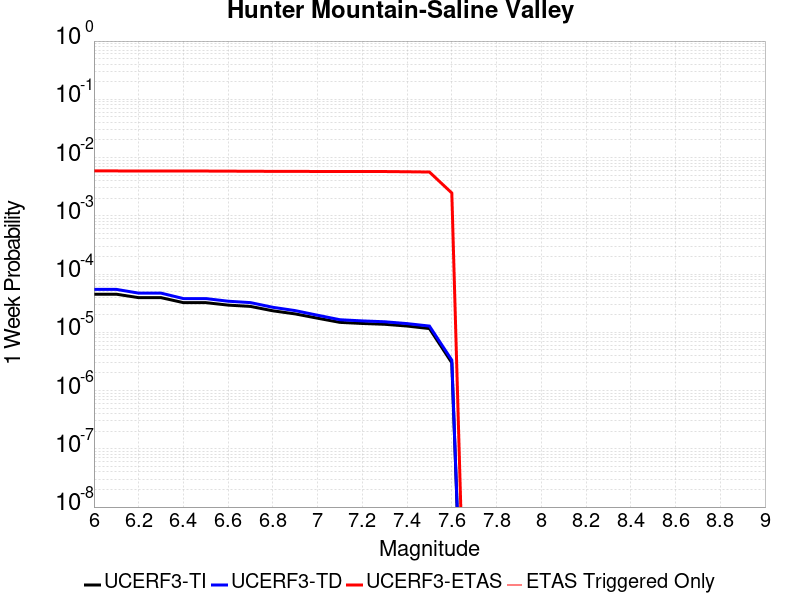
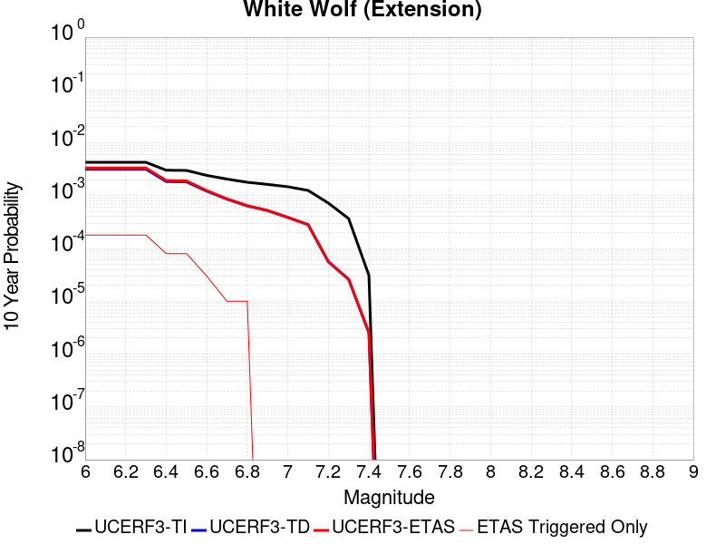
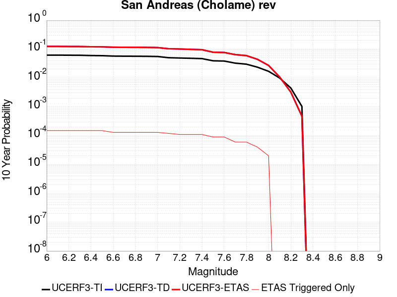
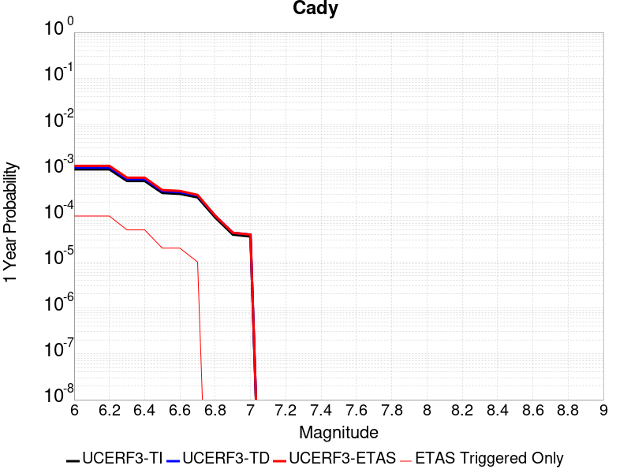

# Parent Section Magnitude-Probability Distributions

Only fault sections with at least one triggered aftershock are plotted. Sections are sorted by total supraseismogenic trigger rate (decreasing)

## Table Of Contents

* [Garlock (Central)](#garlock-central)
* [Tank Canyon](#tank-canyon)
* [Little Lake](#little-lake)
* [Airport Lake](#airport-lake)
* [Owl Lake](#owl-lake)
* [Panamint Valley](#panamint-valley)
* [Garlock (East)](#garlock-east)
* [Hunter Mountain-Saline Valley](#hunter-mountain-saline-valley)
* [Garlock (West)](#garlock-west)
* [Blackwater](#blackwater)
* [Ash Hill](#ash-hill)
* [Gravel Hills-Harper Lk](#gravel-hills-harper-lk)
* [McLean Lake](#mclean-lake)
* [San Andreas (Mojave S)](#san-andreas-mojave-s)
* [San Andreas (Mojave N)](#san-andreas-mojave-n)
* [So Sierra Nevada](#so-sierra-nevada)
* [Goldstone Lake](#goldstone-lake)
* [Death Valley (So)](#death-valley-so)
* [Nelson Lake](#nelson-lake)
* [Towne Pass](#towne-pass)
* [Lenwood-Lockhart-Old Woman Springs](#lenwood-lockhart-old-woman-springs)
* [Coyote Canyon](#coyote-canyon)
* [Death Valley (Black Mtns Frontal)](#death-valley-black-mtns-frontal)
* [Bicycle Lake](#bicycle-lake)
* [San Andreas (San Bernardino N)](#san-andreas-san-bernardino-n)
* [Helendale-So Lockhart](#helendale-so-lockhart)
* [Paradise](#paradise)
* [Garlic Springs](#garlic-springs)
* [Death Valley (No)](#death-valley-no)
* [San Andreas (Parkfield)](#san-andreas-parkfield)
* [San Andreas (Big Bend)](#san-andreas-big-bend)
* [Calico-Hidalgo](#calico-hidalgo)
* [Baker](#baker)
* [Lake Isabella (Seismicity)](#lake-isabella-seismicity)
* [White Wolf (Extension)](#white-wolf-extension)
* [Red Pass](#red-pass)
* [San Andreas (San Bernardino S)](#san-andreas-san-bernardino-s)
* [San Andreas (Carrizo) rev](#san-andreas-carrizo-rev)
* [Coyote Lake](#coyote-lake)
* [Ludlow](#ludlow)
* [Deep Springs](#deep-springs)
* [San Andreas (Coachella) rev](#san-andreas-coachella-rev)
* [San Pedro Basin](#san-pedro-basin)
* [Santa Ynez (West)](#santa-ynez-west)
* [San Andreas (Cholame) rev](#san-andreas-cholame-rev)
* [Scodie Lineament](#scodie-lineament)
* [San Jacinto (San Bernardino)](#san-jacinto-san-bernardino)
* [Death Valley (Fish Lake Valley)](#death-valley-fish-lake-valley)
* [Bullion Mountains](#bullion-mountains)
* [Manix-Afton Hills](#manix-afton-hills)
* [Great Valley 05 Pittsburg - Kirby Hills alt1](#great-valley-05-pittsburg---kirby-hills-alt1)
* [San Andreas (Creeping Section) 2011 CFM](#san-andreas-creeping-section-2011-cfm)
* [Pinto Mtn](#pinto-mtn)
* [Mission Ridge-Arroyo Parida-Santa Ana](#mission-ridge-arroyo-parida-santa-ana)
* [Palos Verdes](#palos-verdes)
* [Rodgers Creek - Healdsburg 2011 CFM](#rodgers-creek---healdsburg-2011-cfm)
* [San Jacinto (Anza) rev](#san-jacinto-anza-rev)
* [Camp Rock 2011](#camp-rock-2011)
* [Lost Hills](#lost-hills)
* [San Andreas (San Gorgonio Pass-Garnet HIll)](#san-andreas-san-gorgonio-pass-garnet-hill)
* [Coronado Bank alt1](#coronado-bank-alt1)
* [Elsinore (Temecula) rev](#elsinore-temecula-rev)
* [Emerson-Copper Mtn 2011](#emerson-copper-mtn-2011)
* [Mono Lake 2011 CFM](#mono-lake-2011-cfm)
* [Blue Cut](#blue-cut)
* [Robinson Creek](#robinson-creek)
* [San Jacinto (Stepovers Combined)](#san-jacinto-stepovers-combined)
* [Sierra Nevada  (No Extension)](#sierra-nevada--no-extension)
* [San Jacinto (Clark) rev](#san-jacinto-clark-rev)
* [Santa Cruz Catalina Ridge alt1](#santa-cruz-catalina-ridge-alt1)
* [Hayward (No) 2011 CFM](#hayward-no-2011-cfm)
* [San Andreas (North Branch Mill Creek)](#san-andreas-north-branch-mill-creek)
* [San Jacinto (San Jacinto Valley) rev](#san-jacinto-san-jacinto-valley-rev)
* [Whittier alt 1](#whittier-alt-1)
* [Elsinore (Glen Ivy) rev](#elsinore-glen-ivy-rev)
* [Santa Rosa Island](#santa-rosa-island)
* [Pisgah-Bullion Mtn-Mesquite Lk](#pisgah-bullion-mtn-mesquite-lk)
* [Cleghorn Lake](#cleghorn-lake)
* [Cady](#cady)
* [Cleghorn Pass](#cleghorn-pass)
* [Santa Ynez (East)](#santa-ynez-east)
* [Surprise Valley 2011 CFM](#surprise-valley-2011-cfm)
* [Elsinore (Stepovers Combined)](#elsinore-stepovers-combined)

## Garlock (Central)
*[(top)](#table-of-contents)*

| 1 Week | 1 Month | 1 Year | 10 Year |
|-----|-----|-----|-----|
|  |  |  |  |

| Magnitude | 1 wk TI Prob | 1 wk TD Prob | 1 wk ETAS Prob | 1 wk ETAS/TD Gain | 1 wk ETAS Triggered Only | 1 mo TI Prob | 1 mo TD Prob | 1 mo ETAS Prob | 1 mo ETAS/TD Gain | 1 mo ETAS Triggered Only | 1 yr TI Prob | 1 yr TD Prob | 1 yr ETAS Prob | 1 yr ETAS/TD Gain | 1 yr ETAS Triggered Only | 10 yr TI Prob | 10 yr TD Prob | 10 yr ETAS Prob | 10 yr ETAS/TD Gain | 10 yr ETAS Triggered Only |
|-----|-----|-----|-----|-----|-----|-----|-----|-----|-----|-----|-----|-----|-----|-----|-----|-----|-----|-----|-----|-----|
| 6.0 | 5.5131142E-5 | 7.024681E-5 | 0.062153913 | 884.7934 | 0.062088028 | 2.3625491E-4 | 3.010234E-4 | 0.06782623 | 225.3188 | 0.06754554 | 0.0028726095 | 0.0036588663 | 0.077736534 | 21.246073 | 0.07434971 | 0.028357591 | 0.036079824 | 0.11082139 | 3.071561 | 0.07753916 |
| 6.1 | 5.5131142E-5 | 7.024681E-5 | 0.062153913 | 884.7934 | 0.062088028 | 2.3625491E-4 | 3.010234E-4 | 0.06782623 | 225.3188 | 0.06754554 | 0.0028726095 | 0.0036588663 | 0.077736534 | 21.246073 | 0.07434971 | 0.028357591 | 0.036079824 | 0.11082139 | 3.071561 | 0.07753916 |
| 6.2 | 4.216245E-5 | 5.1661493E-5 | 0.037685268 | 729.46533 | 0.037635554 | 1.806837E-4 | 2.2138779E-4 | 0.040966492 | 185.04405 | 0.04075413 | 0.0021976046 | 0.0026920962 | 0.04722424 | 17.54181 | 0.04465235 | 0.021759989 | 0.026689773 | 0.072081946 | 2.7007327 | 0.046636898 |
| 6.3 | 4.216245E-5 | 5.1661493E-5 | 0.037685268 | 729.46533 | 0.037635554 | 1.806837E-4 | 2.2138779E-4 | 0.040966492 | 185.04405 | 0.04075413 | 0.0021976046 | 0.0026920962 | 0.04722424 | 17.54181 | 0.04465235 | 0.021759989 | 0.026689773 | 0.072081946 | 2.7007327 | 0.046636898 |
| 6.4 | 3.6858168E-5 | 4.411054E-5 | 0.02803919 | 635.65735 | 0.027996315 | 1.5795401E-4 | 1.8903162E-4 | 0.030518545 | 161.44676 | 0.030335248 | 0.0019213937 | 0.002299056 | 0.035463825 | 15.425386 | 0.033241194 | 0.019048655 | 0.02284894 | 0.05706204 | 2.4973605 | 0.035013113 |
| 6.5 | 3.39199E-5 | 4.0018083E-5 | 0.025696373 | 642.119 | 0.025657382 | 1.453629E-4 | 1.7149492E-4 | 0.02802128 | 163.39423 | 0.027854562 | 0.0017683565 | 0.002085973 | 0.032357942 | 15.512157 | 0.030335248 | 0.017543508 | 0.020759864 | 0.052131083 | 2.5111477 | 0.03203629 |
| 6.6 | 3.3571985E-5 | 3.9472274E-5 | 0.025624968 | 649.1891 | 0.025586504 | 1.4387199E-4 | 1.6915603E-4 | 0.027948141 | 165.22107 | 0.027783684 | 0.0017502342 | 0.0020575512 | 0.03225965 | 15.678663 | 0.03026437 | 0.017365133 | 0.020481179 | 0.051791903 | 2.528756 | 0.031965412 |
| 6.7 | 3.2580007E-5 | 3.8088703E-5 | 0.02456051 | 644.824 | 0.024523353 | 1.3962112E-4 | 1.632272E-4 | 0.026737668 | 163.80646 | 0.02657878 | 0.0016985617 | 0.0019855013 | 0.03098727 | 15.606774 | 0.029059466 | 0.016856372 | 0.019773813 | 0.04978712 | 2.5178308 | 0.030618753 |
| 6.8 | 3.2185937E-5 | 3.7515918E-5 | 0.024347328 | 648.9866 | 0.024310723 | 1.3793244E-4 | 1.6077272E-4 | 0.026451817 | 164.52927 | 0.026295273 | 0.0016780337 | 0.001955672 | 0.030675353 | 15.685327 | 0.028775958 | 0.016654192 | 0.019480614 | 0.04908592 | 2.5197315 | 0.030193493 |
| 6.9 | 3.165394E-5 | 3.6720503E-5 | 0.02399218 | 653.37286 | 0.02395634 | 1.3565269E-4 | 1.5736422E-4 | 0.02609417 | 165.82024 | 0.02594089 | 0.0016503202 | 0.001914247 | 0.030281415 | 15.81897 | 0.028421575 | 0.01638118 | 0.019073246 | 0.0482737 | 2.5309641 | 0.029768232 |
| 7.0 | 3.0903822E-5 | 3.5625766E-5 | 0.023707615 | 665.46265 | 0.023672832 | 1.3243823E-4 | 1.5267303E-4 | 0.025806138 | 169.02878 | 0.025657382 | 0.0016112428 | 0.0018572307 | 0.02994304 | 16.122414 | 0.028138068 | 0.015996104 | 0.018512413 | 0.047451306 | 2.5632155 | 0.029484726 |
| 7.1 | 3.0069863E-5 | 3.4392073E-5 | 0.022501547 | 654.26556 | 0.022467928 | 1.2886449E-4 | 1.4738638E-4 | 0.02438366 | 165.44038 | 0.024239847 | 0.0015677959 | 0.0017929734 | 0.028111849 | 15.6789 | 0.02636615 | 0.01556781 | 0.017880075 | 0.044958156 | 2.5144277 | 0.027571054 |
| 7.2 | 2.7957109E-5 | 3.128145E-5 | 0.020017898 | 639.92865 | 0.019987242 | 1.1981068E-4 | 1.340566E-4 | 0.021819433 | 162.76285 | 0.021688284 | 0.0014577188 | 0.0016309366 | 0.025335921 | 15.534584 | 0.02374371 | 0.014481937 | 0.016283695 | 0.04047744 | 2.4857652 | 0.02459423 |
| 7.3 | 2.4519275E-5 | 2.6714795E-5 | 0.013563812 | 507.7266 | 0.013537458 | 1.0507837E-4 | 1.1448703E-4 | 0.014713425 | 128.51608 | 0.014600609 | 0.0012785783 | 0.001393003 | 0.017247278 | 12.381364 | 0.01587639 | 0.012712469 | 0.013928054 | 0.030142434 | 2.1641526 | 0.016443405 |
| 7.4 | 2.3225532E-5 | 2.51994E-5 | 0.012499192 | 496.0115 | 0.012474307 | 9.95342E-5 | 1.0799304E-4 | 0.01357312 | 125.68514 | 0.013466582 | 0.0012111551 | 0.0013140367 | 0.015966244 | 12.150532 | 0.014671486 | 0.012045753 | 0.013145725 | 0.028183905 | 2.1439595 | 0.0152385 |
| 7.5 | 2.097765E-5 | 2.2483688E-5 | 0.010299381 | 458.08237 | 0.010277128 | 8.9901114E-5 | 9.635517E-5 | 0.011222932 | 116.474625 | 0.011127649 | 0.0010939965 | 0.0011725046 | 0.0132074235 | 11.264282 | 0.012049046 | 0.010886264 | 0.011740365 | 0.024138264 | 2.0560062 | 0.012545184 |
| 7.6 | 1.511254E-5 | 1.5991332E-5 | 0.005331662 | 333.4095 | 0.005315756 | 6.476642E-5 | 6.853253E-5 | 0.0057382835 | 83.730804 | 0.0056701396 | 7.882459E-4 | 8.3407195E-4 | 0.007066023 | 8.47172 | 0.0062371534 | 0.007854558 | 0.008383559 | 0.014849553 | 1.7712709 | 0.0065206606 |
| 7.7 | 9.934069E-6 | 1.0678794E-5 | 0.0016408266 | 153.6528 | 0.0016301651 | 4.2573887E-5 | 4.5765457E-5 | 0.001675856 | 36.61836 | 0.0016301651 | 5.182138E-4 | 5.570524E-4 | 0.002327984 | 4.1791115 | 0.0017719186 | 0.00517007 | 0.005627684 | 0.007601064 | 1.3506559 | 0.0019845488 |
| 7.8 | 6.7562896E-6 | 8.428449E-6 | 0.0010715707 | 127.13735 | 0.0010631512 | 2.8955206E-5 | 3.6121426E-5 | 0.0010992342 | 30.43164 | 0.0010631512 | 3.5247262E-4 | 4.3968976E-4 | 0.0015732191 | 3.5780206 | 0.001134028 | 0.0035191406 | 0.004446654 | 0.0055756397 | 1.2538954 | 0.001134028 |
| 7.9 | 3.975453E-6 | 5.37103E-6 | 3.5975286E-4 | 66.98023 | 3.5438372E-4 | 1.7037546E-5 | 2.3018498E-5 | 3.7739406E-4 | 16.395252 | 3.5438372E-4 | 2.0741238E-4 | 2.8021427E-4 | 6.344987E-4 | 2.264334 | 3.5438372E-4 | 0.002072189 | 0.0028336283 | 0.0031870077 | 1.1247092 | 3.5438372E-4 |
| 8.0 | 1.6729537E-6 | 2.0775144E-6 | 2.1470731E-4 | 103.34817 | 2.1263024E-4 | 7.169782E-6 | 8.903603E-6 | 2.2153194E-4 | 24.881157 | 2.1263024E-4 | 8.7288594E-5 | 1.0839601E-4 | 3.210032E-4 | 2.961393 | 2.1263024E-4 | 8.7254314E-4 | 0.0010969337 | 0.0013093308 | 1.193628 | 2.1263024E-4 |
| 8.1 | 3.6733252E-7 | 3.1489964E-7 | 3.1489964E-7 | 1.0 | 0.0 | 1.5742813E-6 | 1.3495693E-6 | 1.3495693E-6 | 1.0 | 0.0 | 1.9166706E-5 | 1.6430899E-5 | 1.6430899E-5 | 1.0 | 0.0 | 1.9165053E-4 | 1.6638759E-4 | 1.6638759E-4 | 1.0 | 0.0 |

## Tank Canyon
*[(top)](#table-of-contents)*

| 1 Week | 1 Month | 1 Year | 10 Year |
|-----|-----|-----|-----|
|  |  |  |  |

| Magnitude | 1 wk TI Prob | 1 wk TD Prob | 1 wk ETAS Prob | 1 wk ETAS/TD Gain | 1 wk ETAS Triggered Only | 1 mo TI Prob | 1 mo TD Prob | 1 mo ETAS Prob | 1 mo ETAS/TD Gain | 1 mo ETAS Triggered Only | 1 yr TI Prob | 1 yr TD Prob | 1 yr ETAS Prob | 1 yr ETAS/TD Gain | 1 yr ETAS Triggered Only | 10 yr TI Prob | 10 yr TD Prob | 10 yr ETAS Prob | 10 yr ETAS/TD Gain | 10 yr ETAS Triggered Only |
|-----|-----|-----|-----|-----|-----|-----|-----|-----|-----|-----|-----|-----|-----|-----|-----|-----|-----|-----|-----|-----|
| 6.0 | 4.8284557E-5 | 5.7964822E-5 | 0.033651594 | 580.552 | 0.033595577 | 2.0691741E-4 | 2.4840087E-4 | 0.037945464 | 152.75899 | 0.037706427 | 0.0025163088 | 0.0030207601 | 0.04577166 | 15.152365 | 0.04288043 | 0.02488006 | 0.029863637 | 0.07435142 | 2.4896977 | 0.045857254 |
| 6.1 | 1.7796336E-5 | 2.0873314E-5 | 0.012565795 | 602.00287 | 0.012545184 | 7.626778E-5 | 8.945422E-5 | 0.014405276 | 161.03519 | 0.014317103 | 9.281647E-4 | 0.0010885983 | 0.017230904 | 15.828526 | 0.016159898 | 0.009242975 | 0.010836744 | 0.027803043 | 2.565627 | 0.017152172 |
| 6.2 | 1.7796336E-5 | 2.0873314E-5 | 0.012565795 | 602.00287 | 0.012545184 | 7.626778E-5 | 8.945422E-5 | 0.014405276 | 161.03519 | 0.014317103 | 9.281647E-4 | 0.0010885983 | 0.017230904 | 15.828526 | 0.016159898 | 0.009242975 | 0.010836744 | 0.027803043 | 2.565627 | 0.017152172 |
| 6.3 | 1.3515912E-5 | 1.5759564E-5 | 0.008308209 | 527.1851 | 0.008292579 | 5.792405E-5 | 6.753938E-5 | 0.009635254 | 142.66127 | 0.009568361 | 7.049971E-4 | 8.2200574E-4 | 0.011657234 | 14.181451 | 0.010844142 | 0.007027647 | 0.0081922645 | 0.019369345 | 2.3643456 | 0.011269403 |
| 6.4 | 1.0870146E-5 | 1.2618021E-5 | 0.0064623207 | 512.1501 | 0.0064497837 | 4.658551E-5 | 5.4076212E-5 | 0.007353986 | 135.993 | 0.0073003047 | 5.67031E-4 | 6.581969E-4 | 0.0086619975 | 13.160192 | 0.008009072 | 0.005655863 | 0.0065644905 | 0.014802633 | 2.2549553 | 0.008292579 |
| 6.5 | 7.964826E-6 | 9.196094E-6 | 0.004403514 | 478.8461 | 0.004394358 | 3.4134522E-5 | 3.9411298E-5 | 0.0048588403 | 123.28547 | 0.0048196185 | 4.1550855E-4 | 4.7973756E-4 | 0.005651258 | 11.779895 | 0.0051740026 | 0.0041473247 | 0.004788321 | 0.01014916 | 2.1195657 | 0.005386633 |
| 6.6 | 6.6317E-6 | 7.6122988E-6 | 0.0034096702 | 447.91595 | 0.0034020839 | 2.8421264E-5 | 3.2623782E-5 | 0.0038598431 | 118.31379 | 0.0038273442 | 3.4597394E-4 | 3.9713128E-4 | 0.0044355015 | 11.168855 | 0.0040399744 | 0.0034543579 | 0.003965368 | 0.008201109 | 2.0681837 | 0.0042526047 |
| 6.7 | 4.793663E-6 | 5.4307857E-6 | 0.0019190925 | 353.3729 | 0.0019136721 | 2.0544108E-5 | 2.3274613E-5 | 0.0020786524 | 89.30986 | 0.0020554257 | 2.500958E-4 | 2.8333595E-4 | 0.0024090358 | 8.502401 | 0.0021263023 | 0.0024981452 | 0.0028304397 | 0.0050214 | 1.7740706 | 0.002197179 |
| 6.8 | 4.382823E-6 | 4.9692567E-6 | 0.0017768791 | 357.5744 | 0.0017719186 | 1.8783392E-5 | 2.1296666E-5 | 0.001934928 | 90.85592 | 0.0019136721 | 2.286638E-4 | 2.5926033E-4 | 0.0022432946 | 8.652673 | 0.0019845488 | 0.0022842865 | 0.002590253 | 0.0045696613 | 1.7641758 | 0.0019845488 |
| 6.9 | 2.729601E-6 | 3.0735416E-6 | 0.001137098 | 369.9634 | 0.001134028 | 1.1698237E-5 | 1.3172262E-5 | 0.0012889368 | 97.852356 | 0.0012757814 | 1.4241673E-4 | 1.6036171E-4 | 0.0014359385 | 8.954372 | 0.0012757814 | 0.001423255 | 0.0016026258 | 0.0028763628 | 1.7947812 | 0.0012757814 |
| 7.0 | 1.8987357E-6 | 2.126939E-6 | 4.982631E-4 | 234.26299 | 4.961372E-4 | 8.137413E-6 | 9.115425E-6 | 6.470003E-4 | 70.97862 | 6.378907E-4 | 9.90685E-5 | 1.1097535E-4 | 7.487953E-4 | 6.7474017 | 6.378907E-4 | 9.902435E-4 | 0.0011092679 | 0.0017464511 | 1.5744177 | 6.378907E-4 |
| 7.1 | 1.4928986E-6 | 1.6641272E-6 | 2.14294E-4 | 128.77261 | 2.1263024E-4 | 6.398121E-6 | 7.1319573E-6 | 2.906369E-4 | 40.751354 | 2.83507E-4 | 7.789434E-5 | 8.682871E-5 | 3.7031109E-4 | 4.264846 | 2.83507E-4 | 7.786704E-4 | 8.6800574E-4 | 0.0011512666 | 1.3263353 | 2.83507E-4 |
| 7.2 | 1.069082E-6 | 1.1828573E-6 | 1.1828573E-6 | 1.0 | 0.0 | 4.581772E-6 | 5.0693816E-6 | 7.594577E-5 | 14.981269 | 7.087675E-5 | 5.5781646E-5 | 6.171851E-5 | 1.3259088E-4 | 2.1483164 | 7.087675E-5 | 5.576765E-4 | 6.170659E-4 | 6.878989E-4 | 1.1147901 | 7.087675E-5 |
| 7.3 | 8.776551E-7 | 9.770005E-7 | 9.770005E-7 | 1.0 | 0.0 | 3.7613736E-6 | 4.1871413E-6 | 7.506359E-5 | 17.92717 | 7.087675E-5 | 4.579376E-5 | 5.097777E-5 | 1.21850906E-4 | 2.3902752 | 7.087675E-5 | 4.5784327E-4 | 5.097118E-4 | 5.805524E-4 | 1.1389817 | 7.087675E-5 |
| 7.4 | 7.55721E-7 | 8.510244E-7 | 8.510244E-7 | 1.0 | 0.0 | 3.2388E-6 | 3.6472454E-6 | 3.6472454E-6 | 1.0 | 0.0 | 3.9431678E-5 | 4.4404827E-5 | 4.4404827E-5 | 1.0 | 0.0 | 3.942468E-4 | 4.440104E-4 | 4.440104E-4 | 1.0 | 0.0 |
| 7.5 | 5.587665E-7 | 6.305619E-7 | 6.305619E-7 | 1.0 | 0.0 | 2.3947114E-6 | 2.702408E-6 | 2.702408E-6 | 1.0 | 0.0 | 2.915522E-5 | 3.290182E-5 | 3.290182E-5 | 1.0 | 0.0 | 2.9151395E-4 | 3.290182E-4 | 3.290182E-4 | 1.0 | 0.0 |

## Little Lake
*[(top)](#table-of-contents)*

| 1 Week | 1 Month | 1 Year | 10 Year |
|-----|-----|-----|-----|
|  |  |  |  |

| Magnitude | 1 wk TI Prob | 1 wk TD Prob | 1 wk ETAS Prob | 1 wk ETAS/TD Gain | 1 wk ETAS Triggered Only | 1 mo TI Prob | 1 mo TD Prob | 1 mo ETAS Prob | 1 mo ETAS/TD Gain | 1 mo ETAS Triggered Only | 1 yr TI Prob | 1 yr TD Prob | 1 yr ETAS Prob | 1 yr ETAS/TD Gain | 1 yr ETAS Triggered Only | 10 yr TI Prob | 10 yr TD Prob | 10 yr ETAS Prob | 10 yr ETAS/TD Gain | 10 yr ETAS Triggered Only |
|-----|-----|-----|-----|-----|-----|-----|-----|-----|-----|-----|-----|-----|-----|-----|-----|-----|-----|-----|-----|-----|
| 6.0 | 2.8424427E-5 | 3.120572E-5 | 0.028948015 | 927.65094 | 0.028917711 | 1.2181328E-4 | 1.337327E-4 | 0.031527933 | 235.75336 | 0.031398397 | 0.0014820677 | 0.0016271127 | 0.035168026 | 21.613762 | 0.033595577 | 0.014722223 | 0.016165402 | 0.049845472 | 3.0834665 | 0.03423347 |
| 6.1 | 2.8424427E-5 | 3.120572E-5 | 0.028948015 | 927.65094 | 0.028917711 | 1.2181328E-4 | 1.337327E-4 | 0.031527933 | 235.75336 | 0.031398397 | 0.0014820677 | 0.0016271127 | 0.035168026 | 21.613762 | 0.033595577 | 0.014722223 | 0.016165402 | 0.049845472 | 3.0834665 | 0.03423347 |
| 6.2 | 2.8424427E-5 | 3.120572E-5 | 0.028948015 | 927.65094 | 0.028917711 | 1.2181328E-4 | 1.337327E-4 | 0.031527933 | 235.75336 | 0.031398397 | 0.0014820677 | 0.0016271127 | 0.035168026 | 21.613762 | 0.033595577 | 0.014722223 | 0.016165402 | 0.049845472 | 3.0834665 | 0.03423347 |
| 6.3 | 1.48860645E-5 | 1.6081389E-5 | 0.019294245 | 1199.7872 | 0.019278474 | 6.379586E-5 | 6.8918576E-5 | 0.02069263 | 300.2475 | 0.020625133 | 7.7643775E-4 | 8.3878887E-4 | 0.023004603 | 27.425974 | 0.02218442 | 0.007737305 | 0.008359048 | 0.030779734 | 3.6822057 | 0.02260968 |
| 6.4 | 1.48860645E-5 | 1.6081389E-5 | 0.019294245 | 1199.7872 | 0.019278474 | 6.379586E-5 | 6.8918576E-5 | 0.02069263 | 300.2475 | 0.020625133 | 7.7643775E-4 | 8.3878887E-4 | 0.023004603 | 27.425974 | 0.02218442 | 0.007737305 | 0.008359048 | 0.030779734 | 3.6822057 | 0.02260968 |
| 6.5 | 1.2797581E-5 | 1.3765565E-5 | 0.018087087 | 1313.9371 | 0.01807357 | 5.4845623E-5 | 5.899409E-5 | 0.01926546 | 326.56592 | 0.019207599 | 6.675408E-4 | 7.18042E-4 | 0.02139919 | 29.802143 | 0.02069601 | 0.006655392 | 0.00715977 | 0.028129816 | 3.9288716 | 0.021121271 |
| 6.6 | 9.661896E-6 | 1.0289038E-5 | 0.015744764 | 1530.2466 | 0.015734637 | 4.1407468E-5 | 4.409522E-5 | 0.016912017 | 383.534 | 0.016868666 | 5.040193E-4 | 5.367433E-4 | 0.018388096 | 34.25864 | 0.01786094 | 0.005028777 | 0.0053560743 | 0.023473835 | 4.3826566 | 0.018215323 |
| 6.7 | 7.767871E-6 | 8.199687E-6 | 0.0136873 | 1669.2467 | 0.013679212 | 3.329045E-5 | 3.5141118E-5 | 0.014918734 | 424.53784 | 0.014884116 | 4.0523586E-4 | 4.2777284E-4 | 0.016155679 | 37.76696 | 0.015734637 | 0.004044977 | 0.004270846 | 0.02022058 | 4.7345605 | 0.016018145 |
| 6.8 | 6.4235196E-6 | 6.7357446E-6 | 0.010496424 | 1558.3168 | 0.010489758 | 2.752908E-5 | 2.8867229E-5 | 0.011510569 | 398.7417 | 0.011482033 | 3.35115E-4 | 3.5141467E-4 | 0.012396228 | 35.27521 | 0.012049046 | 0.003346101 | 0.00350985 | 0.015799118 | 4.5013657 | 0.012332554 |
| 6.9 | 3.1283696E-6 | 3.1121804E-6 | 0.006311123 | 2027.8782 | 0.0063080303 | 1.3407229E-5 | 1.3337856E-5 | 0.007100918 | 532.38824 | 0.0070876745 | 1.6322079E-4 | 1.6237781E-4 | 0.007744958 | 47.697147 | 0.007583812 | 0.0016310095 | 0.00162274 | 0.00940653 | 5.796696 | 0.007796442 |
| 7.0 | 2.290603E-6 | 2.2286815E-6 | 0.004396577 | 1972.7256 | 0.004394358 | 9.816834E-6 | 9.551463E-6 | 0.004970876 | 520.43085 | 0.0049613724 | 1.19513395E-4 | 1.162839E-4 | 0.0054314216 | 46.708286 | 0.005315756 | 0.0011944914 | 0.0011623327 | 0.0066134986 | 5.68985 | 0.0054575093 |
| 7.1 | 1.293693E-6 | 1.1776827E-6 | 0.0019148475 | 1625.9451 | 0.0019136721 | 5.5443866E-6 | 5.0472063E-6 | 0.002131339 | 422.2809 | 0.0021263023 | 6.750081E-5 | 6.14487E-5 | 0.0024002376 | 39.060837 | 0.0023389326 | 6.7480316E-4 | 6.143856E-4 | 0.0030935477 | 5.035189 | 0.0024806862 |
| 7.2 | 4.715842E-7 | 3.0917857E-7 | 3.0917857E-7 | 1.0 | 0.0 | 2.0210737E-6 | 1.3250503E-6 | 1.3250503E-6 | 1.0 | 0.0 | 2.4606294E-5 | 1.6132375E-5 | 1.6132375E-5 | 1.0 | 0.0 | 2.460357E-4 | 1.6131258E-4 | 1.6131258E-4 | 1.0 | 0.0 |
| 7.3 | 3.9430947E-7 | 2.3097488E-7 | 2.3097488E-7 | 1.0 | 0.0 | 1.6898966E-6 | 9.89892E-7 | 9.89892E-7 | 1.0 | 0.0 | 2.0574296E-5 | 1.2051869E-5 | 1.2051869E-5 | 1.0 | 0.0 | 2.0572392E-4 | 1.20512224E-4 | 1.20512224E-4 | 1.0 | 0.0 |
| 7.4 | 3.547123E-7 | 1.9679135E-7 | 1.9679135E-7 | 1.0 | 0.0 | 1.5201948E-6 | 8.4339126E-7 | 8.4339126E-7 | 1.0 | 0.0 | 1.8508214E-5 | 1.0268241E-5 | 1.0268241E-5 | 1.0 | 0.0 | 1.8506673E-4 | 1.02677724E-4 | 1.02677724E-4 | 1.0 | 0.0 |
| 7.5 | 2.6354266E-7 | 1.4423138E-7 | 1.4423138E-7 | 1.0 | 0.0 | 1.129468E-6 | 6.181344E-7 | 6.181344E-7 | 1.0 | 0.0 | 1.3751187E-5 | 7.5257603E-6 | 7.5257603E-6 | 1.0 | 0.0 | 1.3750336E-4 | 7.5255106E-5 | 7.5255106E-5 | 1.0 | 0.0 |
| 7.6 | 1.269913E-7 | 7.572556E-8 | 7.572556E-8 | 1.0 | 0.0 | 5.4424834E-7 | 3.245381E-7 | 3.245381E-7 | 1.0 | 0.0 | 6.6262032E-6 | 3.9512443E-6 | 3.9512443E-6 | 1.0 | 0.0 | 6.626006E-5 | 3.9511775E-5 | 3.9511775E-5 | 1.0 | 0.0 |

## Airport Lake
*[(top)](#table-of-contents)*

| 1 Week | 1 Month | 1 Year | 10 Year |
|-----|-----|-----|-----|
|  |  |  |  |

| Magnitude | 1 wk TI Prob | 1 wk TD Prob | 1 wk ETAS Prob | 1 wk ETAS/TD Gain | 1 wk ETAS Triggered Only | 1 mo TI Prob | 1 mo TD Prob | 1 mo ETAS Prob | 1 mo ETAS/TD Gain | 1 mo ETAS Triggered Only | 1 yr TI Prob | 1 yr TD Prob | 1 yr ETAS Prob | 1 yr ETAS/TD Gain | 1 yr ETAS Triggered Only | 10 yr TI Prob | 10 yr TD Prob | 10 yr ETAS Prob | 10 yr ETAS/TD Gain | 10 yr ETAS Triggered Only |
|-----|-----|-----|-----|-----|-----|-----|-----|-----|-----|-----|-----|-----|-----|-----|-----|-----|-----|-----|-----|-----|
| 6.0 | 1.2387061E-5 | 1.3103157E-5 | 0.025528397 | 1948.2632 | 0.025515629 | 5.3086325E-5 | 5.615534E-5 | 0.027767407 | 494.4749 | 0.027712807 | 6.461343E-4 | 6.8350515E-4 | 0.030785533 | 45.040672 | 0.030122617 | 0.0064425888 | 0.0068168393 | 0.037649233 | 5.522975 | 0.031044014 |
| 6.1 | 1.2387061E-5 | 1.3103157E-5 | 0.025528397 | 1948.2632 | 0.025515629 | 5.3086325E-5 | 5.615534E-5 | 0.027767407 | 494.4749 | 0.027712807 | 6.461343E-4 | 6.8350515E-4 | 0.030785533 | 45.040672 | 0.030122617 | 0.0064425888 | 0.0068168393 | 0.037649233 | 5.522975 | 0.031044014 |
| 6.2 | 1.2387061E-5 | 1.3103157E-5 | 0.025528397 | 1948.2632 | 0.025515629 | 5.3086325E-5 | 5.615534E-5 | 0.027767407 | 494.4749 | 0.027712807 | 6.461343E-4 | 6.8350515E-4 | 0.030785533 | 45.040672 | 0.030122617 | 0.0064425888 | 0.0068168393 | 0.037649233 | 5.522975 | 0.031044014 |
| 6.3 | 1.2387061E-5 | 1.3103157E-5 | 0.025528397 | 1948.2632 | 0.025515629 | 5.3086325E-5 | 5.615534E-5 | 0.027767407 | 494.4749 | 0.027712807 | 6.461343E-4 | 6.8350515E-4 | 0.030785533 | 45.040672 | 0.030122617 | 0.0064425888 | 0.0068168393 | 0.037649233 | 5.522975 | 0.031044014 |
| 6.4 | 1.2387061E-5 | 1.3103157E-5 | 0.025528397 | 1948.2632 | 0.025515629 | 5.3086325E-5 | 5.615534E-5 | 0.027767407 | 494.4749 | 0.027712807 | 6.461343E-4 | 6.8350515E-4 | 0.030785533 | 45.040672 | 0.030122617 | 0.0064425888 | 0.0068168393 | 0.037649233 | 5.522975 | 0.031044014 |
| 6.5 | 6.9922594E-6 | 7.384925E-6 | 0.018718708 | 2534.7188 | 0.01871146 | 2.996648E-5 | 3.1649324E-5 | 0.020372631 | 643.6987 | 0.020341625 | 3.6478083E-4 | 3.8526783E-4 | 0.022419443 | 58.191837 | 0.022042667 | 0.003641826 | 0.0038465366 | 0.026439853 | 6.8736777 | 0.022680558 |
| 6.6 | 6.9922594E-6 | 7.384925E-6 | 0.018718708 | 2534.7188 | 0.01871146 | 2.996648E-5 | 3.1649324E-5 | 0.020372631 | 643.6987 | 0.020341625 | 3.6478083E-4 | 3.8526783E-4 | 0.022419443 | 58.191837 | 0.022042667 | 0.003641826 | 0.0038465366 | 0.026439853 | 6.8736777 | 0.022680558 |
| 6.7 | 5.477277E-6 | 5.7860684E-6 | 0.015385951 | 2659.1375 | 0.015380254 | 2.3473833E-5 | 2.4797222E-5 | 0.016751295 | 675.53107 | 0.016726911 | 2.8575645E-4 | 3.0186825E-4 | 0.018511694 | 61.32375 | 0.018215323 | 0.0028538927 | 0.003014966 | 0.021740675 | 7.2109194 | 0.018782338 |
| 6.8 | 3.9950432E-6 | 4.2190873E-6 | 0.0119823385 | 2840.031 | 0.01197817 | 1.7121502E-5 | 1.8081691E-5 | 0.013200918 | 730.0709 | 0.013183075 | 2.0843433E-4 | 2.2012512E-4 | 0.014392354 | 65.38261 | 0.014175349 | 0.0020823893 | 0.0021993418 | 0.016767839 | 7.6240263 | 0.014600609 |
| 6.9 | 2.95695E-6 | 3.1230243E-6 | 0.008933565 | 2860.5493 | 0.00893047 | 1.2672582E-5 | 1.3384334E-5 | 0.00986512 | 737.0647 | 0.009851867 | 1.5427776E-4 | 1.6294434E-4 | 0.010863589 | 66.67055 | 0.010702388 | 0.001541707 | 0.0016284712 | 0.012596477 | 7.735155 | 0.010985896 |
| 7.0 | 1.456072E-6 | 1.540812E-6 | 0.0043250155 | 2806.9717 | 0.0043234816 | 6.2402937E-6 | 6.603469E-6 | 0.0048261904 | 730.8568 | 0.0048196185 | 7.597293E-5 | 8.039528E-5 | 0.0051831105 | 64.47034 | 0.0051031257 | 7.594696E-4 | 8.0376083E-4 | 0.006044424 | 7.520178 | 0.005244879 |
| 7.1 | 6.995192E-7 | 7.4089746E-7 | 0.0019144116 | 2583.909 | 0.0019136721 | 2.997936E-6 | 3.1752747E-6 | 0.002129471 | 670.6415 | 0.0021263023 | 3.649926E-5 | 3.865897E-5 | 0.0023775012 | 61.49934 | 0.0023389326 | 3.6493264E-4 | 3.865897E-4 | 0.0028663168 | 7.414364 | 0.0024806862 |

## Owl Lake
*[(top)](#table-of-contents)*

| 1 Week | 1 Month | 1 Year | 10 Year |
|-----|-----|-----|-----|
|  |  |  |  |

| Magnitude | 1 wk TI Prob | 1 wk TD Prob | 1 wk ETAS Prob | 1 wk ETAS/TD Gain | 1 wk ETAS Triggered Only | 1 mo TI Prob | 1 mo TD Prob | 1 mo ETAS Prob | 1 mo ETAS/TD Gain | 1 mo ETAS Triggered Only | 1 yr TI Prob | 1 yr TD Prob | 1 yr ETAS Prob | 1 yr ETAS/TD Gain | 1 yr ETAS Triggered Only | 10 yr TI Prob | 10 yr TD Prob | 10 yr ETAS Prob | 10 yr ETAS/TD Gain | 10 yr ETAS Triggered Only |
|-----|-----|-----|-----|-----|-----|-----|-----|-----|-----|-----|-----|-----|-----|-----|-----|-----|-----|-----|-----|-----|
| 6.0 | 5.0320643E-5 | 6.635816E-5 | 0.014878615 | 224.21683 | 0.01481324 | 2.1564208E-4 | 2.843674E-4 | 0.01665224 | 58.558895 | 0.016372528 | 0.0026222812 | 0.0034577388 | 0.021821974 | 6.3110533 | 0.018427953 | 0.02591553 | 0.034140717 | 0.053171754 | 1.5574293 | 0.019703735 |
| 6.1 | 5.0320643E-5 | 6.635816E-5 | 0.014878615 | 224.21683 | 0.01481324 | 2.1564208E-4 | 2.843674E-4 | 0.01665224 | 58.558895 | 0.016372528 | 0.0026222812 | 0.0034577388 | 0.021821974 | 6.3110533 | 0.018427953 | 0.02591553 | 0.034140717 | 0.053171754 | 1.5574293 | 0.019703735 |
| 6.2 | 2.4125871E-5 | 3.0981035E-5 | 0.011583532 | 373.89105 | 0.011552909 | 1.0339249E-4 | 1.3277028E-4 | 0.012605421 | 94.94159 | 0.012474307 | 0.0012580766 | 0.001615439 | 0.015626363 | 9.673138 | 0.014033596 | 0.012509781 | 0.016070465 | 0.030785123 | 1.9156338 | 0.0149549935 |
| 6.3 | 1.7433485E-5 | 2.2355514E-5 | 0.010441004 | 467.0438 | 0.010418882 | 7.471279E-5 | 9.580672E-5 | 0.011364129 | 118.615166 | 0.011269403 | 9.0924866E-4 | 0.0011659743 | 0.013838119 | 11.868288 | 0.012686937 | 0.009055373 | 0.011628896 | 0.024868824 | 2.138537 | 0.013395705 |
| 6.4 | 1.7433485E-5 | 2.2355514E-5 | 0.010441004 | 467.0438 | 0.010418882 | 7.471279E-5 | 9.580672E-5 | 0.011364129 | 118.615166 | 0.011269403 | 9.0924866E-4 | 0.0011659743 | 0.013838119 | 11.868288 | 0.012686937 | 0.009055373 | 0.011628896 | 0.024868824 | 2.138537 | 0.013395705 |
| 6.5 | 1.5182742E-5 | 1.9429144E-5 | 0.00994198 | 511.7045 | 0.009922745 | 6.506727E-5 | 8.326596E-5 | 0.010855634 | 130.37302 | 0.010773266 | 7.919061E-4 | 0.0010134429 | 0.013191888 | 13.016904 | 0.0121908 | 0.0078909 | 0.010118429 | 0.022887472 | 2.2619593 | 0.012899567 |
| 6.6 | 6.7271576E-6 | 8.547361E-6 | 0.008088428 | 946.30695 | 0.008079949 | 2.8830356E-5 | 3.6631063E-5 | 0.008683277 | 237.04681 | 0.008646963 | 3.5095305E-4 | 4.458976E-4 | 0.010080837 | 22.607964 | 0.009639237 | 0.0035039932 | 0.004467813 | 0.014557905 | 3.2583964 | 0.010135375 |
| 6.7 | 6.682835E-6 | 8.479807E-6 | 0.008088361 | 953.83777 | 0.008079949 | 2.8640408E-5 | 3.6341557E-5 | 0.00868299 | 238.9273 | 0.008646963 | 3.4864116E-4 | 4.4237426E-4 | 0.010077347 | 22.78014 | 0.009639237 | 0.003480947 | 0.0044327388 | 0.014523186 | 3.276346 | 0.010135375 |
| 6.8 | 6.5774975E-6 | 8.32628E-6 | 0.008088208 | 971.4071 | 0.008079949 | 2.8188972E-5 | 3.5683603E-5 | 0.008682338 | 243.3145 | 0.008646963 | 3.4314668E-4 | 4.343669E-4 | 0.010069418 | 23.181824 | 0.009639237 | 0.0034261728 | 0.004352885 | 0.014444142 | 3.3182917 | 0.010135375 |
| 6.9 | 6.363419E-6 | 7.999454E-6 | 0.008087884 | 1011.0544 | 0.008079949 | 2.727151E-5 | 3.428296E-5 | 0.008680949 | 253.21472 | 0.008646963 | 3.3198006E-4 | 4.1732067E-4 | 0.010052536 | 24.088276 | 0.009639237 | 0.0033148455 | 0.0041828766 | 0.014275856 | 3.4129279 | 0.010135375 |
| 7.0 | 6.1342453E-6 | 7.6316555E-6 | 0.008087519 | 1059.7333 | 0.008079949 | 2.6289357E-5 | 3.2706717E-5 | 0.008679387 | 265.37018 | 0.008646963 | 3.2002592E-4 | 3.9813702E-4 | 0.010033537 | 25.201216 | 0.009639237 | 0.0031956544 | 0.003991571 | 0.01408649 | 3.5290592 | 0.010135375 |
| 7.1 | 5.842926E-6 | 7.142211E-6 | 0.0075908997 | 1062.8221 | 0.007583812 | 2.504087E-5 | 3.0609146E-5 | 0.008110311 | 264.96362 | 0.008079949 | 3.0482994E-4 | 3.7260808E-4 | 0.0092289 | 24.768385 | 0.008859593 | 0.0030441214 | 0.0037370329 | 0.013057801 | 3.4941626 | 0.00935573 |
| 7.2 | 4.77173E-6 | 5.358483E-6 | 0.005888097 | 1098.8364 | 0.00588277 | 2.045011E-5 | 2.2964748E-5 | 0.00633085 | 275.67688 | 0.0063080303 | 2.4895166E-4 | 2.79564E-4 | 0.0072944 | 26.092058 | 0.007016798 | 0.0024867293 | 0.002808645 | 0.00994709 | 3.5415976 | 0.0071585514 |
| 7.3 | 3.0494948E-6 | 2.710463E-6 | 0.001349365 | 497.8356 | 0.0013466582 | 1.3069198E-5 | 1.1616219E-5 | 0.0015000106 | 129.1307 | 0.0014884117 | 1.5910587E-4 | 1.4141845E-4 | 0.0017004863 | 12.024501 | 0.0015592884 | 0.0015899199 | 0.0014232415 | 0.0029803105 | 2.0940301 | 0.0015592884 |
| 7.4 | 2.7263884E-6 | 2.3056762E-6 | 8.5282465E-4 | 369.8805 | 8.5052097E-4 | 1.1684469E-5 | 9.881433E-6 | 0.001002146 | 101.41708 | 9.922744E-4 | 1.4224913E-4 | 1.20299905E-4 | 0.0011833232 | 9.836443 | 0.0010631512 | 0.0014215811 | 0.0012112238 | 0.0022730872 | 1.8766865 | 0.0010631512 |
| 7.5 | 2.6090431E-6 | 2.1656133E-6 | 7.818081E-4 | 361.01004 | 7.796442E-4 | 1.1181565E-5 | 9.281167E-6 | 8.597942E-4 | 92.63859 | 8.5052097E-4 | 1.3612706E-4 | 1.1299244E-4 | 0.001034286 | 9.153585 | 9.213977E-4 | 0.001360437 | 0.0011379806 | 0.0020583298 | 1.8087565 | 9.213977E-4 |
| 7.6 | 2.3008756E-6 | 1.8727933E-6 | 6.397623E-4 | 341.60858 | 6.378907E-4 | 9.860858E-6 | 8.0262325E-6 | 7.16788E-4 | 89.30566 | 7.0876745E-4 | 1.20049335E-4 | 9.7715085E-5 | 8.772831E-4 | 8.97797 | 7.796442E-4 | 0.001199845 | 9.849932E-4 | 0.0017638694 | 1.7907428 | 7.796442E-4 |
| 7.7 | 1.7184348E-6 | 1.3419171E-6 | 6.3923176E-4 | 476.35712 | 6.378907E-4 | 7.3646997E-6 | 5.7510606E-6 | 6.436381E-4 | 111.91641 | 6.378907E-4 | 8.966153E-5 | 7.0016955E-5 | 7.787348E-4 | 11.122088 | 7.0876745E-4 | 8.962536E-4 | 7.078345E-4 | 0.0014161003 | 2.0006094 | 7.0876745E-4 |
| 7.8 | 8.4612907E-7 | 8.4058576E-7 | 3.55224E-4 | 422.59103 | 3.5438372E-4 | 3.6262625E-6 | 3.6025056E-6 | 3.5798494E-4 | 99.3711 | 3.5438372E-4 | 4.4148852E-5 | 4.3859643E-5 | 4.6910148E-4 | 10.695515 | 4.2526048E-4 | 4.414008E-4 | 4.4398365E-4 | 8.690553E-4 | 1.9574039 | 4.2526048E-4 |
| 7.9 | 2.716738E-7 | 3.768106E-7 | 3.768106E-7 | 1.0 | 0.0 | 1.1643157E-6 | 1.6149015E-6 | 1.6149015E-6 | 1.0 | 0.0 | 1.4175452E-5 | 1.966126E-5 | 1.966126E-5 | 1.0 | 0.0 | 1.4174548E-4 | 1.9836679E-4 | 1.9836679E-4 | 1.0 | 0.0 |
| 8.0 | 2.1995428E-8 | 3.384878E-8 | 3.384878E-8 | 1.0 | 0.0 | 9.426611E-8 | 1.4506621E-7 | 1.4506621E-7 | 1.0 | 0.0 | 1.1476893E-6 | 1.7661803E-6 | 1.7661803E-6 | 1.0 | 0.0 | 1.14768345E-5 | 1.7963059E-5 | 1.7963059E-5 | 1.0 | 0.0 |

## Panamint Valley
*[(top)](#table-of-contents)*

| 1 Week | 1 Month | 1 Year | 10 Year |
|-----|-----|-----|-----|
|  |  |  |  |

| Magnitude | 1 wk TI Prob | 1 wk TD Prob | 1 wk ETAS Prob | 1 wk ETAS/TD Gain | 1 wk ETAS Triggered Only | 1 mo TI Prob | 1 mo TD Prob | 1 mo ETAS Prob | 1 mo ETAS/TD Gain | 1 mo ETAS Triggered Only | 1 yr TI Prob | 1 yr TD Prob | 1 yr ETAS Prob | 1 yr ETAS/TD Gain | 1 yr ETAS Triggered Only | 10 yr TI Prob | 10 yr TD Prob | 10 yr ETAS Prob | 10 yr ETAS/TD Gain | 10 yr ETAS Triggered Only |
|-----|-----|-----|-----|-----|-----|-----|-----|-----|-----|-----|-----|-----|-----|-----|-----|-----|-----|-----|-----|-----|
| 6.0 | 3.0211835E-5 | 3.3984514E-5 | 0.012578742 | 370.1316 | 0.012545184 | 1.2947287E-4 | 1.4563995E-4 | 0.013893726 | 95.397766 | 0.013750088 | 0.0015751923 | 0.0017717537 | 0.016771002 | 9.465763 | 0.01502587 | 0.015640736 | 0.017583137 | 0.03290185 | 1.871216 | 0.015592884 |
| 6.1 | 3.0211835E-5 | 3.3984514E-5 | 0.012578742 | 370.1316 | 0.012545184 | 1.2947287E-4 | 1.4563995E-4 | 0.013893726 | 95.397766 | 0.013750088 | 0.0015751923 | 0.0017717537 | 0.016771002 | 9.465763 | 0.01502587 | 0.015640736 | 0.017583137 | 0.03290185 | 1.871216 | 0.015592884 |
| 6.2 | 3.0211835E-5 | 3.3984514E-5 | 0.012578742 | 370.1316 | 0.012545184 | 1.2947287E-4 | 1.4563995E-4 | 0.013893726 | 95.397766 | 0.013750088 | 0.0015751923 | 0.0017717537 | 0.016771002 | 9.465763 | 0.01502587 | 0.015640736 | 0.017583137 | 0.03290185 | 1.871216 | 0.015592884 |
| 6.3 | 2.8573924E-5 | 3.210268E-5 | 0.012364261 | 385.1473 | 0.012332554 | 1.2245393E-4 | 1.3757581E-4 | 0.013673171 | 99.38645 | 0.013537458 | 0.001489857 | 0.0016737265 | 0.016320657 | 9.751089 | 0.014671486 | 0.01479908 | 0.016617801 | 0.03160307 | 1.9017601 | 0.0152385 |
| 6.4 | 2.8573924E-5 | 3.210268E-5 | 0.012364261 | 385.1473 | 0.012332554 | 1.2245393E-4 | 1.3757581E-4 | 0.013673171 | 99.38645 | 0.013537458 | 0.001489857 | 0.0016737265 | 0.016320657 | 9.751089 | 0.014671486 | 0.01479908 | 0.016617801 | 0.03160307 | 1.9017601 | 0.0152385 |
| 6.5 | 2.7468774E-5 | 3.0828433E-5 | 0.011937754 | 387.23196 | 0.011907293 | 1.1771801E-4 | 1.3211532E-4 | 0.013171714 | 99.69861 | 0.013041321 | 0.0014322745 | 0.0016073446 | 0.015689146 | 9.76091 | 0.0141044725 | 0.014230782 | 0.015963677 | 0.030400952 | 1.9043828 | 0.014671486 |
| 6.6 | 2.6135967E-5 | 2.925248E-5 | 0.011723573 | 400.77194 | 0.011694663 | 1.1200648E-4 | 1.253619E-4 | 0.012881577 | 102.75512 | 0.0127578145 | 0.0013628257 | 0.0015252391 | 0.015325124 | 10.047687 | 0.013820966 | 0.013544982 | 0.015154043 | 0.029323986 | 1.9350603 | 0.014387979 |
| 6.7 | 2.4498746E-5 | 2.7341335E-5 | 0.01150906 | 420.93994 | 0.011482033 | 1.04990395E-4 | 1.1717203E-4 | 0.012660886 | 108.053825 | 0.012545184 | 0.0012775084 | 0.0014256609 | 0.015014595 | 10.531673 | 0.0136083355 | 0.012701893 | 0.014171274 | 0.028005997 | 1.976251 | 0.014033596 |
| 6.8 | 2.2244329E-5 | 2.4935423E-5 | 0.010939682 | 438.72052 | 0.010915019 | 9.532935E-5 | 1.0686185E-4 | 0.012012883 | 112.41508 | 0.011907293 | 0.0011600169 | 0.0013002884 | 0.014253868 | 10.962082 | 0.012970445 | 0.011539802 | 0.0129325185 | 0.026015064 | 2.0116007 | 0.013253951 |
| 6.9 | 1.9902658E-5 | 2.2290267E-5 | 0.010086563 | 452.5098 | 0.010064498 | 8.529431E-5 | 9.552632E-5 | 0.011151242 | 116.734764 | 0.011056772 | 0.0010379635 | 0.0011624309 | 0.013197471 | 11.353338 | 0.012049046 | 0.010331288 | 0.011568608 | 0.023758492 | 2.0537035 | 0.012332554 |
| 7.0 | 1.8353881E-5 | 2.0566185E-5 | 0.009376104 | 455.89902 | 0.00935573 | 7.865712E-5 | 8.813792E-5 | 0.01036436 | 117.59252 | 0.010277128 | 9.5722964E-4 | 0.0010725686 | 0.012329884 | 11.49566 | 0.011269403 | 0.009531168 | 0.010678849 | 0.022108387 | 2.0702968 | 0.011552909 |
| 7.1 | 1.7667631E-5 | 1.9772613E-5 | 0.00887919 | 449.06512 | 0.008859593 | 7.571623E-5 | 8.473711E-5 | 0.0097940285 | 115.58133 | 0.009710114 | 9.2145515E-4 | 0.0010312037 | 0.011722556 | 11.367838 | 0.010702388 | 0.009176437 | 0.010269073 | 0.021142153 | 2.058818 | 0.010985896 |
| 7.2 | 1.6381597E-5 | 1.8158249E-5 | 0.007814459 | 430.35306 | 0.007796442 | 7.020495E-5 | 7.781885E-5 | 0.008724109 | 112.10792 | 0.008646963 | 8.544101E-4 | 9.4704994E-4 | 0.010577158 | 11.168533 | 0.009639237 | 0.008511325 | 0.009434792 | 0.019263918 | 2.0417957 | 0.009922745 |
| 7.3 | 1.4520491E-5 | 1.5966476E-5 | 0.0064656474 | 404.95145 | 0.0064497837 | 6.222919E-5 | 6.842605E-5 | 0.007013872 | 102.502945 | 0.006945921 | 7.57377E-4 | 8.327849E-4 | 0.008622734 | 10.3540945 | 0.007796442 | 0.0075480095 | 0.00829975 | 0.01624235 | 1.9569684 | 0.008009072 |
| 7.4 | 1.2852287E-5 | 1.4145411E-5 | 0.0063929623 | 451.946 | 0.0063789072 | 5.5080065E-5 | 6.062187E-5 | 0.006864377 | 113.23268 | 0.0068041678 | 6.7039346E-4 | 7.378371E-4 | 0.008386877 | 11.366841 | 0.0076546883 | 0.0066837464 | 0.0073567946 | 0.015166235 | 2.0615277 | 0.007867319 |
| 7.5 | 1.1637851E-5 | 1.2836797E-5 | 0.006391662 | 497.91718 | 0.0063789072 | 4.987555E-5 | 5.5013777E-5 | 0.006858807 | 124.674355 | 0.0068041678 | 6.070656E-4 | 6.6960254E-4 | 0.008106678 | 12.106701 | 0.007442058 | 0.006054099 | 0.0066787465 | 0.014282311 | 2.1384718 | 0.0076546883 |
| 7.6 | 3.0068115E-6 | 3.3330316E-6 | 0.002767517 | 830.33026 | 0.002764193 | 1.2886271E-5 | 1.4284384E-5 | 0.0029910652 | 209.39406 | 0.0029768234 | 1.5687906E-4 | 1.7390578E-4 | 0.0035045336 | 20.15191 | 0.003331207 | 0.0015676835 | 0.0017391363 | 0.0051353034 | 2.9527895 | 0.0034020839 |

## Garlock (East)
*[(top)](#table-of-contents)*

| 1 Week | 1 Month | 1 Year | 10 Year |
|-----|-----|-----|-----|
|  |  |  |  |

| Magnitude | 1 wk TI Prob | 1 wk TD Prob | 1 wk ETAS Prob | 1 wk ETAS/TD Gain | 1 wk ETAS Triggered Only | 1 mo TI Prob | 1 mo TD Prob | 1 mo ETAS Prob | 1 mo ETAS/TD Gain | 1 mo ETAS Triggered Only | 1 yr TI Prob | 1 yr TD Prob | 1 yr ETAS Prob | 1 yr ETAS/TD Gain | 1 yr ETAS Triggered Only | 10 yr TI Prob | 10 yr TD Prob | 10 yr ETAS Prob | 10 yr ETAS/TD Gain | 10 yr ETAS Triggered Only |
|-----|-----|-----|-----|-----|-----|-----|-----|-----|-----|-----|-----|-----|-----|-----|-----|-----|-----|-----|-----|-----|
| 6.0 | 4.5092507E-5 | 6.290325E-5 | 0.009772407 | 155.35614 | 0.009710114 | 1.9323928E-4 | 2.6956003E-4 | 0.010827349 | 40.166744 | 0.0105606355 | 0.0023501497 | 0.0032774 | 0.015357601 | 4.68591 | 0.012119924 | 0.023254504 | 0.032351844 | 0.04490267 | 1.3879478 | 0.012970445 |
| 6.1 | 4.5092507E-5 | 6.290325E-5 | 0.009772407 | 155.35614 | 0.009710114 | 1.9323928E-4 | 2.6956003E-4 | 0.010827349 | 40.166744 | 0.0105606355 | 0.0023501497 | 0.0032774 | 0.015357601 | 4.68591 | 0.012119924 | 0.023254504 | 0.032351844 | 0.04490267 | 1.3879478 | 0.012970445 |
| 6.2 | 2.6674514E-5 | 3.4509674E-5 | 0.007688934 | 222.80518 | 0.0076546883 | 1.1431433E-4 | 1.4789042E-4 | 0.008439243 | 57.064167 | 0.008292579 | 0.0013908884 | 0.0017991117 | 0.010996512 | 6.1121893 | 0.009213977 | 0.01382215 | 0.017890299 | 0.027426695 | 1.5330485 | 0.009710114 |
| 6.3 | 2.6674514E-5 | 3.4509674E-5 | 0.007688934 | 222.80518 | 0.0076546883 | 1.1431433E-4 | 1.4789042E-4 | 0.008439243 | 57.064167 | 0.008292579 | 0.0013908884 | 0.0017991117 | 0.010996512 | 6.1121893 | 0.009213977 | 0.01382215 | 0.017890299 | 0.027426695 | 1.5330485 | 0.009710114 |
| 6.4 | 2.5312667E-5 | 3.233893E-5 | 0.0074741566 | 231.11948 | 0.007442058 | 1.0847834E-4 | 1.3858822E-4 | 0.008217418 | 59.293766 | 0.008079949 | 0.0013199237 | 0.0016860351 | 0.010601448 | 6.287798 | 0.00893047 | 0.013121112 | 0.016778335 | 0.026046779 | 1.5524055 | 0.009426607 |
| 6.5 | 2.5312667E-5 | 3.233893E-5 | 0.0074741566 | 231.11948 | 0.007442058 | 1.0847834E-4 | 1.3858822E-4 | 0.008217418 | 59.293766 | 0.008079949 | 0.0013199237 | 0.0016860351 | 0.010601448 | 6.287798 | 0.00893047 | 0.013121112 | 0.016778335 | 0.026046779 | 1.5524055 | 0.009426607 |
| 6.6 | 2.246556E-5 | 2.8133776E-5 | 0.007115609 | 252.9205 | 0.0070876745 | 9.627742E-5 | 1.20567885E-4 | 0.0078452015 | 65.06875 | 0.007725565 | 0.0011715472 | 0.0014669491 | 0.010030455 | 6.8376293 | 0.008576086 | 0.011653901 | 0.01461866 | 0.02348842 | 1.6067423 | 0.009001346 |
| 6.7 | 2.2241198E-5 | 2.7803519E-5 | 0.007115281 | 255.91296 | 0.0070876745 | 9.531594E-5 | 1.1915263E-4 | 0.007772929 | 65.23506 | 0.0076546883 | 0.0011598538 | 0.0014497414 | 0.00994262 | 6.858203 | 0.008505209 | 0.011538187 | 0.014448853 | 0.02325029 | 1.6091442 | 0.00893047 |
| 6.8 | 1.9528685E-5 | 2.389819E-5 | 0.006898778 | 288.67365 | 0.006875044 | 8.369167E-5 | 1.0241691E-4 | 0.007543713 | 73.656906 | 0.007442058 | 0.0010184698 | 0.0012462323 | 0.009457689 | 7.5890255 | 0.008221703 | 0.010138147 | 0.012436427 | 0.020975852 | 1.6866462 | 0.008646963 |
| 6.9 | 1.3318621E-5 | 1.5198884E-5 | 0.006181382 | 406.6997 | 0.006166277 | 5.7078556E-5 | 6.513648E-5 | 0.0067271166 | 103.277245 | 0.006662414 | 6.9470983E-4 | 7.927538E-4 | 0.008228912 | 10.38016 | 0.007442058 | 0.0069254204 | 0.007939888 | 0.01574474 | 1.9829929 | 0.007867319 |
| 7.0 | 1.1760853E-5 | 1.31077895E-5 | 0.006108428 | 466.0151 | 0.0060954 | 5.0402683E-5 | 5.6175057E-5 | 0.006647342 | 118.33263 | 0.0065915375 | 6.134799E-4 | 6.8372174E-4 | 0.007979035 | 11.670004 | 0.0073003047 | 0.0061178906 | 0.00685652 | 0.014529115 | 2.1190217 | 0.007725565 |
| 7.1 | 1.0064758E-5 | 1.0902931E-5 | 0.0061062365 | 560.0546 | 0.0060954 | 4.3133965E-5 | 4.672603E-5 | 0.006567082 | 140.5444 | 0.0065206606 | 5.2502943E-4 | 5.687444E-4 | 0.0077232243 | 13.57943 | 0.0071585514 | 0.005237907 | 0.0057129986 | 0.013253484 | 2.3198822 | 0.007583812 |
| 7.2 | 9.768808E-6 | 1.0498807E-5 | 0.0058932067 | 561.3216 | 0.00588277 | 4.186565E-5 | 4.499413E-5 | 0.006352741 | 141.19043 | 0.0063080303 | 5.095951E-4 | 5.4766936E-4 | 0.0074897865 | 13.675745 | 0.006945921 | 0.0050842804 | 0.0055032647 | 0.01283388 | 2.3320487 | 0.0073711816 |
| 7.3 | 9.344516E-6 | 9.944468E-6 | 0.0053256475 | 535.53876 | 0.005315756 | 4.004731E-5 | 4.261847E-5 | 0.0057833903 | 135.70149 | 0.0057410165 | 4.8746695E-4 | 5.1875977E-4 | 0.006894358 | 13.290077 | 0.0063789072 | 0.0048639905 | 0.0052149445 | 0.011913122 | 2.2844195 | 0.006733291 |
| 7.4 | 9.023491E-6 | 9.490661E-6 | 0.0048290635 | 508.8227 | 0.0048196185 | 3.867153E-5 | 4.0673647E-5 | 0.005214466 | 128.20256 | 0.0051740026 | 4.7072413E-4 | 4.950925E-4 | 0.0062332666 | 12.590105 | 0.0057410165 | 0.004697283 | 0.0049783974 | 0.011043452 | 2.2182746 | 0.0060954 |
| 7.5 | 7.081253E-6 | 7.087672E-6 | 0.002700385 | 380.99744 | 0.0026933164 | 3.0347876E-5 | 3.0375388E-5 | 0.0030071083 | 98.998184 | 0.0029768234 | 3.6942272E-4 | 3.6975832E-4 | 0.0036997336 | 10.0058155 | 0.003331207 | 0.003688092 | 0.0037243143 | 0.007325566 | 1.966957 | 0.003614714 |
| 7.6 | 6.116396E-6 | 5.959245E-6 | 0.0015652383 | 262.65717 | 0.0015592884 | 2.6212863E-5 | 2.5539372E-5 | 0.0016556629 | 64.827866 | 0.0016301651 | 3.1909486E-4 | 3.1089774E-4 | 0.0021531202 | 6.9254932 | 0.0018427954 | 0.0031863707 | 0.0031357552 | 0.0051847356 | 1.6534249 | 0.0020554257 |
| 7.7 | 4.797145E-6 | 4.757281E-6 | 6.4264494E-4 | 135.08661 | 6.378907E-4 | 2.055903E-5 | 2.0388188E-5 | 6.582659E-4 | 32.28663 | 6.378907E-4 | 2.5027743E-4 | 2.4819805E-4 | 9.567896E-4 | 3.854944 | 7.0876745E-4 | 0.0024999576 | 0.0025093474 | 0.0034284329 | 1.3662648 | 9.213977E-4 |
| 7.8 | 3.4028885E-6 | 3.978462E-6 | 5.001137E-4 | 125.7053 | 4.961372E-4 | 1.4583726E-5 | 1.7050439E-5 | 5.1317917E-4 | 30.097712 | 4.961372E-4 | 1.775424E-4 | 2.0756939E-4 | 7.036036E-4 | 3.389727 | 4.961372E-4 | 0.0017740062 | 0.0021012232 | 0.0025963178 | 1.2356222 | 4.961372E-4 |
| 7.9 | 2.5928412E-6 | 3.3724489E-6 | 2.8687846E-4 | 85.06533 | 2.83507E-4 | 1.1112129E-5 | 1.4453272E-5 | 2.9795617E-4 | 20.615135 | 2.83507E-4 | 1.3528178E-4 | 1.7595445E-4 | 4.5941156E-4 | 2.6109686 | 2.83507E-4 | 0.0013519945 | 0.0017812408 | 0.0020642427 | 1.1588792 | 2.83507E-4 |
| 8.0 | 1.3743648E-6 | 1.6734747E-6 | 2.1430335E-4 | 128.05891 | 2.1263024E-4 | 5.8901214E-6 | 7.1720146E-6 | 2.1980073E-4 | 30.647 | 2.1263024E-4 | 7.1709874E-5 | 8.731581E-5 | 2.999275E-4 | 3.4349732 | 2.1263024E-4 | 7.1686733E-4 | 8.837234E-4 | 0.0010961657 | 1.2403946 | 2.1263024E-4 |
| 8.1 | 3.6733252E-7 | 3.1489964E-7 | 3.1489964E-7 | 1.0 | 0.0 | 1.5742813E-6 | 1.3495693E-6 | 1.3495693E-6 | 1.0 | 0.0 | 1.9166706E-5 | 1.6430899E-5 | 1.6430899E-5 | 1.0 | 0.0 | 1.9165053E-4 | 1.6638759E-4 | 1.6638759E-4 | 1.0 | 0.0 |

## Hunter Mountain-Saline Valley
*[(top)](#table-of-contents)*

| 1 Week | 1 Month | 1 Year | 10 Year |
|-----|-----|-----|-----|
|  |  |  |  |

| Magnitude | 1 wk TI Prob | 1 wk TD Prob | 1 wk ETAS Prob | 1 wk ETAS/TD Gain | 1 wk ETAS Triggered Only | 1 mo TI Prob | 1 mo TD Prob | 1 mo ETAS Prob | 1 mo ETAS/TD Gain | 1 mo ETAS Triggered Only | 1 yr TI Prob | 1 yr TD Prob | 1 yr ETAS Prob | 1 yr ETAS/TD Gain | 1 yr ETAS Triggered Only | 10 yr TI Prob | 10 yr TD Prob | 10 yr ETAS Prob | 10 yr ETAS/TD Gain | 10 yr ETAS Triggered Only |
|-----|-----|-----|-----|-----|-----|-----|-----|-----|-----|-----|-----|-----|-----|-----|-----|-----|-----|-----|-----|-----|
| 6.0 | 4.5103672E-5 | 5.4570177E-5 | 0.0065748747 | 120.484764 | 0.0065206606 | 1.9328714E-4 | 2.3385242E-4 | 0.007178149 | 30.69521 | 0.006945921 | 0.002350731 | 0.0028435152 | 0.010688463 | 3.7588906 | 0.007867319 | 0.023260195 | 0.028091887 | 0.035944857 | 1.2795458 | 0.008079949 |
| 6.1 | 4.5103672E-5 | 5.4570177E-5 | 0.0065748747 | 120.484764 | 0.0065206606 | 1.9328714E-4 | 2.3385242E-4 | 0.007178149 | 30.69521 | 0.006945921 | 0.002350731 | 0.0028435152 | 0.010688463 | 3.7588906 | 0.007867319 | 0.023260195 | 0.028091887 | 0.035944857 | 1.2795458 | 0.008079949 |
| 6.2 | 3.9363465E-5 | 4.706337E-5 | 0.006567417 | 139.54413 | 0.0065206606 | 1.6868966E-4 | 2.0168544E-4 | 0.0071462058 | 35.43243 | 0.006945921 | 0.002051862 | 0.0024528175 | 0.010300839 | 4.1995945 | 0.007867319 | 0.020330196 | 0.024273481 | 0.032157302 | 1.3247916 | 0.008079949 |
| 6.3 | 3.9363465E-5 | 4.706337E-5 | 0.006567417 | 139.54413 | 0.0065206606 | 1.6868966E-4 | 2.0168544E-4 | 0.0071462058 | 35.43243 | 0.006945921 | 0.002051862 | 0.0024528175 | 0.010300839 | 4.1995945 | 0.007867319 | 0.020330196 | 0.024273481 | 0.032157302 | 1.3247916 | 0.008079949 |
| 6.4 | 3.2311684E-5 | 3.795099E-5 | 0.0065583643 | 172.81142 | 0.0065206606 | 1.384713E-4 | 1.6263737E-4 | 0.0071074287 | 43.70108 | 0.006945921 | 0.0016845843 | 0.0019783843 | 0.009830139 | 4.968771 | 0.007867319 | 0.016718714 | 0.019616475 | 0.027537923 | 1.4038161 | 0.008079949 |
| 6.5 | 3.2311684E-5 | 3.795099E-5 | 0.0065583643 | 172.81142 | 0.0065206606 | 1.384713E-4 | 1.6263737E-4 | 0.0071074287 | 43.70108 | 0.006945921 | 0.0016845843 | 0.0019783843 | 0.009830139 | 4.968771 | 0.007867319 | 0.016718714 | 0.019616475 | 0.027537923 | 1.4038161 | 0.008079949 |
| 6.6 | 2.9305844E-5 | 3.418183E-5 | 0.0065546194 | 191.75742 | 0.0065206606 | 1.2559042E-4 | 1.4648569E-4 | 0.007091389 | 48.410114 | 0.006945921 | 0.0015279909 | 0.001782067 | 0.009635366 | 5.406848 | 0.007867319 | 0.015175272 | 0.01768569 | 0.02562274 | 1.4487836 | 0.008079949 |
| 6.7 | 2.7826512E-5 | 3.2344276E-5 | 0.006552794 | 202.59517 | 0.0065206606 | 1.19251024E-4 | 1.386113E-4 | 0.0070835697 | 51.10384 | 0.006945921 | 0.0014509142 | 0.0016863465 | 0.009540399 | 5.657437 | 0.007867319 | 0.014414776 | 0.016743187 | 0.02468785 | 1.4745014 | 0.008079949 |
| 6.8 | 2.3389874E-5 | 2.6866714E-5 | 0.0064764773 | 241.05952 | 0.0064497837 | 1.0023846E-4 | 1.15138246E-4 | 0.006989391 | 60.704338 | 0.006875044 | 0.00121972 | 0.001400954 | 0.009186474 | 6.5572987 | 0.007796442 | 0.01213047 | 0.013927434 | 0.02182496 | 1.5670482 | 0.008009072 |
| 6.9 | 2.069209E-5 | 2.3570032E-5 | 0.006473202 | 274.63696 | 0.0064497837 | 8.867737E-5 | 1.01010715E-4 | 0.0069753607 | 69.05565 | 0.006875044 | 0.0010791123 | 0.0012291478 | 0.009016007 | 7.3351693 | 0.007796442 | 0.010738871 | 0.012228523 | 0.020139657 | 1.646941 | 0.008009072 |
| 7.0 | 1.7462342E-5 | 1.9633546E-5 | 0.0064692907 | 329.5019 | 0.0064497837 | 7.483646E-5 | 8.414118E-5 | 0.006958607 | 82.70156 | 0.006875044 | 9.1075303E-4 | 0.0010239601 | 0.008741614 | 8.5370655 | 0.007725565 | 0.009070295 | 0.0101960525 | 0.01805331 | 1.7706176 | 0.007938195 |
| 7.1 | 1.4807709E-5 | 1.6441749E-5 | 0.0064661196 | 393.2744 | 0.0064497837 | 6.3460066E-5 | 7.046283E-5 | 0.006945023 | 98.56293 | 0.006875044 | 7.723524E-4 | 8.575638E-4 | 0.008576504 | 10.00101 | 0.007725565 | 0.007696735 | 0.008545532 | 0.01641589 | 1.9209912 | 0.007938195 |
| 7.2 | 1.4180048E-5 | 1.5698337E-5 | 0.006465381 | 411.85135 | 0.0064497837 | 6.077022E-5 | 6.727694E-5 | 0.0069418587 | 103.18333 | 0.006875044 | 7.396263E-4 | 8.188051E-4 | 0.008538045 | 10.4274435 | 0.007725565 | 0.0073716943 | 0.008160833 | 0.016034247 | 1.9647806 | 0.007938195 |
| 7.3 | 1.3730402E-5 | 1.5172075E-5 | 0.006464858 | 426.10242 | 0.0064497837 | 5.8843252E-5 | 6.502165E-5 | 0.006939619 | 106.72782 | 0.006875044 | 7.161811E-4 | 7.9136714E-4 | 0.008510819 | 10.754577 | 0.007725565 | 0.007138774 | 0.007888422 | 0.015763998 | 1.9983714 | 0.007938195 |
| 7.4 | 1.2810095E-5 | 1.4109277E-5 | 0.0063929264 | 453.10092 | 0.0063789072 | 5.489925E-5 | 6.0467017E-5 | 0.006864223 | 113.52012 | 0.0068041678 | 6.681934E-4 | 7.359531E-4 | 0.008385008 | 11.3934 | 0.0076546883 | 0.006661878 | 0.007338053 | 0.015147641 | 2.0642588 | 0.007867319 |
| 7.5 | 1.1595659E-5 | 1.2800664E-5 | 0.0063916263 | 499.3199 | 0.0063789072 | 4.9694736E-5 | 5.4858923E-5 | 0.0068586534 | 125.023476 | 0.0068041678 | 6.0486543E-4 | 6.6771836E-4 | 0.008104808 | 12.1380625 | 0.007442058 | 0.006032217 | 0.0066599925 | 0.014263701 | 2.1416993 | 0.0076546883 |
| 7.6 | 2.997694E-6 | 3.3251579E-6 | 0.002767509 | 832.294 | 0.002764193 | 1.28471975E-5 | 1.425064E-5 | 0.0029910316 | 209.88753 | 0.0029768234 | 1.564034E-4 | 1.73495E-4 | 0.003504124 | 20.197262 | 0.003331207 | 0.0015629337 | 0.001735031 | 0.005131212 | 2.957418 | 0.0034020839 |

## Garlock (West)
*[(top)](#table-of-contents)*

| 1 Week | 1 Month | 1 Year | 10 Year |
|-----|-----|-----|-----|
|  |  |  |  |

| Magnitude | 1 wk TI Prob | 1 wk TD Prob | 1 wk ETAS Prob | 1 wk ETAS/TD Gain | 1 wk ETAS Triggered Only | 1 mo TI Prob | 1 mo TD Prob | 1 mo ETAS Prob | 1 mo ETAS/TD Gain | 1 mo ETAS Triggered Only | 1 yr TI Prob | 1 yr TD Prob | 1 yr ETAS Prob | 1 yr ETAS/TD Gain | 1 yr ETAS Triggered Only | 10 yr TI Prob | 10 yr TD Prob | 10 yr ETAS Prob | 10 yr ETAS/TD Gain | 10 yr ETAS Triggered Only |
|-----|-----|-----|-----|-----|-----|-----|-----|-----|-----|-----|-----|-----|-----|-----|-----|-----|-----|-----|-----|-----|
| 6.0 | 2.5181727E-5 | 2.51973E-5 | 0.0046320697 | 183.83199 | 0.0046069883 | 1.0791722E-4 | 1.0798398E-4 | 0.005352297 | 49.565655 | 0.005244879 | 0.0013131002 | 0.0013139155 | 0.006976605 | 5.309782 | 0.0056701396 | 0.013053683 | 0.013141977 | 0.01901738 | 1.4470716 | 0.0059536467 |
| 6.1 | 2.5077732E-5 | 2.5098372E-5 | 0.004631971 | 184.55266 | 0.0046069883 | 1.0747157E-4 | 1.0756004E-4 | 0.005351875 | 49.757095 | 0.005244879 | 0.001307681 | 0.0013087603 | 0.006971479 | 5.326781 | 0.0056701396 | 0.013000126 | 0.013091032 | 0.01896674 | 1.4488345 | 0.0059536467 |
| 6.2 | 2.494612E-5 | 2.498005E-5 | 0.004631853 | 185.4221 | 0.0046069883 | 1.0690756E-4 | 1.0705298E-4 | 0.0053513707 | 49.988056 | 0.005244879 | 0.0013008224 | 0.0013025942 | 0.006965348 | 5.347289 | 0.0056701396 | 0.012932341 | 0.013030097 | 0.018906167 | 1.4509614 | 0.0059536467 |
| 6.3 | 2.4733758E-5 | 2.479942E-5 | 0.0046316735 | 186.76541 | 0.0046069883 | 1.0599751E-4 | 1.06278916E-4 | 0.0053506005 | 50.344894 | 0.005244879 | 0.0012897556 | 0.0012931811 | 0.0069559882 | 5.3789744 | 0.0056701396 | 0.012822957 | 0.012937066 | 0.01881369 | 1.454247 | 0.0059536467 |
| 6.4 | 2.3237335E-5 | 2.317873E-5 | 0.0045591854 | 196.69693 | 0.004536112 | 9.958477E-5 | 9.933365E-5 | 0.005272822 | 53.081932 | 0.0051740026 | 0.0012117702 | 0.001208719 | 0.006801214 | 5.626795 | 0.0055992627 | 0.012051838 | 0.012101916 | 0.017913492 | 1.4802196 | 0.00588277 |
| 6.5 | 2.2732203E-5 | 2.2993298E-5 | 0.0045590005 | 198.27519 | 0.004536112 | 9.742009E-5 | 9.8539E-5 | 0.0052720318 | 53.50198 | 0.0051740026 | 0.0011854442 | 0.0011990548 | 0.0067916038 | 5.664131 | 0.0055992627 | 0.011791403 | 0.012006322 | 0.017818462 | 1.4840899 | 0.00588277 |
| 6.6 | 2.1319436E-5 | 2.17735E-5 | 0.0045577865 | 209.32724 | 0.004536112 | 9.136581E-5 | 9.331167E-5 | 0.0052668313 | 56.443436 | 0.0051740026 | 0.001111811 | 0.0011354799 | 0.0067283846 | 5.925587 | 0.0055992627 | 0.011062649 | 0.011377227 | 0.017193066 | 1.5111827 | 0.00588277 |
| 6.7 | 1.970802E-5 | 2.0393396E-5 | 0.004556413 | 223.42589 | 0.004536112 | 8.446021E-5 | 8.739735E-5 | 0.0052609476 | 60.195732 | 0.0051740026 | 0.001027818 | 0.001063545 | 0.006656853 | 6.259117 | 0.0055992627 | 0.010230771 | 0.010664964 | 0.016484994 | 1.545715 | 0.00588277 |
| 6.8 | 1.8744462E-5 | 1.9901045E-5 | 0.004485047 | 225.36742 | 0.004465235 | 8.033094E-5 | 8.5287415E-5 | 0.005187978 | 60.82935 | 0.0051031257 | 9.775903E-4 | 0.0010378812 | 0.0065605296 | 6.3210793 | 0.005528386 | 0.009733009 | 0.01041075 | 0.016162138 | 1.552447 | 0.005811893 |
| 6.9 | 1.7559682E-5 | 1.8953415E-5 | 0.0044841035 | 236.58554 | 0.004465235 | 7.5253614E-5 | 8.12264E-5 | 0.0051839375 | 63.820847 | 0.0051031257 | 9.158276E-4 | 9.884841E-4 | 0.0065114056 | 6.587263 | 0.005528386 | 0.0091206245 | 0.009921231 | 0.015675463 | 1.5799917 | 0.005811893 |
| 7.0 | 1.6794445E-5 | 1.8216237E-5 | 0.0044833696 | 246.11943 | 0.004465235 | 7.197421E-5 | 7.8067256E-5 | 0.0051807947 | 66.36322 | 0.0051031257 | 8.759337E-4 | 9.5005584E-4 | 0.0064731897 | 6.8134837 | 0.005528386 | 0.008724891 | 0.009540141 | 0.015296588 | 1.6033922 | 0.005811893 |
| 7.1 | 1.6337795E-5 | 1.7717046E-5 | 0.004482873 | 253.02599 | 0.004465235 | 7.0017246E-5 | 7.5927994E-5 | 0.005107795 | 67.27157 | 0.005032249 | 8.521265E-4 | 9.240326E-4 | 0.006376499 | 6.9007297 | 0.0054575093 | 0.008488664 | 0.009281996 | 0.014969724 | 1.61277 | 0.0057410165 |
| 7.2 | 1.5780008E-5 | 1.7165687E-5 | 0.004482324 | 261.12115 | 0.004465235 | 6.762685E-5 | 7.356516E-5 | 0.0051054438 | 69.4003 | 0.005032249 | 8.2304585E-4 | 8.9528906E-4 | 0.0063479124 | 7.090349 | 0.0054575093 | 0.008200042 | 0.008996838 | 0.014686204 | 1.6323739 | 0.0057410165 |
| 7.3 | 1.5058865E-5 | 1.6618762E-5 | 0.0044817794 | 269.68192 | 0.004465235 | 6.45364E-5 | 7.122133E-5 | 0.0051031117 | 71.65146 | 0.005032249 | 7.854473E-4 | 8.667759E-4 | 0.006319555 | 7.290875 | 0.0054575093 | 0.00782677 | 0.008713539 | 0.01440453 | 1.6531206 | 0.0057410165 |
| 7.4 | 1.4887923E-5 | 1.6454731E-5 | 0.0044107405 | 268.05304 | 0.004394358 | 6.380382E-5 | 7.051838E-5 | 0.0050315405 | 71.35077 | 0.0049613724 | 7.7653467E-4 | 8.582243E-4 | 0.006240234 | 7.271099 | 0.005386633 | 0.0077382675 | 0.008628399 | 0.014249614 | 1.6514784 | 0.0056701396 |
| 7.5 | 1.4509299E-5 | 1.6046748E-5 | 0.0040559564 | 252.75877 | 0.0040399744 | 6.218123E-5 | 6.876997E-5 | 0.004533698 | 65.925545 | 0.004465235 | 7.567935E-4 | 8.36954E-4 | 0.0057233563 | 6.838317 | 0.0048904954 | 0.0075422134 | 0.008416704 | 0.013547159 | 1.6095562 | 0.0051740026 |
| 7.6 | 1.2756717E-5 | 1.4050848E-5 | 0.0025655779 | 182.59238 | 0.0025515629 | 5.4670498E-5 | 6.0216535E-5 | 0.0027533707 | 45.724495 | 0.0026933164 | 6.6541E-4 | 7.328904E-4 | 0.003707532 | 5.058781 | 0.0029768234 | 0.006634211 | 0.0073816874 | 0.010547598 | 1.428887 | 0.0031894536 |
| 7.7 | 1.0328985E-5 | 1.1460557E-5 | 0.001641607 | 143.23972 | 0.0016301651 | 4.4266326E-5 | 4.911575E-5 | 0.0016792008 | 34.18864 | 0.0016301651 | 5.388092E-4 | 5.978206E-4 | 0.00236868 | 3.962192 | 0.0017719186 | 0.0053750467 | 0.006038511 | 0.008011077 | 1.3266641 | 0.0019845488 |
| 7.8 | 7.0306583E-6 | 8.899601E-6 | 0.0010720413 | 120.45948 | 0.0010631512 | 3.0131043E-5 | 3.814059E-5 | 0.0011012512 | 28.87347 | 0.0010631512 | 3.667837E-4 | 4.642629E-4 | 0.0015977643 | 3.4415076 | 0.001134028 | 0.003661789 | 0.0046952725 | 0.005823976 | 1.2403915 | 0.001134028 |
| 7.9 | 4.060633E-6 | 5.4653938E-6 | 3.5984718E-4 | 65.841034 | 3.5438372E-4 | 1.7402595E-5 | 2.3422906E-5 | 3.7779834E-4 | 16.129438 | 3.5438372E-4 | 2.11856E-4 | 2.851367E-4 | 6.3941936E-4 | 2.2425013 | 3.5438372E-4 | 0.0021165414 | 0.002884201 | 0.0032375627 | 1.1225163 | 3.5438372E-4 |
| 8.0 | 1.6729537E-6 | 2.0775144E-6 | 2.1470731E-4 | 103.34817 | 2.1263024E-4 | 7.169782E-6 | 8.903603E-6 | 2.2153194E-4 | 24.881157 | 2.1263024E-4 | 8.7288594E-5 | 1.0839601E-4 | 3.210032E-4 | 2.961393 | 2.1263024E-4 | 8.7254314E-4 | 0.0010969337 | 0.0013093308 | 1.193628 | 2.1263024E-4 |
| 8.1 | 3.6733252E-7 | 3.1489964E-7 | 3.1489964E-7 | 1.0 | 0.0 | 1.5742813E-6 | 1.3495693E-6 | 1.3495693E-6 | 1.0 | 0.0 | 1.9166706E-5 | 1.6430899E-5 | 1.6430899E-5 | 1.0 | 0.0 | 1.9165053E-4 | 1.6638759E-4 | 1.6638759E-4 | 1.0 | 0.0 |

## Blackwater
*[(top)](#table-of-contents)*

| 1 Week | 1 Month | 1 Year | 10 Year |
|-----|-----|-----|-----|
|  |  |  |  |

| Magnitude | 1 wk TI Prob | 1 wk TD Prob | 1 wk ETAS Prob | 1 wk ETAS/TD Gain | 1 wk ETAS Triggered Only | 1 mo TI Prob | 1 mo TD Prob | 1 mo ETAS Prob | 1 mo ETAS/TD Gain | 1 mo ETAS Triggered Only | 1 yr TI Prob | 1 yr TD Prob | 1 yr ETAS Prob | 1 yr ETAS/TD Gain | 1 yr ETAS Triggered Only | 10 yr TI Prob | 10 yr TD Prob | 10 yr ETAS Prob | 10 yr ETAS/TD Gain | 10 yr ETAS Triggered Only |
|-----|-----|-----|-----|-----|-----|-----|-----|-----|-----|-----|-----|-----|-----|-----|-----|-----|-----|-----|-----|-----|
| 6.0 | 3.0708583E-5 | 3.3095846E-5 | 0.003789439 | 114.498924 | 0.0037564675 | 1.3160157E-4 | 1.4183241E-4 | 0.0043229675 | 30.479404 | 0.0041817278 | 0.0016010714 | 0.0017255784 | 0.006607635 | 3.8292289 | 0.0048904954 | 0.015895851 | 0.017135633 | 0.022429962 | 1.308966 | 0.005386633 |
| 6.1 | 3.0708583E-5 | 3.3095846E-5 | 0.003789439 | 114.498924 | 0.0037564675 | 1.3160157E-4 | 1.4183241E-4 | 0.0043229675 | 30.479404 | 0.0041817278 | 0.0016010714 | 0.0017255784 | 0.006607635 | 3.8292289 | 0.0048904954 | 0.015895851 | 0.017135633 | 0.022429962 | 1.308966 | 0.005386633 |
| 6.2 | 1.1707779E-5 | 1.2545122E-5 | 0.001571814 | 125.29284 | 0.0015592884 | 5.017523E-5 | 5.3763757E-5 | 0.0018255871 | 33.955723 | 0.0017719186 | 6.107122E-4 | 6.5438676E-4 | 0.0026376368 | 4.0307 | 0.0019845488 | 0.006090366 | 0.0065255696 | 0.008637996 | 1.3237153 | 0.0021263023 |
| 6.3 | 1.1707779E-5 | 1.2545122E-5 | 0.001571814 | 125.29284 | 0.0015592884 | 5.017523E-5 | 5.3763757E-5 | 0.0018255871 | 33.955723 | 0.0017719186 | 6.107122E-4 | 6.5438676E-4 | 0.0026376368 | 4.0307 | 0.0019845488 | 0.006090366 | 0.0065255696 | 0.008637996 | 1.3237153 | 0.0021263023 |
| 6.4 | 7.929244E-6 | 8.480098E-6 | 0.0011424985 | 134.72704 | 0.001134028 | 3.3982033E-5 | 3.6342793E-5 | 0.0012412036 | 34.152676 | 0.0012049046 | 4.136527E-4 | 4.423877E-4 | 0.0017884502 | 4.042721 | 0.0013466582 | 0.0041288356 | 0.0044154758 | 0.0058267517 | 1.3196204 | 0.0014175349 |
| 6.5 | 5.8832115E-6 | 6.285991E-6 | 9.276779E-4 | 147.57863 | 9.213977E-4 | 2.521352E-5 | 2.6939697E-5 | 9.483126E-4 | 35.20131 | 9.213977E-4 | 3.0693135E-4 | 3.27944E-4 | 0.0013907466 | 4.240805 | 0.0010631512 | 0.0030650778 | 0.0032748538 | 0.004405168 | 1.3451495 | 0.001134028 |
| 6.6 | 5.8832115E-6 | 6.285991E-6 | 9.276779E-4 | 147.57863 | 9.213977E-4 | 2.521352E-5 | 2.6939697E-5 | 9.483126E-4 | 35.20131 | 9.213977E-4 | 3.0693135E-4 | 3.27944E-4 | 0.0013907466 | 4.240805 | 0.0010631512 | 0.0030650778 | 0.0032748538 | 0.004405168 | 1.3451495 | 0.001134028 |
| 6.7 | 3.0715053E-6 | 3.2814662E-6 | 3.5766402E-4 | 108.99519 | 3.5438372E-4 | 1.3163528E-5 | 1.4063357E-5 | 3.684421E-4 | 26.19873 | 3.5438372E-4 | 1.6025416E-4 | 1.7120909E-4 | 5.9639674E-4 | 3.483441 | 4.2526048E-4 | 0.0016013865 | 0.0017108864 | 0.0021354193 | 1.2481363 | 4.2526048E-4 |
| 6.8 | 2.2722281E-6 | 2.4287538E-6 | 2.1505848E-4 | 88.546844 | 2.1263024E-4 | 9.738084E-6 | 1.0408908E-5 | 2.2303693E-4 | 21.427505 | 2.1263024E-4 | 1.1855473E-4 | 1.26722E-4 | 4.1019305E-4 | 3.236952 | 2.83507E-4 | 0.001184915 | 0.0012665876 | 0.0015497354 | 1.2235518 | 2.83507E-4 |
| 6.9 | 9.952399E-7 | 1.0653489E-6 | 7.194202E-5 | 67.52907 | 7.087675E-5 | 4.265307E-6 | 4.5657757E-6 | 7.54422E-5 | 16.523413 | 7.087675E-5 | 5.1928873E-5 | 5.5587418E-5 | 1.9733302E-4 | 3.5499585 | 1.417535E-4 | 5.191674E-4 | 5.557858E-4 | 6.9746043E-4 | 1.2549088 | 1.417535E-4 |
| 7.0 | 4.7385504E-7 | 5.0755597E-7 | 7.138427E-5 | 140.64314 | 7.087675E-5 | 2.0308057E-6 | 2.1752398E-6 | 7.305183E-5 | 33.583347 | 7.087675E-5 | 2.4724779E-5 | 2.6483543E-5 | 9.735841E-5 | 3.6761851 | 7.087675E-5 | 2.4722028E-4 | 2.6483546E-4 | 3.3569342E-4 | 1.2675548 | 7.087675E-5 |

## Ash Hill
*[(top)](#table-of-contents)*

| 1 Week | 1 Month | 1 Year | 10 Year |
|-----|-----|-----|-----|
|  |  |  |  |

| Magnitude | 1 wk TI Prob | 1 wk TD Prob | 1 wk ETAS Prob | 1 wk ETAS/TD Gain | 1 wk ETAS Triggered Only | 1 mo TI Prob | 1 mo TD Prob | 1 mo ETAS Prob | 1 mo ETAS/TD Gain | 1 mo ETAS Triggered Only | 1 yr TI Prob | 1 yr TD Prob | 1 yr ETAS Prob | 1 yr ETAS/TD Gain | 1 yr ETAS Triggered Only | 10 yr TI Prob | 10 yr TD Prob | 10 yr ETAS Prob | 10 yr ETAS/TD Gain | 10 yr ETAS Triggered Only |
|-----|-----|-----|-----|-----|-----|-----|-----|-----|-----|-----|-----|-----|-----|-----|-----|-----|-----|-----|-----|-----|
| 6.0 | 2.1545662E-5 | 2.3194447E-5 | 0.0027873234 | 120.17201 | 0.002764193 | 9.2335285E-5 | 9.940143E-5 | 0.0032176683 | 32.37044 | 0.0031185767 | 0.0011236023 | 0.0012096206 | 0.004819962 | 3.9846892 | 0.003614714 | 0.011179381 | 0.012038348 | 0.015679572 | 1.3024685 | 0.0036855908 |
| 6.1 | 2.1545662E-5 | 2.3194447E-5 | 0.0027873234 | 120.17201 | 0.002764193 | 9.2335285E-5 | 9.940143E-5 | 0.0032176683 | 32.37044 | 0.0031185767 | 0.0011236023 | 0.0012096206 | 0.004819962 | 3.9846892 | 0.003614714 | 0.011179381 | 0.012038348 | 0.015679572 | 1.3024685 | 0.0036855908 |
| 6.2 | 2.1545662E-5 | 2.3194447E-5 | 0.0027873234 | 120.17201 | 0.002764193 | 9.2335285E-5 | 9.940143E-5 | 0.0032176683 | 32.37044 | 0.0031185767 | 0.0011236023 | 0.0012096206 | 0.004819962 | 3.9846892 | 0.003614714 | 0.011179381 | 0.012038348 | 0.015679572 | 1.3024685 | 0.0036855908 |
| 6.3 | 1.0025529E-5 | 1.0746934E-5 | 9.3213475E-4 | 86.73494 | 9.213977E-4 | 4.2965847E-5 | 4.605755E-5 | 9.674128E-4 | 21.004435 | 9.213977E-4 | 5.229836E-4 | 5.6061964E-4 | 0.0017648488 | 3.1480324 | 0.0012049046 | 0.005217545 | 0.0055933665 | 0.0068620117 | 1.2268125 | 0.0012757814 |
| 6.4 | 1.0025529E-5 | 1.0746934E-5 | 9.3213475E-4 | 86.73494 | 9.213977E-4 | 4.2965847E-5 | 4.605755E-5 | 9.674128E-4 | 21.004435 | 9.213977E-4 | 5.229836E-4 | 5.6061964E-4 | 0.0017648488 | 3.1480324 | 0.0012049046 | 0.005217545 | 0.0055933665 | 0.0068620117 | 1.2268125 | 0.0012757814 |
| 6.5 | 6.9617327E-6 | 7.456634E-6 | 7.87095E-4 | 105.55634 | 7.796442E-4 | 2.9835655E-5 | 3.195666E-5 | 8.1157597E-4 | 25.396143 | 7.796442E-4 | 3.6318856E-4 | 3.8901155E-4 | 0.0013100508 | 3.3676398 | 9.213977E-4 | 0.0036259557 | 0.0038841602 | 0.0048725805 | 1.2544746 | 9.922744E-4 |
| 6.6 | 4.9919777E-6 | 5.3466883E-6 | 3.5972852E-4 | 67.280624 | 3.5438372E-4 | 2.1394015E-5 | 2.2914215E-5 | 3.7728983E-4 | 16.465317 | 3.5438372E-4 | 2.60441E-4 | 2.7895154E-4 | 7.749504E-4 | 2.7780824 | 4.961372E-4 | 0.0026013597 | 0.0027866727 | 0.0033521065 | 1.2029065 | 5.67014E-4 |
| 6.7 | 3.6630722E-6 | 3.924624E-6 | 1.4567756E-4 | 37.118862 | 1.417535E-4 | 1.5698786E-5 | 1.681974E-5 | 1.5857085E-4 | 9.427664 | 1.417535E-4 | 1.9111596E-4 | 2.0476682E-4 | 4.1735353E-4 | 2.0381892 | 2.1263024E-4 | 0.0019095168 | 0.0020463446 | 0.0023292713 | 1.1382596 | 2.83507E-4 |
| 6.8 | 2.5599613E-6 | 2.744925E-6 | 7.362148E-5 | 26.820942 | 7.087675E-5 | 1.0971216E-5 | 1.1763939E-5 | 8.2639854E-5 | 7.024845 | 7.087675E-5 | 1.3356637E-4 | 1.4322149E-4 | 2.8495467E-4 | 1.9896084 | 1.417535E-4 | 0.0013348613 | 0.0014317769 | 0.0016441027 | 1.1482953 | 2.1263024E-4 |
| 6.9 | 1.7684905E-6 | 1.8968707E-6 | 7.277348E-5 | 38.36502 | 7.087675E-5 | 7.579223E-6 | 8.129446E-6 | 7.9005615E-5 | 9.718451 | 7.087675E-5 | 9.2273134E-5 | 9.8976E-5 | 2.4071547E-4 | 2.4320588 | 1.417535E-4 | 9.223483E-4 | 9.8976E-4 | 0.0012021798 | 1.2146175 | 2.1263024E-4 |

## Gravel Hills-Harper Lk
*[(top)](#table-of-contents)*

| 1 Week | 1 Month | 1 Year | 10 Year |
|-----|-----|-----|-----|
|  |  |  |  |

| Magnitude | 1 wk TI Prob | 1 wk TD Prob | 1 wk ETAS Prob | 1 wk ETAS/TD Gain | 1 wk ETAS Triggered Only | 1 mo TI Prob | 1 mo TD Prob | 1 mo ETAS Prob | 1 mo ETAS/TD Gain | 1 mo ETAS Triggered Only | 1 yr TI Prob | 1 yr TD Prob | 1 yr ETAS Prob | 1 yr ETAS/TD Gain | 1 yr ETAS Triggered Only | 10 yr TI Prob | 10 yr TD Prob | 10 yr ETAS Prob | 10 yr ETAS/TD Gain | 10 yr ETAS Triggered Only |
|-----|-----|-----|-----|-----|-----|-----|-----|-----|-----|-----|-----|-----|-----|-----|-----|-----|-----|-----|-----|-----|
| 6.0 | 3.0679566E-5 | 3.1464646E-5 | 0.002015951 | 64.07036 | 0.0019845488 | 1.3147724E-4 | 1.3484273E-4 | 0.0026151943 | 19.394402 | 0.0024806862 | 0.0015995599 | 0.0016406906 | 0.0045418693 | 2.768267 | 0.0029059465 | 0.015880952 | 0.01630734 | 0.01930534 | 1.1838436 | 0.0030477 |
| 6.1 | 3.0679566E-5 | 3.1464646E-5 | 0.002015951 | 64.07036 | 0.0019845488 | 1.3147724E-4 | 1.3484273E-4 | 0.0026151943 | 19.394402 | 0.0024806862 | 0.0015995599 | 0.0016406906 | 0.0045418693 | 2.768267 | 0.0029059465 | 0.015880952 | 0.01630734 | 0.01930534 | 1.1838436 | 0.0030477 |
| 6.2 | 1.514536E-5 | 1.3635206E-5 | 5.8064144E-4 | 42.583984 | 5.67014E-4 | 6.490707E-5 | 5.843536E-5 | 8.38034E-4 | 14.341214 | 7.796442E-4 | 7.8995706E-4 | 7.1123015E-4 | 0.0017736251 | 2.493743 | 0.0010631512 | 0.007871548 | 0.0070907404 | 0.0082167275 | 1.1587968 | 0.001134028 |
| 6.3 | 1.514536E-5 | 1.3635206E-5 | 5.8064144E-4 | 42.583984 | 5.67014E-4 | 6.490707E-5 | 5.843536E-5 | 8.38034E-4 | 14.341214 | 7.796442E-4 | 7.8995706E-4 | 7.1123015E-4 | 0.0017736251 | 2.493743 | 0.0010631512 | 0.007871548 | 0.0070907404 | 0.0082167275 | 1.1587968 | 0.001134028 |
| 6.4 | 1.2532521E-5 | 1.06896905E-5 | 5.068216E-4 | 47.412186 | 4.961372E-4 | 5.37097E-5 | 4.581219E-5 | 7.545472E-4 | 16.470446 | 7.0876745E-4 | 6.537194E-4 | 5.576265E-4 | 0.0014076731 | 2.5244014 | 8.5052097E-4 | 0.0065179965 | 0.005562863 | 0.0064086523 | 1.1520422 | 8.5052097E-4 |
| 6.5 | 1.1094058E-5 | 9.083664E-6 | 3.6346418E-4 | 40.01295 | 3.5438372E-4 | 4.7545094E-5 | 3.892943E-5 | 4.6417335E-4 | 11.923456 | 4.2526048E-4 | 5.787078E-4 | 4.7386673E-4 | 9.6976885E-4 | 2.0465012 | 4.961372E-4 | 0.0057720304 | 0.0047289706 | 0.0052227615 | 1.1044183 | 4.961372E-4 |
| 6.6 | 9.688328E-6 | 7.5316952E-6 | 3.6191274E-4 | 48.051964 | 3.5438372E-4 | 4.1520743E-5 | 3.227831E-5 | 3.866506E-4 | 11.978651 | 3.5438372E-4 | 5.053978E-4 | 3.9292008E-4 | 8.1801345E-4 | 2.0818825 | 4.2526048E-4 | 0.0050424994 | 0.0039225104 | 0.004346103 | 1.1079901 | 4.2526048E-4 |
| 6.7 | 8.974824E-6 | 6.749413E-6 | 2.1937821E-4 | 32.503304 | 2.1263024E-4 | 3.8462964E-5 | 2.8925748E-5 | 2.4154983E-4 | 8.350686 | 2.1263024E-4 | 4.6818596E-4 | 3.5211627E-4 | 6.355234E-4 | 1.8048681 | 2.83507E-4 | 0.004672008 | 0.0035158044 | 0.0037983148 | 1.0803543 | 2.83507E-4 |
| 6.8 | 7.4780046E-6 | 5.1161933E-6 | 1.4686896E-4 | 28.706688 | 1.417535E-4 | 3.20482E-5 | 2.1926366E-5 | 1.6367676E-4 | 7.464837 | 1.417535E-4 | 3.9011694E-4 | 2.669222E-4 | 4.7949568E-4 | 1.7963874 | 2.1263024E-4 | 0.0038943281 | 0.0026661542 | 0.0028782175 | 1.0795391 | 2.1263024E-4 |
| 6.9 | 6.3409307E-6 | 3.9074966E-6 | 7.4783966E-5 | 19.138586 | 7.087675E-5 | 2.7175134E-5 | 1.6746313E-5 | 8.762187E-5 | 5.2323084 | 7.087675E-5 | 3.3080703E-4 | 2.0386827E-4 | 3.4559288E-4 | 1.6951773 | 1.417535E-4 | 0.0033031502 | 0.0020369107 | 0.0021783754 | 1.0694506 | 1.417535E-4 |
| 7.0 | 5.1239335E-6 | 2.6058565E-6 | 7.348242E-5 | 28.19895 | 7.087675E-5 | 2.195953E-5 | 1.116791E-5 | 8.2043865E-5 | 7.3463936 | 7.087675E-5 | 2.6732447E-4 | 1.3596108E-4 | 2.0682818E-4 | 1.5212308 | 7.087675E-5 | 0.0026700313 | 0.0013588042 | 0.0014295846 | 1.0520903 | 7.087675E-5 |
| 7.1 | 4.438899E-6 | 2.0984728E-6 | 7.297507E-5 | 34.775322 | 7.087675E-5 | 1.9023713E-5 | 8.993425E-6 | 7.986953E-5 | 8.88088 | 7.087675E-5 | 2.315891E-4 | 1.0948967E-4 | 1.8035865E-4 | 1.6472664 | 7.087675E-5 | 0.002313479 | 0.0010943791 | 0.0011651783 | 1.0646935 | 7.087675E-5 |
| 7.2 | 3.50367E-6 | 1.2615716E-6 | 1.2615716E-6 | 1.0 | 0.0 | 1.5015643E-5 | 5.4067245E-6 | 5.4067245E-6 | 1.0 | 0.0 | 1.8280011E-4 | 6.582497E-5 | 6.582497E-5 | 1.0 | 0.0 | 0.0018264982 | 6.580629E-4 | 6.580629E-4 | 1.0 | 0.0 |
| 7.3 | 2.561638E-6 | 7.1191585E-7 | 7.1191585E-7 | 1.0 | 0.0 | 1.0978401E-5 | 3.0510646E-6 | 3.0510646E-6 | 1.0 | 0.0 | 1.3365384E-4 | 3.71461E-5 | 3.71461E-5 | 1.0 | 0.0 | 0.0013357349 | 3.7140088E-4 | 3.7140088E-4 | 1.0 | 0.0 |
| 7.4 | 2.0368864E-6 | 5.304837E-7 | 5.304837E-7 | 1.0 | 0.0 | 8.729483E-6 | 2.2734996E-6 | 2.2734996E-6 | 1.0 | 0.0 | 1.06276275E-4 | 2.7679513E-5 | 2.7679513E-5 | 1.0 | 0.0 | 0.0010622547 | 2.767612E-4 | 2.767612E-4 | 1.0 | 0.0 |
| 7.5 | 1.1681728E-6 | 3.6030585E-7 | 3.6030585E-7 | 1.0 | 0.0 | 5.0064455E-6 | 1.544167E-6 | 1.544167E-6 | 1.0 | 0.0 | 6.0951766E-5 | 1.8800076E-5 | 1.8800076E-5 | 1.0 | 0.0 | 6.093505E-4 | 1.8798532E-4 | 1.8798532E-4 | 1.0 | 0.0 |
| 7.6 | 1.3154387E-7 | 7.1197384E-8 | 7.1197384E-8 | 1.0 | 0.0 | 5.6375933E-7 | 3.051316E-7 | 3.051316E-7 | 1.0 | 0.0 | 6.863748E-6 | 3.7149728E-6 | 3.7149728E-6 | 1.0 | 0.0 | 6.863536E-5 | 3.7149264E-5 | 3.7149264E-5 | 1.0 | 0.0 |

## McLean Lake
*[(top)](#table-of-contents)*

| 1 Week | 1 Month | 1 Year | 10 Year |
|-----|-----|-----|-----|
|  |  |  |  |

| Magnitude | 1 wk TI Prob | 1 wk TD Prob | 1 wk ETAS Prob | 1 wk ETAS/TD Gain | 1 wk ETAS Triggered Only | 1 mo TI Prob | 1 mo TD Prob | 1 mo ETAS Prob | 1 mo ETAS/TD Gain | 1 mo ETAS Triggered Only | 1 yr TI Prob | 1 yr TD Prob | 1 yr ETAS Prob | 1 yr ETAS/TD Gain | 1 yr ETAS Triggered Only | 10 yr TI Prob | 10 yr TD Prob | 10 yr ETAS Prob | 10 yr ETAS/TD Gain | 10 yr ETAS Triggered Only |
|-----|-----|-----|-----|-----|-----|-----|-----|-----|-----|-----|-----|-----|-----|-----|-----|-----|-----|-----|-----|-----|
| 6.0 | 1.7360222E-5 | 1.8501627E-5 | 0.0024991417 | 135.07686 | 0.0024806862 | 7.439883E-5 | 7.9290556E-5 | 0.0027723934 | 34.96499 | 0.0026933164 | 9.0542925E-4 | 9.6498354E-4 | 0.0037265092 | 3.8617334 | 0.002764193 | 0.009017491 | 0.0096127745 | 0.012490787 | 1.2993946 | 0.0029059465 |
| 6.1 | 9.062689E-6 | 9.592193E-6 | 0.0014271135 | 148.77864 | 0.0014175349 | 3.8839516E-5 | 4.1108804E-5 | 0.0015294593 | 37.20515 | 0.0014884117 | 4.727685E-4 | 5.003936E-4 | 0.0020589018 | 4.1145644 | 0.0015592884 | 0.0047176396 | 0.004993552 | 0.006545054 | 1.3107011 | 0.0015592884 |
| 6.2 | 9.062689E-6 | 9.592193E-6 | 0.0014271135 | 148.77864 | 0.0014175349 | 3.8839516E-5 | 4.1108804E-5 | 0.0015294593 | 37.20515 | 0.0014884117 | 4.727685E-4 | 5.003936E-4 | 0.0020589018 | 4.1145644 | 0.0015592884 | 0.0047176396 | 0.004993552 | 0.006545054 | 1.3107011 | 0.0015592884 |
| 6.3 | 7.2575485E-6 | 7.66771E-6 | 0.0012125631 | 158.1389 | 0.0012049046 | 3.110341E-5 | 3.2861237E-5 | 0.0013086008 | 39.822018 | 0.0012757814 | 3.786182E-4 | 4.0001926E-4 | 0.0017461387 | 4.3651366 | 0.0013466582 | 0.0037797375 | 0.0039936965 | 0.0053349766 | 1.3358493 | 0.0013466582 |
| 6.4 | 7.2575485E-6 | 7.66771E-6 | 0.0012125631 | 158.1389 | 0.0012049046 | 3.110341E-5 | 3.2861237E-5 | 0.0013086008 | 39.822018 | 0.0012757814 | 3.786182E-4 | 4.0001926E-4 | 0.0017461387 | 4.3651366 | 0.0013466582 | 0.0037797375 | 0.0039936965 | 0.0053349766 | 1.3358493 | 0.0013466582 |
| 6.5 | 6.06582E-6 | 6.4038773E-6 | 0.0011404245 | 178.08345 | 0.001134028 | 2.5996113E-5 | 2.7444936E-5 | 0.0012323165 | 44.90142 | 0.0012049046 | 3.164567E-4 | 3.3409733E-4 | 0.0015385995 | 4.605243 | 0.0012049046 | 0.0031600643 | 0.0033365893 | 0.0045374734 | 1.3599138 | 0.0012049046 |
| 6.6 | 5.598744E-6 | 5.910262E-6 | 0.0010690552 | 180.88116 | 0.0010631512 | 2.3994397E-5 | 2.5329486E-5 | 0.0011593287 | 45.769928 | 0.001134028 | 2.9209262E-4 | 3.0834923E-4 | 0.0014420275 | 4.6766047 | 0.001134028 | 0.0029170897 | 0.003079843 | 0.0042103785 | 1.3670756 | 0.001134028 |
| 6.7 | 5.246996E-6 | 5.539162E-6 | 9.978081E-4 | 180.13701 | 9.922744E-4 | 2.2486933E-5 | 2.3739085E-5 | 0.001086865 | 45.78378 | 0.0010631512 | 2.73744E-4 | 2.8899137E-4 | 0.0013518353 | 4.67777 | 0.0010631512 | 0.0027340704 | 0.0028867796 | 0.0039468617 | 1.3672196 | 0.0010631512 |
| 6.8 | 4.02324E-6 | 4.2469046E-6 | 7.838878E-4 | 184.57863 | 7.796442E-4 | 1.7242342E-5 | 1.8200926E-5 | 8.687064E-4 | 47.72869 | 8.5052097E-4 | 2.099053E-4 | 2.2157968E-4 | 0.0010719121 | 4.837592 | 8.5052097E-4 | 0.0020970714 | 0.002214172 | 0.0030628098 | 1.3832754 | 8.5052097E-4 |
| 6.9 | 6.835972E-7 | 7.1399285E-7 | 1.4246738E-4 | 199.53615 | 1.417535E-4 | 2.9296991E-6 | 3.0599674E-6 | 1.4481302E-4 | 47.32502 | 1.417535E-4 | 3.56685E-5 | 3.7254784E-5 | 1.79003E-4 | 4.8048325 | 1.417535E-4 | 3.5662777E-4 | 3.7251666E-4 | 5.1421736E-4 | 1.3803875 | 1.417535E-4 |

## San Andreas (Mojave S)
*[(top)](#table-of-contents)*

| 1 Week | 1 Month | 1 Year | 10 Year |
|-----|-----|-----|-----|
|  |  |  |  |

| Magnitude | 1 wk TI Prob | 1 wk TD Prob | 1 wk ETAS Prob | 1 wk ETAS/TD Gain | 1 wk ETAS Triggered Only | 1 mo TI Prob | 1 mo TD Prob | 1 mo ETAS Prob | 1 mo ETAS/TD Gain | 1 mo ETAS Triggered Only | 1 yr TI Prob | 1 yr TD Prob | 1 yr ETAS Prob | 1 yr ETAS/TD Gain | 1 yr ETAS Triggered Only | 10 yr TI Prob | 10 yr TD Prob | 10 yr ETAS Prob | 10 yr ETAS/TD Gain | 10 yr ETAS Triggered Only |
|-----|-----|-----|-----|-----|-----|-----|-----|-----|-----|-----|-----|-----|-----|-----|-----|-----|-----|-----|-----|-----|
| 6.0 | 3.1064058E-4 | 6.7460834E-4 | 0.0026578184 | 3.939795 | 0.0019845488 | 0.0013306376 | 0.0028881032 | 0.0050082644 | 1.7341017 | 0.0021263023 | 0.016080605 | 0.03462235 | 0.036743455 | 1.0612642 | 0.002197179 | 0.1496549 | 0.28660452 | 0.2882731 | 1.005822 | 0.0023389326 |
| 6.1 | 3.1064058E-4 | 6.7460834E-4 | 0.0026578184 | 3.939795 | 0.0019845488 | 0.0013306376 | 0.0028881032 | 0.0050082644 | 1.7341017 | 0.0021263023 | 0.016080605 | 0.03462235 | 0.036743455 | 1.0612642 | 0.002197179 | 0.1496549 | 0.28660452 | 0.2882731 | 1.005822 | 0.0023389326 |
| 6.2 | 3.1064058E-4 | 6.7460834E-4 | 0.0026578184 | 3.939795 | 0.0019845488 | 0.0013306376 | 0.0028881032 | 0.0050082644 | 1.7341017 | 0.0021263023 | 0.016080605 | 0.03462235 | 0.036743455 | 1.0612642 | 0.002197179 | 0.1496549 | 0.28660452 | 0.2882731 | 1.005822 | 0.0023389326 |
| 6.3 | 3.1064058E-4 | 6.7460834E-4 | 0.0026578184 | 3.939795 | 0.0019845488 | 0.0013306376 | 0.0028881032 | 0.0050082644 | 1.7341017 | 0.0021263023 | 0.016080605 | 0.03462235 | 0.036743455 | 1.0612642 | 0.002197179 | 0.1496549 | 0.28660452 | 0.2882731 | 1.005822 | 0.0023389326 |
| 6.4 | 1.9872203E-4 | 4.3179357E-4 | 0.0022029472 | 5.1018524 | 0.0017719186 | 8.5138786E-4 | 0.0018492596 | 0.0036179016 | 1.9564054 | 0.0017719186 | 0.010316478 | 0.02228844 | 0.024090162 | 1.0808367 | 0.0018427954 | 0.098504856 | 0.19699748 | 0.19859107 | 1.0080894 | 0.0019845488 |
| 6.5 | 1.291105E-4 | 2.875267E-4 | 0.0014920849 | 5.1893787 | 0.0012049046 | 5.5321335E-4 | 0.0012316781 | 0.0024350986 | 1.9770577 | 0.0012049046 | 0.006714592 | 0.0148934 | 0.01615018 | 1.084385 | 0.0012757814 | 0.065152965 | 0.13803436 | 0.13925622 | 1.0088519 | 0.0014175349 |
| 6.6 | 1.291105E-4 | 2.875267E-4 | 0.0014920849 | 5.1893787 | 0.0012049046 | 5.5321335E-4 | 0.0012316781 | 0.0024350986 | 1.9770577 | 0.0012049046 | 0.006714592 | 0.0148934 | 0.01615018 | 1.084385 | 0.0012757814 | 0.065152965 | 0.13803436 | 0.13925622 | 1.0088519 | 0.0014175349 |
| 6.7 | 1.08001186E-4 | 2.4333889E-4 | 0.0014479504 | 5.950345 | 0.0012049046 | 4.6278012E-4 | 0.0010424647 | 0.0022461133 | 2.154618 | 0.0012049046 | 0.0056198016 | 0.012618446 | 0.013878129 | 1.0998287 | 0.0012757814 | 0.054797906 | 0.119176775 | 0.12042537 | 1.0104768 | 0.0014175349 |
| 6.8 | 1.0624356E-4 | 2.3851555E-4 | 0.0014431329 | 6.050477 | 0.0012049046 | 4.5525006E-4 | 0.0010218095 | 0.002225483 | 2.177982 | 0.0012049046 | 0.0055285925 | 0.012369843 | 0.0136298435 | 1.1018606 | 0.0012757814 | 0.053930566 | 0.11712591 | 0.11837742 | 1.0106851 | 0.0014175349 |
| 6.9 | 1.0393785E-4 | 2.3221898E-4 | 0.0014368439 | 6.1874523 | 0.0012049046 | 4.4537184E-4 | 9.948451E-4 | 0.002198551 | 2.209943 | 0.0012049046 | 0.0054089287 | 0.012045221 | 0.013305635 | 1.1046402 | 0.0012757814 | 0.05279156 | 0.11442335 | 0.11567869 | 1.010971 | 0.0014175349 |
| 7.0 | 1.0155622E-4 | 2.2591476E-4 | 0.0014305472 | 6.3322434 | 0.0012049046 | 4.3516833E-4 | 9.6784724E-4 | 0.0021715858 | 2.2437277 | 0.0012049046 | 0.005285311 | 0.0117200995 | 0.012980929 | 1.1075784 | 0.0012757814 | 0.05161361 | 0.111683756 | 0.11294297 | 1.0112748 | 0.0014175349 |
| 7.1 | 9.885595E-5 | 2.1879886E-4 | 0.00142344 | 6.5057006 | 0.0012049046 | 4.2359953E-4 | 9.3737274E-4 | 0.0021411479 | 2.2842011 | 0.0012049046 | 0.0051451353 | 0.011352993 | 0.01261429 | 1.1110983 | 0.0012757814 | 0.05027629 | 0.1085682 | 0.10983184 | 1.0116391 | 0.0014175349 |
| 7.2 | 9.6411415E-5 | 2.124288E-4 | 0.0014170775 | 6.670835 | 0.0012049046 | 4.1312634E-4 | 9.1009185E-4 | 0.0021139 | 2.3227324 | 0.0012049046 | 0.005018219 | 0.011024255 | 0.012285973 | 1.1144491 | 0.0012757814 | 0.049064007 | 0.105758004 | 0.10702562 | 1.011986 | 0.0014175349 |
| 7.3 | 9.1180635E-5 | 1.9471257E-4 | 0.0013993826 | 7.1869144 | 0.0012049046 | 3.907156E-4 | 8.342157E-4 | 0.0020381152 | 2.4431515 | 0.0012049046 | 0.004746591 | 0.01010939 | 0.011372274 | 1.1249219 | 0.0012757814 | 0.046464786 | 0.09795115 | 0.099229835 | 1.0130544 | 0.0014175349 |
| 7.4 | 8.887388E-5 | 1.8719878E-4 | 0.0013918779 | 7.4352937 | 0.0012049046 | 3.8083247E-4 | 8.020339E-4 | 0.0020059722 | 2.5011065 | 0.0012049046 | 0.0046267817 | 0.00972114 | 0.0109845195 | 1.1299621 | 0.0012757814 | 0.045316286 | 0.09458615 | 0.0958696 | 1.0135691 | 0.0014175349 |
| 7.5 | 8.6750515E-5 | 1.8051457E-4 | 0.0013852017 | 7.6736283 | 0.0012049046 | 3.7173493E-4 | 7.7340455E-4 | 0.0019773773 | 2.5567179 | 0.0012049046 | 0.004516484 | 0.009375632 | 0.010639452 | 1.1347984 | 0.0012757814 | 0.04425787 | 0.091549896 | 0.092837654 | 1.0140662 | 0.0014175349 |
| 7.6 | 8.453092E-5 | 1.7439072E-4 | 0.0013790852 | 7.9080195 | 0.0012049046 | 3.6222505E-4 | 7.471748E-4 | 0.0019511792 | 2.6114092 | 0.0012049046 | 0.0044011753 | 0.009058985 | 0.010323209 | 1.1395547 | 0.0012757814 | 0.04315024 | 0.08870898 | 0.09000077 | 1.0145621 | 0.0014175349 |
| 7.7 | 8.259102E-5 | 1.6961215E-4 | 0.0013743124 | 8.102677 | 0.0012049046 | 3.539135E-4 | 7.2670676E-4 | 0.0019307358 | 2.6568294 | 0.0012049046 | 0.004300386 | 0.008811831 | 0.01007637 | 1.1435047 | 0.0012757814 | 0.042181134 | 0.08645982 | 0.0877548 | 1.0149778 | 0.0014175349 |
| 7.8 | 7.444844E-5 | 1.5283503E-4 | 0.0012158237 | 7.955138 | 0.0010631512 | 3.1902574E-4 | 6.548429E-4 | 0.0017172978 | 2.622458 | 0.0010631512 | 0.0038772223 | 0.007943616 | 0.009068636 | 1.1416256 | 0.001134028 | 0.03810269 | 0.078290746 | 0.07933599 | 1.0133508 | 0.001134028 |
| 7.9 | 5.2586525E-5 | 1.00064186E-4 | 4.5441245E-4 | 4.5412097 | 3.5438372E-4 | 2.2535135E-4 | 4.2877605E-4 | 7.830078E-4 | 1.8261464 | 3.5438372E-4 | 0.0027402006 | 0.005207864 | 0.005560402 | 1.0676935 | 3.5438372E-4 | 0.027066574 | 0.052200034 | 0.052535918 | 1.0064346 | 3.5438372E-4 |
| 8.0 | 3.379877E-5 | 5.4074168E-5 | 2.666929E-4 | 4.9319835 | 2.1263024E-4 | 1.4484383E-4 | 2.3172585E-4 | 4.4430682E-4 | 1.9173813 | 2.1263024E-4 | 0.0017620471 | 0.002817614 | 0.0030296452 | 1.075252 | 2.1263024E-4 | 0.017481409 | 0.028834904 | 0.029041402 | 1.0071614 | 2.1263024E-4 |
| 8.1 | 1.8668277E-5 | 1.9309397E-5 | 1.9309397E-5 | 1.0 | 0.0 | 8.000444E-5 | 8.275194E-5 | 8.275194E-5 | 1.0 | 0.0 | 9.736188E-4 | 0.0010070398 | 0.0010070398 | 1.0 | 0.0 | 0.009693642 | 0.010798888 | 0.010798888 | 1.0 | 0.0 |
| 8.2 | 8.541571E-6 | 5.460819E-6 | 5.460819E-6 | 1.0 | 0.0 | 3.660622E-5 | 2.3403301E-5 | 2.3403301E-5 | 1.0 | 0.0 | 4.455896E-4 | 2.84898E-4 | 2.84898E-4 | 1.0 | 0.0 | 0.0044469717 | 0.0032408056 | 0.0032408056 | 1.0 | 0.0 |
| 8.3 | 1.983087E-6 | 7.6599065E-7 | 7.6599065E-7 | 1.0 | 0.0 | 8.498917E-6 | 3.282813E-6 | 3.282813E-6 | 1.0 | 0.0 | 1.034694E-4 | 3.9967534E-5 | 3.9967534E-5 | 1.0 | 0.0 | 0.0010342124 | 4.719687E-4 | 4.719687E-4 | 1.0 | 0.0 |

## San Andreas (Mojave N)
*[(top)](#table-of-contents)*

| 1 Week | 1 Month | 1 Year | 10 Year |
|-----|-----|-----|-----|
|  |  |  |  |

| Magnitude | 1 wk TI Prob | 1 wk TD Prob | 1 wk ETAS Prob | 1 wk ETAS/TD Gain | 1 wk ETAS Triggered Only | 1 mo TI Prob | 1 mo TD Prob | 1 mo ETAS Prob | 1 mo ETAS/TD Gain | 1 mo ETAS Triggered Only | 1 yr TI Prob | 1 yr TD Prob | 1 yr ETAS Prob | 1 yr ETAS/TD Gain | 1 yr ETAS Triggered Only | 10 yr TI Prob | 10 yr TD Prob | 10 yr ETAS Prob | 10 yr ETAS/TD Gain | 10 yr ETAS Triggered Only |
|-----|-----|-----|-----|-----|-----|-----|-----|-----|-----|-----|-----|-----|-----|-----|-----|-----|-----|-----|-----|-----|
| 6.0 | 9.877682E-5 | 1.9400702E-4 | 0.001965582 | 10.131499 | 0.0017719186 | 4.2326056E-4 | 8.311939E-4 | 0.0026724576 | 3.2152035 | 0.0018427954 | 0.0051410277 | 0.010072956 | 0.012107678 | 1.2019985 | 0.0020554257 | 0.05023708 | 0.09831428 | 0.10035935 | 1.0208014 | 0.002268056 |
| 6.1 | 9.877682E-5 | 1.9400702E-4 | 0.001965582 | 10.131499 | 0.0017719186 | 4.2326056E-4 | 8.311939E-4 | 0.0026724576 | 3.2152035 | 0.0018427954 | 0.0051410277 | 0.010072956 | 0.012107678 | 1.2019985 | 0.0020554257 | 0.05023708 | 0.09831428 | 0.10035935 | 1.0208014 | 0.002268056 |
| 6.2 | 9.877682E-5 | 1.9400702E-4 | 0.001965582 | 10.131499 | 0.0017719186 | 4.2326056E-4 | 8.311939E-4 | 0.0026724576 | 3.2152035 | 0.0018427954 | 0.0051410277 | 0.010072956 | 0.012107678 | 1.2019985 | 0.0020554257 | 0.05023708 | 0.09831428 | 0.10035935 | 1.0208014 | 0.002268056 |
| 6.3 | 9.877682E-5 | 1.9400702E-4 | 0.001965582 | 10.131499 | 0.0017719186 | 4.2326056E-4 | 8.311939E-4 | 0.0026724576 | 3.2152035 | 0.0018427954 | 0.0051410277 | 0.010072956 | 0.012107678 | 1.2019985 | 0.0020554257 | 0.05023708 | 0.09831428 | 0.10035935 | 1.0208014 | 0.002268056 |
| 6.4 | 9.877682E-5 | 1.9400702E-4 | 0.001965582 | 10.131499 | 0.0017719186 | 4.2326056E-4 | 8.311939E-4 | 0.0026724576 | 3.2152035 | 0.0018427954 | 0.0051410277 | 0.010072956 | 0.012107678 | 1.2019985 | 0.0020554257 | 0.05023708 | 0.09831428 | 0.10035935 | 1.0208014 | 0.002268056 |
| 6.5 | 9.861474E-5 | 1.9374468E-4 | 0.00196532 | 10.143866 | 0.0017719186 | 4.2256617E-4 | 8.300703E-4 | 0.002671336 | 3.2182045 | 0.0018427954 | 0.0051326132 | 0.010059402 | 0.012094152 | 1.2022734 | 0.0020554257 | 0.050156746 | 0.098192066 | 0.10023742 | 1.0208302 | 0.002268056 |
| 6.6 | 9.861474E-5 | 1.9374468E-4 | 0.00196532 | 10.143866 | 0.0017719186 | 4.2256617E-4 | 8.300703E-4 | 0.002671336 | 3.2182045 | 0.0018427954 | 0.0051326132 | 0.010059402 | 0.012094152 | 1.2022734 | 0.0020554257 | 0.050156746 | 0.098192066 | 0.10023742 | 1.0208302 | 0.002268056 |
| 6.7 | 9.8552715E-5 | 1.9364421E-4 | 0.0019652196 | 10.148611 | 0.0017719186 | 4.223004E-4 | 8.2964E-4 | 0.0026709065 | 3.219356 | 0.0018427954 | 0.0051293927 | 0.010054212 | 0.012088972 | 1.2023789 | 0.0020554257 | 0.050125998 | 0.098145254 | 0.100190714 | 1.0208411 | 0.002268056 |
| 6.8 | 9.8464974E-5 | 1.9349584E-4 | 0.0019650715 | 10.155627 | 0.0017719186 | 4.219245E-4 | 8.290045E-4 | 0.0026702723 | 3.2210586 | 0.0018427954 | 0.0051248376 | 0.010046546 | 0.012081322 | 1.2025348 | 0.0020554257 | 0.05008251 | 0.09807528 | 0.100120895 | 1.0208576 | 0.002268056 |
| 6.9 | 9.825824E-5 | 1.9317595E-4 | 0.0019647523 | 10.170792 | 0.0017719186 | 4.2103877E-4 | 8.276344E-4 | 0.0026689046 | 3.2247386 | 0.0018427954 | 0.0051141046 | 0.010030019 | 0.012064829 | 1.2028719 | 0.0020554257 | 0.049980022 | 0.09792438 | 0.09997034 | 1.0208932 | 0.002268056 |
| 7.0 | 9.781462E-5 | 1.924896E-4 | 0.001964067 | 10.203498 | 0.0017719186 | 4.1913814E-4 | 8.246948E-4 | 0.0026659705 | 3.232675 | 0.0018427954 | 0.005091073 | 0.009994558 | 0.012029441 | 1.2035991 | 0.0020554257 | 0.04976007 | 0.09760077 | 0.09964746 | 1.02097 | 0.002268056 |
| 7.1 | 9.7121134E-5 | 1.9150671E-4 | 0.001963086 | 10.250742 | 0.0017719186 | 4.1616702E-4 | 8.204851E-4 | 0.0026617686 | 3.24414 | 0.0018427954 | 0.005055068 | 0.009943774 | 0.011978761 | 1.2046493 | 0.0020554257 | 0.04941613 | 0.09713728 | 0.09918503 | 1.021081 | 0.002268056 |
| 7.2 | 9.663819E-5 | 1.9081456E-4 | 0.0019623952 | 10.284305 | 0.0017719186 | 4.1409794E-4 | 8.175206E-4 | 0.0026588095 | 3.2522843 | 0.0018427954 | 0.0050299936 | 0.00990801 | 0.011943071 | 1.2053955 | 0.0020554257 | 0.049176537 | 0.09681055 | 0.098859034 | 1.0211598 | 0.002268056 |
| 7.3 | 9.6277574E-5 | 1.9033969E-4 | 0.001961921 | 10.307472 | 0.0017719186 | 4.125529E-4 | 8.154867E-4 | 0.0026567793 | 3.2579062 | 0.0018427954 | 0.0050112694 | 0.009883473 | 0.011918584 | 1.2059104 | 0.0020554257 | 0.04899759 | 0.09658401 | 0.098633006 | 1.0212147 | 0.002268056 |
| 7.4 | 9.593308E-5 | 1.897375E-4 | 0.00196132 | 10.337018 | 0.0017719186 | 4.1107697E-4 | 8.129075E-4 | 0.0026542048 | 3.2650762 | 0.0018427954 | 0.0049933824 | 0.009852355 | 0.01188753 | 1.2065673 | 0.0020554257 | 0.04882661 | 0.09630218 | 0.09835182 | 1.0212834 | 0.002268056 |
| 7.5 | 9.561707E-5 | 1.8919831E-4 | 0.0019607816 | 10.363632 | 0.0017719186 | 4.0972308E-4 | 8.1059814E-4 | 0.0026518998 | 3.2715344 | 0.0018427954 | 0.0049769743 | 0.009824493 | 0.011859725 | 1.207159 | 0.0020554257 | 0.048669744 | 0.09604836 | 0.098098576 | 1.0213456 | 0.002268056 |
| 7.6 | 9.418194E-5 | 1.8572104E-4 | 0.0019573106 | 10.538981 | 0.0017719186 | 4.0357444E-4 | 7.957047E-4 | 0.0026370338 | 3.314086 | 0.0018427954 | 0.004902454 | 0.009644784 | 0.011680386 | 1.2110572 | 0.0020554257 | 0.047957025 | 0.094430685 | 0.096484564 | 1.0217502 | 0.002268056 |
| 7.7 | 8.202141E-5 | 1.6021315E-4 | 0.0017901171 | 11.1733465 | 0.0016301651 | 3.51473E-4 | 6.8644714E-4 | 0.0023154933 | 3.3731558 | 0.0016301651 | 0.00427079 | 0.008325525 | 0.010082691 | 1.2110578 | 0.0017719186 | 0.04189639 | 0.08223219 | 0.084053546 | 1.022149 | 0.0019845488 |
| 7.8 | 7.2859846E-5 | 1.4516473E-4 | 0.0012081616 | 8.322694 | 0.0010631512 | 3.1221908E-4 | 6.219862E-4 | 0.0016844762 | 2.708221 | 0.0010631512 | 0.003794643 | 0.0075464295 | 0.008671899 | 1.1491394 | 0.001134028 | 0.037304975 | 0.07472468 | 0.07577397 | 1.014042 | 0.001134028 |
| 7.9 | 5.3874453E-5 | 1.0045676E-4 | 4.548049E-4 | 4.5273695 | 3.5438372E-4 | 2.3087008E-4 | 4.3045796E-4 | 7.8468915E-4 | 1.822917 | 3.5438372E-4 | 0.0028072202 | 0.0052282433 | 0.005580774 | 1.0674282 | 3.5438372E-4 | 0.02772022 | 0.05242443 | 0.052760236 | 1.0064055 | 3.5438372E-4 |
| 8.0 | 3.468538E-5 | 5.4260272E-5 | 2.6687898E-4 | 4.9184966 | 2.1263024E-4 | 1.4864317E-4 | 2.325233E-4 | 4.451041E-4 | 1.9142344 | 2.1263024E-4 | 0.0018082283 | 0.002827298 | 0.003039327 | 1.0749935 | 2.1263024E-4 | 0.017935853 | 0.028947512 | 0.029153986 | 1.0071328 | 2.1263024E-4 |
| 8.1 | 1.9152367E-5 | 1.940263E-5 | 1.940263E-5 | 1.0 | 0.0 | 8.207899E-5 | 8.3151484E-5 | 8.3151484E-5 | 1.0 | 0.0 | 9.988535E-4 | 0.0010118998 | 0.0010118998 | 1.0 | 0.0 | 0.009943757 | 0.01085625 | 0.01085625 | 1.0 | 0.0 |
| 8.2 | 8.643924E-6 | 5.4748625E-6 | 5.4748625E-6 | 1.0 | 0.0 | 3.704486E-5 | 2.3463486E-5 | 2.3463486E-5 | 1.0 | 0.0 | 4.5092785E-4 | 2.8563058E-4 | 2.8563058E-4 | 1.0 | 0.0 | 0.0045001395 | 0.0032487072 | 0.0032487072 | 1.0 | 0.0 |
| 8.3 | 1.983087E-6 | 7.6599065E-7 | 7.6599065E-7 | 1.0 | 0.0 | 8.498917E-6 | 3.282813E-6 | 3.282813E-6 | 1.0 | 0.0 | 1.034694E-4 | 3.9967534E-5 | 3.9967534E-5 | 1.0 | 0.0 | 0.0010342124 | 4.719687E-4 | 4.719687E-4 | 1.0 | 0.0 |

## So Sierra Nevada
*[(top)](#table-of-contents)*

| 1 Week | 1 Month | 1 Year | 10 Year |
|-----|-----|-----|-----|
|  |  |  |  |

| Magnitude | 1 wk TI Prob | 1 wk TD Prob | 1 wk ETAS Prob | 1 wk ETAS/TD Gain | 1 wk ETAS Triggered Only | 1 mo TI Prob | 1 mo TD Prob | 1 mo ETAS Prob | 1 mo ETAS/TD Gain | 1 mo ETAS Triggered Only | 1 yr TI Prob | 1 yr TD Prob | 1 yr ETAS Prob | 1 yr ETAS/TD Gain | 1 yr ETAS Triggered Only | 10 yr TI Prob | 10 yr TD Prob | 10 yr ETAS Prob | 10 yr ETAS/TD Gain | 10 yr ETAS Triggered Only |
|-----|-----|-----|-----|-----|-----|-----|-----|-----|-----|-----|-----|-----|-----|-----|-----|-----|-----|-----|-----|-----|
| 6.0 | 1.15488665E-5 | 1.1079643E-5 | 0.001145095 | 103.35126 | 0.001134028 | 4.9494203E-5 | 4.748339E-5 | 0.0013940776 | 29.35927 | 0.0013466582 | 6.024253E-4 | 5.7796965E-4 | 0.0022780285 | 3.9414325 | 0.0017010419 | 0.006007948 | 0.005765934 | 0.007598104 | 1.3177577 | 0.0018427954 |
| 6.1 | 1.15488665E-5 | 1.1079643E-5 | 0.001145095 | 103.35126 | 0.001134028 | 4.9494203E-5 | 4.748339E-5 | 0.0013940776 | 29.35927 | 0.0013466582 | 6.024253E-4 | 5.7796965E-4 | 0.0022780285 | 3.9414325 | 0.0017010419 | 0.006007948 | 0.005765934 | 0.007598104 | 1.3177577 | 0.0018427954 |
| 6.2 | 1.15488665E-5 | 1.1079643E-5 | 0.001145095 | 103.35126 | 0.001134028 | 4.9494203E-5 | 4.748339E-5 | 0.0013940776 | 29.35927 | 0.0013466582 | 6.024253E-4 | 5.7796965E-4 | 0.0022780285 | 3.9414325 | 0.0017010419 | 0.006007948 | 0.005765934 | 0.007598104 | 1.3177577 | 0.0018427954 |
| 6.3 | 1.15488665E-5 | 1.1079643E-5 | 0.001145095 | 103.35126 | 0.001134028 | 4.9494203E-5 | 4.748339E-5 | 0.0013940776 | 29.35927 | 0.0013466582 | 6.024253E-4 | 5.7796965E-4 | 0.0022780285 | 3.9414325 | 0.0017010419 | 0.006007948 | 0.005765934 | 0.007598104 | 1.3177577 | 0.0018427954 |
| 6.4 | 1.15488665E-5 | 1.1079643E-5 | 0.001145095 | 103.35126 | 0.001134028 | 4.9494203E-5 | 4.748339E-5 | 0.0013940776 | 29.35927 | 0.0013466582 | 6.024253E-4 | 5.7796965E-4 | 0.0022780285 | 3.9414325 | 0.0017010419 | 0.006007948 | 0.005765934 | 0.007598104 | 1.3177577 | 0.0018427954 |
| 6.5 | 1.15488665E-5 | 1.1079643E-5 | 0.001145095 | 103.35126 | 0.001134028 | 4.9494203E-5 | 4.748339E-5 | 0.0013940776 | 29.35927 | 0.0013466582 | 6.024253E-4 | 5.7796965E-4 | 0.0022780285 | 3.9414325 | 0.0017010419 | 0.006007948 | 0.005765934 | 0.007598104 | 1.3177577 | 0.0018427954 |
| 6.6 | 7.587044E-6 | 6.935635E-6 | 4.3219316E-4 | 62.314865 | 4.2526048E-4 | 3.2515498E-5 | 2.9723828E-5 | 5.258463E-4 | 17.691069 | 4.961372E-4 | 3.9580427E-4 | 3.6183043E-4 | 0.0010703414 | 2.95813 | 7.0876745E-4 | 0.003951 | 0.0036127048 | 0.0043895324 | 1.2150266 | 7.796442E-4 |
| 6.7 | 7.587044E-6 | 6.935635E-6 | 4.3219316E-4 | 62.314865 | 4.2526048E-4 | 3.2515498E-5 | 2.9723828E-5 | 5.258463E-4 | 17.691069 | 4.961372E-4 | 3.9580427E-4 | 3.6183043E-4 | 0.0010703414 | 2.95813 | 7.0876745E-4 | 0.003951 | 0.0036127048 | 0.0043895324 | 1.2150266 | 7.796442E-4 |
| 6.8 | 5.9026956E-6 | 5.1793927E-6 | 1.4693214E-4 | 28.368605 | 1.417535E-4 | 2.5297022E-5 | 2.2197215E-5 | 2.3482273E-4 | 10.578928 | 2.1263024E-4 | 3.0794772E-4 | 2.7021873E-4 | 5.536491E-4 | 2.0488923 | 2.83507E-4 | 0.0030752132 | 0.002699018 | 0.0030524451 | 1.1309466 | 3.5438372E-4 |
| 6.9 | 5.0118915E-6 | 4.2524252E-6 | 7.512887E-5 | 17.6673 | 7.087675E-5 | 2.1479358E-5 | 1.8224557E-5 | 1.5997546E-4 | 8.778017 | 1.417535E-4 | 2.614798E-4 | 2.2186211E-4 | 4.344452E-4 | 1.9581765 | 2.1263024E-4 | 0.0026117235 | 0.0022164788 | 0.0024993573 | 1.1276252 | 2.83507E-4 |
| 7.0 | 4.4924795E-6 | 3.7139177E-6 | 7.4590396E-5 | 20.08402 | 7.087675E-5 | 1.925334E-5 | 1.5916696E-5 | 1.5766794E-4 | 9.90582 | 1.417535E-4 | 2.3438422E-4 | 1.9376918E-4 | 4.0635822E-4 | 2.097125 | 2.1263024E-4 | 0.0023413717 | 0.0019360651 | 0.0022190232 | 1.1461511 | 2.83507E-4 |
| 7.1 | 3.9118436E-6 | 3.1119775E-6 | 3.1119775E-6 | 1.0 | 0.0 | 1.6764936E-5 | 1.3336982E-5 | 1.3336982E-5 | 1.0 | 0.0 | 2.0409399E-4 | 1.6236622E-4 | 1.6236622E-4 | 1.0 | 0.0 | 0.0020390663 | 0.001622532 | 0.0016932938 | 1.0436119 | 7.087675E-5 |
| 7.2 | 3.4200818E-6 | 2.6054543E-6 | 2.6054543E-6 | 1.0 | 0.0 | 1.4657411E-5 | 1.11661875E-5 | 1.11661875E-5 | 1.0 | 0.0 | 1.7843937E-4 | 1.3594035E-4 | 1.3594035E-4 | 1.0 | 0.0 | 0.0017829615 | 0.0013586218 | 0.0014294022 | 1.0520972 | 7.087675E-5 |
| 7.3 | 2.6593618E-6 | 1.8284203E-6 | 1.8284203E-6 | 1.0 | 0.0 | 1.13972155E-5 | 7.836065E-6 | 7.836065E-6 | 1.0 | 0.0 | 1.3875226E-4 | 9.540021E-5 | 9.540021E-5 | 1.0 | 0.0 | 0.0013866565 | 9.5362146E-4 | 0.0010244306 | 1.0742528 | 7.087675E-5 |
| 7.4 | 2.2577992E-6 | 1.436438E-6 | 1.436438E-6 | 1.0 | 0.0 | 9.676246E-6 | 6.15615E-6 | 6.15615E-6 | 1.0 | 0.0 | 1.1780193E-4 | 7.49488E-5 | 7.49488E-5 | 1.0 | 0.0 | 0.001177395 | 7.492603E-4 | 8.2008395E-4 | 1.0945247 | 7.087675E-5 |
| 7.5 | 1.489319E-6 | 7.353936E-7 | 7.353936E-7 | 1.0 | 0.0 | 6.3827797E-6 | 3.1516831E-6 | 3.1516831E-6 | 1.0 | 0.0 | 7.770758E-5 | 3.8371072E-5 | 3.8371072E-5 | 1.0 | 0.0 | 7.7680405E-4 | 3.836449E-4 | 3.836449E-4 | 1.0 | 0.0 |
| 7.6 | 1.0680322E-6 | 4.6596554E-7 | 4.6596554E-7 | 1.0 | 0.0 | 4.577273E-6 | 1.9969937E-6 | 1.9969937E-6 | 1.0 | 0.0 | 5.5726876E-5 | 2.4313129E-5 | 2.4313129E-5 | 1.0 | 0.0 | 5.5712904E-4 | 2.4310495E-4 | 2.4310495E-4 | 1.0 | 0.0 |
| 7.7 | 5.509146E-7 | 1.5580486E-7 | 1.5580486E-7 | 1.0 | 0.0 | 2.3610605E-6 | 6.677349E-7 | 6.677349E-7 | 1.0 | 0.0 | 2.8745531E-5 | 8.129644E-6 | 8.129644E-6 | 1.0 | 0.0 | 2.8741814E-4 | 8.1293576E-5 | 8.1293576E-5 | 1.0 | 0.0 |

## Goldstone Lake
*[(top)](#table-of-contents)*

| 1 Week | 1 Month | 1 Year | 10 Year |
|-----|-----|-----|-----|
|  |  |  |  |

| Magnitude | 1 wk TI Prob | 1 wk TD Prob | 1 wk ETAS Prob | 1 wk ETAS/TD Gain | 1 wk ETAS Triggered Only | 1 mo TI Prob | 1 mo TD Prob | 1 mo ETAS Prob | 1 mo ETAS/TD Gain | 1 mo ETAS Triggered Only | 1 yr TI Prob | 1 yr TD Prob | 1 yr ETAS Prob | 1 yr ETAS/TD Gain | 1 yr ETAS Triggered Only | 10 yr TI Prob | 10 yr TD Prob | 10 yr ETAS Prob | 10 yr ETAS/TD Gain | 10 yr ETAS Triggered Only |
|-----|-----|-----|-----|-----|-----|-----|-----|-----|-----|-----|-----|-----|-----|-----|-----|-----|-----|-----|-----|-----|
| 6.0 | 2.671352E-5 | 3.037609E-5 | 0.0013061188 | 42.998253 | 0.0012757814 | 1.1448149E-4 | 1.3017785E-4 | 0.0015475282 | 11.887799 | 0.0014175349 | 0.001392921 | 0.0015839594 | 0.0029992491 | 1.8935138 | 0.0014175349 | 0.013842222 | 0.015746197 | 0.01728093 | 1.0974671 | 0.0015592884 |
| 6.1 | 2.671352E-5 | 3.037609E-5 | 0.0013061188 | 42.998253 | 0.0012757814 | 1.1448149E-4 | 1.3017785E-4 | 0.0015475282 | 11.887799 | 0.0014175349 | 0.001392921 | 0.0015839594 | 0.0029992491 | 1.8935138 | 0.0014175349 | 0.013842222 | 0.015746197 | 0.01728093 | 1.0974671 | 0.0015592884 |
| 6.2 | 1.4197047E-5 | 1.6096245E-5 | 2.9959867E-4 | 18.612955 | 2.83507E-4 | 6.0843064E-5 | 6.8982634E-5 | 3.5247006E-4 | 5.1095476 | 2.83507E-4 | 7.4051257E-4 | 8.3963864E-4 | 0.0011229075 | 1.33737 | 2.83507E-4 | 0.007380498 | 0.0083743585 | 0.0087257745 | 1.0419633 | 3.5438372E-4 |
| 6.3 | 1.4197047E-5 | 1.6096245E-5 | 2.9959867E-4 | 18.612955 | 2.83507E-4 | 6.0843064E-5 | 6.8982634E-5 | 3.5247006E-4 | 5.1095476 | 2.83507E-4 | 7.4051257E-4 | 8.3963864E-4 | 0.0011229075 | 1.33737 | 2.83507E-4 | 0.007380498 | 0.0083743585 | 0.0087257745 | 1.0419633 | 3.5438372E-4 |
| 6.4 | 1.3238931E-5 | 1.500846E-5 | 2.9851118E-4 | 19.889528 | 2.83507E-4 | 5.6737044E-5 | 6.4320935E-5 | 3.478097E-4 | 5.40741 | 2.83507E-4 | 6.9055456E-4 | 7.82924E-4 | 0.001066209 | 1.3618295 | 2.83507E-4 | 0.006884126 | 0.0078112837 | 0.008162899 | 1.0450138 | 3.5438372E-4 |
| 6.5 | 1.3238931E-5 | 1.500846E-5 | 2.9851118E-4 | 19.889528 | 2.83507E-4 | 5.6737044E-5 | 6.4320935E-5 | 3.478097E-4 | 5.40741 | 2.83507E-4 | 6.9055456E-4 | 7.82924E-4 | 0.001066209 | 1.3618295 | 2.83507E-4 | 0.006884126 | 0.0078112837 | 0.008162899 | 1.0450138 | 3.5438372E-4 |
| 6.6 | 1.1328278E-5 | 1.2855166E-5 | 1.5460684E-4 | 12.026826 | 1.417535E-4 | 4.8548856E-5 | 5.5092944E-5 | 1.9683862E-4 | 3.5728464 | 1.417535E-4 | 5.90922E-4 | 6.7064585E-4 | 8.1230426E-4 | 1.2112268 | 1.417535E-4 | 0.0058935313 | 0.0066956086 | 0.006906815 | 1.0315441 | 2.1263024E-4 |
| 6.7 | 8.651175E-6 | 9.824565E-6 | 1.5157666E-4 | 15.428334 | 1.417535E-4 | 3.707594E-5 | 4.2105108E-5 | 1.8385262E-4 | 4.366516 | 1.417535E-4 | 4.5130608E-4 | 5.1259965E-4 | 6.542805E-4 | 1.2763966 | 1.417535E-4 | 0.0045039062 | 0.005123051 | 0.005334592 | 1.041292 | 2.1263024E-4 |
| 6.8 | 1.0215377E-6 | 1.1754702E-6 | 1.1754702E-6 | 1.0 | 0.0 | 4.378012E-6 | 5.0377203E-6 | 5.0377203E-6 | 1.0 | 0.0 | 5.3300988E-5 | 6.1332634E-5 | 6.1332634E-5 | 1.0 | 0.0 | 5.3288206E-4 | 6.1316835E-4 | 6.1316835E-4 | 1.0 | 0.0 |
| 6.9 | 7.9360774E-7 | 9.2833966E-7 | 9.2833966E-7 | 1.0 | 0.0 | 3.4011714E-6 | 3.9785928E-6 | 3.9785928E-6 | 1.0 | 0.0 | 4.1408475E-5 | 4.843836E-5 | 4.843836E-5 | 1.0 | 0.0 | 4.140076E-4 | 4.8428503E-4 | 4.8428503E-4 | 1.0 | 0.0 |
| 7.0 | 7.4382757E-7 | 8.7473285E-7 | 8.7473285E-7 | 1.0 | 0.0 | 3.1878285E-6 | 3.74885E-6 | 3.74885E-6 | 1.0 | 0.0 | 3.8811122E-5 | 4.564136E-5 | 4.564136E-5 | 1.0 | 0.0 | 3.8804344E-4 | 4.5632652E-4 | 4.5632652E-4 | 1.0 | 0.0 |
| 7.1 | 6.4709513E-7 | 7.7113E-7 | 7.7113E-7 | 1.0 | 0.0 | 2.773262E-6 | 3.3048389E-6 | 3.3048389E-6 | 1.0 | 0.0 | 3.376394E-5 | 4.0235733E-5 | 4.0235733E-5 | 1.0 | 0.0 | 3.375881E-4 | 4.0229043E-4 | 4.0229043E-4 | 1.0 | 0.0 |
| 7.2 | 6.356704E-7 | 7.5883594E-7 | 7.5883594E-7 | 1.0 | 0.0 | 2.7242988E-6 | 3.2521505E-6 | 3.2521505E-6 | 1.0 | 0.0 | 3.3167835E-5 | 3.959427E-5 | 3.959427E-5 | 1.0 | 0.0 | 3.3162883E-4 | 3.958781E-4 | 3.958781E-4 | 1.0 | 0.0 |
| 7.3 | 5.7695723E-7 | 6.8965653E-7 | 6.8965653E-7 | 1.0 | 0.0 | 2.4726714E-6 | 2.9556677E-6 | 2.9556677E-6 | 1.0 | 0.0 | 3.0104358E-5 | 3.5984718E-5 | 3.5984718E-5 | 1.0 | 0.0 | 3.0100282E-4 | 3.5979465E-4 | 3.5979465E-4 | 1.0 | 0.0 |
| 7.4 | 5.209647E-7 | 6.193514E-7 | 6.193514E-7 | 1.0 | 0.0 | 2.232704E-6 | 2.6543607E-6 | 2.6543607E-6 | 1.0 | 0.0 | 2.718283E-5 | 3.2316417E-5 | 3.2316417E-5 | 1.0 | 0.0 | 2.7179506E-4 | 3.2312275E-4 | 3.2312275E-4 | 1.0 | 0.0 |
| 7.5 | 4.512955E-7 | 5.348885E-7 | 5.348885E-7 | 1.0 | 0.0 | 1.934122E-6 | 2.2923775E-6 | 2.2923775E-6 | 1.0 | 0.0 | 2.3547682E-5 | 2.7909393E-5 | 2.7909393E-5 | 1.0 | 0.0 | 2.3545188E-4 | 2.7906417E-4 | 2.7906417E-4 | 1.0 | 0.0 |
| 7.6 | 2.21172E-7 | 2.603961E-7 | 2.603961E-7 | 1.0 | 0.0 | 9.478797E-7 | 1.1159829E-6 | 1.1159829E-6 | 1.0 | 0.0 | 1.1540374E-5 | 1.3587036E-5 | 1.3587036E-5 | 1.0 | 0.0 | 1.1539775E-4 | 1.3586486E-4 | 1.3586486E-4 | 1.0 | 0.0 |

## Death Valley (So)
*[(top)](#table-of-contents)*

| 1 Week | 1 Month | 1 Year | 10 Year |
|-----|-----|-----|-----|
|  |  |  |  |

| Magnitude | 1 wk TI Prob | 1 wk TD Prob | 1 wk ETAS Prob | 1 wk ETAS/TD Gain | 1 wk ETAS Triggered Only | 1 mo TI Prob | 1 mo TD Prob | 1 mo ETAS Prob | 1 mo ETAS/TD Gain | 1 mo ETAS Triggered Only | 1 yr TI Prob | 1 yr TD Prob | 1 yr ETAS Prob | 1 yr ETAS/TD Gain | 1 yr ETAS Triggered Only | 10 yr TI Prob | 10 yr TD Prob | 10 yr ETAS Prob | 10 yr ETAS/TD Gain | 10 yr ETAS Triggered Only |
|-----|-----|-----|-----|-----|-----|-----|-----|-----|-----|-----|-----|-----|-----|-----|-----|-----|-----|-----|-----|-----|
| 6.0 | 2.0684236E-5 | 2.5617775E-5 | 0.0010178668 | 39.73283 | 9.922744E-4 | 8.864371E-5 | 1.0978594E-4 | 0.0013145583 | 11.973831 | 0.0012049046 | 0.0010787029 | 0.0013358411 | 0.0027514824 | 2.0597377 | 0.0014175349 | 0.010734817 | 0.013281397 | 0.01475004 | 1.110579 | 0.0014884117 |
| 6.1 | 2.0684236E-5 | 2.5617775E-5 | 0.0010178668 | 39.73283 | 9.922744E-4 | 8.864371E-5 | 1.0978594E-4 | 0.0013145583 | 11.973831 | 0.0012049046 | 0.0010787029 | 0.0013358411 | 0.0027514824 | 2.0597377 | 0.0014175349 | 0.010734817 | 0.013281397 | 0.01475004 | 1.110579 | 0.0014884117 |
| 6.2 | 2.0684236E-5 | 2.5617775E-5 | 0.0010178668 | 39.73283 | 9.922744E-4 | 8.864371E-5 | 1.0978594E-4 | 0.0013145583 | 11.973831 | 0.0012049046 | 0.0010787029 | 0.0013358411 | 0.0027514824 | 2.0597377 | 0.0014175349 | 0.010734817 | 0.013281397 | 0.01475004 | 1.110579 | 0.0014884117 |
| 6.3 | 2.0240292E-5 | 2.511786E-5 | 0.0010173674 | 40.503742 | 9.922744E-4 | 8.6741224E-5 | 1.07643624E-4 | 0.0013124186 | 12.192256 | 0.0012049046 | 0.0010555626 | 0.00130979 | 0.0027254682 | 2.0808437 | 0.0014175349 | 0.010505628 | 0.013023956 | 0.014492983 | 1.1127942 | 0.0014884117 |
| 6.4 | 2.0240292E-5 | 2.511786E-5 | 0.0010173674 | 40.503742 | 9.922744E-4 | 8.6741224E-5 | 1.07643624E-4 | 0.0013124186 | 12.192256 | 0.0012049046 | 0.0010555626 | 0.00130979 | 0.0027254682 | 2.0808437 | 0.0014175349 | 0.010505628 | 0.013023956 | 0.014492983 | 1.1127942 | 0.0014884117 |
| 6.5 | 1.9962767E-5 | 2.4807114E-5 | 0.001017057 | 40.9986 | 9.922744E-4 | 8.55519E-5 | 1.0631196E-4 | 0.0013110886 | 12.332465 | 0.0012049046 | 0.0010410968 | 0.0012935963 | 0.0027092975 | 2.0943918 | 0.0014175349 | 0.010362327 | 0.012863902 | 0.014333167 | 1.1142161 | 0.0014884117 |
| 6.6 | 1.8937297E-5 | 2.3310964E-5 | 9.4468717E-4 | 40.525444 | 9.213977E-4 | 8.115732E-5 | 9.990039E-5 | 0.001233815 | 12.350452 | 0.001134028 | 9.876423E-4 | 0.0012156231 | 0.0025606442 | 2.1064458 | 0.0013466582 | 0.009832645 | 0.012092789 | 0.013493181 | 1.115804 | 0.0014175349 |
| 6.7 | 1.8621096E-5 | 2.2911607E-5 | 9.4428816E-4 | 41.214405 | 9.213977E-4 | 7.980225E-5 | 9.818898E-5 | 0.0011612357 | 11.826538 | 0.0010631512 | 9.711593E-4 | 0.0011948098 | 0.002469067 | 2.0664937 | 0.0012757814 | 0.009669261 | 0.011886904 | 0.013217554 | 1.1119425 | 0.0013466582 |
| 6.8 | 1.7830353E-5 | 2.1805688E-5 | 9.4318326E-4 | 43.254 | 9.213977E-4 | 7.641356E-5 | 9.344968E-5 | 0.0011565015 | 12.375661 | 0.0010631512 | 9.29938E-4 | 0.00113717 | 0.0024115008 | 2.1206157 | 0.0012757814 | 0.009260561 | 0.011316354 | 0.012647773 | 1.1176544 | 0.0013466582 |
| 6.9 | 1.3135183E-5 | 1.5303925E-5 | 5.114335E-4 | 33.418457 | 4.961372E-4 | 5.6292425E-5 | 6.558664E-5 | 6.3256343E-4 | 9.6447 | 5.67014E-4 | 6.8514474E-4 | 7.982312E-4 | 0.0015064329 | 1.8872137 | 7.0876745E-4 | 0.006830362 | 0.007954649 | 0.008728091 | 1.0972315 | 7.796442E-4 |
| 7.0 | 1.1507512E-5 | 1.3154199E-5 | 4.3840907E-4 | 33.32845 | 4.2526048E-4 | 4.9316975E-5 | 5.6373956E-5 | 5.524832E-4 | 9.800327 | 4.961372E-4 | 6.002687E-4 | 6.8614254E-4 | 0.0011819394 | 1.7225857 | 4.961372E-4 | 0.0059864987 | 0.0068409415 | 0.0074040764 | 1.0823183 | 5.67014E-4 |
| 7.1 | 9.715903E-6 | 1.0865278E-5 | 4.3612113E-4 | 40.138977 | 4.2526048E-4 | 4.1638916E-5 | 4.656467E-5 | 4.7180534E-4 | 10.132259 | 4.2526048E-4 | 5.068359E-4 | 5.667817E-4 | 9.918011E-4 | 1.7498821 | 4.2526048E-4 | 0.0050568148 | 0.0056538144 | 0.0061471467 | 1.0872566 | 4.961372E-4 |
| 7.2 | 9.233269E-6 | 1.02863105E-5 | 3.646664E-4 | 35.451622 | 3.5438372E-4 | 3.9570554E-5 | 4.4083466E-5 | 3.9845158E-4 | 9.038571 | 3.5438372E-4 | 4.81665E-4 | 5.3658825E-4 | 8.907818E-4 | 1.6600845 | 3.5438372E-4 | 0.0048062233 | 0.0053533576 | 0.0057763415 | 1.0790129 | 4.2526048E-4 |
| 7.3 | 8.8041315E-6 | 9.808164E-6 | 2.2243631E-4 | 22.67869 | 2.1263024E-4 | 3.7731446E-5 | 4.2034335E-5 | 2.5465564E-4 | 6.0582767 | 2.1263024E-4 | 4.592835E-4 | 5.1165203E-4 | 7.241735E-4 | 1.4153632 | 2.1263024E-4 | 0.0045833546 | 0.005105167 | 0.0053872266 | 1.0552498 | 2.83507E-4 |
| 7.4 | 8.708749E-6 | 9.707175E-6 | 2.2233535E-4 | 22.904228 | 2.1263024E-4 | 3.7322676E-5 | 4.160154E-5 | 2.5422292E-4 | 6.110902 | 2.1263024E-4 | 4.5430884E-4 | 5.0638523E-4 | 7.189078E-4 | 1.4196856 | 2.1263024E-4 | 0.004533812 | 0.0050527398 | 0.005334814 | 1.0558261 | 2.83507E-4 |
| 7.5 | 8.612678E-6 | 9.604817E-6 | 2.2223301E-4 | 23.137661 | 2.1263024E-4 | 3.6910955E-5 | 4.1162875E-5 | 2.5378435E-4 | 6.16537 | 2.1263024E-4 | 4.492982E-4 | 5.01047E-4 | 7.135707E-4 | 1.4241592 | 2.1263024E-4 | 0.004483909 | 0.0049995985 | 0.005281688 | 1.0564225 | 2.83507E-4 |
| 7.6 | 8.319024E-6 | 9.283916E-6 | 2.2191218E-4 | 23.902863 | 2.1263024E-4 | 3.5652476E-5 | 3.978763E-5 | 2.524094E-4 | 6.3439164 | 2.1263024E-4 | 4.3398244E-4 | 4.8431093E-4 | 6.968382E-4 | 1.438824 | 2.1263024E-4 | 0.0043313587 | 0.0048329784 | 0.005115115 | 1.0583774 | 2.83507E-4 |
| 7.7 | 7.4718328E-6 | 8.34517E-6 | 1.5009748E-4 | 17.98615 | 1.417535E-4 | 3.2021748E-5 | 3.5764548E-5 | 1.7751296E-4 | 4.963378 | 1.417535E-4 | 3.8979502E-4 | 4.353504E-4 | 5.7704217E-4 | 1.325466 | 1.417535E-4 | 0.00389112 | 0.0043453807 | 0.004486518 | 1.0324799 | 1.417535E-4 |
| 7.8 | 3.4586725E-7 | 3.6482615E-7 | 3.6482615E-7 | 1.0 | 0.0 | 1.4822873E-6 | 1.5635396E-6 | 1.5635396E-6 | 1.0 | 0.0 | 1.80467E-5 | 1.9035933E-5 | 1.9035933E-5 | 1.0 | 0.0 | 1.8045233E-4 | 1.9034347E-4 | 1.9034347E-4 | 1.0 | 0.0 |
| 7.9 | 2.5591178E-9 | 2.6696718E-9 | 2.6696718E-9 | 1.0 | 0.0 | 1.0967647E-8 | 1.14414505E-8 | 1.14414505E-8 | 1.0 | 0.0 | 1.335311E-7 | 1.3929966E-7 | 1.3929966E-7 | 1.0 | 0.0 | 1.3353102E-6 | 1.3929966E-6 | 1.3929966E-6 | 1.0 | 0.0 |

## Nelson Lake
*[(top)](#table-of-contents)*

| 1 Week | 1 Month | 1 Year | 10 Year |
|-----|-----|-----|-----|
|  |  |  |  |

| Magnitude | 1 wk TI Prob | 1 wk TD Prob | 1 wk ETAS Prob | 1 wk ETAS/TD Gain | 1 wk ETAS Triggered Only | 1 mo TI Prob | 1 mo TD Prob | 1 mo ETAS Prob | 1 mo ETAS/TD Gain | 1 mo ETAS Triggered Only | 1 yr TI Prob | 1 yr TD Prob | 1 yr ETAS Prob | 1 yr ETAS/TD Gain | 1 yr ETAS Triggered Only | 10 yr TI Prob | 10 yr TD Prob | 10 yr ETAS Prob | 10 yr ETAS/TD Gain | 10 yr ETAS Triggered Only |
|-----|-----|-----|-----|-----|-----|-----|-----|-----|-----|-----|-----|-----|-----|-----|-----|-----|-----|-----|-----|-----|
| 6.0 | 9.913453E-6 | 1.0192255E-5 | 8.607045E-4 | 84.446915 | 8.5052097E-4 | 4.2485535E-5 | 4.3680422E-5 | 0.0011067851 | 25.338243 | 0.0010631512 | 5.1713863E-4 | 5.316897E-4 | 0.0015942756 | 2.9985075 | 0.0010631512 | 0.0051593683 | 0.005305204 | 0.0064332155 | 1.2126236 | 0.001134028 |
| 6.1 | 9.913453E-6 | 1.0192255E-5 | 8.607045E-4 | 84.446915 | 8.5052097E-4 | 4.2485535E-5 | 4.3680422E-5 | 0.0011067851 | 25.338243 | 0.0010631512 | 5.1713863E-4 | 5.316897E-4 | 0.0015942756 | 2.9985075 | 0.0010631512 | 0.0051593683 | 0.005305204 | 0.0064332155 | 1.2126236 | 0.001134028 |
| 6.2 | 4.5596407E-6 | 4.696313E-6 | 2.8820196E-4 | 61.367706 | 2.83507E-4 | 1.954117E-5 | 2.0126909E-5 | 4.4537883E-4 | 22.128527 | 4.2526048E-4 | 2.3788778E-4 | 2.4501883E-4 | 6.7017507E-4 | 2.7351985 | 4.2526048E-4 | 0.0023763329 | 0.0024476128 | 0.0028718323 | 1.1733197 | 4.2526048E-4 |
| 6.3 | 4.5596407E-6 | 4.696313E-6 | 2.8820196E-4 | 61.367706 | 2.83507E-4 | 1.954117E-5 | 2.0126909E-5 | 4.4537883E-4 | 22.128527 | 4.2526048E-4 | 2.3788778E-4 | 2.4501883E-4 | 6.7017507E-4 | 2.7351985 | 4.2526048E-4 | 0.0023763329 | 0.0024476128 | 0.0028718323 | 1.1733197 | 4.2526048E-4 |
| 6.4 | 3.4025713E-6 | 3.5098972E-6 | 2.870159E-4 | 81.7733 | 2.83507E-4 | 1.4582367E-5 | 1.5042335E-5 | 3.6942074E-4 | 24.558737 | 3.5438372E-4 | 1.7752586E-4 | 1.8312587E-4 | 5.374447E-4 | 2.9348376 | 3.5438372E-4 | 0.001773841 | 0.0018298327 | 0.002183568 | 1.1933156 | 3.5438372E-4 |
| 6.5 | 2.8352947E-6 | 2.927856E-6 | 2.1555748E-4 | 73.62297 | 2.1263024E-4 | 1.2151207E-5 | 1.2547898E-5 | 2.9605132E-4 | 23.593697 | 2.83507E-4 | 1.479309E-4 | 1.5276071E-4 | 4.3622436E-4 | 2.8556058 | 2.83507E-4 | 0.0014783246 | 0.0015266308 | 0.001809705 | 1.1854241 | 2.83507E-4 |
| 6.6 | 2.251518E-6 | 2.3290677E-6 | 2.1495881E-4 | 92.29393 | 2.1263024E-4 | 9.649328E-6 | 9.981683E-6 | 2.9348585E-4 | 29.40244 | 2.83507E-4 | 1.1747423E-4 | 1.2152085E-4 | 4.0499336E-4 | 3.332707 | 2.83507E-4 | 0.0011741214 | 0.0012146058 | 0.0014977683 | 1.2331313 | 2.83507E-4 |
| 6.7 | 1.8911853E-6 | 1.9591396E-6 | 2.1458896E-4 | 109.53224 | 2.1263024E-4 | 8.105055E-6 | 8.39629E-6 | 2.9190088E-4 | 34.765465 | 2.83507E-4 | 9.867457E-5 | 1.0222061E-4 | 3.856986E-4 | 3.7731981 | 2.83507E-4 | 9.863076E-4 | 0.0010217935 | 0.0013050108 | 1.2771766 | 2.83507E-4 |
| 6.8 | 1.4874814E-6 | 1.5438305E-6 | 2.1417374E-4 | 138.72879 | 2.1263024E-4 | 6.374905E-6 | 6.6164025E-6 | 2.901215E-4 | 43.84883 | 2.83507E-4 | 7.76117E-5 | 8.055224E-5 | 3.640364E-4 | 4.519258 | 2.83507E-4 | 7.75846E-4 | 8.0528157E-4 | 0.0010885602 | 1.351776 | 2.83507E-4 |
| 6.9 | 6.835972E-7 | 7.1399285E-7 | 1.4246738E-4 | 199.53615 | 1.417535E-4 | 2.9296991E-6 | 3.0599674E-6 | 1.4481302E-4 | 47.32502 | 1.417535E-4 | 3.56685E-5 | 3.7254784E-5 | 1.79003E-4 | 4.8048325 | 1.417535E-4 | 3.5662777E-4 | 3.7251666E-4 | 5.1421736E-4 | 1.3803875 | 1.417535E-4 |

## Towne Pass
*[(top)](#table-of-contents)*

| 1 Week | 1 Month | 1 Year | 10 Year |
|-----|-----|-----|-----|
|  |  |  |  |

| Magnitude | 1 wk TI Prob | 1 wk TD Prob | 1 wk ETAS Prob | 1 wk ETAS/TD Gain | 1 wk ETAS Triggered Only | 1 mo TI Prob | 1 mo TD Prob | 1 mo ETAS Prob | 1 mo ETAS/TD Gain | 1 mo ETAS Triggered Only | 1 yr TI Prob | 1 yr TD Prob | 1 yr ETAS Prob | 1 yr ETAS/TD Gain | 1 yr ETAS Triggered Only | 10 yr TI Prob | 10 yr TD Prob | 10 yr ETAS Prob | 10 yr ETAS/TD Gain | 10 yr ETAS Triggered Only |
|-----|-----|-----|-----|-----|-----|-----|-----|-----|-----|-----|-----|-----|-----|-----|-----|-----|-----|-----|-----|-----|
| 6.0 | 3.849728E-6 | 3.8945414E-6 | 7.835357E-4 | 201.18819 | 7.796442E-4 | 1.649873E-5 | 1.669081E-5 | 9.380731E-4 | 56.202972 | 9.213977E-4 | 2.0085352E-4 | 2.0319603E-4 | 0.0012661312 | 6.2310824 | 0.0010631512 | 0.0020067208 | 0.0020305314 | 0.0031622567 | 1.5573542 | 0.001134028 |
| 6.1 | 3.849728E-6 | 3.8945414E-6 | 7.835357E-4 | 201.18819 | 7.796442E-4 | 1.649873E-5 | 1.669081E-5 | 9.380731E-4 | 56.202972 | 9.213977E-4 | 2.0085352E-4 | 2.0319603E-4 | 0.0012661312 | 6.2310824 | 0.0010631512 | 0.0020067208 | 0.0020305314 | 0.0031622567 | 1.5573542 | 0.001134028 |
| 6.2 | 3.849728E-6 | 3.8945414E-6 | 7.835357E-4 | 201.18819 | 7.796442E-4 | 1.649873E-5 | 1.669081E-5 | 9.380731E-4 | 56.202972 | 9.213977E-4 | 2.0085352E-4 | 2.0319603E-4 | 0.0012661312 | 6.2310824 | 0.0010631512 | 0.0020067208 | 0.0020305314 | 0.0031622567 | 1.5573542 | 0.001134028 |
| 6.3 | 3.849728E-6 | 3.8945414E-6 | 7.835357E-4 | 201.18819 | 7.796442E-4 | 1.649873E-5 | 1.669081E-5 | 9.380731E-4 | 56.202972 | 9.213977E-4 | 2.0085352E-4 | 2.0319603E-4 | 0.0012661312 | 6.2310824 | 0.0010631512 | 0.0020067208 | 0.0020305314 | 0.0031622567 | 1.5573542 | 0.001134028 |
| 6.4 | 3.849728E-6 | 3.8945414E-6 | 7.835357E-4 | 201.18819 | 7.796442E-4 | 1.649873E-5 | 1.669081E-5 | 9.380731E-4 | 56.202972 | 9.213977E-4 | 2.0085352E-4 | 2.0319603E-4 | 0.0012661312 | 6.2310824 | 0.0010631512 | 0.0020067208 | 0.0020305314 | 0.0031622567 | 1.5573542 | 0.001134028 |
| 6.5 | 1.1953545E-6 | 1.203052E-6 | 1.203052E-6 | 1.0 | 0.0 | 5.1229376E-6 | 5.1559277E-6 | 1.4690869E-4 | 28.493162 | 1.417535E-4 | 6.236998E-5 | 6.277173E-5 | 2.7538862E-4 | 4.387144 | 2.1263024E-4 | 6.235248E-4 | 6.275517E-4 | 8.4004854E-4 | 1.3386124 | 2.1263024E-4 |
| 6.6 | 1.1953545E-6 | 1.203052E-6 | 1.203052E-6 | 1.0 | 0.0 | 5.1229376E-6 | 5.1559277E-6 | 1.4690869E-4 | 28.493162 | 1.417535E-4 | 6.236998E-5 | 6.277173E-5 | 2.7538862E-4 | 4.387144 | 2.1263024E-4 | 6.235248E-4 | 6.275517E-4 | 8.4004854E-4 | 1.3386124 | 2.1263024E-4 |
| 6.7 | 8.375951E-7 | 8.4106705E-7 | 8.4106705E-7 | 1.0 | 0.0 | 3.5896885E-6 | 3.6045683E-6 | 1.4535755E-4 | 40.325924 | 1.417535E-4 | 4.370358E-5 | 4.3884793E-5 | 1.8563206E-4 | 4.229986 | 1.417535E-4 | 4.3694986E-4 | 4.38767E-4 | 5.8045826E-4 | 1.3229306 | 1.417535E-4 |
| 6.8 | 6.38041E-7 | 6.392156E-7 | 6.392156E-7 | 1.0 | 0.0 | 2.7344586E-6 | 2.7394929E-6 | 7.3616044E-5 | 26.872143 | 7.087675E-5 | 3.3291526E-5 | 3.3352855E-5 | 1.04227234E-4 | 3.124987 | 7.087675E-5 | 3.3286537E-4 | 3.334823E-4 | 4.043354E-4 | 1.2124643 | 7.087675E-5 |
| 6.9 | 5.3460053E-7 | 5.345333E-7 | 5.345333E-7 | 1.0 | 0.0 | 2.2911431E-6 | 2.2908553E-6 | 7.316744E-5 | 31.93892 | 7.087675E-5 | 2.789431E-5 | 2.789084E-5 | 9.876561E-5 | 3.5411487 | 7.087675E-5 | 2.789081E-4 | 2.7887672E-4 | 3.497337E-4 | 1.2540799 | 7.087675E-5 |
| 7.0 | 3.557783E-7 | 3.5324226E-7 | 3.5324226E-7 | 1.0 | 0.0 | 1.5247632E-6 | 1.5138945E-6 | 7.239053E-5 | 47.81742 | 7.087675E-5 | 1.8563835E-5 | 1.843152E-5 | 8.930696E-5 | 4.845339 | 7.087675E-5 | 1.8562283E-4 | 1.8430075E-4 | 2.5516443E-4 | 1.3845003 | 7.087675E-5 |
| 7.1 | 3.037942E-7 | 3.0002218E-7 | 3.0002218E-7 | 1.0 | 0.0 | 1.3019744E-6 | 1.2858087E-6 | 7.216246E-5 | 56.12224 | 7.087675E-5 | 1.5851423E-5 | 1.5654618E-5 | 8.653025E-5 | 5.527459 | 7.087675E-5 | 1.5850292E-4 | 1.5653588E-4 | 2.2740154E-4 | 1.4527118 | 7.087675E-5 |
| 7.2 | 2.0808248E-7 | 2.0217689E-7 | 2.0217689E-7 | 1.0 | 0.0 | 8.917818E-7 | 8.6647213E-7 | 7.1743154E-5 | 82.79915 | 7.087675E-5 | 1.0857389E-5 | 1.0549252E-5 | 8.142525E-5 | 7.7185807 | 7.087675E-5 | 1.0856859E-4 | 1.0548797E-4 | 1.7635724E-4 | 1.6718233 | 7.087675E-5 |
| 7.3 | 1.1162073E-7 | 1.0636894E-7 | 1.0636894E-7 | 1.0 | 0.0 | 4.7837443E-7 | 4.558668E-7 | 7.133258E-5 | 156.4768 | 7.087675E-5 | 5.8241935E-6 | 5.550166E-6 | 7.642652E-5 | 13.770132 | 7.087675E-5 | 5.8240406E-5 | 5.5500474E-5 | 1.2637328E-4 | 2.2769766 | 7.087675E-5 |

## Lenwood-Lockhart-Old Woman Springs
*[(top)](#table-of-contents)*

| 1 Week | 1 Month | 1 Year | 10 Year |
|-----|-----|-----|-----|
|  |  |  |  |

| Magnitude | 1 wk TI Prob | 1 wk TD Prob | 1 wk ETAS Prob | 1 wk ETAS/TD Gain | 1 wk ETAS Triggered Only | 1 mo TI Prob | 1 mo TD Prob | 1 mo ETAS Prob | 1 mo ETAS/TD Gain | 1 mo ETAS Triggered Only | 1 yr TI Prob | 1 yr TD Prob | 1 yr ETAS Prob | 1 yr ETAS/TD Gain | 1 yr ETAS Triggered Only | 10 yr TI Prob | 10 yr TD Prob | 10 yr ETAS Prob | 10 yr ETAS/TD Gain | 10 yr ETAS Triggered Only |
|-----|-----|-----|-----|-----|-----|-----|-----|-----|-----|-----|-----|-----|-----|-----|-----|-----|-----|-----|-----|-----|
| 6.0 | 3.744542E-5 | 4.396252E-5 | 6.1095157E-4 | 13.8971 | 5.67014E-4 | 1.604705E-4 | 1.8839816E-4 | 8.970321E-4 | 4.761363 | 7.0876745E-4 | 0.0019519776 | 0.0022915069 | 0.003210793 | 1.4011711 | 9.213977E-4 | 0.019349206 | 0.022696787 | 0.02366654 | 1.0427264 | 9.922744E-4 |
| 6.1 | 3.744542E-5 | 4.396252E-5 | 6.1095157E-4 | 13.8971 | 5.67014E-4 | 1.604705E-4 | 1.8839816E-4 | 8.970321E-4 | 4.761363 | 7.0876745E-4 | 0.0019519776 | 0.0022915069 | 0.003210793 | 1.4011711 | 9.213977E-4 | 0.019349206 | 0.022696787 | 0.02366654 | 1.0427264 | 9.922744E-4 |
| 6.2 | 3.744542E-5 | 4.396252E-5 | 6.1095157E-4 | 13.8971 | 5.67014E-4 | 1.604705E-4 | 1.8839816E-4 | 8.970321E-4 | 4.761363 | 7.0876745E-4 | 0.0019519776 | 0.0022915069 | 0.003210793 | 1.4011711 | 9.213977E-4 | 0.019349206 | 0.022696787 | 0.02366654 | 1.0427264 | 9.922744E-4 |
| 6.3 | 2.1079984E-5 | 2.5353434E-5 | 3.0885322E-4 | 12.18191 | 2.83507E-4 | 9.0339665E-5 | 1.0865316E-4 | 3.9212932E-4 | 3.6090007 | 2.83507E-4 | 0.0010993304 | 0.0013220694 | 0.0016052016 | 1.2141583 | 2.83507E-4 | 0.010939079 | 0.0131442575 | 0.013424038 | 1.0212854 | 2.83507E-4 |
| 6.4 | 2.1079984E-5 | 2.5353434E-5 | 3.0885322E-4 | 12.18191 | 2.83507E-4 | 9.0339665E-5 | 1.0865316E-4 | 3.9212932E-4 | 3.6090007 | 2.83507E-4 | 0.0010993304 | 0.0013220694 | 0.0016052016 | 1.2141583 | 2.83507E-4 | 0.010939079 | 0.0131442575 | 0.013424038 | 1.0212854 | 2.83507E-4 |
| 6.5 | 1.7397282E-5 | 2.066241E-5 | 3.0416352E-4 | 14.720622 | 2.83507E-4 | 7.455765E-5 | 8.8550245E-5 | 3.720321E-4 | 4.2013674 | 2.83507E-4 | 9.073613E-4 | 0.0010775778 | 0.0013607793 | 1.262813 | 2.83507E-4 | 0.009036654 | 0.010724821 | 0.011005287 | 1.0261512 | 2.83507E-4 |
| 6.6 | 1.52050325E-5 | 1.7679693E-5 | 3.0118166E-4 | 17.035458 | 2.83507E-4 | 6.51628E-5 | 7.576796E-5 | 3.5925346E-4 | 4.7414956 | 2.83507E-4 | 7.9306826E-4 | 9.220924E-4 | 0.0012053379 | 1.307177 | 2.83507E-4 | 0.007902439 | 0.009183526 | 0.00946443 | 1.0305878 | 2.83507E-4 |
| 6.7 | 1.332523E-5 | 1.5264002E-5 | 2.27891E-4 | 14.929963 | 2.1263024E-4 | 5.7106878E-5 | 6.5415545E-5 | 2.7803186E-4 | 4.2502418 | 2.1263024E-4 | 6.950544E-4 | 7.961491E-4 | 0.00100861 | 1.2668607 | 2.1263024E-4 | 0.006928845 | 0.007933599 | 0.008144543 | 1.0265886 | 2.1263024E-4 |
| 6.8 | 1.1525329E-5 | 1.3030979E-5 | 2.2565844E-4 | 17.317076 | 2.1263024E-4 | 4.9393333E-5 | 5.584588E-5 | 2.6846424E-4 | 4.8072343 | 2.1263024E-4 | 6.011979E-4 | 6.797157E-4 | 8.9220144E-4 | 1.3126097 | 2.1263024E-4 | 0.00599574 | 0.006776819 | 0.0069880085 | 1.0311635 | 2.1263024E-4 |
| 6.9 | 1.0253909E-5 | 1.15144385E-5 | 1.532663E-4 | 13.310792 | 1.417535E-4 | 4.3944583E-5 | 4.9346683E-5 | 1.9109318E-4 | 3.8724625 | 1.417535E-4 | 5.3489394E-4 | 6.0063385E-4 | 7.423022E-4 | 1.2358648 | 1.417535E-4 | 0.0053360825 | 0.0059904843 | 0.0061313887 | 1.0235213 | 1.417535E-4 |
| 7.0 | 8.104563E-6 | 8.991279E-6 | 7.986739E-5 | 8.882762 | 7.087675E-5 | 3.4733377E-5 | 3.8533497E-5 | 1.0940751E-4 | 2.8392832 | 7.087675E-5 | 4.2279682E-4 | 4.6904673E-4 | 5.3989026E-4 | 1.1510372 | 7.087675E-5 | 0.0042199334 | 0.0046808156 | 0.0047513605 | 1.015071 | 7.087675E-5 |
| 7.1 | 6.7986157E-6 | 7.515816E-6 | 7.8392026E-5 | 10.430275 | 7.087675E-5 | 2.91366E-5 | 3.2210253E-5 | 1.0308471E-4 | 3.2003696 | 7.087675E-5 | 3.5468035E-4 | 3.920914E-4 | 4.6294037E-4 | 1.1806949 | 7.087675E-5 | 0.003541148 | 0.003914213 | 0.003984812 | 1.0180366 | 7.087675E-5 |
| 7.2 | 5.6893327E-6 | 6.2800136E-6 | 6.2800136E-6 | 1.0 | 0.0 | 2.4382627E-5 | 2.6914078E-5 | 2.6914078E-5 | 1.0 | 0.0 | 2.9681803E-4 | 3.2763163E-4 | 3.2763163E-4 | 1.0 | 0.0 | 0.002964219 | 0.0032716845 | 0.0032716845 | 1.0 | 0.0 |
| 7.3 | 4.253348E-6 | 4.7069107E-6 | 4.7069107E-6 | 1.0 | 0.0 | 1.8228506E-5 | 2.0172329E-5 | 2.0172329E-5 | 1.0 | 0.0 | 2.2190946E-4 | 2.4557224E-4 | 2.4557224E-4 | 1.0 | 0.0 | 0.00221688 | 0.0024531898 | 0.0024531898 | 1.0 | 0.0 |
| 7.4 | 2.5448119E-6 | 2.852045E-6 | 2.852045E-6 | 1.0 | 0.0 | 1.0906291E-5 | 1.2223002E-5 | 1.2223002E-5 | 1.0 | 0.0 | 1.3277601E-4 | 1.4880655E-4 | 1.4880655E-4 | 1.0 | 0.0 | 0.001326967 | 0.0014872311 | 0.0014872311 | 1.0 | 0.0 |
| 7.5 | 4.3706837E-8 | 4.562909E-8 | 4.562909E-8 | 1.0 | 0.0 | 1.8731501E-7 | 1.9555324E-7 | 1.9555324E-7 | 1.0 | 0.0 | 2.2805577E-6 | 2.3808586E-6 | 2.3808586E-6 | 1.0 | 0.0 | 2.2805343E-5 | 2.3808387E-5 | 2.3808387E-5 | 1.0 | 0.0 |

## Coyote Canyon
*[(top)](#table-of-contents)*

| 1 Week | 1 Month | 1 Year | 10 Year |
|-----|-----|-----|-----|
|  |  |  |  |

| Magnitude | 1 wk TI Prob | 1 wk TD Prob | 1 wk ETAS Prob | 1 wk ETAS/TD Gain | 1 wk ETAS Triggered Only | 1 mo TI Prob | 1 mo TD Prob | 1 mo ETAS Prob | 1 mo ETAS/TD Gain | 1 mo ETAS Triggered Only | 1 yr TI Prob | 1 yr TD Prob | 1 yr ETAS Prob | 1 yr ETAS/TD Gain | 1 yr ETAS Triggered Only | 10 yr TI Prob | 10 yr TD Prob | 10 yr ETAS Prob | 10 yr ETAS/TD Gain | 10 yr ETAS Triggered Only |
|-----|-----|-----|-----|-----|-----|-----|-----|-----|-----|-----|-----|-----|-----|-----|-----|-----|-----|-----|-----|-----|
| 6.0 | 3.5090034E-5 | 4.0364324E-5 | 6.073554E-4 | 15.046837 | 5.67014E-4 | 1.503772E-4 | 1.7297994E-4 | 7.398958E-4 | 4.2773504 | 5.67014E-4 | 0.0018293047 | 0.0021042528 | 0.0026700736 | 1.268894 | 5.67014E-4 | 0.018143194 | 0.020869201 | 0.021563178 | 1.0332536 | 7.0876745E-4 |
| 6.1 | 3.5090034E-5 | 4.0364324E-5 | 6.073554E-4 | 15.046837 | 5.67014E-4 | 1.503772E-4 | 1.7297994E-4 | 7.398958E-4 | 4.2773504 | 5.67014E-4 | 0.0018293047 | 0.0021042528 | 0.0026700736 | 1.268894 | 5.67014E-4 | 0.018143194 | 0.020869201 | 0.021563178 | 1.0332536 | 7.0876745E-4 |
| 6.2 | 1.841879E-5 | 2.1059794E-5 | 3.7543607E-4 | 17.827148 | 3.5438372E-4 | 7.8935285E-5 | 9.0253714E-5 | 4.4460545E-4 | 4.9261737 | 3.5438372E-4 | 9.606133E-4 | 0.001098387 | 0.0014523815 | 1.3222858 | 3.5438372E-4 | 0.0095647145 | 0.010939667 | 0.011430376 | 1.044856 | 4.961372E-4 |
| 6.3 | 1.841879E-5 | 2.1059794E-5 | 3.7543607E-4 | 17.827148 | 3.5438372E-4 | 7.8935285E-5 | 9.0253714E-5 | 4.4460545E-4 | 4.9261737 | 3.5438372E-4 | 9.606133E-4 | 0.001098387 | 0.0014523815 | 1.3222858 | 3.5438372E-4 | 0.0095647145 | 0.010939667 | 0.011430376 | 1.044856 | 4.961372E-4 |
| 6.4 | 1.712201E-5 | 1.9565212E-5 | 3.0306666E-4 | 15.490078 | 2.83507E-4 | 7.337798E-5 | 8.3848776E-5 | 3.67332E-4 | 4.3808866 | 2.83507E-4 | 8.930107E-4 | 0.0010204813 | 0.001303699 | 1.2775334 | 2.83507E-4 | 0.008894307 | 0.010167871 | 0.010588807 | 1.0413986 | 4.2526048E-4 |
| 6.5 | 1.4744935E-5 | 1.6836972E-5 | 3.003392E-4 | 17.838076 | 2.83507E-4 | 6.3191044E-5 | 7.215698E-5 | 3.556435E-4 | 4.928747 | 2.83507E-4 | 7.6907943E-4 | 8.7825063E-4 | 0.0011615086 | 1.3225253 | 2.83507E-4 | 0.007664232 | 0.008756994 | 0.00917853 | 1.0481371 | 4.2526048E-4 |
| 6.6 | 1.2017839E-5 | 1.37240895E-5 | 1.5547563E-4 | 11.328667 | 1.417535E-4 | 5.150401E-5 | 5.88167E-5 | 2.0056186E-4 | 3.4099474 | 1.417535E-4 | 6.268809E-4 | 7.159466E-4 | 8.575986E-4 | 1.1978527 | 1.417535E-4 | 0.0062511545 | 0.0071450938 | 0.007426575 | 1.0393951 | 2.83507E-4 |
| 6.7 | 1.00956095E-5 | 1.1533517E-5 | 8.2409446E-5 | 7.145214 | 7.087675E-5 | 4.326618E-5 | 4.942891E-5 | 1.2030215E-4 | 2.433842 | 7.087675E-5 | 5.266384E-4 | 6.017178E-4 | 6.7255186E-4 | 1.1177198 | 7.087675E-5 | 0.005253921 | 0.0060094125 | 0.006220765 | 1.0351702 | 2.1263024E-4 |

## Death Valley (Black Mtns Frontal)
*[(top)](#table-of-contents)*

| 1 Week | 1 Month | 1 Year | 10 Year |
|-----|-----|-----|-----|
|  |  |  |  |

| Magnitude | 1 wk TI Prob | 1 wk TD Prob | 1 wk ETAS Prob | 1 wk ETAS/TD Gain | 1 wk ETAS Triggered Only | 1 mo TI Prob | 1 mo TD Prob | 1 mo ETAS Prob | 1 mo ETAS/TD Gain | 1 mo ETAS Triggered Only | 1 yr TI Prob | 1 yr TD Prob | 1 yr ETAS Prob | 1 yr ETAS/TD Gain | 1 yr ETAS Triggered Only | 10 yr TI Prob | 10 yr TD Prob | 10 yr ETAS Prob | 10 yr ETAS/TD Gain | 10 yr ETAS Triggered Only |
|-----|-----|-----|-----|-----|-----|-----|-----|-----|-----|-----|-----|-----|-----|-----|-----|-----|-----|-----|-----|-----|
| 6.0 | 1.6707214E-5 | 1.867027E-5 | 5.147982E-4 | 27.573156 | 4.961372E-4 | 7.160038E-5 | 8.001302E-5 | 5.7611056E-4 | 7.2002096 | 4.961372E-4 | 8.71386E-4 | 9.737309E-4 | 0.001469385 | 1.5090258 | 4.961372E-4 | 0.00867977 | 0.009695496 | 0.010397392 | 1.072394 | 7.0876745E-4 |
| 6.1 | 1.6707214E-5 | 1.867027E-5 | 5.147982E-4 | 27.573156 | 4.961372E-4 | 7.160038E-5 | 8.001302E-5 | 5.7611056E-4 | 7.2002096 | 4.961372E-4 | 8.71386E-4 | 9.737309E-4 | 0.001469385 | 1.5090258 | 4.961372E-4 | 0.00867977 | 0.009695496 | 0.010397392 | 1.072394 | 7.0876745E-4 |
| 6.2 | 1.6707214E-5 | 1.867027E-5 | 5.147982E-4 | 27.573156 | 4.961372E-4 | 7.160038E-5 | 8.001302E-5 | 5.7611056E-4 | 7.2002096 | 4.961372E-4 | 8.71386E-4 | 9.737309E-4 | 0.001469385 | 1.5090258 | 4.961372E-4 | 0.00867977 | 0.009695496 | 0.010397392 | 1.072394 | 7.0876745E-4 |
| 6.3 | 1.6707214E-5 | 1.867027E-5 | 5.147982E-4 | 27.573156 | 4.961372E-4 | 7.160038E-5 | 8.001302E-5 | 5.7611056E-4 | 7.2002096 | 4.961372E-4 | 8.71386E-4 | 9.737309E-4 | 0.001469385 | 1.5090258 | 4.961372E-4 | 0.00867977 | 0.009695496 | 0.010397392 | 1.072394 | 7.0876745E-4 |
| 6.4 | 1.5515609E-5 | 1.7338214E-5 | 4.4259132E-4 | 25.526928 | 4.2526048E-4 | 6.649377E-5 | 7.4304546E-5 | 4.9953343E-4 | 6.722784 | 4.2526048E-4 | 8.0926094E-4 | 9.042885E-4 | 0.0013291644 | 1.4698455 | 4.2526048E-4 | 0.008063202 | 0.009006773 | 0.00956868 | 1.0623871 | 5.67014E-4 |
| 6.5 | 1.5515609E-5 | 1.7338214E-5 | 4.4259132E-4 | 25.526928 | 4.2526048E-4 | 6.649377E-5 | 7.4304546E-5 | 4.9953343E-4 | 6.722784 | 4.2526048E-4 | 8.0926094E-4 | 9.042885E-4 | 0.0013291644 | 1.4698455 | 4.2526048E-4 | 0.008063202 | 0.009006773 | 0.00956868 | 1.0623871 | 5.67014E-4 |
| 6.6 | 1.5041828E-5 | 1.6809145E-5 | 4.4206248E-4 | 26.298927 | 4.2526048E-4 | 6.4463384E-5 | 7.203723E-5 | 4.9726706E-4 | 6.9029174 | 4.2526048E-4 | 7.8455906E-4 | 8.767063E-4 | 0.001301594 | 1.4846408 | 4.2526048E-4 | 0.00781795 | 0.008733132 | 0.009295194 | 1.0643598 | 5.67014E-4 |
| 6.7 | 1.4634985E-5 | 1.6356016E-5 | 4.4160953E-4 | 26.999823 | 4.2526048E-4 | 6.271985E-5 | 7.009536E-5 | 4.95326E-4 | 7.066459 | 4.2526048E-4 | 7.6334673E-4 | 8.5308263E-4 | 0.0012779804 | 1.4980733 | 4.2526048E-4 | 0.007607299 | 0.008498715 | 0.009060911 | 1.0661505 | 5.67014E-4 |
| 6.8 | 1.4209158E-5 | 1.5882048E-5 | 4.4113575E-4 | 27.77575 | 4.2526048E-4 | 6.089497E-5 | 6.8064175E-5 | 4.932957E-4 | 7.247509 | 4.2526048E-4 | 7.4114406E-4 | 8.2837185E-4 | 0.0012532801 | 1.5129437 | 4.2526048E-4 | 0.007386771 | 0.008253456 | 0.008745499 | 1.0596166 | 4.961372E-4 |
| 6.9 | 1.3780098E-5 | 1.5404594E-5 | 3.6978285E-4 | 24.004715 | 3.5438372E-4 | 5.9056227E-5 | 6.6018045E-5 | 4.2037838E-4 | 6.3676286 | 3.5438372E-4 | 7.1877235E-4 | 8.0347876E-4 | 0.0011575777 | 1.4407073 | 3.5438372E-4 | 0.0071645193 | 0.008006332 | 0.008428188 | 1.0526903 | 4.2526048E-4 |
| 7.0 | 1.3585064E-5 | 1.5188155E-5 | 3.695665E-4 | 24.332546 | 3.5438372E-4 | 5.8220405E-5 | 6.50905E-5 | 4.1945116E-4 | 6.4441223 | 3.5438372E-4 | 7.086029E-4 | 7.9219416E-4 | 0.0011462972 | 1.4469901 | 3.5438372E-4 | 0.007063476 | 0.007894293 | 0.008316197 | 1.0534441 | 4.2526048E-4 |
| 7.1 | 1.3398601E-5 | 1.49813395E-5 | 3.6935977E-4 | 24.654655 | 3.5438372E-4 | 5.742131E-5 | 6.420419E-5 | 4.1856518E-4 | 6.519281 | 3.5438372E-4 | 6.9888023E-4 | 7.8141113E-4 | 0.001135518 | 1.4531633 | 3.5438372E-4 | 0.0069668638 | 0.007787224 | 0.008209173 | 1.0541848 | 4.2526048E-4 |
| 7.2 | 1.3126312E-5 | 1.4679561E-5 | 3.6905808E-4 | 25.14095 | 3.5438372E-4 | 5.6254412E-5 | 6.291092E-5 | 4.1727236E-4 | 6.6327496 | 3.5438372E-4 | 6.846822E-4 | 7.6567667E-4 | 0.0011197891 | 1.4624829 | 3.5438372E-4 | 0.006825765 | 0.00763097 | 0.008052985 | 1.055303 | 4.2526048E-4 |
| 7.3 | 1.2922429E-5 | 1.4453788E-5 | 2.9795666E-4 | 20.614435 | 2.83507E-4 | 5.5380664E-5 | 6.194336E-5 | 3.4543278E-4 | 5.5765905 | 2.83507E-4 | 6.74051E-4 | 7.53905E-4 | 0.0010371982 | 1.3757678 | 2.83507E-4 | 0.006720101 | 0.007514055 | 0.007865775 | 1.0468084 | 3.5438372E-4 |
| 7.4 | 1.2768878E-5 | 1.4283772E-5 | 2.977867E-4 | 20.847904 | 2.83507E-4 | 5.4722615E-5 | 6.1214756E-5 | 3.4470437E-4 | 5.631067 | 2.83507E-4 | 6.660441E-4 | 7.4504025E-4 | 0.001028336 | 1.3802422 | 2.83507E-4 | 0.0066405144 | 0.0074260035 | 0.0077777556 | 1.0473676 | 3.5438372E-4 |
| 7.5 | 1.2521929E-5 | 1.40120155E-5 | 2.97515E-4 | 21.232851 | 2.83507E-4 | 5.366431E-5 | 6.005014E-5 | 3.435401E-4 | 5.720887 | 2.83507E-4 | 6.531671E-4 | 7.3087064E-4 | 0.0010141705 | 1.3876196 | 2.83507E-4 | 0.006512506 | 0.0072852457 | 0.0076370477 | 1.0482897 | 3.5438372E-4 |
| 7.6 | 1.1301089E-5 | 1.2648149E-5 | 2.9615156E-4 | 23.414616 | 2.83507E-4 | 4.8432343E-5 | 5.4205255E-5 | 3.3769687E-4 | 6.229965 | 2.83507E-4 | 5.895042E-4 | 6.5975444E-4 | 9.430744E-4 | 1.4294324 | 2.83507E-4 | 0.0058794282 | 0.00657851 | 0.0069305627 | 1.0535156 | 3.5438372E-4 |
| 7.7 | 9.189108E-6 | 1.0283358E-5 | 2.229114E-4 | 21.676907 | 2.1263024E-4 | 3.93813E-5 | 4.407082E-5 | 2.5669168E-4 | 5.8245273 | 2.1263024E-4 | 4.7936183E-4 | 5.3643517E-4 | 7.4895134E-4 | 1.3961637 | 2.1263024E-4 | 0.004783291 | 0.005351914 | 0.0055634063 | 1.0395172 | 2.1263024E-4 |
| 7.8 | 3.4586725E-7 | 3.6482615E-7 | 3.6482615E-7 | 1.0 | 0.0 | 1.4822873E-6 | 1.5635396E-6 | 1.5635396E-6 | 1.0 | 0.0 | 1.80467E-5 | 1.9035933E-5 | 1.9035933E-5 | 1.0 | 0.0 | 1.8045233E-4 | 1.9034347E-4 | 1.9034347E-4 | 1.0 | 0.0 |
| 7.9 | 2.5591178E-9 | 2.6696718E-9 | 2.6696718E-9 | 1.0 | 0.0 | 1.0967647E-8 | 1.14414505E-8 | 1.14414505E-8 | 1.0 | 0.0 | 1.335311E-7 | 1.3929966E-7 | 1.3929966E-7 | 1.0 | 0.0 | 1.3353102E-6 | 1.3929966E-6 | 1.3929966E-6 | 1.0 | 0.0 |

## Bicycle Lake
*[(top)](#table-of-contents)*

| 1 Week | 1 Month | 1 Year | 10 Year |
|-----|-----|-----|-----|
|  |  |  |  |

| Magnitude | 1 wk TI Prob | 1 wk TD Prob | 1 wk ETAS Prob | 1 wk ETAS/TD Gain | 1 wk ETAS Triggered Only | 1 mo TI Prob | 1 mo TD Prob | 1 mo ETAS Prob | 1 mo ETAS/TD Gain | 1 mo ETAS Triggered Only | 1 yr TI Prob | 1 yr TD Prob | 1 yr ETAS Prob | 1 yr ETAS/TD Gain | 1 yr ETAS Triggered Only | 10 yr TI Prob | 10 yr TD Prob | 10 yr ETAS Prob | 10 yr ETAS/TD Gain | 10 yr ETAS Triggered Only |
|-----|-----|-----|-----|-----|-----|-----|-----|-----|-----|-----|-----|-----|-----|-----|-----|-----|-----|-----|-----|-----|
| 6.0 | 1.9621975E-5 | 2.2097078E-5 | 5.182233E-4 | 23.45212 | 4.961372E-4 | 8.4091465E-5 | 9.4699084E-5 | 5.907893E-4 | 6.238596 | 4.961372E-4 | 0.0010233327 | 0.0011524865 | 0.001648052 | 1.4299967 | 4.961372E-4 | 0.01018633 | 0.011478408 | 0.012038914 | 1.0488313 | 5.67014E-4 |
| 6.1 | 1.9621975E-5 | 2.2097078E-5 | 5.182233E-4 | 23.45212 | 4.961372E-4 | 8.4091465E-5 | 9.4699084E-5 | 5.907893E-4 | 6.238596 | 4.961372E-4 | 0.0010233327 | 0.0011524865 | 0.001648052 | 1.4299967 | 4.961372E-4 | 0.01018633 | 0.011478408 | 0.012038914 | 1.0488313 | 5.67014E-4 |
| 6.2 | 9.9971285E-6 | 1.1255639E-5 | 1.5300754E-4 | 13.593855 | 1.417535E-4 | 4.2844134E-5 | 4.8237856E-5 | 1.8998451E-4 | 3.938494 | 1.417535E-4 | 5.2150246E-4 | 5.871896E-4 | 7.288599E-4 | 1.2412683 | 1.417535E-4 | 0.0052028033 | 0.005861487 | 0.0060728705 | 1.0360632 | 2.1263024E-4 |
| 6.3 | 9.589428E-6 | 1.0798346E-5 | 1.525503E-4 | 14.127192 | 1.417535E-4 | 4.10969E-5 | 4.62781E-5 | 1.8802503E-4 | 4.0629377 | 1.417535E-4 | 5.002399E-4 | 5.6334207E-4 | 7.050157E-4 | 1.2514877 | 1.417535E-4 | 0.0049911533 | 0.0056242296 | 0.005835664 | 1.0375935 | 2.1263024E-4 |
| 6.4 | 9.589428E-6 | 1.0798346E-5 | 1.525503E-4 | 14.127192 | 1.417535E-4 | 4.10969E-5 | 4.62781E-5 | 1.8802503E-4 | 4.0629377 | 1.417535E-4 | 5.002399E-4 | 5.6334207E-4 | 7.050157E-4 | 1.2514877 | 1.417535E-4 | 0.0049911533 | 0.0056242296 | 0.005835664 | 1.0375935 | 2.1263024E-4 |
| 6.5 | 5.557707E-6 | 6.2856016E-6 | 7.71619E-5 | 12.275977 | 7.087675E-5 | 2.3818526E-5 | 2.6938165E-5 | 9.7813005E-5 | 3.6310194 | 7.087675E-5 | 2.8995197E-4 | 3.2794967E-4 | 3.9880318E-4 | 1.2160499 | 7.087675E-5 | 0.0028957394 | 0.0032772934 | 0.0034185823 | 1.0431114 | 1.417535E-4 |
| 6.6 | 4.8742945E-6 | 5.5132896E-6 | 5.5132896E-6 | 1.0 | 0.0 | 2.0889667E-5 | 2.3628318E-5 | 2.3628318E-5 | 1.0 | 0.0 | 2.54302E-4 | 2.87663E-4 | 2.87663E-4 | 1.0 | 0.0 | 0.002540112 | 0.0028754752 | 0.0029461482 | 1.0245779 | 7.087675E-5 |
| 6.7 | 3.991108E-6 | 4.5159104E-6 | 4.5159104E-6 | 1.0 | 0.0 | 1.7104636E-5 | 1.9353902E-5 | 1.9353902E-5 | 1.0 | 0.0 | 2.0822904E-4 | 2.3563375E-4 | 2.3563375E-4 | 1.0 | 0.0 | 0.0020803404 | 0.0023563374 | 0.0024270471 | 1.0300083 | 7.087675E-5 |

## San Andreas (San Bernardino N)
*[(top)](#table-of-contents)*

| 1 Week | 1 Month | 1 Year | 10 Year |
|-----|-----|-----|-----|
|  |  |  |  |

| Magnitude | 1 wk TI Prob | 1 wk TD Prob | 1 wk ETAS Prob | 1 wk ETAS/TD Gain | 1 wk ETAS Triggered Only | 1 mo TI Prob | 1 mo TD Prob | 1 mo ETAS Prob | 1 mo ETAS/TD Gain | 1 mo ETAS Triggered Only | 1 yr TI Prob | 1 yr TD Prob | 1 yr ETAS Prob | 1 yr ETAS/TD Gain | 1 yr ETAS Triggered Only | 10 yr TI Prob | 10 yr TD Prob | 10 yr ETAS Prob | 10 yr ETAS/TD Gain | 10 yr ETAS Triggered Only |
|-----|-----|-----|-----|-----|-----|-----|-----|-----|-----|-----|-----|-----|-----|-----|-----|-----|-----|-----|-----|-----|
| 6.0 | 1.4273766E-4 | 3.1606483E-4 | 8.1204524E-4 | 2.5692363 | 4.961372E-4 | 6.115894E-4 | 0.0013538664 | 0.0018493319 | 1.3659633 | 4.961372E-4 | 0.0074207084 | 0.016360244 | 0.016848262 | 1.0298296 | 4.961372E-4 | 0.07177748 | 0.15026689 | 0.15068847 | 1.0028056 | 4.961372E-4 |
| 6.1 | 1.4273766E-4 | 3.1606483E-4 | 8.1204524E-4 | 2.5692363 | 4.961372E-4 | 6.115894E-4 | 0.0013538664 | 0.0018493319 | 1.3659633 | 4.961372E-4 | 0.0074207084 | 0.016360244 | 0.016848262 | 1.0298296 | 4.961372E-4 | 0.07177748 | 0.15026689 | 0.15068847 | 1.0028056 | 4.961372E-4 |
| 6.2 | 1.4273766E-4 | 3.1606483E-4 | 8.1204524E-4 | 2.5692363 | 4.961372E-4 | 6.115894E-4 | 0.0013538664 | 0.0018493319 | 1.3659633 | 4.961372E-4 | 0.0074207084 | 0.016360244 | 0.016848262 | 1.0298296 | 4.961372E-4 | 0.07177748 | 0.15026689 | 0.15068847 | 1.0028056 | 4.961372E-4 |
| 6.3 | 1.3730655E-4 | 3.0511338E-4 | 8.0109923E-4 | 2.6255789 | 4.961372E-4 | 5.883239E-4 | 0.0013069791 | 0.001802468 | 1.37911 | 4.961372E-4 | 0.0071393442 | 0.015797773 | 0.016286071 | 1.0309094 | 4.961372E-4 | 0.06914291 | 0.14556676 | 0.14599068 | 1.0029122 | 4.961372E-4 |
| 6.4 | 1.3730655E-4 | 3.0511338E-4 | 8.0109923E-4 | 2.6255789 | 4.961372E-4 | 5.883239E-4 | 0.0013069791 | 0.001802468 | 1.37911 | 4.961372E-4 | 0.0071393442 | 0.015797773 | 0.016286071 | 1.0309094 | 4.961372E-4 | 0.06914291 | 0.14556676 | 0.14599068 | 1.0029122 | 4.961372E-4 |
| 6.5 | 1.2942807E-4 | 2.8925808E-4 | 7.852518E-4 | 2.71471 | 4.961372E-4 | 5.545738E-4 | 0.0012390936 | 0.0017346161 | 1.3999072 | 4.961372E-4 | 0.0067310524 | 0.01498286 | 0.015471564 | 1.0326176 | 4.961372E-4 | 0.06530788 | 0.13870941 | 0.13913673 | 1.0030807 | 4.961372E-4 |
| 6.6 | 1.1125901E-4 | 2.536472E-4 | 7.4965856E-4 | 2.9555168 | 4.961372E-4 | 4.767372E-4 | 0.0010866089 | 0.0015822069 | 1.4560962 | 4.961372E-4 | 0.005788839 | 0.013149847 | 0.01363946 | 1.0372334 | 4.961372E-4 | 0.056403454 | 0.122999296 | 0.12343441 | 1.0035375 | 4.961372E-4 |
| 6.7 | 1.02209575E-4 | 2.3499702E-4 | 7.310176E-4 | 3.1107528 | 4.961372E-4 | 4.3796748E-4 | 0.0010067427 | 0.0015023805 | 1.4923182 | 4.961372E-4 | 0.0053192247 | 0.012188629 | 0.012678719 | 1.0402088 | 4.961372E-4 | 0.051936906 | 0.114790924 | 0.115230106 | 1.0038259 | 4.961372E-4 |
| 6.8 | 9.610582E-5 | 2.2025521E-4 | 7.1628316E-4 | 3.25206 | 4.961372E-4 | 4.1181705E-4 | 9.436101E-4 | 0.0014392792 | 1.5252901 | 4.961372E-4 | 0.0050023515 | 0.011428202 | 0.011918669 | 1.0429173 | 4.961372E-4 | 0.048912346 | 0.1081929 | 0.10863536 | 1.0040896 | 4.961372E-4 |
| 6.9 | 9.3877505E-5 | 2.1481077E-4 | 7.1084144E-4 | 3.3091516 | 4.961372E-4 | 4.0227012E-4 | 9.2029345E-4 | 0.0014159741 | 1.5386115 | 4.961372E-4 | 0.0048866454 | 0.011147255 | 0.011637862 | 1.0440115 | 4.961372E-4 | 0.04780577 | 0.10578323 | 0.106226884 | 1.004194 | 4.961372E-4 |
| 7.0 | 9.1019785E-5 | 2.0808022E-4 | 7.041142E-4 | 3.3838594 | 4.961372E-4 | 3.900265E-4 | 8.914682E-4 | 0.0013871632 | 1.5560433 | 4.961372E-4 | 0.0047382377 | 0.010799837 | 0.011290616 | 1.0454432 | 4.961372E-4 | 0.046384744 | 0.102753714 | 0.10319887 | 1.0043323 | 4.961372E-4 |
| 7.1 | 8.771155E-5 | 1.9982594E-4 | 6.9586403E-4 | 3.4823506 | 4.961372E-4 | 3.758525E-4 | 8.5611636E-4 | 0.0013518288 | 1.5790247 | 4.961372E-4 | 0.0045664064 | 0.0103736 | 0.01086459 | 1.0473307 | 4.961372E-4 | 0.044737056 | 0.09906527 | 0.09951225 | 1.0045121 | 4.961372E-4 |
| 7.2 | 8.0830236E-5 | 1.8388197E-4 | 6.7992794E-4 | 3.6976323 | 4.961372E-4 | 3.4636928E-4 | 7.8782777E-4 | 0.0012835742 | 1.6292573 | 4.961372E-4 | 0.0042088944 | 0.009549725 | 0.010041124 | 1.0514569 | 4.961372E-4 | 0.041300658 | 0.09179615 | 0.09224674 | 1.0049087 | 4.961372E-4 |
| 7.3 | 7.7668235E-5 | 1.7331762E-4 | 6.6936883E-4 | 3.8620934 | 4.961372E-4 | 3.328214E-4 | 7.425784E-4 | 0.0012383473 | 1.6676315 | 4.961372E-4 | 0.0040445733 | 0.009003494 | 0.009495164 | 1.0546088 | 4.961372E-4 | 0.03971748 | 0.08706327 | 0.0875162 | 1.0052024 | 4.961372E-4 |
| 7.4 | 7.520177E-5 | 1.6551897E-4 | 6.615741E-4 | 3.996968 | 4.961372E-4 | 3.2225347E-4 | 7.0917426E-4 | 0.0012049596 | 1.6991023 | 4.961372E-4 | 0.0039163795 | 0.008600081 | 0.009091952 | 1.0571936 | 4.961372E-4 | 0.038480744 | 0.08351955 | 0.08397425 | 1.0054443 | 4.961372E-4 |
| 7.5 | 7.274697E-5 | 1.5839566E-4 | 6.544543E-4 | 4.131769 | 4.961372E-4 | 3.1173544E-4 | 6.78662E-4 | 0.0011744625 | 1.7305559 | 4.961372E-4 | 0.003788775 | 0.008231463 | 0.008723516 | 1.0597771 | 4.961372E-4 | 0.03724827 | 0.08023631 | 0.08069264 | 1.0056874 | 4.961372E-4 |
| 7.6 | 7.1185845E-5 | 1.540943E-4 | 6.5015507E-4 | 4.2192025 | 4.961372E-4 | 3.0504653E-4 | 6.6023704E-4 | 0.0011560468 | 1.750957 | 4.961372E-4 | 0.0037076178 | 0.008008812 | 0.008500975 | 1.0614527 | 4.961372E-4 | 0.036463667 | 0.07822598 | 0.0786833 | 1.0058463 | 4.961372E-4 |
| 7.7 | 6.709961E-5 | 1.4318313E-4 | 6.3924934E-4 | 4.464557 | 4.961372E-4 | 2.8753807E-4 | 6.1349774E-4 | 0.0011093306 | 1.8082064 | 4.961372E-4 | 0.003495157 | 0.0074437927 | 0.007936236 | 1.066155 | 4.961372E-4 | 0.034406938 | 0.07305469 | 0.07351459 | 1.0062952 | 4.961372E-4 |
| 7.8 | 6.300812E-5 | 1.3202413E-4 | 6.280958E-4 | 4.7574325 | 4.961372E-4 | 2.7000686E-4 | 5.65695E-4 | 0.0010615516 | 1.876544 | 4.961372E-4 | 0.0032823787 | 0.006865616 | 0.0073583466 | 1.0717679 | 4.961372E-4 | 0.032343175 | 0.06771354 | 0.068176076 | 1.0068308 | 4.961372E-4 |
| 7.9 | 4.983037E-5 | 9.723488E-5 | 4.5158414E-4 | 4.644261 | 3.5438372E-4 | 2.1354125E-4 | 4.1665437E-4 | 7.7089044E-4 | 1.8501917 | 3.5438372E-4 | 0.0025967648 | 0.0050609782 | 0.0054135686 | 1.0696684 | 3.5438372E-4 | 0.025666296 | 0.05064886 | 0.050985295 | 1.0066425 | 3.5438372E-4 |
| 8.0 | 3.2211527E-5 | 5.3304586E-5 | 2.6592347E-4 | 4.9887543 | 2.1263024E-4 | 1.380421E-4 | 2.2842824E-4 | 4.410099E-4 | 1.9306278 | 2.1263024E-4 | 0.0016793669 | 0.0027775685 | 0.0029896083 | 1.07634 | 2.1263024E-4 | 0.016667323 | 0.028361378 | 0.02856798 | 1.0072845 | 2.1263024E-4 |
| 8.1 | 1.743376E-5 | 1.8824427E-5 | 1.8824427E-5 | 1.0 | 0.0 | 7.471398E-5 | 8.067362E-5 | 8.067362E-5 | 1.0 | 0.0 | 9.0926304E-4 | 9.817594E-4 | 9.817594E-4 | 1.0 | 0.0 | 0.009055517 | 0.010484105 | 0.010484105 | 1.0 | 0.0 |
| 8.2 | 7.831616E-6 | 5.1551065E-6 | 5.1551065E-6 | 1.0 | 0.0 | 3.3563636E-5 | 2.2093127E-5 | 2.2093127E-5 | 1.0 | 0.0 | 4.0856065E-4 | 2.6895068E-4 | 2.6895068E-4 | 1.0 | 0.0 | 0.004078103 | 0.0030418145 | 0.0030418145 | 1.0 | 0.0 |
| 8.3 | 1.983087E-6 | 7.6599065E-7 | 7.6599065E-7 | 1.0 | 0.0 | 8.498917E-6 | 3.282813E-6 | 3.282813E-6 | 1.0 | 0.0 | 1.034694E-4 | 3.9967534E-5 | 3.9967534E-5 | 1.0 | 0.0 | 0.0010342124 | 4.719687E-4 | 4.719687E-4 | 1.0 | 0.0 |

## Helendale-So Lockhart
*[(top)](#table-of-contents)*

| 1 Week | 1 Month | 1 Year | 10 Year |
|-----|-----|-----|-----|
|  |  |  |  |

| Magnitude | 1 wk TI Prob | 1 wk TD Prob | 1 wk ETAS Prob | 1 wk ETAS/TD Gain | 1 wk ETAS Triggered Only | 1 mo TI Prob | 1 mo TD Prob | 1 mo ETAS Prob | 1 mo ETAS/TD Gain | 1 mo ETAS Triggered Only | 1 yr TI Prob | 1 yr TD Prob | 1 yr ETAS Prob | 1 yr ETAS/TD Gain | 1 yr ETAS Triggered Only | 10 yr TI Prob | 10 yr TD Prob | 10 yr ETAS Prob | 10 yr ETAS/TD Gain | 10 yr ETAS Triggered Only |
|-----|-----|-----|-----|-----|-----|-----|-----|-----|-----|-----|-----|-----|-----|-----|-----|-----|-----|-----|-----|-----|
| 6.0 | 1.7296055E-5 | 1.8103729E-5 | 4.433565E-4 | 24.489788 | 4.2526048E-4 | 7.412385E-5 | 7.7585224E-5 | 5.028127E-4 | 6.480779 | 4.2526048E-4 | 9.0208417E-4 | 9.4421144E-4 | 0.0014398802 | 1.5249553 | 4.961372E-4 | 0.008984311 | 0.009404116 | 0.009895588 | 1.0522614 | 4.961372E-4 |
| 6.1 | 1.7296055E-5 | 1.8103729E-5 | 4.433565E-4 | 24.489788 | 4.2526048E-4 | 7.412385E-5 | 7.7585224E-5 | 5.028127E-4 | 6.480779 | 4.2526048E-4 | 9.0208417E-4 | 9.4421144E-4 | 0.0014398802 | 1.5249553 | 4.961372E-4 | 0.008984311 | 0.009404116 | 0.009895588 | 1.0522614 | 4.961372E-4 |
| 6.2 | 1.7296055E-5 | 1.8103729E-5 | 4.433565E-4 | 24.489788 | 4.2526048E-4 | 7.412385E-5 | 7.7585224E-5 | 5.028127E-4 | 6.480779 | 4.2526048E-4 | 9.0208417E-4 | 9.4421144E-4 | 0.0014398802 | 1.5249553 | 4.961372E-4 | 0.008984311 | 0.009404116 | 0.009895588 | 1.0522614 | 4.961372E-4 |
| 6.3 | 1.0669118E-5 | 1.1135425E-5 | 2.9463926E-4 | 26.459633 | 2.83507E-4 | 4.5723988E-5 | 4.772239E-5 | 3.3121585E-4 | 6.9404707 | 2.83507E-4 | 5.5654737E-4 | 5.80868E-4 | 8.642103E-4 | 1.4877912 | 2.83507E-4 | 0.0055515557 | 0.0057937936 | 0.006075658 | 1.0486493 | 2.83507E-4 |
| 6.4 | 1.0669118E-5 | 1.1135425E-5 | 2.9463926E-4 | 26.459633 | 2.83507E-4 | 4.5723988E-5 | 4.772239E-5 | 3.3121585E-4 | 6.9404707 | 2.83507E-4 | 5.5654737E-4 | 5.80868E-4 | 8.642103E-4 | 1.4877912 | 2.83507E-4 | 0.0055515557 | 0.0057937936 | 0.006075658 | 1.0486493 | 2.83507E-4 |
| 6.5 | 8.790038E-6 | 9.170197E-6 | 2.9267458E-4 | 31.915844 | 2.83507E-4 | 3.767105E-5 | 3.930026E-5 | 3.227961E-4 | 8.213587 | 2.83507E-4 | 4.585485E-4 | 4.7837716E-4 | 7.617485E-4 | 1.5923597 | 2.83507E-4 | 0.0045760344 | 0.004773638 | 0.005055792 | 1.0591066 | 2.83507E-4 |
| 6.6 | 7.396949E-6 | 7.715537E-6 | 2.9122032E-4 | 37.744663 | 2.83507E-4 | 3.1700827E-5 | 3.3066175E-5 | 3.165638E-4 | 9.573645 | 2.83507E-4 | 3.858892E-4 | 4.025073E-4 | 6.8590016E-4 | 1.7040689 | 2.83507E-4 | 0.003852198 | 0.00401789 | 0.0043002577 | 1.0702777 | 2.83507E-4 |
| 6.7 | 6.4600285E-6 | 6.738031E-6 | 2.902431E-4 | 43.07536 | 2.83507E-4 | 2.7685543E-5 | 2.887696E-5 | 3.1237575E-4 | 10.817473 | 2.83507E-4 | 3.3701936E-4 | 3.5152107E-4 | 6.349284E-4 | 1.8062314 | 2.83507E-4 | 0.0033650869 | 0.003509732 | 0.0037922438 | 1.0804939 | 2.83507E-4 |
| 6.8 | 5.600104E-6 | 5.836009E-6 | 2.8934135E-4 | 49.57863 | 2.83507E-4 | 2.4000226E-5 | 2.5011232E-5 | 3.085111E-4 | 12.334903 | 2.83507E-4 | 2.9216358E-4 | 3.044698E-4 | 5.8789045E-4 | 1.9308662 | 2.83507E-4 | 0.0029177975 | 0.003040588 | 0.003323233 | 1.0929574 | 2.83507E-4 |
| 6.9 | 4.839122E-6 | 5.0395092E-6 | 1.4679228E-4 | 29.12829 | 1.417535E-4 | 2.0738931E-5 | 2.159772E-5 | 1.6334814E-4 | 7.5632124 | 1.417535E-4 | 2.5246723E-4 | 2.6292098E-4 | 4.046372E-4 | 1.5390068 | 1.417535E-4 | 0.002521806 | 0.002626147 | 0.002767528 | 1.053836 | 1.417535E-4 |
| 7.0 | 3.6937633E-6 | 3.845208E-6 | 7.472168E-5 | 19.432415 | 7.087675E-5 | 1.5830317E-5 | 1.647936E-5 | 8.7354936E-5 | 5.3008695 | 7.087675E-5 | 1.9271708E-4 | 2.0061806E-4 | 2.714806E-4 | 1.353221 | 7.087675E-5 | 0.0019255003 | 0.002004401 | 0.0020751357 | 1.0352896 | 7.087675E-5 |
| 7.1 | 2.7858857E-6 | 2.8978538E-6 | 7.377439E-5 | 25.458286 | 7.087675E-5 | 1.1939455E-5 | 1.2419316E-5 | 8.329518E-5 | 6.706906 | 7.087675E-5 | 1.4535317E-4 | 1.511949E-4 | 2.2206092E-4 | 1.4687065 | 7.087675E-5 | 0.0014525814 | 0.0015109418 | 0.0015817115 | 1.0468382 | 7.087675E-5 |
| 7.2 | 2.1672065E-6 | 2.2540128E-6 | 2.2540128E-6 | 1.0 | 0.0 | 9.2879945E-6 | 9.66002E-6 | 9.66002E-6 | 1.0 | 0.0 | 1.1307546E-4 | 1.1760458E-4 | 1.1760458E-4 | 1.0 | 0.0 | 0.0011301794 | 0.0011754417 | 0.0011754417 | 1.0 | 0.0 |
| 7.3 | 1.4823496E-6 | 1.5422102E-6 | 1.5422102E-6 | 1.0 | 0.0 | 6.3529114E-6 | 6.6094562E-6 | 6.6094562E-6 | 1.0 | 0.0 | 7.734395E-5 | 8.046731E-5 | 8.046731E-5 | 1.0 | 0.0 | 7.731704E-4 | 8.0439687E-4 | 8.0439687E-4 | 1.0 | 0.0 |
| 7.4 | 4.2321457E-7 | 4.4108765E-7 | 4.4108765E-7 | 1.0 | 0.0 | 1.8137755E-6 | 1.8903745E-6 | 1.8903745E-6 | 1.0 | 0.0 | 2.2082493E-5 | 2.3015113E-5 | 2.3015113E-5 | 1.0 | 0.0 | 2.2080299E-4 | 2.3013182E-4 | 2.3013182E-4 | 1.0 | 0.0 |
| 7.5 | 5.6942316E-8 | 5.9415648E-8 | 5.9415648E-8 | 1.0 | 0.0 | 2.440385E-7 | 2.5463845E-7 | 2.5463845E-7 | 1.0 | 0.0 | 2.9711643E-6 | 3.1002196E-6 | 3.1002196E-6 | 1.0 | 0.0 | 2.9711247E-5 | 3.1001844E-5 | 3.1001844E-5 | 1.0 | 0.0 |

## Paradise
*[(top)](#table-of-contents)*

| 1 Week | 1 Month | 1 Year | 10 Year |
|-----|-----|-----|-----|
|  |  |  |  |

| Magnitude | 1 wk TI Prob | 1 wk TD Prob | 1 wk ETAS Prob | 1 wk ETAS/TD Gain | 1 wk ETAS Triggered Only | 1 mo TI Prob | 1 mo TD Prob | 1 mo ETAS Prob | 1 mo ETAS/TD Gain | 1 mo ETAS Triggered Only | 1 yr TI Prob | 1 yr TD Prob | 1 yr ETAS Prob | 1 yr ETAS/TD Gain | 1 yr ETAS Triggered Only | 10 yr TI Prob | 10 yr TD Prob | 10 yr ETAS Prob | 10 yr ETAS/TD Gain | 10 yr ETAS Triggered Only |
|-----|-----|-----|-----|-----|-----|-----|-----|-----|-----|-----|-----|-----|-----|-----|-----|-----|-----|-----|-----|-----|
| 6.0 | 1.4851273E-5 | 1.6694692E-5 | 3.710725E-4 | 22.226976 | 3.5438372E-4 | 6.364676E-5 | 7.154685E-5 | 4.967769E-4 | 6.943379 | 4.2526048E-4 | 7.7462377E-4 | 8.707584E-4 | 0.0012956485 | 1.4879541 | 4.2526048E-4 | 0.0077192914 | 0.008675844 | 0.009097415 | 1.0485914 | 4.2526048E-4 |
| 6.1 | 1.4851273E-5 | 1.6694692E-5 | 3.710725E-4 | 22.226976 | 3.5438372E-4 | 6.364676E-5 | 7.154685E-5 | 4.967769E-4 | 6.943379 | 4.2526048E-4 | 7.7462377E-4 | 8.707584E-4 | 0.0012956485 | 1.4879541 | 4.2526048E-4 | 0.0077192914 | 0.008675844 | 0.009097415 | 1.0485914 | 4.2526048E-4 |
| 6.2 | 1.4851273E-5 | 1.6694692E-5 | 3.710725E-4 | 22.226976 | 3.5438372E-4 | 6.364676E-5 | 7.154685E-5 | 4.967769E-4 | 6.943379 | 4.2526048E-4 | 7.7462377E-4 | 8.707584E-4 | 0.0012956485 | 1.4879541 | 4.2526048E-4 | 0.0077192914 | 0.008675844 | 0.009097415 | 1.0485914 | 4.2526048E-4 |
| 6.3 | 1.0426831E-5 | 1.188862E-5 | 1.5364043E-4 | 12.923319 | 1.417535E-4 | 4.4685654E-5 | 5.0950268E-5 | 1.9269653E-4 | 3.7820516 | 1.417535E-4 | 5.43912E-4 | 6.201489E-4 | 7.618145E-4 | 1.228438 | 1.417535E-4 | 0.0054258266 | 0.0061847917 | 0.006325668 | 1.0227779 | 1.417535E-4 |
| 6.4 | 1.0426831E-5 | 1.188862E-5 | 1.5364043E-4 | 12.923319 | 1.417535E-4 | 4.4685654E-5 | 5.0950268E-5 | 1.9269653E-4 | 3.7820516 | 1.417535E-4 | 5.43912E-4 | 6.201489E-4 | 7.618145E-4 | 1.228438 | 1.417535E-4 | 0.0054258266 | 0.0061847917 | 0.006325668 | 1.0227779 | 1.417535E-4 |
| 6.5 | 9.25027E-6 | 1.06199595E-5 | 1.5237194E-4 | 14.347695 | 1.417535E-4 | 3.964341E-5 | 4.551335E-5 | 1.8726039E-4 | 4.114406 | 1.417535E-4 | 4.8255164E-4 | 5.53989E-4 | 6.9566397E-4 | 1.255736 | 1.417535E-4 | 0.0048150513 | 0.0055265795 | 0.0056675496 | 1.0255077 | 1.417535E-4 |
| 6.6 | 7.904275E-6 | 9.159525E-6 | 8.003562E-5 | 8.737967 | 7.087675E-5 | 3.3875025E-5 | 3.9254537E-5 | 1.101285E-4 | 2.8054972 | 7.087675E-5 | 4.1235037E-4 | 4.7782314E-4 | 5.48666E-4 | 1.1482617 | 7.087675E-5 | 0.0041158604 | 0.0047683544 | 0.004838893 | 1.0147932 | 7.087675E-5 |
| 6.7 | 7.2061953E-6 | 8.407248E-6 | 7.9283396E-5 | 9.430363 | 7.087675E-5 | 3.088333E-5 | 3.6030586E-5 | 1.0690478E-4 | 2.9670563 | 7.087675E-5 | 3.7593965E-4 | 4.3858777E-4 | 5.0943345E-4 | 1.1615313 | 7.087675E-5 | 0.003753043 | 0.004377591 | 0.0044481573 | 1.01612 | 7.087675E-5 |
| 6.8 | 6.6948724E-6 | 7.842166E-6 | 7.842166E-6 | 1.0 | 0.0 | 2.8691995E-5 | 3.360887E-5 | 3.360887E-5 | 1.0 | 0.0 | 3.4926904E-4 | 4.0911473E-4 | 4.0911473E-4 | 1.0 | 0.0 | 0.003487206 | 0.0040839734 | 0.0040839734 | 1.0 | 0.0 |
| 6.9 | 6.0421025E-6 | 7.130621E-6 | 7.130621E-6 | 1.0 | 0.0 | 2.5894467E-5 | 3.0559466E-5 | 3.0559466E-5 | 1.0 | 0.0 | 3.1521954E-4 | 3.7200135E-4 | 3.7200135E-4 | 1.0 | 0.0 | 0.0031477278 | 0.0037141247 | 0.0037141247 | 1.0 | 0.0 |
| 7.0 | 4.134091E-6 | 5.0803087E-6 | 5.0803087E-6 | 1.0 | 0.0 | 1.7717413E-5 | 2.177258E-5 | 2.177258E-5 | 1.0 | 0.0 | 2.1568815E-4 | 2.6505045E-4 | 2.6505045E-4 | 1.0 | 0.0 | 0.0021547892 | 0.0026474963 | 0.0026474963 | 1.0 | 0.0 |
| 7.1 | 3.7674888E-6 | 4.6318696E-6 | 4.6318696E-6 | 1.0 | 0.0 | 1.6146281E-5 | 1.9850726E-5 | 1.9850726E-5 | 1.0 | 0.0 | 1.9656324E-4 | 2.4165731E-4 | 2.4165731E-4 | 1.0 | 0.0 | 0.0019638946 | 0.002414096 | 0.002414096 | 1.0 | 0.0 |
| 7.2 | 3.4065345E-6 | 4.156723E-6 | 4.156723E-6 | 1.0 | 0.0 | 1.4599351E-5 | 1.7814415E-5 | 1.7814415E-5 | 1.0 | 0.0 | 1.777326E-4 | 2.1687041E-4 | 2.1687041E-4 | 1.0 | 0.0 | 0.0017759053 | 0.002166736 | 0.002166736 | 1.0 | 0.0 |
| 7.3 | 2.9934936E-6 | 3.6293168E-6 | 3.6293168E-6 | 1.0 | 0.0 | 1.2829195E-5 | 1.555413E-5 | 1.555413E-5 | 1.0 | 0.0 | 1.5618425E-4 | 1.8935655E-4 | 1.8935655E-4 | 1.0 | 0.0 | 0.0015607453 | 0.0018920974 | 0.0018920974 | 1.0 | 0.0 |
| 7.4 | 2.4049796E-6 | 2.8889842E-6 | 2.8889842E-6 | 1.0 | 0.0 | 1.0307015E-5 | 1.238131E-5 | 1.238131E-5 | 1.0 | 0.0 | 1.2548068E-4 | 1.5073347E-4 | 1.5073347E-4 | 1.0 | 0.0 | 0.0012540985 | 0.0015064536 | 0.0015064536 | 1.0 | 0.0 |
| 7.5 | 1.2710091E-6 | 1.5134682E-6 | 1.5134682E-6 | 1.0 | 0.0 | 5.44717E-6 | 6.4862834E-6 | 6.4862834E-6 | 1.0 | 0.0 | 6.631728E-5 | 7.8968886E-5 | 7.8968886E-5 | 1.0 | 0.0 | 6.6297496E-4 | 7.8953087E-4 | 7.8953087E-4 | 1.0 | 0.0 |
| 7.6 | 2.21172E-7 | 2.603961E-7 | 2.603961E-7 | 1.0 | 0.0 | 9.478797E-7 | 1.1159829E-6 | 1.1159829E-6 | 1.0 | 0.0 | 1.1540374E-5 | 1.3587036E-5 | 1.3587036E-5 | 1.0 | 0.0 | 1.1539775E-4 | 1.3586486E-4 | 1.3586486E-4 | 1.0 | 0.0 |

## Garlic Springs
*[(top)](#table-of-contents)*

| 1 Week | 1 Month | 1 Year | 10 Year |
|-----|-----|-----|-----|
|  |  |  |  |

| Magnitude | 1 wk TI Prob | 1 wk TD Prob | 1 wk ETAS Prob | 1 wk ETAS/TD Gain | 1 wk ETAS Triggered Only | 1 mo TI Prob | 1 mo TD Prob | 1 mo ETAS Prob | 1 mo ETAS/TD Gain | 1 mo ETAS Triggered Only | 1 yr TI Prob | 1 yr TD Prob | 1 yr ETAS Prob | 1 yr ETAS/TD Gain | 1 yr ETAS Triggered Only | 10 yr TI Prob | 10 yr TD Prob | 10 yr ETAS Prob | 10 yr ETAS/TD Gain | 10 yr ETAS Triggered Only |
|-----|-----|-----|-----|-----|-----|-----|-----|-----|-----|-----|-----|-----|-----|-----|-----|-----|-----|-----|-----|-----|
| 6.0 | 1.6760017E-5 | 1.8776833E-5 | 1.6052766E-4 | 8.549241 | 1.417535E-4 | 7.182667E-5 | 8.0470316E-5 | 2.9308343E-4 | 3.642131 | 2.1263024E-4 | 8.7413884E-4 | 9.794032E-4 | 0.0011918251 | 1.2168893 | 2.1263024E-4 | 0.008707083 | 0.009762413 | 0.010043152 | 1.0287572 | 2.83507E-4 |
| 6.1 | 9.852767E-6 | 1.09735865E-5 | 8.1849554E-5 | 7.4587784 | 7.087675E-5 | 4.222546E-5 | 4.702921E-5 | 1.8877603E-4 | 4.0140166 | 1.417535E-4 | 5.139737E-4 | 5.7250116E-4 | 7.141735E-4 | 1.247462 | 1.417535E-4 | 0.005127866 | 0.005717221 | 0.0058581643 | 1.0246524 | 1.417535E-4 |
| 6.2 | 9.852767E-6 | 1.09735865E-5 | 8.1849554E-5 | 7.4587784 | 7.087675E-5 | 4.222546E-5 | 4.702921E-5 | 1.8877603E-4 | 4.0140166 | 1.417535E-4 | 5.139737E-4 | 5.7250116E-4 | 7.141735E-4 | 1.247462 | 1.417535E-4 | 0.005127866 | 0.005717221 | 0.0058581643 | 1.0246524 | 1.417535E-4 |
| 6.3 | 4.3167724E-6 | 4.7780286E-6 | 7.565443E-5 | 15.833818 | 7.087675E-5 | 1.8500323E-5 | 2.0477235E-5 | 1.6222782E-4 | 7.9223504 | 1.417535E-4 | 2.2521814E-4 | 2.4930484E-4 | 3.91023E-4 | 1.5684533 | 1.417535E-4 | 0.0022499003 | 0.00249251 | 0.0026339102 | 1.05673 | 1.417535E-4 |
| 6.4 | 4.3167724E-6 | 4.7780286E-6 | 7.565443E-5 | 15.833818 | 7.087675E-5 | 1.8500323E-5 | 2.0477235E-5 | 1.6222782E-4 | 7.9223504 | 1.417535E-4 | 2.2521814E-4 | 2.4930484E-4 | 3.91023E-4 | 1.5684533 | 1.417535E-4 | 0.0022499003 | 0.00249251 | 0.0026339102 | 1.05673 | 1.417535E-4 |
| 6.5 | 4.3167724E-6 | 4.7780286E-6 | 7.565443E-5 | 15.833818 | 7.087675E-5 | 1.8500323E-5 | 2.0477235E-5 | 1.6222782E-4 | 7.9223504 | 1.417535E-4 | 2.2521814E-4 | 2.4930484E-4 | 3.91023E-4 | 1.5684533 | 1.417535E-4 | 0.0022499003 | 0.00249251 | 0.0026339102 | 1.05673 | 1.417535E-4 |
| 6.6 | 4.301311E-6 | 4.760897E-6 | 7.5637305E-5 | 15.887197 | 7.087675E-5 | 1.8434059E-5 | 2.0403815E-5 | 1.621544E-4 | 7.9472594 | 1.417535E-4 | 2.2441156E-4 | 2.4841115E-4 | 3.9012943E-4 | 1.5704988 | 1.417535E-4 | 0.0022418506 | 0.002483593 | 0.0026249946 | 1.0569342 | 1.417535E-4 |
| 6.7 | 3.8599724E-6 | 4.27106E-6 | 7.51475E-5 | 17.59458 | 7.087675E-5 | 1.6542634E-5 | 1.8304541E-5 | 1.6005544E-4 | 8.744028 | 1.417535E-4 | 2.0138794E-4 | 2.228578E-4 | 3.645797E-4 | 1.6359297 | 1.417535E-4 | 0.0020120554 | 0.002228578 | 0.0023700155 | 1.0634654 | 1.417535E-4 |

## Death Valley (No)
*[(top)](#table-of-contents)*

| 1 Week | 1 Month | 1 Year | 10 Year |
|-----|-----|-----|-----|
|  |  |  |  |

| Magnitude | 1 wk TI Prob | 1 wk TD Prob | 1 wk ETAS Prob | 1 wk ETAS/TD Gain | 1 wk ETAS Triggered Only | 1 mo TI Prob | 1 mo TD Prob | 1 mo ETAS Prob | 1 mo ETAS/TD Gain | 1 mo ETAS Triggered Only | 1 yr TI Prob | 1 yr TD Prob | 1 yr ETAS Prob | 1 yr ETAS/TD Gain | 1 yr ETAS Triggered Only | 10 yr TI Prob | 10 yr TD Prob | 10 yr ETAS Prob | 10 yr ETAS/TD Gain | 10 yr ETAS Triggered Only |
|-----|-----|-----|-----|-----|-----|-----|-----|-----|-----|-----|-----|-----|-----|-----|-----|-----|-----|-----|-----|-----|
| 6.0 | 2.0074807E-5 | 2.2500084E-5 | 3.060007E-4 | 13.59998 | 2.83507E-4 | 8.603206E-5 | 9.642541E-5 | 3.7990505E-4 | 3.9398854 | 2.83507E-4 | 0.001046937 | 0.0011733545 | 0.0014565288 | 1.2413374 | 2.83507E-4 | 0.010420183 | 0.011672506 | 0.012022753 | 1.0300062 | 3.5438372E-4 |
| 6.1 | 2.0074807E-5 | 2.2500084E-5 | 3.060007E-4 | 13.59998 | 2.83507E-4 | 8.603206E-5 | 9.642541E-5 | 3.7990505E-4 | 3.9398854 | 2.83507E-4 | 0.001046937 | 0.0011733545 | 0.0014565288 | 1.2413374 | 2.83507E-4 | 0.010420183 | 0.011672506 | 0.012022753 | 1.0300062 | 3.5438372E-4 |
| 6.2 | 2.0074807E-5 | 2.2500084E-5 | 3.060007E-4 | 13.59998 | 2.83507E-4 | 8.603206E-5 | 9.642541E-5 | 3.7990505E-4 | 3.9398854 | 2.83507E-4 | 0.001046937 | 0.0011733545 | 0.0014565288 | 1.2413374 | 2.83507E-4 | 0.010420183 | 0.011672506 | 0.012022753 | 1.0300062 | 3.5438372E-4 |
| 6.3 | 1.9050609E-5 | 2.1336948E-5 | 3.048379E-4 | 14.286856 | 2.83507E-4 | 8.164292E-5 | 9.1440896E-5 | 3.7492195E-4 | 4.1001563 | 2.83507E-4 | 9.935491E-4 | 0.001112731 | 0.0013959225 | 1.2545013 | 2.83507E-4 | 0.009891188 | 0.011072419 | 0.011422878 | 1.0316516 | 3.5438372E-4 |
| 6.4 | 1.9050609E-5 | 2.1336948E-5 | 3.048379E-4 | 14.286856 | 2.83507E-4 | 8.164292E-5 | 9.1440896E-5 | 3.7492195E-4 | 4.1001563 | 2.83507E-4 | 9.935491E-4 | 0.001112731 | 0.0013959225 | 1.2545013 | 2.83507E-4 | 0.009891188 | 0.011072419 | 0.011422878 | 1.0316516 | 3.5438372E-4 |
| 6.5 | 1.8367004E-5 | 2.0561009E-5 | 3.0406215E-4 | 14.78829 | 2.83507E-4 | 7.8713354E-5 | 8.811567E-5 | 3.7159768E-4 | 4.217158 | 2.83507E-4 | 9.5791375E-4 | 0.0010722869 | 0.0013554898 | 1.2641113 | 2.83507E-4 | 0.009537951 | 0.0106719155 | 0.011022517 | 1.0328528 | 3.5438372E-4 |
| 6.6 | 1.779439E-5 | 1.9910927E-5 | 3.0341226E-4 | 15.23848 | 2.83507E-4 | 7.625944E-5 | 8.53298E-5 | 3.688126E-4 | 4.3222017 | 2.83507E-4 | 9.280632E-4 | 0.0010384015 | 0.0013216141 | 1.272739 | 2.83507E-4 | 0.009241969 | 0.010336253 | 0.010686973 | 1.0339311 | 3.5438372E-4 |
| 6.7 | 1.7025437E-5 | 1.9043426E-5 | 3.02545E-4 | 15.887111 | 2.83507E-4 | 7.296412E-5 | 8.161216E-5 | 3.65096E-4 | 4.473549 | 2.83507E-4 | 8.87976E-4 | 9.931813E-4 | 0.0012764067 | 1.2851698 | 2.83507E-4 | 0.008844362 | 0.009888145 | 0.010239025 | 1.0354849 | 3.5438372E-4 |
| 6.8 | 1.6545107E-5 | 1.8512545E-5 | 3.020143E-4 | 16.314034 | 2.83507E-4 | 7.090568E-5 | 7.93371E-5 | 3.628216E-4 | 4.573164 | 2.83507E-4 | 8.629347E-4 | 9.655073E-4 | 0.0012487406 | 1.2933518 | 2.83507E-4 | 0.008595915 | 0.009613829 | 0.009964805 | 1.0365075 | 3.5438372E-4 |
| 6.9 | 1.615478E-5 | 1.8087594E-5 | 3.0158946E-4 | 16.673828 | 2.83507E-4 | 6.9232934E-5 | 7.751599E-5 | 3.61001E-4 | 4.6571164 | 2.83507E-4 | 8.4258494E-4 | 9.433546E-4 | 0.0012265942 | 1.3002472 | 2.83507E-4 | 0.008393973 | 0.009394196 | 0.00974525 | 1.0373693 | 3.5438372E-4 |
| 7.0 | 1.5894311E-5 | 1.780555E-5 | 3.0130747E-4 | 16.922112 | 2.83507E-4 | 6.81167E-5 | 7.6307304E-5 | 3.5979264E-4 | 4.715049 | 2.83507E-4 | 8.2900526E-4 | 9.286515E-4 | 0.0012118951 | 1.3050054 | 2.83507E-4 | 0.008259195 | 0.009248397 | 0.009599504 | 1.037964 | 3.5438372E-4 |
| 7.1 | 1.5602263E-5 | 1.7483504E-5 | 3.0098553E-4 | 17.2154 | 2.83507E-4 | 6.6865134E-5 | 7.492718E-5 | 3.5841292E-4 | 4.7834835 | 2.83507E-4 | 8.137789E-4 | 9.118627E-4 | 0.0011951112 | 1.3106263 | 2.83507E-4 | 0.008108052 | 0.009081894 | 0.009433059 | 1.0386665 | 3.5438372E-4 |
| 7.2 | 1.5323829E-5 | 1.717063E-5 | 3.0067275E-4 | 17.510874 | 2.83507E-4 | 6.56719E-5 | 7.358637E-5 | 3.5707248E-4 | 4.852427 | 2.83507E-4 | 7.99262E-4 | 8.9555193E-4 | 0.001178805 | 1.3162888 | 2.83507E-4 | 0.007963934 | 0.008920107 | 0.009271329 | 1.0393742 | 3.5438372E-4 |
| 7.3 | 1.4556212E-5 | 1.6302456E-5 | 2.9980481E-4 | 18.390163 | 2.83507E-4 | 6.238227E-5 | 6.9865826E-5 | 3.53353E-4 | 5.0575943 | 2.83507E-4 | 7.592395E-4 | 8.5029035E-4 | 0.0011335562 | 1.3331403 | 2.83507E-4 | 0.0075665074 | 0.008471014 | 0.008822396 | 1.0414804 | 3.5438372E-4 |
| 7.4 | 1.411725E-5 | 1.580796E-5 | 2.9931046E-4 | 18.93416 | 2.83507E-4 | 6.0501097E-5 | 6.7746674E-5 | 3.5123446E-4 | 5.184527 | 2.83507E-4 | 7.363519E-4 | 8.245094E-4 | 0.0011077827 | 1.3435658 | 2.83507E-4 | 0.0073391674 | 0.008215138 | 0.0085666105 | 1.0427835 | 3.5438372E-4 |
| 7.5 | 1.3503312E-5 | 1.5126289E-5 | 2.98629E-4 | 19.742382 | 2.83507E-4 | 5.7870053E-5 | 6.482538E-5 | 3.4831397E-4 | 5.3731117 | 2.83507E-4 | 7.043401E-4 | 7.8896893E-4 | 0.0010722523 | 1.359055 | 2.83507E-4 | 0.007021119 | 0.007862304 | 0.008213902 | 1.0447193 | 3.5438372E-4 |
| 7.6 | 1.1279839E-5 | 1.2626327E-5 | 2.9612973E-4 | 23.453356 | 2.83507E-4 | 4.834127E-5 | 5.4111737E-5 | 3.376034E-4 | 6.2390046 | 2.83507E-4 | 5.88396E-4 | 6.5861654E-4 | 9.419368E-4 | 1.4301748 | 2.83507E-4 | 0.005868405 | 0.006567199 | 0.006919255 | 1.0536083 | 3.5438372E-4 |
| 7.7 | 9.189108E-6 | 1.0283358E-5 | 2.229114E-4 | 21.676907 | 2.1263024E-4 | 3.93813E-5 | 4.407082E-5 | 2.5669168E-4 | 5.8245273 | 2.1263024E-4 | 4.7936183E-4 | 5.3643517E-4 | 7.4895134E-4 | 1.3961637 | 2.1263024E-4 | 0.004783291 | 0.005351914 | 0.0055634063 | 1.0395172 | 2.1263024E-4 |
| 7.8 | 3.4586725E-7 | 3.6482615E-7 | 3.6482615E-7 | 1.0 | 0.0 | 1.4822873E-6 | 1.5635396E-6 | 1.5635396E-6 | 1.0 | 0.0 | 1.80467E-5 | 1.9035933E-5 | 1.9035933E-5 | 1.0 | 0.0 | 1.8045233E-4 | 1.9034347E-4 | 1.9034347E-4 | 1.0 | 0.0 |
| 7.9 | 2.5591178E-9 | 2.6696718E-9 | 2.6696718E-9 | 1.0 | 0.0 | 1.0967647E-8 | 1.14414505E-8 | 1.14414505E-8 | 1.0 | 0.0 | 1.335311E-7 | 1.3929966E-7 | 1.3929966E-7 | 1.0 | 0.0 | 1.3353102E-6 | 1.3929966E-6 | 1.3929966E-6 | 1.0 | 0.0 |

## San Andreas (Parkfield)
*[(top)](#table-of-contents)*

| 1 Week | 1 Month | 1 Year | 10 Year |
|-----|-----|-----|-----|
|  |  |  |  |

| Magnitude | 1 wk TI Prob | 1 wk TD Prob | 1 wk ETAS Prob | 1 wk ETAS/TD Gain | 1 wk ETAS Triggered Only | 1 mo TI Prob | 1 mo TD Prob | 1 mo ETAS Prob | 1 mo ETAS/TD Gain | 1 mo ETAS Triggered Only | 1 yr TI Prob | 1 yr TD Prob | 1 yr ETAS Prob | 1 yr ETAS/TD Gain | 1 yr ETAS Triggered Only | 10 yr TI Prob | 10 yr TD Prob | 10 yr ETAS Prob | 10 yr ETAS/TD Gain | 10 yr ETAS Triggered Only |
|-----|-----|-----|-----|-----|-----|-----|-----|-----|-----|-----|-----|-----|-----|-----|-----|-----|-----|-----|-----|-----|
| 6.0 | 5.556969E-4 | 7.7782426E-4 | 9.90289E-4 | 1.2731528 | 2.1263024E-4 | 0.0023793848 | 0.0033298214 | 0.0035417436 | 1.0636437 | 2.1263024E-4 | 0.028586963 | 0.040191233 | 0.040395316 | 1.0050778 | 2.1263024E-4 | 0.25176284 | 0.33716413 | 0.33739904 | 1.0006967 | 3.5438372E-4 |
| 6.1 | 1.925858E-4 | 3.0276453E-4 | 4.444751E-4 | 1.4680554 | 1.417535E-4 | 8.2510663E-4 | 0.0012970108 | 0.0014385805 | 1.1091506 | 1.417535E-4 | 0.0099994885 | 0.015778083 | 0.015917601 | 1.0088425 | 1.417535E-4 | 0.095613256 | 0.1497237 | 0.14984421 | 1.000805 | 1.417535E-4 |
| 6.2 | 9.4306815E-5 | 1.8242796E-4 | 3.2415558E-4 | 1.7768965 | 1.417535E-4 | 4.0410945E-4 | 7.816011E-4 | 9.232438E-4 | 1.1812212 | 1.417535E-4 | 0.0049089384 | 0.009474681 | 0.009615091 | 1.0148195 | 1.417535E-4 | 0.048019063 | 0.09185409 | 0.09198282 | 1.0014015 | 1.417535E-4 |
| 6.3 | 9.283051E-5 | 1.7939322E-4 | 3.2112128E-4 | 1.7900413 | 1.417535E-4 | 3.9778434E-4 | 7.686027E-4 | 9.1024727E-4 | 1.1842884 | 1.417535E-4 | 0.0048322747 | 0.009317789 | 0.0094582215 | 1.0150715 | 1.417535E-4 | 0.047285385 | 0.09050704 | 0.090635955 | 1.0014244 | 1.417535E-4 |
| 6.4 | 9.138826E-5 | 1.770153E-4 | 3.187437E-4 | 1.8006562 | 1.417535E-4 | 3.916052E-4 | 7.5841765E-4 | 9.0006366E-4 | 1.1867652 | 1.417535E-4 | 0.0047573745 | 0.00919484 | 0.00933529 | 1.0152749 | 1.417535E-4 | 0.046568092 | 0.08940927 | 0.08953835 | 1.0014437 | 1.417535E-4 |
| 6.5 | 9.000255E-5 | 1.7459576E-4 | 3.163245E-4 | 1.8117536 | 1.417535E-4 | 3.8566816E-4 | 7.480541E-4 | 8.897016E-4 | 1.1893545 | 1.417535E-4 | 0.0046854047 | 0.009069731 | 0.0092102 | 1.0154876 | 1.417535E-4 | 0.045878403 | 0.088295065 | 0.0884243 | 1.0014637 | 1.417535E-4 |
| 6.6 | 8.8109264E-5 | 1.7140752E-4 | 3.1313673E-4 | 1.8268552 | 1.417535E-4 | 3.7755648E-4 | 7.3439797E-4 | 8.7604736E-4 | 1.1928782 | 1.417535E-4 | 0.0045870654 | 0.008904854 | 0.009045345 | 1.0157769 | 1.417535E-4 | 0.04493529 | 0.0868267 | 0.086956136 | 1.0014908 | 1.417535E-4 |
| 6.7 | 8.738073E-5 | 1.7007832E-4 | 3.118077E-4 | 1.8333184 | 1.417535E-4 | 3.7443507E-4 | 7.287046E-4 | 8.703548E-4 | 1.1943862 | 1.417535E-4 | 0.0045492216 | 0.008836143 | 0.008976644 | 1.0159007 | 1.417535E-4 | 0.04457213 | 0.08622707 | 0.086356595 | 1.0015022 | 1.417535E-4 |
| 6.8 | 8.710195E-5 | 1.6953335E-4 | 3.112628E-4 | 1.8359976 | 1.417535E-4 | 3.7324068E-4 | 7.263703E-4 | 8.680208E-4 | 1.1950115 | 1.417535E-4 | 0.0045347405 | 0.008807961 | 0.008948466 | 1.015952 | 1.417535E-4 | 0.04443313 | 0.08597467 | 0.08610424 | 1.001507 | 1.417535E-4 |
| 6.9 | 8.6801556E-5 | 1.689429E-4 | 3.1067245E-4 | 1.8389198 | 1.417535E-4 | 3.7195362E-4 | 7.2384125E-4 | 8.654921E-4 | 1.1956933 | 1.417535E-4 | 0.0045191357 | 0.008777418 | 0.008917928 | 1.016008 | 1.417535E-4 | 0.044283327 | 0.085700735 | 0.08583034 | 1.0015123 | 1.417535E-4 |
| 7.0 | 8.5571606E-5 | 1.6647128E-4 | 3.0820118E-4 | 1.8513775 | 1.417535E-4 | 3.6668387E-4 | 7.132544E-4 | 8.549068E-4 | 1.1986 | 1.417535E-4 | 0.004455241 | 0.008649553 | 0.00879008 | 1.0162468 | 1.417535E-4 | 0.043669727 | 0.08454914 | 0.08467891 | 1.0015348 | 1.417535E-4 |
| 7.1 | 7.82589E-5 | 1.5128135E-4 | 2.930134E-4 | 1.9368771 | 1.417535E-4 | 3.3535215E-4 | 6.481883E-4 | 7.898499E-4 | 1.2185501 | 1.417535E-4 | 0.0040752706 | 0.007863307 | 0.008003945 | 1.0178854 | 1.417535E-4 | 0.040013418 | 0.07746111 | 0.07759188 | 1.0016882 | 1.417535E-4 |
| 7.2 | 7.690929E-5 | 1.4865391E-4 | 2.9038632E-4 | 1.9534389 | 1.417535E-4 | 3.2956956E-4 | 6.369334E-4 | 7.7859656E-4 | 1.2224145 | 1.417535E-4 | 0.004005129 | 0.007727258 | 0.007867916 | 1.0182029 | 1.417535E-4 | 0.0393371 | 0.07623427 | 0.07636522 | 1.0017177 | 1.417535E-4 |
| 7.3 | 7.5543794E-5 | 1.4561978E-4 | 2.8735262E-4 | 1.9733076 | 1.417535E-4 | 3.2371894E-4 | 6.2393624E-4 | 7.656013E-4 | 1.2270505 | 1.417535E-4 | 0.003934157 | 0.007570127 | 0.0077108075 | 1.0185837 | 1.417535E-4 | 0.038652334 | 0.074797355 | 0.0749285 | 1.0017534 | 1.417535E-4 |
| 7.4 | 7.4214564E-5 | 1.4262961E-4 | 2.8436288E-4 | 1.9937156 | 1.417535E-4 | 3.1802364E-4 | 6.111273E-4 | 7.5279415E-4 | 1.2318124 | 1.417535E-4 | 0.003865065 | 0.00741525 | 0.0075559523 | 1.0189748 | 1.417535E-4 | 0.03798529 | 0.07337123 | 0.073502585 | 1.0017903 | 1.417535E-4 |
| 7.5 | 6.149578E-5 | 1.11907226E-4 | 1.8277604E-4 | 1.6332818 | 7.087675E-5 | 2.6352672E-4 | 4.7951436E-4 | 5.503571E-4 | 1.1477386 | 7.087675E-5 | 0.0032037178 | 0.0058224914 | 0.005892955 | 1.012102 | 7.087675E-5 | 0.03157923 | 0.058557566 | 0.05862429 | 1.0011395 | 7.087675E-5 |
| 7.6 | 6.0643448E-5 | 1.10193796E-4 | 1.8106273E-4 | 1.64313 | 7.087675E-5 | 2.598746E-4 | 4.7217376E-4 | 5.4301706E-4 | 1.1500365 | 7.087675E-5 | 0.0031593828 | 0.0057335934 | 0.0058040638 | 1.0122908 | 7.087675E-5 | 0.031148417 | 0.057718582 | 0.057785366 | 1.001157 | 7.087675E-5 |
| 7.7 | 5.1652263E-5 | 9.174698E-5 | 9.174698E-5 | 1.0 | 0.0 | 2.2134806E-4 | 3.931421E-4 | 3.931421E-4 | 1.0 | 0.0 | 0.002691582 | 0.0047760103 | 0.0047760103 | 1.0 | 0.0 | 0.026592141 | 0.04853623 | 0.04853623 | 1.0 | 0.0 |
| 7.8 | 4.8090482E-5 | 8.559635E-5 | 8.559635E-5 | 1.0 | 0.0 | 2.060858E-4 | 3.6678996E-4 | 3.6678996E-4 | 1.0 | 0.0 | 0.0025062072 | 0.0044565317 | 0.0044565317 | 1.0 | 0.0 | 0.024781305 | 0.04530245 | 0.04530245 | 1.0 | 0.0 |
| 7.9 | 3.970278E-5 | 6.750426E-5 | 6.750426E-5 | 1.0 | 0.0 | 1.7014367E-4 | 2.892719E-4 | 2.892719E-4 | 1.0 | 0.0 | 0.002069531 | 0.0035162016 | 0.0035162016 | 1.0 | 0.0 | 0.020503636 | 0.035881363 | 0.035881363 | 1.0 | 0.0 |
| 8.0 | 2.8982335E-5 | 4.069796E-5 | 4.069796E-5 | 1.0 | 0.0 | 1.2420409E-4 | 1.7440817E-4 | 1.7440817E-4 | 1.0 | 0.0 | 0.0015111357 | 0.0021213528 | 0.0021213528 | 1.0 | 0.0 | 0.015009012 | 0.022010697 | 0.022010697 | 1.0 | 0.0 |
| 8.1 | 1.8836186E-5 | 1.8681134E-5 | 1.8681134E-5 | 1.0 | 0.0 | 8.0724014E-5 | 8.005955E-5 | 8.005955E-5 | 1.0 | 0.0 | 9.823717E-4 | 9.742898E-4 | 9.742898E-4 | 1.0 | 0.0 | 0.009780403 | 0.010488115 | 0.010488115 | 1.0 | 0.0 |
| 8.2 | 8.643924E-6 | 5.4748625E-6 | 5.4748625E-6 | 1.0 | 0.0 | 3.704486E-5 | 2.3463486E-5 | 2.3463486E-5 | 1.0 | 0.0 | 4.5092785E-4 | 2.8563058E-4 | 2.8563058E-4 | 1.0 | 0.0 | 0.0045001395 | 0.0032487072 | 0.0032487072 | 1.0 | 0.0 |
| 8.3 | 1.983087E-6 | 7.6599065E-7 | 7.6599065E-7 | 1.0 | 0.0 | 8.498917E-6 | 3.282813E-6 | 3.282813E-6 | 1.0 | 0.0 | 1.034694E-4 | 3.9967534E-5 | 3.9967534E-5 | 1.0 | 0.0 | 0.0010342124 | 4.719687E-4 | 4.719687E-4 | 1.0 | 0.0 |

## San Andreas (Big Bend)
*[(top)](#table-of-contents)*

| 1 Week | 1 Month | 1 Year | 10 Year |
|-----|-----|-----|-----|
|  |  |  |  |

| Magnitude | 1 wk TI Prob | 1 wk TD Prob | 1 wk ETAS Prob | 1 wk ETAS/TD Gain | 1 wk ETAS Triggered Only | 1 mo TI Prob | 1 mo TD Prob | 1 mo ETAS Prob | 1 mo ETAS/TD Gain | 1 mo ETAS Triggered Only | 1 yr TI Prob | 1 yr TD Prob | 1 yr ETAS Prob | 1 yr ETAS/TD Gain | 1 yr ETAS Triggered Only | 10 yr TI Prob | 10 yr TD Prob | 10 yr ETAS Prob | 10 yr ETAS/TD Gain | 10 yr ETAS Triggered Only |
|-----|-----|-----|-----|-----|-----|-----|-----|-----|-----|-----|-----|-----|-----|-----|-----|-----|-----|-----|-----|-----|
| 6.0 | 1.0179969E-4 | 2.0072258E-4 | 4.1331016E-4 | 2.0591114 | 2.1263024E-4 | 4.362114E-4 | 8.599571E-4 | 0.0010724044 | 1.2470442 | 2.1263024E-4 | 0.0052979486 | 0.010419999 | 0.010630413 | 1.0201933 | 2.1263024E-4 | 0.051734097 | 0.10144902 | 0.10170377 | 1.002511 | 2.83507E-4 |
| 6.1 | 1.0179969E-4 | 2.0072258E-4 | 4.1331016E-4 | 2.0591114 | 2.1263024E-4 | 4.362114E-4 | 8.599571E-4 | 0.0010724044 | 1.2470442 | 2.1263024E-4 | 0.0052979486 | 0.010419999 | 0.010630413 | 1.0201933 | 2.1263024E-4 | 0.051734097 | 0.10144902 | 0.10170377 | 1.002511 | 2.83507E-4 |
| 6.2 | 1.0179969E-4 | 2.0072258E-4 | 4.1331016E-4 | 2.0591114 | 2.1263024E-4 | 4.362114E-4 | 8.599571E-4 | 0.0010724044 | 1.2470442 | 2.1263024E-4 | 0.0052979486 | 0.010419999 | 0.010630413 | 1.0201933 | 2.1263024E-4 | 0.051734097 | 0.10144902 | 0.10170377 | 1.002511 | 2.83507E-4 |
| 6.3 | 1.0179969E-4 | 2.0072258E-4 | 4.1331016E-4 | 2.0591114 | 2.1263024E-4 | 4.362114E-4 | 8.599571E-4 | 0.0010724044 | 1.2470442 | 2.1263024E-4 | 0.0052979486 | 0.010419999 | 0.010630413 | 1.0201933 | 2.1263024E-4 | 0.051734097 | 0.10144902 | 0.10170377 | 1.002511 | 2.83507E-4 |
| 6.4 | 9.1639464E-5 | 1.8429532E-4 | 3.9688637E-4 | 2.1535347 | 2.1263024E-4 | 3.9268145E-4 | 7.895982E-4 | 0.0010020606 | 1.2690765 | 2.1263024E-4 | 0.0047704205 | 0.009571102 | 0.009781697 | 1.0220032 | 2.1263024E-4 | 0.046693064 | 0.09377527 | 0.09396797 | 1.0020548 | 2.1263024E-4 |
| 6.5 | 9.1639464E-5 | 1.8429532E-4 | 3.9688637E-4 | 2.1535347 | 2.1263024E-4 | 3.9268145E-4 | 7.895982E-4 | 0.0010020606 | 1.2690765 | 2.1263024E-4 | 0.0047704205 | 0.009571102 | 0.009781697 | 1.0220032 | 2.1263024E-4 | 0.046693064 | 0.09377527 | 0.09396797 | 1.0020548 | 2.1263024E-4 |
| 6.6 | 9.042622E-5 | 1.823659E-4 | 3.9495737E-4 | 2.1657412 | 2.1263024E-4 | 3.8748336E-4 | 7.8133424E-4 | 9.937984E-4 | 1.2719247 | 2.1263024E-4 | 0.0047074095 | 0.009471365 | 0.009681981 | 1.0222372 | 2.1263024E-4 | 0.046089325 | 0.092869274 | 0.09306216 | 1.002077 | 2.1263024E-4 |
| 6.7 | 8.9836685E-5 | 1.8150927E-4 | 3.941009E-4 | 2.1712441 | 2.1263024E-4 | 3.8495753E-4 | 7.776651E-4 | 9.9013E-4 | 1.2732087 | 2.1263024E-4 | 0.00467679 | 0.00942708 | 0.009637706 | 1.0223427 | 2.1263024E-4 | 0.045795817 | 0.09246355 | 0.092656516 | 1.002087 | 2.1263024E-4 |
| 6.8 | 8.9471854E-5 | 1.8097709E-4 | 3.9356886E-4 | 2.1746888 | 2.1263024E-4 | 3.8339442E-4 | 7.7538576E-4 | 9.878511E-4 | 1.2740124 | 2.1263024E-4 | 0.004657841 | 0.009399569 | 0.0096102 | 1.0224086 | 2.1263024E-4 | 0.04561414 | 0.092210755 | 0.092403784 | 1.0020933 | 2.1263024E-4 |
| 6.9 | 8.858234E-5 | 1.7979681E-4 | 3.923888E-4 | 2.1824014 | 2.1263024E-4 | 3.7958333E-4 | 7.703304E-4 | 9.827969E-4 | 1.275812 | 2.1263024E-4 | 0.004611638 | 0.009338548 | 0.009549193 | 1.0225564 | 2.1263024E-4 | 0.04517103 | 0.09165087 | 0.091844015 | 1.0021074 | 2.1263024E-4 |
| 7.0 | 8.7433385E-5 | 1.7818481E-4 | 3.9077716E-4 | 2.1931002 | 2.1263024E-4 | 3.746607E-4 | 7.634259E-4 | 9.758938E-4 | 1.2783085 | 2.1263024E-4 | 0.004551957 | 0.009255203 | 0.009465866 | 1.0227615 | 2.1263024E-4 | 0.044598386 | 0.09088532 | 0.091078624 | 1.0021269 | 2.1263024E-4 |
| 7.1 | 8.684964E-5 | 1.7730435E-4 | 3.898969E-4 | 2.199026 | 2.1263024E-4 | 3.7215967E-4 | 7.596547E-4 | 9.721234E-4 | 1.2796912 | 2.1263024E-4 | 0.0045216335 | 0.009209678 | 0.009420349 | 1.0228751 | 2.1263024E-4 | 0.04430731 | 0.09046686 | 0.09066025 | 1.0021378 | 2.1263024E-4 |
| 7.2 | 8.606521E-5 | 1.762105E-4 | 3.8880328E-4 | 2.2064705 | 2.1263024E-4 | 3.6879873E-4 | 7.549695E-4 | 9.674392E-4 | 1.2814282 | 2.1263024E-4 | 0.0044808835 | 0.0091531165 | 0.0093638 | 1.0230178 | 2.1263024E-4 | 0.043916024 | 0.089947365 | 0.09014087 | 1.0021513 | 2.1263024E-4 |
| 7.3 | 8.568266E-5 | 1.7563057E-4 | 3.1735917E-4 | 1.80697 | 1.417535E-4 | 3.6715972E-4 | 7.524855E-4 | 8.941323E-4 | 1.1882386 | 1.417535E-4 | 0.0044610105 | 0.009123127 | 0.009263587 | 1.0153961 | 1.417535E-4 | 0.043725148 | 0.08966853 | 0.08979757 | 1.0014391 | 1.417535E-4 |
| 7.4 | 8.5432206E-5 | 1.7525644E-4 | 3.169851E-4 | 1.8086929 | 1.417535E-4 | 3.6608664E-4 | 7.50883E-4 | 8.925301E-4 | 1.1886406 | 1.417535E-4 | 0.004447999 | 0.009103781 | 0.009244244 | 1.0154291 | 1.417535E-4 | 0.043600157 | 0.08948871 | 0.089617774 | 1.0014423 | 1.417535E-4 |
| 7.5 | 8.4791965E-5 | 1.7394972E-4 | 2.4481415E-4 | 1.4073845 | 7.087675E-5 | 3.633435E-4 | 7.4528606E-4 | 8.1610994E-4 | 1.0950292 | 7.087675E-5 | 0.0044147377 | 0.009036204 | 0.0091064405 | 1.0077728 | 7.087675E-5 | 0.043280575 | 0.088866346 | 0.08893092 | 1.0007267 | 7.087675E-5 |
| 7.6 | 8.241105E-5 | 1.6840403E-4 | 2.3926885E-4 | 1.4208024 | 7.087675E-5 | 3.531424E-4 | 7.215321E-4 | 7.923577E-4 | 1.09816 | 7.087675E-5 | 0.0042910352 | 0.008749358 | 0.0088196155 | 1.0080299 | 7.087675E-5 | 0.042091176 | 0.086243294 | 0.086308055 | 1.0007509 | 7.087675E-5 |
| 7.7 | 7.00432E-5 | 1.42045E-4 | 1.42045E-4 | 1.0 | 0.0 | 3.001506E-4 | 6.0862233E-4 | 6.0862233E-4 | 1.0 | 0.0 | 0.0036482112 | 0.0073848404 | 0.0073848404 | 1.0 | 0.0 | 0.035888977 | 0.07351733 | 0.07351733 | 1.0 | 0.0 |
| 7.8 | 6.415362E-5 | 1.2968935E-4 | 1.2968935E-4 | 1.0 | 0.0 | 2.749151E-4 | 5.556931E-4 | 5.556931E-4 | 1.0 | 0.0 | 0.0033419547 | 0.0067446055 | 0.0067446055 | 1.0 | 0.0 | 0.03292141 | 0.06725231 | 0.06725231 | 1.0 | 0.0 |
| 7.9 | 4.939911E-5 | 9.3411545E-5 | 9.3411545E-5 | 1.0 | 0.0 | 2.116933E-4 | 4.0027377E-4 | 4.0027377E-4 | 1.0 | 0.0 | 0.0025743195 | 0.004862453 | 0.004862453 | 1.0 | 0.0 | 0.025447013 | 0.048914436 | 0.048914436 | 1.0 | 0.0 |
| 8.0 | 3.344983E-5 | 5.222685E-5 | 5.222685E-5 | 1.0 | 0.0 | 1.4334853E-4 | 2.2381016E-4 | 2.2381016E-4 | 1.0 | 0.0 | 0.0017438711 | 0.0027214854 | 0.0027214854 | 1.0 | 0.0 | 0.017302496 | 0.027922187 | 0.027922187 | 1.0 | 0.0 |
| 8.1 | 1.9104898E-5 | 1.9173063E-5 | 1.9173063E-5 | 1.0 | 0.0 | 8.1875565E-5 | 8.216769E-5 | 8.216769E-5 | 1.0 | 0.0 | 9.963791E-4 | 9.999331E-4 | 9.999331E-4 | 1.0 | 0.0 | 0.009919235 | 0.010749801 | 0.010749801 | 1.0 | 0.0 |
| 8.2 | 8.643924E-6 | 5.4748625E-6 | 5.4748625E-6 | 1.0 | 0.0 | 3.704486E-5 | 2.3463486E-5 | 2.3463486E-5 | 1.0 | 0.0 | 4.5092785E-4 | 2.8563058E-4 | 2.8563058E-4 | 1.0 | 0.0 | 0.0045001395 | 0.0032487072 | 0.0032487072 | 1.0 | 0.0 |
| 8.3 | 1.983087E-6 | 7.6599065E-7 | 7.6599065E-7 | 1.0 | 0.0 | 8.498917E-6 | 3.282813E-6 | 3.282813E-6 | 1.0 | 0.0 | 1.034694E-4 | 3.9967534E-5 | 3.9967534E-5 | 1.0 | 0.0 | 0.0010342124 | 4.719687E-4 | 4.719687E-4 | 1.0 | 0.0 |

## Calico-Hidalgo
*[(top)](#table-of-contents)*

| 1 Week | 1 Month | 1 Year | 10 Year |
|-----|-----|-----|-----|
|  |  |  |  |

| Magnitude | 1 wk TI Prob | 1 wk TD Prob | 1 wk ETAS Prob | 1 wk ETAS/TD Gain | 1 wk ETAS Triggered Only | 1 mo TI Prob | 1 mo TD Prob | 1 mo ETAS Prob | 1 mo ETAS/TD Gain | 1 mo ETAS Triggered Only | 1 yr TI Prob | 1 yr TD Prob | 1 yr ETAS Prob | 1 yr ETAS/TD Gain | 1 yr ETAS Triggered Only | 10 yr TI Prob | 10 yr TD Prob | 10 yr ETAS Prob | 10 yr ETAS/TD Gain | 10 yr ETAS Triggered Only |
|-----|-----|-----|-----|-----|-----|-----|-----|-----|-----|-----|-----|-----|-----|-----|-----|-----|-----|-----|-----|-----|
| 6.0 | 4.0906612E-5 | 5.0703686E-5 | 1.9245E-4 | 3.7955818 | 1.417535E-4 | 1.7530227E-4 | 2.172857E-4 | 4.2986975E-4 | 1.9783618 | 2.1263024E-4 | 0.0021322158 | 0.002642648 | 0.0028547165 | 1.0802485 | 2.1263024E-4 | 0.02111873 | 0.026152607 | 0.0264287 | 1.0105569 | 2.83507E-4 |
| 6.1 | 4.0906612E-5 | 5.0703686E-5 | 1.9245E-4 | 3.7955818 | 1.417535E-4 | 1.7530227E-4 | 2.172857E-4 | 4.2986975E-4 | 1.9783618 | 2.1263024E-4 | 0.0021322158 | 0.002642648 | 0.0028547165 | 1.0802485 | 2.1263024E-4 | 0.02111873 | 0.026152607 | 0.0264287 | 1.0105569 | 2.83507E-4 |
| 6.2 | 4.0906612E-5 | 5.0703686E-5 | 1.9245E-4 | 3.7955818 | 1.417535E-4 | 1.7530227E-4 | 2.172857E-4 | 4.2986975E-4 | 1.9783618 | 2.1263024E-4 | 0.0021322158 | 0.002642648 | 0.0028547165 | 1.0802485 | 2.1263024E-4 | 0.02111873 | 0.026152607 | 0.0264287 | 1.0105569 | 2.83507E-4 |
| 6.3 | 2.4242801E-5 | 3.0090669E-5 | 1.00965284E-4 | 3.3553686 | 7.087675E-5 | 1.0389358E-4 | 1.2895382E-4 | 2.7068902E-4 | 2.099116 | 1.417535E-4 | 0.0012641704 | 0.0015689151 | 0.0017104462 | 1.0902095 | 1.417535E-4 | 0.01257003 | 0.01558206 | 0.015721604 | 1.0089555 | 1.417535E-4 |
| 6.4 | 2.4242801E-5 | 3.0090669E-5 | 1.00965284E-4 | 3.3553686 | 7.087675E-5 | 1.0389358E-4 | 1.2895382E-4 | 2.7068902E-4 | 2.099116 | 1.417535E-4 | 0.0012641704 | 0.0015689151 | 0.0017104462 | 1.0902095 | 1.417535E-4 | 0.01257003 | 0.01558206 | 0.015721604 | 1.0089555 | 1.417535E-4 |
| 6.5 | 2.0286952E-5 | 2.5315738E-5 | 9.619069E-5 | 3.79964 | 7.087675E-5 | 8.694118E-5 | 1.0849161E-4 | 1.7936066E-4 | 1.6532216 | 7.087675E-5 | 0.0010579949 | 0.001320102 | 0.0013908852 | 1.0536195 | 7.087675E-5 | 0.010529719 | 0.013124538 | 0.013194485 | 1.0053295 | 7.087675E-5 |
| 6.6 | 2.0269223E-5 | 2.5296687E-5 | 9.617164E-5 | 3.8017483 | 7.087675E-5 | 8.6865206E-5 | 1.08409964E-4 | 1.7927903E-4 | 1.6537136 | 7.087675E-5 | 0.0010570707 | 0.0013191093 | 0.0013898925 | 1.0536599 | 7.087675E-5 | 0.010520565 | 0.013114728 | 0.013184675 | 1.0053335 | 7.087675E-5 |
| 6.7 | 1.799852E-5 | 2.25406E-5 | 9.341575E-5 | 4.144333 | 7.087675E-5 | 7.713423E-5 | 9.659908E-5 | 1.6746897E-4 | 1.7336498 | 7.087675E-5 | 9.3870464E-4 | 0.0011754738 | 0.0012462672 | 1.0602255 | 7.087675E-5 | 0.009347493 | 0.011694173 | 0.011764222 | 1.00599 | 7.087675E-5 |
| 6.8 | 1.7458793E-5 | 2.184212E-5 | 9.271732E-5 | 4.2448864 | 7.087675E-5 | 7.4821255E-5 | 9.3605806E-5 | 1.6447592E-4 | 1.7571123 | 7.087675E-5 | 9.10568E-4 | 0.0011390693 | 0.0012098653 | 1.0621525 | 7.087675E-5 | 0.009068459 | 0.011333893 | 0.011403967 | 1.0061827 | 7.087675E-5 |
| 6.9 | 1.542884E-5 | 1.9025927E-5 | 8.9901325E-5 | 4.7252007 | 7.087675E-5 | 6.612192E-5 | 8.153721E-5 | 1.5240817E-4 | 1.8691856 | 7.087675E-5 | 8.04737E-4 | 9.922766E-4 | 0.0010630831 | 1.0713575 | 7.087675E-5 | 0.008018291 | 0.009879857 | 0.009950034 | 1.007103 | 7.087675E-5 |
| 7.0 | 1.468253E-5 | 1.8030598E-5 | 8.890607E-5 | 4.930844 | 7.087675E-5 | 6.292361E-5 | 7.7271776E-5 | 1.4814305E-4 | 1.9171689 | 7.087675E-5 | 7.658257E-4 | 9.4039086E-4 | 0.001011201 | 1.0752985 | 7.087675E-5 | 0.0076319184 | 0.009365481 | 0.009435694 | 1.007497 | 7.087675E-5 |
| 7.1 | 1.3139281E-5 | 1.6200942E-5 | 8.7076536E-5 | 5.374782 | 7.087675E-5 | 5.6309986E-5 | 6.943083E-5 | 1.4030265E-4 | 2.0207543 | 7.087675E-5 | 6.853584E-4 | 8.4500515E-4 | 9.15822E-4 | 1.0838064 | 7.087675E-5 | 0.0068324856 | 0.0084192185 | 0.008489499 | 1.0083475 | 7.087675E-5 |
| 7.2 | 1.1127404E-5 | 1.3866597E-5 | 8.474236E-5 | 6.1112585 | 7.087675E-5 | 4.7688E-5 | 5.942698E-5 | 1.3029952E-4 | 2.1925986 | 7.087675E-5 | 5.8044674E-4 | 7.232942E-4 | 7.941197E-4 | 1.0979207 | 7.087675E-5 | 0.0057893298 | 0.0072105085 | 0.007280874 | 1.0097587 | 7.087675E-5 |
| 7.3 | 9.808154E-6 | 1.2176215E-5 | 8.3052095E-5 | 6.8208466 | 7.087675E-5 | 4.2034266E-5 | 5.2182797E-5 | 1.2305584E-4 | 2.3581688 | 7.087675E-5 | 5.11647E-4 | 6.3515105E-4 | 7.059828E-4 | 1.1115195 | 7.087675E-5 | 0.0051047057 | 0.006334433 | 0.006404861 | 1.0111183 | 7.087675E-5 |
| 7.4 | 7.942452E-6 | 9.792144E-6 | 8.066819E-5 | 8.238052 | 7.087675E-5 | 3.4038632E-5 | 4.1965708E-5 | 1.1283948E-4 | 2.6888497 | 7.087675E-5 | 4.1434157E-4 | 5.1082217E-4 | 5.816627E-4 | 1.1386795 | 7.087675E-5 | 0.0041356985 | 0.005097421 | 0.0051679364 | 1.0138335 | 7.087675E-5 |
| 7.5 | 4.7121216E-6 | 5.772836E-6 | 7.664917E-5 | 13.277558 | 7.087675E-5 | 2.019465E-5 | 2.4740535E-5 | 9.561553E-5 | 3.8647316 | 7.087675E-5 | 2.4584212E-4 | 3.0118204E-4 | 3.7203744E-4 | 1.2352577 | 7.087675E-5 | 0.0024557032 | 0.0030084911 | 0.0030791545 | 1.023488 | 7.087675E-5 |
| 7.6 | 2.21172E-7 | 2.603961E-7 | 2.603961E-7 | 1.0 | 0.0 | 9.478797E-7 | 1.1159829E-6 | 1.1159829E-6 | 1.0 | 0.0 | 1.1540374E-5 | 1.3587036E-5 | 1.3587036E-5 | 1.0 | 0.0 | 1.1539775E-4 | 1.3586486E-4 | 1.3586486E-4 | 1.0 | 0.0 |

## Baker
*[(top)](#table-of-contents)*

| 1 Week | 1 Month | 1 Year | 10 Year |
|-----|-----|-----|-----|
|  |  |  |  |

| Magnitude | 1 wk TI Prob | 1 wk TD Prob | 1 wk ETAS Prob | 1 wk ETAS/TD Gain | 1 wk ETAS Triggered Only | 1 mo TI Prob | 1 mo TD Prob | 1 mo ETAS Prob | 1 mo ETAS/TD Gain | 1 mo ETAS Triggered Only | 1 yr TI Prob | 1 yr TD Prob | 1 yr ETAS Prob | 1 yr ETAS/TD Gain | 1 yr ETAS Triggered Only | 10 yr TI Prob | 10 yr TD Prob | 10 yr ETAS Prob | 10 yr ETAS/TD Gain | 10 yr ETAS Triggered Only |
|-----|-----|-----|-----|-----|-----|-----|-----|-----|-----|-----|-----|-----|-----|-----|-----|-----|-----|-----|-----|-----|
| 6.0 | 5.695525E-6 | 5.8348373E-6 | 2.1846383E-4 | 37.44129 | 2.1263024E-4 | 2.4409164E-5 | 2.5006228E-5 | 3.0850613E-4 | 12.337172 | 2.83507E-4 | 2.9714106E-4 | 3.044123E-4 | 5.87833E-4 | 1.9310422 | 2.83507E-4 | 0.0029674405 | 0.0030403486 | 0.0033229936 | 1.0929646 | 2.83507E-4 |
| 6.1 | 5.695525E-6 | 5.8348373E-6 | 2.1846383E-4 | 37.44129 | 2.1263024E-4 | 2.4409164E-5 | 2.5006228E-5 | 3.0850613E-4 | 12.337172 | 2.83507E-4 | 2.9714106E-4 | 3.044123E-4 | 5.87833E-4 | 1.9310422 | 2.83507E-4 | 0.0029674405 | 0.0030403486 | 0.0033229936 | 1.0929646 | 2.83507E-4 |
| 6.2 | 5.695525E-6 | 5.8348373E-6 | 2.1846383E-4 | 37.44129 | 2.1263024E-4 | 2.4409164E-5 | 2.5006228E-5 | 3.0850613E-4 | 12.337172 | 2.83507E-4 | 2.9714106E-4 | 3.044123E-4 | 5.87833E-4 | 1.9310422 | 2.83507E-4 | 0.0029674405 | 0.0030403486 | 0.0033229936 | 1.0929646 | 2.83507E-4 |
| 6.3 | 3.2995713E-6 | 3.383667E-6 | 2.1601318E-4 | 63.839962 | 2.1263024E-4 | 1.4140943E-5 | 1.4501353E-5 | 2.271285E-4 | 15.662574 | 2.1263024E-4 | 1.7215237E-4 | 1.7654014E-4 | 3.8913282E-4 | 2.2042174 | 2.1263024E-4 | 0.0017201907 | 0.001764046 | 0.0019763012 | 1.120323 | 2.1263024E-4 |
| 6.4 | 3.2995713E-6 | 3.383667E-6 | 2.1601318E-4 | 63.839962 | 2.1263024E-4 | 1.4140943E-5 | 1.4501353E-5 | 2.271285E-4 | 15.662574 | 2.1263024E-4 | 1.7215237E-4 | 1.7654014E-4 | 3.8913282E-4 | 2.2042174 | 2.1263024E-4 | 0.0017201907 | 0.001764046 | 0.0019763012 | 1.120323 | 2.1263024E-4 |
| 6.5 | 2.782202E-6 | 2.8558404E-6 | 2.1548547E-4 | 75.45431 | 2.1263024E-4 | 1.1923668E-5 | 1.223926E-5 | 2.2486689E-4 | 18.37259 | 2.1263024E-4 | 1.4516099E-4 | 1.4900314E-4 | 3.6160168E-4 | 2.426806 | 2.1263024E-4 | 0.001450662 | 0.0014890651 | 0.0017013787 | 1.1425818 | 2.1263024E-4 |
| 6.6 | 2.3163404E-6 | 2.38092E-6 | 2.1501064E-4 | 90.3057 | 2.1263024E-4 | 9.927136E-6 | 1.0203904E-5 | 2.2283196E-4 | 21.837914 | 2.1263024E-4 | 1.20856166E-4 | 1.2422565E-4 | 3.368295E-4 | 2.7114325 | 2.1263024E-4 | 0.0012079047 | 0.0012415823 | 0.0014539486 | 1.1710448 | 2.1263024E-4 |
| 6.7 | 2.037056E-6 | 2.0965003E-6 | 2.1472629E-4 | 102.421295 | 2.1263024E-4 | 8.7302105E-6 | 8.984972E-6 | 2.216133E-4 | 24.664885 | 2.1263024E-4 | 1.0628513E-4 | 1.093867E-4 | 3.219937E-4 | 2.943627 | 2.1263024E-4 | 0.0010623431 | 0.0010933448 | 0.0013057425 | 1.1942642 | 2.1263024E-4 |
| 6.8 | 1.8356744E-6 | 1.8915287E-6 | 2.1452137E-4 | 113.41164 | 2.1263024E-4 | 7.867153E-6 | 8.106527E-6 | 2.2073503E-4 | 27.229298 | 2.1263024E-4 | 9.577837E-5 | 9.869264E-5 | 3.1130188E-4 | 3.1542563 | 2.1263024E-4 | 9.57371E-4 | 9.86502E-4 | 0.0011989225 | 1.2153269 | 2.1263024E-4 |
| 6.9 | 1.6310546E-6 | 1.6832072E-6 | 2.1431308E-4 | 127.32425 | 2.1263024E-4 | 6.9902153E-6 | 7.213726E-6 | 2.1984243E-4 | 30.475573 | 2.1263024E-4 | 8.510255E-5 | 8.782368E-5 | 3.0043526E-4 | 3.4208908 | 2.1263024E-4 | 8.5069967E-4 | 8.7790104E-4 | 0.0010903446 | 1.2419903 | 2.1263024E-4 |
| 7.0 | 1.2058036E-6 | 1.2508665E-6 | 1.4300417E-4 | 114.32409 | 1.417535E-4 | 5.1677193E-6 | 5.3608455E-6 | 1.4711358E-4 | 27.442232 | 1.417535E-4 | 6.291517E-5 | 6.5266366E-5 | 2.070106E-4 | 3.1717808 | 1.417535E-4 | 6.289736E-4 | 6.524743E-4 | 7.9413527E-4 | 1.2171135 | 1.417535E-4 |
| 7.1 | 1.052382E-6 | 1.0951609E-6 | 1.428485E-4 | 130.43608 | 1.417535E-4 | 4.5102006E-6 | 4.693538E-6 | 1.4644636E-4 | 31.201698 | 1.417535E-4 | 5.491031E-5 | 5.7142337E-5 | 1.9888773E-4 | 3.480567 | 1.417535E-4 | 5.4896745E-4 | 5.7127734E-4 | 7.1294984E-4 | 1.2479925 | 1.417535E-4 |
| 7.2 | 1.0067454E-6 | 1.0487711E-6 | 1.428021E-4 | 136.16138 | 1.417535E-4 | 4.3146156E-6 | 4.4947255E-6 | 1.4624758E-4 | 32.5376 | 1.417535E-4 | 5.252918E-5 | 5.4721917E-5 | 1.9646765E-4 | 3.5902917 | 1.417535E-4 | 5.251676E-4 | 5.470853E-4 | 6.8876124E-4 | 1.258965 | 1.417535E-4 |
| 7.3 | 9.3596316E-7 | 9.767723E-7 | 7.185345E-5 | 73.562126 | 7.087675E-5 | 4.0112645E-6 | 4.1861604E-6 | 7.5062606E-5 | 17.931135 | 7.087675E-5 | 4.8836053E-5 | 5.096532E-5 | 1.2183845E-4 | 2.390615 | 7.087675E-5 | 4.8825322E-4 | 5.095371E-4 | 5.8037776E-4 | 1.1390294 | 7.087675E-5 |
| 7.4 | 8.8117395E-7 | 9.2076635E-7 | 7.179745E-5 | 77.97575 | 7.087675E-5 | 3.7764542E-6 | 3.9461356E-6 | 7.48226E-5 | 18.960981 | 7.087675E-5 | 4.5977362E-5 | 4.8043148E-5 | 1.1891649E-4 | 2.4752018 | 7.087675E-5 | 4.596785E-4 | 4.8032837E-4 | 5.511711E-4 | 1.1474881 | 7.087675E-5 |
| 7.5 | 8.292386E-7 | 8.6745956E-7 | 7.174414E-5 | 82.70604 | 7.087675E-5 | 3.5538749E-6 | 3.7176785E-6 | 7.459416E-5 | 20.064714 | 7.087675E-5 | 4.326757E-5 | 4.5261804E-5 | 1.1613534E-4 | 2.5658576 | 7.087675E-5 | 4.3259145E-4 | 4.5252658E-4 | 5.233713E-4 | 1.1565536 | 7.087675E-5 |
| 7.6 | 7.553842E-7 | 7.9144706E-7 | 7.166814E-5 | 90.55329 | 7.087675E-5 | 3.2373566E-6 | 3.3919116E-6 | 7.426841E-5 | 21.89574 | 7.087675E-5 | 3.9414106E-5 | 4.129575E-5 | 1.1216957E-4 | 2.7162497 | 7.087675E-5 | 3.9407116E-4 | 4.1288146E-4 | 4.8372892E-4 | 1.1715928 | 7.087675E-5 |
| 7.7 | 6.5285366E-7 | 6.852797E-7 | 7.1561975E-5 | 104.42741 | 7.087675E-5 | 2.797941E-6 | 2.9369096E-6 | 7.381345E-5 | 25.133034 | 7.087675E-5 | 3.40644E-5 | 3.5756293E-5 | 1.06630505E-4 | 2.9821465 | 7.087675E-5 | 3.405918E-4 | 3.5750607E-4 | 4.2835748E-4 | 1.1981823 | 7.087675E-5 |
| 7.8 | 3.4586725E-7 | 3.6482615E-7 | 3.6482615E-7 | 1.0 | 0.0 | 1.4822873E-6 | 1.5635396E-6 | 1.5635396E-6 | 1.0 | 0.0 | 1.80467E-5 | 1.9035933E-5 | 1.9035933E-5 | 1.0 | 0.0 | 1.8045233E-4 | 1.9034347E-4 | 1.9034347E-4 | 1.0 | 0.0 |
| 7.9 | 2.5591178E-9 | 2.6696718E-9 | 2.6696718E-9 | 1.0 | 0.0 | 1.0967647E-8 | 1.14414505E-8 | 1.14414505E-8 | 1.0 | 0.0 | 1.335311E-7 | 1.3929966E-7 | 1.3929966E-7 | 1.0 | 0.0 | 1.3353102E-6 | 1.3929966E-6 | 1.3929966E-6 | 1.0 | 0.0 |

## Lake Isabella (Seismicity)
*[(top)](#table-of-contents)*

| 1 Week | 1 Month | 1 Year | 10 Year |
|-----|-----|-----|-----|
|  |  |  |  |

| Magnitude | 1 wk TI Prob | 1 wk TD Prob | 1 wk ETAS Prob | 1 wk ETAS/TD Gain | 1 wk ETAS Triggered Only | 1 mo TI Prob | 1 mo TD Prob | 1 mo ETAS Prob | 1 mo ETAS/TD Gain | 1 mo ETAS Triggered Only | 1 yr TI Prob | 1 yr TD Prob | 1 yr ETAS Prob | 1 yr ETAS/TD Gain | 1 yr ETAS Triggered Only | 10 yr TI Prob | 10 yr TD Prob | 10 yr ETAS Prob | 10 yr ETAS/TD Gain | 10 yr ETAS Triggered Only |
|-----|-----|-----|-----|-----|-----|-----|-----|-----|-----|-----|-----|-----|-----|-----|-----|-----|-----|-----|-----|-----|
| 6.0 | 9.431637E-6 | 9.741651E-6 | 2.9324586E-4 | 30.102274 | 2.83507E-4 | 4.0420677E-5 | 4.1749343E-5 | 3.2524447E-4 | 7.79041 | 2.83507E-4 | 4.920106E-4 | 5.0819275E-4 | 7.915557E-4 | 1.5575894 | 2.83507E-4 | 0.004909227 | 0.005071599 | 0.005353668 | 1.0556175 | 2.83507E-4 |
| 6.1 | 9.431637E-6 | 9.741651E-6 | 2.9324586E-4 | 30.102274 | 2.83507E-4 | 4.0420677E-5 | 4.1749343E-5 | 3.2524447E-4 | 7.79041 | 2.83507E-4 | 4.920106E-4 | 5.0819275E-4 | 7.915557E-4 | 1.5575894 | 2.83507E-4 | 0.004909227 | 0.005071599 | 0.005353668 | 1.0556175 | 2.83507E-4 |
| 6.2 | 9.431637E-6 | 9.741651E-6 | 2.9324586E-4 | 30.102274 | 2.83507E-4 | 4.0420677E-5 | 4.1749343E-5 | 3.2524447E-4 | 7.79041 | 2.83507E-4 | 4.920106E-4 | 5.0819275E-4 | 7.915557E-4 | 1.5575894 | 2.83507E-4 | 0.004909227 | 0.005071599 | 0.005353668 | 1.0556175 | 2.83507E-4 |
| 6.3 | 9.431637E-6 | 9.741651E-6 | 2.9324586E-4 | 30.102274 | 2.83507E-4 | 4.0420677E-5 | 4.1749343E-5 | 3.2524447E-4 | 7.79041 | 2.83507E-4 | 4.920106E-4 | 5.0819275E-4 | 7.915557E-4 | 1.5575894 | 2.83507E-4 | 0.004909227 | 0.005071599 | 0.005353668 | 1.0556175 | 2.83507E-4 |
| 6.4 | 5.144063E-6 | 5.3000763E-6 | 7.6176446E-5 | 14.372707 | 7.087675E-5 | 2.2045799E-5 | 2.2714434E-5 | 9.3589566E-5 | 4.120269 | 7.087675E-5 | 2.6837454E-4 | 2.765166E-4 | 3.4737375E-4 | 1.2562492 | 7.087675E-5 | 0.0026805066 | 0.0027620657 | 0.0028327466 | 1.02559 | 7.087675E-5 |
| 6.5 | 5.144063E-6 | 5.3000763E-6 | 7.6176446E-5 | 14.372707 | 7.087675E-5 | 2.2045799E-5 | 2.2714434E-5 | 9.3589566E-5 | 4.120269 | 7.087675E-5 | 2.6837454E-4 | 2.765166E-4 | 3.4737375E-4 | 1.2562492 | 7.087675E-5 | 0.0026805066 | 0.0027620657 | 0.0028327466 | 1.02559 | 7.087675E-5 |
| 6.6 | 3.4009804E-6 | 3.498786E-6 | 3.498786E-6 | 1.0 | 0.0 | 1.4575549E-5 | 1.4994721E-5 | 1.4994721E-5 | 1.0 | 0.0 | 1.7744285E-4 | 1.8254704E-4 | 1.8254704E-4 | 1.0 | 0.0 | 0.0017730123 | 0.0018241286 | 0.0018241286 | 1.0 | 0.0 |
| 6.7 | 3.3880428E-6 | 3.4856528E-6 | 3.4856528E-6 | 1.0 | 0.0 | 1.4520103E-5 | 1.4938435E-5 | 1.4938435E-5 | 1.0 | 0.0 | 1.767679E-4 | 1.8186188E-4 | 1.8186188E-4 | 1.0 | 0.0 | 0.0017662736 | 0.0018172882 | 0.0018172882 | 1.0 | 0.0 |
| 6.8 | 2.6582E-6 | 2.7337003E-6 | 2.7337003E-6 | 1.0 | 0.0 | 1.1392236E-5 | 1.1715813E-5 | 1.1715813E-5 | 1.0 | 0.0 | 1.3869164E-4 | 1.4263204E-4 | 1.4263204E-4 | 1.0 | 0.0 | 0.0013860512 | 0.0014255369 | 0.0014255369 | 1.0 | 0.0 |
| 6.9 | 2.406011E-6 | 2.4743288E-6 | 2.4743288E-6 | 1.0 | 0.0 | 1.0311434E-5 | 1.0604231E-5 | 1.0604231E-5 | 1.0 | 0.0 | 1.2553448E-4 | 1.2910018E-4 | 1.2910018E-4 | 1.0 | 0.0 | 0.0012546359 | 0.0012903814 | 0.0012903814 | 1.0 | 0.0 |
| 7.0 | 1.6953097E-6 | 1.7429371E-6 | 1.7429371E-6 | 1.0 | 0.0 | 7.265593E-6 | 7.469715E-6 | 7.469715E-6 | 1.0 | 0.0 | 8.8455E-5 | 9.094104E-5 | 9.094104E-5 | 1.0 | 0.0 | 8.84198E-4 | 9.09141E-4 | 9.09141E-4 | 1.0 | 0.0 |
| 7.1 | 3.5013824E-7 | 3.5714822E-7 | 3.5714822E-7 | 1.0 | 0.0 | 1.5005916E-6 | 1.5306344E-6 | 1.5306344E-6 | 1.0 | 0.0 | 1.826955E-5 | 1.8635317E-5 | 1.8635317E-5 | 1.0 | 0.0 | 1.8268047E-4 | 1.863378E-4 | 1.863378E-4 | 1.0 | 0.0 |
| 7.2 | 2.2321095E-7 | 2.2750574E-7 | 2.2750574E-7 | 1.0 | 0.0 | 9.56618E-7 | 9.750242E-7 | 9.750242E-7 | 1.0 | 0.0 | 1.1646762E-5 | 1.1870856E-5 | 1.1870856E-5 | 1.0 | 0.0 | 1.1646151E-4 | 1.1870232E-4 | 1.1870232E-4 | 1.0 | 0.0 |
| 7.3 | 1.5760406E-7 | 1.6060922E-7 | 1.6060922E-7 | 1.0 | 0.0 | 6.7544585E-7 | 6.8832503E-7 | 6.8832503E-7 | 1.0 | 0.0 | 8.223522E-6 | 8.380326E-6 | 8.380326E-6 | 1.0 | 0.0 | 8.2232174E-5 | 8.3800165E-5 | 8.3800165E-5 | 1.0 | 0.0 |
| 7.4 | 1.1216497E-7 | 1.1431706E-7 | 1.1431706E-7 | 1.0 | 0.0 | 4.8070694E-7 | 4.899302E-7 | 4.899302E-7 | 1.0 | 0.0 | 5.852591E-6 | 5.964884E-6 | 5.964884E-6 | 1.0 | 0.0 | 5.8524372E-5 | 5.9647282E-5 | 5.9647282E-5 | 1.0 | 0.0 |
| 7.5 | 4.885185E-8 | 4.9787737E-8 | 4.9787737E-8 | 1.0 | 0.0 | 2.0936506E-7 | 2.13376E-7 | 2.13376E-7 | 1.0 | 0.0 | 2.5490165E-6 | 2.59785E-6 | 2.59785E-6 | 1.0 | 0.0 | 2.5489873E-5 | 2.5978214E-5 | 2.5978214E-5 | 1.0 | 0.0 |
| 7.6 | 1.504641E-9 | 1.5317903E-9 | 1.5317903E-9 | 1.0 | 0.0 | 6.4484613E-9 | 6.5648154E-9 | 6.5648154E-9 | 1.0 | 0.0 | 7.851001E-8 | 7.992663E-8 | 7.992663E-8 | 1.0 | 0.0 | 7.8509987E-7 | 7.992663E-7 | 7.992663E-7 | 1.0 | 0.0 |

## White Wolf (Extension)
*[(top)](#table-of-contents)*

| 1 Week | 1 Month | 1 Year | 10 Year |
|-----|-----|-----|-----|
|  |  |  |  |

| Magnitude | 1 wk TI Prob | 1 wk TD Prob | 1 wk ETAS Prob | 1 wk ETAS/TD Gain | 1 wk ETAS Triggered Only | 1 mo TI Prob | 1 mo TD Prob | 1 mo ETAS Prob | 1 mo ETAS/TD Gain | 1 mo ETAS Triggered Only | 1 yr TI Prob | 1 yr TD Prob | 1 yr ETAS Prob | 1 yr ETAS/TD Gain | 1 yr ETAS Triggered Only | 10 yr TI Prob | 10 yr TD Prob | 10 yr ETAS Prob | 10 yr ETAS/TD Gain | 10 yr ETAS Triggered Only |
|-----|-----|-----|-----|-----|-----|-----|-----|-----|-----|-----|-----|-----|-----|-----|-----|-----|-----|-----|-----|-----|
| 6.0 | 8.222555E-6 | 6.0666657E-6 | 1.478193E-4 | 24.365822 | 1.417535E-4 | 3.5239045E-5 | 2.5999774E-5 | 1.6774957E-4 | 6.451963 | 1.417535E-4 | 4.289509E-4 | 3.1650788E-4 | 5.2907085E-4 | 1.6715881 | 2.1263024E-4 | 0.0042812387 | 0.003161223 | 0.003373181 | 1.0670494 | 2.1263024E-4 |
| 6.1 | 8.222555E-6 | 6.0666657E-6 | 1.478193E-4 | 24.365822 | 1.417535E-4 | 3.5239045E-5 | 2.5999774E-5 | 1.6774957E-4 | 6.451963 | 1.417535E-4 | 4.289509E-4 | 3.1650788E-4 | 5.2907085E-4 | 1.6715881 | 2.1263024E-4 | 0.0042812387 | 0.003161223 | 0.003373181 | 1.0670494 | 2.1263024E-4 |
| 6.2 | 8.222555E-6 | 6.0666657E-6 | 1.478193E-4 | 24.365822 | 1.417535E-4 | 3.5239045E-5 | 2.5999774E-5 | 1.6774957E-4 | 6.451963 | 1.417535E-4 | 4.289509E-4 | 3.1650788E-4 | 5.2907085E-4 | 1.6715881 | 2.1263024E-4 | 0.0042812387 | 0.003161223 | 0.003373181 | 1.0670494 | 2.1263024E-4 |
| 6.3 | 8.222555E-6 | 6.0666657E-6 | 1.478193E-4 | 24.365822 | 1.417535E-4 | 3.5239045E-5 | 2.5999774E-5 | 1.6774957E-4 | 6.451963 | 1.417535E-4 | 4.289509E-4 | 3.1650788E-4 | 5.2907085E-4 | 1.6715881 | 2.1263024E-4 | 0.0042812387 | 0.003161223 | 0.003373181 | 1.0670494 | 2.1263024E-4 |
| 6.4 | 5.821773E-6 | 3.5571766E-6 | 1.4531016E-4 | 40.84986 | 1.417535E-4 | 2.4950215E-5 | 1.5244959E-5 | 1.5699629E-4 | 10.298243 | 1.417535E-4 | 3.0372653E-4 | 1.8559267E-4 | 3.2731984E-4 | 1.7636465 | 1.417535E-4 | 0.0030331176 | 0.001854485 | 0.0019959756 | 1.0762964 | 1.417535E-4 |
| 6.5 | 5.766023E-6 | 3.4991106E-6 | 1.4525211E-4 | 41.51115 | 1.417535E-4 | 2.4711293E-5 | 1.4996108E-5 | 1.5674747E-4 | 10.452543 | 1.417535E-4 | 3.0081844E-4 | 1.8256342E-4 | 3.2429103E-4 | 1.7763199 | 1.417535E-4 | 0.0030041158 | 0.0018242426 | 0.0019657374 | 1.0775636 | 1.417535E-4 |
| 6.6 | 4.643576E-6 | 2.332624E-6 | 7.32092E-5 | 31.384912 | 7.087675E-5 | 1.9900888E-5 | 9.996925E-6 | 8.087296E-5 | 8.089785 | 7.087675E-5 | 2.4226638E-4 | 1.2170619E-4 | 1.9257431E-4 | 1.5822885 | 7.087675E-5 | 0.0024200242 | 0.0012164378 | 0.0012872283 | 1.058195 | 7.087675E-5 |
| 6.7 | 3.9529173E-6 | 1.6483477E-6 | 7.252498E-5 | 43.99859 | 7.087675E-5 | 1.6940963E-5 | 7.0643296E-6 | 7.7940575E-5 | 11.032975 | 7.087675E-5 | 2.0623671E-4 | 8.6005006E-5 | 1.5687566E-4 | 1.8240293 | 7.087675E-5 | 0.002060454 | 8.597357E-4 | 9.3055156E-4 | 1.0823693 | 7.087675E-5 |
| 6.8 | 3.4377522E-6 | 1.2245237E-6 | 7.210118E-5 | 58.881 | 7.087675E-5 | 1.473314E-5 | 5.2479486E-6 | 7.612432E-5 | 14.505539 | 7.087675E-5 | 1.7936122E-4 | 6.3891996E-5 | 1.3476421E-4 | 2.1092503 | 7.087675E-5 | 0.0017921652 | 6.387454E-4 | 7.095768E-4 | 1.1108916 | 7.087675E-5 |
| 6.9 | 3.1367306E-6 | 1.0033783E-6 | 1.0033783E-6 | 1.0 | 0.0 | 1.3443062E-5 | 4.3001864E-6 | 4.3001864E-6 | 1.0 | 0.0 | 1.63657E-4 | 5.235359E-5 | 5.235359E-5 | 1.0 | 0.0 | 0.0016353652 | 5.2342017E-4 | 5.2342017E-4 | 1.0 | 0.0 |
| 7.0 | 2.8298145E-6 | 7.4286646E-7 | 7.4286646E-7 | 1.0 | 0.0 | 1.2127721E-5 | 3.1837099E-6 | 3.1837099E-6 | 1.0 | 0.0 | 1.47645E-4 | 3.8761027E-5 | 3.8761027E-5 | 1.0 | 0.0 | 0.0014754693 | 3.8754768E-4 | 3.8754768E-4 | 1.0 | 0.0 |
| 7.1 | 2.4091064E-6 | 5.4227525E-7 | 5.4227525E-7 | 1.0 | 0.0 | 1.03247E-5 | 2.3240348E-6 | 2.3240348E-6 | 1.0 | 0.0 | 1.2569598E-4 | 2.8294799E-5 | 2.8294799E-5 | 1.0 | 0.0 | 0.001256249 | 2.8291598E-4 | 2.8291598E-4 | 1.0 | 0.0 |
| 7.2 | 1.3875518E-6 | 1.0743063E-7 | 1.0743063E-7 | 1.0 | 0.0 | 5.9466374E-6 | 4.6041689E-7 | 4.6041689E-7 | 1.0 | 0.0 | 7.23979E-5 | 5.6055624E-6 | 5.6055624E-6 | 1.0 | 0.0 | 7.2374323E-4 | 5.6054323E-5 | 5.6054323E-5 | 1.0 | 0.0 |
| 7.3 | 7.056077E-7 | 5.002034E-8 | 5.002034E-8 | 1.0 | 0.0 | 3.0240296E-6 | 2.1437286E-7 | 2.1437286E-7 | 1.0 | 0.0 | 3.681694E-5 | 2.609987E-6 | 2.609987E-6 | 1.0 | 0.0 | 3.681084E-4 | 2.609961E-5 | 2.609961E-5 | 1.0 | 0.0 |
| 7.4 | 5.9334678E-8 | 4.8683537E-9 | 4.8683537E-9 | 1.0 | 0.0 | 2.5429145E-7 | 2.0864372E-8 | 2.0864372E-8 | 1.0 | 0.0 | 3.095994E-6 | 2.5402372E-7 | 2.5402372E-7 | 1.0 | 0.0 | 3.095951E-5 | 2.5402353E-6 | 2.5402353E-6 | 1.0 | 0.0 |

## Red Pass
*[(top)](#table-of-contents)*

| 1 Week | 1 Month | 1 Year | 10 Year |
|-----|-----|-----|-----|
|  |  |  |  |

| Magnitude | 1 wk TI Prob | 1 wk TD Prob | 1 wk ETAS Prob | 1 wk ETAS/TD Gain | 1 wk ETAS Triggered Only | 1 mo TI Prob | 1 mo TD Prob | 1 mo ETAS Prob | 1 mo ETAS/TD Gain | 1 mo ETAS Triggered Only | 1 yr TI Prob | 1 yr TD Prob | 1 yr ETAS Prob | 1 yr ETAS/TD Gain | 1 yr ETAS Triggered Only | 10 yr TI Prob | 10 yr TD Prob | 10 yr ETAS Prob | 10 yr ETAS/TD Gain | 10 yr ETAS Triggered Only |
|-----|-----|-----|-----|-----|-----|-----|-----|-----|-----|-----|-----|-----|-----|-----|-----|-----|-----|-----|-----|-----|
| 6.0 | 8.258278E-6 | 8.551265E-6 | 2.2117968E-4 | 25.865143 | 2.1263024E-4 | 3.539214E-5 | 3.6647863E-5 | 2.4927032E-4 | 6.8017693 | 2.1263024E-4 | 4.308141E-4 | 4.4611428E-4 | 6.5864966E-4 | 1.4764147 | 2.1263024E-4 | 0.0042997985 | 0.004453945 | 0.004665628 | 1.0475271 | 2.1263024E-4 |
| 6.1 | 3.649988E-6 | 3.7753161E-6 | 1.4552828E-4 | 38.547306 | 1.417535E-4 | 1.5642712E-5 | 1.6179853E-5 | 1.5793105E-4 | 9.760969 | 1.417535E-4 | 1.9043336E-4 | 1.9697666E-4 | 3.3870223E-4 | 1.7195044 | 1.417535E-4 | 0.0019027026 | 0.001968488 | 0.0021099625 | 1.0718696 | 1.417535E-4 |
| 6.2 | 3.649988E-6 | 3.7753161E-6 | 1.4552828E-4 | 38.547306 | 1.417535E-4 | 1.5642712E-5 | 1.6179853E-5 | 1.5793105E-4 | 9.760969 | 1.417535E-4 | 1.9043336E-4 | 1.9697666E-4 | 3.3870223E-4 | 1.7195044 | 1.417535E-4 | 0.0019027026 | 0.001968488 | 0.0021099625 | 1.0718696 | 1.417535E-4 |
| 6.3 | 1.3924937E-6 | 1.4411166E-6 | 1.4411166E-6 | 1.0 | 0.0 | 5.9678164E-6 | 6.1762075E-6 | 6.1762075E-6 | 1.0 | 0.0 | 7.265574E-5 | 7.519415E-5 | 7.519415E-5 | 1.0 | 0.0 | 7.263199E-4 | 7.518258E-4 | 7.518258E-4 | 1.0 | 0.0 |
| 6.4 | 1.3924937E-6 | 1.4411166E-6 | 1.4411166E-6 | 1.0 | 0.0 | 5.9678164E-6 | 6.1762075E-6 | 6.1762075E-6 | 1.0 | 0.0 | 7.265574E-5 | 7.519415E-5 | 7.519415E-5 | 1.0 | 0.0 | 7.263199E-4 | 7.518258E-4 | 7.518258E-4 | 1.0 | 0.0 |
| 6.5 | 9.876812E-7 | 1.0221912E-6 | 1.0221912E-6 | 1.0 | 0.0 | 4.2329125E-6 | 4.3808195E-6 | 4.3808195E-6 | 1.0 | 0.0 | 5.153449E-5 | 5.3336476E-5 | 5.3336476E-5 | 1.0 | 0.0 | 5.1522546E-4 | 5.333648E-4 | 5.333648E-4 | 1.0 | 0.0 |

## San Andreas (San Bernardino S)
*[(top)](#table-of-contents)*

| 1 Week | 1 Month | 1 Year | 10 Year |
|-----|-----|-----|-----|
|  |  |  |  |

| Magnitude | 1 wk TI Prob | 1 wk TD Prob | 1 wk ETAS Prob | 1 wk ETAS/TD Gain | 1 wk ETAS Triggered Only | 1 mo TI Prob | 1 mo TD Prob | 1 mo ETAS Prob | 1 mo ETAS/TD Gain | 1 mo ETAS Triggered Only | 1 yr TI Prob | 1 yr TD Prob | 1 yr ETAS Prob | 1 yr ETAS/TD Gain | 1 yr ETAS Triggered Only | 10 yr TI Prob | 10 yr TD Prob | 10 yr ETAS Prob | 10 yr ETAS/TD Gain | 10 yr ETAS Triggered Only |
|-----|-----|-----|-----|-----|-----|-----|-----|-----|-----|-----|-----|-----|-----|-----|-----|-----|-----|-----|-----|-----|
| 6.0 | 1.2336002E-4 | 3.0004102E-4 | 5.1260745E-4 | 1.708458 | 2.1263024E-4 | 5.2857865E-4 | 0.0012852824 | 0.0014976395 | 1.165222 | 2.1263024E-4 | 0.006416472 | 0.015540994 | 0.015750319 | 1.0134692 | 2.1263024E-4 | 0.06234337 | 0.14283717 | 0.14301942 | 1.001276 | 2.1263024E-4 |
| 6.1 | 1.2336002E-4 | 3.0004102E-4 | 5.1260745E-4 | 1.708458 | 2.1263024E-4 | 5.2857865E-4 | 0.0012852824 | 0.0014976395 | 1.165222 | 2.1263024E-4 | 0.006416472 | 0.015540994 | 0.015750319 | 1.0134692 | 2.1263024E-4 | 0.06234337 | 0.14283717 | 0.14301942 | 1.001276 | 2.1263024E-4 |
| 6.2 | 1.2336002E-4 | 3.0004102E-4 | 5.1260745E-4 | 1.708458 | 2.1263024E-4 | 5.2857865E-4 | 0.0012852824 | 0.0014976395 | 1.165222 | 2.1263024E-4 | 0.006416472 | 0.015540994 | 0.015750319 | 1.0134692 | 2.1263024E-4 | 0.06234337 | 0.14283717 | 0.14301942 | 1.001276 | 2.1263024E-4 |
| 6.3 | 1.1712257E-4 | 2.8792414E-4 | 5.0049316E-4 | 1.7382814 | 2.1263024E-4 | 5.018573E-4 | 0.0012334028 | 0.0014457707 | 1.1721805 | 2.1263024E-4 | 0.006093008 | 0.014918125 | 0.015127583 | 1.0140405 | 2.1263024E-4 | 0.059286322 | 0.13754563 | 0.13772902 | 1.0013332 | 2.1263024E-4 |
| 6.4 | 1.1712257E-4 | 2.8792414E-4 | 5.0049316E-4 | 1.7382814 | 2.1263024E-4 | 5.018573E-4 | 0.0012334028 | 0.0014457707 | 1.1721805 | 2.1263024E-4 | 0.006093008 | 0.014918125 | 0.015127583 | 1.0140405 | 2.1263024E-4 | 0.059286322 | 0.13754563 | 0.13772902 | 1.0013332 | 2.1263024E-4 |
| 6.5 | 1.0689076E-4 | 2.680528E-4 | 4.8062604E-4 | 1.7930275 | 2.1263024E-4 | 4.5802278E-4 | 0.0011483167 | 0.0013607028 | 1.1849543 | 2.1263024E-4 | 0.0055621783 | 0.01389575 | 0.014105426 | 1.0150892 | 2.1263024E-4 | 0.05425003 | 0.12879294 | 0.1289782 | 1.0014383 | 2.1263024E-4 |
| 6.6 | 9.7648895E-5 | 2.50501E-4 | 4.6307797E-4 | 1.8486073 | 2.1263024E-4 | 4.1842813E-4 | 0.0010731576 | 0.0012855597 | 1.1979225 | 2.1263024E-4 | 0.005082469 | 0.012991785 | 0.013201653 | 1.0161539 | 2.1263024E-4 | 0.049677886 | 0.12095292 | 0.121139824 | 1.0015453 | 2.1263024E-4 |
| 6.7 | 8.757013E-5 | 2.3120902E-4 | 4.437901E-4 | 1.9194324 | 2.1263024E-4 | 3.7524657E-4 | 9.905418E-4 | 0.0012029614 | 1.2144479 | 2.1263024E-4 | 0.00455906 | 0.011997245 | 0.012207325 | 1.0175107 | 2.1263024E-4 | 0.04466656 | 0.11226123 | 0.11244999 | 1.0016814 | 2.1263024E-4 |
| 6.8 | 8.562978E-5 | 2.2680782E-4 | 4.3938984E-4 | 1.9372782 | 2.1263024E-4 | 3.6693315E-4 | 9.7169366E-4 | 0.0011841173 | 1.2186117 | 2.1263024E-4 | 0.004458263 | 0.011770263 | 0.011980391 | 1.0178524 | 2.1263024E-4 | 0.043698758 | 0.11027153 | 0.11046071 | 1.0017157 | 2.1263024E-4 |
| 6.9 | 6.124075E-5 | 1.7065753E-4 | 3.8325146E-4 | 2.2457345 | 2.1263024E-4 | 2.6243398E-4 | 7.311852E-4 | 9.4366E-4 | 1.2905896 | 2.1263024E-4 | 0.0031904527 | 0.008866051 | 0.009076796 | 1.0237699 | 2.1263024E-4 | 0.031450346 | 0.08418263 | 0.08437736 | 1.0023131 | 2.1263024E-4 |
| 7.0 | 5.8598747E-5 | 1.649477E-4 | 3.7754286E-4 | 2.288864 | 2.1263024E-4 | 2.5111332E-4 | 7.06728E-4 | 9.19208E-4 | 1.3006531 | 2.1263024E-4 | 0.0030530186 | 0.008570663 | 0.00878147 | 1.0245965 | 2.1263024E-4 | 0.03011414 | 0.081500374 | 0.08169567 | 1.0023963 | 2.1263024E-4 |
| 7.1 | 5.613814E-5 | 1.5913323E-4 | 3.7172963E-4 | 2.335965 | 2.1263024E-4 | 2.4056983E-4 | 6.818221E-4 | 8.9430733E-4 | 1.3116432 | 2.1263024E-4 | 0.0029250039 | 0.008269769 | 0.00848064 | 1.0254991 | 2.1263024E-4 | 0.028868021 | 0.07879931 | 0.07899518 | 1.0024858 | 2.1263024E-4 |
| 7.2 | 4.991222E-5 | 1.4519796E-4 | 3.577973E-4 | 2.4642036 | 2.1263024E-4 | 2.1389198E-4 | 6.2212895E-4 | 8.346269E-4 | 1.3415657 | 2.1263024E-4 | 0.002601025 | 0.007548217 | 0.0077592423 | 1.027957 | 2.1263024E-4 | 0.025707912 | 0.07225321 | 0.072450474 | 1.0027303 | 2.1263024E-4 |
| 7.3 | 4.7410045E-5 | 1.3714004E-4 | 3.497411E-4 | 2.5502481 | 2.1263024E-4 | 2.0317009E-4 | 5.8761094E-4 | 8.001162E-4 | 1.3616428 | 2.1263024E-4 | 0.0024707897 | 0.0071307817 | 0.0073418953 | 1.029606 | 2.1263024E-4 | 0.024434982 | 0.06853558 | 0.06873364 | 1.0028899 | 2.1263024E-4 |
| 7.4 | 4.5556746E-5 | 1.3121912E-4 | 3.4382145E-4 | 2.6202085 | 2.1263024E-4 | 1.952286E-4 | 5.622468E-4 | 7.747574E-4 | 1.3779669 | 2.1263024E-4 | 0.002374317 | 0.0068239477 | 0.007035127 | 1.0309467 | 2.1263024E-4 | 0.023491086 | 0.065788016 | 0.065986656 | 1.0030195 | 2.1263024E-4 |
| 7.5 | 4.3084514E-5 | 1.2357246E-4 | 3.3617642E-4 | 2.72048 | 2.1263024E-4 | 1.8463485E-4 | 5.2948913E-4 | 7.4200676E-4 | 1.4013636 | 2.1263024E-4 | 0.0022456115 | 0.0064275465 | 0.00663881 | 1.0328685 | 2.1263024E-4 | 0.022230545 | 0.062188786 | 0.062388193 | 1.0032065 | 2.1263024E-4 |
| 7.6 | 3.408608E-5 | 9.83552E-5 | 3.1096453E-4 | 3.161648 | 2.1263024E-4 | 1.4607502E-4 | 4.214543E-4 | 6.3399493E-4 | 1.5043029 | 2.1263024E-4 | 0.0017770125 | 0.0051191594 | 0.005330701 | 1.0413235 | 2.1263024E-4 | 0.017628696 | 0.050020292 | 0.050222285 | 1.0040382 | 2.1263024E-4 |
| 7.7 | 2.8315713E-5 | 8.248679E-5 | 2.9509948E-4 | 3.5775363 | 2.1263024E-4 | 1.2134742E-4 | 3.5346695E-4 | 5.6602206E-4 | 1.6013435 | 2.1263024E-4 | 0.0014764034 | 0.0042949775 | 0.0045066946 | 1.0492941 | 2.1263024E-4 | 0.01466633 | 0.0422714 | 0.042475045 | 1.0048175 | 2.1263024E-4 |
| 7.8 | 2.6222975E-5 | 7.463088E-5 | 2.8724526E-4 | 3.8488793 | 2.1263024E-4 | 1.1237934E-4 | 3.1980744E-4 | 5.3236965E-4 | 1.664657 | 2.1263024E-4 | 0.0013673597 | 0.0038867102 | 0.004098514 | 1.0544944 | 2.1263024E-4 | 0.013589768 | 0.03843674 | 0.0386412 | 1.0053194 | 2.1263024E-4 |
| 7.9 | 2.1469694E-5 | 5.787864E-5 | 1.9962393E-4 | 3.4490085 | 1.417535E-4 | 9.200973E-5 | 2.4802773E-4 | 3.8974607E-4 | 1.571381 | 1.417535E-4 | 0.0011196428 | 0.0030155594 | 0.0031568853 | 1.0468656 | 1.417535E-4 | 0.011140184 | 0.030152109 | 0.030289588 | 1.0045595 | 1.417535E-4 |
| 8.0 | 1.2420249E-5 | 3.131896E-5 | 1.0219349E-4 | 3.2629912 | 7.087675E-5 | 5.322855E-5 | 1.342172E-4 | 2.0508445E-4 | 1.528004 | 7.087675E-5 | 6.478649E-4 | 0.0016328706 | 0.0017036317 | 1.0433353 | 7.087675E-5 | 0.0064597935 | 0.016522504 | 0.01659221 | 1.0042188 | 7.087675E-5 |
| 8.1 | 4.9197724E-6 | 7.822348E-6 | 7.822348E-6 | 1.0 | 0.0 | 2.1084568E-5 | 3.352392E-5 | 3.352392E-5 | 1.0 | 0.0 | 2.566744E-4 | 4.0807744E-4 | 4.0807744E-4 | 1.0 | 0.0 | 0.002563781 | 0.0043843705 | 0.0043843705 | 1.0 | 0.0 |
| 8.2 | 2.5634774E-6 | 2.9067196E-6 | 2.9067196E-6 | 1.0 | 0.0 | 1.0986286E-5 | 1.2457311E-5 | 1.2457311E-5 | 1.0 | 0.0 | 1.3374983E-4 | 1.5165724E-4 | 1.5165724E-4 | 1.0 | 0.0 | 0.0013366934 | 0.0017049741 | 0.0017049741 | 1.0 | 0.0 |
| 8.3 | 5.2850464E-7 | 3.2088764E-7 | 3.2088764E-7 | 1.0 | 0.0 | 2.2650179E-6 | 1.375232E-6 | 1.375232E-6 | 1.0 | 0.0 | 2.7576245E-5 | 1.6743334E-5 | 1.6743334E-5 | 1.0 | 0.0 | 2.7572823E-4 | 1.9870348E-4 | 1.9870348E-4 | 1.0 | 0.0 |

## San Andreas (Carrizo) rev
*[(top)](#table-of-contents)*

| 1 Week | 1 Month | 1 Year | 10 Year |
|-----|-----|-----|-----|
|  |  |  |  |

| Magnitude | 1 wk TI Prob | 1 wk TD Prob | 1 wk ETAS Prob | 1 wk ETAS/TD Gain | 1 wk ETAS Triggered Only | 1 mo TI Prob | 1 mo TD Prob | 1 mo ETAS Prob | 1 mo ETAS/TD Gain | 1 mo ETAS Triggered Only | 1 yr TI Prob | 1 yr TD Prob | 1 yr ETAS Prob | 1 yr ETAS/TD Gain | 1 yr ETAS Triggered Only | 10 yr TI Prob | 10 yr TD Prob | 10 yr ETAS Prob | 10 yr ETAS/TD Gain | 10 yr ETAS Triggered Only |
|-----|-----|-----|-----|-----|-----|-----|-----|-----|-----|-----|-----|-----|-----|-----|-----|-----|-----|-----|-----|-----|
| 6.0 | 1.1674632E-4 | 2.432302E-4 | 4.558087E-4 | 1.8739808 | 2.1263024E-4 | 5.002454E-4 | 0.0010420004 | 0.001254409 | 1.203847 | 2.1263024E-4 | 0.006073493 | 0.012613042 | 0.01282299 | 1.0166453 | 2.1263024E-4 | 0.0591016 | 0.12061418 | 0.120801166 | 1.0015503 | 2.1263024E-4 |
| 6.1 | 1.1674632E-4 | 2.432302E-4 | 4.558087E-4 | 1.8739808 | 2.1263024E-4 | 5.002454E-4 | 0.0010420004 | 0.001254409 | 1.203847 | 2.1263024E-4 | 0.006073493 | 0.012613042 | 0.01282299 | 1.0166453 | 2.1263024E-4 | 0.0591016 | 0.12061418 | 0.120801166 | 1.0015503 | 2.1263024E-4 |
| 6.2 | 1.1674632E-4 | 2.432302E-4 | 4.558087E-4 | 1.8739808 | 2.1263024E-4 | 5.002454E-4 | 0.0010420004 | 0.001254409 | 1.203847 | 2.1263024E-4 | 0.006073493 | 0.012613042 | 0.01282299 | 1.0166453 | 2.1263024E-4 | 0.0591016 | 0.12061418 | 0.120801166 | 1.0015503 | 2.1263024E-4 |
| 6.3 | 1.1674632E-4 | 2.432302E-4 | 4.558087E-4 | 1.8739808 | 2.1263024E-4 | 5.002454E-4 | 0.0010420004 | 0.001254409 | 1.203847 | 2.1263024E-4 | 0.006073493 | 0.012613042 | 0.01282299 | 1.0166453 | 2.1263024E-4 | 0.0591016 | 0.12061418 | 0.120801166 | 1.0015503 | 2.1263024E-4 |
| 6.4 | 1.1674632E-4 | 2.432302E-4 | 4.558087E-4 | 1.8739808 | 2.1263024E-4 | 5.002454E-4 | 0.0010420004 | 0.001254409 | 1.203847 | 2.1263024E-4 | 0.006073493 | 0.012613042 | 0.01282299 | 1.0166453 | 2.1263024E-4 | 0.0591016 | 0.12061418 | 0.120801166 | 1.0015503 | 2.1263024E-4 |
| 6.5 | 1.13136164E-4 | 2.3643032E-4 | 4.490103E-4 | 1.8991231 | 2.1263024E-4 | 4.847792E-4 | 0.0010128808 | 0.0012252957 | 1.2097136 | 2.1263024E-4 | 0.0058862255 | 0.012262545 | 0.012472567 | 1.0171272 | 2.1263024E-4 | 0.057327334 | 0.117585555 | 0.11777318 | 1.0015956 | 2.1263024E-4 |
| 6.6 | 1.13136164E-4 | 2.3643032E-4 | 4.490103E-4 | 1.8991231 | 2.1263024E-4 | 4.847792E-4 | 0.0010128808 | 0.0012252957 | 1.2097136 | 2.1263024E-4 | 0.0058862255 | 0.012262545 | 0.012472567 | 1.0171272 | 2.1263024E-4 | 0.057327334 | 0.117585555 | 0.11777318 | 1.0015956 | 2.1263024E-4 |
| 6.7 | 1.1149675E-4 | 2.3334254E-4 | 4.4592316E-4 | 1.9110239 | 2.1263024E-4 | 4.777557E-4 | 9.996577E-4 | 0.0012120754 | 1.2124904 | 2.1263024E-4 | 0.0058011734 | 0.012103349 | 0.012313406 | 1.0173552 | 2.1263024E-4 | 0.05652051 | 0.1162071 | 0.11639502 | 1.0016171 | 2.1263024E-4 |
| 6.8 | 1.1103589E-4 | 2.3236412E-4 | 4.4494495E-4 | 1.9148608 | 2.1263024E-4 | 4.7578133E-4 | 9.954676E-4 | 0.0012078863 | 1.2133857 | 2.1263024E-4 | 0.005777263 | 0.012052901 | 0.012262969 | 1.0174288 | 2.1263024E-4 | 0.056293584 | 0.1157674 | 0.11595541 | 1.0016241 | 2.1263024E-4 |
| 6.9 | 1.1053259E-4 | 2.3128795E-4 | 4.43869E-4 | 1.9191186 | 2.1263024E-4 | 4.7362508E-4 | 9.90859E-4 | 0.0012032785 | 1.2143792 | 2.1263024E-4 | 0.0057511497 | 0.01199741 | 0.012207489 | 1.0175104 | 2.1263024E-4 | 0.05604569 | 0.11528359 | 0.11547171 | 1.0016317 | 2.1263024E-4 |
| 7.0 | 1.1005377E-4 | 2.3029637E-4 | 4.4287764E-4 | 1.9230769 | 2.1263024E-4 | 4.7157376E-4 | 9.866126E-4 | 0.0011990331 | 1.2153028 | 2.1263024E-4 | 0.0057263062 | 0.011946279 | 0.012156369 | 1.0175862 | 2.1263024E-4 | 0.055809796 | 0.11483591 | 0.11502412 | 1.001639 | 2.1263024E-4 |
| 7.1 | 1.0308142E-4 | 2.1539345E-4 | 4.2797788E-4 | 1.9869587 | 2.1263024E-4 | 4.417027E-4 | 9.227892E-4 | 0.0011352232 | 1.2302086 | 2.1263024E-4 | 0.0053644776 | 0.011177397 | 0.011387652 | 1.0188106 | 2.1263024E-4 | 0.052368138 | 0.108092256 | 0.1082819 | 1.0017545 | 2.1263024E-4 |
| 7.2 | 1.0027479E-4 | 2.094724E-4 | 4.220581E-4 | 2.0148625 | 2.1263024E-4 | 4.296783E-4 | 8.9743105E-4 | 0.0011098705 | 1.2367195 | 2.1263024E-4 | 0.0052187922 | 0.010871782 | 0.011082101 | 1.0193454 | 2.1263024E-4 | 0.050979212 | 0.10539625 | 0.10558647 | 1.0018048 | 2.1263024E-4 |
| 7.3 | 9.816942E-5 | 2.0422463E-4 | 3.4594917E-4 | 1.693964 | 1.417535E-4 | 4.2065824E-4 | 8.7495585E-4 | 0.0010165853 | 1.1618704 | 1.417535E-4 | 0.005109493 | 0.010600842 | 0.010741092 | 1.0132302 | 1.417535E-4 | 0.049935985 | 0.102979995 | 0.103107154 | 1.0012348 | 1.417535E-4 |
| 7.4 | 9.5634205E-5 | 1.9791997E-4 | 3.396454E-4 | 1.7160745 | 1.417535E-4 | 4.0979648E-4 | 8.479536E-4 | 9.895869E-4 | 1.1670295 | 1.417535E-4 | 0.0049778637 | 0.010275229 | 0.010415526 | 1.0136539 | 1.417535E-4 | 0.048678253 | 0.10006632 | 0.10019389 | 1.0012748 | 1.417535E-4 |
| 7.5 | 8.052417E-5 | 1.611261E-4 | 2.3199142E-4 | 1.4398128 | 7.087675E-5 | 3.4505792E-4 | 6.903579E-4 | 7.6118566E-4 | 1.1025958 | 7.087675E-5 | 0.0041929903 | 0.008372796 | 0.008443079 | 1.0083942 | 7.087675E-5 | 0.04114753 | 0.08281049 | 0.0828755 | 1.000785 | 7.087675E-5 |
| 7.6 | 7.897024E-5 | 1.5765853E-4 | 2.285241E-4 | 1.4494877 | 7.087675E-5 | 3.384E-4 | 6.755046E-4 | 7.463335E-4 | 1.1048533 | 7.087675E-5 | 0.0041122385 | 0.008193332 | 0.008263628 | 1.0085796 | 7.087675E-5 | 0.040369697 | 0.08115171 | 0.08121683 | 1.0008025 | 7.087675E-5 |
| 7.7 | 6.707427E-5 | 1.3276102E-4 | 1.3276102E-4 | 1.0 | 0.0 | 2.8742946E-4 | 5.688518E-4 | 5.688518E-4 | 1.0 | 0.0 | 0.003493839 | 0.00690381 | 0.00690381 | 1.0 | 0.0 | 0.034394164 | 0.069048055 | 0.069048055 | 1.0 | 0.0 |
| 7.8 | 6.147705E-5 | 1.2197486E-4 | 1.2197486E-4 | 1.0 | 0.0 | 2.6344648E-4 | 5.226447E-4 | 5.226447E-4 | 1.0 | 0.0 | 0.0032027436 | 0.006344659 | 0.006344659 | 1.0 | 0.0 | 0.031569764 | 0.06351457 | 0.06351457 | 1.0 | 0.0 |
| 7.9 | 4.7636717E-5 | 8.87977E-5 | 8.87977E-5 | 1.0 | 0.0 | 2.0414138E-4 | 3.8050607E-4 | 3.8050607E-4 | 1.0 | 0.0 | 0.0024825884 | 0.0046228287 | 0.0046228287 | 1.0 | 0.0 | 0.024550365 | 0.046628095 | 0.046628095 | 1.0 | 0.0 |
| 8.0 | 3.3554235E-5 | 5.2136907E-5 | 5.2136907E-5 | 1.0 | 0.0 | 1.4379594E-4 | 2.2342477E-4 | 2.2342477E-4 | 1.0 | 0.0 | 0.0017493097 | 0.002716805 | 0.002716805 | 1.0 | 0.0 | 0.017356034 | 0.027880952 | 0.027880952 | 1.0 | 0.0 |
| 8.1 | 1.9175432E-5 | 1.9184976E-5 | 1.9184976E-5 | 1.0 | 0.0 | 8.217783E-5 | 8.2218736E-5 | 8.2218736E-5 | 1.0 | 0.0 | 0.0010000558 | 0.0010005541 | 0.0010005541 | 1.0 | 0.0 | 0.009955673 | 0.0107580265 | 0.0107580265 | 1.0 | 0.0 |
| 8.2 | 8.643924E-6 | 5.4748625E-6 | 5.4748625E-6 | 1.0 | 0.0 | 3.704486E-5 | 2.3463486E-5 | 2.3463486E-5 | 1.0 | 0.0 | 4.5092785E-4 | 2.8563058E-4 | 2.8563058E-4 | 1.0 | 0.0 | 0.0045001395 | 0.0032487072 | 0.0032487072 | 1.0 | 0.0 |
| 8.3 | 1.983087E-6 | 7.6599065E-7 | 7.6599065E-7 | 1.0 | 0.0 | 8.498917E-6 | 3.282813E-6 | 3.282813E-6 | 1.0 | 0.0 | 1.034694E-4 | 3.9967534E-5 | 3.9967534E-5 | 1.0 | 0.0 | 0.0010342124 | 4.719687E-4 | 4.719687E-4 | 1.0 | 0.0 |

## Coyote Lake
*[(top)](#table-of-contents)*

| 1 Week | 1 Month | 1 Year | 10 Year |
|-----|-----|-----|-----|
|  |  |  |  |

| Magnitude | 1 wk TI Prob | 1 wk TD Prob | 1 wk ETAS Prob | 1 wk ETAS/TD Gain | 1 wk ETAS Triggered Only | 1 mo TI Prob | 1 mo TD Prob | 1 mo ETAS Prob | 1 mo ETAS/TD Gain | 1 mo ETAS Triggered Only | 1 yr TI Prob | 1 yr TD Prob | 1 yr ETAS Prob | 1 yr ETAS/TD Gain | 1 yr ETAS Triggered Only | 10 yr TI Prob | 10 yr TD Prob | 10 yr ETAS Prob | 10 yr ETAS/TD Gain | 10 yr ETAS Triggered Only |
|-----|-----|-----|-----|-----|-----|-----|-----|-----|-----|-----|-----|-----|-----|-----|-----|-----|-----|-----|-----|-----|
| 6.0 | 1.980352E-5 | 2.1706745E-5 | 9.2581955E-5 | 4.265124 | 7.087675E-5 | 8.486947E-5 | 9.302599E-5 | 2.347663E-4 | 2.5236633 | 1.417535E-4 | 0.0010327959 | 0.0011320751 | 0.0013444646 | 1.1876109 | 2.1263024E-4 | 0.010280091 | 0.011270258 | 0.011480492 | 1.0186539 | 2.1263024E-4 |
| 6.1 | 1.980352E-5 | 2.1706745E-5 | 9.2581955E-5 | 4.265124 | 7.087675E-5 | 8.486947E-5 | 9.302599E-5 | 2.347663E-4 | 2.5236633 | 1.417535E-4 | 0.0010327959 | 0.0011320751 | 0.0013444646 | 1.1876109 | 2.1263024E-4 | 0.010280091 | 0.011270258 | 0.011480492 | 1.0186539 | 2.1263024E-4 |
| 6.2 | 1.980352E-5 | 2.1706745E-5 | 9.2581955E-5 | 4.265124 | 7.087675E-5 | 8.486947E-5 | 9.302599E-5 | 2.347663E-4 | 2.5236633 | 1.417535E-4 | 0.0010327959 | 0.0011320751 | 0.0013444646 | 1.1876109 | 2.1263024E-4 | 0.010280091 | 0.011270258 | 0.011480492 | 1.0186539 | 2.1263024E-4 |
| 6.3 | 1.5344787E-5 | 1.682067E-5 | 8.769622E-5 | 5.2135987 | 7.087675E-5 | 6.576172E-5 | 7.2086936E-5 | 2.1383021E-4 | 2.9662824 | 1.417535E-4 | 8.003548E-4 | 8.773662E-4 | 0.0010898099 | 1.2421379 | 2.1263024E-4 | 0.007974784 | 0.00874507 | 0.00895584 | 1.0241016 | 2.1263024E-4 |
| 6.4 | 1.5344787E-5 | 1.682067E-5 | 8.769622E-5 | 5.2135987 | 7.087675E-5 | 6.576172E-5 | 7.2086936E-5 | 2.1383021E-4 | 2.9662824 | 1.417535E-4 | 8.003548E-4 | 8.773662E-4 | 0.0010898099 | 1.2421379 | 2.1263024E-4 | 0.007974784 | 0.00874507 | 0.00895584 | 1.0241016 | 2.1263024E-4 |
| 6.5 | 1.4189697E-5 | 1.5557987E-5 | 8.643363E-5 | 5.555579 | 7.087675E-5 | 6.081157E-5 | 6.6675726E-5 | 2.0841976E-4 | 3.125872 | 1.417535E-4 | 7.401293E-4 | 8.115349E-4 | 0.0010239925 | 1.2617973 | 2.1263024E-4 | 0.0073766913 | 0.008091656 | 0.008302566 | 1.0260651 | 2.1263024E-4 |
| 6.6 | 1.3469301E-5 | 1.4771577E-5 | 8.5647276E-5 | 5.798113 | 7.087675E-5 | 5.7724297E-5 | 6.330556E-5 | 2.0505008E-4 | 3.2390532 | 1.417535E-4 | 7.025667E-4 | 7.7053264E-4 | 9.82999E-4 | 1.2757397 | 2.1263024E-4 | 0.0070034964 | 0.0076845144 | 0.007895511 | 1.0274574 | 2.1263024E-4 |
| 6.7 | 1.3027966E-5 | 1.4281745E-5 | 8.515748E-5 | 5.9626803 | 7.087675E-5 | 5.5832945E-5 | 6.120638E-5 | 2.029512E-4 | 3.3158503 | 1.417535E-4 | 6.7955407E-4 | 7.4499263E-4 | 9.5746445E-4 | 1.2851999 | 2.1263024E-4 | 0.006774798 | 0.0074308286 | 0.007641879 | 1.028402 | 2.1263024E-4 |
| 6.8 | 5.695434E-6 | 6.2244176E-6 | 6.2244176E-6 | 1.0 | 0.0 | 2.4408775E-5 | 2.6675973E-5 | 2.6675973E-5 | 1.0 | 0.0 | 2.971363E-4 | 3.2476155E-4 | 3.9561527E-4 | 1.2181716 | 7.087675E-5 | 0.0029673933 | 0.0032458105 | 0.0033164572 | 1.0217655 | 7.087675E-5 |
| 6.9 | 4.385688E-6 | 4.7930553E-6 | 4.7930553E-6 | 1.0 | 0.0 | 1.879567E-5 | 2.0541665E-5 | 2.0541665E-5 | 1.0 | 0.0 | 2.2881327E-4 | 2.5009477E-4 | 3.209538E-4 | 1.2833287 | 7.087675E-5 | 0.002285778 | 0.0025009478 | 0.0025716473 | 1.028269 | 7.087675E-5 |

## Ludlow
*[(top)](#table-of-contents)*

| 1 Week | 1 Month | 1 Year | 10 Year |
|-----|-----|-----|-----|
|  |  |  |  |

| Magnitude | 1 wk TI Prob | 1 wk TD Prob | 1 wk ETAS Prob | 1 wk ETAS/TD Gain | 1 wk ETAS Triggered Only | 1 mo TI Prob | 1 mo TD Prob | 1 mo ETAS Prob | 1 mo ETAS/TD Gain | 1 mo ETAS Triggered Only | 1 yr TI Prob | 1 yr TD Prob | 1 yr ETAS Prob | 1 yr ETAS/TD Gain | 1 yr ETAS Triggered Only | 10 yr TI Prob | 10 yr TD Prob | 10 yr ETAS Prob | 10 yr ETAS/TD Gain | 10 yr ETAS Triggered Only |
|-----|-----|-----|-----|-----|-----|-----|-----|-----|-----|-----|-----|-----|-----|-----|-----|-----|-----|-----|-----|-----|
| 6.0 | 2.2407607E-5 | 2.3657254E-5 | 9.453232E-5 | 3.9959128 | 7.087675E-5 | 9.602906E-5 | 1.0138454E-4 | 2.4312366E-4 | 2.3980348 | 1.417535E-4 | 0.0011685267 | 0.001233702 | 0.0013752806 | 1.1147592 | 1.417535E-4 | 0.011624013 | 0.012273042 | 0.012413056 | 1.0114082 | 1.417535E-4 |
| 6.1 | 2.2407607E-5 | 2.3657254E-5 | 9.453232E-5 | 3.9959128 | 7.087675E-5 | 9.602906E-5 | 1.0138454E-4 | 2.4312366E-4 | 2.3980348 | 1.417535E-4 | 0.0011685267 | 0.001233702 | 0.0013752806 | 1.1147592 | 1.417535E-4 | 0.011624013 | 0.012273042 | 0.012413056 | 1.0114082 | 1.417535E-4 |
| 6.2 | 1.0781252E-5 | 1.1365663E-5 | 1.1365663E-5 | 1.0 | 0.0 | 4.620455E-5 | 4.8709102E-5 | 1.1958239E-4 | 2.4550319 | 7.087675E-5 | 5.623952E-4 | 5.9287593E-4 | 6.637107E-4 | 1.1194764 | 7.087675E-5 | 0.00560974 | 0.0059133614 | 0.005983819 | 1.011915 | 7.087675E-5 |
| 6.3 | 1.0781252E-5 | 1.1365663E-5 | 1.1365663E-5 | 1.0 | 0.0 | 4.620455E-5 | 4.8709102E-5 | 1.1958239E-4 | 2.4550319 | 7.087675E-5 | 5.623952E-4 | 5.9287593E-4 | 6.637107E-4 | 1.1194764 | 7.087675E-5 | 0.00560974 | 0.0059133614 | 0.005983819 | 1.011915 | 7.087675E-5 |
| 6.4 | 7.814439E-6 | 8.237729E-6 | 8.237729E-6 | 1.0 | 0.0 | 3.3490025E-5 | 3.530408E-5 | 1.06178326E-4 | 3.0075366 | 7.087675E-5 | 4.0766477E-4 | 4.2974384E-4 | 5.0059013E-4 | 1.164857 | 7.087675E-5 | 0.0040691774 | 0.0042892746 | 0.0043598474 | 1.0164533 | 7.087675E-5 |
| 6.5 | 6.4986366E-6 | 6.85092E-6 | 6.85092E-6 | 1.0 | 0.0 | 2.7851002E-5 | 2.9360759E-5 | 1.00235426E-4 | 3.413925 | 7.087675E-5 | 3.390332E-4 | 3.5740953E-4 | 4.2826094E-4 | 1.198236 | 7.087675E-5 | 0.003385164 | 0.0035684432 | 0.003639067 | 1.0197912 | 7.087675E-5 |
| 6.6 | 5.582177E-6 | 5.8860055E-6 | 5.8860055E-6 | 1.0 | 0.0 | 2.3923398E-5 | 2.5225498E-5 | 9.6100455E-5 | 3.8096554 | 7.087675E-5 | 2.9122844E-4 | 3.0707786E-4 | 3.7793285E-4 | 1.2307395 | 7.087675E-5 | 0.0029084706 | 0.003066609 | 0.0031372684 | 1.0230415 | 7.087675E-5 |
| 6.7 | 4.6858763E-6 | 4.940427E-6 | 4.940427E-6 | 1.0 | 0.0 | 2.0082172E-5 | 2.1173091E-5 | 2.1173091E-5 | 1.0 | 0.0 | 2.4447302E-4 | 2.5775246E-4 | 2.5775246E-4 | 1.0 | 0.0 | 0.0024420423 | 0.0025745912 | 0.0025745912 | 1.0 | 0.0 |
| 6.8 | 3.5584908E-6 | 3.7520183E-6 | 3.7520183E-6 | 1.0 | 0.0 | 1.5250586E-5 | 1.6079981E-5 | 1.6079981E-5 | 1.0 | 0.0 | 1.8566006E-4 | 1.957566E-4 | 1.957566E-4 | 1.0 | 0.0 | 0.0018550502 | 0.0019558826 | 0.0019558826 | 1.0 | 0.0 |
| 6.9 | 2.532834E-6 | 2.6710034E-6 | 2.6710034E-6 | 1.0 | 0.0 | 1.0854958E-5 | 1.1447109E-5 | 1.1447109E-5 | 1.0 | 0.0 | 1.3215111E-4 | 1.3935992E-4 | 1.3935992E-4 | 1.0 | 0.0 | 0.0013207254 | 0.0013927529 | 0.0013927529 | 1.0 | 0.0 |
| 7.0 | 1.7083285E-6 | 1.8019439E-6 | 1.8019439E-6 | 1.0 | 0.0 | 7.3213873E-6 | 7.722595E-6 | 7.722595E-6 | 1.0 | 0.0 | 8.913424E-5 | 9.40187E-5 | 9.40187E-5 | 1.0 | 0.0 | 8.9098496E-4 | 9.3980576E-4 | 9.3980576E-4 | 1.0 | 0.0 |
| 7.1 | 1.0905424E-6 | 1.1497619E-6 | 1.1497619E-6 | 1.0 | 0.0 | 4.6737446E-6 | 4.9275427E-6 | 4.9275427E-6 | 1.0 | 0.0 | 5.6901354E-5 | 5.999128E-5 | 5.999128E-5 | 1.0 | 0.0 | 5.6886784E-4 | 5.997606E-4 | 5.997606E-4 | 1.0 | 0.0 |
| 7.2 | 6.06668E-7 | 6.387277E-7 | 6.387277E-7 | 1.0 | 0.0 | 2.600003E-6 | 2.7374022E-6 | 2.7374022E-6 | 1.0 | 0.0 | 3.1654577E-5 | 3.3327433E-5 | 3.3327433E-5 | 1.0 | 0.0 | 3.1650066E-4 | 3.3323118E-4 | 3.3323118E-4 | 1.0 | 0.0 |

## Deep Springs
*[(top)](#table-of-contents)*

| 1 Week | 1 Month | 1 Year | 10 Year |
|-----|-----|-----|-----|
|  |  |  |  |

| Magnitude | 1 wk TI Prob | 1 wk TD Prob | 1 wk ETAS Prob | 1 wk ETAS/TD Gain | 1 wk ETAS Triggered Only | 1 mo TI Prob | 1 mo TD Prob | 1 mo ETAS Prob | 1 mo ETAS/TD Gain | 1 mo ETAS Triggered Only | 1 yr TI Prob | 1 yr TD Prob | 1 yr ETAS Prob | 1 yr ETAS/TD Gain | 1 yr ETAS Triggered Only | 10 yr TI Prob | 10 yr TD Prob | 10 yr ETAS Prob | 10 yr ETAS/TD Gain | 10 yr ETAS Triggered Only |
|-----|-----|-----|-----|-----|-----|-----|-----|-----|-----|-----|-----|-----|-----|-----|-----|-----|-----|-----|-----|-----|
| 6.0 | 1.9810619E-5 | 2.311252E-5 | 1.6486274E-4 | 7.133049 | 1.417535E-4 | 8.489989E-5 | 9.905276E-5 | 2.4079221E-4 | 2.430949 | 1.417535E-4 | 0.001033166 | 0.0012058079 | 0.0013473905 | 1.1174172 | 1.417535E-4 | 0.010283757 | 0.012042425 | 0.012182471 | 1.0116295 | 1.417535E-4 |
| 6.1 | 1.9810619E-5 | 2.311252E-5 | 1.6486274E-4 | 7.133049 | 1.417535E-4 | 8.489989E-5 | 9.905276E-5 | 2.4079221E-4 | 2.430949 | 1.417535E-4 | 0.001033166 | 0.0012058079 | 0.0013473905 | 1.1174172 | 1.417535E-4 | 0.010283757 | 0.012042425 | 0.012182471 | 1.0116295 | 1.417535E-4 |
| 6.2 | 1.9810619E-5 | 2.311252E-5 | 1.6486274E-4 | 7.133049 | 1.417535E-4 | 8.489989E-5 | 9.905276E-5 | 2.4079221E-4 | 2.430949 | 1.417535E-4 | 0.001033166 | 0.0012058079 | 0.0013473905 | 1.1174172 | 1.417535E-4 | 0.010283757 | 0.012042425 | 0.012182471 | 1.0116295 | 1.417535E-4 |
| 6.3 | 1.9810619E-5 | 2.311252E-5 | 1.6486274E-4 | 7.133049 | 1.417535E-4 | 8.489989E-5 | 9.905276E-5 | 2.4079221E-4 | 2.430949 | 1.417535E-4 | 0.001033166 | 0.0012058079 | 0.0013473905 | 1.1174172 | 1.417535E-4 | 0.010283757 | 0.012042425 | 0.012182471 | 1.0116295 | 1.417535E-4 |
| 6.4 | 1.9810619E-5 | 2.311252E-5 | 1.6486274E-4 | 7.133049 | 1.417535E-4 | 8.489989E-5 | 9.905276E-5 | 2.4079221E-4 | 2.430949 | 1.417535E-4 | 0.001033166 | 0.0012058079 | 0.0013473905 | 1.1174172 | 1.417535E-4 | 0.010283757 | 0.012042425 | 0.012182471 | 1.0116295 | 1.417535E-4 |
| 6.5 | 1.7190405E-5 | 2.0050555E-5 | 1.618012E-4 | 8.069662 | 1.417535E-4 | 7.367108E-5 | 8.593095E-5 | 2.2767227E-4 | 2.6494792 | 1.417535E-4 | 8.9657627E-4 | 0.0010462094 | 0.0011878145 | 1.1353507 | 1.417535E-4 | 0.008929676 | 0.010462056 | 0.010602327 | 1.0134076 | 1.417535E-4 |
| 6.6 | 1.7190405E-5 | 2.0050555E-5 | 1.618012E-4 | 8.069662 | 1.417535E-4 | 7.367108E-5 | 8.593095E-5 | 2.2767227E-4 | 2.6494792 | 1.417535E-4 | 8.9657627E-4 | 0.0010462094 | 0.0011878145 | 1.1353507 | 1.417535E-4 | 0.008929676 | 0.010462056 | 0.010602327 | 1.0134076 | 1.417535E-4 |

## San Andreas (Coachella) rev
*[(top)](#table-of-contents)*

| 1 Week | 1 Month | 1 Year | 10 Year |
|-----|-----|-----|-----|
|  |  |  |  |

| Magnitude | 1 wk TI Prob | 1 wk TD Prob | 1 wk ETAS Prob | 1 wk ETAS/TD Gain | 1 wk ETAS Triggered Only | 1 mo TI Prob | 1 mo TD Prob | 1 mo ETAS Prob | 1 mo ETAS/TD Gain | 1 mo ETAS Triggered Only | 1 yr TI Prob | 1 yr TD Prob | 1 yr ETAS Prob | 1 yr ETAS/TD Gain | 1 yr ETAS Triggered Only | 10 yr TI Prob | 10 yr TD Prob | 10 yr ETAS Prob | 10 yr ETAS/TD Gain | 10 yr ETAS Triggered Only |
|-----|-----|-----|-----|-----|-----|-----|-----|-----|-----|-----|-----|-----|-----|-----|-----|-----|-----|-----|-----|-----|
| 6.0 | 1.1925945E-4 | 3.2729402E-4 | 4.690011E-4 | 1.4329658 | 1.417535E-4 | 5.110118E-4 | 0.0014019393 | 0.001543494 | 1.1009706 | 1.417535E-4 | 0.0062038354 | 0.016936364 | 0.017075717 | 1.0082281 | 1.417535E-4 | 0.060334753 | 0.15265316 | 0.15277328 | 1.0007869 | 1.417535E-4 |
| 6.1 | 1.1925945E-4 | 3.2729402E-4 | 4.690011E-4 | 1.4329658 | 1.417535E-4 | 5.110118E-4 | 0.0014019393 | 0.001543494 | 1.1009706 | 1.417535E-4 | 0.0062038354 | 0.016936364 | 0.017075717 | 1.0082281 | 1.417535E-4 | 0.060334753 | 0.15265316 | 0.15277328 | 1.0007869 | 1.417535E-4 |
| 6.2 | 1.07432395E-4 | 3.0230157E-4 | 4.440122E-4 | 1.4687724 | 1.417535E-4 | 4.603433E-4 | 0.0012949388 | 0.0014365087 | 1.1093255 | 1.417535E-4 | 0.005590286 | 0.015653009 | 0.015792543 | 1.0089142 | 1.417535E-4 | 0.05451731 | 0.14182423 | 0.14194588 | 1.0008577 | 1.417535E-4 |
| 6.3 | 1.0718766E-4 | 3.0175463E-4 | 4.4346534E-4 | 1.4696224 | 1.417535E-4 | 4.592948E-4 | 0.0012925972 | 0.0014341674 | 1.1095239 | 1.417535E-4 | 0.005577586 | 0.015624908 | 0.015764447 | 1.0089306 | 1.417535E-4 | 0.054396555 | 0.14159249 | 0.14171417 | 1.0008594 | 1.417535E-4 |
| 6.4 | 1.0355944E-4 | 2.9383553E-4 | 4.3554738E-4 | 1.4822829 | 1.417535E-4 | 4.4375064E-4 | 0.0012586913 | 0.0014002664 | 1.112478 | 1.417535E-4 | 0.0053892885 | 0.015217941 | 0.015357538 | 1.0091732 | 1.417535E-4 | 0.052604496 | 0.13815255 | 0.13827473 | 1.0008843 | 1.417535E-4 |
| 6.5 | 1.0227914E-4 | 2.9102986E-4 | 4.3274212E-4 | 1.4869336 | 1.417535E-4 | 4.382655E-4 | 0.0012466786 | 0.0013882554 | 1.1135632 | 1.417535E-4 | 0.0053228354 | 0.01507372 | 0.015213337 | 1.0092622 | 1.417535E-4 | 0.051971316 | 0.13693172 | 0.13705407 | 1.0008935 | 1.417535E-4 |
| 6.6 | 1.0116757E-4 | 2.8868738E-4 | 4.3039996E-4 | 1.4908859 | 1.417535E-4 | 4.3350324E-4 | 0.0012366489 | 0.0013782271 | 1.1144854 | 1.417535E-4 | 0.0052651367 | 0.01495329 | 0.015092924 | 1.009338 | 1.417535E-4 | 0.051421247 | 0.1359099 | 0.13603239 | 1.0009012 | 1.417535E-4 |
| 6.7 | 1.0050676E-4 | 2.8727303E-4 | 4.2898578E-4 | 1.4933034 | 1.417535E-4 | 4.3067214E-4 | 0.0012305931 | 0.0013721721 | 1.1150495 | 1.417535E-4 | 0.005230834 | 0.014880571 | 0.015020214 | 1.0093843 | 1.417535E-4 | 0.051094085 | 0.13529462 | 0.1354172 | 1.000906 | 1.417535E-4 |
| 6.8 | 9.976819E-5 | 2.853096E-4 | 4.2702263E-4 | 1.4966992 | 1.417535E-4 | 4.2750788E-4 | 0.0012221863 | 0.0013637665 | 1.1158417 | 1.417535E-4 | 0.0051924936 | 0.0147796115 | 0.01491927 | 1.0094494 | 1.417535E-4 | 0.050728295 | 0.13444631 | 0.134569 | 1.0009125 | 1.417535E-4 |
| 6.9 | 9.77719E-5 | 2.8027873E-4 | 4.219925E-4 | 1.5056173 | 1.417535E-4 | 4.1895514E-4 | 0.0012006456 | 0.0013422288 | 1.1179227 | 1.417535E-4 | 0.0050888555 | 0.014520878 | 0.014660573 | 1.0096203 | 1.417535E-4 | 0.049738888 | 0.1322748 | 0.13239782 | 1.00093 | 1.417535E-4 |
| 7.0 | 8.500761E-5 | 2.4762485E-4 | 3.8934324E-4 | 1.5723108 | 1.417535E-4 | 3.6426744E-4 | 0.001060821 | 0.001202424 | 1.1334845 | 1.417535E-4 | 0.0044259406 | 0.012839786 | 0.012979719 | 1.0108985 | 1.417535E-4 | 0.04338823 | 0.11813272 | 0.11825773 | 1.0010582 | 1.417535E-4 |
| 7.1 | 8.319876E-5 | 2.4365232E-4 | 3.8537127E-4 | 1.5816442 | 1.417535E-4 | 3.5651738E-4 | 0.0010438096 | 0.0011854151 | 1.1356622 | 1.417535E-4 | 0.004331963 | 0.012635092 | 0.012775055 | 1.0110773 | 1.417535E-4 | 0.042484846 | 0.116353 | 0.11647826 | 1.0010766 | 1.417535E-4 |
| 7.2 | 7.563917E-5 | 2.2413683E-4 | 3.6585855E-4 | 1.6323 | 1.417535E-4 | 3.2412758E-4 | 9.602359E-4 | 0.0011018532 | 1.1474819 | 1.417535E-4 | 0.0039391145 | 0.011628893 | 0.011768999 | 1.012048 | 1.417535E-4 | 0.03870018 | 0.10775925 | 0.107885726 | 1.0011737 | 1.417535E-4 |
| 7.3 | 7.082985E-5 | 2.0729867E-4 | 3.4902277E-4 | 1.6836711 | 1.417535E-4 | 3.0352117E-4 | 8.881233E-4 | 0.0010297509 | 1.1594684 | 1.417535E-4 | 0.0036891096 | 0.010759917 | 0.010900145 | 1.0130324 | 1.417535E-4 | 0.03628465 | 0.100282 | 0.10040954 | 1.0012718 | 1.417535E-4 |
| 7.4 | 5.146215E-5 | 1.4273795E-4 | 2.844712E-4 | 1.9929613 | 1.417535E-4 | 2.2053342E-4 | 6.115915E-4 | 7.532583E-4 | 1.2316363 | 1.417535E-4 | 0.0026816884 | 0.0074208933 | 0.0075615947 | 1.0189602 | 1.417535E-4 | 0.02649557 | 0.070849575 | 0.07098129 | 1.0018591 | 1.417535E-4 |
| 7.5 | 4.0285166E-5 | 1.09416E-4 | 2.5115398E-4 | 2.2954044 | 1.417535E-4 | 1.7263928E-4 | 4.6884175E-4 | 6.105288E-4 | 1.3022065 | 1.417535E-4 | 0.002099857 | 0.0056932783 | 0.0058342246 | 1.0247567 | 1.417535E-4 | 0.020801254 | 0.055011146 | 0.055145103 | 1.0024351 | 1.417535E-4 |
| 7.6 | 3.1168736E-5 | 8.4389096E-5 | 2.2613062E-4 | 2.679619 | 1.417535E-4 | 1.3357346E-4 | 3.6161754E-4 | 5.033198E-4 | 1.3918567 | 1.417535E-4 | 0.0016250437 | 0.0043938323 | 0.004534963 | 1.0321202 | 1.417535E-4 | 0.016132116 | 0.04281005 | 0.042945735 | 1.0031694 | 1.417535E-4 |
| 7.7 | 2.2100989E-5 | 6.238755E-5 | 2.041322E-4 | 3.272002 | 1.417535E-4 | 9.4715084E-5 | 2.6734784E-4 | 4.0906345E-4 | 1.5300794 | 1.417535E-4 | 0.001152546 | 0.0032501083 | 0.0033914011 | 1.0434732 | 1.417535E-4 | 0.011465867 | 0.0319002 | 0.03203743 | 1.0043019 | 1.417535E-4 |
| 7.8 | 1.7484861E-5 | 5.179572E-5 | 1.9354187E-4 | 3.7366383 | 1.417535E-4 | 7.493296E-5 | 2.2196278E-4 | 3.636848E-4 | 1.6384946 | 1.417535E-4 | 9.1192697E-4 | 0.0026990508 | 0.0028404216 | 1.052378 | 1.417535E-4 | 0.009081938 | 0.026640115 | 0.026778093 | 1.0051793 | 1.417535E-4 |
| 7.9 | 1.3967285E-5 | 3.822255E-5 | 1.7997062E-4 | 4.708493 | 1.417535E-4 | 5.985842E-5 | 1.6380067E-4 | 3.0553094E-4 | 1.8652607 | 1.417535E-4 | 7.2853256E-4 | 0.00199245 | 0.0021339213 | 1.0710036 | 1.417535E-4 | 0.0072614877 | 0.019909438 | 0.020048369 | 1.0069782 | 1.417535E-4 |
| 8.0 | 1.1887396E-5 | 3.106521E-5 | 1.728143E-4 | 5.5629525 | 1.417535E-4 | 5.094499E-5 | 1.3312983E-4 | 2.7486443E-4 | 2.0646346 | 1.417535E-4 | 6.200787E-4 | 0.0016196516 | 0.0017611755 | 1.0873792 | 1.417535E-4 | 0.006183513 | 0.016279267 | 0.016418714 | 1.0085659 | 1.417535E-4 |
| 8.1 | 5.100864E-6 | 8.973418E-6 | 8.973418E-6 | 1.0 | 0.0 | 2.1860664E-5 | 3.8456936E-5 | 3.8456936E-5 | 1.0 | 0.0 | 2.6612106E-4 | 4.6811273E-4 | 4.6811273E-4 | 1.0 | 0.0 | 0.002658026 | 0.004917731 | 0.004917731 | 1.0 | 0.0 |
| 8.2 | 2.3004484E-6 | 2.7864487E-6 | 2.7864487E-6 | 1.0 | 0.0 | 9.859027E-6 | 1.1941868E-5 | 1.1941868E-5 | 1.0 | 0.0 | 1.2002704E-4 | 1.4538258E-4 | 1.4538258E-4 | 1.0 | 0.0 | 0.0011996223 | 0.0015973912 | 0.0015973912 | 1.0 | 0.0 |
| 8.3 | 1.0424446E-7 | 5.8161504E-8 | 5.8161504E-8 | 1.0 | 0.0 | 4.4676187E-7 | 2.4926356E-7 | 2.4926356E-7 | 1.0 | 0.0 | 5.439312E-6 | 3.03478E-6 | 3.03478E-6 | 1.0 | 0.0 | 5.4391792E-5 | 3.190716E-5 | 3.190716E-5 | 1.0 | 0.0 |

## San Pedro Basin
*[(top)](#table-of-contents)*

| 1 Week | 1 Month | 1 Year | 10 Year |
|-----|-----|-----|-----|
|  |  |  |  |

| Magnitude | 1 wk TI Prob | 1 wk TD Prob | 1 wk ETAS Prob | 1 wk ETAS/TD Gain | 1 wk ETAS Triggered Only | 1 mo TI Prob | 1 mo TD Prob | 1 mo ETAS Prob | 1 mo ETAS/TD Gain | 1 mo ETAS Triggered Only | 1 yr TI Prob | 1 yr TD Prob | 1 yr ETAS Prob | 1 yr ETAS/TD Gain | 1 yr ETAS Triggered Only | 10 yr TI Prob | 10 yr TD Prob | 10 yr ETAS Prob | 10 yr ETAS/TD Gain | 10 yr ETAS Triggered Only |
|-----|-----|-----|-----|-----|-----|-----|-----|-----|-----|-----|-----|-----|-----|-----|-----|-----|-----|-----|-----|-----|
| 6.0 | 5.3449043E-5 | 6.336954E-5 | 1.342418E-4 | 2.1183963 | 7.087675E-5 | 2.2904722E-4 | 2.715589E-4 | 3.4241643E-4 | 1.2609286 | 7.087675E-5 | 0.0027850836 | 0.0033018254 | 0.0034431107 | 1.04279 | 1.417535E-4 | 0.027504366 | 0.03258945 | 0.032726586 | 1.004208 | 1.417535E-4 |
| 6.1 | 5.3449043E-5 | 6.336954E-5 | 1.342418E-4 | 2.1183963 | 7.087675E-5 | 2.2904722E-4 | 2.715589E-4 | 3.4241643E-4 | 1.2609286 | 7.087675E-5 | 0.0027850836 | 0.0033018254 | 0.0034431107 | 1.04279 | 1.417535E-4 | 0.027504366 | 0.03258945 | 0.032726586 | 1.004208 | 1.417535E-4 |
| 6.2 | 2.3189454E-5 | 2.6642796E-5 | 2.6642796E-5 | 1.0 | 0.0 | 9.9379584E-5 | 1.14178685E-4 | 1.14178685E-4 | 1.0 | 0.0 | 0.0012092749 | 0.0013892864 | 0.0014600647 | 1.0509458 | 7.087675E-5 | 0.012027155 | 0.013810883 | 0.013880782 | 1.005061 | 7.087675E-5 |
| 6.3 | 2.3189454E-5 | 2.6642796E-5 | 2.6642796E-5 | 1.0 | 0.0 | 9.9379584E-5 | 1.14178685E-4 | 1.14178685E-4 | 1.0 | 0.0 | 0.0012092749 | 0.0013892864 | 0.0014600647 | 1.0509458 | 7.087675E-5 | 0.012027155 | 0.013810883 | 0.013880782 | 1.005061 | 7.087675E-5 |
| 6.4 | 1.966056E-5 | 2.2463413E-5 | 2.2463413E-5 | 1.0 | 0.0 | 8.425682E-5 | 9.626844E-5 | 9.626844E-5 | 1.0 | 0.0 | 0.001025344 | 0.0011714783 | 0.0011714783 | 1.0 | 0.0 | 0.010206259 | 0.011657117 | 0.011657117 | 1.0 | 0.0 |
| 6.5 | 1.7342953E-5 | 1.9745148E-5 | 1.9745148E-5 | 1.0 | 0.0 | 7.4324824E-5 | 8.4619525E-5 | 8.4619525E-5 | 1.0 | 0.0 | 9.04529E-4 | 0.0010297928 | 0.0010297928 | 1.0 | 0.0 | 0.009008561 | 0.010253931 | 0.010253931 | 1.0 | 0.0 |
| 6.6 | 1.439804E-5 | 1.6322716E-5 | 1.6322716E-5 | 1.0 | 0.0 | 6.170443E-5 | 6.99528E-5 | 6.99528E-5 | 1.0 | 0.0 | 7.509924E-4 | 8.513747E-4 | 8.513747E-4 | 1.0 | 0.0 | 0.0074845953 | 0.008484332 | 0.008484332 | 1.0 | 0.0 |
| 6.7 | 1.2634884E-5 | 1.4285297E-5 | 1.4285297E-5 | 1.0 | 0.0 | 5.414838E-5 | 6.1221435E-5 | 6.1221435E-5 | 1.0 | 0.0 | 6.590571E-4 | 7.4514654E-4 | 7.4514654E-4 | 1.0 | 0.0 | 0.006571059 | 0.007429501 | 0.007429501 | 1.0 | 0.0 |
| 6.8 | 1.146091E-5 | 1.2933192E-5 | 1.2933192E-5 | 1.0 | 0.0 | 4.911726E-5 | 5.5426954E-5 | 5.5426954E-5 | 1.0 | 0.0 | 5.9783855E-4 | 6.7464396E-4 | 6.7464396E-4 | 1.0 | 0.0 | 0.0059623276 | 0.006728899 | 0.006728899 | 1.0 | 0.0 |
| 6.9 | 9.109035E-6 | 1.0235011E-5 | 1.0235011E-5 | 1.0 | 0.0 | 3.9038136E-5 | 4.3863754E-5 | 4.3863754E-5 | 1.0 | 0.0 | 4.7518566E-4 | 5.3393835E-4 | 5.3393835E-4 | 1.0 | 0.0 | 0.0047417083 | 0.005329309 | 0.005329309 | 1.0 | 0.0 |
| 7.0 | 5.9351028E-6 | 6.583964E-6 | 6.583964E-6 | 1.0 | 0.0 | 2.5435906E-5 | 2.8216817E-5 | 2.8216817E-5 | 1.0 | 0.0 | 3.0963816E-4 | 3.435092E-4 | 3.435092E-4 | 1.0 | 0.0 | 0.0030920706 | 0.0034320992 | 0.0034320992 | 1.0 | 0.0 |
| 7.1 | 2.1557585E-6 | 2.209648E-6 | 2.209648E-6 | 1.0 | 0.0 | 9.238933E-6 | 9.469887E-6 | 9.469887E-6 | 1.0 | 0.0 | 1.1247819E-4 | 1.1528993E-4 | 1.1528993E-4 | 1.0 | 0.0 | 0.0011242128 | 0.0011523166 | 0.0011523166 | 1.0 | 0.0 |
| 7.2 | 2.1251979E-6 | 2.1779945E-6 | 2.1779945E-6 | 1.0 | 0.0 | 9.107958E-6 | 9.334229E-6 | 9.334229E-6 | 1.0 | 0.0 | 1.1088375E-4 | 1.1363847E-4 | 1.1363847E-4 | 1.0 | 0.0 | 0.0011082845 | 0.0011358189 | 0.0011358189 | 1.0 | 0.0 |
| 7.3 | 1.7145798E-6 | 1.7442874E-6 | 1.7442874E-6 | 1.0 | 0.0 | 7.3481783E-6 | 7.4754967E-6 | 7.4754967E-6 | 1.0 | 0.0 | 8.94604E-5 | 9.1010465E-5 | 9.1010465E-5 | 1.0 | 0.0 | 8.9424395E-4 | 9.0974104E-4 | 9.0974104E-4 | 1.0 | 0.0 |
| 7.4 | 1.4467993E-6 | 1.4641868E-6 | 1.4641868E-6 | 1.0 | 0.0 | 6.200554E-6 | 6.2750714E-6 | 6.2750714E-6 | 1.0 | 0.0 | 7.548913E-5 | 7.639639E-5 | 7.639639E-5 | 1.0 | 0.0 | 7.546349E-4 | 7.6370855E-4 | 7.6370855E-4 | 1.0 | 0.0 |
| 7.5 | 1.2803735E-6 | 1.2931497E-6 | 1.2931497E-6 | 1.0 | 0.0 | 5.487303E-6 | 5.5420587E-6 | 5.5420587E-6 | 1.0 | 0.0 | 6.680587E-5 | 6.7472545E-5 | 6.7472545E-5 | 1.0 | 0.0 | 6.678579E-4 | 6.7452766E-4 | 6.7452766E-4 | 1.0 | 0.0 |
| 7.6 | 6.755009E-7 | 6.769465E-7 | 6.769465E-7 | 1.0 | 0.0 | 2.8950008E-6 | 2.9011965E-6 | 2.9011965E-6 | 1.0 | 0.0 | 3.5246063E-5 | 3.5321555E-5 | 3.5321555E-5 | 1.0 | 0.0 | 3.5240475E-4 | 3.5316512E-4 | 3.5316512E-4 | 1.0 | 0.0 |
| 7.7 | 6.211885E-8 | 4.569953E-8 | 4.569953E-8 | 1.0 | 0.0 | 2.6622362E-7 | 1.9585512E-7 | 1.9585512E-7 | 1.0 | 0.0 | 3.2412677E-6 | 2.3845337E-6 | 2.3845337E-6 | 1.0 | 0.0 | 3.2412205E-5 | 2.3845101E-5 | 2.3845101E-5 | 1.0 | 0.0 |
| 7.8 | 2.6580573E-9 | 1.5138163E-9 | 1.5138163E-9 | 1.0 | 0.0 | 1.1391674E-8 | 6.487784E-9 | 6.487784E-9 | 1.0 | 0.0 | 1.3869362E-7 | 7.898877E-8 | 7.898877E-8 | 1.0 | 0.0 | 1.3869354E-6 | 7.898877E-7 | 7.898877E-7 | 1.0 | 0.0 |

## Santa Ynez (West)
*[(top)](#table-of-contents)*

| 1 Week | 1 Month | 1 Year | 10 Year |
|-----|-----|-----|-----|
|  |  |  |  |

| Magnitude | 1 wk TI Prob | 1 wk TD Prob | 1 wk ETAS Prob | 1 wk ETAS/TD Gain | 1 wk ETAS Triggered Only | 1 mo TI Prob | 1 mo TD Prob | 1 mo ETAS Prob | 1 mo ETAS/TD Gain | 1 mo ETAS Triggered Only | 1 yr TI Prob | 1 yr TD Prob | 1 yr ETAS Prob | 1 yr ETAS/TD Gain | 1 yr ETAS Triggered Only | 10 yr TI Prob | 10 yr TD Prob | 10 yr ETAS Prob | 10 yr ETAS/TD Gain | 10 yr ETAS Triggered Only |
|-----|-----|-----|-----|-----|-----|-----|-----|-----|-----|-----|-----|-----|-----|-----|-----|-----|-----|-----|-----|-----|
| 6.0 | 4.7352758E-5 | 5.4972126E-5 | 1.2584498E-4 | 2.2892506 | 7.087675E-5 | 2.0292461E-4 | 2.3557522E-4 | 3.0643525E-4 | 1.3007959 | 7.087675E-5 | 0.0024678076 | 0.0028645284 | 0.0030058757 | 1.0493441 | 1.417535E-4 | 0.024405818 | 0.028304417 | 0.02844216 | 1.0048665 | 1.417535E-4 |
| 6.1 | 4.7352758E-5 | 5.4972126E-5 | 5.4972126E-5 | 1.0 | 0.0 | 2.0292461E-4 | 2.3557522E-4 | 2.3557522E-4 | 1.0 | 0.0 | 0.0024678076 | 0.0028645284 | 0.0028645284 | 1.0 | 0.0 | 0.024405818 | 0.028304417 | 0.028304417 | 1.0 | 0.0 |
| 6.2 | 3.0415853E-5 | 3.392511E-5 | 3.392511E-5 | 1.0 | 0.0 | 1.3034715E-4 | 1.4538545E-4 | 1.4538545E-4 | 1.0 | 0.0 | 0.0015858212 | 0.0017686661 | 0.0017686661 | 1.0 | 0.0 | 0.015745522 | 0.017549807 | 0.017549807 | 1.0 | 0.0 |
| 6.3 | 3.0415853E-5 | 3.392511E-5 | 3.392511E-5 | 1.0 | 0.0 | 1.3034715E-4 | 1.4538545E-4 | 1.4538545E-4 | 1.0 | 0.0 | 0.0015858212 | 0.0017686661 | 0.0017686661 | 1.0 | 0.0 | 0.015745522 | 0.017549807 | 0.017549807 | 1.0 | 0.0 |
| 6.4 | 2.5452082E-5 | 2.7912422E-5 | 2.7912422E-5 | 1.0 | 0.0 | 1.09075794E-4 | 1.196193E-4 | 1.196193E-4 | 1.0 | 0.0 | 0.0013271887 | 0.0014554089 | 0.0014554089 | 1.0 | 0.0 | 0.013192902 | 0.014460951 | 0.014460951 | 1.0 | 0.0 |
| 6.5 | 2.3143784E-5 | 2.5128256E-5 | 2.5128256E-5 | 1.0 | 0.0 | 9.9183875E-5 | 1.0768817E-4 | 1.0768817E-4 | 1.0 | 0.0 | 0.0012068948 | 0.0013103267 | 0.0013103267 | 1.0 | 0.0 | 0.012003611 | 0.01302768 | 0.01302768 | 1.0 | 0.0 |
| 6.6 | 1.9118515E-5 | 2.035434E-5 | 2.035434E-5 | 1.0 | 0.0 | 8.193392E-5 | 8.7230015E-5 | 8.7230015E-5 | 1.0 | 0.0 | 9.97089E-4 | 0.001061516 | 0.001061516 | 1.0 | 0.0 | 0.00992627 | 0.010565365 | 0.010565365 | 1.0 | 0.0 |
| 6.7 | 1.722807E-5 | 1.8146347E-5 | 1.8146347E-5 | 1.0 | 0.0 | 7.3832496E-5 | 7.776777E-5 | 7.776777E-5 | 1.0 | 0.0 | 8.985399E-4 | 9.464169E-4 | 9.464169E-4 | 1.0 | 0.0 | 0.008949154 | 0.0094245095 | 0.0094245095 | 1.0 | 0.0 |
| 6.8 | 1.5317364E-5 | 1.5926486E-5 | 1.5926486E-5 | 1.0 | 0.0 | 6.56442E-5 | 6.82546E-5 | 6.82546E-5 | 1.0 | 0.0 | 7.98925E-4 | 8.306873E-4 | 8.306873E-4 | 1.0 | 0.0 | 0.007960589 | 0.00827631 | 0.00827631 | 1.0 | 0.0 |
| 6.9 | 1.3071226E-5 | 1.3329624E-5 | 1.3329624E-5 | 1.0 | 0.0 | 5.6018336E-5 | 5.7125722E-5 | 5.7125722E-5 | 1.0 | 0.0 | 6.8180985E-4 | 6.9528597E-4 | 6.9528597E-4 | 1.0 | 0.0 | 0.0067972173 | 0.006931367 | 0.006931367 | 1.0 | 0.0 |
| 7.0 | 1.1836986E-5 | 1.19327815E-5 | 1.19327815E-5 | 1.0 | 0.0 | 5.0728955E-5 | 5.11395E-5 | 5.11395E-5 | 1.0 | 0.0 | 6.1745E-4 | 6.2244723E-4 | 6.2244723E-4 | 1.0 | 0.0 | 0.006157372 | 0.006207231 | 0.006207231 | 1.0 | 0.0 |
| 7.1 | 1.0597169E-5 | 1.0542201E-5 | 1.0542201E-5 | 1.0 | 0.0 | 4.541565E-5 | 4.5180084E-5 | 4.5180084E-5 | 1.0 | 0.0 | 5.5279525E-4 | 5.4992986E-4 | 5.4992986E-4 | 1.0 | 0.0 | 0.0055142213 | 0.005485821 | 0.005485821 | 1.0 | 0.0 |
| 7.2 | 9.59113E-6 | 9.459144E-6 | 9.459144E-6 | 1.0 | 0.0 | 4.11042E-5 | 4.0538565E-5 | 4.0538565E-5 | 1.0 | 0.0 | 5.0032866E-4 | 4.934463E-4 | 4.934463E-4 | 1.0 | 0.0 | 0.004992037 | 0.0049236254 | 0.0049236254 | 1.0 | 0.0 |
| 7.3 | 8.586084E-6 | 8.379583E-6 | 8.379583E-6 | 1.0 | 0.0 | 3.679698E-5 | 3.5912013E-5 | 3.5912013E-5 | 1.0 | 0.0 | 4.4791115E-4 | 4.3714207E-4 | 4.3714207E-4 | 1.0 | 0.0 | 0.004470094 | 0.004362933 | 0.004362933 | 1.0 | 0.0 |
| 7.4 | 7.2622997E-6 | 6.9515427E-6 | 6.9515427E-6 | 1.0 | 0.0 | 3.112377E-5 | 2.979199E-5 | 2.979199E-5 | 1.0 | 0.0 | 3.78866E-4 | 3.626581E-4 | 3.626581E-4 | 1.0 | 0.0 | 0.0037822074 | 0.0036207628 | 0.0036207628 | 1.0 | 0.0 |
| 7.5 | 5.627296E-6 | 5.251588E-6 | 5.251588E-6 | 1.0 | 0.0 | 2.411676E-5 | 2.2506614E-5 | 2.2506614E-5 | 1.0 | 0.0 | 2.9358198E-4 | 2.739843E-4 | 2.739843E-4 | 1.0 | 0.0 | 0.0029319443 | 0.002736537 | 0.002736537 | 1.0 | 0.0 |
| 7.6 | 2.265244E-6 | 2.0608625E-6 | 2.0608625E-6 | 1.0 | 0.0 | 9.708152E-6 | 8.832238E-6 | 8.832238E-6 | 1.0 | 0.0 | 1.18190335E-4 | 1.0752728E-4 | 1.0752728E-4 | 1.0 | 0.0 | 0.001181275 | 0.0010747612 | 0.0010747612 | 1.0 | 0.0 |
| 7.7 | 1.3099874E-6 | 1.1016252E-6 | 1.1016252E-6 | 1.0 | 0.0 | 5.61422E-6 | 4.7212425E-6 | 4.7212425E-6 | 1.0 | 0.0 | 6.8350986E-5 | 5.7479636E-5 | 5.7479636E-5 | 1.0 | 0.0 | 6.832996E-4 | 5.7465007E-4 | 5.7465007E-4 | 1.0 | 0.0 |
| 7.8 | 7.903951E-7 | 6.0711415E-7 | 6.0711415E-7 | 1.0 | 0.0 | 3.3874032E-6 | 2.6019152E-6 | 2.6019152E-6 | 1.0 | 0.0 | 4.1240855E-5 | 3.167787E-5 | 3.167787E-5 | 1.0 | 0.0 | 4.12332E-4 | 3.167349E-4 | 3.167349E-4 | 1.0 | 0.0 |
| 7.9 | 7.0753297E-9 | 5.0899476E-9 | 5.0899476E-9 | 1.0 | 0.0 | 3.032284E-8 | 2.181406E-8 | 2.181406E-8 | 1.0 | 0.0 | 3.6918053E-7 | 2.6558615E-7 | 2.6558615E-7 | 1.0 | 0.0 | 3.691799E-6 | 2.6558594E-6 | 2.6558594E-6 | 1.0 | 0.0 |

## San Andreas (Cholame) rev
*[(top)](#table-of-contents)*

| 1 Week | 1 Month | 1 Year | 10 Year |
|-----|-----|-----|-----|
|  |  |  |  |

| Magnitude | 1 wk TI Prob | 1 wk TD Prob | 1 wk ETAS Prob | 1 wk ETAS/TD Gain | 1 wk ETAS Triggered Only | 1 mo TI Prob | 1 mo TD Prob | 1 mo ETAS Prob | 1 mo ETAS/TD Gain | 1 mo ETAS Triggered Only | 1 yr TI Prob | 1 yr TD Prob | 1 yr ETAS Prob | 1 yr ETAS/TD Gain | 1 yr ETAS Triggered Only | 10 yr TI Prob | 10 yr TD Prob | 10 yr ETAS Prob | 10 yr ETAS/TD Gain | 10 yr ETAS Triggered Only |
|-----|-----|-----|-----|-----|-----|-----|-----|-----|-----|-----|-----|-----|-----|-----|-----|-----|-----|-----|-----|-----|
| 6.0 | 1.2302514E-4 | 2.5204287E-4 | 3.9376062E-4 | 1.5622764 | 1.417535E-4 | 5.27144E-4 | 0.0010797381 | 0.0012213386 | 1.1311433 | 1.417535E-4 | 0.0063991086 | 0.0130670825 | 0.013206984 | 1.0107064 | 1.417535E-4 | 0.06217949 | 0.12439073 | 0.12451485 | 1.0009978 | 1.417535E-4 |
| 6.1 | 1.2302514E-4 | 2.5204287E-4 | 3.9376062E-4 | 1.5622764 | 1.417535E-4 | 5.27144E-4 | 0.0010797381 | 0.0012213386 | 1.1311433 | 1.417535E-4 | 0.0063991086 | 0.0130670825 | 0.013206984 | 1.0107064 | 1.417535E-4 | 0.06217949 | 0.12439073 | 0.12451485 | 1.0009978 | 1.417535E-4 |
| 6.2 | 1.2203569E-4 | 2.5021084E-4 | 3.9192886E-4 | 1.5663944 | 1.417535E-4 | 5.2290526E-4 | 0.0010718931 | 0.0012134947 | 1.1321042 | 1.417535E-4 | 0.006347804 | 0.01297271 | 0.013112624 | 1.0107853 | 1.417535E-4 | 0.061695136 | 0.12357691 | 0.12370114 | 1.0010053 | 1.417535E-4 |
| 6.3 | 1.2142645E-4 | 2.4907055E-4 | 3.9078874E-4 | 1.5689881 | 1.417535E-4 | 5.202953E-4 | 0.0010670102 | 0.0012086125 | 1.1327094 | 1.417535E-4 | 0.006316212 | 0.012913967 | 0.013053889 | 1.010835 | 1.417535E-4 | 0.06139677 | 0.12307103 | 0.12319534 | 1.0010101 | 1.417535E-4 |
| 6.4 | 1.1865206E-4 | 2.44126E-4 | 3.858449E-4 | 1.5805153 | 1.417535E-4 | 5.0840975E-4 | 0.0010458364 | 0.0011874416 | 1.135399 | 1.417535E-4 | 0.006172335 | 0.012659196 | 0.012799155 | 1.011056 | 1.417535E-4 | 0.060036868 | 0.1208638 | 0.12098843 | 1.001031 | 1.417535E-4 |
| 6.5 | 1.17443946E-4 | 2.4205919E-4 | 3.8377836E-4 | 1.5854732 | 1.417535E-4 | 5.032341E-4 | 0.0010369857 | 0.0011785922 | 1.1365559 | 1.417535E-4 | 0.006109677 | 0.012552682 | 0.012692656 | 1.011151 | 1.417535E-4 | 0.059444077 | 0.11993805 | 0.120062806 | 1.0010401 | 1.417535E-4 |
| 6.6 | 1.13579066E-4 | 2.3514954E-4 | 3.768697E-4 | 1.602681 | 1.417535E-4 | 4.866766E-4 | 0.001007396 | 0.0011490068 | 1.140571 | 1.417535E-4 | 0.0059092017 | 0.012196515 | 0.012336539 | 1.0114807 | 1.417535E-4 | 0.057545185 | 0.11685214 | 0.116977334 | 1.0010713 | 1.417535E-4 |
| 6.7 | 1.1271412E-4 | 2.3359268E-4 | 3.7531307E-4 | 1.6066988 | 1.417535E-4 | 4.829711E-4 | 0.0010007289 | 0.0011423406 | 1.1415085 | 1.417535E-4 | 0.005864331 | 0.012116249 | 0.012256284 | 1.0115577 | 1.417535E-4 | 0.057119697 | 0.116155714 | 0.116281 | 1.0010786 | 1.417535E-4 |
| 6.8 | 1.1217975E-4 | 2.3247694E-4 | 3.741975E-4 | 1.6096112 | 1.417535E-4 | 4.8068175E-4 | 9.959509E-4 | 0.0011375631 | 1.1421881 | 1.417535E-4 | 0.005836608 | 0.012058721 | 0.012198766 | 1.0116135 | 1.417535E-4 | 0.056856725 | 0.11565396 | 0.115779325 | 1.001084 | 1.417535E-4 |
| 6.9 | 1.1146753E-4 | 2.3096445E-4 | 3.726852E-4 | 1.6136042 | 1.417535E-4 | 4.7763053E-4 | 9.894737E-4 | 0.0011310868 | 1.1431198 | 1.417535E-4 | 0.0057996577 | 0.011980731 | 0.012120787 | 1.01169 | 1.417535E-4 | 0.056506127 | 0.11497439 | 0.11509985 | 1.0010911 | 1.417535E-4 |
| 7.0 | 1.0965793E-4 | 2.2719789E-4 | 3.6891917E-4 | 1.623779 | 1.417535E-4 | 4.698779E-4 | 9.733434E-4 | 0.0011149589 | 1.1454939 | 1.417535E-4 | 0.005705768 | 0.011786487 | 0.01192657 | 1.011885 | 1.417535E-4 | 0.055614736 | 0.11327597 | 0.11340166 | 1.0011096 | 1.417535E-4 |
| 7.1 | 9.927982E-5 | 2.0538924E-4 | 3.4711362E-4 | 1.6900283 | 1.417535E-4 | 4.2541555E-4 | 8.7994366E-4 | 0.0010215724 | 1.1609521 | 1.417535E-4 | 0.0051671406 | 0.010660981 | 0.010801223 | 1.0131547 | 1.417535E-4 | 0.05048634 | 0.1033706 | 0.1034977 | 1.0012295 | 1.417535E-4 |
| 7.2 | 9.696786E-5 | 2.0043184E-4 | 3.421569E-4 | 1.7070986 | 1.417535E-4 | 4.1551032E-4 | 8.5871184E-4 | 0.0010003436 | 1.1649351 | 1.417535E-4 | 0.00504711 | 0.010404981 | 0.010545259 | 1.0134819 | 1.417535E-4 | 0.04934009 | 0.1011086 | 0.10123602 | 1.0012603 | 1.417535E-4 |
| 7.3 | 9.4727984E-5 | 1.9472468E-4 | 3.3645058E-4 | 1.7278271 | 1.417535E-4 | 4.0591392E-4 | 8.3426846E-4 | 9.7590365E-4 | 1.1697718 | 1.417535E-4 | 0.0049308087 | 0.010110183 | 0.010250503 | 1.0138791 | 1.417535E-4 | 0.048228268 | 0.09847952 | 0.09860731 | 1.0012977 | 1.417535E-4 |
| 7.4 | 9.220358E-5 | 1.8843076E-4 | 3.3015755E-4 | 1.7521425 | 1.417535E-4 | 3.9509835E-4 | 8.073114E-4 | 9.489504E-4 | 1.1754454 | 1.417535E-4 | 0.004799717 | 0.009784967 | 0.009925333 | 1.0143452 | 1.417535E-4 | 0.046973653 | 0.095557496 | 0.095685706 | 1.0013417 | 1.417535E-4 |
| 7.5 | 7.71631E-5 | 1.5177966E-4 | 2.2264566E-4 | 1.4669005 | 7.087675E-5 | 3.306571E-4 | 6.503223E-4 | 7.2115293E-4 | 1.1089163 | 7.087675E-5 | 0.0040183207 | 0.007889002 | 0.007959319 | 1.0089134 | 7.087675E-5 | 0.03946433 | 0.07828531 | 0.07835063 | 1.0008345 | 7.087675E-5 |
| 7.6 | 7.5634416E-5 | 1.483744E-4 | 2.1924062E-4 | 1.4776176 | 7.087675E-5 | 3.241072E-4 | 6.3573546E-4 | 7.0656714E-4 | 1.1114169 | 7.087675E-5 | 0.0039388672 | 0.0077126776 | 0.007783008 | 1.0091188 | 7.087675E-5 | 0.038697794 | 0.07664872 | 0.076714166 | 1.0008538 | 7.087675E-5 |
| 7.7 | 6.3783E-5 | 1.235872E-4 | 1.235872E-4 | 1.0 | 0.0 | 2.7332708E-4 | 5.29552E-4 | 5.29552E-4 | 1.0 | 0.0 | 0.0033226798 | 0.0064282627 | 0.0064282627 | 1.0 | 0.0 | 0.032734364 | 0.06454029 | 0.06454029 | 1.0 | 0.0 |
| 7.8 | 5.863422E-5 | 1.1416107E-4 | 1.1416107E-4 | 1.0 | 0.0 | 2.512653E-4 | 4.8917E-4 | 4.8917E-4 | 1.0 | 0.0 | 0.003054864 | 0.0059394026 | 0.0059394026 | 1.0 | 0.0 | 0.030132094 | 0.059659187 | 0.059659187 | 1.0 | 0.0 |
| 7.9 | 4.595283E-5 | 8.426331E-5 | 8.426331E-5 | 1.0 | 0.0 | 1.9692584E-4 | 3.610785E-4 | 3.610785E-4 | 1.0 | 0.0 | 0.0023949358 | 0.0043872762 | 0.0043872762 | 1.0 | 0.0 | 0.023692891 | 0.044362005 | 0.044362005 | 1.0 | 0.0 |
| 8.0 | 3.2950178E-5 | 5.0772942E-5 | 5.0772942E-5 | 1.0 | 0.0 | 1.412074E-4 | 2.1758018E-4 | 2.1758018E-4 | 1.0 | 0.0 | 0.0017178444 | 0.0026458222 | 0.0026458222 | 1.0 | 0.0 | 0.017046256 | 0.027180137 | 0.027180137 | 1.0 | 0.0 |
| 8.1 | 1.9177472E-5 | 1.9185145E-5 | 1.9185145E-5 | 1.0 | 0.0 | 8.218658E-5 | 8.221946E-5 | 8.221946E-5 | 1.0 | 0.0 | 0.0010001622 | 0.0010005629 | 0.0010005629 | 1.0 | 0.0 | 0.009956728 | 0.010758142 | 0.010758142 | 1.0 | 0.0 |
| 8.2 | 8.643924E-6 | 5.4748625E-6 | 5.4748625E-6 | 1.0 | 0.0 | 3.704486E-5 | 2.3463486E-5 | 2.3463486E-5 | 1.0 | 0.0 | 4.5092785E-4 | 2.8563058E-4 | 2.8563058E-4 | 1.0 | 0.0 | 0.0045001395 | 0.0032487072 | 0.0032487072 | 1.0 | 0.0 |
| 8.3 | 1.983087E-6 | 7.6599065E-7 | 7.6599065E-7 | 1.0 | 0.0 | 8.498917E-6 | 3.282813E-6 | 3.282813E-6 | 1.0 | 0.0 | 1.034694E-4 | 3.9967534E-5 | 3.9967534E-5 | 1.0 | 0.0 | 0.0010342124 | 4.719687E-4 | 4.719687E-4 | 1.0 | 0.0 |

## Scodie Lineament
*[(top)](#table-of-contents)*

| 1 Week | 1 Month | 1 Year | 10 Year |
|-----|-----|-----|-----|
|  |  |  |  |

| Magnitude | 1 wk TI Prob | 1 wk TD Prob | 1 wk ETAS Prob | 1 wk ETAS/TD Gain | 1 wk ETAS Triggered Only | 1 mo TI Prob | 1 mo TD Prob | 1 mo ETAS Prob | 1 mo ETAS/TD Gain | 1 mo ETAS Triggered Only | 1 yr TI Prob | 1 yr TD Prob | 1 yr ETAS Prob | 1 yr ETAS/TD Gain | 1 yr ETAS Triggered Only | 10 yr TI Prob | 10 yr TD Prob | 10 yr ETAS Prob | 10 yr ETAS/TD Gain | 10 yr ETAS Triggered Only |
|-----|-----|-----|-----|-----|-----|-----|-----|-----|-----|-----|-----|-----|-----|-----|-----|-----|-----|-----|-----|-----|
| 6.0 | 3.2919327E-6 | 3.0133422E-6 | 1.4476641E-4 | 48.041805 | 1.417535E-4 | 1.4108206E-5 | 1.2914278E-5 | 1.5466593E-4 | 11.976352 | 1.417535E-4 | 1.7175387E-4 | 1.5722317E-4 | 2.9895437E-4 | 1.9014652 | 1.417535E-4 | 0.0017162118 | 0.0015714309 | 0.0017129616 | 1.0900649 | 1.417535E-4 |
| 6.1 | 1.8663811E-6 | 1.5490499E-6 | 7.242568E-5 | 46.754906 | 7.087675E-5 | 7.998751E-6 | 6.6387715E-6 | 7.751505E-5 | 11.676113 | 7.087675E-5 | 9.738045E-5 | 8.082454E-5 | 1.5169555E-4 | 1.8768502 | 7.087675E-5 | 9.7337784E-4 | 8.080003E-4 | 8.7881973E-4 | 1.0876478 | 7.087675E-5 |
| 6.2 | 1.8663811E-6 | 1.5490499E-6 | 7.242568E-5 | 46.754906 | 7.087675E-5 | 7.998751E-6 | 6.6387715E-6 | 7.751505E-5 | 11.676113 | 7.087675E-5 | 9.738045E-5 | 8.082454E-5 | 1.5169555E-4 | 1.8768502 | 7.087675E-5 | 9.7337784E-4 | 8.080003E-4 | 8.7881973E-4 | 1.0876478 | 7.087675E-5 |
| 6.3 | 1.8663811E-6 | 1.5490499E-6 | 7.242568E-5 | 46.754906 | 7.087675E-5 | 7.998751E-6 | 6.6387715E-6 | 7.751505E-5 | 11.676113 | 7.087675E-5 | 9.738045E-5 | 8.082454E-5 | 1.5169555E-4 | 1.8768502 | 7.087675E-5 | 9.7337784E-4 | 8.080003E-4 | 8.7881973E-4 | 1.0876478 | 7.087675E-5 |
| 6.4 | 1.8663811E-6 | 1.5490499E-6 | 7.242568E-5 | 46.754906 | 7.087675E-5 | 7.998751E-6 | 6.6387715E-6 | 7.751505E-5 | 11.676113 | 7.087675E-5 | 9.738045E-5 | 8.082454E-5 | 1.5169555E-4 | 1.8768502 | 7.087675E-5 | 9.7337784E-4 | 8.080003E-4 | 8.7881973E-4 | 1.0876478 | 7.087675E-5 |
| 6.5 | 1.8106311E-6 | 1.4909839E-6 | 7.236762E-5 | 48.536823 | 7.087675E-5 | 7.759824E-6 | 6.3899183E-6 | 7.726621E-5 | 12.091893 | 7.087675E-5 | 9.447177E-5 | 7.7794975E-5 | 1.4866621E-4 | 1.9110001 | 7.087675E-5 | 9.4431615E-4 | 7.7772606E-4 | 8.485477E-4 | 1.0910624 | 7.087675E-5 |
| 6.6 | 1.2414679E-6 | 8.997558E-7 | 8.997558E-7 | 1.0 | 0.0 | 5.320566E-6 | 3.856091E-6 | 3.856091E-6 | 1.0 | 0.0 | 6.477596E-5 | 4.6946985E-5 | 4.6946985E-5 | 1.0 | 0.0 | 6.475708E-4 | 4.693793E-4 | 4.693793E-4 | 1.0 | 0.0 |
| 6.7 | 1.1062215E-6 | 7.594311E-7 | 7.594311E-7 | 1.0 | 0.0 | 4.7409408E-6 | 3.2547011E-6 | 3.2547011E-6 | 1.0 | 0.0 | 5.7719422E-5 | 3.9625334E-5 | 3.9625334E-5 | 1.0 | 0.0 | 5.770443E-4 | 3.961897E-4 | 3.961897E-4 | 1.0 | 0.0 |
| 6.8 | 1.0006736E-6 | 6.500397E-7 | 6.500397E-7 | 1.0 | 0.0 | 4.288594E-6 | 2.7858816E-6 | 2.7858816E-6 | 1.0 | 0.0 | 5.221238E-5 | 3.3917644E-5 | 3.3917644E-5 | 1.0 | 0.0 | 5.220012E-4 | 3.3913075E-4 | 3.3913075E-4 | 1.0 | 0.0 |
| 6.9 | 9.167364E-7 | 5.631625E-7 | 5.631625E-7 | 1.0 | 0.0 | 3.9288643E-6 | 2.4135516E-6 | 2.4135516E-6 | 1.0 | 0.0 | 4.7832873E-5 | 2.9384651E-5 | 2.9384651E-5 | 1.0 | 0.0 | 4.782258E-4 | 2.9381333E-4 | 2.9381333E-4 | 1.0 | 0.0 |
| 7.0 | 7.6987664E-7 | 4.113383E-7 | 4.113383E-7 | 1.0 | 0.0 | 3.2994672E-6 | 1.7628774E-6 | 1.7628774E-6 | 1.0 | 0.0 | 4.0170275E-5 | 2.1462862E-5 | 2.1462862E-5 | 1.0 | 0.0 | 4.0163012E-4 | 2.1461173E-4 | 2.1461173E-4 | 1.0 | 0.0 |
| 7.1 | 7.1038727E-7 | 3.5211494E-7 | 3.5211494E-7 | 1.0 | 0.0 | 3.0445133E-6 | 1.5090633E-6 | 1.5090633E-6 | 1.0 | 0.0 | 3.706632E-5 | 1.8372726E-5 | 1.8372726E-5 | 1.0 | 0.0 | 3.7060137E-4 | 1.8371557E-4 | 1.8371557E-4 | 1.0 | 0.0 |
| 7.2 | 2.0799602E-7 | 3.1186854E-8 | 3.1186854E-8 | 1.0 | 0.0 | 8.914113E-7 | 1.3365793E-7 | 1.3365793E-7 | 1.0 | 0.0 | 1.0852878E-5 | 1.6272843E-6 | 1.6272843E-6 | 1.0 | 0.0 | 1.08523476E-4 | 1.627273E-5 | 1.627273E-5 | 1.0 | 0.0 |
| 7.3 | 1.5048182E-7 | 1.5945696E-8 | 1.5945696E-8 | 1.0 | 0.0 | 6.449219E-7 | 6.83387E-8 | 6.83387E-8 | 1.0 | 0.0 | 7.851896E-6 | 8.320234E-7 | 8.320234E-7 | 1.0 | 0.0 | 7.851618E-5 | 8.320206E-6 | 8.320206E-6 | 1.0 | 0.0 |
| 7.4 | 5.9334678E-8 | 4.8683537E-9 | 4.8683537E-9 | 1.0 | 0.0 | 2.5429145E-7 | 2.0864372E-8 | 2.0864372E-8 | 1.0 | 0.0 | 3.095994E-6 | 2.5402372E-7 | 2.5402372E-7 | 1.0 | 0.0 | 3.095951E-5 | 2.5402353E-6 | 2.5402353E-6 | 1.0 | 0.0 |

## San Jacinto (San Bernardino)
*[(top)](#table-of-contents)*

| 1 Week | 1 Month | 1 Year | 10 Year |
|-----|-----|-----|-----|
|  |  |  |  |

| Magnitude | 1 wk TI Prob | 1 wk TD Prob | 1 wk ETAS Prob | 1 wk ETAS/TD Gain | 1 wk ETAS Triggered Only | 1 mo TI Prob | 1 mo TD Prob | 1 mo ETAS Prob | 1 mo ETAS/TD Gain | 1 mo ETAS Triggered Only | 1 yr TI Prob | 1 yr TD Prob | 1 yr ETAS Prob | 1 yr ETAS/TD Gain | 1 yr ETAS Triggered Only | 10 yr TI Prob | 10 yr TD Prob | 10 yr ETAS Prob | 10 yr ETAS/TD Gain | 10 yr ETAS Triggered Only |
|-----|-----|-----|-----|-----|-----|-----|-----|-----|-----|-----|-----|-----|-----|-----|-----|-----|-----|-----|-----|-----|
| 6.0 | 3.409352E-5 | 3.5986508E-5 | 1.777349E-4 | 4.9389315 | 1.417535E-4 | 1.461069E-4 | 1.542188E-4 | 2.9595042E-4 | 1.9190296 | 1.417535E-4 | 0.0017774 | 0.0018759987 | 0.0020174864 | 1.0754199 | 1.417535E-4 | 0.01763251 | 0.019349935 | 0.019488946 | 1.007184 | 1.417535E-4 |
| 6.1 | 3.409352E-5 | 3.5986508E-5 | 1.777349E-4 | 4.9389315 | 1.417535E-4 | 1.461069E-4 | 1.542188E-4 | 2.9595042E-4 | 1.9190296 | 1.417535E-4 | 0.0017774 | 0.0018759987 | 0.0020174864 | 1.0754199 | 1.417535E-4 | 0.01763251 | 0.019349935 | 0.019488946 | 1.007184 | 1.417535E-4 |
| 6.2 | 3.409352E-5 | 3.5986508E-5 | 1.777349E-4 | 4.9389315 | 1.417535E-4 | 1.461069E-4 | 1.542188E-4 | 2.9595042E-4 | 1.9190296 | 1.417535E-4 | 0.0017774 | 0.0018759987 | 0.0020174864 | 1.0754199 | 1.417535E-4 | 0.01763251 | 0.019349935 | 0.019488946 | 1.007184 | 1.417535E-4 |
| 6.3 | 3.409352E-5 | 3.5986508E-5 | 1.777349E-4 | 4.9389315 | 1.417535E-4 | 1.461069E-4 | 1.542188E-4 | 2.9595042E-4 | 1.9190296 | 1.417535E-4 | 0.0017774 | 0.0018759987 | 0.0020174864 | 1.0754199 | 1.417535E-4 | 0.01763251 | 0.019349935 | 0.019488946 | 1.007184 | 1.417535E-4 |
| 6.4 | 3.400795E-5 | 3.5879173E-5 | 1.7762757E-4 | 4.9507155 | 1.417535E-4 | 1.4574021E-4 | 1.5375883E-4 | 2.9549052E-4 | 1.9217793 | 1.417535E-4 | 0.0017729428 | 0.0018704084 | 0.0020118968 | 1.0756457 | 1.417535E-4 | 0.017588645 | 0.019295016 | 0.019434035 | 1.0072049 | 1.417535E-4 |
| 6.5 | 3.341482E-5 | 3.5139812E-5 | 1.7688832E-4 | 5.033844 | 1.417535E-4 | 1.4319851E-4 | 1.5059051E-4 | 2.9232266E-4 | 1.9411758 | 1.417535E-4 | 0.0017420477 | 0.0018318989 | 0.0019733927 | 1.0772389 | 1.417535E-4 | 0.017284546 | 0.018916558 | 0.019055631 | 1.0073519 | 1.417535E-4 |
| 6.6 | 3.3364955E-5 | 3.5077028E-5 | 1.7682555E-4 | 5.041064 | 1.417535E-4 | 1.4298483E-4 | 1.5032147E-4 | 2.9205365E-4 | 1.9428605 | 1.417535E-4 | 0.0017394501 | 0.001828629 | 0.0019701233 | 1.0773772 | 1.417535E-4 | 0.017258976 | 0.018884424 | 0.0190235 | 1.0073646 | 1.417535E-4 |
| 6.7 | 3.335922E-5 | 3.5066805E-5 | 1.7681533E-4 | 5.0422425 | 1.417535E-4 | 1.4296026E-4 | 1.5027766E-4 | 2.9200985E-4 | 1.9431355 | 1.417535E-4 | 0.0017391514 | 0.0018280965 | 0.0019695908 | 1.0773998 | 1.417535E-4 | 0.017256035 | 0.018879214 | 0.019018292 | 1.0073667 | 1.417535E-4 |
| 6.8 | 3.327683E-5 | 3.496087E-5 | 1.767094E-4 | 5.054491 | 1.417535E-4 | 1.4260718E-4 | 1.498237E-4 | 2.9155595E-4 | 1.9459935 | 1.417535E-4 | 0.0017348597 | 0.0018225788 | 0.0019640739 | 1.0776346 | 1.417535E-4 | 0.017213784 | 0.018824987 | 0.01896407 | 1.0073884 | 1.417535E-4 |
| 6.9 | 3.3235785E-5 | 3.4901823E-5 | 1.7665037E-4 | 5.061351 | 1.417535E-4 | 1.4243131E-4 | 1.4957068E-4 | 2.9130297E-4 | 1.947594 | 1.417535E-4 | 0.0017327217 | 0.0018195034 | 0.0019609989 | 1.0777661 | 1.417535E-4 | 0.017192734 | 0.018794855 | 0.018933944 | 1.0074004 | 1.417535E-4 |
| 7.0 | 3.3197095E-5 | 3.4841752E-5 | 1.765903E-4 | 5.0683527 | 1.417535E-4 | 1.422655E-4 | 1.4931326E-4 | 2.9104558E-4 | 1.9492279 | 1.417535E-4 | 0.0017307063 | 0.0018163746 | 0.0019578706 | 1.0779003 | 1.417535E-4 | 0.017172894 | 0.018764233 | 0.018903326 | 1.0074127 | 1.417535E-4 |
| 7.1 | 3.3129716E-5 | 3.4721965E-5 | 1.7647054E-4 | 5.082389 | 1.417535E-4 | 1.4197677E-4 | 1.4879994E-4 | 2.9053233E-4 | 1.9525031 | 1.417535E-4 | 0.0017271966 | 0.0018101353 | 0.0019516322 | 1.0781692 | 1.417535E-4 | 0.017138338 | 0.018703312 | 0.018842414 | 1.0074373 | 1.417535E-4 |
| 7.2 | 3.3034008E-5 | 3.458941E-5 | 1.76338E-4 | 5.098034 | 1.417535E-4 | 1.4156665E-4 | 1.4823192E-4 | 2.899644E-4 | 1.9561535 | 1.417535E-4 | 0.0017222111 | 0.0018032312 | 0.001944729 | 1.078469 | 1.417535E-4 | 0.017089253 | 0.018635705 | 0.018774817 | 1.0074648 | 1.417535E-4 |
| 7.3 | 3.2956614E-5 | 3.445717E-5 | 1.7620578E-4 | 5.1137624 | 1.417535E-4 | 1.4123498E-4 | 1.4766524E-4 | 2.8939778E-4 | 1.9598235 | 1.417535E-4 | 0.0017181796 | 0.0017963431 | 0.001937842 | 1.0787705 | 1.417535E-4 | 0.017049557 | 0.018568452 | 0.018707573 | 1.0074923 | 1.417535E-4 |
| 7.4 | 3.2915937E-5 | 3.4378863E-5 | 1.7612748E-4 | 5.1231327 | 1.417535E-4 | 1.4106068E-4 | 1.4732967E-4 | 2.890623E-4 | 1.9620099 | 1.417535E-4 | 0.0017160608 | 0.0017922645 | 0.001933764 | 1.07895 | 1.417535E-4 | 0.017028693 | 0.018528719 | 0.018667845 | 1.0075088 | 1.417535E-4 |
| 7.5 | 3.281791E-5 | 3.4243778E-5 | 1.7599242E-4 | 5.139398 | 1.417535E-4 | 1.406406E-4 | 1.4675081E-4 | 2.8848348E-4 | 1.9658052 | 1.417535E-4 | 0.0017109542 | 0.0017852283 | 0.0019267288 | 1.0792618 | 1.417535E-4 | 0.016978411 | 0.018459605 | 0.018598743 | 1.0075374 | 1.417535E-4 |
| 7.6 | 3.2521442E-5 | 3.396873E-5 | 1.757174E-4 | 5.1729164 | 1.417535E-4 | 1.3937015E-4 | 1.4557215E-4 | 2.87305E-4 | 1.9736261 | 1.417535E-4 | 0.0016955109 | 0.0017709016 | 0.0019124041 | 1.0799042 | 1.417535E-4 | 0.016826328 | 0.018317232 | 0.01845639 | 1.0075971 | 1.417535E-4 |
| 7.7 | 3.0287873E-5 | 3.245276E-5 | 1.7420165E-4 | 5.3678527 | 1.417535E-4 | 1.297987E-4 | 1.3907586E-4 | 2.8080965E-4 | 2.0191112 | 1.417535E-4 | 0.0015791537 | 0.0016919347 | 0.0018334483 | 1.0836401 | 1.417535E-4 | 0.01567979 | 0.01752809 | 0.017667359 | 1.0079454 | 1.417535E-4 |
| 7.8 | 2.6316151E-5 | 2.9663592E-5 | 1.7141287E-4 | 5.778561 | 1.417535E-4 | 1.1277862E-4 | 1.2712348E-4 | 2.6885894E-4 | 2.1149433 | 1.417535E-4 | 0.0013722149 | 0.0015466306 | 0.0016881649 | 1.0915114 | 1.417535E-4 | 0.013637724 | 0.016069634 | 0.016209109 | 1.0086794 | 1.417535E-4 |
| 7.9 | 2.0761147E-5 | 2.34181E-5 | 1.6516827E-4 | 7.053017 | 1.417535E-4 | 8.897331E-5 | 1.0035944E-4 | 2.420987E-4 | 2.4123163 | 1.417535E-4 | 0.0010827117 | 0.0012211921 | 0.0013627724 | 1.1159362 | 1.417535E-4 | 0.010774517 | 0.012793174 | 0.012933115 | 1.0109386 | 1.417535E-4 |
| 8.0 | 1.5738568E-5 | 1.6033575E-5 | 8.690918E-5 | 5.4204493 | 7.087675E-5 | 6.744926E-5 | 6.871352E-5 | 1.3958539E-4 | 2.031411 | 7.087675E-5 | 8.2088535E-4 | 8.3626667E-4 | 9.0708415E-4 | 1.084683 | 7.087675E-5 | 0.008178596 | 0.008865921 | 0.008936169 | 1.0079234 | 7.087675E-5 |
| 8.1 | 1.0105832E-5 | 8.3304985E-6 | 8.3304985E-6 | 1.0 | 0.0 | 4.3309992E-5 | 3.570165E-5 | 3.570165E-5 | 1.0 | 0.0 | 5.2717153E-4 | 4.345814E-4 | 4.345814E-4 | 1.0 | 0.0 | 0.005259227 | 0.004677232 | 0.004677232 | 1.0 | 0.0 |
| 8.2 | 4.189207E-6 | 1.5784357E-6 | 1.5784357E-6 | 1.0 | 0.0 | 1.7953622E-5 | 6.7647065E-6 | 6.7647065E-6 | 1.0 | 0.0 | 2.1856341E-4 | 8.235722E-5 | 8.235722E-5 | 1.0 | 0.0 | 0.0021834858 | 9.565867E-4 | 9.565867E-4 | 1.0 | 0.0 |
| 8.3 | 1.2758221E-6 | 3.6149942E-7 | 3.6149942E-7 | 1.0 | 0.0 | 5.4677976E-6 | 1.5492824E-6 | 1.5492824E-6 | 1.0 | 0.0 | 6.65684E-5 | 1.8862354E-5 | 1.8862354E-5 | 1.0 | 0.0 | 6.6548464E-4 | 2.2751294E-4 | 2.2751294E-4 | 1.0 | 0.0 |

## Death Valley (Fish Lake Valley)
*[(top)](#table-of-contents)*

| 1 Week | 1 Month | 1 Year | 10 Year |
|-----|-----|-----|-----|
|  |  |  |  |

| Magnitude | 1 wk TI Prob | 1 wk TD Prob | 1 wk ETAS Prob | 1 wk ETAS/TD Gain | 1 wk ETAS Triggered Only | 1 mo TI Prob | 1 mo TD Prob | 1 mo ETAS Prob | 1 mo ETAS/TD Gain | 1 mo ETAS Triggered Only | 1 yr TI Prob | 1 yr TD Prob | 1 yr ETAS Prob | 1 yr ETAS/TD Gain | 1 yr ETAS Triggered Only | 10 yr TI Prob | 10 yr TD Prob | 10 yr ETAS Prob | 10 yr ETAS/TD Gain | 10 yr ETAS Triggered Only |
|-----|-----|-----|-----|-----|-----|-----|-----|-----|-----|-----|-----|-----|-----|-----|-----|-----|-----|-----|-----|-----|
| 6.0 | 3.872328E-5 | 4.7267473E-5 | 1.8901426E-4 | 3.9988232 | 1.417535E-4 | 1.6594635E-4 | 2.0256084E-4 | 3.4428563E-4 | 1.6996652 | 1.417535E-4 | 0.0020185246 | 0.002463534 | 0.0026049383 | 1.0573989 | 1.417535E-4 | 0.02000288 | 0.024388181 | 0.024526477 | 1.0056707 | 1.417535E-4 |
| 6.1 | 3.872328E-5 | 4.7267473E-5 | 1.8901426E-4 | 3.9988232 | 1.417535E-4 | 1.6594635E-4 | 2.0256084E-4 | 3.4428563E-4 | 1.6996652 | 1.417535E-4 | 0.0020185246 | 0.002463534 | 0.0026049383 | 1.0573989 | 1.417535E-4 | 0.02000288 | 0.024388181 | 0.024526477 | 1.0056707 | 1.417535E-4 |
| 6.2 | 3.872328E-5 | 4.7267473E-5 | 1.8901426E-4 | 3.9988232 | 1.417535E-4 | 1.6594635E-4 | 2.0256084E-4 | 3.4428563E-4 | 1.6996652 | 1.417535E-4 | 0.0020185246 | 0.002463534 | 0.0026049383 | 1.0573989 | 1.417535E-4 | 0.02000288 | 0.024388181 | 0.024526477 | 1.0056707 | 1.417535E-4 |
| 6.3 | 2.8356371E-5 | 3.3609853E-5 | 1.7535858E-4 | 5.2174754 | 1.417535E-4 | 1.2152165E-4 | 1.4403471E-4 | 2.8576778E-4 | 1.9840202 | 1.417535E-4 | 0.0014785219 | 0.0017522911 | 0.0018937961 | 1.0807543 | 1.417535E-4 | 0.014687235 | 0.017391782 | 0.01753107 | 1.0080088 | 1.417535E-4 |
| 6.4 | 2.8356371E-5 | 3.3609853E-5 | 1.7535858E-4 | 5.2174754 | 1.417535E-4 | 1.2152165E-4 | 1.4403471E-4 | 2.8576778E-4 | 1.9840202 | 1.417535E-4 | 0.0014785219 | 0.0017522911 | 0.0018937961 | 1.0807543 | 1.417535E-4 | 0.014687235 | 0.017391782 | 0.01753107 | 1.0080088 | 1.417535E-4 |
| 6.5 | 2.4448687E-5 | 2.8607552E-5 | 1.7035699E-4 | 5.9549656 | 1.417535E-4 | 1.0477588E-4 | 1.2259831E-4 | 2.6433443E-4 | 2.1561015 | 1.417535E-4 | 0.0012748998 | 0.0014916632 | 0.0016332051 | 1.0948887 | 1.417535E-4 | 0.012676105 | 0.014821377 | 0.014961029 | 1.0094224 | 1.417535E-4 |
| 6.6 | 2.1298161E-5 | 2.4660083E-5 | 1.6641009E-4 | 6.7481556 | 1.417535E-4 | 9.127464E-5 | 1.0568198E-4 | 2.4742048E-4 | 2.3411796 | 1.417535E-4 | 0.0011107022 | 0.0012859525 | 0.0014275238 | 1.1100905 | 1.417535E-4 | 0.011051672 | 0.012788526 | 0.012928466 | 1.0109427 | 1.417535E-4 |
| 6.7 | 1.8959729E-5 | 2.1781025E-5 | 1.6353143E-4 | 7.5079765 | 1.417535E-4 | 8.125345E-5 | 9.334405E-5 | 2.3508431E-4 | 2.5184712 | 1.417535E-4 | 9.888117E-4 | 0.001135897 | 0.0012774895 | 1.1246526 | 1.417535E-4 | 0.009844234 | 0.01130357 | 0.011443721 | 1.0123988 | 1.417535E-4 |
| 6.8 | 1.6691629E-5 | 1.9018353E-5 | 1.6076915E-4 | 8.453369 | 1.417535E-4 | 7.153359E-5 | 8.150477E-5 | 2.2324671E-4 | 2.739063 | 1.417535E-4 | 8.7057345E-4 | 9.918857E-4 | 0.0011334986 | 1.1427714 | 1.417535E-4 | 0.008671708 | 0.009876343 | 0.010016697 | 1.014211 | 1.417535E-4 |
| 6.9 | 1.450505E-5 | 1.638954E-5 | 1.5814071E-4 | 9.64888 | 1.417535E-4 | 6.216302E-5 | 7.0239046E-5 | 2.1198258E-4 | 3.0180163 | 1.417535E-4 | 7.5657194E-4 | 8.5483363E-4 | 9.964659E-4 | 1.1656841 | 1.417535E-4 | 0.007540013 | 0.008516385 | 0.008656932 | 1.0165031 | 1.417535E-4 |
| 7.0 | 1.2940855E-5 | 1.4537972E-5 | 1.562894E-4 | 10.750427 | 1.417535E-4 | 5.545963E-5 | 6.230414E-5 | 2.040488E-4 | 3.275044 | 1.417535E-4 | 6.750118E-4 | 7.5829466E-4 | 8.999407E-4 | 1.1867955 | 1.417535E-4 | 0.006729651 | 0.0075576897 | 0.007698372 | 1.0186144 | 1.417535E-4 |
| 7.1 | 1.2544658E-5 | 1.4078208E-5 | 1.5582971E-4 | 11.068859 | 1.417535E-4 | 5.3761712E-5 | 6.0333812E-5 | 2.0207875E-4 | 3.349345 | 1.417535E-4 | 6.5435225E-4 | 7.343222E-4 | 8.759716E-4 | 1.1928982 | 1.417535E-4 | 0.006524288 | 0.007319551 | 0.007460267 | 1.0192246 | 1.417535E-4 |
| 7.2 | 1.2489416E-5 | 1.4015674E-5 | 1.5576718E-4 | 11.113784 | 1.417535E-4 | 5.3524967E-5 | 6.0065824E-5 | 2.018108E-4 | 3.3598273 | 1.417535E-4 | 6.514716E-4 | 7.310616E-4 | 8.727115E-4 | 1.1937591 | 1.417535E-4 | 0.006495651 | 0.0072871596 | 0.00742788 | 1.0193107 | 1.417535E-4 |
| 7.3 | 1.2368307E-5 | 1.3879812E-5 | 1.5563134E-4 | 11.212784 | 1.417535E-4 | 5.3005948E-5 | 5.9483587E-5 | 2.0122864E-4 | 3.3829272 | 1.417535E-4 | 6.451563E-4 | 7.2397763E-4 | 8.656285E-4 | 1.1956564 | 1.417535E-4 | 0.0064328653 | 0.007216782 | 0.007357512 | 1.0195005 | 1.417535E-4 |
| 7.4 | 1.2161707E-5 | 1.36478675E-5 | 1.5539942E-4 | 11.386352 | 1.417535E-4 | 5.212056E-5 | 5.8489582E-5 | 2.0023478E-4 | 3.4234264 | 1.417535E-4 | 6.3438306E-4 | 7.118836E-4 | 8.535362E-4 | 1.1989828 | 1.417535E-4 | 0.006325751 | 0.0070966207 | 0.0072373683 | 1.0198331 | 1.417535E-4 |
| 7.5 | 1.1707948E-5 | 1.3145515E-5 | 1.5489715E-4 | 11.783269 | 1.417535E-4 | 5.0175953E-5 | 5.6336736E-5 | 1.9808224E-4 | 3.5160403 | 1.417535E-4 | 6.10721E-4 | 6.856895E-4 | 8.2734576E-4 | 1.2065896 | 1.417535E-4 | 0.0060904534 | 0.006836321 | 0.0069771055 | 1.0205936 | 1.417535E-4 |
| 7.6 | 1.0319538E-5 | 1.1579622E-5 | 1.5333146E-4 | 13.241491 | 1.417535E-4 | 4.4225842E-5 | 4.9626036E-5 | 1.913725E-4 | 3.856292 | 1.417535E-4 | 5.383166E-4 | 6.040347E-4 | 7.4570253E-4 | 1.2345359 | 1.417535E-4 | 0.0053701443 | 0.0060244603 | 0.00616536 | 1.0233879 | 1.417535E-4 |
| 7.7 | 8.937764E-6 | 1.0022779E-5 | 1.5177485E-4 | 15.14299 | 1.417535E-4 | 3.830414E-5 | 4.295409E-5 | 1.847015E-4 | 4.2999744 | 1.417535E-4 | 4.6625308E-4 | 5.228456E-4 | 6.6452497E-4 | 1.2709775 | 1.417535E-4 | 0.0046527605 | 0.005216664 | 0.005357678 | 1.0270314 | 1.417535E-4 |
| 7.8 | 3.108007E-7 | 3.284654E-7 | 3.284654E-7 | 1.0 | 0.0 | 1.3320023E-6 | 1.407708E-6 | 1.407708E-6 | 1.0 | 0.0 | 1.6217007E-5 | 1.7138715E-5 | 1.7138715E-5 | 1.0 | 0.0 | 1.6215823E-4 | 1.7137431E-4 | 1.7137431E-4 | 1.0 | 0.0 |
| 7.9 | 2.5591178E-9 | 2.6696718E-9 | 2.6696718E-9 | 1.0 | 0.0 | 1.0967647E-8 | 1.14414505E-8 | 1.14414505E-8 | 1.0 | 0.0 | 1.335311E-7 | 1.3929966E-7 | 1.3929966E-7 | 1.0 | 0.0 | 1.3353102E-6 | 1.3929966E-6 | 1.3929966E-6 | 1.0 | 0.0 |

## Bullion Mountains
*[(top)](#table-of-contents)*

| 1 Week | 1 Month | 1 Year | 10 Year |
|-----|-----|-----|-----|
|  |  |  |  |

| Magnitude | 1 wk TI Prob | 1 wk TD Prob | 1 wk ETAS Prob | 1 wk ETAS/TD Gain | 1 wk ETAS Triggered Only | 1 mo TI Prob | 1 mo TD Prob | 1 mo ETAS Prob | 1 mo ETAS/TD Gain | 1 mo ETAS Triggered Only | 1 yr TI Prob | 1 yr TD Prob | 1 yr ETAS Prob | 1 yr ETAS/TD Gain | 1 yr ETAS Triggered Only | 10 yr TI Prob | 10 yr TD Prob | 10 yr ETAS Prob | 10 yr ETAS/TD Gain | 10 yr ETAS Triggered Only |
|-----|-----|-----|-----|-----|-----|-----|-----|-----|-----|-----|-----|-----|-----|-----|-----|-----|-----|-----|-----|-----|
| 6.0 | 1.6420427E-5 | 1.4692089E-5 | 1.564435E-4 | 10.648145 | 1.417535E-4 | 7.037136E-5 | 6.296479E-5 | 2.0470936E-4 | 3.2511718 | 1.417535E-4 | 8.5643446E-4 | 7.663651E-4 | 9.0800994E-4 | 1.1848269 | 1.417535E-4 | 0.008531413 | 0.007641016 | 0.0077816863 | 1.0184098 | 1.417535E-4 |
| 6.1 | 1.6420427E-5 | 1.4692089E-5 | 1.564435E-4 | 10.648145 | 1.417535E-4 | 7.037136E-5 | 6.296479E-5 | 2.0470936E-4 | 3.2511718 | 1.417535E-4 | 8.5643446E-4 | 7.663651E-4 | 9.0800994E-4 | 1.1848269 | 1.417535E-4 | 0.008531413 | 0.007641016 | 0.0077816863 | 1.0184098 | 1.417535E-4 |
| 6.2 | 1.6420427E-5 | 1.4692089E-5 | 1.564435E-4 | 10.648145 | 1.417535E-4 | 7.037136E-5 | 6.296479E-5 | 2.0470936E-4 | 3.2511718 | 1.417535E-4 | 8.5643446E-4 | 7.663651E-4 | 9.0800994E-4 | 1.1848269 | 1.417535E-4 | 0.008531413 | 0.007641016 | 0.0077816863 | 1.0184098 | 1.417535E-4 |
| 6.3 | 1.2046778E-5 | 9.862335E-6 | 1.5161443E-4 | 15.373076 | 1.417535E-4 | 5.1628023E-5 | 4.2266598E-5 | 1.8401409E-4 | 4.353653 | 1.417535E-4 | 6.283899E-4 | 5.144975E-4 | 6.5617805E-4 | 1.2753766 | 1.417535E-4 | 0.0062661595 | 0.005135345 | 0.0052763703 | 1.0274618 | 1.417535E-4 |
| 6.4 | 1.2046778E-5 | 9.862335E-6 | 1.5161443E-4 | 15.373076 | 1.417535E-4 | 5.1628023E-5 | 4.2266598E-5 | 1.8401409E-4 | 4.353653 | 1.417535E-4 | 6.283899E-4 | 5.144975E-4 | 6.5617805E-4 | 1.2753766 | 1.417535E-4 | 0.0062661595 | 0.005135345 | 0.0052763703 | 1.0274618 | 1.417535E-4 |
| 6.5 | 1.0244343E-5 | 7.879458E-6 | 7.879458E-6 | 1.0 | 0.0 | 4.390359E-5 | 3.3768785E-5 | 3.3768785E-5 | 1.0 | 0.0 | 5.343951E-4 | 4.110781E-4 | 4.110781E-4 | 1.0 | 0.0 | 0.005331118 | 0.004105208 | 0.004105208 | 1.0 | 0.0 |
| 6.6 | 9.605408E-6 | 7.1774966E-6 | 7.1774966E-6 | 1.0 | 0.0 | 4.1165385E-5 | 3.076045E-5 | 3.076045E-5 | 1.0 | 0.0 | 5.010733E-4 | 3.744645E-4 | 3.744645E-4 | 1.0 | 0.0 | 0.00499945 | 0.003740332 | 0.003740332 | 1.0 | 0.0 |
| 6.7 | 8.60418E-6 | 6.1240044E-6 | 6.1240044E-6 | 1.0 | 0.0 | 3.687454E-5 | 2.624558E-5 | 2.624558E-5 | 1.0 | 0.0 | 4.48855E-4 | 3.1951256E-4 | 3.1951256E-4 | 1.0 | 0.0 | 0.004479495 | 0.0031924439 | 0.0031924439 | 1.0 | 0.0 |
| 6.8 | 5.187994E-6 | 2.5631666E-6 | 2.5631666E-6 | 1.0 | 0.0 | 2.223407E-5 | 1.0984976E-5 | 1.0984976E-5 | 1.0 | 0.0 | 2.7066618E-4 | 1.3373788E-4 | 1.3373788E-4 | 1.0 | 0.0 | 0.0027033675 | 0.0013369655 | 0.0013369655 | 1.0 | 0.0 |
| 6.9 | 4.5302368E-6 | 2.3443165E-6 | 2.3443165E-6 | 1.0 | 0.0 | 1.9415156E-5 | 1.0047055E-5 | 1.0047055E-5 | 1.0 | 0.0 | 2.3635388E-4 | 1.2232E-4 | 1.2232E-4 | 1.0 | 0.0 | 0.0023610266 | 0.0012229157 | 0.0012229157 | 1.0 | 0.0 |
| 7.0 | 3.431668E-6 | 1.6882402E-6 | 1.6882402E-6 | 1.0 | 0.0 | 1.4707065E-5 | 7.235315E-6 | 7.235315E-6 | 1.0 | 0.0 | 1.7904381E-4 | 8.808996E-5 | 8.808996E-5 | 1.0 | 0.0 | 0.0017889962 | 8.808996E-4 | 8.808996E-4 | 1.0 | 0.0 |

## Manix-Afton Hills
*[(top)](#table-of-contents)*

| 1 Week | 1 Month | 1 Year | 10 Year |
|-----|-----|-----|-----|
|  |  |  |  |

| Magnitude | 1 wk TI Prob | 1 wk TD Prob | 1 wk ETAS Prob | 1 wk ETAS/TD Gain | 1 wk ETAS Triggered Only | 1 mo TI Prob | 1 mo TD Prob | 1 mo ETAS Prob | 1 mo ETAS/TD Gain | 1 mo ETAS Triggered Only | 1 yr TI Prob | 1 yr TD Prob | 1 yr ETAS Prob | 1 yr ETAS/TD Gain | 1 yr ETAS Triggered Only | 10 yr TI Prob | 10 yr TD Prob | 10 yr ETAS Prob | 10 yr ETAS/TD Gain | 10 yr ETAS Triggered Only |
|-----|-----|-----|-----|-----|-----|-----|-----|-----|-----|-----|-----|-----|-----|-----|-----|-----|-----|-----|-----|-----|
| 6.0 | 1.3783202E-5 | 1.47110895E-5 | 8.558679E-5 | 5.8178415 | 7.087675E-5 | 5.906953E-5 | 6.30461E-5 | 1.3391838E-4 | 2.124134 | 7.087675E-5 | 7.189342E-4 | 7.6733343E-4 | 8.381558E-4 | 1.0922967 | 7.087675E-5 | 0.0071661277 | 0.007648596 | 0.0077189305 | 1.0091958 | 7.087675E-5 |
| 6.1 | 1.3783202E-5 | 1.47110895E-5 | 8.558679E-5 | 5.8178415 | 7.087675E-5 | 5.906953E-5 | 6.30461E-5 | 1.3391838E-4 | 2.124134 | 7.087675E-5 | 7.189342E-4 | 7.6733343E-4 | 8.381558E-4 | 1.0922967 | 7.087675E-5 | 0.0071661277 | 0.007648596 | 0.0077189305 | 1.0091958 | 7.087675E-5 |
| 6.2 | 1.3783202E-5 | 1.47110895E-5 | 8.558679E-5 | 5.8178415 | 7.087675E-5 | 5.906953E-5 | 6.30461E-5 | 1.3391838E-4 | 2.124134 | 7.087675E-5 | 7.189342E-4 | 7.6733343E-4 | 8.381558E-4 | 1.0922967 | 7.087675E-5 | 0.0071661277 | 0.007648596 | 0.0077189305 | 1.0091958 | 7.087675E-5 |
| 6.3 | 1.10494875E-5 | 1.1793136E-5 | 1.1793136E-5 | 1.0 | 0.0 | 4.7354086E-5 | 5.054109E-5 | 5.054109E-5 | 1.0 | 0.0 | 5.763835E-4 | 6.151744E-4 | 6.151744E-4 | 1.0 | 0.0 | 0.005748908 | 0.0061357557 | 0.0061357557 | 1.0 | 0.0 |
| 6.4 | 1.10494875E-5 | 1.1793136E-5 | 1.1793136E-5 | 1.0 | 0.0 | 4.7354086E-5 | 5.054109E-5 | 5.054109E-5 | 1.0 | 0.0 | 5.763835E-4 | 6.151744E-4 | 6.151744E-4 | 1.0 | 0.0 | 0.005748908 | 0.0061357557 | 0.0061357557 | 1.0 | 0.0 |
| 6.5 | 9.788949E-6 | 1.045432E-5 | 1.045432E-5 | 1.0 | 0.0 | 4.1951964E-5 | 4.480351E-5 | 4.480351E-5 | 1.0 | 0.0 | 5.1064545E-4 | 5.453555E-4 | 5.453555E-4 | 1.0 | 0.0 | 0.0050947363 | 0.0054410985 | 0.0054410985 | 1.0 | 0.0 |
| 6.6 | 8.810006E-6 | 9.4136285E-6 | 9.4136285E-6 | 1.0 | 0.0 | 3.775662E-5 | 4.0343548E-5 | 4.0343548E-5 | 1.0 | 0.0 | 4.5958988E-4 | 4.9108086E-4 | 4.9108086E-4 | 1.0 | 0.0 | 0.0045864056 | 0.004900839 | 0.004900839 | 1.0 | 0.0 |
| 6.7 | 8.80128E-6 | 9.404108E-6 | 9.404108E-6 | 1.0 | 0.0 | 3.7719226E-5 | 4.0302748E-5 | 4.0302748E-5 | 1.0 | 0.0 | 4.591348E-4 | 4.9058435E-4 | 4.9058435E-4 | 1.0 | 0.0 | 0.004581874 | 0.0048958957 | 0.0048958957 | 1.0 | 0.0 |
| 6.8 | 6.8994877E-6 | 7.380076E-6 | 7.380076E-6 | 1.0 | 0.0 | 2.9568899E-5 | 3.162856E-5 | 3.162856E-5 | 1.0 | 0.0 | 3.5994186E-4 | 3.8501783E-4 | 3.8501783E-4 | 1.0 | 0.0 | 0.003593594 | 0.0038443129 | 0.0038443129 | 1.0 | 0.0 |
| 6.9 | 4.9328037E-6 | 5.2709615E-6 | 5.2709615E-6 | 1.0 | 0.0 | 2.1140417E-5 | 2.2589675E-5 | 2.2589675E-5 | 1.0 | 0.0 | 2.5735417E-4 | 2.7500073E-4 | 2.7500073E-4 | 1.0 | 0.0 | 0.0025705635 | 0.0027472095 | 0.0027472095 | 1.0 | 0.0 |
| 7.0 | 3.347973E-6 | 3.59003E-6 | 3.59003E-6 | 1.0 | 0.0 | 1.4348378E-5 | 1.5385775E-5 | 1.5385775E-5 | 1.0 | 0.0 | 1.746775E-4 | 1.8730981E-4 | 1.8730981E-4 | 1.0 | 0.0 | 0.0017454025 | 0.0018719219 | 0.0018719219 | 1.0 | 0.0 |
| 7.1 | 1.2073567E-6 | 1.293482E-6 | 1.293482E-6 | 1.0 | 0.0 | 5.1743755E-6 | 5.543492E-6 | 5.543492E-6 | 1.0 | 0.0 | 6.29962E-5 | 6.749156E-5 | 6.749156E-5 | 1.0 | 0.0 | 6.297835E-4 | 6.7487074E-4 | 6.7487074E-4 | 1.0 | 0.0 |

## Great Valley 05 Pittsburg - Kirby Hills alt1
*[(top)](#table-of-contents)*

| 1 Week | 1 Month | 1 Year | 10 Year |
|-----|-----|-----|-----|
|  |  |  |  |

| Magnitude | 1 wk TI Prob | 1 wk TD Prob | 1 wk ETAS Prob | 1 wk ETAS/TD Gain | 1 wk ETAS Triggered Only | 1 mo TI Prob | 1 mo TD Prob | 1 mo ETAS Prob | 1 mo ETAS/TD Gain | 1 mo ETAS Triggered Only | 1 yr TI Prob | 1 yr TD Prob | 1 yr ETAS Prob | 1 yr ETAS/TD Gain | 1 yr ETAS Triggered Only | 10 yr TI Prob | 10 yr TD Prob | 10 yr ETAS Prob | 10 yr ETAS/TD Gain | 10 yr ETAS Triggered Only |
|-----|-----|-----|-----|-----|-----|-----|-----|-----|-----|-----|-----|-----|-----|-----|-----|-----|-----|-----|-----|-----|
| 6.0 | 4.187212E-5 | 5.3442072E-5 | 1.2431503E-4 | 2.326164 | 7.087675E-5 | 1.794396E-4 | 2.290231E-4 | 2.9988363E-4 | 1.3094033 | 7.087675E-5 | 0.002182488 | 0.0027857882 | 0.0028564674 | 1.0253714 | 7.087675E-5 | 0.021611776 | 0.02760304 | 0.02767196 | 1.0024968 | 7.087675E-5 |
| 6.1 | 4.187212E-5 | 5.3442072E-5 | 1.2431503E-4 | 2.326164 | 7.087675E-5 | 1.794396E-4 | 2.290231E-4 | 2.9988363E-4 | 1.3094033 | 7.087675E-5 | 0.002182488 | 0.0027857882 | 0.0028564674 | 1.0253714 | 7.087675E-5 | 0.021611776 | 0.02760304 | 0.02767196 | 1.0024968 | 7.087675E-5 |
| 6.2 | 1.7353306E-5 | 2.2154374E-5 | 9.302955E-5 | 4.1991506 | 7.087675E-5 | 7.436919E-5 | 9.494618E-5 | 1.658162E-4 | 1.746423 | 7.087675E-5 | 9.050688E-4 | 0.0011557543 | 0.0012265492 | 1.0612543 | 7.087675E-5 | 0.009013915 | 0.011535114 | 0.011605172 | 1.0060736 | 7.087675E-5 |
| 6.3 | 1.7353306E-5 | 2.2154374E-5 | 9.302955E-5 | 4.1991506 | 7.087675E-5 | 7.436919E-5 | 9.494618E-5 | 1.658162E-4 | 1.746423 | 7.087675E-5 | 9.050688E-4 | 0.0011557543 | 0.0012265492 | 1.0612543 | 7.087675E-5 | 0.009013915 | 0.011535114 | 0.011605172 | 1.0060736 | 7.087675E-5 |
| 6.4 | 1.4028824E-5 | 1.7900597E-5 | 1.7900597E-5 | 1.0 | 0.0 | 6.0122147E-5 | 7.671684E-5 | 7.671684E-5 | 1.0 | 0.0 | 7.3174125E-4 | 9.340275E-4 | 9.340275E-4 | 1.0 | 0.0 | 0.0072933645 | 0.009338138 | 0.009338138 | 1.0 | 0.0 |

## San Andreas (Creeping Section) 2011 CFM
*[(top)](#table-of-contents)*

| 1 Week | 1 Month | 1 Year | 10 Year |
|-----|-----|-----|-----|
|  |  |  |  |

| Magnitude | 1 wk TI Prob | 1 wk TD Prob | 1 wk ETAS Prob | 1 wk ETAS/TD Gain | 1 wk ETAS Triggered Only | 1 mo TI Prob | 1 mo TD Prob | 1 mo ETAS Prob | 1 mo ETAS/TD Gain | 1 mo ETAS Triggered Only | 1 yr TI Prob | 1 yr TD Prob | 1 yr ETAS Prob | 1 yr ETAS/TD Gain | 1 yr ETAS Triggered Only | 10 yr TI Prob | 10 yr TD Prob | 10 yr ETAS Prob | 10 yr ETAS/TD Gain | 10 yr ETAS Triggered Only |
|-----|-----|-----|-----|-----|-----|-----|-----|-----|-----|-----|-----|-----|-----|-----|-----|-----|-----|-----|-----|-----|
| 6.0 | 5.986481E-4 | 0.001228691 | 0.0012994807 | 1.0576138 | 7.087675E-5 | 0.0025631124 | 0.005246795 | 0.0053172996 | 1.0134377 | 7.087675E-5 | 0.030762846 | 0.061203245 | 0.061269786 | 1.0010872 | 7.087675E-5 | 0.26835477 | 0.425928 | 0.4259687 | 1.0000955 | 7.087675E-5 |
| 6.1 | 5.015945E-4 | 0.0010230356 | 0.0010938399 | 1.0692099 | 7.087675E-5 | 0.00214792 | 0.004369436 | 0.0044400026 | 1.0161501 | 7.087675E-5 | 0.025839351 | 0.051246606 | 0.05131385 | 1.0013121 | 7.087675E-5 | 0.23032776 | 0.37284943 | 0.3728939 | 1.0001192 | 7.087675E-5 |
| 6.2 | 4.073338E-4 | 8.1157376E-4 | 8.82393E-4 | 1.0872616 | 7.087675E-5 | 0.0017445484 | 0.0034683137 | 0.0035389445 | 1.0203646 | 7.087675E-5 | 0.021034058 | 0.04093177 | 0.040999744 | 1.0016607 | 7.087675E-5 | 0.19150782 | 0.31302592 | 0.31307462 | 1.0001556 | 7.087675E-5 |
| 6.3 | 3.464099E-4 | 6.7455834E-4 | 7.453873E-4 | 1.1050005 | 7.087675E-5 | 0.0014837692 | 0.0028832308 | 0.0029539033 | 1.0245116 | 7.087675E-5 | 0.017915873 | 0.034187846 | 0.0342563 | 1.0020022 | 7.087675E-5 | 0.16538359 | 0.27130842 | 0.27136007 | 1.0001904 | 7.087675E-5 |
| 6.4 | 2.935057E-4 | 5.5516965E-4 | 6.2600704E-4 | 1.1275959 | 7.087675E-5 | 0.0012572751 | 0.0023727308 | 0.0024434393 | 1.0298005 | 7.087675E-5 | 0.015200248 | 0.02826279 | 0.028331663 | 1.0024369 | 7.087675E-5 | 0.14201577 | 0.23297668 | 0.23303103 | 1.0002333 | 7.087675E-5 |
| 6.5 | 2.3409708E-4 | 4.2132285E-4 | 4.9216975E-4 | 1.1681534 | 7.087675E-5 | 0.0010028875 | 0.0018017791 | 0.0018725282 | 1.0392662 | 7.087675E-5 | 0.012141965 | 0.021586355 | 0.021655701 | 1.0032126 | 7.087675E-5 | 0.11499573 | 0.1868149 | 0.18687254 | 1.0003085 | 7.087675E-5 |
| 6.6 | 1.5842178E-4 | 2.5068692E-4 | 3.215459E-4 | 1.2826593 | 7.087675E-5 | 6.7877385E-4 | 0.0010739256 | 0.0011447263 | 1.0659269 | 7.087675E-5 | 0.0082328 | 0.012995283 | 0.0130652385 | 1.0053831 | 7.087675E-5 | 0.07934396 | 0.12313759 | 0.123199746 | 1.0005047 | 7.087675E-5 |
| 6.7 | 1.5616413E-4 | 2.4605254E-4 | 3.1691184E-4 | 1.2879845 | 7.087675E-5 | 6.691031E-4 | 0.0010540807 | 0.0011248827 | 1.0671694 | 7.087675E-5 | 0.0081159435 | 0.012757154 | 0.012827126 | 1.0054849 | 7.087675E-5 | 0.0782586 | 0.12116472 | 0.121227 | 1.000514 | 7.087675E-5 |
| 6.8 | 1.5538467E-4 | 2.442914E-4 | 3.1515086E-4 | 1.2900611 | 7.087675E-5 | 6.6576427E-4 | 0.001046539 | 0.0011173417 | 1.067654 | 7.087675E-5 | 0.008075596 | 0.012666538 | 0.012736517 | 1.0055248 | 7.087675E-5 | 0.07788358 | 0.12039561 | 0.12045795 | 1.0005178 | 7.087675E-5 |
| 6.9 | 1.5153569E-4 | 2.3538464E-4 | 3.062447E-4 | 1.3010395 | 7.087675E-5 | 6.49277E-4 | 0.0010084033 | 0.0010792086 | 1.0702152 | 7.087675E-5 | 0.007876333 | 0.012208726 | 0.0122787375 | 1.0057346 | 7.087675E-5 | 0.07602952 | 0.11646574 | 0.11652836 | 1.0005376 | 7.087675E-5 |
| 7.0 | 1.4588932E-4 | 2.2395732E-4 | 2.948182E-4 | 1.3164035 | 7.087675E-5 | 6.250901E-4 | 9.59466E-4 | 0.0010302748 | 1.0738002 | 7.087675E-5 | 0.0075839474 | 0.011619428 | 0.011689481 | 1.006029 | 7.087675E-5 | 0.073302895 | 0.11131206 | 0.11137505 | 1.0005659 | 7.087675E-5 |
| 7.1 | 1.1565079E-4 | 1.6281323E-4 | 2.3367842E-4 | 1.4352546 | 7.087675E-5 | 4.955521E-4 | 6.9758523E-4 | 7.6841254E-4 | 1.1015321 | 7.087675E-5 | 0.006016669 | 0.008460228 | 0.008530505 | 1.0083067 | 7.087675E-5 | 0.058563538 | 0.08366478 | 0.08372973 | 1.0007763 | 7.087675E-5 |
| 7.2 | 1.0393792E-4 | 1.4615392E-4 | 2.1702031E-4 | 1.4848751 | 7.087675E-5 | 4.4537216E-4 | 6.262243E-4 | 6.970567E-4 | 1.1131102 | 7.087675E-5 | 0.005408933 | 0.0075977976 | 0.0076681357 | 1.0092577 | 7.087675E-5 | 0.052791595 | 0.07561503 | 0.075680554 | 1.0008664 | 7.087675E-5 |
| 7.3 | 9.332884E-5 | 1.2780601E-4 | 1.9867369E-4 | 1.5544943 | 7.087675E-5 | 3.999194E-4 | 5.4762565E-4 | 6.184636E-4 | 1.1293547 | 7.087675E-5 | 0.0048581534 | 0.0066470946 | 0.0067175003 | 1.010592 | 7.087675E-5 | 0.047533102 | 0.06647954 | 0.06654571 | 1.0009953 | 7.087675E-5 |
| 7.4 | 8.670252E-5 | 1.1702972E-4 | 1.8789817E-4 | 1.6055595 | 7.087675E-5 | 3.715293E-4 | 5.014601E-4 | 5.7230133E-4 | 1.1412699 | 7.087675E-5 | 0.004513991 | 0.0060883067 | 0.006158752 | 1.0115706 | 7.087675E-5 | 0.044233937 | 0.061148684 | 0.061215226 | 1.0010883 | 7.087675E-5 |
| 7.5 | 7.3036405E-5 | 9.005699E-5 | 1.6092735E-4 | 1.7869502 | 7.087675E-5 | 3.129756E-4 | 3.859015E-4 | 4.567509E-4 | 1.1835945 | 7.087675E-5 | 0.0038038217 | 0.0046882504 | 0.004758795 | 1.0150471 | 7.087675E-5 | 0.03739367 | 0.047875606 | 0.04794309 | 1.0014095 | 7.087675E-5 |
| 7.6 | 6.3935775E-5 | 8.280209E-5 | 1.5367297E-4 | 1.8559068 | 7.087675E-5 | 2.7398168E-4 | 3.5481792E-4 | 4.256695E-4 | 1.1996844 | 7.087675E-5 | 0.0033306254 | 0.00431137 | 0.004381941 | 1.0163686 | 7.087675E-5 | 0.032811474 | 0.043990135 | 0.044057894 | 1.0015403 | 7.087675E-5 |
| 7.7 | 5.5050095E-5 | 6.661729E-5 | 6.661729E-5 | 1.0 | 0.0 | 2.3590765E-4 | 2.8547147E-4 | 2.8547147E-4 | 1.0 | 0.0 | 0.0028683927 | 0.0034700802 | 0.0034700802 | 1.0 | 0.0 | 0.0283165 | 0.03579509 | 0.03579509 | 1.0 | 0.0 |
| 7.8 | 5.027131E-5 | 6.1627725E-5 | 6.1627725E-5 | 1.0 | 0.0 | 2.1543067E-4 | 2.640921E-4 | 2.640921E-4 | 1.0 | 0.0 | 0.0026197135 | 0.003210584 | 0.003210584 | 1.0 | 0.0 | 0.025890453 | 0.03312572 | 0.03312572 | 1.0 | 0.0 |
| 7.9 | 3.7271806E-5 | 5.0224386E-5 | 5.0224386E-5 | 1.0 | 0.0 | 1.5972654E-4 | 2.1522962E-4 | 2.1522962E-4 | 1.0 | 0.0 | 0.0019429359 | 0.0026172737 | 0.0026172737 | 1.0 | 0.0 | 0.019260362 | 0.027066687 | 0.027066687 | 1.0 | 0.0 |
| 8.0 | 2.7310243E-5 | 3.1428404E-5 | 3.1428404E-5 | 1.0 | 0.0 | 1.17038646E-4 | 1.3468621E-4 | 1.3468621E-4 | 1.0 | 0.0 | 0.0014240141 | 0.0016385721 | 0.0016385721 | 1.0 | 0.0 | 0.014149235 | 0.01721387 | 0.01721387 | 1.0 | 0.0 |
| 8.1 | 1.7940547E-5 | 1.7400796E-5 | 1.7400796E-5 | 1.0 | 0.0 | 7.688579E-5 | 7.457271E-5 | 7.457271E-5 | 1.0 | 0.0 | 9.3568244E-4 | 9.075451E-4 | 9.075451E-4 | 1.0 | 0.0 | 0.009317525 | 0.009799073 | 0.009799073 | 1.0 | 0.0 |
| 8.2 | 8.643924E-6 | 5.4748625E-6 | 5.4748625E-6 | 1.0 | 0.0 | 3.704486E-5 | 2.3463486E-5 | 2.3463486E-5 | 1.0 | 0.0 | 4.5092785E-4 | 2.8563058E-4 | 2.8563058E-4 | 1.0 | 0.0 | 0.0045001395 | 0.0032487072 | 0.0032487072 | 1.0 | 0.0 |
| 8.3 | 1.983087E-6 | 7.6599065E-7 | 7.6599065E-7 | 1.0 | 0.0 | 8.498917E-6 | 3.282813E-6 | 3.282813E-6 | 1.0 | 0.0 | 1.034694E-4 | 3.9967534E-5 | 3.9967534E-5 | 1.0 | 0.0 | 0.0010342124 | 4.719687E-4 | 4.719687E-4 | 1.0 | 0.0 |

## Pinto Mtn
*[(top)](#table-of-contents)*

| 1 Week | 1 Month | 1 Year | 10 Year |
|-----|-----|-----|-----|
|  |  |  |  |

| Magnitude | 1 wk TI Prob | 1 wk TD Prob | 1 wk ETAS Prob | 1 wk ETAS/TD Gain | 1 wk ETAS Triggered Only | 1 mo TI Prob | 1 mo TD Prob | 1 mo ETAS Prob | 1 mo ETAS/TD Gain | 1 mo ETAS Triggered Only | 1 yr TI Prob | 1 yr TD Prob | 1 yr ETAS Prob | 1 yr ETAS/TD Gain | 1 yr ETAS Triggered Only | 10 yr TI Prob | 10 yr TD Prob | 10 yr ETAS Prob | 10 yr ETAS/TD Gain | 10 yr ETAS Triggered Only |
|-----|-----|-----|-----|-----|-----|-----|-----|-----|-----|-----|-----|-----|-----|-----|-----|-----|-----|-----|-----|-----|
| 6.0 | 4.4194956E-5 | 4.785362E-5 | 1.1872697E-4 | 2.4810448 | 7.087675E-5 | 1.893932E-4 | 2.0507174E-4 | 2.7593397E-4 | 1.3455484 | 7.087675E-5 | 0.0023034236 | 0.0024940541 | 0.002564754 | 1.0283474 | 7.087675E-5 | 0.022796938 | 0.024678145 | 0.024747273 | 1.0028012 | 7.087675E-5 |
| 6.1 | 4.4194956E-5 | 4.785362E-5 | 1.1872697E-4 | 2.4810448 | 7.087675E-5 | 1.893932E-4 | 2.0507174E-4 | 2.7593397E-4 | 1.3455484 | 7.087675E-5 | 0.0023034236 | 0.0024940541 | 0.002564754 | 1.0283474 | 7.087675E-5 | 0.022796938 | 0.024678145 | 0.024747273 | 1.0028012 | 7.087675E-5 |
| 6.2 | 4.4194956E-5 | 4.785362E-5 | 1.1872697E-4 | 2.4810448 | 7.087675E-5 | 1.893932E-4 | 2.0507174E-4 | 2.7593397E-4 | 1.3455484 | 7.087675E-5 | 0.0023034236 | 0.0024940541 | 0.002564754 | 1.0283474 | 7.087675E-5 | 0.022796938 | 0.024678145 | 0.024747273 | 1.0028012 | 7.087675E-5 |
| 6.3 | 4.4194956E-5 | 4.785362E-5 | 1.1872697E-4 | 2.4810448 | 7.087675E-5 | 1.893932E-4 | 2.0507174E-4 | 2.7593397E-4 | 1.3455484 | 7.087675E-5 | 0.0023034236 | 0.0024940541 | 0.002564754 | 1.0283474 | 7.087675E-5 | 0.022796938 | 0.024678145 | 0.024747273 | 1.0028012 | 7.087675E-5 |
| 6.4 | 3.729929E-5 | 3.9603186E-5 | 1.1047712E-4 | 2.789602 | 7.087675E-5 | 1.5984432E-4 | 1.6971743E-4 | 2.4058214E-4 | 1.4175453 | 7.087675E-5 | 0.0019443673 | 0.002064445 | 0.0021351755 | 1.0342612 | 7.087675E-5 | 0.019274427 | 0.02046269 | 0.020532116 | 1.0033928 | 7.087675E-5 |
| 6.5 | 3.729929E-5 | 3.9603186E-5 | 1.1047712E-4 | 2.789602 | 7.087675E-5 | 1.5984432E-4 | 1.6971743E-4 | 2.4058214E-4 | 1.4175453 | 7.087675E-5 | 0.0019443673 | 0.002064445 | 0.0021351755 | 1.0342612 | 7.087675E-5 | 0.019274427 | 0.02046269 | 0.020532116 | 1.0033928 | 7.087675E-5 |
| 6.6 | 3.0204548E-5 | 3.1205298E-5 | 1.0207983E-4 | 3.271234 | 7.087675E-5 | 1.2944164E-4 | 1.3373033E-4 | 2.045976E-4 | 1.5299267 | 7.087675E-5 | 0.0015748127 | 0.0016269855 | 0.0016977469 | 1.0434923 | 7.087675E-5 | 0.015636992 | 0.01615461 | 0.016224341 | 1.0043166 | 7.087675E-5 |
| 6.7 | 2.9857754E-5 | 3.081468E-5 | 1.0168924E-4 | 3.3000257 | 7.087675E-5 | 1.2795553E-4 | 1.3205643E-4 | 2.0292382E-4 | 1.5366447 | 7.087675E-5 | 0.0015567453 | 0.001606636 | 0.0016773988 | 1.0440441 | 7.087675E-5 | 0.015458848 | 0.01595405 | 0.016023794 | 1.0043716 | 7.087675E-5 |
| 6.8 | 2.4819734E-5 | 2.5009364E-5 | 9.588434E-5 | 3.8339376 | 7.087675E-5 | 1.0636595E-4 | 1.07178705E-4 | 1.7804785E-4 | 1.6612241 | 7.087675E-5 | 0.0012942362 | 0.0013041412 | 0.0013749256 | 1.0542766 | 7.087675E-5 | 0.012867244 | 0.0129672475 | 0.013037205 | 1.0053949 | 7.087675E-5 |
| 6.9 | 2.331124E-5 | 2.3337643E-5 | 9.421274E-5 | 4.036943 | 7.087675E-5 | 9.990149E-5 | 1.00014746E-4 | 1.708844E-4 | 1.708592 | 7.087675E-5 | 0.001215622 | 0.0012170197 | 0.0012878102 | 1.0581671 | 7.087675E-5 | 0.012089936 | 0.012105742 | 0.01217576 | 1.0057839 | 7.087675E-5 |
| 7.0 | 2.1818534E-5 | 2.1760772E-5 | 9.263598E-5 | 4.2570167 | 7.087675E-5 | 9.3504656E-5 | 9.325723E-5 | 1.6412737E-4 | 1.7599425 | 7.087675E-5 | 0.0011378246 | 0.0011348352 | 0.0012056315 | 1.0623846 | 7.087675E-5 | 0.011320163 | 0.011292503 | 0.01136258 | 1.0062056 | 7.087675E-5 |
| 7.1 | 2.066081E-5 | 2.0540418E-5 | 9.1415706E-5 | 4.450528 | 7.087675E-5 | 8.854332E-5 | 8.8027504E-5 | 1.5889801E-4 | 1.8050951 | 7.087675E-5 | 0.0010774818 | 0.0010712275 | 0.0011420283 | 1.0660932 | 7.087675E-5 | 0.010722724 | 0.010662688 | 0.010732809 | 1.0065763 | 7.087675E-5 |
| 7.2 | 1.8990233E-5 | 1.9053701E-5 | 8.99291E-5 | 4.7197704 | 7.087675E-5 | 8.138417E-5 | 8.1656275E-5 | 1.5252724E-4 | 1.8679181 | 7.087675E-5 | 9.904018E-4 | 9.937311E-4 | 0.0010645373 | 1.071253 | 7.087675E-5 | 0.009859995 | 0.009894874 | 0.009965049 | 1.0070921 | 7.087675E-5 |
| 7.3 | 1.3335872E-5 | 1.4906372E-5 | 8.578206E-5 | 5.7547245 | 7.087675E-5 | 5.7152483E-5 | 6.388296E-5 | 1.3475517E-4 | 2.1094072 | 7.087675E-5 | 6.956093E-4 | 7.775102E-4 | 8.4833184E-4 | 1.0910877 | 7.087675E-5 | 0.006934359 | 0.0077491994 | 0.007819527 | 1.0090754 | 7.087675E-5 |
| 7.4 | 9.414066E-6 | 1.186061E-5 | 8.2736515E-5 | 6.9757385 | 7.087675E-5 | 4.0345374E-5 | 5.0830247E-5 | 1.2170339E-4 | 2.3943105 | 7.087675E-5 | 4.910942E-4 | 6.1869196E-4 | 6.8952487E-4 | 1.1144881 | 7.087675E-5 | 0.0049001034 | 0.006170644 | 0.006241083 | 1.0114152 | 7.087675E-5 |
| 7.5 | 7.2101157E-6 | 9.157893E-6 | 8.003399E-5 | 8.739345 | 7.087675E-5 | 3.090013E-5 | 3.924757E-5 | 1.1012153E-4 | 2.8058178 | 7.087675E-5 | 3.7614413E-4 | 4.7774217E-4 | 5.485851E-4 | 1.1482868 | 7.087675E-5 | 0.0037550807 | 0.004767927 | 0.0048384657 | 1.0147945 | 7.087675E-5 |
| 7.6 | 3.296375E-6 | 4.5453176E-6 | 4.5453176E-6 | 1.0 | 0.0 | 1.4127245E-5 | 1.9479796E-5 | 1.9479796E-5 | 1.0 | 0.0 | 1.7198564E-4 | 2.3714209E-4 | 2.3714209E-4 | 1.0 | 0.0 | 0.0017185259 | 0.0023690276 | 0.0023690276 | 1.0 | 0.0 |
| 7.7 | 2.5741092E-6 | 3.584251E-6 | 3.584251E-6 | 1.0 | 0.0 | 1.103185E-5 | 1.5360993E-5 | 1.5360993E-5 | 1.0 | 0.0 | 1.3430449E-4 | 1.8700535E-4 | 1.8700535E-4 | 1.0 | 0.0 | 0.0013422335 | 0.0018686098 | 0.0018686098 | 1.0 | 0.0 |

## Mission Ridge-Arroyo Parida-Santa Ana
*[(top)](#table-of-contents)*

| 1 Week | 1 Month | 1 Year | 10 Year |
|-----|-----|-----|-----|
|  |  |  |  |

| Magnitude | 1 wk TI Prob | 1 wk TD Prob | 1 wk ETAS Prob | 1 wk ETAS/TD Gain | 1 wk ETAS Triggered Only | 1 mo TI Prob | 1 mo TD Prob | 1 mo ETAS Prob | 1 mo ETAS/TD Gain | 1 mo ETAS Triggered Only | 1 yr TI Prob | 1 yr TD Prob | 1 yr ETAS Prob | 1 yr ETAS/TD Gain | 1 yr ETAS Triggered Only | 10 yr TI Prob | 10 yr TD Prob | 10 yr ETAS Prob | 10 yr ETAS/TD Gain | 10 yr ETAS Triggered Only |
|-----|-----|-----|-----|-----|-----|-----|-----|-----|-----|-----|-----|-----|-----|-----|-----|-----|-----|-----|-----|-----|
| 6.0 | 4.169034E-5 | 4.7138263E-5 | 4.7138263E-5 | 1.0 | 0.0 | 1.7866064E-4 | 2.0201034E-4 | 2.0201034E-4 | 1.0 | 0.0 | 0.0021730233 | 0.00245745 | 0.00245745 | 1.0 | 0.0 | 0.021518968 | 0.024384614 | 0.024453763 | 1.0028358 | 7.087675E-5 |
| 6.1 | 1.73813E-5 | 1.6854226E-5 | 1.6854226E-5 | 1.0 | 0.0 | 7.4489166E-5 | 7.223046E-5 | 7.223046E-5 | 1.0 | 0.0 | 9.065282E-4 | 8.790618E-4 | 8.790618E-4 | 1.0 | 0.0 | 0.009028391 | 0.008756988 | 0.008756988 | 1.0 | 0.0 |
| 6.2 | 1.4622182E-5 | 1.367329E-5 | 1.367329E-5 | 1.0 | 0.0 | 6.2664985E-5 | 5.8598518E-5 | 5.8598518E-5 | 1.0 | 0.0 | 7.6267915E-4 | 7.132073E-4 | 7.132073E-4 | 1.0 | 0.0 | 0.007600669 | 0.007109627 | 0.007109627 | 1.0 | 0.0 |
| 6.3 | 1.3552434E-5 | 1.2482201E-5 | 1.2482201E-5 | 1.0 | 0.0 | 5.8080568E-5 | 5.3494066E-5 | 5.3494066E-5 | 1.0 | 0.0 | 7.069015E-4 | 6.510988E-4 | 6.510988E-4 | 1.0 | 0.0 | 0.00704657 | 0.006492275 | 0.006492275 | 1.0 | 0.0 |
| 6.4 | 1.30977305E-5 | 1.1979156E-5 | 1.1979156E-5 | 1.0 | 0.0 | 5.613192E-5 | 5.1338247E-5 | 5.1338247E-5 | 1.0 | 0.0 | 6.831918E-4 | 6.248669E-4 | 6.248669E-4 | 1.0 | 0.0 | 0.006810953 | 0.0062314444 | 0.0062314444 | 1.0 | 0.0 |
| 6.5 | 1.225205E-5 | 1.1048803E-5 | 1.1048803E-5 | 1.0 | 0.0 | 5.2507727E-5 | 4.7351168E-5 | 4.7351168E-5 | 1.0 | 0.0 | 6.3909404E-4 | 5.7635066E-4 | 5.7635066E-4 | 1.0 | 0.0 | 0.006372592 | 0.005748869 | 0.005748869 | 1.0 | 0.0 |
| 6.6 | 1.1352241E-5 | 1.0063535E-5 | 1.0063535E-5 | 1.0 | 0.0 | 4.8651553E-5 | 4.3128734E-5 | 4.3128734E-5 | 1.0 | 0.0 | 5.921717E-4 | 5.2496797E-4 | 5.2496797E-4 | 1.0 | 0.0 | 0.0059059616 | 0.0052375244 | 0.0052375244 | 1.0 | 0.0 |
| 6.7 | 1.0864116E-5 | 9.517027E-6 | 9.517027E-6 | 1.0 | 0.0 | 4.6559664E-5 | 4.0786632E-5 | 4.0786632E-5 | 1.0 | 0.0 | 5.667165E-4 | 4.964661E-4 | 4.964661E-4 | 1.0 | 0.0 | 0.005652734 | 0.004953804 | 0.004953804 | 1.0 | 0.0 |
| 6.8 | 1.0666365E-5 | 9.299779E-6 | 9.299779E-6 | 1.0 | 0.0 | 4.571219E-5 | 3.9855597E-5 | 3.9855597E-5 | 1.0 | 0.0 | 5.564038E-4 | 4.8513585E-4 | 4.8513585E-4 | 1.0 | 0.0 | 0.005550127 | 0.0048410003 | 0.0048410003 | 1.0 | 0.0 |
| 6.9 | 1.0038665E-5 | 8.592046E-6 | 8.592046E-6 | 1.0 | 0.0 | 4.302214E-5 | 3.682254E-5 | 3.682254E-5 | 1.0 | 0.0 | 5.236687E-4 | 4.4822405E-4 | 4.4822405E-4 | 1.0 | 0.0 | 0.005224364 | 0.004473411 | 0.004473411 | 1.0 | 0.0 |
| 7.0 | 9.5379955E-6 | 8.025073E-6 | 8.025073E-6 | 1.0 | 0.0 | 4.0876483E-5 | 3.4392728E-5 | 3.4392728E-5 | 1.0 | 0.0 | 4.975576E-4 | 4.1865272E-4 | 4.1865272E-4 | 1.0 | 0.0 | 0.00496445 | 0.0041788397 | 0.0041788397 | 1.0 | 0.0 |
| 7.1 | 9.207389E-6 | 7.652375E-6 | 7.652375E-6 | 1.0 | 0.0 | 3.945964E-5 | 3.279549E-5 | 3.279549E-5 | 1.0 | 0.0 | 4.803152E-4 | 3.9921363E-4 | 3.9921363E-4 | 1.0 | 0.0 | 0.004792784 | 0.003985161 | 0.003985161 | 1.0 | 0.0 |
| 7.2 | 7.638091E-6 | 5.9311183E-6 | 5.9311183E-6 | 1.0 | 0.0 | 3.2734264E-5 | 2.541883E-5 | 2.541883E-5 | 1.0 | 0.0 | 3.984668E-4 | 3.0943064E-4 | 3.0943064E-4 | 1.0 | 0.0 | 0.0039775306 | 0.0030900547 | 0.0030900547 | 1.0 | 0.0 |
| 7.3 | 7.2500147E-6 | 5.5961527E-6 | 5.5961527E-6 | 1.0 | 0.0 | 3.1071122E-5 | 2.3983293E-5 | 2.3983293E-5 | 1.0 | 0.0 | 3.7822526E-4 | 2.9195778E-4 | 2.9195778E-4 | 1.0 | 0.0 | 0.0037758215 | 0.0029157975 | 0.0029157975 | 1.0 | 0.0 |
| 7.4 | 6.3899715E-6 | 4.9184964E-6 | 4.9184964E-6 | 1.0 | 0.0 | 2.7385306E-5 | 2.10791E-5 | 2.10791E-5 | 1.0 | 0.0 | 3.3336508E-4 | 2.5660804E-4 | 2.5660804E-4 | 1.0 | 0.0 | 0.0033286542 | 0.0025631618 | 0.0025631618 | 1.0 | 0.0 |
| 7.5 | 5.379025E-6 | 4.0838527E-6 | 4.0838527E-6 | 1.0 | 0.0 | 2.305276E-5 | 1.7502109E-5 | 1.7502109E-5 | 1.0 | 0.0 | 2.806312E-4 | 2.1306744E-4 | 2.1306744E-4 | 1.0 | 0.0 | 0.0028027708 | 0.002128643 | 0.002128643 | 1.0 | 0.0 |
| 7.6 | 4.1270696E-6 | 3.0883439E-6 | 3.0883439E-6 | 1.0 | 0.0 | 1.768732E-5 | 1.3235693E-5 | 1.3235693E-5 | 1.0 | 0.0 | 2.1532185E-4 | 1.6113273E-4 | 1.6113273E-4 | 1.0 | 0.0 | 0.0021511333 | 0.001610167 | 0.001610167 | 1.0 | 0.0 |
| 7.7 | 2.5406805E-6 | 1.8282013E-6 | 1.8282013E-6 | 1.0 | 0.0 | 1.0888585E-5 | 7.835125E-6 | 7.835125E-6 | 1.0 | 0.0 | 1.3256045E-4 | 9.538854E-5 | 9.538854E-5 | 1.0 | 0.0 | 0.0013248142 | 9.534821E-4 | 9.534821E-4 | 1.0 | 0.0 |
| 7.8 | 4.8608285E-7 | 3.5098864E-7 | 3.5098864E-7 | 1.0 | 0.0 | 2.0832106E-6 | 1.5042363E-6 | 1.5042363E-6 | 1.0 | 0.0 | 2.5362791E-5 | 1.8313924E-5 | 1.8313924E-5 | 1.0 | 0.0 | 2.5359896E-4 | 1.8312426E-4 | 1.8312426E-4 | 1.0 | 0.0 |
| 7.9 | 2.0472514E-8 | 1.2688783E-8 | 1.2688783E-8 | 1.0 | 0.0 | 8.7739345E-8 | 5.43805E-8 | 5.43805E-8 | 1.0 | 0.0 | 1.068226E-6 | 6.6208236E-7 | 6.6208236E-7 | 1.0 | 0.0 | 1.0682209E-5 | 6.620805E-6 | 6.620805E-6 | 1.0 | 0.0 |
| 8.0 | 4.443582E-9 | 2.0321211E-9 | 2.0321211E-9 | 1.0 | 0.0 | 1.9043922E-8 | 8.70909E-9 | 8.70909E-9 | 1.0 | 0.0 | 2.3185973E-7 | 1.0603316E-7 | 1.0603316E-7 | 1.0 | 0.0 | 2.3185949E-6 | 1.0603312E-6 | 1.0603312E-6 | 1.0 | 0.0 |

## Palos Verdes
*[(top)](#table-of-contents)*

| 1 Week | 1 Month | 1 Year | 10 Year |
|-----|-----|-----|-----|
|  |  |  |  |

| Magnitude | 1 wk TI Prob | 1 wk TD Prob | 1 wk ETAS Prob | 1 wk ETAS/TD Gain | 1 wk ETAS Triggered Only | 1 mo TI Prob | 1 mo TD Prob | 1 mo ETAS Prob | 1 mo ETAS/TD Gain | 1 mo ETAS Triggered Only | 1 yr TI Prob | 1 yr TD Prob | 1 yr ETAS Prob | 1 yr ETAS/TD Gain | 1 yr ETAS Triggered Only | 10 yr TI Prob | 10 yr TD Prob | 10 yr ETAS Prob | 10 yr ETAS/TD Gain | 10 yr ETAS Triggered Only |
|-----|-----|-----|-----|-----|-----|-----|-----|-----|-----|-----|-----|-----|-----|-----|-----|-----|-----|-----|-----|-----|
| 6.0 | 6.126063E-5 | 7.622612E-5 | 1.4709747E-4 | 1.9297514 | 7.087675E-5 | 2.6251914E-4 | 3.2664582E-4 | 3.9749942E-4 | 1.2169126 | 7.087675E-5 | 0.0031914865 | 0.003970174 | 0.0040407698 | 1.0177814 | 7.087675E-5 | 0.031460393 | 0.039048895 | 0.039117005 | 1.0017442 | 7.087675E-5 |
| 6.1 | 6.126063E-5 | 7.622612E-5 | 1.4709747E-4 | 1.9297514 | 7.087675E-5 | 2.6251914E-4 | 3.2664582E-4 | 3.9749942E-4 | 1.2169126 | 7.087675E-5 | 0.0031914865 | 0.003970174 | 0.0040407698 | 1.0177814 | 7.087675E-5 | 0.031460393 | 0.039048895 | 0.039117005 | 1.0017442 | 7.087675E-5 |
| 6.2 | 6.126063E-5 | 7.622612E-5 | 1.4709747E-4 | 1.9297514 | 7.087675E-5 | 2.6251914E-4 | 3.2664582E-4 | 3.9749942E-4 | 1.2169126 | 7.087675E-5 | 0.0031914865 | 0.003970174 | 0.0040407698 | 1.0177814 | 7.087675E-5 | 0.031460393 | 0.039048895 | 0.039117005 | 1.0017442 | 7.087675E-5 |
| 6.3 | 4.0838047E-5 | 4.9749437E-5 | 1.2062265E-4 | 2.4246035 | 7.087675E-5 | 1.7500846E-4 | 2.1319572E-4 | 2.8405734E-4 | 1.3323784 | 7.087675E-5 | 0.0021286458 | 0.0025927818 | 0.0026634748 | 1.0272653 | 7.087675E-5 | 0.021083709 | 0.025646681 | 0.02571574 | 1.0026927 | 7.087675E-5 |
| 6.4 | 4.0838047E-5 | 4.9749437E-5 | 1.2062265E-4 | 2.4246035 | 7.087675E-5 | 1.7500846E-4 | 2.1319572E-4 | 2.8405734E-4 | 1.3323784 | 7.087675E-5 | 0.0021286458 | 0.0025927818 | 0.0026634748 | 1.0272653 | 7.087675E-5 | 0.021083709 | 0.025646681 | 0.02571574 | 1.0026927 | 7.087675E-5 |
| 6.5 | 3.0512005E-5 | 3.656162E-5 | 1.0743578E-4 | 2.938485 | 7.087675E-5 | 1.3075917E-4 | 1.5668393E-4 | 2.2754956E-4 | 1.452284 | 7.087675E-5 | 0.0015908304 | 0.0019060767 | 0.0019768183 | 1.0371138 | 7.087675E-5 | 0.015794903 | 0.018909154 | 0.01897869 | 1.0036774 | 7.087675E-5 |
| 6.6 | 2.9255087E-5 | 3.515442E-5 | 1.06028674E-4 | 3.0160837 | 7.087675E-5 | 1.2537291E-4 | 1.5065377E-4 | 2.2151983E-4 | 1.4703903 | 7.087675E-5 | 0.0015253464 | 0.0018327828 | 0.0019035296 | 1.0386008 | 7.087675E-5 | 0.015149189 | 0.018188225 | 0.018257814 | 1.003826 | 7.087675E-5 |
| 6.7 | 2.287198E-5 | 2.7248278E-5 | 9.812309E-5 | 3.601075 | 7.087675E-5 | 9.801909E-5 | 1.16773626E-4 | 1.876421E-4 | 1.6068876 | 7.087675E-5 | 0.001192729 | 0.0014208833 | 0.0014916594 | 1.0498112 | 7.087675E-5 | 0.011863477 | 0.014127217 | 0.0141970925 | 1.0049461 | 7.087675E-5 |
| 6.8 | 2.1325764E-5 | 2.5431877E-5 | 9.630682E-5 | 3.7868545 | 7.087675E-5 | 9.139293E-5 | 1.0898971E-4 | 1.7985873E-4 | 1.6502359 | 7.087675E-5 | 0.001112141 | 0.0013262323 | 0.0013970151 | 1.0533713 | 7.087675E-5 | 0.011065915 | 0.013192211 | 0.013262153 | 1.0053017 | 7.087675E-5 |
| 6.9 | 1.9009392E-5 | 2.2613547E-5 | 9.348869E-5 | 4.1341896 | 7.087675E-5 | 8.1466285E-5 | 9.6912096E-5 | 1.6778197E-4 | 1.73128 | 7.087675E-5 | 9.914007E-4 | 0.0011793535 | 0.0012501467 | 1.0600271 | 7.087675E-5 | 0.009869894 | 0.011739632 | 0.011809677 | 1.0059665 | 7.087675E-5 |
| 7.0 | 1.7098473E-5 | 2.0319356E-5 | 9.119466E-5 | 4.4880686 | 7.087675E-5 | 7.3277115E-5 | 8.708052E-5 | 1.579511E-4 | 1.813851 | 7.087675E-5 | 8.917837E-4 | 0.001059775 | 0.0011305766 | 1.0668082 | 7.087675E-5 | 0.008882134 | 0.010555646 | 0.010625775 | 1.0066437 | 7.087675E-5 |
| 7.1 | 1.5982785E-5 | 1.899476E-5 | 8.987016E-5 | 4.731313 | 7.087675E-5 | 6.849585E-5 | 8.1404054E-5 | 1.5227502E-4 | 1.8706075 | 7.087675E-5 | 8.336179E-4 | 9.907284E-4 | 0.001061535 | 1.0714692 | 7.087675E-5 | 0.008304977 | 0.009871479 | 0.009941656 | 1.007109 | 7.087675E-5 |
| 7.2 | 1.4468002E-5 | 1.7197237E-5 | 8.807276E-5 | 5.121332 | 7.087675E-5 | 6.200425E-5 | 7.370083E-5 | 1.4457235E-4 | 1.9616109 | 7.087675E-5 | 7.546402E-4 | 8.970222E-4 | 9.6783537E-4 | 1.0789425 | 7.087675E-5 | 0.007520827 | 0.008942284 | 0.009012527 | 1.0078552 | 7.087675E-5 |
| 7.3 | 5.288233E-6 | 6.2036747E-6 | 7.707998E-5 | 12.4248905 | 7.087675E-5 | 2.2663658E-5 | 2.6587102E-5 | 9.746196E-5 | 3.665761 | 7.087675E-5 | 2.7589512E-4 | 3.236848E-4 | 3.945386E-4 | 1.2188976 | 7.087675E-5 | 0.0027555283 | 0.0032355562 | 0.0033062035 | 1.0218347 | 7.087675E-5 |
| 7.4 | 8.279556E-7 | 8.408347E-7 | 8.408347E-7 | 1.0 | 0.0 | 3.5483763E-6 | 3.6035726E-6 | 3.6035726E-6 | 1.0 | 0.0 | 4.3200624E-5 | 4.3872686E-5 | 4.3872686E-5 | 1.0 | 0.0 | 4.3192226E-4 | 4.3864746E-4 | 4.3864746E-4 | 1.0 | 0.0 |
| 7.5 | 6.559831E-7 | 6.667229E-7 | 6.667229E-7 | 1.0 | 0.0 | 2.8113532E-6 | 2.857381E-6 | 2.857381E-6 | 1.0 | 0.0 | 3.4227687E-5 | 3.4788125E-5 | 3.4788125E-5 | 1.0 | 0.0 | 3.4222414E-4 | 3.4783344E-4 | 3.4783344E-4 | 1.0 | 0.0 |
| 7.6 | 3.5018968E-7 | 3.5620027E-7 | 3.5620027E-7 | 1.0 | 0.0 | 1.500812E-6 | 1.526572E-6 | 1.526572E-6 | 1.0 | 0.0 | 1.8272232E-5 | 1.8585903E-5 | 1.8585903E-5 | 1.0 | 0.0 | 1.8270731E-4 | 1.8584808E-4 | 1.8584808E-4 | 1.0 | 0.0 |
| 7.7 | 1.1986104E-7 | 1.2198376E-7 | 1.2198376E-7 | 1.0 | 0.0 | 5.1369005E-7 | 5.2278745E-7 | 5.2278745E-7 | 1.0 | 0.0 | 6.2541585E-6 | 6.364919E-6 | 6.364919E-6 | 1.0 | 0.0 | 6.2539824E-5 | 6.364741E-5 | 6.364741E-5 | 1.0 | 0.0 |
| 7.8 | 3.0445005E-8 | 3.1027582E-8 | 3.1027582E-8 | 1.0 | 0.0 | 1.3047858E-7 | 1.3297536E-7 | 1.3297536E-7 | 1.0 | 0.0 | 1.5885756E-6 | 1.6189739E-6 | 1.6189739E-6 | 1.0 | 0.0 | 1.5885644E-5 | 1.6189642E-5 | 1.6189642E-5 | 1.0 | 0.0 |

## Rodgers Creek - Healdsburg 2011 CFM
*[(top)](#table-of-contents)*

| 1 Week | 1 Month | 1 Year | 10 Year |
|-----|-----|-----|-----|
|  |  |  |  |

| Magnitude | 1 wk TI Prob | 1 wk TD Prob | 1 wk ETAS Prob | 1 wk ETAS/TD Gain | 1 wk ETAS Triggered Only | 1 mo TI Prob | 1 mo TD Prob | 1 mo ETAS Prob | 1 mo ETAS/TD Gain | 1 mo ETAS Triggered Only | 1 yr TI Prob | 1 yr TD Prob | 1 yr ETAS Prob | 1 yr ETAS/TD Gain | 1 yr ETAS Triggered Only | 10 yr TI Prob | 10 yr TD Prob | 10 yr ETAS Prob | 10 yr ETAS/TD Gain | 10 yr ETAS Triggered Only |
|-----|-----|-----|-----|-----|-----|-----|-----|-----|-----|-----|-----|-----|-----|-----|-----|-----|-----|-----|-----|-----|
| 6.0 | 7.390182E-5 | 1.3136698E-4 | 2.0223441E-4 | 1.5394615 | 7.087675E-5 | 3.1668364E-4 | 5.6287815E-4 | 6.3371495E-4 | 1.1258476 | 7.087675E-5 | 0.0038488081 | 0.0068315 | 0.006901893 | 1.0103041 | 7.087675E-5 | 0.037828278 | 0.06619178 | 0.06625796 | 1.0009999 | 7.087675E-5 |
| 6.1 | 7.318768E-5 | 1.3034661E-4 | 2.0121412E-4 | 1.5436851 | 7.087675E-5 | 3.1362378E-4 | 5.585081E-4 | 6.293453E-4 | 1.1268328 | 7.087675E-5 | 0.0038116854 | 0.0067786723 | 0.0068490687 | 1.0103849 | 7.087675E-5 | 0.037469655 | 0.06569639 | 0.06576261 | 1.001008 | 7.087675E-5 |
| 6.2 | 7.1379836E-5 | 1.2727521E-4 | 1.9814294E-4 | 1.5568069 | 7.087675E-5 | 3.058777E-4 | 5.453505E-4 | 6.161886E-4 | 1.1298946 | 7.087675E-5 | 0.003717703 | 0.0066194604 | 0.006689868 | 1.0106364 | 7.087675E-5 | 0.0365612 | 0.06421462 | 0.06428094 | 1.0010328 | 7.087675E-5 |
| 6.3 | 6.9255926E-5 | 1.2382054E-4 | 1.946885E-4 | 1.5723442 | 7.087675E-5 | 2.9677735E-4 | 5.3055194E-4 | 6.0139113E-4 | 1.1335196 | 7.087675E-5 | 0.0036072785 | 0.006440372 | 0.0065107928 | 1.0109342 | 7.087675E-5 | 0.035492823 | 0.06254096 | 0.0626074 | 1.0010624 | 7.087675E-5 |
| 6.4 | 6.6757144E-5 | 1.1958744E-4 | 1.9045571E-4 | 1.5926063 | 7.087675E-5 | 2.8607066E-4 | 5.1241735E-4 | 5.832578E-4 | 1.1382475 | 7.087675E-5 | 0.0034773487 | 0.0062209065 | 0.0062913424 | 1.0113224 | 7.087675E-5 | 0.034234364 | 0.060490217 | 0.060556807 | 1.0011008 | 7.087675E-5 |
| 6.5 | 6.5735134E-5 | 1.1808043E-4 | 1.889488E-4 | 1.6001704 | 7.087675E-5 | 2.8169158E-4 | 5.0596124E-4 | 5.768021E-4 | 1.1400125 | 7.087675E-5 | 0.003424202 | 0.0061427657 | 0.0062132073 | 1.0114673 | 7.087675E-5 | 0.03371918 | 0.059755135 | 0.059821777 | 1.0011152 | 7.087675E-5 |
| 6.6 | 6.289601E-5 | 1.1343802E-4 | 1.8430673E-4 | 1.624735 | 7.087675E-5 | 2.6952647E-4 | 4.8607276E-4 | 5.5691507E-4 | 1.1457442 | 7.087675E-5 | 0.0032765474 | 0.005901959 | 0.005972417 | 1.0119381 | 7.087675E-5 | 0.032286562 | 0.057494484 | 0.057561286 | 1.0011619 | 7.087675E-5 |
| 6.7 | 6.115274E-5 | 1.1060895E-4 | 1.8147785E-4 | 1.6407158 | 7.087675E-5 | 2.6205686E-4 | 4.7395262E-4 | 5.4479577E-4 | 1.1494731 | 7.087675E-5 | 0.0031858748 | 0.0057551847 | 0.0058256537 | 1.0122445 | 7.087675E-5 | 0.031405866 | 0.05611298 | 0.056179877 | 1.0011922 | 7.087675E-5 |
| 6.8 | 5.9232367E-5 | 1.0728244E-4 | 1.7815157E-4 | 1.6605848 | 7.087675E-5 | 2.538283E-4 | 4.597012E-4 | 5.3054537E-4 | 1.1541091 | 7.087675E-5 | 0.0030859804 | 0.0055825757 | 0.005653057 | 1.0126252 | 7.087675E-5 | 0.030434765 | 0.054479737 | 0.05454675 | 1.0012301 | 7.087675E-5 |
| 6.9 | 5.4030377E-5 | 9.8224424E-5 | 1.6909422E-4 | 1.7215087 | 7.087675E-5 | 2.315382E-4 | 4.2089424E-4 | 4.917412E-4 | 1.1683247 | 7.087675E-5 | 0.0028153337 | 0.005112413 | 0.0051829275 | 1.0137928 | 7.087675E-5 | 0.027799325 | 0.05001516 | 0.05008249 | 1.0013462 | 7.087675E-5 |
| 7.0 | 4.8260714E-5 | 8.740524E-5 | 8.740524E-5 | 1.0 | 0.0 | 2.0681522E-4 | 3.745404E-4 | 3.745404E-4 | 1.0 | 0.0 | 0.0025150678 | 0.004550549 | 0.004550549 | 1.0 | 0.0 | 0.024867928 | 0.044667665 | 0.044667665 | 1.0 | 0.0 |
| 7.1 | 4.0294493E-5 | 7.389041E-5 | 7.389041E-5 | 1.0 | 0.0 | 1.7267925E-4 | 3.1663495E-4 | 3.1663495E-4 | 1.0 | 0.0 | 0.0021003427 | 0.0038482544 | 0.0038482544 | 1.0 | 0.0 | 0.02080602 | 0.037923392 | 0.037923392 | 1.0 | 0.0 |
| 7.2 | 3.096388E-5 | 5.697752E-5 | 5.697752E-5 | 1.0 | 0.0 | 1.326956E-4 | 2.4416664E-4 | 2.4416664E-4 | 1.0 | 0.0 | 0.0016143717 | 0.0029686983 | 0.0029686983 | 1.0 | 0.0 | 0.01602694 | 0.029436996 | 0.029436996 | 1.0 | 0.0 |
| 7.3 | 2.3615226E-5 | 4.3628002E-5 | 4.3628002E-5 | 1.0 | 0.0 | 1.0120418E-4 | 1.8696384E-4 | 1.8696384E-4 | 1.0 | 0.0 | 0.0012314644 | 0.002273922 | 0.002273922 | 1.0 | 0.0 | 0.0122466255 | 0.022636993 | 0.022636993 | 1.0 | 0.0 |
| 7.4 | 1.8251132E-5 | 3.3541033E-5 | 3.3541033E-5 | 1.0 | 0.0 | 7.821679E-5 | 1.4373941E-4 | 1.4373941E-4 | 1.0 | 0.0 | 9.518733E-4 | 0.0017486324 | 0.0017486324 | 1.0 | 0.0 | 0.009478063 | 0.017465532 | 0.017465532 | 1.0 | 0.0 |
| 7.5 | 1.2411432E-5 | 2.246003E-5 | 2.246003E-5 | 1.0 | 0.0 | 5.3190768E-5 | 9.625375E-5 | 9.625375E-5 | 1.0 | 0.0 | 6.4740516E-4 | 0.0011712653 | 0.0011712653 | 1.0 | 0.0 | 0.006455223 | 0.011743283 | 0.011743283 | 1.0 | 0.0 |
| 7.6 | 4.4771446E-6 | 8.083989E-6 | 8.083989E-6 | 1.0 | 0.0 | 1.918762E-5 | 3.4645214E-5 | 3.4645214E-5 | 1.0 | 0.0 | 2.3358424E-4 | 4.2172507E-4 | 4.2172507E-4 | 1.0 | 0.0 | 0.0023333887 | 0.004246066 | 0.004246066 | 1.0 | 0.0 |
| 7.7 | 2.157941E-7 | 3.5349316E-7 | 3.5349316E-7 | 1.0 | 0.0 | 9.248315E-7 | 1.5149698E-6 | 1.5149698E-6 | 1.0 | 0.0 | 1.1259765E-5 | 1.8444602E-5 | 1.8444602E-5 | 1.0 | 0.0 | 1.1259195E-4 | 1.9069147E-4 | 1.9069147E-4 | 1.0 | 0.0 |
| 7.8 | 9.9623286E-8 | 1.989979E-7 | 1.989979E-7 | 1.0 | 0.0 | 4.269569E-7 | 8.528478E-7 | 8.528478E-7 | 1.0 | 0.0 | 5.1981874E-6 | 1.0383373E-5 | 1.0383373E-5 | 1.0 | 0.0 | 5.198066E-5 | 1.09018714E-4 | 1.09018714E-4 | 1.0 | 0.0 |
| 7.9 | 5.6745257E-8 | 1.1773924E-7 | 1.1773924E-7 | 1.0 | 0.0 | 2.4319394E-7 | 5.0459664E-7 | 5.0459664E-7 | 1.0 | 0.0 | 2.960882E-6 | 6.1434466E-6 | 6.1434466E-6 | 1.0 | 0.0 | 2.9608427E-5 | 6.470911E-5 | 6.470911E-5 | 1.0 | 0.0 |
| 8.0 | 2.8614323E-8 | 6.57845E-8 | 6.57845E-8 | 1.0 | 0.0 | 1.2263281E-7 | 2.8193355E-7 | 2.8193355E-7 | 1.0 | 0.0 | 1.4930534E-6 | 3.4325356E-6 | 3.4325356E-6 | 1.0 | 0.0 | 1.4930434E-5 | 3.582588E-5 | 3.582588E-5 | 1.0 | 0.0 |
| 8.1 | 3.5045191E-9 | 8.965783E-9 | 8.965783E-9 | 1.0 | 0.0 | 1.5019367E-8 | 3.8424783E-8 | 3.8424783E-8 | 1.0 | 0.0 | 1.8286079E-7 | 4.6782165E-7 | 4.6782165E-7 | 1.0 | 0.0 | 1.8286064E-6 | 4.8327956E-6 | 4.8327956E-6 | 1.0 | 0.0 |

## San Jacinto (Anza) rev
*[(top)](#table-of-contents)*

| 1 Week | 1 Month | 1 Year | 10 Year |
|-----|-----|-----|-----|
|  |  |  |  |

| Magnitude | 1 wk TI Prob | 1 wk TD Prob | 1 wk ETAS Prob | 1 wk ETAS/TD Gain | 1 wk ETAS Triggered Only | 1 mo TI Prob | 1 mo TD Prob | 1 mo ETAS Prob | 1 mo ETAS/TD Gain | 1 mo ETAS Triggered Only | 1 yr TI Prob | 1 yr TD Prob | 1 yr ETAS Prob | 1 yr ETAS/TD Gain | 1 yr ETAS Triggered Only | 10 yr TI Prob | 10 yr TD Prob | 10 yr ETAS Prob | 10 yr ETAS/TD Gain | 10 yr ETAS Triggered Only |
|-----|-----|-----|-----|-----|-----|-----|-----|-----|-----|-----|-----|-----|-----|-----|-----|-----|-----|-----|-----|-----|
| 6.0 | 6.3015636E-5 | 4.3302647E-5 | 1.1417632E-4 | 2.6367054 | 7.087675E-5 | 2.7003905E-4 | 1.8556965E-4 | 2.5643324E-4 | 1.3818706 | 7.087675E-5 | 0.0032827691 | 0.0022569813 | 0.002327698 | 1.0313325 | 7.087675E-5 | 0.032346968 | 0.023296192 | 0.023365417 | 1.0029715 | 7.087675E-5 |
| 6.1 | 6.3015636E-5 | 4.3302647E-5 | 1.1417632E-4 | 2.6367054 | 7.087675E-5 | 2.7003905E-4 | 1.8556965E-4 | 2.5643324E-4 | 1.3818706 | 7.087675E-5 | 0.0032827691 | 0.0022569813 | 0.002327698 | 1.0313325 | 7.087675E-5 | 0.032346968 | 0.023296192 | 0.023365417 | 1.0029715 | 7.087675E-5 |
| 6.2 | 6.3015636E-5 | 4.3302647E-5 | 1.1417632E-4 | 2.6367054 | 7.087675E-5 | 2.7003905E-4 | 1.8556965E-4 | 2.5643324E-4 | 1.3818706 | 7.087675E-5 | 0.0032827691 | 0.0022569813 | 0.002327698 | 1.0313325 | 7.087675E-5 | 0.032346968 | 0.023296192 | 0.023365417 | 1.0029715 | 7.087675E-5 |
| 6.3 | 6.3015636E-5 | 4.3302647E-5 | 1.1417632E-4 | 2.6367054 | 7.087675E-5 | 2.7003905E-4 | 1.8556965E-4 | 2.5643324E-4 | 1.3818706 | 7.087675E-5 | 0.0032827691 | 0.0022569813 | 0.002327698 | 1.0313325 | 7.087675E-5 | 0.032346968 | 0.023296192 | 0.023365417 | 1.0029715 | 7.087675E-5 |
| 6.4 | 6.3015636E-5 | 4.3302647E-5 | 1.1417632E-4 | 2.6367054 | 7.087675E-5 | 2.7003905E-4 | 1.8556965E-4 | 2.5643324E-4 | 1.3818706 | 7.087675E-5 | 0.0032827691 | 0.0022569813 | 0.002327698 | 1.0313325 | 7.087675E-5 | 0.032346968 | 0.023296192 | 0.023365417 | 1.0029715 | 7.087675E-5 |
| 6.5 | 5.811017E-5 | 4.0082516E-5 | 1.1095642E-4 | 2.7682002 | 7.087675E-5 | 2.4901982E-4 | 1.7177092E-4 | 2.4263549E-4 | 1.4125527 | 7.087675E-5 | 0.0030276014 | 0.002089311 | 0.0021600395 | 1.0338526 | 7.087675E-5 | 0.02986684 | 0.021593736 | 0.021663083 | 1.0032114 | 7.087675E-5 |
| 6.6 | 5.811017E-5 | 4.0082516E-5 | 1.1095642E-4 | 2.7682002 | 7.087675E-5 | 2.4901982E-4 | 1.7177092E-4 | 2.4263549E-4 | 1.4125527 | 7.087675E-5 | 0.0030276014 | 0.002089311 | 0.0021600395 | 1.0338526 | 7.087675E-5 | 0.02986684 | 0.021593736 | 0.021663083 | 1.0032114 | 7.087675E-5 |
| 6.7 | 5.712442E-5 | 3.9505223E-5 | 1.10379166E-4 | 2.79404 | 7.087675E-5 | 2.4479596E-4 | 1.6929714E-4 | 2.4016188E-4 | 1.4185821 | 7.087675E-5 | 0.0029763177 | 0.0020592497 | 0.0021299804 | 1.0343479 | 7.087675E-5 | 0.029367693 | 0.021285562 | 0.02135493 | 1.003259 | 7.087675E-5 |
| 6.8 | 5.6967532E-5 | 3.9361643E-5 | 1.102356E-4 | 2.8005843 | 7.087675E-5 | 2.4412372E-4 | 1.6868189E-4 | 2.3954667E-4 | 1.420109 | 7.087675E-5 | 0.0029681553 | 0.002051773 | 0.0021225044 | 1.0344733 | 7.087675E-5 | 0.029288229 | 0.021210281 | 0.021279655 | 1.0032707 | 7.087675E-5 |
| 6.9 | 5.6211324E-5 | 3.9066435E-5 | 1.0994041E-4 | 2.814191 | 7.087675E-5 | 2.4088343E-4 | 1.6741687E-4 | 2.3828175E-4 | 1.4232839 | 7.087675E-5 | 0.0029288116 | 0.0020364004 | 0.0021071327 | 1.034734 | 7.087675E-5 | 0.028905109 | 0.021049714 | 0.0211191 | 1.0032963 | 7.087675E-5 |
| 7.0 | 5.4383527E-5 | 3.792697E-5 | 1.08801025E-4 | 2.8686981 | 7.087675E-5 | 2.3305144E-4 | 1.6253405E-4 | 2.3339927E-4 | 1.4360024 | 7.087675E-5 | 0.0028337094 | 0.001977061 | 0.0020477977 | 1.0357786 | 7.087675E-5 | 0.027978465 | 0.020440677 | 0.020510105 | 1.0033965 | 7.087675E-5 |
| 7.1 | 5.1393665E-5 | 3.6389913E-5 | 1.0726408E-4 | 2.9476323 | 7.087675E-5 | 2.2023996E-4 | 1.5594746E-4 | 2.2681316E-4 | 1.4544203 | 7.087675E-5 | 0.0026781242 | 0.0018970112 | 0.0019677535 | 1.0372914 | 7.087675E-5 | 0.026460782 | 0.019614287 | 0.019683773 | 1.0035427 | 7.087675E-5 |
| 7.2 | 4.785222E-5 | 3.4741795E-5 | 1.05616076E-4 | 3.0400293 | 7.087675E-5 | 2.0506482E-4 | 1.4888494E-4 | 2.1975113E-4 | 1.4759796 | 7.087675E-5 | 0.0024938055 | 0.0018111705 | 0.0018819189 | 1.0390623 | 7.087675E-5 | 0.024660049 | 0.018728992 | 0.018798541 | 1.0037135 | 7.087675E-5 |
| 7.3 | 4.2143256E-5 | 3.383628E-5 | 1.0471063E-4 | 3.094626 | 7.087675E-5 | 1.8060145E-4 | 1.4500458E-4 | 2.1587106E-4 | 1.4887189 | 7.087675E-5 | 0.002196605 | 0.0017640047 | 0.0018347563 | 1.0401086 | 7.087675E-5 | 0.02175019 | 0.01823724 | 0.018306825 | 1.0038155 | 7.087675E-5 |
| 7.4 | 4.0264713E-5 | 3.347446E-5 | 1.0434884E-4 | 3.117267 | 7.087675E-5 | 1.7255165E-4 | 1.4345412E-4 | 2.143207E-4 | 1.4940017 | 7.087675E-5 | 0.002098792 | 0.0017451581 | 0.0018159111 | 1.0405425 | 7.087675E-5 | 0.020790804 | 0.018041821 | 0.018111419 | 1.0038576 | 7.087675E-5 |
| 7.5 | 3.694492E-5 | 3.218847E-5 | 1.0306293E-4 | 3.201859 | 7.087675E-5 | 1.5832575E-4 | 1.379433E-4 | 2.0881026E-4 | 1.5137398 | 7.087675E-5 | 0.0019259118 | 0.001678169 | 0.0017489268 | 1.0421637 | 7.087675E-5 | 0.01909306 | 0.01735827 | 0.017427918 | 1.0040123 | 7.087675E-5 |
| 7.6 | 3.200565E-5 | 2.9504106E-5 | 1.0037876E-4 | 3.4021962 | 7.087675E-5 | 1.3715986E-4 | 1.2644005E-4 | 1.9730783E-4 | 1.5604852 | 7.087675E-5 | 0.001668642 | 0.0015383229 | 0.0016090906 | 1.0460031 | 7.087675E-5 | 0.01656168 | 0.0159463 | 0.016016047 | 1.0043738 | 7.087675E-5 |
| 7.7 | 2.731642E-5 | 2.6092788E-5 | 9.6967684E-5 | 3.7162638 | 7.087675E-5 | 1.1706512E-4 | 1.1182144E-4 | 1.8269026E-4 | 1.6337677 | 7.087675E-5 | 0.001424336 | 0.0013605768 | 0.0014313571 | 1.0520223 | 7.087675E-5 | 0.014152412 | 0.014167004 | 0.014236878 | 1.004932 | 7.087675E-5 |
| 7.8 | 2.3466424E-5 | 2.3504817E-5 | 9.4379895E-5 | 4.0153427 | 7.087675E-5 | 1.0056651E-4 | 1.0073105E-4 | 1.7160065E-4 | 1.7035527 | 7.087675E-5 | 0.0012237094 | 0.0012257113 | 0.0012965013 | 1.0577542 | 7.087675E-5 | 0.012169928 | 0.012808893 | 0.012878862 | 1.0054625 | 7.087675E-5 |
| 7.9 | 1.8611925E-5 | 1.8908117E-5 | 8.978352E-5 | 4.7484117 | 7.087675E-5 | 7.9762955E-5 | 8.1032274E-5 | 1.5190328E-4 | 1.8746022 | 7.087675E-5 | 9.7068126E-4 | 9.861222E-4 | 0.001056929 | 1.0718033 | 7.087675E-5 | 0.0096645225 | 0.010393824 | 0.010463964 | 1.0067482 | 7.087675E-5 |
| 8.0 | 1.5460775E-5 | 1.5740965E-5 | 8.6616594E-5 | 5.502623 | 7.087675E-5 | 6.6258784E-5 | 6.7459536E-5 | 1.383315E-4 | 2.0505848 | 7.087675E-5 | 8.0640207E-4 | 8.21011E-4 | 8.918296E-4 | 1.0862577 | 7.087675E-5 | 0.008034821 | 0.0087028835 | 0.008773143 | 1.0080732 | 7.087675E-5 |
| 8.1 | 9.983884E-6 | 8.269952E-6 | 8.269952E-6 | 1.0 | 0.0 | 4.2787375E-5 | 3.544217E-5 | 3.544217E-5 | 1.0 | 0.0 | 5.2081177E-4 | 4.314235E-4 | 4.314235E-4 | 1.0 | 0.0 | 0.0051959283 | 0.004640022 | 0.004640022 | 1.0 | 0.0 |
| 8.2 | 4.1226E-6 | 1.5529788E-6 | 1.5529788E-6 | 1.0 | 0.0 | 1.7668166E-5 | 6.6556063E-6 | 6.6556063E-6 | 1.0 | 0.0 | 2.1508869E-4 | 8.102902E-5 | 8.102902E-5 | 1.0 | 0.0 | 0.0021488064 | 9.4050163E-4 | 9.4050163E-4 | 1.0 | 0.0 |
| 8.3 | 1.2750878E-6 | 3.612133E-7 | 3.612133E-7 | 1.0 | 0.0 | 5.4646503E-6 | 1.548056E-6 | 1.548056E-6 | 1.0 | 0.0 | 6.653009E-5 | 1.8847424E-5 | 1.8847424E-5 | 1.0 | 0.0 | 6.6510175E-4 | 2.2734253E-4 | 2.2734253E-4 | 1.0 | 0.0 |

## Camp Rock 2011
*[(top)](#table-of-contents)*

| 1 Week | 1 Month | 1 Year | 10 Year |
|-----|-----|-----|-----|
|  |  |  |  |

| Magnitude | 1 wk TI Prob | 1 wk TD Prob | 1 wk ETAS Prob | 1 wk ETAS/TD Gain | 1 wk ETAS Triggered Only | 1 mo TI Prob | 1 mo TD Prob | 1 mo ETAS Prob | 1 mo ETAS/TD Gain | 1 mo ETAS Triggered Only | 1 yr TI Prob | 1 yr TD Prob | 1 yr ETAS Prob | 1 yr ETAS/TD Gain | 1 yr ETAS Triggered Only | 10 yr TI Prob | 10 yr TD Prob | 10 yr ETAS Prob | 10 yr ETAS/TD Gain | 10 yr ETAS Triggered Only |
|-----|-----|-----|-----|-----|-----|-----|-----|-----|-----|-----|-----|-----|-----|-----|-----|-----|-----|-----|-----|-----|
| 6.0 | 1.6710783E-5 | 4.25026E-6 | 7.512671E-5 | 17.675789 | 7.087675E-5 | 7.161568E-5 | 1.8215276E-5 | 8.909073E-5 | 4.89099 | 7.087675E-5 | 8.7157206E-4 | 2.2174895E-4 | 2.9260997E-4 | 1.3195552 | 7.087675E-5 | 0.008681616 | 0.0022153298 | 0.0022860495 | 1.0319229 | 7.087675E-5 |
| 6.1 | 1.6710783E-5 | 4.25026E-6 | 7.512671E-5 | 17.675789 | 7.087675E-5 | 7.161568E-5 | 1.8215276E-5 | 8.909073E-5 | 4.89099 | 7.087675E-5 | 8.7157206E-4 | 2.2174895E-4 | 2.9260997E-4 | 1.3195552 | 7.087675E-5 | 0.008681616 | 0.0022153298 | 0.0022860495 | 1.0319229 | 7.087675E-5 |
| 6.2 | 1.6710783E-5 | 4.25026E-6 | 7.512671E-5 | 17.675789 | 7.087675E-5 | 7.161568E-5 | 1.8215276E-5 | 8.909073E-5 | 4.89099 | 7.087675E-5 | 8.7157206E-4 | 2.2174895E-4 | 2.9260997E-4 | 1.3195552 | 7.087675E-5 | 0.008681616 | 0.0022153298 | 0.0022860495 | 1.0319229 | 7.087675E-5 |
| 6.3 | 1.6710783E-5 | 4.25026E-6 | 7.512671E-5 | 17.675789 | 7.087675E-5 | 7.161568E-5 | 1.8215276E-5 | 8.909073E-5 | 4.89099 | 7.087675E-5 | 8.7157206E-4 | 2.2174895E-4 | 2.9260997E-4 | 1.3195552 | 7.087675E-5 | 0.008681616 | 0.0022153298 | 0.0022860495 | 1.0319229 | 7.087675E-5 |
| 6.4 | 7.982846E-6 | 3.6820884E-6 | 7.455857E-5 | 20.24899 | 7.087675E-5 | 3.421175E-5 | 1.5780286E-5 | 8.665591E-5 | 5.491403 | 7.087675E-5 | 4.1644843E-4 | 1.9210839E-4 | 2.6297153E-4 | 1.3688706 | 7.087675E-5 | 0.0041566887 | 0.001919458 | 0.0019901986 | 1.0368545 | 7.087675E-5 |
| 6.5 | 7.982846E-6 | 3.6820884E-6 | 7.455857E-5 | 20.24899 | 7.087675E-5 | 3.421175E-5 | 1.5780286E-5 | 8.665591E-5 | 5.491403 | 7.087675E-5 | 4.1644843E-4 | 1.9210839E-4 | 2.6297153E-4 | 1.3688706 | 7.087675E-5 | 0.0041566887 | 0.001919458 | 0.0019901986 | 1.0368545 | 7.087675E-5 |
| 6.6 | 7.048869E-6 | 3.4243571E-6 | 7.430086E-5 | 21.697754 | 7.087675E-5 | 3.0209088E-5 | 1.4675736E-5 | 8.5551444E-5 | 5.829448 | 7.087675E-5 | 3.677336E-4 | 1.7866275E-4 | 2.4952684E-4 | 1.396636 | 7.087675E-5 | 0.0036712566 | 0.0017852228 | 0.001855973 | 1.039631 | 7.087675E-5 |
| 6.7 | 6.987307E-6 | 3.3623348E-6 | 7.4238844E-5 | 22.079552 | 7.087675E-5 | 2.9945259E-5 | 1.4409929E-5 | 8.5285654E-5 | 5.9185343 | 7.087675E-5 | 3.6452254E-4 | 1.7542706E-4 | 2.4629137E-4 | 1.4039531 | 7.087675E-5 | 0.0036392517 | 0.001752917 | 0.0018236694 | 1.0403627 | 7.087675E-5 |
| 6.8 | 6.3737602E-6 | 3.1179077E-6 | 7.399443E-5 | 23.732079 | 7.087675E-5 | 2.731583E-5 | 1.3362394E-5 | 8.423819E-5 | 6.304124 | 7.087675E-5 | 3.3251947E-4 | 1.626753E-4 | 2.3354052E-4 | 1.4356238 | 7.087675E-5 | 0.0033202237 | 0.0016255907 | 0.0016963523 | 1.0435297 | 7.087675E-5 |
| 6.9 | 6.112211E-6 | 2.9331156E-6 | 7.380965E-5 | 25.16425 | 7.087675E-5 | 2.6194928E-5 | 1.2570436E-5 | 8.344629E-5 | 6.638297 | 7.087675E-5 | 3.1887658E-4 | 1.5303459E-4 | 2.239005E-4 | 1.4630711 | 7.087675E-5 | 0.003184194 | 0.0015293199 | 0.0016000882 | 1.0462744 | 7.087675E-5 |
| 7.0 | 5.5140117E-6 | 2.641923E-6 | 7.351848E-5 | 27.82764 | 7.087675E-5 | 2.3631264E-5 | 1.132248E-5 | 8.219842E-5 | 7.2597547 | 7.087675E-5 | 2.8767265E-4 | 1.3784273E-4 | 2.087097E-4 | 1.5141147 | 7.087675E-5 | 0.0028730053 | 0.0013775975 | 0.0014483766 | 1.0513786 | 7.087675E-5 |
| 7.1 | 4.8151105E-6 | 2.1342705E-6 | 7.3010866E-5 | 34.208817 | 7.087675E-5 | 2.0636026E-5 | 9.146843E-6 | 8.002294E-5 | 8.748695 | 7.087675E-5 | 2.5121463E-4 | 1.1135734E-4 | 1.8222618E-4 | 1.6364094 | 7.087675E-5 | 0.0025093083 | 0.0011130372 | 0.0011838351 | 1.0636078 | 7.087675E-5 |
| 7.2 | 3.818335E-6 | 1.2937425E-6 | 1.2937425E-6 | 1.0 | 0.0 | 1.6364189E-5 | 5.5445994E-6 | 5.5445994E-6 | 1.0 | 0.0 | 1.9921579E-4 | 6.750349E-5 | 6.750349E-5 | 1.0 | 0.0 | 0.0019903728 | 6.748381E-4 | 6.748381E-4 | 1.0 | 0.0 |
| 7.3 | 2.7166698E-6 | 7.3835776E-7 | 7.3835776E-7 | 1.0 | 0.0 | 1.1642818E-5 | 3.1643867E-6 | 3.1643867E-6 | 1.0 | 0.0 | 1.4174209E-4 | 3.8525748E-5 | 3.8525748E-5 | 1.0 | 0.0 | 0.0014165172 | 3.851927E-4 | 3.851927E-4 | 1.0 | 0.0 |
| 7.4 | 2.0893426E-6 | 5.4618386E-7 | 5.4618386E-7 | 1.0 | 0.0 | 8.954295E-6 | 2.3407858E-6 | 2.3407858E-6 | 1.0 | 0.0 | 1.0901308E-4 | 2.84987E-5 | 2.84987E-5 | 1.0 | 0.0 | 0.0010895962 | 2.84951E-4 | 2.84951E-4 | 1.0 | 0.0 |
| 7.5 | 1.1681728E-6 | 3.6030585E-7 | 3.6030585E-7 | 1.0 | 0.0 | 5.0064455E-6 | 1.544167E-6 | 1.544167E-6 | 1.0 | 0.0 | 6.0951766E-5 | 1.8800076E-5 | 1.8800076E-5 | 1.0 | 0.0 | 6.093505E-4 | 1.8798532E-4 | 1.8798532E-4 | 1.0 | 0.0 |
| 7.6 | 1.3154387E-7 | 7.1197384E-8 | 7.1197384E-8 | 1.0 | 0.0 | 5.6375933E-7 | 3.051316E-7 | 3.051316E-7 | 1.0 | 0.0 | 6.863748E-6 | 3.7149728E-6 | 3.7149728E-6 | 1.0 | 0.0 | 6.863536E-5 | 3.7149264E-5 | 3.7149264E-5 | 1.0 | 0.0 |

## Lost Hills
*[(top)](#table-of-contents)*

| 1 Week | 1 Month | 1 Year | 10 Year |
|-----|-----|-----|-----|
|  |  |  |  |

| Magnitude | 1 wk TI Prob | 1 wk TD Prob | 1 wk ETAS Prob | 1 wk ETAS/TD Gain | 1 wk ETAS Triggered Only | 1 mo TI Prob | 1 mo TD Prob | 1 mo ETAS Prob | 1 mo ETAS/TD Gain | 1 mo ETAS Triggered Only | 1 yr TI Prob | 1 yr TD Prob | 1 yr ETAS Prob | 1 yr ETAS/TD Gain | 1 yr ETAS Triggered Only | 10 yr TI Prob | 10 yr TD Prob | 10 yr ETAS Prob | 10 yr ETAS/TD Gain | 10 yr ETAS Triggered Only |
|-----|-----|-----|-----|-----|-----|-----|-----|-----|-----|-----|-----|-----|-----|-----|-----|-----|-----|-----|-----|-----|
| 6.0 | 2.233523E-5 | 2.5106583E-5 | 9.598155E-5 | 3.8229635 | 7.087675E-5 | 9.571891E-5 | 1.0759615E-4 | 1.7846527E-4 | 1.6586585 | 7.087675E-5 | 0.0011647546 | 0.001309364 | 0.001380148 | 1.0540597 | 7.087675E-5 | 0.011586686 | 0.013033091 | 0.013103044 | 1.0053673 | 7.087675E-5 |
| 6.1 | 2.233523E-5 | 2.5106583E-5 | 9.598155E-5 | 3.8229635 | 7.087675E-5 | 9.571891E-5 | 1.0759615E-4 | 1.7846527E-4 | 1.6586585 | 7.087675E-5 | 0.0011647546 | 0.001309364 | 0.001380148 | 1.0540597 | 7.087675E-5 | 0.011586686 | 0.013033091 | 0.013103044 | 1.0053673 | 7.087675E-5 |
| 6.2 | 2.233523E-5 | 2.5106583E-5 | 9.598155E-5 | 3.8229635 | 7.087675E-5 | 9.571891E-5 | 1.0759615E-4 | 1.7846527E-4 | 1.6586585 | 7.087675E-5 | 0.0011647546 | 0.001309364 | 0.001380148 | 1.0540597 | 7.087675E-5 | 0.011586686 | 0.013033091 | 0.013103044 | 1.0053673 | 7.087675E-5 |
| 6.3 | 2.233523E-5 | 2.5106583E-5 | 9.598155E-5 | 3.8229635 | 7.087675E-5 | 9.571891E-5 | 1.0759615E-4 | 1.7846527E-4 | 1.6586585 | 7.087675E-5 | 0.0011647546 | 0.001309364 | 0.001380148 | 1.0540597 | 7.087675E-5 | 0.011586686 | 0.013033091 | 0.013103044 | 1.0053673 | 7.087675E-5 |
| 6.4 | 1.2288092E-5 | 1.3781108E-5 | 8.465687E-5 | 6.1429663 | 7.087675E-5 | 5.2662188E-5 | 5.906108E-5 | 1.2993364E-4 | 2.1999874 | 7.087675E-5 | 6.409735E-4 | 7.189252E-4 | 7.89751E-4 | 1.0985162 | 7.087675E-5 | 0.006391279 | 0.0071752006 | 0.007245569 | 1.0098071 | 7.087675E-5 |
| 6.5 | 1.2288092E-5 | 1.3781108E-5 | 8.465687E-5 | 6.1429663 | 7.087675E-5 | 5.2662188E-5 | 5.906108E-5 | 1.2993364E-4 | 2.1999874 | 7.087675E-5 | 6.409735E-4 | 7.189252E-4 | 7.89751E-4 | 1.0985162 | 7.087675E-5 | 0.006391279 | 0.0071752006 | 0.007245569 | 1.0098071 | 7.087675E-5 |
| 6.6 | 8.58281E-6 | 9.63377E-6 | 8.050983E-5 | 8.357043 | 7.087675E-5 | 3.6782953E-5 | 4.12874E-5 | 1.1216122E-4 | 2.7165968 | 7.087675E-5 | 4.4774043E-4 | 5.026414E-4 | 5.734825E-4 | 1.1409377 | 7.087675E-5 | 0.0044683935 | 0.005023205 | 0.005093726 | 1.014039 | 7.087675E-5 |
| 6.7 | 7.205685E-6 | 8.088302E-6 | 7.896448E-5 | 9.7628 | 7.087675E-5 | 3.088114E-5 | 3.466415E-5 | 1.0553844E-4 | 3.044599 | 7.087675E-5 | 3.7591302E-4 | 4.2203604E-4 | 4.9288286E-4 | 1.1678692 | 7.087675E-5 | 0.0037527776 | 0.0042203604 | 0.004290938 | 1.0167232 | 7.087675E-5 |

## San Andreas (San Gorgonio Pass-Garnet HIll)
*[(top)](#table-of-contents)*

| 1 Week | 1 Month | 1 Year | 10 Year |
|-----|-----|-----|-----|
|  |  |  |  |

| Magnitude | 1 wk TI Prob | 1 wk TD Prob | 1 wk ETAS Prob | 1 wk ETAS/TD Gain | 1 wk ETAS Triggered Only | 1 mo TI Prob | 1 mo TD Prob | 1 mo ETAS Prob | 1 mo ETAS/TD Gain | 1 mo ETAS Triggered Only | 1 yr TI Prob | 1 yr TD Prob | 1 yr ETAS Prob | 1 yr ETAS/TD Gain | 1 yr ETAS Triggered Only | 10 yr TI Prob | 10 yr TD Prob | 10 yr ETAS Prob | 10 yr ETAS/TD Gain | 10 yr ETAS Triggered Only |
|-----|-----|-----|-----|-----|-----|-----|-----|-----|-----|-----|-----|-----|-----|-----|-----|-----|-----|-----|-----|-----|
| 6.0 | 8.31567E-5 | 2.3382473E-4 | 3.0468492E-4 | 1.3030483 | 7.087675E-5 | 3.5633717E-4 | 0.0010017233 | 0.0010725291 | 1.070684 | 7.087675E-5 | 0.004329778 | 0.012127888 | 0.012197906 | 1.0057732 | 7.087675E-5 | 0.042463828 | 0.11257892 | 0.11264182 | 1.0005587 | 7.087675E-5 |
| 6.1 | 8.31567E-5 | 2.3382473E-4 | 3.0468492E-4 | 1.3030483 | 7.087675E-5 | 3.5633717E-4 | 0.0010017233 | 0.0010725291 | 1.070684 | 7.087675E-5 | 0.004329778 | 0.012127888 | 0.012197906 | 1.0057732 | 7.087675E-5 | 0.042463828 | 0.11257892 | 0.11264182 | 1.0005587 | 7.087675E-5 |
| 6.2 | 8.31567E-5 | 2.3382473E-4 | 3.0468492E-4 | 1.3030483 | 7.087675E-5 | 3.5633717E-4 | 0.0010017233 | 0.0010725291 | 1.070684 | 7.087675E-5 | 0.004329778 | 0.012127888 | 0.012197906 | 1.0057732 | 7.087675E-5 | 0.042463828 | 0.11257892 | 0.11264182 | 1.0005587 | 7.087675E-5 |
| 6.3 | 8.31567E-5 | 2.3382473E-4 | 3.0468492E-4 | 1.3030483 | 7.087675E-5 | 3.5633717E-4 | 0.0010017233 | 0.0010725291 | 1.070684 | 7.087675E-5 | 0.004329778 | 0.012127888 | 0.012197906 | 1.0057732 | 7.087675E-5 | 0.042463828 | 0.11257892 | 0.11264182 | 1.0005587 | 7.087675E-5 |
| 6.4 | 8.059055E-5 | 2.2940808E-4 | 3.0026856E-4 | 1.308884 | 7.087675E-5 | 3.4534236E-4 | 9.828096E-4 | 0.0010536166 | 1.0720456 | 7.087675E-5 | 0.0041964394 | 0.011900152 | 0.011970185 | 1.0058851 | 7.087675E-5 | 0.041180745 | 0.11056015 | 0.11062319 | 1.0005702 | 7.087675E-5 |
| 6.5 | 8.059055E-5 | 2.2940808E-4 | 3.0026856E-4 | 1.308884 | 7.087675E-5 | 3.4534236E-4 | 9.828096E-4 | 0.0010536166 | 1.0720456 | 7.087675E-5 | 0.0041964394 | 0.011900152 | 0.011970185 | 1.0058851 | 7.087675E-5 | 0.041180745 | 0.11056015 | 0.11062319 | 1.0005702 | 7.087675E-5 |
| 6.6 | 7.619237E-5 | 2.218517E-4 | 2.9271274E-4 | 1.3194071 | 7.087675E-5 | 3.2649786E-4 | 9.5044886E-4 | 0.0010212583 | 1.074501 | 7.087675E-5 | 0.0039678677 | 0.01151087 | 0.011580931 | 1.0060865 | 7.087675E-5 | 0.03897764 | 0.10709683 | 0.107160114 | 1.0005909 | 7.087675E-5 |
| 6.7 | 7.440636E-5 | 2.1860997E-4 | 2.894712E-4 | 1.3241446 | 7.087675E-5 | 3.188454E-4 | 9.3656575E-4 | 0.0010073761 | 1.0756063 | 7.087675E-5 | 0.0038750346 | 0.011343609 | 0.011413681 | 1.0061773 | 7.087675E-5 | 0.038081564 | 0.105605274 | 0.105668664 | 1.0006002 | 7.087675E-5 |
| 6.8 | 7.3735864E-5 | 2.1708169E-4 | 2.8794305E-4 | 1.3264272 | 7.087675E-5 | 3.1597257E-4 | 9.3002064E-4 | 0.0010008315 | 1.076139 | 7.087675E-5 | 0.0038401815 | 0.011264749 | 0.011334827 | 1.006221 | 7.087675E-5 | 0.03774495 | 0.10490683 | 0.10497027 | 1.0006047 | 7.087675E-5 |
| 6.9 | 7.27575E-5 | 2.1477141E-4 | 2.8563294E-4 | 1.3299392 | 7.087675E-5 | 3.117806E-4 | 9.201265E-4 | 9.90938E-4 | 1.0769584 | 7.087675E-5 | 0.003789323 | 0.011145527 | 0.011215613 | 1.0062883 | 7.087675E-5 | 0.037253562 | 0.103854746 | 0.10391826 | 1.0006115 | 7.087675E-5 |
| 7.0 | 7.102591E-5 | 2.1061185E-4 | 2.8147365E-4 | 1.3364569 | 7.087675E-5 | 3.0436125E-4 | 9.023122E-4 | 9.73125E-4 | 1.0784793 | 7.087675E-5 | 0.003699303 | 0.010930831 | 0.011000933 | 1.0064132 | 7.087675E-5 | 0.03638325 | 0.10195695 | 0.1020206 | 1.0006243 | 7.087675E-5 |
| 7.1 | 7.028513E-5 | 2.0896831E-4 | 2.7983024E-4 | 1.3391037 | 7.087675E-5 | 3.0118722E-4 | 8.9527335E-4 | 9.6608663E-4 | 1.0790968 | 7.087675E-5 | 0.0036607897 | 0.010845989 | 0.010916097 | 1.006464 | 7.087675E-5 | 0.036010686 | 0.101199985 | 0.10126369 | 1.0006295 | 7.087675E-5 |
| 7.2 | 6.8498244E-5 | 2.0504706E-4 | 2.759093E-4 | 1.34559 | 7.087675E-5 | 2.9353087E-4 | 8.784794E-4 | 9.492939E-4 | 1.0806103 | 7.087675E-5 | 0.003567883 | 0.010643536 | 0.010713658 | 1.0065882 | 7.087675E-5 | 0.035111405 | 0.09939202 | 0.09945585 | 1.0006422 | 7.087675E-5 |
| 7.3 | 6.622592E-5 | 1.9732013E-4 | 2.681829E-4 | 1.3591259 | 7.087675E-5 | 2.8379448E-4 | 8.453858E-4 | 9.162026E-4 | 1.0837686 | 7.087675E-5 | 0.0034497243 | 0.0102444785 | 0.010314629 | 1.0068476 | 7.087675E-5 | 0.033966612 | 0.095888525 | 0.09595261 | 1.0006683 | 7.087675E-5 |
| 7.4 | 5.1050705E-5 | 1.4689034E-4 | 2.1775666E-4 | 1.4824438 | 7.087675E-5 | 2.1877038E-4 | 6.29379E-4 | 7.0021115E-4 | 1.1125429 | 7.087675E-5 | 0.002660276 | 0.0076359594 | 0.0077062952 | 1.0092111 | 7.087675E-5 | 0.02628654 | 0.07286301 | 0.07292873 | 1.0009018 | 7.087675E-5 |
| 7.5 | 3.9302922E-5 | 1.1129847E-4 | 1.8216732E-4 | 1.636746 | 7.087675E-5 | 1.6843023E-4 | 4.7690657E-4 | 5.477495E-4 | 1.1485468 | 7.087675E-5 | 0.0020487092 | 0.005790949 | 0.005861415 | 1.0121684 | 7.087675E-5 | 0.020299247 | 0.05600951 | 0.05607642 | 1.0011946 | 7.087675E-5 |
| 7.6 | 2.9851626E-5 | 8.4949745E-5 | 1.5582047E-4 | 1.8342665 | 7.087675E-5 | 1.2792926E-4 | 3.6401965E-4 | 4.348706E-4 | 1.1946349 | 7.087675E-5 | 0.0015564259 | 0.0044229585 | 0.0044935215 | 1.0159539 | 7.087675E-5 | 0.0154556995 | 0.04319374 | 0.043261554 | 1.00157 | 7.087675E-5 |
| 7.7 | 2.1135214E-5 | 6.3529005E-5 | 1.3440124E-4 | 2.115589 | 7.087675E-5 | 9.0576345E-5 | 2.7223877E-4 | 3.430962E-4 | 1.2602769 | 7.087675E-5 | 0.0011022091 | 0.0033094748 | 0.003380117 | 1.0213454 | 7.087675E-5 | 0.010967582 | 0.032582592 | 0.03265116 | 1.0021044 | 7.087675E-5 |
| 7.8 | 1.883379E-5 | 5.564028E-5 | 1.2651308E-4 | 2.273768 | 7.087675E-5 | 8.0713755E-5 | 2.3843657E-4 | 3.0929642E-4 | 1.2971853 | 7.087675E-5 | 9.822468E-4 | 0.0028991038 | 0.002969775 | 1.024377 | 7.087675E-5 | 0.0097791655 | 0.028695205 | 0.028764049 | 1.0023991 | 7.087675E-5 |
| 7.9 | 1.5156185E-5 | 4.1658426E-5 | 1.12532216E-4 | 2.7013075 | 7.087675E-5 | 6.495346E-5 | 1.785239E-4 | 2.49388E-4 | 1.3969445 | 7.087675E-5 | 7.9052144E-4 | 0.0021713632 | 0.002242086 | 1.0325707 | 7.087675E-5 | 0.007877152 | 0.021759422 | 0.021828758 | 1.0031865 | 7.087675E-5 |
| 8.0 | 1.1405907E-5 | 2.9974231E-5 | 1.00848854E-4 | 3.3645184 | 7.087675E-5 | 4.8881542E-5 | 1.2845467E-4 | 1.9932231E-4 | 1.5516938 | 7.087675E-5 | 5.9497025E-4 | 0.0015628147 | 0.0016335807 | 1.045281 | 7.087675E-5 | 0.005933798 | 0.015772851 | 0.01584261 | 1.0044227 | 7.087675E-5 |
| 8.1 | 4.3511436E-6 | 7.369219E-6 | 7.369219E-6 | 1.0 | 0.0 | 1.8647626E-5 | 3.1581985E-5 | 3.1581985E-5 | 1.0 | 0.0 | 2.2701119E-4 | 3.8444297E-4 | 3.8444297E-4 | 1.0 | 0.0 | 0.0022677942 | 0.0041163345 | 0.0041163345 | 1.0 | 0.0 |
| 8.2 | 2.3042528E-6 | 2.7329415E-6 | 2.7329415E-6 | 1.0 | 0.0 | 9.875332E-6 | 1.1712554E-5 | 1.1712554E-5 | 1.0 | 0.0 | 1.2022553E-4 | 1.4259106E-4 | 1.4259106E-4 | 1.0 | 0.0 | 0.0012016051 | 0.0015979785 | 0.0015979785 | 1.0 | 0.0 |
| 8.3 | 5.202968E-7 | 3.1598344E-7 | 3.1598344E-7 | 1.0 | 0.0 | 2.2298414E-6 | 1.3542141E-6 | 1.3542141E-6 | 1.0 | 0.0 | 2.714798E-5 | 1.6487444E-5 | 1.6487444E-5 | 1.0 | 0.0 | 2.7144665E-4 | 1.9563142E-4 | 1.9563142E-4 | 1.0 | 0.0 |

## Coronado Bank alt1
*[(top)](#table-of-contents)*

| 1 Week | 1 Month | 1 Year | 10 Year |
|-----|-----|-----|-----|
|  |  |  |  |

| Magnitude | 1 wk TI Prob | 1 wk TD Prob | 1 wk ETAS Prob | 1 wk ETAS/TD Gain | 1 wk ETAS Triggered Only | 1 mo TI Prob | 1 mo TD Prob | 1 mo ETAS Prob | 1 mo ETAS/TD Gain | 1 mo ETAS Triggered Only | 1 yr TI Prob | 1 yr TD Prob | 1 yr ETAS Prob | 1 yr ETAS/TD Gain | 1 yr ETAS Triggered Only | 10 yr TI Prob | 10 yr TD Prob | 10 yr ETAS Prob | 10 yr ETAS/TD Gain | 10 yr ETAS Triggered Only |
|-----|-----|-----|-----|-----|-----|-----|-----|-----|-----|-----|-----|-----|-----|-----|-----|-----|-----|-----|-----|-----|
| 6.0 | 7.533492E-5 | 9.394913E-5 | 9.394913E-5 | 1.0 | 0.0 | 3.22824E-4 | 4.0258127E-4 | 4.0258127E-4 | 1.0 | 0.0 | 0.0039233007 | 0.0048909658 | 0.0049614958 | 1.0144205 | 7.087675E-5 | 0.03854755 | 0.04790356 | 0.047971044 | 1.0014087 | 7.087675E-5 |
| 6.1 | 4.1807285E-5 | 5.049283E-5 | 5.049283E-5 | 1.0 | 0.0 | 1.7916178E-4 | 2.1638049E-4 | 2.1638049E-4 | 1.0 | 0.0 | 0.0021791123 | 0.0026313474 | 0.0027020376 | 1.0268646 | 7.087675E-5 | 0.021578677 | 0.026011046 | 0.02608008 | 1.002654 | 7.087675E-5 |
| 6.2 | 4.1807285E-5 | 5.049283E-5 | 5.049283E-5 | 1.0 | 0.0 | 1.7916178E-4 | 2.1638049E-4 | 2.1638049E-4 | 1.0 | 0.0 | 0.0021791123 | 0.0026313474 | 0.0027020376 | 1.0268646 | 7.087675E-5 | 0.021578677 | 0.026011046 | 0.02608008 | 1.002654 | 7.087675E-5 |
| 6.3 | 3.1793104E-5 | 3.7711117E-5 | 3.7711117E-5 | 1.0 | 0.0 | 1.3624904E-4 | 1.6160926E-4 | 1.6160926E-4 | 1.0 | 0.0 | 0.0016575698 | 0.001965848 | 0.0020365855 | 1.0359832 | 7.087675E-5 | 0.016452603 | 0.019488465 | 0.01955796 | 1.003566 | 7.087675E-5 |
| 6.4 | 2.9878007E-5 | 3.5335794E-5 | 3.5335794E-5 | 1.0 | 0.0 | 1.2804232E-4 | 1.5143053E-4 | 1.5143053E-4 | 1.0 | 0.0 | 0.0015578003 | 0.0018421387 | 0.0019128849 | 1.0384043 | 7.087675E-5 | 0.015469253 | 0.01827244 | 0.018342024 | 1.003808 | 7.087675E-5 |
| 6.5 | 2.4512565E-5 | 2.8764043E-5 | 2.8764043E-5 | 1.0 | 0.0 | 1.0504962E-4 | 1.2326881E-4 | 1.2326881E-4 | 1.0 | 0.0 | 0.0012782287 | 0.0014997921 | 0.0015705626 | 1.0471869 | 7.087675E-5 | 0.012709012 | 0.014899683 | 0.0149695035 | 1.004686 | 7.087675E-5 |
| 6.6 | 2.1317413E-5 | 2.490667E-5 | 2.490667E-5 | 1.0 | 0.0 | 9.135714E-5 | 1.0673863E-4 | 1.0673863E-4 | 1.0 | 0.0 | 0.0011117056 | 0.0012987906 | 0.0013695752 | 1.0545005 | 7.087675E-5 | 0.011061605 | 0.012914404 | 0.012984366 | 1.0054173 | 7.087675E-5 |
| 6.7 | 1.8585655E-5 | 2.163488E-5 | 2.163488E-5 | 1.0 | 0.0 | 7.9650374E-5 | 9.271773E-5 | 9.271773E-5 | 1.0 | 0.0 | 9.6931186E-4 | 0.0011282742 | 0.0011990711 | 1.0627478 | 7.087675E-5 | 0.0096509475 | 0.011227623 | 0.011297703 | 1.0062418 | 7.087675E-5 |
| 6.8 | 1.5862879E-5 | 1.8419474E-5 | 1.8419474E-5 | 1.0 | 0.0 | 6.798199E-5 | 7.893833E-5 | 7.893833E-5 | 1.0 | 0.0 | 8.273665E-4 | 9.6066965E-4 | 0.0010314783 | 1.0737076 | 7.087675E-5 | 0.008242928 | 0.00956715 | 0.009637348 | 1.0073375 | 7.087675E-5 |
| 6.9 | 1.3021509E-5 | 1.5095265E-5 | 1.5095265E-5 | 1.0 | 0.0 | 5.5805274E-5 | 6.469249E-5 | 6.469249E-5 | 1.0 | 0.0 | 6.792174E-4 | 7.8736455E-4 | 8.5818546E-4 | 1.0899469 | 7.087675E-5 | 0.006771452 | 0.007847573 | 0.007917893 | 1.0089608 | 7.087675E-5 |
| 7.0 | 1.0974371E-5 | 1.2720104E-5 | 1.2720104E-5 | 1.0 | 0.0 | 4.7032172E-5 | 5.451369E-5 | 5.451369E-5 | 1.0 | 0.0 | 5.7246623E-4 | 6.6351966E-4 | 7.3434936E-4 | 1.1067485 | 7.087675E-5 | 0.0057099373 | 0.006617135 | 0.0066875424 | 1.0106403 | 7.087675E-5 |
| 7.1 | 8.766221E-6 | 1.01638325E-5 | 1.01638325E-5 | 1.0 | 0.0 | 3.7568978E-5 | 4.355865E-5 | 4.355865E-5 | 1.0 | 0.0 | 4.573063E-4 | 5.3021475E-4 | 6.010539E-4 | 1.1336046 | 7.087675E-5 | 0.0045636636 | 0.0052911965 | 0.005361698 | 1.0133244 | 7.087675E-5 |
| 7.2 | 8.026024E-7 | 8.331765E-7 | 8.331765E-7 | 1.0 | 0.0 | 3.43972E-6 | 3.5707515E-6 | 3.5707515E-6 | 1.0 | 0.0 | 4.1877785E-5 | 4.3473043E-5 | 4.3473043E-5 | 1.0 | 0.0 | 4.1869894E-4 | 4.3464647E-4 | 4.3464647E-4 | 1.0 | 0.0 |
| 7.3 | 3.7293114E-7 | 3.7000953E-7 | 3.7000953E-7 | 1.0 | 0.0 | 1.5982754E-6 | 1.5857541E-6 | 1.5857541E-6 | 1.0 | 0.0 | 1.9458828E-5 | 1.9306386E-5 | 1.9306386E-5 | 1.0 | 0.0 | 1.9457124E-4 | 1.9304715E-4 | 1.9304715E-4 | 1.0 | 0.0 |
| 7.4 | 2.0557036E-7 | 1.9674363E-7 | 1.9674363E-7 | 1.0 | 0.0 | 8.810155E-7 | 8.431867E-7 | 8.431867E-7 | 1.0 | 0.0 | 1.0726311E-5 | 1.026575E-5 | 1.026575E-5 | 1.0 | 0.0 | 1.0725793E-4 | 1.0265279E-4 | 1.0265279E-4 | 1.0 | 0.0 |
| 7.5 | 6.845446E-8 | 6.279369E-8 | 6.279369E-8 | 1.0 | 0.0 | 2.9337625E-7 | 2.691158E-7 | 2.691158E-7 | 1.0 | 0.0 | 3.5718497E-6 | 3.2764797E-6 | 3.2764797E-6 | 1.0 | 0.0 | 3.5717923E-5 | 3.2764325E-5 | 3.2764325E-5 | 1.0 | 0.0 |
| 7.6 | 6.0975145E-9 | 5.53185E-9 | 5.53185E-9 | 1.0 | 0.0 | 2.6132206E-8 | 2.370793E-8 | 2.370793E-8 | 1.0 | 0.0 | 3.1815955E-7 | 2.88644E-7 | 2.88644E-7 | 1.0 | 0.0 | 3.181591E-6 | 2.8864374E-6 | 2.8864374E-6 | 1.0 | 0.0 |

## Elsinore (Temecula) rev
*[(top)](#table-of-contents)*

| 1 Week | 1 Month | 1 Year | 10 Year |
|-----|-----|-----|-----|
|  |  |  |  |

| Magnitude | 1 wk TI Prob | 1 wk TD Prob | 1 wk ETAS Prob | 1 wk ETAS/TD Gain | 1 wk ETAS Triggered Only | 1 mo TI Prob | 1 mo TD Prob | 1 mo ETAS Prob | 1 mo ETAS/TD Gain | 1 mo ETAS Triggered Only | 1 yr TI Prob | 1 yr TD Prob | 1 yr ETAS Prob | 1 yr ETAS/TD Gain | 1 yr ETAS Triggered Only | 10 yr TI Prob | 10 yr TD Prob | 10 yr ETAS Prob | 10 yr ETAS/TD Gain | 10 yr ETAS Triggered Only |
|-----|-----|-----|-----|-----|-----|-----|-----|-----|-----|-----|-----|-----|-----|-----|-----|-----|-----|-----|-----|-----|
| 6.0 | 2.9514995E-5 | 2.2517117E-5 | 9.3392264E-5 | 4.147612 | 7.087675E-5 | 1.264867E-4 | 9.649849E-5 | 1.6736839E-4 | 1.7344147 | 7.087675E-5 | 0.0015388876 | 0.0011742581 | 0.0012450515 | 1.0602878 | 7.087675E-5 | 0.015282745 | 0.011696897 | 0.011766946 | 1.0059886 | 7.087675E-5 |
| 6.1 | 2.9514995E-5 | 2.2517117E-5 | 9.3392264E-5 | 4.147612 | 7.087675E-5 | 1.264867E-4 | 9.649849E-5 | 1.6736839E-4 | 1.7344147 | 7.087675E-5 | 0.0015388876 | 0.0011742581 | 0.0012450515 | 1.0602878 | 7.087675E-5 | 0.015282745 | 0.011696897 | 0.011766946 | 1.0059886 | 7.087675E-5 |
| 6.2 | 2.9514995E-5 | 2.2517117E-5 | 9.3392264E-5 | 4.147612 | 7.087675E-5 | 1.264867E-4 | 9.649849E-5 | 1.6736839E-4 | 1.7344147 | 7.087675E-5 | 0.0015388876 | 0.0011742581 | 0.0012450515 | 1.0602878 | 7.087675E-5 | 0.015282745 | 0.011696897 | 0.011766946 | 1.0059886 | 7.087675E-5 |
| 6.3 | 2.3223649E-5 | 1.8406454E-5 | 8.928189E-5 | 4.8505754 | 7.087675E-5 | 9.952613E-5 | 7.888251E-5 | 1.4975367E-4 | 1.8984393 | 7.087675E-5 | 0.001211057 | 9.599888E-4 | 0.0010307975 | 1.0737599 | 7.087675E-5 | 0.012044783 | 0.009569948 | 0.009640146 | 1.0073353 | 7.087675E-5 |
| 6.4 | 2.3223649E-5 | 1.8406454E-5 | 8.928189E-5 | 4.8505754 | 7.087675E-5 | 9.952613E-5 | 7.888251E-5 | 1.4975367E-4 | 1.8984393 | 7.087675E-5 | 0.001211057 | 9.599888E-4 | 0.0010307975 | 1.0737599 | 7.087675E-5 | 0.012044783 | 0.009569948 | 0.009640146 | 1.0073353 | 7.087675E-5 |
| 6.5 | 1.8338875E-5 | 1.4750118E-5 | 8.562582E-5 | 5.805094 | 7.087675E-5 | 7.8592806E-5 | 6.321331E-5 | 1.3408557E-4 | 2.1211605 | 7.087675E-5 | 9.5644733E-4 | 7.69359E-4 | 8.401812E-4 | 1.0920535 | 7.087675E-5 | 0.009523412 | 0.0076739118 | 0.0077442443 | 1.0091652 | 7.087675E-5 |
| 6.6 | 1.8223333E-5 | 1.4612673E-5 | 8.5488384E-5 | 5.8502903 | 7.087675E-5 | 7.809766E-5 | 6.262429E-5 | 1.334966E-4 | 2.1317065 | 7.087675E-5 | 9.504242E-4 | 7.6219277E-4 | 8.330155E-4 | 1.0929197 | 7.087675E-5 | 0.009463696 | 0.0076027405 | 0.0076730787 | 1.0092516 | 7.087675E-5 |
| 6.7 | 1.7512752E-5 | 1.402721E-5 | 8.490296E-5 | 6.0527334 | 7.087675E-5 | 7.505249E-5 | 6.011528E-5 | 1.3098777E-4 | 2.178943 | 7.087675E-5 | 9.13381E-4 | 7.3166634E-4 | 8.024912E-4 | 1.0967995 | 7.087675E-5 | 0.00909636 | 0.00729892 | 0.0073692794 | 1.0096397 | 7.087675E-5 |
| 6.8 | 1.7417142E-5 | 1.3951195E-5 | 8.482695E-5 | 6.080264 | 7.087675E-5 | 7.4642754E-5 | 5.9789512E-5 | 1.3066203E-4 | 2.1853669 | 7.087675E-5 | 9.083966E-4 | 7.277028E-4 | 7.9852797E-4 | 1.0973271 | 7.087675E-5 | 0.009046922 | 0.0072594886 | 0.007329851 | 1.0096924 | 7.087675E-5 |
| 6.9 | 1.6402591E-5 | 1.2988613E-5 | 1.2988613E-5 | 1.0 | 0.0 | 7.0294926E-5 | 5.5664343E-5 | 5.5664343E-5 | 1.0 | 0.0 | 8.5550465E-4 | 6.775103E-4 | 6.775103E-4 | 1.0 | 0.0 | 0.008522186 | 0.006760169 | 0.006760169 | 1.0 | 0.0 |
| 7.0 | 1.3912486E-5 | 1.0878233E-5 | 1.0878233E-5 | 1.0 | 0.0 | 5.9623577E-5 | 4.6620182E-5 | 4.6620182E-5 | 1.0 | 0.0 | 7.2567526E-4 | 5.674556E-4 | 5.674556E-4 | 1.0 | 0.0 | 0.0072331014 | 0.005663986 | 0.005663986 | 1.0 | 0.0 |
| 7.1 | 1.3405147E-5 | 1.03274215E-5 | 1.03274215E-5 | 1.0 | 0.0 | 5.7449364E-5 | 4.425964E-5 | 4.425964E-5 | 1.0 | 0.0 | 6.9922156E-4 | 5.3873047E-4 | 5.3873047E-4 | 1.0 | 0.0 | 0.0069702556 | 0.005377577 | 0.005377577 | 1.0 | 0.0 |
| 7.2 | 1.21402E-5 | 8.996737E-6 | 8.996737E-6 | 1.0 | 0.0 | 5.202839E-5 | 3.8556886E-5 | 3.8556886E-5 | 1.0 | 0.0 | 6.332616E-4 | 4.6933076E-4 | 4.6933076E-4 | 1.0 | 0.0 | 0.0063146 | 0.004684821 | 0.004684821 | 1.0 | 0.0 |
| 7.3 | 1.05047775E-5 | 7.571771E-6 | 7.571771E-6 | 1.0 | 0.0 | 4.5019697E-5 | 3.245005E-5 | 3.245005E-5 | 1.0 | 0.0 | 5.4797693E-4 | 3.950092E-4 | 3.950092E-4 | 1.0 | 0.0 | 0.005466277 | 0.00394346 | 0.00394346 | 1.0 | 0.0 |
| 7.4 | 9.624483E-6 | 6.7868696E-6 | 6.7868696E-6 | 1.0 | 0.0 | 4.124713E-5 | 2.9086266E-5 | 2.9086266E-5 | 1.0 | 0.0 | 5.0206814E-4 | 3.5406914E-4 | 3.5406914E-4 | 1.0 | 0.0 | 0.005009353 | 0.003535204 | 0.003535204 | 1.0 | 0.0 |
| 7.5 | 8.215151E-6 | 5.635538E-6 | 5.635538E-6 | 1.0 | 0.0 | 3.5207315E-5 | 2.4152088E-5 | 2.4152088E-5 | 1.0 | 0.0 | 4.2856473E-4 | 2.9401327E-4 | 2.9401327E-4 | 1.0 | 0.0 | 0.004277392 | 0.002936371 | 0.002936371 | 1.0 | 0.0 |
| 7.6 | 6.975058E-6 | 4.676045E-6 | 4.676045E-6 | 1.0 | 0.0 | 2.9892764E-5 | 2.0040046E-5 | 2.0040046E-5 | 1.0 | 0.0 | 3.6388362E-4 | 2.439614E-4 | 2.439614E-4 | 1.0 | 0.0 | 0.0036328835 | 0.002437052 | 0.002437052 | 1.0 | 0.0 |
| 7.7 | 4.159604E-6 | 2.3269924E-6 | 2.3269924E-6 | 1.0 | 0.0 | 1.7826753E-5 | 9.97279E-6 | 9.97279E-6 | 1.0 | 0.0 | 2.1701909E-4 | 1.21412704E-4 | 1.21412704E-4 | 1.0 | 0.0 | 0.0021680726 | 0.0012135367 | 0.0012135367 | 1.0 | 0.0 |
| 7.8 | 2.2692414E-7 | 9.3854695E-8 | 9.3854695E-8 | 1.0 | 0.0 | 9.725317E-7 | 4.0223435E-7 | 4.0223435E-7 | 1.0 | 0.0 | 1.1840509E-5 | 4.8971956E-6 | 4.8971956E-6 | 1.0 | 0.0 | 1.1839878E-4 | 4.8971204E-5 | 4.8971204E-5 | 1.0 | 0.0 |
| 7.9 | 6.676829E-9 | 3.439853E-9 | 3.439853E-9 | 1.0 | 0.0 | 2.861498E-8 | 1.4742227E-8 | 1.4742227E-8 | 1.0 | 0.0 | 3.4838732E-7 | 1.7948659E-7 | 1.7948659E-7 | 1.0 | 0.0 | 3.4838679E-6 | 1.7948646E-6 | 1.7948646E-6 | 1.0 | 0.0 |

## Emerson-Copper Mtn 2011
*[(top)](#table-of-contents)*

| 1 Week | 1 Month | 1 Year | 10 Year |
|-----|-----|-----|-----|
|  |  |  |  |

| Magnitude | 1 wk TI Prob | 1 wk TD Prob | 1 wk ETAS Prob | 1 wk ETAS/TD Gain | 1 wk ETAS Triggered Only | 1 mo TI Prob | 1 mo TD Prob | 1 mo ETAS Prob | 1 mo ETAS/TD Gain | 1 mo ETAS Triggered Only | 1 yr TI Prob | 1 yr TD Prob | 1 yr ETAS Prob | 1 yr ETAS/TD Gain | 1 yr ETAS Triggered Only | 10 yr TI Prob | 10 yr TD Prob | 10 yr ETAS Prob | 10 yr ETAS/TD Gain | 10 yr ETAS Triggered Only |
|-----|-----|-----|-----|-----|-----|-----|-----|-----|-----|-----|-----|-----|-----|-----|-----|-----|-----|-----|-----|-----|
| 6.0 | 2.1364202E-5 | 9.968114E-6 | 9.968114E-6 | 1.0 | 0.0 | 9.1557646E-5 | 4.2719836E-5 | 4.2719836E-5 | 1.0 | 0.0 | 0.0011141442 | 5.199986E-4 | 5.199986E-4 | 1.0 | 0.0 | 0.011085749 | 0.005188688 | 0.005259197 | 1.013589 | 7.087675E-5 |
| 6.1 | 2.1364202E-5 | 9.968114E-6 | 9.968114E-6 | 1.0 | 0.0 | 9.1557646E-5 | 4.2719836E-5 | 4.2719836E-5 | 1.0 | 0.0 | 0.0011141442 | 5.199986E-4 | 5.199986E-4 | 1.0 | 0.0 | 0.011085749 | 0.005188688 | 0.005259197 | 1.013589 | 7.087675E-5 |
| 6.2 | 2.1364202E-5 | 9.968114E-6 | 9.968114E-6 | 1.0 | 0.0 | 9.1557646E-5 | 4.2719836E-5 | 4.2719836E-5 | 1.0 | 0.0 | 0.0011141442 | 5.199986E-4 | 5.199986E-4 | 1.0 | 0.0 | 0.011085749 | 0.005188688 | 0.005259197 | 1.013589 | 7.087675E-5 |
| 6.3 | 1.7751237E-5 | 8.089227E-6 | 8.089227E-6 | 1.0 | 0.0 | 7.607452E-5 | 3.466769E-5 | 3.466769E-5 | 1.0 | 0.0 | 9.258136E-4 | 4.2200365E-4 | 4.2200365E-4 | 1.0 | 0.0 | 0.00921966 | 0.0042126453 | 0.0042126453 | 1.0 | 0.0 |
| 6.4 | 1.7751237E-5 | 8.089227E-6 | 8.089227E-6 | 1.0 | 0.0 | 7.607452E-5 | 3.466769E-5 | 3.466769E-5 | 1.0 | 0.0 | 9.258136E-4 | 4.2200365E-4 | 4.2200365E-4 | 1.0 | 0.0 | 0.00921966 | 0.0042126453 | 0.0042126453 | 1.0 | 0.0 |
| 6.5 | 1.5886664E-5 | 6.603819E-6 | 6.603819E-6 | 1.0 | 0.0 | 6.808392E-5 | 2.8301802E-5 | 2.8301802E-5 | 1.0 | 0.0 | 8.286065E-4 | 3.4452465E-4 | 3.4452465E-4 | 1.0 | 0.0 | 0.008255237 | 0.0034403696 | 0.0034403696 | 1.0 | 0.0 |
| 6.6 | 1.5886664E-5 | 6.603819E-6 | 6.603819E-6 | 1.0 | 0.0 | 6.808392E-5 | 2.8301802E-5 | 2.8301802E-5 | 1.0 | 0.0 | 8.286065E-4 | 3.4452465E-4 | 3.4452465E-4 | 1.0 | 0.0 | 0.008255237 | 0.0034403696 | 0.0034403696 | 1.0 | 0.0 |
| 6.7 | 1.428471E-5 | 5.470403E-6 | 5.470403E-6 | 1.0 | 0.0 | 6.121875E-5 | 2.3444394E-5 | 2.3444394E-5 | 1.0 | 0.0 | 7.450834E-4 | 2.8540206E-4 | 2.8540206E-4 | 1.0 | 0.0 | 0.007425902 | 0.0028507432 | 0.0028507432 | 1.0 | 0.0 |
| 6.8 | 1.3490684E-5 | 5.073699E-6 | 5.073699E-6 | 1.0 | 0.0 | 5.7815934E-5 | 2.1744265E-5 | 2.1744265E-5 | 1.0 | 0.0 | 7.0368167E-4 | 2.6470813E-4 | 2.6470813E-4 | 1.0 | 0.0 | 0.007014576 | 0.002644309 | 0.002644309 | 1.0 | 0.0 |
| 6.9 | 1.2235421E-5 | 4.289677E-6 | 4.289677E-6 | 1.0 | 0.0 | 5.2436466E-5 | 1.838422E-5 | 1.838422E-5 | 1.0 | 0.0 | 6.38227E-4 | 2.238085E-4 | 2.238085E-4 | 1.0 | 0.0 | 0.0063639707 | 0.0022361854 | 0.0022361854 | 1.0 | 0.0 |
| 7.0 | 1.1009851E-5 | 3.7189886E-6 | 3.7189886E-6 | 1.0 | 0.0 | 4.7184225E-5 | 1.5938444E-5 | 1.5938444E-5 | 1.0 | 0.0 | 5.743165E-4 | 1.9403672E-4 | 1.9403672E-4 | 1.0 | 0.0 | 0.005728345 | 0.0019390108 | 0.0019390108 | 1.0 | 0.0 |
| 7.1 | 9.726373E-6 | 3.2117953E-6 | 3.2117953E-6 | 1.0 | 0.0 | 4.168379E-5 | 1.3764783E-5 | 1.3764783E-5 | 1.0 | 0.0 | 5.07382E-4 | 1.6757673E-4 | 1.6757673E-4 | 1.0 | 0.0 | 0.0050622504 | 0.0016748349 | 0.0016748349 | 1.0 | 0.0 |
| 7.2 | 3.9335127E-6 | 1.1524792E-6 | 1.1524792E-6 | 1.0 | 0.0 | 1.6857803E-5 | 4.9391874E-6 | 4.9391874E-6 | 1.0 | 0.0 | 2.0522442E-4 | 6.0133007E-5 | 6.0133007E-5 | 1.0 | 0.0 | 0.00205035 | 6.011733E-4 | 6.011733E-4 | 1.0 | 0.0 |
| 7.3 | 2.661632E-6 | 6.911505E-7 | 6.911505E-7 | 1.0 | 0.0 | 1.14069435E-5 | 2.9620703E-6 | 2.9620703E-6 | 1.0 | 0.0 | 1.3887069E-4 | 3.6062618E-5 | 3.6062618E-5 | 1.0 | 0.0 | 0.0013878393 | 3.605687E-4 | 3.605687E-4 | 1.0 | 0.0 |
| 7.4 | 2.0893426E-6 | 5.4618386E-7 | 5.4618386E-7 | 1.0 | 0.0 | 8.954295E-6 | 2.3407858E-6 | 2.3407858E-6 | 1.0 | 0.0 | 1.0901308E-4 | 2.84987E-5 | 2.84987E-5 | 1.0 | 0.0 | 0.0010895962 | 2.84951E-4 | 2.84951E-4 | 1.0 | 0.0 |
| 7.5 | 1.1681728E-6 | 3.6030585E-7 | 3.6030585E-7 | 1.0 | 0.0 | 5.0064455E-6 | 1.544167E-6 | 1.544167E-6 | 1.0 | 0.0 | 6.0951766E-5 | 1.8800076E-5 | 1.8800076E-5 | 1.0 | 0.0 | 6.093505E-4 | 1.8798532E-4 | 1.8798532E-4 | 1.0 | 0.0 |
| 7.6 | 1.3154387E-7 | 7.1197384E-8 | 7.1197384E-8 | 1.0 | 0.0 | 5.6375933E-7 | 3.051316E-7 | 3.051316E-7 | 1.0 | 0.0 | 6.863748E-6 | 3.7149728E-6 | 3.7149728E-6 | 1.0 | 0.0 | 6.863536E-5 | 3.7149264E-5 | 3.7149264E-5 | 1.0 | 0.0 |

## Mono Lake 2011 CFM
*[(top)](#table-of-contents)*

| 1 Week | 1 Month | 1 Year | 10 Year |
|-----|-----|-----|-----|
|  |  |  |  |

| Magnitude | 1 wk TI Prob | 1 wk TD Prob | 1 wk ETAS Prob | 1 wk ETAS/TD Gain | 1 wk ETAS Triggered Only | 1 mo TI Prob | 1 mo TD Prob | 1 mo ETAS Prob | 1 mo ETAS/TD Gain | 1 mo ETAS Triggered Only | 1 yr TI Prob | 1 yr TD Prob | 1 yr ETAS Prob | 1 yr ETAS/TD Gain | 1 yr ETAS Triggered Only | 10 yr TI Prob | 10 yr TD Prob | 10 yr ETAS Prob | 10 yr ETAS/TD Gain | 10 yr ETAS Triggered Only |
|-----|-----|-----|-----|-----|-----|-----|-----|-----|-----|-----|-----|-----|-----|-----|-----|-----|-----|-----|-----|-----|
| 6.0 | 2.0341662E-5 | 2.3828166E-5 | 2.3828166E-5 | 1.0 | 0.0 | 8.717564E-5 | 1.0211971E-4 | 1.0211971E-4 | 1.0 | 0.0 | 0.0010608466 | 0.0012431298 | 0.0013139185 | 1.0569439 | 7.087675E-5 | 0.010557966 | 0.012413835 | 0.012483832 | 1.0056386 | 7.087675E-5 |
| 6.1 | 2.0341662E-5 | 2.3828166E-5 | 2.3828166E-5 | 1.0 | 0.0 | 8.717564E-5 | 1.0211971E-4 | 1.0211971E-4 | 1.0 | 0.0 | 0.0010608466 | 0.0012431298 | 0.0013139185 | 1.0569439 | 7.087675E-5 | 0.010557966 | 0.012413835 | 0.012483832 | 1.0056386 | 7.087675E-5 |
| 6.2 | 2.0341662E-5 | 2.3828166E-5 | 2.3828166E-5 | 1.0 | 0.0 | 8.717564E-5 | 1.0211971E-4 | 1.0211971E-4 | 1.0 | 0.0 | 0.0010608466 | 0.0012431298 | 0.0013139185 | 1.0569439 | 7.087675E-5 | 0.010557966 | 0.012413835 | 0.012483832 | 1.0056386 | 7.087675E-5 |
| 6.3 | 2.0341662E-5 | 2.3828166E-5 | 2.3828166E-5 | 1.0 | 0.0 | 8.717564E-5 | 1.0211971E-4 | 1.0211971E-4 | 1.0 | 0.0 | 0.0010608466 | 0.0012431298 | 0.0013139185 | 1.0569439 | 7.087675E-5 | 0.010557966 | 0.012413835 | 0.012483832 | 1.0056386 | 7.087675E-5 |
| 6.4 | 1.749821E-5 | 2.0490985E-5 | 2.0490985E-5 | 1.0 | 0.0 | 7.499018E-5 | 8.781851E-5 | 8.781851E-5 | 1.0 | 0.0 | 9.1262296E-4 | 0.0010691903 | 0.0011399913 | 1.0662192 | 7.087675E-5 | 0.009088841 | 0.010691865 | 0.010761984 | 1.0065582 | 7.087675E-5 |
| 6.5 | 1.749821E-5 | 2.0490985E-5 | 2.0490985E-5 | 1.0 | 0.0 | 7.499018E-5 | 8.781851E-5 | 8.781851E-5 | 1.0 | 0.0 | 9.1262296E-4 | 0.0010691903 | 0.0011399913 | 1.0662192 | 7.087675E-5 | 0.009088841 | 0.010691865 | 0.010761984 | 1.0065582 | 7.087675E-5 |

## Blue Cut
*[(top)](#table-of-contents)*

| 1 Week | 1 Month | 1 Year | 10 Year |
|-----|-----|-----|-----|
|  |  |  |  |

| Magnitude | 1 wk TI Prob | 1 wk TD Prob | 1 wk ETAS Prob | 1 wk ETAS/TD Gain | 1 wk ETAS Triggered Only | 1 mo TI Prob | 1 mo TD Prob | 1 mo ETAS Prob | 1 mo ETAS/TD Gain | 1 mo ETAS Triggered Only | 1 yr TI Prob | 1 yr TD Prob | 1 yr ETAS Prob | 1 yr ETAS/TD Gain | 1 yr ETAS Triggered Only | 10 yr TI Prob | 10 yr TD Prob | 10 yr ETAS Prob | 10 yr ETAS/TD Gain | 10 yr ETAS Triggered Only |
|-----|-----|-----|-----|-----|-----|-----|-----|-----|-----|-----|-----|-----|-----|-----|-----|-----|-----|-----|-----|-----|
| 6.0 | 2.1227985E-5 | 2.2719574E-5 | 9.359471E-5 | 4.1195626 | 7.087675E-5 | 9.097391E-5 | 9.73663E-5 | 1.6823615E-4 | 1.7278683 | 7.087675E-5 | 0.0011070445 | 0.0011848481 | 0.0012556409 | 1.0597484 | 7.087675E-5 | 0.011015458 | 0.011791152 | 0.011861193 | 1.0059401 | 7.087675E-5 |
| 6.1 | 2.1227985E-5 | 2.2719574E-5 | 9.359471E-5 | 4.1195626 | 7.087675E-5 | 9.097391E-5 | 9.73663E-5 | 1.6823615E-4 | 1.7278683 | 7.087675E-5 | 0.0011070445 | 0.0011848481 | 0.0012556409 | 1.0597484 | 7.087675E-5 | 0.011015458 | 0.011791152 | 0.011861193 | 1.0059401 | 7.087675E-5 |
| 6.2 | 2.1227985E-5 | 2.2719574E-5 | 9.359471E-5 | 4.1195626 | 7.087675E-5 | 9.097391E-5 | 9.73663E-5 | 1.6823615E-4 | 1.7278683 | 7.087675E-5 | 0.0011070445 | 0.0011848481 | 0.0012556409 | 1.0597484 | 7.087675E-5 | 0.011015458 | 0.011791152 | 0.011861193 | 1.0059401 | 7.087675E-5 |
| 6.3 | 1.1613981E-5 | 1.2353542E-5 | 8.322941E-5 | 6.7372913 | 7.087675E-5 | 4.9773254E-5 | 5.2942745E-5 | 1.2381574E-4 | 2.3386724 | 7.087675E-5 | 6.0582085E-4 | 6.443998E-4 | 7.152308E-4 | 1.1099179 | 7.087675E-5 | 0.0060417196 | 0.0064265593 | 0.0064969803 | 1.0109578 | 7.087675E-5 |
| 6.4 | 1.1613981E-5 | 1.2353542E-5 | 8.322941E-5 | 6.7372913 | 7.087675E-5 | 4.9773254E-5 | 5.2942745E-5 | 1.2381574E-4 | 2.3386724 | 7.087675E-5 | 6.0582085E-4 | 6.443998E-4 | 7.152308E-4 | 1.1099179 | 7.087675E-5 | 0.0060417196 | 0.0064265593 | 0.0064969803 | 1.0109578 | 7.087675E-5 |
| 6.5 | 8.931326E-6 | 9.4816E-6 | 8.035767E-5 | 8.475118 | 7.087675E-5 | 3.8276554E-5 | 4.0634844E-5 | 1.11508714E-4 | 2.7441647 | 7.087675E-5 | 4.6591737E-4 | 4.946261E-4 | 5.654678E-4 | 1.1432227 | 7.087675E-5 | 0.0046494175 | 0.004936161 | 0.005006688 | 1.0142878 | 7.087675E-5 |
| 6.6 | 7.345353E-6 | 7.79028E-6 | 7.8666475E-5 | 10.09803 | 7.087675E-5 | 3.1479703E-5 | 3.338653E-5 | 1.0426091E-4 | 3.1228435 | 7.087675E-5 | 3.83198E-4 | 4.064132E-4 | 4.772611E-4 | 1.1743249 | 7.087675E-5 | 0.0038253788 | 0.0040574907 | 0.00412808 | 1.0173973 | 7.087675E-5 |
| 6.7 | 6.2775666E-6 | 6.655149E-6 | 7.7531426E-5 | 11.64984 | 7.087675E-5 | 2.690358E-5 | 2.8521798E-5 | 9.939652E-5 | 3.484932 | 7.087675E-5 | 3.2750185E-4 | 3.472051E-4 | 4.1805723E-4 | 1.2040642 | 7.087675E-5 | 0.0032701963 | 0.003467367 | 0.003537998 | 1.0203702 | 7.087675E-5 |
| 6.8 | 5.5234095E-6 | 5.8551113E-6 | 7.673144E-5 | 13.105036 | 7.087675E-5 | 2.367154E-5 | 2.5093133E-5 | 9.59681E-5 | 3.8244765 | 7.087675E-5 | 2.8816288E-4 | 3.0547334E-4 | 3.7632845E-4 | 1.2319518 | 7.087675E-5 | 0.002877895 | 0.0030512505 | 0.003121911 | 1.0231578 | 7.087675E-5 |
| 6.9 | 4.7780054E-6 | 5.0654203E-6 | 7.59418E-5 | 14.992202 | 7.087675E-5 | 2.0477004E-5 | 2.1708804E-5 | 9.2584014E-5 | 4.264814 | 7.087675E-5 | 2.4927902E-4 | 2.642797E-4 | 3.351377E-4 | 1.2681175 | 7.087675E-5 | 0.0024899957 | 0.002640346 | 0.0027110358 | 1.0267729 | 7.087675E-5 |
| 7.0 | 3.883171E-6 | 4.118487E-6 | 7.499494E-5 | 18.209343 | 7.087675E-5 | 1.6642054E-5 | 1.7650578E-5 | 8.8526074E-5 | 5.015477 | 7.087675E-5 | 2.0259817E-4 | 2.1488148E-4 | 2.85743E-4 | 1.3297702 | 7.087675E-5 | 0.0020241356 | 0.0021474129 | 0.0022181373 | 1.0329348 | 7.087675E-5 |
| 7.1 | 2.8358215E-6 | 3.0097158E-6 | 7.388625E-5 | 24.549244 | 7.087675E-5 | 1.2153464E-5 | 1.2898756E-5 | 8.377459E-5 | 6.4947805 | 7.087675E-5 | 1.4795837E-4 | 1.5703762E-4 | 2.2790323E-4 | 1.4512652 | 7.087675E-5 | 0.001478599 | 0.0015699116 | 0.0016406771 | 1.0450761 | 7.087675E-5 |

## Robinson Creek
*[(top)](#table-of-contents)*

| 1 Week | 1 Month | 1 Year | 10 Year |
|-----|-----|-----|-----|
|  |  |  |  |

| Magnitude | 1 wk TI Prob | 1 wk TD Prob | 1 wk ETAS Prob | 1 wk ETAS/TD Gain | 1 wk ETAS Triggered Only | 1 mo TI Prob | 1 mo TD Prob | 1 mo ETAS Prob | 1 mo ETAS/TD Gain | 1 mo ETAS Triggered Only | 1 yr TI Prob | 1 yr TD Prob | 1 yr ETAS Prob | 1 yr ETAS/TD Gain | 1 yr ETAS Triggered Only | 10 yr TI Prob | 10 yr TD Prob | 10 yr ETAS Prob | 10 yr ETAS/TD Gain | 10 yr ETAS Triggered Only |
|-----|-----|-----|-----|-----|-----|-----|-----|-----|-----|-----|-----|-----|-----|-----|-----|-----|-----|-----|-----|-----|
| 6.0 | 1.3705327E-5 | 1.5285013E-5 | 8.6160675E-5 | 5.636938 | 7.087675E-5 | 5.8735794E-5 | 6.55072E-5 | 1.363793E-4 | 2.081898 | 7.087675E-5 | 7.1487366E-4 | 7.9755014E-4 | 8.6837035E-4 | 1.0887972 | 7.087675E-5 | 0.0071257832 | 0.007975501 | 0.008045813 | 1.0088159 | 7.087675E-5 |
| 6.1 | 1.3705327E-5 | 1.5285013E-5 | 8.6160675E-5 | 5.636938 | 7.087675E-5 | 5.8735794E-5 | 6.55072E-5 | 1.363793E-4 | 2.081898 | 7.087675E-5 | 7.1487366E-4 | 7.9755014E-4 | 8.6837035E-4 | 1.0887972 | 7.087675E-5 | 0.0071257832 | 0.007975501 | 0.008045813 | 1.0088159 | 7.087675E-5 |
| 6.2 | 1.3705327E-5 | 1.5285013E-5 | 8.6160675E-5 | 5.636938 | 7.087675E-5 | 5.8735794E-5 | 6.55072E-5 | 1.363793E-4 | 2.081898 | 7.087675E-5 | 7.1487366E-4 | 7.9755014E-4 | 8.6837035E-4 | 1.0887972 | 7.087675E-5 | 0.0071257832 | 0.007975501 | 0.008045813 | 1.0088159 | 7.087675E-5 |
| 6.3 | 1.3705327E-5 | 1.5285013E-5 | 8.6160675E-5 | 5.636938 | 7.087675E-5 | 5.8735794E-5 | 6.55072E-5 | 1.363793E-4 | 2.081898 | 7.087675E-5 | 7.1487366E-4 | 7.9755014E-4 | 8.6837035E-4 | 1.0887972 | 7.087675E-5 | 0.0071257832 | 0.007975501 | 0.008045813 | 1.0088159 | 7.087675E-5 |
| 6.4 | 1.3705327E-5 | 1.5285013E-5 | 8.6160675E-5 | 5.636938 | 7.087675E-5 | 5.8735794E-5 | 6.55072E-5 | 1.363793E-4 | 2.081898 | 7.087675E-5 | 7.1487366E-4 | 7.9755014E-4 | 8.6837035E-4 | 1.0887972 | 7.087675E-5 | 0.0071257832 | 0.007975501 | 0.008045813 | 1.0088159 | 7.087675E-5 |

## San Jacinto (Stepovers Combined)
*[(top)](#table-of-contents)*

| 1 Week | 1 Month | 1 Year | 10 Year |
|-----|-----|-----|-----|
|  |  |  |  |

| Magnitude | 1 wk TI Prob | 1 wk TD Prob | 1 wk ETAS Prob | 1 wk ETAS/TD Gain | 1 wk ETAS Triggered Only | 1 mo TI Prob | 1 mo TD Prob | 1 mo ETAS Prob | 1 mo ETAS/TD Gain | 1 mo ETAS Triggered Only | 1 yr TI Prob | 1 yr TD Prob | 1 yr ETAS Prob | 1 yr ETAS/TD Gain | 1 yr ETAS Triggered Only | 10 yr TI Prob | 10 yr TD Prob | 10 yr ETAS Prob | 10 yr ETAS/TD Gain | 10 yr ETAS Triggered Only |
|-----|-----|-----|-----|-----|-----|-----|-----|-----|-----|-----|-----|-----|-----|-----|-----|-----|-----|-----|-----|-----|
| 6.0 | 4.0667746E-5 | 3.5272755E-5 | 1.06147E-4 | 3.0093198 | 7.087675E-5 | 1.742787E-4 | 1.5116022E-4 | 2.2202624E-4 | 1.468814 | 7.087675E-5 | 0.0021197782 | 0.0018388226 | 0.001909569 | 1.0384737 | 7.087675E-5 | 0.020996714 | 0.018986892 | 0.019056423 | 1.0036621 | 7.087675E-5 |
| 6.1 | 4.0667746E-5 | 3.5272755E-5 | 1.06147E-4 | 3.0093198 | 7.087675E-5 | 1.742787E-4 | 1.5116022E-4 | 2.2202624E-4 | 1.468814 | 7.087675E-5 | 0.0021197782 | 0.0018388226 | 0.001909569 | 1.0384737 | 7.087675E-5 | 0.020996714 | 0.018986892 | 0.019056423 | 1.0036621 | 7.087675E-5 |
| 6.2 | 4.0667746E-5 | 3.5272755E-5 | 1.06147E-4 | 3.0093198 | 7.087675E-5 | 1.742787E-4 | 1.5116022E-4 | 2.2202624E-4 | 1.468814 | 7.087675E-5 | 0.0021197782 | 0.0018388226 | 0.001909569 | 1.0384737 | 7.087675E-5 | 0.020996714 | 0.018986892 | 0.019056423 | 1.0036621 | 7.087675E-5 |
| 6.3 | 4.0667746E-5 | 3.5272755E-5 | 1.06147E-4 | 3.0093198 | 7.087675E-5 | 1.742787E-4 | 1.5116022E-4 | 2.2202624E-4 | 1.468814 | 7.087675E-5 | 0.0021197782 | 0.0018388226 | 0.001909569 | 1.0384737 | 7.087675E-5 | 0.020996714 | 0.018986892 | 0.019056423 | 1.0036621 | 7.087675E-5 |
| 6.4 | 4.0577226E-5 | 3.5144654E-5 | 1.0601891E-4 | 3.0166438 | 7.087675E-5 | 1.738908E-4 | 1.5061127E-4 | 2.2147734E-4 | 1.470523 | 7.087675E-5 | 0.0021150648 | 0.0018321523 | 0.0019028991 | 1.038614 | 7.087675E-5 | 0.020950472 | 0.018921461 | 0.018990995 | 1.003675 | 7.087675E-5 |
| 6.5 | 4.0577226E-5 | 3.5144654E-5 | 1.0601891E-4 | 3.0166438 | 7.087675E-5 | 1.738908E-4 | 1.5061127E-4 | 2.2147734E-4 | 1.470523 | 7.087675E-5 | 0.0021150648 | 0.0018321523 | 0.0019028991 | 1.038614 | 7.087675E-5 | 0.020950472 | 0.018921461 | 0.018990995 | 1.003675 | 7.087675E-5 |
| 6.6 | 4.053861E-5 | 3.509E-5 | 1.0596426E-4 | 3.019785 | 7.087675E-5 | 1.7372532E-4 | 1.5037706E-4 | 2.2124316E-4 | 1.4712559 | 7.087675E-5 | 0.0021130538 | 0.0018293057 | 0.0019000528 | 1.0386742 | 7.087675E-5 | 0.020930743 | 0.018893538 | 0.018963076 | 1.0036805 | 7.087675E-5 |
| 6.7 | 4.0516545E-5 | 3.5059067E-5 | 1.0593333E-4 | 3.021567 | 7.087675E-5 | 1.7363077E-4 | 1.5024451E-4 | 2.2111062E-4 | 1.4716718 | 7.087675E-5 | 0.002111905 | 0.001827695 | 0.0018984422 | 1.0387084 | 7.087675E-5 | 0.020919468 | 0.018877735 | 0.018947273 | 1.0036837 | 7.087675E-5 |
| 6.8 | 4.049434E-5 | 3.5030633E-5 | 1.05904895E-4 | 3.0232084 | 7.087675E-5 | 1.7353562E-4 | 1.5012265E-4 | 2.2098876E-4 | 1.4720547 | 7.087675E-5 | 0.0021107488 | 0.0018262138 | 0.0018969611 | 1.0387399 | 7.087675E-5 | 0.020908125 | 0.018863149 | 0.018932687 | 1.0036865 | 7.087675E-5 |
| 6.9 | 4.046386E-5 | 3.499319E-5 | 1.0586745E-4 | 3.025373 | 7.087675E-5 | 1.73405E-4 | 1.4996222E-4 | 2.2082834E-4 | 1.4725598 | 7.087675E-5 | 0.0021091616 | 0.0018242638 | 0.0018950113 | 1.0387814 | 7.087675E-5 | 0.020892553 | 0.01884392 | 0.018913463 | 1.0036904 | 7.087675E-5 |
| 7.0 | 4.036382E-5 | 3.487376E-5 | 1.0574803E-4 | 3.0323095 | 7.087675E-5 | 1.7297632E-4 | 1.4945042E-4 | 2.2031658E-4 | 1.4741783 | 7.087675E-5 | 0.0021039525 | 0.0018180435 | 0.0018887914 | 1.0389143 | 7.087675E-5 | 0.02084144 | 0.018782536 | 0.018852081 | 1.0037026 | 7.087675E-5 |
| 7.1 | 4.0343282E-5 | 3.4852223E-5 | 1.05726496E-4 | 3.0335655 | 7.087675E-5 | 1.7288832E-4 | 1.4935812E-4 | 2.2022429E-4 | 1.4744714 | 7.087675E-5 | 0.002102883 | 0.0018169218 | 0.0018876698 | 1.0389384 | 7.087675E-5 | 0.020830948 | 0.018771412 | 0.01884096 | 1.0037049 | 7.087675E-5 |
| 7.2 | 4.0257353E-5 | 3.4756722E-5 | 1.0563101E-4 | 3.0391533 | 7.087675E-5 | 1.725201E-4 | 1.489489E-4 | 2.1981508E-4 | 1.4757752 | 7.087675E-5 | 0.0020984085 | 0.0018119477 | 0.001882696 | 1.0390455 | 7.087675E-5 | 0.020787042 | 0.018722152 | 0.018791702 | 1.0037148 | 7.087675E-5 |
| 7.3 | 3.9940667E-5 | 3.4584376E-5 | 1.0545867E-4 | 3.0493152 | 7.087675E-5 | 1.7116306E-4 | 1.4821035E-4 | 2.190766E-4 | 1.4781463 | 7.087675E-5 | 0.0020819185 | 0.0018029709 | 0.0018737199 | 1.0392402 | 7.087675E-5 | 0.020625217 | 0.018630784 | 0.01870034 | 1.0037334 | 7.087675E-5 |
| 7.4 | 3.9721202E-5 | 3.4469766E-5 | 1.0534407E-4 | 3.0561295 | 7.087675E-5 | 1.7022261E-4 | 1.4771923E-4 | 2.185855E-4 | 1.4797363 | 7.087675E-5 | 0.0020704903 | 0.0017970012 | 0.0018677507 | 1.0393708 | 7.087675E-5 | 0.020513052 | 0.018569905 | 0.018639466 | 1.0037459 | 7.087675E-5 |
| 7.5 | 3.7036873E-5 | 3.3537188E-5 | 1.04411556E-4 | 3.113307 | 7.087675E-5 | 1.5871979E-4 | 1.437229E-4 | 2.1458945E-4 | 1.4930778 | 7.087675E-5 | 0.0019307006 | 0.0017484248 | 0.0018191776 | 1.0404667 | 7.087675E-5 | 0.019140124 | 0.018071463 | 0.01814106 | 1.0038512 | 7.087675E-5 |
| 7.6 | 3.2940967E-5 | 3.1317984E-5 | 1.0219251E-4 | 3.2630615 | 7.087675E-5 | 1.4116794E-4 | 1.3421304E-4 | 2.0508027E-4 | 1.5280205 | 7.087675E-5 | 0.0017173645 | 0.0016328214 | 0.0017035824 | 1.0433366 | 7.087675E-5 | 0.01704153 | 0.016904354 | 0.016974032 | 1.0041219 | 7.087675E-5 |
| 7.7 | 2.8236149E-5 | 2.7883889E-5 | 9.875866E-5 | 3.541782 | 7.087675E-5 | 1.2100645E-4 | 1.19496915E-4 | 1.9036519E-4 | 1.5930552 | 7.087675E-5 | 0.0014722579 | 0.001453905 | 0.0015246788 | 1.0486784 | 7.087675E-5 | 0.014625421 | 0.015115095 | 0.015184901 | 1.0046183 | 7.087675E-5 |
| 7.8 | 2.4329287E-5 | 2.5207537E-5 | 9.60825E-5 | 3.8116574 | 7.087675E-5 | 1.042642E-4 | 1.0802783E-4 | 1.7889692E-4 | 1.6560262 | 7.087675E-5 | 0.0012686774 | 0.0013144462 | 0.0013852298 | 1.0538505 | 7.087675E-5 | 0.012614589 | 0.013712396 | 0.013782301 | 1.005098 | 7.087675E-5 |
| 7.9 | 1.9370926E-5 | 2.0421452E-5 | 9.129675E-5 | 4.4706297 | 7.087675E-5 | 8.301561E-5 | 8.7517576E-5 | 1.5838812E-4 | 1.8097864 | 7.087675E-5 | 0.0010102465 | 0.0010650064 | 0.0011358076 | 1.0664797 | 7.087675E-5 | 0.0100566605 | 0.011199483 | 0.011269566 | 1.0062577 | 7.087675E-5 |
| 8.0 | 1.5583017E-5 | 1.588647E-5 | 8.676209E-5 | 5.461383 | 7.087675E-5 | 6.6782646E-5 | 6.808309E-5 | 1.3895502E-4 | 2.0409622 | 7.087675E-5 | 8.127754E-4 | 8.285971E-4 | 8.994151E-4 | 1.0854673 | 7.087675E-5 | 0.008098091 | 0.008781809 | 0.008852064 | 1.008 | 7.087675E-5 |
| 8.1 | 1.0024873E-5 | 8.292404E-6 | 8.292404E-6 | 1.0 | 0.0 | 4.2963035E-5 | 3.5538393E-5 | 3.5538393E-5 | 1.0 | 0.0 | 5.229494E-4 | 4.3259456E-4 | 4.3259456E-4 | 1.0 | 0.0 | 0.0052172043 | 0.0046534105 | 0.0046534105 | 1.0 | 0.0 |
| 8.2 | 4.142796E-6 | 1.5610041E-6 | 1.5610041E-6 | 1.0 | 0.0 | 1.775472E-5 | 6.69E-6 | 6.69E-6 | 1.0 | 0.0 | 2.1614227E-4 | 8.144774E-5 | 8.144774E-5 | 1.0 | 0.0 | 0.0021593217 | 9.454649E-4 | 9.454649E-4 | 1.0 | 0.0 |
| 8.3 | 1.2750878E-6 | 3.612133E-7 | 3.612133E-7 | 1.0 | 0.0 | 5.4646503E-6 | 1.548056E-6 | 1.548056E-6 | 1.0 | 0.0 | 6.653009E-5 | 1.8847424E-5 | 1.8847424E-5 | 1.0 | 0.0 | 6.6510175E-4 | 2.2734253E-4 | 2.2734253E-4 | 1.0 | 0.0 |

## Sierra Nevada  (No Extension)
*[(top)](#table-of-contents)*

| 1 Week | 1 Month | 1 Year | 10 Year |
|-----|-----|-----|-----|
|  |  |  |  |

| Magnitude | 1 wk TI Prob | 1 wk TD Prob | 1 wk ETAS Prob | 1 wk ETAS/TD Gain | 1 wk ETAS Triggered Only | 1 mo TI Prob | 1 mo TD Prob | 1 mo ETAS Prob | 1 mo ETAS/TD Gain | 1 mo ETAS Triggered Only | 1 yr TI Prob | 1 yr TD Prob | 1 yr ETAS Prob | 1 yr ETAS/TD Gain | 1 yr ETAS Triggered Only | 10 yr TI Prob | 10 yr TD Prob | 10 yr ETAS Prob | 10 yr ETAS/TD Gain | 10 yr ETAS Triggered Only |
|-----|-----|-----|-----|-----|-----|-----|-----|-----|-----|-----|-----|-----|-----|-----|-----|-----|-----|-----|-----|-----|
| 6.0 | 7.7690465E-6 | 6.976322E-6 | 7.785257E-5 | 11.159544 | 7.087675E-5 | 3.329549E-5 | 2.9898381E-5 | 1.0077301E-4 | 3.3705173 | 7.087675E-5 | 4.0529718E-4 | 3.6398784E-4 | 4.348388E-4 | 1.194652 | 7.087675E-5 | 0.004045588 | 0.0036374326 | 0.0037080515 | 1.0194145 | 7.087675E-5 |
| 6.1 | 7.7690465E-6 | 6.976322E-6 | 7.785257E-5 | 11.159544 | 7.087675E-5 | 3.329549E-5 | 2.9898381E-5 | 1.0077301E-4 | 3.3705173 | 7.087675E-5 | 4.0529718E-4 | 3.6398784E-4 | 4.348388E-4 | 1.194652 | 7.087675E-5 | 0.004045588 | 0.0036374326 | 0.0037080515 | 1.0194145 | 7.087675E-5 |
| 6.2 | 7.7690465E-6 | 6.976322E-6 | 7.785257E-5 | 11.159544 | 7.087675E-5 | 3.329549E-5 | 2.9898381E-5 | 1.0077301E-4 | 3.3705173 | 7.087675E-5 | 4.0529718E-4 | 3.6398784E-4 | 4.348388E-4 | 1.194652 | 7.087675E-5 | 0.004045588 | 0.0036374326 | 0.0037080515 | 1.0194145 | 7.087675E-5 |
| 6.3 | 7.7690465E-6 | 6.976322E-6 | 7.785257E-5 | 11.159544 | 7.087675E-5 | 3.329549E-5 | 2.9898381E-5 | 1.0077301E-4 | 3.3705173 | 7.087675E-5 | 4.0529718E-4 | 3.6398784E-4 | 4.348388E-4 | 1.194652 | 7.087675E-5 | 0.004045588 | 0.0036374326 | 0.0037080515 | 1.0194145 | 7.087675E-5 |
| 6.4 | 7.7690465E-6 | 6.976322E-6 | 7.785257E-5 | 11.159544 | 7.087675E-5 | 3.329549E-5 | 2.9898381E-5 | 1.0077301E-4 | 3.3705173 | 7.087675E-5 | 4.0529718E-4 | 3.6398784E-4 | 4.348388E-4 | 1.194652 | 7.087675E-5 | 0.004045588 | 0.0036374326 | 0.0037080515 | 1.0194145 | 7.087675E-5 |
| 6.5 | 7.7690465E-6 | 6.976322E-6 | 7.785257E-5 | 11.159544 | 7.087675E-5 | 3.329549E-5 | 2.9898381E-5 | 1.0077301E-4 | 3.3705173 | 7.087675E-5 | 4.0529718E-4 | 3.6398784E-4 | 4.348388E-4 | 1.194652 | 7.087675E-5 | 0.004045588 | 0.0036374326 | 0.0037080515 | 1.0194145 | 7.087675E-5 |
| 6.6 | 2.653E-6 | 1.614854E-6 | 1.614854E-6 | 1.0 | 0.0 | 1.136995E-5 | 6.9207845E-6 | 6.9207845E-6 | 1.0 | 0.0 | 1.3842035E-4 | 8.425733E-5 | 8.425733E-5 | 1.0 | 0.0 | 0.0013833415 | 8.422573E-4 | 8.422573E-4 | 1.0 | 0.0 |
| 6.7 | 2.5902466E-6 | 1.5501876E-6 | 1.5501876E-6 | 1.0 | 0.0 | 1.11010095E-5 | 6.643644E-6 | 6.643644E-6 | 1.0 | 0.0 | 1.351464E-4 | 8.0883394E-5 | 8.0883394E-5 | 1.0 | 0.0 | 0.0013506424 | 8.0854254E-4 | 8.0854254E-4 | 1.0 | 0.0 |
| 6.8 | 2.5853892E-6 | 1.5469877E-6 | 1.5469877E-6 | 1.0 | 0.0 | 1.1080193E-5 | 6.629931E-6 | 6.629931E-6 | 1.0 | 0.0 | 1.34893E-4 | 8.071645E-5 | 8.071645E-5 | 1.0 | 0.0 | 0.0013481114 | 8.068743E-4 | 8.068743E-4 | 1.0 | 0.0 |
| 6.9 | 2.458257E-6 | 1.4220619E-6 | 1.4220619E-6 | 1.0 | 0.0 | 1.0535345E-5 | 6.094537E-6 | 6.094537E-6 | 1.0 | 0.0 | 1.2826028E-4 | 7.4198484E-5 | 7.4198484E-5 | 1.0 | 0.0 | 0.0012818627 | 7.4173906E-4 | 7.4173906E-4 | 1.0 | 0.0 |
| 7.0 | 2.4341468E-6 | 1.3990258E-6 | 1.3990258E-6 | 1.0 | 0.0 | 1.0432016E-5 | 5.9958115E-6 | 5.9958115E-6 | 1.0 | 0.0 | 1.270024E-4 | 7.2996576E-5 | 7.2996576E-5 | 1.0 | 0.0 | 0.0012692984 | 7.297279E-4 | 7.297279E-4 | 1.0 | 0.0 |
| 7.1 | 2.3652476E-6 | 1.3339754E-6 | 1.3339754E-6 | 1.0 | 0.0 | 1.0136736E-5 | 5.717025E-6 | 5.717025E-6 | 1.0 | 0.0 | 1.2340778E-4 | 6.9602575E-5 | 6.9602575E-5 | 1.0 | 0.0 | 0.0012333926 | 6.9580943E-4 | 6.9580943E-4 | 1.0 | 0.0 |
| 7.2 | 2.272158E-6 | 1.2502821E-6 | 1.2502821E-6 | 1.0 | 0.0 | 9.737784E-6 | 5.3583412E-6 | 5.3583412E-6 | 1.0 | 0.0 | 1.1855107E-4 | 6.5235865E-5 | 6.5235865E-5 | 1.0 | 0.0 | 0.0011848784 | 6.5216864E-4 | 6.5216864E-4 | 1.0 | 0.0 |
| 7.3 | 2.1382127E-6 | 1.1419703E-6 | 1.1419703E-6 | 1.0 | 0.0 | 9.163737E-6 | 4.8941492E-6 | 4.8941492E-6 | 1.0 | 0.0 | 1.1156279E-4 | 5.958465E-5 | 5.958465E-5 | 1.0 | 0.0 | 0.001115068 | 5.956879E-4 | 5.956879E-4 | 1.0 | 0.0 |
| 7.4 | 1.9048055E-6 | 9.575242E-7 | 9.575242E-7 | 1.0 | 0.0 | 8.163426E-6 | 4.1036687E-6 | 4.1036687E-6 | 1.0 | 0.0 | 9.9385186E-5 | 4.996103E-5 | 4.996103E-5 | 1.0 | 0.0 | 9.934074E-4 | 4.994987E-4 | 4.994987E-4 | 1.0 | 0.0 |
| 7.5 | 1.5373403E-6 | 7.560042E-7 | 7.560042E-7 | 1.0 | 0.0 | 6.5885843E-6 | 3.2400142E-6 | 3.2400142E-6 | 1.0 | 0.0 | 8.021306E-5 | 3.9446462E-5 | 3.9446462E-5 | 1.0 | 0.0 | 8.0184115E-4 | 3.943951E-4 | 3.943951E-4 | 1.0 | 0.0 |
| 7.6 | 1.0680322E-6 | 4.6596554E-7 | 4.6596554E-7 | 1.0 | 0.0 | 4.577273E-6 | 1.9969937E-6 | 1.9969937E-6 | 1.0 | 0.0 | 5.5726876E-5 | 2.4313129E-5 | 2.4313129E-5 | 1.0 | 0.0 | 5.5712904E-4 | 2.4310495E-4 | 2.4310495E-4 | 1.0 | 0.0 |
| 7.7 | 5.509146E-7 | 1.5580486E-7 | 1.5580486E-7 | 1.0 | 0.0 | 2.3610605E-6 | 6.677349E-7 | 6.677349E-7 | 1.0 | 0.0 | 2.8745531E-5 | 8.129644E-6 | 8.129644E-6 | 1.0 | 0.0 | 2.8741814E-4 | 8.1293576E-5 | 8.1293576E-5 | 1.0 | 0.0 |

## San Jacinto (Clark) rev
*[(top)](#table-of-contents)*

| 1 Week | 1 Month | 1 Year | 10 Year |
|-----|-----|-----|-----|
|  |  |  |  |

| Magnitude | 1 wk TI Prob | 1 wk TD Prob | 1 wk ETAS Prob | 1 wk ETAS/TD Gain | 1 wk ETAS Triggered Only | 1 mo TI Prob | 1 mo TD Prob | 1 mo ETAS Prob | 1 mo ETAS/TD Gain | 1 mo ETAS Triggered Only | 1 yr TI Prob | 1 yr TD Prob | 1 yr ETAS Prob | 1 yr ETAS/TD Gain | 1 yr ETAS Triggered Only | 10 yr TI Prob | 10 yr TD Prob | 10 yr ETAS Prob | 10 yr ETAS/TD Gain | 10 yr ETAS Triggered Only |
|-----|-----|-----|-----|-----|-----|-----|-----|-----|-----|-----|-----|-----|-----|-----|-----|-----|-----|-----|-----|-----|
| 6.0 | 4.482615E-5 | 2.1154196E-5 | 9.202944E-5 | 4.350411 | 7.087675E-5 | 1.9209793E-4 | 9.065773E-5 | 1.6152805E-4 | 1.781735 | 7.087675E-5 | 0.0023362834 | 0.0011032083 | 0.0011740068 | 1.0641751 | 7.087675E-5 | 0.02311874 | 0.011503847 | 0.011573908 | 1.0060903 | 7.087675E-5 |
| 6.1 | 4.482615E-5 | 2.1154196E-5 | 9.202944E-5 | 4.350411 | 7.087675E-5 | 1.9209793E-4 | 9.065773E-5 | 1.6152805E-4 | 1.781735 | 7.087675E-5 | 0.0023362834 | 0.0011032083 | 0.0011740068 | 1.0641751 | 7.087675E-5 | 0.02311874 | 0.011503847 | 0.011573908 | 1.0060903 | 7.087675E-5 |
| 6.2 | 4.482615E-5 | 2.1154196E-5 | 9.202944E-5 | 4.350411 | 7.087675E-5 | 1.9209793E-4 | 9.065773E-5 | 1.6152805E-4 | 1.781735 | 7.087675E-5 | 0.0023362834 | 0.0011032083 | 0.0011740068 | 1.0641751 | 7.087675E-5 | 0.02311874 | 0.011503847 | 0.011573908 | 1.0060903 | 7.087675E-5 |
| 6.3 | 4.482615E-5 | 2.1154196E-5 | 9.202944E-5 | 4.350411 | 7.087675E-5 | 1.9209793E-4 | 9.065773E-5 | 1.6152805E-4 | 1.781735 | 7.087675E-5 | 0.0023362834 | 0.0011032083 | 0.0011740068 | 1.0641751 | 7.087675E-5 | 0.02311874 | 0.011503847 | 0.011573908 | 1.0060903 | 7.087675E-5 |
| 6.4 | 4.482615E-5 | 2.1154196E-5 | 9.202944E-5 | 4.350411 | 7.087675E-5 | 1.9209793E-4 | 9.065773E-5 | 1.6152805E-4 | 1.781735 | 7.087675E-5 | 0.0023362834 | 0.0011032083 | 0.0011740068 | 1.0641751 | 7.087675E-5 | 0.02311874 | 0.011503847 | 0.011573908 | 1.0060903 | 7.087675E-5 |
| 6.5 | 3.7294863E-5 | 1.7356087E-5 | 8.82316E-5 | 5.0836115 | 7.087675E-5 | 1.5982533E-4 | 7.438113E-5 | 1.452526E-4 | 1.9528152 | 7.087675E-5 | 0.0019441366 | 9.052186E-4 | 9.760312E-4 | 1.078227 | 7.087675E-5 | 0.01927216 | 0.0094941035 | 0.0095643075 | 1.0073944 | 7.087675E-5 |
| 6.6 | 3.7294863E-5 | 1.7356087E-5 | 8.82316E-5 | 5.0836115 | 7.087675E-5 | 1.5982533E-4 | 7.438113E-5 | 1.452526E-4 | 1.9528152 | 7.087675E-5 | 0.0019441366 | 9.052186E-4 | 9.760312E-4 | 1.078227 | 7.087675E-5 | 0.01927216 | 0.0094941035 | 0.0095643075 | 1.0073944 | 7.087675E-5 |
| 6.7 | 3.6039248E-5 | 1.6604314E-5 | 8.747988E-5 | 5.2685037 | 7.087675E-5 | 1.5444479E-4 | 7.1159426E-5 | 1.4203113E-4 | 1.9959567 | 7.087675E-5 | 0.0018787434 | 8.6602574E-4 | 9.368411E-4 | 1.0817705 | 7.087675E-5 | 0.01862939 | 0.009096047 | 0.009166279 | 1.0077212 | 7.087675E-5 |
| 6.8 | 3.5031844E-5 | 1.6232942E-5 | 8.7108536E-5 | 5.3661585 | 7.087675E-5 | 1.5012783E-4 | 6.956792E-5 | 1.4043973E-4 | 2.0187428 | 7.087675E-5 | 0.0018262739 | 8.4666436E-4 | 9.174811E-4 | 1.083642 | 7.087675E-5 | 0.01811338 | 0.008895969 | 0.008966215 | 1.0078964 | 7.087675E-5 |
| 6.9 | 3.435112E-5 | 1.6063195E-5 | 8.69388E-5 | 5.412298 | 7.087675E-5 | 1.4721078E-4 | 6.884047E-5 | 1.3971234E-4 | 2.0295088 | 7.087675E-5 | 0.0017908178 | 8.3781447E-4 | 9.0863183E-4 | 1.0845263 | 7.087675E-5 | 0.017764548 | 0.008804181 | 0.008874433 | 1.0079795 | 7.087675E-5 |
| 7.0 | 2.8959772E-5 | 1.4336745E-5 | 8.521247E-5 | 5.9436417 | 7.087675E-5 | 1.241074E-4 | 6.144176E-5 | 1.3231415E-4 | 2.1534889 | 7.087675E-5 | 0.0015099603 | 7.477995E-4 | 8.1862323E-4 | 1.0947095 | 7.087675E-5 | 0.014997416 | 0.007868037 | 0.007938355 | 1.0089374 | 7.087675E-5 |
| 7.1 | 2.6002877E-5 | 1.2829002E-5 | 8.3704836E-5 | 6.5246572 | 7.087675E-5 | 1.11436144E-4 | 5.498029E-5 | 1.2585314E-4 | 2.2890592 | 7.087675E-5 | 0.0013558907 | 6.691816E-4 | 7.400109E-4 | 1.1058447 | 7.087675E-5 | 0.013476475 | 0.0070465137 | 0.0071168914 | 1.0099876 | 7.087675E-5 |
| 7.2 | 2.2544838E-5 | 1.1262543E-5 | 8.213849E-5 | 7.2930675 | 7.087675E-5 | 9.661716E-5 | 4.8267157E-5 | 1.1914048E-4 | 2.468355 | 7.087675E-5 | 0.001175679 | 5.874956E-4 | 6.5833074E-4 | 1.1205713 | 7.087675E-5 | 0.011694785 | 0.0061927503 | 0.006263188 | 1.0113742 | 7.087675E-5 |
| 7.3 | 1.75334E-5 | 1.0811715E-5 | 8.168769E-5 | 7.55548 | 7.087675E-5 | 7.514098E-5 | 4.6335106E-5 | 1.1720857E-4 | 2.5295846 | 7.087675E-5 | 9.144575E-4 | 5.6398526E-4 | 6.3482206E-4 | 1.1256003 | 7.087675E-5 | 0.009107036 | 0.0059337732 | 0.0060042297 | 1.0118737 | 7.087675E-5 |
| 7.4 | 1.5924552E-5 | 1.0611516E-5 | 8.148751E-5 | 7.679158 | 7.087675E-5 | 6.82463E-5 | 4.547714E-5 | 1.1635066E-4 | 2.5584428 | 7.087675E-5 | 8.305819E-4 | 5.535449E-4 | 6.243824E-4 | 1.1279707 | 7.087675E-5 | 0.008274844 | 0.0058210334 | 0.0058914977 | 1.0121051 | 7.087675E-5 |
| 7.5 | 1.3428931E-5 | 9.8519E-6 | 8.072795E-5 | 8.19415 | 7.087675E-5 | 5.7551293E-5 | 4.2221753E-5 | 1.13095506E-4 | 2.6786077 | 7.087675E-5 | 7.004617E-4 | 5.1392964E-4 | 5.8477E-4 | 1.1378405 | 7.087675E-5 | 0.006982579 | 0.0054066023 | 0.005477096 | 1.0130384 | 7.087675E-5 |
| 7.6 | 1.0688787E-5 | 8.614839E-6 | 7.949097E-5 | 9.227215 | 7.087675E-5 | 4.5808283E-5 | 3.692022E-5 | 1.0779435E-4 | 2.919656 | 7.087675E-5 | 5.5757316E-4 | 4.4941145E-4 | 5.2025635E-4 | 1.1576393 | 7.087675E-5 | 0.005561762 | 0.0047416524 | 0.004812193 | 1.0148768 | 7.087675E-5 |
| 7.7 | 8.81236E-6 | 7.4680274E-6 | 7.8344245E-5 | 10.490621 | 7.087675E-5 | 3.776671E-5 | 3.2005442E-5 | 1.02879916E-4 | 3.2144508 | 7.087675E-5 | 4.597127E-4 | 3.8959677E-4 | 4.604459E-4 | 1.1818525 | 7.087675E-5 | 0.0045876284 | 0.0041346536 | 0.004205237 | 1.0170712 | 7.087675E-5 |
| 7.8 | 7.780431E-6 | 6.696579E-6 | 7.757285E-5 | 11.583952 | 7.087675E-5 | 3.3344273E-5 | 2.8699309E-5 | 9.957402E-5 | 3.4695616 | 7.087675E-5 | 4.0589093E-4 | 3.4935825E-4 | 4.2021024E-4 | 1.2028061 | 7.087675E-5 | 0.0040515037 | 0.0037227906 | 0.0037934035 | 1.0189677 | 7.087675E-5 |
| 7.9 | 6.5437994E-6 | 5.780382E-6 | 7.665672E-5 | 13.261532 | 7.087675E-5 | 2.8044553E-5 | 2.477283E-5 | 9.564782E-5 | 3.860997 | 7.087675E-5 | 3.4138895E-4 | 3.0156763E-4 | 3.72423E-4 | 1.2349569 | 7.087675E-5 | 0.0034086495 | 0.0032344845 | 0.003305132 | 1.021842 | 7.087675E-5 |
| 8.0 | 5.4488164E-6 | 4.8133406E-6 | 7.568974E-5 | 15.724992 | 7.087675E-5 | 2.3351862E-5 | 2.062844E-5 | 9.150372E-5 | 4.4358044 | 7.087675E-5 | 2.8427184E-4 | 2.5112246E-4 | 3.219814E-4 | 1.2821689 | 7.087675E-5 | 0.0028390845 | 0.002710839 | 0.0027815236 | 1.0260748 | 7.087675E-5 |
| 8.1 | 2.8397242E-6 | 1.3670389E-6 | 1.3670389E-6 | 1.0 | 0.0 | 1.217019E-5 | 5.858725E-6 | 5.858725E-6 | 1.0 | 0.0 | 1.4816198E-4 | 7.132765E-5 | 7.132765E-5 | 1.0 | 0.0 | 0.0014806325 | 8.115382E-4 | 8.115382E-4 | 1.0 | 0.0 |
| 8.2 | 2.030244E-6 | 6.318974E-7 | 6.318974E-7 | 1.0 | 0.0 | 8.701017E-6 | 2.708129E-6 | 2.708129E-6 | 1.0 | 0.0 | 1.05929736E-4 | 3.2970976E-5 | 3.2970976E-5 | 1.0 | 0.0 | 0.0010587925 | 3.9486602E-4 | 3.9486602E-4 | 1.0 | 0.0 |
| 8.3 | 1.0659804E-6 | 2.9250086E-7 | 2.9250086E-7 | 1.0 | 0.0 | 4.568479E-6 | 1.2535745E-6 | 1.2535745E-6 | 1.0 | 0.0 | 5.5619817E-5 | 1.5262167E-5 | 1.5262167E-5 | 1.0 | 0.0 | 5.5605895E-4 | 1.8566217E-4 | 1.8566217E-4 | 1.0 | 0.0 |

## Santa Cruz Catalina Ridge alt1
*[(top)](#table-of-contents)*

| 1 Week | 1 Month | 1 Year | 10 Year |
|-----|-----|-----|-----|
|  |  |  |  |

| Magnitude | 1 wk TI Prob | 1 wk TD Prob | 1 wk ETAS Prob | 1 wk ETAS/TD Gain | 1 wk ETAS Triggered Only | 1 mo TI Prob | 1 mo TD Prob | 1 mo ETAS Prob | 1 mo ETAS/TD Gain | 1 mo ETAS Triggered Only | 1 yr TI Prob | 1 yr TD Prob | 1 yr ETAS Prob | 1 yr ETAS/TD Gain | 1 yr ETAS Triggered Only | 10 yr TI Prob | 10 yr TD Prob | 10 yr ETAS Prob | 10 yr ETAS/TD Gain | 10 yr ETAS Triggered Only |
|-----|-----|-----|-----|-----|-----|-----|-----|-----|-----|-----|-----|-----|-----|-----|-----|-----|-----|-----|-----|-----|
| 6.0 | 3.2833184E-5 | 3.65584E-5 | 1.07432556E-4 | 2.9386559 | 7.087675E-5 | 1.4070606E-4 | 1.5667039E-4 | 2.2753602E-4 | 1.4523232 | 7.087675E-5 | 0.00171175 | 0.0019059596 | 0.0019767012 | 1.037116 | 7.087675E-5 | 0.016986247 | 0.018913029 | 0.018982565 | 1.0036767 | 7.087675E-5 |
| 6.1 | 1.9835548E-5 | 2.1659505E-5 | 9.253471E-5 | 4.272245 | 7.087675E-5 | 8.500672E-5 | 9.282326E-5 | 1.6369343E-4 | 1.7634958 | 7.087675E-5 | 0.0010344655 | 0.0011295575 | 0.0012003542 | 1.0626764 | 7.087675E-5 | 0.010296632 | 0.011240295 | 0.011310375 | 1.0062348 | 7.087675E-5 |
| 6.2 | 1.9835548E-5 | 2.1659505E-5 | 9.253471E-5 | 4.272245 | 7.087675E-5 | 8.500672E-5 | 9.282326E-5 | 1.6369343E-4 | 1.7634958 | 7.087675E-5 | 0.0010344655 | 0.0011295575 | 0.0012003542 | 1.0626764 | 7.087675E-5 | 0.010296632 | 0.011240295 | 0.011310375 | 1.0062348 | 7.087675E-5 |
| 6.3 | 1.5728183E-5 | 1.703395E-5 | 8.790949E-5 | 5.16084 | 7.087675E-5 | 6.7404755E-5 | 7.300063E-5 | 1.438722E-4 | 1.9708351 | 7.087675E-5 | 8.2034385E-4 | 8.884264E-4 | 9.5924013E-4 | 1.079707 | 7.087675E-5 | 0.008173222 | 0.008849427 | 0.008919677 | 1.0079383 | 7.087675E-5 |
| 6.4 | 1.5728183E-5 | 1.703395E-5 | 8.790949E-5 | 5.16084 | 7.087675E-5 | 6.7404755E-5 | 7.300063E-5 | 1.438722E-4 | 1.9708351 | 7.087675E-5 | 8.2034385E-4 | 8.884264E-4 | 9.5924013E-4 | 1.079707 | 7.087675E-5 | 0.008173222 | 0.008849427 | 0.008919677 | 1.0079383 | 7.087675E-5 |
| 6.5 | 1.3707734E-5 | 1.4794522E-5 | 8.567022E-5 | 5.790672 | 7.087675E-5 | 5.8746107E-5 | 6.3403575E-5 | 1.3427582E-4 | 2.117796 | 7.087675E-5 | 7.1499916E-4 | 7.716686E-4 | 8.424907E-4 | 1.0917778 | 7.087675E-5 | 0.0071270303 | 0.0076902895 | 0.007760621 | 1.0091455 | 7.087675E-5 |
| 6.6 | 1.2539813E-5 | 1.3510219E-5 | 8.438601E-5 | 6.246087 | 7.087675E-5 | 5.3740947E-5 | 5.789967E-5 | 1.2877231E-4 | 2.2240596 | 7.087675E-5 | 6.540996E-4 | 7.0470315E-4 | 7.7552994E-4 | 1.1005058 | 7.087675E-5 | 0.0065217763 | 0.0070249885 | 0.007095367 | 1.0100183 | 7.087675E-5 |
| 6.7 | 1.1504083E-5 | 1.2377375E-5 | 8.3253246E-5 | 6.726244 | 7.087675E-5 | 4.930228E-5 | 5.3044827E-5 | 1.2391781E-4 | 2.336096 | 7.087675E-5 | 6.0008996E-4 | 6.456314E-4 | 7.164624E-4 | 1.1097081 | 7.087675E-5 | 0.005984721 | 0.006437786 | 0.0065082065 | 1.0109386 | 7.087675E-5 |
| 6.8 | 1.012739E-5 | 1.0877071E-5 | 8.1753045E-5 | 7.51609 | 7.087675E-5 | 4.340238E-5 | 4.6615194E-5 | 1.17488635E-4 | 2.5203936 | 7.087675E-5 | 5.282958E-4 | 5.673937E-4 | 6.3823024E-4 | 1.1248455 | 7.087675E-5 | 0.0052704164 | 0.0056596193 | 0.0057300953 | 1.0124524 | 7.087675E-5 |
| 6.9 | 8.9607865E-6 | 9.609117E-6 | 8.048518E-5 | 8.375918 | 7.087675E-5 | 3.8402806E-5 | 4.1181287E-5 | 1.1205512E-4 | 2.7210202 | 7.087675E-5 | 4.6745385E-4 | 5.012679E-4 | 5.7210913E-4 | 1.141324 | 7.087675E-5 | 0.0046647177 | 0.005001492 | 0.005072014 | 1.0141002 | 7.087675E-5 |
| 7.0 | 8.046829E-6 | 8.619746E-6 | 7.949588E-5 | 9.222531 | 7.087675E-5 | 3.4485955E-5 | 3.694125E-5 | 1.0781538E-4 | 2.9185634 | 7.087675E-5 | 4.1978562E-4 | 4.496677E-4 | 5.205126E-4 | 1.1575494 | 7.087675E-5 | 0.004189935 | 0.0044876686 | 0.0045582275 | 1.0157228 | 7.087675E-5 |
| 7.1 | 7.136131E-6 | 7.637656E-6 | 7.851386E-5 | 10.279837 | 7.087675E-5 | 3.0583058E-5 | 3.2732405E-5 | 1.0360683E-4 | 3.165268 | 7.087675E-5 | 3.7228514E-4 | 3.9844486E-4 | 4.6929336E-4 | 1.1778126 | 7.087675E-5 | 0.0037166206 | 0.003977381 | 0.004047976 | 1.0177491 | 7.087675E-5 |
| 7.2 | 6.362014E-6 | 6.8049585E-6 | 7.768122E-5 | 11.415385 | 7.087675E-5 | 2.726549E-5 | 2.9163786E-5 | 1.00038465E-4 | 3.430229 | 7.087675E-5 | 3.3190678E-4 | 3.550119E-4 | 4.2586346E-4 | 1.1995752 | 7.087675E-5 | 0.0033141149 | 0.003544516 | 0.0036151416 | 1.0199252 | 7.087675E-5 |
| 7.3 | 5.004101E-6 | 5.351715E-6 | 5.351715E-6 | 1.0 | 0.0 | 2.1445969E-5 | 2.2935723E-5 | 2.2935723E-5 | 1.0 | 0.0 | 2.6107338E-4 | 2.792072E-4 | 2.792072E-4 | 1.0 | 0.0 | 0.002607669 | 0.0027886187 | 0.0027886187 | 1.0 | 0.0 |
| 7.4 | 3.4901443E-6 | 3.7320526E-6 | 3.7320526E-6 | 1.0 | 0.0 | 1.4957676E-5 | 1.5994416E-5 | 1.5994416E-5 | 1.0 | 0.0 | 1.8209449E-4 | 1.9471499E-4 | 1.9471499E-4 | 1.0 | 0.0 | 0.0018194534 | 0.0019454823 | 0.0019454823 | 1.0 | 0.0 |
| 7.5 | 1.1215045E-6 | 1.189387E-6 | 1.189387E-6 | 1.0 | 0.0 | 4.806439E-6 | 5.097363E-6 | 5.097363E-6 | 1.0 | 0.0 | 5.851682E-5 | 6.205866E-5 | 6.205866E-5 | 1.0 | 0.0 | 5.850142E-4 | 6.2041637E-4 | 6.2041637E-4 | 1.0 | 0.0 |
| 7.6 | 2.8599047E-7 | 2.9951994E-7 | 2.9951994E-7 | 1.0 | 0.0 | 1.2256729E-6 | 1.2836562E-6 | 1.2836562E-6 | 1.0 | 0.0 | 1.4922465E-5 | 1.5628404E-5 | 1.5628404E-5 | 1.0 | 0.0 | 1.4921463E-4 | 1.5627318E-4 | 1.5627318E-4 | 1.0 | 0.0 |
| 7.7 | 2.0781519E-7 | 2.1744323E-7 | 2.1744323E-7 | 1.0 | 0.0 | 8.906362E-7 | 9.3189925E-7 | 9.3189925E-7 | 1.0 | 0.0 | 1.08434415E-5 | 1.13458145E-5 | 1.13458145E-5 | 1.0 | 0.0 | 1.0842913E-4 | 1.1345245E-4 | 1.1345245E-4 | 1.0 | 0.0 |
| 7.8 | 3.614776E-8 | 3.764102E-8 | 3.764102E-8 | 1.0 | 0.0 | 1.5491896E-7 | 1.6131864E-7 | 1.6131864E-7 | 1.0 | 0.0 | 1.8861368E-6 | 1.9640527E-6 | 1.9640527E-6 | 1.0 | 0.0 | 1.8861208E-5 | 1.9640367E-5 | 1.9640367E-5 | 1.0 | 0.0 |

## Hayward (No) 2011 CFM
*[(top)](#table-of-contents)*

| 1 Week | 1 Month | 1 Year | 10 Year |
|-----|-----|-----|-----|
|  |  |  |  |

| Magnitude | 1 wk TI Prob | 1 wk TD Prob | 1 wk ETAS Prob | 1 wk ETAS/TD Gain | 1 wk ETAS Triggered Only | 1 mo TI Prob | 1 mo TD Prob | 1 mo ETAS Prob | 1 mo ETAS/TD Gain | 1 mo ETAS Triggered Only | 1 yr TI Prob | 1 yr TD Prob | 1 yr ETAS Prob | 1 yr ETAS/TD Gain | 1 yr ETAS Triggered Only | 10 yr TI Prob | 10 yr TD Prob | 10 yr ETAS Prob | 10 yr ETAS/TD Gain | 10 yr ETAS Triggered Only |
|-----|-----|-----|-----|-----|-----|-----|-----|-----|-----|-----|-----|-----|-----|-----|-----|-----|-----|-----|-----|-----|
| 6.0 | 9.3068506E-5 | 1.739599E-4 | 2.448243E-4 | 1.4073607 | 7.087675E-5 | 3.9880406E-4 | 7.453244E-4 | 8.161483E-4 | 1.0950242 | 7.087675E-5 | 0.0048446343 | 0.009036438 | 0.009106674 | 1.0077726 | 7.087675E-5 | 0.047403704 | 0.08637534 | 0.086440094 | 1.0007497 | 7.087675E-5 |
| 6.1 | 9.055486E-5 | 1.6947114E-4 | 2.4033587E-4 | 1.4181522 | 7.087675E-5 | 3.880345E-4 | 7.261021E-4 | 7.969274E-4 | 1.0975418 | 7.087675E-5 | 0.0047140904 | 0.008804537 | 0.008874791 | 1.0079792 | 7.087675E-5 | 0.046153355 | 0.08426854 | 0.08433344 | 1.0007702 | 7.087675E-5 |
| 6.2 | 9.006742E-5 | 1.6867711E-4 | 2.395419E-4 | 1.420121 | 7.087675E-5 | 3.859461E-4 | 7.22701E-4 | 7.935266E-4 | 1.0980011 | 7.087675E-5 | 0.0046887742 | 0.008763513 | 0.008833768 | 1.0080168 | 7.087675E-5 | 0.0459107 | 0.083892785 | 0.08395771 | 1.000774 | 7.087675E-5 |
| 6.3 | 8.8336754E-5 | 1.6547246E-4 | 2.3633748E-4 | 1.4282587 | 7.087675E-5 | 3.7853114E-4 | 7.089758E-4 | 7.7980227E-4 | 1.0998998 | 7.087675E-5 | 0.004598882 | 0.008597788 | 0.008668056 | 1.0081728 | 7.087675E-5 | 0.04504866 | 0.08238599 | 0.08245103 | 1.0007894 | 7.087675E-5 |
| 6.4 | 8.526157E-5 | 1.5974249E-4 | 2.3060791E-4 | 1.443623 | 7.087675E-5 | 3.6535555E-4 | 6.8443175E-4 | 7.5526E-4 | 1.1034847 | 7.087675E-5 | 0.0044391346 | 0.008301278 | 0.008371566 | 1.0084672 | 7.087675E-5 | 0.043514993 | 0.079682834 | 0.079748064 | 1.0008186 | 7.087675E-5 |
| 6.5 | 8.152396E-5 | 1.530663E-4 | 2.2393219E-4 | 1.4629751 | 7.087675E-5 | 3.493416E-4 | 6.558342E-4 | 7.266645E-4 | 1.1080003 | 7.087675E-5 | 0.0042449418 | 0.007955698 | 0.008026011 | 1.008838 | 7.087675E-5 | 0.04164765 | 0.07651369 | 0.076579146 | 1.0008554 | 7.087675E-5 |
| 6.6 | 7.987405E-5 | 1.5010842E-4 | 2.2097453E-4 | 1.4720995 | 7.087675E-5 | 3.4227243E-4 | 6.4316386E-4 | 7.13995E-4 | 1.1101292 | 7.087675E-5 | 0.0041592065 | 0.0078025614 | 0.007872885 | 1.0090129 | 7.087675E-5 | 0.04082218 | 0.07510622 | 0.07517177 | 1.0008729 | 7.087675E-5 |
| 6.7 | 7.777665E-5 | 1.4650106E-4 | 2.1736741E-4 | 1.4837259 | 7.087675E-5 | 3.332859E-4 | 6.277113E-4 | 6.9854356E-4 | 1.1128421 | 7.087675E-5 | 0.004050208 | 0.00761576 | 0.0076860967 | 1.0092357 | 7.087675E-5 | 0.039771806 | 0.073382616 | 0.07344829 | 1.000895 | 7.087675E-5 |
| 6.8 | 7.3284005E-5 | 1.3800753E-4 | 2.088745E-4 | 1.5135007 | 7.087675E-5 | 3.140365E-4 | 5.913274E-4 | 6.6216226E-4 | 1.1197895 | 7.087675E-5 | 0.0038166929 | 0.0071757827 | 0.007246151 | 1.0098064 | 7.087675E-5 | 0.037518036 | 0.06929621 | 0.06936218 | 1.0009519 | 7.087675E-5 |
| 6.9 | 6.458263E-5 | 1.2131439E-4 | 1.9218255E-4 | 1.5841693 | 7.087675E-5 | 2.7675333E-4 | 5.198157E-4 | 5.906556E-4 | 1.1362789 | 7.087675E-5 | 0.0033642664 | 0.0063104923 | 0.0063809217 | 1.0111607 | 7.087675E-5 | 0.033137884 | 0.061225023 | 0.06129156 | 1.0010867 | 7.087675E-5 |
| 7.0 | 5.3853604E-5 | 1.00250414E-4 | 1.00250414E-4 | 1.0 | 0.0 | 2.3078074E-4 | 4.295742E-4 | 4.295742E-4 | 1.0 | 0.0 | 0.0028061352 | 0.0052175885 | 0.0052175885 | 1.0 | 0.0 | 0.027709642 | 0.0509578 | 0.0509578 | 1.0 | 0.0 |
| 7.1 | 4.4308683E-5 | 8.170626E-5 | 8.170626E-5 | 1.0 | 0.0 | 1.8988053E-4 | 3.501229E-4 | 3.501229E-4 | 1.0 | 0.0 | 0.0023093442 | 0.0042544557 | 0.0042544557 | 1.0 | 0.0 | 0.022854926 | 0.04182473 | 0.04182473 | 1.0 | 0.0 |
| 7.2 | 3.295973E-5 | 6.0771144E-5 | 6.0771144E-5 | 1.0 | 0.0 | 1.4124835E-4 | 2.604219E-4 | 2.604219E-4 | 1.0 | 0.0 | 0.0017183421 | 0.0031660495 | 0.0031660495 | 1.0 | 0.0 | 0.017051157 | 0.031369876 | 0.031369876 | 1.0 | 0.0 |
| 7.3 | 2.452256E-5 | 4.5180346E-5 | 4.5180346E-5 | 1.0 | 0.0 | 1.05092455E-4 | 1.9361576E-4 | 1.9361576E-4 | 1.0 | 0.0 | 0.0012787496 | 0.0023547374 | 0.0023547374 | 1.0 | 0.0 | 0.0127141625 | 0.02344111 | 0.02344111 | 1.0 | 0.0 |
| 7.4 | 1.8829967E-5 | 3.4602548E-5 | 3.4602548E-5 | 1.0 | 0.0 | 8.069736E-5 | 1.4828827E-4 | 1.4828827E-4 | 1.0 | 0.0 | 9.820475E-4 | 0.0018039243 | 0.0018039243 | 1.0 | 0.0 | 0.009777189 | 0.0180195 | 0.0180195 | 1.0 | 0.0 |
| 7.5 | 1.26374125E-5 | 2.2921116E-5 | 2.2921116E-5 | 1.0 | 0.0 | 5.4159216E-5 | 9.822969E-5 | 9.822969E-5 | 1.0 | 0.0 | 6.5918895E-4 | 0.0011952962 | 0.0011952962 | 1.0 | 0.0 | 0.00657237 | 0.011988836 | 0.011988836 | 1.0 | 0.0 |
| 7.6 | 4.666429E-6 | 8.4791645E-6 | 8.4791645E-6 | 1.0 | 0.0 | 1.9998828E-5 | 3.6338777E-5 | 3.6338777E-5 | 1.0 | 0.0 | 2.4345852E-4 | 4.4233602E-4 | 4.4233602E-4 | 1.0 | 0.0 | 0.0024319198 | 0.0044591012 | 0.0044591012 | 1.0 | 0.0 |
| 7.7 | 3.8399318E-7 | 7.133867E-7 | 7.133867E-7 | 1.0 | 0.0 | 1.6456839E-6 | 3.057368E-6 | 3.057368E-6 | 1.0 | 0.0 | 2.003602E-5 | 3.722282E-5 | 3.722282E-5 | 1.0 | 0.0 | 2.0034213E-4 | 3.8614936E-4 | 3.8614936E-4 | 1.0 | 0.0 |
| 7.8 | 2.5637698E-7 | 5.3662194E-7 | 5.3662194E-7 | 1.0 | 0.0 | 1.098758E-6 | 2.299806E-6 | 2.299806E-6 | 1.0 | 0.0 | 1.3377297E-5 | 2.7999782E-5 | 2.7999782E-5 | 1.0 | 0.0 | 1.3376492E-4 | 2.9244382E-4 | 2.9244382E-4 | 1.0 | 0.0 |
| 7.9 | 1.7141245E-7 | 3.7290573E-7 | 3.7290573E-7 | 1.0 | 0.0 | 7.3462456E-7 | 1.5981665E-6 | 1.5981665E-6 | 1.0 | 0.0 | 8.944017E-6 | 1.9457504E-5 | 1.9457504E-5 | 1.0 | 0.0 | 8.943657E-5 | 2.0245428E-4 | 2.0245428E-4 | 1.0 | 0.0 |
| 8.0 | 1.1808895E-7 | 2.7509762E-7 | 2.7509762E-7 | 1.0 | 0.0 | 5.060954E-7 | 1.1789892E-6 | 1.1789892E-6 | 1.0 | 0.0 | 6.161694E-6 | 1.43541E-5 | 1.43541E-5 | 1.0 | 0.0 | 6.161523E-5 | 1.4816441E-4 | 1.4816441E-4 | 1.0 | 0.0 |
| 8.1 | 5.138535E-8 | 1.1229867E-7 | 1.1229867E-7 | 1.0 | 0.0 | 2.2022292E-7 | 4.812799E-7 | 4.812799E-7 | 1.0 | 0.0 | 2.6812106E-6 | 5.8595674E-6 | 5.8595674E-6 | 1.0 | 0.0 | 2.6811784E-5 | 6.0158476E-5 | 6.0158476E-5 | 1.0 | 0.0 |

## San Andreas (North Branch Mill Creek)
*[(top)](#table-of-contents)*

| 1 Week | 1 Month | 1 Year | 10 Year |
|-----|-----|-----|-----|
|  |  |  |  |

| Magnitude | 1 wk TI Prob | 1 wk TD Prob | 1 wk ETAS Prob | 1 wk ETAS/TD Gain | 1 wk ETAS Triggered Only | 1 mo TI Prob | 1 mo TD Prob | 1 mo ETAS Prob | 1 mo ETAS/TD Gain | 1 mo ETAS Triggered Only | 1 yr TI Prob | 1 yr TD Prob | 1 yr ETAS Prob | 1 yr ETAS/TD Gain | 1 yr ETAS Triggered Only | 10 yr TI Prob | 10 yr TD Prob | 10 yr ETAS Prob | 10 yr ETAS/TD Gain | 10 yr ETAS Triggered Only |
|-----|-----|-----|-----|-----|-----|-----|-----|-----|-----|-----|-----|-----|-----|-----|-----|-----|-----|-----|-----|-----|
| 6.0 | 1.3461156E-5 | 2.3499893E-5 | 9.437497E-5 | 4.0159745 | 7.087675E-5 | 5.7689394E-5 | 1.00709956E-4 | 1.7157957E-4 | 1.7037001 | 7.087675E-5 | 7.02142E-4 | 0.0012254574 | 0.0012962472 | 1.0577661 | 7.087675E-5 | 0.0069992766 | 0.01222957 | 0.01229958 | 1.0057247 | 7.087675E-5 |
| 6.1 | 1.3461156E-5 | 2.3499893E-5 | 9.437497E-5 | 4.0159745 | 7.087675E-5 | 5.7689394E-5 | 1.00709956E-4 | 1.7157957E-4 | 1.7037001 | 7.087675E-5 | 7.02142E-4 | 0.0012254574 | 0.0012962472 | 1.0577661 | 7.087675E-5 | 0.0069992766 | 0.01222957 | 0.01229958 | 1.0057247 | 7.087675E-5 |
| 6.2 | 1.3461156E-5 | 2.3499893E-5 | 9.437497E-5 | 4.0159745 | 7.087675E-5 | 5.7689394E-5 | 1.00709956E-4 | 1.7157957E-4 | 1.7037001 | 7.087675E-5 | 7.02142E-4 | 0.0012254574 | 0.0012962472 | 1.0577661 | 7.087675E-5 | 0.0069992766 | 0.01222957 | 0.01229958 | 1.0057247 | 7.087675E-5 |
| 6.3 | 1.3461156E-5 | 2.3499893E-5 | 9.437497E-5 | 4.0159745 | 7.087675E-5 | 5.7689394E-5 | 1.00709956E-4 | 1.7157957E-4 | 1.7037001 | 7.087675E-5 | 7.02142E-4 | 0.0012254574 | 0.0012962472 | 1.0577661 | 7.087675E-5 | 0.0069992766 | 0.01222957 | 0.01229958 | 1.0057247 | 7.087675E-5 |
| 6.4 | 1.3461156E-5 | 2.3499893E-5 | 9.437497E-5 | 4.0159745 | 7.087675E-5 | 5.7689394E-5 | 1.00709956E-4 | 1.7157957E-4 | 1.7037001 | 7.087675E-5 | 7.02142E-4 | 0.0012254574 | 0.0012962472 | 1.0577661 | 7.087675E-5 | 0.0069992766 | 0.01222957 | 0.01229958 | 1.0057247 | 7.087675E-5 |
| 6.5 | 1.3450706E-5 | 2.3488852E-5 | 9.436393E-5 | 4.017392 | 7.087675E-5 | 5.764461E-5 | 1.0066265E-4 | 1.7153226E-4 | 1.7040309 | 7.087675E-5 | 7.0159714E-4 | 0.001224882 | 0.0012956719 | 1.0577933 | 7.087675E-5 | 0.006993862 | 0.01222388 | 0.01229389 | 1.0057273 | 7.087675E-5 |
| 6.6 | 1.3074523E-5 | 2.3103135E-5 | 9.397824E-5 | 4.06777 | 7.087675E-5 | 5.6032466E-5 | 9.9009696E-5 | 1.6987942E-4 | 1.7157857 | 7.087675E-5 | 6.8198174E-4 | 0.0012047797 | 0.0012755711 | 1.0587587 | 7.087675E-5 | 0.006798926 | 0.012025044 | 0.012095069 | 1.0058233 | 7.087675E-5 |
| 6.7 | 1.3050216E-5 | 2.3078432E-5 | 9.395354E-5 | 4.071054 | 7.087675E-5 | 5.59283E-5 | 9.890384E-5 | 1.6977357E-4 | 1.7165519 | 7.087675E-5 | 6.8071426E-4 | 0.0012034923 | 0.0012742837 | 1.0588217 | 7.087675E-5 | 0.0067863287 | 0.012012309 | 0.012082335 | 1.0058295 | 7.087675E-5 |
| 6.8 | 1.29049395E-5 | 2.292684E-5 | 9.380196E-5 | 4.09136 | 7.087675E-5 | 5.530571E-5 | 9.825421E-5 | 1.6912399E-4 | 1.72129 | 7.087675E-5 | 6.73139E-4 | 0.0011955918 | 0.0012663838 | 1.0592109 | 7.087675E-5 | 0.0067110364 | 0.011934154 | 0.0120041855 | 1.0058681 | 7.087675E-5 |
| 6.9 | 1.2867369E-5 | 2.2886245E-5 | 9.3761366E-5 | 4.0968437 | 7.087675E-5 | 5.51447E-5 | 9.8080236E-5 | 1.6895004E-4 | 1.7225696 | 7.087675E-5 | 6.711799E-4 | 0.0011934759 | 0.0012642681 | 1.0593159 | 7.087675E-5 | 0.006691564 | 0.011913223 | 0.011983256 | 1.0058786 | 7.087675E-5 |
| 7.0 | 1.2495996E-5 | 2.2286325E-5 | 9.316149E-5 | 4.1802087 | 7.087675E-5 | 5.3553173E-5 | 9.550934E-5 | 1.6637932E-4 | 1.7420214 | 7.087675E-5 | 6.518148E-4 | 0.0011622087 | 0.0012330031 | 1.0609137 | 7.087675E-5 | 0.0064990623 | 0.0116038285 | 0.011673883 | 1.0060371 | 7.087675E-5 |
| 7.1 | 1.2452067E-5 | 2.2231397E-5 | 9.3106566E-5 | 4.188066 | 7.087675E-5 | 5.3364907E-5 | 9.527396E-5 | 1.6614395E-4 | 1.7438548 | 7.087675E-5 | 6.4952404E-4 | 0.0011593461 | 0.0012301406 | 1.0610642 | 7.087675E-5 | 0.0064762887 | 0.0115755 | 0.011645556 | 1.0060521 | 7.087675E-5 |
| 7.2 | 1.2002777E-5 | 2.1609963E-5 | 9.248518E-5 | 4.279747 | 7.087675E-5 | 5.143946E-5 | 9.2610855E-5 | 1.6348103E-4 | 1.765247 | 7.087675E-5 | 6.2609545E-4 | 0.0011269567 | 0.0011977535 | 1.0628213 | 7.087675E-5 | 0.006243344 | 0.011254923 | 0.011325002 | 1.0062265 | 7.087675E-5 |
| 7.3 | 1.1923425E-5 | 2.1479793E-5 | 9.235502E-5 | 4.299623 | 7.087675E-5 | 5.109939E-5 | 9.205302E-5 | 1.6292324E-4 | 1.7698848 | 7.087675E-5 | 6.219575E-4 | 0.001120172 | 0.0011909694 | 1.0632023 | 7.087675E-5 | 0.0062021962 | 0.011187789 | 0.011257873 | 1.0062643 | 7.087675E-5 |
| 7.4 | 1.16105175E-5 | 2.0853771E-5 | 9.172904E-5 | 4.3986783 | 7.087675E-5 | 4.975841E-5 | 8.937026E-5 | 1.6024067E-4 | 1.7929977 | 7.087675E-5 | 6.0564023E-4 | 0.0010875424 | 0.001158342 | 1.0651006 | 7.087675E-5 | 0.006039923 | 0.010865397 | 0.010935503 | 1.0064523 | 7.087675E-5 |
| 7.5 | 1.1037265E-5 | 1.9553907E-5 | 9.042927E-5 | 4.624614 | 7.087675E-5 | 4.7301706E-5 | 8.379978E-5 | 1.5467059E-4 | 1.8457159 | 7.087675E-5 | 5.757461E-4 | 0.0010197869 | 0.0010905914 | 1.0694306 | 7.087675E-5 | 0.005742567 | 0.010194898 | 0.010265051 | 1.0068814 | 7.087675E-5 |
| 7.6 | 1.0720915E-5 | 1.899582E-5 | 8.987122E-5 | 4.7311053 | 7.087675E-5 | 4.5945973E-5 | 8.140812E-5 | 1.522791E-4 | 1.8705639 | 7.087675E-5 | 5.592486E-4 | 9.906954E-4 | 0.0010615019 | 1.0714716 | 7.087675E-5 | 0.005578433 | 0.009906623 | 0.009976797 | 1.0070837 | 7.087675E-5 |
| 7.7 | 9.276279E-6 | 1.6441649E-5 | 8.731723E-5 | 5.3107343 | 7.087675E-5 | 3.9754876E-5 | 7.0462316E-5 | 1.4133407E-4 | 2.0058107 | 7.087675E-5 | 4.839081E-4 | 8.575427E-4 | 9.2835864E-4 | 1.0825801 | 7.087675E-5 | 0.0048285574 | 0.008586041 | 0.008656309 | 1.008184 | 7.087675E-5 |
| 7.8 | 5.8346777E-6 | 1.1155013E-5 | 8.2030965E-5 | 7.353731 | 7.087675E-5 | 2.5005522E-5 | 4.7806327E-5 | 1.1867968E-4 | 2.48251 | 7.087675E-5 | 3.043997E-4 | 5.818867E-4 | 6.527222E-4 | 1.1217341 | 7.087675E-5 | 0.0030398308 | 0.0058469265 | 0.005917389 | 1.0120512 | 7.087675E-5 |
| 7.9 | 4.690204E-6 | 8.509093E-6 | 7.938524E-5 | 9.329458 | 7.087675E-5 | 2.0100719E-5 | 3.6467034E-5 | 1.0734119E-4 | 2.9435132 | 7.087675E-5 | 2.4469878E-4 | 4.4389578E-4 | 5.1474106E-4 | 1.159599 | 7.087675E-5 | 0.002444295 | 0.0044707474 | 0.004541307 | 1.0157826 | 7.087675E-5 |
| 8.0 | 2.9570454E-6 | 4.846947E-6 | 7.572335E-5 | 15.622896 | 7.087675E-5 | 1.267299E-5 | 2.0772464E-5 | 9.164774E-5 | 4.411982 | 7.087675E-5 | 1.5428272E-4 | 2.5287544E-4 | 3.2373425E-4 | 1.2802124 | 7.087675E-5 | 0.0015417566 | 0.002549644 | 0.00262034 | 1.0277278 | 7.087675E-5 |
| 8.1 | 1.6376824E-6 | 2.1968929E-6 | 2.1968929E-6 | 1.0 | 0.0 | 7.01862E-6 | 9.41522E-6 | 9.41522E-6 | 1.0 | 0.0 | 8.544835E-5 | 1.14624294E-4 | 1.14624294E-4 | 1.0 | 0.0 | 8.54155E-4 | 0.0011606582 | 0.0011606582 | 1.0 | 0.0 |
| 8.2 | 6.9631557E-7 | 4.5360213E-7 | 4.5360213E-7 | 1.0 | 0.0 | 2.984206E-6 | 1.9440076E-6 | 1.9440076E-6 | 1.0 | 0.0 | 3.63321E-5 | 2.3668037E-5 | 2.3668037E-5 | 1.0 | 0.0 | 3.6326164E-4 | 2.451564E-4 | 2.451564E-4 | 1.0 | 0.0 |
| 8.3 | 1.7876137E-7 | 8.360375E-8 | 8.360375E-8 | 1.0 | 0.0 | 7.661199E-7 | 3.5830175E-7 | 3.5830175E-7 | 1.0 | 0.0 | 9.32747E-6 | 4.3623154E-6 | 4.3623154E-6 | 1.0 | 0.0 | 9.3270784E-5 | 4.5817014E-5 | 4.5817014E-5 | 1.0 | 0.0 |

## San Jacinto (San Jacinto Valley) rev
*[(top)](#table-of-contents)*

| 1 Week | 1 Month | 1 Year | 10 Year |
|-----|-----|-----|-----|
|  |  |  |  |

| Magnitude | 1 wk TI Prob | 1 wk TD Prob | 1 wk ETAS Prob | 1 wk ETAS/TD Gain | 1 wk ETAS Triggered Only | 1 mo TI Prob | 1 mo TD Prob | 1 mo ETAS Prob | 1 mo ETAS/TD Gain | 1 mo ETAS Triggered Only | 1 yr TI Prob | 1 yr TD Prob | 1 yr ETAS Prob | 1 yr ETAS/TD Gain | 1 yr ETAS Triggered Only | 10 yr TI Prob | 10 yr TD Prob | 10 yr ETAS Prob | 10 yr ETAS/TD Gain | 10 yr ETAS Triggered Only |
|-----|-----|-----|-----|-----|-----|-----|-----|-----|-----|-----|-----|-----|-----|-----|-----|-----|-----|-----|-----|-----|
| 6.0 | 3.652694E-5 | 3.4402394E-5 | 1.052767E-4 | 3.0601563 | 7.087675E-5 | 1.5653463E-4 | 1.474305E-4 | 2.182968E-4 | 1.4806759 | 7.087675E-5 | 0.0019041431 | 0.00179349 | 0.0018642396 | 1.039448 | 7.087675E-5 | 0.018879099 | 0.018526595 | 0.01859616 | 1.0037549 | 7.087675E-5 |
| 6.1 | 3.652694E-5 | 3.4402394E-5 | 1.052767E-4 | 3.0601563 | 7.087675E-5 | 1.5653463E-4 | 1.474305E-4 | 2.182968E-4 | 1.4806759 | 7.087675E-5 | 0.0019041431 | 0.00179349 | 0.0018642396 | 1.039448 | 7.087675E-5 | 0.018879099 | 0.018526595 | 0.01859616 | 1.0037549 | 7.087675E-5 |
| 6.2 | 3.652694E-5 | 3.4402394E-5 | 1.052767E-4 | 3.0601563 | 7.087675E-5 | 1.5653463E-4 | 1.474305E-4 | 2.182968E-4 | 1.4806759 | 7.087675E-5 | 0.0019041431 | 0.00179349 | 0.0018642396 | 1.039448 | 7.087675E-5 | 0.018879099 | 0.018526595 | 0.01859616 | 1.0037549 | 7.087675E-5 |
| 6.3 | 3.652694E-5 | 3.4402394E-5 | 1.052767E-4 | 3.0601563 | 7.087675E-5 | 1.5653463E-4 | 1.474305E-4 | 2.182968E-4 | 1.4806759 | 7.087675E-5 | 0.0019041431 | 0.00179349 | 0.0018642396 | 1.039448 | 7.087675E-5 | 0.018879099 | 0.018526595 | 0.01859616 | 1.0037549 | 7.087675E-5 |
| 6.4 | 3.646941E-5 | 3.432397E-5 | 1.0519828E-4 | 3.0648634 | 7.087675E-5 | 1.5628811E-4 | 1.4709444E-4 | 2.1796077E-4 | 1.4817743 | 7.087675E-5 | 0.0019011468 | 0.0017894056 | 0.0018601556 | 1.0395383 | 7.087675E-5 | 0.018849645 | 0.018486476 | 0.018556042 | 1.0037631 | 7.087675E-5 |
| 6.5 | 3.646941E-5 | 3.432397E-5 | 1.0519828E-4 | 3.0648634 | 7.087675E-5 | 1.5628811E-4 | 1.4709444E-4 | 2.1796077E-4 | 1.4817743 | 7.087675E-5 | 0.0019011468 | 0.0017894056 | 0.0018601556 | 1.0395383 | 7.087675E-5 | 0.018849645 | 0.018486476 | 0.018556042 | 1.0037631 | 7.087675E-5 |
| 6.6 | 3.6442503E-5 | 3.4287354E-5 | 1.0516167E-4 | 3.0670686 | 7.087675E-5 | 1.561728E-4 | 1.4693754E-4 | 2.1780387E-4 | 1.4822888 | 7.087675E-5 | 0.0018997455 | 0.0017874985 | 0.0018582485 | 1.0395805 | 7.087675E-5 | 0.018835869 | 0.018467745 | 0.018537313 | 1.003767 | 7.087675E-5 |
| 6.7 | 3.6432113E-5 | 3.4272925E-5 | 1.0514724E-4 | 3.0679388 | 7.087675E-5 | 1.5612828E-4 | 1.4687571E-4 | 2.1774205E-4 | 1.4824919 | 7.087675E-5 | 0.0018992044 | 0.0017867472 | 0.0018574974 | 1.0395972 | 7.087675E-5 | 0.018830549 | 0.018460369 | 0.018529937 | 1.0037686 | 7.087675E-5 |
| 6.8 | 3.6409598E-5 | 3.424198E-5 | 1.051163E-4 | 3.0698078 | 7.087675E-5 | 1.560318E-4 | 1.4674311E-4 | 2.1760946E-4 | 1.4829279 | 7.087675E-5 | 0.0018980318 | 0.0017851355 | 0.0018558856 | 1.0396329 | 7.087675E-5 | 0.018819023 | 0.018444523 | 0.018514093 | 1.0037718 | 7.087675E-5 |
| 6.9 | 3.638078E-5 | 3.4202407E-5 | 1.05076724E-4 | 3.072203 | 7.087675E-5 | 1.5590832E-4 | 1.4657351E-4 | 2.1743987E-4 | 1.4834868 | 7.087675E-5 | 0.0018965311 | 0.001783074 | 0.0018538245 | 1.0396789 | 7.087675E-5 | 0.018804269 | 0.018424258 | 0.018493827 | 1.0037761 | 7.087675E-5 |
| 7.0 | 3.6294874E-5 | 3.408442E-5 | 1.0495875E-4 | 3.0793762 | 7.087675E-5 | 1.5554018E-4 | 1.4606792E-4 | 2.1693432E-4 | 1.4851606 | 7.087675E-5 | 0.0018920569 | 0.001776929 | 0.0018476797 | 1.0398164 | 7.087675E-5 | 0.018760284 | 0.018363839 | 0.018433414 | 1.0037887 | 7.087675E-5 |
| 7.1 | 3.6260717E-5 | 3.4040702E-5 | 1.0491504E-4 | 3.0820467 | 7.087675E-5 | 1.5539382E-4 | 1.4588058E-4 | 2.16747E-4 | 1.4857837 | 7.087675E-5 | 0.001890278 | 0.0017746518 | 0.0018454028 | 1.0398675 | 7.087675E-5 | 0.018742796 | 0.018341439 | 0.018411016 | 1.0037935 | 7.087675E-5 |
| 7.2 | 3.6210204E-5 | 3.397492E-5 | 1.04849256E-4 | 3.086078 | 7.087675E-5 | 1.5517735E-4 | 1.455987E-4 | 2.1646512E-4 | 1.4867244 | 7.087675E-5 | 0.001887647 | 0.0017712255 | 0.0018419767 | 1.0399448 | 7.087675E-5 | 0.01871693 | 0.01830772 | 0.018377298 | 1.0038005 | 7.087675E-5 |
| 7.3 | 3.6119454E-5 | 3.386321E-5 | 1.04737555E-4 | 3.0929601 | 7.087675E-5 | 1.5478847E-4 | 1.4511998E-4 | 2.1598644E-4 | 1.4883301 | 7.087675E-5 | 0.0018829206 | 0.0017654065 | 0.0018361581 | 1.0400767 | 7.087675E-5 | 0.018670462 | 0.018250274 | 0.018319856 | 1.0038127 | 7.087675E-5 |
| 7.4 | 3.607848E-5 | 3.381071E-5 | 1.0468506E-4 | 3.09621 | 7.087675E-5 | 1.5461289E-4 | 1.44895E-4 | 2.1576148E-4 | 1.4890884 | 7.087675E-5 | 0.0018807866 | 0.0017626719 | 0.0018334237 | 1.040139 | 7.087675E-5 | 0.018649481 | 0.018223269 | 0.018292854 | 1.0038185 | 7.087675E-5 |
| 7.5 | 3.5856774E-5 | 3.3620483E-5 | 1.04494844E-4 | 3.108071 | 7.087675E-5 | 1.5366284E-4 | 1.4407984E-4 | 2.1494637E-4 | 1.491856 | 7.087675E-5 | 0.0018692396 | 0.0017527633 | 0.0018235157 | 1.0403663 | 7.087675E-5 | 0.018535944 | 0.018124366 | 0.018193958 | 1.0038397 | 7.087675E-5 |
| 7.6 | 3.286655E-5 | 3.2143445E-5 | 1.0301791E-4 | 3.204943 | 7.087675E-5 | 1.4084904E-4 | 1.3775036E-4 | 2.0861735E-4 | 1.5144595 | 7.087675E-5 | 0.001713488 | 0.0016758227 | 0.0017465806 | 1.0422229 | 7.087675E-5 | 0.017003361 | 0.017344031 | 0.017413678 | 1.0040157 | 7.087675E-5 |
| 7.7 | 2.8882527E-5 | 2.9236293E-5 | 1.0011097E-4 | 3.4242017 | 7.087675E-5 | 1.237764E-4 | 1.2529238E-4 | 1.9616025E-4 | 1.5656198 | 7.087675E-5 | 0.0015059357 | 0.0015243685 | 0.0015951372 | 1.046425 | 7.087675E-5 | 0.014957713 | 0.015830461 | 0.015900215 | 1.0044063 | 7.087675E-5 |
| 7.8 | 2.4950225E-5 | 2.6527203E-5 | 9.7402066E-5 | 3.6717806 | 7.087675E-5 | 1.0692515E-4 | 1.1368306E-4 | 1.8455175E-4 | 1.6233883 | 7.087675E-5 | 0.0013010362 | 0.0013832134 | 0.0014539921 | 1.0511698 | 7.087675E-5 | 0.012934455 | 0.014411755 | 0.01448161 | 1.004847 | 7.087675E-5 |
| 7.9 | 1.9881603E-5 | 2.1507445E-5 | 9.238267E-5 | 4.2953806 | 7.087675E-5 | 8.520408E-5 | 9.217151E-5 | 1.6304172E-4 | 1.7688949 | 7.087675E-5 | 0.001036866 | 0.0011216112 | 0.0011924085 | 1.0631211 | 7.087675E-5 | 0.010320415 | 0.011777027 | 0.011847069 | 1.0059474 | 7.087675E-5 |
| 8.0 | 1.563292E-5 | 1.5937347E-5 | 8.6812965E-5 | 5.44714 | 7.087675E-5 | 6.6996516E-5 | 6.8301124E-5 | 1.3917303E-4 | 2.037639 | 7.087675E-5 | 8.153773E-4 | 8.3124964E-4 | 9.0206746E-4 | 1.0851945 | 7.087675E-5 | 0.00812392 | 0.008810506 | 0.008880759 | 1.0079737 | 7.087675E-5 |
| 8.1 | 1.0045313E-5 | 8.301802E-6 | 8.301802E-6 | 1.0 | 0.0 | 4.305063E-5 | 3.5578672E-5 | 3.5578672E-5 | 1.0 | 0.0 | 5.2401534E-4 | 4.3308473E-4 | 4.3308473E-4 | 1.0 | 0.0 | 0.0052278144 | 0.0046591135 | 0.0046591135 | 1.0 | 0.0 |
| 8.2 | 4.1554413E-6 | 1.5655598E-6 | 1.5655598E-6 | 1.0 | 0.0 | 1.7808914E-5 | 6.709525E-6 | 6.709525E-6 | 1.0 | 0.0 | 2.1680194E-4 | 8.168544E-5 | 8.168544E-5 | 1.0 | 0.0 | 0.0021659054 | 9.482903E-4 | 9.482903E-4 | 1.0 | 0.0 |
| 8.3 | 1.2758221E-6 | 3.6149942E-7 | 3.6149942E-7 | 1.0 | 0.0 | 5.4677976E-6 | 1.5492824E-6 | 1.5492824E-6 | 1.0 | 0.0 | 6.65684E-5 | 1.8862354E-5 | 1.8862354E-5 | 1.0 | 0.0 | 6.6548464E-4 | 2.2751294E-4 | 2.2751294E-4 | 1.0 | 0.0 |

## Whittier alt 1
*[(top)](#table-of-contents)*

| 1 Week | 1 Month | 1 Year | 10 Year |
|-----|-----|-----|-----|
|  |  |  |  |

| Magnitude | 1 wk TI Prob | 1 wk TD Prob | 1 wk ETAS Prob | 1 wk ETAS/TD Gain | 1 wk ETAS Triggered Only | 1 mo TI Prob | 1 mo TD Prob | 1 mo ETAS Prob | 1 mo ETAS/TD Gain | 1 mo ETAS Triggered Only | 1 yr TI Prob | 1 yr TD Prob | 1 yr ETAS Prob | 1 yr ETAS/TD Gain | 1 yr ETAS Triggered Only | 10 yr TI Prob | 10 yr TD Prob | 10 yr ETAS Prob | 10 yr ETAS/TD Gain | 10 yr ETAS Triggered Only |
|-----|-----|-----|-----|-----|-----|-----|-----|-----|-----|-----|-----|-----|-----|-----|-----|-----|-----|-----|-----|-----|
| 6.0 | 4.2554693E-5 | 4.725218E-5 | 4.725218E-5 | 1.0 | 0.0 | 1.8236451E-4 | 2.0249544E-4 | 2.0249544E-4 | 1.0 | 0.0 | 0.002218027 | 0.0024629154 | 0.0025336174 | 1.0287067 | 7.087675E-5 | 0.02196019 | 0.024390234 | 0.024459383 | 1.002835 | 7.087675E-5 |
| 6.1 | 4.2554693E-5 | 4.725218E-5 | 4.725218E-5 | 1.0 | 0.0 | 1.8236451E-4 | 2.0249544E-4 | 2.0249544E-4 | 1.0 | 0.0 | 0.002218027 | 0.0024629154 | 0.0025336174 | 1.0287067 | 7.087675E-5 | 0.02196019 | 0.024390234 | 0.024459383 | 1.002835 | 7.087675E-5 |
| 6.2 | 4.2554693E-5 | 4.725218E-5 | 4.725218E-5 | 1.0 | 0.0 | 1.8236451E-4 | 2.0249544E-4 | 2.0249544E-4 | 1.0 | 0.0 | 0.002218027 | 0.0024629154 | 0.0025336174 | 1.0287067 | 7.087675E-5 | 0.02196019 | 0.024390234 | 0.024459383 | 1.002835 | 7.087675E-5 |
| 6.3 | 1.9617712E-5 | 1.8268593E-5 | 1.8268593E-5 | 1.0 | 0.0 | 8.40732E-5 | 7.829172E-5 | 7.829172E-5 | 1.0 | 0.0 | 0.0010231105 | 9.52804E-4 | 0.0010236131 | 1.0743166 | 7.087675E-5 | 0.01018413 | 0.009490474 | 0.009560678 | 1.0073973 | 7.087675E-5 |
| 6.4 | 1.5611336E-5 | 1.3604271E-5 | 1.3604271E-5 | 1.0 | 0.0 | 6.690401E-5 | 5.8302747E-5 | 5.8302747E-5 | 1.0 | 0.0 | 8.142519E-4 | 7.0961076E-4 | 7.804372E-4 | 1.0998102 | 7.087675E-5 | 0.008112748 | 0.0070754145 | 0.00714579 | 1.0099465 | 7.087675E-5 |
| 6.5 | 1.5150166E-5 | 1.3100925E-5 | 1.3100925E-5 | 1.0 | 0.0 | 6.492767E-5 | 5.6145647E-5 | 5.6145647E-5 | 1.0 | 0.0 | 7.9020765E-4 | 6.8336475E-4 | 7.5419305E-4 | 1.1036464 | 7.087675E-5 | 0.007874036 | 0.0068145846 | 0.0068849786 | 1.0103298 | 7.087675E-5 |
| 6.6 | 1.295588E-5 | 1.0380725E-5 | 1.0380725E-5 | 1.0 | 0.0 | 5.552402E-5 | 4.4488075E-5 | 4.4488075E-5 | 1.0 | 0.0 | 6.7579525E-4 | 5.4150965E-4 | 5.4150965E-4 | 1.0 | 0.0 | 0.006737438 | 0.0054033357 | 0.0054033357 | 1.0 | 0.0 |
| 6.7 | 1.2542085E-5 | 9.899369E-6 | 9.899369E-6 | 1.0 | 0.0 | 5.3750682E-5 | 4.242519E-5 | 4.242519E-5 | 1.0 | 0.0 | 6.542181E-4 | 5.164061E-4 | 5.164061E-4 | 1.0 | 0.0 | 0.006522954 | 0.0051534795 | 0.0051534795 | 1.0 | 0.0 |
| 6.8 | 1.2195878E-5 | 9.495415E-6 | 9.495415E-6 | 1.0 | 0.0 | 5.2267E-5 | 4.069401E-5 | 4.069401E-5 | 1.0 | 0.0 | 6.36165E-4 | 4.9533875E-4 | 4.9533875E-4 | 1.0 | 0.0 | 0.0063434686 | 0.004943688 | 0.004943688 | 1.0 | 0.0 |
| 6.9 | 1.1580298E-5 | 8.772933E-6 | 8.772933E-6 | 1.0 | 0.0 | 4.9628903E-5 | 3.7597754E-5 | 3.7597754E-5 | 1.0 | 0.0 | 6.040644E-4 | 4.5765814E-4 | 4.5765814E-4 | 1.0 | 0.0 | 0.00602425 | 0.0045684157 | 0.0045684157 | 1.0 | 0.0 |
| 7.0 | 1.0964795E-5 | 8.083994E-6 | 8.083994E-6 | 1.0 | 0.0 | 4.6991136E-5 | 3.4645236E-5 | 3.4645236E-5 | 1.0 | 0.0 | 5.7196687E-4 | 4.2172565E-4 | 4.2172565E-4 | 1.0 | 0.0 | 0.0057049696 | 0.004210462 | 0.004210462 | 1.0 | 0.0 |
| 7.1 | 1.0230601E-5 | 7.3266697E-6 | 7.3266697E-6 | 1.0 | 0.0 | 4.3844695E-5 | 3.1399642E-5 | 3.1399642E-5 | 1.0 | 0.0 | 5.336784E-4 | 3.8222488E-4 | 3.8222488E-4 | 1.0 | 0.0 | 0.005323986 | 0.0038168381 | 0.0038168381 | 1.0 | 0.0 |
| 7.2 | 9.40865E-6 | 6.543289E-6 | 6.543289E-6 | 1.0 | 0.0 | 4.032216E-5 | 2.8042374E-5 | 2.8042374E-5 | 1.0 | 0.0 | 4.908117E-4 | 3.4136363E-4 | 3.4136363E-4 | 1.0 | 0.0 | 0.0048972913 | 0.003409485 | 0.003409485 | 1.0 | 0.0 |
| 7.3 | 8.237384E-6 | 5.5977525E-6 | 5.5977525E-6 | 1.0 | 0.0 | 3.5302593E-5 | 2.3990153E-5 | 2.3990153E-5 | 1.0 | 0.0 | 4.2972428E-4 | 2.92042E-4 | 2.92042E-4 | 1.0 | 0.0 | 0.0042889426 | 0.002916903 | 0.002916903 | 1.0 | 0.0 |
| 7.4 | 7.5316966E-6 | 5.027819E-6 | 5.027819E-6 | 1.0 | 0.0 | 3.2278298E-5 | 2.1547625E-5 | 2.1547625E-5 | 1.0 | 0.0 | 3.9291743E-4 | 2.6231175E-4 | 2.6231175E-4 | 1.0 | 0.0 | 0.0039222343 | 0.0026201333 | 0.0026201333 | 1.0 | 0.0 |
| 7.5 | 6.149649E-6 | 3.933841E-6 | 3.933841E-6 | 1.0 | 0.0 | 2.6355372E-5 | 1.6859214E-5 | 1.6859214E-5 | 1.0 | 0.0 | 3.208294E-4 | 2.052425E-4 | 2.052425E-4 | 1.0 | 0.0 | 0.003203666 | 0.0020506186 | 0.0020506186 | 1.0 | 0.0 |
| 7.6 | 5.457711E-6 | 3.3953788E-6 | 3.3953788E-6 | 1.0 | 0.0 | 2.338998E-5 | 1.4551547E-5 | 1.4551547E-5 | 1.0 | 0.0 | 2.8473578E-4 | 1.771515E-4 | 1.771515E-4 | 1.0 | 0.0 | 0.0028437122 | 0.0017701836 | 0.0017701836 | 1.0 | 0.0 |
| 7.7 | 4.1676276E-6 | 2.3331952E-6 | 2.3331952E-6 | 1.0 | 0.0 | 1.7861139E-5 | 9.999374E-6 | 9.999374E-6 | 1.0 | 0.0 | 2.1743766E-4 | 1.2173632E-4 | 1.2173632E-4 | 1.0 | 0.0 | 0.0021722503 | 0.0012167693 | 0.0012167693 | 1.0 | 0.0 |
| 7.8 | 2.2692414E-7 | 9.3854695E-8 | 9.3854695E-8 | 1.0 | 0.0 | 9.725317E-7 | 4.0223435E-7 | 4.0223435E-7 | 1.0 | 0.0 | 1.1840509E-5 | 4.8971956E-6 | 4.8971956E-6 | 1.0 | 0.0 | 1.1839878E-4 | 4.8971204E-5 | 4.8971204E-5 | 1.0 | 0.0 |
| 7.9 | 6.676829E-9 | 3.439853E-9 | 3.439853E-9 | 1.0 | 0.0 | 2.861498E-8 | 1.4742227E-8 | 1.4742227E-8 | 1.0 | 0.0 | 3.4838732E-7 | 1.7948659E-7 | 1.7948659E-7 | 1.0 | 0.0 | 3.4838679E-6 | 1.7948646E-6 | 1.7948646E-6 | 1.0 | 0.0 |

## Elsinore (Glen Ivy) rev
*[(top)](#table-of-contents)*

| 1 Week | 1 Month | 1 Year | 10 Year |
|-----|-----|-----|-----|
|  |  |  |  |

| Magnitude | 1 wk TI Prob | 1 wk TD Prob | 1 wk ETAS Prob | 1 wk ETAS/TD Gain | 1 wk ETAS Triggered Only | 1 mo TI Prob | 1 mo TD Prob | 1 mo ETAS Prob | 1 mo ETAS/TD Gain | 1 mo ETAS Triggered Only | 1 yr TI Prob | 1 yr TD Prob | 1 yr ETAS Prob | 1 yr ETAS/TD Gain | 1 yr ETAS Triggered Only | 10 yr TI Prob | 10 yr TD Prob | 10 yr ETAS Prob | 10 yr ETAS/TD Gain | 10 yr ETAS Triggered Only |
|-----|-----|-----|-----|-----|-----|-----|-----|-----|-----|-----|-----|-----|-----|-----|-----|-----|-----|-----|-----|-----|
| 6.0 | 1.6204086E-4 | 2.9360707E-4 | 3.64463E-4 | 1.2413291 | 7.087675E-5 | 6.94276E-4 | 0.0012578638 | 0.0013286514 | 1.0562761 | 7.087675E-5 | 0.008420097 | 0.015234485 | 0.015304282 | 1.0045816 | 7.087675E-5 | 0.081081145 | 0.13969168 | 0.13975266 | 1.0004365 | 7.087675E-5 |
| 6.1 | 1.6204086E-4 | 2.9360707E-4 | 3.64463E-4 | 1.2413291 | 7.087675E-5 | 6.94276E-4 | 0.0012578638 | 0.0013286514 | 1.0562761 | 7.087675E-5 | 0.008420097 | 0.015234485 | 0.015304282 | 1.0045816 | 7.087675E-5 | 0.081081145 | 0.13969168 | 0.13975266 | 1.0004365 | 7.087675E-5 |
| 6.2 | 1.6204086E-4 | 2.9360707E-4 | 3.64463E-4 | 1.2413291 | 7.087675E-5 | 6.94276E-4 | 0.0012578638 | 0.0013286514 | 1.0562761 | 7.087675E-5 | 0.008420097 | 0.015234485 | 0.015304282 | 1.0045816 | 7.087675E-5 | 0.081081145 | 0.13969168 | 0.13975266 | 1.0004365 | 7.087675E-5 |
| 6.3 | 1.0111737E-4 | 1.7703383E-4 | 2.4789802E-4 | 1.4002862 | 7.087675E-5 | 4.332882E-4 | 7.5861247E-4 | 8.294354E-4 | 1.0933585 | 7.087675E-5 | 0.005262531 | 0.009217682 | 0.009287906 | 1.0076183 | 7.087675E-5 | 0.0513964 | 0.0870191 | 0.08708381 | 1.0007436 | 7.087675E-5 |
| 6.4 | 1.0111737E-4 | 1.7703383E-4 | 2.4789802E-4 | 1.4002862 | 7.087675E-5 | 4.332882E-4 | 7.5861247E-4 | 8.294354E-4 | 1.0933585 | 7.087675E-5 | 0.005262531 | 0.009217682 | 0.009287906 | 1.0076183 | 7.087675E-5 | 0.0513964 | 0.0870191 | 0.08708381 | 1.0007436 | 7.087675E-5 |
| 6.5 | 3.6624708E-5 | 4.6391084E-5 | 4.6391084E-5 | 1.0 | 0.0 | 1.569536E-4 | 1.9880582E-4 | 1.9880582E-4 | 1.0 | 0.0 | 0.001909235 | 0.0024181372 | 0.0024181372 | 1.0 | 0.0 | 0.01892915 | 0.023739954 | 0.023739954 | 1.0 | 0.0 |
| 6.6 | 2.5051324E-5 | 2.614772E-5 | 2.614772E-5 | 1.0 | 0.0 | 1.073584E-4 | 1.12057096E-4 | 1.12057096E-4 | 1.0 | 0.0 | 0.0013063047 | 0.0013634858 | 0.0013634858 | 1.0 | 0.0 | 0.012986525 | 0.013564618 | 0.013564618 | 1.0 | 0.0 |
| 6.7 | 2.2189772E-5 | 2.2072849E-5 | 2.2072849E-5 | 1.0 | 0.0 | 9.509556E-5 | 9.4594696E-5 | 9.4594696E-5 | 1.0 | 0.0 | 0.0011571734 | 0.0011511183 | 0.0011511183 | 1.0 | 0.0 | 0.011511663 | 0.011465415 | 0.011465415 | 1.0 | 0.0 |
| 6.8 | 1.6654378E-5 | 1.4437705E-5 | 1.4437705E-5 | 1.0 | 0.0 | 7.137396E-5 | 6.187444E-5 | 6.187444E-5 | 1.0 | 0.0 | 8.686314E-4 | 7.530661E-4 | 7.530661E-4 | 1.0 | 0.0 | 0.008652439 | 0.00751048 | 0.00751048 | 1.0 | 0.0 |
| 6.9 | 1.5042909E-5 | 1.2332022E-5 | 1.2332022E-5 | 1.0 | 0.0 | 6.446802E-5 | 5.285047E-5 | 5.285047E-5 | 1.0 | 0.0 | 7.8461546E-4 | 6.4326765E-4 | 6.4326765E-4 | 1.0 | 0.0 | 0.007818509 | 0.00641828 | 0.00641828 | 1.0 | 0.0 |
| 7.0 | 1.4361385E-5 | 1.1451324E-5 | 1.1451324E-5 | 1.0 | 0.0 | 6.154734E-5 | 4.9076196E-5 | 4.9076196E-5 | 1.0 | 0.0 | 7.490812E-4 | 5.973418E-4 | 5.973418E-4 | 1.0 | 0.0 | 0.007465612 | 0.0059613534 | 0.0059613534 | 1.0 | 0.0 |
| 7.1 | 1.3265571E-5 | 1.0244926E-5 | 1.0244926E-5 | 1.0 | 0.0 | 5.6851208E-5 | 4.39061E-5 | 4.39061E-5 | 1.0 | 0.0 | 6.919436E-4 | 5.344282E-4 | 5.344282E-4 | 1.0 | 0.0 | 0.006897931 | 0.0053347866 | 0.0053347866 | 1.0 | 0.0 |
| 7.2 | 1.1596403E-5 | 8.505067E-6 | 8.505067E-6 | 1.0 | 0.0 | 4.9697923E-5 | 3.6449786E-5 | 3.6449786E-5 | 1.0 | 0.0 | 6.049042E-4 | 4.436875E-4 | 4.436875E-4 | 1.0 | 0.0 | 0.006032603 | 0.0044294316 | 0.0044294316 | 1.0 | 0.0 |
| 7.3 | 1.0150827E-5 | 7.2387597E-6 | 7.2387597E-6 | 1.0 | 0.0 | 4.3502816E-5 | 3.1022897E-5 | 3.1022897E-5 | 1.0 | 0.0 | 5.2951806E-4 | 3.7763975E-4 | 3.7763975E-4 | 1.0 | 0.0 | 0.005282581 | 0.0037703665 | 0.0037703665 | 1.0 | 0.0 |
| 7.4 | 9.080705E-6 | 6.352519E-6 | 6.352519E-6 | 1.0 | 0.0 | 3.8916725E-5 | 2.7224805E-5 | 2.7224805E-5 | 1.0 | 0.0 | 4.7370812E-4 | 3.3141294E-4 | 3.3141294E-4 | 1.0 | 0.0 | 0.004726996 | 0.0033093381 | 0.0033093381 | 1.0 | 0.0 |
| 7.5 | 7.671649E-6 | 5.2256332E-6 | 5.2256332E-6 | 1.0 | 0.0 | 3.287808E-5 | 2.2395385E-5 | 2.2395385E-5 | 1.0 | 0.0 | 4.0021708E-4 | 2.7263095E-4 | 2.7263095E-4 | 1.0 | 0.0 | 0.0039949706 | 0.00272309 | 0.00272309 | 1.0 | 0.0 |
| 7.6 | 6.990086E-6 | 4.687545E-6 | 4.687545E-6 | 1.0 | 0.0 | 2.9957167E-5 | 2.008933E-5 | 2.008933E-5 | 1.0 | 0.0 | 3.6466747E-4 | 2.445613E-4 | 2.445613E-4 | 1.0 | 0.0 | 0.0036406964 | 0.002443038 | 0.002443038 | 1.0 | 0.0 |
| 7.7 | 4.163505E-6 | 2.3295343E-6 | 2.3295343E-6 | 1.0 | 0.0 | 1.7843471E-5 | 9.983683E-6 | 9.983683E-6 | 1.0 | 0.0 | 2.172226E-4 | 1.21545316E-4 | 1.21545316E-4 | 1.0 | 0.0 | 0.0021701038 | 0.0012148614 | 0.0012148614 | 1.0 | 0.0 |
| 7.8 | 2.2692414E-7 | 9.3854695E-8 | 9.3854695E-8 | 1.0 | 0.0 | 9.725317E-7 | 4.0223435E-7 | 4.0223435E-7 | 1.0 | 0.0 | 1.1840509E-5 | 4.8971956E-6 | 4.8971956E-6 | 1.0 | 0.0 | 1.1839878E-4 | 4.8971204E-5 | 4.8971204E-5 | 1.0 | 0.0 |
| 7.9 | 6.676829E-9 | 3.439853E-9 | 3.439853E-9 | 1.0 | 0.0 | 2.861498E-8 | 1.4742227E-8 | 1.4742227E-8 | 1.0 | 0.0 | 3.4838732E-7 | 1.7948659E-7 | 1.7948659E-7 | 1.0 | 0.0 | 3.4838679E-6 | 1.7948646E-6 | 1.7948646E-6 | 1.0 | 0.0 |

## Santa Rosa Island
*[(top)](#table-of-contents)*

| 1 Week | 1 Month | 1 Year | 10 Year |
|-----|-----|-----|-----|
|  |  |  |  |

| Magnitude | 1 wk TI Prob | 1 wk TD Prob | 1 wk ETAS Prob | 1 wk ETAS/TD Gain | 1 wk ETAS Triggered Only | 1 mo TI Prob | 1 mo TD Prob | 1 mo ETAS Prob | 1 mo ETAS/TD Gain | 1 mo ETAS Triggered Only | 1 yr TI Prob | 1 yr TD Prob | 1 yr ETAS Prob | 1 yr ETAS/TD Gain | 1 yr ETAS Triggered Only | 10 yr TI Prob | 10 yr TD Prob | 10 yr ETAS Prob | 10 yr ETAS/TD Gain | 10 yr ETAS Triggered Only |
|-----|-----|-----|-----|-----|-----|-----|-----|-----|-----|-----|-----|-----|-----|-----|-----|-----|-----|-----|-----|-----|
| 6.0 | 4.1143165E-5 | 4.7091133E-5 | 1.1796454E-4 | 2.5050266 | 7.087675E-5 | 1.7631594E-4 | 2.0180465E-4 | 2.726671E-4 | 1.3511437 | 7.087675E-5 | 0.002144533 | 0.0024544 | 0.0025251028 | 1.0288066 | 7.087675E-5 | 0.021239553 | 0.024293551 | 0.024362706 | 1.0028466 | 7.087675E-5 |
| 6.1 | 2.1061249E-5 | 2.3864959E-5 | 2.3864959E-5 | 1.0 | 0.0 | 9.0259375E-5 | 1.0227455E-4 | 1.0227455E-4 | 1.0 | 0.0 | 0.0010983539 | 0.0012445104 | 0.0012445104 | 1.0 | 0.0 | 0.01092941 | 0.012378449 | 0.012378449 | 1.0 | 0.0 |
| 6.2 | 2.1061249E-5 | 2.3864959E-5 | 2.3864959E-5 | 1.0 | 0.0 | 9.0259375E-5 | 1.0227455E-4 | 1.0227455E-4 | 1.0 | 0.0 | 0.0010983539 | 0.0012445104 | 0.0012445104 | 1.0 | 0.0 | 0.01092941 | 0.012378449 | 0.012378449 | 1.0 | 0.0 |
| 6.3 | 1.5158236E-5 | 1.7074419E-5 | 1.7074419E-5 | 1.0 | 0.0 | 6.496225E-5 | 7.3174095E-5 | 7.3174095E-5 | 1.0 | 0.0 | 7.906284E-4 | 8.905424E-4 | 8.905424E-4 | 1.0 | 0.0 | 0.007878214 | 0.008870989 | 0.008870989 | 1.0 | 0.0 |
| 6.4 | 1.2341918E-5 | 1.3852917E-5 | 1.3852917E-5 | 1.0 | 0.0 | 5.2892858E-5 | 5.9368336E-5 | 5.9368336E-5 | 1.0 | 0.0 | 6.437803E-4 | 7.225779E-4 | 7.225779E-4 | 1.0 | 0.0 | 0.006419184 | 0.007203121 | 0.007203121 | 1.0 | 0.0 |
| 6.5 | 9.061158E-6 | 1.0117031E-5 | 1.0117031E-5 | 1.0 | 0.0 | 3.883296E-5 | 4.3358013E-5 | 4.3358013E-5 | 1.0 | 0.0 | 4.726887E-4 | 5.277613E-4 | 5.277613E-4 | 1.0 | 0.0 | 0.004716845 | 0.0052656173 | 0.0052656173 | 1.0 | 0.0 |
| 6.6 | 7.5461685E-6 | 8.400733E-6 | 8.400733E-6 | 1.0 | 0.0 | 3.2340322E-5 | 3.600267E-5 | 3.600267E-5 | 1.0 | 0.0 | 3.936723E-4 | 4.3824865E-4 | 4.3824865E-4 | 1.0 | 0.0 | 0.003929756 | 0.0043742736 | 0.0043742736 | 1.0 | 0.0 |
| 6.7 | 5.5023775E-6 | 6.087381E-6 | 6.087381E-6 | 1.0 | 0.0 | 2.3581404E-5 | 2.6088532E-5 | 2.6088532E-5 | 1.0 | 0.0 | 2.8706578E-4 | 3.1758484E-4 | 3.1758484E-4 | 1.0 | 0.0 | 0.0028669522 | 0.0031716314 | 0.0031716314 | 1.0 | 0.0 |
| 6.8 | 3.7351679E-6 | 4.0831405E-6 | 4.0831405E-6 | 1.0 | 0.0 | 1.6007763E-5 | 1.749907E-5 | 1.749907E-5 | 1.0 | 0.0 | 1.948771E-4 | 2.1303284E-4 | 2.1303284E-4 | 1.0 | 0.0 | 0.0019470629 | 0.0021285315 | 0.0021285315 | 1.0 | 0.0 |
| 6.9 | 2.456366E-6 | 2.6292705E-6 | 2.6292705E-6 | 1.0 | 0.0 | 1.0527241E-5 | 1.1268254E-5 | 1.1268254E-5 | 1.0 | 0.0 | 1.2816161E-4 | 1.3718237E-4 | 1.3718237E-4 | 1.0 | 0.0 | 0.0012808773 | 0.0013709799 | 0.0013709799 | 1.0 | 0.0 |
| 7.0 | 2.3245157E-6 | 2.4827782E-6 | 2.4827782E-6 | 1.0 | 0.0 | 9.962172E-6 | 1.0640435E-5 | 1.0640435E-5 | 1.0 | 0.0 | 1.2128269E-4 | 1.2953962E-4 | 1.2953962E-4 | 1.0 | 0.0 | 0.0012121652 | 0.0012946434 | 0.0012946434 | 1.0 | 0.0 |
| 7.1 | 2.2248344E-6 | 2.37325E-6 | 2.37325E-6 | 1.0 | 0.0 | 9.53497E-6 | 1.0171032E-5 | 1.0171032E-5 | 1.0 | 0.0 | 1.1608207E-4 | 1.2382529E-4 | 1.2382529E-4 | 1.0 | 0.0 | 0.0011602144 | 0.001237565 | 0.001237565 | 1.0 | 0.0 |
| 7.2 | 2.1350402E-6 | 2.276154E-6 | 2.276154E-6 | 1.0 | 0.0 | 9.150141E-6 | 9.754909E-6 | 9.754909E-6 | 1.0 | 0.0 | 1.1139726E-4 | 1.1875956E-4 | 1.1875956E-4 | 1.0 | 0.0 | 0.0011134144 | 0.0011869629 | 0.0011869629 | 1.0 | 0.0 |
| 7.3 | 1.9793572E-6 | 2.108719E-6 | 2.108719E-6 | 1.0 | 0.0 | 8.482932E-6 | 9.037336E-6 | 9.037336E-6 | 1.0 | 0.0 | 1.032748E-4 | 1.10024026E-4 | 1.10024026E-4 | 1.0 | 0.0 | 0.0010322682 | 0.0010996973 | 0.0010996973 | 1.0 | 0.0 |
| 7.4 | 1.6951194E-6 | 1.8045733E-6 | 1.8045733E-6 | 1.0 | 0.0 | 7.264777E-6 | 7.733863E-6 | 7.733863E-6 | 1.0 | 0.0 | 8.844508E-5 | 9.415573E-5 | 9.415573E-5 | 1.0 | 0.0 | 8.840988E-4 | 9.4116E-4 | 9.4116E-4 | 1.0 | 0.0 |
| 7.5 | 8.987207E-7 | 9.5122147E-7 | 9.5122147E-7 | 1.0 | 0.0 | 3.8516546E-6 | 4.076657E-6 | 4.076657E-6 | 1.0 | 0.0 | 4.6892885E-5 | 4.963218E-5 | 4.963218E-5 | 1.0 | 0.0 | 4.688299E-4 | 4.9621216E-4 | 4.9621216E-4 | 1.0 | 0.0 |
| 7.6 | 3.8783037E-7 | 4.052932E-7 | 4.052932E-7 | 1.0 | 0.0 | 1.6621291E-6 | 1.7369698E-6 | 1.7369698E-6 | 1.0 | 0.0 | 2.0236233E-5 | 2.1147409E-5 | 2.1147409E-5 | 1.0 | 0.0 | 2.023439E-4 | 2.1145462E-4 | 2.1145462E-4 | 1.0 | 0.0 |
| 7.7 | 6.181804E-8 | 6.339035E-8 | 6.339035E-8 | 1.0 | 0.0 | 2.6493444E-7 | 2.7167292E-7 | 2.7167292E-7 | 1.0 | 0.0 | 3.225572E-6 | 3.3076128E-6 | 3.3076128E-6 | 1.0 | 0.0 | 3.225525E-5 | 3.307564E-5 | 3.307564E-5 | 1.0 | 0.0 |
| 7.8 | 1.3704449E-9 | 1.3964153E-9 | 1.3964153E-9 | 1.0 | 0.0 | 5.873335E-9 | 5.984637E-9 | 5.984637E-9 | 1.0 | 0.0 | 7.1507856E-8 | 7.286295E-8 | 7.286295E-8 | 1.0 | 0.0 | 7.1507833E-7 | 7.286294E-7 | 7.286294E-7 | 1.0 | 0.0 |

## Pisgah-Bullion Mtn-Mesquite Lk
*[(top)](#table-of-contents)*

| 1 Week | 1 Month | 1 Year | 10 Year |
|-----|-----|-----|-----|
|  |  |  |  |

| Magnitude | 1 wk TI Prob | 1 wk TD Prob | 1 wk ETAS Prob | 1 wk ETAS/TD Gain | 1 wk ETAS Triggered Only | 1 mo TI Prob | 1 mo TD Prob | 1 mo ETAS Prob | 1 mo ETAS/TD Gain | 1 mo ETAS Triggered Only | 1 yr TI Prob | 1 yr TD Prob | 1 yr ETAS Prob | 1 yr ETAS/TD Gain | 1 yr ETAS Triggered Only | 10 yr TI Prob | 10 yr TD Prob | 10 yr ETAS Prob | 10 yr ETAS/TD Gain | 10 yr ETAS Triggered Only |
|-----|-----|-----|-----|-----|-----|-----|-----|-----|-----|-----|-----|-----|-----|-----|-----|-----|-----|-----|-----|-----|
| 6.0 | 3.0240792E-5 | 2.4091114E-5 | 2.4091114E-5 | 1.0 | 0.0 | 1.2959696E-4 | 1.03244114E-4 | 1.03244114E-4 | 1.0 | 0.0 | 0.0015767008 | 0.0012563728 | 0.0013271604 | 1.056343 | 7.087675E-5 | 0.015655609 | 0.012502721 | 0.012572711 | 1.0055981 | 7.087675E-5 |
| 6.1 | 3.0240792E-5 | 2.4091114E-5 | 2.4091114E-5 | 1.0 | 0.0 | 1.2959696E-4 | 1.03244114E-4 | 1.03244114E-4 | 1.0 | 0.0 | 0.0015767008 | 0.0012563728 | 0.0013271604 | 1.056343 | 7.087675E-5 | 0.015655609 | 0.012502721 | 0.012572711 | 1.0055981 | 7.087675E-5 |
| 6.2 | 3.0240792E-5 | 2.4091114E-5 | 2.4091114E-5 | 1.0 | 0.0 | 1.2959696E-4 | 1.03244114E-4 | 1.03244114E-4 | 1.0 | 0.0 | 0.0015767008 | 0.0012563728 | 0.0013271604 | 1.056343 | 7.087675E-5 | 0.015655609 | 0.012502721 | 0.012572711 | 1.0055981 | 7.087675E-5 |
| 6.3 | 2.0498217E-5 | 1.36380695E-5 | 1.36380695E-5 | 1.0 | 0.0 | 8.784654E-5 | 5.844765E-5 | 5.844765E-5 | 1.0 | 0.0 | 0.0010690069 | 7.1138405E-4 | 7.822104E-4 | 1.0995613 | 7.087675E-5 | 0.01063879 | 0.0070926943 | 0.0071630683 | 1.009922 | 7.087675E-5 |
| 6.4 | 2.0498217E-5 | 1.36380695E-5 | 1.36380695E-5 | 1.0 | 0.0 | 8.784654E-5 | 5.844765E-5 | 5.844765E-5 | 1.0 | 0.0 | 0.0010690069 | 7.1138405E-4 | 7.822104E-4 | 1.0995613 | 7.087675E-5 | 0.01063879 | 0.0070926943 | 0.0071630683 | 1.009922 | 7.087675E-5 |
| 6.5 | 1.7316182E-5 | 1.0477042E-5 | 1.0477042E-5 | 1.0 | 0.0 | 7.42101E-5 | 4.4900895E-5 | 4.4900895E-5 | 1.0 | 0.0 | 9.0313336E-4 | 5.465413E-4 | 6.1737926E-4 | 1.1296115 | 7.087675E-5 | 0.008994718 | 0.0054529672 | 0.005523457 | 1.0129269 | 7.087675E-5 |
| 6.6 | 1.5251077E-5 | 8.414273E-6 | 8.414273E-6 | 1.0 | 0.0 | 6.536012E-5 | 3.6060712E-5 | 3.6060712E-5 | 1.0 | 0.0 | 7.9546886E-4 | 4.3895794E-4 | 5.098036E-4 | 1.1613951 | 7.087675E-5 | 0.007926274 | 0.0043816264 | 0.0044521927 | 1.016105 | 7.087675E-5 |
| 6.7 | 1.2997425E-5 | 6.4114965E-6 | 6.4114965E-6 | 1.0 | 0.0 | 5.570206E-5 | 2.7477578E-5 | 2.7477578E-5 | 1.0 | 0.0 | 6.7796157E-4 | 3.3449283E-4 | 3.3449283E-4 | 1.0 | 0.0 | 0.0067589693 | 0.0033403537 | 0.0033403537 | 1.0 | 0.0 |
| 6.8 | 1.035386E-5 | 4.3332193E-6 | 4.3332193E-6 | 1.0 | 0.0 | 4.437293E-5 | 1.8570812E-5 | 1.8570812E-5 | 1.0 | 0.0 | 5.401065E-4 | 2.2607706E-4 | 2.2607706E-4 | 1.0 | 0.0 | 0.0053879567 | 0.0022585576 | 0.0022585576 | 1.0 | 0.0 |
| 6.9 | 8.816252E-6 | 3.580638E-6 | 3.580638E-6 | 1.0 | 0.0 | 3.778339E-5 | 1.5345504E-5 | 1.5345504E-5 | 1.0 | 0.0 | 4.5991567E-4 | 1.8681608E-4 | 1.8681608E-4 | 1.0 | 0.0 | 0.00458965 | 0.0018666488 | 0.0018666488 | 1.0 | 0.0 |
| 7.0 | 6.8232207E-6 | 2.5675843E-6 | 2.5675843E-6 | 1.0 | 0.0 | 2.9242048E-5 | 1.1003888E-5 | 1.1003888E-5 | 1.0 | 0.0 | 3.5596377E-4 | 1.3396442E-4 | 1.3396442E-4 | 1.0 | 0.0 | 0.0035539411 | 0.0013388677 | 0.0013388677 | 1.0 | 0.0 |
| 7.1 | 5.837013E-6 | 2.22738E-6 | 2.22738E-6 | 1.0 | 0.0 | 2.501553E-5 | 9.545881E-6 | 9.545881E-6 | 1.0 | 0.0 | 3.045215E-4 | 1.16215204E-4 | 1.16215204E-4 | 1.0 | 0.0 | 0.0030410455 | 0.0011615733 | 0.0011615733 | 1.0 | 0.0 |
| 7.2 | 4.278052E-6 | 1.6275711E-6 | 1.6275711E-6 | 1.0 | 0.0 | 1.833438E-5 | 6.9752873E-6 | 6.9752873E-6 | 1.0 | 0.0 | 2.231982E-4 | 8.492105E-5 | 8.492105E-5 | 1.0 | 0.0 | 0.0022297418 | 8.489092E-4 | 8.489092E-4 | 1.0 | 0.0 |
| 7.3 | 1.8803692E-6 | 8.344926E-7 | 8.344926E-7 | 1.0 | 0.0 | 8.0587E-6 | 3.5763926E-6 | 3.5763926E-6 | 1.0 | 0.0 | 9.811026E-5 | 4.354186E-5 | 4.354186E-5 | 1.0 | 0.0 | 9.806695E-4 | 4.3534773E-4 | 4.3534773E-4 | 1.0 | 0.0 |

## Cleghorn Lake
*[(top)](#table-of-contents)*

| 1 Week | 1 Month | 1 Year | 10 Year |
|-----|-----|-----|-----|
|  |  |  |  |

| Magnitude | 1 wk TI Prob | 1 wk TD Prob | 1 wk ETAS Prob | 1 wk ETAS/TD Gain | 1 wk ETAS Triggered Only | 1 mo TI Prob | 1 mo TD Prob | 1 mo ETAS Prob | 1 mo ETAS/TD Gain | 1 mo ETAS Triggered Only | 1 yr TI Prob | 1 yr TD Prob | 1 yr ETAS Prob | 1 yr ETAS/TD Gain | 1 yr ETAS Triggered Only | 10 yr TI Prob | 10 yr TD Prob | 10 yr ETAS Prob | 10 yr ETAS/TD Gain | 10 yr ETAS Triggered Only |
|-----|-----|-----|-----|-----|-----|-----|-----|-----|-----|-----|-----|-----|-----|-----|-----|-----|-----|-----|-----|-----|
| 6.0 | 1.5467183E-5 | 1.6794203E-5 | 1.6794203E-5 | 1.0 | 0.0 | 6.6286244E-5 | 7.197348E-5 | 7.197348E-5 | 1.0 | 0.0 | 8.067362E-4 | 8.759797E-4 | 8.759797E-4 | 1.0 | 0.0 | 0.008038137 | 0.008730696 | 0.008800954 | 1.0080472 | 7.087675E-5 |
| 6.1 | 1.5467183E-5 | 1.6794203E-5 | 1.6794203E-5 | 1.0 | 0.0 | 6.6286244E-5 | 7.197348E-5 | 7.197348E-5 | 1.0 | 0.0 | 8.067362E-4 | 8.759797E-4 | 8.759797E-4 | 1.0 | 0.0 | 0.008038137 | 0.008730696 | 0.008800954 | 1.0080472 | 7.087675E-5 |
| 6.2 | 1.2624631E-5 | 1.3681544E-5 | 1.3681544E-5 | 1.0 | 0.0 | 5.410444E-5 | 5.863415E-5 | 5.863415E-5 | 1.0 | 0.0 | 6.585225E-4 | 7.1368564E-4 | 7.1368564E-4 | 1.0 | 0.0 | 0.0065657445 | 0.0071187317 | 0.007189104 | 1.0098855 | 7.087675E-5 |
| 6.3 | 1.2624631E-5 | 1.3681544E-5 | 1.3681544E-5 | 1.0 | 0.0 | 5.410444E-5 | 5.863415E-5 | 5.863415E-5 | 1.0 | 0.0 | 6.585225E-4 | 7.1368564E-4 | 7.1368564E-4 | 1.0 | 0.0 | 0.0065657445 | 0.0071187317 | 0.007189104 | 1.0098855 | 7.087675E-5 |
| 6.4 | 9.417684E-6 | 1.0170118E-5 | 1.0170118E-5 | 1.0 | 0.0 | 4.036088E-5 | 4.3585722E-5 | 4.3585722E-5 | 1.0 | 0.0 | 4.912829E-4 | 5.3056807E-4 | 5.3056807E-4 | 1.0 | 0.0 | 0.004901982 | 0.005297049 | 0.0053675505 | 1.0133096 | 7.087675E-5 |
| 6.5 | 9.368219E-6 | 1.0117545E-5 | 1.0117545E-5 | 1.0 | 0.0 | 4.014889E-5 | 4.3360415E-5 | 4.3360415E-5 | 1.0 | 0.0 | 4.8870314E-4 | 5.2782625E-4 | 5.2782625E-4 | 1.0 | 0.0 | 0.004876298 | 0.0052697617 | 0.0053402646 | 1.0133789 | 7.087675E-5 |
| 6.6 | 7.803798E-6 | 8.441831E-6 | 8.441831E-6 | 1.0 | 0.0 | 3.3444423E-5 | 3.6179E-5 | 3.6179E-5 | 1.0 | 0.0 | 4.0710976E-4 | 4.4043022E-4 | 4.4043022E-4 | 1.0 | 0.0 | 0.0040636472 | 0.0043994905 | 0.0044700555 | 1.0160394 | 7.087675E-5 |
| 6.7 | 2.3108669E-6 | 2.4438336E-6 | 2.4438336E-6 | 1.0 | 0.0 | 9.903678E-6 | 1.0473532E-5 | 1.0473532E-5 | 1.0 | 0.0 | 1.205706E-4 | 1.2750797E-4 | 1.2750797E-4 | 1.0 | 0.0 | 0.001205052 | 0.0012743667 | 0.0012743667 | 1.0 | 0.0 |
| 6.8 | 2.0882828E-6 | 2.2062823E-6 | 2.2062823E-6 | 1.0 | 0.0 | 8.949753E-6 | 9.455462E-6 | 9.455462E-6 | 1.0 | 0.0 | 1.08957785E-4 | 1.1511434E-4 | 1.1511434E-4 | 1.0 | 0.0 | 0.0010890438 | 0.0011505639 | 0.0011505639 | 1.0 | 0.0 |
| 6.9 | 1.876935E-6 | 1.981051E-6 | 1.981051E-6 | 1.0 | 0.0 | 8.043982E-6 | 8.490192E-6 | 8.490192E-6 | 1.0 | 0.0 | 9.7931086E-5 | 1.03363345E-4 | 1.03363345E-4 | 1.0 | 0.0 | 9.788794E-4 | 0.0010331686 | 0.0010331686 | 1.0 | 0.0 |
| 7.0 | 1.5357559E-6 | 1.6202807E-6 | 1.6202807E-6 | 1.0 | 0.0 | 6.5817944E-6 | 6.9440425E-6 | 6.9440425E-6 | 1.0 | 0.0 | 8.01304E-5 | 8.454057E-5 | 8.454057E-5 | 1.0 | 0.0 | 8.010151E-4 | 8.450965E-4 | 8.450965E-4 | 1.0 | 0.0 |
| 7.1 | 1.0905424E-6 | 1.1497619E-6 | 1.1497619E-6 | 1.0 | 0.0 | 4.6737446E-6 | 4.9275427E-6 | 4.9275427E-6 | 1.0 | 0.0 | 5.6901354E-5 | 5.999128E-5 | 5.999128E-5 | 1.0 | 0.0 | 5.6886784E-4 | 5.997606E-4 | 5.997606E-4 | 1.0 | 0.0 |
| 7.2 | 6.06668E-7 | 6.387277E-7 | 6.387277E-7 | 1.0 | 0.0 | 2.600003E-6 | 2.7374022E-6 | 2.7374022E-6 | 1.0 | 0.0 | 3.1654577E-5 | 3.3327433E-5 | 3.3327433E-5 | 1.0 | 0.0 | 3.1650066E-4 | 3.3323118E-4 | 3.3323118E-4 | 1.0 | 0.0 |

## Cady
*[(top)](#table-of-contents)*

| 1 Week | 1 Month | 1 Year | 10 Year |
|-----|-----|-----|-----|
|  |  |  |  |

| Magnitude | 1 wk TI Prob | 1 wk TD Prob | 1 wk ETAS Prob | 1 wk ETAS/TD Gain | 1 wk ETAS Triggered Only | 1 mo TI Prob | 1 mo TD Prob | 1 mo ETAS Prob | 1 mo ETAS/TD Gain | 1 mo ETAS Triggered Only | 1 yr TI Prob | 1 yr TD Prob | 1 yr ETAS Prob | 1 yr ETAS/TD Gain | 1 yr ETAS Triggered Only | 10 yr TI Prob | 10 yr TD Prob | 10 yr ETAS Prob | 10 yr ETAS/TD Gain | 10 yr ETAS Triggered Only |
|-----|-----|-----|-----|-----|-----|-----|-----|-----|-----|-----|-----|-----|-----|-----|-----|-----|-----|-----|-----|-----|
| 6.0 | 1.9892565E-5 | 2.1858728E-5 | 9.273393E-5 | 4.2424207 | 7.087675E-5 | 8.525106E-5 | 9.3677416E-5 | 1.6454753E-4 | 1.7565335 | 7.087675E-5 | 0.0010374374 | 0.0011400167 | 0.0012108126 | 1.0621008 | 7.087675E-5 | 0.010326075 | 0.011350701 | 0.011420772 | 1.0061734 | 7.087675E-5 |
| 6.1 | 1.9892565E-5 | 2.1858728E-5 | 9.273393E-5 | 4.2424207 | 7.087675E-5 | 8.525106E-5 | 9.3677416E-5 | 1.6454753E-4 | 1.7565335 | 7.087675E-5 | 0.0010374374 | 0.0011400167 | 0.0012108126 | 1.0621008 | 7.087675E-5 | 0.010326075 | 0.011350701 | 0.011420772 | 1.0061734 | 7.087675E-5 |
| 6.2 | 1.9892565E-5 | 2.1858728E-5 | 9.273393E-5 | 4.2424207 | 7.087675E-5 | 8.525106E-5 | 9.3677416E-5 | 1.6454753E-4 | 1.7565335 | 7.087675E-5 | 0.0010374374 | 0.0011400167 | 0.0012108126 | 1.0621008 | 7.087675E-5 | 0.010326075 | 0.011350701 | 0.011420772 | 1.0061734 | 7.087675E-5 |
| 6.3 | 1.1117327E-5 | 1.2176583E-5 | 8.3052466E-5 | 6.8206706 | 7.087675E-5 | 4.764482E-5 | 5.2184492E-5 | 1.2305754E-4 | 2.3581247 | 7.087675E-5 | 5.7992124E-4 | 6.351925E-4 | 7.0602424E-4 | 1.1115122 | 7.087675E-5 | 0.0057841022 | 0.0063368753 | 0.006407303 | 1.0111139 | 7.087675E-5 |
| 6.4 | 1.1117327E-5 | 1.2176583E-5 | 8.3052466E-5 | 6.8206706 | 7.087675E-5 | 4.764482E-5 | 5.2184492E-5 | 1.2305754E-4 | 2.3581247 | 7.087675E-5 | 5.7992124E-4 | 6.351925E-4 | 7.0602424E-4 | 1.1115122 | 7.087675E-5 | 0.0057841022 | 0.0063368753 | 0.006407303 | 1.0111139 | 7.087675E-5 |
| 6.5 | 6.103093E-6 | 6.672021E-6 | 6.672021E-6 | 1.0 | 0.0 | 2.615585E-5 | 2.8594131E-5 | 2.8594131E-5 | 1.0 | 0.0 | 3.1840094E-4 | 3.480905E-4 | 3.480905E-4 | 1.0 | 0.0 | 0.0031794512 | 0.0034766865 | 0.0034766865 | 1.0 | 0.0 |
| 6.6 | 5.817237E-6 | 6.3656585E-6 | 6.3656585E-6 | 1.0 | 0.0 | 2.4930776E-5 | 2.728118E-5 | 2.728118E-5 | 1.0 | 0.0 | 3.034899E-4 | 3.3211018E-4 | 3.3211018E-4 | 1.0 | 0.0 | 0.0030307577 | 0.0033173605 | 0.0033173605 | 1.0 | 0.0 |
| 6.7 | 4.8846314E-6 | 5.3405684E-6 | 5.3405684E-6 | 1.0 | 0.0 | 2.0933967E-5 | 2.2888014E-5 | 2.2888014E-5 | 1.0 | 0.0 | 2.5484123E-4 | 2.7863772E-4 | 2.7863772E-4 | 1.0 | 0.0 | 0.0025454918 | 0.0027840391 | 0.0027840391 | 1.0 | 0.0 |
| 6.8 | 1.7788773E-6 | 1.9399079E-6 | 1.9399079E-6 | 1.0 | 0.0 | 7.6237375E-6 | 8.313874E-6 | 8.313874E-6 | 1.0 | 0.0 | 9.281505E-5 | 1.01218284E-4 | 1.01218284E-4 | 1.0 | 0.0 | 9.2776294E-4 | 0.0010118765 | 0.0010118765 | 1.0 | 0.0 |
| 6.9 | 7.5455404E-7 | 8.297092E-7 | 8.297092E-7 | 1.0 | 0.0 | 3.233799E-6 | 3.5558937E-6 | 3.5558937E-6 | 1.0 | 0.0 | 3.937079E-5 | 4.3292483E-5 | 4.3292483E-5 | 1.0 | 0.0 | 3.9363815E-4 | 4.3287344E-4 | 4.3287344E-4 | 1.0 | 0.0 |
| 7.0 | 6.8578805E-7 | 7.541816E-7 | 7.541816E-7 | 1.0 | 0.0 | 2.9390883E-6 | 3.2322048E-6 | 3.2322048E-6 | 1.0 | 0.0 | 3.578281E-5 | 3.9351715E-5 | 3.9351715E-5 | 1.0 | 0.0 | 3.577705E-4 | 3.9347992E-4 | 3.9347992E-4 | 1.0 | 0.0 |

## Cleghorn Pass
*[(top)](#table-of-contents)*

| 1 Week | 1 Month | 1 Year | 10 Year |
|-----|-----|-----|-----|
|  |  |  |  |

| Magnitude | 1 wk TI Prob | 1 wk TD Prob | 1 wk ETAS Prob | 1 wk ETAS/TD Gain | 1 wk ETAS Triggered Only | 1 mo TI Prob | 1 mo TD Prob | 1 mo ETAS Prob | 1 mo ETAS/TD Gain | 1 mo ETAS Triggered Only | 1 yr TI Prob | 1 yr TD Prob | 1 yr ETAS Prob | 1 yr ETAS/TD Gain | 1 yr ETAS Triggered Only | 10 yr TI Prob | 10 yr TD Prob | 10 yr ETAS Prob | 10 yr ETAS/TD Gain | 10 yr ETAS Triggered Only |
|-----|-----|-----|-----|-----|-----|-----|-----|-----|-----|-----|-----|-----|-----|-----|-----|-----|-----|-----|-----|-----|
| 6.0 | 1.0522846E-5 | 1.1040642E-5 | 1.1040642E-5 | 1.0 | 0.0 | 4.509713E-5 | 4.7316473E-5 | 4.7316473E-5 | 1.0 | 0.0 | 5.4891926E-4 | 5.759784E-4 | 5.759784E-4 | 1.0 | 0.0 | 0.0054756533 | 0.005750022 | 0.005820491 | 1.0122554 | 7.087675E-5 |
| 6.1 | 1.0522846E-5 | 1.1040642E-5 | 1.1040642E-5 | 1.0 | 0.0 | 4.509713E-5 | 4.7316473E-5 | 4.7316473E-5 | 1.0 | 0.0 | 5.4891926E-4 | 5.759784E-4 | 5.759784E-4 | 1.0 | 0.0 | 0.0054756533 | 0.005750022 | 0.005820491 | 1.0122554 | 7.087675E-5 |
| 6.2 | 2.1045846E-6 | 2.2082024E-6 | 2.2082024E-6 | 1.0 | 0.0 | 9.019617E-6 | 9.463714E-6 | 9.463714E-6 | 1.0 | 0.0 | 1.098083E-4 | 1.1521882E-4 | 1.1521882E-4 | 1.0 | 0.0 | 0.0010975406 | 0.0011520023 | 0.0011520023 | 1.0 | 0.0 |
| 6.3 | 2.1045846E-6 | 2.2082024E-6 | 2.2082024E-6 | 1.0 | 0.0 | 9.019617E-6 | 9.463714E-6 | 9.463714E-6 | 1.0 | 0.0 | 1.098083E-4 | 1.1521882E-4 | 1.1521882E-4 | 1.0 | 0.0 | 0.0010975406 | 0.0011520023 | 0.0011520023 | 1.0 | 0.0 |
| 6.4 | 1.7259927E-6 | 1.810877E-6 | 1.810877E-6 | 1.0 | 0.0 | 7.3970905E-6 | 7.760902E-6 | 7.760902E-6 | 1.0 | 0.0 | 9.005586E-5 | 9.4488976E-5 | 9.4488976E-5 | 1.0 | 0.0 | 9.001937E-4 | 9.448898E-4 | 9.448898E-4 | 1.0 | 0.0 |

## Santa Ynez (East)
*[(top)](#table-of-contents)*

| 1 Week | 1 Month | 1 Year | 10 Year |
|-----|-----|-----|-----|
|  |  |  |  |

| Magnitude | 1 wk TI Prob | 1 wk TD Prob | 1 wk ETAS Prob | 1 wk ETAS/TD Gain | 1 wk ETAS Triggered Only | 1 mo TI Prob | 1 mo TD Prob | 1 mo ETAS Prob | 1 mo ETAS/TD Gain | 1 mo ETAS Triggered Only | 1 yr TI Prob | 1 yr TD Prob | 1 yr ETAS Prob | 1 yr ETAS/TD Gain | 1 yr ETAS Triggered Only | 10 yr TI Prob | 10 yr TD Prob | 10 yr ETAS Prob | 10 yr ETAS/TD Gain | 10 yr ETAS Triggered Only |
|-----|-----|-----|-----|-----|-----|-----|-----|-----|-----|-----|-----|-----|-----|-----|-----|-----|-----|-----|-----|-----|
| 6.0 | 3.2269712E-5 | 3.67505E-5 | 1.0762464E-4 | 2.9285216 | 7.087675E-5 | 1.3829143E-4 | 1.5749598E-4 | 2.2836156E-4 | 1.4499518 | 7.087675E-5 | 0.0016823979 | 0.0019164166 | 0.0019871576 | 1.0369132 | 7.087675E-5 | 0.016697178 | 0.019056441 | 0.019125968 | 1.0036484 | 7.087675E-5 |
| 6.1 | 3.2269712E-5 | 3.67505E-5 | 1.0762464E-4 | 2.9285216 | 7.087675E-5 | 1.3829143E-4 | 1.5749598E-4 | 2.2836156E-4 | 1.4499518 | 7.087675E-5 | 0.0016823979 | 0.0019164166 | 0.0019871576 | 1.0369132 | 7.087675E-5 | 0.016697178 | 0.019056441 | 0.019125968 | 1.0036484 | 7.087675E-5 |
| 6.2 | 3.2269712E-5 | 3.67505E-5 | 1.0762464E-4 | 2.9285216 | 7.087675E-5 | 1.3829143E-4 | 1.5749598E-4 | 2.2836156E-4 | 1.4499518 | 7.087675E-5 | 0.0016823979 | 0.0019164166 | 0.0019871576 | 1.0369132 | 7.087675E-5 | 0.016697178 | 0.019056441 | 0.019125968 | 1.0036484 | 7.087675E-5 |
| 6.3 | 3.2269712E-5 | 3.67505E-5 | 1.0762464E-4 | 2.9285216 | 7.087675E-5 | 1.3829143E-4 | 1.5749598E-4 | 2.2836156E-4 | 1.4499518 | 7.087675E-5 | 0.0016823979 | 0.0019164166 | 0.0019871576 | 1.0369132 | 7.087675E-5 | 0.016697178 | 0.019056441 | 0.019125968 | 1.0036484 | 7.087675E-5 |
| 6.4 | 1.4404779E-5 | 1.4849382E-5 | 1.4849382E-5 | 1.0 | 0.0 | 6.1733306E-5 | 6.363868E-5 | 6.363868E-5 | 1.0 | 0.0 | 7.513438E-4 | 7.745306E-4 | 7.745306E-4 | 1.0 | 0.0 | 0.0074880854 | 0.007718862 | 0.007718862 | 1.0 | 0.0 |
| 6.5 | 1.4404779E-5 | 1.4849382E-5 | 1.4849382E-5 | 1.0 | 0.0 | 6.1733306E-5 | 6.363868E-5 | 6.363868E-5 | 1.0 | 0.0 | 7.513438E-4 | 7.745306E-4 | 7.745306E-4 | 1.0 | 0.0 | 0.0074880854 | 0.007718862 | 0.007718862 | 1.0 | 0.0 |
| 6.6 | 1.280208E-5 | 1.3011947E-5 | 1.3011947E-5 | 1.0 | 0.0 | 5.4864904E-5 | 5.5764307E-5 | 5.5764307E-5 | 1.0 | 0.0 | 6.6777546E-4 | 6.787207E-4 | 6.787207E-4 | 1.0 | 0.0 | 0.006657724 | 0.0067666885 | 0.0067666885 | 1.0 | 0.0 |
| 6.7 | 1.2457027E-5 | 1.2628468E-5 | 1.2628468E-5 | 1.0 | 0.0 | 5.3386164E-5 | 5.412089E-5 | 5.412089E-5 | 1.0 | 0.0 | 6.497827E-4 | 6.587243E-4 | 6.587243E-4 | 1.0 | 0.0 | 0.00647886 | 0.006567915 | 0.006567915 | 1.0 | 0.0 |
| 6.8 | 1.2095134E-5 | 1.2230915E-5 | 1.2230915E-5 | 1.0 | 0.0 | 5.1835254E-5 | 5.241716E-5 | 5.241716E-5 | 1.0 | 0.0 | 6.309115E-4 | 6.379937E-4 | 6.379937E-4 | 1.0 | 0.0 | 0.0062912325 | 0.006361809 | 0.006361809 | 1.0 | 0.0 |
| 6.9 | 1.1104036E-5 | 1.1157347E-5 | 1.1157347E-5 | 1.0 | 0.0 | 4.758786E-5 | 4.781633E-5 | 4.781633E-5 | 1.0 | 0.0 | 5.7922816E-4 | 5.820096E-4 | 5.820096E-4 | 1.0 | 0.0 | 0.005777207 | 0.0058049993 | 0.0058049993 | 1.0 | 0.0 |
| 7.0 | 1.0577444E-5 | 1.058168E-5 | 1.058168E-5 | 1.0 | 0.0 | 4.5331115E-5 | 4.5349276E-5 | 4.5349276E-5 | 1.0 | 0.0 | 5.5176654E-4 | 5.519888E-4 | 5.519888E-4 | 1.0 | 0.0 | 0.0055039856 | 0.0055063153 | 0.0055063153 | 1.0 | 0.0 |
| 7.1 | 1.0021775E-5 | 9.980988E-6 | 9.980988E-6 | 1.0 | 0.0 | 4.294976E-5 | 4.2774966E-5 | 4.2774966E-5 | 1.0 | 0.0 | 5.2278786E-4 | 5.2066194E-4 | 5.2066194E-4 | 1.0 | 0.0 | 0.0052155964 | 0.0051945536 | 0.0051945536 | 1.0 | 0.0 |
| 7.2 | 8.874109E-6 | 8.748793E-6 | 8.748793E-6 | 1.0 | 0.0 | 3.8031343E-5 | 3.7494297E-5 | 3.7494297E-5 | 1.0 | 0.0 | 4.629332E-4 | 4.5639853E-4 | 4.5639853E-4 | 1.0 | 0.0 | 0.0046197 | 0.0045547304 | 0.0045547304 | 1.0 | 0.0 |
| 7.3 | 7.5504267E-6 | 7.5051175E-6 | 7.5051175E-6 | 1.0 | 0.0 | 3.235857E-5 | 3.21644E-5 | 3.21644E-5 | 1.0 | 0.0 | 3.9389438E-4 | 3.915322E-4 | 3.915322E-4 | 1.0 | 0.0 | 0.0039319694 | 0.003908531 | 0.003908531 | 1.0 | 0.0 |
| 7.4 | 6.309394E-6 | 6.1831556E-6 | 6.1831556E-6 | 1.0 | 0.0 | 2.703998E-5 | 2.6498974E-5 | 2.6498974E-5 | 1.0 | 0.0 | 3.2916202E-4 | 3.225782E-4 | 3.225782E-4 | 1.0 | 0.0 | 0.003286749 | 0.003221197 | 0.003221197 | 1.0 | 0.0 |
| 7.5 | 4.6103073E-6 | 4.4408903E-6 | 4.4408903E-6 | 1.0 | 0.0 | 1.975831E-5 | 1.9032252E-5 | 1.9032252E-5 | 1.0 | 0.0 | 2.4053088E-4 | 2.3169373E-4 | 2.3169373E-4 | 1.0 | 0.0 | 0.002402707 | 0.002314591 | 0.002314591 | 1.0 | 0.0 |
| 7.6 | 1.2858658E-6 | 1.3008173E-6 | 1.3008173E-6 | 1.0 | 0.0 | 5.5108417E-6 | 5.5749197E-6 | 5.5749197E-6 | 1.0 | 0.0 | 6.7092435E-5 | 6.78726E-5 | 6.78726E-5 | 1.0 | 0.0 | 6.707218E-4 | 6.785256E-4 | 6.785256E-4 | 1.0 | 0.0 |
| 7.7 | 5.3302307E-7 | 5.612138E-7 | 5.612138E-7 | 1.0 | 0.0 | 2.2843826E-6 | 2.4052001E-6 | 2.4052001E-6 | 1.0 | 0.0 | 2.7812002E-5 | 2.9282954E-5 | 2.9282954E-5 | 1.0 | 0.0 | 2.7808524E-4 | 2.9279452E-4 | 2.9279452E-4 | 1.0 | 0.0 |
| 7.8 | 4.613933E-8 | 4.80301E-8 | 4.80301E-8 | 1.0 | 0.0 | 1.9773998E-7 | 2.0584326E-7 | 2.0584326E-7 | 1.0 | 0.0 | 2.4074816E-6 | 2.5061388E-6 | 2.5061388E-6 | 1.0 | 0.0 | 2.4074554E-5 | 2.5061116E-5 | 2.5061116E-5 | 1.0 | 0.0 |

## Surprise Valley 2011 CFM
*[(top)](#table-of-contents)*

| 1 Week | 1 Month | 1 Year | 10 Year |
|-----|-----|-----|-----|
|  |  |  |  |

| Magnitude | 1 wk TI Prob | 1 wk TD Prob | 1 wk ETAS Prob | 1 wk ETAS/TD Gain | 1 wk ETAS Triggered Only | 1 mo TI Prob | 1 mo TD Prob | 1 mo ETAS Prob | 1 mo ETAS/TD Gain | 1 mo ETAS Triggered Only | 1 yr TI Prob | 1 yr TD Prob | 1 yr ETAS Prob | 1 yr ETAS/TD Gain | 1 yr ETAS Triggered Only | 10 yr TI Prob | 10 yr TD Prob | 10 yr ETAS Prob | 10 yr ETAS/TD Gain | 10 yr ETAS Triggered Only |
|-----|-----|-----|-----|-----|-----|-----|-----|-----|-----|-----|-----|-----|-----|-----|-----|-----|-----|-----|-----|-----|
| 6.0 | 4.0396248E-5 | 4.485131E-5 | 4.485131E-5 | 1.0 | 0.0 | 1.7311527E-4 | 1.9220692E-4 | 2.6307005E-4 | 1.3686814 | 7.087675E-5 | 0.002105641 | 0.0023378176 | 0.0024085287 | 1.0302466 | 7.087675E-5 | 0.020858008 | 0.023153966 | 0.0232232 | 1.0029902 | 7.087675E-5 |
| 6.1 | 4.0396248E-5 | 4.485131E-5 | 4.485131E-5 | 1.0 | 0.0 | 1.7311527E-4 | 1.9220692E-4 | 2.6307005E-4 | 1.3686814 | 7.087675E-5 | 0.002105641 | 0.0023378176 | 0.0024085287 | 1.0302466 | 7.087675E-5 | 0.020858008 | 0.023153966 | 0.0232232 | 1.0029902 | 7.087675E-5 |
| 6.2 | 2.2295266E-5 | 2.440125E-5 | 2.440125E-5 | 1.0 | 0.0 | 9.554764E-5 | 1.0457276E-4 | 1.754421E-4 | 1.6777035 | 7.087675E-5 | 0.0011626717 | 0.0012724606 | 0.0013432471 | 1.0556296 | 7.087675E-5 | 0.011566074 | 0.012654981 | 0.01272496 | 1.0055299 | 7.087675E-5 |
| 6.3 | 1.572643E-5 | 1.7096807E-5 | 1.7096807E-5 | 1.0 | 0.0 | 6.7397246E-5 | 7.327003E-5 | 1.4414158E-4 | 1.9672652 | 7.087675E-5 | 8.202525E-4 | 8.91708E-4 | 9.625216E-4 | 1.0794134 | 7.087675E-5 | 0.008172315 | 0.008882407 | 0.008952654 | 1.0079086 | 7.087675E-5 |
| 6.4 | 1.5714395E-5 | 1.7084629E-5 | 1.7084629E-5 | 1.0 | 0.0 | 6.734567E-5 | 7.3217845E-5 | 1.440894E-4 | 1.9679548 | 7.087675E-5 | 8.1962504E-4 | 8.9107314E-4 | 9.618867E-4 | 1.07947 | 7.087675E-5 | 0.008166086 | 0.008876109 | 0.008946356 | 1.0079142 | 7.087675E-5 |
| 6.5 | 1.2733495E-5 | 1.38016E-5 | 1.38016E-5 | 1.0 | 0.0 | 5.457098E-5 | 5.9148413E-5 | 1.3002097E-4 | 2.1982157 | 7.087675E-5 | 6.641992E-4 | 7.1990065E-4 | 7.9072634E-4 | 1.0983826 | 7.087675E-5 | 0.0066221743 | 0.0071763797 | 0.0072467476 | 1.0098056 | 7.087675E-5 |
| 6.6 | 1.0983784E-5 | 1.1886554E-5 | 1.1886554E-5 | 1.0 | 0.0 | 4.7072506E-5 | 5.094141E-5 | 1.2181454E-4 | 2.3912678 | 7.087675E-5 | 5.7295704E-4 | 6.200405E-4 | 6.908733E-4 | 1.114239 | 7.087675E-5 | 0.0057148207 | 0.0061836545 | 0.0062540933 | 1.011391 | 7.087675E-5 |
| 6.7 | 9.104806E-6 | 9.839491E-6 | 9.839491E-6 | 1.0 | 0.0 | 3.902001E-5 | 4.2168587E-5 | 4.2168587E-5 | 1.0 | 0.0 | 4.7496508E-4 | 5.132855E-4 | 5.132855E-4 | 1.0 | 0.0 | 0.004739512 | 0.005121397 | 0.005121397 | 1.0 | 0.0 |
| 6.8 | 6.2162403E-6 | 6.7041337E-6 | 6.7041337E-6 | 1.0 | 0.0 | 2.6640759E-5 | 2.8731698E-5 | 2.8731698E-5 | 1.0 | 0.0 | 3.2430296E-4 | 3.497545E-4 | 3.497545E-4 | 1.0 | 0.0 | 0.003238301 | 0.0034922638 | 0.0034922638 | 1.0 | 0.0 |
| 6.9 | 4.1792696E-6 | 4.50323E-6 | 4.50323E-6 | 1.0 | 0.0 | 1.7911032E-5 | 1.9299423E-5 | 1.9299423E-5 | 1.0 | 0.0 | 2.1804498E-4 | 2.3494668E-4 | 2.3494668E-4 | 1.0 | 0.0 | 0.0021783116 | 0.0023471361 | 0.0023471361 | 1.0 | 0.0 |
| 7.0 | 2.7478413E-6 | 2.9622424E-6 | 2.9622424E-6 | 1.0 | 0.0 | 1.177641E-5 | 1.269527E-5 | 1.269527E-5 | 1.0 | 0.0 | 1.4336836E-4 | 1.545552E-4 | 1.545552E-4 | 1.0 | 0.0 | 0.001432759 | 0.0015445995 | 0.0015445995 | 1.0 | 0.0 |
| 7.1 | 8.128648E-7 | 8.724922E-7 | 8.724922E-7 | 1.0 | 0.0 | 3.4837017E-6 | 3.7392501E-6 | 3.7392501E-6 | 1.0 | 0.0 | 4.2413245E-5 | 4.552502E-5 | 4.552502E-5 | 1.0 | 0.0 | 4.2405148E-4 | 4.5521575E-4 | 4.5521575E-4 | 1.0 | 0.0 |
| 7.2 | 4.8641045E-8 | 4.9402068E-8 | 4.9402068E-8 | 1.0 | 0.0 | 2.084616E-7 | 2.1172312E-7 | 2.1172312E-7 | 1.0 | 0.0 | 2.538017E-6 | 2.577726E-6 | 2.577726E-6 | 1.0 | 0.0 | 2.537988E-5 | 2.5776973E-5 | 2.5776973E-5 | 1.0 | 0.0 |
| 7.3 | 5.3911844E-9 | 5.4758145E-9 | 5.4758145E-9 | 1.0 | 0.0 | 2.3105075E-8 | 2.3467775E-8 | 2.3467775E-8 | 1.0 | 0.0 | 2.8130427E-7 | 2.8572015E-7 | 2.8572015E-7 | 1.0 | 0.0 | 2.8130391E-6 | 2.8571992E-6 | 2.8571992E-6 | 1.0 | 0.0 |

## Elsinore (Stepovers Combined)
*[(top)](#table-of-contents)*

| 1 Week | 1 Month | 1 Year | 10 Year |
|-----|-----|-----|-----|
|  |  |  |  |

| Magnitude | 1 wk TI Prob | 1 wk TD Prob | 1 wk ETAS Prob | 1 wk ETAS/TD Gain | 1 wk ETAS Triggered Only | 1 mo TI Prob | 1 mo TD Prob | 1 mo ETAS Prob | 1 mo ETAS/TD Gain | 1 mo ETAS Triggered Only | 1 yr TI Prob | 1 yr TD Prob | 1 yr ETAS Prob | 1 yr ETAS/TD Gain | 1 yr ETAS Triggered Only | 10 yr TI Prob | 10 yr TD Prob | 10 yr ETAS Prob | 10 yr ETAS/TD Gain | 10 yr ETAS Triggered Only |
|-----|-----|-----|-----|-----|-----|-----|-----|-----|-----|-----|-----|-----|-----|-----|-----|-----|-----|-----|-----|-----|
| 6.0 | 2.144392E-5 | 1.9760193E-5 | 9.0635534E-5 | 4.586774 | 7.087675E-5 | 9.189928E-5 | 8.468392E-5 | 1.5555466E-4 | 1.8368856 | 7.087675E-5 | 0.0011182994 | 0.0010305607 | 0.0011013644 | 1.068704 | 7.087675E-5 | 0.011126885 | 0.010264917 | 0.010335066 | 1.0068339 | 7.087675E-5 |
| 6.1 | 2.144392E-5 | 1.9760193E-5 | 9.0635534E-5 | 4.586774 | 7.087675E-5 | 9.189928E-5 | 8.468392E-5 | 1.5555466E-4 | 1.8368856 | 7.087675E-5 | 0.0011182994 | 0.0010305607 | 0.0011013644 | 1.068704 | 7.087675E-5 | 0.011126885 | 0.010264917 | 0.010335066 | 1.0068339 | 7.087675E-5 |
| 6.2 | 2.144392E-5 | 1.9760193E-5 | 9.0635534E-5 | 4.586774 | 7.087675E-5 | 9.189928E-5 | 8.468392E-5 | 1.5555466E-4 | 1.8368856 | 7.087675E-5 | 0.0011182994 | 0.0010305607 | 0.0011013644 | 1.068704 | 7.087675E-5 | 0.011126885 | 0.010264917 | 0.010335066 | 1.0068339 | 7.087675E-5 |
| 6.3 | 1.9751555E-5 | 1.7741453E-5 | 8.8616944E-5 | 4.994909 | 7.087675E-5 | 8.4646774E-5 | 7.603267E-5 | 1.4690403E-4 | 1.9321171 | 7.087675E-5 | 0.0010300872 | 9.253213E-4 | 9.961325E-4 | 1.076526 | 7.087675E-5 | 0.010253254 | 0.009221276 | 0.0092915 | 1.0076153 | 7.087675E-5 |
| 6.4 | 1.9751555E-5 | 1.7741453E-5 | 8.8616944E-5 | 4.994909 | 7.087675E-5 | 8.4646774E-5 | 7.603267E-5 | 1.4690403E-4 | 1.9321171 | 7.087675E-5 | 0.0010300872 | 9.253213E-4 | 9.961325E-4 | 1.076526 | 7.087675E-5 | 0.010253254 | 0.009221276 | 0.0092915 | 1.0076153 | 7.087675E-5 |
| 6.5 | 1.9751555E-5 | 1.7741453E-5 | 8.8616944E-5 | 4.994909 | 7.087675E-5 | 8.4646774E-5 | 7.603267E-5 | 1.4690403E-4 | 1.9321171 | 7.087675E-5 | 0.0010300872 | 9.253213E-4 | 9.961325E-4 | 1.076526 | 7.087675E-5 | 0.010253254 | 0.009221276 | 0.0092915 | 1.0076153 | 7.087675E-5 |
| 6.6 | 1.9188685E-5 | 1.7003393E-5 | 8.7878936E-5 | 5.1683173 | 7.087675E-5 | 8.2234634E-5 | 7.286974E-5 | 1.4374132E-4 | 1.972579 | 7.087675E-5 | 0.0010007467 | 8.868442E-4 | 9.5765805E-4 | 1.0798494 | 7.087675E-5 | 0.00996252 | 0.0088398475 | 0.008910097 | 1.007947 | 7.087675E-5 |
| 6.7 | 1.7608272E-5 | 1.4732616E-5 | 8.560832E-5 | 5.810802 | 7.087675E-5 | 7.546184E-5 | 6.3138315E-5 | 1.3401058E-4 | 2.1224923 | 7.087675E-5 | 9.183606E-4 | 7.684476E-4 | 8.392699E-4 | 1.0921628 | 7.087675E-5 | 0.009145746 | 0.00766491 | 0.0077352435 | 1.009176 | 7.087675E-5 |
| 6.8 | 1.697165E-5 | 1.3783365E-5 | 8.4659136E-5 | 6.1421237 | 7.087675E-5 | 7.273361E-5 | 5.9070277E-5 | 1.2994284E-4 | 2.1998007 | 7.087675E-5 | 8.8517193E-4 | 7.18952E-4 | 7.897778E-4 | 1.0985125 | 7.087675E-5 | 0.008816543 | 0.007172675 | 0.0072430433 | 1.0098106 | 7.087675E-5 |
| 6.9 | 1.600365E-5 | 1.2846671E-5 | 1.2846671E-5 | 1.0 | 0.0 | 6.858527E-5 | 5.5056043E-5 | 5.5056043E-5 | 1.0 | 0.0 | 8.347058E-4 | 6.7010894E-4 | 6.7010894E-4 | 1.0 | 0.0 | 0.008315775 | 0.0066867657 | 0.0066867657 | 1.0 | 0.0 |
| 7.0 | 1.3314581E-5 | 1.0447548E-5 | 1.0447548E-5 | 1.0 | 0.0 | 5.7061243E-5 | 4.4774453E-5 | 4.4774453E-5 | 1.0 | 0.0 | 6.944992E-4 | 5.449953E-4 | 5.449953E-4 | 1.0 | 0.0 | 0.006923327 | 0.0054405155 | 0.0054405155 | 1.0 | 0.0 |
| 7.1 | 1.2865345E-5 | 9.937536E-6 | 9.937536E-6 | 1.0 | 0.0 | 5.5136024E-5 | 4.258876E-5 | 4.258876E-5 | 1.0 | 0.0 | 6.710743E-4 | 5.183973E-4 | 5.183973E-4 | 1.0 | 0.0 | 0.0066905143 | 0.0051752133 | 0.0051752133 | 1.0 | 0.0 |
| 7.2 | 1.1650051E-5 | 8.633809E-6 | 8.633809E-6 | 1.0 | 0.0 | 4.9927836E-5 | 3.7001522E-5 | 3.7001522E-5 | 1.0 | 0.0 | 6.0770183E-4 | 4.504022E-4 | 4.504022E-4 | 1.0 | 0.0 | 0.0060604266 | 0.0044963174 | 0.0044963174 | 1.0 | 0.0 |
| 7.3 | 1.0008533E-5 | 7.2010425E-6 | 7.2010425E-6 | 1.0 | 0.0 | 4.2893007E-5 | 3.0861254E-5 | 3.0861254E-5 | 1.0 | 0.0 | 5.220972E-4 | 3.7567242E-4 | 3.7567242E-4 | 1.0 | 0.0 | 0.005208723 | 0.003750761 | 0.003750761 | 1.0 | 0.0 |
| 7.4 | 9.116759E-6 | 6.410068E-6 | 6.410068E-6 | 1.0 | 0.0 | 3.907124E-5 | 2.747144E-5 | 2.747144E-5 | 1.0 | 0.0 | 4.7558855E-4 | 3.3441483E-4 | 3.3441483E-4 | 1.0 | 0.0 | 0.00474572 | 0.0033392678 | 0.0033392678 | 1.0 | 0.0 |
| 7.5 | 7.870524E-6 | 5.3825365E-6 | 5.3825365E-6 | 1.0 | 0.0 | 3.3730383E-5 | 2.3067816E-5 | 2.3067816E-5 | 1.0 | 0.0 | 4.1059E-4 | 2.8081573E-4 | 2.8081573E-4 | 1.0 | 0.0 | 0.0040983222 | 0.0028047354 | 0.0028047354 | 1.0 | 0.0 |
| 7.6 | 6.9774537E-6 | 4.6776067E-6 | 4.6776067E-6 | 1.0 | 0.0 | 2.990303E-5 | 2.0046738E-5 | 2.0046738E-5 | 1.0 | 0.0 | 3.640086E-4 | 2.4404288E-4 | 2.4404288E-4 | 1.0 | 0.0 | 0.003634129 | 0.0024378651 | 0.0024378651 | 1.0 | 0.0 |
| 7.7 | 4.1616954E-6 | 2.32834E-6 | 2.32834E-6 | 1.0 | 0.0 | 1.7835715E-5 | 9.978567E-6 | 9.978567E-6 | 1.0 | 0.0 | 2.171282E-4 | 1.2148302E-4 | 1.2148302E-4 | 1.0 | 0.0 | 0.0021691616 | 0.0012142392 | 0.0012142392 | 1.0 | 0.0 |
| 7.8 | 2.2692414E-7 | 9.3854695E-8 | 9.3854695E-8 | 1.0 | 0.0 | 9.725317E-7 | 4.0223435E-7 | 4.0223435E-7 | 1.0 | 0.0 | 1.1840509E-5 | 4.8971956E-6 | 4.8971956E-6 | 1.0 | 0.0 | 1.1839878E-4 | 4.8971204E-5 | 4.8971204E-5 | 1.0 | 0.0 |
| 7.9 | 6.676829E-9 | 3.439853E-9 | 3.439853E-9 | 1.0 | 0.0 | 2.861498E-8 | 1.4742227E-8 | 1.4742227E-8 | 1.0 | 0.0 | 3.4838732E-7 | 1.7948659E-7 | 1.7948659E-7 | 1.0 | 0.0 | 3.4838679E-6 | 1.7948646E-6 | 1.7948646E-6 | 1.0 | 0.0 |

