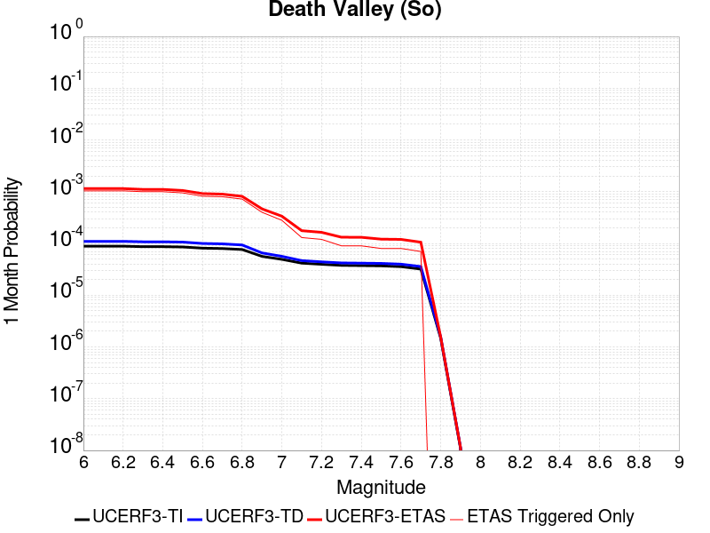
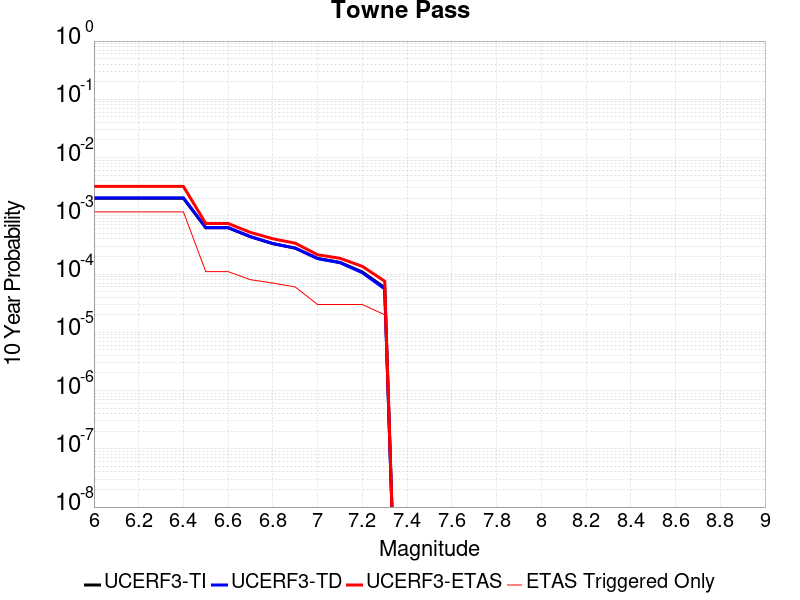
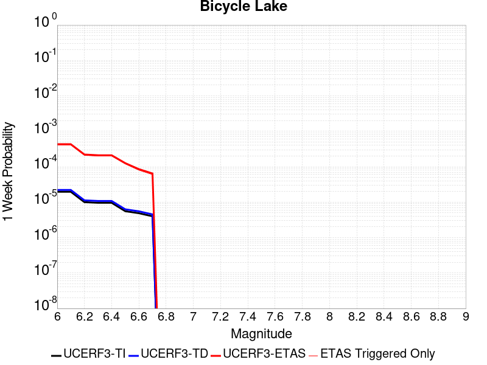
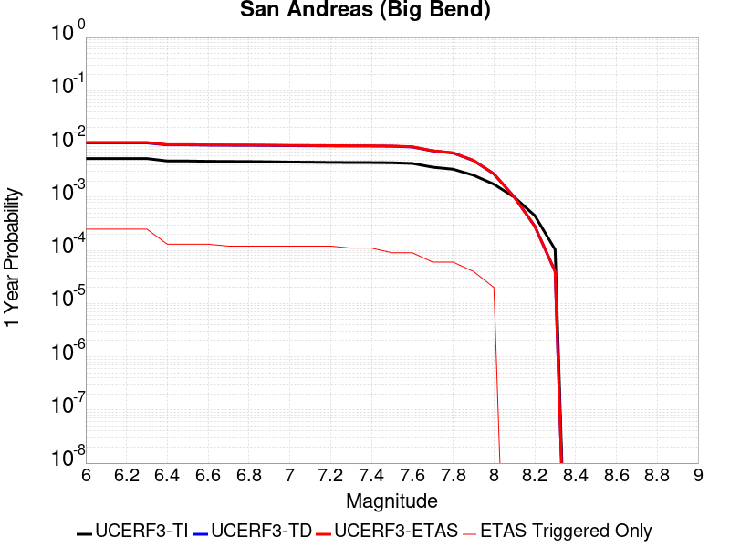
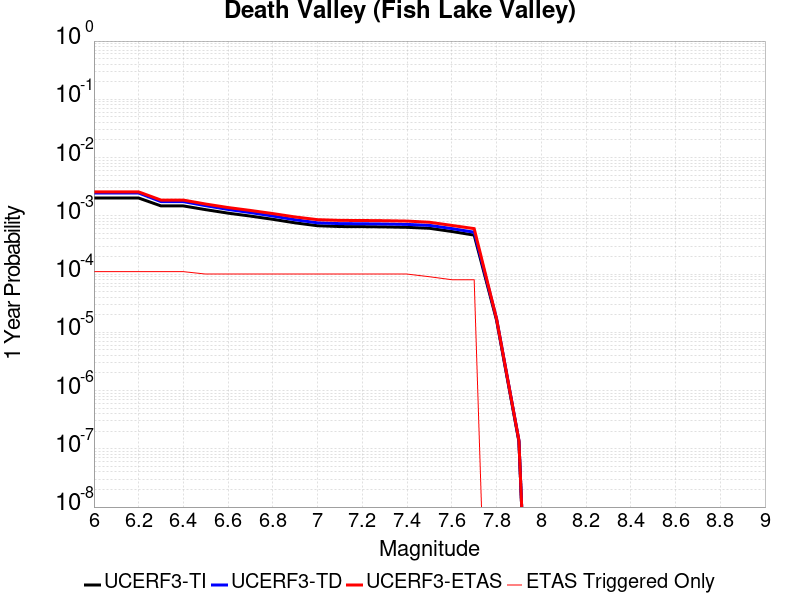
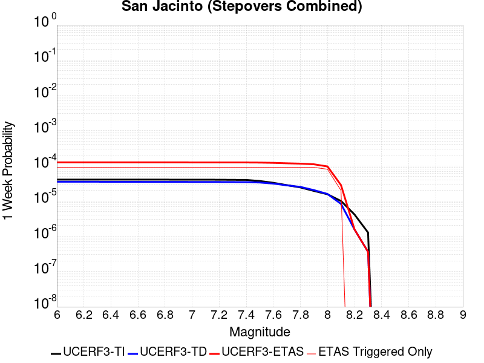
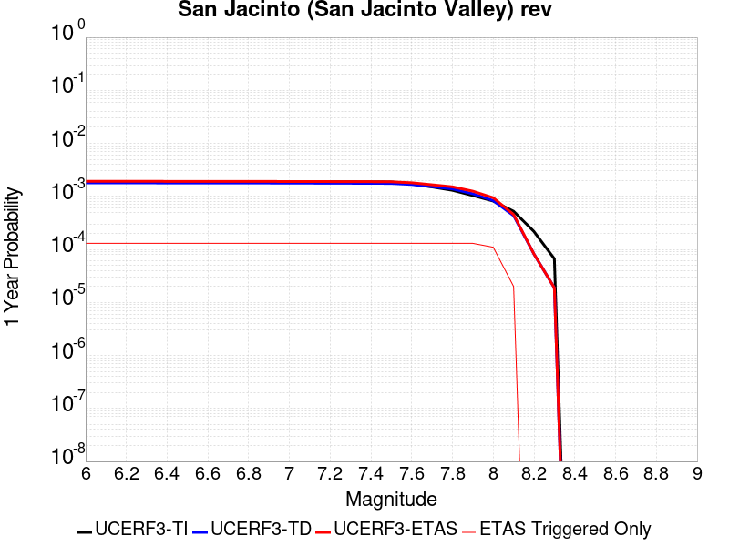
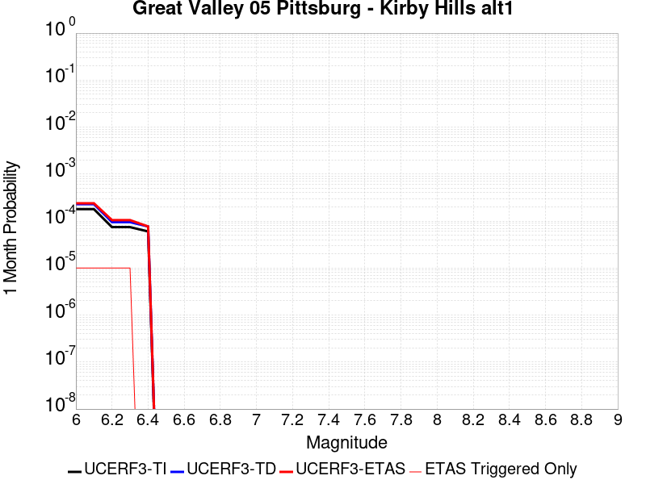
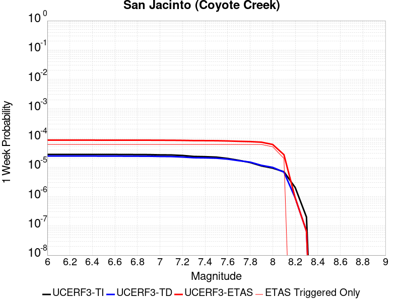
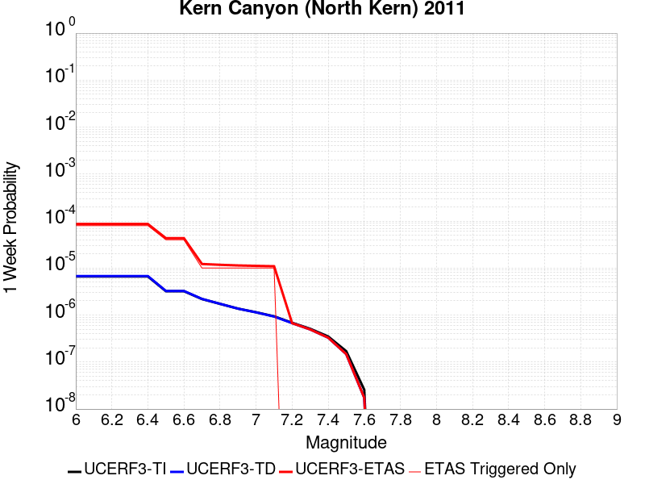

# Parent Section Magnitude-Probability Distributions

Only fault sections with at least one triggered aftershock are plotted. Sections are sorted by total supraseismogenic trigger rate (decreasing)

## Table Of Contents

* [Garlock (Central)](#garlock-central)
* [Tank Canyon](#tank-canyon)
* [Little Lake](#little-lake)
* [Airport Lake](#airport-lake)
* [Owl Lake](#owl-lake)
* [Panamint Valley](#panamint-valley)
* [Garlock (East)](#garlock-east)
* [Hunter Mountain-Saline Valley](#hunter-mountain-saline-valley)
* [Blackwater](#blackwater)
* [Garlock (West)](#garlock-west)
* [Ash Hill](#ash-hill)
* [Gravel Hills-Harper Lk](#gravel-hills-harper-lk)
* [San Andreas (Mojave S)](#san-andreas-mojave-s)
* [McLean Lake](#mclean-lake)
* [San Andreas (Mojave N)](#san-andreas-mojave-n)
* [Goldstone Lake](#goldstone-lake)
* [So Sierra Nevada](#so-sierra-nevada)
* [Death Valley (So)](#death-valley-so)
* [Lenwood-Lockhart-Old Woman Springs](#lenwood-lockhart-old-woman-springs)
* [San Andreas (San Bernardino N)](#san-andreas-san-bernardino-n)
* [Nelson Lake](#nelson-lake)
* [Towne Pass](#towne-pass)
* [Coyote Canyon](#coyote-canyon)
* [Paradise](#paradise)
* [Bicycle Lake](#bicycle-lake)
* [Death Valley (Black Mtns Frontal)](#death-valley-black-mtns-frontal)
* [Helendale-So Lockhart](#helendale-so-lockhart)
* [San Andreas (San Bernardino S)](#san-andreas-san-bernardino-s)
* [San Andreas (Parkfield)](#san-andreas-parkfield)
* [San Andreas (Big Bend)](#san-andreas-big-bend)
* [Garlic Springs](#garlic-springs)
* [San Andreas (Coachella) rev](#san-andreas-coachella-rev)
* [Death Valley (No)](#death-valley-no)
* [San Andreas (San Gorgonio Pass-Garnet HIll)](#san-andreas-san-gorgonio-pass-garnet-hill)
* [Red Pass](#red-pass)
* [Coyote Lake](#coyote-lake)
* [White Wolf (Extension)](#white-wolf-extension)
* [Baker](#baker)
* [San Andreas (Carrizo) rev](#san-andreas-carrizo-rev)
* [San Andreas (Creeping Section) 2011 CFM](#san-andreas-creeping-section-2011-cfm)
* [Calico-Hidalgo](#calico-hidalgo)
* [San Jacinto (San Bernardino)](#san-jacinto-san-bernardino)
* [San Andreas (Cholame) rev](#san-andreas-cholame-rev)
* [San Andreas (North Branch Mill Creek)](#san-andreas-north-branch-mill-creek)
* [Death Valley (Fish Lake Valley)](#death-valley-fish-lake-valley)
* [Lake Isabella (Seismicity)](#lake-isabella-seismicity)
* [Santa Ynez (East)](#santa-ynez-east)
* [Ludlow](#ludlow)
* [Sierra Nevada  (No Extension)](#sierra-nevada--no-extension)
* [Scodie Lineament](#scodie-lineament)
* [Deep Springs](#deep-springs)
* [Lost Hills](#lost-hills)
* [Cady](#cady)
* [Mission Ridge-Arroyo Parida-Santa Ana](#mission-ridge-arroyo-parida-santa-ana)
* [Camp Rock 2011](#camp-rock-2011)
* [San Jacinto (Stepovers Combined)](#san-jacinto-stepovers-combined)
* [San Jacinto (San Jacinto Valley) rev](#san-jacinto-san-jacinto-valley-rev)
* [Bullion Mountains](#bullion-mountains)
* [Palos Verdes](#palos-verdes)
* [San Pedro Basin](#san-pedro-basin)
* [Emerson-Copper Mtn 2011](#emerson-copper-mtn-2011)
* [Coronado Bank alt1](#coronado-bank-alt1)
* [Cleghorn Lake](#cleghorn-lake)
* [Santa Ynez (West)](#santa-ynez-west)
* [Kern Canyon (South Kern) 2011](#kern-canyon-south-kern-2011)
* [Santa Cruz Catalina Ridge alt1](#santa-cruz-catalina-ridge-alt1)
* [Whittier alt 1](#whittier-alt-1)
* [San Jacinto (Anza) rev](#san-jacinto-anza-rev)
* [Manix-Afton Hills](#manix-afton-hills)
* [San Gabriel](#san-gabriel)
* [Robinson Creek](#robinson-creek)
* [Ventura-Pitas Point](#ventura-pitas-point)
* [Pisgah-Bullion Mtn-Mesquite Lk](#pisgah-bullion-mtn-mesquite-lk)
* [South Klamath Lake East](#south-klamath-lake-east)
* [San Diego Trough south](#san-diego-trough-south)
* [San Juan](#san-juan)
* [Elsinore (Glen Ivy) rev](#elsinore-glen-ivy-rev)
* [Malibu Coast alt 1](#malibu-coast-alt-1)
* [Hayward (No) 2011 CFM](#hayward-no-2011-cfm)
* [Big Lagoon - Bald Mtn 2011 CFM](#big-lagoon---bald-mtn-2011-cfm)
* [Great Valley 05 Pittsburg - Kirby Hills alt1](#great-valley-05-pittsburg---kirby-hills-alt1)
* [Channel Islands Thrust](#channel-islands-thrust)
* [Pinto Mtn](#pinto-mtn)
* [San Jacinto (Borrego)](#san-jacinto-borrego)
* [San Jacinto (Coyote Creek)](#san-jacinto-coyote-creek)
* [Mono Lake 2011 CFM](#mono-lake-2011-cfm)
* [Elsinore (Stepovers Combined)](#elsinore-stepovers-combined)
* [Oceanic - West Huasna](#oceanic---west-huasna)
* [Kern Canyon (North Kern) 2011](#kern-canyon-north-kern-2011)
* [San Jacinto (Clark) rev](#san-jacinto-clark-rev)
* [Brawley (Seismic Zone) alt 1](#brawley-seismic-zone-alt-1)
* [Ortigalita (North)](#ortigalita-north)
* [Santa Rosa Island](#santa-rosa-island)
* [Imperial](#imperial)
* [Surprise Valley 2011 CFM](#surprise-valley-2011-cfm)
* [Goose Lake 2011 CFM](#goose-lake-2011-cfm)
* [San Diego Trough north alt1](#san-diego-trough-north-alt1)
* [Cleghorn Pass](#cleghorn-pass)
* [Elsinore (Temecula) rev](#elsinore-temecula-rev)
* [Blue Cut](#blue-cut)
* [Great Valley 09 (Laguna Seca)](#great-valley-09-laguna-seca)
* [Rodgers Creek - Healdsburg 2011 CFM](#rodgers-creek---healdsburg-2011-cfm)

## Garlock (Central)
*[(top)](#table-of-contents)*

| 1 Week | 1 Month | 1 Year | 10 Year |
|-----|-----|-----|-----|
|  |  |  |  |

| Magnitude | 1 wk TI Prob | 1 wk TD Prob | 1 wk ETAS Prob | 1 wk ETAS/TD Gain | 1 wk ETAS Triggered Only | 1 mo TI Prob | 1 mo TD Prob | 1 mo ETAS Prob | 1 mo ETAS/TD Gain | 1 mo ETAS Triggered Only | 1 yr TI Prob | 1 yr TD Prob | 1 yr ETAS Prob | 1 yr ETAS/TD Gain | 1 yr ETAS Triggered Only | 10 yr TI Prob | 10 yr TD Prob | 10 yr ETAS Prob | 10 yr ETAS/TD Gain | 10 yr ETAS Triggered Only |
|-----|-----|-----|-----|-----|-----|-----|-----|-----|-----|-----|-----|-----|-----|-----|-----|-----|-----|-----|-----|-----|
| 6.0 | 5.5131142E-5 | 7.024681E-5 | 0.061786305 | 879.5603 | 0.061720394 | 2.3625491E-4 | 3.010234E-4 | 0.0679301 | 225.66386 | 0.06764944 | 0.0028726095 | 0.0036588663 | 0.07777516 | 21.256626 | 0.07438847 | 0.028357591 | 0.036079824 | 0.11100108 | 3.0765414 | 0.07772558 |
| 6.1 | 5.5131142E-5 | 7.024681E-5 | 0.061786305 | 879.5603 | 0.061720394 | 2.3625491E-4 | 3.010234E-4 | 0.0679301 | 225.66386 | 0.06764944 | 0.0028726095 | 0.0036588663 | 0.07777516 | 21.256626 | 0.07438847 | 0.028357591 | 0.036079824 | 0.11100108 | 3.0765414 | 0.07772558 |
| 6.2 | 4.216245E-5 | 5.1661493E-5 | 0.03714678 | 719.04193 | 0.037097037 | 1.806837E-4 | 2.2138779E-4 | 0.040452234 | 182.72116 | 0.040239755 | 0.0021976046 | 0.0026920962 | 0.046894826 | 17.419445 | 0.044322047 | 0.021759989 | 0.026689773 | 0.07184708 | 2.691933 | 0.046395592 |
| 6.3 | 4.216245E-5 | 5.1661493E-5 | 0.03714678 | 719.04193 | 0.037097037 | 1.806837E-4 | 2.2138779E-4 | 0.040452234 | 182.72116 | 0.040239755 | 0.0021976046 | 0.0026920962 | 0.046894826 | 17.419445 | 0.044322047 | 0.021759989 | 0.026689773 | 0.07184708 | 2.691933 | 0.046395592 |
| 6.4 | 3.6858168E-5 | 4.411054E-5 | 0.028068146 | 636.3138 | 0.028025271 | 1.5795401E-4 | 1.8903162E-4 | 0.030703269 | 162.42398 | 0.030520007 | 0.0019213937 | 0.002299056 | 0.035949036 | 15.636435 | 0.033727523 | 0.019048655 | 0.02284894 | 0.05742043 | 2.5130455 | 0.03537988 |
| 6.5 | 3.39199E-5 | 4.0018083E-5 | 0.025213156 | 630.04407 | 0.025174145 | 1.453629E-4 | 1.7149492E-4 | 0.027673662 | 161.36725 | 0.027506884 | 0.0017683565 | 0.002085973 | 0.032315996 | 15.492048 | 0.030293213 | 0.017543508 | 0.020759864 | 0.051978793 | 2.5038118 | 0.03188077 |
| 6.6 | 3.3571985E-5 | 3.9472274E-5 | 0.025180226 | 637.9219 | 0.025141746 | 1.4387199E-4 | 1.6915603E-4 | 0.027638994 | 163.39348 | 0.027474485 | 0.0017502342 | 0.0020575512 | 0.0322561 | 15.676938 | 0.030260812 | 0.017365133 | 0.020481179 | 0.051677257 | 2.5231583 | 0.03184837 |
| 6.7 | 3.2580007E-5 | 3.8088703E-5 | 0.02420694 | 635.5412 | 0.024169771 | 1.3962112E-4 | 1.632272E-4 | 0.026531836 | 162.54544 | 0.026372915 | 0.0016985617 | 0.0019855013 | 0.031022178 | 15.624355 | 0.029094443 | 0.016856372 | 0.019773813 | 0.04975384 | 2.5161479 | 0.030584805 |
| 6.8 | 3.2185937E-5 | 3.7515918E-5 | 0.023720412 | 632.2759 | 0.023683785 | 1.3793244E-4 | 1.6077272E-4 | 0.026011143 | 161.78828 | 0.025854528 | 0.0016780337 | 0.001955672 | 0.030443508 | 15.566775 | 0.028543659 | 0.016654192 | 0.019480614 | 0.048866015 | 2.5084434 | 0.029969221 |
| 6.9 | 3.165394E-5 | 3.6720503E-5 | 0.023395656 | 637.1278 | 0.023359792 | 1.3565269E-4 | 1.5736422E-4 | 0.025651488 | 163.00713 | 0.025498137 | 0.0016503202 | 0.001914247 | 0.030047556 | 15.696801 | 0.028187267 | 0.01638118 | 0.019073246 | 0.0480577 | 2.5196393 | 0.029548032 |
| 7.0 | 3.0903822E-5 | 3.5625766E-5 | 0.023038208 | 646.67267 | 0.023003401 | 1.3243823E-4 | 1.5267303E-4 | 0.025258187 | 165.43974 | 0.025109347 | 0.0016112428 | 0.0018572307 | 0.02957174 | 15.922492 | 0.027766079 | 0.015996104 | 0.018512413 | 0.04706825 | 2.5425236 | 0.029094443 |
| 7.1 | 3.0069863E-5 | 3.4392073E-5 | 0.021805877 | 634.0379 | 0.021772234 | 1.2886449E-4 | 1.4738638E-4 | 0.02382768 | 161.66812 | 0.023683785 | 0.0015677959 | 0.0017929734 | 0.027827533 | 15.520327 | 0.026081322 | 0.01556781 | 0.017880075 | 0.044704217 | 2.5002253 | 0.02731249 |
| 7.2 | 2.7957109E-5 | 3.128145E-5 | 0.01856302 | 593.4194 | 0.018532319 | 1.1981068E-4 | 1.340566E-4 | 0.02034842 | 151.78978 | 0.020217074 | 0.0014577188 | 0.0016309366 | 0.023885202 | 14.645083 | 0.022290621 | 0.014481937 | 0.016283695 | 0.03919936 | 2.4072769 | 0.023294995 |
| 7.3 | 2.4519275E-5 | 2.6714795E-5 | 0.013050828 | 488.52435 | 0.013024461 | 1.0507837E-4 | 1.1448703E-4 | 0.014206507 | 124.08835 | 0.014093634 | 0.0012785783 | 0.001393003 | 0.016761165 | 12.032396 | 0.0153896 | 0.012712469 | 0.013928054 | 0.029678369 | 2.1308339 | 0.015972784 |
| 7.4 | 2.3225532E-5 | 2.51994E-5 | 0.011753399 | 466.41583 | 0.011728495 | 9.95342E-5 | 1.0799304E-4 | 0.012871883 | 119.19178 | 0.012765268 | 0.0012111551 | 0.0013140367 | 0.015227368 | 11.588237 | 0.013931638 | 0.012045753 | 0.013145725 | 0.02746974 | 2.089633 | 0.0145148225 |
| 7.5 | 2.097765E-5 | 2.2483688E-5 | 0.009320833 | 414.55978 | 0.009298558 | 8.9901114E-5 | 9.635517E-5 | 0.010139126 | 105.22659 | 0.010043738 | 0.0010939965 | 0.0011725046 | 0.012175302 | 10.384012 | 0.011015713 | 0.010886264 | 0.011740365 | 0.023107031 | 1.9681698 | 0.011501701 |
| 7.6 | 1.511254E-5 | 1.5991332E-5 | 0.004972983 | 310.97992 | 0.004957071 | 6.476642E-5 | 6.853253E-5 | 0.0054140273 | 78.99938 | 0.005345861 | 7.882459E-4 | 8.3407195E-4 | 0.006790545 | 8.141438 | 0.005961445 | 0.007854558 | 0.008383559 | 0.014584173 | 1.739616 | 0.0062530376 |
| 7.7 | 9.934069E-6 | 1.0678794E-5 | 0.0015982206 | 149.66302 | 0.0015875588 | 4.2573887E-5 | 4.5765457E-5 | 0.0017304445 | 37.81115 | 0.0016847563 | 5.182138E-4 | 5.570524E-4 | 0.0024027757 | 4.3133745 | 0.001846752 | 0.00517007 | 0.005627684 | 0.00759291 | 1.3492069 | 0.0019763487 |
| 7.8 | 6.7562896E-6 | 8.428449E-6 | 0.0010775917 | 127.851715 | 0.0010691722 | 2.8955206E-5 | 3.6121426E-5 | 0.0011700509 | 32.39216 | 0.0011339706 | 3.5247262E-4 | 4.3968976E-4 | 0.0016703164 | 3.7988522 | 0.001231168 | 0.0035191406 | 0.004446654 | 0.0057046027 | 1.2828977 | 0.0012635671 |
| 7.9 | 3.975453E-6 | 5.37103E-6 | 5.2375474E-4 | 97.51477 | 5.1838654E-4 | 1.7037546E-5 | 2.3018498E-5 | 5.737915E-4 | 24.927408 | 5.507857E-4 | 2.0741238E-4 | 2.8021427E-4 | 8.632357E-4 | 3.0806272 | 5.831848E-4 | 0.002072189 | 0.0028336283 | 0.003447468 | 1.2166268 | 6.15584E-4 |
| 8.0 | 1.6729537E-6 | 2.0775144E-6 | 2.2887114E-4 | 110.165855 | 2.267941E-4 | 7.169782E-6 | 8.903603E-6 | 2.6809456E-4 | 30.110794 | 2.5919327E-4 | 8.7288594E-5 | 1.0839601E-4 | 3.6756118E-4 | 3.3909106 | 2.5919327E-4 | 8.7254314E-4 | 0.0010969337 | 0.0013558427 | 1.2360297 | 2.5919327E-4 |
| 8.1 | 3.6733252E-7 | 3.1489964E-7 | 3.1489964E-7 | 1.0 | 0.0 | 1.5742813E-6 | 1.3495693E-6 | 1.3495693E-6 | 1.0 | 0.0 | 1.9166706E-5 | 1.6430899E-5 | 1.6430899E-5 | 1.0 | 0.0 | 1.9165053E-4 | 1.6638759E-4 | 1.6638759E-4 | 1.0 | 0.0 |

## Tank Canyon
*[(top)](#table-of-contents)*

| 1 Week | 1 Month | 1 Year | 10 Year |
|-----|-----|-----|-----|
|  |  |  |  |

| Magnitude | 1 wk TI Prob | 1 wk TD Prob | 1 wk ETAS Prob | 1 wk ETAS/TD Gain | 1 wk ETAS Triggered Only | 1 mo TI Prob | 1 mo TD Prob | 1 mo ETAS Prob | 1 mo ETAS/TD Gain | 1 mo ETAS Triggered Only | 1 yr TI Prob | 1 yr TD Prob | 1 yr ETAS Prob | 1 yr ETAS/TD Gain | 1 yr ETAS Triggered Only | 10 yr TI Prob | 10 yr TD Prob | 10 yr ETAS Prob | 10 yr ETAS/TD Gain | 10 yr ETAS Triggered Only |
|-----|-----|-----|-----|-----|-----|-----|-----|-----|-----|-----|-----|-----|-----|-----|-----|-----|-----|-----|-----|-----|
| 6.0 | 4.8284557E-5 | 5.7964822E-5 | 0.033427164 | 576.6801 | 0.033371132 | 2.0691741E-4 | 2.4840087E-4 | 0.037854478 | 152.3927 | 0.037615422 | 0.0025163088 | 0.0030207601 | 0.045367748 | 15.018653 | 0.042475294 | 0.02488006 | 0.029863637 | 0.07380501 | 2.4714007 | 0.045294024 |
| 6.1 | 1.7796336E-5 | 2.0873314E-5 | 0.01204071 | 576.84705 | 0.012020088 | 7.626778E-5 | 8.945422E-5 | 0.013890261 | 155.27788 | 0.013802041 | 9.281647E-4 | 0.0010885983 | 0.016623264 | 15.27034 | 0.015551596 | 0.009242975 | 0.010836744 | 0.027085109 | 2.499377 | 0.016426373 |
| 6.2 | 1.7796336E-5 | 2.0873314E-5 | 0.01204071 | 576.84705 | 0.012020088 | 7.626778E-5 | 8.945422E-5 | 0.013890261 | 155.27788 | 0.013802041 | 9.281647E-4 | 0.0010885983 | 0.016623264 | 15.27034 | 0.015551596 | 0.009242975 | 0.010836744 | 0.027085109 | 2.499377 | 0.016426373 |
| 6.3 | 1.3515912E-5 | 1.5759564E-5 | 0.008115421 | 514.95215 | 0.00809979 | 5.792405E-5 | 6.753938E-5 | 0.00946266 | 140.10582 | 0.009395756 | 7.049971E-4 | 8.2200574E-4 | 0.011310704 | 13.759884 | 0.010497327 | 0.007027647 | 0.0081922645 | 0.019085601 | 2.32971 | 0.010983314 |
| 6.4 | 1.0870146E-5 | 1.2618021E-5 | 0.0061359815 | 486.28717 | 0.006123441 | 4.658551E-5 | 5.4076212E-5 | 0.0070195184 | 129.80788 | 0.006965819 | 5.67031E-4 | 6.581969E-4 | 0.008299366 | 12.609243 | 0.007646201 | 0.005655863 | 0.0065644905 | 0.014482363 | 2.206167 | 0.0079701925 |
| 6.5 | 7.964826E-6 | 9.196094E-6 | 0.003929458 | 427.29642 | 0.003920298 | 3.4134522E-5 | 3.9411298E-5 | 0.004413125 | 111.97615 | 0.004373886 | 4.1550855E-4 | 4.7973756E-4 | 0.0052077454 | 10.855405 | 0.004730277 | 0.0041473247 | 0.004788321 | 0.009657168 | 2.016817 | 0.004892273 |
| 6.6 | 6.6317E-6 | 7.6122988E-6 | 0.0028263174 | 371.28305 | 0.0028187267 | 2.8421264E-5 | 3.2623782E-5 | 0.0032076377 | 98.32207 | 0.0031751175 | 3.4597394E-4 | 3.9713128E-4 | 0.0037976918 | 9.562812 | 0.0034019116 | 0.0034543579 | 0.003965368 | 0.007515143 | 1.8951944 | 0.0035639072 |
| 6.7 | 4.793663E-6 | 5.4307857E-6 | 0.0016901778 | 311.22162 | 0.0016847563 | 2.0544108E-5 | 2.3274613E-5 | 0.0018699836 | 80.34435 | 0.001846752 | 2.500958E-4 | 2.8333595E-4 | 0.0021943445 | 7.7446747 | 0.0019115503 | 0.0024981452 | 0.0028304397 | 0.004801194 | 1.6962715 | 0.0019763487 |
| 6.8 | 4.382823E-6 | 4.9692567E-6 | 0.00159252 | 320.4745 | 0.0015875588 | 1.8783392E-5 | 2.1296666E-5 | 0.001770814 | 83.14982 | 0.0017495545 | 2.286638E-4 | 2.5926033E-4 | 0.0020731427 | 7.996375 | 0.0018143528 | 0.0022842865 | 0.002590253 | 0.0044322214 | 1.7111152 | 0.001846752 |
| 6.9 | 2.729601E-6 | 3.0735416E-6 | 8.778481E-4 | 285.6145 | 8.7477727E-4 | 1.1698237E-5 | 1.3172262E-5 | 0.0010175329 | 77.24815 | 0.0010043739 | 1.4241673E-4 | 1.6036171E-4 | 0.0011969685 | 7.4641786 | 0.0010367731 | 0.001423255 | 0.0016026258 | 0.0026377374 | 1.6458846 | 0.0010367731 |
| 7.0 | 1.8987357E-6 | 2.126939E-6 | 3.585169E-4 | 168.56003 | 3.5639072E-4 | 8.137413E-6 | 9.115425E-6 | 4.626995E-4 | 50.760056 | 4.535882E-4 | 9.90685E-5 | 1.1097535E-4 | 5.969088E-4 | 5.3787513 | 4.8598737E-4 | 9.902435E-4 | 0.0011092679 | 0.0015947162 | 1.4376293 | 4.8598737E-4 |
| 7.1 | 1.4928986E-6 | 1.6641272E-6 | 1.9605875E-4 | 117.81476 | 1.9439495E-4 | 6.398121E-6 | 7.1319573E-6 | 2.6632336E-4 | 37.342255 | 2.5919327E-4 | 7.789434E-5 | 8.682871E-5 | 3.783958E-4 | 4.3579574 | 2.915924E-4 | 7.786704E-4 | 8.6800574E-4 | 0.001159345 | 1.3356421 | 2.915924E-4 |
| 7.2 | 1.069082E-6 | 1.1828573E-6 | 6.59811E-5 | 55.781113 | 6.479832E-5 | 4.581772E-6 | 5.0693816E-6 | 1.02266364E-4 | 20.173342 | 9.719747E-5 | 5.5781646E-5 | 6.171851E-5 | 1.9130713E-4 | 3.0996723 | 1.2959664E-4 | 5.576765E-4 | 6.170659E-4 | 7.465826E-4 | 1.2098911 | 1.2959664E-4 |
| 7.3 | 8.776551E-7 | 9.770005E-7 | 9.770005E-7 | 1.0 | 0.0 | 3.7613736E-6 | 4.1871413E-6 | 3.6586163E-5 | 8.737743 | 3.239916E-5 | 4.579376E-5 | 5.097777E-5 | 1.1577278E-4 | 2.2710445 | 6.479832E-5 | 4.5784327E-4 | 5.097118E-4 | 5.744771E-4 | 1.1270626 | 6.479832E-5 |
| 7.4 | 7.55721E-7 | 8.510244E-7 | 8.510244E-7 | 1.0 | 0.0 | 3.2388E-6 | 3.6472454E-6 | 3.6472454E-6 | 1.0 | 0.0 | 3.9431678E-5 | 4.4404827E-5 | 4.4404827E-5 | 1.0 | 0.0 | 3.942468E-4 | 4.440104E-4 | 4.440104E-4 | 1.0 | 0.0 |
| 7.5 | 5.587665E-7 | 6.305619E-7 | 6.305619E-7 | 1.0 | 0.0 | 2.3947114E-6 | 2.702408E-6 | 2.702408E-6 | 1.0 | 0.0 | 2.915522E-5 | 3.290182E-5 | 3.290182E-5 | 1.0 | 0.0 | 2.9151395E-4 | 3.290182E-4 | 3.290182E-4 | 1.0 | 0.0 |

## Little Lake
*[(top)](#table-of-contents)*

| 1 Week | 1 Month | 1 Year | 10 Year |
|-----|-----|-----|-----|
|  |  |  |  |

| Magnitude | 1 wk TI Prob | 1 wk TD Prob | 1 wk ETAS Prob | 1 wk ETAS/TD Gain | 1 wk ETAS Triggered Only | 1 mo TI Prob | 1 mo TD Prob | 1 mo ETAS Prob | 1 mo ETAS/TD Gain | 1 mo ETAS Triggered Only | 1 yr TI Prob | 1 yr TD Prob | 1 yr ETAS Prob | 1 yr ETAS/TD Gain | 1 yr ETAS Triggered Only | 10 yr TI Prob | 10 yr TD Prob | 10 yr ETAS Prob | 10 yr ETAS/TD Gain | 10 yr ETAS Triggered Only |
|-----|-----|-----|-----|-----|-----|-----|-----|-----|-----|-----|-----|-----|-----|-----|-----|-----|-----|-----|-----|-----|
| 6.0 | 2.8424427E-5 | 3.120572E-5 | 0.029254334 | 937.46704 | 0.02922404 | 1.2181328E-4 | 1.337327E-4 | 0.031913057 | 238.63315 | 0.031783573 | 0.0014820677 | 0.0016271127 | 0.035784952 | 21.992916 | 0.03421351 | 0.014722223 | 0.016165402 | 0.05084585 | 3.1453505 | 0.035250284 |
| 6.1 | 2.8424427E-5 | 3.120572E-5 | 0.029254334 | 937.46704 | 0.02922404 | 1.2181328E-4 | 1.337327E-4 | 0.031913057 | 238.63315 | 0.031783573 | 0.0014820677 | 0.0016271127 | 0.035784952 | 21.992916 | 0.03421351 | 0.014722223 | 0.016165402 | 0.05084585 | 3.1453505 | 0.035250284 |
| 6.2 | 2.8424427E-5 | 3.120572E-5 | 0.029254334 | 937.46704 | 0.02922404 | 1.2181328E-4 | 1.337327E-4 | 0.031913057 | 238.63315 | 0.031783573 | 0.0014820677 | 0.0016271127 | 0.035784952 | 21.992916 | 0.03421351 | 0.014722223 | 0.016165402 | 0.05084585 | 3.1453505 | 0.035250284 |
| 6.3 | 1.48860645E-5 | 1.6081389E-5 | 0.019876445 | 1235.9906 | 0.019860683 | 6.379586E-5 | 6.8918576E-5 | 0.021450888 | 311.24973 | 0.021383444 | 7.7643775E-4 | 8.3878887E-4 | 0.02408187 | 28.710289 | 0.023262596 | 0.007737305 | 0.008359048 | 0.032101884 | 3.8403757 | 0.023942977 |
| 6.4 | 1.48860645E-5 | 1.6081389E-5 | 0.019876445 | 1235.9906 | 0.019860683 | 6.379586E-5 | 6.8918576E-5 | 0.021450888 | 311.24973 | 0.021383444 | 7.7643775E-4 | 8.3878887E-4 | 0.02408187 | 28.710289 | 0.023262596 | 0.007737305 | 0.008359048 | 0.032101884 | 3.8403757 | 0.023942977 |
| 6.5 | 1.2797581E-5 | 1.3765565E-5 | 0.018675424 | 1356.6769 | 0.018661914 | 5.4845623E-5 | 5.899409E-5 | 0.020112889 | 340.9306 | 0.020055078 | 6.675408E-4 | 7.18042E-4 | 0.02250702 | 31.344988 | 0.021804633 | 0.006655392 | 0.00715977 | 0.029419463 | 4.1089954 | 0.022420216 |
| 6.6 | 9.661896E-6 | 1.0289038E-5 | 0.016371695 | 1591.1785 | 0.016361574 | 4.1407468E-5 | 4.409522E-5 | 0.017733255 | 402.1582 | 0.01768994 | 5.040193E-4 | 5.367433E-4 | 0.01970675 | 36.71541 | 0.019180302 | 0.005028777 | 0.0053560743 | 0.02498148 | 4.6641397 | 0.019731088 |
| 6.7 | 7.767871E-6 | 8.199687E-6 | 0.014522904 | 1771.1534 | 0.0145148225 | 3.329045E-5 | 3.5141118E-5 | 0.015877772 | 451.8289 | 0.015843188 | 4.0523586E-4 | 4.2777284E-4 | 0.017591981 | 41.124584 | 0.017171554 | 0.004044977 | 0.004270846 | 0.021852974 | 5.116779 | 0.01765754 |
| 6.8 | 6.4235196E-6 | 6.7357446E-6 | 0.01089278 | 1617.1604 | 0.010886117 | 2.752908E-5 | 2.8867229E-5 | 0.011951413 | 414.01315 | 0.01192289 | 3.35115E-4 | 3.5141467E-4 | 0.013338911 | 37.957752 | 0.012992063 | 0.003346101 | 0.00350985 | 0.016908308 | 4.8173876 | 0.01344565 |
| 6.9 | 3.1283696E-6 | 3.1121804E-6 | 0.006580121 | 2114.312 | 0.006577029 | 1.3407229E-5 | 1.3337856E-5 | 0.0074002473 | 554.8303 | 0.007387008 | 1.6322079E-4 | 1.6237781E-4 | 0.008228458 | 50.67477 | 0.00806739 | 0.0016310095 | 0.00162274 | 0.010000505 | 6.162728 | 0.008391382 |
| 7.0 | 2.290603E-6 | 2.2286815E-6 | 0.0041169124 | 1847.2412 | 0.004114693 | 9.816834E-6 | 9.551463E-6 | 0.0046425867 | 486.06027 | 0.0046330797 | 1.19513395E-4 | 1.162839E-4 | 0.005169965 | 44.45985 | 0.0050542685 | 0.0011944914 | 0.0011623327 | 0.0064696185 | 5.5660644 | 0.0053134616 |
| 7.1 | 1.293693E-6 | 1.1776827E-6 | 0.0018155284 | 1541.6107 | 0.0018143528 | 5.5443866E-6 | 5.0472063E-6 | 0.0020137848 | 398.99002 | 0.0020087478 | 6.750081E-5 | 6.14487E-5 | 0.002296853 | 37.378387 | 0.0022355418 | 6.7480316E-4 | 6.143856E-4 | 0.0030428295 | 4.952638 | 0.0024299368 |
| 7.2 | 4.715842E-7 | 3.0917857E-7 | 6.510747E-5 | 210.5821 | 6.479832E-5 | 2.0210737E-6 | 1.3250503E-6 | 6.612328E-5 | 49.902466 | 6.479832E-5 | 2.4606294E-5 | 1.6132375E-5 | 8.092965E-5 | 5.016598 | 6.479832E-5 | 2.460357E-4 | 1.6131258E-4 | 2.2610044E-4 | 1.4016293 | 6.479832E-5 |
| 7.3 | 3.9430947E-7 | 2.3097488E-7 | 6.502928E-5 | 281.54263 | 6.479832E-5 | 1.6898966E-6 | 9.89892E-7 | 6.578815E-5 | 66.45992 | 6.479832E-5 | 2.0574296E-5 | 1.2051869E-5 | 7.68494E-5 | 6.376555 | 6.479832E-5 | 2.0572392E-4 | 1.20512224E-4 | 1.8530274E-4 | 1.537626 | 6.479832E-5 |
| 7.4 | 3.547123E-7 | 1.9679135E-7 | 1.9679135E-7 | 1.0 | 0.0 | 1.5201948E-6 | 8.4339126E-7 | 8.4339126E-7 | 1.0 | 0.0 | 1.8508214E-5 | 1.0268241E-5 | 1.0268241E-5 | 1.0 | 0.0 | 1.8506673E-4 | 1.02677724E-4 | 1.02677724E-4 | 1.0 | 0.0 |
| 7.5 | 2.6354266E-7 | 1.4423138E-7 | 1.4423138E-7 | 1.0 | 0.0 | 1.129468E-6 | 6.181344E-7 | 6.181344E-7 | 1.0 | 0.0 | 1.3751187E-5 | 7.5257603E-6 | 7.5257603E-6 | 1.0 | 0.0 | 1.3750336E-4 | 7.5255106E-5 | 7.5255106E-5 | 1.0 | 0.0 |
| 7.6 | 1.269913E-7 | 7.572556E-8 | 7.572556E-8 | 1.0 | 0.0 | 5.4424834E-7 | 3.245381E-7 | 3.245381E-7 | 1.0 | 0.0 | 6.6262032E-6 | 3.9512443E-6 | 3.9512443E-6 | 1.0 | 0.0 | 6.626006E-5 | 3.9511775E-5 | 3.9511775E-5 | 1.0 | 0.0 |

## Airport Lake
*[(top)](#table-of-contents)*

| 1 Week | 1 Month | 1 Year | 10 Year |
|-----|-----|-----|-----|
|  |  |  |  |

| Magnitude | 1 wk TI Prob | 1 wk TD Prob | 1 wk ETAS Prob | 1 wk ETAS/TD Gain | 1 wk ETAS Triggered Only | 1 mo TI Prob | 1 mo TD Prob | 1 mo ETAS Prob | 1 mo ETAS/TD Gain | 1 mo ETAS Triggered Only | 1 yr TI Prob | 1 yr TD Prob | 1 yr ETAS Prob | 1 yr ETAS/TD Gain | 1 yr ETAS Triggered Only | 10 yr TI Prob | 10 yr TD Prob | 10 yr ETAS Prob | 10 yr ETAS/TD Gain | 10 yr ETAS Triggered Only |
|-----|-----|-----|-----|-----|-----|-----|-----|-----|-----|-----|-----|-----|-----|-----|-----|-----|-----|-----|-----|-----|
| 6.0 | 1.2387061E-5 | 1.3103157E-5 | 0.02619128 | 1998.8527 | 0.02617852 | 5.3086325E-5 | 5.615534E-5 | 0.02837143 | 505.2312 | 0.028316863 | 6.461343E-4 | 6.8350515E-4 | 0.031571176 | 46.190105 | 0.030908797 | 0.0064425888 | 0.0068168393 | 0.038480286 | 5.6448865 | 0.03188077 |
| 6.1 | 1.2387061E-5 | 1.3103157E-5 | 0.02619128 | 1998.8527 | 0.02617852 | 5.3086325E-5 | 5.615534E-5 | 0.02837143 | 505.2312 | 0.028316863 | 6.461343E-4 | 6.8350515E-4 | 0.031571176 | 46.190105 | 0.030908797 | 0.0064425888 | 0.0068168393 | 0.038480286 | 5.6448865 | 0.03188077 |
| 6.2 | 1.2387061E-5 | 1.3103157E-5 | 0.02619128 | 1998.8527 | 0.02617852 | 5.3086325E-5 | 5.615534E-5 | 0.02837143 | 505.2312 | 0.028316863 | 6.461343E-4 | 6.8350515E-4 | 0.031571176 | 46.190105 | 0.030908797 | 0.0064425888 | 0.0068168393 | 0.038480286 | 5.6448865 | 0.03188077 |
| 6.3 | 1.2387061E-5 | 1.3103157E-5 | 0.02619128 | 1998.8527 | 0.02617852 | 5.3086325E-5 | 5.615534E-5 | 0.02837143 | 505.2312 | 0.028316863 | 6.461343E-4 | 6.8350515E-4 | 0.031571176 | 46.190105 | 0.030908797 | 0.0064425888 | 0.0068168393 | 0.038480286 | 5.6448865 | 0.03188077 |
| 6.4 | 1.2387061E-5 | 1.3103157E-5 | 0.02619128 | 1998.8527 | 0.02617852 | 5.3086325E-5 | 5.615534E-5 | 0.02837143 | 505.2312 | 0.028316863 | 6.461343E-4 | 6.8350515E-4 | 0.031571176 | 46.190105 | 0.030908797 | 0.0064425888 | 0.0068168393 | 0.038480286 | 5.6448865 | 0.03188077 |
| 6.5 | 6.9922594E-6 | 7.384925E-6 | 0.019770725 | 2677.1733 | 0.019763486 | 2.996648E-5 | 3.1649324E-5 | 0.021414416 | 676.61523 | 0.021383444 | 3.6478083E-4 | 3.8526783E-4 | 0.023703674 | 61.52518 | 0.023327393 | 0.003641826 | 0.0038465366 | 0.027826514 | 7.234174 | 0.024072574 |
| 6.6 | 6.9922594E-6 | 7.384925E-6 | 0.019770725 | 2677.1733 | 0.019763486 | 2.996648E-5 | 3.1649324E-5 | 0.021414416 | 676.61523 | 0.021383444 | 3.6478083E-4 | 3.8526783E-4 | 0.023703674 | 61.52518 | 0.023327393 | 0.003641826 | 0.0038465366 | 0.027826514 | 7.234174 | 0.024072574 |
| 6.7 | 5.477277E-6 | 5.7860684E-6 | 0.016496861 | 2851.135 | 0.016491171 | 2.3473833E-5 | 2.4797222E-5 | 0.017973486 | 724.8185 | 0.017949134 | 2.8575645E-4 | 3.0186825E-4 | 0.019832663 | 65.69973 | 0.019536693 | 0.0028538927 | 0.003014966 | 0.023106484 | 7.6639285 | 0.020152276 |
| 6.8 | 3.9950432E-6 | 4.2190873E-6 | 0.012283448 | 2911.3994 | 0.01227928 | 1.7121502E-5 | 1.8081691E-5 | 0.013560684 | 749.9677 | 0.013542848 | 2.0843433E-4 | 2.2012512E-4 | 0.014958497 | 67.95452 | 0.014741616 | 0.0020823893 | 0.0021993418 | 0.017425783 | 7.923181 | 0.0152600035 |
| 6.9 | 2.95695E-6 | 3.1230243E-6 | 0.008945263 | 2864.295 | 0.008942167 | 1.2672582E-5 | 1.3384334E-5 | 0.01002459 | 748.9794 | 0.01001134 | 1.5427776E-4 | 1.6294434E-4 | 0.011112075 | 68.195526 | 0.0109509155 | 0.001541707 | 0.0016284712 | 0.0129820565 | 7.971929 | 0.011372104 |
| 7.0 | 1.456072E-6 | 1.540812E-6 | 0.003986631 | 2587.3572 | 0.0039850962 | 6.2402937E-6 | 6.603469E-6 | 0.004477658 | 678.0766 | 0.0044710836 | 7.597293E-5 | 8.039528E-5 | 0.0049398784 | 61.44488 | 0.0048598736 | 7.594696E-4 | 8.0376083E-4 | 0.0059187133 | 7.3637743 | 0.0051190667 |
| 7.1 | 6.995192E-7 | 7.4089746E-7 | 0.0017502941 | 2362.3972 | 0.0017495545 | 2.997936E-6 | 3.1752747E-6 | 0.0019471186 | 613.21265 | 0.0019439495 | 3.649926E-5 | 3.865897E-5 | 0.0022093186 | 57.148926 | 0.0021707437 | 3.6493264E-4 | 3.865897E-4 | 0.002750814 | 7.11559 | 0.0023651386 |

## Owl Lake
*[(top)](#table-of-contents)*

| 1 Week | 1 Month | 1 Year | 10 Year |
|-----|-----|-----|-----|
|  |  |  |  |

| Magnitude | 1 wk TI Prob | 1 wk TD Prob | 1 wk ETAS Prob | 1 wk ETAS/TD Gain | 1 wk ETAS Triggered Only | 1 mo TI Prob | 1 mo TD Prob | 1 mo ETAS Prob | 1 mo ETAS/TD Gain | 1 mo ETAS Triggered Only | 1 yr TI Prob | 1 yr TD Prob | 1 yr ETAS Prob | 1 yr ETAS/TD Gain | 1 yr ETAS Triggered Only | 10 yr TI Prob | 10 yr TD Prob | 10 yr ETAS Prob | 10 yr ETAS/TD Gain | 10 yr ETAS Triggered Only |
|-----|-----|-----|-----|-----|-----|-----|-----|-----|-----|-----|-----|-----|-----|-----|-----|-----|-----|-----|-----|-----|
| 6.0 | 5.0320643E-5 | 6.635816E-5 | 0.014353438 | 216.30255 | 0.014288029 | 2.1564208E-4 | 2.843674E-4 | 0.016544119 | 58.178684 | 0.016264377 | 0.0026222812 | 0.0034577388 | 0.021958264 | 6.350469 | 0.018564718 | 0.02591553 | 0.034140717 | 0.053166877 | 1.5572865 | 0.019698689 |
| 6.1 | 5.0320643E-5 | 6.635816E-5 | 0.014353438 | 216.30255 | 0.014288029 | 2.1564208E-4 | 2.843674E-4 | 0.016544119 | 58.178684 | 0.016264377 | 0.0026222812 | 0.0034577388 | 0.021958264 | 6.350469 | 0.018564718 | 0.02591553 | 0.034140717 | 0.053166877 | 1.5572865 | 0.019698689 |
| 6.2 | 2.4125871E-5 | 3.0981035E-5 | 0.011046354 | 356.5521 | 0.011015713 | 1.0339249E-4 | 1.3277028E-4 | 0.012507605 | 94.20486 | 0.012376478 | 0.0012580766 | 0.001615439 | 0.015653959 | 9.69022 | 0.014061234 | 0.012509781 | 0.016070465 | 0.030766448 | 1.9144716 | 0.014936011 |
| 6.3 | 1.7433485E-5 | 2.2355514E-5 | 0.010130667 | 453.1619 | 0.010108537 | 7.471279E-5 | 9.580672E-5 | 0.011337237 | 118.33447 | 0.011242508 | 9.0924866E-4 | 0.0011659743 | 0.013916358 | 11.93539 | 0.012765268 | 0.009055373 | 0.011628896 | 0.02491819 | 2.142782 | 0.01344565 |
| 6.4 | 1.7433485E-5 | 2.2355514E-5 | 0.010130667 | 453.1619 | 0.010108537 | 7.471279E-5 | 9.580672E-5 | 0.011337237 | 118.33447 | 0.011242508 | 9.0924866E-4 | 0.0011659743 | 0.013916358 | 11.93539 | 0.012765268 | 0.009055373 | 0.011628896 | 0.02491819 | 2.142782 | 0.01344565 |
| 6.5 | 1.5182742E-5 | 1.9429144E-5 | 0.009803785 | 504.59167 | 0.009784546 | 6.506727E-5 | 8.326596E-5 | 0.0109684765 | 131.72823 | 0.010886117 | 7.919061E-4 | 0.0010134429 | 0.013377379 | 13.199933 | 0.012376478 | 0.0078909 | 0.010118429 | 0.023011103 | 2.2741776 | 0.013024461 |
| 6.6 | 6.7271576E-6 | 8.547361E-6 | 0.008075869 | 944.83765 | 0.00806739 | 2.8830356E-5 | 3.6631063E-5 | 0.008881277 | 242.45206 | 0.00884497 | 3.5095305E-4 | 4.458976E-4 | 0.010452773 | 23.442093 | 0.01001134 | 0.0035039932 | 0.004467813 | 0.014950494 | 3.346267 | 0.010529726 |
| 6.7 | 6.682835E-6 | 8.479807E-6 | 0.008075802 | 952.35675 | 0.00806739 | 2.8640408E-5 | 3.6341557E-5 | 0.008880991 | 244.37561 | 0.00884497 | 3.4864116E-4 | 4.4237426E-4 | 0.010449286 | 23.620914 | 0.01001134 | 0.003480947 | 0.0044327388 | 0.0149157895 | 3.364915 | 0.010529726 |
| 6.8 | 6.5774975E-6 | 8.32628E-6 | 0.008075649 | 969.8988 | 0.00806739 | 2.8188972E-5 | 3.5683603E-5 | 0.008880338 | 248.86327 | 0.00884497 | 3.4314668E-4 | 4.343669E-4 | 0.010441358 | 24.038107 | 0.01001134 | 0.0034261728 | 0.004352885 | 0.014836776 | 3.4084928 | 0.010529726 |
| 6.9 | 6.363419E-6 | 7.999454E-6 | 0.008075325 | 1009.4845 | 0.00806739 | 2.727151E-5 | 3.428296E-5 | 0.00887895 | 258.9902 | 0.00884497 | 3.3198006E-4 | 4.1732067E-4 | 0.010424483 | 24.97955 | 0.01001134 | 0.0033148455 | 0.0041828766 | 0.014668559 | 3.5068111 | 0.010529726 |
| 7.0 | 6.1342453E-6 | 7.6316555E-6 | 0.008074961 | 1058.0876 | 0.00806739 | 2.6289357E-5 | 3.2706717E-5 | 0.008877387 | 271.42398 | 0.00884497 | 3.2002592E-4 | 3.9813702E-4 | 0.010405491 | 26.135452 | 0.01001134 | 0.0031956544 | 0.003991571 | 0.0144792665 | 3.627461 | 0.010529726 |
| 7.1 | 5.842926E-6 | 7.142211E-6 | 0.007653289 | 1071.5574 | 0.007646201 | 2.504087E-5 | 3.0609146E-5 | 0.008421734 | 275.13782 | 0.008391382 | 3.0482994E-4 | 3.7260808E-4 | 0.009829637 | 26.380634 | 0.009460554 | 0.0030441214 | 0.0037370329 | 0.013678682 | 3.6603055 | 0.009978941 |
| 7.2 | 4.77173E-6 | 5.358483E-6 | 0.005448388 | 1016.77795 | 0.0054430584 | 2.045011E-5 | 2.2964748E-5 | 0.006016671 | 261.99594 | 0.005993844 | 2.4895166E-4 | 2.79564E-4 | 0.007049095 | 25.214602 | 0.006771424 | 0.0024867293 | 0.002808645 | 0.009851824 | 3.5076785 | 0.0070630163 |
| 7.3 | 3.0494948E-6 | 2.710463E-6 | 0.0014282695 | 526.9467 | 0.0014255629 | 1.3069198E-5 | 1.1616219E-5 | 0.0015991565 | 137.66583 | 0.0015875588 | 1.5910587E-4 | 1.4141845E-4 | 0.0019231201 | 13.598792 | 0.0017819536 | 0.0015899199 | 0.0014232415 | 0.0032026588 | 2.250257 | 0.0017819536 |
| 7.4 | 2.7263884E-6 | 2.3056762E-6 | 9.7427814E-4 | 422.55637 | 9.7197475E-4 | 1.1684469E-5 | 9.881433E-6 | 0.0011438407 | 115.75657 | 0.0011339706 | 1.4224913E-4 | 1.20299905E-4 | 0.0014161103 | 11.7715 | 0.0012959663 | 0.0014215811 | 0.0012112238 | 0.0025056205 | 2.0686684 | 0.0012959663 |
| 7.5 | 2.6090431E-6 | 2.1656133E-6 | 7.4734463E-4 | 345.09607 | 7.4518065E-4 | 1.1181565E-5 | 9.281167E-6 | 8.840503E-4 | 95.25206 | 8.7477727E-4 | 1.3612706E-4 | 1.1299244E-4 | 0.0011496483 | 10.17456 | 0.0010367731 | 0.001360437 | 0.0011379806 | 0.002173574 | 1.9100271 | 0.0010367731 |
| 7.6 | 2.3008756E-6 | 1.8727933E-6 | 5.8505655E-4 | 312.3978 | 5.831848E-4 | 9.860858E-6 | 8.0262325E-6 | 6.560042E-4 | 81.73251 | 6.4798316E-4 | 1.20049335E-4 | 9.7715085E-5 | 8.752189E-4 | 8.956845 | 7.775798E-4 | 0.001199845 | 9.849932E-4 | 0.001761807 | 1.788649 | 7.775798E-4 |
| 7.7 | 1.7184348E-6 | 1.3419171E-6 | 4.225304E-4 | 314.87073 | 4.2118906E-4 | 7.3646997E-6 | 5.7510606E-6 | 4.5933665E-4 | 79.8699 | 4.535882E-4 | 8.966153E-5 | 7.0016955E-5 | 5.8836717E-4 | 8.40321 | 5.1838654E-4 | 8.962536E-4 | 7.078345E-4 | 0.001225854 | 1.7318372 | 5.1838654E-4 |
| 7.8 | 8.4612907E-7 | 8.4058576E-7 | 1.9523536E-4 | 232.2611 | 1.9439495E-4 | 3.6262625E-6 | 3.6025056E-6 | 1.9799675E-4 | 54.960846 | 1.9439495E-4 | 4.4148852E-5 | 4.3859643E-5 | 3.0304154E-4 | 6.909348 | 2.5919327E-4 | 4.414008E-4 | 4.4398365E-4 | 7.030618E-4 | 1.5835309 | 2.5919327E-4 |
| 7.9 | 2.716738E-7 | 3.768106E-7 | 3.2775955E-5 | 86.98258 | 3.239916E-5 | 1.1643157E-6 | 1.6149015E-6 | 3.4014007E-5 | 21.06259 | 3.239916E-5 | 1.4175452E-5 | 1.966126E-5 | 5.205978E-5 | 2.6478355 | 3.239916E-5 | 1.4174548E-4 | 1.9836679E-4 | 2.3075951E-4 | 1.1632972 | 3.239916E-5 |
| 8.0 | 2.1995428E-8 | 3.384878E-8 | 3.384878E-8 | 1.0 | 0.0 | 9.426611E-8 | 1.4506621E-7 | 1.4506621E-7 | 1.0 | 0.0 | 1.1476893E-6 | 1.7661803E-6 | 1.7661803E-6 | 1.0 | 0.0 | 1.14768345E-5 | 1.7963059E-5 | 1.7963059E-5 | 1.0 | 0.0 |

## Panamint Valley
*[(top)](#table-of-contents)*

| 1 Week | 1 Month | 1 Year | 10 Year |
|-----|-----|-----|-----|
|  |  |  |  |

| Magnitude | 1 wk TI Prob | 1 wk TD Prob | 1 wk ETAS Prob | 1 wk ETAS/TD Gain | 1 wk ETAS Triggered Only | 1 mo TI Prob | 1 mo TD Prob | 1 mo ETAS Prob | 1 mo ETAS/TD Gain | 1 mo ETAS Triggered Only | 1 yr TI Prob | 1 yr TD Prob | 1 yr ETAS Prob | 1 yr ETAS/TD Gain | 1 yr ETAS Triggered Only | 10 yr TI Prob | 10 yr TD Prob | 10 yr ETAS Prob | 10 yr ETAS/TD Gain | 10 yr ETAS Triggered Only |
|-----|-----|-----|-----|-----|-----|-----|-----|-----|-----|-----|-----|-----|-----|-----|-----|-----|-----|-----|-----|-----|
| 6.0 | 3.0211835E-5 | 3.3984514E-5 | 0.012053664 | 354.6811 | 0.012020088 | 1.2947287E-4 | 1.4563995E-4 | 0.013394966 | 91.97316 | 0.013251255 | 0.0015751923 | 0.0017717537 | 0.016196176 | 9.141325 | 0.014450024 | 0.015640736 | 0.017583137 | 0.032415673 | 1.8435661 | 0.015098007 |
| 6.1 | 3.0211835E-5 | 3.3984514E-5 | 0.012053664 | 354.6811 | 0.012020088 | 1.2947287E-4 | 1.4563995E-4 | 0.013394966 | 91.97316 | 0.013251255 | 0.0015751923 | 0.0017717537 | 0.016196176 | 9.141325 | 0.014450024 | 0.015640736 | 0.017583137 | 0.032415673 | 1.8435661 | 0.015098007 |
| 6.2 | 3.0211835E-5 | 3.3984514E-5 | 0.012053664 | 354.6811 | 0.012020088 | 1.2947287E-4 | 1.4563995E-4 | 0.013394966 | 91.97316 | 0.013251255 | 0.0015751923 | 0.0017717537 | 0.016196176 | 9.141325 | 0.014450024 | 0.015640736 | 0.017583137 | 0.032415673 | 1.8435661 | 0.015098007 |
| 6.3 | 2.8573924E-5 | 3.210268E-5 | 0.011565832 | 360.27625 | 0.0115341 | 1.2245393E-4 | 1.3757581E-4 | 0.012836298 | 93.30345 | 0.01270047 | 0.001489857 | 0.0016737265 | 0.015452667 | 9.232492 | 0.013802041 | 0.01479908 | 0.016617801 | 0.030827697 | 1.8551009 | 0.014450024 |
| 6.4 | 2.8573924E-5 | 3.210268E-5 | 0.011565832 | 360.27625 | 0.0115341 | 1.2245393E-4 | 1.3757581E-4 | 0.012836298 | 93.30345 | 0.01270047 | 0.001489857 | 0.0016737265 | 0.015452667 | 9.232492 | 0.013802041 | 0.01479908 | 0.016617801 | 0.030827697 | 1.8551009 | 0.014450024 |
| 6.5 | 2.7468774E-5 | 3.0828433E-5 | 0.011240591 | 364.61768 | 0.011210108 | 1.1771801E-4 | 1.3211532E-4 | 0.0123773785 | 93.68617 | 0.012246882 | 0.0014322745 | 0.0016073446 | 0.014901995 | 9.271189 | 0.013316054 | 0.014230782 | 0.015963677 | 0.029704796 | 1.8607742 | 0.0139640365 |
| 6.6 | 2.6135967E-5 | 2.925248E-5 | 0.010979847 | 375.34756 | 0.0109509155 | 1.1200648E-4 | 1.253619E-4 | 0.012046757 | 96.09584 | 0.01192289 | 0.0013628257 | 0.0015252391 | 0.014400436 | 9.441429 | 0.012894865 | 0.013544982 | 0.015154043 | 0.028459754 | 1.8780304 | 0.013510449 |
| 6.7 | 2.4498746E-5 | 2.7341335E-5 | 0.010880763 | 397.96017 | 0.010853718 | 1.04990395E-4 | 1.1717203E-4 | 0.011941479 | 101.91408 | 0.011825693 | 0.0012775084 | 0.0014256609 | 0.014205083 | 9.963858 | 0.012797668 | 0.012701893 | 0.014171274 | 0.027266683 | 1.9240812 | 0.013283655 |
| 6.8 | 2.2244329E-5 | 2.4935423E-5 | 0.010392407 | 416.77283 | 0.010367731 | 9.532935E-5 | 1.0686185E-4 | 0.0113805635 | 106.49791 | 0.011274907 | 0.0011600169 | 0.0013002884 | 0.013531245 | 10.4063425 | 0.012246882 | 0.011539802 | 0.0129325185 | 0.02540478 | 1.9644108 | 0.0126356715 |
| 6.9 | 1.9902658E-5 | 2.2290267E-5 | 0.00954743 | 428.32285 | 0.009525352 | 8.529431E-5 | 9.552632E-5 | 0.010462266 | 109.52234 | 0.010367731 | 0.0010379635 | 0.0011624309 | 0.0124242315 | 10.688147 | 0.011274907 | 0.010331288 | 0.011568608 | 0.023033323 | 1.9910195 | 0.011598898 |
| 7.0 | 1.8353881E-5 | 2.0566185E-5 | 0.0088977525 | 432.6399 | 0.00887737 | 7.865712E-5 | 8.813792E-5 | 0.009742236 | 110.53399 | 0.009654949 | 9.5722964E-4 | 0.0010725686 | 0.011623366 | 10.836944 | 0.010562126 | 0.009531168 | 0.010678849 | 0.021448715 | 2.008523 | 0.010886117 |
| 7.1 | 1.7667631E-5 | 1.9772613E-5 | 0.00860538 | 435.21713 | 0.008585777 | 7.571623E-5 | 8.473711E-5 | 0.009350111 | 110.342575 | 0.0092661595 | 9.2145515E-4 | 0.0010312037 | 0.011161682 | 10.823936 | 0.010140936 | 0.009176437 | 0.010269073 | 0.020594468 | 2.0054848 | 0.010432528 |
| 7.2 | 1.6381597E-5 | 1.8158249E-5 | 0.007469829 | 411.37384 | 0.007451806 | 7.020495E-5 | 7.781885E-5 | 0.008176978 | 105.07709 | 0.00809979 | 8.544101E-4 | 9.4704994E-4 | 0.009880749 | 10.433187 | 0.008942167 | 0.008511325 | 0.009434792 | 0.018581433 | 1.9694587 | 0.00923376 |
| 7.3 | 1.4520491E-5 | 1.5966476E-5 | 0.006204107 | 388.57083 | 0.006188239 | 6.222919E-5 | 6.842605E-5 | 0.006645005 | 97.11221 | 0.006577029 | 7.57377E-4 | 8.327849E-4 | 0.008084153 | 9.707371 | 0.0072574113 | 0.0075480095 | 0.00829975 | 0.015721839 | 1.8942543 | 0.0074842055 |
| 7.4 | 1.2852287E-5 | 1.4145411E-5 | 0.0060079047 | 424.72467 | 0.005993844 | 5.5080065E-5 | 6.062187E-5 | 0.0064104716 | 105.7452 | 0.006350235 | 6.7039346E-4 | 7.378371E-4 | 0.0077308915 | 10.477776 | 0.006998218 | 0.0066837464 | 0.0073567946 | 0.014528654 | 1.974862 | 0.007225012 |
| 7.5 | 1.1637851E-5 | 1.2836797E-5 | 0.006006604 | 467.92075 | 0.005993844 | 4.987555E-5 | 5.5013777E-5 | 0.0064048995 | 116.42355 | 0.006350235 | 6.070656E-4 | 6.6960254E-4 | 0.007566002 | 11.299243 | 0.0069010206 | 0.006054099 | 0.0066787465 | 0.013758956 | 2.0601106 | 0.0071278145 |
| 7.6 | 3.0068115E-6 | 3.3330316E-6 | 0.0025304588 | 759.2064 | 0.0025271343 | 1.2886271E-5 | 1.4284384E-5 | 0.002703376 | 189.25395 | 0.0026891301 | 1.5687906E-4 | 1.7390578E-4 | 0.0031865034 | 18.32316 | 0.0030131217 | 0.0015676835 | 0.0017391363 | 0.004844046 | 2.7853172 | 0.0031103191 |

## Garlock (East)
*[(top)](#table-of-contents)*

| 1 Week | 1 Month | 1 Year | 10 Year |
|-----|-----|-----|-----|
|  |  |  |  |

| Magnitude | 1 wk TI Prob | 1 wk TD Prob | 1 wk ETAS Prob | 1 wk ETAS/TD Gain | 1 wk ETAS Triggered Only | 1 mo TI Prob | 1 mo TD Prob | 1 mo ETAS Prob | 1 mo ETAS/TD Gain | 1 mo ETAS Triggered Only | 1 yr TI Prob | 1 yr TD Prob | 1 yr ETAS Prob | 1 yr ETAS/TD Gain | 1 yr ETAS Triggered Only | 10 yr TI Prob | 10 yr TD Prob | 10 yr ETAS Prob | 10 yr ETAS/TD Gain | 10 yr ETAS Triggered Only |
|-----|-----|-----|-----|-----|-----|-----|-----|-----|-----|-----|-----|-----|-----|-----|-----|-----|-----|-----|-----|-----|
| 6.0 | 4.5092507E-5 | 6.290325E-5 | 0.009069302 | 144.1786 | 0.009006966 | 1.9323928E-4 | 2.6956003E-4 | 0.010375372 | 38.49003 | 0.010108537 | 0.0023501497 | 0.0032774 | 0.014741405 | 4.497896 | 0.011501701 | 0.023254504 | 0.032351844 | 0.04429657 | 1.3692131 | 0.012344079 |
| 6.1 | 4.5092507E-5 | 6.290325E-5 | 0.009069302 | 144.1786 | 0.009006966 | 1.9323928E-4 | 2.6956003E-4 | 0.010375372 | 38.49003 | 0.010108537 | 0.0023501497 | 0.0032774 | 0.014741405 | 4.497896 | 0.011501701 | 0.023254504 | 0.032351844 | 0.04429657 | 1.3692131 | 0.012344079 |
| 6.2 | 2.6674514E-5 | 3.4509674E-5 | 0.0068057 | 197.21136 | 0.006771424 | 1.1431433E-4 | 1.4789042E-4 | 0.007792961 | 52.69416 | 0.007646201 | 0.0013908884 | 0.0017991117 | 0.01030476 | 5.727693 | 0.0085209785 | 0.01382215 | 0.017890299 | 0.026736127 | 1.4944483 | 0.009006966 |
| 6.3 | 2.6674514E-5 | 3.4509674E-5 | 0.0068057 | 197.21136 | 0.006771424 | 1.1431433E-4 | 1.4789042E-4 | 0.007792961 | 52.69416 | 0.007646201 | 0.0013908884 | 0.0017991117 | 0.01030476 | 5.727693 | 0.0085209785 | 0.01382215 | 0.017890299 | 0.026736127 | 1.4944483 | 0.009006966 |
| 6.4 | 2.5312667E-5 | 3.233893E-5 | 0.0066739516 | 206.37515 | 0.0066418275 | 1.0847834E-4 | 1.3858822E-4 | 0.0076217563 | 54.9957 | 0.0074842055 | 0.0013199237 | 0.0016860351 | 0.0099985795 | 5.9302325 | 0.008326584 | 0.013121112 | 0.016778335 | 0.025443045 | 1.5164225 | 0.008812571 |
| 6.5 | 2.5312667E-5 | 3.233893E-5 | 0.0066739516 | 206.37515 | 0.0066418275 | 1.0847834E-4 | 1.3858822E-4 | 0.0076217563 | 54.9957 | 0.0074842055 | 0.0013199237 | 0.0016860351 | 0.0099985795 | 5.9302325 | 0.008326584 | 0.013121112 | 0.016778335 | 0.025443045 | 1.5164225 | 0.008812571 |
| 6.6 | 2.246556E-5 | 2.8133776E-5 | 0.0063133934 | 224.40619 | 0.0062854365 | 9.627742E-5 | 1.20567885E-4 | 0.0071827327 | 59.574177 | 0.0070630163 | 0.0011715472 | 0.0014669491 | 0.009328395 | 6.3590446 | 0.007872995 | 0.011653901 | 0.01461866 | 0.02282352 | 1.5612594 | 0.008326584 |
| 6.7 | 2.2241198E-5 | 2.7803519E-5 | 0.0063130655 | 227.05994 | 0.0062854365 | 9.531594E-5 | 1.1915263E-4 | 0.007148932 | 59.998108 | 0.007030617 | 0.0011598538 | 0.0014497414 | 0.009278971 | 6.4004316 | 0.007840596 | 0.011538187 | 0.014448853 | 0.022623196 | 1.5657433 | 0.008294185 |
| 6.8 | 1.9528685E-5 | 2.389819E-5 | 0.0060175993 | 251.80145 | 0.005993844 | 8.369167E-5 | 1.0241691E-4 | 0.0068083555 | 66.47687 | 0.0067066257 | 0.0010184698 | 0.0012462323 | 0.00872111 | 6.9979815 | 0.0074842055 | 0.010138147 | 0.012436427 | 0.020275503 | 1.6303318 | 0.007937794 |
| 6.9 | 1.3318621E-5 | 1.5198884E-5 | 0.005555371 | 365.51172 | 0.005540256 | 5.7078556E-5 | 6.513648E-5 | 0.0062529724 | 95.99801 | 0.006188239 | 6.9470983E-4 | 7.927538E-4 | 0.0076883035 | 9.698223 | 0.0069010206 | 0.0069254204 | 0.007939888 | 0.01520396 | 1.9148835 | 0.0073222094 |
| 7.0 | 1.1760853E-5 | 1.31077895E-5 | 0.0054236962 | 413.77658 | 0.005410659 | 5.0402683E-5 | 5.6175057E-5 | 0.00608208 | 108.27011 | 0.0060262433 | 6.134799E-4 | 6.8372174E-4 | 0.007353385 | 10.754938 | 0.0066742264 | 0.0061178906 | 0.00685652 | 0.013903286 | 2.0277467 | 0.0070954156 |
| 7.1 | 1.0064758E-5 | 1.0902931E-5 | 0.0054215034 | 497.25192 | 0.005410659 | 4.3133965E-5 | 4.672603E-5 | 0.00604029 | 129.27036 | 0.005993844 | 5.2502943E-4 | 5.687444E-4 | 0.0071744137 | 12.614477 | 0.006609428 | 0.005237907 | 0.0057129986 | 0.012703449 | 2.2236047 | 0.007030617 |
| 7.2 | 9.768808E-6 | 1.0498807E-5 | 0.005291506 | 504.01022 | 0.005281063 | 4.186565E-5 | 4.499413E-5 | 0.0058765803 | 130.60771 | 0.0058318484 | 5.095951E-4 | 5.4766936E-4 | 0.006991571 | 12.766044 | 0.0064474326 | 0.0050842804 | 0.0055032647 | 0.012334086 | 2.2412307 | 0.0068686213 |
| 7.3 | 9.344516E-6 | 9.944468E-6 | 0.0049021686 | 492.95438 | 0.004892273 | 4.004731E-5 | 4.261847E-5 | 0.0054530473 | 127.95033 | 0.005410659 | 4.8746695E-4 | 5.1875977E-4 | 0.0065094945 | 12.548186 | 0.005993844 | 0.0048639905 | 0.0052149445 | 0.011532064 | 2.2113492 | 0.006350235 |
| 7.4 | 9.023491E-6 | 9.490661E-6 | 0.0043185377 | 455.03024 | 0.004309088 | 3.867153E-5 | 4.0673647E-5 | 0.004835554 | 118.88666 | 0.0047950754 | 4.7072413E-4 | 4.950925E-4 | 0.0057735406 | 11.66154 | 0.005281063 | 0.004697283 | 0.0049783974 | 0.010587785 | 2.1267457 | 0.0056374534 |
| 7.5 | 7.081253E-6 | 7.087672E-6 | 0.002113018 | 298.12582 | 0.0021059453 | 3.0347876E-5 | 3.0375388E-5 | 0.0023630438 | 77.79469 | 0.0023327393 | 3.6942272E-4 | 3.6975832E-4 | 0.0029931196 | 8.0948 | 0.0026243317 | 0.003688092 | 0.0037243143 | 0.0065971003 | 1.7713597 | 0.002883525 |
| 7.6 | 6.116396E-6 | 5.959245E-6 | 0.0013019178 | 218.47028 | 0.0012959663 | 2.6212863E-5 | 2.5539372E-5 | 0.0014186676 | 55.548256 | 0.0013931638 | 3.1909486E-4 | 3.1089774E-4 | 0.0018655738 | 6.0006027 | 0.0015551596 | 0.0031863707 | 0.0031357552 | 0.0048798234 | 1.5561876 | 0.0017495545 |
| 7.7 | 4.797145E-6 | 4.757281E-6 | 6.5273733E-4 | 137.20807 | 6.4798316E-4 | 2.055903E-5 | 2.0388188E-5 | 7.007566E-4 | 34.370716 | 6.803823E-4 | 2.5027743E-4 | 2.4819805E-4 | 9.931937E-4 | 4.001618 | 7.4518065E-4 | 0.0024999576 | 0.0025093474 | 0.0033819294 | 1.3477327 | 8.7477727E-4 |
| 7.8 | 3.4028885E-6 | 3.978462E-6 | 4.899639E-4 | 123.154106 | 4.8598737E-4 | 1.4583726E-5 | 1.7050439E-5 | 5.354281E-4 | 31.4026 | 5.1838654E-4 | 1.775424E-4 | 2.0756939E-4 | 7.258483E-4 | 3.4968946 | 5.1838654E-4 | 0.0017740062 | 0.0021012232 | 0.0026508514 | 1.2615755 | 5.507857E-4 |
| 7.9 | 2.5928412E-6 | 3.3724489E-6 | 3.59762E-4 | 106.67678 | 3.5639072E-4 | 1.1112129E-5 | 1.4453272E-5 | 4.0323756E-4 | 27.899393 | 3.887899E-4 | 1.3528178E-4 | 1.7595445E-4 | 5.6467595E-4 | 3.2092166 | 3.887899E-4 | 0.0013519945 | 0.0017812408 | 0.0022016796 | 1.236037 | 4.2118906E-4 |
| 8.0 | 1.3743648E-6 | 1.6734747E-6 | 1.960681E-4 | 117.16227 | 1.9439495E-4 | 5.8901214E-6 | 7.1720146E-6 | 2.3396449E-4 | 32.621864 | 2.267941E-4 | 7.1709874E-5 | 8.731581E-5 | 3.140901E-4 | 3.5971735 | 2.267941E-4 | 7.1686733E-4 | 8.837234E-4 | 0.0011103171 | 1.256408 | 2.267941E-4 |
| 8.1 | 3.6733252E-7 | 3.1489964E-7 | 3.1489964E-7 | 1.0 | 0.0 | 1.5742813E-6 | 1.3495693E-6 | 1.3495693E-6 | 1.0 | 0.0 | 1.9166706E-5 | 1.6430899E-5 | 1.6430899E-5 | 1.0 | 0.0 | 1.9165053E-4 | 1.6638759E-4 | 1.6638759E-4 | 1.0 | 0.0 |

## Hunter Mountain-Saline Valley
*[(top)](#table-of-contents)*

| 1 Week | 1 Month | 1 Year | 10 Year |
|-----|-----|-----|-----|
|  |  |  |  |

| Magnitude | 1 wk TI Prob | 1 wk TD Prob | 1 wk ETAS Prob | 1 wk ETAS/TD Gain | 1 wk ETAS Triggered Only | 1 mo TI Prob | 1 mo TD Prob | 1 mo ETAS Prob | 1 mo ETAS/TD Gain | 1 mo ETAS Triggered Only | 1 yr TI Prob | 1 yr TD Prob | 1 yr ETAS Prob | 1 yr ETAS/TD Gain | 1 yr ETAS Triggered Only | 10 yr TI Prob | 10 yr TD Prob | 10 yr ETAS Prob | 10 yr ETAS/TD Gain | 10 yr ETAS Triggered Only |
|-----|-----|-----|-----|-----|-----|-----|-----|-----|-----|-----|-----|-----|-----|-----|-----|-----|-----|-----|-----|-----|
| 6.0 | 4.5103672E-5 | 5.4570177E-5 | 0.006177677 | 113.2061 | 0.006123441 | 1.9328714E-4 | 2.3385242E-4 | 0.0067445603 | 28.841095 | 0.0065122307 | 0.002350731 | 0.0028435152 | 0.010047983 | 3.5336483 | 0.007225012 | 0.023260195 | 0.028091887 | 0.035365846 | 1.2589345 | 0.0074842055 |
| 6.1 | 4.5103672E-5 | 5.4570177E-5 | 0.006177677 | 113.2061 | 0.006123441 | 1.9328714E-4 | 2.3385242E-4 | 0.0067445603 | 28.841095 | 0.0065122307 | 0.002350731 | 0.0028435152 | 0.010047983 | 3.5336483 | 0.007225012 | 0.023260195 | 0.028091887 | 0.035365846 | 1.2589345 | 0.0074842055 |
| 6.2 | 3.9363465E-5 | 4.706337E-5 | 0.006170216 | 131.10442 | 0.006123441 | 1.6868966E-4 | 2.0168544E-4 | 0.00668021 | 33.121925 | 0.0064798314 | 0.002051862 | 0.0024528175 | 0.009627788 | 3.9251955 | 0.007192613 | 0.020330196 | 0.024273481 | 0.031544406 | 1.299542 | 0.007451806 |
| 6.3 | 3.9363465E-5 | 4.706337E-5 | 0.006170216 | 131.10442 | 0.006123441 | 1.6868966E-4 | 2.0168544E-4 | 0.00668021 | 33.121925 | 0.0064798314 | 0.002051862 | 0.0024528175 | 0.009627788 | 3.9251955 | 0.007192613 | 0.020330196 | 0.024273481 | 0.031544406 | 1.299542 | 0.007451806 |
| 6.4 | 3.2311684E-5 | 3.795099E-5 | 0.0061287615 | 161.49149 | 0.0060910415 | 1.384713E-4 | 1.6263737E-4 | 0.006609021 | 40.636547 | 0.0064474326 | 0.0016845843 | 0.0019783843 | 0.009124433 | 4.6120625 | 0.007160214 | 0.016718714 | 0.019616475 | 0.02689034 | 1.3708038 | 0.007419407 |
| 6.5 | 3.2311684E-5 | 3.795099E-5 | 0.0061287615 | 161.49149 | 0.0060910415 | 1.384713E-4 | 1.6263737E-4 | 0.006609021 | 40.636547 | 0.0064474326 | 0.0016845843 | 0.0019783843 | 0.009124433 | 4.6120625 | 0.007160214 | 0.016718714 | 0.019616475 | 0.02689034 | 1.3708038 | 0.007419407 |
| 6.6 | 2.9305844E-5 | 3.418183E-5 | 0.006125015 | 179.18921 | 0.0060910415 | 1.2559042E-4 | 1.4648569E-4 | 0.0065929736 | 45.00763 | 0.0064474326 | 0.0015279909 | 0.001782067 | 0.008929521 | 5.010766 | 0.007160214 | 0.015175272 | 0.01768569 | 0.02497388 | 1.4120953 | 0.007419407 |
| 6.7 | 2.7826512E-5 | 3.2344276E-5 | 0.006123189 | 189.31291 | 0.0060910415 | 1.19251024E-4 | 1.386113E-4 | 0.00658515 | 47.508034 | 0.0064474326 | 0.0014509142 | 0.0016863465 | 0.008834486 | 5.238832 | 0.007160214 | 0.014414776 | 0.016743187 | 0.024038369 | 1.4357105 | 0.007419407 |
| 6.8 | 2.3389874E-5 | 2.6866714E-5 | 0.0060853465 | 226.50133 | 0.0060586426 | 1.0023846E-4 | 1.15138246E-4 | 0.0065294327 | 56.709503 | 0.0064150332 | 0.00121972 | 0.001400954 | 0.008518782 | 6.0807014 | 0.0071278145 | 0.01213047 | 0.013927434 | 0.021179613 | 1.5207117 | 0.0073546087 |
| 6.9 | 2.069209E-5 | 2.3570032E-5 | 0.0060820696 | 258.04248 | 0.0060586426 | 8.867737E-5 | 1.01010715E-4 | 0.006515396 | 64.50203 | 0.0064150332 | 0.0010791123 | 0.0012291478 | 0.008348201 | 6.7918615 | 0.0071278145 | 0.010738871 | 0.012228523 | 0.019493196 | 1.594076 | 0.0073546087 |
| 7.0 | 1.7462342E-5 | 1.9633546E-5 | 0.006078157 | 309.5802 | 0.0060586426 | 7.483646E-5 | 8.414118E-5 | 0.006498635 | 77.234886 | 0.0064150332 | 9.1075303E-4 | 0.0010239601 | 0.00811211 | 7.9222913 | 0.0070954156 | 0.009070295 | 0.0101960525 | 0.017443605 | 1.7108194 | 0.0073222094 |
| 7.1 | 1.4807709E-5 | 1.6441749E-5 | 0.0060749846 | 369.4853 | 0.0060586426 | 6.3460066E-5 | 7.046283E-5 | 0.006485044 | 92.034966 | 0.0064150332 | 7.723524E-4 | 8.575638E-4 | 0.0079468945 | 9.266826 | 0.0070954156 | 0.007696735 | 0.008545532 | 0.01580517 | 1.8495244 | 0.0073222094 |
| 7.2 | 1.4180048E-5 | 1.5698337E-5 | 0.0060742456 | 386.93564 | 0.0060586426 | 6.077022E-5 | 6.727694E-5 | 0.0064818785 | 96.346214 | 0.0064150332 | 7.396263E-4 | 8.188051E-4 | 0.007908411 | 9.658477 | 0.0070954156 | 0.0073716943 | 0.008160833 | 0.015423288 | 1.8899158 | 0.0073222094 |
| 7.3 | 1.3730402E-5 | 1.5172075E-5 | 0.0060737226 | 400.32248 | 0.0060586426 | 5.8843252E-5 | 6.502165E-5 | 0.0064796377 | 99.65354 | 0.0064150332 | 7.161811E-4 | 7.9136714E-4 | 0.007881167 | 9.958927 | 0.0070954156 | 0.007138774 | 0.007888422 | 0.015152872 | 1.9209001 | 0.0073222094 |
| 7.4 | 1.2810095E-5 | 1.4109277E-5 | 0.006007869 | 425.80984 | 0.005993844 | 5.489925E-5 | 6.0467017E-5 | 0.006410318 | 106.013466 | 0.006350235 | 6.681934E-4 | 7.359531E-4 | 0.007729021 | 10.502056 | 0.006998218 | 0.006661878 | 0.007338053 | 0.014510048 | 1.9773703 | 0.007225012 |
| 7.5 | 1.1595659E-5 | 1.2800664E-5 | 0.006006568 | 469.2388 | 0.005993844 | 4.9694736E-5 | 5.4858923E-5 | 0.0064047454 | 116.74938 | 0.006350235 | 6.0486543E-4 | 6.6771836E-4 | 0.007564131 | 11.328325 | 0.0069010206 | 0.006032217 | 0.0066599925 | 0.013740336 | 2.0631158 | 0.0071278145 |
| 7.6 | 2.997694E-6 | 3.3251579E-6 | 0.0025304512 | 761.0018 | 0.0025271343 | 1.28471975E-5 | 1.425064E-5 | 0.0027033424 | 189.69972 | 0.0026891301 | 1.564034E-4 | 1.73495E-4 | 0.0031860939 | 18.364182 | 0.0030131217 | 0.0015629337 | 0.001735031 | 0.0048399535 | 2.7895489 | 0.0031103191 |

## Blackwater
*[(top)](#table-of-contents)*

| 1 Week | 1 Month | 1 Year | 10 Year |
|-----|-----|-----|-----|
|  |  |  |  |

| Magnitude | 1 wk TI Prob | 1 wk TD Prob | 1 wk ETAS Prob | 1 wk ETAS/TD Gain | 1 wk ETAS Triggered Only | 1 mo TI Prob | 1 mo TD Prob | 1 mo ETAS Prob | 1 mo ETAS/TD Gain | 1 mo ETAS Triggered Only | 1 yr TI Prob | 1 yr TD Prob | 1 yr ETAS Prob | 1 yr ETAS/TD Gain | 1 yr ETAS Triggered Only | 10 yr TI Prob | 10 yr TD Prob | 10 yr ETAS Prob | 10 yr ETAS/TD Gain | 10 yr ETAS Triggered Only |
|-----|-----|-----|-----|-----|-----|-----|-----|-----|-----|-----|-----|-----|-----|-----|-----|-----|-----|-----|-----|-----|
| 6.0 | 3.0708583E-5 | 3.3095846E-5 | 0.003888468 | 117.49111 | 0.0038554997 | 1.3160157E-4 | 1.4183241E-4 | 0.0046446766 | 32.74764 | 0.004503483 | 0.0016010714 | 0.0017255784 | 0.006965185 | 4.0364347 | 0.0052486635 | 0.015895851 | 0.017135633 | 0.022835705 | 1.3326443 | 0.005799449 |
| 6.1 | 3.0708583E-5 | 3.3095846E-5 | 0.003888468 | 117.49111 | 0.0038554997 | 1.3160157E-4 | 1.4183241E-4 | 0.0046446766 | 32.74764 | 0.004503483 | 0.0016010714 | 0.0017255784 | 0.006965185 | 4.0364347 | 0.0052486635 | 0.015895851 | 0.017135633 | 0.022835705 | 1.3326443 | 0.005799449 |
| 6.2 | 1.1707779E-5 | 1.2545122E-5 | 0.0015676852 | 124.96372 | 0.0015551596 | 5.017523E-5 | 5.3763757E-5 | 0.0019004164 | 35.347538 | 0.001846752 | 6.107122E-4 | 6.5438676E-4 | 0.002694198 | 4.117134 | 0.0020411469 | 0.006090366 | 0.0065255696 | 0.008682148 | 1.3304812 | 0.0021707437 |
| 6.3 | 1.1707779E-5 | 1.2545122E-5 | 0.0015676852 | 124.96372 | 0.0015551596 | 5.017523E-5 | 5.3763757E-5 | 0.0019004164 | 35.347538 | 0.001846752 | 6.107122E-4 | 6.5438676E-4 | 0.002694198 | 4.117134 | 0.0020411469 | 0.006090366 | 0.0065255696 | 0.008682148 | 1.3304812 | 0.0021707437 |
| 6.4 | 7.929244E-6 | 8.480098E-6 | 0.0010128454 | 119.43794 | 0.0010043739 | 3.3982033E-5 | 3.6342793E-5 | 0.0011702721 | 32.20094 | 0.0011339706 | 4.136527E-4 | 4.423877E-4 | 0.0017053959 | 3.8549802 | 0.0012635671 | 0.0041288356 | 0.0044154758 | 0.005770232 | 1.3068199 | 0.0013607646 |
| 6.5 | 5.8832115E-6 | 6.285991E-6 | 7.19063E-4 | 114.39135 | 7.1278145E-4 | 2.521352E-5 | 2.6939697E-5 | 7.3970197E-4 | 27.457695 | 7.1278145E-4 | 3.0693135E-4 | 3.27944E-4 | 0.0011700458 | 3.5678222 | 8.423781E-4 | 0.0030650778 | 0.0032748538 | 0.0041790595 | 1.2761056 | 9.071764E-4 |
| 6.6 | 5.8832115E-6 | 6.285991E-6 | 7.19063E-4 | 114.39135 | 7.1278145E-4 | 2.521352E-5 | 2.6939697E-5 | 7.3970197E-4 | 27.457695 | 7.1278145E-4 | 3.0693135E-4 | 3.27944E-4 | 0.0011700458 | 3.5678222 | 8.423781E-4 | 0.0030650778 | 0.0032748538 | 0.0041790595 | 1.2761056 | 9.071764E-4 |
| 6.7 | 3.0715053E-6 | 3.2814662E-6 | 3.27272E-4 | 99.73346 | 3.2399158E-4 | 1.3163528E-5 | 1.4063357E-5 | 3.380504E-4 | 24.037672 | 3.2399158E-4 | 1.6025416E-4 | 1.7120909E-4 | 5.275388E-4 | 3.0812547 | 3.5639072E-4 | 0.0016013865 | 0.0017108864 | 0.002099011 | 1.2268559 | 3.887899E-4 |
| 6.8 | 2.2722281E-6 | 2.4287538E-6 | 1.3202507E-4 | 54.359184 | 1.2959664E-4 | 9.738084E-6 | 1.0408908E-5 | 1.400042E-4 | 13.45042 | 1.2959664E-4 | 1.1855473E-4 | 1.26722E-4 | 2.8869725E-4 | 2.2781937 | 1.6199579E-4 | 0.001184915 | 0.0012665876 | 0.0014283782 | 1.1277374 | 1.6199579E-4 |
| 6.9 | 9.952399E-7 | 1.0653489E-6 | 6.58636E-5 | 61.8235 | 6.479832E-5 | 4.265307E-6 | 4.5657757E-6 | 6.936379E-5 | 15.192116 | 6.479832E-5 | 5.1928873E-5 | 5.5587418E-5 | 1.5277948E-4 | 2.7484546 | 9.719747E-5 | 5.191674E-4 | 5.557858E-4 | 6.529292E-4 | 1.1747857 | 9.719747E-5 |
| 7.0 | 4.7385504E-7 | 5.0755597E-7 | 3.2906697E-5 | 64.83363 | 3.239916E-5 | 2.0308057E-6 | 2.1752398E-6 | 3.457433E-5 | 15.89449 | 3.239916E-5 | 2.4724779E-5 | 2.6483543E-5 | 5.8881844E-5 | 2.223337 | 3.239916E-5 | 2.4722028E-4 | 2.6483546E-4 | 2.97226E-4 | 1.1223046 | 3.239916E-5 |

## Garlock (West)
*[(top)](#table-of-contents)*

| 1 Week | 1 Month | 1 Year | 10 Year |
|-----|-----|-----|-----|
|  |  |  |  |

| Magnitude | 1 wk TI Prob | 1 wk TD Prob | 1 wk ETAS Prob | 1 wk ETAS/TD Gain | 1 wk ETAS Triggered Only | 1 mo TI Prob | 1 mo TD Prob | 1 mo ETAS Prob | 1 mo ETAS/TD Gain | 1 mo ETAS Triggered Only | 1 yr TI Prob | 1 yr TD Prob | 1 yr ETAS Prob | 1 yr ETAS/TD Gain | 1 yr ETAS Triggered Only | 10 yr TI Prob | 10 yr TD Prob | 10 yr ETAS Prob | 10 yr ETAS/TD Gain | 10 yr ETAS Triggered Only |
|-----|-----|-----|-----|-----|-----|-----|-----|-----|-----|-----|-----|-----|-----|-----|-----|-----|-----|-----|-----|-----|
| 6.0 | 2.5181727E-5 | 2.51973E-5 | 0.0042045834 | 166.86642 | 0.004179491 | 1.0791722E-4 | 1.0798398E-4 | 0.004870146 | 45.100636 | 0.004762676 | 0.0013131002 | 0.0013139155 | 0.0065880395 | 5.014051 | 0.005281063 | 0.013053683 | 0.013141977 | 0.018609423 | 1.4160292 | 0.005540256 |
| 6.1 | 2.5077732E-5 | 2.5098372E-5 | 0.0042044846 | 167.52022 | 0.004179491 | 1.0747157E-4 | 1.0756004E-4 | 0.004869724 | 45.27447 | 0.004762676 | 0.001307681 | 0.0013087603 | 0.006582911 | 5.0298834 | 0.005281063 | 0.013000126 | 0.013091032 | 0.018558761 | 1.4176698 | 0.005540256 |
| 6.2 | 2.494612E-5 | 2.498005E-5 | 0.004204367 | 168.30899 | 0.004179491 | 1.0690756E-4 | 1.0705298E-4 | 0.0048692194 | 45.4842 | 0.004762676 | 0.0013008224 | 0.0013025942 | 0.006576778 | 5.0489845 | 0.005281063 | 0.012932341 | 0.013030097 | 0.018498162 | 1.4196489 | 0.005540256 |
| 6.3 | 2.4733758E-5 | 2.479942E-5 | 0.004204187 | 169.52765 | 0.004179491 | 1.0599751E-4 | 1.06278916E-4 | 0.0048684487 | 45.80823 | 0.004762676 | 0.0012897556 | 0.0012931811 | 0.0065674144 | 5.0784955 | 0.005281063 | 0.012822957 | 0.012937066 | 0.018405648 | 1.4227065 | 0.005540256 |
| 6.4 | 2.3237335E-5 | 2.317873E-5 | 0.0041701747 | 179.91385 | 0.0041470923 | 9.958477E-5 | 9.933365E-5 | 0.004796745 | 48.289223 | 0.004697878 | 0.0012117702 | 0.001208719 | 0.0064186784 | 5.3103147 | 0.005216264 | 0.012051838 | 0.012101916 | 0.017511109 | 1.4469701 | 0.0054754578 |
| 6.5 | 2.2732203E-5 | 2.2993298E-5 | 0.0041699903 | 181.35677 | 0.0041470923 | 9.742009E-5 | 9.8539E-5 | 0.004795954 | 48.670616 | 0.004697878 | 0.0011854442 | 0.0011990548 | 0.0064090644 | 5.345097 | 0.005216264 | 0.011791403 | 0.012006322 | 0.01741604 | 1.4505724 | 0.0054754578 |
| 6.6 | 2.1319436E-5 | 2.17735E-5 | 0.0041687754 | 191.46098 | 0.0041470923 | 9.136581E-5 | 9.331167E-5 | 0.0047907513 | 51.341393 | 0.004697878 | 0.001111811 | 0.0011354799 | 0.006345821 | 5.5886693 | 0.005216264 | 0.011062649 | 0.011377227 | 0.016790388 | 1.4757893 | 0.0054754578 |
| 6.7 | 1.970802E-5 | 2.0393396E-5 | 0.0041674008 | 204.35052 | 0.0041470923 | 8.446021E-5 | 8.739735E-5 | 0.004784865 | 54.748394 | 0.004697878 | 0.001027818 | 0.001063545 | 0.0062742615 | 5.899385 | 0.005216264 | 0.010230771 | 0.010664964 | 0.016082026 | 1.5079306 | 0.0054754578 |
| 6.8 | 1.8744462E-5 | 1.9901045E-5 | 0.004134512 | 207.75352 | 0.004114693 | 8.033094E-5 | 8.5287415E-5 | 0.004750368 | 55.69835 | 0.0046654786 | 9.775903E-4 | 0.0010378812 | 0.0062163663 | 5.989477 | 0.0051838653 | 0.009733009 | 0.01041075 | 0.015797142 | 1.5173875 | 0.0054430584 |
| 6.9 | 1.7559682E-5 | 1.8953415E-5 | 0.0041335686 | 218.09096 | 0.004114693 | 7.5253614E-5 | 8.12264E-5 | 0.0047463262 | 58.433296 | 0.0046654786 | 9.158276E-4 | 9.884841E-4 | 0.006167225 | 6.2390733 | 0.0051838653 | 0.0091206245 | 0.009921231 | 0.015310288 | 1.5431843 | 0.0054430584 |
| 7.0 | 1.6794445E-5 | 1.8216237E-5 | 0.0041328343 | 226.8764 | 0.004114693 | 7.197421E-5 | 7.8067256E-5 | 0.0047431816 | 60.75763 | 0.0046654786 | 8.759337E-4 | 9.5005584E-4 | 0.006128996 | 6.4511957 | 0.0051838653 | 0.008724891 | 0.009540141 | 0.014931272 | 1.5650997 | 0.0054430584 |
| 7.1 | 1.6337795E-5 | 1.7717046E-5 | 0.004132337 | 233.24077 | 0.004114693 | 7.0017246E-5 | 7.5927994E-5 | 0.0047086556 | 62.014755 | 0.0046330797 | 8.521265E-4 | 9.240326E-4 | 0.0060707387 | 6.569832 | 0.005151466 | 0.008488664 | 0.009281996 | 0.014642433 | 1.5775092 | 0.005410659 |
| 7.2 | 1.5780008E-5 | 1.7165687E-5 | 0.004131788 | 240.70042 | 0.004114693 | 6.762685E-5 | 7.356516E-5 | 0.004706304 | 63.97463 | 0.0046330797 | 8.2304585E-4 | 8.9528906E-4 | 0.0060421433 | 6.748818 | 0.005151466 | 0.008200042 | 0.008996838 | 0.0143588185 | 1.595985 | 0.005410659 |
| 7.3 | 1.5058865E-5 | 1.6618762E-5 | 0.0041312436 | 248.58913 | 0.004114693 | 6.45364E-5 | 7.122133E-5 | 0.004703971 | 66.047226 | 0.0046330797 | 7.854473E-4 | 8.667759E-4 | 0.0060137766 | 6.938099 | 0.005151466 | 0.00782677 | 0.008713539 | 0.014077052 | 1.6155379 | 0.005410659 |
| 7.4 | 1.4887923E-5 | 1.6454731E-5 | 0.003969087 | 241.2125 | 0.0039526974 | 6.380382E-5 | 7.051838E-5 | 0.0045412867 | 64.39863 | 0.0044710836 | 7.7653467E-4 | 8.582243E-4 | 0.0058434126 | 6.8087244 | 0.0049894704 | 0.0077382675 | 0.008628399 | 0.013831775 | 1.6030523 | 0.0052486635 |
| 7.5 | 1.4509299E-5 | 1.6046748E-5 | 0.0035798969 | 223.09174 | 0.0035639072 | 6.218123E-5 | 6.876997E-5 | 0.004085989 | 59.41531 | 0.0040174956 | 7.567935E-4 | 8.36954E-4 | 0.0053690397 | 6.414976 | 0.0045358823 | 0.0075422134 | 0.008416704 | 0.01317142 | 1.5649143 | 0.0047950754 |
| 7.6 | 1.2756717E-5 | 1.4050848E-5 | 0.0024439534 | 173.93637 | 0.0024299368 | 5.4670498E-5 | 6.0216535E-5 | 0.0027167874 | 45.116966 | 0.0026567308 | 6.6541E-4 | 7.328904E-4 | 0.0037114283 | 5.0640974 | 0.0029807226 | 0.006634211 | 0.0073816874 | 0.010533367 | 1.4269593 | 0.0031751175 |
| 7.7 | 1.0328985E-5 | 1.1460557E-5 | 0.0015990011 | 139.52211 | 0.0015875588 | 4.4266326E-5 | 4.911575E-5 | 0.0017337892 | 35.300064 | 0.0016847563 | 5.388092E-4 | 5.978206E-4 | 0.0024434684 | 4.087294 | 0.001846752 | 0.0053750467 | 0.006038511 | 0.008002926 | 1.3253144 | 0.0019763487 |
| 7.8 | 7.0306583E-6 | 8.899601E-6 | 0.0010780623 | 121.136024 | 0.0010691722 | 3.0131043E-5 | 3.814059E-5 | 0.0011720678 | 30.730196 | 0.0011339706 | 3.667837E-4 | 4.642629E-4 | 0.0016948594 | 3.6506455 | 0.001231168 | 0.003661789 | 0.0046952725 | 0.005952907 | 1.2678512 | 0.0012635671 |
| 7.9 | 4.060633E-6 | 5.4653938E-6 | 5.238491E-4 | 95.848366 | 5.1838654E-4 | 1.7402595E-5 | 2.3422906E-5 | 5.741957E-4 | 24.514278 | 5.507857E-4 | 2.11856E-4 | 2.851367E-4 | 8.681552E-4 | 3.0446985 | 5.831848E-4 | 0.0021165414 | 0.002884201 | 0.0034980096 | 1.2128175 | 6.15584E-4 |
| 8.0 | 1.6729537E-6 | 2.0775144E-6 | 2.2887114E-4 | 110.165855 | 2.267941E-4 | 7.169782E-6 | 8.903603E-6 | 2.6809456E-4 | 30.110794 | 2.5919327E-4 | 8.7288594E-5 | 1.0839601E-4 | 3.6756118E-4 | 3.3909106 | 2.5919327E-4 | 8.7254314E-4 | 0.0010969337 | 0.0013558427 | 1.2360297 | 2.5919327E-4 |
| 8.1 | 3.6733252E-7 | 3.1489964E-7 | 3.1489964E-7 | 1.0 | 0.0 | 1.5742813E-6 | 1.3495693E-6 | 1.3495693E-6 | 1.0 | 0.0 | 1.9166706E-5 | 1.6430899E-5 | 1.6430899E-5 | 1.0 | 0.0 | 1.9165053E-4 | 1.6638759E-4 | 1.6638759E-4 | 1.0 | 0.0 |

## Ash Hill
*[(top)](#table-of-contents)*

| 1 Week | 1 Month | 1 Year | 10 Year |
|-----|-----|-----|-----|
|  |  |  |  |

| Magnitude | 1 wk TI Prob | 1 wk TD Prob | 1 wk ETAS Prob | 1 wk ETAS/TD Gain | 1 wk ETAS Triggered Only | 1 mo TI Prob | 1 mo TD Prob | 1 mo ETAS Prob | 1 mo ETAS/TD Gain | 1 mo ETAS Triggered Only | 1 yr TI Prob | 1 yr TD Prob | 1 yr ETAS Prob | 1 yr ETAS/TD Gain | 1 yr ETAS Triggered Only | 10 yr TI Prob | 10 yr TD Prob | 10 yr ETAS Prob | 10 yr ETAS/TD Gain | 10 yr ETAS Triggered Only |
|-----|-----|-----|-----|-----|-----|-----|-----|-----|-----|-----|-----|-----|-----|-----|-----|-----|-----|-----|-----|-----|
| 6.0 | 2.1545662E-5 | 2.3194447E-5 | 0.003263035 | 140.68173 | 0.0032399157 | 9.2335285E-5 | 9.940143E-5 | 0.0038573302 | 38.805576 | 0.0037583022 | 0.0011236023 | 0.0012096206 | 0.005481136 | 4.531286 | 0.0042766887 | 0.011179381 | 0.012038348 | 0.01635958 | 1.3589555 | 0.004373886 |
| 6.1 | 2.1545662E-5 | 2.3194447E-5 | 0.003263035 | 140.68173 | 0.0032399157 | 9.2335285E-5 | 9.940143E-5 | 0.0038573302 | 38.805576 | 0.0037583022 | 0.0011236023 | 0.0012096206 | 0.005481136 | 4.531286 | 0.0042766887 | 0.011179381 | 0.012038348 | 0.01635958 | 1.3589555 | 0.004373886 |
| 6.2 | 2.1545662E-5 | 2.3194447E-5 | 0.003263035 | 140.68173 | 0.0032399157 | 9.2335285E-5 | 9.940143E-5 | 0.0038573302 | 38.805576 | 0.0037583022 | 0.0011236023 | 0.0012096206 | 0.005481136 | 4.531286 | 0.0042766887 | 0.011179381 | 0.012038348 | 0.01635958 | 1.3589555 | 0.004373886 |
| 6.3 | 1.0025529E-5 | 1.0746934E-5 | 0.0012743005 | 118.573395 | 0.0012635671 | 4.2965847E-5 | 4.605755E-5 | 0.0014067595 | 30.543514 | 0.0013607646 | 5.229836E-4 | 5.6061964E-4 | 0.0021149074 | 3.7724462 | 0.0015551596 | 0.005217545 | 0.0055933665 | 0.0071720453 | 1.2822413 | 0.0015875588 |
| 6.4 | 1.0025529E-5 | 1.0746934E-5 | 0.0012743005 | 118.573395 | 0.0012635671 | 4.2965847E-5 | 4.605755E-5 | 0.0014067595 | 30.543514 | 0.0013607646 | 5.229836E-4 | 5.6061964E-4 | 0.0021149074 | 3.7724462 | 0.0015551596 | 0.005217545 | 0.0055933665 | 0.0071720453 | 1.2822413 | 0.0015875588 |
| 6.5 | 6.9617327E-6 | 7.456634E-6 | 0.0010442219 | 140.03932 | 0.0010367731 | 2.9835655E-5 | 3.195666E-5 | 0.0011334928 | 35.46969 | 0.0011015714 | 3.6318856E-4 | 3.8901155E-4 | 0.0016197006 | 4.163631 | 0.001231168 | 0.0036259557 | 0.0038841602 | 0.0051428196 | 1.3240492 | 0.0012635671 |
| 6.6 | 4.9919777E-6 | 5.3466883E-6 | 7.5052335E-4 | 140.37163 | 7.4518065E-4 | 2.1394015E-5 | 2.2914215E-5 | 8.004762E-4 | 34.93361 | 7.775798E-4 | 2.60441E-4 | 2.7895154E-4 | 0.0011534848 | 4.135072 | 8.7477727E-4 | 0.0026013597 | 0.0027866727 | 0.003691321 | 1.324634 | 9.071764E-4 |
| 6.7 | 3.6630722E-6 | 3.924624E-6 | 4.899101E-4 | 124.82983 | 4.8598737E-4 | 1.5698786E-5 | 1.681974E-5 | 5.3519756E-4 | 31.819609 | 5.1838654E-4 | 1.9111596E-4 | 2.0476682E-4 | 7.8783225E-4 | 3.8474603 | 5.831848E-4 | 0.0019095168 | 0.0020463446 | 0.002660669 | 1.3002057 | 6.15584E-4 |
| 6.8 | 2.5599613E-6 | 2.744925E-6 | 3.267356E-4 | 119.032616 | 3.2399158E-4 | 1.0971216E-5 | 1.1763939E-5 | 3.357517E-4 | 28.540754 | 3.2399158E-4 | 1.3356637E-4 | 1.4322149E-4 | 5.319557E-4 | 3.714217 | 3.887899E-4 | 0.0013348613 | 0.0014317769 | 0.0018523629 | 1.2937511 | 4.2118906E-4 |
| 6.9 | 1.7684905E-6 | 1.8968707E-6 | 1.9629145E-4 | 103.48172 | 1.9439495E-4 | 7.579223E-6 | 8.129446E-6 | 2.0252282E-4 | 24.912252 | 1.9439495E-4 | 9.2273134E-5 | 9.8976E-5 | 3.2574765E-4 | 3.2911782 | 2.267941E-4 | 9.223483E-4 | 9.8976E-4 | 0.0012486968 | 1.2616156 | 2.5919327E-4 |

## Gravel Hills-Harper Lk
*[(top)](#table-of-contents)*

| 1 Week | 1 Month | 1 Year | 10 Year |
|-----|-----|-----|-----|
|  |  |  |  |

| Magnitude | 1 wk TI Prob | 1 wk TD Prob | 1 wk ETAS Prob | 1 wk ETAS/TD Gain | 1 wk ETAS Triggered Only | 1 mo TI Prob | 1 mo TD Prob | 1 mo ETAS Prob | 1 mo ETAS/TD Gain | 1 mo ETAS Triggered Only | 1 yr TI Prob | 1 yr TD Prob | 1 yr ETAS Prob | 1 yr ETAS/TD Gain | 1 yr ETAS Triggered Only | 10 yr TI Prob | 10 yr TD Prob | 10 yr ETAS Prob | 10 yr ETAS/TD Gain | 10 yr ETAS Triggered Only |
|-----|-----|-----|-----|-----|-----|-----|-----|-----|-----|-----|-----|-----|-----|-----|-----|-----|-----|-----|-----|-----|
| 6.0 | 3.0679566E-5 | 3.1464646E-5 | 0.0023965288 | 76.165764 | 0.0023651386 | 1.3147724E-4 | 1.3484273E-4 | 0.0028236103 | 20.940023 | 0.0026891301 | 0.0015995599 | 0.0016406906 | 0.0047459067 | 2.8926275 | 0.0031103191 | 0.015880952 | 0.01630734 | 0.019653773 | 1.2052104 | 0.0034019116 |
| 6.1 | 3.0679566E-5 | 3.1464646E-5 | 0.0023965288 | 76.165764 | 0.0023651386 | 1.3147724E-4 | 1.3484273E-4 | 0.0028236103 | 20.940023 | 0.0026891301 | 0.0015995599 | 0.0016406906 | 0.0047459067 | 2.8926275 | 0.0031103191 | 0.015880952 | 0.01630734 | 0.019653773 | 1.2052104 | 0.0034019116 |
| 6.2 | 1.514536E-5 | 1.3635206E-5 | 5.968121E-4 | 43.76993 | 5.831848E-4 | 6.490707E-5 | 5.843536E-5 | 7.711752E-4 | 13.197064 | 7.1278145E-4 | 7.8995706E-4 | 7.1123015E-4 | 0.0016177613 | 2.2745962 | 9.071764E-4 | 0.007871548 | 0.0070907404 | 0.008055823 | 1.1361047 | 9.7197475E-4 |
| 6.3 | 1.514536E-5 | 1.3635206E-5 | 5.968121E-4 | 43.76993 | 5.831848E-4 | 6.490707E-5 | 5.843536E-5 | 7.711752E-4 | 13.197064 | 7.1278145E-4 | 7.8995706E-4 | 7.1123015E-4 | 0.0016177613 | 2.2745962 | 9.071764E-4 | 0.007871548 | 0.0070907404 | 0.008055823 | 1.1361047 | 9.7197475E-4 |
| 6.4 | 1.2532521E-5 | 1.06896905E-5 | 3.9947542E-4 | 37.37016 | 3.887899E-4 | 5.37097E-5 | 4.581219E-5 | 5.317773E-4 | 11.607769 | 4.8598737E-4 | 6.537194E-4 | 5.576265E-4 | 0.0011404861 | 2.045251 | 5.831848E-4 | 0.0065179965 | 0.005562863 | 0.0061750226 | 1.110044 | 6.15584E-4 |
| 6.5 | 1.1094058E-5 | 9.083664E-6 | 2.6827457E-4 | 29.533741 | 2.5919327E-4 | 4.7545094E-5 | 3.892943E-5 | 3.305105E-4 | 8.489991 | 2.915924E-4 | 5.787078E-4 | 4.7386673E-4 | 8.300886E-4 | 1.7517343 | 3.5639072E-4 | 0.0057720304 | 0.0047289706 | 0.0051159216 | 1.0818257 | 3.887899E-4 |
| 6.6 | 9.688328E-6 | 7.5316952E-6 | 2.3432409E-4 | 31.111734 | 2.267941E-4 | 4.1520743E-5 | 3.227831E-5 | 2.590651E-4 | 8.025981 | 2.267941E-4 | 5.053978E-4 | 3.9292008E-4 | 6.8439794E-4 | 1.7418247 | 2.915924E-4 | 0.0050424994 | 0.0039225104 | 0.004212959 | 1.0740466 | 2.915924E-4 |
| 6.7 | 8.974824E-6 | 6.749413E-6 | 1.6874411E-4 | 25.0013 | 1.6199579E-4 | 3.8462964E-5 | 2.8925748E-5 | 1.9091685E-4 | 6.6002393 | 1.6199579E-4 | 4.6818596E-4 | 3.5211627E-4 | 5.7883054E-4 | 1.6438619 | 2.267941E-4 | 0.004672008 | 0.0035158044 | 0.0037418013 | 1.0642803 | 2.267941E-4 |
| 6.8 | 7.4780046E-6 | 5.1161933E-6 | 1.0231317E-4 | 19.99791 | 9.719747E-5 | 3.20482E-5 | 2.1926366E-5 | 1.1912171E-4 | 5.4328065 | 9.719747E-5 | 3.9011694E-4 | 2.669222E-4 | 4.2887474E-4 | 1.6067407 | 1.6199579E-4 | 0.0038943281 | 0.0026661542 | 0.002827718 | 1.0605981 | 1.6199579E-4 |
| 6.9 | 6.3409307E-6 | 3.9074966E-6 | 6.870556E-5 | 17.583012 | 6.479832E-5 | 2.7175134E-5 | 1.6746313E-5 | 8.154354E-5 | 4.8693433 | 6.479832E-5 | 3.3080703E-4 | 2.0386827E-4 | 3.3343848E-4 | 1.6355585 | 1.2959664E-4 | 0.0033031502 | 0.0020369107 | 0.0021662433 | 1.0634946 | 1.2959664E-4 |
| 7.0 | 5.1239335E-6 | 2.6058565E-6 | 3.500493E-5 | 13.433176 | 3.239916E-5 | 2.195953E-5 | 1.116791E-5 | 4.3566706E-5 | 3.9010618 | 3.239916E-5 | 2.6732447E-4 | 1.3596108E-4 | 2.0075058E-4 | 1.4765298 | 6.479832E-5 | 0.0026700313 | 0.0013588042 | 0.0014235144 | 1.0476229 | 6.479832E-5 |
| 7.1 | 4.438899E-6 | 2.0984728E-6 | 3.4497563E-5 | 16.439365 | 3.239916E-5 | 1.9023713E-5 | 8.993425E-6 | 4.139229E-5 | 4.6025057 | 3.239916E-5 | 2.315891E-4 | 1.0948967E-4 | 1.742809E-4 | 1.5917565 | 6.479832E-5 | 0.002313479 | 0.0010943791 | 0.0011591065 | 1.0591453 | 6.479832E-5 |
| 7.2 | 3.50367E-6 | 1.2615716E-6 | 1.2615716E-6 | 1.0 | 0.0 | 1.5015643E-5 | 5.4067245E-6 | 5.4067245E-6 | 1.0 | 0.0 | 1.8280011E-4 | 6.582497E-5 | 9.822199E-5 | 1.4921693 | 3.239916E-5 | 0.0018264982 | 6.580629E-4 | 6.9044076E-4 | 1.0492017 | 3.239916E-5 |
| 7.3 | 2.561638E-6 | 7.1191585E-7 | 7.1191585E-7 | 1.0 | 0.0 | 1.0978401E-5 | 3.0510646E-6 | 3.0510646E-6 | 1.0 | 0.0 | 1.3365384E-4 | 3.71461E-5 | 6.9544054E-5 | 1.8721765 | 3.239916E-5 | 0.0013357349 | 3.7140088E-4 | 4.03788E-4 | 1.0872025 | 3.239916E-5 |
| 7.4 | 2.0368864E-6 | 5.304837E-7 | 5.304837E-7 | 1.0 | 0.0 | 8.729483E-6 | 2.2734996E-6 | 2.2734996E-6 | 1.0 | 0.0 | 1.06276275E-4 | 2.7679513E-5 | 2.7679513E-5 | 1.0 | 0.0 | 0.0010622547 | 2.767612E-4 | 2.767612E-4 | 1.0 | 0.0 |
| 7.5 | 1.1681728E-6 | 3.6030585E-7 | 3.6030585E-7 | 1.0 | 0.0 | 5.0064455E-6 | 1.544167E-6 | 1.544167E-6 | 1.0 | 0.0 | 6.0951766E-5 | 1.8800076E-5 | 1.8800076E-5 | 1.0 | 0.0 | 6.093505E-4 | 1.8798532E-4 | 1.8798532E-4 | 1.0 | 0.0 |
| 7.6 | 1.3154387E-7 | 7.1197384E-8 | 7.1197384E-8 | 1.0 | 0.0 | 5.6375933E-7 | 3.051316E-7 | 3.051316E-7 | 1.0 | 0.0 | 6.863748E-6 | 3.7149728E-6 | 3.7149728E-6 | 1.0 | 0.0 | 6.863536E-5 | 3.7149264E-5 | 3.7149264E-5 | 1.0 | 0.0 |

## San Andreas (Mojave S)
*[(top)](#table-of-contents)*

| 1 Week | 1 Month | 1 Year | 10 Year |
|-----|-----|-----|-----|
|  |  |  |  |

| Magnitude | 1 wk TI Prob | 1 wk TD Prob | 1 wk ETAS Prob | 1 wk ETAS/TD Gain | 1 wk ETAS Triggered Only | 1 mo TI Prob | 1 mo TD Prob | 1 mo ETAS Prob | 1 mo ETAS/TD Gain | 1 mo ETAS Triggered Only | 1 yr TI Prob | 1 yr TD Prob | 1 yr ETAS Prob | 1 yr ETAS/TD Gain | 1 yr ETAS Triggered Only | 10 yr TI Prob | 10 yr TD Prob | 10 yr ETAS Prob | 10 yr ETAS/TD Gain | 10 yr ETAS Triggered Only |
|-----|-----|-----|-----|-----|-----|-----|-----|-----|-----|-----|-----|-----|-----|-----|-----|-----|-----|-----|-----|-----|
| 6.0 | 3.1064058E-4 | 6.7460834E-4 | 0.0025524918 | 3.783665 | 0.0018791511 | 0.0013306376 | 0.0028881032 | 0.0049556606 | 1.7158877 | 0.0020735462 | 0.016080605 | 0.03462235 | 0.036749214 | 1.0614305 | 0.0022031427 | 0.1496549 | 0.28660452 | 0.2883149 | 1.0059677 | 0.0023975377 |
| 6.1 | 3.1064058E-4 | 6.7460834E-4 | 0.0025524918 | 3.783665 | 0.0018791511 | 0.0013306376 | 0.0028881032 | 0.0049556606 | 1.7158877 | 0.0020735462 | 0.016080605 | 0.03462235 | 0.036749214 | 1.0614305 | 0.0022031427 | 0.1496549 | 0.28660452 | 0.2883149 | 1.0059677 | 0.0023975377 |
| 6.2 | 3.1064058E-4 | 6.7460834E-4 | 0.0025524918 | 3.783665 | 0.0018791511 | 0.0013306376 | 0.0028881032 | 0.0049556606 | 1.7158877 | 0.0020735462 | 0.016080605 | 0.03462235 | 0.036749214 | 1.0614305 | 0.0022031427 | 0.1496549 | 0.28660452 | 0.2883149 | 1.0059677 | 0.0023975377 |
| 6.3 | 3.1064058E-4 | 6.7460834E-4 | 0.0025524918 | 3.783665 | 0.0018791511 | 0.0013306376 | 0.0028881032 | 0.0049556606 | 1.7158877 | 0.0020735462 | 0.016080605 | 0.03462235 | 0.036749214 | 1.0614305 | 0.0022031427 | 0.1496549 | 0.28660452 | 0.2883149 | 1.0059677 | 0.0023975377 |
| 6.4 | 1.9872203E-4 | 4.3179357E-4 | 0.0021158224 | 4.9000783 | 0.0016847563 | 8.5138786E-4 | 0.0018492596 | 0.003627918 | 1.9618219 | 0.0017819536 | 0.010316478 | 0.02228844 | 0.024157384 | 1.0838526 | 0.0019115503 | 0.098504856 | 0.19699748 | 0.19866253 | 1.0084522 | 0.0020735462 |
| 6.5 | 1.291105E-4 | 2.875267E-4 | 0.0017126797 | 5.956594 | 0.0014255629 | 5.5321335E-4 | 0.0012316781 | 0.002752563 | 2.234807 | 0.0015227604 | 0.006714592 | 0.0148934 | 0.01648923 | 1.1071502 | 0.0016199579 | 0.065152965 | 0.13803436 | 0.13954242 | 1.0109252 | 0.0017495545 |
| 6.6 | 1.291105E-4 | 2.875267E-4 | 0.0017126797 | 5.956594 | 0.0014255629 | 5.5321335E-4 | 0.0012316781 | 0.002752563 | 2.234807 | 0.0015227604 | 0.006714592 | 0.0148934 | 0.01648923 | 1.1071502 | 0.0016199579 | 0.065152965 | 0.13803436 | 0.13954242 | 1.0109252 | 0.0017495545 |
| 6.7 | 1.08001186E-4 | 2.4333889E-4 | 0.001668555 | 6.856919 | 0.0014255629 | 4.6278012E-4 | 0.0010424647 | 0.0025636377 | 2.4592083 | 0.0015227604 | 0.0056198016 | 0.012618446 | 0.0142179625 | 1.1267601 | 0.0016199579 | 0.054797906 | 0.119176775 | 0.12071782 | 1.0129308 | 0.0017495545 |
| 6.8 | 1.0624356E-4 | 2.3851555E-4 | 0.0016637385 | 6.9753876 | 0.0014255629 | 4.5525006E-4 | 0.0010218095 | 0.002543014 | 2.4887357 | 0.0015227604 | 0.0055285925 | 0.012369843 | 0.013969762 | 1.1293403 | 0.0016199579 | 0.053930566 | 0.11712591 | 0.11867055 | 1.0131879 | 0.0017495545 |
| 6.9 | 1.0393785E-4 | 2.3221898E-4 | 0.0016574509 | 7.137448 | 0.0014255629 | 4.4537184E-4 | 9.948451E-4 | 0.0025160906 | 2.529128 | 0.0015227604 | 0.0054089287 | 0.012045221 | 0.013645667 | 1.1328697 | 0.0016199579 | 0.05279156 | 0.11442335 | 0.11597272 | 1.0135406 | 0.0017495545 |
| 7.0 | 1.0155622E-4 | 2.2591476E-4 | 0.0016511556 | 7.3087554 | 0.0014255629 | 4.3516833E-4 | 9.6784724E-4 | 0.0024891337 | 2.571825 | 0.0015227604 | 0.005285311 | 0.0117200995 | 0.013321072 | 1.1366005 | 0.0016199579 | 0.05161361 | 0.111683756 | 0.11323791 | 1.0139157 | 0.0017495545 |
| 7.1 | 9.885595E-5 | 2.1879886E-4 | 0.0016440499 | 7.5139785 | 0.0014255629 | 4.2359953E-4 | 9.3737274E-4 | 0.0024587058 | 2.6229756 | 0.0015227604 | 0.0051451353 | 0.011352993 | 0.012954559 | 1.14107 | 0.0016199579 | 0.05027629 | 0.1085682 | 0.110127814 | 1.0143652 | 0.0017495545 |
| 7.2 | 9.6411415E-5 | 2.124288E-4 | 0.001637689 | 7.7093544 | 0.0014255629 | 4.1312634E-4 | 9.1009185E-4 | 0.0024314665 | 2.6716714 | 0.0015227604 | 0.005018219 | 0.011024255 | 0.012626355 | 1.145325 | 0.0016199579 | 0.049064007 | 0.105758004 | 0.10729355 | 1.0145195 | 0.0017171553 |
| 7.3 | 9.1180635E-5 | 1.9471257E-4 | 0.0016199979 | 8.319945 | 0.0014255629 | 3.907156E-4 | 8.342157E-4 | 0.0023557057 | 2.823857 | 0.0015227604 | 0.004746591 | 0.01010939 | 0.011712971 | 1.158623 | 0.0016199579 | 0.046464786 | 0.09795115 | 0.09950011 | 1.0158136 | 0.0017171553 |
| 7.4 | 8.887388E-5 | 1.8719878E-4 | 0.0015801018 | 8.440769 | 0.0013931638 | 3.8083247E-4 | 8.020339E-4 | 0.0022911998 | 2.856737 | 0.0014903613 | 0.0046267817 | 0.00972114 | 0.011293266 | 1.1617224 | 0.0015875588 | 0.045316286 | 0.09458615 | 0.09611155 | 1.0161271 | 0.0016847563 |
| 7.5 | 8.6750515E-5 | 1.8051457E-4 | 0.0015734269 | 8.716343 | 0.0013931638 | 3.7173493E-4 | 7.7340455E-4 | 0.0022626133 | 2.9255235 | 0.0014903613 | 0.004516484 | 0.009375632 | 0.010948306 | 1.1677406 | 0.0015875588 | 0.04425787 | 0.091549896 | 0.09308041 | 1.0167178 | 0.0016847563 |
| 7.6 | 8.453092E-5 | 1.7439072E-4 | 0.0015673116 | 8.987356 | 0.0013931638 | 3.6222505E-4 | 7.471748E-4 | 0.0022364224 | 2.9931717 | 0.0014903613 | 0.0044011753 | 0.009058985 | 0.010632162 | 1.1736593 | 0.0015875588 | 0.04315024 | 0.08870898 | 0.090244286 | 1.0173072 | 0.0016847563 |
| 7.7 | 8.259102E-5 | 1.6961215E-4 | 0.001530146 | 9.0214405 | 0.0013607646 | 3.539135E-4 | 7.2670676E-4 | 0.0021836094 | 3.0048013 | 0.0014579621 | 0.004300386 | 0.008811831 | 0.010353286 | 1.1749302 | 0.0015551596 | 0.042181134 | 0.08645982 | 0.08796932 | 1.0174589 | 0.001652357 |
| 7.8 | 7.444844E-5 | 1.5283503E-4 | 0.0012866323 | 8.418438 | 0.0011339706 | 3.1902574E-4 | 6.548429E-4 | 0.0018528267 | 2.8294218 | 0.0011987688 | 0.0038772223 | 0.007943616 | 0.0092292875 | 1.1618496 | 0.0012959663 | 0.03810269 | 0.078290746 | 0.079515114 | 1.0156387 | 0.0013283654 |
| 7.9 | 5.2586525E-5 | 1.00064186E-4 | 6.8319065E-4 | 6.827524 | 5.831848E-4 | 2.2535135E-4 | 4.2877605E-4 | 0.0010440961 | 2.4350617 | 6.15584E-4 | 0.0027402006 | 0.005207864 | 0.0058524725 | 1.123776 | 6.4798316E-4 | 0.027066574 | 0.052200034 | 0.0528449 | 1.0123538 | 6.803823E-4 |
| 8.0 | 3.379877E-5 | 5.4074168E-5 | 3.132534E-4 | 5.7930326 | 2.5919327E-4 | 1.4484383E-4 | 2.3172585E-4 | 5.232507E-4 | 2.2580593 | 2.915924E-4 | 0.0017620471 | 0.002817614 | 0.0031083848 | 1.1031976 | 2.915924E-4 | 0.017481409 | 0.028834904 | 0.029118087 | 1.0098209 | 2.915924E-4 |
| 8.1 | 1.8668277E-5 | 1.9309397E-5 | 1.9309397E-5 | 1.0 | 0.0 | 8.000444E-5 | 8.275194E-5 | 8.275194E-5 | 1.0 | 0.0 | 9.736188E-4 | 0.0010070398 | 0.0010070398 | 1.0 | 0.0 | 0.009693642 | 0.010798888 | 0.010798888 | 1.0 | 0.0 |
| 8.2 | 8.541571E-6 | 5.460819E-6 | 5.460819E-6 | 1.0 | 0.0 | 3.660622E-5 | 2.3403301E-5 | 2.3403301E-5 | 1.0 | 0.0 | 4.455896E-4 | 2.84898E-4 | 2.84898E-4 | 1.0 | 0.0 | 0.0044469717 | 0.0032408056 | 0.0032408056 | 1.0 | 0.0 |
| 8.3 | 1.983087E-6 | 7.6599065E-7 | 7.6599065E-7 | 1.0 | 0.0 | 8.498917E-6 | 3.282813E-6 | 3.282813E-6 | 1.0 | 0.0 | 1.034694E-4 | 3.9967534E-5 | 3.9967534E-5 | 1.0 | 0.0 | 0.0010342124 | 4.719687E-4 | 4.719687E-4 | 1.0 | 0.0 |

## McLean Lake
*[(top)](#table-of-contents)*

| 1 Week | 1 Month | 1 Year | 10 Year |
|-----|-----|-----|-----|
|  |  |  |  |

| Magnitude | 1 wk TI Prob | 1 wk TD Prob | 1 wk ETAS Prob | 1 wk ETAS/TD Gain | 1 wk ETAS Triggered Only | 1 mo TI Prob | 1 mo TD Prob | 1 mo ETAS Prob | 1 mo ETAS/TD Gain | 1 mo ETAS Triggered Only | 1 yr TI Prob | 1 yr TD Prob | 1 yr ETAS Prob | 1 yr ETAS/TD Gain | 1 yr ETAS Triggered Only | 10 yr TI Prob | 10 yr TD Prob | 10 yr ETAS Prob | 10 yr ETAS/TD Gain | 10 yr ETAS Triggered Only |
|-----|-----|-----|-----|-----|-----|-----|-----|-----|-----|-----|-----|-----|-----|-----|-----|-----|-----|-----|-----|-----|
| 6.0 | 1.7360222E-5 | 1.8501627E-5 | 0.0017356252 | 93.809326 | 0.0017171553 | 7.439883E-5 | 7.9290556E-5 | 0.002023086 | 25.514841 | 0.0019439495 | 9.0542925E-4 | 9.6498354E-4 | 0.0031012646 | 3.2138004 | 0.0021383443 | 0.009017491 | 0.0096127745 | 0.011987265 | 1.247014 | 0.0023975377 |
| 6.1 | 9.062689E-6 | 9.592193E-6 | 9.167599E-4 | 95.57354 | 9.071764E-4 | 3.8839516E-5 | 4.1108804E-5 | 0.0010778392 | 26.219183 | 0.0010367731 | 4.727685E-4 | 5.003936E-4 | 0.0017309455 | 3.459168 | 0.001231168 | 0.0047176396 | 0.004993552 | 0.006347521 | 1.2711436 | 0.0013607646 |
| 6.2 | 9.062689E-6 | 9.592193E-6 | 9.167599E-4 | 95.57354 | 9.071764E-4 | 3.8839516E-5 | 4.1108804E-5 | 0.0010778392 | 26.219183 | 0.0010367731 | 4.727685E-4 | 5.003936E-4 | 0.0017309455 | 3.459168 | 0.001231168 | 0.0047176396 | 0.004993552 | 0.006347521 | 1.2711436 | 0.0013607646 |
| 6.3 | 7.2575485E-6 | 7.66771E-6 | 7.204437E-4 | 93.95814 | 7.1278145E-4 | 3.110341E-5 | 3.2861237E-5 | 8.428136E-4 | 25.647652 | 8.099789E-4 | 3.786182E-4 | 4.0001926E-4 | 0.0014039914 | 3.5098095 | 0.0010043739 | 0.0037797375 | 0.0039936965 | 0.0051231384 | 1.282806 | 0.0011339706 |
| 6.4 | 7.2575485E-6 | 7.66771E-6 | 7.204437E-4 | 93.95814 | 7.1278145E-4 | 3.110341E-5 | 3.2861237E-5 | 8.428136E-4 | 25.647652 | 8.099789E-4 | 3.786182E-4 | 4.0001926E-4 | 0.0014039914 | 3.5098095 | 0.0010043739 | 0.0037797375 | 0.0039936965 | 0.0051231384 | 1.282806 | 0.0011339706 |
| 6.5 | 6.06582E-6 | 6.4038773E-6 | 6.8678183E-4 | 107.24469 | 6.803823E-4 | 2.5996113E-5 | 2.7444936E-5 | 8.050034E-4 | 29.331583 | 7.775798E-4 | 3.164567E-4 | 3.3409733E-4 | 0.001273359 | 3.8113413 | 9.3957555E-4 | 0.0031600643 | 0.0033365893 | 0.004402194 | 1.3193696 | 0.0010691722 |
| 6.6 | 5.598744E-6 | 5.910262E-6 | 6.2149065E-4 | 105.154495 | 6.15584E-4 | 2.3994397E-5 | 2.5329486E-5 | 7.380929E-4 | 29.139671 | 7.1278145E-4 | 2.9209262E-4 | 3.0834923E-4 | 0.0011504675 | 3.7310538 | 8.423781E-4 | 0.0029170897 | 0.003079843 | 0.004016525 | 1.3041329 | 9.3957555E-4 |
| 6.7 | 5.246996E-6 | 5.539162E-6 | 5.563218E-4 | 100.43429 | 5.507857E-4 | 2.2486933E-5 | 2.3739085E-5 | 6.7170686E-4 | 28.295397 | 6.4798316E-4 | 2.73744E-4 | 2.8899137E-4 | 0.0010663464 | 3.6898901 | 7.775798E-4 | 0.0027340704 | 0.0028867796 | 0.0037590316 | 1.302154 | 8.7477727E-4 |
| 6.8 | 4.02324E-6 | 4.2469046E-6 | 4.2543418E-4 | 100.17512 | 4.2118906E-4 | 1.7242342E-5 | 1.8200926E-5 | 5.0417945E-4 | 27.700758 | 4.8598737E-4 | 2.099053E-4 | 2.2157968E-4 | 7.722433E-4 | 3.485172 | 5.507857E-4 | 0.0020970714 | 0.002214172 | 0.0027960655 | 1.2628042 | 5.831848E-4 |
| 6.9 | 6.835972E-7 | 7.1399285E-7 | 6.5512264E-5 | 91.75479 | 6.479832E-5 | 2.9296991E-6 | 3.0599674E-6 | 6.7858084E-5 | 22.17608 | 6.479832E-5 | 3.56685E-5 | 3.7254784E-5 | 1.0205069E-4 | 2.7392638 | 6.479832E-5 | 3.5662777E-4 | 3.7251666E-4 | 4.3729084E-4 | 1.1738826 | 6.479832E-5 |

## San Andreas (Mojave N)
*[(top)](#table-of-contents)*

| 1 Week | 1 Month | 1 Year | 10 Year |
|-----|-----|-----|-----|
|  |  |  |  |

| Magnitude | 1 wk TI Prob | 1 wk TD Prob | 1 wk ETAS Prob | 1 wk ETAS/TD Gain | 1 wk ETAS Triggered Only | 1 mo TI Prob | 1 mo TD Prob | 1 mo ETAS Prob | 1 mo ETAS/TD Gain | 1 mo ETAS Triggered Only | 1 yr TI Prob | 1 yr TD Prob | 1 yr ETAS Prob | 1 yr ETAS/TD Gain | 1 yr ETAS Triggered Only | 10 yr TI Prob | 10 yr TD Prob | 10 yr ETAS Prob | 10 yr ETAS/TD Gain | 10 yr ETAS Triggered Only |
|-----|-----|-----|-----|-----|-----|-----|-----|-----|-----|-----|-----|-----|-----|-----|-----|-----|-----|-----|-----|-----|
| 6.0 | 9.877682E-5 | 1.9400702E-4 | 0.0021051865 | 10.851084 | 0.0019115503 | 4.2326056E-4 | 8.311939E-4 | 0.0029030165 | 3.4925864 | 0.0020735462 | 0.0051410277 | 0.010072956 | 0.012318052 | 1.2228836 | 0.0022679411 | 0.05023708 | 0.09831428 | 0.1004761 | 1.0219889 | 0.0023975377 |
| 6.1 | 9.877682E-5 | 1.9400702E-4 | 0.0021051865 | 10.851084 | 0.0019115503 | 4.2326056E-4 | 8.311939E-4 | 0.0029030165 | 3.4925864 | 0.0020735462 | 0.0051410277 | 0.010072956 | 0.012318052 | 1.2228836 | 0.0022679411 | 0.05023708 | 0.09831428 | 0.1004761 | 1.0219889 | 0.0023975377 |
| 6.2 | 9.877682E-5 | 1.9400702E-4 | 0.0021051865 | 10.851084 | 0.0019115503 | 4.2326056E-4 | 8.311939E-4 | 0.0029030165 | 3.4925864 | 0.0020735462 | 0.0051410277 | 0.010072956 | 0.012318052 | 1.2228836 | 0.0022679411 | 0.05023708 | 0.09831428 | 0.1004761 | 1.0219889 | 0.0023975377 |
| 6.3 | 9.877682E-5 | 1.9400702E-4 | 0.0021051865 | 10.851084 | 0.0019115503 | 4.2326056E-4 | 8.311939E-4 | 0.0029030165 | 3.4925864 | 0.0020735462 | 0.0051410277 | 0.010072956 | 0.012318052 | 1.2228836 | 0.0022679411 | 0.05023708 | 0.09831428 | 0.1004761 | 1.0219889 | 0.0023975377 |
| 6.4 | 9.877682E-5 | 1.9400702E-4 | 0.0021051865 | 10.851084 | 0.0019115503 | 4.2326056E-4 | 8.311939E-4 | 0.0029030165 | 3.4925864 | 0.0020735462 | 0.0051410277 | 0.010072956 | 0.012318052 | 1.2228836 | 0.0022679411 | 0.05023708 | 0.09831428 | 0.1004761 | 1.0219889 | 0.0023975377 |
| 6.5 | 9.861474E-5 | 1.9374468E-4 | 0.0021049245 | 10.864426 | 0.0019115503 | 4.2256617E-4 | 8.300703E-4 | 0.0029018952 | 3.495963 | 0.0020735462 | 0.0051326132 | 0.010059402 | 0.01230453 | 1.2231869 | 0.0022679411 | 0.050156746 | 0.098192066 | 0.10035419 | 1.0220193 | 0.0023975377 |
| 6.6 | 9.861474E-5 | 1.9374468E-4 | 0.0021049245 | 10.864426 | 0.0019115503 | 4.2256617E-4 | 8.300703E-4 | 0.0029018952 | 3.495963 | 0.0020735462 | 0.0051326132 | 0.010059402 | 0.01230453 | 1.2231869 | 0.0022679411 | 0.050156746 | 0.098192066 | 0.10035419 | 1.0220193 | 0.0023975377 |
| 6.7 | 9.8552715E-5 | 1.9364421E-4 | 0.0021048244 | 10.869544 | 0.0019115503 | 4.223004E-4 | 8.2964E-4 | 0.0029014659 | 3.497259 | 0.0020735462 | 0.0051293927 | 0.010054212 | 0.01229935 | 1.2233033 | 0.0022679411 | 0.050125998 | 0.098145254 | 0.10030749 | 1.022031 | 0.0023975377 |
| 6.8 | 9.8464974E-5 | 1.9349584E-4 | 0.0021046763 | 10.877113 | 0.0019115503 | 4.219245E-4 | 8.290045E-4 | 0.0029008316 | 3.4991746 | 0.0020735462 | 0.0051248376 | 0.010046546 | 0.012291702 | 1.2234755 | 0.0022679411 | 0.05008251 | 0.09807528 | 0.10023768 | 1.0220484 | 0.0023975377 |
| 6.9 | 9.825824E-5 | 1.9317595E-4 | 0.002104357 | 10.893474 | 0.0019115503 | 4.2103877E-4 | 8.276344E-4 | 0.0028994645 | 3.5033154 | 0.0020735462 | 0.0051141046 | 0.010030019 | 0.012275212 | 1.2238474 | 0.0022679411 | 0.049980022 | 0.09792438 | 0.10008714 | 1.022086 | 0.0023975377 |
| 7.0 | 9.781462E-5 | 1.924896E-4 | 0.002103672 | 10.928757 | 0.0019115503 | 4.1913814E-4 | 8.246948E-4 | 0.0028965308 | 3.512246 | 0.0020735462 | 0.005091073 | 0.009994558 | 0.012239832 | 1.2246497 | 0.0022679411 | 0.04976007 | 0.09760077 | 0.09976431 | 1.0221672 | 0.0023975377 |
| 7.1 | 9.7121134E-5 | 1.9150671E-4 | 0.002102691 | 10.979724 | 0.0019115503 | 4.1616702E-4 | 8.204851E-4 | 0.0028923298 | 3.525146 | 0.0020735462 | 0.005055068 | 0.009943774 | 0.012189164 | 1.2258085 | 0.0022679411 | 0.04941613 | 0.09713728 | 0.099301934 | 1.0222844 | 0.0023975377 |
| 7.2 | 9.663819E-5 | 1.9081456E-4 | 0.0021020002 | 11.015931 | 0.0019115503 | 4.1409794E-4 | 8.175206E-4 | 0.0028893715 | 3.5343103 | 0.0020735462 | 0.0050299936 | 0.00990801 | 0.012153481 | 1.2266318 | 0.0022679411 | 0.049176537 | 0.09681055 | 0.09897598 | 1.0223677 | 0.0023975377 |
| 7.3 | 9.6277574E-5 | 1.9033969E-4 | 0.0021015261 | 11.040924 | 0.0019115503 | 4.125529E-4 | 8.154867E-4 | 0.002887342 | 3.5406363 | 0.0020735462 | 0.0050112694 | 0.009883473 | 0.0121289985 | 1.2272 | 0.0022679411 | 0.04899759 | 0.09658401 | 0.09874998 | 1.0224258 | 0.0023975377 |
| 7.4 | 9.593308E-5 | 1.897375E-4 | 0.0021009252 | 11.072799 | 0.0019115503 | 4.1107697E-4 | 8.129075E-4 | 0.002884768 | 3.548704 | 0.0020735462 | 0.0049933824 | 0.009852355 | 0.012097952 | 1.2279248 | 0.0022679411 | 0.04882661 | 0.09630218 | 0.09846883 | 1.0224985 | 0.0023975377 |
| 7.5 | 9.561707E-5 | 1.8919831E-4 | 0.002100387 | 11.10151 | 0.0019115503 | 4.0972308E-4 | 8.1059814E-4 | 0.0028824634 | 3.555971 | 0.0020735462 | 0.0049769743 | 0.009824493 | 0.012070152 | 1.2285776 | 0.0022679411 | 0.048669744 | 0.09604836 | 0.098215625 | 1.0225643 | 0.0023975377 |
| 7.6 | 9.418194E-5 | 1.8572104E-4 | 0.0020969163 | 11.290677 | 0.0019115503 | 4.0357444E-4 | 7.957047E-4 | 0.0028676009 | 3.6038506 | 0.0020735462 | 0.004902454 | 0.009644784 | 0.011890852 | 1.2328789 | 0.0022679411 | 0.047957025 | 0.094430685 | 0.09660182 | 1.0229919 | 0.0023975377 |
| 7.7 | 8.202141E-5 | 1.6021315E-4 | 0.0018123054 | 11.311839 | 0.001652357 | 3.51473E-4 | 6.8644714E-4 | 0.0024348006 | 3.54696 | 0.0017495545 | 0.00427079 | 0.008325525 | 0.01022116 | 1.2276896 | 0.0019115503 | 0.04189639 | 0.08223219 | 0.08410549 | 1.0227807 | 0.0020411469 |
| 7.8 | 7.2859846E-5 | 1.4516473E-4 | 0.0012789706 | 8.810478 | 0.0011339706 | 3.1221908E-4 | 6.219862E-4 | 0.0018200094 | 2.926125 | 0.0011987688 | 0.003794643 | 0.0075464295 | 0.008832616 | 1.1704364 | 0.0012959663 | 0.037304975 | 0.07472468 | 0.07595378 | 1.0164484 | 0.0013283654 |
| 7.9 | 5.3874453E-5 | 1.0045676E-4 | 6.83583E-4 | 6.8047485 | 5.831848E-4 | 2.3087008E-4 | 4.3045796E-4 | 0.001045777 | 2.4294522 | 6.15584E-4 | 0.0028072202 | 0.0052282433 | 0.005872838 | 1.123291 | 6.4798316E-4 | 0.02772022 | 0.05242443 | 0.053069144 | 1.012298 | 6.803823E-4 |
| 8.0 | 3.468538E-5 | 5.4260272E-5 | 3.1343946E-4 | 5.7765923 | 2.5919327E-4 | 1.4864317E-4 | 2.325233E-4 | 5.2404794E-4 | 2.2537436 | 2.915924E-4 | 0.0018082283 | 0.002827298 | 0.003118066 | 1.102843 | 2.915924E-4 | 0.017935853 | 0.028947512 | 0.029230664 | 1.0097816 | 2.915924E-4 |
| 8.1 | 1.9152367E-5 | 1.940263E-5 | 1.940263E-5 | 1.0 | 0.0 | 8.207899E-5 | 8.3151484E-5 | 8.3151484E-5 | 1.0 | 0.0 | 9.988535E-4 | 0.0010118998 | 0.0010118998 | 1.0 | 0.0 | 0.009943757 | 0.01085625 | 0.01085625 | 1.0 | 0.0 |
| 8.2 | 8.643924E-6 | 5.4748625E-6 | 5.4748625E-6 | 1.0 | 0.0 | 3.704486E-5 | 2.3463486E-5 | 2.3463486E-5 | 1.0 | 0.0 | 4.5092785E-4 | 2.8563058E-4 | 2.8563058E-4 | 1.0 | 0.0 | 0.0045001395 | 0.0032487072 | 0.0032487072 | 1.0 | 0.0 |
| 8.3 | 1.983087E-6 | 7.6599065E-7 | 7.6599065E-7 | 1.0 | 0.0 | 8.498917E-6 | 3.282813E-6 | 3.282813E-6 | 1.0 | 0.0 | 1.034694E-4 | 3.9967534E-5 | 3.9967534E-5 | 1.0 | 0.0 | 0.0010342124 | 4.719687E-4 | 4.719687E-4 | 1.0 | 0.0 |

## Goldstone Lake
*[(top)](#table-of-contents)*

| 1 Week | 1 Month | 1 Year | 10 Year |
|-----|-----|-----|-----|
|  |  |  |  |

| Magnitude | 1 wk TI Prob | 1 wk TD Prob | 1 wk ETAS Prob | 1 wk ETAS/TD Gain | 1 wk ETAS Triggered Only | 1 mo TI Prob | 1 mo TD Prob | 1 mo ETAS Prob | 1 mo ETAS/TD Gain | 1 mo ETAS Triggered Only | 1 yr TI Prob | 1 yr TD Prob | 1 yr ETAS Prob | 1 yr ETAS/TD Gain | 1 yr ETAS Triggered Only | 10 yr TI Prob | 10 yr TD Prob | 10 yr ETAS Prob | 10 yr ETAS/TD Gain | 10 yr ETAS Triggered Only |
|-----|-----|-----|-----|-----|-----|-----|-----|-----|-----|-----|-----|-----|-----|-----|-----|-----|-----|-----|-----|-----|
| 6.0 | 2.671352E-5 | 3.037609E-5 | 0.0013910994 | 45.795868 | 0.0013607646 | 1.1448149E-4 | 1.3017785E-4 | 0.0018147147 | 13.940272 | 0.0016847563 | 0.001392921 | 0.0015839594 | 0.0034277863 | 2.1640618 | 0.001846752 | 0.013842222 | 0.015746197 | 0.017691424 | 1.1235365 | 0.0019763487 |
| 6.1 | 2.671352E-5 | 3.037609E-5 | 0.0013910994 | 45.795868 | 0.0013607646 | 1.1448149E-4 | 1.3017785E-4 | 0.0018147147 | 13.940272 | 0.0016847563 | 0.001392921 | 0.0015839594 | 0.0034277863 | 2.1640618 | 0.001846752 | 0.013842222 | 0.015746197 | 0.017691424 | 1.1235365 | 0.0019763487 |
| 6.2 | 1.4197047E-5 | 1.6096245E-5 | 5.3447444E-4 | 33.204914 | 5.1838654E-4 | 6.0843064E-5 | 6.8982634E-5 | 7.49318E-4 | 10.862414 | 6.803823E-4 | 7.4051257E-4 | 8.3963864E-4 | 0.0016165655 | 1.9253111 | 7.775798E-4 | 0.007380498 | 0.0083743585 | 0.009209682 | 1.0997478 | 8.423781E-4 |
| 6.3 | 1.4197047E-5 | 1.6096245E-5 | 5.3447444E-4 | 33.204914 | 5.1838654E-4 | 6.0843064E-5 | 6.8982634E-5 | 7.49318E-4 | 10.862414 | 6.803823E-4 | 7.4051257E-4 | 8.3963864E-4 | 0.0016165655 | 1.9253111 | 7.775798E-4 | 0.007380498 | 0.0083743585 | 0.009209682 | 1.0997478 | 8.423781E-4 |
| 6.4 | 1.3238931E-5 | 1.500846E-5 | 5.009885E-4 | 33.38041 | 4.8598737E-4 | 5.6737044E-5 | 6.4320935E-5 | 7.122624E-4 | 11.07357 | 6.4798316E-4 | 6.9055456E-4 | 7.82924E-4 | 0.0015275212 | 1.9510466 | 7.4518065E-4 | 0.006884126 | 0.0078112837 | 0.008614935 | 1.1028835 | 8.099789E-4 |
| 6.5 | 1.3238931E-5 | 1.500846E-5 | 5.009885E-4 | 33.38041 | 4.8598737E-4 | 5.6737044E-5 | 6.4320935E-5 | 7.122624E-4 | 11.07357 | 6.4798316E-4 | 6.9055456E-4 | 7.82924E-4 | 0.0015275212 | 1.9510466 | 7.4518065E-4 | 0.006884126 | 0.0078112837 | 0.008614935 | 1.1028835 | 8.099789E-4 |
| 6.6 | 1.1328278E-5 | 1.2855166E-5 | 4.340388E-4 | 33.763767 | 4.2118906E-4 | 4.8548856E-5 | 5.5092944E-5 | 6.0584827E-4 | 10.9968405 | 5.507857E-4 | 5.90922E-4 | 6.7064585E-4 | 0.001285817 | 1.9172817 | 6.15584E-4 | 0.0058935313 | 0.0066956086 | 0.0073714354 | 1.1009358 | 6.803823E-4 |
| 6.7 | 8.651175E-6 | 9.824565E-6 | 3.3381296E-4 | 33.97738 | 3.2399158E-4 | 3.707594E-5 | 4.2105108E-5 | 4.6327643E-4 | 11.002856 | 4.2118906E-4 | 4.5130608E-4 | 5.1259965E-4 | 9.983379E-4 | 1.9475977 | 4.8598737E-4 | 0.0045039062 | 0.005123051 | 0.005671015 | 1.1069604 | 5.507857E-4 |
| 6.8 | 1.0215377E-6 | 1.1754702E-6 | 3.357459E-5 | 28.562689 | 3.239916E-5 | 4.378012E-6 | 5.0377203E-6 | 3.7436716E-5 | 7.4312806 | 3.239916E-5 | 5.3300988E-5 | 6.1332634E-5 | 9.37298E-5 | 1.5282208 | 3.239916E-5 | 5.3288206E-4 | 6.1316835E-4 | 6.4554764E-4 | 1.0528065 | 3.239916E-5 |
| 6.9 | 7.9360774E-7 | 9.2833966E-7 | 9.2833966E-7 | 1.0 | 0.0 | 3.4011714E-6 | 3.9785928E-6 | 3.9785928E-6 | 1.0 | 0.0 | 4.1408475E-5 | 4.843836E-5 | 4.843836E-5 | 1.0 | 0.0 | 4.140076E-4 | 4.8428503E-4 | 4.8428503E-4 | 1.0 | 0.0 |
| 7.0 | 7.4382757E-7 | 8.7473285E-7 | 8.7473285E-7 | 1.0 | 0.0 | 3.1878285E-6 | 3.74885E-6 | 3.74885E-6 | 1.0 | 0.0 | 3.8811122E-5 | 4.564136E-5 | 4.564136E-5 | 1.0 | 0.0 | 3.8804344E-4 | 4.5632652E-4 | 4.5632652E-4 | 1.0 | 0.0 |
| 7.1 | 6.4709513E-7 | 7.7113E-7 | 7.7113E-7 | 1.0 | 0.0 | 2.773262E-6 | 3.3048389E-6 | 3.3048389E-6 | 1.0 | 0.0 | 3.376394E-5 | 4.0235733E-5 | 4.0235733E-5 | 1.0 | 0.0 | 3.375881E-4 | 4.0229043E-4 | 4.0229043E-4 | 1.0 | 0.0 |
| 7.2 | 6.356704E-7 | 7.5883594E-7 | 7.5883594E-7 | 1.0 | 0.0 | 2.7242988E-6 | 3.2521505E-6 | 3.2521505E-6 | 1.0 | 0.0 | 3.3167835E-5 | 3.959427E-5 | 3.959427E-5 | 1.0 | 0.0 | 3.3162883E-4 | 3.958781E-4 | 3.958781E-4 | 1.0 | 0.0 |
| 7.3 | 5.7695723E-7 | 6.8965653E-7 | 6.8965653E-7 | 1.0 | 0.0 | 2.4726714E-6 | 2.9556677E-6 | 2.9556677E-6 | 1.0 | 0.0 | 3.0104358E-5 | 3.5984718E-5 | 3.5984718E-5 | 1.0 | 0.0 | 3.0100282E-4 | 3.5979465E-4 | 3.5979465E-4 | 1.0 | 0.0 |
| 7.4 | 5.209647E-7 | 6.193514E-7 | 6.193514E-7 | 1.0 | 0.0 | 2.232704E-6 | 2.6543607E-6 | 2.6543607E-6 | 1.0 | 0.0 | 2.718283E-5 | 3.2316417E-5 | 3.2316417E-5 | 1.0 | 0.0 | 2.7179506E-4 | 3.2312275E-4 | 3.2312275E-4 | 1.0 | 0.0 |
| 7.5 | 4.512955E-7 | 5.348885E-7 | 5.348885E-7 | 1.0 | 0.0 | 1.934122E-6 | 2.2923775E-6 | 2.2923775E-6 | 1.0 | 0.0 | 2.3547682E-5 | 2.7909393E-5 | 2.7909393E-5 | 1.0 | 0.0 | 2.3545188E-4 | 2.7906417E-4 | 2.7906417E-4 | 1.0 | 0.0 |
| 7.6 | 2.21172E-7 | 2.603961E-7 | 2.603961E-7 | 1.0 | 0.0 | 9.478797E-7 | 1.1159829E-6 | 1.1159829E-6 | 1.0 | 0.0 | 1.1540374E-5 | 1.3587036E-5 | 1.3587036E-5 | 1.0 | 0.0 | 1.1539775E-4 | 1.3586486E-4 | 1.3586486E-4 | 1.0 | 0.0 |

## So Sierra Nevada
*[(top)](#table-of-contents)*

| 1 Week | 1 Month | 1 Year | 10 Year |
|-----|-----|-----|-----|
|  |  |  |  |

| Magnitude | 1 wk TI Prob | 1 wk TD Prob | 1 wk ETAS Prob | 1 wk ETAS/TD Gain | 1 wk ETAS Triggered Only | 1 mo TI Prob | 1 mo TD Prob | 1 mo ETAS Prob | 1 mo ETAS/TD Gain | 1 mo ETAS Triggered Only | 1 yr TI Prob | 1 yr TD Prob | 1 yr ETAS Prob | 1 yr ETAS/TD Gain | 1 yr ETAS Triggered Only | 10 yr TI Prob | 10 yr TD Prob | 10 yr ETAS Prob | 10 yr ETAS/TD Gain | 10 yr ETAS Triggered Only |
|-----|-----|-----|-----|-----|-----|-----|-----|-----|-----|-----|-----|-----|-----|-----|-----|-----|-----|-----|-----|-----|
| 6.0 | 1.15488665E-5 | 1.1079643E-5 | 0.0014690256 | 132.58781 | 0.0014579621 | 4.9494203E-5 | 4.748339E-5 | 0.0016025691 | 33.7501 | 0.0015551596 | 6.024253E-4 | 5.7796965E-4 | 0.0023588934 | 4.0813446 | 0.0017819536 | 0.006007948 | 0.005765934 | 0.0076986747 | 1.3352 | 0.0019439495 |
| 6.1 | 1.15488665E-5 | 1.1079643E-5 | 0.0014690256 | 132.58781 | 0.0014579621 | 4.9494203E-5 | 4.748339E-5 | 0.0016025691 | 33.7501 | 0.0015551596 | 6.024253E-4 | 5.7796965E-4 | 0.0023588934 | 4.0813446 | 0.0017819536 | 0.006007948 | 0.005765934 | 0.0076986747 | 1.3352 | 0.0019439495 |
| 6.2 | 1.15488665E-5 | 1.1079643E-5 | 0.0014690256 | 132.58781 | 0.0014579621 | 4.9494203E-5 | 4.748339E-5 | 0.0016025691 | 33.7501 | 0.0015551596 | 6.024253E-4 | 5.7796965E-4 | 0.0023588934 | 4.0813446 | 0.0017819536 | 0.006007948 | 0.005765934 | 0.0076986747 | 1.3352 | 0.0019439495 |
| 6.3 | 1.15488665E-5 | 1.1079643E-5 | 0.0014690256 | 132.58781 | 0.0014579621 | 4.9494203E-5 | 4.748339E-5 | 0.0016025691 | 33.7501 | 0.0015551596 | 6.024253E-4 | 5.7796965E-4 | 0.0023588934 | 4.0813446 | 0.0017819536 | 0.006007948 | 0.005765934 | 0.0076986747 | 1.3352 | 0.0019439495 |
| 6.4 | 1.15488665E-5 | 1.1079643E-5 | 0.0014690256 | 132.58781 | 0.0014579621 | 4.9494203E-5 | 4.748339E-5 | 0.0016025691 | 33.7501 | 0.0015551596 | 6.024253E-4 | 5.7796965E-4 | 0.0023588934 | 4.0813446 | 0.0017819536 | 0.006007948 | 0.005765934 | 0.0076986747 | 1.3352 | 0.0019439495 |
| 6.5 | 1.15488665E-5 | 1.1079643E-5 | 0.0014690256 | 132.58781 | 0.0014579621 | 4.9494203E-5 | 4.748339E-5 | 0.0016025691 | 33.7501 | 0.0015551596 | 6.024253E-4 | 5.7796965E-4 | 0.0023588934 | 4.0813446 | 0.0017819536 | 0.006007948 | 0.005765934 | 0.0076986747 | 1.3352 | 0.0019439495 |
| 6.6 | 7.587044E-6 | 6.935635E-6 | 8.1690896E-4 | 117.7843 | 8.099789E-4 | 3.2515498E-5 | 2.9723828E-5 | 8.720769E-4 | 29.33932 | 8.423781E-4 | 3.9580427E-4 | 3.6183043E-4 | 0.0013658409 | 3.7748094 | 0.0010043739 | 0.003951 | 0.0036127048 | 0.004678014 | 1.2948787 | 0.0010691722 |
| 6.7 | 7.587044E-6 | 6.935635E-6 | 8.1690896E-4 | 117.7843 | 8.099789E-4 | 3.2515498E-5 | 2.9723828E-5 | 8.720769E-4 | 29.33932 | 8.423781E-4 | 3.9580427E-4 | 3.6183043E-4 | 0.0013658409 | 3.7748094 | 0.0010043739 | 0.003951 | 0.0036127048 | 0.004678014 | 1.2948787 | 0.0010691722 |
| 6.8 | 5.9026956E-6 | 5.1793927E-6 | 4.5876525E-4 | 88.5751 | 4.535882E-4 | 2.5297022E-5 | 2.2197215E-5 | 5.081738E-4 | 22.893583 | 4.8598737E-4 | 3.0794772E-4 | 2.7021873E-4 | 8.208556E-4 | 3.0377448 | 5.507857E-4 | 0.0030752132 | 0.002699018 | 0.0033129405 | 1.2274615 | 6.15584E-4 |
| 6.9 | 5.0118915E-6 | 4.2524252E-6 | 2.6344458E-4 | 61.951607 | 2.5919327E-4 | 2.1479358E-5 | 1.8224557E-5 | 3.0981167E-4 | 16.999681 | 2.915924E-4 | 2.614798E-4 | 2.2186211E-4 | 5.781738E-4 | 2.606005 | 3.5639072E-4 | 0.0026117235 | 0.0022164788 | 0.0026367342 | 1.189605 | 4.2118906E-4 |
| 7.0 | 4.4924795E-6 | 3.7139177E-6 | 1.9810814E-4 | 53.342094 | 1.9439495E-4 | 1.925334E-5 | 1.5916696E-5 | 2.4270719E-4 | 15.24859 | 2.267941E-4 | 2.3438422E-4 | 1.9376918E-4 | 4.853051E-4 | 2.5045526 | 2.915924E-4 | 0.0023413717 | 0.0019360651 | 0.002291766 | 1.1837236 | 3.5639072E-4 |
| 7.1 | 3.9118436E-6 | 3.1119775E-6 | 1.327082E-4 | 42.644333 | 1.2959664E-4 | 1.6764936E-5 | 1.3336982E-5 | 1.4293188E-4 | 10.716959 | 1.2959664E-4 | 2.0409399E-4 | 1.6236622E-4 | 3.243357E-4 | 1.9975566 | 1.6199579E-4 | 0.0020390663 | 0.001622532 | 0.0018489582 | 1.139551 | 2.267941E-4 |
| 7.2 | 3.4200818E-6 | 2.6054543E-6 | 1.3220175E-4 | 50.740383 | 1.2959664E-4 | 1.4657411E-5 | 1.11661875E-5 | 1.4076137E-4 | 12.606036 | 1.2959664E-4 | 1.7843937E-4 | 1.3594035E-4 | 2.979141E-4 | 2.1915061 | 1.6199579E-4 | 0.0017829615 | 0.0013586218 | 0.0015851078 | 1.1667027 | 2.267941E-4 |
| 7.3 | 2.6593618E-6 | 1.8284203E-6 | 1.3142481E-4 | 71.87888 | 1.2959664E-4 | 1.13972155E-5 | 7.836065E-6 | 1.3743168E-4 | 17.538353 | 1.2959664E-4 | 1.3875226E-4 | 9.540021E-5 | 2.5738054E-4 | 2.6979034 | 1.6199579E-4 | 0.0013866565 | 9.5362146E-4 | 0.001147831 | 1.2036548 | 1.9439495E-4 |
| 7.4 | 2.2577992E-6 | 1.436438E-6 | 6.623466E-5 | 46.11035 | 6.479832E-5 | 9.676246E-6 | 6.15615E-6 | 7.095407E-5 | 11.525722 | 6.479832E-5 | 1.1780193E-4 | 7.49488E-5 | 1.7213899E-4 | 2.2967544 | 9.719747E-5 | 0.001177395 | 7.492603E-4 | 8.7875983E-4 | 1.1728365 | 1.2959664E-4 |
| 7.5 | 1.489319E-6 | 7.353936E-7 | 7.353936E-7 | 1.0 | 0.0 | 6.3827797E-6 | 3.1516831E-6 | 3.1516831E-6 | 1.0 | 0.0 | 7.770758E-5 | 3.8371072E-5 | 3.8371072E-5 | 1.0 | 0.0 | 7.7680405E-4 | 3.836449E-4 | 3.836449E-4 | 1.0 | 0.0 |
| 7.6 | 1.0680322E-6 | 4.6596554E-7 | 4.6596554E-7 | 1.0 | 0.0 | 4.577273E-6 | 1.9969937E-6 | 1.9969937E-6 | 1.0 | 0.0 | 5.5726876E-5 | 2.4313129E-5 | 2.4313129E-5 | 1.0 | 0.0 | 5.5712904E-4 | 2.4310495E-4 | 2.4310495E-4 | 1.0 | 0.0 |
| 7.7 | 5.509146E-7 | 1.5580486E-7 | 1.5580486E-7 | 1.0 | 0.0 | 2.3610605E-6 | 6.677349E-7 | 6.677349E-7 | 1.0 | 0.0 | 2.8745531E-5 | 8.129644E-6 | 8.129644E-6 | 1.0 | 0.0 | 2.8741814E-4 | 8.1293576E-5 | 8.1293576E-5 | 1.0 | 0.0 |

## Death Valley (So)
*[(top)](#table-of-contents)*

| 1 Week | 1 Month | 1 Year | 10 Year |
|-----|-----|-----|-----|
|  |  |  |  |

| Magnitude | 1 wk TI Prob | 1 wk TD Prob | 1 wk ETAS Prob | 1 wk ETAS/TD Gain | 1 wk ETAS Triggered Only | 1 mo TI Prob | 1 mo TD Prob | 1 mo ETAS Prob | 1 mo ETAS/TD Gain | 1 mo ETAS Triggered Only | 1 yr TI Prob | 1 yr TD Prob | 1 yr ETAS Prob | 1 yr ETAS/TD Gain | 1 yr ETAS Triggered Only | 10 yr TI Prob | 10 yr TD Prob | 10 yr ETAS Prob | 10 yr ETAS/TD Gain | 10 yr ETAS Triggered Only |
|-----|-----|-----|-----|-----|-----|-----|-----|-----|-----|-----|-----|-----|-----|-----|-----|-----|-----|-----|-----|-----|
| 6.0 | 2.0684236E-5 | 2.5617775E-5 | 9.651693E-4 | 37.675762 | 9.3957555E-4 | 8.864371E-5 | 1.0978594E-4 | 0.0012112363 | 11.032709 | 0.0011015714 | 0.0010787029 | 0.0013358411 | 0.0026624321 | 1.9930754 | 0.0013283654 | 0.010734817 | 0.013281397 | 0.014656058 | 1.1035028 | 0.0013931638 |
| 6.1 | 2.0684236E-5 | 2.5617775E-5 | 9.651693E-4 | 37.675762 | 9.3957555E-4 | 8.864371E-5 | 1.0978594E-4 | 0.0012112363 | 11.032709 | 0.0011015714 | 0.0010787029 | 0.0013358411 | 0.0026624321 | 1.9930754 | 0.0013283654 | 0.010734817 | 0.013281397 | 0.014656058 | 1.1035028 | 0.0013931638 |
| 6.2 | 2.0684236E-5 | 2.5617775E-5 | 9.651693E-4 | 37.675762 | 9.3957555E-4 | 8.864371E-5 | 1.0978594E-4 | 0.0012112363 | 11.032709 | 0.0011015714 | 0.0010787029 | 0.0013358411 | 0.0026624321 | 1.9930754 | 0.0013283654 | 0.010734817 | 0.013281397 | 0.014656058 | 1.1035028 | 0.0013931638 |
| 6.3 | 2.0240292E-5 | 2.511786E-5 | 9.322715E-4 | 37.11588 | 9.071764E-4 | 8.6741224E-5 | 1.07643624E-4 | 0.0011767007 | 10.931448 | 0.0010691722 | 0.0010555626 | 0.00130979 | 0.002604059 | 1.9881499 | 0.0012959663 | 0.010505628 | 0.013023956 | 0.014366998 | 1.1031209 | 0.0013607646 |
| 6.4 | 2.0240292E-5 | 2.511786E-5 | 9.322715E-4 | 37.11588 | 9.071764E-4 | 8.6741224E-5 | 1.07643624E-4 | 0.0011767007 | 10.931448 | 0.0010691722 | 0.0010555626 | 0.00130979 | 0.002604059 | 1.9881499 | 0.0012959663 | 0.010505628 | 0.013023956 | 0.014366998 | 1.1031209 | 0.0013607646 |
| 6.5 | 1.9962767E-5 | 2.4807114E-5 | 8.0236763E-4 | 32.344254 | 7.775798E-4 | 8.55519E-5 | 1.0631196E-4 | 0.0010457876 | 9.83697 | 9.3957555E-4 | 0.0010410968 | 0.0012935963 | 0.0024584571 | 1.9004825 | 0.0011663696 | 0.010362327 | 0.012863902 | 0.014079233 | 1.094476 | 0.001231168 |
| 6.6 | 1.8937297E-5 | 2.3310964E-5 | 7.036774E-4 | 30.186543 | 6.803823E-4 | 8.115732E-5 | 9.990039E-5 | 9.421943E-4 | 9.431337 | 8.423781E-4 | 9.876423E-4 | 0.0012156231 | 0.0022834956 | 1.8784568 | 0.0010691722 | 0.009832645 | 0.012092789 | 0.013213046 | 1.0926385 | 0.0011339706 |
| 6.7 | 1.8621096E-5 | 2.2911607E-5 | 7.0327835E-4 | 30.695286 | 6.803823E-4 | 7.980225E-5 | 9.818898E-5 | 9.080884E-4 | 9.248373 | 8.099789E-4 | 9.711593E-4 | 0.0011948098 | 0.002230344 | 1.8666939 | 0.0010367731 | 0.009669261 | 0.011886904 | 0.012975381 | 1.0915694 | 0.0011015714 |
| 6.8 | 1.7830353E-5 | 2.1805688E-5 | 6.373763E-4 | 29.229816 | 6.15584E-4 | 7.641356E-5 | 9.344968E-5 | 8.061645E-4 | 8.626723 | 7.1278145E-4 | 9.29938E-4 | 0.00113717 | 0.002075677 | 1.8253006 | 9.3957555E-4 | 0.009260561 | 0.011316354 | 0.012309362 | 1.0877498 | 0.0010043739 |
| 6.9 | 1.3135183E-5 | 1.5303925E-5 | 3.716892E-4 | 24.287182 | 3.5639072E-4 | 5.6292425E-5 | 6.558664E-5 | 4.8674806E-4 | 7.4214516 | 4.2118906E-4 | 6.8514474E-4 | 7.982312E-4 | 0.001316204 | 1.6489006 | 5.1838654E-4 | 0.006830362 | 0.007954649 | 0.008533195 | 1.0727305 | 5.831848E-4 |
| 7.0 | 1.1507512E-5 | 1.3154199E-5 | 2.3994532E-4 | 18.240967 | 2.267941E-4 | 4.9316975E-5 | 5.6373956E-5 | 3.155526E-4 | 5.5974894 | 2.5919327E-4 | 6.002687E-4 | 6.8614254E-4 | 9.4515795E-4 | 1.377495 | 2.5919327E-4 | 0.0059864987 | 0.0068409415 | 0.0071627167 | 1.0470366 | 3.2399158E-4 |
| 7.1 | 9.715903E-6 | 1.0865278E-5 | 2.3765692E-4 | 21.873064 | 2.267941E-4 | 4.1638916E-5 | 4.656467E-5 | 2.733482E-4 | 5.870292 | 2.267941E-4 | 5.068359E-4 | 5.667817E-4 | 7.934472E-4 | 1.3999169 | 2.267941E-4 | 0.0050568148 | 0.0056538144 | 0.0059437584 | 1.0512829 | 2.915924E-4 |
| 7.2 | 9.233269E-6 | 1.02863105E-5 | 2.0467925E-4 | 19.898218 | 1.9439495E-4 | 3.9570554E-5 | 4.4083466E-5 | 2.3846985E-4 | 5.4095078 | 1.9439495E-4 | 4.81665E-4 | 5.3658825E-4 | 7.308789E-4 | 1.3620851 | 1.9439495E-4 | 0.0048062233 | 0.0053533576 | 0.0056111636 | 1.0481578 | 2.5919327E-4 |
| 7.3 | 8.8041315E-6 | 9.808164E-6 | 1.3940352E-4 | 14.213009 | 1.2959664E-4 | 3.7731446E-5 | 4.2034335E-5 | 1.7162552E-4 | 4.082984 | 1.2959664E-4 | 4.592835E-4 | 5.1165203E-4 | 6.4118236E-4 | 1.253161 | 1.2959664E-4 | 0.0045833546 | 0.005105167 | 0.00529857 | 1.0378836 | 1.9439495E-4 |
| 7.4 | 8.708749E-6 | 9.707175E-6 | 1.3930254E-4 | 14.350472 | 1.2959664E-4 | 3.7322676E-5 | 4.160154E-5 | 1.7119278E-4 | 4.115059 | 1.2959664E-4 | 4.5430884E-4 | 5.0638523E-4 | 6.3591625E-4 | 1.2557954 | 1.2959664E-4 | 0.004533812 | 0.0050527398 | 0.005246152 | 1.0382788 | 1.9439495E-4 |
| 7.5 | 8.612678E-6 | 9.604817E-6 | 1.392002E-4 | 14.492748 | 1.2959664E-4 | 3.6910955E-5 | 4.1162875E-5 | 1.7075417E-4 | 4.148257 | 1.2959664E-4 | 4.492982E-4 | 5.01047E-4 | 6.3057867E-4 | 1.258522 | 1.2959664E-4 | 0.004483909 | 0.0049995985 | 0.0051930216 | 1.0386877 | 1.9439495E-4 |
| 7.6 | 8.319024E-6 | 9.283916E-6 | 1.3887935E-4 | 14.959133 | 1.2959664E-4 | 3.5652476E-5 | 3.978763E-5 | 1.693791E-4 | 4.2570796 | 1.2959664E-4 | 4.3398244E-4 | 4.8431093E-4 | 6.138448E-4 | 1.2674601 | 1.2959664E-4 | 0.0043313587 | 0.0048329784 | 0.0050264336 | 1.0400282 | 1.9439495E-4 |
| 7.7 | 7.4718328E-6 | 8.34517E-6 | 1.0554183E-4 | 12.647057 | 9.719747E-5 | 3.2021748E-5 | 3.5764548E-5 | 1.3295854E-4 | 3.7176075 | 9.719747E-5 | 3.8979502E-4 | 4.353504E-4 | 5.3250557E-4 | 1.2231654 | 9.719747E-5 | 0.00389112 | 0.0043453807 | 0.004442156 | 1.0222708 | 9.719747E-5 |
| 7.8 | 3.4586725E-7 | 3.6482615E-7 | 3.6482615E-7 | 1.0 | 0.0 | 1.4822873E-6 | 1.5635396E-6 | 1.5635396E-6 | 1.0 | 0.0 | 1.80467E-5 | 1.9035933E-5 | 1.9035933E-5 | 1.0 | 0.0 | 1.8045233E-4 | 1.9034347E-4 | 1.9034347E-4 | 1.0 | 0.0 |
| 7.9 | 2.5591178E-9 | 2.6696718E-9 | 2.6696718E-9 | 1.0 | 0.0 | 1.0967647E-8 | 1.14414505E-8 | 1.14414505E-8 | 1.0 | 0.0 | 1.335311E-7 | 1.3929966E-7 | 1.3929966E-7 | 1.0 | 0.0 | 1.3353102E-6 | 1.3929966E-6 | 1.3929966E-6 | 1.0 | 0.0 |

## Lenwood-Lockhart-Old Woman Springs
*[(top)](#table-of-contents)*

| 1 Week | 1 Month | 1 Year | 10 Year |
|-----|-----|-----|-----|
|  |  |  |  |

| Magnitude | 1 wk TI Prob | 1 wk TD Prob | 1 wk ETAS Prob | 1 wk ETAS/TD Gain | 1 wk ETAS Triggered Only | 1 mo TI Prob | 1 mo TD Prob | 1 mo ETAS Prob | 1 mo ETAS/TD Gain | 1 mo ETAS Triggered Only | 1 yr TI Prob | 1 yr TD Prob | 1 yr ETAS Prob | 1 yr ETAS/TD Gain | 1 yr ETAS Triggered Only | 10 yr TI Prob | 10 yr TD Prob | 10 yr ETAS Prob | 10 yr ETAS/TD Gain | 10 yr ETAS Triggered Only |
|-----|-----|-----|-----|-----|-----|-----|-----|-----|-----|-----|-----|-----|-----|-----|-----|-----|-----|-----|-----|-----|
| 6.0 | 3.744542E-5 | 4.396252E-5 | 7.891104E-4 | 17.949617 | 7.4518065E-4 | 1.604705E-4 | 1.8839816E-4 | 0.0010630107 | 5.6423616 | 8.7477727E-4 | 0.0019519776 | 0.0022915069 | 0.003358229 | 1.4655112 | 0.0010691722 | 0.019349206 | 0.022696787 | 0.02380502 | 1.0488278 | 0.0011339706 |
| 6.1 | 3.744542E-5 | 4.396252E-5 | 7.891104E-4 | 17.949617 | 7.4518065E-4 | 1.604705E-4 | 1.8839816E-4 | 0.0010630107 | 5.6423616 | 8.7477727E-4 | 0.0019519776 | 0.0022915069 | 0.003358229 | 1.4655112 | 0.0010691722 | 0.019349206 | 0.022696787 | 0.02380502 | 1.0488278 | 0.0011339706 |
| 6.2 | 3.744542E-5 | 4.396252E-5 | 7.891104E-4 | 17.949617 | 7.4518065E-4 | 1.604705E-4 | 1.8839816E-4 | 0.0010630107 | 5.6423616 | 8.7477727E-4 | 0.0019519776 | 0.0022915069 | 0.003358229 | 1.4655112 | 0.0010691722 | 0.019349206 | 0.022696787 | 0.02380502 | 1.0488278 | 0.0011339706 |
| 6.3 | 2.1079984E-5 | 2.5353434E-5 | 3.1693847E-4 | 12.50081 | 2.915924E-4 | 9.0339665E-5 | 1.0865316E-4 | 4.6500517E-4 | 4.279721 | 3.5639072E-4 | 0.0010993304 | 0.0013220694 | 0.0017103454 | 1.2936879 | 3.887899E-4 | 0.010939079 | 0.0131442575 | 0.013591884 | 1.0340549 | 4.535882E-4 |
| 6.4 | 2.1079984E-5 | 2.5353434E-5 | 3.1693847E-4 | 12.50081 | 2.915924E-4 | 9.0339665E-5 | 1.0865316E-4 | 4.6500517E-4 | 4.279721 | 3.5639072E-4 | 0.0010993304 | 0.0013220694 | 0.0017103454 | 1.2936879 | 3.887899E-4 | 0.010939079 | 0.0131442575 | 0.013591884 | 1.0340549 | 4.535882E-4 |
| 6.5 | 1.7397282E-5 | 2.066241E-5 | 2.7985033E-4 | 13.543934 | 2.5919327E-4 | 7.455765E-5 | 8.8550245E-5 | 3.8011684E-4 | 4.2926683 | 2.915924E-4 | 9.073613E-4 | 0.0010775778 | 0.0014012202 | 1.3003426 | 3.2399158E-4 | 0.009036654 | 0.010724821 | 0.011077389 | 1.0328741 | 3.5639072E-4 |
| 6.6 | 1.52050325E-5 | 1.7679693E-5 | 2.444698E-4 | 13.827716 | 2.267941E-4 | 6.51628E-5 | 7.576796E-5 | 3.3494158E-4 | 4.420623 | 2.5919327E-4 | 7.9306826E-4 | 9.220924E-4 | 0.001213416 | 1.3159375 | 2.915924E-4 | 0.007902439 | 0.009183526 | 0.009472441 | 1.03146 | 2.915924E-4 |
| 6.7 | 1.332523E-5 | 1.5264002E-5 | 1.7725732E-4 | 11.612768 | 1.6199579E-4 | 5.7106878E-5 | 6.5415545E-5 | 2.597978E-4 | 3.971499 | 1.9439495E-4 | 6.950544E-4 | 7.961491E-4 | 0.0010227626 | 1.2846371 | 2.267941E-4 | 0.006928845 | 0.007933599 | 0.008158593 | 1.0283598 | 2.267941E-4 |
| 6.8 | 1.1525329E-5 | 1.3030979E-5 | 1.4262593E-4 | 10.945143 | 1.2959664E-4 | 4.9393333E-5 | 5.584588E-5 | 2.1783262E-4 | 3.9006033 | 1.6199579E-4 | 6.011979E-4 | 6.797157E-4 | 8.416014E-4 | 1.2381667 | 1.6199579E-4 | 0.00599574 | 0.006776819 | 0.006937717 | 1.0237424 | 1.6199579E-4 |
| 6.9 | 1.0253909E-5 | 1.15144385E-5 | 1.08710796E-4 | 9.441258 | 9.719747E-5 | 4.3944583E-5 | 4.9346683E-5 | 1.7893691E-4 | 3.6261184 | 1.2959664E-4 | 5.3489394E-4 | 6.0063385E-4 | 7.3015265E-4 | 1.2156368 | 1.2959664E-4 | 0.0053360825 | 0.0059904843 | 0.006119305 | 1.0215042 | 1.2959664E-4 |
| 7.0 | 8.104563E-6 | 8.991279E-6 | 7.3789015E-5 | 8.206732 | 6.479832E-5 | 3.4733377E-5 | 3.8533497E-5 | 1.3572723E-4 | 3.522318 | 9.719747E-5 | 4.2279682E-4 | 4.6904673E-4 | 5.661986E-4 | 1.2071263 | 9.719747E-5 | 0.0042199334 | 0.0046808156 | 0.004777558 | 1.0206679 | 9.719747E-5 |
| 7.1 | 6.7986157E-6 | 7.515816E-6 | 7.231365E-5 | 9.62153 | 6.479832E-5 | 2.91366E-5 | 3.2210253E-5 | 1.294046E-4 | 4.017497 | 9.719747E-5 | 3.5468035E-4 | 3.920914E-4 | 4.8925076E-4 | 1.2477977 | 9.719747E-5 | 0.003541148 | 0.003914213 | 0.00401103 | 1.0247347 | 9.719747E-5 |
| 7.2 | 5.6893327E-6 | 6.2800136E-6 | 3.867897E-5 | 6.1590576 | 3.239916E-5 | 2.4382627E-5 | 2.6914078E-5 | 5.9312362E-5 | 2.2037673 | 3.239916E-5 | 2.9681803E-4 | 3.2763163E-4 | 3.6002017E-4 | 1.0988566 | 3.239916E-5 | 0.002964219 | 0.0032716845 | 0.0033039777 | 1.0098705 | 3.239916E-5 |
| 7.3 | 4.253348E-6 | 4.7069107E-6 | 3.7105914E-5 | 7.8832846 | 3.239916E-5 | 1.8228506E-5 | 2.0172329E-5 | 5.257083E-5 | 2.6060865 | 3.239916E-5 | 2.2190946E-4 | 2.4557224E-4 | 2.7796344E-4 | 1.1319009 | 3.239916E-5 | 0.00221688 | 0.0024531898 | 0.0024855095 | 1.0131745 | 3.239916E-5 |
| 7.4 | 2.5448119E-6 | 2.852045E-6 | 3.525111E-5 | 12.3599415 | 3.239916E-5 | 1.0906291E-5 | 1.2223002E-5 | 4.4621764E-5 | 3.6506386 | 3.239916E-5 | 1.3277601E-4 | 1.4880655E-4 | 1.8120087E-4 | 1.2176943 | 3.239916E-5 | 0.001326967 | 0.0014872311 | 0.0015195821 | 1.0217525 | 3.239916E-5 |
| 7.5 | 4.3706837E-8 | 4.562909E-8 | 4.562909E-8 | 1.0 | 0.0 | 1.8731501E-7 | 1.9555324E-7 | 1.9555324E-7 | 1.0 | 0.0 | 2.2805577E-6 | 2.3808586E-6 | 2.3808586E-6 | 1.0 | 0.0 | 2.2805343E-5 | 2.3808387E-5 | 2.3808387E-5 | 1.0 | 0.0 |

## San Andreas (San Bernardino N)
*[(top)](#table-of-contents)*

| 1 Week | 1 Month | 1 Year | 10 Year |
|-----|-----|-----|-----|
|  |  |  |  |

| Magnitude | 1 wk TI Prob | 1 wk TD Prob | 1 wk ETAS Prob | 1 wk ETAS/TD Gain | 1 wk ETAS Triggered Only | 1 mo TI Prob | 1 mo TD Prob | 1 mo ETAS Prob | 1 mo ETAS/TD Gain | 1 mo ETAS Triggered Only | 1 yr TI Prob | 1 yr TD Prob | 1 yr ETAS Prob | 1 yr ETAS/TD Gain | 1 yr ETAS Triggered Only | 10 yr TI Prob | 10 yr TD Prob | 10 yr ETAS Prob | 10 yr ETAS/TD Gain | 10 yr ETAS Triggered Only |
|-----|-----|-----|-----|-----|-----|-----|-----|-----|-----|-----|-----|-----|-----|-----|-----|-----|-----|-----|-----|-----|
| 6.0 | 1.4273766E-4 | 3.1606483E-4 | 0.0010933989 | 3.459413 | 7.775798E-4 | 6.115894E-4 | 0.0013538664 | 0.002195104 | 1.6213595 | 8.423781E-4 | 0.0074207084 | 0.016360244 | 0.01722071 | 1.0525949 | 8.7477727E-4 | 0.07177748 | 0.15026689 | 0.15106528 | 1.0053132 | 9.3957555E-4 |
| 6.1 | 1.4273766E-4 | 3.1606483E-4 | 0.0010933989 | 3.459413 | 7.775798E-4 | 6.115894E-4 | 0.0013538664 | 0.002195104 | 1.6213595 | 8.423781E-4 | 0.0074207084 | 0.016360244 | 0.01722071 | 1.0525949 | 8.7477727E-4 | 0.07177748 | 0.15026689 | 0.15106528 | 1.0053132 | 9.3957555E-4 |
| 6.2 | 1.4273766E-4 | 3.1606483E-4 | 0.0010933989 | 3.459413 | 7.775798E-4 | 6.115894E-4 | 0.0013538664 | 0.002195104 | 1.6213595 | 8.423781E-4 | 0.0074207084 | 0.016360244 | 0.01722071 | 1.0525949 | 8.7477727E-4 | 0.07177748 | 0.15026689 | 0.15106528 | 1.0053132 | 9.3957555E-4 |
| 6.3 | 1.3730655E-4 | 3.0511338E-4 | 0.001082456 | 3.5477169 | 7.775798E-4 | 5.883239E-4 | 0.0013069791 | 0.0021482562 | 1.6436806 | 8.423781E-4 | 0.0071393442 | 0.015797773 | 0.01665873 | 1.0544987 | 8.7477727E-4 | 0.06914291 | 0.14556676 | 0.14636958 | 1.005515 | 9.3957555E-4 |
| 6.4 | 1.3730655E-4 | 3.0511338E-4 | 0.001082456 | 3.5477169 | 7.775798E-4 | 5.883239E-4 | 0.0013069791 | 0.0021482562 | 1.6436806 | 8.423781E-4 | 0.0071393442 | 0.015797773 | 0.01665873 | 1.0544987 | 8.7477727E-4 | 0.06914291 | 0.14556676 | 0.14636958 | 1.005515 | 9.3957555E-4 |
| 6.5 | 1.2942807E-4 | 2.8925808E-4 | 0.0010666129 | 3.6874094 | 7.775798E-4 | 5.545738E-4 | 0.0012390936 | 0.002080428 | 1.6789917 | 8.423781E-4 | 0.0067310524 | 0.01498286 | 0.015844531 | 1.0575104 | 8.7477727E-4 | 0.06530788 | 0.13870941 | 0.13951866 | 1.0058341 | 9.3957555E-4 |
| 6.6 | 1.1125901E-4 | 2.536472E-4 | 0.0010310297 | 4.0648184 | 7.775798E-4 | 4.767372E-4 | 0.0010866089 | 0.0019280716 | 1.7743934 | 8.423781E-4 | 0.005788839 | 0.013149847 | 0.014013121 | 1.065649 | 8.7477727E-4 | 0.056403454 | 0.122999296 | 0.1238233 | 1.0066993 | 9.3957555E-4 |
| 6.7 | 1.02209575E-4 | 2.3499702E-4 | 0.0010123941 | 4.3081145 | 7.775798E-4 | 4.3796748E-4 | 0.0010067427 | 0.0018482727 | 1.8358939 | 8.423781E-4 | 0.0053192247 | 0.012188629 | 0.013052745 | 1.0708952 | 8.7477727E-4 | 0.051936906 | 0.114790924 | 0.11562264 | 1.0072455 | 9.3957555E-4 |
| 6.8 | 9.610582E-5 | 2.2025521E-4 | 9.976637E-4 | 4.5295806 | 7.775798E-4 | 4.1181705E-4 | 9.436101E-4 | 0.0017851933 | 1.891876 | 8.423781E-4 | 0.0050023515 | 0.011428202 | 0.012292981 | 1.0756707 | 8.7477727E-4 | 0.048912346 | 0.1081929 | 0.10903082 | 1.0077447 | 9.3957555E-4 |
| 6.9 | 9.3877505E-5 | 2.1481077E-4 | 9.922235E-4 | 4.6190586 | 7.775798E-4 | 4.0227012E-4 | 9.2029345E-4 | 0.0017618963 | 1.914494 | 8.423781E-4 | 0.0048866454 | 0.011147255 | 0.012012281 | 1.0775999 | 8.7477727E-4 | 0.04780577 | 0.10578323 | 0.10662341 | 1.0079426 | 9.3957555E-4 |
| 7.0 | 9.1019785E-5 | 2.0808022E-4 | 9.854982E-4 | 4.7361455 | 7.775798E-4 | 3.900265E-4 | 8.914682E-4 | 0.0017330954 | 1.9440911 | 8.423781E-4 | 0.0047382377 | 0.010799837 | 0.011665167 | 1.0801244 | 8.7477727E-4 | 0.046384744 | 0.102753714 | 0.10359675 | 1.0082043 | 9.3957555E-4 |
| 7.1 | 8.771155E-5 | 1.9982594E-4 | 9.772504E-4 | 4.8905077 | 7.775798E-4 | 3.758525E-4 | 8.5611636E-4 | 0.0016977733 | 1.9831104 | 8.423781E-4 | 0.0045664064 | 0.0103736 | 0.011239302 | 1.0834525 | 8.7477727E-4 | 0.044737056 | 0.09906527 | 0.099911764 | 1.0085448 | 9.3957555E-4 |
| 7.2 | 8.0830236E-5 | 1.8388197E-4 | 9.613188E-4 | 5.227912 | 7.775798E-4 | 3.4636928E-4 | 7.8782777E-4 | 0.0016295422 | 2.068399 | 8.423781E-4 | 0.0042088944 | 0.009549725 | 0.010416148 | 1.0907276 | 8.7477727E-4 | 0.041300658 | 0.09179615 | 0.09262005 | 1.0089754 | 9.071764E-4 |
| 7.3 | 7.7668235E-5 | 1.7331762E-4 | 9.5076265E-4 | 5.4856663 | 7.775798E-4 | 3.328214E-4 | 7.425784E-4 | 0.001584331 | 2.1335537 | 8.423781E-4 | 0.0040445733 | 0.009003494 | 0.009870395 | 1.096285 | 8.7477727E-4 | 0.03971748 | 0.08706327 | 0.08789146 | 1.0095125 | 9.071764E-4 |
| 7.4 | 7.520177E-5 | 1.6551897E-4 | 9.1057626E-4 | 5.5013404 | 7.4518065E-4 | 3.2225347E-4 | 7.0917426E-4 | 0.0015185787 | 2.1413338 | 8.099789E-4 | 0.0039163795 | 0.008600081 | 0.009435215 | 1.0971076 | 8.423781E-4 | 0.038480744 | 0.08351955 | 0.08432127 | 1.0095991 | 8.7477727E-4 |
| 7.5 | 7.274697E-5 | 1.5839566E-4 | 9.034583E-4 | 5.703807 | 7.4518065E-4 | 3.1173544E-4 | 6.78662E-4 | 0.0014880912 | 2.192684 | 8.099789E-4 | 0.003788775 | 0.008231463 | 0.009066907 | 1.101494 | 8.423781E-4 | 0.03724827 | 0.08023631 | 0.0810409 | 1.0100278 | 8.7477727E-4 |
| 7.6 | 7.1185845E-5 | 1.540943E-4 | 8.991601E-4 | 5.835129 | 7.4518065E-4 | 3.0504653E-4 | 6.6023704E-4 | 0.0014696813 | 2.2259903 | 8.099789E-4 | 0.0037076178 | 0.008008812 | 0.008844443 | 1.104339 | 8.423781E-4 | 0.036463667 | 0.07822598 | 0.079032324 | 1.0103079 | 8.7477727E-4 |
| 7.7 | 6.709961E-5 | 1.4318313E-4 | 8.8825705E-4 | 6.2036433 | 7.4518065E-4 | 2.8753807E-4 | 6.1349774E-4 | 0.0014229798 | 2.319454 | 8.099789E-4 | 0.003495157 | 0.0074437927 | 0.0082799 | 1.1123228 | 8.423781E-4 | 0.034406938 | 0.07305469 | 0.07386556 | 1.0110995 | 8.7477727E-4 |
| 7.8 | 6.300812E-5 | 1.3202413E-4 | 8.771064E-4 | 6.643531 | 7.4518065E-4 | 2.7000686E-4 | 5.65695E-4 | 0.0013752157 | 2.4310198 | 8.099789E-4 | 0.0032823787 | 0.006865616 | 0.0077022105 | 1.1218529 | 8.423781E-4 | 0.032343175 | 0.06771354 | 0.06852908 | 1.0120441 | 8.7477727E-4 |
| 7.9 | 4.983037E-5 | 9.723488E-5 | 6.8036304E-4 | 6.9971085 | 5.831848E-4 | 2.1354125E-4 | 4.1665437E-4 | 0.0010319819 | 2.4768295 | 6.15584E-4 | 0.0025967648 | 0.0050609782 | 0.005705682 | 1.1273872 | 6.4798316E-4 | 0.025666296 | 0.05064886 | 0.05129478 | 1.0127529 | 6.803823E-4 |
| 8.0 | 3.2211527E-5 | 5.3304586E-5 | 3.1248404E-4 | 5.8622355 | 2.5919327E-4 | 1.380421E-4 | 2.2842824E-4 | 5.19954E-4 | 2.2762249 | 2.915924E-4 | 0.0016793669 | 0.0027775685 | 0.0030683512 | 1.1046896 | 2.915924E-4 | 0.016667323 | 0.028361378 | 0.028644701 | 1.0099897 | 2.915924E-4 |
| 8.1 | 1.743376E-5 | 1.8824427E-5 | 1.8824427E-5 | 1.0 | 0.0 | 7.471398E-5 | 8.067362E-5 | 8.067362E-5 | 1.0 | 0.0 | 9.0926304E-4 | 9.817594E-4 | 9.817594E-4 | 1.0 | 0.0 | 0.009055517 | 0.010484105 | 0.010484105 | 1.0 | 0.0 |
| 8.2 | 7.831616E-6 | 5.1551065E-6 | 5.1551065E-6 | 1.0 | 0.0 | 3.3563636E-5 | 2.2093127E-5 | 2.2093127E-5 | 1.0 | 0.0 | 4.0856065E-4 | 2.6895068E-4 | 2.6895068E-4 | 1.0 | 0.0 | 0.004078103 | 0.0030418145 | 0.0030418145 | 1.0 | 0.0 |
| 8.3 | 1.983087E-6 | 7.6599065E-7 | 7.6599065E-7 | 1.0 | 0.0 | 8.498917E-6 | 3.282813E-6 | 3.282813E-6 | 1.0 | 0.0 | 1.034694E-4 | 3.9967534E-5 | 3.9967534E-5 | 1.0 | 0.0 | 0.0010342124 | 4.719687E-4 | 4.719687E-4 | 1.0 | 0.0 |

## Nelson Lake
*[(top)](#table-of-contents)*

| 1 Week | 1 Month | 1 Year | 10 Year |
|-----|-----|-----|-----|
|  |  |  |  |

| Magnitude | 1 wk TI Prob | 1 wk TD Prob | 1 wk ETAS Prob | 1 wk ETAS/TD Gain | 1 wk ETAS Triggered Only | 1 mo TI Prob | 1 mo TD Prob | 1 mo ETAS Prob | 1 mo ETAS/TD Gain | 1 mo ETAS Triggered Only | 1 yr TI Prob | 1 yr TD Prob | 1 yr ETAS Prob | 1 yr ETAS/TD Gain | 1 yr ETAS Triggered Only | 10 yr TI Prob | 10 yr TD Prob | 10 yr ETAS Prob | 10 yr ETAS/TD Gain | 10 yr ETAS Triggered Only |
|-----|-----|-----|-----|-----|-----|-----|-----|-----|-----|-----|-----|-----|-----|-----|-----|-----|-----|-----|-----|-----|
| 6.0 | 9.913453E-6 | 1.0192255E-5 | 4.961747E-4 | 48.681538 | 4.8598737E-4 | 4.2485535E-5 | 4.3680422E-5 | 6.9163524E-4 | 15.833988 | 6.4798316E-4 | 5.1713863E-4 | 5.316897E-4 | 0.0013088561 | 2.4616916 | 7.775798E-4 | 0.0051593683 | 0.005305204 | 0.00617534 | 1.1640157 | 8.7477727E-4 |
| 6.1 | 9.913453E-6 | 1.0192255E-5 | 4.961747E-4 | 48.681538 | 4.8598737E-4 | 4.2485535E-5 | 4.3680422E-5 | 6.9163524E-4 | 15.833988 | 6.4798316E-4 | 5.1713863E-4 | 5.316897E-4 | 0.0013088561 | 2.4616916 | 7.775798E-4 | 0.0051593683 | 0.005305204 | 0.00617534 | 1.1640157 | 8.7477727E-4 |
| 6.2 | 4.5596407E-6 | 4.696313E-6 | 1.3429234E-4 | 28.595268 | 1.2959664E-4 | 1.954117E-5 | 2.0126909E-5 | 2.1451795E-4 | 10.658266 | 1.9439495E-4 | 2.3788778E-4 | 2.4501883E-4 | 5.041486E-4 | 2.0575912 | 2.5919327E-4 | 0.0023763329 | 0.0024476128 | 0.0027061717 | 1.1056372 | 2.5919327E-4 |
| 6.3 | 4.5596407E-6 | 4.696313E-6 | 1.3429234E-4 | 28.595268 | 1.2959664E-4 | 1.954117E-5 | 2.0126909E-5 | 2.1451795E-4 | 10.658266 | 1.9439495E-4 | 2.3788778E-4 | 2.4501883E-4 | 5.041486E-4 | 2.0575912 | 2.5919327E-4 | 0.0023763329 | 0.0024476128 | 0.0027061717 | 1.1056372 | 2.5919327E-4 |
| 6.4 | 3.4025713E-6 | 3.5098972E-6 | 1.3310608E-4 | 37.92307 | 1.2959664E-4 | 1.4582367E-5 | 1.5042335E-5 | 1.7703569E-4 | 11.769163 | 1.6199579E-4 | 1.7752586E-4 | 1.8312587E-4 | 4.0987844E-4 | 2.2382333 | 2.267941E-4 | 0.001773841 | 0.0018298327 | 0.0020562117 | 1.1237158 | 2.267941E-4 |
| 6.5 | 2.8352947E-6 | 2.927856E-6 | 1.0012504E-4 | 34.19739 | 9.719747E-5 | 1.2151207E-5 | 1.2547898E-5 | 1.421429E-4 | 11.328025 | 1.2959664E-4 | 1.479309E-4 | 1.5276071E-4 | 3.4712596E-4 | 2.272351 | 1.9439495E-4 | 0.0014783246 | 0.0015266308 | 0.001720729 | 1.1271415 | 1.9439495E-4 |
| 6.6 | 2.251518E-6 | 2.3290677E-6 | 9.952631E-5 | 42.732258 | 9.719747E-5 | 9.649328E-6 | 9.981683E-6 | 1.3957702E-4 | 13.9833145 | 1.2959664E-4 | 1.1747423E-4 | 1.2152085E-4 | 2.8349695E-4 | 2.332908 | 1.6199579E-4 | 0.0011741214 | 0.0012146058 | 0.0013764048 | 1.1332111 | 1.6199579E-4 |
| 6.7 | 1.8911853E-6 | 1.9591396E-6 | 9.915642E-5 | 50.61223 | 9.719747E-5 | 8.105055E-6 | 8.39629E-6 | 1.3799182E-4 | 16.43486 | 1.2959664E-4 | 9.867457E-5 | 1.0222061E-4 | 2.3180399E-4 | 2.2676835 | 1.2959664E-4 | 9.863076E-4 | 0.0010217935 | 0.0011512577 | 1.1267029 | 1.2959664E-4 |
| 6.8 | 1.4874814E-6 | 1.5438305E-6 | 9.8741155E-5 | 63.958546 | 9.719747E-5 | 6.374905E-6 | 6.6164025E-6 | 1.3621217E-4 | 20.587046 | 1.2959664E-4 | 7.76117E-5 | 8.055224E-5 | 2.1013843E-4 | 2.6087222 | 1.2959664E-4 | 7.75846E-4 | 8.0528157E-4 | 9.347738E-4 | 1.1608037 | 1.2959664E-4 |
| 6.9 | 6.835972E-7 | 7.1399285E-7 | 6.5512264E-5 | 91.75479 | 6.479832E-5 | 2.9296991E-6 | 3.0599674E-6 | 6.7858084E-5 | 22.17608 | 6.479832E-5 | 3.56685E-5 | 3.7254784E-5 | 1.0205069E-4 | 2.7392638 | 6.479832E-5 | 3.5662777E-4 | 3.7251666E-4 | 4.3729084E-4 | 1.1738826 | 6.479832E-5 |

## Towne Pass
*[(top)](#table-of-contents)*

| 1 Week | 1 Month | 1 Year | 10 Year |
|-----|-----|-----|-----|
|  |  |  |  |

| Magnitude | 1 wk TI Prob | 1 wk TD Prob | 1 wk ETAS Prob | 1 wk ETAS/TD Gain | 1 wk ETAS Triggered Only | 1 mo TI Prob | 1 mo TD Prob | 1 mo ETAS Prob | 1 mo ETAS/TD Gain | 1 mo ETAS Triggered Only | 1 yr TI Prob | 1 yr TD Prob | 1 yr ETAS Prob | 1 yr ETAS/TD Gain | 1 yr ETAS Triggered Only | 10 yr TI Prob | 10 yr TD Prob | 10 yr ETAS Prob | 10 yr ETAS/TD Gain | 10 yr ETAS Triggered Only |
|-----|-----|-----|-----|-----|-----|-----|-----|-----|-----|-----|-----|-----|-----|-----|-----|-----|-----|-----|-----|-----|
| 6.0 | 3.849728E-6 | 3.8945414E-6 | 5.546781E-4 | 142.4245 | 5.507857E-4 | 1.649873E-5 | 1.669081E-5 | 7.294604E-4 | 43.704315 | 7.1278145E-4 | 2.0085352E-4 | 2.0319603E-4 | 0.0010777955 | 5.3042154 | 8.7477727E-4 | 0.0020067208 | 0.0020305314 | 0.0029681993 | 1.4617844 | 9.3957555E-4 |
| 6.1 | 3.849728E-6 | 3.8945414E-6 | 5.546781E-4 | 142.4245 | 5.507857E-4 | 1.649873E-5 | 1.669081E-5 | 7.294604E-4 | 43.704315 | 7.1278145E-4 | 2.0085352E-4 | 2.0319603E-4 | 0.0010777955 | 5.3042154 | 8.7477727E-4 | 0.0020067208 | 0.0020305314 | 0.0029681993 | 1.4617844 | 9.3957555E-4 |
| 6.2 | 3.849728E-6 | 3.8945414E-6 | 5.546781E-4 | 142.4245 | 5.507857E-4 | 1.649873E-5 | 1.669081E-5 | 7.294604E-4 | 43.704315 | 7.1278145E-4 | 2.0085352E-4 | 2.0319603E-4 | 0.0010777955 | 5.3042154 | 8.7477727E-4 | 0.0020067208 | 0.0020305314 | 0.0029681993 | 1.4617844 | 9.3957555E-4 |
| 6.3 | 3.849728E-6 | 3.8945414E-6 | 5.546781E-4 | 142.4245 | 5.507857E-4 | 1.649873E-5 | 1.669081E-5 | 7.294604E-4 | 43.704315 | 7.1278145E-4 | 2.0085352E-4 | 2.0319603E-4 | 0.0010777955 | 5.3042154 | 8.7477727E-4 | 0.0020067208 | 0.0020305314 | 0.0029681993 | 1.4617844 | 9.3957555E-4 |
| 6.4 | 3.849728E-6 | 3.8945414E-6 | 5.546781E-4 | 142.4245 | 5.507857E-4 | 1.649873E-5 | 1.669081E-5 | 7.294604E-4 | 43.704315 | 7.1278145E-4 | 2.0085352E-4 | 2.0319603E-4 | 0.0010777955 | 5.3042154 | 8.7477727E-4 | 0.0020067208 | 0.0020305314 | 0.0029681993 | 1.4617844 | 9.3957555E-4 |
| 6.5 | 1.1953545E-6 | 1.203052E-6 | 3.360217E-5 | 27.93077 | 3.239916E-5 | 5.1229376E-6 | 5.1559277E-6 | 1.023529E-4 | 19.8515 | 9.719747E-5 | 6.236998E-5 | 6.277173E-5 | 1.9236022E-4 | 3.0644405 | 1.2959664E-4 | 6.235248E-4 | 6.275517E-4 | 7.57067E-4 | 1.2063819 | 1.2959664E-4 |
| 6.6 | 1.1953545E-6 | 1.203052E-6 | 3.360217E-5 | 27.93077 | 3.239916E-5 | 5.1229376E-6 | 5.1559277E-6 | 1.023529E-4 | 19.8515 | 9.719747E-5 | 6.236998E-5 | 6.277173E-5 | 1.9236022E-4 | 3.0644405 | 1.2959664E-4 | 6.235248E-4 | 6.275517E-4 | 7.57067E-4 | 1.2063819 | 1.2959664E-4 |
| 6.7 | 8.375951E-7 | 8.4106705E-7 | 3.3240198E-5 | 39.52146 | 3.239916E-5 | 3.5896885E-6 | 3.6045683E-6 | 1.0080169E-4 | 27.964983 | 9.719747E-5 | 4.370358E-5 | 4.3884793E-5 | 1.41078E-4 | 3.2147355 | 9.719747E-5 | 4.3694986E-4 | 4.38767E-4 | 5.3592183E-4 | 1.221427 | 9.719747E-5 |
| 6.8 | 6.38041E-7 | 6.392156E-7 | 3.3038352E-5 | 51.68577 | 3.239916E-5 | 2.7344586E-6 | 2.7394929E-6 | 6.753763E-5 | 24.653332 | 6.479832E-5 | 3.3291526E-5 | 3.3352855E-5 | 9.814901E-5 | 2.9427469 | 6.479832E-5 | 3.3286537E-4 | 3.334823E-4 | 3.98259E-4 | 1.1942433 | 6.479832E-5 |
| 6.9 | 5.3460053E-7 | 5.345333E-7 | 3.2933673E-5 | 61.612015 | 3.239916E-5 | 2.2911431E-6 | 2.2908553E-6 | 6.708902E-5 | 29.28558 | 6.479832E-5 | 2.789431E-5 | 2.789084E-5 | 9.268735E-5 | 3.3232183 | 6.479832E-5 | 2.789081E-4 | 2.7887672E-4 | 3.4365695E-4 | 1.2322899 | 6.479832E-5 |
| 7.0 | 3.557783E-7 | 3.5324226E-7 | 3.275239E-5 | 92.71934 | 3.239916E-5 | 1.5247632E-6 | 1.5138945E-6 | 6.631211E-5 | 43.80233 | 6.479832E-5 | 1.8563835E-5 | 1.843152E-5 | 8.322864E-5 | 4.5155606 | 6.479832E-5 | 1.8562283E-4 | 1.8430075E-4 | 2.490871E-4 | 1.3515253 | 6.479832E-5 |
| 7.1 | 3.037942E-7 | 3.0002218E-7 | 3.269917E-5 | 108.989174 | 3.239916E-5 | 1.3019744E-6 | 1.2858087E-6 | 6.608404E-5 | 51.39492 | 6.479832E-5 | 1.5851423E-5 | 1.5654618E-5 | 8.0451915E-5 | 5.1391816 | 6.479832E-5 | 1.5850292E-4 | 1.5653588E-4 | 2.2132407E-4 | 1.413887 | 6.479832E-5 |
| 7.2 | 2.0808248E-7 | 2.0217689E-7 | 3.260133E-5 | 161.25151 | 3.239916E-5 | 8.917818E-7 | 8.6647213E-7 | 6.566473E-5 | 75.78401 | 6.479832E-5 | 1.0857389E-5 | 1.0549252E-5 | 7.5346885E-5 | 7.142391 | 6.479832E-5 | 1.0856859E-4 | 1.0548797E-4 | 1.7027945E-4 | 1.6142073 | 6.479832E-5 |
| 7.3 | 1.1162073E-7 | 1.0636894E-7 | 3.2505523E-5 | 305.59225 | 3.239916E-5 | 4.7837443E-7 | 4.558668E-7 | 6.525415E-5 | 143.14302 | 6.479832E-5 | 5.8241935E-6 | 5.550166E-6 | 7.034812E-5 | 12.674958 | 6.479832E-5 | 5.8240406E-5 | 5.5500474E-5 | 1.202952E-4 | 2.1674623 | 6.479832E-5 |

## Coyote Canyon
*[(top)](#table-of-contents)*

| 1 Week | 1 Month | 1 Year | 10 Year |
|-----|-----|-----|-----|
|  |  |  |  |

| Magnitude | 1 wk TI Prob | 1 wk TD Prob | 1 wk ETAS Prob | 1 wk ETAS/TD Gain | 1 wk ETAS Triggered Only | 1 mo TI Prob | 1 mo TD Prob | 1 mo ETAS Prob | 1 mo ETAS/TD Gain | 1 mo ETAS Triggered Only | 1 yr TI Prob | 1 yr TD Prob | 1 yr ETAS Prob | 1 yr ETAS/TD Gain | 1 yr ETAS Triggered Only | 10 yr TI Prob | 10 yr TD Prob | 10 yr ETAS Prob | 10 yr ETAS/TD Gain | 10 yr ETAS Triggered Only |
|-----|-----|-----|-----|-----|-----|-----|-----|-----|-----|-----|-----|-----|-----|-----|-----|-----|-----|-----|-----|-----|
| 6.0 | 3.5090034E-5 | 4.0364324E-5 | 5.911278E-4 | 14.644808 | 5.507857E-4 | 1.503772E-4 | 1.7297994E-4 | 7.560639E-4 | 4.370818 | 5.831848E-4 | 0.0018293047 | 0.0021042528 | 0.0027832033 | 1.3226564 | 6.803823E-4 | 0.018143194 | 0.020869201 | 0.02159883 | 1.034962 | 7.4518065E-4 |
| 6.1 | 3.5090034E-5 | 4.0364324E-5 | 5.911278E-4 | 14.644808 | 5.507857E-4 | 1.503772E-4 | 1.7297994E-4 | 7.560639E-4 | 4.370818 | 5.831848E-4 | 0.0018293047 | 0.0021042528 | 0.0027832033 | 1.3226564 | 6.803823E-4 | 0.018143194 | 0.020869201 | 0.02159883 | 1.034962 | 7.4518065E-4 |
| 6.2 | 1.841879E-5 | 2.1059794E-5 | 3.77443E-4 | 17.922447 | 3.5639072E-4 | 7.8935285E-5 | 9.0253714E-5 | 4.790085E-4 | 5.3073554 | 3.887899E-4 | 9.606133E-4 | 0.001098387 | 0.0014867499 | 1.3535756 | 3.887899E-4 | 0.0095647145 | 0.010939667 | 0.0113882935 | 1.0410091 | 4.535882E-4 |
| 6.3 | 1.841879E-5 | 2.1059794E-5 | 3.77443E-4 | 17.922447 | 3.5639072E-4 | 7.8935285E-5 | 9.0253714E-5 | 4.790085E-4 | 5.3073554 | 3.887899E-4 | 9.606133E-4 | 0.001098387 | 0.0014867499 | 1.3535756 | 3.887899E-4 | 0.0095647145 | 0.010939667 | 0.0113882935 | 1.0410091 | 4.535882E-4 |
| 6.4 | 1.712201E-5 | 1.9565212E-5 | 3.4355046E-4 | 17.55925 | 3.2399158E-4 | 7.337798E-5 | 8.3848776E-5 | 4.4020964E-4 | 5.2500424 | 3.5639072E-4 | 8.930107E-4 | 0.0010204813 | 0.0013765084 | 1.3488815 | 3.5639072E-4 | 0.008894307 | 0.010167871 | 0.010584777 | 1.0410024 | 4.2118906E-4 |
| 6.5 | 1.4744935E-5 | 1.6836972E-5 | 2.7602588E-4 | 16.394033 | 2.5919327E-4 | 6.3191044E-5 | 7.215698E-5 | 3.6372835E-4 | 5.0407925 | 2.915924E-4 | 7.6907943E-4 | 8.7825063E-4 | 0.001169587 | 1.3317235 | 2.915924E-4 | 0.007664232 | 0.008756994 | 0.0091102645 | 1.0403415 | 3.5639072E-4 |
| 6.6 | 1.2017839E-5 | 1.37240895E-5 | 1.7571765E-4 | 12.803593 | 1.6199579E-4 | 5.150401E-5 | 5.88167E-5 | 2.2080296E-4 | 3.7540863 | 1.6199579E-4 | 6.268809E-4 | 7.159466E-4 | 8.778264E-4 | 1.2261059 | 1.6199579E-4 | 0.0062511545 | 0.0071450938 | 0.0073702675 | 1.0315144 | 2.267941E-4 |
| 6.7 | 1.00956095E-5 | 1.1533517E-5 | 1.08729866E-4 | 9.427296 | 9.719747E-5 | 4.326618E-5 | 4.942891E-5 | 1.4662158E-4 | 2.9663122 | 9.719747E-5 | 5.266384E-4 | 6.017178E-4 | 6.988568E-4 | 1.1614361 | 9.719747E-5 | 0.005253921 | 0.0060094125 | 0.006170435 | 1.026795 | 1.6199579E-4 |

## Paradise
*[(top)](#table-of-contents)*

| 1 Week | 1 Month | 1 Year | 10 Year |
|-----|-----|-----|-----|
|  |  |  |  |

| Magnitude | 1 wk TI Prob | 1 wk TD Prob | 1 wk ETAS Prob | 1 wk ETAS/TD Gain | 1 wk ETAS Triggered Only | 1 mo TI Prob | 1 mo TD Prob | 1 mo ETAS Prob | 1 mo ETAS/TD Gain | 1 mo ETAS Triggered Only | 1 yr TI Prob | 1 yr TD Prob | 1 yr ETAS Prob | 1 yr ETAS/TD Gain | 1 yr ETAS Triggered Only | 10 yr TI Prob | 10 yr TD Prob | 10 yr ETAS Prob | 10 yr ETAS/TD Gain | 10 yr ETAS Triggered Only |
|-----|-----|-----|-----|-----|-----|-----|-----|-----|-----|-----|-----|-----|-----|-----|-----|-----|-----|-----|-----|-----|
| 6.0 | 1.4851273E-5 | 1.6694692E-5 | 5.350726E-4 | 32.05046 | 5.1838654E-4 | 6.364676E-5 | 7.154685E-5 | 6.5468997E-4 | 9.150507 | 5.831848E-4 | 7.7462377E-4 | 8.707584E-4 | 0.0015505482 | 1.7806871 | 6.803823E-4 | 0.0077192914 | 0.008675844 | 0.009382442 | 1.0814443 | 7.1278145E-4 |
| 6.1 | 1.4851273E-5 | 1.6694692E-5 | 5.350726E-4 | 32.05046 | 5.1838654E-4 | 6.364676E-5 | 7.154685E-5 | 6.5468997E-4 | 9.150507 | 5.831848E-4 | 7.7462377E-4 | 8.707584E-4 | 0.0015505482 | 1.7806871 | 6.803823E-4 | 0.0077192914 | 0.008675844 | 0.009382442 | 1.0814443 | 7.1278145E-4 |
| 6.2 | 1.4851273E-5 | 1.6694692E-5 | 5.350726E-4 | 32.05046 | 5.1838654E-4 | 6.364676E-5 | 7.154685E-5 | 6.5468997E-4 | 9.150507 | 5.831848E-4 | 7.7462377E-4 | 8.707584E-4 | 0.0015505482 | 1.7806871 | 6.803823E-4 | 0.0077192914 | 0.008675844 | 0.009382442 | 1.0814443 | 7.1278145E-4 |
| 6.3 | 1.0426831E-5 | 1.188862E-5 | 2.0628126E-4 | 17.351152 | 1.9439495E-4 | 4.4685654E-5 | 5.0950268E-5 | 2.7773282E-4 | 5.451057 | 2.267941E-4 | 5.43912E-4 | 6.201489E-4 | 8.7918143E-4 | 1.4176941 | 2.5919327E-4 | 0.0054258266 | 0.0061847917 | 0.006442382 | 1.041649 | 2.5919327E-4 |
| 6.4 | 1.0426831E-5 | 1.188862E-5 | 2.0628126E-4 | 17.351152 | 1.9439495E-4 | 4.4685654E-5 | 5.0950268E-5 | 2.7773282E-4 | 5.451057 | 2.267941E-4 | 5.43912E-4 | 6.201489E-4 | 8.7918143E-4 | 1.4176941 | 2.5919327E-4 | 0.0054258266 | 0.0061847917 | 0.006442382 | 1.041649 | 2.5919327E-4 |
| 6.5 | 9.25027E-6 | 1.06199595E-5 | 1.4021521E-4 | 13.20299 | 1.2959664E-4 | 3.964341E-5 | 4.551335E-5 | 2.0750177E-4 | 4.5591407 | 1.6199579E-4 | 4.8255164E-4 | 5.53989E-4 | 7.4827624E-4 | 1.350706 | 1.9439495E-4 | 0.0048150513 | 0.0055265795 | 0.0057199 | 1.0349802 | 1.9439495E-4 |
| 6.6 | 7.904275E-6 | 9.159525E-6 | 1.0635611E-4 | 11.611531 | 9.719747E-5 | 3.3875025E-5 | 3.9254537E-5 | 1.364482E-4 | 3.4759853 | 9.719747E-5 | 4.1235037E-4 | 4.7782314E-4 | 5.7497417E-4 | 1.20332 | 9.719747E-5 | 0.0041158604 | 0.0047683544 | 0.0048650885 | 1.0202867 | 9.719747E-5 |
| 6.7 | 7.2061953E-6 | 8.407248E-6 | 1.05603904E-4 | 12.561054 | 9.719747E-5 | 3.088333E-5 | 3.6030586E-5 | 1.3322456E-4 | 3.6975405 | 9.719747E-5 | 3.7593965E-4 | 4.3858777E-4 | 5.357426E-4 | 1.2215174 | 9.719747E-5 | 0.003753043 | 0.004377591 | 0.004474363 | 1.0221062 | 9.719747E-5 |
| 6.8 | 6.6948724E-6 | 7.842166E-6 | 4.024107E-5 | 5.131372 | 3.239916E-5 | 2.8691995E-5 | 3.360887E-5 | 6.6006935E-5 | 1.9639738 | 3.239916E-5 | 3.4926904E-4 | 4.0911473E-4 | 4.4150063E-4 | 1.0791609 | 3.239916E-5 | 0.003487206 | 0.0040839734 | 0.00411624 | 1.0079008 | 3.239916E-5 |
| 6.9 | 6.0421025E-6 | 7.130621E-6 | 7.130621E-6 | 1.0 | 0.0 | 2.5894467E-5 | 3.0559466E-5 | 3.0559466E-5 | 1.0 | 0.0 | 3.1521954E-4 | 3.7200135E-4 | 3.7200135E-4 | 1.0 | 0.0 | 0.0031477278 | 0.0037141247 | 0.0037141247 | 1.0 | 0.0 |
| 7.0 | 4.134091E-6 | 5.0803087E-6 | 5.0803087E-6 | 1.0 | 0.0 | 1.7717413E-5 | 2.177258E-5 | 2.177258E-5 | 1.0 | 0.0 | 2.1568815E-4 | 2.6505045E-4 | 2.6505045E-4 | 1.0 | 0.0 | 0.0021547892 | 0.0026474963 | 0.0026474963 | 1.0 | 0.0 |
| 7.1 | 3.7674888E-6 | 4.6318696E-6 | 4.6318696E-6 | 1.0 | 0.0 | 1.6146281E-5 | 1.9850726E-5 | 1.9850726E-5 | 1.0 | 0.0 | 1.9656324E-4 | 2.4165731E-4 | 2.4165731E-4 | 1.0 | 0.0 | 0.0019638946 | 0.002414096 | 0.002414096 | 1.0 | 0.0 |
| 7.2 | 3.4065345E-6 | 4.156723E-6 | 4.156723E-6 | 1.0 | 0.0 | 1.4599351E-5 | 1.7814415E-5 | 1.7814415E-5 | 1.0 | 0.0 | 1.777326E-4 | 2.1687041E-4 | 2.1687041E-4 | 1.0 | 0.0 | 0.0017759053 | 0.002166736 | 0.002166736 | 1.0 | 0.0 |
| 7.3 | 2.9934936E-6 | 3.6293168E-6 | 3.6293168E-6 | 1.0 | 0.0 | 1.2829195E-5 | 1.555413E-5 | 1.555413E-5 | 1.0 | 0.0 | 1.5618425E-4 | 1.8935655E-4 | 1.8935655E-4 | 1.0 | 0.0 | 0.0015607453 | 0.0018920974 | 0.0018920974 | 1.0 | 0.0 |
| 7.4 | 2.4049796E-6 | 2.8889842E-6 | 2.8889842E-6 | 1.0 | 0.0 | 1.0307015E-5 | 1.238131E-5 | 1.238131E-5 | 1.0 | 0.0 | 1.2548068E-4 | 1.5073347E-4 | 1.5073347E-4 | 1.0 | 0.0 | 0.0012540985 | 0.0015064536 | 0.0015064536 | 1.0 | 0.0 |
| 7.5 | 1.2710091E-6 | 1.5134682E-6 | 1.5134682E-6 | 1.0 | 0.0 | 5.44717E-6 | 6.4862834E-6 | 6.4862834E-6 | 1.0 | 0.0 | 6.631728E-5 | 7.8968886E-5 | 7.8968886E-5 | 1.0 | 0.0 | 6.6297496E-4 | 7.8953087E-4 | 7.8953087E-4 | 1.0 | 0.0 |
| 7.6 | 2.21172E-7 | 2.603961E-7 | 2.603961E-7 | 1.0 | 0.0 | 9.478797E-7 | 1.1159829E-6 | 1.1159829E-6 | 1.0 | 0.0 | 1.1540374E-5 | 1.3587036E-5 | 1.3587036E-5 | 1.0 | 0.0 | 1.1539775E-4 | 1.3586486E-4 | 1.3586486E-4 | 1.0 | 0.0 |

## Bicycle Lake
*[(top)](#table-of-contents)*

| 1 Week | 1 Month | 1 Year | 10 Year |
|-----|-----|-----|-----|
|  |  |  |  |

| Magnitude | 1 wk TI Prob | 1 wk TD Prob | 1 wk ETAS Prob | 1 wk ETAS/TD Gain | 1 wk ETAS Triggered Only | 1 mo TI Prob | 1 mo TD Prob | 1 mo ETAS Prob | 1 mo ETAS/TD Gain | 1 mo ETAS Triggered Only | 1 yr TI Prob | 1 yr TD Prob | 1 yr ETAS Prob | 1 yr ETAS/TD Gain | 1 yr ETAS Triggered Only | 10 yr TI Prob | 10 yr TD Prob | 10 yr ETAS Prob | 10 yr ETAS/TD Gain | 10 yr ETAS Triggered Only |
|-----|-----|-----|-----|-----|-----|-----|-----|-----|-----|-----|-----|-----|-----|-----|-----|-----|-----|-----|-----|-----|
| 6.0 | 1.9621975E-5 | 2.2097078E-5 | 5.4047216E-4 | 24.458986 | 5.1838654E-4 | 8.4091465E-5 | 9.4699084E-5 | 6.454326E-4 | 6.815616 | 5.507857E-4 | 0.0010233327 | 0.0011524865 | 0.0017349992 | 1.5054399 | 5.831848E-4 | 0.01018633 | 0.011478408 | 0.012086926 | 1.0530142 | 6.15584E-4 |
| 6.1 | 1.9621975E-5 | 2.2097078E-5 | 5.4047216E-4 | 24.458986 | 5.1838654E-4 | 8.4091465E-5 | 9.4699084E-5 | 6.454326E-4 | 6.815616 | 5.507857E-4 | 0.0010233327 | 0.0011524865 | 0.0017349992 | 1.5054399 | 5.831848E-4 | 0.01018633 | 0.011478408 | 0.012086926 | 1.0530142 | 6.15584E-4 |
| 6.2 | 9.9971285E-6 | 1.1255639E-5 | 2.3804719E-4 | 21.149149 | 2.267941E-4 | 4.2844134E-5 | 4.8237856E-5 | 3.074186E-4 | 6.3729744 | 2.5919327E-4 | 5.2150246E-4 | 5.871896E-4 | 8.462307E-4 | 1.441154 | 2.5919327E-4 | 0.0052028033 | 0.005861487 | 0.00615137 | 1.0494556 | 2.915924E-4 |
| 6.3 | 9.589428E-6 | 1.0798346E-5 | 2.0519119E-4 | 19.002094 | 1.9439495E-4 | 4.10969E-5 | 4.62781E-5 | 2.730617E-4 | 5.900452 | 2.267941E-4 | 5.002399E-4 | 5.6334207E-4 | 7.900084E-4 | 1.4023601 | 2.267941E-4 | 0.0049911533 | 0.0056242296 | 0.005881965 | 1.045826 | 2.5919327E-4 |
| 6.4 | 9.589428E-6 | 1.0798346E-5 | 2.0519119E-4 | 19.002094 | 1.9439495E-4 | 4.10969E-5 | 4.62781E-5 | 2.730617E-4 | 5.900452 | 2.267941E-4 | 5.002399E-4 | 5.6334207E-4 | 7.900084E-4 | 1.4023601 | 2.267941E-4 | 0.0049911533 | 0.0056242296 | 0.005881965 | 1.045826 | 2.5919327E-4 |
| 6.5 | 5.557707E-6 | 6.2856016E-6 | 1.0348246E-4 | 16.463415 | 9.719747E-5 | 2.3818526E-5 | 2.6938165E-5 | 1.2413302E-4 | 4.6080728 | 9.719747E-5 | 2.8995197E-4 | 3.2794967E-4 | 4.251153E-4 | 1.296282 | 9.719747E-5 | 0.0028957394 | 0.0032772934 | 0.0034064653 | 1.0394142 | 1.2959664E-4 |
| 6.6 | 4.8742945E-6 | 5.5132896E-6 | 7.0311246E-5 | 12.753048 | 6.479832E-5 | 2.0889667E-5 | 2.3628318E-5 | 8.8425106E-5 | 3.7423358 | 6.479832E-5 | 2.54302E-4 | 2.87663E-4 | 3.5244267E-4 | 1.2251929 | 6.479832E-5 | 0.002540112 | 0.0028754752 | 0.0029723933 | 1.033705 | 9.719747E-5 |
| 6.7 | 3.991108E-6 | 4.5159104E-6 | 3.691492E-5 | 8.174415 | 3.239916E-5 | 1.7104636E-5 | 1.9353902E-5 | 5.175243E-5 | 2.6740053 | 3.239916E-5 | 2.0822904E-4 | 2.3563375E-4 | 2.6802527E-4 | 1.1374656 | 3.239916E-5 | 0.0020803404 | 0.0023563374 | 0.002420983 | 1.0274348 | 6.479832E-5 |

## Death Valley (Black Mtns Frontal)
*[(top)](#table-of-contents)*

| 1 Week | 1 Month | 1 Year | 10 Year |
|-----|-----|-----|-----|
|  |  |  |  |

| Magnitude | 1 wk TI Prob | 1 wk TD Prob | 1 wk ETAS Prob | 1 wk ETAS/TD Gain | 1 wk ETAS Triggered Only | 1 mo TI Prob | 1 mo TD Prob | 1 mo ETAS Prob | 1 mo ETAS/TD Gain | 1 mo ETAS Triggered Only | 1 yr TI Prob | 1 yr TD Prob | 1 yr ETAS Prob | 1 yr ETAS/TD Gain | 1 yr ETAS Triggered Only | 10 yr TI Prob | 10 yr TD Prob | 10 yr ETAS Prob | 10 yr ETAS/TD Gain | 10 yr ETAS Triggered Only |
|-----|-----|-----|-----|-----|-----|-----|-----|-----|-----|-----|-----|-----|-----|-----|-----|-----|-----|-----|-----|-----|
| 6.0 | 1.6707214E-5 | 1.867027E-5 | 3.4265578E-4 | 18.35302 | 3.2399158E-4 | 7.160038E-5 | 8.001302E-5 | 4.039787E-4 | 5.0489116 | 3.2399158E-4 | 8.71386E-4 | 9.737309E-4 | 0.001297407 | 1.3324082 | 3.2399158E-4 | 0.00867977 | 0.009695496 | 0.010144687 | 1.0463299 | 4.535882E-4 |
| 6.1 | 1.6707214E-5 | 1.867027E-5 | 3.4265578E-4 | 18.35302 | 3.2399158E-4 | 7.160038E-5 | 8.001302E-5 | 4.039787E-4 | 5.0489116 | 3.2399158E-4 | 8.71386E-4 | 9.737309E-4 | 0.001297407 | 1.3324082 | 3.2399158E-4 | 0.00867977 | 0.009695496 | 0.010144687 | 1.0463299 | 4.535882E-4 |
| 6.2 | 1.6707214E-5 | 1.867027E-5 | 3.4265578E-4 | 18.35302 | 3.2399158E-4 | 7.160038E-5 | 8.001302E-5 | 4.039787E-4 | 5.0489116 | 3.2399158E-4 | 8.71386E-4 | 9.737309E-4 | 0.001297407 | 1.3324082 | 3.2399158E-4 | 0.00867977 | 0.009695496 | 0.010144687 | 1.0463299 | 4.535882E-4 |
| 6.3 | 1.6707214E-5 | 1.867027E-5 | 3.4265578E-4 | 18.35302 | 3.2399158E-4 | 7.160038E-5 | 8.001302E-5 | 4.039787E-4 | 5.0489116 | 3.2399158E-4 | 8.71386E-4 | 9.737309E-4 | 0.001297407 | 1.3324082 | 3.2399158E-4 | 0.00867977 | 0.009695496 | 0.010144687 | 1.0463299 | 4.535882E-4 |
| 6.4 | 1.5515609E-5 | 1.7338214E-5 | 3.0892558E-4 | 17.817614 | 2.915924E-4 | 6.649377E-5 | 7.4304546E-5 | 3.658753E-4 | 4.923996 | 2.915924E-4 | 8.0926094E-4 | 9.042885E-4 | 0.0011956173 | 1.3221635 | 2.915924E-4 | 0.008063202 | 0.009006773 | 0.009392061 | 1.0427777 | 3.887899E-4 |
| 6.5 | 1.5515609E-5 | 1.7338214E-5 | 3.0892558E-4 | 17.817614 | 2.915924E-4 | 6.649377E-5 | 7.4304546E-5 | 3.658753E-4 | 4.923996 | 2.915924E-4 | 8.0926094E-4 | 9.042885E-4 | 0.0011956173 | 1.3221635 | 2.915924E-4 | 0.008063202 | 0.009006773 | 0.009392061 | 1.0427777 | 3.887899E-4 |
| 6.6 | 1.5041828E-5 | 1.6809145E-5 | 3.0839667E-4 | 18.346958 | 2.915924E-4 | 6.4463384E-5 | 7.203723E-5 | 3.6360865E-4 | 5.0475097 | 2.915924E-4 | 7.8455906E-4 | 8.767063E-4 | 0.0011680431 | 1.3323083 | 2.915924E-4 | 0.00781795 | 0.008733132 | 0.009118527 | 1.0441302 | 3.887899E-4 |
| 6.7 | 1.4634985E-5 | 1.6356016E-5 | 3.0794367E-4 | 18.827547 | 2.915924E-4 | 6.271985E-5 | 7.009536E-5 | 3.6166733E-4 | 5.1596475 | 2.915924E-4 | 7.6334673E-4 | 8.5308263E-4 | 0.0011444263 | 1.3415186 | 2.915924E-4 | 0.007607299 | 0.008498715 | 0.008884202 | 1.0453581 | 3.887899E-4 |
| 6.8 | 1.4209158E-5 | 1.5882048E-5 | 2.750712E-4 | 17.31963 | 2.5919327E-4 | 6.089497E-5 | 6.8064175E-5 | 3.272398E-4 | 4.8078127 | 2.5919327E-4 | 7.4114406E-4 | 8.2837185E-4 | 0.0010873504 | 1.3126357 | 2.5919327E-4 | 0.007386771 | 0.008253456 | 0.008574774 | 1.0389313 | 3.2399158E-4 |
| 6.9 | 1.3780098E-5 | 1.5404594E-5 | 2.0979655E-4 | 13.61909 | 1.9439495E-4 | 5.9056227E-5 | 6.6018045E-5 | 2.6040015E-4 | 3.9443786 | 1.9439495E-4 | 7.1877235E-4 | 8.0347876E-4 | 9.977175E-4 | 1.2417473 | 1.9439495E-4 | 0.0071645193 | 0.008006332 | 0.008263451 | 1.0321144 | 2.5919327E-4 |
| 7.0 | 1.3585064E-5 | 1.5188155E-5 | 2.0958015E-4 | 13.798921 | 1.9439495E-4 | 5.8220405E-5 | 6.50905E-5 | 2.5947278E-4 | 3.9863389 | 1.9439495E-4 | 7.086029E-4 | 7.9219416E-4 | 9.864351E-4 | 1.2451936 | 1.9439495E-4 | 0.007063476 | 0.007894293 | 0.008151441 | 1.0325738 | 2.5919327E-4 |
| 7.1 | 1.3398601E-5 | 1.49813395E-5 | 2.0937338E-4 | 13.975611 | 1.9439495E-4 | 5.742131E-5 | 6.420419E-5 | 2.5858666E-4 | 4.0275664 | 1.9439495E-4 | 6.9888023E-4 | 7.8141113E-4 | 9.7565417E-4 | 1.2485799 | 1.9439495E-4 | 0.0069668638 | 0.007787224 | 0.008044399 | 1.0330253 | 2.5919327E-4 |
| 7.2 | 1.3126312E-5 | 1.4679561E-5 | 2.0907166E-4 | 14.242365 | 1.9439495E-4 | 5.6254412E-5 | 6.291092E-5 | 2.5729364E-4 | 4.089809 | 1.9439495E-4 | 6.846822E-4 | 7.6567667E-4 | 9.599228E-4 | 1.253692 | 1.9439495E-4 | 0.006825765 | 0.00763097 | 0.007888186 | 1.0337068 | 2.5919327E-4 |
| 7.3 | 1.2922429E-5 | 1.4453788E-5 | 1.7644724E-4 | 12.207681 | 1.6199579E-4 | 5.5380664E-5 | 6.194336E-5 | 2.2392912E-4 | 3.6150622 | 1.6199579E-4 | 6.74051E-4 | 7.53905E-4 | 9.157786E-4 | 1.2147136 | 1.6199579E-4 | 0.006720101 | 0.007514055 | 0.007739145 | 1.0299559 | 2.267941E-4 |
| 7.4 | 1.2768878E-5 | 1.4283772E-5 | 1.7627724E-4 | 12.341085 | 1.6199579E-4 | 5.4722615E-5 | 6.1214756E-5 | 2.2320062E-4 | 3.64619 | 1.6199579E-4 | 6.660441E-4 | 7.4504025E-4 | 9.0691535E-4 | 1.2172703 | 1.6199579E-4 | 0.0066405144 | 0.0074260035 | 0.0076511134 | 1.0303137 | 2.267941E-4 |
| 7.5 | 1.2521929E-5 | 1.40120155E-5 | 1.7600553E-4 | 12.561044 | 1.6199579E-4 | 5.366431E-5 | 6.005014E-5 | 2.2203621E-4 | 3.6975133 | 1.6199579E-4 | 6.531671E-4 | 7.3087064E-4 | 8.9274807E-4 | 1.2214857 | 1.6199579E-4 | 0.006512506 | 0.0072852457 | 0.007510388 | 1.0309038 | 2.267941E-4 |
| 7.6 | 1.1301089E-5 | 1.2648149E-5 | 1.7464189E-4 | 13.807703 | 1.6199579E-4 | 4.8432343E-5 | 5.4205255E-5 | 2.1619226E-4 | 3.9884005 | 1.6199579E-4 | 5.895042E-4 | 6.5975444E-4 | 8.216434E-4 | 1.2453775 | 1.6199579E-4 | 0.0058794282 | 0.00657851 | 0.0068038125 | 1.0342482 | 2.267941E-4 |
| 7.7 | 9.189108E-6 | 1.0283358E-5 | 1.3987866E-4 | 13.602429 | 1.2959664E-4 | 3.93813E-5 | 4.407082E-5 | 1.7366174E-4 | 3.9405153 | 1.2959664E-4 | 4.7936183E-4 | 5.3643517E-4 | 6.659623E-4 | 1.241459 | 1.2959664E-4 | 0.004783291 | 0.005351914 | 0.005480817 | 1.0240854 | 1.2959664E-4 |
| 7.8 | 3.4586725E-7 | 3.6482615E-7 | 3.6482615E-7 | 1.0 | 0.0 | 1.4822873E-6 | 1.5635396E-6 | 1.5635396E-6 | 1.0 | 0.0 | 1.80467E-5 | 1.9035933E-5 | 1.9035933E-5 | 1.0 | 0.0 | 1.8045233E-4 | 1.9034347E-4 | 1.9034347E-4 | 1.0 | 0.0 |
| 7.9 | 2.5591178E-9 | 2.6696718E-9 | 2.6696718E-9 | 1.0 | 0.0 | 1.0967647E-8 | 1.14414505E-8 | 1.14414505E-8 | 1.0 | 0.0 | 1.335311E-7 | 1.3929966E-7 | 1.3929966E-7 | 1.0 | 0.0 | 1.3353102E-6 | 1.3929966E-6 | 1.3929966E-6 | 1.0 | 0.0 |

## Helendale-So Lockhart
*[(top)](#table-of-contents)*

| 1 Week | 1 Month | 1 Year | 10 Year |
|-----|-----|-----|-----|
|  |  |  |  |

| Magnitude | 1 wk TI Prob | 1 wk TD Prob | 1 wk ETAS Prob | 1 wk ETAS/TD Gain | 1 wk ETAS Triggered Only | 1 mo TI Prob | 1 mo TD Prob | 1 mo ETAS Prob | 1 mo ETAS/TD Gain | 1 mo ETAS Triggered Only | 1 yr TI Prob | 1 yr TD Prob | 1 yr ETAS Prob | 1 yr ETAS/TD Gain | 1 yr ETAS Triggered Only | 10 yr TI Prob | 10 yr TD Prob | 10 yr ETAS Prob | 10 yr ETAS/TD Gain | 10 yr ETAS Triggered Only |
|-----|-----|-----|-----|-----|-----|-----|-----|-----|-----|-----|-----|-----|-----|-----|-----|-----|-----|-----|-----|-----|
| 6.0 | 1.7296055E-5 | 1.8103729E-5 | 2.772923E-4 | 15.31686 | 2.5919327E-4 | 7.412385E-5 | 7.7585224E-5 | 4.0155166E-4 | 5.1756206 | 3.2399158E-4 | 9.0208417E-4 | 9.4421144E-4 | 0.0013002657 | 1.3770916 | 3.5639072E-4 | 0.008984311 | 0.009404116 | 0.009821344 | 1.0443666 | 4.2118906E-4 |
| 6.1 | 1.7296055E-5 | 1.8103729E-5 | 2.772923E-4 | 15.31686 | 2.5919327E-4 | 7.412385E-5 | 7.7585224E-5 | 4.0155166E-4 | 5.1756206 | 3.2399158E-4 | 9.0208417E-4 | 9.4421144E-4 | 0.0013002657 | 1.3770916 | 3.5639072E-4 | 0.008984311 | 0.009404116 | 0.009821344 | 1.0443666 | 4.2118906E-4 |
| 6.2 | 1.7296055E-5 | 1.8103729E-5 | 2.772923E-4 | 15.31686 | 2.5919327E-4 | 7.412385E-5 | 7.7585224E-5 | 4.0155166E-4 | 5.1756206 | 3.2399158E-4 | 9.0208417E-4 | 9.4421144E-4 | 0.0013002657 | 1.3770916 | 3.5639072E-4 | 0.008984311 | 0.009404116 | 0.009821344 | 1.0443666 | 4.2118906E-4 |
| 6.3 | 1.0669118E-5 | 1.1135425E-5 | 2.0552821E-4 | 18.457151 | 1.9439495E-4 | 4.5723988E-5 | 4.772239E-5 | 2.7450567E-4 | 5.7521358 | 2.267941E-4 | 5.5654737E-4 | 5.80868E-4 | 8.0753036E-4 | 1.3902133 | 2.267941E-4 | 0.0055515557 | 0.0057937936 | 0.006019274 | 1.0389175 | 2.267941E-4 |
| 6.4 | 1.0669118E-5 | 1.1135425E-5 | 2.0552821E-4 | 18.457151 | 1.9439495E-4 | 4.5723988E-5 | 4.772239E-5 | 2.7450567E-4 | 5.7521358 | 2.267941E-4 | 5.5654737E-4 | 5.80868E-4 | 8.0753036E-4 | 1.3902133 | 2.267941E-4 | 0.0055515557 | 0.0057937936 | 0.006019274 | 1.0389175 | 2.267941E-4 |
| 6.5 | 8.790038E-6 | 9.170197E-6 | 2.0356337E-4 | 22.198362 | 1.9439495E-4 | 3.767105E-5 | 3.930026E-5 | 2.3368756E-4 | 5.946209 | 1.9439495E-4 | 4.585485E-4 | 4.7837716E-4 | 6.726791E-4 | 1.4061689 | 1.9439495E-4 | 0.0045760344 | 0.004773638 | 0.0049671056 | 1.0405282 | 1.9439495E-4 |
| 6.6 | 7.396949E-6 | 7.715537E-6 | 2.0210899E-4 | 26.195065 | 1.9439495E-4 | 3.1700827E-5 | 3.3066175E-5 | 2.2745469E-4 | 6.8787727 | 1.9439495E-4 | 3.858892E-4 | 4.025073E-4 | 5.96824E-4 | 1.4827657 | 1.9439495E-4 | 0.003852198 | 0.00401789 | 0.0042115035 | 1.048188 | 1.9439495E-4 |
| 6.7 | 6.4600285E-6 | 6.738031E-6 | 1.6873273E-4 | 25.041845 | 1.6199579E-4 | 2.7685543E-5 | 2.887696E-5 | 1.9086807E-4 | 6.6097007 | 1.6199579E-4 | 3.3701936E-4 | 3.5152107E-4 | 5.134599E-4 | 1.4606804 | 1.6199579E-4 | 0.0033650869 | 0.003509732 | 0.0036711593 | 1.0459942 | 1.6199579E-4 |
| 6.8 | 5.600104E-6 | 5.836009E-6 | 1.6783085E-4 | 28.75781 | 1.6199579E-4 | 2.4000226E-5 | 2.5011232E-5 | 1.8700297E-4 | 7.4767594 | 1.6199579E-4 | 2.9216358E-4 | 3.044698E-4 | 4.6641627E-4 | 1.5318966 | 1.6199579E-4 | 0.0029177975 | 0.003040588 | 0.0032020912 | 1.0531158 | 1.6199579E-4 |
| 6.9 | 4.839122E-6 | 5.0395092E-6 | 1.02236496E-4 | 20.286993 | 9.719747E-5 | 2.0738931E-5 | 2.159772E-5 | 1.187931E-4 | 5.500261 | 9.719747E-5 | 2.5246723E-4 | 2.6292098E-4 | 3.600929E-4 | 1.369586 | 9.719747E-5 | 0.002521806 | 0.002626147 | 0.002723089 | 1.0369142 | 9.719747E-5 |
| 7.0 | 3.6937633E-6 | 3.845208E-6 | 6.8643276E-5 | 17.85164 | 6.479832E-5 | 1.5830317E-5 | 1.647936E-5 | 8.127661E-5 | 4.9320245 | 6.479832E-5 | 1.9271708E-4 | 2.0061806E-4 | 2.6540336E-4 | 1.3229287 | 6.479832E-5 | 0.0019255003 | 0.002004401 | 0.0020690693 | 1.0322633 | 6.479832E-5 |
| 7.1 | 2.7858857E-6 | 2.8978538E-6 | 6.769598E-5 | 23.360731 | 6.479832E-5 | 1.1939455E-5 | 1.2419316E-5 | 7.721683E-5 | 6.2174783 | 6.479832E-5 | 1.4535317E-4 | 1.511949E-4 | 2.1598341E-4 | 1.42851 | 6.479832E-5 | 0.0014525814 | 0.0015109418 | 0.0015756421 | 1.0428213 | 6.479832E-5 |
| 7.2 | 2.1672065E-6 | 2.2540128E-6 | 3.4653098E-5 | 15.373958 | 3.239916E-5 | 9.2879945E-6 | 9.66002E-6 | 4.2058866E-5 | 4.353911 | 3.239916E-5 | 1.1307546E-4 | 1.1760458E-4 | 1.4999993E-4 | 1.2754599 | 3.239916E-5 | 0.0011301794 | 0.0011754417 | 0.0012078027 | 1.027531 | 3.239916E-5 |
| 7.3 | 1.4823496E-6 | 1.5422102E-6 | 3.3941316E-5 | 22.00823 | 3.239916E-5 | 6.3529114E-6 | 6.6094562E-6 | 3.90084E-5 | 5.9019074 | 3.239916E-5 | 7.734395E-5 | 8.046731E-5 | 1.1286386E-4 | 1.402605 | 3.239916E-5 | 7.731704E-4 | 8.0439687E-4 | 8.3677E-4 | 1.0402452 | 3.239916E-5 |
| 7.4 | 4.2321457E-7 | 4.4108765E-7 | 3.284023E-5 | 74.45284 | 3.239916E-5 | 1.8137755E-6 | 1.8903745E-6 | 3.428947E-5 | 18.138983 | 3.239916E-5 | 2.2082493E-5 | 2.3015113E-5 | 5.5413526E-5 | 2.4077015 | 3.239916E-5 | 2.2080299E-4 | 2.3013182E-4 | 2.6252354E-4 | 1.1407528 | 3.239916E-5 |
| 7.5 | 5.6942316E-8 | 5.9415648E-8 | 5.9415648E-8 | 1.0 | 0.0 | 2.440385E-7 | 2.5463845E-7 | 2.5463845E-7 | 1.0 | 0.0 | 2.9711643E-6 | 3.1002196E-6 | 3.1002196E-6 | 1.0 | 0.0 | 2.9711247E-5 | 3.1001844E-5 | 3.1001844E-5 | 1.0 | 0.0 |

## San Andreas (San Bernardino S)
*[(top)](#table-of-contents)*

| 1 Week | 1 Month | 1 Year | 10 Year |
|-----|-----|-----|-----|
|  |  |  |  |

| Magnitude | 1 wk TI Prob | 1 wk TD Prob | 1 wk ETAS Prob | 1 wk ETAS/TD Gain | 1 wk ETAS Triggered Only | 1 mo TI Prob | 1 mo TD Prob | 1 mo ETAS Prob | 1 mo ETAS/TD Gain | 1 mo ETAS Triggered Only | 1 yr TI Prob | 1 yr TD Prob | 1 yr ETAS Prob | 1 yr ETAS/TD Gain | 1 yr ETAS Triggered Only | 10 yr TI Prob | 10 yr TD Prob | 10 yr ETAS Prob | 10 yr ETAS/TD Gain | 10 yr ETAS Triggered Only |
|-----|-----|-----|-----|-----|-----|-----|-----|-----|-----|-----|-----|-----|-----|-----|-----|-----|-----|-----|-----|-----|
| 6.0 | 1.2336002E-4 | 3.0004102E-4 | 6.8871427E-4 | 2.2954004 | 3.887899E-4 | 5.2857865E-4 | 0.0012852824 | 0.0017059302 | 1.3272804 | 4.2118906E-4 | 0.006416472 | 0.015540994 | 0.015955638 | 1.0266806 | 4.2118906E-4 | 0.06234337 | 0.14283717 | 0.14319819 | 1.0025276 | 4.2118906E-4 |
| 6.1 | 1.2336002E-4 | 3.0004102E-4 | 6.8871427E-4 | 2.2954004 | 3.887899E-4 | 5.2857865E-4 | 0.0012852824 | 0.0017059302 | 1.3272804 | 4.2118906E-4 | 0.006416472 | 0.015540994 | 0.015955638 | 1.0266806 | 4.2118906E-4 | 0.06234337 | 0.14283717 | 0.14319819 | 1.0025276 | 4.2118906E-4 |
| 6.2 | 1.2336002E-4 | 3.0004102E-4 | 6.8871427E-4 | 2.2954004 | 3.887899E-4 | 5.2857865E-4 | 0.0012852824 | 0.0017059302 | 1.3272804 | 4.2118906E-4 | 0.006416472 | 0.015540994 | 0.015955638 | 1.0266806 | 4.2118906E-4 | 0.06234337 | 0.14283717 | 0.14319819 | 1.0025276 | 4.2118906E-4 |
| 6.3 | 1.1712257E-4 | 2.8792414E-4 | 6.7660207E-4 | 2.3499317 | 3.887899E-4 | 5.018573E-4 | 0.0012334028 | 0.0016540723 | 1.3410642 | 4.2118906E-4 | 0.006093008 | 0.014918125 | 0.01533303 | 1.0278122 | 4.2118906E-4 | 0.059286322 | 0.13754563 | 0.13790889 | 1.002641 | 4.2118906E-4 |
| 6.4 | 1.1712257E-4 | 2.8792414E-4 | 6.7660207E-4 | 2.3499317 | 3.887899E-4 | 5.018573E-4 | 0.0012334028 | 0.0016540723 | 1.3410642 | 4.2118906E-4 | 0.006093008 | 0.014918125 | 0.01533303 | 1.0278122 | 4.2118906E-4 | 0.059286322 | 0.13754563 | 0.13790889 | 1.002641 | 4.2118906E-4 |
| 6.5 | 1.0689076E-4 | 2.680528E-4 | 6.5673847E-4 | 2.4500341 | 3.887899E-4 | 4.5802278E-4 | 0.0011483167 | 0.0015690221 | 1.3663671 | 4.2118906E-4 | 0.0055621783 | 0.01389575 | 0.014311086 | 1.0298895 | 4.2118906E-4 | 0.05425003 | 0.12879294 | 0.12915988 | 1.0028491 | 4.2118906E-4 |
| 6.6 | 9.7648895E-5 | 2.50501E-4 | 6.391935E-4 | 2.5516603 | 3.887899E-4 | 4.1842813E-4 | 0.0010731576 | 0.0014938947 | 1.3920552 | 4.2118906E-4 | 0.005082469 | 0.012991785 | 0.013407502 | 1.0319984 | 4.2118906E-4 | 0.049677886 | 0.12095292 | 0.12132316 | 1.003061 | 4.2118906E-4 |
| 6.7 | 8.757013E-5 | 2.3120902E-4 | 6.19909E-4 | 2.6811628 | 3.887899E-4 | 3.7524657E-4 | 9.905418E-4 | 0.0014113137 | 1.4247895 | 4.2118906E-4 | 0.00455906 | 0.011997245 | 0.012413381 | 1.034686 | 4.2118906E-4 | 0.04466656 | 0.11226123 | 0.112635136 | 1.0033307 | 4.2118906E-4 |
| 6.8 | 8.562978E-5 | 2.2680782E-4 | 6.155095E-4 | 2.7137933 | 3.887899E-4 | 3.6693315E-4 | 9.7169366E-4 | 0.0013924735 | 1.4330375 | 4.2118906E-4 | 0.004458263 | 0.011770263 | 0.012186495 | 1.035363 | 4.2118906E-4 | 0.043698758 | 0.11027153 | 0.11064628 | 1.0033984 | 4.2118906E-4 |
| 6.9 | 6.124075E-5 | 1.7065753E-4 | 5.593811E-4 | 3.2777991 | 3.887899E-4 | 2.6243398E-4 | 7.311852E-4 | 0.0011520663 | 1.5756148 | 4.2118906E-4 | 0.0031904527 | 0.008866051 | 0.009283505 | 1.0470847 | 4.2118906E-4 | 0.031450346 | 0.08418263 | 0.08456836 | 1.004582 | 4.2118906E-4 |
| 7.0 | 5.8598747E-5 | 1.649477E-4 | 5.536735E-4 | 3.3566606 | 3.887899E-4 | 2.5111332E-4 | 7.06728E-4 | 0.0011276194 | 1.5955493 | 4.2118906E-4 | 0.0030530186 | 0.008570663 | 0.008988242 | 1.0487219 | 4.2118906E-4 | 0.03011414 | 0.081500374 | 0.08188723 | 1.0047468 | 4.2118906E-4 |
| 7.1 | 5.613814E-5 | 1.5913323E-4 | 5.478613E-4 | 3.4427834 | 3.887899E-4 | 2.4056983E-4 | 6.818221E-4 | 0.0011027239 | 1.6173192 | 4.2118906E-4 | 0.0029250039 | 0.008269769 | 0.008687475 | 1.0505099 | 4.2118906E-4 | 0.028868021 | 0.07879931 | 0.07918731 | 1.0049239 | 4.2118906E-4 |
| 7.2 | 4.991222E-5 | 1.4519796E-4 | 5.339314E-4 | 3.6772652 | 3.887899E-4 | 2.1389198E-4 | 6.2212895E-4 | 0.0010430559 | 1.6765913 | 4.2118906E-4 | 0.002601025 | 0.007548217 | 0.007966227 | 1.0553787 | 4.2118906E-4 | 0.025707912 | 0.07225321 | 0.072643965 | 1.0054082 | 4.2118906E-4 |
| 7.3 | 4.7410045E-5 | 1.3714004E-4 | 5.258766E-4 | 3.834596 | 3.887899E-4 | 2.0317009E-4 | 5.8761094E-4 | 0.0010085525 | 1.7163609 | 4.2118906E-4 | 0.0024707897 | 0.0071307817 | 0.007548967 | 1.0586451 | 4.2118906E-4 | 0.024434982 | 0.06853558 | 0.0689279 | 1.0057243 | 4.2118906E-4 |
| 7.4 | 4.5556746E-5 | 1.3121912E-4 | 4.8756308E-4 | 3.7156405 | 3.5639072E-4 | 1.952286E-4 | 5.622468E-4 | 9.5081807E-4 | 1.6911045 | 3.887899E-4 | 0.002374317 | 0.0068239477 | 0.0072100842 | 1.0565856 | 3.887899E-4 | 0.023491086 | 0.065788016 | 0.066151224 | 1.0055209 | 3.887899E-4 |
| 7.5 | 4.3084514E-5 | 1.2357246E-4 | 4.7991917E-4 | 3.883706 | 3.5639072E-4 | 1.8463485E-4 | 5.2948913E-4 | 9.180731E-4 | 1.7338848 | 3.887899E-4 | 0.0022456115 | 0.0064275465 | 0.0068138377 | 1.0600992 | 3.887899E-4 | 0.022230545 | 0.062188786 | 0.0625534 | 1.005863 | 3.887899E-4 |
| 7.6 | 3.408608E-5 | 9.83552E-5 | 4.5471088E-4 | 4.6231503 | 3.5639072E-4 | 1.4607502E-4 | 4.214543E-4 | 8.100803E-4 | 1.9221072 | 3.887899E-4 | 0.0017770125 | 0.0051191594 | 0.0055059586 | 1.0755593 | 3.887899E-4 | 0.017628696 | 0.050020292 | 0.050389636 | 1.0073838 | 3.887899E-4 |
| 7.7 | 2.8315713E-5 | 8.248679E-5 | 4.3884813E-4 | 5.320223 | 3.5639072E-4 | 1.2134742E-4 | 3.5346695E-4 | 7.4211945E-4 | 2.099544 | 3.887899E-4 | 0.0014764034 | 0.0042949775 | 0.0046820976 | 1.0901332 | 3.887899E-4 | 0.01466633 | 0.0422714 | 0.04264376 | 1.0088087 | 3.887899E-4 |
| 7.8 | 2.6222975E-5 | 7.463088E-5 | 4.3099502E-4 | 5.7750225 | 3.5639072E-4 | 1.1237934E-4 | 3.1980744E-4 | 7.08473E-4 | 2.2153113 | 3.887899E-4 | 0.0013673597 | 0.0038867102 | 0.004273989 | 1.0996418 | 3.887899E-4 | 0.013589768 | 0.03843674 | 0.03881059 | 1.0097263 | 3.887899E-4 |
| 7.9 | 2.1469694E-5 | 5.787864E-5 | 3.8185145E-4 | 6.5974507 | 3.2399158E-4 | 9.200973E-5 | 2.4802773E-4 | 6.043301E-4 | 2.4365423 | 3.5639072E-4 | 0.0011196428 | 0.0030155594 | 0.0033708753 | 1.1178275 | 3.5639072E-4 | 0.011140184 | 0.030152109 | 0.030497754 | 1.0114634 | 3.5639072E-4 |
| 8.0 | 1.2420249E-5 | 3.131896E-5 | 1.9330968E-4 | 6.1722894 | 1.6199579E-4 | 5.322855E-5 | 1.342172E-4 | 3.2858606E-4 | 2.4481664 | 1.9439495E-4 | 6.478649E-4 | 0.0016328706 | 0.0018269483 | 1.1188567 | 1.9439495E-4 | 0.0064597935 | 0.016522504 | 0.016713686 | 1.011571 | 1.9439495E-4 |
| 8.1 | 4.9197724E-6 | 7.822348E-6 | 7.822348E-6 | 1.0 | 0.0 | 2.1084568E-5 | 3.352392E-5 | 3.352392E-5 | 1.0 | 0.0 | 2.566744E-4 | 4.0807744E-4 | 4.0807744E-4 | 1.0 | 0.0 | 0.002563781 | 0.0043843705 | 0.0043843705 | 1.0 | 0.0 |
| 8.2 | 2.5634774E-6 | 2.9067196E-6 | 2.9067196E-6 | 1.0 | 0.0 | 1.0986286E-5 | 1.2457311E-5 | 1.2457311E-5 | 1.0 | 0.0 | 1.3374983E-4 | 1.5165724E-4 | 1.5165724E-4 | 1.0 | 0.0 | 0.0013366934 | 0.0017049741 | 0.0017049741 | 1.0 | 0.0 |
| 8.3 | 5.2850464E-7 | 3.2088764E-7 | 3.2088764E-7 | 1.0 | 0.0 | 2.2650179E-6 | 1.375232E-6 | 1.375232E-6 | 1.0 | 0.0 | 2.7576245E-5 | 1.6743334E-5 | 1.6743334E-5 | 1.0 | 0.0 | 2.7572823E-4 | 1.9870348E-4 | 1.9870348E-4 | 1.0 | 0.0 |

## San Andreas (Parkfield)
*[(top)](#table-of-contents)*

| 1 Week | 1 Month | 1 Year | 10 Year |
|-----|-----|-----|-----|
|  |  |  |  |

| Magnitude | 1 wk TI Prob | 1 wk TD Prob | 1 wk ETAS Prob | 1 wk ETAS/TD Gain | 1 wk ETAS Triggered Only | 1 mo TI Prob | 1 mo TD Prob | 1 mo ETAS Prob | 1 mo ETAS/TD Gain | 1 mo ETAS Triggered Only | 1 yr TI Prob | 1 yr TD Prob | 1 yr ETAS Prob | 1 yr ETAS/TD Gain | 1 yr ETAS Triggered Only | 10 yr TI Prob | 10 yr TD Prob | 10 yr ETAS Prob | 10 yr ETAS/TD Gain | 10 yr ETAS Triggered Only |
|-----|-----|-----|-----|-----|-----|-----|-----|-----|-----|-----|-----|-----|-----|-----|-----|-----|-----|-----|-----|-----|
| 6.0 | 5.556969E-4 | 7.7782426E-4 | 9.72068E-4 | 1.249727 | 1.9439495E-4 | 0.0023793848 | 0.0033298214 | 0.003523569 | 1.0581856 | 1.9439495E-4 | 0.028586963 | 0.040191233 | 0.040440008 | 1.0061898 | 2.5919327E-4 | 0.25176284 | 0.33716413 | 0.3373789 | 1.0006369 | 3.2399158E-4 |
| 6.1 | 1.925858E-4 | 3.0276453E-4 | 4.3232192E-4 | 1.4279147 | 1.2959664E-4 | 8.2510663E-4 | 0.0012970108 | 0.0014264393 | 1.0997899 | 1.2959664E-4 | 0.0099994885 | 0.015778083 | 0.015905635 | 1.008084 | 1.2959664E-4 | 0.095613256 | 0.1497237 | 0.14983389 | 1.000736 | 1.2959664E-4 |
| 6.2 | 9.4306815E-5 | 1.8242796E-4 | 3.1200095E-4 | 1.7102693 | 1.2959664E-4 | 4.0410945E-4 | 7.816011E-4 | 9.1109646E-4 | 1.1656796 | 1.2959664E-4 | 0.0049089384 | 0.009474681 | 0.00960305 | 1.0135486 | 1.2959664E-4 | 0.048019063 | 0.09185409 | 0.09197178 | 1.0012813 | 1.2959664E-4 |
| 6.3 | 9.283051E-5 | 1.7939322E-4 | 3.0896658E-4 | 1.7222869 | 1.2959664E-4 | 3.9778434E-4 | 7.686027E-4 | 8.9809974E-4 | 1.1684837 | 1.2959664E-4 | 0.0048322747 | 0.009317789 | 0.009446179 | 1.0137789 | 1.2959664E-4 | 0.047285385 | 0.09050704 | 0.0906249 | 1.0013022 | 1.2959664E-4 |
| 6.4 | 9.138826E-5 | 1.770153E-4 | 3.06589E-4 | 1.7319914 | 1.2959664E-4 | 3.916052E-4 | 7.5841765E-4 | 8.87916E-4 | 1.1707481 | 1.2959664E-4 | 0.0047573745 | 0.00919484 | 0.009323245 | 1.0139649 | 1.2959664E-4 | 0.046568092 | 0.08940927 | 0.08952728 | 1.0013199 | 1.2959664E-4 |
| 6.5 | 9.000255E-5 | 1.7459576E-4 | 3.0416975E-4 | 1.7421372 | 1.2959664E-4 | 3.8566816E-4 | 7.480541E-4 | 8.7755383E-4 | 1.1731154 | 1.2959664E-4 | 0.0046854047 | 0.009069731 | 0.009198153 | 1.0141593 | 1.2959664E-4 | 0.045878403 | 0.088295065 | 0.088413216 | 1.0013381 | 1.2959664E-4 |
| 6.6 | 8.8109264E-5 | 1.7140752E-4 | 3.0098195E-4 | 1.7559435 | 1.2959664E-4 | 3.7755648E-4 | 7.3439797E-4 | 8.638995E-4 | 1.1763369 | 1.2959664E-4 | 0.0045870654 | 0.008904854 | 0.009033296 | 1.0144238 | 1.2959664E-4 | 0.04493529 | 0.0868267 | 0.086945035 | 1.001363 | 1.2959664E-4 |
| 6.7 | 8.738073E-5 | 1.7007832E-4 | 2.9965292E-4 | 1.7618525 | 1.2959664E-4 | 3.7443507E-4 | 7.287046E-4 | 8.582068E-4 | 1.1777157 | 1.2959664E-4 | 0.0045492216 | 0.008836143 | 0.008964594 | 1.0145371 | 1.2959664E-4 | 0.04457213 | 0.08622707 | 0.08634549 | 1.0013734 | 1.2959664E-4 |
| 6.8 | 8.710195E-5 | 1.6953335E-4 | 2.99108E-4 | 1.7643019 | 1.2959664E-4 | 3.7324068E-4 | 7.263703E-4 | 8.558728E-4 | 1.1782871 | 1.2959664E-4 | 0.0045347405 | 0.008807961 | 0.008936416 | 1.014584 | 1.2959664E-4 | 0.04443313 | 0.08597467 | 0.08609312 | 1.0013778 | 1.2959664E-4 |
| 6.9 | 8.6801556E-5 | 1.689429E-4 | 2.9851764E-4 | 1.7669735 | 1.2959664E-4 | 3.7195362E-4 | 7.2384125E-4 | 8.5334404E-4 | 1.1789105 | 1.2959664E-4 | 0.0045191357 | 0.008777418 | 0.008905877 | 1.0146352 | 1.2959664E-4 | 0.044283327 | 0.085700735 | 0.08581922 | 1.0013826 | 1.2959664E-4 |
| 7.0 | 8.5571606E-5 | 1.6647128E-4 | 2.9604635E-4 | 1.7783629 | 1.2959664E-4 | 3.6668387E-4 | 7.132544E-4 | 8.427586E-4 | 1.181568 | 1.2959664E-4 | 0.004455241 | 0.008649553 | 0.008778029 | 1.0148535 | 1.2959664E-4 | 0.043669727 | 0.08454914 | 0.08466778 | 1.0014032 | 1.2959664E-4 |
| 7.1 | 7.82589E-5 | 1.5128135E-4 | 2.8085837E-4 | 1.8565301 | 1.2959664E-4 | 3.3535215E-4 | 6.481883E-4 | 7.777009E-4 | 1.1998072 | 1.2959664E-4 | 0.0040752706 | 0.007863307 | 0.007991885 | 1.0163516 | 1.2959664E-4 | 0.040013418 | 0.07746111 | 0.07758067 | 1.0015434 | 1.2959664E-4 |
| 7.2 | 7.690929E-5 | 1.4865391E-4 | 2.7823128E-4 | 1.8716714 | 1.2959664E-4 | 3.2956956E-4 | 6.369334E-4 | 7.6644745E-4 | 1.20334 | 1.2959664E-4 | 0.004005129 | 0.007727258 | 0.007855853 | 1.0166417 | 1.2959664E-4 | 0.0393371 | 0.07623427 | 0.07635399 | 1.0015703 | 1.2959664E-4 |
| 7.3 | 7.5543794E-5 | 1.4561978E-4 | 2.7519753E-4 | 1.8898362 | 1.2959664E-4 | 3.2371894E-4 | 6.2393624E-4 | 7.53452E-4 | 1.2075785 | 1.2959664E-4 | 0.003934157 | 0.007570127 | 0.0076987427 | 1.0169898 | 1.2959664E-4 | 0.038652334 | 0.074797355 | 0.07491726 | 1.001603 | 1.2959664E-4 |
| 7.4 | 7.4214564E-5 | 1.4262961E-4 | 2.7220775E-4 | 1.908494 | 1.2959664E-4 | 3.1802364E-4 | 6.111273E-4 | 7.406447E-4 | 1.211932 | 1.2959664E-4 | 0.003865065 | 0.00741525 | 0.0075438856 | 1.0173475 | 1.2959664E-4 | 0.03798529 | 0.07337123 | 0.07349132 | 1.0016367 | 1.2959664E-4 |
| 7.5 | 6.149578E-5 | 1.11907226E-4 | 2.0909382E-4 | 1.8684568 | 9.719747E-5 | 2.6352672E-4 | 4.7951436E-4 | 5.766652E-4 | 1.2026026 | 9.719747E-5 | 0.0032037178 | 0.0058224914 | 0.005919123 | 1.0165962 | 9.719747E-5 | 0.03157923 | 0.058557566 | 0.05864907 | 1.0015627 | 9.719747E-5 |
| 7.6 | 6.0643448E-5 | 1.10193796E-4 | 2.0738057E-4 | 1.8819622 | 9.719747E-5 | 2.598746E-4 | 4.7217376E-4 | 5.6932535E-4 | 1.2057539 | 9.719747E-5 | 0.0031593828 | 0.0057335934 | 0.005830234 | 1.0168551 | 9.719747E-5 | 0.031148417 | 0.057718582 | 0.05781017 | 1.0015868 | 9.719747E-5 |
| 7.7 | 5.1652263E-5 | 9.174698E-5 | 1.2414316E-4 | 1.3531035 | 3.239916E-5 | 2.2134806E-4 | 3.931421E-4 | 4.2552853E-4 | 1.0823784 | 3.239916E-5 | 0.002691582 | 0.0047760103 | 0.0048082545 | 1.0067513 | 3.239916E-5 | 0.026592141 | 0.04853623 | 0.048567057 | 1.0006351 | 3.239916E-5 |
| 7.8 | 4.8090482E-5 | 8.559635E-5 | 1.1799274E-4 | 1.3784785 | 3.239916E-5 | 2.060858E-4 | 3.6678996E-4 | 3.9917722E-4 | 1.0882993 | 3.239916E-5 | 0.0025062072 | 0.0044565317 | 0.0044887867 | 1.0072377 | 3.239916E-5 | 0.024781305 | 0.04530245 | 0.04533338 | 1.0006828 | 3.239916E-5 |
| 7.9 | 3.970278E-5 | 6.750426E-5 | 9.9901226E-5 | 1.4799248 | 3.239916E-5 | 1.7014367E-4 | 2.892719E-4 | 3.2166168E-4 | 1.1119701 | 3.239916E-5 | 0.002069531 | 0.0035162016 | 0.0035484869 | 1.0091819 | 3.239916E-5 | 0.020503636 | 0.035881363 | 0.0359126 | 1.0008706 | 3.239916E-5 |
| 8.0 | 2.8982335E-5 | 4.069796E-5 | 7.30958E-5 | 1.7960556 | 3.239916E-5 | 1.2420409E-4 | 1.7440817E-4 | 2.0680168E-4 | 1.1857339 | 3.239916E-5 | 0.0015111357 | 0.0021213528 | 0.0021536832 | 1.0152404 | 3.239916E-5 | 0.015009012 | 0.022010697 | 0.022042383 | 1.0014396 | 3.239916E-5 |
| 8.1 | 1.8836186E-5 | 1.8681134E-5 | 1.8681134E-5 | 1.0 | 0.0 | 8.0724014E-5 | 8.005955E-5 | 8.005955E-5 | 1.0 | 0.0 | 9.823717E-4 | 9.742898E-4 | 9.742898E-4 | 1.0 | 0.0 | 0.009780403 | 0.010488115 | 0.010488115 | 1.0 | 0.0 |
| 8.2 | 8.643924E-6 | 5.4748625E-6 | 5.4748625E-6 | 1.0 | 0.0 | 3.704486E-5 | 2.3463486E-5 | 2.3463486E-5 | 1.0 | 0.0 | 4.5092785E-4 | 2.8563058E-4 | 2.8563058E-4 | 1.0 | 0.0 | 0.0045001395 | 0.0032487072 | 0.0032487072 | 1.0 | 0.0 |
| 8.3 | 1.983087E-6 | 7.6599065E-7 | 7.6599065E-7 | 1.0 | 0.0 | 8.498917E-6 | 3.282813E-6 | 3.282813E-6 | 1.0 | 0.0 | 1.034694E-4 | 3.9967534E-5 | 3.9967534E-5 | 1.0 | 0.0 | 0.0010342124 | 4.719687E-4 | 4.719687E-4 | 1.0 | 0.0 |

## San Andreas (Big Bend)
*[(top)](#table-of-contents)*

| 1 Week | 1 Month | 1 Year | 10 Year |
|-----|-----|-----|-----|
|  |  |  |  |

| Magnitude | 1 wk TI Prob | 1 wk TD Prob | 1 wk ETAS Prob | 1 wk ETAS/TD Gain | 1 wk ETAS Triggered Only | 1 mo TI Prob | 1 mo TD Prob | 1 mo ETAS Prob | 1 mo ETAS/TD Gain | 1 mo ETAS Triggered Only | 1 yr TI Prob | 1 yr TD Prob | 1 yr ETAS Prob | 1 yr ETAS/TD Gain | 1 yr ETAS Triggered Only | 10 yr TI Prob | 10 yr TD Prob | 10 yr ETAS Prob | 10 yr ETAS/TD Gain | 10 yr ETAS Triggered Only |
|-----|-----|-----|-----|-----|-----|-----|-----|-----|-----|-----|-----|-----|-----|-----|-----|-----|-----|-----|-----|-----|
| 6.0 | 1.0179969E-4 | 2.0072258E-4 | 4.2747118E-4 | 2.1296616 | 2.267941E-4 | 4.362114E-4 | 8.599571E-4 | 0.0011189275 | 1.3011434 | 2.5919327E-4 | 0.0052979486 | 0.010419999 | 0.010676491 | 1.0246154 | 2.5919327E-4 | 0.051734097 | 0.10144902 | 0.101711035 | 1.0025827 | 2.915924E-4 |
| 6.1 | 1.0179969E-4 | 2.0072258E-4 | 4.2747118E-4 | 2.1296616 | 2.267941E-4 | 4.362114E-4 | 8.599571E-4 | 0.0011189275 | 1.3011434 | 2.5919327E-4 | 0.0052979486 | 0.010419999 | 0.010676491 | 1.0246154 | 2.5919327E-4 | 0.051734097 | 0.10144902 | 0.101711035 | 1.0025827 | 2.915924E-4 |
| 6.2 | 1.0179969E-4 | 2.0072258E-4 | 4.2747118E-4 | 2.1296616 | 2.267941E-4 | 4.362114E-4 | 8.599571E-4 | 0.0011189275 | 1.3011434 | 2.5919327E-4 | 0.0052979486 | 0.010419999 | 0.010676491 | 1.0246154 | 2.5919327E-4 | 0.051734097 | 0.10144902 | 0.101711035 | 1.0025827 | 2.915924E-4 |
| 6.3 | 1.0179969E-4 | 2.0072258E-4 | 4.2747118E-4 | 2.1296616 | 2.267941E-4 | 4.362114E-4 | 8.599571E-4 | 0.0011189275 | 1.3011434 | 2.5919327E-4 | 0.0052979486 | 0.010419999 | 0.010676491 | 1.0246154 | 2.5919327E-4 | 0.051734097 | 0.10144902 | 0.101711035 | 1.0025827 | 2.915924E-4 |
| 6.4 | 9.1639464E-5 | 1.8429532E-4 | 3.4626125E-4 | 1.8788391 | 1.6199579E-4 | 3.9268145E-4 | 7.895982E-4 | 9.514661E-4 | 1.2050003 | 1.6199579E-4 | 0.0047704205 | 0.009571102 | 0.009731547 | 1.0167636 | 1.6199579E-4 | 0.046693064 | 0.09377527 | 0.09392208 | 1.0015655 | 1.6199579E-4 |
| 6.5 | 9.1639464E-5 | 1.8429532E-4 | 3.4626125E-4 | 1.8788391 | 1.6199579E-4 | 3.9268145E-4 | 7.895982E-4 | 9.514661E-4 | 1.2050003 | 1.6199579E-4 | 0.0047704205 | 0.009571102 | 0.009731547 | 1.0167636 | 1.6199579E-4 | 0.046693064 | 0.09377527 | 0.09392208 | 1.0015655 | 1.6199579E-4 |
| 6.6 | 9.042622E-5 | 1.823659E-4 | 3.4433216E-4 | 1.8881389 | 1.6199579E-4 | 3.8748336E-4 | 7.8133424E-4 | 9.4320346E-4 | 1.2071702 | 1.6199579E-4 | 0.0047074095 | 0.009471365 | 0.009631827 | 1.0169418 | 1.6199579E-4 | 0.046089325 | 0.092869274 | 0.09301623 | 1.0015824 | 1.6199579E-4 |
| 6.7 | 8.9836685E-5 | 1.8150927E-4 | 3.4347564E-4 | 1.8923312 | 1.6199579E-4 | 3.8495753E-4 | 7.776651E-4 | 9.395349E-4 | 1.2081485 | 1.6199579E-4 | 0.00467679 | 0.00942708 | 0.009587549 | 1.0170221 | 1.6199579E-4 | 0.045795817 | 0.09246355 | 0.09261057 | 1.00159 | 1.6199579E-4 |
| 6.8 | 8.9471854E-5 | 1.8097709E-4 | 3.4294356E-4 | 1.8949556 | 1.6199579E-4 | 3.8339442E-4 | 7.7538576E-4 | 9.372559E-4 | 1.2087609 | 1.6199579E-4 | 0.004657841 | 0.009399569 | 0.009560042 | 1.0170724 | 1.6199579E-4 | 0.04561414 | 0.092210755 | 0.092357814 | 1.0015948 | 1.6199579E-4 |
| 6.9 | 8.858234E-5 | 1.7979681E-4 | 3.417635E-4 | 1.9008316 | 1.6199579E-4 | 3.7958333E-4 | 7.703304E-4 | 9.3220145E-4 | 1.2101319 | 1.6199579E-4 | 0.004611638 | 0.009338548 | 0.009499032 | 1.017185 | 1.6199579E-4 | 0.04517103 | 0.09165087 | 0.09179802 | 1.0016055 | 1.6199579E-4 |
| 7.0 | 8.7433385E-5 | 1.7818481E-4 | 3.4015175E-4 | 1.9089828 | 1.6199579E-4 | 3.746607E-4 | 7.634259E-4 | 9.25298E-4 | 1.2120339 | 1.6199579E-4 | 0.004551957 | 0.009255203 | 0.0094157 | 1.0173413 | 1.6199579E-4 | 0.044598386 | 0.09088532 | 0.09103259 | 1.0016204 | 1.6199579E-4 |
| 7.1 | 8.684964E-5 | 1.7730435E-4 | 3.392714E-4 | 1.9134974 | 1.6199579E-4 | 3.7215967E-4 | 7.596547E-4 | 9.215274E-4 | 1.2130872 | 1.6199579E-4 | 0.0045216335 | 0.009209678 | 0.009370182 | 1.0174277 | 1.6199579E-4 | 0.04430731 | 0.09046686 | 0.0906142 | 1.0016286 | 1.6199579E-4 |
| 7.2 | 8.606521E-5 | 1.762105E-4 | 3.3817775E-4 | 1.9191691 | 1.6199579E-4 | 3.6879873E-4 | 7.549695E-4 | 9.1684295E-4 | 1.2144107 | 1.6199579E-4 | 0.0044808835 | 0.0091531165 | 0.009313629 | 1.0175364 | 1.6199579E-4 | 0.043916024 | 0.089947365 | 0.09009479 | 1.001639 | 1.6199579E-4 |
| 7.3 | 8.568266E-5 | 1.7563057E-4 | 3.0520445E-4 | 1.7377638 | 1.2959664E-4 | 3.6715972E-4 | 7.524855E-4 | 8.819846E-4 | 1.1720952 | 1.2959664E-4 | 0.0044610105 | 0.009123127 | 0.009251541 | 1.0140756 | 1.2959664E-4 | 0.043725148 | 0.08966853 | 0.0897865 | 1.0013157 | 1.2959664E-4 |
| 7.4 | 8.5432206E-5 | 1.7525644E-4 | 3.0483035E-4 | 1.739339 | 1.2959664E-4 | 3.6608664E-4 | 7.50883E-4 | 8.803824E-4 | 1.1724627 | 1.2959664E-4 | 0.004447999 | 0.009103781 | 0.009232197 | 1.0141059 | 1.2959664E-4 | 0.043600157 | 0.08948871 | 0.08960671 | 1.0013186 | 1.2959664E-4 |
| 7.5 | 8.4791965E-5 | 1.7394972E-4 | 2.711303E-4 | 1.5586704 | 9.719747E-5 | 3.633435E-4 | 7.4528606E-4 | 8.424111E-4 | 1.1303191 | 9.719747E-5 | 0.0044147377 | 0.009036204 | 0.009132523 | 1.0106592 | 9.719747E-5 | 0.043280575 | 0.088866346 | 0.0889549 | 1.0009966 | 9.719747E-5 |
| 7.6 | 8.241105E-5 | 1.6840403E-4 | 2.6558514E-4 | 1.5770711 | 9.719747E-5 | 3.531424E-4 | 7.215321E-4 | 8.1865944E-4 | 1.1346127 | 9.719747E-5 | 0.0042910352 | 0.008749358 | 0.008845706 | 1.011012 | 9.719747E-5 | 0.042091176 | 0.086243294 | 0.086332105 | 1.0010298 | 9.719747E-5 |
| 7.7 | 7.00432E-5 | 1.42045E-4 | 1.7443956E-4 | 1.2280583 | 3.239916E-5 | 3.001506E-4 | 6.0862233E-4 | 6.4100174E-4 | 1.0532012 | 3.239916E-5 | 0.0036482112 | 0.0073848404 | 0.0074170004 | 1.0043548 | 3.239916E-5 | 0.035888977 | 0.07351733 | 0.07354735 | 1.0004083 | 3.239916E-5 |
| 7.8 | 6.415362E-5 | 1.2968935E-4 | 1.620843E-4 | 1.2497889 | 3.239916E-5 | 2.749151E-4 | 5.556931E-4 | 5.8807427E-4 | 1.0582716 | 3.239916E-5 | 0.0033419547 | 0.0067446055 | 0.0067767864 | 1.0047714 | 3.239916E-5 | 0.03292141 | 0.06725231 | 0.06728253 | 1.0004493 | 3.239916E-5 |
| 7.9 | 4.939911E-5 | 9.3411545E-5 | 1.2580767E-4 | 1.3468108 | 3.239916E-5 | 2.116933E-4 | 4.0027377E-4 | 4.3265996E-4 | 1.0809101 | 3.239916E-5 | 0.0025743195 | 0.004862453 | 0.0048946943 | 1.0066308 | 3.239916E-5 | 0.025447013 | 0.048914436 | 0.04894525 | 1.00063 | 3.239916E-5 |
| 8.0 | 3.344983E-5 | 5.222685E-5 | 8.462431E-5 | 1.620322 | 3.239916E-5 | 1.4334853E-4 | 2.2381016E-4 | 2.5620207E-4 | 1.1447294 | 3.239916E-5 | 0.0017438711 | 0.0027214854 | 0.0027537965 | 1.0118725 | 3.239916E-5 | 0.017302496 | 0.027922187 | 0.027953682 | 1.001128 | 3.239916E-5 |
| 8.1 | 1.9104898E-5 | 1.9173063E-5 | 1.9173063E-5 | 1.0 | 0.0 | 8.1875565E-5 | 8.216769E-5 | 8.216769E-5 | 1.0 | 0.0 | 9.963791E-4 | 9.999331E-4 | 9.999331E-4 | 1.0 | 0.0 | 0.009919235 | 0.010749801 | 0.010749801 | 1.0 | 0.0 |
| 8.2 | 8.643924E-6 | 5.4748625E-6 | 5.4748625E-6 | 1.0 | 0.0 | 3.704486E-5 | 2.3463486E-5 | 2.3463486E-5 | 1.0 | 0.0 | 4.5092785E-4 | 2.8563058E-4 | 2.8563058E-4 | 1.0 | 0.0 | 0.0045001395 | 0.0032487072 | 0.0032487072 | 1.0 | 0.0 |
| 8.3 | 1.983087E-6 | 7.6599065E-7 | 7.6599065E-7 | 1.0 | 0.0 | 8.498917E-6 | 3.282813E-6 | 3.282813E-6 | 1.0 | 0.0 | 1.034694E-4 | 3.9967534E-5 | 3.9967534E-5 | 1.0 | 0.0 | 0.0010342124 | 4.719687E-4 | 4.719687E-4 | 1.0 | 0.0 |

## Garlic Springs
*[(top)](#table-of-contents)*

| 1 Week | 1 Month | 1 Year | 10 Year |
|-----|-----|-----|-----|
|  |  |  |  |

| Magnitude | 1 wk TI Prob | 1 wk TD Prob | 1 wk ETAS Prob | 1 wk ETAS/TD Gain | 1 wk ETAS Triggered Only | 1 mo TI Prob | 1 mo TD Prob | 1 mo ETAS Prob | 1 mo ETAS/TD Gain | 1 mo ETAS Triggered Only | 1 yr TI Prob | 1 yr TD Prob | 1 yr ETAS Prob | 1 yr ETAS/TD Gain | 1 yr ETAS Triggered Only | 10 yr TI Prob | 10 yr TD Prob | 10 yr ETAS Prob | 10 yr ETAS/TD Gain | 10 yr ETAS Triggered Only |
|-----|-----|-----|-----|-----|-----|-----|-----|-----|-----|-----|-----|-----|-----|-----|-----|-----|-----|-----|-----|-----|
| 6.0 | 1.6760017E-5 | 1.8776833E-5 | 1.8076958E-4 | 9.627267 | 1.6199579E-4 | 7.182667E-5 | 8.0470316E-5 | 3.0724617E-4 | 3.8181305 | 2.267941E-4 | 8.7413884E-4 | 9.794032E-4 | 0.0012383426 | 1.2643849 | 2.5919327E-4 | 0.008707083 | 0.009762413 | 0.010051158 | 1.0295773 | 2.915924E-4 |
| 6.1 | 9.852767E-6 | 1.09735865E-5 | 7.577119E-5 | 6.90487 | 6.479832E-5 | 4.222546E-5 | 4.702921E-5 | 1.4422211E-4 | 3.0666497 | 9.719747E-5 | 5.139737E-4 | 5.7250116E-4 | 7.020236E-4 | 1.2262396 | 1.2959664E-4 | 0.005127866 | 0.005717221 | 0.005846077 | 1.0225382 | 1.2959664E-4 |
| 6.2 | 9.852767E-6 | 1.09735865E-5 | 7.577119E-5 | 6.90487 | 6.479832E-5 | 4.222546E-5 | 4.702921E-5 | 1.4422211E-4 | 3.0666497 | 9.719747E-5 | 5.139737E-4 | 5.7250116E-4 | 7.020236E-4 | 1.2262396 | 1.2959664E-4 | 0.005127866 | 0.005717221 | 0.005846077 | 1.0225382 | 1.2959664E-4 |
| 6.3 | 4.3167724E-6 | 4.7780286E-6 | 3.7177033E-5 | 7.780831 | 3.239916E-5 | 1.8500323E-5 | 2.0477235E-5 | 8.527422E-5 | 4.164343 | 6.479832E-5 | 2.2521814E-4 | 2.4930484E-4 | 3.14087E-4 | 1.2598512 | 6.479832E-5 | 0.0022499003 | 0.00249251 | 0.0025571468 | 1.0259324 | 6.479832E-5 |
| 6.4 | 4.3167724E-6 | 4.7780286E-6 | 3.7177033E-5 | 7.780831 | 3.239916E-5 | 1.8500323E-5 | 2.0477235E-5 | 8.527422E-5 | 4.164343 | 6.479832E-5 | 2.2521814E-4 | 2.4930484E-4 | 3.14087E-4 | 1.2598512 | 6.479832E-5 | 0.0022499003 | 0.00249251 | 0.0025571468 | 1.0259324 | 6.479832E-5 |
| 6.5 | 4.3167724E-6 | 4.7780286E-6 | 3.7177033E-5 | 7.780831 | 3.239916E-5 | 1.8500323E-5 | 2.0477235E-5 | 8.527422E-5 | 4.164343 | 6.479832E-5 | 2.2521814E-4 | 2.4930484E-4 | 3.14087E-4 | 1.2598512 | 6.479832E-5 | 0.0022499003 | 0.00249251 | 0.0025571468 | 1.0259324 | 6.479832E-5 |
| 6.6 | 4.301311E-6 | 4.760897E-6 | 3.71599E-5 | 7.8052306 | 3.239916E-5 | 1.8434059E-5 | 2.0403815E-5 | 8.520081E-5 | 4.1757293 | 6.479832E-5 | 2.2441156E-4 | 2.4841115E-4 | 3.1319336E-4 | 1.2607863 | 6.479832E-5 | 0.0022418506 | 0.002483593 | 0.0025482306 | 1.0260258 | 6.479832E-5 |
| 6.7 | 3.8599724E-6 | 4.27106E-6 | 3.667008E-5 | 8.58571 | 3.239916E-5 | 1.6542634E-5 | 1.8304541E-5 | 8.310167E-5 | 4.539948 | 6.479832E-5 | 2.0138794E-4 | 2.228578E-4 | 2.8764168E-4 | 1.290696 | 6.479832E-5 | 0.0020120554 | 0.002228578 | 0.002293232 | 1.0290112 | 6.479832E-5 |

## San Andreas (Coachella) rev
*[(top)](#table-of-contents)*

| 1 Week | 1 Month | 1 Year | 10 Year |
|-----|-----|-----|-----|
|  |  |  |  |

| Magnitude | 1 wk TI Prob | 1 wk TD Prob | 1 wk ETAS Prob | 1 wk ETAS/TD Gain | 1 wk ETAS Triggered Only | 1 mo TI Prob | 1 mo TD Prob | 1 mo ETAS Prob | 1 mo ETAS/TD Gain | 1 mo ETAS Triggered Only | 1 yr TI Prob | 1 yr TD Prob | 1 yr ETAS Prob | 1 yr ETAS/TD Gain | 1 yr ETAS Triggered Only | 10 yr TI Prob | 10 yr TD Prob | 10 yr ETAS Prob | 10 yr ETAS/TD Gain | 10 yr ETAS Triggered Only |
|-----|-----|-----|-----|-----|-----|-----|-----|-----|-----|-----|-----|-----|-----|-----|-----|-----|-----|-----|-----|-----|
| 6.0 | 1.1925945E-4 | 3.2729402E-4 | 5.864024E-4 | 1.7916688 | 2.5919327E-4 | 5.110118E-4 | 0.0014019393 | 0.0016931229 | 1.2077006 | 2.915924E-4 | 0.0062038354 | 0.016936364 | 0.017223017 | 1.0169253 | 2.915924E-4 | 0.060334753 | 0.15265316 | 0.15290023 | 1.0016186 | 2.915924E-4 |
| 6.1 | 1.1925945E-4 | 3.2729402E-4 | 5.864024E-4 | 1.7916688 | 2.5919327E-4 | 5.110118E-4 | 0.0014019393 | 0.0016931229 | 1.2077006 | 2.915924E-4 | 0.0062038354 | 0.016936364 | 0.017223017 | 1.0169253 | 2.915924E-4 | 0.060334753 | 0.15265316 | 0.15290023 | 1.0016186 | 2.915924E-4 |
| 6.2 | 1.07432395E-4 | 3.0230157E-4 | 5.6141644E-4 | 1.8571405 | 2.5919327E-4 | 4.603433E-4 | 0.0012949388 | 0.0015861536 | 1.2248869 | 2.915924E-4 | 0.005590286 | 0.015653009 | 0.015940037 | 1.0183369 | 2.915924E-4 | 0.05451731 | 0.14182423 | 0.14207447 | 1.0017644 | 2.915924E-4 |
| 6.3 | 1.0718766E-4 | 3.0175463E-4 | 5.6086964E-4 | 1.8586946 | 2.5919327E-4 | 4.592948E-4 | 0.0012925972 | 0.0015838126 | 1.2252948 | 2.915924E-4 | 0.005577586 | 0.015624908 | 0.015911944 | 1.0183704 | 2.915924E-4 | 0.054396555 | 0.14159249 | 0.1418428 | 1.0017678 | 2.915924E-4 |
| 6.4 | 1.0355944E-4 | 2.9383553E-4 | 5.5295264E-4 | 1.881844 | 2.5919327E-4 | 4.4375064E-4 | 0.0012586913 | 0.0015499167 | 1.2313715 | 2.915924E-4 | 0.0053892885 | 0.015217941 | 0.015505097 | 1.0188695 | 2.915924E-4 | 0.052604496 | 0.13815255 | 0.13840386 | 1.001819 | 2.915924E-4 |
| 6.5 | 1.0227914E-4 | 2.9102986E-4 | 5.5014767E-4 | 1.8903478 | 2.5919327E-4 | 4.382655E-4 | 0.0012466786 | 0.0015379075 | 1.2336038 | 2.915924E-4 | 0.0053228354 | 0.01507372 | 0.015360917 | 1.0190529 | 2.915924E-4 | 0.051971316 | 0.13693172 | 0.13718338 | 1.0018378 | 2.915924E-4 |
| 6.6 | 1.0116757E-4 | 2.8868738E-4 | 5.478058E-4 | 1.8975745 | 2.5919327E-4 | 4.3350324E-4 | 0.0012366489 | 0.0015278808 | 1.2355008 | 2.915924E-4 | 0.0052651367 | 0.01495329 | 0.015240523 | 1.0192087 | 2.915924E-4 | 0.051421247 | 0.1359099 | 0.13616186 | 1.001854 | 2.915924E-4 |
| 6.7 | 1.0050676E-4 | 2.8727303E-4 | 5.463918E-4 | 1.901995 | 2.5919327E-4 | 4.3067214E-4 | 0.0012305931 | 0.0015218266 | 1.2366612 | 2.915924E-4 | 0.005230834 | 0.014880571 | 0.015167823 | 1.0193039 | 2.915924E-4 | 0.051094085 | 0.13529462 | 0.13554676 | 1.0018636 | 2.915924E-4 |
| 6.8 | 9.976819E-5 | 2.853096E-4 | 5.444289E-4 | 1.908204 | 2.5919327E-4 | 4.2750788E-4 | 0.0012221863 | 0.0015134224 | 1.238291 | 2.915924E-4 | 0.0051924936 | 0.0147796115 | 0.015066894 | 1.0194378 | 2.915924E-4 | 0.050728295 | 0.13444631 | 0.1346987 | 1.0018772 | 2.915924E-4 |
| 6.9 | 9.77719E-5 | 2.8027873E-4 | 5.3939933E-4 | 1.9245104 | 2.5919327E-4 | 4.1895514E-4 | 0.0012006456 | 0.0014918878 | 1.2425715 | 2.915924E-4 | 0.0050888555 | 0.014520878 | 0.014808236 | 1.0197893 | 2.915924E-4 | 0.049738888 | 0.1322748 | 0.13252783 | 1.0019128 | 2.915924E-4 |
| 7.0 | 8.500761E-5 | 2.4762485E-4 | 4.743628E-4 | 1.915651 | 2.267941E-4 | 3.6426744E-4 | 0.001060821 | 0.0013197393 | 1.2440735 | 2.5919327E-4 | 0.0044259406 | 0.012839786 | 0.013095651 | 1.0199275 | 2.5919327E-4 | 0.04338823 | 0.11813272 | 0.118361294 | 1.0019349 | 2.5919327E-4 |
| 7.1 | 8.319876E-5 | 2.4365232E-4 | 4.7039115E-4 | 1.9305836 | 2.267941E-4 | 3.5651738E-4 | 0.0010438096 | 0.0013027323 | 1.2480555 | 2.5919327E-4 | 0.004331963 | 0.012635092 | 0.012891011 | 1.0202546 | 2.5919327E-4 | 0.042484846 | 0.116353 | 0.116582036 | 1.0019685 | 2.5919327E-4 |
| 7.2 | 7.563917E-5 | 2.2413683E-4 | 4.5088012E-4 | 2.0116289 | 2.267941E-4 | 3.2412758E-4 | 9.602359E-4 | 0.0012191803 | 1.2696675 | 2.5919327E-4 | 0.0039391145 | 0.011628893 | 0.011885073 | 1.0220295 | 2.5919327E-4 | 0.03870018 | 0.10775925 | 0.10799051 | 1.0021461 | 2.5919327E-4 |
| 7.3 | 7.082985E-5 | 2.0729867E-4 | 4.3404577E-4 | 2.0938184 | 2.267941E-4 | 3.0352117E-4 | 8.881233E-4 | 0.0011470864 | 1.2915846 | 2.5919327E-4 | 0.0036891096 | 0.010759917 | 0.011016321 | 1.0238296 | 2.5919327E-4 | 0.03628465 | 0.100282 | 0.1005152 | 1.0023254 | 2.5919327E-4 |
| 7.4 | 5.146215E-5 | 1.4273795E-4 | 3.6949967E-4 | 2.5886576 | 2.267941E-4 | 2.2053342E-4 | 6.115915E-4 | 8.7062625E-4 | 1.4235421 | 2.5919327E-4 | 0.0026816884 | 0.0074208933 | 0.0076781632 | 1.0346683 | 2.5919327E-4 | 0.02649557 | 0.070849575 | 0.07109041 | 1.0033991 | 2.5919327E-4 |
| 7.5 | 4.0285166E-5 | 1.09416E-4 | 3.361853E-4 | 3.0725422 | 2.267941E-4 | 1.7263928E-4 | 4.6884175E-4 | 7.279135E-4 | 1.5525782 | 2.5919327E-4 | 0.002099857 | 0.0056932783 | 0.0059509957 | 1.045267 | 2.5919327E-4 | 0.020801254 | 0.055011146 | 0.055256084 | 1.0044525 | 2.5919327E-4 |
| 7.6 | 3.1168736E-5 | 8.4389096E-5 | 3.1116407E-4 | 3.6872544 | 2.267941E-4 | 1.3357346E-4 | 3.6161754E-4 | 6.2071707E-4 | 1.7165016 | 2.5919327E-4 | 0.0016250437 | 0.0043938323 | 0.004651887 | 1.0587311 | 2.5919327E-4 | 0.016132116 | 0.04281005 | 0.043058146 | 1.0057954 | 2.5919327E-4 |
| 7.7 | 2.2100989E-5 | 6.238755E-5 | 2.891675E-4 | 4.6350193 | 2.267941E-4 | 9.4715084E-5 | 2.6734784E-4 | 5.264718E-4 | 1.969239 | 2.5919327E-4 | 0.001152546 | 0.0032501083 | 0.0035084593 | 1.07949 | 2.5919327E-4 | 0.011465867 | 0.0319002 | 0.032151125 | 1.0078659 | 2.5919327E-4 |
| 7.8 | 1.7484861E-5 | 5.179572E-5 | 2.7857808E-4 | 5.3784 | 2.267941E-4 | 7.493296E-5 | 2.2196278E-4 | 4.810985E-4 | 2.1674738 | 2.5919327E-4 | 9.1192697E-4 | 0.0026990508 | 0.0029575445 | 1.095772 | 2.5919327E-4 | 0.009081938 | 0.026640115 | 0.026892405 | 1.0094702 | 2.5919327E-4 |
| 7.9 | 1.3967285E-5 | 3.822255E-5 | 2.6500798E-4 | 6.9332886 | 2.267941E-4 | 5.985842E-5 | 1.6380067E-4 | 4.2295147E-4 | 2.582111 | 2.5919327E-4 | 7.2853256E-4 | 0.00199245 | 0.002251127 | 1.1298285 | 2.5919327E-4 | 0.0072614877 | 0.019909438 | 0.020163469 | 1.0127594 | 2.5919327E-4 |
| 8.0 | 1.1887396E-5 | 3.106521E-5 | 2.5785225E-4 | 8.300355 | 2.267941E-4 | 5.094499E-5 | 1.3312983E-4 | 3.9228858E-4 | 2.9466617 | 2.5919327E-4 | 6.200787E-4 | 0.0016196516 | 0.001878425 | 1.1597711 | 2.5919327E-4 | 0.006183513 | 0.016279267 | 0.01653424 | 1.0156624 | 2.5919327E-4 |
| 8.1 | 5.100864E-6 | 8.973418E-6 | 8.973418E-6 | 1.0 | 0.0 | 2.1860664E-5 | 3.8456936E-5 | 3.8456936E-5 | 1.0 | 0.0 | 2.6612106E-4 | 4.6811273E-4 | 4.6811273E-4 | 1.0 | 0.0 | 0.002658026 | 0.004917731 | 0.004917731 | 1.0 | 0.0 |
| 8.2 | 2.3004484E-6 | 2.7864487E-6 | 2.7864487E-6 | 1.0 | 0.0 | 9.859027E-6 | 1.1941868E-5 | 1.1941868E-5 | 1.0 | 0.0 | 1.2002704E-4 | 1.4538258E-4 | 1.4538258E-4 | 1.0 | 0.0 | 0.0011996223 | 0.0015973912 | 0.0015973912 | 1.0 | 0.0 |
| 8.3 | 1.0424446E-7 | 5.8161504E-8 | 5.8161504E-8 | 1.0 | 0.0 | 4.4676187E-7 | 2.4926356E-7 | 2.4926356E-7 | 1.0 | 0.0 | 5.439312E-6 | 3.03478E-6 | 3.03478E-6 | 1.0 | 0.0 | 5.4391792E-5 | 3.190716E-5 | 3.190716E-5 | 1.0 | 0.0 |

## Death Valley (No)
*[(top)](#table-of-contents)*

| 1 Week | 1 Month | 1 Year | 10 Year |
|-----|-----|-----|-----|
|  |  |  |  |

| Magnitude | 1 wk TI Prob | 1 wk TD Prob | 1 wk ETAS Prob | 1 wk ETAS/TD Gain | 1 wk ETAS Triggered Only | 1 mo TI Prob | 1 mo TD Prob | 1 mo ETAS Prob | 1 mo ETAS/TD Gain | 1 mo ETAS Triggered Only | 1 yr TI Prob | 1 yr TD Prob | 1 yr ETAS Prob | 1 yr ETAS/TD Gain | 1 yr ETAS Triggered Only | 10 yr TI Prob | 10 yr TD Prob | 10 yr ETAS Prob | 10 yr ETAS/TD Gain | 10 yr ETAS Triggered Only |
|-----|-----|-----|-----|-----|-----|-----|-----|-----|-----|-----|-----|-----|-----|-----|-----|-----|-----|-----|-----|-----|
| 6.0 | 2.0074807E-5 | 2.2500084E-5 | 2.492891E-4 | 11.0794735 | 2.267941E-4 | 8.603206E-5 | 9.642541E-5 | 3.2319763E-4 | 3.3517892 | 2.267941E-4 | 0.001046937 | 0.0011733545 | 0.0013998825 | 1.1930602 | 2.267941E-4 | 0.010420183 | 0.011672506 | 0.0119606955 | 1.0246896 | 2.915924E-4 |
| 6.1 | 2.0074807E-5 | 2.2500084E-5 | 2.492891E-4 | 11.0794735 | 2.267941E-4 | 8.603206E-5 | 9.642541E-5 | 3.2319763E-4 | 3.3517892 | 2.267941E-4 | 0.001046937 | 0.0011733545 | 0.0013998825 | 1.1930602 | 2.267941E-4 | 0.010420183 | 0.011672506 | 0.0119606955 | 1.0246896 | 2.915924E-4 |
| 6.2 | 2.0074807E-5 | 2.2500084E-5 | 2.492891E-4 | 11.0794735 | 2.267941E-4 | 8.603206E-5 | 9.642541E-5 | 3.2319763E-4 | 3.3517892 | 2.267941E-4 | 0.001046937 | 0.0011733545 | 0.0013998825 | 1.1930602 | 2.267941E-4 | 0.010420183 | 0.011672506 | 0.0119606955 | 1.0246896 | 2.915924E-4 |
| 6.3 | 1.9050609E-5 | 2.1336948E-5 | 2.4812622E-4 | 11.628946 | 2.267941E-4 | 8.164292E-5 | 9.1440896E-5 | 3.1821427E-4 | 3.4799995 | 2.267941E-4 | 9.935491E-4 | 0.001112731 | 0.0013392728 | 1.2035908 | 2.267941E-4 | 0.009891188 | 0.011072419 | 0.011360782 | 1.0260434 | 2.915924E-4 |
| 6.4 | 1.9050609E-5 | 2.1336948E-5 | 2.4812622E-4 | 11.628946 | 2.267941E-4 | 8.164292E-5 | 9.1440896E-5 | 3.1821427E-4 | 3.4799995 | 2.267941E-4 | 9.935491E-4 | 0.001112731 | 0.0013392728 | 1.2035908 | 2.267941E-4 | 0.009891188 | 0.011072419 | 0.011360782 | 1.0260434 | 2.915924E-4 |
| 6.5 | 1.8367004E-5 | 2.0561009E-5 | 2.4735046E-4 | 12.030074 | 2.267941E-4 | 7.8713354E-5 | 8.811567E-5 | 3.148898E-4 | 3.5735958 | 2.267941E-4 | 9.5791375E-4 | 0.0010722869 | 0.0012988377 | 1.2112783 | 2.267941E-4 | 0.009537951 | 0.0106719155 | 0.010960396 | 1.0270318 | 2.915924E-4 |
| 6.6 | 1.779439E-5 | 1.9910927E-5 | 2.467005E-4 | 12.390207 | 2.267941E-4 | 7.625944E-5 | 8.53298E-5 | 3.1210453E-4 | 3.6576269 | 2.267941E-4 | 9.280632E-4 | 0.0010384015 | 0.0012649602 | 1.2181802 | 2.267941E-4 | 0.009241969 | 0.010336253 | 0.010624831 | 1.027919 | 2.915924E-4 |
| 6.7 | 1.7025437E-5 | 1.9043426E-5 | 2.1343467E-4 | 11.2077875 | 1.9439495E-4 | 7.296412E-5 | 8.161216E-5 | 2.7599125E-4 | 3.3817415 | 1.9439495E-4 | 8.87976E-4 | 9.931813E-4 | 0.0011873832 | 1.1955352 | 1.9439495E-4 | 0.008844362 | 0.009888145 | 0.010144776 | 1.0259533 | 2.5919327E-4 |
| 6.8 | 1.6545107E-5 | 1.8512545E-5 | 2.1290389E-4 | 11.50052 | 1.9439495E-4 | 7.090568E-5 | 7.93371E-5 | 2.7371664E-4 | 3.4500456 | 1.9439495E-4 | 8.629347E-4 | 9.655073E-4 | 0.0011597145 | 1.2011453 | 1.9439495E-4 | 0.008595915 | 0.009613829 | 0.00987053 | 1.0267012 | 2.5919327E-4 |
| 6.9 | 1.615478E-5 | 1.8087594E-5 | 2.1247902E-4 | 11.747225 | 1.9439495E-4 | 6.9232934E-5 | 7.751599E-5 | 2.7189587E-4 | 3.50761 | 1.9439495E-4 | 8.4258494E-4 | 9.433546E-4 | 0.0011375662 | 1.2058734 | 1.9439495E-4 | 0.008393973 | 0.009394196 | 0.009650954 | 1.0273316 | 2.5919327E-4 |
| 7.0 | 1.5894311E-5 | 1.780555E-5 | 2.1219703E-4 | 11.917466 | 1.9439495E-4 | 6.81167E-5 | 7.6307304E-5 | 2.7068742E-4 | 3.547333 | 1.9439495E-4 | 8.2900526E-4 | 9.286515E-4 | 0.001122866 | 1.209136 | 1.9439495E-4 | 0.008259195 | 0.009248397 | 0.009505194 | 1.0277666 | 2.5919327E-4 |
| 7.1 | 1.5602263E-5 | 1.7483504E-5 | 2.1187506E-4 | 12.118569 | 1.9439495E-4 | 6.6865134E-5 | 7.492718E-5 | 2.6930755E-4 | 3.594257 | 1.9439495E-4 | 8.137789E-4 | 9.118627E-4 | 0.0011060804 | 1.21299 | 1.9439495E-4 | 0.008108052 | 0.009081894 | 0.009338733 | 1.0282804 | 2.5919327E-4 |
| 7.2 | 1.5323829E-5 | 1.717063E-5 | 2.1156223E-4 | 12.321169 | 1.9439495E-4 | 6.56719E-5 | 7.358637E-5 | 2.6796703E-4 | 3.6415303 | 1.9439495E-4 | 7.99262E-4 | 8.9555193E-4 | 0.0010897728 | 1.2168728 | 1.9439495E-4 | 0.007963934 | 0.008920107 | 0.009176988 | 1.028798 | 2.5919327E-4 |
| 7.3 | 1.4556212E-5 | 1.6302456E-5 | 2.1069423E-4 | 12.92408 | 1.9439495E-4 | 6.238227E-5 | 6.9865826E-5 | 2.6424718E-4 | 3.7822094 | 1.9439495E-4 | 7.592395E-4 | 8.5029035E-4 | 0.00104452 | 1.2284274 | 1.9439495E-4 | 0.0075665074 | 0.008471014 | 0.008728012 | 1.0303385 | 2.5919327E-4 |
| 7.4 | 1.411725E-5 | 1.580796E-5 | 2.1019984E-4 | 13.297088 | 1.9439495E-4 | 6.0501097E-5 | 6.7746674E-5 | 2.6212845E-4 | 3.8692446 | 1.9439495E-4 | 7.363519E-4 | 8.245094E-4 | 0.0010187441 | 1.235576 | 1.9439495E-4 | 0.0073391674 | 0.008215138 | 0.008472202 | 1.0312915 | 2.5919327E-4 |
| 7.5 | 1.3503312E-5 | 1.5126289E-5 | 1.7711963E-4 | 11.709391 | 1.6199579E-4 | 5.7870053E-5 | 6.482538E-5 | 2.2681066E-4 | 3.4987943 | 1.6199579E-4 | 7.043401E-4 | 7.8896893E-4 | 9.508369E-4 | 1.205164 | 1.6199579E-4 | 0.007021119 | 0.007862304 | 0.008087316 | 1.0286189 | 2.267941E-4 |
| 7.6 | 1.1279839E-5 | 1.2626327E-5 | 1.7462007E-4 | 13.829839 | 1.6199579E-4 | 4.834127E-5 | 5.4111737E-5 | 2.1609876E-4 | 3.9935653 | 1.6199579E-4 | 5.88396E-4 | 6.5861654E-4 | 8.2050567E-4 | 1.2458017 | 1.6199579E-4 | 0.005868405 | 0.006567199 | 0.0067925034 | 1.0343076 | 2.267941E-4 |
| 7.7 | 9.189108E-6 | 1.0283358E-5 | 1.3987866E-4 | 13.602429 | 1.2959664E-4 | 3.93813E-5 | 4.407082E-5 | 1.7366174E-4 | 3.9405153 | 1.2959664E-4 | 4.7936183E-4 | 5.3643517E-4 | 6.659623E-4 | 1.241459 | 1.2959664E-4 | 0.004783291 | 0.005351914 | 0.005480817 | 1.0240854 | 1.2959664E-4 |
| 7.8 | 3.4586725E-7 | 3.6482615E-7 | 3.6482615E-7 | 1.0 | 0.0 | 1.4822873E-6 | 1.5635396E-6 | 1.5635396E-6 | 1.0 | 0.0 | 1.80467E-5 | 1.9035933E-5 | 1.9035933E-5 | 1.0 | 0.0 | 1.8045233E-4 | 1.9034347E-4 | 1.9034347E-4 | 1.0 | 0.0 |
| 7.9 | 2.5591178E-9 | 2.6696718E-9 | 2.6696718E-9 | 1.0 | 0.0 | 1.0967647E-8 | 1.14414505E-8 | 1.14414505E-8 | 1.0 | 0.0 | 1.335311E-7 | 1.3929966E-7 | 1.3929966E-7 | 1.0 | 0.0 | 1.3353102E-6 | 1.3929966E-6 | 1.3929966E-6 | 1.0 | 0.0 |

## San Andreas (San Gorgonio Pass-Garnet HIll)
*[(top)](#table-of-contents)*

| 1 Week | 1 Month | 1 Year | 10 Year |
|-----|-----|-----|-----|
|  |  |  |  |

| Magnitude | 1 wk TI Prob | 1 wk TD Prob | 1 wk ETAS Prob | 1 wk ETAS/TD Gain | 1 wk ETAS Triggered Only | 1 mo TI Prob | 1 mo TD Prob | 1 mo ETAS Prob | 1 mo ETAS/TD Gain | 1 mo ETAS Triggered Only | 1 yr TI Prob | 1 yr TD Prob | 1 yr ETAS Prob | 1 yr ETAS/TD Gain | 1 yr ETAS Triggered Only | 10 yr TI Prob | 10 yr TD Prob | 10 yr ETAS Prob | 10 yr ETAS/TD Gain | 10 yr ETAS Triggered Only |
|-----|-----|-----|-----|-----|-----|-----|-----|-----|-----|-----|-----|-----|-----|-----|-----|-----|-----|-----|-----|-----|
| 6.0 | 8.31567E-5 | 2.3382473E-4 | 4.6056582E-4 | 1.9697052 | 2.267941E-4 | 3.5633717E-4 | 0.0010017233 | 0.001260657 | 1.2584882 | 2.5919327E-4 | 0.004329778 | 0.012127888 | 0.012383939 | 1.0211124 | 2.5919327E-4 | 0.042463828 | 0.11257892 | 0.112808935 | 1.0020431 | 2.5919327E-4 |
| 6.1 | 8.31567E-5 | 2.3382473E-4 | 4.6056582E-4 | 1.9697052 | 2.267941E-4 | 3.5633717E-4 | 0.0010017233 | 0.001260657 | 1.2584882 | 2.5919327E-4 | 0.004329778 | 0.012127888 | 0.012383939 | 1.0211124 | 2.5919327E-4 | 0.042463828 | 0.11257892 | 0.112808935 | 1.0020431 | 2.5919327E-4 |
| 6.2 | 8.31567E-5 | 2.3382473E-4 | 4.6056582E-4 | 1.9697052 | 2.267941E-4 | 3.5633717E-4 | 0.0010017233 | 0.001260657 | 1.2584882 | 2.5919327E-4 | 0.004329778 | 0.012127888 | 0.012383939 | 1.0211124 | 2.5919327E-4 | 0.042463828 | 0.11257892 | 0.112808935 | 1.0020431 | 2.5919327E-4 |
| 6.3 | 8.31567E-5 | 2.3382473E-4 | 4.6056582E-4 | 1.9697052 | 2.267941E-4 | 3.5633717E-4 | 0.0010017233 | 0.001260657 | 1.2584882 | 2.5919327E-4 | 0.004329778 | 0.012127888 | 0.012383939 | 1.0211124 | 2.5919327E-4 | 0.042463828 | 0.11257892 | 0.112808935 | 1.0020431 | 2.5919327E-4 |
| 6.4 | 8.059055E-5 | 2.2940808E-4 | 4.5615016E-4 | 1.9883788 | 2.267941E-4 | 3.4534236E-4 | 9.828096E-4 | 0.0012417481 | 1.2634677 | 2.5919327E-4 | 0.0041964394 | 0.011900152 | 0.01215626 | 1.0215214 | 2.5919327E-4 | 0.041180745 | 0.11056015 | 0.110790685 | 1.0020852 | 2.5919327E-4 |
| 6.5 | 8.059055E-5 | 2.2940808E-4 | 4.5615016E-4 | 1.9883788 | 2.267941E-4 | 3.4534236E-4 | 9.828096E-4 | 0.0012417481 | 1.2634677 | 2.5919327E-4 | 0.0041964394 | 0.011900152 | 0.01215626 | 1.0215214 | 2.5919327E-4 | 0.041180745 | 0.11056015 | 0.110790685 | 1.0020852 | 2.5919327E-4 |
| 6.6 | 7.619237E-5 | 2.218517E-4 | 4.485955E-4 | 2.022051 | 2.267941E-4 | 3.2649786E-4 | 9.5044886E-4 | 0.0012093958 | 1.272447 | 2.5919327E-4 | 0.0039678677 | 0.01151087 | 0.01176708 | 1.022258 | 2.5919327E-4 | 0.03897764 | 0.10709683 | 0.107328266 | 1.002161 | 2.5919327E-4 |
| 6.7 | 7.440636E-5 | 2.1860997E-4 | 4.453545E-4 | 2.0372105 | 2.267941E-4 | 3.188454E-4 | 9.3656575E-4 | 0.0011955162 | 1.2764894 | 2.5919327E-4 | 0.0038750346 | 0.011343609 | 0.011599861 | 1.02259 | 2.5919327E-4 | 0.038081564 | 0.105605274 | 0.1058371 | 1.0021951 | 2.5919327E-4 |
| 6.8 | 7.3735864E-5 | 2.1708169E-4 | 4.4382655E-4 | 2.044514 | 2.267941E-4 | 3.1597257E-4 | 9.3002064E-4 | 0.0011889728 | 1.278437 | 2.5919327E-4 | 0.0038401815 | 0.011264749 | 0.011521023 | 1.02275 | 2.5919327E-4 | 0.03774495 | 0.10490683 | 0.10513883 | 1.0022115 | 2.5919327E-4 |
| 6.9 | 7.27575E-5 | 2.1477141E-4 | 4.415168E-4 | 2.0557523 | 2.267941E-4 | 3.117806E-4 | 9.201265E-4 | 0.0011790813 | 1.2814339 | 2.5919327E-4 | 0.003789323 | 0.011145527 | 0.01140183 | 1.0229962 | 2.5919327E-4 | 0.037253562 | 0.103854746 | 0.10408702 | 1.0022365 | 2.5919327E-4 |
| 7.0 | 7.102591E-5 | 2.1061185E-4 | 4.373582E-4 | 2.0766077 | 2.267941E-4 | 3.0436125E-4 | 9.023122E-4 | 0.0011612716 | 1.2869953 | 2.5919327E-4 | 0.003699303 | 0.010930831 | 0.011187191 | 1.0234529 | 2.5919327E-4 | 0.03638325 | 0.10195695 | 0.10218971 | 1.002283 | 2.5919327E-4 |
| 7.1 | 7.028513E-5 | 2.0896831E-4 | 4.3571502E-4 | 2.085077 | 2.267941E-4 | 3.0118722E-4 | 8.9527335E-4 | 0.0011542345 | 1.2892538 | 2.5919327E-4 | 0.0036607897 | 0.010845989 | 0.011102371 | 1.0236384 | 2.5919327E-4 | 0.036010686 | 0.101199985 | 0.10143295 | 1.002302 | 2.5919327E-4 |
| 7.2 | 6.8498244E-5 | 2.0504706E-4 | 4.3179467E-4 | 2.1058319 | 2.267941E-4 | 2.9353087E-4 | 8.784794E-4 | 0.001137445 | 1.2947885 | 2.5919327E-4 | 0.003567883 | 0.010643536 | 0.01089997 | 1.024093 | 2.5919327E-4 | 0.035111405 | 0.09939202 | 0.09962545 | 1.0023485 | 2.5919327E-4 |
| 7.3 | 6.622592E-5 | 1.9732013E-4 | 4.2406947E-4 | 2.1491446 | 2.267941E-4 | 2.8379448E-4 | 8.453858E-4 | 0.00110436 | 1.3063384 | 2.5919327E-4 | 0.0034497243 | 0.0102444785 | 0.010501017 | 1.0250416 | 2.5919327E-4 | 0.033966612 | 0.095888525 | 0.09612287 | 1.0024439 | 2.5919327E-4 |
| 7.4 | 5.1050705E-5 | 1.4689034E-4 | 3.7365113E-4 | 2.5437422 | 2.267941E-4 | 2.1877038E-4 | 6.29379E-4 | 8.8840915E-4 | 1.4115646 | 2.5919327E-4 | 0.002660276 | 0.0076359594 | 0.007893174 | 1.0336846 | 2.5919327E-4 | 0.02628654 | 0.07286301 | 0.07310332 | 1.003298 | 2.5919327E-4 |
| 7.5 | 3.9302922E-5 | 1.1129847E-4 | 3.3806733E-4 | 3.0374842 | 2.267941E-4 | 1.6843023E-4 | 4.7690657E-4 | 7.359762E-4 | 1.5432293 | 2.5919327E-4 | 0.0020487092 | 0.005790949 | 0.006048641 | 1.0444992 | 2.5919327E-4 | 0.020299247 | 0.05600951 | 0.056254186 | 1.0043684 | 2.5919327E-4 |
| 7.6 | 2.9851626E-5 | 8.4949745E-5 | 3.1172458E-4 | 3.6695175 | 2.267941E-4 | 1.2792926E-4 | 3.6401965E-4 | 6.2311854E-4 | 1.7117717 | 2.5919327E-4 | 0.0015564259 | 0.0044229585 | 0.004681005 | 1.0583426 | 2.5919327E-4 | 0.0154556995 | 0.04319374 | 0.043441735 | 1.0057415 | 2.5919327E-4 |
| 7.7 | 2.1135214E-5 | 6.3529005E-5 | 2.903087E-4 | 4.5697036 | 2.267941E-4 | 9.0576345E-5 | 2.7223877E-4 | 5.3136144E-4 | 1.9518214 | 2.5919327E-4 | 0.0011022091 | 0.0033094748 | 0.0035678102 | 1.0780593 | 2.5919327E-4 | 0.010967582 | 0.032582592 | 0.03283334 | 1.0076958 | 2.5919327E-4 |
| 7.8 | 1.883379E-5 | 5.564028E-5 | 2.8242177E-4 | 5.075851 | 2.267941E-4 | 8.0713755E-5 | 2.3843657E-4 | 4.9756805E-4 | 2.0867941 | 2.5919327E-4 | 9.822468E-4 | 0.0028991038 | 0.0031575458 | 1.0891454 | 2.5919327E-4 | 0.0097791655 | 0.028695205 | 0.028946962 | 1.0087734 | 2.5919327E-4 |
| 7.9 | 1.5156185E-5 | 4.1658426E-5 | 2.6844308E-4 | 6.443908 | 2.267941E-4 | 6.495346E-5 | 1.785239E-4 | 4.3767088E-4 | 2.4516096 | 2.5919327E-4 | 7.9052144E-4 | 0.0021713632 | 0.0024299936 | 1.1191097 | 2.5919327E-4 | 0.007877152 | 0.021759422 | 0.022012977 | 1.0116526 | 2.5919327E-4 |
| 8.0 | 1.1405907E-5 | 2.9974231E-5 | 1.9196517E-4 | 6.40434 | 1.6199579E-4 | 4.8881542E-5 | 1.2845467E-4 | 3.2282464E-4 | 2.5131407 | 1.9439495E-4 | 5.9497025E-4 | 0.0015628147 | 0.0017569058 | 1.1241933 | 1.9439495E-4 | 0.005933798 | 0.015772851 | 0.015964178 | 1.0121303 | 1.9439495E-4 |
| 8.1 | 4.3511436E-6 | 7.369219E-6 | 7.369219E-6 | 1.0 | 0.0 | 1.8647626E-5 | 3.1581985E-5 | 3.1581985E-5 | 1.0 | 0.0 | 2.2701119E-4 | 3.8444297E-4 | 3.8444297E-4 | 1.0 | 0.0 | 0.0022677942 | 0.0041163345 | 0.0041163345 | 1.0 | 0.0 |
| 8.2 | 2.3042528E-6 | 2.7329415E-6 | 2.7329415E-6 | 1.0 | 0.0 | 9.875332E-6 | 1.1712554E-5 | 1.1712554E-5 | 1.0 | 0.0 | 1.2022553E-4 | 1.4259106E-4 | 1.4259106E-4 | 1.0 | 0.0 | 0.0012016051 | 0.0015979785 | 0.0015979785 | 1.0 | 0.0 |
| 8.3 | 5.202968E-7 | 3.1598344E-7 | 3.1598344E-7 | 1.0 | 0.0 | 2.2298414E-6 | 1.3542141E-6 | 1.3542141E-6 | 1.0 | 0.0 | 2.714798E-5 | 1.6487444E-5 | 1.6487444E-5 | 1.0 | 0.0 | 2.7144665E-4 | 1.9563142E-4 | 1.9563142E-4 | 1.0 | 0.0 |

## Red Pass
*[(top)](#table-of-contents)*

| 1 Week | 1 Month | 1 Year | 10 Year |
|-----|-----|-----|-----|
|  |  |  |  |

| Magnitude | 1 wk TI Prob | 1 wk TD Prob | 1 wk ETAS Prob | 1 wk ETAS/TD Gain | 1 wk ETAS Triggered Only | 1 mo TI Prob | 1 mo TD Prob | 1 mo ETAS Prob | 1 mo ETAS/TD Gain | 1 mo ETAS Triggered Only | 1 yr TI Prob | 1 yr TD Prob | 1 yr ETAS Prob | 1 yr ETAS/TD Gain | 1 yr ETAS Triggered Only | 10 yr TI Prob | 10 yr TD Prob | 10 yr ETAS Prob | 10 yr ETAS/TD Gain | 10 yr ETAS Triggered Only |
|-----|-----|-----|-----|-----|-----|-----|-----|-----|-----|-----|-----|-----|-----|-----|-----|-----|-----|-----|-----|-----|
| 6.0 | 8.258278E-6 | 8.551265E-6 | 1.7054567E-4 | 19.94391 | 1.6199579E-4 | 3.539214E-5 | 3.6647863E-5 | 2.6343364E-4 | 7.1882405 | 2.267941E-4 | 4.308141E-4 | 4.4611428E-4 | 6.728072E-4 | 1.5081499 | 2.267941E-4 | 0.0042997985 | 0.004453945 | 0.0046797288 | 1.050693 | 2.267941E-4 |
| 6.1 | 3.649988E-6 | 3.7753161E-6 | 1.0097242E-4 | 26.745422 | 9.719747E-5 | 1.5642712E-5 | 1.6179853E-5 | 1.13375754E-4 | 7.007218 | 9.719747E-5 | 1.9043336E-4 | 1.9697666E-4 | 2.9415498E-4 | 1.4933494 | 9.719747E-5 | 0.0019027026 | 0.001968488 | 0.0020654942 | 1.0492796 | 9.719747E-5 |
| 6.2 | 3.649988E-6 | 3.7753161E-6 | 1.0097242E-4 | 26.745422 | 9.719747E-5 | 1.5642712E-5 | 1.6179853E-5 | 1.13375754E-4 | 7.007218 | 9.719747E-5 | 1.9043336E-4 | 1.9697666E-4 | 2.9415498E-4 | 1.4933494 | 9.719747E-5 | 0.0019027026 | 0.001968488 | 0.0020654942 | 1.0492796 | 9.719747E-5 |
| 6.3 | 1.3924937E-6 | 1.4411166E-6 | 1.4411166E-6 | 1.0 | 0.0 | 5.9678164E-6 | 6.1762075E-6 | 6.1762075E-6 | 1.0 | 0.0 | 7.265574E-5 | 7.519415E-5 | 7.519415E-5 | 1.0 | 0.0 | 7.263199E-4 | 7.518258E-4 | 7.518258E-4 | 1.0 | 0.0 |
| 6.4 | 1.3924937E-6 | 1.4411166E-6 | 1.4411166E-6 | 1.0 | 0.0 | 5.9678164E-6 | 6.1762075E-6 | 6.1762075E-6 | 1.0 | 0.0 | 7.265574E-5 | 7.519415E-5 | 7.519415E-5 | 1.0 | 0.0 | 7.263199E-4 | 7.518258E-4 | 7.518258E-4 | 1.0 | 0.0 |
| 6.5 | 9.876812E-7 | 1.0221912E-6 | 1.0221912E-6 | 1.0 | 0.0 | 4.2329125E-6 | 4.3808195E-6 | 4.3808195E-6 | 1.0 | 0.0 | 5.153449E-5 | 5.3336476E-5 | 5.3336476E-5 | 1.0 | 0.0 | 5.1522546E-4 | 5.333648E-4 | 5.333648E-4 | 1.0 | 0.0 |

## Coyote Lake
*[(top)](#table-of-contents)*

| 1 Week | 1 Month | 1 Year | 10 Year |
|-----|-----|-----|-----|
|  |  |  |  |

| Magnitude | 1 wk TI Prob | 1 wk TD Prob | 1 wk ETAS Prob | 1 wk ETAS/TD Gain | 1 wk ETAS Triggered Only | 1 mo TI Prob | 1 mo TD Prob | 1 mo ETAS Prob | 1 mo ETAS/TD Gain | 1 mo ETAS Triggered Only | 1 yr TI Prob | 1 yr TD Prob | 1 yr ETAS Prob | 1 yr ETAS/TD Gain | 1 yr ETAS Triggered Only | 10 yr TI Prob | 10 yr TD Prob | 10 yr ETAS Prob | 10 yr ETAS/TD Gain | 10 yr ETAS Triggered Only |
|-----|-----|-----|-----|-----|-----|-----|-----|-----|-----|-----|-----|-----|-----|-----|-----|-----|-----|-----|-----|-----|
| 6.0 | 1.980352E-5 | 2.1706745E-5 | 1.5130056E-4 | 6.9702096 | 1.2959664E-4 | 8.486947E-5 | 9.302599E-5 | 2.5500671E-4 | 2.7412415 | 1.6199579E-4 | 0.0010327959 | 0.0011320751 | 0.0013262499 | 1.1715212 | 1.9439495E-4 | 0.010280091 | 0.011270258 | 0.011462462 | 1.0170541 | 1.9439495E-4 |
| 6.1 | 1.980352E-5 | 2.1706745E-5 | 1.5130056E-4 | 6.9702096 | 1.2959664E-4 | 8.486947E-5 | 9.302599E-5 | 2.5500671E-4 | 2.7412415 | 1.6199579E-4 | 0.0010327959 | 0.0011320751 | 0.0013262499 | 1.1715212 | 1.9439495E-4 | 0.010280091 | 0.011270258 | 0.011462462 | 1.0170541 | 1.9439495E-4 |
| 6.2 | 1.980352E-5 | 2.1706745E-5 | 1.5130056E-4 | 6.9702096 | 1.2959664E-4 | 8.486947E-5 | 9.302599E-5 | 2.5500671E-4 | 2.7412415 | 1.6199579E-4 | 0.0010327959 | 0.0011320751 | 0.0013262499 | 1.1715212 | 1.9439495E-4 | 0.010280091 | 0.011270258 | 0.011462462 | 1.0170541 | 1.9439495E-4 |
| 6.3 | 1.5344787E-5 | 1.682067E-5 | 1.14016504E-4 | 6.7783575 | 9.719747E-5 | 6.576172E-5 | 7.2086936E-5 | 2.0167422E-4 | 2.797653 | 1.2959664E-4 | 8.003548E-4 | 8.773662E-4 | 0.0010392199 | 1.1844767 | 1.6199579E-4 | 0.007974784 | 0.00874507 | 0.008905648 | 1.0183623 | 1.6199579E-4 |
| 6.4 | 1.5344787E-5 | 1.682067E-5 | 1.14016504E-4 | 6.7783575 | 9.719747E-5 | 6.576172E-5 | 7.2086936E-5 | 2.0167422E-4 | 2.797653 | 1.2959664E-4 | 8.003548E-4 | 8.773662E-4 | 0.0010392199 | 1.1844767 | 1.6199579E-4 | 0.007974784 | 0.00874507 | 0.008905648 | 1.0183623 | 1.6199579E-4 |
| 6.5 | 1.4189697E-5 | 1.5557987E-5 | 1.1275395E-4 | 7.2473354 | 9.719747E-5 | 6.081157E-5 | 6.6675726E-5 | 1.9626372E-4 | 2.9435558 | 1.2959664E-4 | 7.401293E-4 | 8.115349E-4 | 9.733992E-4 | 1.1994545 | 1.6199579E-4 | 0.0073766913 | 0.008091656 | 0.008252341 | 1.0198581 | 1.6199579E-4 |
| 6.6 | 1.3469301E-5 | 1.4771577E-5 | 1.11967616E-4 | 7.579936 | 9.719747E-5 | 5.7724297E-5 | 6.330556E-5 | 1.9289399E-4 | 3.0470307 | 1.2959664E-4 | 7.025667E-4 | 7.7053264E-4 | 9.324036E-4 | 1.2100767 | 1.6199579E-4 | 0.0070034964 | 0.0076845144 | 0.007845265 | 1.0209188 | 1.6199579E-4 |
| 6.7 | 1.3027966E-5 | 1.4281745E-5 | 1.1147783E-4 | 7.805617 | 9.719747E-5 | 5.5832945E-5 | 6.120638E-5 | 1.9079508E-4 | 3.1172416 | 1.2959664E-4 | 6.7955407E-4 | 7.4499263E-4 | 9.0686773E-4 | 1.2172842 | 1.6199579E-4 | 0.006774798 | 0.0074308286 | 0.0075916206 | 1.0216385 | 1.6199579E-4 |
| 6.8 | 5.695434E-6 | 6.2244176E-6 | 7.102233E-5 | 11.410276 | 6.479832E-5 | 2.4408775E-5 | 2.6675973E-5 | 9.147256E-5 | 3.4290245 | 6.479832E-5 | 2.971363E-4 | 3.2476155E-4 | 4.2192746E-4 | 1.2991915 | 9.719747E-5 | 0.0029673933 | 0.0032458105 | 0.0033426925 | 1.0298483 | 9.719747E-5 |
| 6.9 | 4.385688E-6 | 4.7930553E-6 | 6.959106E-5 | 14.519144 | 6.479832E-5 | 1.879567E-5 | 2.0541665E-5 | 8.533865E-5 | 4.154417 | 6.479832E-5 | 2.2881327E-4 | 2.5009477E-4 | 3.4726795E-4 | 1.3885454 | 9.719747E-5 | 0.002285778 | 0.0025009478 | 0.0025979022 | 1.0387671 | 9.719747E-5 |

## White Wolf (Extension)
*[(top)](#table-of-contents)*

| 1 Week | 1 Month | 1 Year | 10 Year |
|-----|-----|-----|-----|
|  |  |  |  |

| Magnitude | 1 wk TI Prob | 1 wk TD Prob | 1 wk ETAS Prob | 1 wk ETAS/TD Gain | 1 wk ETAS Triggered Only | 1 mo TI Prob | 1 mo TD Prob | 1 mo ETAS Prob | 1 mo ETAS/TD Gain | 1 mo ETAS Triggered Only | 1 yr TI Prob | 1 yr TD Prob | 1 yr ETAS Prob | 1 yr ETAS/TD Gain | 1 yr ETAS Triggered Only | 10 yr TI Prob | 10 yr TD Prob | 10 yr ETAS Prob | 10 yr ETAS/TD Gain | 10 yr ETAS Triggered Only |
|-----|-----|-----|-----|-----|-----|-----|-----|-----|-----|-----|-----|-----|-----|-----|-----|-----|-----|-----|-----|-----|
| 6.0 | 8.222555E-6 | 6.0666657E-6 | 1.3566251E-4 | 22.361956 | 1.2959664E-4 | 3.5239045E-5 | 2.5999774E-5 | 1.5559304E-4 | 5.9843993 | 1.2959664E-4 | 4.289509E-4 | 3.1650788E-4 | 5.108413E-4 | 1.6139923 | 1.9439495E-4 | 0.0042812387 | 0.003161223 | 0.0033550034 | 1.0612992 | 1.9439495E-4 |
| 6.1 | 8.222555E-6 | 6.0666657E-6 | 1.3566251E-4 | 22.361956 | 1.2959664E-4 | 3.5239045E-5 | 2.5999774E-5 | 1.5559304E-4 | 5.9843993 | 1.2959664E-4 | 4.289509E-4 | 3.1650788E-4 | 5.108413E-4 | 1.6139923 | 1.9439495E-4 | 0.0042812387 | 0.003161223 | 0.0033550034 | 1.0612992 | 1.9439495E-4 |
| 6.2 | 8.222555E-6 | 6.0666657E-6 | 1.3566251E-4 | 22.361956 | 1.2959664E-4 | 3.5239045E-5 | 2.5999774E-5 | 1.5559304E-4 | 5.9843993 | 1.2959664E-4 | 4.289509E-4 | 3.1650788E-4 | 5.108413E-4 | 1.6139923 | 1.9439495E-4 | 0.0042812387 | 0.003161223 | 0.0033550034 | 1.0612992 | 1.9439495E-4 |
| 6.3 | 8.222555E-6 | 6.0666657E-6 | 1.3566251E-4 | 22.361956 | 1.2959664E-4 | 3.5239045E-5 | 2.5999774E-5 | 1.5559304E-4 | 5.9843993 | 1.2959664E-4 | 4.289509E-4 | 3.1650788E-4 | 5.108413E-4 | 1.6139923 | 1.9439495E-4 | 0.0042812387 | 0.003161223 | 0.0033550034 | 1.0612992 | 1.9439495E-4 |
| 6.4 | 5.821773E-6 | 3.5571766E-6 | 6.8355264E-5 | 19.216156 | 6.479832E-5 | 2.4950215E-5 | 1.5244959E-5 | 8.0042286E-5 | 5.25041 | 6.479832E-5 | 3.0372653E-4 | 1.8559267E-4 | 2.827721E-4 | 1.5236168 | 9.719747E-5 | 0.0030331176 | 0.001854485 | 0.0019515023 | 1.0523149 | 9.719747E-5 |
| 6.5 | 5.766023E-6 | 3.4991106E-6 | 6.82972E-5 | 19.518446 | 6.479832E-5 | 2.4711293E-5 | 1.4996108E-5 | 7.9793455E-5 | 5.320944 | 6.479832E-5 | 3.0081844E-4 | 1.8256342E-4 | 2.7974314E-4 | 1.5323067 | 9.719747E-5 | 0.0030041158 | 0.0018242426 | 0.0019212627 | 1.0531838 | 9.719747E-5 |
| 6.6 | 4.643576E-6 | 2.332624E-6 | 3.4731707E-5 | 14.889543 | 3.239916E-5 | 1.9900888E-5 | 9.996925E-6 | 4.2395757E-5 | 4.24088 | 3.239916E-5 | 2.4226638E-4 | 1.2170619E-4 | 1.8649662E-4 | 1.5323511 | 6.479832E-5 | 0.0024200242 | 0.0012164378 | 0.0012811573 | 1.053204 | 6.479832E-5 |
| 6.7 | 3.9529173E-6 | 1.6483477E-6 | 3.404745E-5 | 20.655502 | 3.239916E-5 | 1.6940963E-5 | 7.0643296E-6 | 3.946326E-5 | 5.586271 | 3.239916E-5 | 2.0623671E-4 | 8.6005006E-5 | 1.18401374E-4 | 1.37668 | 3.239916E-5 | 0.002060454 | 8.597357E-4 | 8.92107E-4 | 1.0376526 | 3.239916E-5 |
| 6.8 | 3.4377522E-6 | 1.2245237E-6 | 3.362364E-5 | 27.458548 | 3.239916E-5 | 1.473314E-5 | 5.2479486E-6 | 3.7646936E-5 | 7.173648 | 3.239916E-5 | 1.7936122E-4 | 6.3891996E-5 | 9.6289084E-5 | 1.5070602 | 3.239916E-5 | 0.0017921652 | 6.387454E-4 | 6.711238E-4 | 1.0506908 | 3.239916E-5 |
| 6.9 | 3.1367306E-6 | 1.0033783E-6 | 1.0033783E-6 | 1.0 | 0.0 | 1.3443062E-5 | 4.3001864E-6 | 4.3001864E-6 | 1.0 | 0.0 | 1.63657E-4 | 5.235359E-5 | 5.235359E-5 | 1.0 | 0.0 | 0.0016353652 | 5.2342017E-4 | 5.2342017E-4 | 1.0 | 0.0 |
| 7.0 | 2.8298145E-6 | 7.4286646E-7 | 7.4286646E-7 | 1.0 | 0.0 | 1.2127721E-5 | 3.1837099E-6 | 3.1837099E-6 | 1.0 | 0.0 | 1.47645E-4 | 3.8761027E-5 | 3.8761027E-5 | 1.0 | 0.0 | 0.0014754693 | 3.8754768E-4 | 3.8754768E-4 | 1.0 | 0.0 |
| 7.1 | 2.4091064E-6 | 5.4227525E-7 | 5.4227525E-7 | 1.0 | 0.0 | 1.03247E-5 | 2.3240348E-6 | 2.3240348E-6 | 1.0 | 0.0 | 1.2569598E-4 | 2.8294799E-5 | 2.8294799E-5 | 1.0 | 0.0 | 0.001256249 | 2.8291598E-4 | 2.8291598E-4 | 1.0 | 0.0 |
| 7.2 | 1.3875518E-6 | 1.0743063E-7 | 1.0743063E-7 | 1.0 | 0.0 | 5.9466374E-6 | 4.6041689E-7 | 4.6041689E-7 | 1.0 | 0.0 | 7.23979E-5 | 5.6055624E-6 | 5.6055624E-6 | 1.0 | 0.0 | 7.2374323E-4 | 5.6054323E-5 | 5.6054323E-5 | 1.0 | 0.0 |
| 7.3 | 7.056077E-7 | 5.002034E-8 | 5.002034E-8 | 1.0 | 0.0 | 3.0240296E-6 | 2.1437286E-7 | 2.1437286E-7 | 1.0 | 0.0 | 3.681694E-5 | 2.609987E-6 | 2.609987E-6 | 1.0 | 0.0 | 3.681084E-4 | 2.609961E-5 | 2.609961E-5 | 1.0 | 0.0 |
| 7.4 | 5.9334678E-8 | 4.8683537E-9 | 4.8683537E-9 | 1.0 | 0.0 | 2.5429145E-7 | 2.0864372E-8 | 2.0864372E-8 | 1.0 | 0.0 | 3.095994E-6 | 2.5402372E-7 | 2.5402372E-7 | 1.0 | 0.0 | 3.095951E-5 | 2.5402353E-6 | 2.5402353E-6 | 1.0 | 0.0 |

## Baker
*[(top)](#table-of-contents)*

| 1 Week | 1 Month | 1 Year | 10 Year |
|-----|-----|-----|-----|
|  |  |  |  |

| Magnitude | 1 wk TI Prob | 1 wk TD Prob | 1 wk ETAS Prob | 1 wk ETAS/TD Gain | 1 wk ETAS Triggered Only | 1 mo TI Prob | 1 mo TD Prob | 1 mo ETAS Prob | 1 mo ETAS/TD Gain | 1 mo ETAS Triggered Only | 1 yr TI Prob | 1 yr TD Prob | 1 yr ETAS Prob | 1 yr ETAS/TD Gain | 1 yr ETAS Triggered Only | 10 yr TI Prob | 10 yr TD Prob | 10 yr ETAS Prob | 10 yr ETAS/TD Gain | 10 yr ETAS Triggered Only |
|-----|-----|-----|-----|-----|-----|-----|-----|-----|-----|-----|-----|-----|-----|-----|-----|-----|-----|-----|-----|-----|
| 6.0 | 5.695525E-6 | 5.8348373E-6 | 1.3543072E-4 | 23.21071 | 1.2959664E-4 | 2.4409164E-5 | 2.5006228E-5 | 1.8699796E-4 | 7.478056 | 1.6199579E-4 | 2.9714106E-4 | 3.044123E-4 | 4.6635876E-4 | 1.5319972 | 1.6199579E-4 | 0.0029674405 | 0.0030403486 | 0.0032341527 | 1.063744 | 1.9439495E-4 |
| 6.1 | 5.695525E-6 | 5.8348373E-6 | 1.3543072E-4 | 23.21071 | 1.2959664E-4 | 2.4409164E-5 | 2.5006228E-5 | 1.8699796E-4 | 7.478056 | 1.6199579E-4 | 2.9714106E-4 | 3.044123E-4 | 4.6635876E-4 | 1.5319972 | 1.6199579E-4 | 0.0029674405 | 0.0030403486 | 0.0032341527 | 1.063744 | 1.9439495E-4 |
| 6.2 | 5.695525E-6 | 5.8348373E-6 | 1.3543072E-4 | 23.21071 | 1.2959664E-4 | 2.4409164E-5 | 2.5006228E-5 | 1.8699796E-4 | 7.478056 | 1.6199579E-4 | 2.9714106E-4 | 3.044123E-4 | 4.6635876E-4 | 1.5319972 | 1.6199579E-4 | 0.0029674405 | 0.0030403486 | 0.0032341527 | 1.063744 | 1.9439495E-4 |
| 6.3 | 3.2995713E-6 | 3.383667E-6 | 1.3297985E-4 | 39.300514 | 1.2959664E-4 | 1.4140943E-5 | 1.4501353E-5 | 1.440961E-4 | 9.936735 | 1.2959664E-4 | 1.7215237E-4 | 1.7654014E-4 | 3.0611389E-4 | 1.733962 | 1.2959664E-4 | 0.0017201907 | 0.001764046 | 0.001925756 | 1.0916699 | 1.6199579E-4 |
| 6.4 | 3.2995713E-6 | 3.383667E-6 | 1.3297985E-4 | 39.300514 | 1.2959664E-4 | 1.4140943E-5 | 1.4501353E-5 | 1.440961E-4 | 9.936735 | 1.2959664E-4 | 1.7215237E-4 | 1.7654014E-4 | 3.0611389E-4 | 1.733962 | 1.2959664E-4 | 0.0017201907 | 0.001764046 | 0.001925756 | 1.0916699 | 1.6199579E-4 |
| 6.5 | 2.782202E-6 | 2.8558404E-6 | 1.0005304E-4 | 35.034534 | 9.719747E-5 | 1.1923668E-5 | 1.223926E-5 | 1.0943555E-4 | 8.941353 | 9.719747E-5 | 1.4516099E-4 | 1.4900314E-4 | 2.4618613E-4 | 1.6522211 | 9.719747E-5 | 0.001450662 | 0.0014890651 | 0.0016184688 | 1.0869026 | 1.2959664E-4 |
| 6.6 | 2.3163404E-6 | 2.38092E-6 | 9.957816E-5 | 41.8234 | 9.719747E-5 | 9.927136E-6 | 1.0203904E-5 | 1.0740039E-4 | 10.525421 | 9.719747E-5 | 1.20856166E-4 | 1.2422565E-4 | 2.2141106E-4 | 1.7823296 | 9.719747E-5 | 0.0012079047 | 0.0012415823 | 0.001371018 | 1.1042507 | 1.2959664E-4 |
| 6.7 | 2.037056E-6 | 2.0965003E-6 | 9.929377E-5 | 47.361675 | 9.719747E-5 | 8.7302105E-6 | 8.984972E-6 | 1.0618157E-4 | 11.817685 | 9.719747E-5 | 1.0628513E-4 | 1.093867E-4 | 2.0657355E-4 | 1.8884703 | 9.719747E-5 | 0.0010623431 | 0.0010933448 | 0.0012227996 | 1.1184027 | 1.2959664E-4 |
| 6.8 | 1.8356744E-6 | 1.8915287E-6 | 9.9088815E-5 | 52.385574 | 9.719747E-5 | 7.867153E-6 | 8.106527E-6 | 1.0530321E-4 | 12.989929 | 9.719747E-5 | 9.577837E-5 | 9.869264E-5 | 1.9588052E-4 | 1.9847531 | 9.719747E-5 | 9.57371E-4 | 9.86502E-4 | 0.0011159708 | 1.1312402 | 1.2959664E-4 |
| 6.9 | 1.6310546E-6 | 1.6832072E-6 | 9.888052E-5 | 58.745304 | 9.719747E-5 | 6.9902153E-6 | 7.213726E-6 | 1.044105E-4 | 14.4738655 | 9.719747E-5 | 8.510255E-5 | 8.782368E-5 | 1.8501263E-4 | 2.106637 | 9.719747E-5 | 8.5069967E-4 | 8.7790104E-4 | 0.0010073839 | 1.1474915 | 1.2959664E-4 |
| 7.0 | 1.2058036E-6 | 1.2508665E-6 | 6.60491E-5 | 52.802677 | 6.479832E-5 | 5.1677193E-6 | 5.3608455E-6 | 7.0158814E-5 | 13.087266 | 6.479832E-5 | 6.291517E-5 | 6.5266366E-5 | 1.3006045E-4 | 1.9927639 | 6.479832E-5 | 6.289736E-4 | 6.524743E-4 | 7.496083E-4 | 1.1488703 | 9.719747E-5 |
| 7.1 | 1.052382E-6 | 1.0951609E-6 | 6.589341E-5 | 60.167786 | 6.479832E-5 | 4.5102006E-6 | 4.693538E-6 | 6.949155E-5 | 14.805792 | 6.479832E-5 | 5.491031E-5 | 5.7142337E-5 | 1.2193695E-4 | 2.1339161 | 6.479832E-5 | 5.4896745E-4 | 5.7127734E-4 | 6.684193E-4 | 1.1700435 | 9.719747E-5 |
| 7.2 | 1.0067454E-6 | 1.0487711E-6 | 6.5847016E-5 | 62.78493 | 6.479832E-5 | 4.3146156E-6 | 4.4947255E-6 | 6.929275E-5 | 15.416459 | 6.479832E-5 | 5.252918E-5 | 5.4721917E-5 | 1.19516684E-4 | 2.1840734 | 6.479832E-5 | 5.251676E-4 | 5.470853E-4 | 6.442296E-4 | 1.177567 | 9.719747E-5 |
| 7.3 | 9.3596316E-7 | 9.767723E-7 | 3.3375898E-5 | 34.16958 | 3.239916E-5 | 4.0112645E-6 | 4.1861604E-6 | 3.658518E-5 | 8.739555 | 3.239916E-5 | 4.8836053E-5 | 5.096532E-5 | 8.336283E-5 | 1.6356775 | 3.239916E-5 | 4.8825322E-4 | 5.095371E-4 | 5.743024E-4 | 1.1271062 | 6.479832E-5 |
| 7.4 | 8.8117395E-7 | 9.2076635E-7 | 3.3319895E-5 | 36.187134 | 3.239916E-5 | 3.7764542E-6 | 3.9461356E-6 | 3.6345165E-5 | 9.210319 | 3.239916E-5 | 4.5977362E-5 | 4.8043148E-5 | 8.044075E-5 | 1.6743438 | 3.239916E-5 | 4.596785E-4 | 4.8032837E-4 | 5.450956E-4 | 1.1348394 | 6.479832E-5 |
| 7.5 | 8.292386E-7 | 8.6745956E-7 | 3.3266588E-5 | 38.34944 | 3.239916E-5 | 3.5538749E-6 | 3.7176785E-6 | 3.6116715E-5 | 9.714857 | 3.239916E-5 | 4.326757E-5 | 4.5261804E-5 | 7.76595E-5 | 1.7157843 | 3.239916E-5 | 4.3259145E-4 | 4.5252658E-4 | 5.172956E-4 | 1.1431274 | 6.479832E-5 |
| 7.6 | 7.553842E-7 | 7.9144706E-7 | 3.319058E-5 | 41.936577 | 3.239916E-5 | 3.2373566E-6 | 3.3919116E-6 | 3.579096E-5 | 10.551855 | 3.239916E-5 | 3.9414106E-5 | 4.129575E-5 | 7.369357E-5 | 1.7845316 | 3.239916E-5 | 3.9407116E-4 | 4.1288146E-4 | 4.77653E-4 | 1.1568769 | 6.479832E-5 |
| 7.7 | 6.5285366E-7 | 6.852797E-7 | 3.3084416E-5 | 48.278706 | 3.239916E-5 | 2.797941E-6 | 2.9369096E-6 | 3.5335972E-5 | 12.031685 | 3.239916E-5 | 3.40644E-5 | 3.5756293E-5 | 6.8154295E-5 | 1.9060782 | 3.239916E-5 | 3.405918E-4 | 3.5750607E-4 | 3.8989366E-4 | 1.0905931 | 3.239916E-5 |
| 7.8 | 3.4586725E-7 | 3.6482615E-7 | 3.6482615E-7 | 1.0 | 0.0 | 1.4822873E-6 | 1.5635396E-6 | 1.5635396E-6 | 1.0 | 0.0 | 1.80467E-5 | 1.9035933E-5 | 1.9035933E-5 | 1.0 | 0.0 | 1.8045233E-4 | 1.9034347E-4 | 1.9034347E-4 | 1.0 | 0.0 |
| 7.9 | 2.5591178E-9 | 2.6696718E-9 | 2.6696718E-9 | 1.0 | 0.0 | 1.0967647E-8 | 1.14414505E-8 | 1.14414505E-8 | 1.0 | 0.0 | 1.335311E-7 | 1.3929966E-7 | 1.3929966E-7 | 1.0 | 0.0 | 1.3353102E-6 | 1.3929966E-6 | 1.3929966E-6 | 1.0 | 0.0 |

## San Andreas (Carrizo) rev
*[(top)](#table-of-contents)*

| 1 Week | 1 Month | 1 Year | 10 Year |
|-----|-----|-----|-----|
|  |  |  |  |

| Magnitude | 1 wk TI Prob | 1 wk TD Prob | 1 wk ETAS Prob | 1 wk ETAS/TD Gain | 1 wk ETAS Triggered Only | 1 mo TI Prob | 1 mo TD Prob | 1 mo ETAS Prob | 1 mo ETAS/TD Gain | 1 mo ETAS Triggered Only | 1 yr TI Prob | 1 yr TD Prob | 1 yr ETAS Prob | 1 yr ETAS/TD Gain | 1 yr ETAS Triggered Only | 10 yr TI Prob | 10 yr TD Prob | 10 yr ETAS Prob | 10 yr ETAS/TD Gain | 10 yr ETAS Triggered Only |
|-----|-----|-----|-----|-----|-----|-----|-----|-----|-----|-----|-----|-----|-----|-----|-----|-----|-----|-----|-----|-----|
| 6.0 | 1.1674632E-4 | 2.432302E-4 | 4.3757787E-4 | 1.7990277 | 1.9439495E-4 | 5.002454E-4 | 0.0010420004 | 0.0012361928 | 1.186365 | 1.9439495E-4 | 0.006073493 | 0.012613042 | 0.012804985 | 1.0152178 | 1.9439495E-4 | 0.0591016 | 0.12061418 | 0.120785125 | 1.0014173 | 1.9439495E-4 |
| 6.1 | 1.1674632E-4 | 2.432302E-4 | 4.3757787E-4 | 1.7990277 | 1.9439495E-4 | 5.002454E-4 | 0.0010420004 | 0.0012361928 | 1.186365 | 1.9439495E-4 | 0.006073493 | 0.012613042 | 0.012804985 | 1.0152178 | 1.9439495E-4 | 0.0591016 | 0.12061418 | 0.120785125 | 1.0014173 | 1.9439495E-4 |
| 6.2 | 1.1674632E-4 | 2.432302E-4 | 4.3757787E-4 | 1.7990277 | 1.9439495E-4 | 5.002454E-4 | 0.0010420004 | 0.0012361928 | 1.186365 | 1.9439495E-4 | 0.006073493 | 0.012613042 | 0.012804985 | 1.0152178 | 1.9439495E-4 | 0.0591016 | 0.12061418 | 0.120785125 | 1.0014173 | 1.9439495E-4 |
| 6.3 | 1.1674632E-4 | 2.432302E-4 | 4.3757787E-4 | 1.7990277 | 1.9439495E-4 | 5.002454E-4 | 0.0010420004 | 0.0012361928 | 1.186365 | 1.9439495E-4 | 0.006073493 | 0.012613042 | 0.012804985 | 1.0152178 | 1.9439495E-4 | 0.0591016 | 0.12061418 | 0.120785125 | 1.0014173 | 1.9439495E-4 |
| 6.4 | 1.1674632E-4 | 2.432302E-4 | 4.3757787E-4 | 1.7990277 | 1.9439495E-4 | 5.002454E-4 | 0.0010420004 | 0.0012361928 | 1.186365 | 1.9439495E-4 | 0.006073493 | 0.012613042 | 0.012804985 | 1.0152178 | 1.9439495E-4 | 0.0591016 | 0.12061418 | 0.120785125 | 1.0014173 | 1.9439495E-4 |
| 6.5 | 1.13136164E-4 | 2.3643032E-4 | 4.307793E-4 | 1.8220139 | 1.9439495E-4 | 4.847792E-4 | 0.0010128808 | 0.0012070789 | 1.1917285 | 1.9439495E-4 | 0.0058862255 | 0.012262545 | 0.012454555 | 1.0156584 | 1.9439495E-4 | 0.057327334 | 0.117585555 | 0.11775709 | 1.0014589 | 1.9439495E-4 |
| 6.6 | 1.13136164E-4 | 2.3643032E-4 | 4.307793E-4 | 1.8220139 | 1.9439495E-4 | 4.847792E-4 | 0.0010128808 | 0.0012070789 | 1.1917285 | 1.9439495E-4 | 0.0058862255 | 0.012262545 | 0.012454555 | 1.0156584 | 1.9439495E-4 | 0.057327334 | 0.117585555 | 0.11775709 | 1.0014589 | 1.9439495E-4 |
| 6.7 | 1.1149675E-4 | 2.3334254E-4 | 4.2769214E-4 | 1.832894 | 1.9439495E-4 | 4.777557E-4 | 9.996577E-4 | 0.0011938583 | 1.1942672 | 1.9439495E-4 | 0.0058011734 | 0.012103349 | 0.012295391 | 1.0158669 | 1.9439495E-4 | 0.05652051 | 0.1162071 | 0.1163789 | 1.0014784 | 1.9439495E-4 |
| 6.8 | 1.1103589E-4 | 2.3236412E-4 | 4.267139E-4 | 1.8364018 | 1.9439495E-4 | 4.7578133E-4 | 9.954676E-4 | 0.0011896691 | 1.1950856 | 1.9439495E-4 | 0.005777263 | 0.012052901 | 0.012244954 | 1.0159341 | 1.9439495E-4 | 0.056293584 | 0.1157674 | 0.11593929 | 1.0014848 | 1.9439495E-4 |
| 6.9 | 1.1053259E-4 | 2.3128795E-4 | 4.2563793E-4 | 1.8402945 | 1.9439495E-4 | 4.7362508E-4 | 9.90859E-4 | 0.0011850614 | 1.1959939 | 1.9439495E-4 | 0.0057511497 | 0.01199741 | 0.012189473 | 1.0160087 | 1.9439495E-4 | 0.05604569 | 0.11528359 | 0.11545558 | 1.0014918 | 1.9439495E-4 |
| 7.0 | 1.1005377E-4 | 2.3029637E-4 | 4.2464654E-4 | 1.8439133 | 1.9439495E-4 | 4.7157376E-4 | 9.866126E-4 | 0.0011808157 | 1.1968383 | 1.9439495E-4 | 0.0057263062 | 0.011946279 | 0.012138352 | 1.016078 | 1.9439495E-4 | 0.055809796 | 0.11483591 | 0.11500798 | 1.0014985 | 1.9439495E-4 |
| 7.1 | 1.0308142E-4 | 2.1539345E-4 | 3.7735433E-4 | 1.7519305 | 1.6199579E-4 | 4.417027E-4 | 9.227892E-4 | 0.0010846355 | 1.1753882 | 1.6199579E-4 | 0.0053644776 | 0.011177397 | 0.011337583 | 1.0143311 | 1.6199579E-4 | 0.052368138 | 0.108092256 | 0.108236745 | 1.0013367 | 1.6199579E-4 |
| 7.2 | 1.0027479E-4 | 2.094724E-4 | 3.7143426E-4 | 1.7731894 | 1.6199579E-4 | 4.296783E-4 | 8.9743105E-4 | 0.0010592814 | 1.1803485 | 1.6199579E-4 | 0.0052187922 | 0.010871782 | 0.011032017 | 1.0147386 | 1.6199579E-4 | 0.050979212 | 0.10539625 | 0.10554117 | 1.0013751 | 1.6199579E-4 |
| 7.3 | 9.816942E-5 | 2.0422463E-4 | 3.337948E-4 | 1.6344492 | 1.2959664E-4 | 4.2065824E-4 | 8.7495585E-4 | 0.0010044391 | 1.1479883 | 1.2959664E-4 | 0.005109493 | 0.010600842 | 0.010729064 | 1.0120956 | 1.2959664E-4 | 0.049935985 | 0.102979995 | 0.10309625 | 1.0011289 | 1.2959664E-4 |
| 7.4 | 9.5634205E-5 | 1.9791997E-4 | 3.2749094E-4 | 1.6546636 | 1.2959664E-4 | 4.0979648E-4 | 8.479536E-4 | 9.774404E-4 | 1.152705 | 1.2959664E-4 | 0.0049778637 | 0.010275229 | 0.010403493 | 1.0124829 | 1.2959664E-4 | 0.048678253 | 0.10006632 | 0.10018295 | 1.0011655 | 1.2959664E-4 |
| 7.5 | 8.052417E-5 | 1.611261E-4 | 2.583079E-4 | 1.6031413 | 9.719747E-5 | 3.4505792E-4 | 6.903579E-4 | 7.8748824E-4 | 1.1406957 | 9.719747E-5 | 0.0041929903 | 0.008372796 | 0.008469179 | 1.0115116 | 9.719747E-5 | 0.04114753 | 0.08281049 | 0.08289964 | 1.0010766 | 9.719747E-5 |
| 7.6 | 7.897024E-5 | 1.5765853E-4 | 2.5484068E-4 | 1.6164091 | 9.719747E-5 | 3.384E-4 | 6.755046E-4 | 7.7263644E-4 | 1.1437914 | 9.719747E-5 | 0.0041122385 | 0.008193332 | 0.008289733 | 1.0117658 | 9.719747E-5 | 0.040369697 | 0.08115171 | 0.08124101 | 1.0011005 | 9.719747E-5 |
| 7.7 | 6.707427E-5 | 1.3276102E-4 | 1.6515589E-4 | 1.2440088 | 3.239916E-5 | 2.8742946E-4 | 5.688518E-4 | 6.012325E-4 | 1.0569229 | 3.239916E-5 | 0.003493839 | 0.00690381 | 0.0069359853 | 1.0046605 | 3.239916E-5 | 0.034394164 | 0.069048055 | 0.06907822 | 1.0004368 | 3.239916E-5 |
| 7.8 | 6.147705E-5 | 1.2197486E-4 | 1.5437006E-4 | 1.2655892 | 3.239916E-5 | 2.6344648E-4 | 5.226447E-4 | 5.550269E-4 | 1.0619584 | 3.239916E-5 | 0.0032027436 | 0.006344659 | 0.0063768527 | 1.0050741 | 3.239916E-5 | 0.031569764 | 0.06351457 | 0.06354491 | 1.0004777 | 3.239916E-5 |
| 7.9 | 4.7636717E-5 | 8.87977E-5 | 1.2119398E-4 | 1.3648324 | 3.239916E-5 | 2.0414138E-4 | 3.8050607E-4 | 4.128929E-4 | 1.0851152 | 3.239916E-5 | 0.0024825884 | 0.0046228287 | 0.004655078 | 1.0069761 | 3.239916E-5 | 0.024550365 | 0.046628095 | 0.04665898 | 1.0006624 | 3.239916E-5 |
| 8.0 | 3.3554235E-5 | 5.2136907E-5 | 8.4534375E-5 | 1.6213923 | 3.239916E-5 | 1.4379594E-4 | 2.2342477E-4 | 2.5581667E-4 | 1.1449791 | 3.239916E-5 | 0.0017493097 | 0.002716805 | 0.0027491162 | 1.011893 | 3.239916E-5 | 0.017356034 | 0.027880952 | 0.02791245 | 1.0011296 | 3.239916E-5 |
| 8.1 | 1.9175432E-5 | 1.9184976E-5 | 1.9184976E-5 | 1.0 | 0.0 | 8.217783E-5 | 8.2218736E-5 | 8.2218736E-5 | 1.0 | 0.0 | 0.0010000558 | 0.0010005541 | 0.0010005541 | 1.0 | 0.0 | 0.009955673 | 0.0107580265 | 0.0107580265 | 1.0 | 0.0 |
| 8.2 | 8.643924E-6 | 5.4748625E-6 | 5.4748625E-6 | 1.0 | 0.0 | 3.704486E-5 | 2.3463486E-5 | 2.3463486E-5 | 1.0 | 0.0 | 4.5092785E-4 | 2.8563058E-4 | 2.8563058E-4 | 1.0 | 0.0 | 0.0045001395 | 0.0032487072 | 0.0032487072 | 1.0 | 0.0 |
| 8.3 | 1.983087E-6 | 7.6599065E-7 | 7.6599065E-7 | 1.0 | 0.0 | 8.498917E-6 | 3.282813E-6 | 3.282813E-6 | 1.0 | 0.0 | 1.034694E-4 | 3.9967534E-5 | 3.9967534E-5 | 1.0 | 0.0 | 0.0010342124 | 4.719687E-4 | 4.719687E-4 | 1.0 | 0.0 |

## San Andreas (Creeping Section) 2011 CFM
*[(top)](#table-of-contents)*

| 1 Week | 1 Month | 1 Year | 10 Year |
|-----|-----|-----|-----|
|  |  |  |  |

| Magnitude | 1 wk TI Prob | 1 wk TD Prob | 1 wk ETAS Prob | 1 wk ETAS/TD Gain | 1 wk ETAS Triggered Only | 1 mo TI Prob | 1 mo TD Prob | 1 mo ETAS Prob | 1 mo ETAS/TD Gain | 1 mo ETAS Triggered Only | 1 yr TI Prob | 1 yr TD Prob | 1 yr ETAS Prob | 1 yr ETAS/TD Gain | 1 yr ETAS Triggered Only | 10 yr TI Prob | 10 yr TD Prob | 10 yr ETAS Prob | 10 yr ETAS/TD Gain | 10 yr ETAS Triggered Only |
|-----|-----|-----|-----|-----|-----|-----|-----|-----|-----|-----|-----|-----|-----|-----|-----|-----|-----|-----|-----|-----|
| 6.0 | 5.986481E-4 | 0.001228691 | 0.0013581284 | 1.1053457 | 1.2959664E-4 | 0.0025631124 | 0.005246795 | 0.0053757117 | 1.0245706 | 1.2959664E-4 | 0.030762846 | 0.061203245 | 0.061324913 | 1.0019879 | 1.2959664E-4 | 0.26835477 | 0.425928 | 0.4260024 | 1.0001746 | 1.2959664E-4 |
| 6.1 | 5.015945E-4 | 0.0010230356 | 0.0011201337 | 1.0949117 | 9.719747E-5 | 0.00214792 | 0.004369436 | 0.0044662086 | 1.0221477 | 9.719747E-5 | 0.025839351 | 0.051246606 | 0.05133882 | 1.0017995 | 9.719747E-5 | 0.23032776 | 0.37284943 | 0.3729104 | 1.0001634 | 9.719747E-5 |
| 6.2 | 4.073338E-4 | 8.1157376E-4 | 9.086923E-4 | 1.119667 | 9.719747E-5 | 0.0017445484 | 0.0034683137 | 0.003565174 | 1.0279273 | 9.719747E-5 | 0.021034058 | 0.04093177 | 0.041024987 | 1.0022774 | 9.719747E-5 | 0.19150782 | 0.31302592 | 0.31309268 | 1.0002133 | 9.719747E-5 |
| 6.3 | 3.464099E-4 | 6.7455834E-4 | 7.716902E-4 | 1.1439934 | 9.719747E-5 | 0.0014837692 | 0.0028832308 | 0.0029801482 | 1.0336142 | 9.719747E-5 | 0.017915873 | 0.034187846 | 0.03428172 | 1.0027459 | 9.719747E-5 | 0.16538359 | 0.27130842 | 0.27137923 | 1.0002611 | 9.719747E-5 |
| 6.4 | 2.935057E-4 | 5.5516965E-4 | 6.523132E-4 | 1.1749799 | 9.719747E-5 | 0.0012572751 | 0.0023727308 | 0.0024696977 | 1.0408672 | 9.719747E-5 | 0.015200248 | 0.02826279 | 0.028357241 | 1.0033419 | 9.719747E-5 | 0.14201577 | 0.23297668 | 0.23305123 | 1.00032 | 9.719747E-5 |
| 6.5 | 2.3409708E-4 | 4.2132285E-4 | 5.184794E-4 | 1.2305987 | 9.719747E-5 | 0.0010028875 | 0.0018017791 | 0.0018988015 | 1.053848 | 9.719747E-5 | 0.012141965 | 0.021586355 | 0.021681454 | 1.0044055 | 9.719747E-5 | 0.11499573 | 0.1868149 | 0.18689395 | 1.0004231 | 9.719747E-5 |
| 6.6 | 1.5842178E-4 | 2.5068692E-4 | 3.4786E-4 | 1.3876274 | 9.719747E-5 | 6.7877385E-4 | 0.0010739256 | 0.0011710187 | 1.0904095 | 9.719747E-5 | 0.0082328 | 0.012995283 | 0.013091218 | 1.0073823 | 9.719747E-5 | 0.07934396 | 0.12313759 | 0.12322282 | 1.0006921 | 9.719747E-5 |
| 6.7 | 1.5616413E-4 | 2.4605254E-4 | 3.432261E-4 | 1.3949301 | 9.719747E-5 | 6.691031E-4 | 0.0010540807 | 0.0011511757 | 1.0921135 | 9.719747E-5 | 0.0081159435 | 0.012757154 | 0.012853111 | 1.0075219 | 9.719747E-5 | 0.0782586 | 0.12116472 | 0.12125014 | 1.000705 | 9.719747E-5 |
| 6.8 | 1.5538467E-4 | 2.442914E-4 | 3.4146514E-4 | 1.3977779 | 9.719747E-5 | 6.6576427E-4 | 0.001046539 | 0.0011436348 | 1.092778 | 9.719747E-5 | 0.008075596 | 0.012666538 | 0.012762505 | 1.0075763 | 9.719747E-5 | 0.07788358 | 0.12039561 | 0.1204811 | 1.0007101 | 9.719747E-5 |
| 6.9 | 1.5153569E-4 | 2.3538464E-4 | 3.3255923E-4 | 1.4128332 | 9.719747E-5 | 6.49277E-4 | 0.0010084033 | 0.0011055027 | 1.0962903 | 9.719747E-5 | 0.007876333 | 0.012208726 | 0.012304737 | 1.0078641 | 9.719747E-5 | 0.07602952 | 0.11646574 | 0.11655162 | 1.0007373 | 9.719747E-5 |
| 7.0 | 1.4588932E-4 | 2.2395732E-4 | 3.2113303E-4 | 1.4339027 | 9.719747E-5 | 6.250901E-4 | 9.59466E-4 | 0.0010565702 | 1.1012065 | 9.719747E-5 | 0.0075839474 | 0.011619428 | 0.011715496 | 1.0082679 | 9.719747E-5 | 0.073302895 | 0.11131206 | 0.11139844 | 1.000776 | 9.719747E-5 |
| 7.1 | 1.1565079E-4 | 1.6281323E-4 | 2.5999488E-4 | 1.5968903 | 9.719747E-5 | 4.955521E-4 | 6.9758523E-4 | 7.947149E-4 | 1.139237 | 9.719747E-5 | 0.006016669 | 0.008460228 | 0.008556603 | 1.0113915 | 9.719747E-5 | 0.058563538 | 0.08366478 | 0.083753854 | 1.0010645 | 9.719747E-5 |
| 7.2 | 1.0393792E-4 | 1.4615392E-4 | 2.4333718E-4 | 1.6649379 | 9.719747E-5 | 4.4537216E-4 | 6.262243E-4 | 7.233609E-4 | 1.1551147 | 9.719747E-5 | 0.005408933 | 0.0075977976 | 0.0076942565 | 1.0126957 | 9.719747E-5 | 0.052791595 | 0.07561503 | 0.07570489 | 1.0011883 | 9.719747E-5 |
| 7.3 | 9.332884E-5 | 1.2780601E-4 | 2.2499105E-4 | 1.7604107 | 9.719747E-5 | 3.999194E-4 | 5.4762565E-4 | 6.447699E-4 | 1.1773916 | 9.719747E-5 | 0.0048581534 | 0.0066470946 | 0.0067436458 | 1.0145253 | 9.719747E-5 | 0.047533102 | 0.06647954 | 0.06657028 | 1.0013648 | 9.719747E-5 |
| 7.4 | 8.670252E-5 | 1.1702972E-4 | 2.1421582E-4 | 1.8304394 | 9.719747E-5 | 3.715293E-4 | 5.014601E-4 | 5.9860887E-4 | 1.1937318 | 9.719747E-5 | 0.004513991 | 0.0060883067 | 0.0061849123 | 1.0158675 | 9.719747E-5 | 0.044233937 | 0.061148684 | 0.06123994 | 1.0014924 | 9.719747E-5 |
| 7.5 | 7.3036405E-5 | 9.005699E-5 | 1.872457E-4 | 2.0791914 | 9.719747E-5 | 3.129756E-4 | 3.859015E-4 | 4.8306145E-4 | 1.251774 | 9.719747E-5 | 0.0038038217 | 0.0046882504 | 0.0047849924 | 1.0206349 | 9.719747E-5 | 0.03739367 | 0.047875606 | 0.047968153 | 1.001933 | 9.719747E-5 |
| 7.6 | 6.3935775E-5 | 8.280209E-5 | 1.7999152E-4 | 2.1737556 | 9.719747E-5 | 2.7398168E-4 | 3.5481792E-4 | 4.5198092E-4 | 1.273839 | 9.719747E-5 | 0.0033306254 | 0.00431137 | 0.0044081486 | 1.0224472 | 9.719747E-5 | 0.032811474 | 0.043990135 | 0.044083055 | 1.0021124 | 9.719747E-5 |
| 7.7 | 5.5050095E-5 | 6.661729E-5 | 9.9014294E-5 | 1.4863151 | 3.239916E-5 | 2.3590765E-4 | 2.8547147E-4 | 3.1786136E-4 | 1.1134611 | 3.239916E-5 | 0.0028683927 | 0.0034700802 | 0.0035023668 | 1.0093043 | 3.239916E-5 | 0.0283165 | 0.03579509 | 0.035826325 | 1.0008727 | 3.239916E-5 |
| 7.8 | 5.027131E-5 | 6.1627725E-5 | 9.402489E-5 | 1.5256914 | 3.239916E-5 | 2.1543067E-4 | 2.640921E-4 | 2.964827E-4 | 1.1226488 | 3.239916E-5 | 0.0026197135 | 0.003210584 | 0.003242879 | 1.010059 | 3.239916E-5 | 0.025890453 | 0.03312572 | 0.033157047 | 1.0009457 | 3.239916E-5 |
| 7.9 | 3.7271806E-5 | 5.0224386E-5 | 8.262192E-5 | 1.6450558 | 3.239916E-5 | 1.5972654E-4 | 2.1522962E-4 | 2.476218E-4 | 1.1505005 | 3.239916E-5 | 0.0019429359 | 0.0026172737 | 0.002649588 | 1.0123466 | 3.239916E-5 | 0.019260362 | 0.027066687 | 0.02709821 | 1.0011646 | 3.239916E-5 |
| 8.0 | 2.7310243E-5 | 3.1428404E-5 | 6.382654E-5 | 2.0308554 | 3.239916E-5 | 1.17038646E-4 | 1.3468621E-4 | 1.67081E-4 | 1.2405205 | 3.239916E-5 | 0.0014240141 | 0.0016385721 | 0.0016709182 | 1.0197403 | 3.239916E-5 | 0.014149235 | 0.01721387 | 0.01724571 | 1.0018498 | 3.239916E-5 |
| 8.1 | 1.7940547E-5 | 1.7400796E-5 | 1.7400796E-5 | 1.0 | 0.0 | 7.688579E-5 | 7.457271E-5 | 7.457271E-5 | 1.0 | 0.0 | 9.3568244E-4 | 9.075451E-4 | 9.075451E-4 | 1.0 | 0.0 | 0.009317525 | 0.009799073 | 0.009799073 | 1.0 | 0.0 |
| 8.2 | 8.643924E-6 | 5.4748625E-6 | 5.4748625E-6 | 1.0 | 0.0 | 3.704486E-5 | 2.3463486E-5 | 2.3463486E-5 | 1.0 | 0.0 | 4.5092785E-4 | 2.8563058E-4 | 2.8563058E-4 | 1.0 | 0.0 | 0.0045001395 | 0.0032487072 | 0.0032487072 | 1.0 | 0.0 |
| 8.3 | 1.983087E-6 | 7.6599065E-7 | 7.6599065E-7 | 1.0 | 0.0 | 8.498917E-6 | 3.282813E-6 | 3.282813E-6 | 1.0 | 0.0 | 1.034694E-4 | 3.9967534E-5 | 3.9967534E-5 | 1.0 | 0.0 | 0.0010342124 | 4.719687E-4 | 4.719687E-4 | 1.0 | 0.0 |

## Calico-Hidalgo
*[(top)](#table-of-contents)*

| 1 Week | 1 Month | 1 Year | 10 Year |
|-----|-----|-----|-----|
|  |  |  |  |

| Magnitude | 1 wk TI Prob | 1 wk TD Prob | 1 wk ETAS Prob | 1 wk ETAS/TD Gain | 1 wk ETAS Triggered Only | 1 mo TI Prob | 1 mo TD Prob | 1 mo ETAS Prob | 1 mo ETAS/TD Gain | 1 mo ETAS Triggered Only | 1 yr TI Prob | 1 yr TD Prob | 1 yr ETAS Prob | 1 yr ETAS/TD Gain | 1 yr ETAS Triggered Only | 10 yr TI Prob | 10 yr TD Prob | 10 yr ETAS Prob | 10 yr ETAS/TD Gain | 10 yr ETAS Triggered Only |
|-----|-----|-----|-----|-----|-----|-----|-----|-----|-----|-----|-----|-----|-----|-----|-----|-----|-----|-----|-----|-----|
| 6.0 | 4.0906612E-5 | 5.0703686E-5 | 1.1549872E-4 | 2.2779155 | 6.479832E-5 | 1.7530227E-4 | 2.172857E-4 | 3.4685418E-4 | 1.5963047 | 1.2959664E-4 | 0.0021322158 | 0.002642648 | 0.0027719021 | 1.0489109 | 1.2959664E-4 | 0.02111873 | 0.026152607 | 0.026310366 | 1.0060322 | 1.6199579E-4 |
| 6.1 | 4.0906612E-5 | 5.0703686E-5 | 1.1549872E-4 | 2.2779155 | 6.479832E-5 | 1.7530227E-4 | 2.172857E-4 | 3.4685418E-4 | 1.5963047 | 1.2959664E-4 | 0.0021322158 | 0.002642648 | 0.0027719021 | 1.0489109 | 1.2959664E-4 | 0.02111873 | 0.026152607 | 0.026310366 | 1.0060322 | 1.6199579E-4 |
| 6.2 | 4.0906612E-5 | 5.0703686E-5 | 1.1549872E-4 | 2.2779155 | 6.479832E-5 | 1.7530227E-4 | 2.172857E-4 | 3.4685418E-4 | 1.5963047 | 1.2959664E-4 | 0.0021322158 | 0.002642648 | 0.0027719021 | 1.0489109 | 1.2959664E-4 | 0.02111873 | 0.026152607 | 0.026310366 | 1.0060322 | 1.6199579E-4 |
| 6.3 | 2.4242801E-5 | 3.0090669E-5 | 6.248885E-5 | 2.0766854 | 3.239916E-5 | 1.0389358E-4 | 1.2895382E-4 | 1.9374378E-4 | 1.5024276 | 6.479832E-5 | 0.0012641704 | 0.0015689151 | 0.0016336117 | 1.0412365 | 6.479832E-5 | 0.01257003 | 0.01558206 | 0.015645849 | 1.0040938 | 6.479832E-5 |
| 6.4 | 2.4242801E-5 | 3.0090669E-5 | 6.248885E-5 | 2.0766854 | 3.239916E-5 | 1.0389358E-4 | 1.2895382E-4 | 1.9374378E-4 | 1.5024276 | 6.479832E-5 | 0.0012641704 | 0.0015689151 | 0.0016336117 | 1.0412365 | 6.479832E-5 | 0.01257003 | 0.01558206 | 0.015645849 | 1.0040938 | 6.479832E-5 |
| 6.5 | 2.0286952E-5 | 2.5315738E-5 | 5.7714075E-5 | 2.2797706 | 3.239916E-5 | 8.694118E-5 | 1.0849161E-4 | 1.4088725E-4 | 1.2986004 | 3.239916E-5 | 0.0010579949 | 0.001320102 | 0.0013524585 | 1.0245105 | 3.239916E-5 | 0.010529719 | 0.013124538 | 0.013156512 | 1.0024362 | 3.239916E-5 |
| 6.6 | 2.0269223E-5 | 2.5296687E-5 | 5.7695026E-5 | 2.2807343 | 3.239916E-5 | 8.6865206E-5 | 1.08409964E-4 | 1.4080561E-4 | 1.2988254 | 3.239916E-5 | 0.0010570707 | 0.0013191093 | 0.0013514657 | 1.024529 | 3.239916E-5 | 0.010520565 | 0.013114728 | 0.013146702 | 1.0024381 | 3.239916E-5 |
| 6.7 | 1.799852E-5 | 2.25406E-5 | 5.4939028E-5 | 2.4373364 | 3.239916E-5 | 7.713423E-5 | 9.659908E-5 | 1.289951E-4 | 1.3353658 | 3.239916E-5 | 9.3870464E-4 | 0.0011754738 | 0.0012078349 | 1.0275302 | 3.239916E-5 | 0.009347493 | 0.011694173 | 0.011726194 | 1.0027381 | 3.239916E-5 |
| 6.8 | 1.7458793E-5 | 2.184212E-5 | 5.424057E-5 | 2.4833016 | 3.239916E-5 | 7.4821255E-5 | 9.3605806E-5 | 1.2600193E-4 | 1.3460909 | 3.239916E-5 | 9.10568E-4 | 0.0011390693 | 0.0011714316 | 1.0284111 | 3.239916E-5 | 0.009068459 | 0.011333893 | 0.011365925 | 1.0028262 | 3.239916E-5 |
| 6.9 | 1.542884E-5 | 1.9025927E-5 | 5.1424468E-5 | 2.7028627 | 3.239916E-5 | 6.612192E-5 | 8.153721E-5 | 1.13933726E-4 | 1.3973218 | 3.239916E-5 | 8.04737E-4 | 9.922766E-4 | 0.0010246437 | 1.0326189 | 3.239916E-5 | 0.008018291 | 0.009879857 | 0.009911937 | 1.0032469 | 3.239916E-5 |
| 7.0 | 1.468253E-5 | 1.8030598E-5 | 5.042917E-5 | 2.7968662 | 3.239916E-5 | 6.292361E-5 | 7.7271776E-5 | 1.09668435E-4 | 1.419256 | 3.239916E-5 | 7.658257E-4 | 9.4039086E-4 | 9.7275956E-4 | 1.0344205 | 3.239916E-5 | 0.0076319184 | 0.009365481 | 0.009397577 | 1.003427 | 3.239916E-5 |
| 7.1 | 1.3139281E-5 | 1.6200942E-5 | 4.8599577E-5 | 2.9997993 | 3.239916E-5 | 5.6309986E-5 | 6.943083E-5 | 1.0182774E-4 | 1.466607 | 3.239916E-5 | 6.853584E-4 | 8.4500515E-4 | 8.7737694E-4 | 1.0383096 | 3.239916E-5 | 0.0068324856 | 0.0084192185 | 0.008451344 | 1.0038159 | 3.239916E-5 |
| 7.2 | 1.1127404E-5 | 1.3866597E-5 | 4.6265304E-5 | 3.336457 | 3.239916E-5 | 4.7688E-5 | 5.942698E-5 | 9.1824215E-5 | 1.5451603 | 3.239916E-5 | 5.8044674E-4 | 7.232942E-4 | 7.5566996E-4 | 1.0447615 | 3.239916E-5 | 0.0057893298 | 0.0072105085 | 0.007242674 | 1.0044609 | 3.239916E-5 |
| 7.3 | 9.808154E-6 | 1.2176215E-5 | 4.457498E-5 | 3.6608238 | 3.239916E-5 | 4.2034266E-5 | 5.2182797E-5 | 8.4580264E-5 | 1.6208458 | 3.239916E-5 | 5.11647E-4 | 6.3515105E-4 | 6.6752965E-4 | 1.0509777 | 3.239916E-5 | 0.0051047057 | 0.006334433 | 0.006366627 | 1.0050824 | 3.239916E-5 |
| 7.4 | 7.942452E-6 | 9.792144E-6 | 4.2190983E-5 | 4.3086567 | 3.239916E-5 | 3.4038632E-5 | 4.1965708E-5 | 7.43635E-5 | 1.7720065 | 3.239916E-5 | 4.1434157E-4 | 5.1082217E-4 | 5.432048E-4 | 1.0633931 | 3.239916E-5 | 0.0041356985 | 0.005097421 | 0.005129655 | 1.0063236 | 3.239916E-5 |
| 7.5 | 4.7121216E-6 | 5.772836E-6 | 3.8171805E-5 | 6.612314 | 3.239916E-5 | 2.019465E-5 | 2.4740535E-5 | 5.7138892E-5 | 2.3095253 | 3.239916E-5 | 2.4584212E-4 | 3.0118204E-4 | 3.3357146E-4 | 1.107541 | 3.239916E-5 | 0.0024557032 | 0.0030084911 | 0.003040793 | 1.0107368 | 3.239916E-5 |
| 7.6 | 2.21172E-7 | 2.603961E-7 | 2.603961E-7 | 1.0 | 0.0 | 9.478797E-7 | 1.1159829E-6 | 1.1159829E-6 | 1.0 | 0.0 | 1.1540374E-5 | 1.3587036E-5 | 1.3587036E-5 | 1.0 | 0.0 | 1.1539775E-4 | 1.3586486E-4 | 1.3586486E-4 | 1.0 | 0.0 |

## San Jacinto (San Bernardino)
*[(top)](#table-of-contents)*

| 1 Week | 1 Month | 1 Year | 10 Year |
|-----|-----|-----|-----|
|  |  |  |  |

| Magnitude | 1 wk TI Prob | 1 wk TD Prob | 1 wk ETAS Prob | 1 wk ETAS/TD Gain | 1 wk ETAS Triggered Only | 1 mo TI Prob | 1 mo TD Prob | 1 mo ETAS Prob | 1 mo ETAS/TD Gain | 1 mo ETAS Triggered Only | 1 yr TI Prob | 1 yr TD Prob | 1 yr ETAS Prob | 1 yr ETAS/TD Gain | 1 yr ETAS Triggered Only | 10 yr TI Prob | 10 yr TD Prob | 10 yr ETAS Prob | 10 yr ETAS/TD Gain | 10 yr ETAS Triggered Only |
|-----|-----|-----|-----|-----|-----|-----|-----|-----|-----|-----|-----|-----|-----|-----|-----|-----|-----|-----|-----|-----|
| 6.0 | 3.409352E-5 | 3.5986508E-5 | 1.6557847E-4 | 4.601126 | 1.2959664E-4 | 1.461069E-4 | 1.542188E-4 | 2.8379544E-4 | 1.8402131 | 1.2959664E-4 | 0.0017774 | 0.0018759987 | 0.0020053522 | 1.0689518 | 1.2959664E-4 | 0.01763251 | 0.019349935 | 0.019477025 | 1.006568 | 1.2959664E-4 |
| 6.1 | 3.409352E-5 | 3.5986508E-5 | 1.6557847E-4 | 4.601126 | 1.2959664E-4 | 1.461069E-4 | 1.542188E-4 | 2.8379544E-4 | 1.8402131 | 1.2959664E-4 | 0.0017774 | 0.0018759987 | 0.0020053522 | 1.0689518 | 1.2959664E-4 | 0.01763251 | 0.019349935 | 0.019477025 | 1.006568 | 1.2959664E-4 |
| 6.2 | 3.409352E-5 | 3.5986508E-5 | 1.6557847E-4 | 4.601126 | 1.2959664E-4 | 1.461069E-4 | 1.542188E-4 | 2.8379544E-4 | 1.8402131 | 1.2959664E-4 | 0.0017774 | 0.0018759987 | 0.0020053522 | 1.0689518 | 1.2959664E-4 | 0.01763251 | 0.019349935 | 0.019477025 | 1.006568 | 1.2959664E-4 |
| 6.3 | 3.409352E-5 | 3.5986508E-5 | 1.6557847E-4 | 4.601126 | 1.2959664E-4 | 1.461069E-4 | 1.542188E-4 | 2.8379544E-4 | 1.8402131 | 1.2959664E-4 | 0.0017774 | 0.0018759987 | 0.0020053522 | 1.0689518 | 1.2959664E-4 | 0.01763251 | 0.019349935 | 0.019477025 | 1.006568 | 1.2959664E-4 |
| 6.4 | 3.400795E-5 | 3.5879173E-5 | 1.6547115E-4 | 4.6119 | 1.2959664E-4 | 1.4574021E-4 | 1.5375883E-4 | 2.8333554E-4 | 1.842727 | 1.2959664E-4 | 0.0017729428 | 0.0018704084 | 0.0019997626 | 1.0691583 | 1.2959664E-4 | 0.017588645 | 0.019295016 | 0.019422112 | 1.006587 | 1.2959664E-4 |
| 6.5 | 3.341482E-5 | 3.5139812E-5 | 1.6473189E-4 | 4.687899 | 1.2959664E-4 | 1.4319851E-4 | 1.5059051E-4 | 2.8016762E-4 | 1.86046 | 1.2959664E-4 | 0.0017420477 | 0.0018318989 | 0.0019612582 | 1.0706148 | 1.2959664E-4 | 0.017284546 | 0.018916558 | 0.019043704 | 1.0067214 | 1.2959664E-4 |
| 6.6 | 3.3364955E-5 | 3.5077028E-5 | 1.6466911E-4 | 4.6945 | 1.2959664E-4 | 1.4298483E-4 | 1.5032147E-4 | 2.798986E-4 | 1.8620002 | 1.2959664E-4 | 0.0017394501 | 0.001828629 | 0.0019579886 | 1.0707413 | 1.2959664E-4 | 0.017258976 | 0.018884424 | 0.019011572 | 1.0067331 | 1.2959664E-4 |
| 6.7 | 3.335922E-5 | 3.5066805E-5 | 1.646589E-4 | 4.695577 | 1.2959664E-4 | 1.4296026E-4 | 1.5027766E-4 | 2.798548E-4 | 1.8622516 | 1.2959664E-4 | 0.0017391514 | 0.0018280965 | 0.001957456 | 1.0707619 | 1.2959664E-4 | 0.017256035 | 0.018879214 | 0.019006364 | 1.006735 | 1.2959664E-4 |
| 6.8 | 3.327683E-5 | 3.496087E-5 | 1.6455297E-4 | 4.7067757 | 1.2959664E-4 | 1.4260718E-4 | 1.498237E-4 | 2.794009E-4 | 1.8648646 | 1.2959664E-4 | 0.0017348597 | 0.0018225788 | 0.0019519392 | 1.0709766 | 1.2959664E-4 | 0.017213784 | 0.018824987 | 0.018952144 | 1.0067546 | 1.2959664E-4 |
| 6.9 | 3.3235785E-5 | 3.4901823E-5 | 1.6449393E-4 | 4.713047 | 1.2959664E-4 | 1.4243131E-4 | 1.4957068E-4 | 2.7914793E-4 | 1.8663279 | 1.2959664E-4 | 0.0017327217 | 0.0018195034 | 0.0019488642 | 1.0710968 | 1.2959664E-4 | 0.017192734 | 0.018794855 | 0.018922016 | 1.0067657 | 1.2959664E-4 |
| 7.0 | 3.3197095E-5 | 3.4841752E-5 | 1.6443386E-4 | 4.7194486 | 1.2959664E-4 | 1.422655E-4 | 1.4931326E-4 | 2.7889054E-4 | 1.8678216 | 1.2959664E-4 | 0.0017307063 | 0.0018163746 | 0.0019457359 | 1.0712194 | 1.2959664E-4 | 0.017172894 | 0.018764233 | 0.018891398 | 1.0067769 | 1.2959664E-4 |
| 7.1 | 3.3129716E-5 | 3.4721965E-5 | 1.643141E-4 | 4.732281 | 1.2959664E-4 | 1.4197677E-4 | 1.4879994E-4 | 2.783773E-4 | 1.8708159 | 1.2959664E-4 | 0.0017271966 | 0.0018101353 | 0.0019394974 | 1.0714654 | 1.2959664E-4 | 0.017138338 | 0.018703312 | 0.018830486 | 1.0067995 | 1.2959664E-4 |
| 7.2 | 3.3034008E-5 | 3.458941E-5 | 1.6418156E-4 | 4.7465844 | 1.2959664E-4 | 1.4156665E-4 | 1.4823192E-4 | 2.7780933E-4 | 1.8741533 | 1.2959664E-4 | 0.0017222111 | 0.0018032312 | 0.0019325941 | 1.0717396 | 1.2959664E-4 | 0.017089253 | 0.018635705 | 0.018762887 | 1.0068246 | 1.2959664E-4 |
| 7.3 | 3.2956614E-5 | 3.445717E-5 | 1.6404933E-4 | 4.760964 | 1.2959664E-4 | 1.4123498E-4 | 1.4766524E-4 | 2.7724274E-4 | 1.8775085 | 1.2959664E-4 | 0.0017181796 | 0.0017963431 | 0.001925707 | 1.072015 | 1.2959664E-4 | 0.017049557 | 0.018568452 | 0.018695643 | 1.0068498 | 1.2959664E-4 |
| 7.4 | 3.2915937E-5 | 3.4378863E-5 | 1.6397104E-4 | 4.7695303 | 1.2959664E-4 | 1.4106068E-4 | 1.4732967E-4 | 2.7690723E-4 | 1.8795073 | 1.2959664E-4 | 0.0017160608 | 0.0017922645 | 0.0019216288 | 1.0721793 | 1.2959664E-4 | 0.017028693 | 0.018528719 | 0.018655913 | 1.0068648 | 1.2959664E-4 |
| 7.5 | 3.281791E-5 | 3.4243778E-5 | 1.6383597E-4 | 4.784401 | 1.2959664E-4 | 1.406406E-4 | 1.4675081E-4 | 2.763284E-4 | 1.8829771 | 1.2959664E-4 | 0.0017109542 | 0.0017852283 | 0.0019145935 | 1.0724642 | 1.2959664E-4 | 0.016978411 | 0.018459605 | 0.01858681 | 1.006891 | 1.2959664E-4 |
| 7.6 | 3.2521442E-5 | 3.396873E-5 | 1.6356095E-4 | 4.815045 | 1.2959664E-4 | 1.3937015E-4 | 1.4557215E-4 | 2.751499E-4 | 1.8901274 | 1.2959664E-4 | 0.0016955109 | 0.0017709016 | 0.0019002687 | 1.0730516 | 1.2959664E-4 | 0.016826328 | 0.018317232 | 0.018444456 | 1.0069455 | 1.2959664E-4 |
| 7.7 | 3.0287873E-5 | 3.245276E-5 | 1.6204518E-4 | 4.9932632 | 1.2959664E-4 | 1.297987E-4 | 1.3907586E-4 | 2.6865446E-4 | 1.9317117 | 1.2959664E-4 | 0.0015791537 | 0.0016919347 | 0.001821312 | 1.0764672 | 1.2959664E-4 | 0.01567979 | 0.01752809 | 0.017655415 | 1.007264 | 1.2959664E-4 |
| 7.8 | 2.6316151E-5 | 2.9663592E-5 | 1.5925638E-4 | 5.368749 | 1.2959664E-4 | 1.1277862E-4 | 1.2712348E-4 | 2.5670364E-4 | 2.019325 | 1.2959664E-4 | 0.0013722149 | 0.0015466306 | 0.0016760267 | 1.0836632 | 1.2959664E-4 | 0.013637724 | 0.016069634 | 0.016197149 | 1.007935 | 1.2959664E-4 |
| 7.9 | 2.0761147E-5 | 2.34181E-5 | 1.530117E-4 | 6.533907 | 1.2959664E-4 | 8.897331E-5 | 1.0035944E-4 | 2.2994306E-4 | 2.2911952 | 1.2959664E-4 | 0.0010827117 | 0.0012211921 | 0.0013506304 | 1.1059935 | 1.2959664E-4 | 0.010774517 | 0.012793174 | 0.012921113 | 1.0100006 | 1.2959664E-4 |
| 8.0 | 1.5738568E-5 | 1.6033575E-5 | 4.843221E-5 | 3.0206745 | 3.239916E-5 | 6.744926E-5 | 6.871352E-5 | 1.0111045E-4 | 1.4714783 | 3.239916E-5 | 8.2088535E-4 | 8.3626667E-4 | 8.686387E-4 | 1.0387102 | 3.239916E-5 | 0.008178596 | 0.008865921 | 0.008898033 | 1.0036219 | 3.239916E-5 |
| 8.1 | 1.0105832E-5 | 8.3304985E-6 | 8.3304985E-6 | 1.0 | 0.0 | 4.3309992E-5 | 3.570165E-5 | 3.570165E-5 | 1.0 | 0.0 | 5.2717153E-4 | 4.345814E-4 | 4.345814E-4 | 1.0 | 0.0 | 0.005259227 | 0.004677232 | 0.004677232 | 1.0 | 0.0 |
| 8.2 | 4.189207E-6 | 1.5784357E-6 | 1.5784357E-6 | 1.0 | 0.0 | 1.7953622E-5 | 6.7647065E-6 | 6.7647065E-6 | 1.0 | 0.0 | 2.1856341E-4 | 8.235722E-5 | 8.235722E-5 | 1.0 | 0.0 | 0.0021834858 | 9.565867E-4 | 9.565867E-4 | 1.0 | 0.0 |
| 8.3 | 1.2758221E-6 | 3.6149942E-7 | 3.6149942E-7 | 1.0 | 0.0 | 5.4677976E-6 | 1.5492824E-6 | 1.5492824E-6 | 1.0 | 0.0 | 6.65684E-5 | 1.8862354E-5 | 1.8862354E-5 | 1.0 | 0.0 | 6.6548464E-4 | 2.2751294E-4 | 2.2751294E-4 | 1.0 | 0.0 |

## San Andreas (Cholame) rev
*[(top)](#table-of-contents)*

| 1 Week | 1 Month | 1 Year | 10 Year |
|-----|-----|-----|-----|
|  |  |  |  |

| Magnitude | 1 wk TI Prob | 1 wk TD Prob | 1 wk ETAS Prob | 1 wk ETAS/TD Gain | 1 wk ETAS Triggered Only | 1 mo TI Prob | 1 mo TD Prob | 1 mo ETAS Prob | 1 mo ETAS/TD Gain | 1 mo ETAS Triggered Only | 1 yr TI Prob | 1 yr TD Prob | 1 yr ETAS Prob | 1 yr ETAS/TD Gain | 1 yr ETAS Triggered Only | 10 yr TI Prob | 10 yr TD Prob | 10 yr ETAS Prob | 10 yr ETAS/TD Gain | 10 yr ETAS Triggered Only |
|-----|-----|-----|-----|-----|-----|-----|-----|-----|-----|-----|-----|-----|-----|-----|-----|-----|-----|-----|-----|-----|
| 6.0 | 1.2302514E-4 | 2.5204287E-4 | 3.8160683E-4 | 1.5140553 | 1.2959664E-4 | 5.27144E-4 | 0.0010797381 | 0.0012091949 | 1.1198964 | 1.2959664E-4 | 0.0063991086 | 0.0130670825 | 0.013194986 | 1.0097882 | 1.2959664E-4 | 0.06217949 | 0.12439073 | 0.1245042 | 1.0009123 | 1.2959664E-4 |
| 6.1 | 1.2302514E-4 | 2.5204287E-4 | 3.8160683E-4 | 1.5140553 | 1.2959664E-4 | 5.27144E-4 | 0.0010797381 | 0.0012091949 | 1.1198964 | 1.2959664E-4 | 0.0063991086 | 0.0130670825 | 0.013194986 | 1.0097882 | 1.2959664E-4 | 0.06217949 | 0.12439073 | 0.1245042 | 1.0009123 | 1.2959664E-4 |
| 6.2 | 1.2203569E-4 | 2.5021084E-4 | 3.7977504E-4 | 1.5178201 | 1.2959664E-4 | 5.2290526E-4 | 0.0010718931 | 0.0012013508 | 1.1207749 | 1.2959664E-4 | 0.006347804 | 0.01297271 | 0.013100625 | 1.0098604 | 1.2959664E-4 | 0.061695136 | 0.12357691 | 0.123690486 | 1.0009191 | 1.2959664E-4 |
| 6.3 | 1.2142645E-4 | 2.4907055E-4 | 3.7863493E-4 | 1.5201913 | 1.2959664E-4 | 5.202953E-4 | 0.0010670102 | 0.0011964686 | 1.1213281 | 1.2959664E-4 | 0.006316212 | 0.012913967 | 0.01304189 | 1.0099058 | 1.2959664E-4 | 0.06139677 | 0.12307103 | 0.12318468 | 1.0009234 | 1.2959664E-4 |
| 6.4 | 1.1865206E-4 | 2.44126E-4 | 3.73691E-4 | 1.53073 | 1.2959664E-4 | 5.0840975E-4 | 0.0010458364 | 0.0011752974 | 1.1237872 | 1.2959664E-4 | 0.006172335 | 0.012659196 | 0.012787152 | 1.0101078 | 1.2959664E-4 | 0.060036868 | 0.1208638 | 0.12097774 | 1.0009427 | 1.2959664E-4 |
| 6.5 | 1.17443946E-4 | 2.4205919E-4 | 3.7162445E-4 | 1.5352627 | 1.2959664E-4 | 5.032341E-4 | 0.0010369857 | 0.0011664479 | 1.1248448 | 1.2959664E-4 | 0.006109677 | 0.012552682 | 0.012680653 | 1.0101947 | 1.2959664E-4 | 0.059444077 | 0.11993805 | 0.12005211 | 1.0009509 | 1.2959664E-4 |
| 6.6 | 1.13579066E-4 | 2.3514954E-4 | 3.647157E-4 | 1.5509948 | 1.2959664E-4 | 4.866766E-4 | 0.001007396 | 0.0011368621 | 1.1285156 | 1.2959664E-4 | 0.0059092017 | 0.012196515 | 0.012324531 | 1.0104961 | 1.2959664E-4 | 0.057545185 | 0.11685214 | 0.1169666 | 1.0009794 | 1.2959664E-4 |
| 6.7 | 1.1271412E-4 | 2.3359268E-4 | 3.6315905E-4 | 1.5546678 | 1.2959664E-4 | 4.829711E-4 | 0.0010007289 | 0.0011301959 | 1.1293726 | 1.2959664E-4 | 0.005864331 | 0.012116249 | 0.012244275 | 1.0105665 | 1.2959664E-4 | 0.057119697 | 0.116155714 | 0.11627026 | 1.0009861 | 1.2959664E-4 |
| 6.8 | 1.1217975E-4 | 2.3247694E-4 | 3.6204344E-4 | 1.5573305 | 1.2959664E-4 | 4.8068175E-4 | 9.959509E-4 | 0.0011254185 | 1.1299939 | 1.2959664E-4 | 0.005836608 | 0.012058721 | 0.012186755 | 1.0106175 | 1.2959664E-4 | 0.056856725 | 0.11565396 | 0.115768574 | 1.000991 | 1.2959664E-4 |
| 6.9 | 1.1146753E-4 | 2.3096445E-4 | 3.6053115E-4 | 1.5609812 | 1.2959664E-4 | 4.7763053E-4 | 9.894737E-4 | 0.001118942 | 1.1308457 | 1.2959664E-4 | 0.0057996577 | 0.011980731 | 0.012108776 | 1.0106875 | 1.2959664E-4 | 0.056506127 | 0.11497439 | 0.11508909 | 1.0009975 | 1.2959664E-4 |
| 7.0 | 1.0965793E-4 | 2.2719789E-4 | 3.567651E-4 | 1.5702834 | 1.2959664E-4 | 4.698779E-4 | 9.733434E-4 | 0.0011028139 | 1.1330162 | 1.2959664E-4 | 0.005705768 | 0.011786487 | 0.011914556 | 1.0108658 | 1.2959664E-4 | 0.055614736 | 0.11327597 | 0.113390885 | 1.0010145 | 1.2959664E-4 |
| 7.1 | 9.927982E-5 | 2.0538924E-4 | 3.3495924E-4 | 1.630851 | 1.2959664E-4 | 4.2541555E-4 | 8.7994366E-4 | 0.0010094262 | 1.1471487 | 1.2959664E-4 | 0.0051671406 | 0.010660981 | 0.010789196 | 1.0120265 | 1.2959664E-4 | 0.05048634 | 0.1033706 | 0.1034868 | 1.0011241 | 1.2959664E-4 |
| 7.2 | 9.696786E-5 | 2.0043184E-4 | 3.3000248E-4 | 1.6464574 | 1.2959664E-4 | 4.1551032E-4 | 8.5871184E-4 | 9.881972E-4 | 1.1507902 | 1.2959664E-4 | 0.00504711 | 0.010404981 | 0.0105332285 | 1.0123256 | 1.2959664E-4 | 0.04934009 | 0.1011086 | 0.10122509 | 1.0011522 | 1.2959664E-4 |
| 7.3 | 9.4727984E-5 | 1.9472468E-4 | 3.2429607E-4 | 1.6654081 | 1.2959664E-4 | 4.0591392E-4 | 8.3426846E-4 | 9.6375693E-4 | 1.155212 | 1.2959664E-4 | 0.0049308087 | 0.010110183 | 0.010238469 | 1.0126889 | 1.2959664E-4 | 0.048228268 | 0.09847952 | 0.09859635 | 1.0011864 | 1.2959664E-4 |
| 7.4 | 9.220358E-5 | 1.8843076E-4 | 3.1800297E-4 | 1.6876383 | 1.2959664E-4 | 3.9509835E-4 | 8.073114E-4 | 9.3680335E-4 | 1.1603991 | 1.2959664E-4 | 0.004799717 | 0.009784967 | 0.009913295 | 1.0131148 | 1.2959664E-4 | 0.046973653 | 0.095557496 | 0.09567471 | 1.0012267 | 1.2959664E-4 |
| 7.5 | 7.71631E-5 | 1.5177966E-4 | 2.4896237E-4 | 1.6402881 | 9.719747E-5 | 3.306571E-4 | 6.503223E-4 | 7.4745656E-4 | 1.1493633 | 9.719747E-5 | 0.0040183207 | 0.007889002 | 0.007985432 | 1.0122235 | 9.719747E-5 | 0.03946433 | 0.07828531 | 0.07837489 | 1.0011444 | 9.719747E-5 |
| 7.6 | 7.5634416E-5 | 1.483744E-4 | 2.4555746E-4 | 1.6549853 | 9.719747E-5 | 3.241072E-4 | 6.3573546E-4 | 7.328711E-4 | 1.1527926 | 9.719747E-5 | 0.0039388672 | 0.0077126776 | 0.0078091254 | 1.012505 | 9.719747E-5 | 0.038697794 | 0.07664872 | 0.07673847 | 1.0011709 | 9.719747E-5 |
| 7.7 | 6.3783E-5 | 1.235872E-4 | 1.5598236E-4 | 1.2621238 | 3.239916E-5 | 2.7332708E-4 | 5.29552E-4 | 5.6193396E-4 | 1.0611498 | 3.239916E-5 | 0.0033226798 | 0.0064282627 | 0.0064604534 | 1.0050077 | 3.239916E-5 | 0.032734364 | 0.06454029 | 0.0645706 | 1.0004696 | 3.239916E-5 |
| 7.8 | 5.863422E-5 | 1.1416107E-4 | 1.4655653E-4 | 1.2837697 | 3.239916E-5 | 2.512653E-4 | 4.8917E-4 | 5.2155333E-4 | 1.0662005 | 3.239916E-5 | 0.003054864 | 0.0059394026 | 0.0059716096 | 1.0054226 | 3.239916E-5 | 0.030132094 | 0.059659187 | 0.059689652 | 1.0005107 | 3.239916E-5 |
| 7.9 | 4.595283E-5 | 8.426331E-5 | 1.16659736E-4 | 1.3844665 | 3.239916E-5 | 1.9692584E-4 | 3.610785E-4 | 3.9346598E-4 | 1.0896964 | 3.239916E-5 | 0.0023949358 | 0.0043872762 | 0.004419533 | 1.0073524 | 3.239916E-5 | 0.023692891 | 0.044362005 | 0.04439297 | 1.000698 | 3.239916E-5 |
| 8.0 | 3.2950178E-5 | 5.0772942E-5 | 8.317045E-5 | 1.6380862 | 3.239916E-5 | 1.412074E-4 | 2.1758018E-4 | 2.499723E-4 | 1.1488744 | 3.239916E-5 | 0.0017178444 | 0.0026458222 | 0.0026781359 | 1.012213 | 3.239916E-5 | 0.017046256 | 0.027180137 | 0.027211655 | 1.0011597 | 3.239916E-5 |
| 8.1 | 1.9177472E-5 | 1.9185145E-5 | 1.9185145E-5 | 1.0 | 0.0 | 8.218658E-5 | 8.221946E-5 | 8.221946E-5 | 1.0 | 0.0 | 0.0010001622 | 0.0010005629 | 0.0010005629 | 1.0 | 0.0 | 0.009956728 | 0.010758142 | 0.010758142 | 1.0 | 0.0 |
| 8.2 | 8.643924E-6 | 5.4748625E-6 | 5.4748625E-6 | 1.0 | 0.0 | 3.704486E-5 | 2.3463486E-5 | 2.3463486E-5 | 1.0 | 0.0 | 4.5092785E-4 | 2.8563058E-4 | 2.8563058E-4 | 1.0 | 0.0 | 0.0045001395 | 0.0032487072 | 0.0032487072 | 1.0 | 0.0 |
| 8.3 | 1.983087E-6 | 7.6599065E-7 | 7.6599065E-7 | 1.0 | 0.0 | 8.498917E-6 | 3.282813E-6 | 3.282813E-6 | 1.0 | 0.0 | 1.034694E-4 | 3.9967534E-5 | 3.9967534E-5 | 1.0 | 0.0 | 0.0010342124 | 4.719687E-4 | 4.719687E-4 | 1.0 | 0.0 |

## San Andreas (North Branch Mill Creek)
*[(top)](#table-of-contents)*

| 1 Week | 1 Month | 1 Year | 10 Year |
|-----|-----|-----|-----|
|  |  |  |  |

| Magnitude | 1 wk TI Prob | 1 wk TD Prob | 1 wk ETAS Prob | 1 wk ETAS/TD Gain | 1 wk ETAS Triggered Only | 1 mo TI Prob | 1 mo TD Prob | 1 mo ETAS Prob | 1 mo ETAS/TD Gain | 1 mo ETAS Triggered Only | 1 yr TI Prob | 1 yr TD Prob | 1 yr ETAS Prob | 1 yr ETAS/TD Gain | 1 yr ETAS Triggered Only | 10 yr TI Prob | 10 yr TD Prob | 10 yr ETAS Prob | 10 yr ETAS/TD Gain | 10 yr ETAS Triggered Only |
|-----|-----|-----|-----|-----|-----|-----|-----|-----|-----|-----|-----|-----|-----|-----|-----|-----|-----|-----|-----|-----|
| 6.0 | 1.3461156E-5 | 2.3499893E-5 | 1.20695084E-4 | 5.1359844 | 9.719747E-5 | 5.7689394E-5 | 1.00709956E-4 | 1.9789764E-4 | 1.9650255 | 9.719747E-5 | 7.02142E-4 | 0.0012254574 | 0.0013548952 | 1.1056241 | 1.2959664E-4 | 0.0069992766 | 0.01222957 | 0.012357581 | 1.0104674 | 1.2959664E-4 |
| 6.1 | 1.3461156E-5 | 2.3499893E-5 | 1.20695084E-4 | 5.1359844 | 9.719747E-5 | 5.7689394E-5 | 1.00709956E-4 | 1.9789764E-4 | 1.9650255 | 9.719747E-5 | 7.02142E-4 | 0.0012254574 | 0.0013548952 | 1.1056241 | 1.2959664E-4 | 0.0069992766 | 0.01222957 | 0.012357581 | 1.0104674 | 1.2959664E-4 |
| 6.2 | 1.3461156E-5 | 2.3499893E-5 | 1.20695084E-4 | 5.1359844 | 9.719747E-5 | 5.7689394E-5 | 1.00709956E-4 | 1.9789764E-4 | 1.9650255 | 9.719747E-5 | 7.02142E-4 | 0.0012254574 | 0.0013548952 | 1.1056241 | 1.2959664E-4 | 0.0069992766 | 0.01222957 | 0.012357581 | 1.0104674 | 1.2959664E-4 |
| 6.3 | 1.3461156E-5 | 2.3499893E-5 | 1.20695084E-4 | 5.1359844 | 9.719747E-5 | 5.7689394E-5 | 1.00709956E-4 | 1.9789764E-4 | 1.9650255 | 9.719747E-5 | 7.02142E-4 | 0.0012254574 | 0.0013548952 | 1.1056241 | 1.2959664E-4 | 0.0069992766 | 0.01222957 | 0.012357581 | 1.0104674 | 1.2959664E-4 |
| 6.4 | 1.3461156E-5 | 2.3499893E-5 | 1.20695084E-4 | 5.1359844 | 9.719747E-5 | 5.7689394E-5 | 1.00709956E-4 | 1.9789764E-4 | 1.9650255 | 9.719747E-5 | 7.02142E-4 | 0.0012254574 | 0.0013548952 | 1.1056241 | 1.2959664E-4 | 0.0069992766 | 0.01222957 | 0.012357581 | 1.0104674 | 1.2959664E-4 |
| 6.5 | 1.3450706E-5 | 2.3488852E-5 | 1.20684046E-4 | 5.1379285 | 9.719747E-5 | 5.764461E-5 | 1.0066265E-4 | 1.9785034E-4 | 1.9654791 | 9.719747E-5 | 7.0159714E-4 | 0.001224882 | 0.0013543199 | 1.1056738 | 1.2959664E-4 | 0.006993862 | 0.01222388 | 0.012351892 | 1.0104723 | 1.2959664E-4 |
| 6.6 | 1.3074523E-5 | 2.3103135E-5 | 1.2029836E-4 | 5.2070146 | 9.719747E-5 | 5.6032466E-5 | 9.9009696E-5 | 1.9619755E-4 | 1.9815993 | 9.719747E-5 | 6.8198174E-4 | 0.0012047797 | 0.0013342202 | 1.1074392 | 1.2959664E-4 | 0.006798926 | 0.012025044 | 0.0121530825 | 1.0106477 | 1.2959664E-4 |
| 6.7 | 1.3050216E-5 | 2.3078432E-5 | 1.2027366E-4 | 5.211518 | 9.719747E-5 | 5.59283E-5 | 9.890384E-5 | 1.960917E-4 | 1.98265 | 9.719747E-5 | 6.8071426E-4 | 0.0012034923 | 0.001332933 | 1.1075542 | 1.2959664E-4 | 0.0067863287 | 0.012012309 | 0.0121403495 | 1.0106591 | 1.2959664E-4 |
| 6.8 | 1.29049395E-5 | 2.292684E-5 | 1.2012209E-4 | 5.2393646 | 9.719747E-5 | 5.530571E-5 | 9.825421E-5 | 1.9544213E-4 | 1.9891477 | 9.719747E-5 | 6.73139E-4 | 0.0011955918 | 0.0013250334 | 1.1082658 | 1.2959664E-4 | 0.0067110364 | 0.011934154 | 0.012062204 | 1.0107297 | 1.2959664E-4 |
| 6.9 | 1.2867369E-5 | 2.2886245E-5 | 1.20081495E-4 | 5.246885 | 9.719747E-5 | 5.51447E-5 | 9.8080236E-5 | 1.9526818E-4 | 1.9909024 | 9.719747E-5 | 6.711799E-4 | 0.0011934759 | 0.0013229179 | 1.1084579 | 1.2959664E-4 | 0.006691564 | 0.011913223 | 0.012041276 | 1.0107487 | 1.2959664E-4 |
| 7.0 | 1.2495996E-5 | 2.2286325E-5 | 1.1948163E-4 | 5.3612084 | 9.719747E-5 | 5.3553173E-5 | 9.550934E-5 | 1.9269754E-4 | 2.017578 | 9.719747E-5 | 6.518148E-4 | 0.0011622087 | 0.0012916548 | 1.1113793 | 1.2959664E-4 | 0.0064990623 | 0.0116038285 | 0.011731922 | 1.0110389 | 1.2959664E-4 |
| 7.1 | 1.2452067E-5 | 2.2231397E-5 | 1.1942671E-4 | 5.3719835 | 9.719747E-5 | 5.3364907E-5 | 9.527396E-5 | 1.9246218E-4 | 2.020092 | 9.719747E-5 | 6.4952404E-4 | 0.0011593461 | 0.0012887925 | 1.1116546 | 1.2959664E-4 | 0.0064762887 | 0.0115755 | 0.011703596 | 1.0110662 | 1.2959664E-4 |
| 7.2 | 1.2002777E-5 | 2.1609963E-5 | 1.18805336E-4 | 5.497711 | 9.719747E-5 | 5.143946E-5 | 9.2610855E-5 | 1.8979932E-4 | 2.0494285 | 9.719747E-5 | 6.2609545E-4 | 0.0011269567 | 0.0012564072 | 1.1148674 | 1.2959664E-4 | 0.006243344 | 0.011254923 | 0.011383061 | 1.0113851 | 1.2959664E-4 |
| 7.3 | 1.1923425E-5 | 2.1479793E-5 | 1.18675176E-4 | 5.5249686 | 9.719747E-5 | 5.109939E-5 | 9.205302E-5 | 1.8924155E-4 | 2.0557885 | 9.719747E-5 | 6.219575E-4 | 0.001120172 | 0.0012496235 | 1.1155639 | 1.2959664E-4 | 0.0062021962 | 0.011187789 | 0.011315935 | 1.0114541 | 1.2959664E-4 |
| 7.4 | 1.16105175E-5 | 2.0853771E-5 | 1.1804922E-4 | 5.660809 | 9.719747E-5 | 4.975841E-5 | 8.937026E-5 | 1.8655905E-4 | 2.0874846 | 9.719747E-5 | 6.0564023E-4 | 0.0010875424 | 0.0012169981 | 1.1190351 | 1.2959664E-4 | 0.006039923 | 0.010865397 | 0.010993585 | 1.0117979 | 1.2959664E-4 |
| 7.5 | 1.1037265E-5 | 1.9553907E-5 | 1.1674948E-4 | 5.9706473 | 9.719747E-5 | 4.7301706E-5 | 8.379978E-5 | 1.8098911E-4 | 2.1597803 | 9.719747E-5 | 5.757461E-4 | 0.0010197869 | 0.0011492515 | 1.1269524 | 1.2959664E-4 | 0.005742567 | 0.010194898 | 0.010323173 | 1.0125823 | 1.2959664E-4 |
| 7.6 | 1.0720915E-5 | 1.899582E-5 | 1.1619145E-4 | 6.1166854 | 9.719747E-5 | 4.5945973E-5 | 8.140812E-5 | 1.7859768E-4 | 2.1938558 | 9.719747E-5 | 5.592486E-4 | 9.906954E-4 | 0.0011201636 | 1.1306843 | 1.2959664E-4 | 0.005578433 | 0.009906623 | 0.010034935 | 1.0129522 | 1.2959664E-4 |
| 7.7 | 9.276279E-6 | 1.6441649E-5 | 1.1363752E-4 | 6.911565 | 9.719747E-5 | 3.9754876E-5 | 7.0462316E-5 | 1.6765294E-4 | 2.3793278 | 9.719747E-5 | 4.839081E-4 | 8.575427E-4 | 9.870282E-4 | 1.150996 | 1.2959664E-4 | 0.0048285574 | 0.008586041 | 0.008714525 | 1.0149642 | 1.2959664E-4 |
| 7.8 | 5.8346777E-6 | 1.1155013E-5 | 1.083514E-4 | 9.713247 | 9.719747E-5 | 2.5005522E-5 | 4.7806327E-5 | 1.4499915E-4 | 3.0330536 | 9.719747E-5 | 3.043997E-4 | 5.818867E-4 | 7.114079E-4 | 1.2225884 | 1.2959664E-4 | 0.0030398308 | 0.0058469265 | 0.005975765 | 1.0220354 | 1.2959664E-4 |
| 7.9 | 4.690204E-6 | 8.509093E-6 | 1.0570574E-4 | 12.422679 | 9.719747E-5 | 2.0100719E-5 | 3.6467034E-5 | 1.3366096E-4 | 3.6652546 | 9.719747E-5 | 2.4469878E-4 | 4.4389578E-4 | 5.7343487E-4 | 1.2918233 | 1.2959664E-4 | 0.002444295 | 0.0044707474 | 0.0045997645 | 1.0288581 | 1.2959664E-4 |
| 8.0 | 2.9570454E-6 | 4.846947E-6 | 6.964495E-5 | 14.368829 | 6.479832E-5 | 1.267299E-5 | 2.0772464E-5 | 8.556943E-5 | 4.1193686 | 6.479832E-5 | 1.5428272E-4 | 2.5287544E-4 | 3.1765737E-4 | 1.2561812 | 6.479832E-5 | 0.0015417566 | 0.002549644 | 0.0026142772 | 1.0253499 | 6.479832E-5 |
| 8.1 | 1.6376824E-6 | 2.1968929E-6 | 2.1968929E-6 | 1.0 | 0.0 | 7.01862E-6 | 9.41522E-6 | 9.41522E-6 | 1.0 | 0.0 | 8.544835E-5 | 1.14624294E-4 | 1.14624294E-4 | 1.0 | 0.0 | 8.54155E-4 | 0.0011606582 | 0.0011606582 | 1.0 | 0.0 |
| 8.2 | 6.9631557E-7 | 4.5360213E-7 | 4.5360213E-7 | 1.0 | 0.0 | 2.984206E-6 | 1.9440076E-6 | 1.9440076E-6 | 1.0 | 0.0 | 3.63321E-5 | 2.3668037E-5 | 2.3668037E-5 | 1.0 | 0.0 | 3.6326164E-4 | 2.451564E-4 | 2.451564E-4 | 1.0 | 0.0 |
| 8.3 | 1.7876137E-7 | 8.360375E-8 | 8.360375E-8 | 1.0 | 0.0 | 7.661199E-7 | 3.5830175E-7 | 3.5830175E-7 | 1.0 | 0.0 | 9.32747E-6 | 4.3623154E-6 | 4.3623154E-6 | 1.0 | 0.0 | 9.3270784E-5 | 4.5817014E-5 | 4.5817014E-5 | 1.0 | 0.0 |

## Death Valley (Fish Lake Valley)
*[(top)](#table-of-contents)*

| 1 Week | 1 Month | 1 Year | 10 Year |
|-----|-----|-----|-----|
|  |  |  |  |

| Magnitude | 1 wk TI Prob | 1 wk TD Prob | 1 wk ETAS Prob | 1 wk ETAS/TD Gain | 1 wk ETAS Triggered Only | 1 mo TI Prob | 1 mo TD Prob | 1 mo ETAS Prob | 1 mo ETAS/TD Gain | 1 mo ETAS Triggered Only | 1 yr TI Prob | 1 yr TD Prob | 1 yr ETAS Prob | 1 yr ETAS/TD Gain | 1 yr ETAS Triggered Only | 10 yr TI Prob | 10 yr TD Prob | 10 yr ETAS Prob | 10 yr ETAS/TD Gain | 10 yr ETAS Triggered Only |
|-----|-----|-----|-----|-----|-----|-----|-----|-----|-----|-----|-----|-----|-----|-----|-----|-----|-----|-----|-----|-----|
| 6.0 | 3.872328E-5 | 4.7267473E-5 | 1.7685798E-4 | 3.7416425 | 1.2959664E-4 | 1.6594635E-4 | 2.0256084E-4 | 3.3213123E-4 | 1.6396616 | 1.2959664E-4 | 0.0020185246 | 0.002463534 | 0.0025928114 | 1.0524764 | 1.2959664E-4 | 0.02000288 | 0.024388181 | 0.024514617 | 1.0051843 | 1.2959664E-4 |
| 6.1 | 3.872328E-5 | 4.7267473E-5 | 1.7685798E-4 | 3.7416425 | 1.2959664E-4 | 1.6594635E-4 | 2.0256084E-4 | 3.3213123E-4 | 1.6396616 | 1.2959664E-4 | 0.0020185246 | 0.002463534 | 0.0025928114 | 1.0524764 | 1.2959664E-4 | 0.02000288 | 0.024388181 | 0.024514617 | 1.0051843 | 1.2959664E-4 |
| 6.2 | 3.872328E-5 | 4.7267473E-5 | 1.7685798E-4 | 3.7416425 | 1.2959664E-4 | 1.6594635E-4 | 2.0256084E-4 | 3.3213123E-4 | 1.6396616 | 1.2959664E-4 | 0.0020185246 | 0.002463534 | 0.0025928114 | 1.0524764 | 1.2959664E-4 | 0.02000288 | 0.024388181 | 0.024514617 | 1.0051843 | 1.2959664E-4 |
| 6.3 | 2.8356371E-5 | 3.3609853E-5 | 1.6320213E-4 | 4.8557825 | 1.2959664E-4 | 1.2152165E-4 | 1.4403471E-4 | 2.7361268E-4 | 1.8996301 | 1.2959664E-4 | 0.0014785219 | 0.0017522911 | 0.0018816607 | 1.0738288 | 1.2959664E-4 | 0.014687235 | 0.017391782 | 0.017519126 | 1.007322 | 1.2959664E-4 |
| 6.4 | 2.8356371E-5 | 3.3609853E-5 | 1.6320213E-4 | 4.8557825 | 1.2959664E-4 | 1.2152165E-4 | 1.4403471E-4 | 2.7361268E-4 | 1.8996301 | 1.2959664E-4 | 0.0014785219 | 0.0017522911 | 0.0018816607 | 1.0738288 | 1.2959664E-4 | 0.014687235 | 0.017391782 | 0.017519126 | 1.007322 | 1.2959664E-4 |
| 6.5 | 2.4448687E-5 | 2.8607552E-5 | 1.5820048E-4 | 5.530025 | 1.2959664E-4 | 1.0477588E-4 | 1.2259831E-4 | 2.5217907E-4 | 2.0569537 | 1.2959664E-4 | 0.0012748998 | 0.0014916632 | 0.0016210665 | 1.086751 | 1.2959664E-4 | 0.012676105 | 0.014821377 | 0.014949053 | 1.0086143 | 1.2959664E-4 |
| 6.6 | 2.1298161E-5 | 2.4660083E-5 | 1.5425352E-4 | 6.2551904 | 1.2959664E-4 | 9.127464E-5 | 1.0568198E-4 | 2.3526492E-4 | 2.226159 | 1.2959664E-4 | 0.0011107022 | 0.0012859525 | 0.0014153825 | 1.1006491 | 1.2959664E-4 | 0.011051672 | 0.012788526 | 0.012916464 | 1.0100043 | 1.2959664E-4 |
| 6.7 | 1.8959729E-5 | 2.1781025E-5 | 1.5137483E-4 | 6.9498487 | 1.2959664E-4 | 8.125345E-5 | 9.334405E-5 | 2.2292859E-4 | 2.3882463 | 1.2959664E-4 | 9.888117E-4 | 0.001135897 | 0.0012653464 | 1.1139623 | 1.2959664E-4 | 0.009844234 | 0.01130357 | 0.0114317015 | 1.0113355 | 1.2959664E-4 |
| 6.8 | 1.6691629E-5 | 1.9018353E-5 | 1.4861251E-4 | 7.8141637 | 1.2959664E-4 | 7.153359E-5 | 8.150477E-5 | 2.1109084E-4 | 2.58992 | 1.2959664E-4 | 8.7057345E-4 | 9.918857E-4 | 0.0011213538 | 1.1305273 | 1.2959664E-4 | 0.008671708 | 0.009876343 | 0.01000466 | 1.0129924 | 1.2959664E-4 |
| 6.9 | 1.450505E-5 | 1.638954E-5 | 1.4598404E-4 | 8.907147 | 1.2959664E-4 | 6.216302E-5 | 7.0239046E-5 | 1.9982657E-4 | 2.84495 | 1.2959664E-4 | 7.5657194E-4 | 8.5483363E-4 | 9.843195E-4 | 1.151475 | 1.2959664E-4 | 0.007540013 | 0.008516385 | 0.008644879 | 1.0150877 | 1.2959664E-4 |
| 7.0 | 1.2940855E-5 | 1.4537972E-5 | 1.4413272E-4 | 9.914225 | 1.2959664E-4 | 5.545963E-5 | 6.230414E-5 | 1.918927E-4 | 3.079935 | 1.2959664E-4 | 6.750118E-4 | 7.5829466E-4 | 8.87793E-4 | 1.1707758 | 1.2959664E-4 | 0.006729651 | 0.0075576897 | 0.007686307 | 1.0170181 | 1.2959664E-4 |
| 7.1 | 1.2544658E-5 | 1.4078208E-5 | 1.4367301E-4 | 10.205348 | 1.2959664E-4 | 5.3761712E-5 | 6.0333812E-5 | 1.8992262E-4 | 3.1478639 | 1.2959664E-4 | 6.5435225E-4 | 7.343222E-4 | 8.6382363E-4 | 1.1763551 | 1.2959664E-4 | 0.006524288 | 0.007319551 | 0.0074481987 | 1.017576 | 1.2959664E-4 |
| 7.2 | 1.2489416E-5 | 1.4015674E-5 | 1.436105E-4 | 10.24642 | 1.2959664E-4 | 5.3524967E-5 | 6.0065824E-5 | 1.8965467E-4 | 3.1574473 | 1.2959664E-4 | 6.514716E-4 | 7.310616E-4 | 8.6056354E-4 | 1.1771423 | 1.2959664E-4 | 0.006495651 | 0.0072871596 | 0.007415812 | 1.0176547 | 1.2959664E-4 |
| 7.3 | 1.2368307E-5 | 1.3879812E-5 | 1.4347464E-4 | 10.336929 | 1.2959664E-4 | 5.3005948E-5 | 5.9483587E-5 | 1.8907251E-4 | 3.178566 | 1.2959664E-4 | 6.451563E-4 | 7.2397763E-4 | 8.534804E-4 | 1.1788768 | 1.2959664E-4 | 0.0064328653 | 0.007216782 | 0.007345443 | 1.0178281 | 1.2959664E-4 |
| 7.4 | 1.2161707E-5 | 1.36478675E-5 | 1.4324272E-4 | 10.495612 | 1.2959664E-4 | 5.212056E-5 | 5.8489582E-5 | 1.8807863E-4 | 3.215592 | 1.2959664E-4 | 6.3438306E-4 | 7.118836E-4 | 8.4138796E-4 | 1.1819179 | 1.2959664E-4 | 0.006325751 | 0.0070966207 | 0.0072252974 | 1.0181321 | 1.2959664E-4 |
| 7.5 | 1.1707948E-5 | 1.3145515E-5 | 1.1034171E-4 | 8.3938675 | 9.719747E-5 | 5.0175953E-5 | 5.6336736E-5 | 1.5352873E-4 | 2.7251976 | 9.719747E-5 | 6.10721E-4 | 6.856895E-4 | 7.8282034E-4 | 1.1416543 | 9.719747E-5 | 0.0060904534 | 0.006836321 | 0.006932854 | 1.0141206 | 9.719747E-5 |
| 7.6 | 1.0319538E-5 | 1.1579622E-5 | 1.0877597E-4 | 9.393741 | 9.719747E-5 | 4.4225842E-5 | 4.9626036E-5 | 1.4681868E-4 | 2.958501 | 9.719747E-5 | 5.383166E-4 | 6.040347E-4 | 7.0117344E-4 | 1.1608166 | 9.719747E-5 | 0.0053701443 | 0.0060244603 | 0.0061210725 | 1.0160366 | 9.719747E-5 |
| 7.7 | 8.937764E-6 | 1.0022779E-5 | 1.07219275E-4 | 10.697559 | 9.719747E-5 | 3.830414E-5 | 4.295409E-5 | 1.4014739E-4 | 3.262725 | 9.719747E-5 | 4.6625308E-4 | 5.228456E-4 | 6.1999226E-4 | 1.1858038 | 9.719747E-5 | 0.0046527605 | 0.005216664 | 0.0053133545 | 1.0185349 | 9.719747E-5 |
| 7.8 | 3.108007E-7 | 3.284654E-7 | 3.284654E-7 | 1.0 | 0.0 | 1.3320023E-6 | 1.407708E-6 | 1.407708E-6 | 1.0 | 0.0 | 1.6217007E-5 | 1.7138715E-5 | 1.7138715E-5 | 1.0 | 0.0 | 1.6215823E-4 | 1.7137431E-4 | 1.7137431E-4 | 1.0 | 0.0 |
| 7.9 | 2.5591178E-9 | 2.6696718E-9 | 2.6696718E-9 | 1.0 | 0.0 | 1.0967647E-8 | 1.14414505E-8 | 1.14414505E-8 | 1.0 | 0.0 | 1.335311E-7 | 1.3929966E-7 | 1.3929966E-7 | 1.0 | 0.0 | 1.3353102E-6 | 1.3929966E-6 | 1.3929966E-6 | 1.0 | 0.0 |

## Lake Isabella (Seismicity)
*[(top)](#table-of-contents)*

| 1 Week | 1 Month | 1 Year | 10 Year |
|-----|-----|-----|-----|
|  |  |  |  |

| Magnitude | 1 wk TI Prob | 1 wk TD Prob | 1 wk ETAS Prob | 1 wk ETAS/TD Gain | 1 wk ETAS Triggered Only | 1 mo TI Prob | 1 mo TD Prob | 1 mo ETAS Prob | 1 mo ETAS/TD Gain | 1 mo ETAS Triggered Only | 1 yr TI Prob | 1 yr TD Prob | 1 yr ETAS Prob | 1 yr ETAS/TD Gain | 1 yr ETAS Triggered Only | 10 yr TI Prob | 10 yr TD Prob | 10 yr ETAS Prob | 10 yr ETAS/TD Gain | 10 yr ETAS Triggered Only |
|-----|-----|-----|-----|-----|-----|-----|-----|-----|-----|-----|-----|-----|-----|-----|-----|-----|-----|-----|-----|-----|
| 6.0 | 9.431637E-6 | 9.741651E-6 | 1.3933702E-4 | 14.303224 | 1.2959664E-4 | 4.0420677E-5 | 4.1749343E-5 | 1.7134057E-4 | 4.10403 | 1.2959664E-4 | 4.920106E-4 | 5.0819275E-4 | 6.3772354E-4 | 1.2548851 | 1.2959664E-4 | 0.004909227 | 0.005071599 | 0.0052005383 | 1.0254238 | 1.2959664E-4 |
| 6.1 | 9.431637E-6 | 9.741651E-6 | 1.3933702E-4 | 14.303224 | 1.2959664E-4 | 4.0420677E-5 | 4.1749343E-5 | 1.7134057E-4 | 4.10403 | 1.2959664E-4 | 4.920106E-4 | 5.0819275E-4 | 6.3772354E-4 | 1.2548851 | 1.2959664E-4 | 0.004909227 | 0.005071599 | 0.0052005383 | 1.0254238 | 1.2959664E-4 |
| 6.2 | 9.431637E-6 | 9.741651E-6 | 1.3933702E-4 | 14.303224 | 1.2959664E-4 | 4.0420677E-5 | 4.1749343E-5 | 1.7134057E-4 | 4.10403 | 1.2959664E-4 | 4.920106E-4 | 5.0819275E-4 | 6.3772354E-4 | 1.2548851 | 1.2959664E-4 | 0.004909227 | 0.005071599 | 0.0052005383 | 1.0254238 | 1.2959664E-4 |
| 6.3 | 9.431637E-6 | 9.741651E-6 | 1.3933702E-4 | 14.303224 | 1.2959664E-4 | 4.0420677E-5 | 4.1749343E-5 | 1.7134057E-4 | 4.10403 | 1.2959664E-4 | 4.920106E-4 | 5.0819275E-4 | 6.3772354E-4 | 1.2548851 | 1.2959664E-4 | 0.004909227 | 0.005071599 | 0.0052005383 | 1.0254238 | 1.2959664E-4 |
| 6.4 | 5.144063E-6 | 5.3000763E-6 | 3.769906E-5 | 7.1129284 | 3.239916E-5 | 2.2045799E-5 | 2.2714434E-5 | 5.5112854E-5 | 2.4263363 | 3.239916E-5 | 2.6837454E-4 | 2.765166E-4 | 3.0890678E-4 | 1.1171366 | 3.239916E-5 | 0.0026805066 | 0.0027620657 | 0.0027943754 | 1.0116976 | 3.239916E-5 |
| 6.5 | 5.144063E-6 | 5.3000763E-6 | 3.769906E-5 | 7.1129284 | 3.239916E-5 | 2.2045799E-5 | 2.2714434E-5 | 5.5112854E-5 | 2.4263363 | 3.239916E-5 | 2.6837454E-4 | 2.765166E-4 | 3.0890678E-4 | 1.1171366 | 3.239916E-5 | 0.0026805066 | 0.0027620657 | 0.0027943754 | 1.0116976 | 3.239916E-5 |
| 6.6 | 3.4009804E-6 | 3.498786E-6 | 3.498786E-6 | 1.0 | 0.0 | 1.4575549E-5 | 1.4994721E-5 | 1.4994721E-5 | 1.0 | 0.0 | 1.7744285E-4 | 1.8254704E-4 | 1.8254704E-4 | 1.0 | 0.0 | 0.0017730123 | 0.0018241286 | 0.0018241286 | 1.0 | 0.0 |
| 6.7 | 3.3880428E-6 | 3.4856528E-6 | 3.4856528E-6 | 1.0 | 0.0 | 1.4520103E-5 | 1.4938435E-5 | 1.4938435E-5 | 1.0 | 0.0 | 1.767679E-4 | 1.8186188E-4 | 1.8186188E-4 | 1.0 | 0.0 | 0.0017662736 | 0.0018172882 | 0.0018172882 | 1.0 | 0.0 |
| 6.8 | 2.6582E-6 | 2.7337003E-6 | 2.7337003E-6 | 1.0 | 0.0 | 1.1392236E-5 | 1.1715813E-5 | 1.1715813E-5 | 1.0 | 0.0 | 1.3869164E-4 | 1.4263204E-4 | 1.4263204E-4 | 1.0 | 0.0 | 0.0013860512 | 0.0014255369 | 0.0014255369 | 1.0 | 0.0 |
| 6.9 | 2.406011E-6 | 2.4743288E-6 | 2.4743288E-6 | 1.0 | 0.0 | 1.0311434E-5 | 1.0604231E-5 | 1.0604231E-5 | 1.0 | 0.0 | 1.2553448E-4 | 1.2910018E-4 | 1.2910018E-4 | 1.0 | 0.0 | 0.0012546359 | 0.0012903814 | 0.0012903814 | 1.0 | 0.0 |
| 7.0 | 1.6953097E-6 | 1.7429371E-6 | 1.7429371E-6 | 1.0 | 0.0 | 7.265593E-6 | 7.469715E-6 | 7.469715E-6 | 1.0 | 0.0 | 8.8455E-5 | 9.094104E-5 | 9.094104E-5 | 1.0 | 0.0 | 8.84198E-4 | 9.09141E-4 | 9.09141E-4 | 1.0 | 0.0 |
| 7.1 | 3.5013824E-7 | 3.5714822E-7 | 3.5714822E-7 | 1.0 | 0.0 | 1.5005916E-6 | 1.5306344E-6 | 1.5306344E-6 | 1.0 | 0.0 | 1.826955E-5 | 1.8635317E-5 | 1.8635317E-5 | 1.0 | 0.0 | 1.8268047E-4 | 1.863378E-4 | 1.863378E-4 | 1.0 | 0.0 |
| 7.2 | 2.2321095E-7 | 2.2750574E-7 | 2.2750574E-7 | 1.0 | 0.0 | 9.56618E-7 | 9.750242E-7 | 9.750242E-7 | 1.0 | 0.0 | 1.1646762E-5 | 1.1870856E-5 | 1.1870856E-5 | 1.0 | 0.0 | 1.1646151E-4 | 1.1870232E-4 | 1.1870232E-4 | 1.0 | 0.0 |
| 7.3 | 1.5760406E-7 | 1.6060922E-7 | 1.6060922E-7 | 1.0 | 0.0 | 6.7544585E-7 | 6.8832503E-7 | 6.8832503E-7 | 1.0 | 0.0 | 8.223522E-6 | 8.380326E-6 | 8.380326E-6 | 1.0 | 0.0 | 8.2232174E-5 | 8.3800165E-5 | 8.3800165E-5 | 1.0 | 0.0 |
| 7.4 | 1.1216497E-7 | 1.1431706E-7 | 1.1431706E-7 | 1.0 | 0.0 | 4.8070694E-7 | 4.899302E-7 | 4.899302E-7 | 1.0 | 0.0 | 5.852591E-6 | 5.964884E-6 | 5.964884E-6 | 1.0 | 0.0 | 5.8524372E-5 | 5.9647282E-5 | 5.9647282E-5 | 1.0 | 0.0 |
| 7.5 | 4.885185E-8 | 4.9787737E-8 | 4.9787737E-8 | 1.0 | 0.0 | 2.0936506E-7 | 2.13376E-7 | 2.13376E-7 | 1.0 | 0.0 | 2.5490165E-6 | 2.59785E-6 | 2.59785E-6 | 1.0 | 0.0 | 2.5489873E-5 | 2.5978214E-5 | 2.5978214E-5 | 1.0 | 0.0 |
| 7.6 | 1.504641E-9 | 1.5317903E-9 | 1.5317903E-9 | 1.0 | 0.0 | 6.4484613E-9 | 6.5648154E-9 | 6.5648154E-9 | 1.0 | 0.0 | 7.851001E-8 | 7.992663E-8 | 7.992663E-8 | 1.0 | 0.0 | 7.8509987E-7 | 7.992663E-7 | 7.992663E-7 | 1.0 | 0.0 |

## Santa Ynez (East)
*[(top)](#table-of-contents)*

| 1 Week | 1 Month | 1 Year | 10 Year |
|-----|-----|-----|-----|
|  |  |  |  |

| Magnitude | 1 wk TI Prob | 1 wk TD Prob | 1 wk ETAS Prob | 1 wk ETAS/TD Gain | 1 wk ETAS Triggered Only | 1 mo TI Prob | 1 mo TD Prob | 1 mo ETAS Prob | 1 mo ETAS/TD Gain | 1 mo ETAS Triggered Only | 1 yr TI Prob | 1 yr TD Prob | 1 yr ETAS Prob | 1 yr ETAS/TD Gain | 1 yr ETAS Triggered Only | 10 yr TI Prob | 10 yr TD Prob | 10 yr ETAS Prob | 10 yr ETAS/TD Gain | 10 yr ETAS Triggered Only |
|-----|-----|-----|-----|-----|-----|-----|-----|-----|-----|-----|-----|-----|-----|-----|-----|-----|-----|-----|-----|-----|
| 6.0 | 3.2269712E-5 | 3.67505E-5 | 1.0154644E-4 | 2.7631304 | 6.479832E-5 | 1.3829143E-4 | 1.5749598E-4 | 2.2228408E-4 | 1.4113636 | 6.479832E-5 | 0.0016823979 | 0.0019164166 | 0.002013428 | 1.0506212 | 9.719747E-5 | 0.016697178 | 0.019056441 | 0.019151786 | 1.0050033 | 9.719747E-5 |
| 6.1 | 3.2269712E-5 | 3.67505E-5 | 1.0154644E-4 | 2.7631304 | 6.479832E-5 | 1.3829143E-4 | 1.5749598E-4 | 2.2228408E-4 | 1.4113636 | 6.479832E-5 | 0.0016823979 | 0.0019164166 | 0.002013428 | 1.0506212 | 9.719747E-5 | 0.016697178 | 0.019056441 | 0.019151786 | 1.0050033 | 9.719747E-5 |
| 6.2 | 3.2269712E-5 | 3.67505E-5 | 1.0154644E-4 | 2.7631304 | 6.479832E-5 | 1.3829143E-4 | 1.5749598E-4 | 2.2228408E-4 | 1.4113636 | 6.479832E-5 | 0.0016823979 | 0.0019164166 | 0.002013428 | 1.0506212 | 9.719747E-5 | 0.016697178 | 0.019056441 | 0.019151786 | 1.0050033 | 9.719747E-5 |
| 6.3 | 3.2269712E-5 | 3.67505E-5 | 1.0154644E-4 | 2.7631304 | 6.479832E-5 | 1.3829143E-4 | 1.5749598E-4 | 2.2228408E-4 | 1.4113636 | 6.479832E-5 | 0.0016823979 | 0.0019164166 | 0.002013428 | 1.0506212 | 9.719747E-5 | 0.016697178 | 0.019056441 | 0.019151786 | 1.0050033 | 9.719747E-5 |
| 6.4 | 1.4404779E-5 | 1.4849382E-5 | 1.4849382E-5 | 1.0 | 0.0 | 6.1733306E-5 | 6.363868E-5 | 6.363868E-5 | 1.0 | 0.0 | 7.513438E-4 | 7.745306E-4 | 7.745306E-4 | 1.0 | 0.0 | 0.0074880854 | 0.007718862 | 0.007718862 | 1.0 | 0.0 |
| 6.5 | 1.4404779E-5 | 1.4849382E-5 | 1.4849382E-5 | 1.0 | 0.0 | 6.1733306E-5 | 6.363868E-5 | 6.363868E-5 | 1.0 | 0.0 | 7.513438E-4 | 7.745306E-4 | 7.745306E-4 | 1.0 | 0.0 | 0.0074880854 | 0.007718862 | 0.007718862 | 1.0 | 0.0 |
| 6.6 | 1.280208E-5 | 1.3011947E-5 | 1.3011947E-5 | 1.0 | 0.0 | 5.4864904E-5 | 5.5764307E-5 | 5.5764307E-5 | 1.0 | 0.0 | 6.6777546E-4 | 6.787207E-4 | 6.787207E-4 | 1.0 | 0.0 | 0.006657724 | 0.0067666885 | 0.0067666885 | 1.0 | 0.0 |
| 6.7 | 1.2457027E-5 | 1.2628468E-5 | 1.2628468E-5 | 1.0 | 0.0 | 5.3386164E-5 | 5.412089E-5 | 5.412089E-5 | 1.0 | 0.0 | 6.497827E-4 | 6.587243E-4 | 6.587243E-4 | 1.0 | 0.0 | 0.00647886 | 0.006567915 | 0.006567915 | 1.0 | 0.0 |
| 6.8 | 1.2095134E-5 | 1.2230915E-5 | 1.2230915E-5 | 1.0 | 0.0 | 5.1835254E-5 | 5.241716E-5 | 5.241716E-5 | 1.0 | 0.0 | 6.309115E-4 | 6.379937E-4 | 6.379937E-4 | 1.0 | 0.0 | 0.0062912325 | 0.006361809 | 0.006361809 | 1.0 | 0.0 |
| 6.9 | 1.1104036E-5 | 1.1157347E-5 | 1.1157347E-5 | 1.0 | 0.0 | 4.758786E-5 | 4.781633E-5 | 4.781633E-5 | 1.0 | 0.0 | 5.7922816E-4 | 5.820096E-4 | 5.820096E-4 | 1.0 | 0.0 | 0.005777207 | 0.0058049993 | 0.0058049993 | 1.0 | 0.0 |
| 7.0 | 1.0577444E-5 | 1.058168E-5 | 1.058168E-5 | 1.0 | 0.0 | 4.5331115E-5 | 4.5349276E-5 | 4.5349276E-5 | 1.0 | 0.0 | 5.5176654E-4 | 5.519888E-4 | 5.519888E-4 | 1.0 | 0.0 | 0.0055039856 | 0.0055063153 | 0.0055063153 | 1.0 | 0.0 |
| 7.1 | 1.0021775E-5 | 9.980988E-6 | 9.980988E-6 | 1.0 | 0.0 | 4.294976E-5 | 4.2774966E-5 | 4.2774966E-5 | 1.0 | 0.0 | 5.2278786E-4 | 5.2066194E-4 | 5.2066194E-4 | 1.0 | 0.0 | 0.0052155964 | 0.0051945536 | 0.0051945536 | 1.0 | 0.0 |
| 7.2 | 8.874109E-6 | 8.748793E-6 | 8.748793E-6 | 1.0 | 0.0 | 3.8031343E-5 | 3.7494297E-5 | 3.7494297E-5 | 1.0 | 0.0 | 4.629332E-4 | 4.5639853E-4 | 4.5639853E-4 | 1.0 | 0.0 | 0.0046197 | 0.0045547304 | 0.0045547304 | 1.0 | 0.0 |
| 7.3 | 7.5504267E-6 | 7.5051175E-6 | 7.5051175E-6 | 1.0 | 0.0 | 3.235857E-5 | 3.21644E-5 | 3.21644E-5 | 1.0 | 0.0 | 3.9389438E-4 | 3.915322E-4 | 3.915322E-4 | 1.0 | 0.0 | 0.0039319694 | 0.003908531 | 0.003908531 | 1.0 | 0.0 |
| 7.4 | 6.309394E-6 | 6.1831556E-6 | 6.1831556E-6 | 1.0 | 0.0 | 2.703998E-5 | 2.6498974E-5 | 2.6498974E-5 | 1.0 | 0.0 | 3.2916202E-4 | 3.225782E-4 | 3.225782E-4 | 1.0 | 0.0 | 0.003286749 | 0.003221197 | 0.003221197 | 1.0 | 0.0 |
| 7.5 | 4.6103073E-6 | 4.4408903E-6 | 4.4408903E-6 | 1.0 | 0.0 | 1.975831E-5 | 1.9032252E-5 | 1.9032252E-5 | 1.0 | 0.0 | 2.4053088E-4 | 2.3169373E-4 | 2.3169373E-4 | 1.0 | 0.0 | 0.002402707 | 0.002314591 | 0.002314591 | 1.0 | 0.0 |
| 7.6 | 1.2858658E-6 | 1.3008173E-6 | 1.3008173E-6 | 1.0 | 0.0 | 5.5108417E-6 | 5.5749197E-6 | 5.5749197E-6 | 1.0 | 0.0 | 6.7092435E-5 | 6.78726E-5 | 6.78726E-5 | 1.0 | 0.0 | 6.707218E-4 | 6.785256E-4 | 6.785256E-4 | 1.0 | 0.0 |
| 7.7 | 5.3302307E-7 | 5.612138E-7 | 5.612138E-7 | 1.0 | 0.0 | 2.2843826E-6 | 2.4052001E-6 | 2.4052001E-6 | 1.0 | 0.0 | 2.7812002E-5 | 2.9282954E-5 | 2.9282954E-5 | 1.0 | 0.0 | 2.7808524E-4 | 2.9279452E-4 | 2.9279452E-4 | 1.0 | 0.0 |
| 7.8 | 4.613933E-8 | 4.80301E-8 | 4.80301E-8 | 1.0 | 0.0 | 1.9773998E-7 | 2.0584326E-7 | 2.0584326E-7 | 1.0 | 0.0 | 2.4074816E-6 | 2.5061388E-6 | 2.5061388E-6 | 1.0 | 0.0 | 2.4074554E-5 | 2.5061116E-5 | 2.5061116E-5 | 1.0 | 0.0 |

## Ludlow
*[(top)](#table-of-contents)*

| 1 Week | 1 Month | 1 Year | 10 Year |
|-----|-----|-----|-----|
|  |  |  |  |

| Magnitude | 1 wk TI Prob | 1 wk TD Prob | 1 wk ETAS Prob | 1 wk ETAS/TD Gain | 1 wk ETAS Triggered Only | 1 mo TI Prob | 1 mo TD Prob | 1 mo ETAS Prob | 1 mo ETAS/TD Gain | 1 mo ETAS Triggered Only | 1 yr TI Prob | 1 yr TD Prob | 1 yr ETAS Prob | 1 yr ETAS/TD Gain | 1 yr ETAS Triggered Only | 10 yr TI Prob | 10 yr TD Prob | 10 yr ETAS Prob | 10 yr ETAS/TD Gain | 10 yr ETAS Triggered Only |
|-----|-----|-----|-----|-----|-----|-----|-----|-----|-----|-----|-----|-----|-----|-----|-----|-----|-----|-----|-----|-----|
| 6.0 | 2.2407607E-5 | 2.3657254E-5 | 8.8454035E-5 | 3.7389815 | 6.479832E-5 | 9.602906E-5 | 1.0138454E-4 | 1.9857216E-4 | 1.958604 | 9.719747E-5 | 0.0011685267 | 0.001233702 | 0.0013307795 | 1.078688 | 9.719747E-5 | 0.011624013 | 0.012273042 | 0.012369047 | 1.0078224 | 9.719747E-5 |
| 6.1 | 2.2407607E-5 | 2.3657254E-5 | 8.8454035E-5 | 3.7389815 | 6.479832E-5 | 9.602906E-5 | 1.0138454E-4 | 1.9857216E-4 | 1.958604 | 9.719747E-5 | 0.0011685267 | 0.001233702 | 0.0013307795 | 1.078688 | 9.719747E-5 | 0.011624013 | 0.012273042 | 0.012369047 | 1.0078224 | 9.719747E-5 |
| 6.2 | 1.0781252E-5 | 1.1365663E-5 | 1.1365663E-5 | 1.0 | 0.0 | 4.620455E-5 | 4.8709102E-5 | 8.110668E-5 | 1.6651237 | 3.239916E-5 | 5.623952E-4 | 5.9287593E-4 | 6.252559E-4 | 1.054615 | 3.239916E-5 | 0.00560974 | 0.0059133614 | 0.005945569 | 1.0054466 | 3.239916E-5 |
| 6.3 | 1.0781252E-5 | 1.1365663E-5 | 1.1365663E-5 | 1.0 | 0.0 | 4.620455E-5 | 4.8709102E-5 | 8.110668E-5 | 1.6651237 | 3.239916E-5 | 5.623952E-4 | 5.9287593E-4 | 6.252559E-4 | 1.054615 | 3.239916E-5 | 0.00560974 | 0.0059133614 | 0.005945569 | 1.0054466 | 3.239916E-5 |
| 6.4 | 7.814439E-6 | 8.237729E-6 | 8.237729E-6 | 1.0 | 0.0 | 3.3490025E-5 | 3.530408E-5 | 6.7702094E-5 | 1.9176847 | 3.239916E-5 | 4.0766477E-4 | 4.2974384E-4 | 4.6212907E-4 | 1.0753593 | 3.239916E-5 | 0.0040691774 | 0.0042892746 | 0.0043215347 | 1.0075212 | 3.239916E-5 |
| 6.5 | 6.4986366E-6 | 6.85092E-6 | 6.85092E-6 | 1.0 | 0.0 | 2.7851002E-5 | 2.9360759E-5 | 6.175897E-5 | 2.1034527 | 3.239916E-5 | 3.390332E-4 | 3.5740953E-4 | 3.8979712E-4 | 1.0906175 | 3.239916E-5 | 0.003385164 | 0.0035684432 | 0.0036007268 | 1.0090469 | 3.239916E-5 |
| 6.6 | 5.582177E-6 | 5.8860055E-6 | 5.8860055E-6 | 1.0 | 0.0 | 2.3923398E-5 | 2.5225498E-5 | 5.7623838E-5 | 2.284349 | 3.239916E-5 | 2.9122844E-4 | 3.0707786E-4 | 3.3946708E-4 | 1.1054755 | 3.239916E-5 | 0.0029084706 | 0.003066609 | 0.0030989086 | 1.0105327 | 3.239916E-5 |
| 6.7 | 4.6858763E-6 | 4.940427E-6 | 4.940427E-6 | 1.0 | 0.0 | 2.0082172E-5 | 2.1173091E-5 | 2.1173091E-5 | 1.0 | 0.0 | 2.4447302E-4 | 2.5775246E-4 | 2.5775246E-4 | 1.0 | 0.0 | 0.0024420423 | 0.0025745912 | 0.0025745912 | 1.0 | 0.0 |
| 6.8 | 3.5584908E-6 | 3.7520183E-6 | 3.7520183E-6 | 1.0 | 0.0 | 1.5250586E-5 | 1.6079981E-5 | 1.6079981E-5 | 1.0 | 0.0 | 1.8566006E-4 | 1.957566E-4 | 1.957566E-4 | 1.0 | 0.0 | 0.0018550502 | 0.0019558826 | 0.0019558826 | 1.0 | 0.0 |
| 6.9 | 2.532834E-6 | 2.6710034E-6 | 2.6710034E-6 | 1.0 | 0.0 | 1.0854958E-5 | 1.1447109E-5 | 1.1447109E-5 | 1.0 | 0.0 | 1.3215111E-4 | 1.3935992E-4 | 1.3935992E-4 | 1.0 | 0.0 | 0.0013207254 | 0.0013927529 | 0.0013927529 | 1.0 | 0.0 |
| 7.0 | 1.7083285E-6 | 1.8019439E-6 | 1.8019439E-6 | 1.0 | 0.0 | 7.3213873E-6 | 7.722595E-6 | 7.722595E-6 | 1.0 | 0.0 | 8.913424E-5 | 9.40187E-5 | 9.40187E-5 | 1.0 | 0.0 | 8.9098496E-4 | 9.3980576E-4 | 9.3980576E-4 | 1.0 | 0.0 |
| 7.1 | 1.0905424E-6 | 1.1497619E-6 | 1.1497619E-6 | 1.0 | 0.0 | 4.6737446E-6 | 4.9275427E-6 | 4.9275427E-6 | 1.0 | 0.0 | 5.6901354E-5 | 5.999128E-5 | 5.999128E-5 | 1.0 | 0.0 | 5.6886784E-4 | 5.997606E-4 | 5.997606E-4 | 1.0 | 0.0 |
| 7.2 | 6.06668E-7 | 6.387277E-7 | 6.387277E-7 | 1.0 | 0.0 | 2.600003E-6 | 2.7374022E-6 | 2.7374022E-6 | 1.0 | 0.0 | 3.1654577E-5 | 3.3327433E-5 | 3.3327433E-5 | 1.0 | 0.0 | 3.1650066E-4 | 3.3323118E-4 | 3.3323118E-4 | 1.0 | 0.0 |

## Sierra Nevada  (No Extension)
*[(top)](#table-of-contents)*

| 1 Week | 1 Month | 1 Year | 10 Year |
|-----|-----|-----|-----|
|  |  |  |  |

| Magnitude | 1 wk TI Prob | 1 wk TD Prob | 1 wk ETAS Prob | 1 wk ETAS/TD Gain | 1 wk ETAS Triggered Only | 1 mo TI Prob | 1 mo TD Prob | 1 mo ETAS Prob | 1 mo ETAS/TD Gain | 1 mo ETAS Triggered Only | 1 yr TI Prob | 1 yr TD Prob | 1 yr ETAS Prob | 1 yr ETAS/TD Gain | 1 yr ETAS Triggered Only | 10 yr TI Prob | 10 yr TD Prob | 10 yr ETAS Prob | 10 yr ETAS/TD Gain | 10 yr ETAS Triggered Only |
|-----|-----|-----|-----|-----|-----|-----|-----|-----|-----|-----|-----|-----|-----|-----|-----|-----|-----|-----|-----|-----|
| 6.0 | 7.7690465E-6 | 6.976322E-6 | 1.04173116E-4 | 14.9323845 | 9.719747E-5 | 3.329549E-5 | 2.9898381E-5 | 1.2709295E-4 | 4.2508307 | 9.719747E-5 | 4.0529718E-4 | 3.6398784E-4 | 4.6114993E-4 | 1.2669377 | 9.719747E-5 | 0.004045588 | 0.0036374326 | 0.0037342766 | 1.0266242 | 9.719747E-5 |
| 6.1 | 7.7690465E-6 | 6.976322E-6 | 1.04173116E-4 | 14.9323845 | 9.719747E-5 | 3.329549E-5 | 2.9898381E-5 | 1.2709295E-4 | 4.2508307 | 9.719747E-5 | 4.0529718E-4 | 3.6398784E-4 | 4.6114993E-4 | 1.2669377 | 9.719747E-5 | 0.004045588 | 0.0036374326 | 0.0037342766 | 1.0266242 | 9.719747E-5 |
| 6.2 | 7.7690465E-6 | 6.976322E-6 | 1.04173116E-4 | 14.9323845 | 9.719747E-5 | 3.329549E-5 | 2.9898381E-5 | 1.2709295E-4 | 4.2508307 | 9.719747E-5 | 4.0529718E-4 | 3.6398784E-4 | 4.6114993E-4 | 1.2669377 | 9.719747E-5 | 0.004045588 | 0.0036374326 | 0.0037342766 | 1.0266242 | 9.719747E-5 |
| 6.3 | 7.7690465E-6 | 6.976322E-6 | 1.04173116E-4 | 14.9323845 | 9.719747E-5 | 3.329549E-5 | 2.9898381E-5 | 1.2709295E-4 | 4.2508307 | 9.719747E-5 | 4.0529718E-4 | 3.6398784E-4 | 4.6114993E-4 | 1.2669377 | 9.719747E-5 | 0.004045588 | 0.0036374326 | 0.0037342766 | 1.0266242 | 9.719747E-5 |
| 6.4 | 7.7690465E-6 | 6.976322E-6 | 1.04173116E-4 | 14.9323845 | 9.719747E-5 | 3.329549E-5 | 2.9898381E-5 | 1.2709295E-4 | 4.2508307 | 9.719747E-5 | 4.0529718E-4 | 3.6398784E-4 | 4.6114993E-4 | 1.2669377 | 9.719747E-5 | 0.004045588 | 0.0036374326 | 0.0037342766 | 1.0266242 | 9.719747E-5 |
| 6.5 | 7.7690465E-6 | 6.976322E-6 | 1.04173116E-4 | 14.9323845 | 9.719747E-5 | 3.329549E-5 | 2.9898381E-5 | 1.2709295E-4 | 4.2508307 | 9.719747E-5 | 4.0529718E-4 | 3.6398784E-4 | 4.6114993E-4 | 1.2669377 | 9.719747E-5 | 0.004045588 | 0.0036374326 | 0.0037342766 | 1.0266242 | 9.719747E-5 |
| 6.6 | 2.653E-6 | 1.614854E-6 | 6.6413064E-5 | 41.126358 | 6.479832E-5 | 1.136995E-5 | 6.9207845E-6 | 7.171865E-5 | 10.362792 | 6.479832E-5 | 1.3842035E-4 | 8.425733E-5 | 1.4905019E-4 | 1.7689878 | 6.479832E-5 | 0.0013833415 | 8.422573E-4 | 9.07001E-4 | 1.0768694 | 6.479832E-5 |
| 6.7 | 2.5902466E-6 | 1.5501876E-6 | 6.63484E-5 | 42.800243 | 6.479832E-5 | 1.11010095E-5 | 6.643644E-6 | 7.144153E-5 | 10.753365 | 6.479832E-5 | 1.351464E-4 | 8.0883394E-5 | 1.4567647E-4 | 1.8010677 | 6.479832E-5 | 0.0013506424 | 8.0854254E-4 | 8.7328843E-4 | 1.0800773 | 6.479832E-5 |
| 6.8 | 2.5853892E-6 | 1.5469877E-6 | 6.63452E-5 | 42.886703 | 6.479832E-5 | 1.1080193E-5 | 6.629931E-6 | 7.1427814E-5 | 10.773539 | 6.479832E-5 | 1.34893E-4 | 8.071645E-5 | 1.4550953E-4 | 1.8027247 | 6.479832E-5 | 0.0013481114 | 8.068743E-4 | 8.716203E-4 | 1.080243 | 6.479832E-5 |
| 6.9 | 2.458257E-6 | 1.4220619E-6 | 6.622029E-5 | 46.566383 | 6.479832E-5 | 1.0535345E-5 | 6.094537E-6 | 7.0892456E-5 | 11.632132 | 6.479832E-5 | 1.2826028E-4 | 7.4198484E-5 | 1.3899199E-4 | 1.8732457 | 6.479832E-5 | 0.0012818627 | 7.4173906E-4 | 8.064893E-4 | 1.0872952 | 6.479832E-5 |
| 7.0 | 2.4341468E-6 | 1.3990258E-6 | 6.619725E-5 | 47.316673 | 6.479832E-5 | 1.0432016E-5 | 5.9958115E-6 | 7.0793736E-5 | 11.8071995 | 6.479832E-5 | 1.270024E-4 | 7.2996576E-5 | 1.3779016E-4 | 1.887625 | 6.479832E-5 | 0.0012692984 | 7.297279E-4 | 7.944789E-4 | 1.0887331 | 6.479832E-5 |
| 7.1 | 2.3652476E-6 | 1.3339754E-6 | 6.6132205E-5 | 49.57528 | 6.479832E-5 | 1.0136736E-5 | 5.717025E-6 | 7.051497E-5 | 12.334207 | 6.479832E-5 | 1.2340778E-4 | 6.9602575E-5 | 1.3439638E-4 | 1.9309111 | 6.479832E-5 | 0.0012333926 | 6.9580943E-4 | 7.6056266E-4 | 1.0930617 | 6.479832E-5 |
| 7.2 | 2.272158E-6 | 1.2502821E-6 | 6.604852E-5 | 52.82689 | 6.479832E-5 | 9.737784E-6 | 5.3583412E-6 | 7.015631E-5 | 13.092916 | 6.479832E-5 | 1.1855107E-4 | 6.5235865E-5 | 1.3002995E-4 | 1.993228 | 6.479832E-5 | 0.0011848784 | 6.5216864E-4 | 7.169247E-4 | 1.0992935 | 6.479832E-5 |
| 7.3 | 2.1382127E-6 | 1.1419703E-6 | 6.5940214E-5 | 57.742493 | 6.479832E-5 | 9.163737E-6 | 4.8941492E-6 | 6.969215E-5 | 14.23989 | 6.479832E-5 | 1.1156279E-4 | 5.958465E-5 | 1.243791E-4 | 2.0874352 | 6.479832E-5 | 0.001115068 | 5.956879E-4 | 6.6044764E-4 | 1.1087142 | 6.479832E-5 |
| 7.4 | 1.9048055E-6 | 9.575242E-7 | 9.575242E-7 | 1.0 | 0.0 | 8.163426E-6 | 4.1036687E-6 | 4.1036687E-6 | 1.0 | 0.0 | 9.9385186E-5 | 4.996103E-5 | 4.996103E-5 | 1.0 | 0.0 | 9.934074E-4 | 4.994987E-4 | 4.994987E-4 | 1.0 | 0.0 |
| 7.5 | 1.5373403E-6 | 7.560042E-7 | 7.560042E-7 | 1.0 | 0.0 | 6.5885843E-6 | 3.2400142E-6 | 3.2400142E-6 | 1.0 | 0.0 | 8.021306E-5 | 3.9446462E-5 | 3.9446462E-5 | 1.0 | 0.0 | 8.0184115E-4 | 3.943951E-4 | 3.943951E-4 | 1.0 | 0.0 |
| 7.6 | 1.0680322E-6 | 4.6596554E-7 | 4.6596554E-7 | 1.0 | 0.0 | 4.577273E-6 | 1.9969937E-6 | 1.9969937E-6 | 1.0 | 0.0 | 5.5726876E-5 | 2.4313129E-5 | 2.4313129E-5 | 1.0 | 0.0 | 5.5712904E-4 | 2.4310495E-4 | 2.4310495E-4 | 1.0 | 0.0 |
| 7.7 | 5.509146E-7 | 1.5580486E-7 | 1.5580486E-7 | 1.0 | 0.0 | 2.3610605E-6 | 6.677349E-7 | 6.677349E-7 | 1.0 | 0.0 | 2.8745531E-5 | 8.129644E-6 | 8.129644E-6 | 1.0 | 0.0 | 2.8741814E-4 | 8.1293576E-5 | 8.1293576E-5 | 1.0 | 0.0 |

## Scodie Lineament
*[(top)](#table-of-contents)*

| 1 Week | 1 Month | 1 Year | 10 Year |
|-----|-----|-----|-----|
|  |  |  |  |

| Magnitude | 1 wk TI Prob | 1 wk TD Prob | 1 wk ETAS Prob | 1 wk ETAS/TD Gain | 1 wk ETAS Triggered Only | 1 mo TI Prob | 1 mo TD Prob | 1 mo ETAS Prob | 1 mo ETAS/TD Gain | 1 mo ETAS Triggered Only | 1 yr TI Prob | 1 yr TD Prob | 1 yr ETAS Prob | 1 yr ETAS/TD Gain | 1 yr ETAS Triggered Only | 10 yr TI Prob | 10 yr TD Prob | 10 yr ETAS Prob | 10 yr ETAS/TD Gain | 10 yr ETAS Triggered Only |
|-----|-----|-----|-----|-----|-----|-----|-----|-----|-----|-----|-----|-----|-----|-----|-----|-----|-----|-----|-----|-----|
| 6.0 | 3.2919327E-6 | 3.0133422E-6 | 1.0021052E-4 | 33.255608 | 9.719747E-5 | 1.4108206E-5 | 1.2914278E-5 | 1.1011049E-4 | 8.52626 | 9.719747E-5 | 1.7175387E-4 | 1.5722317E-4 | 2.5440534E-4 | 1.6181163 | 9.719747E-5 | 0.0017162118 | 0.0015714309 | 0.0016684757 | 1.0617557 | 9.719747E-5 |
| 6.1 | 1.8663811E-6 | 1.5490499E-6 | 3.3948156E-5 | 21.91547 | 3.239916E-5 | 7.998751E-6 | 6.6387715E-6 | 3.9037714E-5 | 5.880262 | 3.239916E-5 | 9.738045E-5 | 8.082454E-5 | 1.1322108E-4 | 1.4008255 | 3.239916E-5 | 9.7337784E-4 | 8.080003E-4 | 8.403732E-4 | 1.0400655 | 3.239916E-5 |
| 6.2 | 1.8663811E-6 | 1.5490499E-6 | 3.3948156E-5 | 21.91547 | 3.239916E-5 | 7.998751E-6 | 6.6387715E-6 | 3.9037714E-5 | 5.880262 | 3.239916E-5 | 9.738045E-5 | 8.082454E-5 | 1.1322108E-4 | 1.4008255 | 3.239916E-5 | 9.7337784E-4 | 8.080003E-4 | 8.403732E-4 | 1.0400655 | 3.239916E-5 |
| 6.3 | 1.8663811E-6 | 1.5490499E-6 | 3.3948156E-5 | 21.91547 | 3.239916E-5 | 7.998751E-6 | 6.6387715E-6 | 3.9037714E-5 | 5.880262 | 3.239916E-5 | 9.738045E-5 | 8.082454E-5 | 1.1322108E-4 | 1.4008255 | 3.239916E-5 | 9.7337784E-4 | 8.080003E-4 | 8.403732E-4 | 1.0400655 | 3.239916E-5 |
| 6.4 | 1.8663811E-6 | 1.5490499E-6 | 3.3948156E-5 | 21.91547 | 3.239916E-5 | 7.998751E-6 | 6.6387715E-6 | 3.9037714E-5 | 5.880262 | 3.239916E-5 | 9.738045E-5 | 8.082454E-5 | 1.1322108E-4 | 1.4008255 | 3.239916E-5 | 9.7337784E-4 | 8.080003E-4 | 8.403732E-4 | 1.0400655 | 3.239916E-5 |
| 6.5 | 1.8106311E-6 | 1.4909839E-6 | 3.3890094E-5 | 22.730019 | 3.239916E-5 | 7.759824E-6 | 6.3899183E-6 | 3.878887E-5 | 6.070323 | 3.239916E-5 | 9.447177E-5 | 7.7794975E-5 | 1.1019161E-4 | 1.4164361 | 3.239916E-5 | 9.4431615E-4 | 7.7772606E-4 | 8.1010006E-4 | 1.0416265 | 3.239916E-5 |
| 6.6 | 1.2414679E-6 | 8.997558E-7 | 8.997558E-7 | 1.0 | 0.0 | 5.320566E-6 | 3.856091E-6 | 3.856091E-6 | 1.0 | 0.0 | 6.477596E-5 | 4.6946985E-5 | 4.6946985E-5 | 1.0 | 0.0 | 6.475708E-4 | 4.693793E-4 | 4.693793E-4 | 1.0 | 0.0 |
| 6.7 | 1.1062215E-6 | 7.594311E-7 | 7.594311E-7 | 1.0 | 0.0 | 4.7409408E-6 | 3.2547011E-6 | 3.2547011E-6 | 1.0 | 0.0 | 5.7719422E-5 | 3.9625334E-5 | 3.9625334E-5 | 1.0 | 0.0 | 5.770443E-4 | 3.961897E-4 | 3.961897E-4 | 1.0 | 0.0 |
| 6.8 | 1.0006736E-6 | 6.500397E-7 | 6.500397E-7 | 1.0 | 0.0 | 4.288594E-6 | 2.7858816E-6 | 2.7858816E-6 | 1.0 | 0.0 | 5.221238E-5 | 3.3917644E-5 | 3.3917644E-5 | 1.0 | 0.0 | 5.220012E-4 | 3.3913075E-4 | 3.3913075E-4 | 1.0 | 0.0 |
| 6.9 | 9.167364E-7 | 5.631625E-7 | 5.631625E-7 | 1.0 | 0.0 | 3.9288643E-6 | 2.4135516E-6 | 2.4135516E-6 | 1.0 | 0.0 | 4.7832873E-5 | 2.9384651E-5 | 2.9384651E-5 | 1.0 | 0.0 | 4.782258E-4 | 2.9381333E-4 | 2.9381333E-4 | 1.0 | 0.0 |
| 7.0 | 7.6987664E-7 | 4.113383E-7 | 4.113383E-7 | 1.0 | 0.0 | 3.2994672E-6 | 1.7628774E-6 | 1.7628774E-6 | 1.0 | 0.0 | 4.0170275E-5 | 2.1462862E-5 | 2.1462862E-5 | 1.0 | 0.0 | 4.0163012E-4 | 2.1461173E-4 | 2.1461173E-4 | 1.0 | 0.0 |
| 7.1 | 7.1038727E-7 | 3.5211494E-7 | 3.5211494E-7 | 1.0 | 0.0 | 3.0445133E-6 | 1.5090633E-6 | 1.5090633E-6 | 1.0 | 0.0 | 3.706632E-5 | 1.8372726E-5 | 1.8372726E-5 | 1.0 | 0.0 | 3.7060137E-4 | 1.8371557E-4 | 1.8371557E-4 | 1.0 | 0.0 |
| 7.2 | 2.0799602E-7 | 3.1186854E-8 | 3.1186854E-8 | 1.0 | 0.0 | 8.914113E-7 | 1.3365793E-7 | 1.3365793E-7 | 1.0 | 0.0 | 1.0852878E-5 | 1.6272843E-6 | 1.6272843E-6 | 1.0 | 0.0 | 1.08523476E-4 | 1.627273E-5 | 1.627273E-5 | 1.0 | 0.0 |
| 7.3 | 1.5048182E-7 | 1.5945696E-8 | 1.5945696E-8 | 1.0 | 0.0 | 6.449219E-7 | 6.83387E-8 | 6.83387E-8 | 1.0 | 0.0 | 7.851896E-6 | 8.320234E-7 | 8.320234E-7 | 1.0 | 0.0 | 7.851618E-5 | 8.320206E-6 | 8.320206E-6 | 1.0 | 0.0 |
| 7.4 | 5.9334678E-8 | 4.8683537E-9 | 4.8683537E-9 | 1.0 | 0.0 | 2.5429145E-7 | 2.0864372E-8 | 2.0864372E-8 | 1.0 | 0.0 | 3.095994E-6 | 2.5402372E-7 | 2.5402372E-7 | 1.0 | 0.0 | 3.095951E-5 | 2.5402353E-6 | 2.5402353E-6 | 1.0 | 0.0 |

## Deep Springs
*[(top)](#table-of-contents)*

| 1 Week | 1 Month | 1 Year | 10 Year |
|-----|-----|-----|-----|
|  |  |  |  |

| Magnitude | 1 wk TI Prob | 1 wk TD Prob | 1 wk ETAS Prob | 1 wk ETAS/TD Gain | 1 wk ETAS Triggered Only | 1 mo TI Prob | 1 mo TD Prob | 1 mo ETAS Prob | 1 mo ETAS/TD Gain | 1 mo ETAS Triggered Only | 1 yr TI Prob | 1 yr TD Prob | 1 yr ETAS Prob | 1 yr ETAS/TD Gain | 1 yr ETAS Triggered Only | 10 yr TI Prob | 10 yr TD Prob | 10 yr ETAS Prob | 10 yr ETAS/TD Gain | 10 yr ETAS Triggered Only |
|-----|-----|-----|-----|-----|-----|-----|-----|-----|-----|-----|-----|-----|-----|-----|-----|-----|-----|-----|-----|-----|
| 6.0 | 1.9810619E-5 | 2.311252E-5 | 1.2030775E-4 | 5.2053065 | 9.719747E-5 | 8.489989E-5 | 9.905276E-5 | 1.9624061E-4 | 1.9811726 | 9.719747E-5 | 0.001033166 | 0.0012058079 | 0.0013028883 | 1.0805106 | 9.719747E-5 | 0.010283757 | 0.012042425 | 0.012138451 | 1.007974 | 9.719747E-5 |
| 6.1 | 1.9810619E-5 | 2.311252E-5 | 1.2030775E-4 | 5.2053065 | 9.719747E-5 | 8.489989E-5 | 9.905276E-5 | 1.9624061E-4 | 1.9811726 | 9.719747E-5 | 0.001033166 | 0.0012058079 | 0.0013028883 | 1.0805106 | 9.719747E-5 | 0.010283757 | 0.012042425 | 0.012138451 | 1.007974 | 9.719747E-5 |
| 6.2 | 1.9810619E-5 | 2.311252E-5 | 1.2030775E-4 | 5.2053065 | 9.719747E-5 | 8.489989E-5 | 9.905276E-5 | 1.9624061E-4 | 1.9811726 | 9.719747E-5 | 0.001033166 | 0.0012058079 | 0.0013028883 | 1.0805106 | 9.719747E-5 | 0.010283757 | 0.012042425 | 0.012138451 | 1.007974 | 9.719747E-5 |
| 6.3 | 1.9810619E-5 | 2.311252E-5 | 1.2030775E-4 | 5.2053065 | 9.719747E-5 | 8.489989E-5 | 9.905276E-5 | 1.9624061E-4 | 1.9811726 | 9.719747E-5 | 0.001033166 | 0.0012058079 | 0.0013028883 | 1.0805106 | 9.719747E-5 | 0.010283757 | 0.012042425 | 0.012138451 | 1.007974 | 9.719747E-5 |
| 6.4 | 1.9810619E-5 | 2.311252E-5 | 1.2030775E-4 | 5.2053065 | 9.719747E-5 | 8.489989E-5 | 9.905276E-5 | 1.9624061E-4 | 1.9811726 | 9.719747E-5 | 0.001033166 | 0.0012058079 | 0.0013028883 | 1.0805106 | 9.719747E-5 | 0.010283757 | 0.012042425 | 0.012138451 | 1.007974 | 9.719747E-5 |
| 6.5 | 1.7190405E-5 | 2.0050555E-5 | 1.17246076E-4 | 5.8475227 | 9.719747E-5 | 7.367108E-5 | 8.593095E-5 | 1.8312008E-4 | 2.131014 | 9.719747E-5 | 8.9657627E-4 | 0.0010462094 | 0.0011433051 | 1.0928072 | 9.719747E-5 | 0.008929676 | 0.010462056 | 0.010558236 | 1.0091933 | 9.719747E-5 |
| 6.6 | 1.7190405E-5 | 2.0050555E-5 | 1.17246076E-4 | 5.8475227 | 9.719747E-5 | 7.367108E-5 | 8.593095E-5 | 1.8312008E-4 | 2.131014 | 9.719747E-5 | 8.9657627E-4 | 0.0010462094 | 0.0011433051 | 1.0928072 | 9.719747E-5 | 0.008929676 | 0.010462056 | 0.010558236 | 1.0091933 | 9.719747E-5 |

## Lost Hills
*[(top)](#table-of-contents)*

| 1 Week | 1 Month | 1 Year | 10 Year |
|-----|-----|-----|-----|
|  |  |  |  |

| Magnitude | 1 wk TI Prob | 1 wk TD Prob | 1 wk ETAS Prob | 1 wk ETAS/TD Gain | 1 wk ETAS Triggered Only | 1 mo TI Prob | 1 mo TD Prob | 1 mo ETAS Prob | 1 mo ETAS/TD Gain | 1 mo ETAS Triggered Only | 1 yr TI Prob | 1 yr TD Prob | 1 yr ETAS Prob | 1 yr ETAS/TD Gain | 1 yr ETAS Triggered Only | 10 yr TI Prob | 10 yr TD Prob | 10 yr ETAS Prob | 10 yr ETAS/TD Gain | 10 yr ETAS Triggered Only |
|-----|-----|-----|-----|-----|-----|-----|-----|-----|-----|-----|-----|-----|-----|-----|-----|-----|-----|-----|-----|-----|
| 6.0 | 2.233523E-5 | 2.5106583E-5 | 8.990327E-5 | 3.5808644 | 6.479832E-5 | 9.571891E-5 | 1.0759615E-4 | 1.7238749E-4 | 1.6021715 | 6.479832E-5 | 0.0011647546 | 0.001309364 | 0.0013740775 | 1.0494236 | 6.479832E-5 | 0.011586686 | 0.013033091 | 0.013097044 | 1.004907 | 6.479832E-5 |
| 6.1 | 2.233523E-5 | 2.5106583E-5 | 8.990327E-5 | 3.5808644 | 6.479832E-5 | 9.571891E-5 | 1.0759615E-4 | 1.7238749E-4 | 1.6021715 | 6.479832E-5 | 0.0011647546 | 0.001309364 | 0.0013740775 | 1.0494236 | 6.479832E-5 | 0.011586686 | 0.013033091 | 0.013097044 | 1.004907 | 6.479832E-5 |
| 6.2 | 2.233523E-5 | 2.5106583E-5 | 8.990327E-5 | 3.5808644 | 6.479832E-5 | 9.571891E-5 | 1.0759615E-4 | 1.7238749E-4 | 1.6021715 | 6.479832E-5 | 0.0011647546 | 0.001309364 | 0.0013740775 | 1.0494236 | 6.479832E-5 | 0.011586686 | 0.013033091 | 0.013097044 | 1.004907 | 6.479832E-5 |
| 6.3 | 2.233523E-5 | 2.5106583E-5 | 8.990327E-5 | 3.5808644 | 6.479832E-5 | 9.571891E-5 | 1.0759615E-4 | 1.7238749E-4 | 1.6021715 | 6.479832E-5 | 0.0011647546 | 0.001309364 | 0.0013740775 | 1.0494236 | 6.479832E-5 | 0.011586686 | 0.013033091 | 0.013097044 | 1.004907 | 6.479832E-5 |
| 6.4 | 1.2288092E-5 | 1.3781108E-5 | 4.617982E-5 | 3.3509512 | 3.239916E-5 | 5.2662188E-5 | 5.906108E-5 | 9.145832E-5 | 1.548538 | 3.239916E-5 | 6.409735E-4 | 7.189252E-4 | 7.5130106E-4 | 1.0450337 | 3.239916E-5 | 0.006391279 | 0.0071752006 | 0.0072073676 | 1.004483 | 3.239916E-5 |
| 6.5 | 1.2288092E-5 | 1.3781108E-5 | 4.617982E-5 | 3.3509512 | 3.239916E-5 | 5.2662188E-5 | 5.906108E-5 | 9.145832E-5 | 1.548538 | 3.239916E-5 | 6.409735E-4 | 7.189252E-4 | 7.5130106E-4 | 1.0450337 | 3.239916E-5 | 0.006391279 | 0.0071752006 | 0.0072073676 | 1.004483 | 3.239916E-5 |
| 6.6 | 8.58281E-6 | 9.63377E-6 | 4.2032614E-5 | 4.3630495 | 3.239916E-5 | 3.6782953E-5 | 4.12874E-5 | 7.368522E-5 | 1.7846903 | 3.239916E-5 | 4.4774043E-4 | 5.026414E-4 | 5.350243E-4 | 1.0644253 | 3.239916E-5 | 0.0044683935 | 0.005023205 | 0.0050554415 | 1.0064175 | 3.239916E-5 |
| 6.7 | 7.205685E-6 | 8.088302E-6 | 4.0487197E-5 | 5.0056486 | 3.239916E-5 | 3.088114E-5 | 3.466415E-5 | 6.706218E-5 | 1.9346266 | 3.239916E-5 | 3.7591302E-4 | 4.2203604E-4 | 4.544215E-4 | 1.0767363 | 3.239916E-5 | 0.0037527776 | 0.0042203604 | 0.004252623 | 1.0076444 | 3.239916E-5 |

## Cady
*[(top)](#table-of-contents)*

| 1 Week | 1 Month | 1 Year | 10 Year |
|-----|-----|-----|-----|
|  |  |  |  |

| Magnitude | 1 wk TI Prob | 1 wk TD Prob | 1 wk ETAS Prob | 1 wk ETAS/TD Gain | 1 wk ETAS Triggered Only | 1 mo TI Prob | 1 mo TD Prob | 1 mo ETAS Prob | 1 mo ETAS/TD Gain | 1 mo ETAS Triggered Only | 1 yr TI Prob | 1 yr TD Prob | 1 yr ETAS Prob | 1 yr ETAS/TD Gain | 1 yr ETAS Triggered Only | 10 yr TI Prob | 10 yr TD Prob | 10 yr ETAS Prob | 10 yr ETAS/TD Gain | 10 yr ETAS Triggered Only |
|-----|-----|-----|-----|-----|-----|-----|-----|-----|-----|-----|-----|-----|-----|-----|-----|-----|-----|-----|-----|-----|
| 6.0 | 1.9892565E-5 | 2.1858728E-5 | 8.665563E-5 | 3.9643488 | 6.479832E-5 | 8.525106E-5 | 9.3677416E-5 | 1.5846966E-4 | 1.6916528 | 6.479832E-5 | 0.0010374374 | 0.0011400167 | 0.0012047412 | 1.056775 | 6.479832E-5 | 0.010326075 | 0.011350701 | 0.0114147635 | 1.005644 | 6.479832E-5 |
| 6.1 | 1.9892565E-5 | 2.1858728E-5 | 8.665563E-5 | 3.9643488 | 6.479832E-5 | 8.525106E-5 | 9.3677416E-5 | 1.5846966E-4 | 1.6916528 | 6.479832E-5 | 0.0010374374 | 0.0011400167 | 0.0012047412 | 1.056775 | 6.479832E-5 | 0.010326075 | 0.011350701 | 0.0114147635 | 1.005644 | 6.479832E-5 |
| 6.2 | 1.9892565E-5 | 2.1858728E-5 | 8.665563E-5 | 3.9643488 | 6.479832E-5 | 8.525106E-5 | 9.3677416E-5 | 1.5846966E-4 | 1.6916528 | 6.479832E-5 | 0.0010374374 | 0.0011400167 | 0.0012047412 | 1.056775 | 6.479832E-5 | 0.010326075 | 0.011350701 | 0.0114147635 | 1.005644 | 6.479832E-5 |
| 6.3 | 1.1117327E-5 | 1.2176583E-5 | 7.697411E-5 | 6.3214865 | 6.479832E-5 | 4.764482E-5 | 5.2184492E-5 | 1.1697943E-4 | 2.241651 | 6.479832E-5 | 5.7992124E-4 | 6.351925E-4 | 6.999496E-4 | 1.1019489 | 6.479832E-5 | 0.0057841022 | 0.0063368753 | 0.006401263 | 1.0101608 | 6.479832E-5 |
| 6.4 | 1.1117327E-5 | 1.2176583E-5 | 7.697411E-5 | 6.3214865 | 6.479832E-5 | 4.764482E-5 | 5.2184492E-5 | 1.1697943E-4 | 2.241651 | 6.479832E-5 | 5.7992124E-4 | 6.351925E-4 | 6.999496E-4 | 1.1019489 | 6.479832E-5 | 0.0057841022 | 0.0063368753 | 0.006401263 | 1.0101608 | 6.479832E-5 |
| 6.5 | 6.103093E-6 | 6.672021E-6 | 3.907096E-5 | 5.8559413 | 3.239916E-5 | 2.615585E-5 | 2.8594131E-5 | 6.0992363E-5 | 2.1330378 | 3.239916E-5 | 3.1840094E-4 | 3.480905E-4 | 3.804784E-4 | 1.0930444 | 3.239916E-5 | 0.0031794512 | 0.0034766865 | 0.0035089732 | 1.0092865 | 3.239916E-5 |
| 6.6 | 5.817237E-6 | 6.3656585E-6 | 3.876461E-5 | 6.0896463 | 3.239916E-5 | 2.4930776E-5 | 2.728118E-5 | 5.9679453E-5 | 2.1875687 | 3.239916E-5 | 3.034899E-4 | 3.3211018E-4 | 3.6449856E-4 | 1.0975231 | 3.239916E-5 | 0.0030307577 | 0.0033173605 | 0.0033496523 | 1.0097342 | 3.239916E-5 |
| 6.7 | 4.8846314E-6 | 5.3405684E-6 | 5.3405684E-6 | 1.0 | 0.0 | 2.0933967E-5 | 2.2888014E-5 | 2.2888014E-5 | 1.0 | 0.0 | 2.5484123E-4 | 2.7863772E-4 | 2.7863772E-4 | 1.0 | 0.0 | 0.0025454918 | 0.0027840391 | 0.0027840391 | 1.0 | 0.0 |
| 6.8 | 1.7788773E-6 | 1.9399079E-6 | 1.9399079E-6 | 1.0 | 0.0 | 7.6237375E-6 | 8.313874E-6 | 8.313874E-6 | 1.0 | 0.0 | 9.281505E-5 | 1.01218284E-4 | 1.01218284E-4 | 1.0 | 0.0 | 9.2776294E-4 | 0.0010118765 | 0.0010118765 | 1.0 | 0.0 |
| 6.9 | 7.5455404E-7 | 8.297092E-7 | 8.297092E-7 | 1.0 | 0.0 | 3.233799E-6 | 3.5558937E-6 | 3.5558937E-6 | 1.0 | 0.0 | 3.937079E-5 | 4.3292483E-5 | 4.3292483E-5 | 1.0 | 0.0 | 3.9363815E-4 | 4.3287344E-4 | 4.3287344E-4 | 1.0 | 0.0 |
| 7.0 | 6.8578805E-7 | 7.541816E-7 | 7.541816E-7 | 1.0 | 0.0 | 2.9390883E-6 | 3.2322048E-6 | 3.2322048E-6 | 1.0 | 0.0 | 3.578281E-5 | 3.9351715E-5 | 3.9351715E-5 | 1.0 | 0.0 | 3.577705E-4 | 3.9347992E-4 | 3.9347992E-4 | 1.0 | 0.0 |

## Mission Ridge-Arroyo Parida-Santa Ana
*[(top)](#table-of-contents)*

| 1 Week | 1 Month | 1 Year | 10 Year |
|-----|-----|-----|-----|
|  |  |  |  |

| Magnitude | 1 wk TI Prob | 1 wk TD Prob | 1 wk ETAS Prob | 1 wk ETAS/TD Gain | 1 wk ETAS Triggered Only | 1 mo TI Prob | 1 mo TD Prob | 1 mo ETAS Prob | 1 mo ETAS/TD Gain | 1 mo ETAS Triggered Only | 1 yr TI Prob | 1 yr TD Prob | 1 yr ETAS Prob | 1 yr ETAS/TD Gain | 1 yr ETAS Triggered Only | 10 yr TI Prob | 10 yr TD Prob | 10 yr ETAS Prob | 10 yr ETAS/TD Gain | 10 yr ETAS Triggered Only |
|-----|-----|-----|-----|-----|-----|-----|-----|-----|-----|-----|-----|-----|-----|-----|-----|-----|-----|-----|-----|-----|
| 6.0 | 4.169034E-5 | 4.7138263E-5 | 7.9535894E-5 | 1.6872895 | 3.239916E-5 | 1.7866064E-4 | 2.0201034E-4 | 2.3440295E-4 | 1.1603513 | 3.239916E-5 | 0.0021730233 | 0.00245745 | 0.0024897696 | 1.0131516 | 3.239916E-5 | 0.021518968 | 0.024384614 | 0.024447832 | 1.0025926 | 6.479832E-5 |
| 6.1 | 1.73813E-5 | 1.6854226E-5 | 4.9252838E-5 | 2.9222841 | 3.239916E-5 | 7.4489166E-5 | 7.223046E-5 | 1.04627274E-4 | 1.4485202 | 3.239916E-5 | 9.065282E-4 | 8.790618E-4 | 9.114325E-4 | 1.0368241 | 3.239916E-5 | 0.009028391 | 0.008756988 | 0.0087891035 | 1.0036674 | 3.239916E-5 |
| 6.2 | 1.4622182E-5 | 1.367329E-5 | 1.367329E-5 | 1.0 | 0.0 | 6.2664985E-5 | 5.8598518E-5 | 5.8598518E-5 | 1.0 | 0.0 | 7.6267915E-4 | 7.132073E-4 | 7.132073E-4 | 1.0 | 0.0 | 0.007600669 | 0.007109627 | 0.007109627 | 1.0 | 0.0 |
| 6.3 | 1.3552434E-5 | 1.2482201E-5 | 1.2482201E-5 | 1.0 | 0.0 | 5.8080568E-5 | 5.3494066E-5 | 5.3494066E-5 | 1.0 | 0.0 | 7.069015E-4 | 6.510988E-4 | 6.510988E-4 | 1.0 | 0.0 | 0.00704657 | 0.006492275 | 0.006492275 | 1.0 | 0.0 |
| 6.4 | 1.30977305E-5 | 1.1979156E-5 | 1.1979156E-5 | 1.0 | 0.0 | 5.613192E-5 | 5.1338247E-5 | 5.1338247E-5 | 1.0 | 0.0 | 6.831918E-4 | 6.248669E-4 | 6.248669E-4 | 1.0 | 0.0 | 0.006810953 | 0.0062314444 | 0.0062314444 | 1.0 | 0.0 |
| 6.5 | 1.225205E-5 | 1.1048803E-5 | 1.1048803E-5 | 1.0 | 0.0 | 5.2507727E-5 | 4.7351168E-5 | 4.7351168E-5 | 1.0 | 0.0 | 6.3909404E-4 | 5.7635066E-4 | 5.7635066E-4 | 1.0 | 0.0 | 0.006372592 | 0.005748869 | 0.005748869 | 1.0 | 0.0 |
| 6.6 | 1.1352241E-5 | 1.0063535E-5 | 1.0063535E-5 | 1.0 | 0.0 | 4.8651553E-5 | 4.3128734E-5 | 4.3128734E-5 | 1.0 | 0.0 | 5.921717E-4 | 5.2496797E-4 | 5.2496797E-4 | 1.0 | 0.0 | 0.0059059616 | 0.0052375244 | 0.0052375244 | 1.0 | 0.0 |
| 6.7 | 1.0864116E-5 | 9.517027E-6 | 9.517027E-6 | 1.0 | 0.0 | 4.6559664E-5 | 4.0786632E-5 | 4.0786632E-5 | 1.0 | 0.0 | 5.667165E-4 | 4.964661E-4 | 4.964661E-4 | 1.0 | 0.0 | 0.005652734 | 0.004953804 | 0.004953804 | 1.0 | 0.0 |
| 6.8 | 1.0666365E-5 | 9.299779E-6 | 9.299779E-6 | 1.0 | 0.0 | 4.571219E-5 | 3.9855597E-5 | 3.9855597E-5 | 1.0 | 0.0 | 5.564038E-4 | 4.8513585E-4 | 4.8513585E-4 | 1.0 | 0.0 | 0.005550127 | 0.0048410003 | 0.0048410003 | 1.0 | 0.0 |
| 6.9 | 1.0038665E-5 | 8.592046E-6 | 8.592046E-6 | 1.0 | 0.0 | 4.302214E-5 | 3.682254E-5 | 3.682254E-5 | 1.0 | 0.0 | 5.236687E-4 | 4.4822405E-4 | 4.4822405E-4 | 1.0 | 0.0 | 0.005224364 | 0.004473411 | 0.004473411 | 1.0 | 0.0 |
| 7.0 | 9.5379955E-6 | 8.025073E-6 | 8.025073E-6 | 1.0 | 0.0 | 4.0876483E-5 | 3.4392728E-5 | 3.4392728E-5 | 1.0 | 0.0 | 4.975576E-4 | 4.1865272E-4 | 4.1865272E-4 | 1.0 | 0.0 | 0.00496445 | 0.0041788397 | 0.0041788397 | 1.0 | 0.0 |
| 7.1 | 9.207389E-6 | 7.652375E-6 | 7.652375E-6 | 1.0 | 0.0 | 3.945964E-5 | 3.279549E-5 | 3.279549E-5 | 1.0 | 0.0 | 4.803152E-4 | 3.9921363E-4 | 3.9921363E-4 | 1.0 | 0.0 | 0.004792784 | 0.003985161 | 0.003985161 | 1.0 | 0.0 |
| 7.2 | 7.638091E-6 | 5.9311183E-6 | 5.9311183E-6 | 1.0 | 0.0 | 3.2734264E-5 | 2.541883E-5 | 2.541883E-5 | 1.0 | 0.0 | 3.984668E-4 | 3.0943064E-4 | 3.0943064E-4 | 1.0 | 0.0 | 0.0039775306 | 0.0030900547 | 0.0030900547 | 1.0 | 0.0 |
| 7.3 | 7.2500147E-6 | 5.5961527E-6 | 5.5961527E-6 | 1.0 | 0.0 | 3.1071122E-5 | 2.3983293E-5 | 2.3983293E-5 | 1.0 | 0.0 | 3.7822526E-4 | 2.9195778E-4 | 2.9195778E-4 | 1.0 | 0.0 | 0.0037758215 | 0.0029157975 | 0.0029157975 | 1.0 | 0.0 |
| 7.4 | 6.3899715E-6 | 4.9184964E-6 | 4.9184964E-6 | 1.0 | 0.0 | 2.7385306E-5 | 2.10791E-5 | 2.10791E-5 | 1.0 | 0.0 | 3.3336508E-4 | 2.5660804E-4 | 2.5660804E-4 | 1.0 | 0.0 | 0.0033286542 | 0.0025631618 | 0.0025631618 | 1.0 | 0.0 |
| 7.5 | 5.379025E-6 | 4.0838527E-6 | 4.0838527E-6 | 1.0 | 0.0 | 2.305276E-5 | 1.7502109E-5 | 1.7502109E-5 | 1.0 | 0.0 | 2.806312E-4 | 2.1306744E-4 | 2.1306744E-4 | 1.0 | 0.0 | 0.0028027708 | 0.002128643 | 0.002128643 | 1.0 | 0.0 |
| 7.6 | 4.1270696E-6 | 3.0883439E-6 | 3.0883439E-6 | 1.0 | 0.0 | 1.768732E-5 | 1.3235693E-5 | 1.3235693E-5 | 1.0 | 0.0 | 2.1532185E-4 | 1.6113273E-4 | 1.6113273E-4 | 1.0 | 0.0 | 0.0021511333 | 0.001610167 | 0.001610167 | 1.0 | 0.0 |
| 7.7 | 2.5406805E-6 | 1.8282013E-6 | 1.8282013E-6 | 1.0 | 0.0 | 1.0888585E-5 | 7.835125E-6 | 7.835125E-6 | 1.0 | 0.0 | 1.3256045E-4 | 9.538854E-5 | 9.538854E-5 | 1.0 | 0.0 | 0.0013248142 | 9.534821E-4 | 9.534821E-4 | 1.0 | 0.0 |
| 7.8 | 4.8608285E-7 | 3.5098864E-7 | 3.5098864E-7 | 1.0 | 0.0 | 2.0832106E-6 | 1.5042363E-6 | 1.5042363E-6 | 1.0 | 0.0 | 2.5362791E-5 | 1.8313924E-5 | 1.8313924E-5 | 1.0 | 0.0 | 2.5359896E-4 | 1.8312426E-4 | 1.8312426E-4 | 1.0 | 0.0 |
| 7.9 | 2.0472514E-8 | 1.2688783E-8 | 1.2688783E-8 | 1.0 | 0.0 | 8.7739345E-8 | 5.43805E-8 | 5.43805E-8 | 1.0 | 0.0 | 1.068226E-6 | 6.6208236E-7 | 6.6208236E-7 | 1.0 | 0.0 | 1.0682209E-5 | 6.620805E-6 | 6.620805E-6 | 1.0 | 0.0 |
| 8.0 | 4.443582E-9 | 2.0321211E-9 | 2.0321211E-9 | 1.0 | 0.0 | 1.9043922E-8 | 8.70909E-9 | 8.70909E-9 | 1.0 | 0.0 | 2.3185973E-7 | 1.0603316E-7 | 1.0603316E-7 | 1.0 | 0.0 | 2.3185949E-6 | 1.0603312E-6 | 1.0603312E-6 | 1.0 | 0.0 |

## Camp Rock 2011
*[(top)](#table-of-contents)*

| 1 Week | 1 Month | 1 Year | 10 Year |
|-----|-----|-----|-----|
|  |  |  |  |

| Magnitude | 1 wk TI Prob | 1 wk TD Prob | 1 wk ETAS Prob | 1 wk ETAS/TD Gain | 1 wk ETAS Triggered Only | 1 mo TI Prob | 1 mo TD Prob | 1 mo ETAS Prob | 1 mo ETAS/TD Gain | 1 mo ETAS Triggered Only | 1 yr TI Prob | 1 yr TD Prob | 1 yr ETAS Prob | 1 yr ETAS/TD Gain | 1 yr ETAS Triggered Only | 10 yr TI Prob | 10 yr TD Prob | 10 yr ETAS Prob | 10 yr ETAS/TD Gain | 10 yr ETAS Triggered Only |
|-----|-----|-----|-----|-----|-----|-----|-----|-----|-----|-----|-----|-----|-----|-----|-----|-----|-----|-----|-----|-----|
| 6.0 | 1.6710783E-5 | 4.25026E-6 | 3.664928E-5 | 8.622832 | 3.239916E-5 | 7.161568E-5 | 1.8215276E-5 | 5.0613846E-5 | 2.7786481 | 3.239916E-5 | 8.7157206E-4 | 2.2174895E-4 | 2.865329E-4 | 1.2921499 | 6.479832E-5 | 0.008681616 | 0.0022153298 | 0.0022799845 | 1.0291852 | 6.479832E-5 |
| 6.1 | 1.6710783E-5 | 4.25026E-6 | 3.664928E-5 | 8.622832 | 3.239916E-5 | 7.161568E-5 | 1.8215276E-5 | 5.0613846E-5 | 2.7786481 | 3.239916E-5 | 8.7157206E-4 | 2.2174895E-4 | 2.865329E-4 | 1.2921499 | 6.479832E-5 | 0.008681616 | 0.0022153298 | 0.0022799845 | 1.0291852 | 6.479832E-5 |
| 6.2 | 1.6710783E-5 | 4.25026E-6 | 3.664928E-5 | 8.622832 | 3.239916E-5 | 7.161568E-5 | 1.8215276E-5 | 5.0613846E-5 | 2.7786481 | 3.239916E-5 | 8.7157206E-4 | 2.2174895E-4 | 2.865329E-4 | 1.2921499 | 6.479832E-5 | 0.008681616 | 0.0022153298 | 0.0022799845 | 1.0291852 | 6.479832E-5 |
| 6.3 | 1.6710783E-5 | 4.25026E-6 | 3.664928E-5 | 8.622832 | 3.239916E-5 | 7.161568E-5 | 1.8215276E-5 | 5.0613846E-5 | 2.7786481 | 3.239916E-5 | 8.7157206E-4 | 2.2174895E-4 | 2.865329E-4 | 1.2921499 | 6.479832E-5 | 0.008681616 | 0.0022153298 | 0.0022799845 | 1.0291852 | 6.479832E-5 |
| 6.4 | 7.982846E-6 | 3.6820884E-6 | 3.608113E-5 | 9.799093 | 3.239916E-5 | 3.421175E-5 | 1.5780286E-5 | 4.8178932E-5 | 3.053109 | 3.239916E-5 | 4.1644843E-4 | 1.9210839E-4 | 2.5689424E-4 | 1.337236 | 6.479832E-5 | 0.0041566887 | 0.001919458 | 0.001984132 | 1.0336939 | 6.479832E-5 |
| 6.5 | 7.982846E-6 | 3.6820884E-6 | 3.608113E-5 | 9.799093 | 3.239916E-5 | 3.421175E-5 | 1.5780286E-5 | 4.8178932E-5 | 3.053109 | 3.239916E-5 | 4.1644843E-4 | 1.9210839E-4 | 2.5689424E-4 | 1.337236 | 6.479832E-5 | 0.0041566887 | 0.001919458 | 0.001984132 | 1.0336939 | 6.479832E-5 |
| 6.6 | 7.048869E-6 | 3.4243571E-6 | 3.5823403E-5 | 10.461351 | 3.239916E-5 | 3.0209088E-5 | 1.4675736E-5 | 4.7074416E-5 | 3.2076359 | 3.239916E-5 | 3.677336E-4 | 1.7866275E-4 | 2.4344948E-4 | 1.3626202 | 6.479832E-5 | 0.0036712566 | 0.0017852228 | 0.0018499054 | 1.0362322 | 6.479832E-5 |
| 6.7 | 6.987307E-6 | 3.3623348E-6 | 3.5761383E-5 | 10.635879 | 3.239916E-5 | 2.9945259E-5 | 1.4409929E-5 | 4.680862E-5 | 3.248359 | 3.239916E-5 | 3.6452254E-4 | 1.7542706E-4 | 2.4021401E-4 | 1.3693099 | 6.479832E-5 | 0.0036392517 | 0.001752917 | 0.0018176017 | 1.0369012 | 6.479832E-5 |
| 6.8 | 6.3737602E-6 | 3.1179077E-6 | 3.5516965E-5 | 11.391282 | 3.239916E-5 | 2.731583E-5 | 1.3362394E-5 | 4.576112E-5 | 3.4246197 | 3.239916E-5 | 3.3251947E-4 | 1.626753E-4 | 2.2746307E-4 | 1.3982644 | 6.479832E-5 | 0.0033202237 | 0.0016255907 | 0.0016902838 | 1.0397966 | 6.479832E-5 |
| 6.9 | 6.112211E-6 | 2.9331156E-6 | 3.5332178E-5 | 12.045955 | 3.239916E-5 | 2.6194928E-5 | 1.2570436E-5 | 4.4969187E-5 | 3.5773768 | 3.239916E-5 | 3.1887658E-4 | 1.5303459E-4 | 2.1782299E-4 | 1.4233578 | 6.479832E-5 | 0.003184194 | 0.0015293199 | 0.0015940191 | 1.0423058 | 6.479832E-5 |
| 7.0 | 5.5140117E-6 | 2.641923E-6 | 3.5040994E-5 | 13.263443 | 3.239916E-5 | 2.3631264E-5 | 1.132248E-5 | 4.372127E-5 | 3.8614573 | 3.239916E-5 | 2.8767265E-4 | 1.3784273E-4 | 2.026321E-4 | 1.470024 | 6.479832E-5 | 0.0028730053 | 0.0013775975 | 0.0014423066 | 1.0469724 | 6.479832E-5 |
| 7.1 | 4.8151105E-6 | 2.1342705E-6 | 3.4533357E-5 | 16.180405 | 3.239916E-5 | 2.0636026E-5 | 9.146843E-6 | 4.1545703E-5 | 4.5420814 | 3.239916E-5 | 2.5121463E-4 | 1.1135734E-4 | 1.7614843E-4 | 1.5818305 | 6.479832E-5 | 0.0025093083 | 0.0011130372 | 0.0011777634 | 1.0581528 | 6.479832E-5 |
| 7.2 | 3.818335E-6 | 1.2937425E-6 | 1.2937425E-6 | 1.0 | 0.0 | 1.6364189E-5 | 5.5445994E-6 | 5.5445994E-6 | 1.0 | 0.0 | 1.9921579E-4 | 6.750349E-5 | 9.9900455E-5 | 1.4799303 | 3.239916E-5 | 0.0019903728 | 6.748381E-4 | 7.0721534E-4 | 1.0479779 | 3.239916E-5 |
| 7.3 | 2.7166698E-6 | 7.3835776E-7 | 7.3835776E-7 | 1.0 | 0.0 | 1.1642818E-5 | 3.1643867E-6 | 3.1643867E-6 | 1.0 | 0.0 | 1.4174209E-4 | 3.8525748E-5 | 7.0923656E-5 | 1.8409418 | 3.239916E-5 | 0.0014165172 | 3.851927E-4 | 4.1757937E-4 | 1.0840791 | 3.239916E-5 |
| 7.4 | 2.0893426E-6 | 5.4618386E-7 | 5.4618386E-7 | 1.0 | 0.0 | 8.954295E-6 | 2.3407858E-6 | 2.3407858E-6 | 1.0 | 0.0 | 1.0901308E-4 | 2.84987E-5 | 2.84987E-5 | 1.0 | 0.0 | 0.0010895962 | 2.84951E-4 | 2.84951E-4 | 1.0 | 0.0 |
| 7.5 | 1.1681728E-6 | 3.6030585E-7 | 3.6030585E-7 | 1.0 | 0.0 | 5.0064455E-6 | 1.544167E-6 | 1.544167E-6 | 1.0 | 0.0 | 6.0951766E-5 | 1.8800076E-5 | 1.8800076E-5 | 1.0 | 0.0 | 6.093505E-4 | 1.8798532E-4 | 1.8798532E-4 | 1.0 | 0.0 |
| 7.6 | 1.3154387E-7 | 7.1197384E-8 | 7.1197384E-8 | 1.0 | 0.0 | 5.6375933E-7 | 3.051316E-7 | 3.051316E-7 | 1.0 | 0.0 | 6.863748E-6 | 3.7149728E-6 | 3.7149728E-6 | 1.0 | 0.0 | 6.863536E-5 | 3.7149264E-5 | 3.7149264E-5 | 1.0 | 0.0 |

## San Jacinto (Stepovers Combined)
*[(top)](#table-of-contents)*

| 1 Week | 1 Month | 1 Year | 10 Year |
|-----|-----|-----|-----|
|  |  |  |  |

| Magnitude | 1 wk TI Prob | 1 wk TD Prob | 1 wk ETAS Prob | 1 wk ETAS/TD Gain | 1 wk ETAS Triggered Only | 1 mo TI Prob | 1 mo TD Prob | 1 mo ETAS Prob | 1 mo ETAS/TD Gain | 1 mo ETAS Triggered Only | 1 yr TI Prob | 1 yr TD Prob | 1 yr ETAS Prob | 1 yr ETAS/TD Gain | 1 yr ETAS Triggered Only | 10 yr TI Prob | 10 yr TD Prob | 10 yr ETAS Prob | 10 yr ETAS/TD Gain | 10 yr ETAS Triggered Only |
|-----|-----|-----|-----|-----|-----|-----|-----|-----|-----|-----|-----|-----|-----|-----|-----|-----|-----|-----|-----|-----|
| 6.0 | 4.0667746E-5 | 3.5272755E-5 | 1.00068784E-4 | 2.8369994 | 6.479832E-5 | 1.742787E-4 | 1.5116022E-4 | 2.1594873E-4 | 1.4286083 | 6.479832E-5 | 0.0021197782 | 0.0018388226 | 0.0019035018 | 1.0351743 | 6.479832E-5 | 0.020996714 | 0.018986892 | 0.01905046 | 1.003348 | 6.479832E-5 |
| 6.1 | 4.0667746E-5 | 3.5272755E-5 | 1.00068784E-4 | 2.8369994 | 6.479832E-5 | 1.742787E-4 | 1.5116022E-4 | 2.1594873E-4 | 1.4286083 | 6.479832E-5 | 0.0021197782 | 0.0018388226 | 0.0019035018 | 1.0351743 | 6.479832E-5 | 0.020996714 | 0.018986892 | 0.01905046 | 1.003348 | 6.479832E-5 |
| 6.2 | 4.0667746E-5 | 3.5272755E-5 | 1.00068784E-4 | 2.8369994 | 6.479832E-5 | 1.742787E-4 | 1.5116022E-4 | 2.1594873E-4 | 1.4286083 | 6.479832E-5 | 0.0021197782 | 0.0018388226 | 0.0019035018 | 1.0351743 | 6.479832E-5 | 0.020996714 | 0.018986892 | 0.01905046 | 1.003348 | 6.479832E-5 |
| 6.3 | 4.0667746E-5 | 3.5272755E-5 | 1.00068784E-4 | 2.8369994 | 6.479832E-5 | 1.742787E-4 | 1.5116022E-4 | 2.1594873E-4 | 1.4286083 | 6.479832E-5 | 0.0021197782 | 0.0018388226 | 0.0019035018 | 1.0351743 | 6.479832E-5 | 0.020996714 | 0.018986892 | 0.01905046 | 1.003348 | 6.479832E-5 |
| 6.4 | 4.0577226E-5 | 3.5144654E-5 | 9.994069E-5 | 2.8436954 | 6.479832E-5 | 1.738908E-4 | 1.5061127E-4 | 2.1539984E-4 | 1.4301707 | 6.479832E-5 | 0.0021150648 | 0.0018321523 | 0.0018968319 | 1.0353025 | 6.479832E-5 | 0.020950472 | 0.018921461 | 0.018985033 | 1.0033598 | 6.479832E-5 |
| 6.5 | 4.0577226E-5 | 3.5144654E-5 | 9.994069E-5 | 2.8436954 | 6.479832E-5 | 1.738908E-4 | 1.5061127E-4 | 2.1539984E-4 | 1.4301707 | 6.479832E-5 | 0.0021150648 | 0.0018321523 | 0.0018968319 | 1.0353025 | 6.479832E-5 | 0.020950472 | 0.018921461 | 0.018985033 | 1.0033598 | 6.479832E-5 |
| 6.6 | 4.053861E-5 | 3.509E-5 | 9.988604E-5 | 2.8465672 | 6.479832E-5 | 1.7372532E-4 | 1.5037706E-4 | 2.1516564E-4 | 1.4308407 | 6.479832E-5 | 0.0021130538 | 0.0018293057 | 0.0018939854 | 1.0353576 | 6.479832E-5 | 0.020930743 | 0.018893538 | 0.018957112 | 1.0033648 | 6.479832E-5 |
| 6.7 | 4.0516545E-5 | 3.5059067E-5 | 9.985511E-5 | 2.8481963 | 6.479832E-5 | 1.7363077E-4 | 1.5024451E-4 | 2.150331E-4 | 1.4312209 | 6.479832E-5 | 0.002111905 | 0.001827695 | 0.001892375 | 1.0353888 | 6.479832E-5 | 0.020919468 | 0.018877735 | 0.01894131 | 1.0033678 | 6.479832E-5 |
| 6.8 | 4.049434E-5 | 3.5030633E-5 | 9.982668E-5 | 2.8496969 | 6.479832E-5 | 1.7353562E-4 | 1.5012265E-4 | 2.1491124E-4 | 1.431571 | 6.479832E-5 | 0.0021107488 | 0.0018262138 | 0.0018908938 | 1.0354176 | 6.479832E-5 | 0.020908125 | 0.018863149 | 0.018926725 | 1.0033704 | 6.479832E-5 |
| 6.9 | 4.046386E-5 | 3.499319E-5 | 9.978924E-5 | 2.8516757 | 6.479832E-5 | 1.73405E-4 | 1.4996222E-4 | 2.1475082E-4 | 1.4320328 | 6.479832E-5 | 0.0021091616 | 0.0018242638 | 0.001888944 | 1.0354555 | 6.479832E-5 | 0.020892553 | 0.01884392 | 0.018907499 | 1.0033739 | 6.479832E-5 |
| 7.0 | 4.036382E-5 | 3.487376E-5 | 9.9669815E-5 | 2.8580177 | 6.479832E-5 | 1.7297632E-4 | 1.4945042E-4 | 2.1423904E-4 | 1.4335126 | 6.479832E-5 | 0.0021039525 | 0.0018180435 | 0.0018827241 | 1.0355769 | 6.479832E-5 | 0.02084144 | 0.018782536 | 0.018846117 | 1.0033851 | 6.479832E-5 |
| 7.1 | 4.0343282E-5 | 3.4852223E-5 | 9.964828E-5 | 2.8591657 | 6.479832E-5 | 1.7288832E-4 | 1.4935812E-4 | 2.1414677E-4 | 1.4337804 | 6.479832E-5 | 0.002102883 | 0.0018169218 | 0.0018816023 | 1.035599 | 6.479832E-5 | 0.020830948 | 0.018771412 | 0.018834995 | 1.0033872 | 6.479832E-5 |
| 7.2 | 4.0257353E-5 | 3.4756722E-5 | 9.955279E-5 | 2.8642743 | 6.479832E-5 | 1.725201E-4 | 1.489489E-4 | 2.1373756E-4 | 1.4349724 | 6.479832E-5 | 0.0020984085 | 0.0018119477 | 0.0018766286 | 1.0356969 | 6.479832E-5 | 0.020787042 | 0.018722152 | 0.018785737 | 1.0033963 | 6.479832E-5 |
| 7.3 | 3.9940667E-5 | 3.4584376E-5 | 9.938045E-5 | 2.873565 | 6.479832E-5 | 1.7116306E-4 | 1.4821035E-4 | 2.1299908E-4 | 1.4371402 | 6.479832E-5 | 0.0020819185 | 0.0018029709 | 0.0018676524 | 1.035875 | 6.479832E-5 | 0.020625217 | 0.018630784 | 0.018694375 | 1.0034132 | 6.479832E-5 |
| 7.4 | 3.9721202E-5 | 3.4469766E-5 | 9.9265846E-5 | 2.8797946 | 6.479832E-5 | 1.7022261E-4 | 1.4771923E-4 | 2.1250796E-4 | 1.4385939 | 6.479832E-5 | 0.0020704903 | 0.0017970012 | 0.0018616831 | 1.0359943 | 6.479832E-5 | 0.020513052 | 0.018569905 | 0.018633502 | 1.0034246 | 6.479832E-5 |
| 7.5 | 3.7036873E-5 | 3.3537188E-5 | 9.833333E-5 | 2.9320686 | 6.479832E-5 | 1.5871979E-4 | 1.437229E-4 | 2.085119E-4 | 1.4507911 | 6.479832E-5 | 0.0019307006 | 0.0017484248 | 0.0018131098 | 1.0369961 | 6.479832E-5 | 0.019140124 | 0.018071463 | 0.018135091 | 1.0035208 | 6.479832E-5 |
| 7.6 | 3.2940967E-5 | 3.1317984E-5 | 9.611427E-5 | 3.06898 | 6.479832E-5 | 1.4116794E-4 | 1.3421304E-4 | 1.9900266E-4 | 1.4827371 | 6.479832E-5 | 0.0017173645 | 0.0016328214 | 0.0016975139 | 1.03962 | 6.479832E-5 | 0.01704153 | 0.016904354 | 0.016968057 | 1.0037684 | 6.479832E-5 |
| 7.7 | 2.8236149E-5 | 2.7883889E-5 | 9.26804E-5 | 3.3237972 | 6.479832E-5 | 1.2100645E-4 | 1.19496915E-4 | 1.8428749E-4 | 1.5421945 | 6.479832E-5 | 0.0014722579 | 0.001453905 | 0.0015186091 | 1.0445037 | 6.479832E-5 | 0.014625421 | 0.015115095 | 0.015178914 | 1.0042222 | 6.479832E-5 |
| 7.8 | 2.4329287E-5 | 2.5207537E-5 | 9.000422E-5 | 3.570528 | 6.479832E-5 | 1.042642E-4 | 1.0802783E-4 | 1.7281914E-4 | 1.5997651 | 6.479832E-5 | 0.0012686774 | 0.0013144462 | 0.0013791593 | 1.0492322 | 6.479832E-5 | 0.012614589 | 0.013712396 | 0.013776306 | 1.0046607 | 6.479832E-5 |
| 7.9 | 1.9370926E-5 | 2.0421452E-5 | 8.5218446E-5 | 4.1729865 | 6.479832E-5 | 8.301561E-5 | 8.7517576E-5 | 1.5231023E-4 | 1.7403387 | 6.479832E-5 | 0.0010102465 | 0.0010650064 | 0.0011297357 | 1.0607784 | 6.479832E-5 | 0.0100566605 | 0.011199483 | 0.011263555 | 1.0057211 | 6.479832E-5 |
| 8.0 | 1.5583017E-5 | 1.588647E-5 | 4.828511E-5 | 3.039386 | 3.239916E-5 | 6.6782646E-5 | 6.808309E-5 | 1.0048004E-4 | 1.4758443 | 3.239916E-5 | 8.127754E-4 | 8.285971E-4 | 8.609694E-4 | 1.0390688 | 3.239916E-5 | 0.008098091 | 0.008781809 | 0.008813924 | 1.003657 | 3.239916E-5 |
| 8.1 | 1.0024873E-5 | 8.292404E-6 | 8.292404E-6 | 1.0 | 0.0 | 4.2963035E-5 | 3.5538393E-5 | 3.5538393E-5 | 1.0 | 0.0 | 5.229494E-4 | 4.3259456E-4 | 4.3259456E-4 | 1.0 | 0.0 | 0.0052172043 | 0.0046534105 | 0.0046534105 | 1.0 | 0.0 |
| 8.2 | 4.142796E-6 | 1.5610041E-6 | 1.5610041E-6 | 1.0 | 0.0 | 1.775472E-5 | 6.69E-6 | 6.69E-6 | 1.0 | 0.0 | 2.1614227E-4 | 8.144774E-5 | 8.144774E-5 | 1.0 | 0.0 | 0.0021593217 | 9.454649E-4 | 9.454649E-4 | 1.0 | 0.0 |
| 8.3 | 1.2750878E-6 | 3.612133E-7 | 3.612133E-7 | 1.0 | 0.0 | 5.4646503E-6 | 1.548056E-6 | 1.548056E-6 | 1.0 | 0.0 | 6.653009E-5 | 1.8847424E-5 | 1.8847424E-5 | 1.0 | 0.0 | 6.6510175E-4 | 2.2734253E-4 | 2.2734253E-4 | 1.0 | 0.0 |

## San Jacinto (San Jacinto Valley) rev
*[(top)](#table-of-contents)*

| 1 Week | 1 Month | 1 Year | 10 Year |
|-----|-----|-----|-----|
|  |  |  |  |

| Magnitude | 1 wk TI Prob | 1 wk TD Prob | 1 wk ETAS Prob | 1 wk ETAS/TD Gain | 1 wk ETAS Triggered Only | 1 mo TI Prob | 1 mo TD Prob | 1 mo ETAS Prob | 1 mo ETAS/TD Gain | 1 mo ETAS Triggered Only | 1 yr TI Prob | 1 yr TD Prob | 1 yr ETAS Prob | 1 yr ETAS/TD Gain | 1 yr ETAS Triggered Only | 10 yr TI Prob | 10 yr TD Prob | 10 yr ETAS Prob | 10 yr ETAS/TD Gain | 10 yr ETAS Triggered Only |
|-----|-----|-----|-----|-----|-----|-----|-----|-----|-----|-----|-----|-----|-----|-----|-----|-----|-----|-----|-----|-----|
| 6.0 | 3.652694E-5 | 3.4402394E-5 | 9.919848E-5 | 2.8834763 | 6.479832E-5 | 1.5653463E-4 | 1.474305E-4 | 2.1221927E-4 | 1.4394529 | 6.479832E-5 | 0.0019041431 | 0.00179349 | 0.0018581721 | 1.036065 | 6.479832E-5 | 0.018879099 | 0.018526595 | 0.018590193 | 1.0034328 | 6.479832E-5 |
| 6.1 | 3.652694E-5 | 3.4402394E-5 | 9.919848E-5 | 2.8834763 | 6.479832E-5 | 1.5653463E-4 | 1.474305E-4 | 2.1221927E-4 | 1.4394529 | 6.479832E-5 | 0.0019041431 | 0.00179349 | 0.0018581721 | 1.036065 | 6.479832E-5 | 0.018879099 | 0.018526595 | 0.018590193 | 1.0034328 | 6.479832E-5 |
| 6.2 | 3.652694E-5 | 3.4402394E-5 | 9.919848E-5 | 2.8834763 | 6.479832E-5 | 1.5653463E-4 | 1.474305E-4 | 2.1221927E-4 | 1.4394529 | 6.479832E-5 | 0.0019041431 | 0.00179349 | 0.0018581721 | 1.036065 | 6.479832E-5 | 0.018879099 | 0.018526595 | 0.018590193 | 1.0034328 | 6.479832E-5 |
| 6.3 | 3.652694E-5 | 3.4402394E-5 | 9.919848E-5 | 2.8834763 | 6.479832E-5 | 1.5653463E-4 | 1.474305E-4 | 2.1221927E-4 | 1.4394529 | 6.479832E-5 | 0.0019041431 | 0.00179349 | 0.0018581721 | 1.036065 | 6.479832E-5 | 0.018879099 | 0.018526595 | 0.018590193 | 1.0034328 | 6.479832E-5 |
| 6.4 | 3.646941E-5 | 3.432397E-5 | 9.912006E-5 | 2.8877797 | 6.479832E-5 | 1.5628811E-4 | 1.4709444E-4 | 2.1188322E-4 | 1.440457 | 6.479832E-5 | 0.0019011468 | 0.0017894056 | 0.001854088 | 1.0361474 | 6.479832E-5 | 0.018849645 | 0.018486476 | 0.018550076 | 1.0034404 | 6.479832E-5 |
| 6.5 | 3.646941E-5 | 3.432397E-5 | 9.912006E-5 | 2.8877797 | 6.479832E-5 | 1.5628811E-4 | 1.4709444E-4 | 2.1188322E-4 | 1.440457 | 6.479832E-5 | 0.0019011468 | 0.0017894056 | 0.001854088 | 1.0361474 | 6.479832E-5 | 0.018849645 | 0.018486476 | 0.018550076 | 1.0034404 | 6.479832E-5 |
| 6.6 | 3.6442503E-5 | 3.4287354E-5 | 9.9083445E-5 | 2.8897958 | 6.479832E-5 | 1.561728E-4 | 1.4693754E-4 | 2.1172634E-4 | 1.4409274 | 6.479832E-5 | 0.0018997455 | 0.0017874985 | 0.0018521809 | 1.036186 | 6.479832E-5 | 0.018835869 | 0.018467745 | 0.018531347 | 1.003444 | 6.479832E-5 |
| 6.7 | 3.6432113E-5 | 3.4272925E-5 | 9.9069024E-5 | 2.8905911 | 6.479832E-5 | 1.5612828E-4 | 1.4687571E-4 | 2.116645E-4 | 1.4411131 | 6.479832E-5 | 0.0018992044 | 0.0017867472 | 0.0018514298 | 1.0362012 | 6.479832E-5 | 0.018830549 | 0.018460369 | 0.01852397 | 1.0034454 | 6.479832E-5 |
| 6.8 | 3.6409598E-5 | 3.424198E-5 | 9.903808E-5 | 2.8923 | 6.479832E-5 | 1.560318E-4 | 1.4674311E-4 | 2.1153192E-4 | 1.4415118 | 6.479832E-5 | 0.0018980318 | 0.0017851355 | 0.001849818 | 1.036234 | 6.479832E-5 | 0.018819023 | 0.018444523 | 0.018508127 | 1.0034484 | 6.479832E-5 |
| 6.9 | 3.638078E-5 | 3.4202407E-5 | 9.8998506E-5 | 2.8944895 | 6.479832E-5 | 1.5590832E-4 | 1.4657351E-4 | 2.1136233E-4 | 1.4420227 | 6.479832E-5 | 0.0018965311 | 0.001783074 | 0.0018477568 | 1.036276 | 6.479832E-5 | 0.018804269 | 0.018424258 | 0.018487861 | 1.0034522 | 6.479832E-5 |
| 7.0 | 3.6294874E-5 | 3.408442E-5 | 9.8880526E-5 | 2.9010477 | 6.479832E-5 | 1.5554018E-4 | 1.4606792E-4 | 2.1085677E-4 | 1.4435529 | 6.479832E-5 | 0.0018920569 | 0.001776929 | 0.0018416122 | 1.0364016 | 6.479832E-5 | 0.018760284 | 0.018363839 | 0.018427448 | 1.0034637 | 6.479832E-5 |
| 7.1 | 3.6260717E-5 | 3.4040702E-5 | 9.883681E-5 | 2.903489 | 6.479832E-5 | 1.5539382E-4 | 1.4588058E-4 | 2.1066944E-4 | 1.4441226 | 6.479832E-5 | 0.001890278 | 0.0017746518 | 0.0018393352 | 1.0364485 | 6.479832E-5 | 0.018742796 | 0.018341439 | 0.01840505 | 1.003468 | 6.479832E-5 |
| 7.2 | 3.6210204E-5 | 3.397492E-5 | 9.877104E-5 | 2.9071748 | 6.479832E-5 | 1.5517735E-4 | 1.455987E-4 | 2.1038757E-4 | 1.4449825 | 6.479832E-5 | 0.001887647 | 0.0017712255 | 0.001835909 | 1.036519 | 6.479832E-5 | 0.01871693 | 0.01830772 | 0.01837133 | 1.0034746 | 6.479832E-5 |
| 7.3 | 3.6119454E-5 | 3.386321E-5 | 9.865933E-5 | 2.9134667 | 6.479832E-5 | 1.5478847E-4 | 1.4511998E-4 | 2.0990889E-4 | 1.4464507 | 6.479832E-5 | 0.0018829206 | 0.0017654065 | 0.0018300904 | 1.0366397 | 6.479832E-5 | 0.018670462 | 0.018250274 | 0.018313888 | 1.0034858 | 6.479832E-5 |
| 7.4 | 3.607848E-5 | 3.381071E-5 | 9.860683E-5 | 2.9164379 | 6.479832E-5 | 1.5461289E-4 | 1.44895E-4 | 2.0968393E-4 | 1.4471439 | 6.479832E-5 | 0.0018807866 | 0.0017626719 | 0.0018273559 | 1.0366967 | 6.479832E-5 | 0.018649481 | 0.018223269 | 0.018286886 | 1.003491 | 6.479832E-5 |
| 7.5 | 3.5856774E-5 | 3.3620483E-5 | 9.841662E-5 | 2.9272816 | 6.479832E-5 | 1.5366284E-4 | 1.4407984E-4 | 2.0886882E-4 | 1.4496741 | 6.479832E-5 | 0.0018692396 | 0.0017527633 | 0.001817448 | 1.0369045 | 6.479832E-5 | 0.018535944 | 0.018124366 | 0.01818799 | 1.0035104 | 6.479832E-5 |
| 7.6 | 3.286655E-5 | 3.2143445E-5 | 9.693968E-5 | 3.0158458 | 6.479832E-5 | 1.4084904E-4 | 1.3775036E-4 | 2.0253976E-4 | 1.4703392 | 6.479832E-5 | 0.001713488 | 0.0016758227 | 0.0017405123 | 1.0386018 | 6.479832E-5 | 0.017003361 | 0.017344031 | 0.017407706 | 1.0036713 | 6.479832E-5 |
| 7.7 | 2.8882527E-5 | 2.9236293E-5 | 9.4032715E-5 | 3.2163007 | 6.479832E-5 | 1.237764E-4 | 1.2529238E-4 | 1.9008259E-4 | 1.517112 | 6.479832E-5 | 0.0015059357 | 0.0015243685 | 0.0015890681 | 1.0424435 | 6.479832E-5 | 0.014957713 | 0.015830461 | 0.015894232 | 1.0040284 | 6.479832E-5 |
| 7.8 | 2.4950225E-5 | 2.6527203E-5 | 9.13238E-5 | 3.442647 | 6.479832E-5 | 1.0692515E-4 | 1.1368306E-4 | 1.7847402E-4 | 1.5699261 | 6.479832E-5 | 0.0013010362 | 0.0013832134 | 0.0014479221 | 1.0467814 | 6.479832E-5 | 0.012934455 | 0.014411755 | 0.014475619 | 1.0044314 | 6.479832E-5 |
| 7.9 | 1.9881603E-5 | 2.1507445E-5 | 8.630437E-5 | 4.012767 | 6.479832E-5 | 8.520408E-5 | 9.217151E-5 | 1.5696386E-4 | 1.702954 | 6.479832E-5 | 0.001036866 | 0.0011216112 | 0.0011863369 | 1.0577078 | 6.479832E-5 | 0.010320415 | 0.011777027 | 0.0118410615 | 1.0054373 | 6.479832E-5 |
| 8.0 | 1.563292E-5 | 1.5937347E-5 | 4.8335987E-5 | 3.0328755 | 3.239916E-5 | 6.6996516E-5 | 6.8301124E-5 | 1.00698075E-4 | 1.4743252 | 3.239916E-5 | 8.153773E-4 | 8.3124964E-4 | 8.636219E-4 | 1.038944 | 3.239916E-5 | 0.00812392 | 0.008810506 | 0.00884262 | 1.003645 | 3.239916E-5 |
| 8.1 | 1.0045313E-5 | 8.301802E-6 | 8.301802E-6 | 1.0 | 0.0 | 4.305063E-5 | 3.5578672E-5 | 3.5578672E-5 | 1.0 | 0.0 | 5.2401534E-4 | 4.3308473E-4 | 4.3308473E-4 | 1.0 | 0.0 | 0.0052278144 | 0.0046591135 | 0.0046591135 | 1.0 | 0.0 |
| 8.2 | 4.1554413E-6 | 1.5655598E-6 | 1.5655598E-6 | 1.0 | 0.0 | 1.7808914E-5 | 6.709525E-6 | 6.709525E-6 | 1.0 | 0.0 | 2.1680194E-4 | 8.168544E-5 | 8.168544E-5 | 1.0 | 0.0 | 0.0021659054 | 9.482903E-4 | 9.482903E-4 | 1.0 | 0.0 |
| 8.3 | 1.2758221E-6 | 3.6149942E-7 | 3.6149942E-7 | 1.0 | 0.0 | 5.4677976E-6 | 1.5492824E-6 | 1.5492824E-6 | 1.0 | 0.0 | 6.65684E-5 | 1.8862354E-5 | 1.8862354E-5 | 1.0 | 0.0 | 6.6548464E-4 | 2.2751294E-4 | 2.2751294E-4 | 1.0 | 0.0 |

## Bullion Mountains
*[(top)](#table-of-contents)*

| 1 Week | 1 Month | 1 Year | 10 Year |
|-----|-----|-----|-----|
|  |  |  |  |

| Magnitude | 1 wk TI Prob | 1 wk TD Prob | 1 wk ETAS Prob | 1 wk ETAS/TD Gain | 1 wk ETAS Triggered Only | 1 mo TI Prob | 1 mo TD Prob | 1 mo ETAS Prob | 1 mo ETAS/TD Gain | 1 mo ETAS Triggered Only | 1 yr TI Prob | 1 yr TD Prob | 1 yr ETAS Prob | 1 yr ETAS/TD Gain | 1 yr ETAS Triggered Only | 10 yr TI Prob | 10 yr TD Prob | 10 yr ETAS Prob | 10 yr ETAS/TD Gain | 10 yr ETAS Triggered Only |
|-----|-----|-----|-----|-----|-----|-----|-----|-----|-----|-----|-----|-----|-----|-----|-----|-----|-----|-----|-----|-----|
| 6.0 | 1.6420427E-5 | 1.4692089E-5 | 7.948945E-5 | 5.4103575 | 6.479832E-5 | 7.037136E-5 | 6.296479E-5 | 1.2775903E-4 | 2.0290549 | 6.479832E-5 | 8.5643446E-4 | 7.663651E-4 | 8.311138E-4 | 1.084488 | 6.479832E-5 | 0.008531413 | 0.007641016 | 0.007705319 | 1.0084156 | 6.479832E-5 |
| 6.1 | 1.6420427E-5 | 1.4692089E-5 | 7.948945E-5 | 5.4103575 | 6.479832E-5 | 7.037136E-5 | 6.296479E-5 | 1.2775903E-4 | 2.0290549 | 6.479832E-5 | 8.5643446E-4 | 7.663651E-4 | 8.311138E-4 | 1.084488 | 6.479832E-5 | 0.008531413 | 0.007641016 | 0.007705319 | 1.0084156 | 6.479832E-5 |
| 6.2 | 1.6420427E-5 | 1.4692089E-5 | 7.948945E-5 | 5.4103575 | 6.479832E-5 | 7.037136E-5 | 6.296479E-5 | 1.2775903E-4 | 2.0290549 | 6.479832E-5 | 8.5643446E-4 | 7.663651E-4 | 8.311138E-4 | 1.084488 | 6.479832E-5 | 0.008531413 | 0.007641016 | 0.007705319 | 1.0084156 | 6.479832E-5 |
| 6.3 | 1.2046778E-5 | 9.862335E-6 | 7.466001E-5 | 7.5702167 | 6.479832E-5 | 5.1628023E-5 | 4.2266598E-5 | 1.0706217E-4 | 2.533021 | 6.479832E-5 | 6.283899E-4 | 5.144975E-4 | 5.7926244E-4 | 1.1258801 | 6.479832E-5 | 0.0062661595 | 0.005135345 | 0.0051998105 | 1.0125533 | 6.479832E-5 |
| 6.4 | 1.2046778E-5 | 9.862335E-6 | 7.466001E-5 | 7.5702167 | 6.479832E-5 | 5.1628023E-5 | 4.2266598E-5 | 1.0706217E-4 | 2.533021 | 6.479832E-5 | 6.283899E-4 | 5.144975E-4 | 5.7926244E-4 | 1.1258801 | 6.479832E-5 | 0.0062661595 | 0.005135345 | 0.0051998105 | 1.0125533 | 6.479832E-5 |
| 6.5 | 1.0244343E-5 | 7.879458E-6 | 7.879458E-6 | 1.0 | 0.0 | 4.390359E-5 | 3.3768785E-5 | 3.3768785E-5 | 1.0 | 0.0 | 5.343951E-4 | 4.110781E-4 | 4.110781E-4 | 1.0 | 0.0 | 0.005331118 | 0.004105208 | 0.004105208 | 1.0 | 0.0 |
| 6.6 | 9.605408E-6 | 7.1774966E-6 | 7.1774966E-6 | 1.0 | 0.0 | 4.1165385E-5 | 3.076045E-5 | 3.076045E-5 | 1.0 | 0.0 | 5.010733E-4 | 3.744645E-4 | 3.744645E-4 | 1.0 | 0.0 | 0.00499945 | 0.003740332 | 0.003740332 | 1.0 | 0.0 |
| 6.7 | 8.60418E-6 | 6.1240044E-6 | 6.1240044E-6 | 1.0 | 0.0 | 3.687454E-5 | 2.624558E-5 | 2.624558E-5 | 1.0 | 0.0 | 4.48855E-4 | 3.1951256E-4 | 3.1951256E-4 | 1.0 | 0.0 | 0.004479495 | 0.0031924439 | 0.0031924439 | 1.0 | 0.0 |
| 6.8 | 5.187994E-6 | 2.5631666E-6 | 2.5631666E-6 | 1.0 | 0.0 | 2.223407E-5 | 1.0984976E-5 | 1.0984976E-5 | 1.0 | 0.0 | 2.7066618E-4 | 1.3373788E-4 | 1.3373788E-4 | 1.0 | 0.0 | 0.0027033675 | 0.0013369655 | 0.0013369655 | 1.0 | 0.0 |
| 6.9 | 4.5302368E-6 | 2.3443165E-6 | 2.3443165E-6 | 1.0 | 0.0 | 1.9415156E-5 | 1.0047055E-5 | 1.0047055E-5 | 1.0 | 0.0 | 2.3635388E-4 | 1.2232E-4 | 1.2232E-4 | 1.0 | 0.0 | 0.0023610266 | 0.0012229157 | 0.0012229157 | 1.0 | 0.0 |
| 7.0 | 3.431668E-6 | 1.6882402E-6 | 1.6882402E-6 | 1.0 | 0.0 | 1.4707065E-5 | 7.235315E-6 | 7.235315E-6 | 1.0 | 0.0 | 1.7904381E-4 | 8.808996E-5 | 8.808996E-5 | 1.0 | 0.0 | 0.0017889962 | 8.808996E-4 | 8.808996E-4 | 1.0 | 0.0 |

## Palos Verdes
*[(top)](#table-of-contents)*

| 1 Week | 1 Month | 1 Year | 10 Year |
|-----|-----|-----|-----|
|  |  |  |  |

| Magnitude | 1 wk TI Prob | 1 wk TD Prob | 1 wk ETAS Prob | 1 wk ETAS/TD Gain | 1 wk ETAS Triggered Only | 1 mo TI Prob | 1 mo TD Prob | 1 mo ETAS Prob | 1 mo ETAS/TD Gain | 1 mo ETAS Triggered Only | 1 yr TI Prob | 1 yr TD Prob | 1 yr ETAS Prob | 1 yr ETAS/TD Gain | 1 yr ETAS Triggered Only | 10 yr TI Prob | 10 yr TD Prob | 10 yr ETAS Prob | 10 yr ETAS/TD Gain | 10 yr ETAS Triggered Only |
|-----|-----|-----|-----|-----|-----|-----|-----|-----|-----|-----|-----|-----|-----|-----|-----|-----|-----|-----|-----|-----|
| 6.0 | 6.126063E-5 | 7.622612E-5 | 1.410195E-4 | 1.8500154 | 6.479832E-5 | 2.6251914E-4 | 3.2664582E-4 | 3.9142297E-4 | 1.19831 | 6.479832E-5 | 0.0031914865 | 0.003970174 | 0.0040347152 | 1.0162565 | 6.479832E-5 | 0.031460393 | 0.039048895 | 0.039111163 | 1.0015947 | 6.479832E-5 |
| 6.1 | 6.126063E-5 | 7.622612E-5 | 1.410195E-4 | 1.8500154 | 6.479832E-5 | 2.6251914E-4 | 3.2664582E-4 | 3.9142297E-4 | 1.19831 | 6.479832E-5 | 0.0031914865 | 0.003970174 | 0.0040347152 | 1.0162565 | 6.479832E-5 | 0.031460393 | 0.039048895 | 0.039111163 | 1.0015947 | 6.479832E-5 |
| 6.2 | 6.126063E-5 | 7.622612E-5 | 1.410195E-4 | 1.8500154 | 6.479832E-5 | 2.6251914E-4 | 3.2664582E-4 | 3.9142297E-4 | 1.19831 | 6.479832E-5 | 0.0031914865 | 0.003970174 | 0.0040347152 | 1.0162565 | 6.479832E-5 | 0.031460393 | 0.039048895 | 0.039111163 | 1.0015947 | 6.479832E-5 |
| 6.3 | 4.0838047E-5 | 4.9749437E-5 | 8.214698E-5 | 1.6512144 | 3.239916E-5 | 1.7500846E-4 | 2.1319572E-4 | 2.4558796E-4 | 1.1519367 | 3.239916E-5 | 0.0021286458 | 0.0025927818 | 0.002625097 | 1.0124635 | 3.239916E-5 | 0.021083709 | 0.025646681 | 0.02567825 | 1.0012308 | 3.239916E-5 |
| 6.4 | 4.0838047E-5 | 4.9749437E-5 | 8.214698E-5 | 1.6512144 | 3.239916E-5 | 1.7500846E-4 | 2.1319572E-4 | 2.4558796E-4 | 1.1519367 | 3.239916E-5 | 0.0021286458 | 0.0025927818 | 0.002625097 | 1.0124635 | 3.239916E-5 | 0.021083709 | 0.025646681 | 0.02567825 | 1.0012308 | 3.239916E-5 |
| 6.5 | 3.0512005E-5 | 3.656162E-5 | 6.89596E-5 | 1.8861197 | 3.239916E-5 | 1.3075917E-4 | 1.5668393E-4 | 1.8907801E-4 | 1.2067479 | 3.239916E-5 | 0.0015908304 | 0.0019060767 | 0.0019384141 | 1.0169654 | 3.239916E-5 | 0.015794903 | 0.018909154 | 0.01894094 | 1.001681 | 3.239916E-5 |
| 6.6 | 2.9255087E-5 | 3.515442E-5 | 6.7552435E-5 | 1.9215916 | 3.239916E-5 | 1.2537291E-4 | 1.5065377E-4 | 1.8304803E-4 | 1.2150247 | 3.239916E-5 | 0.0015253464 | 0.0018327828 | 0.0018651226 | 1.0176451 | 3.239916E-5 | 0.015149189 | 0.018188225 | 0.018220035 | 1.0017489 | 3.239916E-5 |
| 6.7 | 2.287198E-5 | 2.7248278E-5 | 5.9646554E-5 | 2.1890025 | 3.239916E-5 | 9.801909E-5 | 1.16773626E-4 | 1.49169E-4 | 1.2774203 | 3.239916E-5 | 0.001192729 | 0.0014208833 | 0.0014532364 | 1.0227697 | 3.239916E-5 | 0.011863477 | 0.014127217 | 0.014159159 | 1.002261 | 3.239916E-5 |
| 6.8 | 2.1325764E-5 | 2.5431877E-5 | 5.783021E-5 | 2.2739263 | 3.239916E-5 | 9.139293E-5 | 1.0898971E-4 | 1.4138535E-4 | 1.2972356 | 3.239916E-5 | 0.001112141 | 0.0013262323 | 0.0013585885 | 1.0243971 | 3.239916E-5 | 0.011065915 | 0.013192211 | 0.013224183 | 1.0024235 | 3.239916E-5 |
| 6.9 | 1.9009392E-5 | 2.2613547E-5 | 5.5011973E-5 | 2.4326997 | 3.239916E-5 | 8.1466285E-5 | 9.6912096E-5 | 1.2930811E-4 | 1.3342825 | 3.239916E-5 | 9.914007E-4 | 0.0011793535 | 0.0012117145 | 1.0274396 | 3.239916E-5 | 0.009869894 | 0.011739632 | 0.011771651 | 1.0027274 | 3.239916E-5 |
| 7.0 | 1.7098473E-5 | 2.0319356E-5 | 5.2717856E-5 | 2.594465 | 3.239916E-5 | 7.3277115E-5 | 8.708052E-5 | 1.1947686E-4 | 1.3720274 | 3.239916E-5 | 8.917837E-4 | 0.001059775 | 0.0010921397 | 1.0305394 | 3.239916E-5 | 0.008882134 | 0.010555646 | 0.010587703 | 1.003037 | 3.239916E-5 |
| 7.1 | 1.5982785E-5 | 1.899476E-5 | 5.13933E-5 | 2.7056568 | 3.239916E-5 | 6.849585E-5 | 8.1404054E-5 | 1.13800575E-4 | 1.3979719 | 3.239916E-5 | 8.336179E-4 | 9.907284E-4 | 0.0010230955 | 1.0326699 | 3.239916E-5 | 0.008304977 | 0.009871479 | 0.0099035585 | 1.0032496 | 3.239916E-5 |
| 7.2 | 1.4468002E-5 | 1.7197237E-5 | 4.9595837E-5 | 2.8839424 | 3.239916E-5 | 6.200425E-5 | 7.370083E-5 | 1.060976E-4 | 1.4395713 | 3.239916E-5 | 7.546402E-4 | 8.970222E-4 | 9.293923E-4 | 1.0360862 | 3.239916E-5 | 0.007520827 | 0.008942284 | 0.008974393 | 1.0035907 | 3.239916E-5 |
| 7.3 | 5.288233E-6 | 6.2036747E-6 | 3.860263E-5 | 6.222543 | 3.239916E-5 | 2.2663658E-5 | 2.6587102E-5 | 5.89854E-5 | 2.218572 | 3.239916E-5 | 2.7589512E-4 | 3.236848E-4 | 3.5607346E-4 | 1.1000624 | 3.239916E-5 | 0.0027555283 | 0.0032355562 | 0.0032678505 | 1.009981 | 3.239916E-5 |
| 7.4 | 8.279556E-7 | 8.408347E-7 | 8.408347E-7 | 1.0 | 0.0 | 3.5483763E-6 | 3.6035726E-6 | 3.6035726E-6 | 1.0 | 0.0 | 4.3200624E-5 | 4.3872686E-5 | 4.3872686E-5 | 1.0 | 0.0 | 4.3192226E-4 | 4.3864746E-4 | 4.3864746E-4 | 1.0 | 0.0 |
| 7.5 | 6.559831E-7 | 6.667229E-7 | 6.667229E-7 | 1.0 | 0.0 | 2.8113532E-6 | 2.857381E-6 | 2.857381E-6 | 1.0 | 0.0 | 3.4227687E-5 | 3.4788125E-5 | 3.4788125E-5 | 1.0 | 0.0 | 3.4222414E-4 | 3.4783344E-4 | 3.4783344E-4 | 1.0 | 0.0 |
| 7.6 | 3.5018968E-7 | 3.5620027E-7 | 3.5620027E-7 | 1.0 | 0.0 | 1.500812E-6 | 1.526572E-6 | 1.526572E-6 | 1.0 | 0.0 | 1.8272232E-5 | 1.8585903E-5 | 1.8585903E-5 | 1.0 | 0.0 | 1.8270731E-4 | 1.8584808E-4 | 1.8584808E-4 | 1.0 | 0.0 |
| 7.7 | 1.1986104E-7 | 1.2198376E-7 | 1.2198376E-7 | 1.0 | 0.0 | 5.1369005E-7 | 5.2278745E-7 | 5.2278745E-7 | 1.0 | 0.0 | 6.2541585E-6 | 6.364919E-6 | 6.364919E-6 | 1.0 | 0.0 | 6.2539824E-5 | 6.364741E-5 | 6.364741E-5 | 1.0 | 0.0 |
| 7.8 | 3.0445005E-8 | 3.1027582E-8 | 3.1027582E-8 | 1.0 | 0.0 | 1.3047858E-7 | 1.3297536E-7 | 1.3297536E-7 | 1.0 | 0.0 | 1.5885756E-6 | 1.6189739E-6 | 1.6189739E-6 | 1.0 | 0.0 | 1.5885644E-5 | 1.6189642E-5 | 1.6189642E-5 | 1.0 | 0.0 |

## San Pedro Basin
*[(top)](#table-of-contents)*

| 1 Week | 1 Month | 1 Year | 10 Year |
|-----|-----|-----|-----|
|  |  |  |  |

| Magnitude | 1 wk TI Prob | 1 wk TD Prob | 1 wk ETAS Prob | 1 wk ETAS/TD Gain | 1 wk ETAS Triggered Only | 1 mo TI Prob | 1 mo TD Prob | 1 mo ETAS Prob | 1 mo ETAS/TD Gain | 1 mo ETAS Triggered Only | 1 yr TI Prob | 1 yr TD Prob | 1 yr ETAS Prob | 1 yr ETAS/TD Gain | 1 yr ETAS Triggered Only | 10 yr TI Prob | 10 yr TD Prob | 10 yr ETAS Prob | 10 yr ETAS/TD Gain | 10 yr ETAS Triggered Only |
|-----|-----|-----|-----|-----|-----|-----|-----|-----|-----|-----|-----|-----|-----|-----|-----|-----|-----|-----|-----|-----|
| 6.0 | 5.3449043E-5 | 6.336954E-5 | 9.576664E-5 | 1.511241 | 3.239916E-5 | 2.2904722E-4 | 2.715589E-4 | 3.039493E-4 | 1.1192756 | 3.239916E-5 | 0.0027850836 | 0.0033018254 | 0.0033664098 | 1.0195602 | 6.479832E-5 | 0.027504366 | 0.03258945 | 0.032652136 | 1.0019236 | 6.479832E-5 |
| 6.1 | 5.3449043E-5 | 6.336954E-5 | 9.576664E-5 | 1.511241 | 3.239916E-5 | 2.2904722E-4 | 2.715589E-4 | 3.039493E-4 | 1.1192756 | 3.239916E-5 | 0.0027850836 | 0.0033018254 | 0.0033664098 | 1.0195602 | 6.479832E-5 | 0.027504366 | 0.03258945 | 0.032652136 | 1.0019236 | 6.479832E-5 |
| 6.2 | 2.3189454E-5 | 2.6642796E-5 | 2.6642796E-5 | 1.0 | 0.0 | 9.9379584E-5 | 1.14178685E-4 | 1.14178685E-4 | 1.0 | 0.0 | 0.0012092749 | 0.0013892864 | 0.0014216405 | 1.0232884 | 3.239916E-5 | 0.012027155 | 0.013810883 | 0.013842835 | 1.0023135 | 3.239916E-5 |
| 6.3 | 2.3189454E-5 | 2.6642796E-5 | 2.6642796E-5 | 1.0 | 0.0 | 9.9379584E-5 | 1.14178685E-4 | 1.14178685E-4 | 1.0 | 0.0 | 0.0012092749 | 0.0013892864 | 0.0014216405 | 1.0232884 | 3.239916E-5 | 0.012027155 | 0.013810883 | 0.013842835 | 1.0023135 | 3.239916E-5 |
| 6.4 | 1.966056E-5 | 2.2463413E-5 | 2.2463413E-5 | 1.0 | 0.0 | 8.425682E-5 | 9.626844E-5 | 9.626844E-5 | 1.0 | 0.0 | 0.001025344 | 0.0011714783 | 0.0011714783 | 1.0 | 0.0 | 0.010206259 | 0.011657117 | 0.011657117 | 1.0 | 0.0 |
| 6.5 | 1.7342953E-5 | 1.9745148E-5 | 1.9745148E-5 | 1.0 | 0.0 | 7.4324824E-5 | 8.4619525E-5 | 8.4619525E-5 | 1.0 | 0.0 | 9.04529E-4 | 0.0010297928 | 0.0010297928 | 1.0 | 0.0 | 0.009008561 | 0.010253931 | 0.010253931 | 1.0 | 0.0 |
| 6.6 | 1.439804E-5 | 1.6322716E-5 | 1.6322716E-5 | 1.0 | 0.0 | 6.170443E-5 | 6.99528E-5 | 6.99528E-5 | 1.0 | 0.0 | 7.509924E-4 | 8.513747E-4 | 8.513747E-4 | 1.0 | 0.0 | 0.0074845953 | 0.008484332 | 0.008484332 | 1.0 | 0.0 |
| 6.7 | 1.2634884E-5 | 1.4285297E-5 | 1.4285297E-5 | 1.0 | 0.0 | 5.414838E-5 | 6.1221435E-5 | 6.1221435E-5 | 1.0 | 0.0 | 6.590571E-4 | 7.4514654E-4 | 7.4514654E-4 | 1.0 | 0.0 | 0.006571059 | 0.007429501 | 0.007429501 | 1.0 | 0.0 |
| 6.8 | 1.146091E-5 | 1.2933192E-5 | 1.2933192E-5 | 1.0 | 0.0 | 4.911726E-5 | 5.5426954E-5 | 5.5426954E-5 | 1.0 | 0.0 | 5.9783855E-4 | 6.7464396E-4 | 6.7464396E-4 | 1.0 | 0.0 | 0.0059623276 | 0.006728899 | 0.006728899 | 1.0 | 0.0 |
| 6.9 | 9.109035E-6 | 1.0235011E-5 | 1.0235011E-5 | 1.0 | 0.0 | 3.9038136E-5 | 4.3863754E-5 | 4.3863754E-5 | 1.0 | 0.0 | 4.7518566E-4 | 5.3393835E-4 | 5.3393835E-4 | 1.0 | 0.0 | 0.0047417083 | 0.005329309 | 0.005329309 | 1.0 | 0.0 |
| 7.0 | 5.9351028E-6 | 6.583964E-6 | 6.583964E-6 | 1.0 | 0.0 | 2.5435906E-5 | 2.8216817E-5 | 2.8216817E-5 | 1.0 | 0.0 | 3.0963816E-4 | 3.435092E-4 | 3.435092E-4 | 1.0 | 0.0 | 0.0030920706 | 0.0034320992 | 0.0034320992 | 1.0 | 0.0 |
| 7.1 | 2.1557585E-6 | 2.209648E-6 | 2.209648E-6 | 1.0 | 0.0 | 9.238933E-6 | 9.469887E-6 | 9.469887E-6 | 1.0 | 0.0 | 1.1247819E-4 | 1.1528993E-4 | 1.1528993E-4 | 1.0 | 0.0 | 0.0011242128 | 0.0011523166 | 0.0011523166 | 1.0 | 0.0 |
| 7.2 | 2.1251979E-6 | 2.1779945E-6 | 2.1779945E-6 | 1.0 | 0.0 | 9.107958E-6 | 9.334229E-6 | 9.334229E-6 | 1.0 | 0.0 | 1.1088375E-4 | 1.1363847E-4 | 1.1363847E-4 | 1.0 | 0.0 | 0.0011082845 | 0.0011358189 | 0.0011358189 | 1.0 | 0.0 |
| 7.3 | 1.7145798E-6 | 1.7442874E-6 | 1.7442874E-6 | 1.0 | 0.0 | 7.3481783E-6 | 7.4754967E-6 | 7.4754967E-6 | 1.0 | 0.0 | 8.94604E-5 | 9.1010465E-5 | 9.1010465E-5 | 1.0 | 0.0 | 8.9424395E-4 | 9.0974104E-4 | 9.0974104E-4 | 1.0 | 0.0 |
| 7.4 | 1.4467993E-6 | 1.4641868E-6 | 1.4641868E-6 | 1.0 | 0.0 | 6.200554E-6 | 6.2750714E-6 | 6.2750714E-6 | 1.0 | 0.0 | 7.548913E-5 | 7.639639E-5 | 7.639639E-5 | 1.0 | 0.0 | 7.546349E-4 | 7.6370855E-4 | 7.6370855E-4 | 1.0 | 0.0 |
| 7.5 | 1.2803735E-6 | 1.2931497E-6 | 1.2931497E-6 | 1.0 | 0.0 | 5.487303E-6 | 5.5420587E-6 | 5.5420587E-6 | 1.0 | 0.0 | 6.680587E-5 | 6.7472545E-5 | 6.7472545E-5 | 1.0 | 0.0 | 6.678579E-4 | 6.7452766E-4 | 6.7452766E-4 | 1.0 | 0.0 |
| 7.6 | 6.755009E-7 | 6.769465E-7 | 6.769465E-7 | 1.0 | 0.0 | 2.8950008E-6 | 2.9011965E-6 | 2.9011965E-6 | 1.0 | 0.0 | 3.5246063E-5 | 3.5321555E-5 | 3.5321555E-5 | 1.0 | 0.0 | 3.5240475E-4 | 3.5316512E-4 | 3.5316512E-4 | 1.0 | 0.0 |
| 7.7 | 6.211885E-8 | 4.569953E-8 | 4.569953E-8 | 1.0 | 0.0 | 2.6622362E-7 | 1.9585512E-7 | 1.9585512E-7 | 1.0 | 0.0 | 3.2412677E-6 | 2.3845337E-6 | 2.3845337E-6 | 1.0 | 0.0 | 3.2412205E-5 | 2.3845101E-5 | 2.3845101E-5 | 1.0 | 0.0 |
| 7.8 | 2.6580573E-9 | 1.5138163E-9 | 1.5138163E-9 | 1.0 | 0.0 | 1.1391674E-8 | 6.487784E-9 | 6.487784E-9 | 1.0 | 0.0 | 1.3869362E-7 | 7.898877E-8 | 7.898877E-8 | 1.0 | 0.0 | 1.3869354E-6 | 7.898877E-7 | 7.898877E-7 | 1.0 | 0.0 |

## Emerson-Copper Mtn 2011
*[(top)](#table-of-contents)*

| 1 Week | 1 Month | 1 Year | 10 Year |
|-----|-----|-----|-----|
|  |  |  |  |

| Magnitude | 1 wk TI Prob | 1 wk TD Prob | 1 wk ETAS Prob | 1 wk ETAS/TD Gain | 1 wk ETAS Triggered Only | 1 mo TI Prob | 1 mo TD Prob | 1 mo ETAS Prob | 1 mo ETAS/TD Gain | 1 mo ETAS Triggered Only | 1 yr TI Prob | 1 yr TD Prob | 1 yr ETAS Prob | 1 yr ETAS/TD Gain | 1 yr ETAS Triggered Only | 10 yr TI Prob | 10 yr TD Prob | 10 yr ETAS Prob | 10 yr ETAS/TD Gain | 10 yr ETAS Triggered Only |
|-----|-----|-----|-----|-----|-----|-----|-----|-----|-----|-----|-----|-----|-----|-----|-----|-----|-----|-----|-----|-----|
| 6.0 | 2.1364202E-5 | 9.968114E-6 | 9.968114E-6 | 1.0 | 0.0 | 9.1557646E-5 | 4.2719836E-5 | 4.2719836E-5 | 1.0 | 0.0 | 0.0011141442 | 5.199986E-4 | 5.523809E-4 | 1.0622739 | 3.239916E-5 | 0.011085749 | 0.005188688 | 0.00525315 | 1.0124236 | 6.479832E-5 |
| 6.1 | 2.1364202E-5 | 9.968114E-6 | 9.968114E-6 | 1.0 | 0.0 | 9.1557646E-5 | 4.2719836E-5 | 4.2719836E-5 | 1.0 | 0.0 | 0.0011141442 | 5.199986E-4 | 5.523809E-4 | 1.0622739 | 3.239916E-5 | 0.011085749 | 0.005188688 | 0.00525315 | 1.0124236 | 6.479832E-5 |
| 6.2 | 2.1364202E-5 | 9.968114E-6 | 9.968114E-6 | 1.0 | 0.0 | 9.1557646E-5 | 4.2719836E-5 | 4.2719836E-5 | 1.0 | 0.0 | 0.0011141442 | 5.199986E-4 | 5.523809E-4 | 1.0622739 | 3.239916E-5 | 0.011085749 | 0.005188688 | 0.00525315 | 1.0124236 | 6.479832E-5 |
| 6.3 | 1.7751237E-5 | 8.089227E-6 | 8.089227E-6 | 1.0 | 0.0 | 7.607452E-5 | 3.466769E-5 | 3.466769E-5 | 1.0 | 0.0 | 9.258136E-4 | 4.2200365E-4 | 4.5438914E-4 | 1.0767422 | 3.239916E-5 | 0.00921966 | 0.0042126453 | 0.004244908 | 1.0076585 | 3.239916E-5 |
| 6.4 | 1.7751237E-5 | 8.089227E-6 | 8.089227E-6 | 1.0 | 0.0 | 7.607452E-5 | 3.466769E-5 | 3.466769E-5 | 1.0 | 0.0 | 9.258136E-4 | 4.2200365E-4 | 4.5438914E-4 | 1.0767422 | 3.239916E-5 | 0.00921966 | 0.0042126453 | 0.004244908 | 1.0076585 | 3.239916E-5 |
| 6.5 | 1.5886664E-5 | 6.603819E-6 | 6.603819E-6 | 1.0 | 0.0 | 6.808392E-5 | 2.8301802E-5 | 2.8301802E-5 | 1.0 | 0.0 | 8.286065E-4 | 3.4452465E-4 | 3.7691265E-4 | 1.0940077 | 3.239916E-5 | 0.008255237 | 0.0034403696 | 0.0034726572 | 1.009385 | 3.239916E-5 |
| 6.6 | 1.5886664E-5 | 6.603819E-6 | 6.603819E-6 | 1.0 | 0.0 | 6.808392E-5 | 2.8301802E-5 | 2.8301802E-5 | 1.0 | 0.0 | 8.286065E-4 | 3.4452465E-4 | 3.7691265E-4 | 1.0940077 | 3.239916E-5 | 0.008255237 | 0.0034403696 | 0.0034726572 | 1.009385 | 3.239916E-5 |
| 6.7 | 1.428471E-5 | 5.470403E-6 | 5.470403E-6 | 1.0 | 0.0 | 6.121875E-5 | 2.3444394E-5 | 2.3444394E-5 | 1.0 | 0.0 | 7.450834E-4 | 2.8540206E-4 | 3.1779197E-4 | 1.1134887 | 3.239916E-5 | 0.007425902 | 0.0028507432 | 0.0028830501 | 1.0113328 | 3.239916E-5 |
| 6.8 | 1.3490684E-5 | 5.073699E-6 | 5.073699E-6 | 1.0 | 0.0 | 5.7815934E-5 | 2.1744265E-5 | 2.1744265E-5 | 1.0 | 0.0 | 7.0368167E-4 | 2.6470813E-4 | 2.970987E-4 | 1.1223633 | 3.239916E-5 | 0.007014576 | 0.002644309 | 0.0026766225 | 1.01222 | 3.239916E-5 |
| 6.9 | 1.2235421E-5 | 4.289677E-6 | 4.289677E-6 | 1.0 | 0.0 | 5.2436466E-5 | 1.838422E-5 | 1.838422E-5 | 1.0 | 0.0 | 6.38227E-4 | 2.238085E-4 | 2.562004E-4 | 1.1447304 | 3.239916E-5 | 0.0063639707 | 0.0022361854 | 0.002268512 | 1.0144562 | 3.239916E-5 |
| 7.0 | 1.1009851E-5 | 3.7189886E-6 | 3.7189886E-6 | 1.0 | 0.0 | 4.7184225E-5 | 1.5938444E-5 | 1.5938444E-5 | 1.0 | 0.0 | 5.743165E-4 | 1.9403672E-4 | 2.2642959E-4 | 1.166942 | 3.239916E-5 | 0.005728345 | 0.0019390108 | 0.001971347 | 1.0166767 | 3.239916E-5 |
| 7.1 | 9.726373E-6 | 3.2117953E-6 | 3.2117953E-6 | 1.0 | 0.0 | 4.168379E-5 | 1.3764783E-5 | 1.3764783E-5 | 1.0 | 0.0 | 5.07382E-4 | 1.6757673E-4 | 1.9997045E-4 | 1.1933068 | 3.239916E-5 | 0.0050622504 | 0.0016748349 | 0.0017071797 | 1.0193123 | 3.239916E-5 |
| 7.2 | 3.9335127E-6 | 1.1524792E-6 | 1.1524792E-6 | 1.0 | 0.0 | 1.6857803E-5 | 4.9391874E-6 | 4.9391874E-6 | 1.0 | 0.0 | 2.0522442E-4 | 6.0133007E-5 | 9.2530216E-5 | 1.5387592 | 3.239916E-5 | 0.00205035 | 6.011733E-4 | 6.3355296E-4 | 1.0538608 | 3.239916E-5 |
| 7.3 | 2.661632E-6 | 6.911505E-7 | 6.911505E-7 | 1.0 | 0.0 | 1.14069435E-5 | 2.9620703E-6 | 2.9620703E-6 | 1.0 | 0.0 | 1.3887069E-4 | 3.6062618E-5 | 6.8460606E-5 | 1.8983815 | 3.239916E-5 | 0.0013878393 | 3.605687E-4 | 3.929562E-4 | 1.0898234 | 3.239916E-5 |
| 7.4 | 2.0893426E-6 | 5.4618386E-7 | 5.4618386E-7 | 1.0 | 0.0 | 8.954295E-6 | 2.3407858E-6 | 2.3407858E-6 | 1.0 | 0.0 | 1.0901308E-4 | 2.84987E-5 | 2.84987E-5 | 1.0 | 0.0 | 0.0010895962 | 2.84951E-4 | 2.84951E-4 | 1.0 | 0.0 |
| 7.5 | 1.1681728E-6 | 3.6030585E-7 | 3.6030585E-7 | 1.0 | 0.0 | 5.0064455E-6 | 1.544167E-6 | 1.544167E-6 | 1.0 | 0.0 | 6.0951766E-5 | 1.8800076E-5 | 1.8800076E-5 | 1.0 | 0.0 | 6.093505E-4 | 1.8798532E-4 | 1.8798532E-4 | 1.0 | 0.0 |
| 7.6 | 1.3154387E-7 | 7.1197384E-8 | 7.1197384E-8 | 1.0 | 0.0 | 5.6375933E-7 | 3.051316E-7 | 3.051316E-7 | 1.0 | 0.0 | 6.863748E-6 | 3.7149728E-6 | 3.7149728E-6 | 1.0 | 0.0 | 6.863536E-5 | 3.7149264E-5 | 3.7149264E-5 | 1.0 | 0.0 |

## Coronado Bank alt1
*[(top)](#table-of-contents)*

| 1 Week | 1 Month | 1 Year | 10 Year |
|-----|-----|-----|-----|
|  |  |  |  |

| Magnitude | 1 wk TI Prob | 1 wk TD Prob | 1 wk ETAS Prob | 1 wk ETAS/TD Gain | 1 wk ETAS Triggered Only | 1 mo TI Prob | 1 mo TD Prob | 1 mo ETAS Prob | 1 mo ETAS/TD Gain | 1 mo ETAS Triggered Only | 1 yr TI Prob | 1 yr TD Prob | 1 yr ETAS Prob | 1 yr ETAS/TD Gain | 1 yr ETAS Triggered Only | 10 yr TI Prob | 10 yr TD Prob | 10 yr ETAS Prob | 10 yr ETAS/TD Gain | 10 yr ETAS Triggered Only |
|-----|-----|-----|-----|-----|-----|-----|-----|-----|-----|-----|-----|-----|-----|-----|-----|-----|-----|-----|-----|-----|
| 6.0 | 7.533492E-5 | 9.394913E-5 | 9.394913E-5 | 1.0 | 0.0 | 3.22824E-4 | 4.0258127E-4 | 4.0258127E-4 | 1.0 | 0.0 | 0.0039233007 | 0.0048909658 | 0.004955447 | 1.0131838 | 6.479832E-5 | 0.03854755 | 0.04790356 | 0.047965255 | 1.0012879 | 6.479832E-5 |
| 6.1 | 4.1807285E-5 | 5.049283E-5 | 5.049283E-5 | 1.0 | 0.0 | 1.7916178E-4 | 2.1638049E-4 | 2.1638049E-4 | 1.0 | 0.0 | 0.0021791123 | 0.0026313474 | 0.0026959751 | 1.0245607 | 6.479832E-5 | 0.021578677 | 0.026011046 | 0.02607416 | 1.0024264 | 6.479832E-5 |
| 6.2 | 4.1807285E-5 | 5.049283E-5 | 5.049283E-5 | 1.0 | 0.0 | 1.7916178E-4 | 2.1638049E-4 | 2.1638049E-4 | 1.0 | 0.0 | 0.0021791123 | 0.0026313474 | 0.0026959751 | 1.0245607 | 6.479832E-5 | 0.021578677 | 0.026011046 | 0.02607416 | 1.0024264 | 6.479832E-5 |
| 6.3 | 3.1793104E-5 | 3.7711117E-5 | 3.7711117E-5 | 1.0 | 0.0 | 1.3624904E-4 | 1.6160926E-4 | 1.6160926E-4 | 1.0 | 0.0 | 0.0016575698 | 0.001965848 | 0.0019981836 | 1.0164486 | 3.239916E-5 | 0.016452603 | 0.019488465 | 0.019520232 | 1.0016301 | 3.239916E-5 |
| 6.4 | 2.9878007E-5 | 3.5335794E-5 | 3.5335794E-5 | 1.0 | 0.0 | 1.2804232E-4 | 1.5143053E-4 | 1.5143053E-4 | 1.0 | 0.0 | 0.0015578003 | 0.0018421387 | 0.0018744782 | 1.0175554 | 3.239916E-5 | 0.015469253 | 0.01827244 | 0.01830425 | 1.0017407 | 3.239916E-5 |
| 6.5 | 2.4512565E-5 | 2.8764043E-5 | 2.8764043E-5 | 1.0 | 0.0 | 1.0504962E-4 | 1.2326881E-4 | 1.2326881E-4 | 1.0 | 0.0 | 0.0012782287 | 0.0014997921 | 0.0015321427 | 1.0215701 | 3.239916E-5 | 0.012709012 | 0.014899683 | 0.0149316 | 1.0021421 | 3.239916E-5 |
| 6.6 | 2.1317413E-5 | 2.490667E-5 | 2.490667E-5 | 1.0 | 0.0 | 9.135714E-5 | 1.0673863E-4 | 1.0673863E-4 | 1.0 | 0.0 | 0.0011117056 | 0.0012987906 | 0.0013311476 | 1.0249132 | 3.239916E-5 | 0.011061605 | 0.012914404 | 0.012946386 | 1.0024763 | 3.239916E-5 |
| 6.7 | 1.8585655E-5 | 2.163488E-5 | 2.163488E-5 | 1.0 | 0.0 | 7.9650374E-5 | 9.271773E-5 | 9.271773E-5 | 1.0 | 0.0 | 9.6931186E-4 | 0.0011282742 | 0.0011606369 | 1.0286833 | 3.239916E-5 | 0.0096509475 | 0.011227623 | 0.011259657 | 1.0028533 | 3.239916E-5 |
| 6.8 | 1.5862879E-5 | 1.8419474E-5 | 1.8419474E-5 | 1.0 | 0.0 | 6.798199E-5 | 7.893833E-5 | 7.893833E-5 | 1.0 | 0.0 | 8.273665E-4 | 9.6066965E-4 | 9.930377E-4 | 1.0336932 | 3.239916E-5 | 0.008242928 | 0.00956715 | 0.00959924 | 1.0033541 | 3.239916E-5 |
| 6.9 | 1.3021509E-5 | 1.5095265E-5 | 1.5095265E-5 | 1.0 | 0.0 | 5.5805274E-5 | 6.469249E-5 | 6.469249E-5 | 1.0 | 0.0 | 6.792174E-4 | 7.8736455E-4 | 8.197382E-4 | 1.0411165 | 3.239916E-5 | 0.006771452 | 0.007847573 | 0.007879717 | 1.0040962 | 3.239916E-5 |
| 7.0 | 1.0974371E-5 | 1.2720104E-5 | 1.2720104E-5 | 1.0 | 0.0 | 4.7032172E-5 | 5.451369E-5 | 5.451369E-5 | 1.0 | 0.0 | 5.7246623E-4 | 6.6351966E-4 | 6.958973E-4 | 1.0487969 | 3.239916E-5 | 0.0057099373 | 0.006617135 | 0.0066493195 | 1.0048639 | 3.239916E-5 |
| 7.1 | 8.766221E-6 | 1.01638325E-5 | 1.01638325E-5 | 1.0 | 0.0 | 3.7568978E-5 | 4.355865E-5 | 4.355865E-5 | 1.0 | 0.0 | 4.573063E-4 | 5.3021475E-4 | 5.625967E-4 | 1.0610733 | 3.239916E-5 | 0.0045636636 | 0.0052911965 | 0.0053234245 | 1.0060909 | 3.239916E-5 |
| 7.2 | 8.026024E-7 | 8.331765E-7 | 8.331765E-7 | 1.0 | 0.0 | 3.43972E-6 | 3.5707515E-6 | 3.5707515E-6 | 1.0 | 0.0 | 4.1877785E-5 | 4.3473043E-5 | 4.3473043E-5 | 1.0 | 0.0 | 4.1869894E-4 | 4.3464647E-4 | 4.3464647E-4 | 1.0 | 0.0 |
| 7.3 | 3.7293114E-7 | 3.7000953E-7 | 3.7000953E-7 | 1.0 | 0.0 | 1.5982754E-6 | 1.5857541E-6 | 1.5857541E-6 | 1.0 | 0.0 | 1.9458828E-5 | 1.9306386E-5 | 1.9306386E-5 | 1.0 | 0.0 | 1.9457124E-4 | 1.9304715E-4 | 1.9304715E-4 | 1.0 | 0.0 |
| 7.4 | 2.0557036E-7 | 1.9674363E-7 | 1.9674363E-7 | 1.0 | 0.0 | 8.810155E-7 | 8.431867E-7 | 8.431867E-7 | 1.0 | 0.0 | 1.0726311E-5 | 1.026575E-5 | 1.026575E-5 | 1.0 | 0.0 | 1.0725793E-4 | 1.0265279E-4 | 1.0265279E-4 | 1.0 | 0.0 |
| 7.5 | 6.845446E-8 | 6.279369E-8 | 6.279369E-8 | 1.0 | 0.0 | 2.9337625E-7 | 2.691158E-7 | 2.691158E-7 | 1.0 | 0.0 | 3.5718497E-6 | 3.2764797E-6 | 3.2764797E-6 | 1.0 | 0.0 | 3.5717923E-5 | 3.2764325E-5 | 3.2764325E-5 | 1.0 | 0.0 |
| 7.6 | 6.0975145E-9 | 5.53185E-9 | 5.53185E-9 | 1.0 | 0.0 | 2.6132206E-8 | 2.370793E-8 | 2.370793E-8 | 1.0 | 0.0 | 3.1815955E-7 | 2.88644E-7 | 2.88644E-7 | 1.0 | 0.0 | 3.181591E-6 | 2.8864374E-6 | 2.8864374E-6 | 1.0 | 0.0 |

## Cleghorn Lake
*[(top)](#table-of-contents)*

| 1 Week | 1 Month | 1 Year | 10 Year |
|-----|-----|-----|-----|
|  |  |  |  |

| Magnitude | 1 wk TI Prob | 1 wk TD Prob | 1 wk ETAS Prob | 1 wk ETAS/TD Gain | 1 wk ETAS Triggered Only | 1 mo TI Prob | 1 mo TD Prob | 1 mo ETAS Prob | 1 mo ETAS/TD Gain | 1 mo ETAS Triggered Only | 1 yr TI Prob | 1 yr TD Prob | 1 yr ETAS Prob | 1 yr ETAS/TD Gain | 1 yr ETAS Triggered Only | 10 yr TI Prob | 10 yr TD Prob | 10 yr ETAS Prob | 10 yr ETAS/TD Gain | 10 yr ETAS Triggered Only |
|-----|-----|-----|-----|-----|-----|-----|-----|-----|-----|-----|-----|-----|-----|-----|-----|-----|-----|-----|-----|-----|
| 6.0 | 1.5467183E-5 | 1.6794203E-5 | 1.6794203E-5 | 1.0 | 0.0 | 6.6286244E-5 | 7.197348E-5 | 7.197348E-5 | 1.0 | 0.0 | 8.067362E-4 | 8.759797E-4 | 9.083505E-4 | 1.0369538 | 3.239916E-5 | 0.008038137 | 0.008730696 | 0.008794928 | 1.0073571 | 6.479832E-5 |
| 6.1 | 1.5467183E-5 | 1.6794203E-5 | 1.6794203E-5 | 1.0 | 0.0 | 6.6286244E-5 | 7.197348E-5 | 7.197348E-5 | 1.0 | 0.0 | 8.067362E-4 | 8.759797E-4 | 9.083505E-4 | 1.0369538 | 3.239916E-5 | 0.008038137 | 0.008730696 | 0.008794928 | 1.0073571 | 6.479832E-5 |
| 6.2 | 1.2624631E-5 | 1.3681544E-5 | 1.3681544E-5 | 1.0 | 0.0 | 5.410444E-5 | 5.863415E-5 | 5.863415E-5 | 1.0 | 0.0 | 6.585225E-4 | 7.1368564E-4 | 7.460617E-4 | 1.0453646 | 3.239916E-5 | 0.0065657445 | 0.0071187317 | 0.007183069 | 1.0090377 | 6.479832E-5 |
| 6.3 | 1.2624631E-5 | 1.3681544E-5 | 1.3681544E-5 | 1.0 | 0.0 | 5.410444E-5 | 5.863415E-5 | 5.863415E-5 | 1.0 | 0.0 | 6.585225E-4 | 7.1368564E-4 | 7.460617E-4 | 1.0453646 | 3.239916E-5 | 0.0065657445 | 0.0071187317 | 0.007183069 | 1.0090377 | 6.479832E-5 |
| 6.4 | 9.417684E-6 | 1.0170118E-5 | 1.0170118E-5 | 1.0 | 0.0 | 4.036088E-5 | 4.3585722E-5 | 4.3585722E-5 | 1.0 | 0.0 | 4.912829E-4 | 5.3056807E-4 | 5.6295004E-4 | 1.0610327 | 3.239916E-5 | 0.004901982 | 0.005297049 | 0.005361504 | 1.0121682 | 6.479832E-5 |
| 6.5 | 9.368219E-6 | 1.0117545E-5 | 1.0117545E-5 | 1.0 | 0.0 | 4.014889E-5 | 4.3360415E-5 | 4.3360415E-5 | 1.0 | 0.0 | 4.8870314E-4 | 5.2782625E-4 | 5.6020834E-4 | 1.0613499 | 3.239916E-5 | 0.004876298 | 0.0052697617 | 0.0053342185 | 1.0122315 | 6.479832E-5 |
| 6.6 | 7.803798E-6 | 8.441831E-6 | 8.441831E-6 | 1.0 | 0.0 | 3.3444423E-5 | 3.6179E-5 | 3.6179E-5 | 1.0 | 0.0 | 4.0710976E-4 | 4.4043022E-4 | 4.728151E-4 | 1.0735301 | 3.239916E-5 | 0.0040636472 | 0.0043994905 | 0.0044640037 | 1.0146638 | 6.479832E-5 |
| 6.7 | 2.3108669E-6 | 2.4438336E-6 | 2.4438336E-6 | 1.0 | 0.0 | 9.903678E-6 | 1.0473532E-5 | 1.0473532E-5 | 1.0 | 0.0 | 1.205706E-4 | 1.2750797E-4 | 1.2750797E-4 | 1.0 | 0.0 | 0.001205052 | 0.0012743667 | 0.0012743667 | 1.0 | 0.0 |
| 6.8 | 2.0882828E-6 | 2.2062823E-6 | 2.2062823E-6 | 1.0 | 0.0 | 8.949753E-6 | 9.455462E-6 | 9.455462E-6 | 1.0 | 0.0 | 1.08957785E-4 | 1.1511434E-4 | 1.1511434E-4 | 1.0 | 0.0 | 0.0010890438 | 0.0011505639 | 0.0011505639 | 1.0 | 0.0 |
| 6.9 | 1.876935E-6 | 1.981051E-6 | 1.981051E-6 | 1.0 | 0.0 | 8.043982E-6 | 8.490192E-6 | 8.490192E-6 | 1.0 | 0.0 | 9.7931086E-5 | 1.03363345E-4 | 1.03363345E-4 | 1.0 | 0.0 | 9.788794E-4 | 0.0010331686 | 0.0010331686 | 1.0 | 0.0 |
| 7.0 | 1.5357559E-6 | 1.6202807E-6 | 1.6202807E-6 | 1.0 | 0.0 | 6.5817944E-6 | 6.9440425E-6 | 6.9440425E-6 | 1.0 | 0.0 | 8.01304E-5 | 8.454057E-5 | 8.454057E-5 | 1.0 | 0.0 | 8.010151E-4 | 8.450965E-4 | 8.450965E-4 | 1.0 | 0.0 |
| 7.1 | 1.0905424E-6 | 1.1497619E-6 | 1.1497619E-6 | 1.0 | 0.0 | 4.6737446E-6 | 4.9275427E-6 | 4.9275427E-6 | 1.0 | 0.0 | 5.6901354E-5 | 5.999128E-5 | 5.999128E-5 | 1.0 | 0.0 | 5.6886784E-4 | 5.997606E-4 | 5.997606E-4 | 1.0 | 0.0 |
| 7.2 | 6.06668E-7 | 6.387277E-7 | 6.387277E-7 | 1.0 | 0.0 | 2.600003E-6 | 2.7374022E-6 | 2.7374022E-6 | 1.0 | 0.0 | 3.1654577E-5 | 3.3327433E-5 | 3.3327433E-5 | 1.0 | 0.0 | 3.1650066E-4 | 3.3323118E-4 | 3.3323118E-4 | 1.0 | 0.0 |

## Santa Ynez (West)
*[(top)](#table-of-contents)*

| 1 Week | 1 Month | 1 Year | 10 Year |
|-----|-----|-----|-----|
|  |  |  |  |

| Magnitude | 1 wk TI Prob | 1 wk TD Prob | 1 wk ETAS Prob | 1 wk ETAS/TD Gain | 1 wk ETAS Triggered Only | 1 mo TI Prob | 1 mo TD Prob | 1 mo ETAS Prob | 1 mo ETAS/TD Gain | 1 mo ETAS Triggered Only | 1 yr TI Prob | 1 yr TD Prob | 1 yr ETAS Prob | 1 yr ETAS/TD Gain | 1 yr ETAS Triggered Only | 10 yr TI Prob | 10 yr TD Prob | 10 yr ETAS Prob | 10 yr ETAS/TD Gain | 10 yr ETAS Triggered Only |
|-----|-----|-----|-----|-----|-----|-----|-----|-----|-----|-----|-----|-----|-----|-----|-----|-----|-----|-----|-----|-----|
| 6.0 | 4.7352758E-5 | 5.4972126E-5 | 8.73695E-5 | 1.5893419 | 3.239916E-5 | 2.0292461E-4 | 2.3557522E-4 | 2.6796674E-4 | 1.1374997 | 3.239916E-5 | 0.0024678076 | 0.0028645284 | 0.002929141 | 1.0225562 | 6.479832E-5 | 0.024405818 | 0.028304417 | 0.028367382 | 1.0022246 | 6.479832E-5 |
| 6.1 | 4.7352758E-5 | 5.4972126E-5 | 5.4972126E-5 | 1.0 | 0.0 | 2.0292461E-4 | 2.3557522E-4 | 2.3557522E-4 | 1.0 | 0.0 | 0.0024678076 | 0.0028645284 | 0.0028645284 | 1.0 | 0.0 | 0.024405818 | 0.028304417 | 0.028304417 | 1.0 | 0.0 |
| 6.2 | 3.0415853E-5 | 3.392511E-5 | 3.392511E-5 | 1.0 | 0.0 | 1.3034715E-4 | 1.4538545E-4 | 1.4538545E-4 | 1.0 | 0.0 | 0.0015858212 | 0.0017686661 | 0.0017686661 | 1.0 | 0.0 | 0.015745522 | 0.017549807 | 0.017549807 | 1.0 | 0.0 |
| 6.3 | 3.0415853E-5 | 3.392511E-5 | 3.392511E-5 | 1.0 | 0.0 | 1.3034715E-4 | 1.4538545E-4 | 1.4538545E-4 | 1.0 | 0.0 | 0.0015858212 | 0.0017686661 | 0.0017686661 | 1.0 | 0.0 | 0.015745522 | 0.017549807 | 0.017549807 | 1.0 | 0.0 |
| 6.4 | 2.5452082E-5 | 2.7912422E-5 | 2.7912422E-5 | 1.0 | 0.0 | 1.09075794E-4 | 1.196193E-4 | 1.196193E-4 | 1.0 | 0.0 | 0.0013271887 | 0.0014554089 | 0.0014554089 | 1.0 | 0.0 | 0.013192902 | 0.014460951 | 0.014460951 | 1.0 | 0.0 |
| 6.5 | 2.3143784E-5 | 2.5128256E-5 | 2.5128256E-5 | 1.0 | 0.0 | 9.9183875E-5 | 1.0768817E-4 | 1.0768817E-4 | 1.0 | 0.0 | 0.0012068948 | 0.0013103267 | 0.0013103267 | 1.0 | 0.0 | 0.012003611 | 0.01302768 | 0.01302768 | 1.0 | 0.0 |
| 6.6 | 1.9118515E-5 | 2.035434E-5 | 2.035434E-5 | 1.0 | 0.0 | 8.193392E-5 | 8.7230015E-5 | 8.7230015E-5 | 1.0 | 0.0 | 9.97089E-4 | 0.001061516 | 0.001061516 | 1.0 | 0.0 | 0.00992627 | 0.010565365 | 0.010565365 | 1.0 | 0.0 |
| 6.7 | 1.722807E-5 | 1.8146347E-5 | 1.8146347E-5 | 1.0 | 0.0 | 7.3832496E-5 | 7.776777E-5 | 7.776777E-5 | 1.0 | 0.0 | 8.985399E-4 | 9.464169E-4 | 9.464169E-4 | 1.0 | 0.0 | 0.008949154 | 0.0094245095 | 0.0094245095 | 1.0 | 0.0 |
| 6.8 | 1.5317364E-5 | 1.5926486E-5 | 1.5926486E-5 | 1.0 | 0.0 | 6.56442E-5 | 6.82546E-5 | 6.82546E-5 | 1.0 | 0.0 | 7.98925E-4 | 8.306873E-4 | 8.306873E-4 | 1.0 | 0.0 | 0.007960589 | 0.00827631 | 0.00827631 | 1.0 | 0.0 |
| 6.9 | 1.3071226E-5 | 1.3329624E-5 | 1.3329624E-5 | 1.0 | 0.0 | 5.6018336E-5 | 5.7125722E-5 | 5.7125722E-5 | 1.0 | 0.0 | 6.8180985E-4 | 6.9528597E-4 | 6.9528597E-4 | 1.0 | 0.0 | 0.0067972173 | 0.006931367 | 0.006931367 | 1.0 | 0.0 |
| 7.0 | 1.1836986E-5 | 1.19327815E-5 | 1.19327815E-5 | 1.0 | 0.0 | 5.0728955E-5 | 5.11395E-5 | 5.11395E-5 | 1.0 | 0.0 | 6.1745E-4 | 6.2244723E-4 | 6.2244723E-4 | 1.0 | 0.0 | 0.006157372 | 0.006207231 | 0.006207231 | 1.0 | 0.0 |
| 7.1 | 1.0597169E-5 | 1.0542201E-5 | 1.0542201E-5 | 1.0 | 0.0 | 4.541565E-5 | 4.5180084E-5 | 4.5180084E-5 | 1.0 | 0.0 | 5.5279525E-4 | 5.4992986E-4 | 5.4992986E-4 | 1.0 | 0.0 | 0.0055142213 | 0.005485821 | 0.005485821 | 1.0 | 0.0 |
| 7.2 | 9.59113E-6 | 9.459144E-6 | 9.459144E-6 | 1.0 | 0.0 | 4.11042E-5 | 4.0538565E-5 | 4.0538565E-5 | 1.0 | 0.0 | 5.0032866E-4 | 4.934463E-4 | 4.934463E-4 | 1.0 | 0.0 | 0.004992037 | 0.0049236254 | 0.0049236254 | 1.0 | 0.0 |
| 7.3 | 8.586084E-6 | 8.379583E-6 | 8.379583E-6 | 1.0 | 0.0 | 3.679698E-5 | 3.5912013E-5 | 3.5912013E-5 | 1.0 | 0.0 | 4.4791115E-4 | 4.3714207E-4 | 4.3714207E-4 | 1.0 | 0.0 | 0.004470094 | 0.004362933 | 0.004362933 | 1.0 | 0.0 |
| 7.4 | 7.2622997E-6 | 6.9515427E-6 | 6.9515427E-6 | 1.0 | 0.0 | 3.112377E-5 | 2.979199E-5 | 2.979199E-5 | 1.0 | 0.0 | 3.78866E-4 | 3.626581E-4 | 3.626581E-4 | 1.0 | 0.0 | 0.0037822074 | 0.0036207628 | 0.0036207628 | 1.0 | 0.0 |
| 7.5 | 5.627296E-6 | 5.251588E-6 | 5.251588E-6 | 1.0 | 0.0 | 2.411676E-5 | 2.2506614E-5 | 2.2506614E-5 | 1.0 | 0.0 | 2.9358198E-4 | 2.739843E-4 | 2.739843E-4 | 1.0 | 0.0 | 0.0029319443 | 0.002736537 | 0.002736537 | 1.0 | 0.0 |
| 7.6 | 2.265244E-6 | 2.0608625E-6 | 2.0608625E-6 | 1.0 | 0.0 | 9.708152E-6 | 8.832238E-6 | 8.832238E-6 | 1.0 | 0.0 | 1.18190335E-4 | 1.0752728E-4 | 1.0752728E-4 | 1.0 | 0.0 | 0.001181275 | 0.0010747612 | 0.0010747612 | 1.0 | 0.0 |
| 7.7 | 1.3099874E-6 | 1.1016252E-6 | 1.1016252E-6 | 1.0 | 0.0 | 5.61422E-6 | 4.7212425E-6 | 4.7212425E-6 | 1.0 | 0.0 | 6.8350986E-5 | 5.7479636E-5 | 5.7479636E-5 | 1.0 | 0.0 | 6.832996E-4 | 5.7465007E-4 | 5.7465007E-4 | 1.0 | 0.0 |
| 7.8 | 7.903951E-7 | 6.0711415E-7 | 6.0711415E-7 | 1.0 | 0.0 | 3.3874032E-6 | 2.6019152E-6 | 2.6019152E-6 | 1.0 | 0.0 | 4.1240855E-5 | 3.167787E-5 | 3.167787E-5 | 1.0 | 0.0 | 4.12332E-4 | 3.167349E-4 | 3.167349E-4 | 1.0 | 0.0 |
| 7.9 | 7.0753297E-9 | 5.0899476E-9 | 5.0899476E-9 | 1.0 | 0.0 | 3.032284E-8 | 2.181406E-8 | 2.181406E-8 | 1.0 | 0.0 | 3.6918053E-7 | 2.6558615E-7 | 2.6558615E-7 | 1.0 | 0.0 | 3.691799E-6 | 2.6558594E-6 | 2.6558594E-6 | 1.0 | 0.0 |

## Kern Canyon (South Kern) 2011
*[(top)](#table-of-contents)*

| 1 Week | 1 Month | 1 Year | 10 Year |
|-----|-----|-----|-----|
|  |  |  |  |

| Magnitude | 1 wk TI Prob | 1 wk TD Prob | 1 wk ETAS Prob | 1 wk ETAS/TD Gain | 1 wk ETAS Triggered Only | 1 mo TI Prob | 1 mo TD Prob | 1 mo ETAS Prob | 1 mo ETAS/TD Gain | 1 mo ETAS Triggered Only | 1 yr TI Prob | 1 yr TD Prob | 1 yr ETAS Prob | 1 yr ETAS/TD Gain | 1 yr ETAS Triggered Only | 10 yr TI Prob | 10 yr TD Prob | 10 yr ETAS Prob | 10 yr ETAS/TD Gain | 10 yr ETAS Triggered Only |
|-----|-----|-----|-----|-----|-----|-----|-----|-----|-----|-----|-----|-----|-----|-----|-----|-----|-----|-----|-----|-----|
| 6.0 | 4.105075E-6 | 4.1137264E-6 | 6.891177E-5 | 16.751667 | 6.479832E-5 | 1.7593058E-5 | 1.763014E-5 | 8.2427316E-5 | 4.6753635 | 6.479832E-5 | 2.1417443E-4 | 2.1462646E-4 | 2.7941086E-4 | 1.3018472 | 6.479832E-5 | 0.0021396813 | 0.0021442557 | 0.002208915 | 1.0301547 | 6.479832E-5 |
| 6.1 | 4.105075E-6 | 4.1137264E-6 | 6.891177E-5 | 16.751667 | 6.479832E-5 | 1.7593058E-5 | 1.763014E-5 | 8.2427316E-5 | 4.6753635 | 6.479832E-5 | 2.1417443E-4 | 2.1462646E-4 | 2.7941086E-4 | 1.3018472 | 6.479832E-5 | 0.0021396813 | 0.0021442557 | 0.002208915 | 1.0301547 | 6.479832E-5 |
| 6.2 | 4.105075E-6 | 4.1137264E-6 | 6.891177E-5 | 16.751667 | 6.479832E-5 | 1.7593058E-5 | 1.763014E-5 | 8.2427316E-5 | 4.6753635 | 6.479832E-5 | 2.1417443E-4 | 2.1462646E-4 | 2.7941086E-4 | 1.3018472 | 6.479832E-5 | 0.0021396813 | 0.0021442557 | 0.002208915 | 1.0301547 | 6.479832E-5 |
| 6.3 | 4.105075E-6 | 4.1137264E-6 | 6.891177E-5 | 16.751667 | 6.479832E-5 | 1.7593058E-5 | 1.763014E-5 | 8.2427316E-5 | 4.6753635 | 6.479832E-5 | 2.1417443E-4 | 2.1462646E-4 | 2.7941086E-4 | 1.3018472 | 6.479832E-5 | 0.0021396813 | 0.0021442557 | 0.002208915 | 1.0301547 | 6.479832E-5 |
| 6.4 | 4.105075E-6 | 4.1137264E-6 | 6.891177E-5 | 16.751667 | 6.479832E-5 | 1.7593058E-5 | 1.763014E-5 | 8.2427316E-5 | 4.6753635 | 6.479832E-5 | 2.1417443E-4 | 2.1462646E-4 | 2.7941086E-4 | 1.3018472 | 6.479832E-5 | 0.0021396813 | 0.0021442557 | 0.002208915 | 1.0301547 | 6.479832E-5 |
| 6.5 | 2.9849807E-6 | 2.9731548E-6 | 6.7771274E-5 | 22.7944 | 6.479832E-5 | 1.2792712E-5 | 1.274203E-5 | 7.753952E-5 | 6.085335 | 6.479832E-5 | 1.5574014E-4 | 1.5512333E-4 | 2.1991158E-4 | 1.4176565 | 6.479832E-5 | 0.0015563103 | 0.0015501656 | 0.0016148635 | 1.0417361 | 6.479832E-5 |
| 6.6 | 2.9849807E-6 | 2.9731548E-6 | 6.7771274E-5 | 22.7944 | 6.479832E-5 | 1.2792712E-5 | 1.274203E-5 | 7.753952E-5 | 6.085335 | 6.479832E-5 | 1.5574014E-4 | 1.5512333E-4 | 2.1991158E-4 | 1.4176565 | 6.479832E-5 | 0.0015563103 | 0.0015501656 | 0.0016148635 | 1.0417361 | 6.479832E-5 |
| 6.7 | 2.6756725E-6 | 2.6582206E-6 | 6.745636E-5 | 25.376509 | 6.479832E-5 | 1.1467117E-5 | 1.1392325E-5 | 7.61899E-5 | 6.687827 | 6.479832E-5 | 1.396032E-4 | 1.3869285E-4 | 2.0348217E-4 | 1.4671426 | 6.479832E-5 | 0.0013951553 | 0.0013860738 | 0.0014507823 | 1.0466847 | 6.479832E-5 |
| 6.8 | 2.3283721E-6 | 2.3047787E-6 | 6.710294E-5 | 29.1147 | 6.479832E-5 | 9.9787E-6 | 9.877586E-6 | 7.467526E-5 | 7.5600715 | 6.479832E-5 | 1.214839E-4 | 1.20253055E-4 | 1.8504358E-4 | 1.5387849 | 6.479832E-5 | 0.001214175 | 0.0012018873 | 0.0012666077 | 1.053849 | 6.479832E-5 |
| 6.9 | 2.0972677E-6 | 2.0696411E-6 | 6.6867826E-5 | 32.3089 | 6.479832E-5 | 8.988259E-6 | 8.869861E-6 | 7.36676E-5 | 8.305385 | 6.479832E-5 | 1.0942656E-4 | 1.0798526E-4 | 1.7277658E-4 | 1.6000015 | 6.479832E-5 | 0.0010937268 | 0.0010793337 | 0.0011440621 | 1.0599707 | 6.479832E-5 |
| 7.0 | 1.7132242E-6 | 1.6787036E-6 | 3.4077806E-5 | 20.300074 | 3.239916E-5 | 7.3423685E-6 | 7.194424E-6 | 3.959335E-5 | 5.5033383 | 3.239916E-5 | 8.938967E-5 | 8.758863E-5 | 1.1998495E-4 | 1.369869 | 3.239916E-5 | 8.935372E-4 | 8.7554497E-4 | 9.0791576E-4 | 1.0369722 | 3.239916E-5 |
| 7.1 | 1.4215541E-6 | 1.3815752E-6 | 3.378069E-5 | 24.45085 | 3.239916E-5 | 6.0923603E-6 | 5.9210233E-6 | 3.8319988E-5 | 6.4718523 | 3.239916E-5 | 7.417196E-5 | 7.20861E-5 | 1.04482926E-4 | 1.4494184 | 3.239916E-5 | 7.414721E-4 | 7.206299E-4 | 7.530057E-4 | 1.0449271 | 3.239916E-5 |
| 7.2 | 9.097853E-7 | 8.6037755E-7 | 8.6037755E-7 | 1.0 | 0.0 | 3.899074E-6 | 3.6873273E-6 | 3.6873273E-6 | 1.0 | 0.0 | 4.7470192E-5 | 4.4892295E-5 | 4.4892295E-5 | 1.0 | 0.0 | 4.7460053E-4 | 4.4883334E-4 | 4.4883334E-4 | 1.0 | 0.0 |
| 7.3 | 6.144169E-7 | 5.628206E-7 | 5.628206E-7 | 1.0 | 0.0 | 2.6332125E-6 | 2.4120861E-6 | 2.4120861E-6 | 1.0 | 0.0 | 3.205889E-5 | 2.9366758E-5 | 2.9366758E-5 | 1.0 | 0.0 | 3.2054266E-4 | 2.936293E-4 | 2.936293E-4 | 1.0 | 0.0 |
| 7.4 | 4.049844E-7 | 3.5728314E-7 | 3.5728314E-7 | 1.0 | 0.0 | 1.7356463E-6 | 1.5312125E-6 | 1.5312125E-6 | 1.0 | 0.0 | 2.1131287E-5 | 1.8642357E-5 | 1.8642357E-5 | 1.0 | 0.0 | 2.1129279E-4 | 1.8640817E-4 | 1.8640817E-4 | 1.0 | 0.0 |
| 7.5 | 1.9871162E-7 | 1.583044E-7 | 1.583044E-7 | 1.0 | 0.0 | 8.5162094E-7 | 6.7844724E-7 | 6.7844724E-7 | 1.0 | 0.0 | 1.0368436E-5 | 8.260065E-6 | 8.260065E-6 | 1.0 | 0.0 | 1.0367952E-4 | 8.259767E-5 | 8.259767E-5 | 1.0 | 0.0 |
| 7.6 | 2.572245E-8 | 1.7352555E-8 | 1.7352555E-8 | 1.0 | 0.0 | 1.10239064E-7 | 7.436809E-8 | 7.436809E-8 | 1.0 | 0.0 | 1.3421597E-6 | 9.054312E-7 | 9.054312E-7 | 1.0 | 0.0 | 1.3421517E-5 | 9.05428E-6 | 9.05428E-6 | 1.0 | 0.0 |

## Santa Cruz Catalina Ridge alt1
*[(top)](#table-of-contents)*

| 1 Week | 1 Month | 1 Year | 10 Year |
|-----|-----|-----|-----|
|  |  |  |  |

| Magnitude | 1 wk TI Prob | 1 wk TD Prob | 1 wk ETAS Prob | 1 wk ETAS/TD Gain | 1 wk ETAS Triggered Only | 1 mo TI Prob | 1 mo TD Prob | 1 mo ETAS Prob | 1 mo ETAS/TD Gain | 1 mo ETAS Triggered Only | 1 yr TI Prob | 1 yr TD Prob | 1 yr ETAS Prob | 1 yr ETAS/TD Gain | 1 yr ETAS Triggered Only | 10 yr TI Prob | 10 yr TD Prob | 10 yr ETAS Prob | 10 yr ETAS/TD Gain | 10 yr ETAS Triggered Only |
|-----|-----|-----|-----|-----|-----|-----|-----|-----|-----|-----|-----|-----|-----|-----|-----|-----|-----|-----|-----|-----|
| 6.0 | 3.2833184E-5 | 3.65584E-5 | 6.8956375E-5 | 1.8861978 | 3.239916E-5 | 1.4070606E-4 | 1.5667039E-4 | 1.8906446E-4 | 1.2067659 | 3.239916E-5 | 0.00171175 | 0.0019059596 | 0.0019706343 | 1.0339329 | 6.479832E-5 | 0.016986247 | 0.018913029 | 0.018976603 | 1.0033613 | 6.479832E-5 |
| 6.1 | 1.9835548E-5 | 2.1659505E-5 | 5.405796E-5 | 2.4958076 | 3.239916E-5 | 8.500672E-5 | 9.282326E-5 | 1.252194E-4 | 1.3490089 | 3.239916E-5 | 0.0010344655 | 0.0011295575 | 0.0011942826 | 1.0573013 | 6.479832E-5 | 0.010296632 | 0.011240295 | 0.0113043655 | 1.0057 | 6.479832E-5 |
| 6.2 | 1.9835548E-5 | 2.1659505E-5 | 5.405796E-5 | 2.4958076 | 3.239916E-5 | 8.500672E-5 | 9.282326E-5 | 1.252194E-4 | 1.3490089 | 3.239916E-5 | 0.0010344655 | 0.0011295575 | 0.0011942826 | 1.0573013 | 6.479832E-5 | 0.010296632 | 0.011240295 | 0.0113043655 | 1.0057 | 6.479832E-5 |
| 6.3 | 1.5728183E-5 | 1.703395E-5 | 4.9432554E-5 | 2.902002 | 3.239916E-5 | 6.7404755E-5 | 7.300063E-5 | 1.0539743E-4 | 1.4437878 | 3.239916E-5 | 8.2034385E-4 | 8.884264E-4 | 9.5316715E-4 | 1.0728712 | 6.479832E-5 | 0.008173222 | 0.008849427 | 0.008913652 | 1.0072575 | 6.479832E-5 |
| 6.4 | 1.5728183E-5 | 1.703395E-5 | 4.9432554E-5 | 2.902002 | 3.239916E-5 | 6.7404755E-5 | 7.300063E-5 | 1.0539743E-4 | 1.4437878 | 3.239916E-5 | 8.2034385E-4 | 8.884264E-4 | 9.5316715E-4 | 1.0728712 | 6.479832E-5 | 0.008173222 | 0.008849427 | 0.008913652 | 1.0072575 | 6.479832E-5 |
| 6.5 | 1.3707734E-5 | 1.4794522E-5 | 4.71932E-5 | 3.1899104 | 3.239916E-5 | 5.8746107E-5 | 6.3403575E-5 | 9.580068E-5 | 1.5109665 | 3.239916E-5 | 7.1499916E-4 | 7.716686E-4 | 8.040428E-4 | 1.0419534 | 3.239916E-5 | 0.0071270303 | 0.0076902895 | 0.0077224397 | 1.0041806 | 3.239916E-5 |
| 6.6 | 1.2539813E-5 | 1.3510219E-5 | 4.590894E-5 | 3.39809 | 3.239916E-5 | 5.3740947E-5 | 5.789967E-5 | 9.0296955E-5 | 1.5595417 | 3.239916E-5 | 6.540996E-4 | 7.0470315E-4 | 7.370795E-4 | 1.0459433 | 3.239916E-5 | 0.0065217763 | 0.0070249885 | 0.00705716 | 1.0045795 | 3.239916E-5 |
| 6.7 | 1.1504083E-5 | 1.2377375E-5 | 4.477613E-5 | 3.617579 | 3.239916E-5 | 4.930228E-5 | 5.3044827E-5 | 8.544226E-5 | 1.6107559 | 3.239916E-5 | 6.0008996E-4 | 6.456314E-4 | 6.7800964E-4 | 1.0501497 | 3.239916E-5 | 0.005984721 | 0.006437786 | 0.0064699766 | 1.0050002 | 3.239916E-5 |
| 6.8 | 1.012739E-5 | 1.0877071E-5 | 4.3275875E-5 | 3.9786332 | 3.239916E-5 | 4.340238E-5 | 4.6615194E-5 | 7.901284E-5 | 1.6950018 | 3.239916E-5 | 5.282958E-4 | 5.673937E-4 | 5.997745E-4 | 1.0570693 | 3.239916E-5 | 0.0052704164 | 0.0056596193 | 0.005691835 | 1.0056922 | 3.239916E-5 |
| 6.9 | 8.9607865E-6 | 9.609117E-6 | 4.2007963E-5 | 4.371678 | 3.239916E-5 | 3.8402806E-5 | 4.1181287E-5 | 7.357911E-5 | 1.7867123 | 3.239916E-5 | 4.6745385E-4 | 5.012679E-4 | 5.336508E-4 | 1.064602 | 3.239916E-5 | 0.0046647177 | 0.005001492 | 0.0050337287 | 1.0064455 | 3.239916E-5 |
| 7.0 | 8.046829E-6 | 8.619746E-6 | 4.1018626E-5 | 4.7586813 | 3.239916E-5 | 3.4485955E-5 | 3.694125E-5 | 6.933921E-5 | 1.8770131 | 3.239916E-5 | 4.1978562E-4 | 4.496677E-4 | 4.820523E-4 | 1.072019 | 3.239916E-5 | 0.004189935 | 0.0044876686 | 0.0045199227 | 1.0071872 | 3.239916E-5 |
| 7.1 | 7.136131E-6 | 7.637656E-6 | 4.0036568E-5 | 5.2419963 | 3.239916E-5 | 3.0583058E-5 | 3.2732405E-5 | 6.51305E-5 | 1.9897866 | 3.239916E-5 | 3.7228514E-4 | 3.9844486E-4 | 4.308311E-4 | 1.0812817 | 3.239916E-5 | 0.0037166206 | 0.003977381 | 0.0040096515 | 1.0081135 | 3.239916E-5 |
| 7.2 | 6.362014E-6 | 6.8049585E-6 | 3.9203896E-5 | 5.761078 | 3.239916E-5 | 2.726549E-5 | 2.9163786E-5 | 6.1562E-5 | 2.1109056 | 3.239916E-5 | 3.3190678E-4 | 3.550119E-4 | 3.8739954E-4 | 1.0912298 | 3.239916E-5 | 0.0033141149 | 0.003544516 | 0.0035768005 | 1.0091082 | 3.239916E-5 |
| 7.3 | 5.004101E-6 | 5.351715E-6 | 5.351715E-6 | 1.0 | 0.0 | 2.1445969E-5 | 2.2935723E-5 | 2.2935723E-5 | 1.0 | 0.0 | 2.6107338E-4 | 2.792072E-4 | 2.792072E-4 | 1.0 | 0.0 | 0.002607669 | 0.0027886187 | 0.0027886187 | 1.0 | 0.0 |
| 7.4 | 3.4901443E-6 | 3.7320526E-6 | 3.7320526E-6 | 1.0 | 0.0 | 1.4957676E-5 | 1.5994416E-5 | 1.5994416E-5 | 1.0 | 0.0 | 1.8209449E-4 | 1.9471499E-4 | 1.9471499E-4 | 1.0 | 0.0 | 0.0018194534 | 0.0019454823 | 0.0019454823 | 1.0 | 0.0 |
| 7.5 | 1.1215045E-6 | 1.189387E-6 | 1.189387E-6 | 1.0 | 0.0 | 4.806439E-6 | 5.097363E-6 | 5.097363E-6 | 1.0 | 0.0 | 5.851682E-5 | 6.205866E-5 | 6.205866E-5 | 1.0 | 0.0 | 5.850142E-4 | 6.2041637E-4 | 6.2041637E-4 | 1.0 | 0.0 |
| 7.6 | 2.8599047E-7 | 2.9951994E-7 | 2.9951994E-7 | 1.0 | 0.0 | 1.2256729E-6 | 1.2836562E-6 | 1.2836562E-6 | 1.0 | 0.0 | 1.4922465E-5 | 1.5628404E-5 | 1.5628404E-5 | 1.0 | 0.0 | 1.4921463E-4 | 1.5627318E-4 | 1.5627318E-4 | 1.0 | 0.0 |
| 7.7 | 2.0781519E-7 | 2.1744323E-7 | 2.1744323E-7 | 1.0 | 0.0 | 8.906362E-7 | 9.3189925E-7 | 9.3189925E-7 | 1.0 | 0.0 | 1.08434415E-5 | 1.13458145E-5 | 1.13458145E-5 | 1.0 | 0.0 | 1.0842913E-4 | 1.1345245E-4 | 1.1345245E-4 | 1.0 | 0.0 |
| 7.8 | 3.614776E-8 | 3.764102E-8 | 3.764102E-8 | 1.0 | 0.0 | 1.5491896E-7 | 1.6131864E-7 | 1.6131864E-7 | 1.0 | 0.0 | 1.8861368E-6 | 1.9640527E-6 | 1.9640527E-6 | 1.0 | 0.0 | 1.8861208E-5 | 1.9640367E-5 | 1.9640367E-5 | 1.0 | 0.0 |

## Whittier alt 1
*[(top)](#table-of-contents)*

| 1 Week | 1 Month | 1 Year | 10 Year |
|-----|-----|-----|-----|
|  |  |  |  |

| Magnitude | 1 wk TI Prob | 1 wk TD Prob | 1 wk ETAS Prob | 1 wk ETAS/TD Gain | 1 wk ETAS Triggered Only | 1 mo TI Prob | 1 mo TD Prob | 1 mo ETAS Prob | 1 mo ETAS/TD Gain | 1 mo ETAS Triggered Only | 1 yr TI Prob | 1 yr TD Prob | 1 yr ETAS Prob | 1 yr ETAS/TD Gain | 1 yr ETAS Triggered Only | 10 yr TI Prob | 10 yr TD Prob | 10 yr ETAS Prob | 10 yr ETAS/TD Gain | 10 yr ETAS Triggered Only |
|-----|-----|-----|-----|-----|-----|-----|-----|-----|-----|-----|-----|-----|-----|-----|-----|-----|-----|-----|-----|-----|
| 6.0 | 4.2554693E-5 | 4.725218E-5 | 7.9649806E-5 | 1.6856325 | 3.239916E-5 | 1.8236451E-4 | 2.0249544E-4 | 2.3488804E-4 | 1.1599671 | 3.239916E-5 | 0.002218027 | 0.0024629154 | 0.002527554 | 1.0262448 | 6.479832E-5 | 0.02196019 | 0.024390234 | 0.024453452 | 1.002592 | 6.479832E-5 |
| 6.1 | 4.2554693E-5 | 4.725218E-5 | 7.9649806E-5 | 1.6856325 | 3.239916E-5 | 1.8236451E-4 | 2.0249544E-4 | 2.3488804E-4 | 1.1599671 | 3.239916E-5 | 0.002218027 | 0.0024629154 | 0.002527554 | 1.0262448 | 6.479832E-5 | 0.02196019 | 0.024390234 | 0.024453452 | 1.002592 | 6.479832E-5 |
| 6.2 | 4.2554693E-5 | 4.725218E-5 | 7.9649806E-5 | 1.6856325 | 3.239916E-5 | 1.8236451E-4 | 2.0249544E-4 | 2.3488804E-4 | 1.1599671 | 3.239916E-5 | 0.002218027 | 0.0024629154 | 0.002527554 | 1.0262448 | 6.479832E-5 | 0.02196019 | 0.024390234 | 0.024453452 | 1.002592 | 6.479832E-5 |
| 6.3 | 1.9617712E-5 | 1.8268593E-5 | 1.8268593E-5 | 1.0 | 0.0 | 8.40732E-5 | 7.829172E-5 | 7.829172E-5 | 1.0 | 0.0 | 0.0010231105 | 9.52804E-4 | 9.851722E-4 | 1.0339717 | 3.239916E-5 | 0.01018413 | 0.009490474 | 0.009522567 | 1.0033815 | 3.239916E-5 |
| 6.4 | 1.5611336E-5 | 1.3604271E-5 | 1.3604271E-5 | 1.0 | 0.0 | 6.690401E-5 | 5.8302747E-5 | 5.8302747E-5 | 1.0 | 0.0 | 8.142519E-4 | 7.0961076E-4 | 7.419869E-4 | 1.0456252 | 3.239916E-5 | 0.008112748 | 0.0070754145 | 0.0071075847 | 1.0045468 | 3.239916E-5 |
| 6.5 | 1.5150166E-5 | 1.3100925E-5 | 1.3100925E-5 | 1.0 | 0.0 | 6.492767E-5 | 5.6145647E-5 | 5.6145647E-5 | 1.0 | 0.0 | 7.9020765E-4 | 6.8336475E-4 | 7.157418E-4 | 1.0473788 | 3.239916E-5 | 0.007874036 | 0.0068145846 | 0.006846763 | 1.004722 | 3.239916E-5 |
| 6.6 | 1.295588E-5 | 1.0380725E-5 | 1.0380725E-5 | 1.0 | 0.0 | 5.552402E-5 | 4.4488075E-5 | 4.4488075E-5 | 1.0 | 0.0 | 6.7579525E-4 | 5.4150965E-4 | 5.4150965E-4 | 1.0 | 0.0 | 0.006737438 | 0.0054033357 | 0.0054033357 | 1.0 | 0.0 |
| 6.7 | 1.2542085E-5 | 9.899369E-6 | 9.899369E-6 | 1.0 | 0.0 | 5.3750682E-5 | 4.242519E-5 | 4.242519E-5 | 1.0 | 0.0 | 6.542181E-4 | 5.164061E-4 | 5.164061E-4 | 1.0 | 0.0 | 0.006522954 | 0.0051534795 | 0.0051534795 | 1.0 | 0.0 |
| 6.8 | 1.2195878E-5 | 9.495415E-6 | 9.495415E-6 | 1.0 | 0.0 | 5.2267E-5 | 4.069401E-5 | 4.069401E-5 | 1.0 | 0.0 | 6.36165E-4 | 4.9533875E-4 | 4.9533875E-4 | 1.0 | 0.0 | 0.0063434686 | 0.004943688 | 0.004943688 | 1.0 | 0.0 |
| 6.9 | 1.1580298E-5 | 8.772933E-6 | 8.772933E-6 | 1.0 | 0.0 | 4.9628903E-5 | 3.7597754E-5 | 3.7597754E-5 | 1.0 | 0.0 | 6.040644E-4 | 4.5765814E-4 | 4.5765814E-4 | 1.0 | 0.0 | 0.00602425 | 0.0045684157 | 0.0045684157 | 1.0 | 0.0 |
| 7.0 | 1.0964795E-5 | 8.083994E-6 | 8.083994E-6 | 1.0 | 0.0 | 4.6991136E-5 | 3.4645236E-5 | 3.4645236E-5 | 1.0 | 0.0 | 5.7196687E-4 | 4.2172565E-4 | 4.2172565E-4 | 1.0 | 0.0 | 0.0057049696 | 0.004210462 | 0.004210462 | 1.0 | 0.0 |
| 7.1 | 1.0230601E-5 | 7.3266697E-6 | 7.3266697E-6 | 1.0 | 0.0 | 4.3844695E-5 | 3.1399642E-5 | 3.1399642E-5 | 1.0 | 0.0 | 5.336784E-4 | 3.8222488E-4 | 3.8222488E-4 | 1.0 | 0.0 | 0.005323986 | 0.0038168381 | 0.0038168381 | 1.0 | 0.0 |
| 7.2 | 9.40865E-6 | 6.543289E-6 | 6.543289E-6 | 1.0 | 0.0 | 4.032216E-5 | 2.8042374E-5 | 2.8042374E-5 | 1.0 | 0.0 | 4.908117E-4 | 3.4136363E-4 | 3.4136363E-4 | 1.0 | 0.0 | 0.0048972913 | 0.003409485 | 0.003409485 | 1.0 | 0.0 |
| 7.3 | 8.237384E-6 | 5.5977525E-6 | 5.5977525E-6 | 1.0 | 0.0 | 3.5302593E-5 | 2.3990153E-5 | 2.3990153E-5 | 1.0 | 0.0 | 4.2972428E-4 | 2.92042E-4 | 2.92042E-4 | 1.0 | 0.0 | 0.0042889426 | 0.002916903 | 0.002916903 | 1.0 | 0.0 |
| 7.4 | 7.5316966E-6 | 5.027819E-6 | 5.027819E-6 | 1.0 | 0.0 | 3.2278298E-5 | 2.1547625E-5 | 2.1547625E-5 | 1.0 | 0.0 | 3.9291743E-4 | 2.6231175E-4 | 2.6231175E-4 | 1.0 | 0.0 | 0.0039222343 | 0.0026201333 | 0.0026201333 | 1.0 | 0.0 |
| 7.5 | 6.149649E-6 | 3.933841E-6 | 3.933841E-6 | 1.0 | 0.0 | 2.6355372E-5 | 1.6859214E-5 | 1.6859214E-5 | 1.0 | 0.0 | 3.208294E-4 | 2.052425E-4 | 2.052425E-4 | 1.0 | 0.0 | 0.003203666 | 0.0020506186 | 0.0020506186 | 1.0 | 0.0 |
| 7.6 | 5.457711E-6 | 3.3953788E-6 | 3.3953788E-6 | 1.0 | 0.0 | 2.338998E-5 | 1.4551547E-5 | 1.4551547E-5 | 1.0 | 0.0 | 2.8473578E-4 | 1.771515E-4 | 1.771515E-4 | 1.0 | 0.0 | 0.0028437122 | 0.0017701836 | 0.0017701836 | 1.0 | 0.0 |
| 7.7 | 4.1676276E-6 | 2.3331952E-6 | 2.3331952E-6 | 1.0 | 0.0 | 1.7861139E-5 | 9.999374E-6 | 9.999374E-6 | 1.0 | 0.0 | 2.1743766E-4 | 1.2173632E-4 | 1.2173632E-4 | 1.0 | 0.0 | 0.0021722503 | 0.0012167693 | 0.0012167693 | 1.0 | 0.0 |
| 7.8 | 2.2692414E-7 | 9.3854695E-8 | 9.3854695E-8 | 1.0 | 0.0 | 9.725317E-7 | 4.0223435E-7 | 4.0223435E-7 | 1.0 | 0.0 | 1.1840509E-5 | 4.8971956E-6 | 4.8971956E-6 | 1.0 | 0.0 | 1.1839878E-4 | 4.8971204E-5 | 4.8971204E-5 | 1.0 | 0.0 |
| 7.9 | 6.676829E-9 | 3.439853E-9 | 3.439853E-9 | 1.0 | 0.0 | 2.861498E-8 | 1.4742227E-8 | 1.4742227E-8 | 1.0 | 0.0 | 3.4838732E-7 | 1.7948659E-7 | 1.7948659E-7 | 1.0 | 0.0 | 3.4838679E-6 | 1.7948646E-6 | 1.7948646E-6 | 1.0 | 0.0 |

## San Jacinto (Anza) rev
*[(top)](#table-of-contents)*

| 1 Week | 1 Month | 1 Year | 10 Year |
|-----|-----|-----|-----|
|  |  |  |  |

| Magnitude | 1 wk TI Prob | 1 wk TD Prob | 1 wk ETAS Prob | 1 wk ETAS/TD Gain | 1 wk ETAS Triggered Only | 1 mo TI Prob | 1 mo TD Prob | 1 mo ETAS Prob | 1 mo ETAS/TD Gain | 1 mo ETAS Triggered Only | 1 yr TI Prob | 1 yr TD Prob | 1 yr ETAS Prob | 1 yr ETAS/TD Gain | 1 yr ETAS Triggered Only | 10 yr TI Prob | 10 yr TD Prob | 10 yr ETAS Prob | 10 yr ETAS/TD Gain | 10 yr ETAS Triggered Only |
|-----|-----|-----|-----|-----|-----|-----|-----|-----|-----|-----|-----|-----|-----|-----|-----|-----|-----|-----|-----|-----|
| 6.0 | 6.3015636E-5 | 4.3302647E-5 | 1.0809816E-4 | 2.4963405 | 6.479832E-5 | 2.7003905E-4 | 1.8556965E-4 | 2.5035592E-4 | 1.3491212 | 6.479832E-5 | 0.0032827691 | 0.0022569813 | 0.0023216333 | 1.0286454 | 6.479832E-5 | 0.032346968 | 0.023296192 | 0.023359481 | 1.0027167 | 6.479832E-5 |
| 6.1 | 6.3015636E-5 | 4.3302647E-5 | 1.0809816E-4 | 2.4963405 | 6.479832E-5 | 2.7003905E-4 | 1.8556965E-4 | 2.5035592E-4 | 1.3491212 | 6.479832E-5 | 0.0032827691 | 0.0022569813 | 0.0023216333 | 1.0286454 | 6.479832E-5 | 0.032346968 | 0.023296192 | 0.023359481 | 1.0027167 | 6.479832E-5 |
| 6.2 | 6.3015636E-5 | 4.3302647E-5 | 1.0809816E-4 | 2.4963405 | 6.479832E-5 | 2.7003905E-4 | 1.8556965E-4 | 2.5035592E-4 | 1.3491212 | 6.479832E-5 | 0.0032827691 | 0.0022569813 | 0.0023216333 | 1.0286454 | 6.479832E-5 | 0.032346968 | 0.023296192 | 0.023359481 | 1.0027167 | 6.479832E-5 |
| 6.3 | 6.3015636E-5 | 4.3302647E-5 | 1.0809816E-4 | 2.4963405 | 6.479832E-5 | 2.7003905E-4 | 1.8556965E-4 | 2.5035592E-4 | 1.3491212 | 6.479832E-5 | 0.0032827691 | 0.0022569813 | 0.0023216333 | 1.0286454 | 6.479832E-5 | 0.032346968 | 0.023296192 | 0.023359481 | 1.0027167 | 6.479832E-5 |
| 6.4 | 6.3015636E-5 | 4.3302647E-5 | 1.0809816E-4 | 2.4963405 | 6.479832E-5 | 2.7003905E-4 | 1.8556965E-4 | 2.5035592E-4 | 1.3491212 | 6.479832E-5 | 0.0032827691 | 0.0022569813 | 0.0023216333 | 1.0286454 | 6.479832E-5 | 0.032346968 | 0.023296192 | 0.023359481 | 1.0027167 | 6.479832E-5 |
| 6.5 | 5.811017E-5 | 4.0082516E-5 | 1.0487823E-4 | 2.6165583 | 6.479832E-5 | 2.4901982E-4 | 1.7177092E-4 | 2.3655812E-4 | 1.377172 | 6.479832E-5 | 0.0030276014 | 0.002089311 | 0.0021539738 | 1.0309494 | 6.479832E-5 | 0.02986684 | 0.021593736 | 0.021657137 | 1.002936 | 6.479832E-5 |
| 6.6 | 5.811017E-5 | 4.0082516E-5 | 1.0487823E-4 | 2.6165583 | 6.479832E-5 | 2.4901982E-4 | 1.7177092E-4 | 2.3655812E-4 | 1.377172 | 6.479832E-5 | 0.0030276014 | 0.002089311 | 0.0021539738 | 1.0309494 | 6.479832E-5 | 0.02986684 | 0.021593736 | 0.021657137 | 1.002936 | 6.479832E-5 |
| 6.7 | 5.712442E-5 | 3.9505223E-5 | 1.04300976E-4 | 2.640182 | 6.479832E-5 | 2.4479596E-4 | 1.6929714E-4 | 2.340845E-4 | 1.3826842 | 6.479832E-5 | 0.0029763177 | 0.0020592497 | 0.0021239147 | 1.0314021 | 6.479832E-5 | 0.029367693 | 0.021285562 | 0.021348981 | 1.0029794 | 6.479832E-5 |
| 6.8 | 5.6967532E-5 | 3.9361643E-5 | 1.0415741E-4 | 2.6461651 | 6.479832E-5 | 2.4412372E-4 | 1.6868189E-4 | 2.3346927E-4 | 1.3840803 | 6.479832E-5 | 0.0029681553 | 0.002051773 | 0.0021164382 | 1.0315168 | 6.479832E-5 | 0.029288229 | 0.021210281 | 0.021273704 | 1.0029902 | 6.479832E-5 |
| 6.9 | 5.6211324E-5 | 3.9066435E-5 | 1.0386222E-4 | 2.6586049 | 6.479832E-5 | 2.4088343E-4 | 1.6741687E-4 | 2.3220433E-4 | 1.3869829 | 6.479832E-5 | 0.0029288116 | 0.0020364004 | 0.0021010668 | 1.0317552 | 6.479832E-5 | 0.028905109 | 0.021049714 | 0.021113148 | 1.0030135 | 6.479832E-5 |
| 7.0 | 5.4383527E-5 | 3.792697E-5 | 1.0272283E-4 | 2.7084374 | 6.479832E-5 | 2.3305144E-4 | 1.6253405E-4 | 2.2732184E-4 | 1.3986105 | 6.479832E-5 | 0.0028337094 | 0.001977061 | 0.0020417313 | 1.0327103 | 6.479832E-5 | 0.027978465 | 0.020440677 | 0.02050415 | 1.0031053 | 6.479832E-5 |
| 7.1 | 5.1393665E-5 | 3.6389913E-5 | 1.0118587E-4 | 2.7806022 | 6.479832E-5 | 2.2023996E-4 | 1.5594746E-4 | 2.2073567E-4 | 1.4154489 | 6.479832E-5 | 0.0026781242 | 0.0018970112 | 0.0019616866 | 1.0340933 | 6.479832E-5 | 0.026460782 | 0.019614287 | 0.019677814 | 1.0032388 | 6.479832E-5 |
| 7.2 | 4.785222E-5 | 3.4741795E-5 | 9.953786E-5 | 2.8650753 | 6.479832E-5 | 2.0506482E-4 | 1.4888494E-4 | 2.136736E-4 | 1.4351593 | 6.479832E-5 | 0.0024938055 | 0.0018111705 | 0.0018758514 | 1.0357122 | 6.479832E-5 | 0.024660049 | 0.018728992 | 0.018792577 | 1.003395 | 6.479832E-5 |
| 7.3 | 4.2143256E-5 | 3.383628E-5 | 9.86324E-5 | 2.9149897 | 6.479832E-5 | 1.8060145E-4 | 1.4500458E-4 | 2.097935E-4 | 1.446806 | 6.479832E-5 | 0.002196605 | 0.0017640047 | 0.0018286887 | 1.0366689 | 6.479832E-5 | 0.02175019 | 0.01823724 | 0.018300857 | 1.0034883 | 6.479832E-5 |
| 7.4 | 4.0264713E-5 | 3.347446E-5 | 9.827061E-5 | 2.935689 | 6.479832E-5 | 1.7255165E-4 | 1.4345412E-4 | 2.0824313E-4 | 1.4516358 | 6.479832E-5 | 0.002098792 | 0.0017451581 | 0.0018098434 | 1.0370655 | 6.479832E-5 | 0.020790804 | 0.018041821 | 0.01810545 | 1.0035268 | 6.479832E-5 |
| 7.5 | 3.694492E-5 | 3.218847E-5 | 9.6984695E-5 | 3.0130262 | 6.479832E-5 | 1.5832575E-4 | 1.379433E-4 | 2.0273267E-4 | 1.4696813 | 6.479832E-5 | 0.0019259118 | 0.001678169 | 0.0017428586 | 1.0385478 | 6.479832E-5 | 0.01909306 | 0.01735827 | 0.017421944 | 1.0036682 | 6.479832E-5 |
| 7.6 | 3.200565E-5 | 2.9504106E-5 | 9.430051E-5 | 3.1961825 | 6.479832E-5 | 1.3715986E-4 | 1.2644005E-4 | 1.9123018E-4 | 1.5124177 | 6.479832E-5 | 0.001668642 | 0.0015383229 | 0.0016030215 | 1.0420579 | 6.479832E-5 | 0.01656168 | 0.0159463 | 0.016010065 | 1.0039988 | 6.479832E-5 |
| 7.7 | 2.731642E-5 | 2.6092788E-5 | 9.0889414E-5 | 3.4833155 | 6.479832E-5 | 1.1706512E-4 | 1.1182144E-4 | 1.7661252E-4 | 1.5794154 | 6.479832E-5 | 0.001424336 | 0.0013605768 | 0.001425287 | 1.0475608 | 6.479832E-5 | 0.014152412 | 0.014167004 | 0.014230885 | 1.0045091 | 6.479832E-5 |
| 7.8 | 2.3466424E-5 | 2.3504817E-5 | 8.830161E-5 | 3.756745 | 6.479832E-5 | 1.0056651E-4 | 1.0073105E-4 | 1.6552284E-4 | 1.6432157 | 6.479832E-5 | 0.0012237094 | 0.0012257113 | 0.0012904302 | 1.0528011 | 6.479832E-5 | 0.012169928 | 0.012808893 | 0.012872862 | 1.004994 | 6.479832E-5 |
| 7.9 | 1.8611925E-5 | 1.8908117E-5 | 8.370521E-5 | 4.4269457 | 6.479832E-5 | 7.9762955E-5 | 8.1032274E-5 | 1.4582534E-4 | 1.7995958 | 6.479832E-5 | 9.7068126E-4 | 9.861222E-4 | 0.0010508565 | 1.0656455 | 6.479832E-5 | 0.0096645225 | 0.010393824 | 0.010457949 | 1.0061696 | 6.479832E-5 |
| 8.0 | 1.5460775E-5 | 1.5740965E-5 | 4.8139613E-5 | 3.0582378 | 3.239916E-5 | 6.6258784E-5 | 6.7459536E-5 | 9.985651E-5 | 1.4802431 | 3.239916E-5 | 8.0640207E-4 | 8.21011E-4 | 8.533836E-4 | 1.0394301 | 3.239916E-5 | 0.008034821 | 0.0087028835 | 0.008735001 | 1.0036904 | 3.239916E-5 |
| 8.1 | 9.983884E-6 | 8.269952E-6 | 8.269952E-6 | 1.0 | 0.0 | 4.2787375E-5 | 3.544217E-5 | 3.544217E-5 | 1.0 | 0.0 | 5.2081177E-4 | 4.314235E-4 | 4.314235E-4 | 1.0 | 0.0 | 0.0051959283 | 0.004640022 | 0.004640022 | 1.0 | 0.0 |
| 8.2 | 4.1226E-6 | 1.5529788E-6 | 1.5529788E-6 | 1.0 | 0.0 | 1.7668166E-5 | 6.6556063E-6 | 6.6556063E-6 | 1.0 | 0.0 | 2.1508869E-4 | 8.102902E-5 | 8.102902E-5 | 1.0 | 0.0 | 0.0021488064 | 9.4050163E-4 | 9.4050163E-4 | 1.0 | 0.0 |
| 8.3 | 1.2750878E-6 | 3.612133E-7 | 3.612133E-7 | 1.0 | 0.0 | 5.4646503E-6 | 1.548056E-6 | 1.548056E-6 | 1.0 | 0.0 | 6.653009E-5 | 1.8847424E-5 | 1.8847424E-5 | 1.0 | 0.0 | 6.6510175E-4 | 2.2734253E-4 | 2.2734253E-4 | 1.0 | 0.0 |

## Manix-Afton Hills
*[(top)](#table-of-contents)*

| 1 Week | 1 Month | 1 Year | 10 Year |
|-----|-----|-----|-----|
|  |  |  |  |

| Magnitude | 1 wk TI Prob | 1 wk TD Prob | 1 wk ETAS Prob | 1 wk ETAS/TD Gain | 1 wk ETAS Triggered Only | 1 mo TI Prob | 1 mo TD Prob | 1 mo ETAS Prob | 1 mo ETAS/TD Gain | 1 mo ETAS Triggered Only | 1 yr TI Prob | 1 yr TD Prob | 1 yr ETAS Prob | 1 yr ETAS/TD Gain | 1 yr ETAS Triggered Only | 10 yr TI Prob | 10 yr TD Prob | 10 yr ETAS Prob | 10 yr ETAS/TD Gain | 10 yr ETAS Triggered Only |
|-----|-----|-----|-----|-----|-----|-----|-----|-----|-----|-----|-----|-----|-----|-----|-----|-----|-----|-----|-----|-----|
| 6.0 | 1.3783202E-5 | 1.47110895E-5 | 7.950845E-5 | 5.4046607 | 6.479832E-5 | 5.906953E-5 | 6.30461E-5 | 1.2784034E-4 | 2.0277278 | 6.479832E-5 | 7.189342E-4 | 7.6733343E-4 | 8.3208206E-4 | 1.0843813 | 6.479832E-5 | 0.0071661277 | 0.007648596 | 0.007712899 | 1.0084071 | 6.479832E-5 |
| 6.1 | 1.3783202E-5 | 1.47110895E-5 | 7.950845E-5 | 5.4046607 | 6.479832E-5 | 5.906953E-5 | 6.30461E-5 | 1.2784034E-4 | 2.0277278 | 6.479832E-5 | 7.189342E-4 | 7.6733343E-4 | 8.3208206E-4 | 1.0843813 | 6.479832E-5 | 0.0071661277 | 0.007648596 | 0.007712899 | 1.0084071 | 6.479832E-5 |
| 6.2 | 1.3783202E-5 | 1.47110895E-5 | 7.950845E-5 | 5.4046607 | 6.479832E-5 | 5.906953E-5 | 6.30461E-5 | 1.2784034E-4 | 2.0277278 | 6.479832E-5 | 7.189342E-4 | 7.6733343E-4 | 8.3208206E-4 | 1.0843813 | 6.479832E-5 | 0.0071661277 | 0.007648596 | 0.007712899 | 1.0084071 | 6.479832E-5 |
| 6.3 | 1.10494875E-5 | 1.1793136E-5 | 4.419191E-5 | 3.747257 | 3.239916E-5 | 4.7354086E-5 | 5.054109E-5 | 8.293861E-5 | 1.6410135 | 3.239916E-5 | 5.763835E-4 | 6.151744E-4 | 6.4755365E-4 | 1.0526342 | 3.239916E-5 | 0.005748908 | 0.0061357557 | 0.0061679557 | 1.005248 | 3.239916E-5 |
| 6.4 | 1.10494875E-5 | 1.1793136E-5 | 4.419191E-5 | 3.747257 | 3.239916E-5 | 4.7354086E-5 | 5.054109E-5 | 8.293861E-5 | 1.6410135 | 3.239916E-5 | 5.763835E-4 | 6.151744E-4 | 6.4755365E-4 | 1.0526342 | 3.239916E-5 | 0.005748908 | 0.0061357557 | 0.0061679557 | 1.005248 | 3.239916E-5 |
| 6.5 | 9.788949E-6 | 1.045432E-5 | 4.285314E-5 | 4.0990844 | 3.239916E-5 | 4.1951964E-5 | 4.480351E-5 | 7.720121E-5 | 1.7231064 | 3.239916E-5 | 5.1064545E-4 | 5.453555E-4 | 5.77737E-4 | 1.0593768 | 3.239916E-5 | 0.0050947363 | 0.0054410985 | 0.0054733213 | 1.0059221 | 3.239916E-5 |
| 6.6 | 8.810006E-6 | 9.4136285E-6 | 4.181248E-5 | 4.4416966 | 3.239916E-5 | 3.775662E-5 | 4.0343548E-5 | 7.27414E-5 | 1.8030491 | 3.239916E-5 | 4.5958988E-4 | 4.9108086E-4 | 5.234641E-4 | 1.0659428 | 3.239916E-5 | 0.0045864056 | 0.004900839 | 0.0049330797 | 1.0065786 | 3.239916E-5 |
| 6.7 | 8.80128E-6 | 9.404108E-6 | 4.180296E-5 | 4.445181 | 3.239916E-5 | 3.7719226E-5 | 4.0302748E-5 | 7.27006E-5 | 1.8038621 | 3.239916E-5 | 4.591348E-4 | 4.9058435E-4 | 5.229676E-4 | 1.0660095 | 3.239916E-5 | 0.004581874 | 0.0048958957 | 0.0049281362 | 1.0065852 | 3.239916E-5 |
| 6.8 | 6.8994877E-6 | 7.380076E-6 | 3.9778995E-5 | 5.3900523 | 3.239916E-5 | 2.9568899E-5 | 3.162856E-5 | 6.4026695E-5 | 2.0243316 | 3.239916E-5 | 3.5994186E-4 | 3.8501783E-4 | 4.1740452E-4 | 1.0841174 | 3.239916E-5 | 0.003593594 | 0.0038443129 | 0.0038765874 | 1.0083954 | 3.239916E-5 |
| 6.9 | 4.9328037E-6 | 5.2709615E-6 | 3.766995E-5 | 7.146694 | 3.239916E-5 | 2.1140417E-5 | 2.2589675E-5 | 5.49881E-5 | 2.4342139 | 3.239916E-5 | 2.5735417E-4 | 2.7500073E-4 | 3.07391E-4 | 1.1177824 | 3.239916E-5 | 0.0025705635 | 0.0027472095 | 0.0027795197 | 1.0117611 | 3.239916E-5 |
| 7.0 | 3.347973E-6 | 3.59003E-6 | 3.59003E-6 | 1.0 | 0.0 | 1.4348378E-5 | 1.5385775E-5 | 1.5385775E-5 | 1.0 | 0.0 | 1.746775E-4 | 1.8730981E-4 | 1.8730981E-4 | 1.0 | 0.0 | 0.0017454025 | 0.0018719219 | 0.0018719219 | 1.0 | 0.0 |
| 7.1 | 1.2073567E-6 | 1.293482E-6 | 1.293482E-6 | 1.0 | 0.0 | 5.1743755E-6 | 5.543492E-6 | 5.543492E-6 | 1.0 | 0.0 | 6.29962E-5 | 6.749156E-5 | 6.749156E-5 | 1.0 | 0.0 | 6.297835E-4 | 6.7487074E-4 | 6.7487074E-4 | 1.0 | 0.0 |

## San Gabriel
*[(top)](#table-of-contents)*

| 1 Week | 1 Month | 1 Year | 10 Year |
|-----|-----|-----|-----|
|  |  |  |  |

| Magnitude | 1 wk TI Prob | 1 wk TD Prob | 1 wk ETAS Prob | 1 wk ETAS/TD Gain | 1 wk ETAS Triggered Only | 1 mo TI Prob | 1 mo TD Prob | 1 mo ETAS Prob | 1 mo ETAS/TD Gain | 1 mo ETAS Triggered Only | 1 yr TI Prob | 1 yr TD Prob | 1 yr ETAS Prob | 1 yr ETAS/TD Gain | 1 yr ETAS Triggered Only | 10 yr TI Prob | 10 yr TD Prob | 10 yr ETAS Prob | 10 yr ETAS/TD Gain | 10 yr ETAS Triggered Only |
|-----|-----|-----|-----|-----|-----|-----|-----|-----|-----|-----|-----|-----|-----|-----|-----|-----|-----|-----|-----|-----|
| 6.0 | 1.083775E-5 | 1.19851875E-5 | 4.4383956E-5 | 3.7032342 | 3.239916E-5 | 4.6446676E-5 | 5.1364143E-5 | 8.376163E-5 | 1.6307415 | 3.239916E-5 | 5.653415E-4 | 6.251903E-4 | 6.575692E-4 | 1.0517905 | 3.239916E-5 | 0.0056390543 | 0.006246409 | 0.0062786057 | 1.0051545 | 3.239916E-5 |
| 6.1 | 1.083775E-5 | 1.19851875E-5 | 4.4383956E-5 | 3.7032342 | 3.239916E-5 | 4.6446676E-5 | 5.1364143E-5 | 8.376163E-5 | 1.6307415 | 3.239916E-5 | 5.653415E-4 | 6.251903E-4 | 6.575692E-4 | 1.0517905 | 3.239916E-5 | 0.0056390543 | 0.006246409 | 0.0062786057 | 1.0051545 | 3.239916E-5 |
| 6.2 | 1.083775E-5 | 1.19851875E-5 | 4.4383956E-5 | 3.7032342 | 3.239916E-5 | 4.6446676E-5 | 5.1364143E-5 | 8.376163E-5 | 1.6307415 | 3.239916E-5 | 5.653415E-4 | 6.251903E-4 | 6.575692E-4 | 1.0517905 | 3.239916E-5 | 0.0056390543 | 0.006246409 | 0.0062786057 | 1.0051545 | 3.239916E-5 |
| 6.3 | 1.083775E-5 | 1.19851875E-5 | 4.4383956E-5 | 3.7032342 | 3.239916E-5 | 4.6446676E-5 | 5.1364143E-5 | 8.376163E-5 | 1.6307415 | 3.239916E-5 | 5.653415E-4 | 6.251903E-4 | 6.575692E-4 | 1.0517905 | 3.239916E-5 | 0.0056390543 | 0.006246409 | 0.0062786057 | 1.0051545 | 3.239916E-5 |
| 6.4 | 1.083775E-5 | 1.19851875E-5 | 4.4383956E-5 | 3.7032342 | 3.239916E-5 | 4.6446676E-5 | 5.1364143E-5 | 8.376163E-5 | 1.6307415 | 3.239916E-5 | 5.653415E-4 | 6.251903E-4 | 6.575692E-4 | 1.0517905 | 3.239916E-5 | 0.0056390543 | 0.006246409 | 0.0062786057 | 1.0051545 | 3.239916E-5 |
| 6.5 | 6.7317824E-6 | 7.716944E-6 | 7.716944E-6 | 1.0 | 0.0 | 2.8850178E-5 | 3.3072207E-5 | 3.3072207E-5 | 1.0 | 0.0 | 3.511943E-4 | 4.0258077E-4 | 4.0258077E-4 | 1.0 | 0.0 | 0.003506398 | 0.0040296097 | 0.0040296097 | 1.0 | 0.0 |
| 6.6 | 6.7317824E-6 | 7.716944E-6 | 7.716944E-6 | 1.0 | 0.0 | 2.8850178E-5 | 3.3072207E-5 | 3.3072207E-5 | 1.0 | 0.0 | 3.511943E-4 | 4.0258077E-4 | 4.0258077E-4 | 1.0 | 0.0 | 0.003506398 | 0.0040296097 | 0.0040296097 | 1.0 | 0.0 |
| 6.7 | 6.274881E-6 | 7.2458647E-6 | 7.2458647E-6 | 1.0 | 0.0 | 2.6892068E-5 | 3.1053343E-5 | 3.1053343E-5 | 1.0 | 0.0 | 3.2736175E-4 | 3.780098E-4 | 3.780098E-4 | 1.0 | 0.0 | 0.0032687993 | 0.0037847564 | 0.0037847564 | 1.0 | 0.0 |
| 6.8 | 5.996209E-6 | 6.958585E-6 | 6.958585E-6 | 1.0 | 0.0 | 2.5697784E-5 | 2.9822171E-5 | 2.9822171E-5 | 1.0 | 0.0 | 3.128256E-4 | 3.6302538E-4 | 3.6302538E-4 | 1.0 | 0.0 | 0.003123856 | 0.0036354093 | 0.0036354093 | 1.0 | 0.0 |
| 6.9 | 5.686331E-6 | 6.6236316E-6 | 6.6236316E-6 | 1.0 | 0.0 | 2.4369761E-5 | 2.8386688E-5 | 2.8386688E-5 | 1.0 | 0.0 | 2.9666146E-4 | 3.4555403E-4 | 3.4555403E-4 | 1.0 | 0.0 | 0.0029626573 | 0.0034612515 | 0.0034612515 | 1.0 | 0.0 |
| 7.0 | 5.2329838E-6 | 6.147514E-6 | 6.147514E-6 | 1.0 | 0.0 | 2.242688E-5 | 2.6346226E-5 | 2.6346226E-5 | 1.0 | 0.0 | 2.7301308E-4 | 3.2071886E-4 | 3.2071886E-4 | 1.0 | 0.0 | 0.002726779 | 0.0032136322 | 0.0032136322 | 1.0 | 0.0 |
| 7.1 | 5.135671E-6 | 6.03764E-6 | 6.03764E-6 | 1.0 | 0.0 | 2.2009834E-5 | 2.5875348E-5 | 2.5875348E-5 | 1.0 | 0.0 | 2.6793676E-4 | 3.1498758E-4 | 3.1498758E-4 | 1.0 | 0.0 | 0.0026761394 | 0.0031564834 | 0.0031564834 | 1.0 | 0.0 |
| 7.2 | 4.989062E-6 | 5.87102E-6 | 5.87102E-6 | 1.0 | 0.0 | 2.1381518E-5 | 2.5161276E-5 | 2.5161276E-5 | 1.0 | 0.0 | 2.6028889E-4 | 3.0629625E-4 | 3.0629625E-4 | 1.0 | 0.0 | 0.0025998424 | 0.003069813 | 0.003069813 | 1.0 | 0.0 |
| 7.3 | 4.8219395E-6 | 5.702574E-6 | 5.702574E-6 | 1.0 | 0.0 | 2.0665291E-5 | 2.443938E-5 | 2.443938E-5 | 1.0 | 0.0 | 2.5157086E-4 | 2.9750957E-4 | 2.9750957E-4 | 1.0 | 0.0 | 0.0025128627 | 0.0029821852 | 0.0029821852 | 1.0 | 0.0 |
| 7.4 | 4.7118383E-6 | 5.5911332E-6 | 5.5911332E-6 | 1.0 | 0.0 | 2.0193436E-5 | 2.3961782E-5 | 2.3961782E-5 | 1.0 | 0.0 | 2.4582737E-4 | 2.916964E-4 | 2.916964E-4 | 1.0 | 0.0 | 0.002455556 | 0.0029242067 | 0.0029242067 | 1.0 | 0.0 |
| 7.5 | 4.5506545E-6 | 5.4365014E-6 | 5.4365014E-6 | 1.0 | 0.0 | 1.9502659E-5 | 2.3299088E-5 | 2.3299088E-5 | 1.0 | 0.0 | 2.37419E-4 | 2.8363022E-4 | 2.8363022E-4 | 1.0 | 0.0 | 0.002371655 | 0.002843753 | 0.002843753 | 1.0 | 0.0 |
| 7.6 | 4.343636E-6 | 5.2293817E-6 | 5.2293817E-6 | 1.0 | 0.0 | 1.861545E-5 | 2.2411448E-5 | 2.2411448E-5 | 1.0 | 0.0 | 2.2661954E-4 | 2.7282597E-4 | 2.7282597E-4 | 1.0 | 0.0 | 0.0022638857 | 0.0027359722 | 0.0027359722 | 1.0 | 0.0 |
| 7.7 | 2.936235E-6 | 2.7440458E-6 | 2.7440458E-6 | 1.0 | 0.0 | 1.2583803E-5 | 1.1760143E-5 | 1.1760143E-5 | 1.0 | 0.0 | 1.5319703E-4 | 1.4317037E-4 | 1.4317037E-4 | 1.0 | 0.0 | 0.0015309147 | 0.0014380751 | 0.0014380751 | 1.0 | 0.0 |
| 7.8 | 1.4541639E-6 | 9.1237047E-7 | 9.1237047E-7 | 1.0 | 0.0 | 6.232116E-6 | 3.9101533E-6 | 3.9101533E-6 | 1.0 | 0.0 | 7.587337E-5 | 4.7605077E-5 | 4.7605077E-5 | 1.0 | 0.0 | 7.584747E-4 | 4.8085177E-4 | 4.8085177E-4 | 1.0 | 0.0 |
| 7.9 | 8.098958E-7 | 2.41753E-7 | 2.41753E-7 | 1.0 | 0.0 | 3.4709774E-6 | 1.0360839E-6 | 1.0360839E-6 | 1.0 | 0.0 | 4.225833E-5 | 1.2614248E-5 | 1.2614248E-5 | 1.0 | 0.0 | 4.2250296E-4 | 1.2921814E-4 | 1.2921814E-4 | 1.0 | 0.0 |
| 8.0 | 5.2473234E-7 | 7.6792055E-8 | 7.6792055E-8 | 1.0 | 0.0 | 2.248851E-6 | 3.2910876E-7 | 3.2910876E-7 | 1.0 | 0.0 | 2.7379416E-5 | 4.0068917E-6 | 4.0068917E-6 | 1.0 | 0.0 | 2.7376044E-4 | 4.21918E-5 | 4.21918E-5 | 1.0 | 0.0 |
| 8.1 | 3.3162388E-7 | 4.1496126E-8 | 4.1496126E-8 | 1.0 | 0.0 | 1.4212444E-6 | 1.7784053E-7 | 1.7784053E-7 | 1.0 | 0.0 | 1.7303513E-5 | 2.1652063E-6 | 2.1652063E-6 | 1.0 | 0.0 | 1.7302166E-4 | 2.2965523E-5 | 2.2965523E-5 | 1.0 | 0.0 |
| 8.2 | 1.0235345E-7 | 1.4043474E-8 | 1.4043474E-8 | 1.0 | 0.0 | 4.3865757E-7 | 6.0186316E-8 | 6.0186316E-8 | 1.0 | 0.0 | 5.340643E-6 | 7.327681E-7 | 7.327681E-7 | 1.0 | 0.0 | 5.3405143E-5 | 7.9273705E-6 | 7.9273705E-6 | 1.0 | 0.0 |

## Robinson Creek
*[(top)](#table-of-contents)*

| 1 Week | 1 Month | 1 Year | 10 Year |
|-----|-----|-----|-----|
|  |  |  |  |

| Magnitude | 1 wk TI Prob | 1 wk TD Prob | 1 wk ETAS Prob | 1 wk ETAS/TD Gain | 1 wk ETAS Triggered Only | 1 mo TI Prob | 1 mo TD Prob | 1 mo ETAS Prob | 1 mo ETAS/TD Gain | 1 mo ETAS Triggered Only | 1 yr TI Prob | 1 yr TD Prob | 1 yr ETAS Prob | 1 yr ETAS/TD Gain | 1 yr ETAS Triggered Only | 10 yr TI Prob | 10 yr TD Prob | 10 yr ETAS Prob | 10 yr ETAS/TD Gain | 10 yr ETAS Triggered Only |
|-----|-----|-----|-----|-----|-----|-----|-----|-----|-----|-----|-----|-----|-----|-----|-----|-----|-----|-----|-----|-----|
| 6.0 | 1.3705327E-5 | 1.5285013E-5 | 4.7683676E-5 | 3.1196358 | 3.239916E-5 | 5.8735794E-5 | 6.55072E-5 | 9.790424E-5 | 1.4945569 | 3.239916E-5 | 7.1487366E-4 | 7.9755014E-4 | 8.299235E-4 | 1.040591 | 3.239916E-5 | 0.0071257832 | 0.007975501 | 0.008007642 | 1.00403 | 3.239916E-5 |
| 6.1 | 1.3705327E-5 | 1.5285013E-5 | 4.7683676E-5 | 3.1196358 | 3.239916E-5 | 5.8735794E-5 | 6.55072E-5 | 9.790424E-5 | 1.4945569 | 3.239916E-5 | 7.1487366E-4 | 7.9755014E-4 | 8.299235E-4 | 1.040591 | 3.239916E-5 | 0.0071257832 | 0.007975501 | 0.008007642 | 1.00403 | 3.239916E-5 |
| 6.2 | 1.3705327E-5 | 1.5285013E-5 | 4.7683676E-5 | 3.1196358 | 3.239916E-5 | 5.8735794E-5 | 6.55072E-5 | 9.790424E-5 | 1.4945569 | 3.239916E-5 | 7.1487366E-4 | 7.9755014E-4 | 8.299235E-4 | 1.040591 | 3.239916E-5 | 0.0071257832 | 0.007975501 | 0.008007642 | 1.00403 | 3.239916E-5 |
| 6.3 | 1.3705327E-5 | 1.5285013E-5 | 4.7683676E-5 | 3.1196358 | 3.239916E-5 | 5.8735794E-5 | 6.55072E-5 | 9.790424E-5 | 1.4945569 | 3.239916E-5 | 7.1487366E-4 | 7.9755014E-4 | 8.299235E-4 | 1.040591 | 3.239916E-5 | 0.0071257832 | 0.007975501 | 0.008007642 | 1.00403 | 3.239916E-5 |
| 6.4 | 1.3705327E-5 | 1.5285013E-5 | 4.7683676E-5 | 3.1196358 | 3.239916E-5 | 5.8735794E-5 | 6.55072E-5 | 9.790424E-5 | 1.4945569 | 3.239916E-5 | 7.1487366E-4 | 7.9755014E-4 | 8.299235E-4 | 1.040591 | 3.239916E-5 | 0.0071257832 | 0.007975501 | 0.008007642 | 1.00403 | 3.239916E-5 |

## Ventura-Pitas Point
*[(top)](#table-of-contents)*

| 1 Week | 1 Month | 1 Year | 10 Year |
|-----|-----|-----|-----|
|  |  |  |  |

| Magnitude | 1 wk TI Prob | 1 wk TD Prob | 1 wk ETAS Prob | 1 wk ETAS/TD Gain | 1 wk ETAS Triggered Only | 1 mo TI Prob | 1 mo TD Prob | 1 mo ETAS Prob | 1 mo ETAS/TD Gain | 1 mo ETAS Triggered Only | 1 yr TI Prob | 1 yr TD Prob | 1 yr ETAS Prob | 1 yr ETAS/TD Gain | 1 yr ETAS Triggered Only | 10 yr TI Prob | 10 yr TD Prob | 10 yr ETAS Prob | 10 yr ETAS/TD Gain | 10 yr ETAS Triggered Only |
|-----|-----|-----|-----|-----|-----|-----|-----|-----|-----|-----|-----|-----|-----|-----|-----|-----|-----|-----|-----|-----|
| 6.0 | 3.3179622E-5 | 3.3735185E-5 | 6.6133245E-5 | 1.9603642 | 3.239916E-5 | 1.4219063E-4 | 1.445728E-4 | 1.7696727E-4 | 1.2240703 | 3.239916E-5 | 0.0017297962 | 0.0017590096 | 0.0017913518 | 1.0183866 | 3.239916E-5 | 0.017163932 | 0.0174764 | 0.017508233 | 1.0018215 | 3.239916E-5 |
| 6.1 | 3.3179622E-5 | 3.3735185E-5 | 6.6133245E-5 | 1.9603642 | 3.239916E-5 | 1.4219063E-4 | 1.445728E-4 | 1.7696727E-4 | 1.2240703 | 3.239916E-5 | 0.0017297962 | 0.0017590096 | 0.0017913518 | 1.0183866 | 3.239916E-5 | 0.017163932 | 0.0174764 | 0.017508233 | 1.0018215 | 3.239916E-5 |
| 6.2 | 3.3179622E-5 | 3.3735185E-5 | 6.6133245E-5 | 1.9603642 | 3.239916E-5 | 1.4219063E-4 | 1.445728E-4 | 1.7696727E-4 | 1.2240703 | 3.239916E-5 | 0.0017297962 | 0.0017590096 | 0.0017913518 | 1.0183866 | 3.239916E-5 | 0.017163932 | 0.0174764 | 0.017508233 | 1.0018215 | 3.239916E-5 |
| 6.3 | 3.3179622E-5 | 3.3735185E-5 | 6.6133245E-5 | 1.9603642 | 3.239916E-5 | 1.4219063E-4 | 1.445728E-4 | 1.7696727E-4 | 1.2240703 | 3.239916E-5 | 0.0017297962 | 0.0017590096 | 0.0017913518 | 1.0183866 | 3.239916E-5 | 0.017163932 | 0.0174764 | 0.017508233 | 1.0018215 | 3.239916E-5 |
| 6.4 | 1.8754668E-5 | 1.701961E-5 | 4.9418217E-5 | 2.9036045 | 3.239916E-5 | 8.037467E-5 | 7.293928E-5 | 1.05336076E-4 | 1.4441612 | 3.239916E-5 | 9.781223E-4 | 8.8769704E-4 | 9.200674E-4 | 1.0364656 | 3.239916E-5 | 0.009738282 | 0.008843848 | 0.0088759605 | 1.0036311 | 3.239916E-5 |
| 6.5 | 1.8754668E-5 | 1.701961E-5 | 4.9418217E-5 | 2.9036045 | 3.239916E-5 | 8.037467E-5 | 7.293928E-5 | 1.05336076E-4 | 1.4441612 | 3.239916E-5 | 9.781223E-4 | 8.8769704E-4 | 9.200674E-4 | 1.0364656 | 3.239916E-5 | 0.009738282 | 0.008843848 | 0.0088759605 | 1.0036311 | 3.239916E-5 |
| 6.6 | 1.4361558E-5 | 1.2122275E-5 | 1.2122275E-5 | 1.0 | 0.0 | 6.154808E-5 | 5.1951585E-5 | 5.1951585E-5 | 1.0 | 0.0 | 7.490902E-4 | 6.3232926E-4 | 6.3232926E-4 | 1.0 | 0.0 | 0.0074657016 | 0.0063055577 | 0.0063055577 | 1.0 | 0.0 |
| 6.7 | 1.4361558E-5 | 1.2122275E-5 | 1.2122275E-5 | 1.0 | 0.0 | 6.154808E-5 | 5.1951585E-5 | 5.1951585E-5 | 1.0 | 0.0 | 7.490902E-4 | 6.3232926E-4 | 6.3232926E-4 | 1.0 | 0.0 | 0.0074657016 | 0.0063055577 | 0.0063055577 | 1.0 | 0.0 |
| 6.8 | 1.3663846E-5 | 1.13444175E-5 | 1.13444175E-5 | 1.0 | 0.0 | 5.8558027E-5 | 4.861804E-5 | 4.861804E-5 | 1.0 | 0.0 | 7.127108E-4 | 5.917658E-4 | 5.917658E-4 | 1.0 | 0.0 | 0.007104293 | 0.005902116 | 0.005902116 | 1.0 | 0.0 |
| 6.9 | 1.3644157E-5 | 1.1322519E-5 | 1.1322519E-5 | 1.0 | 0.0 | 5.8473648E-5 | 4.8524187E-5 | 4.8524187E-5 | 1.0 | 0.0 | 7.116841E-4 | 5.9062376E-4 | 5.9062376E-4 | 1.0 | 0.0 | 0.007094092 | 0.0058907564 | 0.0058907564 | 1.0 | 0.0 |
| 7.0 | 1.3568845E-5 | 1.1242086E-5 | 1.1242086E-5 | 1.0 | 0.0 | 5.8150898E-5 | 4.817949E-5 | 4.817949E-5 | 1.0 | 0.0 | 7.077572E-4 | 5.864293E-4 | 5.864293E-4 | 1.0 | 0.0 | 0.007055073 | 0.0058490336 | 0.0058490336 | 1.0 | 0.0 |
| 7.1 | 1.306572E-5 | 1.072054E-5 | 1.072054E-5 | 1.0 | 0.0 | 5.599474E-5 | 4.5944373E-5 | 4.5944373E-5 | 1.0 | 0.0 | 6.815227E-4 | 5.5923103E-4 | 5.5923103E-4 | 1.0 | 0.0 | 0.0067943637 | 0.0055784425 | 0.0055784425 | 1.0 | 0.0 |
| 7.2 | 1.232604E-5 | 9.995143E-6 | 9.995143E-6 | 1.0 | 0.0 | 5.2824813E-5 | 4.2835632E-5 | 4.2835632E-5 | 1.0 | 0.0 | 6.429523E-4 | 5.214008E-4 | 5.214008E-4 | 1.0 | 0.0 | 0.0064109527 | 0.005201967 | 0.005201967 | 1.0 | 0.0 |
| 7.3 | 1.0917261E-5 | 8.84384E-6 | 8.84384E-6 | 1.0 | 0.0 | 4.678742E-5 | 3.790163E-5 | 3.790163E-5 | 1.0 | 0.0 | 5.69488E-4 | 4.6135622E-4 | 4.6135622E-4 | 1.0 | 0.0 | 0.0056803077 | 0.00460415 | 0.00460415 | 1.0 | 0.0 |
| 7.4 | 1.039959E-5 | 8.423562E-6 | 8.423562E-6 | 1.0 | 0.0 | 4.456891E-5 | 3.610049E-5 | 3.610049E-5 | 1.0 | 0.0 | 5.424914E-4 | 4.3943635E-4 | 4.3943635E-4 | 1.0 | 0.0 | 0.0054116896 | 0.004385836 | 0.004385836 | 1.0 | 0.0 |
| 7.5 | 9.015877E-6 | 7.2975445E-6 | 7.2975445E-6 | 1.0 | 0.0 | 3.86389E-5 | 3.1274823E-5 | 3.1274823E-5 | 1.0 | 0.0 | 4.7032707E-4 | 3.8070587E-4 | 3.8070587E-4 | 1.0 | 0.0 | 0.004693329 | 0.0038006818 | 0.0038006818 | 1.0 | 0.0 |
| 7.6 | 4.900162E-6 | 3.8741155E-6 | 3.8741155E-6 | 1.0 | 0.0 | 2.1000526E-5 | 1.6603248E-5 | 1.6603248E-5 | 1.0 | 0.0 | 2.556514E-4 | 2.0212591E-4 | 2.0212591E-4 | 1.0 | 0.0 | 0.0025535747 | 0.0020194345 | 0.0020194345 | 1.0 | 0.0 |
| 7.7 | 3.8850626E-6 | 3.1267302E-6 | 3.1267302E-6 | 1.0 | 0.0 | 1.6650163E-5 | 1.3400205E-5 | 1.3400205E-5 | 1.0 | 0.0 | 2.0269687E-4 | 1.6313537E-4 | 1.6313537E-4 | 1.0 | 0.0 | 0.002025121 | 0.0016301654 | 0.0016301654 | 1.0 | 0.0 |
| 7.8 | 2.4654719E-6 | 2.029875E-6 | 2.029875E-6 | 1.0 | 0.0 | 1.0566265E-5 | 8.699436E-6 | 8.699436E-6 | 1.0 | 0.0 | 1.2863669E-4 | 1.0591053E-4 | 1.0591053E-4 | 1.0 | 0.0 | 0.0012856225 | 0.0010586053 | 0.0010586053 | 1.0 | 0.0 |
| 7.9 | 4.095894E-7 | 3.2764765E-7 | 3.2764765E-7 | 1.0 | 0.0 | 1.7553821E-6 | 1.4042034E-6 | 1.4042034E-6 | 1.0 | 0.0 | 2.1371567E-5 | 1.7096047E-5 | 1.7096047E-5 | 1.0 | 0.0 | 2.1369511E-4 | 1.7094762E-4 | 1.7094762E-4 | 1.0 | 0.0 |
| 8.0 | 7.791402E-9 | 5.683497E-9 | 5.683497E-9 | 1.0 | 0.0 | 3.3391725E-8 | 2.4357844E-8 | 2.4357844E-8 | 1.0 | 0.0 | 4.0654416E-7 | 2.9655675E-7 | 2.9655675E-7 | 1.0 | 0.0 | 4.065434E-6 | 2.9655655E-6 | 2.9655655E-6 | 1.0 | 0.0 |

## Pisgah-Bullion Mtn-Mesquite Lk
*[(top)](#table-of-contents)*

| 1 Week | 1 Month | 1 Year | 10 Year |
|-----|-----|-----|-----|
|  |  |  |  |

| Magnitude | 1 wk TI Prob | 1 wk TD Prob | 1 wk ETAS Prob | 1 wk ETAS/TD Gain | 1 wk ETAS Triggered Only | 1 mo TI Prob | 1 mo TD Prob | 1 mo ETAS Prob | 1 mo ETAS/TD Gain | 1 mo ETAS Triggered Only | 1 yr TI Prob | 1 yr TD Prob | 1 yr ETAS Prob | 1 yr ETAS/TD Gain | 1 yr ETAS Triggered Only | 10 yr TI Prob | 10 yr TD Prob | 10 yr ETAS Prob | 10 yr ETAS/TD Gain | 10 yr ETAS Triggered Only |
|-----|-----|-----|-----|-----|-----|-----|-----|-----|-----|-----|-----|-----|-----|-----|-----|-----|-----|-----|-----|-----|
| 6.0 | 3.0240792E-5 | 2.4091114E-5 | 2.4091114E-5 | 1.0 | 0.0 | 1.2959696E-4 | 1.03244114E-4 | 1.03244114E-4 | 1.0 | 0.0 | 0.0015767008 | 0.0012563728 | 0.0012887312 | 1.0257554 | 3.239916E-5 | 0.015655609 | 0.012502721 | 0.012534715 | 1.002559 | 3.239916E-5 |
| 6.1 | 3.0240792E-5 | 2.4091114E-5 | 2.4091114E-5 | 1.0 | 0.0 | 1.2959696E-4 | 1.03244114E-4 | 1.03244114E-4 | 1.0 | 0.0 | 0.0015767008 | 0.0012563728 | 0.0012887312 | 1.0257554 | 3.239916E-5 | 0.015655609 | 0.012502721 | 0.012534715 | 1.002559 | 3.239916E-5 |
| 6.2 | 3.0240792E-5 | 2.4091114E-5 | 2.4091114E-5 | 1.0 | 0.0 | 1.2959696E-4 | 1.03244114E-4 | 1.03244114E-4 | 1.0 | 0.0 | 0.0015767008 | 0.0012563728 | 0.0012887312 | 1.0257554 | 3.239916E-5 | 0.015655609 | 0.012502721 | 0.012534715 | 1.002559 | 3.239916E-5 |
| 6.3 | 2.0498217E-5 | 1.36380695E-5 | 1.36380695E-5 | 1.0 | 0.0 | 8.784654E-5 | 5.844765E-5 | 5.844765E-5 | 1.0 | 0.0 | 0.0010690069 | 7.1138405E-4 | 7.4376015E-4 | 1.0455115 | 3.239916E-5 | 0.01063879 | 0.0070926943 | 0.007124864 | 1.0045356 | 3.239916E-5 |
| 6.4 | 2.0498217E-5 | 1.36380695E-5 | 1.36380695E-5 | 1.0 | 0.0 | 8.784654E-5 | 5.844765E-5 | 5.844765E-5 | 1.0 | 0.0 | 0.0010690069 | 7.1138405E-4 | 7.4376015E-4 | 1.0455115 | 3.239916E-5 | 0.01063879 | 0.0070926943 | 0.007124864 | 1.0045356 | 3.239916E-5 |
| 6.5 | 1.7316182E-5 | 1.0477042E-5 | 1.0477042E-5 | 1.0 | 0.0 | 7.42101E-5 | 4.4900895E-5 | 4.4900895E-5 | 1.0 | 0.0 | 9.0313336E-4 | 5.465413E-4 | 5.7892274E-4 | 1.059248 | 3.239916E-5 | 0.008994718 | 0.0054529672 | 0.0054851896 | 1.0059092 | 3.239916E-5 |
| 6.6 | 1.5251077E-5 | 8.414273E-6 | 8.414273E-6 | 1.0 | 0.0 | 6.536012E-5 | 3.6060712E-5 | 3.6060712E-5 | 1.0 | 0.0 | 7.9546886E-4 | 4.3895794E-4 | 4.7134288E-4 | 1.0737768 | 3.239916E-5 | 0.007926274 | 0.0043816264 | 0.0044138837 | 1.0073619 | 3.239916E-5 |
| 6.7 | 1.2997425E-5 | 6.4114965E-6 | 6.4114965E-6 | 1.0 | 0.0 | 5.570206E-5 | 2.7477578E-5 | 2.7477578E-5 | 1.0 | 0.0 | 6.7796157E-4 | 3.3449283E-4 | 3.3449283E-4 | 1.0 | 0.0 | 0.0067589693 | 0.0033403537 | 0.0033403537 | 1.0 | 0.0 |
| 6.8 | 1.035386E-5 | 4.3332193E-6 | 4.3332193E-6 | 1.0 | 0.0 | 4.437293E-5 | 1.8570812E-5 | 1.8570812E-5 | 1.0 | 0.0 | 5.401065E-4 | 2.2607706E-4 | 2.2607706E-4 | 1.0 | 0.0 | 0.0053879567 | 0.0022585576 | 0.0022585576 | 1.0 | 0.0 |
| 6.9 | 8.816252E-6 | 3.580638E-6 | 3.580638E-6 | 1.0 | 0.0 | 3.778339E-5 | 1.5345504E-5 | 1.5345504E-5 | 1.0 | 0.0 | 4.5991567E-4 | 1.8681608E-4 | 1.8681608E-4 | 1.0 | 0.0 | 0.00458965 | 0.0018666488 | 0.0018666488 | 1.0 | 0.0 |
| 7.0 | 6.8232207E-6 | 2.5675843E-6 | 2.5675843E-6 | 1.0 | 0.0 | 2.9242048E-5 | 1.1003888E-5 | 1.1003888E-5 | 1.0 | 0.0 | 3.5596377E-4 | 1.3396442E-4 | 1.3396442E-4 | 1.0 | 0.0 | 0.0035539411 | 0.0013388677 | 0.0013388677 | 1.0 | 0.0 |
| 7.1 | 5.837013E-6 | 2.22738E-6 | 2.22738E-6 | 1.0 | 0.0 | 2.501553E-5 | 9.545881E-6 | 9.545881E-6 | 1.0 | 0.0 | 3.045215E-4 | 1.16215204E-4 | 1.16215204E-4 | 1.0 | 0.0 | 0.0030410455 | 0.0011615733 | 0.0011615733 | 1.0 | 0.0 |
| 7.2 | 4.278052E-6 | 1.6275711E-6 | 1.6275711E-6 | 1.0 | 0.0 | 1.833438E-5 | 6.9752873E-6 | 6.9752873E-6 | 1.0 | 0.0 | 2.231982E-4 | 8.492105E-5 | 8.492105E-5 | 1.0 | 0.0 | 0.0022297418 | 8.489092E-4 | 8.489092E-4 | 1.0 | 0.0 |
| 7.3 | 1.8803692E-6 | 8.344926E-7 | 8.344926E-7 | 1.0 | 0.0 | 8.0587E-6 | 3.5763926E-6 | 3.5763926E-6 | 1.0 | 0.0 | 9.811026E-5 | 4.354186E-5 | 4.354186E-5 | 1.0 | 0.0 | 9.806695E-4 | 4.3534773E-4 | 4.3534773E-4 | 1.0 | 0.0 |

## South Klamath Lake East
*[(top)](#table-of-contents)*

| 1 Week | 1 Month | 1 Year | 10 Year |
|-----|-----|-----|-----|
|  |  |  |  |

| Magnitude | 1 wk TI Prob | 1 wk TD Prob | 1 wk ETAS Prob | 1 wk ETAS/TD Gain | 1 wk ETAS Triggered Only | 1 mo TI Prob | 1 mo TD Prob | 1 mo ETAS Prob | 1 mo ETAS/TD Gain | 1 mo ETAS Triggered Only | 1 yr TI Prob | 1 yr TD Prob | 1 yr ETAS Prob | 1 yr ETAS/TD Gain | 1 yr ETAS Triggered Only | 10 yr TI Prob | 10 yr TD Prob | 10 yr ETAS Prob | 10 yr ETAS/TD Gain | 10 yr ETAS Triggered Only |
|-----|-----|-----|-----|-----|-----|-----|-----|-----|-----|-----|-----|-----|-----|-----|-----|-----|-----|-----|-----|-----|
| 6.0 | 2.3539369E-5 | 2.5047308E-5 | 5.7445654E-5 | 2.293486 | 3.239916E-5 | 1.0087911E-4 | 1.0734166E-4 | 1.3973733E-4 | 1.3017997 | 3.239916E-5 | 0.0012275111 | 0.0013061843 | 0.0013385412 | 1.024772 | 3.239916E-5 | 0.012207527 | 0.012993417 | 0.013025396 | 1.0024611 | 3.239916E-5 |
| 6.1 | 2.3539369E-5 | 2.5047308E-5 | 5.7445654E-5 | 2.293486 | 3.239916E-5 | 1.0087911E-4 | 1.0734166E-4 | 1.3973733E-4 | 1.3017997 | 3.239916E-5 | 0.0012275111 | 0.0013061843 | 0.0013385412 | 1.024772 | 3.239916E-5 | 0.012207527 | 0.012993417 | 0.013025396 | 1.0024611 | 3.239916E-5 |
| 6.2 | 2.3539369E-5 | 2.5047308E-5 | 5.7445654E-5 | 2.293486 | 3.239916E-5 | 1.0087911E-4 | 1.0734166E-4 | 1.3973733E-4 | 1.3017997 | 3.239916E-5 | 0.0012275111 | 0.0013061843 | 0.0013385412 | 1.024772 | 3.239916E-5 | 0.012207527 | 0.012993417 | 0.013025396 | 1.0024611 | 3.239916E-5 |
| 6.3 | 9.807823E-6 | 1.0396044E-5 | 1.0396044E-5 | 1.0 | 0.0 | 4.2032847E-5 | 4.455376E-5 | 4.455376E-5 | 1.0 | 0.0 | 5.1162974E-4 | 5.4231536E-4 | 5.4231536E-4 | 1.0 | 0.0 | 0.005104534 | 0.005410756 | 0.005410756 | 1.0 | 0.0 |
| 6.4 | 9.807823E-6 | 1.0396044E-5 | 1.0396044E-5 | 1.0 | 0.0 | 4.2032847E-5 | 4.455376E-5 | 4.455376E-5 | 1.0 | 0.0 | 5.1162974E-4 | 5.4231536E-4 | 5.4231536E-4 | 1.0 | 0.0 | 0.005104534 | 0.005410756 | 0.005410756 | 1.0 | 0.0 |
| 6.5 | 6.191981E-6 | 6.5508398E-6 | 6.5508398E-6 | 1.0 | 0.0 | 2.653679E-5 | 2.8074743E-5 | 2.8074743E-5 | 1.0 | 0.0 | 3.2303753E-4 | 3.4175918E-4 | 3.4175918E-4 | 1.0 | 0.0 | 0.0032256835 | 0.003412614 | 0.003412614 | 1.0 | 0.0 |
| 6.6 | 4.3693776E-6 | 4.6165574E-6 | 4.6165574E-6 | 1.0 | 0.0 | 1.8725768E-5 | 1.9785102E-5 | 1.9785102E-5 | 1.0 | 0.0 | 2.2796239E-4 | 2.4085813E-4 | 2.4085813E-4 | 1.0 | 0.0 | 0.0022772867 | 0.0024060833 | 0.0024060833 | 1.0 | 0.0 |
| 6.7 | 3.360834E-6 | 3.5512403E-6 | 3.5512403E-6 | 1.0 | 0.0 | 1.4403494E-5 | 1.5219517E-5 | 1.5219517E-5 | 1.0 | 0.0 | 1.7534842E-4 | 1.8528267E-4 | 1.8528267E-4 | 1.0 | 0.0 | 0.0017521014 | 0.0018513618 | 0.0018513618 | 1.0 | 0.0 |
| 6.8 | 2.57873E-6 | 2.7251708E-6 | 2.7251708E-6 | 1.0 | 0.0 | 1.1051653E-5 | 1.1679254E-5 | 1.1679254E-5 | 1.0 | 0.0 | 1.3454557E-4 | 1.4218627E-4 | 1.4218627E-4 | 1.0 | 0.0 | 0.0013446413 | 0.0014210136 | 0.0014210136 | 1.0 | 0.0 |
| 6.9 | 9.987825E-7 | 1.0566213E-6 | 1.0566213E-6 | 1.0 | 0.0 | 4.2804895E-6 | 4.528371E-6 | 4.528371E-6 | 1.0 | 0.0 | 5.211371E-5 | 5.5131848E-5 | 5.5131848E-5 | 1.0 | 0.0 | 5.210149E-4 | 5.5121386E-4 | 5.5121386E-4 | 1.0 | 0.0 |

## San Diego Trough south
*[(top)](#table-of-contents)*

| 1 Week | 1 Month | 1 Year | 10 Year |
|-----|-----|-----|-----|
|  |  |  |  |

| Magnitude | 1 wk TI Prob | 1 wk TD Prob | 1 wk ETAS Prob | 1 wk ETAS/TD Gain | 1 wk ETAS Triggered Only | 1 mo TI Prob | 1 mo TD Prob | 1 mo ETAS Prob | 1 mo ETAS/TD Gain | 1 mo ETAS Triggered Only | 1 yr TI Prob | 1 yr TD Prob | 1 yr ETAS Prob | 1 yr ETAS/TD Gain | 1 yr ETAS Triggered Only | 10 yr TI Prob | 10 yr TD Prob | 10 yr ETAS Prob | 10 yr ETAS/TD Gain | 10 yr ETAS Triggered Only |
|-----|-----|-----|-----|-----|-----|-----|-----|-----|-----|-----|-----|-----|-----|-----|-----|-----|-----|-----|-----|-----|
| 6.0 | 8.279495E-5 | 1.04241306E-4 | 1.3663709E-4 | 1.3107768 | 3.239916E-5 | 3.5478722E-4 | 4.4667677E-4 | 4.7906148E-4 | 1.0725014 | 3.239916E-5 | 0.004310982 | 0.0054256152 | 0.0054578385 | 1.0059391 | 3.239916E-5 | 0.042283054 | 0.05299221 | 0.05302289 | 1.000579 | 3.239916E-5 |
| 6.1 | 4.6961468E-5 | 5.772944E-5 | 5.772944E-5 | 1.0 | 0.0 | 2.0124791E-4 | 2.473894E-4 | 2.473894E-4 | 1.0 | 0.0 | 0.00244744 | 0.0030079768 | 0.0030079768 | 1.0 | 0.0 | 0.024206603 | 0.029679462 | 0.029679462 | 1.0 | 0.0 |
| 6.2 | 3.5079658E-5 | 4.214154E-5 | 4.214154E-5 | 1.0 | 0.0 | 1.5033272E-4 | 1.8059435E-4 | 1.8059435E-4 | 1.0 | 0.0 | 0.0018287642 | 0.0021965632 | 0.0021965632 | 1.0 | 0.0 | 0.018137876 | 0.021751117 | 0.021751117 | 1.0 | 0.0 |
| 6.3 | 3.5079658E-5 | 4.214154E-5 | 4.214154E-5 | 1.0 | 0.0 | 1.5033272E-4 | 1.8059435E-4 | 1.8059435E-4 | 1.0 | 0.0 | 0.0018287642 | 0.0021965632 | 0.0021965632 | 1.0 | 0.0 | 0.018137876 | 0.021751117 | 0.021751117 | 1.0 | 0.0 |
| 6.4 | 2.7196904E-5 | 3.2087162E-5 | 3.2087162E-5 | 1.0 | 0.0 | 1.16552954E-4 | 1.3750927E-4 | 1.3750927E-4 | 1.0 | 0.0 | 0.0014181085 | 0.0016729041 | 0.0016729041 | 1.0 | 0.0 | 0.014090929 | 0.016604643 | 0.016604643 | 1.0 | 0.0 |
| 6.5 | 2.5584688E-5 | 3.010164E-5 | 3.010164E-5 | 1.0 | 0.0 | 1.0964406E-4 | 1.2900073E-4 | 1.2900073E-4 | 1.0 | 0.0 | 0.0013340989 | 0.0015694655 | 0.0015694655 | 1.0 | 0.0 | 0.013261181 | 0.015585314 | 0.015585314 | 1.0 | 0.0 |
| 6.6 | 2.2034688E-5 | 2.5742738E-5 | 2.5742738E-5 | 1.0 | 0.0 | 9.443096E-5 | 1.1032141E-4 | 1.1032141E-4 | 1.0 | 0.0 | 0.0011490905 | 0.0013423424 | 0.0013423424 | 1.0 | 0.0 | 0.011431668 | 0.013343317 | 0.013343317 | 1.0 | 0.0 |
| 6.7 | 1.9394853E-5 | 2.254176E-5 | 2.254176E-5 | 1.0 | 0.0 | 8.311815E-5 | 9.6603995E-5 | 9.6603995E-5 | 1.0 | 0.0 | 0.0010114936 | 0.0011755243 | 0.0011755243 | 1.0 | 0.0 | 0.01006902 | 0.011693766 | 0.011693766 | 1.0 | 0.0 |
| 6.8 | 1.7615313E-5 | 2.0403182E-5 | 2.0403182E-5 | 1.0 | 0.0 | 7.549201E-5 | 8.74393E-5 | 8.74393E-5 | 1.0 | 0.0 | 9.1872766E-4 | 0.0010640579 | 0.0010640579 | 1.0 | 0.0 | 0.009149387 | 0.010590198 | 0.010590198 | 1.0 | 0.0 |
| 6.9 | 1.5621423E-5 | 1.8026114E-5 | 1.8026114E-5 | 1.0 | 0.0 | 6.6947236E-5 | 7.725251E-5 | 7.725251E-5 | 1.0 | 0.0 | 8.147778E-4 | 9.40147E-4 | 9.40147E-4 | 1.0 | 0.0 | 0.008117969 | 0.009362142 | 0.009362142 | 1.0 | 0.0 |
| 7.0 | 1.3444376E-5 | 1.544809E-5 | 1.544809E-5 | 1.0 | 0.0 | 5.7617483E-5 | 6.620443E-5 | 6.620443E-5 | 1.0 | 0.0 | 7.0126704E-4 | 8.057436E-4 | 8.057436E-4 | 1.0 | 0.0 | 0.006990582 | 0.008028555 | 0.008028555 | 1.0 | 0.0 |
| 7.1 | 1.2268361E-5 | 1.407303E-5 | 1.407303E-5 | 1.0 | 0.0 | 5.2577634E-5 | 6.0311606E-5 | 6.0311606E-5 | 1.0 | 0.0 | 6.399447E-4 | 7.3404907E-4 | 7.3404907E-4 | 1.0 | 0.0 | 0.0063810493 | 0.0073165493 | 0.0073165493 | 1.0 | 0.0 |
| 7.2 | 1.0922655E-5 | 1.2513563E-5 | 1.2513563E-5 | 1.0 | 0.0 | 4.681054E-5 | 5.3628468E-5 | 5.3628468E-5 | 1.0 | 0.0 | 5.697693E-4 | 6.5273355E-4 | 6.5273355E-4 | 1.0 | 0.0 | 0.0056831064 | 0.0065084435 | 0.0065084435 | 1.0 | 0.0 |
| 7.3 | 6.1106753E-6 | 6.928925E-6 | 6.928925E-6 | 1.0 | 0.0 | 2.6188345E-5 | 2.9695057E-5 | 2.9695057E-5 | 1.0 | 0.0 | 3.1879646E-4 | 3.6147775E-4 | 3.6147775E-4 | 1.0 | 0.0 | 0.0031833951 | 0.003608943 | 0.003608943 | 1.0 | 0.0 |
| 7.4 | 4.933187E-6 | 5.5895525E-6 | 5.5895525E-6 | 1.0 | 0.0 | 2.114206E-5 | 2.3955008E-5 | 2.3955008E-5 | 1.0 | 0.0 | 2.5737417E-4 | 2.9161357E-4 | 2.9161357E-4 | 1.0 | 0.0 | 0.002570763 | 0.0029123505 | 0.0029123505 | 1.0 | 0.0 |
| 7.5 | 1.7489613E-6 | 1.969678E-6 | 1.969678E-6 | 1.0 | 0.0 | 7.495527E-6 | 8.4414505E-6 | 8.4414505E-6 | 1.0 | 0.0 | 9.125422E-5 | 1.02770035E-4 | 1.02770035E-4 | 1.0 | 0.0 | 9.1216754E-4 | 0.0010272472 | 0.0010272472 | 1.0 | 0.0 |
| 7.6 | 1.6988751E-7 | 1.7533823E-7 | 1.7533823E-7 | 1.0 | 0.0 | 7.2808916E-7 | 7.5144936E-7 | 7.5144936E-7 | 1.0 | 0.0 | 8.864449E-6 | 9.14886E-6 | 9.14886E-6 | 1.0 | 0.0 | 8.8640954E-5 | 9.1485024E-5 | 9.1485024E-5 | 1.0 | 0.0 |

## San Juan
*[(top)](#table-of-contents)*

| 1 Week | 1 Month | 1 Year | 10 Year |
|-----|-----|-----|-----|
|  |  |  |  |

| Magnitude | 1 wk TI Prob | 1 wk TD Prob | 1 wk ETAS Prob | 1 wk ETAS/TD Gain | 1 wk ETAS Triggered Only | 1 mo TI Prob | 1 mo TD Prob | 1 mo ETAS Prob | 1 mo ETAS/TD Gain | 1 mo ETAS Triggered Only | 1 yr TI Prob | 1 yr TD Prob | 1 yr ETAS Prob | 1 yr ETAS/TD Gain | 1 yr ETAS Triggered Only | 10 yr TI Prob | 10 yr TD Prob | 10 yr ETAS Prob | 10 yr ETAS/TD Gain | 10 yr ETAS Triggered Only |
|-----|-----|-----|-----|-----|-----|-----|-----|-----|-----|-----|-----|-----|-----|-----|-----|-----|-----|-----|-----|-----|
| 6.0 | 8.682808E-6 | 8.7491635E-6 | 8.7491635E-6 | 1.0 | 0.0 | 3.72115E-5 | 3.74959E-5 | 3.74959E-5 | 1.0 | 0.0 | 4.5295584E-4 | 4.564218E-4 | 4.8880617E-4 | 1.0709528 | 3.239916E-5 | 0.004520337 | 0.004555385 | 0.004587637 | 1.0070798 | 3.239916E-5 |
| 6.1 | 8.682808E-6 | 8.7491635E-6 | 8.7491635E-6 | 1.0 | 0.0 | 3.72115E-5 | 3.74959E-5 | 3.74959E-5 | 1.0 | 0.0 | 4.5295584E-4 | 4.564218E-4 | 4.8880617E-4 | 1.0709528 | 3.239916E-5 | 0.004520337 | 0.004555385 | 0.004587637 | 1.0070798 | 3.239916E-5 |
| 6.2 | 8.682808E-6 | 8.7491635E-6 | 8.7491635E-6 | 1.0 | 0.0 | 3.72115E-5 | 3.74959E-5 | 3.74959E-5 | 1.0 | 0.0 | 4.5295584E-4 | 4.564218E-4 | 4.8880617E-4 | 1.0709528 | 3.239916E-5 | 0.004520337 | 0.004555385 | 0.004587637 | 1.0070798 | 3.239916E-5 |
| 6.3 | 6.3054235E-6 | 6.2825848E-6 | 6.2825848E-6 | 1.0 | 0.0 | 2.7022963E-5 | 2.6925094E-5 | 2.6925094E-5 | 1.0 | 0.0 | 3.2895492E-4 | 3.2776513E-4 | 3.6015364E-4 | 1.0988163 | 3.239916E-5 | 0.003284684 | 0.003273017 | 0.00330531 | 1.0098665 | 3.239916E-5 |
| 6.4 | 6.1490473E-6 | 6.1144656E-6 | 6.1144656E-6 | 1.0 | 0.0 | 2.6352795E-5 | 2.6204598E-5 | 2.6204598E-5 | 1.0 | 0.0 | 3.2079802E-4 | 3.1899565E-4 | 3.5138446E-4 | 1.1015338 | 3.239916E-5 | 0.0032033534 | 0.0031855737 | 0.0032178697 | 1.0101382 | 3.239916E-5 |
| 6.5 | 5.204848E-6 | 5.137233E-6 | 5.137233E-6 | 1.0 | 0.0 | 2.23063E-5 | 2.2016533E-5 | 2.2016533E-5 | 1.0 | 0.0 | 2.7154534E-4 | 2.6801927E-4 | 3.0040977E-4 | 1.1208513 | 3.239916E-5 | 0.0027121378 | 0.0026771144 | 0.002709427 | 1.0120698 | 3.239916E-5 |
| 6.6 | 4.5179986E-6 | 4.4150297E-6 | 4.4150297E-6 | 1.0 | 0.0 | 1.9362706E-5 | 1.8921424E-5 | 1.8921424E-5 | 1.0 | 0.0 | 2.3571544E-4 | 2.3034477E-4 | 2.6273646E-4 | 1.1406226 | 3.239916E-5 | 0.0023546559 | 0.0023011973 | 0.0023335218 | 1.0140469 | 3.239916E-5 |
| 6.7 | 3.9442616E-6 | 3.819828E-6 | 3.819828E-6 | 1.0 | 0.0 | 1.6903869E-5 | 1.6370592E-5 | 1.6370592E-5 | 1.0 | 0.0 | 2.0578515E-4 | 1.992944E-4 | 1.992944E-4 | 1.0 | 0.0 | 0.002055947 | 0.0019912818 | 0.0019912818 | 1.0 | 0.0 |
| 6.8 | 3.4536245E-6 | 3.3163353E-6 | 3.3163353E-6 | 1.0 | 0.0 | 1.4801163E-5 | 1.4212792E-5 | 1.4212792E-5 | 1.0 | 0.0 | 1.8018926E-4 | 1.7302761E-4 | 1.7302761E-4 | 1.0 | 0.0 | 0.0018004322 | 0.0017290477 | 0.0017290477 | 1.0 | 0.0 |
| 6.9 | 3.059865E-6 | 2.9120315E-6 | 2.9120315E-6 | 1.0 | 0.0 | 1.3113641E-5 | 1.2480078E-5 | 1.2480078E-5 | 1.0 | 0.0 | 1.596469E-4 | 1.5193493E-4 | 1.5193493E-4 | 1.0 | 0.0 | 0.0015953224 | 0.0015184252 | 0.0015184252 | 1.0 | 0.0 |
| 7.0 | 2.6504351E-6 | 2.4920002E-6 | 2.4920002E-6 | 1.0 | 0.0 | 1.1358958E-5 | 1.0679961E-5 | 1.0679961E-5 | 1.0 | 0.0 | 1.3828653E-4 | 1.300213E-4 | 1.300213E-4 | 1.0 | 0.0 | 0.0013820052 | 0.0012995641 | 0.0012995641 | 1.0 | 0.0 |
| 7.1 | 2.2039317E-6 | 2.0338296E-6 | 2.0338296E-6 | 1.0 | 0.0 | 9.445387E-6 | 8.716386E-6 | 8.716386E-6 | 1.0 | 0.0 | 1.1499152E-4 | 1.0611736E-4 | 1.0611736E-4 | 1.0 | 0.0 | 0.0011493203 | 0.0010607769 | 0.0010607769 | 1.0 | 0.0 |
| 7.2 | 1.0786707E-6 | 8.7701903E-7 | 8.7701903E-7 | 1.0 | 0.0 | 4.622866E-6 | 3.7586476E-6 | 3.7586476E-6 | 1.0 | 0.0 | 5.628194E-5 | 4.5760586E-5 | 4.5760586E-5 | 1.0 | 0.0 | 5.6267687E-4 | 4.5757066E-4 | 4.5757066E-4 | 1.0 | 0.0 |
| 7.3 | 6.846433E-7 | 4.868805E-7 | 4.868805E-7 | 1.0 | 0.0 | 2.9341822E-6 | 2.086629E-6 | 2.086629E-6 | 1.0 | 0.0 | 3.5723086E-5 | 2.5404412E-5 | 2.5404412E-5 | 1.0 | 0.0 | 3.571734E-4 | 2.540486E-4 | 2.540486E-4 | 1.0 | 0.0 |
| 7.4 | 5.23043E-7 | 3.2628162E-7 | 3.2628162E-7 | 1.0 | 0.0 | 2.2416111E-6 | 1.398349E-6 | 1.398349E-6 | 1.0 | 0.0 | 2.7291273E-5 | 1.7024766E-5 | 1.7024766E-5 | 1.0 | 0.0 | 2.7287923E-4 | 1.7026656E-4 | 1.7026656E-4 | 1.0 | 0.0 |
| 7.5 | 4.648444E-7 | 2.7234944E-7 | 2.7234944E-7 | 1.0 | 0.0 | 1.9921886E-6 | 1.1672114E-6 | 1.1672114E-6 | 1.0 | 0.0 | 2.4254627E-5 | 1.42107065E-5 | 1.42107065E-5 | 1.0 | 0.0 | 2.425198E-4 | 1.421276E-4 | 1.421276E-4 | 1.0 | 0.0 |
| 7.6 | 3.9906567E-7 | 2.2083314E-7 | 2.2083314E-7 | 1.0 | 0.0 | 1.7102802E-6 | 9.464274E-7 | 9.464274E-7 | 1.0 | 0.0 | 2.0822463E-5 | 1.1522693E-5 | 1.1522693E-5 | 1.0 | 0.0 | 2.0820512E-4 | 1.15245566E-4 | 1.15245566E-4 | 1.0 | 0.0 |
| 7.7 | 1.8784601E-7 | 5.3666906E-8 | 5.3666906E-8 | 1.0 | 0.0 | 8.0505407E-7 | 2.30001E-7 | 2.30001E-7 | 1.0 | 0.0 | 9.80149E-6 | 2.8002585E-6 | 2.8002585E-6 | 1.0 | 0.0 | 9.801057E-5 | 2.8011282E-5 | 2.8011282E-5 | 1.0 | 0.0 |
| 7.8 | 1.00154914E-7 | 1.2415832E-8 | 1.2415832E-8 | 1.0 | 0.0 | 4.2923529E-7 | 5.3210716E-8 | 5.3210716E-8 | 1.0 | 0.0 | 5.225927E-6 | 6.4784024E-7 | 6.4784024E-7 | 1.0 | 0.0 | 5.225804E-5 | 6.484273E-6 | 6.484273E-6 | 1.0 | 0.0 |
| 7.9 | 6.171429E-8 | 4.2966155E-9 | 4.2966155E-9 | 1.0 | 0.0 | 2.6448978E-7 | 1.8414067E-8 | 1.8414067E-8 | 1.0 | 0.0 | 3.2201583E-6 | 2.2419121E-7 | 2.2419121E-7 | 1.0 | 0.0 | 3.2201115E-5 | 2.2472002E-6 | 2.2472002E-6 | 1.0 | 0.0 |
| 8.0 | 1.3974572E-8 | 3.3788217E-10 | 3.3788217E-10 | 1.0 | 0.0 | 5.989102E-8 | 1.448067E-9 | 1.448067E-9 | 1.0 | 0.0 | 7.2917294E-7 | 1.763022E-8 | 1.763022E-8 | 1.0 | 0.0 | 7.2917055E-6 | 1.8060365E-7 | 1.8060365E-7 | 1.0 | 0.0 |
| 8.1 | 1.8403477E-9 | 1.1302803E-10 | 1.1302803E-10 | 1.0 | 0.0 | 7.887204E-9 | 4.844063E-10 | 4.844063E-10 | 1.0 | 0.0 | 9.602671E-8 | 5.8976446E-9 | 5.8976446E-9 | 1.0 | 0.0 | 9.602667E-7 | 6.021993E-8 | 6.021993E-8 | 1.0 | 0.0 |

## Elsinore (Glen Ivy) rev
*[(top)](#table-of-contents)*

| 1 Week | 1 Month | 1 Year | 10 Year |
|-----|-----|-----|-----|
|  |  |  |  |

| Magnitude | 1 wk TI Prob | 1 wk TD Prob | 1 wk ETAS Prob | 1 wk ETAS/TD Gain | 1 wk ETAS Triggered Only | 1 mo TI Prob | 1 mo TD Prob | 1 mo ETAS Prob | 1 mo ETAS/TD Gain | 1 mo ETAS Triggered Only | 1 yr TI Prob | 1 yr TD Prob | 1 yr ETAS Prob | 1 yr ETAS/TD Gain | 1 yr ETAS Triggered Only | 10 yr TI Prob | 10 yr TD Prob | 10 yr ETAS Prob | 10 yr ETAS/TD Gain | 10 yr ETAS Triggered Only |
|-----|-----|-----|-----|-----|-----|-----|-----|-----|-----|-----|-----|-----|-----|-----|-----|-----|-----|-----|-----|-----|
| 6.0 | 1.6204086E-4 | 2.9360707E-4 | 3.2599672E-4 | 1.1103163 | 3.239916E-5 | 6.94276E-4 | 0.0012578638 | 0.0012902223 | 1.0257249 | 3.239916E-5 | 0.008420097 | 0.015234485 | 0.0152663905 | 1.0020943 | 3.239916E-5 | 0.081081145 | 0.13969168 | 0.13971955 | 1.0001996 | 3.239916E-5 |
| 6.1 | 1.6204086E-4 | 2.9360707E-4 | 3.2599672E-4 | 1.1103163 | 3.239916E-5 | 6.94276E-4 | 0.0012578638 | 0.0012902223 | 1.0257249 | 3.239916E-5 | 0.008420097 | 0.015234485 | 0.0152663905 | 1.0020943 | 3.239916E-5 | 0.081081145 | 0.13969168 | 0.13971955 | 1.0001996 | 3.239916E-5 |
| 6.2 | 1.6204086E-4 | 2.9360707E-4 | 3.2599672E-4 | 1.1103163 | 3.239916E-5 | 6.94276E-4 | 0.0012578638 | 0.0012902223 | 1.0257249 | 3.239916E-5 | 0.008420097 | 0.015234485 | 0.0152663905 | 1.0020943 | 3.239916E-5 | 0.081081145 | 0.13969168 | 0.13971955 | 1.0001996 | 3.239916E-5 |
| 6.3 | 1.0111737E-4 | 1.7703383E-4 | 2.0942725E-4 | 1.1829787 | 3.239916E-5 | 4.332882E-4 | 7.5861247E-4 | 7.9098705E-4 | 1.0426761 | 3.239916E-5 | 0.005262531 | 0.009217682 | 0.009249783 | 1.0034825 | 3.239916E-5 | 0.0513964 | 0.0870191 | 0.08704868 | 1.0003399 | 3.239916E-5 |
| 6.4 | 1.0111737E-4 | 1.7703383E-4 | 2.0942725E-4 | 1.1829787 | 3.239916E-5 | 4.332882E-4 | 7.5861247E-4 | 7.9098705E-4 | 1.0426761 | 3.239916E-5 | 0.005262531 | 0.009217682 | 0.009249783 | 1.0034825 | 3.239916E-5 | 0.0513964 | 0.0870191 | 0.08704868 | 1.0003399 | 3.239916E-5 |
| 6.5 | 3.6624708E-5 | 4.6391084E-5 | 4.6391084E-5 | 1.0 | 0.0 | 1.569536E-4 | 1.9880582E-4 | 1.9880582E-4 | 1.0 | 0.0 | 0.001909235 | 0.0024181372 | 0.0024181372 | 1.0 | 0.0 | 0.01892915 | 0.023739954 | 0.023739954 | 1.0 | 0.0 |
| 6.6 | 2.5051324E-5 | 2.614772E-5 | 2.614772E-5 | 1.0 | 0.0 | 1.073584E-4 | 1.12057096E-4 | 1.12057096E-4 | 1.0 | 0.0 | 0.0013063047 | 0.0013634858 | 0.0013634858 | 1.0 | 0.0 | 0.012986525 | 0.013564618 | 0.013564618 | 1.0 | 0.0 |
| 6.7 | 2.2189772E-5 | 2.2072849E-5 | 2.2072849E-5 | 1.0 | 0.0 | 9.509556E-5 | 9.4594696E-5 | 9.4594696E-5 | 1.0 | 0.0 | 0.0011571734 | 0.0011511183 | 0.0011511183 | 1.0 | 0.0 | 0.011511663 | 0.011465415 | 0.011465415 | 1.0 | 0.0 |
| 6.8 | 1.6654378E-5 | 1.4437705E-5 | 1.4437705E-5 | 1.0 | 0.0 | 7.137396E-5 | 6.187444E-5 | 6.187444E-5 | 1.0 | 0.0 | 8.686314E-4 | 7.530661E-4 | 7.530661E-4 | 1.0 | 0.0 | 0.008652439 | 0.00751048 | 0.00751048 | 1.0 | 0.0 |
| 6.9 | 1.5042909E-5 | 1.2332022E-5 | 1.2332022E-5 | 1.0 | 0.0 | 6.446802E-5 | 5.285047E-5 | 5.285047E-5 | 1.0 | 0.0 | 7.8461546E-4 | 6.4326765E-4 | 6.4326765E-4 | 1.0 | 0.0 | 0.007818509 | 0.00641828 | 0.00641828 | 1.0 | 0.0 |
| 7.0 | 1.4361385E-5 | 1.1451324E-5 | 1.1451324E-5 | 1.0 | 0.0 | 6.154734E-5 | 4.9076196E-5 | 4.9076196E-5 | 1.0 | 0.0 | 7.490812E-4 | 5.973418E-4 | 5.973418E-4 | 1.0 | 0.0 | 0.007465612 | 0.0059613534 | 0.0059613534 | 1.0 | 0.0 |
| 7.1 | 1.3265571E-5 | 1.0244926E-5 | 1.0244926E-5 | 1.0 | 0.0 | 5.6851208E-5 | 4.39061E-5 | 4.39061E-5 | 1.0 | 0.0 | 6.919436E-4 | 5.344282E-4 | 5.344282E-4 | 1.0 | 0.0 | 0.006897931 | 0.0053347866 | 0.0053347866 | 1.0 | 0.0 |
| 7.2 | 1.1596403E-5 | 8.505067E-6 | 8.505067E-6 | 1.0 | 0.0 | 4.9697923E-5 | 3.6449786E-5 | 3.6449786E-5 | 1.0 | 0.0 | 6.049042E-4 | 4.436875E-4 | 4.436875E-4 | 1.0 | 0.0 | 0.006032603 | 0.0044294316 | 0.0044294316 | 1.0 | 0.0 |
| 7.3 | 1.0150827E-5 | 7.2387597E-6 | 7.2387597E-6 | 1.0 | 0.0 | 4.3502816E-5 | 3.1022897E-5 | 3.1022897E-5 | 1.0 | 0.0 | 5.2951806E-4 | 3.7763975E-4 | 3.7763975E-4 | 1.0 | 0.0 | 0.005282581 | 0.0037703665 | 0.0037703665 | 1.0 | 0.0 |
| 7.4 | 9.080705E-6 | 6.352519E-6 | 6.352519E-6 | 1.0 | 0.0 | 3.8916725E-5 | 2.7224805E-5 | 2.7224805E-5 | 1.0 | 0.0 | 4.7370812E-4 | 3.3141294E-4 | 3.3141294E-4 | 1.0 | 0.0 | 0.004726996 | 0.0033093381 | 0.0033093381 | 1.0 | 0.0 |
| 7.5 | 7.671649E-6 | 5.2256332E-6 | 5.2256332E-6 | 1.0 | 0.0 | 3.287808E-5 | 2.2395385E-5 | 2.2395385E-5 | 1.0 | 0.0 | 4.0021708E-4 | 2.7263095E-4 | 2.7263095E-4 | 1.0 | 0.0 | 0.0039949706 | 0.00272309 | 0.00272309 | 1.0 | 0.0 |
| 7.6 | 6.990086E-6 | 4.687545E-6 | 4.687545E-6 | 1.0 | 0.0 | 2.9957167E-5 | 2.008933E-5 | 2.008933E-5 | 1.0 | 0.0 | 3.6466747E-4 | 2.445613E-4 | 2.445613E-4 | 1.0 | 0.0 | 0.0036406964 | 0.002443038 | 0.002443038 | 1.0 | 0.0 |
| 7.7 | 4.163505E-6 | 2.3295343E-6 | 2.3295343E-6 | 1.0 | 0.0 | 1.7843471E-5 | 9.983683E-6 | 9.983683E-6 | 1.0 | 0.0 | 2.172226E-4 | 1.21545316E-4 | 1.21545316E-4 | 1.0 | 0.0 | 0.0021701038 | 0.0012148614 | 0.0012148614 | 1.0 | 0.0 |
| 7.8 | 2.2692414E-7 | 9.3854695E-8 | 9.3854695E-8 | 1.0 | 0.0 | 9.725317E-7 | 4.0223435E-7 | 4.0223435E-7 | 1.0 | 0.0 | 1.1840509E-5 | 4.8971956E-6 | 4.8971956E-6 | 1.0 | 0.0 | 1.1839878E-4 | 4.8971204E-5 | 4.8971204E-5 | 1.0 | 0.0 |
| 7.9 | 6.676829E-9 | 3.439853E-9 | 3.439853E-9 | 1.0 | 0.0 | 2.861498E-8 | 1.4742227E-8 | 1.4742227E-8 | 1.0 | 0.0 | 3.4838732E-7 | 1.7948659E-7 | 1.7948659E-7 | 1.0 | 0.0 | 3.4838679E-6 | 1.7948646E-6 | 1.7948646E-6 | 1.0 | 0.0 |

## Malibu Coast alt 1
*[(top)](#table-of-contents)*

| 1 Week | 1 Month | 1 Year | 10 Year |
|-----|-----|-----|-----|
|  |  |  |  |

| Magnitude | 1 wk TI Prob | 1 wk TD Prob | 1 wk ETAS Prob | 1 wk ETAS/TD Gain | 1 wk ETAS Triggered Only | 1 mo TI Prob | 1 mo TD Prob | 1 mo ETAS Prob | 1 mo ETAS/TD Gain | 1 mo ETAS Triggered Only | 1 yr TI Prob | 1 yr TD Prob | 1 yr ETAS Prob | 1 yr ETAS/TD Gain | 1 yr ETAS Triggered Only | 10 yr TI Prob | 10 yr TD Prob | 10 yr ETAS Prob | 10 yr ETAS/TD Gain | 10 yr ETAS Triggered Only |
|-----|-----|-----|-----|-----|-----|-----|-----|-----|-----|-----|-----|-----|-----|-----|-----|-----|-----|-----|-----|-----|
| 6.0 | 1.6572556E-5 | 1.7598066E-5 | 4.9996655E-5 | 2.841031 | 3.239916E-5 | 7.102331E-5 | 7.541821E-5 | 1.0781492E-4 | 1.4295609 | 3.239916E-5 | 8.6436566E-4 | 9.178488E-4 | 9.5021824E-4 | 1.0352666 | 3.239916E-5 | 0.0086101135 | 0.009142512 | 0.009174615 | 1.0035114 | 3.239916E-5 |
| 6.1 | 1.6572556E-5 | 1.7598066E-5 | 4.9996655E-5 | 2.841031 | 3.239916E-5 | 7.102331E-5 | 7.541821E-5 | 1.0781492E-4 | 1.4295609 | 3.239916E-5 | 8.6436566E-4 | 9.178488E-4 | 9.5021824E-4 | 1.0352666 | 3.239916E-5 | 0.0086101135 | 0.009142512 | 0.009174615 | 1.0035114 | 3.239916E-5 |
| 6.2 | 1.1085717E-5 | 1.1557147E-5 | 4.395593E-5 | 3.8033547 | 3.239916E-5 | 4.750935E-5 | 4.952971E-5 | 8.192726E-5 | 1.6541034 | 3.239916E-5 | 5.782728E-4 | 6.028609E-4 | 6.352405E-4 | 1.05371 | 3.239916E-5 | 0.0057677035 | 0.0060126255 | 0.00604483 | 1.0053561 | 3.239916E-5 |
| 6.3 | 1.0208568E-5 | 1.0592237E-5 | 4.299105E-5 | 4.058732 | 3.239916E-5 | 4.375027E-5 | 4.539453E-5 | 7.779222E-5 | 1.7136915 | 3.239916E-5 | 5.325294E-4 | 5.5254117E-4 | 5.8492244E-4 | 1.0586042 | 3.239916E-5 | 0.0053125503 | 0.0055119814 | 0.0055442024 | 1.0058455 | 3.239916E-5 |
| 6.4 | 9.0682315E-6 | 9.342637E-6 | 4.1741492E-5 | 4.467849 | 3.239916E-5 | 3.8863272E-5 | 4.003927E-5 | 7.2437135E-5 | 1.8091521 | 3.239916E-5 | 4.730576E-4 | 4.8737114E-4 | 5.197545E-4 | 1.066445 | 3.239916E-5 | 0.0047205184 | 0.004863236 | 0.004895478 | 1.0066297 | 3.239916E-5 |
| 6.5 | 7.605796E-6 | 7.748587E-6 | 7.748587E-6 | 1.0 | 0.0 | 3.259586E-5 | 3.3207816E-5 | 3.3207816E-5 | 1.0 | 0.0 | 3.9678233E-4 | 4.0423148E-4 | 4.0423148E-4 | 1.0 | 0.0 | 0.0039607463 | 0.0040351 | 0.0040351 | 1.0 | 0.0 |
| 6.6 | 5.889873E-6 | 5.8795385E-6 | 5.8795385E-6 | 1.0 | 0.0 | 2.5242069E-5 | 2.519778E-5 | 2.519778E-5 | 1.0 | 0.0 | 3.0727885E-4 | 3.0673988E-4 | 3.0673988E-4 | 1.0 | 0.0 | 0.003068543 | 0.0030631777 | 0.0030631777 | 1.0 | 0.0 |
| 6.7 | 5.66586E-6 | 5.641641E-6 | 5.641641E-6 | 1.0 | 0.0 | 2.428203E-5 | 2.417824E-5 | 2.417824E-5 | 1.0 | 0.0 | 2.955936E-4 | 2.9433038E-4 | 2.9433038E-4 | 1.0 | 0.0 | 0.0029520073 | 0.0029394177 | 0.0029394177 | 1.0 | 0.0 |
| 6.8 | 5.521556E-6 | 5.489427E-6 | 5.489427E-6 | 1.0 | 0.0 | 2.3663597E-5 | 2.3525903E-5 | 2.3525903E-5 | 1.0 | 0.0 | 2.880662E-4 | 2.8639034E-4 | 2.8639034E-4 | 1.0 | 0.0 | 0.0028769306 | 0.002860224 | 0.002860224 | 1.0 | 0.0 |
| 6.9 | 5.29752E-6 | 5.2499317E-6 | 5.2499317E-6 | 1.0 | 0.0 | 2.270346E-5 | 2.2499513E-5 | 2.2499513E-5 | 1.0 | 0.0 | 2.7637955E-4 | 2.7389723E-4 | 2.7389723E-4 | 1.0 | 0.0 | 0.0027603607 | 0.0027356069 | 0.0027356069 | 1.0 | 0.0 |
| 7.0 | 5.106743E-6 | 5.0476788E-6 | 5.0476788E-6 | 1.0 | 0.0 | 2.1885859E-5 | 2.163273E-5 | 2.163273E-5 | 1.0 | 0.0 | 2.6642776E-4 | 2.6334674E-4 | 2.6334674E-4 | 1.0 | 0.0 | 0.0026610855 | 0.0026303562 | 0.0026303562 | 1.0 | 0.0 |
| 7.1 | 4.8469647E-6 | 4.770373E-6 | 4.770373E-6 | 1.0 | 0.0 | 2.0772539E-5 | 2.0444295E-5 | 2.0444295E-5 | 1.0 | 0.0 | 2.528763E-4 | 2.4888094E-4 | 2.4888094E-4 | 1.0 | 0.0 | 0.0025258875 | 0.00248603 | 0.00248603 | 1.0 | 0.0 |
| 7.2 | 4.545514E-6 | 4.4481935E-6 | 4.4481935E-6 | 1.0 | 0.0 | 1.9480629E-5 | 1.9063547E-5 | 1.9063547E-5 | 1.0 | 0.0 | 2.3715083E-4 | 2.3207403E-4 | 2.3207403E-4 | 1.0 | 0.0 | 0.0023689792 | 0.0023183243 | 0.0023183243 | 1.0 | 0.0 |
| 7.3 | 3.794097E-6 | 3.6519348E-6 | 3.6519348E-6 | 1.0 | 0.0 | 1.6260314E-5 | 1.5651056E-5 | 1.5651056E-5 | 1.0 | 0.0 | 1.9795135E-4 | 1.9053498E-4 | 1.9053498E-4 | 1.0 | 0.0 | 0.001977751 | 0.0019037209 | 0.0019037209 | 1.0 | 0.0 |
| 7.4 | 2.808217E-6 | 2.719077E-6 | 2.719077E-6 | 1.0 | 0.0 | 1.203516E-5 | 1.1653135E-5 | 1.1653135E-5 | 1.0 | 0.0 | 1.4651821E-4 | 1.418677E-4 | 1.418677E-4 | 1.0 | 0.0 | 0.0014642165 | 0.001417774 | 0.001417774 | 1.0 | 0.0 |
| 7.5 | 1.83809E-6 | 1.8190691E-6 | 1.8190691E-6 | 1.0 | 0.0 | 7.877505E-6 | 7.795988E-6 | 7.795988E-6 | 1.0 | 0.0 | 9.59044E-5 | 9.491203E-5 | 9.491203E-5 | 1.0 | 0.0 | 9.5863023E-4 | 9.48717E-4 | 9.48717E-4 | 1.0 | 0.0 |
| 7.6 | 1.1292672E-6 | 1.1001447E-6 | 1.1001447E-6 | 1.0 | 0.0 | 4.839708E-6 | 4.714897E-6 | 4.714897E-6 | 1.0 | 0.0 | 5.8921847E-5 | 5.7402376E-5 | 5.7402376E-5 | 1.0 | 0.0 | 5.890623E-4 | 5.738771E-4 | 5.738771E-4 | 1.0 | 0.0 |
| 7.7 | 5.065272E-7 | 4.609151E-7 | 4.609151E-7 | 1.0 | 0.0 | 2.170829E-6 | 1.975349E-6 | 1.975349E-6 | 1.0 | 0.0 | 2.6429525E-5 | 2.404962E-5 | 2.404962E-5 | 1.0 | 0.0 | 2.642638E-4 | 2.4047129E-4 | 2.4047129E-4 | 1.0 | 0.0 |
| 7.8 | 8.952991E-8 | 6.707874E-8 | 6.707874E-8 | 1.0 | 0.0 | 3.8369956E-7 | 2.8748025E-7 | 2.8748025E-7 | 1.0 | 0.0 | 4.671532E-6 | 3.5000667E-6 | 3.5000667E-6 | 1.0 | 0.0 | 4.671434E-5 | 3.5000136E-5 | 3.5000136E-5 | 1.0 | 0.0 |
| 7.9 | 8.007447E-10 | 6.1608785E-10 | 6.1608785E-10 | 1.0 | 0.0 | 3.4317629E-9 | 2.6403764E-9 | 2.6403764E-9 | 1.0 | 0.0 | 4.1781714E-8 | 3.2146584E-8 | 3.2146584E-8 | 1.0 | 0.0 | 4.1781706E-7 | 3.214658E-7 | 3.214658E-7 | 1.0 | 0.0 |

## Hayward (No) 2011 CFM
*[(top)](#table-of-contents)*

| 1 Week | 1 Month | 1 Year | 10 Year |
|-----|-----|-----|-----|
|  |  |  |  |

| Magnitude | 1 wk TI Prob | 1 wk TD Prob | 1 wk ETAS Prob | 1 wk ETAS/TD Gain | 1 wk ETAS Triggered Only | 1 mo TI Prob | 1 mo TD Prob | 1 mo ETAS Prob | 1 mo ETAS/TD Gain | 1 mo ETAS Triggered Only | 1 yr TI Prob | 1 yr TD Prob | 1 yr ETAS Prob | 1 yr ETAS/TD Gain | 1 yr ETAS Triggered Only | 10 yr TI Prob | 10 yr TD Prob | 10 yr ETAS Prob | 10 yr ETAS/TD Gain | 10 yr ETAS Triggered Only |
|-----|-----|-----|-----|-----|-----|-----|-----|-----|-----|-----|-----|-----|-----|-----|-----|-----|-----|-----|-----|-----|
| 6.0 | 9.3068506E-5 | 1.739599E-4 | 2.0635342E-4 | 1.1862125 | 3.239916E-5 | 3.9880406E-4 | 7.453244E-4 | 7.776994E-4 | 1.0434375 | 3.239916E-5 | 0.0048446343 | 0.009036438 | 0.009068544 | 1.003553 | 3.239916E-5 | 0.047403704 | 0.08637534 | 0.08640494 | 1.0003427 | 3.239916E-5 |
| 6.1 | 9.055486E-5 | 1.6947114E-4 | 2.0186481E-4 | 1.1911457 | 3.239916E-5 | 3.880345E-4 | 7.261021E-4 | 7.584777E-4 | 1.0445882 | 3.239916E-5 | 0.0047140904 | 0.008804537 | 0.008836651 | 1.0036474 | 3.239916E-5 | 0.046153355 | 0.08426854 | 0.08429821 | 1.000352 | 3.239916E-5 |
| 6.2 | 9.006742E-5 | 1.6867711E-4 | 2.0107081E-4 | 1.1920456 | 3.239916E-5 | 3.859461E-4 | 7.22701E-4 | 7.5507676E-4 | 1.0447983 | 3.239916E-5 | 0.0046887742 | 0.008763513 | 0.008795628 | 1.0036646 | 3.239916E-5 | 0.0459107 | 0.083892785 | 0.08392246 | 1.0003538 | 3.239916E-5 |
| 6.3 | 8.8336754E-5 | 1.6547246E-4 | 1.9786626E-4 | 1.1957655 | 3.239916E-5 | 3.7853114E-4 | 7.089758E-4 | 7.41352E-4 | 1.0456661 | 3.239916E-5 | 0.004598882 | 0.008597788 | 0.008629909 | 1.0037359 | 3.239916E-5 | 0.04504866 | 0.08238599 | 0.08241572 | 1.0003608 | 3.239916E-5 |
| 6.4 | 8.526157E-5 | 1.5974249E-4 | 1.9213646E-4 | 1.2027888 | 3.239916E-5 | 3.6535555E-4 | 6.8443175E-4 | 7.168088E-4 | 1.0473049 | 3.239916E-5 | 0.0044391346 | 0.008301278 | 0.008333408 | 1.0038705 | 3.239916E-5 | 0.043514993 | 0.079682834 | 0.07971265 | 1.0003742 | 3.239916E-5 |
| 6.5 | 8.152396E-5 | 1.530663E-4 | 1.8546049E-4 | 1.2116351 | 3.239916E-5 | 3.493416E-4 | 6.558342E-4 | 6.882121E-4 | 1.0493691 | 3.239916E-5 | 0.0042449418 | 0.007955698 | 0.00798784 | 1.00404 | 3.239916E-5 | 0.04164765 | 0.07651369 | 0.076543614 | 1.000391 | 3.239916E-5 |
| 6.6 | 7.987405E-5 | 1.5010842E-4 | 1.8250271E-4 | 1.215806 | 3.239916E-5 | 3.4227243E-4 | 6.4316386E-4 | 6.7554216E-4 | 1.0503422 | 3.239916E-5 | 0.0041592065 | 0.0078025614 | 0.007834708 | 1.00412 | 3.239916E-5 | 0.04082218 | 0.07510622 | 0.075136185 | 1.000399 | 3.239916E-5 |
| 6.7 | 7.777665E-5 | 1.4650106E-4 | 1.7889547E-4 | 1.2211207 | 3.239916E-5 | 3.332859E-4 | 6.277113E-4 | 6.600901E-4 | 1.0515823 | 3.239916E-5 | 0.004050208 | 0.00761576 | 0.007647912 | 1.0042218 | 3.239916E-5 | 0.039771806 | 0.073382616 | 0.073412634 | 1.0004091 | 3.239916E-5 |
| 6.8 | 7.3284005E-5 | 1.3800753E-4 | 1.7040221E-4 | 1.2347313 | 3.239916E-5 | 3.140365E-4 | 5.913274E-4 | 6.237074E-4 | 1.0547582 | 3.239916E-5 | 0.0038166929 | 0.0071757827 | 0.0072079496 | 1.0044826 | 3.239916E-5 | 0.037518036 | 0.06929621 | 0.06932636 | 1.0004351 | 3.239916E-5 |
| 6.9 | 6.458263E-5 | 1.2131439E-4 | 1.5370963E-4 | 1.2670354 | 3.239916E-5 | 2.7675333E-4 | 5.198157E-4 | 5.5219803E-4 | 1.0622958 | 3.239916E-5 | 0.0033642664 | 0.0063104923 | 0.006342687 | 1.0051018 | 3.239916E-5 | 0.033137884 | 0.061225023 | 0.061255436 | 1.0004967 | 3.239916E-5 |
| 7.0 | 5.3853604E-5 | 1.00250414E-4 | 1.00250414E-4 | 1.0 | 0.0 | 2.3078074E-4 | 4.295742E-4 | 4.295742E-4 | 1.0 | 0.0 | 0.0028061352 | 0.0052175885 | 0.0052175885 | 1.0 | 0.0 | 0.027709642 | 0.0509578 | 0.0509578 | 1.0 | 0.0 |
| 7.1 | 4.4308683E-5 | 8.170626E-5 | 8.170626E-5 | 1.0 | 0.0 | 1.8988053E-4 | 3.501229E-4 | 3.501229E-4 | 1.0 | 0.0 | 0.0023093442 | 0.0042544557 | 0.0042544557 | 1.0 | 0.0 | 0.022854926 | 0.04182473 | 0.04182473 | 1.0 | 0.0 |
| 7.2 | 3.295973E-5 | 6.0771144E-5 | 6.0771144E-5 | 1.0 | 0.0 | 1.4124835E-4 | 2.604219E-4 | 2.604219E-4 | 1.0 | 0.0 | 0.0017183421 | 0.0031660495 | 0.0031660495 | 1.0 | 0.0 | 0.017051157 | 0.031369876 | 0.031369876 | 1.0 | 0.0 |
| 7.3 | 2.452256E-5 | 4.5180346E-5 | 4.5180346E-5 | 1.0 | 0.0 | 1.05092455E-4 | 1.9361576E-4 | 1.9361576E-4 | 1.0 | 0.0 | 0.0012787496 | 0.0023547374 | 0.0023547374 | 1.0 | 0.0 | 0.0127141625 | 0.02344111 | 0.02344111 | 1.0 | 0.0 |
| 7.4 | 1.8829967E-5 | 3.4602548E-5 | 3.4602548E-5 | 1.0 | 0.0 | 8.069736E-5 | 1.4828827E-4 | 1.4828827E-4 | 1.0 | 0.0 | 9.820475E-4 | 0.0018039243 | 0.0018039243 | 1.0 | 0.0 | 0.009777189 | 0.0180195 | 0.0180195 | 1.0 | 0.0 |
| 7.5 | 1.26374125E-5 | 2.2921116E-5 | 2.2921116E-5 | 1.0 | 0.0 | 5.4159216E-5 | 9.822969E-5 | 9.822969E-5 | 1.0 | 0.0 | 6.5918895E-4 | 0.0011952962 | 0.0011952962 | 1.0 | 0.0 | 0.00657237 | 0.011988836 | 0.011988836 | 1.0 | 0.0 |
| 7.6 | 4.666429E-6 | 8.4791645E-6 | 8.4791645E-6 | 1.0 | 0.0 | 1.9998828E-5 | 3.6338777E-5 | 3.6338777E-5 | 1.0 | 0.0 | 2.4345852E-4 | 4.4233602E-4 | 4.4233602E-4 | 1.0 | 0.0 | 0.0024319198 | 0.0044591012 | 0.0044591012 | 1.0 | 0.0 |
| 7.7 | 3.8399318E-7 | 7.133867E-7 | 7.133867E-7 | 1.0 | 0.0 | 1.6456839E-6 | 3.057368E-6 | 3.057368E-6 | 1.0 | 0.0 | 2.003602E-5 | 3.722282E-5 | 3.722282E-5 | 1.0 | 0.0 | 2.0034213E-4 | 3.8614936E-4 | 3.8614936E-4 | 1.0 | 0.0 |
| 7.8 | 2.5637698E-7 | 5.3662194E-7 | 5.3662194E-7 | 1.0 | 0.0 | 1.098758E-6 | 2.299806E-6 | 2.299806E-6 | 1.0 | 0.0 | 1.3377297E-5 | 2.7999782E-5 | 2.7999782E-5 | 1.0 | 0.0 | 1.3376492E-4 | 2.9244382E-4 | 2.9244382E-4 | 1.0 | 0.0 |
| 7.9 | 1.7141245E-7 | 3.7290573E-7 | 3.7290573E-7 | 1.0 | 0.0 | 7.3462456E-7 | 1.5981665E-6 | 1.5981665E-6 | 1.0 | 0.0 | 8.944017E-6 | 1.9457504E-5 | 1.9457504E-5 | 1.0 | 0.0 | 8.943657E-5 | 2.0245428E-4 | 2.0245428E-4 | 1.0 | 0.0 |
| 8.0 | 1.1808895E-7 | 2.7509762E-7 | 2.7509762E-7 | 1.0 | 0.0 | 5.060954E-7 | 1.1789892E-6 | 1.1789892E-6 | 1.0 | 0.0 | 6.161694E-6 | 1.43541E-5 | 1.43541E-5 | 1.0 | 0.0 | 6.161523E-5 | 1.4816441E-4 | 1.4816441E-4 | 1.0 | 0.0 |
| 8.1 | 5.138535E-8 | 1.1229867E-7 | 1.1229867E-7 | 1.0 | 0.0 | 2.2022292E-7 | 4.812799E-7 | 4.812799E-7 | 1.0 | 0.0 | 2.6812106E-6 | 5.8595674E-6 | 5.8595674E-6 | 1.0 | 0.0 | 2.6811784E-5 | 6.0158476E-5 | 6.0158476E-5 | 1.0 | 0.0 |

## Big Lagoon - Bald Mtn 2011 CFM
*[(top)](#table-of-contents)*

| 1 Week | 1 Month | 1 Year | 10 Year |
|-----|-----|-----|-----|
|  |  |  |  |

| Magnitude | 1 wk TI Prob | 1 wk TD Prob | 1 wk ETAS Prob | 1 wk ETAS/TD Gain | 1 wk ETAS Triggered Only | 1 mo TI Prob | 1 mo TD Prob | 1 mo ETAS Prob | 1 mo ETAS/TD Gain | 1 mo ETAS Triggered Only | 1 yr TI Prob | 1 yr TD Prob | 1 yr ETAS Prob | 1 yr ETAS/TD Gain | 1 yr ETAS Triggered Only | 10 yr TI Prob | 10 yr TD Prob | 10 yr ETAS Prob | 10 yr ETAS/TD Gain | 10 yr ETAS Triggered Only |
|-----|-----|-----|-----|-----|-----|-----|-----|-----|-----|-----|-----|-----|-----|-----|-----|-----|-----|-----|-----|-----|
| 6.0 | 1.8699735E-5 | 1.985018E-5 | 5.2248695E-5 | 2.632152 | 3.239916E-5 | 8.013926E-5 | 8.5069645E-5 | 1.1746604E-4 | 1.3808221 | 3.239916E-5 | 9.752587E-4 | 0.0010352687 | 0.0010676342 | 1.031263 | 3.239916E-5 | 0.009709897 | 0.010308274 | 0.0103403395 | 1.0031106 | 3.239916E-5 |
| 6.1 | 1.8699735E-5 | 1.985018E-5 | 5.2248695E-5 | 2.632152 | 3.239916E-5 | 8.013926E-5 | 8.5069645E-5 | 1.1746604E-4 | 1.3808221 | 3.239916E-5 | 9.752587E-4 | 0.0010352687 | 0.0010676342 | 1.031263 | 3.239916E-5 | 0.009709897 | 0.010308274 | 0.0103403395 | 1.0031106 | 3.239916E-5 |
| 6.2 | 1.8699735E-5 | 1.985018E-5 | 5.2248695E-5 | 2.632152 | 3.239916E-5 | 8.013926E-5 | 8.5069645E-5 | 1.1746604E-4 | 1.3808221 | 3.239916E-5 | 9.752587E-4 | 0.0010352687 | 0.0010676342 | 1.031263 | 3.239916E-5 | 0.009709897 | 0.010308274 | 0.0103403395 | 1.0031106 | 3.239916E-5 |
| 6.3 | 1.8699735E-5 | 1.985018E-5 | 5.2248695E-5 | 2.632152 | 3.239916E-5 | 8.013926E-5 | 8.5069645E-5 | 1.1746604E-4 | 1.3808221 | 3.239916E-5 | 9.752587E-4 | 0.0010352687 | 0.0010676342 | 1.031263 | 3.239916E-5 | 0.009709897 | 0.010308274 | 0.0103403395 | 1.0031106 | 3.239916E-5 |
| 6.4 | 1.8699735E-5 | 1.985018E-5 | 5.2248695E-5 | 2.632152 | 3.239916E-5 | 8.013926E-5 | 8.5069645E-5 | 1.1746604E-4 | 1.3808221 | 3.239916E-5 | 9.752587E-4 | 0.0010352687 | 0.0010676342 | 1.031263 | 3.239916E-5 | 0.009709897 | 0.010308274 | 0.0103403395 | 1.0031106 | 3.239916E-5 |
| 6.5 | 1.8699735E-5 | 1.985018E-5 | 5.2248695E-5 | 2.632152 | 3.239916E-5 | 8.013926E-5 | 8.5069645E-5 | 1.1746604E-4 | 1.3808221 | 3.239916E-5 | 9.752587E-4 | 0.0010352687 | 0.0010676342 | 1.031263 | 3.239916E-5 | 0.009709897 | 0.010308274 | 0.0103403395 | 1.0031106 | 3.239916E-5 |
| 6.6 | 1.8699735E-5 | 1.985018E-5 | 5.2248695E-5 | 2.632152 | 3.239916E-5 | 8.013926E-5 | 8.5069645E-5 | 1.1746604E-4 | 1.3808221 | 3.239916E-5 | 9.752587E-4 | 0.0010352687 | 0.0010676342 | 1.031263 | 3.239916E-5 | 0.009709897 | 0.010308274 | 0.0103403395 | 1.0031106 | 3.239916E-5 |
| 6.7 | 1.8699735E-5 | 1.985018E-5 | 5.2248695E-5 | 2.632152 | 3.239916E-5 | 8.013926E-5 | 8.5069645E-5 | 1.1746604E-4 | 1.3808221 | 3.239916E-5 | 9.752587E-4 | 0.0010352687 | 0.0010676342 | 1.031263 | 3.239916E-5 | 0.009709897 | 0.010308274 | 0.0103403395 | 1.0031106 | 3.239916E-5 |
| 6.8 | 1.18505095E-5 | 1.2499804E-5 | 1.2499804E-5 | 1.0 | 0.0 | 5.078691E-5 | 5.3569514E-5 | 5.3569514E-5 | 1.0 | 0.0 | 6.181552E-4 | 6.520185E-4 | 6.520185E-4 | 1.0 | 0.0 | 0.006164385 | 0.0065015587 | 0.0065015587 | 1.0 | 0.0 |
| 6.9 | 1.18505095E-5 | 1.2499804E-5 | 1.2499804E-5 | 1.0 | 0.0 | 5.078691E-5 | 5.3569514E-5 | 5.3569514E-5 | 1.0 | 0.0 | 6.181552E-4 | 6.520185E-4 | 6.520185E-4 | 1.0 | 0.0 | 0.006164385 | 0.0065015587 | 0.0065015587 | 1.0 | 0.0 |
| 7.0 | 9.719786E-6 | 1.0235487E-5 | 1.0235487E-5 | 1.0 | 0.0 | 4.1655563E-5 | 4.386565E-5 | 4.386565E-5 | 1.0 | 0.0 | 5.0703844E-4 | 5.3393573E-4 | 5.3393573E-4 | 1.0 | 0.0 | 0.005058831 | 0.0053267754 | 0.0053267754 | 1.0 | 0.0 |
| 7.1 | 8.523418E-6 | 8.969463E-6 | 8.969463E-6 | 1.0 | 0.0 | 3.652842E-5 | 3.844E-5 | 3.844E-5 | 1.0 | 0.0 | 4.4464276E-4 | 4.6790804E-4 | 4.6790804E-4 | 1.0 | 0.0 | 0.0044375416 | 0.004669392 | 0.004669392 | 1.0 | 0.0 |
| 7.2 | 7.378894E-6 | 7.761112E-6 | 7.761112E-6 | 1.0 | 0.0 | 3.162345E-5 | 3.326149E-5 | 3.326149E-5 | 1.0 | 0.0 | 3.8494746E-4 | 4.048843E-4 | 4.048843E-4 | 1.0 | 0.0 | 0.0038428132 | 0.0040415623 | 0.0040415623 | 1.0 | 0.0 |
| 7.3 | 6.4640294E-6 | 6.7924434E-6 | 6.7924434E-6 | 1.0 | 0.0 | 2.7702688E-5 | 2.9110151E-5 | 2.9110151E-5 | 1.0 | 0.0 | 3.3722803E-4 | 3.5435913E-4 | 3.5435913E-4 | 1.0 | 0.0 | 0.0033671674 | 0.0035380109 | 0.0035380109 | 1.0 | 0.0 |
| 7.4 | 5.9959093E-6 | 6.2988E-6 | 6.2988E-6 | 1.0 | 0.0 | 2.5696501E-5 | 2.6994581E-5 | 2.6994581E-5 | 1.0 | 0.0 | 3.1280998E-4 | 3.2861007E-4 | 3.2861007E-4 | 1.0 | 0.0 | 0.0031237002 | 0.0032813034 | 0.0032813034 | 1.0 | 0.0 |
| 7.5 | 4.929265E-6 | 5.176396E-6 | 5.176396E-6 | 1.0 | 0.0 | 2.112525E-5 | 2.2184367E-5 | 2.2184367E-5 | 1.0 | 0.0 | 2.5716957E-4 | 2.700616E-4 | 2.700616E-4 | 1.0 | 0.0 | 0.0025687215 | 0.002697375 | 0.002697375 | 1.0 | 0.0 |
| 7.6 | 3.8982403E-6 | 4.0889267E-6 | 4.0889267E-6 | 1.0 | 0.0 | 1.6706637E-5 | 1.7523857E-5 | 1.7523857E-5 | 1.0 | 0.0 | 2.0338432E-4 | 2.1333233E-4 | 2.1333233E-4 | 1.0 | 0.0 | 0.0020319829 | 0.002131303 | 0.002131303 | 1.0 | 0.0 |
| 7.7 | 2.820968E-6 | 2.9572116E-6 | 2.9572116E-6 | 1.0 | 0.0 | 1.2089806E-5 | 1.2673704E-5 | 1.2673704E-5 | 1.0 | 0.0 | 1.4718344E-4 | 1.5429159E-4 | 1.5429159E-4 | 1.0 | 0.0 | 0.00147086 | 0.0015418624 | 0.0015418624 | 1.0 | 0.0 |
| 7.8 | 1.9314455E-6 | 2.0260186E-6 | 2.0260186E-6 | 1.0 | 0.0 | 8.277597E-6 | 8.682909E-6 | 8.682909E-6 | 1.0 | 0.0 | 1.0077508E-4 | 1.0570941E-4 | 1.0570941E-4 | 1.0 | 0.0 | 0.0010072939 | 0.0010566041 | 0.0010566041 | 1.0 | 0.0 |
| 7.9 | 4.9586197E-7 | 5.2189216E-7 | 5.2189216E-7 | 1.0 | 0.0 | 2.125121E-6 | 2.2366787E-6 | 2.2366787E-6 | 1.0 | 0.0 | 2.5873042E-5 | 2.7231245E-5 | 2.7231245E-5 | 1.0 | 0.0 | 2.5870028E-4 | 2.7228118E-4 | 2.7228118E-4 | 1.0 | 0.0 |

## Great Valley 05 Pittsburg - Kirby Hills alt1
*[(top)](#table-of-contents)*

| 1 Week | 1 Month | 1 Year | 10 Year |
|-----|-----|-----|-----|
|  |  |  |  |

| Magnitude | 1 wk TI Prob | 1 wk TD Prob | 1 wk ETAS Prob | 1 wk ETAS/TD Gain | 1 wk ETAS Triggered Only | 1 mo TI Prob | 1 mo TD Prob | 1 mo ETAS Prob | 1 mo ETAS/TD Gain | 1 mo ETAS Triggered Only | 1 yr TI Prob | 1 yr TD Prob | 1 yr ETAS Prob | 1 yr ETAS/TD Gain | 1 yr ETAS Triggered Only | 10 yr TI Prob | 10 yr TD Prob | 10 yr ETAS Prob | 10 yr ETAS/TD Gain | 10 yr ETAS Triggered Only |
|-----|-----|-----|-----|-----|-----|-----|-----|-----|-----|-----|-----|-----|-----|-----|-----|-----|-----|-----|-----|-----|
| 6.0 | 4.187212E-5 | 5.3442072E-5 | 8.58395E-5 | 1.6062157 | 3.239916E-5 | 1.794396E-4 | 2.290231E-4 | 2.6141483E-4 | 1.1414343 | 3.239916E-5 | 0.002182488 | 0.0027857882 | 0.002818097 | 1.0115978 | 3.239916E-5 | 0.021611776 | 0.02760304 | 0.027634544 | 1.0011413 | 3.239916E-5 |
| 6.1 | 4.187212E-5 | 5.3442072E-5 | 8.58395E-5 | 1.6062157 | 3.239916E-5 | 1.794396E-4 | 2.290231E-4 | 2.6141483E-4 | 1.1414343 | 3.239916E-5 | 0.002182488 | 0.0027857882 | 0.002818097 | 1.0115978 | 3.239916E-5 | 0.021611776 | 0.02760304 | 0.027634544 | 1.0011413 | 3.239916E-5 |
| 6.2 | 1.7353306E-5 | 2.2154374E-5 | 5.4552813E-5 | 2.4623947 | 3.239916E-5 | 7.436919E-5 | 9.494618E-5 | 1.2734227E-4 | 1.3412046 | 3.239916E-5 | 9.050688E-4 | 0.0011557543 | 0.001188116 | 1.0280005 | 3.239916E-5 | 0.009013915 | 0.011535114 | 0.011567139 | 1.0027764 | 3.239916E-5 |
| 6.3 | 1.7353306E-5 | 2.2154374E-5 | 5.4552813E-5 | 2.4623947 | 3.239916E-5 | 7.436919E-5 | 9.494618E-5 | 1.2734227E-4 | 1.3412046 | 3.239916E-5 | 9.050688E-4 | 0.0011557543 | 0.001188116 | 1.0280005 | 3.239916E-5 | 0.009013915 | 0.011535114 | 0.011567139 | 1.0027764 | 3.239916E-5 |
| 6.4 | 1.4028824E-5 | 1.7900597E-5 | 1.7900597E-5 | 1.0 | 0.0 | 6.0122147E-5 | 7.671684E-5 | 7.671684E-5 | 1.0 | 0.0 | 7.3174125E-4 | 9.340275E-4 | 9.340275E-4 | 1.0 | 0.0 | 0.0072933645 | 0.009338138 | 0.009338138 | 1.0 | 0.0 |

## Channel Islands Thrust
*[(top)](#table-of-contents)*

| 1 Week | 1 Month | 1 Year | 10 Year |
|-----|-----|-----|-----|
|  |  |  |  |

| Magnitude | 1 wk TI Prob | 1 wk TD Prob | 1 wk ETAS Prob | 1 wk ETAS/TD Gain | 1 wk ETAS Triggered Only | 1 mo TI Prob | 1 mo TD Prob | 1 mo ETAS Prob | 1 mo ETAS/TD Gain | 1 mo ETAS Triggered Only | 1 yr TI Prob | 1 yr TD Prob | 1 yr ETAS Prob | 1 yr ETAS/TD Gain | 1 yr ETAS Triggered Only | 10 yr TI Prob | 10 yr TD Prob | 10 yr ETAS Prob | 10 yr ETAS/TD Gain | 10 yr ETAS Triggered Only |
|-----|-----|-----|-----|-----|-----|-----|-----|-----|-----|-----|-----|-----|-----|-----|-----|-----|-----|-----|-----|-----|
| 6.0 | 2.2156251E-5 | 2.4092022E-5 | 5.64904E-5 | 2.3447762 | 3.239916E-5 | 9.495191E-5 | 1.03248036E-4 | 1.3564384E-4 | 1.3137668 | 3.239916E-5 | 0.0011554264 | 0.0012564264 | 0.0012887849 | 1.0257543 | 3.239916E-5 | 0.011494373 | 0.0125038205 | 0.012535814 | 1.0025587 | 3.239916E-5 |
| 6.1 | 2.2156251E-5 | 2.4092022E-5 | 5.64904E-5 | 2.3447762 | 3.239916E-5 | 9.495191E-5 | 1.03248036E-4 | 1.3564384E-4 | 1.3137668 | 3.239916E-5 | 0.0011554264 | 0.0012564264 | 0.0012887849 | 1.0257543 | 3.239916E-5 | 0.011494373 | 0.0125038205 | 0.012535814 | 1.0025587 | 3.239916E-5 |
| 6.2 | 2.2156251E-5 | 2.4092022E-5 | 5.64904E-5 | 2.3447762 | 3.239916E-5 | 9.495191E-5 | 1.03248036E-4 | 1.3564384E-4 | 1.3137668 | 3.239916E-5 | 0.0011554264 | 0.0012564264 | 0.0012887849 | 1.0257543 | 3.239916E-5 | 0.011494373 | 0.0125038205 | 0.012535814 | 1.0025587 | 3.239916E-5 |
| 6.3 | 2.2156251E-5 | 2.4092022E-5 | 5.64904E-5 | 2.3447762 | 3.239916E-5 | 9.495191E-5 | 1.03248036E-4 | 1.3564384E-4 | 1.3137668 | 3.239916E-5 | 0.0011554264 | 0.0012564264 | 0.0012887849 | 1.0257543 | 3.239916E-5 | 0.011494373 | 0.0125038205 | 0.012535814 | 1.0025587 | 3.239916E-5 |
| 6.4 | 2.2156251E-5 | 2.4092022E-5 | 5.64904E-5 | 2.3447762 | 3.239916E-5 | 9.495191E-5 | 1.03248036E-4 | 1.3564384E-4 | 1.3137668 | 3.239916E-5 | 0.0011554264 | 0.0012564264 | 0.0012887849 | 1.0257543 | 3.239916E-5 | 0.011494373 | 0.0125038205 | 0.012535814 | 1.0025587 | 3.239916E-5 |
| 6.5 | 2.2156251E-5 | 2.4092022E-5 | 5.64904E-5 | 2.3447762 | 3.239916E-5 | 9.495191E-5 | 1.03248036E-4 | 1.3564384E-4 | 1.3137668 | 3.239916E-5 | 0.0011554264 | 0.0012564264 | 0.0012887849 | 1.0257543 | 3.239916E-5 | 0.011494373 | 0.0125038205 | 0.012535814 | 1.0025587 | 3.239916E-5 |
| 6.6 | 2.2156251E-5 | 2.4092022E-5 | 5.64904E-5 | 2.3447762 | 3.239916E-5 | 9.495191E-5 | 1.03248036E-4 | 1.3564384E-4 | 1.3137668 | 3.239916E-5 | 0.0011554264 | 0.0012564264 | 0.0012887849 | 1.0257543 | 3.239916E-5 | 0.011494373 | 0.0125038205 | 0.012535814 | 1.0025587 | 3.239916E-5 |
| 6.7 | 1.0601296E-5 | 1.1379544E-5 | 1.1379544E-5 | 1.0 | 0.0 | 4.5433335E-5 | 4.876859E-5 | 4.876859E-5 | 1.0 | 0.0 | 5.5301044E-4 | 5.936007E-4 | 5.936007E-4 | 1.0 | 0.0 | 0.005516363 | 0.005920653 | 0.005920653 | 1.0 | 0.0 |
| 6.8 | 1.0246747E-5 | 1.0996669E-5 | 1.0996669E-5 | 1.0 | 0.0 | 4.391389E-5 | 4.7127756E-5 | 4.7127756E-5 | 1.0 | 0.0 | 5.345204E-4 | 5.7363417E-4 | 5.7363417E-4 | 1.0 | 0.0 | 0.0053323656 | 0.005722025 | 0.005722025 | 1.0 | 0.0 |
| 6.9 | 9.049551E-6 | 9.699645E-6 | 9.699645E-6 | 1.0 | 0.0 | 3.878322E-5 | 4.1569267E-5 | 4.1569267E-5 | 1.0 | 0.0 | 4.7208337E-4 | 5.059924E-4 | 5.059924E-4 | 1.0 | 0.0 | 0.0047108172 | 0.0050488203 | 0.0050488203 | 1.0 | 0.0 |
| 7.0 | 8.6542195E-6 | 9.274603E-6 | 9.274603E-6 | 1.0 | 0.0 | 3.7088983E-5 | 3.9747716E-5 | 3.9747716E-5 | 1.0 | 0.0 | 4.5146482E-4 | 4.8382508E-4 | 4.8382508E-4 | 1.0 | 0.0 | 0.004505487 | 0.004828129 | 0.004828129 | 1.0 | 0.0 |
| 7.1 | 8.391028E-6 | 8.992924E-6 | 8.992924E-6 | 1.0 | 0.0 | 3.5961057E-5 | 3.854056E-5 | 3.854056E-5 | 1.0 | 0.0 | 4.3773788E-4 | 4.6913436E-4 | 4.6913436E-4 | 1.0 | 0.0 | 0.004368766 | 0.0046818503 | 0.0046818503 | 1.0 | 0.0 |
| 7.2 | 5.965188E-6 | 6.3716952E-6 | 6.3716952E-6 | 1.0 | 0.0 | 2.556484E-5 | 2.7306982E-5 | 2.7306982E-5 | 1.0 | 0.0 | 3.1120746E-4 | 3.3241234E-4 | 3.3241234E-4 | 1.0 | 0.0 | 0.00310772 | 0.0033192092 | 0.0033192092 | 1.0 | 0.0 |
| 7.3 | 4.877518E-6 | 5.2060063E-6 | 5.2060063E-6 | 1.0 | 0.0 | 2.0903482E-5 | 2.2311267E-5 | 2.2311267E-5 | 1.0 | 0.0 | 2.5447016E-4 | 2.716063E-4 | 2.716063E-4 | 1.0 | 0.0 | 0.0025417898 | 0.0027127895 | 0.0027127895 | 1.0 | 0.0 |
| 7.4 | 3.8829853E-6 | 4.141863E-6 | 4.141863E-6 | 1.0 | 0.0 | 1.664126E-5 | 1.7750723E-5 | 1.7750723E-5 | 1.0 | 0.0 | 2.0258849E-4 | 2.1609402E-4 | 2.1609402E-4 | 1.0 | 0.0 | 0.002024039 | 0.0021588807 | 0.0021588807 | 1.0 | 0.0 |
| 7.5 | 1.3489616E-6 | 1.4277903E-6 | 1.4277903E-6 | 1.0 | 0.0 | 5.7812517E-6 | 6.119087E-6 | 6.119087E-6 | 1.0 | 0.0 | 7.038446E-5 | 7.449738E-5 | 7.449738E-5 | 1.0 | 0.0 | 7.036218E-4 | 7.44728E-4 | 7.44728E-4 | 1.0 | 0.0 |
| 7.6 | 6.058192E-7 | 6.353778E-7 | 6.353778E-7 | 1.0 | 0.0 | 2.5963652E-6 | 2.7230449E-6 | 2.7230449E-6 | 1.0 | 0.0 | 3.161029E-5 | 3.3152584E-5 | 3.3152584E-5 | 1.0 | 0.0 | 3.1605794E-4 | 3.31478E-4 | 3.31478E-4 | 1.0 | 0.0 |
| 7.7 | 2.2170494E-7 | 2.2607902E-7 | 2.2607902E-7 | 1.0 | 0.0 | 9.5016367E-7 | 9.689098E-7 | 9.689098E-7 | 1.0 | 0.0 | 1.1568181E-5 | 1.1796425E-5 | 1.1796425E-5 | 1.0 | 0.0 | 1.1567579E-4 | 1.1795909E-4 | 1.1795909E-4 | 1.0 | 0.0 |
| 7.8 | 2.1613102E-8 | 1.5466682E-8 | 1.5466682E-8 | 1.0 | 0.0 | 9.262757E-8 | 6.628578E-8 | 6.628578E-8 | 1.0 | 0.0 | 1.1277401E-6 | 8.070291E-7 | 8.070291E-7 | 1.0 | 0.0 | 1.1277344E-5 | 8.070269E-6 | 8.070269E-6 | 1.0 | 0.0 |

## Pinto Mtn
*[(top)](#table-of-contents)*

| 1 Week | 1 Month | 1 Year | 10 Year |
|-----|-----|-----|-----|
|  |  |  |  |

| Magnitude | 1 wk TI Prob | 1 wk TD Prob | 1 wk ETAS Prob | 1 wk ETAS/TD Gain | 1 wk ETAS Triggered Only | 1 mo TI Prob | 1 mo TD Prob | 1 mo ETAS Prob | 1 mo ETAS/TD Gain | 1 mo ETAS Triggered Only | 1 yr TI Prob | 1 yr TD Prob | 1 yr ETAS Prob | 1 yr ETAS/TD Gain | 1 yr ETAS Triggered Only | 10 yr TI Prob | 10 yr TD Prob | 10 yr ETAS Prob | 10 yr ETAS/TD Gain | 10 yr ETAS Triggered Only |
|-----|-----|-----|-----|-----|-----|-----|-----|-----|-----|-----|-----|-----|-----|-----|-----|-----|-----|-----|-----|-----|
| 6.0 | 4.4194956E-5 | 4.785362E-5 | 8.025123E-5 | 1.6770148 | 3.239916E-5 | 1.893932E-4 | 2.0507174E-4 | 2.3746426E-4 | 1.157957 | 3.239916E-5 | 0.0023034236 | 0.0024940541 | 0.0025263724 | 1.0129582 | 3.239916E-5 | 0.022796938 | 0.024678145 | 0.024709744 | 1.0012804 | 3.239916E-5 |
| 6.1 | 4.4194956E-5 | 4.785362E-5 | 8.025123E-5 | 1.6770148 | 3.239916E-5 | 1.893932E-4 | 2.0507174E-4 | 2.3746426E-4 | 1.157957 | 3.239916E-5 | 0.0023034236 | 0.0024940541 | 0.0025263724 | 1.0129582 | 3.239916E-5 | 0.022796938 | 0.024678145 | 0.024709744 | 1.0012804 | 3.239916E-5 |
| 6.2 | 4.4194956E-5 | 4.785362E-5 | 8.025123E-5 | 1.6770148 | 3.239916E-5 | 1.893932E-4 | 2.0507174E-4 | 2.3746426E-4 | 1.157957 | 3.239916E-5 | 0.0023034236 | 0.0024940541 | 0.0025263724 | 1.0129582 | 3.239916E-5 | 0.022796938 | 0.024678145 | 0.024709744 | 1.0012804 | 3.239916E-5 |
| 6.3 | 4.4194956E-5 | 4.785362E-5 | 8.025123E-5 | 1.6770148 | 3.239916E-5 | 1.893932E-4 | 2.0507174E-4 | 2.3746426E-4 | 1.157957 | 3.239916E-5 | 0.0023034236 | 0.0024940541 | 0.0025263724 | 1.0129582 | 3.239916E-5 | 0.022796938 | 0.024678145 | 0.024709744 | 1.0012804 | 3.239916E-5 |
| 6.4 | 3.729929E-5 | 3.9603186E-5 | 7.200106E-5 | 1.8180623 | 3.239916E-5 | 1.5984432E-4 | 1.6971743E-4 | 2.0211108E-4 | 1.1908681 | 3.239916E-5 | 0.0019443673 | 0.002064445 | 0.0020967773 | 1.0156615 | 3.239916E-5 | 0.019274427 | 0.02046269 | 0.020494426 | 1.0015509 | 3.239916E-5 |
| 6.5 | 3.729929E-5 | 3.9603186E-5 | 7.200106E-5 | 1.8180623 | 3.239916E-5 | 1.5984432E-4 | 1.6971743E-4 | 2.0211108E-4 | 1.1908681 | 3.239916E-5 | 0.0019443673 | 0.002064445 | 0.0020967773 | 1.0156615 | 3.239916E-5 | 0.019274427 | 0.02046269 | 0.020494426 | 1.0015509 | 3.239916E-5 |
| 6.6 | 3.0204548E-5 | 3.1205298E-5 | 6.3603446E-5 | 2.038226 | 3.239916E-5 | 1.2944164E-4 | 1.3373033E-4 | 1.6612516E-4 | 1.24224 | 3.239916E-5 | 0.0015748127 | 0.0016269855 | 0.0016593318 | 1.0198812 | 3.239916E-5 | 0.015636992 | 0.01615461 | 0.016186485 | 1.0019732 | 3.239916E-5 |
| 6.7 | 2.9857754E-5 | 3.081468E-5 | 6.321284E-5 | 2.051387 | 3.239916E-5 | 1.2795553E-4 | 1.3205643E-4 | 1.6445131E-4 | 1.2453109 | 3.239916E-5 | 0.0015567453 | 0.001606636 | 0.001638983 | 1.0201335 | 3.239916E-5 | 0.015458848 | 0.01595405 | 0.01598593 | 1.0019984 | 3.239916E-5 |
| 6.8 | 2.4819734E-5 | 2.5009364E-5 | 5.740771E-5 | 2.2954488 | 3.239916E-5 | 1.0636595E-4 | 1.07178705E-4 | 1.3957439E-4 | 1.3022586 | 3.239916E-5 | 0.0012942362 | 0.0013041412 | 0.0013364982 | 1.0248109 | 3.239916E-5 | 0.012867244 | 0.0129672475 | 0.012999226 | 1.0024661 | 3.239916E-5 |
| 6.9 | 2.331124E-5 | 2.3337643E-5 | 5.5736044E-5 | 2.3882465 | 3.239916E-5 | 9.990149E-5 | 1.00014746E-4 | 1.3241067E-4 | 1.3239114 | 3.239916E-5 | 0.001215622 | 0.0012170197 | 0.0012493795 | 1.0265893 | 3.239916E-5 | 0.012089936 | 0.012105742 | 0.012137748 | 1.002644 | 3.239916E-5 |
| 7.0 | 2.1818534E-5 | 2.1760772E-5 | 5.4159224E-5 | 2.4888465 | 3.239916E-5 | 9.3504656E-5 | 9.325723E-5 | 1.2565337E-4 | 1.3473847 | 3.239916E-5 | 0.0011378246 | 0.0011348352 | 0.0011671976 | 1.0285172 | 3.239916E-5 | 0.011320163 | 0.011292503 | 0.011324537 | 1.0028367 | 3.239916E-5 |
| 7.1 | 2.066081E-5 | 2.0540418E-5 | 5.293891E-5 | 2.5773044 | 3.239916E-5 | 8.854332E-5 | 8.8027504E-5 | 1.2042381E-4 | 1.3680248 | 3.239916E-5 | 0.0010774818 | 0.0010712275 | 0.0011035919 | 1.0302125 | 3.239916E-5 | 0.010722724 | 0.010662688 | 0.010694742 | 1.0030061 | 3.239916E-5 |
| 7.2 | 1.8990233E-5 | 1.9053701E-5 | 5.1452243E-5 | 2.7003803 | 3.239916E-5 | 8.138417E-5 | 8.1656275E-5 | 1.1405279E-4 | 1.3967425 | 3.239916E-5 | 9.904018E-4 | 9.937311E-4 | 0.001026098 | 1.0325712 | 3.239916E-5 | 0.009859995 | 0.009894874 | 0.009926952 | 1.0032419 | 3.239916E-5 |
| 7.3 | 1.3335872E-5 | 1.4906372E-5 | 4.7305046E-5 | 3.1734781 | 3.239916E-5 | 5.7152483E-5 | 6.388296E-5 | 9.628005E-5 | 1.5071319 | 3.239916E-5 | 6.956093E-4 | 7.775102E-4 | 8.0988416E-4 | 1.041638 | 3.239916E-5 | 0.006934359 | 0.0077491994 | 0.0077813473 | 1.0041486 | 3.239916E-5 |
| 7.4 | 9.414066E-6 | 1.186061E-5 | 4.4259385E-5 | 3.731628 | 3.239916E-5 | 4.0345374E-5 | 5.0830247E-5 | 8.322776E-5 | 1.6373668 | 3.239916E-5 | 4.910942E-4 | 6.1869196E-4 | 6.510711E-4 | 1.0523348 | 3.239916E-5 | 0.0049001034 | 0.006170644 | 0.006202843 | 1.0052181 | 3.239916E-5 |
| 7.5 | 7.2101157E-6 | 9.157893E-6 | 4.1556756E-5 | 4.537807 | 3.239916E-5 | 3.090013E-5 | 3.924757E-5 | 7.164545E-5 | 1.825475 | 3.239916E-5 | 3.7614413E-4 | 4.7774217E-4 | 5.101259E-4 | 1.0677848 | 3.239916E-5 | 0.0037550807 | 0.004767927 | 0.0048001716 | 1.0067629 | 3.239916E-5 |
| 7.6 | 3.296375E-6 | 4.5453176E-6 | 4.5453176E-6 | 1.0 | 0.0 | 1.4127245E-5 | 1.9479796E-5 | 1.9479796E-5 | 1.0 | 0.0 | 1.7198564E-4 | 2.3714209E-4 | 2.3714209E-4 | 1.0 | 0.0 | 0.0017185259 | 0.0023690276 | 0.0023690276 | 1.0 | 0.0 |
| 7.7 | 2.5741092E-6 | 3.584251E-6 | 3.584251E-6 | 1.0 | 0.0 | 1.103185E-5 | 1.5360993E-5 | 1.5360993E-5 | 1.0 | 0.0 | 1.3430449E-4 | 1.8700535E-4 | 1.8700535E-4 | 1.0 | 0.0 | 0.0013422335 | 0.0018686098 | 0.0018686098 | 1.0 | 0.0 |

## San Jacinto (Borrego)
*[(top)](#table-of-contents)*

| 1 Week | 1 Month | 1 Year | 10 Year |
|-----|-----|-----|-----|
|  |  |  |  |

| Magnitude | 1 wk TI Prob | 1 wk TD Prob | 1 wk ETAS Prob | 1 wk ETAS/TD Gain | 1 wk ETAS Triggered Only | 1 mo TI Prob | 1 mo TD Prob | 1 mo ETAS Prob | 1 mo ETAS/TD Gain | 1 mo ETAS Triggered Only | 1 yr TI Prob | 1 yr TD Prob | 1 yr ETAS Prob | 1 yr ETAS/TD Gain | 1 yr ETAS Triggered Only | 10 yr TI Prob | 10 yr TD Prob | 10 yr ETAS Prob | 10 yr ETAS/TD Gain | 10 yr ETAS Triggered Only |
|-----|-----|-----|-----|-----|-----|-----|-----|-----|-----|-----|-----|-----|-----|-----|-----|-----|-----|-----|-----|-----|
| 6.0 | 3.543992E-5 | 2.7926513E-5 | 6.0324764E-5 | 2.1601253 | 3.239916E-5 | 1.5187653E-4 | 1.1967963E-4 | 1.520749E-4 | 1.2706833 | 3.239916E-5 | 0.0018475284 | 0.0014561379 | 0.0014884898 | 1.0222176 | 3.239916E-5 | 0.018322436 | 0.014869647 | 0.014901564 | 1.0021465 | 3.239916E-5 |
| 6.1 | 3.542281E-5 | 2.7926513E-5 | 6.0324764E-5 | 2.1601253 | 3.239916E-5 | 1.5180321E-4 | 1.1967963E-4 | 1.520749E-4 | 1.2706833 | 3.239916E-5 | 0.0018466372 | 0.0014561379 | 0.0014884898 | 1.0222176 | 3.239916E-5 | 0.018313672 | 0.014869647 | 0.014901564 | 1.0021465 | 3.239916E-5 |
| 6.2 | 3.4688688E-5 | 2.7926511E-5 | 6.0324764E-5 | 2.1601253 | 3.239916E-5 | 1.4865733E-4 | 1.1967963E-4 | 1.520749E-4 | 1.2706833 | 3.239916E-5 | 0.0018084005 | 0.0014561379 | 0.0014884898 | 1.0222176 | 3.239916E-5 | 0.017937548 | 0.014869647 | 0.014901564 | 1.0021465 | 3.239916E-5 |
| 6.3 | 3.2087122E-5 | 2.7771865E-5 | 6.017012E-5 | 2.1665857 | 3.239916E-5 | 1.3750899E-4 | 1.1901691E-4 | 1.5141221E-4 | 1.2721907 | 3.239916E-5 | 0.0016728862 | 0.00144808 | 0.0014804322 | 1.0223415 | 3.239916E-5 | 0.016603488 | 0.014790683 | 0.014822603 | 1.0021582 | 3.239916E-5 |
| 6.4 | 3.1828724E-5 | 2.7738852E-5 | 6.013711E-5 | 2.167974 | 3.239916E-5 | 1.364017E-4 | 1.1887544E-4 | 1.5127075E-4 | 1.2725147 | 3.239916E-5 | 0.0016594254 | 0.0014463598 | 0.0014787121 | 1.0223681 | 3.239916E-5 | 0.016470885 | 0.014773762 | 0.014805682 | 1.0021607 | 3.239916E-5 |
| 6.5 | 3.1563577E-5 | 2.747857E-5 | 5.987684E-5 | 2.1790376 | 3.239916E-5 | 1.3526545E-4 | 1.1776006E-4 | 1.5015539E-4 | 1.2750962 | 3.239916E-5 | 0.0016456128 | 0.0014327979 | 0.0014651506 | 1.0225801 | 3.239916E-5 | 0.0163348 | 0.014640348 | 0.014672273 | 1.0021806 | 3.239916E-5 |
| 6.6 | 3.1467625E-5 | 2.7322796E-5 | 5.9721067E-5 | 2.1857598 | 3.239916E-5 | 1.3485427E-4 | 1.1709251E-4 | 1.4948787E-4 | 1.2766647 | 3.239916E-5 | 0.0016406142 | 0.0014246812 | 0.0014570341 | 1.0227089 | 3.239916E-5 | 0.016285548 | 0.014560594 | 0.014592522 | 1.0021927 | 3.239916E-5 |
| 6.7 | 3.1223695E-5 | 2.6940816E-5 | 5.93391E-5 | 2.2025726 | 3.239916E-5 | 1.3380898E-4 | 1.15455594E-4 | 1.4785101E-4 | 1.2805877 | 3.239916E-5 | 0.0016279068 | 0.0014047775 | 0.0014371312 | 1.0230311 | 3.239916E-5 | 0.01616033 | 0.014364966 | 0.0143969 | 1.002223 | 3.239916E-5 |
| 6.8 | 3.1015585E-5 | 2.6761822E-5 | 5.9160113E-5 | 2.210616 | 3.239916E-5 | 1.3291716E-4 | 1.1468855E-4 | 1.4708399E-4 | 1.2824645 | 3.239916E-5 | 0.001617065 | 0.0013954508 | 0.0014278047 | 1.0231853 | 3.239916E-5 | 0.016053487 | 0.014272246 | 0.0143041825 | 1.0022377 | 3.239916E-5 |
| 6.9 | 2.6641965E-5 | 2.2184247E-5 | 5.4582684E-5 | 2.4604254 | 3.239916E-5 | 1.1417485E-4 | 9.50719E-5 | 1.2746798E-4 | 1.3407534 | 3.239916E-5 | 0.0013891924 | 0.0011568897 | 0.0011892513 | 1.027973 | 3.239916E-5 | 0.0138054015 | 0.011882438 | 0.011914453 | 1.0026942 | 3.239916E-5 |
| 7.0 | 2.3854353E-5 | 2.0479023E-5 | 5.2877516E-5 | 2.5820332 | 3.239916E-5 | 1.02228936E-4 | 8.77643E-5 | 1.2016062E-4 | 1.3691286 | 3.239916E-5 | 0.0012439266 | 0.0010680092 | 0.0011003737 | 1.0303036 | 3.239916E-5 | 0.012369866 | 0.0109828 | 0.011014844 | 1.0029176 | 3.239916E-5 |
| 7.1 | 2.3672901E-5 | 2.031551E-5 | 5.271401E-5 | 2.5947666 | 3.239916E-5 | 1.0145135E-4 | 8.7063585E-5 | 1.1945992E-4 | 1.3720998 | 3.239916E-5 | 0.0012344702 | 0.0010594862 | 0.001091851 | 1.0305476 | 3.239916E-5 | 0.0122763505 | 0.010897976 | 0.010930022 | 1.0029405 | 3.239916E-5 |
| 7.2 | 2.2717244E-5 | 1.9542893E-5 | 5.1941417E-5 | 2.6578162 | 3.239916E-5 | 9.735599E-5 | 8.375258E-5 | 1.1614902E-4 | 1.3868113 | 3.239916E-5 | 0.0011846646 | 0.001019213 | 0.0010515791 | 1.031756 | 3.239916E-5 | 0.01178369 | 0.010495341 | 0.0105274 | 1.0030546 | 3.239916E-5 |
| 7.3 | 2.1016205E-5 | 1.8384526E-5 | 5.078309E-5 | 2.7622736 | 3.239916E-5 | 9.006634E-5 | 7.878846E-5 | 1.1118506E-4 | 1.4111847 | 3.239916E-5 | 0.001096006 | 9.5882936E-4 | 9.911974E-4 | 1.0337579 | 3.239916E-5 | 0.010906163 | 0.009890967 | 0.0099230455 | 1.0032432 | 3.239916E-5 |
| 7.4 | 2.0683625E-5 | 1.8187047E-5 | 5.0585615E-5 | 2.781409 | 3.239916E-5 | 8.86411E-5 | 7.794217E-5 | 1.10338806E-4 | 1.4156497 | 3.239916E-5 | 0.001078671 | 9.485349E-4 | 9.809033E-4 | 1.0341246 | 3.239916E-5 | 0.010734501 | 0.009787692 | 0.009819774 | 1.0032778 | 3.239916E-5 |
| 7.5 | 1.9993966E-5 | 1.7782075E-5 | 5.0180657E-5 | 2.82198 | 3.239916E-5 | 8.568561E-5 | 7.620667E-5 | 1.0860336E-4 | 1.4251162 | 3.239916E-5 | 0.001042723 | 9.2742336E-4 | 9.5979247E-4 | 1.0349022 | 3.239916E-5 | 0.010378438 | 0.009574614 | 0.009606703 | 1.0033514 | 3.239916E-5 |
| 7.6 | 1.788966E-5 | 1.6435291E-5 | 4.8833917E-5 | 2.971284 | 3.239916E-5 | 7.666772E-5 | 7.043507E-5 | 1.02831946E-4 | 1.4599538 | 3.239916E-5 | 9.3302975E-4 | 8.572113E-4 | 8.895827E-4 | 1.0377636 | 3.239916E-5 | 0.00929122 | 0.008866487 | 0.008898599 | 1.0036217 | 3.239916E-5 |
| 7.7 | 1.5125781E-5 | 1.4237377E-5 | 4.6636073E-5 | 3.2756085 | 3.239916E-5 | 6.4823165E-5 | 6.1015908E-5 | 9.341309E-5 | 1.5309628 | 3.239916E-5 | 7.889362E-4 | 7.426163E-4 | 7.749914E-4 | 1.043596 | 3.239916E-5 | 0.007861412 | 0.0077142045 | 0.0077463533 | 1.0041676 | 3.239916E-5 |
| 7.8 | 1.250089E-5 | 1.26304985E-5 | 4.5029246E-5 | 3.5651202 | 3.239916E-5 | 5.3574146E-5 | 5.412959E-5 | 8.652699E-5 | 1.5985156 | 3.239916E-5 | 6.5207E-4 | 6.588291E-4 | 6.912069E-4 | 1.0491445 | 3.239916E-5 | 0.006501599 | 0.0068677636 | 0.0068999403 | 1.0046852 | 3.239916E-5 |
| 7.9 | 9.561E-6 | 9.754616E-6 | 4.2153457E-5 | 4.3213854 | 3.239916E-5 | 4.0975072E-5 | 4.1804833E-5 | 7.420264E-5 | 1.7749774 | 3.239916E-5 | 4.987573E-4 | 5.088555E-4 | 5.4123823E-4 | 1.0636382 | 3.239916E-5 | 0.0049763937 | 0.0053523467 | 0.0053845723 | 1.0060209 | 3.239916E-5 |
| 8.0 | 8.01699E-6 | 8.293488E-6 | 8.293488E-6 | 1.0 | 0.0 | 3.4358076E-5 | 3.554304E-5 | 3.554304E-5 | 1.0 | 0.0 | 4.1822926E-4 | 4.3265108E-4 | 4.3265108E-4 | 1.0 | 0.0 | 0.0041744304 | 0.004573375 | 0.004573375 | 1.0 | 0.0 |
| 8.1 | 6.541947E-6 | 6.4622354E-6 | 6.4622354E-6 | 1.0 | 0.0 | 2.8036617E-5 | 2.7695003E-5 | 2.7695003E-5 | 1.0 | 0.0 | 3.4129233E-4 | 3.37135E-4 | 3.37135E-4 | 1.0 | 0.0 | 0.0034076865 | 0.0035806994 | 0.0035806994 | 1.0 | 0.0 |
| 8.2 | 1.7968189E-6 | 7.9713476E-7 | 7.9713476E-7 | 1.0 | 0.0 | 7.70063E-6 | 3.4162877E-6 | 3.4162877E-6 | 1.0 | 0.0 | 9.3751136E-5 | 4.159253E-5 | 4.159253E-5 | 1.0 | 0.0 | 9.371159E-4 | 4.712058E-4 | 4.712058E-4 | 1.0 | 0.0 |
| 8.3 | 1.5167889E-7 | 4.897714E-8 | 4.897714E-8 | 1.0 | 0.0 | 6.500522E-7 | 2.09902E-7 | 2.09902E-7 | 1.0 | 0.0 | 7.9143565E-6 | 2.5555544E-6 | 2.5555544E-6 | 1.0 | 0.0 | 7.914075E-5 | 2.969505E-5 | 2.969505E-5 | 1.0 | 0.0 |

## San Jacinto (Coyote Creek)
*[(top)](#table-of-contents)*

| 1 Week | 1 Month | 1 Year | 10 Year |
|-----|-----|-----|-----|
|  |  |  |  |

| Magnitude | 1 wk TI Prob | 1 wk TD Prob | 1 wk ETAS Prob | 1 wk ETAS/TD Gain | 1 wk ETAS Triggered Only | 1 mo TI Prob | 1 mo TD Prob | 1 mo ETAS Prob | 1 mo ETAS/TD Gain | 1 mo ETAS Triggered Only | 1 yr TI Prob | 1 yr TD Prob | 1 yr ETAS Prob | 1 yr ETAS/TD Gain | 1 yr ETAS Triggered Only | 10 yr TI Prob | 10 yr TD Prob | 10 yr ETAS Prob | 10 yr ETAS/TD Gain | 10 yr ETAS Triggered Only |
|-----|-----|-----|-----|-----|-----|-----|-----|-----|-----|-----|-----|-----|-----|-----|-----|-----|-----|-----|-----|-----|
| 6.0 | 2.7374346E-5 | 2.4145214E-5 | 5.6543588E-5 | 2.3418136 | 3.239916E-5 | 1.1731335E-4 | 1.034754E-4 | 1.358712E-4 | 1.3130773 | 3.239916E-5 | 0.0014273542 | 0.0012590875 | 0.0012914458 | 1.0256999 | 3.239916E-5 | 0.01418221 | 0.012928318 | 0.012960298 | 1.0024737 | 3.239916E-5 |
| 6.1 | 2.7374346E-5 | 2.4145214E-5 | 5.6543588E-5 | 2.3418136 | 3.239916E-5 | 1.1731335E-4 | 1.034754E-4 | 1.358712E-4 | 1.3130773 | 3.239916E-5 | 0.0014273542 | 0.0012590875 | 0.0012914458 | 1.0256999 | 3.239916E-5 | 0.01418221 | 0.012928318 | 0.012960298 | 1.0024737 | 3.239916E-5 |
| 6.2 | 2.7374346E-5 | 2.4145214E-5 | 5.6543588E-5 | 2.3418136 | 3.239916E-5 | 1.1731335E-4 | 1.034754E-4 | 1.358712E-4 | 1.3130773 | 3.239916E-5 | 0.0014273542 | 0.0012590875 | 0.0012914458 | 1.0256999 | 3.239916E-5 | 0.01418221 | 0.012928318 | 0.012960298 | 1.0024737 | 3.239916E-5 |
| 6.3 | 2.7374346E-5 | 2.4145214E-5 | 5.6543588E-5 | 2.3418136 | 3.239916E-5 | 1.1731335E-4 | 1.034754E-4 | 1.358712E-4 | 1.3130773 | 3.239916E-5 | 0.0014273542 | 0.0012590875 | 0.0012914458 | 1.0256999 | 3.239916E-5 | 0.01418221 | 0.012928318 | 0.012960298 | 1.0024737 | 3.239916E-5 |
| 6.4 | 2.7374346E-5 | 2.4145214E-5 | 5.6543588E-5 | 2.3418136 | 3.239916E-5 | 1.1731335E-4 | 1.034754E-4 | 1.358712E-4 | 1.3130773 | 3.239916E-5 | 0.0014273542 | 0.0012590875 | 0.0012914458 | 1.0256999 | 3.239916E-5 | 0.01418221 | 0.012928318 | 0.012960298 | 1.0024737 | 3.239916E-5 |
| 6.5 | 2.7282445E-5 | 2.4031293E-5 | 5.642967E-5 | 2.3481746 | 3.239916E-5 | 1.16919524E-4 | 1.029872E-4 | 1.3538302E-4 | 1.3145616 | 3.239916E-5 | 0.0014225657 | 0.0012531505 | 0.0012855091 | 1.0258218 | 3.239916E-5 | 0.014134934 | 0.012869646 | 0.012901627 | 1.002485 | 3.239916E-5 |
| 6.6 | 2.7282445E-5 | 2.4031293E-5 | 5.642967E-5 | 2.3481746 | 3.239916E-5 | 1.16919524E-4 | 1.029872E-4 | 1.3538302E-4 | 1.3145616 | 3.239916E-5 | 0.0014225657 | 0.0012531505 | 0.0012855091 | 1.0258218 | 3.239916E-5 | 0.014134934 | 0.012869646 | 0.012901627 | 1.002485 | 3.239916E-5 |
| 6.7 | 2.7216198E-5 | 2.3956412E-5 | 5.6354795E-5 | 2.3523886 | 3.239916E-5 | 1.1663563E-4 | 1.02666316E-4 | 1.3506215E-4 | 1.3155448 | 3.239916E-5 | 0.0014191137 | 0.0012492483 | 0.001281607 | 1.0259025 | 3.239916E-5 | 0.014100855 | 0.0128310565 | 0.01286304 | 1.0024927 | 3.239916E-5 |
| 6.8 | 2.7078617E-5 | 2.387363E-5 | 5.6272016E-5 | 2.3570783 | 3.239916E-5 | 1.1604605E-4 | 1.0231156E-4 | 1.347074E-4 | 1.3166391 | 3.239916E-5 | 0.001411945 | 0.0012449342 | 0.001277293 | 1.0259924 | 3.239916E-5 | 0.014030075 | 0.012788199 | 0.012820183 | 1.0025011 | 3.239916E-5 |
| 6.9 | 2.6982952E-5 | 2.3793142E-5 | 5.619153E-5 | 2.361669 | 3.239916E-5 | 1.15636096E-4 | 1.0196664E-4 | 1.3436249E-4 | 1.3177103 | 3.239916E-5 | 0.0014069602 | 0.0012407395 | 0.0012730984 | 1.0260804 | 3.239916E-5 | 0.013980856 | 0.012746515 | 0.012778501 | 1.0025094 | 3.239916E-5 |
| 7.0 | 2.6449972E-5 | 2.3370165E-5 | 5.5768563E-5 | 2.3863146 | 3.239916E-5 | 1.1335209E-4 | 1.00154015E-4 | 1.3254993E-4 | 1.3234609 | 3.239916E-5 | 0.001379188 | 0.0012186957 | 0.0012510553 | 1.0265527 | 3.239916E-5 | 0.0137065975 | 0.0125278765 | 0.01255987 | 1.0025538 | 3.239916E-5 |
| 7.1 | 2.6257849E-5 | 2.3196202E-5 | 5.5594606E-5 | 2.3967118 | 3.239916E-5 | 1.1252879E-4 | 9.940852E-5 | 1.3180445E-4 | 1.325887 | 3.239916E-5 | 0.0013691769 | 0.0012096294 | 0.0012419893 | 1.026752 | 3.239916E-5 | 0.013607717 | 0.012437741 | 0.012469738 | 1.0025725 | 3.239916E-5 |
| 7.2 | 2.5270041E-5 | 2.2390966E-5 | 5.4789398E-5 | 2.446942 | 3.239916E-5 | 1.0829568E-4 | 9.595777E-5 | 1.2835381E-4 | 1.3376074 | 3.239916E-5 | 0.0013177024 | 0.0011676621 | 0.0012000233 | 1.0277146 | 3.239916E-5 | 0.013099162 | 0.012018777 | 0.012050787 | 1.0026633 | 3.239916E-5 |
| 7.3 | 2.339701E-5 | 2.1122814E-5 | 5.352129E-5 | 2.5338142 | 3.239916E-5 | 1.0026905E-4 | 9.0523215E-5 | 1.2291945E-4 | 1.3578775 | 3.239916E-5 | 0.001220092 | 0.0011015651 | 0.0011339285 | 1.0293795 | 3.239916E-5 | 0.012134149 | 0.011357696 | 0.011389727 | 1.0028203 | 3.239916E-5 |
| 7.4 | 2.296333E-5 | 2.0853171E-5 | 5.3251653E-5 | 2.5536478 | 3.239916E-5 | 9.841056E-5 | 8.936768E-5 | 1.21763944E-4 | 1.3625053 | 3.239916E-5 | 0.0011974899 | 0.0010875105 | 0.0011198744 | 1.0297596 | 3.239916E-5 | 0.011910575 | 0.01121681 | 0.011248846 | 1.002856 | 3.239916E-5 |
| 7.5 | 2.2188895E-5 | 2.0376096E-5 | 5.2774594E-5 | 2.5900247 | 3.239916E-5 | 9.50918E-5 | 8.732321E-5 | 1.1971954E-4 | 1.3709934 | 3.239916E-5 | 0.0011571277 | 0.0010626436 | 0.0010950083 | 1.0304568 | 3.239916E-5 | 0.011511209 | 0.010966429 | 0.010998473 | 1.0029219 | 3.239916E-5 |
| 7.6 | 2.0013189E-5 | 1.8962366E-5 | 5.136091E-5 | 2.7085707 | 3.239916E-5 | 8.5767984E-5 | 8.1264756E-5 | 1.13661285E-4 | 1.398654 | 3.239916E-5 | 0.001043725 | 9.889511E-4 | 0.0010213183 | 1.0327288 | 3.239916E-5 | 0.010388365 | 0.010224434 | 0.010256502 | 1.0031364 | 3.239916E-5 |
| 7.7 | 1.7230794E-5 | 1.674371E-5 | 4.9142323E-5 | 2.9349723 | 3.239916E-5 | 7.384417E-5 | 7.175679E-5 | 1.0415362E-4 | 1.4514811 | 3.239916E-5 | 8.986819E-4 | 8.7328954E-4 | 9.056604E-4 | 1.0370678 | 3.239916E-5 | 0.008950562 | 0.009062956 | 0.009095062 | 1.0035425 | 3.239916E-5 |
| 7.8 | 1.4478809E-5 | 1.4990978E-5 | 4.738965E-5 | 3.1612113 | 3.239916E-5 | 6.205057E-5 | 6.424547E-5 | 9.664255E-5 | 1.5042702 | 3.239916E-5 | 7.552038E-4 | 7.819085E-4 | 8.142824E-4 | 1.0414037 | 3.239916E-5 | 0.0075264242 | 0.008141387 | 0.008173523 | 1.0039471 | 3.239916E-5 |
| 7.9 | 1.1114467E-5 | 1.1645102E-5 | 4.404388E-5 | 3.7821808 | 3.239916E-5 | 4.7632562E-5 | 4.990663E-5 | 8.230417E-5 | 1.6491631 | 3.239916E-5 | 5.797721E-4 | 6.074444E-4 | 6.3982385E-4 | 1.0533044 | 3.239916E-5 | 0.0057826187 | 0.0063803247 | 0.0064125173 | 1.0050455 | 3.239916E-5 |
| 8.0 | 9.327402E-6 | 9.899186E-6 | 9.899186E-6 | 1.0 | 0.0 | 3.9973966E-5 | 4.2424395E-5 | 4.2424395E-5 | 1.0 | 0.0 | 4.8657437E-4 | 5.1639514E-4 | 5.1639514E-4 | 1.0 | 0.0 | 0.0048551033 | 0.0054499684 | 0.0054499684 | 1.0 | 0.0 |
| 8.1 | 7.0235833E-6 | 6.827495E-6 | 6.827495E-6 | 1.0 | 0.0 | 3.0100724E-5 | 2.9260367E-5 | 2.9260367E-5 | 1.0 | 0.0 | 3.664147E-4 | 3.5618723E-4 | 3.5618723E-4 | 1.0 | 0.0 | 0.003658111 | 0.0037876023 | 0.0037876023 | 1.0 | 0.0 |
| 8.2 | 2.0358202E-6 | 8.994527E-7 | 8.994527E-7 | 1.0 | 0.0 | 8.724915E-6 | 3.854792E-6 | 3.854792E-6 | 1.0 | 0.0 | 1.06220665E-4 | 4.69311E-5 | 4.69311E-5 | 1.0 | 0.0 | 0.001061699 | 5.3254166E-4 | 5.3254166E-4 | 1.0 | 0.0 |
| 8.3 | 2.0051264E-7 | 6.617272E-8 | 6.617272E-8 | 1.0 | 0.0 | 8.5933965E-7 | 2.8359733E-7 | 2.8359733E-7 | 1.0 | 0.0 | 1.046241E-5 | 3.4527925E-6 | 3.4527925E-6 | 1.0 | 0.0 | 1.0461917E-4 | 4.01389E-5 | 4.01389E-5 | 1.0 | 0.0 |

## Mono Lake 2011 CFM
*[(top)](#table-of-contents)*

| 1 Week | 1 Month | 1 Year | 10 Year |
|-----|-----|-----|-----|
|  |  |  |  |

| Magnitude | 1 wk TI Prob | 1 wk TD Prob | 1 wk ETAS Prob | 1 wk ETAS/TD Gain | 1 wk ETAS Triggered Only | 1 mo TI Prob | 1 mo TD Prob | 1 mo ETAS Prob | 1 mo ETAS/TD Gain | 1 mo ETAS Triggered Only | 1 yr TI Prob | 1 yr TD Prob | 1 yr ETAS Prob | 1 yr ETAS/TD Gain | 1 yr ETAS Triggered Only | 10 yr TI Prob | 10 yr TD Prob | 10 yr ETAS Prob | 10 yr ETAS/TD Gain | 10 yr ETAS Triggered Only |
|-----|-----|-----|-----|-----|-----|-----|-----|-----|-----|-----|-----|-----|-----|-----|-----|-----|-----|-----|-----|-----|
| 6.0 | 2.0341662E-5 | 2.3828166E-5 | 2.3828166E-5 | 1.0 | 0.0 | 8.717564E-5 | 1.0211971E-4 | 1.0211971E-4 | 1.0 | 0.0 | 0.0010608466 | 0.0012431298 | 0.0012754888 | 1.0260302 | 3.239916E-5 | 0.010557966 | 0.012413835 | 0.012445832 | 1.0025775 | 3.239916E-5 |
| 6.1 | 2.0341662E-5 | 2.3828166E-5 | 2.3828166E-5 | 1.0 | 0.0 | 8.717564E-5 | 1.0211971E-4 | 1.0211971E-4 | 1.0 | 0.0 | 0.0010608466 | 0.0012431298 | 0.0012754888 | 1.0260302 | 3.239916E-5 | 0.010557966 | 0.012413835 | 0.012445832 | 1.0025775 | 3.239916E-5 |
| 6.2 | 2.0341662E-5 | 2.3828166E-5 | 2.3828166E-5 | 1.0 | 0.0 | 8.717564E-5 | 1.0211971E-4 | 1.0211971E-4 | 1.0 | 0.0 | 0.0010608466 | 0.0012431298 | 0.0012754888 | 1.0260302 | 3.239916E-5 | 0.010557966 | 0.012413835 | 0.012445832 | 1.0025775 | 3.239916E-5 |
| 6.3 | 2.0341662E-5 | 2.3828166E-5 | 2.3828166E-5 | 1.0 | 0.0 | 8.717564E-5 | 1.0211971E-4 | 1.0211971E-4 | 1.0 | 0.0 | 0.0010608466 | 0.0012431298 | 0.0012754888 | 1.0260302 | 3.239916E-5 | 0.010557966 | 0.012413835 | 0.012445832 | 1.0025775 | 3.239916E-5 |
| 6.4 | 1.749821E-5 | 2.0490985E-5 | 2.0490985E-5 | 1.0 | 0.0 | 7.499018E-5 | 8.781851E-5 | 8.781851E-5 | 1.0 | 0.0 | 9.1262296E-4 | 0.0010691903 | 0.0011015548 | 1.0302701 | 3.239916E-5 | 0.009088841 | 0.010691865 | 0.010723918 | 1.0029979 | 3.239916E-5 |
| 6.5 | 1.749821E-5 | 2.0490985E-5 | 2.0490985E-5 | 1.0 | 0.0 | 7.499018E-5 | 8.781851E-5 | 8.781851E-5 | 1.0 | 0.0 | 9.1262296E-4 | 0.0010691903 | 0.0011015548 | 1.0302701 | 3.239916E-5 | 0.009088841 | 0.010691865 | 0.010723918 | 1.0029979 | 3.239916E-5 |

## Elsinore (Stepovers Combined)
*[(top)](#table-of-contents)*

| 1 Week | 1 Month | 1 Year | 10 Year |
|-----|-----|-----|-----|
|  |  |  |  |

| Magnitude | 1 wk TI Prob | 1 wk TD Prob | 1 wk ETAS Prob | 1 wk ETAS/TD Gain | 1 wk ETAS Triggered Only | 1 mo TI Prob | 1 mo TD Prob | 1 mo ETAS Prob | 1 mo ETAS/TD Gain | 1 mo ETAS Triggered Only | 1 yr TI Prob | 1 yr TD Prob | 1 yr ETAS Prob | 1 yr ETAS/TD Gain | 1 yr ETAS Triggered Only | 10 yr TI Prob | 10 yr TD Prob | 10 yr ETAS Prob | 10 yr ETAS/TD Gain | 10 yr ETAS Triggered Only |
|-----|-----|-----|-----|-----|-----|-----|-----|-----|-----|-----|-----|-----|-----|-----|-----|-----|-----|-----|-----|-----|
| 6.0 | 2.144392E-5 | 1.9760193E-5 | 5.215871E-5 | 2.639585 | 3.239916E-5 | 9.189928E-5 | 8.468392E-5 | 1.1708033E-4 | 1.3825569 | 3.239916E-5 | 0.0011182994 | 0.0010305607 | 0.0010629265 | 1.0314059 | 3.239916E-5 | 0.011126885 | 0.010264917 | 0.010296984 | 1.0031239 | 3.239916E-5 |
| 6.1 | 2.144392E-5 | 1.9760193E-5 | 5.215871E-5 | 2.639585 | 3.239916E-5 | 9.189928E-5 | 8.468392E-5 | 1.1708033E-4 | 1.3825569 | 3.239916E-5 | 0.0011182994 | 0.0010305607 | 0.0010629265 | 1.0314059 | 3.239916E-5 | 0.011126885 | 0.010264917 | 0.010296984 | 1.0031239 | 3.239916E-5 |
| 6.2 | 2.144392E-5 | 1.9760193E-5 | 5.215871E-5 | 2.639585 | 3.239916E-5 | 9.189928E-5 | 8.468392E-5 | 1.1708033E-4 | 1.3825569 | 3.239916E-5 | 0.0011182994 | 0.0010305607 | 0.0010629265 | 1.0314059 | 3.239916E-5 | 0.011126885 | 0.010264917 | 0.010296984 | 1.0031239 | 3.239916E-5 |
| 6.3 | 1.9751555E-5 | 1.7741453E-5 | 5.0140035E-5 | 2.8261516 | 3.239916E-5 | 8.4646774E-5 | 7.603267E-5 | 1.0842937E-4 | 1.4260892 | 3.239916E-5 | 0.0010300872 | 9.253213E-4 | 9.5769047E-4 | 1.0349816 | 3.239916E-5 | 0.010253254 | 0.009221276 | 0.009253377 | 1.0034811 | 3.239916E-5 |
| 6.4 | 1.9751555E-5 | 1.7741453E-5 | 5.0140035E-5 | 2.8261516 | 3.239916E-5 | 8.4646774E-5 | 7.603267E-5 | 1.0842937E-4 | 1.4260892 | 3.239916E-5 | 0.0010300872 | 9.253213E-4 | 9.5769047E-4 | 1.0349816 | 3.239916E-5 | 0.010253254 | 0.009221276 | 0.009253377 | 1.0034811 | 3.239916E-5 |
| 6.5 | 1.9751555E-5 | 1.7741453E-5 | 5.0140035E-5 | 2.8261516 | 3.239916E-5 | 8.4646774E-5 | 7.603267E-5 | 1.0842937E-4 | 1.4260892 | 3.239916E-5 | 0.0010300872 | 9.253213E-4 | 9.5769047E-4 | 1.0349816 | 3.239916E-5 | 0.010253254 | 0.009221276 | 0.009253377 | 1.0034811 | 3.239916E-5 |
| 6.6 | 1.9188685E-5 | 1.7003393E-5 | 4.9402E-5 | 2.90542 | 3.239916E-5 | 8.2234634E-5 | 7.286974E-5 | 1.0526654E-4 | 1.4445851 | 3.239916E-5 | 0.0010007467 | 8.868442E-4 | 9.1921457E-4 | 1.0365007 | 3.239916E-5 | 0.00996252 | 0.0088398475 | 0.00887196 | 1.0036328 | 3.239916E-5 |
| 6.7 | 1.7608272E-5 | 1.4732616E-5 | 4.7131296E-5 | 3.1991124 | 3.239916E-5 | 7.546184E-5 | 6.3138315E-5 | 9.5535426E-5 | 1.5131134 | 3.239916E-5 | 9.183606E-4 | 7.684476E-4 | 8.008219E-4 | 1.0421294 | 3.239916E-5 | 0.009145746 | 0.00766491 | 0.0076970607 | 1.0041945 | 3.239916E-5 |
| 6.8 | 1.697165E-5 | 1.3783365E-5 | 4.6182075E-5 | 3.3505661 | 3.239916E-5 | 7.273361E-5 | 5.9070277E-5 | 9.146752E-5 | 1.5484526 | 3.239916E-5 | 8.8517193E-4 | 7.18952E-4 | 7.5132784E-4 | 1.045032 | 3.239916E-5 | 0.008816543 | 0.007172675 | 0.007204842 | 1.0044847 | 3.239916E-5 |
| 6.9 | 1.600365E-5 | 1.2846671E-5 | 1.2846671E-5 | 1.0 | 0.0 | 6.858527E-5 | 5.5056043E-5 | 5.5056043E-5 | 1.0 | 0.0 | 8.347058E-4 | 6.7010894E-4 | 6.7010894E-4 | 1.0 | 0.0 | 0.008315775 | 0.0066867657 | 0.0066867657 | 1.0 | 0.0 |
| 7.0 | 1.3314581E-5 | 1.0447548E-5 | 1.0447548E-5 | 1.0 | 0.0 | 5.7061243E-5 | 4.4774453E-5 | 4.4774453E-5 | 1.0 | 0.0 | 6.944992E-4 | 5.449953E-4 | 5.449953E-4 | 1.0 | 0.0 | 0.006923327 | 0.0054405155 | 0.0054405155 | 1.0 | 0.0 |
| 7.1 | 1.2865345E-5 | 9.937536E-6 | 9.937536E-6 | 1.0 | 0.0 | 5.5136024E-5 | 4.258876E-5 | 4.258876E-5 | 1.0 | 0.0 | 6.710743E-4 | 5.183973E-4 | 5.183973E-4 | 1.0 | 0.0 | 0.0066905143 | 0.0051752133 | 0.0051752133 | 1.0 | 0.0 |
| 7.2 | 1.1650051E-5 | 8.633809E-6 | 8.633809E-6 | 1.0 | 0.0 | 4.9927836E-5 | 3.7001522E-5 | 3.7001522E-5 | 1.0 | 0.0 | 6.0770183E-4 | 4.504022E-4 | 4.504022E-4 | 1.0 | 0.0 | 0.0060604266 | 0.0044963174 | 0.0044963174 | 1.0 | 0.0 |
| 7.3 | 1.0008533E-5 | 7.2010425E-6 | 7.2010425E-6 | 1.0 | 0.0 | 4.2893007E-5 | 3.0861254E-5 | 3.0861254E-5 | 1.0 | 0.0 | 5.220972E-4 | 3.7567242E-4 | 3.7567242E-4 | 1.0 | 0.0 | 0.005208723 | 0.003750761 | 0.003750761 | 1.0 | 0.0 |
| 7.4 | 9.116759E-6 | 6.410068E-6 | 6.410068E-6 | 1.0 | 0.0 | 3.907124E-5 | 2.747144E-5 | 2.747144E-5 | 1.0 | 0.0 | 4.7558855E-4 | 3.3441483E-4 | 3.3441483E-4 | 1.0 | 0.0 | 0.00474572 | 0.0033392678 | 0.0033392678 | 1.0 | 0.0 |
| 7.5 | 7.870524E-6 | 5.3825365E-6 | 5.3825365E-6 | 1.0 | 0.0 | 3.3730383E-5 | 2.3067816E-5 | 2.3067816E-5 | 1.0 | 0.0 | 4.1059E-4 | 2.8081573E-4 | 2.8081573E-4 | 1.0 | 0.0 | 0.0040983222 | 0.0028047354 | 0.0028047354 | 1.0 | 0.0 |
| 7.6 | 6.9774537E-6 | 4.6776067E-6 | 4.6776067E-6 | 1.0 | 0.0 | 2.990303E-5 | 2.0046738E-5 | 2.0046738E-5 | 1.0 | 0.0 | 3.640086E-4 | 2.4404288E-4 | 2.4404288E-4 | 1.0 | 0.0 | 0.003634129 | 0.0024378651 | 0.0024378651 | 1.0 | 0.0 |
| 7.7 | 4.1616954E-6 | 2.32834E-6 | 2.32834E-6 | 1.0 | 0.0 | 1.7835715E-5 | 9.978567E-6 | 9.978567E-6 | 1.0 | 0.0 | 2.171282E-4 | 1.2148302E-4 | 1.2148302E-4 | 1.0 | 0.0 | 0.0021691616 | 0.0012142392 | 0.0012142392 | 1.0 | 0.0 |
| 7.8 | 2.2692414E-7 | 9.3854695E-8 | 9.3854695E-8 | 1.0 | 0.0 | 9.725317E-7 | 4.0223435E-7 | 4.0223435E-7 | 1.0 | 0.0 | 1.1840509E-5 | 4.8971956E-6 | 4.8971956E-6 | 1.0 | 0.0 | 1.1839878E-4 | 4.8971204E-5 | 4.8971204E-5 | 1.0 | 0.0 |
| 7.9 | 6.676829E-9 | 3.439853E-9 | 3.439853E-9 | 1.0 | 0.0 | 2.861498E-8 | 1.4742227E-8 | 1.4742227E-8 | 1.0 | 0.0 | 3.4838732E-7 | 1.7948659E-7 | 1.7948659E-7 | 1.0 | 0.0 | 3.4838679E-6 | 1.7948646E-6 | 1.7948646E-6 | 1.0 | 0.0 |

## Oceanic - West Huasna
*[(top)](#table-of-contents)*

| 1 Week | 1 Month | 1 Year | 10 Year |
|-----|-----|-----|-----|
|  |  |  |  |

| Magnitude | 1 wk TI Prob | 1 wk TD Prob | 1 wk ETAS Prob | 1 wk ETAS/TD Gain | 1 wk ETAS Triggered Only | 1 mo TI Prob | 1 mo TD Prob | 1 mo ETAS Prob | 1 mo ETAS/TD Gain | 1 mo ETAS Triggered Only | 1 yr TI Prob | 1 yr TD Prob | 1 yr ETAS Prob | 1 yr ETAS/TD Gain | 1 yr ETAS Triggered Only | 10 yr TI Prob | 10 yr TD Prob | 10 yr ETAS Prob | 10 yr ETAS/TD Gain | 10 yr ETAS Triggered Only |
|-----|-----|-----|-----|-----|-----|-----|-----|-----|-----|-----|-----|-----|-----|-----|-----|-----|-----|-----|-----|-----|
| 6.0 | 3.195567E-5 | 2.7926868E-5 | 6.032512E-5 | 2.1601105 | 3.239916E-5 | 1.3694567E-4 | 1.1968133E-4 | 1.5207661E-4 | 1.2706795 | 3.239916E-5 | 0.0016660384 | 0.0014561893 | 0.0014885414 | 1.0222169 | 3.239916E-5 | 0.016536033 | 0.014471028 | 0.014502957 | 1.0022064 | 3.239916E-5 |
| 6.1 | 2.1156782E-5 | 1.7573486E-5 | 4.9972074E-5 | 2.8436062 | 3.239916E-5 | 9.066878E-5 | 7.531282E-5 | 1.0770954E-4 | 1.4301621 | 3.239916E-5 | 0.0011033333 | 9.165572E-4 | 9.4892667E-4 | 1.0353163 | 3.239916E-5 | 0.010978713 | 0.009128777 | 0.009160881 | 1.0035167 | 3.239916E-5 |
| 6.2 | 1.6195117E-5 | 1.3327152E-5 | 4.572588E-5 | 3.4310312 | 3.239916E-5 | 6.9405796E-5 | 5.7115132E-5 | 8.951244E-5 | 1.5672281 | 3.239916E-5 | 8.44688E-4 | 6.9515745E-4 | 7.275341E-4 | 1.0465746 | 3.239916E-5 | 0.008414844 | 0.006930123 | 0.006962298 | 1.0046427 | 3.239916E-5 |
| 6.3 | 1.3559345E-5 | 1.1179142E-5 | 1.1179142E-5 | 1.0 | 0.0 | 5.811018E-5 | 4.7909736E-5 | 4.7909736E-5 | 1.0 | 0.0 | 7.072618E-4 | 5.831459E-4 | 5.831459E-4 | 1.0 | 0.0 | 0.0070501505 | 0.0058162753 | 0.0058162753 | 1.0 | 0.0 |
| 6.4 | 1.2120619E-5 | 1.0000977E-5 | 1.0000977E-5 | 1.0 | 0.0 | 5.1944477E-5 | 4.2860633E-5 | 4.2860633E-5 | 1.0 | 0.0 | 6.322405E-4 | 5.2170374E-4 | 5.2170374E-4 | 1.0 | 0.0 | 0.006304447 | 0.0052048573 | 0.0052048573 | 1.0 | 0.0 |
| 6.5 | 1.13511915E-5 | 9.3674735E-6 | 9.3674735E-6 | 1.0 | 0.0 | 4.8647056E-5 | 4.01457E-5 | 4.01457E-5 | 1.0 | 0.0 | 5.9211696E-4 | 4.886647E-4 | 4.886647E-4 | 1.0 | 0.0 | 0.0059054173 | 0.0048759608 | 0.0048759608 | 1.0 | 0.0 |
| 6.6 | 9.850605E-6 | 8.135418E-6 | 8.135418E-6 | 1.0 | 0.0 | 4.2216197E-5 | 3.4865614E-5 | 3.4865614E-5 | 1.0 | 0.0 | 5.1386096E-4 | 4.2440637E-4 | 4.2440637E-4 | 1.0 | 0.0 | 0.0051267436 | 0.004235991 | 0.004235991 | 1.0 | 0.0 |
| 6.7 | 8.8558645E-6 | 7.318433E-6 | 7.318433E-6 | 1.0 | 0.0 | 3.7953152E-5 | 3.1364336E-5 | 3.1364336E-5 | 1.0 | 0.0 | 4.6198163E-4 | 3.8179406E-4 | 3.8179406E-4 | 1.0 | 0.0 | 0.004610224 | 0.0038114067 | 0.0038114067 | 1.0 | 0.0 |
| 6.8 | 7.67136E-6 | 6.391756E-6 | 6.391756E-6 | 1.0 | 0.0 | 3.2876844E-5 | 2.7392953E-5 | 2.7392953E-5 | 1.0 | 0.0 | 4.0020206E-4 | 3.3345833E-4 | 3.3345833E-4 | 1.0 | 0.0 | 0.003994821 | 0.0033296007 | 0.0033296007 | 1.0 | 0.0 |
| 6.9 | 6.534529E-6 | 5.4583297E-6 | 5.4583297E-6 | 1.0 | 0.0 | 2.8004823E-5 | 2.3392633E-5 | 2.3392633E-5 | 1.0 | 0.0 | 3.4090536E-4 | 2.847682E-4 | 2.847682E-4 | 1.0 | 0.0 | 0.0034038287 | 0.0028440498 | 0.0028440498 | 1.0 | 0.0 |
| 7.0 | 5.460525E-6 | 4.5699517E-6 | 4.5699517E-6 | 1.0 | 0.0 | 2.3402039E-5 | 1.958536E-5 | 1.958536E-5 | 1.0 | 0.0 | 2.8488258E-4 | 2.3842578E-4 | 2.3842578E-4 | 1.0 | 0.0 | 0.0028451765 | 0.0023817138 | 0.0023817138 | 1.0 | 0.0 |
| 7.1 | 4.4825083E-6 | 3.7524428E-6 | 3.7524428E-6 | 1.0 | 0.0 | 1.9210609E-5 | 1.60818E-5 | 1.60818E-5 | 1.0 | 0.0 | 2.3386406E-4 | 1.9577841E-4 | 1.9577841E-4 | 1.0 | 0.0 | 0.002336181 | 0.0019560715 | 0.0019560715 | 1.0 | 0.0 |
| 7.2 | 2.821708E-6 | 2.4249334E-6 | 2.4249334E-6 | 1.0 | 0.0 | 1.2092979E-5 | 1.039253E-5 | 1.039253E-5 | 1.0 | 0.0 | 1.4722206E-4 | 1.2652173E-4 | 1.2652173E-4 | 1.0 | 0.0 | 0.0014712457 | 0.0012644994 | 0.0012644994 | 1.0 | 0.0 |
| 7.3 | 2.0644757E-6 | 1.7687412E-6 | 1.7687412E-6 | 1.0 | 0.0 | 8.847723E-6 | 7.5802973E-6 | 7.5802973E-6 | 1.0 | 0.0 | 1.0771569E-4 | 9.228622E-5 | 9.228622E-5 | 1.0 | 0.0 | 0.001076635 | 9.2248066E-4 | 9.2248066E-4 | 1.0 | 0.0 |
| 7.4 | 1.6980367E-6 | 1.4379892E-6 | 1.4379892E-6 | 1.0 | 0.0 | 7.27728E-6 | 6.162796E-6 | 6.162796E-6 | 1.0 | 0.0 | 8.8597284E-5 | 7.5029464E-5 | 7.5029464E-5 | 1.0 | 0.0 | 8.8561967E-4 | 7.500429E-4 | 7.500429E-4 | 1.0 | 0.0 |
| 7.5 | 1.3637683E-6 | 1.1302635E-6 | 1.1302635E-6 | 1.0 | 0.0 | 5.844708E-6 | 4.8439774E-6 | 4.8439774E-6 | 1.0 | 0.0 | 7.1156996E-5 | 5.897383E-5 | 5.897383E-5 | 1.0 | 0.0 | 7.1134215E-4 | 5.895833E-4 | 5.895833E-4 | 1.0 | 0.0 |
| 7.6 | 9.802994E-7 | 7.677247E-7 | 7.677247E-7 | 1.0 | 0.0 | 4.2012766E-6 | 3.2902446E-6 | 3.2902446E-6 | 1.0 | 0.0 | 5.1149345E-5 | 4.0057992E-5 | 4.0057992E-5 | 1.0 | 0.0 | 5.113757E-4 | 4.0050913E-4 | 4.0050913E-4 | 1.0 | 0.0 |
| 7.7 | 5.986191E-7 | 4.0050548E-7 | 4.0050548E-7 | 1.0 | 0.0 | 2.5655079E-6 | 1.7164509E-6 | 1.7164509E-6 | 1.0 | 0.0 | 3.1234613E-5 | 2.089759E-5 | 2.089759E-5 | 1.0 | 0.0 | 3.123022E-4 | 2.089576E-4 | 2.089576E-4 | 1.0 | 0.0 |
| 7.8 | 2.9189815E-7 | 1.5285792E-7 | 1.5285792E-7 | 1.0 | 0.0 | 1.2509914E-6 | 6.5510517E-7 | 6.5510517E-7 | 1.0 | 0.0 | 1.5230714E-5 | 7.9758765E-6 | 7.9758765E-6 | 1.0 | 0.0 | 1.522967E-4 | 7.9757214E-5 | 7.9757214E-5 | 1.0 | 0.0 |
| 7.9 | 1.2057845E-7 | 4.621248E-8 | 4.621248E-8 | 1.0 | 0.0 | 5.1676466E-7 | 1.9805347E-7 | 1.9805347E-7 | 1.0 | 0.0 | 6.2915915E-6 | 2.4112983E-6 | 2.4112983E-6 | 1.0 | 0.0 | 6.2914136E-5 | 2.4114026E-5 | 2.4114026E-5 | 1.0 | 0.0 |
| 8.0 | 3.3806387E-9 | 9.011393E-10 | 9.011393E-10 | 1.0 | 0.0 | 1.4488451E-8 | 3.8620254E-9 | 3.8620254E-9 | 1.0 | 0.0 | 1.7639688E-7 | 4.702016E-8 | 4.702016E-8 | 1.0 | 0.0 | 1.7639674E-6 | 4.7129527E-7 | 4.7129527E-7 | 1.0 | 0.0 |

## Kern Canyon (North Kern) 2011
*[(top)](#table-of-contents)*

| 1 Week | 1 Month | 1 Year | 10 Year |
|-----|-----|-----|-----|
|  |  |  |  |

| Magnitude | 1 wk TI Prob | 1 wk TD Prob | 1 wk ETAS Prob | 1 wk ETAS/TD Gain | 1 wk ETAS Triggered Only | 1 mo TI Prob | 1 mo TD Prob | 1 mo ETAS Prob | 1 mo ETAS/TD Gain | 1 mo ETAS Triggered Only | 1 yr TI Prob | 1 yr TD Prob | 1 yr ETAS Prob | 1 yr ETAS/TD Gain | 1 yr ETAS Triggered Only | 10 yr TI Prob | 10 yr TD Prob | 10 yr ETAS Prob | 10 yr ETAS/TD Gain | 10 yr ETAS Triggered Only |
|-----|-----|-----|-----|-----|-----|-----|-----|-----|-----|-----|-----|-----|-----|-----|-----|-----|-----|-----|-----|-----|
| 6.0 | 6.6264497E-6 | 6.75733E-6 | 3.9156268E-5 | 5.7946362 | 3.239916E-5 | 2.8398761E-5 | 2.895971E-5 | 6.135793E-5 | 2.1187344 | 3.239916E-5 | 3.4570007E-4 | 3.5253543E-4 | 3.8492316E-4 | 1.0918709 | 3.239916E-5 | 0.0034516277 | 0.0035205502 | 0.0035528354 | 1.0091704 | 3.239916E-5 |
| 6.1 | 6.6264497E-6 | 6.75733E-6 | 3.9156268E-5 | 5.7946362 | 3.239916E-5 | 2.8398761E-5 | 2.895971E-5 | 6.135793E-5 | 2.1187344 | 3.239916E-5 | 3.4570007E-4 | 3.5253543E-4 | 3.8492316E-4 | 1.0918709 | 3.239916E-5 | 0.0034516277 | 0.0035205502 | 0.0035528354 | 1.0091704 | 3.239916E-5 |
| 6.2 | 6.6264497E-6 | 6.75733E-6 | 3.9156268E-5 | 5.7946362 | 3.239916E-5 | 2.8398761E-5 | 2.895971E-5 | 6.135793E-5 | 2.1187344 | 3.239916E-5 | 3.4570007E-4 | 3.5253543E-4 | 3.8492316E-4 | 1.0918709 | 3.239916E-5 | 0.0034516277 | 0.0035205502 | 0.0035528354 | 1.0091704 | 3.239916E-5 |
| 6.3 | 6.6264497E-6 | 6.75733E-6 | 3.9156268E-5 | 5.7946362 | 3.239916E-5 | 2.8398761E-5 | 2.895971E-5 | 6.135793E-5 | 2.1187344 | 3.239916E-5 | 3.4570007E-4 | 3.5253543E-4 | 3.8492316E-4 | 1.0918709 | 3.239916E-5 | 0.0034516277 | 0.0035205502 | 0.0035528354 | 1.0091704 | 3.239916E-5 |
| 6.4 | 6.6264497E-6 | 6.75733E-6 | 3.9156268E-5 | 5.7946362 | 3.239916E-5 | 2.8398761E-5 | 2.895971E-5 | 6.135793E-5 | 2.1187344 | 3.239916E-5 | 3.4570007E-4 | 3.5253543E-4 | 3.8492316E-4 | 1.0918709 | 3.239916E-5 | 0.0034516277 | 0.0035205502 | 0.0035528354 | 1.0091704 | 3.239916E-5 |
| 6.5 | 3.2162225E-6 | 3.2570915E-6 | 3.5656143E-5 | 10.947234 | 3.239916E-5 | 1.3783738E-5 | 1.3958893E-5 | 4.63576E-5 | 3.3210082 | 3.239916E-5 | 1.6780409E-4 | 1.6993708E-4 | 2.0233073E-4 | 1.1906215 | 3.239916E-5 | 0.0016767744 | 0.001698151 | 0.0017304951 | 1.0190467 | 3.239916E-5 |
| 6.6 | 3.2162225E-6 | 3.2570915E-6 | 3.5656143E-5 | 10.947234 | 3.239916E-5 | 1.3783738E-5 | 1.3958893E-5 | 4.63576E-5 | 3.3210082 | 3.239916E-5 | 1.6780409E-4 | 1.6993708E-4 | 2.0233073E-4 | 1.1906215 | 3.239916E-5 | 0.0016767744 | 0.001698151 | 0.0017304951 | 1.0190467 | 3.239916E-5 |
| 6.7 | 2.1908265E-6 | 2.2071222E-6 | 3.4606208E-5 | 15.679336 | 3.239916E-5 | 9.389223E-6 | 9.459061E-6 | 4.185791E-5 | 4.4251657 | 3.239916E-5 | 1.1430779E-4 | 1.1515819E-4 | 1.4755361E-4 | 1.2813125 | 3.239916E-5 | 0.0011424901 | 0.0011510046 | 0.0011833664 | 1.0281162 | 3.239916E-5 |
| 6.8 | 1.7303895E-6 | 1.7365529E-6 | 3.4135654E-5 | 19.657135 | 3.239916E-5 | 7.415934E-6 | 7.4423488E-6 | 3.9841267E-5 | 5.3533187 | 3.239916E-5 | 9.028525E-5 | 9.0606925E-5 | 1.2300315E-4 | 1.3575468 | 3.239916E-5 | 9.024858E-4 | 9.057096E-4 | 9.380794E-4 | 1.0357398 | 3.239916E-5 |
| 6.9 | 1.3700314E-6 | 1.3688622E-6 | 3.3767974E-5 | 24.668644 | 3.239916E-5 | 5.87155E-6 | 5.8665396E-6 | 3.8265505E-5 | 6.522671 | 3.239916E-5 | 7.148377E-5 | 7.142282E-5 | 1.03819664E-4 | 1.4535923 | 3.239916E-5 | 7.146078E-4 | 7.140032E-4 | 7.4637926E-4 | 1.0453444 | 3.239916E-5 |
| 7.0 | 1.1467797E-6 | 1.1413804E-6 | 3.3540502E-5 | 29.385908 | 3.239916E-5 | 4.9147607E-6 | 4.8916213E-6 | 3.729062E-5 | 7.623366 | 3.239916E-5 | 5.983557E-5 | 5.9553895E-5 | 9.195112E-5 | 1.5439985 | 3.239916E-5 | 5.981946E-4 | 5.953825E-4 | 6.2776235E-4 | 1.054385 | 3.239916E-5 |
| 7.1 | 9.3952065E-7 | 9.3026904E-7 | 3.3329397E-5 | 35.827698 | 3.239916E-5 | 4.026511E-6 | 3.9868614E-6 | 3.638589E-5 | 9.12645 | 3.239916E-5 | 4.9021666E-5 | 4.8538972E-5 | 8.093656E-5 | 1.6674551 | 3.239916E-5 | 4.901085E-4 | 4.8528548E-4 | 5.176689E-4 | 1.0667307 | 3.239916E-5 |
| 7.2 | 6.858055E-7 | 6.7193E-7 | 6.7193E-7 | 1.0 | 0.0 | 2.939163E-6 | 2.879697E-6 | 2.879697E-6 | 1.0 | 0.0 | 3.5783723E-5 | 3.5059755E-5 | 3.5059755E-5 | 1.0 | 0.0 | 3.5777962E-4 | 3.5054312E-4 | 3.5054312E-4 | 1.0 | 0.0 |
| 7.3 | 5.1101983E-7 | 4.9393E-7 | 4.9393E-7 | 1.0 | 0.0 | 2.1900833E-6 | 2.116841E-6 | 2.116841E-6 | 1.0 | 0.0 | 2.6663936E-5 | 2.5772239E-5 | 2.5772239E-5 | 1.0 | 0.0 | 2.6660739E-4 | 2.57693E-4 | 2.57693E-4 | 1.0 | 0.0 |
| 7.4 | 3.4999414E-7 | 3.2995905E-7 | 3.2995905E-7 | 1.0 | 0.0 | 1.499974E-6 | 1.4141094E-6 | 1.4141094E-6 | 1.0 | 0.0 | 1.8262032E-5 | 1.721665E-5 | 1.721665E-5 | 1.0 | 0.0 | 1.826053E-4 | 1.7215339E-4 | 1.7215339E-4 | 1.0 | 0.0 |
| 7.5 | 1.7021522E-7 | 1.4750044E-7 | 1.4750044E-7 | 1.0 | 0.0 | 7.2949354E-7 | 6.321446E-7 | 6.321446E-7 | 1.0 | 0.0 | 8.881548E-6 | 7.696334E-6 | 7.696334E-6 | 1.0 | 0.0 | 8.8811925E-5 | 7.696076E-5 | 7.696076E-5 | 1.0 | 0.0 |
| 7.6 | 2.572245E-8 | 1.7352555E-8 | 1.7352555E-8 | 1.0 | 0.0 | 1.10239064E-7 | 7.436809E-8 | 7.436809E-8 | 1.0 | 0.0 | 1.3421597E-6 | 9.054312E-7 | 9.054312E-7 | 1.0 | 0.0 | 1.3421517E-5 | 9.05428E-6 | 9.05428E-6 | 1.0 | 0.0 |

## San Jacinto (Clark) rev
*[(top)](#table-of-contents)*

| 1 Week | 1 Month | 1 Year | 10 Year |
|-----|-----|-----|-----|
|  |  |  |  |

| Magnitude | 1 wk TI Prob | 1 wk TD Prob | 1 wk ETAS Prob | 1 wk ETAS/TD Gain | 1 wk ETAS Triggered Only | 1 mo TI Prob | 1 mo TD Prob | 1 mo ETAS Prob | 1 mo ETAS/TD Gain | 1 mo ETAS Triggered Only | 1 yr TI Prob | 1 yr TD Prob | 1 yr ETAS Prob | 1 yr ETAS/TD Gain | 1 yr ETAS Triggered Only | 10 yr TI Prob | 10 yr TD Prob | 10 yr ETAS Prob | 10 yr ETAS/TD Gain | 10 yr ETAS Triggered Only |
|-----|-----|-----|-----|-----|-----|-----|-----|-----|-----|-----|-----|-----|-----|-----|-----|-----|-----|-----|-----|-----|
| 6.0 | 4.482615E-5 | 2.1154196E-5 | 5.3552667E-5 | 2.531539 | 3.239916E-5 | 1.9209793E-4 | 9.065773E-5 | 1.2305395E-4 | 1.3573464 | 3.239916E-5 | 0.0023362834 | 0.0011032083 | 0.0011355717 | 1.0293357 | 3.239916E-5 | 0.02311874 | 0.011503847 | 0.011535874 | 1.002784 | 3.239916E-5 |
| 6.1 | 4.482615E-5 | 2.1154196E-5 | 5.3552667E-5 | 2.531539 | 3.239916E-5 | 1.9209793E-4 | 9.065773E-5 | 1.2305395E-4 | 1.3573464 | 3.239916E-5 | 0.0023362834 | 0.0011032083 | 0.0011355717 | 1.0293357 | 3.239916E-5 | 0.02311874 | 0.011503847 | 0.011535874 | 1.002784 | 3.239916E-5 |
| 6.2 | 4.482615E-5 | 2.1154196E-5 | 5.3552667E-5 | 2.531539 | 3.239916E-5 | 1.9209793E-4 | 9.065773E-5 | 1.2305395E-4 | 1.3573464 | 3.239916E-5 | 0.0023362834 | 0.0011032083 | 0.0011355717 | 1.0293357 | 3.239916E-5 | 0.02311874 | 0.011503847 | 0.011535874 | 1.002784 | 3.239916E-5 |
| 6.3 | 4.482615E-5 | 2.1154196E-5 | 5.3552667E-5 | 2.531539 | 3.239916E-5 | 1.9209793E-4 | 9.065773E-5 | 1.2305395E-4 | 1.3573464 | 3.239916E-5 | 0.0023362834 | 0.0011032083 | 0.0011355717 | 1.0293357 | 3.239916E-5 | 0.02311874 | 0.011503847 | 0.011535874 | 1.002784 | 3.239916E-5 |
| 6.4 | 4.482615E-5 | 2.1154196E-5 | 5.3552667E-5 | 2.531539 | 3.239916E-5 | 1.9209793E-4 | 9.065773E-5 | 1.2305395E-4 | 1.3573464 | 3.239916E-5 | 0.0023362834 | 0.0011032083 | 0.0011355717 | 1.0293357 | 3.239916E-5 | 0.02311874 | 0.011503847 | 0.011535874 | 1.002784 | 3.239916E-5 |
| 6.5 | 3.7294863E-5 | 1.7356087E-5 | 4.9754683E-5 | 2.8666992 | 3.239916E-5 | 1.5982533E-4 | 7.438113E-5 | 1.0677789E-4 | 1.4355506 | 3.239916E-5 | 0.0019441366 | 9.052186E-4 | 9.375884E-4 | 1.0357591 | 3.239916E-5 | 0.01927216 | 0.0094941035 | 0.009526195 | 1.0033802 | 3.239916E-5 |
| 6.6 | 3.7294863E-5 | 1.7356087E-5 | 4.9754683E-5 | 2.8666992 | 3.239916E-5 | 1.5982533E-4 | 7.438113E-5 | 1.0677789E-4 | 1.4355506 | 3.239916E-5 | 0.0019441366 | 9.052186E-4 | 9.375884E-4 | 1.0357591 | 3.239916E-5 | 0.01927216 | 0.0094941035 | 0.009526195 | 1.0033802 | 3.239916E-5 |
| 6.7 | 3.6039248E-5 | 1.6604314E-5 | 4.9002934E-5 | 2.9512172 | 3.239916E-5 | 1.5444479E-4 | 7.1159426E-5 | 1.03556275E-4 | 1.4552715 | 3.239916E-5 | 0.0018787434 | 8.6602574E-4 | 8.983969E-4 | 1.0373789 | 3.239916E-5 | 0.01862939 | 0.009096047 | 0.009128151 | 1.0035295 | 3.239916E-5 |
| 6.8 | 3.5031844E-5 | 1.6232942E-5 | 4.8631573E-5 | 2.995857 | 3.239916E-5 | 1.5012783E-4 | 6.956792E-5 | 1.0196482E-4 | 1.4656874 | 3.239916E-5 | 0.0018262739 | 8.4666436E-4 | 8.790361E-4 | 1.0382345 | 3.239916E-5 | 0.01811338 | 0.008895969 | 0.00892808 | 1.0036097 | 3.239916E-5 |
| 6.9 | 3.435112E-5 | 1.6063195E-5 | 4.8461832E-5 | 3.0169485 | 3.239916E-5 | 1.4721078E-4 | 6.884047E-5 | 1.012374E-4 | 1.4706087 | 3.239916E-5 | 0.0017908178 | 8.3781447E-4 | 8.701865E-4 | 1.0386386 | 3.239916E-5 | 0.017764548 | 0.008804181 | 0.0088362945 | 1.0036476 | 3.239916E-5 |
| 7.0 | 2.8959772E-5 | 1.4336745E-5 | 4.6735437E-5 | 3.259836 | 3.239916E-5 | 1.241074E-4 | 6.144176E-5 | 9.383893E-5 | 1.5272825 | 3.239916E-5 | 0.0015099603 | 7.477995E-4 | 7.8017445E-4 | 1.0432936 | 3.239916E-5 | 0.014997416 | 0.007868037 | 0.00790018 | 1.0040854 | 3.239916E-5 |
| 7.1 | 2.6002877E-5 | 1.2829002E-5 | 4.5227745E-5 | 3.5254297 | 3.239916E-5 | 1.11436144E-4 | 5.498029E-5 | 8.7377666E-5 | 1.5892544 | 3.239916E-5 | 0.0013558907 | 6.691816E-4 | 7.01559E-4 | 1.0483837 | 3.239916E-5 | 0.013476475 | 0.0070465137 | 0.007078685 | 1.0045655 | 3.239916E-5 |
| 7.2 | 2.2544838E-5 | 1.1262543E-5 | 4.3661337E-5 | 3.8766854 | 3.239916E-5 | 9.661716E-5 | 4.8267157E-5 | 8.066475E-5 | 1.671214 | 3.239916E-5 | 0.001175679 | 5.874956E-4 | 6.198758E-4 | 1.0551155 | 3.239916E-5 | 0.011694785 | 0.0061927503 | 0.0062249484 | 1.0051994 | 3.239916E-5 |
| 7.3 | 1.75334E-5 | 1.0811715E-5 | 4.3210523E-5 | 3.9966393 | 3.239916E-5 | 7.514098E-5 | 4.6335106E-5 | 7.873276E-5 | 1.6992033 | 3.239916E-5 | 9.144575E-4 | 5.6398526E-4 | 5.963662E-4 | 1.0574144 | 3.239916E-5 | 0.009107036 | 0.0059337732 | 0.0059659802 | 1.0054277 | 3.239916E-5 |
| 7.4 | 1.5924552E-5 | 1.0611516E-5 | 4.301033E-5 | 4.053175 | 3.239916E-5 | 6.82463E-5 | 4.547714E-5 | 7.787483E-5 | 1.712395 | 3.239916E-5 | 8.305819E-4 | 5.535449E-4 | 5.859261E-4 | 1.0584979 | 3.239916E-5 | 0.008274844 | 0.0058210334 | 0.005853244 | 1.0055335 | 3.239916E-5 |
| 7.5 | 1.3428931E-5 | 9.8519E-6 | 4.225074E-5 | 4.288588 | 3.239916E-5 | 5.7551293E-5 | 4.2221753E-5 | 7.4619544E-5 | 1.7673247 | 3.239916E-5 | 7.004617E-4 | 5.1392964E-4 | 5.4631213E-4 | 1.0630096 | 3.239916E-5 | 0.006982579 | 0.0054066023 | 0.0054388265 | 1.0059601 | 3.239916E-5 |
| 7.6 | 1.0688787E-5 | 8.614839E-6 | 4.1013718E-5 | 4.760822 | 3.239916E-5 | 4.5808283E-5 | 3.692022E-5 | 6.931819E-5 | 1.8775127 | 3.239916E-5 | 5.5757316E-4 | 4.4941145E-4 | 4.8179604E-4 | 1.07206 | 3.239916E-5 | 0.005561762 | 0.0047416524 | 0.0047738976 | 1.0068005 | 3.239916E-5 |
| 7.7 | 8.81236E-6 | 7.4680274E-6 | 3.9866944E-5 | 5.33835 | 3.239916E-5 | 3.776671E-5 | 3.2005442E-5 | 6.440356E-5 | 2.0122693 | 3.239916E-5 | 4.597127E-4 | 3.8959677E-4 | 4.219833E-4 | 1.0831283 | 3.239916E-5 | 0.0045876284 | 0.0041346536 | 0.004166919 | 1.0078036 | 3.239916E-5 |
| 7.8 | 7.780431E-6 | 6.696579E-6 | 3.909552E-5 | 5.8381333 | 3.239916E-5 | 3.3344273E-5 | 2.8699309E-5 | 6.109754E-5 | 2.1288853 | 3.239916E-5 | 4.0589093E-4 | 3.4935825E-4 | 3.817461E-4 | 1.0927067 | 3.239916E-5 | 0.0040515037 | 0.0037227906 | 0.003755069 | 1.0086706 | 3.239916E-5 |
| 7.9 | 6.5437994E-6 | 5.780382E-6 | 3.817935E-5 | 6.604988 | 3.239916E-5 | 2.8044553E-5 | 2.477283E-5 | 5.7171186E-5 | 2.3078182 | 3.239916E-5 | 3.4138895E-4 | 3.0156763E-4 | 3.3395702E-4 | 1.1074034 | 3.239916E-5 | 0.0034086495 | 0.0032344845 | 0.0032667788 | 1.0099844 | 3.239916E-5 |
| 8.0 | 5.4488164E-6 | 4.8133406E-6 | 3.7212343E-5 | 7.7310843 | 3.239916E-5 | 2.3351862E-5 | 2.062844E-5 | 5.302693E-5 | 2.5705738 | 3.239916E-5 | 2.8427184E-4 | 2.5112246E-4 | 2.8351348E-4 | 1.1289849 | 3.239916E-5 | 0.0028390845 | 0.002710839 | 0.0027431503 | 1.0119193 | 3.239916E-5 |
| 8.1 | 2.8397242E-6 | 1.3670389E-6 | 1.3670389E-6 | 1.0 | 0.0 | 1.217019E-5 | 5.858725E-6 | 5.858725E-6 | 1.0 | 0.0 | 1.4816198E-4 | 7.132765E-5 | 7.132765E-5 | 1.0 | 0.0 | 0.0014806325 | 8.115382E-4 | 8.115382E-4 | 1.0 | 0.0 |
| 8.2 | 2.030244E-6 | 6.318974E-7 | 6.318974E-7 | 1.0 | 0.0 | 8.701017E-6 | 2.708129E-6 | 2.708129E-6 | 1.0 | 0.0 | 1.05929736E-4 | 3.2970976E-5 | 3.2970976E-5 | 1.0 | 0.0 | 0.0010587925 | 3.9486602E-4 | 3.9486602E-4 | 1.0 | 0.0 |
| 8.3 | 1.0659804E-6 | 2.9250086E-7 | 2.9250086E-7 | 1.0 | 0.0 | 4.568479E-6 | 1.2535745E-6 | 1.2535745E-6 | 1.0 | 0.0 | 5.5619817E-5 | 1.5262167E-5 | 1.5262167E-5 | 1.0 | 0.0 | 5.5605895E-4 | 1.8566217E-4 | 1.8566217E-4 | 1.0 | 0.0 |

## Brawley (Seismic Zone) alt 1
*[(top)](#table-of-contents)*

| 1 Week | 1 Month | 1 Year | 10 Year |
|-----|-----|-----|-----|
|  |  |  |  |

| Magnitude | 1 wk TI Prob | 1 wk TD Prob | 1 wk ETAS Prob | 1 wk ETAS/TD Gain | 1 wk ETAS Triggered Only | 1 mo TI Prob | 1 mo TD Prob | 1 mo ETAS Prob | 1 mo ETAS/TD Gain | 1 mo ETAS Triggered Only | 1 yr TI Prob | 1 yr TD Prob | 1 yr ETAS Prob | 1 yr ETAS/TD Gain | 1 yr ETAS Triggered Only | 10 yr TI Prob | 10 yr TD Prob | 10 yr ETAS Prob | 10 yr ETAS/TD Gain | 10 yr ETAS Triggered Only |
|-----|-----|-----|-----|-----|-----|-----|-----|-----|-----|-----|-----|-----|-----|-----|-----|-----|-----|-----|-----|-----|
| 6.0 | 2.2521618E-4 | 4.7632487E-4 | 5.087086E-4 | 1.0679866 | 3.239916E-5 | 9.6485513E-4 | 0.0020398323 | 0.0020721653 | 1.0158509 | 3.239916E-5 | 0.011683988 | 0.024546238 | 0.024577841 | 1.0012876 | 3.239916E-5 | 0.11088423 | 0.21350002 | 0.2135255 | 1.0001193 | 3.239916E-5 |
| 6.1 | 2.2521618E-4 | 4.7632487E-4 | 5.087086E-4 | 1.0679866 | 3.239916E-5 | 9.6485513E-4 | 0.0020398323 | 0.0020721653 | 1.0158509 | 3.239916E-5 | 0.011683988 | 0.024546238 | 0.024577841 | 1.0012876 | 3.239916E-5 | 0.11088423 | 0.21350002 | 0.2135255 | 1.0001193 | 3.239916E-5 |
| 6.2 | 2.198148E-4 | 4.6717093E-4 | 4.9955497E-4 | 1.0693195 | 3.239916E-5 | 9.417233E-4 | 0.0020006616 | 0.002032996 | 1.0161618 | 3.239916E-5 | 0.011405343 | 0.024080504 | 0.024112122 | 1.0013131 | 3.239916E-5 | 0.10837428 | 0.20993657 | 0.20996217 | 1.000122 | 3.239916E-5 |
| 6.3 | 2.1704129E-4 | 4.615278E-4 | 4.9391197E-4 | 1.0701674 | 3.239916E-5 | 9.298453E-4 | 0.0019765133 | 0.0020088486 | 1.0163597 | 3.239916E-5 | 0.011262234 | 0.02379366 | 0.02382529 | 1.0013293 | 3.239916E-5 | 0.107082725 | 0.20782755 | 0.20785321 | 1.0001235 | 3.239916E-5 |
| 6.4 | 1.876142E-4 | 4.00449E-4 | 4.328352E-4 | 1.0808747 | 3.239916E-5 | 8.038131E-4 | 0.0017150956 | 0.0017474391 | 1.0188582 | 3.239916E-5 | 0.00974259 | 0.020680401 | 0.02071213 | 1.0015342 | 3.239916E-5 | 0.093263686 | 0.18457815 | 0.18460457 | 1.0001432 | 3.239916E-5 |
| 6.5 | 1.7390939E-4 | 3.7477075E-4 | 3.7477075E-4 | 1.0 | 0.0 | 7.45113E-4 | 0.0016051838 | 0.0016051838 | 1.0 | 0.0 | 0.009034078 | 0.019368723 | 0.019368723 | 1.0 | 0.0 | 0.086755216 | 0.17440031 | 0.17440031 | 1.0 | 0.0 |
| 6.6 | 1.591791E-4 | 3.4891962E-4 | 3.4891962E-4 | 1.0 | 0.0 | 6.8201777E-4 | 0.0014945229 | 0.0014945229 | 1.0 | 0.0 | 0.008271996 | 0.018045569 | 0.018045569 | 1.0 | 0.0 | 0.07970774 | 0.16380852 | 0.16380852 | 1.0 | 0.0 |
| 6.7 | 1.4268003E-4 | 3.20582E-4 | 3.20582E-4 | 1.0 | 0.0 | 6.1134255E-4 | 0.0013732077 | 0.0013732077 | 1.0 | 0.0 | 0.007417723 | 0.016592601 | 0.016592601 | 1.0 | 0.0 | 0.07174956 | 0.15193306 | 0.15193306 | 1.0 | 0.0 |
| 6.8 | 1.239713E-4 | 2.9053655E-4 | 2.9053655E-4 | 1.0 | 0.0 | 5.3119735E-4 | 0.0012445687 | 0.0012445687 | 1.0 | 0.0 | 0.0064481674 | 0.015048777 | 0.015048777 | 1.0 | 0.0 | 0.06264243 | 0.13837762 | 0.13837762 | 1.0 | 0.0 |
| 6.9 | 1.0180238E-4 | 2.625439E-4 | 2.625439E-4 | 1.0 | 0.0 | 4.3622297E-4 | 0.0011247073 | 0.0011247073 | 1.0 | 0.0 | 0.005298089 | 0.013608336 | 0.013608336 | 1.0 | 0.0 | 0.05173543 | 0.124961674 | 0.124961674 | 1.0 | 0.0 |
| 7.0 | 7.6619996E-5 | 2.23993E-4 | 2.23993E-4 | 1.0 | 0.0 | 3.283301E-4 | 9.5962E-4 | 9.5962E-4 | 1.0 | 0.0 | 0.0039900932 | 0.011621496 | 0.011621496 | 1.0 | 0.0 | 0.039192066 | 0.107266866 | 0.107266866 | 1.0 | 0.0 |
| 7.1 | 7.5127435E-5 | 2.2082464E-4 | 2.2082464E-4 | 1.0 | 0.0 | 3.2193496E-4 | 9.4605127E-4 | 9.4605127E-4 | 1.0 | 0.0 | 0.0039125155 | 0.011458045 | 0.011458045 | 1.0 | 0.0 | 0.038443442 | 0.10583085 | 0.10583085 | 1.0 | 0.0 |
| 7.2 | 6.788582E-5 | 2.0210193E-4 | 2.0210193E-4 | 1.0 | 0.0 | 2.9090676E-4 | 8.6586666E-4 | 8.6586666E-4 | 1.0 | 0.0 | 0.0035360386 | 0.0104916105 | 0.0104916105 | 1.0 | 0.0 | 0.034803 | 0.09750131 | 0.09750131 | 1.0 | 0.0 |
| 7.3 | 6.399602E-5 | 1.8841137E-4 | 1.8841137E-4 | 1.0 | 0.0 | 2.7423984E-4 | 8.072303E-4 | 8.072303E-4 | 1.0 | 0.0 | 0.0033337586 | 0.009784332 | 0.009784332 | 1.0 | 0.0 | 0.03284188 | 0.09139617 | 0.09139617 | 1.0 | 0.0 |
| 7.4 | 4.506759E-5 | 1.2529209E-4 | 1.2529209E-4 | 1.0 | 0.0 | 1.9313251E-4 | 5.368565E-4 | 5.368565E-4 | 1.0 | 0.0 | 0.0023488526 | 0.0065168133 | 0.0065168133 | 1.0 | 0.0 | 0.023241805 | 0.062363707 | 0.062363707 | 1.0 | 0.0 |
| 7.5 | 3.43289E-5 | 9.33541E-5 | 9.33541E-5 | 1.0 | 0.0 | 1.4711556E-4 | 4.00028E-4 | 4.00028E-4 | 1.0 | 0.0 | 0.0017896603 | 0.0048595266 | 0.0048595266 | 1.0 | 0.0 | 0.01775316 | 0.04705519 | 0.04705519 | 1.0 | 0.0 |
| 7.6 | 2.5980507E-5 | 7.053101E-5 | 7.053101E-5 | 1.0 | 0.0 | 1.1134028E-4 | 3.0224086E-4 | 3.0224086E-4 | 1.0 | 0.0 | 0.001354725 | 0.003673598 | 0.003673598 | 1.0 | 0.0 | 0.013464959 | 0.035840835 | 0.035840835 | 1.0 | 0.0 |
| 7.7 | 1.7292105E-5 | 4.9407296E-5 | 4.9407296E-5 | 1.0 | 0.0 | 7.4106916E-5 | 2.117284E-4 | 2.117284E-4 | 1.0 | 0.0 | 9.018782E-4 | 0.0025747516 | 0.0025747516 | 1.0 | 0.0 | 0.008982267 | 0.025290398 | 0.025290398 | 1.0 | 0.0 |
| 7.8 | 1.2927471E-5 | 3.9693266E-5 | 3.9693266E-5 | 1.0 | 0.0 | 5.5402274E-5 | 1.7010293E-4 | 1.7010293E-4 | 1.0 | 0.0 | 6.743139E-4 | 0.0020690386 | 0.0020690386 | 1.0 | 0.0 | 0.0067227143 | 0.020431727 | 0.020431727 | 1.0 | 0.0 |
| 7.9 | 1.0200774E-5 | 2.874569E-5 | 2.874569E-5 | 1.0 | 0.0 | 4.371687E-5 | 1.2319001E-4 | 1.2319001E-4 | 1.0 | 0.0 | 5.321229E-4 | 0.0014988075 | 0.0014988075 | 1.0 | 0.0 | 0.005308505 | 0.014991644 | 0.014991644 | 1.0 | 0.0 |
| 8.0 | 8.650396E-6 | 2.3277367E-5 | 2.3277367E-5 | 1.0 | 0.0 | 3.70726E-5 | 9.975634E-5 | 9.975634E-5 | 1.0 | 0.0 | 4.5126543E-4 | 0.0012138576 | 0.0012138576 | 1.0 | 0.0 | 0.0045035016 | 0.012211097 | 0.012211097 | 1.0 | 0.0 |
| 8.1 | 3.9368224E-6 | 7.3279825E-6 | 7.3279825E-6 | 1.0 | 0.0 | 1.6871985E-5 | 3.140526E-5 | 3.140526E-5 | 1.0 | 0.0 | 2.0539707E-4 | 3.8229208E-4 | 3.8229208E-4 | 1.0 | 0.0 | 0.0020520731 | 0.004001185 | 0.004001185 | 1.0 | 0.0 |
| 8.2 | 1.7101195E-6 | 2.217876E-6 | 2.217876E-6 | 1.0 | 0.0 | 7.329063E-6 | 9.505149E-6 | 9.505149E-6 | 1.0 | 0.0 | 8.922769E-5 | 1.1571907E-4 | 1.1571907E-4 | 1.0 | 0.0 | 8.9191867E-4 | 0.0012666774 | 0.0012666774 | 1.0 | 0.0 |
| 8.3 | 3.0346666E-8 | 1.721586E-8 | 1.721586E-8 | 1.0 | 0.0 | 1.3005713E-7 | 7.378226E-8 | 7.378226E-8 | 1.0 | 0.0 | 1.5834444E-6 | 8.9829894E-7 | 8.9829894E-7 | 1.0 | 0.0 | 1.5834332E-5 | 9.367729E-6 | 9.367729E-6 | 1.0 | 0.0 |

## Ortigalita (North)
*[(top)](#table-of-contents)*

| 1 Week | 1 Month | 1 Year | 10 Year |
|-----|-----|-----|-----|
|  |  |  |  |

| Magnitude | 1 wk TI Prob | 1 wk TD Prob | 1 wk ETAS Prob | 1 wk ETAS/TD Gain | 1 wk ETAS Triggered Only | 1 mo TI Prob | 1 mo TD Prob | 1 mo ETAS Prob | 1 mo ETAS/TD Gain | 1 mo ETAS Triggered Only | 1 yr TI Prob | 1 yr TD Prob | 1 yr ETAS Prob | 1 yr ETAS/TD Gain | 1 yr ETAS Triggered Only | 10 yr TI Prob | 10 yr TD Prob | 10 yr ETAS Prob | 10 yr ETAS/TD Gain | 10 yr ETAS Triggered Only |
|-----|-----|-----|-----|-----|-----|-----|-----|-----|-----|-----|-----|-----|-----|-----|-----|-----|-----|-----|-----|-----|
| 6.0 | 7.711876E-5 | 1.05064966E-4 | 1.3746072E-4 | 1.3083402 | 3.239916E-5 | 3.3046713E-4 | 4.502116E-4 | 4.8259617E-4 | 1.0719318 | 3.239916E-5 | 0.004016016 | 0.0054681194 | 0.0055003418 | 1.0058928 | 3.239916E-5 | 0.039442103 | 0.053454787 | 0.053485457 | 1.0005738 | 3.239916E-5 |
| 6.1 | 4.607858E-5 | 6.0239203E-5 | 9.263641E-5 | 1.5378094 | 3.239916E-5 | 1.9746469E-4 | 2.5814527E-4 | 2.9053606E-4 | 1.125475 | 3.239916E-5 | 0.0024014818 | 0.0031387596 | 0.003171057 | 1.0102899 | 3.239916E-5 | 0.023756953 | 0.030975068 | 0.031006465 | 1.0010135 | 3.239916E-5 |
| 6.2 | 4.607858E-5 | 6.0239203E-5 | 9.263641E-5 | 1.5378094 | 3.239916E-5 | 1.9746469E-4 | 2.5814527E-4 | 2.9053606E-4 | 1.125475 | 3.239916E-5 | 0.0024014818 | 0.0031387596 | 0.003171057 | 1.0102899 | 3.239916E-5 | 0.023756953 | 0.030975068 | 0.031006465 | 1.0010135 | 3.239916E-5 |
| 6.3 | 3.327423E-5 | 4.2475127E-5 | 7.487291E-5 | 1.7627472 | 3.239916E-5 | 1.4259605E-4 | 1.8202531E-4 | 2.1441857E-4 | 1.1779602 | 3.239916E-5 | 0.0017347244 | 0.002214197 | 0.0022465244 | 1.0146 | 3.239916E-5 | 0.017212452 | 0.021945644 | 0.021977333 | 1.001444 | 3.239916E-5 |
| 6.4 | 2.7732503E-5 | 3.4998593E-5 | 6.739662E-5 | 1.9256951 | 3.239916E-5 | 1.1884817E-4 | 1.4998685E-4 | 1.8238116E-4 | 1.2159809 | 3.239916E-5 | 0.001446016 | 0.0018248095 | 0.0018571495 | 1.0177224 | 3.239916E-5 | 0.014366428 | 0.018121224 | 0.018153036 | 1.0017555 | 3.239916E-5 |
| 6.5 | 2.7689714E-5 | 3.4948407E-5 | 6.734643E-5 | 1.9270244 | 3.239916E-5 | 1.186648E-4 | 1.497718E-4 | 1.821661E-4 | 1.2162911 | 3.239916E-5 | 0.0014437864 | 0.0018221956 | 0.0018545357 | 1.0177479 | 3.239916E-5 | 0.014344421 | 0.01809551 | 0.018127322 | 1.0017581 | 3.239916E-5 |
| 6.6 | 2.2976905E-5 | 2.8718265E-5 | 6.1116494E-5 | 2.1281402 | 3.239916E-5 | 9.846873E-5 | 1.230739E-4 | 1.5546907E-4 | 1.2632172 | 3.239916E-5 | 0.0011981975 | 0.0014976363 | 0.001529987 | 1.0216011 | 3.239916E-5 | 0.011917574 | 0.014898697 | 0.014930613 | 1.0021422 | 3.239916E-5 |
| 6.7 | 1.9871539E-5 | 2.4904411E-5 | 5.7302765E-5 | 2.300908 | 3.239916E-5 | 8.516096E-5 | 1.0673023E-4 | 1.3912593E-4 | 1.3035288 | 3.239916E-5 | 0.0010363415 | 0.0012989145 | 0.0013312717 | 1.0249108 | 3.239916E-5 | 0.010315218 | 0.012936919 | 0.012968899 | 1.002472 | 3.239916E-5 |
| 6.8 | 6.5640475E-6 | 7.6054926E-6 | 7.6054926E-6 | 1.0 | 0.0 | 2.813133E-5 | 3.2594577E-5 | 3.2594577E-5 | 1.0 | 0.0 | 3.424451E-4 | 3.9676955E-4 | 3.9676955E-4 | 1.0 | 0.0 | 0.0034191788 | 0.003960899 | 0.003960899 | 1.0 | 0.0 |
| 6.9 | 5.6219683E-6 | 6.5018376E-6 | 6.5018376E-6 | 1.0 | 0.0 | 2.4093928E-5 | 2.7864735E-5 | 2.7864735E-5 | 1.0 | 0.0 | 2.933041E-4 | 3.3920293E-4 | 3.3920293E-4 | 1.0 | 0.0 | 0.0029291727 | 0.003387109 | 0.003387109 | 1.0 | 0.0 |
| 7.0 | 3.875591E-6 | 4.4847548E-6 | 4.4847548E-6 | 1.0 | 0.0 | 1.6609569E-5 | 1.9220248E-5 | 1.9220248E-5 | 1.0 | 0.0 | 2.0220275E-4 | 2.339835E-4 | 2.339835E-4 | 1.0 | 0.0 | 0.0020201886 | 0.0023375798 | 0.0023375798 | 1.0 | 0.0 |
| 7.1 | 1.6017933E-6 | 1.8570418E-6 | 1.8570418E-6 | 1.0 | 0.0 | 6.8648105E-6 | 7.958732E-6 | 7.958732E-6 | 1.0 | 0.0 | 8.357586E-5 | 9.689432E-5 | 9.689432E-5 | 1.0 | 0.0 | 8.3544437E-4 | 9.686254E-4 | 9.686254E-4 | 1.0 | 0.0 |

## Santa Rosa Island
*[(top)](#table-of-contents)*

| 1 Week | 1 Month | 1 Year | 10 Year |
|-----|-----|-----|-----|
|  |  |  |  |

| Magnitude | 1 wk TI Prob | 1 wk TD Prob | 1 wk ETAS Prob | 1 wk ETAS/TD Gain | 1 wk ETAS Triggered Only | 1 mo TI Prob | 1 mo TD Prob | 1 mo ETAS Prob | 1 mo ETAS/TD Gain | 1 mo ETAS Triggered Only | 1 yr TI Prob | 1 yr TD Prob | 1 yr ETAS Prob | 1 yr ETAS/TD Gain | 1 yr ETAS Triggered Only | 10 yr TI Prob | 10 yr TD Prob | 10 yr ETAS Prob | 10 yr ETAS/TD Gain | 10 yr ETAS Triggered Only |
|-----|-----|-----|-----|-----|-----|-----|-----|-----|-----|-----|-----|-----|-----|-----|-----|-----|-----|-----|-----|-----|
| 6.0 | 4.1143165E-5 | 4.7091133E-5 | 7.948877E-5 | 1.6879773 | 3.239916E-5 | 1.7631594E-4 | 2.0180465E-4 | 2.3419726E-4 | 1.1605147 | 3.239916E-5 | 0.002144533 | 0.0024544 | 0.0024867195 | 1.0131681 | 3.239916E-5 | 0.021239553 | 0.024293551 | 0.024325162 | 1.0013013 | 3.239916E-5 |
| 6.1 | 2.1061249E-5 | 2.3864959E-5 | 2.3864959E-5 | 1.0 | 0.0 | 9.0259375E-5 | 1.0227455E-4 | 1.0227455E-4 | 1.0 | 0.0 | 0.0010983539 | 0.0012445104 | 0.0012445104 | 1.0 | 0.0 | 0.01092941 | 0.012378449 | 0.012378449 | 1.0 | 0.0 |
| 6.2 | 2.1061249E-5 | 2.3864959E-5 | 2.3864959E-5 | 1.0 | 0.0 | 9.0259375E-5 | 1.0227455E-4 | 1.0227455E-4 | 1.0 | 0.0 | 0.0010983539 | 0.0012445104 | 0.0012445104 | 1.0 | 0.0 | 0.01092941 | 0.012378449 | 0.012378449 | 1.0 | 0.0 |
| 6.3 | 1.5158236E-5 | 1.7074419E-5 | 1.7074419E-5 | 1.0 | 0.0 | 6.496225E-5 | 7.3174095E-5 | 7.3174095E-5 | 1.0 | 0.0 | 7.906284E-4 | 8.905424E-4 | 8.905424E-4 | 1.0 | 0.0 | 0.007878214 | 0.008870989 | 0.008870989 | 1.0 | 0.0 |
| 6.4 | 1.2341918E-5 | 1.3852917E-5 | 1.3852917E-5 | 1.0 | 0.0 | 5.2892858E-5 | 5.9368336E-5 | 5.9368336E-5 | 1.0 | 0.0 | 6.437803E-4 | 7.225779E-4 | 7.225779E-4 | 1.0 | 0.0 | 0.006419184 | 0.007203121 | 0.007203121 | 1.0 | 0.0 |
| 6.5 | 9.061158E-6 | 1.0117031E-5 | 1.0117031E-5 | 1.0 | 0.0 | 3.883296E-5 | 4.3358013E-5 | 4.3358013E-5 | 1.0 | 0.0 | 4.726887E-4 | 5.277613E-4 | 5.277613E-4 | 1.0 | 0.0 | 0.004716845 | 0.0052656173 | 0.0052656173 | 1.0 | 0.0 |
| 6.6 | 7.5461685E-6 | 8.400733E-6 | 8.400733E-6 | 1.0 | 0.0 | 3.2340322E-5 | 3.600267E-5 | 3.600267E-5 | 1.0 | 0.0 | 3.936723E-4 | 4.3824865E-4 | 4.3824865E-4 | 1.0 | 0.0 | 0.003929756 | 0.0043742736 | 0.0043742736 | 1.0 | 0.0 |
| 6.7 | 5.5023775E-6 | 6.087381E-6 | 6.087381E-6 | 1.0 | 0.0 | 2.3581404E-5 | 2.6088532E-5 | 2.6088532E-5 | 1.0 | 0.0 | 2.8706578E-4 | 3.1758484E-4 | 3.1758484E-4 | 1.0 | 0.0 | 0.0028669522 | 0.0031716314 | 0.0031716314 | 1.0 | 0.0 |
| 6.8 | 3.7351679E-6 | 4.0831405E-6 | 4.0831405E-6 | 1.0 | 0.0 | 1.6007763E-5 | 1.749907E-5 | 1.749907E-5 | 1.0 | 0.0 | 1.948771E-4 | 2.1303284E-4 | 2.1303284E-4 | 1.0 | 0.0 | 0.0019470629 | 0.0021285315 | 0.0021285315 | 1.0 | 0.0 |
| 6.9 | 2.456366E-6 | 2.6292705E-6 | 2.6292705E-6 | 1.0 | 0.0 | 1.0527241E-5 | 1.1268254E-5 | 1.1268254E-5 | 1.0 | 0.0 | 1.2816161E-4 | 1.3718237E-4 | 1.3718237E-4 | 1.0 | 0.0 | 0.0012808773 | 0.0013709799 | 0.0013709799 | 1.0 | 0.0 |
| 7.0 | 2.3245157E-6 | 2.4827782E-6 | 2.4827782E-6 | 1.0 | 0.0 | 9.962172E-6 | 1.0640435E-5 | 1.0640435E-5 | 1.0 | 0.0 | 1.2128269E-4 | 1.2953962E-4 | 1.2953962E-4 | 1.0 | 0.0 | 0.0012121652 | 0.0012946434 | 0.0012946434 | 1.0 | 0.0 |
| 7.1 | 2.2248344E-6 | 2.37325E-6 | 2.37325E-6 | 1.0 | 0.0 | 9.53497E-6 | 1.0171032E-5 | 1.0171032E-5 | 1.0 | 0.0 | 1.1608207E-4 | 1.2382529E-4 | 1.2382529E-4 | 1.0 | 0.0 | 0.0011602144 | 0.001237565 | 0.001237565 | 1.0 | 0.0 |
| 7.2 | 2.1350402E-6 | 2.276154E-6 | 2.276154E-6 | 1.0 | 0.0 | 9.150141E-6 | 9.754909E-6 | 9.754909E-6 | 1.0 | 0.0 | 1.1139726E-4 | 1.1875956E-4 | 1.1875956E-4 | 1.0 | 0.0 | 0.0011134144 | 0.0011869629 | 0.0011869629 | 1.0 | 0.0 |
| 7.3 | 1.9793572E-6 | 2.108719E-6 | 2.108719E-6 | 1.0 | 0.0 | 8.482932E-6 | 9.037336E-6 | 9.037336E-6 | 1.0 | 0.0 | 1.032748E-4 | 1.10024026E-4 | 1.10024026E-4 | 1.0 | 0.0 | 0.0010322682 | 0.0010996973 | 0.0010996973 | 1.0 | 0.0 |
| 7.4 | 1.6951194E-6 | 1.8045733E-6 | 1.8045733E-6 | 1.0 | 0.0 | 7.264777E-6 | 7.733863E-6 | 7.733863E-6 | 1.0 | 0.0 | 8.844508E-5 | 9.415573E-5 | 9.415573E-5 | 1.0 | 0.0 | 8.840988E-4 | 9.4116E-4 | 9.4116E-4 | 1.0 | 0.0 |
| 7.5 | 8.987207E-7 | 9.5122147E-7 | 9.5122147E-7 | 1.0 | 0.0 | 3.8516546E-6 | 4.076657E-6 | 4.076657E-6 | 1.0 | 0.0 | 4.6892885E-5 | 4.963218E-5 | 4.963218E-5 | 1.0 | 0.0 | 4.688299E-4 | 4.9621216E-4 | 4.9621216E-4 | 1.0 | 0.0 |
| 7.6 | 3.8783037E-7 | 4.052932E-7 | 4.052932E-7 | 1.0 | 0.0 | 1.6621291E-6 | 1.7369698E-6 | 1.7369698E-6 | 1.0 | 0.0 | 2.0236233E-5 | 2.1147409E-5 | 2.1147409E-5 | 1.0 | 0.0 | 2.023439E-4 | 2.1145462E-4 | 2.1145462E-4 | 1.0 | 0.0 |
| 7.7 | 6.181804E-8 | 6.339035E-8 | 6.339035E-8 | 1.0 | 0.0 | 2.6493444E-7 | 2.7167292E-7 | 2.7167292E-7 | 1.0 | 0.0 | 3.225572E-6 | 3.3076128E-6 | 3.3076128E-6 | 1.0 | 0.0 | 3.225525E-5 | 3.307564E-5 | 3.307564E-5 | 1.0 | 0.0 |
| 7.8 | 1.3704449E-9 | 1.3964153E-9 | 1.3964153E-9 | 1.0 | 0.0 | 5.873335E-9 | 5.984637E-9 | 5.984637E-9 | 1.0 | 0.0 | 7.1507856E-8 | 7.286295E-8 | 7.286295E-8 | 1.0 | 0.0 | 7.1507833E-7 | 7.286294E-7 | 7.286294E-7 | 1.0 | 0.0 |

## Imperial
*[(top)](#table-of-contents)*

| 1 Week | 1 Month | 1 Year | 10 Year |
|-----|-----|-----|-----|
|  |  |  |  |

| Magnitude | 1 wk TI Prob | 1 wk TD Prob | 1 wk ETAS Prob | 1 wk ETAS/TD Gain | 1 wk ETAS Triggered Only | 1 mo TI Prob | 1 mo TD Prob | 1 mo ETAS Prob | 1 mo ETAS/TD Gain | 1 mo ETAS Triggered Only | 1 yr TI Prob | 1 yr TD Prob | 1 yr ETAS Prob | 1 yr ETAS/TD Gain | 1 yr ETAS Triggered Only | 10 yr TI Prob | 10 yr TD Prob | 10 yr ETAS Prob | 10 yr ETAS/TD Gain | 10 yr ETAS Triggered Only |
|-----|-----|-----|-----|-----|-----|-----|-----|-----|-----|-----|-----|-----|-----|-----|-----|-----|-----|-----|-----|-----|
| 6.0 | 2.7496446E-4 | 5.0552754E-4 | 5.379103E-4 | 1.0640574 | 3.239916E-5 | 0.0011778869 | 0.002164787 | 0.002197116 | 1.0149341 | 3.239916E-5 | 0.0142467655 | 0.026038699 | 0.026070254 | 1.0012119 | 3.239916E-5 | 0.13367249 | 0.2280438 | 0.2280688 | 1.0001097 | 3.239916E-5 |
| 6.1 | 2.5356023E-4 | 4.8656776E-4 | 5.1895116E-4 | 1.0665548 | 3.239916E-5 | 0.001086234 | 0.0020836622 | 0.002115994 | 1.0155168 | 3.239916E-5 | 0.013144928 | 0.025071215 | 0.025102802 | 1.0012599 | 3.239916E-5 | 0.123940155 | 0.21947981 | 0.2195051 | 1.0001153 | 3.239916E-5 |
| 6.2 | 2.4820742E-4 | 4.7752203E-4 | 5.099057E-4 | 1.0678161 | 3.239916E-5 | 0.0010633124 | 0.0020449557 | 0.0020772887 | 1.0158111 | 3.239916E-5 | 0.01286919 | 0.024611235 | 0.024642836 | 1.001284 | 3.239916E-5 | 0.12148927 | 0.21598552 | 0.21601093 | 1.0001177 | 3.239916E-5 |
| 6.3 | 2.3205351E-4 | 4.5890483E-4 | 4.9128913E-4 | 1.0705687 | 3.239916E-5 | 9.94136E-4 | 0.0019652895 | 0.001997625 | 1.0164533 | 3.239916E-5 | 0.012036599 | 0.02366133 | 0.023692964 | 1.0013369 | 3.239916E-5 | 0.11405133 | 0.20793462 | 0.20796028 | 1.0001234 | 3.239916E-5 |
| 6.4 | 2.0304754E-4 | 3.987652E-4 | 4.3115142E-4 | 1.0812163 | 3.239916E-5 | 8.6991355E-4 | 0.0017078889 | 0.0017402328 | 1.018938 | 3.239916E-5 | 0.010539869 | 0.020595672 | 0.020627404 | 1.0015407 | 3.239916E-5 | 0.100537635 | 0.1850669 | 0.1850933 | 1.0001427 | 3.239916E-5 |
| 6.5 | 1.854992E-4 | 3.6988858E-4 | 3.6988858E-4 | 1.0 | 0.0 | 7.9475436E-4 | 0.0015842861 | 0.0015842861 | 1.0 | 0.0 | 0.009633281 | 0.01911948 | 0.01911948 | 1.0 | 0.0 | 0.0922623 | 0.173298 | 0.173298 | 1.0 | 0.0 |
| 6.6 | 1.6586106E-4 | 3.403506E-4 | 3.403506E-4 | 1.0 | 0.0 | 7.106394E-4 | 0.0014578402 | 0.0014578402 | 1.0 | 0.0 | 0.008617763 | 0.01760642 | 0.01760642 | 1.0 | 0.0 | 0.08291132 | 0.16077545 | 0.16077545 | 1.0 | 0.0 |
| 6.7 | 1.4224656E-4 | 3.076692E-4 | 3.076692E-4 | 1.0 | 0.0 | 6.094856E-4 | 0.001317924 | 0.001317924 | 1.0 | 0.0 | 0.0073952693 | 0.015929576 | 0.015929576 | 1.0 | 0.0 | 0.07153955 | 0.14648417 | 0.14648417 | 1.0 | 0.0 |
| 6.8 | 1.2317259E-4 | 2.779122E-4 | 2.779122E-4 | 1.0 | 0.0 | 5.2777573E-4 | 0.0011905148 | 0.0011905148 | 1.0 | 0.0 | 0.0064067547 | 0.0143995695 | 0.0143995695 | 1.0 | 0.0 | 0.06225166 | 0.13293684 | 0.13293684 | 1.0 | 0.0 |
| 6.9 | 9.859898E-5 | 2.5014306E-4 | 2.5014306E-4 | 1.0 | 0.0 | 4.2249862E-4 | 0.0010716055 | 0.0010716055 | 1.0 | 0.0 | 0.0051317946 | 0.012969712 | 0.012969712 | 1.0 | 0.0 | 0.05014893 | 0.11940631 | 0.11940631 | 1.0 | 0.0 |
| 7.0 | 7.3191884E-5 | 2.1266776E-4 | 2.1266776E-4 | 1.0 | 0.0 | 3.136418E-4 | 9.1111806E-4 | 9.1111806E-4 | 1.0 | 0.0 | 0.003811904 | 0.011037128 | 0.011037128 | 1.0 | 0.0 | 0.037471764 | 0.10206493 | 0.10206493 | 1.0 | 0.0 |
| 7.1 | 7.1760296E-5 | 2.0968143E-4 | 2.0968143E-4 | 1.0 | 0.0 | 3.0750787E-4 | 8.983284E-4 | 8.983284E-4 | 1.0 | 0.0 | 0.003737482 | 0.010882978 | 0.010882978 | 1.0 | 0.0 | 0.03675245 | 0.10070146 | 0.10070146 | 1.0 | 0.0 |
| 7.2 | 6.46614E-5 | 1.9136685E-4 | 1.9136685E-4 | 1.0 | 0.0 | 2.7709085E-4 | 8.1988896E-4 | 8.1988896E-4 | 1.0 | 0.0 | 0.0033683628 | 0.0099370815 | 0.0099370815 | 1.0 | 0.0 | 0.033177625 | 0.09250898 | 0.09250898 | 1.0 | 0.0 |
| 7.3 | 6.088115E-5 | 1.78084E-4 | 1.78084E-4 | 1.0 | 0.0 | 2.6089314E-4 | 7.6299673E-4 | 7.6299673E-4 | 1.0 | 0.0 | 0.0031717476 | 0.009250494 | 0.009250494 | 1.0 | 0.0 | 0.031268585 | 0.08655989 | 0.08655989 | 1.0 | 0.0 |
| 7.4 | 4.199346E-5 | 1.1510366E-4 | 1.1510366E-4 | 1.0 | 0.0 | 1.7995955E-4 | 4.9320905E-4 | 4.9320905E-4 | 1.0 | 0.0 | 0.0021888057 | 0.0059884563 | 0.0059884563 | 1.0 | 0.0 | 0.02167372 | 0.057439793 | 0.057439793 | 1.0 | 0.0 |
| 7.5 | 3.130448E-5 | 8.33328E-5 | 8.33328E-5 | 1.0 | 0.0 | 1.3415517E-4 | 3.57092E-4 | 3.57092E-4 | 1.0 | 0.0 | 0.0016321153 | 0.004338988 | 0.004338988 | 1.0 | 0.0 | 0.016201803 | 0.04213201 | 0.04213201 | 1.0 | 0.0 |
| 7.6 | 2.3074248E-5 | 6.0844646E-5 | 6.0844646E-5 | 1.0 | 0.0 | 9.888588E-5 | 2.6073685E-4 | 2.6073685E-4 | 1.0 | 0.0 | 0.0012032706 | 0.0031698733 | 0.0031698733 | 1.0 | 0.0 | 0.011967761 | 0.031026395 | 0.031026395 | 1.0 | 0.0 |
| 7.7 | 1.45864815E-5 | 4.0124698E-5 | 4.0124698E-5 | 1.0 | 0.0 | 6.2511994E-5 | 1.7195169E-4 | 1.7195169E-4 | 1.0 | 0.0 | 7.608177E-4 | 0.0020915072 | 0.0020915072 | 1.0 | 0.0 | 0.007582182 | 0.020627763 | 0.020627763 | 1.0 | 0.0 |
| 7.8 | 1.0352979E-5 | 3.0960902E-5 | 3.0960902E-5 | 1.0 | 0.0 | 4.4369157E-5 | 1.3268284E-4 | 1.3268284E-4 | 1.0 | 0.0 | 5.400606E-4 | 0.0016142189 | 0.0016142189 | 1.0 | 0.0 | 0.0053875 | 0.016016833 | 0.016016833 | 1.0 | 0.0 |
| 7.9 | 8.137906E-6 | 2.2149103E-5 | 2.2149103E-5 | 1.0 | 0.0 | 3.4876273E-5 | 9.492128E-5 | 9.492128E-5 | 1.0 | 0.0 | 4.2453592E-4 | 0.0011550548 | 0.0011550548 | 1.0 | 0.0 | 0.004237258 | 0.011617903 | 0.011617903 | 1.0 | 0.0 |
| 8.0 | 6.93792E-6 | 1.8008766E-5 | 1.8008766E-5 | 1.0 | 0.0 | 2.9733603E-5 | 7.717814E-5 | 7.717814E-5 | 1.0 | 0.0 | 3.6194647E-4 | 9.3923963E-4 | 9.3923963E-4 | 1.0 | 0.0 | 0.0036135751 | 0.00950155 | 0.00950155 | 1.0 | 0.0 |
| 8.1 | 3.4286315E-6 | 6.379872E-6 | 6.379872E-6 | 1.0 | 0.0 | 1.4694053E-5 | 2.7342023E-5 | 2.7342023E-5 | 1.0 | 0.0 | 1.7888541E-4 | 3.328384E-4 | 3.328384E-4 | 1.0 | 0.0 | 0.0017874148 | 0.003486031 | 0.003486031 | 1.0 | 0.0 |
| 8.2 | 1.4906886E-6 | 1.9366646E-6 | 1.9366646E-6 | 1.0 | 0.0 | 6.3886496E-6 | 8.299965E-6 | 8.299965E-6 | 1.0 | 0.0 | 7.7779034E-5 | 1.0104742E-4 | 1.0104742E-4 | 1.0 | 0.0 | 7.775182E-4 | 0.0011075331 | 0.0011075331 | 1.0 | 0.0 |
| 8.3 | 2.5758007E-8 | 1.4500102E-8 | 1.4500102E-8 | 1.0 | 0.0 | 1.10391454E-7 | 6.214329E-8 | 6.214329E-8 | 1.0 | 0.0 | 1.3440151E-6 | 7.565946E-7 | 7.565946E-7 | 1.0 | 0.0 | 1.344007E-5 | 7.887763E-6 | 7.887763E-6 | 1.0 | 0.0 |

## Surprise Valley 2011 CFM
*[(top)](#table-of-contents)*

| 1 Week | 1 Month | 1 Year | 10 Year |
|-----|-----|-----|-----|
|  |  |  |  |

| Magnitude | 1 wk TI Prob | 1 wk TD Prob | 1 wk ETAS Prob | 1 wk ETAS/TD Gain | 1 wk ETAS Triggered Only | 1 mo TI Prob | 1 mo TD Prob | 1 mo ETAS Prob | 1 mo ETAS/TD Gain | 1 mo ETAS Triggered Only | 1 yr TI Prob | 1 yr TD Prob | 1 yr ETAS Prob | 1 yr ETAS/TD Gain | 1 yr ETAS Triggered Only | 10 yr TI Prob | 10 yr TD Prob | 10 yr ETAS Prob | 10 yr ETAS/TD Gain | 10 yr ETAS Triggered Only |
|-----|-----|-----|-----|-----|-----|-----|-----|-----|-----|-----|-----|-----|-----|-----|-----|-----|-----|-----|-----|-----|
| 6.0 | 4.0396248E-5 | 4.485131E-5 | 4.485131E-5 | 1.0 | 0.0 | 1.7311527E-4 | 1.9220692E-4 | 2.2459985E-4 | 1.1685315 | 3.239916E-5 | 0.002105641 | 0.0023378176 | 0.002370141 | 1.0138264 | 3.239916E-5 | 0.020858008 | 0.023153966 | 0.023185614 | 1.0013669 | 3.239916E-5 |
| 6.1 | 4.0396248E-5 | 4.485131E-5 | 4.485131E-5 | 1.0 | 0.0 | 1.7311527E-4 | 1.9220692E-4 | 2.2459985E-4 | 1.1685315 | 3.239916E-5 | 0.002105641 | 0.0023378176 | 0.002370141 | 1.0138264 | 3.239916E-5 | 0.020858008 | 0.023153966 | 0.023185614 | 1.0013669 | 3.239916E-5 |
| 6.2 | 2.2295266E-5 | 2.440125E-5 | 2.440125E-5 | 1.0 | 0.0 | 9.554764E-5 | 1.0457276E-4 | 1.3696853E-4 | 1.3097917 | 3.239916E-5 | 0.0011626717 | 0.0012724606 | 0.0013048186 | 1.0254294 | 3.239916E-5 | 0.011566074 | 0.012654981 | 0.01268697 | 1.0025278 | 3.239916E-5 |
| 6.3 | 1.572643E-5 | 1.7096807E-5 | 1.7096807E-5 | 1.0 | 0.0 | 6.7397246E-5 | 7.327003E-5 | 1.0566681E-4 | 1.442156 | 3.239916E-5 | 8.202525E-4 | 8.91708E-4 | 9.240783E-4 | 1.0363014 | 3.239916E-5 | 0.008172315 | 0.008882407 | 0.008914518 | 1.0036151 | 3.239916E-5 |
| 6.4 | 1.5714395E-5 | 1.7084629E-5 | 1.7084629E-5 | 1.0 | 0.0 | 6.734567E-5 | 7.3217845E-5 | 1.0561463E-4 | 1.4424711 | 3.239916E-5 | 8.1962504E-4 | 8.9107314E-4 | 9.234434E-4 | 1.0363274 | 3.239916E-5 | 0.008166086 | 0.008876109 | 0.008908221 | 1.0036178 | 3.239916E-5 |
| 6.5 | 1.2733495E-5 | 1.38016E-5 | 1.38016E-5 | 1.0 | 0.0 | 5.457098E-5 | 5.9148413E-5 | 9.1545655E-5 | 1.547728 | 3.239916E-5 | 6.641992E-4 | 7.1990065E-4 | 7.5227645E-4 | 1.0449727 | 3.239916E-5 | 0.0066221743 | 0.0071763797 | 0.007208546 | 1.0044823 | 3.239916E-5 |
| 6.6 | 1.0983784E-5 | 1.1886554E-5 | 1.1886554E-5 | 1.0 | 0.0 | 4.7072506E-5 | 5.094141E-5 | 8.333891E-5 | 1.6359758 | 3.239916E-5 | 5.7295704E-4 | 6.200405E-4 | 6.524196E-4 | 1.052221 | 3.239916E-5 | 0.0057148207 | 0.0061836545 | 0.006215853 | 1.0052071 | 3.239916E-5 |
| 6.7 | 9.104806E-6 | 9.839491E-6 | 9.839491E-6 | 1.0 | 0.0 | 3.902001E-5 | 4.2168587E-5 | 4.2168587E-5 | 1.0 | 0.0 | 4.7496508E-4 | 5.132855E-4 | 5.132855E-4 | 1.0 | 0.0 | 0.004739512 | 0.005121397 | 0.005121397 | 1.0 | 0.0 |
| 6.8 | 6.2162403E-6 | 6.7041337E-6 | 6.7041337E-6 | 1.0 | 0.0 | 2.6640759E-5 | 2.8731698E-5 | 2.8731698E-5 | 1.0 | 0.0 | 3.2430296E-4 | 3.497545E-4 | 3.497545E-4 | 1.0 | 0.0 | 0.003238301 | 0.0034922638 | 0.0034922638 | 1.0 | 0.0 |
| 6.9 | 4.1792696E-6 | 4.50323E-6 | 4.50323E-6 | 1.0 | 0.0 | 1.7911032E-5 | 1.9299423E-5 | 1.9299423E-5 | 1.0 | 0.0 | 2.1804498E-4 | 2.3494668E-4 | 2.3494668E-4 | 1.0 | 0.0 | 0.0021783116 | 0.0023471361 | 0.0023471361 | 1.0 | 0.0 |
| 7.0 | 2.7478413E-6 | 2.9622424E-6 | 2.9622424E-6 | 1.0 | 0.0 | 1.177641E-5 | 1.269527E-5 | 1.269527E-5 | 1.0 | 0.0 | 1.4336836E-4 | 1.545552E-4 | 1.545552E-4 | 1.0 | 0.0 | 0.001432759 | 0.0015445995 | 0.0015445995 | 1.0 | 0.0 |
| 7.1 | 8.128648E-7 | 8.724922E-7 | 8.724922E-7 | 1.0 | 0.0 | 3.4837017E-6 | 3.7392501E-6 | 3.7392501E-6 | 1.0 | 0.0 | 4.2413245E-5 | 4.552502E-5 | 4.552502E-5 | 1.0 | 0.0 | 4.2405148E-4 | 4.5521575E-4 | 4.5521575E-4 | 1.0 | 0.0 |
| 7.2 | 4.8641045E-8 | 4.9402068E-8 | 4.9402068E-8 | 1.0 | 0.0 | 2.084616E-7 | 2.1172312E-7 | 2.1172312E-7 | 1.0 | 0.0 | 2.538017E-6 | 2.577726E-6 | 2.577726E-6 | 1.0 | 0.0 | 2.537988E-5 | 2.5776973E-5 | 2.5776973E-5 | 1.0 | 0.0 |
| 7.3 | 5.3911844E-9 | 5.4758145E-9 | 5.4758145E-9 | 1.0 | 0.0 | 2.3105075E-8 | 2.3467775E-8 | 2.3467775E-8 | 1.0 | 0.0 | 2.8130427E-7 | 2.8572015E-7 | 2.8572015E-7 | 1.0 | 0.0 | 2.8130391E-6 | 2.8571992E-6 | 2.8571992E-6 | 1.0 | 0.0 |

## Goose Lake 2011 CFM
*[(top)](#table-of-contents)*

| 1 Week | 1 Month | 1 Year | 10 Year |
|-----|-----|-----|-----|
|  |  |  |  |

| Magnitude | 1 wk TI Prob | 1 wk TD Prob | 1 wk ETAS Prob | 1 wk ETAS/TD Gain | 1 wk ETAS Triggered Only | 1 mo TI Prob | 1 mo TD Prob | 1 mo ETAS Prob | 1 mo ETAS/TD Gain | 1 mo ETAS Triggered Only | 1 yr TI Prob | 1 yr TD Prob | 1 yr ETAS Prob | 1 yr ETAS/TD Gain | 1 yr ETAS Triggered Only | 10 yr TI Prob | 10 yr TD Prob | 10 yr ETAS Prob | 10 yr ETAS/TD Gain | 10 yr ETAS Triggered Only |
|-----|-----|-----|-----|-----|-----|-----|-----|-----|-----|-----|-----|-----|-----|-----|-----|-----|-----|-----|-----|-----|
| 6.0 | 3.780968E-6 | 3.8230223E-6 | 3.8230223E-6 | 1.0 | 0.0 | 1.6204049E-5 | 1.6384285E-5 | 4.8782913E-5 | 2.9774208 | 3.239916E-5 | 1.9726643E-4 | 1.994615E-4 | 2.318542E-4 | 1.1624007 | 3.239916E-5 | 0.001970914 | 0.001992933 | 0.0020252676 | 1.0162246 | 3.239916E-5 |
| 6.1 | 2.2035124E-6 | 2.229801E-6 | 2.229801E-6 | 1.0 | 0.0 | 9.443591E-6 | 9.556257E-6 | 4.1955103E-5 | 4.3903284 | 3.239916E-5 | 1.1496965E-4 | 1.163414E-4 | 1.4873678E-4 | 1.2784511 | 3.239916E-5 | 0.0011491019 | 0.0011628233 | 0.0011951848 | 1.0278301 | 3.239916E-5 |
| 6.2 | 1.5624689E-6 | 1.5826923E-6 | 1.5826923E-6 | 1.0 | 0.0 | 6.6962784E-6 | 6.7829496E-6 | 6.7829496E-6 | 1.0 | 0.0 | 8.152414E-5 | 8.2579325E-5 | 8.2579325E-5 | 1.0 | 0.0 | 8.1494235E-4 | 8.2549086E-4 | 8.2549086E-4 | 1.0 | 0.0 |
| 6.3 | 1.5624689E-6 | 1.5826923E-6 | 1.5826923E-6 | 1.0 | 0.0 | 6.6962784E-6 | 6.7829496E-6 | 6.7829496E-6 | 1.0 | 0.0 | 8.152414E-5 | 8.2579325E-5 | 8.2579325E-5 | 1.0 | 0.0 | 8.1494235E-4 | 8.2549086E-4 | 8.2549086E-4 | 1.0 | 0.0 |
| 6.4 | 1.256464E-6 | 1.2738695E-6 | 1.2738695E-6 | 1.0 | 0.0 | 5.3848344E-6 | 5.4594293E-6 | 5.4594293E-6 | 1.0 | 0.0 | 6.5558386E-5 | 6.646655E-5 | 6.646655E-5 | 1.0 | 0.0 | 6.553905E-4 | 6.644687E-4 | 6.644687E-4 | 1.0 | 0.0 |
| 6.5 | 1.0910911E-6 | 1.1069404E-6 | 1.1069404E-6 | 1.0 | 0.0 | 4.6760965E-6 | 4.7440217E-6 | 4.7440217E-6 | 1.0 | 0.0 | 5.692999E-5 | 5.7756948E-5 | 5.7756948E-5 | 1.0 | 0.0 | 5.6915404E-4 | 5.7742064E-4 | 5.7742064E-4 | 1.0 | 0.0 |
| 6.6 | 9.546601E-7 | 9.691246E-7 | 9.691246E-7 | 1.0 | 0.0 | 4.091394E-6 | 4.1533845E-6 | 4.1533845E-6 | 1.0 | 0.0 | 4.9811584E-5 | 5.056629E-5 | 5.056629E-5 | 1.0 | 0.0 | 4.980042E-4 | 5.055487E-4 | 5.055487E-4 | 1.0 | 0.0 |
| 6.7 | 7.790316E-7 | 7.9159634E-7 | 7.9159634E-7 | 1.0 | 0.0 | 3.3387028E-6 | 3.3925514E-6 | 3.3925514E-6 | 1.0 | 0.0 | 4.0647945E-5 | 4.1303538E-5 | 4.1303538E-5 | 1.0 | 0.0 | 4.0640513E-4 | 4.129592E-4 | 4.129592E-4 | 1.0 | 0.0 |
| 6.8 | 6.3714384E-7 | 6.4787395E-7 | 6.4787395E-7 | 1.0 | 0.0 | 2.7306137E-6 | 2.7765998E-6 | 2.7765998E-6 | 1.0 | 0.0 | 3.3244716E-5 | 3.3804583E-5 | 3.3804583E-5 | 1.0 | 0.0 | 3.323974E-4 | 3.379949E-4 | 3.379949E-4 | 1.0 | 0.0 |
| 6.9 | 4.92586E-7 | 5.0139147E-7 | 5.0139147E-7 | 1.0 | 0.0 | 2.1110811E-6 | 2.1488188E-6 | 2.1488188E-6 | 1.0 | 0.0 | 2.5702111E-5 | 2.616156E-5 | 2.616156E-5 | 1.0 | 0.0 | 2.569914E-4 | 2.6158517E-4 | 2.6158517E-4 | 1.0 | 0.0 |
| 7.0 | 3.130245E-7 | 3.190354E-7 | 3.190354E-7 | 1.0 | 0.0 | 1.3415328E-6 | 1.3672939E-6 | 1.3672939E-6 | 1.0 | 0.0 | 1.6333039E-5 | 1.6646678E-5 | 1.6646678E-5 | 1.0 | 0.0 | 1.6331839E-4 | 1.6645451E-4 | 1.6645451E-4 | 1.0 | 0.0 |
| 7.1 | 1.7680084E-7 | 1.8023923E-7 | 1.8023923E-7 | 1.0 | 0.0 | 7.5771766E-7 | 7.724536E-7 | 7.724536E-7 | 1.0 | 0.0 | 9.225173E-6 | 9.404583E-6 | 9.404583E-6 | 1.0 | 0.0 | 9.22479E-5 | 9.4041956E-5 | 9.4041956E-5 | 1.0 | 0.0 |
| 7.2 | 4.8641045E-8 | 4.9402068E-8 | 4.9402068E-8 | 1.0 | 0.0 | 2.084616E-7 | 2.1172312E-7 | 2.1172312E-7 | 1.0 | 0.0 | 2.538017E-6 | 2.577726E-6 | 2.577726E-6 | 1.0 | 0.0 | 2.537988E-5 | 2.5776973E-5 | 2.5776973E-5 | 1.0 | 0.0 |
| 7.3 | 5.3911844E-9 | 5.4758145E-9 | 5.4758145E-9 | 1.0 | 0.0 | 2.3105075E-8 | 2.3467775E-8 | 2.3467775E-8 | 1.0 | 0.0 | 2.8130427E-7 | 2.8572015E-7 | 2.8572015E-7 | 1.0 | 0.0 | 2.8130391E-6 | 2.8571992E-6 | 2.8571992E-6 | 1.0 | 0.0 |

## San Diego Trough north alt1
*[(top)](#table-of-contents)*

| 1 Week | 1 Month | 1 Year | 10 Year |
|-----|-----|-----|-----|
|  |  |  |  |

| Magnitude | 1 wk TI Prob | 1 wk TD Prob | 1 wk ETAS Prob | 1 wk ETAS/TD Gain | 1 wk ETAS Triggered Only | 1 mo TI Prob | 1 mo TD Prob | 1 mo ETAS Prob | 1 mo ETAS/TD Gain | 1 mo ETAS Triggered Only | 1 yr TI Prob | 1 yr TD Prob | 1 yr ETAS Prob | 1 yr ETAS/TD Gain | 1 yr ETAS Triggered Only | 10 yr TI Prob | 10 yr TD Prob | 10 yr ETAS Prob | 10 yr ETAS/TD Gain | 10 yr ETAS Triggered Only |
|-----|-----|-----|-----|-----|-----|-----|-----|-----|-----|-----|-----|-----|-----|-----|-----|-----|-----|-----|-----|-----|
| 6.0 | 7.329252E-5 | 8.821093E-5 | 1.2060723E-4 | 1.3672595 | 3.239916E-5 | 3.14073E-4 | 3.7799572E-4 | 4.1038264E-4 | 1.0856806 | 3.239916E-5 | 0.0038171355 | 0.004593027 | 0.004625277 | 1.0070215 | 3.239916E-5 | 0.03752231 | 0.045044992 | 0.04507593 | 1.0006869 | 3.239916E-5 |
| 6.1 | 3.7940346E-5 | 4.4885E-5 | 4.4885E-5 | 1.0 | 0.0 | 1.6259136E-4 | 1.9235066E-4 | 1.9235066E-4 | 1.0 | 0.0 | 0.0019777524 | 0.0023394432 | 0.0023394432 | 1.0 | 0.0 | 0.019602431 | 0.023156688 | 0.023156688 | 1.0 | 0.0 |
| 6.2 | 2.8645263E-5 | 3.329678E-5 | 3.329678E-5 | 1.0 | 0.0 | 1.2275964E-4 | 1.4269284E-4 | 1.4269284E-4 | 1.0 | 0.0 | 0.0014935739 | 0.0017359189 | 0.0017359189 | 1.0 | 0.0 | 0.0148357535 | 0.017226247 | 0.017226247 | 1.0 | 0.0 |
| 6.3 | 2.8645263E-5 | 3.329678E-5 | 3.329678E-5 | 1.0 | 0.0 | 1.2275964E-4 | 1.4269284E-4 | 1.4269284E-4 | 1.0 | 0.0 | 0.0014935739 | 0.0017359189 | 0.0017359189 | 1.0 | 0.0 | 0.0148357535 | 0.017226247 | 0.017226247 | 1.0 | 0.0 |
| 6.4 | 2.2204576E-5 | 2.5448318E-5 | 2.5448318E-5 | 1.0 | 0.0 | 9.5159E-5 | 1.0905972E-4 | 1.0905972E-4 | 1.0 | 0.0 | 0.001157945 | 0.0013270034 | 0.0013270034 | 1.0 | 0.0 | 0.011519298 | 0.013191955 | 0.013191955 | 1.0 | 0.0 |
| 6.5 | 2.1004838E-5 | 2.4024694E-5 | 2.4024694E-5 | 1.0 | 0.0 | 9.0017624E-5 | 1.0295896E-4 | 1.0295896E-4 | 1.0 | 0.0 | 0.0010954136 | 0.0012528138 | 0.0012528138 | 1.0 | 0.0 | 0.010900296 | 0.012458589 | 0.012458589 | 1.0 | 0.0 |
| 6.6 | 1.820557E-5 | 2.0704787E-5 | 2.0704787E-5 | 1.0 | 0.0 | 7.802154E-5 | 8.873181E-5 | 8.873181E-5 | 1.0 | 0.0 | 9.4949827E-4 | 0.0010797799 | 0.0010797799 | 1.0 | 0.0 | 0.009454516 | 0.010746004 | 0.010746004 | 1.0 | 0.0 |
| 6.7 | 1.5884485E-5 | 1.7983646E-5 | 1.7983646E-5 | 1.0 | 0.0 | 6.807459E-5 | 7.707051E-5 | 7.707051E-5 | 1.0 | 0.0 | 8.284929E-4 | 9.3793223E-4 | 9.3793223E-4 | 1.0 | 0.0 | 0.008254109 | 0.009340104 | 0.009340104 | 1.0 | 0.0 |
| 6.8 | 1.4331171E-5 | 1.6201066E-5 | 1.6201066E-5 | 1.0 | 0.0 | 6.141786E-5 | 6.94313E-5 | 6.94313E-5 | 1.0 | 0.0 | 7.4750587E-4 | 8.450002E-4 | 8.450002E-4 | 1.0 | 0.0 | 0.0074499645 | 0.008418139 | 0.008418139 | 1.0 | 0.0 |
| 6.9 | 1.2574203E-5 | 1.4205835E-5 | 1.4205835E-5 | 1.0 | 0.0 | 5.3888325E-5 | 6.0880735E-5 | 6.0880735E-5 | 1.0 | 0.0 | 6.558929E-4 | 7.409723E-4 | 7.409723E-4 | 1.0 | 0.0 | 0.0065396037 | 0.007385203 | 0.007385203 | 1.0 | 0.0 |
| 7.0 | 1.0883844E-5 | 1.2289262E-5 | 1.2289262E-5 | 1.0 | 0.0 | 4.664421E-5 | 5.2667205E-5 | 5.2667205E-5 | 1.0 | 0.0 | 5.677453E-4 | 6.4103556E-4 | 6.4103556E-4 | 1.0 | 0.0 | 0.00566297 | 0.006391993 | 0.006391993 | 1.0 | 0.0 |
| 7.1 | 9.393088E-6 | 1.060702E-5 | 1.060702E-5 | 1.0 | 0.0 | 4.025547E-5 | 4.545787E-5 | 4.545787E-5 | 1.0 | 0.0 | 4.900001E-4 | 5.533098E-4 | 5.533098E-4 | 1.0 | 0.0 | 0.0048892107 | 0.005519418 | 0.005519418 | 1.0 | 0.0 |
| 7.2 | 8.190791E-6 | 9.258625E-6 | 9.258625E-6 | 1.0 | 0.0 | 3.510292E-5 | 3.9679224E-5 | 3.9679224E-5 | 1.0 | 0.0 | 4.2729423E-4 | 4.8298817E-4 | 4.8298817E-4 | 1.0 | 0.0 | 0.0042647356 | 0.004819465 | 0.004819465 | 1.0 | 0.0 |
| 7.3 | 6.268162E-6 | 7.089716E-6 | 7.089716E-6 | 1.0 | 0.0 | 2.6863276E-5 | 3.0384144E-5 | 3.0384144E-5 | 1.0 | 0.0 | 3.2701128E-4 | 3.6986457E-4 | 3.6986457E-4 | 1.0 | 0.0 | 0.003265305 | 0.003692536 | 0.003692536 | 1.0 | 0.0 |
| 7.4 | 4.985186E-6 | 5.6426816E-6 | 5.6426816E-6 | 1.0 | 0.0 | 2.1364907E-5 | 2.4182698E-5 | 2.4182698E-5 | 1.0 | 0.0 | 2.600867E-4 | 2.9438498E-4 | 2.9438498E-4 | 1.0 | 0.0 | 0.002597825 | 0.0029399914 | 0.0029399914 | 1.0 | 0.0 |
| 7.5 | 1.7489613E-6 | 1.969678E-6 | 1.969678E-6 | 1.0 | 0.0 | 7.495527E-6 | 8.4414505E-6 | 8.4414505E-6 | 1.0 | 0.0 | 9.125422E-5 | 1.02770035E-4 | 1.02770035E-4 | 1.0 | 0.0 | 9.1216754E-4 | 0.0010272472 | 0.0010272472 | 1.0 | 0.0 |
| 7.6 | 1.6988751E-7 | 1.7533823E-7 | 1.7533823E-7 | 1.0 | 0.0 | 7.2808916E-7 | 7.5144936E-7 | 7.5144936E-7 | 1.0 | 0.0 | 8.864449E-6 | 9.14886E-6 | 9.14886E-6 | 1.0 | 0.0 | 8.8640954E-5 | 9.1485024E-5 | 9.1485024E-5 | 1.0 | 0.0 |

## Cleghorn Pass
*[(top)](#table-of-contents)*

| 1 Week | 1 Month | 1 Year | 10 Year |
|-----|-----|-----|-----|
|  |  |  |  |

| Magnitude | 1 wk TI Prob | 1 wk TD Prob | 1 wk ETAS Prob | 1 wk ETAS/TD Gain | 1 wk ETAS Triggered Only | 1 mo TI Prob | 1 mo TD Prob | 1 mo ETAS Prob | 1 mo ETAS/TD Gain | 1 mo ETAS Triggered Only | 1 yr TI Prob | 1 yr TD Prob | 1 yr ETAS Prob | 1 yr ETAS/TD Gain | 1 yr ETAS Triggered Only | 10 yr TI Prob | 10 yr TD Prob | 10 yr ETAS Prob | 10 yr ETAS/TD Gain | 10 yr ETAS Triggered Only |
|-----|-----|-----|-----|-----|-----|-----|-----|-----|-----|-----|-----|-----|-----|-----|-----|-----|-----|-----|-----|-----|
| 6.0 | 1.0522846E-5 | 1.1040642E-5 | 1.1040642E-5 | 1.0 | 0.0 | 4.509713E-5 | 4.7316473E-5 | 4.7316473E-5 | 1.0 | 0.0 | 5.4891926E-4 | 5.759784E-4 | 5.759784E-4 | 1.0 | 0.0 | 0.0054756533 | 0.005750022 | 0.0057822345 | 1.0056022 | 3.239916E-5 |
| 6.1 | 1.0522846E-5 | 1.1040642E-5 | 1.1040642E-5 | 1.0 | 0.0 | 4.509713E-5 | 4.7316473E-5 | 4.7316473E-5 | 1.0 | 0.0 | 5.4891926E-4 | 5.759784E-4 | 5.759784E-4 | 1.0 | 0.0 | 0.0054756533 | 0.005750022 | 0.0057822345 | 1.0056022 | 3.239916E-5 |
| 6.2 | 2.1045846E-6 | 2.2082024E-6 | 2.2082024E-6 | 1.0 | 0.0 | 9.019617E-6 | 9.463714E-6 | 9.463714E-6 | 1.0 | 0.0 | 1.098083E-4 | 1.1521882E-4 | 1.1521882E-4 | 1.0 | 0.0 | 0.0010975406 | 0.0011520023 | 0.0011520023 | 1.0 | 0.0 |
| 6.3 | 2.1045846E-6 | 2.2082024E-6 | 2.2082024E-6 | 1.0 | 0.0 | 9.019617E-6 | 9.463714E-6 | 9.463714E-6 | 1.0 | 0.0 | 1.098083E-4 | 1.1521882E-4 | 1.1521882E-4 | 1.0 | 0.0 | 0.0010975406 | 0.0011520023 | 0.0011520023 | 1.0 | 0.0 |
| 6.4 | 1.7259927E-6 | 1.810877E-6 | 1.810877E-6 | 1.0 | 0.0 | 7.3970905E-6 | 7.760902E-6 | 7.760902E-6 | 1.0 | 0.0 | 9.005586E-5 | 9.4488976E-5 | 9.4488976E-5 | 1.0 | 0.0 | 9.001937E-4 | 9.448898E-4 | 9.448898E-4 | 1.0 | 0.0 |

## Elsinore (Temecula) rev
*[(top)](#table-of-contents)*

| 1 Week | 1 Month | 1 Year | 10 Year |
|-----|-----|-----|-----|
|  |  |  |  |

| Magnitude | 1 wk TI Prob | 1 wk TD Prob | 1 wk ETAS Prob | 1 wk ETAS/TD Gain | 1 wk ETAS Triggered Only | 1 mo TI Prob | 1 mo TD Prob | 1 mo ETAS Prob | 1 mo ETAS/TD Gain | 1 mo ETAS Triggered Only | 1 yr TI Prob | 1 yr TD Prob | 1 yr ETAS Prob | 1 yr ETAS/TD Gain | 1 yr ETAS Triggered Only | 10 yr TI Prob | 10 yr TD Prob | 10 yr ETAS Prob | 10 yr ETAS/TD Gain | 10 yr ETAS Triggered Only |
|-----|-----|-----|-----|-----|-----|-----|-----|-----|-----|-----|-----|-----|-----|-----|-----|-----|-----|-----|-----|-----|
| 6.0 | 2.9514995E-5 | 2.2517117E-5 | 5.4915545E-5 | 2.4388356 | 3.239916E-5 | 1.264867E-4 | 9.649849E-5 | 1.2889452E-4 | 1.3357154 | 3.239916E-5 | 0.0015388876 | 0.0011742581 | 0.0012066191 | 1.0275588 | 3.239916E-5 | 0.015282745 | 0.011696897 | 0.011728918 | 1.0027375 | 3.239916E-5 |
| 6.1 | 2.9514995E-5 | 2.2517117E-5 | 5.4915545E-5 | 2.4388356 | 3.239916E-5 | 1.264867E-4 | 9.649849E-5 | 1.2889452E-4 | 1.3357154 | 3.239916E-5 | 0.0015388876 | 0.0011742581 | 0.0012066191 | 1.0275588 | 3.239916E-5 | 0.015282745 | 0.011696897 | 0.011728918 | 1.0027375 | 3.239916E-5 |
| 6.2 | 2.9514995E-5 | 2.2517117E-5 | 5.4915545E-5 | 2.4388356 | 3.239916E-5 | 1.264867E-4 | 9.649849E-5 | 1.2889452E-4 | 1.3357154 | 3.239916E-5 | 0.0015388876 | 0.0011742581 | 0.0012066191 | 1.0275588 | 3.239916E-5 | 0.015282745 | 0.011696897 | 0.011728918 | 1.0027375 | 3.239916E-5 |
| 6.3 | 2.3223649E-5 | 1.8406454E-5 | 5.0805014E-5 | 2.760174 | 3.239916E-5 | 9.952613E-5 | 7.888251E-5 | 1.11279114E-4 | 1.4106944 | 3.239916E-5 | 0.001211057 | 9.599888E-4 | 9.923568E-4 | 1.0337172 | 3.239916E-5 | 0.012044783 | 0.009569948 | 0.009602036 | 1.0033531 | 3.239916E-5 |
| 6.4 | 2.3223649E-5 | 1.8406454E-5 | 5.0805014E-5 | 2.760174 | 3.239916E-5 | 9.952613E-5 | 7.888251E-5 | 1.11279114E-4 | 1.4106944 | 3.239916E-5 | 0.001211057 | 9.599888E-4 | 9.923568E-4 | 1.0337172 | 3.239916E-5 | 0.012044783 | 0.009569948 | 0.009602036 | 1.0033531 | 3.239916E-5 |
| 6.5 | 1.8338875E-5 | 1.4750118E-5 | 4.71488E-5 | 3.1965032 | 3.239916E-5 | 7.8592806E-5 | 6.321331E-5 | 9.561042E-5 | 1.5125046 | 3.239916E-5 | 9.5644733E-4 | 7.69359E-4 | 8.0173323E-4 | 1.0420794 | 3.239916E-5 | 0.009523412 | 0.0076739118 | 0.0077060624 | 1.0041896 | 3.239916E-5 |
| 6.6 | 1.8223333E-5 | 1.4612673E-5 | 4.701136E-5 | 3.2171633 | 3.239916E-5 | 7.809766E-5 | 6.262429E-5 | 9.5021416E-5 | 1.5173253 | 3.239916E-5 | 9.504242E-4 | 7.6219277E-4 | 7.945672E-4 | 1.0424755 | 3.239916E-5 | 0.009463696 | 0.0076027405 | 0.0076348935 | 1.0042291 | 3.239916E-5 |
| 6.7 | 1.7512752E-5 | 1.402721E-5 | 4.6425914E-5 | 3.309704 | 3.239916E-5 | 7.505249E-5 | 6.011528E-5 | 9.251249E-5 | 1.538918 | 3.239916E-5 | 9.13381E-4 | 7.3166634E-4 | 7.640418E-4 | 1.0442489 | 3.239916E-5 | 0.00909636 | 0.00729892 | 0.0073310826 | 1.0044065 | 3.239916E-5 |
| 6.8 | 1.7417142E-5 | 1.3951195E-5 | 4.6349902E-5 | 3.322289 | 3.239916E-5 | 7.4642754E-5 | 5.9789512E-5 | 9.218673E-5 | 1.5418546 | 3.239916E-5 | 9.083966E-4 | 7.277028E-4 | 7.600784E-4 | 1.0444901 | 3.239916E-5 | 0.009046922 | 0.0072594886 | 0.0072916523 | 1.0044307 | 3.239916E-5 |
| 6.9 | 1.6402591E-5 | 1.2988613E-5 | 1.2988613E-5 | 1.0 | 0.0 | 7.0294926E-5 | 5.5664343E-5 | 5.5664343E-5 | 1.0 | 0.0 | 8.5550465E-4 | 6.775103E-4 | 6.775103E-4 | 1.0 | 0.0 | 0.008522186 | 0.006760169 | 0.006760169 | 1.0 | 0.0 |
| 7.0 | 1.3912486E-5 | 1.0878233E-5 | 1.0878233E-5 | 1.0 | 0.0 | 5.9623577E-5 | 4.6620182E-5 | 4.6620182E-5 | 1.0 | 0.0 | 7.2567526E-4 | 5.674556E-4 | 5.674556E-4 | 1.0 | 0.0 | 0.0072331014 | 0.005663986 | 0.005663986 | 1.0 | 0.0 |
| 7.1 | 1.3405147E-5 | 1.03274215E-5 | 1.03274215E-5 | 1.0 | 0.0 | 5.7449364E-5 | 4.425964E-5 | 4.425964E-5 | 1.0 | 0.0 | 6.9922156E-4 | 5.3873047E-4 | 5.3873047E-4 | 1.0 | 0.0 | 0.0069702556 | 0.005377577 | 0.005377577 | 1.0 | 0.0 |
| 7.2 | 1.21402E-5 | 8.996737E-6 | 8.996737E-6 | 1.0 | 0.0 | 5.202839E-5 | 3.8556886E-5 | 3.8556886E-5 | 1.0 | 0.0 | 6.332616E-4 | 4.6933076E-4 | 4.6933076E-4 | 1.0 | 0.0 | 0.0063146 | 0.004684821 | 0.004684821 | 1.0 | 0.0 |
| 7.3 | 1.05047775E-5 | 7.571771E-6 | 7.571771E-6 | 1.0 | 0.0 | 4.5019697E-5 | 3.245005E-5 | 3.245005E-5 | 1.0 | 0.0 | 5.4797693E-4 | 3.950092E-4 | 3.950092E-4 | 1.0 | 0.0 | 0.005466277 | 0.00394346 | 0.00394346 | 1.0 | 0.0 |
| 7.4 | 9.624483E-6 | 6.7868696E-6 | 6.7868696E-6 | 1.0 | 0.0 | 4.124713E-5 | 2.9086266E-5 | 2.9086266E-5 | 1.0 | 0.0 | 5.0206814E-4 | 3.5406914E-4 | 3.5406914E-4 | 1.0 | 0.0 | 0.005009353 | 0.003535204 | 0.003535204 | 1.0 | 0.0 |
| 7.5 | 8.215151E-6 | 5.635538E-6 | 5.635538E-6 | 1.0 | 0.0 | 3.5207315E-5 | 2.4152088E-5 | 2.4152088E-5 | 1.0 | 0.0 | 4.2856473E-4 | 2.9401327E-4 | 2.9401327E-4 | 1.0 | 0.0 | 0.004277392 | 0.002936371 | 0.002936371 | 1.0 | 0.0 |
| 7.6 | 6.975058E-6 | 4.676045E-6 | 4.676045E-6 | 1.0 | 0.0 | 2.9892764E-5 | 2.0040046E-5 | 2.0040046E-5 | 1.0 | 0.0 | 3.6388362E-4 | 2.439614E-4 | 2.439614E-4 | 1.0 | 0.0 | 0.0036328835 | 0.002437052 | 0.002437052 | 1.0 | 0.0 |
| 7.7 | 4.159604E-6 | 2.3269924E-6 | 2.3269924E-6 | 1.0 | 0.0 | 1.7826753E-5 | 9.97279E-6 | 9.97279E-6 | 1.0 | 0.0 | 2.1701909E-4 | 1.21412704E-4 | 1.21412704E-4 | 1.0 | 0.0 | 0.0021680726 | 0.0012135367 | 0.0012135367 | 1.0 | 0.0 |
| 7.8 | 2.2692414E-7 | 9.3854695E-8 | 9.3854695E-8 | 1.0 | 0.0 | 9.725317E-7 | 4.0223435E-7 | 4.0223435E-7 | 1.0 | 0.0 | 1.1840509E-5 | 4.8971956E-6 | 4.8971956E-6 | 1.0 | 0.0 | 1.1839878E-4 | 4.8971204E-5 | 4.8971204E-5 | 1.0 | 0.0 |
| 7.9 | 6.676829E-9 | 3.439853E-9 | 3.439853E-9 | 1.0 | 0.0 | 2.861498E-8 | 1.4742227E-8 | 1.4742227E-8 | 1.0 | 0.0 | 3.4838732E-7 | 1.7948659E-7 | 1.7948659E-7 | 1.0 | 0.0 | 3.4838679E-6 | 1.7948646E-6 | 1.7948646E-6 | 1.0 | 0.0 |

## Blue Cut
*[(top)](#table-of-contents)*

| 1 Week | 1 Month | 1 Year | 10 Year |
|-----|-----|-----|-----|
|  |  |  |  |

| Magnitude | 1 wk TI Prob | 1 wk TD Prob | 1 wk ETAS Prob | 1 wk ETAS/TD Gain | 1 wk ETAS Triggered Only | 1 mo TI Prob | 1 mo TD Prob | 1 mo ETAS Prob | 1 mo ETAS/TD Gain | 1 mo ETAS Triggered Only | 1 yr TI Prob | 1 yr TD Prob | 1 yr ETAS Prob | 1 yr ETAS/TD Gain | 1 yr ETAS Triggered Only | 10 yr TI Prob | 10 yr TD Prob | 10 yr ETAS Prob | 10 yr ETAS/TD Gain | 10 yr ETAS Triggered Only |
|-----|-----|-----|-----|-----|-----|-----|-----|-----|-----|-----|-----|-----|-----|-----|-----|-----|-----|-----|-----|-----|
| 6.0 | 2.1227985E-5 | 2.2719574E-5 | 5.5117995E-5 | 2.4260135 | 3.239916E-5 | 9.097391E-5 | 9.73663E-5 | 1.2976231E-4 | 1.3327229 | 3.239916E-5 | 0.0011070445 | 0.0011848481 | 0.0012172089 | 1.0273122 | 3.239916E-5 | 0.011015458 | 0.011791152 | 0.011823169 | 1.0027153 | 3.239916E-5 |
| 6.1 | 2.1227985E-5 | 2.2719574E-5 | 5.5117995E-5 | 2.4260135 | 3.239916E-5 | 9.097391E-5 | 9.73663E-5 | 1.2976231E-4 | 1.3327229 | 3.239916E-5 | 0.0011070445 | 0.0011848481 | 0.0012172089 | 1.0273122 | 3.239916E-5 | 0.011015458 | 0.011791152 | 0.011823169 | 1.0027153 | 3.239916E-5 |
| 6.2 | 2.1227985E-5 | 2.2719574E-5 | 5.5117995E-5 | 2.4260135 | 3.239916E-5 | 9.097391E-5 | 9.73663E-5 | 1.2976231E-4 | 1.3327229 | 3.239916E-5 | 0.0011070445 | 0.0011848481 | 0.0012172089 | 1.0273122 | 3.239916E-5 | 0.011015458 | 0.011791152 | 0.011823169 | 1.0027153 | 3.239916E-5 |
| 6.3 | 1.1613981E-5 | 1.2353542E-5 | 4.4752298E-5 | 3.622629 | 3.239916E-5 | 4.9773254E-5 | 5.2942745E-5 | 8.534019E-5 | 1.6119336 | 3.239916E-5 | 6.0582085E-4 | 6.443998E-4 | 6.76778E-4 | 1.0502456 | 3.239916E-5 | 0.0060417196 | 0.0064265593 | 0.00645875 | 1.005009 | 3.239916E-5 |
| 6.4 | 1.1613981E-5 | 1.2353542E-5 | 4.4752298E-5 | 3.622629 | 3.239916E-5 | 4.9773254E-5 | 5.2942745E-5 | 8.534019E-5 | 1.6119336 | 3.239916E-5 | 6.0582085E-4 | 6.443998E-4 | 6.76778E-4 | 1.0502456 | 3.239916E-5 | 0.0060417196 | 0.0064265593 | 0.00645875 | 1.005009 | 3.239916E-5 |
| 6.5 | 8.931326E-6 | 9.4816E-6 | 4.188045E-5 | 4.4170237 | 3.239916E-5 | 3.8276554E-5 | 4.0634844E-5 | 7.303269E-5 | 1.7972921 | 3.239916E-5 | 4.6591737E-4 | 4.946261E-4 | 5.2700925E-4 | 1.06547 | 3.239916E-5 | 0.0046494175 | 0.004936161 | 0.0049684 | 1.0065312 | 3.239916E-5 |
| 6.6 | 7.345353E-6 | 7.79028E-6 | 4.0189185E-5 | 5.158889 | 3.239916E-5 | 3.1479703E-5 | 3.338653E-5 | 6.57846E-5 | 1.9703937 | 3.239916E-5 | 3.83198E-4 | 4.064132E-4 | 4.3879918E-4 | 1.0796874 | 3.239916E-5 | 0.0038253788 | 0.0040574907 | 0.0040897587 | 1.0079526 | 3.239916E-5 |
| 6.7 | 6.2775666E-6 | 6.655149E-6 | 3.905409E-5 | 5.868252 | 3.239916E-5 | 2.690358E-5 | 2.8521798E-5 | 6.0920032E-5 | 2.1359112 | 3.239916E-5 | 3.2750185E-4 | 3.472051E-4 | 3.79593E-4 | 1.0932817 | 3.239916E-5 | 0.0032701963 | 0.003467367 | 0.003499654 | 1.0093117 | 3.239916E-5 |
| 6.8 | 5.5234095E-6 | 5.8551113E-6 | 3.825408E-5 | 6.5334506 | 3.239916E-5 | 2.367154E-5 | 2.5093133E-5 | 5.7491477E-5 | 2.2911239 | 3.239916E-5 | 2.8816288E-4 | 3.0547334E-4 | 3.378626E-4 | 1.1060297 | 3.239916E-5 | 0.002877895 | 0.0030512505 | 0.0030835508 | 1.0105859 | 3.239916E-5 |
| 6.9 | 4.7780054E-6 | 5.0654203E-6 | 3.7464415E-5 | 7.3961115 | 3.239916E-5 | 2.0477004E-5 | 2.1708804E-5 | 5.410726E-5 | 2.492411 | 3.239916E-5 | 2.4927902E-4 | 2.642797E-4 | 2.9667027E-4 | 1.1225618 | 3.239916E-5 | 0.0024899957 | 0.002640346 | 0.0026726597 | 1.0122384 | 3.239916E-5 |
| 7.0 | 3.883171E-6 | 4.118487E-6 | 3.651751E-5 | 8.86673 | 3.239916E-5 | 1.6642054E-5 | 1.7650578E-5 | 5.0049166E-5 | 2.835554 | 3.239916E-5 | 2.0259817E-4 | 2.1488148E-4 | 2.4727368E-4 | 1.1507444 | 3.239916E-5 | 0.0020241356 | 0.0021474129 | 0.0021797423 | 1.0150552 | 3.239916E-5 |
| 7.1 | 2.8358215E-6 | 3.0097158E-6 | 3.5408775E-5 | 11.764824 | 3.239916E-5 | 1.2153464E-5 | 1.2898756E-5 | 4.5297496E-5 | 3.5117724 | 3.239916E-5 | 1.4795837E-4 | 1.5703762E-4 | 1.8943168E-4 | 1.2062823 | 3.239916E-5 | 0.001478599 | 0.0015699116 | 0.0016022599 | 1.0206052 | 3.239916E-5 |

## Great Valley 09 (Laguna Seca)
*[(top)](#table-of-contents)*

| 1 Week | 1 Month | 1 Year | 10 Year |
|-----|-----|-----|-----|
|  |  |  |  |

| Magnitude | 1 wk TI Prob | 1 wk TD Prob | 1 wk ETAS Prob | 1 wk ETAS/TD Gain | 1 wk ETAS Triggered Only | 1 mo TI Prob | 1 mo TD Prob | 1 mo ETAS Prob | 1 mo ETAS/TD Gain | 1 mo ETAS Triggered Only | 1 yr TI Prob | 1 yr TD Prob | 1 yr ETAS Prob | 1 yr ETAS/TD Gain | 1 yr ETAS Triggered Only | 10 yr TI Prob | 10 yr TD Prob | 10 yr ETAS Prob | 10 yr ETAS/TD Gain | 10 yr ETAS Triggered Only |
|-----|-----|-----|-----|-----|-----|-----|-----|-----|-----|-----|-----|-----|-----|-----|-----|-----|-----|-----|-----|-----|
| 6.0 | 5.4353277E-5 | 7.05022E-5 | 1.02899074E-4 | 1.4595158 | 3.239916E-5 | 2.3292181E-4 | 3.0211566E-4 | 3.3450505E-4 | 1.1072085 | 3.239916E-5 | 0.0028321352 | 0.0036721937 | 0.003704474 | 1.0087905 | 3.239916E-5 | 0.02796312 | 0.03611547 | 0.0361467 | 1.0008647 | 3.239916E-5 |
| 6.1 | 4.5578287E-5 | 5.822118E-5 | 9.061845E-5 | 1.5564517 | 3.239916E-5 | 1.953209E-4 | 2.4949326E-4 | 2.8188433E-4 | 1.1298275 | 3.239916E-5 | 0.0023754383 | 0.003033432 | 0.0030657328 | 1.0106483 | 3.239916E-5 | 0.023502063 | 0.029919548 | 0.029950976 | 1.0010505 | 3.239916E-5 |
| 6.2 | 2.8536782E-5 | 3.4737273E-5 | 6.7135305E-5 | 1.932659 | 3.239916E-5 | 1.2229476E-4 | 1.4886224E-4 | 1.8125656E-4 | 1.2176129 | 3.239916E-5 | 0.0014879217 | 0.001810813 | 0.0018431535 | 1.0178597 | 3.239916E-5 | 0.014779986 | 0.017958116 | 0.017989933 | 1.0017718 | 3.239916E-5 |
| 6.3 | 2.3698774E-5 | 2.8213295E-5 | 6.061154E-5 | 2.1483326 | 3.239916E-5 | 1.01562226E-4 | 1.20905075E-4 | 1.5330032E-4 | 1.2679394 | 3.239916E-5 | 0.0012358186 | 0.0014710218 | 0.0015033733 | 1.0219926 | 3.239916E-5 | 0.012289686 | 0.014611342 | 0.014643268 | 1.002185 | 3.239916E-5 |
| 6.4 | 1.9191197E-5 | 2.2123184E-5 | 5.4521624E-5 | 2.4644566 | 3.239916E-5 | 8.2245395E-5 | 9.4806666E-5 | 1.2720276E-4 | 1.3417069 | 3.239916E-5 | 0.0010008777 | 0.0011536429 | 0.0011860046 | 1.0280519 | 3.239916E-5 | 0.009963818 | 0.011476948 | 0.011508975 | 1.0027906 | 3.239916E-5 |
| 6.5 | 1.5203241E-5 | 1.6802203E-5 | 1.6802203E-5 | 1.0 | 0.0 | 6.5155116E-5 | 7.200386E-5 | 7.200386E-5 | 1.0 | 0.0 | 7.9297484E-4 | 8.7626575E-4 | 8.7626575E-4 | 1.0 | 0.0 | 0.007901512 | 0.0087295165 | 0.0087295165 | 1.0 | 0.0 |
| 6.6 | 1.0984925E-5 | 1.1242595E-5 | 1.1242595E-5 | 1.0 | 0.0 | 4.70774E-5 | 4.8181686E-5 | 4.8181686E-5 | 1.0 | 0.0 | 5.730166E-4 | 5.8645656E-4 | 5.8645656E-4 | 1.0 | 0.0 | 0.005715413 | 0.0058494853 | 0.0058494853 | 1.0 | 0.0 |
| 6.7 | 9.134616E-6 | 9.019894E-6 | 9.019894E-6 | 1.0 | 0.0 | 3.9147766E-5 | 3.865613E-5 | 3.865613E-5 | 1.0 | 0.0 | 4.7651984E-4 | 4.7053912E-4 | 4.7053912E-4 | 1.0 | 0.0 | 0.004754993 | 0.0046956735 | 0.0046956735 | 1.0 | 0.0 |
| 6.8 | 7.785589E-6 | 7.4519444E-6 | 7.4519444E-6 | 1.0 | 0.0 | 3.3366385E-5 | 3.1936524E-5 | 3.1936524E-5 | 1.0 | 0.0 | 4.0616E-4 | 3.8875983E-4 | 3.8875983E-4 | 1.0 | 0.0 | 0.0040541845 | 0.0038810016 | 0.0038810016 | 1.0 | 0.0 |
| 6.9 | 5.579095E-6 | 4.898492E-6 | 4.898492E-6 | 1.0 | 0.0 | 2.3910188E-5 | 2.0993377E-5 | 2.0993377E-5 | 1.0 | 0.0 | 2.9106764E-4 | 2.5556577E-4 | 2.5556577E-4 | 1.0 | 0.0 | 0.002906867 | 0.002552856 | 0.002552856 | 1.0 | 0.0 |
| 7.0 | 2.6816688E-6 | 1.5216126E-6 | 1.5216126E-6 | 1.0 | 0.0 | 1.1492816E-5 | 6.521181E-6 | 6.521181E-6 | 1.0 | 0.0 | 1.3991605E-4 | 7.939258E-5 | 7.939258E-5 | 1.0 | 0.0 | 0.0013982799 | 7.9365086E-4 | 7.9365086E-4 | 1.0 | 0.0 |
| 7.1 | 1.9951021E-6 | 7.453827E-7 | 7.453827E-7 | 1.0 | 0.0 | 8.55041E-6 | 3.1944935E-6 | 3.1944935E-6 | 1.0 | 0.0 | 1.0409627E-4 | 3.8892307E-5 | 3.8892307E-5 | 1.0 | 0.0 | 0.0010404752 | 3.8885913E-4 | 3.8885913E-4 | 1.0 | 0.0 |
| 7.2 | 1.9951021E-6 | 7.453827E-7 | 7.453827E-7 | 1.0 | 0.0 | 8.55041E-6 | 3.1944935E-6 | 3.1944935E-6 | 1.0 | 0.0 | 1.0409627E-4 | 3.8892307E-5 | 3.8892307E-5 | 1.0 | 0.0 | 0.0010404752 | 3.8885913E-4 | 3.8885913E-4 | 1.0 | 0.0 |
| 7.3 | 1.7087556E-6 | 6.578881E-7 | 6.578881E-7 | 1.0 | 0.0 | 7.3232177E-6 | 2.8195177E-6 | 2.8195177E-6 | 1.0 | 0.0 | 8.915652E-5 | 3.4327128E-5 | 3.4327128E-5 | 1.0 | 0.0 | 8.9120766E-4 | 3.432223E-4 | 3.432223E-4 | 1.0 | 0.0 |
| 7.4 | 1.3804846E-6 | 6.073852E-7 | 6.073852E-7 | 1.0 | 0.0 | 5.916349E-6 | 2.6030768E-6 | 2.6030768E-6 | 1.0 | 0.0 | 7.2029165E-5 | 3.169204E-5 | 3.169204E-5 | 1.0 | 0.0 | 7.200583E-4 | 3.1687922E-4 | 3.1687922E-4 | 1.0 | 0.0 |
| 7.5 | 1.3804846E-6 | 6.073852E-7 | 6.073852E-7 | 1.0 | 0.0 | 5.916349E-6 | 2.6030768E-6 | 2.6030768E-6 | 1.0 | 0.0 | 7.2029165E-5 | 3.169204E-5 | 3.169204E-5 | 1.0 | 0.0 | 7.200583E-4 | 3.1687922E-4 | 3.1687922E-4 | 1.0 | 0.0 |

## Rodgers Creek - Healdsburg 2011 CFM
*[(top)](#table-of-contents)*

| 1 Week | 1 Month | 1 Year | 10 Year |
|-----|-----|-----|-----|
|  |  |  |  |

| Magnitude | 1 wk TI Prob | 1 wk TD Prob | 1 wk ETAS Prob | 1 wk ETAS/TD Gain | 1 wk ETAS Triggered Only | 1 mo TI Prob | 1 mo TD Prob | 1 mo ETAS Prob | 1 mo ETAS/TD Gain | 1 mo ETAS Triggered Only | 1 yr TI Prob | 1 yr TD Prob | 1 yr ETAS Prob | 1 yr ETAS/TD Gain | 1 yr ETAS Triggered Only | 10 yr TI Prob | 10 yr TD Prob | 10 yr ETAS Prob | 10 yr ETAS/TD Gain | 10 yr ETAS Triggered Only |
|-----|-----|-----|-----|-----|-----|-----|-----|-----|-----|-----|-----|-----|-----|-----|-----|-----|-----|-----|-----|-----|
| 6.0 | 7.390182E-5 | 1.3136698E-4 | 1.6376188E-4 | 1.2465985 | 3.239916E-5 | 3.1668364E-4 | 5.6287815E-4 | 5.952591E-4 | 1.0575274 | 3.239916E-5 | 0.0038488081 | 0.0068315 | 0.0068636783 | 1.0047102 | 3.239916E-5 | 0.037828278 | 0.06619178 | 0.066222034 | 1.000457 | 3.239916E-5 |
| 6.1 | 7.318768E-5 | 1.3034661E-4 | 1.6274155E-4 | 1.2485292 | 3.239916E-5 | 3.1362378E-4 | 5.585081E-4 | 5.908892E-4 | 1.0579778 | 3.239916E-5 | 0.0038116854 | 0.0067786723 | 0.006810852 | 1.0047472 | 3.239916E-5 | 0.037469655 | 0.06569639 | 0.06572666 | 1.0004607 | 3.239916E-5 |
| 6.2 | 7.1379836E-5 | 1.2727521E-4 | 1.5967025E-4 | 1.2545274 | 3.239916E-5 | 3.058777E-4 | 5.453505E-4 | 5.77732E-4 | 1.0593774 | 3.239916E-5 | 0.003717703 | 0.0066194604 | 0.006651645 | 1.0048622 | 3.239916E-5 | 0.0365612 | 0.06421462 | 0.06424493 | 1.0004722 | 3.239916E-5 |
| 6.3 | 6.9255926E-5 | 1.2382054E-4 | 1.5621568E-4 | 1.2616298 | 3.239916E-5 | 2.9677735E-4 | 5.3055194E-4 | 5.629339E-4 | 1.0610344 | 3.239916E-5 | 0.0036072785 | 0.006440372 | 0.006472563 | 1.0049982 | 3.239916E-5 | 0.035492823 | 0.06254096 | 0.06257133 | 1.0004857 | 3.239916E-5 |
| 6.4 | 6.6757144E-5 | 1.1958744E-4 | 1.5198272E-4 | 1.270892 | 3.239916E-5 | 2.8607066E-4 | 5.1241735E-4 | 5.447999E-4 | 1.0631957 | 3.239916E-5 | 0.0034773487 | 0.0062209065 | 0.006253104 | 1.0051757 | 3.239916E-5 | 0.034234364 | 0.060490217 | 0.060520656 | 1.0005032 | 3.239916E-5 |
| 6.5 | 6.5735134E-5 | 1.1808043E-4 | 1.5047577E-4 | 1.2743497 | 3.239916E-5 | 2.8169158E-4 | 5.0596124E-4 | 5.3834403E-4 | 1.0640025 | 3.239916E-5 | 0.003424202 | 0.0061427657 | 0.006174966 | 1.005242 | 3.239916E-5 | 0.03371918 | 0.059755135 | 0.059785597 | 1.0005099 | 3.239916E-5 |
| 6.6 | 6.289601E-5 | 1.1343802E-4 | 1.458335E-4 | 1.2855787 | 3.239916E-5 | 2.6952647E-4 | 4.8607276E-4 | 5.1845616E-4 | 1.0666225 | 3.239916E-5 | 0.0032765474 | 0.005901959 | 0.0059341667 | 1.0054572 | 3.239916E-5 | 0.032286562 | 0.057494484 | 0.05752502 | 1.0005311 | 3.239916E-5 |
| 6.7 | 6.115274E-5 | 1.1060895E-4 | 1.4300452E-4 | 1.2928839 | 3.239916E-5 | 2.6205686E-4 | 4.7395262E-4 | 5.063364E-4 | 1.0683271 | 3.239916E-5 | 0.0031858748 | 0.0057551847 | 0.0057873973 | 1.0055971 | 3.239916E-5 | 0.031405866 | 0.05611298 | 0.05614356 | 1.000545 | 3.239916E-5 |
| 6.8 | 5.9232367E-5 | 1.0728244E-4 | 1.3967812E-4 | 1.3019663 | 3.239916E-5 | 2.538283E-4 | 4.597012E-4 | 4.9208547E-4 | 1.0704464 | 3.239916E-5 | 0.0030859804 | 0.0055825757 | 0.0056147943 | 1.0057713 | 3.239916E-5 | 0.030434765 | 0.054479737 | 0.05451037 | 1.0005623 | 3.239916E-5 |
| 6.9 | 5.4030377E-5 | 9.8224424E-5 | 1.306204E-4 | 1.3298159 | 3.239916E-5 | 2.315382E-4 | 4.2089424E-4 | 4.5327976E-4 | 1.0769446 | 3.239916E-5 | 0.0028153337 | 0.005112413 | 0.0051446464 | 1.006305 | 3.239916E-5 | 0.027799325 | 0.05001516 | 0.050045937 | 1.0006154 | 3.239916E-5 |
| 7.0 | 4.8260714E-5 | 8.740524E-5 | 8.740524E-5 | 1.0 | 0.0 | 2.0681522E-4 | 3.745404E-4 | 3.745404E-4 | 1.0 | 0.0 | 0.0025150678 | 0.004550549 | 0.004550549 | 1.0 | 0.0 | 0.024867928 | 0.044667665 | 0.044667665 | 1.0 | 0.0 |
| 7.1 | 4.0294493E-5 | 7.389041E-5 | 7.389041E-5 | 1.0 | 0.0 | 1.7267925E-4 | 3.1663495E-4 | 3.1663495E-4 | 1.0 | 0.0 | 0.0021003427 | 0.0038482544 | 0.0038482544 | 1.0 | 0.0 | 0.02080602 | 0.037923392 | 0.037923392 | 1.0 | 0.0 |
| 7.2 | 3.096388E-5 | 5.697752E-5 | 5.697752E-5 | 1.0 | 0.0 | 1.326956E-4 | 2.4416664E-4 | 2.4416664E-4 | 1.0 | 0.0 | 0.0016143717 | 0.0029686983 | 0.0029686983 | 1.0 | 0.0 | 0.01602694 | 0.029436996 | 0.029436996 | 1.0 | 0.0 |
| 7.3 | 2.3615226E-5 | 4.3628002E-5 | 4.3628002E-5 | 1.0 | 0.0 | 1.0120418E-4 | 1.8696384E-4 | 1.8696384E-4 | 1.0 | 0.0 | 0.0012314644 | 0.002273922 | 0.002273922 | 1.0 | 0.0 | 0.0122466255 | 0.022636993 | 0.022636993 | 1.0 | 0.0 |
| 7.4 | 1.8251132E-5 | 3.3541033E-5 | 3.3541033E-5 | 1.0 | 0.0 | 7.821679E-5 | 1.4373941E-4 | 1.4373941E-4 | 1.0 | 0.0 | 9.518733E-4 | 0.0017486324 | 0.0017486324 | 1.0 | 0.0 | 0.009478063 | 0.017465532 | 0.017465532 | 1.0 | 0.0 |
| 7.5 | 1.2411432E-5 | 2.246003E-5 | 2.246003E-5 | 1.0 | 0.0 | 5.3190768E-5 | 9.625375E-5 | 9.625375E-5 | 1.0 | 0.0 | 6.4740516E-4 | 0.0011712653 | 0.0011712653 | 1.0 | 0.0 | 0.006455223 | 0.011743283 | 0.011743283 | 1.0 | 0.0 |
| 7.6 | 4.4771446E-6 | 8.083989E-6 | 8.083989E-6 | 1.0 | 0.0 | 1.918762E-5 | 3.4645214E-5 | 3.4645214E-5 | 1.0 | 0.0 | 2.3358424E-4 | 4.2172507E-4 | 4.2172507E-4 | 1.0 | 0.0 | 0.0023333887 | 0.004246066 | 0.004246066 | 1.0 | 0.0 |
| 7.7 | 2.157941E-7 | 3.5349316E-7 | 3.5349316E-7 | 1.0 | 0.0 | 9.248315E-7 | 1.5149698E-6 | 1.5149698E-6 | 1.0 | 0.0 | 1.1259765E-5 | 1.8444602E-5 | 1.8444602E-5 | 1.0 | 0.0 | 1.1259195E-4 | 1.9069147E-4 | 1.9069147E-4 | 1.0 | 0.0 |
| 7.8 | 9.9623286E-8 | 1.989979E-7 | 1.989979E-7 | 1.0 | 0.0 | 4.269569E-7 | 8.528478E-7 | 8.528478E-7 | 1.0 | 0.0 | 5.1981874E-6 | 1.0383373E-5 | 1.0383373E-5 | 1.0 | 0.0 | 5.198066E-5 | 1.09018714E-4 | 1.09018714E-4 | 1.0 | 0.0 |
| 7.9 | 5.6745257E-8 | 1.1773924E-7 | 1.1773924E-7 | 1.0 | 0.0 | 2.4319394E-7 | 5.0459664E-7 | 5.0459664E-7 | 1.0 | 0.0 | 2.960882E-6 | 6.1434466E-6 | 6.1434466E-6 | 1.0 | 0.0 | 2.9608427E-5 | 6.470911E-5 | 6.470911E-5 | 1.0 | 0.0 |
| 8.0 | 2.8614323E-8 | 6.57845E-8 | 6.57845E-8 | 1.0 | 0.0 | 1.2263281E-7 | 2.8193355E-7 | 2.8193355E-7 | 1.0 | 0.0 | 1.4930534E-6 | 3.4325356E-6 | 3.4325356E-6 | 1.0 | 0.0 | 1.4930434E-5 | 3.582588E-5 | 3.582588E-5 | 1.0 | 0.0 |
| 8.1 | 3.5045191E-9 | 8.965783E-9 | 8.965783E-9 | 1.0 | 0.0 | 1.5019367E-8 | 3.8424783E-8 | 3.8424783E-8 | 1.0 | 0.0 | 1.8286079E-7 | 4.6782165E-7 | 4.6782165E-7 | 1.0 | 0.0 | 1.8286064E-6 | 4.8327956E-6 | 4.8327956E-6 | 1.0 | 0.0 |

