# Parent Section Magnitude-Probability Distributions

Only fault sections with at least one triggered aftershock are plotted. Sections are sorted by total supraseismogenic trigger rate (decreasing)

## Table Of Contents

* [Tank Canyon](#tank-canyon)
* [Garlock (Central)](#garlock-central)
* [Little Lake](#little-lake)
* [Airport Lake](#airport-lake)
* [Owl Lake](#owl-lake)
* [Panamint Valley](#panamint-valley)
* [Garlock (East)](#garlock-east)
* [Blackwater](#blackwater)
* [Hunter Mountain-Saline Valley](#hunter-mountain-saline-valley)
* [Ash Hill](#ash-hill)
* [McLean Lake](#mclean-lake)
* [Garlock (West)](#garlock-west)
* [Goldstone Lake](#goldstone-lake)
* [San Andreas (Mojave S)](#san-andreas-mojave-s)
* [Gravel Hills-Harper Lk](#gravel-hills-harper-lk)
* [So Sierra Nevada](#so-sierra-nevada)
* [Death Valley (So)](#death-valley-so)
* [Towne Pass](#towne-pass)
* [Coyote Canyon](#coyote-canyon)
* [San Andreas (Mojave N)](#san-andreas-mojave-n)
* [San Andreas (San Bernardino N)](#san-andreas-san-bernardino-n)
* [Nelson Lake](#nelson-lake)
* [Paradise](#paradise)
* [Lenwood-Lockhart-Old Woman Springs](#lenwood-lockhart-old-woman-springs)
* [Bicycle Lake](#bicycle-lake)
* [San Andreas (San Bernardino S)](#san-andreas-san-bernardino-s)
* [Red Pass](#red-pass)
* [Coyote Lake](#coyote-lake)
* [Ludlow](#ludlow)
* [Tin Mountain](#tin-mountain)
* [San Jacinto (San Bernardino)](#san-jacinto-san-bernardino)
* [San Jacinto (Stepovers Combined)](#san-jacinto-stepovers-combined)
* [Red Mountain](#red-mountain)
* [Death Valley (Black Mtns Frontal)](#death-valley-black-mtns-frontal)
* [Mission Ridge-Arroyo Parida-Santa Ana](#mission-ridge-arroyo-parida-santa-ana)
* [San Jacinto (San Jacinto Valley) rev](#san-jacinto-san-jacinto-valley-rev)
* [Rose Canyon](#rose-canyon)
* [Garlic Springs](#garlic-springs)
* [Helendale-So Lockhart](#helendale-so-lockhart)
* [Pitas Point (Lower)-Montalvo](#pitas-point-lower-montalvo)
* [San Andreas (Big Bend)](#san-andreas-big-bend)
* [Ortigalita (South)](#ortigalita-south)
* [Santa Ynez (West)](#santa-ynez-west)
* [Palos Verdes](#palos-verdes)
* [San Jacinto (Lytle Creek connector)](#san-jacinto-lytle-creek-connector)
* [Manix-Afton Hills](#manix-afton-hills)
* [Elsinore (Glen Ivy) rev](#elsinore-glen-ivy-rev)
* [Ventura-Pitas Point](#ventura-pitas-point)
* [San Andreas (Carrizo) rev](#san-andreas-carrizo-rev)
* [Sisar](#sisar)
* [Santa Ynez (East)](#santa-ynez-east)
* [San Cayetano](#san-cayetano)
* [White Mountains](#white-mountains)
* [Pitas Point (Lower West)](#pitas-point-lower-west)
* [Cady](#cady)
* [San Andreas (Parkfield)](#san-andreas-parkfield)
* [Scodie Lineament](#scodie-lineament)
* [Coronado Bank alt1](#coronado-bank-alt1)
* [Cleghorn Lake](#cleghorn-lake)
* [Baker](#baker)
* [San Andreas (Cholame) rev](#san-andreas-cholame-rev)
* [Cleghorn Pass](#cleghorn-pass)

## Tank Canyon
*[(top)](#table-of-contents)*

| 1 Week | 1 Month | 1 Year | 10 Year |
|-----|-----|-----|-----|
|  |  |  |  |

| Magnitude | 1 wk TI Prob | 1 wk TD Prob | 1 wk ETAS Prob | 1 wk ETAS/TD Gain | 1 wk ETAS Triggered Only | 1 mo TI Prob | 1 mo TD Prob | 1 mo ETAS Prob | 1 mo ETAS/TD Gain | 1 mo ETAS Triggered Only | 1 yr TI Prob | 1 yr TD Prob | 1 yr ETAS Prob | 1 yr ETAS/TD Gain | 1 yr ETAS Triggered Only | 10 yr TI Prob | 10 yr TD Prob | 10 yr ETAS Prob | 10 yr ETAS/TD Gain | 10 yr ETAS Triggered Only |
|-----|-----|-----|-----|-----|-----|-----|-----|-----|-----|-----|-----|-----|-----|-----|-----|-----|-----|-----|-----|-----|
| 6.0 | 4.8284557E-5 | 5.7964822E-5 | 0.074050546 | 1277.5084 | 0.07399687 | 2.0691741E-4 | 2.4840087E-4 | 0.093502976 | 376.4197 | 0.09327775 | 0.0025163088 | 0.0030207601 | 0.12043468 | 39.868996 | 0.11776967 | 0.02488006 | 0.029863637 | 0.16636015 | 5.5706596 | 0.14069828 |
| 6.1 | 1.7796336E-5 | 2.0873314E-5 | 0.02659666 | 1274.1943 | 0.026576342 | 7.626778E-5 | 8.945422E-5 | 0.03500035 | 391.2655 | 0.034914017 | 9.281647E-4 | 0.0010885983 | 0.046895895 | 43.07916 | 0.045857217 | 0.009242975 | 0.010836744 | 0.065990716 | 6.0895333 | 0.055758208 |
| 6.2 | 1.7796336E-5 | 2.0873314E-5 | 0.02659666 | 1274.1943 | 0.026576342 | 7.626778E-5 | 8.945422E-5 | 0.03500035 | 391.2655 | 0.034914017 | 9.281647E-4 | 0.0010885983 | 0.046895895 | 43.07916 | 0.045857217 | 0.009242975 | 0.010836744 | 0.065990716 | 6.0895333 | 0.055758208 |
| 6.3 | 1.3515912E-5 | 1.5759564E-5 | 0.016690848 | 1059.0933 | 0.016675351 | 5.792405E-5 | 6.753938E-5 | 0.02351567 | 348.17715 | 0.023449713 | 7.049971E-4 | 8.2200574E-4 | 0.032583266 | 39.638733 | 0.031787388 | 0.007027647 | 0.0081922645 | 0.046954945 | 5.7316194 | 0.039082855 |
| 6.4 | 1.0870146E-5 | 1.2618021E-5 | 0.010434581 | 826.9586 | 0.010422095 | 4.658551E-5 | 5.4076212E-5 | 0.01620745 | 299.71497 | 0.016154246 | 5.67031E-4 | 6.581969E-4 | 0.023050953 | 35.021362 | 0.022407504 | 0.005655863 | 0.0065644905 | 0.035037108 | 5.337369 | 0.028660761 |
| 6.5 | 7.964826E-6 | 9.196094E-6 | 0.0057412954 | 624.3189 | 0.005732152 | 3.4134522E-5 | 3.9411298E-5 | 0.010461096 | 265.43393 | 0.010422095 | 4.1550855E-4 | 4.7973756E-4 | 0.014021961 | 29.2284 | 0.013548723 | 0.0041473247 | 0.004788321 | 0.021383826 | 4.4658294 | 0.016675351 |
| 6.6 | 6.6317E-6 | 7.6122988E-6 | 0.0046975194 | 617.096 | 0.0046899426 | 2.8421264E-5 | 3.2623782E-5 | 0.008370028 | 256.56216 | 0.008337676 | 3.4597394E-4 | 3.9713128E-4 | 0.01029419 | 25.921377 | 0.00990099 | 0.0034543579 | 0.003965368 | 0.016422288 | 4.141429 | 0.012506514 |
| 6.7 | 4.793663E-6 | 5.4307857E-6 | 0.0031320422 | 576.7199 | 0.0031266285 | 2.0544108E-5 | 2.3274613E-5 | 0.006276386 | 269.66663 | 0.006253257 | 2.500958E-4 | 2.8333595E-4 | 0.007055778 | 24.902517 | 0.0067743617 | 0.0024981452 | 0.0028304397 | 0.011144516 | 3.9373798 | 0.008337676 |
| 6.8 | 4.382823E-6 | 4.9692567E-6 | 0.0031315822 | 630.1912 | 0.0031266285 | 1.8783392E-5 | 2.1296666E-5 | 0.0062744203 | 294.61984 | 0.006253257 | 2.286638E-4 | 2.5926033E-4 | 0.0070318654 | 27.122799 | 0.0067743617 | 0.0022842865 | 0.002590253 | 0.010906332 | 4.210528 | 0.008337676 |
| 6.9 | 2.729601E-6 | 3.0735416E-6 | 0.0026085891 | 848.7242 | 0.0026055237 | 1.1698237E-5 | 1.3172262E-5 | 0.005224151 | 396.60242 | 0.0052110474 | 1.4241673E-4 | 1.6036171E-4 | 0.0053705736 | 33.49037 | 0.0052110474 | 0.001423255 | 0.0016026258 | 0.007845861 | 4.895629 | 0.006253257 |
| 7.0 | 1.8987357E-6 | 2.126939E-6 | 2.126939E-6 | 1.0 | 0.0 | 8.137413E-6 | 9.115425E-6 | 0.0026146155 | 286.83417 | 0.0026055237 | 9.90685E-5 | 1.1097535E-4 | 0.00271621 | 24.475796 | 0.0026055237 | 9.902435E-4 | 0.0011092679 | 0.004232428 | 3.8155146 | 0.0031266285 |
| 7.1 | 1.4928986E-6 | 1.6641272E-6 | 1.6641272E-6 | 1.0 | 0.0 | 6.398121E-6 | 7.1319573E-6 | 0.001570435 | 220.19691 | 0.0015633142 | 7.789434E-5 | 8.682871E-5 | 0.0016500072 | 19.003014 | 0.0015633142 | 7.786704E-4 | 8.6800574E-4 | 0.0029506155 | 3.399304 | 0.002084419 |
| 7.2 | 1.069082E-6 | 1.1828573E-6 | 1.1828573E-6 | 1.0 | 0.0 | 4.581772E-6 | 5.0693816E-6 | 0.0010472736 | 206.58804 | 0.0010422094 | 5.5781646E-5 | 6.171851E-5 | 0.0011038637 | 17.885458 | 0.0010422094 | 5.576765E-4 | 6.170659E-4 | 0.0021794154 | 3.5319006 | 0.0015633142 |
| 7.3 | 8.776551E-7 | 9.770005E-7 | 9.770005E-7 | 1.0 | 0.0 | 3.7613736E-6 | 4.1871413E-6 | 0.0010463923 | 249.90614 | 0.0010422094 | 4.579376E-5 | 5.097777E-5 | 0.0010931342 | 21.443348 | 0.0010422094 | 4.5784327E-4 | 5.097118E-4 | 0.0020722293 | 4.065492 | 0.0015633142 |
| 7.4 | 7.55721E-7 | 8.510244E-7 | 8.510244E-7 | 1.0 | 0.0 | 3.2388E-6 | 3.6472454E-6 | 5.247501E-4 | 143.87573 | 5.211047E-4 | 3.9431678E-5 | 4.4404827E-5 | 5.6548644E-4 | 12.734797 | 5.211047E-4 | 3.942468E-4 | 4.440104E-4 | 0.0014857572 | 3.3462214 | 0.0010422094 |
| 7.5 | 5.587665E-7 | 6.305619E-7 | 6.305619E-7 | 1.0 | 0.0 | 2.3947114E-6 | 2.702408E-6 | 5.2380573E-4 | 193.82925 | 5.211047E-4 | 2.915522E-5 | 3.290182E-5 | 5.5398943E-4 | 16.837654 | 5.211047E-4 | 2.9151395E-4 | 3.290182E-4 | 8.4995147E-4 | 2.5832963 | 5.211047E-4 |

## Garlock (Central)
*[(top)](#table-of-contents)*

| 1 Week | 1 Month | 1 Year | 10 Year |
|-----|-----|-----|-----|
|  |  |  |  |

| Magnitude | 1 wk TI Prob | 1 wk TD Prob | 1 wk ETAS Prob | 1 wk ETAS/TD Gain | 1 wk ETAS Triggered Only | 1 mo TI Prob | 1 mo TD Prob | 1 mo ETAS Prob | 1 mo ETAS/TD Gain | 1 mo ETAS Triggered Only | 1 yr TI Prob | 1 yr TD Prob | 1 yr ETAS Prob | 1 yr ETAS/TD Gain | 1 yr ETAS Triggered Only | 10 yr TI Prob | 10 yr TD Prob | 10 yr ETAS Prob | 10 yr ETAS/TD Gain | 10 yr ETAS Triggered Only |
|-----|-----|-----|-----|-----|-----|-----|-----|-----|-----|-----|-----|-----|-----|-----|-----|-----|-----|-----|-----|-----|
| 6.0 | 5.5131142E-5 | 7.024681E-5 | 0.112620965 | 1603.2181 | 0.112558626 | 2.3625491E-4 | 3.010234E-4 | 0.13314274 | 442.3003 | 0.13288172 | 0.0028726095 | 0.0036588663 | 0.1578607 | 43.144703 | 0.15476811 | 0.028357591 | 0.036079824 | 0.1958123 | 5.4271965 | 0.16571131 |
| 6.1 | 5.5131142E-5 | 7.024681E-5 | 0.112620965 | 1603.2181 | 0.112558626 | 2.3625491E-4 | 3.010234E-4 | 0.13314274 | 442.3003 | 0.13288172 | 0.0028726095 | 0.0036588663 | 0.1578607 | 43.144703 | 0.15476811 | 0.028357591 | 0.036079824 | 0.1958123 | 5.4271965 | 0.16571131 |
| 6.2 | 4.216245E-5 | 5.1661493E-5 | 0.07456579 | 1443.3534 | 0.07451798 | 1.806837E-4 | 2.2138779E-4 | 0.087226614 | 393.9992 | 0.087024495 | 0.0021976046 | 0.0026920962 | 0.10143545 | 37.678986 | 0.0990099 | 0.021759989 | 0.026689773 | 0.13117227 | 4.9147015 | 0.10734758 |
| 6.3 | 4.216245E-5 | 5.1661493E-5 | 0.07456579 | 1443.3534 | 0.07451798 | 1.806837E-4 | 2.2138779E-4 | 0.087226614 | 393.9992 | 0.087024495 | 0.0021976046 | 0.0026920962 | 0.10143545 | 37.678986 | 0.0990099 | 0.021759989 | 0.026689773 | 0.13117227 | 4.9147015 | 0.10734758 |
| 6.4 | 3.6858168E-5 | 4.411054E-5 | 0.057884187 | 1312.2529 | 0.057842627 | 1.5795401E-4 | 1.8903162E-4 | 0.07000387 | 370.3289 | 0.06982803 | 0.0019213937 | 0.002299056 | 0.08080497 | 35.147022 | 0.07868682 | 0.019048655 | 0.02284894 | 0.10533902 | 4.6102366 | 0.08441897 |
| 6.5 | 3.39199E-5 | 4.0018083E-5 | 0.049542986 | 1238.015 | 0.04950495 | 1.453629E-4 | 1.7149492E-4 | 0.059567247 | 347.3412 | 0.05940594 | 0.0017683565 | 0.002085973 | 0.069688275 | 33.408043 | 0.067743614 | 0.017543508 | 0.020759864 | 0.092199996 | 4.4412622 | 0.07295466 |
| 6.6 | 3.3571985E-5 | 3.9472274E-5 | 0.049542468 | 1255.1207 | 0.04950495 | 1.4387199E-4 | 1.6915603E-4 | 0.05956505 | 352.1308 | 0.05940594 | 0.0017502342 | 0.0020575512 | 0.06966178 | 33.856647 | 0.067743614 | 0.017365133 | 0.020481179 | 0.091431215 | 4.4641576 | 0.07243356 |
| 6.7 | 3.2580007E-5 | 3.8088703E-5 | 0.04693573 | 1232.2743 | 0.046899427 | 1.3962112E-4 | 1.632272E-4 | 0.056433354 | 345.735 | 0.056279313 | 0.0016985617 | 0.0019855013 | 0.06647419 | 33.479805 | 0.064616986 | 0.016856372 | 0.019773813 | 0.08771028 | 4.4356785 | 0.06930693 |
| 6.8 | 3.2185937E-5 | 3.7515918E-5 | 0.04485084 | 1195.515 | 0.044815008 | 1.3793244E-4 | 1.6077272E-4 | 0.054346953 | 338.03592 | 0.054194894 | 0.0016780337 | 0.001955672 | 0.064365946 | 32.912445 | 0.06253257 | 0.016654192 | 0.019480614 | 0.08488264 | 4.3572874 | 0.066701405 |
| 6.9 | 3.165394E-5 | 3.6720503E-5 | 0.04485008 | 1221.3907 | 0.044815008 | 1.3565269E-4 | 1.5736422E-4 | 0.053822707 | 342.02634 | 0.05367379 | 0.0016503202 | 0.001914247 | 0.0632869 | 33.060986 | 0.06149036 | 0.01638118 | 0.019073246 | 0.08348011 | 4.376817 | 0.065659195 |
| 7.0 | 3.0903822E-5 | 3.5625766E-5 | 0.04172252 | 1171.1333 | 0.04168838 | 1.3243823E-4 | 1.5267303E-4 | 0.049650066 | 325.2052 | 0.04950495 | 0.0016112428 | 0.0018572307 | 0.058552157 | 31.526594 | 0.056800418 | 0.015996104 | 0.018512413 | 0.07835298 | 4.232456 | 0.060969256 |
| 7.1 | 3.0069863E-5 | 3.4392073E-5 | 0.038594816 | 1122.201 | 0.03856175 | 1.2886449E-4 | 1.4738638E-4 | 0.046518873 | 315.6253 | 0.046378322 | 0.0015677959 | 0.0017929734 | 0.054330185 | 30.301725 | 0.05263158 | 0.01556781 | 0.017880075 | 0.073664896 | 4.119943 | 0.056800418 |
| 7.2 | 2.7957109E-5 | 3.128145E-5 | 0.03338094 | 1067.1161 | 0.033350702 | 1.1981068E-4 | 1.340566E-4 | 0.038690638 | 288.61423 | 0.03856175 | 0.0014577188 | 0.0016309366 | 0.045332346 | 27.795282 | 0.043772798 | 0.014481937 | 0.016283695 | 0.061906807 | 3.8017666 | 0.046378322 |
| 7.3 | 2.4519275E-5 | 2.6714795E-5 | 0.024517983 | 917.768 | 0.024491923 | 1.0507837E-4 | 1.1448703E-4 | 0.027729876 | 242.20975 | 0.027618552 | 0.0012785783 | 0.001393003 | 0.03313611 | 23.787537 | 0.031787388 | 0.012712469 | 0.013928054 | 0.046814248 | 3.3611479 | 0.033350702 |
| 7.4 | 2.3225532E-5 | 2.51994E-5 | 0.021911047 | 869.5067 | 0.021886399 | 9.95342E-5 | 1.0799304E-4 | 0.024076223 | 222.94235 | 0.023970818 | 0.0012111551 | 0.0013140367 | 0.028896296 | 21.99048 | 0.027618552 | 0.012045753 | 0.013145725 | 0.041943975 | 3.190693 | 0.029181866 |
| 7.5 | 2.097765E-5 | 2.2483688E-5 | 0.018781833 | 835.35376 | 0.01875977 | 8.9901114E-5 | 9.635517E-5 | 0.020417482 | 211.89815 | 0.020323085 | 0.0010939965 | 0.0011725046 | 0.025115216 | 21.420143 | 0.023970818 | 0.010886264 | 0.011740365 | 0.03645973 | 3.1055024 | 0.025013028 |
| 7.6 | 1.511254E-5 | 1.5991332E-5 | 0.010959016 | 685.30975 | 0.0109431995 | 6.476642E-5 | 6.853253E-5 | 0.01205312 | 175.87445 | 0.011985409 | 7.882459E-4 | 8.3407195E-4 | 0.015933504 | 19.103273 | 0.015112038 | 0.007854558 | 0.008383559 | 0.024402376 | 2.9107418 | 0.016154246 |
| 7.7 | 9.934069E-6 | 1.0678794E-5 | 0.003137274 | 293.78543 | 0.0031266285 | 4.2573887E-5 | 4.5765457E-5 | 0.0036933317 | 80.701294 | 0.0036477332 | 5.182138E-4 | 5.570524E-4 | 0.004723568 | 8.479576 | 0.004168838 | 0.00517007 | 0.005627684 | 0.010291233 | 1.82868 | 0.0046899426 |
| 7.8 | 6.7562896E-6 | 8.428449E-6 | 0.0015717295 | 186.4791 | 0.0015633142 | 2.8955206E-5 | 3.6121426E-5 | 0.002120465 | 58.703804 | 0.002084419 | 3.5247262E-4 | 4.3968976E-4 | 0.0030440679 | 6.9232173 | 0.0026055237 | 0.0035191406 | 0.004446654 | 0.0070405924 | 1.583346 | 0.0026055237 |
| 7.9 | 3.975453E-6 | 5.37103E-6 | 5.26473E-4 | 98.02085 | 5.211047E-4 | 1.7037546E-5 | 2.3018498E-5 | 0.001065204 | 46.275997 | 0.0010422094 | 2.0741238E-4 | 2.8021427E-4 | 0.0018430904 | 6.577432 | 0.0015633142 | 0.002072189 | 0.0028336283 | 0.0043925126 | 1.5501372 | 0.0015633142 |
| 8.0 | 1.6729537E-6 | 2.0775144E-6 | 2.0775144E-6 | 1.0 | 0.0 | 7.169782E-6 | 8.903603E-6 | 8.903603E-6 | 1.0 | 0.0 | 8.7288594E-5 | 1.0839601E-4 | 1.0839601E-4 | 1.0 | 0.0 | 8.7254314E-4 | 0.0010969337 | 0.0010969337 | 1.0 | 0.0 |
| 8.1 | 3.6733252E-7 | 3.1489964E-7 | 3.1489964E-7 | 1.0 | 0.0 | 1.5742813E-6 | 1.3495693E-6 | 1.3495693E-6 | 1.0 | 0.0 | 1.9166706E-5 | 1.6430899E-5 | 1.6430899E-5 | 1.0 | 0.0 | 1.9165053E-4 | 1.6638759E-4 | 1.6638759E-4 | 1.0 | 0.0 |

## Little Lake
*[(top)](#table-of-contents)*

| 1 Week | 1 Month | 1 Year | 10 Year |
|-----|-----|-----|-----|
|  |  |  |  |

| Magnitude | 1 wk TI Prob | 1 wk TD Prob | 1 wk ETAS Prob | 1 wk ETAS/TD Gain | 1 wk ETAS Triggered Only | 1 mo TI Prob | 1 mo TD Prob | 1 mo ETAS Prob | 1 mo ETAS/TD Gain | 1 mo ETAS Triggered Only | 1 yr TI Prob | 1 yr TD Prob | 1 yr ETAS Prob | 1 yr ETAS/TD Gain | 1 yr ETAS Triggered Only | 10 yr TI Prob | 10 yr TD Prob | 10 yr ETAS Prob | 10 yr ETAS/TD Gain | 10 yr ETAS Triggered Only |
|-----|-----|-----|-----|-----|-----|-----|-----|-----|-----|-----|-----|-----|-----|-----|-----|-----|-----|-----|-----|-----|
| 6.0 | 2.8424427E-5 | 3.120572E-5 | 0.06047747 | 1938.025 | 0.06044815 | 1.2181328E-4 | 1.337327E-4 | 0.06995243 | 523.0765 | 0.06982803 | 0.0014820677 | 0.0016271127 | 0.08330744 | 51.199547 | 0.08181345 | 0.014722223 | 0.016165402 | 0.101783104 | 6.2963552 | 0.087024495 |
| 6.1 | 2.8424427E-5 | 3.120572E-5 | 0.06047747 | 1938.025 | 0.06044815 | 1.2181328E-4 | 1.337327E-4 | 0.06995243 | 523.0765 | 0.06982803 | 0.0014820677 | 0.0016271127 | 0.08330744 | 51.199547 | 0.08181345 | 0.014722223 | 0.016165402 | 0.101783104 | 6.2963552 | 0.087024495 |
| 6.2 | 2.8424427E-5 | 3.120572E-5 | 0.06047747 | 1938.025 | 0.06044815 | 1.2181328E-4 | 1.337327E-4 | 0.06995243 | 523.0765 | 0.06982803 | 0.0014820677 | 0.0016271127 | 0.08330744 | 51.199547 | 0.08181345 | 0.014722223 | 0.016165402 | 0.101783104 | 6.2963552 | 0.087024495 |
| 6.3 | 1.48860645E-5 | 1.6081389E-5 | 0.044309273 | 2755.3137 | 0.044293903 | 6.379586E-5 | 6.8918576E-5 | 0.051654734 | 749.5037 | 0.05158937 | 7.7643775E-4 | 8.3878887E-4 | 0.061236236 | 73.00554 | 0.06044815 | 0.007737305 | 0.008359048 | 0.07088565 | 8.480111 | 0.063053675 |
| 6.4 | 1.48860645E-5 | 1.6081389E-5 | 0.044309273 | 2755.3137 | 0.044293903 | 6.379586E-5 | 6.8918576E-5 | 0.051654734 | 749.5037 | 0.05158937 | 7.7643775E-4 | 8.3878887E-4 | 0.061236236 | 73.00554 | 0.06044815 | 0.007737305 | 0.008359048 | 0.07088565 | 8.480111 | 0.063053675 |
| 6.5 | 1.2797581E-5 | 1.3765565E-5 | 0.03961718 | 2877.9917 | 0.03960396 | 5.4845623E-5 | 5.899409E-5 | 0.046955653 | 795.9383 | 0.046899427 | 6.675408E-4 | 7.18042E-4 | 0.055915482 | 77.872154 | 0.055237103 | 0.006655392 | 0.00715977 | 0.064588256 | 9.020996 | 0.057842627 |
| 6.6 | 9.661896E-6 | 1.0289038E-5 | 0.03336065 | 3242.3489 | 0.033350702 | 4.1407468E-5 | 4.409522E-5 | 0.039125226 | 887.2895 | 0.039082855 | 5.040193E-4 | 5.367433E-4 | 0.046369348 | 86.39017 | 0.045857217 | 0.005028777 | 0.0053560743 | 0.05252262 | 9.806178 | 0.04742053 |
| 6.7 | 7.767871E-6 | 8.199687E-6 | 0.030753128 | 3750.5247 | 0.03074518 | 3.329045E-5 | 3.5141118E-5 | 0.035990104 | 1024.1593 | 0.035956226 | 4.0523586E-4 | 4.2777284E-4 | 0.041577436 | 97.19513 | 0.041167274 | 0.004044977 | 0.004270846 | 0.04630006 | 10.840958 | 0.042209484 |
| 6.8 | 6.4235196E-6 | 6.7357446E-6 | 0.022414088 | 3327.6335 | 0.022407504 | 2.752908E-5 | 2.8867229E-5 | 0.027125532 | 939.6652 | 0.027097447 | 3.35115E-4 | 3.5141467E-4 | 0.031085791 | 88.459 | 0.03074518 | 0.003346101 | 0.00350985 | 0.03518567 | 10.024836 | 0.031787388 |
| 6.9 | 3.1283696E-6 | 3.1121804E-6 | 0.01303069 | 4186.997 | 0.013027619 | 1.3407229E-5 | 1.3337856E-5 | 0.016167369 | 1212.1415 | 0.016154246 | 1.6322079E-4 | 1.6237781E-4 | 0.018398082 | 113.30416 | 0.018238666 | 0.0016310095 | 0.00162274 | 0.02035207 | 12.541793 | 0.01875977 |
| 7.0 | 2.290603E-6 | 2.2286815E-6 | 0.0104243 | 4677.3394 | 0.010422095 | 9.816834E-6 | 9.551463E-6 | 0.011994846 | 1255.8124 | 0.011985409 | 1.19513395E-4 | 1.162839E-4 | 0.013142387 | 113.01984 | 0.013027619 | 0.0011944914 | 0.0011623327 | 0.014695308 | 12.642944 | 0.013548723 |
| 7.1 | 1.293693E-6 | 1.1776827E-6 | 0.006254427 | 5310.791 | 0.006253257 | 5.5443866E-6 | 5.0472063E-6 | 0.0067793746 | 1343.1936 | 0.0067743617 | 6.750081E-5 | 6.14487E-5 | 0.00787754 | 128.197 | 0.007816571 | 6.7480316E-4 | 6.143856E-4 | 0.008946938 | 14.562417 | 0.008337676 |
| 7.2 | 4.715842E-7 | 3.0917857E-7 | 3.0917857E-7 | 1.0 | 0.0 | 2.0210737E-6 | 1.3250503E-6 | 1.3250503E-6 | 1.0 | 0.0 | 2.4606294E-5 | 1.6132375E-5 | 1.6132375E-5 | 1.0 | 0.0 | 2.460357E-4 | 1.6131258E-4 | 1.6131258E-4 | 1.0 | 0.0 |
| 7.3 | 3.9430947E-7 | 2.3097488E-7 | 2.3097488E-7 | 1.0 | 0.0 | 1.6898966E-6 | 9.89892E-7 | 9.89892E-7 | 1.0 | 0.0 | 2.0574296E-5 | 1.2051869E-5 | 1.2051869E-5 | 1.0 | 0.0 | 2.0572392E-4 | 1.20512224E-4 | 1.20512224E-4 | 1.0 | 0.0 |
| 7.4 | 3.547123E-7 | 1.9679135E-7 | 1.9679135E-7 | 1.0 | 0.0 | 1.5201948E-6 | 8.4339126E-7 | 8.4339126E-7 | 1.0 | 0.0 | 1.8508214E-5 | 1.0268241E-5 | 1.0268241E-5 | 1.0 | 0.0 | 1.8506673E-4 | 1.02677724E-4 | 1.02677724E-4 | 1.0 | 0.0 |
| 7.5 | 2.6354266E-7 | 1.4423138E-7 | 1.4423138E-7 | 1.0 | 0.0 | 1.129468E-6 | 6.181344E-7 | 6.181344E-7 | 1.0 | 0.0 | 1.3751187E-5 | 7.5257603E-6 | 7.5257603E-6 | 1.0 | 0.0 | 1.3750336E-4 | 7.5255106E-5 | 7.5255106E-5 | 1.0 | 0.0 |
| 7.6 | 1.269913E-7 | 7.572556E-8 | 7.572556E-8 | 1.0 | 0.0 | 5.4424834E-7 | 3.245381E-7 | 3.245381E-7 | 1.0 | 0.0 | 6.6262032E-6 | 3.9512443E-6 | 3.9512443E-6 | 1.0 | 0.0 | 6.626006E-5 | 3.9511775E-5 | 3.9511775E-5 | 1.0 | 0.0 |

## Airport Lake
*[(top)](#table-of-contents)*

| 1 Week | 1 Month | 1 Year | 10 Year |
|-----|-----|-----|-----|
|  |  |  |  |

| Magnitude | 1 wk TI Prob | 1 wk TD Prob | 1 wk ETAS Prob | 1 wk ETAS/TD Gain | 1 wk ETAS Triggered Only | 1 mo TI Prob | 1 mo TD Prob | 1 mo ETAS Prob | 1 mo ETAS/TD Gain | 1 mo ETAS Triggered Only | 1 yr TI Prob | 1 yr TD Prob | 1 yr ETAS Prob | 1 yr ETAS/TD Gain | 1 yr ETAS Triggered Only | 10 yr TI Prob | 10 yr TD Prob | 10 yr ETAS Prob | 10 yr ETAS/TD Gain | 10 yr ETAS Triggered Only |
|-----|-----|-----|-----|-----|-----|-----|-----|-----|-----|-----|-----|-----|-----|-----|-----|-----|-----|-----|-----|-----|
| 6.0 | 1.2387061E-5 | 1.3103157E-5 | 0.054207288 | 4136.964 | 0.054194894 | 5.3086325E-5 | 5.615534E-5 | 0.06258521 | 1114.5016 | 0.06253257 | 6.461343E-4 | 6.8350515E-4 | 0.070463814 | 103.09185 | 0.06982803 | 0.0064425888 | 0.0068168393 | 0.078239076 | 11.4773245 | 0.07191245 |
| 6.1 | 1.2387061E-5 | 1.3103157E-5 | 0.054207288 | 4136.964 | 0.054194894 | 5.3086325E-5 | 5.615534E-5 | 0.06258521 | 1114.5016 | 0.06253257 | 6.461343E-4 | 6.8350515E-4 | 0.070463814 | 103.09185 | 0.06982803 | 0.0064425888 | 0.0068168393 | 0.078239076 | 11.4773245 | 0.07191245 |
| 6.2 | 1.2387061E-5 | 1.3103157E-5 | 0.054207288 | 4136.964 | 0.054194894 | 5.3086325E-5 | 5.615534E-5 | 0.06258521 | 1114.5016 | 0.06253257 | 6.461343E-4 | 6.8350515E-4 | 0.070463814 | 103.09185 | 0.06982803 | 0.0064425888 | 0.0068168393 | 0.078239076 | 11.4773245 | 0.07191245 |
| 6.3 | 1.2387061E-5 | 1.3103157E-5 | 0.054207288 | 4136.964 | 0.054194894 | 5.3086325E-5 | 5.615534E-5 | 0.06258521 | 1114.5016 | 0.06253257 | 6.461343E-4 | 6.8350515E-4 | 0.070463814 | 103.09185 | 0.06982803 | 0.0064425888 | 0.0068168393 | 0.078239076 | 11.4773245 | 0.07191245 |
| 6.4 | 1.2387061E-5 | 1.3103157E-5 | 0.054207288 | 4136.964 | 0.054194894 | 5.3086325E-5 | 5.615534E-5 | 0.06258521 | 1114.5016 | 0.06253257 | 6.461343E-4 | 6.8350515E-4 | 0.070463814 | 103.09185 | 0.06982803 | 0.0064425888 | 0.0068168393 | 0.078239076 | 11.4773245 | 0.07191245 |
| 6.5 | 6.9922594E-6 | 7.384925E-6 | 0.039611053 | 5363.772 | 0.03960396 | 2.996648E-5 | 3.1649324E-5 | 0.04745068 | 1499.2635 | 0.04742053 | 3.6478083E-4 | 3.8526783E-4 | 0.05403838 | 140.26184 | 0.05367379 | 0.003641826 | 0.0038465366 | 0.058352068 | 15.170028 | 0.054716 |
| 6.6 | 6.9922594E-6 | 7.384925E-6 | 0.039611053 | 5363.772 | 0.03960396 | 2.996648E-5 | 3.1649324E-5 | 0.04745068 | 1499.2635 | 0.04742053 | 3.6478083E-4 | 3.8526783E-4 | 0.05403838 | 140.26184 | 0.05367379 | 0.003641826 | 0.0038465366 | 0.058352068 | 15.170028 | 0.054716 |
| 6.7 | 5.477277E-6 | 5.7860684E-6 | 0.0338774 | 5854.9946 | 0.033871807 | 2.3473833E-5 | 2.4797222E-5 | 0.04014887 | 1619.0873 | 0.040125065 | 2.8575645E-4 | 3.0186825E-4 | 0.04614524 | 152.86551 | 0.045857217 | 0.0028538927 | 0.003014966 | 0.04925346 | 16.336325 | 0.046378322 |
| 6.8 | 3.9950432E-6 | 4.2190873E-6 | 0.02449604 | 5806.0044 | 0.024491923 | 1.7121502E-5 | 1.8081691E-5 | 0.029720515 | 1643.6799 | 0.02970297 | 2.0843433E-4 | 2.2012512E-4 | 0.033563487 | 152.4746 | 0.033350702 | 0.0020823893 | 0.0021993418 | 0.035996653 | 16.367012 | 0.033871807 |
| 6.9 | 2.95695E-6 | 3.1230243E-6 | 0.01615732 | 5173.6133 | 0.016154246 | 1.2672582E-5 | 1.3384334E-5 | 0.020336198 | 1519.403 | 0.020323085 | 1.5427776E-4 | 1.6294434E-4 | 0.023087816 | 141.69142 | 0.022928609 | 0.001541707 | 0.0016284712 | 0.025039997 | 15.376384 | 0.023449713 |
| 7.0 | 1.456072E-6 | 1.540812E-6 | 0.009902515 | 6426.8164 | 0.00990099 | 6.2402937E-6 | 6.603469E-6 | 0.011470832 | 1737.0918 | 0.011464304 | 7.597293E-5 | 8.039528E-5 | 0.0125859035 | 156.5503 | 0.012506514 | 7.594696E-4 | 8.0376083E-4 | 0.013820908 | 17.1953 | 0.013027619 |
| 7.1 | 6.995192E-7 | 7.4089746E-7 | 0.006253993 | 8441.105 | 0.006253257 | 2.997936E-6 | 3.1752747E-6 | 0.0067775156 | 2134.4658 | 0.0067743617 | 3.649926E-5 | 3.865897E-5 | 0.007854928 | 203.18513 | 0.007816571 | 3.6493264E-4 | 3.865897E-4 | 0.008721042 | 22.55891 | 0.008337676 |

## Owl Lake
*[(top)](#table-of-contents)*

| 1 Week | 1 Month | 1 Year | 10 Year |
|-----|-----|-----|-----|
|  |  |  |  |

| Magnitude | 1 wk TI Prob | 1 wk TD Prob | 1 wk ETAS Prob | 1 wk ETAS/TD Gain | 1 wk ETAS Triggered Only | 1 mo TI Prob | 1 mo TD Prob | 1 mo ETAS Prob | 1 mo ETAS/TD Gain | 1 mo ETAS Triggered Only | 1 yr TI Prob | 1 yr TD Prob | 1 yr ETAS Prob | 1 yr ETAS/TD Gain | 1 yr ETAS Triggered Only | 10 yr TI Prob | 10 yr TD Prob | 10 yr ETAS Prob | 10 yr ETAS/TD Gain | 10 yr ETAS Triggered Only |
|-----|-----|-----|-----|-----|-----|-----|-----|-----|-----|-----|-----|-----|-----|-----|-----|-----|-----|-----|-----|-----|
| 6.0 | 5.0320643E-5 | 6.635816E-5 | 0.026119865 | 393.61954 | 0.026055237 | 2.1564208E-4 | 2.843674E-4 | 0.0346675 | 121.91096 | 0.034392912 | 0.0026222812 | 0.0034577388 | 0.047598485 | 13.765784 | 0.044293903 | 0.02591553 | 0.034140717 | 0.080948904 | 2.371037 | 0.04846274 |
| 6.1 | 5.0320643E-5 | 6.635816E-5 | 0.026119865 | 393.61954 | 0.026055237 | 2.1564208E-4 | 2.843674E-4 | 0.0346675 | 121.91096 | 0.034392912 | 0.0026222812 | 0.0034577388 | 0.047598485 | 13.765784 | 0.044293903 | 0.02591553 | 0.034140717 | 0.080948904 | 2.371037 | 0.04846274 |
| 6.2 | 2.4125871E-5 | 3.0981035E-5 | 0.020353436 | 656.96436 | 0.020323085 | 1.0339249E-4 | 1.3277028E-4 | 0.026705584 | 201.14128 | 0.026576342 | 0.0012580766 | 0.001615439 | 0.033351477 | 20.645458 | 0.031787388 | 0.012509781 | 0.016070465 | 0.04991067 | 3.1057389 | 0.034392912 |
| 6.3 | 1.7433485E-5 | 2.2355514E-5 | 0.017739521 | 793.5188 | 0.01771756 | 7.471279E-5 | 9.580672E-5 | 0.02302222 | 240.29858 | 0.022928609 | 9.0924866E-4 | 0.0011659743 | 0.027711328 | 23.766672 | 0.026576342 | 0.009055373 | 0.011628896 | 0.04047141 | 3.480245 | 0.029181866 |
| 6.4 | 1.7433485E-5 | 2.2355514E-5 | 0.017739521 | 793.5188 | 0.01771756 | 7.471279E-5 | 9.580672E-5 | 0.02302222 | 240.29858 | 0.022928609 | 9.0924866E-4 | 0.0011659743 | 0.027711328 | 23.766672 | 0.026576342 | 0.009055373 | 0.011628896 | 0.04047141 | 3.480245 | 0.029181866 |
| 6.5 | 1.5182742E-5 | 1.9429144E-5 | 0.017736645 | 912.8887 | 0.01771756 | 6.506727E-5 | 8.326596E-5 | 0.023009965 | 276.34302 | 0.022928609 | 7.919061E-4 | 0.0010134429 | 0.027562851 | 27.197243 | 0.026576342 | 0.0078909 | 0.010118429 | 0.03848919 | 3.80387 | 0.028660761 |
| 6.6 | 6.7271576E-6 | 8.547361E-6 | 0.012514954 | 1464.1892 | 0.012506514 | 2.8830356E-5 | 3.6631063E-5 | 0.016190287 | 441.98242 | 0.016154246 | 3.5095305E-4 | 4.458976E-4 | 0.018155558 | 40.716877 | 0.01771756 | 0.0035039932 | 0.004467813 | 0.023662545 | 5.296226 | 0.019280875 |
| 6.7 | 6.682835E-6 | 8.479807E-6 | 0.012514887 | 1475.8458 | 0.012506514 | 2.8640408E-5 | 3.6341557E-5 | 0.016190002 | 445.49554 | 0.016154246 | 3.4864116E-4 | 4.4237426E-4 | 0.018152097 | 41.033348 | 0.01771756 | 0.003480947 | 0.0044327388 | 0.023628147 | 5.330372 | 0.019280875 |
| 6.8 | 6.5774975E-6 | 8.32628E-6 | 0.012514736 | 1503.0404 | 0.012506514 | 2.8188972E-5 | 3.5683603E-5 | 0.016189354 | 453.69168 | 0.016154246 | 3.4314668E-4 | 4.343669E-4 | 0.018144231 | 41.77167 | 0.01771756 | 0.0034261728 | 0.004352885 | 0.023549832 | 5.4101667 | 0.019280875 |
| 6.9 | 6.363419E-6 | 7.999454E-6 | 0.012514413 | 1564.4083 | 0.012506514 | 2.727151E-5 | 3.428296E-5 | 0.016187977 | 472.18726 | 0.016154246 | 3.3198006E-4 | 4.1732067E-4 | 0.018127488 | 43.43779 | 0.01771756 | 0.0033148455 | 0.0041828766 | 0.023383103 | 5.5901966 | 0.019280875 |
| 7.0 | 6.1342453E-6 | 7.6316555E-6 | 0.01251405 | 1639.7556 | 0.012506514 | 2.6289357E-5 | 3.2706717E-5 | 0.016186425 | 494.89606 | 0.016154246 | 3.2002592E-4 | 3.9813702E-4 | 0.018108644 | 45.483448 | 0.01771756 | 0.0031956544 | 0.003991571 | 0.023195485 | 5.811117 | 0.019280875 |
| 7.1 | 5.842926E-6 | 7.142211E-6 | 0.011471365 | 1606.1364 | 0.011464304 | 2.504087E-5 | 3.0609146E-5 | 0.015142184 | 494.69473 | 0.015112038 | 3.0482994E-4 | 3.7260808E-4 | 0.017041747 | 45.736385 | 0.016675351 | 0.0030441214 | 0.0037370329 | 0.02190754 | 5.862282 | 0.018238666 |
| 7.2 | 4.77173E-6 | 5.358483E-6 | 0.007821888 | 1459.7205 | 0.007816571 | 2.045011E-5 | 2.2964748E-5 | 0.008881542 | 386.74673 | 0.00885878 | 2.4895166E-4 | 2.79564E-4 | 0.010177786 | 36.405926 | 0.00990099 | 0.0024867293 | 0.002808645 | 0.012681827 | 4.515283 | 0.00990099 |
| 7.3 | 3.0494948E-6 | 2.710463E-6 | 0.0020871237 | 770.02484 | 0.002084419 | 1.3069198E-5 | 1.1616219E-5 | 0.002096011 | 180.43831 | 0.002084419 | 1.5910587E-4 | 1.4141845E-4 | 0.0027465736 | 19.421608 | 0.0026055237 | 0.0015899199 | 0.0014232415 | 0.004025057 | 2.8280914 | 0.0026055237 |
| 7.4 | 2.7263884E-6 | 2.3056762E-6 | 0.0010445127 | 453.01797 | 0.0010422094 | 1.1684469E-5 | 9.881433E-6 | 0.0010520807 | 106.47045 | 0.0010422094 | 1.4224913E-4 | 1.20299905E-4 | 0.001162384 | 9.662385 | 0.0010422094 | 0.0014215811 | 0.0012112238 | 0.0022521708 | 1.8594177 | 0.0010422094 |
| 7.5 | 2.6090431E-6 | 2.1656133E-6 | 0.0010443728 | 482.25272 | 0.0010422094 | 1.1181565E-5 | 9.281167E-6 | 0.001051481 | 113.29189 | 0.0010422094 | 1.3612706E-4 | 1.1299244E-4 | 0.0011550841 | 10.222667 | 0.0010422094 | 0.001360437 | 0.0011379806 | 0.002179004 | 1.914799 | 0.0010422094 |
| 7.6 | 2.3008756E-6 | 1.8727933E-6 | 5.2297657E-4 | 279.24948 | 5.211047E-4 | 9.860858E-6 | 8.0262325E-6 | 5.291268E-4 | 65.924675 | 5.211047E-4 | 1.20049335E-4 | 9.7715085E-5 | 6.187689E-4 | 6.3323784 | 5.211047E-4 | 0.001199845 | 9.849932E-4 | 0.0015055846 | 1.528523 | 5.211047E-4 |
| 7.7 | 1.7184348E-6 | 1.3419171E-6 | 1.3419171E-6 | 1.0 | 0.0 | 7.3646997E-6 | 5.7510606E-6 | 5.7510606E-6 | 1.0 | 0.0 | 8.966153E-5 | 7.0016955E-5 | 7.0016955E-5 | 1.0 | 0.0 | 8.962536E-4 | 7.078345E-4 | 7.078345E-4 | 1.0 | 0.0 |
| 7.8 | 8.4612907E-7 | 8.4058576E-7 | 8.4058576E-7 | 1.0 | 0.0 | 3.6262625E-6 | 3.6025056E-6 | 3.6025056E-6 | 1.0 | 0.0 | 4.4148852E-5 | 4.3859643E-5 | 4.3859643E-5 | 1.0 | 0.0 | 4.414008E-4 | 4.4398365E-4 | 4.4398365E-4 | 1.0 | 0.0 |
| 7.9 | 2.716738E-7 | 3.768106E-7 | 3.768106E-7 | 1.0 | 0.0 | 1.1643157E-6 | 1.6149015E-6 | 1.6149015E-6 | 1.0 | 0.0 | 1.4175452E-5 | 1.966126E-5 | 1.966126E-5 | 1.0 | 0.0 | 1.4174548E-4 | 1.9836679E-4 | 1.9836679E-4 | 1.0 | 0.0 |
| 8.0 | 2.1995428E-8 | 3.384878E-8 | 3.384878E-8 | 1.0 | 0.0 | 9.426611E-8 | 1.4506621E-7 | 1.4506621E-7 | 1.0 | 0.0 | 1.1476893E-6 | 1.7661803E-6 | 1.7661803E-6 | 1.0 | 0.0 | 1.14768345E-5 | 1.7963059E-5 | 1.7963059E-5 | 1.0 | 0.0 |

## Panamint Valley
*[(top)](#table-of-contents)*

| 1 Week | 1 Month | 1 Year | 10 Year |
|-----|-----|-----|-----|
|  |  |  |  |

| Magnitude | 1 wk TI Prob | 1 wk TD Prob | 1 wk ETAS Prob | 1 wk ETAS/TD Gain | 1 wk ETAS Triggered Only | 1 mo TI Prob | 1 mo TD Prob | 1 mo ETAS Prob | 1 mo ETAS/TD Gain | 1 mo ETAS Triggered Only | 1 yr TI Prob | 1 yr TD Prob | 1 yr ETAS Prob | 1 yr ETAS/TD Gain | 1 yr ETAS Triggered Only | 10 yr TI Prob | 10 yr TD Prob | 10 yr ETAS Prob | 10 yr ETAS/TD Gain | 10 yr ETAS Triggered Only |
|-----|-----|-----|-----|-----|-----|-----|-----|-----|-----|-----|-----|-----|-----|-----|-----|-----|-----|-----|-----|-----|
| 6.0 | 3.0211835E-5 | 3.3984514E-5 | 0.026609423 | 782.98676 | 0.026576342 | 1.2947287E-4 | 1.4563995E-4 | 0.034012515 | 233.53836 | 0.033871807 | 0.0015751923 | 0.0017717537 | 0.043386273 | 24.487755 | 0.04168838 | 0.015640736 | 0.017583137 | 0.064681806 | 3.6786273 | 0.047941636 |
| 6.1 | 3.0211835E-5 | 3.3984514E-5 | 0.026609423 | 782.98676 | 0.026576342 | 1.2947287E-4 | 1.4563995E-4 | 0.034012515 | 233.53836 | 0.033871807 | 0.0015751923 | 0.0017717537 | 0.043386273 | 24.487755 | 0.04168838 | 0.015640736 | 0.017583137 | 0.064681806 | 3.6786273 | 0.047941636 |
| 6.2 | 3.0211835E-5 | 3.3984514E-5 | 0.026609423 | 782.98676 | 0.026576342 | 1.2947287E-4 | 1.4563995E-4 | 0.034012515 | 233.53836 | 0.033871807 | 0.0015751923 | 0.0017717537 | 0.043386273 | 24.487755 | 0.04168838 | 0.015640736 | 0.017583137 | 0.064681806 | 3.6786273 | 0.047941636 |
| 6.3 | 2.8573924E-5 | 3.210268E-5 | 0.025565416 | 796.3639 | 0.025534132 | 1.2245393E-4 | 1.3757581E-4 | 0.031920593 | 232.02184 | 0.031787388 | 0.001489857 | 0.0016737265 | 0.0412114 | 24.622541 | 0.03960396 | 0.01479908 | 0.016617801 | 0.060688082 | 3.6519923 | 0.044815008 |
| 6.4 | 2.8573924E-5 | 3.210268E-5 | 0.025565416 | 796.3639 | 0.025534132 | 1.2245393E-4 | 1.3757581E-4 | 0.031920593 | 232.02184 | 0.031787388 | 0.001489857 | 0.0016737265 | 0.0412114 | 24.622541 | 0.03960396 | 0.01479908 | 0.016617801 | 0.060688082 | 3.6519923 | 0.044815008 |
| 6.5 | 2.7468774E-5 | 3.0828433E-5 | 0.024521995 | 795.4344 | 0.024491923 | 1.1771801E-4 | 1.3211532E-4 | 0.030873233 | 233.68398 | 0.03074518 | 0.0014322745 | 0.0016073446 | 0.040107112 | 24.952404 | 0.03856175 | 0.014230782 | 0.015963677 | 0.0590377 | 3.6982522 | 0.043772798 |
| 6.6 | 2.6135967E-5 | 2.925248E-5 | 0.023999369 | 820.4217 | 0.023970818 | 1.1200648E-4 | 1.253619E-4 | 0.029824609 | 237.90808 | 0.02970297 | 0.0013628257 | 0.0015252391 | 0.037426624 | 24.538202 | 0.035956226 | 0.013544982 | 0.015154043 | 0.05518426 | 3.6415534 | 0.04064617 |
| 6.7 | 2.4498746E-5 | 2.7341335E-5 | 0.022434233 | 820.5244 | 0.022407504 | 1.04990395E-4 | 1.1717203E-4 | 0.028253531 | 241.12863 | 0.028139656 | 0.0012775084 | 0.0014256609 | 0.03576954 | 25.089794 | 0.034392912 | 0.012701893 | 0.014171274 | 0.051672835 | 3.6463082 | 0.038040645 |
| 6.8 | 2.2244329E-5 | 2.4935423E-5 | 0.021389697 | 857.8036 | 0.021365294 | 9.532935E-5 | 1.0686185E-4 | 0.027201412 | 254.54747 | 0.027097447 | 0.0011600169 | 0.0013002884 | 0.0340872 | 26.215109 | 0.032829598 | 0.011539802 | 0.0129325185 | 0.048938107 | 3.7841125 | 0.03647733 |
| 6.9 | 1.9902658E-5 | 2.2290267E-5 | 0.020866016 | 936.1044 | 0.02084419 | 8.529431E-5 | 9.552632E-5 | 0.026148275 | 273.7285 | 0.026055237 | 0.0010379635 | 0.0011624309 | 0.03239237 | 27.86606 | 0.031266283 | 0.010331288 | 0.011568608 | 0.045563642 | 3.9385588 | 0.034392912 |
| 7.0 | 1.8353881E-5 | 2.0566185E-5 | 0.017737763 | 862.47217 | 0.01771756 | 7.865712E-5 | 8.813792E-5 | 0.021972608 | 249.298 | 0.021886399 | 9.5722964E-4 | 0.0010725686 | 0.027099859 | 25.266317 | 0.026055237 | 0.009531168 | 0.010678849 | 0.039033547 | 3.6552203 | 0.028660761 |
| 7.1 | 1.7667631E-5 | 1.9772613E-5 | 0.017215889 | 870.6937 | 0.017196456 | 7.571623E-5 | 8.473711E-5 | 0.020406099 | 240.81656 | 0.020323085 | 9.2145515E-4 | 0.0010312037 | 0.024977302 | 24.221504 | 0.023970818 | 0.009176437 | 0.010269073 | 0.0365725 | 3.5614219 | 0.026576342 |
| 7.2 | 1.6381597E-5 | 1.8158249E-5 | 0.016172111 | 890.6206 | 0.016154246 | 7.020495E-5 | 7.781885E-5 | 0.01883613 | 242.051 | 0.01875977 | 8.544101E-4 | 9.4704994E-4 | 0.022812722 | 24.088192 | 0.021886399 | 0.008511325 | 0.009434792 | 0.03369564 | 3.5714235 | 0.024491923 |
| 7.3 | 1.4520491E-5 | 1.5966476E-5 | 0.014085569 | 882.19653 | 0.014069828 | 6.222919E-5 | 6.842605E-5 | 0.016221568 | 237.06714 | 0.016154246 | 7.57377E-4 | 8.327849E-4 | 0.019576933 | 23.50779 | 0.01875977 | 0.0075480095 | 0.00829975 | 0.028454158 | 3.428315 | 0.020323085 |
| 7.4 | 1.2852287E-5 | 1.4145411E-5 | 0.013562677 | 958.804 | 0.013548723 | 5.5080065E-5 | 6.062187E-5 | 0.015171743 | 250.26848 | 0.015112038 | 6.7039346E-4 | 7.378371E-4 | 0.018442325 | 24.995117 | 0.01771756 | 0.0066837464 | 0.0073567946 | 0.026495824 | 3.6015449 | 0.019280875 |
| 7.5 | 1.1637851E-5 | 1.2836797E-5 | 0.013561387 | 1056.4462 | 0.013548723 | 4.987555E-5 | 5.5013777E-5 | 0.01516622 | 275.6804 | 0.015112038 | 6.070656E-4 | 6.6960254E-4 | 0.0183753 | 27.4421 | 0.01771756 | 0.006054099 | 0.0066787465 | 0.025313225 | 3.7901163 | 0.01875977 |
| 7.6 | 3.0068115E-6 | 3.3330316E-6 | 0.006777672 | 2033.4857 | 0.0067743617 | 1.2886271E-5 | 1.4284384E-5 | 0.0073096463 | 511.72293 | 0.0072954665 | 1.5687906E-4 | 1.7390578E-4 | 0.00955216 | 54.927216 | 0.009379885 | 0.0015676835 | 0.0017391363 | 0.011622908 | 6.6831493 | 0.00990099 |

## Garlock (East)
*[(top)](#table-of-contents)*

| 1 Week | 1 Month | 1 Year | 10 Year |
|-----|-----|-----|-----|
|  |  |  |  |

| Magnitude | 1 wk TI Prob | 1 wk TD Prob | 1 wk ETAS Prob | 1 wk ETAS/TD Gain | 1 wk ETAS Triggered Only | 1 mo TI Prob | 1 mo TD Prob | 1 mo ETAS Prob | 1 mo ETAS/TD Gain | 1 mo ETAS Triggered Only | 1 yr TI Prob | 1 yr TD Prob | 1 yr ETAS Prob | 1 yr ETAS/TD Gain | 1 yr ETAS Triggered Only | 10 yr TI Prob | 10 yr TD Prob | 10 yr ETAS Prob | 10 yr ETAS/TD Gain | 10 yr ETAS Triggered Only |
|-----|-----|-----|-----|-----|-----|-----|-----|-----|-----|-----|-----|-----|-----|-----|-----|-----|-----|-----|-----|-----|
| 6.0 | 4.5092507E-5 | 6.290325E-5 | 0.02038471 | 324.06448 | 0.020323085 | 1.9323928E-4 | 2.6956003E-4 | 0.026317773 | 97.63233 | 0.026055237 | 0.0023501497 | 0.0032774 | 0.035999402 | 10.984135 | 0.032829598 | 0.023254504 | 0.032351844 | 0.065127835 | 2.0131104 | 0.033871807 |
| 6.1 | 4.5092507E-5 | 6.290325E-5 | 0.02038471 | 324.06448 | 0.020323085 | 1.9323928E-4 | 2.6956003E-4 | 0.026317773 | 97.63233 | 0.026055237 | 0.0023501497 | 0.0032774 | 0.035999402 | 10.984135 | 0.032829598 | 0.023254504 | 0.032351844 | 0.065127835 | 2.0131104 | 0.033871807 |
| 6.2 | 2.6674514E-5 | 3.4509674E-5 | 0.014624939 | 423.79242 | 0.014590933 | 1.1431433E-4 | 1.4789042E-4 | 0.018904887 | 127.830376 | 0.01875977 | 0.0013908884 | 0.0017991117 | 0.025206637 | 14.010601 | 0.023449713 | 0.01382215 | 0.017890299 | 0.041432273 | 2.3159072 | 0.023970818 |
| 6.3 | 2.6674514E-5 | 3.4509674E-5 | 0.014624939 | 423.79242 | 0.014590933 | 1.1431433E-4 | 1.4789042E-4 | 0.018904887 | 127.830376 | 0.01875977 | 0.0013908884 | 0.0017991117 | 0.025206637 | 14.010601 | 0.023449713 | 0.01382215 | 0.017890299 | 0.041432273 | 2.3159072 | 0.023970818 |
| 6.4 | 2.5312667E-5 | 3.233893E-5 | 0.0146228 | 452.17328 | 0.014590933 | 1.0847834E-4 | 1.3858822E-4 | 0.018895758 | 136.34464 | 0.01875977 | 0.0013199237 | 0.0016860351 | 0.025096212 | 14.88475 | 0.023449713 | 0.013121112 | 0.016778335 | 0.04034696 | 2.404706 | 0.023970818 |
| 6.5 | 2.5312667E-5 | 3.233893E-5 | 0.0146228 | 452.17328 | 0.014590933 | 1.0847834E-4 | 1.3858822E-4 | 0.018895758 | 136.34464 | 0.01875977 | 0.0013199237 | 0.0016860351 | 0.025096212 | 14.88475 | 0.023449713 | 0.013121112 | 0.016778335 | 0.04034696 | 2.404706 | 0.023970818 |
| 6.6 | 2.246556E-5 | 2.8133776E-5 | 0.014618656 | 519.6123 | 0.014590933 | 9.627742E-5 | 1.20567885E-4 | 0.018357035 | 152.25476 | 0.018238666 | 0.0011715472 | 0.0014669491 | 0.024361923 | 16.607203 | 0.022928609 | 0.011653901 | 0.01461866 | 0.03772557 | 2.5806448 | 0.023449713 |
| 6.7 | 2.2241198E-5 | 2.7803519E-5 | 0.014618331 | 525.7727 | 0.014590933 | 9.531594E-5 | 1.1915263E-4 | 0.018355645 | 154.05153 | 0.018238666 | 0.0011598538 | 0.0014497414 | 0.02434511 | 16.792725 | 0.022928609 | 0.011538187 | 0.014448853 | 0.037559744 | 2.5994966 | 0.023449713 |
| 6.8 | 1.9528685E-5 | 2.389819E-5 | 0.013051205 | 546.1169 | 0.013027619 | 8.369167E-5 | 1.0241691E-4 | 0.015733957 | 153.62657 | 0.015633142 | 0.0010184698 | 0.0012462323 | 0.021023534 | 16.869677 | 0.01980198 | 0.010138147 | 0.012436427 | 0.032506764 | 2.6138346 | 0.020323085 |
| 6.9 | 1.3318621E-5 | 1.5198884E-5 | 0.010437136 | 686.70404 | 0.010422095 | 5.7078556E-5 | 6.513648E-5 | 0.012570836 | 192.99223 | 0.012506514 | 6.9470983E-4 | 7.927538E-4 | 0.01537212 | 19.390785 | 0.014590933 | 0.0069254204 | 0.007939888 | 0.022931937 | 2.888194 | 0.015112038 |
| 7.0 | 1.1760853E-5 | 1.31077895E-5 | 0.009913968 | 756.34174 | 0.00990099 | 5.0402683E-5 | 5.6175057E-5 | 0.012040911 | 214.3462 | 0.011985409 | 6.134799E-4 | 6.8372174E-4 | 0.014223182 | 20.802588 | 0.013548723 | 0.0061178906 | 0.00685652 | 0.020829879 | 3.0379665 | 0.014069828 |
| 7.1 | 1.0064758E-5 | 1.0902931E-5 | 0.009911785 | 909.0937 | 0.00990099 | 4.3133965E-5 | 4.672603E-5 | 0.012031575 | 257.49194 | 0.011985409 | 5.2502943E-4 | 5.687444E-4 | 0.013588954 | 23.8929 | 0.013027619 | 0.005237907 | 0.0057129986 | 0.019184317 | 3.358012 | 0.013548723 |
| 7.2 | 9.768808E-6 | 1.0498807E-5 | 0.009390285 | 894.41455 | 0.009379885 | 4.186565E-5 | 4.499413E-5 | 0.011508782 | 255.78409 | 0.011464304 | 5.095951E-4 | 5.4766936E-4 | 0.013047334 | 23.823378 | 0.012506514 | 0.0050842804 | 0.0055032647 | 0.018459188 | 3.3542252 | 0.013027619 |
| 7.3 | 9.344516E-6 | 9.944468E-6 | 0.008347537 | 839.4152 | 0.008337676 | 4.004731E-5 | 4.261847E-5 | 0.009943186 | 233.30699 | 0.00990099 | 4.8746695E-4 | 5.1875977E-4 | 0.011456283 | 22.083982 | 0.0109431995 | 0.0048639905 | 0.0052149445 | 0.016619463 | 3.1868916 | 0.011464304 |
| 7.4 | 9.023491E-6 | 9.490661E-6 | 0.0073048878 | 769.6922 | 0.0072954665 | 3.867153E-5 | 4.0673647E-5 | 0.00837801 | 205.9813 | 0.008337676 | 4.7072413E-4 | 4.950925E-4 | 0.009870334 | 19.936344 | 0.009379885 | 0.004697283 | 0.0049783974 | 0.014830097 | 2.9788897 | 0.00990099 |
| 7.5 | 7.081253E-6 | 7.087672E-6 | 0.0041758963 | 589.17737 | 0.004168838 | 3.0347876E-5 | 3.0375388E-5 | 0.0047201756 | 155.39474 | 0.0046899426 | 3.6942272E-4 | 3.6975832E-4 | 0.006099791 | 16.496696 | 0.005732152 | 0.003688092 | 0.0037243143 | 0.009435118 | 2.533384 | 0.005732152 |
| 7.6 | 6.116396E-6 | 5.959245E-6 | 0.0026114674 | 438.22122 | 0.0026055237 | 2.6212863E-5 | 2.5539372E-5 | 0.0026309965 | 103.01728 | 0.0026055237 | 3.1909486E-4 | 3.1089774E-4 | 0.003957497 | 12.729256 | 0.0036477332 | 0.0031863707 | 0.0031357552 | 0.0067720497 | 2.1596234 | 0.0036477332 |
| 7.7 | 4.797145E-6 | 4.757281E-6 | 0.0020891663 | 439.15134 | 0.002084419 | 2.055903E-5 | 2.0388188E-5 | 0.0021047646 | 103.23451 | 0.002084419 | 2.5027743E-4 | 2.4819805E-4 | 0.002853075 | 11.495155 | 0.0026055237 | 0.0024999576 | 0.0025093474 | 0.0051083327 | 2.0357218 | 0.0026055237 |
| 7.8 | 3.4028885E-6 | 3.978462E-6 | 5.250811E-4 | 131.98094 | 5.211047E-4 | 1.4583726E-5 | 1.7050439E-5 | 5.381463E-4 | 31.56202 | 5.211047E-4 | 1.775424E-4 | 2.0756939E-4 | 0.0012495626 | 6.0199747 | 0.0010422094 | 0.0017740062 | 0.0021012232 | 0.0031412428 | 1.4949591 | 0.0010422094 |
| 7.9 | 2.5928412E-6 | 3.3724489E-6 | 5.244754E-4 | 155.51768 | 5.211047E-4 | 1.1112129E-5 | 1.4453272E-5 | 5.3555047E-4 | 37.053925 | 5.211047E-4 | 1.3528178E-4 | 1.7595445E-4 | 0.0012179805 | 6.922136 | 0.0010422094 | 0.0013519945 | 0.0017812408 | 0.0028215938 | 1.5840609 | 0.0010422094 |
| 8.0 | 1.3743648E-6 | 1.6734747E-6 | 1.6734747E-6 | 1.0 | 0.0 | 5.8901214E-6 | 7.1720146E-6 | 7.1720146E-6 | 1.0 | 0.0 | 7.1709874E-5 | 8.731581E-5 | 8.731581E-5 | 1.0 | 0.0 | 7.1686733E-4 | 8.837234E-4 | 8.837234E-4 | 1.0 | 0.0 |
| 8.1 | 3.6733252E-7 | 3.1489964E-7 | 3.1489964E-7 | 1.0 | 0.0 | 1.5742813E-6 | 1.3495693E-6 | 1.3495693E-6 | 1.0 | 0.0 | 1.9166706E-5 | 1.6430899E-5 | 1.6430899E-5 | 1.0 | 0.0 | 1.9165053E-4 | 1.6638759E-4 | 1.6638759E-4 | 1.0 | 0.0 |

## Blackwater
*[(top)](#table-of-contents)*

| 1 Week | 1 Month | 1 Year | 10 Year |
|-----|-----|-----|-----|
|  |  |  |  |

| Magnitude | 1 wk TI Prob | 1 wk TD Prob | 1 wk ETAS Prob | 1 wk ETAS/TD Gain | 1 wk ETAS Triggered Only | 1 mo TI Prob | 1 mo TD Prob | 1 mo ETAS Prob | 1 mo ETAS/TD Gain | 1 mo ETAS Triggered Only | 1 yr TI Prob | 1 yr TD Prob | 1 yr ETAS Prob | 1 yr ETAS/TD Gain | 1 yr ETAS Triggered Only | 10 yr TI Prob | 10 yr TD Prob | 10 yr ETAS Prob | 10 yr ETAS/TD Gain | 10 yr ETAS Triggered Only |
|-----|-----|-----|-----|-----|-----|-----|-----|-----|-----|-----|-----|-----|-----|-----|-----|-----|-----|-----|-----|-----|
| 6.0 | 3.0708583E-5 | 3.3095846E-5 | 0.0094126705 | 284.4064 | 0.009379885 | 1.3160157E-4 | 1.4183241E-4 | 0.015251727 | 107.53344 | 0.015112038 | 0.0016010714 | 0.0017255784 | 0.019932773 | 11.551356 | 0.018238666 | 0.015895851 | 0.017135633 | 0.037622645 | 2.1955795 | 0.02084419 |
| 6.1 | 3.0708583E-5 | 3.3095846E-5 | 0.0094126705 | 284.4064 | 0.009379885 | 1.3160157E-4 | 1.4183241E-4 | 0.015251727 | 107.53344 | 0.015112038 | 0.0016010714 | 0.0017255784 | 0.019932773 | 11.551356 | 0.018238666 | 0.015895851 | 0.017135633 | 0.037622645 | 2.1955795 | 0.02084419 |
| 6.2 | 1.1707779E-5 | 1.2545122E-5 | 0.0031391343 | 250.22748 | 0.0031266285 | 5.017523E-5 | 5.3763757E-5 | 0.0063066846 | 117.30364 | 0.006253257 | 6.107122E-4 | 6.5438676E-4 | 0.008465843 | 12.937063 | 0.007816571 | 0.006090366 | 0.0065255696 | 0.015844246 | 2.428025 | 0.009379885 |
| 6.3 | 1.1707779E-5 | 1.2545122E-5 | 0.0031391343 | 250.22748 | 0.0031266285 | 5.017523E-5 | 5.3763757E-5 | 0.0063066846 | 117.30364 | 0.006253257 | 6.107122E-4 | 6.5438676E-4 | 0.008465843 | 12.937063 | 0.007816571 | 0.006090366 | 0.0065255696 | 0.015844246 | 2.428025 | 0.009379885 |
| 6.4 | 7.929244E-6 | 8.480098E-6 | 0.003135082 | 369.6988 | 0.0031266285 | 3.3982033E-5 | 3.6342793E-5 | 0.005247201 | 144.38078 | 0.0052110474 | 4.136527E-4 | 4.423877E-4 | 0.0066928784 | 15.128987 | 0.006253257 | 0.0041288356 | 0.0044154758 | 0.012197534 | 2.7624505 | 0.007816571 |
| 6.5 | 5.8832115E-6 | 6.285991E-6 | 0.0015695904 | 249.69658 | 0.0015633142 | 2.521352E-5 | 2.6939697E-5 | 0.0026323933 | 97.71429 | 0.0026055237 | 3.0693135E-4 | 3.27944E-4 | 0.0034535471 | 10.530905 | 0.0031266285 | 0.0030650778 | 0.0032748538 | 0.007949438 | 2.4274175 | 0.0046899426 |
| 6.6 | 5.8832115E-6 | 6.285991E-6 | 0.0015695904 | 249.69658 | 0.0015633142 | 2.521352E-5 | 2.6939697E-5 | 0.0026323933 | 97.71429 | 0.0026055237 | 3.0693135E-4 | 3.27944E-4 | 0.0034535471 | 10.530905 | 0.0031266285 | 0.0030650778 | 0.0032748538 | 0.007949438 | 2.4274175 | 0.0046899426 |
| 6.7 | 3.0715053E-6 | 3.2814662E-6 | 0.0010454876 | 318.6038 | 0.0010422094 | 1.3163528E-5 | 1.4063357E-5 | 0.0010562582 | 75.10712 | 0.0010422094 | 1.6025416E-4 | 1.7120909E-4 | 0.0017342557 | 10.12946 | 0.0015633142 | 0.0016013865 | 0.0017108864 | 0.0043119523 | 2.5203032 | 0.0026055237 |
| 6.8 | 2.2722281E-6 | 2.4287538E-6 | 0.0010446357 | 430.11185 | 0.0010422094 | 9.738084E-6 | 1.0408908E-5 | 0.0010526075 | 101.12565 | 0.0010422094 | 1.1855473E-4 | 1.26722E-4 | 0.0016898381 | 13.335002 | 0.0015633142 | 0.001184915 | 0.0012665876 | 0.003868811 | 3.0545154 | 0.0026055237 |
| 6.9 | 9.952399E-7 | 1.0653489E-6 | 5.221695E-4 | 490.13947 | 5.211047E-4 | 4.265307E-6 | 4.5657757E-6 | 5.2566815E-4 | 115.13227 | 5.211047E-4 | 5.1928873E-5 | 5.5587418E-5 | 5.766632E-4 | 10.373988 | 5.211047E-4 | 5.191674E-4 | 5.557858E-4 | 0.001597416 | 2.874158 | 0.0010422094 |
| 7.0 | 4.7385504E-7 | 5.0755597E-7 | 5.2161206E-4 | 1027.6937 | 5.211047E-4 | 2.0308057E-6 | 2.1752398E-6 | 5.2327884E-4 | 240.56146 | 5.211047E-4 | 2.4724779E-5 | 2.6483543E-5 | 5.475745E-4 | 20.676027 | 5.211047E-4 | 2.4722028E-4 | 2.6483546E-4 | 7.858022E-4 | 2.9671338 | 5.211047E-4 |

## Hunter Mountain-Saline Valley
*[(top)](#table-of-contents)*

| 1 Week | 1 Month | 1 Year | 10 Year |
|-----|-----|-----|-----|
|  |  |  |  |

| Magnitude | 1 wk TI Prob | 1 wk TD Prob | 1 wk ETAS Prob | 1 wk ETAS/TD Gain | 1 wk ETAS Triggered Only | 1 mo TI Prob | 1 mo TD Prob | 1 mo ETAS Prob | 1 mo ETAS/TD Gain | 1 mo ETAS Triggered Only | 1 yr TI Prob | 1 yr TD Prob | 1 yr ETAS Prob | 1 yr ETAS/TD Gain | 1 yr ETAS Triggered Only | 10 yr TI Prob | 10 yr TD Prob | 10 yr ETAS Prob | 10 yr ETAS/TD Gain | 10 yr ETAS Triggered Only |
|-----|-----|-----|-----|-----|-----|-----|-----|-----|-----|-----|-----|-----|-----|-----|-----|-----|-----|-----|-----|-----|
| 6.0 | 4.5103672E-5 | 5.4570177E-5 | 0.013602554 | 249.26718 | 0.013548723 | 1.9328714E-4 | 2.3385242E-4 | 0.015863338 | 67.83482 | 0.015633142 | 0.002350731 | 0.0028435152 | 0.021549942 | 7.578627 | 0.01875977 | 0.023260195 | 0.028091887 | 0.04784406 | 1.7031273 | 0.020323085 |
| 6.1 | 4.5103672E-5 | 5.4570177E-5 | 0.013602554 | 249.26718 | 0.013548723 | 1.9328714E-4 | 2.3385242E-4 | 0.015863338 | 67.83482 | 0.015633142 | 0.002350731 | 0.0028435152 | 0.021549942 | 7.578627 | 0.01875977 | 0.023260195 | 0.028091887 | 0.04784406 | 1.7031273 | 0.020323085 |
| 6.2 | 3.9363465E-5 | 4.706337E-5 | 0.013595149 | 288.86902 | 0.013548723 | 1.6868966E-4 | 2.0168544E-4 | 0.015831675 | 78.496864 | 0.015633142 | 0.002051862 | 0.0024528175 | 0.021166574 | 8.629494 | 0.01875977 | 0.020330196 | 0.024273481 | 0.044103254 | 1.8169316 | 0.020323085 |
| 6.3 | 3.9363465E-5 | 4.706337E-5 | 0.013595149 | 288.86902 | 0.013548723 | 1.6868966E-4 | 2.0168544E-4 | 0.015831675 | 78.496864 | 0.015633142 | 0.002051862 | 0.0024528175 | 0.021166574 | 8.629494 | 0.01875977 | 0.020330196 | 0.024273481 | 0.044103254 | 1.8169316 | 0.020323085 |
| 6.4 | 3.2311684E-5 | 3.795099E-5 | 0.01358616 | 357.99225 | 0.013548723 | 1.384713E-4 | 1.6263737E-4 | 0.015793238 | 97.10706 | 0.015633142 | 0.0016845843 | 0.0019783843 | 0.020180967 | 10.200731 | 0.018238666 | 0.016718714 | 0.019616475 | 0.039030008 | 1.9896547 | 0.01980198 |
| 6.5 | 3.2311684E-5 | 3.795099E-5 | 0.01358616 | 357.99225 | 0.013548723 | 1.384713E-4 | 1.6263737E-4 | 0.015793238 | 97.10706 | 0.015633142 | 0.0016845843 | 0.0019783843 | 0.020180967 | 10.200731 | 0.018238666 | 0.016718714 | 0.019616475 | 0.039030008 | 1.9896547 | 0.01980198 |
| 6.6 | 2.9305844E-5 | 3.418183E-5 | 0.013582442 | 397.35852 | 0.013548723 | 1.2559042E-4 | 1.4648569E-4 | 0.015777338 | 107.70566 | 0.015633142 | 0.0015279909 | 0.001782067 | 0.019988231 | 11.216318 | 0.018238666 | 0.015175272 | 0.01768569 | 0.03713746 | 2.099859 | 0.01980198 |
| 6.7 | 2.7826512E-5 | 3.2344276E-5 | 0.01358063 | 419.87738 | 0.013548723 | 1.19251024E-4 | 1.386113E-4 | 0.015769586 | 113.76841 | 0.015633142 | 0.0014509142 | 0.0016863465 | 0.019894255 | 11.797253 | 0.018238666 | 0.014414776 | 0.016743187 | 0.036213618 | 2.1628869 | 0.01980198 |
| 6.8 | 2.3389874E-5 | 2.6866714E-5 | 0.013575226 | 505.2805 | 0.013548723 | 1.0023846E-4 | 1.15138246E-4 | 0.01574648 | 136.7615 | 0.015633142 | 0.00121972 | 0.001400954 | 0.019614069 | 14.000509 | 0.018238666 | 0.01213047 | 0.013927434 | 0.033453625 | 2.4019947 | 0.01980198 |
| 6.9 | 2.069209E-5 | 2.3570032E-5 | 0.013571974 | 575.8148 | 0.013548723 | 8.867737E-5 | 1.01010715E-4 | 0.015732573 | 155.75154 | 0.015633142 | 0.0010791123 | 0.0012291478 | 0.019445395 | 15.820226 | 0.018238666 | 0.010738871 | 0.012228523 | 0.031788353 | 2.5995252 | 0.01980198 |
| 7.0 | 1.7462342E-5 | 1.9633546E-5 | 0.013568091 | 691.0668 | 0.013548723 | 7.483646E-5 | 8.414118E-5 | 0.015715968 | 186.78093 | 0.015633142 | 9.1075303E-4 | 0.0010239601 | 0.01924395 | 18.793653 | 0.018238666 | 0.009070295 | 0.0101960525 | 0.029796131 | 2.9223204 | 0.01980198 |
| 7.1 | 1.4807709E-5 | 1.6441749E-5 | 0.013564942 | 825.03033 | 0.013548723 | 6.3460066E-5 | 7.046283E-5 | 0.015702503 | 222.84804 | 0.015633142 | 7.723524E-4 | 8.575638E-4 | 0.019080589 | 22.24976 | 0.018238666 | 0.007696735 | 0.008545532 | 0.028178293 | 3.29743 | 0.01980198 |
| 7.2 | 1.4180048E-5 | 1.5698337E-5 | 0.0135642085 | 864.0539 | 0.013548723 | 6.077022E-5 | 6.727694E-5 | 0.015699368 | 233.35435 | 0.015633142 | 7.396263E-4 | 8.188051E-4 | 0.019042537 | 23.256495 | 0.018238666 | 0.0073716943 | 0.008160833 | 0.027801212 | 3.4066634 | 0.01980198 |
| 7.3 | 1.3730402E-5 | 1.5172075E-5 | 0.01356369 | 893.9904 | 0.013548723 | 5.8843252E-5 | 6.502165E-5 | 0.015697148 | 241.41417 | 0.015633142 | 7.161811E-4 | 7.9136714E-4 | 0.019015599 | 24.028795 | 0.018238666 | 0.007138774 | 0.007888422 | 0.027534196 | 3.4904566 | 0.01980198 |
| 7.4 | 1.2810095E-5 | 1.4109277E-5 | 0.013562641 | 961.257 | 0.013548723 | 5.489925E-5 | 6.0467017E-5 | 0.015171591 | 250.90688 | 0.015112038 | 6.681934E-4 | 7.359531E-4 | 0.018440476 | 25.056591 | 0.01771756 | 0.006661878 | 0.007338053 | 0.026477445 | 3.6082382 | 0.019280875 |
| 7.5 | 1.1595659E-5 | 1.2800664E-5 | 0.01356135 | 1059.4255 | 0.013548723 | 4.9694736E-5 | 5.4858923E-5 | 0.0151660675 | 276.4558 | 0.015112038 | 6.0486543E-4 | 6.6771836E-4 | 0.018373448 | 27.516764 | 0.01771756 | 0.006032217 | 0.0066599925 | 0.025294824 | 3.7980258 | 0.01875977 |
| 7.6 | 2.997694E-6 | 3.3251579E-6 | 0.006777664 | 2038.2985 | 0.0067743617 | 1.28471975E-5 | 1.425064E-5 | 0.0073096133 | 512.93225 | 0.0072954665 | 1.564034E-4 | 1.73495E-4 | 0.009551753 | 55.054916 | 0.009379885 | 0.0015629337 | 0.001735031 | 0.011618842 | 6.6966195 | 0.00990099 |

## Ash Hill
*[(top)](#table-of-contents)*

| 1 Week | 1 Month | 1 Year | 10 Year |
|-----|-----|-----|-----|
|  |  |  |  |

| Magnitude | 1 wk TI Prob | 1 wk TD Prob | 1 wk ETAS Prob | 1 wk ETAS/TD Gain | 1 wk ETAS Triggered Only | 1 mo TI Prob | 1 mo TD Prob | 1 mo ETAS Prob | 1 mo ETAS/TD Gain | 1 mo ETAS Triggered Only | 1 yr TI Prob | 1 yr TD Prob | 1 yr ETAS Prob | 1 yr ETAS/TD Gain | 1 yr ETAS Triggered Only | 10 yr TI Prob | 10 yr TD Prob | 10 yr ETAS Prob | 10 yr ETAS/TD Gain | 10 yr ETAS Triggered Only |
|-----|-----|-----|-----|-----|-----|-----|-----|-----|-----|-----|-----|-----|-----|-----|-----|-----|-----|-----|-----|-----|
| 6.0 | 2.1545662E-5 | 2.3194447E-5 | 0.009402862 | 405.39282 | 0.009379885 | 9.2335285E-5 | 9.940143E-5 | 0.009478355 | 95.3543 | 0.009379885 | 0.0011236023 | 0.0012096206 | 0.013701006 | 11.326697 | 0.012506514 | 0.011179381 | 0.012038348 | 0.028512957 | 2.3685107 | 0.016675351 |
| 6.1 | 2.1545662E-5 | 2.3194447E-5 | 0.009402862 | 405.39282 | 0.009379885 | 9.2335285E-5 | 9.940143E-5 | 0.009478355 | 95.3543 | 0.009379885 | 0.0011236023 | 0.0012096206 | 0.013701006 | 11.326697 | 0.012506514 | 0.011179381 | 0.012038348 | 0.028512957 | 2.3685107 | 0.016675351 |
| 6.2 | 2.1545662E-5 | 2.3194447E-5 | 0.009402862 | 405.39282 | 0.009379885 | 9.2335285E-5 | 9.940143E-5 | 0.009478355 | 95.3543 | 0.009379885 | 0.0011236023 | 0.0012096206 | 0.013701006 | 11.326697 | 0.012506514 | 0.011179381 | 0.012038348 | 0.028512957 | 2.3685107 | 0.016675351 |
| 6.3 | 1.0025529E-5 | 1.0746934E-5 | 0.0047006393 | 437.3935 | 0.0046899426 | 4.2965847E-5 | 4.605755E-5 | 0.004735784 | 102.82319 | 0.0046899426 | 5.229836E-4 | 5.6061964E-4 | 0.006810371 | 12.147935 | 0.006253257 | 0.005217545 | 0.0055933665 | 0.013884407 | 2.4822989 | 0.008337676 |
| 6.4 | 1.0025529E-5 | 1.0746934E-5 | 0.0047006393 | 437.3935 | 0.0046899426 | 4.2965847E-5 | 4.605755E-5 | 0.004735784 | 102.82319 | 0.0046899426 | 5.229836E-4 | 5.6061964E-4 | 0.006810371 | 12.147935 | 0.006253257 | 0.005217545 | 0.0055933665 | 0.013884407 | 2.4822989 | 0.008337676 |
| 6.5 | 6.9617327E-6 | 7.456634E-6 | 0.0036551626 | 490.18936 | 0.0036477332 | 2.9835655E-5 | 3.195666E-5 | 0.0036795733 | 115.14261 | 0.0036477332 | 3.6318856E-4 | 3.8901155E-4 | 0.005598032 | 14.3904 | 0.0052110474 | 0.0036259557 | 0.0038841602 | 0.0106322095 | 2.737325 | 0.0067743617 |
| 6.6 | 4.9919777E-6 | 5.3466883E-6 | 0.0031319584 | 585.7754 | 0.0031266285 | 2.1394015E-5 | 2.2914215E-5 | 0.003149471 | 137.44617 | 0.0031266285 | 2.60441E-4 | 2.7895154E-4 | 0.004967586 | 17.80806 | 0.0046899426 | 0.0026013597 | 0.0027866727 | 0.009022504 | 3.2377336 | 0.006253257 |
| 6.7 | 3.6630722E-6 | 3.924624E-6 | 0.0031305407 | 797.6665 | 0.0031266285 | 1.5698786E-5 | 1.681974E-5 | 0.0031433955 | 186.8873 | 0.0031266285 | 1.9111596E-4 | 2.0476682E-4 | 0.0038517532 | 18.810434 | 0.0036477332 | 0.0019095168 | 0.0020463446 | 0.00672669 | 3.2871737 | 0.0046899426 |
| 6.8 | 2.5599613E-6 | 2.744925E-6 | 0.0026082615 | 950.2123 | 0.0026055237 | 1.0971216E-5 | 1.1763939E-5 | 0.002617257 | 222.48134 | 0.0026055237 | 1.3356637E-4 | 1.4322149E-4 | 0.002748372 | 19.189661 | 0.0026055237 | 0.0013348613 | 0.0014317769 | 0.0045539285 | 3.1806133 | 0.0031266285 |
| 6.9 | 1.7684905E-6 | 1.8968707E-6 | 0.0015652081 | 825.1528 | 0.0015633142 | 7.579223E-6 | 8.129446E-6 | 0.0015714309 | 193.30112 | 0.0015633142 | 9.2273134E-5 | 9.8976E-5 | 0.0016621355 | 16.793318 | 0.0015633142 | 9.223483E-4 | 9.8976E-4 | 0.002551527 | 2.5779247 | 0.0015633142 |

## McLean Lake
*[(top)](#table-of-contents)*

| 1 Week | 1 Month | 1 Year | 10 Year |
|-----|-----|-----|-----|
|  |  |  |  |

| Magnitude | 1 wk TI Prob | 1 wk TD Prob | 1 wk ETAS Prob | 1 wk ETAS/TD Gain | 1 wk ETAS Triggered Only | 1 mo TI Prob | 1 mo TD Prob | 1 mo ETAS Prob | 1 mo ETAS/TD Gain | 1 mo ETAS Triggered Only | 1 yr TI Prob | 1 yr TD Prob | 1 yr ETAS Prob | 1 yr ETAS/TD Gain | 1 yr ETAS Triggered Only | 10 yr TI Prob | 10 yr TD Prob | 10 yr ETAS Prob | 10 yr ETAS/TD Gain | 10 yr ETAS Triggered Only |
|-----|-----|-----|-----|-----|-----|-----|-----|-----|-----|-----|-----|-----|-----|-----|-----|-----|-----|-----|-----|-----|
| 6.0 | 1.7360222E-5 | 1.8501627E-5 | 0.0062716426 | 338.9779 | 0.006253257 | 7.439883E-5 | 7.9290556E-5 | 0.0073741786 | 93.00198 | 0.0072954665 | 9.0542925E-4 | 9.6498354E-4 | 0.011377022 | 11.78986 | 0.010422095 | 0.009017491 | 0.0096127745 | 0.023547353 | 2.4495895 | 0.014069828 |
| 6.1 | 9.062689E-6 | 9.592193E-6 | 0.0036572905 | 381.2778 | 0.0036477332 | 3.8839516E-5 | 4.1108804E-5 | 0.0042097755 | 102.40569 | 0.004168838 | 4.727685E-4 | 5.003936E-4 | 0.0067505213 | 13.490422 | 0.006253257 | 0.0047176396 | 0.004993552 | 0.011734085 | 2.3498476 | 0.0067743617 |
| 6.2 | 9.062689E-6 | 9.592193E-6 | 0.0036572905 | 381.2778 | 0.0036477332 | 3.8839516E-5 | 4.1108804E-5 | 0.0042097755 | 102.40569 | 0.004168838 | 4.727685E-4 | 5.003936E-4 | 0.0067505213 | 13.490422 | 0.006253257 | 0.0047176396 | 0.004993552 | 0.011734085 | 2.3498476 | 0.0067743617 |
| 6.3 | 7.2575485E-6 | 7.66771E-6 | 0.0031342723 | 408.7625 | 0.0031266285 | 3.110341E-5 | 3.2861237E-5 | 0.0036804746 | 112.00049 | 0.0036477332 | 3.786182E-4 | 4.0001926E-4 | 0.005088086 | 12.719603 | 0.0046899426 | 0.0037797375 | 0.0039936965 | 0.009183933 | 2.299607 | 0.0052110474 |
| 6.4 | 7.2575485E-6 | 7.66771E-6 | 0.0031342723 | 408.7625 | 0.0031266285 | 3.110341E-5 | 3.2861237E-5 | 0.0036804746 | 112.00049 | 0.0036477332 | 3.786182E-4 | 4.0001926E-4 | 0.005088086 | 12.719603 | 0.0046899426 | 0.0037797375 | 0.0039936965 | 0.009183933 | 2.299607 | 0.0052110474 |
| 6.5 | 6.06582E-6 | 6.4038773E-6 | 0.0020908094 | 326.4912 | 0.002084419 | 2.5996113E-5 | 2.7444936E-5 | 0.0021118068 | 76.947044 | 0.002084419 | 3.164567E-4 | 3.3409733E-4 | 0.0034596813 | 10.3553095 | 0.0031266285 | 0.0031600643 | 0.0033365893 | 0.0064527853 | 1.9339466 | 0.0031266285 |
| 6.6 | 5.598744E-6 | 5.910262E-6 | 0.002090317 | 353.67584 | 0.002084419 | 2.3994397E-5 | 2.5329486E-5 | 0.0021096957 | 83.29011 | 0.002084419 | 2.9209262E-4 | 3.0834923E-4 | 0.0034340136 | 11.136766 | 0.0031266285 | 0.0029170897 | 0.003079843 | 0.006196842 | 2.0120642 | 0.0031266285 |
| 6.7 | 5.246996E-6 | 5.539162E-6 | 0.0020899465 | 377.30374 | 0.002084419 | 2.2486933E-5 | 2.3739085E-5 | 0.0021081085 | 88.803276 | 0.002084419 | 2.73744E-4 | 2.8899137E-4 | 0.0034147163 | 11.81598 | 0.0031266285 | 0.0027340704 | 0.0028867796 | 0.0060043824 | 2.0799587 | 0.0031266285 |
| 6.8 | 4.02324E-6 | 4.2469046E-6 | 5.2534946E-4 | 123.70173 | 5.211047E-4 | 1.7242342E-5 | 1.8200926E-5 | 5.392962E-4 | 29.630152 | 5.211047E-4 | 2.099053E-4 | 2.2157968E-4 | 0.0012635583 | 5.7025003 | 0.0010422094 | 0.0020970714 | 0.002214172 | 0.003254074 | 1.4696572 | 0.0010422094 |
| 6.9 | 6.835972E-7 | 7.1399285E-7 | 7.1399285E-7 | 1.0 | 0.0 | 2.9296991E-6 | 3.0599674E-6 | 3.0599674E-6 | 1.0 | 0.0 | 3.56685E-5 | 3.7254784E-5 | 3.7254784E-5 | 1.0 | 0.0 | 3.5662777E-4 | 3.7251666E-4 | 3.7251666E-4 | 1.0 | 0.0 |

## Garlock (West)
*[(top)](#table-of-contents)*

| 1 Week | 1 Month | 1 Year | 10 Year |
|-----|-----|-----|-----|
|  |  |  |  |

| Magnitude | 1 wk TI Prob | 1 wk TD Prob | 1 wk ETAS Prob | 1 wk ETAS/TD Gain | 1 wk ETAS Triggered Only | 1 mo TI Prob | 1 mo TD Prob | 1 mo ETAS Prob | 1 mo ETAS/TD Gain | 1 mo ETAS Triggered Only | 1 yr TI Prob | 1 yr TD Prob | 1 yr ETAS Prob | 1 yr ETAS/TD Gain | 1 yr ETAS Triggered Only | 10 yr TI Prob | 10 yr TD Prob | 10 yr ETAS Prob | 10 yr ETAS/TD Gain | 10 yr ETAS Triggered Only |
|-----|-----|-----|-----|-----|-----|-----|-----|-----|-----|-----|-----|-----|-----|-----|-----|-----|-----|-----|-----|-----|
| 6.0 | 2.5181727E-5 | 2.51973E-5 | 0.007841571 | 311.20682 | 0.007816571 | 1.0791722E-4 | 1.0798398E-4 | 0.009486857 | 87.854294 | 0.009379885 | 0.0013131002 | 0.0013139155 | 0.012763157 | 9.713834 | 0.011464304 | 0.013053683 | 0.013141977 | 0.024969874 | 1.900009 | 0.011985409 |
| 6.1 | 2.5077732E-5 | 2.5098372E-5 | 0.007841473 | 312.42957 | 0.007816571 | 1.0747157E-4 | 1.0756004E-4 | 0.009486437 | 88.19666 | 0.009379885 | 0.001307681 | 0.0013087603 | 0.01275806 | 9.748203 | 0.011464304 | 0.013000126 | 0.013091032 | 0.02491954 | 1.903558 | 0.011985409 |
| 6.2 | 2.494612E-5 | 2.498005E-5 | 0.007841356 | 313.90472 | 0.007816571 | 1.0690756E-4 | 1.0705298E-4 | 0.009485934 | 88.60971 | 0.009379885 | 0.0013008224 | 0.0013025942 | 0.012751965 | 9.789668 | 0.011464304 | 0.012932341 | 0.013030097 | 0.024859335 | 1.9078397 | 0.011985409 |
| 6.3 | 2.4733758E-5 | 2.479942E-5 | 0.007841176 | 316.1839 | 0.007816571 | 1.0599751E-4 | 1.06278916E-4 | 0.009485167 | 89.24788 | 0.009379885 | 0.0012897556 | 0.0012931811 | 0.01274266 | 9.853732 | 0.011464304 | 0.012822957 | 0.012937066 | 0.02476742 | 1.9144541 | 0.011985409 |
| 6.4 | 2.3237335E-5 | 2.317873E-5 | 0.007839569 | 338.22253 | 0.007816571 | 9.958477E-5 | 9.933365E-5 | 0.009478287 | 95.41869 | 0.009379885 | 0.0012117702 | 0.001208719 | 0.012659166 | 10.473208 | 0.011464304 | 0.012051838 | 0.012101916 | 0.023942279 | 1.9783875 | 0.011985409 |
| 6.5 | 2.2732203E-5 | 2.2993298E-5 | 0.0078393845 | 340.94217 | 0.007816571 | 9.742009E-5 | 9.8539E-5 | 0.0094775 | 96.18019 | 0.009379885 | 0.0011854442 | 0.0011990548 | 0.0126496125 | 10.549653 | 0.011464304 | 0.011791403 | 0.012006322 | 0.023847831 | 1.9862727 | 0.011985409 |
| 6.6 | 2.1319436E-5 | 2.17735E-5 | 0.007838175 | 359.9869 | 0.007816571 | 9.136581E-5 | 9.331167E-5 | 0.009472322 | 101.512726 | 0.009379885 | 0.001111811 | 0.0011354799 | 0.012586767 | 11.084976 | 0.011464304 | 0.011062649 | 0.011377227 | 0.023226274 | 2.0414708 | 0.011985409 |
| 6.7 | 1.970802E-5 | 2.0393396E-5 | 0.007836805 | 384.28152 | 0.007816571 | 8.446021E-5 | 8.739735E-5 | 0.009466463 | 108.315216 | 0.009379885 | 0.001027818 | 0.001063545 | 0.012515657 | 11.767867 | 0.011464304 | 0.010230771 | 0.010664964 | 0.02252255 | 2.111826 | 0.011985409 |
| 6.8 | 1.8744462E-5 | 1.9901045E-5 | 0.007836317 | 393.76407 | 0.007816571 | 8.033094E-5 | 8.5287415E-5 | 0.009464373 | 110.97034 | 0.009379885 | 9.775903E-4 | 0.0010378812 | 0.012490287 | 12.034409 | 0.011464304 | 0.009733009 | 0.01041075 | 0.022271382 | 2.1392677 | 0.011985409 |
| 6.9 | 1.7559682E-5 | 1.8953415E-5 | 0.007835376 | 413.40182 | 0.007816571 | 7.5253614E-5 | 8.12264E-5 | 0.00946035 | 116.46891 | 0.009379885 | 9.158276E-4 | 9.884841E-4 | 0.012441456 | 12.586399 | 0.011464304 | 0.0091206245 | 0.009921231 | 0.021787731 | 2.1960711 | 0.011985409 |
| 7.0 | 1.6794445E-5 | 1.8216237E-5 | 0.0073135495 | 401.4852 | 0.0072954665 | 7.197421E-5 | 7.8067256E-5 | 0.0089361565 | 114.4674 | 0.00885878 | 8.759337E-4 | 9.5005584E-4 | 0.011882858 | 12.507538 | 0.0109431995 | 0.008724891 | 0.009540141 | 0.020895073 | 2.190227 | 0.011464304 |
| 7.1 | 1.6337795E-5 | 1.7717046E-5 | 0.007313054 | 412.7694 | 0.0072954665 | 7.0017246E-5 | 7.5927994E-5 | 0.008934036 | 117.66459 | 0.00885878 | 8.521265E-4 | 9.240326E-4 | 0.011336497 | 12.268503 | 0.010422095 | 0.008488664 | 0.009281996 | 0.020123621 | 2.1680274 | 0.0109431995 |
| 7.2 | 1.5780008E-5 | 1.7165687E-5 | 0.007312507 | 425.9956 | 0.0072954665 | 6.762685E-5 | 7.356516E-5 | 0.008931694 | 121.41201 | 0.00885878 | 8.2304585E-4 | 8.9528906E-4 | 0.0113080535 | 12.630616 | 0.010422095 | 0.008200042 | 0.008996838 | 0.019841583 | 2.2053952 | 0.0109431995 |
| 7.3 | 1.5058865E-5 | 1.6618762E-5 | 0.007311964 | 439.98248 | 0.0072954665 | 6.45364E-5 | 7.122133E-5 | 0.008929371 | 125.37496 | 0.00885878 | 7.854473E-4 | 8.667759E-4 | 0.011279837 | 13.0135565 | 0.010422095 | 0.00782677 | 0.008713539 | 0.019561384 | 2.2449415 | 0.0109431995 |
| 7.4 | 1.4887923E-5 | 1.6454731E-5 | 0.006790705 | 412.6901 | 0.0067743617 | 6.380382E-5 | 7.051838E-5 | 0.007886538 | 111.83663 | 0.007816571 | 7.7653467E-4 | 8.582243E-4 | 0.01023006 | 11.920031 | 0.009379885 | 0.0077382675 | 0.008628399 | 0.018443959 | 2.1375878 | 0.00990099 |
| 7.5 | 1.4509299E-5 | 1.6046748E-5 | 0.0062692035 | 390.68372 | 0.006253257 | 6.218123E-5 | 6.876997E-5 | 0.0073637348 | 107.07776 | 0.0072954665 | 7.567935E-4 | 8.36954E-4 | 0.009688321 | 11.57569 | 0.00885878 | 0.0075422134 | 0.008416704 | 0.017717643 | 2.105057 | 0.009379885 |
| 7.6 | 1.2756717E-5 | 1.4050848E-5 | 0.00418283 | 297.69235 | 0.004168838 | 5.4670498E-5 | 6.0216535E-5 | 0.004749877 | 78.879944 | 0.0046899426 | 6.6541E-4 | 7.328904E-4 | 0.0064608413 | 8.815563 | 0.005732152 | 0.006634211 | 0.0073816874 | 0.013588785 | 1.8408778 | 0.006253257 |
| 7.7 | 1.0328985E-5 | 1.1460557E-5 | 0.0031380532 | 273.81332 | 0.0031266285 | 4.4266326E-5 | 4.911575E-5 | 0.0036966698 | 75.26445 | 0.0036477332 | 5.388092E-4 | 5.978206E-4 | 0.004764166 | 7.969224 | 0.004168838 | 0.0053750467 | 0.006038511 | 0.010700134 | 1.7719821 | 0.0046899426 |
| 7.8 | 7.0306583E-6 | 8.899601E-6 | 0.0015721999 | 176.65959 | 0.0015633142 | 3.0131043E-5 | 3.814059E-5 | 0.00212248 | 55.64885 | 0.002084419 | 3.667837E-4 | 4.642629E-4 | 0.003068577 | 6.609567 | 0.0026055237 | 0.003661789 | 0.0046952725 | 0.0072885626 | 1.5523194 | 0.0026055237 |
| 7.9 | 4.060633E-6 | 5.4653938E-6 | 5.265673E-4 | 96.34572 | 5.211047E-4 | 1.7402595E-5 | 2.3422906E-5 | 0.001065608 | 45.494267 | 0.0010422094 | 2.11856E-4 | 2.851367E-4 | 0.0018480051 | 6.4811206 | 0.0015633142 | 0.0021165414 | 0.002884201 | 0.004443006 | 1.5404634 | 0.0015633142 |
| 8.0 | 1.6729537E-6 | 2.0775144E-6 | 2.0775144E-6 | 1.0 | 0.0 | 7.169782E-6 | 8.903603E-6 | 8.903603E-6 | 1.0 | 0.0 | 8.7288594E-5 | 1.0839601E-4 | 1.0839601E-4 | 1.0 | 0.0 | 8.7254314E-4 | 0.0010969337 | 0.0010969337 | 1.0 | 0.0 |
| 8.1 | 3.6733252E-7 | 3.1489964E-7 | 3.1489964E-7 | 1.0 | 0.0 | 1.5742813E-6 | 1.3495693E-6 | 1.3495693E-6 | 1.0 | 0.0 | 1.9166706E-5 | 1.6430899E-5 | 1.6430899E-5 | 1.0 | 0.0 | 1.9165053E-4 | 1.6638759E-4 | 1.6638759E-4 | 1.0 | 0.0 |

## Goldstone Lake
*[(top)](#table-of-contents)*

| 1 Week | 1 Month | 1 Year | 10 Year |
|-----|-----|-----|-----|
|  |  |  |  |

| Magnitude | 1 wk TI Prob | 1 wk TD Prob | 1 wk ETAS Prob | 1 wk ETAS/TD Gain | 1 wk ETAS Triggered Only | 1 mo TI Prob | 1 mo TD Prob | 1 mo ETAS Prob | 1 mo ETAS/TD Gain | 1 mo ETAS Triggered Only | 1 yr TI Prob | 1 yr TD Prob | 1 yr ETAS Prob | 1 yr ETAS/TD Gain | 1 yr ETAS Triggered Only | 10 yr TI Prob | 10 yr TD Prob | 10 yr ETAS Prob | 10 yr ETAS/TD Gain | 10 yr ETAS Triggered Only |
|-----|-----|-----|-----|-----|-----|-----|-----|-----|-----|-----|-----|-----|-----|-----|-----|-----|-----|-----|-----|-----|
| 6.0 | 2.671352E-5 | 3.037609E-5 | 0.005762354 | 189.70033 | 0.005732152 | 1.1448149E-4 | 1.3017785E-4 | 0.006382621 | 49.030006 | 0.006253257 | 0.001392921 | 0.0015839594 | 0.009908428 | 6.2554812 | 0.008337676 | 0.013842222 | 0.015746197 | 0.024978384 | 1.5863123 | 0.009379885 |
| 6.1 | 2.671352E-5 | 3.037609E-5 | 0.005762354 | 189.70033 | 0.005732152 | 1.1448149E-4 | 1.3017785E-4 | 0.006382621 | 49.030006 | 0.006253257 | 0.001392921 | 0.0015839594 | 0.009908428 | 6.2554812 | 0.008337676 | 0.013842222 | 0.015746197 | 0.024978384 | 1.5863123 | 0.009379885 |
| 6.2 | 1.4197047E-5 | 1.6096245E-5 | 0.0036637706 | 227.6165 | 0.0036477332 | 6.0843064E-5 | 6.8982634E-5 | 0.004237533 | 61.428978 | 0.004168838 | 7.4051257E-4 | 8.3963864E-4 | 0.006566978 | 7.8211956 | 0.005732152 | 0.007380498 | 0.0083743585 | 0.014575249 | 1.7404615 | 0.006253257 |
| 6.3 | 1.4197047E-5 | 1.6096245E-5 | 0.0036637706 | 227.6165 | 0.0036477332 | 6.0843064E-5 | 6.8982634E-5 | 0.004237533 | 61.428978 | 0.004168838 | 7.4051257E-4 | 8.3963864E-4 | 0.006566978 | 7.8211956 | 0.005732152 | 0.007380498 | 0.0083743585 | 0.014575249 | 1.7404615 | 0.006253257 |
| 6.4 | 1.3238931E-5 | 1.500846E-5 | 0.0036626868 | 244.0415 | 0.0036477332 | 5.6737044E-5 | 6.4320935E-5 | 0.004232891 | 65.808914 | 0.004168838 | 6.9055456E-4 | 7.82924E-4 | 0.0065105883 | 8.315735 | 0.005732152 | 0.006884126 | 0.0078112837 | 0.014015694 | 1.7942883 | 0.006253257 |
| 6.5 | 1.3238931E-5 | 1.500846E-5 | 0.0036626868 | 244.0415 | 0.0036477332 | 5.6737044E-5 | 6.4320935E-5 | 0.004232891 | 65.808914 | 0.004168838 | 6.9055456E-4 | 7.82924E-4 | 0.0065105883 | 8.315735 | 0.005732152 | 0.006884126 | 0.0078112837 | 0.014015694 | 1.7942883 | 0.006253257 |
| 6.6 | 1.1328278E-5 | 1.2855166E-5 | 0.0036605415 | 284.75256 | 0.0036477332 | 4.8548856E-5 | 5.5092944E-5 | 0.004223701 | 76.665016 | 0.004168838 | 5.90922E-4 | 6.7064585E-4 | 0.006398954 | 9.54148 | 0.005732152 | 0.0058935313 | 0.0066956086 | 0.0123893805 | 1.8503741 | 0.005732152 |
| 6.7 | 8.651175E-6 | 9.824565E-6 | 0.0026153226 | 266.2024 | 0.0026055237 | 3.707594E-5 | 4.2105108E-5 | 0.003168602 | 75.25458 | 0.0031266285 | 4.5130608E-4 | 5.1259965E-4 | 0.004158463 | 8.112497 | 0.0036477332 | 0.0045039062 | 0.005123051 | 0.008752096 | 1.7083758 | 0.0036477332 |
| 6.8 | 1.0215377E-6 | 1.1754702E-6 | 1.1754702E-6 | 1.0 | 0.0 | 4.378012E-6 | 5.0377203E-6 | 5.0377203E-6 | 1.0 | 0.0 | 5.3300988E-5 | 6.1332634E-5 | 6.1332634E-5 | 1.0 | 0.0 | 5.3288206E-4 | 6.1316835E-4 | 6.1316835E-4 | 1.0 | 0.0 |
| 6.9 | 7.9360774E-7 | 9.2833966E-7 | 9.2833966E-7 | 1.0 | 0.0 | 3.4011714E-6 | 3.9785928E-6 | 3.9785928E-6 | 1.0 | 0.0 | 4.1408475E-5 | 4.843836E-5 | 4.843836E-5 | 1.0 | 0.0 | 4.140076E-4 | 4.8428503E-4 | 4.8428503E-4 | 1.0 | 0.0 |
| 7.0 | 7.4382757E-7 | 8.7473285E-7 | 8.7473285E-7 | 1.0 | 0.0 | 3.1878285E-6 | 3.74885E-6 | 3.74885E-6 | 1.0 | 0.0 | 3.8811122E-5 | 4.564136E-5 | 4.564136E-5 | 1.0 | 0.0 | 3.8804344E-4 | 4.5632652E-4 | 4.5632652E-4 | 1.0 | 0.0 |
| 7.1 | 6.4709513E-7 | 7.7113E-7 | 7.7113E-7 | 1.0 | 0.0 | 2.773262E-6 | 3.3048389E-6 | 3.3048389E-6 | 1.0 | 0.0 | 3.376394E-5 | 4.0235733E-5 | 4.0235733E-5 | 1.0 | 0.0 | 3.375881E-4 | 4.0229043E-4 | 4.0229043E-4 | 1.0 | 0.0 |
| 7.2 | 6.356704E-7 | 7.5883594E-7 | 7.5883594E-7 | 1.0 | 0.0 | 2.7242988E-6 | 3.2521505E-6 | 3.2521505E-6 | 1.0 | 0.0 | 3.3167835E-5 | 3.959427E-5 | 3.959427E-5 | 1.0 | 0.0 | 3.3162883E-4 | 3.958781E-4 | 3.958781E-4 | 1.0 | 0.0 |
| 7.3 | 5.7695723E-7 | 6.8965653E-7 | 6.8965653E-7 | 1.0 | 0.0 | 2.4726714E-6 | 2.9556677E-6 | 2.9556677E-6 | 1.0 | 0.0 | 3.0104358E-5 | 3.5984718E-5 | 3.5984718E-5 | 1.0 | 0.0 | 3.0100282E-4 | 3.5979465E-4 | 3.5979465E-4 | 1.0 | 0.0 |
| 7.4 | 5.209647E-7 | 6.193514E-7 | 6.193514E-7 | 1.0 | 0.0 | 2.232704E-6 | 2.6543607E-6 | 2.6543607E-6 | 1.0 | 0.0 | 2.718283E-5 | 3.2316417E-5 | 3.2316417E-5 | 1.0 | 0.0 | 2.7179506E-4 | 3.2312275E-4 | 3.2312275E-4 | 1.0 | 0.0 |
| 7.5 | 4.512955E-7 | 5.348885E-7 | 5.348885E-7 | 1.0 | 0.0 | 1.934122E-6 | 2.2923775E-6 | 2.2923775E-6 | 1.0 | 0.0 | 2.3547682E-5 | 2.7909393E-5 | 2.7909393E-5 | 1.0 | 0.0 | 2.3545188E-4 | 2.7906417E-4 | 2.7906417E-4 | 1.0 | 0.0 |
| 7.6 | 2.21172E-7 | 2.603961E-7 | 2.603961E-7 | 1.0 | 0.0 | 9.478797E-7 | 1.1159829E-6 | 1.1159829E-6 | 1.0 | 0.0 | 1.1540374E-5 | 1.3587036E-5 | 1.3587036E-5 | 1.0 | 0.0 | 1.1539775E-4 | 1.3586486E-4 | 1.3586486E-4 | 1.0 | 0.0 |

## San Andreas (Mojave S)
*[(top)](#table-of-contents)*

| 1 Week | 1 Month | 1 Year | 10 Year |
|-----|-----|-----|-----|
|  |  |  |  |

| Magnitude | 1 wk TI Prob | 1 wk TD Prob | 1 wk ETAS Prob | 1 wk ETAS/TD Gain | 1 wk ETAS Triggered Only | 1 mo TI Prob | 1 mo TD Prob | 1 mo ETAS Prob | 1 mo ETAS/TD Gain | 1 mo ETAS Triggered Only | 1 yr TI Prob | 1 yr TD Prob | 1 yr ETAS Prob | 1 yr ETAS/TD Gain | 1 yr ETAS Triggered Only | 10 yr TI Prob | 10 yr TD Prob | 10 yr ETAS Prob | 10 yr ETAS/TD Gain | 10 yr ETAS Triggered Only |
|-----|-----|-----|-----|-----|-----|-----|-----|-----|-----|-----|-----|-----|-----|-----|-----|-----|-----|-----|-----|-----|
| 6.0 | 3.1064058E-4 | 6.7460834E-4 | 0.0043198806 | 6.403539 | 0.0036477332 | 0.0013306376 | 0.0028881032 | 0.008084101 | 2.7991037 | 0.0052110474 | 0.016080605 | 0.03462235 | 0.042168293 | 1.2179501 | 0.007816571 | 0.1496549 | 0.28660452 | 0.2925526 | 1.0207535 | 0.008337676 |
| 6.1 | 3.1064058E-4 | 6.7460834E-4 | 0.0043198806 | 6.403539 | 0.0036477332 | 0.0013306376 | 0.0028881032 | 0.008084101 | 2.7991037 | 0.0052110474 | 0.016080605 | 0.03462235 | 0.042168293 | 1.2179501 | 0.007816571 | 0.1496549 | 0.28660452 | 0.2925526 | 1.0207535 | 0.008337676 |
| 6.2 | 3.1064058E-4 | 6.7460834E-4 | 0.0043198806 | 6.403539 | 0.0036477332 | 0.0013306376 | 0.0028881032 | 0.008084101 | 2.7991037 | 0.0052110474 | 0.016080605 | 0.03462235 | 0.042168293 | 1.2179501 | 0.007816571 | 0.1496549 | 0.28660452 | 0.2925526 | 1.0207535 | 0.008337676 |
| 6.3 | 3.1064058E-4 | 6.7460834E-4 | 0.0043198806 | 6.403539 | 0.0036477332 | 0.0013306376 | 0.0028881032 | 0.008084101 | 2.7991037 | 0.0052110474 | 0.016080605 | 0.03462235 | 0.042168293 | 1.2179501 | 0.007816571 | 0.1496549 | 0.28660452 | 0.2925526 | 1.0207535 | 0.008337676 |
| 6.4 | 1.9872203E-4 | 4.3179357E-4 | 0.004077952 | 9.444216 | 0.0036477332 | 8.5138786E-4 | 0.0018492596 | 0.0070506707 | 3.812699 | 0.0052110474 | 0.010316478 | 0.02228844 | 0.02993079 | 1.3428841 | 0.007816571 | 0.098504856 | 0.19699748 | 0.20369264 | 1.0339861 | 0.008337676 |
| 6.5 | 1.291105E-4 | 2.875267E-4 | 0.0034132563 | 11.871093 | 0.0031266285 | 5.5321335E-4 | 0.0012316781 | 0.0053953812 | 4.3805127 | 0.004168838 | 0.006714592 | 0.0148934 | 0.020540182 | 1.3791466 | 0.005732152 | 0.065152965 | 0.13803436 | 0.14342445 | 1.0390489 | 0.006253257 |
| 6.6 | 1.291105E-4 | 2.875267E-4 | 0.0034132563 | 11.871093 | 0.0031266285 | 5.5321335E-4 | 0.0012316781 | 0.0053953812 | 4.3805127 | 0.004168838 | 0.006714592 | 0.0148934 | 0.020540182 | 1.3791466 | 0.005732152 | 0.065152965 | 0.13803436 | 0.14342445 | 1.0390489 | 0.006253257 |
| 6.7 | 1.08001186E-4 | 2.4333889E-4 | 0.0033692066 | 13.845738 | 0.0031266285 | 4.6278012E-4 | 0.0010424647 | 0.004686395 | 4.4954953 | 0.0036477332 | 0.0056198016 | 0.012618446 | 0.017249208 | 1.3669837 | 0.0046899426 | 0.054797906 | 0.119176775 | 0.12376679 | 1.0385143 | 0.0052110474 |
| 6.8 | 1.0624356E-4 | 2.3851555E-4 | 0.0033643981 | 14.105572 | 0.0031266285 | 4.5525006E-4 | 0.0010218095 | 0.0046658153 | 4.566228 | 0.0036477332 | 0.0055285925 | 0.012369843 | 0.017001772 | 1.3744533 | 0.0046899426 | 0.053930566 | 0.11712591 | 0.12172661 | 1.0392799 | 0.0052110474 |
| 6.9 | 1.0393785E-4 | 2.3221898E-4 | 0.0033581213 | 14.461011 | 0.0031266285 | 4.4537184E-4 | 9.948451E-4 | 0.0046389494 | 4.6629868 | 0.0036477332 | 0.0054089287 | 0.012045221 | 0.016678672 | 1.3846713 | 0.0046899426 | 0.05279156 | 0.11442335 | 0.119038135 | 1.0403308 | 0.0052110474 |
| 7.0 | 1.0155622E-4 | 2.2591476E-4 | 0.003351837 | 14.836733 | 0.0031266285 | 4.3516833E-4 | 9.6784724E-4 | 0.00461205 | 4.7652664 | 0.0036477332 | 0.005285311 | 0.0117200995 | 0.016355075 | 1.3954724 | 0.0046899426 | 0.05161361 | 0.111683756 | 0.11631281 | 1.0414479 | 0.0052110474 |
| 7.1 | 9.885595E-5 | 2.1879886E-4 | 0.0028237526 | 12.905701 | 0.0026055237 | 4.2359953E-4 | 9.3737274E-4 | 0.0040610703 | 4.3323965 | 0.0031266285 | 0.0051451353 | 0.011352993 | 0.015474502 | 1.3630328 | 0.004168838 | 0.05027629 | 0.1085682 | 0.112748966 | 1.0385082 | 0.0046899426 |
| 7.2 | 9.6411415E-5 | 2.124288E-4 | 0.002817399 | 13.262792 | 0.0026055237 | 4.1312634E-4 | 9.1009185E-4 | 0.0040338747 | 4.432382 | 0.0031266285 | 0.005018219 | 0.011024255 | 0.015147136 | 1.3739825 | 0.004168838 | 0.049064007 | 0.105758004 | 0.10995194 | 1.039656 | 0.0046899426 |
| 7.3 | 9.1180635E-5 | 1.9471257E-4 | 0.002799729 | 14.378778 | 0.0026055237 | 3.907156E-4 | 8.342157E-4 | 0.003958236 | 4.744859 | 0.0031266285 | 0.004746591 | 0.01010939 | 0.014236083 | 1.4082041 | 0.004168838 | 0.046464786 | 0.09795115 | 0.10218171 | 1.0431905 | 0.0046899426 |
| 7.4 | 8.887388E-5 | 1.8719878E-4 | 0.0027922348 | 14.915881 | 0.0026055237 | 3.8083247E-4 | 8.020339E-4 | 0.0039261547 | 4.895248 | 0.0031266285 | 0.0046267817 | 0.00972114 | 0.013849452 | 1.4246737 | 0.004168838 | 0.045316286 | 0.09458615 | 0.09883249 | 1.0448939 | 0.0046899426 |
| 7.5 | 8.6750515E-5 | 1.8051457E-4 | 0.002785568 | 15.431264 | 0.0026055237 | 3.7173493E-4 | 7.7340455E-4 | 0.0038976148 | 5.039555 | 0.0031266285 | 0.004516484 | 0.009375632 | 0.013505384 | 1.4404773 | 0.004168838 | 0.04425787 | 0.091549896 | 0.09581047 | 1.0465384 | 0.0046899426 |
| 7.6 | 8.453092E-5 | 1.7439072E-4 | 0.00277946 | 15.938119 | 0.0026055237 | 3.6222505E-4 | 7.471748E-4 | 0.0038714672 | 5.1814747 | 0.0031266285 | 0.0044011753 | 0.009058985 | 0.013190057 | 1.4560194 | 0.004168838 | 0.04315024 | 0.08870898 | 0.09298289 | 1.0481789 | 0.0046899426 |
| 7.7 | 8.259102E-5 | 1.6961215E-4 | 0.002774694 | 16.35905 | 0.0026055237 | 3.539135E-4 | 7.2670676E-4 | 0.003851063 | 5.2993355 | 0.0031266285 | 0.004300386 | 0.008811831 | 0.012943933 | 1.4689268 | 0.004168838 | 0.042181134 | 0.08645982 | 0.09074427 | 1.0495542 | 0.0046899426 |
| 7.8 | 7.444844E-5 | 1.5283503E-4 | 0.0017159103 | 11.227206 | 0.0015633142 | 3.1902574E-4 | 6.548429E-4 | 0.002737897 | 4.1809983 | 0.002084419 | 0.0038772223 | 0.007943616 | 0.0110454075 | 1.390476 | 0.0031266285 | 0.03810269 | 0.078290746 | 0.081172585 | 1.0368094 | 0.0031266285 |
| 7.9 | 5.2586525E-5 | 1.00064186E-4 | 6.211168E-4 | 6.207184 | 5.211047E-4 | 2.2535135E-4 | 4.2877605E-4 | 0.0014705387 | 3.4296196 | 0.0010422094 | 0.0027402006 | 0.005207864 | 0.0072814273 | 1.3981601 | 0.002084419 | 0.027066574 | 0.052200034 | 0.054175645 | 1.0378469 | 0.002084419 |
| 8.0 | 3.379877E-5 | 5.4074168E-5 | 5.4074168E-5 | 1.0 | 0.0 | 1.4484383E-4 | 2.3172585E-4 | 2.3172585E-4 | 1.0 | 0.0 | 0.0017620471 | 0.002817614 | 0.002817614 | 1.0 | 0.0 | 0.017481409 | 0.028834904 | 0.028834904 | 1.0 | 0.0 |
| 8.1 | 1.8668277E-5 | 1.9309397E-5 | 1.9309397E-5 | 1.0 | 0.0 | 8.000444E-5 | 8.275194E-5 | 8.275194E-5 | 1.0 | 0.0 | 9.736188E-4 | 0.0010070398 | 0.0010070398 | 1.0 | 0.0 | 0.009693642 | 0.010798888 | 0.010798888 | 1.0 | 0.0 |
| 8.2 | 8.541571E-6 | 5.460819E-6 | 5.460819E-6 | 1.0 | 0.0 | 3.660622E-5 | 2.3403301E-5 | 2.3403301E-5 | 1.0 | 0.0 | 4.455896E-4 | 2.84898E-4 | 2.84898E-4 | 1.0 | 0.0 | 0.0044469717 | 0.0032408056 | 0.0032408056 | 1.0 | 0.0 |
| 8.3 | 1.983087E-6 | 7.6599065E-7 | 7.6599065E-7 | 1.0 | 0.0 | 8.498917E-6 | 3.282813E-6 | 3.282813E-6 | 1.0 | 0.0 | 1.034694E-4 | 3.9967534E-5 | 3.9967534E-5 | 1.0 | 0.0 | 0.0010342124 | 4.719687E-4 | 4.719687E-4 | 1.0 | 0.0 |

## Gravel Hills-Harper Lk
*[(top)](#table-of-contents)*

| 1 Week | 1 Month | 1 Year | 10 Year |
|-----|-----|-----|-----|
|  |  |  |  |

| Magnitude | 1 wk TI Prob | 1 wk TD Prob | 1 wk ETAS Prob | 1 wk ETAS/TD Gain | 1 wk ETAS Triggered Only | 1 mo TI Prob | 1 mo TD Prob | 1 mo ETAS Prob | 1 mo ETAS/TD Gain | 1 mo ETAS Triggered Only | 1 yr TI Prob | 1 yr TD Prob | 1 yr ETAS Prob | 1 yr ETAS/TD Gain | 1 yr ETAS Triggered Only | 10 yr TI Prob | 10 yr TD Prob | 10 yr ETAS Prob | 10 yr ETAS/TD Gain | 10 yr ETAS Triggered Only |
|-----|-----|-----|-----|-----|-----|-----|-----|-----|-----|-----|-----|-----|-----|-----|-----|-----|-----|-----|-----|-----|
| 6.0 | 3.0679566E-5 | 3.1464646E-5 | 0.002115818 | 67.2443 | 0.002084419 | 1.3147724E-4 | 1.3484273E-4 | 0.0043031187 | 31.912127 | 0.004168838 | 0.0015995599 | 0.0016406906 | 0.008924187 | 5.439287 | 0.0072954665 | 0.015880952 | 0.01630734 | 0.023996443 | 1.4715118 | 0.007816571 |
| 6.1 | 3.0679566E-5 | 3.1464646E-5 | 0.002115818 | 67.2443 | 0.002084419 | 1.3147724E-4 | 1.3484273E-4 | 0.0043031187 | 31.912127 | 0.004168838 | 0.0015995599 | 0.0016406906 | 0.008924187 | 5.439287 | 0.0072954665 | 0.015880952 | 0.01630734 | 0.023996443 | 1.4715118 | 0.007816571 |
| 6.2 | 1.514536E-5 | 1.3635206E-5 | 5.347328E-4 | 39.217068 | 5.211047E-4 | 6.490707E-5 | 5.843536E-5 | 0.0016216582 | 27.751318 | 0.0015633142 | 7.8995706E-4 | 7.1123015E-4 | 0.0033149007 | 4.660799 | 0.0026055237 | 0.007871548 | 0.0070907404 | 0.009677789 | 1.3648489 | 0.0026055237 |
| 6.3 | 1.514536E-5 | 1.3635206E-5 | 5.347328E-4 | 39.217068 | 5.211047E-4 | 6.490707E-5 | 5.843536E-5 | 0.0016216582 | 27.751318 | 0.0015633142 | 7.8995706E-4 | 7.1123015E-4 | 0.0033149007 | 4.660799 | 0.0026055237 | 0.007871548 | 0.0070907404 | 0.009677789 | 1.3648489 | 0.0026055237 |
| 6.4 | 1.2532521E-5 | 1.06896905E-5 | 5.3178886E-4 | 49.747826 | 5.211047E-4 | 5.37097E-5 | 4.581219E-5 | 0.0016090547 | 35.122852 | 0.0015633142 | 6.537194E-4 | 5.576265E-4 | 0.0031616972 | 5.6699195 | 0.0026055237 | 0.0065179965 | 0.005562863 | 0.008153892 | 1.4657726 | 0.0026055237 |
| 6.5 | 1.1094058E-5 | 9.083664E-6 | 5.3018366E-4 | 58.366722 | 5.211047E-4 | 4.7545094E-5 | 3.892943E-5 | 0.0016021827 | 41.156082 | 0.0015633142 | 5.787078E-4 | 4.7386673E-4 | 0.002557298 | 5.3966603 | 0.002084419 | 0.0057720304 | 0.0047289706 | 0.006803532 | 1.4386921 | 0.002084419 |
| 6.6 | 9.688328E-6 | 7.5316952E-6 | 7.5316952E-6 | 1.0 | 0.0 | 4.1520743E-5 | 3.227831E-5 | 3.227831E-5 | 1.0 | 0.0 | 5.053978E-4 | 3.9292008E-4 | 3.9292008E-4 | 1.0 | 0.0 | 0.0050424994 | 0.0039225104 | 0.0039225104 | 1.0 | 0.0 |
| 6.7 | 8.974824E-6 | 6.749413E-6 | 6.749413E-6 | 1.0 | 0.0 | 3.8462964E-5 | 2.8925748E-5 | 2.8925748E-5 | 1.0 | 0.0 | 4.6818596E-4 | 3.5211627E-4 | 3.5211627E-4 | 1.0 | 0.0 | 0.004672008 | 0.0035158044 | 0.0035158044 | 1.0 | 0.0 |
| 6.8 | 7.4780046E-6 | 5.1161933E-6 | 5.1161933E-6 | 1.0 | 0.0 | 3.20482E-5 | 2.1926366E-5 | 2.1926366E-5 | 1.0 | 0.0 | 3.9011694E-4 | 2.669222E-4 | 2.669222E-4 | 1.0 | 0.0 | 0.0038943281 | 0.0026661542 | 0.0026661542 | 1.0 | 0.0 |
| 6.9 | 6.3409307E-6 | 3.9074966E-6 | 3.9074966E-6 | 1.0 | 0.0 | 2.7175134E-5 | 1.6746313E-5 | 1.6746313E-5 | 1.0 | 0.0 | 3.3080703E-4 | 2.0386827E-4 | 2.0386827E-4 | 1.0 | 0.0 | 0.0033031502 | 0.0020369107 | 0.0020369107 | 1.0 | 0.0 |
| 7.0 | 5.1239335E-6 | 2.6058565E-6 | 2.6058565E-6 | 1.0 | 0.0 | 2.195953E-5 | 1.116791E-5 | 1.116791E-5 | 1.0 | 0.0 | 2.6732447E-4 | 1.3596108E-4 | 1.3596108E-4 | 1.0 | 0.0 | 0.0026700313 | 0.0013588042 | 0.0013588042 | 1.0 | 0.0 |
| 7.1 | 4.438899E-6 | 2.0984728E-6 | 2.0984728E-6 | 1.0 | 0.0 | 1.9023713E-5 | 8.993425E-6 | 8.993425E-6 | 1.0 | 0.0 | 2.315891E-4 | 1.0948967E-4 | 1.0948967E-4 | 1.0 | 0.0 | 0.002313479 | 0.0010943791 | 0.0010943791 | 1.0 | 0.0 |
| 7.2 | 3.50367E-6 | 1.2615716E-6 | 1.2615716E-6 | 1.0 | 0.0 | 1.5015643E-5 | 5.4067245E-6 | 5.4067245E-6 | 1.0 | 0.0 | 1.8280011E-4 | 6.582497E-5 | 6.582497E-5 | 1.0 | 0.0 | 0.0018264982 | 6.580629E-4 | 6.580629E-4 | 1.0 | 0.0 |
| 7.3 | 2.561638E-6 | 7.1191585E-7 | 7.1191585E-7 | 1.0 | 0.0 | 1.0978401E-5 | 3.0510646E-6 | 3.0510646E-6 | 1.0 | 0.0 | 1.3365384E-4 | 3.71461E-5 | 3.71461E-5 | 1.0 | 0.0 | 0.0013357349 | 3.7140088E-4 | 3.7140088E-4 | 1.0 | 0.0 |
| 7.4 | 2.0368864E-6 | 5.304837E-7 | 5.304837E-7 | 1.0 | 0.0 | 8.729483E-6 | 2.2734996E-6 | 2.2734996E-6 | 1.0 | 0.0 | 1.06276275E-4 | 2.7679513E-5 | 2.7679513E-5 | 1.0 | 0.0 | 0.0010622547 | 2.767612E-4 | 2.767612E-4 | 1.0 | 0.0 |
| 7.5 | 1.1681728E-6 | 3.6030585E-7 | 3.6030585E-7 | 1.0 | 0.0 | 5.0064455E-6 | 1.544167E-6 | 1.544167E-6 | 1.0 | 0.0 | 6.0951766E-5 | 1.8800076E-5 | 1.8800076E-5 | 1.0 | 0.0 | 6.093505E-4 | 1.8798532E-4 | 1.8798532E-4 | 1.0 | 0.0 |
| 7.6 | 1.3154387E-7 | 7.1197384E-8 | 7.1197384E-8 | 1.0 | 0.0 | 5.6375933E-7 | 3.051316E-7 | 3.051316E-7 | 1.0 | 0.0 | 6.863748E-6 | 3.7149728E-6 | 3.7149728E-6 | 1.0 | 0.0 | 6.863536E-5 | 3.7149264E-5 | 3.7149264E-5 | 1.0 | 0.0 |

## So Sierra Nevada
*[(top)](#table-of-contents)*

| 1 Week | 1 Month | 1 Year | 10 Year |
|-----|-----|-----|-----|
|  |  |  |  |

| Magnitude | 1 wk TI Prob | 1 wk TD Prob | 1 wk ETAS Prob | 1 wk ETAS/TD Gain | 1 wk ETAS Triggered Only | 1 mo TI Prob | 1 mo TD Prob | 1 mo ETAS Prob | 1 mo ETAS/TD Gain | 1 mo ETAS Triggered Only | 1 yr TI Prob | 1 yr TD Prob | 1 yr ETAS Prob | 1 yr ETAS/TD Gain | 1 yr ETAS Triggered Only | 10 yr TI Prob | 10 yr TD Prob | 10 yr ETAS Prob | 10 yr ETAS/TD Gain | 10 yr ETAS Triggered Only |
|-----|-----|-----|-----|-----|-----|-----|-----|-----|-----|-----|-----|-----|-----|-----|-----|-----|-----|-----|-----|-----|
| 6.0 | 1.15488665E-5 | 1.1079643E-5 | 0.0031376735 | 283.19266 | 0.0031266285 | 4.9494203E-5 | 4.748339E-5 | 0.0031739634 | 66.84366 | 0.0031266285 | 6.024253E-4 | 5.7796965E-4 | 0.0068276124 | 11.813098 | 0.006253257 | 0.006007948 | 0.005765934 | 0.014055535 | 2.4376857 | 0.008337676 |
| 6.1 | 1.15488665E-5 | 1.1079643E-5 | 0.0031376735 | 283.19266 | 0.0031266285 | 4.9494203E-5 | 4.748339E-5 | 0.0031739634 | 66.84366 | 0.0031266285 | 6.024253E-4 | 5.7796965E-4 | 0.0068276124 | 11.813098 | 0.006253257 | 0.006007948 | 0.005765934 | 0.014055535 | 2.4376857 | 0.008337676 |
| 6.2 | 1.15488665E-5 | 1.1079643E-5 | 0.0031376735 | 283.19266 | 0.0031266285 | 4.9494203E-5 | 4.748339E-5 | 0.0031739634 | 66.84366 | 0.0031266285 | 6.024253E-4 | 5.7796965E-4 | 0.0068276124 | 11.813098 | 0.006253257 | 0.006007948 | 0.005765934 | 0.014055535 | 2.4376857 | 0.008337676 |
| 6.3 | 1.15488665E-5 | 1.1079643E-5 | 0.0031376735 | 283.19266 | 0.0031266285 | 4.9494203E-5 | 4.748339E-5 | 0.0031739634 | 66.84366 | 0.0031266285 | 6.024253E-4 | 5.7796965E-4 | 0.0068276124 | 11.813098 | 0.006253257 | 0.006007948 | 0.005765934 | 0.014055535 | 2.4376857 | 0.008337676 |
| 6.4 | 1.15488665E-5 | 1.1079643E-5 | 0.0031376735 | 283.19266 | 0.0031266285 | 4.9494203E-5 | 4.748339E-5 | 0.0031739634 | 66.84366 | 0.0031266285 | 6.024253E-4 | 5.7796965E-4 | 0.0068276124 | 11.813098 | 0.006253257 | 0.006007948 | 0.005765934 | 0.014055535 | 2.4376857 | 0.008337676 |
| 6.5 | 1.15488665E-5 | 1.1079643E-5 | 0.0031376735 | 283.19266 | 0.0031266285 | 4.9494203E-5 | 4.748339E-5 | 0.0031739634 | 66.84366 | 0.0031266285 | 6.024253E-4 | 5.7796965E-4 | 0.0068276124 | 11.813098 | 0.006253257 | 0.006007948 | 0.005765934 | 0.014055535 | 2.4376857 | 0.008337676 |
| 6.6 | 7.587044E-6 | 6.935635E-6 | 0.001570239 | 226.40161 | 0.0015633142 | 3.2515498E-5 | 2.9723828E-5 | 0.0015929916 | 53.593082 | 0.0015633142 | 3.9580427E-4 | 3.6183043E-4 | 0.0034873276 | 9.638016 | 0.0031266285 | 0.003951 | 0.0036127048 | 0.0067280377 | 1.862327 | 0.0031266285 |
| 6.7 | 7.587044E-6 | 6.935635E-6 | 0.001570239 | 226.40161 | 0.0015633142 | 3.2515498E-5 | 2.9723828E-5 | 0.0015929916 | 53.593082 | 0.0015633142 | 3.9580427E-4 | 3.6183043E-4 | 0.0034873276 | 9.638016 | 0.0031266285 | 0.003951 | 0.0036127048 | 0.0067280377 | 1.862327 | 0.0031266285 |
| 6.8 | 5.9026956E-6 | 5.1793927E-6 | 0.0015684855 | 302.83194 | 0.0015633142 | 2.5297022E-5 | 2.2197215E-5 | 0.0015854767 | 71.426834 | 0.0015633142 | 3.0794772E-4 | 2.7021873E-4 | 0.0023540745 | 8.711737 | 0.002084419 | 0.0030752132 | 0.002699018 | 0.004777811 | 1.7702035 | 0.002084419 |
| 6.9 | 5.0118915E-6 | 4.2524252E-6 | 0.0010464574 | 246.08485 | 0.0010422094 | 2.1479358E-5 | 1.8224557E-5 | 0.0010604151 | 58.186054 | 0.0010422094 | 2.614798E-4 | 2.2186211E-4 | 0.0017848295 | 8.044769 | 0.0015633142 | 0.0026117235 | 0.0022164788 | 0.003776328 | 1.703751 | 0.0015633142 |
| 7.0 | 4.4924795E-6 | 3.7139177E-6 | 0.0010459195 | 281.6216 | 0.0010422094 | 1.925334E-5 | 1.5916696E-5 | 0.0010581096 | 66.47797 | 0.0010422094 | 2.3438422E-4 | 1.9376918E-4 | 0.0017567804 | 9.066357 | 0.0015633142 | 0.0023413717 | 0.0019360651 | 0.0034963528 | 1.8059065 | 0.0015633142 |
| 7.1 | 3.9118436E-6 | 3.1119775E-6 | 5.242151E-4 | 168.45079 | 5.211047E-4 | 1.6764936E-5 | 1.3336982E-5 | 5.344348E-4 | 40.071644 | 5.211047E-4 | 2.0409399E-4 | 1.6236622E-4 | 0.0012044065 | 7.417839 | 0.0010422094 | 0.0020390663 | 0.001622532 | 0.0026630505 | 1.641293 | 0.0010422094 |
| 7.2 | 3.4200818E-6 | 2.6054543E-6 | 5.237088E-4 | 201.0048 | 5.211047E-4 | 1.4657411E-5 | 1.11661875E-5 | 5.322651E-4 | 47.667576 | 5.211047E-4 | 1.7843937E-4 | 1.3594035E-4 | 0.0011780082 | 8.665625 | 0.0010422094 | 0.0017829615 | 0.0013586218 | 0.0023994152 | 1.7660657 | 0.0010422094 |
| 7.3 | 2.6593618E-6 | 1.8284203E-6 | 1.8284203E-6 | 1.0 | 0.0 | 1.13972155E-5 | 7.836065E-6 | 7.836065E-6 | 1.0 | 0.0 | 1.3875226E-4 | 9.540021E-5 | 9.540021E-5 | 1.0 | 0.0 | 0.0013866565 | 9.5362146E-4 | 9.5362146E-4 | 1.0 | 0.0 |
| 7.4 | 2.2577992E-6 | 1.436438E-6 | 1.436438E-6 | 1.0 | 0.0 | 9.676246E-6 | 6.15615E-6 | 6.15615E-6 | 1.0 | 0.0 | 1.1780193E-4 | 7.49488E-5 | 7.49488E-5 | 1.0 | 0.0 | 0.001177395 | 7.492603E-4 | 7.492603E-4 | 1.0 | 0.0 |
| 7.5 | 1.489319E-6 | 7.353936E-7 | 7.353936E-7 | 1.0 | 0.0 | 6.3827797E-6 | 3.1516831E-6 | 3.1516831E-6 | 1.0 | 0.0 | 7.770758E-5 | 3.8371072E-5 | 3.8371072E-5 | 1.0 | 0.0 | 7.7680405E-4 | 3.836449E-4 | 3.836449E-4 | 1.0 | 0.0 |
| 7.6 | 1.0680322E-6 | 4.6596554E-7 | 4.6596554E-7 | 1.0 | 0.0 | 4.577273E-6 | 1.9969937E-6 | 1.9969937E-6 | 1.0 | 0.0 | 5.5726876E-5 | 2.4313129E-5 | 2.4313129E-5 | 1.0 | 0.0 | 5.5712904E-4 | 2.4310495E-4 | 2.4310495E-4 | 1.0 | 0.0 |
| 7.7 | 5.509146E-7 | 1.5580486E-7 | 1.5580486E-7 | 1.0 | 0.0 | 2.3610605E-6 | 6.677349E-7 | 6.677349E-7 | 1.0 | 0.0 | 2.8745531E-5 | 8.129644E-6 | 8.129644E-6 | 1.0 | 0.0 | 2.8741814E-4 | 8.1293576E-5 | 8.1293576E-5 | 1.0 | 0.0 |

## Death Valley (So)
*[(top)](#table-of-contents)*

| 1 Week | 1 Month | 1 Year | 10 Year |
|-----|-----|-----|-----|
|  |  |  |  |

| Magnitude | 1 wk TI Prob | 1 wk TD Prob | 1 wk ETAS Prob | 1 wk ETAS/TD Gain | 1 wk ETAS Triggered Only | 1 mo TI Prob | 1 mo TD Prob | 1 mo ETAS Prob | 1 mo ETAS/TD Gain | 1 mo ETAS Triggered Only | 1 yr TI Prob | 1 yr TD Prob | 1 yr ETAS Prob | 1 yr ETAS/TD Gain | 1 yr ETAS Triggered Only | 10 yr TI Prob | 10 yr TD Prob | 10 yr ETAS Prob | 10 yr ETAS/TD Gain | 10 yr ETAS Triggered Only |
|-----|-----|-----|-----|-----|-----|-----|-----|-----|-----|-----|-----|-----|-----|-----|-----|-----|-----|-----|-----|-----|
| 6.0 | 2.0684236E-5 | 2.5617775E-5 | 0.001588892 | 62.023026 | 0.0015633142 | 8.864371E-5 | 1.0978594E-4 | 0.0032360712 | 29.476189 | 0.0031266285 | 0.0010787029 | 0.0013358411 | 0.0075807446 | 5.674885 | 0.006253257 | 0.010734817 | 0.013281397 | 0.019965785 | 1.5032896 | 0.0067743617 |
| 6.1 | 2.0684236E-5 | 2.5617775E-5 | 0.001588892 | 62.023026 | 0.0015633142 | 8.864371E-5 | 1.0978594E-4 | 0.0032360712 | 29.476189 | 0.0031266285 | 0.0010787029 | 0.0013358411 | 0.0075807446 | 5.674885 | 0.006253257 | 0.010734817 | 0.013281397 | 0.019965785 | 1.5032896 | 0.0067743617 |
| 6.2 | 2.0684236E-5 | 2.5617775E-5 | 0.001588892 | 62.023026 | 0.0015633142 | 8.864371E-5 | 1.0978594E-4 | 0.0032360712 | 29.476189 | 0.0031266285 | 0.0010787029 | 0.0013358411 | 0.0075807446 | 5.674885 | 0.006253257 | 0.010734817 | 0.013281397 | 0.019965785 | 1.5032896 | 0.0067743617 |
| 6.3 | 2.0240292E-5 | 2.511786E-5 | 0.0015883928 | 63.237583 | 0.0015633142 | 8.6741224E-5 | 1.07643624E-4 | 0.0032339355 | 30.042982 | 0.0031266285 | 0.0010555626 | 0.00130979 | 0.0075548566 | 5.7679906 | 0.006253257 | 0.010505628 | 0.013023956 | 0.019710088 | 1.5133718 | 0.0067743617 |
| 6.4 | 2.0240292E-5 | 2.511786E-5 | 0.0015883928 | 63.237583 | 0.0015633142 | 8.6741224E-5 | 1.07643624E-4 | 0.0032339355 | 30.042982 | 0.0031266285 | 0.0010555626 | 0.00130979 | 0.0075548566 | 5.7679906 | 0.006253257 | 0.010505628 | 0.013023956 | 0.019710088 | 1.5133718 | 0.0067743617 |
| 6.5 | 1.9962767E-5 | 2.4807114E-5 | 0.0015880825 | 64.01723 | 0.0015633142 | 8.55519E-5 | 1.0631196E-4 | 0.003232608 | 30.406813 | 0.0031266285 | 0.0010410968 | 0.0012935963 | 0.007538764 | 5.8277564 | 0.006253257 | 0.010362327 | 0.012863902 | 0.019551119 | 1.5198436 | 0.0067743617 |
| 6.6 | 1.8937297E-5 | 2.3310964E-5 | 0.0015865888 | 68.061905 | 0.0015633142 | 8.115732E-5 | 9.990039E-5 | 0.0027051638 | 27.078611 | 0.0026055237 | 9.876423E-4 | 0.0012156231 | 0.006940807 | 5.70967 | 0.005732152 | 0.009832645 | 0.012092789 | 0.018270425 | 1.510853 | 0.006253257 |
| 6.7 | 1.8621096E-5 | 2.2911607E-5 | 0.00158619 | 69.23085 | 0.0015633142 | 7.980225E-5 | 9.818898E-5 | 0.002703457 | 27.5332 | 0.0026055237 | 9.711593E-4 | 0.0011948098 | 0.006920113 | 5.7918115 | 0.005732152 | 0.009669261 | 0.011886904 | 0.018065829 | 1.5198095 | 0.006253257 |
| 6.8 | 1.7830353E-5 | 2.1805688E-5 | 0.0015850859 | 72.69139 | 0.0015633142 | 7.641356E-5 | 9.344968E-5 | 0.0021776739 | 23.303171 | 0.002084419 | 9.29938E-4 | 0.00113717 | 0.006342292 | 5.5772586 | 0.0052110474 | 0.009260561 | 0.011316354 | 0.01698364 | 1.5008048 | 0.005732152 |
| 6.9 | 1.3135183E-5 | 1.5303925E-5 | 5.364007E-4 | 35.049877 | 5.211047E-4 | 5.6292425E-5 | 6.558664E-5 | 0.0011077278 | 16.889534 | 0.0010422094 | 6.8514474E-4 | 7.982312E-4 | 0.0028809863 | 3.6092129 | 0.002084419 | 0.006830362 | 0.007954649 | 0.010539446 | 1.3249418 | 0.0026055237 |
| 7.0 | 1.1507512E-5 | 1.3154199E-5 | 1.3154199E-5 | 1.0 | 0.0 | 4.9316975E-5 | 5.6373956E-5 | 5.7744933E-4 | 10.243194 | 5.211047E-4 | 6.002687E-4 | 6.8614254E-4 | 0.0017276369 | 2.517898 | 0.0010422094 | 0.0059864987 | 0.0068409415 | 0.0083935615 | 1.22696 | 0.0015633142 |
| 7.1 | 9.715903E-6 | 1.0865278E-5 | 1.0865278E-5 | 1.0 | 0.0 | 4.1638916E-5 | 4.656467E-5 | 4.656467E-5 | 1.0 | 0.0 | 5.068359E-4 | 5.667817E-4 | 5.667817E-4 | 1.0 | 0.0 | 0.0050568148 | 0.0056538144 | 0.006171973 | 1.0916476 | 5.211047E-4 |
| 7.2 | 9.233269E-6 | 1.02863105E-5 | 1.02863105E-5 | 1.0 | 0.0 | 3.9570554E-5 | 4.4083466E-5 | 4.4083466E-5 | 1.0 | 0.0 | 4.81665E-4 | 5.3658825E-4 | 5.3658825E-4 | 1.0 | 0.0 | 0.0048062233 | 0.0053533576 | 0.0058716726 | 1.0968206 | 5.211047E-4 |
| 7.3 | 8.8041315E-6 | 9.808164E-6 | 9.808164E-6 | 1.0 | 0.0 | 3.7731446E-5 | 4.2034335E-5 | 4.2034335E-5 | 1.0 | 0.0 | 4.592835E-4 | 5.1165203E-4 | 5.1165203E-4 | 1.0 | 0.0 | 0.0045833546 | 0.005105167 | 0.0056236116 | 1.1015528 | 5.211047E-4 |
| 7.4 | 8.708749E-6 | 9.707175E-6 | 9.707175E-6 | 1.0 | 0.0 | 3.7322676E-5 | 4.160154E-5 | 4.160154E-5 | 1.0 | 0.0 | 4.5430884E-4 | 5.0638523E-4 | 5.0638523E-4 | 1.0 | 0.0 | 0.004533812 | 0.0050527398 | 0.005571211 | 1.102612 | 5.211047E-4 |
| 7.5 | 8.612678E-6 | 9.604817E-6 | 9.604817E-6 | 1.0 | 0.0 | 3.6910955E-5 | 4.1162875E-5 | 4.1162875E-5 | 1.0 | 0.0 | 4.492982E-4 | 5.01047E-4 | 5.01047E-4 | 1.0 | 0.0 | 0.004483909 | 0.0049995985 | 0.005518098 | 1.1037083 | 5.211047E-4 |
| 7.6 | 8.319024E-6 | 9.283916E-6 | 9.283916E-6 | 1.0 | 0.0 | 3.5652476E-5 | 3.978763E-5 | 3.978763E-5 | 1.0 | 0.0 | 4.3398244E-4 | 4.8431093E-4 | 4.8431093E-4 | 1.0 | 0.0 | 0.0043313587 | 0.0048329784 | 0.0053515644 | 1.1073016 | 5.211047E-4 |
| 7.7 | 7.4718328E-6 | 8.34517E-6 | 8.34517E-6 | 1.0 | 0.0 | 3.2021748E-5 | 3.5764548E-5 | 3.5764548E-5 | 1.0 | 0.0 | 3.8979502E-4 | 4.353504E-4 | 4.353504E-4 | 1.0 | 0.0 | 0.00389112 | 0.0043453807 | 0.0043453807 | 1.0 | 0.0 |
| 7.8 | 3.4586725E-7 | 3.6482615E-7 | 3.6482615E-7 | 1.0 | 0.0 | 1.4822873E-6 | 1.5635396E-6 | 1.5635396E-6 | 1.0 | 0.0 | 1.80467E-5 | 1.9035933E-5 | 1.9035933E-5 | 1.0 | 0.0 | 1.8045233E-4 | 1.9034347E-4 | 1.9034347E-4 | 1.0 | 0.0 |
| 7.9 | 2.5591178E-9 | 2.6696718E-9 | 2.6696718E-9 | 1.0 | 0.0 | 1.0967647E-8 | 1.14414505E-8 | 1.14414505E-8 | 1.0 | 0.0 | 1.335311E-7 | 1.3929966E-7 | 1.3929966E-7 | 1.0 | 0.0 | 1.3353102E-6 | 1.3929966E-6 | 1.3929966E-6 | 1.0 | 0.0 |

## Towne Pass
*[(top)](#table-of-contents)*

| 1 Week | 1 Month | 1 Year | 10 Year |
|-----|-----|-----|-----|
|  |  |  |  |

| Magnitude | 1 wk TI Prob | 1 wk TD Prob | 1 wk ETAS Prob | 1 wk ETAS/TD Gain | 1 wk ETAS Triggered Only | 1 mo TI Prob | 1 mo TD Prob | 1 mo ETAS Prob | 1 mo ETAS/TD Gain | 1 mo ETAS Triggered Only | 1 yr TI Prob | 1 yr TD Prob | 1 yr ETAS Prob | 1 yr ETAS/TD Gain | 1 yr ETAS Triggered Only | 10 yr TI Prob | 10 yr TD Prob | 10 yr ETAS Prob | 10 yr ETAS/TD Gain | 10 yr ETAS Triggered Only |
|-----|-----|-----|-----|-----|-----|-----|-----|-----|-----|-----|-----|-----|-----|-----|-----|-----|-----|-----|-----|-----|
| 6.0 | 3.849728E-6 | 3.8945414E-6 | 0.0041727163 | 1071.4269 | 0.004168838 | 1.649873E-5 | 1.669081E-5 | 0.004706555 | 281.98483 | 0.0046899426 | 2.0085352E-4 | 2.0319603E-4 | 0.0059341835 | 29.20423 | 0.005732152 | 0.0020067208 | 0.0020305314 | 0.008271091 | 4.073363 | 0.006253257 |
| 6.1 | 3.849728E-6 | 3.8945414E-6 | 0.0041727163 | 1071.4269 | 0.004168838 | 1.649873E-5 | 1.669081E-5 | 0.004706555 | 281.98483 | 0.0046899426 | 2.0085352E-4 | 2.0319603E-4 | 0.0059341835 | 29.20423 | 0.005732152 | 0.0020067208 | 0.0020305314 | 0.008271091 | 4.073363 | 0.006253257 |
| 6.2 | 3.849728E-6 | 3.8945414E-6 | 0.0041727163 | 1071.4269 | 0.004168838 | 1.649873E-5 | 1.669081E-5 | 0.004706555 | 281.98483 | 0.0046899426 | 2.0085352E-4 | 2.0319603E-4 | 0.0059341835 | 29.20423 | 0.005732152 | 0.0020067208 | 0.0020305314 | 0.008271091 | 4.073363 | 0.006253257 |
| 6.3 | 3.849728E-6 | 3.8945414E-6 | 0.0041727163 | 1071.4269 | 0.004168838 | 1.649873E-5 | 1.669081E-5 | 0.004706555 | 281.98483 | 0.0046899426 | 2.0085352E-4 | 2.0319603E-4 | 0.0059341835 | 29.20423 | 0.005732152 | 0.0020067208 | 0.0020305314 | 0.008271091 | 4.073363 | 0.006253257 |
| 6.4 | 3.849728E-6 | 3.8945414E-6 | 0.0041727163 | 1071.4269 | 0.004168838 | 1.649873E-5 | 1.669081E-5 | 0.004706555 | 281.98483 | 0.0046899426 | 2.0085352E-4 | 2.0319603E-4 | 0.0059341835 | 29.20423 | 0.005732152 | 0.0020067208 | 0.0020305314 | 0.008271091 | 4.073363 | 0.006253257 |
| 6.5 | 1.1953545E-6 | 1.203052E-6 | 1.203052E-6 | 1.0 | 0.0 | 5.1229376E-6 | 5.1559277E-6 | 5.1559277E-6 | 1.0 | 0.0 | 6.236998E-5 | 6.277173E-5 | 6.277173E-5 | 1.0 | 0.0 | 6.235248E-4 | 6.275517E-4 | 6.275517E-4 | 1.0 | 0.0 |
| 6.6 | 1.1953545E-6 | 1.203052E-6 | 1.203052E-6 | 1.0 | 0.0 | 5.1229376E-6 | 5.1559277E-6 | 5.1559277E-6 | 1.0 | 0.0 | 6.236998E-5 | 6.277173E-5 | 6.277173E-5 | 1.0 | 0.0 | 6.235248E-4 | 6.275517E-4 | 6.275517E-4 | 1.0 | 0.0 |
| 6.7 | 8.375951E-7 | 8.4106705E-7 | 8.4106705E-7 | 1.0 | 0.0 | 3.5896885E-6 | 3.6045683E-6 | 3.6045683E-6 | 1.0 | 0.0 | 4.370358E-5 | 4.3884793E-5 | 4.3884793E-5 | 1.0 | 0.0 | 4.3694986E-4 | 4.38767E-4 | 4.38767E-4 | 1.0 | 0.0 |
| 6.8 | 6.38041E-7 | 6.392156E-7 | 6.392156E-7 | 1.0 | 0.0 | 2.7344586E-6 | 2.7394929E-6 | 2.7394929E-6 | 1.0 | 0.0 | 3.3291526E-5 | 3.3352855E-5 | 3.3352855E-5 | 1.0 | 0.0 | 3.3286537E-4 | 3.334823E-4 | 3.334823E-4 | 1.0 | 0.0 |
| 6.9 | 5.3460053E-7 | 5.345333E-7 | 5.345333E-7 | 1.0 | 0.0 | 2.2911431E-6 | 2.2908553E-6 | 2.2908553E-6 | 1.0 | 0.0 | 2.789431E-5 | 2.789084E-5 | 2.789084E-5 | 1.0 | 0.0 | 2.789081E-4 | 2.7887672E-4 | 2.7887672E-4 | 1.0 | 0.0 |
| 7.0 | 3.557783E-7 | 3.5324226E-7 | 3.5324226E-7 | 1.0 | 0.0 | 1.5247632E-6 | 1.5138945E-6 | 1.5138945E-6 | 1.0 | 0.0 | 1.8563835E-5 | 1.843152E-5 | 1.843152E-5 | 1.0 | 0.0 | 1.8562283E-4 | 1.8430075E-4 | 1.8430075E-4 | 1.0 | 0.0 |
| 7.1 | 3.037942E-7 | 3.0002218E-7 | 3.0002218E-7 | 1.0 | 0.0 | 1.3019744E-6 | 1.2858087E-6 | 1.2858087E-6 | 1.0 | 0.0 | 1.5851423E-5 | 1.5654618E-5 | 1.5654618E-5 | 1.0 | 0.0 | 1.5850292E-4 | 1.5653588E-4 | 1.5653588E-4 | 1.0 | 0.0 |
| 7.2 | 2.0808248E-7 | 2.0217689E-7 | 2.0217689E-7 | 1.0 | 0.0 | 8.917818E-7 | 8.6647213E-7 | 8.6647213E-7 | 1.0 | 0.0 | 1.0857389E-5 | 1.0549252E-5 | 1.0549252E-5 | 1.0 | 0.0 | 1.0856859E-4 | 1.0548797E-4 | 1.0548797E-4 | 1.0 | 0.0 |
| 7.3 | 1.1162073E-7 | 1.0636894E-7 | 1.0636894E-7 | 1.0 | 0.0 | 4.7837443E-7 | 4.558668E-7 | 4.558668E-7 | 1.0 | 0.0 | 5.8241935E-6 | 5.550166E-6 | 5.550166E-6 | 1.0 | 0.0 | 5.8240406E-5 | 5.5500474E-5 | 5.5500474E-5 | 1.0 | 0.0 |

## Coyote Canyon
*[(top)](#table-of-contents)*

| 1 Week | 1 Month | 1 Year | 10 Year |
|-----|-----|-----|-----|
|  |  |  |  |

| Magnitude | 1 wk TI Prob | 1 wk TD Prob | 1 wk ETAS Prob | 1 wk ETAS/TD Gain | 1 wk ETAS Triggered Only | 1 mo TI Prob | 1 mo TD Prob | 1 mo ETAS Prob | 1 mo ETAS/TD Gain | 1 mo ETAS Triggered Only | 1 yr TI Prob | 1 yr TD Prob | 1 yr ETAS Prob | 1 yr ETAS/TD Gain | 1 yr ETAS Triggered Only | 10 yr TI Prob | 10 yr TD Prob | 10 yr ETAS Prob | 10 yr ETAS/TD Gain | 10 yr ETAS Triggered Only |
|-----|-----|-----|-----|-----|-----|-----|-----|-----|-----|-----|-----|-----|-----|-----|-----|-----|-----|-----|-----|-----|
| 6.0 | 3.5090034E-5 | 4.0364324E-5 | 0.004209034 | 104.27609 | 0.004168838 | 1.503772E-4 | 1.7297994E-4 | 0.0048621115 | 28.107948 | 0.0046899426 | 0.0018293047 | 0.0021042528 | 0.0067843264 | 3.2241025 | 0.0046899426 | 0.018143194 | 0.020869201 | 0.02546127 | 1.2200404 | 0.0046899426 |
| 6.1 | 3.5090034E-5 | 4.0364324E-5 | 0.004209034 | 104.27609 | 0.004168838 | 1.503772E-4 | 1.7297994E-4 | 0.0048621115 | 28.107948 | 0.0046899426 | 0.0018293047 | 0.0021042528 | 0.0067843264 | 3.2241025 | 0.0046899426 | 0.018143194 | 0.020869201 | 0.02546127 | 1.2200404 | 0.0046899426 |
| 6.2 | 1.841879E-5 | 2.1059794E-5 | 0.0036687162 | 174.20476 | 0.0036477332 | 7.8935285E-5 | 9.0253714E-5 | 0.0037376578 | 41.41279 | 0.0036477332 | 9.606133E-4 | 0.001098387 | 0.0047421134 | 4.317343 | 0.0036477332 | 0.0095647145 | 0.010939667 | 0.014547495 | 1.3297932 | 0.0036477332 |
| 6.3 | 1.841879E-5 | 2.1059794E-5 | 0.0036687162 | 174.20476 | 0.0036477332 | 7.8935285E-5 | 9.0253714E-5 | 0.0037376578 | 41.41279 | 0.0036477332 | 9.606133E-4 | 0.001098387 | 0.0047421134 | 4.317343 | 0.0036477332 | 0.0095647145 | 0.010939667 | 0.014547495 | 1.3297932 | 0.0036477332 |
| 6.4 | 1.712201E-5 | 1.9565212E-5 | 0.003667227 | 187.4361 | 0.0036477332 | 7.337798E-5 | 8.3848776E-5 | 0.0037312761 | 44.500065 | 0.0036477332 | 8.930107E-4 | 0.0010204813 | 0.004664492 | 4.5708747 | 0.0036477332 | 0.008894307 | 0.010167871 | 0.013778514 | 1.3551033 | 0.0036477332 |
| 6.5 | 1.4744935E-5 | 1.6836972E-5 | 0.0036645087 | 217.64655 | 0.0036477332 | 6.3191044E-5 | 7.215698E-5 | 0.003719627 | 51.549095 | 0.0036477332 | 7.6907943E-4 | 8.7825063E-4 | 0.0045227804 | 5.1497602 | 0.0036477332 | 0.007664232 | 0.008756994 | 0.012372784 | 1.4129031 | 0.0036477332 |
| 6.6 | 1.2017839E-5 | 1.37240895E-5 | 0.0031403096 | 228.81734 | 0.0031266285 | 5.150401E-5 | 5.88167E-5 | 0.0031852613 | 54.15573 | 0.0031266285 | 6.268809E-4 | 7.159466E-4 | 0.0038403366 | 5.3639984 | 0.0031266285 | 0.0062511545 | 0.0071450938 | 0.010249382 | 1.4344643 | 0.0031266285 |
| 6.7 | 1.00956095E-5 | 1.1533517E-5 | 0.0020959284 | 181.725 | 0.002084419 | 4.326618E-5 | 4.942891E-5 | 0.0021337448 | 43.167953 | 0.002084419 | 5.266384E-4 | 6.017178E-4 | 0.0026848826 | 4.4620295 | 0.002084419 | 0.005253921 | 0.0060094125 | 0.008081306 | 1.3447746 | 0.002084419 |

## San Andreas (Mojave N)
*[(top)](#table-of-contents)*

| 1 Week | 1 Month | 1 Year | 10 Year |
|-----|-----|-----|-----|
|  |  |  |  |

| Magnitude | 1 wk TI Prob | 1 wk TD Prob | 1 wk ETAS Prob | 1 wk ETAS/TD Gain | 1 wk ETAS Triggered Only | 1 mo TI Prob | 1 mo TD Prob | 1 mo ETAS Prob | 1 mo ETAS/TD Gain | 1 mo ETAS Triggered Only | 1 yr TI Prob | 1 yr TD Prob | 1 yr ETAS Prob | 1 yr ETAS/TD Gain | 1 yr ETAS Triggered Only | 10 yr TI Prob | 10 yr TD Prob | 10 yr ETAS Prob | 10 yr ETAS/TD Gain | 10 yr ETAS Triggered Only |
|-----|-----|-----|-----|-----|-----|-----|-----|-----|-----|-----|-----|-----|-----|-----|-----|-----|-----|-----|-----|-----|
| 6.0 | 9.877682E-5 | 1.9400702E-4 | 0.0033200288 | 17.112932 | 0.0031266285 | 4.2326056E-4 | 8.311939E-4 | 0.0044758953 | 5.384899 | 0.0036477332 | 0.0051410277 | 0.010072956 | 0.014715657 | 1.4609075 | 0.0046899426 | 0.05023708 | 0.09831428 | 0.103013 | 1.0477929 | 0.0052110474 |
| 6.1 | 9.877682E-5 | 1.9400702E-4 | 0.0033200288 | 17.112932 | 0.0031266285 | 4.2326056E-4 | 8.311939E-4 | 0.0044758953 | 5.384899 | 0.0036477332 | 0.0051410277 | 0.010072956 | 0.014715657 | 1.4609075 | 0.0046899426 | 0.05023708 | 0.09831428 | 0.103013 | 1.0477929 | 0.0052110474 |
| 6.2 | 9.877682E-5 | 1.9400702E-4 | 0.0033200288 | 17.112932 | 0.0031266285 | 4.2326056E-4 | 8.311939E-4 | 0.0044758953 | 5.384899 | 0.0036477332 | 0.0051410277 | 0.010072956 | 0.014715657 | 1.4609075 | 0.0046899426 | 0.05023708 | 0.09831428 | 0.103013 | 1.0477929 | 0.0052110474 |
| 6.3 | 9.877682E-5 | 1.9400702E-4 | 0.0033200288 | 17.112932 | 0.0031266285 | 4.2326056E-4 | 8.311939E-4 | 0.0044758953 | 5.384899 | 0.0036477332 | 0.0051410277 | 0.010072956 | 0.014715657 | 1.4609075 | 0.0046899426 | 0.05023708 | 0.09831428 | 0.103013 | 1.0477929 | 0.0052110474 |
| 6.4 | 9.877682E-5 | 1.9400702E-4 | 0.0033200288 | 17.112932 | 0.0031266285 | 4.2326056E-4 | 8.311939E-4 | 0.0044758953 | 5.384899 | 0.0036477332 | 0.0051410277 | 0.010072956 | 0.014715657 | 1.4609075 | 0.0046899426 | 0.05023708 | 0.09831428 | 0.103013 | 1.0477929 | 0.0052110474 |
| 6.5 | 9.861474E-5 | 1.9374468E-4 | 0.0033197673 | 17.134754 | 0.0031266285 | 4.2256617E-4 | 8.300703E-4 | 0.0044747754 | 5.390839 | 0.0036477332 | 0.0051326132 | 0.010059402 | 0.014702167 | 1.4615349 | 0.0046899426 | 0.050156746 | 0.098192066 | 0.10289143 | 1.047859 | 0.0052110474 |
| 6.6 | 9.861474E-5 | 1.9374468E-4 | 0.0033197673 | 17.134754 | 0.0031266285 | 4.2256617E-4 | 8.300703E-4 | 0.0044747754 | 5.390839 | 0.0036477332 | 0.0051326132 | 0.010059402 | 0.014702167 | 1.4615349 | 0.0046899426 | 0.050156746 | 0.098192066 | 0.10289143 | 1.047859 | 0.0052110474 |
| 6.7 | 9.8552715E-5 | 1.9364421E-4 | 0.0033196672 | 17.143126 | 0.0031266285 | 4.223004E-4 | 8.2964E-4 | 0.004474347 | 5.3931184 | 0.0036477332 | 0.0051293927 | 0.010054212 | 0.014697001 | 1.4617755 | 0.0046899426 | 0.050125998 | 0.098145254 | 0.102844864 | 1.0478842 | 0.0052110474 |
| 6.8 | 9.8464974E-5 | 1.9349584E-4 | 0.0033195193 | 17.155506 | 0.0031266285 | 4.219245E-4 | 8.290045E-4 | 0.0044737137 | 5.3964887 | 0.0036477332 | 0.0051248376 | 0.010046546 | 0.014689372 | 1.4621314 | 0.0046899426 | 0.05008251 | 0.09807528 | 0.10277525 | 1.0479221 | 0.0052110474 |
| 6.9 | 9.825824E-5 | 1.9317595E-4 | 0.0033192004 | 17.182266 | 0.0031266285 | 4.2103877E-4 | 8.276344E-4 | 0.0044723484 | 5.4037733 | 0.0036477332 | 0.0051141046 | 0.010030019 | 0.014672921 | 1.4629006 | 0.0046899426 | 0.049980022 | 0.09792438 | 0.10262514 | 1.0480039 | 0.0052110474 |
| 7.0 | 9.781462E-5 | 1.924896E-4 | 0.0033185163 | 17.239977 | 0.0031266285 | 4.1913814E-4 | 8.246948E-4 | 0.00446942 | 5.419483 | 0.0036477332 | 0.005091073 | 0.009994558 | 0.014637628 | 1.4645597 | 0.0046899426 | 0.04976007 | 0.09760077 | 0.10230322 | 1.0481805 | 0.0052110474 |
| 7.1 | 9.7121134E-5 | 1.9150671E-4 | 0.0033175363 | 17.323341 | 0.0031266285 | 4.1616702E-4 | 8.204851E-4 | 0.0044652256 | 5.4421773 | 0.0036477332 | 0.005055068 | 0.009943774 | 0.014587081 | 1.4669561 | 0.0046899426 | 0.04941613 | 0.09713728 | 0.10184214 | 1.0484352 | 0.0052110474 |
| 7.2 | 9.663819E-5 | 1.9081456E-4 | 0.0033168464 | 17.382565 | 0.0031266285 | 4.1409794E-4 | 8.175206E-4 | 0.004462272 | 5.4582987 | 0.0036477332 | 0.0050299936 | 0.00990801 | 0.014551485 | 1.4686587 | 0.0046899426 | 0.049176537 | 0.09681055 | 0.10151711 | 1.0486162 | 0.0052110474 |
| 7.3 | 9.6277574E-5 | 1.9033969E-4 | 0.003316373 | 17.423445 | 0.0031266285 | 4.125529E-4 | 8.154867E-4 | 0.0044602454 | 5.469427 | 0.0036477332 | 0.0050112694 | 0.009883473 | 0.014527063 | 1.4698339 | 0.0046899426 | 0.04899759 | 0.09658401 | 0.10129175 | 1.0487425 | 0.0052110474 |
| 7.4 | 9.593308E-5 | 1.897375E-4 | 0.0033157726 | 17.475578 | 0.0031266285 | 4.1107697E-4 | 8.129075E-4 | 0.0044576754 | 5.4836197 | 0.0036477332 | 0.0049933824 | 0.009852355 | 0.014496091 | 1.4713326 | 0.0046899426 | 0.04882661 | 0.09630218 | 0.101011395 | 1.0489004 | 0.0052110474 |
| 7.5 | 9.561707E-5 | 1.8919831E-4 | 0.0033152353 | 17.522541 | 0.0031266285 | 4.0972308E-4 | 8.1059814E-4 | 0.0044553746 | 5.4964037 | 0.0036477332 | 0.0049769743 | 0.009824493 | 0.014468359 | 1.4726826 | 0.0046899426 | 0.048669744 | 0.09604836 | 0.100758895 | 1.0490434 | 0.0052110474 |
| 7.6 | 9.418194E-5 | 1.8572104E-4 | 0.0033117689 | 17.831953 | 0.0031266285 | 4.0357444E-4 | 7.957047E-4 | 0.0044405353 | 5.580632 | 0.0036477332 | 0.004902454 | 0.009644784 | 0.014289494 | 1.4815773 | 0.0046899426 | 0.047957025 | 0.094430685 | 0.09914965 | 1.0499728 | 0.0052110474 |
| 7.7 | 8.202141E-5 | 1.6021315E-4 | 0.0032863407 | 20.512302 | 0.0031266285 | 3.51473E-4 | 6.8644714E-4 | 0.0043316763 | 6.3102837 | 0.0036477332 | 0.00427079 | 0.008325525 | 0.012976421 | 1.5586311 | 0.0046899426 | 0.04189639 | 0.08223219 | 0.08701473 | 1.0581589 | 0.0052110474 |
| 7.8 | 7.2859846E-5 | 1.4516473E-4 | 0.001708252 | 11.76768 | 0.0015633142 | 3.1221908E-4 | 6.219862E-4 | 0.0027051086 | 4.349146 | 0.002084419 | 0.003794643 | 0.0075464295 | 0.010649463 | 1.4111923 | 0.0031266285 | 0.037304975 | 0.07472468 | 0.077617675 | 1.0387154 | 0.0031266285 |
| 7.9 | 5.3874453E-5 | 1.0045676E-4 | 6.2150916E-4 | 6.1868324 | 5.211047E-4 | 2.3087008E-4 | 4.3045796E-4 | 0.0014722188 | 3.4201221 | 0.0010422094 | 0.0028072202 | 0.0052282433 | 0.007301764 | 1.3966 | 0.002084419 | 0.02772022 | 0.05242443 | 0.054399572 | 1.037676 | 0.002084419 |
| 8.0 | 3.468538E-5 | 5.4260272E-5 | 5.4260272E-5 | 1.0 | 0.0 | 1.4864317E-4 | 2.325233E-4 | 2.325233E-4 | 1.0 | 0.0 | 0.0018082283 | 0.002827298 | 0.002827298 | 1.0 | 0.0 | 0.017935853 | 0.028947512 | 0.028947512 | 1.0 | 0.0 |
| 8.1 | 1.9152367E-5 | 1.940263E-5 | 1.940263E-5 | 1.0 | 0.0 | 8.207899E-5 | 8.3151484E-5 | 8.3151484E-5 | 1.0 | 0.0 | 9.988535E-4 | 0.0010118998 | 0.0010118998 | 1.0 | 0.0 | 0.009943757 | 0.01085625 | 0.01085625 | 1.0 | 0.0 |
| 8.2 | 8.643924E-6 | 5.4748625E-6 | 5.4748625E-6 | 1.0 | 0.0 | 3.704486E-5 | 2.3463486E-5 | 2.3463486E-5 | 1.0 | 0.0 | 4.5092785E-4 | 2.8563058E-4 | 2.8563058E-4 | 1.0 | 0.0 | 0.0045001395 | 0.0032487072 | 0.0032487072 | 1.0 | 0.0 |
| 8.3 | 1.983087E-6 | 7.6599065E-7 | 7.6599065E-7 | 1.0 | 0.0 | 8.498917E-6 | 3.282813E-6 | 3.282813E-6 | 1.0 | 0.0 | 1.034694E-4 | 3.9967534E-5 | 3.9967534E-5 | 1.0 | 0.0 | 0.0010342124 | 4.719687E-4 | 4.719687E-4 | 1.0 | 0.0 |

## San Andreas (San Bernardino N)
*[(top)](#table-of-contents)*

| 1 Week | 1 Month | 1 Year | 10 Year |
|-----|-----|-----|-----|
|  |  |  |  |

| Magnitude | 1 wk TI Prob | 1 wk TD Prob | 1 wk ETAS Prob | 1 wk ETAS/TD Gain | 1 wk ETAS Triggered Only | 1 mo TI Prob | 1 mo TD Prob | 1 mo ETAS Prob | 1 mo ETAS/TD Gain | 1 mo ETAS Triggered Only | 1 yr TI Prob | 1 yr TD Prob | 1 yr ETAS Prob | 1 yr ETAS/TD Gain | 1 yr ETAS Triggered Only | 10 yr TI Prob | 10 yr TD Prob | 10 yr ETAS Prob | 10 yr ETAS/TD Gain | 10 yr ETAS Triggered Only |
|-----|-----|-----|-----|-----|-----|-----|-----|-----|-----|-----|-----|-----|-----|-----|-----|-----|-----|-----|-----|-----|
| 6.0 | 1.4273766E-4 | 3.1606483E-4 | 0.002920765 | 9.241031 | 0.0026055237 | 6.115894E-4 | 0.0013538664 | 0.004996661 | 3.6906605 | 0.0036477332 | 0.0074207084 | 0.016360244 | 0.020973457 | 1.281977 | 0.0046899426 | 0.07177748 | 0.15026689 | 0.15469489 | 1.0294676 | 0.0052110474 |
| 6.1 | 1.4273766E-4 | 3.1606483E-4 | 0.002920765 | 9.241031 | 0.0026055237 | 6.115894E-4 | 0.0013538664 | 0.004996661 | 3.6906605 | 0.0036477332 | 0.0074207084 | 0.016360244 | 0.020973457 | 1.281977 | 0.0046899426 | 0.07177748 | 0.15026689 | 0.15469489 | 1.0294676 | 0.0052110474 |
| 6.2 | 1.4273766E-4 | 3.1606483E-4 | 0.002920765 | 9.241031 | 0.0026055237 | 6.115894E-4 | 0.0013538664 | 0.004996661 | 3.6906605 | 0.0036477332 | 0.0074207084 | 0.016360244 | 0.020973457 | 1.281977 | 0.0046899426 | 0.07177748 | 0.15026689 | 0.15469489 | 1.0294676 | 0.0052110474 |
| 6.3 | 1.3730655E-4 | 3.0511338E-4 | 0.0029098422 | 9.536921 | 0.0026055237 | 5.883239E-4 | 0.0013069791 | 0.004949945 | 3.7873173 | 0.0036477332 | 0.0071393442 | 0.015797773 | 0.020413624 | 1.2921838 | 0.0046899426 | 0.06914291 | 0.14556676 | 0.15001926 | 1.0305873 | 0.0052110474 |
| 6.4 | 1.3730655E-4 | 3.0511338E-4 | 0.0029098422 | 9.536921 | 0.0026055237 | 5.883239E-4 | 0.0013069791 | 0.004949945 | 3.7873173 | 0.0036477332 | 0.0071393442 | 0.015797773 | 0.020413624 | 1.2921838 | 0.0046899426 | 0.06914291 | 0.14556676 | 0.15001926 | 1.0305873 | 0.0052110474 |
| 6.5 | 1.2942807E-4 | 2.8925808E-4 | 0.002894028 | 10.005004 | 0.0026055237 | 5.545738E-4 | 0.0012390936 | 0.004882307 | 3.9402244 | 0.0036477332 | 0.0067310524 | 0.01498286 | 0.019602533 | 1.3083305 | 0.0046899426 | 0.06530788 | 0.13870941 | 0.14319764 | 1.0323571 | 0.0052110474 |
| 6.6 | 1.1125901E-4 | 2.536472E-4 | 0.00285851 | 11.2696295 | 0.0026055237 | 4.767372E-4 | 0.0010866089 | 0.0047303783 | 4.3533406 | 0.0036477332 | 0.005788839 | 0.013149847 | 0.017778117 | 1.3519639 | 0.0046899426 | 0.056403454 | 0.122999296 | 0.12711237 | 1.0334399 | 0.0046899426 |
| 6.7 | 1.02209575E-4 | 2.3499702E-4 | 0.0023189262 | 9.867896 | 0.002084419 | 4.3796748E-4 | 0.0010067427 | 0.0036096433 | 3.5854676 | 0.0026055237 | 0.0053192247 | 0.012188629 | 0.015791902 | 1.2956257 | 0.0036477332 | 0.051936906 | 0.114790924 | 0.11801993 | 1.0281295 | 0.0036477332 |
| 6.8 | 9.610582E-5 | 2.2025521E-4 | 0.002304215 | 10.461569 | 0.002084419 | 4.1181705E-4 | 9.436101E-4 | 0.0035466752 | 3.7586236 | 0.0026055237 | 0.0050023515 | 0.011428202 | 0.015034247 | 1.3155392 | 0.0036477332 | 0.048912346 | 0.1081929 | 0.11144598 | 1.0300673 | 0.0036477332 |
| 6.9 | 9.3877505E-5 | 2.1481077E-4 | 0.0022987819 | 10.701427 | 0.002084419 | 4.0227012E-4 | 9.2029345E-4 | 0.0035234194 | 3.8285825 | 0.0026055237 | 0.0048866454 | 0.011147255 | 0.014754326 | 1.3235837 | 0.0036477332 | 0.04780577 | 0.10578323 | 0.109045096 | 1.0308354 | 0.0036477332 |
| 7.0 | 9.1019785E-5 | 2.0808022E-4 | 0.0022920654 | 11.015297 | 0.002084419 | 3.900265E-4 | 8.914682E-4 | 0.0034946692 | 3.9201276 | 0.0026055237 | 0.0047382377 | 0.010799837 | 0.014408175 | 1.3341104 | 0.0036477332 | 0.046384744 | 0.102753714 | 0.10602663 | 1.031852 | 0.0036477332 |
| 7.1 | 8.771155E-5 | 1.9982594E-4 | 0.0017628277 | 8.821816 | 0.0015633142 | 3.758525E-4 | 8.5611636E-4 | 0.002938751 | 3.4326534 | 0.002084419 | 0.0045664064 | 0.0103736 | 0.013467793 | 1.2982758 | 0.0031266285 | 0.044737056 | 0.09906527 | 0.10188215 | 1.0284346 | 0.0031266285 |
| 7.2 | 8.0830236E-5 | 1.8388197E-4 | 0.0017469088 | 9.500163 | 0.0015633142 | 3.4636928E-4 | 7.8782777E-4 | 0.0028706046 | 3.6436956 | 0.002084419 | 0.0042088944 | 0.009549725 | 0.012646494 | 1.3242785 | 0.0031266285 | 0.041300658 | 0.09179615 | 0.09463577 | 1.030934 | 0.0031266285 |
| 7.3 | 7.7668235E-5 | 1.7331762E-4 | 0.001736361 | 10.018375 | 0.0015633142 | 3.328214E-4 | 7.425784E-4 | 0.0028254495 | 3.8049173 | 0.002084419 | 0.0040445733 | 0.009003494 | 0.012101972 | 1.3441417 | 0.0031266285 | 0.03971748 | 0.08706327 | 0.08991768 | 1.0327855 | 0.0031266285 |
| 7.4 | 7.520177E-5 | 1.6551897E-4 | 0.0017285744 | 10.443361 | 0.0015633142 | 3.2225347E-4 | 7.0917426E-4 | 0.002792115 | 3.9371352 | 0.002084419 | 0.0039163795 | 0.008600081 | 0.011699821 | 1.3604314 | 0.0031266285 | 0.038480744 | 0.08351955 | 0.08638504 | 1.0343093 | 0.0031266285 |
| 7.5 | 7.274697E-5 | 1.5839566E-4 | 0.0017214622 | 10.868115 | 0.0015633142 | 3.1173544E-4 | 6.78662E-4 | 0.0027616664 | 4.069281 | 0.002084419 | 0.003788775 | 0.008231463 | 0.0113323545 | 1.3767121 | 0.0031266285 | 0.03724827 | 0.08023631 | 0.08311207 | 1.0358411 | 0.0031266285 |
| 7.6 | 7.1185845E-5 | 1.540943E-4 | 0.0017171677 | 11.143615 | 0.0015633142 | 3.0504653E-4 | 6.6023704E-4 | 0.0027432798 | 4.154992 | 0.002084419 | 0.0037076178 | 0.008008812 | 0.011110399 | 1.3872719 | 0.0031266285 | 0.036463667 | 0.07822598 | 0.08110802 | 1.0368426 | 0.0031266285 |
| 7.7 | 6.709961E-5 | 1.4318313E-4 | 0.0017062735 | 11.916721 | 0.0015633142 | 2.8753807E-4 | 6.1349774E-4 | 0.002696638 | 4.395514 | 0.002084419 | 0.003495157 | 0.0074437927 | 0.010547147 | 1.416905 | 0.0031266285 | 0.034406938 | 0.07305469 | 0.07595291 | 1.0396718 | 0.0031266285 |
| 7.8 | 6.300812E-5 | 1.3202413E-4 | 0.001695132 | 12.839561 | 0.0015633142 | 2.7000686E-4 | 5.65695E-4 | 0.002648935 | 4.68262 | 0.002084419 | 0.0032823787 | 0.006865616 | 0.009970778 | 1.4522773 | 0.0031266285 | 0.032343175 | 0.06771354 | 0.07062845 | 1.0430477 | 0.0031266285 |
| 7.9 | 4.983037E-5 | 9.723488E-5 | 6.1828893E-4 | 6.3587155 | 5.211047E-4 | 2.1354125E-4 | 4.1665437E-4 | 0.0014584296 | 3.5003343 | 0.0010422094 | 0.0025967648 | 0.0050609782 | 0.007134848 | 1.4097764 | 0.002084419 | 0.025666296 | 0.05064886 | 0.052627705 | 1.0390699 | 0.002084419 |
| 8.0 | 3.2211527E-5 | 5.3304586E-5 | 5.3304586E-5 | 1.0 | 0.0 | 1.380421E-4 | 2.2842824E-4 | 2.2842824E-4 | 1.0 | 0.0 | 0.0016793669 | 0.0027775685 | 0.0027775685 | 1.0 | 0.0 | 0.016667323 | 0.028361378 | 0.028361378 | 1.0 | 0.0 |
| 8.1 | 1.743376E-5 | 1.8824427E-5 | 1.8824427E-5 | 1.0 | 0.0 | 7.471398E-5 | 8.067362E-5 | 8.067362E-5 | 1.0 | 0.0 | 9.0926304E-4 | 9.817594E-4 | 9.817594E-4 | 1.0 | 0.0 | 0.009055517 | 0.010484105 | 0.010484105 | 1.0 | 0.0 |
| 8.2 | 7.831616E-6 | 5.1551065E-6 | 5.1551065E-6 | 1.0 | 0.0 | 3.3563636E-5 | 2.2093127E-5 | 2.2093127E-5 | 1.0 | 0.0 | 4.0856065E-4 | 2.6895068E-4 | 2.6895068E-4 | 1.0 | 0.0 | 0.004078103 | 0.0030418145 | 0.0030418145 | 1.0 | 0.0 |
| 8.3 | 1.983087E-6 | 7.6599065E-7 | 7.6599065E-7 | 1.0 | 0.0 | 8.498917E-6 | 3.282813E-6 | 3.282813E-6 | 1.0 | 0.0 | 1.034694E-4 | 3.9967534E-5 | 3.9967534E-5 | 1.0 | 0.0 | 0.0010342124 | 4.719687E-4 | 4.719687E-4 | 1.0 | 0.0 |

## Nelson Lake
*[(top)](#table-of-contents)*

| 1 Week | 1 Month | 1 Year | 10 Year |
|-----|-----|-----|-----|
|  |  |  |  |

| Magnitude | 1 wk TI Prob | 1 wk TD Prob | 1 wk ETAS Prob | 1 wk ETAS/TD Gain | 1 wk ETAS Triggered Only | 1 mo TI Prob | 1 mo TD Prob | 1 mo ETAS Prob | 1 mo ETAS/TD Gain | 1 mo ETAS Triggered Only | 1 yr TI Prob | 1 yr TD Prob | 1 yr ETAS Prob | 1 yr ETAS/TD Gain | 1 yr ETAS Triggered Only | 10 yr TI Prob | 10 yr TD Prob | 10 yr ETAS Prob | 10 yr ETAS/TD Gain | 10 yr ETAS Triggered Only |
|-----|-----|-----|-----|-----|-----|-----|-----|-----|-----|-----|-----|-----|-----|-----|-----|-----|-----|-----|-----|-----|
| 6.0 | 9.913453E-6 | 1.0192255E-5 | 0.0020945899 | 205.508 | 0.002084419 | 4.2485535E-5 | 4.3680422E-5 | 0.0026490903 | 60.647087 | 0.0026055237 | 5.1713863E-4 | 5.316897E-4 | 0.0052191387 | 9.816136 | 0.0046899426 | 0.0051593683 | 0.005305204 | 0.009970265 | 1.8793368 | 0.0046899426 |
| 6.1 | 9.913453E-6 | 1.0192255E-5 | 0.0020945899 | 205.508 | 0.002084419 | 4.2485535E-5 | 4.3680422E-5 | 0.0026490903 | 60.647087 | 0.0026055237 | 5.1713863E-4 | 5.316897E-4 | 0.0052191387 | 9.816136 | 0.0046899426 | 0.0051593683 | 0.005305204 | 0.009970265 | 1.8793368 | 0.0046899426 |
| 6.2 | 4.5596407E-6 | 4.696313E-6 | 4.696313E-6 | 1.0 | 0.0 | 1.954117E-5 | 2.0126909E-5 | 2.0126909E-5 | 1.0 | 0.0 | 2.3788778E-4 | 2.4501883E-4 | 2.4501883E-4 | 1.0 | 0.0 | 0.0023763329 | 0.0024476128 | 0.0024476128 | 1.0 | 0.0 |
| 6.3 | 4.5596407E-6 | 4.696313E-6 | 4.696313E-6 | 1.0 | 0.0 | 1.954117E-5 | 2.0126909E-5 | 2.0126909E-5 | 1.0 | 0.0 | 2.3788778E-4 | 2.4501883E-4 | 2.4501883E-4 | 1.0 | 0.0 | 0.0023763329 | 0.0024476128 | 0.0024476128 | 1.0 | 0.0 |
| 6.4 | 3.4025713E-6 | 3.5098972E-6 | 3.5098972E-6 | 1.0 | 0.0 | 1.4582367E-5 | 1.5042335E-5 | 1.5042335E-5 | 1.0 | 0.0 | 1.7752586E-4 | 1.8312587E-4 | 1.8312587E-4 | 1.0 | 0.0 | 0.001773841 | 0.0018298327 | 0.0018298327 | 1.0 | 0.0 |
| 6.5 | 2.8352947E-6 | 2.927856E-6 | 2.927856E-6 | 1.0 | 0.0 | 1.2151207E-5 | 1.2547898E-5 | 1.2547898E-5 | 1.0 | 0.0 | 1.479309E-4 | 1.5276071E-4 | 1.5276071E-4 | 1.0 | 0.0 | 0.0014783246 | 0.0015266308 | 0.0015266308 | 1.0 | 0.0 |
| 6.6 | 2.251518E-6 | 2.3290677E-6 | 2.3290677E-6 | 1.0 | 0.0 | 9.649328E-6 | 9.981683E-6 | 9.981683E-6 | 1.0 | 0.0 | 1.1747423E-4 | 1.2152085E-4 | 1.2152085E-4 | 1.0 | 0.0 | 0.0011741214 | 0.0012146058 | 0.0012146058 | 1.0 | 0.0 |
| 6.7 | 1.8911853E-6 | 1.9591396E-6 | 1.9591396E-6 | 1.0 | 0.0 | 8.105055E-6 | 8.39629E-6 | 8.39629E-6 | 1.0 | 0.0 | 9.867457E-5 | 1.0222061E-4 | 1.0222061E-4 | 1.0 | 0.0 | 9.863076E-4 | 0.0010217935 | 0.0010217935 | 1.0 | 0.0 |
| 6.8 | 1.4874814E-6 | 1.5438305E-6 | 1.5438305E-6 | 1.0 | 0.0 | 6.374905E-6 | 6.6164025E-6 | 6.6164025E-6 | 1.0 | 0.0 | 7.76117E-5 | 8.055224E-5 | 8.055224E-5 | 1.0 | 0.0 | 7.75846E-4 | 8.0528157E-4 | 8.0528157E-4 | 1.0 | 0.0 |
| 6.9 | 6.835972E-7 | 7.1399285E-7 | 7.1399285E-7 | 1.0 | 0.0 | 2.9296991E-6 | 3.0599674E-6 | 3.0599674E-6 | 1.0 | 0.0 | 3.56685E-5 | 3.7254784E-5 | 3.7254784E-5 | 1.0 | 0.0 | 3.5662777E-4 | 3.7251666E-4 | 3.7251666E-4 | 1.0 | 0.0 |

## Paradise
*[(top)](#table-of-contents)*

| 1 Week | 1 Month | 1 Year | 10 Year |
|-----|-----|-----|-----|
|  |  |  |  |

| Magnitude | 1 wk TI Prob | 1 wk TD Prob | 1 wk ETAS Prob | 1 wk ETAS/TD Gain | 1 wk ETAS Triggered Only | 1 mo TI Prob | 1 mo TD Prob | 1 mo ETAS Prob | 1 mo ETAS/TD Gain | 1 mo ETAS Triggered Only | 1 yr TI Prob | 1 yr TD Prob | 1 yr ETAS Prob | 1 yr ETAS/TD Gain | 1 yr ETAS Triggered Only | 10 yr TI Prob | 10 yr TD Prob | 10 yr ETAS Prob | 10 yr ETAS/TD Gain | 10 yr ETAS Triggered Only |
|-----|-----|-----|-----|-----|-----|-----|-----|-----|-----|-----|-----|-----|-----|-----|-----|-----|-----|-----|-----|-----|
| 6.0 | 1.4851273E-5 | 1.6694692E-5 | 0.0010588868 | 63.426556 | 0.0010422094 | 6.364676E-5 | 7.154685E-5 | 0.0011136818 | 15.56577 | 0.0010422094 | 7.7462377E-4 | 8.707584E-4 | 0.0034740132 | 3.989641 | 0.0026055237 | 0.0077192914 | 0.008675844 | 0.0117753465 | 1.3572565 | 0.0031266285 |
| 6.1 | 1.4851273E-5 | 1.6694692E-5 | 0.0010588868 | 63.426556 | 0.0010422094 | 6.364676E-5 | 7.154685E-5 | 0.0011136818 | 15.56577 | 0.0010422094 | 7.7462377E-4 | 8.707584E-4 | 0.0034740132 | 3.989641 | 0.0026055237 | 0.0077192914 | 0.008675844 | 0.0117753465 | 1.3572565 | 0.0031266285 |
| 6.2 | 1.4851273E-5 | 1.6694692E-5 | 0.0010588868 | 63.426556 | 0.0010422094 | 6.364676E-5 | 7.154685E-5 | 0.0011136818 | 15.56577 | 0.0010422094 | 7.7462377E-4 | 8.707584E-4 | 0.0034740132 | 3.989641 | 0.0026055237 | 0.0077192914 | 0.008675844 | 0.0117753465 | 1.3572565 | 0.0031266285 |
| 6.3 | 1.0426831E-5 | 1.188862E-5 | 1.188862E-5 | 1.0 | 0.0 | 4.4685654E-5 | 5.0950268E-5 | 5.0950268E-5 | 1.0 | 0.0 | 5.43912E-4 | 6.201489E-4 | 0.0021824937 | 3.519306 | 0.0015633142 | 0.0054258266 | 0.0061847917 | 0.007738437 | 1.2512041 | 0.0015633142 |
| 6.4 | 1.0426831E-5 | 1.188862E-5 | 1.188862E-5 | 1.0 | 0.0 | 4.4685654E-5 | 5.0950268E-5 | 5.0950268E-5 | 1.0 | 0.0 | 5.43912E-4 | 6.201489E-4 | 0.0021824937 | 3.519306 | 0.0015633142 | 0.0054258266 | 0.0061847917 | 0.007738437 | 1.2512041 | 0.0015633142 |
| 6.5 | 9.25027E-6 | 1.06199595E-5 | 1.06199595E-5 | 1.0 | 0.0 | 3.964341E-5 | 4.551335E-5 | 4.551335E-5 | 1.0 | 0.0 | 4.8255164E-4 | 5.53989E-4 | 0.0015956211 | 2.8802397 | 0.0010422094 | 0.0048150513 | 0.0055265795 | 0.006563029 | 1.1875391 | 0.0010422094 |
| 6.6 | 7.904275E-6 | 9.159525E-6 | 9.159525E-6 | 1.0 | 0.0 | 3.3875025E-5 | 3.9254537E-5 | 3.9254537E-5 | 1.0 | 0.0 | 4.1235037E-4 | 4.7782314E-4 | 4.7782314E-4 | 1.0 | 0.0 | 0.0041158604 | 0.0047683544 | 0.0047683544 | 1.0 | 0.0 |
| 6.7 | 7.2061953E-6 | 8.407248E-6 | 8.407248E-6 | 1.0 | 0.0 | 3.088333E-5 | 3.6030586E-5 | 3.6030586E-5 | 1.0 | 0.0 | 3.7593965E-4 | 4.3858777E-4 | 4.3858777E-4 | 1.0 | 0.0 | 0.003753043 | 0.004377591 | 0.004377591 | 1.0 | 0.0 |
| 6.8 | 6.6948724E-6 | 7.842166E-6 | 7.842166E-6 | 1.0 | 0.0 | 2.8691995E-5 | 3.360887E-5 | 3.360887E-5 | 1.0 | 0.0 | 3.4926904E-4 | 4.0911473E-4 | 4.0911473E-4 | 1.0 | 0.0 | 0.003487206 | 0.0040839734 | 0.0040839734 | 1.0 | 0.0 |
| 6.9 | 6.0421025E-6 | 7.130621E-6 | 7.130621E-6 | 1.0 | 0.0 | 2.5894467E-5 | 3.0559466E-5 | 3.0559466E-5 | 1.0 | 0.0 | 3.1521954E-4 | 3.7200135E-4 | 3.7200135E-4 | 1.0 | 0.0 | 0.0031477278 | 0.0037141247 | 0.0037141247 | 1.0 | 0.0 |
| 7.0 | 4.134091E-6 | 5.0803087E-6 | 5.0803087E-6 | 1.0 | 0.0 | 1.7717413E-5 | 2.177258E-5 | 2.177258E-5 | 1.0 | 0.0 | 2.1568815E-4 | 2.6505045E-4 | 2.6505045E-4 | 1.0 | 0.0 | 0.0021547892 | 0.0026474963 | 0.0026474963 | 1.0 | 0.0 |
| 7.1 | 3.7674888E-6 | 4.6318696E-6 | 4.6318696E-6 | 1.0 | 0.0 | 1.6146281E-5 | 1.9850726E-5 | 1.9850726E-5 | 1.0 | 0.0 | 1.9656324E-4 | 2.4165731E-4 | 2.4165731E-4 | 1.0 | 0.0 | 0.0019638946 | 0.002414096 | 0.002414096 | 1.0 | 0.0 |
| 7.2 | 3.4065345E-6 | 4.156723E-6 | 4.156723E-6 | 1.0 | 0.0 | 1.4599351E-5 | 1.7814415E-5 | 1.7814415E-5 | 1.0 | 0.0 | 1.777326E-4 | 2.1687041E-4 | 2.1687041E-4 | 1.0 | 0.0 | 0.0017759053 | 0.002166736 | 0.002166736 | 1.0 | 0.0 |
| 7.3 | 2.9934936E-6 | 3.6293168E-6 | 3.6293168E-6 | 1.0 | 0.0 | 1.2829195E-5 | 1.555413E-5 | 1.555413E-5 | 1.0 | 0.0 | 1.5618425E-4 | 1.8935655E-4 | 1.8935655E-4 | 1.0 | 0.0 | 0.0015607453 | 0.0018920974 | 0.0018920974 | 1.0 | 0.0 |
| 7.4 | 2.4049796E-6 | 2.8889842E-6 | 2.8889842E-6 | 1.0 | 0.0 | 1.0307015E-5 | 1.238131E-5 | 1.238131E-5 | 1.0 | 0.0 | 1.2548068E-4 | 1.5073347E-4 | 1.5073347E-4 | 1.0 | 0.0 | 0.0012540985 | 0.0015064536 | 0.0015064536 | 1.0 | 0.0 |
| 7.5 | 1.2710091E-6 | 1.5134682E-6 | 1.5134682E-6 | 1.0 | 0.0 | 5.44717E-6 | 6.4862834E-6 | 6.4862834E-6 | 1.0 | 0.0 | 6.631728E-5 | 7.8968886E-5 | 7.8968886E-5 | 1.0 | 0.0 | 6.6297496E-4 | 7.8953087E-4 | 7.8953087E-4 | 1.0 | 0.0 |
| 7.6 | 2.21172E-7 | 2.603961E-7 | 2.603961E-7 | 1.0 | 0.0 | 9.478797E-7 | 1.1159829E-6 | 1.1159829E-6 | 1.0 | 0.0 | 1.1540374E-5 | 1.3587036E-5 | 1.3587036E-5 | 1.0 | 0.0 | 1.1539775E-4 | 1.3586486E-4 | 1.3586486E-4 | 1.0 | 0.0 |

## Lenwood-Lockhart-Old Woman Springs
*[(top)](#table-of-contents)*

| 1 Week | 1 Month | 1 Year | 10 Year |
|-----|-----|-----|-----|
|  |  |  |  |

| Magnitude | 1 wk TI Prob | 1 wk TD Prob | 1 wk ETAS Prob | 1 wk ETAS/TD Gain | 1 wk ETAS Triggered Only | 1 mo TI Prob | 1 mo TD Prob | 1 mo ETAS Prob | 1 mo ETAS/TD Gain | 1 mo ETAS Triggered Only | 1 yr TI Prob | 1 yr TD Prob | 1 yr ETAS Prob | 1 yr ETAS/TD Gain | 1 yr ETAS Triggered Only | 10 yr TI Prob | 10 yr TD Prob | 10 yr ETAS Prob | 10 yr ETAS/TD Gain | 10 yr ETAS Triggered Only |
|-----|-----|-----|-----|-----|-----|-----|-----|-----|-----|-----|-----|-----|-----|-----|-----|-----|-----|-----|-----|-----|
| 6.0 | 3.744542E-5 | 4.396252E-5 | 0.0021282898 | 48.41146 | 0.002084419 | 1.604705E-4 | 1.8839816E-4 | 0.002793431 | 14.827273 | 0.0026055237 | 0.0019519776 | 0.0022915069 | 0.0054109707 | 2.3613155 | 0.0031266285 | 0.019349206 | 0.022696787 | 0.025752451 | 1.1346298 | 0.0031266285 |
| 6.1 | 3.744542E-5 | 4.396252E-5 | 0.0021282898 | 48.41146 | 0.002084419 | 1.604705E-4 | 1.8839816E-4 | 0.002793431 | 14.827273 | 0.0026055237 | 0.0019519776 | 0.0022915069 | 0.0054109707 | 2.3613155 | 0.0031266285 | 0.019349206 | 0.022696787 | 0.025752451 | 1.1346298 | 0.0031266285 |
| 6.2 | 3.744542E-5 | 4.396252E-5 | 0.0021282898 | 48.41146 | 0.002084419 | 1.604705E-4 | 1.8839816E-4 | 0.002793431 | 14.827273 | 0.0026055237 | 0.0019519776 | 0.0022915069 | 0.0054109707 | 2.3613155 | 0.0031266285 | 0.019349206 | 0.022696787 | 0.025752451 | 1.1346298 | 0.0031266285 |
| 6.3 | 2.1079984E-5 | 2.5353434E-5 | 0.0010675365 | 42.10619 | 0.0010422094 | 9.0339665E-5 | 1.0865316E-4 | 0.0016717975 | 15.386552 | 0.0015633142 | 0.0010993304 | 0.0013220694 | 0.0034037326 | 2.574549 | 0.002084419 | 0.010939079 | 0.0131442575 | 0.015201278 | 1.1564958 | 0.002084419 |
| 6.4 | 2.1079984E-5 | 2.5353434E-5 | 0.0010675365 | 42.10619 | 0.0010422094 | 9.0339665E-5 | 1.0865316E-4 | 0.0016717975 | 15.386552 | 0.0015633142 | 0.0010993304 | 0.0013220694 | 0.0034037326 | 2.574549 | 0.002084419 | 0.010939079 | 0.0131442575 | 0.015201278 | 1.1564958 | 0.002084419 |
| 6.5 | 1.7397282E-5 | 2.066241E-5 | 5.417564E-4 | 26.21942 | 5.211047E-4 | 7.455765E-5 | 8.8550245E-5 | 6.0960883E-4 | 6.884327 | 5.211047E-4 | 9.073613E-4 | 0.0010775778 | 0.001598121 | 1.4830679 | 5.211047E-4 | 0.009036654 | 0.010724821 | 0.011240337 | 1.0480676 | 5.211047E-4 |
| 6.6 | 1.52050325E-5 | 1.7679693E-5 | 5.3877523E-4 | 30.47424 | 5.211047E-4 | 6.51628E-5 | 7.576796E-5 | 5.9683324E-4 | 7.8771186 | 5.211047E-4 | 7.9306826E-4 | 9.220924E-4 | 0.0014427167 | 1.5646118 | 5.211047E-4 | 0.007902439 | 0.009183526 | 0.009699846 | 1.0562223 | 5.211047E-4 |
| 6.7 | 1.332523E-5 | 1.5264002E-5 | 5.363608E-4 | 35.138935 | 5.211047E-4 | 5.7106878E-5 | 6.5415545E-5 | 5.864862E-4 | 8.965548 | 5.211047E-4 | 6.950544E-4 | 7.961491E-4 | 0.001316839 | 1.6540105 | 5.211047E-4 | 0.006928845 | 0.007933599 | 0.00845057 | 1.0651622 | 5.211047E-4 |
| 6.8 | 1.1525329E-5 | 1.3030979E-5 | 1.3030979E-5 | 1.0 | 0.0 | 4.9393333E-5 | 5.584588E-5 | 5.584588E-5 | 1.0 | 0.0 | 6.011979E-4 | 6.797157E-4 | 6.797157E-4 | 1.0 | 0.0 | 0.00599574 | 0.006776819 | 0.006776819 | 1.0 | 0.0 |
| 6.9 | 1.0253909E-5 | 1.15144385E-5 | 1.15144385E-5 | 1.0 | 0.0 | 4.3944583E-5 | 4.9346683E-5 | 4.9346683E-5 | 1.0 | 0.0 | 5.3489394E-4 | 6.0063385E-4 | 6.0063385E-4 | 1.0 | 0.0 | 0.0053360825 | 0.0059904843 | 0.0059904843 | 1.0 | 0.0 |
| 7.0 | 8.104563E-6 | 8.991279E-6 | 8.991279E-6 | 1.0 | 0.0 | 3.4733377E-5 | 3.8533497E-5 | 3.8533497E-5 | 1.0 | 0.0 | 4.2279682E-4 | 4.6904673E-4 | 4.6904673E-4 | 1.0 | 0.0 | 0.0042199334 | 0.0046808156 | 0.0046808156 | 1.0 | 0.0 |
| 7.1 | 6.7986157E-6 | 7.515816E-6 | 7.515816E-6 | 1.0 | 0.0 | 2.91366E-5 | 3.2210253E-5 | 3.2210253E-5 | 1.0 | 0.0 | 3.5468035E-4 | 3.920914E-4 | 3.920914E-4 | 1.0 | 0.0 | 0.003541148 | 0.003914213 | 0.003914213 | 1.0 | 0.0 |
| 7.2 | 5.6893327E-6 | 6.2800136E-6 | 6.2800136E-6 | 1.0 | 0.0 | 2.4382627E-5 | 2.6914078E-5 | 2.6914078E-5 | 1.0 | 0.0 | 2.9681803E-4 | 3.2763163E-4 | 3.2763163E-4 | 1.0 | 0.0 | 0.002964219 | 0.0032716845 | 0.0032716845 | 1.0 | 0.0 |
| 7.3 | 4.253348E-6 | 4.7069107E-6 | 4.7069107E-6 | 1.0 | 0.0 | 1.8228506E-5 | 2.0172329E-5 | 2.0172329E-5 | 1.0 | 0.0 | 2.2190946E-4 | 2.4557224E-4 | 2.4557224E-4 | 1.0 | 0.0 | 0.00221688 | 0.0024531898 | 0.0024531898 | 1.0 | 0.0 |
| 7.4 | 2.5448119E-6 | 2.852045E-6 | 2.852045E-6 | 1.0 | 0.0 | 1.0906291E-5 | 1.2223002E-5 | 1.2223002E-5 | 1.0 | 0.0 | 1.3277601E-4 | 1.4880655E-4 | 1.4880655E-4 | 1.0 | 0.0 | 0.001326967 | 0.0014872311 | 0.0014872311 | 1.0 | 0.0 |
| 7.5 | 4.3706837E-8 | 4.562909E-8 | 4.562909E-8 | 1.0 | 0.0 | 1.8731501E-7 | 1.9555324E-7 | 1.9555324E-7 | 1.0 | 0.0 | 2.2805577E-6 | 2.3808586E-6 | 2.3808586E-6 | 1.0 | 0.0 | 2.2805343E-5 | 2.3808387E-5 | 2.3808387E-5 | 1.0 | 0.0 |

## Bicycle Lake
*[(top)](#table-of-contents)*

| 1 Week | 1 Month | 1 Year | 10 Year |
|-----|-----|-----|-----|
|  |  |  |  |

| Magnitude | 1 wk TI Prob | 1 wk TD Prob | 1 wk ETAS Prob | 1 wk ETAS/TD Gain | 1 wk ETAS Triggered Only | 1 mo TI Prob | 1 mo TD Prob | 1 mo ETAS Prob | 1 mo ETAS/TD Gain | 1 mo ETAS Triggered Only | 1 yr TI Prob | 1 yr TD Prob | 1 yr ETAS Prob | 1 yr ETAS/TD Gain | 1 yr ETAS Triggered Only | 10 yr TI Prob | 10 yr TD Prob | 10 yr ETAS Prob | 10 yr ETAS/TD Gain | 10 yr ETAS Triggered Only |
|-----|-----|-----|-----|-----|-----|-----|-----|-----|-----|-----|-----|-----|-----|-----|-----|-----|-----|-----|-----|-----|
| 6.0 | 1.9621975E-5 | 2.2097078E-5 | 0.0026275632 | 118.90999 | 0.0026055237 | 8.4091465E-5 | 9.4699084E-5 | 0.002699976 | 28.51111 | 0.0026055237 | 0.0010233327 | 0.0011524865 | 0.0037550074 | 3.258179 | 0.0026055237 | 0.01018633 | 0.011478408 | 0.014054025 | 1.224388 | 0.0026055237 |
| 6.1 | 1.9621975E-5 | 2.2097078E-5 | 0.0026275632 | 118.90999 | 0.0026055237 | 8.4091465E-5 | 9.4699084E-5 | 0.002699976 | 28.51111 | 0.0026055237 | 0.0010233327 | 0.0011524865 | 0.0037550074 | 3.258179 | 0.0026055237 | 0.01018633 | 0.011478408 | 0.014054025 | 1.224388 | 0.0026055237 |
| 6.2 | 9.9971285E-6 | 1.1255639E-5 | 0.002095651 | 186.18677 | 0.002084419 | 4.2844134E-5 | 4.8237856E-5 | 0.0021325562 | 44.209183 | 0.002084419 | 5.2150246E-4 | 5.871896E-4 | 0.0026703847 | 4.547738 | 0.002084419 | 0.0052028033 | 0.005861487 | 0.007933687 | 1.3535283 | 0.002084419 |
| 6.3 | 9.589428E-6 | 1.0798346E-5 | 0.0020951948 | 194.02924 | 0.002084419 | 4.10969E-5 | 4.62781E-5 | 0.0021306006 | 46.03907 | 0.002084419 | 5.002399E-4 | 5.6334207E-4 | 0.0026465869 | 4.6980104 | 0.002084419 | 0.0049911533 | 0.0056242296 | 0.007696925 | 1.3685297 | 0.002084419 |
| 6.4 | 9.589428E-6 | 1.0798346E-5 | 0.0020951948 | 194.02924 | 0.002084419 | 4.10969E-5 | 4.62781E-5 | 0.0021306006 | 46.03907 | 0.002084419 | 5.002399E-4 | 5.6334207E-4 | 0.0026465869 | 4.6980104 | 0.002084419 | 0.0049911533 | 0.0056242296 | 0.007696925 | 1.3685297 | 0.002084419 |
| 6.5 | 5.557707E-6 | 6.2856016E-6 | 0.00156959 | 249.71198 | 0.0015633142 | 2.3818526E-5 | 2.6938165E-5 | 0.0015902102 | 59.03187 | 0.0015633142 | 2.8995197E-4 | 3.2794967E-4 | 0.0018907512 | 5.76537 | 0.0015633142 | 0.0028957394 | 0.0032772934 | 0.004835484 | 1.4754505 | 0.0015633142 |
| 6.6 | 4.8742945E-6 | 5.5132896E-6 | 0.0015688189 | 284.55222 | 0.0015633142 | 2.0889667E-5 | 2.3628318E-5 | 0.0015869056 | 67.16117 | 0.0015633142 | 2.54302E-4 | 2.87663E-4 | 0.0018505275 | 6.43297 | 0.0015633142 | 0.002540112 | 0.0028754752 | 0.004434294 | 1.5421083 | 0.0015633142 |
| 6.7 | 3.991108E-6 | 4.5159104E-6 | 0.0015678231 | 347.17764 | 0.0015633142 | 1.7104636E-5 | 1.9353902E-5 | 0.0015826379 | 81.77358 | 0.0015633142 | 2.0822904E-4 | 2.3563375E-4 | 0.0017985796 | 7.6329455 | 0.0015633142 | 0.0020803404 | 0.0023563374 | 0.003915968 | 1.6618875 | 0.0015633142 |

## San Andreas (San Bernardino S)
*[(top)](#table-of-contents)*

| 1 Week | 1 Month | 1 Year | 10 Year |
|-----|-----|-----|-----|
|  |  |  |  |

| Magnitude | 1 wk TI Prob | 1 wk TD Prob | 1 wk ETAS Prob | 1 wk ETAS/TD Gain | 1 wk ETAS Triggered Only | 1 mo TI Prob | 1 mo TD Prob | 1 mo ETAS Prob | 1 mo ETAS/TD Gain | 1 mo ETAS Triggered Only | 1 yr TI Prob | 1 yr TD Prob | 1 yr ETAS Prob | 1 yr ETAS/TD Gain | 1 yr ETAS Triggered Only | 10 yr TI Prob | 10 yr TD Prob | 10 yr ETAS Prob | 10 yr ETAS/TD Gain | 10 yr ETAS Triggered Only |
|-----|-----|-----|-----|-----|-----|-----|-----|-----|-----|-----|-----|-----|-----|-----|-----|-----|-----|-----|-----|-----|
| 6.0 | 1.2336002E-4 | 3.0004102E-4 | 0.0013419378 | 4.4725146 | 0.0010422094 | 5.2857865E-4 | 0.0012852824 | 0.0028465874 | 2.2147563 | 0.0015633142 | 0.006416472 | 0.015540994 | 0.017593019 | 1.1320395 | 0.002084419 | 0.06234337 | 0.14283717 | 0.14462386 | 1.0125085 | 0.002084419 |
| 6.1 | 1.2336002E-4 | 3.0004102E-4 | 0.0013419378 | 4.4725146 | 0.0010422094 | 5.2857865E-4 | 0.0012852824 | 0.0028465874 | 2.2147563 | 0.0015633142 | 0.006416472 | 0.015540994 | 0.017593019 | 1.1320395 | 0.002084419 | 0.06234337 | 0.14283717 | 0.14462386 | 1.0125085 | 0.002084419 |
| 6.2 | 1.2336002E-4 | 3.0004102E-4 | 0.0013419378 | 4.4725146 | 0.0010422094 | 5.2857865E-4 | 0.0012852824 | 0.0028465874 | 2.2147563 | 0.0015633142 | 0.006416472 | 0.015540994 | 0.017593019 | 1.1320395 | 0.002084419 | 0.06234337 | 0.14283717 | 0.14462386 | 1.0125085 | 0.002084419 |
| 6.3 | 1.1712257E-4 | 2.8792414E-4 | 0.0013298335 | 4.6186943 | 0.0010422094 | 5.018573E-4 | 0.0012334028 | 0.0027947887 | 2.2659175 | 0.0015633142 | 0.006093008 | 0.014918125 | 0.016971448 | 1.1376395 | 0.002084419 | 0.059286322 | 0.13754563 | 0.13934335 | 1.01307 | 0.002084419 |
| 6.4 | 1.1712257E-4 | 2.8792414E-4 | 0.0013298335 | 4.6186943 | 0.0010422094 | 5.018573E-4 | 0.0012334028 | 0.0027947887 | 2.2659175 | 0.0015633142 | 0.006093008 | 0.014918125 | 0.016971448 | 1.1376395 | 0.002084419 | 0.059286322 | 0.13754563 | 0.13934335 | 1.01307 | 0.002084419 |
| 6.5 | 1.0689076E-4 | 2.680528E-4 | 0.001309983 | 4.8870335 | 0.0010422094 | 4.5802278E-4 | 0.0011483167 | 0.0027098358 | 2.359833 | 0.0015633142 | 0.0055621783 | 0.01389575 | 0.015951205 | 1.1479197 | 0.002084419 | 0.05425003 | 0.12879294 | 0.1306089 | 1.0140998 | 0.002084419 |
| 6.6 | 9.7648895E-5 | 2.50501E-4 | 0.0012924494 | 5.1594577 | 0.0010422094 | 4.1842813E-4 | 0.0010731576 | 0.0026347942 | 2.455179 | 0.0015633142 | 0.005082469 | 0.012991785 | 0.015049124 | 1.1583569 | 0.002084419 | 0.049677886 | 0.12095292 | 0.12278522 | 1.0151489 | 0.002084419 |
| 6.7 | 8.757013E-5 | 2.3120902E-4 | 7.521933E-4 | 3.2533042 | 5.211047E-4 | 3.7524657E-4 | 9.905418E-4 | 0.0020317188 | 2.0511189 | 0.0010422094 | 0.00455906 | 0.011997245 | 0.013541804 | 1.1287428 | 0.0015633142 | 0.04466656 | 0.11226123 | 0.11364904 | 1.0123624 | 0.0015633142 |
| 6.8 | 8.562978E-5 | 2.2680782E-4 | 7.477944E-4 | 3.2970395 | 5.211047E-4 | 3.6693315E-4 | 9.7169366E-4 | 0.0020128905 | 2.0715277 | 0.0010422094 | 0.004458263 | 0.011770263 | 0.0133151775 | 1.1312556 | 0.0015633142 | 0.043698758 | 0.11027153 | 0.111662455 | 1.0126137 | 0.0015633142 |
| 6.9 | 6.124075E-5 | 1.7065753E-4 | 6.916733E-4 | 4.0529904 | 5.211047E-4 | 2.6243398E-4 | 7.311852E-4 | 0.0017726327 | 2.4243279 | 0.0010422094 | 0.0031904527 | 0.008866051 | 0.010415505 | 1.1747626 | 0.0015633142 | 0.031450346 | 0.08418263 | 0.08561434 | 1.0170072 | 0.0015633142 |
| 7.0 | 5.8598747E-5 | 1.649477E-4 | 6.859665E-4 | 4.1586905 | 5.211047E-4 | 2.5111332E-4 | 7.06728E-4 | 0.001748201 | 2.4736545 | 0.0010422094 | 0.0030530186 | 0.008570663 | 0.010120578 | 1.1808397 | 0.0015633142 | 0.03011414 | 0.081500374 | 0.08293627 | 1.0176184 | 0.0015633142 |
| 7.1 | 5.613814E-5 | 1.5913323E-4 | 1.5913323E-4 | 1.0 | 0.0 | 2.4056983E-4 | 6.818221E-4 | 0.0012025714 | 1.7637615 | 5.211047E-4 | 0.0029250039 | 0.008269769 | 0.009303359 | 1.1249843 | 0.0010422094 | 0.028868021 | 0.07879931 | 0.0797594 | 1.0121839 | 0.0010422094 |
| 7.2 | 4.991222E-5 | 1.4519796E-4 | 1.4519796E-4 | 1.0 | 0.0 | 2.1389198E-4 | 6.2212895E-4 | 0.0011429095 | 1.8370942 | 5.211047E-4 | 0.002601025 | 0.007548217 | 0.008582559 | 1.1370314 | 0.0010422094 | 0.025707912 | 0.07225321 | 0.07322012 | 1.0133822 | 0.0010422094 |
| 7.3 | 4.7410045E-5 | 1.3714004E-4 | 1.3714004E-4 | 1.0 | 0.0 | 2.0317009E-4 | 5.8761094E-4 | 0.0011084095 | 1.8862982 | 5.211047E-4 | 0.0024707897 | 0.0071307817 | 0.008165559 | 1.1451142 | 0.0010422094 | 0.024434982 | 0.06853558 | 0.06950636 | 1.0141647 | 0.0010422094 |
| 7.4 | 4.5556746E-5 | 1.3121912E-4 | 1.3121912E-4 | 1.0 | 0.0 | 1.952286E-4 | 5.622468E-4 | 0.0010830585 | 1.9263046 | 5.211047E-4 | 0.002374317 | 0.0068239477 | 0.007859045 | 1.1516861 | 0.0010422094 | 0.023491086 | 0.065788016 | 0.06676166 | 1.0147997 | 0.0010422094 |
| 7.5 | 4.3084514E-5 | 1.2357246E-4 | 1.2357246E-4 | 1.0 | 0.0 | 1.8463485E-4 | 5.2948913E-4 | 0.0010503179 | 1.9836441 | 5.211047E-4 | 0.0022456115 | 0.0064275465 | 0.0074630575 | 1.1611052 | 0.0010422094 | 0.022230545 | 0.062188786 | 0.06316618 | 1.0157166 | 0.0010422094 |
| 7.6 | 3.408608E-5 | 9.83552E-5 | 9.83552E-5 | 1.0 | 0.0 | 1.4607502E-4 | 4.214543E-4 | 9.423394E-4 | 2.2359233 | 5.211047E-4 | 0.0017770125 | 0.0051191594 | 0.0061560334 | 1.2025478 | 0.0010422094 | 0.017628696 | 0.050020292 | 0.05101037 | 1.0197935 | 0.0010422094 |
| 7.7 | 2.8315713E-5 | 8.248679E-5 | 8.248679E-5 | 1.0 | 0.0 | 1.2134742E-4 | 3.5346695E-4 | 8.743875E-4 | 2.473746 | 5.211047E-4 | 0.0014764034 | 0.0042949775 | 0.0053327107 | 1.2416155 | 0.0010422094 | 0.01466633 | 0.0422714 | 0.043269556 | 1.023613 | 0.0010422094 |
| 7.8 | 2.6222975E-5 | 7.463088E-5 | 7.463088E-5 | 1.0 | 0.0 | 1.1237934E-4 | 3.1980744E-4 | 8.407455E-4 | 2.6289117 | 5.211047E-4 | 0.0013673597 | 0.0038867102 | 0.0049248687 | 1.2671047 | 0.0010422094 | 0.013589768 | 0.03843674 | 0.039438892 | 1.0260727 | 0.0010422094 |
| 7.9 | 2.1469694E-5 | 5.787864E-5 | 5.787864E-5 | 1.0 | 0.0 | 9.200973E-5 | 2.4802773E-4 | 7.6900324E-4 | 3.1004727 | 5.211047E-4 | 0.0011196428 | 0.0030155594 | 0.004054626 | 1.3445685 | 0.0010422094 | 0.011140184 | 0.030152109 | 0.031162893 | 1.0335228 | 0.0010422094 |
| 8.0 | 1.2420249E-5 | 3.131896E-5 | 3.131896E-5 | 1.0 | 0.0 | 5.322855E-5 | 1.342172E-4 | 1.342172E-4 | 1.0 | 0.0 | 6.478649E-4 | 0.0016328706 | 0.0016328706 | 1.0 | 0.0 | 0.0064597935 | 0.016522504 | 0.016522504 | 1.0 | 0.0 |
| 8.1 | 4.9197724E-6 | 7.822348E-6 | 7.822348E-6 | 1.0 | 0.0 | 2.1084568E-5 | 3.352392E-5 | 3.352392E-5 | 1.0 | 0.0 | 2.566744E-4 | 4.0807744E-4 | 4.0807744E-4 | 1.0 | 0.0 | 0.002563781 | 0.0043843705 | 0.0043843705 | 1.0 | 0.0 |
| 8.2 | 2.5634774E-6 | 2.9067196E-6 | 2.9067196E-6 | 1.0 | 0.0 | 1.0986286E-5 | 1.2457311E-5 | 1.2457311E-5 | 1.0 | 0.0 | 1.3374983E-4 | 1.5165724E-4 | 1.5165724E-4 | 1.0 | 0.0 | 0.0013366934 | 0.0017049741 | 0.0017049741 | 1.0 | 0.0 |
| 8.3 | 5.2850464E-7 | 3.2088764E-7 | 3.2088764E-7 | 1.0 | 0.0 | 2.2650179E-6 | 1.375232E-6 | 1.375232E-6 | 1.0 | 0.0 | 2.7576245E-5 | 1.6743334E-5 | 1.6743334E-5 | 1.0 | 0.0 | 2.7572823E-4 | 1.9870348E-4 | 1.9870348E-4 | 1.0 | 0.0 |

## Red Pass
*[(top)](#table-of-contents)*

| 1 Week | 1 Month | 1 Year | 10 Year |
|-----|-----|-----|-----|
|  |  |  |  |

| Magnitude | 1 wk TI Prob | 1 wk TD Prob | 1 wk ETAS Prob | 1 wk ETAS/TD Gain | 1 wk ETAS Triggered Only | 1 mo TI Prob | 1 mo TD Prob | 1 mo ETAS Prob | 1 mo ETAS/TD Gain | 1 mo ETAS Triggered Only | 1 yr TI Prob | 1 yr TD Prob | 1 yr ETAS Prob | 1 yr ETAS/TD Gain | 1 yr ETAS Triggered Only | 10 yr TI Prob | 10 yr TD Prob | 10 yr ETAS Prob | 10 yr ETAS/TD Gain | 10 yr ETAS Triggered Only |
|-----|-----|-----|-----|-----|-----|-----|-----|-----|-----|-----|-----|-----|-----|-----|-----|-----|-----|-----|-----|-----|
| 6.0 | 8.258278E-6 | 8.551265E-6 | 8.551265E-6 | 1.0 | 0.0 | 3.539214E-5 | 3.6647863E-5 | 3.6647863E-5 | 1.0 | 0.0 | 4.308141E-4 | 4.4611428E-4 | 0.0014878588 | 3.335152 | 0.0010422094 | 0.0042997985 | 0.004453945 | 0.0060102963 | 1.3494321 | 0.0015633142 |
| 6.1 | 3.649988E-6 | 3.7753161E-6 | 3.7753161E-6 | 1.0 | 0.0 | 1.5642712E-5 | 1.6179853E-5 | 1.6179853E-5 | 1.0 | 0.0 | 1.9043336E-4 | 1.9697666E-4 | 0.0012389809 | 6.289988 | 0.0010422094 | 0.0019027026 | 0.001968488 | 0.003008646 | 1.5284045 | 0.0010422094 |
| 6.2 | 3.649988E-6 | 3.7753161E-6 | 3.7753161E-6 | 1.0 | 0.0 | 1.5642712E-5 | 1.6179853E-5 | 1.6179853E-5 | 1.0 | 0.0 | 1.9043336E-4 | 1.9697666E-4 | 0.0012389809 | 6.289988 | 0.0010422094 | 0.0019027026 | 0.001968488 | 0.003008646 | 1.5284045 | 0.0010422094 |
| 6.3 | 1.3924937E-6 | 1.4411166E-6 | 1.4411166E-6 | 1.0 | 0.0 | 5.9678164E-6 | 6.1762075E-6 | 6.1762075E-6 | 1.0 | 0.0 | 7.265574E-5 | 7.519415E-5 | 7.519415E-5 | 1.0 | 0.0 | 7.263199E-4 | 7.518258E-4 | 7.518258E-4 | 1.0 | 0.0 |
| 6.4 | 1.3924937E-6 | 1.4411166E-6 | 1.4411166E-6 | 1.0 | 0.0 | 5.9678164E-6 | 6.1762075E-6 | 6.1762075E-6 | 1.0 | 0.0 | 7.265574E-5 | 7.519415E-5 | 7.519415E-5 | 1.0 | 0.0 | 7.263199E-4 | 7.518258E-4 | 7.518258E-4 | 1.0 | 0.0 |
| 6.5 | 9.876812E-7 | 1.0221912E-6 | 1.0221912E-6 | 1.0 | 0.0 | 4.2329125E-6 | 4.3808195E-6 | 4.3808195E-6 | 1.0 | 0.0 | 5.153449E-5 | 5.3336476E-5 | 5.3336476E-5 | 1.0 | 0.0 | 5.1522546E-4 | 5.333648E-4 | 5.333648E-4 | 1.0 | 0.0 |

## Coyote Lake
*[(top)](#table-of-contents)*

| 1 Week | 1 Month | 1 Year | 10 Year |
|-----|-----|-----|-----|
|  |  |  |  |

| Magnitude | 1 wk TI Prob | 1 wk TD Prob | 1 wk ETAS Prob | 1 wk ETAS/TD Gain | 1 wk ETAS Triggered Only | 1 mo TI Prob | 1 mo TD Prob | 1 mo ETAS Prob | 1 mo ETAS/TD Gain | 1 mo ETAS Triggered Only | 1 yr TI Prob | 1 yr TD Prob | 1 yr ETAS Prob | 1 yr ETAS/TD Gain | 1 yr ETAS Triggered Only | 10 yr TI Prob | 10 yr TD Prob | 10 yr ETAS Prob | 10 yr ETAS/TD Gain | 10 yr ETAS Triggered Only |
|-----|-----|-----|-----|-----|-----|-----|-----|-----|-----|-----|-----|-----|-----|-----|-----|-----|-----|-----|-----|-----|
| 6.0 | 1.980352E-5 | 2.1706745E-5 | 0.0010638935 | 49.012123 | 0.0010422094 | 8.486947E-5 | 9.302599E-5 | 0.0011351386 | 12.20238 | 0.0010422094 | 0.0010327959 | 0.0011320751 | 0.0026936196 | 2.3793647 | 0.0015633142 | 0.010280091 | 0.011270258 | 0.012815953 | 1.1371481 | 0.0015633142 |
| 6.1 | 1.980352E-5 | 2.1706745E-5 | 0.0010638935 | 49.012123 | 0.0010422094 | 8.486947E-5 | 9.302599E-5 | 0.0011351386 | 12.20238 | 0.0010422094 | 0.0010327959 | 0.0011320751 | 0.0026936196 | 2.3793647 | 0.0015633142 | 0.010280091 | 0.011270258 | 0.012815953 | 1.1371481 | 0.0015633142 |
| 6.2 | 1.980352E-5 | 2.1706745E-5 | 0.0010638935 | 49.012123 | 0.0010422094 | 8.486947E-5 | 9.302599E-5 | 0.0011351386 | 12.20238 | 0.0010422094 | 0.0010327959 | 0.0011320751 | 0.0026936196 | 2.3793647 | 0.0015633142 | 0.010280091 | 0.011270258 | 0.012815953 | 1.1371481 | 0.0015633142 |
| 6.3 | 1.5344787E-5 | 1.682067E-5 | 1.682067E-5 | 1.0 | 0.0 | 6.576172E-5 | 7.2086936E-5 | 7.2086936E-5 | 1.0 | 0.0 | 8.003548E-4 | 8.773662E-4 | 0.0013980138 | 1.593421 | 5.211047E-4 | 0.007974784 | 0.00874507 | 0.0092616165 | 1.0590672 | 5.211047E-4 |
| 6.4 | 1.5344787E-5 | 1.682067E-5 | 1.682067E-5 | 1.0 | 0.0 | 6.576172E-5 | 7.2086936E-5 | 7.2086936E-5 | 1.0 | 0.0 | 8.003548E-4 | 8.773662E-4 | 0.0013980138 | 1.593421 | 5.211047E-4 | 0.007974784 | 0.00874507 | 0.0092616165 | 1.0590672 | 5.211047E-4 |
| 6.5 | 1.4189697E-5 | 1.5557987E-5 | 1.5557987E-5 | 1.0 | 0.0 | 6.081157E-5 | 6.6675726E-5 | 6.6675726E-5 | 1.0 | 0.0 | 7.401293E-4 | 8.115349E-4 | 0.0013322168 | 1.6416013 | 5.211047E-4 | 0.0073766913 | 0.008091656 | 0.008608544 | 1.0638791 | 5.211047E-4 |
| 6.6 | 1.3469301E-5 | 1.4771577E-5 | 1.4771577E-5 | 1.0 | 0.0 | 5.7724297E-5 | 6.330556E-5 | 6.330556E-5 | 1.0 | 0.0 | 7.025667E-4 | 7.7053264E-4 | 0.0012912359 | 1.6757705 | 5.211047E-4 | 0.0070034964 | 0.0076845144 | 0.008201615 | 1.0672913 | 5.211047E-4 |
| 6.7 | 1.3027966E-5 | 1.4281745E-5 | 1.4281745E-5 | 1.0 | 0.0 | 5.5832945E-5 | 6.120638E-5 | 6.120638E-5 | 1.0 | 0.0 | 6.7955407E-4 | 7.4499263E-4 | 0.0012657092 | 1.6989553 | 5.211047E-4 | 0.006774798 | 0.0074308286 | 0.007948061 | 1.0696063 | 5.211047E-4 |
| 6.8 | 5.695434E-6 | 6.2244176E-6 | 6.2244176E-6 | 1.0 | 0.0 | 2.4408775E-5 | 2.6675973E-5 | 2.6675973E-5 | 1.0 | 0.0 | 2.971363E-4 | 3.2476155E-4 | 3.2476155E-4 | 1.0 | 0.0 | 0.0029673933 | 0.0032458105 | 0.0032458105 | 1.0 | 0.0 |
| 6.9 | 4.385688E-6 | 4.7930553E-6 | 4.7930553E-6 | 1.0 | 0.0 | 1.879567E-5 | 2.0541665E-5 | 2.0541665E-5 | 1.0 | 0.0 | 2.2881327E-4 | 2.5009477E-4 | 2.5009477E-4 | 1.0 | 0.0 | 0.002285778 | 0.0025009478 | 0.0025009478 | 1.0 | 0.0 |

## Ludlow
*[(top)](#table-of-contents)*

| 1 Week | 1 Month | 1 Year | 10 Year |
|-----|-----|-----|-----|
| 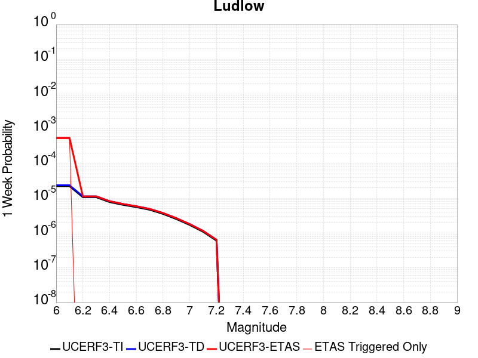 | 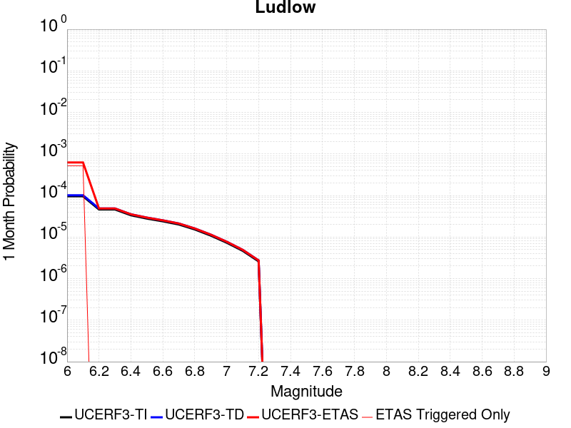 | 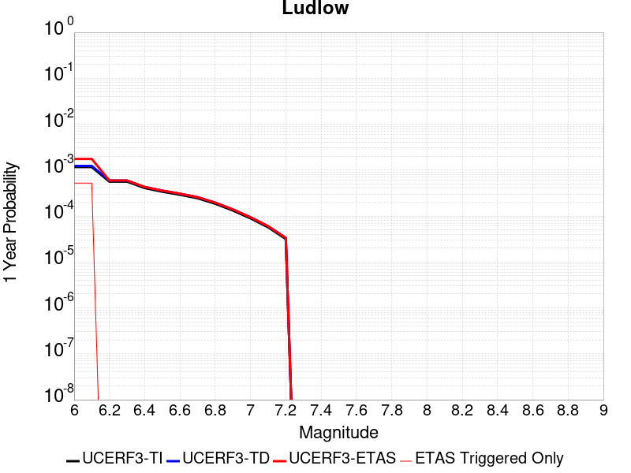 | 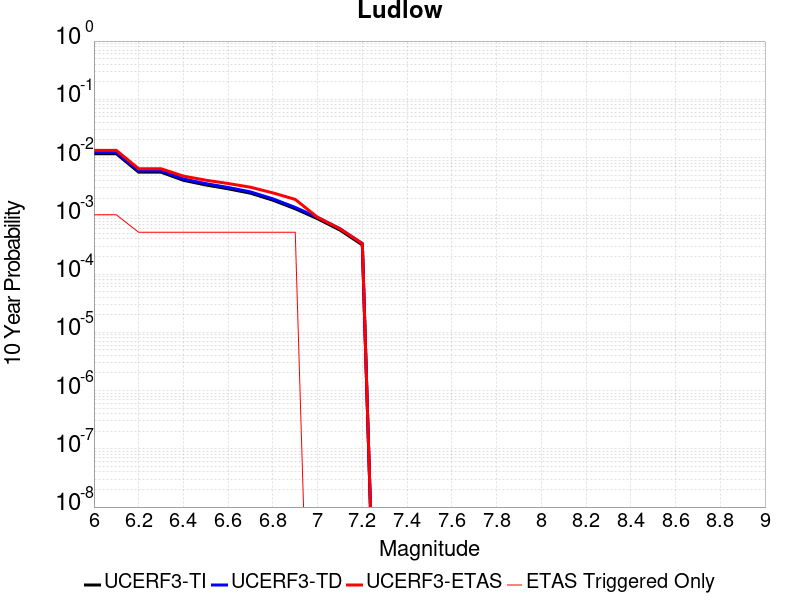 |

| Magnitude | 1 wk TI Prob | 1 wk TD Prob | 1 wk ETAS Prob | 1 wk ETAS/TD Gain | 1 wk ETAS Triggered Only | 1 mo TI Prob | 1 mo TD Prob | 1 mo ETAS Prob | 1 mo ETAS/TD Gain | 1 mo ETAS Triggered Only | 1 yr TI Prob | 1 yr TD Prob | 1 yr ETAS Prob | 1 yr ETAS/TD Gain | 1 yr ETAS Triggered Only | 10 yr TI Prob | 10 yr TD Prob | 10 yr ETAS Prob | 10 yr ETAS/TD Gain | 10 yr ETAS Triggered Only |
|-----|-----|-----|-----|-----|-----|-----|-----|-----|-----|-----|-----|-----|-----|-----|-----|-----|-----|-----|-----|-----|
| 6.0 | 2.2407607E-5 | 2.3657254E-5 | 5.4474967E-4 | 23.02675 | 5.211047E-4 | 9.602906E-5 | 1.0138454E-4 | 6.2243646E-4 | 6.139363 | 5.211047E-4 | 0.0011685267 | 0.001233702 | 0.0017541638 | 1.42187 | 5.211047E-4 | 0.011624013 | 0.012273042 | 0.01330246 | 1.0838764 | 0.0010422094 |
| 6.1 | 2.2407607E-5 | 2.3657254E-5 | 5.4474967E-4 | 23.02675 | 5.211047E-4 | 9.602906E-5 | 1.0138454E-4 | 6.2243646E-4 | 6.139363 | 5.211047E-4 | 0.0011685267 | 0.001233702 | 0.0017541638 | 1.42187 | 5.211047E-4 | 0.011624013 | 0.012273042 | 0.01330246 | 1.0838764 | 0.0010422094 |
| 6.2 | 1.0781252E-5 | 1.1365663E-5 | 1.1365663E-5 | 1.0 | 0.0 | 4.620455E-5 | 4.8709102E-5 | 4.8709102E-5 | 1.0 | 0.0 | 5.623952E-4 | 5.9287593E-4 | 5.9287593E-4 | 1.0 | 0.0 | 0.00560974 | 0.0059133614 | 0.0064313845 | 1.0876021 | 5.211047E-4 |
| 6.3 | 1.0781252E-5 | 1.1365663E-5 | 1.1365663E-5 | 1.0 | 0.0 | 4.620455E-5 | 4.8709102E-5 | 4.8709102E-5 | 1.0 | 0.0 | 5.623952E-4 | 5.9287593E-4 | 5.9287593E-4 | 1.0 | 0.0 | 0.00560974 | 0.0059133614 | 0.0064313845 | 1.0876021 | 5.211047E-4 |
| 6.4 | 7.814439E-6 | 8.237729E-6 | 8.237729E-6 | 1.0 | 0.0 | 3.3490025E-5 | 3.530408E-5 | 3.530408E-5 | 1.0 | 0.0 | 4.0766477E-4 | 4.2974384E-4 | 4.2974384E-4 | 1.0 | 0.0 | 0.0040691774 | 0.0042892746 | 0.004808144 | 1.120969 | 5.211047E-4 |
| 6.5 | 6.4986366E-6 | 6.85092E-6 | 6.85092E-6 | 1.0 | 0.0 | 2.7851002E-5 | 2.9360759E-5 | 2.9360759E-5 | 1.0 | 0.0 | 3.390332E-4 | 3.5740953E-4 | 3.5740953E-4 | 1.0 | 0.0 | 0.003385164 | 0.0035684432 | 0.0040876884 | 1.1455103 | 5.211047E-4 |
| 6.6 | 5.582177E-6 | 5.8860055E-6 | 5.8860055E-6 | 1.0 | 0.0 | 2.3923398E-5 | 2.5225498E-5 | 2.5225498E-5 | 1.0 | 0.0 | 2.9122844E-4 | 3.0707786E-4 | 3.0707786E-4 | 1.0 | 0.0 | 0.0029084706 | 0.003066609 | 0.0035861155 | 1.1694076 | 5.211047E-4 |
| 6.7 | 4.6858763E-6 | 4.940427E-6 | 4.940427E-6 | 1.0 | 0.0 | 2.0082172E-5 | 2.1173091E-5 | 2.1173091E-5 | 1.0 | 0.0 | 2.4447302E-4 | 2.5775246E-4 | 2.5775246E-4 | 1.0 | 0.0 | 0.0024420423 | 0.0025745912 | 0.0030943544 | 1.2018818 | 5.211047E-4 |
| 6.8 | 3.5584908E-6 | 3.7520183E-6 | 3.7520183E-6 | 1.0 | 0.0 | 1.5250586E-5 | 1.6079981E-5 | 1.6079981E-5 | 1.0 | 0.0 | 1.8566006E-4 | 1.957566E-4 | 1.957566E-4 | 1.0 | 0.0 | 0.0018550502 | 0.0019558826 | 0.0024759683 | 1.2659084 | 5.211047E-4 |
| 6.9 | 2.532834E-6 | 2.6710034E-6 | 2.6710034E-6 | 1.0 | 0.0 | 1.0854958E-5 | 1.1447109E-5 | 1.1447109E-5 | 1.0 | 0.0 | 1.3215111E-4 | 1.3935992E-4 | 1.3935992E-4 | 1.0 | 0.0 | 0.0013207254 | 0.0013927529 | 0.0019131318 | 1.3736334 | 5.211047E-4 |
| 7.0 | 1.7083285E-6 | 1.8019439E-6 | 1.8019439E-6 | 1.0 | 0.0 | 7.3213873E-6 | 7.722595E-6 | 7.722595E-6 | 1.0 | 0.0 | 8.913424E-5 | 9.40187E-5 | 9.40187E-5 | 1.0 | 0.0 | 8.9098496E-4 | 9.3980576E-4 | 9.3980576E-4 | 1.0 | 0.0 |
| 7.1 | 1.0905424E-6 | 1.1497619E-6 | 1.1497619E-6 | 1.0 | 0.0 | 4.6737446E-6 | 4.9275427E-6 | 4.9275427E-6 | 1.0 | 0.0 | 5.6901354E-5 | 5.999128E-5 | 5.999128E-5 | 1.0 | 0.0 | 5.6886784E-4 | 5.997606E-4 | 5.997606E-4 | 1.0 | 0.0 |
| 7.2 | 6.06668E-7 | 6.387277E-7 | 6.387277E-7 | 1.0 | 0.0 | 2.600003E-6 | 2.7374022E-6 | 2.7374022E-6 | 1.0 | 0.0 | 3.1654577E-5 | 3.3327433E-5 | 3.3327433E-5 | 1.0 | 0.0 | 3.1650066E-4 | 3.3323118E-4 | 3.3323118E-4 | 1.0 | 0.0 |

## Tin Mountain
*[(top)](#table-of-contents)*

| 1 Week | 1 Month | 1 Year | 10 Year |
|-----|-----|-----|-----|
| 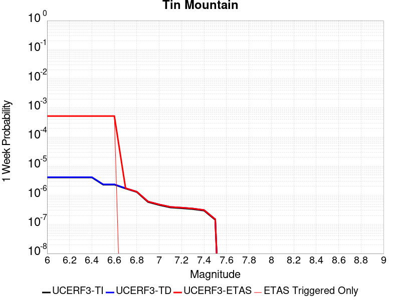 | 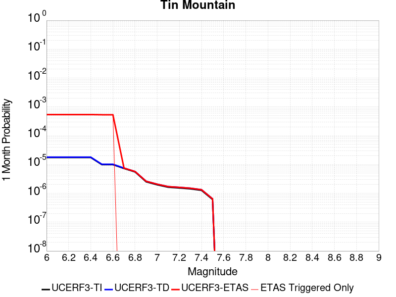 | 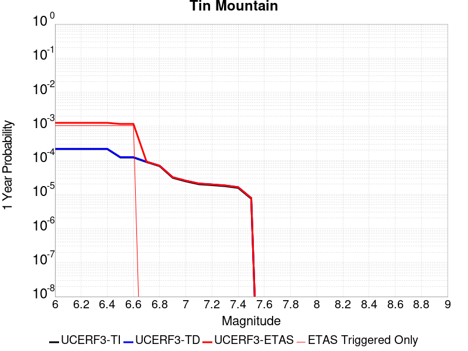 | 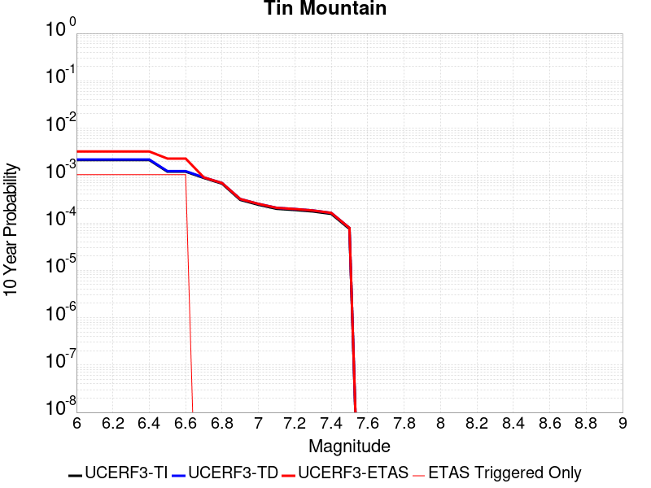 |

| Magnitude | 1 wk TI Prob | 1 wk TD Prob | 1 wk ETAS Prob | 1 wk ETAS/TD Gain | 1 wk ETAS Triggered Only | 1 mo TI Prob | 1 mo TD Prob | 1 mo ETAS Prob | 1 mo ETAS/TD Gain | 1 mo ETAS Triggered Only | 1 yr TI Prob | 1 yr TD Prob | 1 yr ETAS Prob | 1 yr ETAS/TD Gain | 1 yr ETAS Triggered Only | 10 yr TI Prob | 10 yr TD Prob | 10 yr ETAS Prob | 10 yr ETAS/TD Gain | 10 yr ETAS Triggered Only |
|-----|-----|-----|-----|-----|-----|-----|-----|-----|-----|-----|-----|-----|-----|-----|-----|-----|-----|-----|-----|-----|
| 6.0 | 4.083776E-6 | 4.1815365E-6 | 5.252841E-4 | 125.61987 | 5.211047E-4 | 1.750178E-5 | 1.792077E-5 | 5.3901615E-4 | 30.077736 | 5.211047E-4 | 2.1306332E-4 | 2.1816725E-4 | 0.0012601494 | 5.7760706 | 0.0010422094 | 0.0021285915 | 0.0021798965 | 0.0032198338 | 1.4770583 | 0.0010422094 |
| 6.1 | 4.083776E-6 | 4.1815365E-6 | 5.252841E-4 | 125.61987 | 5.211047E-4 | 1.750178E-5 | 1.792077E-5 | 5.3901615E-4 | 30.077736 | 5.211047E-4 | 2.1306332E-4 | 2.1816725E-4 | 0.0012601494 | 5.7760706 | 0.0010422094 | 0.0021285915 | 0.0021798965 | 0.0032198338 | 1.4770583 | 0.0010422094 |
| 6.2 | 4.083776E-6 | 4.1815365E-6 | 5.252841E-4 | 125.61987 | 5.211047E-4 | 1.750178E-5 | 1.792077E-5 | 5.3901615E-4 | 30.077736 | 5.211047E-4 | 2.1306332E-4 | 2.1816725E-4 | 0.0012601494 | 5.7760706 | 0.0010422094 | 0.0021285915 | 0.0021798965 | 0.0032198338 | 1.4770583 | 0.0010422094 |
| 6.3 | 4.083776E-6 | 4.1815365E-6 | 5.252841E-4 | 125.61987 | 5.211047E-4 | 1.750178E-5 | 1.792077E-5 | 5.3901615E-4 | 30.077736 | 5.211047E-4 | 2.1306332E-4 | 2.1816725E-4 | 0.0012601494 | 5.7760706 | 0.0010422094 | 0.0021285915 | 0.0021798965 | 0.0032198338 | 1.4770583 | 0.0010422094 |
| 6.4 | 4.083776E-6 | 4.1815365E-6 | 5.252841E-4 | 125.61987 | 5.211047E-4 | 1.750178E-5 | 1.792077E-5 | 5.3901615E-4 | 30.077736 | 5.211047E-4 | 2.1306332E-4 | 2.1816725E-4 | 0.0012601494 | 5.7760706 | 0.0010422094 | 0.0021285915 | 0.0021798965 | 0.0032198338 | 1.4770583 | 0.0010422094 |
| 6.5 | 2.3143427E-6 | 2.3731573E-6 | 5.234767E-4 | 220.58238 | 5.211047E-4 | 9.9185745E-6 | 1.0170638E-5 | 5.3127005E-4 | 52.23567 | 5.211047E-4 | 1.2075195E-4 | 1.2382126E-4 | 0.0011659017 | 9.416006 | 0.0010422094 | 0.0012068636 | 0.0012375986 | 0.0022785182 | 1.8410802 | 0.0010422094 |
| 6.6 | 2.3143427E-6 | 2.3731573E-6 | 5.234767E-4 | 220.58238 | 5.211047E-4 | 9.9185745E-6 | 1.0170638E-5 | 5.3127005E-4 | 52.23567 | 5.211047E-4 | 1.2075195E-4 | 1.2382126E-4 | 0.0011659017 | 9.416006 | 0.0010422094 | 0.0012068636 | 0.0012375986 | 0.0022785182 | 1.8410802 | 0.0010422094 |
| 6.7 | 1.7029532E-6 | 1.7497915E-6 | 1.7497915E-6 | 1.0 | 0.0 | 7.2983503E-6 | 7.499088E-6 | 7.499088E-6 | 1.0 | 0.0 | 8.885379E-5 | 9.1298105E-5 | 9.1298105E-5 | 1.0 | 0.0 | 8.881827E-4 | 9.1265864E-4 | 9.1265864E-4 | 1.0 | 0.0 |
| 6.8 | 1.2914646E-6 | 1.3299378E-6 | 1.3299378E-6 | 1.0 | 0.0 | 5.534837E-6 | 5.6997237E-6 | 5.6997237E-6 | 1.0 | 0.0 | 6.738455E-5 | 6.939237E-5 | 6.939237E-5 | 1.0 | 0.0 | 6.736412E-4 | 6.9375033E-4 | 6.9375033E-4 | 1.0 | 0.0 |
| 6.9 | 5.8708974E-7 | 6.1169936E-7 | 6.1169936E-7 | 1.0 | 0.0 | 2.5160964E-6 | 2.6215664E-6 | 2.6215664E-6 | 1.0 | 0.0 | 3.0633044E-5 | 3.1917145E-5 | 3.1917145E-5 | 1.0 | 0.0 | 3.0628822E-4 | 3.191297E-4 | 3.191297E-4 | 1.0 | 0.0 |
| 7.0 | 4.6248786E-7 | 4.832015E-7 | 4.832015E-7 | 1.0 | 0.0 | 1.9820893E-6 | 2.0708624E-6 | 2.0708624E-6 | 1.0 | 0.0 | 2.413167E-5 | 2.5212494E-5 | 2.5212494E-5 | 1.0 | 0.0 | 2.412905E-4 | 2.5210003E-4 | 2.5210003E-4 | 1.0 | 0.0 |
| 7.1 | 3.804606E-7 | 3.987147E-7 | 3.987147E-7 | 1.0 | 0.0 | 1.6305444E-6 | 1.7087764E-6 | 1.7087764E-6 | 1.0 | 0.0 | 1.9851697E-5 | 2.0804187E-5 | 2.0804187E-5 | 1.0 | 0.0 | 1.9849923E-4 | 2.0802575E-4 | 2.0802575E-4 | 1.0 | 0.0 |
| 7.2 | 3.5864858E-7 | 3.7616863E-7 | 3.7616863E-7 | 1.0 | 0.0 | 1.5370645E-6 | 1.6121504E-6 | 1.6121504E-6 | 1.0 | 0.0 | 1.87136E-5 | 1.9627789E-5 | 1.9627789E-5 | 1.0 | 0.0 | 1.8712023E-4 | 1.9626386E-4 | 1.9626386E-4 | 1.0 | 0.0 |
| 7.3 | 3.342063E-7 | 3.506347E-7 | 3.506347E-7 | 1.0 | 0.0 | 1.4323119E-6 | 1.5027196E-6 | 1.5027196E-6 | 1.0 | 0.0 | 1.7438259E-5 | 1.829549E-5 | 1.829549E-5 | 1.0 | 0.0 | 1.743689E-4 | 1.8294314E-4 | 1.8294314E-4 | 1.0 | 0.0 |
| 7.4 | 2.971242E-7 | 3.1165817E-7 | 3.1165817E-7 | 1.0 | 0.0 | 1.2733886E-6 | 1.3356774E-6 | 1.3356774E-6 | 1.0 | 0.0 | 1.5503398E-5 | 1.6261785E-5 | 1.6261785E-5 | 1.0 | 0.0 | 1.5502315E-4 | 1.6260923E-4 | 1.6260923E-4 | 1.0 | 0.0 |
| 7.5 | 1.4326713E-7 | 1.5012525E-7 | 1.5012525E-7 | 1.0 | 0.0 | 6.140018E-7 | 6.433939E-7 | 6.433939E-7 | 1.0 | 0.0 | 7.4754466E-6 | 7.8333205E-6 | 7.8333205E-6 | 1.0 | 0.0 | 7.475195E-5 | 7.833321E-5 | 7.833321E-5 | 1.0 | 0.0 |

## San Jacinto (San Bernardino)
*[(top)](#table-of-contents)*

| 1 Week | 1 Month | 1 Year | 10 Year |
|-----|-----|-----|-----|
| 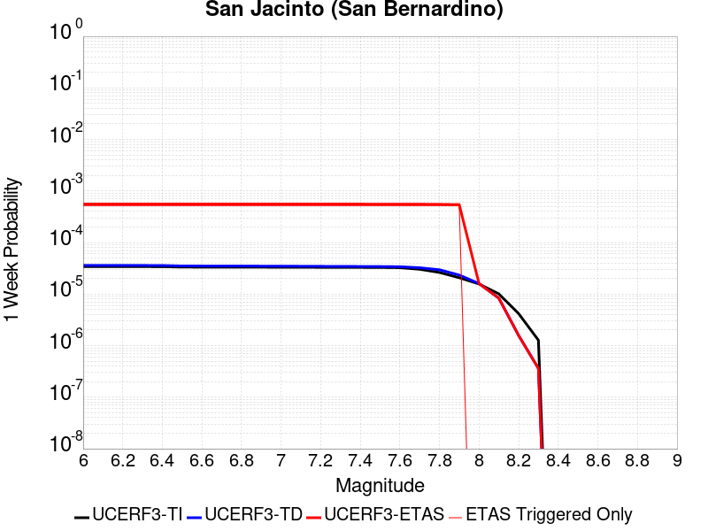 | 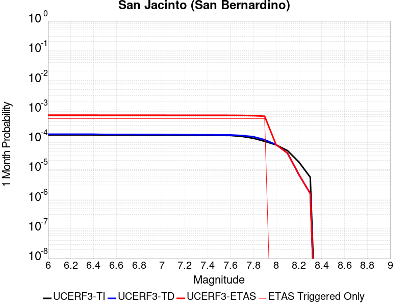 | 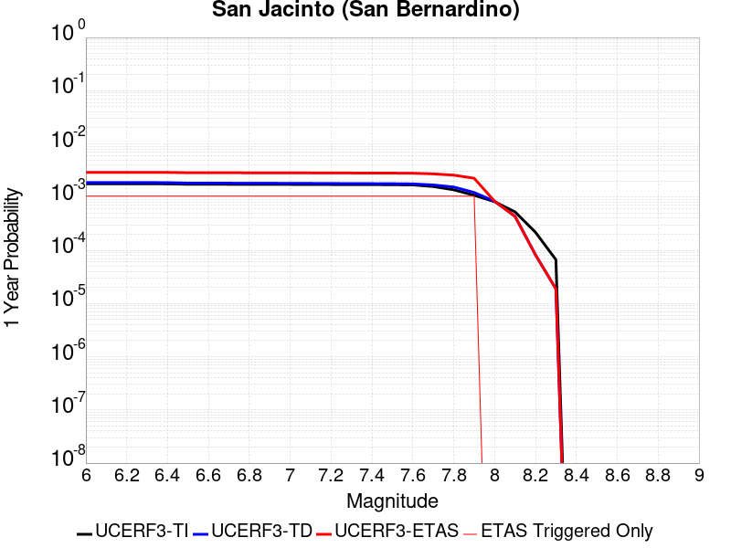 | 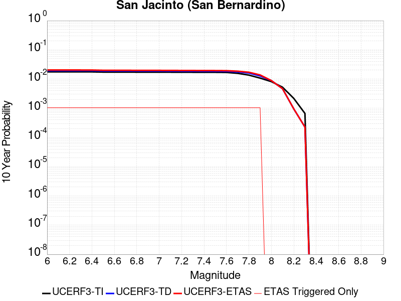 |

| Magnitude | 1 wk TI Prob | 1 wk TD Prob | 1 wk ETAS Prob | 1 wk ETAS/TD Gain | 1 wk ETAS Triggered Only | 1 mo TI Prob | 1 mo TD Prob | 1 mo ETAS Prob | 1 mo ETAS/TD Gain | 1 mo ETAS Triggered Only | 1 yr TI Prob | 1 yr TD Prob | 1 yr ETAS Prob | 1 yr ETAS/TD Gain | 1 yr ETAS Triggered Only | 10 yr TI Prob | 10 yr TD Prob | 10 yr ETAS Prob | 10 yr ETAS/TD Gain | 10 yr ETAS Triggered Only |
|-----|-----|-----|-----|-----|-----|-----|-----|-----|-----|-----|-----|-----|-----|-----|-----|-----|-----|-----|-----|-----|
| 6.0 | 3.409352E-5 | 3.5986508E-5 | 5.570725E-4 | 15.480037 | 5.211047E-4 | 1.461069E-4 | 1.542188E-4 | 6.7524315E-4 | 4.378475 | 5.211047E-4 | 0.0017774 | 0.0018759987 | 0.002916253 | 1.5545069 | 0.0010422094 | 0.01763251 | 0.019349935 | 0.020371977 | 1.0528189 | 0.0010422094 |
| 6.1 | 3.409352E-5 | 3.5986508E-5 | 5.570725E-4 | 15.480037 | 5.211047E-4 | 1.461069E-4 | 1.542188E-4 | 6.7524315E-4 | 4.378475 | 5.211047E-4 | 0.0017774 | 0.0018759987 | 0.002916253 | 1.5545069 | 0.0010422094 | 0.01763251 | 0.019349935 | 0.020371977 | 1.0528189 | 0.0010422094 |
| 6.2 | 3.409352E-5 | 3.5986508E-5 | 5.570725E-4 | 15.480037 | 5.211047E-4 | 1.461069E-4 | 1.542188E-4 | 6.7524315E-4 | 4.378475 | 5.211047E-4 | 0.0017774 | 0.0018759987 | 0.002916253 | 1.5545069 | 0.0010422094 | 0.01763251 | 0.019349935 | 0.020371977 | 1.0528189 | 0.0010422094 |
| 6.3 | 3.409352E-5 | 3.5986508E-5 | 5.570725E-4 | 15.480037 | 5.211047E-4 | 1.461069E-4 | 1.542188E-4 | 6.7524315E-4 | 4.378475 | 5.211047E-4 | 0.0017774 | 0.0018759987 | 0.002916253 | 1.5545069 | 0.0010422094 | 0.01763251 | 0.019349935 | 0.020371977 | 1.0528189 | 0.0010422094 |
| 6.4 | 3.400795E-5 | 3.5879173E-5 | 5.5696524E-4 | 15.523357 | 5.211047E-4 | 1.4574021E-4 | 1.5375883E-4 | 6.747834E-4 | 4.388583 | 5.211047E-4 | 0.0017729428 | 0.0018704084 | 0.0029106685 | 1.5561674 | 0.0010422094 | 0.017588645 | 0.019295016 | 0.020317117 | 1.0529722 | 0.0010422094 |
| 6.5 | 3.341482E-5 | 3.5139812E-5 | 5.5622624E-4 | 15.828948 | 5.211047E-4 | 1.4319851E-4 | 1.5059051E-4 | 6.7161676E-4 | 4.459888 | 5.211047E-4 | 0.0017420477 | 0.0018318989 | 0.0028721993 | 1.5678807 | 0.0010422094 | 0.017284546 | 0.018916558 | 0.019939054 | 1.0540528 | 0.0010422094 |
| 6.6 | 3.3364955E-5 | 3.5077028E-5 | 5.561635E-4 | 15.85549 | 5.211047E-4 | 1.4298483E-4 | 1.5032147E-4 | 6.713479E-4 | 4.466081 | 5.211047E-4 | 0.0017394501 | 0.001828629 | 0.0028689327 | 1.5688982 | 0.0010422094 | 0.017258976 | 0.018884424 | 0.019906951 | 1.0541466 | 0.0010422094 |
| 6.7 | 3.335922E-5 | 3.5066805E-5 | 5.5615325E-4 | 15.859822 | 5.211047E-4 | 1.4296026E-4 | 1.5027766E-4 | 6.7130406E-4 | 4.467092 | 5.211047E-4 | 0.0017391514 | 0.0018280965 | 0.0028684007 | 1.5690641 | 0.0010422094 | 0.017256035 | 0.018879214 | 0.019901749 | 1.0541619 | 0.0010422094 |
| 6.8 | 3.327683E-5 | 3.496087E-5 | 5.5604737E-4 | 15.90485 | 5.211047E-4 | 1.4260718E-4 | 1.498237E-4 | 6.708504E-4 | 4.477598 | 5.211047E-4 | 0.0017348597 | 0.0018225788 | 0.0028628889 | 1.5707902 | 0.0010422094 | 0.017213784 | 0.018824987 | 0.019847576 | 1.0543209 | 0.0010422094 |
| 6.9 | 3.3235785E-5 | 3.4901823E-5 | 5.559884E-4 | 15.930066 | 5.211047E-4 | 1.4243131E-4 | 1.4957068E-4 | 6.705975E-4 | 4.4834824 | 5.211047E-4 | 0.0017327217 | 0.0018195034 | 0.0028598167 | 1.5717566 | 0.0010422094 | 0.017192734 | 0.018794855 | 0.019817477 | 1.0544096 | 0.0010422094 |
| 7.0 | 3.3197095E-5 | 3.4841752E-5 | 5.5592833E-4 | 15.955808 | 5.211047E-4 | 1.422655E-4 | 1.4931326E-4 | 6.703402E-4 | 4.4894886 | 5.211047E-4 | 0.0017307063 | 0.0018163746 | 0.0028566911 | 1.5727433 | 0.0010422094 | 0.017172894 | 0.018764233 | 0.019786887 | 1.0545001 | 0.0010422094 |
| 7.1 | 3.3129716E-5 | 3.4721965E-5 | 5.558086E-4 | 16.007406 | 5.211047E-4 | 1.4197677E-4 | 1.4879994E-4 | 6.6982716E-4 | 4.5015283 | 5.211047E-4 | 0.0017271966 | 0.0018101353 | 0.0028504583 | 1.5747211 | 0.0010422094 | 0.017138338 | 0.018703312 | 0.019726029 | 1.0546811 | 0.0010422094 |
| 7.2 | 3.3034008E-5 | 3.458941E-5 | 5.556761E-4 | 16.06492 | 5.211047E-4 | 1.4156665E-4 | 1.4823192E-4 | 6.692594E-4 | 4.514948 | 5.211047E-4 | 0.0017222111 | 0.0018032312 | 0.0028435613 | 1.5769255 | 0.0010422094 | 0.017089253 | 0.018635705 | 0.019658493 | 1.0548832 | 0.0010422094 |
| 7.3 | 3.2956614E-5 | 3.445717E-5 | 5.555439E-4 | 16.12274 | 5.211047E-4 | 1.4123498E-4 | 1.4766524E-4 | 6.6869304E-4 | 4.528439 | 5.211047E-4 | 0.0017181796 | 0.0017963431 | 0.0028366805 | 1.5791417 | 0.0010422094 | 0.017049557 | 0.018568452 | 0.019591311 | 1.0550858 | 0.0010422094 |
| 7.4 | 3.2915937E-5 | 3.4378863E-5 | 5.554657E-4 | 16.157185 | 5.211047E-4 | 1.4106068E-4 | 1.4732967E-4 | 6.6835765E-4 | 4.5364766 | 5.211047E-4 | 0.0017160608 | 0.0017922645 | 0.002832606 | 1.5804621 | 0.0010422094 | 0.017028693 | 0.018528719 | 0.019551618 | 1.0552062 | 0.0010422094 |
| 7.5 | 3.281791E-5 | 3.4243778E-5 | 5.5533065E-4 | 16.21698 | 5.211047E-4 | 1.406406E-4 | 1.4675081E-4 | 6.6777907E-4 | 4.550429 | 5.211047E-4 | 0.0017109542 | 0.0017852283 | 0.0028255773 | 1.582754 | 0.0010422094 | 0.016978411 | 0.018459605 | 0.019482575 | 1.0554167 | 0.0010422094 |
| 7.6 | 3.2521442E-5 | 3.396873E-5 | 5.550558E-4 | 16.340199 | 5.211047E-4 | 1.3937015E-4 | 1.4557215E-4 | 6.6660106E-4 | 4.57918 | 5.211047E-4 | 0.0016955109 | 0.0017709016 | 0.0028112654 | 1.587477 | 0.0010422094 | 0.016826328 | 0.018317232 | 0.019340351 | 1.0558555 | 0.0010422094 |
| 7.7 | 3.0287873E-5 | 3.245276E-5 | 5.535406E-4 | 17.05681 | 5.211047E-4 | 1.297987E-4 | 1.3907586E-4 | 6.601081E-4 | 4.746389 | 5.211047E-4 | 0.0015791537 | 0.0016919347 | 0.0027323808 | 1.6149447 | 0.0010422094 | 0.01567979 | 0.01752809 | 0.018552031 | 1.0584172 | 0.0010422094 |
| 7.8 | 2.6316151E-5 | 2.9663592E-5 | 5.5075285E-4 | 18.566628 | 5.211047E-4 | 1.1277862E-4 | 1.2712348E-4 | 6.48162E-4 | 5.09868 | 5.211047E-4 | 0.0013722149 | 0.0015466306 | 0.002587228 | 1.6728158 | 0.0010422094 | 0.013637724 | 0.016069634 | 0.017095096 | 1.0638136 | 0.0010422094 |
| 7.9 | 2.0761147E-5 | 2.34181E-5 | 5.4451067E-4 | 23.2517 | 5.211047E-4 | 8.897331E-5 | 1.0035944E-4 | 6.214119E-4 | 6.191863 | 5.211047E-4 | 0.0010827117 | 0.0012211921 | 0.0022621287 | 1.852394 | 0.0010422094 | 0.010774517 | 0.012793174 | 0.013822051 | 1.0804238 | 0.0010422094 |
| 8.0 | 1.5738568E-5 | 1.6033575E-5 | 1.6033575E-5 | 1.0 | 0.0 | 6.744926E-5 | 6.871352E-5 | 6.871352E-5 | 1.0 | 0.0 | 8.2088535E-4 | 8.3626667E-4 | 8.3626667E-4 | 1.0 | 0.0 | 0.008178596 | 0.008865921 | 0.008865921 | 1.0 | 0.0 |
| 8.1 | 1.0105832E-5 | 8.3304985E-6 | 8.3304985E-6 | 1.0 | 0.0 | 4.3309992E-5 | 3.570165E-5 | 3.570165E-5 | 1.0 | 0.0 | 5.2717153E-4 | 4.345814E-4 | 4.345814E-4 | 1.0 | 0.0 | 0.005259227 | 0.004677232 | 0.004677232 | 1.0 | 0.0 |
| 8.2 | 4.189207E-6 | 1.5784357E-6 | 1.5784357E-6 | 1.0 | 0.0 | 1.7953622E-5 | 6.7647065E-6 | 6.7647065E-6 | 1.0 | 0.0 | 2.1856341E-4 | 8.235722E-5 | 8.235722E-5 | 1.0 | 0.0 | 0.0021834858 | 9.565867E-4 | 9.565867E-4 | 1.0 | 0.0 |
| 8.3 | 1.2758221E-6 | 3.6149942E-7 | 3.6149942E-7 | 1.0 | 0.0 | 5.4677976E-6 | 1.5492824E-6 | 1.5492824E-6 | 1.0 | 0.0 | 6.65684E-5 | 1.8862354E-5 | 1.8862354E-5 | 1.0 | 0.0 | 6.6548464E-4 | 2.2751294E-4 | 2.2751294E-4 | 1.0 | 0.0 |

## San Jacinto (Stepovers Combined)
*[(top)](#table-of-contents)*

| 1 Week | 1 Month | 1 Year | 10 Year |
|-----|-----|-----|-----|
| 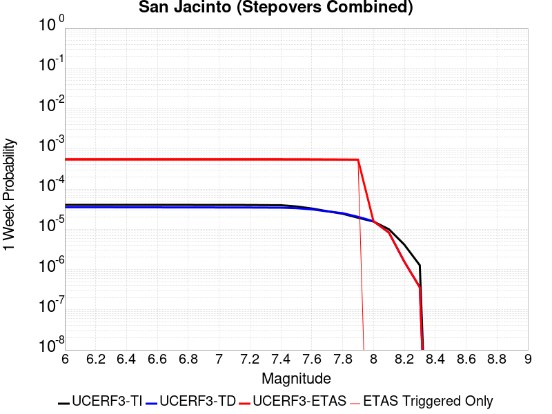 | 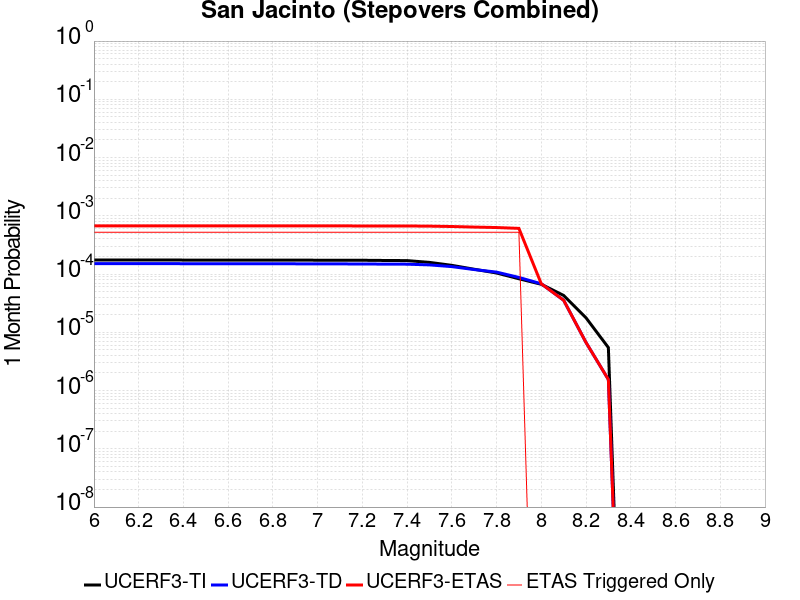 | 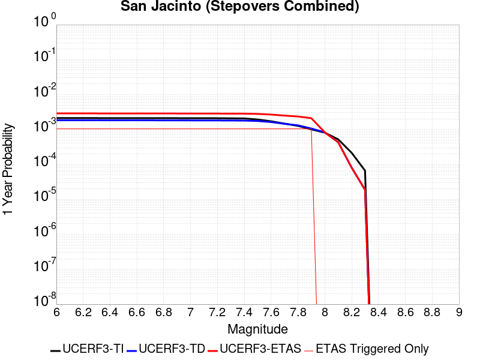 | 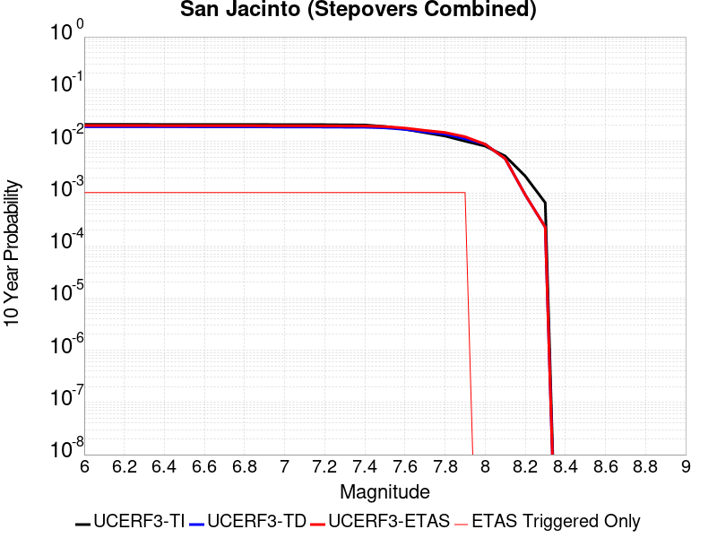 |

| Magnitude | 1 wk TI Prob | 1 wk TD Prob | 1 wk ETAS Prob | 1 wk ETAS/TD Gain | 1 wk ETAS Triggered Only | 1 mo TI Prob | 1 mo TD Prob | 1 mo ETAS Prob | 1 mo ETAS/TD Gain | 1 mo ETAS Triggered Only | 1 yr TI Prob | 1 yr TD Prob | 1 yr ETAS Prob | 1 yr ETAS/TD Gain | 1 yr ETAS Triggered Only | 10 yr TI Prob | 10 yr TD Prob | 10 yr ETAS Prob | 10 yr ETAS/TD Gain | 10 yr ETAS Triggered Only |
|-----|-----|-----|-----|-----|-----|-----|-----|-----|-----|-----|-----|-----|-----|-----|-----|-----|-----|-----|-----|-----|
| 6.0 | 4.0667746E-5 | 3.5272755E-5 | 5.563591E-4 | 15.773055 | 5.211047E-4 | 1.742787E-4 | 1.5116022E-4 | 6.721862E-4 | 4.446846 | 5.211047E-4 | 0.0021197782 | 0.0018388226 | 0.0028791158 | 1.5657387 | 0.0010422094 | 0.020996714 | 0.018986892 | 0.020009313 | 1.0538487 | 0.0010422094 |
| 6.1 | 4.0667746E-5 | 3.5272755E-5 | 5.563591E-4 | 15.773055 | 5.211047E-4 | 1.742787E-4 | 1.5116022E-4 | 6.721862E-4 | 4.446846 | 5.211047E-4 | 0.0021197782 | 0.0018388226 | 0.0028791158 | 1.5657387 | 0.0010422094 | 0.020996714 | 0.018986892 | 0.020009313 | 1.0538487 | 0.0010422094 |
| 6.2 | 4.0667746E-5 | 3.5272755E-5 | 5.563591E-4 | 15.773055 | 5.211047E-4 | 1.742787E-4 | 1.5116022E-4 | 6.721862E-4 | 4.446846 | 5.211047E-4 | 0.0021197782 | 0.0018388226 | 0.0028791158 | 1.5657387 | 0.0010422094 | 0.020996714 | 0.018986892 | 0.020009313 | 1.0538487 | 0.0010422094 |
| 6.3 | 4.0667746E-5 | 3.5272755E-5 | 5.563591E-4 | 15.773055 | 5.211047E-4 | 1.742787E-4 | 1.5116022E-4 | 6.721862E-4 | 4.446846 | 5.211047E-4 | 0.0021197782 | 0.0018388226 | 0.0028791158 | 1.5657387 | 0.0010422094 | 0.020996714 | 0.018986892 | 0.020009313 | 1.0538487 | 0.0010422094 |
| 6.4 | 4.0577226E-5 | 3.5144654E-5 | 5.5623107E-4 | 15.826904 | 5.211047E-4 | 1.738908E-4 | 1.5061127E-4 | 6.7163754E-4 | 4.4594107 | 5.211047E-4 | 0.0021150648 | 0.0018321523 | 0.0028724524 | 1.5678022 | 0.0010422094 | 0.020950472 | 0.018921461 | 0.019943949 | 1.0540386 | 0.0010422094 |
| 6.5 | 4.0577226E-5 | 3.5144654E-5 | 5.5623107E-4 | 15.826904 | 5.211047E-4 | 1.738908E-4 | 1.5061127E-4 | 6.7163754E-4 | 4.4594107 | 5.211047E-4 | 0.0021150648 | 0.0018321523 | 0.0028724524 | 1.5678022 | 0.0010422094 | 0.020950472 | 0.018921461 | 0.019943949 | 1.0540386 | 0.0010422094 |
| 6.6 | 4.053861E-5 | 3.509E-5 | 5.5617647E-4 | 15.849998 | 5.211047E-4 | 1.7372532E-4 | 1.5037706E-4 | 6.714034E-4 | 4.4647994 | 5.211047E-4 | 0.0021130538 | 0.0018293057 | 0.0028696086 | 1.5686873 | 0.0010422094 | 0.020930743 | 0.018893538 | 0.019916058 | 1.0541201 | 0.0010422094 |
| 6.7 | 4.0516545E-5 | 3.5059067E-5 | 5.5614556E-4 | 15.863101 | 5.211047E-4 | 1.7363077E-4 | 1.5024451E-4 | 6.7127094E-4 | 4.467857 | 5.211047E-4 | 0.002111905 | 0.001827695 | 0.0028679997 | 1.5691894 | 0.0010422094 | 0.020919468 | 0.018877735 | 0.01990027 | 1.0541662 | 0.0010422094 |
| 6.8 | 4.049434E-5 | 3.5030633E-5 | 5.561171E-4 | 15.875167 | 5.211047E-4 | 1.7353562E-4 | 1.5012265E-4 | 6.711492E-4 | 4.470672 | 5.211047E-4 | 0.0021107488 | 0.0018262138 | 0.00286652 | 1.569652 | 0.0010422094 | 0.020908125 | 0.018863149 | 0.019885698 | 1.0542089 | 0.0010422094 |
| 6.9 | 4.046386E-5 | 3.499319E-5 | 5.5607967E-4 | 15.891083 | 5.211047E-4 | 1.73405E-4 | 1.4996222E-4 | 6.709888E-4 | 4.4743857 | 5.211047E-4 | 0.0021091616 | 0.0018242638 | 0.002864572 | 1.570262 | 0.0010422094 | 0.020892553 | 0.01884392 | 0.01986649 | 1.0542653 | 0.0010422094 |
| 7.0 | 4.036382E-5 | 3.487376E-5 | 5.5596035E-4 | 15.942082 | 5.211047E-4 | 1.7297632E-4 | 1.4945042E-4 | 6.704773E-4 | 4.4862857 | 5.211047E-4 | 0.0021039525 | 0.0018180435 | 0.0028583582 | 1.5722166 | 0.0010422094 | 0.02084144 | 0.018782536 | 0.01980517 | 1.054446 | 0.0010422094 |
| 7.1 | 4.0343282E-5 | 3.4852223E-5 | 5.559388E-4 | 15.951316 | 5.211047E-4 | 1.7288832E-4 | 1.4935812E-4 | 6.70385E-4 | 4.4884405 | 5.211047E-4 | 0.002102883 | 0.0018169218 | 0.0028572376 | 1.5725706 | 0.0010422094 | 0.020830948 | 0.018771412 | 0.019794058 | 1.0544789 | 0.0010422094 |
| 7.2 | 4.0257353E-5 | 3.4756722E-5 | 5.5584335E-4 | 15.992398 | 5.211047E-4 | 1.725201E-4 | 1.489489E-4 | 6.69976E-4 | 4.4980264 | 5.211047E-4 | 0.0020984085 | 0.0018119477 | 0.0028522687 | 1.5741452 | 0.0010422094 | 0.020787042 | 0.018722152 | 0.019744849 | 1.054625 | 0.0010422094 |
| 7.3 | 3.9940667E-5 | 3.4584376E-5 | 5.556711E-4 | 16.067114 | 5.211047E-4 | 1.7116306E-4 | 1.4821035E-4 | 6.6923787E-4 | 4.5154595 | 5.211047E-4 | 0.0020819185 | 0.0018029709 | 0.0028433013 | 1.577009 | 0.0010422094 | 0.020625217 | 0.018630784 | 0.019653575 | 1.054898 | 0.0010422094 |
| 7.4 | 3.9721202E-5 | 3.4469766E-5 | 5.5555656E-4 | 16.117212 | 5.211047E-4 | 1.7022261E-4 | 1.4771923E-4 | 6.68747E-4 | 4.527149 | 5.211047E-4 | 0.0020704903 | 0.0017970012 | 0.0028373378 | 1.5789293 | 0.0010422094 | 0.020513052 | 0.018569905 | 0.019592762 | 1.0550814 | 0.0010422094 |
| 7.5 | 3.7036873E-5 | 3.3537188E-5 | 5.546245E-4 | 16.537596 | 5.211047E-4 | 1.5871979E-4 | 1.437229E-4 | 6.6475273E-4 | 4.625239 | 5.211047E-4 | 0.0019307006 | 0.0017484248 | 0.0027888122 | 1.5950426 | 0.0010422094 | 0.019140124 | 0.018071463 | 0.01909484 | 1.0566293 | 0.0010422094 |
| 7.6 | 3.2940967E-5 | 3.1317984E-5 | 5.524064E-4 | 17.638632 | 5.211047E-4 | 1.4116794E-4 | 1.3421304E-4 | 6.5524783E-4 | 4.8821473 | 5.211047E-4 | 0.0017173645 | 0.0016328214 | 0.002673329 | 1.6372453 | 0.0010422094 | 0.01704153 | 0.016904354 | 0.017928945 | 1.0606111 | 0.0010422094 |
| 7.7 | 2.8236149E-5 | 2.7883889E-5 | 5.489741E-4 | 19.687859 | 5.211047E-4 | 1.2100645E-4 | 1.19496915E-4 | 6.405394E-4 | 5.3603005 | 5.211047E-4 | 0.0014722579 | 0.001453905 | 0.0024945992 | 1.7157924 | 0.0010422094 | 0.014625421 | 0.015115095 | 0.016141552 | 1.0679094 | 0.0010422094 |
| 7.8 | 2.4329287E-5 | 2.5207537E-5 | 5.4629915E-4 | 21.672056 | 5.211047E-4 | 1.042642E-4 | 1.0802783E-4 | 6.2907627E-4 | 5.82328 | 5.211047E-4 | 0.0012686774 | 0.0013144462 | 0.0023552857 | 1.7918465 | 0.0010422094 | 0.012614589 | 0.013712396 | 0.014740314 | 1.0749627 | 0.0010422094 |
| 7.9 | 1.9370926E-5 | 2.0421452E-5 | 5.4151553E-4 | 26.516996 | 5.211047E-4 | 8.301561E-5 | 8.7517576E-5 | 6.085767E-4 | 6.953766 | 5.211047E-4 | 0.0010102465 | 0.0010650064 | 0.002106106 | 1.9775524 | 0.0010422094 | 0.0100566605 | 0.011199483 | 0.012230019 | 1.0920165 | 0.0010422094 |
| 8.0 | 1.5583017E-5 | 1.588647E-5 | 1.588647E-5 | 1.0 | 0.0 | 6.6782646E-5 | 6.808309E-5 | 6.808309E-5 | 1.0 | 0.0 | 8.127754E-4 | 8.285971E-4 | 8.285971E-4 | 1.0 | 0.0 | 0.008098091 | 0.008781809 | 0.008781809 | 1.0 | 0.0 |
| 8.1 | 1.0024873E-5 | 8.292404E-6 | 8.292404E-6 | 1.0 | 0.0 | 4.2963035E-5 | 3.5538393E-5 | 3.5538393E-5 | 1.0 | 0.0 | 5.229494E-4 | 4.3259456E-4 | 4.3259456E-4 | 1.0 | 0.0 | 0.0052172043 | 0.0046534105 | 0.0046534105 | 1.0 | 0.0 |
| 8.2 | 4.142796E-6 | 1.5610041E-6 | 1.5610041E-6 | 1.0 | 0.0 | 1.775472E-5 | 6.69E-6 | 6.69E-6 | 1.0 | 0.0 | 2.1614227E-4 | 8.144774E-5 | 8.144774E-5 | 1.0 | 0.0 | 0.0021593217 | 9.454649E-4 | 9.454649E-4 | 1.0 | 0.0 |
| 8.3 | 1.2750878E-6 | 3.612133E-7 | 3.612133E-7 | 1.0 | 0.0 | 5.4646503E-6 | 1.548056E-6 | 1.548056E-6 | 1.0 | 0.0 | 6.653009E-5 | 1.8847424E-5 | 1.8847424E-5 | 1.0 | 0.0 | 6.6510175E-4 | 2.2734253E-4 | 2.2734253E-4 | 1.0 | 0.0 |

## Red Mountain
*[(top)](#table-of-contents)*

| 1 Week | 1 Month | 1 Year | 10 Year |
|-----|-----|-----|-----|
|  |  |  |  |

| Magnitude | 1 wk TI Prob | 1 wk TD Prob | 1 wk ETAS Prob | 1 wk ETAS/TD Gain | 1 wk ETAS Triggered Only | 1 mo TI Prob | 1 mo TD Prob | 1 mo ETAS Prob | 1 mo ETAS/TD Gain | 1 mo ETAS Triggered Only | 1 yr TI Prob | 1 yr TD Prob | 1 yr ETAS Prob | 1 yr ETAS/TD Gain | 1 yr ETAS Triggered Only | 10 yr TI Prob | 10 yr TD Prob | 10 yr ETAS Prob | 10 yr ETAS/TD Gain | 10 yr ETAS Triggered Only |
|-----|-----|-----|-----|-----|-----|-----|-----|-----|-----|-----|-----|-----|-----|-----|-----|-----|-----|-----|-----|-----|
| 6.0 | 4.1810763E-5 | 4.7589947E-5 | 4.7589947E-5 | 1.0 | 0.0 | 1.7917668E-4 | 2.039419E-4 | 7.249404E-4 | 3.5546415 | 5.211047E-4 | 0.0021792934 | 0.0024803306 | 0.0030001428 | 1.2095737 | 5.211047E-4 | 0.021580452 | 0.024544092 | 0.025052406 | 1.0207102 | 5.211047E-4 |
| 6.1 | 4.1810763E-5 | 4.7589947E-5 | 4.7589947E-5 | 1.0 | 0.0 | 1.7917668E-4 | 2.039419E-4 | 7.249404E-4 | 3.5546415 | 5.211047E-4 | 0.0021792934 | 0.0024803306 | 0.0030001428 | 1.2095737 | 5.211047E-4 | 0.021580452 | 0.024544092 | 0.025052406 | 1.0207102 | 5.211047E-4 |
| 6.2 | 4.1810763E-5 | 4.7589947E-5 | 4.7589947E-5 | 1.0 | 0.0 | 1.7917668E-4 | 2.039419E-4 | 7.249404E-4 | 3.5546415 | 5.211047E-4 | 0.0021792934 | 0.0024803306 | 0.0030001428 | 1.2095737 | 5.211047E-4 | 0.021580452 | 0.024544092 | 0.025052406 | 1.0207102 | 5.211047E-4 |
| 6.3 | 4.1810763E-5 | 4.7589947E-5 | 4.7589947E-5 | 1.0 | 0.0 | 1.7917668E-4 | 2.039419E-4 | 7.249404E-4 | 3.5546415 | 5.211047E-4 | 0.0021792934 | 0.0024803306 | 0.0030001428 | 1.2095737 | 5.211047E-4 | 0.021580452 | 0.024544092 | 0.025052406 | 1.0207102 | 5.211047E-4 |
| 6.4 | 4.1810763E-5 | 4.7589947E-5 | 4.7589947E-5 | 1.0 | 0.0 | 1.7917668E-4 | 2.039419E-4 | 7.249404E-4 | 3.5546415 | 5.211047E-4 | 0.0021792934 | 0.0024803306 | 0.0030001428 | 1.2095737 | 5.211047E-4 | 0.021580452 | 0.024544092 | 0.025052406 | 1.0207102 | 5.211047E-4 |
| 6.5 | 3.154503E-5 | 3.5359728E-5 | 3.5359728E-5 | 1.0 | 0.0 | 1.3518598E-4 | 1.5153342E-4 | 6.725592E-4 | 4.438356 | 5.211047E-4 | 0.0016446467 | 0.0018434501 | 0.0023635942 | 1.2821579 | 5.211047E-4 | 0.01632528 | 0.018291233 | 0.018802807 | 1.0279682 | 5.211047E-4 |
| 6.6 | 3.1535834E-5 | 3.534911E-5 | 3.534911E-5 | 1.0 | 0.0 | 1.3514658E-4 | 1.5148791E-4 | 6.7251374E-4 | 4.4393888 | 5.211047E-4 | 0.0016441676 | 0.001842897 | 0.0023630415 | 1.2822428 | 5.211047E-4 | 0.01632056 | 0.018285794 | 0.018797372 | 1.0279766 | 5.211047E-4 |
| 6.7 | 2.8267326E-5 | 3.146934E-5 | 3.146934E-5 | 1.0 | 0.0 | 1.2114006E-4 | 1.348621E-4 | 6.5589655E-4 | 4.863461 | 5.211047E-4 | 0.0014738824 | 0.0016407946 | 0.0021610442 | 1.3170718 | 5.211047E-4 | 0.014641452 | 0.016295563 | 0.016808176 | 1.0314572 | 5.211047E-4 |
| 6.8 | 2.8212884E-5 | 3.1407224E-5 | 3.1407224E-5 | 1.0 | 0.0 | 1.20906756E-4 | 1.3459593E-4 | 6.5563055E-4 | 4.8711023 | 5.211047E-4 | 0.0014710457 | 0.0016375587 | 0.0021578101 | 1.3176994 | 5.211047E-4 | 0.014613459 | 0.01626368 | 0.016776308 | 1.0315199 | 5.211047E-4 |
| 6.9 | 2.4227871E-5 | 2.6706979E-5 | 2.6706979E-5 | 1.0 | 0.0 | 1.03829596E-4 | 1.14453884E-4 | 6.3549896E-4 | 5.552446 | 5.211047E-4 | 0.0012633923 | 0.0013926612 | 0.0019130402 | 1.3736581 | 5.211047E-4 | 0.012562336 | 0.013847026 | 0.014360915 | 1.0371119 | 5.211047E-4 |
| 7.0 | 2.348524E-5 | 2.5835763E-5 | 2.5835763E-5 | 1.0 | 0.0 | 1.0064714E-4 | 1.1072042E-4 | 6.3176744E-4 | 5.7059703 | 5.211047E-4 | 0.0012246901 | 0.0013472632 | 0.0018676659 | 1.3862665 | 5.211047E-4 | 0.012179627 | 0.01339859 | 0.013912712 | 1.0383714 | 5.211047E-4 |
| 7.1 | 2.2311642E-5 | 2.4462828E-5 | 2.4462828E-5 | 1.0 | 0.0 | 9.561782E-5 | 1.048369E-4 | 6.25887E-4 | 5.970102 | 5.211047E-4 | 0.0011635252 | 0.0012757168 | 0.0017961568 | 1.4079589 | 5.211047E-4 | 0.01157452 | 0.012691451 | 0.013205943 | 1.0405384 | 5.211047E-4 |
| 7.2 | 1.6533986E-5 | 1.7670347E-5 | 1.7670347E-5 | 1.0 | 0.0 | 7.085802E-5 | 7.572822E-5 | 5.967935E-4 | 7.8807282 | 5.211047E-4 | 8.623549E-4 | 9.216645E-4 | 0.001442289 | 1.5648742 | 5.211047E-4 | 0.008590161 | 0.009184699 | 0.009701017 | 1.056215 | 5.211047E-4 |
| 7.3 | 1.4703092E-5 | 1.555952E-5 | 1.555952E-5 | 1.0 | 0.0 | 6.301173E-5 | 6.66823E-5 | 5.877523E-4 | 8.814217 | 5.211047E-4 | 7.668978E-4 | 8.1161625E-4 | 0.001332298 | 1.641537 | 5.211047E-4 | 0.0076425658 | 0.008092596 | 0.008609484 | 1.0638716 | 5.211047E-4 |
| 7.4 | 6.1331984E-6 | 5.528872E-6 | 5.528872E-6 | 1.0 | 0.0 | 2.6284872E-5 | 2.3694953E-5 | 2.3694953E-5 | 1.0 | 0.0 | 3.199713E-4 | 2.8844838E-4 | 2.8844838E-4 | 1.0 | 0.0 | 0.0031951098 | 0.0028807942 | 0.0034003977 | 1.1803682 | 5.211047E-4 |
| 7.5 | 5.954766E-6 | 5.3385015E-6 | 5.3385015E-6 | 1.0 | 0.0 | 2.5520176E-5 | 2.2879094E-5 | 2.2879094E-5 | 1.0 | 0.0 | 3.1066386E-4 | 2.785179E-4 | 2.785179E-4 | 1.0 | 0.0 | 0.003102299 | 0.0027817423 | 0.0033013974 | 1.1868092 | 5.211047E-4 |
| 7.6 | 4.9726646E-6 | 4.315295E-6 | 4.315295E-6 | 1.0 | 0.0 | 2.1311245E-5 | 1.8493993E-5 | 1.8493993E-5 | 1.0 | 0.0 | 2.5943352E-4 | 2.2514143E-4 | 2.2514143E-4 | 1.0 | 0.0 | 0.0025913084 | 0.002249168 | 0.0027691007 | 1.2311667 | 5.211047E-4 |
| 7.7 | 3.3613894E-6 | 2.8526642E-6 | 2.8526642E-6 | 1.0 | 0.0 | 1.4405875E-5 | 1.2225649E-5 | 1.2225649E-5 | 1.0 | 0.0 | 1.7537741E-4 | 1.4883737E-4 | 1.4883737E-4 | 1.0 | 0.0 | 0.0017523908 | 0.0014874031 | 0.0020077329 | 1.3498242 | 5.211047E-4 |
| 7.8 | 1.1828961E-6 | 1.0122756E-6 | 1.0122756E-6 | 1.0 | 0.0 | 5.069545E-6 | 4.338317E-6 | 4.338317E-6 | 1.0 | 0.0 | 6.171996E-5 | 5.281776E-5 | 5.281776E-5 | 1.0 | 0.0 | 6.170282E-4 | 5.2805495E-4 | 0.0010488846 | 1.9863169 | 5.211047E-4 |
| 7.9 | 2.2967266E-7 | 1.8618952E-7 | 1.8618952E-7 | 1.0 | 0.0 | 9.843111E-7 | 7.9795484E-7 | 7.9795484E-7 | 1.0 | 0.0 | 1.19839215E-5 | 9.7150605E-6 | 9.7150605E-6 | 1.0 | 0.0 | 1.1983275E-4 | 9.714664E-5 | 6.1820075E-4 | 6.3635836 | 5.211047E-4 |

## Death Valley (Black Mtns Frontal)
*[(top)](#table-of-contents)*

| 1 Week | 1 Month | 1 Year | 10 Year |
|-----|-----|-----|-----|
|  |  |  |  |

| Magnitude | 1 wk TI Prob | 1 wk TD Prob | 1 wk ETAS Prob | 1 wk ETAS/TD Gain | 1 wk ETAS Triggered Only | 1 mo TI Prob | 1 mo TD Prob | 1 mo ETAS Prob | 1 mo ETAS/TD Gain | 1 mo ETAS Triggered Only | 1 yr TI Prob | 1 yr TD Prob | 1 yr ETAS Prob | 1 yr ETAS/TD Gain | 1 yr ETAS Triggered Only | 10 yr TI Prob | 10 yr TD Prob | 10 yr ETAS Prob | 10 yr ETAS/TD Gain | 10 yr ETAS Triggered Only |
|-----|-----|-----|-----|-----|-----|-----|-----|-----|-----|-----|-----|-----|-----|-----|-----|-----|-----|-----|-----|-----|
| 6.0 | 1.6707214E-5 | 1.867027E-5 | 1.867027E-5 | 1.0 | 0.0 | 7.160038E-5 | 8.001302E-5 | 6.0107606E-4 | 7.5122275 | 5.211047E-4 | 8.71386E-4 | 9.737309E-4 | 0.0014943281 | 1.5346419 | 5.211047E-4 | 0.00867977 | 0.009695496 | 0.010727601 | 1.106452 | 0.0010422094 |
| 6.1 | 1.6707214E-5 | 1.867027E-5 | 1.867027E-5 | 1.0 | 0.0 | 7.160038E-5 | 8.001302E-5 | 6.0107606E-4 | 7.5122275 | 5.211047E-4 | 8.71386E-4 | 9.737309E-4 | 0.0014943281 | 1.5346419 | 5.211047E-4 | 0.00867977 | 0.009695496 | 0.010727601 | 1.106452 | 0.0010422094 |
| 6.2 | 1.6707214E-5 | 1.867027E-5 | 1.867027E-5 | 1.0 | 0.0 | 7.160038E-5 | 8.001302E-5 | 6.0107606E-4 | 7.5122275 | 5.211047E-4 | 8.71386E-4 | 9.737309E-4 | 0.0014943281 | 1.5346419 | 5.211047E-4 | 0.00867977 | 0.009695496 | 0.010727601 | 1.106452 | 0.0010422094 |
| 6.3 | 1.6707214E-5 | 1.867027E-5 | 1.867027E-5 | 1.0 | 0.0 | 7.160038E-5 | 8.001302E-5 | 6.0107606E-4 | 7.5122275 | 5.211047E-4 | 8.71386E-4 | 9.737309E-4 | 0.0014943281 | 1.5346419 | 5.211047E-4 | 0.00867977 | 0.009695496 | 0.010727601 | 1.106452 | 0.0010422094 |
| 6.4 | 1.5515609E-5 | 1.7338214E-5 | 1.7338214E-5 | 1.0 | 0.0 | 6.649377E-5 | 7.4304546E-5 | 5.9537054E-4 | 8.012572 | 5.211047E-4 | 8.0926094E-4 | 9.042885E-4 | 0.001424922 | 1.5757383 | 5.211047E-4 | 0.008063202 | 0.009006773 | 0.010039595 | 1.1146717 | 0.0010422094 |
| 6.5 | 1.5515609E-5 | 1.7338214E-5 | 1.7338214E-5 | 1.0 | 0.0 | 6.649377E-5 | 7.4304546E-5 | 5.9537054E-4 | 8.012572 | 5.211047E-4 | 8.0926094E-4 | 9.042885E-4 | 0.001424922 | 1.5757383 | 5.211047E-4 | 0.008063202 | 0.009006773 | 0.010039595 | 1.1146717 | 0.0010422094 |
| 6.6 | 1.5041828E-5 | 1.6809145E-5 | 1.6809145E-5 | 1.0 | 0.0 | 6.4463384E-5 | 7.203723E-5 | 5.9310446E-4 | 8.233304 | 5.211047E-4 | 7.8455906E-4 | 8.767063E-4 | 0.0013973542 | 1.593868 | 5.211047E-4 | 0.00781795 | 0.008733132 | 0.00976624 | 1.1182975 | 0.0010422094 |
| 6.7 | 1.4634985E-5 | 1.6356016E-5 | 1.6356016E-5 | 1.0 | 0.0 | 6.271985E-5 | 7.009536E-5 | 5.911636E-4 | 8.433704 | 5.211047E-4 | 7.6334673E-4 | 8.5308263E-4 | 0.0013737428 | 1.610328 | 5.211047E-4 | 0.007607299 | 0.008498715 | 0.009532068 | 1.1215892 | 0.0010422094 |
| 6.8 | 1.4209158E-5 | 1.5882048E-5 | 1.5882048E-5 | 1.0 | 0.0 | 6.089497E-5 | 6.8064175E-5 | 5.891335E-4 | 8.655559 | 5.211047E-4 | 7.4114406E-4 | 8.2837185E-4 | 0.001349045 | 1.6285499 | 5.211047E-4 | 0.007386771 | 0.008253456 | 0.009287064 | 1.1252333 | 0.0010422094 |
| 6.9 | 1.3780098E-5 | 1.5404594E-5 | 1.5404594E-5 | 1.0 | 0.0 | 5.9056227E-5 | 6.6018045E-5 | 5.870884E-4 | 8.892847 | 5.211047E-4 | 7.1877235E-4 | 8.0347876E-4 | 0.0013241648 | 1.6480396 | 5.211047E-4 | 0.0071645193 | 0.008006332 | 0.009040198 | 1.129131 | 0.0010422094 |
| 7.0 | 1.3585064E-5 | 1.5188155E-5 | 1.5188155E-5 | 1.0 | 0.0 | 5.8220405E-5 | 6.50905E-5 | 5.8616133E-4 | 9.005328 | 5.211047E-4 | 7.086029E-4 | 7.9219416E-4 | 0.0013128861 | 1.6572782 | 5.211047E-4 | 0.007063476 | 0.007894293 | 0.008928276 | 1.1309783 | 0.0010422094 |
| 7.1 | 1.3398601E-5 | 1.49813395E-5 | 1.49813395E-5 | 1.0 | 0.0 | 5.742131E-5 | 6.420419E-5 | 6.420419E-5 | 1.0 | 0.0 | 6.9888023E-4 | 7.8141113E-4 | 7.8141113E-4 | 1.0 | 0.0 | 0.0069668638 | 0.007787224 | 0.008304271 | 1.0663968 | 5.211047E-4 |
| 7.2 | 1.3126312E-5 | 1.4679561E-5 | 1.4679561E-5 | 1.0 | 0.0 | 5.6254412E-5 | 6.291092E-5 | 6.291092E-5 | 1.0 | 0.0 | 6.846822E-4 | 7.6567667E-4 | 7.6567667E-4 | 1.0 | 0.0 | 0.006825765 | 0.00763097 | 0.008148098 | 1.067767 | 5.211047E-4 |
| 7.3 | 1.2922429E-5 | 1.4453788E-5 | 1.4453788E-5 | 1.0 | 0.0 | 5.5380664E-5 | 6.194336E-5 | 6.194336E-5 | 1.0 | 0.0 | 6.74051E-4 | 7.53905E-4 | 7.53905E-4 | 1.0 | 0.0 | 0.006720101 | 0.007514055 | 0.008031243 | 1.0688295 | 5.211047E-4 |
| 7.4 | 1.2768878E-5 | 1.4283772E-5 | 1.4283772E-5 | 1.0 | 0.0 | 5.4722615E-5 | 6.1214756E-5 | 6.1214756E-5 | 1.0 | 0.0 | 6.660441E-4 | 7.4504025E-4 | 7.4504025E-4 | 1.0 | 0.0 | 0.0066405144 | 0.0074260035 | 0.007943238 | 1.0696518 | 5.211047E-4 |
| 7.5 | 1.2521929E-5 | 1.40120155E-5 | 1.40120155E-5 | 1.0 | 0.0 | 5.366431E-5 | 6.005014E-5 | 6.005014E-5 | 1.0 | 0.0 | 6.531671E-4 | 7.3087064E-4 | 7.3087064E-4 | 1.0 | 0.0 | 0.006512506 | 0.0072852457 | 0.007802554 | 1.0710077 | 5.211047E-4 |
| 7.6 | 1.1301089E-5 | 1.2648149E-5 | 1.2648149E-5 | 1.0 | 0.0 | 4.8432343E-5 | 5.4205255E-5 | 5.4205255E-5 | 1.0 | 0.0 | 5.895042E-4 | 6.5975444E-4 | 6.5975444E-4 | 1.0 | 0.0 | 0.0058794282 | 0.00657851 | 0.0070961867 | 1.0786921 | 5.211047E-4 |
| 7.7 | 9.189108E-6 | 1.0283358E-5 | 1.0283358E-5 | 1.0 | 0.0 | 3.93813E-5 | 4.407082E-5 | 4.407082E-5 | 1.0 | 0.0 | 4.7936183E-4 | 5.3643517E-4 | 5.3643517E-4 | 1.0 | 0.0 | 0.004783291 | 0.005351914 | 0.005351914 | 1.0 | 0.0 |
| 7.8 | 3.4586725E-7 | 3.6482615E-7 | 3.6482615E-7 | 1.0 | 0.0 | 1.4822873E-6 | 1.5635396E-6 | 1.5635396E-6 | 1.0 | 0.0 | 1.80467E-5 | 1.9035933E-5 | 1.9035933E-5 | 1.0 | 0.0 | 1.8045233E-4 | 1.9034347E-4 | 1.9034347E-4 | 1.0 | 0.0 |
| 7.9 | 2.5591178E-9 | 2.6696718E-9 | 2.6696718E-9 | 1.0 | 0.0 | 1.0967647E-8 | 1.14414505E-8 | 1.14414505E-8 | 1.0 | 0.0 | 1.335311E-7 | 1.3929966E-7 | 1.3929966E-7 | 1.0 | 0.0 | 1.3353102E-6 | 1.3929966E-6 | 1.3929966E-6 | 1.0 | 0.0 |

## Mission Ridge-Arroyo Parida-Santa Ana
*[(top)](#table-of-contents)*

| 1 Week | 1 Month | 1 Year | 10 Year |
|-----|-----|-----|-----|
|  |  |  |  |

| Magnitude | 1 wk TI Prob | 1 wk TD Prob | 1 wk ETAS Prob | 1 wk ETAS/TD Gain | 1 wk ETAS Triggered Only | 1 mo TI Prob | 1 mo TD Prob | 1 mo ETAS Prob | 1 mo ETAS/TD Gain | 1 mo ETAS Triggered Only | 1 yr TI Prob | 1 yr TD Prob | 1 yr ETAS Prob | 1 yr ETAS/TD Gain | 1 yr ETAS Triggered Only | 10 yr TI Prob | 10 yr TD Prob | 10 yr ETAS Prob | 10 yr ETAS/TD Gain | 10 yr ETAS Triggered Only |
|-----|-----|-----|-----|-----|-----|-----|-----|-----|-----|-----|-----|-----|-----|-----|-----|-----|-----|-----|-----|-----|
| 6.0 | 4.169034E-5 | 4.7138263E-5 | 4.7138263E-5 | 1.0 | 0.0 | 1.7866064E-4 | 2.0201034E-4 | 7.230098E-4 | 3.5790732 | 5.211047E-4 | 0.0021730233 | 0.00245745 | 0.0029772741 | 1.2115299 | 5.211047E-4 | 0.021518968 | 0.024384614 | 0.024893012 | 1.0208491 | 5.211047E-4 |
| 6.1 | 1.73813E-5 | 1.6854226E-5 | 1.6854226E-5 | 1.0 | 0.0 | 7.4489166E-5 | 7.223046E-5 | 7.223046E-5 | 1.0 | 0.0 | 9.065282E-4 | 8.790618E-4 | 8.790618E-4 | 1.0 | 0.0 | 0.009028391 | 0.008756988 | 0.009273529 | 1.0589862 | 5.211047E-4 |
| 6.2 | 1.4622182E-5 | 1.367329E-5 | 1.367329E-5 | 1.0 | 0.0 | 6.2664985E-5 | 5.8598518E-5 | 5.8598518E-5 | 1.0 | 0.0 | 7.6267915E-4 | 7.132073E-4 | 7.132073E-4 | 1.0 | 0.0 | 0.007600669 | 0.007109627 | 0.007627027 | 1.0727745 | 5.211047E-4 |
| 6.3 | 1.3552434E-5 | 1.2482201E-5 | 1.2482201E-5 | 1.0 | 0.0 | 5.8080568E-5 | 5.3494066E-5 | 5.3494066E-5 | 1.0 | 0.0 | 7.069015E-4 | 6.510988E-4 | 6.510988E-4 | 1.0 | 0.0 | 0.00704657 | 0.006492275 | 0.0070099966 | 1.0797442 | 5.211047E-4 |
| 6.4 | 1.30977305E-5 | 1.1979156E-5 | 1.1979156E-5 | 1.0 | 0.0 | 5.613192E-5 | 5.1338247E-5 | 5.1338247E-5 | 1.0 | 0.0 | 6.831918E-4 | 6.248669E-4 | 6.248669E-4 | 1.0 | 0.0 | 0.006810953 | 0.0062314444 | 0.0067493017 | 1.0831039 | 5.211047E-4 |
| 6.5 | 1.225205E-5 | 1.1048803E-5 | 1.1048803E-5 | 1.0 | 0.0 | 5.2507727E-5 | 4.7351168E-5 | 4.7351168E-5 | 1.0 | 0.0 | 6.3909404E-4 | 5.7635066E-4 | 5.7635066E-4 | 1.0 | 0.0 | 0.006372592 | 0.005748869 | 0.006266978 | 1.0901237 | 5.211047E-4 |
| 6.6 | 1.1352241E-5 | 1.0063535E-5 | 1.0063535E-5 | 1.0 | 0.0 | 4.8651553E-5 | 4.3128734E-5 | 4.3128734E-5 | 1.0 | 0.0 | 5.921717E-4 | 5.2496797E-4 | 5.2496797E-4 | 1.0 | 0.0 | 0.0059059616 | 0.0052375244 | 0.0057559 | 1.0989734 | 5.211047E-4 |
| 6.7 | 1.0864116E-5 | 9.517027E-6 | 9.517027E-6 | 1.0 | 0.0 | 4.6559664E-5 | 4.0786632E-5 | 4.0786632E-5 | 1.0 | 0.0 | 5.667165E-4 | 4.964661E-4 | 4.964661E-4 | 1.0 | 0.0 | 0.005652734 | 0.004953804 | 0.005472327 | 1.1046717 | 5.211047E-4 |
| 6.8 | 1.0666365E-5 | 9.299779E-6 | 9.299779E-6 | 1.0 | 0.0 | 4.571219E-5 | 3.9855597E-5 | 3.9855597E-5 | 1.0 | 0.0 | 5.564038E-4 | 4.8513585E-4 | 4.8513585E-4 | 1.0 | 0.0 | 0.005550127 | 0.0048410003 | 0.0048410003 | 1.0 | 0.0 |
| 6.9 | 1.0038665E-5 | 8.592046E-6 | 8.592046E-6 | 1.0 | 0.0 | 4.302214E-5 | 3.682254E-5 | 3.682254E-5 | 1.0 | 0.0 | 5.236687E-4 | 4.4822405E-4 | 4.4822405E-4 | 1.0 | 0.0 | 0.005224364 | 0.004473411 | 0.004473411 | 1.0 | 0.0 |
| 7.0 | 9.5379955E-6 | 8.025073E-6 | 8.025073E-6 | 1.0 | 0.0 | 4.0876483E-5 | 3.4392728E-5 | 3.4392728E-5 | 1.0 | 0.0 | 4.975576E-4 | 4.1865272E-4 | 4.1865272E-4 | 1.0 | 0.0 | 0.00496445 | 0.0041788397 | 0.0041788397 | 1.0 | 0.0 |
| 7.1 | 9.207389E-6 | 7.652375E-6 | 7.652375E-6 | 1.0 | 0.0 | 3.945964E-5 | 3.279549E-5 | 3.279549E-5 | 1.0 | 0.0 | 4.803152E-4 | 3.9921363E-4 | 3.9921363E-4 | 1.0 | 0.0 | 0.004792784 | 0.003985161 | 0.003985161 | 1.0 | 0.0 |
| 7.2 | 7.638091E-6 | 5.9311183E-6 | 5.9311183E-6 | 1.0 | 0.0 | 3.2734264E-5 | 2.541883E-5 | 2.541883E-5 | 1.0 | 0.0 | 3.984668E-4 | 3.0943064E-4 | 3.0943064E-4 | 1.0 | 0.0 | 0.0039775306 | 0.0030900547 | 0.0030900547 | 1.0 | 0.0 |
| 7.3 | 7.2500147E-6 | 5.5961527E-6 | 5.5961527E-6 | 1.0 | 0.0 | 3.1071122E-5 | 2.3983293E-5 | 2.3983293E-5 | 1.0 | 0.0 | 3.7822526E-4 | 2.9195778E-4 | 2.9195778E-4 | 1.0 | 0.0 | 0.0037758215 | 0.0029157975 | 0.0029157975 | 1.0 | 0.0 |
| 7.4 | 6.3899715E-6 | 4.9184964E-6 | 4.9184964E-6 | 1.0 | 0.0 | 2.7385306E-5 | 2.10791E-5 | 2.10791E-5 | 1.0 | 0.0 | 3.3336508E-4 | 2.5660804E-4 | 2.5660804E-4 | 1.0 | 0.0 | 0.0033286542 | 0.0025631618 | 0.0025631618 | 1.0 | 0.0 |
| 7.5 | 5.379025E-6 | 4.0838527E-6 | 4.0838527E-6 | 1.0 | 0.0 | 2.305276E-5 | 1.7502109E-5 | 1.7502109E-5 | 1.0 | 0.0 | 2.806312E-4 | 2.1306744E-4 | 2.1306744E-4 | 1.0 | 0.0 | 0.0028027708 | 0.002128643 | 0.002128643 | 1.0 | 0.0 |
| 7.6 | 4.1270696E-6 | 3.0883439E-6 | 3.0883439E-6 | 1.0 | 0.0 | 1.768732E-5 | 1.3235693E-5 | 1.3235693E-5 | 1.0 | 0.0 | 2.1532185E-4 | 1.6113273E-4 | 1.6113273E-4 | 1.0 | 0.0 | 0.0021511333 | 0.001610167 | 0.001610167 | 1.0 | 0.0 |
| 7.7 | 2.5406805E-6 | 1.8282013E-6 | 1.8282013E-6 | 1.0 | 0.0 | 1.0888585E-5 | 7.835125E-6 | 7.835125E-6 | 1.0 | 0.0 | 1.3256045E-4 | 9.538854E-5 | 9.538854E-5 | 1.0 | 0.0 | 0.0013248142 | 9.534821E-4 | 9.534821E-4 | 1.0 | 0.0 |
| 7.8 | 4.8608285E-7 | 3.5098864E-7 | 3.5098864E-7 | 1.0 | 0.0 | 2.0832106E-6 | 1.5042363E-6 | 1.5042363E-6 | 1.0 | 0.0 | 2.5362791E-5 | 1.8313924E-5 | 1.8313924E-5 | 1.0 | 0.0 | 2.5359896E-4 | 1.8312426E-4 | 1.8312426E-4 | 1.0 | 0.0 |
| 7.9 | 2.0472514E-8 | 1.2688783E-8 | 1.2688783E-8 | 1.0 | 0.0 | 8.7739345E-8 | 5.43805E-8 | 5.43805E-8 | 1.0 | 0.0 | 1.068226E-6 | 6.6208236E-7 | 6.6208236E-7 | 1.0 | 0.0 | 1.0682209E-5 | 6.620805E-6 | 6.620805E-6 | 1.0 | 0.0 |
| 8.0 | 4.443582E-9 | 2.0321211E-9 | 2.0321211E-9 | 1.0 | 0.0 | 1.9043922E-8 | 8.70909E-9 | 8.70909E-9 | 1.0 | 0.0 | 2.3185973E-7 | 1.0603316E-7 | 1.0603316E-7 | 1.0 | 0.0 | 2.3185949E-6 | 1.0603312E-6 | 1.0603312E-6 | 1.0 | 0.0 |

## San Jacinto (San Jacinto Valley) rev
*[(top)](#table-of-contents)*

| 1 Week | 1 Month | 1 Year | 10 Year |
|-----|-----|-----|-----|
| 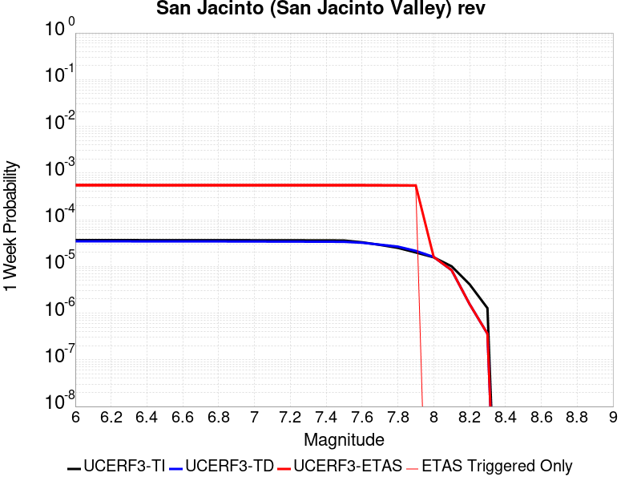 | 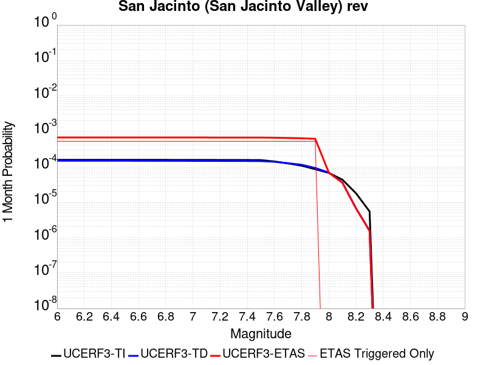 | 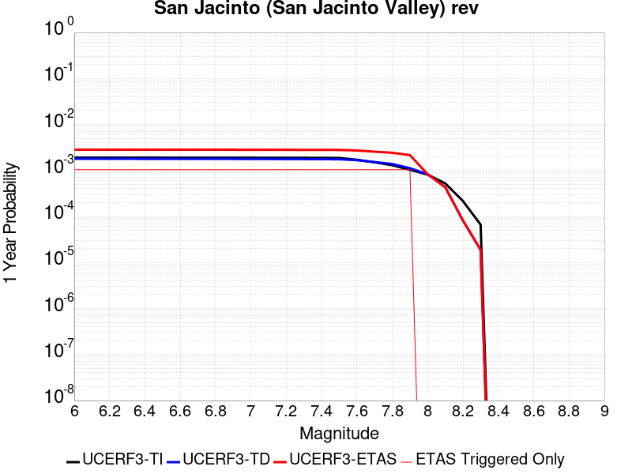 | 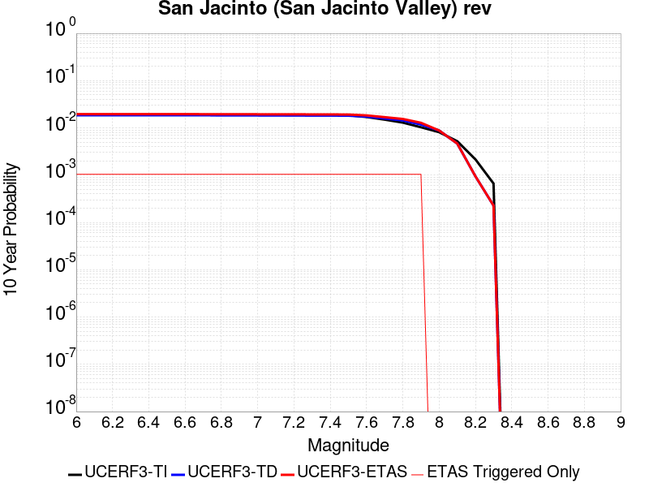 |

| Magnitude | 1 wk TI Prob | 1 wk TD Prob | 1 wk ETAS Prob | 1 wk ETAS/TD Gain | 1 wk ETAS Triggered Only | 1 mo TI Prob | 1 mo TD Prob | 1 mo ETAS Prob | 1 mo ETAS/TD Gain | 1 mo ETAS Triggered Only | 1 yr TI Prob | 1 yr TD Prob | 1 yr ETAS Prob | 1 yr ETAS/TD Gain | 1 yr ETAS Triggered Only | 10 yr TI Prob | 10 yr TD Prob | 10 yr ETAS Prob | 10 yr ETAS/TD Gain | 10 yr ETAS Triggered Only |
|-----|-----|-----|-----|-----|-----|-----|-----|-----|-----|-----|-----|-----|-----|-----|-----|-----|-----|-----|-----|-----|
| 6.0 | 3.652694E-5 | 3.4402394E-5 | 5.554892E-4 | 16.14682 | 5.211047E-4 | 1.5653463E-4 | 1.474305E-4 | 6.684584E-4 | 4.5340576 | 5.211047E-4 | 0.0019041431 | 0.00179349 | 0.0028338302 | 1.5800648 | 0.0010422094 | 0.018879099 | 0.018526595 | 0.019549496 | 1.0552126 | 0.0010422094 |
| 6.1 | 3.652694E-5 | 3.4402394E-5 | 5.554892E-4 | 16.14682 | 5.211047E-4 | 1.5653463E-4 | 1.474305E-4 | 6.684584E-4 | 4.5340576 | 5.211047E-4 | 0.0019041431 | 0.00179349 | 0.0028338302 | 1.5800648 | 0.0010422094 | 0.018879099 | 0.018526595 | 0.019549496 | 1.0552126 | 0.0010422094 |
| 6.2 | 3.652694E-5 | 3.4402394E-5 | 5.554892E-4 | 16.14682 | 5.211047E-4 | 1.5653463E-4 | 1.474305E-4 | 6.684584E-4 | 4.5340576 | 5.211047E-4 | 0.0019041431 | 0.00179349 | 0.0028338302 | 1.5800648 | 0.0010422094 | 0.018879099 | 0.018526595 | 0.019549496 | 1.0552126 | 0.0010422094 |
| 6.3 | 3.652694E-5 | 3.4402394E-5 | 5.554892E-4 | 16.14682 | 5.211047E-4 | 1.5653463E-4 | 1.474305E-4 | 6.684584E-4 | 4.5340576 | 5.211047E-4 | 0.0019041431 | 0.00179349 | 0.0028338302 | 1.5800648 | 0.0010422094 | 0.018879099 | 0.018526595 | 0.019549496 | 1.0552126 | 0.0010422094 |
| 6.4 | 3.646941E-5 | 3.432397E-5 | 5.554108E-4 | 16.181427 | 5.211047E-4 | 1.5628811E-4 | 1.4709444E-4 | 6.6812255E-4 | 4.542133 | 5.211047E-4 | 0.0019011468 | 0.0017894056 | 0.00282975 | 1.5813911 | 0.0010422094 | 0.018849645 | 0.018486476 | 0.019509418 | 1.0553347 | 0.0010422094 |
| 6.5 | 3.646941E-5 | 3.432397E-5 | 5.554108E-4 | 16.181427 | 5.211047E-4 | 1.5628811E-4 | 1.4709444E-4 | 6.6812255E-4 | 4.542133 | 5.211047E-4 | 0.0019011468 | 0.0017894056 | 0.00282975 | 1.5813911 | 0.0010422094 | 0.018849645 | 0.018486476 | 0.019509418 | 1.0553347 | 0.0010422094 |
| 6.6 | 3.6442503E-5 | 3.4287354E-5 | 5.5537425E-4 | 16.19764 | 5.211047E-4 | 1.561728E-4 | 1.4693754E-4 | 6.6796574E-4 | 4.545916 | 5.211047E-4 | 0.0018997455 | 0.0017874985 | 0.002827845 | 1.5820125 | 0.0010422094 | 0.018835869 | 0.018467745 | 0.019490708 | 1.0553918 | 0.0010422094 |
| 6.7 | 3.6432113E-5 | 3.4272925E-5 | 5.553598E-4 | 16.204039 | 5.211047E-4 | 1.5612828E-4 | 1.4687571E-4 | 6.679039E-4 | 4.547409 | 5.211047E-4 | 0.0018992044 | 0.0017867472 | 0.0028270946 | 1.5822577 | 0.0010422094 | 0.018830549 | 0.018460369 | 0.019483339 | 1.0554144 | 0.0010422094 |
| 6.8 | 3.6409598E-5 | 3.424198E-5 | 5.553289E-4 | 16.21778 | 5.211047E-4 | 1.560318E-4 | 1.4674311E-4 | 6.677714E-4 | 4.550615 | 5.211047E-4 | 0.0018980318 | 0.0017851355 | 0.0028254844 | 1.5827843 | 0.0010422094 | 0.018819023 | 0.018444523 | 0.01946751 | 1.0554628 | 0.0010422094 |
| 6.9 | 3.638078E-5 | 3.4202407E-5 | 5.552893E-4 | 16.235388 | 5.211047E-4 | 1.5590832E-4 | 1.4657351E-4 | 6.676019E-4 | 4.5547237 | 5.211047E-4 | 0.0018965311 | 0.001783074 | 0.0028234252 | 1.5834593 | 0.0010422094 | 0.018804269 | 0.018424258 | 0.019447265 | 1.0555251 | 0.0010422094 |
| 7.0 | 3.6294874E-5 | 3.408442E-5 | 5.551714E-4 | 16.288128 | 5.211047E-4 | 1.5554018E-4 | 1.4606792E-4 | 6.670965E-4 | 4.56703 | 5.211047E-4 | 0.0018920569 | 0.001776929 | 0.0028172864 | 1.5854807 | 0.0010422094 | 0.018760284 | 0.018363839 | 0.01938691 | 1.0557112 | 0.0010422094 |
| 7.1 | 3.6260717E-5 | 3.4040702E-5 | 5.551277E-4 | 16.307762 | 5.211047E-4 | 1.5539382E-4 | 1.4588058E-4 | 6.669093E-4 | 4.5716114 | 5.211047E-4 | 0.001890278 | 0.0017746518 | 0.0028150117 | 1.5862333 | 0.0010422094 | 0.018742796 | 0.018341439 | 0.019364534 | 1.0557804 | 0.0010422094 |
| 7.2 | 3.6210204E-5 | 3.397492E-5 | 5.5506197E-4 | 16.337402 | 5.211047E-4 | 1.5517735E-4 | 1.455987E-4 | 6.6662754E-4 | 4.578527 | 5.211047E-4 | 0.001887647 | 0.0017712255 | 0.002811589 | 1.5873693 | 0.0010422094 | 0.01871693 | 0.01830772 | 0.019330848 | 1.0558851 | 0.0010422094 |
| 7.3 | 3.6119454E-5 | 3.386321E-5 | 5.549503E-4 | 16.388002 | 5.211047E-4 | 1.5478847E-4 | 1.4511998E-4 | 6.661491E-4 | 4.5903335 | 5.211047E-4 | 0.0018829206 | 0.0017654065 | 0.002805776 | 1.5893087 | 0.0010422094 | 0.018670462 | 0.018250274 | 0.019273462 | 1.0560642 | 0.0010422094 |
| 7.4 | 3.607848E-5 | 3.381071E-5 | 5.548978E-4 | 16.411896 | 5.211047E-4 | 1.5461289E-4 | 1.44895E-4 | 6.659242E-4 | 4.595909 | 5.211047E-4 | 0.0018807866 | 0.0017626719 | 0.0028030444 | 1.5902246 | 0.0010422094 | 0.018649481 | 0.018223269 | 0.019246485 | 1.0561489 | 0.0010422094 |
| 7.5 | 3.5856774E-5 | 3.3620483E-5 | 5.547077E-4 | 16.4991 | 5.211047E-4 | 1.5366284E-4 | 1.4407984E-4 | 6.651095E-4 | 4.6162567 | 5.211047E-4 | 0.0018692396 | 0.0017527633 | 0.002793146 | 1.5935671 | 0.0010422094 | 0.018535944 | 0.018124366 | 0.019147687 | 1.056461 | 0.0010422094 |
| 7.6 | 3.286655E-5 | 3.2143445E-5 | 5.5323145E-4 | 17.211329 | 5.211047E-4 | 1.4084904E-4 | 1.3775036E-4 | 6.587833E-4 | 4.7824435 | 5.211047E-4 | 0.001713488 | 0.0016758227 | 0.0027162856 | 1.620867 | 0.0010422094 | 0.017003361 | 0.017344031 | 0.018368164 | 1.0590482 | 0.0010422094 |
| 7.7 | 2.8882527E-5 | 2.9236293E-5 | 5.503258E-4 | 18.823378 | 5.211047E-4 | 1.237764E-4 | 1.2529238E-4 | 6.463318E-4 | 5.1585884 | 5.211047E-4 | 0.0015059357 | 0.0015243685 | 0.0025649893 | 1.682657 | 0.0010422094 | 0.014957713 | 0.015830461 | 0.016856171 | 1.0647935 | 0.0010422094 |
| 7.8 | 2.4950225E-5 | 2.6527203E-5 | 5.4761814E-4 | 20.643642 | 5.211047E-4 | 1.0692515E-4 | 1.1368306E-4 | 6.347286E-4 | 5.583317 | 5.211047E-4 | 0.0013010362 | 0.0013832134 | 0.0024239812 | 1.7524276 | 0.0010422094 | 0.012934455 | 0.014411755 | 0.015438944 | 1.0712744 | 0.0010422094 |
| 7.9 | 1.9881603E-5 | 2.1507445E-5 | 5.42601E-4 | 25.228518 | 5.211047E-4 | 8.520408E-5 | 9.217151E-5 | 6.1322824E-4 | 6.653121 | 5.211047E-4 | 0.001036866 | 0.0011216112 | 0.0021626519 | 1.9281652 | 0.0010422094 | 0.010320415 | 0.011777027 | 0.012806962 | 1.0874529 | 0.0010422094 |
| 8.0 | 1.563292E-5 | 1.5937347E-5 | 1.5937347E-5 | 1.0 | 0.0 | 6.6996516E-5 | 6.8301124E-5 | 6.8301124E-5 | 1.0 | 0.0 | 8.153773E-4 | 8.3124964E-4 | 8.3124964E-4 | 1.0 | 0.0 | 0.00812392 | 0.008810506 | 0.008810506 | 1.0 | 0.0 |
| 8.1 | 1.0045313E-5 | 8.301802E-6 | 8.301802E-6 | 1.0 | 0.0 | 4.305063E-5 | 3.5578672E-5 | 3.5578672E-5 | 1.0 | 0.0 | 5.2401534E-4 | 4.3308473E-4 | 4.3308473E-4 | 1.0 | 0.0 | 0.0052278144 | 0.0046591135 | 0.0046591135 | 1.0 | 0.0 |
| 8.2 | 4.1554413E-6 | 1.5655598E-6 | 1.5655598E-6 | 1.0 | 0.0 | 1.7808914E-5 | 6.709525E-6 | 6.709525E-6 | 1.0 | 0.0 | 2.1680194E-4 | 8.168544E-5 | 8.168544E-5 | 1.0 | 0.0 | 0.0021659054 | 9.482903E-4 | 9.482903E-4 | 1.0 | 0.0 |
| 8.3 | 1.2758221E-6 | 3.6149942E-7 | 3.6149942E-7 | 1.0 | 0.0 | 5.4677976E-6 | 1.5492824E-6 | 1.5492824E-6 | 1.0 | 0.0 | 6.65684E-5 | 1.8862354E-5 | 1.8862354E-5 | 1.0 | 0.0 | 6.6548464E-4 | 2.2751294E-4 | 2.2751294E-4 | 1.0 | 0.0 |

## Rose Canyon
*[(top)](#table-of-contents)*

| 1 Week | 1 Month | 1 Year | 10 Year |
|-----|-----|-----|-----|
| 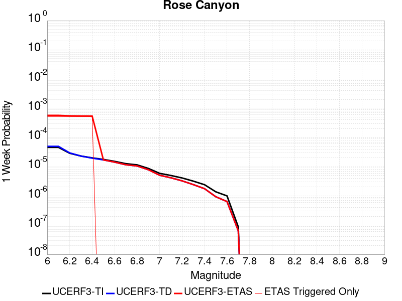 | 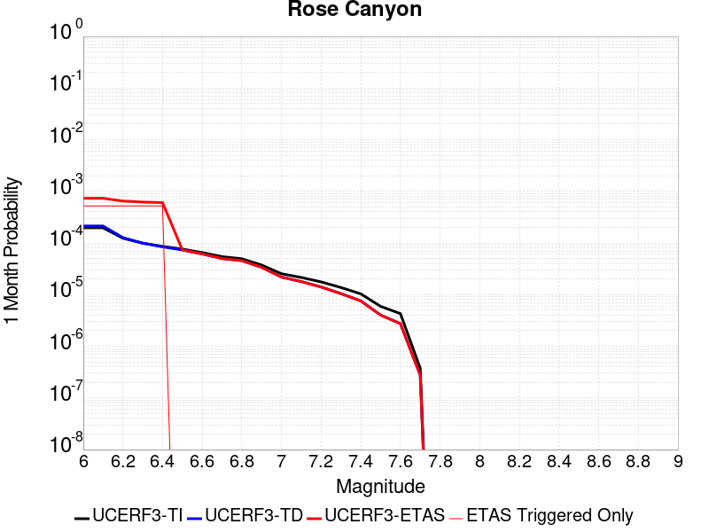 | 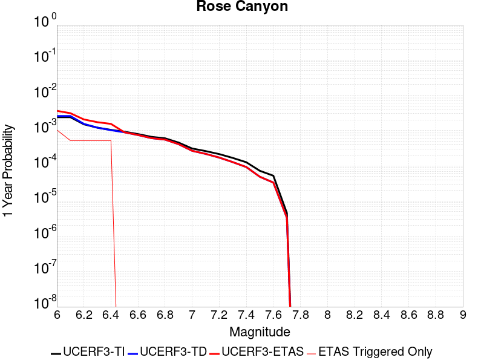 | 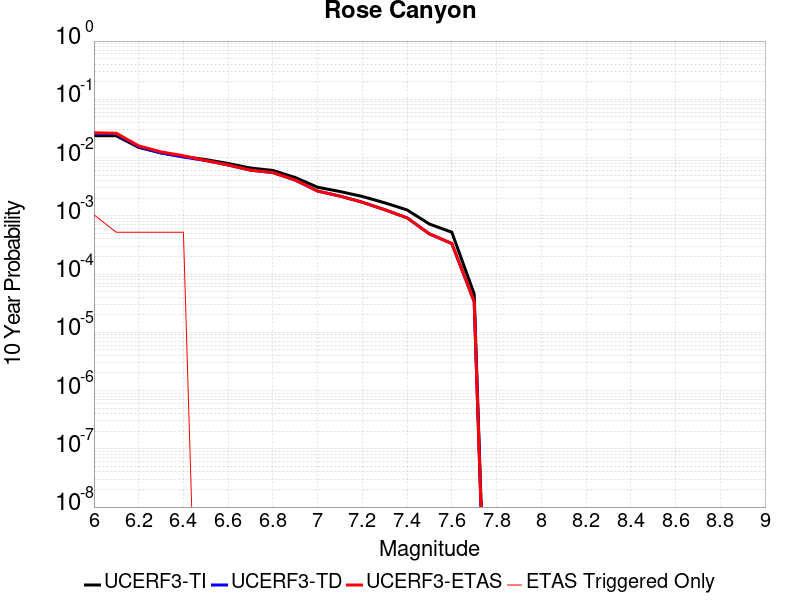 |

| Magnitude | 1 wk TI Prob | 1 wk TD Prob | 1 wk ETAS Prob | 1 wk ETAS/TD Gain | 1 wk ETAS Triggered Only | 1 mo TI Prob | 1 mo TD Prob | 1 mo ETAS Prob | 1 mo ETAS/TD Gain | 1 mo ETAS Triggered Only | 1 yr TI Prob | 1 yr TD Prob | 1 yr ETAS Prob | 1 yr ETAS/TD Gain | 1 yr ETAS Triggered Only | 10 yr TI Prob | 10 yr TD Prob | 10 yr ETAS Prob | 10 yr ETAS/TD Gain | 10 yr ETAS Triggered Only |
|-----|-----|-----|-----|-----|-----|-----|-----|-----|-----|-----|-----|-----|-----|-----|-----|-----|-----|-----|-----|-----|
| 6.0 | 4.5923203E-5 | 4.9714225E-5 | 5.7079305E-4 | 11.481483 | 5.211047E-4 | 1.9679888E-4 | 2.1304491E-4 | 7.3403865E-4 | 3.4454641 | 5.211047E-4 | 0.0023933933 | 0.0025909345 | 0.0036304437 | 1.4012102 | 0.0010422094 | 0.023677798 | 0.02563999 | 0.026655478 | 1.0396056 | 0.0010422094 |
| 6.1 | 4.5923203E-5 | 4.9714225E-5 | 5.7079305E-4 | 11.481483 | 5.211047E-4 | 1.9679888E-4 | 2.1304491E-4 | 7.3403865E-4 | 3.4454641 | 5.211047E-4 | 0.0023933933 | 0.0025909345 | 0.003110689 | 1.200605 | 5.211047E-4 | 0.023677798 | 0.02563999 | 0.026147734 | 1.0198028 | 5.211047E-4 |
| 6.2 | 2.8844734E-5 | 2.9668723E-5 | 5.50758E-4 | 18.563591 | 5.211047E-4 | 1.2361443E-4 | 1.2714567E-4 | 6.4818416E-4 | 5.097965 | 5.211047E-4 | 0.0015039665 | 0.0015468939 | 0.0020671925 | 1.3363506 | 5.211047E-4 | 0.0149382865 | 0.015374276 | 0.015887368 | 1.0333735 | 5.211047E-4 |
| 6.3 | 2.3171577E-5 | 2.3161238E-5 | 5.442539E-4 | 23.498482 | 5.211047E-4 | 9.9302975E-5 | 9.9258745E-5 | 6.2031177E-4 | 6.2494416 | 5.211047E-4 | 0.0012083431 | 0.0012078186 | 0.001728294 | 1.4309218 | 5.211047E-4 | 0.012017938 | 0.012022437 | 0.012537276 | 1.0428232 | 5.211047E-4 |
| 6.4 | 2.0066604E-5 | 1.9667024E-5 | 5.407615E-4 | 27.495848 | 5.211047E-4 | 8.599689E-5 | 8.4284584E-5 | 6.053454E-4 | 7.1821604 | 5.211047E-4 | 0.0010465092 | 0.0010256917 | 0.001546262 | 1.5075309 | 5.211047E-4 | 0.010415946 | 0.010217559 | 0.010733339 | 1.0504798 | 5.211047E-4 |
| 6.5 | 1.776989E-5 | 1.7113807E-5 | 1.7113807E-5 | 1.0 | 0.0 | 7.615444E-5 | 7.334287E-5 | 7.334287E-5 | 1.0 | 0.0 | 9.267859E-4 | 8.925905E-4 | 8.925905E-4 | 1.0 | 0.0 | 0.009229303 | 0.008896211 | 0.008896211 | 1.0 | 0.0 |
| 6.6 | 1.5227364E-5 | 1.433926E-5 | 1.433926E-5 | 1.0 | 0.0 | 6.52585E-5 | 6.1452556E-5 | 6.1452556E-5 | 1.0 | 0.0 | 7.942326E-4 | 7.479332E-4 | 7.479332E-4 | 1.0 | 0.0 | 0.007914 | 0.007458359 | 0.007458359 | 1.0 | 0.0 |
| 6.7 | 1.2703898E-5 | 1.1673274E-5 | 1.1673274E-5 | 1.0 | 0.0 | 5.4444143E-5 | 5.0027378E-5 | 5.0027378E-5 | 1.0 | 0.0 | 6.626558E-4 | 6.089174E-4 | 6.089174E-4 | 1.0 | 0.0 | 0.006606833 | 0.0060750856 | 0.0060750856 | 1.0 | 0.0 |
| 6.8 | 1.1554917E-5 | 1.0609337E-5 | 1.0609337E-5 | 1.0 | 0.0 | 4.9520135E-5 | 4.546782E-5 | 4.546782E-5 | 1.0 | 0.0 | 6.0274085E-4 | 5.5343413E-4 | 5.5343413E-4 | 1.0 | 0.0 | 0.0060110865 | 0.0055225673 | 0.0055225673 | 1.0 | 0.0 |
| 6.9 | 8.732078E-6 | 7.881357E-6 | 7.881357E-6 | 1.0 | 0.0 | 3.7422655E-5 | 3.3776825E-5 | 3.3776825E-5 | 1.0 | 0.0 | 4.5552556E-4 | 4.111582E-4 | 4.111582E-4 | 1.0 | 0.0 | 0.0045459294 | 0.0041048084 | 0.0041048084 | 1.0 | 0.0 |
| 7.0 | 5.9337494E-6 | 5.1074853E-6 | 5.1074853E-6 | 1.0 | 0.0 | 2.5430107E-5 | 2.188904E-5 | 2.188904E-5 | 1.0 | 0.0 | 3.0956755E-4 | 2.664666E-4 | 2.664666E-4 | 1.0 | 0.0 | 0.0030913667 | 0.0026614866 | 0.0026614866 | 1.0 | 0.0 |
| 7.1 | 5.013409E-6 | 4.1773833E-6 | 4.1773833E-6 | 1.0 | 0.0 | 2.1485863E-5 | 1.7902948E-5 | 1.7902948E-5 | 1.0 | 0.0 | 2.6155898E-4 | 2.179467E-4 | 2.179467E-4 | 1.0 | 0.0 | 0.0026125133 | 0.0021773411 | 0.0021773411 | 1.0 | 0.0 |
| 7.2 | 4.120763E-6 | 3.2821383E-6 | 3.2821383E-6 | 1.0 | 0.0 | 1.7660293E-5 | 1.4066231E-5 | 1.4066231E-5 | 1.0 | 0.0 | 2.1499286E-4 | 1.7124301E-4 | 1.7124301E-4 | 1.0 | 0.0 | 0.0021478499 | 0.00171112 | 0.00171112 | 1.0 | 0.0 |
| 7.3 | 3.2081239E-6 | 2.4405372E-6 | 2.4405372E-6 | 1.0 | 0.0 | 1.374903E-5 | 1.0459404E-5 | 1.0459404E-5 | 1.0 | 0.0 | 1.6738157E-4 | 1.2733586E-4 | 1.2733586E-4 | 1.0 | 0.0 | 0.0016725556 | 0.001272636 | 0.001272636 | 1.0 | 0.0 |
| 7.4 | 2.4194755E-6 | 1.7680634E-6 | 1.7680634E-6 | 1.0 | 0.0 | 1.0369139E-5 | 7.577393E-6 | 7.577393E-6 | 1.0 | 0.0 | 1.2623696E-4 | 9.2250906E-5 | 9.2250906E-5 | 1.0 | 0.0 | 0.0012616527 | 9.2213147E-4 | 9.2213147E-4 | 1.0 | 0.0 |
| 7.5 | 1.3842889E-6 | 9.3786275E-7 | 9.3786275E-7 | 1.0 | 0.0 | 5.9326535E-6 | 4.019406E-6 | 4.019406E-6 | 1.0 | 0.0 | 7.222766E-5 | 4.8935202E-5 | 4.8935202E-5 | 1.0 | 0.0 | 7.220419E-4 | 4.892478E-4 | 4.892478E-4 | 1.0 | 0.0 |
| 7.6 | 1.0021575E-6 | 6.411463E-7 | 6.411463E-7 | 1.0 | 0.0 | 4.2949537E-6 | 2.7477672E-6 | 2.7477672E-6 | 1.0 | 0.0 | 5.2289808E-5 | 3.3453573E-5 | 3.3453573E-5 | 1.0 | 0.0 | 5.2277505E-4 | 3.344875E-4 | 3.344875E-4 | 1.0 | 0.0 |
| 7.7 | 8.7620116E-8 | 6.4492404E-8 | 6.4492404E-8 | 1.0 | 0.0 | 3.7551473E-7 | 2.76396E-7 | 2.76396E-7 | 1.0 | 0.0 | 4.5718825E-6 | 3.3651165E-6 | 3.3651165E-6 | 1.0 | 0.0 | 4.5717883E-5 | 3.3650686E-5 | 3.3650686E-5 | 1.0 | 0.0 |

## Garlic Springs
*[(top)](#table-of-contents)*

| 1 Week | 1 Month | 1 Year | 10 Year |
|-----|-----|-----|-----|
|  |  |  |  |

| Magnitude | 1 wk TI Prob | 1 wk TD Prob | 1 wk ETAS Prob | 1 wk ETAS/TD Gain | 1 wk ETAS Triggered Only | 1 mo TI Prob | 1 mo TD Prob | 1 mo ETAS Prob | 1 mo ETAS/TD Gain | 1 mo ETAS Triggered Only | 1 yr TI Prob | 1 yr TD Prob | 1 yr ETAS Prob | 1 yr ETAS/TD Gain | 1 yr ETAS Triggered Only | 10 yr TI Prob | 10 yr TD Prob | 10 yr ETAS Prob | 10 yr ETAS/TD Gain | 10 yr ETAS Triggered Only |
|-----|-----|-----|-----|-----|-----|-----|-----|-----|-----|-----|-----|-----|-----|-----|-----|-----|-----|-----|-----|-----|
| 6.0 | 1.6760017E-5 | 1.8776833E-5 | 5.398718E-4 | 28.752016 | 5.211047E-4 | 7.182667E-5 | 8.0470316E-5 | 6.015331E-4 | 7.4752173 | 5.211047E-4 | 8.7413884E-4 | 9.794032E-4 | 0.0020205919 | 2.0630848 | 0.0010422094 | 0.008707083 | 0.009762413 | 0.010794448 | 1.1057152 | 0.0010422094 |
| 6.1 | 9.852767E-6 | 1.09735865E-5 | 1.09735865E-5 | 1.0 | 0.0 | 4.222546E-5 | 4.702921E-5 | 4.702921E-5 | 1.0 | 0.0 | 5.139737E-4 | 5.7250116E-4 | 0.0010933076 | 1.9097036 | 5.211047E-4 | 0.005127866 | 0.005717221 | 0.0062353467 | 1.0906254 | 5.211047E-4 |
| 6.2 | 9.852767E-6 | 1.09735865E-5 | 1.09735865E-5 | 1.0 | 0.0 | 4.222546E-5 | 4.702921E-5 | 4.702921E-5 | 1.0 | 0.0 | 5.139737E-4 | 5.7250116E-4 | 0.0010933076 | 1.9097036 | 5.211047E-4 | 0.005127866 | 0.005717221 | 0.0062353467 | 1.0906254 | 5.211047E-4 |
| 6.3 | 4.3167724E-6 | 4.7780286E-6 | 4.7780286E-6 | 1.0 | 0.0 | 1.8500323E-5 | 2.0477235E-5 | 2.0477235E-5 | 1.0 | 0.0 | 2.2521814E-4 | 2.4930484E-4 | 7.702797E-4 | 3.08971 | 5.211047E-4 | 0.0022499003 | 0.00249251 | 0.0030123158 | 1.2085471 | 5.211047E-4 |
| 6.4 | 4.3167724E-6 | 4.7780286E-6 | 4.7780286E-6 | 1.0 | 0.0 | 1.8500323E-5 | 2.0477235E-5 | 2.0477235E-5 | 1.0 | 0.0 | 2.2521814E-4 | 2.4930484E-4 | 7.702797E-4 | 3.08971 | 5.211047E-4 | 0.0022499003 | 0.00249251 | 0.0030123158 | 1.2085471 | 5.211047E-4 |
| 6.5 | 4.3167724E-6 | 4.7780286E-6 | 4.7780286E-6 | 1.0 | 0.0 | 1.8500323E-5 | 2.0477235E-5 | 2.0477235E-5 | 1.0 | 0.0 | 2.2521814E-4 | 2.4930484E-4 | 7.702797E-4 | 3.08971 | 5.211047E-4 | 0.0022499003 | 0.00249251 | 0.0030123158 | 1.2085471 | 5.211047E-4 |
| 6.6 | 4.301311E-6 | 4.760897E-6 | 4.760897E-6 | 1.0 | 0.0 | 1.8434059E-5 | 2.0403815E-5 | 2.0403815E-5 | 1.0 | 0.0 | 2.2441156E-4 | 2.4841115E-4 | 7.693865E-4 | 3.09723 | 5.211047E-4 | 0.0022418506 | 0.002483593 | 0.0030034035 | 1.2092978 | 5.211047E-4 |
| 6.7 | 3.8599724E-6 | 4.27106E-6 | 4.27106E-6 | 1.0 | 0.0 | 1.6542634E-5 | 1.8304541E-5 | 1.8304541E-5 | 1.0 | 0.0 | 2.0138794E-4 | 2.228578E-4 | 7.438464E-4 | 3.3377626 | 5.211047E-4 | 0.0020120554 | 0.002228578 | 0.0027485215 | 1.2333072 | 5.211047E-4 |

## Helendale-So Lockhart
*[(top)](#table-of-contents)*

| 1 Week | 1 Month | 1 Year | 10 Year |
|-----|-----|-----|-----|
|  |  |  |  |

| Magnitude | 1 wk TI Prob | 1 wk TD Prob | 1 wk ETAS Prob | 1 wk ETAS/TD Gain | 1 wk ETAS Triggered Only | 1 mo TI Prob | 1 mo TD Prob | 1 mo ETAS Prob | 1 mo ETAS/TD Gain | 1 mo ETAS Triggered Only | 1 yr TI Prob | 1 yr TD Prob | 1 yr ETAS Prob | 1 yr ETAS/TD Gain | 1 yr ETAS Triggered Only | 10 yr TI Prob | 10 yr TD Prob | 10 yr ETAS Prob | 10 yr ETAS/TD Gain | 10 yr ETAS Triggered Only |
|-----|-----|-----|-----|-----|-----|-----|-----|-----|-----|-----|-----|-----|-----|-----|-----|-----|-----|-----|-----|-----|
| 6.0 | 1.7296055E-5 | 1.8103729E-5 | 5.3919904E-4 | 29.783865 | 5.211047E-4 | 7.412385E-5 | 7.7585224E-5 | 5.9864955E-4 | 7.7160254 | 5.211047E-4 | 9.0208417E-4 | 9.4421144E-4 | 0.0014648242 | 1.551373 | 5.211047E-4 | 0.008984311 | 0.009404116 | 0.0099203205 | 1.0548913 | 5.211047E-4 |
| 6.1 | 1.7296055E-5 | 1.8103729E-5 | 5.3919904E-4 | 29.783865 | 5.211047E-4 | 7.412385E-5 | 7.7585224E-5 | 5.9864955E-4 | 7.7160254 | 5.211047E-4 | 9.0208417E-4 | 9.4421144E-4 | 0.0014648242 | 1.551373 | 5.211047E-4 | 0.008984311 | 0.009404116 | 0.0099203205 | 1.0548913 | 5.211047E-4 |
| 6.2 | 1.7296055E-5 | 1.8103729E-5 | 5.3919904E-4 | 29.783865 | 5.211047E-4 | 7.412385E-5 | 7.7585224E-5 | 5.9864955E-4 | 7.7160254 | 5.211047E-4 | 9.0208417E-4 | 9.4421144E-4 | 0.0014648242 | 1.551373 | 5.211047E-4 | 0.008984311 | 0.009404116 | 0.0099203205 | 1.0548913 | 5.211047E-4 |
| 6.3 | 1.0669118E-5 | 1.1135425E-5 | 1.1135425E-5 | 1.0 | 0.0 | 4.5723988E-5 | 4.772239E-5 | 4.772239E-5 | 1.0 | 0.0 | 5.5654737E-4 | 5.80868E-4 | 5.80868E-4 | 1.0 | 0.0 | 0.0055515557 | 0.0057937936 | 0.0057937936 | 1.0 | 0.0 |
| 6.4 | 1.0669118E-5 | 1.1135425E-5 | 1.1135425E-5 | 1.0 | 0.0 | 4.5723988E-5 | 4.772239E-5 | 4.772239E-5 | 1.0 | 0.0 | 5.5654737E-4 | 5.80868E-4 | 5.80868E-4 | 1.0 | 0.0 | 0.0055515557 | 0.0057937936 | 0.0057937936 | 1.0 | 0.0 |
| 6.5 | 8.790038E-6 | 9.170197E-6 | 9.170197E-6 | 1.0 | 0.0 | 3.767105E-5 | 3.930026E-5 | 3.930026E-5 | 1.0 | 0.0 | 4.585485E-4 | 4.7837716E-4 | 4.7837716E-4 | 1.0 | 0.0 | 0.0045760344 | 0.004773638 | 0.004773638 | 1.0 | 0.0 |
| 6.6 | 7.396949E-6 | 7.715537E-6 | 7.715537E-6 | 1.0 | 0.0 | 3.1700827E-5 | 3.3066175E-5 | 3.3066175E-5 | 1.0 | 0.0 | 3.858892E-4 | 4.025073E-4 | 4.025073E-4 | 1.0 | 0.0 | 0.003852198 | 0.00401789 | 0.00401789 | 1.0 | 0.0 |
| 6.7 | 6.4600285E-6 | 6.738031E-6 | 6.738031E-6 | 1.0 | 0.0 | 2.7685543E-5 | 2.887696E-5 | 2.887696E-5 | 1.0 | 0.0 | 3.3701936E-4 | 3.5152107E-4 | 3.5152107E-4 | 1.0 | 0.0 | 0.0033650869 | 0.003509732 | 0.003509732 | 1.0 | 0.0 |
| 6.8 | 5.600104E-6 | 5.836009E-6 | 5.836009E-6 | 1.0 | 0.0 | 2.4000226E-5 | 2.5011232E-5 | 2.5011232E-5 | 1.0 | 0.0 | 2.9216358E-4 | 3.044698E-4 | 3.044698E-4 | 1.0 | 0.0 | 0.0029177975 | 0.003040588 | 0.003040588 | 1.0 | 0.0 |
| 6.9 | 4.839122E-6 | 5.0395092E-6 | 5.0395092E-6 | 1.0 | 0.0 | 2.0738931E-5 | 2.159772E-5 | 2.159772E-5 | 1.0 | 0.0 | 2.5246723E-4 | 2.6292098E-4 | 2.6292098E-4 | 1.0 | 0.0 | 0.002521806 | 0.002626147 | 0.002626147 | 1.0 | 0.0 |
| 7.0 | 3.6937633E-6 | 3.845208E-6 | 3.845208E-6 | 1.0 | 0.0 | 1.5830317E-5 | 1.647936E-5 | 1.647936E-5 | 1.0 | 0.0 | 1.9271708E-4 | 2.0061806E-4 | 2.0061806E-4 | 1.0 | 0.0 | 0.0019255003 | 0.002004401 | 0.002004401 | 1.0 | 0.0 |
| 7.1 | 2.7858857E-6 | 2.8978538E-6 | 2.8978538E-6 | 1.0 | 0.0 | 1.1939455E-5 | 1.2419316E-5 | 1.2419316E-5 | 1.0 | 0.0 | 1.4535317E-4 | 1.511949E-4 | 1.511949E-4 | 1.0 | 0.0 | 0.0014525814 | 0.0015109418 | 0.0015109418 | 1.0 | 0.0 |
| 7.2 | 2.1672065E-6 | 2.2540128E-6 | 2.2540128E-6 | 1.0 | 0.0 | 9.2879945E-6 | 9.66002E-6 | 9.66002E-6 | 1.0 | 0.0 | 1.1307546E-4 | 1.1760458E-4 | 1.1760458E-4 | 1.0 | 0.0 | 0.0011301794 | 0.0011754417 | 0.0011754417 | 1.0 | 0.0 |
| 7.3 | 1.4823496E-6 | 1.5422102E-6 | 1.5422102E-6 | 1.0 | 0.0 | 6.3529114E-6 | 6.6094562E-6 | 6.6094562E-6 | 1.0 | 0.0 | 7.734395E-5 | 8.046731E-5 | 8.046731E-5 | 1.0 | 0.0 | 7.731704E-4 | 8.0439687E-4 | 8.0439687E-4 | 1.0 | 0.0 |
| 7.4 | 4.2321457E-7 | 4.4108765E-7 | 4.4108765E-7 | 1.0 | 0.0 | 1.8137755E-6 | 1.8903745E-6 | 1.8903745E-6 | 1.0 | 0.0 | 2.2082493E-5 | 2.3015113E-5 | 2.3015113E-5 | 1.0 | 0.0 | 2.2080299E-4 | 2.3013182E-4 | 2.3013182E-4 | 1.0 | 0.0 |
| 7.5 | 5.6942316E-8 | 5.9415648E-8 | 5.9415648E-8 | 1.0 | 0.0 | 2.440385E-7 | 2.5463845E-7 | 2.5463845E-7 | 1.0 | 0.0 | 2.9711643E-6 | 3.1002196E-6 | 3.1002196E-6 | 1.0 | 0.0 | 2.9711247E-5 | 3.1001844E-5 | 3.1001844E-5 | 1.0 | 0.0 |

## Pitas Point (Lower)-Montalvo
*[(top)](#table-of-contents)*

| 1 Week | 1 Month | 1 Year | 10 Year |
|-----|-----|-----|-----|
|  |  |  |  |

| Magnitude | 1 wk TI Prob | 1 wk TD Prob | 1 wk ETAS Prob | 1 wk ETAS/TD Gain | 1 wk ETAS Triggered Only | 1 mo TI Prob | 1 mo TD Prob | 1 mo ETAS Prob | 1 mo ETAS/TD Gain | 1 mo ETAS Triggered Only | 1 yr TI Prob | 1 yr TD Prob | 1 yr ETAS Prob | 1 yr ETAS/TD Gain | 1 yr ETAS Triggered Only | 10 yr TI Prob | 10 yr TD Prob | 10 yr ETAS Prob | 10 yr ETAS/TD Gain | 10 yr ETAS Triggered Only |
|-----|-----|-----|-----|-----|-----|-----|-----|-----|-----|-----|-----|-----|-----|-----|-----|-----|-----|-----|-----|-----|
| 6.0 | 5.2543637E-6 | 4.8378706E-6 | 4.8378706E-6 | 1.0 | 0.0 | 2.2518509E-5 | 2.0733567E-5 | 2.0733567E-5 | 1.0 | 0.0 | 2.7412834E-4 | 2.5240227E-4 | 2.5240227E-4 | 1.0 | 0.0 | 0.0027379042 | 0.0025211885 | 0.0030409794 | 1.206169 | 5.211047E-4 |
| 6.1 | 5.2543637E-6 | 4.8378706E-6 | 4.8378706E-6 | 1.0 | 0.0 | 2.2518509E-5 | 2.0733567E-5 | 2.0733567E-5 | 1.0 | 0.0 | 2.7412834E-4 | 2.5240227E-4 | 2.5240227E-4 | 1.0 | 0.0 | 0.0027379042 | 0.0025211885 | 0.0030409794 | 1.206169 | 5.211047E-4 |
| 6.2 | 5.2543637E-6 | 4.8378706E-6 | 4.8378706E-6 | 1.0 | 0.0 | 2.2518509E-5 | 2.0733567E-5 | 2.0733567E-5 | 1.0 | 0.0 | 2.7412834E-4 | 2.5240227E-4 | 2.5240227E-4 | 1.0 | 0.0 | 0.0027379042 | 0.0025211885 | 0.0030409794 | 1.206169 | 5.211047E-4 |
| 6.3 | 5.2543637E-6 | 4.8378706E-6 | 4.8378706E-6 | 1.0 | 0.0 | 2.2518509E-5 | 2.0733567E-5 | 2.0733567E-5 | 1.0 | 0.0 | 2.7412834E-4 | 2.5240227E-4 | 2.5240227E-4 | 1.0 | 0.0 | 0.0027379042 | 0.0025211885 | 0.0030409794 | 1.206169 | 5.211047E-4 |
| 6.4 | 5.2543637E-6 | 4.8378706E-6 | 4.8378706E-6 | 1.0 | 0.0 | 2.2518509E-5 | 2.0733567E-5 | 2.0733567E-5 | 1.0 | 0.0 | 2.7412834E-4 | 2.5240227E-4 | 2.5240227E-4 | 1.0 | 0.0 | 0.0027379042 | 0.0025211885 | 0.0030409794 | 1.206169 | 5.211047E-4 |
| 6.5 | 5.2543637E-6 | 4.8378706E-6 | 4.8378706E-6 | 1.0 | 0.0 | 2.2518509E-5 | 2.0733567E-5 | 2.0733567E-5 | 1.0 | 0.0 | 2.7412834E-4 | 2.5240227E-4 | 2.5240227E-4 | 1.0 | 0.0 | 0.0027379042 | 0.0025211885 | 0.0030409794 | 1.206169 | 5.211047E-4 |
| 6.6 | 5.2543637E-6 | 4.8378706E-6 | 4.8378706E-6 | 1.0 | 0.0 | 2.2518509E-5 | 2.0733567E-5 | 2.0733567E-5 | 1.0 | 0.0 | 2.7412834E-4 | 2.5240227E-4 | 2.5240227E-4 | 1.0 | 0.0 | 0.0027379042 | 0.0025211885 | 0.0030409794 | 1.206169 | 5.211047E-4 |
| 6.7 | 5.2543637E-6 | 4.8378706E-6 | 4.8378706E-6 | 1.0 | 0.0 | 2.2518509E-5 | 2.0733567E-5 | 2.0733567E-5 | 1.0 | 0.0 | 2.7412834E-4 | 2.5240227E-4 | 2.5240227E-4 | 1.0 | 0.0 | 0.0027379042 | 0.0025211885 | 0.0030409794 | 1.206169 | 5.211047E-4 |
| 6.8 | 5.2543637E-6 | 4.8378706E-6 | 4.8378706E-6 | 1.0 | 0.0 | 2.2518509E-5 | 2.0733567E-5 | 2.0733567E-5 | 1.0 | 0.0 | 2.7412834E-4 | 2.5240227E-4 | 2.5240227E-4 | 1.0 | 0.0 | 0.0027379042 | 0.0025211885 | 0.0030409794 | 1.206169 | 5.211047E-4 |
| 6.9 | 5.2543637E-6 | 4.8378706E-6 | 4.8378706E-6 | 1.0 | 0.0 | 2.2518509E-5 | 2.0733567E-5 | 2.0733567E-5 | 1.0 | 0.0 | 2.7412834E-4 | 2.5240227E-4 | 2.5240227E-4 | 1.0 | 0.0 | 0.0027379042 | 0.0025211885 | 0.0030409794 | 1.206169 | 5.211047E-4 |
| 7.0 | 5.2543637E-6 | 4.8378706E-6 | 4.8378706E-6 | 1.0 | 0.0 | 2.2518509E-5 | 2.0733567E-5 | 2.0733567E-5 | 1.0 | 0.0 | 2.7412834E-4 | 2.5240227E-4 | 2.5240227E-4 | 1.0 | 0.0 | 0.0027379042 | 0.0025211885 | 0.0030409794 | 1.206169 | 5.211047E-4 |
| 7.1 | 5.2543637E-6 | 4.8378706E-6 | 4.8378706E-6 | 1.0 | 0.0 | 2.2518509E-5 | 2.0733567E-5 | 2.0733567E-5 | 1.0 | 0.0 | 2.7412834E-4 | 2.5240227E-4 | 2.5240227E-4 | 1.0 | 0.0 | 0.0027379042 | 0.0025211885 | 0.0030409794 | 1.206169 | 5.211047E-4 |
| 7.2 | 5.2458695E-6 | 4.8290244E-6 | 4.8290244E-6 | 1.0 | 0.0 | 2.2482105E-5 | 2.0695656E-5 | 2.0695656E-5 | 1.0 | 0.0 | 2.7368523E-4 | 2.519408E-4 | 2.519408E-4 | 1.0 | 0.0 | 0.0027334841 | 0.0025165842 | 0.0030363775 | 1.2065471 | 5.211047E-4 |
| 7.3 | 5.22665E-6 | 4.8089414E-6 | 4.8089414E-6 | 1.0 | 0.0 | 2.2399736E-5 | 2.0609588E-5 | 2.0609588E-5 | 1.0 | 0.0 | 2.7268266E-4 | 2.5089315E-4 | 2.5089315E-4 | 1.0 | 0.0 | 0.002723483 | 0.0025061315 | 0.0030259304 | 1.2074108 | 5.211047E-4 |
| 7.4 | 5.210642E-6 | 4.792154E-6 | 4.792154E-6 | 1.0 | 0.0 | 2.233113E-5 | 2.0537642E-5 | 2.0537642E-5 | 1.0 | 0.0 | 2.718476E-4 | 2.5001742E-4 | 2.5001742E-4 | 1.0 | 0.0 | 0.002715153 | 0.0024973939 | 0.0030171971 | 1.2081383 | 5.211047E-4 |
| 7.5 | 5.1226016E-6 | 4.7000403E-6 | 4.7000403E-6 | 1.0 | 0.0 | 2.1953823E-5 | 2.0142877E-5 | 2.0142877E-5 | 1.0 | 0.0 | 2.67255E-4 | 2.4521223E-4 | 2.4521223E-4 | 1.0 | 0.0 | 0.0026693381 | 0.0024494485 | 0.0029692766 | 1.2122226 | 5.211047E-4 |
| 7.6 | 4.8796987E-6 | 4.4449403E-6 | 4.4449403E-6 | 1.0 | 0.0 | 2.0912828E-5 | 1.9049607E-5 | 1.9049607E-5 | 1.0 | 0.0 | 2.5458392E-4 | 2.3190459E-4 | 2.3190459E-4 | 1.0 | 0.0 | 0.0025429246 | 0.0023166565 | 0.0028365538 | 1.2244172 | 5.211047E-4 |
| 7.7 | 4.0834398E-6 | 3.6091124E-6 | 3.6091124E-6 | 1.0 | 0.0 | 1.7500339E-5 | 1.5467534E-5 | 1.5467534E-5 | 1.0 | 0.0 | 2.1304579E-4 | 1.8830119E-4 | 1.8830119E-4 | 1.0 | 0.0 | 0.0021284167 | 0.00188144 | 0.0024015645 | 1.2764502 | 5.211047E-4 |
| 7.8 | 2.5445438E-6 | 2.121228E-6 | 2.121228E-6 | 1.0 | 0.0 | 1.0905142E-5 | 9.090945E-6 | 9.090945E-6 | 1.0 | 0.0 | 1.3276201E-4 | 1.1067669E-4 | 1.1067669E-4 | 1.0 | 0.0 | 0.0013268272 | 0.0011062203 | 0.0016267486 | 1.4705466 | 5.211047E-4 |
| 7.9 | 4.1677114E-7 | 3.3293693E-7 | 3.3293693E-7 | 1.0 | 0.0 | 1.7861609E-6 | 1.4268718E-6 | 1.4268718E-6 | 1.0 | 0.0 | 2.1746291E-5 | 1.737203E-5 | 1.737203E-5 | 1.0 | 0.0 | 2.1744163E-4 | 1.7370703E-4 | 6.9472124E-4 | 3.9993849 | 5.211047E-4 |
| 8.0 | 7.791402E-9 | 5.683497E-9 | 5.683497E-9 | 1.0 | 0.0 | 3.3391725E-8 | 2.4357844E-8 | 2.4357844E-8 | 1.0 | 0.0 | 4.0654416E-7 | 2.9655675E-7 | 2.9655675E-7 | 1.0 | 0.0 | 4.065434E-6 | 2.9655655E-6 | 2.9655655E-6 | 1.0 | 0.0 |

## San Andreas (Big Bend)
*[(top)](#table-of-contents)*

| 1 Week | 1 Month | 1 Year | 10 Year |
|-----|-----|-----|-----|
|  |  |  |  |

| Magnitude | 1 wk TI Prob | 1 wk TD Prob | 1 wk ETAS Prob | 1 wk ETAS/TD Gain | 1 wk ETAS Triggered Only | 1 mo TI Prob | 1 mo TD Prob | 1 mo ETAS Prob | 1 mo ETAS/TD Gain | 1 mo ETAS Triggered Only | 1 yr TI Prob | 1 yr TD Prob | 1 yr ETAS Prob | 1 yr ETAS/TD Gain | 1 yr ETAS Triggered Only | 10 yr TI Prob | 10 yr TD Prob | 10 yr ETAS Prob | 10 yr ETAS/TD Gain | 10 yr ETAS Triggered Only |
|-----|-----|-----|-----|-----|-----|-----|-----|-----|-----|-----|-----|-----|-----|-----|-----|-----|-----|-----|-----|-----|
| 6.0 | 1.0179969E-4 | 2.0072258E-4 | 2.0072258E-4 | 1.0 | 0.0 | 4.362114E-4 | 8.599571E-4 | 8.599571E-4 | 1.0 | 0.0 | 0.0052979486 | 0.010419999 | 0.0109356735 | 1.0494889 | 5.211047E-4 | 0.051734097 | 0.10144902 | 0.10191726 | 1.0046155 | 5.211047E-4 |
| 6.1 | 1.0179969E-4 | 2.0072258E-4 | 2.0072258E-4 | 1.0 | 0.0 | 4.362114E-4 | 8.599571E-4 | 8.599571E-4 | 1.0 | 0.0 | 0.0052979486 | 0.010419999 | 0.0109356735 | 1.0494889 | 5.211047E-4 | 0.051734097 | 0.10144902 | 0.10191726 | 1.0046155 | 5.211047E-4 |
| 6.2 | 1.0179969E-4 | 2.0072258E-4 | 2.0072258E-4 | 1.0 | 0.0 | 4.362114E-4 | 8.599571E-4 | 8.599571E-4 | 1.0 | 0.0 | 0.0052979486 | 0.010419999 | 0.0109356735 | 1.0494889 | 5.211047E-4 | 0.051734097 | 0.10144902 | 0.10191726 | 1.0046155 | 5.211047E-4 |
| 6.3 | 1.0179969E-4 | 2.0072258E-4 | 2.0072258E-4 | 1.0 | 0.0 | 4.362114E-4 | 8.599571E-4 | 8.599571E-4 | 1.0 | 0.0 | 0.0052979486 | 0.010419999 | 0.0109356735 | 1.0494889 | 5.211047E-4 | 0.051734097 | 0.10144902 | 0.10191726 | 1.0046155 | 5.211047E-4 |
| 6.4 | 9.1639464E-5 | 1.8429532E-4 | 1.8429532E-4 | 1.0 | 0.0 | 3.9268145E-4 | 7.895982E-4 | 7.895982E-4 | 1.0 | 0.0 | 0.0047704205 | 0.009571102 | 0.010087219 | 1.0539246 | 5.211047E-4 | 0.046693064 | 0.09377527 | 0.09424751 | 1.0050359 | 5.211047E-4 |
| 6.5 | 9.1639464E-5 | 1.8429532E-4 | 1.8429532E-4 | 1.0 | 0.0 | 3.9268145E-4 | 7.895982E-4 | 7.895982E-4 | 1.0 | 0.0 | 0.0047704205 | 0.009571102 | 0.010087219 | 1.0539246 | 5.211047E-4 | 0.046693064 | 0.09377527 | 0.09424751 | 1.0050359 | 5.211047E-4 |
| 6.6 | 9.042622E-5 | 1.823659E-4 | 1.823659E-4 | 1.0 | 0.0 | 3.8748336E-4 | 7.8133424E-4 | 7.8133424E-4 | 1.0 | 0.0 | 0.0047074095 | 0.009471365 | 0.009987534 | 1.0544978 | 5.211047E-4 | 0.046089325 | 0.092869274 | 0.093341984 | 1.0050901 | 5.211047E-4 |
| 6.7 | 8.9836685E-5 | 1.8150927E-4 | 1.8150927E-4 | 1.0 | 0.0 | 3.8495753E-4 | 7.776651E-4 | 7.776651E-4 | 1.0 | 0.0 | 0.00467679 | 0.00942708 | 0.009943273 | 1.0547563 | 5.211047E-4 | 0.045795817 | 0.09246355 | 0.09293647 | 1.0051147 | 5.211047E-4 |
| 6.8 | 8.9471854E-5 | 1.8097709E-4 | 1.8097709E-4 | 1.0 | 0.0 | 3.8339442E-4 | 7.7538576E-4 | 7.7538576E-4 | 1.0 | 0.0 | 0.004657841 | 0.009399569 | 0.009915775 | 1.0549182 | 5.211047E-4 | 0.04561414 | 0.092210755 | 0.09268381 | 1.0051302 | 5.211047E-4 |
| 6.9 | 8.858234E-5 | 1.7979681E-4 | 1.7979681E-4 | 1.0 | 0.0 | 3.7958333E-4 | 7.703304E-4 | 7.703304E-4 | 1.0 | 0.0 | 0.004611638 | 0.009338548 | 0.009854787 | 1.0552803 | 5.211047E-4 | 0.04517103 | 0.09165087 | 0.092124216 | 1.0051646 | 5.211047E-4 |
| 7.0 | 8.7433385E-5 | 1.7818481E-4 | 1.7818481E-4 | 1.0 | 0.0 | 3.746607E-4 | 7.634259E-4 | 7.634259E-4 | 1.0 | 0.0 | 0.004551957 | 0.009255203 | 0.009771485 | 1.0557829 | 5.211047E-4 | 0.044598386 | 0.09088532 | 0.091359064 | 1.0052125 | 5.211047E-4 |
| 7.1 | 8.684964E-5 | 1.7730435E-4 | 1.7730435E-4 | 1.0 | 0.0 | 3.7215967E-4 | 7.596547E-4 | 7.596547E-4 | 1.0 | 0.0 | 0.0045216335 | 0.009209678 | 0.009725983 | 1.0560611 | 5.211047E-4 | 0.04430731 | 0.09046686 | 0.090940826 | 1.005239 | 5.211047E-4 |
| 7.2 | 8.606521E-5 | 1.762105E-4 | 1.762105E-4 | 1.0 | 0.0 | 3.6879873E-4 | 7.549695E-4 | 7.549695E-4 | 1.0 | 0.0 | 0.0044808835 | 0.0091531165 | 0.009669451 | 1.0564108 | 5.211047E-4 | 0.043916024 | 0.089947365 | 0.0904216 | 1.0052724 | 5.211047E-4 |
| 7.3 | 8.568266E-5 | 1.7563057E-4 | 1.7563057E-4 | 1.0 | 0.0 | 3.6715972E-4 | 7.524855E-4 | 7.524855E-4 | 1.0 | 0.0 | 0.0044610105 | 0.009123127 | 0.009639477 | 1.056598 | 5.211047E-4 | 0.043725148 | 0.08966853 | 0.090142906 | 1.0052904 | 5.211047E-4 |
| 7.4 | 8.5432206E-5 | 1.7525644E-4 | 1.7525644E-4 | 1.0 | 0.0 | 3.6608664E-4 | 7.50883E-4 | 7.50883E-4 | 1.0 | 0.0 | 0.004447999 | 0.009103781 | 0.009620141 | 1.0567194 | 5.211047E-4 | 0.043600157 | 0.08948871 | 0.08996318 | 1.0053021 | 5.211047E-4 |
| 7.5 | 8.4791965E-5 | 1.7394972E-4 | 1.7394972E-4 | 1.0 | 0.0 | 3.633435E-4 | 7.4528606E-4 | 7.4528606E-4 | 1.0 | 0.0 | 0.0044147377 | 0.009036204 | 0.0095526 | 1.0571474 | 5.211047E-4 | 0.043280575 | 0.088866346 | 0.08934114 | 1.0053428 | 5.211047E-4 |
| 7.6 | 8.241105E-5 | 1.6840403E-4 | 1.6840403E-4 | 1.0 | 0.0 | 3.531424E-4 | 7.215321E-4 | 7.215321E-4 | 1.0 | 0.0 | 0.0042910352 | 0.008749358 | 0.009265904 | 1.059038 | 5.211047E-4 | 0.042091176 | 0.086243294 | 0.08671945 | 1.0055212 | 5.211047E-4 |
| 7.7 | 7.00432E-5 | 1.42045E-4 | 1.42045E-4 | 1.0 | 0.0 | 3.001506E-4 | 6.0862233E-4 | 6.0862233E-4 | 1.0 | 0.0 | 0.0036482112 | 0.0073848404 | 0.007902097 | 1.070043 | 5.211047E-4 | 0.035888977 | 0.07351733 | 0.07400012 | 1.0065671 | 5.211047E-4 |
| 7.8 | 6.415362E-5 | 1.2968935E-4 | 1.2968935E-4 | 1.0 | 0.0 | 2.749151E-4 | 5.556931E-4 | 5.556931E-4 | 1.0 | 0.0 | 0.0033419547 | 0.0067446055 | 0.007262196 | 1.0767413 | 5.211047E-4 | 0.03292141 | 0.06725231 | 0.06773836 | 1.0072274 | 5.211047E-4 |
| 7.9 | 4.939911E-5 | 9.3411545E-5 | 9.3411545E-5 | 1.0 | 0.0 | 2.116933E-4 | 4.0027377E-4 | 4.0027377E-4 | 1.0 | 0.0 | 0.0025743195 | 0.004862453 | 0.0053810235 | 1.106648 | 5.211047E-4 | 0.025447013 | 0.048914436 | 0.049410053 | 1.0101323 | 5.211047E-4 |
| 8.0 | 3.344983E-5 | 5.222685E-5 | 5.222685E-5 | 1.0 | 0.0 | 1.4334853E-4 | 2.2381016E-4 | 2.2381016E-4 | 1.0 | 0.0 | 0.0017438711 | 0.0027214854 | 0.0027214854 | 1.0 | 0.0 | 0.017302496 | 0.027922187 | 0.027922187 | 1.0 | 0.0 |
| 8.1 | 1.9104898E-5 | 1.9173063E-5 | 1.9173063E-5 | 1.0 | 0.0 | 8.1875565E-5 | 8.216769E-5 | 8.216769E-5 | 1.0 | 0.0 | 9.963791E-4 | 9.999331E-4 | 9.999331E-4 | 1.0 | 0.0 | 0.009919235 | 0.010749801 | 0.010749801 | 1.0 | 0.0 |
| 8.2 | 8.643924E-6 | 5.4748625E-6 | 5.4748625E-6 | 1.0 | 0.0 | 3.704486E-5 | 2.3463486E-5 | 2.3463486E-5 | 1.0 | 0.0 | 4.5092785E-4 | 2.8563058E-4 | 2.8563058E-4 | 1.0 | 0.0 | 0.0045001395 | 0.0032487072 | 0.0032487072 | 1.0 | 0.0 |
| 8.3 | 1.983087E-6 | 7.6599065E-7 | 7.6599065E-7 | 1.0 | 0.0 | 8.498917E-6 | 3.282813E-6 | 3.282813E-6 | 1.0 | 0.0 | 1.034694E-4 | 3.9967534E-5 | 3.9967534E-5 | 1.0 | 0.0 | 0.0010342124 | 4.719687E-4 | 4.719687E-4 | 1.0 | 0.0 |

## Ortigalita (South)
*[(top)](#table-of-contents)*

| 1 Week | 1 Month | 1 Year | 10 Year |
|-----|-----|-----|-----|
|  |  |  | 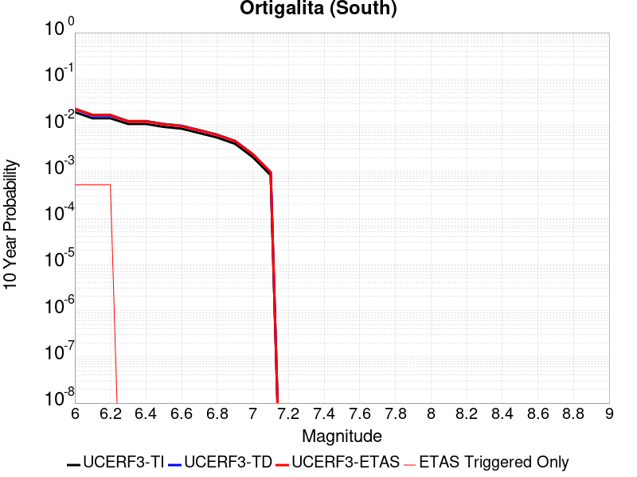 |

| Magnitude | 1 wk TI Prob | 1 wk TD Prob | 1 wk ETAS Prob | 1 wk ETAS/TD Gain | 1 wk ETAS Triggered Only | 1 mo TI Prob | 1 mo TD Prob | 1 mo ETAS Prob | 1 mo ETAS/TD Gain | 1 mo ETAS Triggered Only | 1 yr TI Prob | 1 yr TD Prob | 1 yr ETAS Prob | 1 yr ETAS/TD Gain | 1 yr ETAS Triggered Only | 10 yr TI Prob | 10 yr TD Prob | 10 yr ETAS Prob | 10 yr ETAS/TD Gain | 10 yr ETAS Triggered Only |
|-----|-----|-----|-----|-----|-----|-----|-----|-----|-----|-----|-----|-----|-----|-----|-----|-----|-----|-----|-----|-----|
| 6.0 | 3.72394E-5 | 4.325562E-5 | 4.325562E-5 | 1.0 | 0.0 | 1.5958765E-4 | 1.8536893E-4 | 1.8536893E-4 | 1.0 | 0.0 | 0.0019412481 | 0.0022546875 | 0.0022546875 | 1.0 | 0.0 | 0.019243775 | 0.022334497 | 0.022843963 | 1.0228107 | 5.211047E-4 |
| 6.1 | 2.7299884E-5 | 3.149204E-5 | 3.149204E-5 | 1.0 | 0.0 | 1.16994255E-4 | 1.3495922E-4 | 1.3495922E-4 | 1.0 | 0.0 | 0.0014234743 | 0.0016419457 | 0.0016419457 | 1.0 | 0.0 | 0.014143906 | 0.01630407 | 0.01681668 | 1.0314405 | 5.211047E-4 |
| 6.2 | 2.7299884E-5 | 3.149204E-5 | 3.149204E-5 | 1.0 | 0.0 | 1.16994255E-4 | 1.3495922E-4 | 1.3495922E-4 | 1.0 | 0.0 | 0.0014234743 | 0.0016419457 | 0.0016419457 | 1.0 | 0.0 | 0.014143906 | 0.01630407 | 0.01681668 | 1.0314405 | 5.211047E-4 |
| 6.3 | 2.0546433E-5 | 2.363145E-5 | 2.363145E-5 | 1.0 | 0.0 | 8.805317E-5 | 1.0127382E-4 | 1.0127382E-4 | 1.0 | 0.0 | 0.00107152 | 0.0012323303 | 0.0012323303 | 1.0 | 0.0 | 0.010663681 | 0.01225703 | 0.01225703 | 1.0 | 0.0 |
| 6.4 | 2.0546433E-5 | 2.363145E-5 | 2.363145E-5 | 1.0 | 0.0 | 8.805317E-5 | 1.0127382E-4 | 1.0127382E-4 | 1.0 | 0.0 | 0.00107152 | 0.0012323303 | 0.0012323303 | 1.0 | 0.0 | 0.010663681 | 0.01225703 | 0.01225703 | 1.0 | 0.0 |
| 6.5 | 1.7779594E-5 | 2.0446974E-5 | 2.0446974E-5 | 1.0 | 0.0 | 7.619603E-5 | 8.762702E-5 | 8.762702E-5 | 1.0 | 0.0 | 9.272918E-4 | 0.0010663504 | 0.0010663504 | 1.0 | 0.0 | 0.009234319 | 0.010613803 | 0.010613803 | 1.0 | 0.0 |
| 6.6 | 1.6272212E-5 | 1.8714967E-5 | 1.8714967E-5 | 1.0 | 0.0 | 6.973618E-5 | 8.0204605E-5 | 8.0204605E-5 | 1.0 | 0.0 | 8.487073E-4 | 9.760658E-4 | 9.760658E-4 | 1.0 | 0.0 | 0.008454733 | 0.009719091 | 0.009719091 | 1.0 | 0.0 |
| 6.7 | 1.3051484E-5 | 1.5038758E-5 | 1.5038758E-5 | 1.0 | 0.0 | 5.593373E-5 | 6.445028E-5 | 6.445028E-5 | 1.0 | 0.0 | 6.807804E-4 | 7.844092E-4 | 7.844092E-4 | 1.0 | 0.0 | 0.006786986 | 0.007817388 | 0.007817388 | 1.0 | 0.0 |
| 6.8 | 1.04277415E-5 | 1.1987235E-5 | 1.1987235E-5 | 1.0 | 0.0 | 4.4689557E-5 | 5.1372896E-5 | 5.1372896E-5 | 1.0 | 0.0 | 5.439595E-4 | 6.2529295E-4 | 6.2529295E-4 | 1.0 | 0.0 | 0.0054262993 | 0.00623609 | 0.00623609 | 1.0 | 0.0 |
| 6.9 | 7.639968E-6 | 8.791503E-6 | 8.791503E-6 | 1.0 | 0.0 | 3.274231E-5 | 3.767736E-5 | 3.767736E-5 | 1.0 | 0.0 | 3.9856473E-4 | 4.586312E-4 | 4.586312E-4 | 1.0 | 0.0 | 0.003978506 | 0.004577433 | 0.004577433 | 1.0 | 0.0 |
| 7.0 | 3.919831E-6 | 4.5334014E-6 | 4.5334014E-6 | 1.0 | 0.0 | 1.679917E-5 | 1.942873E-5 | 1.942873E-5 | 1.0 | 0.0 | 2.045107E-4 | 2.3652123E-4 | 2.3652123E-4 | 1.0 | 0.0 | 0.0020432258 | 0.0023629034 | 0.0023629034 | 1.0 | 0.0 |
| 7.1 | 1.6017933E-6 | 1.8570418E-6 | 1.8570418E-6 | 1.0 | 0.0 | 6.8648105E-6 | 7.958732E-6 | 7.958732E-6 | 1.0 | 0.0 | 8.357586E-5 | 9.689432E-5 | 9.689432E-5 | 1.0 | 0.0 | 8.3544437E-4 | 9.686254E-4 | 9.686254E-4 | 1.0 | 0.0 |

## Santa Ynez (West)
*[(top)](#table-of-contents)*

| 1 Week | 1 Month | 1 Year | 10 Year |
|-----|-----|-----|-----|
|  |  |  |  |

| Magnitude | 1 wk TI Prob | 1 wk TD Prob | 1 wk ETAS Prob | 1 wk ETAS/TD Gain | 1 wk ETAS Triggered Only | 1 mo TI Prob | 1 mo TD Prob | 1 mo ETAS Prob | 1 mo ETAS/TD Gain | 1 mo ETAS Triggered Only | 1 yr TI Prob | 1 yr TD Prob | 1 yr ETAS Prob | 1 yr ETAS/TD Gain | 1 yr ETAS Triggered Only | 10 yr TI Prob | 10 yr TD Prob | 10 yr ETAS Prob | 10 yr ETAS/TD Gain | 10 yr ETAS Triggered Only |
|-----|-----|-----|-----|-----|-----|-----|-----|-----|-----|-----|-----|-----|-----|-----|-----|-----|-----|-----|-----|-----|
| 6.0 | 4.7352758E-5 | 5.4972126E-5 | 5.4972126E-5 | 1.0 | 0.0 | 2.0292461E-4 | 2.3557522E-4 | 2.3557522E-4 | 1.0 | 0.0 | 0.0024678076 | 0.0028645284 | 0.0028645284 | 1.0 | 0.0 | 0.024405818 | 0.028304417 | 0.028810773 | 1.0178896 | 5.211047E-4 |
| 6.1 | 4.7352758E-5 | 5.4972126E-5 | 5.4972126E-5 | 1.0 | 0.0 | 2.0292461E-4 | 2.3557522E-4 | 2.3557522E-4 | 1.0 | 0.0 | 0.0024678076 | 0.0028645284 | 0.0028645284 | 1.0 | 0.0 | 0.024405818 | 0.028304417 | 0.028810773 | 1.0178896 | 5.211047E-4 |
| 6.2 | 3.0415853E-5 | 3.392511E-5 | 3.392511E-5 | 1.0 | 0.0 | 1.3034715E-4 | 1.4538545E-4 | 1.4538545E-4 | 1.0 | 0.0 | 0.0015858212 | 0.0017686661 | 0.0017686661 | 1.0 | 0.0 | 0.015745522 | 0.017549807 | 0.018061766 | 1.0291718 | 5.211047E-4 |
| 6.3 | 3.0415853E-5 | 3.392511E-5 | 3.392511E-5 | 1.0 | 0.0 | 1.3034715E-4 | 1.4538545E-4 | 1.4538545E-4 | 1.0 | 0.0 | 0.0015858212 | 0.0017686661 | 0.0017686661 | 1.0 | 0.0 | 0.015745522 | 0.017549807 | 0.018061766 | 1.0291718 | 5.211047E-4 |
| 6.4 | 2.5452082E-5 | 2.7912422E-5 | 2.7912422E-5 | 1.0 | 0.0 | 1.09075794E-4 | 1.196193E-4 | 1.196193E-4 | 1.0 | 0.0 | 0.0013271887 | 0.0014554089 | 0.0014554089 | 1.0 | 0.0 | 0.013192902 | 0.014460951 | 0.014974521 | 1.0355142 | 5.211047E-4 |
| 6.5 | 2.3143784E-5 | 2.5128256E-5 | 2.5128256E-5 | 1.0 | 0.0 | 9.9183875E-5 | 1.0768817E-4 | 1.0768817E-4 | 1.0 | 0.0 | 0.0012068948 | 0.0013103267 | 0.0013103267 | 1.0 | 0.0 | 0.012003611 | 0.01302768 | 0.0135419965 | 1.0394787 | 5.211047E-4 |
| 6.6 | 1.9118515E-5 | 2.035434E-5 | 2.035434E-5 | 1.0 | 0.0 | 8.193392E-5 | 8.7230015E-5 | 8.7230015E-5 | 1.0 | 0.0 | 9.97089E-4 | 0.001061516 | 0.001061516 | 1.0 | 0.0 | 0.00992627 | 0.010565365 | 0.010565365 | 1.0 | 0.0 |
| 6.7 | 1.722807E-5 | 1.8146347E-5 | 1.8146347E-5 | 1.0 | 0.0 | 7.3832496E-5 | 7.776777E-5 | 7.776777E-5 | 1.0 | 0.0 | 8.985399E-4 | 9.464169E-4 | 9.464169E-4 | 1.0 | 0.0 | 0.008949154 | 0.0094245095 | 0.0094245095 | 1.0 | 0.0 |
| 6.8 | 1.5317364E-5 | 1.5926486E-5 | 1.5926486E-5 | 1.0 | 0.0 | 6.56442E-5 | 6.82546E-5 | 6.82546E-5 | 1.0 | 0.0 | 7.98925E-4 | 8.306873E-4 | 8.306873E-4 | 1.0 | 0.0 | 0.007960589 | 0.00827631 | 0.00827631 | 1.0 | 0.0 |
| 6.9 | 1.3071226E-5 | 1.3329624E-5 | 1.3329624E-5 | 1.0 | 0.0 | 5.6018336E-5 | 5.7125722E-5 | 5.7125722E-5 | 1.0 | 0.0 | 6.8180985E-4 | 6.9528597E-4 | 6.9528597E-4 | 1.0 | 0.0 | 0.0067972173 | 0.006931367 | 0.006931367 | 1.0 | 0.0 |
| 7.0 | 1.1836986E-5 | 1.19327815E-5 | 1.19327815E-5 | 1.0 | 0.0 | 5.0728955E-5 | 5.11395E-5 | 5.11395E-5 | 1.0 | 0.0 | 6.1745E-4 | 6.2244723E-4 | 6.2244723E-4 | 1.0 | 0.0 | 0.006157372 | 0.006207231 | 0.006207231 | 1.0 | 0.0 |
| 7.1 | 1.0597169E-5 | 1.0542201E-5 | 1.0542201E-5 | 1.0 | 0.0 | 4.541565E-5 | 4.5180084E-5 | 4.5180084E-5 | 1.0 | 0.0 | 5.5279525E-4 | 5.4992986E-4 | 5.4992986E-4 | 1.0 | 0.0 | 0.0055142213 | 0.005485821 | 0.005485821 | 1.0 | 0.0 |
| 7.2 | 9.59113E-6 | 9.459144E-6 | 9.459144E-6 | 1.0 | 0.0 | 4.11042E-5 | 4.0538565E-5 | 4.0538565E-5 | 1.0 | 0.0 | 5.0032866E-4 | 4.934463E-4 | 4.934463E-4 | 1.0 | 0.0 | 0.004992037 | 0.0049236254 | 0.0049236254 | 1.0 | 0.0 |
| 7.3 | 8.586084E-6 | 8.379583E-6 | 8.379583E-6 | 1.0 | 0.0 | 3.679698E-5 | 3.5912013E-5 | 3.5912013E-5 | 1.0 | 0.0 | 4.4791115E-4 | 4.3714207E-4 | 4.3714207E-4 | 1.0 | 0.0 | 0.004470094 | 0.004362933 | 0.004362933 | 1.0 | 0.0 |
| 7.4 | 7.2622997E-6 | 6.9515427E-6 | 6.9515427E-6 | 1.0 | 0.0 | 3.112377E-5 | 2.979199E-5 | 2.979199E-5 | 1.0 | 0.0 | 3.78866E-4 | 3.626581E-4 | 3.626581E-4 | 1.0 | 0.0 | 0.0037822074 | 0.0036207628 | 0.0036207628 | 1.0 | 0.0 |
| 7.5 | 5.627296E-6 | 5.251588E-6 | 5.251588E-6 | 1.0 | 0.0 | 2.411676E-5 | 2.2506614E-5 | 2.2506614E-5 | 1.0 | 0.0 | 2.9358198E-4 | 2.739843E-4 | 2.739843E-4 | 1.0 | 0.0 | 0.0029319443 | 0.002736537 | 0.002736537 | 1.0 | 0.0 |
| 7.6 | 2.265244E-6 | 2.0608625E-6 | 2.0608625E-6 | 1.0 | 0.0 | 9.708152E-6 | 8.832238E-6 | 8.832238E-6 | 1.0 | 0.0 | 1.18190335E-4 | 1.0752728E-4 | 1.0752728E-4 | 1.0 | 0.0 | 0.001181275 | 0.0010747612 | 0.0010747612 | 1.0 | 0.0 |
| 7.7 | 1.3099874E-6 | 1.1016252E-6 | 1.1016252E-6 | 1.0 | 0.0 | 5.61422E-6 | 4.7212425E-6 | 4.7212425E-6 | 1.0 | 0.0 | 6.8350986E-5 | 5.7479636E-5 | 5.7479636E-5 | 1.0 | 0.0 | 6.832996E-4 | 5.7465007E-4 | 5.7465007E-4 | 1.0 | 0.0 |
| 7.8 | 7.903951E-7 | 6.0711415E-7 | 6.0711415E-7 | 1.0 | 0.0 | 3.3874032E-6 | 2.6019152E-6 | 2.6019152E-6 | 1.0 | 0.0 | 4.1240855E-5 | 3.167787E-5 | 3.167787E-5 | 1.0 | 0.0 | 4.12332E-4 | 3.167349E-4 | 3.167349E-4 | 1.0 | 0.0 |
| 7.9 | 7.0753297E-9 | 5.0899476E-9 | 5.0899476E-9 | 1.0 | 0.0 | 3.032284E-8 | 2.181406E-8 | 2.181406E-8 | 1.0 | 0.0 | 3.6918053E-7 | 2.6558615E-7 | 2.6558615E-7 | 1.0 | 0.0 | 3.691799E-6 | 2.6558594E-6 | 2.6558594E-6 | 1.0 | 0.0 |

## Palos Verdes
*[(top)](#table-of-contents)*

| 1 Week | 1 Month | 1 Year | 10 Year |
|-----|-----|-----|-----|
| 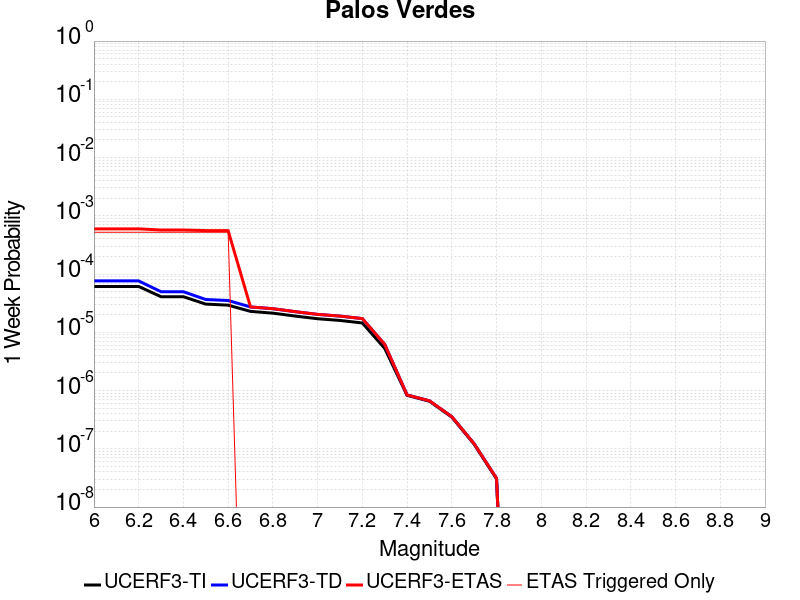 |  | 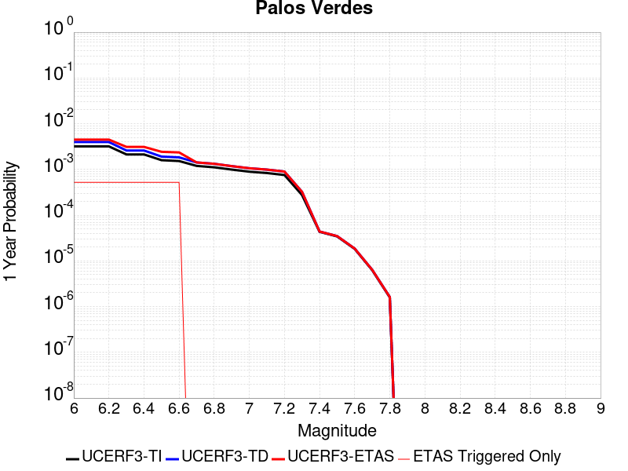 | 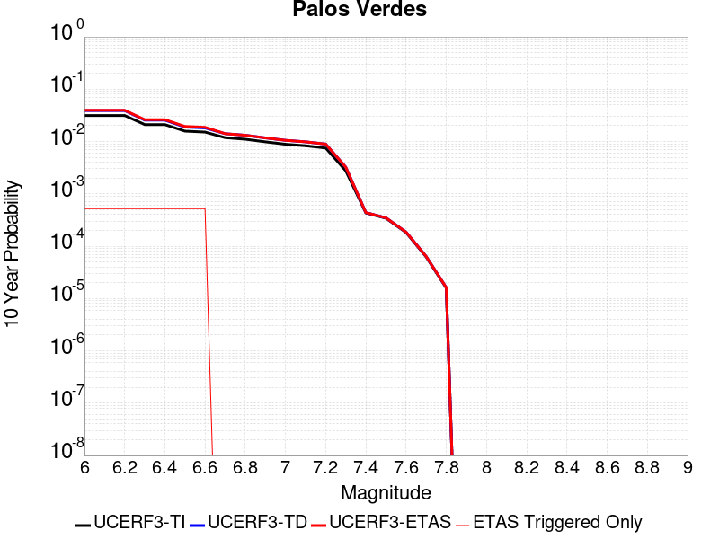 |

| Magnitude | 1 wk TI Prob | 1 wk TD Prob | 1 wk ETAS Prob | 1 wk ETAS/TD Gain | 1 wk ETAS Triggered Only | 1 mo TI Prob | 1 mo TD Prob | 1 mo ETAS Prob | 1 mo ETAS/TD Gain | 1 mo ETAS Triggered Only | 1 yr TI Prob | 1 yr TD Prob | 1 yr ETAS Prob | 1 yr ETAS/TD Gain | 1 yr ETAS Triggered Only | 10 yr TI Prob | 10 yr TD Prob | 10 yr ETAS Prob | 10 yr ETAS/TD Gain | 10 yr ETAS Triggered Only |
|-----|-----|-----|-----|-----|-----|-----|-----|-----|-----|-----|-----|-----|-----|-----|-----|-----|-----|-----|-----|-----|
| 6.0 | 6.126063E-5 | 7.622612E-5 | 5.9729116E-4 | 7.8357806 | 5.211047E-4 | 2.6251914E-4 | 3.2664582E-4 | 8.475803E-4 | 2.5947993 | 5.211047E-4 | 0.0031914865 | 0.003970174 | 0.00448921 | 1.1307337 | 5.211047E-4 | 0.031460393 | 0.039048895 | 0.039549652 | 1.0128238 | 5.211047E-4 |
| 6.1 | 6.126063E-5 | 7.622612E-5 | 5.9729116E-4 | 7.8357806 | 5.211047E-4 | 2.6251914E-4 | 3.2664582E-4 | 8.475803E-4 | 2.5947993 | 5.211047E-4 | 0.0031914865 | 0.003970174 | 0.00448921 | 1.1307337 | 5.211047E-4 | 0.031460393 | 0.039048895 | 0.039549652 | 1.0128238 | 5.211047E-4 |
| 6.2 | 6.126063E-5 | 7.622612E-5 | 5.9729116E-4 | 7.8357806 | 5.211047E-4 | 2.6251914E-4 | 3.2664582E-4 | 8.475803E-4 | 2.5947993 | 5.211047E-4 | 0.0031914865 | 0.003970174 | 0.00448921 | 1.1307337 | 5.211047E-4 | 0.031460393 | 0.039048895 | 0.039549652 | 1.0128238 | 5.211047E-4 |
| 6.3 | 4.0838047E-5 | 4.9749437E-5 | 5.7082827E-4 | 11.474065 | 5.211047E-4 | 1.7500846E-4 | 2.1319572E-4 | 7.3418935E-4 | 3.4437342 | 5.211047E-4 | 0.0021286458 | 0.0025927818 | 0.0031125355 | 1.2004617 | 5.211047E-4 | 0.021083709 | 0.025646681 | 0.026154421 | 1.0197974 | 5.211047E-4 |
| 6.4 | 4.0838047E-5 | 4.9749437E-5 | 5.7082827E-4 | 11.474065 | 5.211047E-4 | 1.7500846E-4 | 2.1319572E-4 | 7.3418935E-4 | 3.4437342 | 5.211047E-4 | 0.0021286458 | 0.0025927818 | 0.0031125355 | 1.2004617 | 5.211047E-4 | 0.021083709 | 0.025646681 | 0.026154421 | 1.0197974 | 5.211047E-4 |
| 6.5 | 3.0512005E-5 | 3.656162E-5 | 5.576473E-4 | 15.252258 | 5.211047E-4 | 1.3075917E-4 | 1.5668393E-4 | 6.77707E-4 | 4.325313 | 5.211047E-4 | 0.0015908304 | 0.0019060767 | 0.0024261882 | 1.2728702 | 5.211047E-4 | 0.015794903 | 0.018909154 | 0.019420404 | 1.0270373 | 5.211047E-4 |
| 6.6 | 2.9255087E-5 | 3.515442E-5 | 5.5624085E-4 | 15.822785 | 5.211047E-4 | 1.2537291E-4 | 1.5065377E-4 | 6.7167997E-4 | 4.458435 | 5.211047E-4 | 0.0015253464 | 0.0018327828 | 0.0023529325 | 1.2838032 | 5.211047E-4 | 0.015149189 | 0.018188225 | 0.018699853 | 1.0281296 | 5.211047E-4 |
| 6.7 | 2.287198E-5 | 2.7248278E-5 | 2.7248278E-5 | 1.0 | 0.0 | 9.801909E-5 | 1.16773626E-4 | 1.16773626E-4 | 1.0 | 0.0 | 0.001192729 | 0.0014208833 | 0.0014208833 | 1.0 | 0.0 | 0.011863477 | 0.014127217 | 0.014127217 | 1.0 | 0.0 |
| 6.8 | 2.1325764E-5 | 2.5431877E-5 | 2.5431877E-5 | 1.0 | 0.0 | 9.139293E-5 | 1.0898971E-4 | 1.0898971E-4 | 1.0 | 0.0 | 0.001112141 | 0.0013262323 | 0.0013262323 | 1.0 | 0.0 | 0.011065915 | 0.013192211 | 0.013192211 | 1.0 | 0.0 |
| 6.9 | 1.9009392E-5 | 2.2613547E-5 | 2.2613547E-5 | 1.0 | 0.0 | 8.1466285E-5 | 9.6912096E-5 | 9.6912096E-5 | 1.0 | 0.0 | 9.914007E-4 | 0.0011793535 | 0.0011793535 | 1.0 | 0.0 | 0.009869894 | 0.011739632 | 0.011739632 | 1.0 | 0.0 |
| 7.0 | 1.7098473E-5 | 2.0319356E-5 | 2.0319356E-5 | 1.0 | 0.0 | 7.3277115E-5 | 8.708052E-5 | 8.708052E-5 | 1.0 | 0.0 | 8.917837E-4 | 0.001059775 | 0.001059775 | 1.0 | 0.0 | 0.008882134 | 0.010555646 | 0.010555646 | 1.0 | 0.0 |
| 7.1 | 1.5982785E-5 | 1.899476E-5 | 1.899476E-5 | 1.0 | 0.0 | 6.849585E-5 | 8.1404054E-5 | 8.1404054E-5 | 1.0 | 0.0 | 8.336179E-4 | 9.907284E-4 | 9.907284E-4 | 1.0 | 0.0 | 0.008304977 | 0.009871479 | 0.009871479 | 1.0 | 0.0 |
| 7.2 | 1.4468002E-5 | 1.7197237E-5 | 1.7197237E-5 | 1.0 | 0.0 | 6.200425E-5 | 7.370083E-5 | 7.370083E-5 | 1.0 | 0.0 | 7.546402E-4 | 8.970222E-4 | 8.970222E-4 | 1.0 | 0.0 | 0.007520827 | 0.008942284 | 0.008942284 | 1.0 | 0.0 |
| 7.3 | 5.288233E-6 | 6.2036747E-6 | 6.2036747E-6 | 1.0 | 0.0 | 2.2663658E-5 | 2.6587102E-5 | 2.6587102E-5 | 1.0 | 0.0 | 2.7589512E-4 | 3.236848E-4 | 3.236848E-4 | 1.0 | 0.0 | 0.0027555283 | 0.0032355562 | 0.0032355562 | 1.0 | 0.0 |
| 7.4 | 8.279556E-7 | 8.408347E-7 | 8.408347E-7 | 1.0 | 0.0 | 3.5483763E-6 | 3.6035726E-6 | 3.6035726E-6 | 1.0 | 0.0 | 4.3200624E-5 | 4.3872686E-5 | 4.3872686E-5 | 1.0 | 0.0 | 4.3192226E-4 | 4.3864746E-4 | 4.3864746E-4 | 1.0 | 0.0 |
| 7.5 | 6.559831E-7 | 6.667229E-7 | 6.667229E-7 | 1.0 | 0.0 | 2.8113532E-6 | 2.857381E-6 | 2.857381E-6 | 1.0 | 0.0 | 3.4227687E-5 | 3.4788125E-5 | 3.4788125E-5 | 1.0 | 0.0 | 3.4222414E-4 | 3.4783344E-4 | 3.4783344E-4 | 1.0 | 0.0 |
| 7.6 | 3.5018968E-7 | 3.5620027E-7 | 3.5620027E-7 | 1.0 | 0.0 | 1.500812E-6 | 1.526572E-6 | 1.526572E-6 | 1.0 | 0.0 | 1.8272232E-5 | 1.8585903E-5 | 1.8585903E-5 | 1.0 | 0.0 | 1.8270731E-4 | 1.8584808E-4 | 1.8584808E-4 | 1.0 | 0.0 |
| 7.7 | 1.1986104E-7 | 1.2198376E-7 | 1.2198376E-7 | 1.0 | 0.0 | 5.1369005E-7 | 5.2278745E-7 | 5.2278745E-7 | 1.0 | 0.0 | 6.2541585E-6 | 6.364919E-6 | 6.364919E-6 | 1.0 | 0.0 | 6.2539824E-5 | 6.364741E-5 | 6.364741E-5 | 1.0 | 0.0 |
| 7.8 | 3.0445005E-8 | 3.1027582E-8 | 3.1027582E-8 | 1.0 | 0.0 | 1.3047858E-7 | 1.3297536E-7 | 1.3297536E-7 | 1.0 | 0.0 | 1.5885756E-6 | 1.6189739E-6 | 1.6189739E-6 | 1.0 | 0.0 | 1.5885644E-5 | 1.6189642E-5 | 1.6189642E-5 | 1.0 | 0.0 |

## San Jacinto (Lytle Creek connector)
*[(top)](#table-of-contents)*

| 1 Week | 1 Month | 1 Year | 10 Year |
|-----|-----|-----|-----|
| 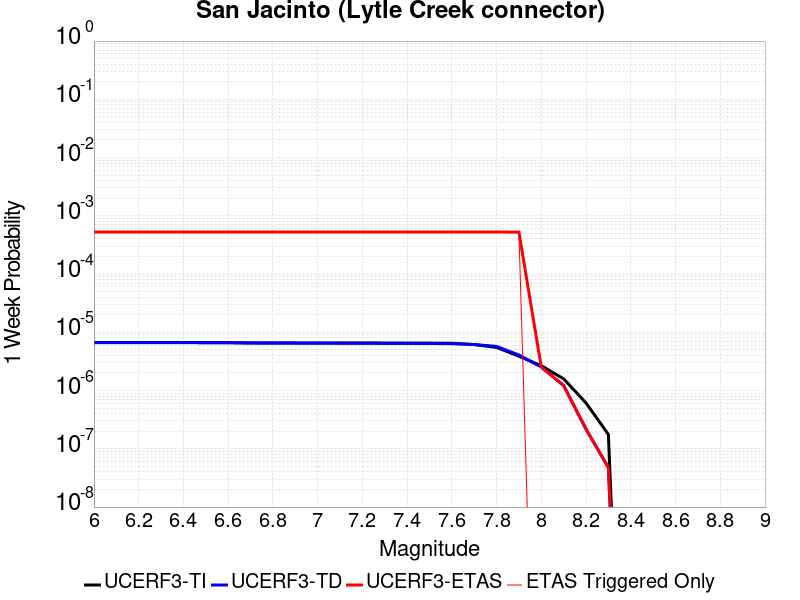 | 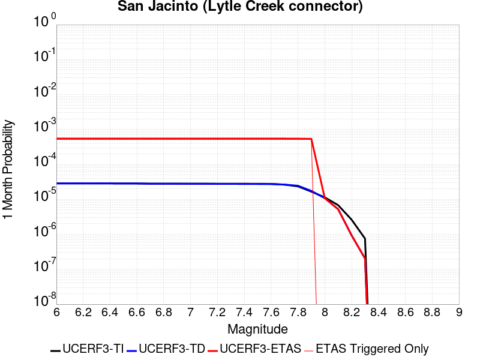 | 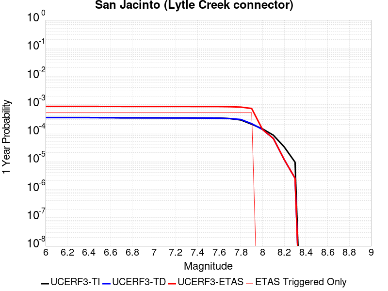 |  |

| Magnitude | 1 wk TI Prob | 1 wk TD Prob | 1 wk ETAS Prob | 1 wk ETAS/TD Gain | 1 wk ETAS Triggered Only | 1 mo TI Prob | 1 mo TD Prob | 1 mo ETAS Prob | 1 mo ETAS/TD Gain | 1 mo ETAS Triggered Only | 1 yr TI Prob | 1 yr TD Prob | 1 yr ETAS Prob | 1 yr ETAS/TD Gain | 1 yr ETAS Triggered Only | 10 yr TI Prob | 10 yr TD Prob | 10 yr ETAS Prob | 10 yr ETAS/TD Gain | 10 yr ETAS Triggered Only |
|-----|-----|-----|-----|-----|-----|-----|-----|-----|-----|-----|-----|-----|-----|-----|-----|-----|-----|-----|-----|-----|
| 6.0 | 6.693995E-6 | 6.660216E-6 | 5.2776147E-4 | 79.2409 | 5.211047E-4 | 2.8688235E-5 | 2.854347E-5 | 5.4963335E-4 | 19.256008 | 5.211047E-4 | 3.492233E-4 | 3.4746144E-4 | 8.6838513E-4 | 2.4992273 | 5.211047E-4 | 0.00348675 | 0.0035493854 | 0.0040686405 | 1.1462944 | 5.211047E-4 |
| 6.1 | 6.693995E-6 | 6.660216E-6 | 5.2776147E-4 | 79.2409 | 5.211047E-4 | 2.8688235E-5 | 2.854347E-5 | 5.4963335E-4 | 19.256008 | 5.211047E-4 | 3.492233E-4 | 3.4746144E-4 | 8.6838513E-4 | 2.4992273 | 5.211047E-4 | 0.00348675 | 0.0035493854 | 0.0040686405 | 1.1462944 | 5.211047E-4 |
| 6.2 | 6.693995E-6 | 6.660216E-6 | 5.2776147E-4 | 79.2409 | 5.211047E-4 | 2.8688235E-5 | 2.854347E-5 | 5.4963335E-4 | 19.256008 | 5.211047E-4 | 3.492233E-4 | 3.4746144E-4 | 8.6838513E-4 | 2.4992273 | 5.211047E-4 | 0.00348675 | 0.0035493854 | 0.0040686405 | 1.1462944 | 5.211047E-4 |
| 6.3 | 6.693995E-6 | 6.660216E-6 | 5.2776147E-4 | 79.2409 | 5.211047E-4 | 2.8688235E-5 | 2.854347E-5 | 5.4963335E-4 | 19.256008 | 5.211047E-4 | 3.492233E-4 | 3.4746144E-4 | 8.6838513E-4 | 2.4992273 | 5.211047E-4 | 0.00348675 | 0.0035493854 | 0.0040686405 | 1.1462944 | 5.211047E-4 |
| 6.4 | 6.693995E-6 | 6.660216E-6 | 5.2776147E-4 | 79.2409 | 5.211047E-4 | 2.8688235E-5 | 2.854347E-5 | 5.4963335E-4 | 19.256008 | 5.211047E-4 | 3.492233E-4 | 3.4746144E-4 | 8.6838513E-4 | 2.4992273 | 5.211047E-4 | 0.00348675 | 0.0035493854 | 0.0040686405 | 1.1462944 | 5.211047E-4 |
| 6.5 | 6.6561875E-6 | 6.6204343E-6 | 5.277217E-4 | 79.711044 | 5.211047E-4 | 2.8526205E-5 | 2.837298E-5 | 5.494629E-4 | 19.365711 | 5.211047E-4 | 3.472512E-4 | 3.4538636E-4 | 8.6631114E-4 | 2.5082378 | 5.211047E-4 | 0.0034670907 | 0.003528701 | 0.0040479666 | 1.1471549 | 5.211047E-4 |
| 6.6 | 6.6561875E-6 | 6.6204343E-6 | 5.277217E-4 | 79.711044 | 5.211047E-4 | 2.8526205E-5 | 2.837298E-5 | 5.494629E-4 | 19.365711 | 5.211047E-4 | 3.472512E-4 | 3.4538636E-4 | 8.6631114E-4 | 2.5082378 | 5.211047E-4 | 0.0034670907 | 0.003528701 | 0.0040479666 | 1.1471549 | 5.211047E-4 |
| 6.7 | 6.5802237E-6 | 6.539611E-6 | 5.276409E-4 | 80.683846 | 5.211047E-4 | 2.8200653E-5 | 2.8026603E-5 | 5.4911675E-4 | 19.592697 | 5.211047E-4 | 3.4328885E-4 | 3.4117055E-4 | 8.620975E-4 | 2.5268815 | 5.211047E-4 | 0.0034275902 | 0.0034866752 | 0.004005963 | 1.148935 | 5.211047E-4 |
| 6.8 | 6.575632E-6 | 6.5341005E-6 | 5.2763545E-4 | 80.751045 | 5.211047E-4 | 2.8180975E-5 | 2.8002989E-5 | 5.490931E-4 | 19.608376 | 5.211047E-4 | 3.4304935E-4 | 3.4088313E-4 | 8.6181023E-4 | 2.5281692 | 5.211047E-4 | 0.0034252026 | 0.00348381 | 0.004003099 | 1.1490579 | 5.211047E-4 |
| 6.9 | 6.570433E-6 | 6.525495E-6 | 5.2762683E-4 | 80.85622 | 5.211047E-4 | 2.8158694E-5 | 2.7966107E-5 | 5.490563E-4 | 19.632917 | 5.211047E-4 | 3.4277816E-4 | 3.4043423E-4 | 8.6136156E-4 | 2.530185 | 5.211047E-4 | 0.0034224992 | 0.0034793352 | 0.003998627 | 1.1492503 | 5.211047E-4 |
| 7.0 | 6.5643826E-6 | 6.515616E-6 | 5.2761694E-4 | 80.977295 | 5.211047E-4 | 2.8132765E-5 | 2.792377E-5 | 5.4901396E-4 | 19.66117 | 5.211047E-4 | 3.424626E-4 | 3.3991894E-4 | 8.6084654E-4 | 2.5325055 | 5.211047E-4 | 0.0034193532 | 0.0034741985 | 0.0039934926 | 1.1494716 | 5.211047E-4 |
| 7.1 | 6.557402E-6 | 6.5043278E-6 | 5.276057E-4 | 81.1161 | 5.211047E-4 | 2.8102848E-5 | 2.7875392E-5 | 5.489656E-4 | 19.693556 | 5.211047E-4 | 3.4209844E-4 | 3.3933012E-4 | 8.6025806E-4 | 2.5351655 | 5.211047E-4 | 0.0034157229 | 0.0034683298 | 0.003987627 | 1.1497254 | 5.211047E-4 |
| 7.2 | 6.546394E-6 | 6.4862943E-6 | 5.2758766E-4 | 81.33884 | 5.211047E-4 | 2.8055672E-5 | 2.7798109E-5 | 5.4888835E-4 | 19.74553 | 5.211047E-4 | 3.4152428E-4 | 3.3838948E-4 | 8.593179E-4 | 2.5394344 | 5.211047E-4 | 0.0034099987 | 0.0034589572 | 0.0039782594 | 1.1501327 | 5.211047E-4 |
| 7.3 | 6.5364216E-6 | 6.4670803E-6 | 5.2756845E-4 | 81.57753 | 5.211047E-4 | 2.8012933E-5 | 2.7715765E-5 | 5.4880604E-4 | 19.801224 | 5.211047E-4 | 3.4100408E-4 | 3.3738726E-4 | 8.583162E-4 | 2.544009 | 5.211047E-4 | 0.003404813 | 0.0034489788 | 0.0039682863 | 1.1505685 | 5.211047E-4 |
| 7.4 | 6.5269523E-6 | 6.4481674E-6 | 5.2754954E-4 | 81.81387 | 5.211047E-4 | 2.7972354E-5 | 2.7634711E-5 | 5.487251E-4 | 19.856369 | 5.211047E-4 | 3.4051016E-4 | 3.3640073E-4 | 8.5733016E-4 | 2.5485384 | 5.211047E-4 | 0.0033998888 | 0.003439161 | 0.0039584734 | 1.1509998 | 5.211047E-4 |
| 7.5 | 6.5111835E-6 | 6.424442E-6 | 5.2752584E-4 | 82.11232 | 5.211047E-4 | 2.7904773E-5 | 2.7533031E-5 | 5.4862344E-4 | 19.926008 | 5.211047E-4 | 3.3968766E-4 | 3.3516317E-4 | 8.5609325E-4 | 2.554258 | 5.211047E-4 | 0.0033916887 | 0.003426834 | 0.003946153 | 1.1515448 | 5.211047E-4 |
| 7.6 | 6.4768806E-6 | 6.383551E-6 | 5.27485E-4 | 82.631905 | 5.211047E-4 | 2.7757764E-5 | 2.735779E-5 | 5.484483E-4 | 20.047243 | 5.211047E-4 | 3.3789838E-4 | 3.3303024E-4 | 8.5396145E-4 | 2.564216 | 5.211047E-4 | 0.0033738504 | 0.0034055663 | 0.0039248965 | 1.1524945 | 5.211047E-4 |
| 7.7 | 6.1655364E-6 | 6.1760365E-6 | 5.272776E-4 | 85.37475 | 5.211047E-4 | 2.642346E-5 | 2.646846E-5 | 5.475594E-4 | 20.68724 | 5.211047E-4 | 3.2165812E-4 | 3.2220592E-4 | 8.4314274E-4 | 2.6167824 | 5.211047E-4 | 0.0032119295 | 0.0032971818 | 0.0038165683 | 1.1575243 | 5.211047E-4 |
| 7.8 | 5.5043524E-6 | 5.737097E-6 | 5.268389E-4 | 91.830215 | 5.211047E-4 | 2.3589868E-5 | 2.4587327E-5 | 5.4567924E-4 | 22.193518 | 5.211047E-4 | 2.871688E-4 | 2.9930964E-4 | 8.202584E-4 | 2.7405012 | 5.211047E-4 | 0.0028679797 | 0.0030672832 | 0.0035867896 | 1.1693702 | 5.211047E-4 |
| 7.9 | 3.889249E-6 | 4.076761E-6 | 5.251794E-4 | 128.82271 | 5.211047E-4 | 1.6668104E-5 | 1.7471715E-5 | 5.385674E-4 | 30.825098 | 5.211047E-4 | 2.0291525E-4 | 2.1269741E-4 | 7.336913E-4 | 3.4494605 | 5.211047E-4 | 0.0020273007 | 0.0021943315 | 0.0027142926 | 1.2369566 | 5.211047E-4 |
| 8.0 | 2.668535E-6 | 2.5315155E-6 | 2.5315155E-6 | 1.0 | 0.0 | 1.1436528E-5 | 1.0849307E-5 | 1.0849307E-5 | 1.0 | 0.0 | 1.3923083E-4 | 1.3208234E-4 | 1.3208234E-4 | 1.0 | 0.0 | 0.0013914363 | 0.0013757964 | 0.0013757964 | 1.0 | 0.0 |
| 8.1 | 1.5911459E-6 | 1.218661E-6 | 1.218661E-6 | 1.0 | 0.0 | 6.8191785E-6 | 5.2228224E-6 | 5.2228224E-6 | 1.0 | 0.0 | 8.3020335E-5 | 6.3586034E-5 | 6.3586034E-5 | 1.0 | 0.0 | 8.298933E-4 | 6.6932244E-4 | 6.6932244E-4 | 1.0 | 0.0 |
| 8.2 | 6.1294963E-7 | 2.1812275E-7 | 2.1812275E-7 | 1.0 | 0.0 | 2.6269242E-6 | 9.3481145E-7 | 9.3481145E-7 | 1.0 | 0.0 | 3.1982334E-5 | 1.138127E-5 | 1.138127E-5 | 1.0 | 0.0 | 3.1977732E-4 | 1.2784546E-4 | 1.2784546E-4 | 1.0 | 0.0 |
| 8.3 | 1.762871E-7 | 4.7546838E-8 | 4.7546838E-8 | 1.0 | 0.0 | 7.5551594E-7 | 2.0377215E-7 | 2.0377215E-7 | 1.0 | 0.0 | 9.1983675E-6 | 2.480923E-6 | 2.480923E-6 | 1.0 | 0.0 | 9.197987E-5 | 2.868753E-5 | 2.868753E-5 | 1.0 | 0.0 |

## Manix-Afton Hills
*[(top)](#table-of-contents)*

| 1 Week | 1 Month | 1 Year | 10 Year |
|-----|-----|-----|-----|
| 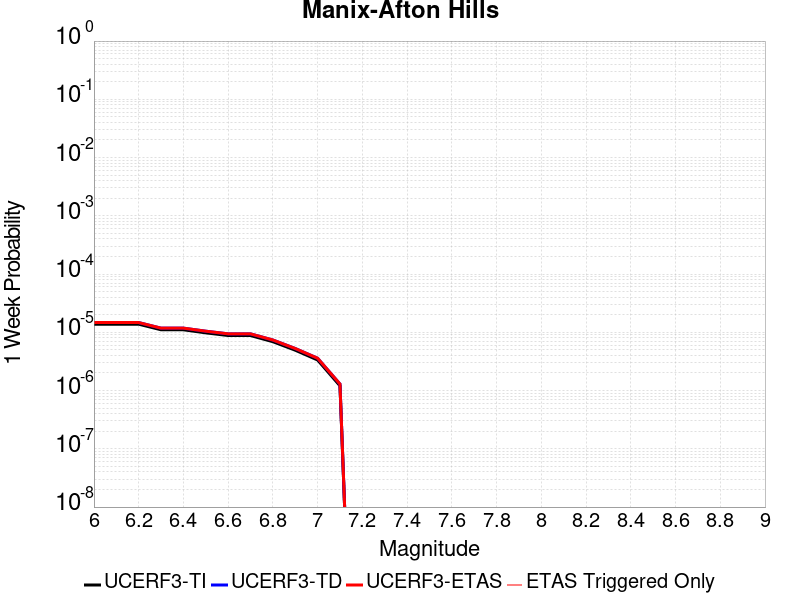 |  | 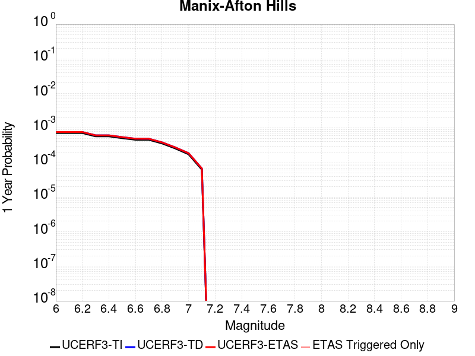 | 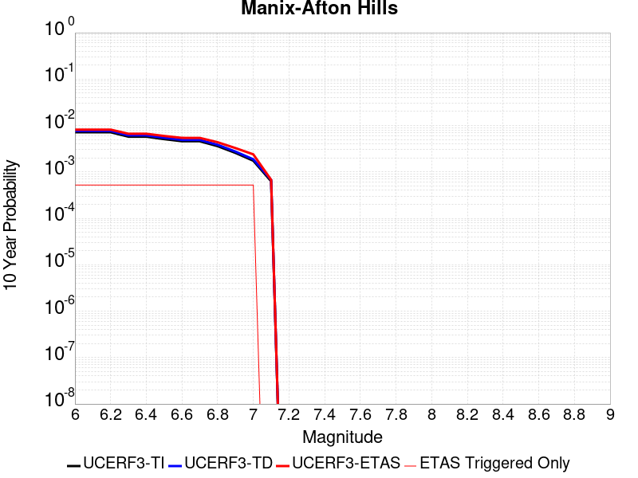 |

| Magnitude | 1 wk TI Prob | 1 wk TD Prob | 1 wk ETAS Prob | 1 wk ETAS/TD Gain | 1 wk ETAS Triggered Only | 1 mo TI Prob | 1 mo TD Prob | 1 mo ETAS Prob | 1 mo ETAS/TD Gain | 1 mo ETAS Triggered Only | 1 yr TI Prob | 1 yr TD Prob | 1 yr ETAS Prob | 1 yr ETAS/TD Gain | 1 yr ETAS Triggered Only | 10 yr TI Prob | 10 yr TD Prob | 10 yr ETAS Prob | 10 yr ETAS/TD Gain | 10 yr ETAS Triggered Only |
|-----|-----|-----|-----|-----|-----|-----|-----|-----|-----|-----|-----|-----|-----|-----|-----|-----|-----|-----|-----|-----|
| 6.0 | 1.3783202E-5 | 1.47110895E-5 | 1.47110895E-5 | 1.0 | 0.0 | 5.906953E-5 | 6.30461E-5 | 6.30461E-5 | 1.0 | 0.0 | 7.189342E-4 | 7.6733343E-4 | 7.6733343E-4 | 1.0 | 0.0 | 0.0071661277 | 0.007648596 | 0.008165715 | 1.0676097 | 5.211047E-4 |
| 6.1 | 1.3783202E-5 | 1.47110895E-5 | 1.47110895E-5 | 1.0 | 0.0 | 5.906953E-5 | 6.30461E-5 | 6.30461E-5 | 1.0 | 0.0 | 7.189342E-4 | 7.6733343E-4 | 7.6733343E-4 | 1.0 | 0.0 | 0.0071661277 | 0.007648596 | 0.008165715 | 1.0676097 | 5.211047E-4 |
| 6.2 | 1.3783202E-5 | 1.47110895E-5 | 1.47110895E-5 | 1.0 | 0.0 | 5.906953E-5 | 6.30461E-5 | 6.30461E-5 | 1.0 | 0.0 | 7.189342E-4 | 7.6733343E-4 | 7.6733343E-4 | 1.0 | 0.0 | 0.0071661277 | 0.007648596 | 0.008165715 | 1.0676097 | 5.211047E-4 |
| 6.3 | 1.10494875E-5 | 1.1793136E-5 | 1.1793136E-5 | 1.0 | 0.0 | 4.7354086E-5 | 5.054109E-5 | 5.054109E-5 | 1.0 | 0.0 | 5.763835E-4 | 6.151744E-4 | 6.151744E-4 | 1.0 | 0.0 | 0.005748908 | 0.0061357557 | 0.006653663 | 1.084408 | 5.211047E-4 |
| 6.4 | 1.10494875E-5 | 1.1793136E-5 | 1.1793136E-5 | 1.0 | 0.0 | 4.7354086E-5 | 5.054109E-5 | 5.054109E-5 | 1.0 | 0.0 | 5.763835E-4 | 6.151744E-4 | 6.151744E-4 | 1.0 | 0.0 | 0.005748908 | 0.0061357557 | 0.006653663 | 1.084408 | 5.211047E-4 |
| 6.5 | 9.788949E-6 | 1.045432E-5 | 1.045432E-5 | 1.0 | 0.0 | 4.1951964E-5 | 4.480351E-5 | 4.480351E-5 | 1.0 | 0.0 | 5.1064545E-4 | 5.453555E-4 | 5.453555E-4 | 1.0 | 0.0 | 0.0050947363 | 0.0054410985 | 0.005959368 | 1.0952508 | 5.211047E-4 |
| 6.6 | 8.810006E-6 | 9.4136285E-6 | 9.4136285E-6 | 1.0 | 0.0 | 3.775662E-5 | 4.0343548E-5 | 4.0343548E-5 | 1.0 | 0.0 | 4.5958988E-4 | 4.9108086E-4 | 4.9108086E-4 | 1.0 | 0.0 | 0.0045864056 | 0.004900839 | 0.00541939 | 1.1058086 | 5.211047E-4 |
| 6.7 | 8.80128E-6 | 9.404108E-6 | 9.404108E-6 | 1.0 | 0.0 | 3.7719226E-5 | 4.0302748E-5 | 4.0302748E-5 | 1.0 | 0.0 | 4.591348E-4 | 4.9058435E-4 | 4.9058435E-4 | 1.0 | 0.0 | 0.004581874 | 0.0048958957 | 0.005414449 | 1.1059159 | 5.211047E-4 |
| 6.8 | 6.8994877E-6 | 7.380076E-6 | 7.380076E-6 | 1.0 | 0.0 | 2.9568899E-5 | 3.162856E-5 | 3.162856E-5 | 1.0 | 0.0 | 3.5994186E-4 | 3.8501783E-4 | 3.8501783E-4 | 1.0 | 0.0 | 0.003593594 | 0.0038443129 | 0.0043634144 | 1.135031 | 5.211047E-4 |
| 6.9 | 4.9328037E-6 | 5.2709615E-6 | 5.2709615E-6 | 1.0 | 0.0 | 2.1140417E-5 | 2.2589675E-5 | 2.2589675E-5 | 1.0 | 0.0 | 2.5735417E-4 | 2.7500073E-4 | 2.7500073E-4 | 1.0 | 0.0 | 0.0025705635 | 0.0027472095 | 0.0032668826 | 1.189164 | 5.211047E-4 |
| 7.0 | 3.347973E-6 | 3.59003E-6 | 3.59003E-6 | 1.0 | 0.0 | 1.4348378E-5 | 1.5385775E-5 | 1.5385775E-5 | 1.0 | 0.0 | 1.746775E-4 | 1.8730981E-4 | 1.8730981E-4 | 1.0 | 0.0 | 0.0017454025 | 0.0018719219 | 0.0023920513 | 1.2778584 | 5.211047E-4 |
| 7.1 | 1.2073567E-6 | 1.293482E-6 | 1.293482E-6 | 1.0 | 0.0 | 5.1743755E-6 | 5.543492E-6 | 5.543492E-6 | 1.0 | 0.0 | 6.29962E-5 | 6.749156E-5 | 6.749156E-5 | 1.0 | 0.0 | 6.297835E-4 | 6.7487074E-4 | 6.7487074E-4 | 1.0 | 0.0 |

## Elsinore (Glen Ivy) rev
*[(top)](#table-of-contents)*

| 1 Week | 1 Month | 1 Year | 10 Year |
|-----|-----|-----|-----|
|  |  |  |  |

| Magnitude | 1 wk TI Prob | 1 wk TD Prob | 1 wk ETAS Prob | 1 wk ETAS/TD Gain | 1 wk ETAS Triggered Only | 1 mo TI Prob | 1 mo TD Prob | 1 mo ETAS Prob | 1 mo ETAS/TD Gain | 1 mo ETAS Triggered Only | 1 yr TI Prob | 1 yr TD Prob | 1 yr ETAS Prob | 1 yr ETAS/TD Gain | 1 yr ETAS Triggered Only | 10 yr TI Prob | 10 yr TD Prob | 10 yr ETAS Prob | 10 yr ETAS/TD Gain | 10 yr ETAS Triggered Only |
|-----|-----|-----|-----|-----|-----|-----|-----|-----|-----|-----|-----|-----|-----|-----|-----|-----|-----|-----|-----|-----|
| 6.0 | 1.6204086E-4 | 2.9360707E-4 | 2.9360707E-4 | 1.0 | 0.0 | 6.94276E-4 | 0.0012578638 | 0.0012578638 | 1.0 | 0.0 | 0.008420097 | 0.015234485 | 0.015747651 | 1.0336845 | 5.211047E-4 | 0.081081145 | 0.13969168 | 0.14013998 | 1.0032092 | 5.211047E-4 |
| 6.1 | 1.6204086E-4 | 2.9360707E-4 | 2.9360707E-4 | 1.0 | 0.0 | 6.94276E-4 | 0.0012578638 | 0.0012578638 | 1.0 | 0.0 | 0.008420097 | 0.015234485 | 0.015747651 | 1.0336845 | 5.211047E-4 | 0.081081145 | 0.13969168 | 0.14013998 | 1.0032092 | 5.211047E-4 |
| 6.2 | 1.6204086E-4 | 2.9360707E-4 | 2.9360707E-4 | 1.0 | 0.0 | 6.94276E-4 | 0.0012578638 | 0.0012578638 | 1.0 | 0.0 | 0.008420097 | 0.015234485 | 0.015747651 | 1.0336845 | 5.211047E-4 | 0.081081145 | 0.13969168 | 0.14013998 | 1.0032092 | 5.211047E-4 |
| 6.3 | 1.0111737E-4 | 1.7703383E-4 | 1.7703383E-4 | 1.0 | 0.0 | 4.332882E-4 | 7.5861247E-4 | 7.5861247E-4 | 1.0 | 0.0 | 0.005262531 | 0.009217682 | 0.009733983 | 1.056012 | 5.211047E-4 | 0.0513964 | 0.0870191 | 0.08749486 | 1.0054673 | 5.211047E-4 |
| 6.4 | 1.0111737E-4 | 1.7703383E-4 | 1.7703383E-4 | 1.0 | 0.0 | 4.332882E-4 | 7.5861247E-4 | 7.5861247E-4 | 1.0 | 0.0 | 0.005262531 | 0.009217682 | 0.009733983 | 1.056012 | 5.211047E-4 | 0.0513964 | 0.0870191 | 0.08749486 | 1.0054673 | 5.211047E-4 |
| 6.5 | 3.6624708E-5 | 4.6391084E-5 | 4.6391084E-5 | 1.0 | 0.0 | 1.569536E-4 | 1.9880582E-4 | 1.9880582E-4 | 1.0 | 0.0 | 0.001909235 | 0.0024181372 | 0.0024181372 | 1.0 | 0.0 | 0.01892915 | 0.023739954 | 0.023739954 | 1.0 | 0.0 |
| 6.6 | 2.5051324E-5 | 2.614772E-5 | 2.614772E-5 | 1.0 | 0.0 | 1.073584E-4 | 1.12057096E-4 | 1.12057096E-4 | 1.0 | 0.0 | 0.0013063047 | 0.0013634858 | 0.0013634858 | 1.0 | 0.0 | 0.012986525 | 0.013564618 | 0.013564618 | 1.0 | 0.0 |
| 6.7 | 2.2189772E-5 | 2.2072849E-5 | 2.2072849E-5 | 1.0 | 0.0 | 9.509556E-5 | 9.4594696E-5 | 9.4594696E-5 | 1.0 | 0.0 | 0.0011571734 | 0.0011511183 | 0.0011511183 | 1.0 | 0.0 | 0.011511663 | 0.011465415 | 0.011465415 | 1.0 | 0.0 |
| 6.8 | 1.6654378E-5 | 1.4437705E-5 | 1.4437705E-5 | 1.0 | 0.0 | 7.137396E-5 | 6.187444E-5 | 6.187444E-5 | 1.0 | 0.0 | 8.686314E-4 | 7.530661E-4 | 7.530661E-4 | 1.0 | 0.0 | 0.008652439 | 0.00751048 | 0.00751048 | 1.0 | 0.0 |
| 6.9 | 1.5042909E-5 | 1.2332022E-5 | 1.2332022E-5 | 1.0 | 0.0 | 6.446802E-5 | 5.285047E-5 | 5.285047E-5 | 1.0 | 0.0 | 7.8461546E-4 | 6.4326765E-4 | 6.4326765E-4 | 1.0 | 0.0 | 0.007818509 | 0.00641828 | 0.00641828 | 1.0 | 0.0 |
| 7.0 | 1.4361385E-5 | 1.1451324E-5 | 1.1451324E-5 | 1.0 | 0.0 | 6.154734E-5 | 4.9076196E-5 | 4.9076196E-5 | 1.0 | 0.0 | 7.490812E-4 | 5.973418E-4 | 5.973418E-4 | 1.0 | 0.0 | 0.007465612 | 0.0059613534 | 0.0059613534 | 1.0 | 0.0 |
| 7.1 | 1.3265571E-5 | 1.0244926E-5 | 1.0244926E-5 | 1.0 | 0.0 | 5.6851208E-5 | 4.39061E-5 | 4.39061E-5 | 1.0 | 0.0 | 6.919436E-4 | 5.344282E-4 | 5.344282E-4 | 1.0 | 0.0 | 0.006897931 | 0.0053347866 | 0.0053347866 | 1.0 | 0.0 |
| 7.2 | 1.1596403E-5 | 8.505067E-6 | 8.505067E-6 | 1.0 | 0.0 | 4.9697923E-5 | 3.6449786E-5 | 3.6449786E-5 | 1.0 | 0.0 | 6.049042E-4 | 4.436875E-4 | 4.436875E-4 | 1.0 | 0.0 | 0.006032603 | 0.0044294316 | 0.0044294316 | 1.0 | 0.0 |
| 7.3 | 1.0150827E-5 | 7.2387597E-6 | 7.2387597E-6 | 1.0 | 0.0 | 4.3502816E-5 | 3.1022897E-5 | 3.1022897E-5 | 1.0 | 0.0 | 5.2951806E-4 | 3.7763975E-4 | 3.7763975E-4 | 1.0 | 0.0 | 0.005282581 | 0.0037703665 | 0.0037703665 | 1.0 | 0.0 |
| 7.4 | 9.080705E-6 | 6.352519E-6 | 6.352519E-6 | 1.0 | 0.0 | 3.8916725E-5 | 2.7224805E-5 | 2.7224805E-5 | 1.0 | 0.0 | 4.7370812E-4 | 3.3141294E-4 | 3.3141294E-4 | 1.0 | 0.0 | 0.004726996 | 0.0033093381 | 0.0033093381 | 1.0 | 0.0 |
| 7.5 | 7.671649E-6 | 5.2256332E-6 | 5.2256332E-6 | 1.0 | 0.0 | 3.287808E-5 | 2.2395385E-5 | 2.2395385E-5 | 1.0 | 0.0 | 4.0021708E-4 | 2.7263095E-4 | 2.7263095E-4 | 1.0 | 0.0 | 0.0039949706 | 0.00272309 | 0.00272309 | 1.0 | 0.0 |
| 7.6 | 6.990086E-6 | 4.687545E-6 | 4.687545E-6 | 1.0 | 0.0 | 2.9957167E-5 | 2.008933E-5 | 2.008933E-5 | 1.0 | 0.0 | 3.6466747E-4 | 2.445613E-4 | 2.445613E-4 | 1.0 | 0.0 | 0.0036406964 | 0.002443038 | 0.002443038 | 1.0 | 0.0 |
| 7.7 | 4.163505E-6 | 2.3295343E-6 | 2.3295343E-6 | 1.0 | 0.0 | 1.7843471E-5 | 9.983683E-6 | 9.983683E-6 | 1.0 | 0.0 | 2.172226E-4 | 1.21545316E-4 | 1.21545316E-4 | 1.0 | 0.0 | 0.0021701038 | 0.0012148614 | 0.0012148614 | 1.0 | 0.0 |
| 7.8 | 2.2692414E-7 | 9.3854695E-8 | 9.3854695E-8 | 1.0 | 0.0 | 9.725317E-7 | 4.0223435E-7 | 4.0223435E-7 | 1.0 | 0.0 | 1.1840509E-5 | 4.8971956E-6 | 4.8971956E-6 | 1.0 | 0.0 | 1.1839878E-4 | 4.8971204E-5 | 4.8971204E-5 | 1.0 | 0.0 |
| 7.9 | 6.676829E-9 | 3.439853E-9 | 3.439853E-9 | 1.0 | 0.0 | 2.861498E-8 | 1.4742227E-8 | 1.4742227E-8 | 1.0 | 0.0 | 3.4838732E-7 | 1.7948659E-7 | 1.7948659E-7 | 1.0 | 0.0 | 3.4838679E-6 | 1.7948646E-6 | 1.7948646E-6 | 1.0 | 0.0 |

## Ventura-Pitas Point
*[(top)](#table-of-contents)*

| 1 Week | 1 Month | 1 Year | 10 Year |
|-----|-----|-----|-----|
|  |  |  |  |

| Magnitude | 1 wk TI Prob | 1 wk TD Prob | 1 wk ETAS Prob | 1 wk ETAS/TD Gain | 1 wk ETAS Triggered Only | 1 mo TI Prob | 1 mo TD Prob | 1 mo ETAS Prob | 1 mo ETAS/TD Gain | 1 mo ETAS Triggered Only | 1 yr TI Prob | 1 yr TD Prob | 1 yr ETAS Prob | 1 yr ETAS/TD Gain | 1 yr ETAS Triggered Only | 10 yr TI Prob | 10 yr TD Prob | 10 yr ETAS Prob | 10 yr ETAS/TD Gain | 10 yr ETAS Triggered Only |
|-----|-----|-----|-----|-----|-----|-----|-----|-----|-----|-----|-----|-----|-----|-----|-----|-----|-----|-----|-----|-----|
| 6.0 | 3.3179622E-5 | 3.3735185E-5 | 3.3735185E-5 | 1.0 | 0.0 | 1.4219063E-4 | 1.445728E-4 | 1.445728E-4 | 1.0 | 0.0 | 0.0017297962 | 0.0017590096 | 0.0017590096 | 1.0 | 0.0 | 0.017163932 | 0.0174764 | 0.017988399 | 1.0292965 | 5.211047E-4 |
| 6.1 | 3.3179622E-5 | 3.3735185E-5 | 3.3735185E-5 | 1.0 | 0.0 | 1.4219063E-4 | 1.445728E-4 | 1.445728E-4 | 1.0 | 0.0 | 0.0017297962 | 0.0017590096 | 0.0017590096 | 1.0 | 0.0 | 0.017163932 | 0.0174764 | 0.017988399 | 1.0292965 | 5.211047E-4 |
| 6.2 | 3.3179622E-5 | 3.3735185E-5 | 3.3735185E-5 | 1.0 | 0.0 | 1.4219063E-4 | 1.445728E-4 | 1.445728E-4 | 1.0 | 0.0 | 0.0017297962 | 0.0017590096 | 0.0017590096 | 1.0 | 0.0 | 0.017163932 | 0.0174764 | 0.017988399 | 1.0292965 | 5.211047E-4 |
| 6.3 | 3.3179622E-5 | 3.3735185E-5 | 3.3735185E-5 | 1.0 | 0.0 | 1.4219063E-4 | 1.445728E-4 | 1.445728E-4 | 1.0 | 0.0 | 0.0017297962 | 0.0017590096 | 0.0017590096 | 1.0 | 0.0 | 0.017163932 | 0.0174764 | 0.017988399 | 1.0292965 | 5.211047E-4 |
| 6.4 | 1.8754668E-5 | 1.701961E-5 | 1.701961E-5 | 1.0 | 0.0 | 8.037467E-5 | 7.293928E-5 | 7.293928E-5 | 1.0 | 0.0 | 9.781223E-4 | 8.8769704E-4 | 8.8769704E-4 | 1.0 | 0.0 | 0.009738282 | 0.008843848 | 0.009360344 | 1.0584017 | 5.211047E-4 |
| 6.5 | 1.8754668E-5 | 1.701961E-5 | 1.701961E-5 | 1.0 | 0.0 | 8.037467E-5 | 7.293928E-5 | 7.293928E-5 | 1.0 | 0.0 | 9.781223E-4 | 8.8769704E-4 | 8.8769704E-4 | 1.0 | 0.0 | 0.009738282 | 0.008843848 | 0.009360344 | 1.0584017 | 5.211047E-4 |
| 6.6 | 1.4361558E-5 | 1.2122275E-5 | 1.2122275E-5 | 1.0 | 0.0 | 6.154808E-5 | 5.1951585E-5 | 5.1951585E-5 | 1.0 | 0.0 | 7.490902E-4 | 6.3232926E-4 | 6.3232926E-4 | 1.0 | 0.0 | 0.0074657016 | 0.0063055577 | 0.0068233763 | 1.082121 | 5.211047E-4 |
| 6.7 | 1.4361558E-5 | 1.2122275E-5 | 1.2122275E-5 | 1.0 | 0.0 | 6.154808E-5 | 5.1951585E-5 | 5.1951585E-5 | 1.0 | 0.0 | 7.490902E-4 | 6.3232926E-4 | 6.3232926E-4 | 1.0 | 0.0 | 0.0074657016 | 0.0063055577 | 0.0068233763 | 1.082121 | 5.211047E-4 |
| 6.8 | 1.3663846E-5 | 1.13444175E-5 | 1.13444175E-5 | 1.0 | 0.0 | 5.8558027E-5 | 4.861804E-5 | 4.861804E-5 | 1.0 | 0.0 | 7.127108E-4 | 5.917658E-4 | 5.917658E-4 | 1.0 | 0.0 | 0.007104293 | 0.005902116 | 0.0064201453 | 1.0877701 | 5.211047E-4 |
| 6.9 | 1.3644157E-5 | 1.1322519E-5 | 1.1322519E-5 | 1.0 | 0.0 | 5.8473648E-5 | 4.8524187E-5 | 4.8524187E-5 | 1.0 | 0.0 | 7.116841E-4 | 5.9062376E-4 | 5.9062376E-4 | 1.0 | 0.0 | 0.007094092 | 0.0058907564 | 0.0064087915 | 1.0879403 | 5.211047E-4 |
| 7.0 | 1.3568845E-5 | 1.1242086E-5 | 1.1242086E-5 | 1.0 | 0.0 | 5.8150898E-5 | 4.817949E-5 | 4.817949E-5 | 1.0 | 0.0 | 7.077572E-4 | 5.864293E-4 | 5.864293E-4 | 1.0 | 0.0 | 0.007055073 | 0.0058490336 | 0.00636709 | 1.0885713 | 5.211047E-4 |
| 7.1 | 1.306572E-5 | 1.072054E-5 | 1.072054E-5 | 1.0 | 0.0 | 5.599474E-5 | 4.5944373E-5 | 4.5944373E-5 | 1.0 | 0.0 | 6.815227E-4 | 5.5923103E-4 | 5.5923103E-4 | 1.0 | 0.0 | 0.0067943637 | 0.0055784425 | 0.00609664 | 1.0928929 | 5.211047E-4 |
| 7.2 | 1.232604E-5 | 9.995143E-6 | 9.995143E-6 | 1.0 | 0.0 | 5.2824813E-5 | 4.2835632E-5 | 4.2835632E-5 | 1.0 | 0.0 | 6.429523E-4 | 5.214008E-4 | 5.214008E-4 | 1.0 | 0.0 | 0.0064109527 | 0.005201967 | 0.0057203607 | 1.0996535 | 5.211047E-4 |
| 7.3 | 1.0917261E-5 | 8.84384E-6 | 8.84384E-6 | 1.0 | 0.0 | 4.678742E-5 | 3.790163E-5 | 3.790163E-5 | 1.0 | 0.0 | 5.69488E-4 | 4.6135622E-4 | 4.6135622E-4 | 1.0 | 0.0 | 0.0056803077 | 0.00460415 | 0.005122856 | 1.1126604 | 5.211047E-4 |
| 7.4 | 1.039959E-5 | 8.423562E-6 | 8.423562E-6 | 1.0 | 0.0 | 4.456891E-5 | 3.610049E-5 | 3.610049E-5 | 1.0 | 0.0 | 5.424914E-4 | 4.3943635E-4 | 4.3943635E-4 | 1.0 | 0.0 | 0.0054116896 | 0.004385836 | 0.0049046553 | 1.1182942 | 5.211047E-4 |
| 7.5 | 9.015877E-6 | 7.2975445E-6 | 7.2975445E-6 | 1.0 | 0.0 | 3.86389E-5 | 3.1274823E-5 | 3.1274823E-5 | 1.0 | 0.0 | 4.7032707E-4 | 3.8070587E-4 | 3.8070587E-4 | 1.0 | 0.0 | 0.004693329 | 0.0038006818 | 0.004319806 | 1.1365871 | 5.211047E-4 |
| 7.6 | 4.900162E-6 | 3.8741155E-6 | 3.8741155E-6 | 1.0 | 0.0 | 2.1000526E-5 | 1.6603248E-5 | 1.6603248E-5 | 1.0 | 0.0 | 2.556514E-4 | 2.0212591E-4 | 2.0212591E-4 | 1.0 | 0.0 | 0.0025535747 | 0.0020194345 | 0.0025394869 | 1.2575238 | 5.211047E-4 |
| 7.7 | 3.8850626E-6 | 3.1267302E-6 | 3.1267302E-6 | 1.0 | 0.0 | 1.6650163E-5 | 1.3400205E-5 | 1.3400205E-5 | 1.0 | 0.0 | 2.0269687E-4 | 1.6313537E-4 | 1.6313537E-4 | 1.0 | 0.0 | 0.002025121 | 0.0016301654 | 0.0021504206 | 1.3191426 | 5.211047E-4 |
| 7.8 | 2.4654719E-6 | 2.029875E-6 | 2.029875E-6 | 1.0 | 0.0 | 1.0566265E-5 | 8.699436E-6 | 8.699436E-6 | 1.0 | 0.0 | 1.2863669E-4 | 1.0591053E-4 | 1.0591053E-4 | 1.0 | 0.0 | 0.0012856225 | 0.0010586053 | 0.0015791584 | 1.4917349 | 5.211047E-4 |
| 7.9 | 4.095894E-7 | 3.2764765E-7 | 3.2764765E-7 | 1.0 | 0.0 | 1.7553821E-6 | 1.4042034E-6 | 1.4042034E-6 | 1.0 | 0.0 | 2.1371567E-5 | 1.7096047E-5 | 1.7096047E-5 | 1.0 | 0.0 | 2.1369511E-4 | 1.7094762E-4 | 6.919633E-4 | 4.0478086 | 5.211047E-4 |
| 8.0 | 7.791402E-9 | 5.683497E-9 | 5.683497E-9 | 1.0 | 0.0 | 3.3391725E-8 | 2.4357844E-8 | 2.4357844E-8 | 1.0 | 0.0 | 4.0654416E-7 | 2.9655675E-7 | 2.9655675E-7 | 1.0 | 0.0 | 4.065434E-6 | 2.9655655E-6 | 2.9655655E-6 | 1.0 | 0.0 |

## San Andreas (Carrizo) rev
*[(top)](#table-of-contents)*

| 1 Week | 1 Month | 1 Year | 10 Year |
|-----|-----|-----|-----|
|  |  |  |  |

| Magnitude | 1 wk TI Prob | 1 wk TD Prob | 1 wk ETAS Prob | 1 wk ETAS/TD Gain | 1 wk ETAS Triggered Only | 1 mo TI Prob | 1 mo TD Prob | 1 mo ETAS Prob | 1 mo ETAS/TD Gain | 1 mo ETAS Triggered Only | 1 yr TI Prob | 1 yr TD Prob | 1 yr ETAS Prob | 1 yr ETAS/TD Gain | 1 yr ETAS Triggered Only | 10 yr TI Prob | 10 yr TD Prob | 10 yr ETAS Prob | 10 yr ETAS/TD Gain | 10 yr ETAS Triggered Only |
|-----|-----|-----|-----|-----|-----|-----|-----|-----|-----|-----|-----|-----|-----|-----|-----|-----|-----|-----|-----|-----|
| 6.0 | 1.1674632E-4 | 2.432302E-4 | 2.432302E-4 | 1.0 | 0.0 | 5.002454E-4 | 0.0010420004 | 0.0010420004 | 1.0 | 0.0 | 0.006073493 | 0.012613042 | 0.013127575 | 1.0407937 | 5.211047E-4 | 0.0591016 | 0.12061418 | 0.121072434 | 1.0037993 | 5.211047E-4 |
| 6.1 | 1.1674632E-4 | 2.432302E-4 | 2.432302E-4 | 1.0 | 0.0 | 5.002454E-4 | 0.0010420004 | 0.0010420004 | 1.0 | 0.0 | 0.006073493 | 0.012613042 | 0.013127575 | 1.0407937 | 5.211047E-4 | 0.0591016 | 0.12061418 | 0.121072434 | 1.0037993 | 5.211047E-4 |
| 6.2 | 1.1674632E-4 | 2.432302E-4 | 2.432302E-4 | 1.0 | 0.0 | 5.002454E-4 | 0.0010420004 | 0.0010420004 | 1.0 | 0.0 | 0.006073493 | 0.012613042 | 0.013127575 | 1.0407937 | 5.211047E-4 | 0.0591016 | 0.12061418 | 0.121072434 | 1.0037993 | 5.211047E-4 |
| 6.3 | 1.1674632E-4 | 2.432302E-4 | 2.432302E-4 | 1.0 | 0.0 | 5.002454E-4 | 0.0010420004 | 0.0010420004 | 1.0 | 0.0 | 0.006073493 | 0.012613042 | 0.013127575 | 1.0407937 | 5.211047E-4 | 0.0591016 | 0.12061418 | 0.121072434 | 1.0037993 | 5.211047E-4 |
| 6.4 | 1.1674632E-4 | 2.432302E-4 | 2.432302E-4 | 1.0 | 0.0 | 5.002454E-4 | 0.0010420004 | 0.0010420004 | 1.0 | 0.0 | 0.006073493 | 0.012613042 | 0.013127575 | 1.0407937 | 5.211047E-4 | 0.0591016 | 0.12061418 | 0.121072434 | 1.0037993 | 5.211047E-4 |
| 6.5 | 1.13136164E-4 | 2.3643032E-4 | 2.3643032E-4 | 1.0 | 0.0 | 4.847792E-4 | 0.0010128808 | 0.0010128808 | 1.0 | 0.0 | 0.0058862255 | 0.012262545 | 0.012777259 | 1.0419745 | 5.211047E-4 | 0.057327334 | 0.117585555 | 0.11804538 | 1.0039107 | 5.211047E-4 |
| 6.6 | 1.13136164E-4 | 2.3643032E-4 | 2.3643032E-4 | 1.0 | 0.0 | 4.847792E-4 | 0.0010128808 | 0.0010128808 | 1.0 | 0.0 | 0.0058862255 | 0.012262545 | 0.012777259 | 1.0419745 | 5.211047E-4 | 0.057327334 | 0.117585555 | 0.11804538 | 1.0039107 | 5.211047E-4 |
| 6.7 | 1.1149675E-4 | 2.3334254E-4 | 2.3334254E-4 | 1.0 | 0.0 | 4.777557E-4 | 9.996577E-4 | 9.996577E-4 | 1.0 | 0.0 | 0.0058011734 | 0.012103349 | 0.012618147 | 1.0425335 | 5.211047E-4 | 0.05652051 | 0.1162071 | 0.11666765 | 1.0039631 | 5.211047E-4 |
| 6.8 | 1.1103589E-4 | 2.3236412E-4 | 2.3236412E-4 | 1.0 | 0.0 | 4.7578133E-4 | 9.954676E-4 | 9.954676E-4 | 1.0 | 0.0 | 0.005777263 | 0.012052901 | 0.012567725 | 1.0427136 | 5.211047E-4 | 0.056293584 | 0.1157674 | 0.11622818 | 1.0039802 | 5.211047E-4 |
| 6.9 | 1.1053259E-4 | 2.3128795E-4 | 2.3128795E-4 | 1.0 | 0.0 | 4.7362508E-4 | 9.90859E-4 | 9.90859E-4 | 1.0 | 0.0 | 0.0057511497 | 0.01199741 | 0.012512263 | 1.0429137 | 5.211047E-4 | 0.05604569 | 0.11528359 | 0.11574463 | 1.0039991 | 5.211047E-4 |
| 7.0 | 1.1005377E-4 | 2.3029637E-4 | 2.3029637E-4 | 1.0 | 0.0 | 4.7157376E-4 | 9.866126E-4 | 9.866126E-4 | 1.0 | 0.0 | 0.0057263062 | 0.011946279 | 0.012461158 | 1.0430995 | 5.211047E-4 | 0.055809796 | 0.11483591 | 0.115297176 | 1.0040168 | 5.211047E-4 |
| 7.1 | 1.0308142E-4 | 2.1539345E-4 | 2.1539345E-4 | 1.0 | 0.0 | 4.417027E-4 | 9.227892E-4 | 9.227892E-4 | 1.0 | 0.0 | 0.0053644776 | 0.011177397 | 0.011692678 | 1.0461001 | 5.211047E-4 | 0.052368138 | 0.108092256 | 0.10855704 | 1.0042999 | 5.211047E-4 |
| 7.2 | 1.0027479E-4 | 2.094724E-4 | 2.094724E-4 | 1.0 | 0.0 | 4.296783E-4 | 8.9743105E-4 | 8.9743105E-4 | 1.0 | 0.0 | 0.0052187922 | 0.010871782 | 0.0113872215 | 1.0474107 | 5.211047E-4 | 0.050979212 | 0.10539625 | 0.10586243 | 1.0044231 | 5.211047E-4 |
| 7.3 | 9.816942E-5 | 2.0422463E-4 | 2.0422463E-4 | 1.0 | 0.0 | 4.2065824E-4 | 8.7495585E-4 | 8.7495585E-4 | 1.0 | 0.0 | 0.005109493 | 0.010600842 | 0.011116423 | 1.0486358 | 5.211047E-4 | 0.049935985 | 0.102979995 | 0.10344744 | 1.0045391 | 5.211047E-4 |
| 7.4 | 9.5634205E-5 | 1.9791997E-4 | 1.9791997E-4 | 1.0 | 0.0 | 4.0979648E-4 | 8.479536E-4 | 8.479536E-4 | 1.0 | 0.0 | 0.0049778637 | 0.010275229 | 0.0107909795 | 1.0501935 | 5.211047E-4 | 0.048678253 | 0.10006632 | 0.10053528 | 1.0046865 | 5.211047E-4 |
| 7.5 | 8.052417E-5 | 1.611261E-4 | 1.611261E-4 | 1.0 | 0.0 | 3.4505792E-4 | 6.903579E-4 | 6.903579E-4 | 1.0 | 0.0 | 0.0041929903 | 0.008372796 | 0.008889537 | 1.0617168 | 5.211047E-4 | 0.04114753 | 0.08281049 | 0.083288446 | 1.0057716 | 5.211047E-4 |
| 7.6 | 7.897024E-5 | 1.5765853E-4 | 1.5765853E-4 | 1.0 | 0.0 | 3.384E-4 | 6.755046E-4 | 6.755046E-4 | 1.0 | 0.0 | 0.0041122385 | 0.008193332 | 0.008710167 | 1.06308 | 5.211047E-4 | 0.040369697 | 0.08115171 | 0.08163052 | 1.0059003 | 5.211047E-4 |
| 7.7 | 6.707427E-5 | 1.3276102E-4 | 1.3276102E-4 | 1.0 | 0.0 | 2.8742946E-4 | 5.688518E-4 | 5.688518E-4 | 1.0 | 0.0 | 0.003493839 | 0.00690381 | 0.007421317 | 1.0749596 | 5.211047E-4 | 0.034394164 | 0.069048055 | 0.069533184 | 1.0070258 | 5.211047E-4 |
| 7.8 | 6.147705E-5 | 1.2197486E-4 | 1.2197486E-4 | 1.0 | 0.0 | 2.6344648E-4 | 5.226447E-4 | 5.226447E-4 | 1.0 | 0.0 | 0.0032027436 | 0.006344659 | 0.0068624574 | 1.0816118 | 5.211047E-4 | 0.031569764 | 0.06351457 | 0.06400257 | 1.0076834 | 5.211047E-4 |
| 7.9 | 4.7636717E-5 | 8.87977E-5 | 8.87977E-5 | 1.0 | 0.0 | 2.0414138E-4 | 3.8050607E-4 | 3.8050607E-4 | 1.0 | 0.0 | 0.0024825884 | 0.0046228287 | 0.0051415246 | 1.1122031 | 5.211047E-4 | 0.024550365 | 0.046628095 | 0.0471249 | 1.0106547 | 5.211047E-4 |
| 8.0 | 3.3554235E-5 | 5.2136907E-5 | 5.2136907E-5 | 1.0 | 0.0 | 1.4379594E-4 | 2.2342477E-4 | 2.2342477E-4 | 1.0 | 0.0 | 0.0017493097 | 0.002716805 | 0.002716805 | 1.0 | 0.0 | 0.017356034 | 0.027880952 | 0.027880952 | 1.0 | 0.0 |
| 8.1 | 1.9175432E-5 | 1.9184976E-5 | 1.9184976E-5 | 1.0 | 0.0 | 8.217783E-5 | 8.2218736E-5 | 8.2218736E-5 | 1.0 | 0.0 | 0.0010000558 | 0.0010005541 | 0.0010005541 | 1.0 | 0.0 | 0.009955673 | 0.0107580265 | 0.0107580265 | 1.0 | 0.0 |
| 8.2 | 8.643924E-6 | 5.4748625E-6 | 5.4748625E-6 | 1.0 | 0.0 | 3.704486E-5 | 2.3463486E-5 | 2.3463486E-5 | 1.0 | 0.0 | 4.5092785E-4 | 2.8563058E-4 | 2.8563058E-4 | 1.0 | 0.0 | 0.0045001395 | 0.0032487072 | 0.0032487072 | 1.0 | 0.0 |
| 8.3 | 1.983087E-6 | 7.6599065E-7 | 7.6599065E-7 | 1.0 | 0.0 | 8.498917E-6 | 3.282813E-6 | 3.282813E-6 | 1.0 | 0.0 | 1.034694E-4 | 3.9967534E-5 | 3.9967534E-5 | 1.0 | 0.0 | 0.0010342124 | 4.719687E-4 | 4.719687E-4 | 1.0 | 0.0 |

## Sisar
*[(top)](#table-of-contents)*

| 1 Week | 1 Month | 1 Year | 10 Year |
|-----|-----|-----|-----|
|  |  |  |  |

| Magnitude | 1 wk TI Prob | 1 wk TD Prob | 1 wk ETAS Prob | 1 wk ETAS/TD Gain | 1 wk ETAS Triggered Only | 1 mo TI Prob | 1 mo TD Prob | 1 mo ETAS Prob | 1 mo ETAS/TD Gain | 1 mo ETAS Triggered Only | 1 yr TI Prob | 1 yr TD Prob | 1 yr ETAS Prob | 1 yr ETAS/TD Gain | 1 yr ETAS Triggered Only | 10 yr TI Prob | 10 yr TD Prob | 10 yr ETAS Prob | 10 yr ETAS/TD Gain | 10 yr ETAS Triggered Only |
|-----|-----|-----|-----|-----|-----|-----|-----|-----|-----|-----|-----|-----|-----|-----|-----|-----|-----|-----|-----|-----|
| 6.0 | 4.544193E-6 | 3.839576E-6 | 3.839576E-6 | 1.0 | 0.0 | 1.9474966E-5 | 1.6455224E-5 | 1.6455224E-5 | 1.0 | 0.0 | 2.3708193E-4 | 2.0032428E-4 | 2.0032428E-4 | 1.0 | 0.0 | 0.0023682916 | 0.002001471 | 0.0025215326 | 1.2598398 | 5.211047E-4 |
| 6.1 | 4.544193E-6 | 3.839576E-6 | 3.839576E-6 | 1.0 | 0.0 | 1.9474966E-5 | 1.6455224E-5 | 1.6455224E-5 | 1.0 | 0.0 | 2.3708193E-4 | 2.0032428E-4 | 2.0032428E-4 | 1.0 | 0.0 | 0.0023682916 | 0.002001471 | 0.0025215326 | 1.2598398 | 5.211047E-4 |
| 6.2 | 4.544193E-6 | 3.839576E-6 | 3.839576E-6 | 1.0 | 0.0 | 1.9474966E-5 | 1.6455224E-5 | 1.6455224E-5 | 1.0 | 0.0 | 2.3708193E-4 | 2.0032428E-4 | 2.0032428E-4 | 1.0 | 0.0 | 0.0023682916 | 0.002001471 | 0.0025215326 | 1.2598398 | 5.211047E-4 |
| 6.3 | 4.544193E-6 | 3.839576E-6 | 3.839576E-6 | 1.0 | 0.0 | 1.9474966E-5 | 1.6455224E-5 | 1.6455224E-5 | 1.0 | 0.0 | 2.3708193E-4 | 2.0032428E-4 | 2.0032428E-4 | 1.0 | 0.0 | 0.0023682916 | 0.002001471 | 0.0025215326 | 1.2598398 | 5.211047E-4 |
| 6.4 | 4.544193E-6 | 3.839576E-6 | 3.839576E-6 | 1.0 | 0.0 | 1.9474966E-5 | 1.6455224E-5 | 1.6455224E-5 | 1.0 | 0.0 | 2.3708193E-4 | 2.0032428E-4 | 2.0032428E-4 | 1.0 | 0.0 | 0.0023682916 | 0.002001471 | 0.0025215326 | 1.2598398 | 5.211047E-4 |
| 6.5 | 4.544193E-6 | 3.839576E-6 | 3.839576E-6 | 1.0 | 0.0 | 1.9474966E-5 | 1.6455224E-5 | 1.6455224E-5 | 1.0 | 0.0 | 2.3708193E-4 | 2.0032428E-4 | 2.0032428E-4 | 1.0 | 0.0 | 0.0023682916 | 0.002001471 | 0.0025215326 | 1.2598398 | 5.211047E-4 |
| 6.6 | 4.544193E-6 | 3.839576E-6 | 3.839576E-6 | 1.0 | 0.0 | 1.9474966E-5 | 1.6455224E-5 | 1.6455224E-5 | 1.0 | 0.0 | 2.3708193E-4 | 2.0032428E-4 | 2.0032428E-4 | 1.0 | 0.0 | 0.0023682916 | 0.002001471 | 0.0025215326 | 1.2598398 | 5.211047E-4 |
| 6.7 | 4.544193E-6 | 3.839576E-6 | 3.839576E-6 | 1.0 | 0.0 | 1.9474966E-5 | 1.6455224E-5 | 1.6455224E-5 | 1.0 | 0.0 | 2.3708193E-4 | 2.0032428E-4 | 2.0032428E-4 | 1.0 | 0.0 | 0.0023682916 | 0.002001471 | 0.0025215326 | 1.2598398 | 5.211047E-4 |
| 6.8 | 4.544193E-6 | 3.839576E-6 | 3.839576E-6 | 1.0 | 0.0 | 1.9474966E-5 | 1.6455224E-5 | 1.6455224E-5 | 1.0 | 0.0 | 2.3708193E-4 | 2.0032428E-4 | 2.0032428E-4 | 1.0 | 0.0 | 0.0023682916 | 0.002001471 | 0.0025215326 | 1.2598398 | 5.211047E-4 |
| 6.9 | 4.542225E-6 | 3.8375383E-6 | 3.8375383E-6 | 1.0 | 0.0 | 1.9466532E-5 | 1.6446491E-5 | 1.6446491E-5 | 1.0 | 0.0 | 2.3697925E-4 | 2.0021795E-4 | 2.0021795E-4 | 1.0 | 0.0 | 0.002367267 | 0.0020004094 | 0.0025204718 | 1.2599779 | 5.211047E-4 |
| 7.0 | 4.5278484E-6 | 3.822602E-6 | 3.822602E-6 | 1.0 | 0.0 | 1.940492E-5 | 1.638248E-5 | 1.638248E-5 | 1.0 | 0.0 | 2.3622929E-4 | 1.9943877E-4 | 1.9943877E-4 | 1.0 | 0.0 | 0.0023597833 | 0.0019926317 | 0.002512698 | 1.2609948 | 5.211047E-4 |
| 7.1 | 4.5132488E-6 | 3.8073897E-6 | 3.8073897E-6 | 1.0 | 0.0 | 1.9342351E-5 | 1.6317284E-5 | 1.6317284E-5 | 1.0 | 0.0 | 2.3546767E-4 | 1.9864515E-4 | 1.9864515E-4 | 1.0 | 0.0 | 0.0023521832 | 0.0019847096 | 0.0025047802 | 1.2620386 | 5.211047E-4 |
| 7.2 | 4.448859E-6 | 3.7398502E-6 | 3.7398502E-6 | 1.0 | 0.0 | 1.9066398E-5 | 1.6027832E-5 | 1.6027832E-5 | 1.0 | 0.0 | 2.3210866E-4 | 1.9512173E-4 | 1.9512173E-4 | 1.0 | 0.0 | 0.0023186638 | 0.0019495375 | 0.0024696265 | 1.2667755 | 5.211047E-4 |
| 7.3 | 4.3424366E-6 | 3.6336846E-6 | 3.6336846E-6 | 1.0 | 0.0 | 1.861031E-5 | 1.5572843E-5 | 1.5572843E-5 | 1.0 | 0.0 | 2.2655698E-4 | 1.895832E-4 | 1.895832E-4 | 1.0 | 0.0 | 0.0022632615 | 0.0018942481 | 0.0024143658 | 1.2745774 | 5.211047E-4 |
| 7.4 | 4.218641E-6 | 3.5330384E-6 | 3.5330384E-6 | 1.0 | 0.0 | 1.8079765E-5 | 1.5141507E-5 | 1.5141507E-5 | 1.0 | 0.0 | 2.2009891E-4 | 1.8433259E-4 | 1.8433259E-4 | 1.0 | 0.0 | 0.0021988105 | 0.0018418302 | 0.0023619751 | 1.2824066 | 5.211047E-4 |
| 7.5 | 3.983779E-6 | 3.3478068E-6 | 3.3478068E-6 | 1.0 | 0.0 | 1.7073227E-5 | 1.4347666E-5 | 1.4347666E-5 | 1.0 | 0.0 | 2.0784672E-4 | 1.7466917E-4 | 1.7466917E-4 | 1.0 | 0.0 | 0.0020765243 | 0.0017453518 | 0.0022655472 | 1.2980461 | 5.211047E-4 |
| 7.6 | 2.777393E-6 | 2.35225E-6 | 2.35225E-6 | 1.0 | 0.0 | 1.1903058E-5 | 1.0081033E-5 | 1.0081033E-5 | 1.0 | 0.0 | 1.449101E-4 | 1.2272975E-4 | 1.2272975E-4 | 1.0 | 0.0 | 0.0014481564 | 0.0012266274 | 0.0017470929 | 1.4243062 | 5.211047E-4 |
| 7.7 | 1.9028433E-6 | 1.593867E-6 | 1.593867E-6 | 1.0 | 0.0 | 8.155017E-6 | 6.8308404E-6 | 6.8308404E-6 | 1.0 | 0.0 | 9.928281E-5 | 8.3162355E-5 | 8.3162355E-5 | 1.0 | 0.0 | 9.923846E-4 | 8.313171E-4 | 0.0013519886 | 1.6263212 | 5.211047E-4 |
| 7.8 | 4.9095956E-7 | 4.3583708E-7 | 4.3583708E-7 | 1.0 | 0.0 | 2.1041105E-6 | 1.8678718E-6 | 1.8678718E-6 | 1.0 | 0.0 | 2.5617246E-5 | 2.2741104E-5 | 2.2741104E-5 | 1.0 | 0.0 | 2.5614293E-4 | 2.2738794E-4 | 7.483742E-4 | 3.291178 | 5.211047E-4 |
| 7.9 | 1.16657894E-7 | 1.0335569E-7 | 1.0335569E-7 | 1.0 | 0.0 | 4.999623E-7 | 4.4295288E-7 | 4.4295288E-7 | 1.0 | 0.0 | 6.087024E-6 | 5.3929384E-6 | 5.3929384E-6 | 1.0 | 0.0 | 6.0868573E-5 | 5.3928103E-5 | 5.750047E-4 | 10.662432 | 5.211047E-4 |
| 8.0 | 2.5100346E-9 | 1.7067566E-9 | 1.7067566E-9 | 1.0 | 0.0 | 1.0757291E-8 | 7.3146724E-9 | 7.3146724E-9 | 1.0 | 0.0 | 1.3097001E-7 | 8.905613E-8 | 8.905613E-8 | 1.0 | 0.0 | 1.3096993E-6 | 8.9056095E-7 | 8.9056095E-7 | 1.0 | 0.0 |

## Santa Ynez (East)
*[(top)](#table-of-contents)*

| 1 Week | 1 Month | 1 Year | 10 Year |
|-----|-----|-----|-----|
|  |  |  |  |

| Magnitude | 1 wk TI Prob | 1 wk TD Prob | 1 wk ETAS Prob | 1 wk ETAS/TD Gain | 1 wk ETAS Triggered Only | 1 mo TI Prob | 1 mo TD Prob | 1 mo ETAS Prob | 1 mo ETAS/TD Gain | 1 mo ETAS Triggered Only | 1 yr TI Prob | 1 yr TD Prob | 1 yr ETAS Prob | 1 yr ETAS/TD Gain | 1 yr ETAS Triggered Only | 10 yr TI Prob | 10 yr TD Prob | 10 yr ETAS Prob | 10 yr ETAS/TD Gain | 10 yr ETAS Triggered Only |
|-----|-----|-----|-----|-----|-----|-----|-----|-----|-----|-----|-----|-----|-----|-----|-----|-----|-----|-----|-----|-----|
| 6.0 | 3.2269712E-5 | 3.67505E-5 | 5.578361E-4 | 15.179006 | 5.211047E-4 | 1.3829143E-4 | 1.5749598E-4 | 6.7851867E-4 | 4.308165 | 5.211047E-4 | 0.0016823979 | 0.0019164166 | 0.0024365226 | 1.2713951 | 5.211047E-4 | 0.016697178 | 0.019056441 | 0.019567616 | 1.0268242 | 5.211047E-4 |
| 6.1 | 3.2269712E-5 | 3.67505E-5 | 5.578361E-4 | 15.179006 | 5.211047E-4 | 1.3829143E-4 | 1.5749598E-4 | 6.7851867E-4 | 4.308165 | 5.211047E-4 | 0.0016823979 | 0.0019164166 | 0.0024365226 | 1.2713951 | 5.211047E-4 | 0.016697178 | 0.019056441 | 0.019567616 | 1.0268242 | 5.211047E-4 |
| 6.2 | 3.2269712E-5 | 3.67505E-5 | 5.578361E-4 | 15.179006 | 5.211047E-4 | 1.3829143E-4 | 1.5749598E-4 | 6.7851867E-4 | 4.308165 | 5.211047E-4 | 0.0016823979 | 0.0019164166 | 0.0024365226 | 1.2713951 | 5.211047E-4 | 0.016697178 | 0.019056441 | 0.019567616 | 1.0268242 | 5.211047E-4 |
| 6.3 | 3.2269712E-5 | 3.67505E-5 | 5.578361E-4 | 15.179006 | 5.211047E-4 | 1.3829143E-4 | 1.5749598E-4 | 6.7851867E-4 | 4.308165 | 5.211047E-4 | 0.0016823979 | 0.0019164166 | 0.0024365226 | 1.2713951 | 5.211047E-4 | 0.016697178 | 0.019056441 | 0.019567616 | 1.0268242 | 5.211047E-4 |
| 6.4 | 1.4404779E-5 | 1.4849382E-5 | 1.4849382E-5 | 1.0 | 0.0 | 6.1733306E-5 | 6.363868E-5 | 6.363868E-5 | 1.0 | 0.0 | 7.513438E-4 | 7.745306E-4 | 7.745306E-4 | 1.0 | 0.0 | 0.0074880854 | 0.007718862 | 0.007718862 | 1.0 | 0.0 |
| 6.5 | 1.4404779E-5 | 1.4849382E-5 | 1.4849382E-5 | 1.0 | 0.0 | 6.1733306E-5 | 6.363868E-5 | 6.363868E-5 | 1.0 | 0.0 | 7.513438E-4 | 7.745306E-4 | 7.745306E-4 | 1.0 | 0.0 | 0.0074880854 | 0.007718862 | 0.007718862 | 1.0 | 0.0 |
| 6.6 | 1.280208E-5 | 1.3011947E-5 | 1.3011947E-5 | 1.0 | 0.0 | 5.4864904E-5 | 5.5764307E-5 | 5.5764307E-5 | 1.0 | 0.0 | 6.6777546E-4 | 6.787207E-4 | 6.787207E-4 | 1.0 | 0.0 | 0.006657724 | 0.0067666885 | 0.0067666885 | 1.0 | 0.0 |
| 6.7 | 1.2457027E-5 | 1.2628468E-5 | 1.2628468E-5 | 1.0 | 0.0 | 5.3386164E-5 | 5.412089E-5 | 5.412089E-5 | 1.0 | 0.0 | 6.497827E-4 | 6.587243E-4 | 6.587243E-4 | 1.0 | 0.0 | 0.00647886 | 0.006567915 | 0.006567915 | 1.0 | 0.0 |
| 6.8 | 1.2095134E-5 | 1.2230915E-5 | 1.2230915E-5 | 1.0 | 0.0 | 5.1835254E-5 | 5.241716E-5 | 5.241716E-5 | 1.0 | 0.0 | 6.309115E-4 | 6.379937E-4 | 6.379937E-4 | 1.0 | 0.0 | 0.0062912325 | 0.006361809 | 0.006361809 | 1.0 | 0.0 |
| 6.9 | 1.1104036E-5 | 1.1157347E-5 | 1.1157347E-5 | 1.0 | 0.0 | 4.758786E-5 | 4.781633E-5 | 4.781633E-5 | 1.0 | 0.0 | 5.7922816E-4 | 5.820096E-4 | 5.820096E-4 | 1.0 | 0.0 | 0.005777207 | 0.0058049993 | 0.0058049993 | 1.0 | 0.0 |
| 7.0 | 1.0577444E-5 | 1.058168E-5 | 1.058168E-5 | 1.0 | 0.0 | 4.5331115E-5 | 4.5349276E-5 | 4.5349276E-5 | 1.0 | 0.0 | 5.5176654E-4 | 5.519888E-4 | 5.519888E-4 | 1.0 | 0.0 | 0.0055039856 | 0.0055063153 | 0.0055063153 | 1.0 | 0.0 |
| 7.1 | 1.0021775E-5 | 9.980988E-6 | 9.980988E-6 | 1.0 | 0.0 | 4.294976E-5 | 4.2774966E-5 | 4.2774966E-5 | 1.0 | 0.0 | 5.2278786E-4 | 5.2066194E-4 | 5.2066194E-4 | 1.0 | 0.0 | 0.0052155964 | 0.0051945536 | 0.0051945536 | 1.0 | 0.0 |
| 7.2 | 8.874109E-6 | 8.748793E-6 | 8.748793E-6 | 1.0 | 0.0 | 3.8031343E-5 | 3.7494297E-5 | 3.7494297E-5 | 1.0 | 0.0 | 4.629332E-4 | 4.5639853E-4 | 4.5639853E-4 | 1.0 | 0.0 | 0.0046197 | 0.0045547304 | 0.0045547304 | 1.0 | 0.0 |
| 7.3 | 7.5504267E-6 | 7.5051175E-6 | 7.5051175E-6 | 1.0 | 0.0 | 3.235857E-5 | 3.21644E-5 | 3.21644E-5 | 1.0 | 0.0 | 3.9389438E-4 | 3.915322E-4 | 3.915322E-4 | 1.0 | 0.0 | 0.0039319694 | 0.003908531 | 0.003908531 | 1.0 | 0.0 |
| 7.4 | 6.309394E-6 | 6.1831556E-6 | 6.1831556E-6 | 1.0 | 0.0 | 2.703998E-5 | 2.6498974E-5 | 2.6498974E-5 | 1.0 | 0.0 | 3.2916202E-4 | 3.225782E-4 | 3.225782E-4 | 1.0 | 0.0 | 0.003286749 | 0.003221197 | 0.003221197 | 1.0 | 0.0 |
| 7.5 | 4.6103073E-6 | 4.4408903E-6 | 4.4408903E-6 | 1.0 | 0.0 | 1.975831E-5 | 1.9032252E-5 | 1.9032252E-5 | 1.0 | 0.0 | 2.4053088E-4 | 2.3169373E-4 | 2.3169373E-4 | 1.0 | 0.0 | 0.002402707 | 0.002314591 | 0.002314591 | 1.0 | 0.0 |
| 7.6 | 1.2858658E-6 | 1.3008173E-6 | 1.3008173E-6 | 1.0 | 0.0 | 5.5108417E-6 | 5.5749197E-6 | 5.5749197E-6 | 1.0 | 0.0 | 6.7092435E-5 | 6.78726E-5 | 6.78726E-5 | 1.0 | 0.0 | 6.707218E-4 | 6.785256E-4 | 6.785256E-4 | 1.0 | 0.0 |
| 7.7 | 5.3302307E-7 | 5.612138E-7 | 5.612138E-7 | 1.0 | 0.0 | 2.2843826E-6 | 2.4052001E-6 | 2.4052001E-6 | 1.0 | 0.0 | 2.7812002E-5 | 2.9282954E-5 | 2.9282954E-5 | 1.0 | 0.0 | 2.7808524E-4 | 2.9279452E-4 | 2.9279452E-4 | 1.0 | 0.0 |
| 7.8 | 4.613933E-8 | 4.80301E-8 | 4.80301E-8 | 1.0 | 0.0 | 1.9773998E-7 | 2.0584326E-7 | 2.0584326E-7 | 1.0 | 0.0 | 2.4074816E-6 | 2.5061388E-6 | 2.5061388E-6 | 1.0 | 0.0 | 2.4074554E-5 | 2.5061116E-5 | 2.5061116E-5 | 1.0 | 0.0 |

## San Cayetano
*[(top)](#table-of-contents)*

| 1 Week | 1 Month | 1 Year | 10 Year |
|-----|-----|-----|-----|
|  |  |  |  |

| Magnitude | 1 wk TI Prob | 1 wk TD Prob | 1 wk ETAS Prob | 1 wk ETAS/TD Gain | 1 wk ETAS Triggered Only | 1 mo TI Prob | 1 mo TD Prob | 1 mo ETAS Prob | 1 mo ETAS/TD Gain | 1 mo ETAS Triggered Only | 1 yr TI Prob | 1 yr TD Prob | 1 yr ETAS Prob | 1 yr ETAS/TD Gain | 1 yr ETAS Triggered Only | 10 yr TI Prob | 10 yr TD Prob | 10 yr ETAS Prob | 10 yr ETAS/TD Gain | 10 yr ETAS Triggered Only |
|-----|-----|-----|-----|-----|-----|-----|-----|-----|-----|-----|-----|-----|-----|-----|-----|-----|-----|-----|-----|-----|
| 6.0 | 2.3476267E-5 | 1.816928E-5 | 1.816928E-5 | 1.0 | 0.0 | 1.0060869E-4 | 7.786603E-5 | 7.786603E-5 | 1.0 | 0.0 | 0.0012242225 | 9.476103E-4 | 9.476103E-4 | 1.0 | 0.0 | 0.012175002 | 0.009436584 | 0.0099527715 | 1.0547006 | 5.211047E-4 |
| 6.1 | 2.3476267E-5 | 1.816928E-5 | 1.816928E-5 | 1.0 | 0.0 | 1.0060869E-4 | 7.786603E-5 | 7.786603E-5 | 1.0 | 0.0 | 0.0012242225 | 9.476103E-4 | 9.476103E-4 | 1.0 | 0.0 | 0.012175002 | 0.009436584 | 0.0099527715 | 1.0547006 | 5.211047E-4 |
| 6.2 | 2.3476267E-5 | 1.816928E-5 | 1.816928E-5 | 1.0 | 0.0 | 1.0060869E-4 | 7.786603E-5 | 7.786603E-5 | 1.0 | 0.0 | 0.0012242225 | 9.476103E-4 | 9.476103E-4 | 1.0 | 0.0 | 0.012175002 | 0.009436584 | 0.0099527715 | 1.0547006 | 5.211047E-4 |
| 6.3 | 2.3476267E-5 | 1.816928E-5 | 1.816928E-5 | 1.0 | 0.0 | 1.0060869E-4 | 7.786603E-5 | 7.786603E-5 | 1.0 | 0.0 | 0.0012242225 | 9.476103E-4 | 9.476103E-4 | 1.0 | 0.0 | 0.012175002 | 0.009436584 | 0.0099527715 | 1.0547006 | 5.211047E-4 |
| 6.4 | 2.3476267E-5 | 1.816928E-5 | 1.816928E-5 | 1.0 | 0.0 | 1.0060869E-4 | 7.786603E-5 | 7.786603E-5 | 1.0 | 0.0 | 0.0012242225 | 9.476103E-4 | 9.476103E-4 | 1.0 | 0.0 | 0.012175002 | 0.009436584 | 0.0099527715 | 1.0547006 | 5.211047E-4 |
| 6.5 | 2.3476267E-5 | 1.816928E-5 | 1.816928E-5 | 1.0 | 0.0 | 1.0060869E-4 | 7.786603E-5 | 7.786603E-5 | 1.0 | 0.0 | 0.0012242225 | 9.476103E-4 | 9.476103E-4 | 1.0 | 0.0 | 0.012175002 | 0.009436584 | 0.0099527715 | 1.0547006 | 5.211047E-4 |
| 6.6 | 2.3476267E-5 | 1.816928E-5 | 1.816928E-5 | 1.0 | 0.0 | 1.0060869E-4 | 7.786603E-5 | 7.786603E-5 | 1.0 | 0.0 | 0.0012242225 | 9.476103E-4 | 9.476103E-4 | 1.0 | 0.0 | 0.012175002 | 0.009436584 | 0.0099527715 | 1.0547006 | 5.211047E-4 |
| 6.7 | 2.3476267E-5 | 1.816928E-5 | 1.816928E-5 | 1.0 | 0.0 | 1.0060869E-4 | 7.786603E-5 | 7.786603E-5 | 1.0 | 0.0 | 0.0012242225 | 9.476103E-4 | 9.476103E-4 | 1.0 | 0.0 | 0.012175002 | 0.009436584 | 0.0099527715 | 1.0547006 | 5.211047E-4 |
| 6.8 | 2.3241924E-5 | 1.7936987E-5 | 1.7936987E-5 | 1.0 | 0.0 | 9.960445E-5 | 7.687056E-5 | 7.687056E-5 | 1.0 | 0.0 | 0.0012120095 | 9.3550084E-4 | 9.3550084E-4 | 1.0 | 0.0 | 0.012054204 | 0.009316482 | 0.009832731 | 1.0554125 | 5.211047E-4 |
| 6.9 | 2.2761007E-5 | 1.7432423E-5 | 1.7432423E-5 | 1.0 | 0.0 | 9.7543525E-5 | 7.470827E-5 | 7.470827E-5 | 1.0 | 0.0 | 0.0011869454 | 9.09197E-4 | 9.09197E-4 | 1.0 | 0.0 | 0.011806256 | 0.009055603 | 0.009571989 | 1.0570239 | 5.211047E-4 |
| 7.0 | 2.240283E-5 | 1.7066168E-5 | 1.7066168E-5 | 1.0 | 0.0 | 9.600859E-5 | 7.313869E-5 | 7.313869E-5 | 1.0 | 0.0 | 0.0011682777 | 8.9010317E-4 | 8.9010317E-4 | 1.0 | 0.0 | 0.011621549 | 0.008866196 | 0.00938268 | 1.0582533 | 5.211047E-4 |
| 7.1 | 2.1871154E-5 | 1.6586018E-5 | 1.6586018E-5 | 1.0 | 0.0 | 9.373015E-5 | 7.108101E-5 | 7.108101E-5 | 1.0 | 0.0 | 0.0011405671 | 8.6507114E-4 | 8.6507114E-4 | 1.0 | 0.0 | 0.011347309 | 0.008617838 | 0.009134452 | 1.059947 | 5.211047E-4 |
| 7.2 | 2.0714133E-5 | 1.5564561E-5 | 1.5564561E-5 | 1.0 | 0.0 | 8.8771834E-5 | 6.670357E-5 | 6.670357E-5 | 1.0 | 0.0 | 0.0010802611 | 8.1181666E-4 | 8.1181666E-4 | 1.0 | 0.0 | 0.010750249 | 0.008089285 | 0.008606175 | 1.0638981 | 5.211047E-4 |
| 7.3 | 1.8408395E-5 | 1.3996864E-5 | 1.3996864E-5 | 1.0 | 0.0 | 7.8890735E-5 | 5.99852E-5 | 5.99852E-5 | 1.0 | 0.0 | 9.600714E-4 | 7.300781E-4 | 7.300781E-4 | 1.0 | 0.0 | 0.009559342 | 0.0072775153 | 0.0077948277 | 1.0710837 | 5.211047E-4 |
| 7.4 | 1.6856795E-5 | 1.28500815E-5 | 1.28500815E-5 | 1.0 | 0.0 | 7.2241404E-5 | 5.5070628E-5 | 5.5070628E-5 | 1.0 | 0.0 | 8.7918417E-4 | 6.7028153E-4 | 6.7028153E-4 | 1.0 | 0.0 | 0.00875714 | 0.0066832784 | 0.0072009005 | 1.0774503 | 5.211047E-4 |
| 7.5 | 1.2822778E-5 | 9.577542E-6 | 9.577542E-6 | 1.0 | 0.0 | 5.495361E-5 | 4.1045972E-5 | 4.1045972E-5 | 1.0 | 0.0 | 6.688548E-4 | 4.996217E-4 | 4.996217E-4 | 1.0 | 0.0 | 0.006668452 | 0.0049851555 | 0.0055036624 | 1.1040102 | 5.211047E-4 |
| 7.6 | 5.6272684E-6 | 3.854903E-6 | 3.854903E-6 | 1.0 | 0.0 | 2.4116642E-5 | 1.652091E-5 | 1.652091E-5 | 1.0 | 0.0 | 2.9358055E-4 | 2.0112359E-4 | 2.0112359E-4 | 1.0 | 0.0 | 0.0029319301 | 0.0020094267 | 0.0025294842 | 1.258809 | 5.211047E-4 |
| 7.7 | 3.5261346E-6 | 2.3407013E-6 | 2.3407013E-6 | 1.0 | 0.0 | 1.5111918E-5 | 1.0031539E-5 | 1.0031539E-5 | 1.0 | 0.0 | 1.8397206E-4 | 1.2212721E-4 | 1.2212721E-4 | 1.0 | 0.0 | 0.0018381984 | 0.0012206084 | 0.001741077 | 1.426401 | 5.211047E-4 |
| 7.8 | 1.4826929E-6 | 1.056428E-6 | 1.056428E-6 | 1.0 | 0.0 | 6.354383E-6 | 4.5275406E-6 | 4.5275406E-6 | 1.0 | 0.0 | 7.736187E-5 | 5.5121433E-5 | 5.5121433E-5 | 1.0 | 0.0 | 7.733494E-4 | 5.5107963E-4 | 0.0010718972 | 1.9450859 | 5.211047E-4 |
| 7.9 | 2.7568166E-7 | 1.6978244E-7 | 1.6978244E-7 | 1.0 | 0.0 | 1.1814923E-6 | 7.2763885E-7 | 7.2763885E-7 | 1.0 | 0.0 | 1.4384574E-5 | 8.858967E-6 | 8.858967E-6 | 1.0 | 0.0 | 1.4383643E-4 | 8.8586174E-5 | 6.0964475E-4 | 6.8819404 | 5.211047E-4 |
| 8.0 | 5.407832E-8 | 2.6887697E-8 | 2.6887697E-8 | 1.0 | 0.0 | 2.3176422E-7 | 1.15232986E-7 | 1.15232986E-7 | 1.0 | 0.0 | 2.8217257E-6 | 1.4029607E-6 | 1.4029607E-6 | 1.0 | 0.0 | 2.8216898E-5 | 1.4029522E-5 | 1.4029522E-5 | 1.0 | 0.0 |

## White Mountains
*[(top)](#table-of-contents)*

| 1 Week | 1 Month | 1 Year | 10 Year |
|-----|-----|-----|-----|
|  |  |  |  |

| Magnitude | 1 wk TI Prob | 1 wk TD Prob | 1 wk ETAS Prob | 1 wk ETAS/TD Gain | 1 wk ETAS Triggered Only | 1 mo TI Prob | 1 mo TD Prob | 1 mo ETAS Prob | 1 mo ETAS/TD Gain | 1 mo ETAS Triggered Only | 1 yr TI Prob | 1 yr TD Prob | 1 yr ETAS Prob | 1 yr ETAS/TD Gain | 1 yr ETAS Triggered Only | 10 yr TI Prob | 10 yr TD Prob | 10 yr ETAS Prob | 10 yr ETAS/TD Gain | 10 yr ETAS Triggered Only |
|-----|-----|-----|-----|-----|-----|-----|-----|-----|-----|-----|-----|-----|-----|-----|-----|-----|-----|-----|-----|-----|
| 6.0 | 3.503579E-5 | 3.378405E-5 | 5.5487116E-4 | 16.424057 | 5.211047E-4 | 1.5014476E-4 | 1.4478143E-4 | 6.658107E-4 | 4.59873 | 5.211047E-4 | 0.0018264796 | 0.0017614096 | 0.0022815964 | 1.2953242 | 5.211047E-4 | 0.018115403 | 0.017486818 | 0.01799881 | 1.0292788 | 5.211047E-4 |
| 6.1 | 3.503579E-5 | 3.378405E-5 | 5.5487116E-4 | 16.424057 | 5.211047E-4 | 1.5014476E-4 | 1.4478143E-4 | 6.658107E-4 | 4.59873 | 5.211047E-4 | 0.0018264796 | 0.0017614096 | 0.0022815964 | 1.2953242 | 5.211047E-4 | 0.018115403 | 0.017486818 | 0.01799881 | 1.0292788 | 5.211047E-4 |
| 6.2 | 3.503579E-5 | 3.378405E-5 | 5.5487116E-4 | 16.424057 | 5.211047E-4 | 1.5014476E-4 | 1.4478143E-4 | 6.658107E-4 | 4.59873 | 5.211047E-4 | 0.0018264796 | 0.0017614096 | 0.0022815964 | 1.2953242 | 5.211047E-4 | 0.018115403 | 0.017486818 | 0.01799881 | 1.0292788 | 5.211047E-4 |
| 6.3 | 1.7818425E-5 | 1.5916074E-5 | 5.370125E-4 | 33.74026 | 5.211047E-4 | 7.636245E-5 | 6.821004E-5 | 5.892792E-4 | 8.639186 | 5.211047E-4 | 9.293162E-4 | 8.301551E-4 | 0.0013508273 | 1.6271986 | 5.211047E-4 | 0.009254395 | 0.008271999 | 0.008788792 | 1.0624751 | 5.211047E-4 |
| 6.4 | 1.7818425E-5 | 1.5916074E-5 | 5.370125E-4 | 33.74026 | 5.211047E-4 | 7.636245E-5 | 6.821004E-5 | 5.892792E-4 | 8.639186 | 5.211047E-4 | 9.293162E-4 | 8.301551E-4 | 0.0013508273 | 1.6271986 | 5.211047E-4 | 0.009254395 | 0.008271999 | 0.008788792 | 1.0624751 | 5.211047E-4 |
| 6.5 | 1.3397557E-5 | 1.13362685E-5 | 5.324351E-4 | 46.967403 | 5.211047E-4 | 5.741684E-5 | 4.858314E-5 | 5.6966254E-4 | 11.725519 | 5.211047E-4 | 6.988258E-4 | 5.913462E-4 | 0.0011121428 | 1.8806967 | 5.211047E-4 | 0.006966323 | 0.005898432 | 0.006416463 | 1.0878252 | 5.211047E-4 |
| 6.6 | 1.0818695E-5 | 8.625366E-6 | 5.297256E-4 | 61.414856 | 5.211047E-4 | 4.6365014E-5 | 3.6965357E-5 | 5.580508E-4 | 15.09659 | 5.211047E-4 | 5.6434784E-4 | 4.4996463E-4 | 9.7083487E-4 | 2.1575804 | 5.211047E-4 | 0.005629168 | 0.004490972 | 0.0050097364 | 1.1155127 | 5.211047E-4 |
| 6.7 | 9.067908E-6 | 6.802442E-6 | 5.279036E-4 | 77.60502 | 5.211047E-4 | 3.8861883E-5 | 2.9153016E-5 | 5.5024255E-4 | 18.874294 | 5.211047E-4 | 4.7304068E-4 | 3.5488335E-4 | 8.758032E-4 | 2.4678621 | 5.211047E-4 | 0.00472035 | 0.0035434833 | 0.0040627415 | 1.146539 | 5.211047E-4 |
| 6.8 | 7.295947E-6 | 4.936391E-6 | 5.260386E-4 | 106.56339 | 5.211047E-4 | 3.126797E-5 | 2.1155796E-5 | 5.4224953E-4 | 25.63125 | 5.211047E-4 | 3.8062103E-4 | 2.575425E-4 | 7.7851303E-4 | 3.0228527 | 5.211047E-4 | 0.0037996976 | 0.0025725532 | 0.0030923176 | 1.2020421 | 5.211047E-4 |
| 6.9 | 6.2243444E-6 | 3.832213E-6 | 5.2493496E-4 | 136.97958 | 5.211047E-4 | 2.6675489E-5 | 1.642367E-5 | 5.3751987E-4 | 32.728363 | 5.211047E-4 | 3.2472567E-4 | 1.9994036E-4 | 7.2094094E-4 | 3.6057796 | 5.211047E-4 | 0.0032425157 | 0.0019976576 | 0.0025177212 | 1.2603368 | 5.211047E-4 |
| 7.0 | 4.9878413E-6 | 2.6795342E-6 | 2.6795342E-6 | 1.0 | 0.0 | 2.1376287E-5 | 1.14836685E-5 | 1.14836685E-5 | 1.0 | 0.0 | 2.602252E-4 | 1.3980496E-4 | 1.3980496E-4 | 1.0 | 0.0 | 0.002599207 | 0.0013971963 | 0.0013971963 | 1.0 | 0.0 |
| 7.1 | 4.0252844E-6 | 1.8857575E-6 | 1.8857575E-6 | 1.0 | 0.0 | 1.7251105E-5 | 8.081794E-6 | 8.081794E-6 | 1.0 | 0.0 | 2.1001195E-4 | 9.8391516E-5 | 9.8391516E-5 | 1.0 | 0.0 | 0.0020981359 | 9.834924E-4 | 9.834924E-4 | 1.0 | 0.0 |
| 7.2 | 3.3284066E-6 | 1.281964E-6 | 1.281964E-6 | 1.0 | 0.0 | 1.4264522E-5 | 5.494121E-6 | 5.494121E-6 | 1.0 | 0.0 | 1.736567E-4 | 6.688897E-5 | 6.688897E-5 | 1.0 | 0.0 | 0.0017352107 | 6.6869846E-4 | 6.6869846E-4 | 1.0 | 0.0 |
| 7.3 | 2.458226E-6 | 6.05722E-7 | 6.05722E-7 | 1.0 | 0.0 | 1.0535211E-5 | 2.5959491E-6 | 2.5959491E-6 | 1.0 | 0.0 | 1.2825865E-4 | 3.1605257E-5 | 3.1605257E-5 | 1.0 | 0.0 | 0.0012818464 | 3.160114E-4 | 3.160114E-4 | 1.0 | 0.0 |
| 7.4 | 1.965953E-6 | 3.1089303E-7 | 3.1089303E-7 | 1.0 | 0.0 | 8.425486E-6 | 1.332398E-6 | 1.332398E-6 | 1.0 | 0.0 | 1.0257547E-4 | 1.6221828E-5 | 1.6221828E-5 | 1.0 | 0.0 | 0.0010252813 | 1.6220656E-4 | 1.6220656E-4 | 1.0 | 0.0 |
| 7.5 | 1.2014192E-6 | 1.8244253E-7 | 1.8244253E-7 | 1.0 | 0.0 | 5.148929E-6 | 7.8189635E-7 | 7.8189635E-7 | 1.0 | 0.0 | 6.2686406E-5 | 9.519547E-6 | 9.519547E-6 | 1.0 | 0.0 | 6.266873E-4 | 9.519148E-5 | 9.519148E-5 | 1.0 | 0.0 |
| 7.6 | 2.5612175E-7 | 4.8946475E-8 | 4.8946475E-8 | 1.0 | 0.0 | 1.0976642E-6 | 2.0977059E-7 | 2.0977059E-7 | 1.0 | 0.0 | 1.3363979E-5 | 2.5539543E-6 | 2.5539543E-6 | 1.0 | 0.0 | 1.3363175E-4 | 2.5539286E-5 | 2.5539286E-5 | 1.0 | 0.0 |

## Pitas Point (Lower West)
*[(top)](#table-of-contents)*

| 1 Week | 1 Month | 1 Year | 10 Year |
|-----|-----|-----|-----|
|  |  |  |  |

| Magnitude | 1 wk TI Prob | 1 wk TD Prob | 1 wk ETAS Prob | 1 wk ETAS/TD Gain | 1 wk ETAS Triggered Only | 1 mo TI Prob | 1 mo TD Prob | 1 mo ETAS Prob | 1 mo ETAS/TD Gain | 1 mo ETAS Triggered Only | 1 yr TI Prob | 1 yr TD Prob | 1 yr ETAS Prob | 1 yr ETAS/TD Gain | 1 yr ETAS Triggered Only | 10 yr TI Prob | 10 yr TD Prob | 10 yr ETAS Prob | 10 yr ETAS/TD Gain | 10 yr ETAS Triggered Only |
|-----|-----|-----|-----|-----|-----|-----|-----|-----|-----|-----|-----|-----|-----|-----|-----|-----|-----|-----|-----|-----|
| 6.0 | 8.151497E-6 | 7.855762E-6 | 7.855762E-6 | 1.0 | 0.0 | 3.493452E-5 | 3.3667122E-5 | 3.3667122E-5 | 1.0 | 0.0 | 4.252448E-4 | 4.0982084E-4 | 4.0982084E-4 | 1.0 | 0.0 | 0.0042443196 | 0.0040907315 | 0.0046097045 | 1.1268656 | 5.211047E-4 |
| 6.1 | 8.151497E-6 | 7.855762E-6 | 7.855762E-6 | 1.0 | 0.0 | 3.493452E-5 | 3.3667122E-5 | 3.3667122E-5 | 1.0 | 0.0 | 4.252448E-4 | 4.0982084E-4 | 4.0982084E-4 | 1.0 | 0.0 | 0.0042443196 | 0.0040907315 | 0.0046097045 | 1.1268656 | 5.211047E-4 |
| 6.2 | 8.151497E-6 | 7.855762E-6 | 7.855762E-6 | 1.0 | 0.0 | 3.493452E-5 | 3.3667122E-5 | 3.3667122E-5 | 1.0 | 0.0 | 4.252448E-4 | 4.0982084E-4 | 4.0982084E-4 | 1.0 | 0.0 | 0.0042443196 | 0.0040907315 | 0.0046097045 | 1.1268656 | 5.211047E-4 |
| 6.3 | 8.151497E-6 | 7.855762E-6 | 7.855762E-6 | 1.0 | 0.0 | 3.493452E-5 | 3.3667122E-5 | 3.3667122E-5 | 1.0 | 0.0 | 4.252448E-4 | 4.0982084E-4 | 4.0982084E-4 | 1.0 | 0.0 | 0.0042443196 | 0.0040907315 | 0.0046097045 | 1.1268656 | 5.211047E-4 |
| 6.4 | 8.151497E-6 | 7.855762E-6 | 7.855762E-6 | 1.0 | 0.0 | 3.493452E-5 | 3.3667122E-5 | 3.3667122E-5 | 1.0 | 0.0 | 4.252448E-4 | 4.0982084E-4 | 4.0982084E-4 | 1.0 | 0.0 | 0.0042443196 | 0.0040907315 | 0.0046097045 | 1.1268656 | 5.211047E-4 |
| 6.5 | 8.151497E-6 | 7.855762E-6 | 7.855762E-6 | 1.0 | 0.0 | 3.493452E-5 | 3.3667122E-5 | 3.3667122E-5 | 1.0 | 0.0 | 4.252448E-4 | 4.0982084E-4 | 4.0982084E-4 | 1.0 | 0.0 | 0.0042443196 | 0.0040907315 | 0.0046097045 | 1.1268656 | 5.211047E-4 |
| 6.6 | 8.151497E-6 | 7.855762E-6 | 7.855762E-6 | 1.0 | 0.0 | 3.493452E-5 | 3.3667122E-5 | 3.3667122E-5 | 1.0 | 0.0 | 4.252448E-4 | 4.0982084E-4 | 4.0982084E-4 | 1.0 | 0.0 | 0.0042443196 | 0.0040907315 | 0.0046097045 | 1.1268656 | 5.211047E-4 |
| 6.7 | 8.151497E-6 | 7.855762E-6 | 7.855762E-6 | 1.0 | 0.0 | 3.493452E-5 | 3.3667122E-5 | 3.3667122E-5 | 1.0 | 0.0 | 4.252448E-4 | 4.0982084E-4 | 4.0982084E-4 | 1.0 | 0.0 | 0.0042443196 | 0.0040907315 | 0.0046097045 | 1.1268656 | 5.211047E-4 |
| 6.8 | 8.151497E-6 | 7.855762E-6 | 7.855762E-6 | 1.0 | 0.0 | 3.493452E-5 | 3.3667122E-5 | 3.3667122E-5 | 1.0 | 0.0 | 4.252448E-4 | 4.0982084E-4 | 4.0982084E-4 | 1.0 | 0.0 | 0.0042443196 | 0.0040907315 | 0.0046097045 | 1.1268656 | 5.211047E-4 |
| 6.9 | 8.151497E-6 | 7.855762E-6 | 7.855762E-6 | 1.0 | 0.0 | 3.493452E-5 | 3.3667122E-5 | 3.3667122E-5 | 1.0 | 0.0 | 4.252448E-4 | 4.0982084E-4 | 4.0982084E-4 | 1.0 | 0.0 | 0.0042443196 | 0.0040907315 | 0.0046097045 | 1.1268656 | 5.211047E-4 |
| 7.0 | 8.103535E-6 | 7.805192E-6 | 7.805192E-6 | 1.0 | 0.0 | 3.4728975E-5 | 3.3450397E-5 | 3.3450397E-5 | 1.0 | 0.0 | 4.2274324E-4 | 4.0718322E-4 | 4.0718322E-4 | 1.0 | 0.0 | 0.0042193993 | 0.004064452 | 0.004583439 | 1.1276892 | 5.211047E-4 |
| 7.1 | 7.853298E-6 | 7.540883E-6 | 7.540883E-6 | 1.0 | 0.0 | 3.3656554E-5 | 3.2317676E-5 | 3.2317676E-5 | 1.0 | 0.0 | 4.096915E-4 | 3.9339735E-4 | 3.9339735E-4 | 1.0 | 0.0 | 0.00408937 | 0.0039270855 | 0.0044461438 | 1.1321739 | 5.211047E-4 |
| 7.2 | 7.771102E-6 | 7.453165E-6 | 7.453165E-6 | 1.0 | 0.0 | 3.33043E-5 | 3.194175E-5 | 3.194175E-5 | 1.0 | 0.0 | 4.0540437E-4 | 3.8882208E-4 | 3.8882208E-4 | 1.0 | 0.0 | 0.0040466557 | 0.0038814936 | 0.0044005755 | 1.1337326 | 5.211047E-4 |
| 7.3 | 7.3945344E-6 | 7.0492697E-6 | 7.0492697E-6 | 1.0 | 0.0 | 3.1690477E-5 | 3.021081E-5 | 3.021081E-5 | 1.0 | 0.0 | 3.8576324E-4 | 3.6775516E-4 | 3.6775516E-4 | 1.0 | 0.0 | 0.0038509427 | 0.0036715334 | 0.004190725 | 1.14141 | 5.211047E-4 |
| 7.4 | 6.964645E-6 | 6.5901186E-6 | 6.5901186E-6 | 1.0 | 0.0 | 2.9848137E-5 | 2.8243063E-5 | 2.8243063E-5 | 1.0 | 0.0 | 3.6334046E-4 | 3.4380553E-4 | 3.4380553E-4 | 1.0 | 0.0 | 0.0036274698 | 0.0034327896 | 0.0039521055 | 1.151281 | 5.211047E-4 |
| 7.5 | 6.6525035E-6 | 6.259157E-6 | 6.259157E-6 | 1.0 | 0.0 | 2.851042E-5 | 2.6824686E-5 | 2.6824686E-5 | 1.0 | 0.0 | 3.4705905E-4 | 3.265421E-4 | 3.265421E-4 | 1.0 | 0.0 | 0.0034651754 | 0.0032606742 | 0.0037800798 | 1.1592939 | 5.211047E-4 |
| 7.6 | 5.613338E-6 | 5.151386E-6 | 5.151386E-6 | 1.0 | 0.0 | 2.405694E-5 | 2.2077185E-5 | 2.2077185E-5 | 1.0 | 0.0 | 2.928539E-4 | 2.6875688E-4 | 2.6875688E-4 | 1.0 | 0.0 | 0.0029246826 | 0.0026843501 | 0.003204056 | 1.1936059 | 5.211047E-4 |
| 7.7 | 4.494704E-6 | 3.996911E-6 | 3.996911E-6 | 1.0 | 0.0 | 1.9262876E-5 | 1.7129507E-5 | 1.7129507E-5 | 1.0 | 0.0 | 2.3450027E-4 | 2.0853203E-4 | 2.0853203E-4 | 1.0 | 0.0 | 0.0023425296 | 0.0020833875 | 0.0026034066 | 1.2496027 | 5.211047E-4 |
| 7.8 | 2.6075882E-6 | 2.1836374E-6 | 2.1836374E-6 | 1.0 | 0.0 | 1.117533E-5 | 9.358413E-6 | 9.358413E-6 | 1.0 | 0.0 | 1.3605114E-4 | 1.1393277E-4 | 1.1393277E-4 | 1.0 | 0.0 | 0.0013596788 | 0.0011387484 | 0.0016592597 | 1.4570907 | 5.211047E-4 |
| 7.9 | 4.045984E-7 | 3.242375E-7 | 3.242375E-7 | 1.0 | 0.0 | 1.733992E-6 | 1.3895885E-6 | 1.3895885E-6 | 1.0 | 0.0 | 2.1111147E-5 | 1.6918111E-5 | 1.6918111E-5 | 1.0 | 0.0 | 2.1109142E-4 | 1.6916855E-4 | 6.901851E-4 | 4.079867 | 5.211047E-4 |
| 8.0 | 7.791402E-9 | 5.683497E-9 | 5.683497E-9 | 1.0 | 0.0 | 3.3391725E-8 | 2.4357844E-8 | 2.4357844E-8 | 1.0 | 0.0 | 4.0654416E-7 | 2.9655675E-7 | 2.9655675E-7 | 1.0 | 0.0 | 4.065434E-6 | 2.9655655E-6 | 2.9655655E-6 | 1.0 | 0.0 |

## Cady
*[(top)](#table-of-contents)*

| 1 Week | 1 Month | 1 Year | 10 Year |
|-----|-----|-----|-----|
| 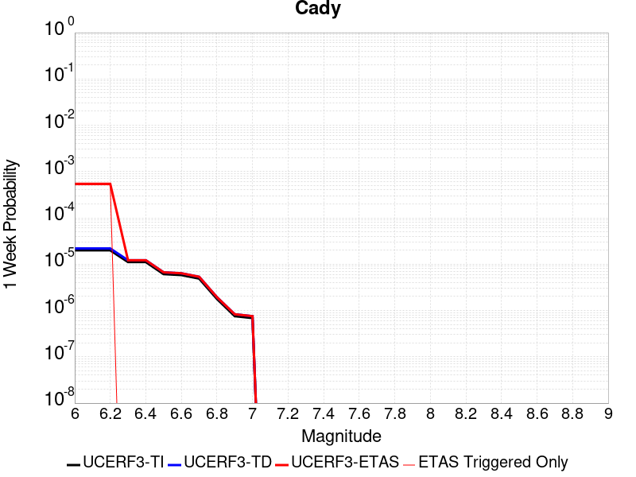 | 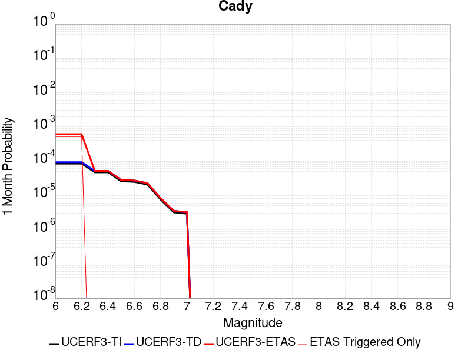 | 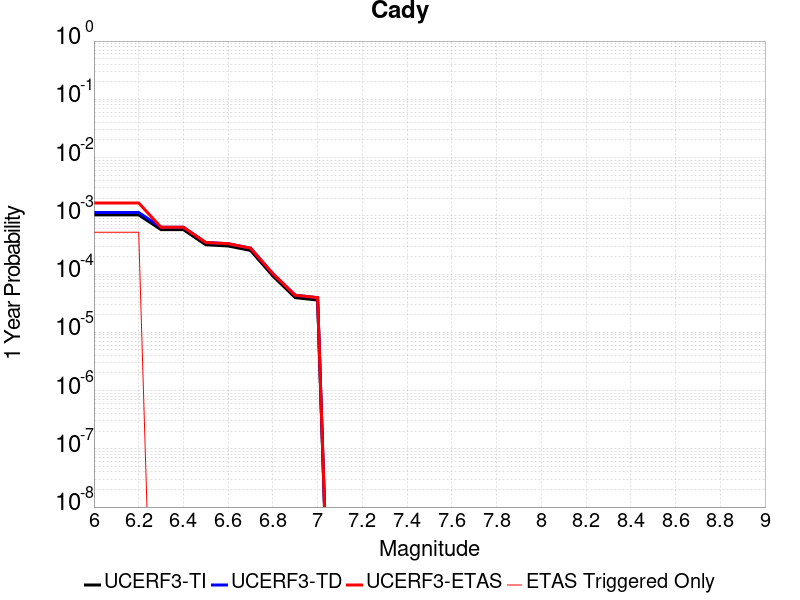 | 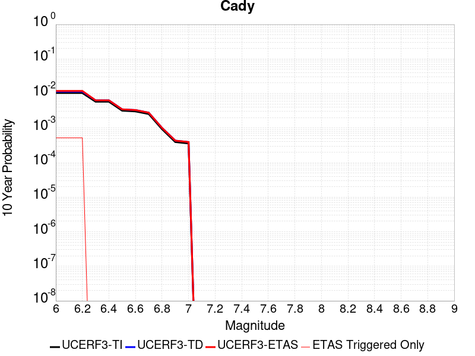 |

| Magnitude | 1 wk TI Prob | 1 wk TD Prob | 1 wk ETAS Prob | 1 wk ETAS/TD Gain | 1 wk ETAS Triggered Only | 1 mo TI Prob | 1 mo TD Prob | 1 mo ETAS Prob | 1 mo ETAS/TD Gain | 1 mo ETAS Triggered Only | 1 yr TI Prob | 1 yr TD Prob | 1 yr ETAS Prob | 1 yr ETAS/TD Gain | 1 yr ETAS Triggered Only | 10 yr TI Prob | 10 yr TD Prob | 10 yr ETAS Prob | 10 yr ETAS/TD Gain | 10 yr ETAS Triggered Only |
|-----|-----|-----|-----|-----|-----|-----|-----|-----|-----|-----|-----|-----|-----|-----|-----|-----|-----|-----|-----|-----|
| 6.0 | 1.9892565E-5 | 2.1858728E-5 | 5.429521E-4 | 24.839142 | 5.211047E-4 | 8.525106E-5 | 9.3677416E-5 | 6.147333E-4 | 6.5622363 | 5.211047E-4 | 0.0010374374 | 0.0011400167 | 0.0016605274 | 1.4565816 | 5.211047E-4 | 0.010326075 | 0.011350701 | 0.011865891 | 1.0453883 | 5.211047E-4 |
| 6.1 | 1.9892565E-5 | 2.1858728E-5 | 5.429521E-4 | 24.839142 | 5.211047E-4 | 8.525106E-5 | 9.3677416E-5 | 6.147333E-4 | 6.5622363 | 5.211047E-4 | 0.0010374374 | 0.0011400167 | 0.0016605274 | 1.4565816 | 5.211047E-4 | 0.010326075 | 0.011350701 | 0.011865891 | 1.0453883 | 5.211047E-4 |
| 6.2 | 1.9892565E-5 | 2.1858728E-5 | 5.429521E-4 | 24.839142 | 5.211047E-4 | 8.525106E-5 | 9.3677416E-5 | 6.147333E-4 | 6.5622363 | 5.211047E-4 | 0.0010374374 | 0.0011400167 | 0.0016605274 | 1.4565816 | 5.211047E-4 | 0.010326075 | 0.011350701 | 0.011865891 | 1.0453883 | 5.211047E-4 |
| 6.3 | 1.1117327E-5 | 1.2176583E-5 | 1.2176583E-5 | 1.0 | 0.0 | 4.764482E-5 | 5.2184492E-5 | 5.2184492E-5 | 1.0 | 0.0 | 5.7992124E-4 | 6.351925E-4 | 6.351925E-4 | 1.0 | 0.0 | 0.0057841022 | 0.0063368753 | 0.0063368753 | 1.0 | 0.0 |
| 6.4 | 1.1117327E-5 | 1.2176583E-5 | 1.2176583E-5 | 1.0 | 0.0 | 4.764482E-5 | 5.2184492E-5 | 5.2184492E-5 | 1.0 | 0.0 | 5.7992124E-4 | 6.351925E-4 | 6.351925E-4 | 1.0 | 0.0 | 0.0057841022 | 0.0063368753 | 0.0063368753 | 1.0 | 0.0 |
| 6.5 | 6.103093E-6 | 6.672021E-6 | 6.672021E-6 | 1.0 | 0.0 | 2.615585E-5 | 2.8594131E-5 | 2.8594131E-5 | 1.0 | 0.0 | 3.1840094E-4 | 3.480905E-4 | 3.480905E-4 | 1.0 | 0.0 | 0.0031794512 | 0.0034766865 | 0.0034766865 | 1.0 | 0.0 |
| 6.6 | 5.817237E-6 | 6.3656585E-6 | 6.3656585E-6 | 1.0 | 0.0 | 2.4930776E-5 | 2.728118E-5 | 2.728118E-5 | 1.0 | 0.0 | 3.034899E-4 | 3.3211018E-4 | 3.3211018E-4 | 1.0 | 0.0 | 0.0030307577 | 0.0033173605 | 0.0033173605 | 1.0 | 0.0 |
| 6.7 | 4.8846314E-6 | 5.3405684E-6 | 5.3405684E-6 | 1.0 | 0.0 | 2.0933967E-5 | 2.2888014E-5 | 2.2888014E-5 | 1.0 | 0.0 | 2.5484123E-4 | 2.7863772E-4 | 2.7863772E-4 | 1.0 | 0.0 | 0.0025454918 | 0.0027840391 | 0.0027840391 | 1.0 | 0.0 |
| 6.8 | 1.7788773E-6 | 1.9399079E-6 | 1.9399079E-6 | 1.0 | 0.0 | 7.6237375E-6 | 8.313874E-6 | 8.313874E-6 | 1.0 | 0.0 | 9.281505E-5 | 1.01218284E-4 | 1.01218284E-4 | 1.0 | 0.0 | 9.2776294E-4 | 0.0010118765 | 0.0010118765 | 1.0 | 0.0 |
| 6.9 | 7.5455404E-7 | 8.297092E-7 | 8.297092E-7 | 1.0 | 0.0 | 3.233799E-6 | 3.5558937E-6 | 3.5558937E-6 | 1.0 | 0.0 | 3.937079E-5 | 4.3292483E-5 | 4.3292483E-5 | 1.0 | 0.0 | 3.9363815E-4 | 4.3287344E-4 | 4.3287344E-4 | 1.0 | 0.0 |
| 7.0 | 6.8578805E-7 | 7.541816E-7 | 7.541816E-7 | 1.0 | 0.0 | 2.9390883E-6 | 3.2322048E-6 | 3.2322048E-6 | 1.0 | 0.0 | 3.578281E-5 | 3.9351715E-5 | 3.9351715E-5 | 1.0 | 0.0 | 3.577705E-4 | 3.9347992E-4 | 3.9347992E-4 | 1.0 | 0.0 |

## San Andreas (Parkfield)
*[(top)](#table-of-contents)*

| 1 Week | 1 Month | 1 Year | 10 Year |
|-----|-----|-----|-----|
|  |  |  |  |

| Magnitude | 1 wk TI Prob | 1 wk TD Prob | 1 wk ETAS Prob | 1 wk ETAS/TD Gain | 1 wk ETAS Triggered Only | 1 mo TI Prob | 1 mo TD Prob | 1 mo ETAS Prob | 1 mo ETAS/TD Gain | 1 mo ETAS Triggered Only | 1 yr TI Prob | 1 yr TD Prob | 1 yr ETAS Prob | 1 yr ETAS/TD Gain | 1 yr ETAS Triggered Only | 10 yr TI Prob | 10 yr TD Prob | 10 yr ETAS Prob | 10 yr ETAS/TD Gain | 10 yr ETAS Triggered Only |
|-----|-----|-----|-----|-----|-----|-----|-----|-----|-----|-----|-----|-----|-----|-----|-----|-----|-----|-----|-----|-----|
| 6.0 | 5.556969E-4 | 7.7782426E-4 | 7.7782426E-4 | 1.0 | 0.0 | 0.0023793848 | 0.0033298214 | 0.0033298214 | 1.0 | 0.0 | 0.028586963 | 0.040191233 | 0.040691394 | 1.0124445 | 5.211047E-4 | 0.25176284 | 0.33716413 | 0.33750954 | 1.0010245 | 5.211047E-4 |
| 6.1 | 1.925858E-4 | 3.0276453E-4 | 3.0276453E-4 | 1.0 | 0.0 | 8.2510663E-4 | 0.0012970108 | 0.0012970108 | 1.0 | 0.0 | 0.0099994885 | 0.015778083 | 0.016290966 | 1.032506 | 5.211047E-4 | 0.095613256 | 0.1497237 | 0.15016676 | 1.0029594 | 5.211047E-4 |
| 6.2 | 9.4306815E-5 | 1.8242796E-4 | 1.8242796E-4 | 1.0 | 0.0 | 4.0410945E-4 | 7.816011E-4 | 7.816011E-4 | 1.0 | 0.0 | 0.0049089384 | 0.009474681 | 0.009990848 | 1.0544786 | 5.211047E-4 | 0.048019063 | 0.09185409 | 0.09232733 | 1.0051521 | 5.211047E-4 |
| 6.3 | 9.283051E-5 | 1.7939322E-4 | 1.7939322E-4 | 1.0 | 0.0 | 3.9778434E-4 | 7.686027E-4 | 7.686027E-4 | 1.0 | 0.0 | 0.0048322747 | 0.009317789 | 0.009834038 | 1.0554047 | 5.211047E-4 | 0.047285385 | 0.09050704 | 0.09098098 | 1.0052365 | 5.211047E-4 |
| 6.4 | 9.138826E-5 | 1.770153E-4 | 1.770153E-4 | 1.0 | 0.0 | 3.916052E-4 | 7.5841765E-4 | 7.5841765E-4 | 1.0 | 0.0 | 0.0047573745 | 0.00919484 | 0.009711153 | 1.0561525 | 5.211047E-4 | 0.046568092 | 0.08940927 | 0.08988379 | 1.0053072 | 5.211047E-4 |
| 6.5 | 9.000255E-5 | 1.7459576E-4 | 1.7459576E-4 | 1.0 | 0.0 | 3.8566816E-4 | 7.480541E-4 | 7.480541E-4 | 1.0 | 0.0 | 0.0046854047 | 0.009069731 | 0.009586111 | 1.0569342 | 5.211047E-4 | 0.045878403 | 0.088295065 | 0.08877016 | 1.0053807 | 5.211047E-4 |
| 6.6 | 8.8109264E-5 | 1.7140752E-4 | 1.7140752E-4 | 1.0 | 0.0 | 3.7755648E-4 | 7.3439797E-4 | 7.3439797E-4 | 1.0 | 0.0 | 0.0045870654 | 0.008904854 | 0.009421318 | 1.0579981 | 5.211047E-4 | 0.04493529 | 0.0868267 | 0.08730255 | 1.0054805 | 5.211047E-4 |
| 6.7 | 8.738073E-5 | 1.7007832E-4 | 1.7007832E-4 | 1.0 | 0.0 | 3.7443507E-4 | 7.287046E-4 | 7.287046E-4 | 1.0 | 0.0 | 0.0045492216 | 0.008836143 | 0.009352643 | 1.0584531 | 5.211047E-4 | 0.04457213 | 0.08622707 | 0.08670323 | 1.0055223 | 5.211047E-4 |
| 6.8 | 8.710195E-5 | 1.6953335E-4 | 1.6953335E-4 | 1.0 | 0.0 | 3.7324068E-4 | 7.263703E-4 | 7.263703E-4 | 1.0 | 0.0 | 0.0045347405 | 0.008807961 | 0.009324476 | 1.0586418 | 5.211047E-4 | 0.04443313 | 0.08597467 | 0.08645097 | 1.00554 | 5.211047E-4 |
| 6.9 | 8.6801556E-5 | 1.689429E-4 | 1.689429E-4 | 1.0 | 0.0 | 3.7195362E-4 | 7.2384125E-4 | 7.2384125E-4 | 1.0 | 0.0 | 0.0045191357 | 0.008777418 | 0.009293949 | 1.0588477 | 5.211047E-4 | 0.044283327 | 0.085700735 | 0.08617718 | 1.0055594 | 5.211047E-4 |
| 7.0 | 8.5571606E-5 | 1.6647128E-4 | 1.6647128E-4 | 1.0 | 0.0 | 3.6668387E-4 | 7.132544E-4 | 7.132544E-4 | 1.0 | 0.0 | 0.004455241 | 0.008649553 | 0.009166151 | 1.0597253 | 5.211047E-4 | 0.043669727 | 0.08454914 | 0.08502618 | 1.0056422 | 5.211047E-4 |
| 7.1 | 7.82589E-5 | 1.5128135E-4 | 1.5128135E-4 | 1.0 | 0.0 | 3.3535215E-4 | 6.481883E-4 | 6.481883E-4 | 1.0 | 0.0 | 0.0040752706 | 0.007863307 | 0.008380314 | 1.0657493 | 5.211047E-4 | 0.040013418 | 0.07746111 | 0.07794185 | 1.0062062 | 5.211047E-4 |
| 7.2 | 7.690929E-5 | 1.4865391E-4 | 1.4865391E-4 | 1.0 | 0.0 | 3.2956956E-4 | 6.369334E-4 | 6.369334E-4 | 1.0 | 0.0 | 0.004005129 | 0.007727258 | 0.008244336 | 1.0669161 | 5.211047E-4 | 0.0393371 | 0.07623427 | 0.07671565 | 1.0063145 | 5.211047E-4 |
| 7.3 | 7.5543794E-5 | 1.4561978E-4 | 1.4561978E-4 | 1.0 | 0.0 | 3.2371894E-4 | 6.2393624E-4 | 6.2393624E-4 | 1.0 | 0.0 | 0.003934157 | 0.007570127 | 0.008087287 | 1.0683159 | 5.211047E-4 | 0.038652334 | 0.074797355 | 0.07527948 | 1.0064458 | 5.211047E-4 |
| 7.4 | 7.4214564E-5 | 1.4262961E-4 | 1.4262961E-4 | 1.0 | 0.0 | 3.1802364E-4 | 6.111273E-4 | 6.111273E-4 | 1.0 | 0.0 | 0.003865065 | 0.00741525 | 0.007932491 | 1.0697536 | 5.211047E-4 | 0.03798529 | 0.07337123 | 0.0738541 | 1.0065812 | 5.211047E-4 |
| 7.5 | 6.149578E-5 | 1.11907226E-4 | 1.11907226E-4 | 1.0 | 0.0 | 2.6352672E-4 | 4.7951436E-4 | 4.7951436E-4 | 1.0 | 0.0 | 0.0032037178 | 0.0058224914 | 0.006340562 | 1.0889775 | 5.211047E-4 | 0.03157923 | 0.058557566 | 0.059048153 | 1.0083779 | 5.211047E-4 |
| 7.6 | 6.0643448E-5 | 1.10193796E-4 | 1.10193796E-4 | 1.0 | 0.0 | 2.598746E-4 | 4.7217376E-4 | 4.7217376E-4 | 1.0 | 0.0 | 0.0031593828 | 0.0057335934 | 0.0062517105 | 1.0903652 | 5.211047E-4 | 0.031148417 | 0.057718582 | 0.05820961 | 1.0085073 | 5.211047E-4 |
| 7.7 | 5.1652263E-5 | 9.174698E-5 | 9.174698E-5 | 1.0 | 0.0 | 2.2134806E-4 | 3.931421E-4 | 3.931421E-4 | 1.0 | 0.0 | 0.002691582 | 0.0047760103 | 0.005294626 | 1.1085877 | 5.211047E-4 | 0.026592141 | 0.04853623 | 0.04903204 | 1.0102153 | 5.211047E-4 |
| 7.8 | 4.8090482E-5 | 8.559635E-5 | 8.559635E-5 | 1.0 | 0.0 | 2.060858E-4 | 3.6678996E-4 | 3.6678996E-4 | 1.0 | 0.0 | 0.0025062072 | 0.0044565317 | 0.0049753143 | 1.1164094 | 5.211047E-4 | 0.024781305 | 0.04530245 | 0.04579995 | 1.0109817 | 5.211047E-4 |
| 7.9 | 3.970278E-5 | 6.750426E-5 | 6.750426E-5 | 1.0 | 0.0 | 1.7014367E-4 | 2.892719E-4 | 2.892719E-4 | 1.0 | 0.0 | 0.002069531 | 0.0035162016 | 0.004035474 | 1.1476799 | 5.211047E-4 | 0.020503636 | 0.035881363 | 0.03638377 | 1.0140018 | 5.211047E-4 |
| 8.0 | 2.8982335E-5 | 4.069796E-5 | 4.069796E-5 | 1.0 | 0.0 | 1.2420409E-4 | 1.7440817E-4 | 1.7440817E-4 | 1.0 | 0.0 | 0.0015111357 | 0.0021213528 | 0.0021213528 | 1.0 | 0.0 | 0.015009012 | 0.022010697 | 0.022010697 | 1.0 | 0.0 |
| 8.1 | 1.8836186E-5 | 1.8681134E-5 | 1.8681134E-5 | 1.0 | 0.0 | 8.0724014E-5 | 8.005955E-5 | 8.005955E-5 | 1.0 | 0.0 | 9.823717E-4 | 9.742898E-4 | 9.742898E-4 | 1.0 | 0.0 | 0.009780403 | 0.010488115 | 0.010488115 | 1.0 | 0.0 |
| 8.2 | 8.643924E-6 | 5.4748625E-6 | 5.4748625E-6 | 1.0 | 0.0 | 3.704486E-5 | 2.3463486E-5 | 2.3463486E-5 | 1.0 | 0.0 | 4.5092785E-4 | 2.8563058E-4 | 2.8563058E-4 | 1.0 | 0.0 | 0.0045001395 | 0.0032487072 | 0.0032487072 | 1.0 | 0.0 |
| 8.3 | 1.983087E-6 | 7.6599065E-7 | 7.6599065E-7 | 1.0 | 0.0 | 8.498917E-6 | 3.282813E-6 | 3.282813E-6 | 1.0 | 0.0 | 1.034694E-4 | 3.9967534E-5 | 3.9967534E-5 | 1.0 | 0.0 | 0.0010342124 | 4.719687E-4 | 4.719687E-4 | 1.0 | 0.0 |

## Scodie Lineament
*[(top)](#table-of-contents)*

| 1 Week | 1 Month | 1 Year | 10 Year |
|-----|-----|-----|-----|
|  | 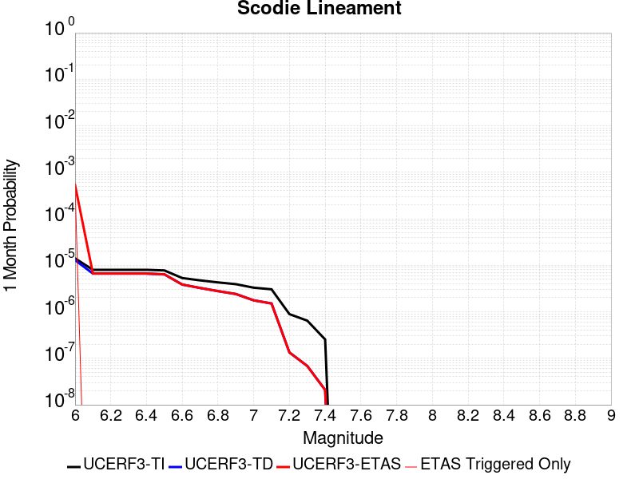 | 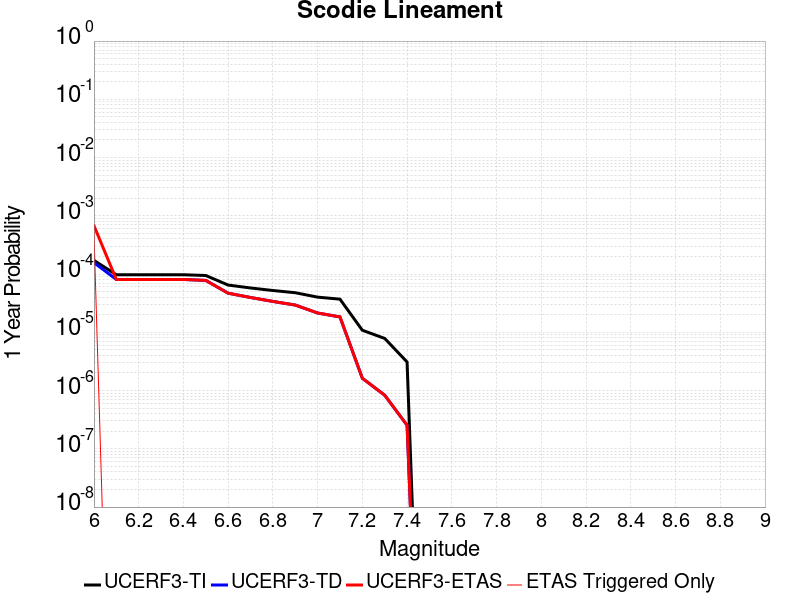 |  |

| Magnitude | 1 wk TI Prob | 1 wk TD Prob | 1 wk ETAS Prob | 1 wk ETAS/TD Gain | 1 wk ETAS Triggered Only | 1 mo TI Prob | 1 mo TD Prob | 1 mo ETAS Prob | 1 mo ETAS/TD Gain | 1 mo ETAS Triggered Only | 1 yr TI Prob | 1 yr TD Prob | 1 yr ETAS Prob | 1 yr ETAS/TD Gain | 1 yr ETAS Triggered Only | 10 yr TI Prob | 10 yr TD Prob | 10 yr ETAS Prob | 10 yr ETAS/TD Gain | 10 yr ETAS Triggered Only |
|-----|-----|-----|-----|-----|-----|-----|-----|-----|-----|-----|-----|-----|-----|-----|-----|-----|-----|-----|-----|-----|
| 6.0 | 3.2919327E-6 | 3.0133422E-6 | 5.241165E-4 | 173.93196 | 5.211047E-4 | 1.4108206E-5 | 1.2914278E-5 | 5.340123E-4 | 41.350533 | 5.211047E-4 | 1.7175387E-4 | 1.5722317E-4 | 6.7824597E-4 | 4.313906 | 5.211047E-4 | 0.0017162118 | 0.0015714309 | 0.0020917167 | 1.3310906 | 5.211047E-4 |
| 6.1 | 1.8663811E-6 | 1.5490499E-6 | 1.5490499E-6 | 1.0 | 0.0 | 7.998751E-6 | 6.6387715E-6 | 6.6387715E-6 | 1.0 | 0.0 | 9.738045E-5 | 8.082454E-5 | 8.082454E-5 | 1.0 | 0.0 | 9.7337784E-4 | 8.080003E-4 | 8.080003E-4 | 1.0 | 0.0 |
| 6.2 | 1.8663811E-6 | 1.5490499E-6 | 1.5490499E-6 | 1.0 | 0.0 | 7.998751E-6 | 6.6387715E-6 | 6.6387715E-6 | 1.0 | 0.0 | 9.738045E-5 | 8.082454E-5 | 8.082454E-5 | 1.0 | 0.0 | 9.7337784E-4 | 8.080003E-4 | 8.080003E-4 | 1.0 | 0.0 |
| 6.3 | 1.8663811E-6 | 1.5490499E-6 | 1.5490499E-6 | 1.0 | 0.0 | 7.998751E-6 | 6.6387715E-6 | 6.6387715E-6 | 1.0 | 0.0 | 9.738045E-5 | 8.082454E-5 | 8.082454E-5 | 1.0 | 0.0 | 9.7337784E-4 | 8.080003E-4 | 8.080003E-4 | 1.0 | 0.0 |
| 6.4 | 1.8663811E-6 | 1.5490499E-6 | 1.5490499E-6 | 1.0 | 0.0 | 7.998751E-6 | 6.6387715E-6 | 6.6387715E-6 | 1.0 | 0.0 | 9.738045E-5 | 8.082454E-5 | 8.082454E-5 | 1.0 | 0.0 | 9.7337784E-4 | 8.080003E-4 | 8.080003E-4 | 1.0 | 0.0 |
| 6.5 | 1.8106311E-6 | 1.4909839E-6 | 1.4909839E-6 | 1.0 | 0.0 | 7.759824E-6 | 6.3899183E-6 | 6.3899183E-6 | 1.0 | 0.0 | 9.447177E-5 | 7.7794975E-5 | 7.7794975E-5 | 1.0 | 0.0 | 9.4431615E-4 | 7.7772606E-4 | 7.7772606E-4 | 1.0 | 0.0 |
| 6.6 | 1.2414679E-6 | 8.997558E-7 | 8.997558E-7 | 1.0 | 0.0 | 5.320566E-6 | 3.856091E-6 | 3.856091E-6 | 1.0 | 0.0 | 6.477596E-5 | 4.6946985E-5 | 4.6946985E-5 | 1.0 | 0.0 | 6.475708E-4 | 4.693793E-4 | 4.693793E-4 | 1.0 | 0.0 |
| 6.7 | 1.1062215E-6 | 7.594311E-7 | 7.594311E-7 | 1.0 | 0.0 | 4.7409408E-6 | 3.2547011E-6 | 3.2547011E-6 | 1.0 | 0.0 | 5.7719422E-5 | 3.9625334E-5 | 3.9625334E-5 | 1.0 | 0.0 | 5.770443E-4 | 3.961897E-4 | 3.961897E-4 | 1.0 | 0.0 |
| 6.8 | 1.0006736E-6 | 6.500397E-7 | 6.500397E-7 | 1.0 | 0.0 | 4.288594E-6 | 2.7858816E-6 | 2.7858816E-6 | 1.0 | 0.0 | 5.221238E-5 | 3.3917644E-5 | 3.3917644E-5 | 1.0 | 0.0 | 5.220012E-4 | 3.3913075E-4 | 3.3913075E-4 | 1.0 | 0.0 |
| 6.9 | 9.167364E-7 | 5.631625E-7 | 5.631625E-7 | 1.0 | 0.0 | 3.9288643E-6 | 2.4135516E-6 | 2.4135516E-6 | 1.0 | 0.0 | 4.7832873E-5 | 2.9384651E-5 | 2.9384651E-5 | 1.0 | 0.0 | 4.782258E-4 | 2.9381333E-4 | 2.9381333E-4 | 1.0 | 0.0 |
| 7.0 | 7.6987664E-7 | 4.113383E-7 | 4.113383E-7 | 1.0 | 0.0 | 3.2994672E-6 | 1.7628774E-6 | 1.7628774E-6 | 1.0 | 0.0 | 4.0170275E-5 | 2.1462862E-5 | 2.1462862E-5 | 1.0 | 0.0 | 4.0163012E-4 | 2.1461173E-4 | 2.1461173E-4 | 1.0 | 0.0 |
| 7.1 | 7.1038727E-7 | 3.5211494E-7 | 3.5211494E-7 | 1.0 | 0.0 | 3.0445133E-6 | 1.5090633E-6 | 1.5090633E-6 | 1.0 | 0.0 | 3.706632E-5 | 1.8372726E-5 | 1.8372726E-5 | 1.0 | 0.0 | 3.7060137E-4 | 1.8371557E-4 | 1.8371557E-4 | 1.0 | 0.0 |
| 7.2 | 2.0799602E-7 | 3.1186854E-8 | 3.1186854E-8 | 1.0 | 0.0 | 8.914113E-7 | 1.3365793E-7 | 1.3365793E-7 | 1.0 | 0.0 | 1.0852878E-5 | 1.6272843E-6 | 1.6272843E-6 | 1.0 | 0.0 | 1.08523476E-4 | 1.627273E-5 | 1.627273E-5 | 1.0 | 0.0 |
| 7.3 | 1.5048182E-7 | 1.5945696E-8 | 1.5945696E-8 | 1.0 | 0.0 | 6.449219E-7 | 6.83387E-8 | 6.83387E-8 | 1.0 | 0.0 | 7.851896E-6 | 8.320234E-7 | 8.320234E-7 | 1.0 | 0.0 | 7.851618E-5 | 8.320206E-6 | 8.320206E-6 | 1.0 | 0.0 |
| 7.4 | 5.9334678E-8 | 4.8683537E-9 | 4.8683537E-9 | 1.0 | 0.0 | 2.5429145E-7 | 2.0864372E-8 | 2.0864372E-8 | 1.0 | 0.0 | 3.095994E-6 | 2.5402372E-7 | 2.5402372E-7 | 1.0 | 0.0 | 3.095951E-5 | 2.5402353E-6 | 2.5402353E-6 | 1.0 | 0.0 |

## Coronado Bank alt1
*[(top)](#table-of-contents)*

| 1 Week | 1 Month | 1 Year | 10 Year |
|-----|-----|-----|-----|
|  |  |  |  |

| Magnitude | 1 wk TI Prob | 1 wk TD Prob | 1 wk ETAS Prob | 1 wk ETAS/TD Gain | 1 wk ETAS Triggered Only | 1 mo TI Prob | 1 mo TD Prob | 1 mo ETAS Prob | 1 mo ETAS/TD Gain | 1 mo ETAS Triggered Only | 1 yr TI Prob | 1 yr TD Prob | 1 yr ETAS Prob | 1 yr ETAS/TD Gain | 1 yr ETAS Triggered Only | 10 yr TI Prob | 10 yr TD Prob | 10 yr ETAS Prob | 10 yr ETAS/TD Gain | 10 yr ETAS Triggered Only |
|-----|-----|-----|-----|-----|-----|-----|-----|-----|-----|-----|-----|-----|-----|-----|-----|-----|-----|-----|-----|-----|
| 6.0 | 7.533492E-5 | 9.394913E-5 | 6.150049E-4 | 6.546148 | 5.211047E-4 | 3.22824E-4 | 4.0258127E-4 | 9.2347624E-4 | 2.2938879 | 5.211047E-4 | 0.0039233007 | 0.0048909658 | 0.0054095215 | 1.1060232 | 5.211047E-4 | 0.03854755 | 0.04790356 | 0.0483997 | 1.0103571 | 5.211047E-4 |
| 6.1 | 4.1807285E-5 | 5.049283E-5 | 5.7157123E-4 | 11.31985 | 5.211047E-4 | 1.7916178E-4 | 2.1638049E-4 | 7.373725E-4 | 3.4077587 | 5.211047E-4 | 0.0021791123 | 0.0026313474 | 0.003151081 | 1.1975161 | 5.211047E-4 | 0.021578677 | 0.026011046 | 0.026518596 | 1.0195129 | 5.211047E-4 |
| 6.2 | 4.1807285E-5 | 5.049283E-5 | 5.7157123E-4 | 11.31985 | 5.211047E-4 | 1.7916178E-4 | 2.1638049E-4 | 7.373725E-4 | 3.4077587 | 5.211047E-4 | 0.0021791123 | 0.0026313474 | 0.003151081 | 1.1975161 | 5.211047E-4 | 0.021578677 | 0.026011046 | 0.026518596 | 1.0195129 | 5.211047E-4 |
| 6.3 | 3.1793104E-5 | 3.7711117E-5 | 3.7711117E-5 | 1.0 | 0.0 | 1.3624904E-4 | 1.6160926E-4 | 1.6160926E-4 | 1.0 | 0.0 | 0.0016575698 | 0.001965848 | 0.001965848 | 1.0 | 0.0 | 0.016452603 | 0.019488465 | 0.019488465 | 1.0 | 0.0 |
| 6.4 | 2.9878007E-5 | 3.5335794E-5 | 3.5335794E-5 | 1.0 | 0.0 | 1.2804232E-4 | 1.5143053E-4 | 1.5143053E-4 | 1.0 | 0.0 | 0.0015578003 | 0.0018421387 | 0.0018421387 | 1.0 | 0.0 | 0.015469253 | 0.01827244 | 0.01827244 | 1.0 | 0.0 |
| 6.5 | 2.4512565E-5 | 2.8764043E-5 | 2.8764043E-5 | 1.0 | 0.0 | 1.0504962E-4 | 1.2326881E-4 | 1.2326881E-4 | 1.0 | 0.0 | 0.0012782287 | 0.0014997921 | 0.0014997921 | 1.0 | 0.0 | 0.012709012 | 0.014899683 | 0.014899683 | 1.0 | 0.0 |
| 6.6 | 2.1317413E-5 | 2.490667E-5 | 2.490667E-5 | 1.0 | 0.0 | 9.135714E-5 | 1.0673863E-4 | 1.0673863E-4 | 1.0 | 0.0 | 0.0011117056 | 0.0012987906 | 0.0012987906 | 1.0 | 0.0 | 0.011061605 | 0.012914404 | 0.012914404 | 1.0 | 0.0 |
| 6.7 | 1.8585655E-5 | 2.163488E-5 | 2.163488E-5 | 1.0 | 0.0 | 7.9650374E-5 | 9.271773E-5 | 9.271773E-5 | 1.0 | 0.0 | 9.6931186E-4 | 0.0011282742 | 0.0011282742 | 1.0 | 0.0 | 0.0096509475 | 0.011227623 | 0.011227623 | 1.0 | 0.0 |
| 6.8 | 1.5862879E-5 | 1.8419474E-5 | 1.8419474E-5 | 1.0 | 0.0 | 6.798199E-5 | 7.893833E-5 | 7.893833E-5 | 1.0 | 0.0 | 8.273665E-4 | 9.6066965E-4 | 9.6066965E-4 | 1.0 | 0.0 | 0.008242928 | 0.00956715 | 0.00956715 | 1.0 | 0.0 |
| 6.9 | 1.3021509E-5 | 1.5095265E-5 | 1.5095265E-5 | 1.0 | 0.0 | 5.5805274E-5 | 6.469249E-5 | 6.469249E-5 | 1.0 | 0.0 | 6.792174E-4 | 7.8736455E-4 | 7.8736455E-4 | 1.0 | 0.0 | 0.006771452 | 0.007847573 | 0.007847573 | 1.0 | 0.0 |
| 7.0 | 1.0974371E-5 | 1.2720104E-5 | 1.2720104E-5 | 1.0 | 0.0 | 4.7032172E-5 | 5.451369E-5 | 5.451369E-5 | 1.0 | 0.0 | 5.7246623E-4 | 6.6351966E-4 | 6.6351966E-4 | 1.0 | 0.0 | 0.0057099373 | 0.006617135 | 0.006617135 | 1.0 | 0.0 |
| 7.1 | 8.766221E-6 | 1.01638325E-5 | 1.01638325E-5 | 1.0 | 0.0 | 3.7568978E-5 | 4.355865E-5 | 4.355865E-5 | 1.0 | 0.0 | 4.573063E-4 | 5.3021475E-4 | 5.3021475E-4 | 1.0 | 0.0 | 0.0045636636 | 0.0052911965 | 0.0052911965 | 1.0 | 0.0 |
| 7.2 | 8.026024E-7 | 8.331765E-7 | 8.331765E-7 | 1.0 | 0.0 | 3.43972E-6 | 3.5707515E-6 | 3.5707515E-6 | 1.0 | 0.0 | 4.1877785E-5 | 4.3473043E-5 | 4.3473043E-5 | 1.0 | 0.0 | 4.1869894E-4 | 4.3464647E-4 | 4.3464647E-4 | 1.0 | 0.0 |
| 7.3 | 3.7293114E-7 | 3.7000953E-7 | 3.7000953E-7 | 1.0 | 0.0 | 1.5982754E-6 | 1.5857541E-6 | 1.5857541E-6 | 1.0 | 0.0 | 1.9458828E-5 | 1.9306386E-5 | 1.9306386E-5 | 1.0 | 0.0 | 1.9457124E-4 | 1.9304715E-4 | 1.9304715E-4 | 1.0 | 0.0 |
| 7.4 | 2.0557036E-7 | 1.9674363E-7 | 1.9674363E-7 | 1.0 | 0.0 | 8.810155E-7 | 8.431867E-7 | 8.431867E-7 | 1.0 | 0.0 | 1.0726311E-5 | 1.026575E-5 | 1.026575E-5 | 1.0 | 0.0 | 1.0725793E-4 | 1.0265279E-4 | 1.0265279E-4 | 1.0 | 0.0 |
| 7.5 | 6.845446E-8 | 6.279369E-8 | 6.279369E-8 | 1.0 | 0.0 | 2.9337625E-7 | 2.691158E-7 | 2.691158E-7 | 1.0 | 0.0 | 3.5718497E-6 | 3.2764797E-6 | 3.2764797E-6 | 1.0 | 0.0 | 3.5717923E-5 | 3.2764325E-5 | 3.2764325E-5 | 1.0 | 0.0 |
| 7.6 | 6.0975145E-9 | 5.53185E-9 | 5.53185E-9 | 1.0 | 0.0 | 2.6132206E-8 | 2.370793E-8 | 2.370793E-8 | 1.0 | 0.0 | 3.1815955E-7 | 2.88644E-7 | 2.88644E-7 | 1.0 | 0.0 | 3.181591E-6 | 2.8864374E-6 | 2.8864374E-6 | 1.0 | 0.0 |

## Cleghorn Lake
*[(top)](#table-of-contents)*

| 1 Week | 1 Month | 1 Year | 10 Year |
|-----|-----|-----|-----|
|  |  |  |  |

| Magnitude | 1 wk TI Prob | 1 wk TD Prob | 1 wk ETAS Prob | 1 wk ETAS/TD Gain | 1 wk ETAS Triggered Only | 1 mo TI Prob | 1 mo TD Prob | 1 mo ETAS Prob | 1 mo ETAS/TD Gain | 1 mo ETAS Triggered Only | 1 yr TI Prob | 1 yr TD Prob | 1 yr ETAS Prob | 1 yr ETAS/TD Gain | 1 yr ETAS Triggered Only | 10 yr TI Prob | 10 yr TD Prob | 10 yr ETAS Prob | 10 yr ETAS/TD Gain | 10 yr ETAS Triggered Only |
|-----|-----|-----|-----|-----|-----|-----|-----|-----|-----|-----|-----|-----|-----|-----|-----|-----|-----|-----|-----|-----|
| 6.0 | 1.5467183E-5 | 1.6794203E-5 | 1.6794203E-5 | 1.0 | 0.0 | 6.6286244E-5 | 7.197348E-5 | 7.197348E-5 | 1.0 | 0.0 | 8.067362E-4 | 8.759797E-4 | 0.001396628 | 1.5943611 | 5.211047E-4 | 0.008038137 | 0.008730696 | 0.009247251 | 1.0591654 | 5.211047E-4 |
| 6.1 | 1.5467183E-5 | 1.6794203E-5 | 1.6794203E-5 | 1.0 | 0.0 | 6.6286244E-5 | 7.197348E-5 | 7.197348E-5 | 1.0 | 0.0 | 8.067362E-4 | 8.759797E-4 | 0.001396628 | 1.5943611 | 5.211047E-4 | 0.008038137 | 0.008730696 | 0.009247251 | 1.0591654 | 5.211047E-4 |
| 6.2 | 1.2624631E-5 | 1.3681544E-5 | 1.3681544E-5 | 1.0 | 0.0 | 5.410444E-5 | 5.863415E-5 | 5.863415E-5 | 1.0 | 0.0 | 6.585225E-4 | 7.1368564E-4 | 0.0012344185 | 1.7296389 | 5.211047E-4 | 0.0065657445 | 0.0071187317 | 0.007636127 | 1.0726808 | 5.211047E-4 |
| 6.3 | 1.2624631E-5 | 1.3681544E-5 | 1.3681544E-5 | 1.0 | 0.0 | 5.410444E-5 | 5.863415E-5 | 5.863415E-5 | 1.0 | 0.0 | 6.585225E-4 | 7.1368564E-4 | 0.0012344185 | 1.7296389 | 5.211047E-4 | 0.0065657445 | 0.0071187317 | 0.007636127 | 1.0726808 | 5.211047E-4 |
| 6.4 | 9.417684E-6 | 1.0170118E-5 | 1.0170118E-5 | 1.0 | 0.0 | 4.036088E-5 | 4.3585722E-5 | 4.3585722E-5 | 1.0 | 0.0 | 4.912829E-4 | 5.3056807E-4 | 0.0010513964 | 1.9816427 | 5.211047E-4 | 0.004901982 | 0.005297049 | 0.0058153933 | 1.0978553 | 5.211047E-4 |
| 6.5 | 9.368219E-6 | 1.0117545E-5 | 1.0117545E-5 | 1.0 | 0.0 | 4.014889E-5 | 4.3360415E-5 | 4.3360415E-5 | 1.0 | 0.0 | 4.8870314E-4 | 5.2782625E-4 | 0.001048656 | 1.9867445 | 5.211047E-4 | 0.004876298 | 0.0052697617 | 0.00578812 | 1.0983647 | 5.211047E-4 |
| 6.6 | 7.803798E-6 | 8.441831E-6 | 8.441831E-6 | 1.0 | 0.0 | 3.3444423E-5 | 3.6179E-5 | 3.6179E-5 | 1.0 | 0.0 | 4.0710976E-4 | 4.4043022E-4 | 9.6130546E-4 | 2.182651 | 5.211047E-4 | 0.0040636472 | 0.0043994905 | 0.0049183024 | 1.1179255 | 5.211047E-4 |
| 6.7 | 2.3108669E-6 | 2.4438336E-6 | 2.4438336E-6 | 1.0 | 0.0 | 9.903678E-6 | 1.0473532E-5 | 1.0473532E-5 | 1.0 | 0.0 | 1.205706E-4 | 1.2750797E-4 | 1.2750797E-4 | 1.0 | 0.0 | 0.001205052 | 0.0012743667 | 0.0012743667 | 1.0 | 0.0 |
| 6.8 | 2.0882828E-6 | 2.2062823E-6 | 2.2062823E-6 | 1.0 | 0.0 | 8.949753E-6 | 9.455462E-6 | 9.455462E-6 | 1.0 | 0.0 | 1.08957785E-4 | 1.1511434E-4 | 1.1511434E-4 | 1.0 | 0.0 | 0.0010890438 | 0.0011505639 | 0.0011505639 | 1.0 | 0.0 |
| 6.9 | 1.876935E-6 | 1.981051E-6 | 1.981051E-6 | 1.0 | 0.0 | 8.043982E-6 | 8.490192E-6 | 8.490192E-6 | 1.0 | 0.0 | 9.7931086E-5 | 1.03363345E-4 | 1.03363345E-4 | 1.0 | 0.0 | 9.788794E-4 | 0.0010331686 | 0.0010331686 | 1.0 | 0.0 |
| 7.0 | 1.5357559E-6 | 1.6202807E-6 | 1.6202807E-6 | 1.0 | 0.0 | 6.5817944E-6 | 6.9440425E-6 | 6.9440425E-6 | 1.0 | 0.0 | 8.01304E-5 | 8.454057E-5 | 8.454057E-5 | 1.0 | 0.0 | 8.010151E-4 | 8.450965E-4 | 8.450965E-4 | 1.0 | 0.0 |
| 7.1 | 1.0905424E-6 | 1.1497619E-6 | 1.1497619E-6 | 1.0 | 0.0 | 4.6737446E-6 | 4.9275427E-6 | 4.9275427E-6 | 1.0 | 0.0 | 5.6901354E-5 | 5.999128E-5 | 5.999128E-5 | 1.0 | 0.0 | 5.6886784E-4 | 5.997606E-4 | 5.997606E-4 | 1.0 | 0.0 |
| 7.2 | 6.06668E-7 | 6.387277E-7 | 6.387277E-7 | 1.0 | 0.0 | 2.600003E-6 | 2.7374022E-6 | 2.7374022E-6 | 1.0 | 0.0 | 3.1654577E-5 | 3.3327433E-5 | 3.3327433E-5 | 1.0 | 0.0 | 3.1650066E-4 | 3.3323118E-4 | 3.3323118E-4 | 1.0 | 0.0 |

## Baker
*[(top)](#table-of-contents)*

| 1 Week | 1 Month | 1 Year | 10 Year |
|-----|-----|-----|-----|
|  |  |  |  |

| Magnitude | 1 wk TI Prob | 1 wk TD Prob | 1 wk ETAS Prob | 1 wk ETAS/TD Gain | 1 wk ETAS Triggered Only | 1 mo TI Prob | 1 mo TD Prob | 1 mo ETAS Prob | 1 mo ETAS/TD Gain | 1 mo ETAS Triggered Only | 1 yr TI Prob | 1 yr TD Prob | 1 yr ETAS Prob | 1 yr ETAS/TD Gain | 1 yr ETAS Triggered Only | 10 yr TI Prob | 10 yr TD Prob | 10 yr ETAS Prob | 10 yr ETAS/TD Gain | 10 yr ETAS Triggered Only |
|-----|-----|-----|-----|-----|-----|-----|-----|-----|-----|-----|-----|-----|-----|-----|-----|-----|-----|-----|-----|-----|
| 6.0 | 5.695525E-6 | 5.8348373E-6 | 5.8348373E-6 | 1.0 | 0.0 | 2.4409164E-5 | 2.5006228E-5 | 2.5006228E-5 | 1.0 | 0.0 | 2.9714106E-4 | 3.044123E-4 | 3.044123E-4 | 1.0 | 0.0 | 0.0029674405 | 0.0030403486 | 0.003559869 | 1.1708753 | 5.211047E-4 |
| 6.1 | 5.695525E-6 | 5.8348373E-6 | 5.8348373E-6 | 1.0 | 0.0 | 2.4409164E-5 | 2.5006228E-5 | 2.5006228E-5 | 1.0 | 0.0 | 2.9714106E-4 | 3.044123E-4 | 3.044123E-4 | 1.0 | 0.0 | 0.0029674405 | 0.0030403486 | 0.003559869 | 1.1708753 | 5.211047E-4 |
| 6.2 | 5.695525E-6 | 5.8348373E-6 | 5.8348373E-6 | 1.0 | 0.0 | 2.4409164E-5 | 2.5006228E-5 | 2.5006228E-5 | 1.0 | 0.0 | 2.9714106E-4 | 3.044123E-4 | 3.044123E-4 | 1.0 | 0.0 | 0.0029674405 | 0.0030403486 | 0.003559869 | 1.1708753 | 5.211047E-4 |
| 6.3 | 3.2995713E-6 | 3.383667E-6 | 3.383667E-6 | 1.0 | 0.0 | 1.4140943E-5 | 1.4501353E-5 | 1.4501353E-5 | 1.0 | 0.0 | 1.7215237E-4 | 1.7654014E-4 | 1.7654014E-4 | 1.0 | 0.0 | 0.0017201907 | 0.001764046 | 0.0022842316 | 1.294882 | 5.211047E-4 |
| 6.4 | 3.2995713E-6 | 3.383667E-6 | 3.383667E-6 | 1.0 | 0.0 | 1.4140943E-5 | 1.4501353E-5 | 1.4501353E-5 | 1.0 | 0.0 | 1.7215237E-4 | 1.7654014E-4 | 1.7654014E-4 | 1.0 | 0.0 | 0.0017201907 | 0.001764046 | 0.0022842316 | 1.294882 | 5.211047E-4 |
| 6.5 | 2.782202E-6 | 2.8558404E-6 | 2.8558404E-6 | 1.0 | 0.0 | 1.1923668E-5 | 1.223926E-5 | 1.223926E-5 | 1.0 | 0.0 | 1.4516099E-4 | 1.4900314E-4 | 1.4900314E-4 | 1.0 | 0.0 | 0.001450662 | 0.0014890651 | 0.0020093939 | 1.3494332 | 5.211047E-4 |
| 6.6 | 2.3163404E-6 | 2.38092E-6 | 2.38092E-6 | 1.0 | 0.0 | 9.927136E-6 | 1.0203904E-5 | 1.0203904E-5 | 1.0 | 0.0 | 1.20856166E-4 | 1.2422565E-4 | 1.2422565E-4 | 1.0 | 0.0 | 0.0012079047 | 0.0012415823 | 0.0017620401 | 1.4191891 | 5.211047E-4 |
| 6.7 | 2.037056E-6 | 2.0965003E-6 | 2.0965003E-6 | 1.0 | 0.0 | 8.7302105E-6 | 8.984972E-6 | 8.984972E-6 | 1.0 | 0.0 | 1.0628513E-4 | 1.093867E-4 | 1.093867E-4 | 1.0 | 0.0 | 0.0010623431 | 0.0010933448 | 0.0016138797 | 1.4760941 | 5.211047E-4 |
| 6.8 | 1.8356744E-6 | 1.8915287E-6 | 1.8915287E-6 | 1.0 | 0.0 | 7.867153E-6 | 8.106527E-6 | 8.106527E-6 | 1.0 | 0.0 | 9.577837E-5 | 9.869264E-5 | 9.869264E-5 | 1.0 | 0.0 | 9.57371E-4 | 9.86502E-4 | 0.0015070927 | 1.5277138 | 5.211047E-4 |
| 6.9 | 1.6310546E-6 | 1.6832072E-6 | 1.6832072E-6 | 1.0 | 0.0 | 6.9902153E-6 | 7.213726E-6 | 7.213726E-6 | 1.0 | 0.0 | 8.510255E-5 | 8.782368E-5 | 8.782368E-5 | 1.0 | 0.0 | 8.5069967E-4 | 8.7790104E-4 | 0.0013985484 | 1.5930592 | 5.211047E-4 |
| 7.0 | 1.2058036E-6 | 1.2508665E-6 | 1.2508665E-6 | 1.0 | 0.0 | 5.1677193E-6 | 5.3608455E-6 | 5.3608455E-6 | 1.0 | 0.0 | 6.291517E-5 | 6.5266366E-5 | 6.5266366E-5 | 1.0 | 0.0 | 6.289736E-4 | 6.524743E-4 | 0.0011732391 | 1.7981383 | 5.211047E-4 |
| 7.1 | 1.052382E-6 | 1.0951609E-6 | 1.0951609E-6 | 1.0 | 0.0 | 4.5102006E-6 | 4.693538E-6 | 4.693538E-6 | 1.0 | 0.0 | 5.491031E-5 | 5.7142337E-5 | 5.7142337E-5 | 1.0 | 0.0 | 5.4896745E-4 | 5.7127734E-4 | 0.0010920843 | 1.9116536 | 5.211047E-4 |
| 7.2 | 1.0067454E-6 | 1.0487711E-6 | 1.0487711E-6 | 1.0 | 0.0 | 4.3146156E-6 | 4.4947255E-6 | 4.4947255E-6 | 1.0 | 0.0 | 5.252918E-5 | 5.4721917E-5 | 5.4721917E-5 | 1.0 | 0.0 | 5.251676E-4 | 5.470853E-4 | 0.001067905 | 1.9519899 | 5.211047E-4 |
| 7.3 | 9.3596316E-7 | 9.767723E-7 | 9.767723E-7 | 1.0 | 0.0 | 4.0112645E-6 | 4.1861604E-6 | 4.1861604E-6 | 1.0 | 0.0 | 4.8836053E-5 | 5.096532E-5 | 5.096532E-5 | 1.0 | 0.0 | 4.8825322E-4 | 5.095371E-4 | 0.0010303763 | 2.022181 | 5.211047E-4 |
| 7.4 | 8.8117395E-7 | 9.2076635E-7 | 9.2076635E-7 | 1.0 | 0.0 | 3.7764542E-6 | 3.9461356E-6 | 3.9461356E-6 | 1.0 | 0.0 | 4.5977362E-5 | 4.8043148E-5 | 4.8043148E-5 | 1.0 | 0.0 | 4.596785E-4 | 4.8032837E-4 | 0.0010011828 | 2.0843716 | 5.211047E-4 |
| 7.5 | 8.292386E-7 | 8.6745956E-7 | 8.6745956E-7 | 1.0 | 0.0 | 3.5538749E-6 | 3.7176785E-6 | 3.7176785E-6 | 1.0 | 0.0 | 4.326757E-5 | 4.5261804E-5 | 4.5261804E-5 | 1.0 | 0.0 | 4.3259145E-4 | 4.5252658E-4 | 9.7339554E-4 | 2.1510239 | 5.211047E-4 |
| 7.6 | 7.553842E-7 | 7.9144706E-7 | 7.9144706E-7 | 1.0 | 0.0 | 3.2373566E-6 | 3.3919116E-6 | 3.3919116E-6 | 1.0 | 0.0 | 3.9414106E-5 | 4.129575E-5 | 4.129575E-5 | 1.0 | 0.0 | 3.9407116E-4 | 4.1288146E-4 | 9.33771E-4 | 2.261596 | 5.211047E-4 |
| 7.7 | 6.5285366E-7 | 6.852797E-7 | 6.852797E-7 | 1.0 | 0.0 | 2.797941E-6 | 2.9369096E-6 | 2.9369096E-6 | 1.0 | 0.0 | 3.40644E-5 | 3.5756293E-5 | 3.5756293E-5 | 1.0 | 0.0 | 3.405918E-4 | 3.5750607E-4 | 3.5750607E-4 | 1.0 | 0.0 |
| 7.8 | 3.4586725E-7 | 3.6482615E-7 | 3.6482615E-7 | 1.0 | 0.0 | 1.4822873E-6 | 1.5635396E-6 | 1.5635396E-6 | 1.0 | 0.0 | 1.80467E-5 | 1.9035933E-5 | 1.9035933E-5 | 1.0 | 0.0 | 1.8045233E-4 | 1.9034347E-4 | 1.9034347E-4 | 1.0 | 0.0 |
| 7.9 | 2.5591178E-9 | 2.6696718E-9 | 2.6696718E-9 | 1.0 | 0.0 | 1.0967647E-8 | 1.14414505E-8 | 1.14414505E-8 | 1.0 | 0.0 | 1.335311E-7 | 1.3929966E-7 | 1.3929966E-7 | 1.0 | 0.0 | 1.3353102E-6 | 1.3929966E-6 | 1.3929966E-6 | 1.0 | 0.0 |

## San Andreas (Cholame) rev
*[(top)](#table-of-contents)*

| 1 Week | 1 Month | 1 Year | 10 Year |
|-----|-----|-----|-----|
|  |  |  |  |

| Magnitude | 1 wk TI Prob | 1 wk TD Prob | 1 wk ETAS Prob | 1 wk ETAS/TD Gain | 1 wk ETAS Triggered Only | 1 mo TI Prob | 1 mo TD Prob | 1 mo ETAS Prob | 1 mo ETAS/TD Gain | 1 mo ETAS Triggered Only | 1 yr TI Prob | 1 yr TD Prob | 1 yr ETAS Prob | 1 yr ETAS/TD Gain | 1 yr ETAS Triggered Only | 10 yr TI Prob | 10 yr TD Prob | 10 yr ETAS Prob | 10 yr ETAS/TD Gain | 10 yr ETAS Triggered Only |
|-----|-----|-----|-----|-----|-----|-----|-----|-----|-----|-----|-----|-----|-----|-----|-----|-----|-----|-----|-----|-----|
| 6.0 | 1.2302514E-4 | 2.5204287E-4 | 2.5204287E-4 | 1.0 | 0.0 | 5.27144E-4 | 0.0010797381 | 0.0010797381 | 1.0 | 0.0 | 0.0063991086 | 0.0130670825 | 0.013581378 | 1.0393581 | 5.211047E-4 | 0.06217949 | 0.12439073 | 0.12484701 | 1.0036682 | 5.211047E-4 |
| 6.1 | 1.2302514E-4 | 2.5204287E-4 | 2.5204287E-4 | 1.0 | 0.0 | 5.27144E-4 | 0.0010797381 | 0.0010797381 | 1.0 | 0.0 | 0.0063991086 | 0.0130670825 | 0.013581378 | 1.0393581 | 5.211047E-4 | 0.06217949 | 0.12439073 | 0.12484701 | 1.0036682 | 5.211047E-4 |
| 6.2 | 1.2203569E-4 | 2.5021084E-4 | 2.5021084E-4 | 1.0 | 0.0 | 5.2290526E-4 | 0.0010718931 | 0.0010718931 | 1.0 | 0.0 | 0.006347804 | 0.01297271 | 0.013487054 | 1.0396482 | 5.211047E-4 | 0.061695136 | 0.12357691 | 0.124033615 | 1.0036957 | 5.211047E-4 |
| 6.3 | 1.2142645E-4 | 2.4907055E-4 | 2.4907055E-4 | 1.0 | 0.0 | 5.202953E-4 | 0.0010670102 | 0.0010670102 | 1.0 | 0.0 | 0.006316212 | 0.012913967 | 0.013428342 | 1.0398309 | 5.211047E-4 | 0.06139677 | 0.12307103 | 0.123528 | 1.0037131 | 5.211047E-4 |
| 6.4 | 1.1865206E-4 | 2.44126E-4 | 2.44126E-4 | 1.0 | 0.0 | 5.0840975E-4 | 0.0010458364 | 0.0010458364 | 1.0 | 0.0 | 0.006172335 | 0.012659196 | 0.013173704 | 1.040643 | 5.211047E-4 | 0.060036868 | 0.1208638 | 0.121321924 | 1.0037904 | 5.211047E-4 |
| 6.5 | 1.17443946E-4 | 2.4205919E-4 | 2.4205919E-4 | 1.0 | 0.0 | 5.032341E-4 | 0.0010369857 | 0.0010369857 | 1.0 | 0.0 | 0.006109677 | 0.012552682 | 0.0130672455 | 1.0409923 | 5.211047E-4 | 0.059444077 | 0.11993805 | 0.12039666 | 1.0038236 | 5.211047E-4 |
| 6.6 | 1.13579066E-4 | 2.3514954E-4 | 2.3514954E-4 | 1.0 | 0.0 | 4.866766E-4 | 0.001007396 | 0.001007396 | 1.0 | 0.0 | 0.0059092017 | 0.012196515 | 0.012711263 | 1.0422046 | 5.211047E-4 | 0.057545185 | 0.11685214 | 0.11731236 | 1.0039384 | 5.211047E-4 |
| 6.7 | 1.1271412E-4 | 2.3359268E-4 | 2.3359268E-4 | 1.0 | 0.0 | 4.829711E-4 | 0.0010007289 | 0.0010007289 | 1.0 | 0.0 | 0.005864331 | 0.012116249 | 0.012631039 | 1.0424876 | 5.211047E-4 | 0.057119697 | 0.116155714 | 0.11661629 | 1.0039651 | 5.211047E-4 |
| 6.8 | 1.1217975E-4 | 2.3247694E-4 | 2.3247694E-4 | 1.0 | 0.0 | 4.8068175E-4 | 9.959509E-4 | 9.959509E-4 | 1.0 | 0.0 | 0.005836608 | 0.012058721 | 0.012573542 | 1.0426928 | 5.211047E-4 | 0.056856725 | 0.11565396 | 0.1161148 | 1.0039846 | 5.211047E-4 |
| 6.9 | 1.1146753E-4 | 2.3096445E-4 | 2.3096445E-4 | 1.0 | 0.0 | 4.7763053E-4 | 9.894737E-4 | 9.894737E-4 | 1.0 | 0.0 | 0.0057996577 | 0.011980731 | 0.012495593 | 1.0429741 | 5.211047E-4 | 0.056506127 | 0.11497439 | 0.11543558 | 1.0040113 | 5.211047E-4 |
| 7.0 | 1.0965793E-4 | 2.2719789E-4 | 2.2719789E-4 | 1.0 | 0.0 | 4.698779E-4 | 9.733434E-4 | 9.733434E-4 | 1.0 | 0.0 | 0.005705768 | 0.011786487 | 0.01230145 | 1.0436909 | 5.211047E-4 | 0.055614736 | 0.11327597 | 0.11373804 | 1.0040792 | 5.211047E-4 |
| 7.1 | 9.927982E-5 | 2.0538924E-4 | 2.0538924E-4 | 1.0 | 0.0 | 4.2541555E-4 | 8.7994366E-4 | 8.7994366E-4 | 1.0 | 0.0 | 0.0051671406 | 0.010660981 | 0.01117653 | 1.0483586 | 5.211047E-4 | 0.05048634 | 0.1033706 | 0.10383784 | 1.00452 | 5.211047E-4 |
| 7.2 | 9.696786E-5 | 2.0043184E-4 | 2.0043184E-4 | 1.0 | 0.0 | 4.1551032E-4 | 8.5871184E-4 | 8.5871184E-4 | 1.0 | 0.0 | 0.00504711 | 0.010404981 | 0.010920663 | 1.0495611 | 5.211047E-4 | 0.04934009 | 0.1011086 | 0.101577014 | 1.0046328 | 5.211047E-4 |
| 7.3 | 9.4727984E-5 | 1.9472468E-4 | 1.9472468E-4 | 1.0 | 0.0 | 4.0591392E-4 | 8.3426846E-4 | 8.3426846E-4 | 1.0 | 0.0 | 0.0049308087 | 0.010110183 | 0.010626019 | 1.0510215 | 5.211047E-4 | 0.048228268 | 0.09847952 | 0.0989493 | 1.0047704 | 5.211047E-4 |
| 7.4 | 9.220358E-5 | 1.8843076E-4 | 1.8843076E-4 | 1.0 | 0.0 | 3.9509835E-4 | 8.073114E-4 | 8.073114E-4 | 1.0 | 0.0 | 0.004799717 | 0.009784967 | 0.0103009725 | 1.0527345 | 5.211047E-4 | 0.046973653 | 0.095557496 | 0.096028805 | 1.0049322 | 5.211047E-4 |
| 7.5 | 7.71631E-5 | 1.5177966E-4 | 1.5177966E-4 | 1.0 | 0.0 | 3.306571E-4 | 6.503223E-4 | 6.503223E-4 | 1.0 | 0.0 | 0.0040183207 | 0.007889002 | 0.008405995 | 1.0655335 | 5.211047E-4 | 0.03946433 | 0.07828531 | 0.078765616 | 1.0061353 | 5.211047E-4 |
| 7.6 | 7.5634416E-5 | 1.483744E-4 | 1.483744E-4 | 1.0 | 0.0 | 3.241072E-4 | 6.3573546E-4 | 6.3573546E-4 | 1.0 | 0.0 | 0.0039388672 | 0.0077126776 | 0.008229763 | 1.0670435 | 5.211047E-4 | 0.038697794 | 0.07664872 | 0.077129886 | 1.0062776 | 5.211047E-4 |
| 7.7 | 6.3783E-5 | 1.235872E-4 | 1.235872E-4 | 1.0 | 0.0 | 2.7332708E-4 | 5.29552E-4 | 5.29552E-4 | 1.0 | 0.0 | 0.0033226798 | 0.0064282627 | 0.0069460175 | 1.0805435 | 5.211047E-4 | 0.032734364 | 0.06454029 | 0.065027766 | 1.007553 | 5.211047E-4 |
| 7.8 | 5.863422E-5 | 1.1416107E-4 | 1.1416107E-4 | 1.0 | 0.0 | 2.512653E-4 | 4.8917E-4 | 4.8917E-4 | 1.0 | 0.0 | 0.003054864 | 0.0059394026 | 0.0064574126 | 1.0872158 | 5.211047E-4 | 0.030132094 | 0.059659187 | 0.0601492 | 1.0082136 | 5.211047E-4 |
| 7.9 | 4.595283E-5 | 8.426331E-5 | 8.426331E-5 | 1.0 | 0.0 | 1.9692584E-4 | 3.610785E-4 | 3.610785E-4 | 1.0 | 0.0 | 0.0023949358 | 0.0043872762 | 0.0049060946 | 1.1182553 | 5.211047E-4 | 0.023692891 | 0.044362005 | 0.044859994 | 1.0112256 | 5.211047E-4 |
| 8.0 | 3.2950178E-5 | 5.0772942E-5 | 5.0772942E-5 | 1.0 | 0.0 | 1.412074E-4 | 2.1758018E-4 | 2.1758018E-4 | 1.0 | 0.0 | 0.0017178444 | 0.0026458222 | 0.0026458222 | 1.0 | 0.0 | 0.017046256 | 0.027180137 | 0.027180137 | 1.0 | 0.0 |
| 8.1 | 1.9177472E-5 | 1.9185145E-5 | 1.9185145E-5 | 1.0 | 0.0 | 8.218658E-5 | 8.221946E-5 | 8.221946E-5 | 1.0 | 0.0 | 0.0010001622 | 0.0010005629 | 0.0010005629 | 1.0 | 0.0 | 0.009956728 | 0.010758142 | 0.010758142 | 1.0 | 0.0 |
| 8.2 | 8.643924E-6 | 5.4748625E-6 | 5.4748625E-6 | 1.0 | 0.0 | 3.704486E-5 | 2.3463486E-5 | 2.3463486E-5 | 1.0 | 0.0 | 4.5092785E-4 | 2.8563058E-4 | 2.8563058E-4 | 1.0 | 0.0 | 0.0045001395 | 0.0032487072 | 0.0032487072 | 1.0 | 0.0 |
| 8.3 | 1.983087E-6 | 7.6599065E-7 | 7.6599065E-7 | 1.0 | 0.0 | 8.498917E-6 | 3.282813E-6 | 3.282813E-6 | 1.0 | 0.0 | 1.034694E-4 | 3.9967534E-5 | 3.9967534E-5 | 1.0 | 0.0 | 0.0010342124 | 4.719687E-4 | 4.719687E-4 | 1.0 | 0.0 |

## Cleghorn Pass
*[(top)](#table-of-contents)*

| 1 Week | 1 Month | 1 Year | 10 Year |
|-----|-----|-----|-----|
|  |  |  |  |

| Magnitude | 1 wk TI Prob | 1 wk TD Prob | 1 wk ETAS Prob | 1 wk ETAS/TD Gain | 1 wk ETAS Triggered Only | 1 mo TI Prob | 1 mo TD Prob | 1 mo ETAS Prob | 1 mo ETAS/TD Gain | 1 mo ETAS Triggered Only | 1 yr TI Prob | 1 yr TD Prob | 1 yr ETAS Prob | 1 yr ETAS/TD Gain | 1 yr ETAS Triggered Only | 10 yr TI Prob | 10 yr TD Prob | 10 yr ETAS Prob | 10 yr ETAS/TD Gain | 10 yr ETAS Triggered Only |
|-----|-----|-----|-----|-----|-----|-----|-----|-----|-----|-----|-----|-----|-----|-----|-----|-----|-----|-----|-----|-----|
| 6.0 | 1.0522846E-5 | 1.1040642E-5 | 1.1040642E-5 | 1.0 | 0.0 | 4.509713E-5 | 4.7316473E-5 | 4.7316473E-5 | 1.0 | 0.0 | 5.4891926E-4 | 5.759784E-4 | 0.0010967831 | 1.9042085 | 5.211047E-4 | 0.0054756533 | 0.005750022 | 0.00626813 | 1.0901054 | 5.211047E-4 |
| 6.1 | 1.0522846E-5 | 1.1040642E-5 | 1.1040642E-5 | 1.0 | 0.0 | 4.509713E-5 | 4.7316473E-5 | 4.7316473E-5 | 1.0 | 0.0 | 5.4891926E-4 | 5.759784E-4 | 0.0010967831 | 1.9042085 | 5.211047E-4 | 0.0054756533 | 0.005750022 | 0.00626813 | 1.0901054 | 5.211047E-4 |
| 6.2 | 2.1045846E-6 | 2.2082024E-6 | 2.2082024E-6 | 1.0 | 0.0 | 9.019617E-6 | 9.463714E-6 | 9.463714E-6 | 1.0 | 0.0 | 1.098083E-4 | 1.1521882E-4 | 1.1521882E-4 | 1.0 | 0.0 | 0.0010975406 | 0.0011520023 | 0.0011520023 | 1.0 | 0.0 |
| 6.3 | 2.1045846E-6 | 2.2082024E-6 | 2.2082024E-6 | 1.0 | 0.0 | 9.019617E-6 | 9.463714E-6 | 9.463714E-6 | 1.0 | 0.0 | 1.098083E-4 | 1.1521882E-4 | 1.1521882E-4 | 1.0 | 0.0 | 0.0010975406 | 0.0011520023 | 0.0011520023 | 1.0 | 0.0 |
| 6.4 | 1.7259927E-6 | 1.810877E-6 | 1.810877E-6 | 1.0 | 0.0 | 7.3970905E-6 | 7.760902E-6 | 7.760902E-6 | 1.0 | 0.0 | 9.005586E-5 | 9.4488976E-5 | 9.4488976E-5 | 1.0 | 0.0 | 9.001937E-4 | 9.448898E-4 | 9.448898E-4 | 1.0 | 0.0 |

