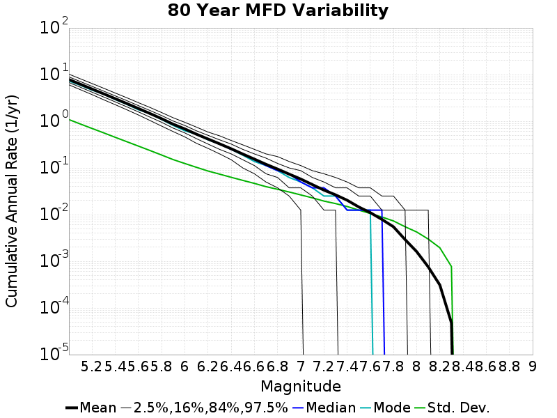

# Start 2012, 500 yr, Spontaneous, Historical Catalog Results

|   | Start 2012, 500 yr, Spontaneous, Historical Catalog |
|-----|-----|
| Num Simulations | 342 (incomplete) |
| Start Time | 2012/01/01 00:00:00 UTC |
| Start Time Epoch Milliseconds | 1325376000000 |
| Duration | 500 Years |
| Includes Spontaneous? | true |
| Trigger Ruptures | *(none)* |
| Historical Ruptures | 60366 Trigger Ruptures |
|   | First: M7.3 at 1852/01/05 04:40:39 UTC |
|   | Last: M3.2 at 2011/12/31 19:14:44 UTC |
|   | Largest: M7.9 at 1857/01/09 16:25:39 UTC |
| Config Generated With | u3etas_config_builder.sh --start-year 2012 --num-simulations 1000 --duration-years 500 --include-spontaneous --historical-catalog --hpc-site USC_HPC --nodes 18 --hours 24 --queue scec |

## Table Of Contents

* [Magnitude Frequency Distribution](#magnitude-frequency-distribution)
* [Long Term Rate Variability](#long-term-rate-variability)
  * [162 Year Variability](#162-year-variability)
  * [80 Year Variability](#80-year-variability)
  * [28 Year Variability](#28-year-variability)
  * [Variability Duration Dependence](#variability-duration-dependence)
* [Simulation Stationarity](#simulation-stationarity)
* [Section Participation](#section-participation)
  * [Section Participation Plots](#section-participation-plots)
  * [Supra-Seismogenic Parent Sections Table](#supra-seismogenic-parent-sections-table)
  * [M≥6.5 Parent Sections Table](#m65-parent-sections-table)
  * [M≥7 Parent Sections Table](#m7-parent-sections-table)
  * [M≥7.5 Parent Sections Table](#m75-parent-sections-table)
  * [M≥8 Parent Sections Table](#m8-parent-sections-table)
* [Gridded Nucleation](#gridded-nucleation)
* [JSON Input File](#json-input-file)

## Magnitude Frequency Distribution
*[(top)](#table-of-contents)*

**Legend**
* **Mean** (thick black line): mean annual rate across all 342 catalogs
* **2.5%,97.5%** (thin black lines): annual rate percentiles across all 342 catalogs
* **Median** (thin blue line): median annual rate across all 342 catalogs
* **Mode** (thin cyan line): modal annual rate across all 342 catalogs (scaled to annualized value)
* **500 yr Probability** (thin red line): 500 year probability calculated as the fraction of catalogs with at least 1 occurrence
* **500 yr Supraseismogenic Probability** (thin dashed red line): same as above, but only for supraseismogenic ruptures on explicitly modeled UCERF3 faults
* **95% Conf** (light red shaded region): binomial 95% confidence bounds on probability


| Mag | Mean | 2.5 %ile | 97.5 %ile | Median | Mode | 500 yr Probability | 500 yr Supra-Seis Prob |
|-----|-----|-----|-----|-----|-----|-----|-----|
| **M&ge;5** | 7.858 | 7.254 | 8.590 | 7.852 | 7.852 | 1.000 (100.00%) | 1.000 (100.00%) |
| **M&ge;5.1** | 6.212 | 5.708 | 6.776 | 6.194 | 6.094 | 1.000 (100.00%) | 1.000 (100.00%) |
| **M&ge;5.2** | 4.911 | 4.496 | 5.392 | 4.896 | 4.870 | 1.000 (100.00%) | 1.000 (100.00%) |
| **M&ge;5.3** | 3.874 | 3.536 | 4.280 | 3.862 | 3.936 | 1.000 (100.00%) | 1.000 (100.00%) |
| **M&ge;5.4** | 3.054 | 2.782 | 3.390 | 3.046 | 3.066 | 1.000 (100.00%) | 1.000 (100.00%) |
| **M&ge;5.5** | 2.398 | 2.164 | 2.690 | 2.390 | 2.330 | 1.000 (100.00%) | 1.000 (100.00%) |
| **M&ge;5.6** | 1.878 | 1.692 | 2.120 | 1.870 | 1.840 | 1.000 (100.00%) | 1.000 (100.00%) |
| **M&ge;5.7** | 1.467 | 1.314 | 1.660 | 1.464 | 1.506 | 1.000 (100.00%) | 1.000 (100.00%) |
| **M&ge;5.8** | 1.137 | 1.006 | 1.276 | 1.136 | 1.120 | 1.000 (100.00%) | 1.000 (100.00%) |
| **M&ge;5.9** | 0.867 | 0.772 | 0.986 | 0.864 | 0.872 | 1.000 (100.00%) | 1.000 (100.00%) |
| **M&ge;6** | 0.687 | 0.604 | 0.790 | 0.684 | 0.686 | 1.000 (100.00%) | 1.000 (100.00%) |
| **M&ge;6.1** | 0.530 | 0.462 | 0.608 | 0.528 | 0.524 | 1.000 (100.00%) | 1.000 (100.00%) |
| **M&ge;6.2** | 0.419 | 0.360 | 0.482 | 0.418 | 0.422 | 1.000 (100.00%) | 1.000 (100.00%) |
| **M&ge;6.3** | 0.330 | 0.274 | 0.382 | 0.330 | 0.318 | 1.000 (100.00%) | 1.000 (100.00%) |
| **M&ge;6.4** | 0.259 | 0.210 | 0.298 | 0.260 | 0.264 | 1.000 (100.00%) | 1.000 (100.00%) |
| **M&ge;6.5** | 0.200 | 0.158 | 0.238 | 0.202 | 0.208 | 1.000 (100.00%) | 1.000 (100.00%) |
| **M&ge;6.6** | 0.156 | 0.122 | 0.190 | 0.156 | 0.168 | 1.000 (100.00%) | 1.000 (100.00%) |
| **M&ge;6.7** | 0.121 | 0.094 | 0.146 | 0.122 | 0.114 | 1.000 (100.00%) | 1.000 (100.00%) |
| **M&ge;6.8** | 0.095 | 0.074 | 0.120 | 0.094 | 0.094 | 1.000 (100.00%) | 1.000 (100.00%) |
| **M&ge;6.9** | 0.074 | 0.056 | 0.098 | 0.074 | 0.072 | 1.000 (100.00%) | 1.000 (100.00%) |
| **M&ge;7** | 0.058 | 0.042 | 0.076 | 0.058 | 0.058 | 1.000 (100.00%) | 1.000 (100.00%) |
| **M&ge;7.1** | 0.044 | 0.030 | 0.060 | 0.044 | 0.046 | 1.000 (100.00%) | 1.000 (100.00%) |
| **M&ge;7.2** | 0.034 | 0.022 | 0.048 | 0.034 | 0.034 | 1.000 (100.00%) | 1.000 (100.00%) |
| **M&ge;7.3** | 0.027 | 0.018 | 0.038 | 0.026 | 0.026 | 1.000 (100.00%) | 1.000 (100.00%) |
| **M&ge;7.4** | 0.020 | 0.012 | 0.030 | 0.020 | 0.020 | 1.000 (100.00%) | 1.000 (100.00%) |
| **M&ge;7.5** | 0.015 | 8.00E-3 | 0.022 | 0.014 | 0.014 | 1.000 (100.00%) | 1.000 (100.00%) |
| **M&ge;7.6** | 0.011 | 6.00E-3 | 0.018 | 0.012 | 0.012 | 1.000 (100.00%) | 1.000 (100.00%) |
| **M&ge;7.7** | 7.98E-3 | 4.00E-3 | 0.014 | 8.00E-3 | 8.00E-3 | 1.000 (100.00%) | 1.000 (100.00%) |
| **M&ge;7.8** | 5.61E-3 | 2.00E-3 | 0.010 | 6.00E-3 | 6.00E-3 | 0.997 (99.71%) | 0.997 (99.71%) |
| **M&ge;7.9** | 2.88E-3 | 0.000 | 6.00E-3 | 2.00E-3 | 2.00E-3 | 0.857 (85.67%) | 0.857 (85.67%) |
| **M&ge;8** | 1.58E-3 | 0.000 | 4.00E-3 | 2.00E-3 | 2.00E-3 | 0.611 (61.11%) | 0.611 (61.11%) |
| **M&ge;8.1** | 7.25E-4 | 0.000 | 2.00E-3 | 0.000 | 0.000 | 0.342 (34.21%) | 0.342 (34.21%) |
| **M&ge;8.2** | 2.81E-4 | 0.000 | 2.00E-3 | 0.000 | 0.000 | 0.137 (13.74%) | 0.137 (13.74%) |
| **M&ge;8.3** | 2.92E-5 | 0.000 | 0.000 | 0.000 | 0.000 | 0.015 (1.46%) | 0.015 (1.46%) |
| **M&ge;8.4** | 0.000 | 0.000 | 0.000 | 0.000 | 0.000 | 0.000 (0.00%) | 0.000 (0.00%) |
| **M&ge;8.5** | 0.000 | 0.000 | 0.000 | 0.000 | 0.000 | 0.000 (0.00%) | 0.000 (0.00%) |
| **M&ge;8.6** | 0.000 | 0.000 | 0.000 | 0.000 | 0.000 | 0.000 (0.00%) | 0.000 (0.00%) |
| **M&ge;8.7** | 0.000 | 0.000 | 0.000 | 0.000 | 0.000 | 0.000 (0.00%) | 0.000 (0.00%) |
| **M&ge;8.8** | 0.000 | 0.000 | 0.000 | 0.000 | 0.000 | 0.000 (0.00%) | 0.000 (0.00%) |
| **M&ge;8.9** | 0.000 | 0.000 | 0.000 | 0.000 | 0.000 | 0.000 (0.00%) | 0.000 (0.00%) |
| **M&ge;9** | 0.000 | 0.000 | 0.000 | 0.000 | 0.000 | 0.000 (0.00%) | 0.000 (0.00%) |


## Long Term Rate Variability
*[(top)](#table-of-contents)*

### 162 Year Variability
*[(top)](#table-of-contents)*


[Download CSV Here](plots/long_term_var_162yr.csv)

| **Magnitude** | Mean | Median | Mode | Std. Dev. | 2.5 %-ile | 16 %-ile | 84 %-ile | 97.5 %-ile |
|-----|-----|-----|-----|-----|-----|-----|-----|-----|
| **5.0** | 7.8659544 | 7.8641977 | 8.271605 | 0.71220756 | 6.5493827 | 7.1296296 | 8.530864 | 9.345679 |
| **5.1** | 6.2180767 | 6.2222223 | 6.2530866 | 0.57136714 | 5.185185 | 5.6358023 | 6.765432 | 7.4259257 |
| **5.2** | 4.916071 | 4.9012346 | 4.876543 | 0.4656068 | 4.0740743 | 4.4506173 | 5.3703704 | 5.9012346 |
| **5.3** | 3.878661 | 3.8703704 | 3.691358 | 0.3744591 | 3.2160494 | 3.506173 | 4.240741 | 4.660494 |
| **5.4** | 3.0573425 | 3.0493827 | 3.080247 | 0.300071 | 2.4876542 | 2.7654321 | 3.351852 | 3.6728394 |
| **5.5** | 2.4001818 | 2.3888888 | 2.3209877 | 0.24504921 | 1.9320987 | 2.1604939 | 2.648148 | 2.9135802 |
| **5.6** | 1.8794792 | 1.8765432 | 1.8703704 | 0.1987801 | 1.5 | 1.6790123 | 2.080247 | 2.2777777 |
| **5.7** | 1.4685702 | 1.462963 | 1.3950617 | 0.16268937 | 1.1604939 | 1.308642 | 1.6296296 | 1.8024691 |
| **5.8** | 1.1377939 | 1.1358025 | 1.1111112 | 0.12968513 | 0.89506173 | 1.0123457 | 1.2654321 | 1.4012346 |
| **5.9** | 0.86794573 | 0.86419755 | 0.8765432 | 0.10328789 | 0.67901236 | 0.7654321 | 0.9691358 | 1.0864197 |
| **6.0** | 0.6878805 | 0.67901236 | 0.6728395 | 0.08436548 | 0.5308642 | 0.60493827 | 0.77160496 | 0.8703704 |
| **6.1** | 0.5303107 | 0.5308642 | 0.5308642 | 0.06970924 | 0.40123457 | 0.45679012 | 0.5925926 | 0.6728395 |
| **6.2** | 0.4190973 | 0.41975307 | 0.42592594 | 0.056916784 | 0.3148148 | 0.36419752 | 0.4691358 | 0.54320985 |
| **6.3** | 0.33033115 | 0.3271605 | 0.32098764 | 0.048787557 | 0.24074075 | 0.28395063 | 0.37654322 | 0.43209878 |
| **6.4** | 0.2596022 | 0.25925925 | 0.25925925 | 0.041593563 | 0.18518518 | 0.21604939 | 0.2962963 | 0.34567901 |
| **6.5** | 0.20038265 | 0.19753087 | 0.20987654 | 0.036079675 | 0.12962963 | 0.16666667 | 0.2345679 | 0.2777778 |
| **6.6** | 0.1558251 | 0.15432099 | 0.16049382 | 0.03159513 | 0.09876543 | 0.12345679 | 0.18518518 | 0.22222222 |
| **6.7** | 0.12100811 | 0.11728395 | 0.11728395 | 0.02679502 | 0.074074075 | 0.09259259 | 0.14814815 | 0.17901234 |
| **6.8** | 0.09557673 | 0.09259259 | 0.09876543 | 0.023544755 | 0.055555556 | 0.074074075 | 0.11728395 | 0.14814815 |
| **6.9** | 0.07429668 | 0.074074075 | 0.074074075 | 0.020469965 | 0.037037037 | 0.055555556 | 0.09259259 | 0.11728395 |
| **7.0** | 0.058190744 | 0.055555556 | 0.049382716 | 0.017454121 | 0.030864198 | 0.043209877 | 0.074074075 | 0.09259259 |
| **7.1** | 0.044052176 | 0.043209877 | 0.037037037 | 0.015326524 | 0.018518519 | 0.030864198 | 0.061728396 | 0.074074075 |
| **7.2** | 0.033788174 | 0.030864198 | 0.030864198 | 0.013229139 | 0.012345679 | 0.018518519 | 0.049382716 | 0.061728396 |
| **7.3** | 0.026983611 | 0.024691358 | 0.024691358 | 0.011548353 | 0.0061728396 | 0.018518519 | 0.037037037 | 0.049382716 |
| **7.4** | 0.020467836 | 0.018518519 | 0.018518519 | 0.009708914 | 0.0061728396 | 0.012345679 | 0.030864198 | 0.043209877 |
| **7.5** | 0.014848507 | 0.012345679 | 0.012345679 | 0.008027191 | 0.0 | 0.0061728396 | 0.024691358 | 0.030864198 |
| **7.6** | 0.011148413 | 0.012345679 | 0.012345679 | 0.0066745873 | 0.0 | 0.0061728396 | 0.018518519 | 0.024691358 |
| **7.7** | 0.007995812 | 0.0061728396 | 0.0061728396 | 0.0056328643 | 0.0 | 0.0 | 0.012345679 | 0.018518519 |
| **7.8** | 0.005637379 | 0.0061728396 | 0.0061728396 | 0.004712072 | 0.0 | 0.0 | 0.012345679 | 0.018518519 |
| **7.9** | 0.0029119437 | 0.0 | 0.0 | 0.003615739 | 0.0 | 0.0 | 0.0061728396 | 0.012345679 |
| **8.0** | 0.0016003659 | 0.0 | 0.0 | 0.0028141718 | 0.0 | 0.0 | 0.0061728396 | 0.0061728396 |
| **8.1** | 7.3400233E-4 | 0.0 | 0.0 | 0.0019990033 | 0.0 | 0.0 | 0.0 | 0.0061728396 |
| **8.2** | 2.8878782E-4 | 0.0 | 0.0 | 0.0013041856 | 0.0 | 0.0 | 0.0 | 0.0061728396 |
| **8.3** | 3.0082065E-5 | 0.0 | 0.0 | 4.30078E-4 | 0.0 | 0.0 | 0.0 | 0.0 |
| **8.4** | 0.0 | 0.0 | 0.0 | 0.0 | 0.0 | 0.0 | 0.0 | 0.0 |
| **8.5** | 0.0 | 0.0 | 0.0 | 0.0 | 0.0 | 0.0 | 0.0 | 0.0 |
| **8.6** | 0.0 | 0.0 | 0.0 | 0.0 | 0.0 | 0.0 | 0.0 | 0.0 |
| **8.7** | 0.0 | 0.0 | 0.0 | 0.0 | 0.0 | 0.0 | 0.0 | 0.0 |
| **8.8** | 0.0 | 0.0 | 0.0 | 0.0 | 0.0 | 0.0 | 0.0 | 0.0 |
| **8.9** | 0.0 | 0.0 | 0.0 | 0.0 | 0.0 | 0.0 | 0.0 | 0.0 |
| **9.0** | 0.0 | 0.0 | 0.0 | 0.0 | 0.0 | 0.0 | 0.0 | 0.0 |

### 80 Year Variability
*[(top)](#table-of-contents)*



[Download CSV Here](plots/long_term_var_80yr.csv)

| **Magnitude** | Mean | Median | Mode | Std. Dev. | 2.5 %-ile | 16 %-ile | 84 %-ile | 97.5 %-ile |
|-----|-----|-----|-----|-----|-----|-----|-----|-----|
| **5.0** | 7.867623 | 7.7625 | 7.7125 | 1.0810276 | 6.025 | 6.775 | 8.975 | 10.1375 |
| **5.1** | 6.219347 | 6.15 | 5.8875 | 0.86820495 | 4.7375 | 5.35 | 7.1125 | 8.025 |
| **5.2** | 4.917471 | 4.85 | 4.8375 | 0.69915164 | 3.7375 | 4.2125 | 5.625 | 6.4 |
| **5.3** | 3.879581 | 3.825 | 3.8125 | 0.5625768 | 2.925 | 3.3125 | 4.45 | 5.05 |
| **5.4** | 3.0580165 | 3.025 | 2.8875 | 0.4495708 | 2.275 | 2.6125 | 3.5125 | 4.0 |
| **5.5** | 2.4006457 | 2.375 | 2.4125 | 0.36275268 | 1.7625 | 2.0375 | 2.775 | 3.1625 |
| **5.6** | 1.879855 | 1.8625 | 1.9 | 0.29249504 | 1.35 | 1.5875 | 2.175 | 2.475 |
| **5.7** | 1.4688962 | 1.45 | 1.4875 | 0.23892407 | 1.05 | 1.225 | 1.7125 | 1.975 |
| **5.8** | 1.137902 | 1.125 | 1.125 | 0.19094928 | 0.8 | 0.95 | 1.325 | 1.55 |
| **5.9** | 0.86800075 | 0.8625 | 0.875 | 0.15160185 | 0.5875 | 0.725 | 1.0125 | 1.1875 |
| **6.0** | 0.6879081 | 0.6875 | 0.6375 | 0.12350052 | 0.4625 | 0.5625 | 0.8125 | 0.95 |
| **6.1** | 0.5302875 | 0.525 | 0.55 | 0.102083534 | 0.35 | 0.425 | 0.625 | 0.75 |
| **6.2** | 0.41910332 | 0.4125 | 0.4625 | 0.08425604 | 0.2625 | 0.3375 | 0.5 | 0.5875 |
| **6.3** | 0.3303789 | 0.325 | 0.35 | 0.07266552 | 0.2 | 0.2625 | 0.4 | 0.475 |
| **6.4** | 0.2595151 | 0.2625 | 0.2375 | 0.06251462 | 0.15 | 0.2 | 0.325 | 0.3875 |
| **6.5** | 0.20032285 | 0.2 | 0.1875 | 0.053671025 | 0.1125 | 0.15 | 0.25 | 0.3125 |
| **6.6** | 0.15577485 | 0.15 | 0.15 | 0.046614114 | 0.075 | 0.1125 | 0.2 | 0.25 |
| **6.7** | 0.12093689 | 0.1125 | 0.1125 | 0.039242383 | 0.05 | 0.0875 | 0.1625 | 0.2125 |
| **6.8** | 0.09547393 | 0.0875 | 0.075 | 0.035130497 | 0.0375 | 0.0625 | 0.125 | 0.175 |
| **6.9** | 0.07425682 | 0.075 | 0.0625 | 0.0305523 | 0.025 | 0.05 | 0.1 | 0.1375 |
| **7.0** | 0.058181044 | 0.05 | 0.05 | 0.026649091 | 0.0125 | 0.0375 | 0.0875 | 0.1125 |
| **7.1** | 0.044060674 | 0.0375 | 0.0375 | 0.023331923 | 0.0 | 0.025 | 0.0625 | 0.1 |
| **7.2** | 0.033765838 | 0.0375 | 0.025 | 0.01970706 | 0.0 | 0.0125 | 0.05 | 0.075 |
| **7.3** | 0.026967593 | 0.025 | 0.025 | 0.01739126 | 0.0 | 0.0125 | 0.05 | 0.0625 |
| **7.4** | 0.020461746 | 0.025 | 0.0125 | 0.014834225 | 0.0 | 0.0 | 0.0375 | 0.05 |
| **7.5** | 0.014851364 | 0.0125 | 0.0125 | 0.01246457 | 0.0 | 0.0 | 0.025 | 0.0375 |
| **7.6** | 0.011165936 | 0.0125 | 0.0125 | 0.010436108 | 0.0 | 0.0 | 0.025 | 0.0375 |
| **7.7** | 0.008004386 | 0.0125 | 0.0 | 0.008903581 | 0.0 | 0.0 | 0.0125 | 0.025 |
| **7.8** | 0.0056347465 | 0.0 | 0.0 | 0.0074473447 | 0.0 | 0.0 | 0.0125 | 0.025 |
| **7.9** | 0.002917885 | 0.0 | 0.0 | 0.0055832607 | 0.0 | 0.0 | 0.0125 | 0.0125 |
| **8.0** | 0.0016020956 | 0.0 | 0.0 | 0.004233803 | 0.0 | 0.0 | 0.0 | 0.0125 |
| **8.1** | 7.3099416E-4 | 0.0 | 0.0 | 0.0029338147 | 0.0 | 0.0 | 0.0 | 0.0125 |
| **8.2** | 2.9239766E-4 | 0.0 | 0.0 | 0.0018897657 | 0.0 | 0.0 | 0.0 | 0.0 |
| **8.3** | 3.045809E-5 | 0.0 | 0.0 | 6.164281E-4 | 0.0 | 0.0 | 0.0 | 0.0 |
| **8.4** | 0.0 | 0.0 | 0.0 | 0.0 | 0.0 | 0.0 | 0.0 | 0.0 |
| **8.5** | 0.0 | 0.0 | 0.0 | 0.0 | 0.0 | 0.0 | 0.0 | 0.0 |
| **8.6** | 0.0 | 0.0 | 0.0 | 0.0 | 0.0 | 0.0 | 0.0 | 0.0 |
| **8.7** | 0.0 | 0.0 | 0.0 | 0.0 | 0.0 | 0.0 | 0.0 | 0.0 |
| **8.8** | 0.0 | 0.0 | 0.0 | 0.0 | 0.0 | 0.0 | 0.0 | 0.0 |
| **8.9** | 0.0 | 0.0 | 0.0 | 0.0 | 0.0 | 0.0 | 0.0 | 0.0 |
| **9.0** | 0.0 | 0.0 | 0.0 | 0.0 | 0.0 | 0.0 | 0.0 | 0.0 |

### 28 Year Variability
*[(top)](#table-of-contents)*


[Download CSV Here](plots/long_term_var_28yr.csv)

| **Magnitude** | Mean | Median | Mode | Std. Dev. | 2.5 %-ile | 16 %-ile | 84 %-ile | 97.5 %-ile |
|-----|-----|-----|-----|-----|-----|-----|-----|-----|
| **5.0** | 7.871081 | 7.535714 | 6.857143 | 1.8816879 | 5.142857 | 6.142857 | 9.642858 | 12.464286 |
| **5.1** | 6.2224374 | 5.928571 | 5.428571 | 1.5088279 | 4.0 | 4.821429 | 7.642857 | 9.821428 |
| **5.2** | 4.9200206 | 4.714286 | 4.392857 | 1.2099491 | 3.107143 | 3.7857144 | 6.071429 | 7.821429 |
| **5.3** | 3.8815174 | 3.7142856 | 3.2857144 | 0.9708251 | 2.4285715 | 2.9642856 | 4.821429 | 6.178571 |
| **5.4** | 3.0594747 | 2.9285715 | 2.7857144 | 0.7786279 | 1.8571428 | 2.3214285 | 3.8214285 | 4.892857 |
| **5.5** | 2.4014816 | 2.3214285 | 2.1785715 | 0.62871104 | 1.4285715 | 1.8214285 | 3.0 | 3.857143 |
| **5.6** | 1.8804425 | 1.8214285 | 1.7857143 | 0.502256 | 1.0714285 | 1.3928572 | 2.357143 | 3.0 |
| **5.7** | 1.4693351 | 1.4285715 | 1.3571428 | 0.4081764 | 0.78571427 | 1.0714285 | 1.8571428 | 2.392857 |
| **5.8** | 1.1383115 | 1.1071428 | 1.0 | 0.32679072 | 0.5714286 | 0.8214286 | 1.4642857 | 1.8571428 |
| **5.9** | 0.86856234 | 0.85714287 | 0.75 | 0.26084462 | 0.42857143 | 0.60714287 | 1.1428572 | 1.4285715 |
| **6.0** | 0.6884368 | 0.6785714 | 0.64285713 | 0.2165462 | 0.32142857 | 0.4642857 | 0.89285713 | 1.1428572 |
| **6.1** | 0.5307632 | 0.53571427 | 0.53571427 | 0.17963073 | 0.21428572 | 0.35714287 | 0.71428573 | 0.9285714 |
| **6.2** | 0.41946778 | 0.39285713 | 0.35714287 | 0.150522 | 0.14285715 | 0.2857143 | 0.5714286 | 0.75 |
| **6.3** | 0.33058137 | 0.32142857 | 0.2857143 | 0.12991576 | 0.10714286 | 0.21428572 | 0.4642857 | 0.60714287 |
| **6.4** | 0.25961962 | 0.25 | 0.21428572 | 0.1117394 | 0.071428575 | 0.14285715 | 0.35714287 | 0.5 |
| **6.5** | 0.20044596 | 0.17857143 | 0.17857143 | 0.09666172 | 0.035714287 | 0.10714286 | 0.2857143 | 0.42857143 |
| **6.6** | 0.1558799 | 0.14285715 | 0.14285715 | 0.0831388 | 0.035714287 | 0.071428575 | 0.25 | 0.35714287 |
| **6.7** | 0.12109318 | 0.10714286 | 0.10714286 | 0.07104343 | 0.0 | 0.035714287 | 0.17857143 | 0.2857143 |
| **6.8** | 0.095569804 | 0.071428575 | 0.071428575 | 0.06245994 | 0.0 | 0.035714287 | 0.14285715 | 0.25 |
| **6.9** | 0.07433412 | 0.071428575 | 0.035714287 | 0.054095738 | 0.0 | 0.035714287 | 0.14285715 | 0.17857143 |
| **7.0** | 0.058221534 | 0.035714287 | 0.035714287 | 0.04762069 | 0.0 | 0.0 | 0.10714286 | 0.17857143 |
| **7.1** | 0.044074647 | 0.035714287 | 0.035714287 | 0.041307718 | 0.0 | 0.0 | 0.071428575 | 0.14285715 |
| **7.2** | 0.033748586 | 0.035714287 | 0.0 | 0.035490524 | 0.0 | 0.0 | 0.071428575 | 0.10714286 |
| **7.3** | 0.026960785 | 0.035714287 | 0.0 | 0.03139416 | 0.0 | 0.0 | 0.071428575 | 0.10714286 |
| **7.4** | 0.020418694 | 0.0 | 0.0 | 0.027199397 | 0.0 | 0.0 | 0.035714287 | 0.071428575 |
| **7.5** | 0.014841024 | 0.0 | 0.0 | 0.022833273 | 0.0 | 0.0 | 0.035714287 | 0.071428575 |
| **7.6** | 0.011161482 | 0.0 | 0.0 | 0.019456066 | 0.0 | 0.0 | 0.035714287 | 0.071428575 |
| **7.7** | 0.008022508 | 0.0 | 0.0 | 0.01653907 | 0.0 | 0.0 | 0.035714287 | 0.035714287 |
| **7.8** | 0.0056452407 | 0.0 | 0.0 | 0.013814516 | 0.0 | 0.0 | 0.0 | 0.035714287 |
| **7.9** | 0.0029239766 | 0.0 | 0.0 | 0.010036031 | 0.0 | 0.0 | 0.0 | 0.035714287 |
| **8.0** | 0.0016155585 | 0.0 | 0.0 | 0.0074228 | 0.0 | 0.0 | 0.0 | 0.035714287 |
| **8.1** | 7.37137E-4 | 0.0 | 0.0 | 0.005078128 | 0.0 | 0.0 | 0.0 | 0.0 |
| **8.2** | 2.9485478E-4 | 0.0 | 0.0 | 0.0032319322 | 0.0 | 0.0 | 0.0 | 0.0 |
| **8.3** | 3.071404E-5 | 0.0 | 0.0 | 0.0010469839 | 0.0 | 0.0 | 0.0 | 0.0 |
| **8.4** | 0.0 | 0.0 | 0.0 | 0.0 | 0.0 | 0.0 | 0.0 | 0.0 |
| **8.5** | 0.0 | 0.0 | 0.0 | 0.0 | 0.0 | 0.0 | 0.0 | 0.0 |
| **8.6** | 0.0 | 0.0 | 0.0 | 0.0 | 0.0 | 0.0 | 0.0 | 0.0 |
| **8.7** | 0.0 | 0.0 | 0.0 | 0.0 | 0.0 | 0.0 | 0.0 | 0.0 |
| **8.8** | 0.0 | 0.0 | 0.0 | 0.0 | 0.0 | 0.0 | 0.0 | 0.0 |
| **8.9** | 0.0 | 0.0 | 0.0 | 0.0 | 0.0 | 0.0 | 0.0 | 0.0 |
| **9.0** | 0.0 | 0.0 | 0.0 | 0.0 | 0.0 | 0.0 | 0.0 | 0.0 |

### Variability Duration Dependence
*[(top)](#table-of-contents)*


[Download CSV Here](plots/long_term_var_m5.csv)

| **Duration (years)** | Mean | Median | Mode | Std. Dev. | 2.5 %-ile | 16 %-ile | 84 %-ile | 97.5 %-ile |
|-----|-----|-----|-----|-----|-----|-----|-----|-----|
| **1.0** | 7.857544 | 6.0 | 5.0 | 7.927092 | 1.0 | 3.0 | 11.0 | 25.0 |
| **4.0** | 7.857544 | 6.75 | 5.5 | 4.472844 | 3.25 | 4.75 | 10.5 | 20.0 |
| **8.0** | 7.863858 | 7.0 | 6.25 | 3.326524 | 4.0 | 5.25 | 10.125 | 17.25 |
| **12.0** | 7.86517 | 7.25 | 6.6666665 | 2.7729793 | 4.4166665 | 5.5833335 | 10.0 | 15.416667 |
| **16.0** | 7.863858 | 7.3125 | 6.25 | 2.4467156 | 4.6875 | 5.75 | 9.875 | 14.5 |
| **20.0** | 7.857544 | 7.4 | 6.9 | 2.1805465 | 4.85 | 5.9 | 9.8 | 13.55 |
| **24.0** | 7.867623 | 7.4583335 | 7.25 | 2.0258472 | 5.0416665 | 6.0416665 | 9.666667 | 13.041667 |
| **28.0** | 7.871081 | 7.535714 | 6.857143 | 1.8816879 | 5.142857 | 6.142857 | 9.642858 | 12.464286 |
| **32.0** | 7.867623 | 7.5625 | 6.96875 | 1.7533745 | 5.3125 | 6.25 | 9.5625 | 12.15625 |
| **36.0** | 7.871089 | 7.5833335 | 7.1666665 | 1.6668739 | 5.3055553 | 6.3333335 | 9.527778 | 11.861111 |
| **40.0** | 7.867623 | 7.625 | 6.9 | 1.5606081 | 5.45 | 6.4 | 9.4 | 11.55 |
| **44.0** | 7.8655696 | 7.6136365 | 7.1136365 | 1.5013452 | 5.5227275 | 6.4545455 | 9.318182 | 11.295455 |
| **48.0** | 7.867623 | 7.6458335 | 7.3333335 | 1.4325264 | 5.5625 | 6.4791665 | 9.291667 | 11.0 |
| **52.0** | 7.871089 | 7.6538463 | 7.3846154 | 1.3858106 | 5.6538463 | 6.5384617 | 9.269231 | 11.0 |
| **56.0** | 7.8822775 | 7.714286 | 7.5 | 1.3319316 | 5.642857 | 6.571429 | 9.196428 | 10.821428 |
| **60.0** | 7.867623 | 7.733333 | 7.616667 | 1.2756982 | 5.7833333 | 6.6 | 9.15 | 10.65 |
| **64.0** | 7.8822775 | 7.75 | 7.296875 | 1.225131 | 5.84375 | 6.6875 | 9.140625 | 10.515625 |
| **68.0** | 7.871081 | 7.7352943 | 7.6764708 | 1.1963707 | 5.8235292 | 6.7058825 | 9.088235 | 10.367647 |
| **72.0** | 7.8851123 | 7.763889 | 7.388889 | 1.1642329 | 5.9166665 | 6.736111 | 9.055555 | 10.458333 |
| **76.0** | 7.873346 | 7.75 | 7.4605265 | 1.1473043 | 6.0 | 6.7105265 | 9.026316 | 10.342105 |
| **80.0** | 7.867623 | 7.7625 | 7.7125 | 1.0810276 | 6.025 | 6.775 | 8.975 | 10.1375 |
| **84.0** | 7.890163 | 7.7619047 | 7.5119047 | 1.055629 | 6.095238 | 6.857143 | 9.0 | 10.107142 |
| **88.0** | 7.8852673 | 7.7954545 | 7.340909 | 1.0216035 | 6.159091 | 6.8522725 | 8.909091 | 10.0 |
| **92.0** | 7.8780766 | 7.7826085 | 7.7065215 | 1.012432 | 6.1413045 | 6.826087 | 8.902174 | 10.065217 |
| **96.0** | 7.867623 | 7.7916665 | 7.8333335 | 0.9933145 | 6.1666665 | 6.8854165 | 8.864583 | 10.0 |
| **100.0** | 7.857544 | 7.81 | 8.6 | 0.9563661 | 6.15 | 6.88 | 8.8 | 9.88 |
| **200.0** | 7.905987 | 7.925 | 8.355 | 0.6102555 | 6.75 | 7.27 | 8.49 | 9.205 |
| **300.0** | 7.9066567 | 7.8766665 | 7.96 | 0.49439132 | 7.016667 | 7.383333 | 8.41 | 8.903334 |
| **400.0** | 7.905987 | 7.8975 | 7.7175 | 0.3843498 | 7.14 | 7.51 | 8.2975 | 8.6925 |
| **500.0** | 7.857544 | 7.852 | 7.852 | 0.34092298 | 7.254 | 7.524 | 8.228 | 8.59 |


## Simulation Stationarity
*[(top)](#table-of-contents)*


## Section Participation
*[(top)](#table-of-contents)*

### Section Participation Plots
*[(top)](#table-of-contents)*

| Min Mag | Complete Catalog (including spontaneous) |
|-----|-----|
| **All Supra. Seis.** |  |
| **M&ge;6.5** |  |
| **M&ge;7** |  |
| **M&ge;7.5** |  |
| **M&ge;8** |  |

### Supra-Seismogenic Parent Sections Table
*[(top)](#table-of-contents)*

*First 10 of 312 with matching ruptures shown*

| Parent Name | Total Mean Annual Rate | Total 500 Year Prob |
|-----|-----|-----|
| San Andreas (Parkfield) | 0.043280702 | 1.0 |
| San Andreas (Creeping Section) 2011 CFM | 0.029152047 | 1.0 |
| San Andreas (Mojave S) | 0.019111112 | 1.0 |
| Mendocino | 0.018239766 | 1.0 |
| Cerro Prieto | 0.013643275 | 1.0 |
| Imperial | 0.011847953 | 1.0 |
| Brawley (Seismic Zone) alt 1 | 0.011040935 | 1.0 |
| Hayward (So) 2011 CFM | 0.00974269 | 1.0 |
| San Andreas (Offshore) 2011 CFM | 0.008672515 | 1.0 |
| Elsinore (Glen Ivy) rev | 0.008081871 | 0.99415207 |

### M≥6.5 Parent Sections Table
*[(top)](#table-of-contents)*

*First 10 of 301 with matching ruptures shown*

| Parent Name | Total Mean Annual Rate | Total 500 Year Prob |
|-----|-----|-----|
| Cerro Prieto | 0.011754386 | 1.0 |
| San Andreas (Creeping Section) 2011 CFM | 0.011321638 | 0.99707603 |
| Mendocino | 0.009064328 | 1.0 |
| Hayward (So) 2011 CFM | 0.008304094 | 1.0 |
| Imperial | 0.008099415 | 1.0 |
| Brawley (Seismic Zone) alt 1 | 0.007830409 | 1.0 |
| San Andreas (Santa Cruz Mts) 2011 CFM | 0.0070701754 | 1.0 |
| San Andreas (Mojave S) | 0.007046784 | 1.0 |
| San Andreas (San Bernardino N) | 0.006625731 | 0.99707603 |
| San Andreas (Cholame) rev | 0.006122807 | 1.0 |

### M≥7 Parent Sections Table
*[(top)](#table-of-contents)*

*First 10 of 268 with matching ruptures shown*

| Parent Name | Total Mean Annual Rate | Total 500 Year Prob |
|-----|-----|-----|
| San Andreas (Creeping Section) 2011 CFM | 0.007087719 | 0.99415207 |
| San Andreas (Carrizo) rev | 0.0058011697 | 1.0 |
| San Andreas (Cholame) rev | 0.0057894737 | 1.0 |
| San Andreas (Santa Cruz Mts) 2011 CFM | 0.0055497074 | 0.99415207 |
| San Andreas (Mojave S) | 0.0052339183 | 1.0 |
| San Andreas (Mojave N) | 0.005005848 | 1.0 |
| San Andreas (Big Bend) | 0.0047017545 | 1.0 |
| San Andreas (North Coast) 2011 CFM | 0.0046491227 | 0.99122804 |
| San Andreas (San Bernardino N) | 0.004467836 | 0.9707602 |
| San Andreas (Parkfield) | 0.0044269008 | 0.95614034 |

### M≥7.5 Parent Sections Table
*[(top)](#table-of-contents)*

*First 10 of 189 with matching ruptures shown*

| Parent Name | Total Mean Annual Rate | Total 500 Year Prob |
|-----|-----|-----|
| San Andreas (Mojave N) | 0.0049239765 | 1.0 |
| San Andreas (Big Bend) | 0.0045730993 | 1.0 |
| San Andreas (Mojave S) | 0.0043216376 | 0.99415207 |
| San Andreas (Carrizo) rev | 0.0042982455 | 0.99707603 |
| San Andreas (Cholame) rev | 0.0041052634 | 0.9883041 |
| San Andreas (North Coast) 2011 CFM | 0.0036842106 | 0.9766082 |
| San Andreas (Creeping Section) 2011 CFM | 0.003631579 | 0.8888889 |
| San Andreas (San Bernardino N) | 0.003491228 | 0.93274856 |
| San Andreas (Peninsula) 2011 CFM | 0.003134503 | 0.9356725 |
| San Andreas (Parkfield) | 0.003122807 | 0.9122807 |

### M≥8 Parent Sections Table
*[(top)](#table-of-contents)*

*First 10 of 50 with matching ruptures shown*

| Parent Name | Total Mean Annual Rate | Total 500 Year Prob |
|-----|-----|-----|
| San Andreas (Mojave N) | 0.0014444444 | 0.5701754 |
| San Andreas (Big Bend) | 0.0014327485 | 0.57309943 |
| San Andreas (Carrizo) rev | 0.0014327485 | 0.57309943 |
| San Andreas (Mojave S) | 0.0014093567 | 0.5555556 |
| San Andreas (Cholame) rev | 0.0014035088 | 0.5614035 |
| San Andreas (San Bernardino N) | 0.0012923976 | 0.5233918 |
| San Andreas (Parkfield) | 0.0011988304 | 0.49707603 |
| San Andreas (Creeping Section) 2011 CFM | 0.0010584795 | 0.45614034 |
| San Andreas (Santa Cruz Mts) 2011 CFM | 7.368421E-4 | 0.3362573 |
| San Andreas (Peninsula) 2011 CFM | 6.608187E-4 | 0.30701753 |

## Gridded Nucleation
*[(top)](#table-of-contents)*

| Min Mag | Complete Catalog (including spontaneous) |
|-----|-----|
| **M&ge;5** |  |
| **M&ge;6** |  |
| **M&ge;7** |  |


## JSON Input File
*[(top)](#table-of-contents)*

```
{
  "numSimulations": 1000,
  "duration": 500.0,
  "startYear": 2012,
  "includeSpontaneous": true,
  "randomSeed": 1570823668349,
  "binaryOutput": true,
  "binaryOutputFilters": [
    {
      "prefix": "results_complete",
      "descendantsOnly": false
    },
    {
      "prefix": "results_m5_preserve_chain",
      "minMag": 5.0,
      "preserveChainBelowMag": true,
      "descendantsOnly": false
    }
  ],
  "forceRecalc": false,
  "simulationName": "Start 2012, 500 yr, Spontaneous, Historical Catalog",
  "numRetries": 3,
  "outputDir": "${ETAS_SIM_DIR}/2019_10_11-Start2012_500yr_Spontaneous_HistoricalCatalog",
  "triggerCatalog": "${ETAS_LAUNCHER}/inputs/u3_historical_catalog.txt",
  "triggerCatalogSurfaceMappings": "${ETAS_LAUNCHER}/inputs/u3_historical_catalog_finite_fault_mappings.xml",
  "treatTriggerCatalogAsSpontaneous": true,
  "cacheDir": "${ETAS_LAUNCHER}/inputs/cache_fm3p1_ba",
  "fssFile": "${ETAS_LAUNCHER}/inputs/2013_05_10-ucerf3p3-production-10runs_COMPOUND_SOL_FM3_1_SpatSeisU3_MEAN_BRANCH_AVG_SOL.zip",
  "probModel": "FULL_TD",
  "applySubSeisForSupraNucl": true,
  "totRateScaleFactor": 1.14,
  "gridSeisCorr": true,
  "timeIndependentERF": false,
  "griddedOnly": false,
  "imposeGR": false,
  "includeIndirectTriggering": true,
  "gridSeisDiscr": 0.1,
  "catalogCompletenessModel": "RELAXED",
  "configCommand": "u3etas_config_builder.sh --start-year 2012 --num-simulations 1000 --duration-years 500 --include-spontaneous --historical-catalog --hpc-site USC_HPC --nodes 18 --hours 24 --queue scec",
  "configTime": 1570823668349
}
```

