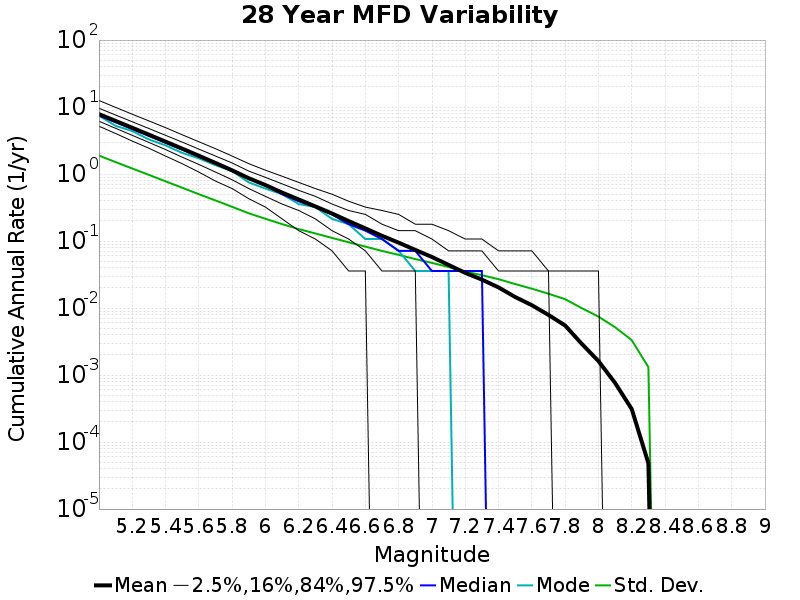
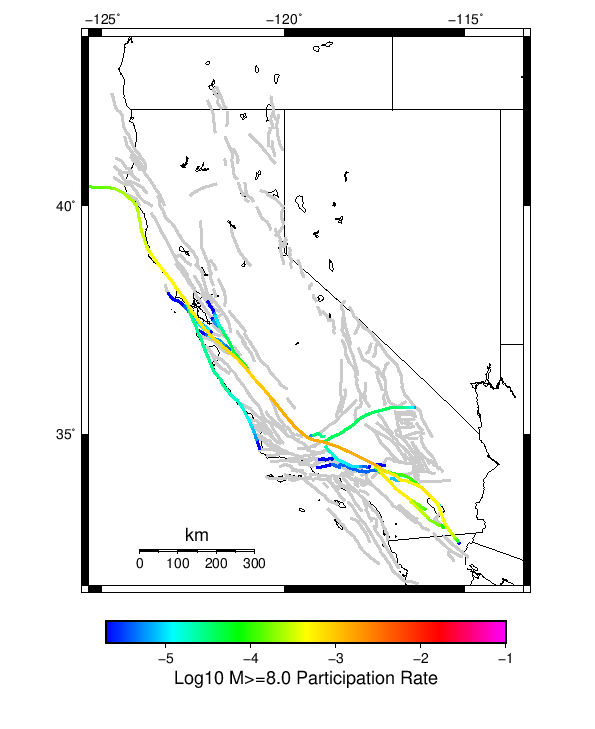

# Start 2012, 500 yr, Spontaneous, Historical Catalog Results

|   | Start 2012, 500 yr, Spontaneous, Historical Catalog |
|-----|-----|
| Num Simulations | 990 (incomplete) |
| Start Time | 2012/01/01 00:00:00 UTC |
| Start Time Epoch Milliseconds | 1325376000000 |
| Duration | 500 Years |
| Includes Spontaneous? | true |
| Trigger Ruptures | *(none)* |
| Historical Ruptures | 60366 Trigger Ruptures |
|   | First: M7.3 at 1852/01/05 04:40:39 UTC |
|   | Last: M3.2 at 2011/12/31 19:14:44 UTC |
|   | Largest: M7.9 at 1857/01/09 16:25:39 UTC |
| Config Generated With | u3etas_config_builder.sh --start-year 2012 --num-simulations 1000 --duration-years 500 --include-spontaneous --historical-catalog --hpc-site USC_HPC --nodes 18 --hours 24 --queue scec |

## Table Of Contents

* [Magnitude Frequency Distribution](#magnitude-frequency-distribution)
* [Long Term Rate Variability](#long-term-rate-variability)
  * [162 Year Variability](#162-year-variability)
  * [80 Year Variability](#80-year-variability)
  * [28 Year Variability](#28-year-variability)
  * [Variability Duration Dependence](#variability-duration-dependence)
* [Simulation Stationarity](#simulation-stationarity)
* [Section Participation](#section-participation)
  * [Section Participation Plots](#section-participation-plots)
  * [Supra-Seismogenic Parent Sections Table](#supra-seismogenic-parent-sections-table)
  * [M≥6.5 Parent Sections Table](#m65-parent-sections-table)
  * [M≥7 Parent Sections Table](#m7-parent-sections-table)
  * [M≥7.5 Parent Sections Table](#m75-parent-sections-table)
  * [M≥8 Parent Sections Table](#m8-parent-sections-table)
* [Gridded Nucleation](#gridded-nucleation)
* [JSON Input File](#json-input-file)

## Magnitude Frequency Distribution
*[(top)](#table-of-contents)*

**Legend**
* **Mean** (thick black line): mean annual rate across all 990 catalogs
* **2.5%,97.5%** (thin black lines): annual rate percentiles across all 990 catalogs
* **Median** (thin blue line): median annual rate across all 990 catalogs
* **Mode** (thin cyan line): modal annual rate across all 990 catalogs (scaled to annualized value)
* **500 yr Probability** (thin red line): 500 year probability calculated as the fraction of catalogs with at least 1 occurrence
* **500 yr Supraseismogenic Probability** (thin dashed red line): same as above, but only for supraseismogenic ruptures on explicitly modeled UCERF3 faults
* **95% Conf** (light red shaded region): binomial 95% confidence bounds on probability


| Mag | Mean | 2.5 %ile | 97.5 %ile | Median | Mode | 500 yr Probability | 500 yr Supra-Seis Prob |
|-----|-----|-----|-----|-----|-----|-----|-----|
| **M&ge;5** | 7.845 | 7.192 | 8.592 | 7.840 | 7.570 | 1.000 (100.00%) | 1.000 (100.00%) |
| **M&ge;5.1** | 6.205 | 5.680 | 6.798 | 6.186 | 6.156 | 1.000 (100.00%) | 1.000 (100.00%) |
| **M&ge;5.2** | 4.901 | 4.460 | 5.390 | 4.884 | 4.756 | 1.000 (100.00%) | 1.000 (100.00%) |
| **M&ge;5.3** | 3.868 | 3.512 | 4.274 | 3.858 | 3.858 | 1.000 (100.00%) | 1.000 (100.00%) |
| **M&ge;5.4** | 3.047 | 2.758 | 3.372 | 3.040 | 3.080 | 1.000 (100.00%) | 1.000 (100.00%) |
| **M&ge;5.5** | 2.394 | 2.154 | 2.676 | 2.384 | 2.356 | 1.000 (100.00%) | 1.000 (100.00%) |
| **M&ge;5.6** | 1.875 | 1.676 | 2.098 | 1.868 | 1.892 | 1.000 (100.00%) | 1.000 (100.00%) |
| **M&ge;5.7** | 1.463 | 1.306 | 1.638 | 1.460 | 1.468 | 1.000 (100.00%) | 1.000 (100.00%) |
| **M&ge;5.8** | 1.135 | 1.004 | 1.276 | 1.132 | 1.144 | 1.000 (100.00%) | 1.000 (100.00%) |
| **M&ge;5.9** | 0.864 | 0.768 | 0.984 | 0.864 | 0.872 | 1.000 (100.00%) | 1.000 (100.00%) |
| **M&ge;6** | 0.684 | 0.600 | 0.784 | 0.682 | 0.662 | 1.000 (100.00%) | 1.000 (100.00%) |
| **M&ge;6.1** | 0.528 | 0.458 | 0.608 | 0.526 | 0.534 | 1.000 (100.00%) | 1.000 (100.00%) |
| **M&ge;6.2** | 0.417 | 0.356 | 0.482 | 0.416 | 0.416 | 1.000 (100.00%) | 1.000 (100.00%) |
| **M&ge;6.3** | 0.328 | 0.278 | 0.388 | 0.328 | 0.318 | 1.000 (100.00%) | 1.000 (100.00%) |
| **M&ge;6.4** | 0.257 | 0.212 | 0.300 | 0.258 | 0.258 | 1.000 (100.00%) | 1.000 (100.00%) |
| **M&ge;6.5** | 0.198 | 0.160 | 0.238 | 0.198 | 0.208 | 1.000 (100.00%) | 1.000 (100.00%) |
| **M&ge;6.6** | 0.154 | 0.124 | 0.188 | 0.154 | 0.146 | 1.000 (100.00%) | 1.000 (100.00%) |
| **M&ge;6.7** | 0.120 | 0.094 | 0.148 | 0.120 | 0.122 | 1.000 (100.00%) | 1.000 (100.00%) |
| **M&ge;6.8** | 0.095 | 0.072 | 0.120 | 0.094 | 0.088 | 1.000 (100.00%) | 1.000 (100.00%) |
| **M&ge;6.9** | 0.074 | 0.054 | 0.094 | 0.074 | 0.078 | 1.000 (100.00%) | 1.000 (100.00%) |
| **M&ge;7** | 0.058 | 0.042 | 0.076 | 0.058 | 0.060 | 1.000 (100.00%) | 1.000 (100.00%) |
| **M&ge;7.1** | 0.044 | 0.030 | 0.058 | 0.044 | 0.042 | 1.000 (100.00%) | 1.000 (100.00%) |
| **M&ge;7.2** | 0.034 | 0.022 | 0.046 | 0.034 | 0.032 | 1.000 (100.00%) | 1.000 (100.00%) |
| **M&ge;7.3** | 0.027 | 0.016 | 0.038 | 0.026 | 0.026 | 1.000 (100.00%) | 1.000 (100.00%) |
| **M&ge;7.4** | 0.020 | 0.012 | 0.030 | 0.020 | 0.020 | 1.000 (100.00%) | 1.000 (100.00%) |
| **M&ge;7.5** | 0.015 | 8.00E-3 | 0.022 | 0.014 | 0.014 | 1.000 (100.00%) | 1.000 (100.00%) |
| **M&ge;7.6** | 0.011 | 6.00E-3 | 0.018 | 0.010 | 0.012 | 1.000 (100.00%) | 1.000 (100.00%) |
| **M&ge;7.7** | 7.93E-3 | 4.00E-3 | 0.014 | 8.00E-3 | 8.00E-3 | 1.000 (100.00%) | 1.000 (100.00%) |
| **M&ge;7.8** | 5.52E-3 | 2.00E-3 | 0.010 | 6.00E-3 | 6.00E-3 | 0.993 (99.29%) | 0.993 (99.29%) |
| **M&ge;7.9** | 2.94E-3 | 0.000 | 6.00E-3 | 2.00E-3 | 2.00E-3 | 0.875 (87.47%) | 0.875 (87.47%) |
| **M&ge;8** | 1.64E-3 | 0.000 | 4.00E-3 | 2.00E-3 | 2.00E-3 | 0.630 (63.03%) | 0.630 (63.03%) |
| **M&ge;8.1** | 7.66E-4 | 0.000 | 4.00E-3 | 0.000 | 0.000 | 0.351 (35.05%) | 0.351 (35.05%) |
| **M&ge;8.2** | 3.09E-4 | 0.000 | 2.00E-3 | 0.000 | 0.000 | 0.153 (15.25%) | 0.153 (15.25%) |
| **M&ge;8.3** | 4.85E-5 | 0.000 | 0.000 | 0.000 | 0.000 | 0.024 (2.42%) | 0.024 (2.42%) |
| **M&ge;8.4** | 0.000 | 0.000 | 0.000 | 0.000 | 0.000 | 0.000 (0.00%) | 0.000 (0.00%) |
| **M&ge;8.5** | 0.000 | 0.000 | 0.000 | 0.000 | 0.000 | 0.000 (0.00%) | 0.000 (0.00%) |
| **M&ge;8.6** | 0.000 | 0.000 | 0.000 | 0.000 | 0.000 | 0.000 (0.00%) | 0.000 (0.00%) |
| **M&ge;8.7** | 0.000 | 0.000 | 0.000 | 0.000 | 0.000 | 0.000 (0.00%) | 0.000 (0.00%) |
| **M&ge;8.8** | 0.000 | 0.000 | 0.000 | 0.000 | 0.000 | 0.000 (0.00%) | 0.000 (0.00%) |
| **M&ge;8.9** | 0.000 | 0.000 | 0.000 | 0.000 | 0.000 | 0.000 (0.00%) | 0.000 (0.00%) |
| **M&ge;9** | 0.000 | 0.000 | 0.000 | 0.000 | 0.000 | 0.000 (0.00%) | 0.000 (0.00%) |


## Long Term Rate Variability
*[(top)](#table-of-contents)*

### 162 Year Variability
*[(top)](#table-of-contents)*


[Download CSV Here](plots/long_term_var_162yr.csv)

| **Magnitude** | Mean | Median | Mode | Std. Dev. | 2.5 %-ile | 16 %-ile | 84 %-ile | 97.5 %-ile |
|-----|-----|-----|-----|-----|-----|-----|-----|-----|
| **5.0** | 7.8475165 | 7.8209877 | 7.9938273 | 0.7085107 | 6.5493827 | 7.1296296 | 8.537037 | 9.327161 |
| **5.1** | 6.206784 | 6.191358 | 6.1666665 | 0.5690498 | 5.154321 | 5.6296296 | 6.771605 | 7.4135804 |
| **5.2** | 4.903107 | 4.882716 | 4.9012346 | 0.4600164 | 4.067901 | 4.4444447 | 5.3580246 | 5.882716 |
| **5.3** | 3.869961 | 3.8580246 | 3.728395 | 0.37202886 | 3.191358 | 3.5 | 4.234568 | 4.654321 |
| **5.4** | 3.0483954 | 3.0370371 | 2.9691358 | 0.2986769 | 2.5 | 2.7592592 | 3.345679 | 3.6790123 |
| **5.5** | 2.39512 | 2.382716 | 2.3765433 | 0.24356535 | 1.9444444 | 2.1604939 | 2.6419754 | 2.9074075 |
| **5.6** | 1.8758261 | 1.8703704 | 1.8518518 | 0.19633144 | 1.5123457 | 1.6790123 | 2.0679011 | 2.2839506 |
| **5.7** | 1.4644781 | 1.4567901 | 1.4876543 | 0.1584714 | 1.1728395 | 1.308642 | 1.6234568 | 1.7962962 |
| **5.8** | 1.1355593 | 1.1296296 | 1.1111112 | 0.1274059 | 0.89506173 | 1.0123457 | 1.2592592 | 1.4012346 |
| **5.9** | 0.8652139 | 0.86419755 | 0.8765432 | 0.10219717 | 0.6728395 | 0.7654321 | 0.9691358 | 1.074074 |
| **6.0** | 0.6849628 | 0.67901236 | 0.6666667 | 0.08444865 | 0.52469134 | 0.59876543 | 0.7654321 | 0.8580247 |
| **6.1** | 0.5286964 | 0.52469134 | 0.5308642 | 0.070630826 | 0.40123457 | 0.45679012 | 0.59876543 | 0.67901236 |
| **6.2** | 0.41694725 | 0.41358024 | 0.42592594 | 0.058699735 | 0.30864197 | 0.3580247 | 0.47530866 | 0.54320985 |
| **6.3** | 0.32850936 | 0.3271605 | 0.3271605 | 0.050152376 | 0.2345679 | 0.2777778 | 0.37654322 | 0.43209878 |
| **6.4** | 0.25739285 | 0.25308642 | 0.24691358 | 0.0422125 | 0.17901234 | 0.21604939 | 0.2962963 | 0.34567901 |
| **6.5** | 0.19840379 | 0.19753087 | 0.19753087 | 0.036171835 | 0.12962963 | 0.16049382 | 0.2345679 | 0.27160493 |
| **6.6** | 0.15455793 | 0.15432099 | 0.14814815 | 0.031228924 | 0.09876543 | 0.12345679 | 0.18518518 | 0.21604939 |
| **6.7** | 0.119786344 | 0.11728395 | 0.11728395 | 0.026588887 | 0.074074075 | 0.09259259 | 0.14814815 | 0.17283951 |
| **6.8** | 0.09470009 | 0.09259259 | 0.09259259 | 0.023324957 | 0.055555556 | 0.074074075 | 0.11728395 | 0.14197531 |
| **6.9** | 0.07374361 | 0.074074075 | 0.074074075 | 0.020193215 | 0.037037037 | 0.055555556 | 0.09259259 | 0.11728395 |
| **7.0** | 0.0578314 | 0.055555556 | 0.055555556 | 0.017305592 | 0.024691358 | 0.043209877 | 0.074074075 | 0.09259259 |
| **7.1** | 0.044001747 | 0.043209877 | 0.037037037 | 0.014966799 | 0.018518519 | 0.030864198 | 0.061728396 | 0.074074075 |
| **7.2** | 0.033507917 | 0.030864198 | 0.030864198 | 0.012765395 | 0.012345679 | 0.018518519 | 0.043209877 | 0.061728396 |
| **7.3** | 0.026566071 | 0.024691358 | 0.024691358 | 0.011189666 | 0.0061728396 | 0.018518519 | 0.037037037 | 0.049382716 |
| **7.4** | 0.0203579 | 0.018518519 | 0.018518519 | 0.0096946675 | 0.0061728396 | 0.012345679 | 0.030864198 | 0.043209877 |
| **7.5** | 0.014592426 | 0.012345679 | 0.012345679 | 0.008053375 | 0.0 | 0.0061728396 | 0.024691358 | 0.030864198 |
| **7.6** | 0.01102174 | 0.012345679 | 0.012345679 | 0.006706336 | 0.0 | 0.0061728396 | 0.018518519 | 0.024691358 |
| **7.7** | 0.007897909 | 0.0061728396 | 0.0061728396 | 0.005556892 | 0.0 | 0.0 | 0.012345679 | 0.018518519 |
| **7.8** | 0.0054911254 | 0.0061728396 | 0.0061728396 | 0.004525493 | 0.0 | 0.0 | 0.012345679 | 0.012345679 |
| **7.9** | 0.002909756 | 0.0 | 0.0 | 0.0034808184 | 0.0 | 0.0 | 0.0061728396 | 0.012345679 |
| **8.0** | 0.0016107578 | 0.0 | 0.0 | 0.0028134636 | 0.0 | 0.0 | 0.0061728396 | 0.0061728396 |
| **8.1** | 7.544582E-4 | 0.0 | 0.0 | 0.002041157 | 0.0 | 0.0 | 0.0 | 0.0061728396 |
| **8.2** | 3.0760278E-4 | 0.0 | 0.0 | 0.0013434176 | 0.0 | 0.0 | 0.0 | 0.0061728396 |
| **8.3** | 4.7803132E-5 | 0.0 | 0.0 | 5.411973E-4 | 0.0 | 0.0 | 0.0 | 0.0 |
| **8.4** | 0.0 | 0.0 | 0.0 | 0.0 | 0.0 | 0.0 | 0.0 | 0.0 |
| **8.5** | 0.0 | 0.0 | 0.0 | 0.0 | 0.0 | 0.0 | 0.0 | 0.0 |
| **8.6** | 0.0 | 0.0 | 0.0 | 0.0 | 0.0 | 0.0 | 0.0 | 0.0 |
| **8.7** | 0.0 | 0.0 | 0.0 | 0.0 | 0.0 | 0.0 | 0.0 | 0.0 |
| **8.8** | 0.0 | 0.0 | 0.0 | 0.0 | 0.0 | 0.0 | 0.0 | 0.0 |
| **8.9** | 0.0 | 0.0 | 0.0 | 0.0 | 0.0 | 0.0 | 0.0 | 0.0 |
| **9.0** | 0.0 | 0.0 | 0.0 | 0.0 | 0.0 | 0.0 | 0.0 | 0.0 |

### 80 Year Variability
*[(top)](#table-of-contents)*


[Download CSV Here](plots/long_term_var_80yr.csv)

| **Magnitude** | Mean | Median | Mode | Std. Dev. | 2.5 %-ile | 16 %-ile | 84 %-ile | 97.5 %-ile |
|-----|-----|-----|-----|-----|-----|-----|-----|-----|
| **5.0** | 7.8490486 | 7.7375 | 7.275 | 1.0875334 | 6.0375 | 6.775 | 8.9375 | 10.225 |
| **5.1** | 6.2079253 | 6.125 | 5.8875 | 0.8711554 | 4.7375 | 5.35 | 7.0875 | 8.1 |
| **5.2** | 4.904268 | 4.8375 | 4.5375 | 0.7004791 | 3.725 | 4.2 | 5.6 | 6.4375 |
| **5.3** | 3.8706965 | 3.825 | 3.8125 | 0.56459194 | 2.8875 | 3.3125 | 4.425 | 5.1 |
| **5.4** | 3.049053 | 3.0125 | 2.9125 | 0.45257398 | 2.2625 | 2.6 | 3.5 | 4.025 |
| **5.5** | 2.3958018 | 2.3625 | 2.3 | 0.36461055 | 1.7625 | 2.0375 | 2.7625 | 3.2 |
| **5.6** | 1.8764015 | 1.85 | 1.7625 | 0.29340735 | 1.3625 | 1.5875 | 2.1625 | 2.5 |
| **5.7** | 1.4650127 | 1.45 | 1.4625 | 0.23599628 | 1.0375 | 1.225 | 1.7 | 1.975 |
| **5.8** | 1.1358923 | 1.125 | 1.0875 | 0.1889878 | 0.8 | 0.95 | 1.325 | 1.5375 |
| **5.9** | 0.86545455 | 0.8625 | 0.8125 | 0.15074901 | 0.6 | 0.7125 | 1.0125 | 1.1875 |
| **6.0** | 0.6851199 | 0.675 | 0.6625 | 0.12452909 | 0.4625 | 0.5625 | 0.8125 | 0.95 |
| **6.1** | 0.5288531 | 0.525 | 0.525 | 0.10310681 | 0.3375 | 0.425 | 0.625 | 0.75 |
| **6.2** | 0.4171128 | 0.4125 | 0.4 | 0.08594157 | 0.2625 | 0.325 | 0.5 | 0.5875 |
| **6.3** | 0.3286637 | 0.325 | 0.325 | 0.0737172 | 0.2 | 0.25 | 0.4 | 0.4875 |
| **6.4** | 0.25754 | 0.25 | 0.25 | 0.06298781 | 0.15 | 0.2 | 0.325 | 0.3875 |
| **6.5** | 0.19851641 | 0.2 | 0.1875 | 0.05413268 | 0.1 | 0.15 | 0.25 | 0.3125 |
| **6.6** | 0.15463383 | 0.15 | 0.1375 | 0.046641078 | 0.075 | 0.1125 | 0.2 | 0.25 |
| **6.7** | 0.11979377 | 0.1125 | 0.1125 | 0.039744716 | 0.05 | 0.075 | 0.1625 | 0.2 |
| **6.8** | 0.09468434 | 0.0875 | 0.0875 | 0.034902163 | 0.0375 | 0.0625 | 0.125 | 0.175 |
| **6.9** | 0.073760524 | 0.075 | 0.0625 | 0.030576745 | 0.025 | 0.0375 | 0.1 | 0.1375 |
| **7.0** | 0.0578367 | 0.05 | 0.05 | 0.026430935 | 0.0125 | 0.0375 | 0.0875 | 0.1125 |
| **7.1** | 0.04401515 | 0.0375 | 0.0375 | 0.022871096 | 0.0 | 0.025 | 0.0625 | 0.0875 |
| **7.2** | 0.033493266 | 0.0375 | 0.025 | 0.019481469 | 0.0 | 0.0125 | 0.05 | 0.075 |
| **7.3** | 0.026557239 | 0.025 | 0.025 | 0.017214565 | 0.0 | 0.0125 | 0.0375 | 0.0625 |
| **7.4** | 0.02035143 | 0.0125 | 0.0125 | 0.014914995 | 0.0 | 0.0 | 0.0375 | 0.05 |
| **7.5** | 0.014589647 | 0.0125 | 0.0125 | 0.012491576 | 0.0 | 0.0 | 0.025 | 0.0375 |
| **7.6** | 0.011018518 | 0.0125 | 0.0125 | 0.010545011 | 0.0 | 0.0 | 0.025 | 0.0375 |
| **7.7** | 0.007891414 | 0.0125 | 0.0 | 0.008876076 | 0.0 | 0.0 | 0.0125 | 0.025 |
| **7.8** | 0.0054819025 | 0.0 | 0.0 | 0.00732346 | 0.0 | 0.0 | 0.0125 | 0.025 |
| **7.9** | 0.0029166667 | 0.0 | 0.0 | 0.005497152 | 0.0 | 0.0 | 0.0125 | 0.0125 |
| **8.0** | 0.0016098485 | 0.0 | 0.0 | 0.00424978 | 0.0 | 0.0 | 0.0 | 0.0125 |
| **8.1** | 7.5547135E-4 | 0.0 | 0.0 | 0.0029877697 | 0.0 | 0.0 | 0.0 | 0.0125 |
| **8.2** | 3.0934342E-4 | 0.0 | 0.0 | 0.0019420953 | 0.0 | 0.0 | 0.0 | 0.0 |
| **8.3** | 4.6296296E-5 | 0.0 | 0.0 | 7.5937965E-4 | 0.0 | 0.0 | 0.0 | 0.0 |
| **8.4** | 0.0 | 0.0 | 0.0 | 0.0 | 0.0 | 0.0 | 0.0 | 0.0 |
| **8.5** | 0.0 | 0.0 | 0.0 | 0.0 | 0.0 | 0.0 | 0.0 | 0.0 |
| **8.6** | 0.0 | 0.0 | 0.0 | 0.0 | 0.0 | 0.0 | 0.0 | 0.0 |
| **8.7** | 0.0 | 0.0 | 0.0 | 0.0 | 0.0 | 0.0 | 0.0 | 0.0 |
| **8.8** | 0.0 | 0.0 | 0.0 | 0.0 | 0.0 | 0.0 | 0.0 | 0.0 |
| **8.9** | 0.0 | 0.0 | 0.0 | 0.0 | 0.0 | 0.0 | 0.0 | 0.0 |
| **9.0** | 0.0 | 0.0 | 0.0 | 0.0 | 0.0 | 0.0 | 0.0 | 0.0 |

### 28 Year Variability
*[(top)](#table-of-contents)*



[Download CSV Here](plots/long_term_var_28yr.csv)

| **Magnitude** | Mean | Median | Mode | Std. Dev. | 2.5 %-ile | 16 %-ile | 84 %-ile | 97.5 %-ile |
|-----|-----|-----|-----|-----|-----|-----|-----|-----|
| **5.0** | 7.8513346 | 7.5 | 6.785714 | 1.8834101 | 5.178571 | 6.142857 | 9.607142 | 12.535714 |
| **5.1** | 6.2099204 | 5.964286 | 5.25 | 1.5093657 | 4.035714 | 4.821429 | 7.607143 | 9.892858 |
| **5.2** | 4.9058104 | 4.714286 | 4.392857 | 1.2098498 | 3.107143 | 3.7857144 | 6.035714 | 7.821429 |
| **5.3** | 3.8719082 | 3.7142856 | 3.25 | 0.9718721 | 2.4285715 | 2.9642856 | 4.785714 | 6.214286 |
| **5.4** | 3.0500848 | 2.9285715 | 2.6785715 | 0.7784562 | 1.8571428 | 2.3214285 | 3.7857144 | 4.928571 |
| **5.5** | 2.396452 | 2.3214285 | 2.0714285 | 0.6250362 | 1.4285715 | 1.7857143 | 3.0 | 3.857143 |
| **5.6** | 1.8768823 | 1.8214285 | 1.7142857 | 0.49997702 | 1.0714285 | 1.3928572 | 2.357143 | 3.0357144 |
| **5.7** | 1.4653573 | 1.4285715 | 1.3571428 | 0.40385085 | 0.78571427 | 1.0714285 | 1.8571428 | 2.392857 |
| **5.8** | 1.136266 | 1.1071428 | 1.1071428 | 0.32416442 | 0.60714287 | 0.8214286 | 1.4642857 | 1.8571428 |
| **5.9** | 0.86579025 | 0.85714287 | 0.75 | 0.2595151 | 0.42857143 | 0.60714287 | 1.1071428 | 1.4285715 |
| **6.0** | 0.68540657 | 0.6785714 | 0.60714287 | 0.21488203 | 0.32142857 | 0.4642857 | 0.89285713 | 1.1428572 |
| **6.1** | 0.5290977 | 0.5 | 0.5 | 0.17901555 | 0.21428572 | 0.35714287 | 0.71428573 | 0.9285714 |
| **6.2** | 0.41728207 | 0.39285713 | 0.35714287 | 0.15081553 | 0.14285715 | 0.2857143 | 0.5714286 | 0.75 |
| **6.3** | 0.32883245 | 0.32142857 | 0.32142857 | 0.12993765 | 0.10714286 | 0.21428572 | 0.4642857 | 0.60714287 |
| **6.4** | 0.25763518 | 0.25 | 0.21428572 | 0.11148793 | 0.071428575 | 0.14285715 | 0.35714287 | 0.5 |
| **6.5** | 0.19862278 | 0.17857143 | 0.17857143 | 0.095928386 | 0.035714287 | 0.10714286 | 0.2857143 | 0.39285713 |
| **6.6** | 0.15471098 | 0.14285715 | 0.10714286 | 0.08267104 | 0.035714287 | 0.071428575 | 0.25 | 0.32142857 |
| **6.7** | 0.1198922 | 0.10714286 | 0.10714286 | 0.07124224 | 0.0 | 0.035714287 | 0.17857143 | 0.2857143 |
| **6.8** | 0.09472668 | 0.071428575 | 0.071428575 | 0.062293544 | 0.0 | 0.035714287 | 0.14285715 | 0.25 |
| **6.9** | 0.07378406 | 0.071428575 | 0.035714287 | 0.053856134 | 0.0 | 0.035714287 | 0.14285715 | 0.17857143 |
| **7.0** | 0.05786648 | 0.035714287 | 0.035714287 | 0.04721133 | 0.0 | 0.0 | 0.10714286 | 0.17857143 |
| **7.1** | 0.044045497 | 0.035714287 | 0.035714287 | 0.040904835 | 0.0 | 0.0 | 0.071428575 | 0.14285715 |
| **7.2** | 0.033522196 | 0.035714287 | 0.0 | 0.035027083 | 0.0 | 0.0 | 0.071428575 | 0.10714286 |
| **7.3** | 0.026591545 | 0.035714287 | 0.0 | 0.030950457 | 0.0 | 0.0 | 0.071428575 | 0.10714286 |
| **7.4** | 0.020350564 | 0.0 | 0.0 | 0.026959388 | 0.0 | 0.0 | 0.035714287 | 0.071428575 |
| **7.5** | 0.014604024 | 0.0 | 0.0 | 0.022775266 | 0.0 | 0.0 | 0.035714287 | 0.071428575 |
| **7.6** | 0.011026229 | 0.0 | 0.0 | 0.019439314 | 0.0 | 0.0 | 0.035714287 | 0.071428575 |
| **7.7** | 0.007900433 | 0.0 | 0.0 | 0.016364807 | 0.0 | 0.0 | 0.035714287 | 0.035714287 |
| **7.8** | 0.0054876497 | 0.0 | 0.0 | 0.013567358 | 0.0 | 0.0 | 0.0 | 0.035714287 |
| **7.9** | 0.0029178339 | 0.0 | 0.0 | 0.0099592535 | 0.0 | 0.0 | 0.0 | 0.035714287 |
| **8.0** | 0.0016170104 | 0.0 | 0.0 | 0.007456117 | 0.0 | 0.0 | 0.0 | 0.035714287 |
| **8.1** | 7.596978E-4 | 0.0 | 0.0 | 0.0051679867 | 0.0 | 0.0 | 0.0 | 0.0 |
| **8.2** | 3.098209E-4 | 0.0 | 0.0 | 0.003312053 | 0.0 | 0.0 | 0.0 | 0.0 |
| **8.3** | 4.668534E-5 | 0.0 | 0.0 | 0.0012904468 | 0.0 | 0.0 | 0.0 | 0.0 |
| **8.4** | 0.0 | 0.0 | 0.0 | 0.0 | 0.0 | 0.0 | 0.0 | 0.0 |
| **8.5** | 0.0 | 0.0 | 0.0 | 0.0 | 0.0 | 0.0 | 0.0 | 0.0 |
| **8.6** | 0.0 | 0.0 | 0.0 | 0.0 | 0.0 | 0.0 | 0.0 | 0.0 |
| **8.7** | 0.0 | 0.0 | 0.0 | 0.0 | 0.0 | 0.0 | 0.0 | 0.0 |
| **8.8** | 0.0 | 0.0 | 0.0 | 0.0 | 0.0 | 0.0 | 0.0 | 0.0 |
| **8.9** | 0.0 | 0.0 | 0.0 | 0.0 | 0.0 | 0.0 | 0.0 | 0.0 |
| **9.0** | 0.0 | 0.0 | 0.0 | 0.0 | 0.0 | 0.0 | 0.0 | 0.0 |

### Variability Duration Dependence
*[(top)](#table-of-contents)*


[Download CSV Here](plots/long_term_var_m5.csv)

| **Duration (years)** | Mean | Median | Mode | Std. Dev. | 2.5 %-ile | 16 %-ile | 84 %-ile | 97.5 %-ile |
|-----|-----|-----|-----|-----|-----|-----|-----|-----|
| **1.0** | 7.844616 | 6.0 | 5.0 | 7.9317403 | 1.0 | 3.0 | 11.0 | 25.0 |
| **4.0** | 7.844616 | 6.75 | 5.75 | 4.4727435 | 3.25 | 4.75 | 10.25 | 20.0 |
| **8.0** | 7.846538 | 7.0 | 6.25 | 3.3237553 | 4.0 | 5.25 | 10.125 | 17.125 |
| **12.0** | 7.846756 | 7.1666665 | 6.0833335 | 2.7813327 | 4.4166665 | 5.5833335 | 10.0 | 15.416667 |
| **16.0** | 7.846538 | 7.3125 | 6.5 | 2.4502203 | 4.6875 | 5.75 | 9.875 | 14.4375 |
| **20.0** | 7.844616 | 7.4 | 6.45 | 2.2085285 | 4.9 | 5.9 | 9.8 | 13.55 |
| **24.0** | 7.8490486 | 7.4166665 | 7.25 | 2.0382056 | 5.0416665 | 6.0416665 | 9.666667 | 13.041667 |
| **28.0** | 7.8513346 | 7.5 | 6.785714 | 1.8834101 | 5.178571 | 6.142857 | 9.607142 | 12.535714 |
| **32.0** | 7.8490486 | 7.53125 | 6.96875 | 1.7596886 | 5.3125 | 6.21875 | 9.53125 | 12.21875 |
| **36.0** | 7.852141 | 7.5555553 | 7.1666665 | 1.6701417 | 5.388889 | 6.3055553 | 9.444445 | 11.916667 |
| **40.0** | 7.8490486 | 7.575 | 7.3 | 1.5804316 | 5.475 | 6.375 | 9.375 | 11.65 |
| **44.0** | 7.8468924 | 7.590909 | 7.068182 | 1.5053154 | 5.5454545 | 6.409091 | 9.318182 | 11.386364 |
| **48.0** | 7.8490486 | 7.625 | 7.3333335 | 1.4422266 | 5.6041665 | 6.4791665 | 9.291667 | 11.1875 |
| **52.0** | 7.852141 | 7.673077 | 7.576923 | 1.3790522 | 5.673077 | 6.519231 | 9.230769 | 11.0 |
| **56.0** | 7.859481 | 7.678571 | 7.464286 | 1.332339 | 5.696429 | 6.553571 | 9.160714 | 10.875 |
| **60.0** | 7.8490486 | 7.7 | 7.616667 | 1.2832812 | 5.766667 | 6.5833335 | 9.116667 | 10.716666 |
| **64.0** | 7.859481 | 7.71875 | 7.296875 | 1.2317351 | 5.8125 | 6.671875 | 9.09375 | 10.578125 |
| **68.0** | 7.8513346 | 7.7352943 | 7.0882354 | 1.1949227 | 5.867647 | 6.6764708 | 9.058824 | 10.470589 |
| **72.0** | 7.8651423 | 7.736111 | 7.5555553 | 1.1687902 | 5.888889 | 6.7222223 | 9.055555 | 10.430555 |
| **76.0** | 7.855035 | 7.736842 | 7.4210525 | 1.1359168 | 5.9736843 | 6.7236843 | 8.986842 | 10.315789 |
| **80.0** | 7.8490486 | 7.7375 | 7.275 | 1.0875334 | 6.0375 | 6.775 | 8.9375 | 10.225 |
| **84.0** | 7.8680015 | 7.7738094 | 7.5119047 | 1.0597204 | 6.071429 | 6.8095236 | 8.940476 | 10.154762 |
| **88.0** | 7.863627 | 7.784091 | 7.715909 | 1.0355271 | 6.0795455 | 6.818182 | 8.886364 | 10.079545 |
| **92.0** | 7.8560915 | 7.771739 | 7.923913 | 1.0133969 | 6.1086955 | 6.826087 | 8.869565 | 10.01087 |
| **96.0** | 7.8490486 | 7.7708335 | 7.6041665 | 0.9799165 | 6.1354165 | 6.875 | 8.833333 | 9.958333 |
| **100.0** | 7.844616 | 7.79 | 7.61 | 0.95099723 | 6.18 | 6.89 | 8.8 | 9.88 |
| **200.0** | 7.876826 | 7.855 | 7.675 | 0.6192203 | 6.745 | 7.255 | 8.485 | 9.17 |
| **300.0** | 7.89667 | 7.883333 | 7.5866666 | 0.47902292 | 7.0033336 | 7.4333334 | 8.373333 | 8.903334 |
| **400.0** | 7.876826 | 7.86 | 7.7175 | 0.3950118 | 7.1075 | 7.4725 | 8.27 | 8.7175 |
| **500.0** | 7.844616 | 7.84 | 7.57 | 0.35598516 | 7.192 | 7.486 | 8.216 | 8.592 |


## Simulation Stationarity
*[(top)](#table-of-contents)*


## Section Participation
*[(top)](#table-of-contents)*

### Section Participation Plots
*[(top)](#table-of-contents)*

| Min Mag | Complete Catalog (including spontaneous) |
|-----|-----|
| **All Supra. Seis.** |  |
| **M&ge;6.5** |  |
| **M&ge;7** |  |
| **M&ge;7.5** |  |
| **M&ge;8** |  |

### Supra-Seismogenic Parent Sections Table
*[(top)](#table-of-contents)*

*First 10 of 313 with matching ruptures shown*

| Parent Name | Total Mean Annual Rate | Total 500 Year Prob |
|-----|-----|-----|
| San Andreas (Parkfield) | 0.042933334 | 1.0 |
| San Andreas (Creeping Section) 2011 CFM | 0.029044444 | 1.0 |
| San Andreas (Mojave S) | 0.019268686 | 1.0 |
| Mendocino | 0.01809091 | 1.0 |
| Cerro Prieto | 0.013573738 | 1.0 |
| Imperial | 0.011836364 | 1.0 |
| Brawley (Seismic Zone) alt 1 | 0.011076768 | 1.0 |
| Hayward (So) 2011 CFM | 0.009824242 | 0.9989899 |
| San Andreas (Offshore) 2011 CFM | 0.008666666 | 1.0 |
| Elsinore (Glen Ivy) rev | 0.008250505 | 0.9949495 |

### M≥6.5 Parent Sections Table
*[(top)](#table-of-contents)*

*First 10 of 305 with matching ruptures shown*

| Parent Name | Total Mean Annual Rate | Total 500 Year Prob |
|-----|-----|-----|
| Cerro Prieto | 0.011713131 | 1.0 |
| San Andreas (Creeping Section) 2011 CFM | 0.011218182 | 0.9989899 |
| Mendocino | 0.009149495 | 1.0 |
| Hayward (So) 2011 CFM | 0.008327273 | 0.9989899 |
| Imperial | 0.008268687 | 1.0 |
| Brawley (Seismic Zone) alt 1 | 0.007884849 | 1.0 |
| San Andreas (Mojave S) | 0.0070949495 | 1.0 |
| San Andreas (Santa Cruz Mts) 2011 CFM | 0.006993939 | 0.9969697 |
| San Andreas (San Bernardino N) | 0.006729293 | 0.9949495 |
| San Andreas (Offshore) 2011 CFM | 0.0062262625 | 0.9989899 |

### M≥7 Parent Sections Table
*[(top)](#table-of-contents)*

*First 10 of 272 with matching ruptures shown*

| Parent Name | Total Mean Annual Rate | Total 500 Year Prob |
|-----|-----|-----|
| San Andreas (Creeping Section) 2011 CFM | 0.0070363637 | 0.9949495 |
| San Andreas (Carrizo) rev | 0.0058040405 | 1.0 |
| San Andreas (Cholame) rev | 0.005757576 | 1.0 |
| San Andreas (Santa Cruz Mts) 2011 CFM | 0.0055212122 | 0.9909091 |
| San Andreas (Mojave S) | 0.0053272727 | 1.0 |
| San Andreas (Mojave N) | 0.00499596 | 1.0 |
| San Andreas (North Coast) 2011 CFM | 0.0046383836 | 0.9949495 |
| San Andreas (Big Bend) | 0.0046262625 | 0.9989899 |
| San Andreas (San Bernardino N) | 0.0046222224 | 0.9747475 |
| San Andreas (Offshore) 2011 CFM | 0.004420202 | 0.98888886 |

### M≥7.5 Parent Sections Table
*[(top)](#table-of-contents)*

*First 10 of 207 with matching ruptures shown*

| Parent Name | Total Mean Annual Rate | Total 500 Year Prob |
|-----|-----|-----|
| San Andreas (Mojave N) | 0.0049050506 | 1.0 |
| San Andreas (Big Bend) | 0.0045030303 | 0.9969697 |
| San Andreas (Mojave S) | 0.004361616 | 0.9949495 |
| San Andreas (Carrizo) rev | 0.0042424244 | 0.9919192 |
| San Andreas (Cholame) rev | 0.004046465 | 0.98282826 |
| San Andreas (North Coast) 2011 CFM | 0.003678788 | 0.9777778 |
| San Andreas (San Bernardino N) | 0.0035474747 | 0.93737376 |
| San Andreas (Creeping Section) 2011 CFM | 0.0034242424 | 0.879798 |
| San Andreas (Parkfield) | 0.0030949495 | 0.8989899 |
| San Andreas (Peninsula) 2011 CFM | 0.0030666667 | 0.9444444 |

### M≥8 Parent Sections Table
*[(top)](#table-of-contents)*

*First 10 of 62 with matching ruptures shown*

| Parent Name | Total Mean Annual Rate | Total 500 Year Prob |
|-----|-----|-----|
| San Andreas (Mojave N) | 0.0014808081 | 0.589899 |
| San Andreas (Big Bend) | 0.0014646464 | 0.589899 |
| San Andreas (Carrizo) rev | 0.0014646464 | 0.589899 |
| San Andreas (Cholame) rev | 0.0014424243 | 0.58181816 |
| San Andreas (Mojave S) | 0.001440404 | 0.5767677 |
| San Andreas (San Bernardino N) | 0.0013535353 | 0.5525253 |
| San Andreas (Parkfield) | 0.0012181818 | 0.5030303 |
| San Andreas (Creeping Section) 2011 CFM | 0.0010868687 | 0.46363637 |
| San Andreas (Santa Cruz Mts) 2011 CFM | 7.757576E-4 | 0.35151514 |
| San Andreas (Peninsula) 2011 CFM | 7.050505E-4 | 0.32626262 |

## Gridded Nucleation
*[(top)](#table-of-contents)*

| Min Mag | Complete Catalog (including spontaneous) |
|-----|-----|
| **M&ge;5** |  |
| **M&ge;6** |  |
| **M&ge;7** |  |


## JSON Input File
*[(top)](#table-of-contents)*

```
{
  "numSimulations": 1000,
  "duration": 500.0,
  "startYear": 2012,
  "includeSpontaneous": true,
  "randomSeed": 1570823668349,
  "binaryOutput": true,
  "binaryOutputFilters": [
    {
      "prefix": "results_complete",
      "descendantsOnly": false
    },
    {
      "prefix": "results_m5_preserve_chain",
      "minMag": 5.0,
      "preserveChainBelowMag": true,
      "descendantsOnly": false
    }
  ],
  "forceRecalc": false,
  "simulationName": "Start 2012, 500 yr, Spontaneous, Historical Catalog",
  "numRetries": 3,
  "outputDir": "${ETAS_SIM_DIR}/2019_10_11-Start2012_500yr_Spontaneous_HistoricalCatalog",
  "triggerCatalog": "${ETAS_LAUNCHER}/inputs/u3_historical_catalog.txt",
  "triggerCatalogSurfaceMappings": "${ETAS_LAUNCHER}/inputs/u3_historical_catalog_finite_fault_mappings.xml",
  "treatTriggerCatalogAsSpontaneous": true,
  "cacheDir": "${ETAS_LAUNCHER}/inputs/cache_fm3p1_ba",
  "fssFile": "${ETAS_LAUNCHER}/inputs/2013_05_10-ucerf3p3-production-10runs_COMPOUND_SOL_FM3_1_SpatSeisU3_MEAN_BRANCH_AVG_SOL.zip",
  "probModel": "FULL_TD",
  "applySubSeisForSupraNucl": true,
  "totRateScaleFactor": 1.14,
  "gridSeisCorr": true,
  "timeIndependentERF": false,
  "griddedOnly": false,
  "imposeGR": false,
  "includeIndirectTriggering": true,
  "gridSeisDiscr": 0.1,
  "catalogCompletenessModel": "RELAXED",
  "configCommand": "u3etas_config_builder.sh --start-year 2012 --num-simulations 1000 --duration-years 500 --include-spontaneous --historical-catalog --hpc-site USC_HPC --nodes 18 --hours 24 --queue scec",
  "configTime": 1570823668349
}
```

