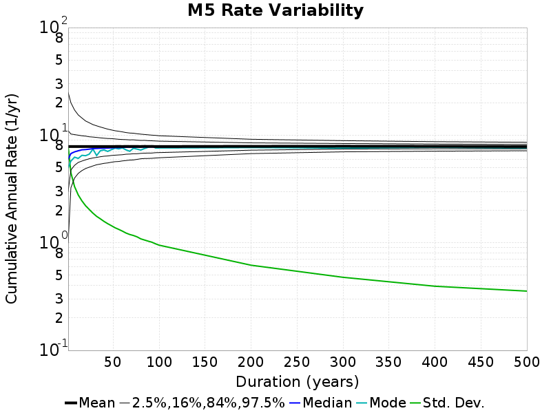

# Start 2012, 500 yr, Spontaneous, Historical Catalog Results

|   | Start 2012, 500 yr, Spontaneous, Historical Catalog |
|-----|-----|
| Num Simulations | 147 (incomplete) |
| Start Time | 2012/01/01 00:00:00 UTC |
| Start Time Epoch Milliseconds | 1325376000000 |
| Duration | 500 Years |
| Includes Spontaneous? | true |
| Trigger Ruptures | *(none)* |
| Historical Ruptures | 60366 Trigger Ruptures |
|   | First: M7.3 at 1852/01/05 04:40:39 UTC |
|   | Last: M3.2 at 2011/12/31 19:14:44 UTC |
|   | Largest: M7.9 at 1857/01/09 16:25:39 UTC |
| Config Generated With | u3etas_config_builder.sh --start-year 2012 --num-simulations 1000 --duration-years 500 --include-spontaneous --historical-catalog --hpc-site USC_HPC --nodes 18 --hours 24 --queue scec |

## Table Of Contents

* [Magnitude Frequency Distribution](#magnitude-frequency-distribution)
* [Long Term Rate Variability](#long-term-rate-variability)
  * [162 Year Variability](#162-year-variability)
  * [80 Year Variability](#80-year-variability)
  * [28 Year Variability](#28-year-variability)
  * [Variability Duration Dependence](#variability-duration-dependence)
* [Simulation Stationarity](#simulation-stationarity)
* [Section Participation](#section-participation)
  * [Section Participation Plots](#section-participation-plots)
  * [Supra-Seismogenic Parent Sections Table](#supra-seismogenic-parent-sections-table)
  * [M≥6.5 Parent Sections Table](#m65-parent-sections-table)
  * [M≥7 Parent Sections Table](#m7-parent-sections-table)
  * [M≥7.5 Parent Sections Table](#m75-parent-sections-table)
  * [M≥8 Parent Sections Table](#m8-parent-sections-table)
* [Gridded Nucleation](#gridded-nucleation)
* [JSON Input File](#json-input-file)

## Magnitude Frequency Distribution
*[(top)](#table-of-contents)*

**Legend**
* **Mean** (thick black line): mean annual rate across all 147 catalogs
* **2.5%,97.5%** (thin black lines): annual rate percentiles across all 147 catalogs
* **Median** (thin blue line): median annual rate across all 147 catalogs
* **Mode** (thin cyan line): modal annual rate across all 147 catalogs (scaled to annualized value)
* **500 yr Probability** (thin red line): 500 year probability calculated as the fraction of catalogs with at least 1 occurrence
* **500 yr Supraseismogenic Probability** (thin dashed red line): same as above, but only for supraseismogenic ruptures on explicitly modeled UCERF3 faults
* **95% Conf** (light red shaded region): binomial 95% confidence bounds on probability


| Mag | Mean | 2.5 %ile | 97.5 %ile | Median | Mode | 500 yr Probability | 500 yr Supra-Seis Prob |
|-----|-----|-----|-----|-----|-----|-----|-----|
| **M&ge;5** | 7.896 | 7.228 | 8.608 | 7.868 | 7.570 | 1.000 (100.00%) | 1.000 (100.00%) |
| **M&ge;5.1** | 6.240 | 5.706 | 6.786 | 6.212 | 6.206 | 1.000 (100.00%) | 1.000 (100.00%) |
| **M&ge;5.2** | 4.936 | 4.488 | 5.430 | 4.918 | 4.932 | 1.000 (100.00%) | 1.000 (100.00%) |
| **M&ge;5.3** | 3.895 | 3.512 | 4.292 | 3.878 | 3.844 | 1.000 (100.00%) | 1.000 (100.00%) |
| **M&ge;5.4** | 3.072 | 2.786 | 3.404 | 3.060 | 3.066 | 1.000 (100.00%) | 1.000 (100.00%) |
| **M&ge;5.5** | 2.413 | 2.178 | 2.690 | 2.408 | 2.300 | 1.000 (100.00%) | 1.000 (100.00%) |
| **M&ge;5.6** | 1.888 | 1.712 | 2.132 | 1.888 | 1.910 | 1.000 (100.00%) | 1.000 (100.00%) |
| **M&ge;5.7** | 1.472 | 1.316 | 1.678 | 1.466 | 1.480 | 1.000 (100.00%) | 1.000 (100.00%) |
| **M&ge;5.8** | 1.141 | 1.022 | 1.314 | 1.144 | 1.144 | 1.000 (100.00%) | 1.000 (100.00%) |
| **M&ge;5.9** | 0.870 | 0.772 | 1.006 | 0.868 | 0.842 | 1.000 (100.00%) | 1.000 (100.00%) |
| **M&ge;6** | 0.690 | 0.592 | 0.804 | 0.684 | 0.662 | 1.000 (100.00%) | 1.000 (100.00%) |
| **M&ge;6.1** | 0.530 | 0.458 | 0.618 | 0.528 | 0.536 | 1.000 (100.00%) | 1.000 (100.00%) |
| **M&ge;6.2** | 0.419 | 0.356 | 0.482 | 0.420 | 0.420 | 1.000 (100.00%) | 1.000 (100.00%) |
| **M&ge;6.3** | 0.331 | 0.276 | 0.382 | 0.328 | 0.328 | 1.000 (100.00%) | 1.000 (100.00%) |
| **M&ge;6.4** | 0.260 | 0.216 | 0.306 | 0.260 | 0.264 | 1.000 (100.00%) | 1.000 (100.00%) |
| **M&ge;6.5** | 0.200 | 0.162 | 0.234 | 0.202 | 0.208 | 1.000 (100.00%) | 1.000 (100.00%) |
| **M&ge;6.6** | 0.156 | 0.126 | 0.190 | 0.156 | 0.142 | 1.000 (100.00%) | 1.000 (100.00%) |
| **M&ge;6.7** | 0.122 | 0.090 | 0.150 | 0.120 | 0.122 | 1.000 (100.00%) | 1.000 (100.00%) |
| **M&ge;6.8** | 0.096 | 0.068 | 0.124 | 0.096 | 0.094 | 1.000 (100.00%) | 1.000 (100.00%) |
| **M&ge;6.9** | 0.075 | 0.052 | 0.098 | 0.074 | 0.074 | 1.000 (100.00%) | 1.000 (100.00%) |
| **M&ge;7** | 0.059 | 0.042 | 0.076 | 0.058 | 0.056 | 1.000 (100.00%) | 1.000 (100.00%) |
| **M&ge;7.1** | 0.045 | 0.030 | 0.058 | 0.044 | 0.046 | 1.000 (100.00%) | 1.000 (100.00%) |
| **M&ge;7.2** | 0.034 | 0.022 | 0.048 | 0.034 | 0.034 | 1.000 (100.00%) | 1.000 (100.00%) |
| **M&ge;7.3** | 0.027 | 0.018 | 0.036 | 0.026 | 0.028 | 1.000 (100.00%) | 1.000 (100.00%) |
| **M&ge;7.4** | 0.020 | 0.012 | 0.030 | 0.020 | 0.022 | 1.000 (100.00%) | 1.000 (100.00%) |
| **M&ge;7.5** | 0.015 | 8.00E-3 | 0.024 | 0.014 | 0.014 | 1.000 (100.00%) | 1.000 (100.00%) |
| **M&ge;7.6** | 0.011 | 6.00E-3 | 0.018 | 0.012 | 0.012 | 1.000 (100.00%) | 1.000 (100.00%) |
| **M&ge;7.7** | 8.08E-3 | 4.00E-3 | 0.014 | 8.00E-3 | 8.00E-3 | 1.000 (100.00%) | 1.000 (100.00%) |
| **M&ge;7.8** | 5.59E-3 | 2.00E-3 | 0.010 | 6.00E-3 | 6.00E-3 | 0.986 (98.64%) | 0.986 (98.64%) |
| **M&ge;7.9** | 2.72E-3 | 0.000 | 6.00E-3 | 2.00E-3 | 2.00E-3 | 0.857 (85.71%) | 0.857 (85.71%) |
| **M&ge;8** | 1.63E-3 | 0.000 | 4.00E-3 | 2.00E-3 | 2.00E-3 | 0.639 (63.95%) | 0.639 (63.95%) |
| **M&ge;8.1** | 8.71E-4 | 0.000 | 4.00E-3 | 0.000 | 0.000 | 0.408 (40.82%) | 0.408 (40.82%) |
| **M&ge;8.2** | 3.95E-4 | 0.000 | 2.00E-3 | 0.000 | 0.000 | 0.184 (18.37%) | 0.184 (18.37%) |
| **M&ge;8.3** | 4.08E-5 | 0.000 | 0.000 | 0.000 | 0.000 | 0.020 (2.04%) | 0.020 (2.04%) |
| **M&ge;8.4** | 0.000 | 0.000 | 0.000 | 0.000 | 0.000 | 0.000 (0.00%) | 0.000 (0.00%) |
| **M&ge;8.5** | 0.000 | 0.000 | 0.000 | 0.000 | 0.000 | 0.000 (0.00%) | 0.000 (0.00%) |
| **M&ge;8.6** | 0.000 | 0.000 | 0.000 | 0.000 | 0.000 | 0.000 (0.00%) | 0.000 (0.00%) |
| **M&ge;8.7** | 0.000 | 0.000 | 0.000 | 0.000 | 0.000 | 0.000 (0.00%) | 0.000 (0.00%) |
| **M&ge;8.8** | 0.000 | 0.000 | 0.000 | 0.000 | 0.000 | 0.000 (0.00%) | 0.000 (0.00%) |
| **M&ge;8.9** | 0.000 | 0.000 | 0.000 | 0.000 | 0.000 | 0.000 (0.00%) | 0.000 (0.00%) |
| **M&ge;9** | 0.000 | 0.000 | 0.000 | 0.000 | 0.000 | 0.000 (0.00%) | 0.000 (0.00%) |


## Long Term Rate Variability
*[(top)](#table-of-contents)*

### 162 Year Variability
*[(top)](#table-of-contents)*


[Download CSV Here](plots/long_term_var_162yr.csv)

| **Magnitude** | Mean | Median | Mode | Std. Dev. | 2.5 %-ile | 16 %-ile | 84 %-ile | 97.5 %-ile |
|-----|-----|-----|-----|-----|-----|-----|-----|-----|
| **5.0** | 7.900325 | 7.8703704 | 7.9691358 | 0.74175805 | 6.6419754 | 7.1358023 | 8.58642 | 9.512345 |
| **5.1** | 6.2438483 | 6.2222223 | 6.5 | 0.59384966 | 5.2222223 | 5.6419754 | 6.8024693 | 7.5555553 |
| **5.2** | 4.9381456 | 4.9135804 | 5.0864196 | 0.48311642 | 4.080247 | 4.4691358 | 5.388889 | 6.0 |
| **5.3** | 3.8970633 | 3.8888888 | 3.8148148 | 0.38641977 | 3.228395 | 3.5185184 | 4.271605 | 4.740741 |
| **5.4** | 3.0736122 | 3.0617285 | 3.1296296 | 0.31251866 | 2.5123458 | 2.7654321 | 3.3765433 | 3.7160494 |
| **5.5** | 2.414938 | 2.3950617 | 2.4444444 | 0.25152224 | 1.9444444 | 2.1790123 | 2.6604939 | 2.9567902 |
| **5.6** | 1.8887489 | 1.8765432 | 1.9135803 | 0.20289047 | 1.537037 | 1.6851852 | 2.0864198 | 2.308642 |
| **5.7** | 1.4727191 | 1.462963 | 1.4691358 | 0.16529588 | 1.1975309 | 1.3148148 | 1.6481482 | 1.8024691 |
| **5.8** | 1.1419053 | 1.1296296 | 1.1172839 | 0.13496545 | 0.90123457 | 1.0123457 | 1.2901235 | 1.4135803 |
| **5.9** | 0.8711682 | 0.86419755 | 0.8765432 | 0.10967223 | 0.6851852 | 0.7592593 | 0.9876543 | 1.0925926 |
| **6.0** | 0.6904202 | 0.67901236 | 0.6728395 | 0.08957717 | 0.5308642 | 0.60493827 | 0.7777778 | 0.88271606 |
| **6.1** | 0.5305003 | 0.52469134 | 0.58641976 | 0.07520097 | 0.39506173 | 0.45679012 | 0.59876543 | 0.7037037 |
| **6.2** | 0.41888526 | 0.41358024 | 0.42592594 | 0.05931979 | 0.3148148 | 0.3580247 | 0.4691358 | 0.5493827 |
| **6.3** | 0.33075783 | 0.3271605 | 0.32098764 | 0.049269676 | 0.24691358 | 0.28395063 | 0.37654322 | 0.44444445 |
| **6.4** | 0.25976315 | 0.25925925 | 0.24691358 | 0.04181352 | 0.18518518 | 0.21604939 | 0.2962963 | 0.35185185 |
| **6.5** | 0.19972844 | 0.19753087 | 0.19135803 | 0.03637539 | 0.13580246 | 0.16049382 | 0.2345679 | 0.27160493 |
| **6.6** | 0.1558187 | 0.15432099 | 0.14814815 | 0.03104749 | 0.09876543 | 0.12345679 | 0.18518518 | 0.22222222 |
| **6.7** | 0.12173511 | 0.11728395 | 0.11728395 | 0.026749734 | 0.074074075 | 0.09259259 | 0.14814815 | 0.18518518 |
| **6.8** | 0.09665183 | 0.09259259 | 0.08024691 | 0.02400364 | 0.055555556 | 0.074074075 | 0.11728395 | 0.15432099 |
| **6.9** | 0.074717954 | 0.074074075 | 0.074074075 | 0.020756971 | 0.037037037 | 0.055555556 | 0.09259259 | 0.11728395 |
| **7.0** | 0.058606982 | 0.055555556 | 0.049382716 | 0.017900838 | 0.030864198 | 0.043209877 | 0.08024691 | 0.09876543 |
| **7.1** | 0.044553623 | 0.043209877 | 0.037037037 | 0.015519121 | 0.018518519 | 0.030864198 | 0.061728396 | 0.074074075 |
| **7.2** | 0.03388763 | 0.030864198 | 0.037037037 | 0.012982336 | 0.012345679 | 0.018518519 | 0.049382716 | 0.061728396 |
| **7.3** | 0.026776966 | 0.024691358 | 0.024691358 | 0.011223777 | 0.0061728396 | 0.018518519 | 0.037037037 | 0.049382716 |
| **7.4** | 0.020394165 | 0.018518519 | 0.018518519 | 0.009748057 | 0.0 | 0.012345679 | 0.030864198 | 0.043209877 |
| **7.5** | 0.014767224 | 0.012345679 | 0.012345679 | 0.008339741 | 0.0 | 0.0061728396 | 0.024691358 | 0.030864198 |
| **7.6** | 0.011085916 | 0.012345679 | 0.012345679 | 0.0069241985 | 0.0 | 0.0061728396 | 0.018518519 | 0.024691358 |
| **7.7** | 0.008090479 | 0.0061728396 | 0.0061728396 | 0.00578495 | 0.0 | 0.0 | 0.012345679 | 0.018518519 |
| **7.8** | 0.005626942 | 0.0061728396 | 0.0061728396 | 0.004722699 | 0.0 | 0.0 | 0.012345679 | 0.018518519 |
| **7.9** | 0.0027434842 | 0.0 | 0.0 | 0.0034681063 | 0.0 | 0.0 | 0.0061728396 | 0.012345679 |
| **8.0** | 0.0016376921 | 0.0 | 0.0 | 0.0028525172 | 0.0 | 0.0 | 0.0061728396 | 0.0061728396 |
| **8.1** | 8.818342E-4 | 0.0 | 0.0 | 0.002162497 | 0.0 | 0.0 | 0.0 | 0.0061728396 |
| **8.2** | 4.059237E-4 | 0.0 | 0.0 | 0.0015317467 | 0.0 | 0.0 | 0.0 | 0.0061728396 |
| **8.3** | 4.1992105E-5 | 0.0 | 0.0 | 5.0796877E-4 | 0.0 | 0.0 | 0.0 | 0.0 |
| **8.4** | 0.0 | 0.0 | 0.0 | 0.0 | 0.0 | 0.0 | 0.0 | 0.0 |
| **8.5** | 0.0 | 0.0 | 0.0 | 0.0 | 0.0 | 0.0 | 0.0 | 0.0 |
| **8.6** | 0.0 | 0.0 | 0.0 | 0.0 | 0.0 | 0.0 | 0.0 | 0.0 |
| **8.7** | 0.0 | 0.0 | 0.0 | 0.0 | 0.0 | 0.0 | 0.0 | 0.0 |
| **8.8** | 0.0 | 0.0 | 0.0 | 0.0 | 0.0 | 0.0 | 0.0 | 0.0 |
| **8.9** | 0.0 | 0.0 | 0.0 | 0.0 | 0.0 | 0.0 | 0.0 | 0.0 |
| **9.0** | 0.0 | 0.0 | 0.0 | 0.0 | 0.0 | 0.0 | 0.0 | 0.0 |

### 80 Year Variability
*[(top)](#table-of-contents)*


[Download CSV Here](plots/long_term_var_80yr.csv)

| **Magnitude** | Mean | Median | Mode | Std. Dev. | 2.5 %-ile | 16 %-ile | 84 %-ile | 97.5 %-ile |
|-----|-----|-----|-----|-----|-----|-----|-----|-----|
| **5.0** | 7.9045777 | 7.8 | 7.9125 | 1.132018 | 6.0125 | 6.775 | 9.025 | 10.3125 |
| **5.1** | 6.246386 | 6.1625 | 6.0 | 0.90653265 | 4.7125 | 5.325 | 7.2 | 8.175 |
| **5.2** | 4.9410715 | 4.8625 | 4.775 | 0.73033285 | 3.675 | 4.2375 | 5.6625 | 6.4625 |
| **5.3** | 3.899348 | 3.825 | 3.8125 | 0.5874201 | 2.8625 | 3.325 | 4.4875 | 5.125 |
| **5.4** | 3.0753543 | 3.0375 | 2.8875 | 0.47125447 | 2.225 | 2.6125 | 3.5625 | 4.025 |
| **5.5** | 2.4164681 | 2.3875 | 2.4375 | 0.37466526 | 1.75 | 2.05 | 2.7875 | 3.1875 |
| **5.6** | 1.8899944 | 1.8625 | 1.85 | 0.29911098 | 1.35 | 1.6 | 2.1875 | 2.5 |
| **5.7** | 1.4738804 | 1.4625 | 1.525 | 0.24488595 | 1.0625 | 1.225 | 1.725 | 1.975 |
| **5.8** | 1.1424178 | 1.1375 | 1.1375 | 0.19834663 | 0.8 | 0.95 | 1.3375 | 1.55 |
| **5.9** | 0.8715561 | 0.8625 | 0.925 | 0.15843216 | 0.5875 | 0.725 | 1.025 | 1.2 |
| **6.0** | 0.69054705 | 0.6875 | 0.725 | 0.13031724 | 0.45 | 0.5625 | 0.8125 | 0.9625 |
| **6.1** | 0.5306406 | 0.525 | 0.4625 | 0.108801775 | 0.3375 | 0.425 | 0.6375 | 0.7625 |
| **6.2** | 0.4190051 | 0.4125 | 0.425 | 0.08855086 | 0.2625 | 0.325 | 0.5 | 0.6125 |
| **6.3** | 0.33106577 | 0.325 | 0.325 | 0.07511379 | 0.2 | 0.2625 | 0.4 | 0.4875 |
| **6.4** | 0.25986394 | 0.2625 | 0.2875 | 0.06450498 | 0.15 | 0.2 | 0.325 | 0.3875 |
| **6.5** | 0.1998016 | 0.2 | 0.1875 | 0.055285636 | 0.1 | 0.15 | 0.25 | 0.3125 |
| **6.6** | 0.15585317 | 0.15 | 0.1625 | 0.046955425 | 0.075 | 0.1125 | 0.2 | 0.2625 |
| **6.7** | 0.12169784 | 0.125 | 0.1125 | 0.040097445 | 0.05 | 0.0875 | 0.1625 | 0.2125 |
| **6.8** | 0.09664115 | 0.1 | 0.075 | 0.036004804 | 0.025 | 0.0625 | 0.125 | 0.175 |
| **6.9** | 0.07482993 | 0.075 | 0.075 | 0.031328186 | 0.025 | 0.0375 | 0.1 | 0.15 |
| **7.0** | 0.058687642 | 0.0625 | 0.05 | 0.02738664 | 0.0125 | 0.025 | 0.0875 | 0.1125 |
| **7.1** | 0.04471372 | 0.0375 | 0.05 | 0.023505475 | 0.0 | 0.025 | 0.0625 | 0.1 |
| **7.2** | 0.033942744 | 0.0375 | 0.025 | 0.019561607 | 0.0 | 0.0125 | 0.05 | 0.075 |
| **7.3** | 0.026828231 | 0.025 | 0.025 | 0.017323645 | 0.0 | 0.0125 | 0.0375 | 0.0625 |
| **7.4** | 0.020422336 | 0.025 | 0.0125 | 0.01478608 | 0.0 | 0.0 | 0.0375 | 0.05 |
| **7.5** | 0.014753401 | 0.0125 | 0.0125 | 0.012664474 | 0.0 | 0.0 | 0.025 | 0.05 |
| **7.6** | 0.011082767 | 0.0125 | 0.0125 | 0.010626165 | 0.0 | 0.0 | 0.025 | 0.0375 |
| **7.7** | 0.0080782315 | 0.0125 | 0.0 | 0.009145848 | 0.0 | 0.0 | 0.0125 | 0.025 |
| **7.8** | 0.005612245 | 0.0 | 0.0 | 0.007345216 | 0.0 | 0.0 | 0.0125 | 0.025 |
| **7.9** | 0.002749433 | 0.0 | 0.0 | 0.0053821206 | 0.0 | 0.0 | 0.0125 | 0.0125 |
| **8.0** | 0.0016298186 | 0.0 | 0.0 | 0.0042533805 | 0.0 | 0.0 | 0.0 | 0.0125 |
| **8.1** | 8.6451246E-4 | 0.0 | 0.0 | 0.003173396 | 0.0 | 0.0 | 0.0 | 0.0125 |
| **8.2** | 4.1099775E-4 | 0.0 | 0.0 | 0.0022302896 | 0.0 | 0.0 | 0.0 | 0.0125 |
| **8.3** | 4.2517007E-5 | 0.0 | 0.0 | 7.2818686E-4 | 0.0 | 0.0 | 0.0 | 0.0 |
| **8.4** | 0.0 | 0.0 | 0.0 | 0.0 | 0.0 | 0.0 | 0.0 | 0.0 |
| **8.5** | 0.0 | 0.0 | 0.0 | 0.0 | 0.0 | 0.0 | 0.0 | 0.0 |
| **8.6** | 0.0 | 0.0 | 0.0 | 0.0 | 0.0 | 0.0 | 0.0 | 0.0 |
| **8.7** | 0.0 | 0.0 | 0.0 | 0.0 | 0.0 | 0.0 | 0.0 | 0.0 |
| **8.8** | 0.0 | 0.0 | 0.0 | 0.0 | 0.0 | 0.0 | 0.0 | 0.0 |
| **8.9** | 0.0 | 0.0 | 0.0 | 0.0 | 0.0 | 0.0 | 0.0 | 0.0 |
| **9.0** | 0.0 | 0.0 | 0.0 | 0.0 | 0.0 | 0.0 | 0.0 | 0.0 |

### 28 Year Variability
*[(top)](#table-of-contents)*


[Download CSV Here](plots/long_term_var_28yr.csv)

| **Magnitude** | Mean | Median | Mode | Std. Dev. | 2.5 %-ile | 16 %-ile | 84 %-ile | 97.5 %-ile |
|-----|-----|-----|-----|-----|-----|-----|-----|-----|
| **5.0** | 7.9059052 | 7.535714 | 6.928571 | 1.907405 | 5.178571 | 6.107143 | 9.821428 | 12.5 |
| **5.1** | 6.2476563 | 5.964286 | 5.785714 | 1.5295603 | 4.035714 | 4.785714 | 7.75 | 9.821428 |
| **5.2** | 4.942177 | 4.714286 | 4.285714 | 1.2286026 | 3.142857 | 3.7857144 | 6.178571 | 7.821429 |
| **5.3** | 3.90006 | 3.75 | 3.25 | 0.9883748 | 2.4285715 | 2.9642856 | 4.857143 | 6.25 |
| **5.4** | 3.0756445 | 2.9642856 | 3.0357144 | 0.79587436 | 1.8571428 | 2.3214285 | 3.857143 | 5.0 |
| **5.5** | 2.4162664 | 2.3214285 | 2.2857144 | 0.63984066 | 1.4285715 | 1.7857143 | 3.0357144 | 3.892857 |
| **5.6** | 1.8897845 | 1.8214285 | 1.7142857 | 0.50889266 | 1.0714285 | 1.3928572 | 2.392857 | 3.0357144 |
| **5.7** | 1.4735323 | 1.4285715 | 1.2857143 | 0.41280442 | 0.78571427 | 1.0714285 | 1.8928572 | 2.4285715 |
| **5.8** | 1.142457 | 1.1071428 | 1.0357143 | 0.33332118 | 0.5714286 | 0.8214286 | 1.4642857 | 1.8928572 |
| **5.9** | 0.87170583 | 0.85714287 | 0.78571427 | 0.26550108 | 0.42857143 | 0.60714287 | 1.1428572 | 1.4642857 |
| **6.0** | 0.6904333 | 0.6785714 | 0.64285713 | 0.22053112 | 0.32142857 | 0.4642857 | 0.89285713 | 1.1785715 |
| **6.1** | 0.5305122 | 0.53571427 | 0.53571427 | 0.18396434 | 0.21428572 | 0.35714287 | 0.71428573 | 0.9285714 |
| **6.2** | 0.41889614 | 0.39285713 | 0.35714287 | 0.15262352 | 0.17857143 | 0.2857143 | 0.5714286 | 0.75 |
| **6.3** | 0.33101812 | 0.32142857 | 0.32142857 | 0.13115618 | 0.10714286 | 0.21428572 | 0.4642857 | 0.60714287 |
| **6.4** | 0.25978962 | 0.25 | 0.25 | 0.11250642 | 0.071428575 | 0.14285715 | 0.35714287 | 0.5 |
| **6.5** | 0.19989425 | 0.17857143 | 0.17857143 | 0.09785514 | 0.035714287 | 0.10714286 | 0.2857143 | 0.42857143 |
| **6.6** | 0.15586235 | 0.14285715 | 0.10714286 | 0.08398763 | 0.035714287 | 0.071428575 | 0.25 | 0.35714287 |
| **6.7** | 0.12180586 | 0.10714286 | 0.10714286 | 0.07240399 | 0.0 | 0.035714287 | 0.17857143 | 0.2857143 |
| **6.8** | 0.09669582 | 0.071428575 | 0.071428575 | 0.06381396 | 0.0 | 0.035714287 | 0.17857143 | 0.25 |
| **6.9** | 0.074844226 | 0.071428575 | 0.035714287 | 0.05523108 | 0.0 | 0.035714287 | 0.14285715 | 0.21428572 |
| **7.0** | 0.058694907 | 0.035714287 | 0.035714287 | 0.04847156 | 0.0 | 0.0 | 0.10714286 | 0.17857143 |
| **7.1** | 0.044717886 | 0.035714287 | 0.035714287 | 0.04190569 | 0.0 | 0.0 | 0.071428575 | 0.14285715 |
| **7.2** | 0.033884984 | 0.035714287 | 0.0 | 0.03578173 | 0.0 | 0.0 | 0.071428575 | 0.10714286 |
| **7.3** | 0.026810724 | 0.035714287 | 0.0 | 0.031341 | 0.0 | 0.0 | 0.071428575 | 0.10714286 |
| **7.4** | 0.020365288 | 0.0 | 0.0 | 0.02751263 | 0.0 | 0.0 | 0.035714287 | 0.071428575 |
| **7.5** | 0.014748757 | 0.0 | 0.0 | 0.023108631 | 0.0 | 0.0 | 0.035714287 | 0.071428575 |
| **7.6** | 0.011104442 | 0.0 | 0.0 | 0.019587759 | 0.0 | 0.0 | 0.035714287 | 0.071428575 |
| **7.7** | 0.00808895 | 0.0 | 0.0 | 0.016694177 | 0.0 | 0.0 | 0.035714287 | 0.035714287 |
| **7.8** | 0.005616532 | 0.0 | 0.0 | 0.01365553 | 0.0 | 0.0 | 0.0 | 0.035714287 |
| **7.9** | 0.0027439548 | 0.0 | 0.0 | 0.009620175 | 0.0 | 0.0 | 0.0 | 0.035714287 |
| **8.0** | 0.0016435145 | 0.0 | 0.0 | 0.0074845324 | 0.0 | 0.0 | 0.0 | 0.035714287 |
| **8.1** | 8.717773E-4 | 0.0 | 0.0 | 0.0055124466 | 0.0 | 0.0 | 0.0 | 0.0 |
| **8.2** | 4.144515E-4 | 0.0 | 0.0 | 0.003825693 | 0.0 | 0.0 | 0.0 | 0.0 |
| **8.3** | 4.2874293E-5 | 0.0 | 0.0 | 0.0012369312 | 0.0 | 0.0 | 0.0 | 0.0 |
| **8.4** | 0.0 | 0.0 | 0.0 | 0.0 | 0.0 | 0.0 | 0.0 | 0.0 |
| **8.5** | 0.0 | 0.0 | 0.0 | 0.0 | 0.0 | 0.0 | 0.0 | 0.0 |
| **8.6** | 0.0 | 0.0 | 0.0 | 0.0 | 0.0 | 0.0 | 0.0 | 0.0 |
| **8.7** | 0.0 | 0.0 | 0.0 | 0.0 | 0.0 | 0.0 | 0.0 | 0.0 |
| **8.8** | 0.0 | 0.0 | 0.0 | 0.0 | 0.0 | 0.0 | 0.0 | 0.0 |
| **8.9** | 0.0 | 0.0 | 0.0 | 0.0 | 0.0 | 0.0 | 0.0 | 0.0 |
| **9.0** | 0.0 | 0.0 | 0.0 | 0.0 | 0.0 | 0.0 | 0.0 | 0.0 |

### Variability Duration Dependence
*[(top)](#table-of-contents)*



[Download CSV Here](plots/long_term_var_m5.csv)

| **Duration (years)** | Mean | Median | Mode | Std. Dev. | 2.5 %-ile | 16 %-ile | 84 %-ile | 97.5 %-ile |
|-----|-----|-----|-----|-----|-----|-----|-----|-----|
| **1.0** | 7.8957005 | 6.0 | 5.0 | 8.020594 | 1.0 | 3.0 | 11.0 | 25.0 |
| **4.0** | 7.8957005 | 6.75 | 5.75 | 4.5400333 | 3.25 | 4.75 | 10.5 | 20.5 |
| **8.0** | 7.898686 | 7.125 | 6.5 | 3.3736985 | 4.0 | 5.25 | 10.25 | 17.375 |
| **12.0** | 7.9007382 | 7.25 | 6.4166665 | 2.8209043 | 4.4166665 | 5.5833335 | 10.083333 | 15.75 |
| **16.0** | 7.898686 | 7.3125 | 6.3125 | 2.4854906 | 4.6875 | 5.8125 | 9.9375 | 14.625 |
| **20.0** | 7.8957005 | 7.4 | 7.2 | 2.2461414 | 4.9 | 5.9 | 9.9 | 13.7 |
| **24.0** | 7.9045777 | 7.5 | 7.0 | 2.0683155 | 5.0416665 | 6.0416665 | 9.791667 | 13.125 |
| **28.0** | 7.9059052 | 7.535714 | 6.928571 | 1.907405 | 5.178571 | 6.107143 | 9.821428 | 12.5 |
| **32.0** | 7.9045777 | 7.5625 | 7.4375 | 1.7900715 | 5.3125 | 6.25 | 9.65625 | 12.25 |
| **36.0** | 7.9067245 | 7.611111 | 7.0833335 | 1.6911242 | 5.3055553 | 6.3333335 | 9.555555 | 12.0 |
| **40.0** | 7.9045777 | 7.65 | 7.3 | 1.6182773 | 5.375 | 6.375 | 9.55 | 11.7 |
| **44.0** | 7.9013467 | 7.6136365 | 7.1136365 | 1.5534924 | 5.4772725 | 6.431818 | 9.454545 | 11.454545 |
| **48.0** | 7.9045777 | 7.6458335 | 7.0 | 1.4727361 | 5.6041665 | 6.5208335 | 9.375 | 11.270833 |
| **52.0** | 7.9067245 | 7.730769 | 7.3846154 | 1.4490044 | 5.576923 | 6.519231 | 9.365385 | 11.038462 |
| **56.0** | 7.9289207 | 7.75 | 7.5 | 1.3797619 | 5.607143 | 6.589286 | 9.303572 | 10.964286 |
| **60.0** | 7.9045777 | 7.766667 | 7.75 | 1.2964023 | 5.6833334 | 6.616667 | 9.216666 | 10.683333 |
| **64.0** | 7.9289207 | 7.828125 | 7.5 | 1.2707 | 5.796875 | 6.6875 | 9.265625 | 10.625 |
| **68.0** | 7.9059052 | 7.75 | 7.0147057 | 1.2353047 | 5.7941175 | 6.720588 | 9.161765 | 10.6029415 |
| **72.0** | 7.9369016 | 7.8055553 | 7.388889 | 1.1875528 | 5.986111 | 6.75 | 9.097222 | 10.569445 |
| **76.0** | 7.916234 | 7.8026314 | 7.9210525 | 1.1921926 | 5.9210525 | 6.7236843 | 9.078947 | 10.486842 |
| **80.0** | 7.9045777 | 7.8 | 7.9125 | 1.132018 | 6.0125 | 6.775 | 9.025 | 10.3125 |
| **84.0** | 7.9439588 | 7.797619 | 7.654762 | 1.1058156 | 6.095238 | 6.904762 | 9.059524 | 10.214286 |
| **88.0** | 7.937322 | 7.840909 | 7.4886365 | 1.0615076 | 6.125 | 6.840909 | 9.045455 | 10.090909 |
| **92.0** | 7.9157643 | 7.847826 | 8.608696 | 1.0487438 | 6.119565 | 6.804348 | 9.0 | 10.01087 |
| **96.0** | 7.9045777 | 7.8229165 | 7.625 | 1.0241883 | 6.1875 | 6.8229165 | 8.947917 | 9.989583 |
| **100.0** | 7.8957005 | 7.83 | 7.79 | 0.9914214 | 6.15 | 6.84 | 8.9 | 9.9 |
| **200.0** | 7.954745 | 7.955 | 8.365 | 0.6688923 | 6.725 | 7.27 | 8.585 | 9.33 |
| **300.0** | 7.973651 | 7.96 | 8.223333 | 0.52318984 | 7.076667 | 7.44 | 8.456667 | 9.146667 |
| **400.0** | 7.954745 | 7.9425 | 8.1175 | 0.4111347 | 7.2075 | 7.4875 | 8.415 | 8.765 |
| **500.0** | 7.8957005 | 7.868 | 7.57 | 0.36205572 | 7.228 | 7.524 | 8.296 | 8.608 |


## Simulation Stationarity
*[(top)](#table-of-contents)*


## Section Participation
*[(top)](#table-of-contents)*

### Section Participation Plots
*[(top)](#table-of-contents)*

| Min Mag | Complete Catalog (including spontaneous) |
|-----|-----|
| **All Supra. Seis.** |  |
| **M&ge;6.5** |  |
| **M&ge;7** |  |
| **M&ge;7.5** |  |
| **M&ge;8** |  |

### Supra-Seismogenic Parent Sections Table
*[(top)](#table-of-contents)*

*First 10 of 310 with matching ruptures shown*

| Parent Name | Total Mean Annual Rate | Total 500 Year Prob |
|-----|-----|-----|
| San Andreas (Parkfield) | 0.043265305 | 1.0 |
| San Andreas (Creeping Section) 2011 CFM | 0.029061224 | 1.0 |
| San Andreas (Mojave S) | 0.019877551 | 1.0 |
| Mendocino | 0.017891156 | 1.0 |
| Cerro Prieto | 0.013945579 | 1.0 |
| Imperial | 0.012013606 | 1.0 |
| Brawley (Seismic Zone) alt 1 | 0.011115646 | 1.0 |
| Hayward (So) 2011 CFM | 0.009959184 | 1.0 |
| San Andreas (Offshore) 2011 CFM | 0.008108843 | 1.0 |
| Elsinore (Glen Ivy) rev | 0.008081633 | 0.9863946 |

### M≥6.5 Parent Sections Table
*[(top)](#table-of-contents)*

*First 10 of 298 with matching ruptures shown*

| Parent Name | Total Mean Annual Rate | Total 500 Year Prob |
|-----|-----|-----|
| Cerro Prieto | 0.011959184 | 1.0 |
| San Andreas (Creeping Section) 2011 CFM | 0.011360544 | 0.99319726 |
| Mendocino | 0.008884354 | 1.0 |
| Hayward (So) 2011 CFM | 0.008367347 | 1.0 |
| Imperial | 0.007986395 | 1.0 |
| Brawley (Seismic Zone) alt 1 | 0.007659864 | 1.0 |
| San Andreas (Santa Cruz Mts) 2011 CFM | 0.007414966 | 1.0 |
| San Andreas (Mojave S) | 0.007278912 | 1.0 |
| San Andreas (San Bernardino N) | 0.0069931974 | 0.99319726 |
| San Andreas (Cholame) rev | 0.0062857145 | 1.0 |

### M≥7 Parent Sections Table
*[(top)](#table-of-contents)*

*First 10 of 254 with matching ruptures shown*

| Parent Name | Total Mean Annual Rate | Total 500 Year Prob |
|-----|-----|-----|
| San Andreas (Creeping Section) 2011 CFM | 0.007251701 | 0.99319726 |
| San Andreas (Carrizo) rev | 0.006027211 | 1.0 |
| San Andreas (Cholame) rev | 0.005904762 | 1.0 |
| San Andreas (Santa Cruz Mts) 2011 CFM | 0.0058503402 | 0.99319726 |
| San Andreas (Mojave S) | 0.0054285713 | 1.0 |
| San Andreas (Mojave N) | 0.0051564625 | 1.0 |
| San Andreas (San Bernardino N) | 0.0047482993 | 0.9727891 |
| San Andreas (North Coast) 2011 CFM | 0.0046666665 | 1.0 |
| San Andreas (Big Bend) | 0.0046530613 | 1.0 |
| Cerro Prieto | 0.004367347 | 0.9727891 |

### M≥7.5 Parent Sections Table
*[(top)](#table-of-contents)*

*First 10 of 165 with matching ruptures shown*

| Parent Name | Total Mean Annual Rate | Total 500 Year Prob |
|-----|-----|-----|
| San Andreas (Mojave N) | 0.0050612246 | 1.0 |
| San Andreas (Big Bend) | 0.0045170067 | 1.0 |
| San Andreas (Mojave S) | 0.0044217687 | 1.0 |
| San Andreas (Carrizo) rev | 0.00429932 | 0.99319726 |
| San Andreas (Cholame) rev | 0.0041360543 | 0.9863946 |
| San Andreas (North Coast) 2011 CFM | 0.0036734694 | 0.97959185 |
| San Andreas (Creeping Section) 2011 CFM | 0.003659864 | 0.89115644 |
| San Andreas (San Bernardino N) | 0.0035102041 | 0.9183673 |
| San Andreas (Parkfield) | 0.0030612245 | 0.9047619 |
| San Andreas (Peninsula) 2011 CFM | 0.0030612245 | 0.93877554 |

### M≥8 Parent Sections Table
*[(top)](#table-of-contents)*

*First 10 of 45 with matching ruptures shown*

| Parent Name | Total Mean Annual Rate | Total 500 Year Prob |
|-----|-----|-----|
| San Andreas (Big Bend) | 0.0014285714 | 0.585034 |
| San Andreas (Carrizo) rev | 0.0014285714 | 0.585034 |
| San Andreas (Mojave N) | 0.0014285714 | 0.585034 |
| San Andreas (Mojave S) | 0.0013877552 | 0.56462586 |
| San Andreas (Cholame) rev | 0.0013741497 | 0.56462586 |
| San Andreas (San Bernardino N) | 0.0012789116 | 0.52380955 |
| San Andreas (Parkfield) | 0.001170068 | 0.5170068 |
| San Andreas (Creeping Section) 2011 CFM | 0.0011020409 | 0.47619048 |
| San Andreas (Santa Cruz Mts) 2011 CFM | 8.027211E-4 | 0.3605442 |
| San Andreas (Peninsula) 2011 CFM | 7.07483E-4 | 0.3197279 |

## Gridded Nucleation
*[(top)](#table-of-contents)*

| Min Mag | Complete Catalog (including spontaneous) |
|-----|-----|
| **M&ge;5** |  |
| **M&ge;6** |  |
| **M&ge;7** |  |


## JSON Input File
*[(top)](#table-of-contents)*

```
{
  "numSimulations": 1000,
  "duration": 500.0,
  "startYear": 2012,
  "includeSpontaneous": true,
  "randomSeed": 1570823668349,
  "binaryOutput": true,
  "binaryOutputFilters": [
    {
      "prefix": "results_complete",
      "descendantsOnly": false
    },
    {
      "prefix": "results_m5_preserve_chain",
      "minMag": 5.0,
      "preserveChainBelowMag": true,
      "descendantsOnly": false
    }
  ],
  "forceRecalc": false,
  "simulationName": "Start 2012, 500 yr, Spontaneous, Historical Catalog",
  "numRetries": 3,
  "outputDir": "${ETAS_SIM_DIR}/2019_10_11-Start2012_500yr_Spontaneous_HistoricalCatalog",
  "triggerCatalog": "${ETAS_LAUNCHER}/inputs/u3_historical_catalog.txt",
  "triggerCatalogSurfaceMappings": "${ETAS_LAUNCHER}/inputs/u3_historical_catalog_finite_fault_mappings.xml",
  "treatTriggerCatalogAsSpontaneous": true,
  "cacheDir": "${ETAS_LAUNCHER}/inputs/cache_fm3p1_ba",
  "fssFile": "${ETAS_LAUNCHER}/inputs/2013_05_10-ucerf3p3-production-10runs_COMPOUND_SOL_FM3_1_SpatSeisU3_MEAN_BRANCH_AVG_SOL.zip",
  "probModel": "FULL_TD",
  "applySubSeisForSupraNucl": true,
  "totRateScaleFactor": 1.14,
  "gridSeisCorr": true,
  "timeIndependentERF": false,
  "griddedOnly": false,
  "imposeGR": false,
  "includeIndirectTriggering": true,
  "gridSeisDiscr": 0.1,
  "catalogCompletenessModel": "RELAXED",
  "configCommand": "u3etas_config_builder.sh --start-year 2012 --num-simulations 1000 --duration-years 500 --include-spontaneous --historical-catalog --hpc-site USC_HPC --nodes 18 --hours 24 --queue scec",
  "configTime": 1570823668349
}
```

