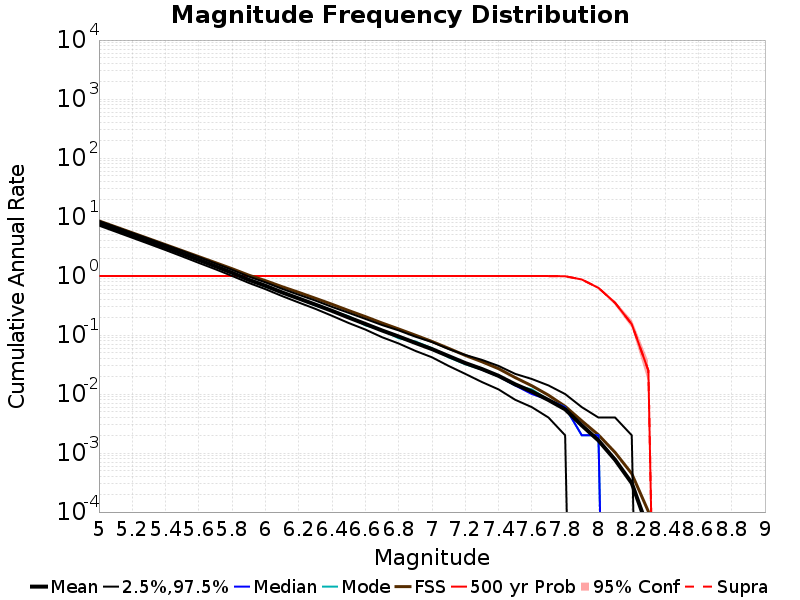
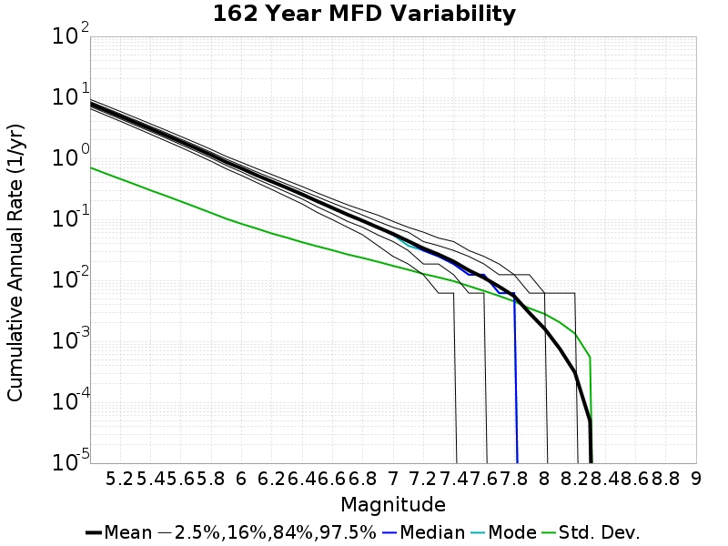
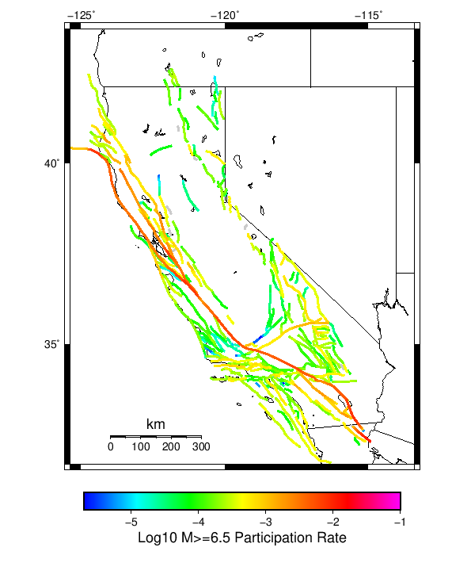

# Start 2012, 500 yr, Spontaneous, Historical Catalog Results

|   | Start 2012, 500 yr, Spontaneous, Historical Catalog |
|-----|-----|
| Num Simulations | 820 (incomplete) |
| Start Time | 2012/01/01 00:00:00 UTC |
| Start Time Epoch Milliseconds | 1325376000000 |
| Duration | 500 Years |
| Includes Spontaneous? | true |
| Trigger Ruptures | *(none)* |
| Historical Ruptures | 60366 Trigger Ruptures |
|   | First: M7.3 at 1852/01/05 04:40:39 UTC |
|   | Last: M3.2 at 2011/12/31 19:14:44 UTC |
|   | Largest: M7.9 at 1857/01/09 16:25:39 UTC |
| Config Generated With | u3etas_config_builder.sh --start-year 2012 --num-simulations 1000 --duration-years 500 --include-spontaneous --historical-catalog --hpc-site USC_HPC --nodes 18 --hours 24 --queue scec |

## Table Of Contents

* [Magnitude Frequency Distribution](#magnitude-frequency-distribution)
* [Long Term Rate Variability](#long-term-rate-variability)
  * [162 Year Variability](#162-year-variability)
  * [80 Year Variability](#80-year-variability)
  * [28 Year Variability](#28-year-variability)
  * [Variability Duration Dependence](#variability-duration-dependence)
* [Simulation Stationarity](#simulation-stationarity)
* [Section Participation](#section-participation)
  * [Section Participation Plots](#section-participation-plots)
  * [Supra-Seismogenic Parent Sections Table](#supra-seismogenic-parent-sections-table)
  * [M≥6.5 Parent Sections Table](#m65-parent-sections-table)
  * [M≥7 Parent Sections Table](#m7-parent-sections-table)
  * [M≥7.5 Parent Sections Table](#m75-parent-sections-table)
  * [M≥8 Parent Sections Table](#m8-parent-sections-table)
* [Gridded Nucleation](#gridded-nucleation)
* [JSON Input File](#json-input-file)

## Magnitude Frequency Distribution
*[(top)](#table-of-contents)*

**Legend**
* **Mean** (thick black line): mean annual rate across all 820 catalogs
* **2.5%,97.5%** (thin black lines): annual rate percentiles across all 820 catalogs
* **Median** (thin blue line): median annual rate across all 820 catalogs
* **Mode** (thin cyan line): modal annual rate across all 820 catalogs (scaled to annualized value)
* **500 yr Probability** (thin red line): 500 year probability calculated as the fraction of catalogs with at least 1 occurrence
* **500 yr Supraseismogenic Probability** (thin dashed red line): same as above, but only for supraseismogenic ruptures on explicitly modeled UCERF3 faults
* **95% Conf** (light red shaded region): binomial 95% confidence bounds on probability



| Mag | Mean | 2.5 %ile | 97.5 %ile | Median | Mode | 500 yr Probability | 500 yr Supra-Seis Prob |
|-----|-----|-----|-----|-----|-----|-----|-----|
| **M&ge;5** | 7.856 | 7.196 | 8.590 | 7.852 | 7.570 | 1.000 (100.00%) | 1.000 (100.00%) |
| **M&ge;5.1** | 6.214 | 5.680 | 6.790 | 6.200 | 6.144 | 1.000 (100.00%) | 1.000 (100.00%) |
| **M&ge;5.2** | 4.909 | 4.480 | 5.386 | 4.892 | 4.876 | 1.000 (100.00%) | 1.000 (100.00%) |
| **M&ge;5.3** | 3.875 | 3.518 | 4.270 | 3.862 | 3.810 | 1.000 (100.00%) | 1.000 (100.00%) |
| **M&ge;5.4** | 3.053 | 2.770 | 3.372 | 3.046 | 3.080 | 1.000 (100.00%) | 1.000 (100.00%) |
| **M&ge;5.5** | 2.399 | 2.164 | 2.676 | 2.392 | 2.356 | 1.000 (100.00%) | 1.000 (100.00%) |
| **M&ge;5.6** | 1.879 | 1.680 | 2.100 | 1.872 | 1.892 | 1.000 (100.00%) | 1.000 (100.00%) |
| **M&ge;5.7** | 1.467 | 1.310 | 1.638 | 1.464 | 1.468 | 1.000 (100.00%) | 1.000 (100.00%) |
| **M&ge;5.8** | 1.137 | 1.006 | 1.276 | 1.136 | 1.144 | 1.000 (100.00%) | 1.000 (100.00%) |
| **M&ge;5.9** | 0.866 | 0.768 | 0.984 | 0.864 | 0.872 | 1.000 (100.00%) | 1.000 (100.00%) |
| **M&ge;6** | 0.685 | 0.600 | 0.782 | 0.682 | 0.662 | 1.000 (100.00%) | 1.000 (100.00%) |
| **M&ge;6.1** | 0.529 | 0.460 | 0.606 | 0.528 | 0.526 | 1.000 (100.00%) | 1.000 (100.00%) |
| **M&ge;6.2** | 0.417 | 0.358 | 0.482 | 0.416 | 0.416 | 1.000 (100.00%) | 1.000 (100.00%) |
| **M&ge;6.3** | 0.329 | 0.280 | 0.382 | 0.328 | 0.318 | 1.000 (100.00%) | 1.000 (100.00%) |
| **M&ge;6.4** | 0.258 | 0.214 | 0.300 | 0.258 | 0.258 | 1.000 (100.00%) | 1.000 (100.00%) |
| **M&ge;6.5** | 0.199 | 0.162 | 0.238 | 0.200 | 0.208 | 1.000 (100.00%) | 1.000 (100.00%) |
| **M&ge;6.6** | 0.155 | 0.124 | 0.190 | 0.154 | 0.152 | 1.000 (100.00%) | 1.000 (100.00%) |
| **M&ge;6.7** | 0.120 | 0.094 | 0.148 | 0.120 | 0.122 | 1.000 (100.00%) | 1.000 (100.00%) |
| **M&ge;6.8** | 0.095 | 0.072 | 0.120 | 0.094 | 0.088 | 1.000 (100.00%) | 1.000 (100.00%) |
| **M&ge;6.9** | 0.074 | 0.054 | 0.096 | 0.074 | 0.078 | 1.000 (100.00%) | 1.000 (100.00%) |
| **M&ge;7** | 0.058 | 0.042 | 0.076 | 0.058 | 0.060 | 1.000 (100.00%) | 1.000 (100.00%) |
| **M&ge;7.1** | 0.044 | 0.030 | 0.058 | 0.044 | 0.042 | 1.000 (100.00%) | 1.000 (100.00%) |
| **M&ge;7.2** | 0.034 | 0.022 | 0.048 | 0.034 | 0.032 | 1.000 (100.00%) | 1.000 (100.00%) |
| **M&ge;7.3** | 0.027 | 0.016 | 0.038 | 0.026 | 0.026 | 1.000 (100.00%) | 1.000 (100.00%) |
| **M&ge;7.4** | 0.020 | 0.012 | 0.032 | 0.020 | 0.020 | 1.000 (100.00%) | 1.000 (100.00%) |
| **M&ge;7.5** | 0.015 | 8.00E-3 | 0.022 | 0.014 | 0.014 | 1.000 (100.00%) | 1.000 (100.00%) |
| **M&ge;7.6** | 0.011 | 6.00E-3 | 0.018 | 0.010 | 0.012 | 1.000 (100.00%) | 1.000 (100.00%) |
| **M&ge;7.7** | 7.93E-3 | 4.00E-3 | 0.014 | 8.00E-3 | 8.00E-3 | 1.000 (100.00%) | 1.000 (100.00%) |
| **M&ge;7.8** | 5.46E-3 | 2.00E-3 | 0.010 | 6.00E-3 | 6.00E-3 | 0.993 (99.27%) | 0.993 (99.27%) |
| **M&ge;7.9** | 2.93E-3 | 0.000 | 6.00E-3 | 2.00E-3 | 2.00E-3 | 0.874 (87.44%) | 0.874 (87.44%) |
| **M&ge;8** | 1.63E-3 | 0.000 | 4.00E-3 | 2.00E-3 | 2.00E-3 | 0.633 (63.29%) | 0.633 (63.29%) |
| **M&ge;8.1** | 7.71E-4 | 0.000 | 4.00E-3 | 0.000 | 0.000 | 0.351 (35.12%) | 0.351 (35.12%) |
| **M&ge;8.2** | 3.05E-4 | 0.000 | 2.00E-3 | 0.000 | 0.000 | 0.150 (15.00%) | 0.150 (15.00%) |
| **M&ge;8.3** | 4.15E-5 | 0.000 | 0.000 | 0.000 | 0.000 | 0.021 (2.07%) | 0.021 (2.07%) |
| **M&ge;8.4** | 0.000 | 0.000 | 0.000 | 0.000 | 0.000 | 0.000 (0.00%) | 0.000 (0.00%) |
| **M&ge;8.5** | 0.000 | 0.000 | 0.000 | 0.000 | 0.000 | 0.000 (0.00%) | 0.000 (0.00%) |
| **M&ge;8.6** | 0.000 | 0.000 | 0.000 | 0.000 | 0.000 | 0.000 (0.00%) | 0.000 (0.00%) |
| **M&ge;8.7** | 0.000 | 0.000 | 0.000 | 0.000 | 0.000 | 0.000 (0.00%) | 0.000 (0.00%) |
| **M&ge;8.8** | 0.000 | 0.000 | 0.000 | 0.000 | 0.000 | 0.000 (0.00%) | 0.000 (0.00%) |
| **M&ge;8.9** | 0.000 | 0.000 | 0.000 | 0.000 | 0.000 | 0.000 (0.00%) | 0.000 (0.00%) |
| **M&ge;9** | 0.000 | 0.000 | 0.000 | 0.000 | 0.000 | 0.000 (0.00%) | 0.000 (0.00%) |


## Long Term Rate Variability
*[(top)](#table-of-contents)*

### 162 Year Variability
*[(top)](#table-of-contents)*



[Download CSV Here](plots/long_term_var_162yr.csv)

| **Magnitude** | Mean | Median | Mode | Std. Dev. | 2.5 %-ile | 16 %-ile | 84 %-ile | 97.5 %-ile |
|-----|-----|-----|-----|-----|-----|-----|-----|-----|
| **5.0** | 7.8608074 | 7.8333335 | 7.6419754 | 0.7057029 | 6.567901 | 7.148148 | 8.537037 | 9.364198 |
| **5.1** | 6.217176 | 6.203704 | 6.1666665 | 0.5678317 | 5.1790123 | 5.6358023 | 6.771605 | 7.4382715 |
| **5.2** | 4.9117007 | 4.8950615 | 5.0 | 0.46050197 | 4.080247 | 4.4506173 | 5.3641977 | 5.8950615 |
| **5.3** | 3.8773513 | 3.8580246 | 3.8395061 | 0.3718606 | 3.2160494 | 3.506173 | 4.240741 | 4.6666665 |
| **5.4** | 3.0547953 | 3.0432098 | 3.0 | 0.29897594 | 2.506173 | 2.7654321 | 3.345679 | 3.691358 |
| **5.5** | 2.4009962 | 2.3888888 | 2.3888888 | 0.2432867 | 1.9506173 | 2.1604939 | 2.6419754 | 2.9135802 |
| **5.6** | 1.8800211 | 1.8703704 | 1.8580247 | 0.19613716 | 1.5185186 | 1.6851852 | 2.074074 | 2.2839506 |
| **5.7** | 1.4680443 | 1.462963 | 1.4074074 | 0.158196 | 1.1790123 | 1.308642 | 1.6234568 | 1.7962962 |
| **5.8** | 1.1379354 | 1.1296296 | 1.1049383 | 0.12725472 | 0.89506173 | 1.0123457 | 1.2654321 | 1.4012346 |
| **5.9** | 0.86668926 | 0.86419755 | 0.8765432 | 0.1018655 | 0.67901236 | 0.7654321 | 0.9691358 | 1.074074 |
| **6.0** | 0.68618137 | 0.67901236 | 0.6666667 | 0.08434343 | 0.5308642 | 0.59876543 | 0.77160496 | 0.86419755 |
| **6.1** | 0.52965474 | 0.5308642 | 0.5308642 | 0.070241645 | 0.40123457 | 0.45679012 | 0.59876543 | 0.67901236 |
| **6.2** | 0.41776824 | 0.41358024 | 0.42592594 | 0.058066793 | 0.30864197 | 0.3580247 | 0.47530866 | 0.54320985 |
| **6.3** | 0.32952926 | 0.3271605 | 0.32098764 | 0.049542762 | 0.2345679 | 0.2777778 | 0.37654322 | 0.43209878 |
| **6.4** | 0.2583509 | 0.25925925 | 0.24691358 | 0.041903734 | 0.17901234 | 0.21604939 | 0.30246913 | 0.34567901 |
| **6.5** | 0.1991895 | 0.19753087 | 0.19753087 | 0.03597919 | 0.13580246 | 0.16049382 | 0.2345679 | 0.27160493 |
| **6.6** | 0.15522432 | 0.15432099 | 0.14814815 | 0.031154608 | 0.09876543 | 0.12345679 | 0.18518518 | 0.22222222 |
| **6.7** | 0.12023487 | 0.11728395 | 0.11728395 | 0.026570898 | 0.074074075 | 0.09259259 | 0.14814815 | 0.17901234 |
| **6.8** | 0.09517214 | 0.09259259 | 0.09259259 | 0.023449672 | 0.055555556 | 0.074074075 | 0.11728395 | 0.14197531 |
| **6.9** | 0.07400883 | 0.074074075 | 0.074074075 | 0.020267116 | 0.037037037 | 0.055555556 | 0.09259259 | 0.11728395 |
| **7.0** | 0.058042258 | 0.055555556 | 0.049382716 | 0.017351605 | 0.024691358 | 0.043209877 | 0.074074075 | 0.09259259 |
| **7.1** | 0.044125766 | 0.043209877 | 0.037037037 | 0.015008621 | 0.018518519 | 0.030864198 | 0.061728396 | 0.074074075 |
| **7.2** | 0.033692162 | 0.030864198 | 0.030864198 | 0.012856433 | 0.012345679 | 0.018518519 | 0.049382716 | 0.061728396 |
| **7.3** | 0.02668624 | 0.024691358 | 0.024691358 | 0.011254473 | 0.0061728396 | 0.018518519 | 0.037037037 | 0.049382716 |
| **7.4** | 0.020453177 | 0.018518519 | 0.018518519 | 0.009747293 | 0.0061728396 | 0.012345679 | 0.030864198 | 0.043209877 |
| **7.5** | 0.0146918595 | 0.012345679 | 0.012345679 | 0.008107217 | 0.0 | 0.0061728396 | 0.024691358 | 0.030864198 |
| **7.6** | 0.011086018 | 0.012345679 | 0.012345679 | 0.0067559993 | 0.0 | 0.0061728396 | 0.018518519 | 0.024691358 |
| **7.7** | 0.007914282 | 0.0061728396 | 0.0061728396 | 0.005572854 | 0.0 | 0.0 | 0.012345679 | 0.018518519 |
| **7.8** | 0.0054401285 | 0.0061728396 | 0.0061728396 | 0.0045112227 | 0.0 | 0.0 | 0.012345679 | 0.012345679 |
| **7.9** | 0.0029107698 | 0.0 | 0.0 | 0.0034921695 | 0.0 | 0.0 | 0.0061728396 | 0.012345679 |
| **8.0** | 0.0016109606 | 0.0 | 0.0 | 0.002812444 | 0.0 | 0.0 | 0.0061728396 | 0.0061728396 |
| **8.1** | 7.6533173E-4 | 0.0 | 0.0 | 0.0020499276 | 0.0 | 0.0 | 0.0 | 0.0061728396 |
| **8.2** | 3.036234E-4 | 0.0 | 0.0 | 0.0013351989 | 0.0 | 0.0 | 0.0 | 0.0061728396 |
| **8.3** | 4.014855E-5 | 0.0 | 0.0 | 4.963051E-4 | 0.0 | 0.0 | 0.0 | 0.0 |
| **8.4** | 0.0 | 0.0 | 0.0 | 0.0 | 0.0 | 0.0 | 0.0 | 0.0 |
| **8.5** | 0.0 | 0.0 | 0.0 | 0.0 | 0.0 | 0.0 | 0.0 | 0.0 |
| **8.6** | 0.0 | 0.0 | 0.0 | 0.0 | 0.0 | 0.0 | 0.0 | 0.0 |
| **8.7** | 0.0 | 0.0 | 0.0 | 0.0 | 0.0 | 0.0 | 0.0 | 0.0 |
| **8.8** | 0.0 | 0.0 | 0.0 | 0.0 | 0.0 | 0.0 | 0.0 | 0.0 |
| **8.9** | 0.0 | 0.0 | 0.0 | 0.0 | 0.0 | 0.0 | 0.0 | 0.0 |
| **9.0** | 0.0 | 0.0 | 0.0 | 0.0 | 0.0 | 0.0 | 0.0 | 0.0 |

### 80 Year Variability
*[(top)](#table-of-contents)*


[Download CSV Here](plots/long_term_var_80yr.csv)

| **Magnitude** | Mean | Median | Mode | Std. Dev. | 2.5 %-ile | 16 %-ile | 84 %-ile | 97.5 %-ile |
|-----|-----|-----|-----|-----|-----|-----|-----|-----|
| **5.0** | 7.862307 | 7.7625 | 7.2375 | 1.0855461 | 6.0625 | 6.7875 | 8.95 | 10.225 |
| **5.1** | 6.218364 | 6.1375 | 5.8875 | 0.87105274 | 4.7625 | 5.35 | 7.0875 | 8.125 |
| **5.2** | 4.912881 | 4.85 | 4.8375 | 0.70196533 | 3.725 | 4.2125 | 5.6125 | 6.45 |
| **5.3** | 3.8780158 | 3.825 | 3.575 | 0.5654447 | 2.9 | 3.3125 | 4.4375 | 5.1 |
| **5.4** | 3.0553303 | 3.0125 | 2.9125 | 0.4533448 | 2.275 | 2.6125 | 3.5 | 4.0375 |
| **5.5** | 2.4016361 | 2.375 | 2.275 | 0.36459944 | 1.7625 | 2.05 | 2.7625 | 3.2125 |
| **5.6** | 1.8805615 | 1.8625 | 1.7625 | 0.2931243 | 1.3625 | 1.5875 | 2.1625 | 2.5125 |
| **5.7** | 1.468595 | 1.45 | 1.4625 | 0.23556 | 1.05 | 1.2375 | 1.7 | 1.975 |
| **5.8** | 1.1383156 | 1.125 | 1.15 | 0.18893309 | 0.8 | 0.95 | 1.325 | 1.5375 |
| **5.9** | 0.8669817 | 0.8625 | 0.875 | 0.1504725 | 0.6 | 0.725 | 1.0125 | 1.1875 |
| **6.0** | 0.68638974 | 0.675 | 0.6625 | 0.12436898 | 0.4625 | 0.5625 | 0.8125 | 0.95 |
| **6.1** | 0.5298095 | 0.525 | 0.5 | 0.10301455 | 0.35 | 0.425 | 0.625 | 0.75 |
| **6.2** | 0.41794714 | 0.4125 | 0.4625 | 0.08572027 | 0.2625 | 0.325 | 0.5 | 0.6 |
| **6.3** | 0.32970783 | 0.325 | 0.325 | 0.07339786 | 0.2 | 0.2625 | 0.4 | 0.4875 |
| **6.4** | 0.25848323 | 0.25 | 0.25 | 0.06299004 | 0.15 | 0.2 | 0.325 | 0.3875 |
| **6.5** | 0.1992937 | 0.2 | 0.2 | 0.054023508 | 0.1 | 0.15 | 0.25 | 0.3125 |
| **6.6** | 0.155282 | 0.15 | 0.1375 | 0.046580333 | 0.075 | 0.1125 | 0.2 | 0.25 |
| **6.7** | 0.12024136 | 0.1125 | 0.1125 | 0.039660025 | 0.05 | 0.075 | 0.1625 | 0.2 |
| **6.8** | 0.09515498 | 0.0875 | 0.0875 | 0.035034873 | 0.0375 | 0.0625 | 0.125 | 0.175 |
| **6.9** | 0.07402693 | 0.075 | 0.0625 | 0.030581867 | 0.025 | 0.05 | 0.1 | 0.1375 |
| **7.0** | 0.058061484 | 0.05 | 0.05 | 0.026513614 | 0.0125 | 0.0375 | 0.0875 | 0.1125 |
| **7.1** | 0.044156503 | 0.0375 | 0.0375 | 0.022916313 | 0.0 | 0.025 | 0.0625 | 0.1 |
| **7.2** | 0.033686485 | 0.0375 | 0.025 | 0.019576568 | 0.0 | 0.0125 | 0.05 | 0.075 |
| **7.3** | 0.026681911 | 0.025 | 0.025 | 0.017217914 | 0.0 | 0.0125 | 0.0375 | 0.0625 |
| **7.4** | 0.020452235 | 0.025 | 0.0125 | 0.014937825 | 0.0 | 0.0 | 0.0375 | 0.05 |
| **7.5** | 0.014690041 | 0.0125 | 0.0125 | 0.01252789 | 0.0 | 0.0 | 0.025 | 0.0375 |
| **7.6** | 0.011082317 | 0.0125 | 0.0125 | 0.01054207 | 0.0 | 0.0 | 0.025 | 0.0375 |
| **7.7** | 0.007909045 | 0.0125 | 0.0 | 0.008867237 | 0.0 | 0.0 | 0.0125 | 0.025 |
| **7.8** | 0.005434451 | 0.0 | 0.0 | 0.0072812703 | 0.0 | 0.0 | 0.0125 | 0.025 |
| **7.9** | 0.002914126 | 0.0 | 0.0 | 0.005503699 | 0.0 | 0.0 | 0.0125 | 0.0125 |
| **8.0** | 0.0016082317 | 0.0 | 0.0 | 0.0042459723 | 0.0 | 0.0 | 0.0 | 0.0125 |
| **8.1** | 7.647358E-4 | 0.0 | 0.0 | 0.0029960307 | 0.0 | 0.0 | 0.0 | 0.0125 |
| **8.2** | 3.0487805E-4 | 0.0 | 0.0 | 0.0019284141 | 0.0 | 0.0 | 0.0 | 0.0 |
| **8.3** | 3.8109756E-5 | 0.0 | 0.0 | 6.8921415E-4 | 0.0 | 0.0 | 0.0 | 0.0 |
| **8.4** | 0.0 | 0.0 | 0.0 | 0.0 | 0.0 | 0.0 | 0.0 | 0.0 |
| **8.5** | 0.0 | 0.0 | 0.0 | 0.0 | 0.0 | 0.0 | 0.0 | 0.0 |
| **8.6** | 0.0 | 0.0 | 0.0 | 0.0 | 0.0 | 0.0 | 0.0 | 0.0 |
| **8.7** | 0.0 | 0.0 | 0.0 | 0.0 | 0.0 | 0.0 | 0.0 | 0.0 |
| **8.8** | 0.0 | 0.0 | 0.0 | 0.0 | 0.0 | 0.0 | 0.0 | 0.0 |
| **8.9** | 0.0 | 0.0 | 0.0 | 0.0 | 0.0 | 0.0 | 0.0 | 0.0 |
| **9.0** | 0.0 | 0.0 | 0.0 | 0.0 | 0.0 | 0.0 | 0.0 | 0.0 |

### 28 Year Variability
*[(top)](#table-of-contents)*


[Download CSV Here](plots/long_term_var_28yr.csv)

| **Magnitude** | Mean | Median | Mode | Std. Dev. | 2.5 %-ile | 16 %-ile | 84 %-ile | 97.5 %-ile |
|-----|-----|-----|-----|-----|-----|-----|-----|-----|
| **5.0** | 7.864078 | 7.5 | 7.535714 | 1.8828356 | 5.178571 | 6.142857 | 9.607142 | 12.5 |
| **5.1** | 6.2200017 | 5.964286 | 5.25 | 1.5105627 | 4.035714 | 4.821429 | 7.642857 | 9.857142 |
| **5.2** | 4.914137 | 4.714286 | 4.392857 | 1.2129375 | 3.107143 | 3.7857144 | 6.035714 | 7.821429 |
| **5.3** | 3.87903 | 3.7142856 | 3.25 | 0.973993 | 2.4285715 | 2.9642856 | 4.785714 | 6.214286 |
| **5.4** | 3.0562053 | 2.9285715 | 2.607143 | 0.7801517 | 1.8571428 | 2.3214285 | 3.7857144 | 4.928571 |
| **5.5** | 2.402165 | 2.3214285 | 2.0714285 | 0.626614 | 1.4285715 | 1.8214285 | 3.0 | 3.857143 |
| **5.6** | 1.8809285 | 1.8214285 | 1.7142857 | 0.50057167 | 1.0714285 | 1.3928572 | 2.357143 | 3.0357144 |
| **5.7** | 1.4688845 | 1.4285715 | 1.2857143 | 0.4046763 | 0.78571427 | 1.0714285 | 1.8571428 | 2.392857 |
| **5.8** | 1.138617 | 1.1071428 | 1.0357143 | 0.32529044 | 0.60714287 | 0.8214286 | 1.4642857 | 1.8928572 |
| **5.9** | 0.8672858 | 0.85714287 | 0.75 | 0.25997606 | 0.42857143 | 0.60714287 | 1.1071428 | 1.4642857 |
| **6.0** | 0.68661356 | 0.6785714 | 0.60714287 | 0.21540378 | 0.32142857 | 0.4642857 | 0.89285713 | 1.1785715 |
| **6.1** | 0.52999336 | 0.5 | 0.5 | 0.17970145 | 0.21428572 | 0.35714287 | 0.71428573 | 0.9285714 |
| **6.2** | 0.41805443 | 0.39285713 | 0.35714287 | 0.15109536 | 0.14285715 | 0.2857143 | 0.5714286 | 0.75 |
| **6.3** | 0.32983193 | 0.32142857 | 0.32142857 | 0.12995778 | 0.10714286 | 0.21428572 | 0.4642857 | 0.60714287 |
| **6.4** | 0.25853145 | 0.25 | 0.21428572 | 0.11168561 | 0.071428575 | 0.14285715 | 0.35714287 | 0.5 |
| **6.5** | 0.19936205 | 0.17857143 | 0.17857143 | 0.09588788 | 0.035714287 | 0.10714286 | 0.2857143 | 0.39285713 |
| **6.6** | 0.15532383 | 0.14285715 | 0.10714286 | 0.082780994 | 0.035714287 | 0.071428575 | 0.25 | 0.35714287 |
| **6.7** | 0.12032435 | 0.10714286 | 0.10714286 | 0.07133119 | 0.0 | 0.035714287 | 0.17857143 | 0.2857143 |
| **6.8** | 0.09517319 | 0.071428575 | 0.071428575 | 0.062368084 | 0.0 | 0.035714287 | 0.14285715 | 0.25 |
| **6.9** | 0.07403156 | 0.071428575 | 0.035714287 | 0.053896014 | 0.0 | 0.035714287 | 0.14285715 | 0.17857143 |
| **7.0** | 0.058070302 | 0.035714287 | 0.035714287 | 0.047321565 | 0.0 | 0.0 | 0.10714286 | 0.17857143 |
| **7.1** | 0.044158638 | 0.035714287 | 0.035714287 | 0.041031707 | 0.0 | 0.0 | 0.071428575 | 0.14285715 |
| **7.2** | 0.03369543 | 0.035714287 | 0.0 | 0.03519611 | 0.0 | 0.0 | 0.071428575 | 0.10714286 |
| **7.3** | 0.02670117 | 0.035714287 | 0.0 | 0.0309678 | 0.0 | 0.0 | 0.071428575 | 0.10714286 |
| **7.4** | 0.020437077 | 0.0 | 0.0 | 0.026982397 | 0.0 | 0.0 | 0.035714287 | 0.071428575 |
| **7.5** | 0.014698196 | 0.0 | 0.0 | 0.022846183 | 0.0 | 0.0 | 0.035714287 | 0.071428575 |
| **7.6** | 0.011085776 | 0.0 | 0.0 | 0.019406987 | 0.0 | 0.0 | 0.035714287 | 0.071428575 |
| **7.7** | 0.007914019 | 0.0 | 0.0 | 0.016364414 | 0.0 | 0.0 | 0.035714287 | 0.035714287 |
| **7.8** | 0.005436565 | 0.0 | 0.0 | 0.013511251 | 0.0 | 0.0 | 0.0 | 0.035714287 |
| **7.9** | 0.0029155565 | 0.0 | 0.0 | 0.009955433 | 0.0 | 0.0 | 0.0 | 0.035714287 |
| **8.0** | 0.0016140603 | 0.0 | 0.0 | 0.007431472 | 0.0 | 0.0 | 0.0 | 0.035714287 |
| **8.1** | 7.6860015E-4 | 0.0 | 0.0 | 0.0051827775 | 0.0 | 0.0 | 0.0 | 0.0 |
| **8.2** | 3.0487805E-4 | 0.0 | 0.0 | 0.0032857764 | 0.0 | 0.0 | 0.0 | 0.0 |
| **8.3** | 3.8430007E-5 | 0.0 | 0.0 | 0.0011709491 | 0.0 | 0.0 | 0.0 | 0.0 |
| **8.4** | 0.0 | 0.0 | 0.0 | 0.0 | 0.0 | 0.0 | 0.0 | 0.0 |
| **8.5** | 0.0 | 0.0 | 0.0 | 0.0 | 0.0 | 0.0 | 0.0 | 0.0 |
| **8.6** | 0.0 | 0.0 | 0.0 | 0.0 | 0.0 | 0.0 | 0.0 | 0.0 |
| **8.7** | 0.0 | 0.0 | 0.0 | 0.0 | 0.0 | 0.0 | 0.0 | 0.0 |
| **8.8** | 0.0 | 0.0 | 0.0 | 0.0 | 0.0 | 0.0 | 0.0 | 0.0 |
| **8.9** | 0.0 | 0.0 | 0.0 | 0.0 | 0.0 | 0.0 | 0.0 | 0.0 |
| **9.0** | 0.0 | 0.0 | 0.0 | 0.0 | 0.0 | 0.0 | 0.0 | 0.0 |

### Variability Duration Dependence
*[(top)](#table-of-contents)*


[Download CSV Here](plots/long_term_var_m5.csv)

| **Duration (years)** | Mean | Median | Mode | Std. Dev. | 2.5 %-ile | 16 %-ile | 84 %-ile | 97.5 %-ile |
|-----|-----|-----|-----|-----|-----|-----|-----|-----|
| **1.0** | 7.8563805 | 6.0 | 5.0 | 7.9187045 | 1.0 | 3.0 | 11.0 | 25.0 |
| **4.0** | 7.8563805 | 6.75 | 5.75 | 4.464263 | 3.25 | 4.75 | 10.25 | 20.25 |
| **8.0** | 7.8587875 | 7.0 | 6.25 | 3.3209922 | 4.0 | 5.25 | 10.125 | 17.125 |
| **12.0** | 7.860232 | 7.25 | 6.0833335 | 2.779274 | 4.4166665 | 5.5833335 | 10.0 | 15.5 |
| **16.0** | 7.8587875 | 7.3125 | 6.5 | 2.4476535 | 4.6875 | 5.75 | 9.875 | 14.4375 |
| **20.0** | 7.8563805 | 7.4 | 6.45 | 2.2053227 | 4.9 | 5.9 | 9.8 | 13.55 |
| **24.0** | 7.862307 | 7.4583335 | 6.625 | 2.0358036 | 5.0416665 | 6.0416665 | 9.708333 | 13.041667 |
| **28.0** | 7.864078 | 7.5 | 7.535714 | 1.8828356 | 5.178571 | 6.142857 | 9.607142 | 12.5 |
| **32.0** | 7.862307 | 7.53125 | 6.90625 | 1.7557142 | 5.3125 | 6.25 | 9.53125 | 12.15625 |
| **36.0** | 7.863933 | 7.5555553 | 6.6944447 | 1.6682234 | 5.388889 | 6.3055553 | 9.472222 | 11.888889 |
| **40.0** | 7.862307 | 7.6 | 7.3 | 1.5731711 | 5.475 | 6.375 | 9.4 | 11.6 |
| **44.0** | 7.8601594 | 7.590909 | 7.068182 | 1.509817 | 5.5227275 | 6.431818 | 9.318182 | 11.409091 |
| **48.0** | 7.862307 | 7.625 | 7.3333335 | 1.4437127 | 5.625 | 6.4791665 | 9.291667 | 11.166667 |
| **52.0** | 7.863933 | 7.673077 | 7.576923 | 1.3763691 | 5.673077 | 6.5384617 | 9.25 | 11.0 |
| **56.0** | 7.874186 | 7.696429 | 7.5 | 1.335353 | 5.696429 | 6.589286 | 9.178572 | 10.875 |
| **60.0** | 7.862307 | 7.7166667 | 7.7 | 1.2792765 | 5.8 | 6.6 | 9.133333 | 10.7 |
| **64.0** | 7.874186 | 7.734375 | 7.296875 | 1.2354974 | 5.84375 | 6.6875 | 9.109375 | 10.578125 |
| **68.0** | 7.864078 | 7.7352943 | 7.3382354 | 1.1984673 | 5.882353 | 6.6911764 | 9.073529 | 10.514706 |
| **72.0** | 7.8798075 | 7.75 | 7.5555553 | 1.1691365 | 5.9166665 | 6.736111 | 9.055555 | 10.444445 |
| **76.0** | 7.8699403 | 7.763158 | 7.4210525 | 1.1400062 | 5.986842 | 6.736842 | 9.0 | 10.342105 |
| **80.0** | 7.862307 | 7.7625 | 7.2375 | 1.0855461 | 6.0625 | 6.7875 | 8.95 | 10.225 |
| **84.0** | 7.882564 | 7.797619 | 7.5119047 | 1.0606986 | 6.095238 | 6.8333335 | 8.964286 | 10.154762 |
| **88.0** | 7.8778906 | 7.7954545 | 7.715909 | 1.03689 | 6.1136365 | 6.8295455 | 8.920455 | 10.090909 |
| **92.0** | 7.8703923 | 7.7826085 | 6.8152175 | 1.0123819 | 6.130435 | 6.847826 | 8.891304 | 10.054348 |
| **96.0** | 7.862307 | 7.78125 | 7.6041665 | 0.97743386 | 6.1666665 | 6.8854165 | 8.854167 | 9.958333 |
| **100.0** | 7.8563805 | 7.79 | 7.61 | 0.9505081 | 6.18 | 6.9 | 8.81 | 9.9 |
| **200.0** | 7.8932714 | 7.88 | 7.675 | 0.6204071 | 6.745 | 7.265 | 8.495 | 9.205 |
| **300.0** | 7.9133983 | 7.89 | 7.5866666 | 0.48034045 | 7.016667 | 7.443333 | 8.386666 | 8.926666 |
| **400.0** | 7.8932714 | 7.8675 | 7.7175 | 0.394134 | 7.1225 | 7.4975 | 8.2975 | 8.7275 |
| **500.0** | 7.8563805 | 7.852 | 7.57 | 0.35194317 | 7.196 | 7.502 | 8.228 | 8.59 |


## Simulation Stationarity
*[(top)](#table-of-contents)*


## Section Participation
*[(top)](#table-of-contents)*

### Section Participation Plots
*[(top)](#table-of-contents)*

| Min Mag | Complete Catalog (including spontaneous) |
|-----|-----|
| **All Supra. Seis.** |  |
| **M&ge;6.5** |  |
| **M&ge;7** |  |
| **M&ge;7.5** |  |
| **M&ge;8** |  |

### Supra-Seismogenic Parent Sections Table
*[(top)](#table-of-contents)*

*First 10 of 313 with matching ruptures shown*

| Parent Name | Total Mean Annual Rate | Total 500 Year Prob |
|-----|-----|-----|
| San Andreas (Parkfield) | 0.043082926 | 1.0 |
| San Andreas (Creeping Section) 2011 CFM | 0.029182928 | 1.0 |
| San Andreas (Mojave S) | 0.0193 | 1.0 |
| Mendocino | 0.018134147 | 1.0 |
| Cerro Prieto | 0.013636585 | 1.0 |
| Imperial | 0.011902439 | 1.0 |
| Brawley (Seismic Zone) alt 1 | 0.011148781 | 1.0 |
| Hayward (So) 2011 CFM | 0.009812195 | 0.9987805 |
| San Andreas (Offshore) 2011 CFM | 0.008485366 | 1.0 |
| Elsinore (Glen Ivy) rev | 0.008256097 | 0.99390244 |

### M≥6.5 Parent Sections Table
*[(top)](#table-of-contents)*

*First 10 of 305 with matching ruptures shown*

| Parent Name | Total Mean Annual Rate | Total 500 Year Prob |
|-----|-----|-----|
| Cerro Prieto | 0.01177561 | 1.0 |
| San Andreas (Creeping Section) 2011 CFM | 0.011278049 | 0.9987805 |
| Mendocino | 0.009109756 | 1.0 |
| Hayward (So) 2011 CFM | 0.008321951 | 0.9987805 |
| Imperial | 0.008275609 | 1.0 |
| Brawley (Seismic Zone) alt 1 | 0.007895122 | 1.0 |
| San Andreas (Mojave S) | 0.0070536584 | 1.0 |
| San Andreas (Santa Cruz Mts) 2011 CFM | 0.0070512197 | 0.997561 |
| San Andreas (San Bernardino N) | 0.00667561 | 0.99512196 |
| San Andreas (Offshore) 2011 CFM | 0.0061487807 | 0.9987805 |

### M≥7 Parent Sections Table
*[(top)](#table-of-contents)*

*First 10 of 271 with matching ruptures shown*

| Parent Name | Total Mean Annual Rate | Total 500 Year Prob |
|-----|-----|-----|
| San Andreas (Creeping Section) 2011 CFM | 0.0071 | 0.99634147 |
| San Andreas (Carrizo) rev | 0.005802439 | 1.0 |
| San Andreas (Cholame) rev | 0.0057487804 | 1.0 |
| San Andreas (Santa Cruz Mts) 2011 CFM | 0.00557561 | 0.99390244 |
| San Andreas (Mojave S) | 0.005285366 | 1.0 |
| San Andreas (Mojave N) | 0.005021951 | 1.0 |
| San Andreas (North Coast) 2011 CFM | 0.004614634 | 0.99390244 |
| San Andreas (Big Bend) | 0.004609756 | 0.9987805 |
| San Andreas (San Bernardino N) | 0.004604878 | 0.97317076 |
| San Andreas (Parkfield) | 0.004402439 | 0.9597561 |

### M≥7.5 Parent Sections Table
*[(top)](#table-of-contents)*

*First 10 of 206 with matching ruptures shown*

| Parent Name | Total Mean Annual Rate | Total 500 Year Prob |
|-----|-----|-----|
| San Andreas (Mojave N) | 0.004936585 | 1.0 |
| San Andreas (Big Bend) | 0.0044902437 | 0.99634147 |
| San Andreas (Mojave S) | 0.004363415 | 0.99634147 |
| San Andreas (Carrizo) rev | 0.0042365855 | 0.9914634 |
| San Andreas (Cholame) rev | 0.004034146 | 0.98292685 |
| San Andreas (North Coast) 2011 CFM | 0.0036756098 | 0.97439027 |
| San Andreas (San Bernardino N) | 0.0035682926 | 0.9402439 |
| San Andreas (Creeping Section) 2011 CFM | 0.0034243902 | 0.8817073 |
| San Andreas (Peninsula) 2011 CFM | 0.0030853658 | 0.9402439 |
| San Andreas (Parkfield) | 0.0030780488 | 0.9012195 |

### M≥8 Parent Sections Table
*[(top)](#table-of-contents)*

*First 10 of 61 with matching ruptures shown*

| Parent Name | Total Mean Annual Rate | Total 500 Year Prob |
|-----|-----|-----|
| San Andreas (Mojave N) | 0.0014707317 | 0.5914634 |
| San Andreas (Carrizo) rev | 0.0014634146 | 0.5926829 |
| San Andreas (Big Bend) | 0.0014609756 | 0.5926829 |
| San Andreas (Cholame) rev | 0.0014365853 | 0.5829268 |
| San Andreas (Mojave S) | 0.0014317073 | 0.5792683 |
| San Andreas (San Bernardino N) | 0.0013439024 | 0.55365855 |
| San Andreas (Parkfield) | 0.0012268292 | 0.50731707 |
| San Andreas (Creeping Section) 2011 CFM | 0.0010902439 | 0.46585366 |
| San Andreas (Santa Cruz Mts) 2011 CFM | 7.7560975E-4 | 0.35 |
| San Andreas (Peninsula) 2011 CFM | 6.9756096E-4 | 0.32317072 |

## Gridded Nucleation
*[(top)](#table-of-contents)*

| Min Mag | Complete Catalog (including spontaneous) |
|-----|-----|
| **M&ge;5** |  |
| **M&ge;6** |  |
| **M&ge;7** |  |


## JSON Input File
*[(top)](#table-of-contents)*

```
{
  "numSimulations": 1000,
  "duration": 500.0,
  "startYear": 2012,
  "includeSpontaneous": true,
  "randomSeed": 1570823668349,
  "binaryOutput": true,
  "binaryOutputFilters": [
    {
      "prefix": "results_complete",
      "descendantsOnly": false
    },
    {
      "prefix": "results_m5_preserve_chain",
      "minMag": 5.0,
      "preserveChainBelowMag": true,
      "descendantsOnly": false
    }
  ],
  "forceRecalc": false,
  "simulationName": "Start 2012, 500 yr, Spontaneous, Historical Catalog",
  "numRetries": 3,
  "outputDir": "${ETAS_SIM_DIR}/2019_10_11-Start2012_500yr_Spontaneous_HistoricalCatalog",
  "triggerCatalog": "${ETAS_LAUNCHER}/inputs/u3_historical_catalog.txt",
  "triggerCatalogSurfaceMappings": "${ETAS_LAUNCHER}/inputs/u3_historical_catalog_finite_fault_mappings.xml",
  "treatTriggerCatalogAsSpontaneous": true,
  "cacheDir": "${ETAS_LAUNCHER}/inputs/cache_fm3p1_ba",
  "fssFile": "${ETAS_LAUNCHER}/inputs/2013_05_10-ucerf3p3-production-10runs_COMPOUND_SOL_FM3_1_SpatSeisU3_MEAN_BRANCH_AVG_SOL.zip",
  "probModel": "FULL_TD",
  "applySubSeisForSupraNucl": true,
  "totRateScaleFactor": 1.14,
  "gridSeisCorr": true,
  "timeIndependentERF": false,
  "griddedOnly": false,
  "imposeGR": false,
  "includeIndirectTriggering": true,
  "gridSeisDiscr": 0.1,
  "catalogCompletenessModel": "RELAXED",
  "configCommand": "u3etas_config_builder.sh --start-year 2012 --num-simulations 1000 --duration-years 500 --include-spontaneous --historical-catalog --hpc-site USC_HPC --nodes 18 --hours 24 --queue scec",
  "configTime": 1570823668349
}
```

