# Parent Section Magnitude-Probability Distributions

## Table Of Contents

* [Airport Lake](#airport-lake)
* [Almanor 2011 CFM](#almanor-2011-cfm)
* [Anacapa-Dume alt 1](#anacapa-dume-alt-1)
* [Anaheim](#anaheim)
* [Antelope Valley 2011](#antelope-valley-2011)
* [Ash Hill](#ash-hill)
* [Baker](#baker)
* [Bartlett Springs 2011 CFM](#bartlett-springs-2011-cfm)
* [Battle Creek 2011 CFM](#battle-creek-2011-cfm)
* [Bear River fault zone](#bear-river-fault-zone)
* [Bennett Valley 2011 CFM](#bennett-valley-2011-cfm)
* [Bicycle Lake](#bicycle-lake)
* [Big Lagoon - Bald Mtn 2011 CFM](#big-lagoon---bald-mtn-2011-cfm)
* [Big Pine (Central)](#big-pine-central)
* [Big Pine (East)](#big-pine-east)
* [Big Pine (West)](#big-pine-west)
* [Blackwater](#blackwater)
* [Blue Cut](#blue-cut)
* [Brawley (Seismic Zone) alt 1](#brawley-seismic-zone-alt-1)
* [Breckenridge 2011](#breckenridge-2011)
* [Bullion Mountains](#bullion-mountains)
* [Burnt Mtn](#burnt-mtn)
* [Butano 2011 CFM](#butano-2011-cfm)
* [Cady](#cady)
* [Calaveras (Central) 2011 CFM](#calaveras-central-2011-cfm)
* [Calaveras (No) 2011 CFM](#calaveras-no-2011-cfm)
* [Calaveras (So) - Paicines extension 2011 CFM](#calaveras-so---paicines-extension-2011-cfm)
* [Calaveras (So) 2011 CFM](#calaveras-so-2011-cfm)
* [Calico-Hidalgo](#calico-hidalgo)
* [Camp Rock 2011](#camp-rock-2011)
* [Canada David (Detachment)](#canada-david-detachment)
* [Carlsbad](#carlsbad)
* [Carson Range (Genoa)](#carson-range-genoa)
* [Casmalia 2011 CFM](#casmalia-2011-cfm)
* [Cedar Mtn-Mahogany Mtn](#cedar-mtn-mahogany-mtn)
* [Cerro Prieto](#cerro-prieto)
* [Channel Islands Thrust](#channel-islands-thrust)
* [Channel Islands Western Deep Ramp](#channel-islands-western-deep-ramp)
* [Chino alt 1](#chino-alt-1)
* [Clamshell-Sawpit](#clamshell-sawpit)
* [Clayton](#clayton)
* [Cleghorn](#cleghorn)
* [Cleghorn Lake](#cleghorn-lake)
* [Cleghorn Pass](#cleghorn-pass)
* [Collayami 2011 CFM](#collayami-2011-cfm)
* [Compton](#compton)
* [Concord 2011 CFM](#concord-2011-cfm)
* [Contra Costa (Lafayette) 2011 CFM](#contra-costa-lafayette-2011-cfm)
* [Contra Costa Shear Zone (connector) 2011 CFM](#contra-costa-shear-zone-connector-2011-cfm)
* [Coronado Bank alt1](#coronado-bank-alt1)
* [Coyote Canyon](#coyote-canyon)
* [Coyote Lake](#coyote-lake)
* [Cucamonga](#cucamonga)
* [Davis Creek](#davis-creek)
* [Death Valley (Black Mtns Frontal)](#death-valley-black-mtns-frontal)
* [Death Valley (Fish Lake Valley)](#death-valley-fish-lake-valley)
* [Death Valley (No)](#death-valley-no)
* [Death Valley (So)](#death-valley-so)
* [Deep Springs](#deep-springs)
* [Del Valle](#del-valle)
* [Dog Valley](#dog-valley)
* [Dry Mountain](#dry-mountain)
* [Earthquake Valley](#earthquake-valley)
* [Earthquake Valley (No  Extension)](#earthquake-valley-no--extension)
* [Earthquake Valley (So Extension)](#earthquake-valley-so-extension)
* [East Huasna 2011 CFM](#east-huasna-2011-cfm)
* [Eaton Roughs 2011 CFM](#eaton-roughs-2011-cfm)
* [Elmore Ranch](#elmore-ranch)
* [Elsinore (Coyote Mountains)](#elsinore-coyote-mountains)
* [Elsinore (Glen Ivy) rev](#elsinore-glen-ivy-rev)
* [Elsinore (Julian)](#elsinore-julian)
* [Elsinore (Stepovers Combined)](#elsinore-stepovers-combined)
* [Elsinore (Temecula) rev](#elsinore-temecula-rev)
* [Elysian Park (Lower CFM)](#elysian-park-lower-cfm)
* [Elysian Park (Upper)](#elysian-park-upper)
* [Emerson-Copper Mtn 2011](#emerson-copper-mtn-2011)
* [Eureka Peak](#eureka-peak)
* [Fickle Hill (alt1)](#fickle-hill-alt1)
* [Fish Slough 2011 CFM](#fish-slough-2011-cfm)
* [Fitzhugh Creek](#fitzhugh-creek)
* [Fontana (Seismicity)](#fontana-seismicity)
* [Franklin 2011 CFM](#franklin-2011-cfm)
* [Garberville - Briceland 2011 CFM](#garberville---briceland-2011-cfm)
* [Garlic Springs](#garlic-springs)
* [Garlock (Central)](#garlock-central)
* [Garlock (East)](#garlock-east)
* [Garlock (West)](#garlock-west)
* [Gillem - Big Crack 2011 CFM](#gillem---big-crack-2011-cfm)
* [Goldstone Lake](#goldstone-lake)
* [Goose Lake 2011 CFM](#goose-lake-2011-cfm)
* [Gravel Hills-Harper Lk](#gravel-hills-harper-lk)
* [Great Valley 01](#great-valley-01)
* [Great Valley 02](#great-valley-02)
* [Great Valley 03 Mysterious Ridge](#great-valley-03-mysterious-ridge)
* [Great Valley 03a Dunnigan Hills](#great-valley-03a-dunnigan-hills)
* [Great Valley 04a Trout Creek](#great-valley-04a-trout-creek)
* [Great Valley 04b Gordon Valley](#great-valley-04b-gordon-valley)
* [Great Valley 05 Pittsburg - Kirby Hills alt1](#great-valley-05-pittsburg---kirby-hills-alt1)
* [Great Valley 06 (Midland) 2011 CFM alt1](#great-valley-06-midland-2011-cfm-alt1)
* [Great Valley 07 (Orestimba)](#great-valley-07-orestimba)
* [Great Valley 08 (Quinto)](#great-valley-08-quinto)
* [Great Valley 09 (Laguna Seca)](#great-valley-09-laguna-seca)
* [Great Valley 10 (Panoche)](#great-valley-10-panoche)
* [Great Valley 11](#great-valley-11)
* [Great Valley 12](#great-valley-12)
* [Great Valley 13 (Coalinga)](#great-valley-13-coalinga)
* [Great Valley 14 (Kettleman Hills)](#great-valley-14-kettleman-hills)
* [Green Valley 2011 CFM](#green-valley-2011-cfm)
* [Greenville (No) 2011 CFM](#greenville-no-2011-cfm)
* [Greenville (So) 2011 CFM](#greenville-so-2011-cfm)
* [Hartley Springs 2011 CFM](#hartley-springs-2011-cfm)
* [Hat Creek-McArthur-Mayfield](#hat-creek-mcarthur-mayfield)
* [Hayward (No) 2011 CFM](#hayward-no-2011-cfm)
* [Hayward (So) 2011 CFM](#hayward-so-2011-cfm)
* [Hayward (So) extension 2011 CFM](#hayward-so-extension-2011-cfm)
* [Hector Mine](#hector-mine)
* [Helendale-So Lockhart](#helendale-so-lockhart)
* [Hilton Creek 2011 CFM](#hilton-creek-2011-cfm)
* [Hollywood](#hollywood)
* [Holser alt 1](#holser-alt-1)
* [Homestead Valley 2011](#homestead-valley-2011)
* [Honey Lake 2011 CFM](#honey-lake-2011-cfm)
* [Hosgri](#hosgri)
* [Hosgri (Extension)](#hosgri-extension)
* [Hunter Mountain-Saline Valley](#hunter-mountain-saline-valley)
* [Hunting Creek - Bartlett Springs connector 2011](#hunting-creek---bartlett-springs-connector-2011)
* [Hunting Creek - Berryessa 2011 CFM](#hunting-creek---berryessa-2011-cfm)
* [Imperial](#imperial)
* [Incline Village 2011 CFM](#incline-village-2011-cfm)
* [Independence rev 2011](#independence-rev-2011)
* [Jess Valley](#jess-valley)
* [Johnson Valley (No) 2011 rev](#johnson-valley-no-2011-rev)
* [Joshua Tree (Seismicity)](#joshua-tree-seismicity)
* [Keddie Ridge 2011 CFM](#keddie-ridge-2011-cfm)
* [Kern Canyon (Lake Isabella) 2011](#kern-canyon-lake-isabella-2011)
* [Kern Canyon (North Kern) 2011](#kern-canyon-north-kern-2011)
* [Kern Canyon (South Kern) 2011](#kern-canyon-south-kern-2011)
* [Kickapoo](#kickapoo)
* [King Range 2011 CFM](#king-range-2011-cfm)
* [La Panza 2011](#la-panza-2011)
* [Laguna Salada](#laguna-salada)
* [Lake Isabella (Seismicity)](#lake-isabella-seismicity)
* [Las Positas](#las-positas)
* [Last Chance](#last-chance)
* [Lenwood-Lockhart-Old Woman Springs](#lenwood-lockhart-old-woman-springs)
* [Likely 2011 CFM](#likely-2011-cfm)
* [Lions Head 2011 CFM](#lions-head-2011-cfm)
* [Little Lake](#little-lake)
* [Little Salmon (Offshore)](#little-salmon-offshore)
* [Little Salmon (Onshore)](#little-salmon-onshore)
* [Los Alamos 2011 CFM](#los-alamos-2011-cfm)
* [Los Alamos extension](#los-alamos-extension)
* [Los Medanos - Roe Island](#los-medanos---roe-island)
* [Los Osos 2011](#los-osos-2011)
* [Lost Hills](#lost-hills)
* [Ludlow](#ludlow)
* [Maacama 2011 CFM](#maacama-2011-cfm)
* [Mad River (alt1)](#mad-river-alt1)
* [Malibu Coast (Extension) alt 1](#malibu-coast-extension-alt-1)
* [Malibu Coast alt 1](#malibu-coast-alt-1)
* [Manix-Afton Hills](#manix-afton-hills)
* [McKinleyville (alt1)](#mckinleyville-alt1)
* [McLean Lake](#mclean-lake)
* [Mendocino](#mendocino)
* [Mission (connected) 2011 CFM](#mission-connected-2011-cfm)
* [Mission Creek](#mission-creek)
* [Mission Hills 2011](#mission-hills-2011)
* [Mission Ridge-Arroyo Parida-Santa Ana](#mission-ridge-arroyo-parida-santa-ana)
* [Mohawk Valley 2011 CFM](#mohawk-valley-2011-cfm)
* [Mono Lake 2011 CFM](#mono-lake-2011-cfm)
* [Monte Vista - Shannon 2011 CFM](#monte-vista---shannon-2011-cfm)
* [Monterey Bay-Tularcitos](#monterey-bay-tularcitos)
* [Morales (East)](#morales-east)
* [Morales (West)](#morales-west)
* [Mount Diablo Thrust North CFM](#mount-diablo-thrust-north-cfm)
* [Mount Diablo Thrust South](#mount-diablo-thrust-south)
* [Nelson Lake](#nelson-lake)
* [Newport-Inglewood (Offshore)](#newport-inglewood-offshore)
* [Newport-Inglewood alt 1](#newport-inglewood-alt-1)
* [North Frontal  (East)](#north-frontal--east)
* [North Frontal  (West)](#north-frontal--west)
* [North Salt Lake](#north-salt-lake)
* [North Tahoe 2011 CFM](#north-tahoe-2011-cfm)
* [Northridge](#northridge)
* [Northridge Hills](#northridge-hills)
* [Oak Ridge (Onshore)](#oak-ridge-onshore)
* [Oceanic - West Huasna](#oceanic---west-huasna)
* [Oceanside alt1](#oceanside-alt1)
* [Ortigalita (North)](#ortigalita-north)
* [Ortigalita (South)](#ortigalita-south)
* [Owens Valley](#owens-valley)
* [Owens Valley Keough Hot Springs](#owens-valley-keough-hot-springs)
* [Owl Lake](#owl-lake)
* [Ozena](#ozena)
* [Palos Verdes](#palos-verdes)
* [Panamint Valley](#panamint-valley)
* [Paradise](#paradise)
* [Peralta Hills](#peralta-hills)
* [Pilarcitos 2011 CFM](#pilarcitos-2011-cfm)
* [Pine Mtn](#pine-mtn)
* [Pinto Mtn](#pinto-mtn)
* [Pisgah-Bullion Mtn-Mesquite Lk](#pisgah-bullion-mtn-mesquite-lk)
* [Pitas Point (Lower West)](#pitas-point-lower-west)
* [Pitas Point (Lower)-Montalvo](#pitas-point-lower-montalvo)
* [Pittville 2011 CFM](#pittville-2011-cfm)
* [Pleito](#pleito)
* [Point Reyes 2011 CFM](#point-reyes-2011-cfm)
* [Point Reyes 2011 connector](#point-reyes-2011-connector)
* [Polaris 2011 CFM](#polaris-2011-cfm)
* [Puente Hills](#puente-hills)
* [Quien Sabe 2011 CFM](#quien-sabe-2011-cfm)
* [Raymond](#raymond)
* [Red Mountain](#red-mountain)
* [Red Pass](#red-pass)
* [Redondo Canyon alt 1](#redondo-canyon-alt-1)
* [Reliz 2011 CFM](#reliz-2011-cfm)
* [Richfield](#richfield)
* [Rinconada 2011 CFM](#rinconada-2011-cfm)
* [Robinson Creek](#robinson-creek)
* [Rocky Ledge 2011 CFM](#rocky-ledge-2011-cfm)
* [Rodgers Creek - Healdsburg 2011 CFM](#rodgers-creek---healdsburg-2011-cfm)
* [Rose Canyon](#rose-canyon)
* [Round Valley](#round-valley)
* [Russ 2011 CFM](#russ-2011-cfm)
* [San Andreas (Big Bend)](#san-andreas-big-bend)
* [San Andreas (Carrizo) rev](#san-andreas-carrizo-rev)
* [San Andreas (Cholame) rev](#san-andreas-cholame-rev)
* [San Andreas (Coachella) rev](#san-andreas-coachella-rev)
* [San Andreas (Creeping Section) 2011 CFM](#san-andreas-creeping-section-2011-cfm)
* [San Andreas (Mojave N)](#san-andreas-mojave-n)
* [San Andreas (Mojave S)](#san-andreas-mojave-s)
* [San Andreas (North Branch Mill Creek)](#san-andreas-north-branch-mill-creek)
* [San Andreas (North Coast) 2011 CFM](#san-andreas-north-coast-2011-cfm)
* [San Andreas (Offshore) 2011 CFM](#san-andreas-offshore-2011-cfm)
* [San Andreas (Parkfield)](#san-andreas-parkfield)
* [San Andreas (Peninsula) 2011 CFM](#san-andreas-peninsula-2011-cfm)
* [San Andreas (San Bernardino N)](#san-andreas-san-bernardino-n)
* [San Andreas (San Bernardino S)](#san-andreas-san-bernardino-s)
* [San Andreas (San Gorgonio Pass-Garnet HIll)](#san-andreas-san-gorgonio-pass-garnet-hill)
* [San Andreas (Santa Cruz Mts) 2011 CFM](#san-andreas-santa-cruz-mts-2011-cfm)
* [San Cayetano](#san-cayetano)
* [San Clemente](#san-clemente)
* [San Diego Trough north alt1](#san-diego-trough-north-alt1)
* [San Diego Trough south](#san-diego-trough-south)
* [San Gabriel](#san-gabriel)
* [San Gabriel (Extension)](#san-gabriel-extension)
* [San Gorgonio Pass](#san-gorgonio-pass)
* [San Gregorio (North) 2011 CFM](#san-gregorio-north-2011-cfm)
* [San Gregorio (South) 2011 CFM](#san-gregorio-south-2011-cfm)
* [San Jacinto (Anza) rev](#san-jacinto-anza-rev)
* [San Jacinto (Borrego)](#san-jacinto-borrego)
* [San Jacinto (Clark) rev](#san-jacinto-clark-rev)
* [San Jacinto (Coyote Creek)](#san-jacinto-coyote-creek)
* [San Jacinto (Lytle Creek connector)](#san-jacinto-lytle-creek-connector)
* [San Jacinto (San Bernardino)](#san-jacinto-san-bernardino)
* [San Jacinto (San Jacinto Valley) rev](#san-jacinto-san-jacinto-valley-rev)
* [San Jacinto (Stepovers Combined)](#san-jacinto-stepovers-combined)
* [San Jacinto (Superstition Mtn)](#san-jacinto-superstition-mtn)
* [San Joaquin Hills](#san-joaquin-hills)
* [San Jose](#san-jose)
* [San Juan](#san-juan)
* [San Luis Range - Oceano 2011 CFM](#san-luis-range---oceano-2011-cfm)
* [San Luis Range - Pecho 2011 CFM](#san-luis-range---pecho-2011-cfm)
* [San Luis Range 2011 CFM](#san-luis-range-2011-cfm)
* [San Pedro Basin](#san-pedro-basin)
* [San Pedro Escarpment](#san-pedro-escarpment)
* [San Vicente](#san-vicente)
* [Santa Cruz Catalina Ridge alt1](#santa-cruz-catalina-ridge-alt1)
* [Santa Cruz Island](#santa-cruz-island)
* [Santa Monica Bay](#santa-monica-bay)
* [Santa Monica alt 1](#santa-monica-alt-1)
* [Santa Rosa Island](#santa-rosa-island)
* [Santa Susana East (connector)](#santa-susana-east-connector)
* [Santa Susana alt 1](#santa-susana-alt-1)
* [Santa Ynez (East)](#santa-ynez-east)
* [Santa Ynez (West)](#santa-ynez-west)
* [Santa Ynez River](#santa-ynez-river)
* [Sargent 2011 CFM](#sargent-2011-cfm)
* [Scodie Lineament](#scodie-lineament)
* [Sheephole](#sheephole)
* [Shoreline](#shoreline)
* [Sierra Madre](#sierra-madre)
* [Sierra Madre (San Fernando)](#sierra-madre-san-fernando)
* [Sierra Nevada  (No Extension)](#sierra-nevada--no-extension)
* [Silver Creek 2011 CFM](#silver-creek-2011-cfm)
* [Simi-Santa Rosa](#simi-santa-rosa)
* [Sisar](#sisar)
* [Skinner Flat 2011 CFM](#skinner-flat-2011-cfm)
* [So Sierra Nevada](#so-sierra-nevada)
* [South Cuyama](#south-cuyama)
* [South Klamath Lake East](#south-klamath-lake-east)
* [South Klamath Lake West](#south-klamath-lake-west)
* [Superstition Hills](#superstition-hills)
* [Surprise Valley 2011 CFM](#surprise-valley-2011-cfm)
* [Swain Ravine - Spenceville](#swain-ravine---spenceville)
* [Table Bluff](#table-bluff)
* [Tank Canyon](#tank-canyon)
* [Thirty Mile Bank](#thirty-mile-bank)
* [Tin Mountain](#tin-mountain)
* [Towne Pass](#towne-pass)
* [Trinidad (alt1)](#trinidad-alt1)
* [Ventura-Pitas Point](#ventura-pitas-point)
* [Verdugo](#verdugo)
* [Walker Spring 2011 CFM](#walker-spring-2011-cfm)
* [West Napa 2011 CFM](#west-napa-2011-cfm)
* [West Tahoe](#west-tahoe)
* [White Mountains](#white-mountains)
* [White Wolf](#white-wolf)
* [White Wolf (Extension)](#white-wolf-extension)
* [Whittier alt 1](#whittier-alt-1)
* [Wight Way 2011 CFM](#wight-way-2011-cfm)
* [Yorba Linda](#yorba-linda)
* [Zayante-Vergeles 2011 CFM](#zayante-vergeles-2011-cfm)

## Airport Lake
*[(top)](#table-of-contents)*

| 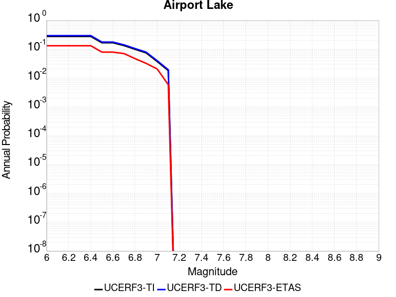 |
|-----|

| Magnitude | UCERF3-TI Prob | UCERF3-TD Prob | UCERF3-ETAS Prob |
|-----|-----|-----|-----|
| 6.0 | 0.27615035 | 0.2945599 | 0.15555556 |
| 6.1 | 0.27615035 | 0.2945599 | 0.15555556 |
| 6.2 | 0.27615035 | 0.2945599 | 0.15555556 |
| 6.3 | 0.27615035 | 0.2945599 | 0.15555556 |
| 6.4 | 0.27615035 | 0.2945599 | 0.15555556 |
| 6.5 | 0.16675177 | 0.17600289 | 0.083333336 |
| 6.6 | 0.16675177 | 0.17600289 | 0.083333336 |
| 6.7 | 0.13315807 | 0.14064927 | 0.072222225 |
| 6.8 | 0.09898019 | 0.104620054 | 0.055555556 |
| 6.9 | 0.07424423 | 0.07859979 | 0.03888889 |
| 7.0 | 0.037275415 | 0.039549794 | 0.016666668 |
| 7.1 | 0.01808444 | 0.019270038 | 0.0055555557 |

## Almanor 2011 CFM
*[(top)](#table-of-contents)*

| 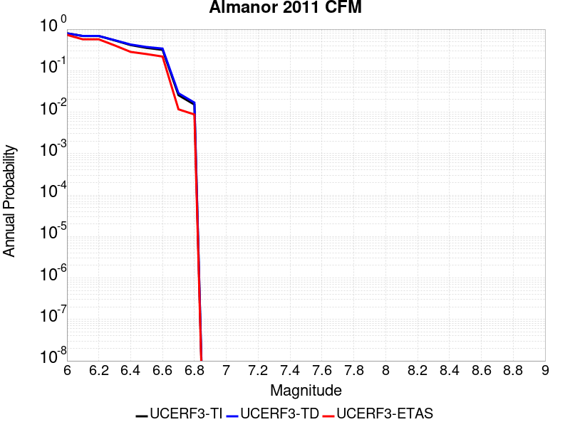 |
|-----|

| Magnitude | UCERF3-TI Prob | UCERF3-TD Prob | UCERF3-ETAS Prob |
|-----|-----|-----|-----|
| 6.0 | 0.7989123 | 0.7965178 | 0.73333335 |
| 6.1 | 0.68590397 | 0.68719494 | 0.56666666 |
| 6.2 | 0.68590397 | 0.68719494 | 0.56666666 |
| 6.3 | 0.53711045 | 0.54361296 | 0.41111112 |
| 6.4 | 0.41442928 | 0.42783225 | 0.31111112 |
| 6.5 | 0.35403186 | 0.37275383 | 0.27222222 |
| 6.6 | 0.31934333 | 0.3416175 | 0.22222222 |
| 6.7 | 0.02562773 | 0.028588885 | 0.0055555557 |
| 6.8 | 0.01518827 | 0.016975738 | 0.0055555557 |

## Anacapa-Dume alt 1
*[(top)](#table-of-contents)*

| 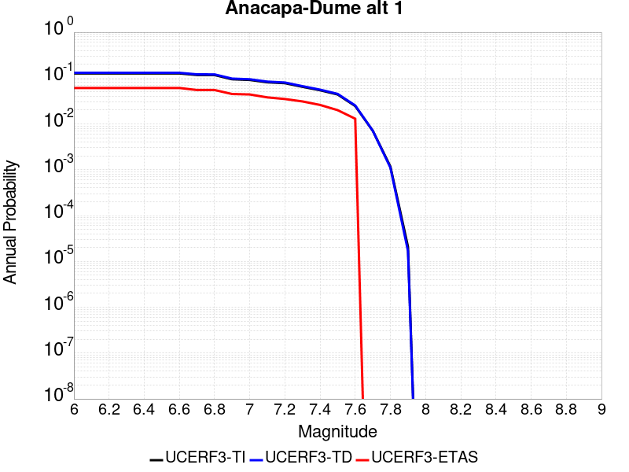 |
|-----|

| Magnitude | UCERF3-TI Prob | UCERF3-TD Prob | UCERF3-ETAS Prob |
|-----|-----|-----|-----|
| 6.0 | 0.12657252 | 0.13071764 | 0.072222225 |
| 6.1 | 0.12657252 | 0.13071764 | 0.072222225 |
| 6.2 | 0.12657252 | 0.13071764 | 0.072222225 |
| 6.3 | 0.12657252 | 0.13071764 | 0.072222225 |
| 6.4 | 0.12657252 | 0.13071764 | 0.072222225 |
| 6.5 | 0.12657252 | 0.13071764 | 0.072222225 |
| 6.6 | 0.12657252 | 0.13071764 | 0.072222225 |
| 6.7 | 0.116999194 | 0.12088894 | 0.06666667 |
| 6.8 | 0.11663192 | 0.12051214 | 0.06666667 |
| 6.9 | 0.094385244 | 0.09757063 | 0.06666667 |
| 7.0 | 0.09124036 | 0.0943389 | 0.06111111 |
| 7.1 | 0.08104312 | 0.083842725 | 0.055555556 |
| 7.2 | 0.077538654 | 0.08023573 | 0.05 |
| 7.3 | 0.06461729 | 0.066699386 | 0.044444446 |
| 7.4 | 0.05437274 | 0.056031525 | 0.03888889 |
| 7.5 | 0.043974347 | 0.045276474 | 0.022222223 |
| 7.6 | 0.024586326 | 0.025291117 | 0.011111111 |
| 7.7 | 0.0070780776 | 0.00708264 | 0.0 |
| 7.8 | 0.0011737979 | 0.0011123306 | 0.0 |
| 7.9 | 2.0890639E-5 | 1.6900693E-5 | 0.0 |

## Anaheim
*[(top)](#table-of-contents)*

| 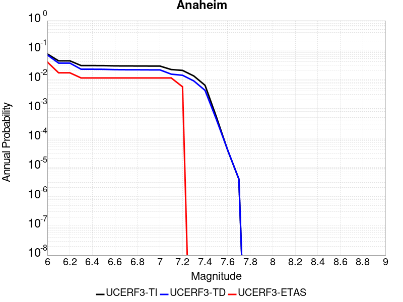 |
|-----|

| Magnitude | UCERF3-TI Prob | UCERF3-TD Prob | UCERF3-ETAS Prob |
|-----|-----|-----|-----|
| 6.0 | 0.073484324 | 0.06787157 | 0.03888889 |
| 6.1 | 0.04270786 | 0.035772506 | 0.016666668 |
| 6.2 | 0.04270786 | 0.035772506 | 0.016666668 |
| 6.3 | 0.029415451 | 0.022064479 | 0.011111111 |
| 6.4 | 0.029415451 | 0.022064479 | 0.011111111 |
| 6.5 | 0.029266685 | 0.021913193 | 0.011111111 |
| 6.6 | 0.028709846 | 0.02134637 | 0.011111111 |
| 6.7 | 0.028539374 | 0.021173289 | 0.011111111 |
| 6.8 | 0.028487021 | 0.021120196 | 0.011111111 |
| 6.9 | 0.028352376 | 0.020983791 | 0.011111111 |
| 7.0 | 0.028272767 | 0.020917073 | 0.011111111 |
| 7.1 | 0.021510389 | 0.014972456 | 0.011111111 |
| 7.2 | 0.020129707 | 0.013726091 | 0.0055555557 |
| 7.3 | 0.013003811 | 0.008807722 | 0.0 |
| 7.4 | 0.006243989 | 0.0041953623 | 0.0 |
| 7.5 | 5.2853033E-4 | 4.323732E-4 | 0.0 |
| 7.6 | 3.8797745E-5 | 3.93236E-5 | 0.0 |
| 7.7 | 3.9377246E-6 | 3.9970932E-6 | 0.0 |

## Antelope Valley 2011
*[(top)](#table-of-contents)*

| 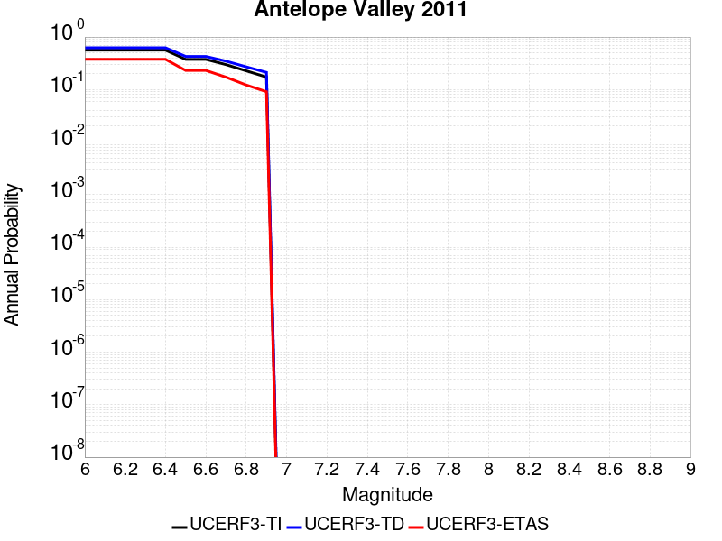 |
|-----|

| Magnitude | UCERF3-TI Prob | UCERF3-TD Prob | UCERF3-ETAS Prob |
|-----|-----|-----|-----|
| 6.0 | 0.5620537 | 0.62337154 | 0.39444444 |
| 6.1 | 0.5620537 | 0.62337154 | 0.39444444 |
| 6.2 | 0.5620537 | 0.62337154 | 0.39444444 |
| 6.3 | 0.5620537 | 0.62337154 | 0.39444444 |
| 6.4 | 0.5620537 | 0.62337154 | 0.39444444 |
| 6.5 | 0.3753109 | 0.42682013 | 0.22777778 |
| 6.6 | 0.3753109 | 0.42682013 | 0.22777778 |
| 6.7 | 0.2981062 | 0.34707096 | 0.15555556 |
| 6.8 | 0.22696762 | 0.27051714 | 0.13333334 |
| 6.9 | 0.17283754 | 0.21204762 | 0.11111111 |

## Ash Hill
*[(top)](#table-of-contents)*

| 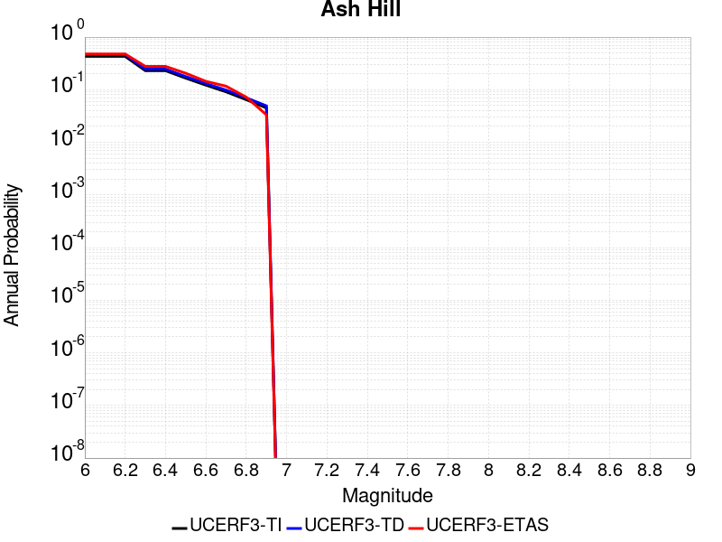 |
|-----|

| Magnitude | UCERF3-TI Prob | UCERF3-TD Prob | UCERF3-ETAS Prob |
|-----|-----|-----|-----|
| 6.0 | 0.4299989 | 0.46470094 | 0.47777778 |
| 6.1 | 0.4299989 | 0.46470094 | 0.47777778 |
| 6.2 | 0.4299989 | 0.46470094 | 0.47777778 |
| 6.3 | 0.23015048 | 0.24630177 | 0.2777778 |
| 6.4 | 0.23015048 | 0.24630177 | 0.2777778 |
| 6.5 | 0.1660879 | 0.17808323 | 0.20555556 |
| 6.6 | 0.12211306 | 0.13133095 | 0.14444445 |
| 6.7 | 0.09114263 | 0.09841293 | 0.11666667 |
| 6.8 | 0.06460619 | 0.07013607 | 0.072222225 |
| 6.9 | 0.04509049 | 0.049296554 | 0.033333335 |

## Baker
*[(top)](#table-of-contents)*

| 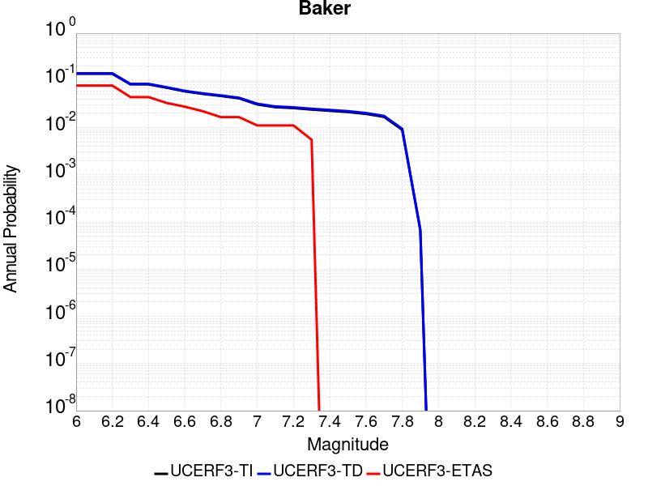 |
|-----|

| Magnitude | UCERF3-TI Prob | UCERF3-TD Prob | UCERF3-ETAS Prob |
|-----|-----|-----|-----|
| 6.0 | 0.1380798 | 0.1419995 | 0.07777778 |
| 6.1 | 0.1380798 | 0.1419995 | 0.07777778 |
| 6.2 | 0.1380798 | 0.1419995 | 0.07777778 |
| 6.3 | 0.08248248 | 0.08450414 | 0.044444446 |
| 6.4 | 0.08248248 | 0.08450414 | 0.044444446 |
| 6.5 | 0.070014015 | 0.07178686 | 0.033333335 |
| 6.6 | 0.05864197 | 0.0601937 | 0.027777778 |
| 6.7 | 0.05175786 | 0.053190194 | 0.022222223 |
| 6.8 | 0.046762772 | 0.048112582 | 0.016666668 |
| 6.9 | 0.04166041 | 0.042922817 | 0.016666668 |
| 7.0 | 0.0309689 | 0.03205182 | 0.011111111 |
| 7.1 | 0.02708242 | 0.028110968 | 0.011111111 |
| 7.2 | 0.025923347 | 0.026934968 | 0.011111111 |
| 7.3 | 0.0241229 | 0.025106883 | 0.0055555557 |
| 7.4 | 0.02272697 | 0.023682954 | 0.0 |
| 7.5 | 0.02140191 | 0.022326022 | 0.0 |
| 7.6 | 0.019514518 | 0.020388138 | 0.0 |
| 7.7 | 0.016888257 | 0.017675925 | 0.0 |
| 7.8 | 0.008982842 | 0.00944719 | 0.0 |
| 7.9 | 6.676333E-5 | 6.9493806E-5 | 0.0 |

## Bartlett Springs 2011 CFM
*[(top)](#table-of-contents)*

| 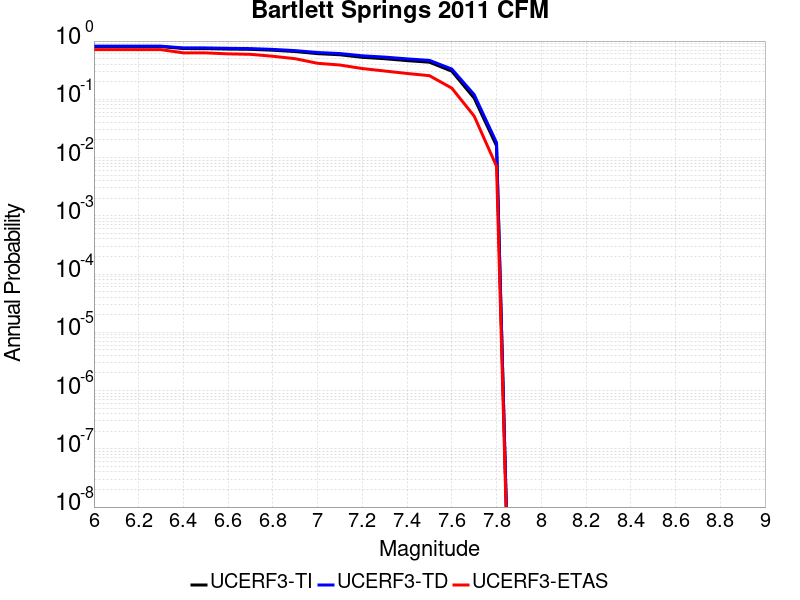 |
|-----|

| Magnitude | UCERF3-TI Prob | UCERF3-TD Prob | UCERF3-ETAS Prob |
|-----|-----|-----|-----|
| 6.0 | 0.8033039 | 0.8175372 | 0.7277778 |
| 6.1 | 0.80304927 | 0.8173008 | 0.7277778 |
| 6.2 | 0.80288804 | 0.81715035 | 0.7277778 |
| 6.3 | 0.80260426 | 0.8168902 | 0.7277778 |
| 6.4 | 0.743664 | 0.762989 | 0.65555555 |
| 6.5 | 0.74283206 | 0.7622239 | 0.65555555 |
| 6.6 | 0.729295 | 0.75039464 | 0.6333333 |
| 6.7 | 0.72101647 | 0.7428285 | 0.6166667 |
| 6.8 | 0.69631785 | 0.7195013 | 0.5555556 |
| 6.9 | 0.6607917 | 0.685539 | 0.50555557 |
| 7.0 | 0.608256 | 0.6357223 | 0.42222223 |
| 7.1 | 0.5815035 | 0.6105862 | 0.4 |
| 7.2 | 0.5260607 | 0.5586139 | 0.35555556 |
| 7.3 | 0.49750042 | 0.53061664 | 0.32777777 |
| 7.4 | 0.46169633 | 0.4945479 | 0.3 |
| 7.5 | 0.43361327 | 0.46622258 | 0.28333333 |
| 7.6 | 0.30407995 | 0.33087653 | 0.17777778 |
| 7.7 | 0.104859725 | 0.1202803 | 0.06111111 |
| 7.8 | 0.015904536 | 0.018011343 | 0.0055555557 |

## Battle Creek 2011 CFM
*[(top)](#table-of-contents)*

| 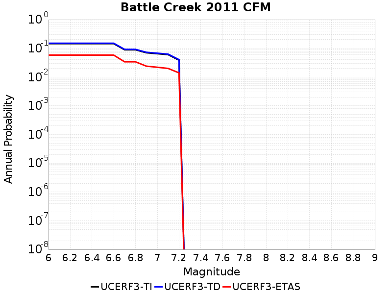 |
|-----|

| Magnitude | UCERF3-TI Prob | UCERF3-TD Prob | UCERF3-ETAS Prob |
|-----|-----|-----|-----|
| 6.0 | 0.14537989 | 0.15046614 | 0.07777778 |
| 6.1 | 0.14537989 | 0.15046614 | 0.07777778 |
| 6.2 | 0.14537989 | 0.15046614 | 0.07777778 |
| 6.3 | 0.14537989 | 0.15046614 | 0.07777778 |
| 6.4 | 0.14537989 | 0.15046614 | 0.07777778 |
| 6.5 | 0.14537989 | 0.15046614 | 0.07777778 |
| 6.6 | 0.14537989 | 0.15046614 | 0.07777778 |
| 6.7 | 0.08909873 | 0.09228991 | 0.05 |
| 6.8 | 0.08909873 | 0.09228991 | 0.05 |
| 6.9 | 0.070271984 | 0.07294671 | 0.03888889 |
| 7.0 | 0.06534632 | 0.06790391 | 0.03888889 |
| 7.1 | 0.06041359 | 0.06285276 | 0.033333335 |
| 7.2 | 0.0387308 | 0.04052324 | 0.022222223 |

## Bear River fault zone
*[(top)](#table-of-contents)*

| 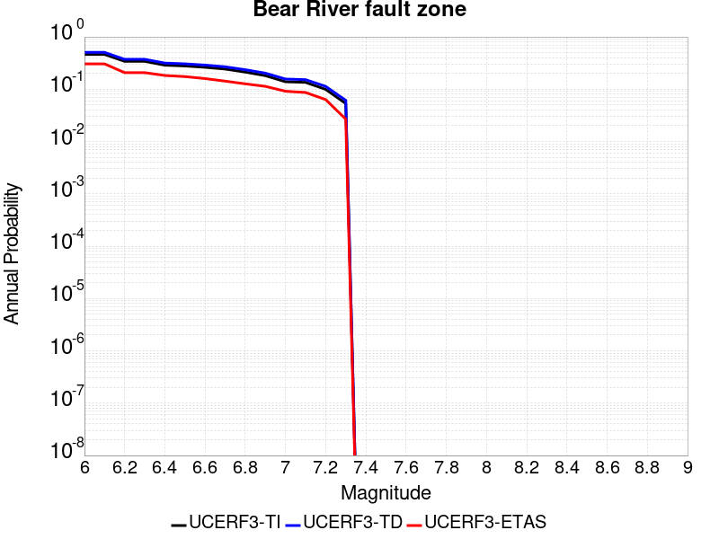 |
|-----|

| Magnitude | UCERF3-TI Prob | UCERF3-TD Prob | UCERF3-ETAS Prob |
|-----|-----|-----|-----|
| 6.0 | 0.46218297 | 0.5065365 | 0.33888888 |
| 6.1 | 0.46218297 | 0.5065365 | 0.33888888 |
| 6.2 | 0.3408064 | 0.3725993 | 0.21111111 |
| 6.3 | 0.3408064 | 0.3725993 | 0.21111111 |
| 6.4 | 0.28814155 | 0.3160588 | 0.19444445 |
| 6.5 | 0.27807578 | 0.30550456 | 0.18333334 |
| 6.6 | 0.26234362 | 0.2889038 | 0.16111112 |
| 6.7 | 0.24293955 | 0.2683288 | 0.15 |
| 6.8 | 0.21245626 | 0.23579076 | 0.14444445 |
| 6.9 | 0.18167622 | 0.20292081 | 0.12777779 |
| 7.0 | 0.13889004 | 0.15632099 | 0.08888889 |
| 7.1 | 0.1351813 | 0.15230125 | 0.083333336 |
| 7.2 | 0.09936351 | 0.113444656 | 0.06111111 |
| 7.3 | 0.05325169 | 0.061205775 | 0.033333335 |

## Bennett Valley 2011 CFM
*[(top)](#table-of-contents)*

| 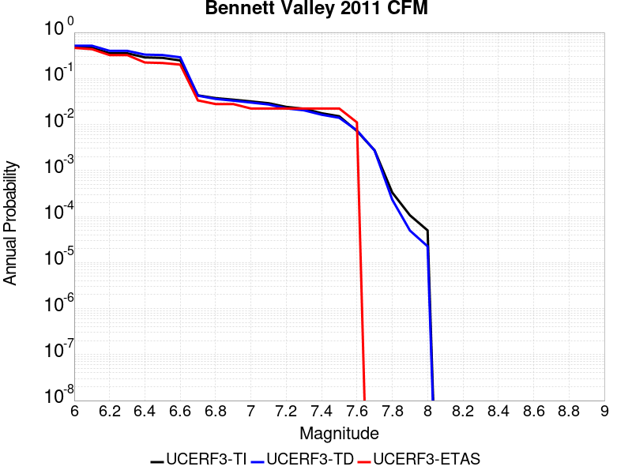 |
|-----|

| Magnitude | UCERF3-TI Prob | UCERF3-TD Prob | UCERF3-ETAS Prob |
|-----|-----|-----|-----|
| 6.0 | 0.4638724 | 0.5150874 | 0.4611111 |
| 6.1 | 0.4638724 | 0.5150874 | 0.43333334 |
| 6.2 | 0.35246128 | 0.39819732 | 0.32222223 |
| 6.3 | 0.35246128 | 0.39819732 | 0.32222223 |
| 6.4 | 0.28655204 | 0.32944918 | 0.22222222 |
| 6.5 | 0.2798319 | 0.32265428 | 0.21666667 |
| 6.6 | 0.24646841 | 0.2883798 | 0.2 |
| 6.7 | 0.042891447 | 0.04225916 | 0.033333335 |
| 6.8 | 0.037398763 | 0.035941765 | 0.027777778 |
| 6.9 | 0.03458838 | 0.032944106 | 0.027777778 |
| 7.0 | 0.03170149 | 0.029973915 | 0.022222223 |
| 7.1 | 0.028956788 | 0.027195182 | 0.022222223 |
| 7.2 | 0.024102816 | 0.022364786 | 0.022222223 |
| 7.3 | 0.021941911 | 0.020314261 | 0.022222223 |
| 7.4 | 0.017552245 | 0.016301386 | 0.022222223 |
| 7.5 | 0.015086919 | 0.013955966 | 0.022222223 |
| 7.6 | 0.007209723 | 0.0074383705 | 0.011111111 |
| 7.7 | 0.0027436628 | 0.002717789 | 0.0 |
| 7.8 | 3.3165092E-4 | 2.318344E-4 | 0.0 |
| 7.9 | 1.06331354E-4 | 4.9506478E-5 | 0.0 |
| 8.0 | 4.9897484E-5 | 2.2482835E-5 | 0.0 |

## Bicycle Lake
*[(top)](#table-of-contents)*

| 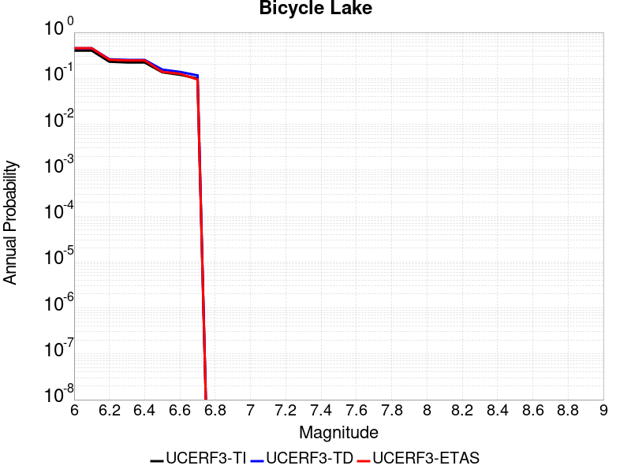 |
|-----|

| Magnitude | UCERF3-TI Prob | UCERF3-TD Prob | UCERF3-ETAS Prob |
|-----|-----|-----|-----|
| 6.0 | 0.40066126 | 0.45069712 | 0.51666665 |
| 6.1 | 0.40066126 | 0.45069712 | 0.51666665 |
| 6.2 | 0.22957984 | 0.26024032 | 0.2888889 |
| 6.3 | 0.22134136 | 0.25157622 | 0.28333333 |
| 6.4 | 0.22134136 | 0.25157622 | 0.28333333 |
| 6.5 | 0.13497512 | 0.15465346 | 0.19444445 |
| 6.6 | 0.11941355 | 0.13788523 | 0.17222223 |
| 6.7 | 0.098887675 | 0.115759194 | 0.12222222 |

## Big Lagoon - Bald Mtn 2011 CFM
*[(top)](#table-of-contents)*

| 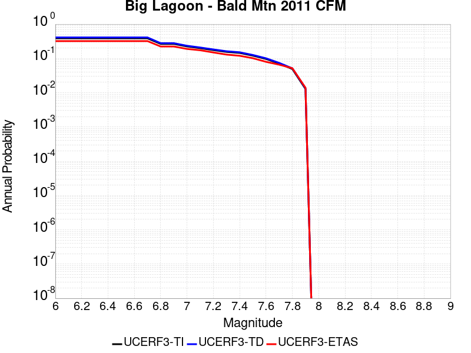 |
|-----|

| Magnitude | UCERF3-TI Prob | UCERF3-TD Prob | UCERF3-ETAS Prob |
|-----|-----|-----|-----|
| 6.0 | 0.38606566 | 0.40975413 | 0.35 |
| 6.1 | 0.38606566 | 0.40975413 | 0.35 |
| 6.2 | 0.38606566 | 0.40975413 | 0.35 |
| 6.3 | 0.38606566 | 0.40975413 | 0.35 |
| 6.4 | 0.38606566 | 0.40975413 | 0.35 |
| 6.5 | 0.38606566 | 0.40975413 | 0.35 |
| 6.6 | 0.38606566 | 0.40975413 | 0.35 |
| 6.7 | 0.38606566 | 0.40975413 | 0.35 |
| 6.8 | 0.26594636 | 0.27856052 | 0.25 |
| 6.9 | 0.26594636 | 0.27856052 | 0.25 |
| 7.0 | 0.22398506 | 0.2342809 | 0.22777778 |
| 7.1 | 0.19938157 | 0.20847525 | 0.21111111 |
| 7.2 | 0.17511459 | 0.18305439 | 0.17222223 |
| 7.3 | 0.1551891 | 0.16215582 | 0.16111112 |
| 7.4 | 0.14480816 | 0.15131003 | 0.1388889 |
| 7.5 | 0.12067553 | 0.12611298 | 0.11666667 |
| 7.6 | 0.09670176 | 0.10100765 | 0.083333336 |
| 7.7 | 0.07095411 | 0.074116014 | 0.072222225 |
| 7.8 | 0.04914156 | 0.051391006 | 0.044444446 |
| 7.9 | 0.012853368 | 0.013492676 | 0.022222223 |

## Big Pine (Central)
*[(top)](#table-of-contents)*

| 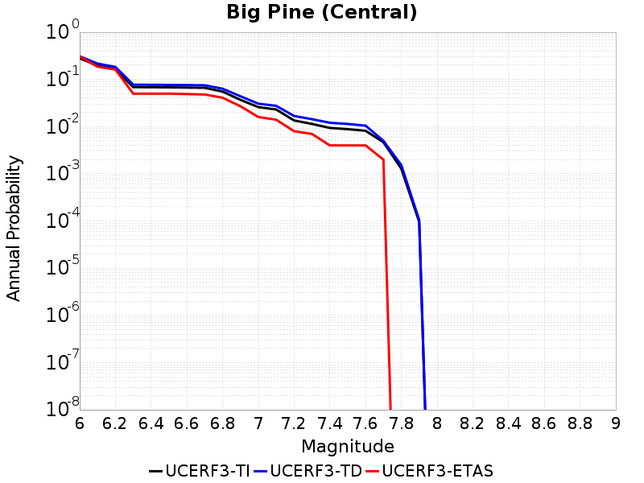 |
|-----|

| Magnitude | UCERF3-TI Prob | UCERF3-TD Prob | UCERF3-ETAS Prob |
|-----|-----|-----|-----|
| 6.0 | 0.28216267 | 0.30989593 | 0.2888889 |
| 6.1 | 0.19559535 | 0.21659178 | 0.16666667 |
| 6.2 | 0.16526437 | 0.18412705 | 0.14444445 |
| 6.3 | 0.06870762 | 0.07739337 | 0.044444446 |
| 6.4 | 0.068350345 | 0.077016786 | 0.044444446 |
| 6.5 | 0.06794906 | 0.07659342 | 0.044444446 |
| 6.6 | 0.06726561 | 0.075873785 | 0.044444446 |
| 6.7 | 0.066577025 | 0.07515319 | 0.044444446 |
| 6.8 | 0.055255387 | 0.063566424 | 0.044444446 |
| 6.9 | 0.036901042 | 0.043966316 | 0.03888889 |
| 7.0 | 0.025938489 | 0.03065555 | 0.016666668 |
| 7.1 | 0.023072042 | 0.027553013 | 0.016666668 |
| 7.2 | 0.013513856 | 0.016794158 | 0.011111111 |
| 7.3 | 0.011420051 | 0.014397934 | 0.011111111 |
| 7.4 | 0.009382009 | 0.012077711 | 0.011111111 |
| 7.5 | 0.008852296 | 0.011393243 | 0.011111111 |
| 7.6 | 0.008165982 | 0.010492465 | 0.011111111 |
| 7.7 | 0.0046779956 | 0.005008847 | 0.0 |
| 7.8 | 0.0012835753 | 0.0015274719 | 0.0 |
| 7.9 | 9.601954E-5 | 1.05200466E-4 | 0.0 |

## Big Pine (East)
*[(top)](#table-of-contents)*

| 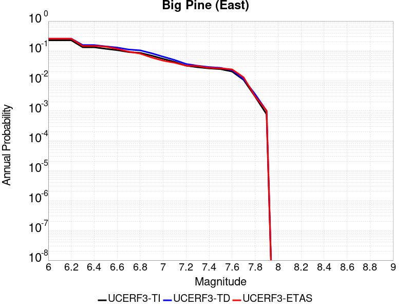 |
|-----|

| Magnitude | UCERF3-TI Prob | UCERF3-TD Prob | UCERF3-ETAS Prob |
|-----|-----|-----|-----|
| 6.0 | 0.22796582 | 0.25895286 | 0.26666668 |
| 6.1 | 0.22796582 | 0.25895286 | 0.26666668 |
| 6.2 | 0.22796582 | 0.25895286 | 0.26666668 |
| 6.3 | 0.13321312 | 0.15795757 | 0.14444445 |
| 6.4 | 0.13288058 | 0.15761387 | 0.14444445 |
| 6.5 | 0.11832097 | 0.14259963 | 0.13333334 |
| 6.6 | 0.106462784 | 0.13039245 | 0.11111111 |
| 6.7 | 0.09194227 | 0.11194498 | 0.094444446 |
| 6.8 | 0.08648425 | 0.10502403 | 0.083333336 |
| 6.9 | 0.06968629 | 0.083694346 | 0.06666667 |
| 7.0 | 0.054480344 | 0.06451787 | 0.05 |
| 7.1 | 0.04342842 | 0.04999498 | 0.05 |
| 7.2 | 0.03223786 | 0.03678322 | 0.03888889 |
| 7.3 | 0.028602043 | 0.032091137 | 0.03888889 |
| 7.4 | 0.026100531 | 0.02895703 | 0.033333335 |
| 7.5 | 0.024731142 | 0.027295094 | 0.027777778 |
| 7.6 | 0.020474885 | 0.022774719 | 0.027777778 |
| 7.7 | 0.010783591 | 0.011376284 | 0.0055555557 |
| 7.8 | 0.002987108 | 0.0036043504 | 0.0 |
| 7.9 | 7.6234667E-4 | 9.854796E-4 | 0.0 |

## Big Pine (West)
*[(top)](#table-of-contents)*

| 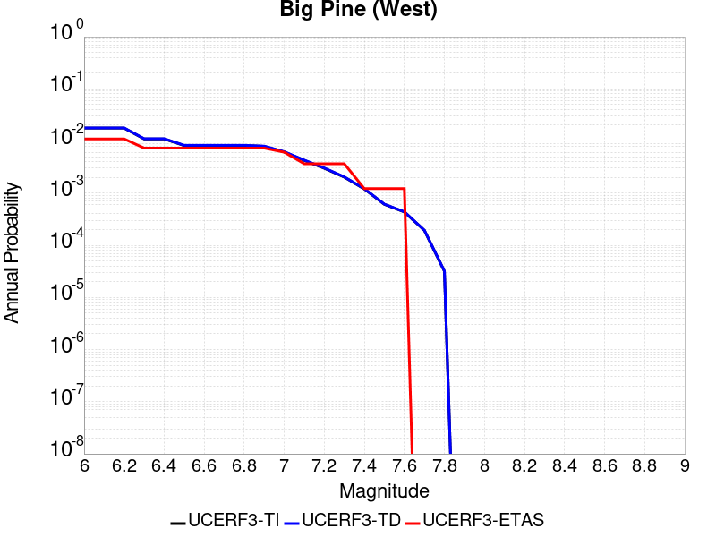 |
|-----|

| Magnitude | UCERF3-TI Prob | UCERF3-TD Prob | UCERF3-ETAS Prob |
|-----|-----|-----|-----|
| 6.0 | 0.017662957 | 0.017812816 | 0.011111111 |
| 6.1 | 0.017662957 | 0.017812816 | 0.011111111 |
| 6.2 | 0.017662957 | 0.017812816 | 0.011111111 |
| 6.3 | 0.010969041 | 0.011069173 | 0.011111111 |
| 6.4 | 0.010969041 | 0.011069173 | 0.011111111 |
| 6.5 | 0.008194387 | 0.008280337 | 0.011111111 |
| 6.6 | 0.008194387 | 0.008280337 | 0.011111111 |
| 6.7 | 0.008194387 | 0.008280337 | 0.011111111 |
| 6.8 | 0.008194387 | 0.008280337 | 0.011111111 |
| 6.9 | 0.007900317 | 0.007984206 | 0.011111111 |
| 7.0 | 0.0061571007 | 0.006224495 | 0.0055555557 |
| 7.1 | 0.004249079 | 0.0042970907 | 0.0055555557 |
| 7.2 | 0.0030019423 | 0.0030351277 | 0.0055555557 |
| 7.3 | 0.0020271165 | 0.002048152 | 0.0055555557 |
| 7.4 | 0.001201979 | 0.0012124644 | 0.0055555557 |
| 7.5 | 6.113234E-4 | 6.155101E-4 | 0.0055555557 |
| 7.6 | 4.3559016E-4 | 4.3849432E-4 | 0.0055555557 |
| 7.7 | 1.9320253E-4 | 1.9439154E-4 | 0.0 |
| 7.8 | 3.180084E-5 | 3.200216E-5 | 0.0 |

## Blackwater
*[(top)](#table-of-contents)*

|  |
|-----|

| Magnitude | UCERF3-TI Prob | UCERF3-TD Prob | UCERF3-ETAS Prob |
|-----|-----|-----|-----|
| 6.0 | 0.55119973 | 0.5929166 | 0.43333334 |
| 6.1 | 0.55119973 | 0.5929166 | 0.43333334 |
| 6.2 | 0.2632078 | 0.27990168 | 0.19444445 |
| 6.3 | 0.2632078 | 0.27990168 | 0.19444445 |
| 6.4 | 0.18687396 | 0.19860102 | 0.11666667 |
| 6.5 | 0.14229001 | 0.1512893 | 0.083333336 |
| 6.6 | 0.14229001 | 0.1512893 | 0.083333336 |
| 6.7 | 0.077006884 | 0.082056746 | 0.027777778 |
| 6.8 | 0.05755798 | 0.061417203 | 0.027777778 |
| 6.9 | 0.025630916 | 0.027447445 | 0.011111111 |
| 7.0 | 0.01228644 | 0.013191829 | 0.0 |

## Blue Cut
*[(top)](#table-of-contents)*

| 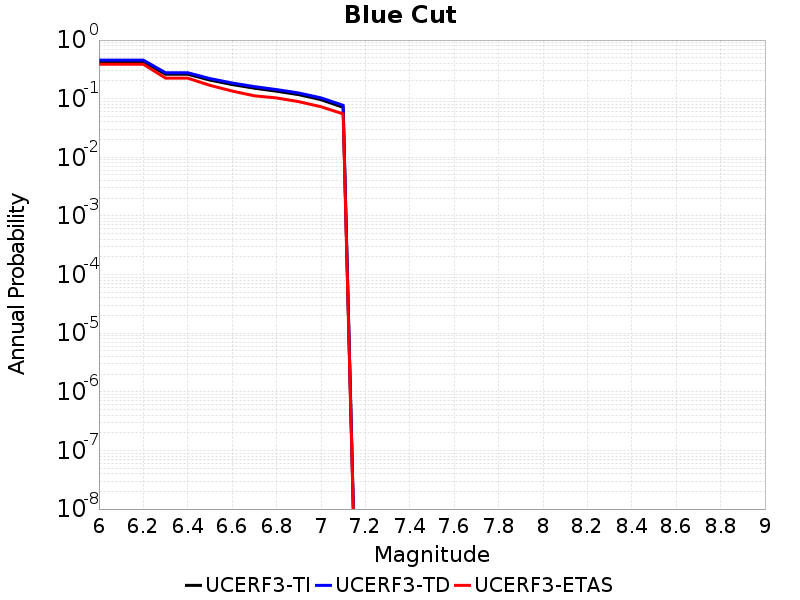 |
|-----|

| Magnitude | UCERF3-TI Prob | UCERF3-TD Prob | UCERF3-ETAS Prob |
|-----|-----|-----|-----|
| 6.0 | 0.42525503 | 0.45473942 | 0.33333334 |
| 6.1 | 0.42525503 | 0.45473942 | 0.33333334 |
| 6.2 | 0.42525503 | 0.45473942 | 0.33333334 |
| 6.3 | 0.26140255 | 0.27715364 | 0.22222222 |
| 6.4 | 0.26140255 | 0.27715364 | 0.22222222 |
| 6.5 | 0.2078567 | 0.22048667 | 0.1388889 |
| 6.6 | 0.17439243 | 0.1852142 | 0.13333334 |
| 6.7 | 0.15106933 | 0.16070408 | 0.11111111 |
| 6.8 | 0.13420075 | 0.14300199 | 0.10555556 |
| 6.9 | 0.11719862 | 0.1251623 | 0.08888889 |
| 7.0 | 0.09634655 | 0.10330797 | 0.072222225 |
| 7.1 | 0.07131406 | 0.076994404 | 0.06666667 |

## Brawley (Seismic Zone) alt 1
*[(top)](#table-of-contents)*

| 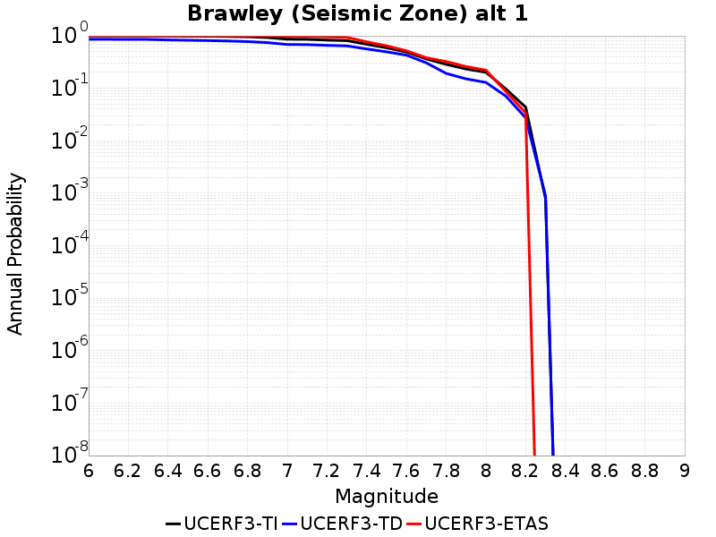 |
|-----|

| Magnitude | UCERF3-TI Prob | UCERF3-TD Prob | UCERF3-ETAS Prob |
|-----|-----|-----|-----|
| 6.0 | 0.9971951 | 0.8594076 | 1.0 |
| 6.1 | 0.9971951 | 0.8594076 | 1.0 |
| 6.2 | 0.99677056 | 0.85638 | 1.0 |
| 6.3 | 0.99652815 | 0.854633 | 1.0 |
| 6.4 | 0.9925174 | 0.83497065 | 1.0 |
| 6.5 | 0.9893006 | 0.8249993 | 1.0 |
| 6.6 | 0.98428595 | 0.8129912 | 1.0 |
| 6.7 | 0.97583103 | 0.79781353 | 1.0 |
| 6.8 | 0.960621 | 0.7770395 | 0.99444443 |
| 6.9 | 0.9297775 | 0.7434315 | 0.98333335 |
| 7.0 | 0.8645344 | 0.6846331 | 0.96666664 |
| 7.1 | 0.85915494 | 0.68020666 | 0.9611111 |
| 7.2 | 0.82986325 | 0.6590861 | 0.93333334 |
| 7.3 | 0.8116897 | 0.6444148 | 0.92777777 |
| 7.4 | 0.6914304 | 0.5627784 | 0.7111111 |
| 7.5 | 0.5916505 | 0.49497047 | 0.60555553 |
| 7.6 | 0.49227825 | 0.42871898 | 0.49444443 |
| 7.7 | 0.36309996 | 0.30589724 | 0.37222221 |
| 7.8 | 0.2862844 | 0.19236924 | 0.32222223 |
| 7.9 | 0.23366225 | 0.15150365 | 0.23888889 |
| 8.0 | 0.2020295 | 0.12948857 | 0.18888889 |
| 8.1 | 0.09761054 | 0.071153946 | 0.06111111 |
| 8.2 | 0.043635186 | 0.027377848 | 0.016666668 |
| 8.3 | 7.914095E-4 | 8.90449E-4 | 0.0 |

## Breckenridge 2011
*[(top)](#table-of-contents)*

| 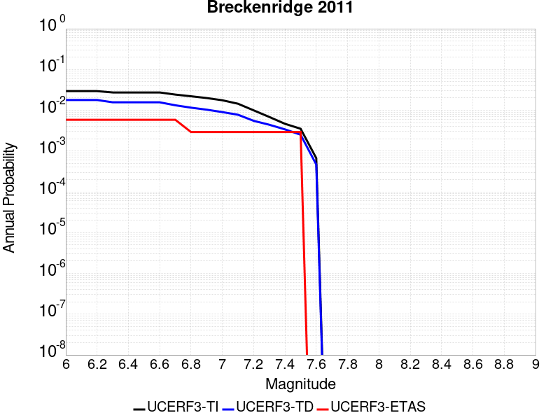 |
|-----|

| Magnitude | UCERF3-TI Prob | UCERF3-TD Prob | UCERF3-ETAS Prob |
|-----|-----|-----|-----|
| 6.0 | 0.02953276 | 0.017885394 | 0.0055555557 |
| 6.1 | 0.02953276 | 0.017885394 | 0.0055555557 |
| 6.2 | 0.02953276 | 0.017885394 | 0.0055555557 |
| 6.3 | 0.027392931 | 0.015699496 | 0.0055555557 |
| 6.4 | 0.027392931 | 0.015699496 | 0.0055555557 |
| 6.5 | 0.027392931 | 0.015699496 | 0.0055555557 |
| 6.6 | 0.027392931 | 0.015699496 | 0.0055555557 |
| 6.7 | 0.024281556 | 0.013268605 | 0.0055555557 |
| 6.8 | 0.022075787 | 0.011598961 | 0.0055555557 |
| 6.9 | 0.019979808 | 0.010353591 | 0.0055555557 |
| 7.0 | 0.01762848 | 0.009034015 | 0.0055555557 |
| 7.1 | 0.014487443 | 0.0077800234 | 0.0055555557 |
| 7.2 | 0.00997365 | 0.0055214944 | 0.0055555557 |
| 7.3 | 0.006865244 | 0.004422219 | 0.0055555557 |
| 7.4 | 0.004664585 | 0.0034058366 | 0.0055555557 |
| 7.5 | 0.00352852 | 0.0025183219 | 0.0055555557 |
| 7.6 | 6.708552E-4 | 4.6790883E-4 | 0.0 |

## Bullion Mountains
*[(top)](#table-of-contents)*

| 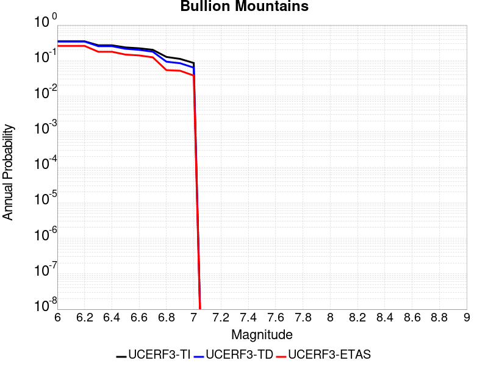 |
|-----|

| Magnitude | UCERF3-TI Prob | UCERF3-TD Prob | UCERF3-ETAS Prob |
|-----|-----|-----|-----|
| 6.0 | 0.3484497 | 0.343911 | 0.25555557 |
| 6.1 | 0.3484497 | 0.343911 | 0.25555557 |
| 6.2 | 0.3484497 | 0.343911 | 0.25555557 |
| 6.3 | 0.2696955 | 0.25418413 | 0.18888889 |
| 6.4 | 0.2696955 | 0.25418413 | 0.18888889 |
| 6.5 | 0.23453283 | 0.21461882 | 0.17777778 |
| 6.6 | 0.22166593 | 0.20022155 | 0.17222223 |
| 6.7 | 0.20106675 | 0.17768216 | 0.1388889 |
| 6.8 | 0.12659106 | 0.0930402 | 0.05 |
| 6.9 | 0.11147359 | 0.08418926 | 0.05 |
| 7.0 | 0.08563909 | 0.06329813 | 0.03888889 |

## Burnt Mtn
*[(top)](#table-of-contents)*

| 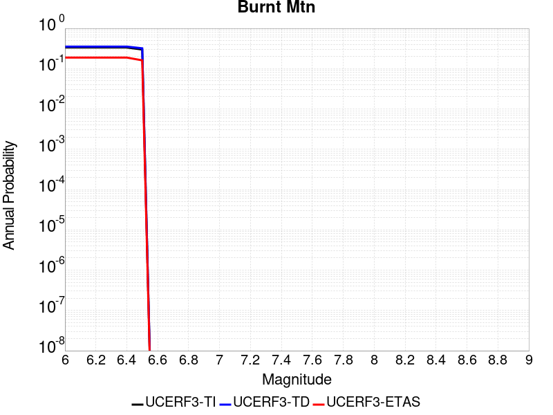 |
|-----|

| Magnitude | UCERF3-TI Prob | UCERF3-TD Prob | UCERF3-ETAS Prob |
|-----|-----|-----|-----|
| 6.0 | 0.33562234 | 0.3541673 | 0.18888889 |
| 6.1 | 0.33562234 | 0.3541673 | 0.18888889 |
| 6.2 | 0.33562234 | 0.3541673 | 0.18888889 |
| 6.3 | 0.33562234 | 0.3541673 | 0.18888889 |
| 6.4 | 0.33562234 | 0.3541673 | 0.18888889 |
| 6.5 | 0.29904807 | 0.32061118 | 0.16111112 |

## Butano 2011 CFM
*[(top)](#table-of-contents)*

| 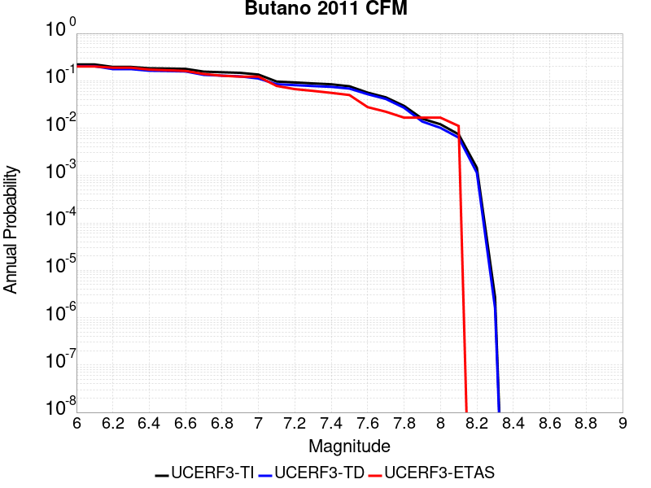 |
|-----|

| Magnitude | UCERF3-TI Prob | UCERF3-TD Prob | UCERF3-ETAS Prob |
|-----|-----|-----|-----|
| 6.0 | 0.22076638 | 0.20274591 | 0.2 |
| 6.1 | 0.22076638 | 0.20274591 | 0.2 |
| 6.2 | 0.19606031 | 0.17630108 | 0.18888889 |
| 6.3 | 0.19606031 | 0.17630108 | 0.18888889 |
| 6.4 | 0.1834521 | 0.16280727 | 0.17222223 |
| 6.5 | 0.1814291 | 0.16061504 | 0.16666667 |
| 6.6 | 0.17824048 | 0.15720767 | 0.16111112 |
| 6.7 | 0.15580845 | 0.13318822 | 0.1388889 |
| 6.8 | 0.15132317 | 0.12833539 | 0.12777779 |
| 6.9 | 0.1470507 | 0.123830095 | 0.12222222 |
| 7.0 | 0.13516794 | 0.11171789 | 0.12222222 |
| 7.1 | 0.09623851 | 0.084493406 | 0.07777778 |
| 7.2 | 0.09210804 | 0.08085275 | 0.06666667 |
| 7.3 | 0.087927744 | 0.077386044 | 0.06111111 |
| 7.4 | 0.084193796 | 0.07441107 | 0.055555556 |
| 7.5 | 0.07648027 | 0.06832556 | 0.05 |
| 7.6 | 0.05622315 | 0.052019097 | 0.027777778 |
| 7.7 | 0.0446779 | 0.04127942 | 0.022222223 |
| 7.8 | 0.029503845 | 0.026923288 | 0.016666668 |
| 7.9 | 0.015828209 | 0.013791986 | 0.016666668 |
| 8.0 | 0.012063397 | 0.010143634 | 0.016666668 |
| 8.1 | 0.007388501 | 0.0063084904 | 0.011111111 |
| 8.2 | 0.0014562283 | 0.0011449018 | 0.0 |
| 8.3 | 2.7057733E-6 | 1.5769889E-6 | 0.0 |

## Cady
*[(top)](#table-of-contents)*

| 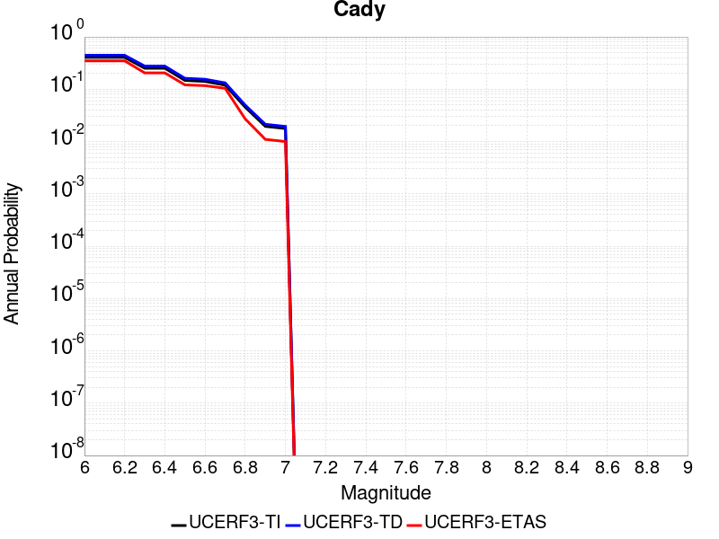 |
|-----|

| Magnitude | UCERF3-TI Prob | UCERF3-TD Prob | UCERF3-ETAS Prob |
|-----|-----|-----|-----|
| 6.0 | 0.40487745 | 0.44532946 | 0.29444444 |
| 6.1 | 0.40487745 | 0.44532946 | 0.29444444 |
| 6.2 | 0.40487745 | 0.44532946 | 0.29444444 |
| 6.3 | 0.2517699 | 0.27635095 | 0.19444445 |
| 6.4 | 0.2517699 | 0.27635095 | 0.19444445 |
| 6.5 | 0.14719625 | 0.16167663 | 0.11666667 |
| 6.6 | 0.1408124 | 0.15495491 | 0.11111111 |
| 6.7 | 0.119651 | 0.13219845 | 0.10555556 |
| 6.8 | 0.045349218 | 0.04948551 | 0.027777778 |
| 6.9 | 0.019493284 | 0.02135564 | 0.011111111 |
| 7.0 | 0.017732618 | 0.019437043 | 0.011111111 |

## Calaveras (Central) 2011 CFM
*[(top)](#table-of-contents)*

| 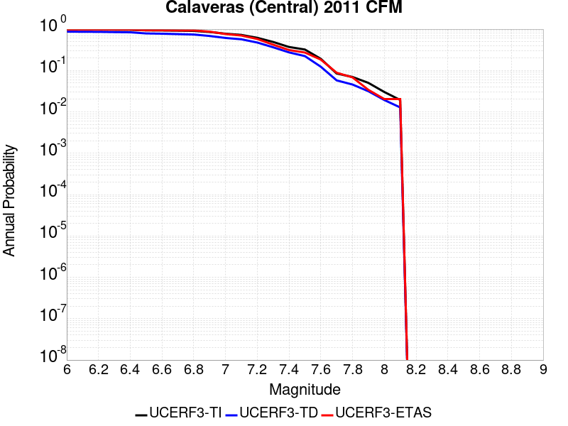 |
|-----|

| Magnitude | UCERF3-TI Prob | UCERF3-TD Prob | UCERF3-ETAS Prob |
|-----|-----|-----|-----|
| 6.0 | 0.98008996 | 0.8714141 | 0.9777778 |
| 6.1 | 0.9773778 | 0.8643375 | 0.9777778 |
| 6.2 | 0.97603184 | 0.86104614 | 0.9777778 |
| 6.3 | 0.9707465 | 0.8491336 | 0.9722222 |
| 6.4 | 0.966294 | 0.8396396 | 0.96666664 |
| 6.5 | 0.93538046 | 0.7876405 | 0.9388889 |
| 6.6 | 0.92935973 | 0.77601415 | 0.93333334 |
| 6.7 | 0.9195764 | 0.7587102 | 0.93333334 |
| 6.8 | 0.9066692 | 0.74124587 | 0.92777777 |
| 6.9 | 0.8531677 | 0.68409836 | 0.87777776 |
| 7.0 | 0.7766801 | 0.6127641 | 0.79444444 |
| 7.1 | 0.7255384 | 0.56864125 | 0.76111114 |
| 7.2 | 0.6179046 | 0.4748913 | 0.57222223 |
| 7.3 | 0.49050644 | 0.3644156 | 0.43333334 |
| 7.4 | 0.37062812 | 0.27421218 | 0.31666666 |
| 7.5 | 0.32179266 | 0.22307332 | 0.29444444 |
| 7.6 | 0.19190156 | 0.12355445 | 0.15555556 |
| 7.7 | 0.084544405 | 0.05771507 | 0.06111111 |
| 7.8 | 0.06977037 | 0.045784887 | 0.055555556 |
| 7.9 | 0.050187446 | 0.031519804 | 0.027777778 |
| 8.0 | 0.030233575 | 0.019337514 | 0.016666668 |
| 8.1 | 0.019405646 | 0.012809461 | 0.011111111 |

## Calaveras (No) 2011 CFM
*[(top)](#table-of-contents)*

| 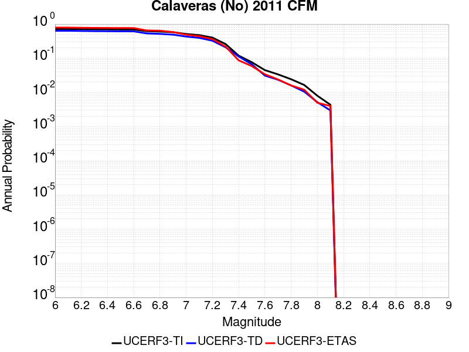 |
|-----|

| Magnitude | UCERF3-TI Prob | UCERF3-TD Prob | UCERF3-ETAS Prob |
|-----|-----|-----|-----|
| 6.0 | 0.7192933 | 0.6378038 | 0.7722222 |
| 6.1 | 0.7192933 | 0.6378038 | 0.7722222 |
| 6.2 | 0.7107215 | 0.62886065 | 0.75 |
| 6.3 | 0.70442986 | 0.6222051 | 0.74444443 |
| 6.4 | 0.70101017 | 0.6186716 | 0.7277778 |
| 6.5 | 0.69664615 | 0.6141349 | 0.7222222 |
| 6.6 | 0.694823 | 0.61245126 | 0.7222222 |
| 6.7 | 0.61924326 | 0.53291 | 0.6111111 |
| 6.8 | 0.6041821 | 0.51629674 | 0.5888889 |
| 6.9 | 0.57664984 | 0.4898491 | 0.55 |
| 7.0 | 0.51432884 | 0.4309129 | 0.44444445 |
| 7.1 | 0.47529888 | 0.39507514 | 0.41666666 |
| 7.2 | 0.4026296 | 0.3257055 | 0.33888888 |
| 7.3 | 0.26120505 | 0.20978612 | 0.21666667 |
| 7.4 | 0.11966821 | 0.11311163 | 0.07777778 |
| 7.5 | 0.076660566 | 0.06654159 | 0.055555556 |
| 7.6 | 0.04500223 | 0.031102888 | 0.03888889 |
| 7.7 | 0.033785436 | 0.023524456 | 0.027777778 |
| 7.8 | 0.024335101 | 0.01604012 | 0.022222223 |
| 7.9 | 0.016528333 | 0.010535792 | 0.016666668 |
| 8.0 | 0.008023971 | 0.005193168 | 0.011111111 |
| 8.1 | 0.0043540956 | 0.0029642247 | 0.0055555557 |

## Calaveras (So) - Paicines extension 2011 CFM
*[(top)](#table-of-contents)*

| 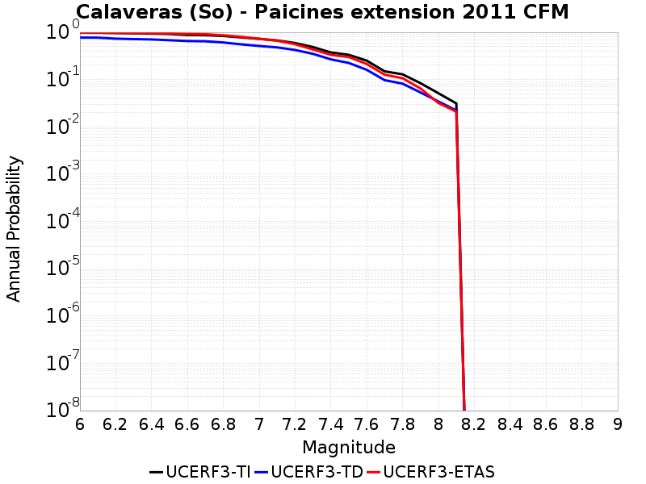 |
|-----|

| Magnitude | UCERF3-TI Prob | UCERF3-TD Prob | UCERF3-ETAS Prob |
|-----|-----|-----|-----|
| 6.0 | 0.9809675 | 0.77490765 | 0.9777778 |
| 6.1 | 0.98016304 | 0.7707735 | 0.9777778 |
| 6.2 | 0.9640279 | 0.7341738 | 0.9722222 |
| 6.3 | 0.9505599 | 0.7190547 | 0.95 |
| 6.4 | 0.9390039 | 0.70665836 | 0.95 |
| 6.5 | 0.9203267 | 0.6802067 | 0.9388889 |
| 6.6 | 0.87774384 | 0.6554539 | 0.90555555 |
| 6.7 | 0.86986136 | 0.6458159 | 0.89444447 |
| 6.8 | 0.8375282 | 0.6097834 | 0.85 |
| 6.9 | 0.77980334 | 0.5559919 | 0.8 |
| 7.0 | 0.72773975 | 0.5142041 | 0.75555557 |
| 7.1 | 0.6729546 | 0.47985625 | 0.73333335 |
| 7.2 | 0.59348154 | 0.42375273 | 0.59444445 |
| 7.3 | 0.48866954 | 0.3507284 | 0.4611111 |
| 7.4 | 0.37480524 | 0.26810017 | 0.3611111 |
| 7.5 | 0.33428064 | 0.22503693 | 0.33333334 |
| 7.6 | 0.2516329 | 0.16126388 | 0.25 |
| 7.7 | 0.14966126 | 0.097197525 | 0.16111112 |
| 7.8 | 0.1292653 | 0.082146995 | 0.15 |
| 7.9 | 0.08401161 | 0.05354328 | 0.072222225 |
| 8.0 | 0.051511854 | 0.03451359 | 0.033333335 |
| 8.1 | 0.03134319 | 0.022278618 | 0.016666668 |

## Calaveras (So) 2011 CFM
*[(top)](#table-of-contents)*

| 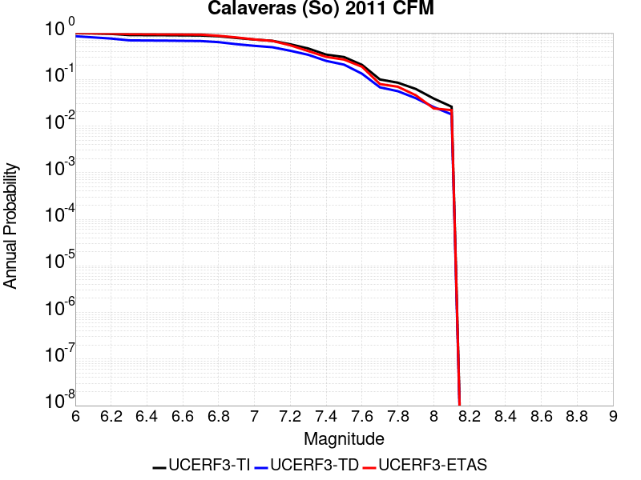 |
|-----|

| Magnitude | UCERF3-TI Prob | UCERF3-TD Prob | UCERF3-ETAS Prob |
|-----|-----|-----|-----|
| 6.0 | 0.98442 | 0.8461343 | 0.99444443 |
| 6.1 | 0.9711138 | 0.799337 | 0.9611111 |
| 6.2 | 0.9498127 | 0.7537926 | 0.92777777 |
| 6.3 | 0.8964451 | 0.6906586 | 0.9 |
| 6.4 | 0.89141756 | 0.68493426 | 0.89444447 |
| 6.5 | 0.8884447 | 0.681323 | 0.8888889 |
| 6.6 | 0.8821132 | 0.6741269 | 0.8833333 |
| 6.7 | 0.87636757 | 0.66738164 | 0.87777776 |
| 6.8 | 0.8439477 | 0.63168806 | 0.8333333 |
| 6.9 | 0.7759941 | 0.57068855 | 0.7777778 |
| 7.0 | 0.71967185 | 0.5266271 | 0.73333335 |
| 7.1 | 0.67431074 | 0.49134538 | 0.7111111 |
| 7.2 | 0.56847316 | 0.4125554 | 0.5388889 |
| 7.3 | 0.46194705 | 0.3379559 | 0.42222223 |
| 7.4 | 0.34122387 | 0.25030294 | 0.31666666 |
| 7.5 | 0.30260792 | 0.20765431 | 0.2888889 |
| 7.6 | 0.20549683 | 0.13268068 | 0.17222223 |
| 7.7 | 0.09992415 | 0.06770097 | 0.083333336 |
| 7.8 | 0.08519769 | 0.055952057 | 0.07777778 |
| 7.9 | 0.06250784 | 0.03960912 | 0.03888889 |
| 8.0 | 0.03895953 | 0.025590448 | 0.022222223 |
| 8.1 | 0.02601755 | 0.017765153 | 0.016666668 |

## Calico-Hidalgo
*[(top)](#table-of-contents)*

| 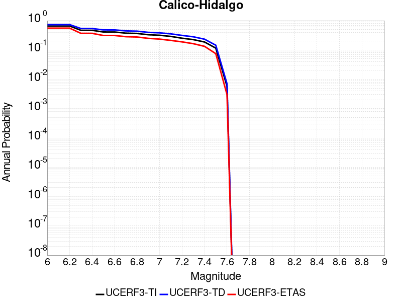 |
|-----|

| Magnitude | UCERF3-TI Prob | UCERF3-TD Prob | UCERF3-ETAS Prob |
|-----|-----|-----|-----|
| 6.0 | 0.65604556 | 0.73233575 | 0.51111114 |
| 6.1 | 0.65604556 | 0.73233575 | 0.51111114 |
| 6.2 | 0.65604556 | 0.73233575 | 0.51111114 |
| 6.3 | 0.46873006 | 0.53943413 | 0.32777777 |
| 6.4 | 0.46873006 | 0.53943413 | 0.32777777 |
| 6.5 | 0.4109696 | 0.48374844 | 0.26666668 |
| 6.6 | 0.41069707 | 0.4834931 | 0.26666668 |
| 6.7 | 0.37473065 | 0.44766352 | 0.23888889 |
| 6.8 | 0.36586374 | 0.43807307 | 0.23333333 |
| 6.9 | 0.33137405 | 0.39892134 | 0.21111111 |
| 7.0 | 0.31822768 | 0.3841664 | 0.20555556 |
| 7.1 | 0.2902175 | 0.35468608 | 0.17222223 |
| 7.2 | 0.2519666 | 0.31417555 | 0.16111112 |
| 7.3 | 0.22577207 | 0.28193766 | 0.12777779 |
| 7.4 | 0.18715408 | 0.23351108 | 0.11111111 |
| 7.5 | 0.1156799 | 0.14521316 | 0.06111111 |
| 7.6 | 0.0057536047 | 0.0069986656 | 0.0055555557 |

## Camp Rock 2011
*[(top)](#table-of-contents)*

| 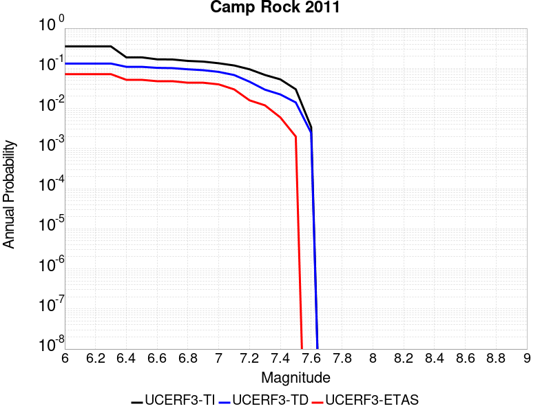 |
|-----|

| Magnitude | UCERF3-TI Prob | UCERF3-TD Prob | UCERF3-ETAS Prob |
|-----|-----|-----|-----|
| 6.0 | 0.3533668 | 0.13180627 | 0.08888889 |
| 6.1 | 0.3533668 | 0.13180627 | 0.08888889 |
| 6.2 | 0.3533668 | 0.13180627 | 0.08888889 |
| 6.3 | 0.3533668 | 0.13180627 | 0.08888889 |
| 6.4 | 0.18801028 | 0.109235495 | 0.083333336 |
| 6.5 | 0.18801028 | 0.109235495 | 0.083333336 |
| 6.6 | 0.1679815 | 0.102868095 | 0.07777778 |
| 6.7 | 0.16664411 | 0.10141725 | 0.07777778 |
| 6.8 | 0.15319715 | 0.09471 | 0.072222225 |
| 6.9 | 0.1473991 | 0.08996796 | 0.072222225 |
| 7.0 | 0.13398844 | 0.081555545 | 0.06666667 |
| 7.1 | 0.11805281 | 0.06812823 | 0.055555556 |
| 7.2 | 0.0948167 | 0.046395265 | 0.03888889 |
| 7.3 | 0.06842267 | 0.029398253 | 0.016666668 |
| 7.4 | 0.0530505 | 0.022327283 | 0.0055555557 |
| 7.5 | 0.030017076 | 0.014102307 | 0.0 |
| 7.6 | 0.0034260035 | 0.0024529342 | 0.0 |

## Canada David (Detachment)
*[(top)](#table-of-contents)*

| 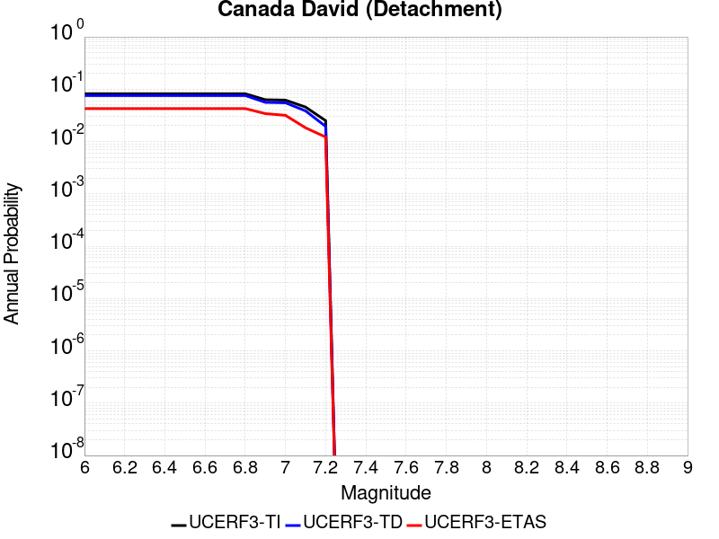 |
|-----|

| Magnitude | UCERF3-TI Prob | UCERF3-TD Prob | UCERF3-ETAS Prob |
|-----|-----|-----|-----|
| 6.0 | 0.081861295 | 0.075766034 | 0.03888889 |
| 6.1 | 0.081861295 | 0.075766034 | 0.03888889 |
| 6.2 | 0.081861295 | 0.075766034 | 0.03888889 |
| 6.3 | 0.081861295 | 0.075766034 | 0.03888889 |
| 6.4 | 0.081861295 | 0.075766034 | 0.03888889 |
| 6.5 | 0.081861295 | 0.075766034 | 0.03888889 |
| 6.6 | 0.081861295 | 0.075766034 | 0.03888889 |
| 6.7 | 0.081861295 | 0.075766034 | 0.03888889 |
| 6.8 | 0.081861295 | 0.075766034 | 0.03888889 |
| 6.9 | 0.062932074 | 0.056078803 | 0.033333335 |
| 7.0 | 0.06187579 | 0.055035993 | 0.027777778 |
| 7.1 | 0.045595266 | 0.038521208 | 0.016666668 |
| 7.2 | 0.025047874 | 0.019486237 | 0.016666668 |

## Carlsbad
*[(top)](#table-of-contents)*

| 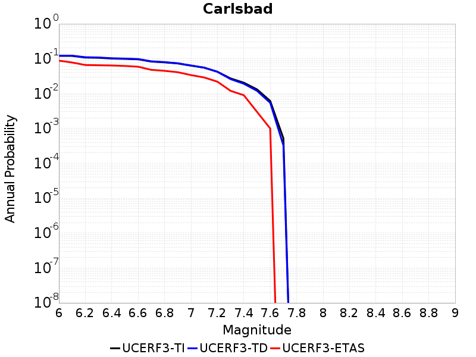 |
|-----|

| Magnitude | UCERF3-TI Prob | UCERF3-TD Prob | UCERF3-ETAS Prob |
|-----|-----|-----|-----|
| 6.0 | 0.12009238 | 0.122779176 | 0.083333336 |
| 6.1 | 0.12009238 | 0.122779176 | 0.06111111 |
| 6.2 | 0.10803208 | 0.11049412 | 0.044444446 |
| 6.3 | 0.10618736 | 0.10859686 | 0.044444446 |
| 6.4 | 0.10105772 | 0.103345595 | 0.044444446 |
| 6.5 | 0.09881005 | 0.101035625 | 0.03888889 |
| 6.6 | 0.09605385 | 0.09818548 | 0.03888889 |
| 6.7 | 0.08271637 | 0.08425573 | 0.022222223 |
| 6.8 | 0.07858226 | 0.079997435 | 0.016666668 |
| 6.9 | 0.07300473 | 0.07419229 | 0.016666668 |
| 7.0 | 0.06331537 | 0.06407738 | 0.016666668 |
| 7.1 | 0.055255227 | 0.055645995 | 0.016666668 |
| 7.2 | 0.04245484 | 0.04209983 | 0.016666668 |
| 7.3 | 0.027265428 | 0.025990982 | 0.011111111 |
| 7.4 | 0.020544298 | 0.019179694 | 0.0055555557 |
| 7.5 | 0.013228688 | 0.012009295 | 0.0 |
| 7.6 | 0.0061701247 | 0.005436581 | 0.0 |
| 7.7 | 5.2144495E-4 | 3.2505541E-4 | 0.0 |

## Carson Range (Genoa)
*[(top)](#table-of-contents)*

| 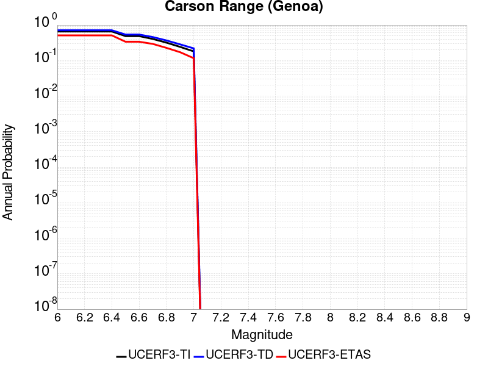 |
|-----|

| Magnitude | UCERF3-TI Prob | UCERF3-TD Prob | UCERF3-ETAS Prob |
|-----|-----|-----|-----|
| 6.0 | 0.65927744 | 0.71200055 | 0.51111114 |
| 6.1 | 0.65927744 | 0.71200055 | 0.51111114 |
| 6.2 | 0.65927744 | 0.71200055 | 0.51111114 |
| 6.3 | 0.65927744 | 0.71200055 | 0.51111114 |
| 6.4 | 0.65927744 | 0.71200055 | 0.51111114 |
| 6.5 | 0.48824435 | 0.54002273 | 0.33888888 |
| 6.6 | 0.48824435 | 0.54002273 | 0.33888888 |
| 6.7 | 0.4060694 | 0.45909452 | 0.29444444 |
| 6.8 | 0.3200152 | 0.36842003 | 0.22777778 |
| 6.9 | 0.24290857 | 0.28616402 | 0.17222223 |
| 7.0 | 0.18124545 | 0.22028467 | 0.11666667 |

## Casmalia 2011 CFM
*[(top)](#table-of-contents)*

| 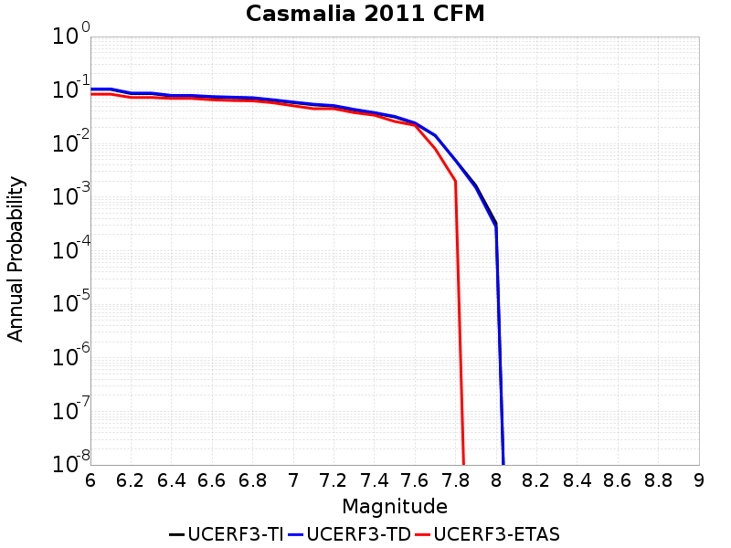 |
|-----|

| Magnitude | UCERF3-TI Prob | UCERF3-TD Prob | UCERF3-ETAS Prob |
|-----|-----|-----|-----|
| 6.0 | 0.10309498 | 0.10547853 | 0.11666667 |
| 6.1 | 0.10309498 | 0.10547853 | 0.11666667 |
| 6.2 | 0.08625063 | 0.088374354 | 0.10555556 |
| 6.3 | 0.08625063 | 0.088374354 | 0.10555556 |
| 6.4 | 0.07759013 | 0.079584666 | 0.10555556 |
| 6.5 | 0.07759013 | 0.079584666 | 0.10555556 |
| 6.6 | 0.07397767 | 0.07591413 | 0.1 |
| 6.7 | 0.07198397 | 0.07388606 | 0.094444446 |
| 6.8 | 0.070445314 | 0.07231878 | 0.094444446 |
| 6.9 | 0.06438874 | 0.06611677 | 0.094444446 |
| 7.0 | 0.05844172 | 0.060022533 | 0.08888889 |
| 7.1 | 0.053146902 | 0.054600548 | 0.06666667 |
| 7.2 | 0.05013363 | 0.05151123 | 0.06666667 |
| 7.3 | 0.04260745 | 0.043773923 | 0.05 |
| 7.4 | 0.03710017 | 0.038107574 | 0.05 |
| 7.5 | 0.031501416 | 0.03233534 | 0.033333335 |
| 7.6 | 0.023859361 | 0.024441509 | 0.033333335 |
| 7.7 | 0.014084088 | 0.014307246 | 0.011111111 |
| 7.8 | 0.0048994604 | 0.004841491 | 0.0 |
| 7.9 | 0.0016534155 | 0.0015062116 | 0.0 |
| 8.0 | 3.2801426E-4 | 2.7516397E-4 | 0.0 |

## Cedar Mtn-Mahogany Mtn
*[(top)](#table-of-contents)*

| 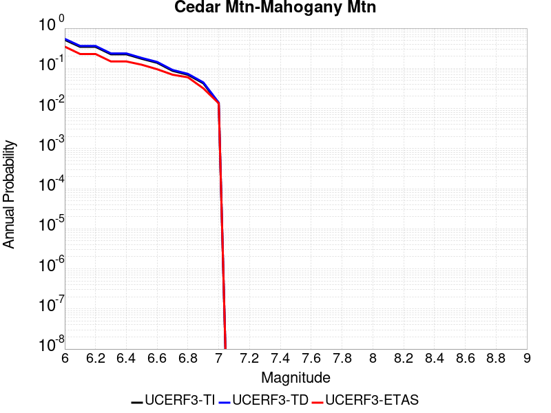 |
|-----|

| Magnitude | UCERF3-TI Prob | UCERF3-TD Prob | UCERF3-ETAS Prob |
|-----|-----|-----|-----|
| 6.0 | 0.5153604 | 0.545582 | 0.33333334 |
| 6.1 | 0.34404954 | 0.3627339 | 0.21111111 |
| 6.2 | 0.34404954 | 0.3627339 | 0.21111111 |
| 6.3 | 0.22451669 | 0.2359082 | 0.11666667 |
| 6.4 | 0.22451669 | 0.2359082 | 0.11666667 |
| 6.5 | 0.17320107 | 0.18188658 | 0.094444446 |
| 6.6 | 0.1377097 | 0.14458458 | 0.07777778 |
| 6.7 | 0.08691989 | 0.09128094 | 0.06111111 |
| 6.8 | 0.06931777 | 0.072830506 | 0.06111111 |
| 6.9 | 0.042369116 | 0.044579536 | 0.033333335 |
| 7.0 | 0.013222947 | 0.013955584 | 0.011111111 |

## Cerro Prieto
*[(top)](#table-of-contents)*

| 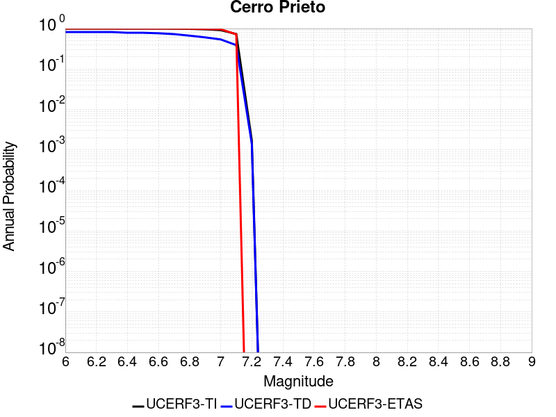 |
|-----|

| Magnitude | UCERF3-TI Prob | UCERF3-TD Prob | UCERF3-ETAS Prob |
|-----|-----|-----|-----|
| 6.0 | 0.9994963 | 0.81893724 | 1.0 |
| 6.1 | 0.9994963 | 0.81893724 | 1.0 |
| 6.2 | 0.9994963 | 0.81893724 | 1.0 |
| 6.3 | 0.9994963 | 0.81893724 | 1.0 |
| 6.4 | 0.9985637 | 0.7857988 | 1.0 |
| 6.5 | 0.9985637 | 0.7857988 | 1.0 |
| 6.6 | 0.9974912 | 0.76492184 | 1.0 |
| 6.7 | 0.99402195 | 0.72759867 | 1.0 |
| 6.8 | 0.982366 | 0.6667298 | 0.99444443 |
| 6.9 | 0.9568981 | 0.6044115 | 0.9777778 |
| 7.0 | 0.9122654 | 0.53836197 | 0.9611111 |
| 7.1 | 0.73078585 | 0.38902894 | 0.7277778 |
| 7.2 | 0.0017059613 | 0.001406829 | 0.0 |

## Channel Islands Thrust
*[(top)](#table-of-contents)*

| 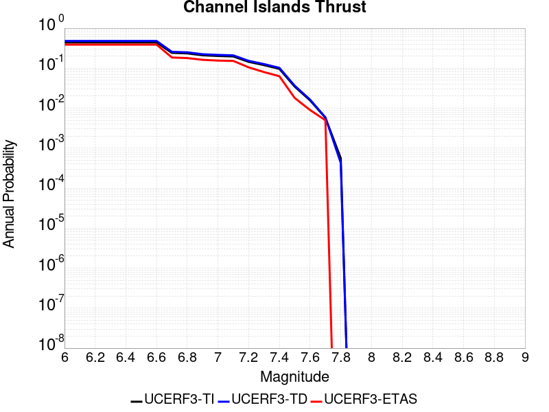 |
|-----|

| Magnitude | UCERF3-TI Prob | UCERF3-TD Prob | UCERF3-ETAS Prob |
|-----|-----|-----|-----|
| 6.0 | 0.4390072 | 0.48035696 | 0.39444444 |
| 6.1 | 0.4390072 | 0.48035696 | 0.39444444 |
| 6.2 | 0.4390072 | 0.48035696 | 0.39444444 |
| 6.3 | 0.4390072 | 0.48035696 | 0.39444444 |
| 6.4 | 0.4390072 | 0.48035696 | 0.39444444 |
| 6.5 | 0.4390072 | 0.48035696 | 0.39444444 |
| 6.6 | 0.4390072 | 0.48035696 | 0.39444444 |
| 6.7 | 0.24162835 | 0.2570081 | 0.18333334 |
| 6.8 | 0.23458084 | 0.24956232 | 0.18333334 |
| 6.9 | 0.21029626 | 0.22371724 | 0.15 |
| 7.0 | 0.20210907 | 0.21508908 | 0.1388889 |
| 7.1 | 0.1966115 | 0.20931992 | 0.13333334 |
| 7.2 | 0.14412244 | 0.15279572 | 0.06666667 |
| 7.3 | 0.119487606 | 0.12670955 | 0.05 |
| 7.4 | 0.096342176 | 0.102206826 | 0.05 |
| 7.5 | 0.03458138 | 0.03648411 | 0.022222223 |
| 7.6 | 0.015681144 | 0.016421257 | 0.0055555557 |
| 7.7 | 0.0057674283 | 0.005896531 | 0.0055555557 |
| 7.8 | 5.6371145E-4 | 4.2862692E-4 | 0.0 |

## Channel Islands Western Deep Ramp
*[(top)](#table-of-contents)*

| 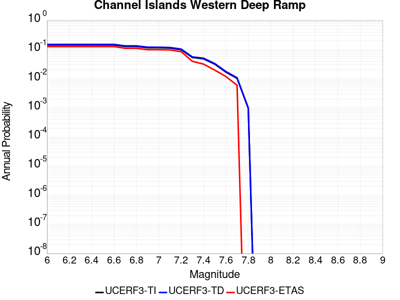 |
|-----|

| Magnitude | UCERF3-TI Prob | UCERF3-TD Prob | UCERF3-ETAS Prob |
|-----|-----|-----|-----|
| 6.0 | 0.14537561 | 0.15134454 | 0.11111111 |
| 6.1 | 0.14537561 | 0.15134454 | 0.11111111 |
| 6.2 | 0.14537561 | 0.15134454 | 0.11111111 |
| 6.3 | 0.14537561 | 0.15134454 | 0.11111111 |
| 6.4 | 0.14537561 | 0.15134454 | 0.11111111 |
| 6.5 | 0.14537561 | 0.15134454 | 0.11111111 |
| 6.6 | 0.14537561 | 0.15134454 | 0.11111111 |
| 6.7 | 0.12944193 | 0.13497077 | 0.094444446 |
| 6.8 | 0.12944193 | 0.13497077 | 0.094444446 |
| 6.9 | 0.116423756 | 0.12158304 | 0.083333336 |
| 7.0 | 0.1159126 | 0.12105769 | 0.083333336 |
| 7.1 | 0.11334783 | 0.11841943 | 0.083333336 |
| 7.2 | 0.10013014 | 0.10474763 | 0.07777778 |
| 7.3 | 0.053889144 | 0.05638515 | 0.033333335 |
| 7.4 | 0.04848997 | 0.050761346 | 0.033333335 |
| 7.5 | 0.031854507 | 0.0333644 | 0.022222223 |
| 7.6 | 0.016927926 | 0.017762374 | 0.016666668 |
| 7.7 | 0.010345212 | 0.010853845 | 0.0055555557 |
| 7.8 | 9.6648745E-4 | 0.0010042074 | 0.0 |

## Chino alt 1
*[(top)](#table-of-contents)*

| 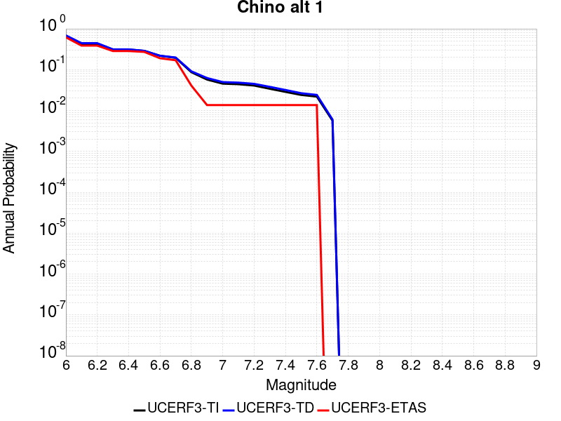 |
|-----|

| Magnitude | UCERF3-TI Prob | UCERF3-TD Prob | UCERF3-ETAS Prob |
|-----|-----|-----|-----|
| 6.0 | 0.64225113 | 0.6889795 | 0.60555553 |
| 6.1 | 0.42940316 | 0.4451526 | 0.38333333 |
| 6.2 | 0.42940316 | 0.4451526 | 0.38333333 |
| 6.3 | 0.3112239 | 0.31393874 | 0.28333333 |
| 6.4 | 0.3112239 | 0.31393874 | 0.28333333 |
| 6.5 | 0.28796703 | 0.2889911 | 0.25555557 |
| 6.6 | 0.21891174 | 0.21933962 | 0.18888889 |
| 6.7 | 0.1949986 | 0.198202 | 0.17222223 |
| 6.8 | 0.08692561 | 0.09109523 | 0.05 |
| 6.9 | 0.057370283 | 0.062487606 | 0.03888889 |
| 7.0 | 0.04553657 | 0.049728163 | 0.016666668 |
| 7.1 | 0.04416964 | 0.048196886 | 0.016666668 |
| 7.2 | 0.040904514 | 0.045010496 | 0.016666668 |
| 7.3 | 0.034156438 | 0.03800187 | 0.011111111 |
| 7.4 | 0.02865265 | 0.03185877 | 0.011111111 |
| 7.5 | 0.024108768 | 0.026577935 | 0.011111111 |
| 7.6 | 0.021987375 | 0.024141451 | 0.011111111 |
| 7.7 | 0.0056722625 | 0.0060251406 | 0.0 |

## Clamshell-Sawpit
*[(top)](#table-of-contents)*

| 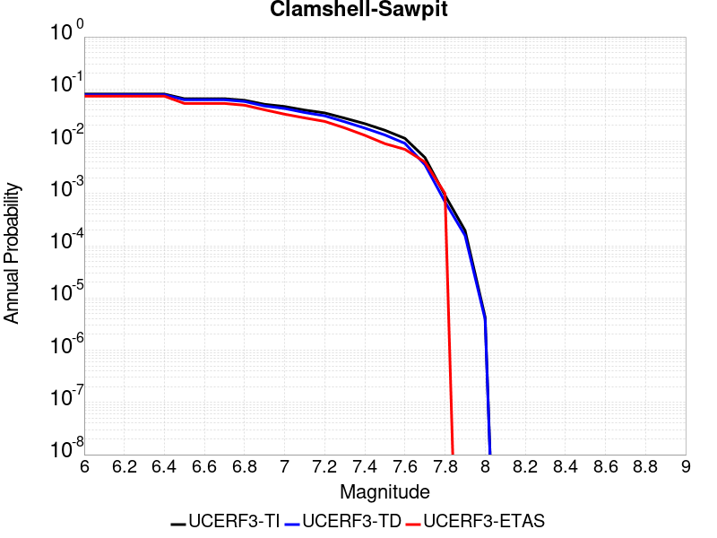 |
|-----|

| Magnitude | UCERF3-TI Prob | UCERF3-TD Prob | UCERF3-ETAS Prob |
|-----|-----|-----|-----|
| 6.0 | 0.080167845 | 0.077675655 | 0.072222225 |
| 6.1 | 0.080167845 | 0.077675655 | 0.072222225 |
| 6.2 | 0.080167845 | 0.077675655 | 0.072222225 |
| 6.3 | 0.080167845 | 0.077675655 | 0.072222225 |
| 6.4 | 0.080167845 | 0.077675655 | 0.072222225 |
| 6.5 | 0.06524806 | 0.062233444 | 0.055555556 |
| 6.6 | 0.06524806 | 0.062233444 | 0.055555556 |
| 6.7 | 0.06524806 | 0.062233444 | 0.055555556 |
| 6.8 | 0.060936466 | 0.057743624 | 0.05 |
| 6.9 | 0.051023882 | 0.04736309 | 0.044444446 |
| 7.0 | 0.046290193 | 0.042441085 | 0.03888889 |
| 7.1 | 0.039560094 | 0.035508595 | 0.03888889 |
| 7.2 | 0.034879602 | 0.030703705 | 0.033333335 |
| 7.3 | 0.02765543 | 0.023577735 | 0.033333335 |
| 7.4 | 0.021719642 | 0.01786237 | 0.027777778 |
| 7.5 | 0.01624535 | 0.013213336 | 0.022222223 |
| 7.6 | 0.011367763 | 0.009119335 | 0.011111111 |
| 7.7 | 0.0048680017 | 0.0035439627 | 0.011111111 |
| 7.8 | 9.2258E-4 | 6.9261884E-4 | 0.0055555557 |
| 7.9 | 1.957795E-4 | 1.5655575E-4 | 0.0 |
| 8.0 | 4.3188215E-6 | 3.9214888E-6 | 0.0 |

## Clayton
*[(top)](#table-of-contents)*

| 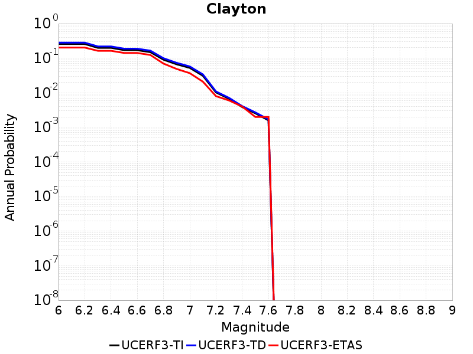 |
|-----|

| Magnitude | UCERF3-TI Prob | UCERF3-TD Prob | UCERF3-ETAS Prob |
|-----|-----|-----|-----|
| 6.0 | 0.2575207 | 0.28235883 | 0.15 |
| 6.1 | 0.2575207 | 0.28235883 | 0.15 |
| 6.2 | 0.2575207 | 0.28235883 | 0.15 |
| 6.3 | 0.1997005 | 0.21929395 | 0.13333334 |
| 6.4 | 0.1997005 | 0.21929395 | 0.13333334 |
| 6.5 | 0.17120075 | 0.18880591 | 0.12777779 |
| 6.6 | 0.1707376 | 0.18831109 | 0.12777779 |
| 6.7 | 0.14940692 | 0.16543998 | 0.1 |
| 6.8 | 0.09063639 | 0.09990332 | 0.072222225 |
| 6.9 | 0.066797204 | 0.073575035 | 0.06666667 |
| 7.0 | 0.052583437 | 0.057854224 | 0.055555556 |
| 7.1 | 0.031104539 | 0.03406716 | 0.027777778 |
| 7.2 | 0.010263096 | 0.010933483 | 0.016666668 |
| 7.3 | 0.0066787973 | 0.0071201944 | 0.011111111 |
| 7.4 | 0.0038597444 | 0.0041110106 | 0.011111111 |
| 7.5 | 0.002552691 | 0.0027161222 | 0.0 |
| 7.6 | 0.0015968008 | 0.0016996823 | 0.0 |

## Cleghorn
*[(top)](#table-of-contents)*

| 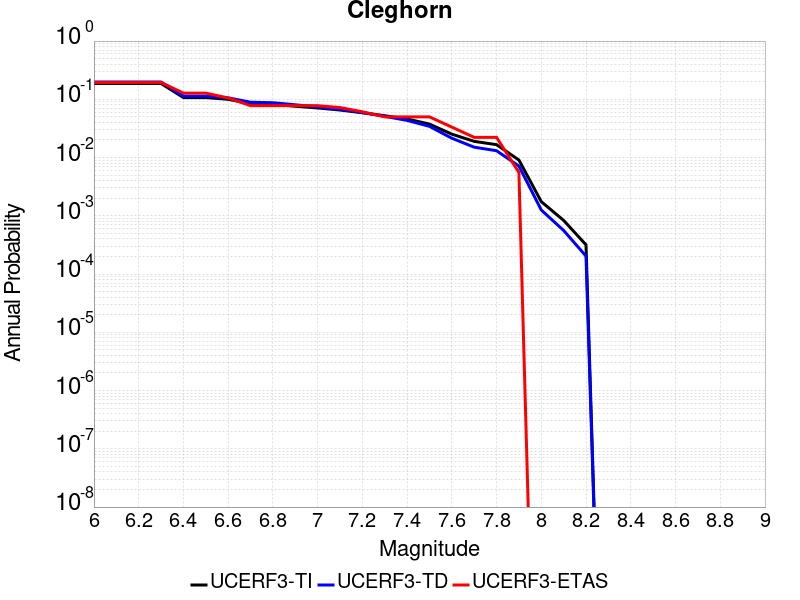 |
|-----|

| Magnitude | UCERF3-TI Prob | UCERF3-TD Prob | UCERF3-ETAS Prob |
|-----|-----|-----|-----|
| 6.0 | 0.18682033 | 0.19779013 | 0.19444445 |
| 6.1 | 0.18682033 | 0.19779013 | 0.19444445 |
| 6.2 | 0.18682033 | 0.19779013 | 0.19444445 |
| 6.3 | 0.18682033 | 0.19779013 | 0.19444445 |
| 6.4 | 0.107158035 | 0.113363385 | 0.12777779 |
| 6.5 | 0.107158035 | 0.113363385 | 0.12777779 |
| 6.6 | 0.10003893 | 0.10598346 | 0.10555556 |
| 6.7 | 0.084004454 | 0.08924392 | 0.07777778 |
| 6.8 | 0.08225997 | 0.08739508 | 0.07777778 |
| 6.9 | 0.07604418 | 0.08054987 | 0.07777778 |
| 7.0 | 0.07107538 | 0.07384622 | 0.07777778 |
| 7.1 | 0.06549175 | 0.06728826 | 0.072222225 |
| 7.2 | 0.058847878 | 0.059303146 | 0.06111111 |
| 7.3 | 0.05224935 | 0.051009774 | 0.05 |
| 7.4 | 0.046014547 | 0.043460716 | 0.05 |
| 7.5 | 0.03758361 | 0.034347612 | 0.05 |
| 7.6 | 0.025253827 | 0.02148803 | 0.033333335 |
| 7.7 | 0.01897608 | 0.015075525 | 0.022222223 |
| 7.8 | 0.016646227 | 0.013102825 | 0.022222223 |
| 7.9 | 0.009075192 | 0.0071449745 | 0.0055555557 |
| 8.0 | 0.0017510193 | 0.0012588114 | 0.0 |
| 8.1 | 8.3411555E-4 | 5.603164E-4 | 0.0 |
| 8.2 | 3.1794564E-4 | 2.0330663E-4 | 0.0 |

## Cleghorn Lake
*[(top)](#table-of-contents)*

| 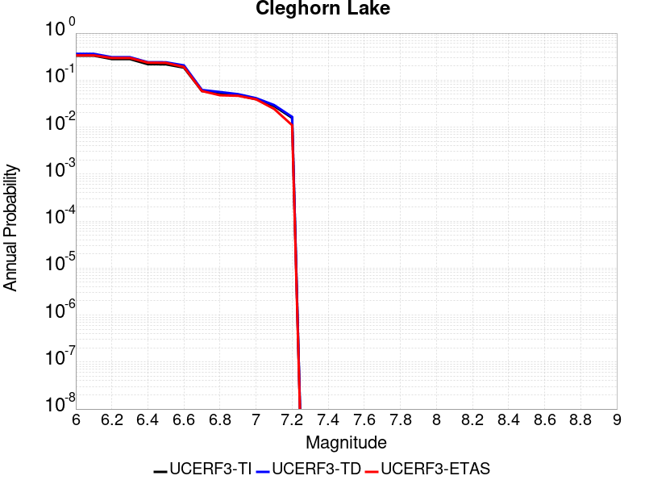 |
|-----|

| Magnitude | UCERF3-TI Prob | UCERF3-TD Prob | UCERF3-ETAS Prob |
|-----|-----|-----|-----|
| 6.0 | 0.3320426 | 0.36232793 | 0.37222221 |
| 6.1 | 0.3320426 | 0.36232793 | 0.37222221 |
| 6.2 | 0.280623 | 0.30784884 | 0.33333334 |
| 6.3 | 0.280623 | 0.30784884 | 0.33333334 |
| 6.4 | 0.21784458 | 0.24064334 | 0.25 |
| 6.5 | 0.21683453 | 0.239605 | 0.25 |
| 6.6 | 0.18420838 | 0.20562549 | 0.19444445 |
| 6.7 | 0.058507536 | 0.06163546 | 0.055555556 |
| 6.8 | 0.053024314 | 0.0558188 | 0.03888889 |
| 6.9 | 0.04778834 | 0.050271597 | 0.03888889 |
| 7.0 | 0.039274745 | 0.041308064 | 0.03888889 |
| 7.1 | 0.028050553 | 0.029495237 | 0.027777778 |
| 7.2 | 0.015702942 | 0.016499616 | 0.016666668 |

## Cleghorn Pass
*[(top)](#table-of-contents)*

| 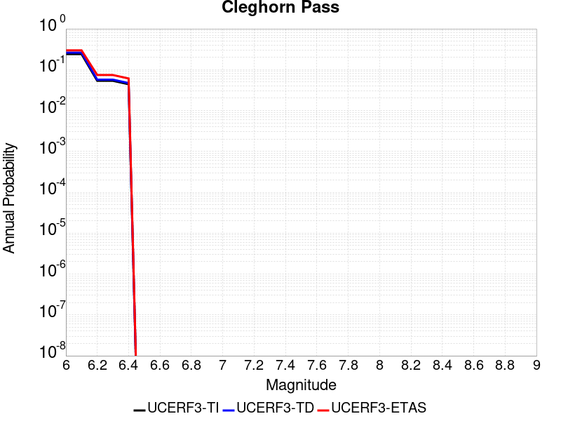 |
|-----|

| Magnitude | UCERF3-TI Prob | UCERF3-TD Prob | UCERF3-ETAS Prob |
|-----|-----|-----|-----|
| 6.0 | 0.24007457 | 0.2611815 | 0.31666666 |
| 6.1 | 0.24007457 | 0.2611815 | 0.31666666 |
| 6.2 | 0.053426985 | 0.05694815 | 0.08888889 |
| 6.3 | 0.053426985 | 0.05694815 | 0.08888889 |
| 6.4 | 0.044031154 | 0.04712192 | 0.072222225 |

## Collayami 2011 CFM
*[(top)](#table-of-contents)*

| 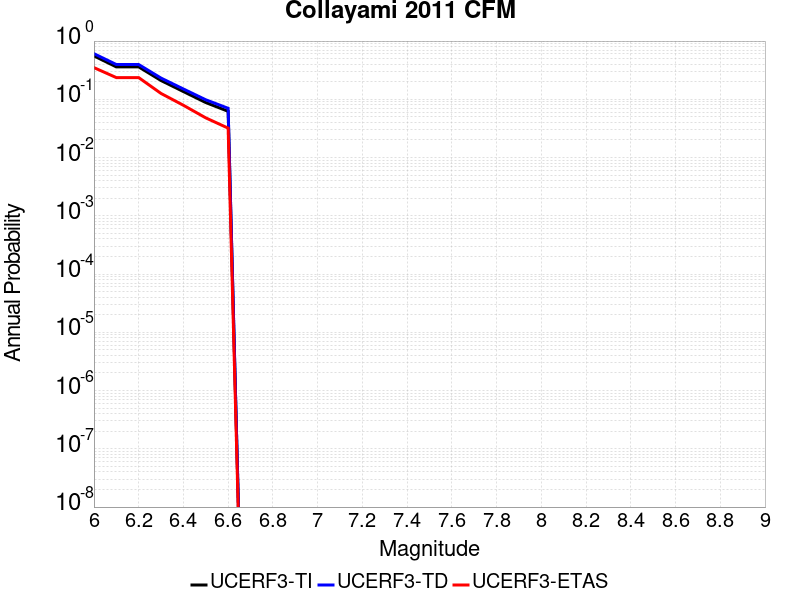 |
|-----|

| Magnitude | UCERF3-TI Prob | UCERF3-TD Prob | UCERF3-ETAS Prob |
|-----|-----|-----|-----|
| 6.0 | 0.556041 | 0.60741216 | 0.32777777 |
| 6.1 | 0.3602245 | 0.39552274 | 0.2 |
| 6.2 | 0.3602245 | 0.39552274 | 0.2 |
| 6.3 | 0.21012597 | 0.23141077 | 0.12777779 |
| 6.4 | 0.13586608 | 0.1503742 | 0.072222225 |
| 6.5 | 0.08799748 | 0.098156944 | 0.03888889 |
| 6.6 | 0.06222611 | 0.0701017 | 0.022222223 |

## Compton
*[(top)](#table-of-contents)*

| 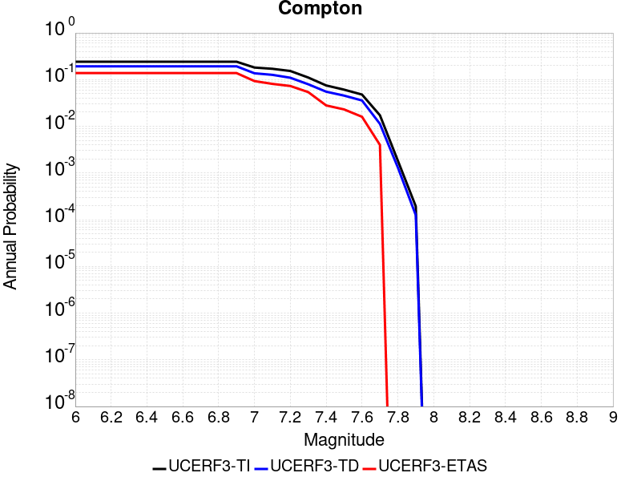 |
|-----|

| Magnitude | UCERF3-TI Prob | UCERF3-TD Prob | UCERF3-ETAS Prob |
|-----|-----|-----|-----|
| 6.0 | 0.24170336 | 0.19269621 | 0.16111112 |
| 6.1 | 0.24170336 | 0.19269621 | 0.16111112 |
| 6.2 | 0.24170336 | 0.19269621 | 0.16111112 |
| 6.3 | 0.24170336 | 0.19269621 | 0.16111112 |
| 6.4 | 0.24170336 | 0.19269621 | 0.16111112 |
| 6.5 | 0.24170336 | 0.19269621 | 0.16111112 |
| 6.6 | 0.24170336 | 0.19269621 | 0.16111112 |
| 6.7 | 0.24170336 | 0.19269621 | 0.16111112 |
| 6.8 | 0.24170336 | 0.19269621 | 0.16111112 |
| 6.9 | 0.24170336 | 0.19269621 | 0.16111112 |
| 7.0 | 0.18140881 | 0.13659802 | 0.08888889 |
| 7.1 | 0.17047672 | 0.12649113 | 0.08888889 |
| 7.2 | 0.15309018 | 0.10965353 | 0.07777778 |
| 7.3 | 0.11074426 | 0.07952117 | 0.06666667 |
| 7.4 | 0.07497687 | 0.055120174 | 0.044444446 |
| 7.5 | 0.060968045 | 0.045447987 | 0.03888889 |
| 7.6 | 0.04782249 | 0.03572238 | 0.027777778 |
| 7.7 | 0.017237391 | 0.011290347 | 0.011111111 |
| 7.8 | 0.0018388254 | 0.0013150945 | 0.0 |
| 7.9 | 1.935879E-4 | 1.2550564E-4 | 0.0 |

## Concord 2011 CFM
*[(top)](#table-of-contents)*

| 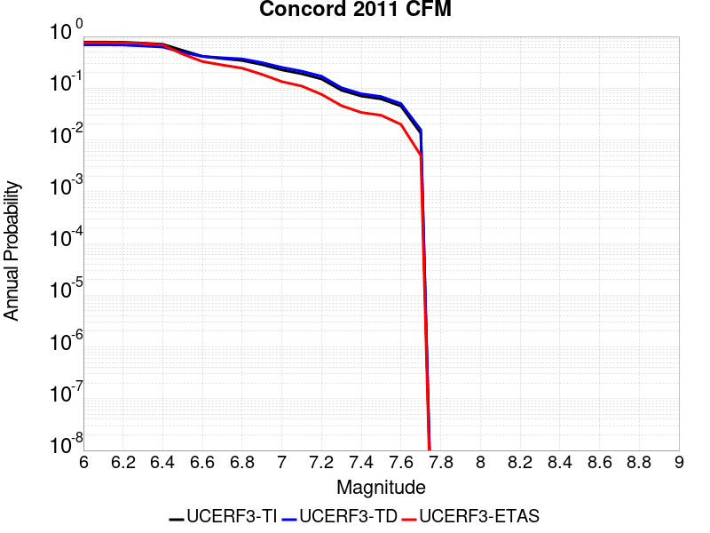 |
|-----|

| Magnitude | UCERF3-TI Prob | UCERF3-TD Prob | UCERF3-ETAS Prob |
|-----|-----|-----|-----|
| 6.0 | 0.7790244 | 0.68943346 | 0.76111114 |
| 6.1 | 0.7790244 | 0.68943346 | 0.76111114 |
| 6.2 | 0.7727343 | 0.6835437 | 0.75555557 |
| 6.3 | 0.7427083 | 0.6552766 | 0.7277778 |
| 6.4 | 0.7075263 | 0.6255632 | 0.6888889 |
| 6.5 | 0.5380107 | 0.49280357 | 0.45 |
| 6.6 | 0.4133738 | 0.41077062 | 0.33888888 |
| 6.7 | 0.37451643 | 0.38726708 | 0.2777778 |
| 6.8 | 0.34358913 | 0.36830628 | 0.21666667 |
| 6.9 | 0.28607884 | 0.3119979 | 0.16111112 |
| 7.0 | 0.22583543 | 0.25247523 | 0.10555556 |
| 7.1 | 0.19025426 | 0.21319754 | 0.08888889 |
| 7.2 | 0.15084496 | 0.1702583 | 0.083333336 |
| 7.3 | 0.09145196 | 0.10197303 | 0.05 |
| 7.4 | 0.07055331 | 0.07807998 | 0.033333335 |
| 7.5 | 0.062111445 | 0.068929195 | 0.033333335 |
| 7.6 | 0.045161143 | 0.050376084 | 0.027777778 |
| 7.7 | 0.013452267 | 0.015680537 | 0.0 |

## Contra Costa (Lafayette) 2011 CFM
*[(top)](#table-of-contents)*

| 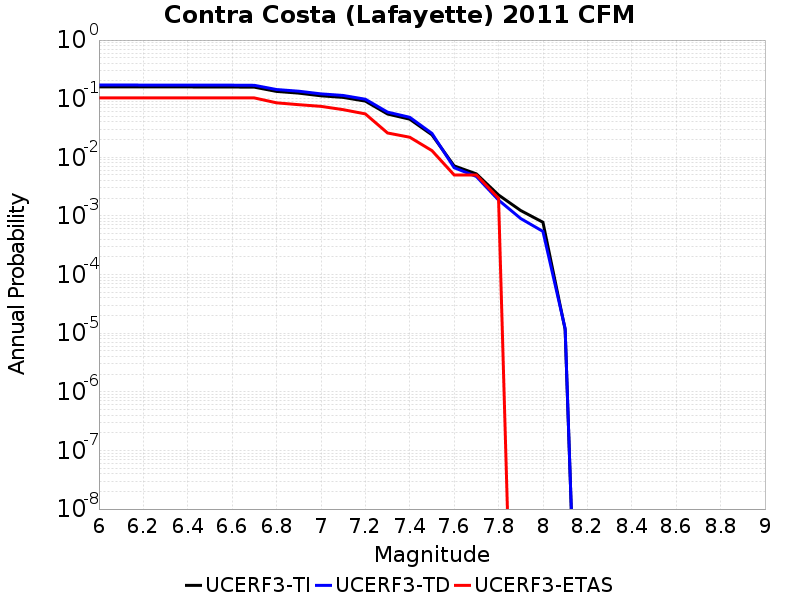 |
|-----|

| Magnitude | UCERF3-TI Prob | UCERF3-TD Prob | UCERF3-ETAS Prob |
|-----|-----|-----|-----|
| 6.0 | 0.15939693 | 0.17127593 | 0.083333336 |
| 6.1 | 0.15939693 | 0.17127593 | 0.083333336 |
| 6.2 | 0.15873863 | 0.17059427 | 0.083333336 |
| 6.3 | 0.15873863 | 0.17059427 | 0.083333336 |
| 6.4 | 0.15873863 | 0.17059427 | 0.083333336 |
| 6.5 | 0.1583222 | 0.17015542 | 0.083333336 |
| 6.6 | 0.1581732 | 0.1699967 | 0.083333336 |
| 6.7 | 0.15723789 | 0.16901043 | 0.083333336 |
| 6.8 | 0.13304448 | 0.14327887 | 0.072222225 |
| 6.9 | 0.12440883 | 0.13409474 | 0.072222225 |
| 7.0 | 0.111991294 | 0.12079606 | 0.06666667 |
| 7.1 | 0.105222166 | 0.11347129 | 0.06666667 |
| 7.2 | 0.09093019 | 0.0978716 | 0.055555556 |
| 7.3 | 0.05478249 | 0.05896708 | 0.03888889 |
| 7.4 | 0.044711318 | 0.048132654 | 0.027777778 |
| 7.5 | 0.024194803 | 0.025588054 | 0.011111111 |
| 7.6 | 0.0071415985 | 0.0066481195 | 0.0055555557 |
| 7.7 | 0.005219317 | 0.004708919 | 0.0055555557 |
| 7.8 | 0.0022777077 | 0.0018647702 | 0.0055555557 |
| 7.9 | 0.0012359286 | 9.0187346E-4 | 0.0 |
| 8.0 | 7.80193E-4 | 5.4482726E-4 | 0.0 |
| 8.1 | 1.156065E-5 | 1.2029772E-5 | 0.0 |

## Contra Costa Shear Zone (connector) 2011 CFM
*[(top)](#table-of-contents)*

| 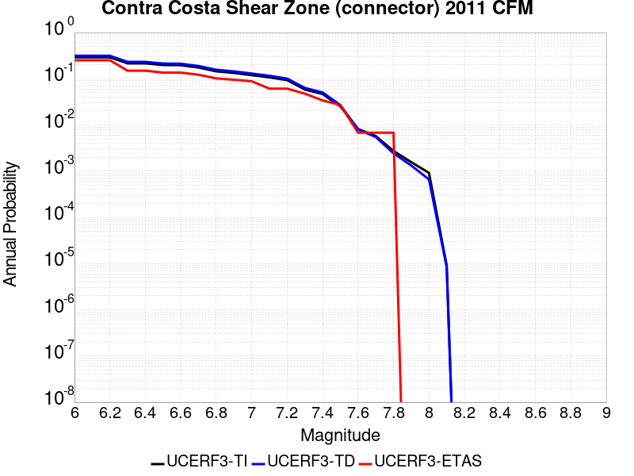 |
|-----|

| Magnitude | UCERF3-TI Prob | UCERF3-TD Prob | UCERF3-ETAS Prob |
|-----|-----|-----|-----|
| 6.0 | 0.29110852 | 0.3148793 | 0.17777778 |
| 6.1 | 0.29110852 | 0.3148793 | 0.17777778 |
| 6.2 | 0.29110852 | 0.3148793 | 0.17777778 |
| 6.3 | 0.21575403 | 0.23188594 | 0.11111111 |
| 6.4 | 0.21575403 | 0.23188594 | 0.11111111 |
| 6.5 | 0.1987384 | 0.21386413 | 0.1 |
| 6.6 | 0.19684294 | 0.21186118 | 0.1 |
| 6.7 | 0.17521557 | 0.18891524 | 0.08888889 |
| 6.8 | 0.1450092 | 0.15674363 | 0.072222225 |
| 6.9 | 0.13379058 | 0.14470214 | 0.072222225 |
| 7.0 | 0.11981842 | 0.12971807 | 0.06666667 |
| 7.1 | 0.1075162 | 0.11626878 | 0.06666667 |
| 7.2 | 0.09355138 | 0.100973226 | 0.06111111 |
| 7.3 | 0.058682445 | 0.06344306 | 0.03888889 |
| 7.4 | 0.046816517 | 0.050626755 | 0.022222223 |
| 7.5 | 0.025346402 | 0.02701939 | 0.0055555557 |
| 7.6 | 0.0082111005 | 0.007988882 | 0.0 |
| 7.7 | 0.005755832 | 0.0054990994 | 0.0 |
| 7.8 | 0.002738112 | 0.0024396626 | 0.0 |
| 7.9 | 0.0015717698 | 0.0013296651 | 0.0 |
| 8.0 | 9.2080625E-4 | 6.654229E-4 | 0.0 |
| 8.1 | 9.193365E-6 | 8.379112E-6 | 0.0 |

## Coronado Bank alt1
*[(top)](#table-of-contents)*

| 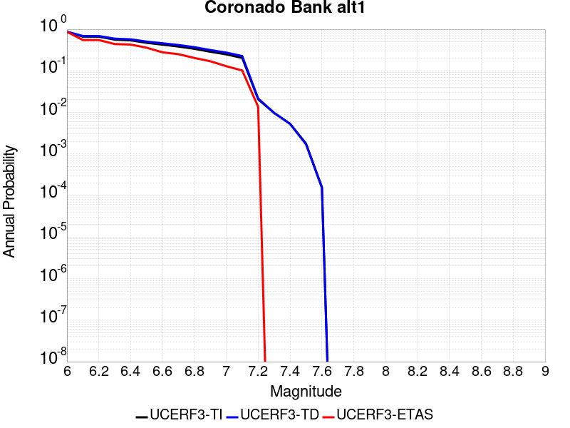 |
|-----|

| Magnitude | UCERF3-TI Prob | UCERF3-TD Prob | UCERF3-ETAS Prob |
|-----|-----|-----|-----|
| 6.0 | 0.8599154 | 0.87877923 | 0.8277778 |
| 6.1 | 0.6640339 | 0.68950015 | 0.5277778 |
| 6.2 | 0.6640339 | 0.68950015 | 0.5277778 |
| 6.3 | 0.56372064 | 0.5947713 | 0.43888888 |
| 6.4 | 0.5413682 | 0.5736033 | 0.43333334 |
| 6.5 | 0.47245607 | 0.5066934 | 0.33333334 |
| 6.6 | 0.42659444 | 0.46120876 | 0.30555555 |
| 6.7 | 0.38423568 | 0.41892913 | 0.2888889 |
| 6.8 | 0.33890283 | 0.371195 | 0.21111111 |
| 6.9 | 0.28803328 | 0.31700012 | 0.14444445 |
| 7.0 | 0.24897406 | 0.27511215 | 0.11666667 |
| 7.1 | 0.20443717 | 0.22705677 | 0.083333336 |
| 7.2 | 0.020721626 | 0.021616228 | 0.011111111 |
| 7.3 | 0.00968233 | 0.009766075 | 0.0055555557 |
| 7.4 | 0.005348828 | 0.0052672294 | 0.0 |
| 7.5 | 0.0017843343 | 0.0017125004 | 0.0 |
| 7.6 | 1.5906715E-4 | 1.5283578E-4 | 0.0 |

## Coyote Canyon
*[(top)](#table-of-contents)*

| 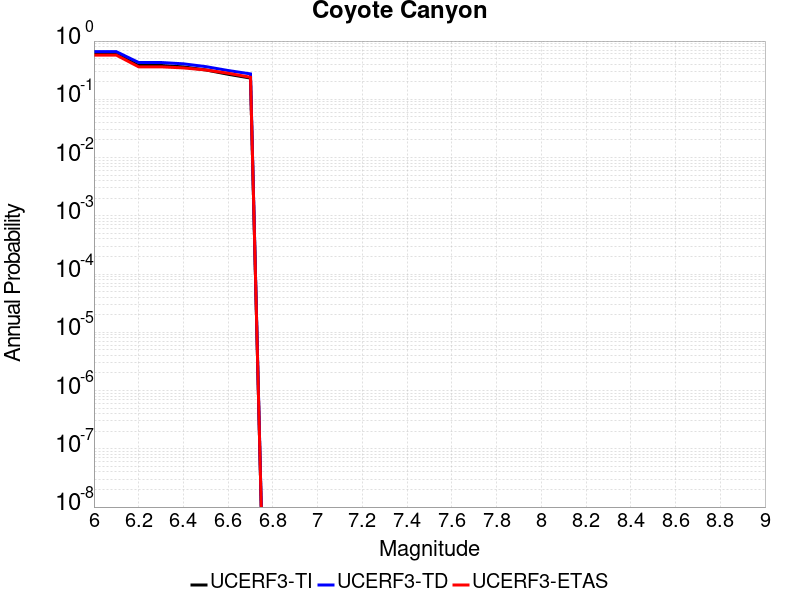 |
|-----|

| Magnitude | UCERF3-TI Prob | UCERF3-TD Prob | UCERF3-ETAS Prob |
|-----|-----|-----|-----|
| 6.0 | 0.5996796 | 0.65789795 | 0.60555553 |
| 6.1 | 0.5996796 | 0.65789795 | 0.60555553 |
| 6.2 | 0.38154912 | 0.42836806 | 0.40555555 |
| 6.3 | 0.38154912 | 0.42836806 | 0.40555555 |
| 6.4 | 0.36026728 | 0.40673462 | 0.3888889 |
| 6.5 | 0.3193368 | 0.36414084 | 0.36666667 |
| 6.6 | 0.26914394 | 0.3119978 | 0.30555555 |
| 6.7 | 0.23155676 | 0.27304053 | 0.23888889 |

## Coyote Lake
*[(top)](#table-of-contents)*

| 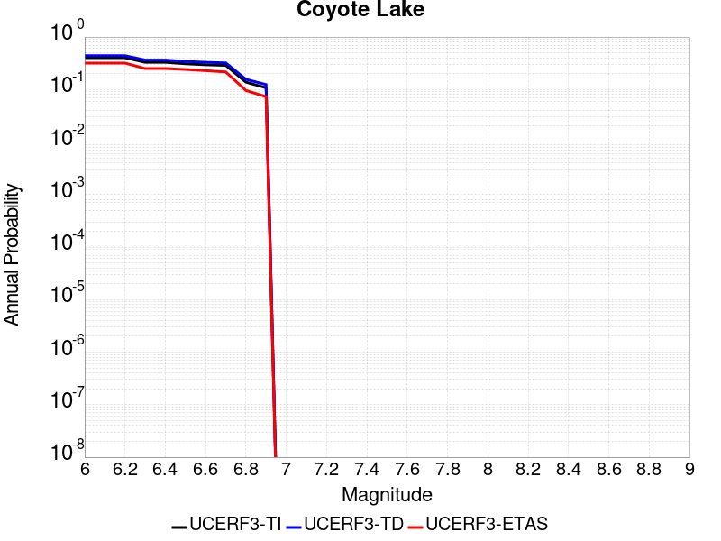 |
|-----|

| Magnitude | UCERF3-TI Prob | UCERF3-TD Prob | UCERF3-ETAS Prob |
|-----|-----|-----|-----|
| 6.0 | 0.40349331 | 0.44140705 | 0.35 |
| 6.1 | 0.40349331 | 0.44140705 | 0.35 |
| 6.2 | 0.40349331 | 0.44140705 | 0.35 |
| 6.3 | 0.32990623 | 0.36450416 | 0.3 |
| 6.4 | 0.32990623 | 0.36450416 | 0.3 |
| 6.5 | 0.30940497 | 0.3432858 | 0.3 |
| 6.6 | 0.29630256 | 0.32975146 | 0.28333333 |
| 6.7 | 0.2881532 | 0.32125175 | 0.27222222 |
| 6.8 | 0.13807777 | 0.15652826 | 0.1 |
| 6.9 | 0.10811646 | 0.124317095 | 0.072222225 |

## Cucamonga
*[(top)](#table-of-contents)*

| 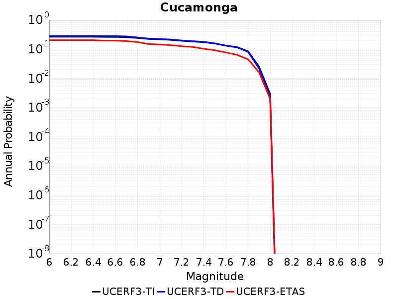 |
|-----|

| Magnitude | UCERF3-TI Prob | UCERF3-TD Prob | UCERF3-ETAS Prob |
|-----|-----|-----|-----|
| 6.0 | 0.26590493 | 0.28373194 | 0.21111111 |
| 6.1 | 0.26590493 | 0.28373194 | 0.21111111 |
| 6.2 | 0.26590493 | 0.28373194 | 0.21111111 |
| 6.3 | 0.26590493 | 0.28373194 | 0.21111111 |
| 6.4 | 0.26590493 | 0.28373194 | 0.21111111 |
| 6.5 | 0.26303652 | 0.28073025 | 0.21111111 |
| 6.6 | 0.26303652 | 0.28073025 | 0.21111111 |
| 6.7 | 0.2572116 | 0.2734948 | 0.20555556 |
| 6.8 | 0.24128349 | 0.2528756 | 0.19444445 |
| 6.9 | 0.22338271 | 0.23071396 | 0.17777778 |
| 7.0 | 0.21710505 | 0.22320955 | 0.17222223 |
| 7.1 | 0.20817006 | 0.21472052 | 0.15555556 |
| 7.2 | 0.19367145 | 0.19869754 | 0.1388889 |
| 7.3 | 0.1823777 | 0.18815993 | 0.12777779 |
| 7.4 | 0.1728891 | 0.1783349 | 0.12222222 |
| 7.5 | 0.15622263 | 0.15814312 | 0.10555556 |
| 7.6 | 0.13253039 | 0.1314201 | 0.083333336 |
| 7.7 | 0.11769853 | 0.115152545 | 0.06666667 |
| 7.8 | 0.084744215 | 0.08112221 | 0.055555556 |
| 7.9 | 0.025117673 | 0.021636471 | 0.011111111 |
| 8.0 | 0.002953781 | 0.0024315212 | 0.0 |

## Davis Creek
*[(top)](#table-of-contents)*

| 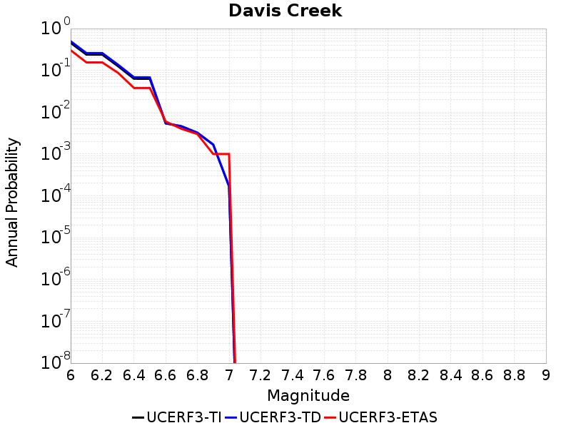 |
|-----|

| Magnitude | UCERF3-TI Prob | UCERF3-TD Prob | UCERF3-ETAS Prob |
|-----|-----|-----|-----|
| 6.0 | 0.45570913 | 0.49906313 | 0.2777778 |
| 6.1 | 0.23778735 | 0.25932246 | 0.13333334 |
| 6.2 | 0.23778735 | 0.25932246 | 0.13333334 |
| 6.3 | 0.12532169 | 0.13619466 | 0.072222225 |
| 6.4 | 0.06310547 | 0.06849396 | 0.022222223 |
| 6.5 | 0.06276634 | 0.068152286 | 0.022222223 |
| 6.6 | 0.005392585 | 0.0054649697 | 0.0 |
| 6.7 | 0.004566783 | 0.004627808 | 0.0 |
| 6.8 | 0.003209143 | 0.0032490557 | 0.0 |
| 6.9 | 0.0016683204 | 0.0016897338 | 0.0 |
| 7.0 | 1.6814613E-4 | 1.7037716E-4 | 0.0 |

## Death Valley (Black Mtns Frontal)
*[(top)](#table-of-contents)*

| 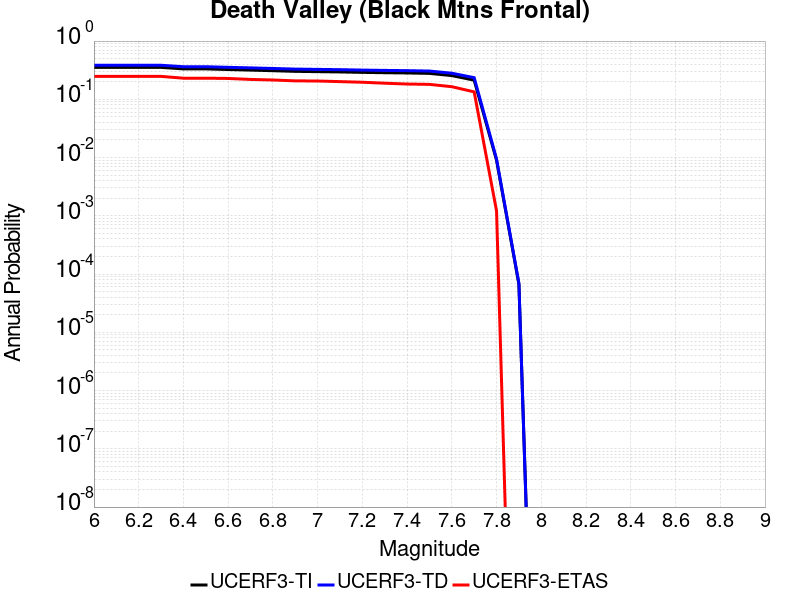 |
|-----|

| Magnitude | UCERF3-TI Prob | UCERF3-TD Prob | UCERF3-ETAS Prob |
|-----|-----|-----|-----|
| 6.0 | 0.35330656 | 0.38420892 | 0.24444444 |
| 6.1 | 0.35330656 | 0.38420892 | 0.24444444 |
| 6.2 | 0.35330656 | 0.38420892 | 0.24444444 |
| 6.3 | 0.35330656 | 0.38420892 | 0.24444444 |
| 6.4 | 0.33288598 | 0.3627138 | 0.21666667 |
| 6.5 | 0.33288598 | 0.3627138 | 0.21666667 |
| 6.6 | 0.32458875 | 0.3540274 | 0.21666667 |
| 6.7 | 0.31738147 | 0.3464899 | 0.20555556 |
| 6.8 | 0.3097555 | 0.3384154 | 0.2 |
| 6.9 | 0.3019855 | 0.33018094 | 0.19444445 |
| 7.0 | 0.2984247 | 0.32642165 | 0.19444445 |
| 7.1 | 0.29500338 | 0.32280985 | 0.18333334 |
| 7.2 | 0.2899773 | 0.31750324 | 0.18333334 |
| 7.3 | 0.28619048 | 0.3134939 | 0.17222223 |
| 7.4 | 0.28332514 | 0.31046084 | 0.16111112 |
| 7.5 | 0.27869287 | 0.30558342 | 0.16111112 |
| 7.6 | 0.25534853 | 0.2805869 | 0.15 |
| 7.7 | 0.21316631 | 0.2350929 | 0.1388889 |
| 7.8 | 0.008982842 | 0.00944719 | 0.0 |
| 7.9 | 6.676333E-5 | 6.9493806E-5 | 0.0 |

## Death Valley (Fish Lake Valley)
*[(top)](#table-of-contents)*

| 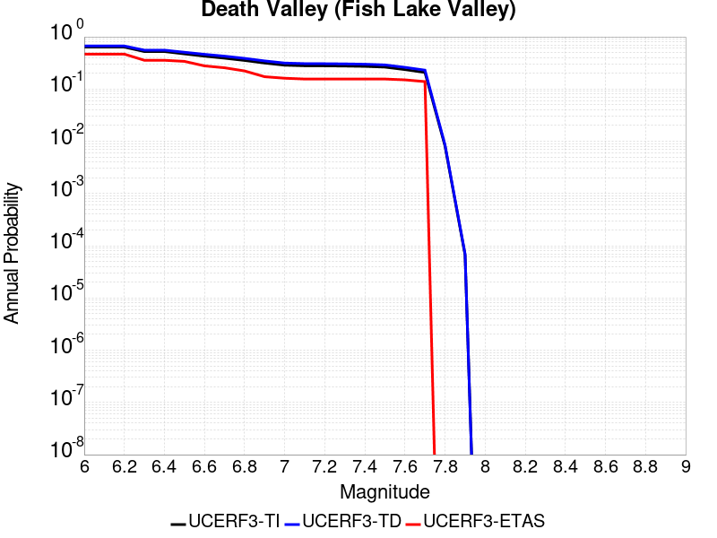 |
|-----|

| Magnitude | UCERF3-TI Prob | UCERF3-TD Prob | UCERF3-ETAS Prob |
|-----|-----|-----|-----|
| 6.0 | 0.6358838 | 0.66745776 | 0.46666667 |
| 6.1 | 0.6358838 | 0.66745776 | 0.46666667 |
| 6.2 | 0.6358838 | 0.66745776 | 0.46666667 |
| 6.3 | 0.5227945 | 0.55528665 | 0.35555556 |
| 6.4 | 0.5227945 | 0.55528665 | 0.35555556 |
| 6.5 | 0.47157615 | 0.50627214 | 0.33888888 |
| 6.6 | 0.42630634 | 0.4620385 | 0.2777778 |
| 6.7 | 0.390216 | 0.42627645 | 0.25555557 |
| 6.8 | 0.35304356 | 0.3867068 | 0.22222222 |
| 6.9 | 0.3150635 | 0.3455717 | 0.17222223 |
| 7.0 | 0.28653353 | 0.3146721 | 0.16111112 |
| 7.1 | 0.27912045 | 0.3066793 | 0.15555556 |
| 7.2 | 0.27808073 | 0.30557004 | 0.15555556 |
| 7.3 | 0.2757961 | 0.30312672 | 0.15555556 |
| 7.4 | 0.27188203 | 0.29893407 | 0.15555556 |
| 7.5 | 0.26321104 | 0.2897518 | 0.15555556 |
| 7.6 | 0.23603307 | 0.2603271 | 0.15 |
| 7.7 | 0.20798972 | 0.22988456 | 0.1388889 |
| 7.8 | 0.008075784 | 0.008508719 | 0.0 |
| 7.9 | 6.676333E-5 | 6.9493806E-5 | 0.0 |

## Death Valley (No)
*[(top)](#table-of-contents)*

| 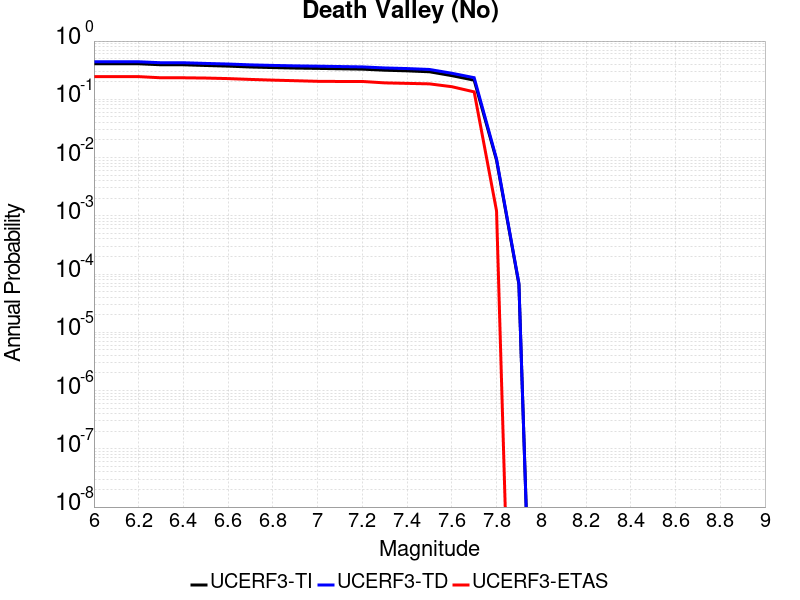 |
|-----|

| Magnitude | UCERF3-TI Prob | UCERF3-TD Prob | UCERF3-ETAS Prob |
|-----|-----|-----|-----|
| 6.0 | 0.4077004 | 0.4411188 | 0.21111111 |
| 6.1 | 0.4077004 | 0.4411188 | 0.21111111 |
| 6.2 | 0.4077004 | 0.4411188 | 0.21111111 |
| 6.3 | 0.39166012 | 0.42449 | 0.20555556 |
| 6.4 | 0.39166012 | 0.42449 | 0.20555556 |
| 6.5 | 0.38071296 | 0.41314822 | 0.20555556 |
| 6.6 | 0.37139177 | 0.40348023 | 0.20555556 |
| 6.7 | 0.35865343 | 0.39029065 | 0.20555556 |
| 6.8 | 0.3505657 | 0.3819034 | 0.19444445 |
| 6.9 | 0.34391838 | 0.37508914 | 0.18888889 |
| 7.0 | 0.33944476 | 0.37051934 | 0.18888889 |
| 7.1 | 0.3343925 | 0.36527687 | 0.18888889 |
| 7.2 | 0.32953972 | 0.36015856 | 0.18888889 |
| 7.3 | 0.31597713 | 0.3455959 | 0.17777778 |
| 7.4 | 0.30809844 | 0.33716568 | 0.16666667 |
| 7.5 | 0.2969267 | 0.32535684 | 0.16666667 |
| 7.6 | 0.25493556 | 0.28017774 | 0.15 |
| 7.7 | 0.21316631 | 0.2350929 | 0.1388889 |
| 7.8 | 0.008982842 | 0.00944719 | 0.0 |
| 7.9 | 6.676333E-5 | 6.9493806E-5 | 0.0 |

## Death Valley (So)
*[(top)](#table-of-contents)*

| 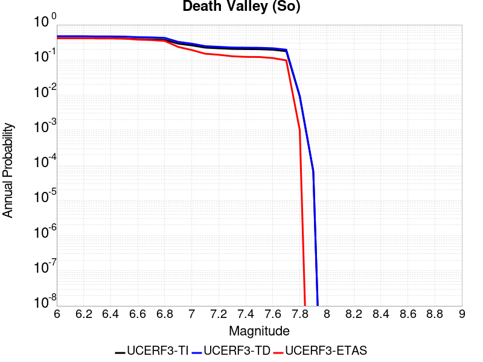 |
|-----|

| Magnitude | UCERF3-TI Prob | UCERF3-TD Prob | UCERF3-ETAS Prob |
|-----|-----|-----|-----|
| 6.0 | 0.4170434 | 0.47220123 | 0.43333334 |
| 6.1 | 0.4170434 | 0.47220123 | 0.43333334 |
| 6.2 | 0.4170434 | 0.47220123 | 0.43333334 |
| 6.3 | 0.4102521 | 0.46547797 | 0.43333334 |
| 6.4 | 0.4102521 | 0.46547797 | 0.43333334 |
| 6.5 | 0.40596646 | 0.46123758 | 0.42222223 |
| 6.6 | 0.389859 | 0.44394958 | 0.3888889 |
| 6.7 | 0.38480476 | 0.43875483 | 0.37777779 |
| 6.8 | 0.3719813 | 0.42405218 | 0.33888888 |
| 6.9 | 0.2901416 | 0.32652634 | 0.23888889 |
| 7.0 | 0.25934806 | 0.28976655 | 0.18888889 |
| 7.1 | 0.22390643 | 0.2470357 | 0.15 |
| 7.2 | 0.21407233 | 0.23584682 | 0.15 |
| 7.3 | 0.20522363 | 0.22546935 | 0.12777779 |
| 7.4 | 0.20324339 | 0.22343245 | 0.12222222 |
| 7.5 | 0.20124386 | 0.2213633 | 0.12222222 |
| 7.6 | 0.19510087 | 0.21485038 | 0.11111111 |
| 7.7 | 0.17711227 | 0.19547203 | 0.10555556 |
| 7.8 | 0.008982842 | 0.00944719 | 0.0 |
| 7.9 | 6.676333E-5 | 6.9493806E-5 | 0.0 |

## Deep Springs
*[(top)](#table-of-contents)*

| 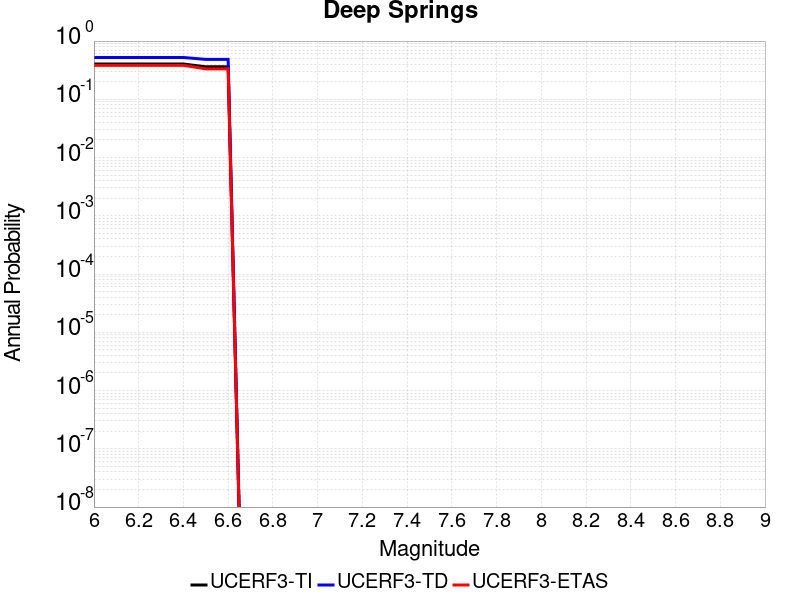 |
|-----|

| Magnitude | UCERF3-TI Prob | UCERF3-TD Prob | UCERF3-ETAS Prob |
|-----|-----|-----|-----|
| 6.0 | 0.40360376 | 0.5222802 | 0.38333333 |
| 6.1 | 0.40360376 | 0.5222802 | 0.38333333 |
| 6.2 | 0.40360376 | 0.5222802 | 0.38333333 |
| 6.3 | 0.40360376 | 0.5222802 | 0.38333333 |
| 6.4 | 0.40360376 | 0.5222802 | 0.38333333 |
| 6.5 | 0.36140782 | 0.4849513 | 0.33333334 |
| 6.6 | 0.36140782 | 0.4849513 | 0.33333334 |

## Del Valle
*[(top)](#table-of-contents)*

| 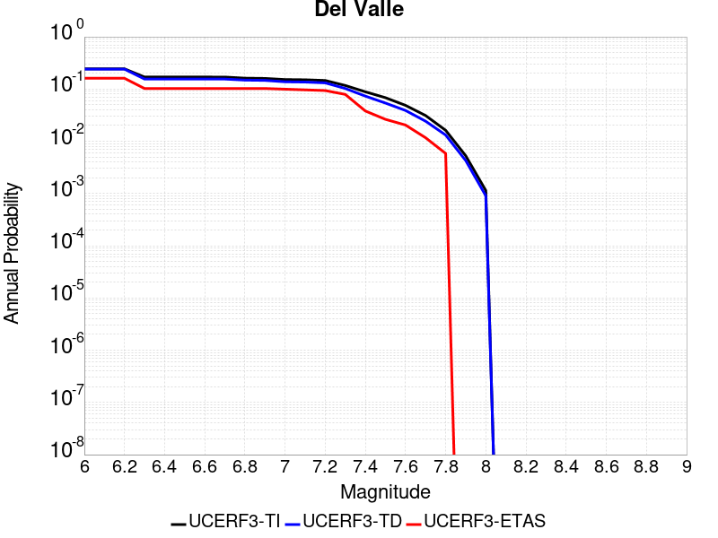 |
|-----|

| Magnitude | UCERF3-TI Prob | UCERF3-TD Prob | UCERF3-ETAS Prob |
|-----|-----|-----|-----|
| 6.0 | 0.2438969 | 0.24068104 | 0.17777778 |
| 6.1 | 0.2438969 | 0.24068104 | 0.17777778 |
| 6.2 | 0.2438969 | 0.24068104 | 0.17777778 |
| 6.3 | 0.16972728 | 0.15544687 | 0.10555556 |
| 6.4 | 0.16972728 | 0.15544687 | 0.10555556 |
| 6.5 | 0.16972728 | 0.15544687 | 0.10555556 |
| 6.6 | 0.16972728 | 0.15544687 | 0.10555556 |
| 6.7 | 0.16958304 | 0.15535882 | 0.10555556 |
| 6.8 | 0.16159704 | 0.14830701 | 0.10555556 |
| 6.9 | 0.15971749 | 0.14647375 | 0.10555556 |
| 7.0 | 0.15196753 | 0.13768992 | 0.10555556 |
| 7.1 | 0.15043104 | 0.1360788 | 0.10555556 |
| 7.2 | 0.14581795 | 0.13131894 | 0.10555556 |
| 7.3 | 0.11699391 | 0.102511294 | 0.08888889 |
| 7.4 | 0.088516355 | 0.07324641 | 0.03888889 |
| 7.5 | 0.06834184 | 0.053902943 | 0.027777778 |
| 7.6 | 0.0487419 | 0.038905017 | 0.022222223 |
| 7.7 | 0.031126674 | 0.024233213 | 0.016666668 |
| 7.8 | 0.016231032 | 0.013185114 | 0.011111111 |
| 7.9 | 0.0052802125 | 0.004274107 | 0.0 |
| 8.0 | 0.0011406228 | 9.042518E-4 | 0.0 |

## Dog Valley
*[(top)](#table-of-contents)*

| 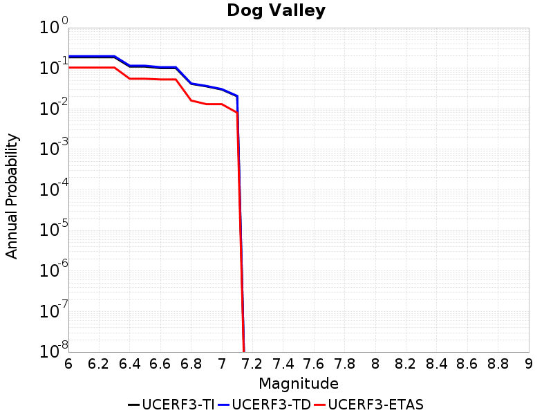 |
|-----|

| Magnitude | UCERF3-TI Prob | UCERF3-TD Prob | UCERF3-ETAS Prob |
|-----|-----|-----|-----|
| 6.0 | 0.1873056 | 0.19829804 | 0.08888889 |
| 6.1 | 0.1873056 | 0.19829804 | 0.08888889 |
| 6.2 | 0.1873056 | 0.19829804 | 0.08888889 |
| 6.3 | 0.1873056 | 0.19829804 | 0.08888889 |
| 6.4 | 0.10989345 | 0.11566482 | 0.044444446 |
| 6.5 | 0.10989345 | 0.11566482 | 0.044444446 |
| 6.6 | 0.10083931 | 0.10623756 | 0.044444446 |
| 6.7 | 0.10083931 | 0.10623756 | 0.044444446 |
| 6.8 | 0.041282788 | 0.042241532 | 0.022222223 |
| 6.9 | 0.035746936 | 0.0365907 | 0.011111111 |
| 7.0 | 0.029859101 | 0.030576767 | 0.011111111 |
| 7.1 | 0.020328866 | 0.020833097 | 0.0055555557 |

## Dry Mountain
*[(top)](#table-of-contents)*

| 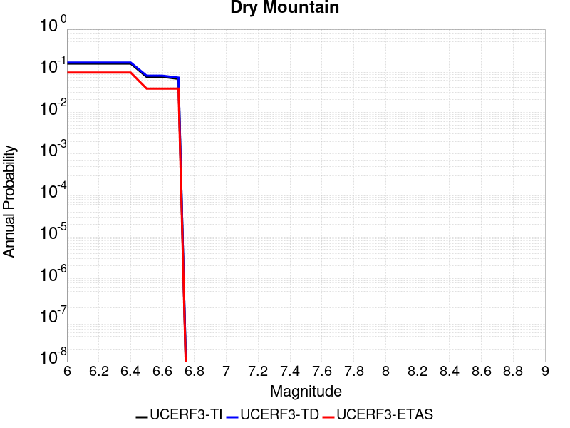 |
|-----|

| Magnitude | UCERF3-TI Prob | UCERF3-TD Prob | UCERF3-ETAS Prob |
|-----|-----|-----|-----|
| 6.0 | 0.1498555 | 0.15818131 | 0.06111111 |
| 6.1 | 0.1498555 | 0.15818131 | 0.06111111 |
| 6.2 | 0.1498555 | 0.15818131 | 0.06111111 |
| 6.3 | 0.1498555 | 0.15818131 | 0.06111111 |
| 6.4 | 0.1498555 | 0.15818131 | 0.06111111 |
| 6.5 | 0.07172685 | 0.076288894 | 0.016666668 |
| 6.6 | 0.07172685 | 0.076288894 | 0.016666668 |
| 6.7 | 0.064143345 | 0.06847433 | 0.016666668 |

## Earthquake Valley
*[(top)](#table-of-contents)*

| 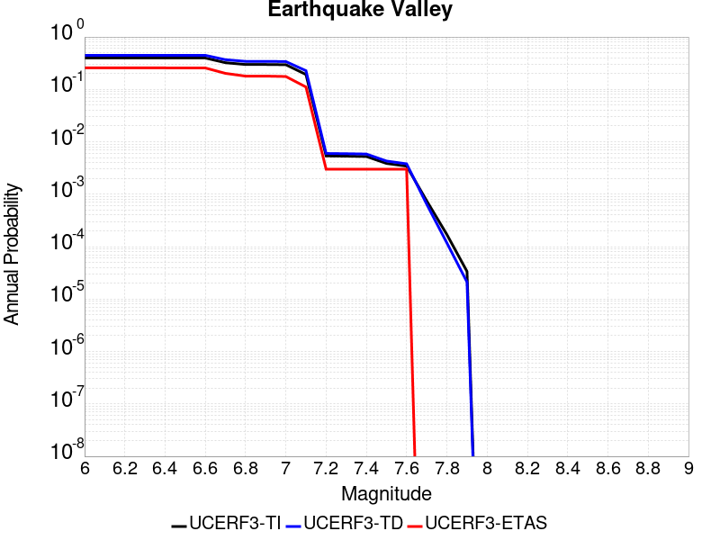 |
|-----|

| Magnitude | UCERF3-TI Prob | UCERF3-TD Prob | UCERF3-ETAS Prob |
|-----|-----|-----|-----|
| 6.0 | 0.39743787 | 0.44641548 | 0.22777778 |
| 6.1 | 0.39743787 | 0.44641548 | 0.22777778 |
| 6.2 | 0.39743787 | 0.44641548 | 0.22777778 |
| 6.3 | 0.39743787 | 0.44641548 | 0.22777778 |
| 6.4 | 0.39743787 | 0.44641548 | 0.22777778 |
| 6.5 | 0.3970097 | 0.44598797 | 0.22777778 |
| 6.6 | 0.3970097 | 0.44598797 | 0.22777778 |
| 6.7 | 0.3225346 | 0.367997 | 0.18888889 |
| 6.8 | 0.29815504 | 0.34207776 | 0.17222223 |
| 6.9 | 0.29815504 | 0.34207776 | 0.17222223 |
| 7.0 | 0.295643 | 0.3394476 | 0.16666667 |
| 7.1 | 0.19221005 | 0.22714604 | 0.11666667 |
| 7.2 | 0.00537658 | 0.0059918063 | 0.0 |
| 7.3 | 0.005324264 | 0.005929943 | 0.0 |
| 7.4 | 0.0052486705 | 0.005847337 | 0.0 |
| 7.5 | 0.0038662297 | 0.00429733 | 0.0 |
| 7.6 | 0.0034341833 | 0.003801751 | 0.0 |
| 7.7 | 7.461348E-4 | 6.418403E-4 | 0.0 |
| 7.8 | 1.702772E-4 | 1.17688796E-4 | 0.0 |
| 7.9 | 3.3650093E-5 | 2.1120919E-5 | 0.0 |

## Earthquake Valley (No  Extension)
*[(top)](#table-of-contents)*

| 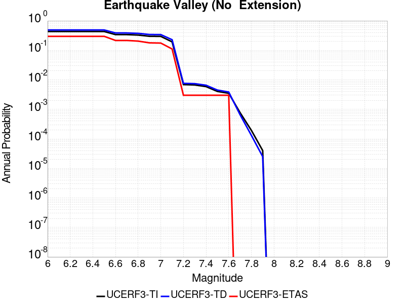 |
|-----|

| Magnitude | UCERF3-TI Prob | UCERF3-TD Prob | UCERF3-ETAS Prob |
|-----|-----|-----|-----|
| 6.0 | 0.43465 | 0.48924804 | 0.2611111 |
| 6.1 | 0.43465 | 0.48924804 | 0.2611111 |
| 6.2 | 0.43465 | 0.48924804 | 0.2611111 |
| 6.3 | 0.43465 | 0.48924804 | 0.2611111 |
| 6.4 | 0.43465 | 0.48924804 | 0.2611111 |
| 6.5 | 0.43465 | 0.48924804 | 0.2611111 |
| 6.6 | 0.34074783 | 0.38730836 | 0.18888889 |
| 6.7 | 0.34074783 | 0.38730836 | 0.18888889 |
| 6.8 | 0.32938787 | 0.37540466 | 0.18333334 |
| 6.9 | 0.29933313 | 0.3432631 | 0.17222223 |
| 7.0 | 0.29679754 | 0.34060752 | 0.16666667 |
| 7.1 | 0.19349857 | 0.22846366 | 0.11666667 |
| 7.2 | 0.006891508 | 0.0076051247 | 0.0 |
| 7.3 | 0.0067111515 | 0.0074112844 | 0.0 |
| 7.4 | 0.005898559 | 0.006547582 | 0.0 |
| 7.5 | 0.004049684 | 0.0044920594 | 0.0 |
| 7.6 | 0.0035025033 | 0.0038618662 | 0.0 |
| 7.7 | 7.750575E-4 | 6.5930793E-4 | 0.0 |
| 7.8 | 1.9405987E-4 | 1.3157353E-4 | 0.0 |
| 7.9 | 4.0107643E-5 | 2.5019004E-5 | 0.0 |

## Earthquake Valley (So Extension)
*[(top)](#table-of-contents)*

| 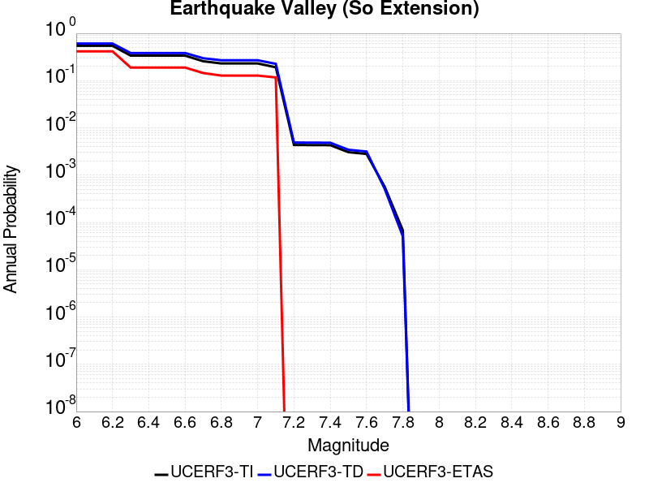 |
|-----|

| Magnitude | UCERF3-TI Prob | UCERF3-TD Prob | UCERF3-ETAS Prob |
|-----|-----|-----|-----|
| 6.0 | 0.54514426 | 0.6072097 | 0.41666666 |
| 6.1 | 0.54514426 | 0.6072097 | 0.41666666 |
| 6.2 | 0.54514426 | 0.6072097 | 0.41666666 |
| 6.3 | 0.3377363 | 0.38342616 | 0.18888889 |
| 6.4 | 0.3377363 | 0.38342616 | 0.18888889 |
| 6.5 | 0.3377363 | 0.38342616 | 0.18888889 |
| 6.6 | 0.3377363 | 0.38342616 | 0.18888889 |
| 6.7 | 0.25655183 | 0.29725766 | 0.14444445 |
| 6.8 | 0.230634 | 0.269323 | 0.12777779 |
| 6.9 | 0.230634 | 0.269323 | 0.12777779 |
| 7.0 | 0.230634 | 0.269323 | 0.12777779 |
| 7.1 | 0.19133802 | 0.22624867 | 0.11666667 |
| 7.2 | 0.004357395 | 0.004903777 | 0.0 |
| 7.3 | 0.0043297997 | 0.0048703672 | 0.0 |
| 7.4 | 0.0043134484 | 0.004851592 | 0.0 |
| 7.5 | 0.003064583 | 0.003448431 | 0.0 |
| 7.6 | 0.0028117937 | 0.0031609633 | 0.0 |
| 7.7 | 5.6928623E-4 | 5.1573507E-4 | 0.0 |
| 7.8 | 6.827241E-5 | 5.10274E-5 | 0.0 |

## East Huasna 2011 CFM
*[(top)](#table-of-contents)*

| 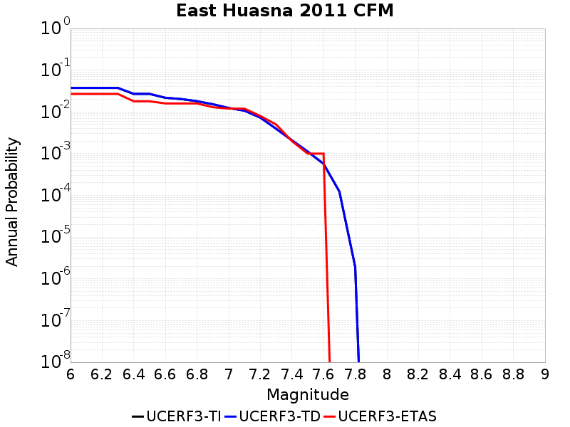 |
|-----|

| Magnitude | UCERF3-TI Prob | UCERF3-TD Prob | UCERF3-ETAS Prob |
|-----|-----|-----|-----|
| 6.0 | 0.03752078 | 0.037677407 | 0.022222223 |
| 6.1 | 0.03752078 | 0.037677407 | 0.022222223 |
| 6.2 | 0.03752078 | 0.037677407 | 0.022222223 |
| 6.3 | 0.03752078 | 0.037677407 | 0.022222223 |
| 6.4 | 0.026992148 | 0.027093502 | 0.022222223 |
| 6.5 | 0.026992148 | 0.027093502 | 0.022222223 |
| 6.6 | 0.02183757 | 0.021915646 | 0.022222223 |
| 6.7 | 0.02033864 | 0.020406026 | 0.022222223 |
| 6.8 | 0.018081587 | 0.018139282 | 0.022222223 |
| 6.9 | 0.015273943 | 0.015315323 | 0.022222223 |
| 7.0 | 0.012428838 | 0.012454229 | 0.016666668 |
| 7.1 | 0.010705914 | 0.010718523 | 0.016666668 |
| 7.2 | 0.007336912 | 0.007323094 | 0.011111111 |
| 7.3 | 0.00397374 | 0.0039296695 | 0.0055555557 |
| 7.4 | 0.0020788258 | 0.002098935 | 0.0 |
| 7.5 | 0.0011137845 | 0.0011258272 | 0.0 |
| 7.6 | 5.687811E-4 | 5.749582E-4 | 0.0 |
| 7.7 | 1.2312352E-4 | 1.2430239E-4 | 0.0 |
| 7.8 | 1.9306071E-6 | 1.9467868E-6 | 0.0 |

## Eaton Roughs 2011 CFM
*[(top)](#table-of-contents)*

| 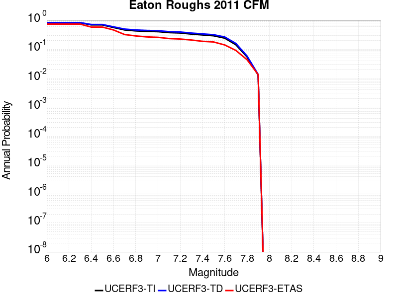 |
|-----|

| Magnitude | UCERF3-TI Prob | UCERF3-TD Prob | UCERF3-ETAS Prob |
|-----|-----|-----|-----|
| 6.0 | 0.83056813 | 0.8403523 | 0.76666665 |
| 6.1 | 0.83056813 | 0.8403523 | 0.76666665 |
| 6.2 | 0.83056813 | 0.8403523 | 0.76666665 |
| 6.3 | 0.83056813 | 0.8403523 | 0.76666665 |
| 6.4 | 0.6975078 | 0.72096634 | 0.60555553 |
| 6.5 | 0.6975078 | 0.72096634 | 0.60555553 |
| 6.6 | 0.5685747 | 0.59894174 | 0.5 |
| 6.7 | 0.46752074 | 0.5014475 | 0.37222221 |
| 6.8 | 0.43398535 | 0.46681058 | 0.33333334 |
| 6.9 | 0.41729018 | 0.4493887 | 0.31666666 |
| 7.0 | 0.4081523 | 0.43986294 | 0.30555555 |
| 7.1 | 0.37841812 | 0.40833685 | 0.26666668 |
| 7.2 | 0.36698413 | 0.3965429 | 0.24444444 |
| 7.3 | 0.33655906 | 0.36503306 | 0.22777778 |
| 7.4 | 0.31421077 | 0.34139848 | 0.22222222 |
| 7.5 | 0.29370537 | 0.3199172 | 0.21111111 |
| 7.6 | 0.24356844 | 0.26663545 | 0.15 |
| 7.7 | 0.14353801 | 0.15917885 | 0.11666667 |
| 7.8 | 0.054848842 | 0.05868525 | 0.044444446 |
| 7.9 | 0.012853368 | 0.013492676 | 0.022222223 |

## Elmore Ranch
*[(top)](#table-of-contents)*

| 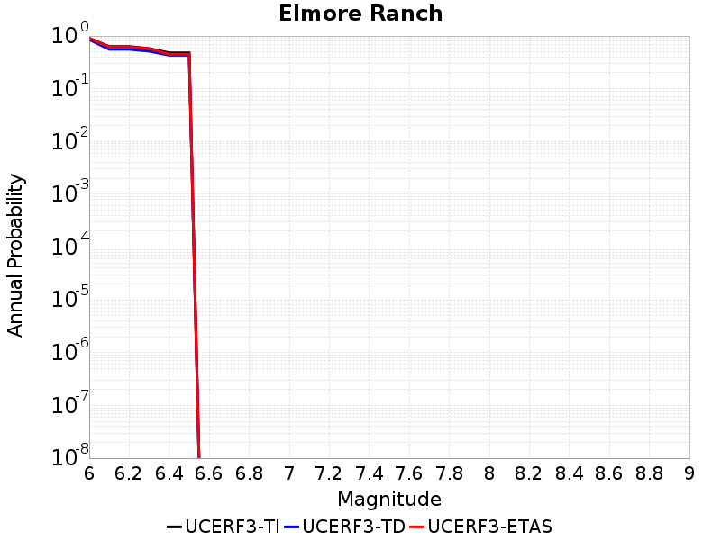 |
|-----|

| Magnitude | UCERF3-TI Prob | UCERF3-TD Prob | UCERF3-ETAS Prob |
|-----|-----|-----|-----|
| 6.0 | 0.90696514 | 0.8556078 | 0.9222222 |
| 6.1 | 0.6319047 | 0.55961174 | 0.6388889 |
| 6.2 | 0.6319047 | 0.55961174 | 0.6388889 |
| 6.3 | 0.57942164 | 0.5154124 | 0.60555553 |
| 6.4 | 0.48114288 | 0.4327515 | 0.45 |
| 6.5 | 0.48114288 | 0.4327515 | 0.45 |

## Elsinore (Coyote Mountains)
*[(top)](#table-of-contents)*

| 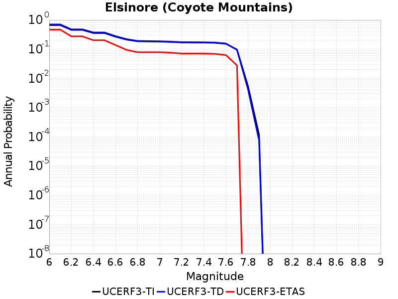 |
|-----|

| Magnitude | UCERF3-TI Prob | UCERF3-TD Prob | UCERF3-ETAS Prob |
|-----|-----|-----|-----|
| 6.0 | 0.666166 | 0.70238596 | 0.51111114 |
| 6.1 | 0.666166 | 0.70238596 | 0.51111114 |
| 6.2 | 0.4571156 | 0.47865948 | 0.30555555 |
| 6.3 | 0.4571156 | 0.47865948 | 0.30555555 |
| 6.4 | 0.356464 | 0.37443227 | 0.23888889 |
| 6.5 | 0.356464 | 0.37443227 | 0.23888889 |
| 6.6 | 0.2671033 | 0.27966186 | 0.15 |
| 6.7 | 0.2123343 | 0.22119027 | 0.07777778 |
| 6.8 | 0.18634695 | 0.19211514 | 0.06666667 |
| 6.9 | 0.1834919 | 0.18904416 | 0.06666667 |
| 7.0 | 0.1814795 | 0.18687208 | 0.06666667 |
| 7.1 | 0.17659646 | 0.1816074 | 0.06111111 |
| 7.2 | 0.16970143 | 0.17407274 | 0.055555556 |
| 7.3 | 0.16890393 | 0.1732465 | 0.055555556 |
| 7.4 | 0.16803907 | 0.17232963 | 0.055555556 |
| 7.5 | 0.16497612 | 0.16922908 | 0.044444446 |
| 7.6 | 0.15248974 | 0.15636906 | 0.044444446 |
| 7.7 | 0.09722835 | 0.09501241 | 0.022222223 |
| 7.8 | 0.00542387 | 0.004208439 | 0.0 |
| 7.9 | 1.17316136E-4 | 7.496642E-5 | 0.0 |

## Elsinore (Glen Ivy) rev
*[(top)](#table-of-contents)*

| 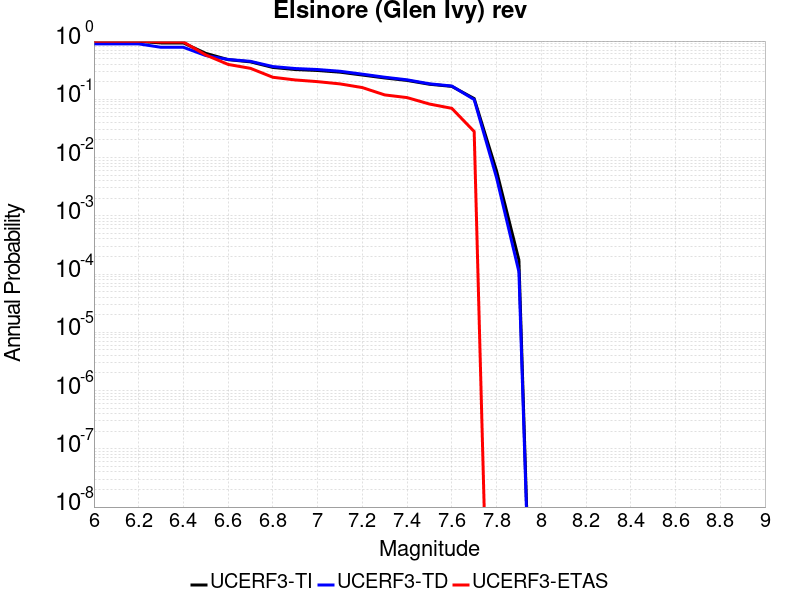 |
|-----|

| Magnitude | UCERF3-TI Prob | UCERF3-TD Prob | UCERF3-ETAS Prob |
|-----|-----|-----|-----|
| 6.0 | 0.98541665 | 0.894162 | 0.99444443 |
| 6.1 | 0.98541665 | 0.894162 | 0.99444443 |
| 6.2 | 0.98541665 | 0.894162 | 0.99444443 |
| 6.3 | 0.92851114 | 0.78161305 | 0.96666664 |
| 6.4 | 0.92851114 | 0.78161305 | 0.96666664 |
| 6.5 | 0.61539173 | 0.563961 | 0.5611111 |
| 6.6 | 0.47981948 | 0.48319826 | 0.3888889 |
| 6.7 | 0.4394976 | 0.448557 | 0.32777777 |
| 6.8 | 0.35241452 | 0.36509246 | 0.22777778 |
| 6.9 | 0.3246078 | 0.33764502 | 0.19444445 |
| 7.0 | 0.31249142 | 0.32463655 | 0.17222223 |
| 7.1 | 0.2925523 | 0.3031855 | 0.15 |
| 7.2 | 0.26106375 | 0.2702921 | 0.12777779 |
| 7.3 | 0.23266298 | 0.23947713 | 0.08888889 |
| 7.4 | 0.21093784 | 0.21611845 | 0.083333336 |
| 7.5 | 0.1813909 | 0.1847207 | 0.06111111 |
| 7.6 | 0.16670452 | 0.16903916 | 0.044444446 |
| 7.7 | 0.10293154 | 0.09906255 | 0.022222223 |
| 7.8 | 0.005902799 | 0.0045153685 | 0.0 |
| 7.9 | 1.7417852E-4 | 1.09805864E-4 | 0.0 |

## Elsinore (Julian)
*[(top)](#table-of-contents)*

| 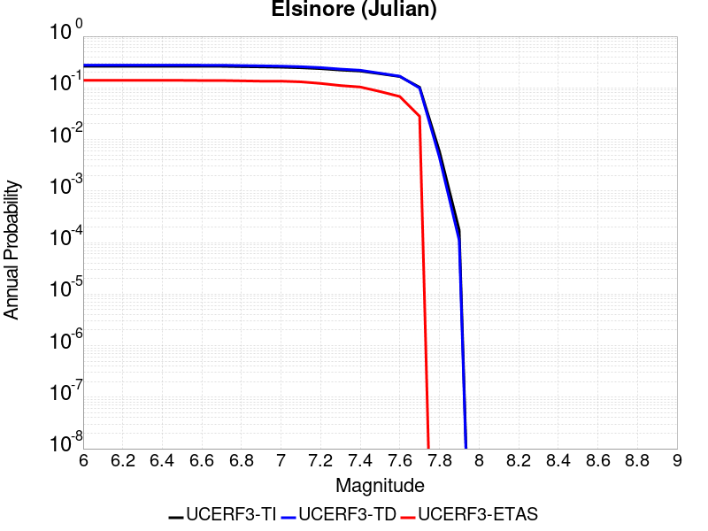 |
|-----|

| Magnitude | UCERF3-TI Prob | UCERF3-TD Prob | UCERF3-ETAS Prob |
|-----|-----|-----|-----|
| 6.0 | 0.2632549 | 0.2765742 | 0.13333334 |
| 6.1 | 0.2632549 | 0.2765742 | 0.13333334 |
| 6.2 | 0.2632549 | 0.2765742 | 0.13333334 |
| 6.3 | 0.2632549 | 0.2765742 | 0.13333334 |
| 6.4 | 0.2632549 | 0.2765742 | 0.13333334 |
| 6.5 | 0.2632549 | 0.2765742 | 0.13333334 |
| 6.6 | 0.2621082 | 0.2752824 | 0.13333334 |
| 6.7 | 0.2621082 | 0.2752824 | 0.13333334 |
| 6.8 | 0.2580946 | 0.27095103 | 0.13333334 |
| 6.9 | 0.25533882 | 0.2680159 | 0.12777779 |
| 7.0 | 0.25177774 | 0.26419005 | 0.12777779 |
| 7.1 | 0.24565583 | 0.2575971 | 0.11666667 |
| 7.2 | 0.2362025 | 0.24721819 | 0.10555556 |
| 7.3 | 0.2220114 | 0.23129015 | 0.094444446 |
| 7.4 | 0.2122487 | 0.21989673 | 0.08888889 |
| 7.5 | 0.18814024 | 0.19262317 | 0.06111111 |
| 7.6 | 0.16595201 | 0.16844928 | 0.044444446 |
| 7.7 | 0.102749586 | 0.098939635 | 0.022222223 |
| 7.8 | 0.0058781286 | 0.004500428 | 0.0 |
| 7.9 | 1.7417852E-4 | 1.09805864E-4 | 0.0 |

## Elsinore (Stepovers Combined)
*[(top)](#table-of-contents)*

| 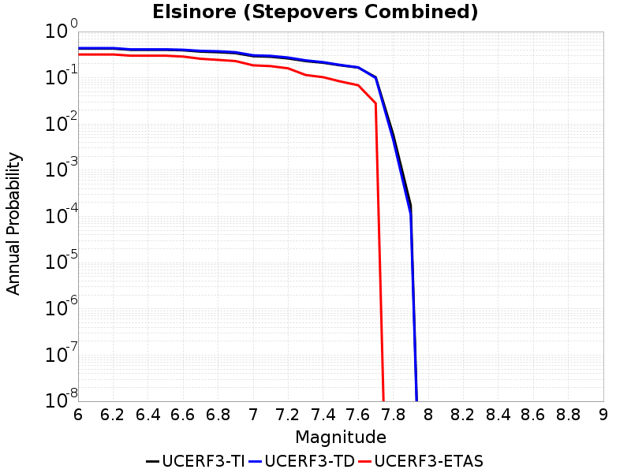 |
|-----|

| Magnitude | UCERF3-TI Prob | UCERF3-TD Prob | UCERF3-ETAS Prob |
|-----|-----|-----|-----|
| 6.0 | 0.42848387 | 0.440255 | 0.31111112 |
| 6.1 | 0.42848387 | 0.440255 | 0.31111112 |
| 6.2 | 0.42848387 | 0.440255 | 0.31111112 |
| 6.3 | 0.40268403 | 0.4126586 | 0.28333333 |
| 6.4 | 0.40268403 | 0.4126586 | 0.28333333 |
| 6.5 | 0.40268403 | 0.4126586 | 0.28333333 |
| 6.6 | 0.39384764 | 0.40441427 | 0.28333333 |
| 6.7 | 0.36833197 | 0.38320878 | 0.25 |
| 6.8 | 0.35775277 | 0.37482563 | 0.25 |
| 6.9 | 0.34132642 | 0.3575042 | 0.23333333 |
| 7.0 | 0.2934563 | 0.30703917 | 0.15555556 |
| 7.1 | 0.2851266 | 0.29844832 | 0.15 |
| 7.2 | 0.2620973 | 0.27450225 | 0.12777779 |
| 7.3 | 0.22980902 | 0.23841825 | 0.083333336 |
| 7.4 | 0.21167973 | 0.21785396 | 0.07777778 |
| 7.5 | 0.18562731 | 0.18932578 | 0.06111111 |
| 7.6 | 0.16642986 | 0.16881673 | 0.044444446 |
| 7.7 | 0.10288919 | 0.099032775 | 0.022222223 |
| 7.8 | 0.005902799 | 0.0045153685 | 0.0 |
| 7.9 | 1.7417852E-4 | 1.09805864E-4 | 0.0 |

## Elsinore (Temecula) rev
*[(top)](#table-of-contents)*

| 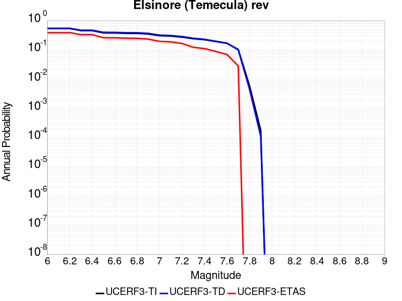 |
|-----|

| Magnitude | UCERF3-TI Prob | UCERF3-TD Prob | UCERF3-ETAS Prob |
|-----|-----|-----|-----|
| 6.0 | 0.5370038 | 0.54710966 | 0.39444444 |
| 6.1 | 0.5370038 | 0.54710966 | 0.39444444 |
| 6.2 | 0.5370038 | 0.54710966 | 0.39444444 |
| 6.3 | 0.45441434 | 0.46934378 | 0.33333334 |
| 6.4 | 0.45441434 | 0.46934378 | 0.33333334 |
| 6.5 | 0.3802583 | 0.39772713 | 0.2611111 |
| 6.6 | 0.3783873 | 0.39578447 | 0.2611111 |
| 6.7 | 0.36675584 | 0.38446298 | 0.25555557 |
| 6.8 | 0.36517426 | 0.382857 | 0.25555557 |
| 6.9 | 0.34814647 | 0.36495277 | 0.23333333 |
| 7.0 | 0.30439225 | 0.31851968 | 0.17222223 |
| 7.1 | 0.2951238 | 0.30887523 | 0.16111112 |
| 7.2 | 0.27147335 | 0.28419745 | 0.13333334 |
| 7.3 | 0.23971626 | 0.24873653 | 0.08888889 |
| 7.4 | 0.22205317 | 0.22861789 | 0.083333336 |
| 7.5 | 0.19291662 | 0.19678581 | 0.06111111 |
| 7.6 | 0.16637775 | 0.16878088 | 0.044444446 |
| 7.7 | 0.10284023 | 0.09899911 | 0.022222223 |
| 7.8 | 0.005902799 | 0.0045153685 | 0.0 |
| 7.9 | 1.7417852E-4 | 1.09805864E-4 | 0.0 |

## Elysian Park (Lower CFM)
*[(top)](#table-of-contents)*

| 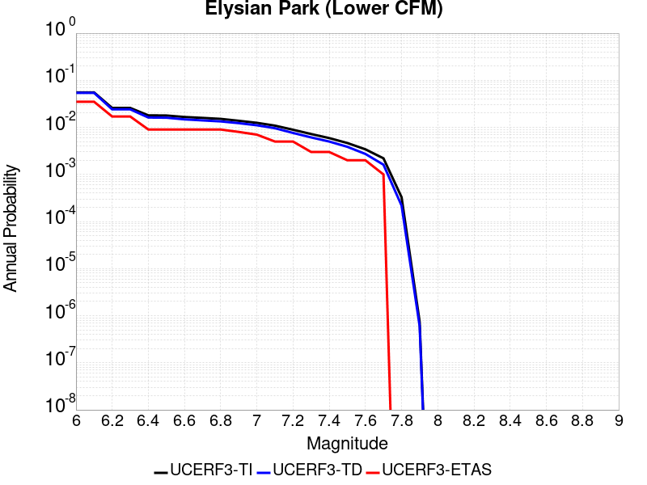 |
|-----|

| Magnitude | UCERF3-TI Prob | UCERF3-TD Prob | UCERF3-ETAS Prob |
|-----|-----|-----|-----|
| 6.0 | 0.055204995 | 0.054168493 | 0.022222223 |
| 6.1 | 0.055204995 | 0.054168493 | 0.022222223 |
| 6.2 | 0.025831167 | 0.024117786 | 0.0055555557 |
| 6.3 | 0.025831167 | 0.024117786 | 0.0055555557 |
| 6.4 | 0.017995883 | 0.016184825 | 0.0 |
| 6.5 | 0.017845368 | 0.01603263 | 0.0 |
| 6.6 | 0.016609466 | 0.014784477 | 0.0 |
| 6.7 | 0.015887953 | 0.014056533 | 0.0 |
| 6.8 | 0.0151406545 | 0.01338459 | 0.0 |
| 6.9 | 0.013790793 | 0.0122852065 | 0.0 |
| 7.0 | 0.012482702 | 0.011072401 | 0.0 |
| 7.1 | 0.010880386 | 0.009597125 | 0.0 |
| 7.2 | 0.008898496 | 0.0076116864 | 0.0 |
| 7.3 | 0.00721924 | 0.0061174845 | 0.0 |
| 7.4 | 0.005919418 | 0.0049997047 | 0.0 |
| 7.5 | 0.004652488 | 0.003867324 | 0.0 |
| 7.6 | 0.0034182456 | 0.0027261702 | 0.0 |
| 7.7 | 0.0021995115 | 0.001611362 | 0.0 |
| 7.8 | 3.2844688E-4 | 2.1809964E-4 | 0.0 |
| 7.9 | 7.389586E-7 | 5.9960433E-7 | 0.0 |

## Elysian Park (Upper)
*[(top)](#table-of-contents)*

| 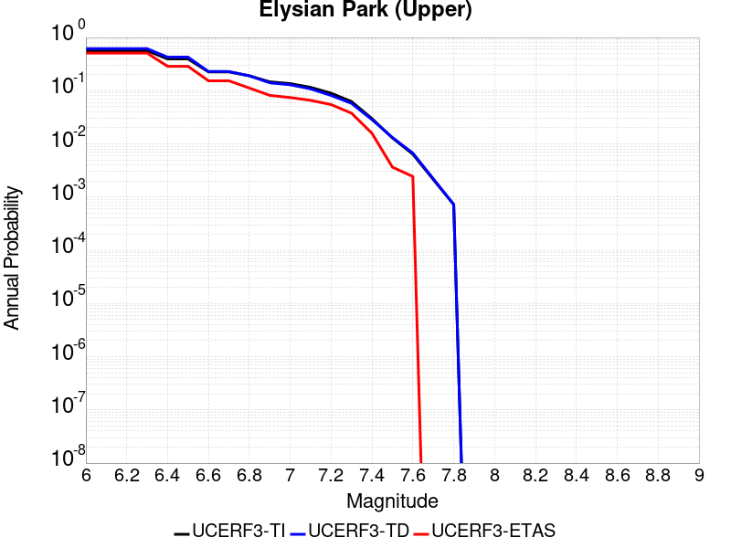 |
|-----|

| Magnitude | UCERF3-TI Prob | UCERF3-TD Prob | UCERF3-ETAS Prob |
|-----|-----|-----|-----|
| 6.0 | 0.56466347 | 0.61671203 | 0.51666665 |
| 6.1 | 0.56466347 | 0.61671203 | 0.51666665 |
| 6.2 | 0.56466347 | 0.61671203 | 0.51666665 |
| 6.3 | 0.56466347 | 0.61671203 | 0.51666665 |
| 6.4 | 0.39518684 | 0.4276347 | 0.25555557 |
| 6.5 | 0.39518684 | 0.4276347 | 0.25555557 |
| 6.6 | 0.22587518 | 0.22958452 | 0.12777779 |
| 6.7 | 0.22563723 | 0.22933793 | 0.12777779 |
| 6.8 | 0.19054088 | 0.1905264 | 0.10555556 |
| 6.9 | 0.14674352 | 0.14068022 | 0.08888889 |
| 7.0 | 0.1359199 | 0.12925082 | 0.083333336 |
| 7.1 | 0.115628205 | 0.10821009 | 0.072222225 |
| 7.2 | 0.08979652 | 0.08142881 | 0.044444446 |
| 7.3 | 0.06243597 | 0.057810567 | 0.022222223 |
| 7.4 | 0.02991003 | 0.028587548 | 0.0055555557 |
| 7.5 | 0.012946002 | 0.013208271 | 0.0 |
| 7.6 | 0.0064150025 | 0.0067265816 | 0.0 |
| 7.7 | 0.002145178 | 0.0022164588 | 0.0 |
| 7.8 | 7.2552223E-4 | 7.2798925E-4 | 0.0 |

## Emerson-Copper Mtn 2011
*[(top)](#table-of-contents)*

| 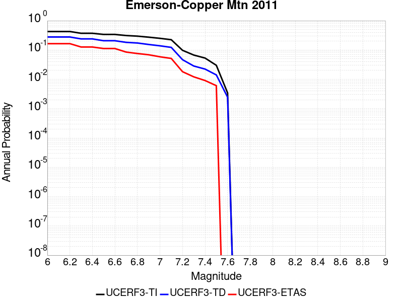 |
|-----|

| Magnitude | UCERF3-TI Prob | UCERF3-TD Prob | UCERF3-ETAS Prob |
|-----|-----|-----|-----|
| 6.0 | 0.42729396 | 0.27701938 | 0.20555556 |
| 6.1 | 0.42729396 | 0.27701938 | 0.20555556 |
| 6.2 | 0.42729396 | 0.27701938 | 0.20555556 |
| 6.3 | 0.37068367 | 0.23895106 | 0.17222223 |
| 6.4 | 0.37068367 | 0.23895106 | 0.17222223 |
| 6.5 | 0.33931294 | 0.20688392 | 0.15555556 |
| 6.6 | 0.33931294 | 0.20688392 | 0.15555556 |
| 6.7 | 0.31111473 | 0.18196899 | 0.12222222 |
| 6.8 | 0.29669505 | 0.17306352 | 0.11666667 |
| 6.9 | 0.27328098 | 0.15397622 | 0.11111111 |
| 7.0 | 0.24966893 | 0.13876891 | 0.1 |
| 7.1 | 0.22411841 | 0.122655064 | 0.083333336 |
| 7.2 | 0.09753263 | 0.046663668 | 0.033333335 |
| 7.3 | 0.067084044 | 0.028367732 | 0.016666668 |
| 7.4 | 0.0530505 | 0.022327283 | 0.0055555557 |
| 7.5 | 0.030017076 | 0.014102307 | 0.0 |
| 7.6 | 0.0034260035 | 0.0024529342 | 0.0 |

## Eureka Peak
*[(top)](#table-of-contents)*

| 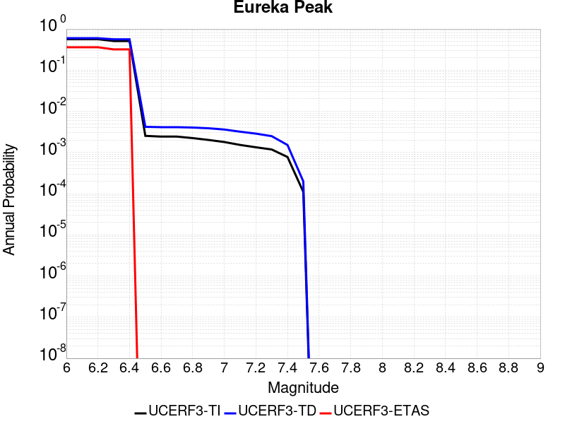 |
|-----|

| Magnitude | UCERF3-TI Prob | UCERF3-TD Prob | UCERF3-ETAS Prob |
|-----|-----|-----|-----|
| 6.0 | 0.56549215 | 0.59873754 | 0.39444444 |
| 6.1 | 0.56549215 | 0.59873754 | 0.39444444 |
| 6.2 | 0.56549215 | 0.59873754 | 0.39444444 |
| 6.3 | 0.5099678 | 0.5625242 | 0.35555556 |
| 6.4 | 0.5099678 | 0.5625242 | 0.35555556 |
| 6.5 | 0.0025374512 | 0.0042009354 | 0.0 |
| 6.6 | 0.0024362702 | 0.004124255 | 0.0 |
| 6.7 | 0.0024362702 | 0.004124255 | 0.0 |
| 6.8 | 0.002238932 | 0.0040393425 | 0.0 |
| 6.9 | 0.0020198051 | 0.0038830421 | 0.0 |
| 7.0 | 0.0017979874 | 0.0036148874 | 0.0 |
| 7.1 | 0.0015274865 | 0.0032042952 | 0.0 |
| 7.2 | 0.001339448 | 0.0028755234 | 0.0 |
| 7.3 | 0.0011848311 | 0.0024975606 | 0.0 |
| 7.4 | 7.7765854E-4 | 0.0015227109 | 0.0 |
| 7.5 | 1.1066828E-4 | 1.9890162E-4 | 0.0 |

## Fickle Hill (alt1)
*[(top)](#table-of-contents)*

| 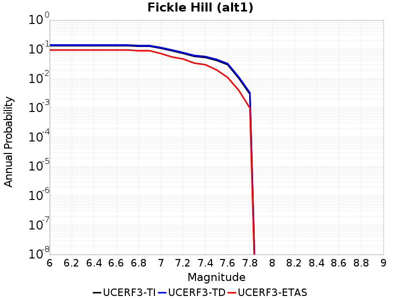 |
|-----|

| Magnitude | UCERF3-TI Prob | UCERF3-TD Prob | UCERF3-ETAS Prob |
|-----|-----|-----|-----|
| 6.0 | 0.13348855 | 0.14114554 | 0.07777778 |
| 6.1 | 0.13348855 | 0.14114554 | 0.07777778 |
| 6.2 | 0.13348855 | 0.14114554 | 0.07777778 |
| 6.3 | 0.13348855 | 0.14114554 | 0.07777778 |
| 6.4 | 0.13348855 | 0.14114554 | 0.07777778 |
| 6.5 | 0.13348855 | 0.14114554 | 0.07777778 |
| 6.6 | 0.13348855 | 0.14114554 | 0.07777778 |
| 6.7 | 0.13348855 | 0.14114554 | 0.07777778 |
| 6.8 | 0.12733771 | 0.13481864 | 0.07777778 |
| 6.9 | 0.12729037 | 0.13476956 | 0.07777778 |
| 7.0 | 0.10852024 | 0.11530214 | 0.06111111 |
| 7.1 | 0.0894354 | 0.095358685 | 0.044444446 |
| 7.2 | 0.07258156 | 0.07778862 | 0.03888889 |
| 7.3 | 0.057626598 | 0.062115937 | 0.033333335 |
| 7.4 | 0.05273717 | 0.056979094 | 0.033333335 |
| 7.5 | 0.04201101 | 0.045567196 | 0.033333335 |
| 7.6 | 0.030035252 | 0.03276701 | 0.016666668 |
| 7.7 | 0.010348153 | 0.011420612 | 0.011111111 |
| 7.8 | 0.0029774588 | 0.0033266363 | 0.0055555557 |

## Fish Slough 2011 CFM
*[(top)](#table-of-contents)*

| 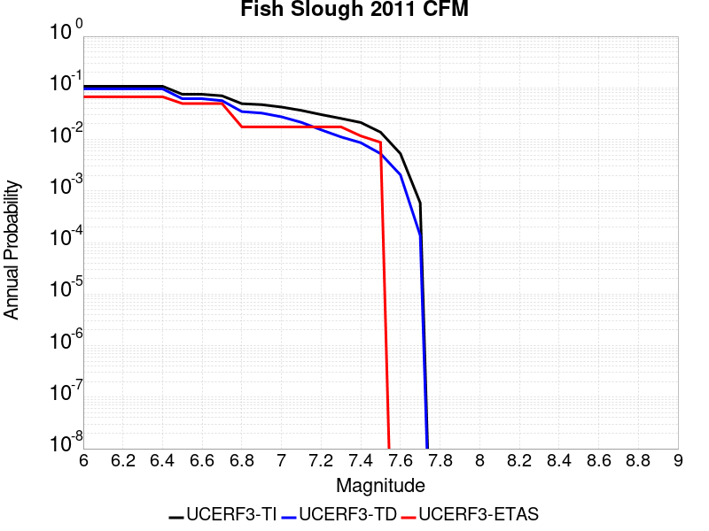 |
|-----|

| Magnitude | UCERF3-TI Prob | UCERF3-TD Prob | UCERF3-ETAS Prob |
|-----|-----|-----|-----|
| 6.0 | 0.10758821 | 0.09570792 | 0.07777778 |
| 6.1 | 0.10758821 | 0.09570792 | 0.07777778 |
| 6.2 | 0.10758821 | 0.09570792 | 0.07777778 |
| 6.3 | 0.10758821 | 0.09570792 | 0.07777778 |
| 6.4 | 0.10758821 | 0.09570792 | 0.07777778 |
| 6.5 | 0.07508351 | 0.06163428 | 0.044444446 |
| 6.6 | 0.07508351 | 0.06163428 | 0.044444446 |
| 6.7 | 0.07017978 | 0.056525778 | 0.044444446 |
| 6.8 | 0.049395222 | 0.034677066 | 0.011111111 |
| 6.9 | 0.047286555 | 0.032465212 | 0.011111111 |
| 7.0 | 0.04246895 | 0.02746467 | 0.011111111 |
| 7.1 | 0.03657273 | 0.021457387 | 0.011111111 |
| 7.2 | 0.030342607 | 0.015356333 | 0.011111111 |
| 7.3 | 0.0255436 | 0.011185638 | 0.011111111 |
| 7.4 | 0.021300124 | 0.008639783 | 0.011111111 |
| 7.5 | 0.013796124 | 0.0052967067 | 0.011111111 |
| 7.6 | 0.005301698 | 0.002056903 | 0.0 |
| 7.7 | 5.868686E-4 | 1.371173E-4 | 0.0 |

## Fitzhugh Creek
*[(top)](#table-of-contents)*

| 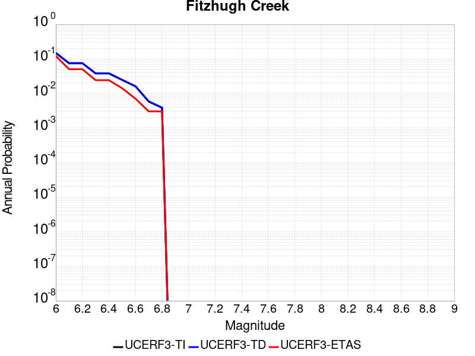 |
|-----|

| Magnitude | UCERF3-TI Prob | UCERF3-TD Prob | UCERF3-ETAS Prob |
|-----|-----|-----|-----|
| 6.0 | 0.14732863 | 0.15051442 | 0.13333334 |
| 6.1 | 0.07466031 | 0.07598274 | 0.055555556 |
| 6.2 | 0.07466031 | 0.07598274 | 0.055555556 |
| 6.3 | 0.037829027 | 0.038432512 | 0.033333335 |
| 6.4 | 0.037829027 | 0.038432512 | 0.033333335 |
| 6.5 | 0.024525175 | 0.024911046 | 0.011111111 |
| 6.6 | 0.016074635 | 0.016328778 | 0.0055555557 |
| 6.7 | 0.0058212415 | 0.0059175394 | 0.0 |
| 6.8 | 0.003849877 | 0.0039157453 | 0.0 |

## Fontana (Seismicity)
*[(top)](#table-of-contents)*

| 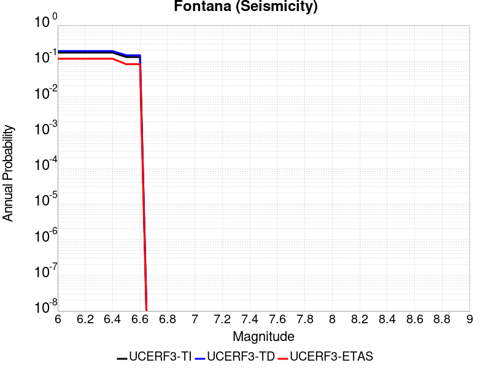 |
|-----|

| Magnitude | UCERF3-TI Prob | UCERF3-TD Prob | UCERF3-ETAS Prob |
|-----|-----|-----|-----|
| 6.0 | 0.17079975 | 0.18832822 | 0.094444446 |
| 6.1 | 0.17079975 | 0.18832822 | 0.094444446 |
| 6.2 | 0.17079975 | 0.18832822 | 0.094444446 |
| 6.3 | 0.17079975 | 0.18832822 | 0.094444446 |
| 6.4 | 0.17079975 | 0.18832822 | 0.094444446 |
| 6.5 | 0.12825605 | 0.1439482 | 0.06666667 |
| 6.6 | 0.12825605 | 0.1439482 | 0.06666667 |

## Franklin 2011 CFM
*[(top)](#table-of-contents)*

| 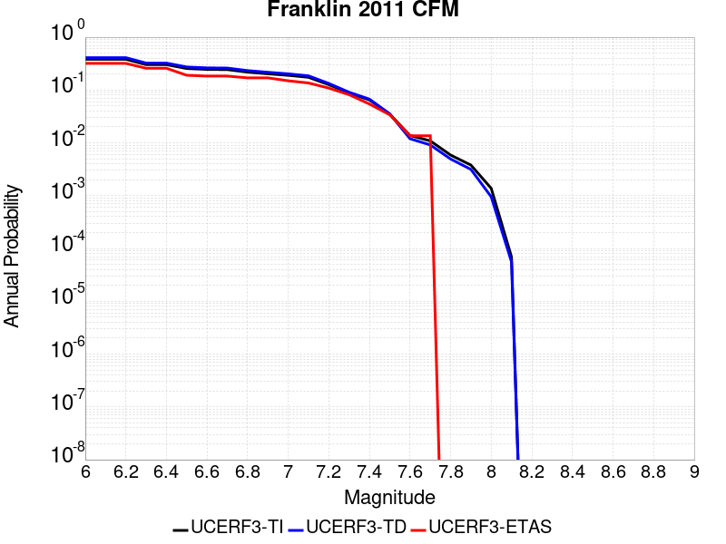 |
|-----|

| Magnitude | UCERF3-TI Prob | UCERF3-TD Prob | UCERF3-ETAS Prob |
|-----|-----|-----|-----|
| 6.0 | 0.38214952 | 0.41034412 | 0.26666668 |
| 6.1 | 0.38214952 | 0.41034412 | 0.26666668 |
| 6.2 | 0.38214952 | 0.41034412 | 0.26666668 |
| 6.3 | 0.30259362 | 0.3238581 | 0.22777778 |
| 6.4 | 0.30259362 | 0.3238581 | 0.22777778 |
| 6.5 | 0.25550124 | 0.27322 | 0.18333334 |
| 6.6 | 0.24580874 | 0.26295444 | 0.17777778 |
| 6.7 | 0.24370402 | 0.26072362 | 0.17777778 |
| 6.8 | 0.21837436 | 0.23345086 | 0.15555556 |
| 6.9 | 0.20306493 | 0.21698646 | 0.15555556 |
| 7.0 | 0.18995447 | 0.20270681 | 0.13333334 |
| 7.1 | 0.17421456 | 0.18570575 | 0.12777779 |
| 7.2 | 0.12629516 | 0.13327704 | 0.08888889 |
| 7.3 | 0.0877947 | 0.0908775 | 0.06111111 |
| 7.4 | 0.06497257 | 0.067315385 | 0.033333335 |
| 7.5 | 0.034965444 | 0.035446085 | 0.027777778 |
| 7.6 | 0.013807103 | 0.011979396 | 0.016666668 |
| 7.7 | 0.010895435 | 0.009126647 | 0.016666668 |
| 7.8 | 0.005875327 | 0.004942231 | 0.011111111 |
| 7.9 | 0.0037936936 | 0.0031462405 | 0.0055555557 |
| 8.0 | 0.0013783434 | 9.526148E-4 | 0.0 |
| 8.1 | 6.924989E-5 | 5.5779357E-5 | 0.0 |

## Garberville - Briceland 2011 CFM
*[(top)](#table-of-contents)*

| 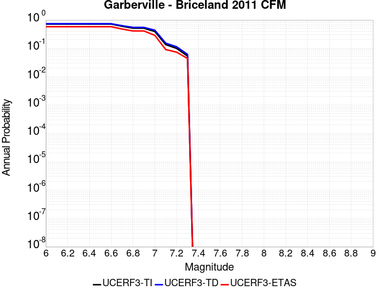 |
|-----|

| Magnitude | UCERF3-TI Prob | UCERF3-TD Prob | UCERF3-ETAS Prob |
|-----|-----|-----|-----|
| 6.0 | 0.7171203 | 0.73702884 | 0.5388889 |
| 6.1 | 0.7171203 | 0.73702884 | 0.5388889 |
| 6.2 | 0.7171203 | 0.73702884 | 0.5388889 |
| 6.3 | 0.7171203 | 0.73702884 | 0.5388889 |
| 6.4 | 0.7171203 | 0.73702884 | 0.5388889 |
| 6.5 | 0.7171203 | 0.73702884 | 0.5388889 |
| 6.6 | 0.7171203 | 0.73702884 | 0.5388889 |
| 6.7 | 0.5982331 | 0.62880415 | 0.43333334 |
| 6.8 | 0.51223636 | 0.548922 | 0.36666667 |
| 6.9 | 0.51132566 | 0.54798084 | 0.36666667 |
| 7.0 | 0.39123404 | 0.43648666 | 0.2611111 |
| 7.1 | 0.1351813 | 0.15230125 | 0.083333336 |
| 7.2 | 0.09936351 | 0.113444656 | 0.06111111 |
| 7.3 | 0.05325169 | 0.061205775 | 0.033333335 |

## Garlic Springs
*[(top)](#table-of-contents)*

| 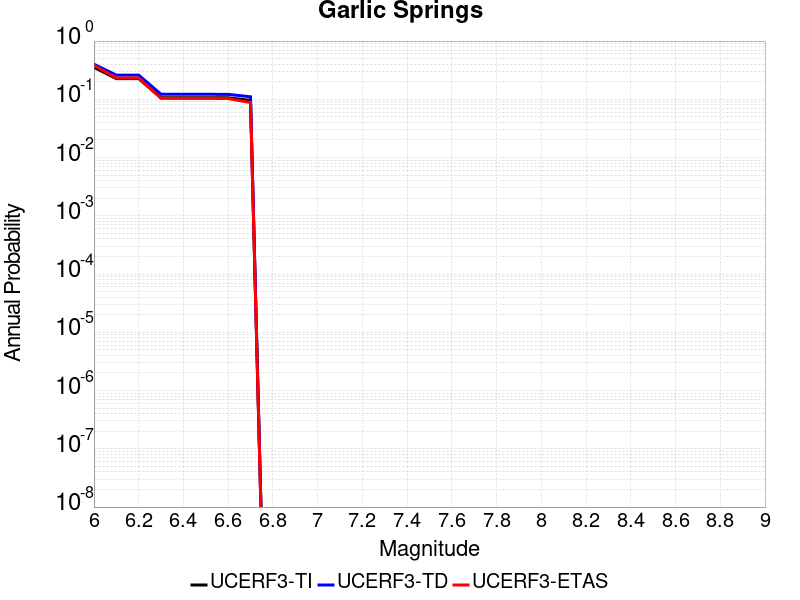 |
|-----|

| Magnitude | UCERF3-TI Prob | UCERF3-TD Prob | UCERF3-ETAS Prob |
|-----|-----|-----|-----|
| 6.0 | 0.35419685 | 0.40021715 | 0.41111112 |
| 6.1 | 0.22667271 | 0.26037455 | 0.2888889 |
| 6.2 | 0.22667271 | 0.26037455 | 0.2888889 |
| 6.3 | 0.10651145 | 0.12201949 | 0.14444445 |
| 6.4 | 0.10651145 | 0.12201949 | 0.14444445 |
| 6.5 | 0.10651145 | 0.12201949 | 0.14444445 |
| 6.6 | 0.106150955 | 0.12163386 | 0.14444445 |
| 6.7 | 0.09579947 | 0.11049489 | 0.12777779 |

## Garlock (Central)
*[(top)](#table-of-contents)*

| 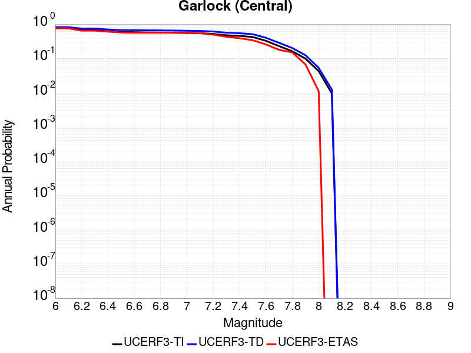 |
|-----|

| Magnitude | UCERF3-TI Prob | UCERF3-TD Prob | UCERF3-ETAS Prob |
|-----|-----|-----|-----|
| 6.0 | 0.76268613 | 0.81821245 | 0.76111114 |
| 6.1 | 0.76268613 | 0.81821245 | 0.76111114 |
| 6.2 | 0.66713274 | 0.7393998 | 0.64444447 |
| 6.3 | 0.66713274 | 0.7393998 | 0.64444447 |
| 6.4 | 0.6177273 | 0.6981748 | 0.60555553 |
| 6.5 | 0.5872697 | 0.6723027 | 0.57222223 |
| 6.6 | 0.5835062 | 0.669052 | 0.5611111 |
| 6.7 | 0.5725863 | 0.659711 | 0.5611111 |
| 6.8 | 0.5681693 | 0.65568286 | 0.5611111 |
| 6.9 | 0.5621337 | 0.6501771 | 0.5611111 |
| 7.0 | 0.55348 | 0.6422317 | 0.5555556 |
| 7.1 | 0.54365814 | 0.6331794 | 0.54444444 |
| 7.2 | 0.5177975 | 0.60922736 | 0.49444443 |
| 7.3 | 0.47254843 | 0.5633662 | 0.42777777 |
| 7.4 | 0.45444113 | 0.54446834 | 0.3888889 |
| 7.5 | 0.42148894 | 0.508198 | 0.33888888 |
| 7.6 | 0.32583362 | 0.40005136 | 0.25555557 |
| 7.7 | 0.2283113 | 0.28467995 | 0.17777778 |
| 7.8 | 0.16160621 | 0.20098016 | 0.15 |
| 7.9 | 0.09851957 | 0.12370374 | 0.06666667 |
| 8.0 | 0.042707413 | 0.05317575 | 0.011111111 |
| 8.1 | 0.00953767 | 0.012358412 | 0.0 |

## Garlock (East)
*[(top)](#table-of-contents)*

| 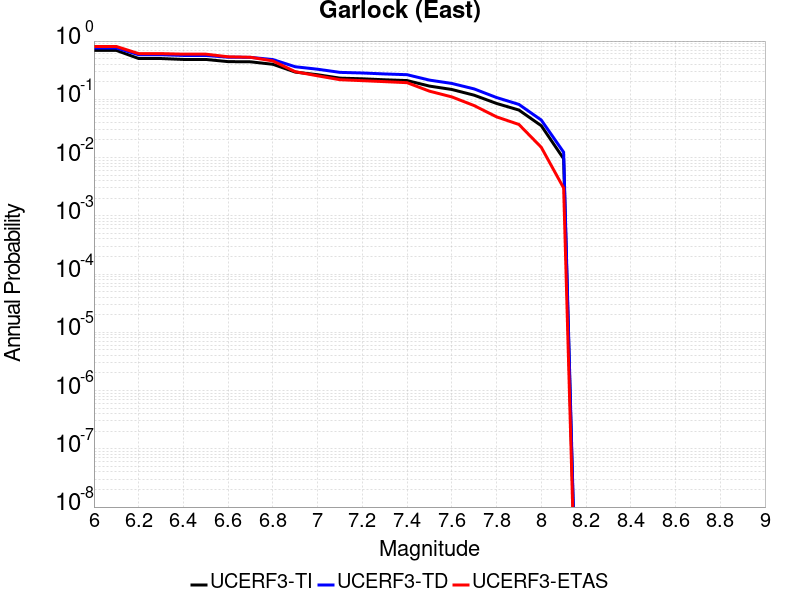 |
|-----|

| Magnitude | UCERF3-TI Prob | UCERF3-TD Prob | UCERF3-ETAS Prob |
|-----|-----|-----|-----|
| 6.0 | 0.6916309 | 0.76052517 | 0.8055556 |
| 6.1 | 0.6916309 | 0.76052517 | 0.8055556 |
| 6.2 | 0.5013886 | 0.58262676 | 0.6 |
| 6.3 | 0.5013886 | 0.58262676 | 0.6 |
| 6.4 | 0.4833542 | 0.56630486 | 0.5888889 |
| 6.5 | 0.4833542 | 0.56630486 | 0.5888889 |
| 6.6 | 0.44351608 | 0.5280606 | 0.5277778 |
| 6.7 | 0.44024912 | 0.5248428 | 0.51666665 |
| 6.8 | 0.39920074 | 0.4812723 | 0.42777777 |
| 6.9 | 0.29353076 | 0.3621445 | 0.2888889 |
| 7.0 | 0.26422733 | 0.32855788 | 0.24444444 |
| 7.1 | 0.23093799 | 0.2899881 | 0.21666667 |
| 7.2 | 0.22497693 | 0.28313476 | 0.21111111 |
| 7.3 | 0.2163501 | 0.27254808 | 0.2 |
| 7.4 | 0.20975913 | 0.26452482 | 0.2 |
| 7.5 | 0.16868417 | 0.21370202 | 0.1388889 |
| 7.6 | 0.14749219 | 0.18719417 | 0.12222222 |
| 7.7 | 0.117639326 | 0.15080547 | 0.094444446 |
| 7.8 | 0.084952295 | 0.107294366 | 0.072222225 |
| 7.9 | 0.06540824 | 0.08172838 | 0.05 |
| 8.0 | 0.035221003 | 0.044060428 | 0.011111111 |
| 8.1 | 0.00953767 | 0.012358412 | 0.0 |

## Garlock (West)
*[(top)](#table-of-contents)*

| 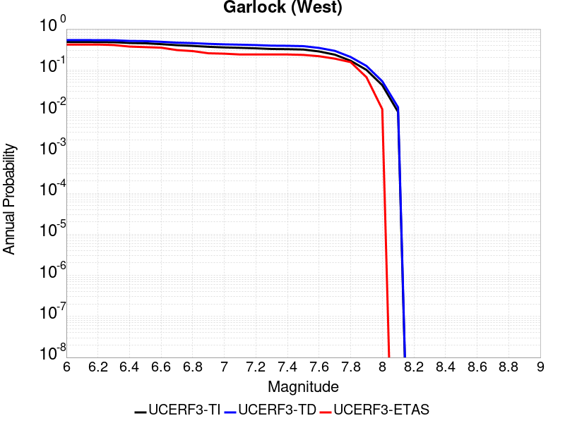 |
|-----|

| Magnitude | UCERF3-TI Prob | UCERF3-TD Prob | UCERF3-ETAS Prob |
|-----|-----|-----|-----|
| 6.0 | 0.48158622 | 0.53617865 | 0.41666666 |
| 6.1 | 0.48017773 | 0.5348702 | 0.41666666 |
| 6.2 | 0.47838974 | 0.53325367 | 0.41666666 |
| 6.3 | 0.4754917 | 0.53065073 | 0.40555555 |
| 6.4 | 0.45460913 | 0.5104948 | 0.37222221 |
| 6.5 | 0.44737393 | 0.5050109 | 0.3611111 |
| 6.6 | 0.4266247 | 0.4862985 | 0.35 |
| 6.7 | 0.40200523 | 0.46373004 | 0.30555555 |
| 6.8 | 0.38678166 | 0.4512111 | 0.2888889 |
| 6.9 | 0.3675307 | 0.43371868 | 0.25555557 |
| 7.0 | 0.35477665 | 0.42155147 | 0.25 |
| 7.1 | 0.34704357 | 0.4137508 | 0.23888889 |
| 7.2 | 0.33747193 | 0.40433565 | 0.23888889 |
| 7.3 | 0.32488889 | 0.39193848 | 0.23888889 |
| 7.4 | 0.32187128 | 0.38876218 | 0.23888889 |
| 7.5 | 0.3151394 | 0.38117182 | 0.23333333 |
| 7.6 | 0.28309774 | 0.34475628 | 0.21666667 |
| 7.7 | 0.23622133 | 0.29245025 | 0.18888889 |
| 7.8 | 0.1675861 | 0.20717572 | 0.15555556 |
| 7.9 | 0.100520685 | 0.12550138 | 0.06666667 |
| 8.0 | 0.042707413 | 0.05317575 | 0.011111111 |
| 8.1 | 0.00953767 | 0.012358412 | 0.0 |

## Gillem - Big Crack 2011 CFM
*[(top)](#table-of-contents)*

| 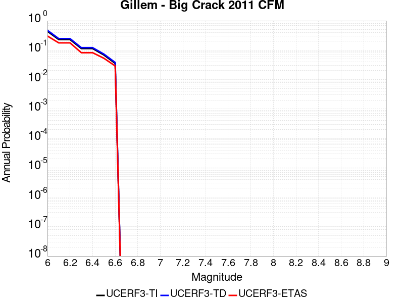 |
|-----|

| Magnitude | UCERF3-TI Prob | UCERF3-TD Prob | UCERF3-ETAS Prob |
|-----|-----|-----|-----|
| 6.0 | 0.43625277 | 0.47189182 | 0.31666666 |
| 6.1 | 0.22949272 | 0.2466344 | 0.19444445 |
| 6.2 | 0.22949272 | 0.2466344 | 0.19444445 |
| 6.3 | 0.11338517 | 0.12151163 | 0.072222225 |
| 6.4 | 0.11338517 | 0.12151163 | 0.072222225 |
| 6.5 | 0.068423696 | 0.07341319 | 0.05 |
| 6.6 | 0.035408773 | 0.038068134 | 0.027777778 |

## Goldstone Lake
*[(top)](#table-of-contents)*

| 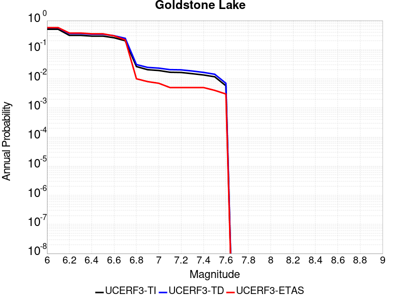 |
|-----|

| Magnitude | UCERF3-TI Prob | UCERF3-TD Prob | UCERF3-ETAS Prob |
|-----|-----|-----|-----|
| 6.0 | 0.5018958 | 0.5610137 | 0.60555553 |
| 6.1 | 0.5018958 | 0.5610137 | 0.60555553 |
| 6.2 | 0.30953738 | 0.3563045 | 0.39444444 |
| 6.3 | 0.30953738 | 0.3563045 | 0.39444444 |
| 6.4 | 0.29206043 | 0.3383973 | 0.37222221 |
| 6.5 | 0.29206043 | 0.3383973 | 0.37222221 |
| 6.6 | 0.25587657 | 0.30099857 | 0.33333334 |
| 6.7 | 0.20204572 | 0.24463537 | 0.23888889 |
| 6.8 | 0.026299195 | 0.03081374 | 0.011111111 |
| 6.9 | 0.020491797 | 0.024563652 | 0.0055555557 |
| 7.0 | 0.019218855 | 0.02320324 | 0.0055555557 |
| 7.1 | 0.01674055 | 0.020567581 | 0.0055555557 |
| 7.2 | 0.01644743 | 0.020254627 | 0.0055555557 |
| 7.3 | 0.014939684 | 0.01845494 | 0.0055555557 |
| 7.4 | 0.013499651 | 0.016573403 | 0.0055555557 |
| 7.5 | 0.011704938 | 0.014307804 | 0.0055555557 |
| 7.6 | 0.0057536047 | 0.0069986656 | 0.0055555557 |

## Goose Lake 2011 CFM
*[(top)](#table-of-contents)*

| 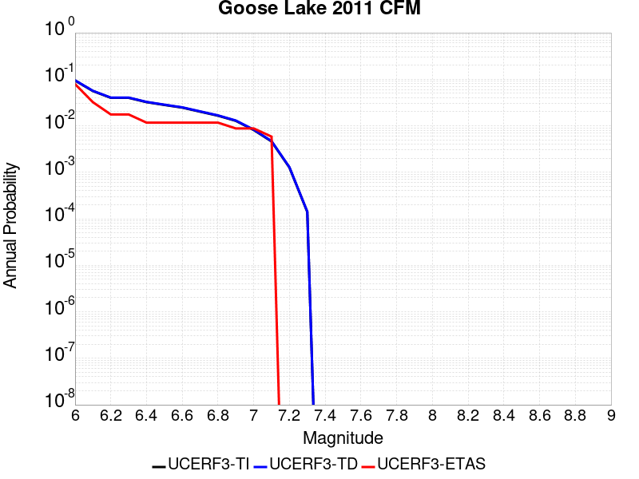 |
|-----|

| Magnitude | UCERF3-TI Prob | UCERF3-TD Prob | UCERF3-ETAS Prob |
|-----|-----|-----|-----|
| 6.0 | 0.093933836 | 0.095148236 | 0.083333336 |
| 6.1 | 0.0558669 | 0.056527846 | 0.044444446 |
| 6.2 | 0.039944064 | 0.040435463 | 0.027777778 |
| 6.3 | 0.039944064 | 0.040435463 | 0.027777778 |
| 6.4 | 0.032248817 | 0.032670297 | 0.016666668 |
| 6.5 | 0.028064469 | 0.02844839 | 0.016666668 |
| 6.6 | 0.024598807 | 0.02494977 | 0.016666668 |
| 6.7 | 0.020119239 | 0.020425024 | 0.016666668 |
| 6.8 | 0.01648524 | 0.016747257 | 0.016666668 |
| 6.9 | 0.012768996 | 0.012984773 | 0.011111111 |
| 7.0 | 0.00813333 | 0.008281171 | 0.011111111 |
| 7.1 | 0.004601986 | 0.004686835 | 0.0055555557 |
| 7.2 | 0.0012682052 | 0.0012870205 | 0.0 |
| 7.3 | 1.4064225E-4 | 1.4273774E-4 | 0.0 |

## Gravel Hills-Harper Lk
*[(top)](#table-of-contents)*

| 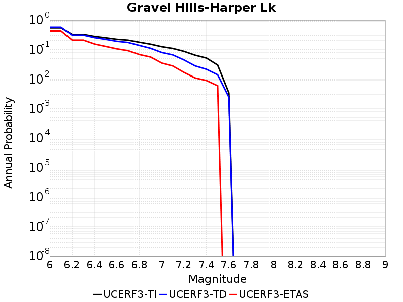 |
|-----|

| Magnitude | UCERF3-TI Prob | UCERF3-TD Prob | UCERF3-ETAS Prob |
|-----|-----|-----|-----|
| 6.0 | 0.5508598 | 0.57836217 | 0.37222221 |
| 6.1 | 0.5508598 | 0.57836217 | 0.37222221 |
| 6.2 | 0.32641065 | 0.30818468 | 0.2 |
| 6.3 | 0.32641065 | 0.30818468 | 0.2 |
| 6.4 | 0.27889216 | 0.25392887 | 0.15555556 |
| 6.5 | 0.25131553 | 0.22252227 | 0.12777779 |
| 6.6 | 0.2233479 | 0.19068204 | 0.10555556 |
| 6.7 | 0.20875514 | 0.17415161 | 0.1 |
| 6.8 | 0.17724477 | 0.13823134 | 0.083333336 |
| 6.9 | 0.15247156 | 0.11053908 | 0.07777778 |
| 7.0 | 0.12513012 | 0.07968994 | 0.055555556 |
| 7.1 | 0.10935375 | 0.06626193 | 0.044444446 |
| 7.2 | 0.0873551 | 0.04472483 | 0.027777778 |
| 7.3 | 0.0646471 | 0.02810472 | 0.0055555557 |
| 7.4 | 0.051753663 | 0.021614803 | 0.0055555557 |
| 7.5 | 0.030017076 | 0.014102307 | 0.0 |
| 7.6 | 0.0034260035 | 0.0024529342 | 0.0 |

## Great Valley 01
*[(top)](#table-of-contents)*

| 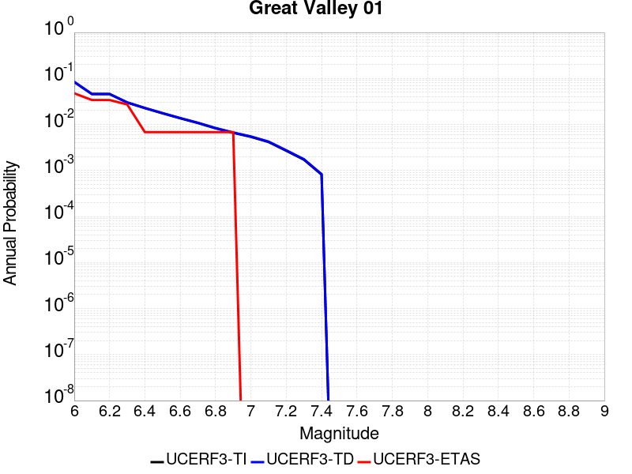 |
|-----|

| Magnitude | UCERF3-TI Prob | UCERF3-TD Prob | UCERF3-ETAS Prob |
|-----|-----|-----|-----|
| 6.0 | 0.08344609 | 0.08457927 | 0.055555556 |
| 6.1 | 0.045675043 | 0.046199575 | 0.03888889 |
| 6.2 | 0.045675043 | 0.046199575 | 0.03888889 |
| 6.3 | 0.029902728 | 0.030245181 | 0.022222223 |
| 6.4 | 0.022622911 | 0.02289649 | 0.022222223 |
| 6.5 | 0.017464599 | 0.017690537 | 0.016666668 |
| 6.6 | 0.013611736 | 0.013803502 | 0.016666668 |
| 6.7 | 0.010744053 | 0.0109114805 | 0.016666668 |
| 6.8 | 0.0082395775 | 0.008384607 | 0.016666668 |
| 6.9 | 0.0065738102 | 0.0067025283 | 0.016666668 |
| 7.0 | 0.0053775418 | 0.0054916614 | 0.011111111 |
| 7.1 | 0.0041530076 | 0.0042483397 | 0.011111111 |
| 7.2 | 0.0026813073 | 0.0027491057 | 0.0 |
| 7.3 | 0.0017155361 | 0.0017626247 | 0.0 |
| 7.4 | 8.116137E-4 | 8.3499384E-4 | 0.0 |

## Great Valley 02
*[(top)](#table-of-contents)*

| 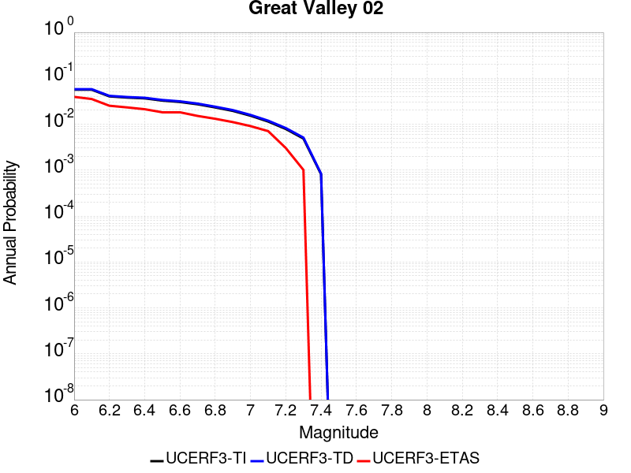 |
|-----|

| Magnitude | UCERF3-TI Prob | UCERF3-TD Prob | UCERF3-ETAS Prob |
|-----|-----|-----|-----|
| 6.0 | 0.056379996 | 0.057847653 | 0.03888889 |
| 6.1 | 0.056379996 | 0.057847653 | 0.033333335 |
| 6.2 | 0.040352356 | 0.041512124 | 0.027777778 |
| 6.3 | 0.03800251 | 0.03913385 | 0.027777778 |
| 6.4 | 0.03653733 | 0.03765674 | 0.027777778 |
| 6.5 | 0.03266122 | 0.033725377 | 0.022222223 |
| 6.6 | 0.030461147 | 0.03150075 | 0.022222223 |
| 6.7 | 0.027150687 | 0.028122062 | 0.016666668 |
| 6.8 | 0.02317657 | 0.02406618 | 0.016666668 |
| 6.9 | 0.019483525 | 0.020283561 | 0.016666668 |
| 7.0 | 0.015299807 | 0.01595366 | 0.011111111 |
| 7.1 | 0.011427626 | 0.011945427 | 0.011111111 |
| 7.2 | 0.0078734625 | 0.008247374 | 0.0 |
| 7.3 | 0.0048670513 | 0.0051080575 | 0.0 |
| 7.4 | 8.116137E-4 | 8.3499384E-4 | 0.0 |

## Great Valley 03 Mysterious Ridge
*[(top)](#table-of-contents)*

| 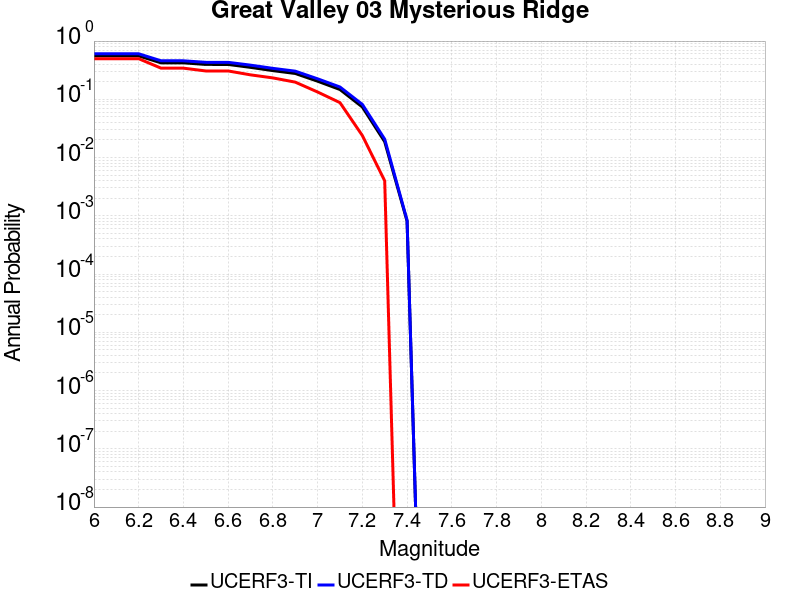 |
|-----|

| Magnitude | UCERF3-TI Prob | UCERF3-TD Prob | UCERF3-ETAS Prob |
|-----|-----|-----|-----|
| 6.0 | 0.5567141 | 0.60500526 | 0.53333336 |
| 6.1 | 0.5567141 | 0.60500526 | 0.53333336 |
| 6.2 | 0.5567141 | 0.60500526 | 0.53333336 |
| 6.3 | 0.4228712 | 0.4581333 | 0.35555556 |
| 6.4 | 0.4228712 | 0.4581333 | 0.35555556 |
| 6.5 | 0.39701954 | 0.43158683 | 0.33888888 |
| 6.6 | 0.3967113 | 0.4312893 | 0.33888888 |
| 6.7 | 0.35358137 | 0.3860317 | 0.29444444 |
| 6.8 | 0.31083897 | 0.33992556 | 0.26666668 |
| 6.9 | 0.2777129 | 0.30422717 | 0.23888889 |
| 7.0 | 0.20461163 | 0.22486764 | 0.17222223 |
| 7.1 | 0.14727683 | 0.16266893 | 0.11666667 |
| 7.2 | 0.07381743 | 0.08178352 | 0.03888889 |
| 7.3 | 0.018708244 | 0.020667445 | 0.0055555557 |
| 7.4 | 8.116137E-4 | 8.3499384E-4 | 0.0 |

## Great Valley 03a Dunnigan Hills
*[(top)](#table-of-contents)*

| 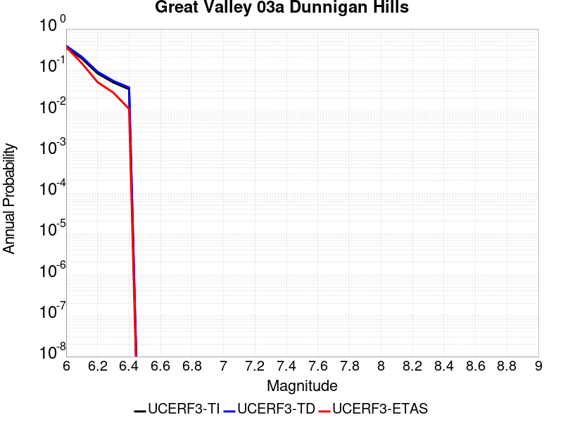 |
|-----|

| Magnitude | UCERF3-TI Prob | UCERF3-TD Prob | UCERF3-ETAS Prob |
|-----|-----|-----|-----|
| 6.0 | 0.35134837 | 0.38587126 | 0.3611111 |
| 6.1 | 0.18924393 | 0.20726244 | 0.14444445 |
| 6.2 | 0.08203065 | 0.08936427 | 0.05 |
| 6.3 | 0.049203355 | 0.05379865 | 0.027777778 |
| 6.4 | 0.033707038 | 0.037047375 | 0.011111111 |

## Great Valley 04a Trout Creek
*[(top)](#table-of-contents)*

| 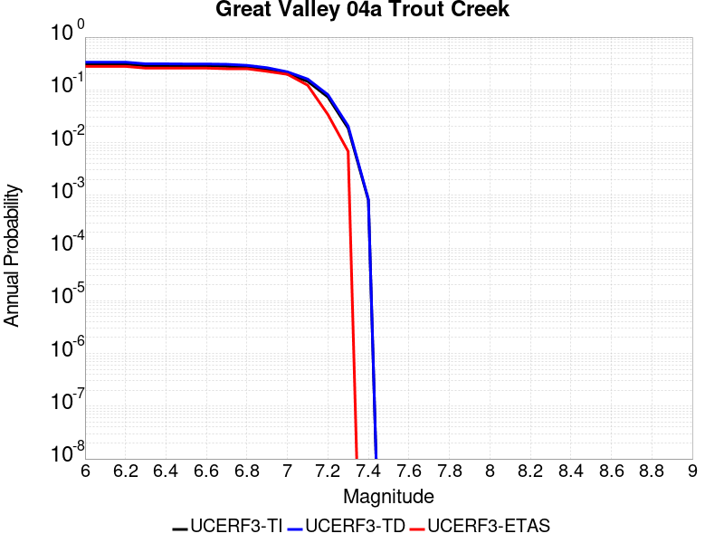 |
|-----|

| Magnitude | UCERF3-TI Prob | UCERF3-TD Prob | UCERF3-ETAS Prob |
|-----|-----|-----|-----|
| 6.0 | 0.30757993 | 0.33552194 | 0.25 |
| 6.1 | 0.30757993 | 0.33552194 | 0.25 |
| 6.2 | 0.30757993 | 0.33552194 | 0.25 |
| 6.3 | 0.28545323 | 0.31196183 | 0.23333333 |
| 6.4 | 0.28545323 | 0.31196183 | 0.23333333 |
| 6.5 | 0.2832027 | 0.30959955 | 0.23333333 |
| 6.6 | 0.2832027 | 0.30959955 | 0.23333333 |
| 6.7 | 0.27937058 | 0.30557954 | 0.22777778 |
| 6.8 | 0.26634908 | 0.29172724 | 0.21666667 |
| 6.9 | 0.2396289 | 0.26295125 | 0.18888889 |
| 7.0 | 0.19940068 | 0.21963543 | 0.16111112 |
| 7.1 | 0.14505221 | 0.16043659 | 0.10555556 |
| 7.2 | 0.07316325 | 0.08112332 | 0.03888889 |
| 7.3 | 0.01865864 | 0.020617047 | 0.0055555557 |
| 7.4 | 8.116137E-4 | 8.3499384E-4 | 0.0 |

## Great Valley 04b Gordon Valley
*[(top)](#table-of-contents)*

| 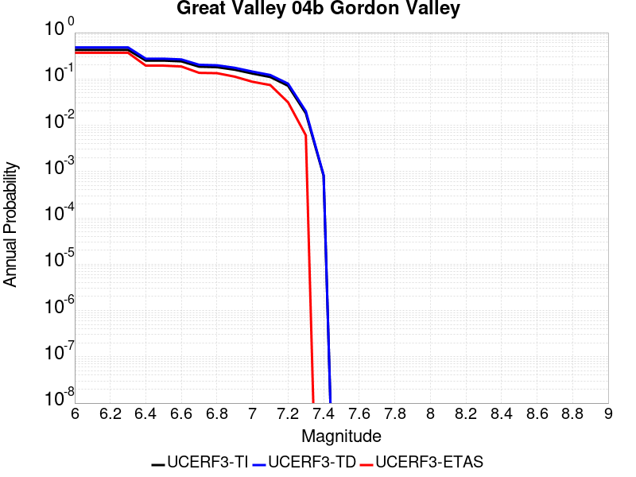 |
|-----|

| Magnitude | UCERF3-TI Prob | UCERF3-TD Prob | UCERF3-ETAS Prob |
|-----|-----|-----|-----|
| 6.0 | 0.42455328 | 0.47966102 | 0.3611111 |
| 6.1 | 0.42455328 | 0.47966102 | 0.3611111 |
| 6.2 | 0.42455328 | 0.47966102 | 0.3611111 |
| 6.3 | 0.42455328 | 0.47966102 | 0.3611111 |
| 6.4 | 0.24924628 | 0.27367163 | 0.17777778 |
| 6.5 | 0.24924628 | 0.27367163 | 0.17777778 |
| 6.6 | 0.23997498 | 0.26381692 | 0.17222223 |
| 6.7 | 0.18389802 | 0.20211183 | 0.1388889 |
| 6.8 | 0.17954007 | 0.1974368 | 0.13333334 |
| 6.9 | 0.15827082 | 0.17417656 | 0.11666667 |
| 7.0 | 0.13073109 | 0.14418554 | 0.094444446 |
| 7.1 | 0.11004273 | 0.12163918 | 0.083333336 |
| 7.2 | 0.07125486 | 0.0791568 | 0.03888889 |
| 7.3 | 0.01811912 | 0.020065818 | 0.0055555557 |
| 7.4 | 8.116137E-4 | 8.3499384E-4 | 0.0 |

## Great Valley 05 Pittsburg - Kirby Hills alt1
*[(top)](#table-of-contents)*

| 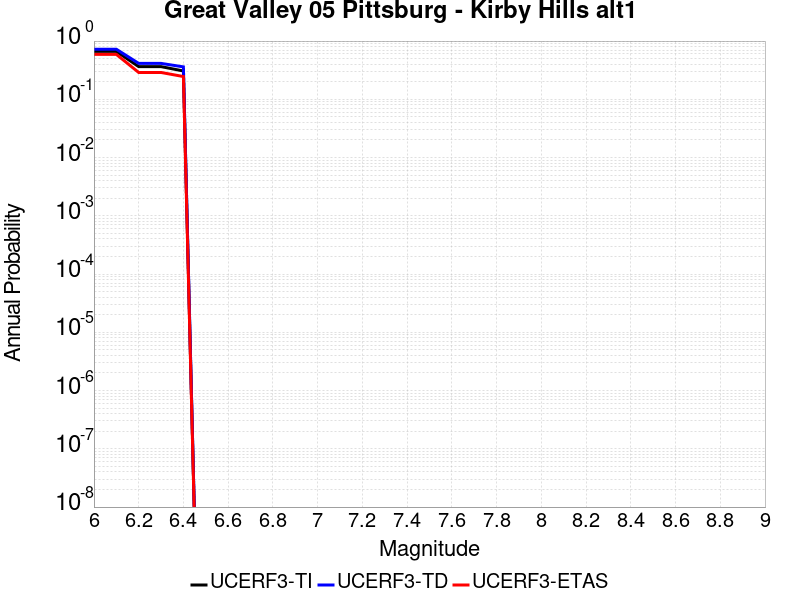 |
|-----|

| Magnitude | UCERF3-TI Prob | UCERF3-TD Prob | UCERF3-ETAS Prob |
|-----|-----|-----|-----|
| 6.0 | 0.66460174 | 0.7247195 | 0.62777776 |
| 6.1 | 0.66460174 | 0.7247195 | 0.62777776 |
| 6.2 | 0.36411613 | 0.41367126 | 0.3 |
| 6.3 | 0.36411613 | 0.41367126 | 0.3 |
| 6.4 | 0.30650038 | 0.36040604 | 0.25555557 |

## Great Valley 06 (Midland) 2011 CFM alt1
*[(top)](#table-of-contents)*

| 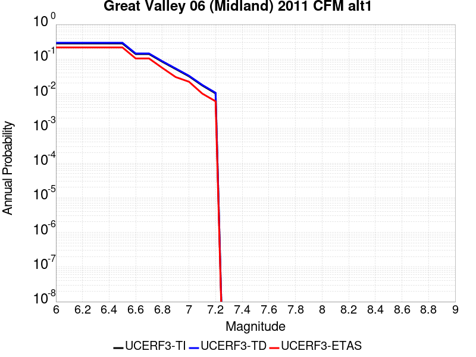 |
|-----|

| Magnitude | UCERF3-TI Prob | UCERF3-TD Prob | UCERF3-ETAS Prob |
|-----|-----|-----|-----|
| 6.0 | 0.2822707 | 0.2961253 | 0.22777778 |
| 6.1 | 0.2822707 | 0.2961253 | 0.22777778 |
| 6.2 | 0.2822707 | 0.2961253 | 0.22777778 |
| 6.3 | 0.2822707 | 0.2961253 | 0.22777778 |
| 6.4 | 0.2822707 | 0.2961253 | 0.22777778 |
| 6.5 | 0.2822707 | 0.2961253 | 0.22777778 |
| 6.6 | 0.13947093 | 0.14490916 | 0.12222222 |
| 6.7 | 0.13947093 | 0.14490916 | 0.12222222 |
| 6.8 | 0.08362864 | 0.08675541 | 0.06111111 |
| 6.9 | 0.05170962 | 0.0536288 | 0.027777778 |
| 7.0 | 0.031895474 | 0.033099234 | 0.022222223 |
| 7.1 | 0.017303472 | 0.01797605 | 0.011111111 |
| 7.2 | 0.010247622 | 0.01066469 | 0.0055555557 |

## Great Valley 07 (Orestimba)
*[(top)](#table-of-contents)*

| 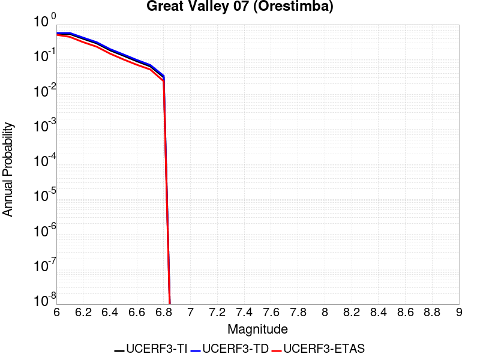 |
|-----|

| Magnitude | UCERF3-TI Prob | UCERF3-TD Prob | UCERF3-ETAS Prob |
|-----|-----|-----|-----|
| 6.0 | 0.5390878 | 0.5774433 | 0.5388889 |
| 6.1 | 0.5390878 | 0.5774433 | 0.4611111 |
| 6.2 | 0.39452472 | 0.4236073 | 0.34444445 |
| 6.3 | 0.29222164 | 0.31446263 | 0.25 |
| 6.4 | 0.18452431 | 0.19933672 | 0.15 |
| 6.5 | 0.12931353 | 0.14014095 | 0.07777778 |
| 6.6 | 0.08965436 | 0.09753139 | 0.044444446 |
| 6.7 | 0.064025715 | 0.06993538 | 0.027777778 |
| 6.8 | 0.031115005 | 0.03416522 | 0.016666668 |

## Great Valley 08 (Quinto)
*[(top)](#table-of-contents)*

| 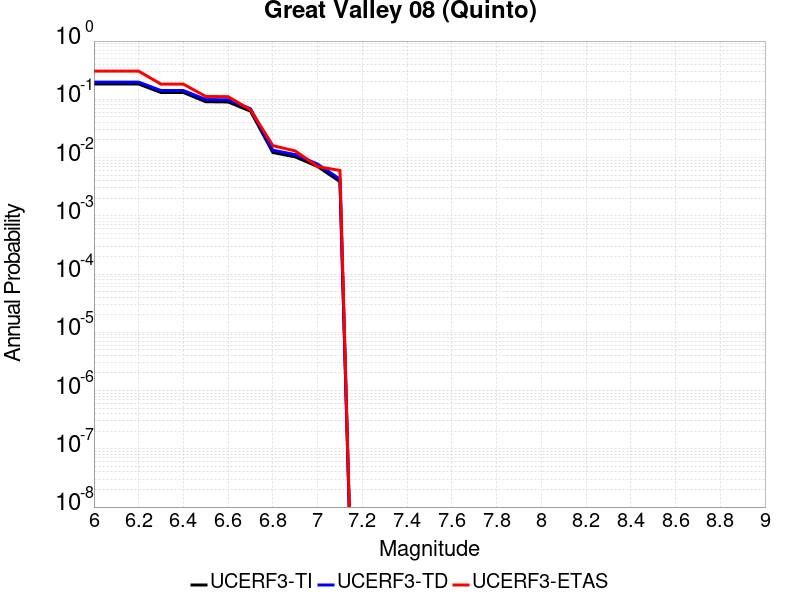 |
|-----|

| Magnitude | UCERF3-TI Prob | UCERF3-TD Prob | UCERF3-ETAS Prob |
|-----|-----|-----|-----|
| 6.0 | 0.1828003 | 0.19729607 | 0.31666666 |
| 6.1 | 0.1828003 | 0.19729607 | 0.31666666 |
| 6.2 | 0.1828003 | 0.19729607 | 0.31666666 |
| 6.3 | 0.13081953 | 0.14145003 | 0.19444445 |
| 6.4 | 0.13081953 | 0.14145003 | 0.19444445 |
| 6.5 | 0.0909339 | 0.09904082 | 0.11111111 |
| 6.6 | 0.08998671 | 0.09803861 | 0.11111111 |
| 6.7 | 0.06270418 | 0.06882987 | 0.072222225 |
| 6.8 | 0.012215583 | 0.013359217 | 0.016666668 |
| 6.9 | 0.010274779 | 0.011251535 | 0.0055555557 |
| 7.0 | 0.0070269736 | 0.007712434 | 0.0 |
| 7.1 | 0.0038612029 | 0.004249089 | 0.0 |

## Great Valley 09 (Laguna Seca)
*[(top)](#table-of-contents)*

| 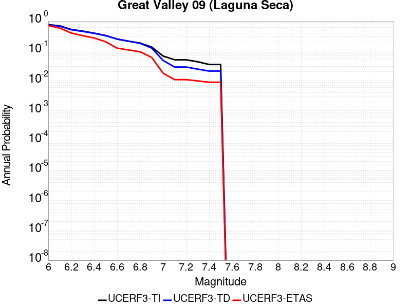 |
|-----|

| Magnitude | UCERF3-TI Prob | UCERF3-TD Prob | UCERF3-ETAS Prob |
|-----|-----|-----|-----|
| 6.0 | 0.75782067 | 0.7374032 | 0.76111114 |
| 6.1 | 0.69551456 | 0.6767389 | 0.64444447 |
| 6.2 | 0.5250353 | 0.51231736 | 0.4 |
| 6.3 | 0.46113566 | 0.45170605 | 0.32777777 |
| 6.4 | 0.39388737 | 0.38918906 | 0.28333333 |
| 6.5 | 0.32742706 | 0.32682785 | 0.23333333 |
| 6.6 | 0.24918081 | 0.25097468 | 0.12777779 |
| 6.7 | 0.21204689 | 0.21159376 | 0.12777779 |
| 6.8 | 0.18382072 | 0.17994308 | 0.11666667 |
| 6.9 | 0.13545766 | 0.1253392 | 0.06111111 |
| 7.0 | 0.0675716 | 0.048120037 | 0.03888889 |
| 7.1 | 0.0507194 | 0.028983751 | 0.022222223 |
| 7.2 | 0.0507194 | 0.028983751 | 0.022222223 |
| 7.3 | 0.043601155 | 0.024703786 | 0.022222223 |
| 7.4 | 0.035375025 | 0.021321844 | 0.022222223 |
| 7.5 | 0.035375025 | 0.021321844 | 0.022222223 |

## Great Valley 10 (Panoche)
*[(top)](#table-of-contents)*

| 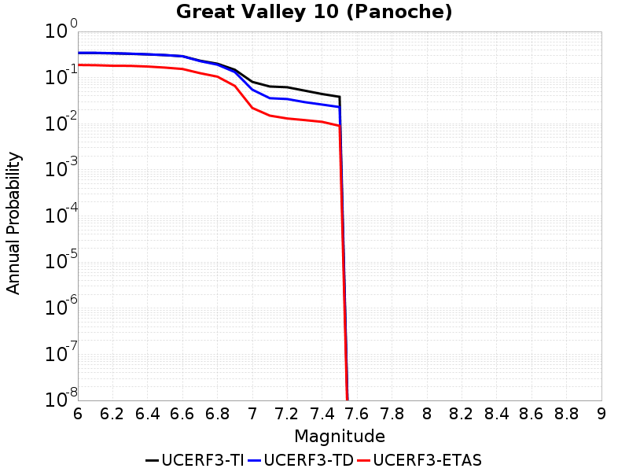 |
|-----|

| Magnitude | UCERF3-TI Prob | UCERF3-TD Prob | UCERF3-ETAS Prob |
|-----|-----|-----|-----|
| 6.0 | 0.34151497 | 0.34514627 | 0.20555556 |
| 6.1 | 0.34151497 | 0.34514627 | 0.20555556 |
| 6.2 | 0.33570984 | 0.33884516 | 0.2 |
| 6.3 | 0.32848078 | 0.33099818 | 0.2 |
| 6.4 | 0.3189067 | 0.32061893 | 0.18888889 |
| 6.5 | 0.3074734 | 0.3082918 | 0.18333334 |
| 6.6 | 0.29128715 | 0.29086176 | 0.16666667 |
| 6.7 | 0.23316334 | 0.22816508 | 0.14444445 |
| 6.8 | 0.20010178 | 0.19089101 | 0.12222222 |
| 6.9 | 0.14816457 | 0.13193141 | 0.06666667 |
| 7.0 | 0.08084098 | 0.054803338 | 0.044444446 |
| 7.1 | 0.0642286 | 0.03580141 | 0.027777778 |
| 7.2 | 0.061867572 | 0.03433497 | 0.022222223 |
| 7.3 | 0.052225363 | 0.02940196 | 0.022222223 |
| 7.4 | 0.04407341 | 0.026036307 | 0.022222223 |
| 7.5 | 0.038384836 | 0.023000833 | 0.022222223 |

## Great Valley 11
*[(top)](#table-of-contents)*

| 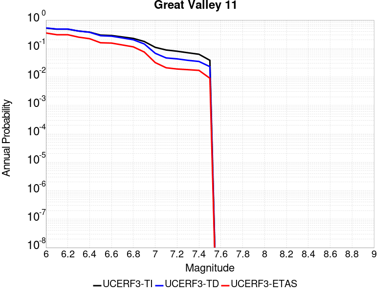 |
|-----|

| Magnitude | UCERF3-TI Prob | UCERF3-TD Prob | UCERF3-ETAS Prob |
|-----|-----|-----|-----|
| 6.0 | 0.5195866 | 0.5278396 | 0.3611111 |
| 6.1 | 0.47683355 | 0.48213142 | 0.32222223 |
| 6.2 | 0.47683355 | 0.48213142 | 0.32222223 |
| 6.3 | 0.41052297 | 0.40977693 | 0.2611111 |
| 6.4 | 0.37564966 | 0.37207794 | 0.24444444 |
| 6.5 | 0.29650795 | 0.28162268 | 0.17222223 |
| 6.6 | 0.28668198 | 0.2707284 | 0.16666667 |
| 6.7 | 0.2547878 | 0.23496082 | 0.14444445 |
| 6.8 | 0.22628894 | 0.20238678 | 0.12222222 |
| 6.9 | 0.17605208 | 0.14426486 | 0.06666667 |
| 7.0 | 0.1099111 | 0.067883775 | 0.044444446 |
| 7.1 | 0.0885682 | 0.046560436 | 0.027777778 |
| 7.2 | 0.08019173 | 0.04319452 | 0.022222223 |
| 7.3 | 0.07073786 | 0.03830677 | 0.022222223 |
| 7.4 | 0.06274514 | 0.034971993 | 0.022222223 |
| 7.5 | 0.038384836 | 0.023000833 | 0.022222223 |

## Great Valley 12
*[(top)](#table-of-contents)*

| 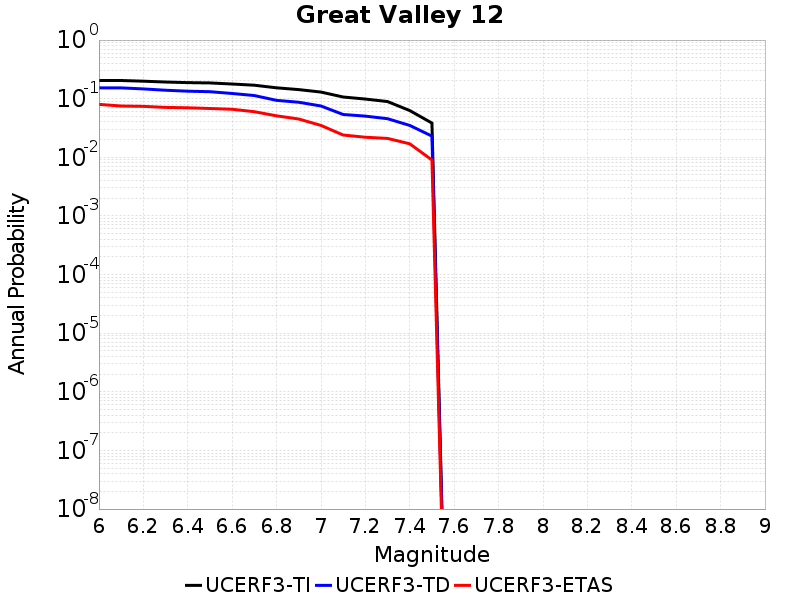 |
|-----|

| Magnitude | UCERF3-TI Prob | UCERF3-TD Prob | UCERF3-ETAS Prob |
|-----|-----|-----|-----|
| 6.0 | 0.20424901 | 0.15282945 | 0.072222225 |
| 6.1 | 0.20424901 | 0.15282945 | 0.055555556 |
| 6.2 | 0.19887424 | 0.14675267 | 0.05 |
| 6.3 | 0.19232118 | 0.1393283 | 0.05 |
| 6.4 | 0.18794739 | 0.13425143 | 0.05 |
| 6.5 | 0.18563746 | 0.13157637 | 0.05 |
| 6.6 | 0.17789312 | 0.122634284 | 0.05 |
| 6.7 | 0.16973622 | 0.113127925 | 0.05 |
| 6.8 | 0.15325947 | 0.093645714 | 0.044444446 |
| 6.9 | 0.14287807 | 0.086932704 | 0.044444446 |
| 7.0 | 0.1296844 | 0.075050354 | 0.044444446 |
| 7.1 | 0.106799856 | 0.05374132 | 0.027777778 |
| 7.2 | 0.09859094 | 0.050400756 | 0.022222223 |
| 7.3 | 0.08932618 | 0.045549817 | 0.022222223 |
| 7.4 | 0.06274514 | 0.034971993 | 0.022222223 |
| 7.5 | 0.038384836 | 0.023000833 | 0.022222223 |

## Great Valley 13 (Coalinga)
*[(top)](#table-of-contents)*

| 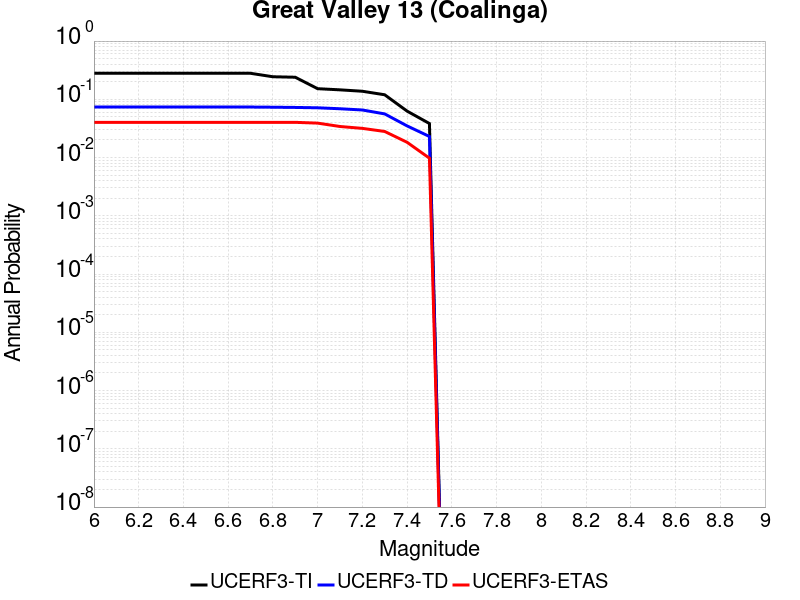 |
|-----|

| Magnitude | UCERF3-TI Prob | UCERF3-TD Prob | UCERF3-ETAS Prob |
|-----|-----|-----|-----|
| 6.0 | 0.27959946 | 0.07369158 | 0.044444446 |
| 6.1 | 0.27959946 | 0.07369158 | 0.044444446 |
| 6.2 | 0.27959946 | 0.07369158 | 0.044444446 |
| 6.3 | 0.27959946 | 0.07369158 | 0.044444446 |
| 6.4 | 0.27959946 | 0.07369158 | 0.044444446 |
| 6.5 | 0.27959946 | 0.07369158 | 0.044444446 |
| 6.6 | 0.27959946 | 0.07369158 | 0.044444446 |
| 6.7 | 0.27959946 | 0.07369158 | 0.044444446 |
| 6.8 | 0.24398153 | 0.07318836 | 0.044444446 |
| 6.9 | 0.23933199 | 0.07252507 | 0.044444446 |
| 7.0 | 0.15223595 | 0.07152648 | 0.03888889 |
| 7.1 | 0.14539015 | 0.068855695 | 0.03888889 |
| 7.2 | 0.1375359 | 0.06556849 | 0.033333335 |
| 7.3 | 0.11961763 | 0.056156773 | 0.027777778 |
| 7.4 | 0.06274514 | 0.034971993 | 0.022222223 |
| 7.5 | 0.038384836 | 0.023000833 | 0.022222223 |

## Great Valley 14 (Kettleman Hills)
*[(top)](#table-of-contents)*

| 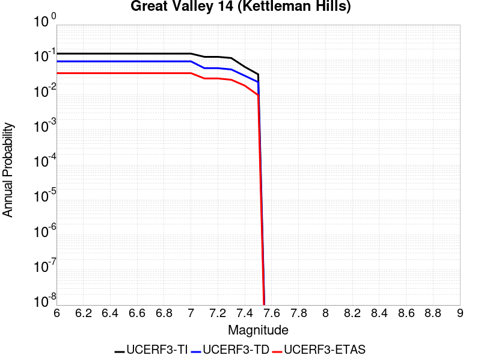 |
|-----|

| Magnitude | UCERF3-TI Prob | UCERF3-TD Prob | UCERF3-ETAS Prob |
|-----|-----|-----|-----|
| 6.0 | 0.14947799 | 0.08982009 | 0.044444446 |
| 6.1 | 0.14947799 | 0.08982009 | 0.044444446 |
| 6.2 | 0.14947799 | 0.08982009 | 0.044444446 |
| 6.3 | 0.14947799 | 0.08982009 | 0.044444446 |
| 6.4 | 0.14947799 | 0.08982009 | 0.044444446 |
| 6.5 | 0.14947799 | 0.08982009 | 0.044444446 |
| 6.6 | 0.14947799 | 0.08982009 | 0.044444446 |
| 6.7 | 0.14947799 | 0.08982009 | 0.044444446 |
| 6.8 | 0.14947799 | 0.08982009 | 0.044444446 |
| 6.9 | 0.14947799 | 0.08982009 | 0.044444446 |
| 7.0 | 0.14947799 | 0.08982009 | 0.044444446 |
| 7.1 | 0.121176995 | 0.057538237 | 0.033333335 |
| 7.2 | 0.121176995 | 0.057538237 | 0.033333335 |
| 7.3 | 0.11204533 | 0.052883897 | 0.027777778 |
| 7.4 | 0.06274514 | 0.034971993 | 0.022222223 |
| 7.5 | 0.038384836 | 0.023000833 | 0.022222223 |

## Green Valley 2011 CFM
*[(top)](#table-of-contents)*

| 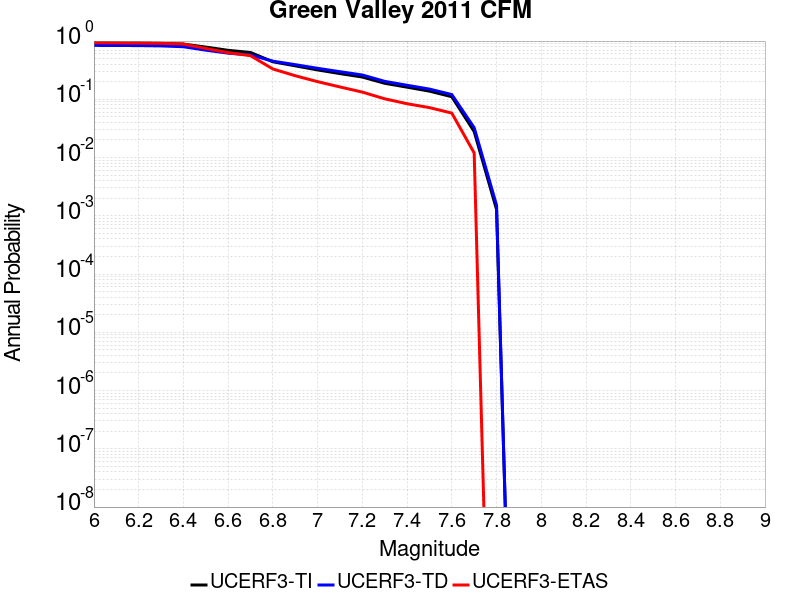 |
|-----|

| Magnitude | UCERF3-TI Prob | UCERF3-TD Prob | UCERF3-ETAS Prob |
|-----|-----|-----|-----|
| 6.0 | 0.92568094 | 0.84154814 | 0.9444444 |
| 6.1 | 0.924177 | 0.83990026 | 0.9444444 |
| 6.2 | 0.92033887 | 0.8355785 | 0.9388889 |
| 6.3 | 0.9110741 | 0.8252751 | 0.92777777 |
| 6.4 | 0.8880132 | 0.799013 | 0.9222222 |
| 6.5 | 0.7883591 | 0.697813 | 0.76666665 |
| 6.6 | 0.69378793 | 0.6199459 | 0.64444447 |
| 6.7 | 0.63668877 | 0.57802033 | 0.5777778 |
| 6.8 | 0.44088355 | 0.45173168 | 0.35555556 |
| 6.9 | 0.37557262 | 0.39346895 | 0.2888889 |
| 7.0 | 0.31966048 | 0.34053943 | 0.22222222 |
| 7.1 | 0.27638924 | 0.29790887 | 0.18333334 |
| 7.2 | 0.24128991 | 0.2615554 | 0.17222223 |
| 7.3 | 0.1883349 | 0.20338899 | 0.12222222 |
| 7.4 | 0.16162421 | 0.17418168 | 0.1 |
| 7.5 | 0.138153 | 0.14985909 | 0.08888889 |
| 7.6 | 0.11085739 | 0.12072936 | 0.083333336 |
| 7.7 | 0.027969718 | 0.032594804 | 0.0055555557 |
| 7.8 | 0.001287301 | 0.0015211178 | 0.0 |

## Greenville (No) 2011 CFM
*[(top)](#table-of-contents)*

| 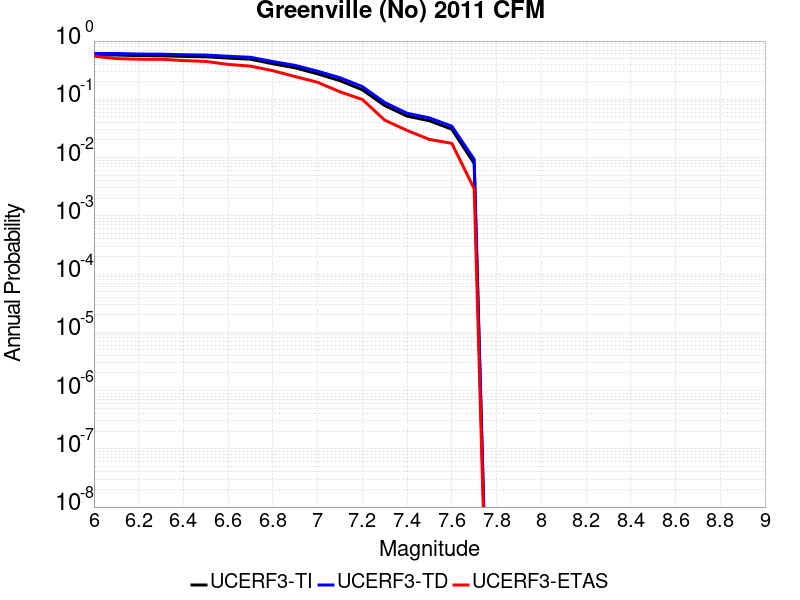 |
|-----|

| Magnitude | UCERF3-TI Prob | UCERF3-TD Prob | UCERF3-ETAS Prob |
|-----|-----|-----|-----|
| 6.0 | 0.5757696 | 0.6117739 | 0.53333336 |
| 6.1 | 0.5757696 | 0.6117739 | 0.4722222 |
| 6.2 | 0.56263626 | 0.5992719 | 0.46666667 |
| 6.3 | 0.55880105 | 0.5956342 | 0.46666667 |
| 6.4 | 0.5455442 | 0.58298814 | 0.42777777 |
| 6.5 | 0.53727937 | 0.5750949 | 0.41111112 |
| 6.6 | 0.51004004 | 0.5486893 | 0.35 |
| 6.7 | 0.48742387 | 0.526476 | 0.33333334 |
| 6.8 | 0.40745693 | 0.44483325 | 0.2777778 |
| 6.9 | 0.34677014 | 0.38227427 | 0.23333333 |
| 7.0 | 0.27360973 | 0.30392787 | 0.18333334 |
| 7.1 | 0.2092021 | 0.23482001 | 0.12222222 |
| 7.2 | 0.14550844 | 0.1653623 | 0.1 |
| 7.3 | 0.07819795 | 0.08816171 | 0.055555556 |
| 7.4 | 0.051469978 | 0.05765 | 0.03888889 |
| 7.5 | 0.04279203 | 0.04800426 | 0.027777778 |
| 7.6 | 0.030658968 | 0.03457424 | 0.022222223 |
| 7.7 | 0.007916393 | 0.009307665 | 0.0 |

## Greenville (So) 2011 CFM
*[(top)](#table-of-contents)*

| 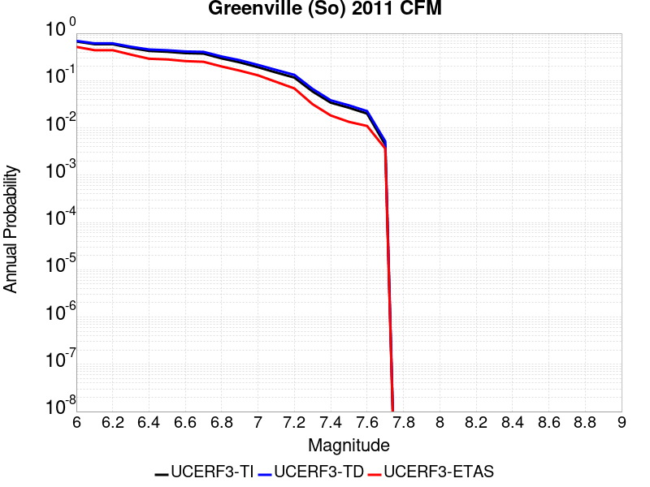 |
|-----|

| Magnitude | UCERF3-TI Prob | UCERF3-TD Prob | UCERF3-ETAS Prob |
|-----|-----|-----|-----|
| 6.0 | 0.6725976 | 0.6917985 | 0.5277778 |
| 6.1 | 0.5885319 | 0.6133657 | 0.43333334 |
| 6.2 | 0.5885319 | 0.6133657 | 0.43333334 |
| 6.3 | 0.49195778 | 0.520577 | 0.35 |
| 6.4 | 0.42401013 | 0.45506954 | 0.29444444 |
| 6.5 | 0.4070224 | 0.4388204 | 0.28333333 |
| 6.6 | 0.38117167 | 0.41362107 | 0.24444444 |
| 6.7 | 0.3728512 | 0.4054667 | 0.23888889 |
| 6.8 | 0.29454273 | 0.32363573 | 0.19444445 |
| 6.9 | 0.24297246 | 0.26971948 | 0.15555556 |
| 7.0 | 0.19170204 | 0.21473268 | 0.12222222 |
| 7.1 | 0.14816616 | 0.1678874 | 0.08888889 |
| 7.2 | 0.115710944 | 0.13225503 | 0.07777778 |
| 7.3 | 0.058894437 | 0.06677786 | 0.03888889 |
| 7.4 | 0.03413895 | 0.038335033 | 0.022222223 |
| 7.5 | 0.026673982 | 0.029997129 | 0.016666668 |
| 7.6 | 0.020053962 | 0.022640439 | 0.016666668 |
| 7.7 | 0.004406595 | 0.0052022636 | 0.0 |

## Hartley Springs 2011 CFM
*[(top)](#table-of-contents)*

| 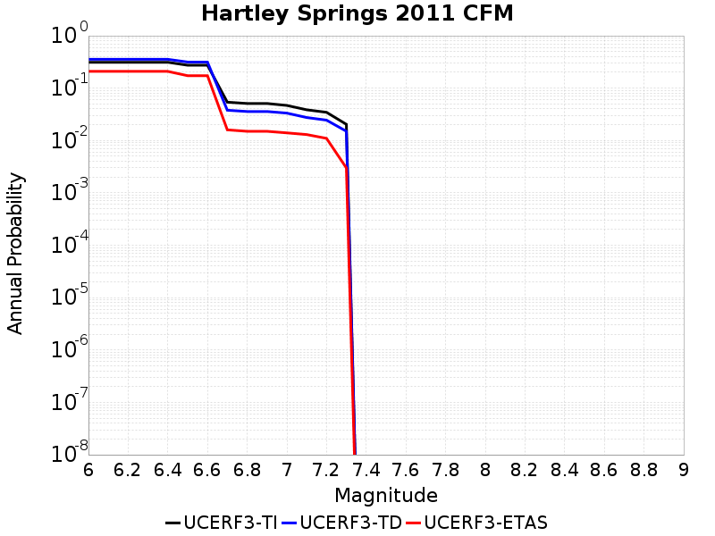 |
|-----|

| Magnitude | UCERF3-TI Prob | UCERF3-TD Prob | UCERF3-ETAS Prob |
|-----|-----|-----|-----|
| 6.0 | 0.31233054 | 0.3554347 | 0.2 |
| 6.1 | 0.31233054 | 0.3554347 | 0.2 |
| 6.2 | 0.31233054 | 0.3554347 | 0.2 |
| 6.3 | 0.31233054 | 0.3554347 | 0.2 |
| 6.4 | 0.31233054 | 0.3554347 | 0.2 |
| 6.5 | 0.27412298 | 0.3151745 | 0.15555556 |
| 6.6 | 0.27412298 | 0.3151745 | 0.15555556 |
| 6.7 | 0.054011483 | 0.037874516 | 0.011111111 |
| 6.8 | 0.05096846 | 0.035805516 | 0.011111111 |
| 6.9 | 0.05096846 | 0.035805516 | 0.011111111 |
| 7.0 | 0.04678761 | 0.033364393 | 0.011111111 |
| 7.1 | 0.03862394 | 0.027484747 | 0.011111111 |
| 7.2 | 0.03458485 | 0.024492547 | 0.0055555557 |
| 7.3 | 0.020399636 | 0.01504104 | 0.0 |

## Hat Creek-McArthur-Mayfield
*[(top)](#table-of-contents)*

| 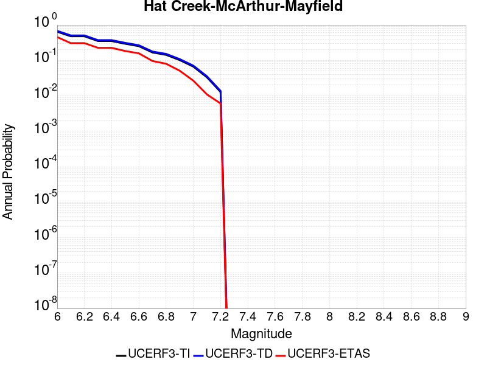 |
|-----|

| Magnitude | UCERF3-TI Prob | UCERF3-TD Prob | UCERF3-ETAS Prob |
|-----|-----|-----|-----|
| 6.0 | 0.6448098 | 0.68212205 | 0.5 |
| 6.1 | 0.47972023 | 0.50810415 | 0.30555555 |
| 6.2 | 0.47972023 | 0.50810415 | 0.30555555 |
| 6.3 | 0.35190126 | 0.3727136 | 0.21666667 |
| 6.4 | 0.35190126 | 0.3727136 | 0.21666667 |
| 6.5 | 0.29493424 | 0.3127446 | 0.17222223 |
| 6.6 | 0.25216386 | 0.2676572 | 0.14444445 |
| 6.7 | 0.16735604 | 0.17797087 | 0.08888889 |
| 6.8 | 0.14356367 | 0.15276791 | 0.06666667 |
| 6.9 | 0.10214309 | 0.10879805 | 0.033333335 |
| 7.0 | 0.06683244 | 0.07120634 | 0.022222223 |
| 7.1 | 0.033328667 | 0.035566043 | 0.0055555557 |
| 7.2 | 0.0128780175 | 0.013784451 | 0.0 |

## Hayward (No) 2011 CFM
*[(top)](#table-of-contents)*

| 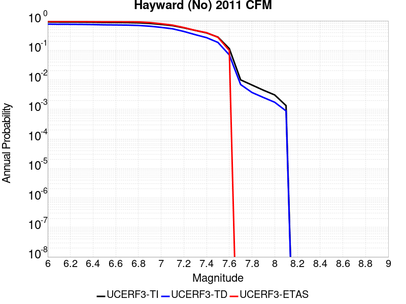 |
|-----|

| Magnitude | UCERF3-TI Prob | UCERF3-TD Prob | UCERF3-ETAS Prob |
|-----|-----|-----|-----|
| 6.0 | 0.9118049 | 0.77248627 | 0.95555556 |
| 6.1 | 0.9058267 | 0.76373935 | 0.95555556 |
| 6.2 | 0.90462136 | 0.761776 | 0.95555556 |
| 6.3 | 0.90021574 | 0.75566626 | 0.95555556 |
| 6.4 | 0.89187944 | 0.74445236 | 0.95555556 |
| 6.5 | 0.8808043 | 0.73001754 | 0.93333334 |
| 6.6 | 0.87556106 | 0.7231566 | 0.93333334 |
| 6.7 | 0.86856145 | 0.71456146 | 0.93333334 |
| 6.8 | 0.8522151 | 0.6961272 | 0.9111111 |
| 6.9 | 0.81454986 | 0.6566429 | 0.8833333 |
| 7.0 | 0.7546427 | 0.5983942 | 0.8 |
| 7.1 | 0.6852597 | 0.53656566 | 0.7111111 |
| 7.2 | 0.57679987 | 0.43517482 | 0.57222223 |
| 7.3 | 0.47259364 | 0.33925974 | 0.44444445 |
| 7.4 | 0.3881481 | 0.26807553 | 0.37222221 |
| 7.5 | 0.28086284 | 0.18518463 | 0.27222222 |
| 7.6 | 0.114625074 | 0.07006061 | 0.094444446 |
| 7.7 | 0.009968095 | 0.0069193356 | 0.0 |
| 7.8 | 0.006666374 | 0.0037243543 | 0.0 |
| 7.9 | 0.004462044 | 0.002529794 | 0.0 |
| 8.0 | 0.0030761154 | 0.0017390355 | 0.0 |
| 8.1 | 0.0013397089 | 8.8477624E-4 | 0.0 |

## Hayward (So) 2011 CFM
*[(top)](#table-of-contents)*

| 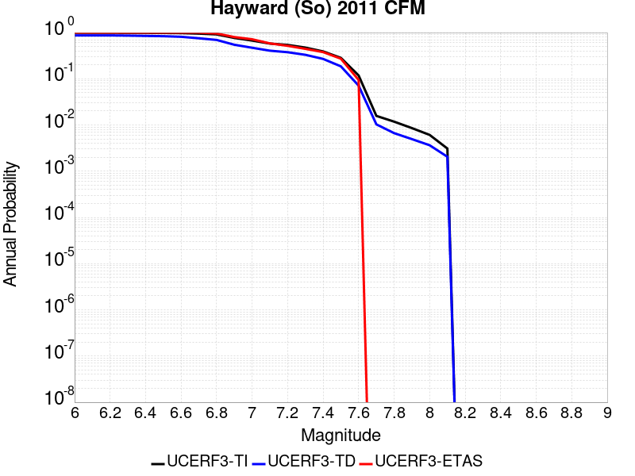 |
|-----|

| Magnitude | UCERF3-TI Prob | UCERF3-TD Prob | UCERF3-ETAS Prob |
|-----|-----|-----|-----|
| 6.0 | 0.9910891 | 0.86909705 | 1.0 |
| 6.1 | 0.9910891 | 0.86909705 | 1.0 |
| 6.2 | 0.9910891 | 0.86909705 | 1.0 |
| 6.3 | 0.98910886 | 0.85994613 | 1.0 |
| 6.4 | 0.9859031 | 0.84698826 | 1.0 |
| 6.5 | 0.9829281 | 0.835149 | 1.0 |
| 6.6 | 0.9743901 | 0.81070423 | 1.0 |
| 6.7 | 0.94983983 | 0.75258344 | 1.0 |
| 6.8 | 0.9136398 | 0.6929307 | 0.95555556 |
| 6.9 | 0.7650726 | 0.5450118 | 0.8 |
| 7.0 | 0.6714461 | 0.46960524 | 0.71666664 |
| 7.1 | 0.5778929 | 0.40559405 | 0.5833333 |
| 7.2 | 0.5411154 | 0.37590834 | 0.51666665 |
| 7.3 | 0.47310492 | 0.3302757 | 0.44444445 |
| 7.4 | 0.3908918 | 0.26911673 | 0.37777779 |
| 7.5 | 0.28359538 | 0.18589279 | 0.27222222 |
| 7.6 | 0.118049406 | 0.0710375 | 0.094444446 |
| 7.7 | 0.015746962 | 0.010323036 | 0.0 |
| 7.8 | 0.011811486 | 0.0066679493 | 0.0 |
| 7.9 | 0.008576842 | 0.004952074 | 0.0 |
| 8.0 | 0.0061045466 | 0.0036461535 | 0.0 |
| 8.1 | 0.0030952024 | 0.0020533325 | 0.0 |

## Hayward (So) extension 2011 CFM
*[(top)](#table-of-contents)*

| 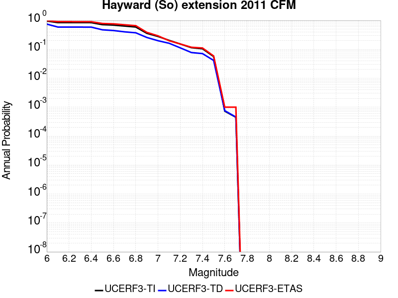 |
|-----|

| Magnitude | UCERF3-TI Prob | UCERF3-TD Prob | UCERF3-ETAS Prob |
|-----|-----|-----|-----|
| 6.0 | 0.9530265 | 0.74540234 | 0.98888886 |
| 6.1 | 0.83864456 | 0.58829546 | 0.90555555 |
| 6.2 | 0.83864456 | 0.58829546 | 0.90555555 |
| 6.3 | 0.8377673 | 0.5867525 | 0.90555555 |
| 6.4 | 0.83695287 | 0.58555 | 0.90555555 |
| 6.5 | 0.7131305 | 0.4724591 | 0.8 |
| 6.6 | 0.68814945 | 0.4465204 | 0.75555557 |
| 6.7 | 0.6370423 | 0.40187627 | 0.71666664 |
| 6.8 | 0.5905085 | 0.37266022 | 0.6388889 |
| 6.9 | 0.35701612 | 0.25642237 | 0.38333333 |
| 7.0 | 0.27846178 | 0.19845852 | 0.3 |
| 7.1 | 0.20413327 | 0.1618416 | 0.19444445 |
| 7.2 | 0.15276887 | 0.11241401 | 0.13333334 |
| 7.3 | 0.11414275 | 0.07747504 | 0.094444446 |
| 7.4 | 0.10458853 | 0.071076706 | 0.08888889 |
| 7.5 | 0.05624195 | 0.04128058 | 0.044444446 |
| 7.6 | 7.2899484E-4 | 7.575281E-4 | 0.0 |
| 7.7 | 4.484453E-4 | 4.5623328E-4 | 0.0 |

## Hector Mine
*[(top)](#table-of-contents)*

| 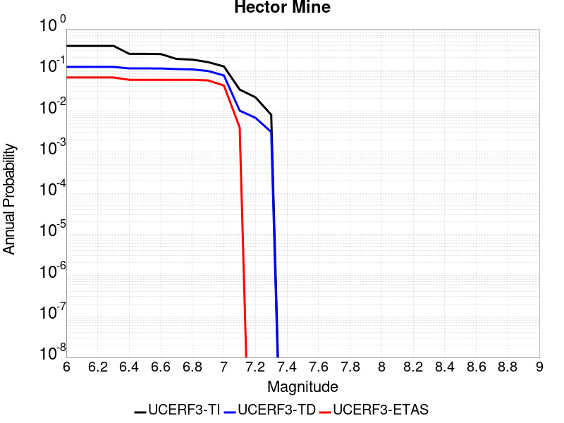 |
|-----|

| Magnitude | UCERF3-TI Prob | UCERF3-TD Prob | UCERF3-ETAS Prob |
|-----|-----|-----|-----|
| 6.0 | 0.38703167 | 0.118952416 | 0.055555556 |
| 6.1 | 0.38703167 | 0.118952416 | 0.055555556 |
| 6.2 | 0.38703167 | 0.118952416 | 0.055555556 |
| 6.3 | 0.38703167 | 0.118952416 | 0.055555556 |
| 6.4 | 0.24728088 | 0.109399386 | 0.05 |
| 6.5 | 0.24728088 | 0.109399386 | 0.05 |
| 6.6 | 0.2441851 | 0.10918275 | 0.05 |
| 6.7 | 0.18585677 | 0.10541848 | 0.05 |
| 6.8 | 0.17918172 | 0.103427835 | 0.05 |
| 6.9 | 0.15538783 | 0.094596066 | 0.05 |
| 7.0 | 0.12220506 | 0.073752575 | 0.03888889 |
| 7.1 | 0.033341188 | 0.01025038 | 0.0 |
| 7.2 | 0.021657985 | 0.006855584 | 0.0 |
| 7.3 | 0.0081330845 | 0.0030905993 | 0.0 |

## Helendale-So Lockhart
*[(top)](#table-of-contents)*

| 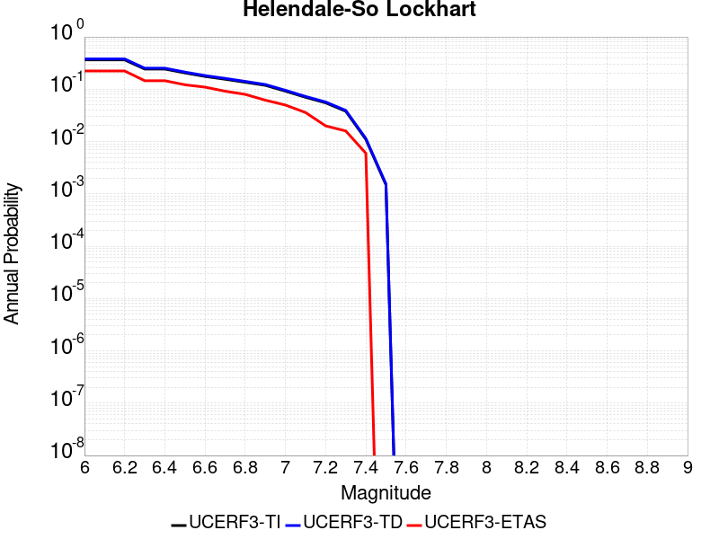 |
|-----|

| Magnitude | UCERF3-TI Prob | UCERF3-TD Prob | UCERF3-ETAS Prob |
|-----|-----|-----|-----|
| 6.0 | 0.36316562 | 0.37937155 | 0.23888889 |
| 6.1 | 0.36316562 | 0.37937155 | 0.23888889 |
| 6.2 | 0.36316562 | 0.37937155 | 0.23888889 |
| 6.3 | 0.24296905 | 0.25219822 | 0.18333334 |
| 6.4 | 0.24296905 | 0.25219822 | 0.18333334 |
| 6.5 | 0.20493136 | 0.21268524 | 0.15 |
| 6.6 | 0.17550305 | 0.18218425 | 0.11666667 |
| 6.7 | 0.15510091 | 0.16105549 | 0.10555556 |
| 6.8 | 0.13593142 | 0.14108615 | 0.083333336 |
| 6.9 | 0.11860513 | 0.12306405 | 0.06111111 |
| 7.0 | 0.09187008 | 0.09533482 | 0.05 |
| 7.1 | 0.07010339 | 0.07272402 | 0.022222223 |
| 7.2 | 0.054972194 | 0.057041954 | 0.011111111 |
| 7.3 | 0.0379352 | 0.039395653 | 0.011111111 |
| 7.4 | 0.010980636 | 0.011429191 | 0.0055555557 |
| 7.5 | 0.0014844815 | 0.0015456411 | 0.0 |

## Hilton Creek 2011 CFM
*[(top)](#table-of-contents)*

| 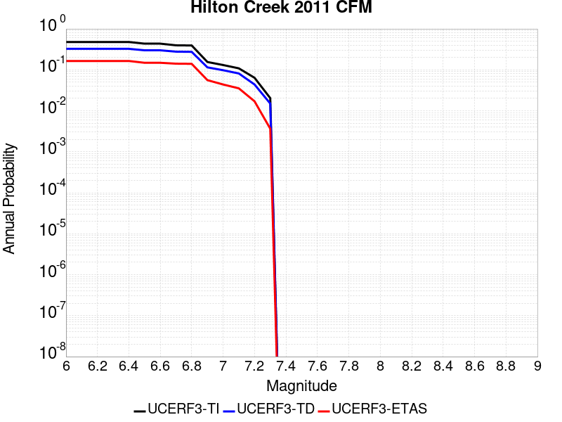 |
|-----|

| Magnitude | UCERF3-TI Prob | UCERF3-TD Prob | UCERF3-ETAS Prob |
|-----|-----|-----|-----|
| 6.0 | 0.4780843 | 0.32586718 | 0.1388889 |
| 6.1 | 0.4780843 | 0.32586718 | 0.1388889 |
| 6.2 | 0.4780843 | 0.32586718 | 0.1388889 |
| 6.3 | 0.4780843 | 0.32586718 | 0.1388889 |
| 6.4 | 0.4780843 | 0.32586718 | 0.1388889 |
| 6.5 | 0.43618488 | 0.3001071 | 0.13333334 |
| 6.6 | 0.43618488 | 0.3001071 | 0.13333334 |
| 6.7 | 0.39714086 | 0.27812365 | 0.12777779 |
| 6.8 | 0.39360002 | 0.27497047 | 0.12777779 |
| 6.9 | 0.15555602 | 0.11498013 | 0.044444446 |
| 7.0 | 0.13114384 | 0.09798662 | 0.033333335 |
| 7.1 | 0.10885126 | 0.08157539 | 0.022222223 |
| 7.2 | 0.06400892 | 0.04390412 | 0.0055555557 |
| 7.3 | 0.020399636 | 0.01504104 | 0.0 |

## Hollywood
*[(top)](#table-of-contents)*

| 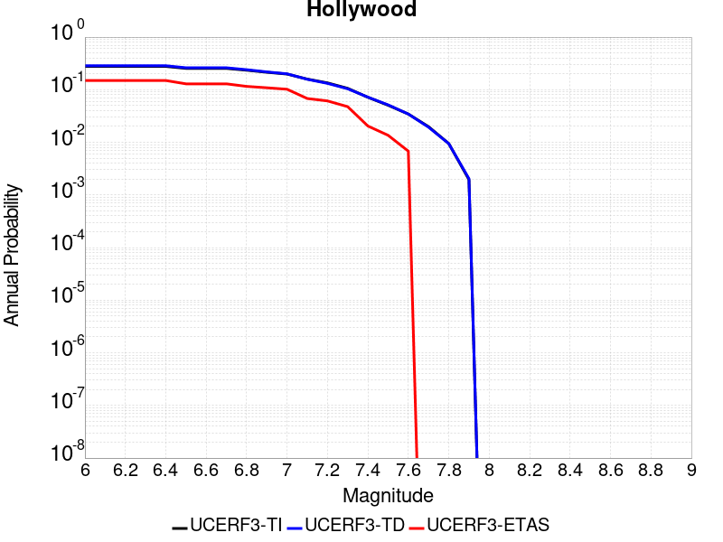 |
|-----|

| Magnitude | UCERF3-TI Prob | UCERF3-TD Prob | UCERF3-ETAS Prob |
|-----|-----|-----|-----|
| 6.0 | 0.27731463 | 0.28598264 | 0.2 |
| 6.1 | 0.27731463 | 0.28598264 | 0.2 |
| 6.2 | 0.27731463 | 0.28598264 | 0.2 |
| 6.3 | 0.27731463 | 0.28598264 | 0.2 |
| 6.4 | 0.2769801 | 0.28562513 | 0.2 |
| 6.5 | 0.25420403 | 0.26149985 | 0.16666667 |
| 6.6 | 0.2540453 | 0.26133016 | 0.16666667 |
| 6.7 | 0.25395447 | 0.261232 | 0.16666667 |
| 6.8 | 0.2347021 | 0.24018532 | 0.16111112 |
| 6.9 | 0.21446222 | 0.21802345 | 0.15 |
| 7.0 | 0.19836134 | 0.20052843 | 0.1388889 |
| 7.1 | 0.15913862 | 0.1578617 | 0.10555556 |
| 7.2 | 0.13477863 | 0.13184382 | 0.083333336 |
| 7.3 | 0.10625966 | 0.10418402 | 0.06666667 |
| 7.4 | 0.07178039 | 0.07220898 | 0.05 |
| 7.5 | 0.050660014 | 0.05154235 | 0.03888889 |
| 7.6 | 0.03448371 | 0.034495987 | 0.027777778 |
| 7.7 | 0.019846173 | 0.019405177 | 0.016666668 |
| 7.8 | 0.00949345 | 0.009454405 | 0.011111111 |
| 7.9 | 0.0019554193 | 0.0020371755 | 0.0 |

## Holser alt 1
*[(top)](#table-of-contents)*

| 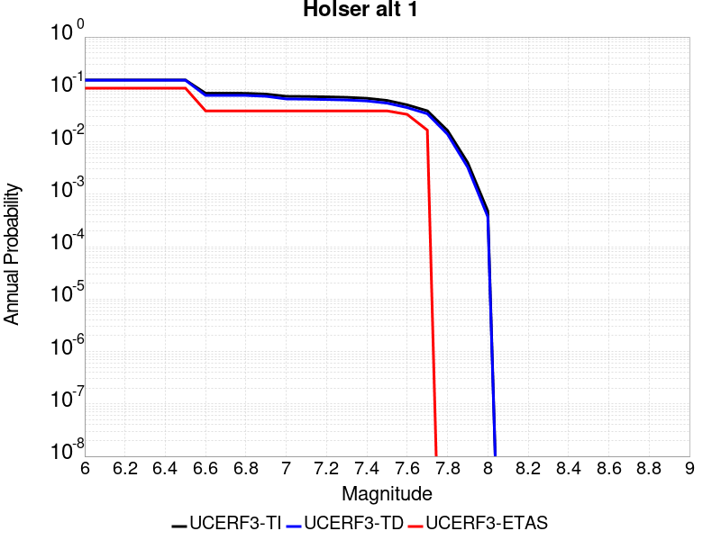 |
|-----|

| Magnitude | UCERF3-TI Prob | UCERF3-TD Prob | UCERF3-ETAS Prob |
|-----|-----|-----|-----|
| 6.0 | 0.15100506 | 0.149403 | 0.10555556 |
| 6.1 | 0.15100506 | 0.149403 | 0.10555556 |
| 6.2 | 0.15100506 | 0.149403 | 0.10555556 |
| 6.3 | 0.15100506 | 0.149403 | 0.10555556 |
| 6.4 | 0.15100506 | 0.149403 | 0.10555556 |
| 6.5 | 0.15100506 | 0.149403 | 0.10555556 |
| 6.6 | 0.08430598 | 0.07685807 | 0.03888889 |
| 6.7 | 0.08430598 | 0.07685807 | 0.03888889 |
| 6.8 | 0.084083974 | 0.0766272 | 0.03888889 |
| 6.9 | 0.08137117 | 0.073788665 | 0.03888889 |
| 7.0 | 0.07368153 | 0.06571125 | 0.03888889 |
| 7.1 | 0.07308011 | 0.065107845 | 0.03888889 |
| 7.2 | 0.07208013 | 0.064097926 | 0.03888889 |
| 7.3 | 0.07058585 | 0.06270718 | 0.03888889 |
| 7.4 | 0.06762019 | 0.06015769 | 0.03888889 |
| 7.5 | 0.06153931 | 0.054720975 | 0.03888889 |
| 7.6 | 0.050629098 | 0.044889838 | 0.033333335 |
| 7.7 | 0.038953718 | 0.03428344 | 0.016666668 |
| 7.8 | 0.016427515 | 0.013972838 | 0.0 |
| 7.9 | 0.0040251333 | 0.0032791253 | 0.0 |
| 8.0 | 4.7752372E-4 | 3.7073088E-4 | 0.0 |

## Homestead Valley 2011
*[(top)](#table-of-contents)*

| 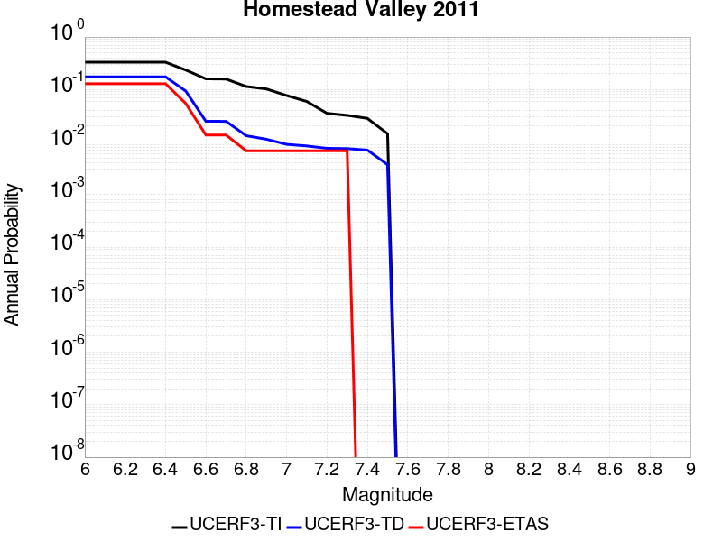 |
|-----|

| Magnitude | UCERF3-TI Prob | UCERF3-TD Prob | UCERF3-ETAS Prob |
|-----|-----|-----|-----|
| 6.0 | 0.33083498 | 0.17433503 | 0.06111111 |
| 6.1 | 0.33083498 | 0.17433503 | 0.06111111 |
| 6.2 | 0.33083498 | 0.17433503 | 0.06111111 |
| 6.3 | 0.33083498 | 0.17433503 | 0.06111111 |
| 6.4 | 0.33083498 | 0.17433503 | 0.06111111 |
| 6.5 | 0.23495042 | 0.0936456 | 0.03888889 |
| 6.6 | 0.15959981 | 0.02482973 | 0.016666668 |
| 6.7 | 0.15807973 | 0.02481995 | 0.016666668 |
| 6.8 | 0.114203654 | 0.0132003445 | 0.0055555557 |
| 6.9 | 0.10244808 | 0.011315187 | 0.0055555557 |
| 7.0 | 0.076907314 | 0.009047315 | 0.0055555557 |
| 7.1 | 0.05924382 | 0.008436947 | 0.0055555557 |
| 7.2 | 0.035247512 | 0.0075995573 | 0.0055555557 |
| 7.3 | 0.032270525 | 0.0075134034 | 0.0055555557 |
| 7.4 | 0.028275661 | 0.007041449 | 0.0 |
| 7.5 | 0.014393007 | 0.0037108667 | 0.0 |

## Honey Lake 2011 CFM
*[(top)](#table-of-contents)*

| 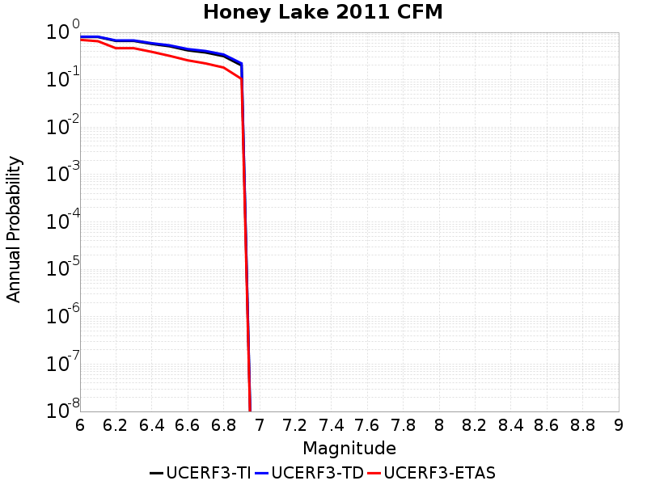 |
|-----|

| Magnitude | UCERF3-TI Prob | UCERF3-TD Prob | UCERF3-ETAS Prob |
|-----|-----|-----|-----|
| 6.0 | 0.79930663 | 0.81201404 | 0.68333334 |
| 6.1 | 0.79930663 | 0.81201404 | 0.6333333 |
| 6.2 | 0.6598687 | 0.6761132 | 0.44444445 |
| 6.3 | 0.6598687 | 0.6761132 | 0.44444445 |
| 6.4 | 0.5705037 | 0.5914478 | 0.37777779 |
| 6.5 | 0.5082485 | 0.5323214 | 0.32777777 |
| 6.6 | 0.41717136 | 0.4447735 | 0.2611111 |
| 6.7 | 0.37574774 | 0.4044705 | 0.21111111 |
| 6.8 | 0.31452027 | 0.34114805 | 0.17777778 |
| 6.9 | 0.20024033 | 0.2213953 | 0.06111111 |

## Hosgri
*[(top)](#table-of-contents)*

| 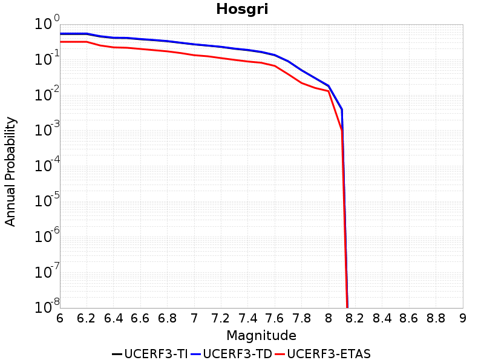 |
|-----|

| Magnitude | UCERF3-TI Prob | UCERF3-TD Prob | UCERF3-ETAS Prob |
|-----|-----|-----|-----|
| 6.0 | 0.5287752 | 0.54757607 | 0.34444445 |
| 6.1 | 0.5287752 | 0.54757607 | 0.34444445 |
| 6.2 | 0.5287752 | 0.54757607 | 0.34444445 |
| 6.3 | 0.449995 | 0.46200454 | 0.26666668 |
| 6.4 | 0.4095662 | 0.4189458 | 0.24444444 |
| 6.5 | 0.4053705 | 0.41457182 | 0.23888889 |
| 6.6 | 0.3763341 | 0.38404384 | 0.2 |
| 6.7 | 0.3541947 | 0.36089897 | 0.17777778 |
| 6.8 | 0.33089048 | 0.33659574 | 0.16666667 |
| 6.9 | 0.29806814 | 0.30236456 | 0.14444445 |
| 7.0 | 0.26939136 | 0.2726181 | 0.12222222 |
| 7.1 | 0.24894127 | 0.25180745 | 0.11111111 |
| 7.2 | 0.22887193 | 0.23194607 | 0.1 |
| 7.3 | 0.20308083 | 0.20682856 | 0.083333336 |
| 7.4 | 0.18553723 | 0.18927792 | 0.06666667 |
| 7.5 | 0.16339442 | 0.16681509 | 0.06111111 |
| 7.6 | 0.13374811 | 0.13632339 | 0.06111111 |
| 7.7 | 0.08999014 | 0.09059614 | 0.022222223 |
| 7.8 | 0.05047783 | 0.050116815 | 0.011111111 |
| 7.9 | 0.030363783 | 0.030198758 | 0.0055555557 |
| 8.0 | 0.018001862 | 0.018598083 | 0.0055555557 |
| 8.1 | 0.00391439 | 0.0040451013 | 0.0 |

## Hosgri (Extension)
*[(top)](#table-of-contents)*

| 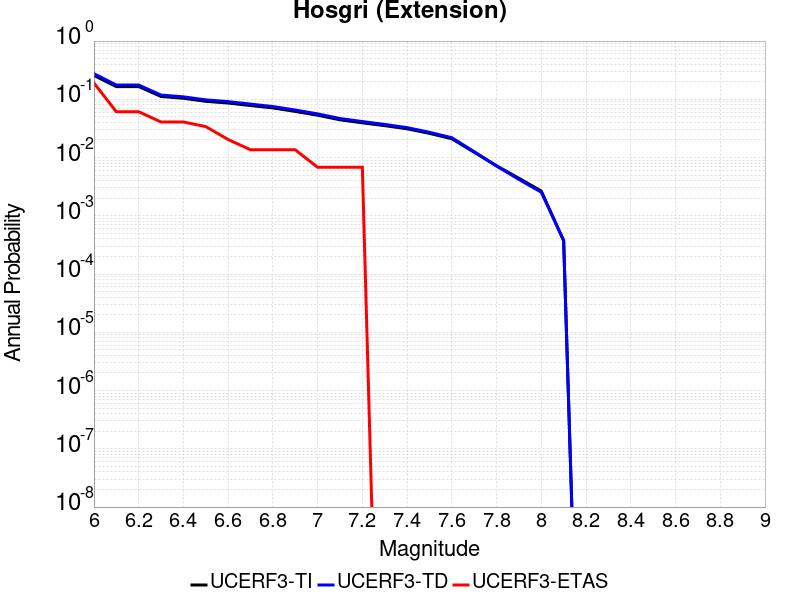 |
|-----|

| Magnitude | UCERF3-TI Prob | UCERF3-TD Prob | UCERF3-ETAS Prob |
|-----|-----|-----|-----|
| 6.0 | 0.25666934 | 0.27546996 | 0.22222222 |
| 6.1 | 0.16550563 | 0.17584166 | 0.06666667 |
| 6.2 | 0.16550563 | 0.17584166 | 0.06666667 |
| 6.3 | 0.111896105 | 0.11839615 | 0.055555556 |
| 6.4 | 0.10420825 | 0.11026468 | 0.055555556 |
| 6.5 | 0.0924293 | 0.09782016 | 0.05 |
| 6.6 | 0.08632671 | 0.091333434 | 0.03888889 |
| 6.7 | 0.078256615 | 0.08275224 | 0.027777778 |
| 6.8 | 0.07115067 | 0.075182945 | 0.022222223 |
| 6.9 | 0.062019493 | 0.06545878 | 0.022222223 |
| 7.0 | 0.05333387 | 0.05621517 | 0.016666668 |
| 7.1 | 0.044489734 | 0.04681104 | 0.016666668 |
| 7.2 | 0.039522924 | 0.041533694 | 0.016666668 |
| 7.3 | 0.03530022 | 0.03704556 | 0.011111111 |
| 7.4 | 0.031188505 | 0.032672875 | 0.0055555557 |
| 7.5 | 0.02600891 | 0.027171165 | 0.0055555557 |
| 7.6 | 0.021053186 | 0.021905275 | 0.0055555557 |
| 7.7 | 0.012336085 | 0.012618214 | 0.0 |
| 7.8 | 0.007233802 | 0.0071476693 | 0.0 |
| 7.9 | 0.004411874 | 0.0042111226 | 0.0 |
| 8.0 | 0.0026642028 | 0.0025433593 | 0.0 |
| 8.1 | 3.7486234E-4 | 3.7811793E-4 | 0.0 |

## Hunter Mountain-Saline Valley
*[(top)](#table-of-contents)*

| 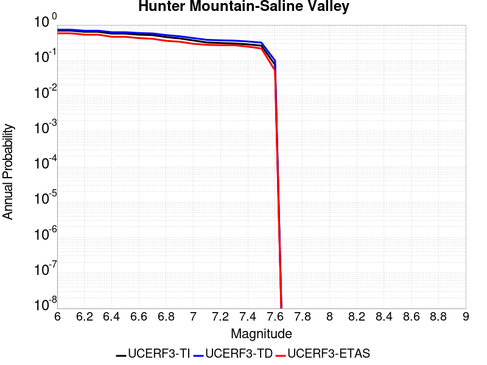 |
|-----|

| Magnitude | UCERF3-TI Prob | UCERF3-TD Prob | UCERF3-ETAS Prob |
|-----|-----|-----|-----|
| 6.0 | 0.6917207 | 0.73330116 | 0.62222224 |
| 6.1 | 0.6917207 | 0.73330116 | 0.62222224 |
| 6.2 | 0.641915 | 0.6898228 | 0.55 |
| 6.3 | 0.641915 | 0.6898228 | 0.55 |
| 6.4 | 0.5695837 | 0.6244462 | 0.4888889 |
| 6.5 | 0.5695837 | 0.6244462 | 0.4888889 |
| 6.6 | 0.53447044 | 0.5929384 | 0.45555556 |
| 6.7 | 0.5161517 | 0.5764415 | 0.41666666 |
| 6.8 | 0.4567753 | 0.5186617 | 0.35 |
| 6.9 | 0.41716284 | 0.4789365 | 0.33888888 |
| 7.0 | 0.36592245 | 0.4268603 | 0.30555555 |
| 7.1 | 0.32045063 | 0.3804033 | 0.3 |
| 7.2 | 0.3092311 | 0.36897123 | 0.28333333 |
| 7.3 | 0.3010799 | 0.36039343 | 0.28333333 |
| 7.4 | 0.2840954 | 0.34246978 | 0.27222222 |
| 7.5 | 0.2610494 | 0.3177183 | 0.23888889 |
| 7.6 | 0.075227775 | 0.09891283 | 0.05 |

## Hunting Creek - Bartlett Springs connector 2011
*[(top)](#table-of-contents)*

| 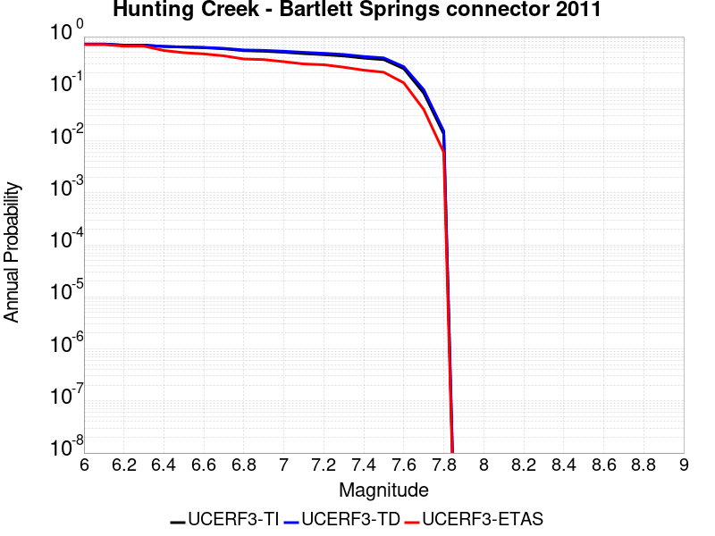 |
|-----|

| Magnitude | UCERF3-TI Prob | UCERF3-TD Prob | UCERF3-ETAS Prob |
|-----|-----|-----|-----|
| 6.0 | 0.72441155 | 0.7141624 | 0.6888889 |
| 6.1 | 0.72441155 | 0.7141624 | 0.6888889 |
| 6.2 | 0.6886575 | 0.68400055 | 0.6333333 |
| 6.3 | 0.6886575 | 0.68400055 | 0.6333333 |
| 6.4 | 0.64782196 | 0.64981765 | 0.53333336 |
| 6.5 | 0.62926733 | 0.63461006 | 0.48333332 |
| 6.6 | 0.6145161 | 0.62246937 | 0.46666667 |
| 6.7 | 0.5851141 | 0.59780747 | 0.43888888 |
| 6.8 | 0.53863204 | 0.5553661 | 0.38333333 |
| 6.9 | 0.52591395 | 0.5454924 | 0.3611111 |
| 7.0 | 0.50166893 | 0.5246376 | 0.33333334 |
| 7.1 | 0.4731205 | 0.500095 | 0.30555555 |
| 7.2 | 0.4506143 | 0.47967649 | 0.2888889 |
| 7.3 | 0.42568898 | 0.4551518 | 0.25555557 |
| 7.4 | 0.38741925 | 0.41611952 | 0.22777778 |
| 7.5 | 0.36237162 | 0.39084178 | 0.21666667 |
| 7.6 | 0.24266466 | 0.2650005 | 0.13333334 |
| 7.7 | 0.08216513 | 0.09548763 | 0.03888889 |
| 7.8 | 0.013437524 | 0.015270229 | 0.0055555557 |

## Hunting Creek - Berryessa 2011 CFM
*[(top)](#table-of-contents)*

| 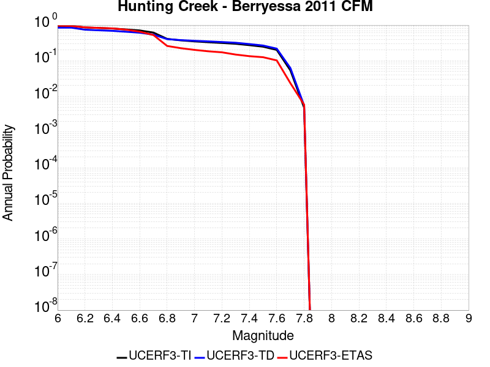 |
|-----|

| Magnitude | UCERF3-TI Prob | UCERF3-TD Prob | UCERF3-ETAS Prob |
|-----|-----|-----|-----|
| 6.0 | 0.94717044 | 0.8494382 | 0.9611111 |
| 6.1 | 0.9467332 | 0.8486415 | 0.95 |
| 6.2 | 0.86219096 | 0.74510133 | 0.87777776 |
| 6.3 | 0.82983476 | 0.7154676 | 0.84444445 |
| 6.4 | 0.8024758 | 0.69082195 | 0.82222223 |
| 6.5 | 0.7579142 | 0.65211177 | 0.74444443 |
| 6.6 | 0.7088855 | 0.61144465 | 0.6611111 |
| 6.7 | 0.6178984 | 0.54171836 | 0.53333336 |
| 6.8 | 0.4110477 | 0.40408 | 0.28333333 |
| 6.9 | 0.3726476 | 0.37939 | 0.25 |
| 7.0 | 0.34836653 | 0.36310562 | 0.22222222 |
| 7.1 | 0.33104336 | 0.34964237 | 0.2 |
| 7.2 | 0.3149272 | 0.3354203 | 0.18333334 |
| 7.3 | 0.29897562 | 0.32018775 | 0.16111112 |
| 7.4 | 0.27361086 | 0.29407793 | 0.14444445 |
| 7.5 | 0.2477765 | 0.26759517 | 0.1388889 |
| 7.6 | 0.20146294 | 0.21887977 | 0.11666667 |
| 7.7 | 0.053298034 | 0.062141024 | 0.022222223 |
| 7.8 | 0.0047962754 | 0.005517763 | 0.0055555557 |

## Imperial
*[(top)](#table-of-contents)*

| 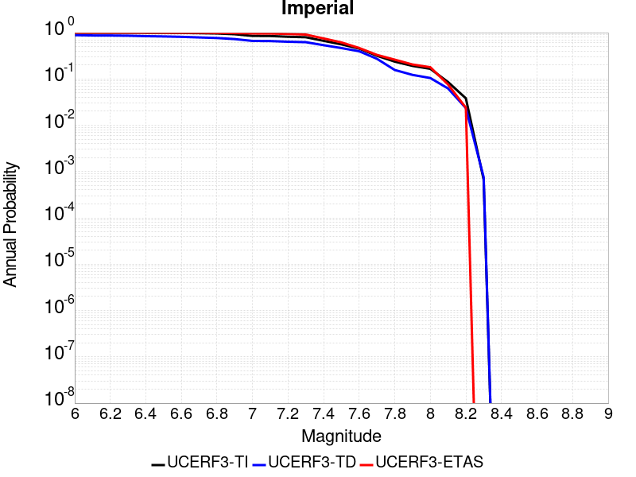 |
|-----|

| Magnitude | UCERF3-TI Prob | UCERF3-TD Prob | UCERF3-ETAS Prob |
|-----|-----|-----|-----|
| 6.0 | 0.9992342 | 0.88364166 | 1.0 |
| 6.1 | 0.9986613 | 0.87079674 | 1.0 |
| 6.2 | 0.9984606 | 0.868074 | 1.0 |
| 6.3 | 0.9976535 | 0.8587225 | 1.0 |
| 6.4 | 0.9949979 | 0.8402094 | 1.0 |
| 6.5 | 0.99209285 | 0.82775164 | 1.0 |
| 6.6 | 0.9868002 | 0.8117065 | 1.0 |
| 6.7 | 0.97555614 | 0.7882486 | 1.0 |
| 6.8 | 0.9597917 | 0.7660283 | 0.98888886 |
| 6.9 | 0.92365587 | 0.7261717 | 0.9722222 |
| 7.0 | 0.85185945 | 0.6624116 | 0.95555556 |
| 7.1 | 0.8462215 | 0.65789765 | 0.95 |
| 7.2 | 0.81493056 | 0.63592654 | 0.9166667 |
| 7.3 | 0.7957466 | 0.6222122 | 0.9111111 |
| 7.4 | 0.6656618 | 0.53607094 | 0.6888889 |
| 7.5 | 0.5581233 | 0.464574 | 0.56666666 |
| 7.6 | 0.45228356 | 0.39642882 | 0.45555556 |
| 7.7 | 0.3165171 | 0.27227458 | 0.32222223 |
| 7.8 | 0.23669931 | 0.15625523 | 0.26666668 |
| 7.9 | 0.19128849 | 0.12232291 | 0.2 |
| 8.0 | 0.16556965 | 0.104752496 | 0.16111112 |
| 8.1 | 0.085566655 | 0.062216036 | 0.05 |
| 8.2 | 0.038144484 | 0.023494132 | 0.011111111 |
| 8.3 | 6.717823E-4 | 7.5839297E-4 | 0.0 |

## Incline Village 2011 CFM
*[(top)](#table-of-contents)*

| 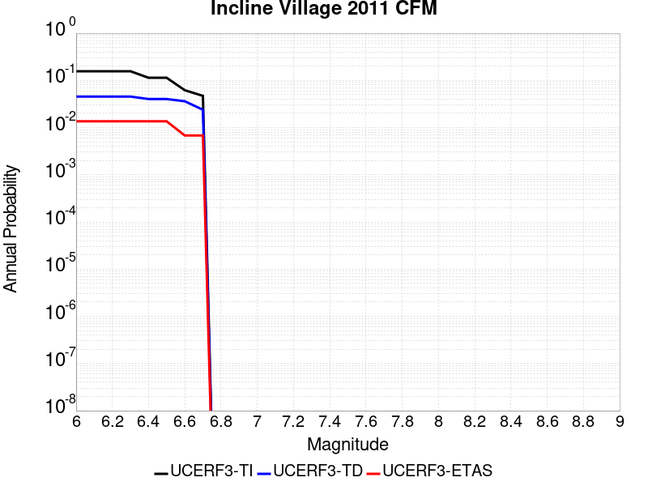 |
|-----|

| Magnitude | UCERF3-TI Prob | UCERF3-TD Prob | UCERF3-ETAS Prob |
|-----|-----|-----|-----|
| 6.0 | 0.15668908 | 0.045539837 | 0.033333335 |
| 6.1 | 0.15668908 | 0.045539837 | 0.033333335 |
| 6.2 | 0.15668908 | 0.045539837 | 0.033333335 |
| 6.3 | 0.15668908 | 0.045539837 | 0.033333335 |
| 6.4 | 0.11385884 | 0.04036136 | 0.027777778 |
| 6.5 | 0.11385884 | 0.04036136 | 0.027777778 |
| 6.6 | 0.062031526 | 0.03620819 | 0.016666668 |
| 6.7 | 0.04714669 | 0.023940327 | 0.011111111 |

## Independence rev 2011
*[(top)](#table-of-contents)*

| 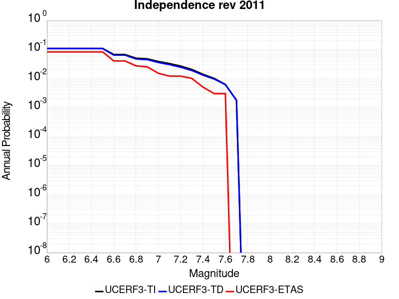 |
|-----|

| Magnitude | UCERF3-TI Prob | UCERF3-TD Prob | UCERF3-ETAS Prob |
|-----|-----|-----|-----|
| 6.0 | 0.10896497 | 0.10764638 | 0.11666667 |
| 6.1 | 0.10896497 | 0.10764638 | 0.11666667 |
| 6.2 | 0.10896497 | 0.10764638 | 0.11666667 |
| 6.3 | 0.10896497 | 0.10764638 | 0.11666667 |
| 6.4 | 0.10896497 | 0.10764638 | 0.11666667 |
| 6.5 | 0.10896497 | 0.10764638 | 0.11666667 |
| 6.6 | 0.06713545 | 0.06427787 | 0.07777778 |
| 6.7 | 0.06713545 | 0.06427787 | 0.07777778 |
| 6.8 | 0.050138474 | 0.046954766 | 0.06111111 |
| 6.9 | 0.047836203 | 0.044724613 | 0.055555556 |
| 7.0 | 0.03849223 | 0.03570953 | 0.03888889 |
| 7.1 | 0.0326496 | 0.03007528 | 0.027777778 |
| 7.2 | 0.026810972 | 0.024434755 | 0.027777778 |
| 7.3 | 0.020514637 | 0.018837346 | 0.027777778 |
| 7.4 | 0.013962032 | 0.013089868 | 0.0055555557 |
| 7.5 | 0.010085035 | 0.00961003 | 0.0055555557 |
| 7.6 | 0.0062805726 | 0.006121947 | 0.0055555557 |
| 7.7 | 0.00178026 | 0.0017890257 | 0.0 |

## Jess Valley
*[(top)](#table-of-contents)*

| 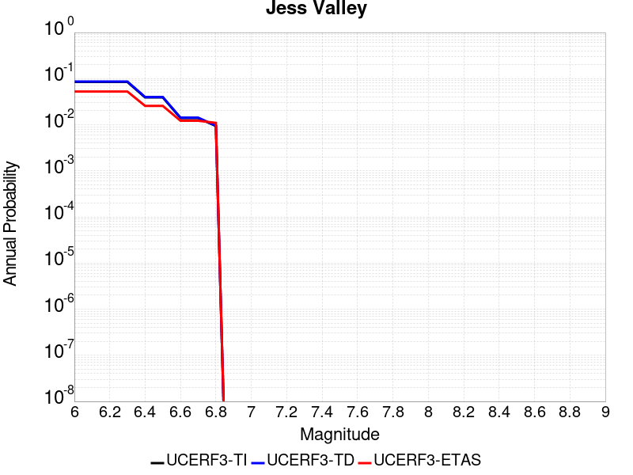 |
|-----|

| Magnitude | UCERF3-TI Prob | UCERF3-TD Prob | UCERF3-ETAS Prob |
|-----|-----|-----|-----|
| 6.0 | 0.08455207 | 0.08634583 | 0.08888889 |
| 6.1 | 0.08455207 | 0.08634583 | 0.08888889 |
| 6.2 | 0.08455207 | 0.08634583 | 0.08888889 |
| 6.3 | 0.08455207 | 0.08634583 | 0.08888889 |
| 6.4 | 0.039109677 | 0.039820835 | 0.03888889 |
| 6.5 | 0.039109677 | 0.039820835 | 0.03888889 |
| 6.6 | 0.013980243 | 0.014215031 | 0.011111111 |
| 6.7 | 0.013980243 | 0.014215031 | 0.011111111 |
| 6.8 | 0.0093632685 | 0.00953211 | 0.011111111 |

## Johnson Valley (No) 2011 rev
*[(top)](#table-of-contents)*

| 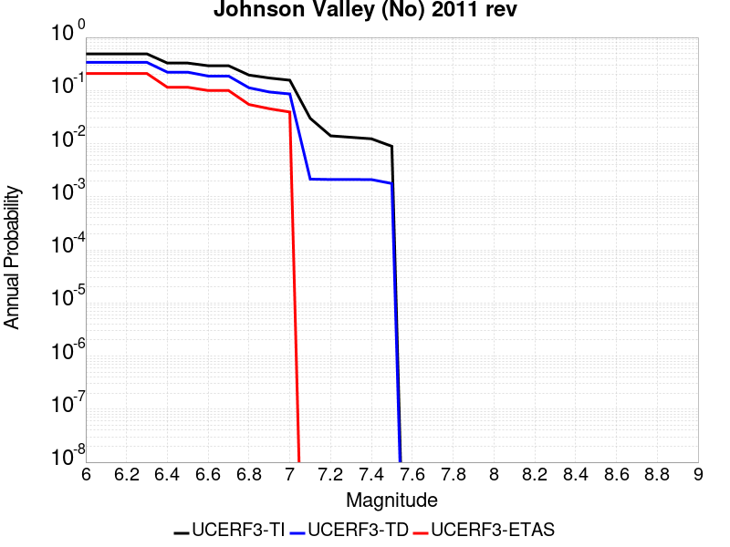 |
|-----|

| Magnitude | UCERF3-TI Prob | UCERF3-TD Prob | UCERF3-ETAS Prob |
|-----|-----|-----|-----|
| 6.0 | 0.48957625 | 0.3390271 | 0.21111111 |
| 6.1 | 0.48957625 | 0.3390271 | 0.21111111 |
| 6.2 | 0.48957625 | 0.3390271 | 0.21111111 |
| 6.3 | 0.48957625 | 0.3390271 | 0.21111111 |
| 6.4 | 0.32906312 | 0.22151357 | 0.11111111 |
| 6.5 | 0.32906312 | 0.22151357 | 0.11111111 |
| 6.6 | 0.29299167 | 0.18725075 | 0.10555556 |
| 6.7 | 0.29299167 | 0.18725075 | 0.10555556 |
| 6.8 | 0.19534788 | 0.112641886 | 0.03888889 |
| 6.9 | 0.17203148 | 0.09381695 | 0.027777778 |
| 7.0 | 0.15631168 | 0.086208396 | 0.027777778 |
| 7.1 | 0.029967742 | 0.0021478161 | 0.0 |
| 7.2 | 0.014025151 | 0.0021120633 | 0.0 |
| 7.3 | 0.0131577365 | 0.0021119425 | 0.0 |
| 7.4 | 0.012333644 | 0.002105301 | 0.0 |
| 7.5 | 0.008923254 | 0.001774199 | 0.0 |

## Joshua Tree (Seismicity)
*[(top)](#table-of-contents)*

| 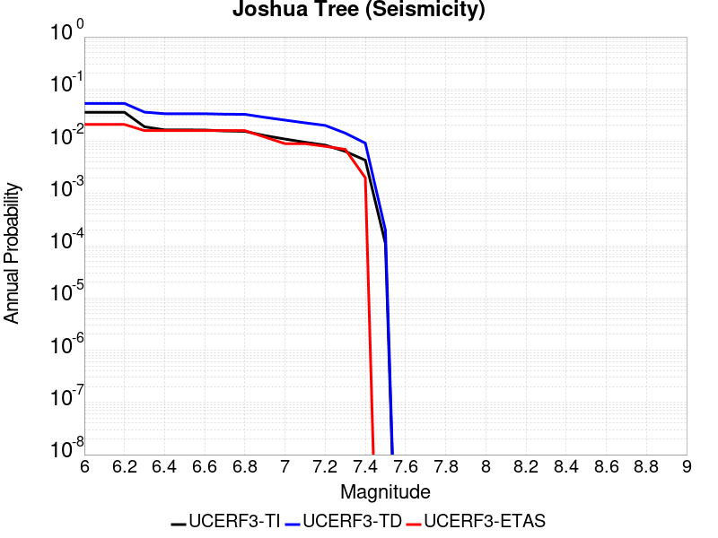 |
|-----|

| Magnitude | UCERF3-TI Prob | UCERF3-TD Prob | UCERF3-ETAS Prob |
|-----|-----|-----|-----|
| 6.0 | 0.035930395 | 0.053094022 | 0.033333335 |
| 6.1 | 0.035930395 | 0.053094022 | 0.033333335 |
| 6.2 | 0.035930395 | 0.053094022 | 0.033333335 |
| 6.3 | 0.018948335 | 0.036105044 | 0.016666668 |
| 6.4 | 0.016513776 | 0.03369212 | 0.016666668 |
| 6.5 | 0.016513776 | 0.03369212 | 0.016666668 |
| 6.6 | 0.016414013 | 0.033617713 | 0.016666668 |
| 6.7 | 0.015775295 | 0.03297975 | 0.016666668 |
| 6.8 | 0.015492656 | 0.032758188 | 0.016666668 |
| 6.9 | 0.012821666 | 0.028669896 | 0.011111111 |
| 7.0 | 0.011027672 | 0.025376614 | 0.0055555557 |
| 7.1 | 0.009577803 | 0.022504821 | 0.0055555557 |
| 7.2 | 0.008436388 | 0.020092143 | 0.0055555557 |
| 7.3 | 0.006411326 | 0.014296319 | 0.0055555557 |
| 7.4 | 0.004335729 | 0.009182408 | 0.0 |
| 7.5 | 1.1066828E-4 | 1.9890162E-4 | 0.0 |

## Keddie Ridge 2011 CFM
*[(top)](#table-of-contents)*

| 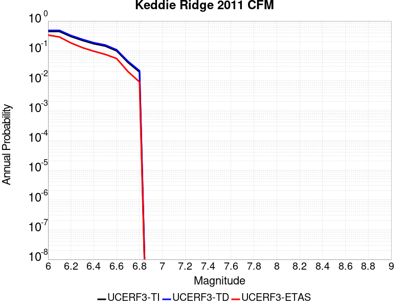 |
|-----|

| Magnitude | UCERF3-TI Prob | UCERF3-TD Prob | UCERF3-ETAS Prob |
|-----|-----|-----|-----|
| 6.0 | 0.44534802 | 0.4840314 | 0.29444444 |
| 6.1 | 0.44534802 | 0.4840314 | 0.2611111 |
| 6.2 | 0.3018953 | 0.32709995 | 0.17222223 |
| 6.3 | 0.22369447 | 0.24224374 | 0.12222222 |
| 6.4 | 0.17244339 | 0.18676382 | 0.094444446 |
| 6.5 | 0.14452662 | 0.15667292 | 0.072222225 |
| 6.6 | 0.099886455 | 0.108229764 | 0.055555556 |
| 6.7 | 0.04046344 | 0.044156056 | 0.0055555557 |
| 6.8 | 0.019422133 | 0.021427996 | 0.0055555557 |

## Kern Canyon (Lake Isabella) 2011
*[(top)](#table-of-contents)*

| 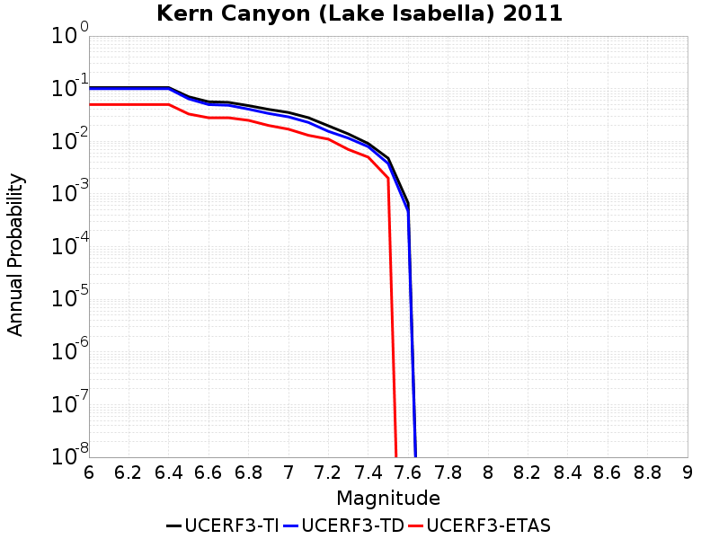 |
|-----|

| Magnitude | UCERF3-TI Prob | UCERF3-TD Prob | UCERF3-ETAS Prob |
|-----|-----|-----|-----|
| 6.0 | 0.104690574 | 0.09985383 | 0.033333335 |
| 6.1 | 0.104690574 | 0.09985383 | 0.033333335 |
| 6.2 | 0.104690574 | 0.09985383 | 0.033333335 |
| 6.3 | 0.104690574 | 0.09985383 | 0.033333335 |
| 6.4 | 0.104690574 | 0.09985383 | 0.033333335 |
| 6.5 | 0.07010017 | 0.06396731 | 0.022222223 |
| 6.6 | 0.05635504 | 0.049802065 | 0.022222223 |
| 6.7 | 0.05488112 | 0.048297957 | 0.022222223 |
| 6.8 | 0.047580536 | 0.04080954 | 0.022222223 |
| 6.9 | 0.0404208 | 0.033840075 | 0.016666668 |
| 7.0 | 0.03529378 | 0.029125376 | 0.016666668 |
| 7.1 | 0.028079903 | 0.022847569 | 0.016666668 |
| 7.2 | 0.019703439 | 0.015464332 | 0.016666668 |
| 7.3 | 0.0138005875 | 0.011495283 | 0.011111111 |
| 7.4 | 0.009075729 | 0.007900394 | 0.0055555557 |
| 7.5 | 0.0047673816 | 0.0037809785 | 0.0055555557 |
| 7.6 | 6.708552E-4 | 4.6790883E-4 | 0.0 |

## Kern Canyon (North Kern) 2011
*[(top)](#table-of-contents)*

| 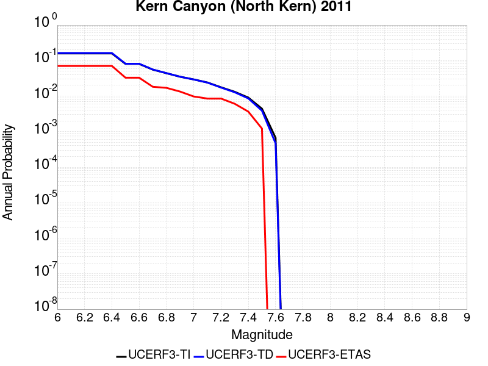 |
|-----|

| Magnitude | UCERF3-TI Prob | UCERF3-TD Prob | UCERF3-ETAS Prob |
|-----|-----|-----|-----|
| 6.0 | 0.15876137 | 0.16337414 | 0.072222225 |
| 6.1 | 0.15876137 | 0.16337414 | 0.072222225 |
| 6.2 | 0.15876137 | 0.16337414 | 0.072222225 |
| 6.3 | 0.15876137 | 0.16337414 | 0.072222225 |
| 6.4 | 0.15876137 | 0.16337414 | 0.072222225 |
| 6.5 | 0.08048515 | 0.08162752 | 0.03888889 |
| 6.6 | 0.08048515 | 0.08162752 | 0.03888889 |
| 6.7 | 0.055554375 | 0.055996396 | 0.027777778 |
| 6.8 | 0.044140805 | 0.04432346 | 0.027777778 |
| 6.9 | 0.035111923 | 0.035107777 | 0.016666668 |
| 7.0 | 0.029475547 | 0.029366147 | 0.011111111 |
| 7.1 | 0.024213469 | 0.024006877 | 0.011111111 |
| 7.2 | 0.017733067 | 0.017410433 | 0.011111111 |
| 7.3 | 0.013243667 | 0.012840056 | 0.011111111 |
| 7.4 | 0.009089537 | 0.008611427 | 0.0055555557 |
| 7.5 | 0.004430948 | 0.003883859 | 0.0055555557 |
| 7.6 | 6.708552E-4 | 4.6790883E-4 | 0.0 |

## Kern Canyon (South Kern) 2011
*[(top)](#table-of-contents)*

| 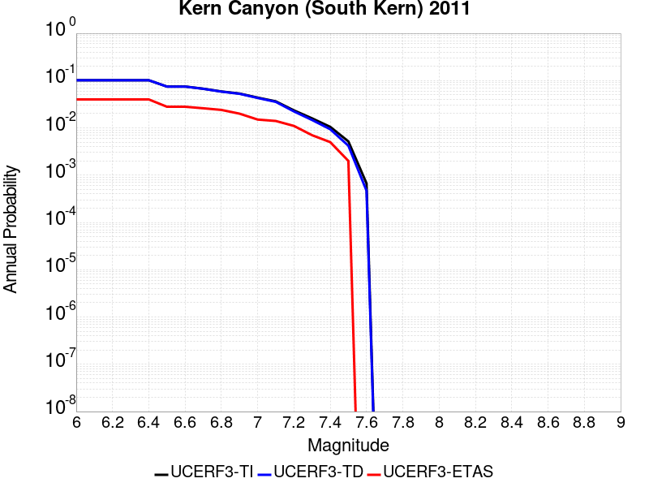 |
|-----|

| Magnitude | UCERF3-TI Prob | UCERF3-TD Prob | UCERF3-ETAS Prob |
|-----|-----|-----|-----|
| 6.0 | 0.10156299 | 0.1019344 | 0.027777778 |
| 6.1 | 0.10156299 | 0.1019344 | 0.027777778 |
| 6.2 | 0.10156299 | 0.1019344 | 0.027777778 |
| 6.3 | 0.10156299 | 0.1019344 | 0.027777778 |
| 6.4 | 0.10156299 | 0.1019344 | 0.027777778 |
| 6.5 | 0.074921 | 0.07471107 | 0.022222223 |
| 6.6 | 0.074921 | 0.07471107 | 0.022222223 |
| 6.7 | 0.06742572 | 0.06707372 | 0.022222223 |
| 6.8 | 0.05893742 | 0.05843053 | 0.016666668 |
| 6.9 | 0.05324627 | 0.052637737 | 0.016666668 |
| 7.0 | 0.043712646 | 0.042929843 | 0.016666668 |
| 7.1 | 0.036408044 | 0.035486195 | 0.016666668 |
| 7.2 | 0.023456184 | 0.022289872 | 0.016666668 |
| 7.3 | 0.01590191 | 0.014670471 | 0.011111111 |
| 7.4 | 0.0105101345 | 0.009363536 | 0.0055555557 |
| 7.5 | 0.0051708296 | 0.0041925935 | 0.0055555557 |
| 7.6 | 6.708552E-4 | 4.6790883E-4 | 0.0 |

## Kickapoo
*[(top)](#table-of-contents)*

| 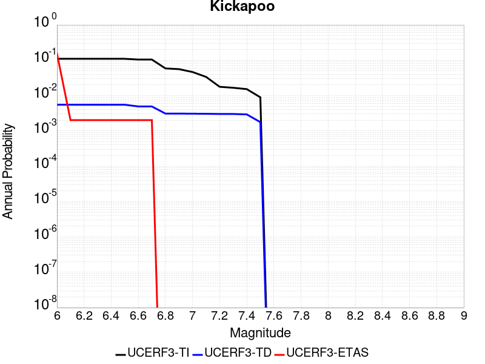 |
|-----|

| Magnitude | UCERF3-TI Prob | UCERF3-TD Prob | UCERF3-ETAS Prob |
|-----|-----|-----|-----|
| 6.0 | 0.10986862 | 0.0055202935 | 0.11666667 |
| 6.1 | 0.10986862 | 0.0055202935 | 0.0 |
| 6.2 | 0.10986862 | 0.0055202935 | 0.0 |
| 6.3 | 0.10986862 | 0.0055202935 | 0.0 |
| 6.4 | 0.10986862 | 0.0055202935 | 0.0 |
| 6.5 | 0.10986862 | 0.0055202935 | 0.0 |
| 6.6 | 0.10463901 | 0.004924266 | 0.0 |
| 6.7 | 0.10463901 | 0.004924266 | 0.0 |
| 6.8 | 0.058739003 | 0.0030962431 | 0.0 |
| 6.9 | 0.056055773 | 0.0030939616 | 0.0 |
| 7.0 | 0.04642769 | 0.0030754555 | 0.0 |
| 7.1 | 0.03375902 | 0.0030565592 | 0.0 |
| 7.2 | 0.017738983 | 0.0030189892 | 0.0 |
| 7.3 | 0.016635269 | 0.0030146667 | 0.0 |
| 7.4 | 0.015237915 | 0.0029324824 | 0.0 |
| 7.5 | 0.008923254 | 0.001774199 | 0.0 |

## King Range 2011 CFM
*[(top)](#table-of-contents)*

| 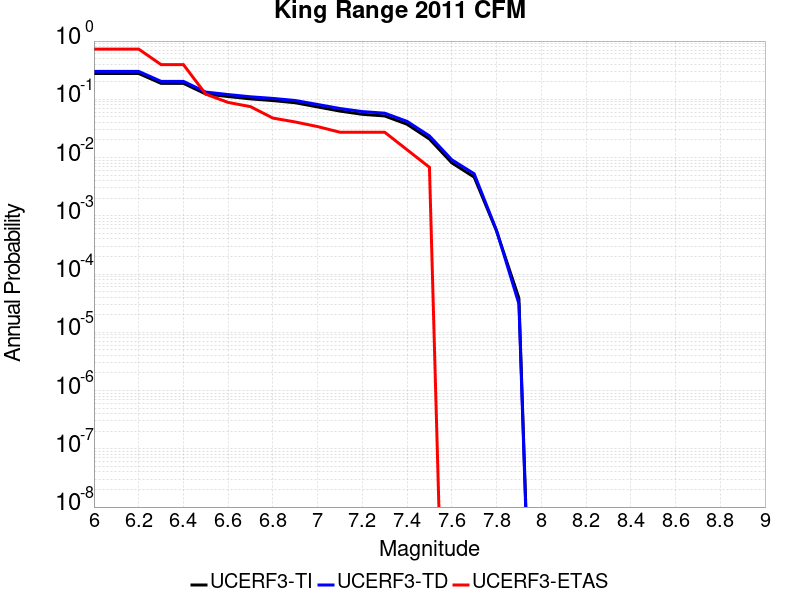 |
|-----|

| Magnitude | UCERF3-TI Prob | UCERF3-TD Prob | UCERF3-ETAS Prob |
|-----|-----|-----|-----|
| 6.0 | 0.27757484 | 0.30151707 | 0.76111114 |
| 6.1 | 0.27757484 | 0.30151707 | 0.76111114 |
| 6.2 | 0.27757484 | 0.30151707 | 0.76111114 |
| 6.3 | 0.1881297 | 0.20363 | 0.39444444 |
| 6.4 | 0.1881297 | 0.20363 | 0.39444444 |
| 6.5 | 0.12349245 | 0.13315947 | 0.1388889 |
| 6.6 | 0.111626185 | 0.12073256 | 0.11111111 |
| 6.7 | 0.10178234 | 0.11050454 | 0.094444446 |
| 6.8 | 0.09514223 | 0.10364209 | 0.072222225 |
| 6.9 | 0.08726757 | 0.09546365 | 0.06666667 |
| 7.0 | 0.0740059 | 0.08154502 | 0.044444446 |
| 7.1 | 0.06277566 | 0.06952276 | 0.03888889 |
| 7.2 | 0.055288322 | 0.061558012 | 0.03888889 |
| 7.3 | 0.05177751 | 0.057806242 | 0.03888889 |
| 7.4 | 0.037316423 | 0.04182003 | 0.027777778 |
| 7.5 | 0.020830331 | 0.023545424 | 0.016666668 |
| 7.6 | 0.008117024 | 0.009163239 | 0.0055555557 |
| 7.7 | 0.0046194177 | 0.0052674925 | 0.0 |
| 7.8 | 5.486516E-4 | 5.62498E-4 | 0.0 |
| 7.9 | 3.856695E-5 | 3.0826202E-5 | 0.0 |

## La Panza 2011
*[(top)](#table-of-contents)*

| 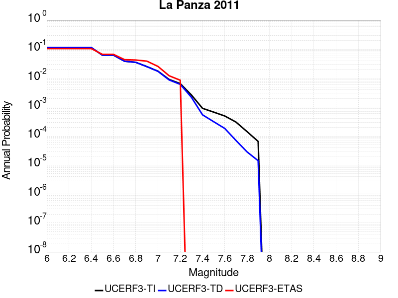 |
|-----|

| Magnitude | UCERF3-TI Prob | UCERF3-TD Prob | UCERF3-ETAS Prob |
|-----|-----|-----|-----|
| 6.0 | 0.114833534 | 0.11617295 | 0.15555556 |
| 6.1 | 0.114833534 | 0.11617295 | 0.15555556 |
| 6.2 | 0.114833534 | 0.11617295 | 0.15555556 |
| 6.3 | 0.114833534 | 0.11617295 | 0.15555556 |
| 6.4 | 0.114833534 | 0.11617295 | 0.15555556 |
| 6.5 | 0.062783435 | 0.063171744 | 0.10555556 |
| 6.6 | 0.062783435 | 0.063171744 | 0.10555556 |
| 6.7 | 0.038650304 | 0.038702637 | 0.07777778 |
| 6.8 | 0.035528507 | 0.035534047 | 0.072222225 |
| 6.9 | 0.02531103 | 0.025185205 | 0.072222225 |
| 7.0 | 0.017532414 | 0.01730409 | 0.055555556 |
| 7.1 | 0.009084472 | 0.00874832 | 0.033333335 |
| 7.2 | 0.0065239933 | 0.0061491416 | 0.027777778 |
| 7.3 | 0.0026469238 | 0.0022047467 | 0.0 |
| 7.4 | 9.1287115E-4 | 5.4496666E-4 | 0.0 |
| 7.5 | 6.7607715E-4 | 3.155322E-4 | 0.0 |
| 7.6 | 4.9600954E-4 | 1.8409659E-4 | 0.0 |
| 7.7 | 3.0712417E-4 | 7.118923E-5 | 0.0 |
| 7.8 | 1.431959E-4 | 2.853055E-5 | 0.0 |
| 7.9 | 6.543253E-5 | 1.4108271E-5 | 0.0 |

## Laguna Salada
*[(top)](#table-of-contents)*

| 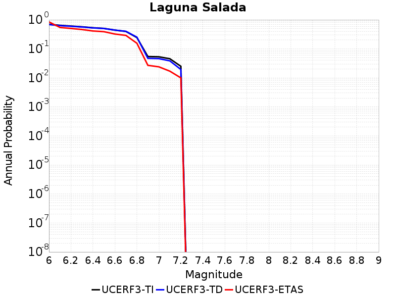 |
|-----|

| Magnitude | UCERF3-TI Prob | UCERF3-TD Prob | UCERF3-ETAS Prob |
|-----|-----|-----|-----|
| 6.0 | 0.7024825 | 0.6862507 | 0.84444445 |
| 6.1 | 0.6461823 | 0.6337656 | 0.5555556 |
| 6.2 | 0.6097625 | 0.5997938 | 0.53333336 |
| 6.3 | 0.5756874 | 0.56767654 | 0.49444443 |
| 6.4 | 0.5323556 | 0.52673674 | 0.45 |
| 6.5 | 0.5065718 | 0.50267863 | 0.41111112 |
| 6.6 | 0.44209006 | 0.44282106 | 0.3611111 |
| 6.7 | 0.3980926 | 0.40208378 | 0.32222223 |
| 6.8 | 0.24491689 | 0.25311273 | 0.12777779 |
| 6.9 | 0.054263588 | 0.047117904 | 0.027777778 |
| 7.0 | 0.05319753 | 0.046065196 | 0.022222223 |
| 7.1 | 0.045595266 | 0.038521208 | 0.016666668 |
| 7.2 | 0.025047874 | 0.019486237 | 0.016666668 |

## Lake Isabella (Seismicity)
*[(top)](#table-of-contents)*

| 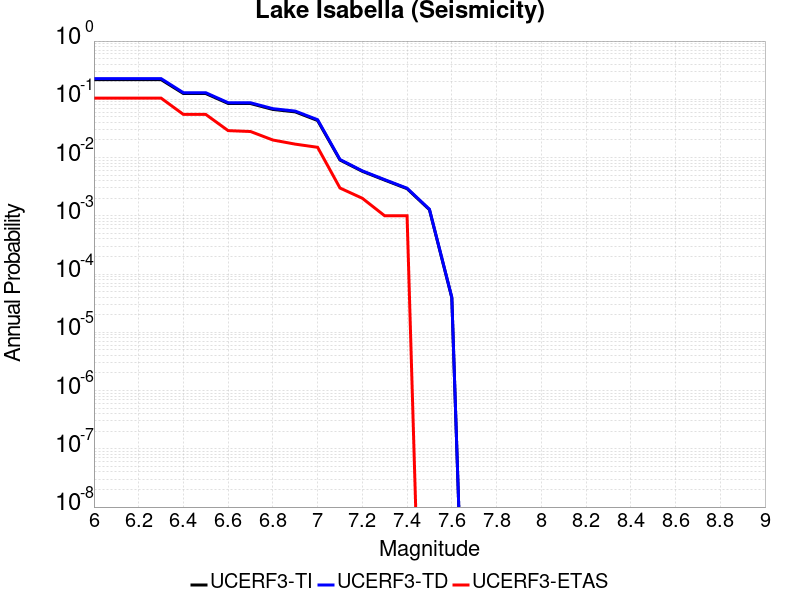 |
|-----|

| Magnitude | UCERF3-TI Prob | UCERF3-TD Prob | UCERF3-ETAS Prob |
|-----|-----|-----|-----|
| 6.0 | 0.21812925 | 0.2269212 | 0.11111111 |
| 6.1 | 0.21812925 | 0.2269212 | 0.11111111 |
| 6.2 | 0.21812925 | 0.2269212 | 0.11111111 |
| 6.3 | 0.21812925 | 0.2269212 | 0.11111111 |
| 6.4 | 0.12558945 | 0.12977943 | 0.03888889 |
| 6.5 | 0.12558945 | 0.12977943 | 0.03888889 |
| 6.6 | 0.08490674 | 0.08751646 | 0.011111111 |
| 6.7 | 0.08459782 | 0.087203935 | 0.011111111 |
| 6.8 | 0.067000516 | 0.069082834 | 0.0055555557 |
| 6.9 | 0.060841653 | 0.06276522 | 0.0055555557 |
| 7.0 | 0.0432656 | 0.044665992 | 0.0055555557 |
| 7.1 | 0.009093262 | 0.009265561 | 0.0 |
| 7.2 | 0.0058064912 | 0.0059122704 | 0.0 |
| 7.3 | 0.004103336 | 0.004177455 | 0.0 |
| 7.4 | 0.0029220267 | 0.0029751656 | 0.0 |
| 7.5 | 0.001273698 | 0.0012968436 | 0.0 |
| 7.6 | 3.925424E-5 | 3.9925875E-5 | 0.0 |

## Las Positas
*[(top)](#table-of-contents)*

| 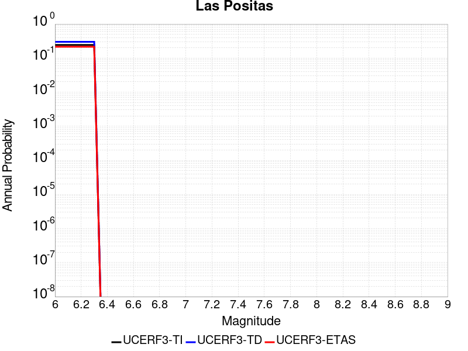 |
|-----|

| Magnitude | UCERF3-TI Prob | UCERF3-TD Prob | UCERF3-ETAS Prob |
|-----|-----|-----|-----|
| 6.0 | 0.24277759 | 0.29983857 | 0.18888889 |
| 6.1 | 0.24277759 | 0.29983857 | 0.18888889 |
| 6.2 | 0.24277759 | 0.29983857 | 0.18888889 |
| 6.3 | 0.24277759 | 0.29983857 | 0.18888889 |

## Last Chance
*[(top)](#table-of-contents)*

| 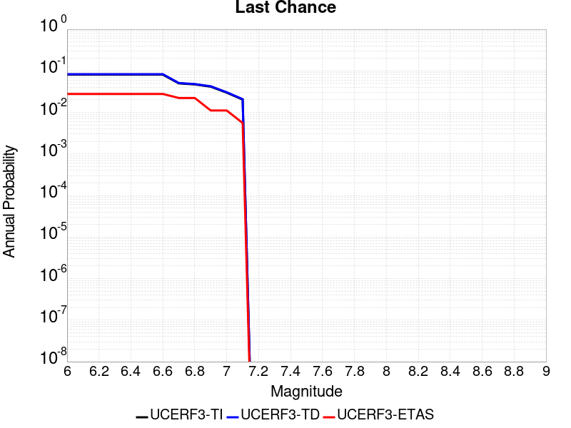 |
|-----|

| Magnitude | UCERF3-TI Prob | UCERF3-TD Prob | UCERF3-ETAS Prob |
|-----|-----|-----|-----|
| 6.0 | 0.08103836 | 0.0831618 | 0.027777778 |
| 6.1 | 0.08103836 | 0.0831618 | 0.027777778 |
| 6.2 | 0.08103836 | 0.0831618 | 0.027777778 |
| 6.3 | 0.08103836 | 0.0831618 | 0.027777778 |
| 6.4 | 0.08103836 | 0.0831618 | 0.027777778 |
| 6.5 | 0.08103836 | 0.0831618 | 0.027777778 |
| 6.6 | 0.08103836 | 0.0831618 | 0.027777778 |
| 6.7 | 0.049946934 | 0.05106291 | 0.022222223 |
| 6.8 | 0.047095586 | 0.048161946 | 0.022222223 |
| 6.9 | 0.041593295 | 0.04254605 | 0.011111111 |
| 7.0 | 0.029859101 | 0.030576767 | 0.011111111 |
| 7.1 | 0.020328866 | 0.020833097 | 0.0055555557 |

## Lenwood-Lockhart-Old Woman Springs
*[(top)](#table-of-contents)*

| 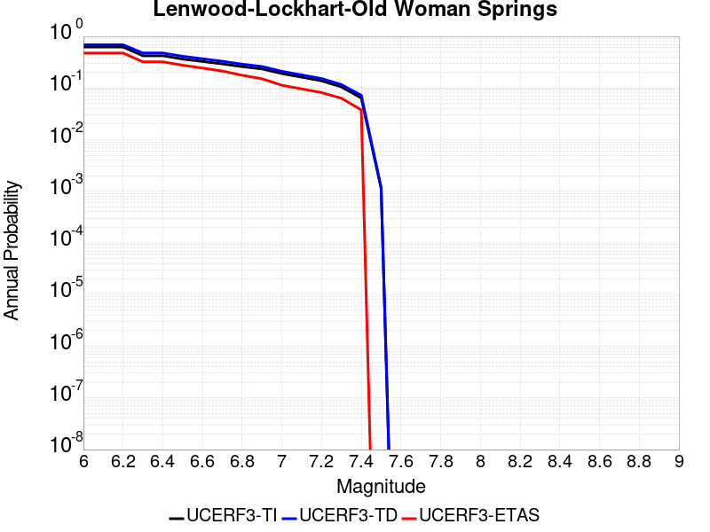 |
|-----|

| Magnitude | UCERF3-TI Prob | UCERF3-TD Prob | UCERF3-ETAS Prob |
|-----|-----|-----|-----|
| 6.0 | 0.6235397 | 0.6871541 | 0.45555556 |
| 6.1 | 0.6235397 | 0.6871541 | 0.45555556 |
| 6.2 | 0.6235397 | 0.6871541 | 0.45555556 |
| 6.3 | 0.42303148 | 0.47677574 | 0.3611111 |
| 6.4 | 0.42303148 | 0.47677574 | 0.3611111 |
| 6.5 | 0.36484525 | 0.4124436 | 0.32222223 |
| 6.6 | 0.3274585 | 0.36879632 | 0.25555557 |
| 6.7 | 0.29365256 | 0.3299108 | 0.22777778 |
| 6.8 | 0.25969228 | 0.29000208 | 0.17777778 |
| 6.9 | 0.23472385 | 0.26126513 | 0.14444445 |
| 7.0 | 0.19058467 | 0.21070266 | 0.1 |
| 7.1 | 0.16253151 | 0.17953369 | 0.06666667 |
| 7.2 | 0.13794056 | 0.15256062 | 0.06111111 |
| 7.3 | 0.10503176 | 0.116692215 | 0.055555556 |
| 7.4 | 0.06423641 | 0.072505 | 0.033333335 |
| 7.5 | 0.0011396303 | 0.0011871624 | 0.0 |

## Likely 2011 CFM
*[(top)](#table-of-contents)*

| 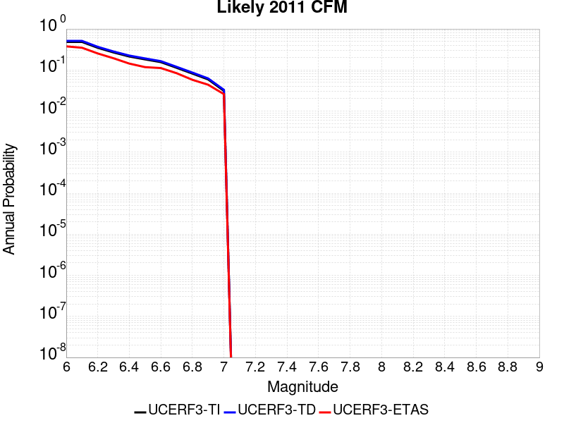 |
|-----|

| Magnitude | UCERF3-TI Prob | UCERF3-TD Prob | UCERF3-ETAS Prob |
|-----|-----|-----|-----|
| 6.0 | 0.48339844 | 0.5113652 | 0.3888889 |
| 6.1 | 0.48339844 | 0.5113652 | 0.35555556 |
| 6.2 | 0.3476931 | 0.36689186 | 0.26666668 |
| 6.3 | 0.2677641 | 0.28240472 | 0.19444445 |
| 6.4 | 0.21324062 | 0.22483934 | 0.15555556 |
| 6.5 | 0.18154918 | 0.19142574 | 0.12222222 |
| 6.6 | 0.1557262 | 0.1642386 | 0.11666667 |
| 6.7 | 0.1132296 | 0.11948326 | 0.083333336 |
| 6.8 | 0.08200337 | 0.08660689 | 0.06666667 |
| 6.9 | 0.058952753 | 0.062341638 | 0.06111111 |
| 7.0 | 0.031107644 | 0.032979313 | 0.03888889 |

## Lions Head 2011 CFM
*[(top)](#table-of-contents)*

| 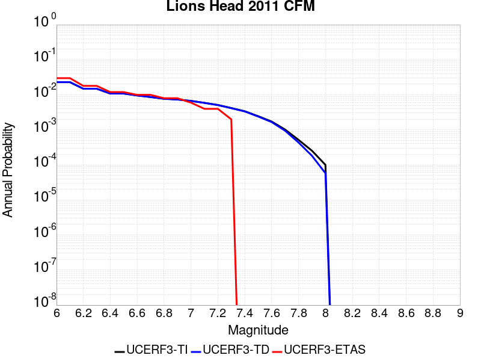 |
|-----|

| Magnitude | UCERF3-TI Prob | UCERF3-TD Prob | UCERF3-ETAS Prob |
|-----|-----|-----|-----|
| 6.0 | 0.022924863 | 0.02295813 | 0.03888889 |
| 6.1 | 0.022924863 | 0.02295813 | 0.03888889 |
| 6.2 | 0.014872803 | 0.014869835 | 0.027777778 |
| 6.3 | 0.014872803 | 0.014869835 | 0.027777778 |
| 6.4 | 0.010855306 | 0.010837847 | 0.016666668 |
| 6.5 | 0.010855306 | 0.010837847 | 0.016666668 |
| 6.6 | 0.00957978 | 0.009558575 | 0.016666668 |
| 6.7 | 0.008645951 | 0.008622157 | 0.016666668 |
| 6.8 | 0.0077146436 | 0.007688463 | 0.011111111 |
| 6.9 | 0.0073443796 | 0.007316999 | 0.011111111 |
| 7.0 | 0.0067070024 | 0.006677341 | 0.0055555557 |
| 7.1 | 0.005899276 | 0.005865789 | 0.0 |
| 7.2 | 0.005122631 | 0.00508546 | 0.0 |
| 7.3 | 0.004191877 | 0.0041489447 | 0.0 |
| 7.4 | 0.003398197 | 0.003349481 | 0.0 |
| 7.5 | 0.0024521507 | 0.0023950068 | 0.0 |
| 7.6 | 0.0017298087 | 0.0016649682 | 0.0 |
| 7.7 | 0.0010195943 | 9.450086E-4 | 0.0 |
| 7.8 | 5.1796116E-4 | 4.3552017E-4 | 0.0 |
| 7.9 | 2.5349628E-4 | 1.8161423E-4 | 0.0 |
| 8.0 | 1.0017188E-4 | 5.7817204E-5 | 0.0 |

## Little Lake
*[(top)](#table-of-contents)*

| 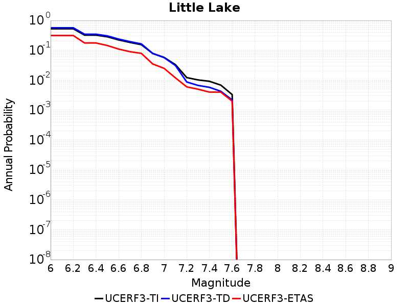 |
|-----|

| Magnitude | UCERF3-TI Prob | UCERF3-TD Prob | UCERF3-ETAS Prob |
|-----|-----|-----|-----|
| 6.0 | 0.523641 | 0.567736 | 0.27222222 |
| 6.1 | 0.523641 | 0.567736 | 0.27222222 |
| 6.2 | 0.523641 | 0.567736 | 0.27222222 |
| 6.3 | 0.3218384 | 0.34505785 | 0.16666667 |
| 6.4 | 0.3218384 | 0.34505785 | 0.16666667 |
| 6.5 | 0.28386164 | 0.30457407 | 0.1388889 |
| 6.6 | 0.22281215 | 0.23782308 | 0.10555556 |
| 6.7 | 0.18344335 | 0.19526906 | 0.08888889 |
| 6.8 | 0.15429576 | 0.16394311 | 0.083333336 |
| 6.9 | 0.078375176 | 0.07881334 | 0.033333335 |
| 7.0 | 0.05800967 | 0.057274356 | 0.027777778 |
| 7.1 | 0.033188317 | 0.03105175 | 0.011111111 |
| 7.2 | 0.012227922 | 0.008723673 | 0.0055555557 |
| 7.3 | 0.010234522 | 0.0066943495 | 0.0 |
| 7.4 | 0.009211505 | 0.0057835365 | 0.0 |
| 7.5 | 0.0068520573 | 0.0042579323 | 0.0 |
| 7.6 | 0.0033076303 | 0.0021973192 | 0.0 |

## Little Salmon (Offshore)
*[(top)](#table-of-contents)*

| 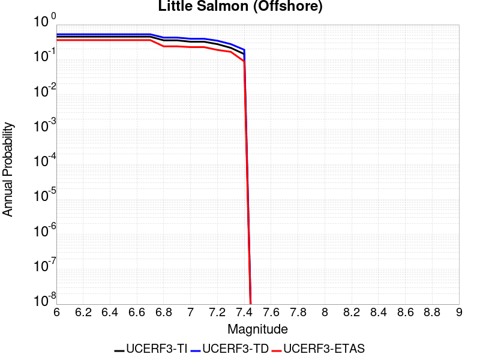 |
|-----|

| Magnitude | UCERF3-TI Prob | UCERF3-TD Prob | UCERF3-ETAS Prob |
|-----|-----|-----|-----|
| 6.0 | 0.45196632 | 0.52939516 | 0.3611111 |
| 6.1 | 0.45196632 | 0.52939516 | 0.3611111 |
| 6.2 | 0.45196632 | 0.52939516 | 0.3611111 |
| 6.3 | 0.45196632 | 0.52939516 | 0.3611111 |
| 6.4 | 0.45196632 | 0.52939516 | 0.3611111 |
| 6.5 | 0.45196632 | 0.52939516 | 0.3611111 |
| 6.6 | 0.45196632 | 0.52939516 | 0.3611111 |
| 6.7 | 0.45196632 | 0.52939516 | 0.3611111 |
| 6.8 | 0.35552254 | 0.42586994 | 0.23888889 |
| 6.9 | 0.35552254 | 0.42586994 | 0.23888889 |
| 7.0 | 0.32475516 | 0.3944533 | 0.22777778 |
| 7.1 | 0.32475516 | 0.3944533 | 0.22777778 |
| 7.2 | 0.27696344 | 0.3468485 | 0.18888889 |
| 7.3 | 0.21666631 | 0.27671638 | 0.16666667 |
| 7.4 | 0.1435946 | 0.19099374 | 0.08888889 |

## Little Salmon (Onshore)
*[(top)](#table-of-contents)*

| 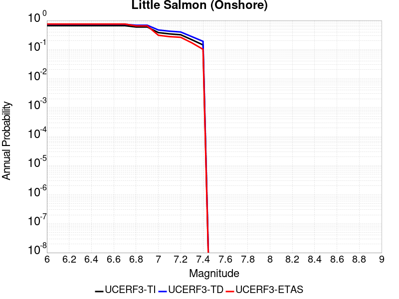 |
|-----|

| Magnitude | UCERF3-TI Prob | UCERF3-TD Prob | UCERF3-ETAS Prob |
|-----|-----|-----|-----|
| 6.0 | 0.66205555 | 0.7367526 | 0.76111114 |
| 6.1 | 0.66205555 | 0.7367526 | 0.76111114 |
| 6.2 | 0.66205555 | 0.7367526 | 0.76111114 |
| 6.3 | 0.66205555 | 0.7367526 | 0.76111114 |
| 6.4 | 0.66205555 | 0.7367526 | 0.76111114 |
| 6.5 | 0.66205555 | 0.7367526 | 0.76111114 |
| 6.6 | 0.66205555 | 0.7367526 | 0.76111114 |
| 6.7 | 0.66205555 | 0.7367526 | 0.76111114 |
| 6.8 | 0.5946124 | 0.6852132 | 0.62222224 |
| 6.9 | 0.5946124 | 0.6852132 | 0.62222224 |
| 7.0 | 0.38142362 | 0.46975625 | 0.25555557 |
| 7.1 | 0.344403 | 0.4264928 | 0.22777778 |
| 7.2 | 0.32153618 | 0.40036622 | 0.21666667 |
| 7.3 | 0.21666631 | 0.27671638 | 0.16666667 |
| 7.4 | 0.1435946 | 0.19099374 | 0.08888889 |

## Los Alamos 2011 CFM
*[(top)](#table-of-contents)*

| 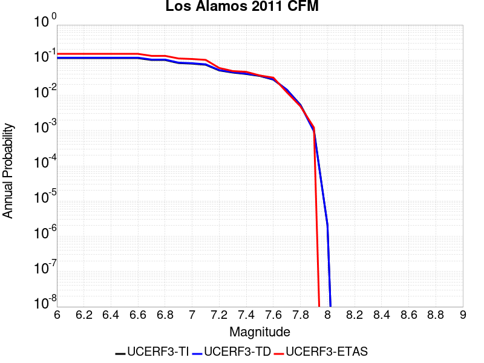 |
|-----|

| Magnitude | UCERF3-TI Prob | UCERF3-TD Prob | UCERF3-ETAS Prob |
|-----|-----|-----|-----|
| 6.0 | 0.11374718 | 0.11708576 | 0.15555556 |
| 6.1 | 0.11374718 | 0.11708576 | 0.15555556 |
| 6.2 | 0.11374718 | 0.11708576 | 0.15555556 |
| 6.3 | 0.11374718 | 0.11708576 | 0.15555556 |
| 6.4 | 0.11374718 | 0.11708576 | 0.15555556 |
| 6.5 | 0.11374718 | 0.11708576 | 0.15555556 |
| 6.6 | 0.11374718 | 0.11708576 | 0.15555556 |
| 6.7 | 0.1005603 | 0.10346238 | 0.15 |
| 6.8 | 0.1005603 | 0.10346238 | 0.15 |
| 6.9 | 0.08233971 | 0.08459782 | 0.14444445 |
| 7.0 | 0.07934655 | 0.081534155 | 0.14444445 |
| 7.1 | 0.07378457 | 0.07582826 | 0.13333334 |
| 7.2 | 0.050891913 | 0.052063078 | 0.07777778 |
| 7.3 | 0.04429129 | 0.045276206 | 0.06111111 |
| 7.4 | 0.040178843 | 0.0410497 | 0.06111111 |
| 7.5 | 0.035466306 | 0.0361911 | 0.044444446 |
| 7.6 | 0.027894093 | 0.02835772 | 0.044444446 |
| 7.7 | 0.014361898 | 0.014428666 | 0.011111111 |
| 7.8 | 0.0053878636 | 0.0052762274 | 0.0 |
| 7.9 | 0.0010383694 | 9.480479E-4 | 0.0 |
| 8.0 | 2.0559496E-6 | 2.1435183E-6 | 0.0 |

## Los Alamos extension
*[(top)](#table-of-contents)*

| 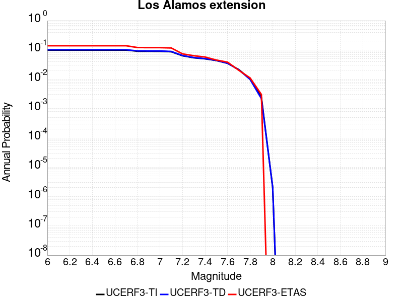 |
|-----|

| Magnitude | UCERF3-TI Prob | UCERF3-TD Prob | UCERF3-ETAS Prob |
|-----|-----|-----|-----|
| 6.0 | 0.099440984 | 0.10178584 | 0.17777778 |
| 6.1 | 0.099440984 | 0.10178584 | 0.17777778 |
| 6.2 | 0.099440984 | 0.10178584 | 0.17777778 |
| 6.3 | 0.099440984 | 0.10178584 | 0.17777778 |
| 6.4 | 0.099440984 | 0.10178584 | 0.17777778 |
| 6.5 | 0.099440984 | 0.10178584 | 0.17777778 |
| 6.6 | 0.099440984 | 0.10178584 | 0.17777778 |
| 6.7 | 0.099440984 | 0.10178584 | 0.17777778 |
| 6.8 | 0.09103347 | 0.0931095 | 0.15555556 |
| 6.9 | 0.09070526 | 0.09277187 | 0.15 |
| 7.0 | 0.09040207 | 0.09245903 | 0.15 |
| 7.1 | 0.08727181 | 0.0892361 | 0.15 |
| 7.2 | 0.06364196 | 0.06469601 | 0.094444446 |
| 7.3 | 0.05430042 | 0.055054467 | 0.07777778 |
| 7.4 | 0.049998682 | 0.05061667 | 0.07777778 |
| 7.5 | 0.04389324 | 0.04428871 | 0.06111111 |
| 7.6 | 0.03515553 | 0.035233025 | 0.06111111 |
| 7.7 | 0.0213513 | 0.021022314 | 0.016666668 |
| 7.8 | 0.010306132 | 0.009886414 | 0.0 |
| 7.9 | 0.002421418 | 0.0021906616 | 0.0 |
| 8.0 | 2.0559496E-6 | 2.1435183E-6 | 0.0 |

## Los Medanos - Roe Island
*[(top)](#table-of-contents)*

| 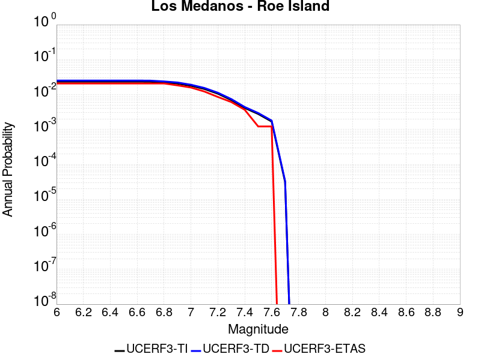 |
|-----|

| Magnitude | UCERF3-TI Prob | UCERF3-TD Prob | UCERF3-ETAS Prob |
|-----|-----|-----|-----|
| 6.0 | 0.023378722 | 0.025167711 | 0.03888889 |
| 6.1 | 0.023378722 | 0.025167711 | 0.03888889 |
| 6.2 | 0.023378722 | 0.025167711 | 0.03888889 |
| 6.3 | 0.023378722 | 0.025167711 | 0.03888889 |
| 6.4 | 0.023378722 | 0.025167711 | 0.03888889 |
| 6.5 | 0.023378722 | 0.025167711 | 0.03888889 |
| 6.6 | 0.023378722 | 0.025167711 | 0.03888889 |
| 6.7 | 0.023167823 | 0.024955802 | 0.03888889 |
| 6.8 | 0.022093697 | 0.0237249 | 0.03888889 |
| 6.9 | 0.020618722 | 0.022115361 | 0.03888889 |
| 7.0 | 0.017836284 | 0.019077262 | 0.033333335 |
| 7.1 | 0.0144356275 | 0.015419965 | 0.016666668 |
| 7.2 | 0.010586064 | 0.0112781525 | 0.016666668 |
| 7.3 | 0.0069502774 | 0.0074094743 | 0.011111111 |
| 7.4 | 0.0041270633 | 0.004395863 | 0.011111111 |
| 7.5 | 0.0027813127 | 0.002959589 | 0.0 |
| 7.6 | 0.0016894753 | 0.0017984872 | 0.0 |
| 7.7 | 3.12622E-5 | 3.355081E-5 | 0.0 |

## Los Osos 2011
*[(top)](#table-of-contents)*

| 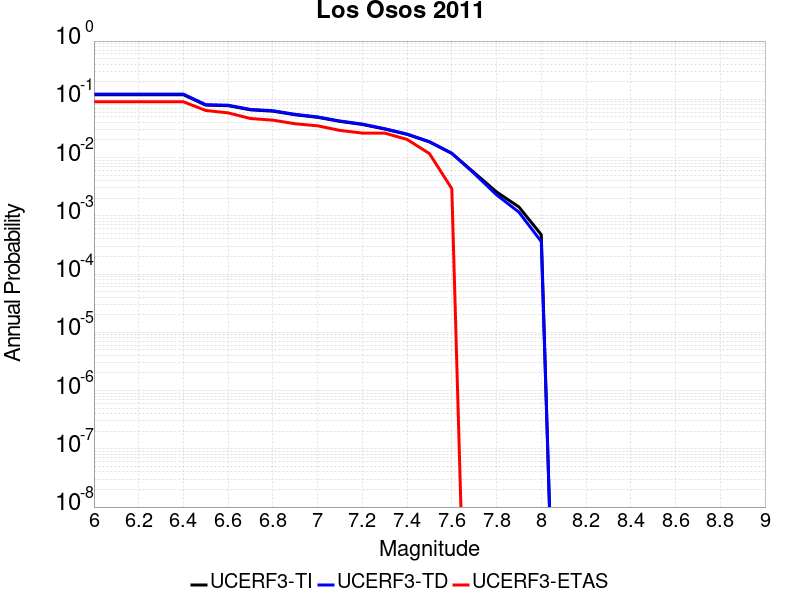 |
|-----|

| Magnitude | UCERF3-TI Prob | UCERF3-TD Prob | UCERF3-ETAS Prob |
|-----|-----|-----|-----|
| 6.0 | 0.11970948 | 0.12273947 | 0.08888889 |
| 6.1 | 0.11970948 | 0.12273947 | 0.08888889 |
| 6.2 | 0.11970948 | 0.12273947 | 0.08888889 |
| 6.3 | 0.11970948 | 0.12273947 | 0.08888889 |
| 6.4 | 0.11970948 | 0.12273947 | 0.08888889 |
| 6.5 | 0.07943341 | 0.08094122 | 0.06111111 |
| 6.6 | 0.07774715 | 0.07920735 | 0.06111111 |
| 6.7 | 0.06586352 | 0.06706388 | 0.044444446 |
| 6.8 | 0.062606044 | 0.06372651 | 0.044444446 |
| 6.9 | 0.054242756 | 0.055176422 | 0.033333335 |
| 7.0 | 0.049063236 | 0.049890365 | 0.027777778 |
| 7.1 | 0.041767113 | 0.042448144 | 0.022222223 |
| 7.2 | 0.036987927 | 0.037574876 | 0.016666668 |
| 7.3 | 0.030859036 | 0.03132347 | 0.016666668 |
| 7.4 | 0.02500876 | 0.0253494 | 0.016666668 |
| 7.5 | 0.01854472 | 0.018737053 | 0.011111111 |
| 7.6 | 0.011809673 | 0.011825513 | 0.0055555557 |
| 7.7 | 0.0055088 | 0.0053318366 | 0.0 |
| 7.8 | 0.002572639 | 0.0022922573 | 0.0 |
| 7.9 | 0.0014182272 | 0.0011547554 | 0.0 |
| 8.0 | 4.7398292E-4 | 3.6155724E-4 | 0.0 |

## Lost Hills
*[(top)](#table-of-contents)*

| 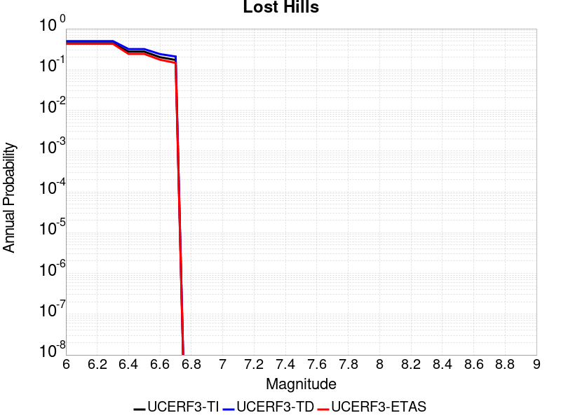 |
|-----|

| Magnitude | UCERF3-TI Prob | UCERF3-TD Prob | UCERF3-ETAS Prob |
|-----|-----|-----|-----|
| 6.0 | 0.44162068 | 0.49766505 | 0.44444445 |
| 6.1 | 0.44162068 | 0.49766505 | 0.44444445 |
| 6.2 | 0.44162068 | 0.49766505 | 0.44444445 |
| 6.3 | 0.44162068 | 0.49766505 | 0.44444445 |
| 6.4 | 0.2742789 | 0.31706506 | 0.2888889 |
| 6.5 | 0.2742789 | 0.31706506 | 0.2888889 |
| 6.6 | 0.20062119 | 0.23893178 | 0.18888889 |
| 6.7 | 0.17137854 | 0.20818579 | 0.17777778 |

## Ludlow
*[(top)](#table-of-contents)*

| 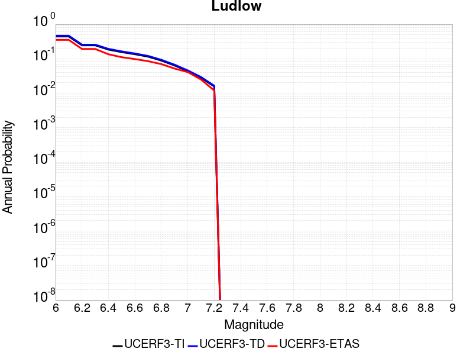 |
|-----|

| Magnitude | UCERF3-TI Prob | UCERF3-TD Prob | UCERF3-ETAS Prob |
|-----|-----|-----|-----|
| 6.0 | 0.44267404 | 0.4663685 | 0.33888888 |
| 6.1 | 0.44267404 | 0.4663685 | 0.33888888 |
| 6.2 | 0.24518055 | 0.25678495 | 0.16666667 |
| 6.3 | 0.24518055 | 0.25678495 | 0.16666667 |
| 6.4 | 0.18443483 | 0.1931991 | 0.12222222 |
| 6.5 | 0.15595151 | 0.16345407 | 0.094444446 |
| 6.6 | 0.13552718 | 0.14213924 | 0.08888889 |
| 6.7 | 0.11507417 | 0.1207434 | 0.07777778 |
| 6.8 | 0.088659465 | 0.09309932 | 0.06111111 |
| 6.9 | 0.063943945 | 0.06719855 | 0.03888889 |
| 7.0 | 0.043590497 | 0.04583934 | 0.03888889 |
| 7.1 | 0.028050553 | 0.029495237 | 0.027777778 |
| 7.2 | 0.015702942 | 0.016499616 | 0.016666668 |

## Maacama 2011 CFM
*[(top)](#table-of-contents)*

| 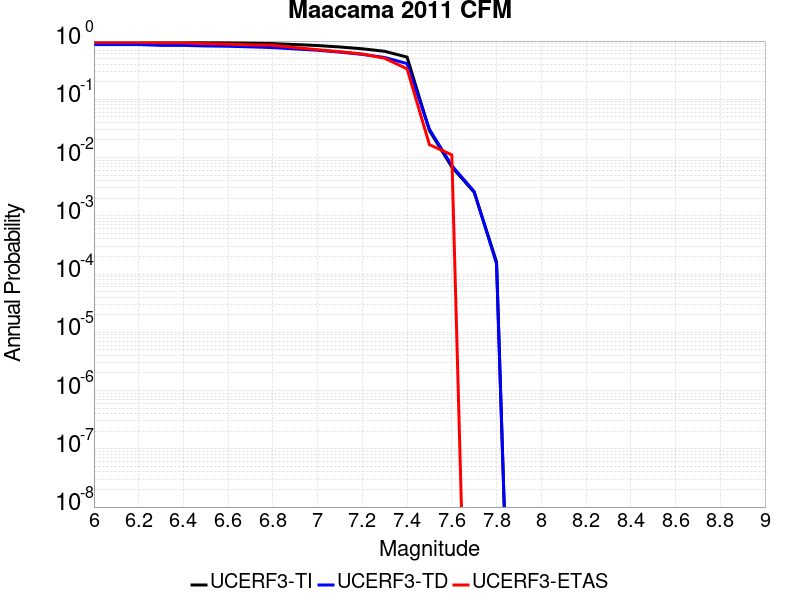 |
|-----|

| Magnitude | UCERF3-TI Prob | UCERF3-TD Prob | UCERF3-ETAS Prob |
|-----|-----|-----|-----|
| 6.0 | 0.9718382 | 0.8740525 | 0.95555556 |
| 6.1 | 0.9718382 | 0.8740525 | 0.95555556 |
| 6.2 | 0.9712846 | 0.872546 | 0.95555556 |
| 6.3 | 0.95536816 | 0.844187 | 0.93333334 |
| 6.4 | 0.9546882 | 0.8427117 | 0.93333334 |
| 6.5 | 0.94257396 | 0.82458395 | 0.90555555 |
| 6.6 | 0.93544793 | 0.8144454 | 0.8833333 |
| 6.7 | 0.9212166 | 0.7949753 | 0.8611111 |
| 6.8 | 0.90369064 | 0.7726302 | 0.85 |
| 6.9 | 0.87062424 | 0.7319656 | 0.7722222 |
| 7.0 | 0.837388 | 0.6949369 | 0.7111111 |
| 7.1 | 0.79096365 | 0.64529866 | 0.65555555 |
| 7.2 | 0.73681575 | 0.59008956 | 0.6 |
| 7.3 | 0.66648406 | 0.5223722 | 0.50555557 |
| 7.4 | 0.5306387 | 0.41027147 | 0.33333334 |
| 7.5 | 0.029031077 | 0.030613333 | 0.016666668 |
| 7.6 | 0.0068989806 | 0.007272774 | 0.011111111 |
| 7.7 | 0.0025346929 | 0.0026158653 | 0.0 |
| 7.8 | 1.6158223E-4 | 1.5046346E-4 | 0.0 |

## Mad River (alt1)
*[(top)](#table-of-contents)*

| 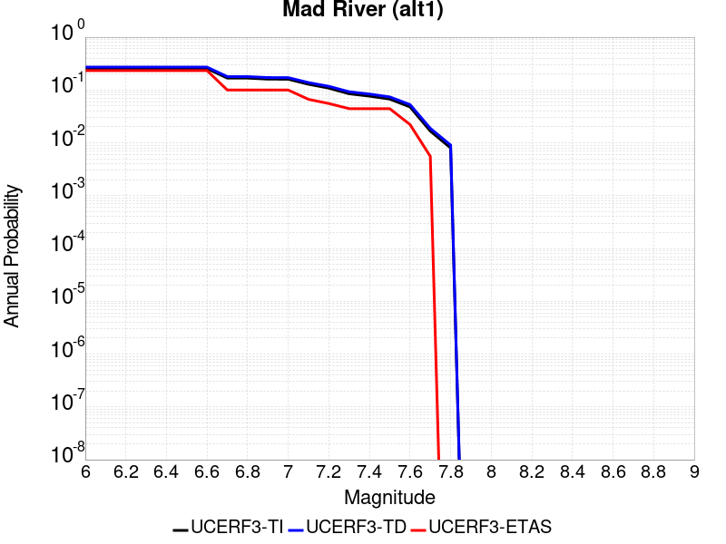 |
|-----|

| Magnitude | UCERF3-TI Prob | UCERF3-TD Prob | UCERF3-ETAS Prob |
|-----|-----|-----|-----|
| 6.0 | 0.2544568 | 0.27163482 | 0.23333333 |
| 6.1 | 0.2544568 | 0.27163482 | 0.23333333 |
| 6.2 | 0.2544568 | 0.27163482 | 0.23333333 |
| 6.3 | 0.2544568 | 0.27163482 | 0.23333333 |
| 6.4 | 0.2544568 | 0.27163482 | 0.23333333 |
| 6.5 | 0.2544568 | 0.27163482 | 0.23333333 |
| 6.6 | 0.2544568 | 0.27163482 | 0.23333333 |
| 6.7 | 0.16814688 | 0.17977229 | 0.1 |
| 6.8 | 0.16814688 | 0.17977229 | 0.1 |
| 6.9 | 0.16097611 | 0.17229784 | 0.1 |
| 7.0 | 0.16042033 | 0.1717131 | 0.1 |
| 7.1 | 0.1286502 | 0.13850495 | 0.06666667 |
| 7.2 | 0.10864814 | 0.1176757 | 0.055555556 |
| 7.3 | 0.085028075 | 0.09282645 | 0.044444446 |
| 7.4 | 0.0766597 | 0.08398578 | 0.044444446 |
| 7.5 | 0.067386195 | 0.07414366 | 0.044444446 |
| 7.6 | 0.047880035 | 0.053107228 | 0.022222223 |
| 7.7 | 0.016715746 | 0.018837113 | 0.0055555557 |
| 7.8 | 0.007999505 | 0.009094272 | 0.0 |

## Malibu Coast (Extension) alt 1
*[(top)](#table-of-contents)*

| 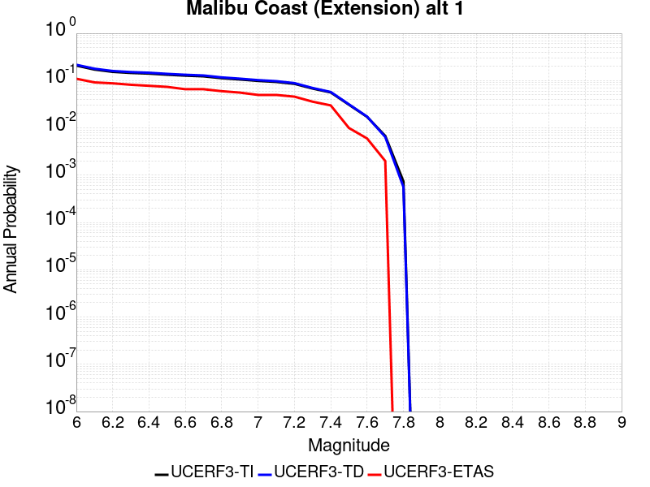 |
|-----|

| Magnitude | UCERF3-TI Prob | UCERF3-TD Prob | UCERF3-ETAS Prob |
|-----|-----|-----|-----|
| 6.0 | 0.20784453 | 0.21637604 | 0.1 |
| 6.1 | 0.17125459 | 0.17854509 | 0.094444446 |
| 6.2 | 0.15316139 | 0.1598156 | 0.094444446 |
| 6.3 | 0.14526398 | 0.15164204 | 0.094444446 |
| 6.4 | 0.14066112 | 0.14686626 | 0.094444446 |
| 6.5 | 0.1331501 | 0.13901497 | 0.08888889 |
| 6.6 | 0.12737441 | 0.1329706 | 0.083333336 |
| 6.7 | 0.123068295 | 0.12846087 | 0.083333336 |
| 6.8 | 0.112338424 | 0.11703125 | 0.083333336 |
| 6.9 | 0.10565948 | 0.10995658 | 0.07777778 |
| 7.0 | 0.09861253 | 0.10247103 | 0.06666667 |
| 7.1 | 0.09374646 | 0.0973464 | 0.06111111 |
| 7.2 | 0.085479654 | 0.08862159 | 0.05 |
| 7.3 | 0.06793567 | 0.06989714 | 0.044444446 |
| 7.4 | 0.056173384 | 0.057457414 | 0.03888889 |
| 7.5 | 0.030923855 | 0.031539727 | 0.011111111 |
| 7.6 | 0.01711191 | 0.017329633 | 0.0055555557 |
| 7.7 | 0.006763449 | 0.006417605 | 0.0 |
| 7.8 | 7.3865737E-4 | 5.620072E-4 | 0.0 |

## Malibu Coast alt 1
*[(top)](#table-of-contents)*

| 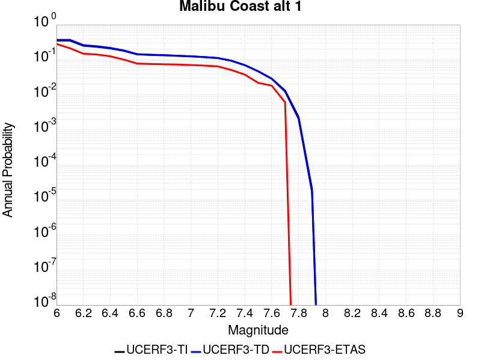 |
|-----|

| Magnitude | UCERF3-TI Prob | UCERF3-TD Prob | UCERF3-ETAS Prob |
|-----|-----|-----|-----|
| 6.0 | 0.35103062 | 0.3703205 | 0.29444444 |
| 6.1 | 0.35103062 | 0.3703205 | 0.21666667 |
| 6.2 | 0.2511526 | 0.26162258 | 0.15 |
| 6.3 | 0.23381805 | 0.24298659 | 0.14444445 |
| 6.4 | 0.21068102 | 0.2180458 | 0.13333334 |
| 6.5 | 0.17998327 | 0.1850506 | 0.11666667 |
| 6.6 | 0.14243905 | 0.14446041 | 0.07777778 |
| 6.7 | 0.13741247 | 0.13915512 | 0.07777778 |
| 6.8 | 0.13415888 | 0.13573952 | 0.07777778 |
| 6.9 | 0.12908325 | 0.13034149 | 0.072222225 |
| 7.0 | 0.124737665 | 0.12575442 | 0.06666667 |
| 7.1 | 0.11878545 | 0.11942763 | 0.06111111 |
| 7.2 | 0.11182766 | 0.11202656 | 0.055555556 |
| 7.3 | 0.09424413 | 0.09331997 | 0.044444446 |
| 7.4 | 0.070645 | 0.07002897 | 0.03888889 |
| 7.5 | 0.046822842 | 0.046933826 | 0.022222223 |
| 7.6 | 0.029032024 | 0.028739238 | 0.016666668 |
| 7.7 | 0.013128003 | 0.012393917 | 0.0055555557 |
| 7.8 | 0.0023330457 | 0.0020810363 | 0.0 |
| 7.9 | 2.0890639E-5 | 1.6900693E-5 | 0.0 |

## Manix-Afton Hills
*[(top)](#table-of-contents)*

| 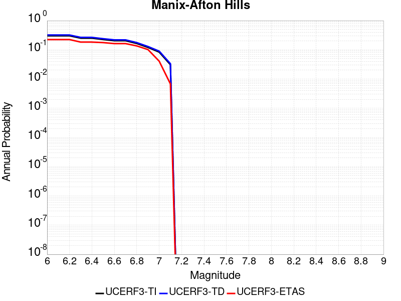 |
|-----|

| Magnitude | UCERF3-TI Prob | UCERF3-TD Prob | UCERF3-ETAS Prob |
|-----|-----|-----|-----|
| 6.0 | 0.30204204 | 0.3210196 | 0.22777778 |
| 6.1 | 0.30204204 | 0.3210196 | 0.22777778 |
| 6.2 | 0.30204204 | 0.3210196 | 0.22777778 |
| 6.3 | 0.25044444 | 0.26608714 | 0.17777778 |
| 6.4 | 0.25044444 | 0.26608714 | 0.17777778 |
| 6.5 | 0.22538407 | 0.23986912 | 0.17222223 |
| 6.6 | 0.20534544 | 0.21894199 | 0.15 |
| 6.7 | 0.20516452 | 0.21874982 | 0.15 |
| 6.8 | 0.16473258 | 0.17637374 | 0.11111111 |
| 6.9 | 0.120756716 | 0.12949687 | 0.072222225 |
| 7.0 | 0.08364036 | 0.09008346 | 0.03888889 |
| 7.1 | 0.031008165 | 0.03349481 | 0.0055555557 |

## McKinleyville (alt1)
*[(top)](#table-of-contents)*

| 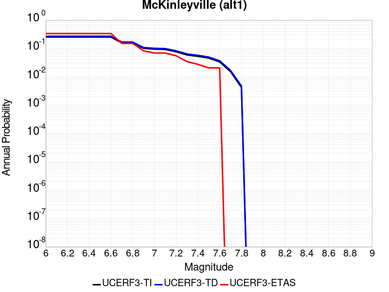 |
|-----|

| Magnitude | UCERF3-TI Prob | UCERF3-TD Prob | UCERF3-ETAS Prob |
|-----|-----|-----|-----|
| 6.0 | 0.25003436 | 0.26816884 | 0.26666668 |
| 6.1 | 0.25003436 | 0.26816884 | 0.26666668 |
| 6.2 | 0.25003436 | 0.26816884 | 0.26666668 |
| 6.3 | 0.25003436 | 0.26816884 | 0.26666668 |
| 6.4 | 0.25003436 | 0.26816884 | 0.26666668 |
| 6.5 | 0.25003436 | 0.26816884 | 0.26666668 |
| 6.6 | 0.25003436 | 0.26816884 | 0.26666668 |
| 6.7 | 0.15561534 | 0.16603597 | 0.11666667 |
| 6.8 | 0.15561534 | 0.16603597 | 0.11666667 |
| 6.9 | 0.10002239 | 0.10690537 | 0.06666667 |
| 7.0 | 0.09389022 | 0.10052283 | 0.055555556 |
| 7.1 | 0.09143592 | 0.09797421 | 0.055555556 |
| 7.2 | 0.075683415 | 0.08152035 | 0.03888889 |
| 7.3 | 0.058428098 | 0.06332718 | 0.033333335 |
| 7.4 | 0.052247383 | 0.056795377 | 0.033333335 |
| 7.5 | 0.045065533 | 0.049155235 | 0.027777778 |
| 7.6 | 0.0332069 | 0.036424845 | 0.022222223 |
| 7.7 | 0.015033923 | 0.01662236 | 0.0055555557 |
| 7.8 | 0.0041970243 | 0.0047018053 | 0.0 |

## McLean Lake
*[(top)](#table-of-contents)*

| 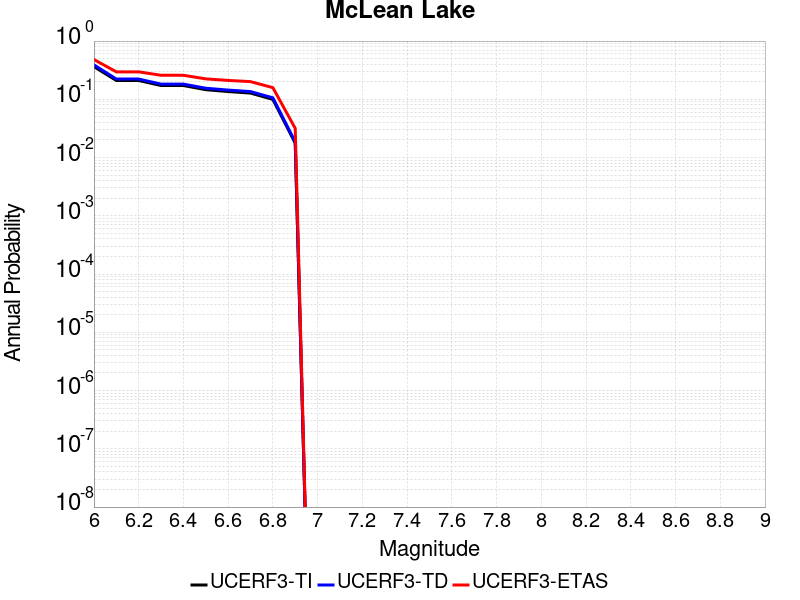 |
|-----|

| Magnitude | UCERF3-TI Prob | UCERF3-TD Prob | UCERF3-ETAS Prob |
|-----|-----|-----|-----|
| 6.0 | 0.3642308 | 0.39019242 | 0.5388889 |
| 6.1 | 0.21056688 | 0.22267905 | 0.33888888 |
| 6.2 | 0.21056688 | 0.22267905 | 0.33888888 |
| 6.3 | 0.17249899 | 0.18243073 | 0.31111112 |
| 6.4 | 0.17249899 | 0.18243073 | 0.31111112 |
| 6.5 | 0.14636655 | 0.15497297 | 0.25555557 |
| 6.6 | 0.13590075 | 0.1440348 | 0.23888889 |
| 6.7 | 0.1279345 | 0.13572137 | 0.22777778 |
| 6.8 | 0.09964277 | 0.10607831 | 0.17777778 |
| 6.9 | 0.017676475 | 0.018498356 | 0.044444446 |

## Mendocino
*[(top)](#table-of-contents)*

| 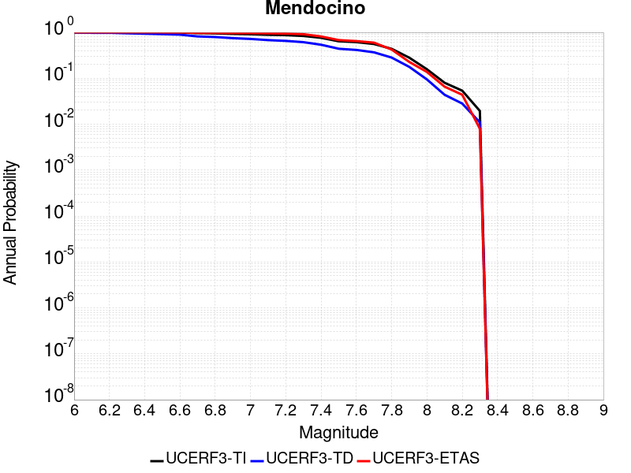 |
|-----|

| Magnitude | UCERF3-TI Prob | UCERF3-TD Prob | UCERF3-ETAS Prob |
|-----|-----|-----|-----|
| 6.0 | 0.99999946 | 0.9950514 | 1.0 |
| 6.1 | 0.9999848 | 0.980124 | 1.0 |
| 6.2 | 0.9999848 | 0.980124 | 1.0 |
| 6.3 | 0.9998068 | 0.95468235 | 1.0 |
| 6.4 | 0.9992182 | 0.9334706 | 1.0 |
| 6.5 | 0.9980854 | 0.9131741 | 1.0 |
| 6.6 | 0.9958534 | 0.8920846 | 1.0 |
| 6.7 | 0.96258277 | 0.8159342 | 0.9777778 |
| 6.8 | 0.94846886 | 0.7913264 | 0.9722222 |
| 6.9 | 0.9249788 | 0.74877894 | 0.96666664 |
| 7.0 | 0.90855414 | 0.7193721 | 0.9611111 |
| 7.1 | 0.8848701 | 0.67839897 | 0.9611111 |
| 7.2 | 0.8701927 | 0.65210944 | 0.95 |
| 7.3 | 0.8342155 | 0.6116741 | 0.90555555 |
| 7.4 | 0.7612413 | 0.53819984 | 0.8111111 |
| 7.5 | 0.6394822 | 0.44000122 | 0.7 |
| 7.6 | 0.6132355 | 0.41458285 | 0.65 |
| 7.7 | 0.558288 | 0.36749664 | 0.6111111 |
| 7.8 | 0.43807203 | 0.2826436 | 0.42777777 |
| 7.9 | 0.2809203 | 0.17708893 | 0.22777778 |
| 8.0 | 0.15718937 | 0.09443324 | 0.10555556 |
| 8.1 | 0.07989597 | 0.043780312 | 0.044444446 |
| 8.2 | 0.053792253 | 0.028205363 | 0.033333335 |
| 8.3 | 0.019471124 | 0.010974838 | 0.0 |

## Mission (connected) 2011 CFM
*[(top)](#table-of-contents)*

| 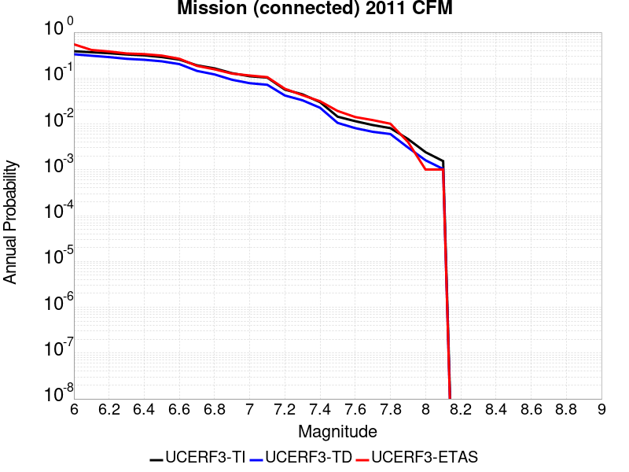 |
|-----|

| Magnitude | UCERF3-TI Prob | UCERF3-TD Prob | UCERF3-ETAS Prob |
|-----|-----|-----|-----|
| 6.0 | 0.38663942 | 0.33190244 | 0.53333336 |
| 6.1 | 0.36680886 | 0.30824167 | 0.40555555 |
| 6.2 | 0.34956926 | 0.28775585 | 0.3611111 |
| 6.3 | 0.32788566 | 0.26384598 | 0.33333334 |
| 6.4 | 0.3138254 | 0.25143802 | 0.31666666 |
| 6.5 | 0.2878714 | 0.23260227 | 0.30555555 |
| 6.6 | 0.2537855 | 0.20224616 | 0.25555557 |
| 6.7 | 0.19019578 | 0.14371435 | 0.17222223 |
| 6.8 | 0.16335154 | 0.12038007 | 0.13333334 |
| 6.9 | 0.12804231 | 0.09194431 | 0.083333336 |
| 7.0 | 0.1098504 | 0.07750124 | 0.07777778 |
| 7.1 | 0.10259807 | 0.071543574 | 0.06666667 |
| 7.2 | 0.05610665 | 0.041773148 | 0.027777778 |
| 7.3 | 0.04428745 | 0.032838687 | 0.022222223 |
| 7.4 | 0.029882137 | 0.022550816 | 0.022222223 |
| 7.5 | 0.01440369 | 0.010541925 | 0.016666668 |
| 7.6 | 0.011493 | 0.008104413 | 0.016666668 |
| 7.7 | 0.009449276 | 0.0067337393 | 0.016666668 |
| 7.8 | 0.008094642 | 0.0060205506 | 0.016666668 |
| 7.9 | 0.004694401 | 0.0030612894 | 0.0 |
| 8.0 | 0.0024179842 | 0.0016095819 | 0.0 |
| 8.1 | 0.0015446999 | 0.0010399732 | 0.0 |

## Mission Creek
*[(top)](#table-of-contents)*

| 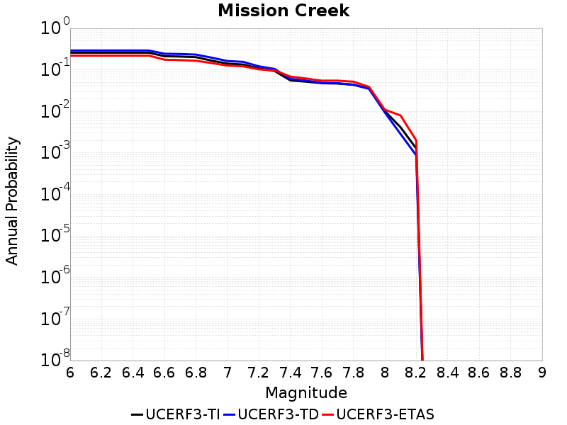 |
|-----|

| Magnitude | UCERF3-TI Prob | UCERF3-TD Prob | UCERF3-ETAS Prob |
|-----|-----|-----|-----|
| 6.0 | 0.26015678 | 0.2933487 | 0.21666667 |
| 6.1 | 0.26015678 | 0.2933487 | 0.21666667 |
| 6.2 | 0.26015678 | 0.2933487 | 0.21666667 |
| 6.3 | 0.26015678 | 0.2933487 | 0.21666667 |
| 6.4 | 0.26015678 | 0.2933487 | 0.21666667 |
| 6.5 | 0.26015678 | 0.2933487 | 0.21666667 |
| 6.6 | 0.21344487 | 0.24505508 | 0.18333334 |
| 6.7 | 0.20966993 | 0.24122457 | 0.18333334 |
| 6.8 | 0.20251153 | 0.23372234 | 0.17777778 |
| 6.9 | 0.16696905 | 0.19669427 | 0.15 |
| 7.0 | 0.14146677 | 0.1635929 | 0.12222222 |
| 7.1 | 0.13473414 | 0.15615118 | 0.12222222 |
| 7.2 | 0.10809368 | 0.12185708 | 0.10555556 |
| 7.3 | 0.094120026 | 0.10529504 | 0.094444446 |
| 7.4 | 0.055737175 | 0.060745567 | 0.06666667 |
| 7.5 | 0.052125584 | 0.05526121 | 0.06111111 |
| 7.6 | 0.047699098 | 0.048780292 | 0.06111111 |
| 7.7 | 0.046900064 | 0.047765773 | 0.06111111 |
| 7.8 | 0.043867342 | 0.04410243 | 0.06111111 |
| 7.9 | 0.035954196 | 0.034863506 | 0.05 |
| 8.0 | 0.010205568 | 0.009443581 | 0.011111111 |
| 8.1 | 0.004157254 | 0.002859705 | 0.0055555557 |
| 8.2 | 0.0012776374 | 8.7070756E-4 | 0.0 |

## Mission Hills 2011
*[(top)](#table-of-contents)*

| 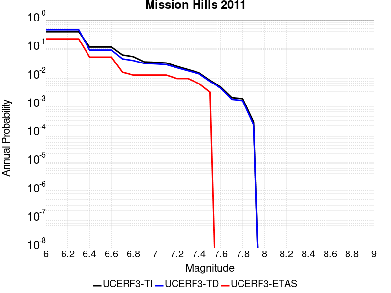 |
|-----|

| Magnitude | UCERF3-TI Prob | UCERF3-TD Prob | UCERF3-ETAS Prob |
|-----|-----|-----|-----|
| 6.0 | 0.38712162 | 0.4534915 | 0.18333334 |
| 6.1 | 0.38712162 | 0.4534915 | 0.18333334 |
| 6.2 | 0.38712162 | 0.4534915 | 0.18333334 |
| 6.3 | 0.38712162 | 0.4534915 | 0.18333334 |
| 6.4 | 0.11231051 | 0.08783454 | 0.033333335 |
| 6.5 | 0.11231051 | 0.08783454 | 0.033333335 |
| 6.6 | 0.11231051 | 0.08783454 | 0.033333335 |
| 6.7 | 0.058895804 | 0.04296712 | 0.016666668 |
| 6.8 | 0.051650956 | 0.037824716 | 0.016666668 |
| 6.9 | 0.03381701 | 0.029900676 | 0.016666668 |
| 7.0 | 0.032656174 | 0.028839223 | 0.016666668 |
| 7.1 | 0.030983757 | 0.02727222 | 0.016666668 |
| 7.2 | 0.023476446 | 0.02104305 | 0.016666668 |
| 7.3 | 0.018149098 | 0.016489623 | 0.016666668 |
| 7.4 | 0.013963882 | 0.012954209 | 0.011111111 |
| 7.5 | 0.007555663 | 0.006985551 | 0.0055555557 |
| 7.6 | 0.0044003385 | 0.004023881 | 0.0 |
| 7.7 | 0.0018683517 | 0.0016257954 | 0.0 |
| 7.8 | 0.0017110617 | 0.0014731048 | 0.0 |
| 7.9 | 2.6161713E-4 | 2.1015461E-4 | 0.0 |

## Mission Ridge-Arroyo Parida-Santa Ana
*[(top)](#table-of-contents)*

| 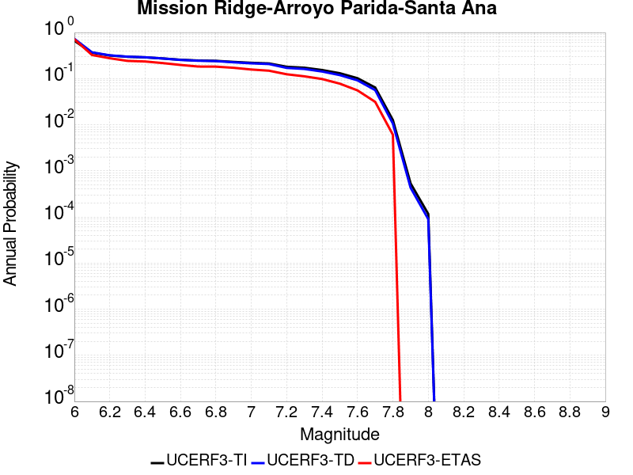 |
|-----|

| Magnitude | UCERF3-TI Prob | UCERF3-TD Prob | UCERF3-ETAS Prob |
|-----|-----|-----|-----|
| 6.0 | 0.66300726 | 0.73037916 | 0.7111111 |
| 6.1 | 0.36458036 | 0.3716543 | 0.37777779 |
| 6.2 | 0.31715342 | 0.320339 | 0.31666666 |
| 6.3 | 0.29782718 | 0.299424 | 0.2777778 |
| 6.4 | 0.28944767 | 0.29034668 | 0.27222222 |
| 6.5 | 0.27359617 | 0.27314243 | 0.25555557 |
| 6.6 | 0.25634164 | 0.2543398 | 0.24444444 |
| 6.7 | 0.2468106 | 0.24403936 | 0.22222222 |
| 6.8 | 0.24291468 | 0.23978797 | 0.22222222 |
| 6.9 | 0.23041427 | 0.22584979 | 0.21111111 |
| 7.0 | 0.22029582 | 0.21457824 | 0.18888889 |
| 7.1 | 0.21354148 | 0.20708519 | 0.17222223 |
| 7.2 | 0.1806739 | 0.17058545 | 0.14444445 |
| 7.3 | 0.17233633 | 0.16192704 | 0.1388889 |
| 7.4 | 0.15355523 | 0.14252356 | 0.11111111 |
| 7.5 | 0.13093321 | 0.11916879 | 0.094444446 |
| 7.6 | 0.10207839 | 0.09174097 | 0.07777778 |
| 7.7 | 0.064135544 | 0.05628488 | 0.05 |
| 7.8 | 0.012601485 | 0.010598145 | 0.016666668 |
| 7.9 | 5.3397065E-4 | 4.307071E-4 | 0.0 |
| 8.0 | 1.15923154E-4 | 8.970751E-5 | 0.0 |

## Mohawk Valley 2011 CFM
*[(top)](#table-of-contents)*

| 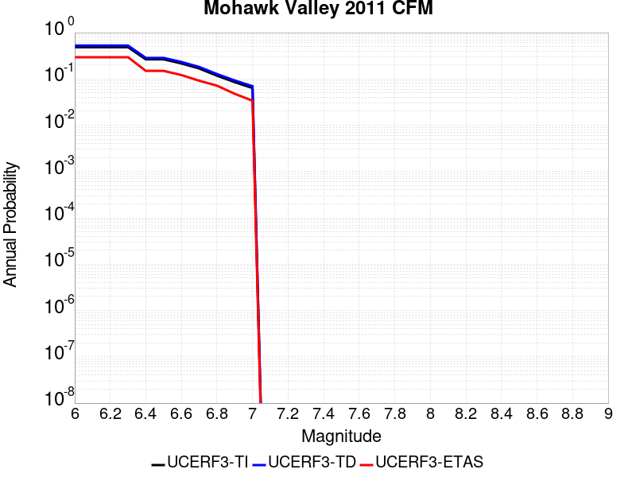 |
|-----|

| Magnitude | UCERF3-TI Prob | UCERF3-TD Prob | UCERF3-ETAS Prob |
|-----|-----|-----|-----|
| 6.0 | 0.48487183 | 0.5261776 | 0.2611111 |
| 6.1 | 0.48487183 | 0.5261776 | 0.2611111 |
| 6.2 | 0.48487183 | 0.5261776 | 0.2611111 |
| 6.3 | 0.48487183 | 0.5261776 | 0.2611111 |
| 6.4 | 0.2652208 | 0.2848117 | 0.12777779 |
| 6.5 | 0.2652208 | 0.2848117 | 0.12777779 |
| 6.6 | 0.21629946 | 0.23284315 | 0.08888889 |
| 6.7 | 0.1683573 | 0.18172635 | 0.072222225 |
| 6.8 | 0.1178587 | 0.12760155 | 0.05 |
| 6.9 | 0.085272916 | 0.0927377 | 0.033333335 |
| 7.0 | 0.06380569 | 0.069752365 | 0.022222223 |

## Mono Lake 2011 CFM
*[(top)](#table-of-contents)*

| 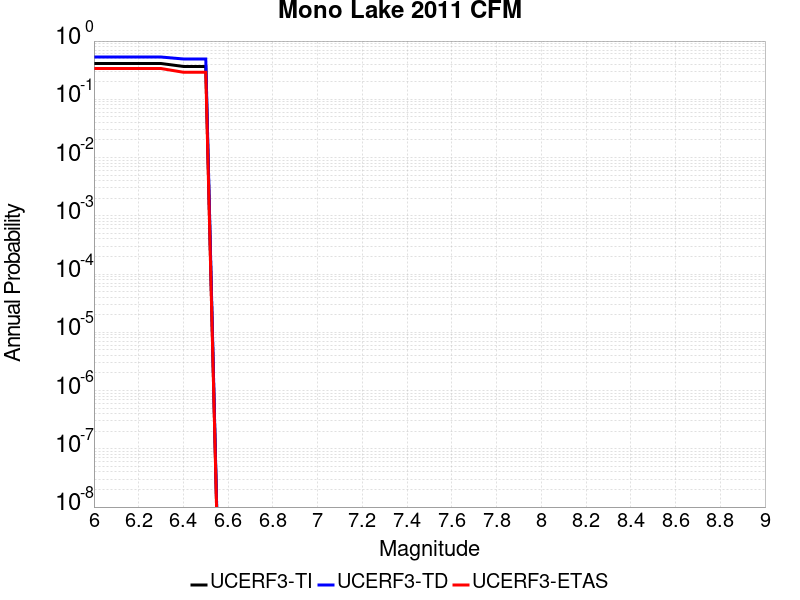 |
|-----|

| Magnitude | UCERF3-TI Prob | UCERF3-TD Prob | UCERF3-ETAS Prob |
|-----|-----|-----|-----|
| 6.0 | 0.41180977 | 0.53224635 | 0.34444445 |
| 6.1 | 0.41180977 | 0.53224635 | 0.34444445 |
| 6.2 | 0.41180977 | 0.53224635 | 0.34444445 |
| 6.3 | 0.41180977 | 0.53224635 | 0.34444445 |
| 6.4 | 0.36651555 | 0.49247965 | 0.32222223 |
| 6.5 | 0.36651555 | 0.49247965 | 0.32222223 |

## Monte Vista - Shannon 2011 CFM
*[(top)](#table-of-contents)*

| 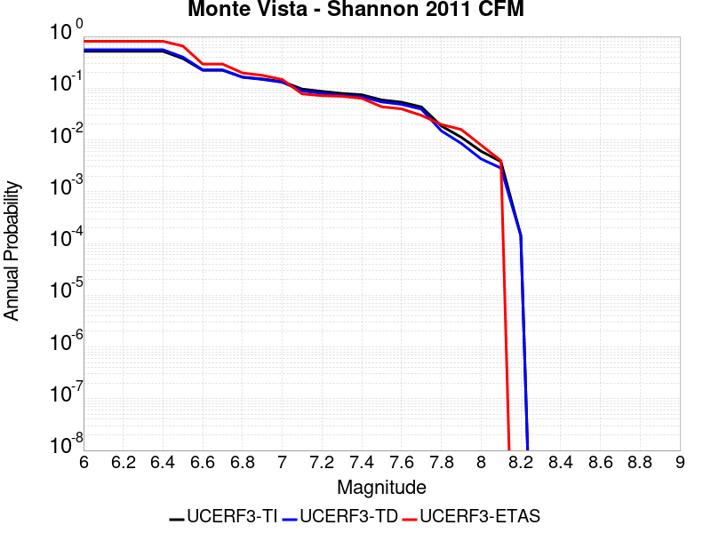 |
|-----|

| Magnitude | UCERF3-TI Prob | UCERF3-TD Prob | UCERF3-ETAS Prob |
|-----|-----|-----|-----|
| 6.0 | 0.5171756 | 0.55403465 | 0.84444445 |
| 6.1 | 0.5171756 | 0.55403465 | 0.84444445 |
| 6.2 | 0.5171756 | 0.55403465 | 0.84444445 |
| 6.3 | 0.5171756 | 0.55403465 | 0.84444445 |
| 6.4 | 0.5171756 | 0.55403465 | 0.84444445 |
| 6.5 | 0.3745951 | 0.3995773 | 0.65 |
| 6.6 | 0.22257915 | 0.22643553 | 0.2777778 |
| 6.7 | 0.22213022 | 0.22597048 | 0.2777778 |
| 6.8 | 0.16447179 | 0.16250394 | 0.18333334 |
| 6.9 | 0.15095122 | 0.14794025 | 0.17222223 |
| 7.0 | 0.13439555 | 0.1302637 | 0.15555556 |
| 7.1 | 0.096257776 | 0.088840395 | 0.07777778 |
| 7.2 | 0.08682386 | 0.079431534 | 0.072222225 |
| 7.3 | 0.07933274 | 0.07230745 | 0.072222225 |
| 7.4 | 0.074577875 | 0.06823397 | 0.06666667 |
| 7.5 | 0.05937688 | 0.054345198 | 0.044444446 |
| 7.6 | 0.053629424 | 0.04884957 | 0.044444446 |
| 7.7 | 0.043438744 | 0.039312758 | 0.027777778 |
| 7.8 | 0.018688116 | 0.015003694 | 0.022222223 |
| 7.9 | 0.011307501 | 0.008610785 | 0.011111111 |
| 8.0 | 0.0060649095 | 0.0043112603 | 0.0055555557 |
| 8.1 | 0.003818023 | 0.0028612155 | 0.0 |
| 8.2 | 1.4330281E-4 | 1.41631E-4 | 0.0 |

## Monterey Bay-Tularcitos
*[(top)](#table-of-contents)*

| 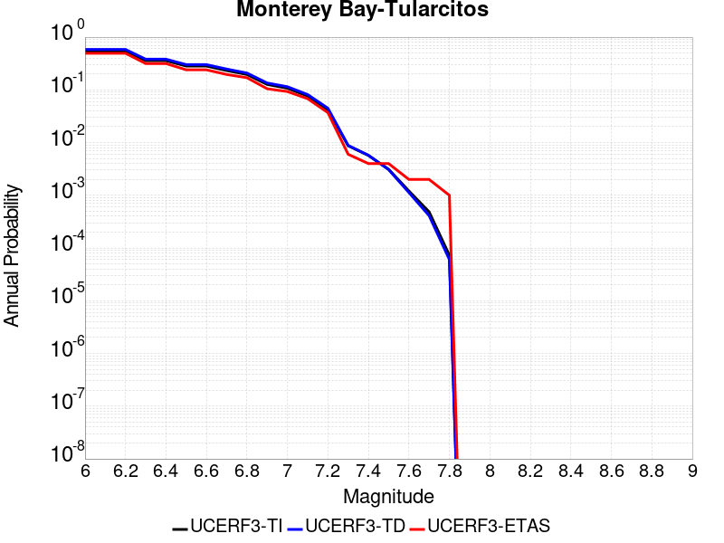 |
|-----|

| Magnitude | UCERF3-TI Prob | UCERF3-TD Prob | UCERF3-ETAS Prob |
|-----|-----|-----|-----|
| 6.0 | 0.5443898 | 0.58420396 | 0.5777778 |
| 6.1 | 0.5443898 | 0.58420396 | 0.5777778 |
| 6.2 | 0.5443898 | 0.58420396 | 0.5777778 |
| 6.3 | 0.35819831 | 0.3816314 | 0.37777779 |
| 6.4 | 0.35819831 | 0.3816314 | 0.37777779 |
| 6.5 | 0.28291744 | 0.30138162 | 0.30555555 |
| 6.6 | 0.28277418 | 0.3012376 | 0.30555555 |
| 6.7 | 0.23284878 | 0.24806717 | 0.23888889 |
| 6.8 | 0.19574812 | 0.20863147 | 0.19444445 |
| 6.9 | 0.12671968 | 0.13506028 | 0.08888889 |
| 7.0 | 0.10750412 | 0.11468244 | 0.055555556 |
| 7.1 | 0.07624438 | 0.0814926 | 0.03888889 |
| 7.2 | 0.041942406 | 0.04489127 | 0.022222223 |
| 7.3 | 0.008719525 | 0.00883719 | 0.016666668 |
| 7.4 | 0.005716325 | 0.0057479846 | 0.0055555557 |
| 7.5 | 0.0031112898 | 0.0030688394 | 0.0055555557 |
| 7.6 | 0.0012087834 | 0.0011295107 | 0.0055555557 |
| 7.7 | 4.84845E-4 | 4.102464E-4 | 0.0055555557 |
| 7.8 | 7.294339E-5 | 6.0421255E-5 | 0.0 |

## Morales (East)
*[(top)](#table-of-contents)*

| 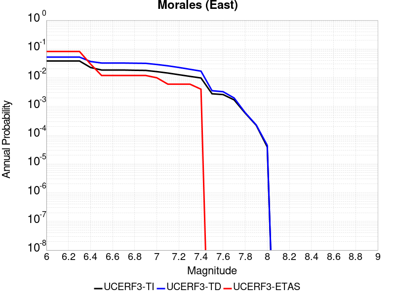 |
|-----|

| Magnitude | UCERF3-TI Prob | UCERF3-TD Prob | UCERF3-ETAS Prob |
|-----|-----|-----|-----|
| 6.0 | 0.03823453 | 0.052269794 | 0.07777778 |
| 6.1 | 0.03823453 | 0.052269794 | 0.07777778 |
| 6.2 | 0.03823453 | 0.052269794 | 0.07777778 |
| 6.3 | 0.03823453 | 0.052269794 | 0.07777778 |
| 6.4 | 0.022694094 | 0.036668975 | 0.022222223 |
| 6.5 | 0.018545398 | 0.032535274 | 0.016666668 |
| 6.6 | 0.018545398 | 0.032535274 | 0.016666668 |
| 6.7 | 0.018504132 | 0.032473855 | 0.016666668 |
| 6.8 | 0.018179249 | 0.032022607 | 0.016666668 |
| 6.9 | 0.01794701 | 0.031661395 | 0.016666668 |
| 7.0 | 0.01628453 | 0.028908093 | 0.0055555557 |
| 7.1 | 0.014555464 | 0.025955351 | 0.0055555557 |
| 7.2 | 0.012729279 | 0.022760194 | 0.0055555557 |
| 7.3 | 0.011150143 | 0.019651027 | 0.0055555557 |
| 7.4 | 0.009798602 | 0.016937176 | 0.0055555557 |
| 7.5 | 0.0027624848 | 0.0035354486 | 0.0 |
| 7.6 | 0.0025952198 | 0.0032629617 | 0.0 |
| 7.7 | 0.001694228 | 0.001973914 | 0.0 |
| 7.8 | 5.8728305E-4 | 6.097869E-4 | 0.0 |
| 7.9 | 2.2155237E-4 | 2.2725793E-4 | 0.0 |
| 8.0 | 3.90597E-5 | 4.443607E-5 | 0.0 |

## Morales (West)
*[(top)](#table-of-contents)*

| 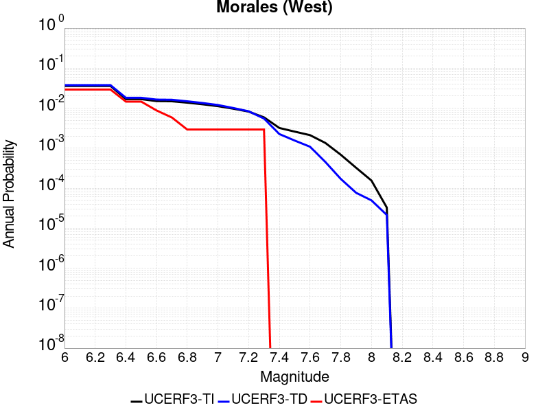 |
|-----|

| Magnitude | UCERF3-TI Prob | UCERF3-TD Prob | UCERF3-ETAS Prob |
|-----|-----|-----|-----|
| 6.0 | 0.035934128 | 0.0376356 | 0.033333335 |
| 6.1 | 0.035934128 | 0.0376356 | 0.033333335 |
| 6.2 | 0.035934128 | 0.0376356 | 0.033333335 |
| 6.3 | 0.035934128 | 0.0376356 | 0.033333335 |
| 6.4 | 0.016826611 | 0.018217873 | 0.016666668 |
| 6.5 | 0.016826611 | 0.018217873 | 0.016666668 |
| 6.6 | 0.015032405 | 0.016412737 | 0.011111111 |
| 6.7 | 0.0148674045 | 0.016246775 | 0.0055555557 |
| 6.8 | 0.013730694 | 0.014877065 | 0.0 |
| 6.9 | 0.012506454 | 0.013485074 | 0.0 |
| 7.0 | 0.011223941 | 0.012010645 | 0.0 |
| 7.1 | 0.009706991 | 0.010100466 | 0.0 |
| 7.2 | 0.008208396 | 0.00837106 | 0.0 |
| 7.3 | 0.0058990046 | 0.005508402 | 0.0 |
| 7.4 | 0.003202677 | 0.002256748 | 0.0 |
| 7.5 | 0.0025959667 | 0.0015516932 | 0.0 |
| 7.6 | 0.0021177423 | 0.0010867044 | 0.0 |
| 7.7 | 0.0013507927 | 4.510495E-4 | 0.0 |
| 7.8 | 6.8630505E-4 | 1.70838E-4 | 0.0 |
| 7.9 | 3.241891E-4 | 7.674812E-5 | 0.0 |
| 8.0 | 1.5532914E-4 | 4.960876E-5 | 0.0 |
| 8.1 | 3.283612E-5 | 2.13998E-5 | 0.0 |

## Mount Diablo Thrust North CFM
*[(top)](#table-of-contents)*

| 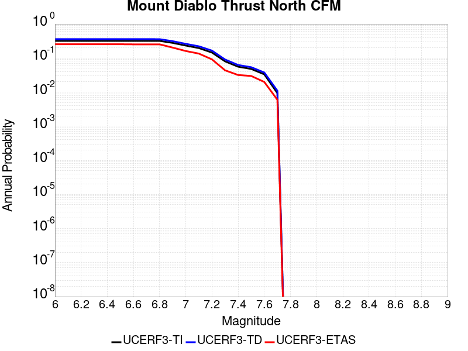 |
|-----|

| Magnitude | UCERF3-TI Prob | UCERF3-TD Prob | UCERF3-ETAS Prob |
|-----|-----|-----|-----|
| 6.0 | 0.320248 | 0.35991436 | 0.21666667 |
| 6.1 | 0.320248 | 0.35991436 | 0.21666667 |
| 6.2 | 0.320248 | 0.35991436 | 0.21666667 |
| 6.3 | 0.320248 | 0.35991436 | 0.21666667 |
| 6.4 | 0.320248 | 0.35991436 | 0.21666667 |
| 6.5 | 0.320248 | 0.35991436 | 0.21666667 |
| 6.6 | 0.32013944 | 0.35980278 | 0.21111111 |
| 6.7 | 0.32013944 | 0.35980278 | 0.21111111 |
| 6.8 | 0.31981134 | 0.3594588 | 0.21111111 |
| 6.9 | 0.2791877 | 0.3131352 | 0.16666667 |
| 7.0 | 0.23315513 | 0.26199967 | 0.11111111 |
| 7.1 | 0.19676475 | 0.22174779 | 0.094444446 |
| 7.2 | 0.14545159 | 0.16573283 | 0.083333336 |
| 7.3 | 0.08033515 | 0.09083688 | 0.044444446 |
| 7.4 | 0.055882636 | 0.06274896 | 0.027777778 |
| 7.5 | 0.04803711 | 0.053985573 | 0.027777778 |
| 7.6 | 0.03337881 | 0.0377396 | 0.022222223 |
| 7.7 | 0.00935692 | 0.010988094 | 0.0 |

## Mount Diablo Thrust South
*[(top)](#table-of-contents)*

| 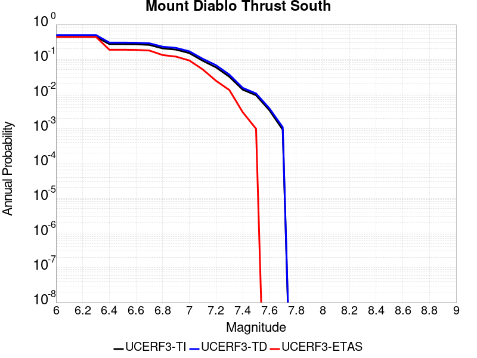 |
|-----|

| Magnitude | UCERF3-TI Prob | UCERF3-TD Prob | UCERF3-ETAS Prob |
|-----|-----|-----|-----|
| 6.0 | 0.4422353 | 0.49719143 | 0.4722222 |
| 6.1 | 0.4422353 | 0.49719143 | 0.4722222 |
| 6.2 | 0.4422353 | 0.49719143 | 0.4722222 |
| 6.3 | 0.4422353 | 0.49719143 | 0.4722222 |
| 6.4 | 0.273149 | 0.30200523 | 0.15555556 |
| 6.5 | 0.273149 | 0.30200523 | 0.15555556 |
| 6.6 | 0.270102 | 0.29894495 | 0.15 |
| 6.7 | 0.25919184 | 0.2878469 | 0.1388889 |
| 6.8 | 0.20557708 | 0.22949708 | 0.10555556 |
| 6.9 | 0.18937056 | 0.21201143 | 0.1 |
| 7.0 | 0.15062425 | 0.16900432 | 0.072222225 |
| 7.1 | 0.09079918 | 0.103157304 | 0.03888889 |
| 7.2 | 0.058324784 | 0.067258894 | 0.027777778 |
| 7.3 | 0.031429708 | 0.03606397 | 0.011111111 |
| 7.4 | 0.013372163 | 0.01503041 | 0.0 |
| 7.5 | 0.009226421 | 0.010351495 | 0.0 |
| 7.6 | 0.0034181245 | 0.0038678711 | 0.0 |
| 7.7 | 9.438044E-4 | 0.0011049607 | 0.0 |

## Nelson Lake
*[(top)](#table-of-contents)*

| 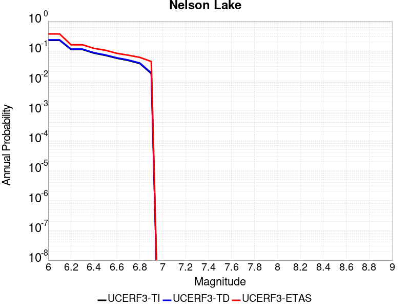 |
|-----|

| Magnitude | UCERF3-TI Prob | UCERF3-TD Prob | UCERF3-ETAS Prob |
|-----|-----|-----|-----|
| 6.0 | 0.22789614 | 0.2354064 | 0.37222221 |
| 6.1 | 0.22789614 | 0.2354064 | 0.37222221 |
| 6.2 | 0.112154946 | 0.11545312 | 0.16111112 |
| 6.3 | 0.112154946 | 0.11545312 | 0.16111112 |
| 6.4 | 0.084944725 | 0.087575324 | 0.12222222 |
| 6.5 | 0.071301304 | 0.07361064 | 0.10555556 |
| 6.6 | 0.057048626 | 0.059013296 | 0.083333336 |
| 6.7 | 0.04814229 | 0.049889393 | 0.072222225 |
| 6.8 | 0.038064 | 0.039537374 | 0.06111111 |
| 6.9 | 0.017676475 | 0.018498356 | 0.044444446 |

## Newport-Inglewood (Offshore)
*[(top)](#table-of-contents)*

| 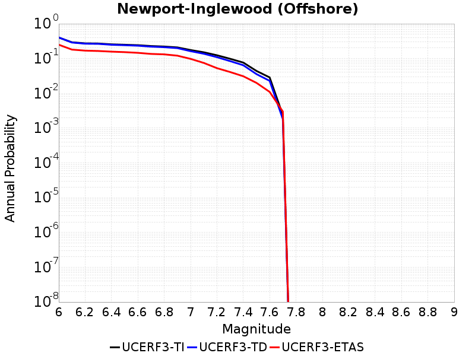 |
|-----|

| Magnitude | UCERF3-TI Prob | UCERF3-TD Prob | UCERF3-ETAS Prob |
|-----|-----|-----|-----|
| 6.0 | 0.40073213 | 0.40525973 | 0.26666668 |
| 6.1 | 0.29353514 | 0.28915355 | 0.18888889 |
| 6.2 | 0.2735735 | 0.26765406 | 0.17222223 |
| 6.3 | 0.27082792 | 0.26466438 | 0.17222223 |
| 6.4 | 0.25627407 | 0.24900584 | 0.16666667 |
| 6.5 | 0.24963993 | 0.24184346 | 0.16111112 |
| 6.6 | 0.2422889 | 0.23395903 | 0.15 |
| 6.7 | 0.22919697 | 0.22021483 | 0.1388889 |
| 6.8 | 0.22146389 | 0.21203671 | 0.13333334 |
| 6.9 | 0.20928735 | 0.19950838 | 0.11666667 |
| 7.0 | 0.17571963 | 0.16308707 | 0.094444446 |
| 7.1 | 0.1515575 | 0.1375468 | 0.08888889 |
| 7.2 | 0.12450721 | 0.10960487 | 0.06666667 |
| 7.3 | 0.098516 | 0.08446108 | 0.044444446 |
| 7.4 | 0.07665365 | 0.06423843 | 0.033333335 |
| 7.5 | 0.04407877 | 0.035740204 | 0.027777778 |
| 7.6 | 0.0286868 | 0.022876462 | 0.016666668 |
| 7.7 | 0.002375987 | 0.0018211976 | 0.0 |

## Newport-Inglewood alt 1
*[(top)](#table-of-contents)*

| 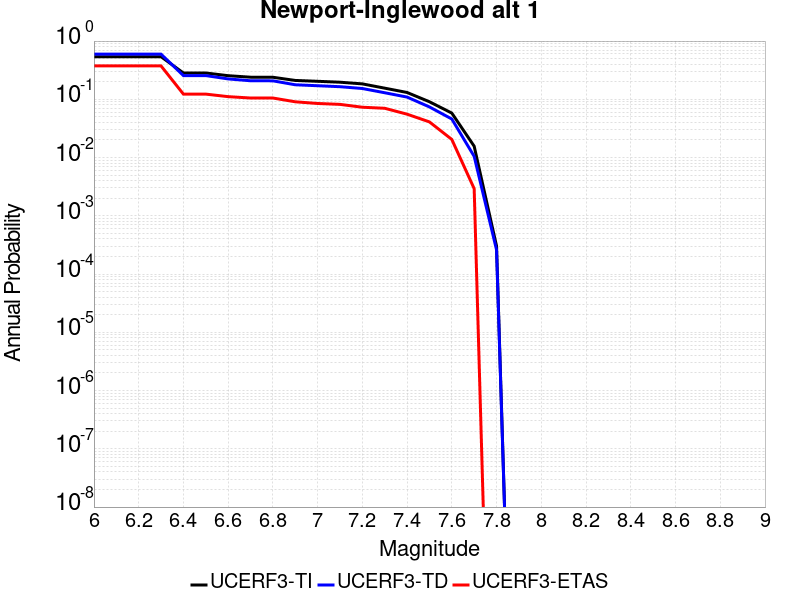 |
|-----|

| Magnitude | UCERF3-TI Prob | UCERF3-TD Prob | UCERF3-ETAS Prob |
|-----|-----|-----|-----|
| 6.0 | 0.53885937 | 0.5958535 | 0.37777779 |
| 6.1 | 0.53885937 | 0.5958535 | 0.37777779 |
| 6.2 | 0.53885937 | 0.5958535 | 0.37777779 |
| 6.3 | 0.53885937 | 0.5958535 | 0.37777779 |
| 6.4 | 0.2831483 | 0.25558892 | 0.08888889 |
| 6.5 | 0.2831483 | 0.25558892 | 0.08888889 |
| 6.6 | 0.25445956 | 0.22394705 | 0.083333336 |
| 6.7 | 0.2397156 | 0.20816287 | 0.07777778 |
| 6.8 | 0.2391454 | 0.2077148 | 0.07777778 |
| 6.9 | 0.21085739 | 0.17765924 | 0.072222225 |
| 7.0 | 0.20385017 | 0.17105596 | 0.072222225 |
| 7.1 | 0.19661716 | 0.16464922 | 0.072222225 |
| 7.2 | 0.18406115 | 0.15325388 | 0.06666667 |
| 7.3 | 0.15540625 | 0.12963717 | 0.06666667 |
| 7.4 | 0.13100395 | 0.10920566 | 0.055555556 |
| 7.5 | 0.090790965 | 0.07397548 | 0.044444446 |
| 7.6 | 0.058011778 | 0.045911215 | 0.027777778 |
| 7.7 | 0.01565494 | 0.010486063 | 0.0055555557 |
| 7.8 | 3.027386E-4 | 2.604207E-4 | 0.0 |

## North Frontal  (East)
*[(top)](#table-of-contents)*

| 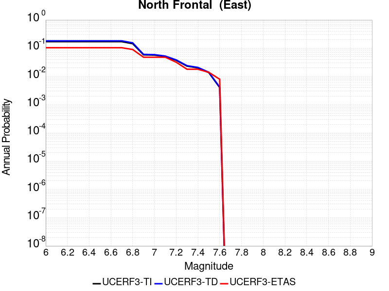 |
|-----|

| Magnitude | UCERF3-TI Prob | UCERF3-TD Prob | UCERF3-ETAS Prob |
|-----|-----|-----|-----|
| 6.0 | 0.16986503 | 0.18154797 | 0.12222222 |
| 6.1 | 0.16986503 | 0.18154797 | 0.12222222 |
| 6.2 | 0.16986503 | 0.18154797 | 0.12222222 |
| 6.3 | 0.16986503 | 0.18154797 | 0.12222222 |
| 6.4 | 0.16986503 | 0.18154797 | 0.12222222 |
| 6.5 | 0.16986503 | 0.18154797 | 0.12222222 |
| 6.6 | 0.16986503 | 0.18154797 | 0.12222222 |
| 6.7 | 0.16986503 | 0.18154797 | 0.12222222 |
| 6.8 | 0.14398743 | 0.15426596 | 0.10555556 |
| 6.9 | 0.058110174 | 0.06026941 | 0.027777778 |
| 7.0 | 0.056934208 | 0.05903815 | 0.027777778 |
| 7.1 | 0.050645236 | 0.052455056 | 0.027777778 |
| 7.2 | 0.03718455 | 0.03848639 | 0.022222223 |
| 7.3 | 0.023156535 | 0.023978889 | 0.016666668 |
| 7.4 | 0.020082993 | 0.020799806 | 0.016666668 |
| 7.5 | 0.013589136 | 0.01408604 | 0.016666668 |
| 7.6 | 0.004032984 | 0.0041859513 | 0.0055555557 |

## North Frontal  (West)
*[(top)](#table-of-contents)*

| 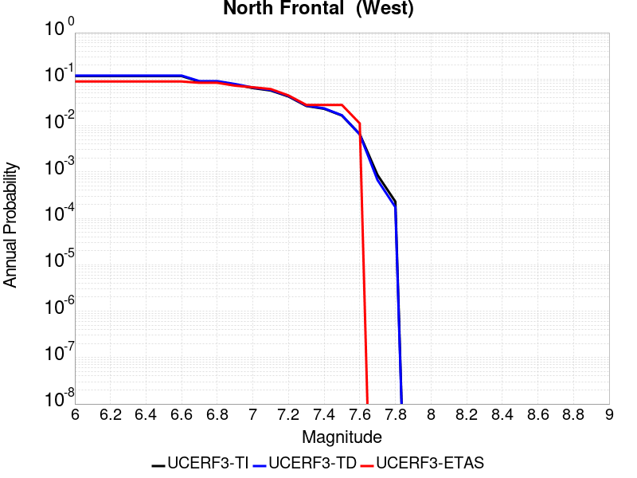 |
|-----|

| Magnitude | UCERF3-TI Prob | UCERF3-TD Prob | UCERF3-ETAS Prob |
|-----|-----|-----|-----|
| 6.0 | 0.116129786 | 0.119191706 | 0.08888889 |
| 6.1 | 0.116129786 | 0.119191706 | 0.08888889 |
| 6.2 | 0.116129786 | 0.119191706 | 0.08888889 |
| 6.3 | 0.116129786 | 0.119191706 | 0.08888889 |
| 6.4 | 0.116129786 | 0.119191706 | 0.08888889 |
| 6.5 | 0.116129786 | 0.119191706 | 0.08888889 |
| 6.6 | 0.116129786 | 0.119191706 | 0.08888889 |
| 6.7 | 0.08817875 | 0.09052545 | 0.083333336 |
| 6.8 | 0.08817875 | 0.09052545 | 0.083333336 |
| 6.9 | 0.07631548 | 0.0783802 | 0.072222225 |
| 7.0 | 0.06408909 | 0.06583678 | 0.06666667 |
| 7.1 | 0.056811824 | 0.058379922 | 0.06111111 |
| 7.2 | 0.042200807 | 0.04328255 | 0.044444446 |
| 7.3 | 0.026377033 | 0.02695519 | 0.027777778 |
| 7.4 | 0.02296349 | 0.023435477 | 0.027777778 |
| 7.5 | 0.016393533 | 0.016650515 | 0.027777778 |
| 7.6 | 0.0065236543 | 0.0064284396 | 0.011111111 |
| 7.7 | 8.561412E-4 | 6.662623E-4 | 0.0 |
| 7.8 | 2.28907E-4 | 1.7449177E-4 | 0.0 |

## North Salt Lake
*[(top)](#table-of-contents)*

| 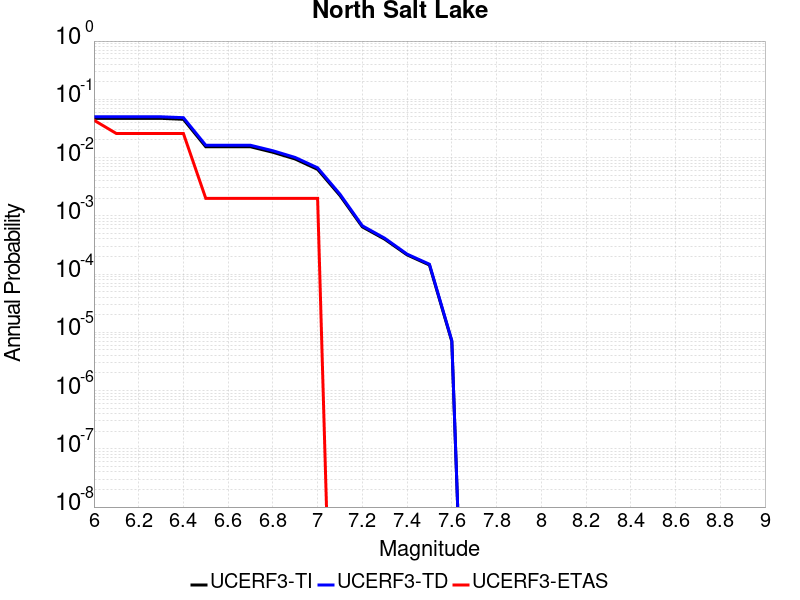 |
|-----|

| Magnitude | UCERF3-TI Prob | UCERF3-TD Prob | UCERF3-ETAS Prob |
|-----|-----|-----|-----|
| 6.0 | 0.047109004 | 0.050118987 | 0.06111111 |
| 6.1 | 0.047109004 | 0.050118987 | 0.03888889 |
| 6.2 | 0.047109004 | 0.050118987 | 0.03888889 |
| 6.3 | 0.047109004 | 0.050118987 | 0.03888889 |
| 6.4 | 0.045386918 | 0.048393898 | 0.03888889 |
| 6.5 | 0.015315334 | 0.016257016 | 0.0055555557 |
| 6.6 | 0.015315334 | 0.016257016 | 0.0055555557 |
| 6.7 | 0.015315334 | 0.016257016 | 0.0055555557 |
| 6.8 | 0.012325289 | 0.013090779 | 0.0055555557 |
| 6.9 | 0.009437428 | 0.010027862 | 0.0055555557 |
| 7.0 | 0.006264508 | 0.0066643567 | 0.0055555557 |
| 7.1 | 0.0022285527 | 0.0023500358 | 0.0 |
| 7.2 | 6.455741E-4 | 6.737035E-4 | 0.0 |
| 7.3 | 3.9680174E-4 | 4.124721E-4 | 0.0 |
| 7.4 | 2.1343975E-4 | 2.199897E-4 | 0.0 |
| 7.5 | 1.429568E-4 | 1.4760168E-4 | 0.0 |
| 7.6 | 6.995442E-6 | 7.2221683E-6 | 0.0 |

## North Tahoe 2011 CFM
*[(top)](#table-of-contents)*

| 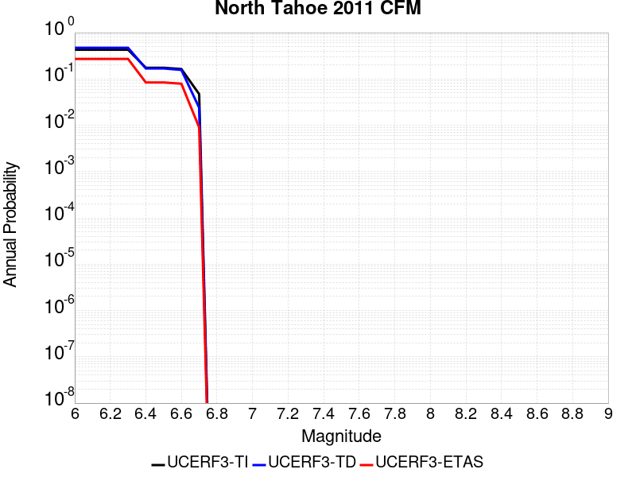 |
|-----|

| Magnitude | UCERF3-TI Prob | UCERF3-TD Prob | UCERF3-ETAS Prob |
|-----|-----|-----|-----|
| 6.0 | 0.42937768 | 0.47161537 | 0.32222223 |
| 6.1 | 0.42937768 | 0.47161537 | 0.32222223 |
| 6.2 | 0.42937768 | 0.47161537 | 0.32222223 |
| 6.3 | 0.42937768 | 0.47161537 | 0.32222223 |
| 6.4 | 0.17462832 | 0.16862406 | 0.1 |
| 6.5 | 0.17462832 | 0.16862406 | 0.1 |
| 6.6 | 0.16367269 | 0.15655743 | 0.094444446 |
| 6.7 | 0.04714669 | 0.023940327 | 0.011111111 |

## Northridge
*[(top)](#table-of-contents)*

| 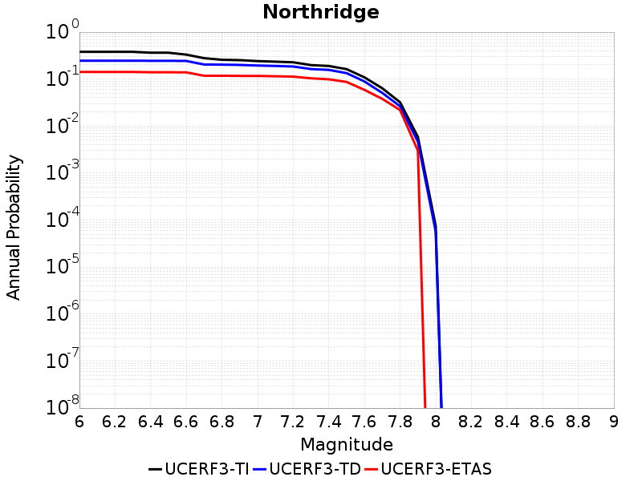 |
|-----|

| Magnitude | UCERF3-TI Prob | UCERF3-TD Prob | UCERF3-ETAS Prob |
|-----|-----|-----|-----|
| 6.0 | 0.3802903 | 0.2462946 | 0.13333334 |
| 6.1 | 0.3802903 | 0.2462946 | 0.13333334 |
| 6.2 | 0.3802903 | 0.2462946 | 0.13333334 |
| 6.3 | 0.3802903 | 0.2462946 | 0.13333334 |
| 6.4 | 0.36425853 | 0.24529214 | 0.13333334 |
| 6.5 | 0.36425853 | 0.24529214 | 0.13333334 |
| 6.6 | 0.33188605 | 0.2432429 | 0.13333334 |
| 6.7 | 0.27900213 | 0.20468189 | 0.12222222 |
| 6.8 | 0.25800553 | 0.20298336 | 0.12222222 |
| 6.9 | 0.25347728 | 0.20051739 | 0.12222222 |
| 7.0 | 0.24180964 | 0.19451723 | 0.12222222 |
| 7.1 | 0.23498477 | 0.19054246 | 0.12222222 |
| 7.2 | 0.22788157 | 0.18539903 | 0.12222222 |
| 7.3 | 0.19880714 | 0.16358033 | 0.12222222 |
| 7.4 | 0.1901655 | 0.15714316 | 0.11666667 |
| 7.5 | 0.16304377 | 0.13392301 | 0.10555556 |
| 7.6 | 0.10897063 | 0.08913875 | 0.06111111 |
| 7.7 | 0.06386755 | 0.050865557 | 0.055555556 |
| 7.8 | 0.0321062 | 0.026424384 | 0.027777778 |
| 7.9 | 0.005884534 | 0.004664316 | 0.0 |
| 8.0 | 7.4752454E-5 | 5.6648503E-5 | 0.0 |

## Northridge Hills
*[(top)](#table-of-contents)*

| 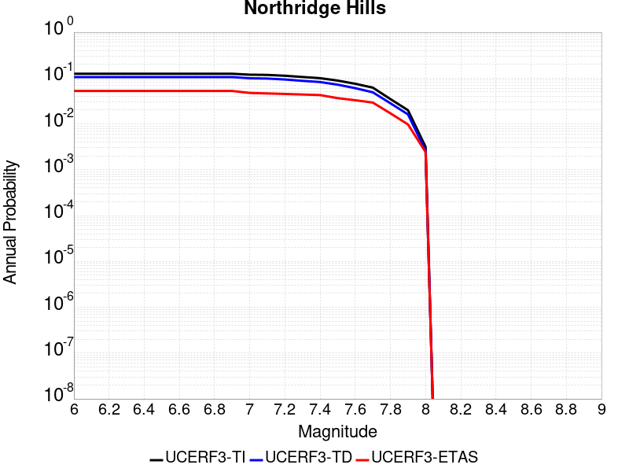 |
|-----|

| Magnitude | UCERF3-TI Prob | UCERF3-TD Prob | UCERF3-ETAS Prob |
|-----|-----|-----|-----|
| 6.0 | 0.12449189 | 0.10538544 | 0.06666667 |
| 6.1 | 0.12449189 | 0.10538544 | 0.06666667 |
| 6.2 | 0.12449189 | 0.10538544 | 0.06666667 |
| 6.3 | 0.12449189 | 0.10538544 | 0.06666667 |
| 6.4 | 0.12449189 | 0.10538544 | 0.06666667 |
| 6.5 | 0.12449189 | 0.10538544 | 0.06666667 |
| 6.6 | 0.12449189 | 0.10538544 | 0.06666667 |
| 6.7 | 0.12449189 | 0.10538544 | 0.06666667 |
| 6.8 | 0.12449189 | 0.10538544 | 0.06666667 |
| 6.9 | 0.12445269 | 0.10534386 | 0.06666667 |
| 7.0 | 0.1188815 | 0.09937461 | 0.06666667 |
| 7.1 | 0.11749926 | 0.09792082 | 0.06666667 |
| 7.2 | 0.11262824 | 0.09327805 | 0.06666667 |
| 7.3 | 0.10588859 | 0.08728387 | 0.06666667 |
| 7.4 | 0.09970685 | 0.082161605 | 0.06111111 |
| 7.5 | 0.08840312 | 0.07200308 | 0.06111111 |
| 7.6 | 0.07526075 | 0.060382962 | 0.05 |
| 7.7 | 0.062023733 | 0.049001683 | 0.05 |
| 7.8 | 0.0349176 | 0.028285395 | 0.033333335 |
| 7.9 | 0.019930825 | 0.016165406 | 0.011111111 |
| 8.0 | 0.0031564322 | 0.002599952 | 0.0 |

## Oak Ridge (Onshore)
*[(top)](#table-of-contents)*

| 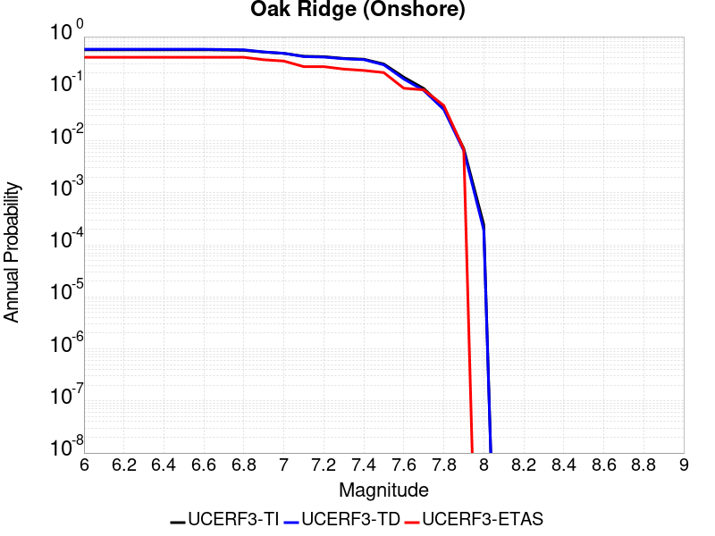 |
|-----|

| Magnitude | UCERF3-TI Prob | UCERF3-TD Prob | UCERF3-ETAS Prob |
|-----|-----|-----|-----|
| 6.0 | 0.56095207 | 0.5728253 | 0.42222223 |
| 6.1 | 0.56095207 | 0.5728253 | 0.42222223 |
| 6.2 | 0.56095207 | 0.5728253 | 0.42222223 |
| 6.3 | 0.56095207 | 0.5728253 | 0.42222223 |
| 6.4 | 0.56095207 | 0.5728253 | 0.42222223 |
| 6.5 | 0.56095207 | 0.5728253 | 0.42222223 |
| 6.6 | 0.56095207 | 0.5728253 | 0.42222223 |
| 6.7 | 0.55447084 | 0.56600994 | 0.4 |
| 6.8 | 0.54816014 | 0.5590793 | 0.39444444 |
| 6.9 | 0.50533754 | 0.51007515 | 0.33333334 |
| 7.0 | 0.47767943 | 0.47914052 | 0.29444444 |
| 7.1 | 0.42100143 | 0.41374385 | 0.23333333 |
| 7.2 | 0.4133078 | 0.40529662 | 0.22777778 |
| 7.3 | 0.38226742 | 0.37673876 | 0.21666667 |
| 7.4 | 0.3687128 | 0.3618784 | 0.2 |
| 7.5 | 0.2986055 | 0.28786632 | 0.17222223 |
| 7.6 | 0.1666799 | 0.15360333 | 0.07777778 |
| 7.7 | 0.1010318 | 0.092396885 | 0.06111111 |
| 7.8 | 0.043441582 | 0.039830588 | 0.03888889 |
| 7.9 | 0.0070743407 | 0.006432067 | 0.0 |
| 8.0 | 2.442769E-4 | 1.9441596E-4 | 0.0 |

## Oceanic - West Huasna
*[(top)](#table-of-contents)*

| 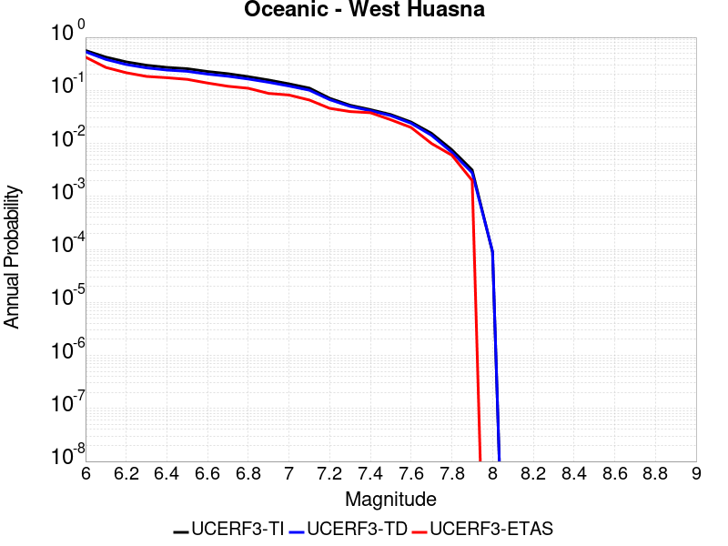 |
|-----|

| Magnitude | UCERF3-TI Prob | UCERF3-TD Prob | UCERF3-ETAS Prob |
|-----|-----|-----|-----|
| 6.0 | 0.56556714 | 0.5349119 | 0.40555555 |
| 6.1 | 0.42418635 | 0.38414675 | 0.21666667 |
| 6.2 | 0.34460846 | 0.3079048 | 0.17777778 |
| 6.3 | 0.29795375 | 0.2657855 | 0.15 |
| 6.4 | 0.2711011 | 0.24188289 | 0.1388889 |
| 6.5 | 0.25632128 | 0.22882292 | 0.12777779 |
| 6.6 | 0.2266291 | 0.2027533 | 0.12777779 |
| 6.7 | 0.20629561 | 0.1848064 | 0.11111111 |
| 6.8 | 0.18138474 | 0.16375518 | 0.11111111 |
| 6.9 | 0.15674151 | 0.14206572 | 0.1 |
| 7.0 | 0.13277912 | 0.12083304 | 0.08888889 |
| 7.1 | 0.11036651 | 0.100800216 | 0.06666667 |
| 7.2 | 0.07097205 | 0.066747345 | 0.03888889 |
| 7.3 | 0.052435953 | 0.04988662 | 0.03888889 |
| 7.4 | 0.043333665 | 0.04136904 | 0.03888889 |
| 7.5 | 0.034954246 | 0.03337611 | 0.022222223 |
| 7.6 | 0.025251048 | 0.023917532 | 0.016666668 |
| 7.7 | 0.015496228 | 0.01421367 | 0.0055555557 |
| 7.8 | 0.0075864913 | 0.0067926687 | 0.0055555557 |
| 7.9 | 0.0031408628 | 0.0027834051 | 0.0 |
| 8.0 | 8.819456E-5 | 9.130189E-5 | 0.0 |

## Oceanside alt1
*[(top)](#table-of-contents)*

| 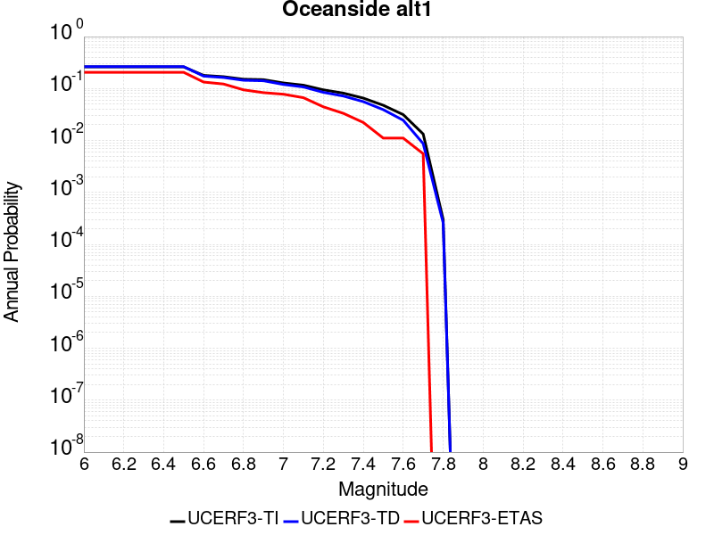 |
|-----|

| Magnitude | UCERF3-TI Prob | UCERF3-TD Prob | UCERF3-ETAS Prob |
|-----|-----|-----|-----|
| 6.0 | 0.26147115 | 0.26406154 | 0.20555556 |
| 6.1 | 0.26147115 | 0.26406154 | 0.20555556 |
| 6.2 | 0.26147115 | 0.26406154 | 0.20555556 |
| 6.3 | 0.26147115 | 0.26406154 | 0.20555556 |
| 6.4 | 0.26147115 | 0.26406154 | 0.20555556 |
| 6.5 | 0.26147115 | 0.26406154 | 0.20555556 |
| 6.6 | 0.1790408 | 0.17365065 | 0.13333334 |
| 6.7 | 0.16918302 | 0.16324367 | 0.12222222 |
| 6.8 | 0.1512462 | 0.14433405 | 0.094444446 |
| 6.9 | 0.14821443 | 0.14113946 | 0.083333336 |
| 7.0 | 0.12809058 | 0.119933866 | 0.07777778 |
| 7.1 | 0.11610967 | 0.107338935 | 0.06666667 |
| 7.2 | 0.0943798 | 0.08447463 | 0.044444446 |
| 7.3 | 0.081670046 | 0.07181437 | 0.033333335 |
| 7.4 | 0.06542925 | 0.05597712 | 0.022222223 |
| 7.5 | 0.04765477 | 0.039221793 | 0.011111111 |
| 7.6 | 0.03144597 | 0.02453473 | 0.011111111 |
| 7.7 | 0.013322236 | 0.008696558 | 0.0055555557 |
| 7.8 | 3.027386E-4 | 2.604207E-4 | 0.0 |

## Ortigalita (North)
*[(top)](#table-of-contents)*

| 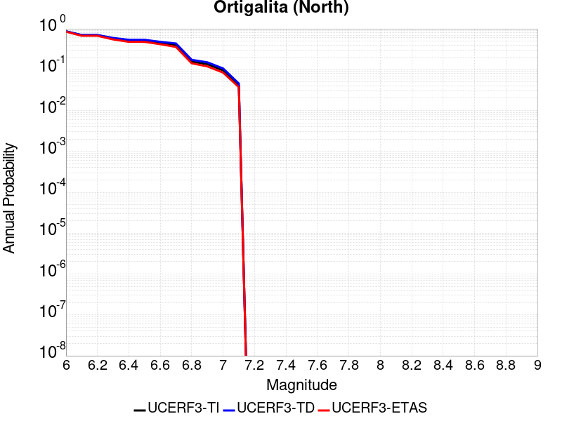 |
|-----|

| Magnitude | UCERF3-TI Prob | UCERF3-TD Prob | UCERF3-ETAS Prob |
|-----|-----|-----|-----|
| 6.0 | 0.86628586 | 0.87054116 | 0.87222224 |
| 6.1 | 0.6994632 | 0.70552015 | 0.6888889 |
| 6.2 | 0.6994632 | 0.70552015 | 0.6888889 |
| 6.3 | 0.58025813 | 0.5979556 | 0.5555556 |
| 6.4 | 0.51496357 | 0.53906804 | 0.49444443 |
| 6.5 | 0.51442176 | 0.53851277 | 0.49444443 |
| 6.6 | 0.45089078 | 0.48134747 | 0.42222223 |
| 6.7 | 0.40455094 | 0.43782374 | 0.34444445 |
| 6.8 | 0.15739068 | 0.17441854 | 0.15555556 |
| 6.9 | 0.13642415 | 0.15150513 | 0.12777779 |
| 7.0 | 0.09616783 | 0.10718922 | 0.08888889 |
| 7.1 | 0.040928528 | 0.04581024 | 0.022222223 |

## Ortigalita (South)
*[(top)](#table-of-contents)*

| 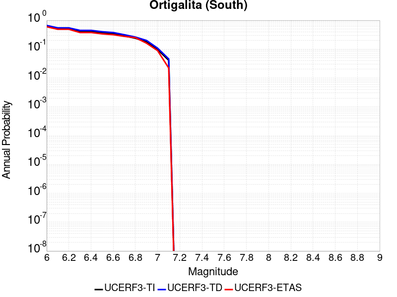 |
|-----|

| Magnitude | UCERF3-TI Prob | UCERF3-TD Prob | UCERF3-ETAS Prob |
|-----|-----|-----|-----|
| 6.0 | 0.6215107 | 0.6659466 | 0.6 |
| 6.1 | 0.50945795 | 0.54853946 | 0.4888889 |
| 6.2 | 0.50945795 | 0.54853946 | 0.4888889 |
| 6.3 | 0.41494375 | 0.4490603 | 0.37777779 |
| 6.4 | 0.41494375 | 0.4490603 | 0.37777779 |
| 6.5 | 0.37114903 | 0.40336686 | 0.33888888 |
| 6.6 | 0.34592536 | 0.37712613 | 0.31666666 |
| 6.7 | 0.28858984 | 0.31698847 | 0.2777778 |
| 6.8 | 0.23818669 | 0.2628906 | 0.25 |
| 6.9 | 0.18071403 | 0.20048635 | 0.16111112 |
| 7.0 | 0.097210445 | 0.1083143 | 0.08888889 |
| 7.1 | 0.040928528 | 0.04581024 | 0.022222223 |

## Owens Valley
*[(top)](#table-of-contents)*

| 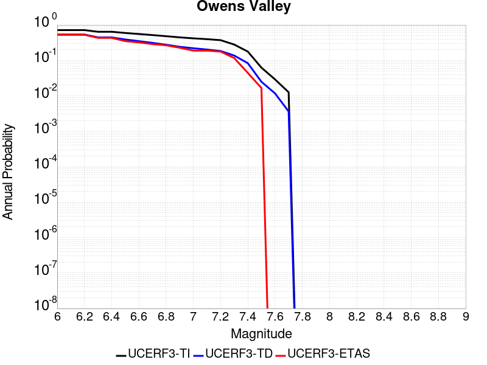 |
|-----|

| Magnitude | UCERF3-TI Prob | UCERF3-TD Prob | UCERF3-ETAS Prob |
|-----|-----|-----|-----|
| 6.0 | 0.7169934 | 0.53873456 | 0.5277778 |
| 6.1 | 0.7169934 | 0.53873456 | 0.5277778 |
| 6.2 | 0.7169934 | 0.53873456 | 0.5277778 |
| 6.3 | 0.6434682 | 0.44607124 | 0.43333334 |
| 6.4 | 0.6434682 | 0.44607124 | 0.43333334 |
| 6.5 | 0.5942473 | 0.3902488 | 0.35 |
| 6.6 | 0.5560813 | 0.34942666 | 0.32222223 |
| 6.7 | 0.5192013 | 0.31301296 | 0.2888889 |
| 6.8 | 0.48244452 | 0.2772285 | 0.26666668 |
| 6.9 | 0.44697532 | 0.24231976 | 0.22777778 |
| 7.0 | 0.4198878 | 0.22053403 | 0.18888889 |
| 7.1 | 0.3979548 | 0.20286135 | 0.18888889 |
| 7.2 | 0.37273374 | 0.18413334 | 0.17777778 |
| 7.3 | 0.28051114 | 0.13741809 | 0.11666667 |
| 7.4 | 0.17744736 | 0.08353385 | 0.044444446 |
| 7.5 | 0.062491756 | 0.02497574 | 0.016666668 |
| 7.6 | 0.029123643 | 0.011719347 | 0.0 |
| 7.7 | 0.012602747 | 0.0036174813 | 0.0 |

## Owens Valley Keough Hot Springs
*[(top)](#table-of-contents)*

| 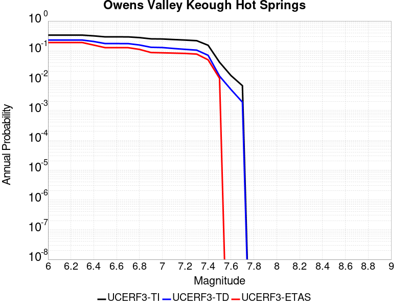 |
|-----|

| Magnitude | UCERF3-TI Prob | UCERF3-TD Prob | UCERF3-ETAS Prob |
|-----|-----|-----|-----|
| 6.0 | 0.33623528 | 0.22973615 | 0.21666667 |
| 6.1 | 0.33623528 | 0.22973615 | 0.21666667 |
| 6.2 | 0.33623528 | 0.22973615 | 0.21666667 |
| 6.3 | 0.33623528 | 0.22973615 | 0.21666667 |
| 6.4 | 0.31715924 | 0.20515968 | 0.18888889 |
| 6.5 | 0.2938423 | 0.17491578 | 0.16111112 |
| 6.6 | 0.29379308 | 0.17485465 | 0.16111112 |
| 6.7 | 0.29352325 | 0.1745606 | 0.16111112 |
| 6.8 | 0.27717465 | 0.15670678 | 0.13333334 |
| 6.9 | 0.25202653 | 0.13134812 | 0.1 |
| 7.0 | 0.2492033 | 0.1286238 | 0.1 |
| 7.1 | 0.23865554 | 0.119481504 | 0.1 |
| 7.2 | 0.22941767 | 0.1118245 | 0.1 |
| 7.3 | 0.21881695 | 0.105321996 | 0.094444446 |
| 7.4 | 0.15338978 | 0.07063877 | 0.044444446 |
| 7.5 | 0.041365582 | 0.014162448 | 0.016666668 |
| 7.6 | 0.014776949 | 0.0050187325 | 0.0 |
| 7.7 | 0.0067573637 | 0.0018970248 | 0.0 |

## Owl Lake
*[(top)](#table-of-contents)*

| 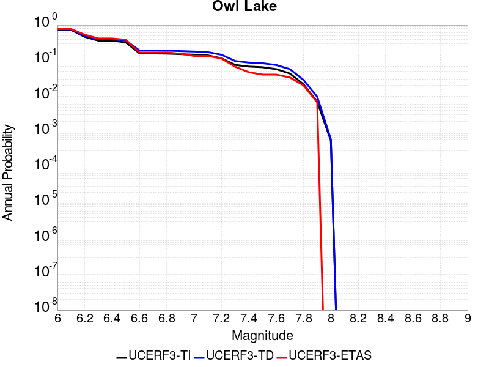 |
|-----|

| Magnitude | UCERF3-TI Prob | UCERF3-TD Prob | UCERF3-ETAS Prob |
|-----|-----|-----|-----|
| 6.0 | 0.73095125 | 0.76536053 | 0.8055556 |
| 6.1 | 0.73095125 | 0.76536053 | 0.8055556 |
| 6.2 | 0.46710685 | 0.5001134 | 0.56666666 |
| 6.3 | 0.36544487 | 0.40318835 | 0.42222223 |
| 6.4 | 0.36544487 | 0.40318835 | 0.42222223 |
| 6.5 | 0.32706726 | 0.3677252 | 0.4 |
| 6.6 | 0.16096875 | 0.19476424 | 0.2 |
| 6.7 | 0.15999798 | 0.19378151 | 0.2 |
| 6.8 | 0.15768631 | 0.19133861 | 0.2 |
| 6.9 | 0.15296866 | 0.18631068 | 0.2 |
| 7.0 | 0.14788908 | 0.18085665 | 0.19444445 |
| 7.1 | 0.14138806 | 0.17383301 | 0.19444445 |
| 7.2 | 0.117054075 | 0.1472068 | 0.1388889 |
| 7.3 | 0.07647671 | 0.09840016 | 0.07777778 |
| 7.4 | 0.06865884 | 0.088765666 | 0.03888889 |
| 7.5 | 0.06580321 | 0.08518574 | 0.033333335 |
| 7.6 | 0.05826209 | 0.07586934 | 0.033333335 |
| 7.7 | 0.043842636 | 0.058238395 | 0.027777778 |
| 7.8 | 0.021833045 | 0.028918881 | 0.022222223 |
| 7.9 | 0.007062717 | 0.009755177 | 0.011111111 |
| 8.0 | 5.736804E-4 | 6.287796E-4 | 0.0 |

## Ozena
*[(top)](#table-of-contents)*

| 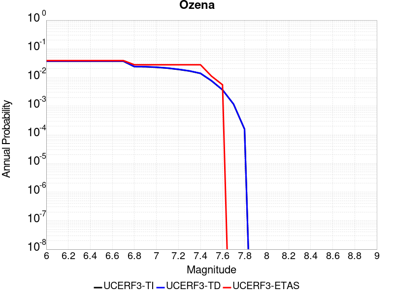 |
|-----|

| Magnitude | UCERF3-TI Prob | UCERF3-TD Prob | UCERF3-ETAS Prob |
|-----|-----|-----|-----|
| 6.0 | 0.036815234 | 0.03721106 | 0.03888889 |
| 6.1 | 0.036815234 | 0.03721106 | 0.03888889 |
| 6.2 | 0.036815234 | 0.03721106 | 0.03888889 |
| 6.3 | 0.036815234 | 0.03721106 | 0.03888889 |
| 6.4 | 0.036815234 | 0.03721106 | 0.03888889 |
| 6.5 | 0.036815234 | 0.03721106 | 0.03888889 |
| 6.6 | 0.036815234 | 0.03721106 | 0.03888889 |
| 6.7 | 0.036815234 | 0.03721106 | 0.03888889 |
| 6.8 | 0.023775628 | 0.024014233 | 0.027777778 |
| 6.9 | 0.023567416 | 0.023804821 | 0.027777778 |
| 7.0 | 0.022614546 | 0.02284486 | 0.027777778 |
| 7.1 | 0.021164484 | 0.021382637 | 0.027777778 |
| 7.2 | 0.01908777 | 0.019284528 | 0.027777778 |
| 7.3 | 0.016789455 | 0.01696337 | 0.027777778 |
| 7.4 | 0.013852415 | 0.013996089 | 0.027777778 |
| 7.5 | 0.007639162 | 0.0077105393 | 0.011111111 |
| 7.6 | 0.0036853238 | 0.0037105042 | 0.0055555557 |
| 7.7 | 0.0011722236 | 0.0011795266 | 0.0 |
| 7.8 | 1.5650586E-4 | 1.5754641E-4 | 0.0 |

## Palos Verdes
*[(top)](#table-of-contents)*

| 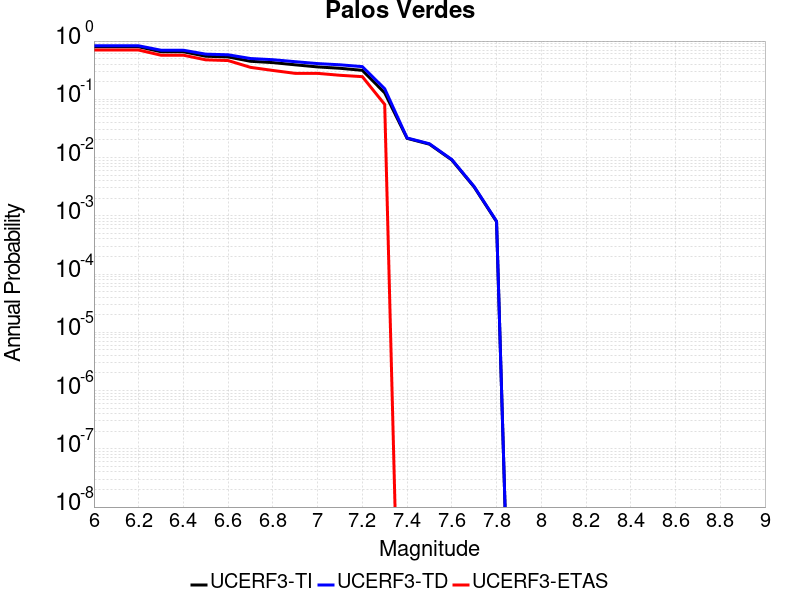 |
|-----|

| Magnitude | UCERF3-TI Prob | UCERF3-TD Prob | UCERF3-ETAS Prob |
|-----|-----|-----|-----|
| 6.0 | 0.79775894 | 0.8291306 | 0.6166667 |
| 6.1 | 0.79775894 | 0.8291306 | 0.6166667 |
| 6.2 | 0.79775894 | 0.8291306 | 0.6166667 |
| 6.3 | 0.6554297 | 0.69595045 | 0.4888889 |
| 6.4 | 0.6554297 | 0.69595045 | 0.4888889 |
| 6.5 | 0.548892 | 0.59623396 | 0.3888889 |
| 6.6 | 0.5338536 | 0.58125055 | 0.36666667 |
| 6.7 | 0.44938555 | 0.50128585 | 0.2777778 |
| 6.8 | 0.42671937 | 0.47848937 | 0.26666668 |
| 6.9 | 0.3910056 | 0.44245327 | 0.23888889 |
| 7.0 | 0.35987434 | 0.41058177 | 0.23333333 |
| 7.1 | 0.3409677 | 0.39128706 | 0.22222222 |
| 7.2 | 0.31440112 | 0.3639723 | 0.19444445 |
| 7.3 | 0.1288722 | 0.15179834 | 0.055555556 |
| 7.4 | 0.021369152 | 0.021700203 | 0.0 |
| 7.5 | 0.016968522 | 0.0172475 | 0.0 |
| 7.6 | 0.009094592 | 0.009254434 | 0.0 |
| 7.7 | 0.0031222047 | 0.0031746076 | 0.0 |
| 7.8 | 7.939731E-4 | 8.084138E-4 | 0.0 |

## Panamint Valley
*[(top)](#table-of-contents)*

| 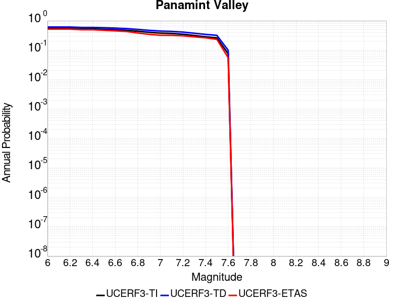 |
|-----|

| Magnitude | UCERF3-TI Prob | UCERF3-TD Prob | UCERF3-ETAS Prob |
|-----|-----|-----|-----|
| 6.0 | 0.5453453 | 0.6107703 | 0.54444444 |
| 6.1 | 0.5453453 | 0.6107703 | 0.54444444 |
| 6.2 | 0.5453453 | 0.6107703 | 0.54444444 |
| 6.3 | 0.5254954 | 0.59200716 | 0.5277778 |
| 6.4 | 0.5254954 | 0.59200716 | 0.5277778 |
| 6.5 | 0.5116147 | 0.57876647 | 0.51111114 |
| 6.6 | 0.49433336 | 0.5622035 | 0.47777778 |
| 6.7 | 0.47226584 | 0.54071087 | 0.4611111 |
| 6.8 | 0.4402948 | 0.507834 | 0.41111112 |
| 6.9 | 0.40503415 | 0.47093126 | 0.36666667 |
| 7.0 | 0.3805009 | 0.445262 | 0.33333334 |
| 7.1 | 0.36930946 | 0.43370333 | 0.33333334 |
| 7.2 | 0.34778935 | 0.4114315 | 0.32222223 |
| 7.3 | 0.31533936 | 0.3758868 | 0.2888889 |
| 7.4 | 0.28488302 | 0.34337285 | 0.27222222 |
| 7.5 | 0.26186237 | 0.31865537 | 0.23888889 |
| 7.6 | 0.07544772 | 0.09918005 | 0.05 |

## Paradise
*[(top)](#table-of-contents)*

| 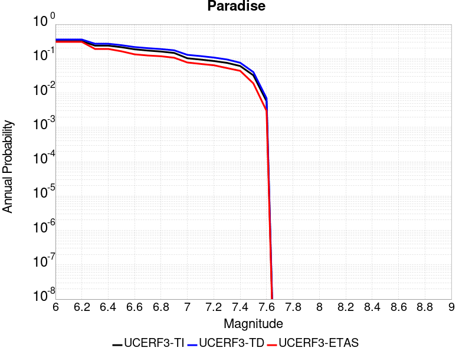 |
|-----|

| Magnitude | UCERF3-TI Prob | UCERF3-TD Prob | UCERF3-ETAS Prob |
|-----|-----|-----|-----|
| 6.0 | 0.32122254 | 0.35890785 | 0.29444444 |
| 6.1 | 0.32122254 | 0.35890785 | 0.29444444 |
| 6.2 | 0.32122254 | 0.35890785 | 0.29444444 |
| 6.3 | 0.23816858 | 0.27040336 | 0.17777778 |
| 6.4 | 0.23816858 | 0.27040336 | 0.17777778 |
| 6.5 | 0.21442084 | 0.24580146 | 0.14444445 |
| 6.6 | 0.18634407 | 0.2165831 | 0.12222222 |
| 6.7 | 0.17138958 | 0.20110531 | 0.11111111 |
| 6.8 | 0.16026174 | 0.18925987 | 0.1 |
| 6.9 | 0.14583817 | 0.17409909 | 0.094444446 |
| 7.0 | 0.10224287 | 0.12843947 | 0.05 |
| 7.1 | 0.093615144 | 0.11826315 | 0.05 |
| 7.2 | 0.08503933 | 0.107260674 | 0.05 |
| 7.3 | 0.075126424 | 0.09426649 | 0.044444446 |
| 7.4 | 0.060816385 | 0.075770125 | 0.044444446 |
| 7.5 | 0.032615982 | 0.040474482 | 0.016666668 |
| 7.6 | 0.0057536047 | 0.0069986656 | 0.0055555557 |

## Peralta Hills
*[(top)](#table-of-contents)*

| 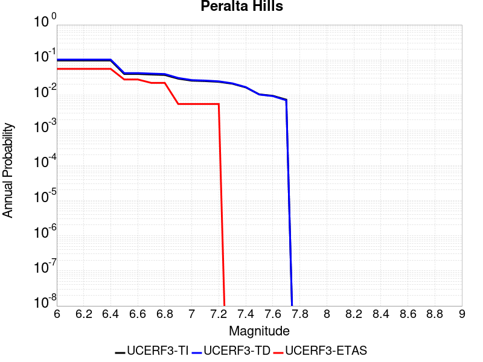 |
|-----|

| Magnitude | UCERF3-TI Prob | UCERF3-TD Prob | UCERF3-ETAS Prob |
|-----|-----|-----|-----|
| 6.0 | 0.09638984 | 0.10207553 | 0.055555556 |
| 6.1 | 0.09638984 | 0.10207553 | 0.055555556 |
| 6.2 | 0.09638984 | 0.10207553 | 0.055555556 |
| 6.3 | 0.09638984 | 0.10207553 | 0.055555556 |
| 6.4 | 0.09638984 | 0.10207553 | 0.055555556 |
| 6.5 | 0.03985163 | 0.042292167 | 0.027777778 |
| 6.6 | 0.03985163 | 0.042292167 | 0.027777778 |
| 6.7 | 0.038424727 | 0.040809613 | 0.022222223 |
| 6.8 | 0.037334673 | 0.03967116 | 0.022222223 |
| 6.9 | 0.02925928 | 0.030662421 | 0.0055555557 |
| 7.0 | 0.025676709 | 0.026687862 | 0.0055555557 |
| 7.1 | 0.024949519 | 0.025878038 | 0.0055555557 |
| 7.2 | 0.023820337 | 0.024615452 | 0.0055555557 |
| 7.3 | 0.021060392 | 0.021569466 | 0.0 |
| 7.4 | 0.016513065 | 0.016856134 | 0.0 |
| 7.5 | 0.010457003 | 0.010335261 | 0.0 |
| 7.6 | 0.009536811 | 0.0093422225 | 0.0 |
| 7.7 | 0.0073992815 | 0.0070963684 | 0.0 |

## Pilarcitos 2011 CFM
*[(top)](#table-of-contents)*

| 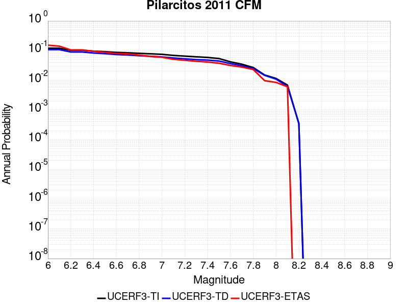 |
|-----|

| Magnitude | UCERF3-TI Prob | UCERF3-TD Prob | UCERF3-ETAS Prob |
|-----|-----|-----|-----|
| 6.0 | 0.12034932 | 0.10837029 | 0.11666667 |
| 6.1 | 0.12034932 | 0.10837029 | 0.11666667 |
| 6.2 | 0.10290434 | 0.090205155 | 0.08888889 |
| 6.3 | 0.10290434 | 0.090205155 | 0.08888889 |
| 6.4 | 0.09619853 | 0.08323378 | 0.083333336 |
| 6.5 | 0.09234231 | 0.07923197 | 0.07777778 |
| 6.6 | 0.08738375 | 0.07405566 | 0.06666667 |
| 6.7 | 0.08466506 | 0.071230896 | 0.06111111 |
| 6.8 | 0.08117872 | 0.06763567 | 0.055555556 |
| 6.9 | 0.078268014 | 0.06461084 | 0.055555556 |
| 7.0 | 0.07513891 | 0.061401527 | 0.055555556 |
| 7.1 | 0.06916249 | 0.056665536 | 0.044444446 |
| 7.2 | 0.065404184 | 0.053072196 | 0.03888889 |
| 7.3 | 0.061964534 | 0.05000357 | 0.03888889 |
| 7.4 | 0.05909899 | 0.048088893 | 0.033333335 |
| 7.5 | 0.054199185 | 0.044737067 | 0.027777778 |
| 7.6 | 0.041997634 | 0.036775786 | 0.027777778 |
| 7.7 | 0.034987677 | 0.031088619 | 0.027777778 |
| 7.8 | 0.027024478 | 0.024964124 | 0.022222223 |
| 7.9 | 0.015162882 | 0.014758381 | 0.011111111 |
| 8.0 | 0.01161178 | 0.010994379 | 0.011111111 |
| 8.1 | 0.0069397017 | 0.0062533547 | 0.0055555557 |
| 8.2 | 3.4428958E-4 | 3.5895765E-4 | 0.0 |

## Pine Mtn
*[(top)](#table-of-contents)*

| 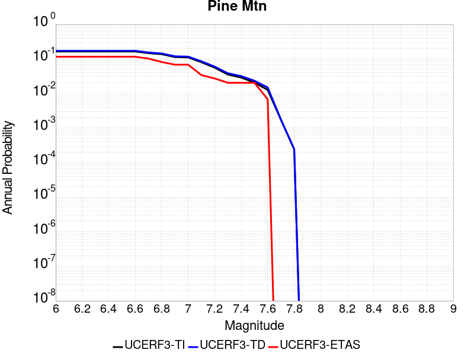 |
|-----|

| Magnitude | UCERF3-TI Prob | UCERF3-TD Prob | UCERF3-ETAS Prob |
|-----|-----|-----|-----|
| 6.0 | 0.16463035 | 0.17209063 | 0.15 |
| 6.1 | 0.16463035 | 0.17209063 | 0.15 |
| 6.2 | 0.16463035 | 0.17209063 | 0.15 |
| 6.3 | 0.16463035 | 0.17209063 | 0.15 |
| 6.4 | 0.16463035 | 0.17209063 | 0.15 |
| 6.5 | 0.16463035 | 0.17209063 | 0.15 |
| 6.6 | 0.16463035 | 0.17209063 | 0.15 |
| 6.7 | 0.14683351 | 0.15384501 | 0.1388889 |
| 6.8 | 0.13712397 | 0.14391308 | 0.13333334 |
| 6.9 | 0.11312454 | 0.11919091 | 0.11666667 |
| 7.0 | 0.110484585 | 0.11651525 | 0.11666667 |
| 7.1 | 0.08018965 | 0.08545311 | 0.072222225 |
| 7.2 | 0.05592965 | 0.05990121 | 0.06666667 |
| 7.3 | 0.03527526 | 0.03852952 | 0.055555556 |
| 7.4 | 0.028913744 | 0.031828888 | 0.055555556 |
| 7.5 | 0.020736082 | 0.023384832 | 0.044444446 |
| 7.6 | 0.012690396 | 0.014930205 | 0.022222223 |
| 7.7 | 0.001729404 | 0.0017675639 | 0.0 |
| 7.8 | 2.4092059E-4 | 2.4716655E-4 | 0.0 |

## Pinto Mtn
*[(top)](#table-of-contents)*

| 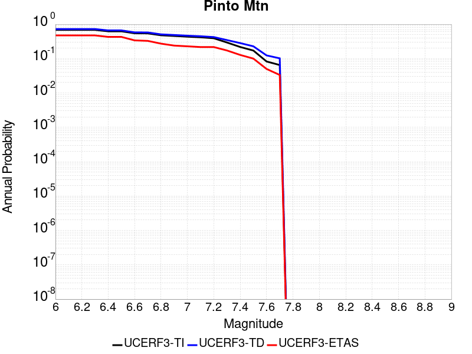 |
|-----|

| Magnitude | UCERF3-TI Prob | UCERF3-TD Prob | UCERF3-ETAS Prob |
|-----|-----|-----|-----|
| 6.0 | 0.68432444 | 0.7241877 | 0.4722222 |
| 6.1 | 0.68432444 | 0.7241877 | 0.4722222 |
| 6.2 | 0.68432444 | 0.7241877 | 0.4722222 |
| 6.3 | 0.68432444 | 0.7241877 | 0.4722222 |
| 6.4 | 0.62210166 | 0.6605281 | 0.42777777 |
| 6.5 | 0.62210166 | 0.6605281 | 0.42777777 |
| 6.6 | 0.5452589 | 0.58032864 | 0.33888888 |
| 6.7 | 0.5411258 | 0.5761548 | 0.32777777 |
| 6.8 | 0.47666693 | 0.5078359 | 0.27222222 |
| 6.9 | 0.45565972 | 0.48598245 | 0.23888889 |
| 7.0 | 0.43404245 | 0.46414715 | 0.22777778 |
| 7.1 | 0.41668698 | 0.44666696 | 0.21666667 |
| 7.2 | 0.3907011 | 0.42313477 | 0.21666667 |
| 7.3 | 0.29384866 | 0.345643 | 0.17222223 |
| 7.4 | 0.21777074 | 0.2825214 | 0.12777779 |
| 7.5 | 0.17147432 | 0.22776355 | 0.1 |
| 7.6 | 0.08240596 | 0.123804145 | 0.05 |
| 7.7 | 0.06495138 | 0.10174565 | 0.033333335 |

## Pisgah-Bullion Mtn-Mesquite Lk
*[(top)](#table-of-contents)*

| 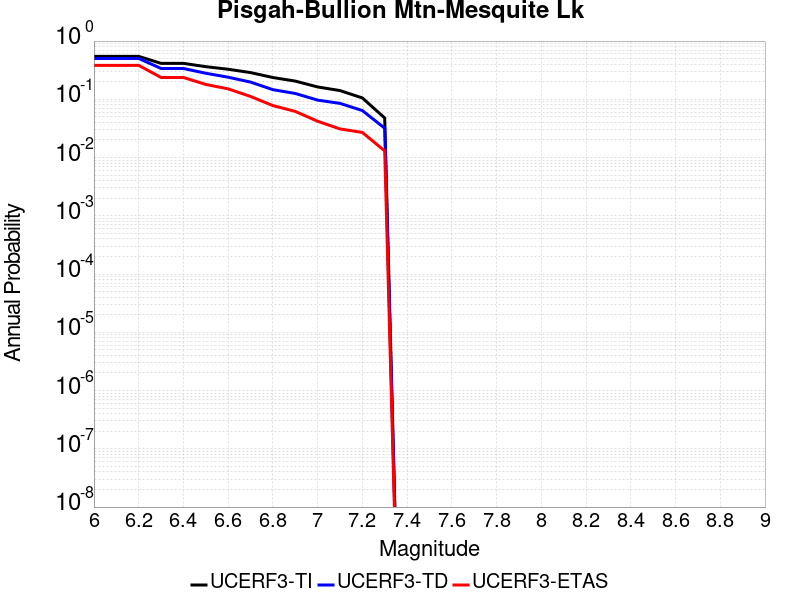 |
|-----|

| Magnitude | UCERF3-TI Prob | UCERF3-TD Prob | UCERF3-ETAS Prob |
|-----|-----|-----|-----|
| 6.0 | 0.5456887 | 0.50314474 | 0.41111112 |
| 6.1 | 0.5456887 | 0.50314474 | 0.41111112 |
| 6.2 | 0.5456887 | 0.50314474 | 0.41111112 |
| 6.3 | 0.4142073 | 0.3382668 | 0.23333333 |
| 6.4 | 0.4142073 | 0.3382668 | 0.23333333 |
| 6.5 | 0.3634999 | 0.28009227 | 0.17777778 |
| 6.6 | 0.3282659 | 0.23956895 | 0.15555556 |
| 6.7 | 0.28758577 | 0.19764769 | 0.11111111 |
| 6.8 | 0.23671684 | 0.14640558 | 0.083333336 |
| 6.9 | 0.20547493 | 0.12605499 | 0.044444446 |
| 7.0 | 0.16306894 | 0.09686996 | 0.03888889 |
| 7.1 | 0.14125559 | 0.08514525 | 0.033333335 |
| 7.2 | 0.105608396 | 0.064118624 | 0.033333335 |
| 7.3 | 0.04787365 | 0.031930298 | 0.027777778 |

## Pitas Point (Lower West)
*[(top)](#table-of-contents)*

| 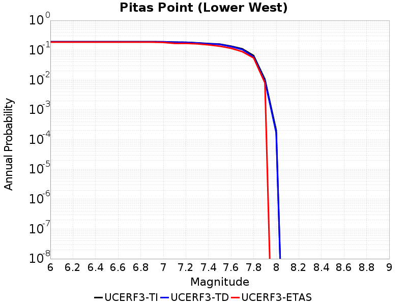 |
|-----|

| Magnitude | UCERF3-TI Prob | UCERF3-TD Prob | UCERF3-ETAS Prob |
|-----|-----|-----|-----|
| 6.0 | 0.1915752 | 0.19099423 | 0.18333334 |
| 6.1 | 0.1915752 | 0.19099423 | 0.18333334 |
| 6.2 | 0.1915752 | 0.19099423 | 0.18333334 |
| 6.3 | 0.1915752 | 0.19099423 | 0.18333334 |
| 6.4 | 0.1915752 | 0.19099423 | 0.18333334 |
| 6.5 | 0.1915752 | 0.19099423 | 0.18333334 |
| 6.6 | 0.1915752 | 0.19099423 | 0.18333334 |
| 6.7 | 0.1915752 | 0.19099423 | 0.18333334 |
| 6.8 | 0.1915752 | 0.19099423 | 0.18333334 |
| 6.9 | 0.1915752 | 0.19099423 | 0.18333334 |
| 7.0 | 0.19056298 | 0.18992874 | 0.17777778 |
| 7.1 | 0.1852612 | 0.18433212 | 0.17222223 |
| 7.2 | 0.18351218 | 0.18246934 | 0.17222223 |
| 7.3 | 0.1754511 | 0.17382595 | 0.16111112 |
| 7.4 | 0.16615124 | 0.16387405 | 0.15555556 |
| 7.5 | 0.15933299 | 0.15664251 | 0.1388889 |
| 7.6 | 0.1362297 | 0.13191025 | 0.11666667 |
| 7.7 | 0.11064952 | 0.105146274 | 0.083333336 |
| 7.8 | 0.06576774 | 0.0602284 | 0.05 |
| 7.9 | 0.010500169 | 0.009251257 | 0.0 |
| 8.0 | 2.0325146E-4 | 1.6884145E-4 | 0.0 |

## Pitas Point (Lower)-Montalvo
*[(top)](#table-of-contents)*

| 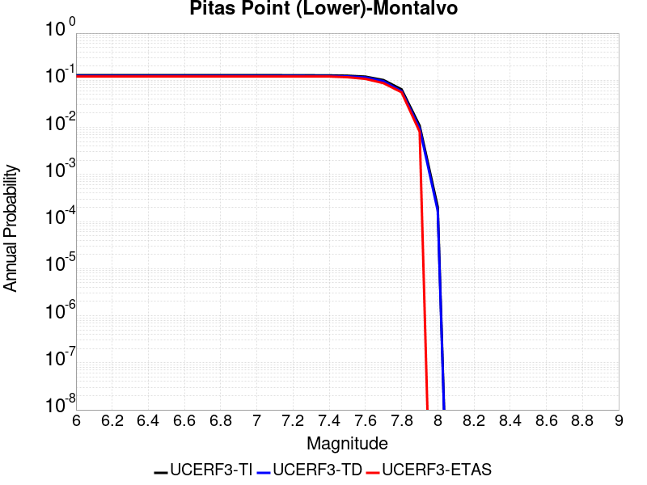 |
|-----|

| Magnitude | UCERF3-TI Prob | UCERF3-TD Prob | UCERF3-ETAS Prob |
|-----|-----|-----|-----|
| 6.0 | 0.12810211 | 0.12417636 | 0.12222222 |
| 6.1 | 0.12810211 | 0.12417636 | 0.12222222 |
| 6.2 | 0.12810211 | 0.12417636 | 0.12222222 |
| 6.3 | 0.12810211 | 0.12417636 | 0.12222222 |
| 6.4 | 0.12810211 | 0.12417636 | 0.12222222 |
| 6.5 | 0.12810211 | 0.12417636 | 0.12222222 |
| 6.6 | 0.12810211 | 0.12417636 | 0.12222222 |
| 6.7 | 0.12810211 | 0.12417636 | 0.12222222 |
| 6.8 | 0.12810211 | 0.12417636 | 0.12222222 |
| 6.9 | 0.12810211 | 0.12417636 | 0.12222222 |
| 7.0 | 0.12810211 | 0.12417636 | 0.12222222 |
| 7.1 | 0.12810211 | 0.12417636 | 0.12222222 |
| 7.2 | 0.12790887 | 0.12397463 | 0.12222222 |
| 7.3 | 0.12747146 | 0.12351657 | 0.12222222 |
| 7.4 | 0.12710698 | 0.123133555 | 0.12222222 |
| 7.5 | 0.12509972 | 0.1210272 | 0.12222222 |
| 7.6 | 0.1195377 | 0.115167804 | 0.11111111 |
| 7.7 | 0.101055734 | 0.09566011 | 0.083333336 |
| 7.8 | 0.06422986 | 0.058641683 | 0.055555556 |
| 7.9 | 0.010814364 | 0.009509553 | 0.0 |
| 8.0 | 2.0325146E-4 | 1.6884145E-4 | 0.0 |

## Pittville 2011 CFM
*[(top)](#table-of-contents)*

| 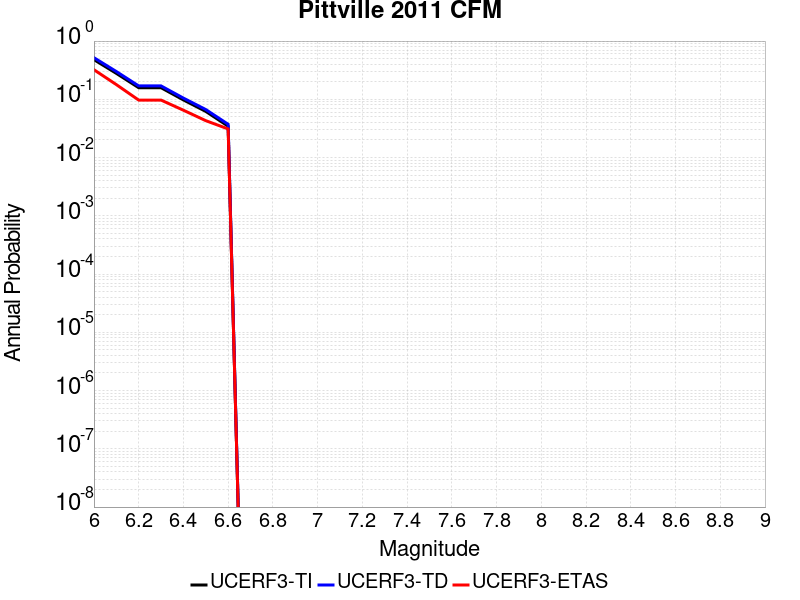 |
|-----|

| Magnitude | UCERF3-TI Prob | UCERF3-TD Prob | UCERF3-ETAS Prob |
|-----|-----|-----|-----|
| 6.0 | 0.47955486 | 0.51779723 | 0.29444444 |
| 6.1 | 0.27903497 | 0.3000124 | 0.18333334 |
| 6.2 | 0.15825133 | 0.16984768 | 0.10555556 |
| 6.3 | 0.15825133 | 0.16984768 | 0.10555556 |
| 6.4 | 0.09765949 | 0.10489926 | 0.06666667 |
| 6.5 | 0.061999794 | 0.06671353 | 0.03888889 |
| 6.6 | 0.03456312 | 0.037278913 | 0.027777778 |

## Pleito
*[(top)](#table-of-contents)*

| 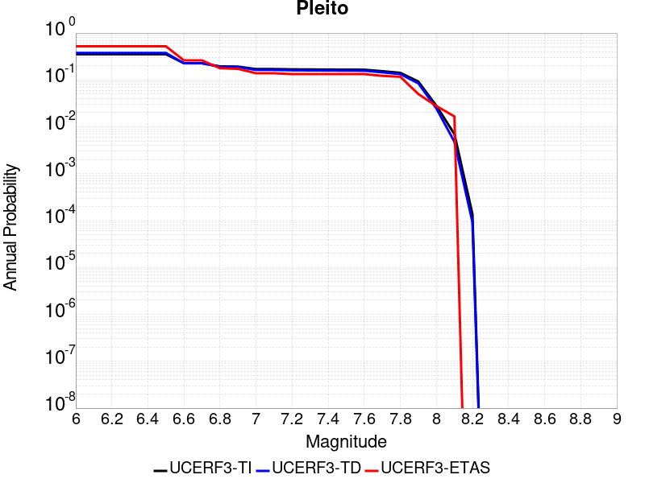 |
|-----|

| Magnitude | UCERF3-TI Prob | UCERF3-TD Prob | UCERF3-ETAS Prob |
|-----|-----|-----|-----|
| 6.0 | 0.35424724 | 0.37608078 | 0.5222222 |
| 6.1 | 0.35424724 | 0.37608078 | 0.5222222 |
| 6.2 | 0.35424724 | 0.37608078 | 0.5222222 |
| 6.3 | 0.35424724 | 0.37608078 | 0.5222222 |
| 6.4 | 0.35424724 | 0.37608078 | 0.5222222 |
| 6.5 | 0.35424724 | 0.37608078 | 0.5222222 |
| 6.6 | 0.22783086 | 0.22651707 | 0.2611111 |
| 6.7 | 0.22783086 | 0.22651707 | 0.2611111 |
| 6.8 | 0.19470467 | 0.19024715 | 0.17777778 |
| 6.9 | 0.19224177 | 0.18753333 | 0.17222223 |
| 7.0 | 0.17071238 | 0.16329534 | 0.1388889 |
| 7.1 | 0.17054573 | 0.16308743 | 0.1388889 |
| 7.2 | 0.16833086 | 0.16066077 | 0.13333334 |
| 7.3 | 0.16737242 | 0.15960404 | 0.13333334 |
| 7.4 | 0.16664061 | 0.15880226 | 0.13333334 |
| 7.5 | 0.16582073 | 0.15788285 | 0.13333334 |
| 7.6 | 0.16533057 | 0.15732525 | 0.13333334 |
| 7.7 | 0.1536854 | 0.14535 | 0.12222222 |
| 7.8 | 0.14191446 | 0.13305552 | 0.11666667 |
| 7.9 | 0.09241446 | 0.084537655 | 0.05 |
| 8.0 | 0.028046543 | 0.024647387 | 0.027777778 |
| 8.1 | 0.0069920467 | 0.004797505 | 0.016666668 |
| 8.2 | 1.3817761E-4 | 9.1694696E-5 | 0.0 |

## Point Reyes 2011 CFM
*[(top)](#table-of-contents)*

| 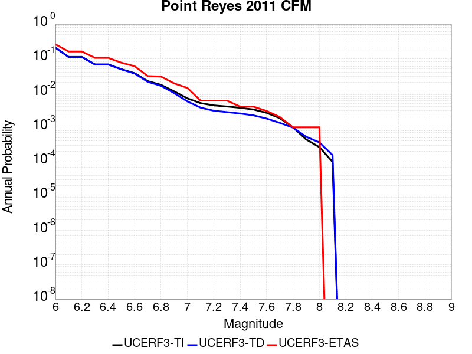 |
|-----|

| Magnitude | UCERF3-TI Prob | UCERF3-TD Prob | UCERF3-ETAS Prob |
|-----|-----|-----|-----|
| 6.0 | 0.20647435 | 0.21013437 | 0.2 |
| 6.1 | 0.11138476 | 0.112220675 | 0.10555556 |
| 6.2 | 0.11138476 | 0.112220675 | 0.10555556 |
| 6.3 | 0.06763396 | 0.06745619 | 0.06666667 |
| 6.4 | 0.06763396 | 0.06745619 | 0.06666667 |
| 6.5 | 0.049060635 | 0.048521638 | 0.06111111 |
| 6.6 | 0.03769228 | 0.036943037 | 0.044444446 |
| 6.7 | 0.022116313 | 0.021085164 | 0.0055555557 |
| 6.8 | 0.017262675 | 0.016146591 | 0.0055555557 |
| 6.9 | 0.011133829 | 0.009909474 | 0.0055555557 |
| 7.0 | 0.006970861 | 0.0056801173 | 0.0 |
| 7.1 | 0.005061833 | 0.0037436797 | 0.0 |
| 7.2 | 0.004351367 | 0.0030450805 | 0.0 |
| 7.3 | 0.0040364987 | 0.0027733042 | 0.0 |
| 7.4 | 0.0037112408 | 0.002526595 | 0.0 |
| 7.5 | 0.003310505 | 0.0022333963 | 0.0 |
| 7.6 | 0.0026431826 | 0.001801043 | 0.0 |
| 7.7 | 0.001848158 | 0.001350478 | 0.0 |
| 7.8 | 0.0010094597 | 9.810477E-4 | 0.0 |
| 7.9 | 4.452132E-4 | 5.3244084E-4 | 0.0 |
| 8.0 | 2.6536043E-4 | 3.6537673E-4 | 0.0 |
| 8.1 | 9.8772405E-5 | 1.5555069E-4 | 0.0 |

## Point Reyes 2011 connector
*[(top)](#table-of-contents)*

| 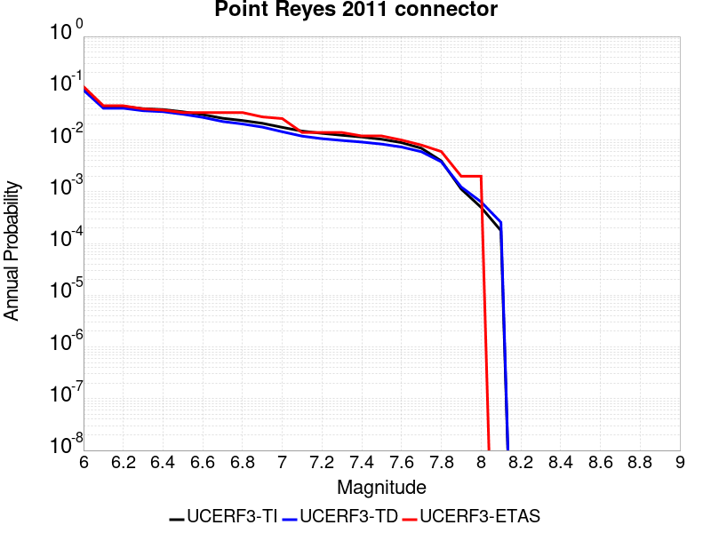 |
|-----|

| Magnitude | UCERF3-TI Prob | UCERF3-TD Prob | UCERF3-ETAS Prob |
|-----|-----|-----|-----|
| 6.0 | 0.09413087 | 0.09194223 | 0.07777778 |
| 6.1 | 0.044503998 | 0.041061647 | 0.0055555557 |
| 6.2 | 0.044503998 | 0.041061647 | 0.0055555557 |
| 6.3 | 0.040230766 | 0.036728367 | 0.0055555557 |
| 6.4 | 0.03872554 | 0.035203356 | 0.0055555557 |
| 6.5 | 0.035017524 | 0.03142923 | 0.0055555557 |
| 6.6 | 0.030879568 | 0.027347744 | 0.0055555557 |
| 6.7 | 0.026247041 | 0.02272914 | 0.0055555557 |
| 6.8 | 0.02374774 | 0.020381156 | 0.0055555557 |
| 6.9 | 0.020988787 | 0.017727008 | 0.0055555557 |
| 7.0 | 0.017515935 | 0.014410822 | 0.0055555557 |
| 7.1 | 0.014832685 | 0.011852233 | 0.0055555557 |
| 7.2 | 0.013437603 | 0.010581182 | 0.0055555557 |
| 7.3 | 0.012341672 | 0.009785233 | 0.0055555557 |
| 7.4 | 0.011410401 | 0.009106807 | 0.0055555557 |
| 7.5 | 0.010329954 | 0.008325211 | 0.0055555557 |
| 7.6 | 0.00887985 | 0.0073077683 | 0.0055555557 |
| 7.7 | 0.0069186897 | 0.005924647 | 0.0 |
| 7.8 | 0.003933572 | 0.0037792462 | 0.0 |
| 7.9 | 0.0011271574 | 0.0012352073 | 0.0 |
| 8.0 | 4.9948314E-4 | 6.373092E-4 | 0.0 |
| 8.1 | 1.7685097E-4 | 2.557386E-4 | 0.0 |

## Polaris 2011 CFM
*[(top)](#table-of-contents)*

| 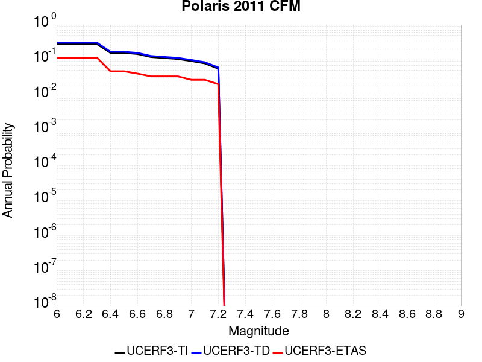 |
|-----|

| Magnitude | UCERF3-TI Prob | UCERF3-TD Prob | UCERF3-ETAS Prob |
|-----|-----|-----|-----|
| 6.0 | 0.2807392 | 0.3078482 | 0.18888889 |
| 6.1 | 0.2807392 | 0.3078482 | 0.18888889 |
| 6.2 | 0.2807392 | 0.3078482 | 0.18888889 |
| 6.3 | 0.2807392 | 0.3078482 | 0.18888889 |
| 6.4 | 0.15912439 | 0.16983195 | 0.094444446 |
| 6.5 | 0.15912439 | 0.16983195 | 0.094444446 |
| 6.6 | 0.14776422 | 0.15779075 | 0.083333336 |
| 6.7 | 0.121093 | 0.12932806 | 0.083333336 |
| 6.8 | 0.11346886 | 0.12128536 | 0.07777778 |
| 6.9 | 0.106594674 | 0.11403252 | 0.06666667 |
| 7.0 | 0.09292298 | 0.09955312 | 0.03888889 |
| 7.1 | 0.07994171 | 0.08578859 | 0.03888889 |
| 7.2 | 0.05665881 | 0.061011523 | 0.033333335 |

## Puente Hills
*[(top)](#table-of-contents)*

| 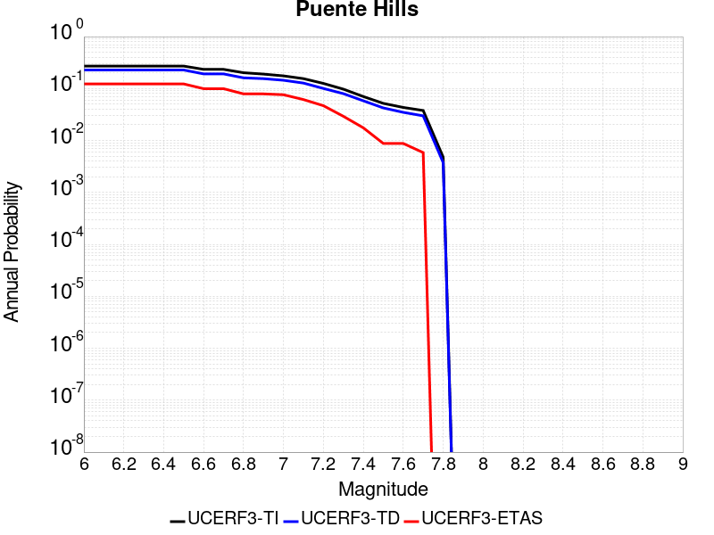 |
|-----|

| Magnitude | UCERF3-TI Prob | UCERF3-TD Prob | UCERF3-ETAS Prob |
|-----|-----|-----|-----|
| 6.0 | 0.27074036 | 0.227771 | 0.10555556 |
| 6.1 | 0.27074036 | 0.227771 | 0.10555556 |
| 6.2 | 0.27074036 | 0.227771 | 0.10555556 |
| 6.3 | 0.27074036 | 0.227771 | 0.10555556 |
| 6.4 | 0.27074036 | 0.227771 | 0.10555556 |
| 6.5 | 0.27074036 | 0.227771 | 0.10555556 |
| 6.6 | 0.23409624 | 0.19142516 | 0.083333336 |
| 6.7 | 0.23409624 | 0.19142516 | 0.083333336 |
| 6.8 | 0.20174606 | 0.16074191 | 0.072222225 |
| 6.9 | 0.1897801 | 0.15514201 | 0.072222225 |
| 7.0 | 0.17543592 | 0.14444979 | 0.072222225 |
| 7.1 | 0.15523462 | 0.12753479 | 0.06111111 |
| 7.2 | 0.12557049 | 0.10040451 | 0.03888889 |
| 7.3 | 0.09740882 | 0.07979824 | 0.022222223 |
| 7.4 | 0.0701897 | 0.0581205 | 0.016666668 |
| 7.5 | 0.05187361 | 0.042393498 | 0.011111111 |
| 7.6 | 0.043280486 | 0.034840155 | 0.011111111 |
| 7.7 | 0.03779581 | 0.029823942 | 0.011111111 |
| 7.8 | 0.0047974703 | 0.003761244 | 0.0 |

## Quien Sabe 2011 CFM
*[(top)](#table-of-contents)*

| 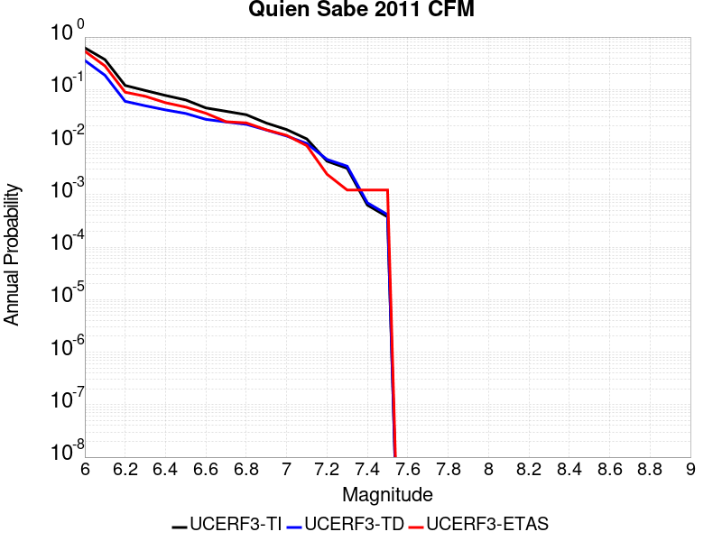 |
|-----|

| Magnitude | UCERF3-TI Prob | UCERF3-TD Prob | UCERF3-ETAS Prob |
|-----|-----|-----|-----|
| 6.0 | 0.6220986 | 0.35808462 | 0.6 |
| 6.1 | 0.37190548 | 0.18693468 | 0.31666666 |
| 6.2 | 0.11969468 | 0.059638496 | 0.06666667 |
| 6.3 | 0.095764525 | 0.049071465 | 0.05 |
| 6.4 | 0.077143535 | 0.040968418 | 0.03888889 |
| 6.5 | 0.06334029 | 0.035037786 | 0.033333335 |
| 6.6 | 0.044643093 | 0.027056847 | 0.022222223 |
| 6.7 | 0.038522035 | 0.024183262 | 0.0055555557 |
| 6.8 | 0.03315597 | 0.021780435 | 0.0055555557 |
| 6.9 | 0.022971168 | 0.01694096 | 0.0055555557 |
| 7.0 | 0.017300041 | 0.013042226 | 0.0055555557 |
| 7.1 | 0.011466527 | 0.00937937 | 0.0 |
| 7.2 | 0.0043269033 | 0.0046741636 | 0.0 |
| 7.3 | 0.0031628762 | 0.0034717314 | 0.0 |
| 7.4 | 6.3097733E-4 | 6.988876E-4 | 0.0 |
| 7.5 | 3.7647062E-4 | 4.1534583E-4 | 0.0 |

## Raymond
*[(top)](#table-of-contents)*

| 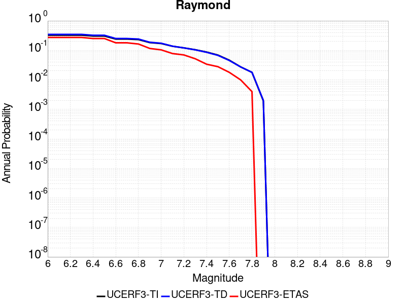 |
|-----|

| Magnitude | UCERF3-TI Prob | UCERF3-TD Prob | UCERF3-ETAS Prob |
|-----|-----|-----|-----|
| 6.0 | 0.32662243 | 0.34644786 | 0.26666668 |
| 6.1 | 0.32662243 | 0.34644786 | 0.26666668 |
| 6.2 | 0.32662243 | 0.34644786 | 0.26666668 |
| 6.3 | 0.32662243 | 0.34644786 | 0.26666668 |
| 6.4 | 0.30492666 | 0.32314086 | 0.25555557 |
| 6.5 | 0.30492666 | 0.32314086 | 0.25555557 |
| 6.6 | 0.2404663 | 0.25071928 | 0.18888889 |
| 6.7 | 0.2404663 | 0.25071928 | 0.18888889 |
| 6.8 | 0.23122635 | 0.24104291 | 0.16666667 |
| 6.9 | 0.18245699 | 0.18714611 | 0.12777779 |
| 7.0 | 0.16990462 | 0.17358118 | 0.12222222 |
| 7.1 | 0.13716751 | 0.13809262 | 0.094444446 |
| 7.2 | 0.12082649 | 0.12059716 | 0.083333336 |
| 7.3 | 0.10464668 | 0.10382617 | 0.07777778 |
| 7.4 | 0.087267525 | 0.08573501 | 0.055555556 |
| 7.5 | 0.06894135 | 0.067458235 | 0.03888889 |
| 7.6 | 0.046339024 | 0.045303967 | 0.022222223 |
| 7.7 | 0.027428905 | 0.027388671 | 0.011111111 |
| 7.8 | 0.017875405 | 0.017941954 | 0.011111111 |
| 7.9 | 0.0019353067 | 0.0020209071 | 0.0 |

## Red Mountain
*[(top)](#table-of-contents)*

| 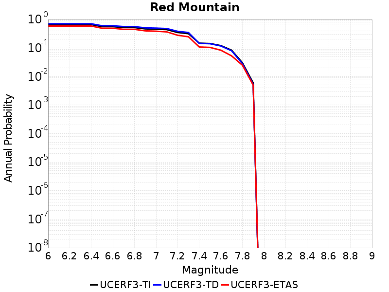 |
|-----|

| Magnitude | UCERF3-TI Prob | UCERF3-TD Prob | UCERF3-ETAS Prob |
|-----|-----|-----|-----|
| 6.0 | 0.6640644 | 0.7069035 | 0.60555553 |
| 6.1 | 0.6640644 | 0.7069035 | 0.60555553 |
| 6.2 | 0.6640644 | 0.7069035 | 0.60555553 |
| 6.3 | 0.6640644 | 0.7069035 | 0.60555553 |
| 6.4 | 0.6640644 | 0.7069035 | 0.60555553 |
| 6.5 | 0.5608878 | 0.603397 | 0.51666665 |
| 6.6 | 0.56078243 | 0.6032936 | 0.51666665 |
| 6.7 | 0.5216845 | 0.5647643 | 0.45555556 |
| 6.8 | 0.5210046 | 0.5640754 | 0.45555556 |
| 6.9 | 0.4685231 | 0.50945556 | 0.40555555 |
| 7.0 | 0.4581252 | 0.49871826 | 0.38333333 |
| 7.1 | 0.4412769 | 0.48128483 | 0.3611111 |
| 7.2 | 0.35037726 | 0.384635 | 0.2611111 |
| 7.3 | 0.31859335 | 0.35017568 | 0.24444444 |
| 7.4 | 0.1478658 | 0.14597946 | 0.13333334 |
| 7.5 | 0.1438897 | 0.1416962 | 0.11666667 |
| 7.6 | 0.121670604 | 0.11806527 | 0.094444446 |
| 7.7 | 0.083961055 | 0.080130085 | 0.06666667 |
| 7.8 | 0.030389596 | 0.028277071 | 0.027777778 |
| 7.9 | 0.0059740804 | 0.0053302404 | 0.0 |

## Red Pass
*[(top)](#table-of-contents)*

| 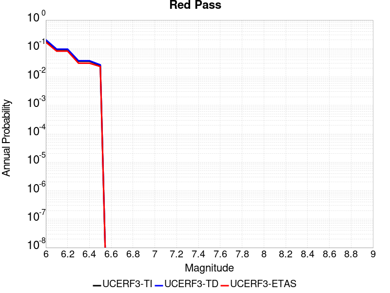 |
|-----|

| Magnitude | UCERF3-TI Prob | UCERF3-TD Prob | UCERF3-ETAS Prob |
|-----|-----|-----|-----|
| 6.0 | 0.19382422 | 0.2036472 | 0.13333334 |
| 6.1 | 0.09083234 | 0.094835214 | 0.06666667 |
| 6.2 | 0.09083234 | 0.094835214 | 0.06666667 |
| 6.3 | 0.035677206 | 0.03721023 | 0.033333335 |
| 6.4 | 0.035677206 | 0.03721023 | 0.033333335 |
| 6.5 | 0.02543875 | 0.02661988 | 0.033333335 |

## Redondo Canyon alt 1
*[(top)](#table-of-contents)*

| 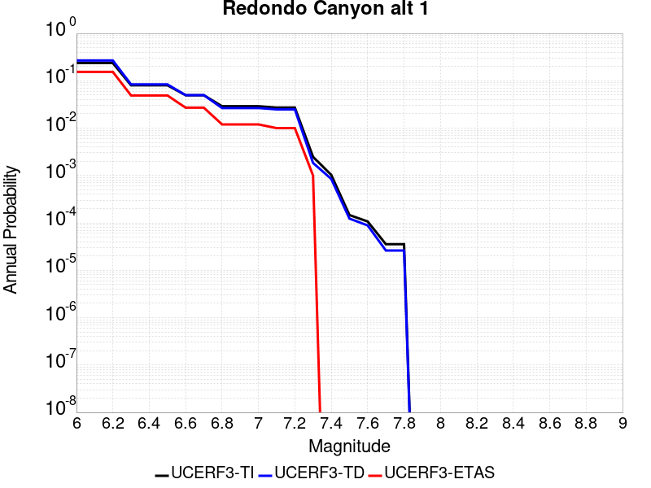 |
|-----|

| Magnitude | UCERF3-TI Prob | UCERF3-TD Prob | UCERF3-ETAS Prob |
|-----|-----|-----|-----|
| 6.0 | 0.23656522 | 0.2674637 | 0.16111112 |
| 6.1 | 0.23656522 | 0.2674637 | 0.16111112 |
| 6.2 | 0.23656522 | 0.2674637 | 0.16111112 |
| 6.3 | 0.08022259 | 0.08373085 | 0.06111111 |
| 6.4 | 0.08022259 | 0.08373085 | 0.06111111 |
| 6.5 | 0.08022259 | 0.08373085 | 0.06111111 |
| 6.6 | 0.04956028 | 0.049728904 | 0.027777778 |
| 6.7 | 0.04956028 | 0.049728904 | 0.027777778 |
| 6.8 | 0.02899541 | 0.026595268 | 0.011111111 |
| 6.9 | 0.02899541 | 0.026595268 | 0.011111111 |
| 7.0 | 0.02899541 | 0.026595268 | 0.011111111 |
| 7.1 | 0.027136533 | 0.024896216 | 0.011111111 |
| 7.2 | 0.027136533 | 0.024896216 | 0.011111111 |
| 7.3 | 0.0024767565 | 0.001843534 | 0.0 |
| 7.4 | 0.0010305378 | 8.47852E-4 | 0.0 |
| 7.5 | 1.4643683E-4 | 1.2337005E-4 | 0.0 |
| 7.6 | 1.0712817E-4 | 8.8474335E-5 | 0.0 |
| 7.7 | 3.553232E-5 | 2.6198477E-5 | 0.0 |
| 7.8 | 3.553232E-5 | 2.6198477E-5 | 0.0 |

## Reliz 2011 CFM
*[(top)](#table-of-contents)*

| 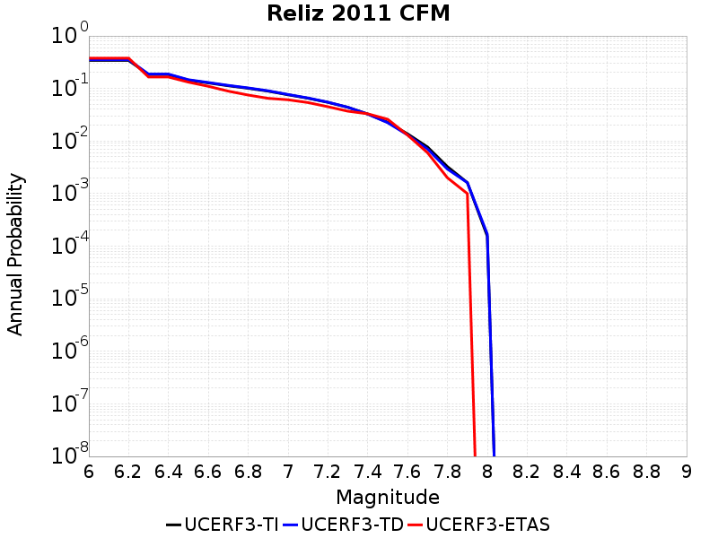 |
|-----|

| Magnitude | UCERF3-TI Prob | UCERF3-TD Prob | UCERF3-ETAS Prob |
|-----|-----|-----|-----|
| 6.0 | 0.34130612 | 0.35215512 | 0.40555555 |
| 6.1 | 0.34130612 | 0.35215512 | 0.40555555 |
| 6.2 | 0.34130612 | 0.35215512 | 0.40555555 |
| 6.3 | 0.18396583 | 0.18762875 | 0.16111112 |
| 6.4 | 0.18396583 | 0.18762875 | 0.16111112 |
| 6.5 | 0.14413919 | 0.14682743 | 0.11666667 |
| 6.6 | 0.12766309 | 0.12998115 | 0.08888889 |
| 6.7 | 0.11263118 | 0.11457728 | 0.083333336 |
| 6.8 | 0.100893006 | 0.102542244 | 0.07777778 |
| 6.9 | 0.089058794 | 0.090400465 | 0.072222225 |
| 7.0 | 0.075910084 | 0.07692062 | 0.072222225 |
| 7.1 | 0.06524413 | 0.0659678 | 0.06111111 |
| 7.2 | 0.05450492 | 0.05490789 | 0.055555556 |
| 7.3 | 0.04386857 | 0.043957688 | 0.055555556 |
| 7.4 | 0.032729767 | 0.032514285 | 0.044444446 |
| 7.5 | 0.02281514 | 0.022341263 | 0.033333335 |
| 7.6 | 0.013709921 | 0.0130627025 | 0.027777778 |
| 7.7 | 0.00770909 | 0.0070570493 | 0.016666668 |
| 7.8 | 0.00325829 | 0.0029240528 | 0.0055555557 |
| 7.9 | 0.0016197428 | 0.0016151998 | 0.0055555557 |
| 8.0 | 1.5453655E-4 | 1.7007187E-4 | 0.0 |

## Richfield
*[(top)](#table-of-contents)*

| 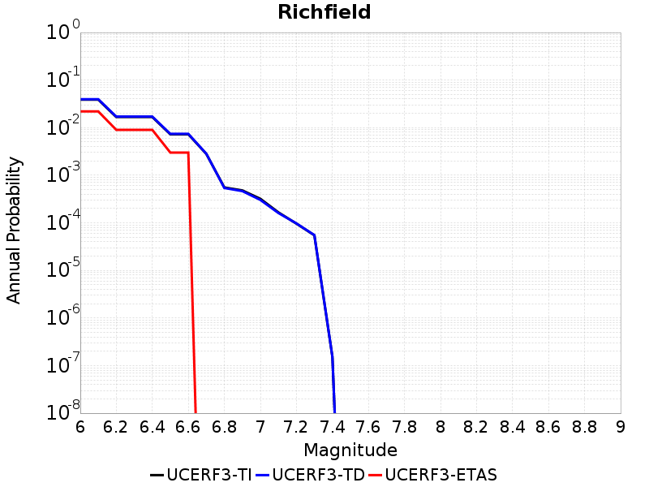 |
|-----|

| Magnitude | UCERF3-TI Prob | UCERF3-TD Prob | UCERF3-ETAS Prob |
|-----|-----|-----|-----|
| 6.0 | 0.038796734 | 0.03962458 | 0.016666668 |
| 6.1 | 0.038796734 | 0.03962458 | 0.016666668 |
| 6.2 | 0.016746502 | 0.017086703 | 0.0 |
| 6.3 | 0.016746502 | 0.017086703 | 0.0 |
| 6.4 | 0.016746502 | 0.017086703 | 0.0 |
| 6.5 | 0.0072665745 | 0.0074203 | 0.0 |
| 6.6 | 0.0072665745 | 0.0074203 | 0.0 |
| 6.7 | 0.0028077713 | 0.002834467 | 0.0 |
| 6.8 | 5.555963E-4 | 5.404053E-4 | 0.0 |
| 6.9 | 4.8027976E-4 | 4.6442583E-4 | 0.0 |
| 7.0 | 3.2060005E-4 | 3.0340833E-4 | 0.0 |
| 7.1 | 1.6626813E-4 | 1.6112563E-4 | 0.0 |
| 7.2 | 9.649946E-5 | 9.741508E-5 | 0.0 |
| 7.3 | 5.471809E-5 | 5.5278462E-5 | 0.0 |
| 7.4 | 1.5213764E-7 | 1.536321E-7 | 0.0 |

## Rinconada 2011 CFM
*[(top)](#table-of-contents)*

| 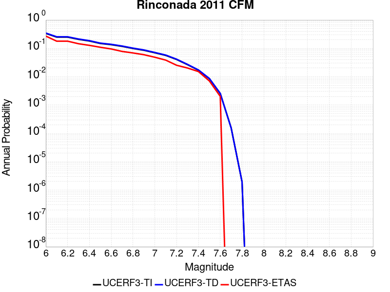 |
|-----|

| Magnitude | UCERF3-TI Prob | UCERF3-TD Prob | UCERF3-ETAS Prob |
|-----|-----|-----|-----|
| 6.0 | 0.33699402 | 0.34606397 | 0.26666668 |
| 6.1 | 0.24881262 | 0.25555968 | 0.15 |
| 6.2 | 0.24881262 | 0.25555968 | 0.15 |
| 6.3 | 0.2077497 | 0.21341397 | 0.13333334 |
| 6.4 | 0.18150422 | 0.18645379 | 0.11111111 |
| 6.5 | 0.14861922 | 0.15266947 | 0.10555556 |
| 6.6 | 0.13487917 | 0.13855368 | 0.08888889 |
| 6.7 | 0.1174255 | 0.12060771 | 0.083333336 |
| 6.8 | 0.09899132 | 0.10162721 | 0.072222225 |
| 6.9 | 0.08548019 | 0.08769182 | 0.072222225 |
| 7.0 | 0.06974877 | 0.071492575 | 0.06666667 |
| 7.1 | 0.05645408 | 0.057824533 | 0.05 |
| 7.2 | 0.04042803 | 0.041365527 | 0.027777778 |
| 7.3 | 0.026530817 | 0.027118154 | 0.022222223 |
| 7.4 | 0.016906222 | 0.01727407 | 0.011111111 |
| 7.5 | 0.008483777 | 0.008655684 | 0.0 |
| 7.6 | 0.002541603 | 0.0025682782 | 0.0 |
| 7.7 | 1.5652725E-4 | 1.5433568E-4 | 0.0 |
| 7.8 | 1.9306071E-6 | 1.9467868E-6 | 0.0 |

## Robinson Creek
*[(top)](#table-of-contents)*

| 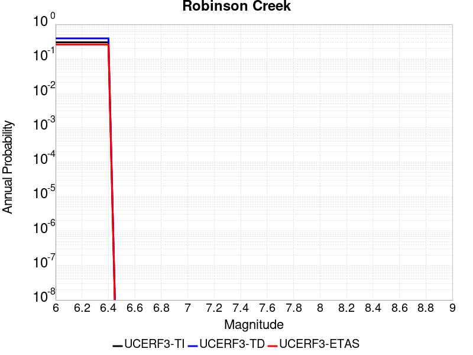 |
|-----|

| Magnitude | UCERF3-TI Prob | UCERF3-TD Prob | UCERF3-ETAS Prob |
|-----|-----|-----|-----|
| 6.0 | 0.30062252 | 0.38987315 | 0.31111112 |
| 6.1 | 0.30062252 | 0.38987315 | 0.31111112 |
| 6.2 | 0.30062252 | 0.38987315 | 0.31111112 |
| 6.3 | 0.30062252 | 0.38987315 | 0.31111112 |
| 6.4 | 0.30062252 | 0.38987315 | 0.31111112 |

## Rocky Ledge 2011 CFM
*[(top)](#table-of-contents)*

| 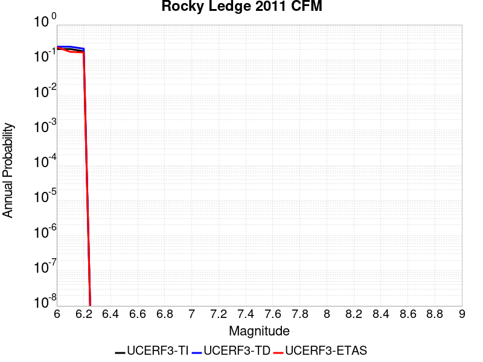 |
|-----|

| Magnitude | UCERF3-TI Prob | UCERF3-TD Prob | UCERF3-ETAS Prob |
|-----|-----|-----|-----|
| 6.0 | 0.20420532 | 0.23771408 | 0.21111111 |
| 6.1 | 0.20420532 | 0.23771408 | 0.17777778 |
| 6.2 | 0.1764779 | 0.20882127 | 0.17222223 |

## Rodgers Creek - Healdsburg 2011 CFM
*[(top)](#table-of-contents)*

| 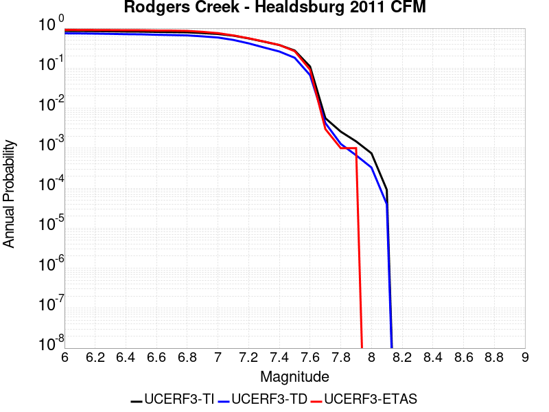 |
|-----|

| Magnitude | UCERF3-TI Prob | UCERF3-TD Prob | UCERF3-ETAS Prob |
|-----|-----|-----|-----|
| 6.0 | 0.8545782 | 0.7443528 | 0.9166667 |
| 6.1 | 0.85184324 | 0.74034667 | 0.9166667 |
| 6.2 | 0.8446874 | 0.7316662 | 0.9111111 |
| 6.3 | 0.8358378 | 0.72116077 | 0.9 |
| 6.4 | 0.8247785 | 0.70841837 | 0.8888889 |
| 6.5 | 0.8200433 | 0.7018887 | 0.8833333 |
| 6.6 | 0.80620676 | 0.68471295 | 0.87222224 |
| 6.7 | 0.7971889 | 0.6734605 | 0.87222224 |
| 6.8 | 0.7867683 | 0.66064864 | 0.87222224 |
| 6.9 | 0.75577176 | 0.6240922 | 0.8277778 |
| 7.0 | 0.7160957 | 0.5845085 | 0.76111114 |
| 7.1 | 0.6505084 | 0.5089222 | 0.6388889 |
| 7.2 | 0.55417913 | 0.41750705 | 0.54444444 |
| 7.3 | 0.45995978 | 0.32914135 | 0.43333334 |
| 7.4 | 0.37883797 | 0.2613006 | 0.36666667 |
| 7.5 | 0.27661043 | 0.18215764 | 0.27222222 |
| 7.6 | 0.110242 | 0.06713848 | 0.094444446 |
| 7.7 | 0.0056140963 | 0.0042391247 | 0.0 |
| 7.8 | 0.0025957257 | 0.0012799208 | 0.0 |
| 7.9 | 0.0014793479 | 6.640704E-4 | 0.0 |
| 8.0 | 7.462487E-4 | 3.2898455E-4 | 0.0 |
| 8.1 | 9.142622E-5 | 3.981128E-5 | 0.0 |

## Rose Canyon
*[(top)](#table-of-contents)*

| 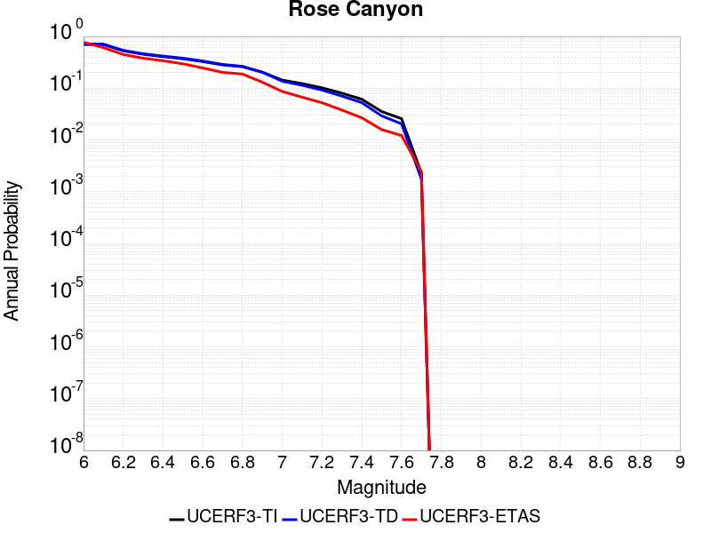 |
|-----|

| Magnitude | UCERF3-TI Prob | UCERF3-TD Prob | UCERF3-ETAS Prob |
|-----|-----|-----|-----|
| 6.0 | 0.69824237 | 0.7121837 | 0.75 |
| 6.1 | 0.69824237 | 0.7121837 | 0.5888889 |
| 6.2 | 0.52883613 | 0.5392689 | 0.45 |
| 6.3 | 0.45367262 | 0.46412542 | 0.37777779 |
| 6.4 | 0.40757358 | 0.4179948 | 0.34444445 |
| 6.5 | 0.37098983 | 0.38048053 | 0.2777778 |
| 6.6 | 0.32785022 | 0.3359626 | 0.24444444 |
| 6.7 | 0.28210914 | 0.28831273 | 0.2 |
| 6.8 | 0.26026353 | 0.2647921 | 0.19444445 |
| 6.9 | 0.20372818 | 0.2031251 | 0.13333334 |
| 7.0 | 0.14342014 | 0.13641687 | 0.083333336 |
| 7.1 | 0.122603774 | 0.11401844 | 0.07777778 |
| 7.2 | 0.10193065 | 0.09212911 | 0.055555556 |
| 7.3 | 0.08029085 | 0.07053414 | 0.033333335 |
| 7.4 | 0.061171506 | 0.052625507 | 0.022222223 |
| 7.5 | 0.035470765 | 0.029209709 | 0.016666668 |
| 7.6 | 0.025806751 | 0.020500459 | 0.016666668 |
| 7.7 | 0.0022833357 | 0.0017451436 | 0.0 |

## Round Valley
*[(top)](#table-of-contents)*

| 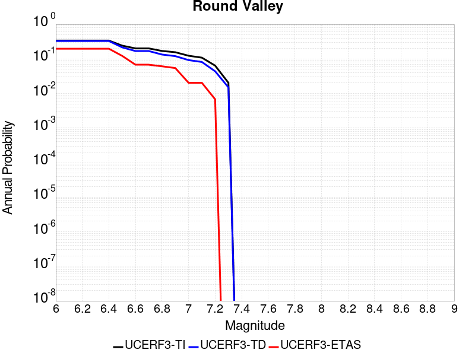 |
|-----|

| Magnitude | UCERF3-TI Prob | UCERF3-TD Prob | UCERF3-ETAS Prob |
|-----|-----|-----|-----|
| 6.0 | 0.3392243 | 0.329597 | 0.16666667 |
| 6.1 | 0.3392243 | 0.329597 | 0.16666667 |
| 6.2 | 0.3392243 | 0.329597 | 0.16666667 |
| 6.3 | 0.3392243 | 0.329597 | 0.16666667 |
| 6.4 | 0.3392243 | 0.329597 | 0.16666667 |
| 6.5 | 0.24252766 | 0.21594813 | 0.1 |
| 6.6 | 0.20166634 | 0.1692951 | 0.07777778 |
| 6.7 | 0.20166634 | 0.1692951 | 0.07777778 |
| 6.8 | 0.17004167 | 0.13391817 | 0.055555556 |
| 6.9 | 0.15624727 | 0.12046037 | 0.044444446 |
| 7.0 | 0.12370262 | 0.092500046 | 0.033333335 |
| 7.1 | 0.10885126 | 0.08157539 | 0.022222223 |
| 7.2 | 0.06400892 | 0.04390412 | 0.0055555557 |
| 7.3 | 0.020399636 | 0.01504104 | 0.0 |

## Russ 2011 CFM
*[(top)](#table-of-contents)*

| 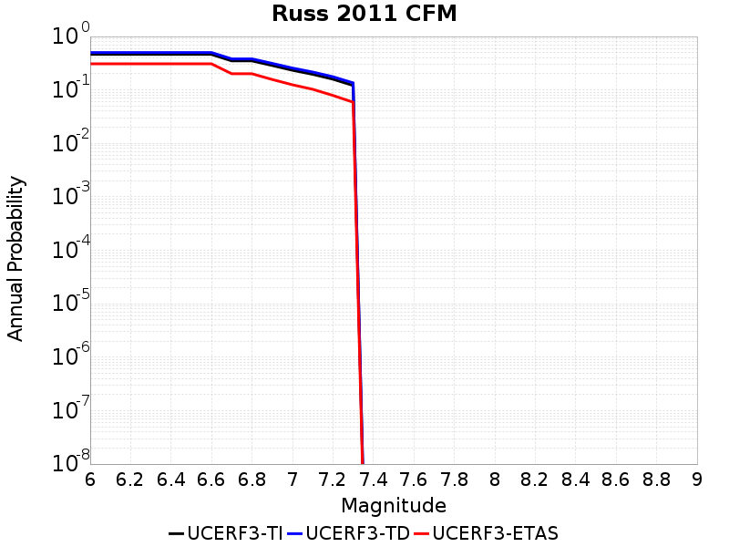 |
|-----|

| Magnitude | UCERF3-TI Prob | UCERF3-TD Prob | UCERF3-ETAS Prob |
|-----|-----|-----|-----|
| 6.0 | 0.46264616 | 0.50145286 | 0.31111112 |
| 6.1 | 0.46264616 | 0.50145286 | 0.31111112 |
| 6.2 | 0.46264616 | 0.50145286 | 0.31111112 |
| 6.3 | 0.46264616 | 0.50145286 | 0.31111112 |
| 6.4 | 0.46264616 | 0.50145286 | 0.31111112 |
| 6.5 | 0.46264616 | 0.50145286 | 0.31111112 |
| 6.6 | 0.46264616 | 0.50145286 | 0.31111112 |
| 6.7 | 0.3500671 | 0.38172415 | 0.21666667 |
| 6.8 | 0.3500671 | 0.38172415 | 0.21666667 |
| 6.9 | 0.2870978 | 0.31429976 | 0.18333334 |
| 7.0 | 0.23368284 | 0.25685734 | 0.14444445 |
| 7.1 | 0.19626485 | 0.2166691 | 0.12777779 |
| 7.2 | 0.15926471 | 0.17679346 | 0.094444446 |
| 7.3 | 0.12126415 | 0.13558052 | 0.06666667 |

## San Andreas (Big Bend)
*[(top)](#table-of-contents)*

| 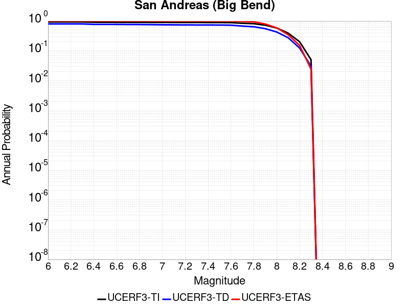 |
|-----|

| Magnitude | UCERF3-TI Prob | UCERF3-TD Prob | UCERF3-ETAS Prob |
|-----|-----|-----|-----|
| 6.0 | 0.92977256 | 0.7977716 | 1.0 |
| 6.1 | 0.92977256 | 0.7977716 | 1.0 |
| 6.2 | 0.92977256 | 0.7977716 | 1.0 |
| 6.3 | 0.92977256 | 0.7977716 | 1.0 |
| 6.4 | 0.90845436 | 0.7725829 | 1.0 |
| 6.5 | 0.90845436 | 0.7725829 | 1.0 |
| 6.6 | 0.90551007 | 0.76937413 | 1.0 |
| 6.7 | 0.9040454 | 0.76466525 | 1.0 |
| 6.8 | 0.9031277 | 0.76257145 | 1.0 |
| 6.9 | 0.90085304 | 0.75608367 | 1.0 |
| 7.0 | 0.89783585 | 0.7474916 | 1.0 |
| 7.1 | 0.8962679 | 0.74311566 | 1.0 |
| 7.2 | 0.8941229 | 0.73779476 | 1.0 |
| 7.3 | 0.89306086 | 0.7354624 | 1.0 |
| 7.4 | 0.89235973 | 0.73389554 | 1.0 |
| 7.5 | 0.8905465 | 0.7315281 | 1.0 |
| 7.6 | 0.88353145 | 0.7237895 | 1.0 |
| 7.7 | 0.8391754 | 0.6753103 | 0.96666664 |
| 7.8 | 0.8124624 | 0.639505 | 0.9388889 |
| 7.9 | 0.72440404 | 0.5539066 | 0.7888889 |
| 8.0 | 0.58217674 | 0.42726728 | 0.56666666 |
| 8.1 | 0.39252114 | 0.27464017 | 0.30555555 |
| 8.2 | 0.20189473 | 0.12443162 | 0.11666667 |
| 8.3 | 0.050421786 | 0.030325888 | 0.016666668 |

## San Andreas (Carrizo) rev
*[(top)](#table-of-contents)*

| 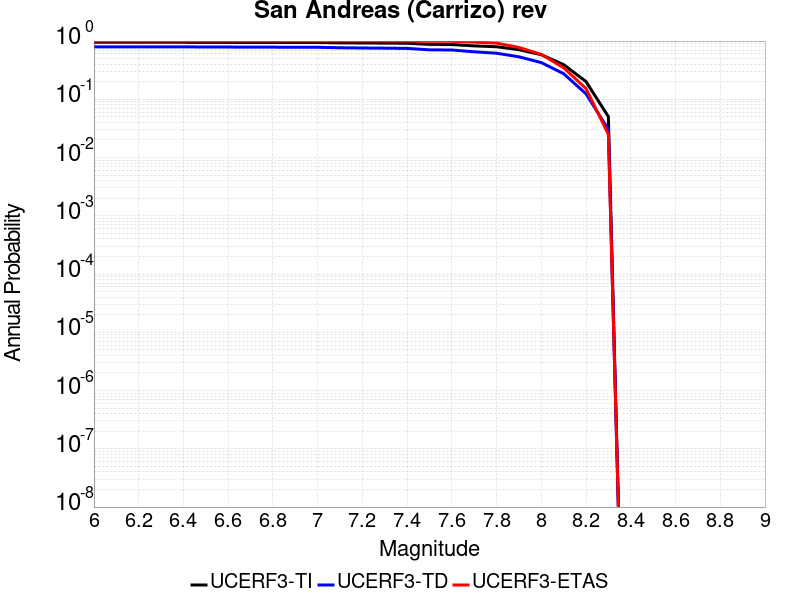 |
|-----|

| Magnitude | UCERF3-TI Prob | UCERF3-TD Prob | UCERF3-ETAS Prob |
|-----|-----|-----|-----|
| 6.0 | 0.9524515 | 0.7962249 | 1.0 |
| 6.1 | 0.9524515 | 0.7962249 | 1.0 |
| 6.2 | 0.9524515 | 0.7962249 | 1.0 |
| 6.3 | 0.9524515 | 0.7962249 | 1.0 |
| 6.4 | 0.9524515 | 0.7962249 | 1.0 |
| 6.5 | 0.94775486 | 0.7893857 | 1.0 |
| 6.6 | 0.94775486 | 0.7893857 | 1.0 |
| 6.7 | 0.9454715 | 0.7862013 | 1.0 |
| 6.8 | 0.9448119 | 0.78510475 | 1.0 |
| 6.9 | 0.9440824 | 0.78396505 | 1.0 |
| 7.0 | 0.9433794 | 0.7824105 | 1.0 |
| 7.1 | 0.93208236 | 0.76687074 | 1.0 |
| 7.2 | 0.9269221 | 0.75988245 | 1.0 |
| 7.3 | 0.92279536 | 0.7543132 | 1.0 |
| 7.4 | 0.9175157 | 0.74764025 | 1.0 |
| 7.5 | 0.8776541 | 0.7070535 | 0.99444443 |
| 7.6 | 0.87259173 | 0.7020092 | 0.98888886 |
| 7.7 | 0.8262223 | 0.65402955 | 0.95555556 |
| 7.8 | 0.79889774 | 0.61822945 | 0.92777777 |
| 7.9 | 0.71143574 | 0.53664833 | 0.7777778 |
| 8.0 | 0.58331335 | 0.42725578 | 0.56666666 |
| 8.1 | 0.39363798 | 0.27527857 | 0.30555555 |
| 8.2 | 0.20189473 | 0.12443162 | 0.11666667 |
| 8.3 | 0.050421786 | 0.030325888 | 0.016666668 |

## San Andreas (Cholame) rev
*[(top)](#table-of-contents)*

| 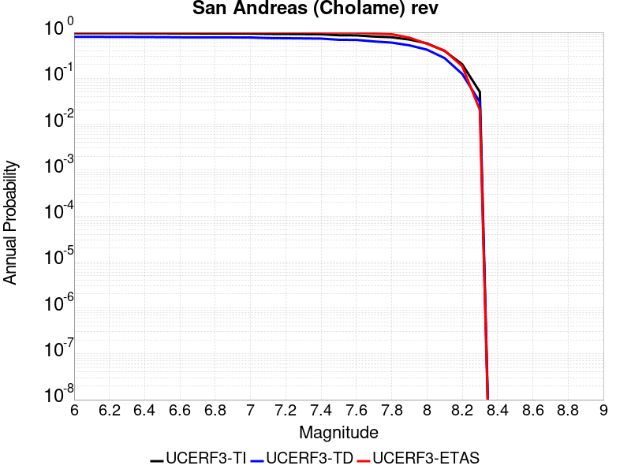 |
|-----|

| Magnitude | UCERF3-TI Prob | UCERF3-TD Prob | UCERF3-ETAS Prob |
|-----|-----|-----|-----|
| 6.0 | 0.95963675 | 0.7980055 | 1.0 |
| 6.1 | 0.95963675 | 0.7980055 | 1.0 |
| 6.2 | 0.9585811 | 0.79612017 | 1.0 |
| 6.3 | 0.95791745 | 0.79497296 | 1.0 |
| 6.4 | 0.9547581 | 0.7899534 | 1.0 |
| 6.5 | 0.95330924 | 0.7879603 | 1.0 |
| 6.6 | 0.94835514 | 0.78121275 | 1.0 |
| 6.7 | 0.9471764 | 0.7796536 | 1.0 |
| 6.8 | 0.9464347 | 0.7786515 | 1.0 |
| 6.9 | 0.94543 | 0.7772125 | 1.0 |
| 7.0 | 0.9427916 | 0.7736945 | 1.0 |
| 7.1 | 0.9250001 | 0.7515027 | 1.0 |
| 7.2 | 0.9203366 | 0.74542075 | 1.0 |
| 7.3 | 0.9155421 | 0.739387 | 1.0 |
| 7.4 | 0.90979195 | 0.7323669 | 1.0 |
| 7.5 | 0.8664405 | 0.689595 | 0.98888886 |
| 7.6 | 0.8610057 | 0.6845016 | 0.98333335 |
| 7.7 | 0.81064016 | 0.63405615 | 0.95 |
| 7.8 | 0.7834145 | 0.59840304 | 0.9166667 |
| 7.9 | 0.69847554 | 0.52241534 | 0.75555557 |
| 8.0 | 0.57669437 | 0.42023987 | 0.55 |
| 8.1 | 0.3936703 | 0.27529922 | 0.30555555 |
| 8.2 | 0.20189473 | 0.12443162 | 0.11666667 |
| 8.3 | 0.050421786 | 0.030325888 | 0.016666668 |

## San Andreas (Coachella) rev
*[(top)](#table-of-contents)*

| 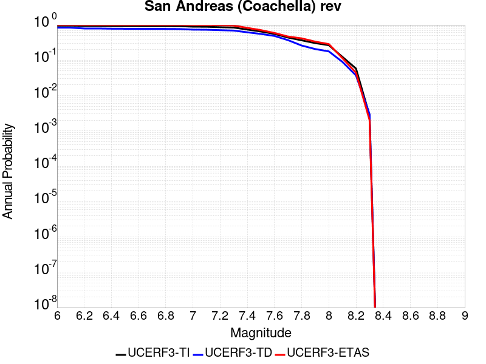 |
|-----|

| Magnitude | UCERF3-TI Prob | UCERF3-TD Prob | UCERF3-ETAS Prob |
|-----|-----|-----|-----|
| 6.0 | 0.9554694 | 0.83704865 | 0.99444443 |
| 6.1 | 0.9554694 | 0.83704865 | 0.99444443 |
| 6.2 | 0.93937117 | 0.7926848 | 0.99444443 |
| 6.3 | 0.9389828 | 0.79224753 | 0.99444443 |
| 6.4 | 0.93292415 | 0.7808301 | 0.99444443 |
| 6.5 | 0.93064564 | 0.77679825 | 0.99444443 |
| 6.6 | 0.9286047 | 0.7736693 | 0.99444443 |
| 6.7 | 0.92736304 | 0.77184606 | 0.99444443 |
| 6.8 | 0.9259497 | 0.76981354 | 0.99444443 |
| 6.9 | 0.92199045 | 0.76455617 | 0.99444443 |
| 7.0 | 0.8911606 | 0.73546916 | 0.98333335 |
| 7.1 | 0.88590074 | 0.7299091 | 0.9777778 |
| 7.2 | 0.86102295 | 0.7099975 | 0.95555556 |
| 7.3 | 0.84244263 | 0.69209516 | 0.95555556 |
| 7.4 | 0.73884606 | 0.61817026 | 0.7888889 |
| 7.5 | 0.6504233 | 0.5551809 | 0.70555556 |
| 7.6 | 0.55655557 | 0.48749292 | 0.59444445 |
| 7.7 | 0.43819776 | 0.37002665 | 0.47777778 |
| 7.8 | 0.36629486 | 0.2608699 | 0.42777777 |
| 7.9 | 0.30538604 | 0.20728022 | 0.32222223 |
| 8.0 | 0.26665244 | 0.17824727 | 0.25 |
| 8.1 | 0.124603406 | 0.0898954 | 0.083333336 |
| 8.2 | 0.058251593 | 0.03716123 | 0.027777778 |
| 8.3 | 0.0027159685 | 0.0029672724 | 0.0 |

## San Andreas (Creeping Section) 2011 CFM
*[(top)](#table-of-contents)*

| 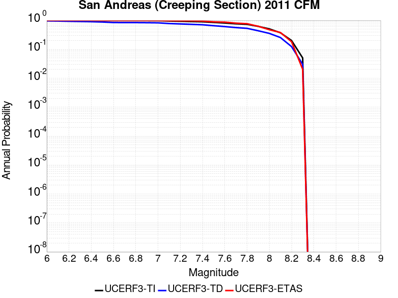 |
|-----|

| Magnitude | UCERF3-TI Prob | UCERF3-TD Prob | UCERF3-ETAS Prob |
|-----|-----|-----|-----|
| 6.0 | 0.9999998 | 0.96010625 | 1.0 |
| 6.1 | 0.9999979 | 0.9481583 | 1.0 |
| 6.2 | 0.9999758 | 0.93069965 | 1.0 |
| 6.3 | 0.9998813 | 0.9158815 | 1.0 |
| 6.4 | 0.999528 | 0.90180856 | 1.0 |
| 6.5 | 0.9977753 | 0.8792814 | 0.99444443 |
| 6.6 | 0.9839723 | 0.84220314 | 0.99444443 |
| 6.7 | 0.98299974 | 0.83965945 | 0.99444443 |
| 6.8 | 0.98265046 | 0.83847576 | 0.99444443 |
| 6.9 | 0.9808175 | 0.83204174 | 0.99444443 |
| 7.0 | 0.97777253 | 0.8226476 | 0.98888886 |
| 7.1 | 0.95107275 | 0.77899057 | 0.9722222 |
| 7.2 | 0.9335833 | 0.75409603 | 0.9444444 |
| 7.3 | 0.9124019 | 0.72957397 | 0.9388889 |
| 7.4 | 0.89586896 | 0.70505315 | 0.9166667 |
| 7.5 | 0.8512573 | 0.6556122 | 0.8833333 |
| 7.6 | 0.81139344 | 0.6111624 | 0.8666667 |
| 7.7 | 0.7621838 | 0.5650742 | 0.8 |
| 7.8 | 0.7306047 | 0.5313697 | 0.76111114 |
| 7.9 | 0.6218306 | 0.43867958 | 0.5833333 |
| 8.0 | 0.5095905 | 0.35551593 | 0.42222223 |
| 8.1 | 0.3737842 | 0.25570408 | 0.28333333 |
| 8.2 | 0.20189473 | 0.12443162 | 0.11666667 |
| 8.3 | 0.050421786 | 0.030325888 | 0.016666668 |

## San Andreas (Mojave N)
*[(top)](#table-of-contents)*

| 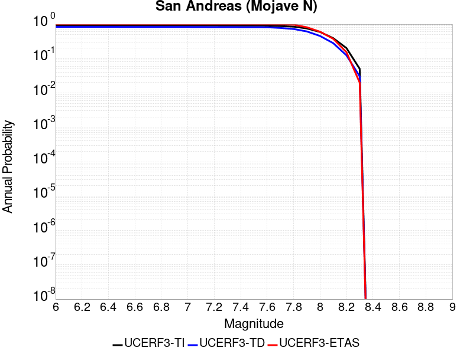 |
|-----|

| Magnitude | UCERF3-TI Prob | UCERF3-TD Prob | UCERF3-ETAS Prob |
|-----|-----|-----|-----|
| 6.0 | 0.92400926 | 0.8331522 | 1.0 |
| 6.1 | 0.92400926 | 0.8331522 | 1.0 |
| 6.2 | 0.92400926 | 0.8331522 | 1.0 |
| 6.3 | 0.92400926 | 0.8331522 | 1.0 |
| 6.4 | 0.92400926 | 0.8331522 | 1.0 |
| 6.5 | 0.9236872 | 0.8328471 | 1.0 |
| 6.6 | 0.9236872 | 0.8328471 | 1.0 |
| 6.7 | 0.9235636 | 0.8327302 | 1.0 |
| 6.8 | 0.9233884 | 0.83255035 | 1.0 |
| 6.9 | 0.92297405 | 0.8317689 | 1.0 |
| 7.0 | 0.92207736 | 0.8295323 | 1.0 |
| 7.1 | 0.92065454 | 0.82584 | 1.0 |
| 7.2 | 0.9196484 | 0.82345456 | 1.0 |
| 7.3 | 0.9188888 | 0.82171464 | 1.0 |
| 7.4 | 0.91815645 | 0.8203677 | 1.0 |
| 7.5 | 0.9174788 | 0.81917536 | 1.0 |
| 7.6 | 0.91433024 | 0.8152481 | 1.0 |
| 7.7 | 0.8823414 | 0.78068113 | 0.99444443 |
| 7.8 | 0.8505705 | 0.7264771 | 0.98888886 |
| 7.9 | 0.7547762 | 0.61742246 | 0.8277778 |
| 8.0 | 0.59543085 | 0.4554138 | 0.56666666 |
| 8.1 | 0.393273 | 0.28084898 | 0.3 |
| 8.2 | 0.20189473 | 0.12443162 | 0.11666667 |
| 8.3 | 0.050421786 | 0.030325888 | 0.016666668 |

## San Andreas (Mojave S)
*[(top)](#table-of-contents)*

| 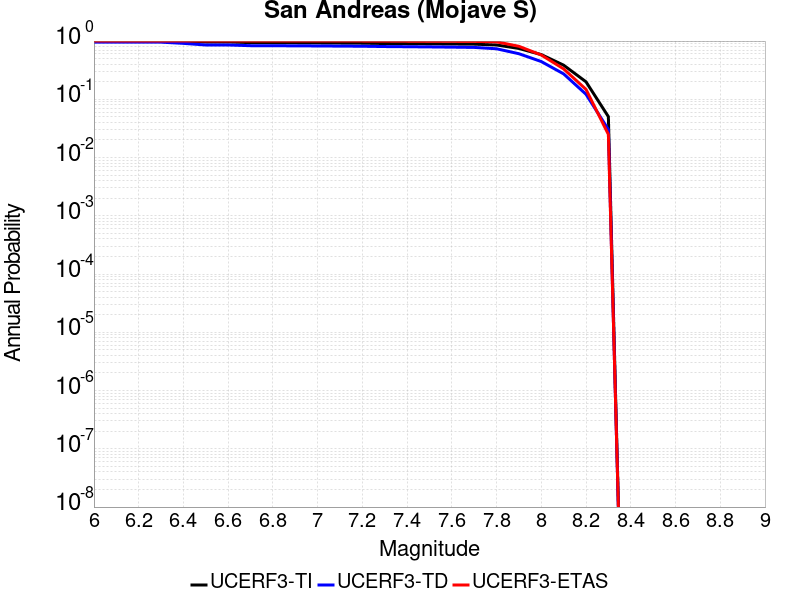 |
|-----|

| Magnitude | UCERF3-TI Prob | UCERF3-TD Prob | UCERF3-ETAS Prob |
|-----|-----|-----|-----|
| 6.0 | 0.99969816 | 0.9574513 | 1.0 |
| 6.1 | 0.99969816 | 0.9574513 | 1.0 |
| 6.2 | 0.99969816 | 0.9574513 | 1.0 |
| 6.3 | 0.99969816 | 0.9574513 | 1.0 |
| 6.4 | 0.99440026 | 0.91318244 | 1.0 |
| 6.5 | 0.9655628 | 0.8561523 | 1.0 |
| 6.6 | 0.9655628 | 0.8561523 | 1.0 |
| 6.7 | 0.94026434 | 0.83282995 | 1.0 |
| 6.8 | 0.9374611 | 0.8306804 | 1.0 |
| 6.9 | 0.9335832 | 0.8275541 | 1.0 |
| 7.0 | 0.92932504 | 0.82359725 | 1.0 |
| 7.1 | 0.924166 | 0.81913793 | 1.0 |
| 7.2 | 0.9191715 | 0.8147151 | 1.0 |
| 7.3 | 0.90735185 | 0.80498844 | 1.0 |
| 7.4 | 0.9016044 | 0.79951566 | 1.0 |
| 7.5 | 0.89599925 | 0.7935796 | 1.0 |
| 7.6 | 0.88979846 | 0.7865608 | 1.0 |
| 7.7 | 0.8840771 | 0.7780609 | 0.98888886 |
| 7.8 | 0.85663754 | 0.7373368 | 0.98888886 |
| 7.9 | 0.74639595 | 0.60642236 | 0.82222223 |
| 8.0 | 0.5859633 | 0.44509256 | 0.55 |
| 8.1 | 0.38556156 | 0.2731591 | 0.29444444 |
| 8.2 | 0.19976068 | 0.12209544 | 0.11666667 |
| 8.3 | 0.050421786 | 0.030325888 | 0.016666668 |

## San Andreas (North Branch Mill Creek)
*[(top)](#table-of-contents)*

| 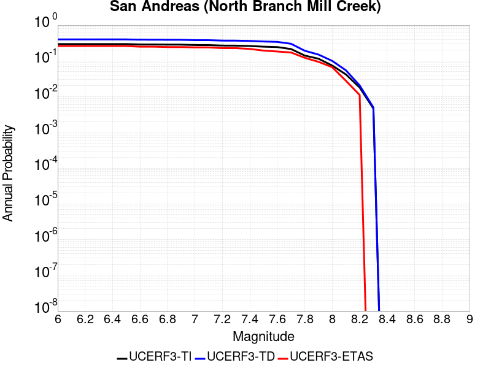 |
|-----|

| Magnitude | UCERF3-TI Prob | UCERF3-TD Prob | UCERF3-ETAS Prob |
|-----|-----|-----|-----|
| 6.0 | 0.29615304 | 0.3994688 | 0.2611111 |
| 6.1 | 0.29615304 | 0.3994688 | 0.2611111 |
| 6.2 | 0.29615304 | 0.3994688 | 0.2611111 |
| 6.3 | 0.29615304 | 0.3994688 | 0.2611111 |
| 6.4 | 0.29615304 | 0.3994688 | 0.2611111 |
| 6.5 | 0.2959611 | 0.39929634 | 0.2611111 |
| 6.6 | 0.28901732 | 0.39320737 | 0.25 |
| 6.7 | 0.2885663 | 0.39280793 | 0.25 |
| 6.8 | 0.28586468 | 0.3903969 | 0.24444444 |
| 6.9 | 0.28516436 | 0.3897506 | 0.24444444 |
| 7.0 | 0.27820468 | 0.38118842 | 0.23888889 |
| 7.1 | 0.27737692 | 0.38033813 | 0.23888889 |
| 7.2 | 0.26885667 | 0.3704935 | 0.22777778 |
| 7.3 | 0.26734143 | 0.3687604 | 0.22777778 |
| 7.4 | 0.2613358 | 0.3623042 | 0.21666667 |
| 7.5 | 0.2502054 | 0.3493297 | 0.19444445 |
| 7.6 | 0.2439914 | 0.34085995 | 0.18333334 |
| 7.7 | 0.21495374 | 0.30191213 | 0.17222223 |
| 7.8 | 0.14120327 | 0.19265816 | 0.12222222 |
| 7.9 | 0.115174085 | 0.15047753 | 0.094444446 |
| 8.0 | 0.07424653 | 0.10024646 | 0.06666667 |
| 8.1 | 0.041826107 | 0.054442976 | 0.027777778 |
| 8.2 | 0.018002367 | 0.020613736 | 0.011111111 |
| 8.3 | 0.0046528983 | 0.0049771825 | 0.0 |

## San Andreas (North Coast) 2011 CFM
*[(top)](#table-of-contents)*

| 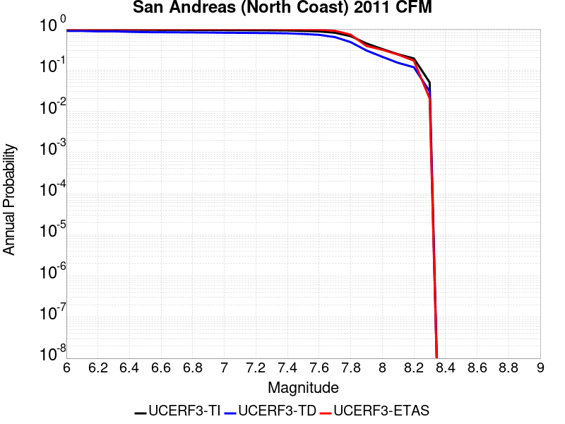 |
|-----|

| Magnitude | UCERF3-TI Prob | UCERF3-TD Prob | UCERF3-ETAS Prob |
|-----|-----|-----|-----|
| 6.0 | 0.9816983 | 0.89828306 | 1.0 |
| 6.1 | 0.9816983 | 0.89828306 | 1.0 |
| 6.2 | 0.9734848 | 0.87748903 | 0.98888886 |
| 6.3 | 0.9734848 | 0.87748903 | 0.98888886 |
| 6.4 | 0.962881 | 0.8554098 | 0.98888886 |
| 6.5 | 0.953208 | 0.83793956 | 0.98888886 |
| 6.6 | 0.9513513 | 0.8346644 | 0.98888886 |
| 6.7 | 0.9485095 | 0.829711 | 0.98888886 |
| 6.8 | 0.9462515 | 0.82554495 | 0.98888886 |
| 6.9 | 0.94338554 | 0.8205841 | 0.98888886 |
| 7.0 | 0.9378448 | 0.8115791 | 0.98888886 |
| 7.1 | 0.93505216 | 0.8072586 | 0.98888886 |
| 7.2 | 0.9314461 | 0.8016112 | 0.98888886 |
| 7.3 | 0.9276353 | 0.795863 | 0.98888886 |
| 7.4 | 0.91983896 | 0.7849362 | 0.9722222 |
| 7.5 | 0.8982801 | 0.7588196 | 0.9722222 |
| 7.6 | 0.8745447 | 0.722239 | 0.96666664 |
| 7.7 | 0.81105244 | 0.6364552 | 0.9166667 |
| 7.8 | 0.67042315 | 0.47978386 | 0.70555556 |
| 7.9 | 0.44599396 | 0.30077764 | 0.36666667 |
| 8.0 | 0.3268062 | 0.2113657 | 0.25 |
| 8.1 | 0.24320462 | 0.15072575 | 0.17222223 |
| 8.2 | 0.19314744 | 0.117770344 | 0.11111111 |
| 8.3 | 0.050421786 | 0.030325888 | 0.016666668 |

## San Andreas (Offshore) 2011 CFM
*[(top)](#table-of-contents)*

| 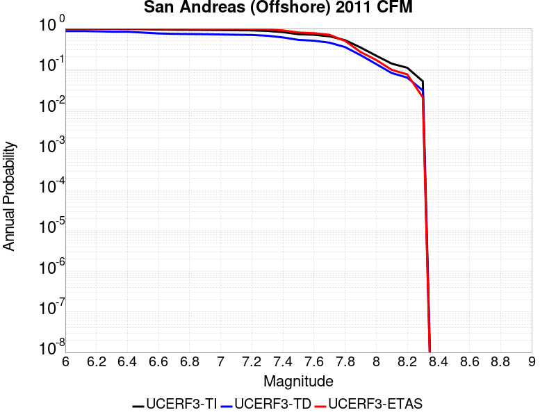 |
|-----|

| Magnitude | UCERF3-TI Prob | UCERF3-TD Prob | UCERF3-ETAS Prob |
|-----|-----|-----|-----|
| 6.0 | 0.9883744 | 0.86638945 | 1.0 |
| 6.1 | 0.9883744 | 0.86638945 | 1.0 |
| 6.2 | 0.9858236 | 0.8547123 | 1.0 |
| 6.3 | 0.98056453 | 0.83604866 | 1.0 |
| 6.4 | 0.9802817 | 0.8352795 | 1.0 |
| 6.5 | 0.96418583 | 0.79383904 | 1.0 |
| 6.6 | 0.944232 | 0.7554218 | 1.0 |
| 6.7 | 0.93353575 | 0.7387729 | 0.99444443 |
| 6.8 | 0.92823017 | 0.73119766 | 0.99444443 |
| 6.9 | 0.9224587 | 0.7237461 | 0.99444443 |
| 7.0 | 0.9153533 | 0.71396375 | 0.99444443 |
| 7.1 | 0.9069065 | 0.70244247 | 0.99444443 |
| 7.2 | 0.9005954 | 0.69390726 | 0.98888886 |
| 7.3 | 0.87361985 | 0.6634473 | 0.9722222 |
| 7.4 | 0.81502223 | 0.60267663 | 0.9 |
| 7.5 | 0.7237319 | 0.52482253 | 0.8277778 |
| 7.6 | 0.6998321 | 0.50035256 | 0.8 |
| 7.7 | 0.6425865 | 0.44784582 | 0.73333335 |
| 7.8 | 0.5156581 | 0.34814662 | 0.48333332 |
| 7.9 | 0.3396584 | 0.21969712 | 0.26666668 |
| 8.0 | 0.2132593 | 0.13247246 | 0.1388889 |
| 8.1 | 0.13596459 | 0.07959724 | 0.07777778 |
| 8.2 | 0.10730612 | 0.061327014 | 0.06666667 |
| 8.3 | 0.049783446 | 0.029589934 | 0.016666668 |

## San Andreas (Parkfield)
*[(top)](#table-of-contents)*

| 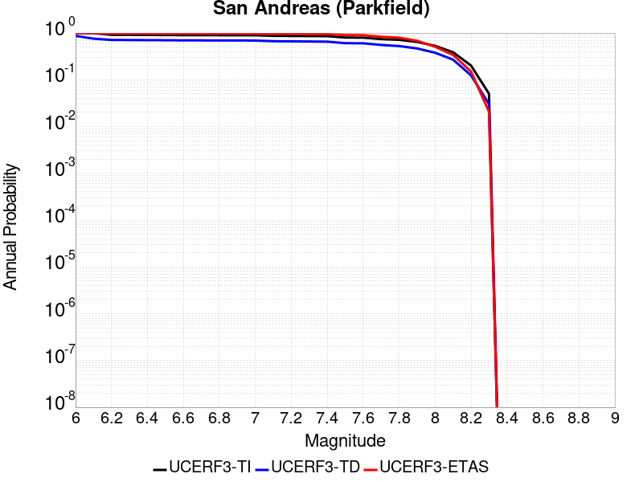 |
|-----|

| Magnitude | UCERF3-TI Prob | UCERF3-TD Prob | UCERF3-ETAS Prob |
|-----|-----|-----|-----|
| 6.0 | 0.9999995 | 0.86850274 | 1.0 |
| 6.1 | 0.9934278 | 0.75581145 | 0.99444443 |
| 6.2 | 0.9146089 | 0.70974666 | 0.96666664 |
| 6.3 | 0.91125554 | 0.707085 | 0.9611111 |
| 6.4 | 0.9078524 | 0.70315325 | 0.95555556 |
| 6.5 | 0.9044598 | 0.69997954 | 0.95555556 |
| 6.6 | 0.89962167 | 0.69563407 | 0.95555556 |
| 6.7 | 0.89769536 | 0.69386685 | 0.95555556 |
| 6.8 | 0.8969485 | 0.6931208 | 0.95555556 |
| 6.9 | 0.89613765 | 0.69222826 | 0.95555556 |
| 7.0 | 0.8927505 | 0.6888564 | 0.95555556 |
| 7.1 | 0.8702049 | 0.6678418 | 0.95555556 |
| 7.2 | 0.865553 | 0.6634349 | 0.95555556 |
| 7.3 | 0.8606767 | 0.6580486 | 0.95555556 |
| 7.4 | 0.85576004 | 0.6526948 | 0.95 |
| 7.5 | 0.798996 | 0.6060098 | 0.92777777 |
| 7.6 | 0.7944759 | 0.6018191 | 0.9111111 |
| 7.7 | 0.74013823 | 0.5557984 | 0.8277778 |
| 7.8 | 0.71483195 | 0.5255371 | 0.8 |
| 7.9 | 0.6450711 | 0.46692088 | 0.6666667 |
| 8.0 | 0.5305246 | 0.3787137 | 0.47777778 |
| 8.1 | 0.38824737 | 0.2697344 | 0.29444444 |
| 8.2 | 0.20189473 | 0.12443162 | 0.11666667 |
| 8.3 | 0.050421786 | 0.030325888 | 0.016666668 |

## San Andreas (Peninsula) 2011 CFM
*[(top)](#table-of-contents)*

| 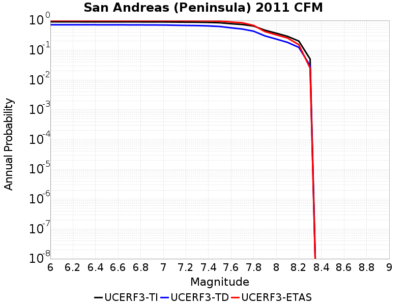 |
|-----|

| Magnitude | UCERF3-TI Prob | UCERF3-TD Prob | UCERF3-ETAS Prob |
|-----|-----|-----|-----|
| 6.0 | 0.8944965 | 0.71221906 | 0.98888886 |
| 6.1 | 0.8944965 | 0.71221906 | 0.98888886 |
| 6.2 | 0.8944965 | 0.71221906 | 0.98888886 |
| 6.3 | 0.89258254 | 0.709186 | 0.98888886 |
| 6.4 | 0.89258254 | 0.709186 | 0.98888886 |
| 6.5 | 0.8914552 | 0.7073999 | 0.98888886 |
| 6.6 | 0.89109665 | 0.7067993 | 0.98888886 |
| 6.7 | 0.89007205 | 0.7051482 | 0.98888886 |
| 6.8 | 0.8889406 | 0.7032218 | 0.98888886 |
| 6.9 | 0.8872653 | 0.70014006 | 0.98333335 |
| 7.0 | 0.8855872 | 0.69691765 | 0.98333335 |
| 7.1 | 0.8772975 | 0.68544376 | 0.98333335 |
| 7.2 | 0.870773 | 0.6746441 | 0.98333335 |
| 7.3 | 0.86660683 | 0.6675425 | 0.96666664 |
| 7.4 | 0.8531856 | 0.6508274 | 0.9611111 |
| 7.5 | 0.83064383 | 0.6221272 | 0.93333334 |
| 7.6 | 0.77239054 | 0.56193244 | 0.8888889 |
| 7.7 | 0.7249129 | 0.5109899 | 0.8277778 |
| 7.8 | 0.6452138 | 0.43297017 | 0.6944444 |
| 7.9 | 0.46695727 | 0.30122352 | 0.3888889 |
| 8.0 | 0.37077117 | 0.23558094 | 0.2888889 |
| 8.1 | 0.29058734 | 0.18269314 | 0.19444445 |
| 8.2 | 0.20171776 | 0.12424178 | 0.11666667 |
| 8.3 | 0.050421786 | 0.030325888 | 0.016666668 |

## San Andreas (San Bernardino N)
*[(top)](#table-of-contents)*

| 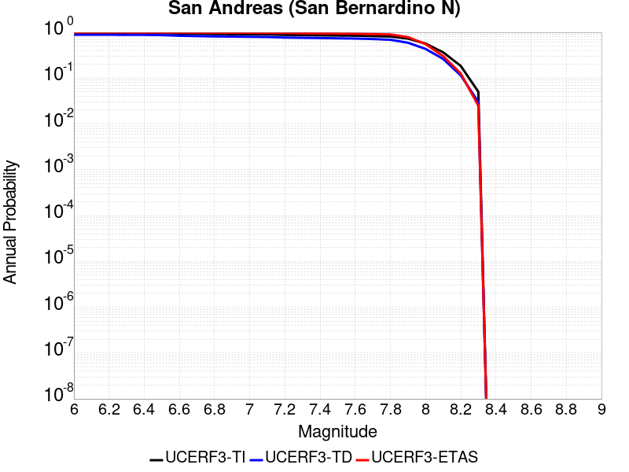 |
|-----|

| Magnitude | UCERF3-TI Prob | UCERF3-TD Prob | UCERF3-ETAS Prob |
|-----|-----|-----|-----|
| 6.0 | 0.97586733 | 0.8865408 | 0.99444443 |
| 6.1 | 0.97586733 | 0.8865408 | 0.99444443 |
| 6.2 | 0.97586733 | 0.8865408 | 0.99444443 |
| 6.3 | 0.97219324 | 0.880168 | 0.99444443 |
| 6.4 | 0.97219324 | 0.880168 | 0.99444443 |
| 6.5 | 0.96584696 | 0.8701635 | 0.99444443 |
| 6.6 | 0.94513226 | 0.8412282 | 0.98333335 |
| 6.7 | 0.93051964 | 0.82653683 | 0.98333335 |
| 6.8 | 0.91852444 | 0.8124053 | 0.9611111 |
| 6.9 | 0.91364706 | 0.8059352 | 0.9611111 |
| 7.0 | 0.9069622 | 0.7970753 | 0.9611111 |
| 7.1 | 0.89857465 | 0.7894728 | 0.9611111 |
| 7.2 | 0.8786272 | 0.76824075 | 0.9611111 |
| 7.3 | 0.86818916 | 0.75878245 | 0.9444444 |
| 7.4 | 0.8594278 | 0.75016993 | 0.9388889 |
| 7.5 | 0.8501297 | 0.73938316 | 0.92777777 |
| 7.6 | 0.8438993 | 0.7313014 | 0.9222222 |
| 7.7 | 0.82633716 | 0.71323913 | 0.9111111 |
| 7.8 | 0.8067728 | 0.6866497 | 0.9 |
| 7.9 | 0.7274876 | 0.5922762 | 0.7888889 |
| 8.0 | 0.5684575 | 0.43387154 | 0.5222222 |
| 8.1 | 0.36544946 | 0.26215902 | 0.2611111 |
| 8.2 | 0.18480022 | 0.11477347 | 0.094444446 |
| 8.3 | 0.050421786 | 0.030325888 | 0.016666668 |

## San Andreas (San Bernardino S)
*[(top)](#table-of-contents)*

| 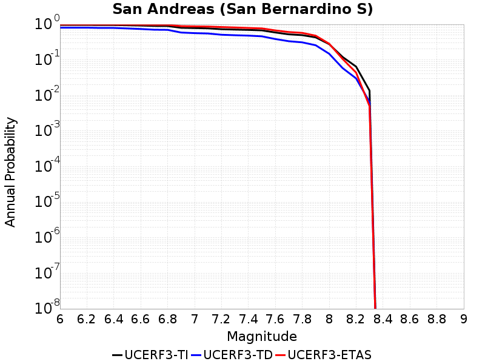 |
|-----|

| Magnitude | UCERF3-TI Prob | UCERF3-TD Prob | UCERF3-ETAS Prob |
|-----|-----|-----|-----|
| 6.0 | 0.9599879 | 0.8044238 | 0.98888886 |
| 6.1 | 0.9599879 | 0.8044238 | 0.98888886 |
| 6.2 | 0.9599879 | 0.8044238 | 0.98888886 |
| 6.3 | 0.952916 | 0.7904777 | 0.98888886 |
| 6.4 | 0.952916 | 0.7904777 | 0.98888886 |
| 6.5 | 0.9385083 | 0.76525635 | 0.98888886 |
| 6.6 | 0.92173964 | 0.7382361 | 0.98333335 |
| 6.7 | 0.8981997 | 0.7044238 | 0.98333335 |
| 6.8 | 0.89291316 | 0.69760007 | 0.98333335 |
| 6.9 | 0.7976541 | 0.5867215 | 0.8833333 |
| 7.0 | 0.7832139 | 0.56505007 | 0.8666667 |
| 7.1 | 0.76883996 | 0.55242866 | 0.8611111 |
| 7.2 | 0.72806895 | 0.5086793 | 0.8277778 |
| 7.3 | 0.7097241 | 0.49316472 | 0.8111111 |
| 7.4 | 0.69534343 | 0.48040184 | 0.79444444 |
| 7.5 | 0.67504495 | 0.45920953 | 0.76666665 |
| 7.6 | 0.5890553 | 0.38519812 | 0.6611111 |
| 7.7 | 0.52228796 | 0.33478612 | 0.6 |
| 7.8 | 0.49547994 | 0.3106563 | 0.5833333 |
| 7.9 | 0.42886806 | 0.257465 | 0.5 |
| 8.0 | 0.27677682 | 0.14860393 | 0.26666668 |
| 8.1 | 0.12045774 | 0.058680173 | 0.083333336 |
| 8.2 | 0.06469199 | 0.030195685 | 0.027777778 |
| 8.3 | 0.013693689 | 0.0065632206 | 0.0 |

## San Andreas (San Gorgonio Pass-Garnet HIll)
*[(top)](#table-of-contents)*

| 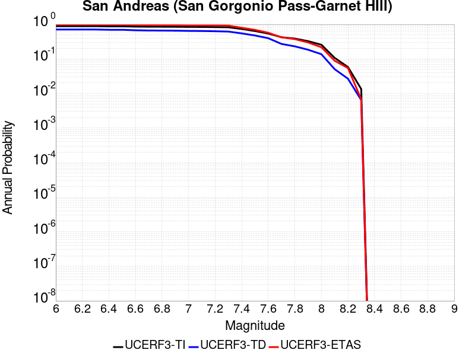 |
|-----|

| Magnitude | UCERF3-TI Prob | UCERF3-TD Prob | UCERF3-ETAS Prob |
|-----|-----|-----|-----|
| 6.0 | 0.88577545 | 0.7087115 | 0.96666664 |
| 6.1 | 0.88577545 | 0.7087115 | 0.96666664 |
| 6.2 | 0.88577545 | 0.7087115 | 0.96666664 |
| 6.3 | 0.88577545 | 0.7087115 | 0.96666664 |
| 6.4 | 0.8778658 | 0.69706094 | 0.95 |
| 6.5 | 0.8778658 | 0.69706094 | 0.95 |
| 6.6 | 0.8630145 | 0.6747892 | 0.9388889 |
| 6.7 | 0.85648 | 0.665331 | 0.92777777 |
| 6.8 | 0.85394716 | 0.6619539 | 0.92777777 |
| 6.9 | 0.85017097 | 0.656243 | 0.9222222 |
| 7.0 | 0.8432466 | 0.64711004 | 0.9111111 |
| 7.1 | 0.84018743 | 0.6424119 | 0.9111111 |
| 7.2 | 0.83256024 | 0.63213867 | 0.9111111 |
| 7.3 | 0.822333 | 0.6183294 | 0.9111111 |
| 7.4 | 0.73602754 | 0.54815865 | 0.81666666 |
| 7.5 | 0.64134896 | 0.4761911 | 0.7 |
| 7.6 | 0.5410524 | 0.39777663 | 0.5888889 |
| 7.7 | 0.42386222 | 0.27139798 | 0.4888889 |
| 7.8 | 0.38820913 | 0.23113512 | 0.4611111 |
| 7.9 | 0.32660085 | 0.1842282 | 0.35555556 |
| 8.0 | 0.25738212 | 0.13716476 | 0.23333333 |
| 8.1 | 0.1073123 | 0.050527245 | 0.06111111 |
| 8.2 | 0.05834506 | 0.02684412 | 0.016666668 |
| 8.3 | 0.013482461 | 0.0064644623 | 0.0 |

## San Andreas (Santa Cruz Mts) 2011 CFM
*[(top)](#table-of-contents)*

| 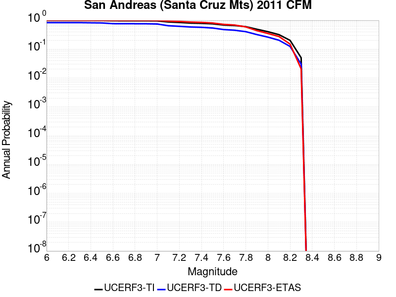 |
|-----|

| Magnitude | UCERF3-TI Prob | UCERF3-TD Prob | UCERF3-ETAS Prob |
|-----|-----|-----|-----|
| 6.0 | 0.9888173 | 0.83226454 | 1.0 |
| 6.1 | 0.9888173 | 0.83226454 | 1.0 |
| 6.2 | 0.9888173 | 0.83226454 | 1.0 |
| 6.3 | 0.98866343 | 0.8315222 | 1.0 |
| 6.4 | 0.98611796 | 0.82075894 | 1.0 |
| 6.5 | 0.9835509 | 0.8114979 | 1.0 |
| 6.6 | 0.9666856 | 0.76617754 | 0.99444443 |
| 6.7 | 0.9651701 | 0.7633418 | 0.99444443 |
| 6.8 | 0.96456236 | 0.7619366 | 0.99444443 |
| 6.9 | 0.9635323 | 0.7593779 | 0.99444443 |
| 7.0 | 0.95666593 | 0.74528575 | 0.99444443 |
| 7.1 | 0.8775646 | 0.64933336 | 0.9444444 |
| 7.2 | 0.8428939 | 0.6184435 | 0.9222222 |
| 7.3 | 0.80129623 | 0.5873167 | 0.87222224 |
| 7.4 | 0.7858347 | 0.57200617 | 0.85555553 |
| 7.5 | 0.7571226 | 0.54147625 | 0.8111111 |
| 7.6 | 0.6852574 | 0.47817096 | 0.7222222 |
| 7.7 | 0.65849894 | 0.45273018 | 0.6722222 |
| 7.8 | 0.60299623 | 0.40420482 | 0.6 |
| 7.9 | 0.49069053 | 0.32036838 | 0.40555555 |
| 8.0 | 0.40308562 | 0.26103285 | 0.31111112 |
| 8.1 | 0.31827056 | 0.20356846 | 0.21666667 |
| 8.2 | 0.20177886 | 0.12430096 | 0.11666667 |
| 8.3 | 0.050421786 | 0.030325888 | 0.016666668 |

## San Cayetano
*[(top)](#table-of-contents)*

| 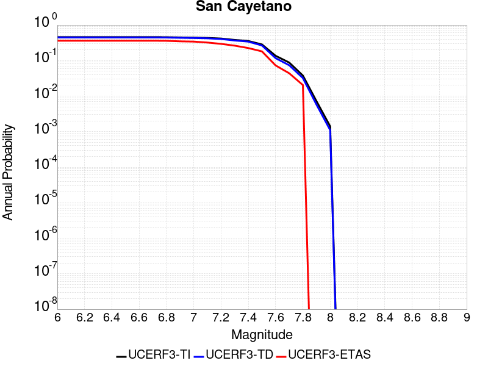 |
|-----|

| Magnitude | UCERF3-TI Prob | UCERF3-TD Prob | UCERF3-ETAS Prob |
|-----|-----|-----|-----|
| 6.0 | 0.45799834 | 0.4489112 | 0.4 |
| 6.1 | 0.45799834 | 0.4489112 | 0.4 |
| 6.2 | 0.45799834 | 0.4489112 | 0.4 |
| 6.3 | 0.45799834 | 0.4489112 | 0.4 |
| 6.4 | 0.45799834 | 0.4489112 | 0.4 |
| 6.5 | 0.45799834 | 0.4489112 | 0.4 |
| 6.6 | 0.45799834 | 0.4489112 | 0.4 |
| 6.7 | 0.45799834 | 0.4489112 | 0.4 |
| 6.8 | 0.45467442 | 0.44525868 | 0.39444444 |
| 6.9 | 0.44778907 | 0.43760112 | 0.38333333 |
| 7.0 | 0.44260457 | 0.4318356 | 0.37222221 |
| 7.1 | 0.4348189 | 0.42335826 | 0.3611111 |
| 7.2 | 0.4174979 | 0.40478727 | 0.33333334 |
| 7.3 | 0.38138136 | 0.36799803 | 0.3 |
| 7.4 | 0.3558254 | 0.34178695 | 0.25555557 |
| 7.5 | 0.28433228 | 0.2660431 | 0.22222222 |
| 7.6 | 0.13654356 | 0.11718376 | 0.083333336 |
| 7.7 | 0.08788983 | 0.07381649 | 0.05 |
| 7.8 | 0.037943818 | 0.032257132 | 0.027777778 |
| 7.9 | 0.0071665356 | 0.005733847 | 0.0 |
| 8.0 | 0.00140987 | 0.0011053833 | 0.0 |

## San Clemente
*[(top)](#table-of-contents)*

| 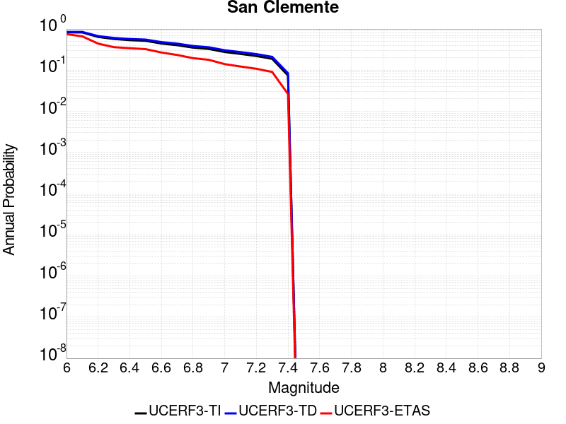 |
|-----|

| Magnitude | UCERF3-TI Prob | UCERF3-TD Prob | UCERF3-ETAS Prob |
|-----|-----|-----|-----|
| 6.0 | 0.82503724 | 0.85035163 | 0.70555556 |
| 6.1 | 0.82503724 | 0.85035163 | 0.6166667 |
| 6.2 | 0.64226156 | 0.67344135 | 0.42222223 |
| 6.3 | 0.5727006 | 0.6077699 | 0.33333334 |
| 6.4 | 0.5362743 | 0.5728328 | 0.31666666 |
| 6.5 | 0.51718384 | 0.5542501 | 0.2888889 |
| 6.6 | 0.44390202 | 0.48131436 | 0.21666667 |
| 6.7 | 0.40441445 | 0.4413569 | 0.16111112 |
| 6.8 | 0.35314393 | 0.38726607 | 0.12777779 |
| 6.9 | 0.32769325 | 0.36022508 | 0.11111111 |
| 7.0 | 0.2762617 | 0.3052011 | 0.07777778 |
| 7.1 | 0.24818511 | 0.27508476 | 0.06111111 |
| 7.2 | 0.22114737 | 0.24604465 | 0.05 |
| 7.3 | 0.18872789 | 0.21085352 | 0.044444446 |
| 7.4 | 0.074272044 | 0.0844781 | 0.016666668 |

## San Diego Trough north alt1
*[(top)](#table-of-contents)*

| 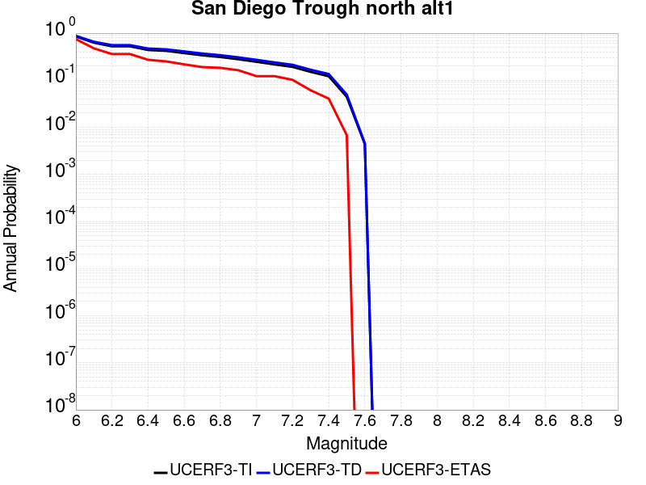 |
|-----|

| Magnitude | UCERF3-TI Prob | UCERF3-TD Prob | UCERF3-ETAS Prob |
|-----|-----|-----|-----|
| 6.0 | 0.85224795 | 0.87982696 | 0.70555556 |
| 6.1 | 0.62836957 | 0.6564581 | 0.5 |
| 6.2 | 0.52637774 | 0.5569146 | 0.4 |
| 6.3 | 0.52637774 | 0.5569146 | 0.4 |
| 6.4 | 0.43971404 | 0.47181275 | 0.31666666 |
| 6.5 | 0.42189917 | 0.4540075 | 0.28333333 |
| 6.6 | 0.37809917 | 0.40965724 | 0.26666668 |
| 6.7 | 0.3392754 | 0.3697508 | 0.22777778 |
| 6.8 | 0.31194925 | 0.340828 | 0.21111111 |
| 6.9 | 0.2796759 | 0.3065423 | 0.18888889 |
| 7.0 | 0.24719818 | 0.27174625 | 0.16111112 |
| 7.1 | 0.21734251 | 0.23963298 | 0.14444445 |
| 7.2 | 0.19240354 | 0.21280424 | 0.12777779 |
| 7.3 | 0.150861 | 0.1674274 | 0.10555556 |
| 7.4 | 0.12195748 | 0.13570681 | 0.08888889 |
| 7.5 | 0.044603836 | 0.049646266 | 0.022222223 |
| 7.6 | 0.0044224365 | 0.0045569655 | 0.0 |

## San Diego Trough south
*[(top)](#table-of-contents)*

| 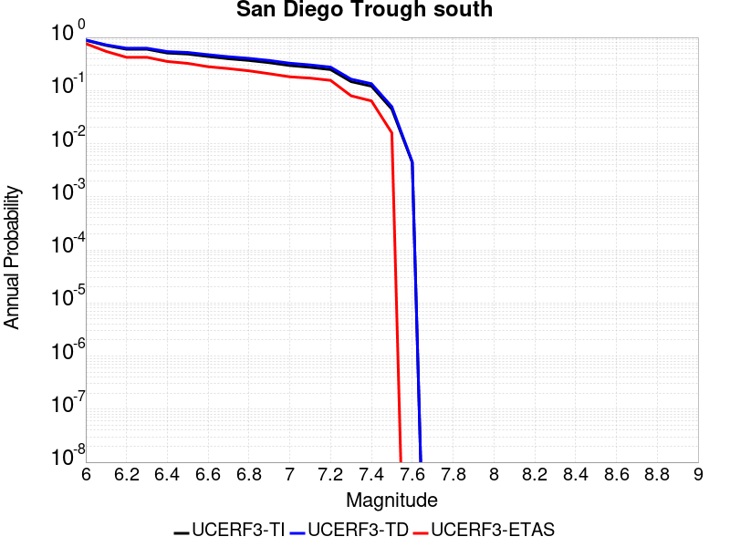 |
|-----|

| Magnitude | UCERF3-TI Prob | UCERF3-TD Prob | UCERF3-ETAS Prob |
|-----|-----|-----|-----|
| 6.0 | 0.88469225 | 0.89642763 | 0.79444444 |
| 6.1 | 0.7063069 | 0.7249799 | 0.56666666 |
| 6.2 | 0.59957117 | 0.6263314 | 0.44444445 |
| 6.3 | 0.59957117 | 0.6263314 | 0.44444445 |
| 6.4 | 0.5081382 | 0.5413923 | 0.38333333 |
| 6.5 | 0.4870079 | 0.52115464 | 0.3611111 |
| 6.6 | 0.43722513 | 0.4727967 | 0.31666666 |
| 6.7 | 0.3970993 | 0.43327543 | 0.3 |
| 6.8 | 0.368448 | 0.40357214 | 0.2777778 |
| 6.9 | 0.3347251 | 0.3682398 | 0.23888889 |
| 7.0 | 0.29584482 | 0.3270779 | 0.2 |
| 7.1 | 0.27390525 | 0.3036579 | 0.19444445 |
| 7.2 | 0.24796005 | 0.27581757 | 0.17777778 |
| 7.3 | 0.14736493 | 0.16393049 | 0.10555556 |
| 7.4 | 0.12076551 | 0.13450912 | 0.08888889 |
| 7.5 | 0.044603836 | 0.049646266 | 0.022222223 |
| 7.6 | 0.0044224365 | 0.0045569655 | 0.0 |

## San Gabriel
*[(top)](#table-of-contents)*

| 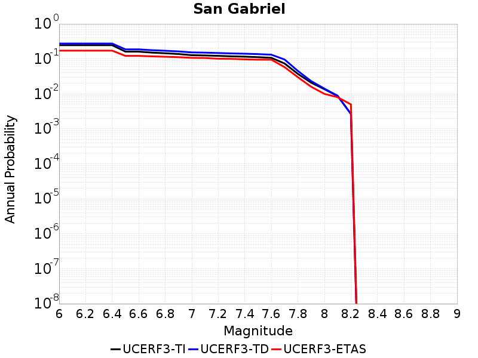 |
|-----|

| Magnitude | UCERF3-TI Prob | UCERF3-TD Prob | UCERF3-ETAS Prob |
|-----|-----|-----|-----|
| 6.0 | 0.24629234 | 0.2746914 | 0.15555556 |
| 6.1 | 0.24629234 | 0.2746914 | 0.15555556 |
| 6.2 | 0.24629234 | 0.2746914 | 0.15555556 |
| 6.3 | 0.24629234 | 0.2746914 | 0.15555556 |
| 6.4 | 0.24629234 | 0.2746914 | 0.15555556 |
| 6.5 | 0.16106999 | 0.18707567 | 0.11666667 |
| 6.6 | 0.16106999 | 0.18707567 | 0.11666667 |
| 6.7 | 0.15100983 | 0.17702049 | 0.11666667 |
| 6.8 | 0.14481483 | 0.17083149 | 0.11111111 |
| 6.9 | 0.13787304 | 0.16357385 | 0.11111111 |
| 7.0 | 0.12761565 | 0.15311018 | 0.10555556 |
| 7.1 | 0.12539798 | 0.15068027 | 0.10555556 |
| 7.2 | 0.12204627 | 0.14695972 | 0.1 |
| 7.3 | 0.11820992 | 0.14308679 | 0.1 |
| 7.4 | 0.11567336 | 0.14048265 | 0.1 |
| 7.5 | 0.11194677 | 0.13677387 | 0.1 |
| 7.6 | 0.107137434 | 0.1318458 | 0.1 |
| 7.7 | 0.073743775 | 0.095669724 | 0.06111111 |
| 7.8 | 0.03722749 | 0.045160897 | 0.03888889 |
| 7.9 | 0.020907946 | 0.02312646 | 0.011111111 |
| 8.0 | 0.013596615 | 0.014119937 | 0.011111111 |
| 8.1 | 0.008614512 | 0.008828801 | 0.0055555557 |
| 8.2 | 0.0026667663 | 0.00266108 | 0.0 |

## San Gabriel (Extension)
*[(top)](#table-of-contents)*

| 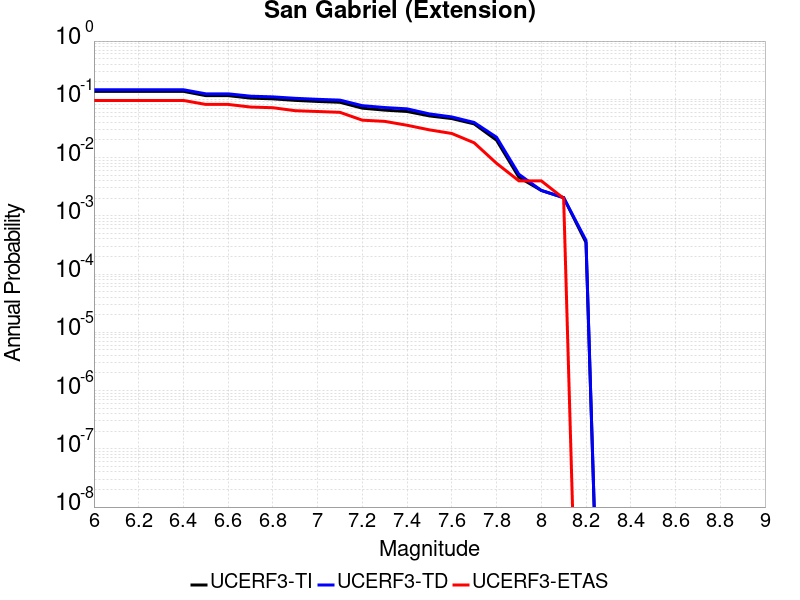 |
|-----|

| Magnitude | UCERF3-TI Prob | UCERF3-TD Prob | UCERF3-ETAS Prob |
|-----|-----|-----|-----|
| 6.0 | 0.13702421 | 0.14605163 | 0.10555556 |
| 6.1 | 0.13702421 | 0.14605163 | 0.10555556 |
| 6.2 | 0.13702421 | 0.14605163 | 0.10555556 |
| 6.3 | 0.13702421 | 0.14605163 | 0.10555556 |
| 6.4 | 0.13702421 | 0.14605163 | 0.10555556 |
| 6.5 | 0.11571067 | 0.12426808 | 0.08888889 |
| 6.6 | 0.11571067 | 0.12426808 | 0.08888889 |
| 6.7 | 0.10488081 | 0.113215595 | 0.08888889 |
| 6.8 | 0.10186735 | 0.11014531 | 0.07777778 |
| 6.9 | 0.0958912 | 0.10405003 | 0.06666667 |
| 7.0 | 0.09189315 | 0.09997471 | 0.06666667 |
| 7.1 | 0.08890177 | 0.09685931 | 0.06666667 |
| 7.2 | 0.0705026 | 0.07781148 | 0.06111111 |
| 7.3 | 0.06519998 | 0.07225364 | 0.06111111 |
| 7.4 | 0.061831895 | 0.06862121 | 0.06111111 |
| 7.5 | 0.05188082 | 0.056142293 | 0.044444446 |
| 7.6 | 0.046687793 | 0.049845923 | 0.03888889 |
| 7.7 | 0.03784359 | 0.040041223 | 0.033333335 |
| 7.8 | 0.019882068 | 0.022329336 | 0.022222223 |
| 7.9 | 0.004593113 | 0.0051593524 | 0.011111111 |
| 8.0 | 0.0027261197 | 0.0027308771 | 0.011111111 |
| 8.1 | 0.0020526089 | 0.0020459266 | 0.0055555557 |
| 8.2 | 3.473524E-4 | 3.7873574E-4 | 0.0 |

## San Gorgonio Pass
*[(top)](#table-of-contents)*

| 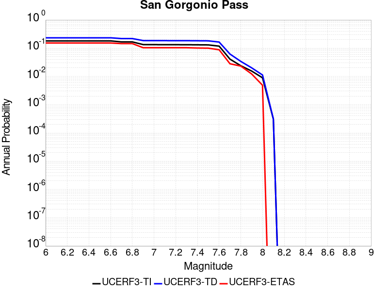 |
|-----|

| Magnitude | UCERF3-TI Prob | UCERF3-TD Prob | UCERF3-ETAS Prob |
|-----|-----|-----|-----|
| 6.0 | 0.1808072 | 0.23277082 | 0.18888889 |
| 6.1 | 0.1808072 | 0.23277082 | 0.18888889 |
| 6.2 | 0.1808072 | 0.23277082 | 0.18888889 |
| 6.3 | 0.1808072 | 0.23277082 | 0.18888889 |
| 6.4 | 0.1808072 | 0.23277082 | 0.18888889 |
| 6.5 | 0.1808072 | 0.23277082 | 0.18888889 |
| 6.6 | 0.1808072 | 0.23277082 | 0.18888889 |
| 6.7 | 0.16665018 | 0.21866657 | 0.18888889 |
| 6.8 | 0.16665018 | 0.21866657 | 0.18888889 |
| 6.9 | 0.13377808 | 0.18542498 | 0.12777779 |
| 7.0 | 0.13327791 | 0.18492386 | 0.12777779 |
| 7.1 | 0.13297717 | 0.18462129 | 0.12777779 |
| 7.2 | 0.13262382 | 0.18426225 | 0.12777779 |
| 7.3 | 0.13236511 | 0.18398403 | 0.12777779 |
| 7.4 | 0.13137682 | 0.18288776 | 0.12222222 |
| 7.5 | 0.13045362 | 0.18169527 | 0.11666667 |
| 7.6 | 0.117915586 | 0.16455348 | 0.1 |
| 7.7 | 0.04086152 | 0.061870206 | 0.055555556 |
| 7.8 | 0.023865124 | 0.03397718 | 0.03888889 |
| 7.9 | 0.015468961 | 0.02011311 | 0.027777778 |
| 8.0 | 0.008938112 | 0.01123704 | 0.011111111 |
| 8.1 | 3.074862E-4 | 3.1463572E-4 | 0.0 |

## San Gregorio (North) 2011 CFM
*[(top)](#table-of-contents)*

| 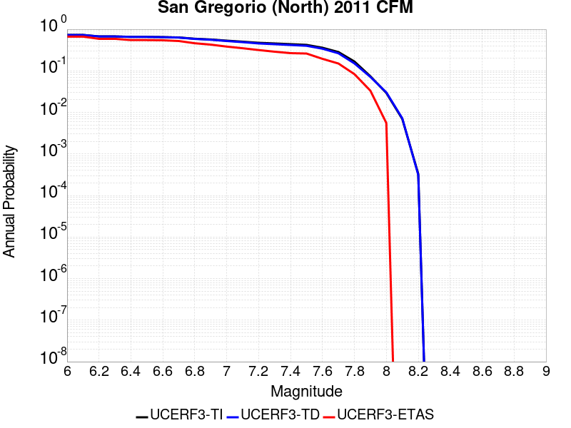 |
|-----|

| Magnitude | UCERF3-TI Prob | UCERF3-TD Prob | UCERF3-ETAS Prob |
|-----|-----|-----|-----|
| 6.0 | 0.7306934 | 0.7285524 | 0.6666667 |
| 6.1 | 0.7306934 | 0.7285524 | 0.6666667 |
| 6.2 | 0.67431617 | 0.67154 | 0.5888889 |
| 6.3 | 0.67431617 | 0.67154 | 0.5888889 |
| 6.4 | 0.6577882 | 0.65502316 | 0.55 |
| 6.5 | 0.65717417 | 0.6543973 | 0.55 |
| 6.6 | 0.6488797 | 0.6460764 | 0.54444444 |
| 6.7 | 0.63455766 | 0.63157415 | 0.5222222 |
| 6.8 | 0.59276974 | 0.5865354 | 0.4611111 |
| 6.9 | 0.5684627 | 0.5603464 | 0.42777777 |
| 7.0 | 0.53302133 | 0.5220785 | 0.38333333 |
| 7.1 | 0.50353855 | 0.48987383 | 0.35 |
| 7.2 | 0.47269627 | 0.4560811 | 0.31666666 |
| 7.3 | 0.4559364 | 0.43742457 | 0.2888889 |
| 7.4 | 0.43871754 | 0.4183721 | 0.26666668 |
| 7.5 | 0.42175037 | 0.40065682 | 0.2611111 |
| 7.6 | 0.35976326 | 0.3408227 | 0.19444445 |
| 7.7 | 0.28338686 | 0.2644534 | 0.15 |
| 7.8 | 0.1678307 | 0.15107174 | 0.083333336 |
| 7.9 | 0.07399828 | 0.07148032 | 0.033333335 |
| 8.0 | 0.029388385 | 0.030292865 | 0.0055555557 |
| 8.1 | 0.006935234 | 0.007196595 | 0.0 |
| 8.2 | 3.3139822E-4 | 3.1315166E-4 | 0.0 |

## San Gregorio (South) 2011 CFM
*[(top)](#table-of-contents)*

| 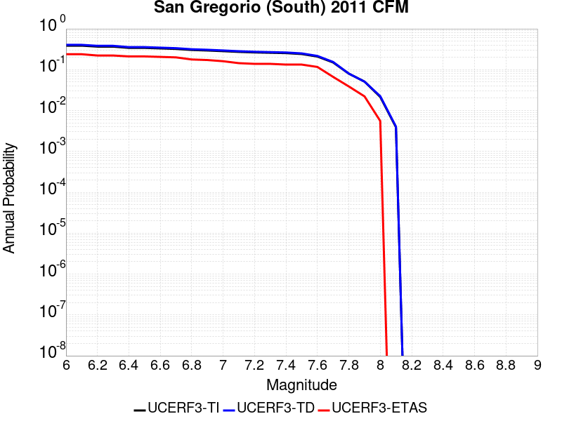 |
|-----|

| Magnitude | UCERF3-TI Prob | UCERF3-TD Prob | UCERF3-ETAS Prob |
|-----|-----|-----|-----|
| 6.0 | 0.38719684 | 0.4052979 | 0.23888889 |
| 6.1 | 0.38719684 | 0.4052979 | 0.23888889 |
| 6.2 | 0.36668876 | 0.38361156 | 0.22222222 |
| 6.3 | 0.36668876 | 0.38361156 | 0.22222222 |
| 6.4 | 0.34134257 | 0.35648906 | 0.21111111 |
| 6.5 | 0.34134257 | 0.35648906 | 0.21111111 |
| 6.6 | 0.3316071 | 0.34616354 | 0.20555556 |
| 6.7 | 0.32207096 | 0.33607712 | 0.2 |
| 6.8 | 0.30373022 | 0.31648564 | 0.17777778 |
| 6.9 | 0.29488656 | 0.30708358 | 0.17222223 |
| 7.0 | 0.28404364 | 0.295528 | 0.16111112 |
| 7.1 | 0.27244657 | 0.2830824 | 0.14444445 |
| 7.2 | 0.2643921 | 0.27442172 | 0.1388889 |
| 7.3 | 0.25927517 | 0.2689214 | 0.1388889 |
| 7.4 | 0.25438258 | 0.26385716 | 0.13333334 |
| 7.5 | 0.24154256 | 0.25048402 | 0.13333334 |
| 7.6 | 0.20965813 | 0.2171209 | 0.11666667 |
| 7.7 | 0.15031424 | 0.15457332 | 0.06666667 |
| 7.8 | 0.0799566 | 0.08032537 | 0.03888889 |
| 7.9 | 0.051084325 | 0.050968662 | 0.022222223 |
| 8.0 | 0.021556953 | 0.022505341 | 0.0055555557 |
| 8.1 | 0.00391439 | 0.0040451013 | 0.0 |

## San Jacinto (Anza) rev
*[(top)](#table-of-contents)*

| 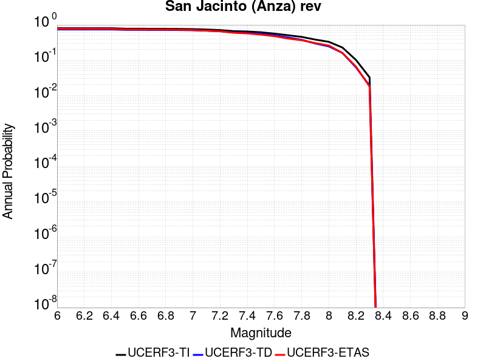 |
|-----|

| Magnitude | UCERF3-TI Prob | UCERF3-TD Prob | UCERF3-ETAS Prob |
|-----|-----|-----|-----|
| 6.0 | 0.8068107 | 0.7459551 | 0.76666665 |
| 6.1 | 0.8068107 | 0.7459551 | 0.76666665 |
| 6.2 | 0.8068107 | 0.7459551 | 0.76666665 |
| 6.3 | 0.8068107 | 0.7459551 | 0.76666665 |
| 6.4 | 0.8068107 | 0.7459551 | 0.76666665 |
| 6.5 | 0.7804328 | 0.724304 | 0.73888886 |
| 6.6 | 0.7804328 | 0.724304 | 0.73888886 |
| 6.7 | 0.7747125 | 0.719718 | 0.73888886 |
| 6.8 | 0.77378845 | 0.71881306 | 0.73333335 |
| 6.9 | 0.7692809 | 0.71482956 | 0.73333335 |
| 7.0 | 0.7580117 | 0.7043001 | 0.7222222 |
| 7.1 | 0.738379 | 0.685506 | 0.68333334 |
| 7.2 | 0.71305364 | 0.66078323 | 0.6388889 |
| 7.3 | 0.66696596 | 0.61164445 | 0.59444445 |
| 7.4 | 0.6502367 | 0.5940927 | 0.56666666 |
| 7.5 | 0.61859155 | 0.5601018 | 0.53333336 |
| 7.6 | 0.56613326 | 0.5030856 | 0.48333332 |
| 7.7 | 0.50966954 | 0.4400317 | 0.41666666 |
| 7.8 | 0.45785913 | 0.37866026 | 0.39444444 |
| 7.9 | 0.38465756 | 0.2980888 | 0.30555555 |
| 8.0 | 0.33193094 | 0.24664186 | 0.25555557 |
| 8.1 | 0.22931358 | 0.16118288 | 0.14444445 |
| 8.2 | 0.10197369 | 0.06290077 | 0.055555556 |
| 8.3 | 0.032718915 | 0.019025307 | 0.016666668 |

## San Jacinto (Borrego)
*[(top)](#table-of-contents)*

| 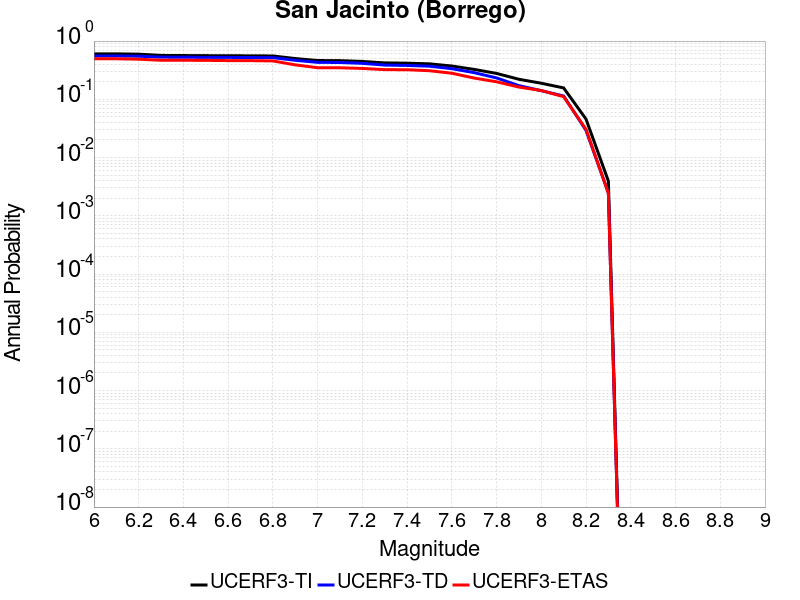 |
|-----|

| Magnitude | UCERF3-TI Prob | UCERF3-TD Prob | UCERF3-ETAS Prob |
|-----|-----|-----|-----|
| 6.0 | 0.6033173 | 0.5544884 | 0.4611111 |
| 6.1 | 0.6031402 | 0.55436885 | 0.4611111 |
| 6.2 | 0.5954657 | 0.54911965 | 0.45 |
| 6.3 | 0.56705457 | 0.5292874 | 0.41666666 |
| 6.4 | 0.56412596 | 0.52732354 | 0.41666666 |
| 6.5 | 0.5611002 | 0.524878 | 0.41666666 |
| 6.6 | 0.5600001 | 0.5239181 | 0.41666666 |
| 6.7 | 0.55719095 | 0.5214665 | 0.41666666 |
| 6.8 | 0.5547801 | 0.51918346 | 0.41111112 |
| 6.9 | 0.500965 | 0.4673604 | 0.33888888 |
| 7.0 | 0.4633185 | 0.4311337 | 0.32777777 |
| 7.1 | 0.46077177 | 0.42848933 | 0.32777777 |
| 7.2 | 0.44715822 | 0.41463348 | 0.31666666 |
| 7.3 | 0.4220706 | 0.386907 | 0.31111112 |
| 7.4 | 0.41703412 | 0.38144356 | 0.31111112 |
| 7.5 | 0.4064498 | 0.37027803 | 0.31111112 |
| 7.6 | 0.37295228 | 0.33558702 | 0.2777778 |
| 7.7 | 0.32606646 | 0.28700793 | 0.23333333 |
| 7.8 | 0.27829683 | 0.23278949 | 0.21666667 |
| 7.9 | 0.22076362 | 0.17162247 | 0.15 |
| 8.0 | 0.18873326 | 0.14076154 | 0.12222222 |
| 8.1 | 0.15690471 | 0.113978595 | 0.1 |
| 8.2 | 0.04579597 | 0.0293025 | 0.016666668 |
| 8.3 | 0.003949375 | 0.0024869854 | 0.0055555557 |

## San Jacinto (Clark) rev
*[(top)](#table-of-contents)*

| 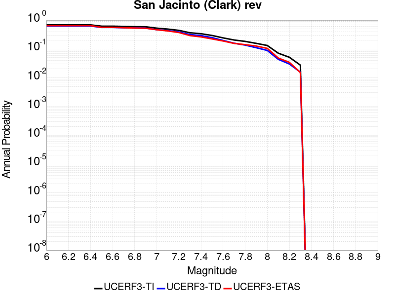 |
|-----|

| Magnitude | UCERF3-TI Prob | UCERF3-TD Prob | UCERF3-ETAS Prob |
|-----|-----|-----|-----|
| 6.0 | 0.6894805 | 0.6293 | 0.6666667 |
| 6.1 | 0.6894805 | 0.6293 | 0.6666667 |
| 6.2 | 0.6894805 | 0.6293 | 0.6666667 |
| 6.3 | 0.6894805 | 0.6293 | 0.6666667 |
| 6.4 | 0.6894805 | 0.6293 | 0.6666667 |
| 6.5 | 0.622058 | 0.5618673 | 0.57222223 |
| 6.6 | 0.622058 | 0.5618673 | 0.57222223 |
| 6.7 | 0.60947186 | 0.54964393 | 0.56666666 |
| 6.8 | 0.5990713 | 0.5392431 | 0.5611111 |
| 6.9 | 0.5918872 | 0.5319499 | 0.55 |
| 7.0 | 0.53024817 | 0.46971324 | 0.47777778 |
| 7.1 | 0.49257448 | 0.43641004 | 0.42222223 |
| 7.2 | 0.44466588 | 0.39323786 | 0.35 |
| 7.3 | 0.3670969 | 0.3179591 | 0.3 |
| 7.4 | 0.33996573 | 0.29207703 | 0.25555557 |
| 7.5 | 0.29556102 | 0.24896465 | 0.21666667 |
| 7.6 | 0.24335745 | 0.19786851 | 0.17777778 |
| 7.7 | 0.20539424 | 0.15872051 | 0.13333334 |
| 7.8 | 0.18371087 | 0.13669436 | 0.12777779 |
| 7.9 | 0.15694545 | 0.11092835 | 0.11666667 |
| 8.0 | 0.13251418 | 0.08926263 | 0.10555556 |
| 8.1 | 0.071408615 | 0.04373207 | 0.03888889 |
| 8.2 | 0.05158933 | 0.030113712 | 0.03888889 |
| 8.3 | 0.027427524 | 0.015671061 | 0.011111111 |

## San Jacinto (Coyote Creek)
*[(top)](#table-of-contents)*

| 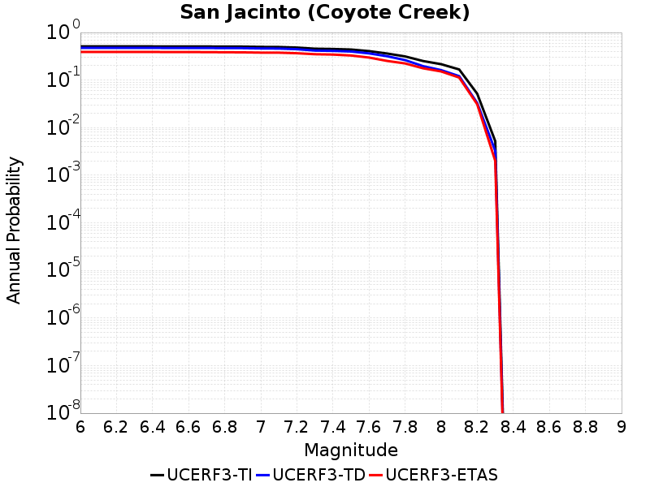 |
|-----|

| Magnitude | UCERF3-TI Prob | UCERF3-TD Prob | UCERF3-ETAS Prob |
|-----|-----|-----|-----|
| 6.0 | 0.51040995 | 0.4747309 | 0.3611111 |
| 6.1 | 0.51040995 | 0.4747309 | 0.3611111 |
| 6.2 | 0.51040995 | 0.4747309 | 0.3611111 |
| 6.3 | 0.51040995 | 0.4747309 | 0.3611111 |
| 6.4 | 0.51040995 | 0.4747309 | 0.3611111 |
| 6.5 | 0.50923467 | 0.47344154 | 0.3611111 |
| 6.6 | 0.50923467 | 0.47344154 | 0.3611111 |
| 6.7 | 0.5083857 | 0.47253275 | 0.3611111 |
| 6.8 | 0.5066179 | 0.470793 | 0.3611111 |
| 6.9 | 0.5053849 | 0.46953213 | 0.35555556 |
| 7.0 | 0.49845904 | 0.46231362 | 0.35 |
| 7.1 | 0.49593878 | 0.4596749 | 0.35 |
| 7.2 | 0.48277932 | 0.4461361 | 0.33888888 |
| 7.3 | 0.45687643 | 0.41735128 | 0.33333334 |
| 7.4 | 0.45069626 | 0.41063383 | 0.33333334 |
| 7.5 | 0.43948475 | 0.39870164 | 0.33333334 |
| 7.6 | 0.4067474 | 0.36441442 | 0.3 |
| 7.7 | 0.36208037 | 0.31760147 | 0.2611111 |
| 7.8 | 0.31459442 | 0.26331097 | 0.24444444 |
| 7.9 | 0.25171408 | 0.19639583 | 0.17777778 |
| 8.0 | 0.2160001 | 0.16203402 | 0.14444445 |
| 8.1 | 0.16743244 | 0.12116144 | 0.10555556 |
| 8.2 | 0.05172729 | 0.032978497 | 0.016666668 |
| 8.3 | 0.005217573 | 0.0032657725 | 0.0055555557 |

## San Jacinto (Lytle Creek connector)
*[(top)](#table-of-contents)*

| 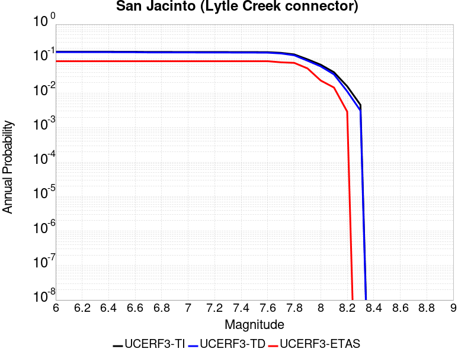 |
|-----|

| Magnitude | UCERF3-TI Prob | UCERF3-TD Prob | UCERF3-ETAS Prob |
|-----|-----|-----|-----|
| 6.0 | 0.16024251 | 0.15540326 | 0.083333336 |
| 6.1 | 0.16024251 | 0.15540326 | 0.083333336 |
| 6.2 | 0.16024251 | 0.15540326 | 0.083333336 |
| 6.3 | 0.16024251 | 0.15540326 | 0.083333336 |
| 6.4 | 0.16024251 | 0.15540326 | 0.083333336 |
| 6.5 | 0.15941378 | 0.1545283 | 0.083333336 |
| 6.6 | 0.15941378 | 0.1545283 | 0.083333336 |
| 6.7 | 0.15774621 | 0.15275443 | 0.083333336 |
| 6.8 | 0.15764531 | 0.15263538 | 0.083333336 |
| 6.9 | 0.15753104 | 0.15248346 | 0.083333336 |
| 7.0 | 0.15739806 | 0.15230586 | 0.083333336 |
| 7.1 | 0.15724458 | 0.15210997 | 0.083333336 |
| 7.2 | 0.15700251 | 0.15179588 | 0.083333336 |
| 7.3 | 0.15678315 | 0.15150341 | 0.083333336 |
| 7.4 | 0.15657482 | 0.15123169 | 0.083333336 |
| 7.5 | 0.15622775 | 0.15082256 | 0.083333336 |
| 7.6 | 0.1554723 | 0.14999172 | 0.083333336 |
| 7.7 | 0.14858443 | 0.14260471 | 0.07777778 |
| 7.8 | 0.13377017 | 0.12605603 | 0.07777778 |
| 7.9 | 0.09648984 | 0.08785962 | 0.06111111 |
| 8.0 | 0.06725205 | 0.060115796 | 0.016666668 |
| 8.1 | 0.040662073 | 0.035227846 | 0.0055555557 |
| 8.2 | 0.015864238 | 0.011317163 | 0.0 |
| 8.3 | 0.004588645 | 0.003121274 | 0.0 |

## San Jacinto (San Bernardino)
*[(top)](#table-of-contents)*

| 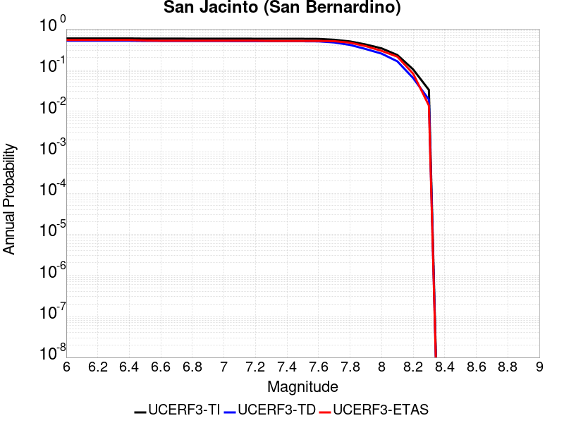 |
|-----|

| Magnitude | UCERF3-TI Prob | UCERF3-TD Prob | UCERF3-ETAS Prob |
|-----|-----|-----|-----|
| 6.0 | 0.58913505 | 0.51758254 | 0.53333336 |
| 6.1 | 0.58913505 | 0.51758254 | 0.53333336 |
| 6.2 | 0.58913505 | 0.51758254 | 0.53333336 |
| 6.3 | 0.58913505 | 0.51758254 | 0.53333336 |
| 6.4 | 0.5882167 | 0.51649565 | 0.5277778 |
| 6.5 | 0.5817949 | 0.5087818 | 0.51111114 |
| 6.6 | 0.5812505 | 0.5081406 | 0.51111114 |
| 6.7 | 0.58118784 | 0.50807494 | 0.51111114 |
| 6.8 | 0.58028656 | 0.50696456 | 0.51111114 |
| 6.9 | 0.5798369 | 0.5064356 | 0.51111114 |
| 7.0 | 0.5794126 | 0.5059514 | 0.51111114 |
| 7.1 | 0.5786725 | 0.5051416 | 0.51111114 |
| 7.2 | 0.5776192 | 0.50389385 | 0.51111114 |
| 7.3 | 0.5767654 | 0.50289303 | 0.50555557 |
| 7.4 | 0.576316 | 0.5023901 | 0.50555557 |
| 7.5 | 0.575231 | 0.5011748 | 0.50555557 |
| 7.6 | 0.57193273 | 0.4975791 | 0.50555557 |
| 7.7 | 0.5462464 | 0.4682254 | 0.46666667 |
| 7.8 | 0.4967049 | 0.40833732 | 0.45 |
| 7.9 | 0.418212 | 0.3239379 | 0.35 |
| 8.0 | 0.33675528 | 0.2503837 | 0.25555557 |
| 8.1 | 0.23176168 | 0.1626171 | 0.14444445 |
| 8.2 | 0.10353287 | 0.063771434 | 0.055555556 |
| 8.3 | 0.03273745 | 0.019037226 | 0.016666668 |

## San Jacinto (San Jacinto Valley) rev
*[(top)](#table-of-contents)*

| 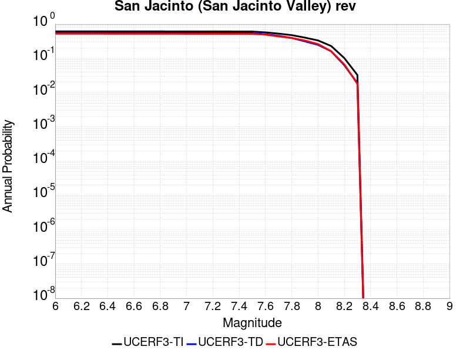 |
|-----|

| Magnitude | UCERF3-TI Prob | UCERF3-TD Prob | UCERF3-ETAS Prob |
|-----|-----|-----|-----|
| 6.0 | 0.61440945 | 0.5502662 | 0.5277778 |
| 6.1 | 0.61440945 | 0.5502662 | 0.5277778 |
| 6.2 | 0.61440945 | 0.5502662 | 0.5277778 |
| 6.3 | 0.61440945 | 0.5502662 | 0.5277778 |
| 6.4 | 0.6138302 | 0.5496635 | 0.5277778 |
| 6.5 | 0.6138302 | 0.5496635 | 0.5277778 |
| 6.6 | 0.61355907 | 0.5493805 | 0.5277778 |
| 6.7 | 0.6134543 | 0.5492747 | 0.5277778 |
| 6.8 | 0.6132271 | 0.54902667 | 0.5277778 |
| 6.9 | 0.61293626 | 0.5487086 | 0.5277778 |
| 7.0 | 0.61206776 | 0.5477596 | 0.5277778 |
| 7.1 | 0.6117219 | 0.5473556 | 0.5277778 |
| 7.2 | 0.6112098 | 0.546777 | 0.5277778 |
| 7.3 | 0.6102882 | 0.54573697 | 0.5222222 |
| 7.4 | 0.6098714 | 0.5452684 | 0.5222222 |
| 7.5 | 0.6076082 | 0.5428837 | 0.5222222 |
| 7.6 | 0.5757697 | 0.508659 | 0.5 |
| 7.7 | 0.5293005 | 0.45614615 | 0.43333334 |
| 7.8 | 0.47844556 | 0.39527458 | 0.41666666 |
| 7.9 | 0.40470725 | 0.31406066 | 0.33333334 |
| 8.0 | 0.33492464 | 0.2492438 | 0.25555557 |
| 8.1 | 0.23054773 | 0.1619686 | 0.14444445 |
| 8.2 | 0.1027428 | 0.06336104 | 0.055555556 |
| 8.3 | 0.03273745 | 0.019037226 | 0.016666668 |

## San Jacinto (Stepovers Combined)
*[(top)](#table-of-contents)*

| 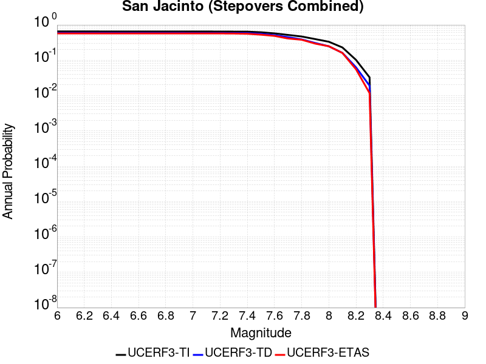 |
|-----|

| Magnitude | UCERF3-TI Prob | UCERF3-TD Prob | UCERF3-ETAS Prob |
|-----|-----|-----|-----|
| 6.0 | 0.6538953 | 0.5945109 | 0.5833333 |
| 6.1 | 0.6538953 | 0.5945109 | 0.5833333 |
| 6.2 | 0.6538953 | 0.5945109 | 0.5833333 |
| 6.3 | 0.6538953 | 0.5945109 | 0.5833333 |
| 6.4 | 0.65307695 | 0.59370625 | 0.5833333 |
| 6.5 | 0.65307695 | 0.59370625 | 0.5833333 |
| 6.6 | 0.65272725 | 0.5933626 | 0.5833333 |
| 6.7 | 0.6525273 | 0.59316295 | 0.5833333 |
| 6.8 | 0.6523259 | 0.5929539 | 0.5833333 |
| 6.9 | 0.6520493 | 0.59267116 | 0.5833333 |
| 7.0 | 0.65114 | 0.5917429 | 0.5833333 |
| 7.1 | 0.650953 | 0.5915582 | 0.5833333 |
| 7.2 | 0.65016955 | 0.59075826 | 0.5833333 |
| 7.3 | 0.64726716 | 0.5878943 | 0.5777778 |
| 7.4 | 0.6452416 | 0.58588207 | 0.56666666 |
| 7.5 | 0.61950547 | 0.55854774 | 0.53333336 |
| 7.6 | 0.5765926 | 0.51195997 | 0.49444443 |
| 7.7 | 0.5212953 | 0.4498095 | 0.42777777 |
| 7.8 | 0.46992746 | 0.38858846 | 0.41111112 |
| 7.9 | 0.39672282 | 0.3078358 | 0.32222223 |
| 8.0 | 0.33405817 | 0.24864896 | 0.25555557 |
| 8.1 | 0.23013729 | 0.16170876 | 0.14444445 |
| 8.2 | 0.10244674 | 0.06318105 | 0.055555556 |
| 8.3 | 0.032718915 | 0.019025307 | 0.016666668 |

## San Jacinto (Superstition Mtn)
*[(top)](#table-of-contents)*

| 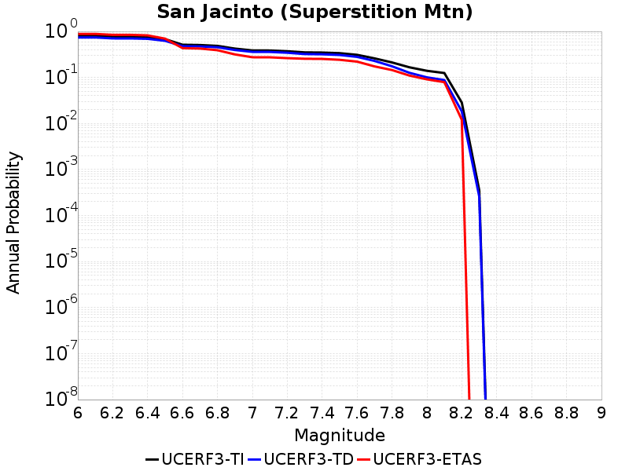 |
|-----|

| Magnitude | UCERF3-TI Prob | UCERF3-TD Prob | UCERF3-ETAS Prob |
|-----|-----|-----|-----|
| 6.0 | 0.8126594 | 0.74072605 | 0.8611111 |
| 6.1 | 0.8126594 | 0.74072605 | 0.8611111 |
| 6.2 | 0.7741191 | 0.70572776 | 0.8277778 |
| 6.3 | 0.77362645 | 0.7051809 | 0.8277778 |
| 6.4 | 0.7566699 | 0.6908247 | 0.8111111 |
| 6.5 | 0.6806504 | 0.6261762 | 0.6944444 |
| 6.6 | 0.51482964 | 0.4792949 | 0.38333333 |
| 6.7 | 0.50720334 | 0.4727349 | 0.37777779 |
| 6.8 | 0.48554856 | 0.4531586 | 0.3611111 |
| 6.9 | 0.42426506 | 0.39511067 | 0.28333333 |
| 7.0 | 0.38693884 | 0.3599462 | 0.27222222 |
| 7.1 | 0.38572586 | 0.3587197 | 0.27222222 |
| 7.2 | 0.37155885 | 0.3445486 | 0.2611111 |
| 7.3 | 0.351219 | 0.32231054 | 0.25555557 |
| 7.4 | 0.34789065 | 0.3186798 | 0.25555557 |
| 7.5 | 0.3376577 | 0.30801407 | 0.25555557 |
| 7.6 | 0.31046674 | 0.2802649 | 0.22777778 |
| 7.7 | 0.26007205 | 0.22884962 | 0.18333334 |
| 7.8 | 0.2121411 | 0.17507336 | 0.16666667 |
| 7.9 | 0.16633336 | 0.12628599 | 0.11111111 |
| 8.0 | 0.13961427 | 0.1006271 | 0.08888889 |
| 8.1 | 0.12486782 | 0.087805755 | 0.07777778 |
| 8.2 | 0.028482838 | 0.018324267 | 0.0055555557 |
| 8.3 | 3.5434432E-4 | 2.5897878E-4 | 0.0 |

## San Joaquin Hills
*[(top)](#table-of-contents)*

| 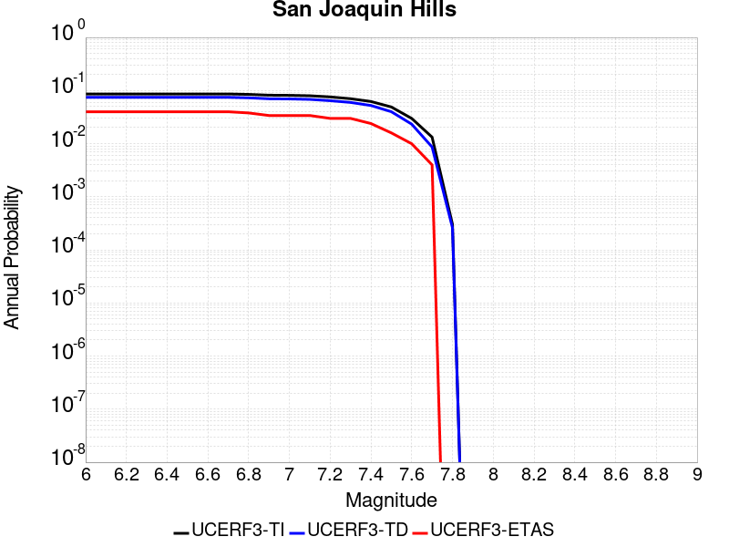 |
|-----|

| Magnitude | UCERF3-TI Prob | UCERF3-TD Prob | UCERF3-ETAS Prob |
|-----|-----|-----|-----|
| 6.0 | 0.086137585 | 0.07451729 | 0.05 |
| 6.1 | 0.086137585 | 0.07451729 | 0.05 |
| 6.2 | 0.086137585 | 0.07451729 | 0.05 |
| 6.3 | 0.086137585 | 0.07451729 | 0.05 |
| 6.4 | 0.086137585 | 0.07451729 | 0.05 |
| 6.5 | 0.086137585 | 0.07451729 | 0.05 |
| 6.6 | 0.086137585 | 0.07451729 | 0.05 |
| 6.7 | 0.086137585 | 0.07451729 | 0.05 |
| 6.8 | 0.084612414 | 0.07293414 | 0.05 |
| 6.9 | 0.08176082 | 0.07001786 | 0.05 |
| 7.0 | 0.08122108 | 0.06949472 | 0.05 |
| 7.1 | 0.07977167 | 0.06814427 | 0.05 |
| 7.2 | 0.075815566 | 0.06436121 | 0.044444446 |
| 7.3 | 0.070145436 | 0.059698828 | 0.044444446 |
| 7.4 | 0.062148374 | 0.052273408 | 0.027777778 |
| 7.5 | 0.04902542 | 0.039932203 | 0.016666668 |
| 7.6 | 0.029833918 | 0.023272678 | 0.011111111 |
| 7.7 | 0.013260799 | 0.008645903 | 0.0055555557 |
| 7.8 | 3.027386E-4 | 2.604207E-4 | 0.0 |

## San Jose
*[(top)](#table-of-contents)*

| 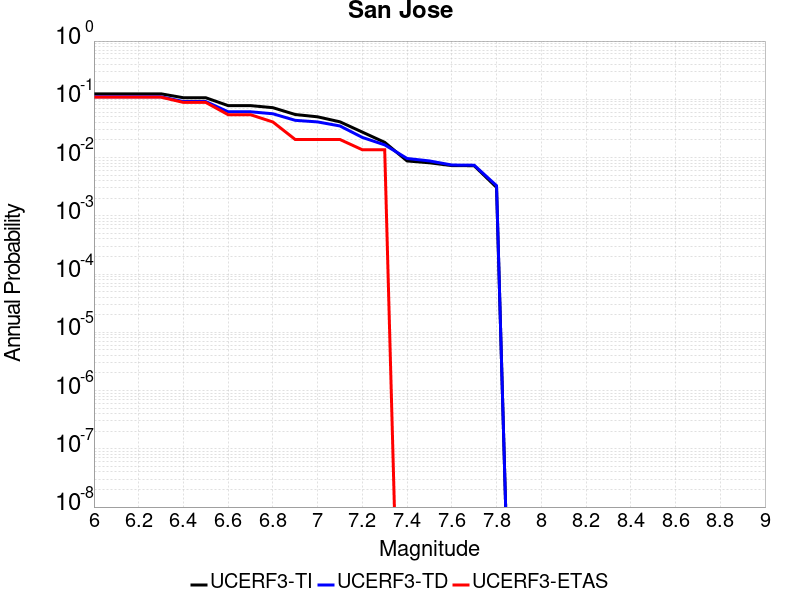 |
|-----|

| Magnitude | UCERF3-TI Prob | UCERF3-TD Prob | UCERF3-ETAS Prob |
|-----|-----|-----|-----|
| 6.0 | 0.12424394 | 0.11038726 | 0.10555556 |
| 6.1 | 0.12424394 | 0.11038726 | 0.10555556 |
| 6.2 | 0.12424394 | 0.11038726 | 0.10555556 |
| 6.3 | 0.12424394 | 0.11038726 | 0.10555556 |
| 6.4 | 0.106388815 | 0.09151193 | 0.083333336 |
| 6.5 | 0.106388815 | 0.09151193 | 0.083333336 |
| 6.6 | 0.07794291 | 0.061101004 | 0.044444446 |
| 6.7 | 0.07794291 | 0.061101004 | 0.044444446 |
| 6.8 | 0.0718186 | 0.056457736 | 0.033333335 |
| 6.9 | 0.05484068 | 0.043554015 | 0.022222223 |
| 7.0 | 0.050058633 | 0.040919296 | 0.022222223 |
| 7.1 | 0.04105964 | 0.034853134 | 0.016666668 |
| 7.2 | 0.027356105 | 0.022172919 | 0.0055555557 |
| 7.3 | 0.018252268 | 0.016516298 | 0.0 |
| 7.4 | 0.008747627 | 0.009645026 | 0.0 |
| 7.5 | 0.008130525 | 0.0087513225 | 0.0 |
| 7.6 | 0.007280629 | 0.007447999 | 0.0 |
| 7.7 | 0.0072400537 | 0.007392528 | 0.0 |
| 7.8 | 0.0030766104 | 0.0032939273 | 0.0 |

## San Juan
*[(top)](#table-of-contents)*

| 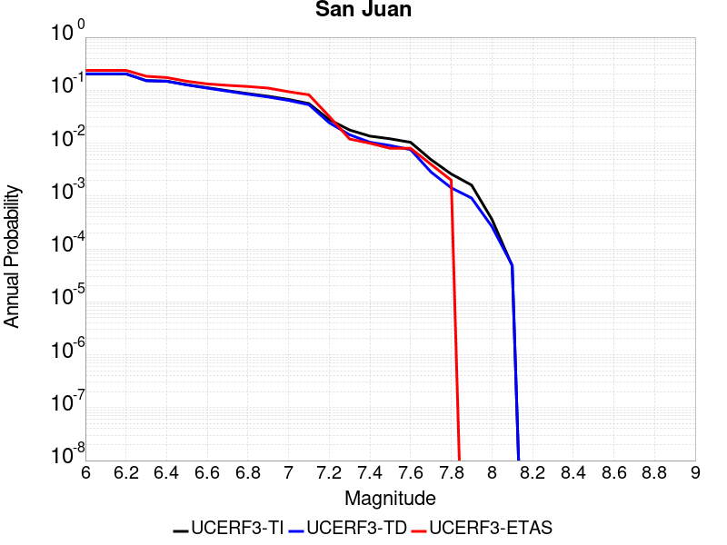 |
|-----|

| Magnitude | UCERF3-TI Prob | UCERF3-TD Prob | UCERF3-ETAS Prob |
|-----|-----|-----|-----|
| 6.0 | 0.20270395 | 0.20468658 | 0.3 |
| 6.1 | 0.20270395 | 0.20468658 | 0.3 |
| 6.2 | 0.20270395 | 0.20468658 | 0.3 |
| 6.3 | 0.15168607 | 0.15112339 | 0.24444444 |
| 6.4 | 0.14821808 | 0.14775142 | 0.24444444 |
| 6.5 | 0.12697503 | 0.12572666 | 0.21666667 |
| 6.6 | 0.11118985 | 0.109611176 | 0.2 |
| 6.7 | 0.09778567 | 0.09583729 | 0.19444445 |
| 6.8 | 0.086162716 | 0.08393314 | 0.17222223 |
| 6.9 | 0.07672654 | 0.07428006 | 0.16111112 |
| 7.0 | 0.06681149 | 0.06416083 | 0.1388889 |
| 7.1 | 0.055877227 | 0.053174455 | 0.12222222 |
| 7.2 | 0.027749471 | 0.024207423 | 0.06111111 |
| 7.3 | 0.017703284 | 0.014375431 | 0.016666668 |
| 7.4 | 0.013553141 | 0.010393479 | 0.016666668 |
| 7.5 | 0.01205422 | 0.008993417 | 0.011111111 |
| 7.6 | 0.01035733 | 0.0075331596 | 0.011111111 |
| 7.7 | 0.0048887795 | 0.0028520746 | 0.0 |
| 7.8 | 0.0026095596 | 0.0014280553 | 0.0 |
| 7.9 | 0.0016087863 | 9.1608404E-4 | 0.0 |
| 8.0 | 3.6452015E-4 | 2.6528852E-4 | 0.0 |
| 8.1 | 4.8012203E-5 | 4.9117527E-5 | 0.0 |

## San Luis Range - Oceano 2011 CFM
*[(top)](#table-of-contents)*

| 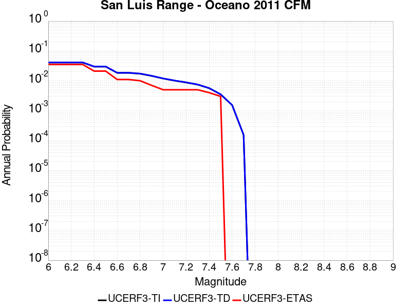 |
|-----|

| Magnitude | UCERF3-TI Prob | UCERF3-TD Prob | UCERF3-ETAS Prob |
|-----|-----|-----|-----|
| 6.0 | 0.04094818 | 0.04147305 | 0.05 |
| 6.1 | 0.04094818 | 0.04147305 | 0.05 |
| 6.2 | 0.04094818 | 0.04147305 | 0.05 |
| 6.3 | 0.04094818 | 0.04147305 | 0.05 |
| 6.4 | 0.029863855 | 0.030244512 | 0.022222223 |
| 6.5 | 0.029863855 | 0.030244512 | 0.022222223 |
| 6.6 | 0.018518656 | 0.018726837 | 0.011111111 |
| 6.7 | 0.018518656 | 0.018726837 | 0.011111111 |
| 6.8 | 0.017328395 | 0.017520465 | 0.0055555557 |
| 6.9 | 0.01465256 | 0.014811121 | 0.0 |
| 7.0 | 0.011951036 | 0.012078209 | 0.0 |
| 7.1 | 0.010169163 | 0.01027812 | 0.0 |
| 7.2 | 0.008824605 | 0.008920863 | 0.0 |
| 7.3 | 0.0075116917 | 0.007593616 | 0.0 |
| 7.4 | 0.005692471 | 0.0057560345 | 0.0 |
| 7.5 | 0.0035324919 | 0.0035706589 | 0.0 |
| 7.6 | 0.0015450981 | 0.0015634933 | 0.0 |
| 7.7 | 1.5512091E-4 | 1.5736299E-4 | 0.0 |

## San Luis Range - Pecho 2011 CFM
*[(top)](#table-of-contents)*

| 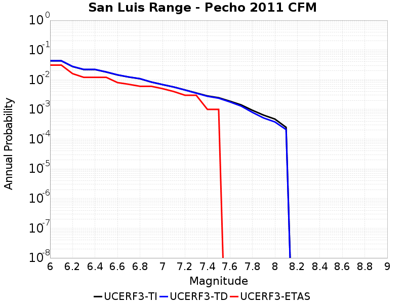 |
|-----|

| Magnitude | UCERF3-TI Prob | UCERF3-TD Prob | UCERF3-ETAS Prob |
|-----|-----|-----|-----|
| 6.0 | 0.043068722 | 0.043452717 | 0.027777778 |
| 6.1 | 0.043068722 | 0.043452717 | 0.027777778 |
| 6.2 | 0.027696114 | 0.027935535 | 0.016666668 |
| 6.3 | 0.021990778 | 0.02218717 | 0.016666668 |
| 6.4 | 0.021990778 | 0.02218717 | 0.016666668 |
| 6.5 | 0.01810429 | 0.018257512 | 0.016666668 |
| 6.6 | 0.014462415 | 0.014578104 | 0.016666668 |
| 6.7 | 0.01227577 | 0.012365869 | 0.016666668 |
| 6.8 | 0.010759901 | 0.010831575 | 0.011111111 |
| 6.9 | 0.008328474 | 0.008365693 | 0.011111111 |
| 7.0 | 0.006842128 | 0.00685493 | 0.0055555557 |
| 7.1 | 0.005679736 | 0.005670636 | 0.0055555557 |
| 7.2 | 0.004527434 | 0.004493344 | 0.0055555557 |
| 7.3 | 0.003579523 | 0.003523245 | 0.0055555557 |
| 7.4 | 0.0028436673 | 0.0027672676 | 0.0 |
| 7.5 | 0.0024728866 | 0.0023852673 | 0.0 |
| 7.6 | 0.0018914244 | 0.00178379 | 0.0 |
| 7.7 | 0.0014198847 | 0.00129391 | 0.0 |
| 7.8 | 9.348862E-4 | 7.943584E-4 | 0.0 |
| 7.9 | 6.41275E-4 | 5.133471E-4 | 0.0 |
| 8.0 | 4.734544E-4 | 3.7832413E-4 | 0.0 |
| 8.1 | 2.4936174E-4 | 2.0916366E-4 | 0.0 |

## San Luis Range 2011 CFM
*[(top)](#table-of-contents)*

| 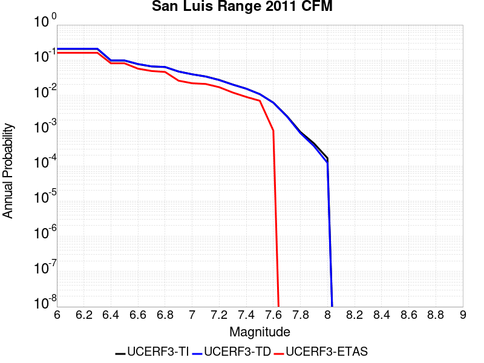 |
|-----|

| Magnitude | UCERF3-TI Prob | UCERF3-TD Prob | UCERF3-ETAS Prob |
|-----|-----|-----|-----|
| 6.0 | 0.20590161 | 0.21028934 | 0.17777778 |
| 6.1 | 0.20590161 | 0.21028934 | 0.17777778 |
| 6.2 | 0.20590161 | 0.21028934 | 0.17777778 |
| 6.3 | 0.20590161 | 0.21028934 | 0.17777778 |
| 6.4 | 0.096965164 | 0.09789428 | 0.11666667 |
| 6.5 | 0.096965164 | 0.09789428 | 0.11666667 |
| 6.6 | 0.076700225 | 0.077262536 | 0.072222225 |
| 6.7 | 0.065974146 | 0.06635426 | 0.06666667 |
| 6.8 | 0.06341134 | 0.06374648 | 0.06111111 |
| 6.9 | 0.04727907 | 0.047349792 | 0.027777778 |
| 7.0 | 0.03953466 | 0.039478656 | 0.016666668 |
| 7.1 | 0.03427554 | 0.034120474 | 0.011111111 |
| 7.2 | 0.027335057 | 0.027086467 | 0.0055555557 |
| 7.3 | 0.020224974 | 0.020102687 | 0.0055555557 |
| 7.4 | 0.015418382 | 0.015420104 | 0.0055555557 |
| 7.5 | 0.010798721 | 0.010795568 | 0.0055555557 |
| 7.6 | 0.0061941654 | 0.0061720875 | 0.0 |
| 7.7 | 0.002584393 | 0.0025283308 | 0.0 |
| 7.8 | 9.1225357E-4 | 8.442524E-4 | 0.0 |
| 7.9 | 4.336379E-4 | 3.6296286E-4 | 0.0 |
| 8.0 | 1.6526801E-4 | 1.2125388E-4 | 0.0 |

## San Pedro Basin
*[(top)](#table-of-contents)*

| 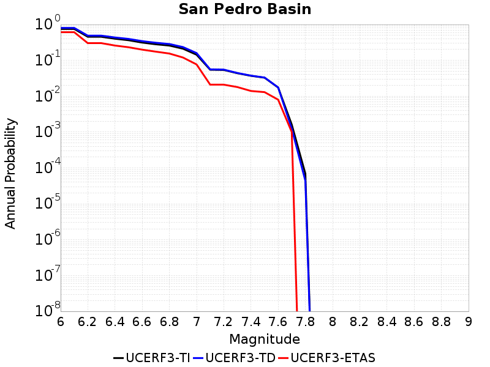 |
|-----|

| Magnitude | UCERF3-TI Prob | UCERF3-TD Prob | UCERF3-ETAS Prob |
|-----|-----|-----|-----|
| 6.0 | 0.7520392 | 0.80390865 | 0.68333334 |
| 6.1 | 0.7520392 | 0.80390865 | 0.68333334 |
| 6.2 | 0.45392737 | 0.4888524 | 0.33333334 |
| 6.3 | 0.45392737 | 0.4888524 | 0.33333334 |
| 6.4 | 0.40126428 | 0.4352505 | 0.29444444 |
| 6.5 | 0.36394432 | 0.39686197 | 0.25555557 |
| 6.6 | 0.3131486 | 0.34382507 | 0.23888889 |
| 6.7 | 0.2808154 | 0.30995727 | 0.18888889 |
| 6.8 | 0.25844702 | 0.28581986 | 0.16666667 |
| 6.9 | 0.21152084 | 0.23489048 | 0.13333334 |
| 7.0 | 0.1434504 | 0.1598489 | 0.072222225 |
| 7.1 | 0.054689903 | 0.05602169 | 0.027777778 |
| 7.2 | 0.053935897 | 0.05524316 | 0.027777778 |
| 7.3 | 0.043746468 | 0.044507764 | 0.022222223 |
| 7.4 | 0.037042487 | 0.03751183 | 0.016666668 |
| 7.5 | 0.032852296 | 0.0332126 | 0.011111111 |
| 7.6 | 0.01746896 | 0.017547017 | 0.0055555557 |
| 7.7 | 0.001619324 | 0.0012385938 | 0.0 |
| 7.8 | 6.9344416E-5 | 4.3697128E-5 | 0.0 |

## San Pedro Escarpment
*[(top)](#table-of-contents)*

| 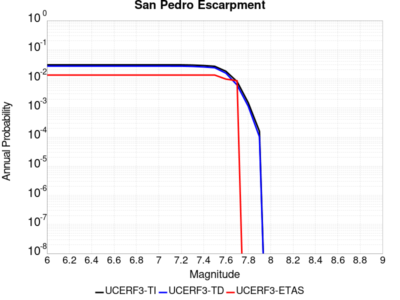 |
|-----|

| Magnitude | UCERF3-TI Prob | UCERF3-TD Prob | UCERF3-ETAS Prob |
|-----|-----|-----|-----|
| 6.0 | 0.030165238 | 0.027133616 | 0.011111111 |
| 6.1 | 0.030165238 | 0.027133616 | 0.011111111 |
| 6.2 | 0.030165238 | 0.027133616 | 0.011111111 |
| 6.3 | 0.030165238 | 0.027133616 | 0.011111111 |
| 6.4 | 0.030165238 | 0.027133616 | 0.011111111 |
| 6.5 | 0.030165238 | 0.027133616 | 0.011111111 |
| 6.6 | 0.030165238 | 0.027133616 | 0.011111111 |
| 6.7 | 0.030165238 | 0.027133616 | 0.011111111 |
| 6.8 | 0.030165238 | 0.027133616 | 0.011111111 |
| 6.9 | 0.030165238 | 0.027133616 | 0.011111111 |
| 7.0 | 0.030165238 | 0.027133616 | 0.011111111 |
| 7.1 | 0.030165238 | 0.027133616 | 0.011111111 |
| 7.2 | 0.030119777 | 0.027087625 | 0.011111111 |
| 7.3 | 0.029595653 | 0.026556587 | 0.011111111 |
| 7.4 | 0.028553043 | 0.025499057 | 0.011111111 |
| 7.5 | 0.02683255 | 0.023914574 | 0.011111111 |
| 7.6 | 0.018143943 | 0.015599512 | 0.0055555557 |
| 7.7 | 0.008021772 | 0.0061039403 | 0.0055555557 |
| 7.8 | 0.0014993392 | 0.0011341625 | 0.0 |
| 7.9 | 1.5756825E-4 | 1.0151229E-4 | 0.0 |

## San Vicente
*[(top)](#table-of-contents)*

| 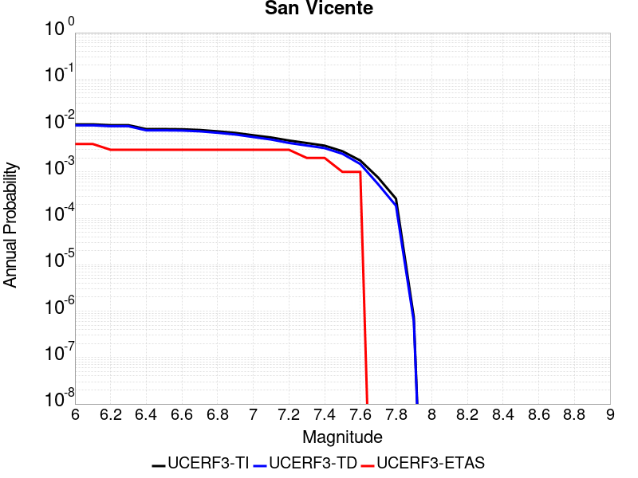 |
|-----|

| Magnitude | UCERF3-TI Prob | UCERF3-TD Prob | UCERF3-ETAS Prob |
|-----|-----|-----|-----|
| 6.0 | 0.010601213 | 0.010095278 | 0.0055555557 |
| 6.1 | 0.010601213 | 0.010095278 | 0.0055555557 |
| 6.2 | 0.010175114 | 0.009667619 | 0.0 |
| 6.3 | 0.010175114 | 0.009667619 | 0.0 |
| 6.4 | 0.008386278 | 0.007869068 | 0.0 |
| 6.5 | 0.008386278 | 0.007869068 | 0.0 |
| 6.6 | 0.008306948 | 0.007789445 | 0.0 |
| 6.7 | 0.008013956 | 0.007494385 | 0.0 |
| 6.8 | 0.0074938494 | 0.006969532 | 0.0 |
| 6.9 | 0.006932904 | 0.006402891 | 0.0 |
| 7.0 | 0.0061727827 | 0.0056392555 | 0.0 |
| 7.1 | 0.005525233 | 0.004989555 | 0.0 |
| 7.2 | 0.004748643 | 0.004211477 | 0.0 |
| 7.3 | 0.004196596 | 0.0037056014 | 0.0 |
| 7.4 | 0.0036845475 | 0.0032580802 | 0.0 |
| 7.5 | 0.002790078 | 0.0024579393 | 0.0 |
| 7.6 | 0.0017586274 | 0.0014790704 | 0.0 |
| 7.7 | 7.5474585E-4 | 5.430599E-4 | 0.0 |
| 7.8 | 2.6480915E-4 | 1.867471E-4 | 0.0 |
| 7.9 | 7.389586E-7 | 5.9960433E-7 | 0.0 |

## Santa Cruz Catalina Ridge alt1
*[(top)](#table-of-contents)*

| 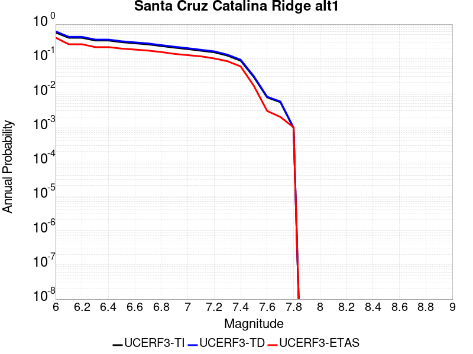 |
|-----|

| Magnitude | UCERF3-TI Prob | UCERF3-TD Prob | UCERF3-ETAS Prob |
|-----|-----|-----|-----|
| 6.0 | 0.5754003 | 0.62018627 | 0.3611111 |
| 6.1 | 0.40399155 | 0.43012455 | 0.23333333 |
| 6.2 | 0.40399155 | 0.43012455 | 0.23333333 |
| 6.3 | 0.33657554 | 0.3575482 | 0.19444445 |
| 6.4 | 0.33657554 | 0.3575482 | 0.19444445 |
| 6.5 | 0.30066642 | 0.3193213 | 0.18333334 |
| 6.6 | 0.2790293 | 0.29634252 | 0.17222223 |
| 6.7 | 0.2592818 | 0.27536967 | 0.16111112 |
| 6.8 | 0.23219363 | 0.24651131 | 0.15 |
| 6.9 | 0.20846531 | 0.22121409 | 0.10555556 |
| 7.0 | 0.18936458 | 0.20089437 | 0.1 |
| 7.1 | 0.16987354 | 0.18022266 | 0.094444446 |
| 7.2 | 0.15293762 | 0.16227996 | 0.06666667 |
| 7.3 | 0.12239067 | 0.13000213 | 0.055555556 |
| 7.4 | 0.08703299 | 0.092553884 | 0.044444446 |
| 7.5 | 0.02883536 | 0.030467182 | 0.022222223 |
| 7.6 | 0.007433522 | 0.0077651613 | 0.0 |
| 7.7 | 0.005407079 | 0.0056435773 | 0.0 |
| 7.8 | 9.4262476E-4 | 9.794764E-4 | 0.0 |

## Santa Cruz Island
*[(top)](#table-of-contents)*

| 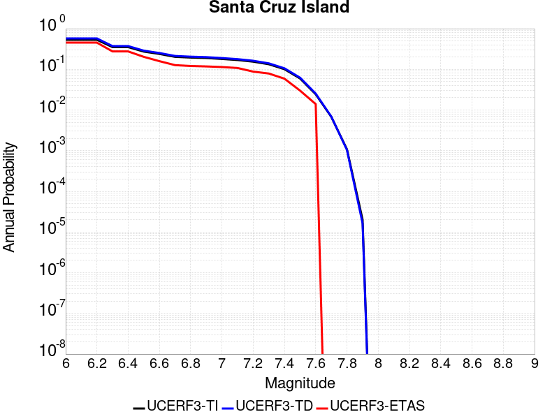 |
|-----|

| Magnitude | UCERF3-TI Prob | UCERF3-TD Prob | UCERF3-ETAS Prob |
|-----|-----|-----|-----|
| 6.0 | 0.5327513 | 0.5761507 | 0.46666667 |
| 6.1 | 0.5327513 | 0.5761507 | 0.46666667 |
| 6.2 | 0.5327513 | 0.5761507 | 0.46666667 |
| 6.3 | 0.35209635 | 0.37334067 | 0.2777778 |
| 6.4 | 0.35209635 | 0.37334067 | 0.2777778 |
| 6.5 | 0.27334404 | 0.28817874 | 0.18333334 |
| 6.6 | 0.23941846 | 0.25220516 | 0.1388889 |
| 6.7 | 0.20304534 | 0.21363382 | 0.11111111 |
| 6.8 | 0.19486369 | 0.2049791 | 0.10555556 |
| 6.9 | 0.18992043 | 0.19975717 | 0.1 |
| 7.0 | 0.18022335 | 0.18950586 | 0.094444446 |
| 7.1 | 0.16957791 | 0.17828555 | 0.094444446 |
| 7.2 | 0.1546839 | 0.16275588 | 0.083333336 |
| 7.3 | 0.13354237 | 0.14052667 | 0.072222225 |
| 7.4 | 0.10098121 | 0.10613535 | 0.06666667 |
| 7.5 | 0.059676196 | 0.062402617 | 0.044444446 |
| 7.6 | 0.024475608 | 0.025360722 | 0.016666668 |
| 7.7 | 0.0067637675 | 0.006871319 | 0.0 |
| 7.8 | 0.0010826996 | 0.0010432057 | 0.0 |
| 7.9 | 2.0151696E-5 | 1.6301097E-5 | 0.0 |

## Santa Monica Bay
*[(top)](#table-of-contents)*

| 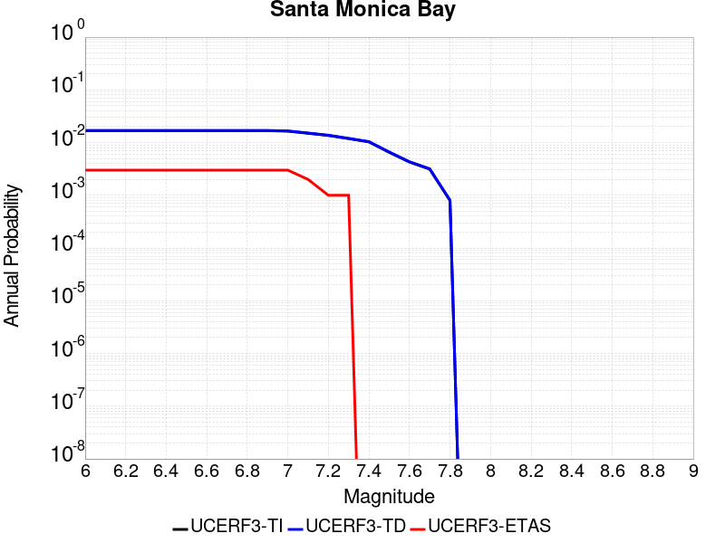 |
|-----|

| Magnitude | UCERF3-TI Prob | UCERF3-TD Prob | UCERF3-ETAS Prob |
|-----|-----|-----|-----|
| 6.0 | 0.016798286 | 0.016991373 | 0.0 |
| 6.1 | 0.016798286 | 0.016991373 | 0.0 |
| 6.2 | 0.016798286 | 0.016991373 | 0.0 |
| 6.3 | 0.016798286 | 0.016991373 | 0.0 |
| 6.4 | 0.016798286 | 0.016991373 | 0.0 |
| 6.5 | 0.016798286 | 0.016991373 | 0.0 |
| 6.6 | 0.016798286 | 0.016991373 | 0.0 |
| 6.7 | 0.016798286 | 0.016991373 | 0.0 |
| 6.8 | 0.016798286 | 0.016991373 | 0.0 |
| 6.9 | 0.016798286 | 0.016991373 | 0.0 |
| 7.0 | 0.01646146 | 0.016652985 | 0.0 |
| 7.1 | 0.015008413 | 0.015190843 | 0.0 |
| 7.2 | 0.013643266 | 0.013815975 | 0.0 |
| 7.3 | 0.011885515 | 0.012043549 | 0.0 |
| 7.4 | 0.010301556 | 0.010444263 | 0.0 |
| 7.5 | 0.0065393676 | 0.0066374815 | 0.0 |
| 7.6 | 0.0042728335 | 0.0043412047 | 0.0 |
| 7.7 | 0.0031337135 | 0.0031862787 | 0.0 |
| 7.8 | 7.9644093E-4 | 8.109215E-4 | 0.0 |

## Santa Monica alt 1
*[(top)](#table-of-contents)*

| 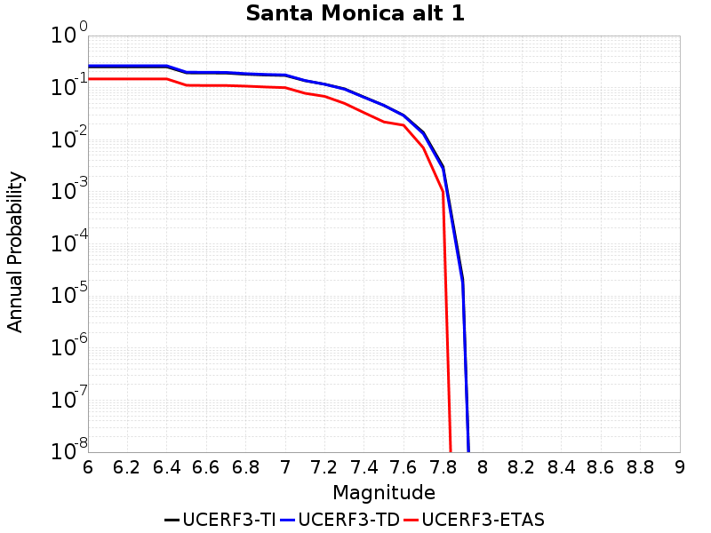 |
|-----|

| Magnitude | UCERF3-TI Prob | UCERF3-TD Prob | UCERF3-ETAS Prob |
|-----|-----|-----|-----|
| 6.0 | 0.2507674 | 0.26336223 | 0.15 |
| 6.1 | 0.2507674 | 0.26336223 | 0.15 |
| 6.2 | 0.2507674 | 0.26336223 | 0.15 |
| 6.3 | 0.2507674 | 0.26336223 | 0.15 |
| 6.4 | 0.2507674 | 0.26336223 | 0.15 |
| 6.5 | 0.19225083 | 0.1982165 | 0.12777779 |
| 6.6 | 0.19163491 | 0.19755682 | 0.12222222 |
| 6.7 | 0.19071802 | 0.1965873 | 0.12222222 |
| 6.8 | 0.18080094 | 0.18592699 | 0.12222222 |
| 6.9 | 0.17491947 | 0.17965432 | 0.11666667 |
| 7.0 | 0.17146905 | 0.17601745 | 0.11111111 |
| 7.1 | 0.13600697 | 0.13730238 | 0.07777778 |
| 7.2 | 0.11651561 | 0.11612122 | 0.06111111 |
| 7.3 | 0.095068894 | 0.09353692 | 0.05 |
| 7.4 | 0.06584492 | 0.06495425 | 0.033333335 |
| 7.5 | 0.045679633 | 0.045684893 | 0.022222223 |
| 7.6 | 0.029488767 | 0.0290722 | 0.016666668 |
| 7.7 | 0.0138117215 | 0.013006009 | 0.0055555557 |
| 7.8 | 0.0030396187 | 0.00275407 | 0.0 |
| 7.9 | 2.0890639E-5 | 1.6900693E-5 | 0.0 |

## Santa Rosa Island
*[(top)](#table-of-contents)*

| 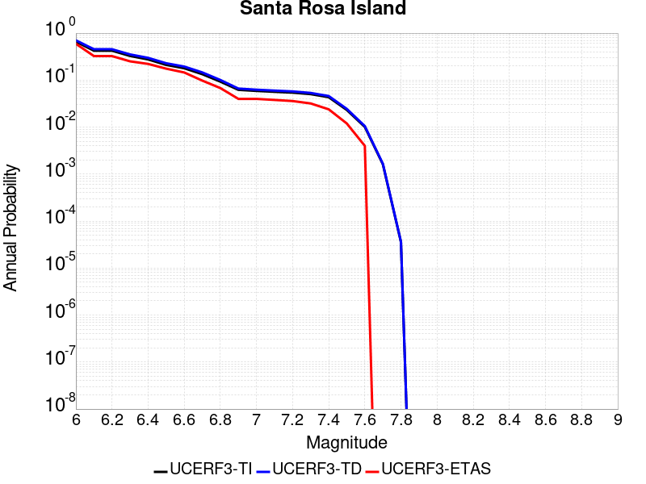 |
|-----|

| Magnitude | UCERF3-TI Prob | UCERF3-TD Prob | UCERF3-ETAS Prob |
|-----|-----|-----|-----|
| 6.0 | 0.6581619 | 0.70369965 | 0.5833333 |
| 6.1 | 0.42274937 | 0.45429423 | 0.2888889 |
| 6.2 | 0.42274937 | 0.45429423 | 0.2888889 |
| 6.3 | 0.32663688 | 0.35232592 | 0.21666667 |
| 6.4 | 0.2752973 | 0.2977487 | 0.18333334 |
| 6.5 | 0.21053536 | 0.228549 | 0.15555556 |
| 6.6 | 0.17870663 | 0.19434161 | 0.12777779 |
| 6.7 | 0.13372554 | 0.14583799 | 0.08888889 |
| 6.8 | 0.09285053 | 0.1006982 | 0.072222225 |
| 6.9 | 0.06207465 | 0.06604502 | 0.033333335 |
| 7.0 | 0.05884273 | 0.06250433 | 0.033333335 |
| 7.1 | 0.05639195 | 0.05984094 | 0.033333335 |
| 7.2 | 0.0541788 | 0.057467535 | 0.033333335 |
| 7.3 | 0.050329376 | 0.053357337 | 0.033333335 |
| 7.4 | 0.043260846 | 0.04584322 | 0.033333335 |
| 7.5 | 0.023174247 | 0.024441719 | 0.016666668 |
| 7.6 | 0.010067202 | 0.010496392 | 0.0 |
| 7.7 | 0.0016114889 | 0.0016510518 | 0.0 |
| 7.8 | 3.5753288E-5 | 3.639521E-5 | 0.0 |

## Santa Susana East (connector)
*[(top)](#table-of-contents)*

| 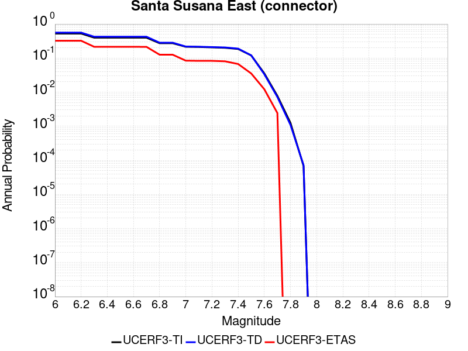 |
|-----|

| Magnitude | UCERF3-TI Prob | UCERF3-TD Prob | UCERF3-ETAS Prob |
|-----|-----|-----|-----|
| 6.0 | 0.52561975 | 0.55952525 | 0.36666667 |
| 6.1 | 0.52561975 | 0.55952525 | 0.36666667 |
| 6.2 | 0.52561975 | 0.55952525 | 0.36666667 |
| 6.3 | 0.39774334 | 0.423808 | 0.24444444 |
| 6.4 | 0.39774334 | 0.423808 | 0.24444444 |
| 6.5 | 0.39774334 | 0.423808 | 0.24444444 |
| 6.6 | 0.39774334 | 0.423808 | 0.24444444 |
| 6.7 | 0.39725006 | 0.42347154 | 0.24444444 |
| 6.8 | 0.2729416 | 0.28292057 | 0.14444445 |
| 6.9 | 0.2729416 | 0.28292057 | 0.14444445 |
| 7.0 | 0.21494837 | 0.21850368 | 0.1 |
| 7.1 | 0.21195927 | 0.21571358 | 0.1 |
| 7.2 | 0.20619519 | 0.21045817 | 0.1 |
| 7.3 | 0.2004167 | 0.20549928 | 0.1 |
| 7.4 | 0.18523961 | 0.18953556 | 0.083333336 |
| 7.5 | 0.119703844 | 0.1203481 | 0.06111111 |
| 7.6 | 0.035600737 | 0.03367641 | 0.016666668 |
| 7.7 | 0.007776728 | 0.007223099 | 0.0 |
| 7.8 | 0.0012564153 | 0.0010961698 | 0.0 |
| 7.9 | 6.816181E-5 | 7.199549E-5 | 0.0 |

## Santa Susana alt 1
*[(top)](#table-of-contents)*

| 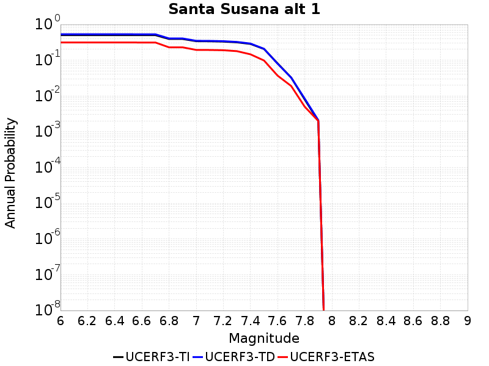 |
|-----|

| Magnitude | UCERF3-TI Prob | UCERF3-TD Prob | UCERF3-ETAS Prob |
|-----|-----|-----|-----|
| 6.0 | 0.50235367 | 0.5312533 | 0.35555556 |
| 6.1 | 0.50235367 | 0.5312533 | 0.35555556 |
| 6.2 | 0.50235367 | 0.5312533 | 0.35555556 |
| 6.3 | 0.50235367 | 0.5312533 | 0.35555556 |
| 6.4 | 0.50235367 | 0.5312533 | 0.35555556 |
| 6.5 | 0.50235367 | 0.5312533 | 0.35555556 |
| 6.6 | 0.50104326 | 0.529976 | 0.35555556 |
| 6.7 | 0.50104326 | 0.529976 | 0.35555556 |
| 6.8 | 0.39201823 | 0.4064357 | 0.26666668 |
| 6.9 | 0.39152148 | 0.4060034 | 0.26666668 |
| 7.0 | 0.33984393 | 0.3488602 | 0.22222222 |
| 7.1 | 0.3374352 | 0.34651086 | 0.22222222 |
| 7.2 | 0.33115786 | 0.3405495 | 0.21666667 |
| 7.3 | 0.31558213 | 0.3244738 | 0.20555556 |
| 7.4 | 0.28500816 | 0.29215106 | 0.15 |
| 7.5 | 0.20571154 | 0.20847517 | 0.11666667 |
| 7.6 | 0.08137521 | 0.07970486 | 0.027777778 |
| 7.7 | 0.032721013 | 0.032680683 | 0.011111111 |
| 7.8 | 0.007971066 | 0.008420031 | 0.0 |
| 7.9 | 0.0019868098 | 0.0021038156 | 0.0 |

## Santa Ynez (East)
*[(top)](#table-of-contents)*

| 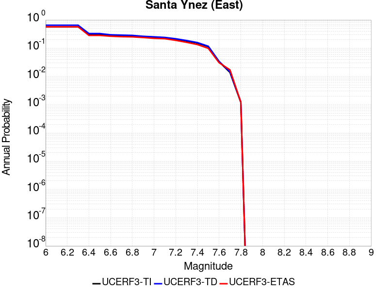 |
|-----|

| Magnitude | UCERF3-TI Prob | UCERF3-TD Prob | UCERF3-ETAS Prob |
|-----|-----|-----|-----|
| 6.0 | 0.5691121 | 0.65046406 | 0.5611111 |
| 6.1 | 0.5691121 | 0.65046406 | 0.5611111 |
| 6.2 | 0.5691121 | 0.65046406 | 0.5611111 |
| 6.3 | 0.5691121 | 0.65046406 | 0.5611111 |
| 6.4 | 0.31326932 | 0.3293318 | 0.31666666 |
| 6.5 | 0.31326932 | 0.3293318 | 0.31666666 |
| 6.6 | 0.2839457 | 0.29763582 | 0.31111112 |
| 6.7 | 0.27747044 | 0.29071373 | 0.31111112 |
| 6.8 | 0.27061626 | 0.28336105 | 0.31111112 |
| 6.9 | 0.2515104 | 0.263082 | 0.28333333 |
| 7.0 | 0.24115628 | 0.2519975 | 0.26666668 |
| 7.1 | 0.23007508 | 0.2402388 | 0.25 |
| 7.2 | 0.20667332 | 0.21539184 | 0.22222222 |
| 7.3 | 0.17879786 | 0.18659449 | 0.20555556 |
| 7.4 | 0.15177394 | 0.15781535 | 0.16111112 |
| 7.5 | 0.11332779 | 0.117246695 | 0.15 |
| 7.6 | 0.03299087 | 0.03382941 | 0.033333335 |
| 7.7 | 0.01380995 | 0.014506465 | 0.011111111 |
| 7.8 | 0.001203018 | 0.0012496525 | 0.0 |

## Santa Ynez (West)
*[(top)](#table-of-contents)*

| 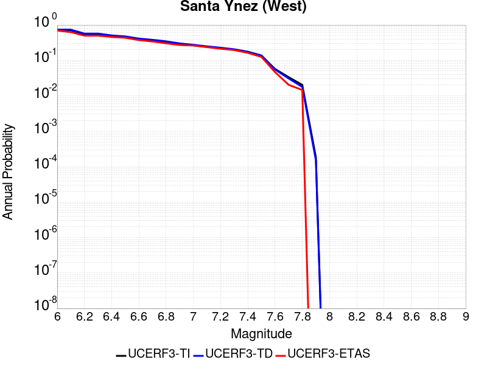 |
|-----|

| Magnitude | UCERF3-TI Prob | UCERF3-TD Prob | UCERF3-ETAS Prob |
|-----|-----|-----|-----|
| 6.0 | 0.70928997 | 0.73813266 | 0.7111111 |
| 6.1 | 0.70928997 | 0.73813266 | 0.62777776 |
| 6.2 | 0.54775894 | 0.57142323 | 0.5222222 |
| 6.3 | 0.54775894 | 0.57142323 | 0.5222222 |
| 6.4 | 0.48523 | 0.50824016 | 0.48333332 |
| 6.5 | 0.45327634 | 0.47581056 | 0.4611111 |
| 6.6 | 0.3927369 | 0.41322497 | 0.4 |
| 6.7 | 0.36203504 | 0.38108304 | 0.37777779 |
| 6.8 | 0.32942665 | 0.34575954 | 0.34444445 |
| 6.9 | 0.28895617 | 0.30142143 | 0.31111112 |
| 7.0 | 0.26568732 | 0.27601683 | 0.30555555 |
| 7.1 | 0.24154669 | 0.24969062 | 0.27222222 |
| 7.2 | 0.22137594 | 0.22830114 | 0.25 |
| 7.3 | 0.20068946 | 0.20633766 | 0.23333333 |
| 7.4 | 0.17260155 | 0.17628689 | 0.18888889 |
| 7.5 | 0.13654418 | 0.13795207 | 0.17222223 |
| 7.6 | 0.057386234 | 0.055344377 | 0.055555556 |
| 7.7 | 0.033599235 | 0.030944327 | 0.022222223 |
| 7.8 | 0.020409696 | 0.017841136 | 0.022222223 |
| 7.9 | 1.8457326E-4 | 1.5218658E-4 | 0.0 |

## Santa Ynez River
*[(top)](#table-of-contents)*

| 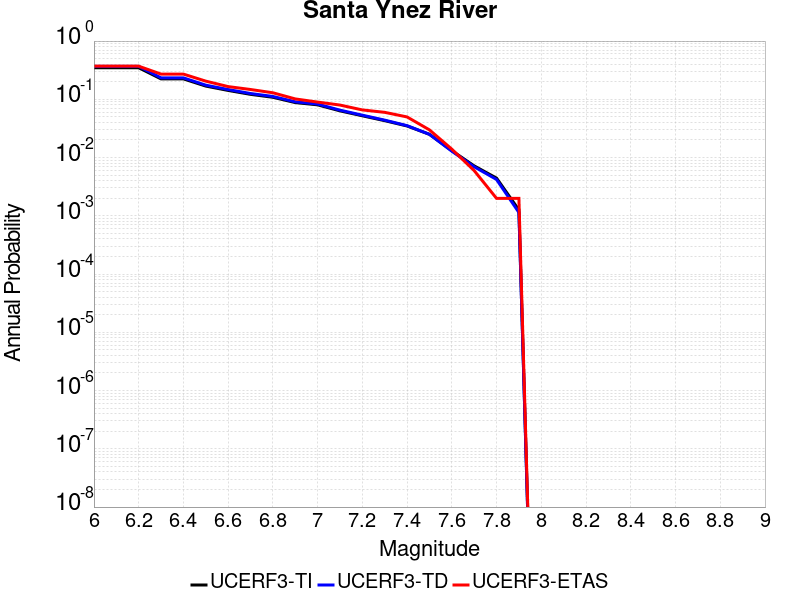 |
|-----|

| Magnitude | UCERF3-TI Prob | UCERF3-TD Prob | UCERF3-ETAS Prob |
|-----|-----|-----|-----|
| 6.0 | 0.34804213 | 0.36813718 | 0.33333334 |
| 6.1 | 0.34804213 | 0.36813718 | 0.33333334 |
| 6.2 | 0.34804213 | 0.36813718 | 0.33333334 |
| 6.3 | 0.22433302 | 0.23357123 | 0.25 |
| 6.4 | 0.22433302 | 0.23357123 | 0.25 |
| 6.5 | 0.16869958 | 0.17504835 | 0.18888889 |
| 6.6 | 0.142067 | 0.14716087 | 0.16111112 |
| 6.7 | 0.12168464 | 0.12586544 | 0.1388889 |
| 6.8 | 0.108367816 | 0.11196386 | 0.11111111 |
| 6.9 | 0.08787623 | 0.090639904 | 0.08888889 |
| 7.0 | 0.08037432 | 0.0828457 | 0.07777778 |
| 7.1 | 0.063373 | 0.065164305 | 0.06666667 |
| 7.2 | 0.052117042 | 0.053433195 | 0.06111111 |
| 7.3 | 0.042997602 | 0.043909077 | 0.05 |
| 7.4 | 0.034860082 | 0.03531385 | 0.03888889 |
| 7.5 | 0.025078988 | 0.025040695 | 0.03888889 |
| 7.6 | 0.0131329335 | 0.012873883 | 0.016666668 |
| 7.7 | 0.0071983235 | 0.006940394 | 0.0055555557 |
| 7.8 | 0.0044369586 | 0.004205282 | 0.0 |
| 7.9 | 0.0012604729 | 0.0011389917 | 0.0 |

## Sargent 2011 CFM
*[(top)](#table-of-contents)*

| 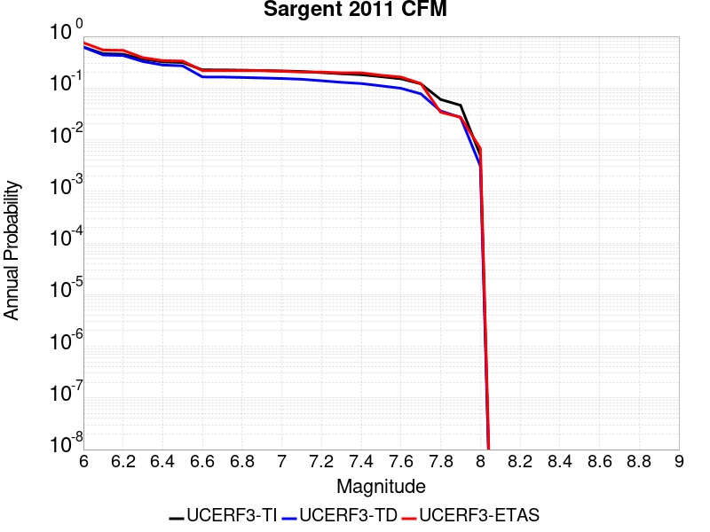 |
|-----|

| Magnitude | UCERF3-TI Prob | UCERF3-TD Prob | UCERF3-ETAS Prob |
|-----|-----|-----|-----|
| 6.0 | 0.6223833 | 0.6192104 | 0.70555556 |
| 6.1 | 0.46215677 | 0.4374943 | 0.4611111 |
| 6.2 | 0.45283306 | 0.42688563 | 0.45555556 |
| 6.3 | 0.3629834 | 0.32648197 | 0.33333334 |
| 6.4 | 0.32101506 | 0.27923143 | 0.29444444 |
| 6.5 | 0.312448 | 0.26954708 | 0.28333333 |
| 6.6 | 0.2250534 | 0.16399173 | 0.2 |
| 6.7 | 0.22465207 | 0.1635293 | 0.2 |
| 6.8 | 0.22172287 | 0.16041066 | 0.2 |
| 6.9 | 0.218038 | 0.1567838 | 0.19444445 |
| 7.0 | 0.21436614 | 0.15305854 | 0.18888889 |
| 7.1 | 0.20918088 | 0.14801356 | 0.17777778 |
| 7.2 | 0.19932817 | 0.13848895 | 0.17222223 |
| 7.3 | 0.18929613 | 0.1291219 | 0.15555556 |
| 7.4 | 0.18119156 | 0.12230469 | 0.15 |
| 7.5 | 0.16608584 | 0.11027504 | 0.13333334 |
| 7.6 | 0.15117486 | 0.09900483 | 0.11666667 |
| 7.7 | 0.12079351 | 0.077256806 | 0.08888889 |
| 7.8 | 0.06003767 | 0.035957452 | 0.03888889 |
| 7.9 | 0.04644202 | 0.02703286 | 0.033333335 |
| 8.0 | 0.0049693966 | 0.0030837187 | 0.0 |

## Scodie Lineament
*[(top)](#table-of-contents)*

| 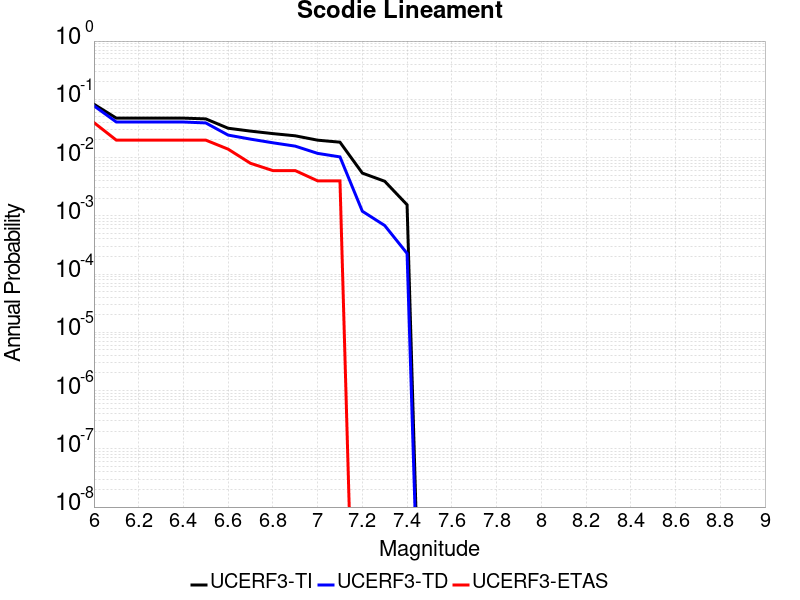 |
|-----|

| Magnitude | UCERF3-TI Prob | UCERF3-TD Prob | UCERF3-ETAS Prob |
|-----|-----|-----|-----|
| 6.0 | 0.082299605 | 0.077359445 | 0.027777778 |
| 6.1 | 0.04752612 | 0.040766094 | 0.0055555557 |
| 6.2 | 0.04752612 | 0.040766094 | 0.0055555557 |
| 6.3 | 0.04752612 | 0.040766094 | 0.0055555557 |
| 6.4 | 0.04752612 | 0.040766094 | 0.0055555557 |
| 6.5 | 0.046139758 | 0.039314616 | 0.0055555557 |
| 6.6 | 0.031870123 | 0.024302676 | 0.0055555557 |
| 6.7 | 0.028448056 | 0.0207266 | 0.0055555557 |
| 6.8 | 0.025769034 | 0.017930634 | 0.0055555557 |
| 6.9 | 0.023633264 | 0.01570515 | 0.0055555557 |
| 7.0 | 0.01988517 | 0.011800523 | 0.0055555557 |
| 7.1 | 0.018362813 | 0.010265405 | 0.0055555557 |
| 7.2 | 0.0054117716 | 0.0011985265 | 0.0 |
| 7.3 | 0.003918267 | 6.8177393E-4 | 0.0 |
| 7.4 | 0.0015468019 | 2.260956E-4 | 0.0 |

## Sheephole
*[(top)](#table-of-contents)*

| 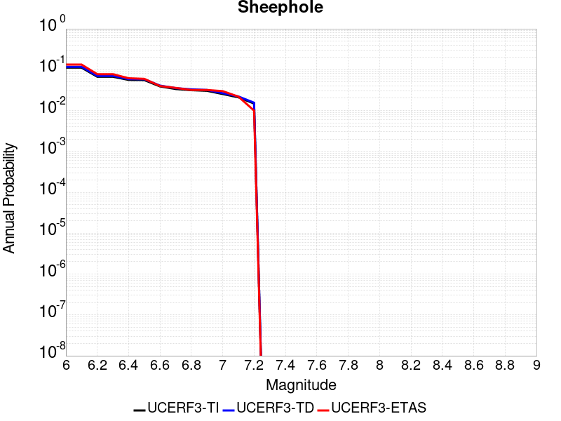 |
|-----|

| Magnitude | UCERF3-TI Prob | UCERF3-TD Prob | UCERF3-ETAS Prob |
|-----|-----|-----|-----|
| 6.0 | 0.11211623 | 0.11749126 | 0.1388889 |
| 6.1 | 0.11211623 | 0.11749126 | 0.1388889 |
| 6.2 | 0.06723337 | 0.070256665 | 0.094444446 |
| 6.3 | 0.06723337 | 0.070256665 | 0.094444446 |
| 6.4 | 0.056173846 | 0.058867842 | 0.06666667 |
| 6.5 | 0.055746093 | 0.05842373 | 0.06666667 |
| 6.6 | 0.038960814 | 0.040873133 | 0.05 |
| 6.7 | 0.033693746 | 0.035375908 | 0.044444446 |
| 6.8 | 0.03151916 | 0.03309936 | 0.033333335 |
| 6.9 | 0.030410154 | 0.03193634 | 0.033333335 |
| 7.0 | 0.025368977 | 0.026637994 | 0.033333335 |
| 7.1 | 0.021075003 | 0.022129577 | 0.027777778 |
| 7.2 | 0.01483689 | 0.015583671 | 0.016666668 |

## Shoreline
*[(top)](#table-of-contents)*

| 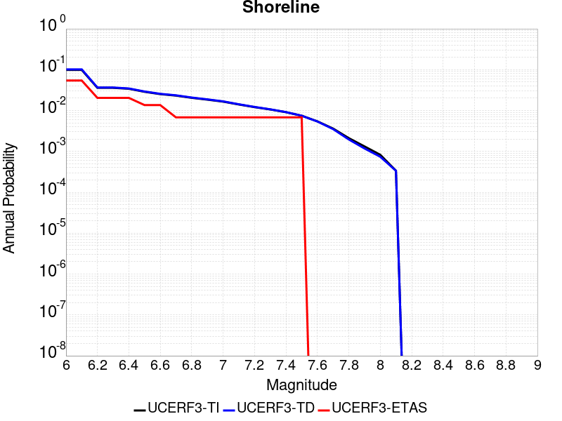 |
|-----|

| Magnitude | UCERF3-TI Prob | UCERF3-TD Prob | UCERF3-ETAS Prob |
|-----|-----|-----|-----|
| 6.0 | 0.098835 | 0.101994716 | 0.055555556 |
| 6.1 | 0.098835 | 0.101994716 | 0.055555556 |
| 6.2 | 0.03596577 | 0.03659206 | 0.022222223 |
| 6.3 | 0.03596577 | 0.03659206 | 0.022222223 |
| 6.4 | 0.034139335 | 0.034732282 | 0.016666668 |
| 6.5 | 0.028764363 | 0.029278936 | 0.016666668 |
| 6.6 | 0.025225855 | 0.025679305 | 0.016666668 |
| 6.7 | 0.023196619 | 0.023613907 | 0.016666668 |
| 6.8 | 0.020480387 | 0.020829966 | 0.016666668 |
| 6.9 | 0.01847222 | 0.01877991 | 0.011111111 |
| 7.0 | 0.016530419 | 0.0167874 | 0.0055555557 |
| 7.1 | 0.014066839 | 0.014252613 | 0.0055555557 |
| 7.2 | 0.012127524 | 0.0122573525 | 0.0 |
| 7.3 | 0.010630854 | 0.010721623 | 0.0 |
| 7.4 | 0.009117035 | 0.009168437 | 0.0 |
| 7.5 | 0.0074693826 | 0.007477799 | 0.0 |
| 7.6 | 0.0054440633 | 0.005396607 | 0.0 |
| 7.7 | 0.0036257312 | 0.0035205889 | 0.0 |
| 7.8 | 0.0021130857 | 0.0019606862 | 0.0 |
| 7.9 | 0.0013259961 | 0.0011806733 | 0.0 |
| 8.0 | 8.282665E-4 | 7.4089493E-4 | 0.0 |
| 8.1 | 3.377443E-4 | 3.3687355E-4 | 0.0 |

## Sierra Madre
*[(top)](#table-of-contents)*

| 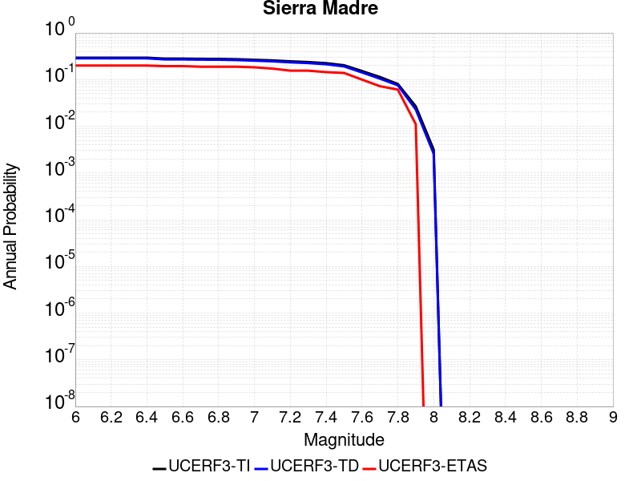 |
|-----|

| Magnitude | UCERF3-TI Prob | UCERF3-TD Prob | UCERF3-ETAS Prob |
|-----|-----|-----|-----|
| 6.0 | 0.29464963 | 0.2851773 | 0.2 |
| 6.1 | 0.29464963 | 0.2851773 | 0.2 |
| 6.2 | 0.29464963 | 0.2851773 | 0.2 |
| 6.3 | 0.29464963 | 0.2851773 | 0.2 |
| 6.4 | 0.29464963 | 0.2851773 | 0.2 |
| 6.5 | 0.28121755 | 0.27064216 | 0.19444445 |
| 6.6 | 0.28121755 | 0.27064216 | 0.19444445 |
| 6.7 | 0.27832666 | 0.26752642 | 0.18888889 |
| 6.8 | 0.2774316 | 0.26660338 | 0.18888889 |
| 6.9 | 0.27309424 | 0.26219702 | 0.18888889 |
| 7.0 | 0.26554313 | 0.254461 | 0.18333334 |
| 7.1 | 0.25798255 | 0.24627516 | 0.17222223 |
| 7.2 | 0.24626617 | 0.23427686 | 0.15555556 |
| 7.3 | 0.23770352 | 0.2261144 | 0.15555556 |
| 7.4 | 0.22497806 | 0.2132742 | 0.14444445 |
| 7.5 | 0.20279302 | 0.19173995 | 0.1388889 |
| 7.6 | 0.15268546 | 0.14236546 | 0.1 |
| 7.7 | 0.11360354 | 0.104883626 | 0.072222225 |
| 7.8 | 0.080443844 | 0.07567742 | 0.06111111 |
| 7.9 | 0.026747182 | 0.022960767 | 0.011111111 |
| 8.0 | 0.0031543828 | 0.002597814 | 0.0 |

## Sierra Madre (San Fernando)
*[(top)](#table-of-contents)*

| 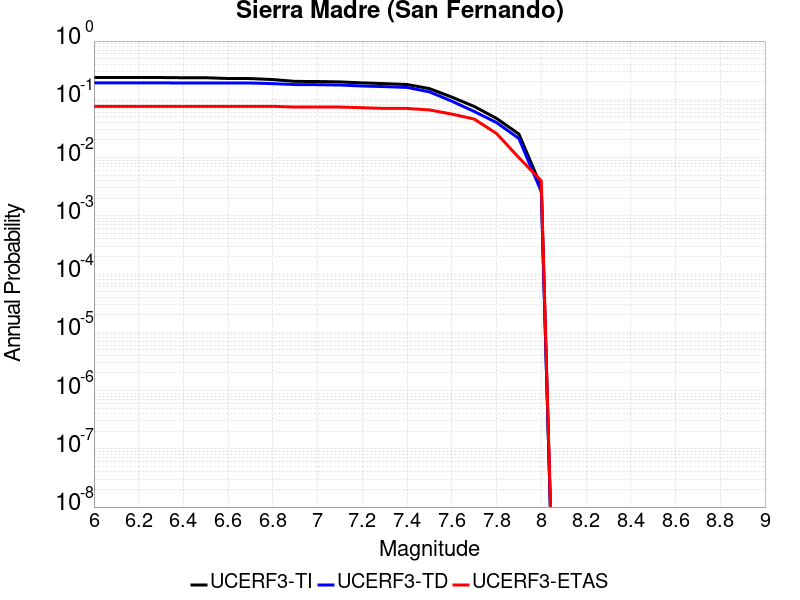 |
|-----|

| Magnitude | UCERF3-TI Prob | UCERF3-TD Prob | UCERF3-ETAS Prob |
|-----|-----|-----|-----|
| 6.0 | 0.23656853 | 0.19105314 | 0.1 |
| 6.1 | 0.23656853 | 0.19105314 | 0.1 |
| 6.2 | 0.23656853 | 0.19105314 | 0.1 |
| 6.3 | 0.23656853 | 0.19105314 | 0.1 |
| 6.4 | 0.23463698 | 0.19101189 | 0.1 |
| 6.5 | 0.23463698 | 0.19101189 | 0.1 |
| 6.6 | 0.22769664 | 0.19086549 | 0.1 |
| 6.7 | 0.22706407 | 0.190393 | 0.1 |
| 6.8 | 0.21821655 | 0.1858842 | 0.1 |
| 6.9 | 0.20307082 | 0.17897278 | 0.1 |
| 7.0 | 0.20199789 | 0.17824024 | 0.1 |
| 7.1 | 0.19901322 | 0.17573173 | 0.1 |
| 7.2 | 0.19132744 | 0.16922343 | 0.1 |
| 7.3 | 0.1858626 | 0.16510691 | 0.1 |
| 7.4 | 0.17945391 | 0.15992965 | 0.1 |
| 7.5 | 0.15265335 | 0.13416739 | 0.1 |
| 7.6 | 0.10916034 | 0.09301505 | 0.072222225 |
| 7.7 | 0.07540562 | 0.06186758 | 0.06111111 |
| 7.8 | 0.047017284 | 0.039890066 | 0.044444446 |
| 7.9 | 0.025343271 | 0.021248918 | 0.011111111 |
| 8.0 | 0.0031543828 | 0.002597814 | 0.0 |

## Sierra Nevada  (No Extension)
*[(top)](#table-of-contents)*

| 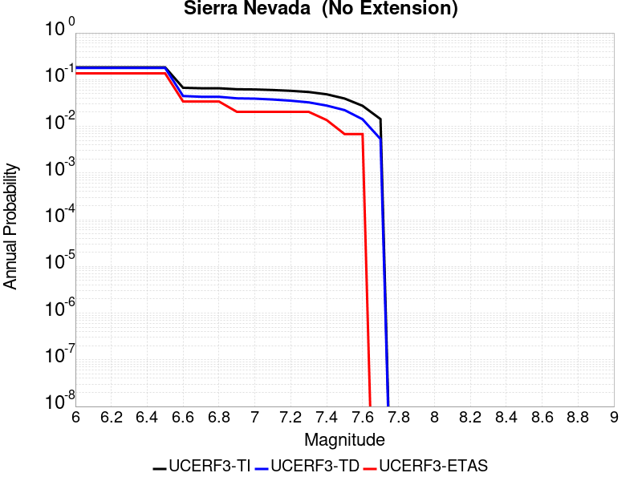 |
|-----|

| Magnitude | UCERF3-TI Prob | UCERF3-TD Prob | UCERF3-ETAS Prob |
|-----|-----|-----|-----|
| 6.0 | 0.1834684 | 0.17783408 | 0.12222222 |
| 6.1 | 0.1834684 | 0.17783408 | 0.12222222 |
| 6.2 | 0.1834684 | 0.17783408 | 0.12222222 |
| 6.3 | 0.1834684 | 0.17783408 | 0.12222222 |
| 6.4 | 0.1834684 | 0.17783408 | 0.12222222 |
| 6.5 | 0.1834684 | 0.17783408 | 0.12222222 |
| 6.6 | 0.06687393 | 0.04454968 | 0.022222223 |
| 6.7 | 0.06534497 | 0.042937737 | 0.022222223 |
| 6.8 | 0.06522652 | 0.042853005 | 0.022222223 |
| 6.9 | 0.06212092 | 0.039713524 | 0.016666668 |
| 7.0 | 0.06153079 | 0.039131407 | 0.016666668 |
| 7.1 | 0.05984234 | 0.03748256 | 0.016666668 |
| 7.2 | 0.057556257 | 0.035341464 | 0.016666668 |
| 7.3 | 0.054257084 | 0.032557327 | 0.016666668 |
| 7.4 | 0.048480466 | 0.027785545 | 0.0055555557 |
| 7.5 | 0.039314453 | 0.022217495 | 0.0055555557 |
| 7.6 | 0.027479587 | 0.014153673 | 0.0055555557 |
| 7.7 | 0.014270174 | 0.0053340066 | 0.0 |

## Silver Creek 2011 CFM
*[(top)](#table-of-contents)*

| 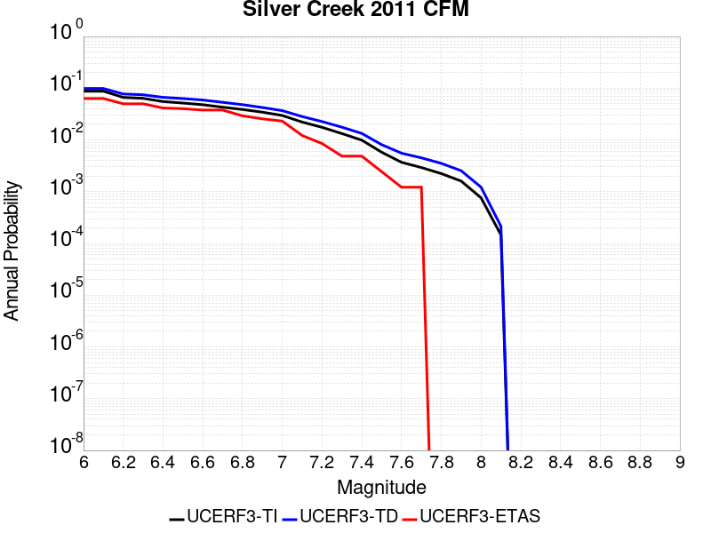 |
|-----|

| Magnitude | UCERF3-TI Prob | UCERF3-TD Prob | UCERF3-ETAS Prob |
|-----|-----|-----|-----|
| 6.0 | 0.08781315 | 0.09871963 | 0.05 |
| 6.1 | 0.08781315 | 0.09871963 | 0.05 |
| 6.2 | 0.06646786 | 0.077299595 | 0.03888889 |
| 6.3 | 0.063813984 | 0.07463873 | 0.03888889 |
| 6.4 | 0.05525632 | 0.06665528 | 0.033333335 |
| 6.5 | 0.05168615 | 0.06321776 | 0.027777778 |
| 6.6 | 0.048005633 | 0.059175298 | 0.022222223 |
| 6.7 | 0.042994913 | 0.053400915 | 0.022222223 |
| 6.8 | 0.038822476 | 0.04809936 | 0.022222223 |
| 6.9 | 0.034449838 | 0.042392056 | 0.022222223 |
| 7.0 | 0.02971803 | 0.0368717 | 0.022222223 |
| 7.1 | 0.02219253 | 0.02834575 | 0.016666668 |
| 7.2 | 0.017554566 | 0.022689017 | 0.011111111 |
| 7.3 | 0.013292595 | 0.01766777 | 0.0055555557 |
| 7.4 | 0.00991918 | 0.013380321 | 0.0055555557 |
| 7.5 | 0.0057990993 | 0.008118992 | 0.0 |
| 7.6 | 0.0036993504 | 0.0055514486 | 0.0 |
| 7.7 | 0.0029307613 | 0.004510852 | 0.0 |
| 7.8 | 0.002239279 | 0.0035284339 | 0.0 |
| 7.9 | 0.0016049052 | 0.0025449893 | 0.0 |
| 8.0 | 7.623134E-4 | 0.0012232112 | 0.0 |
| 8.1 | 1.4625162E-4 | 2.1493153E-4 | 0.0 |

## Simi-Santa Rosa
*[(top)](#table-of-contents)*

| 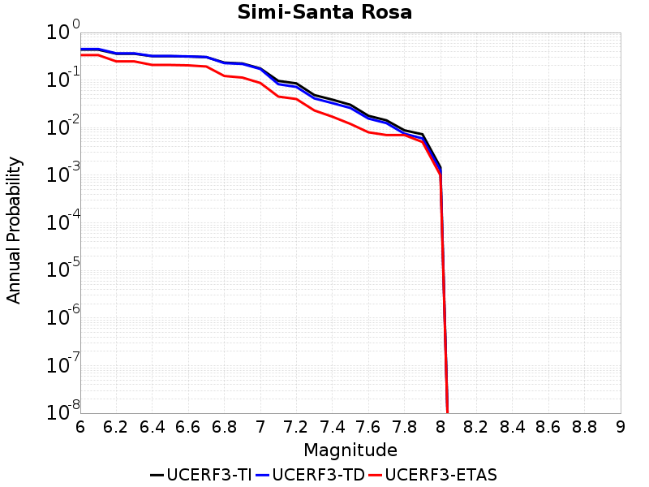 |
|-----|

| Magnitude | UCERF3-TI Prob | UCERF3-TD Prob | UCERF3-ETAS Prob |
|-----|-----|-----|-----|
| 6.0 | 0.43655568 | 0.45120853 | 0.34444445 |
| 6.1 | 0.43655568 | 0.45120853 | 0.34444445 |
| 6.2 | 0.35819918 | 0.36491802 | 0.2611111 |
| 6.3 | 0.35819918 | 0.36491802 | 0.2611111 |
| 6.4 | 0.31793696 | 0.3205472 | 0.21666667 |
| 6.5 | 0.31793696 | 0.3205472 | 0.21666667 |
| 6.6 | 0.31278196 | 0.3149349 | 0.21666667 |
| 6.7 | 0.30382794 | 0.3055381 | 0.21666667 |
| 6.8 | 0.23317708 | 0.22718346 | 0.14444445 |
| 6.9 | 0.22358027 | 0.21881701 | 0.11666667 |
| 7.0 | 0.17567508 | 0.17104727 | 0.07777778 |
| 7.1 | 0.09611708 | 0.08197874 | 0.022222223 |
| 7.2 | 0.085305974 | 0.07184336 | 0.016666668 |
| 7.3 | 0.048417024 | 0.041169357 | 0.016666668 |
| 7.4 | 0.038805913 | 0.032837126 | 0.0055555557 |
| 7.5 | 0.03028425 | 0.025934223 | 0.0055555557 |
| 7.6 | 0.017769413 | 0.015543282 | 0.0055555557 |
| 7.7 | 0.0142791895 | 0.012468715 | 0.0055555557 |
| 7.8 | 0.008794992 | 0.007468909 | 0.0055555557 |
| 7.9 | 0.0072668297 | 0.0059425966 | 0.0055555557 |
| 8.0 | 0.0014666809 | 0.0012704195 | 0.0 |

## Sisar
*[(top)](#table-of-contents)*

| 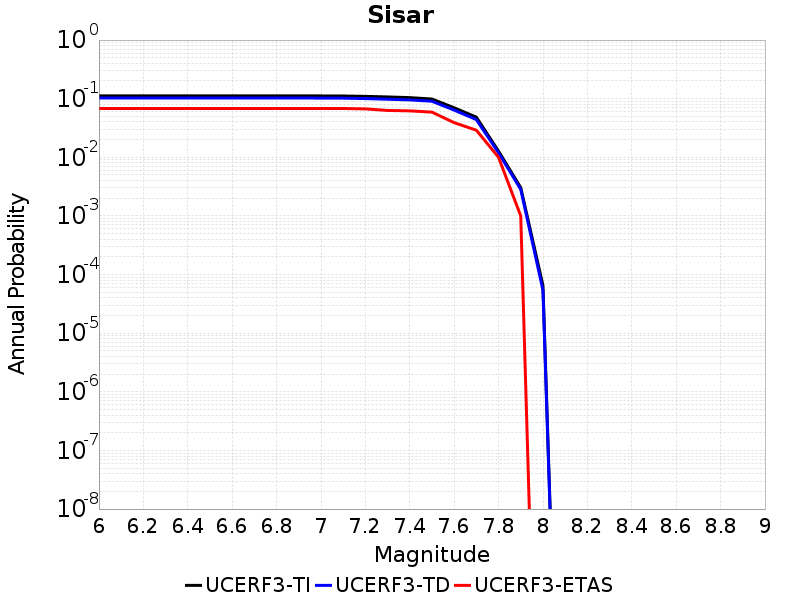 |
|-----|

| Magnitude | UCERF3-TI Prob | UCERF3-TD Prob | UCERF3-ETAS Prob |
|-----|-----|-----|-----|
| 6.0 | 0.11179705 | 0.1027693 | 0.055555556 |
| 6.1 | 0.11179705 | 0.1027693 | 0.055555556 |
| 6.2 | 0.11179705 | 0.1027693 | 0.055555556 |
| 6.3 | 0.11179705 | 0.1027693 | 0.055555556 |
| 6.4 | 0.11179705 | 0.1027693 | 0.055555556 |
| 6.5 | 0.11179705 | 0.1027693 | 0.055555556 |
| 6.6 | 0.11179705 | 0.1027693 | 0.055555556 |
| 6.7 | 0.11179705 | 0.1027693 | 0.055555556 |
| 6.8 | 0.11179705 | 0.1027693 | 0.055555556 |
| 6.9 | 0.11175144 | 0.102721676 | 0.055555556 |
| 7.0 | 0.111418225 | 0.10237265 | 0.055555556 |
| 7.1 | 0.1110797 | 0.10201709 | 0.055555556 |
| 7.2 | 0.10958515 | 0.100437164 | 0.05 |
| 7.3 | 0.107109495 | 0.097901836 | 0.05 |
| 7.4 | 0.104221016 | 0.0953192 | 0.044444446 |
| 7.5 | 0.098715365 | 0.09049013 | 0.044444446 |
| 7.6 | 0.06989733 | 0.063884355 | 0.027777778 |
| 7.7 | 0.048431754 | 0.043997824 | 0.027777778 |
| 7.8 | 0.012727103 | 0.011903729 | 0.0055555557 |
| 7.9 | 0.0030388944 | 0.002840025 | 0.0 |
| 8.0 | 6.548287E-5 | 5.4354816E-5 | 0.0 |

## Skinner Flat 2011 CFM
*[(top)](#table-of-contents)*

| 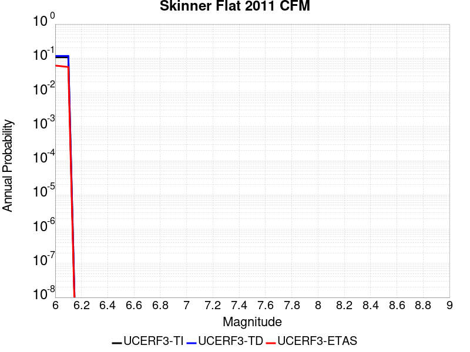 |
|-----|

| Magnitude | UCERF3-TI Prob | UCERF3-TD Prob | UCERF3-ETAS Prob |
|-----|-----|-----|-----|
| 6.0 | 0.10677096 | 0.116788834 | 0.06111111 |
| 6.1 | 0.10677096 | 0.116788834 | 0.055555556 |

## So Sierra Nevada
*[(top)](#table-of-contents)*

| 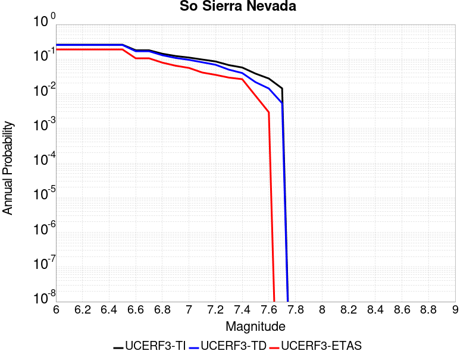 |
|-----|

| Magnitude | UCERF3-TI Prob | UCERF3-TD Prob | UCERF3-ETAS Prob |
|-----|-----|-----|-----|
| 6.0 | 0.26014677 | 0.25557104 | 0.16111112 |
| 6.1 | 0.26014677 | 0.25557104 | 0.16111112 |
| 6.2 | 0.26014677 | 0.25557104 | 0.16111112 |
| 6.3 | 0.26014677 | 0.25557104 | 0.16111112 |
| 6.4 | 0.26014677 | 0.25557104 | 0.16111112 |
| 6.5 | 0.26014677 | 0.25557104 | 0.16111112 |
| 6.6 | 0.179582 | 0.16847488 | 0.07777778 |
| 6.7 | 0.179582 | 0.16847488 | 0.07777778 |
| 6.8 | 0.1427259 | 0.12915279 | 0.055555556 |
| 6.9 | 0.12256904 | 0.107774325 | 0.05 |
| 7.0 | 0.11059791 | 0.09515143 | 0.05 |
| 7.1 | 0.09702229 | 0.08083845 | 0.027777778 |
| 7.2 | 0.08536266 | 0.06860968 | 0.022222223 |
| 7.3 | 0.0670288 | 0.049487304 | 0.016666668 |
| 7.4 | 0.057203136 | 0.039656714 | 0.011111111 |
| 7.5 | 0.03811011 | 0.021605236 | 0.0055555557 |
| 7.6 | 0.027479587 | 0.014153673 | 0.0055555557 |
| 7.7 | 0.014270174 | 0.0053340066 | 0.0 |

## South Cuyama
*[(top)](#table-of-contents)*

| 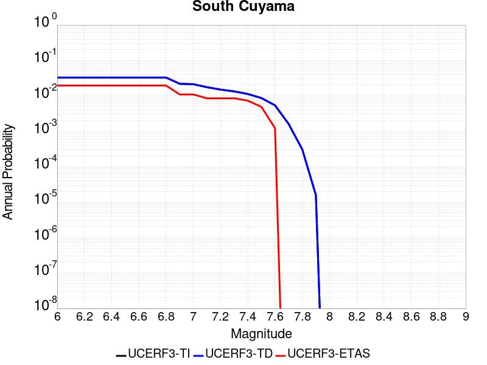 |
|-----|

| Magnitude | UCERF3-TI Prob | UCERF3-TD Prob | UCERF3-ETAS Prob |
|-----|-----|-----|-----|
| 6.0 | 0.032709908 | 0.032899354 | 0.016666668 |
| 6.1 | 0.032709908 | 0.032899354 | 0.016666668 |
| 6.2 | 0.032709908 | 0.032899354 | 0.016666668 |
| 6.3 | 0.032709908 | 0.032899354 | 0.016666668 |
| 6.4 | 0.032709908 | 0.032899354 | 0.016666668 |
| 6.5 | 0.032709908 | 0.032899354 | 0.016666668 |
| 6.6 | 0.032709908 | 0.032899354 | 0.016666668 |
| 6.7 | 0.032709908 | 0.032899354 | 0.016666668 |
| 6.8 | 0.032709908 | 0.032899354 | 0.016666668 |
| 6.9 | 0.021821156 | 0.02194789 | 0.016666668 |
| 7.0 | 0.021236977 | 0.02136074 | 0.016666668 |
| 7.1 | 0.017497616 | 0.017602982 | 0.011111111 |
| 7.2 | 0.014975057 | 0.015067919 | 0.011111111 |
| 7.3 | 0.013312041 | 0.0133959735 | 0.011111111 |
| 7.4 | 0.011251229 | 0.011323814 | 0.011111111 |
| 7.5 | 0.008635252 | 0.008692931 | 0.0055555557 |
| 7.6 | 0.005367122 | 0.0054045767 | 0.0055555557 |
| 7.7 | 0.0016038193 | 0.0016151877 | 0.0 |
| 7.8 | 3.069083E-4 | 3.0957672E-4 | 0.0 |
| 7.9 | 1.5753045E-5 | 1.5907373E-5 | 0.0 |

## South Klamath Lake East
*[(top)](#table-of-contents)*

| 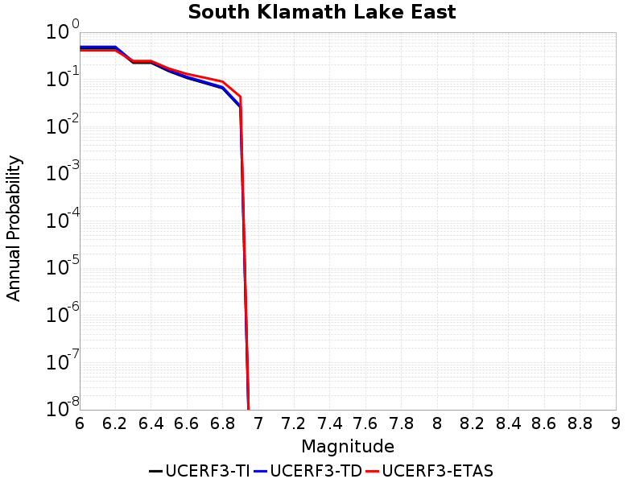 |
|-----|

| Magnitude | UCERF3-TI Prob | UCERF3-TD Prob | UCERF3-ETAS Prob |
|-----|-----|-----|-----|
| 6.0 | 0.45888993 | 0.49098632 | 0.38333333 |
| 6.1 | 0.45888993 | 0.49098632 | 0.38333333 |
| 6.2 | 0.45888993 | 0.49098632 | 0.38333333 |
| 6.3 | 0.22576539 | 0.23861744 | 0.22777778 |
| 6.4 | 0.22576539 | 0.23861744 | 0.22777778 |
| 6.5 | 0.14917164 | 0.15729198 | 0.15 |
| 6.6 | 0.107736856 | 0.11342777 | 0.12222222 |
| 6.7 | 0.08394778 | 0.08843915 | 0.094444446 |
| 6.8 | 0.0650641 | 0.068590075 | 0.06666667 |
| 6.9 | 0.025720967 | 0.027196227 | 0.044444446 |

## South Klamath Lake West
*[(top)](#table-of-contents)*

| 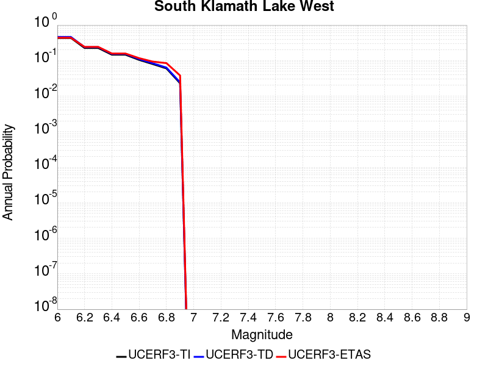 |
|-----|

| Magnitude | UCERF3-TI Prob | UCERF3-TD Prob | UCERF3-ETAS Prob |
|-----|-----|-----|-----|
| 6.0 | 0.43288535 | 0.46106067 | 0.42777777 |
| 6.1 | 0.43288535 | 0.46106067 | 0.42777777 |
| 6.2 | 0.22631274 | 0.23877563 | 0.24444444 |
| 6.3 | 0.22631274 | 0.23877563 | 0.24444444 |
| 6.4 | 0.1463777 | 0.15400124 | 0.14444445 |
| 6.5 | 0.1463777 | 0.15400124 | 0.14444445 |
| 6.6 | 0.104537375 | 0.10982903 | 0.10555556 |
| 6.7 | 0.07977535 | 0.083877206 | 0.083333336 |
| 6.8 | 0.060207084 | 0.06335175 | 0.072222225 |
| 6.9 | 0.023024078 | 0.024291141 | 0.03888889 |

## Superstition Hills
*[(top)](#table-of-contents)*

| 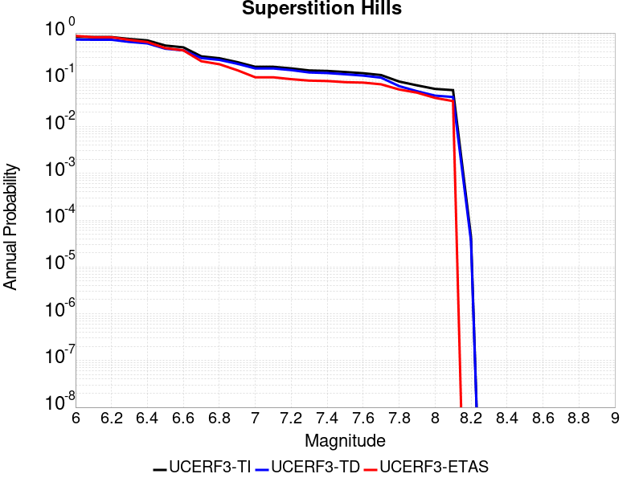 |
|-----|

| Magnitude | UCERF3-TI Prob | UCERF3-TD Prob | UCERF3-ETAS Prob |
|-----|-----|-----|-----|
| 6.0 | 0.8252717 | 0.7234888 | 0.87777776 |
| 6.1 | 0.8186925 | 0.7169495 | 0.8333333 |
| 6.2 | 0.8186925 | 0.7169495 | 0.8333333 |
| 6.3 | 0.74517244 | 0.6443783 | 0.73888886 |
| 6.4 | 0.69427353 | 0.5989323 | 0.62222224 |
| 6.5 | 0.5389081 | 0.46090564 | 0.46666667 |
| 6.6 | 0.49327865 | 0.4254831 | 0.41111112 |
| 6.7 | 0.3169586 | 0.29085273 | 0.18888889 |
| 6.8 | 0.28876087 | 0.26614976 | 0.17777778 |
| 6.9 | 0.23849179 | 0.21975477 | 0.11666667 |
| 7.0 | 0.1893452 | 0.17462204 | 0.10555556 |
| 7.1 | 0.1893452 | 0.17462204 | 0.10555556 |
| 7.2 | 0.17504166 | 0.16083089 | 0.094444446 |
| 7.3 | 0.15832102 | 0.14329928 | 0.08888889 |
| 7.4 | 0.15446769 | 0.13919984 | 0.08888889 |
| 7.5 | 0.14655522 | 0.13113987 | 0.08888889 |
| 7.6 | 0.13815163 | 0.122813486 | 0.08888889 |
| 7.7 | 0.12608527 | 0.110881336 | 0.083333336 |
| 7.8 | 0.09169725 | 0.0732874 | 0.083333336 |
| 7.9 | 0.07592469 | 0.056926157 | 0.06666667 |
| 8.0 | 0.0638051 | 0.0458329 | 0.05 |
| 8.1 | 0.060079396 | 0.042847175 | 0.03888889 |
| 8.2 | 4.48371E-5 | 3.5560635E-5 | 0.0 |

## Surprise Valley 2011 CFM
*[(top)](#table-of-contents)*

| 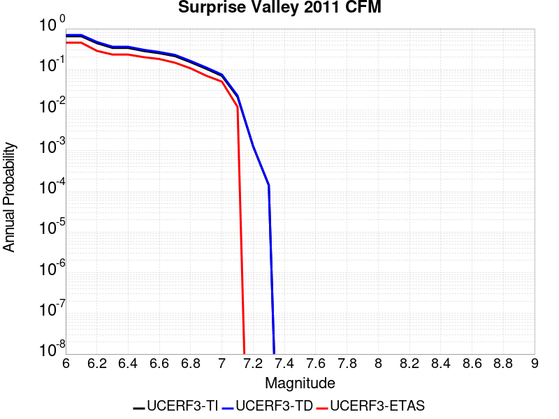 |
|-----|

| Magnitude | UCERF3-TI Prob | UCERF3-TD Prob | UCERF3-ETAS Prob |
|-----|-----|-----|-----|
| 6.0 | 0.65143496 | 0.69963926 | 0.47777778 |
| 6.1 | 0.65143496 | 0.69963926 | 0.47777778 |
| 6.2 | 0.44103816 | 0.47111943 | 0.2888889 |
| 6.3 | 0.3365452 | 0.35931048 | 0.22777778 |
| 6.4 | 0.33633685 | 0.359107 | 0.22777778 |
| 6.5 | 0.2826633 | 0.30200663 | 0.2 |
| 6.6 | 0.24915846 | 0.26642922 | 0.18888889 |
| 6.7 | 0.21143383 | 0.22629789 | 0.15 |
| 6.8 | 0.14970997 | 0.16031489 | 0.094444446 |
| 6.9 | 0.103300415 | 0.11075728 | 0.06666667 |
| 7.0 | 0.06917996 | 0.07436186 | 0.03888889 |
| 7.1 | 0.020983784 | 0.022568079 | 0.0055555557 |
| 7.2 | 0.0012682052 | 0.0012870205 | 0.0 |
| 7.3 | 1.4064225E-4 | 1.4273774E-4 | 0.0 |

## Swain Ravine - Spenceville
*[(top)](#table-of-contents)*

| 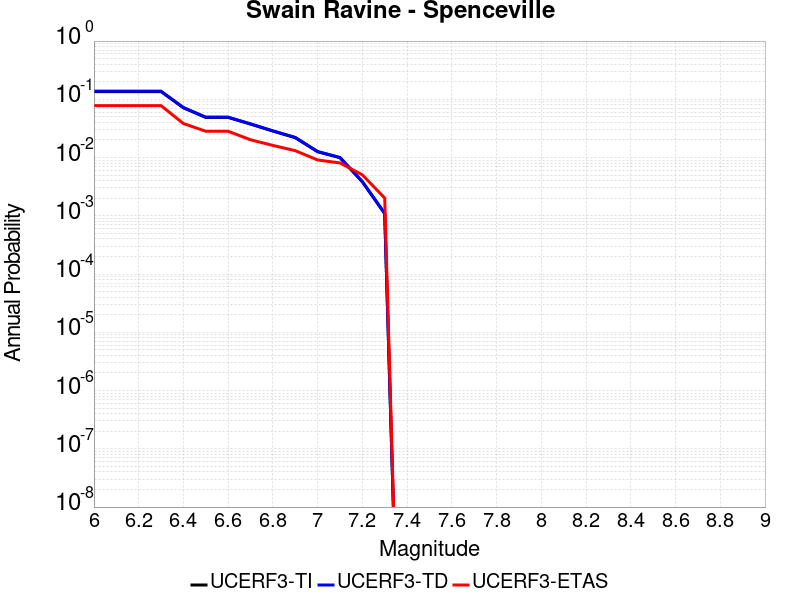 |
|-----|

| Magnitude | UCERF3-TI Prob | UCERF3-TD Prob | UCERF3-ETAS Prob |
|-----|-----|-----|-----|
| 6.0 | 0.1358427 | 0.13793351 | 0.08888889 |
| 6.1 | 0.1358427 | 0.13793351 | 0.08888889 |
| 6.2 | 0.1358427 | 0.13793351 | 0.08888889 |
| 6.3 | 0.1358427 | 0.13793351 | 0.08888889 |
| 6.4 | 0.07148016 | 0.07230063 | 0.03888889 |
| 6.5 | 0.04888437 | 0.049397543 | 0.022222223 |
| 6.6 | 0.04888437 | 0.049397543 | 0.022222223 |
| 6.7 | 0.03754331 | 0.037924312 | 0.011111111 |
| 6.8 | 0.028485386 | 0.02876766 | 0.0055555557 |
| 6.9 | 0.021968303 | 0.02218347 | 0.0055555557 |
| 7.0 | 0.012585107 | 0.012707846 | 0.0 |
| 7.1 | 0.009940339 | 0.010037949 | 0.0 |
| 7.2 | 0.0038346925 | 0.0038738048 | 0.0 |
| 7.3 | 0.0010920384 | 0.0011036033 | 0.0 |

## Table Bluff
*[(top)](#table-of-contents)*

| 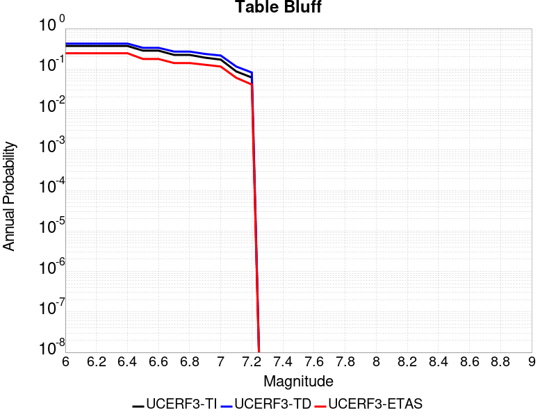 |
|-----|

| Magnitude | UCERF3-TI Prob | UCERF3-TD Prob | UCERF3-ETAS Prob |
|-----|-----|-----|-----|
| 6.0 | 0.37057623 | 0.42501676 | 0.17777778 |
| 6.1 | 0.37057623 | 0.42501676 | 0.17777778 |
| 6.2 | 0.37057623 | 0.42501676 | 0.17777778 |
| 6.3 | 0.37057623 | 0.42501676 | 0.17777778 |
| 6.4 | 0.37057623 | 0.42501676 | 0.17777778 |
| 6.5 | 0.28432488 | 0.3332708 | 0.14444445 |
| 6.6 | 0.28432488 | 0.3332708 | 0.14444445 |
| 6.7 | 0.22338533 | 0.26974502 | 0.1 |
| 6.8 | 0.22338533 | 0.26974502 | 0.1 |
| 6.9 | 0.19040473 | 0.23553312 | 0.08888889 |
| 7.0 | 0.17095083 | 0.2154703 | 0.072222225 |
| 7.1 | 0.08711849 | 0.115024425 | 0.033333335 |
| 7.2 | 0.061646607 | 0.081937656 | 0.027777778 |

## Tank Canyon
*[(top)](#table-of-contents)*

| 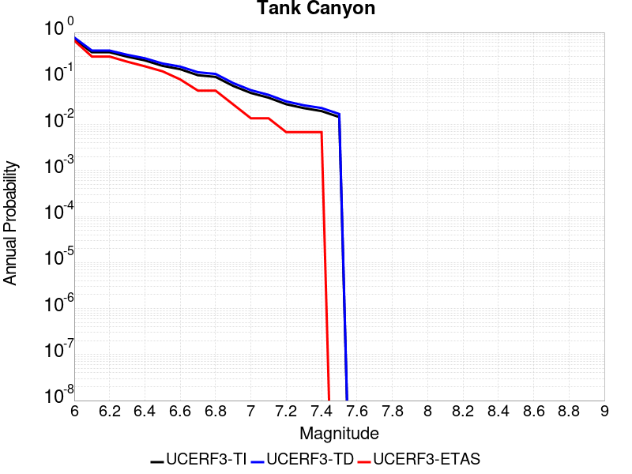 |
|-----|

| Magnitude | UCERF3-TI Prob | UCERF3-TD Prob | UCERF3-ETAS Prob |
|-----|-----|-----|-----|
| 6.0 | 0.71627223 | 0.77709687 | 0.68333334 |
| 6.1 | 0.3714237 | 0.40378803 | 0.32222223 |
| 6.2 | 0.3714237 | 0.40378803 | 0.32222223 |
| 6.3 | 0.2971578 | 0.32672197 | 0.26666668 |
| 6.4 | 0.2469291 | 0.2743059 | 0.22777778 |
| 6.5 | 0.18762843 | 0.21133432 | 0.19444445 |
| 6.6 | 0.1588766 | 0.18089359 | 0.1388889 |
| 6.7 | 0.11755917 | 0.13640352 | 0.1 |
| 6.8 | 0.1080498 | 0.12534934 | 0.1 |
| 6.9 | 0.068736896 | 0.0793244 | 0.06111111 |
| 7.0 | 0.048329774 | 0.055637296 | 0.022222223 |
| 7.1 | 0.03819994 | 0.04396639 | 0.022222223 |
| 7.2 | 0.027506221 | 0.031694353 | 0.022222223 |
| 7.3 | 0.02263725 | 0.026079208 | 0.022222223 |
| 7.4 | 0.019523134 | 0.022749955 | 0.022222223 |
| 7.5 | 0.01447208 | 0.016905654 | 0.016666668 |

## Thirty Mile Bank
*[(top)](#table-of-contents)*

| 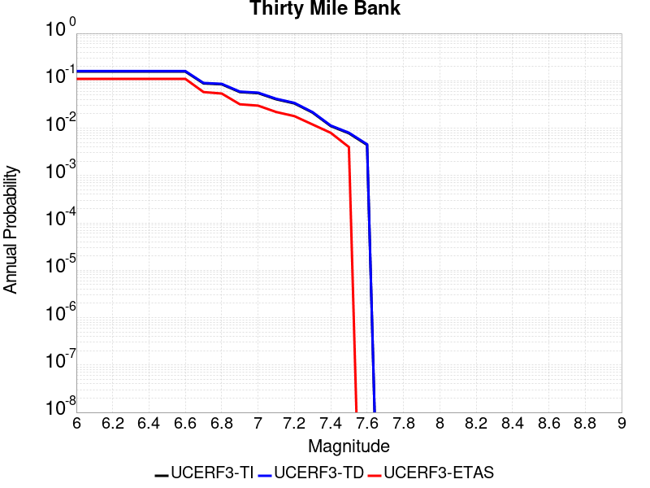 |
|-----|

| Magnitude | UCERF3-TI Prob | UCERF3-TD Prob | UCERF3-ETAS Prob |
|-----|-----|-----|-----|
| 6.0 | 0.1562562 | 0.16032548 | 0.11111111 |
| 6.1 | 0.1562562 | 0.16032548 | 0.11111111 |
| 6.2 | 0.1562562 | 0.16032548 | 0.11111111 |
| 6.3 | 0.1562562 | 0.16032548 | 0.11111111 |
| 6.4 | 0.1562562 | 0.16032548 | 0.11111111 |
| 6.5 | 0.1562562 | 0.16032548 | 0.11111111 |
| 6.6 | 0.1562562 | 0.16032548 | 0.11111111 |
| 6.7 | 0.087889336 | 0.089938104 | 0.05 |
| 6.8 | 0.084184565 | 0.086152785 | 0.05 |
| 6.9 | 0.057642937 | 0.0590436 | 0.03888889 |
| 7.0 | 0.05483742 | 0.05616549 | 0.03888889 |
| 7.1 | 0.04063534 | 0.04167844 | 0.027777778 |
| 7.2 | 0.03327609 | 0.034156222 | 0.016666668 |
| 7.3 | 0.021282015 | 0.021790177 | 0.011111111 |
| 7.4 | 0.011057414 | 0.011362337 | 0.0055555557 |
| 7.5 | 0.007780504 | 0.008007895 | 0.0055555557 |
| 7.6 | 0.0044224365 | 0.0045569655 | 0.0 |

## Tin Mountain
*[(top)](#table-of-contents)*

| 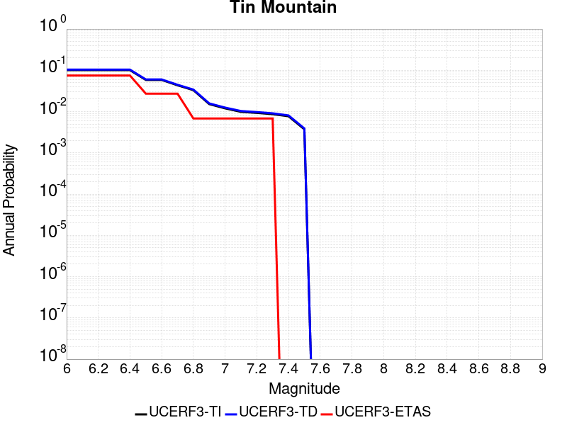 |
|-----|

| Magnitude | UCERF3-TI Prob | UCERF3-TD Prob | UCERF3-ETAS Prob |
|-----|-----|-----|-----|
| 6.0 | 0.10106362 | 0.10415908 | 0.05 |
| 6.1 | 0.10106362 | 0.10415908 | 0.05 |
| 6.2 | 0.10106362 | 0.10415908 | 0.05 |
| 6.3 | 0.10106362 | 0.10415908 | 0.05 |
| 6.4 | 0.10106362 | 0.10415908 | 0.05 |
| 6.5 | 0.05859291 | 0.06015822 | 0.022222223 |
| 6.6 | 0.05859291 | 0.06015822 | 0.022222223 |
| 6.7 | 0.043456364 | 0.044702336 | 0.022222223 |
| 6.8 | 0.03313211 | 0.03416705 | 0.016666668 |
| 6.9 | 0.0152000515 | 0.015809119 | 0.011111111 |
| 7.0 | 0.011993478 | 0.012508403 | 0.011111111 |
| 7.1 | 0.009876847 | 0.01033185 | 0.0055555557 |
| 7.2 | 0.009313247 | 0.009750436 | 0.0055555557 |
| 7.3 | 0.008681303 | 0.009092046 | 0.0055555557 |
| 7.4 | 0.007721791 | 0.008086529 | 0.0055555557 |
| 7.5 | 0.0037307607 | 0.0039069406 | 0.0055555557 |

## Towne Pass
*[(top)](#table-of-contents)*

| 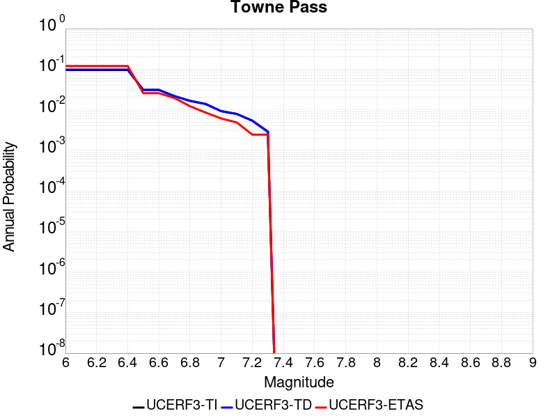 |
|-----|

| Magnitude | UCERF3-TI Prob | UCERF3-TD Prob | UCERF3-ETAS Prob |
|-----|-----|-----|-----|
| 6.0 | 0.09555777 | 0.09774381 | 0.1388889 |
| 6.1 | 0.09555777 | 0.09774381 | 0.1388889 |
| 6.2 | 0.09555777 | 0.09774381 | 0.1388889 |
| 6.3 | 0.09555777 | 0.09774381 | 0.1388889 |
| 6.4 | 0.09555777 | 0.09774381 | 0.1388889 |
| 6.5 | 0.030704698 | 0.031011643 | 0.033333335 |
| 6.6 | 0.030704698 | 0.031011643 | 0.033333335 |
| 6.7 | 0.021615237 | 0.021806575 | 0.027777778 |
| 6.8 | 0.01650826 | 0.01663958 | 0.016666668 |
| 6.9 | 0.013850536 | 0.013950601 | 0.016666668 |
| 7.0 | 0.009239058 | 0.009272321 | 0.011111111 |
| 7.1 | 0.007894448 | 0.007897208 | 0.0055555557 |
| 7.2 | 0.005414015 | 0.005360766 | 0.0 |
| 7.3 | 0.0029078692 | 0.0028417693 | 0.0 |

## Trinidad (alt1)
*[(top)](#table-of-contents)*

| 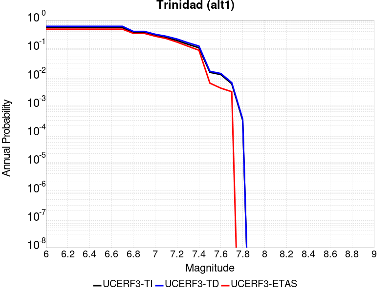 |
|-----|

| Magnitude | UCERF3-TI Prob | UCERF3-TD Prob | UCERF3-ETAS Prob |
|-----|-----|-----|-----|
| 6.0 | 0.5448152 | 0.60259444 | 0.49444443 |
| 6.1 | 0.5448152 | 0.60259444 | 0.49444443 |
| 6.2 | 0.5448152 | 0.60259444 | 0.49444443 |
| 6.3 | 0.5448152 | 0.60259444 | 0.49444443 |
| 6.4 | 0.5448152 | 0.60259444 | 0.49444443 |
| 6.5 | 0.5448152 | 0.60259444 | 0.49444443 |
| 6.6 | 0.5448152 | 0.60259444 | 0.49444443 |
| 6.7 | 0.5448152 | 0.60259444 | 0.49444443 |
| 6.8 | 0.36108062 | 0.39842695 | 0.36666667 |
| 6.9 | 0.36108062 | 0.39842695 | 0.36666667 |
| 7.0 | 0.28500026 | 0.3161384 | 0.26666668 |
| 7.1 | 0.24137376 | 0.26930833 | 0.19444445 |
| 7.2 | 0.19129175 | 0.21503183 | 0.12777779 |
| 7.3 | 0.14014651 | 0.15936747 | 0.07777778 |
| 7.4 | 0.10620347 | 0.1220104 | 0.06111111 |
| 7.5 | 0.014520103 | 0.01582455 | 0.011111111 |
| 7.6 | 0.012109553 | 0.013220647 | 0.0055555557 |
| 7.7 | 0.0057441983 | 0.0062999525 | 0.0055555557 |
| 7.8 | 2.9837273E-4 | 3.2902852E-4 | 0.0 |

## Ventura-Pitas Point
*[(top)](#table-of-contents)*

| 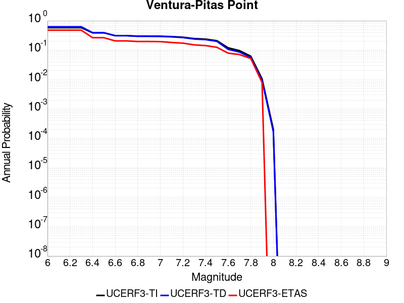 |
|-----|

| Magnitude | UCERF3-TI Prob | UCERF3-TD Prob | UCERF3-ETAS Prob |
|-----|-----|-----|-----|
| 6.0 | 0.5792208 | 0.6234474 | 0.46666667 |
| 6.1 | 0.5792208 | 0.6234474 | 0.46666667 |
| 6.2 | 0.5792208 | 0.6234474 | 0.46666667 |
| 6.3 | 0.5792208 | 0.6234474 | 0.46666667 |
| 6.4 | 0.38694492 | 0.39352095 | 0.2777778 |
| 6.5 | 0.38694492 | 0.39352095 | 0.2777778 |
| 6.6 | 0.31249452 | 0.30881873 | 0.20555556 |
| 6.7 | 0.31249452 | 0.30881873 | 0.20555556 |
| 6.8 | 0.29986522 | 0.2947354 | 0.2 |
| 6.9 | 0.29950547 | 0.2943366 | 0.2 |
| 7.0 | 0.29812777 | 0.2928078 | 0.19444445 |
| 7.1 | 0.288854 | 0.28253245 | 0.18888889 |
| 7.2 | 0.27499706 | 0.26733184 | 0.17222223 |
| 7.3 | 0.2478542 | 0.23857899 | 0.15 |
| 7.4 | 0.23762695 | 0.2279863 | 0.14444445 |
| 7.5 | 0.20960215 | 0.19938111 | 0.12222222 |
| 7.6 | 0.12000763 | 0.10678475 | 0.072222225 |
| 7.7 | 0.09639116 | 0.08633822 | 0.06666667 |
| 7.8 | 0.062297437 | 0.056514747 | 0.044444446 |
| 7.9 | 0.010629006 | 0.009356595 | 0.0 |
| 8.0 | 2.0325146E-4 | 1.6884145E-4 | 0.0 |

## Verdugo
*[(top)](#table-of-contents)*

| 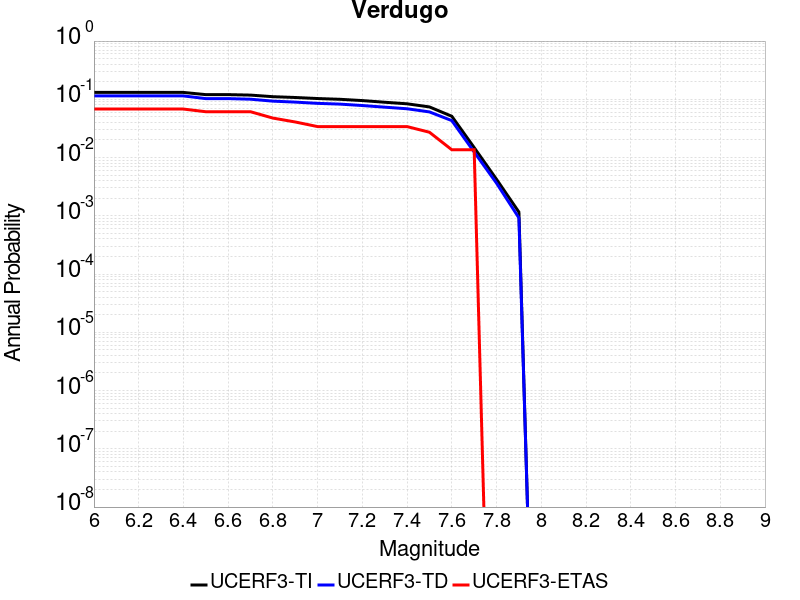 |
|-----|

| Magnitude | UCERF3-TI Prob | UCERF3-TD Prob | UCERF3-ETAS Prob |
|-----|-----|-----|-----|
| 6.0 | 0.13124973 | 0.11435712 | 0.072222225 |
| 6.1 | 0.13124973 | 0.11435712 | 0.072222225 |
| 6.2 | 0.13124973 | 0.11435712 | 0.072222225 |
| 6.3 | 0.13124973 | 0.11435712 | 0.072222225 |
| 6.4 | 0.13124973 | 0.11435712 | 0.072222225 |
| 6.5 | 0.12035932 | 0.102822065 | 0.06666667 |
| 6.6 | 0.12035932 | 0.102822065 | 0.06666667 |
| 6.7 | 0.11809642 | 0.10043707 | 0.06666667 |
| 6.8 | 0.11094422 | 0.09302011 | 0.06111111 |
| 6.9 | 0.1074558 | 0.089527674 | 0.05 |
| 7.0 | 0.10311927 | 0.08524566 | 0.05 |
| 7.1 | 0.10004924 | 0.08271295 | 0.05 |
| 7.2 | 0.095106326 | 0.07821887 | 0.044444446 |
| 7.3 | 0.08905414 | 0.07330222 | 0.044444446 |
| 7.4 | 0.08371282 | 0.068843886 | 0.033333335 |
| 7.5 | 0.074034974 | 0.060752735 | 0.022222223 |
| 7.6 | 0.051173255 | 0.04310491 | 0.0055555557 |
| 7.7 | 0.014828821 | 0.012453532 | 0.0055555557 |
| 7.8 | 0.0042300685 | 0.0036321282 | 0.0 |
| 7.9 | 0.0011596675 | 9.22092E-4 | 0.0 |

## Walker Spring 2011 CFM
*[(top)](#table-of-contents)*

| 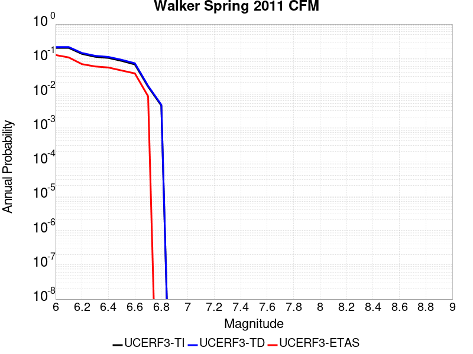 |
|-----|

| Magnitude | UCERF3-TI Prob | UCERF3-TD Prob | UCERF3-ETAS Prob |
|-----|-----|-----|-----|
| 6.0 | 0.20495702 | 0.21638669 | 0.13333334 |
| 6.1 | 0.20495702 | 0.21638669 | 0.11666667 |
| 6.2 | 0.13715713 | 0.14547051 | 0.07777778 |
| 6.3 | 0.11289688 | 0.12039684 | 0.072222225 |
| 6.4 | 0.10479672 | 0.11181931 | 0.06666667 |
| 6.5 | 0.08594674 | 0.092227146 | 0.055555556 |
| 6.6 | 0.067717336 | 0.072968416 | 0.05 |
| 6.7 | 0.015225914 | 0.016025318 | 0.0 |
| 6.8 | 0.0042991596 | 0.0045291428 | 0.0 |

## West Napa 2011 CFM
*[(top)](#table-of-contents)*

| 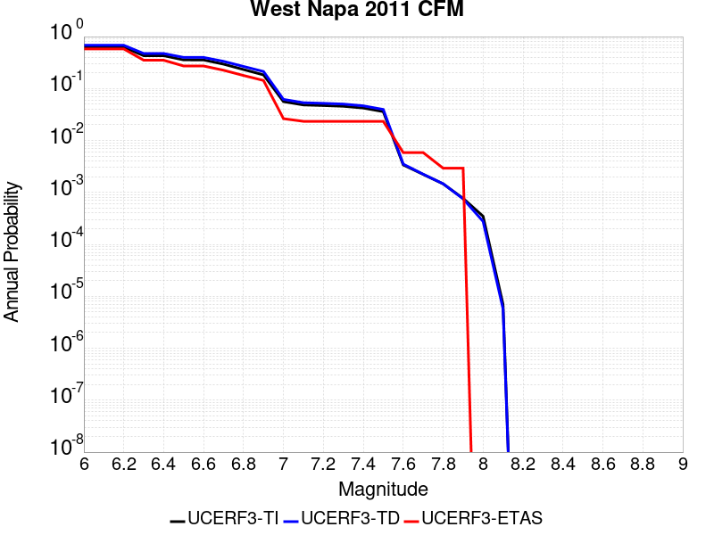 |
|-----|

| Magnitude | UCERF3-TI Prob | UCERF3-TD Prob | UCERF3-ETAS Prob |
|-----|-----|-----|-----|
| 6.0 | 0.62633455 | 0.6814952 | 0.54444444 |
| 6.1 | 0.62633455 | 0.6814952 | 0.54444444 |
| 6.2 | 0.62633455 | 0.6814952 | 0.54444444 |
| 6.3 | 0.4290162 | 0.4726566 | 0.33888888 |
| 6.4 | 0.4290162 | 0.4726566 | 0.33888888 |
| 6.5 | 0.35624903 | 0.39768532 | 0.26666668 |
| 6.6 | 0.35565034 | 0.3970735 | 0.26666668 |
| 6.7 | 0.29496476 | 0.33413622 | 0.22222222 |
| 6.8 | 0.23242733 | 0.26633075 | 0.17777778 |
| 6.9 | 0.18330297 | 0.21293832 | 0.14444445 |
| 7.0 | 0.05604935 | 0.061869208 | 0.016666668 |
| 7.1 | 0.048383325 | 0.053371135 | 0.016666668 |
| 7.2 | 0.04710889 | 0.051973946 | 0.016666668 |
| 7.3 | 0.045584343 | 0.05028048 | 0.016666668 |
| 7.4 | 0.04218538 | 0.046494626 | 0.016666668 |
| 7.5 | 0.03596751 | 0.03961218 | 0.016666668 |
| 7.6 | 0.0033894612 | 0.0035116067 | 0.0 |
| 7.7 | 0.0022259385 | 0.0022431903 | 0.0 |
| 7.8 | 0.0014618817 | 0.0014681957 | 0.0 |
| 7.9 | 7.68708E-4 | 7.516356E-4 | 0.0 |
| 8.0 | 3.4789543E-4 | 2.7703703E-4 | 0.0 |
| 8.1 | 6.937113E-6 | 5.7336515E-6 | 0.0 |

## West Tahoe
*[(top)](#table-of-contents)*

| 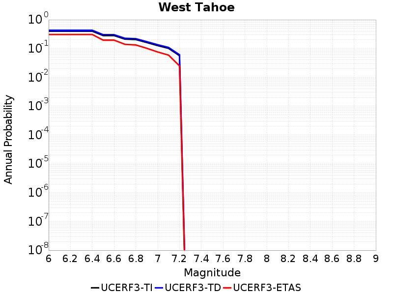 |
|-----|

| Magnitude | UCERF3-TI Prob | UCERF3-TD Prob | UCERF3-ETAS Prob |
|-----|-----|-----|-----|
| 6.0 | 0.3991342 | 0.43099004 | 0.32222223 |
| 6.1 | 0.3991342 | 0.43099004 | 0.32222223 |
| 6.2 | 0.3991342 | 0.43099004 | 0.32222223 |
| 6.3 | 0.3991342 | 0.43099004 | 0.32222223 |
| 6.4 | 0.3991342 | 0.43099004 | 0.32222223 |
| 6.5 | 0.2817602 | 0.3021445 | 0.25 |
| 6.6 | 0.2817602 | 0.3021445 | 0.25 |
| 6.7 | 0.2117029 | 0.2265121 | 0.18888889 |
| 6.8 | 0.20486477 | 0.21936713 | 0.18333334 |
| 6.9 | 0.16160451 | 0.17307937 | 0.13333334 |
| 7.0 | 0.1263926 | 0.13559139 | 0.08888889 |
| 7.1 | 0.10122751 | 0.108813636 | 0.07777778 |
| 7.2 | 0.05665881 | 0.061011523 | 0.033333335 |

## White Mountains
*[(top)](#table-of-contents)*

| 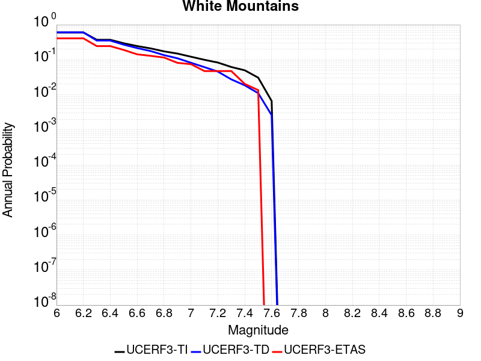 |
|-----|

| Magnitude | UCERF3-TI Prob | UCERF3-TD Prob | UCERF3-ETAS Prob |
|-----|-----|-----|-----|
| 6.0 | 0.59911263 | 0.6047203 | 0.42222223 |
| 6.1 | 0.59911263 | 0.6047203 | 0.42222223 |
| 6.2 | 0.59911263 | 0.6047203 | 0.42222223 |
| 6.3 | 0.37178582 | 0.3527548 | 0.21111111 |
| 6.4 | 0.37178582 | 0.3527548 | 0.21111111 |
| 6.5 | 0.2949842 | 0.26937705 | 0.17222223 |
| 6.6 | 0.24591754 | 0.21541198 | 0.13333334 |
| 6.7 | 0.21067435 | 0.17694454 | 0.11111111 |
| 6.8 | 0.17332757 | 0.13542965 | 0.072222225 |
| 6.9 | 0.14988972 | 0.10993641 | 0.06666667 |
| 7.0 | 0.12201831 | 0.08199394 | 0.05 |
| 7.1 | 0.09969078 | 0.06158449 | 0.033333335 |
| 7.2 | 0.08317246 | 0.045964133 | 0.033333335 |
| 7.3 | 0.062120155 | 0.027542463 | 0.033333335 |
| 7.4 | 0.049997214 | 0.018648116 | 0.016666668 |
| 7.5 | 0.030858051 | 0.011118644 | 0.016666668 |
| 7.6 | 0.006659759 | 0.00261929 | 0.0 |

## White Wolf
*[(top)](#table-of-contents)*

| 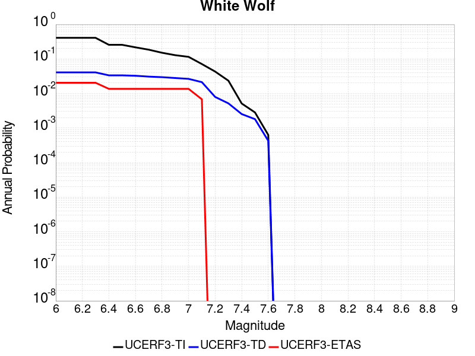 |
|-----|

| Magnitude | UCERF3-TI Prob | UCERF3-TD Prob | UCERF3-ETAS Prob |
|-----|-----|-----|-----|
| 6.0 | 0.40712854 | 0.040706437 | 0.0055555557 |
| 6.1 | 0.40712854 | 0.040706437 | 0.0055555557 |
| 6.2 | 0.40712854 | 0.040706437 | 0.0055555557 |
| 6.3 | 0.40712854 | 0.040706437 | 0.0055555557 |
| 6.4 | 0.2558104 | 0.033474173 | 0.0055555557 |
| 6.5 | 0.2558104 | 0.033474173 | 0.0055555557 |
| 6.6 | 0.21641053 | 0.032602716 | 0.0055555557 |
| 6.7 | 0.18503481 | 0.030758 | 0.0055555557 |
| 6.8 | 0.15081243 | 0.02966296 | 0.0055555557 |
| 6.9 | 0.12819473 | 0.028001798 | 0.0055555557 |
| 7.0 | 0.114823684 | 0.026495147 | 0.0055555557 |
| 7.1 | 0.071100496 | 0.021290492 | 0.0055555557 |
| 7.2 | 0.043086637 | 0.007953999 | 0.0 |
| 7.3 | 0.023426257 | 0.0051748757 | 0.0 |
| 7.4 | 0.0051309164 | 0.0025375746 | 0.0 |
| 7.5 | 0.002831823 | 0.0018093594 | 0.0 |
| 7.6 | 6.3162576E-4 | 4.2800006E-4 | 0.0 |

## White Wolf (Extension)
*[(top)](#table-of-contents)*

| 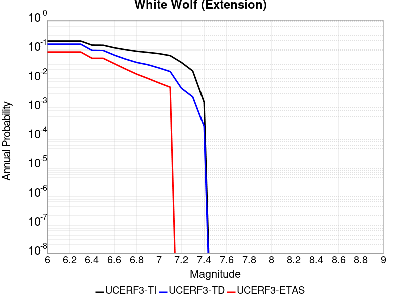 |
|-----|

| Magnitude | UCERF3-TI Prob | UCERF3-TD Prob | UCERF3-ETAS Prob |
|-----|-----|-----|-----|
| 6.0 | 0.19307251 | 0.15162939 | 0.06111111 |
| 6.1 | 0.19307251 | 0.15162939 | 0.06111111 |
| 6.2 | 0.19307251 | 0.15162939 | 0.06111111 |
| 6.3 | 0.19307251 | 0.15162939 | 0.06111111 |
| 6.4 | 0.14091408 | 0.09295955 | 0.016666668 |
| 6.5 | 0.13966365 | 0.09158705 | 0.016666668 |
| 6.6 | 0.114097044 | 0.06340365 | 0.011111111 |
| 6.7 | 0.09798938 | 0.046396025 | 0.0055555557 |
| 6.8 | 0.08578422 | 0.03554689 | 0.0055555557 |
| 6.9 | 0.07857619 | 0.029752657 | 0.0055555557 |
| 7.0 | 0.07116851 | 0.023002515 | 0.0055555557 |
| 7.1 | 0.060917497 | 0.017310962 | 0.0055555557 |
| 7.2 | 0.035552867 | 0.0046551875 | 0.0 |
| 7.3 | 0.018240402 | 0.002371971 | 0.0 |
| 7.4 | 0.0015468019 | 2.260956E-4 | 0.0 |

## Whittier alt 1
*[(top)](#table-of-contents)*

| 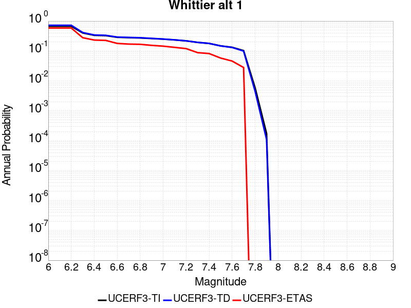 |
|-----|

| Magnitude | UCERF3-TI Prob | UCERF3-TD Prob | UCERF3-ETAS Prob |
|-----|-----|-----|-----|
| 6.0 | 0.67052186 | 0.72440916 | 0.56666666 |
| 6.1 | 0.67052186 | 0.72440916 | 0.56666666 |
| 6.2 | 0.67052186 | 0.72440916 | 0.56666666 |
| 6.3 | 0.4005946 | 0.41483128 | 0.2777778 |
| 6.4 | 0.33455 | 0.34259015 | 0.21666667 |
| 6.5 | 0.3264951 | 0.33415002 | 0.21666667 |
| 6.6 | 0.28681317 | 0.29208702 | 0.17222223 |
| 6.7 | 0.27907205 | 0.28420213 | 0.15555556 |
| 6.8 | 0.27253085 | 0.27718028 | 0.15 |
| 6.9 | 0.26075318 | 0.26394626 | 0.12777779 |
| 7.0 | 0.2487864 | 0.2509636 | 0.12222222 |
| 7.1 | 0.23425835 | 0.23526672 | 0.1 |
| 7.2 | 0.2176602 | 0.21833275 | 0.094444446 |
| 7.3 | 0.19338462 | 0.19412881 | 0.06666667 |
| 7.4 | 0.17839646 | 0.1792268 | 0.06666667 |
| 7.5 | 0.14823145 | 0.14744218 | 0.044444446 |
| 7.6 | 0.13271546 | 0.1311321 | 0.027777778 |
| 7.7 | 0.103028014 | 0.09915003 | 0.022222223 |
| 7.8 | 0.005902799 | 0.0045153685 | 0.0 |
| 7.9 | 1.7417852E-4 | 1.09805864E-4 | 0.0 |

## Wight Way 2011 CFM
*[(top)](#table-of-contents)*

| 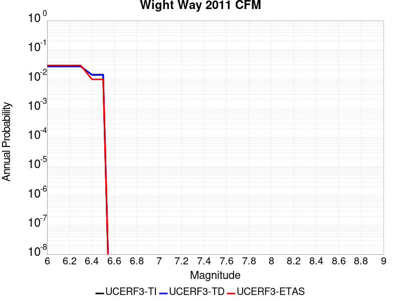 |
|-----|

| Magnitude | UCERF3-TI Prob | UCERF3-TD Prob | UCERF3-ETAS Prob |
|-----|-----|-----|-----|
| 6.0 | 0.02679807 | 0.027105236 | 0.033333335 |
| 6.1 | 0.02679807 | 0.027105236 | 0.033333335 |
| 6.2 | 0.02679807 | 0.027105236 | 0.033333335 |
| 6.3 | 0.02679807 | 0.027105236 | 0.033333335 |
| 6.4 | 0.013903275 | 0.014087255 | 0.016666668 |
| 6.5 | 0.013903275 | 0.014087255 | 0.016666668 |

## Yorba Linda
*[(top)](#table-of-contents)*

| 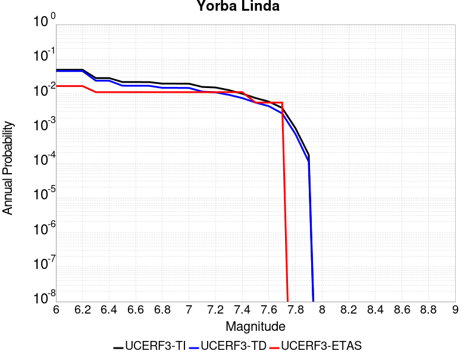 |
|-----|

| Magnitude | UCERF3-TI Prob | UCERF3-TD Prob | UCERF3-ETAS Prob |
|-----|-----|-----|-----|
| 6.0 | 0.049221918 | 0.04519943 | 0.016666668 |
| 6.1 | 0.049221918 | 0.04519943 | 0.016666668 |
| 6.2 | 0.049221918 | 0.04519943 | 0.016666668 |
| 6.3 | 0.028362866 | 0.023751391 | 0.011111111 |
| 6.4 | 0.028362866 | 0.023751391 | 0.011111111 |
| 6.5 | 0.021791818 | 0.01706604 | 0.011111111 |
| 6.6 | 0.021735214 | 0.017003406 | 0.011111111 |
| 6.7 | 0.021707173 | 0.016972251 | 0.011111111 |
| 6.8 | 0.019611908 | 0.014822928 | 0.011111111 |
| 6.9 | 0.019582598 | 0.014787188 | 0.011111111 |
| 7.0 | 0.019477304 | 0.014687847 | 0.011111111 |
| 7.1 | 0.015763052 | 0.0115102185 | 0.011111111 |
| 7.2 | 0.015146166 | 0.010973334 | 0.011111111 |
| 7.3 | 0.012697442 | 0.009291754 | 0.011111111 |
| 7.4 | 0.010045864 | 0.0075066197 | 0.011111111 |
| 7.5 | 0.0075388076 | 0.0055756676 | 0.0055555557 |
| 7.6 | 0.0059230034 | 0.0043830127 | 0.0055555557 |
| 7.7 | 0.003910214 | 0.0027110833 | 0.0055555557 |
| 7.8 | 0.0010158578 | 6.849874E-4 | 0.0 |
| 7.9 | 1.734397E-4 | 1.09206325E-4 | 0.0 |

## Zayante-Vergeles 2011 CFM
*[(top)](#table-of-contents)*

| 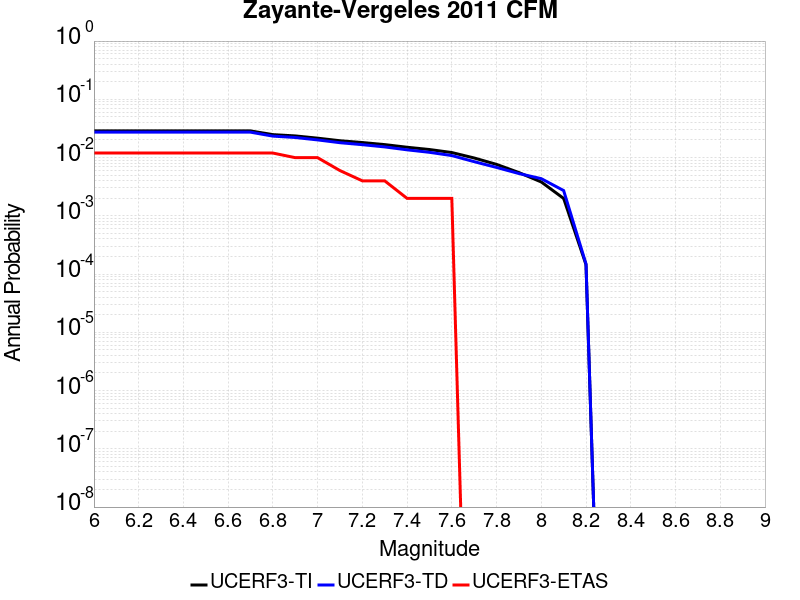 |
|-----|

| Magnitude | UCERF3-TI Prob | UCERF3-TD Prob | UCERF3-ETAS Prob |
|-----|-----|-----|-----|
| 6.0 | 0.028676117 | 0.027286833 | 0.016666668 |
| 6.1 | 0.028676117 | 0.027286833 | 0.016666668 |
| 6.2 | 0.028676117 | 0.027286833 | 0.016666668 |
| 6.3 | 0.028676117 | 0.027286833 | 0.016666668 |
| 6.4 | 0.028676117 | 0.027286833 | 0.016666668 |
| 6.5 | 0.028676117 | 0.027286833 | 0.016666668 |
| 6.6 | 0.028676117 | 0.027286833 | 0.016666668 |
| 6.7 | 0.028676117 | 0.027286833 | 0.016666668 |
| 6.8 | 0.02475527 | 0.023340706 | 0.016666668 |
| 6.9 | 0.02352805 | 0.022104379 | 0.016666668 |
| 7.0 | 0.02152657 | 0.020089267 | 0.016666668 |
| 7.1 | 0.019440396 | 0.01798796 | 0.011111111 |
| 7.2 | 0.01810627 | 0.016645681 | 0.011111111 |
| 7.3 | 0.016688468 | 0.015233145 | 0.011111111 |
| 7.4 | 0.015031327 | 0.013578892 | 0.0055555557 |
| 7.5 | 0.013740559 | 0.0123041095 | 0.0055555557 |
| 7.6 | 0.012195927 | 0.0108185485 | 0.0055555557 |
| 7.7 | 0.009831744 | 0.00850306 | 0.0 |
| 7.8 | 0.007635692 | 0.006767123 | 0.0 |
| 7.9 | 0.005528668 | 0.0053175213 | 0.0 |
| 8.0 | 0.0038100798 | 0.004343803 | 0.0 |
| 8.1 | 0.0019873127 | 0.0027137212 | 0.0 |
| 8.2 | 1.4515444E-4 | 1.492093E-4 | 0.0 |

