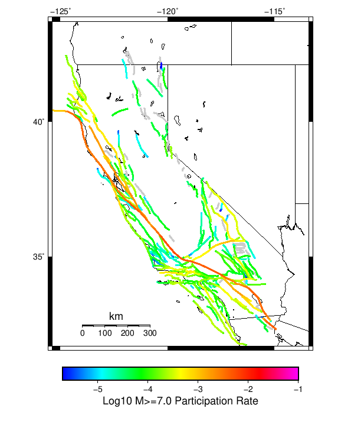

# Start 2012, 500 yr, Spontaneous, Historical Catalog, AleatoryKTest Results

|   | Start 2012, 500 yr, Spontaneous, Historical Catalog, AleatoryKTest |
|-----|-----|
| Num Simulations | 1000 |
| Start Time | 2012/01/01 00:00:00 UTC |
| Start Time Epoch Milliseconds | 1325376000000 |
| Duration | 500 Years |
| Includes Spontaneous? | true |
| Trigger Ruptures | *(none)* |
| Historical Ruptures | 60366 Trigger Ruptures |
|   | First: M7.3 at 1852/01/05 04:40:39 UTC |
|   | Last: M3.2 at 2011/12/31 19:14:44 UTC |
|   | Largest: M7.9 at 1857/01/09 16:25:39 UTC |
| Config Generated With | u3etas_config_builder.sh --start-year 2012 --num-simulations 1000 --duration-years 500 --include-spontaneous --historical-catalog --name-add AleatoryKTest --hpc-site USC_HPC --nodes 18 --hours 24 --queue scec |

## Table Of Contents

* [Magnitude Frequency Distribution](#magnitude-frequency-distribution)
* [Long Term Rate Variability](#long-term-rate-variability)
  * [162 Year Variability](#162-year-variability)
  * [80 Year Variability](#80-year-variability)
  * [28 Year Variability](#28-year-variability)
  * [Variability Duration Dependence](#variability-duration-dependence)
* [Simulation Stationarity](#simulation-stationarity)
* [Section Participation](#section-participation)
  * [Section Participation Plots](#section-participation-plots)
  * [Supra-Seismogenic Parent Sections Table](#supra-seismogenic-parent-sections-table)
  * [M≥6.5 Parent Sections Table](#m65-parent-sections-table)
  * [M≥7 Parent Sections Table](#m7-parent-sections-table)
  * [M≥7.5 Parent Sections Table](#m75-parent-sections-table)
  * [M≥8 Parent Sections Table](#m8-parent-sections-table)
* [Gridded Nucleation](#gridded-nucleation)
* [JSON Input File](#json-input-file)

## Magnitude Frequency Distribution
*[(top)](#table-of-contents)*

**Legend**
* **Mean** (thick black line): mean annual rate across all 1000 catalogs
* **2.5%,97.5%** (thin black lines): annual rate percentiles across all 1000 catalogs
* **Median** (thin blue line): median annual rate across all 1000 catalogs
* **Mode** (thin cyan line): modal annual rate across all 1000 catalogs (scaled to annualized value)
* **500 yr Probability** (thin red line): 500 year probability calculated as the fraction of catalogs with at least 1 occurrence
* **500 yr Supraseismogenic Probability** (thin dashed red line): same as above, but only for supraseismogenic ruptures on explicitly modeled UCERF3 faults
* **95% Conf** (light red shaded region): binomial 95% confidence bounds on probability


| Mag | Mean | 2.5 %ile | 97.5 %ile | Median | Mode | 500 yr Probability | 500 yr Supra-Seis Prob |
|-----|-----|-----|-----|-----|-----|-----|-----|
| **M&ge;5** | 7.832 | 6.742 | 9.408 | 7.746 | 7.984 | 1.000 (100.00%) | 1.000 (100.00%) |
| **M&ge;5.1** | 6.194 | 5.334 | 7.478 | 6.126 | 5.674 | 1.000 (100.00%) | 1.000 (100.00%) |
| **M&ge;5.2** | 4.896 | 4.198 | 5.910 | 4.846 | 4.542 | 1.000 (100.00%) | 1.000 (100.00%) |
| **M&ge;5.3** | 3.864 | 3.310 | 4.634 | 3.832 | 3.668 | 1.000 (100.00%) | 1.000 (100.00%) |
| **M&ge;5.4** | 3.040 | 2.606 | 3.636 | 3.010 | 2.966 | 1.000 (100.00%) | 1.000 (100.00%) |
| **M&ge;5.5** | 2.387 | 2.038 | 2.874 | 2.364 | 2.266 | 1.000 (100.00%) | 1.000 (100.00%) |
| **M&ge;5.6** | 1.870 | 1.606 | 2.244 | 1.852 | 1.782 | 1.000 (100.00%) | 1.000 (100.00%) |
| **M&ge;5.7** | 1.456 | 1.244 | 1.742 | 1.446 | 1.452 | 1.000 (100.00%) | 1.000 (100.00%) |
| **M&ge;5.8** | 1.127 | 0.958 | 1.338 | 1.120 | 1.084 | 1.000 (100.00%) | 1.000 (100.00%) |
| **M&ge;5.9** | 0.857 | 0.732 | 1.008 | 0.852 | 0.814 | 1.000 (100.00%) | 1.000 (100.00%) |
| **M&ge;6** | 0.676 | 0.580 | 0.786 | 0.674 | 0.662 | 1.000 (100.00%) | 1.000 (100.00%) |
| **M&ge;6.1** | 0.520 | 0.444 | 0.610 | 0.518 | 0.500 | 1.000 (100.00%) | 1.000 (100.00%) |
| **M&ge;6.2** | 0.410 | 0.344 | 0.480 | 0.408 | 0.408 | 1.000 (100.00%) | 1.000 (100.00%) |
| **M&ge;6.3** | 0.322 | 0.268 | 0.376 | 0.322 | 0.322 | 1.000 (100.00%) | 1.000 (100.00%) |
| **M&ge;6.4** | 0.252 | 0.208 | 0.300 | 0.252 | 0.248 | 1.000 (100.00%) | 1.000 (100.00%) |
| **M&ge;6.5** | 0.195 | 0.158 | 0.236 | 0.194 | 0.194 | 1.000 (100.00%) | 1.000 (100.00%) |
| **M&ge;6.6** | 0.152 | 0.118 | 0.184 | 0.152 | 0.154 | 1.000 (100.00%) | 1.000 (100.00%) |
| **M&ge;6.7** | 0.117 | 0.092 | 0.146 | 0.118 | 0.118 | 1.000 (100.00%) | 1.000 (100.00%) |
| **M&ge;6.8** | 0.093 | 0.070 | 0.118 | 0.092 | 0.090 | 1.000 (100.00%) | 1.000 (100.00%) |
| **M&ge;6.9** | 0.072 | 0.052 | 0.094 | 0.072 | 0.076 | 1.000 (100.00%) | 1.000 (100.00%) |
| **M&ge;7** | 0.057 | 0.040 | 0.074 | 0.056 | 0.058 | 1.000 (100.00%) | 1.000 (100.00%) |
| **M&ge;7.1** | 0.043 | 0.030 | 0.058 | 0.044 | 0.044 | 1.000 (100.00%) | 1.000 (100.00%) |
| **M&ge;7.2** | 0.033 | 0.022 | 0.044 | 0.032 | 0.030 | 1.000 (100.00%) | 1.000 (100.00%) |
| **M&ge;7.3** | 0.026 | 0.016 | 0.038 | 0.026 | 0.026 | 1.000 (100.00%) | 1.000 (100.00%) |
| **M&ge;7.4** | 0.020 | 0.012 | 0.030 | 0.020 | 0.020 | 1.000 (100.00%) | 1.000 (100.00%) |
| **M&ge;7.5** | 0.015 | 8.00E-3 | 0.022 | 0.014 | 0.014 | 1.000 (100.00%) | 1.000 (100.00%) |
| **M&ge;7.6** | 0.011 | 6.00E-3 | 0.018 | 0.010 | 0.010 | 1.000 (100.00%) | 1.000 (100.00%) |
| **M&ge;7.7** | 7.87E-3 | 4.00E-3 | 0.014 | 8.00E-3 | 8.00E-3 | 0.999 (99.90%) | 0.999 (99.90%) |
| **M&ge;7.8** | 5.48E-3 | 2.00E-3 | 0.010 | 6.00E-3 | 6.00E-3 | 0.994 (99.40%) | 0.994 (99.40%) |
| **M&ge;7.9** | 3.04E-3 | 0.000 | 6.00E-3 | 2.00E-3 | 2.00E-3 | 0.894 (89.40%) | 0.894 (89.40%) |
| **M&ge;8** | 1.69E-3 | 0.000 | 4.00E-3 | 2.00E-3 | 2.00E-3 | 0.644 (64.40%) | 0.644 (64.40%) |
| **M&ge;8.1** | 8.30E-4 | 0.000 | 4.00E-3 | 0.000 | 0.000 | 0.363 (36.30%) | 0.363 (36.30%) |
| **M&ge;8.2** | 3.86E-4 | 0.000 | 2.00E-3 | 0.000 | 0.000 | 0.186 (18.60%) | 0.186 (18.60%) |
| **M&ge;8.3** | 6.40E-5 | 0.000 | 2.00E-3 | 0.000 | 0.000 | 0.032 (3.20%) | 0.032 (3.20%) |
| **M&ge;8.4** | 0.000 | 0.000 | 0.000 | 0.000 | 0.000 | 0.000 (0.00%) | 0.000 (0.00%) |
| **M&ge;8.5** | 0.000 | 0.000 | 0.000 | 0.000 | 0.000 | 0.000 (0.00%) | 0.000 (0.00%) |
| **M&ge;8.6** | 0.000 | 0.000 | 0.000 | 0.000 | 0.000 | 0.000 (0.00%) | 0.000 (0.00%) |
| **M&ge;8.7** | 0.000 | 0.000 | 0.000 | 0.000 | 0.000 | 0.000 (0.00%) | 0.000 (0.00%) |
| **M&ge;8.8** | 0.000 | 0.000 | 0.000 | 0.000 | 0.000 | 0.000 (0.00%) | 0.000 (0.00%) |
| **M&ge;8.9** | 0.000 | 0.000 | 0.000 | 0.000 | 0.000 | 0.000 (0.00%) | 0.000 (0.00%) |
| **M&ge;9** | 0.000 | 0.000 | 0.000 | 0.000 | 0.000 | 0.000 (0.00%) | 0.000 (0.00%) |


## Long Term Rate Variability
*[(top)](#table-of-contents)*

### 162 Year Variability
*[(top)](#table-of-contents)*


[Download CSV Here](plots/long_term_var_162yr.csv)

| **Magnitude** | Mean | Median | Mode | Std. Dev. | 2.5 %-ile | 16 %-ile | 84 %-ile | 97.5 %-ile |
|-----|-----|-----|-----|-----|-----|-----|-----|-----|
| **5.0** | 7.826432 | 7.6296296 | 7.740741 | 1.2032597 | 6.123457 | 6.8024693 | 8.777778 | 10.518518 |
| **5.1** | 6.1895227 | 6.037037 | 5.5 | 0.95226824 | 4.839506 | 5.376543 | 6.9506173 | 8.265432 |
| **5.2** | 4.892603 | 4.783951 | 4.839506 | 0.7514797 | 3.808642 | 4.240741 | 5.5 | 6.567901 |
| **5.3** | 3.8618662 | 3.7839506 | 3.6604939 | 0.59017533 | 2.993827 | 3.351852 | 4.345679 | 5.160494 |
| **5.4** | 3.0383415 | 2.9814816 | 2.9814816 | 0.46476325 | 2.345679 | 2.6358025 | 3.4135802 | 4.0555553 |
| **5.5** | 2.3863602 | 2.3395061 | 2.2901235 | 0.36411855 | 1.8333334 | 2.0617285 | 2.6790123 | 3.2037036 |
| **5.6** | 1.8686584 | 1.8333334 | 1.7407408 | 0.28270048 | 1.4382716 | 1.6172839 | 2.0987654 | 2.5 |
| **5.7** | 1.4549814 | 1.4320987 | 1.3827161 | 0.2168438 | 1.1172839 | 1.2530864 | 1.6358025 | 1.9197531 |
| **5.8** | 1.1267902 | 1.1111112 | 1.0432099 | 0.16575448 | 0.8580247 | 0.9691358 | 1.2654321 | 1.4938271 |
| **5.9** | 0.8564218 | 0.845679 | 0.8148148 | 0.12548964 | 0.6481481 | 0.7407407 | 0.962963 | 1.1358025 |
| **6.0** | 0.6761173 | 0.6666667 | 0.6234568 | 0.0984413 | 0.50617284 | 0.5802469 | 0.7654321 | 0.88271606 |
| **6.1** | 0.51988477 | 0.5185185 | 0.50617284 | 0.07832829 | 0.37654322 | 0.44444445 | 0.5925926 | 0.6851852 |
| **6.2** | 0.4095185 | 0.4074074 | 0.41358024 | 0.0634205 | 0.2962963 | 0.35185185 | 0.4691358 | 0.537037 |
| **6.3** | 0.3221214 | 0.32098764 | 0.3271605 | 0.052382864 | 0.22222222 | 0.27160493 | 0.37037036 | 0.42592594 |
| **6.4** | 0.25209054 | 0.25308642 | 0.25308642 | 0.0441602 | 0.17283951 | 0.20987654 | 0.2962963 | 0.33950618 |
| **6.5** | 0.19443828 | 0.19135803 | 0.2037037 | 0.03709017 | 0.12962963 | 0.15432099 | 0.22839506 | 0.27160493 |
| **6.6** | 0.15156172 | 0.14814815 | 0.15432099 | 0.0314705 | 0.09259259 | 0.11728395 | 0.18518518 | 0.21604939 |
| **6.7** | 0.117331274 | 0.11728395 | 0.09876543 | 0.026843864 | 0.06790123 | 0.09259259 | 0.14197531 | 0.17283951 |
| **6.8** | 0.0926214 | 0.09259259 | 0.09259259 | 0.023295464 | 0.049382716 | 0.06790123 | 0.11728395 | 0.14197531 |
| **6.9** | 0.07237037 | 0.074074075 | 0.06790123 | 0.019826185 | 0.037037037 | 0.055555556 | 0.09259259 | 0.11111111 |
| **7.0** | 0.05681893 | 0.055555556 | 0.055555556 | 0.017142294 | 0.024691358 | 0.037037037 | 0.074074075 | 0.09259259 |
| **7.1** | 0.04338066 | 0.043209877 | 0.043209877 | 0.014810725 | 0.018518519 | 0.030864198 | 0.055555556 | 0.074074075 |
| **7.2** | 0.032985598 | 0.030864198 | 0.030864198 | 0.012598665 | 0.012345679 | 0.018518519 | 0.043209877 | 0.061728396 |
| **7.3** | 0.026174897 | 0.024691358 | 0.024691358 | 0.010860698 | 0.0061728396 | 0.018518519 | 0.037037037 | 0.049382716 |
| **7.4** | 0.020298354 | 0.018518519 | 0.018518519 | 0.009323422 | 0.0061728396 | 0.012345679 | 0.030864198 | 0.037037037 |
| **7.5** | 0.014711934 | 0.012345679 | 0.012345679 | 0.007902525 | 0.0 | 0.0061728396 | 0.024691358 | 0.030864198 |
| **7.6** | 0.0111193415 | 0.012345679 | 0.012345679 | 0.0066030524 | 0.0 | 0.0061728396 | 0.018518519 | 0.024691358 |
| **7.7** | 0.007880659 | 0.0061728396 | 0.0061728396 | 0.005420322 | 0.0 | 0.0 | 0.012345679 | 0.018518519 |
| **7.8** | 0.005477366 | 0.0061728396 | 0.0061728396 | 0.004474697 | 0.0 | 0.0 | 0.012345679 | 0.012345679 |
| **7.9** | 0.00304321 | 0.0 | 0.0 | 0.003484916 | 0.0 | 0.0 | 0.0061728396 | 0.012345679 |
| **8.0** | 0.0017016461 | 0.0 | 0.0 | 0.002827029 | 0.0 | 0.0 | 0.0061728396 | 0.0061728396 |
| **8.1** | 8.3333335E-4 | 0.0 | 0.0 | 0.0021277466 | 0.0 | 0.0 | 0.0 | 0.0061728396 |
| **8.2** | 3.8065843E-4 | 0.0 | 0.0 | 0.0014851188 | 0.0 | 0.0 | 0.0 | 0.0061728396 |
| **8.3** | 6.378601E-5 | 0.0 | 0.0 | 6.243413E-4 | 0.0 | 0.0 | 0.0 | 0.0 |
| **8.4** | 0.0 | 0.0 | 0.0 | 0.0 | 0.0 | 0.0 | 0.0 | 0.0 |
| **8.5** | 0.0 | 0.0 | 0.0 | 0.0 | 0.0 | 0.0 | 0.0 | 0.0 |
| **8.6** | 0.0 | 0.0 | 0.0 | 0.0 | 0.0 | 0.0 | 0.0 | 0.0 |
| **8.7** | 0.0 | 0.0 | 0.0 | 0.0 | 0.0 | 0.0 | 0.0 | 0.0 |
| **8.8** | 0.0 | 0.0 | 0.0 | 0.0 | 0.0 | 0.0 | 0.0 | 0.0 |
| **8.9** | 0.0 | 0.0 | 0.0 | 0.0 | 0.0 | 0.0 | 0.0 | 0.0 |
| **9.0** | 0.0 | 0.0 | 0.0 | 0.0 | 0.0 | 0.0 | 0.0 | 0.0 |

### 80 Year Variability
*[(top)](#table-of-contents)*


[Download CSV Here](plots/long_term_var_80yr.csv)

| **Magnitude** | Mean | Median | Mode | Std. Dev. | 2.5 %-ile | 16 %-ile | 84 %-ile | 97.5 %-ile |
|-----|-----|-----|-----|-----|-----|-----|-----|-----|
| **5.0** | 7.829073 | 7.5 | 6.9 | 1.6902281 | 5.675 | 6.4625 | 9.1125 | 11.9625 |
| **5.1** | 6.1916437 | 5.925 | 5.5875 | 1.3380446 | 4.475 | 5.1 | 7.2 | 9.425 |
| **5.2** | 4.894344 | 4.7 | 4.3 | 1.0557649 | 3.525 | 4.025 | 5.7125 | 7.4125 |
| **5.3** | 3.8632188 | 3.7125 | 3.35 | 0.8309268 | 2.75 | 3.175 | 4.5125 | 5.85 |
| **5.4** | 3.0395145 | 2.925 | 2.8375 | 0.6530367 | 2.15 | 2.5 | 3.55 | 4.5875 |
| **5.5** | 2.3872042 | 2.3 | 2.2125 | 0.510409 | 1.675 | 1.95 | 2.7875 | 3.5875 |
| **5.6** | 1.8692688 | 1.8125 | 1.775 | 0.39609098 | 1.3 | 1.525 | 2.2 | 2.8 |
| **5.7** | 1.455375 | 1.4125 | 1.3 | 0.30585074 | 1.0125 | 1.1875 | 1.7125 | 2.1625 |
| **5.8** | 1.1269542 | 1.1 | 1.1125 | 0.23474133 | 0.7625 | 0.9125 | 1.325 | 1.65 |
| **5.9** | 0.8566875 | 0.8375 | 0.8375 | 0.17741108 | 0.575 | 0.7 | 1.0125 | 1.25 |
| **6.0** | 0.6762729 | 0.6625 | 0.65 | 0.14004856 | 0.4375 | 0.55 | 0.8 | 0.975 |
| **6.1** | 0.52005833 | 0.5125 | 0.5125 | 0.11174308 | 0.325 | 0.4125 | 0.625 | 0.75 |
| **6.2** | 0.4097021 | 0.4 | 0.4 | 0.091227405 | 0.25 | 0.325 | 0.5 | 0.6 |
| **6.3** | 0.32232708 | 0.3125 | 0.3 | 0.07594707 | 0.1875 | 0.25 | 0.4 | 0.4875 |
| **6.4** | 0.2522979 | 0.25 | 0.2375 | 0.06428102 | 0.1375 | 0.1875 | 0.3125 | 0.3875 |
| **6.5** | 0.19457291 | 0.1875 | 0.1875 | 0.054117143 | 0.1 | 0.1375 | 0.25 | 0.3125 |
| **6.6** | 0.15166667 | 0.15 | 0.1375 | 0.046263803 | 0.0625 | 0.1 | 0.2 | 0.25 |
| **6.7** | 0.11739167 | 0.1125 | 0.1 | 0.03966829 | 0.05 | 0.075 | 0.1625 | 0.2 |
| **6.8** | 0.09266042 | 0.0875 | 0.0875 | 0.034225777 | 0.0375 | 0.0625 | 0.125 | 0.1625 |
| **6.9** | 0.07239167 | 0.075 | 0.0625 | 0.02957703 | 0.025 | 0.0375 | 0.1 | 0.1375 |
| **7.0** | 0.05685 | 0.05 | 0.05 | 0.025717014 | 0.0125 | 0.0375 | 0.0875 | 0.1125 |
| **7.1** | 0.043408334 | 0.0375 | 0.0375 | 0.022307454 | 0.0125 | 0.025 | 0.0625 | 0.0875 |
| **7.2** | 0.0330125 | 0.0375 | 0.025 | 0.019120678 | 0.0 | 0.0125 | 0.05 | 0.075 |
| **7.3** | 0.026214583 | 0.025 | 0.025 | 0.016846556 | 0.0 | 0.0125 | 0.0375 | 0.0625 |
| **7.4** | 0.020322917 | 0.0125 | 0.0125 | 0.014570549 | 0.0 | 0.0 | 0.0375 | 0.05 |
| **7.5** | 0.014733333 | 0.0125 | 0.0125 | 0.012396921 | 0.0 | 0.0 | 0.025 | 0.0375 |
| **7.6** | 0.011139584 | 0.0125 | 0.0125 | 0.010538425 | 0.0 | 0.0 | 0.025 | 0.0375 |
| **7.7** | 0.0079125 | 0.0125 | 0.0 | 0.008780245 | 0.0 | 0.0 | 0.0125 | 0.025 |
| **7.8** | 0.0054958332 | 0.0 | 0.0 | 0.007278855 | 0.0 | 0.0 | 0.0125 | 0.025 |
| **7.9** | 0.0030583334 | 0.0 | 0.0 | 0.0055645537 | 0.0 | 0.0 | 0.0125 | 0.0125 |
| **8.0** | 0.0017104166 | 0.0 | 0.0 | 0.0043264558 | 0.0 | 0.0 | 0.0 | 0.0125 |
| **8.1** | 8.4166665E-4 | 0.0 | 0.0 | 0.003132741 | 0.0 | 0.0 | 0.0 | 0.0125 |
| **8.2** | 3.8333333E-4 | 0.0 | 0.0 | 0.0021553414 | 0.0 | 0.0 | 0.0 | 0.0125 |
| **8.3** | 6.4583335E-5 | 0.0 | 0.0 | 8.9624466E-4 | 0.0 | 0.0 | 0.0 | 0.0 |
| **8.4** | 0.0 | 0.0 | 0.0 | 0.0 | 0.0 | 0.0 | 0.0 | 0.0 |
| **8.5** | 0.0 | 0.0 | 0.0 | 0.0 | 0.0 | 0.0 | 0.0 | 0.0 |
| **8.6** | 0.0 | 0.0 | 0.0 | 0.0 | 0.0 | 0.0 | 0.0 | 0.0 |
| **8.7** | 0.0 | 0.0 | 0.0 | 0.0 | 0.0 | 0.0 | 0.0 | 0.0 |
| **8.8** | 0.0 | 0.0 | 0.0 | 0.0 | 0.0 | 0.0 | 0.0 | 0.0 |
| **8.9** | 0.0 | 0.0 | 0.0 | 0.0 | 0.0 | 0.0 | 0.0 | 0.0 |
| **9.0** | 0.0 | 0.0 | 0.0 | 0.0 | 0.0 | 0.0 | 0.0 | 0.0 |

### 28 Year Variability
*[(top)](#table-of-contents)*


[Download CSV Here](plots/long_term_var_28yr.csv)

| **Magnitude** | Mean | Median | Mode | Std. Dev. | 2.5 %-ile | 16 %-ile | 84 %-ile | 97.5 %-ile |
|-----|-----|-----|-----|-----|-----|-----|-----|-----|
| **5.0** | 7.82971 | 7.178571 | 6.464286 | 2.7700832 | 4.928571 | 5.857143 | 9.571428 | 14.642858 |
| **5.1** | 6.19225 | 5.678571 | 4.964286 | 2.192143 | 3.857143 | 4.607143 | 7.571429 | 11.535714 |
| **5.2** | 4.8946977 | 4.5 | 4.142857 | 1.7302437 | 3.0 | 3.642857 | 6.035714 | 9.142858 |
| **5.3** | 3.8634558 | 3.5714285 | 3.1785715 | 1.3629967 | 2.3214285 | 2.857143 | 4.75 | 7.178571 |
| **5.4** | 3.0396345 | 2.8214285 | 2.4642856 | 1.0731859 | 1.7857143 | 2.2142856 | 3.7857144 | 5.642857 |
| **5.5** | 2.3873591 | 2.2142856 | 1.9642857 | 0.8410574 | 1.3571428 | 1.75 | 2.9642856 | 4.392857 |
| **5.6** | 1.8693697 | 1.75 | 1.5714285 | 0.6545858 | 1.0357143 | 1.3571428 | 2.357143 | 3.4285715 |
| **5.7** | 1.455519 | 1.3571428 | 1.2857143 | 0.5065587 | 0.78571427 | 1.0357143 | 1.8214285 | 2.6785715 |
| **5.8** | 1.1270294 | 1.0714285 | 0.96428573 | 0.38946897 | 0.5714286 | 0.78571427 | 1.4285715 | 2.0357144 |
| **5.9** | 0.85680884 | 0.8214286 | 0.8214286 | 0.29787728 | 0.42857143 | 0.60714287 | 1.1071428 | 1.5357143 |
| **6.0** | 0.67637604 | 0.64285713 | 0.64285713 | 0.23664805 | 0.32142857 | 0.4642857 | 0.89285713 | 1.2142857 |
| **6.1** | 0.5202122 | 0.5 | 0.4642857 | 0.19011046 | 0.21428572 | 0.35714287 | 0.6785714 | 0.9285714 |
| **6.2** | 0.40985715 | 0.39285713 | 0.35714287 | 0.15673205 | 0.14285715 | 0.25 | 0.5714286 | 0.75 |
| **6.3** | 0.32240337 | 0.32142857 | 0.2857143 | 0.1321369 | 0.10714286 | 0.17857143 | 0.4642857 | 0.60714287 |
| **6.4** | 0.25235716 | 0.25 | 0.21428572 | 0.11249179 | 0.071428575 | 0.14285715 | 0.35714287 | 0.5 |
| **6.5** | 0.19465756 | 0.17857143 | 0.14285715 | 0.09540671 | 0.035714287 | 0.10714286 | 0.2857143 | 0.39285713 |
| **6.6** | 0.15177101 | 0.14285715 | 0.14285715 | 0.081686355 | 0.035714287 | 0.071428575 | 0.21428572 | 0.32142857 |
| **6.7** | 0.11744538 | 0.10714286 | 0.10714286 | 0.07017984 | 0.0 | 0.035714287 | 0.17857143 | 0.2857143 |
| **6.8** | 0.09272269 | 0.071428575 | 0.071428575 | 0.060968004 | 0.0 | 0.035714287 | 0.14285715 | 0.21428572 |
| **6.9** | 0.07243487 | 0.071428575 | 0.035714287 | 0.05282654 | 0.0 | 0.035714287 | 0.10714286 | 0.17857143 |
| **7.0** | 0.056886554 | 0.035714287 | 0.035714287 | 0.04613774 | 0.0 | 0.0 | 0.10714286 | 0.17857143 |
| **7.1** | 0.043443277 | 0.035714287 | 0.035714287 | 0.0399768 | 0.0 | 0.0 | 0.071428575 | 0.14285715 |
| **7.2** | 0.033039916 | 0.035714287 | 0.0 | 0.034472756 | 0.0 | 0.0 | 0.071428575 | 0.10714286 |
| **7.3** | 0.026228992 | 0.035714287 | 0.0 | 0.030418986 | 0.0 | 0.0 | 0.071428575 | 0.10714286 |
| **7.4** | 0.020340336 | 0.0 | 0.0 | 0.026712611 | 0.0 | 0.0 | 0.035714287 | 0.071428575 |
| **7.5** | 0.014739496 | 0.0 | 0.0 | 0.022678627 | 0.0 | 0.0 | 0.035714287 | 0.071428575 |
| **7.6** | 0.011134454 | 0.0 | 0.0 | 0.019503796 | 0.0 | 0.0 | 0.035714287 | 0.071428575 |
| **7.7** | 0.007903362 | 0.0 | 0.0 | 0.016292134 | 0.0 | 0.0 | 0.035714287 | 0.035714287 |
| **7.8** | 0.0054894956 | 0.0 | 0.0 | 0.013534642 | 0.0 | 0.0 | 0.0 | 0.035714287 |
| **7.9** | 0.0030567227 | 0.0 | 0.0 | 0.010103565 | 0.0 | 0.0 | 0.0 | 0.035714287 |
| **8.0** | 0.0017016807 | 0.0 | 0.0 | 0.007608022 | 0.0 | 0.0 | 0.0 | 0.035714287 |
| **8.1** | 8.382353E-4 | 0.0 | 0.0 | 0.0054070377 | 0.0 | 0.0 | 0.0 | 0.0 |
| **8.2** | 3.8235294E-4 | 0.0 | 0.0 | 0.0036756038 | 0.0 | 0.0 | 0.0 | 0.0 |
| **8.3** | 6.512605E-5 | 0.0 | 0.0 | 0.0015237537 | 0.0 | 0.0 | 0.0 | 0.0 |
| **8.4** | 0.0 | 0.0 | 0.0 | 0.0 | 0.0 | 0.0 | 0.0 | 0.0 |
| **8.5** | 0.0 | 0.0 | 0.0 | 0.0 | 0.0 | 0.0 | 0.0 | 0.0 |
| **8.6** | 0.0 | 0.0 | 0.0 | 0.0 | 0.0 | 0.0 | 0.0 | 0.0 |
| **8.7** | 0.0 | 0.0 | 0.0 | 0.0 | 0.0 | 0.0 | 0.0 | 0.0 |
| **8.8** | 0.0 | 0.0 | 0.0 | 0.0 | 0.0 | 0.0 | 0.0 | 0.0 |
| **8.9** | 0.0 | 0.0 | 0.0 | 0.0 | 0.0 | 0.0 | 0.0 | 0.0 |
| **9.0** | 0.0 | 0.0 | 0.0 | 0.0 | 0.0 | 0.0 | 0.0 | 0.0 |

### Variability Duration Dependence
*[(top)](#table-of-contents)*


[Download CSV Here](plots/long_term_var_m5.csv)

| **Duration (years)** | Mean | Median | Mode | Std. Dev. | 2.5 %-ile | 16 %-ile | 84 %-ile | 97.5 %-ile |
|-----|-----|-----|-----|-----|-----|-----|-----|-----|
| **1.0** | 7.831644 | 6.0 | 5.0 | 11.376436 | 1.0 | 3.0 | 11.0 | 25.0 |
| **4.0** | 7.831644 | 6.5 | 5.5 | 6.4840484 | 3.0 | 4.5 | 10.0 | 21.0 |
| **8.0** | 7.830665 | 6.75 | 5.75 | 4.8240933 | 3.875 | 5.0 | 9.875 | 18.875 |
| **12.0** | 7.828575 | 6.9166665 | 6.6666665 | 4.0620856 | 4.25 | 5.3333335 | 9.75 | 17.5 |
| **16.0** | 7.830665 | 7.0 | 6.0625 | 3.6018589 | 4.5 | 5.5 | 9.6875 | 16.3125 |
| **20.0** | 7.831644 | 7.05 | 6.6 | 3.2901847 | 4.65 | 5.65 | 9.65 | 15.6 |
| **24.0** | 7.829073 | 7.125 | 6.25 | 2.97042 | 4.7916665 | 5.7916665 | 9.625 | 15.041667 |
| **28.0** | 7.82971 | 7.178571 | 6.464286 | 2.7700832 | 4.928571 | 5.857143 | 9.571428 | 14.642858 |
| **32.0** | 7.829073 | 7.21875 | 6.625 | 2.6002042 | 5.0625 | 5.9375 | 9.53125 | 14.21875 |
| **36.0** | 7.830626 | 7.2777777 | 6.6944447 | 2.4695513 | 5.138889 | 6.0 | 9.5 | 13.777778 |
| **40.0** | 7.829073 | 7.275 | 6.575 | 2.3733342 | 5.225 | 6.05 | 9.45 | 13.65 |
| **44.0** | 7.826616 | 7.318182 | 6.9545455 | 2.2660332 | 5.2727275 | 6.1136365 | 9.409091 | 13.318182 |
| **48.0** | 7.829073 | 7.3541665 | 6.8125 | 2.2015526 | 5.3333335 | 6.1458335 | 9.354167 | 13.229167 |
| **52.0** | 7.830626 | 7.3846154 | 6.8653846 | 2.1111767 | 5.4038463 | 6.2115383 | 9.307693 | 12.865385 |
| **56.0** | 7.8383884 | 7.375 | 7.232143 | 2.031451 | 5.464286 | 6.25 | 9.321428 | 12.732142 |
| **60.0** | 7.829073 | 7.4166665 | 6.8 | 1.9740205 | 5.4666667 | 6.2833333 | 9.283334 | 12.483334 |
| **64.0** | 7.8383884 | 7.4375 | 6.78125 | 1.8976762 | 5.546875 | 6.34375 | 9.203125 | 12.328125 |
| **68.0** | 7.82971 | 7.4411764 | 7.0735292 | 1.8625119 | 5.5735292 | 6.367647 | 9.176471 | 12.220589 |
| **72.0** | 7.8449006 | 7.486111 | 6.611111 | 1.8273338 | 5.611111 | 6.4027777 | 9.138889 | 12.236111 |
| **76.0** | 7.8371973 | 7.486842 | 6.868421 | 1.7669314 | 5.6578946 | 6.4210525 | 9.144737 | 12.118421 |
| **80.0** | 7.829073 | 7.5 | 6.9 | 1.6902281 | 5.675 | 6.4625 | 9.1125 | 11.9625 |
| **84.0** | 7.8537593 | 7.5119047 | 7.0119047 | 1.6793456 | 5.7261906 | 6.4761906 | 9.166667 | 11.928572 |
| **88.0** | 7.8405457 | 7.5227275 | 6.7954545 | 1.6396145 | 5.7272725 | 6.5 | 9.113636 | 11.647727 |
| **92.0** | 7.8339586 | 7.5326085 | 7.2391305 | 1.5844736 | 5.7608695 | 6.5326085 | 9.097826 | 11.717391 |
| **96.0** | 7.829073 | 7.5208335 | 6.9895835 | 1.5715955 | 5.8229165 | 6.5520835 | 9.052083 | 11.604167 |
| **100.0** | 7.831644 | 7.53 | 7.54 | 1.5616727 | 5.82 | 6.56 | 9.01 | 11.58 |
| **200.0** | 7.8668127 | 7.69 | 7.27 | 1.1077322 | 6.34 | 6.895 | 8.785 | 10.375 |
| **300.0** | 7.8935065 | 7.7633333 | 7.9733334 | 0.96046764 | 6.536667 | 7.0433335 | 8.65 | 10.136666 |
| **400.0** | 7.8668127 | 7.79 | 7.8775 | 0.8008361 | 6.6625 | 7.1425 | 8.5075 | 9.695 |
| **500.0** | 7.831644 | 7.746 | 7.984 | 0.71304584 | 6.742 | 7.208 | 8.422 | 9.408 |


## Simulation Stationarity
*[(top)](#table-of-contents)*


## Section Participation
*[(top)](#table-of-contents)*

### Section Participation Plots
*[(top)](#table-of-contents)*

| Min Mag | Complete Catalog (including spontaneous) |
|-----|-----|
| **All Supra. Seis.** |  |
| **M&ge;6.5** |  |
| **M&ge;7** |  |
| **M&ge;7.5** |  |
| **M&ge;8** |  |

### Supra-Seismogenic Parent Sections Table
*[(top)](#table-of-contents)*

*First 10 of 313 with matching ruptures shown*

| Parent Name | Total Mean Annual Rate | Total 500 Year Prob |
|-----|-----|-----|
| San Andreas (Parkfield) | 0.042322 | 1.0 |
| San Andreas (Creeping Section) 2011 CFM | 0.028326 | 1.0 |
| San Andreas (Mojave S) | 0.018634 | 1.0 |
| Mendocino | 0.017938 | 1.0 |
| Cerro Prieto | 0.013244 | 1.0 |
| Imperial | 0.011622 | 0.999 |
| Brawley (Seismic Zone) alt 1 | 0.010998 | 0.999 |
| Hayward (So) 2011 CFM | 0.00942 | 0.999 |
| San Andreas (Offshore) 2011 CFM | 0.008524 | 1.0 |
| Elsinore (Glen Ivy) rev | 0.008052 | 0.992 |

### M≥6.5 Parent Sections Table
*[(top)](#table-of-contents)*

*First 10 of 306 with matching ruptures shown*

| Parent Name | Total Mean Annual Rate | Total 500 Year Prob |
|-----|-----|-----|
| Cerro Prieto | 0.011366 | 1.0 |
| San Andreas (Creeping Section) 2011 CFM | 0.010922 | 1.0 |
| Mendocino | 0.009204 | 0.999 |
| Imperial | 0.00813 | 0.998 |
| Hayward (So) 2011 CFM | 0.008048 | 0.998 |
| Brawley (Seismic Zone) alt 1 | 0.007822 | 0.998 |
| San Andreas (Mojave S) | 0.00702 | 1.0 |
| San Andreas (Santa Cruz Mts) 2011 CFM | 0.006786 | 0.997 |
| San Andreas (San Bernardino N) | 0.006722 | 0.998 |
| San Andreas (Offshore) 2011 CFM | 0.006186 | 1.0 |

### M≥7 Parent Sections Table
*[(top)](#table-of-contents)*

*First 10 of 272 with matching ruptures shown*

| Parent Name | Total Mean Annual Rate | Total 500 Year Prob |
|-----|-----|-----|
| San Andreas (Creeping Section) 2011 CFM | 0.006814 | 0.994 |
| San Andreas (Carrizo) rev | 0.005764 | 1.0 |
| San Andreas (Cholame) rev | 0.005754 | 1.0 |
| San Andreas (Mojave S) | 0.00532 | 0.999 |
| San Andreas (Santa Cruz Mts) 2011 CFM | 0.005302 | 0.992 |
| San Andreas (Mojave N) | 0.00498 | 1.0 |
| San Andreas (San Bernardino N) | 0.004686 | 0.984 |
| San Andreas (North Coast) 2011 CFM | 0.004646 | 0.997 |
| San Andreas (Big Bend) | 0.00462 | 0.998 |
| San Andreas (Offshore) 2011 CFM | 0.00444 | 0.994 |

### M≥7.5 Parent Sections Table
*[(top)](#table-of-contents)*

*First 10 of 215 with matching ruptures shown*

| Parent Name | Total Mean Annual Rate | Total 500 Year Prob |
|-----|-----|-----|
| San Andreas (Mojave N) | 0.004868 | 0.999 |
| San Andreas (Big Bend) | 0.004492 | 0.997 |
| San Andreas (Mojave S) | 0.00441 | 0.995 |
| San Andreas (Carrizo) rev | 0.00425 | 0.995 |
| San Andreas (Cholame) rev | 0.004056 | 0.987 |
| San Andreas (North Coast) 2011 CFM | 0.00373 | 0.985 |
| San Andreas (San Bernardino N) | 0.00364 | 0.948 |
| San Andreas (Creeping Section) 2011 CFM | 0.003428 | 0.896 |
| San Andreas (Parkfield) | 0.003096 | 0.905 |
| San Andreas (Peninsula) 2011 CFM | 0.002986 | 0.941 |

### M≥8 Parent Sections Table
*[(top)](#table-of-contents)*

*First 10 of 68 with matching ruptures shown*

| Parent Name | Total Mean Annual Rate | Total 500 Year Prob |
|-----|-----|-----|
| San Andreas (Mojave N) | 0.001562 | 0.618 |
| San Andreas (Carrizo) rev | 0.00153 | 0.605 |
| San Andreas (Mojave S) | 0.001526 | 0.609 |
| San Andreas (Big Bend) | 0.001524 | 0.603 |
| San Andreas (Cholame) rev | 0.001484 | 0.591 |
| San Andreas (San Bernardino N) | 0.001444 | 0.586 |
| San Andreas (Parkfield) | 0.001274 | 0.524 |
| San Andreas (Creeping Section) 2011 CFM | 0.001168 | 0.473 |
| San Andreas (Santa Cruz Mts) 2011 CFM | 8.2E-4 | 0.358 |
| San Andreas (Peninsula) 2011 CFM | 7.06E-4 | 0.319 |

## Gridded Nucleation
*[(top)](#table-of-contents)*

| Min Mag | Complete Catalog (including spontaneous) |
|-----|-----|
| **M&ge;5** |  |
| **M&ge;6** |  |
| **M&ge;7** |  |


## JSON Input File
*[(top)](#table-of-contents)*

```
{
  "numSimulations": 1000,
  "duration": 500.0,
  "startYear": 2012,
  "includeSpontaneous": true,
  "randomSeed": 1570823659422,
  "binaryOutput": true,
  "binaryOutputFilters": [
    {
      "prefix": "results_complete",
      "descendantsOnly": false
    },
    {
      "prefix": "results_m5_preserve_chain",
      "minMag": 5.0,
      "preserveChainBelowMag": true,
      "descendantsOnly": false
    }
  ],
  "forceRecalc": false,
  "simulationName": "Start 2012, 500 yr, Spontaneous, Historical Catalog, AleatoryKTest",
  "numRetries": 3,
  "outputDir": "${ETAS_SIM_DIR}/2019_10_11-Start2012_500yr_Spontaneous_HistoricalCatalog_AleatoryKTest",
  "triggerCatalog": "${ETAS_LAUNCHER}/inputs/u3_historical_catalog.txt",
  "triggerCatalogSurfaceMappings": "${ETAS_LAUNCHER}/inputs/u3_historical_catalog_finite_fault_mappings.xml",
  "treatTriggerCatalogAsSpontaneous": true,
  "cacheDir": "${ETAS_LAUNCHER}/inputs/cache_fm3p1_ba",
  "fssFile": "${ETAS_LAUNCHER}/inputs/2013_05_10-ucerf3p3-production-10runs_COMPOUND_SOL_FM3_1_SpatSeisU3_MEAN_BRANCH_AVG_SOL.zip",
  "probModel": "FULL_TD",
  "applySubSeisForSupraNucl": true,
  "totRateScaleFactor": 1.14,
  "gridSeisCorr": true,
  "timeIndependentERF": false,
  "griddedOnly": false,
  "imposeGR": false,
  "includeIndirectTriggering": true,
  "gridSeisDiscr": 0.1,
  "catalogCompletenessModel": "RELAXED",
  "configCommand": "u3etas_config_builder.sh --start-year 2012 --num-simulations 1000 --duration-years 500 --include-spontaneous --historical-catalog --name-add AleatoryKTest --hpc-site USC_HPC --nodes 18 --hours 24 --queue scec",
  "configTime": 1570823659422
}
```

