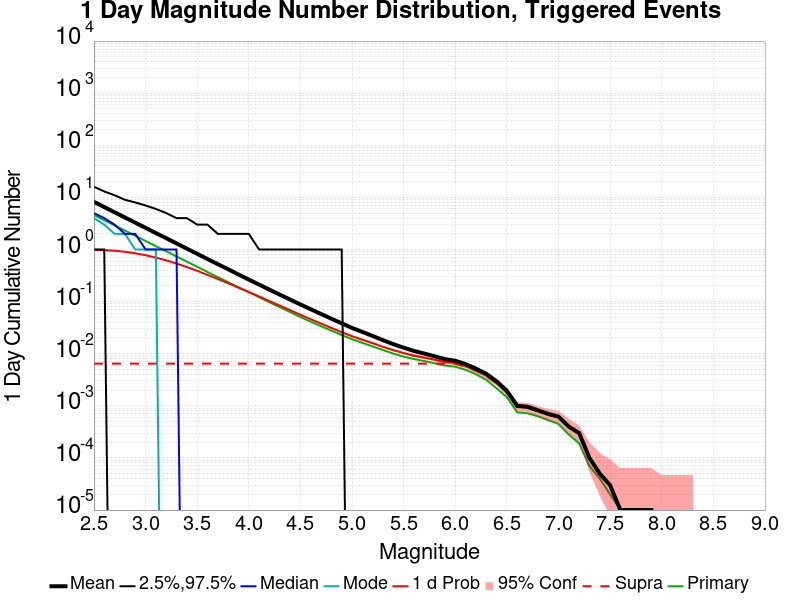
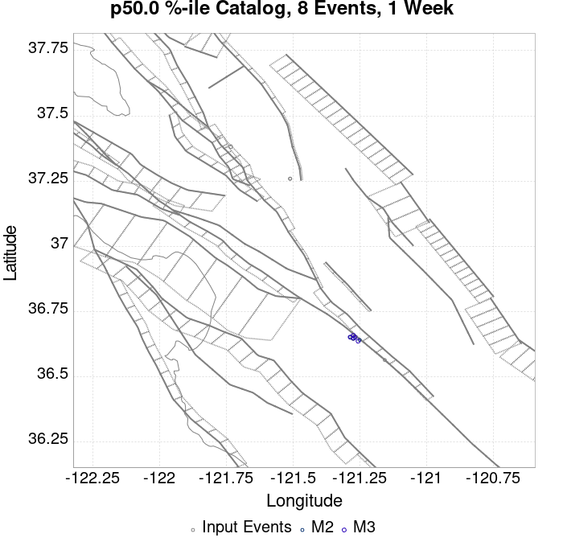
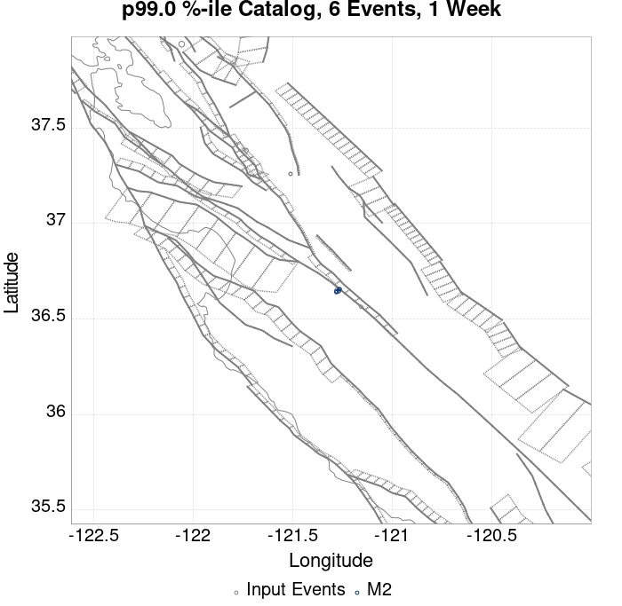
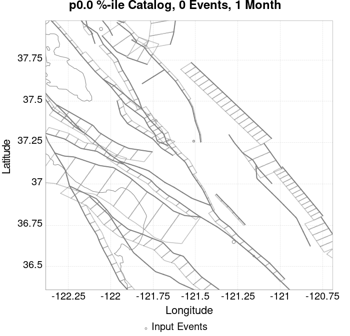
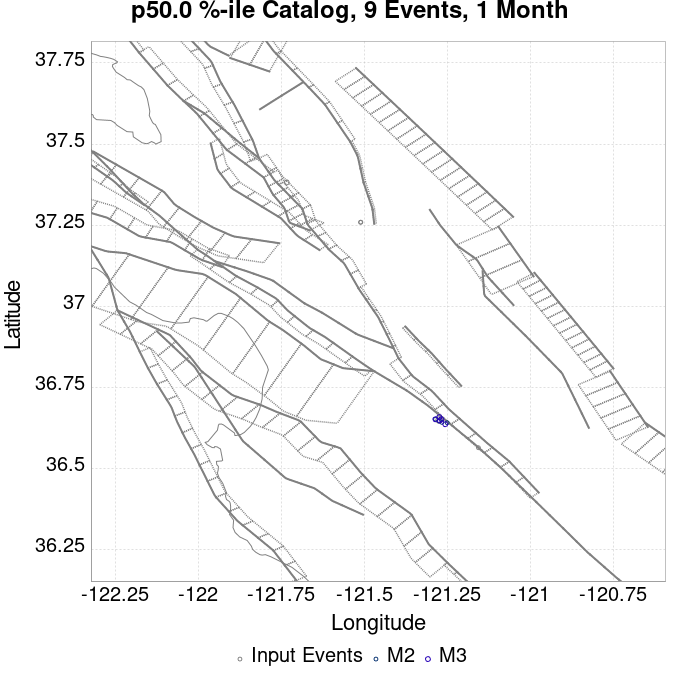
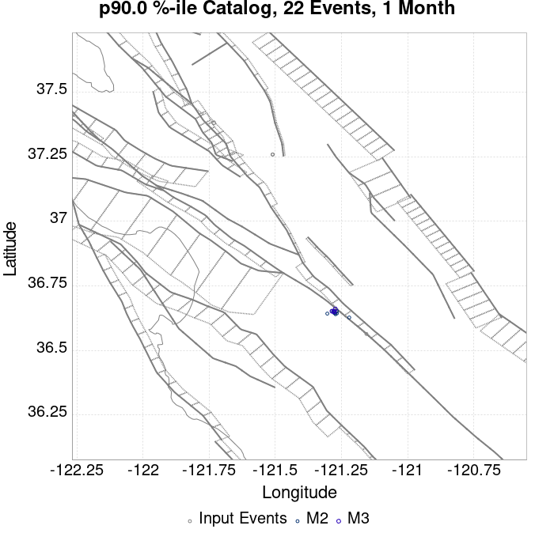
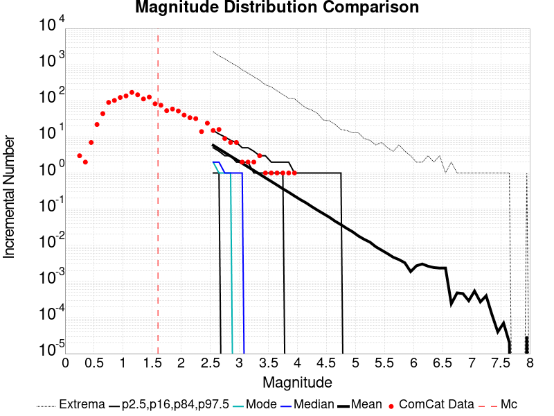
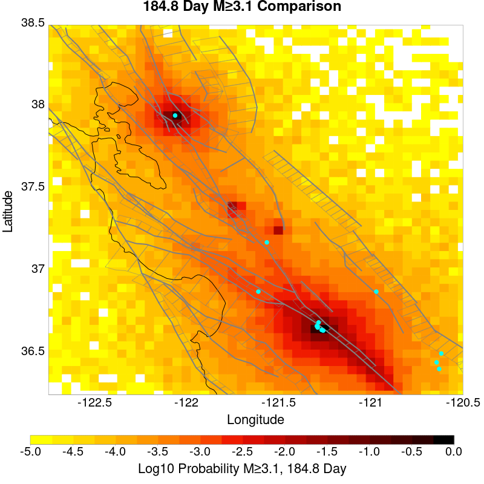
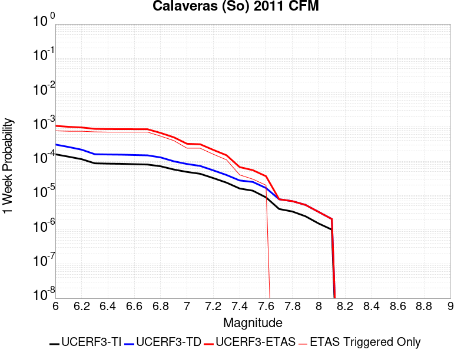

# ComCat M4.71 (nc73292360), Point Sources Results

|   | ComCat M4.71 (nc73292360), Point Sources |
|-----|-----|
| Num Simulations | 10900 (incomplete) |
| Start Time | 2019/10/15 19:42:31 UTC |
| Start Time Epoch Milliseconds | 1571168551550 |
| Duration | 10 Years |
| Includes Spontaneous? | false |
| Historical Ruptures | *(none)* |
| Config Generated With | u3etas_comcat_event_config_builder.sh --event-id nc73292360 --region 38.5,-122.75,36.25,-120.5 --num-simulations 100000 --days-before 7 --hpc-site USC_HPC --nodes 36 --hours 24 --queue scec |

## Table Of Contents

* [Probabilities Summary Table](#probabilities-summary-table)
* [Magnitude Number Distribution](#magnitude-number-distribution)
  * [10 Year Magnitude Number Distribution](#10-year-magnitude-number-distribution)
  * [1 Year Magnitude Number Distribution](#1-year-magnitude-number-distribution)
  * [1 Month Magnitude Number Distribution](#1-month-magnitude-number-distribution)
  * [1 Week Magnitude Number Distribution](#1-week-magnitude-number-distribution)
  * [1 Day Magnitude Number Distribution](#1-day-magnitude-number-distribution)
  * [1 Hour Magnitude Number Distribution](#1-hour-magnitude-number-distribution)
* [Hazard Change Over Time](#hazard-change-over-time)
  * [M&ge;5.0 Hazard Change Over Time](#m50-hazard-change-over-time)
  * [M&ge;6.0 Hazard Change Over Time](#m60-hazard-change-over-time)
  * [M&ge;7.0 Hazard Change Over Time](#m70-hazard-change-over-time)
* [Trigger Rupture Fault Map](#trigger-rupture-fault-map)
* [Fault Distances To Triggers](#fault-distances-to-triggers)
* [Individual Simulated Catalog Maps](#individual-simulated-catalog-maps)
* [ComCat Data Comparisons](#comcat-data-comparisons)
  * [ComCat Magnitude-Number Distributions](#comcat-magnitude-number-distributions)
  * [ComCat Time-Dependent Mc](#comcat-time-dependent-mc)
  * [ComCat Cumulative Number Vs Time](#comcat-cumulative-number-vs-time)
  * [ComCat Cumulative Number Simulation Percentiles](#comcat-cumulative-number-simulation-percentiles)
  * [ComCat Probability Spatial Distribution](#comcat-probability-spatial-distribution)
  * [ComCat Mean Expectation Spatial Distribution](#comcat-mean-expectation-spatial-distribution)
  * [ComCat Depth Distribution](#comcat-depth-distribution)
* [Section Participation](#section-participation)
  * [Section Participation Plots](#section-participation-plots)
  * [Supra-Seismogenic Parent Sections Table](#supra-seismogenic-parent-sections-table)
  * [M≥6.5 Parent Sections Table](#m65-parent-sections-table)
  * [M≥7 Parent Sections Table](#m7-parent-sections-table)
  * [M≥7.5 Parent Sections Table](#m75-parent-sections-table)
  * [Fault Magnitude-Probability Distributions](#fault-magnitude-probability-distributions)
* [Gridded Nucleation](#gridded-nucleation)
* [JSON Input File](#json-input-file)

## Probabilities Summary Table
*[(top)](#table-of-contents)*

| Magnitude | 1 Hour Prob | 1 Day Prob | 1 Week Prob | 1 Month Prob | 1 Year Prob | 10 Year Prob |
|-----|-----|-----|-----|-----|-----|-----|
| **M&ge;3** | 0.451 (45.12%) | 0.774 (77.38%) | 0.879 (87.91%) | 0.924 (92.40%) | 0.964 (96.38%) | 0.979 (97.88%) |
| **M&ge;3.5** | 0.179 (17.94%) | 0.394 (39.36%) | 0.510 (50.98%) | 0.582 (58.17%) | 0.677 (67.68%) | 0.736 (73.57%) |
| **M&ge;4** | 0.064 (6.43%) | 0.158 (15.80%) | 0.215 (21.52%) | 0.255 (25.53%) | 0.318 (31.75%) | 0.366 (36.56%) |
| **M&ge;4.5** | 0.021 (2.14%) | 0.062 (6.16%) | 0.084 (8.43%) | 0.100 (9.99%) | 0.127 (12.72%) | 0.150 (15.03%) |
| **M&ge;4.71** | 0.014 (1.42%) | 0.041 (4.10%) | 0.055 (5.54%) | 0.066 (6.64%) | 0.085 (8.50%) | 0.104 (10.36%) |
| **M&ge;5** | 6.61E-3 (0.66%) | 0.023 (2.30%) | 0.033 (3.28%) | 0.039 (3.89%) | 0.050 (5.02%) | 0.061 (6.13%) |
| **M&ge;5.5** | 3.30E-3 (0.33%) | 0.012 (1.17%) | 0.017 (1.66%) | 0.020 (1.98%) | 0.025 (2.53%) | 0.031 (3.06%) |
| **M&ge;6** | 2.29E-3 (0.23%) | 7.34E-3 (0.73%) | 0.010 (1.05%) | 0.012 (1.22%) | 0.015 (1.54%) | 0.019 (1.88%) |
| **M&ge;6.5** | 8.26E-4 (0.08%) | 2.66E-3 (0.27%) | 4.13E-3 (0.41%) | 4.68E-3 (0.47%) | 5.87E-3 (0.59%) | 6.70E-3 (0.67%) |
| **M&ge;7** | 2.75E-4 (0.03%) | 1.10E-3 (0.11%) | 1.65E-3 (0.17%) | 1.74E-3 (0.17%) | 2.20E-3 (0.22%) | 2.39E-3 (0.24%) |
| **M&ge;7.5** | 0.000 (0.00%) | 0.000 (0.00%) | 0.000 (0.00%) | 0.000 (0.00%) | 9.17E-5 (0.01%) | 9.17E-5 (0.01%) |

## Magnitude Number Distribution
*[(top)](#table-of-contents)*

### 10 Year Magnitude Number Distribution
*[(top)](#table-of-contents)*

**Legend**
* **Mean** (thick black line): mean expected number across all 10900 catalogs
* **2.5%,97.5%** (thin black lines): expected number percentiles across all 10900 catalogs
* **Median** (thin blue line): median expected number across all 10900 catalogs
* **Mode** (thin cyan line): modal expected number across all 10900 catalogs
* **10 yr Probability** (thin red line): 10 year probability calculated as the fraction of catalogs with at least 1 occurrence
* **10 yr Supraseismogenic Probability** (thin dashed red line): same as above, but only for supraseismogenic ruptures on explicitly modeled UCERF3 faults
* **95% Conf** (light red shaded region): binomial 95% confidence bounds on probability
* **Primary** (thin green line): mean expected number from primary triggered aftershocks only (no secondary, tertiary, etc...) across all 10900 catalogs


| Mag | Mean | 2.5 %ile | 97.5 %ile | Median | Mode | 10 yr Probability | 10 yr Supra-Seis Prob | Primary Aftershocks Mean |
|-----|-----|-----|-----|-----|-----|-----|-----|-----|
| **M&ge;2.5** | 48.869 | 6.000 | 161.000 | 15.000 | 13.000 | 1.000 (100.00%) | 0.018 (1.79%) | 11.375 |
| **M&ge;2.6** | 38.808 | 4.000 | 130.000 | 12.000 | 11.000 | 1.000 (99.99%) | 0.018 (1.79%) | 9.037 |
| **M&ge;2.7** | 30.814 | 3.000 | 105.000 | 10.000 | 7.000 | 0.999 (99.94%) | 0.018 (1.79%) | 7.184 |
| **M&ge;2.8** | 24.494 | 2.000 | 84.000 | 8.000 | 6.000 | 0.997 (99.72%) | 0.018 (1.79%) | 5.708 |
| **M&ge;2.9** | 19.478 | 1.000 | 67.000 | 6.000 | 4.000 | 0.991 (99.07%) | 0.018 (1.79%) | 4.545 |
| **M&ge;3** | 15.480 | 1.000 | 54.000 | 5.000 | 4.000 | 0.979 (97.88%) | 0.018 (1.79%) | 3.619 |
| **M&ge;3.1** | 12.313 | 0.000 | 44.000 | 4.000 | 2.000 | 0.955 (95.52%) | 0.018 (1.79%) | 2.878 |
| **M&ge;3.2** | 9.805 | 0.000 | 35.000 | 3.000 | 2.000 | 0.918 (91.76%) | 0.018 (1.79%) | 2.286 |
| **M&ge;3.3** | 7.803 | 0.000 | 28.000 | 2.000 | 1.000 | 0.868 (86.79%) | 0.018 (1.79%) | 1.826 |
| **M&ge;3.4** | 6.199 | 0.000 | 22.000 | 2.000 | 1.000 | 0.805 (80.47%) | 0.018 (1.79%) | 1.453 |
| **M&ge;3.5** | 4.934 | 0.000 | 18.000 | 1.000 | 1.000 | 0.736 (73.57%) | 0.018 (1.79%) | 1.161 |
| **M&ge;3.6** | 3.913 | 0.000 | 14.000 | 1.000 | 0.000 | 0.653 (65.30%) | 0.018 (1.79%) | 0.917 |
| **M&ge;3.7** | 3.129 | 0.000 | 12.000 | 1.000 | 0.000 | 0.577 (57.66%) | 0.018 (1.79%) | 0.733 |
| **M&ge;3.8** | 2.493 | 0.000 | 10.000 | 1.000 | 0.000 | 0.502 (50.19%) | 0.018 (1.79%) | 0.586 |
| **M&ge;3.9** | 1.986 | 0.000 | 8.000 | 0.000 | 0.000 | 0.431 (43.06%) | 0.018 (1.79%) | 0.466 |
| **M&ge;4** | 1.586 | 0.000 | 7.000 | 0.000 | 0.000 | 0.366 (36.56%) | 0.018 (1.79%) | 0.374 |
| **M&ge;4.1** | 1.266 | 0.000 | 6.000 | 0.000 | 0.000 | 0.310 (31.03%) | 0.018 (1.79%) | 0.300 |
| **M&ge;4.2** | 1.008 | 0.000 | 5.000 | 0.000 | 0.000 | 0.259 (25.91%) | 0.018 (1.79%) | 0.240 |
| **M&ge;4.3** | 0.805 | 0.000 | 4.000 | 0.000 | 0.000 | 0.219 (21.87%) | 0.018 (1.79%) | 0.194 |
| **M&ge;4.4** | 0.641 | 0.000 | 4.000 | 0.000 | 0.000 | 0.182 (18.23%) | 0.018 (1.79%) | 0.157 |
| **M&ge;4.5** | 0.505 | 0.000 | 3.000 | 0.000 | 0.000 | 0.150 (15.03%) | 0.018 (1.79%) | 0.125 |
| **M&ge;4.6** | 0.403 | 0.000 | 3.000 | 0.000 | 0.000 | 0.126 (12.60%) | 0.018 (1.79%) | 0.102 |
| **M&ge;4.7** | 0.323 | 0.000 | 2.000 | 0.000 | 0.000 | 0.105 (10.53%) | 0.018 (1.79%) | 0.084 |
| **M&ge;4.8** | 0.260 | 0.000 | 2.000 | 0.000 | 0.000 | 0.088 (8.83%) | 0.018 (1.79%) | 0.067 |
| **M&ge;4.9** | 0.208 | 0.000 | 2.000 | 0.000 | 0.000 | 0.073 (7.28%) | 0.018 (1.79%) | 0.054 |
| **M&ge;5** | 0.165 | 0.000 | 1.000 | 0.000 | 0.000 | 0.061 (6.13%) | 0.018 (1.79%) | 0.045 |
| **M&ge;5.1** | 0.137 | 0.000 | 1.000 | 0.000 | 0.000 | 0.052 (5.25%) | 0.018 (1.79%) | 0.038 |
| **M&ge;5.2** | 0.112 | 0.000 | 1.000 | 0.000 | 0.000 | 0.045 (4.52%) | 0.018 (1.79%) | 0.033 |
| **M&ge;5.3** | 0.089 | 0.000 | 1.000 | 0.000 | 0.000 | 0.039 (3.94%) | 0.018 (1.79%) | 0.028 |
| **M&ge;5.4** | 0.074 | 0.000 | 1.000 | 0.000 | 0.000 | 0.034 (3.44%) | 0.018 (1.79%) | 0.024 |
| **M&ge;5.5** | 0.061 | 0.000 | 1.000 | 0.000 | 0.000 | 0.031 (3.06%) | 0.018 (1.79%) | 0.021 |
| **M&ge;5.6** | 0.052 | 0.000 | 1.000 | 0.000 | 0.000 | 0.028 (2.75%) | 0.018 (1.79%) | 0.019 |
| **M&ge;5.7** | 0.042 | 0.000 | 0.000 | 0.000 | 0.000 | 0.025 (2.48%) | 0.018 (1.79%) | 0.017 |
| **M&ge;5.8** | 0.035 | 0.000 | 0.000 | 0.000 | 0.000 | 0.022 (2.25%) | 0.018 (1.79%) | 0.015 |
| **M&ge;5.9** | 0.029 | 0.000 | 0.000 | 0.000 | 0.000 | 0.020 (1.97%) | 0.018 (1.79%) | 0.013 |
| **M&ge;6** | 0.026 | 0.000 | 0.000 | 0.000 | 0.000 | 0.019 (1.88%) | 0.018 (1.77%) | 0.012 |
| **M&ge;6.1** | 0.022 | 0.000 | 0.000 | 0.000 | 0.000 | 0.017 (1.67%) | 0.016 (1.58%) | 0.011 |
| **M&ge;6.2** | 0.018 | 0.000 | 0.000 | 0.000 | 0.000 | 0.014 (1.37%) | 0.013 (1.33%) | 8.53E-3 |
| **M&ge;6.3** | 0.014 | 0.000 | 0.000 | 0.000 | 0.000 | 0.011 (1.14%) | 0.011 (1.10%) | 7.06E-3 |
| **M&ge;6.4** | 0.012 | 0.000 | 0.000 | 0.000 | 0.000 | 0.010 (1.01%) | 9.72E-3 (0.97%) | 6.42E-3 |
| **M&ge;6.5** | 8.35E-3 | 0.000 | 0.000 | 0.000 | 0.000 | 6.70E-3 (0.67%) | 6.42E-3 (0.64%) | 4.04E-3 |
| **M&ge;6.6** | 5.05E-3 | 0.000 | 0.000 | 0.000 | 0.000 | 3.94E-3 (0.39%) | 3.85E-3 (0.39%) | 2.29E-3 |
| **M&ge;6.7** | 4.50E-3 | 0.000 | 0.000 | 0.000 | 0.000 | 3.76E-3 (0.38%) | 3.67E-3 (0.37%) | 2.29E-3 |
| **M&ge;6.8** | 3.49E-3 | 0.000 | 0.000 | 0.000 | 0.000 | 3.03E-3 (0.30%) | 2.94E-3 (0.29%) | 1.56E-3 |
| **M&ge;6.9** | 3.21E-3 | 0.000 | 0.000 | 0.000 | 0.000 | 2.75E-3 (0.28%) | 2.66E-3 (0.27%) | 1.28E-3 |
| **M&ge;7** | 2.66E-3 | 0.000 | 0.000 | 0.000 | 0.000 | 2.39E-3 (0.24%) | 2.29E-3 (0.23%) | 1.10E-3 |
| **M&ge;7.1** | 1.38E-3 | 0.000 | 0.000 | 0.000 | 0.000 | 1.10E-3 (0.11%) | 1.10E-3 (0.11%) | 3.67E-4 |
| **M&ge;7.2** | 7.34E-4 | 0.000 | 0.000 | 0.000 | 0.000 | 6.42E-4 (0.06%) | 6.42E-4 (0.06%) | 9.17E-5 |
| **M&ge;7.3** | 2.75E-4 | 0.000 | 0.000 | 0.000 | 0.000 | 1.83E-4 (0.02%) | 1.83E-4 (0.02%) | 0.000 |
| **M&ge;7.4** | 1.83E-4 | 0.000 | 0.000 | 0.000 | 0.000 | 9.17E-5 (0.01%) | 9.17E-5 (0.01%) | 0.000 |
| **M&ge;7.5** | 1.83E-4 | 0.000 | 0.000 | 0.000 | 0.000 | 9.17E-5 (0.01%) | 9.17E-5 (0.01%) | 0.000 |
| **M&ge;7.6** | 9.17E-5 | 0.000 | 0.000 | 0.000 | 0.000 | 9.17E-5 (0.01%) | 9.17E-5 (0.01%) | 0.000 |
| **M&ge;7.7** | 9.17E-5 | 0.000 | 0.000 | 0.000 | 0.000 | 9.17E-5 (0.01%) | 9.17E-5 (0.01%) | 0.000 |
| **M&ge;7.8** | 9.17E-5 | 0.000 | 0.000 | 0.000 | 0.000 | 9.17E-5 (0.01%) | 9.17E-5 (0.01%) | 0.000 |
| **M&ge;7.9** | 9.17E-5 | 0.000 | 0.000 | 0.000 | 0.000 | 9.17E-5 (0.01%) | 9.17E-5 (0.01%) | 0.000 |
| **M&ge;8** | 0.000 | 0.000 | 0.000 | 0.000 | 0.000 | 0.000 (0.00%) | 0.000 (0.00%) | 0.000 |
| **M&ge;8.1** | 0.000 | 0.000 | 0.000 | 0.000 | 0.000 | 0.000 (0.00%) | 0.000 (0.00%) | 0.000 |
| **M&ge;8.2** | 0.000 | 0.000 | 0.000 | 0.000 | 0.000 | 0.000 (0.00%) | 0.000 (0.00%) | 0.000 |
| **M&ge;8.3** | 0.000 | 0.000 | 0.000 | 0.000 | 0.000 | 0.000 (0.00%) | 0.000 (0.00%) | 0.000 |
| **M&ge;8.4** | 0.000 | 0.000 | 0.000 | 0.000 | 0.000 | 0.000 (0.00%) | 0.000 (0.00%) | 0.000 |
| **M&ge;8.5** | 0.000 | 0.000 | 0.000 | 0.000 | 0.000 | 0.000 (0.00%) | 0.000 (0.00%) | 0.000 |
| **M&ge;8.6** | 0.000 | 0.000 | 0.000 | 0.000 | 0.000 | 0.000 (0.00%) | 0.000 (0.00%) | 0.000 |
| **M&ge;8.7** | 0.000 | 0.000 | 0.000 | 0.000 | 0.000 | 0.000 (0.00%) | 0.000 (0.00%) | 0.000 |
| **M&ge;8.8** | 0.000 | 0.000 | 0.000 | 0.000 | 0.000 | 0.000 (0.00%) | 0.000 (0.00%) | 0.000 |
| **M&ge;8.9** | 0.000 | 0.000 | 0.000 | 0.000 | 0.000 | 0.000 (0.00%) | 0.000 (0.00%) | 0.000 |
| **M&ge;9** | 0.000 | 0.000 | 0.000 | 0.000 | 0.000 | 0.000 (0.00%) | 0.000 (0.00%) | 0.000 |

### 1 Year Magnitude Number Distribution
*[(top)](#table-of-contents)*

**Legend**
* **Mean** (thick black line): mean expected number across all 10900 catalogs
* **2.5%,97.5%** (thin black lines): expected number percentiles across all 10900 catalogs
* **Median** (thin blue line): median expected number across all 10900 catalogs
* **Mode** (thin cyan line): modal expected number across all 10900 catalogs
* **1 yr Probability** (thin red line): 1 year probability calculated as the fraction of catalogs with at least 1 occurrence
* **1 yr Supraseismogenic Probability** (thin dashed red line): same as above, but only for supraseismogenic ruptures on explicitly modeled UCERF3 faults
* **95% Conf** (light red shaded region): binomial 95% confidence bounds on probability
* **Primary** (thin green line): mean expected number from primary triggered aftershocks only (no secondary, tertiary, etc...) across all 10900 catalogs


| Mag | Mean | 2.5 %ile | 97.5 %ile | Median | Mode | 1 yr Probability | 1 yr Supra-Seis Prob | Primary Aftershocks Mean |
|-----|-----|-----|-----|-----|-----|-----|-----|-----|
| **M&ge;2.5** | 34.130 | 5.000 | 91.000 | 13.000 | 12.000 | 1.000 (100.00%) | 0.015 (1.47%) | 9.774 |
| **M&ge;2.6** | 27.087 | 3.000 | 72.000 | 10.000 | 9.000 | 1.000 (99.98%) | 0.015 (1.47%) | 7.762 |
| **M&ge;2.7** | 21.513 | 2.000 | 56.000 | 8.000 | 6.000 | 0.999 (99.86%) | 0.015 (1.47%) | 6.168 |
| **M&ge;2.8** | 17.104 | 1.000 | 46.000 | 6.000 | 5.000 | 0.995 (99.46%) | 0.015 (1.47%) | 4.902 |
| **M&ge;2.9** | 13.613 | 1.000 | 38.000 | 5.000 | 4.000 | 0.984 (98.37%) | 0.015 (1.47%) | 3.904 |
| **M&ge;3** | 10.802 | 0.000 | 30.000 | 4.000 | 3.000 | 0.964 (96.38%) | 0.015 (1.47%) | 3.106 |
| **M&ge;3.1** | 8.580 | 0.000 | 25.000 | 3.000 | 2.000 | 0.929 (92.85%) | 0.015 (1.47%) | 2.470 |
| **M&ge;3.2** | 6.838 | 0.000 | 21.000 | 2.000 | 1.000 | 0.878 (87.81%) | 0.015 (1.47%) | 1.961 |
| **M&ge;3.3** | 5.448 | 0.000 | 16.000 | 2.000 | 1.000 | 0.819 (81.90%) | 0.015 (1.47%) | 1.567 |
| **M&ge;3.4** | 4.324 | 0.000 | 13.000 | 1.000 | 1.000 | 0.750 (74.98%) | 0.015 (1.47%) | 1.249 |
| **M&ge;3.5** | 3.441 | 0.000 | 11.000 | 1.000 | 0.000 | 0.677 (67.68%) | 0.015 (1.47%) | 0.999 |
| **M&ge;3.6** | 2.727 | 0.000 | 9.000 | 1.000 | 0.000 | 0.591 (59.09%) | 0.015 (1.47%) | 0.788 |
| **M&ge;3.7** | 2.178 | 0.000 | 8.000 | 1.000 | 0.000 | 0.515 (51.46%) | 0.015 (1.47%) | 0.628 |
| **M&ge;3.8** | 1.735 | 0.000 | 7.000 | 0.000 | 0.000 | 0.442 (44.19%) | 0.015 (1.47%) | 0.501 |
| **M&ge;3.9** | 1.386 | 0.000 | 5.000 | 0.000 | 0.000 | 0.376 (37.61%) | 0.015 (1.47%) | 0.400 |
| **M&ge;4** | 1.104 | 0.000 | 5.000 | 0.000 | 0.000 | 0.318 (31.75%) | 0.015 (1.47%) | 0.320 |
| **M&ge;4.1** | 0.884 | 0.000 | 4.000 | 0.000 | 0.000 | 0.269 (26.94%) | 0.015 (1.47%) | 0.260 |
| **M&ge;4.2** | 0.701 | 0.000 | 4.000 | 0.000 | 0.000 | 0.223 (22.28%) | 0.015 (1.47%) | 0.207 |
| **M&ge;4.3** | 0.559 | 0.000 | 3.000 | 0.000 | 0.000 | 0.186 (18.59%) | 0.015 (1.47%) | 0.167 |
| **M&ge;4.4** | 0.447 | 0.000 | 3.000 | 0.000 | 0.000 | 0.154 (15.44%) | 0.015 (1.47%) | 0.135 |
| **M&ge;4.5** | 0.352 | 0.000 | 2.000 | 0.000 | 0.000 | 0.127 (12.72%) | 0.015 (1.47%) | 0.107 |
| **M&ge;4.6** | 0.281 | 0.000 | 2.000 | 0.000 | 0.000 | 0.105 (10.52%) | 0.015 (1.47%) | 0.087 |
| **M&ge;4.7** | 0.225 | 0.000 | 2.000 | 0.000 | 0.000 | 0.086 (8.64%) | 0.015 (1.47%) | 0.071 |
| **M&ge;4.8** | 0.181 | 0.000 | 1.000 | 0.000 | 0.000 | 0.072 (7.21%) | 0.015 (1.47%) | 0.057 |
| **M&ge;4.9** | 0.144 | 0.000 | 1.000 | 0.000 | 0.000 | 0.059 (5.94%) | 0.015 (1.47%) | 0.046 |
| **M&ge;5** | 0.115 | 0.000 | 1.000 | 0.000 | 0.000 | 0.050 (5.02%) | 0.015 (1.47%) | 0.038 |
| **M&ge;5.1** | 0.097 | 0.000 | 1.000 | 0.000 | 0.000 | 0.043 (4.31%) | 0.015 (1.47%) | 0.033 |
| **M&ge;5.2** | 0.080 | 0.000 | 1.000 | 0.000 | 0.000 | 0.038 (3.76%) | 0.015 (1.47%) | 0.029 |
| **M&ge;5.3** | 0.064 | 0.000 | 1.000 | 0.000 | 0.000 | 0.033 (3.28%) | 0.015 (1.47%) | 0.025 |
| **M&ge;5.4** | 0.054 | 0.000 | 1.000 | 0.000 | 0.000 | 0.028 (2.84%) | 0.015 (1.47%) | 0.021 |
| **M&ge;5.5** | 0.045 | 0.000 | 1.000 | 0.000 | 0.000 | 0.025 (2.53%) | 0.015 (1.47%) | 0.018 |
| **M&ge;5.6** | 0.039 | 0.000 | 0.000 | 0.000 | 0.000 | 0.023 (2.28%) | 0.015 (1.47%) | 0.017 |
| **M&ge;5.7** | 0.033 | 0.000 | 0.000 | 0.000 | 0.000 | 0.020 (2.05%) | 0.015 (1.47%) | 0.015 |
| **M&ge;5.8** | 0.028 | 0.000 | 0.000 | 0.000 | 0.000 | 0.019 (1.87%) | 0.015 (1.47%) | 0.014 |
| **M&ge;5.9** | 0.023 | 0.000 | 0.000 | 0.000 | 0.000 | 0.016 (1.61%) | 0.015 (1.47%) | 0.012 |
| **M&ge;6** | 0.020 | 0.000 | 0.000 | 0.000 | 0.000 | 0.015 (1.54%) | 0.014 (1.45%) | 0.011 |
| **M&ge;6.1** | 0.018 | 0.000 | 0.000 | 0.000 | 0.000 | 0.014 (1.38%) | 0.013 (1.30%) | 9.82E-3 |
| **M&ge;6.2** | 0.015 | 0.000 | 0.000 | 0.000 | 0.000 | 0.012 (1.17%) | 0.011 (1.13%) | 7.98E-3 |
| **M&ge;6.3** | 0.012 | 0.000 | 0.000 | 0.000 | 0.000 | 9.72E-3 (0.97%) | 9.36E-3 (0.94%) | 6.51E-3 |
| **M&ge;6.4** | 0.011 | 0.000 | 0.000 | 0.000 | 0.000 | 8.81E-3 (0.88%) | 8.44E-3 (0.84%) | 5.96E-3 |
| **M&ge;6.5** | 7.16E-3 | 0.000 | 0.000 | 0.000 | 0.000 | 5.87E-3 (0.59%) | 5.60E-3 (0.56%) | 3.58E-3 |
| **M&ge;6.6** | 4.40E-3 | 0.000 | 0.000 | 0.000 | 0.000 | 3.58E-3 (0.36%) | 3.49E-3 (0.35%) | 2.20E-3 |
| **M&ge;6.7** | 4.04E-3 | 0.000 | 0.000 | 0.000 | 0.000 | 3.49E-3 (0.35%) | 3.39E-3 (0.34%) | 2.20E-3 |
| **M&ge;6.8** | 3.12E-3 | 0.000 | 0.000 | 0.000 | 0.000 | 2.84E-3 (0.28%) | 2.75E-3 (0.28%) | 1.56E-3 |
| **M&ge;6.9** | 2.84E-3 | 0.000 | 0.000 | 0.000 | 0.000 | 2.57E-3 (0.26%) | 2.48E-3 (0.25%) | 1.28E-3 |
| **M&ge;7** | 2.29E-3 | 0.000 | 0.000 | 0.000 | 0.000 | 2.20E-3 (0.22%) | 2.11E-3 (0.21%) | 1.10E-3 |
| **M&ge;7.1** | 1.10E-3 | 0.000 | 0.000 | 0.000 | 0.000 | 1.01E-3 (0.10%) | 1.01E-3 (0.10%) | 3.67E-4 |
| **M&ge;7.2** | 5.50E-4 | 0.000 | 0.000 | 0.000 | 0.000 | 5.50E-4 (0.06%) | 5.50E-4 (0.06%) | 9.17E-5 |
| **M&ge;7.3** | 1.83E-4 | 0.000 | 0.000 | 0.000 | 0.000 | 1.83E-4 (0.02%) | 1.83E-4 (0.02%) | 0.000 |
| **M&ge;7.4** | 9.17E-5 | 0.000 | 0.000 | 0.000 | 0.000 | 9.17E-5 (0.01%) | 9.17E-5 (0.01%) | 0.000 |
| **M&ge;7.5** | 9.17E-5 | 0.000 | 0.000 | 0.000 | 0.000 | 9.17E-5 (0.01%) | 9.17E-5 (0.01%) | 0.000 |
| **M&ge;7.6** | 0.000 | 0.000 | 0.000 | 0.000 | 0.000 | 0.000 (0.00%) | 0.000 (0.00%) | 0.000 |
| **M&ge;7.7** | 0.000 | 0.000 | 0.000 | 0.000 | 0.000 | 0.000 (0.00%) | 0.000 (0.00%) | 0.000 |
| **M&ge;7.8** | 0.000 | 0.000 | 0.000 | 0.000 | 0.000 | 0.000 (0.00%) | 0.000 (0.00%) | 0.000 |
| **M&ge;7.9** | 0.000 | 0.000 | 0.000 | 0.000 | 0.000 | 0.000 (0.00%) | 0.000 (0.00%) | 0.000 |
| **M&ge;8** | 0.000 | 0.000 | 0.000 | 0.000 | 0.000 | 0.000 (0.00%) | 0.000 (0.00%) | 0.000 |
| **M&ge;8.1** | 0.000 | 0.000 | 0.000 | 0.000 | 0.000 | 0.000 (0.00%) | 0.000 (0.00%) | 0.000 |
| **M&ge;8.2** | 0.000 | 0.000 | 0.000 | 0.000 | 0.000 | 0.000 (0.00%) | 0.000 (0.00%) | 0.000 |
| **M&ge;8.3** | 0.000 | 0.000 | 0.000 | 0.000 | 0.000 | 0.000 (0.00%) | 0.000 (0.00%) | 0.000 |
| **M&ge;8.4** | 0.000 | 0.000 | 0.000 | 0.000 | 0.000 | 0.000 (0.00%) | 0.000 (0.00%) | 0.000 |
| **M&ge;8.5** | 0.000 | 0.000 | 0.000 | 0.000 | 0.000 | 0.000 (0.00%) | 0.000 (0.00%) | 0.000 |
| **M&ge;8.6** | 0.000 | 0.000 | 0.000 | 0.000 | 0.000 | 0.000 (0.00%) | 0.000 (0.00%) | 0.000 |
| **M&ge;8.7** | 0.000 | 0.000 | 0.000 | 0.000 | 0.000 | 0.000 (0.00%) | 0.000 (0.00%) | 0.000 |
| **M&ge;8.8** | 0.000 | 0.000 | 0.000 | 0.000 | 0.000 | 0.000 (0.00%) | 0.000 (0.00%) | 0.000 |
| **M&ge;8.9** | 0.000 | 0.000 | 0.000 | 0.000 | 0.000 | 0.000 (0.00%) | 0.000 (0.00%) | 0.000 |
| **M&ge;9** | 0.000 | 0.000 | 0.000 | 0.000 | 0.000 | 0.000 (0.00%) | 0.000 (0.00%) | 0.000 |

### 1 Month Magnitude Number Distribution
*[(top)](#table-of-contents)*

**Legend**
* **Mean** (thick black line): mean expected number across all 10900 catalogs
* **2.5%,97.5%** (thin black lines): expected number percentiles across all 10900 catalogs
* **Median** (thin blue line): median expected number across all 10900 catalogs
* **Mode** (thin cyan line): modal expected number across all 10900 catalogs
* **1 mo Probability** (thin red line): 1 month probability calculated as the fraction of catalogs with at least 1 occurrence
* **1 mo Supraseismogenic Probability** (thin dashed red line): same as above, but only for supraseismogenic ruptures on explicitly modeled UCERF3 faults
* **95% Conf** (light red shaded region): binomial 95% confidence bounds on probability
* **Primary** (thin green line): mean expected number from primary triggered aftershocks only (no secondary, tertiary, etc...) across all 10900 catalogs


| Mag | Mean | 2.5 %ile | 97.5 %ile | Median | Mode | 1 mo Probability | 1 mo Supra-Seis Prob | Primary Aftershocks Mean |
|-----|-----|-----|-----|-----|-----|-----|-----|-----|
| **M&ge;2.5** | 21.312 | 3.000 | 46.000 | 9.000 | 8.000 | 1.000 (99.98%) | 0.011 (1.15%) | 7.758 |
| **M&ge;2.6** | 16.929 | 2.000 | 37.000 | 7.000 | 6.000 | 0.998 (99.76%) | 0.011 (1.15%) | 6.165 |
| **M&ge;2.7** | 13.455 | 1.000 | 30.000 | 6.000 | 5.000 | 0.992 (99.22%) | 0.011 (1.15%) | 4.891 |
| **M&ge;2.8** | 10.700 | 1.000 | 24.000 | 5.000 | 4.000 | 0.981 (98.13%) | 0.011 (1.15%) | 3.888 |
| **M&ge;2.9** | 8.519 | 0.000 | 20.000 | 4.000 | 3.000 | 0.960 (95.97%) | 0.011 (1.15%) | 3.096 |
| **M&ge;3** | 6.770 | 0.000 | 16.000 | 3.000 | 2.000 | 0.924 (92.40%) | 0.011 (1.15%) | 2.465 |
| **M&ge;3.1** | 5.379 | 0.000 | 14.000 | 2.000 | 1.000 | 0.871 (87.14%) | 0.011 (1.15%) | 1.958 |
| **M&ge;3.2** | 4.285 | 0.000 | 11.000 | 2.000 | 1.000 | 0.806 (80.59%) | 0.011 (1.15%) | 1.556 |
| **M&ge;3.3** | 3.416 | 0.000 | 9.000 | 1.000 | 1.000 | 0.736 (73.62%) | 0.011 (1.15%) | 1.244 |
| **M&ge;3.4** | 2.715 | 0.000 | 8.000 | 1.000 | 0.000 | 0.660 (66.01%) | 0.011 (1.15%) | 0.991 |
| **M&ge;3.5** | 2.163 | 0.000 | 7.000 | 1.000 | 0.000 | 0.582 (58.17%) | 0.011 (1.15%) | 0.792 |
| **M&ge;3.6** | 1.718 | 0.000 | 6.000 | 0.000 | 0.000 | 0.500 (49.98%) | 0.011 (1.15%) | 0.626 |
| **M&ge;3.7** | 1.372 | 0.000 | 5.000 | 0.000 | 0.000 | 0.428 (42.77%) | 0.011 (1.15%) | 0.498 |
| **M&ge;3.8** | 1.089 | 0.000 | 4.000 | 0.000 | 0.000 | 0.365 (36.47%) | 0.011 (1.15%) | 0.399 |
| **M&ge;3.9** | 0.870 | 0.000 | 4.000 | 0.000 | 0.000 | 0.306 (30.61%) | 0.011 (1.15%) | 0.317 |
| **M&ge;4** | 0.695 | 0.000 | 3.000 | 0.000 | 0.000 | 0.255 (25.53%) | 0.011 (1.15%) | 0.255 |
| **M&ge;4.1** | 0.557 | 0.000 | 3.000 | 0.000 | 0.000 | 0.214 (21.39%) | 0.011 (1.15%) | 0.206 |
| **M&ge;4.2** | 0.443 | 0.000 | 2.000 | 0.000 | 0.000 | 0.177 (17.69%) | 0.011 (1.15%) | 0.164 |
| **M&ge;4.3** | 0.353 | 0.000 | 2.000 | 0.000 | 0.000 | 0.147 (14.69%) | 0.011 (1.15%) | 0.133 |
| **M&ge;4.4** | 0.283 | 0.000 | 2.000 | 0.000 | 0.000 | 0.122 (12.18%) | 0.011 (1.15%) | 0.108 |
| **M&ge;4.5** | 0.224 | 0.000 | 2.000 | 0.000 | 0.000 | 0.100 (9.99%) | 0.011 (1.15%) | 0.087 |
| **M&ge;4.6** | 0.179 | 0.000 | 1.000 | 0.000 | 0.000 | 0.082 (8.22%) | 0.011 (1.15%) | 0.071 |
| **M&ge;4.7** | 0.144 | 0.000 | 1.000 | 0.000 | 0.000 | 0.068 (6.76%) | 0.011 (1.15%) | 0.057 |
| **M&ge;4.8** | 0.116 | 0.000 | 1.000 | 0.000 | 0.000 | 0.055 (5.54%) | 0.011 (1.15%) | 0.046 |
| **M&ge;4.9** | 0.093 | 0.000 | 1.000 | 0.000 | 0.000 | 0.046 (4.58%) | 0.011 (1.15%) | 0.037 |
| **M&ge;5** | 0.075 | 0.000 | 1.000 | 0.000 | 0.000 | 0.039 (3.89%) | 0.011 (1.15%) | 0.031 |
| **M&ge;5.1** | 0.063 | 0.000 | 1.000 | 0.000 | 0.000 | 0.034 (3.37%) | 0.011 (1.15%) | 0.027 |
| **M&ge;5.2** | 0.053 | 0.000 | 1.000 | 0.000 | 0.000 | 0.029 (2.92%) | 0.011 (1.15%) | 0.023 |
| **M&ge;5.3** | 0.043 | 0.000 | 1.000 | 0.000 | 0.000 | 0.026 (2.57%) | 0.011 (1.15%) | 0.020 |
| **M&ge;5.4** | 0.036 | 0.000 | 0.000 | 0.000 | 0.000 | 0.022 (2.23%) | 0.011 (1.15%) | 0.017 |
| **M&ge;5.5** | 0.031 | 0.000 | 0.000 | 0.000 | 0.000 | 0.020 (1.98%) | 0.011 (1.15%) | 0.015 |
| **M&ge;5.6** | 0.027 | 0.000 | 0.000 | 0.000 | 0.000 | 0.018 (1.79%) | 0.011 (1.15%) | 0.014 |
| **M&ge;5.7** | 0.023 | 0.000 | 0.000 | 0.000 | 0.000 | 0.016 (1.60%) | 0.011 (1.15%) | 0.012 |
| **M&ge;5.8** | 0.020 | 0.000 | 0.000 | 0.000 | 0.000 | 0.015 (1.46%) | 0.011 (1.15%) | 0.011 |
| **M&ge;5.9** | 0.017 | 0.000 | 0.000 | 0.000 | 0.000 | 0.013 (1.28%) | 0.011 (1.15%) | 9.82E-3 |
| **M&ge;6** | 0.015 | 0.000 | 0.000 | 0.000 | 0.000 | 0.012 (1.22%) | 0.011 (1.14%) | 9.27E-3 |
| **M&ge;6.1** | 0.014 | 0.000 | 0.000 | 0.000 | 0.000 | 0.011 (1.08%) | 0.010 (1.02%) | 8.07E-3 |
| **M&ge;6.2** | 0.011 | 0.000 | 0.000 | 0.000 | 0.000 | 9.27E-3 (0.93%) | 8.99E-3 (0.90%) | 6.51E-3 |
| **M&ge;6.3** | 8.90E-3 | 0.000 | 0.000 | 0.000 | 0.000 | 7.80E-3 (0.78%) | 7.52E-3 (0.75%) | 5.32E-3 |
| **M&ge;6.4** | 7.89E-3 | 0.000 | 0.000 | 0.000 | 0.000 | 6.97E-3 (0.70%) | 6.70E-3 (0.67%) | 4.77E-3 |
| **M&ge;6.5** | 5.32E-3 | 0.000 | 0.000 | 0.000 | 0.000 | 4.68E-3 (0.47%) | 4.50E-3 (0.45%) | 3.03E-3 |
| **M&ge;6.6** | 3.12E-3 | 0.000 | 0.000 | 0.000 | 0.000 | 2.75E-3 (0.28%) | 2.66E-3 (0.27%) | 1.83E-3 |
| **M&ge;6.7** | 2.84E-3 | 0.000 | 0.000 | 0.000 | 0.000 | 2.66E-3 (0.27%) | 2.57E-3 (0.26%) | 1.83E-3 |
| **M&ge;6.8** | 2.29E-3 | 0.000 | 0.000 | 0.000 | 0.000 | 2.20E-3 (0.22%) | 2.11E-3 (0.21%) | 1.38E-3 |
| **M&ge;6.9** | 2.11E-3 | 0.000 | 0.000 | 0.000 | 0.000 | 2.02E-3 (0.20%) | 1.93E-3 (0.19%) | 1.19E-3 |
| **M&ge;7** | 1.74E-3 | 0.000 | 0.000 | 0.000 | 0.000 | 1.74E-3 (0.17%) | 1.65E-3 (0.17%) | 1.01E-3 |
| **M&ge;7.1** | 6.42E-4 | 0.000 | 0.000 | 0.000 | 0.000 | 6.42E-4 (0.06%) | 6.42E-4 (0.06%) | 2.75E-4 |
| **M&ge;7.2** | 3.67E-4 | 0.000 | 0.000 | 0.000 | 0.000 | 3.67E-4 (0.04%) | 3.67E-4 (0.04%) | 9.17E-5 |
| **M&ge;7.3** | 9.17E-5 | 0.000 | 0.000 | 0.000 | 0.000 | 9.17E-5 (0.01%) | 9.17E-5 (0.01%) | 0.000 |
| **M&ge;7.4** | 0.000 | 0.000 | 0.000 | 0.000 | 0.000 | 0.000 (0.00%) | 0.000 (0.00%) | 0.000 |
| **M&ge;7.5** | 0.000 | 0.000 | 0.000 | 0.000 | 0.000 | 0.000 (0.00%) | 0.000 (0.00%) | 0.000 |
| **M&ge;7.6** | 0.000 | 0.000 | 0.000 | 0.000 | 0.000 | 0.000 (0.00%) | 0.000 (0.00%) | 0.000 |
| **M&ge;7.7** | 0.000 | 0.000 | 0.000 | 0.000 | 0.000 | 0.000 (0.00%) | 0.000 (0.00%) | 0.000 |
| **M&ge;7.8** | 0.000 | 0.000 | 0.000 | 0.000 | 0.000 | 0.000 (0.00%) | 0.000 (0.00%) | 0.000 |
| **M&ge;7.9** | 0.000 | 0.000 | 0.000 | 0.000 | 0.000 | 0.000 (0.00%) | 0.000 (0.00%) | 0.000 |
| **M&ge;8** | 0.000 | 0.000 | 0.000 | 0.000 | 0.000 | 0.000 (0.00%) | 0.000 (0.00%) | 0.000 |
| **M&ge;8.1** | 0.000 | 0.000 | 0.000 | 0.000 | 0.000 | 0.000 (0.00%) | 0.000 (0.00%) | 0.000 |
| **M&ge;8.2** | 0.000 | 0.000 | 0.000 | 0.000 | 0.000 | 0.000 (0.00%) | 0.000 (0.00%) | 0.000 |
| **M&ge;8.3** | 0.000 | 0.000 | 0.000 | 0.000 | 0.000 | 0.000 (0.00%) | 0.000 (0.00%) | 0.000 |
| **M&ge;8.4** | 0.000 | 0.000 | 0.000 | 0.000 | 0.000 | 0.000 (0.00%) | 0.000 (0.00%) | 0.000 |
| **M&ge;8.5** | 0.000 | 0.000 | 0.000 | 0.000 | 0.000 | 0.000 (0.00%) | 0.000 (0.00%) | 0.000 |
| **M&ge;8.6** | 0.000 | 0.000 | 0.000 | 0.000 | 0.000 | 0.000 (0.00%) | 0.000 (0.00%) | 0.000 |
| **M&ge;8.7** | 0.000 | 0.000 | 0.000 | 0.000 | 0.000 | 0.000 (0.00%) | 0.000 (0.00%) | 0.000 |
| **M&ge;8.8** | 0.000 | 0.000 | 0.000 | 0.000 | 0.000 | 0.000 (0.00%) | 0.000 (0.00%) | 0.000 |
| **M&ge;8.9** | 0.000 | 0.000 | 0.000 | 0.000 | 0.000 | 0.000 (0.00%) | 0.000 (0.00%) | 0.000 |
| **M&ge;9** | 0.000 | 0.000 | 0.000 | 0.000 | 0.000 | 0.000 (0.00%) | 0.000 (0.00%) | 0.000 |

### 1 Week Magnitude Number Distribution
*[(top)](#table-of-contents)*

**Legend**
* **Mean** (thick black line): mean expected number across all 10900 catalogs
* **2.5%,97.5%** (thin black lines): expected number percentiles across all 10900 catalogs
* **Median** (thin blue line): median expected number across all 10900 catalogs
* **Mode** (thin cyan line): modal expected number across all 10900 catalogs
* **1 wk Probability** (thin red line): 1 week probability calculated as the fraction of catalogs with at least 1 occurrence
* **1 wk Supraseismogenic Probability** (thin dashed red line): same as above, but only for supraseismogenic ruptures on explicitly modeled UCERF3 faults
* **95% Conf** (light red shaded region): binomial 95% confidence bounds on probability
* **Primary** (thin green line): mean expected number from primary triggered aftershocks only (no secondary, tertiary, etc...) across all 10900 catalogs


| Mag | Mean | 2.5 %ile | 97.5 %ile | Median | Mode | 1 wk Probability | 1 wk Supra-Seis Prob | Primary Aftershocks Mean |
|-----|-----|-----|-----|-----|-----|-----|-----|-----|
| **M&ge;2.5** | 15.774 | 2.000 | 31.000 | 7.000 | 6.000 | 0.998 (99.80%) | 9.91E-3 (0.99%) | 6.436 |
| **M&ge;2.6** | 12.531 | 1.000 | 25.000 | 6.000 | 5.000 | 0.993 (99.31%) | 9.91E-3 (0.99%) | 5.112 |
| **M&ge;2.7** | 9.947 | 1.000 | 21.000 | 5.000 | 4.000 | 0.983 (98.28%) | 9.91E-3 (0.99%) | 4.055 |
| **M&ge;2.8** | 7.907 | 0.000 | 17.000 | 4.000 | 3.000 | 0.963 (96.29%) | 9.91E-3 (0.99%) | 3.223 |
| **M&ge;2.9** | 6.293 | 0.000 | 14.000 | 3.000 | 2.000 | 0.929 (92.89%) | 9.91E-3 (0.99%) | 2.563 |
| **M&ge;3** | 4.999 | 0.000 | 12.000 | 2.000 | 2.000 | 0.879 (87.91%) | 9.91E-3 (0.99%) | 2.045 |
| **M&ge;3.1** | 3.970 | 0.000 | 10.000 | 2.000 | 1.000 | 0.814 (81.41%) | 9.91E-3 (0.99%) | 1.623 |
| **M&ge;3.2** | 3.156 | 0.000 | 8.000 | 1.000 | 1.000 | 0.741 (74.15%) | 9.91E-3 (0.99%) | 1.287 |
| **M&ge;3.3** | 2.515 | 0.000 | 7.000 | 1.000 | 0.000 | 0.663 (66.29%) | 9.91E-3 (0.99%) | 1.032 |
| **M&ge;3.4** | 2.000 | 0.000 | 6.000 | 1.000 | 0.000 | 0.586 (58.56%) | 9.91E-3 (0.99%) | 0.823 |
| **M&ge;3.5** | 1.598 | 0.000 | 5.000 | 1.000 | 0.000 | 0.510 (50.98%) | 9.91E-3 (0.99%) | 0.659 |
| **M&ge;3.6** | 1.273 | 0.000 | 4.000 | 0.000 | 0.000 | 0.434 (43.41%) | 9.91E-3 (0.99%) | 0.522 |
| **M&ge;3.7** | 1.018 | 0.000 | 4.000 | 0.000 | 0.000 | 0.367 (36.66%) | 9.91E-3 (0.99%) | 0.417 |
| **M&ge;3.8** | 0.810 | 0.000 | 3.000 | 0.000 | 0.000 | 0.311 (31.14%) | 9.91E-3 (0.99%) | 0.334 |
| **M&ge;3.9** | 0.644 | 0.000 | 3.000 | 0.000 | 0.000 | 0.258 (25.80%) | 9.91E-3 (0.99%) | 0.266 |
| **M&ge;4** | 0.517 | 0.000 | 2.000 | 0.000 | 0.000 | 0.215 (21.52%) | 9.91E-3 (0.99%) | 0.215 |
| **M&ge;4.1** | 0.418 | 0.000 | 2.000 | 0.000 | 0.000 | 0.180 (17.98%) | 9.91E-3 (0.99%) | 0.173 |
| **M&ge;4.2** | 0.334 | 0.000 | 2.000 | 0.000 | 0.000 | 0.149 (14.91%) | 9.91E-3 (0.99%) | 0.139 |
| **M&ge;4.3** | 0.268 | 0.000 | 2.000 | 0.000 | 0.000 | 0.124 (12.37%) | 9.91E-3 (0.99%) | 0.113 |
| **M&ge;4.4** | 0.215 | 0.000 | 1.000 | 0.000 | 0.000 | 0.102 (10.19%) | 9.91E-3 (0.99%) | 0.091 |
| **M&ge;4.5** | 0.169 | 0.000 | 1.000 | 0.000 | 0.000 | 0.084 (8.43%) | 9.91E-3 (0.99%) | 0.074 |
| **M&ge;4.6** | 0.137 | 0.000 | 1.000 | 0.000 | 0.000 | 0.070 (6.96%) | 9.91E-3 (0.99%) | 0.061 |
| **M&ge;4.7** | 0.110 | 0.000 | 1.000 | 0.000 | 0.000 | 0.056 (5.64%) | 9.91E-3 (0.99%) | 0.049 |
| **M&ge;4.8** | 0.088 | 0.000 | 1.000 | 0.000 | 0.000 | 0.046 (4.61%) | 9.91E-3 (0.99%) | 0.039 |
| **M&ge;4.9** | 0.071 | 0.000 | 1.000 | 0.000 | 0.000 | 0.038 (3.81%) | 9.91E-3 (0.99%) | 0.031 |
| **M&ge;5** | 0.057 | 0.000 | 1.000 | 0.000 | 0.000 | 0.033 (3.28%) | 9.91E-3 (0.99%) | 0.027 |
| **M&ge;5.1** | 0.049 | 0.000 | 1.000 | 0.000 | 0.000 | 0.029 (2.87%) | 9.91E-3 (0.99%) | 0.023 |
| **M&ge;5.2** | 0.041 | 0.000 | 0.000 | 0.000 | 0.000 | 0.025 (2.47%) | 9.91E-3 (0.99%) | 0.020 |
| **M&ge;5.3** | 0.034 | 0.000 | 0.000 | 0.000 | 0.000 | 0.022 (2.19%) | 9.91E-3 (0.99%) | 0.018 |
| **M&ge;5.4** | 0.028 | 0.000 | 0.000 | 0.000 | 0.000 | 0.019 (1.88%) | 9.91E-3 (0.99%) | 0.015 |
| **M&ge;5.5** | 0.024 | 0.000 | 0.000 | 0.000 | 0.000 | 0.017 (1.66%) | 9.91E-3 (0.99%) | 0.013 |
| **M&ge;5.6** | 0.021 | 0.000 | 0.000 | 0.000 | 0.000 | 0.015 (1.49%) | 9.91E-3 (0.99%) | 0.012 |
| **M&ge;5.7** | 0.018 | 0.000 | 0.000 | 0.000 | 0.000 | 0.013 (1.35%) | 9.91E-3 (0.99%) | 0.011 |
| **M&ge;5.8** | 0.016 | 0.000 | 0.000 | 0.000 | 0.000 | 0.012 (1.24%) | 9.91E-3 (0.99%) | 9.72E-3 |
| **M&ge;5.9** | 0.014 | 0.000 | 0.000 | 0.000 | 0.000 | 0.011 (1.10%) | 9.91E-3 (0.99%) | 8.62E-3 |
| **M&ge;6** | 0.012 | 0.000 | 0.000 | 0.000 | 0.000 | 0.010 (1.05%) | 9.82E-3 (0.98%) | 8.07E-3 |
| **M&ge;6.1** | 0.011 | 0.000 | 0.000 | 0.000 | 0.000 | 9.36E-3 (0.94%) | 8.81E-3 (0.88%) | 7.06E-3 |
| **M&ge;6.2** | 8.99E-3 | 0.000 | 0.000 | 0.000 | 0.000 | 7.80E-3 (0.78%) | 7.61E-3 (0.76%) | 5.60E-3 |
| **M&ge;6.3** | 7.61E-3 | 0.000 | 0.000 | 0.000 | 0.000 | 6.88E-3 (0.69%) | 6.70E-3 (0.67%) | 4.68E-3 |
| **M&ge;6.4** | 6.61E-3 | 0.000 | 0.000 | 0.000 | 0.000 | 6.06E-3 (0.61%) | 5.87E-3 (0.59%) | 4.13E-3 |
| **M&ge;6.5** | 4.40E-3 | 0.000 | 0.000 | 0.000 | 0.000 | 4.13E-3 (0.41%) | 3.94E-3 (0.39%) | 2.75E-3 |
| **M&ge;6.6** | 2.48E-3 | 0.000 | 0.000 | 0.000 | 0.000 | 2.39E-3 (0.24%) | 2.29E-3 (0.23%) | 1.56E-3 |
| **M&ge;6.7** | 2.48E-3 | 0.000 | 0.000 | 0.000 | 0.000 | 2.39E-3 (0.24%) | 2.29E-3 (0.23%) | 1.56E-3 |
| **M&ge;6.8** | 2.11E-3 | 0.000 | 0.000 | 0.000 | 0.000 | 2.02E-3 (0.20%) | 2.02E-3 (0.20%) | 1.28E-3 |
| **M&ge;6.9** | 2.02E-3 | 0.000 | 0.000 | 0.000 | 0.000 | 1.93E-3 (0.19%) | 1.93E-3 (0.19%) | 1.19E-3 |
| **M&ge;7** | 1.65E-3 | 0.000 | 0.000 | 0.000 | 0.000 | 1.65E-3 (0.17%) | 1.65E-3 (0.17%) | 1.01E-3 |
| **M&ge;7.1** | 6.42E-4 | 0.000 | 0.000 | 0.000 | 0.000 | 6.42E-4 (0.06%) | 6.42E-4 (0.06%) | 2.75E-4 |
| **M&ge;7.2** | 3.67E-4 | 0.000 | 0.000 | 0.000 | 0.000 | 3.67E-4 (0.04%) | 3.67E-4 (0.04%) | 9.17E-5 |
| **M&ge;7.3** | 9.17E-5 | 0.000 | 0.000 | 0.000 | 0.000 | 9.17E-5 (0.01%) | 9.17E-5 (0.01%) | 0.000 |
| **M&ge;7.4** | 0.000 | 0.000 | 0.000 | 0.000 | 0.000 | 0.000 (0.00%) | 0.000 (0.00%) | 0.000 |
| **M&ge;7.5** | 0.000 | 0.000 | 0.000 | 0.000 | 0.000 | 0.000 (0.00%) | 0.000 (0.00%) | 0.000 |
| **M&ge;7.6** | 0.000 | 0.000 | 0.000 | 0.000 | 0.000 | 0.000 (0.00%) | 0.000 (0.00%) | 0.000 |
| **M&ge;7.7** | 0.000 | 0.000 | 0.000 | 0.000 | 0.000 | 0.000 (0.00%) | 0.000 (0.00%) | 0.000 |
| **M&ge;7.8** | 0.000 | 0.000 | 0.000 | 0.000 | 0.000 | 0.000 (0.00%) | 0.000 (0.00%) | 0.000 |
| **M&ge;7.9** | 0.000 | 0.000 | 0.000 | 0.000 | 0.000 | 0.000 (0.00%) | 0.000 (0.00%) | 0.000 |
| **M&ge;8** | 0.000 | 0.000 | 0.000 | 0.000 | 0.000 | 0.000 (0.00%) | 0.000 (0.00%) | 0.000 |
| **M&ge;8.1** | 0.000 | 0.000 | 0.000 | 0.000 | 0.000 | 0.000 (0.00%) | 0.000 (0.00%) | 0.000 |
| **M&ge;8.2** | 0.000 | 0.000 | 0.000 | 0.000 | 0.000 | 0.000 (0.00%) | 0.000 (0.00%) | 0.000 |
| **M&ge;8.3** | 0.000 | 0.000 | 0.000 | 0.000 | 0.000 | 0.000 (0.00%) | 0.000 (0.00%) | 0.000 |
| **M&ge;8.4** | 0.000 | 0.000 | 0.000 | 0.000 | 0.000 | 0.000 (0.00%) | 0.000 (0.00%) | 0.000 |
| **M&ge;8.5** | 0.000 | 0.000 | 0.000 | 0.000 | 0.000 | 0.000 (0.00%) | 0.000 (0.00%) | 0.000 |
| **M&ge;8.6** | 0.000 | 0.000 | 0.000 | 0.000 | 0.000 | 0.000 (0.00%) | 0.000 (0.00%) | 0.000 |
| **M&ge;8.7** | 0.000 | 0.000 | 0.000 | 0.000 | 0.000 | 0.000 (0.00%) | 0.000 (0.00%) | 0.000 |
| **M&ge;8.8** | 0.000 | 0.000 | 0.000 | 0.000 | 0.000 | 0.000 (0.00%) | 0.000 (0.00%) | 0.000 |
| **M&ge;8.9** | 0.000 | 0.000 | 0.000 | 0.000 | 0.000 | 0.000 (0.00%) | 0.000 (0.00%) | 0.000 |
| **M&ge;9** | 0.000 | 0.000 | 0.000 | 0.000 | 0.000 | 0.000 (0.00%) | 0.000 (0.00%) | 0.000 |

### 1 Day Magnitude Number Distribution
*[(top)](#table-of-contents)*

**Legend**
* **Mean** (thick black line): mean expected number across all 10900 catalogs
* **2.5%,97.5%** (thin black lines): expected number percentiles across all 10900 catalogs
* **Median** (thin blue line): median expected number across all 10900 catalogs
* **Mode** (thin cyan line): modal expected number across all 10900 catalogs
* **1 d Probability** (thin red line): 1 day probability calculated as the fraction of catalogs with at least 1 occurrence
* **1 d Supraseismogenic Probability** (thin dashed red line): same as above, but only for supraseismogenic ruptures on explicitly modeled UCERF3 faults
* **95% Conf** (light red shaded region): binomial 95% confidence bounds on probability
* **Primary** (thin green line): mean expected number from primary triggered aftershocks only (no secondary, tertiary, etc...) across all 10900 catalogs



| Mag | Mean | 2.5 %ile | 97.5 %ile | Median | Mode | 1 d Probability | 1 d Supra-Seis Prob | Primary Aftershocks Mean |
|-----|-----|-----|-----|-----|-----|-----|-----|-----|
| **M&ge;2.5** | 8.884 | 1.000 | 17.000 | 5.000 | 4.000 | 0.990 (98.98%) | 6.97E-3 (0.70%) | 4.587 |
| **M&ge;2.6** | 7.056 | 0.000 | 14.000 | 4.000 | 3.000 | 0.973 (97.26%) | 6.97E-3 (0.70%) | 3.644 |
| **M&ge;2.7** | 5.598 | 0.000 | 12.000 | 3.000 | 2.000 | 0.942 (94.25%) | 6.97E-3 (0.70%) | 2.885 |
| **M&ge;2.8** | 4.442 | 0.000 | 10.000 | 2.000 | 2.000 | 0.900 (89.99%) | 6.97E-3 (0.70%) | 2.293 |
| **M&ge;2.9** | 3.542 | 0.000 | 8.000 | 2.000 | 1.000 | 0.840 (83.99%) | 6.97E-3 (0.70%) | 1.825 |
| **M&ge;3** | 2.818 | 0.000 | 7.000 | 1.000 | 1.000 | 0.774 (77.38%) | 6.97E-3 (0.70%) | 1.458 |
| **M&ge;3.1** | 2.244 | 0.000 | 6.000 | 1.000 | 1.000 | 0.693 (69.34%) | 6.97E-3 (0.70%) | 1.161 |
| **M&ge;3.2** | 1.787 | 0.000 | 5.000 | 1.000 | 0.000 | 0.612 (61.24%) | 6.97E-3 (0.70%) | 0.926 |
| **M&ge;3.3** | 1.423 | 0.000 | 4.000 | 1.000 | 0.000 | 0.534 (53.39%) | 6.97E-3 (0.70%) | 0.742 |
| **M&ge;3.4** | 1.131 | 0.000 | 4.000 | 0.000 | 0.000 | 0.460 (46.00%) | 6.97E-3 (0.70%) | 0.593 |
| **M&ge;3.5** | 0.909 | 0.000 | 3.000 | 0.000 | 0.000 | 0.394 (39.36%) | 6.97E-3 (0.70%) | 0.477 |
| **M&ge;3.6** | 0.722 | 0.000 | 3.000 | 0.000 | 0.000 | 0.329 (32.85%) | 6.97E-3 (0.70%) | 0.379 |
| **M&ge;3.7** | 0.579 | 0.000 | 3.000 | 0.000 | 0.000 | 0.276 (27.56%) | 6.97E-3 (0.70%) | 0.303 |
| **M&ge;3.8** | 0.462 | 0.000 | 2.000 | 0.000 | 0.000 | 0.231 (23.10%) | 6.97E-3 (0.70%) | 0.244 |
| **M&ge;3.9** | 0.368 | 0.000 | 2.000 | 0.000 | 0.000 | 0.190 (19.01%) | 6.97E-3 (0.70%) | 0.195 |
| **M&ge;4** | 0.297 | 0.000 | 2.000 | 0.000 | 0.000 | 0.158 (15.80%) | 6.97E-3 (0.70%) | 0.158 |
| **M&ge;4.1** | 0.241 | 0.000 | 2.000 | 0.000 | 0.000 | 0.131 (13.15%) | 6.97E-3 (0.70%) | 0.128 |
| **M&ge;4.2** | 0.194 | 0.000 | 1.000 | 0.000 | 0.000 | 0.108 (10.75%) | 6.97E-3 (0.70%) | 0.103 |
| **M&ge;4.3** | 0.158 | 0.000 | 1.000 | 0.000 | 0.000 | 0.090 (9.05%) | 6.97E-3 (0.70%) | 0.084 |
| **M&ge;4.4** | 0.127 | 0.000 | 1.000 | 0.000 | 0.000 | 0.074 (7.39%) | 6.97E-3 (0.70%) | 0.068 |
| **M&ge;4.5** | 0.103 | 0.000 | 1.000 | 0.000 | 0.000 | 0.062 (6.16%) | 6.97E-3 (0.70%) | 0.055 |
| **M&ge;4.6** | 0.084 | 0.000 | 1.000 | 0.000 | 0.000 | 0.051 (5.12%) | 6.97E-3 (0.70%) | 0.046 |
| **M&ge;4.7** | 0.068 | 0.000 | 1.000 | 0.000 | 0.000 | 0.042 (4.17%) | 6.97E-3 (0.70%) | 0.037 |
| **M&ge;4.8** | 0.055 | 0.000 | 1.000 | 0.000 | 0.000 | 0.034 (3.44%) | 6.97E-3 (0.70%) | 0.030 |
| **M&ge;4.9** | 0.043 | 0.000 | 1.000 | 0.000 | 0.000 | 0.027 (2.72%) | 6.97E-3 (0.70%) | 0.023 |
| **M&ge;5** | 0.036 | 0.000 | 0.000 | 0.000 | 0.000 | 0.023 (2.30%) | 6.97E-3 (0.70%) | 0.019 |
| **M&ge;5.1** | 0.032 | 0.000 | 0.000 | 0.000 | 0.000 | 0.021 (2.12%) | 6.97E-3 (0.70%) | 0.018 |
| **M&ge;5.2** | 0.027 | 0.000 | 0.000 | 0.000 | 0.000 | 0.018 (1.83%) | 6.97E-3 (0.70%) | 0.016 |
| **M&ge;5.3** | 0.022 | 0.000 | 0.000 | 0.000 | 0.000 | 0.016 (1.59%) | 6.97E-3 (0.70%) | 0.013 |
| **M&ge;5.4** | 0.018 | 0.000 | 0.000 | 0.000 | 0.000 | 0.013 (1.34%) | 6.97E-3 (0.70%) | 0.011 |
| **M&ge;5.5** | 0.015 | 0.000 | 0.000 | 0.000 | 0.000 | 0.012 (1.17%) | 6.97E-3 (0.70%) | 9.27E-3 |
| **M&ge;5.6** | 0.013 | 0.000 | 0.000 | 0.000 | 0.000 | 0.010 (1.04%) | 6.97E-3 (0.70%) | 8.35E-3 |
| **M&ge;5.7** | 0.012 | 0.000 | 0.000 | 0.000 | 0.000 | 9.63E-3 (0.96%) | 6.97E-3 (0.70%) | 7.71E-3 |
| **M&ge;5.8** | 0.010 | 0.000 | 0.000 | 0.000 | 0.000 | 8.81E-3 (0.88%) | 6.97E-3 (0.70%) | 7.06E-3 |
| **M&ge;5.9** | 8.90E-3 | 0.000 | 0.000 | 0.000 | 0.000 | 7.71E-3 (0.77%) | 6.97E-3 (0.70%) | 6.33E-3 |
| **M&ge;6** | 8.26E-3 | 0.000 | 0.000 | 0.000 | 0.000 | 7.34E-3 (0.73%) | 6.97E-3 (0.70%) | 5.96E-3 |
| **M&ge;6.1** | 7.34E-3 | 0.000 | 0.000 | 0.000 | 0.000 | 6.42E-3 (0.64%) | 6.15E-3 (0.61%) | 5.14E-3 |
| **M&ge;6.2** | 6.06E-3 | 0.000 | 0.000 | 0.000 | 0.000 | 5.41E-3 (0.54%) | 5.32E-3 (0.53%) | 4.22E-3 |
| **M&ge;6.3** | 5.14E-3 | 0.000 | 0.000 | 0.000 | 0.000 | 4.68E-3 (0.47%) | 4.59E-3 (0.46%) | 3.58E-3 |
| **M&ge;6.4** | 4.40E-3 | 0.000 | 0.000 | 0.000 | 0.000 | 4.13E-3 (0.41%) | 4.04E-3 (0.40%) | 3.12E-3 |
| **M&ge;6.5** | 2.75E-3 | 0.000 | 0.000 | 0.000 | 0.000 | 2.66E-3 (0.27%) | 2.57E-3 (0.26%) | 2.02E-3 |
| **M&ge;6.6** | 1.56E-3 | 0.000 | 0.000 | 0.000 | 0.000 | 1.56E-3 (0.16%) | 1.56E-3 (0.16%) | 1.19E-3 |
| **M&ge;6.7** | 1.56E-3 | 0.000 | 0.000 | 0.000 | 0.000 | 1.56E-3 (0.16%) | 1.56E-3 (0.16%) | 1.19E-3 |
| **M&ge;6.8** | 1.38E-3 | 0.000 | 0.000 | 0.000 | 0.000 | 1.38E-3 (0.14%) | 1.38E-3 (0.14%) | 1.01E-3 |
| **M&ge;6.9** | 1.28E-3 | 0.000 | 0.000 | 0.000 | 0.000 | 1.28E-3 (0.13%) | 1.28E-3 (0.13%) | 9.17E-4 |
| **M&ge;7** | 1.10E-3 | 0.000 | 0.000 | 0.000 | 0.000 | 1.10E-3 (0.11%) | 1.10E-3 (0.11%) | 7.34E-4 |
| **M&ge;7.1** | 3.67E-4 | 0.000 | 0.000 | 0.000 | 0.000 | 3.67E-4 (0.04%) | 3.67E-4 (0.04%) | 1.83E-4 |
| **M&ge;7.2** | 2.75E-4 | 0.000 | 0.000 | 0.000 | 0.000 | 2.75E-4 (0.03%) | 2.75E-4 (0.03%) | 9.17E-5 |
| **M&ge;7.3** | 0.000 | 0.000 | 0.000 | 0.000 | 0.000 | 0.000 (0.00%) | 0.000 (0.00%) | 0.000 |
| **M&ge;7.4** | 0.000 | 0.000 | 0.000 | 0.000 | 0.000 | 0.000 (0.00%) | 0.000 (0.00%) | 0.000 |
| **M&ge;7.5** | 0.000 | 0.000 | 0.000 | 0.000 | 0.000 | 0.000 (0.00%) | 0.000 (0.00%) | 0.000 |
| **M&ge;7.6** | 0.000 | 0.000 | 0.000 | 0.000 | 0.000 | 0.000 (0.00%) | 0.000 (0.00%) | 0.000 |
| **M&ge;7.7** | 0.000 | 0.000 | 0.000 | 0.000 | 0.000 | 0.000 (0.00%) | 0.000 (0.00%) | 0.000 |
| **M&ge;7.8** | 0.000 | 0.000 | 0.000 | 0.000 | 0.000 | 0.000 (0.00%) | 0.000 (0.00%) | 0.000 |
| **M&ge;7.9** | 0.000 | 0.000 | 0.000 | 0.000 | 0.000 | 0.000 (0.00%) | 0.000 (0.00%) | 0.000 |
| **M&ge;8** | 0.000 | 0.000 | 0.000 | 0.000 | 0.000 | 0.000 (0.00%) | 0.000 (0.00%) | 0.000 |
| **M&ge;8.1** | 0.000 | 0.000 | 0.000 | 0.000 | 0.000 | 0.000 (0.00%) | 0.000 (0.00%) | 0.000 |
| **M&ge;8.2** | 0.000 | 0.000 | 0.000 | 0.000 | 0.000 | 0.000 (0.00%) | 0.000 (0.00%) | 0.000 |
| **M&ge;8.3** | 0.000 | 0.000 | 0.000 | 0.000 | 0.000 | 0.000 (0.00%) | 0.000 (0.00%) | 0.000 |
| **M&ge;8.4** | 0.000 | 0.000 | 0.000 | 0.000 | 0.000 | 0.000 (0.00%) | 0.000 (0.00%) | 0.000 |
| **M&ge;8.5** | 0.000 | 0.000 | 0.000 | 0.000 | 0.000 | 0.000 (0.00%) | 0.000 (0.00%) | 0.000 |
| **M&ge;8.6** | 0.000 | 0.000 | 0.000 | 0.000 | 0.000 | 0.000 (0.00%) | 0.000 (0.00%) | 0.000 |
| **M&ge;8.7** | 0.000 | 0.000 | 0.000 | 0.000 | 0.000 | 0.000 (0.00%) | 0.000 (0.00%) | 0.000 |
| **M&ge;8.8** | 0.000 | 0.000 | 0.000 | 0.000 | 0.000 | 0.000 (0.00%) | 0.000 (0.00%) | 0.000 |
| **M&ge;8.9** | 0.000 | 0.000 | 0.000 | 0.000 | 0.000 | 0.000 (0.00%) | 0.000 (0.00%) | 0.000 |
| **M&ge;9** | 0.000 | 0.000 | 0.000 | 0.000 | 0.000 | 0.000 (0.00%) | 0.000 (0.00%) | 0.000 |

### 1 Hour Magnitude Number Distribution
*[(top)](#table-of-contents)*

**Legend**
* **Mean** (thick black line): mean expected number across all 10900 catalogs
* **2.5%,97.5%** (thin black lines): expected number percentiles across all 10900 catalogs
* **Median** (thin blue line): median expected number across all 10900 catalogs
* **Mode** (thin cyan line): modal expected number across all 10900 catalogs
* **1 hr Probability** (thin red line): 1 hour probability calculated as the fraction of catalogs with at least 1 occurrence
* **1 hr Supraseismogenic Probability** (thin dashed red line): same as above, but only for supraseismogenic ruptures on explicitly modeled UCERF3 faults
* **95% Conf** (light red shaded region): binomial 95% confidence bounds on probability
* **Primary** (thin green line): mean expected number from primary triggered aftershocks only (no secondary, tertiary, etc...) across all 10900 catalogs


| Mag | Mean | 2.5 %ile | 97.5 %ile | Median | Mode | 1 hr Probability | 1 hr Supra-Seis Prob | Primary Aftershocks Mean |
|-----|-----|-----|-----|-----|-----|-----|-----|-----|
| **M&ge;2.5** | 2.276 | 0.000 | 6.000 | 2.000 | 1.000 | 0.842 (84.16%) | 2.11E-3 (0.21%) | 1.853 |
| **M&ge;2.6** | 1.815 | 0.000 | 5.000 | 1.000 | 1.000 | 0.769 (76.92%) | 2.11E-3 (0.21%) | 1.475 |
| **M&ge;2.7** | 1.448 | 0.000 | 4.000 | 1.000 | 1.000 | 0.694 (69.39%) | 2.11E-3 (0.21%) | 1.177 |
| **M&ge;2.8** | 1.153 | 0.000 | 4.000 | 1.000 | 0.000 | 0.611 (61.14%) | 2.11E-3 (0.21%) | 0.938 |
| **M&ge;2.9** | 0.918 | 0.000 | 3.000 | 1.000 | 0.000 | 0.527 (52.72%) | 2.11E-3 (0.21%) | 0.745 |
| **M&ge;3** | 0.731 | 0.000 | 3.000 | 0.000 | 0.000 | 0.451 (45.12%) | 2.11E-3 (0.21%) | 0.594 |
| **M&ge;3.1** | 0.585 | 0.000 | 3.000 | 0.000 | 0.000 | 0.381 (38.14%) | 2.11E-3 (0.21%) | 0.475 |
| **M&ge;3.2** | 0.462 | 0.000 | 2.000 | 0.000 | 0.000 | 0.318 (31.81%) | 2.11E-3 (0.21%) | 0.378 |
| **M&ge;3.3** | 0.370 | 0.000 | 2.000 | 0.000 | 0.000 | 0.264 (26.42%) | 2.11E-3 (0.21%) | 0.303 |
| **M&ge;3.4** | 0.297 | 0.000 | 2.000 | 0.000 | 0.000 | 0.218 (21.83%) | 2.11E-3 (0.21%) | 0.241 |
| **M&ge;3.5** | 0.238 | 0.000 | 2.000 | 0.000 | 0.000 | 0.179 (17.94%) | 2.11E-3 (0.21%) | 0.193 |
| **M&ge;3.6** | 0.188 | 0.000 | 1.000 | 0.000 | 0.000 | 0.145 (14.51%) | 2.11E-3 (0.21%) | 0.153 |
| **M&ge;3.7** | 0.152 | 0.000 | 1.000 | 0.000 | 0.000 | 0.119 (11.92%) | 2.11E-3 (0.21%) | 0.124 |
| **M&ge;3.8** | 0.122 | 0.000 | 1.000 | 0.000 | 0.000 | 0.097 (9.72%) | 2.11E-3 (0.21%) | 0.099 |
| **M&ge;3.9** | 0.097 | 0.000 | 1.000 | 0.000 | 0.000 | 0.079 (7.85%) | 2.11E-3 (0.21%) | 0.080 |
| **M&ge;4** | 0.079 | 0.000 | 1.000 | 0.000 | 0.000 | 0.064 (6.43%) | 2.11E-3 (0.21%) | 0.065 |
| **M&ge;4.1** | 0.063 | 0.000 | 1.000 | 0.000 | 0.000 | 0.052 (5.19%) | 2.11E-3 (0.21%) | 0.052 |
| **M&ge;4.2** | 0.050 | 0.000 | 1.000 | 0.000 | 0.000 | 0.041 (4.13%) | 2.11E-3 (0.21%) | 0.041 |
| **M&ge;4.3** | 0.041 | 0.000 | 1.000 | 0.000 | 0.000 | 0.035 (3.48%) | 2.11E-3 (0.21%) | 0.034 |
| **M&ge;4.4** | 0.033 | 0.000 | 1.000 | 0.000 | 0.000 | 0.028 (2.75%) | 2.11E-3 (0.21%) | 0.027 |
| **M&ge;4.5** | 0.026 | 0.000 | 0.000 | 0.000 | 0.000 | 0.021 (2.14%) | 2.11E-3 (0.21%) | 0.021 |
| **M&ge;4.6** | 0.022 | 0.000 | 0.000 | 0.000 | 0.000 | 0.018 (1.84%) | 2.11E-3 (0.21%) | 0.018 |
| **M&ge;4.7** | 0.017 | 0.000 | 0.000 | 0.000 | 0.000 | 0.015 (1.46%) | 2.11E-3 (0.21%) | 0.014 |
| **M&ge;4.8** | 0.013 | 0.000 | 0.000 | 0.000 | 0.000 | 0.011 (1.06%) | 2.11E-3 (0.21%) | 0.010 |
| **M&ge;4.9** | 0.010 | 0.000 | 0.000 | 0.000 | 0.000 | 8.07E-3 (0.81%) | 2.11E-3 (0.21%) | 7.61E-3 |
| **M&ge;5** | 7.98E-3 | 0.000 | 0.000 | 0.000 | 0.000 | 6.61E-3 (0.66%) | 2.11E-3 (0.21%) | 6.06E-3 |
| **M&ge;5.1** | 7.34E-3 | 0.000 | 0.000 | 0.000 | 0.000 | 5.96E-3 (0.60%) | 2.11E-3 (0.21%) | 5.50E-3 |
| **M&ge;5.2** | 6.33E-3 | 0.000 | 0.000 | 0.000 | 0.000 | 5.14E-3 (0.51%) | 2.11E-3 (0.21%) | 4.77E-3 |
| **M&ge;5.3** | 5.05E-3 | 0.000 | 0.000 | 0.000 | 0.000 | 4.40E-3 (0.44%) | 2.11E-3 (0.21%) | 4.04E-3 |
| **M&ge;5.4** | 4.04E-3 | 0.000 | 0.000 | 0.000 | 0.000 | 3.85E-3 (0.39%) | 2.11E-3 (0.21%) | 3.30E-3 |
| **M&ge;5.5** | 3.49E-3 | 0.000 | 0.000 | 0.000 | 0.000 | 3.30E-3 (0.33%) | 2.11E-3 (0.21%) | 2.84E-3 |
| **M&ge;5.6** | 3.30E-3 | 0.000 | 0.000 | 0.000 | 0.000 | 3.12E-3 (0.31%) | 2.11E-3 (0.21%) | 2.84E-3 |
| **M&ge;5.7** | 3.03E-3 | 0.000 | 0.000 | 0.000 | 0.000 | 2.84E-3 (0.28%) | 2.11E-3 (0.21%) | 2.66E-3 |
| **M&ge;5.8** | 2.84E-3 | 0.000 | 0.000 | 0.000 | 0.000 | 2.66E-3 (0.27%) | 2.11E-3 (0.21%) | 2.48E-3 |
| **M&ge;5.9** | 2.57E-3 | 0.000 | 0.000 | 0.000 | 0.000 | 2.48E-3 (0.25%) | 2.11E-3 (0.21%) | 2.29E-3 |
| **M&ge;6** | 2.39E-3 | 0.000 | 0.000 | 0.000 | 0.000 | 2.29E-3 (0.23%) | 2.11E-3 (0.21%) | 2.11E-3 |
| **M&ge;6.1** | 2.11E-3 | 0.000 | 0.000 | 0.000 | 0.000 | 2.02E-3 (0.20%) | 1.83E-3 (0.18%) | 1.83E-3 |
| **M&ge;6.2** | 1.83E-3 | 0.000 | 0.000 | 0.000 | 0.000 | 1.74E-3 (0.17%) | 1.65E-3 (0.17%) | 1.65E-3 |
| **M&ge;6.3** | 1.38E-3 | 0.000 | 0.000 | 0.000 | 0.000 | 1.38E-3 (0.14%) | 1.28E-3 (0.13%) | 1.28E-3 |
| **M&ge;6.4** | 1.28E-3 | 0.000 | 0.000 | 0.000 | 0.000 | 1.28E-3 (0.13%) | 1.19E-3 (0.12%) | 1.19E-3 |
| **M&ge;6.5** | 8.26E-4 | 0.000 | 0.000 | 0.000 | 0.000 | 8.26E-4 (0.08%) | 7.34E-4 (0.07%) | 7.34E-4 |
| **M&ge;6.6** | 5.50E-4 | 0.000 | 0.000 | 0.000 | 0.000 | 5.50E-4 (0.06%) | 5.50E-4 (0.06%) | 4.59E-4 |
| **M&ge;6.7** | 5.50E-4 | 0.000 | 0.000 | 0.000 | 0.000 | 5.50E-4 (0.06%) | 5.50E-4 (0.06%) | 4.59E-4 |
| **M&ge;6.8** | 4.59E-4 | 0.000 | 0.000 | 0.000 | 0.000 | 4.59E-4 (0.05%) | 4.59E-4 (0.05%) | 3.67E-4 |
| **M&ge;6.9** | 3.67E-4 | 0.000 | 0.000 | 0.000 | 0.000 | 3.67E-4 (0.04%) | 3.67E-4 (0.04%) | 2.75E-4 |
| **M&ge;7** | 2.75E-4 | 0.000 | 0.000 | 0.000 | 0.000 | 2.75E-4 (0.03%) | 2.75E-4 (0.03%) | 1.83E-4 |
| **M&ge;7.1** | 9.17E-5 | 0.000 | 0.000 | 0.000 | 0.000 | 9.17E-5 (0.01%) | 9.17E-5 (0.01%) | 9.17E-5 |
| **M&ge;7.2** | 0.000 | 0.000 | 0.000 | 0.000 | 0.000 | 0.000 (0.00%) | 0.000 (0.00%) | 0.000 |
| **M&ge;7.3** | 0.000 | 0.000 | 0.000 | 0.000 | 0.000 | 0.000 (0.00%) | 0.000 (0.00%) | 0.000 |
| **M&ge;7.4** | 0.000 | 0.000 | 0.000 | 0.000 | 0.000 | 0.000 (0.00%) | 0.000 (0.00%) | 0.000 |
| **M&ge;7.5** | 0.000 | 0.000 | 0.000 | 0.000 | 0.000 | 0.000 (0.00%) | 0.000 (0.00%) | 0.000 |
| **M&ge;7.6** | 0.000 | 0.000 | 0.000 | 0.000 | 0.000 | 0.000 (0.00%) | 0.000 (0.00%) | 0.000 |
| **M&ge;7.7** | 0.000 | 0.000 | 0.000 | 0.000 | 0.000 | 0.000 (0.00%) | 0.000 (0.00%) | 0.000 |
| **M&ge;7.8** | 0.000 | 0.000 | 0.000 | 0.000 | 0.000 | 0.000 (0.00%) | 0.000 (0.00%) | 0.000 |
| **M&ge;7.9** | 0.000 | 0.000 | 0.000 | 0.000 | 0.000 | 0.000 (0.00%) | 0.000 (0.00%) | 0.000 |
| **M&ge;8** | 0.000 | 0.000 | 0.000 | 0.000 | 0.000 | 0.000 (0.00%) | 0.000 (0.00%) | 0.000 |
| **M&ge;8.1** | 0.000 | 0.000 | 0.000 | 0.000 | 0.000 | 0.000 (0.00%) | 0.000 (0.00%) | 0.000 |
| **M&ge;8.2** | 0.000 | 0.000 | 0.000 | 0.000 | 0.000 | 0.000 (0.00%) | 0.000 (0.00%) | 0.000 |
| **M&ge;8.3** | 0.000 | 0.000 | 0.000 | 0.000 | 0.000 | 0.000 (0.00%) | 0.000 (0.00%) | 0.000 |
| **M&ge;8.4** | 0.000 | 0.000 | 0.000 | 0.000 | 0.000 | 0.000 (0.00%) | 0.000 (0.00%) | 0.000 |
| **M&ge;8.5** | 0.000 | 0.000 | 0.000 | 0.000 | 0.000 | 0.000 (0.00%) | 0.000 (0.00%) | 0.000 |
| **M&ge;8.6** | 0.000 | 0.000 | 0.000 | 0.000 | 0.000 | 0.000 (0.00%) | 0.000 (0.00%) | 0.000 |
| **M&ge;8.7** | 0.000 | 0.000 | 0.000 | 0.000 | 0.000 | 0.000 (0.00%) | 0.000 (0.00%) | 0.000 |
| **M&ge;8.8** | 0.000 | 0.000 | 0.000 | 0.000 | 0.000 | 0.000 (0.00%) | 0.000 (0.00%) | 0.000 |
| **M&ge;8.9** | 0.000 | 0.000 | 0.000 | 0.000 | 0.000 | 0.000 (0.00%) | 0.000 (0.00%) | 0.000 |
| **M&ge;9** | 0.000 | 0.000 | 0.000 | 0.000 | 0.000 | 0.000 (0.00%) | 0.000 (0.00%) | 0.000 |


## Hazard Change Over Time
*[(top)](#table-of-contents)*

These plots show how the probability of ruptures of various magnitudes within 100km of any scenario rupture changes over time

### M&ge;5.0 Hazard Change Over Time
*[(top)](#table-of-contents)*


| Forecast Duration | UCERF3-ETAS [95% Conf] | UCERF3-ETAS Triggered Only | UCERF3-TD | UCERF3-ETAS/TD Gain | UCERF3-TI |
|-----|-----|-----|-----|-----|-----|
| 1 Hour | 6.77E-3 [5.37E-3 - 8.53E-3] | 6.61E-3 | 1.67E-4 | 40.51 | 1.59E-4 |
| 1 Day | 0.027 [0.024 - 0.030] | 0.023 | 4.00E-3 | 6.71 | 3.81E-3 |
| 1 Week | 0.059 [0.056 - 0.063] | 0.033 | 0.028 | 2.14 | 0.026 |
| 1 Month | 0.148 [0.145 - 0.151] | 0.039 | 0.113 | 1.3 | 0.108 |
| 1 Year | 0.780 [0.779 - 0.781] | 0.050 | 0.769 | 1.02 | 0.752 |
| 10 Years | 1.000 [1.000 - 1.000] | 0.061 | 1.000 | 1 | 1.000 |
| 30 Years | 1.000 [1.000 - 1.000] \* | \* | 1.000 | 1 \* | 1.000 |
| 100 Years | 1.000 [1.000 - 1.000] \* | \* | 1.000 | 1 \* | 1.000 |

\* *forecast duration is longer than simulation length, only ETAS ruptures from the first 10 years are included*
### M&ge;6.0 Hazard Change Over Time
*[(top)](#table-of-contents)*


| Forecast Duration | UCERF3-ETAS [95% Conf] | UCERF3-ETAS Triggered Only | UCERF3-TD | UCERF3-ETAS/TD Gain | UCERF3-TI |
|-----|-----|-----|-----|-----|-----|
| 1 Hour | 2.32E-3 [1.54E-3 - 3.47E-3] | 2.29E-3 | 2.79E-5 | 83.13 | 2.07E-5 |
| 1 Day | 8.00E-3 [6.53E-3 - 9.84E-3] | 7.34E-3 | 6.70E-4 | 11.95 | 4.97E-4 |
| 1 Week | 0.015 [0.013 - 0.017] | 0.010 | 4.68E-3 | 3.22 | 3.47E-3 |
| 1 Month | 0.032 [0.030 - 0.034] | 0.012 | 0.020 | 1.6 | 0.015 |
| 1 Year | 0.229 [0.227 - 0.231] | 0.015 | 0.217 | 1.06 | 0.166 |
| 10 Years | 0.907 [0.906 - 0.907] | 0.019 | 0.905 | 1 | 0.837 |
| 30 Years | 0.998 [0.998 - 0.998] \* | \* | 0.998 | 1 \* | 0.996 |
| 100 Years | 1.000 [1.000 - 1.000] \* | \* | 1.000 | 1 \* | 1.000 |

\* *forecast duration is longer than simulation length, only ETAS ruptures from the first 10 years are included*
### M&ge;7.0 Hazard Change Over Time
*[(top)](#table-of-contents)*


| Forecast Duration | UCERF3-ETAS [95% Conf] | UCERF3-ETAS Triggered Only | UCERF3-TD | UCERF3-ETAS/TD Gain | UCERF3-TI |
|-----|-----|-----|-----|-----|-----|
| 1 Hour | 2.79E-4 [7.44E-5 - 8.80E-4] | 2.75E-4 | 3.34E-6 | 83.28 | 2.21E-6 |
| 1 Day | 1.18E-3 [6.77E-4 - 2.06E-3] | 1.10E-3 | 8.03E-5 | 14.71 | 5.32E-5 |
| 1 Week | 2.21E-3 [1.57E-3 - 3.23E-3] | 1.65E-3 | 5.62E-4 | 3.94 | 3.72E-4 |
| 1 Month | 4.14E-3 [3.48E-3 - 5.18E-3] | 1.74E-3 | 2.41E-3 | 1.72 | 1.59E-3 |
| 1 Year | 0.031 [0.030 - 0.032] | 2.20E-3 | 0.029 | 1.07 | 0.019 |
| 10 Years | 0.257 [0.257 - 0.258] | 2.39E-3 | 0.255 | 1.01 | 0.176 |
| 30 Years | 0.592 [0.591 - 0.592] \* | \* | 0.591 | 1 \* | 0.441 |
| 100 Years | 0.945 [0.945 - 0.945] \* | \* | 0.945 | 1 \* | 0.857 |

\* *forecast duration is longer than simulation length, only ETAS ruptures from the first 10 years are included*

## Trigger Rupture Fault Map
*[(top)](#table-of-contents)*


## Fault Distances To Triggers
*[(top)](#table-of-contents)*

| Section Name | Strike, Dip, Rake | # Hypos In Poly | Max Mag w/ Hypo In Poly | # Surfs In Poly | Max Mag w/ Surf In Poly | Min Dist To Any (km) | Min Poly Dist To Any (km) | Min Dist To Largest (km) | Min Poly Dist To Largest (km) |
|-----|-----|-----|-----|-----|-----|-----|-----|-----|-----|
| San Andreas (Creeping Section) 2011 CFM | 317, 90, 180 | 2 | 4.71 | 2 | 4.71 | 0.399 | 0.000 | 1.260 | 0.000 |
| Calaveras (So) - Paicines extension 2011 CFM | 141, 77, 180 | 2 | 4.71 | 2 | 4.71 | 2.165 | 0.000 | 2.165 | 0.000 |
| Greenville (So) 2011 CFM | 347, 87, 180 | 2 | 2.87 | 2 | 2.87 | 3.909 | 0.000 | 69.471 | 69.402 |
| Calaveras (Central) 2011 CFM | 329, 77, 180 | 1 | 3.25 | 1 | 3.25 | 0.380 | 0.000 | 50.452 | 38.639 |
| Franklin 2011 CFM | 326, 90, 180 | 1 | 4.46 | 1 | 4.46 | 3.464 | 0.000 | 149.461 | 148.547 |
| Concord 2011 CFM | 152, 90, 180 | 1 | 4.46 | 1 | 4.46 | 3.636 | 0.000 | 152.814 | 152.466 |
| Contra Costa Shear Zone (connector) 2011 CFM | 157, 81, 180 | 1 | 4.46 | 1 | 4.46 | 7.540 | 0.000 | 158.347 | 151.478 |
| Hayward (So) extension 2011 CFM | 326, 48, 135 | 0 |  | 0 |  | 4.201 | 0.495 | 74.272 | 72.984 |
| Hayward (So) 2011 CFM | 322, 76, 180 | 0 |  | 0 |  | 5.302 | 5.089 | 95.761 | 94.696 |
| Contra Costa (Lafayette) 2011 CFM | 346, 90, 180 | 0 |  | 0 |  | 5.433 | 0.152 | 152.049 | 149.448 |
| Silver Creek 2011 CFM | 322, 75, 180 | 0 |  | 0 |  | 7.932 | 3.316 | 66.903 | 65.234 |
| Mount Diablo Thrust North CFM | 318, 40, 90 | 0 |  | 0 |  | 9.096 | 3.881 | 137.257 | 136.973 |
| Clayton | 142, 90, 180 | 0 |  | 0 |  | 9.374 | 1.786 | 143.967 | 140.866 |
| Calaveras (No) 2011 CFM | 155, 80, 180 | 0 |  | 0 |  | 11.479 | 9.457 | 101.970 | 100.340 |
| Mission (connected) 2011 CFM | 134, 90, 180 | 0 |  | 0 |  | 11.877 | 10.908 | 101.966 | 98.948 |
| Green Valley 2011 CFM | 164, 84, 180 | 0 |  | 0 |  | 12.105 | 12.039 | 171.104 | 169.607 |
| Quien Sabe 2011 CFM | 144, 85, 180 | 0 |  | 0 |  | 12.390 | 6.043 | 12.390 | 6.043 |
| Los Medanos - Roe Island | 309, 39, 90 | 0 |  | 0 |  | 16.811 | 9.370 | 158.589 | 158.283 |
| Hayward (No) 2011 CFM | 331, 82, 180 | 0 |  | 0 |  | 16.827 | 8.561 | 149.185 | 148.998 |
| Greenville (No) 2011 CFM | 324, 84, 180 | 0 |  | 0 |  | 18.306 | 11.733 | 98.626 | 95.007 |
| Ortigalita (North) | 326, 90, 180 | 0 |  | 0 |  | 18.872 | 8.856 | 44.176 | 34.149 |

## Individual Simulated Catalog Maps
*[(top)](#table-of-contents)*

These are map plots of individual catalogs from the simulations, selected as the closest catalog to each of the given percentiles in terms of total number of events.

| Duration | p0.0 %-ile | p25.0 %-ile | p50.0 %-ile | p75.0 %-ile | p90.0 %-ile | p95.0 %-ile | p97.5 %-ile | p98.0 %-ile | p99.0 %-ile | p99.5 %-ile | p99.9 %-ile | p99.990826 %-ile |
|-----|-----|-----|-----|-----|-----|-----|-----|-----|-----|-----|-----|-----|
| **1 Week** |  |  |  |  |  |  |  |  |  |  |  |  |
| **1 Month** |  |  |  |  |  |  |  |  |  |  |  |  |
| **1 Year** |  |  |  |  |  |  |  |  |  |  |  |  |
| **10 Year** |  |  |  |  |  |  |  |  |  |  |  |  |

## ComCat Data Comparisons
*[(top)](#table-of-contents)*

These plots compare simulated sequences with data from ComCat. All plots only consider events with hypocenters inside the ComCat region defined in the JSON input file.

Last updated at 2019/10/15 22:33:35 UTC, 2.9 hr after the simulation start time

### ComCat Magnitude-Number Distributions
*[(top)](#table-of-contents)*

| Incremental MND | Cumulative MND |
|-----|-----|
|  |  |

### ComCat Time-Dependent Mc
*[(top)](#table-of-contents)*

The following plots compare simulation results with ComCat data above a magnitude threshold. Plots labeled as *M&ge;Mc(t)* use the time-dependent magnitude of completeness (Mc) defined in Helmstetter et al. (2006), which is plotted below. In the case of multiple M&ge;5 ruptures, either as input to the simulation or in the comparison data, the maximum calculated time-dependent Mc is used. This time-dependent Mc function is plotted below.


### ComCat Cumulative Number Vs Time
*[(top)](#table-of-contents)*

| M&ge;Mc(t) | M&ge;3.1 | M&ge;4 | M&ge;4.5 | M&ge;5 |
|-----|-----|-----|-----|-----|
|  |  |  |  |  |

### ComCat Cumulative Number Simulation Percentiles
*[(top)](#table-of-contents)*


### ComCat Probability Spatial Distribution
*[(top)](#table-of-contents)*

|  | Current (2.9 Hour) |
|-----|-----|
| **M&ge;Mc(t)** |  |
| **M&ge;3.1** |  |
| **M&ge;4** |  |
| **M&ge;4.5** |  |
| **M&ge;5** |  |
| **M&ge;5.5** |  |

### ComCat Mean Expectation Spatial Distribution
*[(top)](#table-of-contents)*

|  | Current (2.9 Hour) |
|-----|-----|
| **M&ge;Mc(t)** |  |
| **M&ge;3.1** |  |
| **M&ge;4** |  |
| **M&ge;4.5** |  |
| **M&ge;5** |  |
| **M&ge;5.5** |  |

### ComCat Depth Distribution
*[(top)](#table-of-contents)*

| M&ge;Mc(t) | M&ge;3.1 | M&ge;4 | M&ge;4.5 | M&ge;5 | M&ge;5.5 |
|-----|-----|-----|-----|-----|-----|
|  |  |  |  |  |  |

## Section Participation
*[(top)](#table-of-contents)*

### Section Participation Plots
*[(top)](#table-of-contents)*

| Min Mag | 1 yr Triggered Ruptures (no spontaneous) | 10 yr Triggered Ruptures (no spontaneous) | 10 yr Triggered Ruptures (primary aftershocks only) |
|-----|-----|-----|-----|
| **All Supra. Seis.** |  |  |  |
| **M&ge;6.5** |  |  |  |
| **M&ge;7** |  |  |  |
| **M&ge;7.5** |  |  |  |

### Supra-Seismogenic Parent Sections Table
*[(top)](#table-of-contents)*

*First 10 of 41 with matching ruptures shown*

| Parent Name | Triggered 10 Year Mean Count | Triggered 1 Day Prob | Triggered 1 Week Prob | Triggered 1 Month Prob | Triggered 1 Year Prob | Triggered 10 Year Prob | Triggered 10 Year Primary Mean Count |
|-----|-----|-----|-----|-----|-----|-----|-----|
| San Andreas (Creeping Section) 2011 CFM | 0.016972477 | 0.006422018 | 0.009082569 | 0.01027523 | 0.012293578 | 0.014862386 | 0.008623853 |
| Calaveras (So) - Paicines extension 2011 CFM | 0.005137615 | 0.0021100917 | 0.0028440368 | 0.003027523 | 0.003944954 | 0.004495413 | 0.0027522936 |
| Calaveras (So) 2011 CFM | 0.0017431192 | 4.587156E-4 | 8.2568807E-4 | 0.0010091743 | 0.0014678899 | 0.0017431192 | 0.0010091743 |
| San Andreas (Santa Cruz Mts) 2011 CFM | 0.0015596331 | 0.0010091743 | 0.0012844037 | 0.0012844037 | 0.0014678899 | 0.0015596331 | 7.3394494E-4 |
| Concord 2011 CFM | 0.0011009175 | 0.0 | 2.7522937E-4 | 4.587156E-4 | 9.174312E-4 | 0.0011009175 | 7.3394494E-4 |
| Calaveras (Central) 2011 CFM | 0.0010091743 | 1.8348623E-4 | 4.587156E-4 | 5.5045873E-4 | 9.174312E-4 | 0.0010091743 | 4.587156E-4 |
| Green Valley 2011 CFM | 0.0010091743 | 0.0 | 1.8348623E-4 | 3.6697247E-4 | 7.3394494E-4 | 0.0010091743 | 6.4220186E-4 |
| Hayward (So) 2011 CFM | 4.587156E-4 | 9.174312E-5 | 9.174312E-5 | 2.7522937E-4 | 4.587156E-4 | 4.587156E-4 | 1.8348623E-4 |
| Hayward (So) extension 2011 CFM | 3.6697247E-4 | 0.0 | 0.0 | 9.174312E-5 | 3.6697247E-4 | 3.6697247E-4 | 9.174312E-5 |
| Hunting Creek - Berryessa 2011 CFM | 3.6697247E-4 | 0.0 | 9.174312E-5 | 9.174312E-5 | 1.8348623E-4 | 2.7522937E-4 | 9.174312E-5 |

### M≥6.5 Parent Sections Table
*[(top)](#table-of-contents)*

*First 10 of 31 with matching ruptures shown*

| Parent Name | Triggered 10 Year Mean Count | Triggered 1 Day Prob | Triggered 1 Week Prob | Triggered 1 Month Prob | Triggered 1 Year Prob | Triggered 10 Year Prob | Triggered 10 Year Primary Mean Count |
|-----|-----|-----|-----|-----|-----|-----|-----|
| San Andreas (Creeping Section) 2011 CFM | 0.0050458717 | 0.0021100917 | 0.0033027523 | 0.0035779816 | 0.0042201835 | 0.004770642 | 0.0025688075 |
| Calaveras (So) - Paicines extension 2011 CFM | 0.0025688075 | 0.0010091743 | 0.0013761468 | 0.0016513761 | 0.0021100917 | 0.002385321 | 0.0013761468 |
| Calaveras (So) 2011 CFM | 0.0017431192 | 4.587156E-4 | 8.2568807E-4 | 0.0010091743 | 0.0014678899 | 0.0017431192 | 0.0010091743 |
| San Andreas (Santa Cruz Mts) 2011 CFM | 0.0015596331 | 0.0010091743 | 0.0012844037 | 0.0012844037 | 0.0014678899 | 0.0015596331 | 7.3394494E-4 |
| Calaveras (Central) 2011 CFM | 9.174312E-4 | 1.8348623E-4 | 4.587156E-4 | 5.5045873E-4 | 8.2568807E-4 | 9.174312E-4 | 3.6697247E-4 |
| Green Valley 2011 CFM | 3.6697247E-4 | 0.0 | 9.174312E-5 | 9.174312E-5 | 1.8348623E-4 | 3.6697247E-4 | 9.174312E-5 |
| Hayward (So) 2011 CFM | 3.6697247E-4 | 9.174312E-5 | 9.174312E-5 | 2.7522937E-4 | 3.6697247E-4 | 3.6697247E-4 | 1.8348623E-4 |
| Concord 2011 CFM | 2.7522937E-4 | 0.0 | 9.174312E-5 | 9.174312E-5 | 1.8348623E-4 | 2.7522937E-4 | 9.174312E-5 |
| Hunting Creek - Berryessa 2011 CFM | 2.7522937E-4 | 0.0 | 9.174312E-5 | 9.174312E-5 | 1.8348623E-4 | 2.7522937E-4 | 9.174312E-5 |
| San Andreas (Parkfield) | 2.7522937E-4 | 1.8348623E-4 | 2.7522937E-4 | 2.7522937E-4 | 2.7522937E-4 | 2.7522937E-4 | 2.7522937E-4 |

### M≥7 Parent Sections Table
*[(top)](#table-of-contents)*

*First 10 of 24 with matching ruptures shown*

| Parent Name | Triggered 10 Year Mean Count | Triggered 1 Day Prob | Triggered 1 Week Prob | Triggered 1 Month Prob | Triggered 1 Year Prob | Triggered 10 Year Prob | Triggered 10 Year Primary Mean Count |
|-----|-----|-----|-----|-----|-----|-----|-----|
| San Andreas (Creeping Section) 2011 CFM | 0.0018348624 | 0.0010091743 | 0.0013761468 | 0.0013761468 | 0.0016513761 | 0.0017431192 | 8.2568807E-4 |
| San Andreas (Santa Cruz Mts) 2011 CFM | 0.0015596331 | 0.0010091743 | 0.0012844037 | 0.0012844037 | 0.0014678899 | 0.0015596331 | 7.3394494E-4 |
| Calaveras (So) - Paicines extension 2011 CFM | 9.174312E-4 | 3.6697247E-4 | 5.5045873E-4 | 5.5045873E-4 | 8.2568807E-4 | 8.2568807E-4 | 3.6697247E-4 |
| Calaveras (So) 2011 CFM | 5.5045873E-4 | 0.0 | 1.8348623E-4 | 1.8348623E-4 | 4.587156E-4 | 5.5045873E-4 | 1.8348623E-4 |
| Calaveras (Central) 2011 CFM | 4.587156E-4 | 0.0 | 9.174312E-5 | 9.174312E-5 | 3.6697247E-4 | 4.587156E-4 | 9.174312E-5 |
| San Andreas (Parkfield) | 2.7522937E-4 | 1.8348623E-4 | 2.7522937E-4 | 2.7522937E-4 | 2.7522937E-4 | 2.7522937E-4 | 2.7522937E-4 |
| Calaveras (No) 2011 CFM | 1.8348623E-4 | 0.0 | 9.174312E-5 | 9.174312E-5 | 1.8348623E-4 | 1.8348623E-4 | 0.0 |
| Hayward (No) 2011 CFM | 1.8348623E-4 | 9.174312E-5 | 1.8348623E-4 | 1.8348623E-4 | 1.8348623E-4 | 1.8348623E-4 | 1.8348623E-4 |
| Hayward (So) 2011 CFM | 1.8348623E-4 | 9.174312E-5 | 9.174312E-5 | 9.174312E-5 | 1.8348623E-4 | 1.8348623E-4 | 9.174312E-5 |
| Bartlett Springs 2011 CFM | 9.174312E-5 | 0.0 | 0.0 | 0.0 | 0.0 | 9.174312E-5 | 0.0 |

### M≥7.5 Parent Sections Table
*[(top)](#table-of-contents)*

*First 10 of 12 with matching ruptures shown*

| Parent Name | Triggered 10 Year Mean Count | Triggered 1 Day Prob | Triggered 1 Week Prob | Triggered 1 Month Prob | Triggered 1 Year Prob | Triggered 10 Year Prob | Triggered 10 Year Primary Mean Count |
|-----|-----|-----|-----|-----|-----|-----|-----|
| Calaveras (Central) 2011 CFM | 9.174312E-5 | 0.0 | 0.0 | 0.0 | 9.174312E-5 | 9.174312E-5 | 0.0 |
| Calaveras (No) 2011 CFM | 9.174312E-5 | 0.0 | 0.0 | 0.0 | 9.174312E-5 | 9.174312E-5 | 0.0 |
| Calaveras (So) - Paicines extension 2011 CFM | 9.174312E-5 | 0.0 | 0.0 | 0.0 | 9.174312E-5 | 9.174312E-5 | 0.0 |
| Calaveras (So) 2011 CFM | 9.174312E-5 | 0.0 | 0.0 | 0.0 | 9.174312E-5 | 9.174312E-5 | 0.0 |
| Contra Costa (Lafayette) 2011 CFM | 9.174312E-5 | 0.0 | 0.0 | 0.0 | 9.174312E-5 | 9.174312E-5 | 0.0 |
| Contra Costa Shear Zone (connector) 2011 CFM | 9.174312E-5 | 0.0 | 0.0 | 0.0 | 9.174312E-5 | 9.174312E-5 | 0.0 |
| Hosgri | 9.174312E-5 | 0.0 | 0.0 | 0.0 | 0.0 | 9.174312E-5 | 0.0 |
| Oceanic - West Huasna | 9.174312E-5 | 0.0 | 0.0 | 0.0 | 0.0 | 9.174312E-5 | 0.0 |
| San Andreas (North Coast) 2011 CFM | 9.174312E-5 | 0.0 | 0.0 | 0.0 | 0.0 | 9.174312E-5 | 0.0 |
| San Gregorio (North) 2011 CFM | 9.174312E-5 | 0.0 | 0.0 | 0.0 | 0.0 | 9.174312E-5 | 0.0 |

### Fault Magnitude-Probability Distributions
*[(top)](#table-of-contents)*

The first 5 sections (sorted by trigger rate) are plotted below. All fault MPDs are available [here](plots/parent_sect_mpds/README.md)

| 1 Week | 1 Month | 1 Year | 10 Year |
|-----|-----|-----|-----|
|  |  |  |  |
|  |  |  |  |
|  |  |  |  |
|  |  |  |  |
|  |  |  |  |

## Gridded Nucleation
*[(top)](#table-of-contents)*

| Min Mag | Triggered Ruptures (no spontaneous) | Triggered Ruptures (primary aftershocks only) |
|-----|-----|-----|
| **M&ge;2.5** |  |  |
| **M&ge;5** |  |  |
| **M&ge;6** |  |  |
| **M&ge;7** |  |  |


## JSON Input File
*[(top)](#table-of-contents)*

```
{
  "numSimulations": 100000,
  "duration": 10.0,
  "startTimeMillis": 1571168551550,
  "includeSpontaneous": false,
  "randomSeed": 1571173106462,
  "binaryOutput": true,
  "binaryOutputFilters": [
    {
      "prefix": "results_complete",
      "descendantsOnly": false
    },
    {
      "prefix": "results_m5_preserve_chain",
      "minMag": 5.0,
      "preserveChainBelowMag": true,
      "descendantsOnly": false
    }
  ],
  "forceRecalc": false,
  "simulationName": "ComCat M4.71 (nc73292360), Point Sources",
  "numRetries": 3,
  "outputDir": "${ETAS_SIM_DIR}/2019_10_15-ComCatM4p71_nc73292360_PointSources",
  "triggerRuptures": [
    {
      "occurrenceTimeMillis": 1570612516640,
      "comcatEventID": "nc73289220",
      "mag": 3.25,
      "latitude": 37.3818333,
      "longitude": -121.73283330000001,
      "depth": 9.27
    },
    {
      "occurrenceTimeMillis": 1571009527260,
      "comcatEventID": "nc73291290",
      "mag": 2.87,
      "latitude": 37.2589989,
      "longitude": -121.51066590000002,
      "depth": 7.8
    },
    {
      "occurrenceTimeMillis": 1571016328610,
      "comcatEventID": "nc73291345",
      "mag": 2.56,
      "latitude": 37.2593346,
      "longitude": -121.50966639999999,
      "depth": 7.97
    },
    {
      "occurrenceTimeMillis": 1571117622810,
      "comcatEventID": "nc73291880",
      "mag": 4.46,
      "latitude": 37.938,
      "longitude": -122.05700000000002,
      "depth": 13.97
    },
    {
      "occurrenceTimeMillis": 1571134783260,
      "comcatEventID": "nc73292185",
      "mag": 2.68,
      "latitude": 36.5639992,
      "longitude": -121.1555023,
      "depth": 2.69
    },
    {
      "occurrenceTimeMillis": 1571168550550,
      "comcatEventID": "nc73292360",
      "mag": 4.71,
      "latitude": 36.649334,
      "longitude": -121.2740021,
      "depth": 9.72
    }
  ],
  "cacheDir": "${ETAS_LAUNCHER}/inputs/cache_fm3p1_ba",
  "fssFile": "${ETAS_LAUNCHER}/inputs/2013_05_10-ucerf3p3-production-10runs_COMPOUND_SOL_FM3_1_SpatSeisU3_MEAN_BRANCH_AVG_SOL.zip",
  "probModel": "FULL_TD",
  "applySubSeisForSupraNucl": true,
  "totRateScaleFactor": 1.14,
  "gridSeisCorr": true,
  "timeIndependentERF": false,
  "griddedOnly": false,
  "imposeGR": false,
  "includeIndirectTriggering": true,
  "gridSeisDiscr": 0.1,
  "catalogCompletenessModel": "RELAXED",
  "configCommand": "u3etas_comcat_event_config_builder.sh --event-id nc73292360 --region 38.5,-122.75,36.25,-120.5 --num-simulations 100000 --days-before 7 --hpc-site USC_HPC --nodes 36 --hours 24 --queue scec",
  "configTime": 1571173106462,
  "comcatMetadata": {
    "region": {
      "minLatitude": 36.249999999999,
      "maxLatitude": 38.500000000001,
      "minLongitude": -122.750000000001,
      "maxLongitude": -120.49999999999902
    },
    "eventID": "nc73292360",
    "minDepth": -10.0,
    "maxDepth": 24.0,
    "minMag": 2.5,
    "startTime": 1570563750550,
    "endTime": 1571168550551
  }
}
```

