# ComCat M4.71 (nc73292360), Point Sources Results

|   | ComCat M4.71 (nc73292360), Point Sources |
|-----|-----|
| Num Simulations | 32800 (incomplete) |
| Start Time | 2019/10/15 19:42:31 UTC |
| Start Time Epoch Milliseconds | 1571168551550 |
| Duration | 10 Years |
| Includes Spontaneous? | false |
| Historical Ruptures | *(none)* |
| Config Generated With | u3etas_comcat_event_config_builder.sh --event-id nc73292360 --region 38.5,-122.75,36.25,-120.5 --num-simulations 100000 --days-before 7 --hpc-site USC_HPC --nodes 36 --hours 24 --queue scec |

## Table Of Contents

* [Probabilities Summary Table](#probabilities-summary-table)
* [Magnitude Number Distribution](#magnitude-number-distribution)
  * [10 Year Magnitude Number Distribution](#10-year-magnitude-number-distribution)
  * [1 Year Magnitude Number Distribution](#1-year-magnitude-number-distribution)
  * [1 Month Magnitude Number Distribution](#1-month-magnitude-number-distribution)
  * [1 Week Magnitude Number Distribution](#1-week-magnitude-number-distribution)
  * [1 Day Magnitude Number Distribution](#1-day-magnitude-number-distribution)
  * [1 Hour Magnitude Number Distribution](#1-hour-magnitude-number-distribution)
* [Hazard Change Over Time](#hazard-change-over-time)
  * [M&ge;5.0 Hazard Change Over Time](#m50-hazard-change-over-time)
  * [M&ge;6.0 Hazard Change Over Time](#m60-hazard-change-over-time)
  * [M&ge;7.0 Hazard Change Over Time](#m70-hazard-change-over-time)
* [Trigger Rupture Fault Map](#trigger-rupture-fault-map)
* [Fault Distances To Triggers](#fault-distances-to-triggers)
* [Individual Simulated Catalog Maps](#individual-simulated-catalog-maps)
* [ComCat Data Comparisons](#comcat-data-comparisons)
  * [ComCat Magnitude-Number Distributions](#comcat-magnitude-number-distributions)
  * [ComCat Time-Dependent Mc](#comcat-time-dependent-mc)
  * [ComCat Cumulative Number Vs Time](#comcat-cumulative-number-vs-time)
  * [ComCat Cumulative Number Simulation Percentiles](#comcat-cumulative-number-simulation-percentiles)
  * [ComCat Probability Spatial Distribution](#comcat-probability-spatial-distribution)
  * [ComCat Mean Expectation Spatial Distribution](#comcat-mean-expectation-spatial-distribution)
  * [ComCat Depth Distribution](#comcat-depth-distribution)
* [Section Participation](#section-participation)
  * [Section Participation Plots](#section-participation-plots)
  * [Supra-Seismogenic Parent Sections Table](#supra-seismogenic-parent-sections-table)
  * [M≥6.5 Parent Sections Table](#m65-parent-sections-table)
  * [M≥7 Parent Sections Table](#m7-parent-sections-table)
  * [M≥7.5 Parent Sections Table](#m75-parent-sections-table)
  * [Fault Magnitude-Probability Distributions](#fault-magnitude-probability-distributions)
* [Gridded Nucleation](#gridded-nucleation)
* [JSON Input File](#json-input-file)

## Probabilities Summary Table
*[(top)](#table-of-contents)*

| Magnitude | 1 Hour Prob | 1 Day Prob | 1 Week Prob | 1 Month Prob | 1 Year Prob | 10 Year Prob |
|-----|-----|-----|-----|-----|-----|-----|
| **M&ge;3** | 0.454 (45.41%) | 0.778 (77.78%) | 0.881 (88.05%) | 0.924 (92.43%) | 0.963 (96.29%) | 0.979 (97.92%) |
| **M&ge;3.5** | 0.179 (17.95%) | 0.395 (39.46%) | 0.509 (50.91%) | 0.579 (57.92%) | 0.672 (67.17%) | 0.731 (73.07%) |
| **M&ge;4** | 0.063 (6.28%) | 0.155 (15.46%) | 0.213 (21.30%) | 0.254 (25.40%) | 0.317 (31.67%) | 0.363 (36.32%) |
| **M&ge;4.5** | 0.021 (2.13%) | 0.057 (5.73%) | 0.081 (8.14%) | 0.100 (9.97%) | 0.127 (12.69%) | 0.150 (14.97%) |
| **M&ge;4.71** | 0.014 (1.37%) | 0.038 (3.78%) | 0.053 (5.33%) | 0.066 (6.58%) | 0.085 (8.49%) | 0.102 (10.21%) |
| **M&ge;5** | 7.20E-3 (0.72%) | 0.021 (2.15%) | 0.031 (3.14%) | 0.039 (3.88%) | 0.050 (5.02%) | 0.061 (6.06%) |
| **M&ge;5.5** | 4.02E-3 (0.40%) | 0.011 (1.08%) | 0.015 (1.53%) | 0.020 (1.95%) | 0.025 (2.53%) | 0.030 (3.05%) |
| **M&ge;6** | 2.59E-3 (0.26%) | 6.71E-3 (0.67%) | 9.54E-3 (0.95%) | 0.012 (1.20%) | 0.016 (1.57%) | 0.019 (1.89%) |
| **M&ge;6.5** | 7.32E-4 (0.07%) | 1.95E-3 (0.20%) | 3.11E-3 (0.31%) | 3.81E-3 (0.38%) | 5.24E-3 (0.52%) | 6.07E-3 (0.61%) |
| **M&ge;7** | 1.83E-4 (0.02%) | 7.01E-4 (0.07%) | 1.04E-3 (0.10%) | 1.22E-3 (0.12%) | 1.68E-3 (0.17%) | 1.95E-3 (0.20%) |
| **M&ge;7.5** | 0.000 (0.00%) | 0.000 (0.00%) | 3.05E-5 (0.00%) | 6.10E-5 (0.01%) | 1.22E-4 (0.01%) | 1.22E-4 (0.01%) |

## Magnitude Number Distribution
*[(top)](#table-of-contents)*

### 10 Year Magnitude Number Distribution
*[(top)](#table-of-contents)*

**Legend**
* **Mean** (thick black line): mean expected number across all 32800 catalogs
* **2.5%,97.5%** (thin black lines): expected number percentiles across all 32800 catalogs
* **Median** (thin blue line): median expected number across all 32800 catalogs
* **Mode** (thin cyan line): modal expected number across all 32800 catalogs
* **10 yr Probability** (thin red line): 10 year probability calculated as the fraction of catalogs with at least 1 occurrence
* **10 yr Supraseismogenic Probability** (thin dashed red line): same as above, but only for supraseismogenic ruptures on explicitly modeled UCERF3 faults
* **95% Conf** (light red shaded region): binomial 95% confidence bounds on probability
* **Primary** (thin green line): mean expected number from primary triggered aftershocks only (no secondary, tertiary, etc...) across all 32800 catalogs


| Mag | Mean | 2.5 %ile | 97.5 %ile | Median | Mode | 10 yr Probability | 10 yr Supra-Seis Prob | Primary Aftershocks Mean |
|-----|-----|-----|-----|-----|-----|-----|-----|-----|
| **M&ge;2.5** | 45.713 | 6.000 | 160.000 | 15.000 | 13.000 | 1.000 (100.00%) | 0.018 (1.83%) | 11.390 |
| **M&ge;2.6** | 36.316 | 4.000 | 128.000 | 12.000 | 11.000 | 1.000 (99.99%) | 0.018 (1.83%) | 9.050 |
| **M&ge;2.7** | 28.857 | 3.000 | 102.000 | 10.000 | 8.000 | 0.999 (99.94%) | 0.018 (1.83%) | 7.199 |
| **M&ge;2.8** | 22.937 | 2.000 | 82.000 | 8.000 | 6.000 | 0.997 (99.73%) | 0.018 (1.83%) | 5.721 |
| **M&ge;2.9** | 18.234 | 1.000 | 65.000 | 6.000 | 4.000 | 0.991 (99.13%) | 0.018 (1.83%) | 4.553 |
| **M&ge;3** | 14.487 | 1.000 | 52.000 | 5.000 | 4.000 | 0.979 (97.92%) | 0.018 (1.83%) | 3.625 |
| **M&ge;3.1** | 11.506 | 0.000 | 42.000 | 4.000 | 3.000 | 0.956 (95.55%) | 0.018 (1.83%) | 2.876 |
| **M&ge;3.2** | 9.145 | 0.000 | 33.000 | 3.000 | 2.000 | 0.919 (91.85%) | 0.018 (1.83%) | 2.292 |
| **M&ge;3.3** | 7.273 | 0.000 | 27.000 | 2.000 | 1.000 | 0.869 (86.91%) | 0.018 (1.83%) | 1.826 |
| **M&ge;3.4** | 5.782 | 0.000 | 22.000 | 2.000 | 1.000 | 0.804 (80.42%) | 0.018 (1.83%) | 1.454 |
| **M&ge;3.5** | 4.592 | 0.000 | 18.000 | 1.000 | 1.000 | 0.731 (73.07%) | 0.018 (1.83%) | 1.155 |
| **M&ge;3.6** | 3.646 | 0.000 | 14.000 | 1.000 | 0.000 | 0.650 (65.02%) | 0.018 (1.83%) | 0.915 |
| **M&ge;3.7** | 2.906 | 0.000 | 12.000 | 1.000 | 0.000 | 0.572 (57.18%) | 0.018 (1.83%) | 0.728 |
| **M&ge;3.8** | 2.314 | 0.000 | 10.000 | 0.000 | 0.000 | 0.495 (49.49%) | 0.018 (1.83%) | 0.580 |
| **M&ge;3.9** | 1.846 | 0.000 | 8.000 | 0.000 | 0.000 | 0.425 (42.54%) | 0.018 (1.83%) | 0.464 |
| **M&ge;4** | 1.473 | 0.000 | 7.000 | 0.000 | 0.000 | 0.363 (36.32%) | 0.018 (1.83%) | 0.374 |
| **M&ge;4.1** | 1.175 | 0.000 | 6.000 | 0.000 | 0.000 | 0.306 (30.63%) | 0.018 (1.83%) | 0.300 |
| **M&ge;4.2** | 0.936 | 0.000 | 5.000 | 0.000 | 0.000 | 0.256 (25.60%) | 0.018 (1.83%) | 0.240 |
| **M&ge;4.3** | 0.747 | 0.000 | 4.000 | 0.000 | 0.000 | 0.215 (21.47%) | 0.018 (1.83%) | 0.192 |
| **M&ge;4.4** | 0.598 | 0.000 | 4.000 | 0.000 | 0.000 | 0.180 (17.98%) | 0.018 (1.83%) | 0.154 |
| **M&ge;4.5** | 0.474 | 0.000 | 3.000 | 0.000 | 0.000 | 0.150 (14.97%) | 0.018 (1.83%) | 0.124 |
| **M&ge;4.6** | 0.377 | 0.000 | 3.000 | 0.000 | 0.000 | 0.124 (12.45%) | 0.018 (1.83%) | 0.100 |
| **M&ge;4.7** | 0.302 | 0.000 | 2.000 | 0.000 | 0.000 | 0.104 (10.38%) | 0.018 (1.83%) | 0.081 |
| **M&ge;4.8** | 0.242 | 0.000 | 2.000 | 0.000 | 0.000 | 0.087 (8.67%) | 0.018 (1.83%) | 0.066 |
| **M&ge;4.9** | 0.194 | 0.000 | 2.000 | 0.000 | 0.000 | 0.072 (7.21%) | 0.018 (1.83%) | 0.053 |
| **M&ge;5** | 0.157 | 0.000 | 1.000 | 0.000 | 0.000 | 0.061 (6.06%) | 0.018 (1.83%) | 0.044 |
| **M&ge;5.1** | 0.127 | 0.000 | 1.000 | 0.000 | 0.000 | 0.052 (5.17%) | 0.018 (1.83%) | 0.037 |
| **M&ge;5.2** | 0.105 | 0.000 | 1.000 | 0.000 | 0.000 | 0.045 (4.50%) | 0.018 (1.83%) | 0.032 |
| **M&ge;5.3** | 0.084 | 0.000 | 1.000 | 0.000 | 0.000 | 0.039 (3.87%) | 0.018 (1.83%) | 0.027 |
| **M&ge;5.4** | 0.069 | 0.000 | 1.000 | 0.000 | 0.000 | 0.034 (3.42%) | 0.018 (1.83%) | 0.023 |
| **M&ge;5.5** | 0.058 | 0.000 | 1.000 | 0.000 | 0.000 | 0.030 (3.05%) | 0.018 (1.83%) | 0.020 |
| **M&ge;5.6** | 0.048 | 0.000 | 1.000 | 0.000 | 0.000 | 0.027 (2.74%) | 0.018 (1.83%) | 0.018 |
| **M&ge;5.7** | 0.040 | 0.000 | 0.000 | 0.000 | 0.000 | 0.025 (2.47%) | 0.018 (1.83%) | 0.016 |
| **M&ge;5.8** | 0.033 | 0.000 | 0.000 | 0.000 | 0.000 | 0.023 (2.26%) | 0.018 (1.83%) | 0.015 |
| **M&ge;5.9** | 0.028 | 0.000 | 0.000 | 0.000 | 0.000 | 0.020 (2.02%) | 0.018 (1.83%) | 0.013 |
| **M&ge;6** | 0.025 | 0.000 | 0.000 | 0.000 | 0.000 | 0.019 (1.89%) | 0.018 (1.80%) | 0.012 |
| **M&ge;6.1** | 0.021 | 0.000 | 0.000 | 0.000 | 0.000 | 0.017 (1.65%) | 0.016 (1.59%) | 0.011 |
| **M&ge;6.2** | 0.017 | 0.000 | 0.000 | 0.000 | 0.000 | 0.014 (1.37%) | 0.013 (1.34%) | 8.60E-3 |
| **M&ge;6.3** | 0.013 | 0.000 | 0.000 | 0.000 | 0.000 | 0.011 (1.12%) | 0.011 (1.09%) | 6.95E-3 |
| **M&ge;6.4** | 0.011 | 0.000 | 0.000 | 0.000 | 0.000 | 8.81E-3 (0.88%) | 8.60E-3 (0.86%) | 5.52E-3 |
| **M&ge;6.5** | 7.35E-3 | 0.000 | 0.000 | 0.000 | 0.000 | 6.07E-3 (0.61%) | 5.95E-3 (0.59%) | 3.48E-3 |
| **M&ge;6.6** | 4.27E-3 | 0.000 | 0.000 | 0.000 | 0.000 | 3.38E-3 (0.34%) | 3.35E-3 (0.34%) | 1.89E-3 |
| **M&ge;6.7** | 3.84E-3 | 0.000 | 0.000 | 0.000 | 0.000 | 3.14E-3 (0.31%) | 3.11E-3 (0.31%) | 1.80E-3 |
| **M&ge;6.8** | 3.05E-3 | 0.000 | 0.000 | 0.000 | 0.000 | 2.62E-3 (0.26%) | 2.59E-3 (0.26%) | 1.37E-3 |
| **M&ge;6.9** | 2.59E-3 | 0.000 | 0.000 | 0.000 | 0.000 | 2.32E-3 (0.23%) | 2.29E-3 (0.23%) | 1.16E-3 |
| **M&ge;7** | 2.10E-3 | 0.000 | 0.000 | 0.000 | 0.000 | 1.95E-3 (0.20%) | 1.92E-3 (0.19%) | 9.15E-4 |
| **M&ge;7.1** | 1.28E-3 | 0.000 | 0.000 | 0.000 | 0.000 | 1.16E-3 (0.12%) | 1.16E-3 (0.12%) | 4.27E-4 |
| **M&ge;7.2** | 7.62E-4 | 0.000 | 0.000 | 0.000 | 0.000 | 7.32E-4 (0.07%) | 7.32E-4 (0.07%) | 2.44E-4 |
| **M&ge;7.3** | 3.96E-4 | 0.000 | 0.000 | 0.000 | 0.000 | 3.66E-4 (0.04%) | 3.66E-4 (0.04%) | 1.22E-4 |
| **M&ge;7.4** | 1.83E-4 | 0.000 | 0.000 | 0.000 | 0.000 | 1.52E-4 (0.02%) | 1.52E-4 (0.02%) | 3.05E-5 |
| **M&ge;7.5** | 1.52E-4 | 0.000 | 0.000 | 0.000 | 0.000 | 1.22E-4 (0.01%) | 1.22E-4 (0.01%) | 3.05E-5 |
| **M&ge;7.6** | 6.10E-5 | 0.000 | 0.000 | 0.000 | 0.000 | 6.10E-5 (0.01%) | 6.10E-5 (0.01%) | 0.000 |
| **M&ge;7.7** | 3.05E-5 | 0.000 | 0.000 | 0.000 | 0.000 | 3.05E-5 (0.00%) | 3.05E-5 (0.00%) | 0.000 |
| **M&ge;7.8** | 3.05E-5 | 0.000 | 0.000 | 0.000 | 0.000 | 3.05E-5 (0.00%) | 3.05E-5 (0.00%) | 0.000 |
| **M&ge;7.9** | 3.05E-5 | 0.000 | 0.000 | 0.000 | 0.000 | 3.05E-5 (0.00%) | 3.05E-5 (0.00%) | 0.000 |
| **M&ge;8** | 0.000 | 0.000 | 0.000 | 0.000 | 0.000 | 0.000 (0.00%) | 0.000 (0.00%) | 0.000 |
| **M&ge;8.1** | 0.000 | 0.000 | 0.000 | 0.000 | 0.000 | 0.000 (0.00%) | 0.000 (0.00%) | 0.000 |
| **M&ge;8.2** | 0.000 | 0.000 | 0.000 | 0.000 | 0.000 | 0.000 (0.00%) | 0.000 (0.00%) | 0.000 |
| **M&ge;8.3** | 0.000 | 0.000 | 0.000 | 0.000 | 0.000 | 0.000 (0.00%) | 0.000 (0.00%) | 0.000 |
| **M&ge;8.4** | 0.000 | 0.000 | 0.000 | 0.000 | 0.000 | 0.000 (0.00%) | 0.000 (0.00%) | 0.000 |
| **M&ge;8.5** | 0.000 | 0.000 | 0.000 | 0.000 | 0.000 | 0.000 (0.00%) | 0.000 (0.00%) | 0.000 |
| **M&ge;8.6** | 0.000 | 0.000 | 0.000 | 0.000 | 0.000 | 0.000 (0.00%) | 0.000 (0.00%) | 0.000 |
| **M&ge;8.7** | 0.000 | 0.000 | 0.000 | 0.000 | 0.000 | 0.000 (0.00%) | 0.000 (0.00%) | 0.000 |
| **M&ge;8.8** | 0.000 | 0.000 | 0.000 | 0.000 | 0.000 | 0.000 (0.00%) | 0.000 (0.00%) | 0.000 |
| **M&ge;8.9** | 0.000 | 0.000 | 0.000 | 0.000 | 0.000 | 0.000 (0.00%) | 0.000 (0.00%) | 0.000 |
| **M&ge;9** | 0.000 | 0.000 | 0.000 | 0.000 | 0.000 | 0.000 (0.00%) | 0.000 (0.00%) | 0.000 |

### 1 Year Magnitude Number Distribution
*[(top)](#table-of-contents)*

**Legend**
* **Mean** (thick black line): mean expected number across all 32800 catalogs
* **2.5%,97.5%** (thin black lines): expected number percentiles across all 32800 catalogs
* **Median** (thin blue line): median expected number across all 32800 catalogs
* **Mode** (thin cyan line): modal expected number across all 32800 catalogs
* **1 yr Probability** (thin red line): 1 year probability calculated as the fraction of catalogs with at least 1 occurrence
* **1 yr Supraseismogenic Probability** (thin dashed red line): same as above, but only for supraseismogenic ruptures on explicitly modeled UCERF3 faults
* **95% Conf** (light red shaded region): binomial 95% confidence bounds on probability
* **Primary** (thin green line): mean expected number from primary triggered aftershocks only (no secondary, tertiary, etc...) across all 32800 catalogs


| Mag | Mean | 2.5 %ile | 97.5 %ile | Median | Mode | 1 yr Probability | 1 yr Supra-Seis Prob | Primary Aftershocks Mean |
|-----|-----|-----|-----|-----|-----|-----|-----|-----|
| **M&ge;2.5** | 32.284 | 5.000 | 92.000 | 12.000 | 12.000 | 1.000 (100.00%) | 0.015 (1.52%) | 9.802 |
| **M&ge;2.6** | 25.638 | 3.000 | 73.000 | 10.000 | 8.000 | 1.000 (99.96%) | 0.015 (1.52%) | 7.791 |
| **M&ge;2.7** | 20.372 | 2.000 | 58.000 | 8.000 | 6.000 | 0.998 (99.80%) | 0.015 (1.52%) | 6.194 |
| **M&ge;2.8** | 16.196 | 1.000 | 47.000 | 6.000 | 5.000 | 0.994 (99.38%) | 0.015 (1.52%) | 4.925 |
| **M&ge;2.9** | 12.879 | 1.000 | 38.000 | 5.000 | 4.000 | 0.983 (98.27%) | 0.015 (1.52%) | 3.919 |
| **M&ge;3** | 10.235 | 0.000 | 30.000 | 4.000 | 3.000 | 0.963 (96.29%) | 0.015 (1.52%) | 3.123 |
| **M&ge;3.1** | 8.124 | 0.000 | 25.000 | 3.000 | 2.000 | 0.930 (92.95%) | 0.015 (1.52%) | 2.478 |
| **M&ge;3.2** | 6.460 | 0.000 | 21.000 | 2.000 | 1.000 | 0.881 (88.08%) | 0.015 (1.52%) | 1.974 |
| **M&ge;3.3** | 5.142 | 0.000 | 16.000 | 2.000 | 1.000 | 0.821 (82.09%) | 0.015 (1.52%) | 1.573 |
| **M&ge;3.4** | 4.087 | 0.000 | 13.000 | 1.000 | 1.000 | 0.750 (74.99%) | 0.015 (1.52%) | 1.253 |
| **M&ge;3.5** | 3.251 | 0.000 | 11.000 | 1.000 | 0.000 | 0.672 (67.17%) | 0.015 (1.52%) | 0.997 |
| **M&ge;3.6** | 2.581 | 0.000 | 9.000 | 1.000 | 0.000 | 0.590 (59.00%) | 0.015 (1.52%) | 0.790 |
| **M&ge;3.7** | 2.057 | 0.000 | 8.000 | 1.000 | 0.000 | 0.512 (51.24%) | 0.015 (1.52%) | 0.628 |
| **M&ge;3.8** | 1.637 | 0.000 | 6.000 | 0.000 | 0.000 | 0.439 (43.93%) | 0.015 (1.52%) | 0.501 |
| **M&ge;3.9** | 1.308 | 0.000 | 5.000 | 0.000 | 0.000 | 0.374 (37.39%) | 0.015 (1.52%) | 0.401 |
| **M&ge;4** | 1.044 | 0.000 | 5.000 | 0.000 | 0.000 | 0.317 (31.67%) | 0.015 (1.52%) | 0.323 |
| **M&ge;4.1** | 0.836 | 0.000 | 4.000 | 0.000 | 0.000 | 0.266 (26.62%) | 0.015 (1.52%) | 0.260 |
| **M&ge;4.2** | 0.665 | 0.000 | 3.000 | 0.000 | 0.000 | 0.221 (22.08%) | 0.015 (1.52%) | 0.208 |
| **M&ge;4.3** | 0.531 | 0.000 | 3.000 | 0.000 | 0.000 | 0.183 (18.32%) | 0.015 (1.52%) | 0.166 |
| **M&ge;4.4** | 0.425 | 0.000 | 3.000 | 0.000 | 0.000 | 0.153 (15.29%) | 0.015 (1.52%) | 0.134 |
| **M&ge;4.5** | 0.338 | 0.000 | 2.000 | 0.000 | 0.000 | 0.127 (12.69%) | 0.015 (1.52%) | 0.107 |
| **M&ge;4.6** | 0.268 | 0.000 | 2.000 | 0.000 | 0.000 | 0.105 (10.47%) | 0.015 (1.52%) | 0.087 |
| **M&ge;4.7** | 0.215 | 0.000 | 2.000 | 0.000 | 0.000 | 0.086 (8.64%) | 0.015 (1.52%) | 0.070 |
| **M&ge;4.8** | 0.172 | 0.000 | 1.000 | 0.000 | 0.000 | 0.072 (7.20%) | 0.015 (1.52%) | 0.056 |
| **M&ge;4.9** | 0.138 | 0.000 | 1.000 | 0.000 | 0.000 | 0.060 (5.98%) | 0.015 (1.52%) | 0.046 |
| **M&ge;5** | 0.111 | 0.000 | 1.000 | 0.000 | 0.000 | 0.050 (5.02%) | 0.015 (1.52%) | 0.038 |
| **M&ge;5.1** | 0.091 | 0.000 | 1.000 | 0.000 | 0.000 | 0.043 (4.30%) | 0.015 (1.52%) | 0.032 |
| **M&ge;5.2** | 0.075 | 0.000 | 1.000 | 0.000 | 0.000 | 0.038 (3.76%) | 0.015 (1.52%) | 0.028 |
| **M&ge;5.3** | 0.061 | 0.000 | 1.000 | 0.000 | 0.000 | 0.032 (3.23%) | 0.015 (1.52%) | 0.023 |
| **M&ge;5.4** | 0.051 | 0.000 | 1.000 | 0.000 | 0.000 | 0.028 (2.84%) | 0.015 (1.52%) | 0.020 |
| **M&ge;5.5** | 0.043 | 0.000 | 1.000 | 0.000 | 0.000 | 0.025 (2.53%) | 0.015 (1.52%) | 0.018 |
| **M&ge;5.6** | 0.036 | 0.000 | 0.000 | 0.000 | 0.000 | 0.023 (2.28%) | 0.015 (1.52%) | 0.016 |
| **M&ge;5.7** | 0.031 | 0.000 | 0.000 | 0.000 | 0.000 | 0.021 (2.06%) | 0.015 (1.52%) | 0.014 |
| **M&ge;5.8** | 0.027 | 0.000 | 0.000 | 0.000 | 0.000 | 0.019 (1.89%) | 0.015 (1.52%) | 0.013 |
| **M&ge;5.9** | 0.022 | 0.000 | 0.000 | 0.000 | 0.000 | 0.017 (1.67%) | 0.015 (1.52%) | 0.012 |
| **M&ge;6** | 0.020 | 0.000 | 0.000 | 0.000 | 0.000 | 0.016 (1.57%) | 0.015 (1.49%) | 0.011 |
| **M&ge;6.1** | 0.017 | 0.000 | 0.000 | 0.000 | 0.000 | 0.014 (1.36%) | 0.013 (1.31%) | 9.27E-3 |
| **M&ge;6.2** | 0.014 | 0.000 | 0.000 | 0.000 | 0.000 | 0.011 (1.13%) | 0.011 (1.11%) | 7.62E-3 |
| **M&ge;6.3** | 0.011 | 0.000 | 0.000 | 0.000 | 0.000 | 9.39E-3 (0.94%) | 9.21E-3 (0.92%) | 6.19E-3 |
| **M&ge;6.4** | 8.75E-3 | 0.000 | 0.000 | 0.000 | 0.000 | 7.41E-3 (0.74%) | 7.23E-3 (0.72%) | 4.94E-3 |
| **M&ge;6.5** | 6.10E-3 | 0.000 | 0.000 | 0.000 | 0.000 | 5.24E-3 (0.52%) | 5.15E-3 (0.52%) | 3.17E-3 |
| **M&ge;6.6** | 3.41E-3 | 0.000 | 0.000 | 0.000 | 0.000 | 2.93E-3 (0.29%) | 2.90E-3 (0.29%) | 1.71E-3 |
| **M&ge;6.7** | 3.11E-3 | 0.000 | 0.000 | 0.000 | 0.000 | 2.74E-3 (0.27%) | 2.71E-3 (0.27%) | 1.65E-3 |
| **M&ge;6.8** | 2.53E-3 | 0.000 | 0.000 | 0.000 | 0.000 | 2.29E-3 (0.23%) | 2.26E-3 (0.23%) | 1.28E-3 |
| **M&ge;6.9** | 2.20E-3 | 0.000 | 0.000 | 0.000 | 0.000 | 2.04E-3 (0.20%) | 2.01E-3 (0.20%) | 1.10E-3 |
| **M&ge;7** | 1.77E-3 | 0.000 | 0.000 | 0.000 | 0.000 | 1.68E-3 (0.17%) | 1.65E-3 (0.16%) | 8.54E-4 |
| **M&ge;7.1** | 1.04E-3 | 0.000 | 0.000 | 0.000 | 0.000 | 9.76E-4 (0.10%) | 9.76E-4 (0.10%) | 3.96E-4 |
| **M&ge;7.2** | 6.10E-4 | 0.000 | 0.000 | 0.000 | 0.000 | 6.10E-4 (0.06%) | 6.10E-4 (0.06%) | 2.13E-4 |
| **M&ge;7.3** | 2.74E-4 | 0.000 | 0.000 | 0.000 | 0.000 | 2.74E-4 (0.03%) | 2.74E-4 (0.03%) | 9.15E-5 |
| **M&ge;7.4** | 1.22E-4 | 0.000 | 0.000 | 0.000 | 0.000 | 1.22E-4 (0.01%) | 1.22E-4 (0.01%) | 3.05E-5 |
| **M&ge;7.5** | 1.22E-4 | 0.000 | 0.000 | 0.000 | 0.000 | 1.22E-4 (0.01%) | 1.22E-4 (0.01%) | 3.05E-5 |
| **M&ge;7.6** | 3.05E-5 | 0.000 | 0.000 | 0.000 | 0.000 | 3.05E-5 (0.00%) | 3.05E-5 (0.00%) | 0.000 |
| **M&ge;7.7** | 0.000 | 0.000 | 0.000 | 0.000 | 0.000 | 0.000 (0.00%) | 0.000 (0.00%) | 0.000 |
| **M&ge;7.8** | 0.000 | 0.000 | 0.000 | 0.000 | 0.000 | 0.000 (0.00%) | 0.000 (0.00%) | 0.000 |
| **M&ge;7.9** | 0.000 | 0.000 | 0.000 | 0.000 | 0.000 | 0.000 (0.00%) | 0.000 (0.00%) | 0.000 |
| **M&ge;8** | 0.000 | 0.000 | 0.000 | 0.000 | 0.000 | 0.000 (0.00%) | 0.000 (0.00%) | 0.000 |
| **M&ge;8.1** | 0.000 | 0.000 | 0.000 | 0.000 | 0.000 | 0.000 (0.00%) | 0.000 (0.00%) | 0.000 |
| **M&ge;8.2** | 0.000 | 0.000 | 0.000 | 0.000 | 0.000 | 0.000 (0.00%) | 0.000 (0.00%) | 0.000 |
| **M&ge;8.3** | 0.000 | 0.000 | 0.000 | 0.000 | 0.000 | 0.000 (0.00%) | 0.000 (0.00%) | 0.000 |
| **M&ge;8.4** | 0.000 | 0.000 | 0.000 | 0.000 | 0.000 | 0.000 (0.00%) | 0.000 (0.00%) | 0.000 |
| **M&ge;8.5** | 0.000 | 0.000 | 0.000 | 0.000 | 0.000 | 0.000 (0.00%) | 0.000 (0.00%) | 0.000 |
| **M&ge;8.6** | 0.000 | 0.000 | 0.000 | 0.000 | 0.000 | 0.000 (0.00%) | 0.000 (0.00%) | 0.000 |
| **M&ge;8.7** | 0.000 | 0.000 | 0.000 | 0.000 | 0.000 | 0.000 (0.00%) | 0.000 (0.00%) | 0.000 |
| **M&ge;8.8** | 0.000 | 0.000 | 0.000 | 0.000 | 0.000 | 0.000 (0.00%) | 0.000 (0.00%) | 0.000 |
| **M&ge;8.9** | 0.000 | 0.000 | 0.000 | 0.000 | 0.000 | 0.000 (0.00%) | 0.000 (0.00%) | 0.000 |
| **M&ge;9** | 0.000 | 0.000 | 0.000 | 0.000 | 0.000 | 0.000 (0.00%) | 0.000 (0.00%) | 0.000 |

### 1 Month Magnitude Number Distribution
*[(top)](#table-of-contents)*

**Legend**
* **Mean** (thick black line): mean expected number across all 32800 catalogs
* **2.5%,97.5%** (thin black lines): expected number percentiles across all 32800 catalogs
* **Median** (thin blue line): median expected number across all 32800 catalogs
* **Mode** (thin cyan line): modal expected number across all 32800 catalogs
* **1 mo Probability** (thin red line): 1 month probability calculated as the fraction of catalogs with at least 1 occurrence
* **1 mo Supraseismogenic Probability** (thin dashed red line): same as above, but only for supraseismogenic ruptures on explicitly modeled UCERF3 faults
* **95% Conf** (light red shaded region): binomial 95% confidence bounds on probability
* **Primary** (thin green line): mean expected number from primary triggered aftershocks only (no secondary, tertiary, etc...) across all 32800 catalogs


| Mag | Mean | 2.5 %ile | 97.5 %ile | Median | Mode | 1 mo Probability | 1 mo Supra-Seis Prob | Primary Aftershocks Mean |
|-----|-----|-----|-----|-----|-----|-----|-----|-----|
| **M&ge;2.5** | 20.149 | 3.000 | 46.000 | 9.000 | 8.000 | 1.000 (99.97%) | 0.012 (1.16%) | 7.768 |
| **M&ge;2.6** | 16.012 | 2.000 | 37.000 | 7.000 | 6.000 | 0.998 (99.77%) | 0.012 (1.16%) | 6.175 |
| **M&ge;2.7** | 12.734 | 1.000 | 30.000 | 6.000 | 5.000 | 0.993 (99.26%) | 0.012 (1.16%) | 4.907 |
| **M&ge;2.8** | 10.131 | 1.000 | 24.000 | 5.000 | 4.000 | 0.982 (98.18%) | 0.012 (1.16%) | 3.906 |
| **M&ge;2.9** | 8.055 | 0.000 | 19.000 | 4.000 | 3.000 | 0.959 (95.93%) | 0.012 (1.16%) | 3.108 |
| **M&ge;3** | 6.400 | 0.000 | 16.000 | 3.000 | 2.000 | 0.924 (92.43%) | 0.012 (1.16%) | 2.476 |
| **M&ge;3.1** | 5.077 | 0.000 | 13.000 | 2.000 | 1.000 | 0.873 (87.34%) | 0.012 (1.16%) | 1.963 |
| **M&ge;3.2** | 4.041 | 0.000 | 11.000 | 2.000 | 1.000 | 0.810 (81.03%) | 0.012 (1.16%) | 1.565 |
| **M&ge;3.3** | 3.214 | 0.000 | 9.000 | 1.000 | 1.000 | 0.739 (73.92%) | 0.012 (1.16%) | 1.247 |
| **M&ge;3.4** | 2.556 | 0.000 | 8.000 | 1.000 | 0.000 | 0.660 (65.95%) | 0.012 (1.16%) | 0.994 |
| **M&ge;3.5** | 2.031 | 0.000 | 6.000 | 1.000 | 0.000 | 0.579 (57.92%) | 0.012 (1.16%) | 0.790 |
| **M&ge;3.6** | 1.615 | 0.000 | 6.000 | 0.000 | 0.000 | 0.500 (49.96%) | 0.012 (1.16%) | 0.626 |
| **M&ge;3.7** | 1.288 | 0.000 | 5.000 | 0.000 | 0.000 | 0.426 (42.63%) | 0.012 (1.16%) | 0.497 |
| **M&ge;3.8** | 1.025 | 0.000 | 4.000 | 0.000 | 0.000 | 0.361 (36.14%) | 0.012 (1.16%) | 0.397 |
| **M&ge;3.9** | 0.820 | 0.000 | 3.000 | 0.000 | 0.000 | 0.303 (30.31%) | 0.012 (1.16%) | 0.317 |
| **M&ge;4** | 0.655 | 0.000 | 3.000 | 0.000 | 0.000 | 0.254 (25.40%) | 0.012 (1.16%) | 0.256 |
| **M&ge;4.1** | 0.525 | 0.000 | 3.000 | 0.000 | 0.000 | 0.212 (21.15%) | 0.012 (1.16%) | 0.206 |
| **M&ge;4.2** | 0.418 | 0.000 | 2.000 | 0.000 | 0.000 | 0.175 (17.53%) | 0.012 (1.16%) | 0.165 |
| **M&ge;4.3** | 0.334 | 0.000 | 2.000 | 0.000 | 0.000 | 0.144 (14.42%) | 0.012 (1.16%) | 0.132 |
| **M&ge;4.4** | 0.269 | 0.000 | 2.000 | 0.000 | 0.000 | 0.120 (12.03%) | 0.012 (1.16%) | 0.107 |
| **M&ge;4.5** | 0.215 | 0.000 | 2.000 | 0.000 | 0.000 | 0.100 (9.97%) | 0.012 (1.16%) | 0.086 |
| **M&ge;4.6** | 0.171 | 0.000 | 1.000 | 0.000 | 0.000 | 0.082 (8.21%) | 0.012 (1.16%) | 0.070 |
| **M&ge;4.7** | 0.137 | 0.000 | 1.000 | 0.000 | 0.000 | 0.067 (6.70%) | 0.012 (1.16%) | 0.056 |
| **M&ge;4.8** | 0.110 | 0.000 | 1.000 | 0.000 | 0.000 | 0.055 (5.52%) | 0.012 (1.16%) | 0.046 |
| **M&ge;4.9** | 0.089 | 0.000 | 1.000 | 0.000 | 0.000 | 0.046 (4.59%) | 0.012 (1.16%) | 0.037 |
| **M&ge;5** | 0.072 | 0.000 | 1.000 | 0.000 | 0.000 | 0.039 (3.88%) | 0.012 (1.16%) | 0.031 |
| **M&ge;5.1** | 0.059 | 0.000 | 1.000 | 0.000 | 0.000 | 0.033 (3.33%) | 0.012 (1.16%) | 0.027 |
| **M&ge;5.2** | 0.049 | 0.000 | 1.000 | 0.000 | 0.000 | 0.029 (2.89%) | 0.012 (1.16%) | 0.023 |
| **M&ge;5.3** | 0.040 | 0.000 | 0.000 | 0.000 | 0.000 | 0.025 (2.49%) | 0.012 (1.16%) | 0.020 |
| **M&ge;5.4** | 0.034 | 0.000 | 0.000 | 0.000 | 0.000 | 0.022 (2.20%) | 0.012 (1.16%) | 0.017 |
| **M&ge;5.5** | 0.029 | 0.000 | 0.000 | 0.000 | 0.000 | 0.020 (1.95%) | 0.012 (1.16%) | 0.015 |
| **M&ge;5.6** | 0.025 | 0.000 | 0.000 | 0.000 | 0.000 | 0.018 (1.76%) | 0.012 (1.16%) | 0.013 |
| **M&ge;5.7** | 0.021 | 0.000 | 0.000 | 0.000 | 0.000 | 0.016 (1.58%) | 0.012 (1.16%) | 0.012 |
| **M&ge;5.8** | 0.019 | 0.000 | 0.000 | 0.000 | 0.000 | 0.014 (1.45%) | 0.012 (1.16%) | 0.011 |
| **M&ge;5.9** | 0.016 | 0.000 | 0.000 | 0.000 | 0.000 | 0.013 (1.27%) | 0.012 (1.16%) | 9.73E-3 |
| **M&ge;6** | 0.014 | 0.000 | 0.000 | 0.000 | 0.000 | 0.012 (1.20%) | 0.011 (1.15%) | 9.18E-3 |
| **M&ge;6.1** | 0.012 | 0.000 | 0.000 | 0.000 | 0.000 | 0.010 (1.03%) | 9.97E-3 (1.00%) | 7.80E-3 |
| **M&ge;6.2** | 9.79E-3 | 0.000 | 0.000 | 0.000 | 0.000 | 8.60E-3 (0.86%) | 8.38E-3 (0.84%) | 6.40E-3 |
| **M&ge;6.3** | 7.84E-3 | 0.000 | 0.000 | 0.000 | 0.000 | 7.04E-3 (0.70%) | 6.89E-3 (0.69%) | 5.15E-3 |
| **M&ge;6.4** | 6.25E-3 | 0.000 | 0.000 | 0.000 | 0.000 | 5.58E-3 (0.56%) | 5.43E-3 (0.54%) | 4.09E-3 |
| **M&ge;6.5** | 4.24E-3 | 0.000 | 0.000 | 0.000 | 0.000 | 3.81E-3 (0.38%) | 3.75E-3 (0.38%) | 2.68E-3 |
| **M&ge;6.6** | 2.32E-3 | 0.000 | 0.000 | 0.000 | 0.000 | 2.07E-3 (0.21%) | 2.04E-3 (0.20%) | 1.43E-3 |
| **M&ge;6.7** | 2.10E-3 | 0.000 | 0.000 | 0.000 | 0.000 | 1.95E-3 (0.20%) | 1.92E-3 (0.19%) | 1.37E-3 |
| **M&ge;6.8** | 1.74E-3 | 0.000 | 0.000 | 0.000 | 0.000 | 1.65E-3 (0.16%) | 1.62E-3 (0.16%) | 1.13E-3 |
| **M&ge;6.9** | 1.62E-3 | 0.000 | 0.000 | 0.000 | 0.000 | 1.52E-3 (0.15%) | 1.49E-3 (0.15%) | 1.01E-3 |
| **M&ge;7** | 1.28E-3 | 0.000 | 0.000 | 0.000 | 0.000 | 1.22E-3 (0.12%) | 1.19E-3 (0.12%) | 7.62E-4 |
| **M&ge;7.1** | 7.01E-4 | 0.000 | 0.000 | 0.000 | 0.000 | 6.71E-4 (0.07%) | 6.71E-4 (0.07%) | 3.35E-4 |
| **M&ge;7.2** | 5.18E-4 | 0.000 | 0.000 | 0.000 | 0.000 | 5.18E-4 (0.05%) | 5.18E-4 (0.05%) | 2.13E-4 |
| **M&ge;7.3** | 2.13E-4 | 0.000 | 0.000 | 0.000 | 0.000 | 2.13E-4 (0.02%) | 2.13E-4 (0.02%) | 9.15E-5 |
| **M&ge;7.4** | 6.10E-5 | 0.000 | 0.000 | 0.000 | 0.000 | 6.10E-5 (0.01%) | 6.10E-5 (0.01%) | 3.05E-5 |
| **M&ge;7.5** | 6.10E-5 | 0.000 | 0.000 | 0.000 | 0.000 | 6.10E-5 (0.01%) | 6.10E-5 (0.01%) | 3.05E-5 |
| **M&ge;7.6** | 3.05E-5 | 0.000 | 0.000 | 0.000 | 0.000 | 3.05E-5 (0.00%) | 3.05E-5 (0.00%) | 0.000 |
| **M&ge;7.7** | 0.000 | 0.000 | 0.000 | 0.000 | 0.000 | 0.000 (0.00%) | 0.000 (0.00%) | 0.000 |
| **M&ge;7.8** | 0.000 | 0.000 | 0.000 | 0.000 | 0.000 | 0.000 (0.00%) | 0.000 (0.00%) | 0.000 |
| **M&ge;7.9** | 0.000 | 0.000 | 0.000 | 0.000 | 0.000 | 0.000 (0.00%) | 0.000 (0.00%) | 0.000 |
| **M&ge;8** | 0.000 | 0.000 | 0.000 | 0.000 | 0.000 | 0.000 (0.00%) | 0.000 (0.00%) | 0.000 |
| **M&ge;8.1** | 0.000 | 0.000 | 0.000 | 0.000 | 0.000 | 0.000 (0.00%) | 0.000 (0.00%) | 0.000 |
| **M&ge;8.2** | 0.000 | 0.000 | 0.000 | 0.000 | 0.000 | 0.000 (0.00%) | 0.000 (0.00%) | 0.000 |
| **M&ge;8.3** | 0.000 | 0.000 | 0.000 | 0.000 | 0.000 | 0.000 (0.00%) | 0.000 (0.00%) | 0.000 |
| **M&ge;8.4** | 0.000 | 0.000 | 0.000 | 0.000 | 0.000 | 0.000 (0.00%) | 0.000 (0.00%) | 0.000 |
| **M&ge;8.5** | 0.000 | 0.000 | 0.000 | 0.000 | 0.000 | 0.000 (0.00%) | 0.000 (0.00%) | 0.000 |
| **M&ge;8.6** | 0.000 | 0.000 | 0.000 | 0.000 | 0.000 | 0.000 (0.00%) | 0.000 (0.00%) | 0.000 |
| **M&ge;8.7** | 0.000 | 0.000 | 0.000 | 0.000 | 0.000 | 0.000 (0.00%) | 0.000 (0.00%) | 0.000 |
| **M&ge;8.8** | 0.000 | 0.000 | 0.000 | 0.000 | 0.000 | 0.000 (0.00%) | 0.000 (0.00%) | 0.000 |
| **M&ge;8.9** | 0.000 | 0.000 | 0.000 | 0.000 | 0.000 | 0.000 (0.00%) | 0.000 (0.00%) | 0.000 |
| **M&ge;9** | 0.000 | 0.000 | 0.000 | 0.000 | 0.000 | 0.000 (0.00%) | 0.000 (0.00%) | 0.000 |

### 1 Week Magnitude Number Distribution
*[(top)](#table-of-contents)*

**Legend**
* **Mean** (thick black line): mean expected number across all 32800 catalogs
* **2.5%,97.5%** (thin black lines): expected number percentiles across all 32800 catalogs
* **Median** (thin blue line): median expected number across all 32800 catalogs
* **Mode** (thin cyan line): modal expected number across all 32800 catalogs
* **1 wk Probability** (thin red line): 1 week probability calculated as the fraction of catalogs with at least 1 occurrence
* **1 wk Supraseismogenic Probability** (thin dashed red line): same as above, but only for supraseismogenic ruptures on explicitly modeled UCERF3 faults
* **95% Conf** (light red shaded region): binomial 95% confidence bounds on probability
* **Primary** (thin green line): mean expected number from primary triggered aftershocks only (no secondary, tertiary, etc...) across all 32800 catalogs


| Mag | Mean | 2.5 %ile | 97.5 %ile | Median | Mode | 1 wk Probability | 1 wk Supra-Seis Prob | Primary Aftershocks Mean |
|-----|-----|-----|-----|-----|-----|-----|-----|-----|
| **M&ge;2.5** | 14.523 | 2.000 | 29.000 | 7.000 | 6.000 | 0.998 (99.82%) | 9.21E-3 (0.92%) | 6.444 |
| **M&ge;2.6** | 11.542 | 1.000 | 24.000 | 6.000 | 5.000 | 0.994 (99.37%) | 9.21E-3 (0.92%) | 5.121 |
| **M&ge;2.7** | 9.175 | 1.000 | 19.000 | 5.000 | 4.000 | 0.983 (98.33%) | 9.21E-3 (0.92%) | 4.069 |
| **M&ge;2.8** | 7.298 | 0.000 | 16.000 | 4.000 | 3.000 | 0.963 (96.25%) | 9.21E-3 (0.92%) | 3.240 |
| **M&ge;2.9** | 5.803 | 0.000 | 13.000 | 3.000 | 2.000 | 0.928 (92.83%) | 9.21E-3 (0.92%) | 2.579 |
| **M&ge;3** | 4.612 | 0.000 | 11.000 | 2.000 | 2.000 | 0.881 (88.05%) | 9.21E-3 (0.92%) | 2.056 |
| **M&ge;3.1** | 3.658 | 0.000 | 9.000 | 2.000 | 1.000 | 0.816 (81.64%) | 9.21E-3 (0.92%) | 1.628 |
| **M&ge;3.2** | 2.909 | 0.000 | 8.000 | 1.000 | 1.000 | 0.745 (74.54%) | 9.21E-3 (0.92%) | 1.298 |
| **M&ge;3.3** | 2.314 | 0.000 | 6.000 | 1.000 | 0.000 | 0.668 (66.81%) | 9.21E-3 (0.92%) | 1.035 |
| **M&ge;3.4** | 1.842 | 0.000 | 6.000 | 1.000 | 0.000 | 0.587 (58.72%) | 9.21E-3 (0.92%) | 0.826 |
| **M&ge;3.5** | 1.465 | 0.000 | 5.000 | 1.000 | 0.000 | 0.509 (50.91%) | 9.21E-3 (0.92%) | 0.657 |
| **M&ge;3.6** | 1.166 | 0.000 | 4.000 | 0.000 | 0.000 | 0.434 (43.39%) | 9.21E-3 (0.92%) | 0.521 |
| **M&ge;3.7** | 0.931 | 0.000 | 4.000 | 0.000 | 0.000 | 0.366 (36.62%) | 9.21E-3 (0.92%) | 0.415 |
| **M&ge;3.8** | 0.741 | 0.000 | 3.000 | 0.000 | 0.000 | 0.308 (30.80%) | 9.21E-3 (0.92%) | 0.332 |
| **M&ge;3.9** | 0.591 | 0.000 | 3.000 | 0.000 | 0.000 | 0.255 (25.53%) | 9.21E-3 (0.92%) | 0.265 |
| **M&ge;4** | 0.472 | 0.000 | 2.000 | 0.000 | 0.000 | 0.213 (21.30%) | 9.21E-3 (0.92%) | 0.214 |
| **M&ge;4.1** | 0.379 | 0.000 | 2.000 | 0.000 | 0.000 | 0.177 (17.67%) | 9.21E-3 (0.92%) | 0.172 |
| **M&ge;4.2** | 0.302 | 0.000 | 2.000 | 0.000 | 0.000 | 0.145 (14.53%) | 9.21E-3 (0.92%) | 0.137 |
| **M&ge;4.3** | 0.242 | 0.000 | 2.000 | 0.000 | 0.000 | 0.119 (11.91%) | 9.21E-3 (0.92%) | 0.110 |
| **M&ge;4.4** | 0.195 | 0.000 | 1.000 | 0.000 | 0.000 | 0.099 (9.87%) | 9.21E-3 (0.92%) | 0.089 |
| **M&ge;4.5** | 0.155 | 0.000 | 1.000 | 0.000 | 0.000 | 0.081 (8.14%) | 9.21E-3 (0.92%) | 0.072 |
| **M&ge;4.6** | 0.125 | 0.000 | 1.000 | 0.000 | 0.000 | 0.067 (6.70%) | 9.21E-3 (0.92%) | 0.059 |
| **M&ge;4.7** | 0.099 | 0.000 | 1.000 | 0.000 | 0.000 | 0.054 (5.43%) | 9.21E-3 (0.92%) | 0.047 |
| **M&ge;4.8** | 0.080 | 0.000 | 1.000 | 0.000 | 0.000 | 0.045 (4.47%) | 9.21E-3 (0.92%) | 0.038 |
| **M&ge;4.9** | 0.064 | 0.000 | 1.000 | 0.000 | 0.000 | 0.037 (3.70%) | 9.21E-3 (0.92%) | 0.031 |
| **M&ge;5** | 0.053 | 0.000 | 1.000 | 0.000 | 0.000 | 0.031 (3.14%) | 9.21E-3 (0.92%) | 0.026 |
| **M&ge;5.1** | 0.044 | 0.000 | 1.000 | 0.000 | 0.000 | 0.027 (2.69%) | 9.21E-3 (0.92%) | 0.022 |
| **M&ge;5.2** | 0.037 | 0.000 | 0.000 | 0.000 | 0.000 | 0.023 (2.32%) | 9.21E-3 (0.92%) | 0.019 |
| **M&ge;5.3** | 0.030 | 0.000 | 0.000 | 0.000 | 0.000 | 0.020 (1.99%) | 9.21E-3 (0.92%) | 0.016 |
| **M&ge;5.4** | 0.025 | 0.000 | 0.000 | 0.000 | 0.000 | 0.017 (1.73%) | 9.21E-3 (0.92%) | 0.014 |
| **M&ge;5.5** | 0.021 | 0.000 | 0.000 | 0.000 | 0.000 | 0.015 (1.53%) | 9.21E-3 (0.92%) | 0.012 |
| **M&ge;5.6** | 0.018 | 0.000 | 0.000 | 0.000 | 0.000 | 0.014 (1.38%) | 9.21E-3 (0.92%) | 0.011 |
| **M&ge;5.7** | 0.016 | 0.000 | 0.000 | 0.000 | 0.000 | 0.013 (1.26%) | 9.21E-3 (0.92%) | 0.010 |
| **M&ge;5.8** | 0.014 | 0.000 | 0.000 | 0.000 | 0.000 | 0.011 (1.14%) | 9.21E-3 (0.92%) | 9.24E-3 |
| **M&ge;5.9** | 0.012 | 0.000 | 0.000 | 0.000 | 0.000 | 0.010 (1.01%) | 9.21E-3 (0.92%) | 8.17E-3 |
| **M&ge;6** | 0.011 | 0.000 | 0.000 | 0.000 | 0.000 | 9.54E-3 (0.95%) | 9.05E-3 (0.91%) | 7.65E-3 |
| **M&ge;6.1** | 9.33E-3 | 0.000 | 0.000 | 0.000 | 0.000 | 8.23E-3 (0.82%) | 7.93E-3 (0.79%) | 6.55E-3 |
| **M&ge;6.2** | 7.65E-3 | 0.000 | 0.000 | 0.000 | 0.000 | 6.83E-3 (0.68%) | 6.68E-3 (0.67%) | 5.34E-3 |
| **M&ge;6.3** | 6.31E-3 | 0.000 | 0.000 | 0.000 | 0.000 | 5.76E-3 (0.58%) | 5.67E-3 (0.57%) | 4.33E-3 |
| **M&ge;6.4** | 4.94E-3 | 0.000 | 0.000 | 0.000 | 0.000 | 4.48E-3 (0.45%) | 4.39E-3 (0.44%) | 3.41E-3 |
| **M&ge;6.5** | 3.38E-3 | 0.000 | 0.000 | 0.000 | 0.000 | 3.11E-3 (0.31%) | 3.05E-3 (0.30%) | 2.32E-3 |
| **M&ge;6.6** | 1.83E-3 | 0.000 | 0.000 | 0.000 | 0.000 | 1.68E-3 (0.17%) | 1.65E-3 (0.16%) | 1.19E-3 |
| **M&ge;6.7** | 1.71E-3 | 0.000 | 0.000 | 0.000 | 0.000 | 1.59E-3 (0.16%) | 1.55E-3 (0.16%) | 1.13E-3 |
| **M&ge;6.8** | 1.49E-3 | 0.000 | 0.000 | 0.000 | 0.000 | 1.40E-3 (0.14%) | 1.40E-3 (0.14%) | 9.76E-4 |
| **M&ge;6.9** | 1.40E-3 | 0.000 | 0.000 | 0.000 | 0.000 | 1.31E-3 (0.13%) | 1.31E-3 (0.13%) | 8.84E-4 |
| **M&ge;7** | 1.10E-3 | 0.000 | 0.000 | 0.000 | 0.000 | 1.04E-3 (0.10%) | 1.04E-3 (0.10%) | 6.71E-4 |
| **M&ge;7.1** | 6.10E-4 | 0.000 | 0.000 | 0.000 | 0.000 | 5.79E-4 (0.06%) | 5.79E-4 (0.06%) | 2.74E-4 |
| **M&ge;7.2** | 4.27E-4 | 0.000 | 0.000 | 0.000 | 0.000 | 4.27E-4 (0.04%) | 4.27E-4 (0.04%) | 1.52E-4 |
| **M&ge;7.3** | 1.52E-4 | 0.000 | 0.000 | 0.000 | 0.000 | 1.52E-4 (0.02%) | 1.52E-4 (0.02%) | 3.05E-5 |
| **M&ge;7.4** | 3.05E-5 | 0.000 | 0.000 | 0.000 | 0.000 | 3.05E-5 (0.00%) | 3.05E-5 (0.00%) | 0.000 |
| **M&ge;7.5** | 3.05E-5 | 0.000 | 0.000 | 0.000 | 0.000 | 3.05E-5 (0.00%) | 3.05E-5 (0.00%) | 0.000 |
| **M&ge;7.6** | 3.05E-5 | 0.000 | 0.000 | 0.000 | 0.000 | 3.05E-5 (0.00%) | 3.05E-5 (0.00%) | 0.000 |
| **M&ge;7.7** | 0.000 | 0.000 | 0.000 | 0.000 | 0.000 | 0.000 (0.00%) | 0.000 (0.00%) | 0.000 |
| **M&ge;7.8** | 0.000 | 0.000 | 0.000 | 0.000 | 0.000 | 0.000 (0.00%) | 0.000 (0.00%) | 0.000 |
| **M&ge;7.9** | 0.000 | 0.000 | 0.000 | 0.000 | 0.000 | 0.000 (0.00%) | 0.000 (0.00%) | 0.000 |
| **M&ge;8** | 0.000 | 0.000 | 0.000 | 0.000 | 0.000 | 0.000 (0.00%) | 0.000 (0.00%) | 0.000 |
| **M&ge;8.1** | 0.000 | 0.000 | 0.000 | 0.000 | 0.000 | 0.000 (0.00%) | 0.000 (0.00%) | 0.000 |
| **M&ge;8.2** | 0.000 | 0.000 | 0.000 | 0.000 | 0.000 | 0.000 (0.00%) | 0.000 (0.00%) | 0.000 |
| **M&ge;8.3** | 0.000 | 0.000 | 0.000 | 0.000 | 0.000 | 0.000 (0.00%) | 0.000 (0.00%) | 0.000 |
| **M&ge;8.4** | 0.000 | 0.000 | 0.000 | 0.000 | 0.000 | 0.000 (0.00%) | 0.000 (0.00%) | 0.000 |
| **M&ge;8.5** | 0.000 | 0.000 | 0.000 | 0.000 | 0.000 | 0.000 (0.00%) | 0.000 (0.00%) | 0.000 |
| **M&ge;8.6** | 0.000 | 0.000 | 0.000 | 0.000 | 0.000 | 0.000 (0.00%) | 0.000 (0.00%) | 0.000 |
| **M&ge;8.7** | 0.000 | 0.000 | 0.000 | 0.000 | 0.000 | 0.000 (0.00%) | 0.000 (0.00%) | 0.000 |
| **M&ge;8.8** | 0.000 | 0.000 | 0.000 | 0.000 | 0.000 | 0.000 (0.00%) | 0.000 (0.00%) | 0.000 |
| **M&ge;8.9** | 0.000 | 0.000 | 0.000 | 0.000 | 0.000 | 0.000 (0.00%) | 0.000 (0.00%) | 0.000 |
| **M&ge;9** | 0.000 | 0.000 | 0.000 | 0.000 | 0.000 | 0.000 (0.00%) | 0.000 (0.00%) | 0.000 |

### 1 Day Magnitude Number Distribution
*[(top)](#table-of-contents)*

**Legend**
* **Mean** (thick black line): mean expected number across all 32800 catalogs
* **2.5%,97.5%** (thin black lines): expected number percentiles across all 32800 catalogs
* **Median** (thin blue line): median expected number across all 32800 catalogs
* **Mode** (thin cyan line): modal expected number across all 32800 catalogs
* **1 d Probability** (thin red line): 1 day probability calculated as the fraction of catalogs with at least 1 occurrence
* **1 d Supraseismogenic Probability** (thin dashed red line): same as above, but only for supraseismogenic ruptures on explicitly modeled UCERF3 faults
* **95% Conf** (light red shaded region): binomial 95% confidence bounds on probability
* **Primary** (thin green line): mean expected number from primary triggered aftershocks only (no secondary, tertiary, etc...) across all 32800 catalogs


| Mag | Mean | 2.5 %ile | 97.5 %ile | Median | Mode | 1 d Probability | 1 d Supra-Seis Prob | Primary Aftershocks Mean |
|-----|-----|-----|-----|-----|-----|-----|-----|-----|
| **M&ge;2.5** | 8.272 | 1.000 | 16.000 | 5.000 | 4.000 | 0.990 (98.96%) | 6.52E-3 (0.65%) | 4.596 |
| **M&ge;2.6** | 6.571 | 0.000 | 13.000 | 4.000 | 3.000 | 0.974 (97.35%) | 6.52E-3 (0.65%) | 3.653 |
| **M&ge;2.7** | 5.225 | 0.000 | 11.000 | 3.000 | 2.000 | 0.945 (94.54%) | 6.52E-3 (0.65%) | 2.902 |
| **M&ge;2.8** | 4.154 | 0.000 | 9.000 | 2.000 | 2.000 | 0.903 (90.32%) | 6.52E-3 (0.65%) | 2.310 |
| **M&ge;2.9** | 3.304 | 0.000 | 8.000 | 2.000 | 1.000 | 0.844 (84.44%) | 6.52E-3 (0.65%) | 1.838 |
| **M&ge;3** | 2.627 | 0.000 | 7.000 | 1.000 | 1.000 | 0.778 (77.78%) | 6.52E-3 (0.65%) | 1.465 |
| **M&ge;3.1** | 2.086 | 0.000 | 6.000 | 1.000 | 1.000 | 0.699 (69.87%) | 6.52E-3 (0.65%) | 1.162 |
| **M&ge;3.2** | 1.663 | 0.000 | 5.000 | 1.000 | 0.000 | 0.620 (62.00%) | 6.52E-3 (0.65%) | 0.929 |
| **M&ge;3.3** | 1.325 | 0.000 | 4.000 | 1.000 | 0.000 | 0.540 (53.98%) | 6.52E-3 (0.65%) | 0.742 |
| **M&ge;3.4** | 1.056 | 0.000 | 4.000 | 0.000 | 0.000 | 0.463 (46.35%) | 6.52E-3 (0.65%) | 0.592 |
| **M&ge;3.5** | 0.840 | 0.000 | 3.000 | 0.000 | 0.000 | 0.395 (39.46%) | 6.52E-3 (0.65%) | 0.472 |
| **M&ge;3.6** | 0.666 | 0.000 | 3.000 | 0.000 | 0.000 | 0.329 (32.89%) | 6.52E-3 (0.65%) | 0.374 |
| **M&ge;3.7** | 0.532 | 0.000 | 2.000 | 0.000 | 0.000 | 0.274 (27.38%) | 6.52E-3 (0.65%) | 0.298 |
| **M&ge;3.8** | 0.423 | 0.000 | 2.000 | 0.000 | 0.000 | 0.227 (22.73%) | 6.52E-3 (0.65%) | 0.238 |
| **M&ge;3.9** | 0.337 | 0.000 | 2.000 | 0.000 | 0.000 | 0.187 (18.70%) | 6.52E-3 (0.65%) | 0.191 |
| **M&ge;4** | 0.269 | 0.000 | 2.000 | 0.000 | 0.000 | 0.155 (15.46%) | 6.52E-3 (0.65%) | 0.154 |
| **M&ge;4.1** | 0.217 | 0.000 | 2.000 | 0.000 | 0.000 | 0.127 (12.73%) | 6.52E-3 (0.65%) | 0.124 |
| **M&ge;4.2** | 0.174 | 0.000 | 1.000 | 0.000 | 0.000 | 0.104 (10.38%) | 6.52E-3 (0.65%) | 0.099 |
| **M&ge;4.3** | 0.140 | 0.000 | 1.000 | 0.000 | 0.000 | 0.085 (8.52%) | 6.52E-3 (0.65%) | 0.080 |
| **M&ge;4.4** | 0.113 | 0.000 | 1.000 | 0.000 | 0.000 | 0.070 (6.99%) | 6.52E-3 (0.65%) | 0.064 |
| **M&ge;4.5** | 0.091 | 0.000 | 1.000 | 0.000 | 0.000 | 0.057 (5.73%) | 6.52E-3 (0.65%) | 0.052 |
| **M&ge;4.6** | 0.074 | 0.000 | 1.000 | 0.000 | 0.000 | 0.047 (4.73%) | 6.52E-3 (0.65%) | 0.043 |
| **M&ge;4.7** | 0.059 | 0.000 | 1.000 | 0.000 | 0.000 | 0.039 (3.85%) | 6.52E-3 (0.65%) | 0.034 |
| **M&ge;4.8** | 0.047 | 0.000 | 1.000 | 0.000 | 0.000 | 0.032 (3.16%) | 6.52E-3 (0.65%) | 0.028 |
| **M&ge;4.9** | 0.038 | 0.000 | 1.000 | 0.000 | 0.000 | 0.026 (2.57%) | 6.52E-3 (0.65%) | 0.022 |
| **M&ge;5** | 0.031 | 0.000 | 0.000 | 0.000 | 0.000 | 0.021 (2.15%) | 6.52E-3 (0.65%) | 0.019 |
| **M&ge;5.1** | 0.026 | 0.000 | 0.000 | 0.000 | 0.000 | 0.019 (1.88%) | 6.52E-3 (0.65%) | 0.016 |
| **M&ge;5.2** | 0.022 | 0.000 | 0.000 | 0.000 | 0.000 | 0.016 (1.63%) | 6.52E-3 (0.65%) | 0.014 |
| **M&ge;5.3** | 0.018 | 0.000 | 0.000 | 0.000 | 0.000 | 0.014 (1.38%) | 6.52E-3 (0.65%) | 0.012 |
| **M&ge;5.4** | 0.015 | 0.000 | 0.000 | 0.000 | 0.000 | 0.012 (1.21%) | 6.52E-3 (0.65%) | 0.010 |
| **M&ge;5.5** | 0.013 | 0.000 | 0.000 | 0.000 | 0.000 | 0.011 (1.08%) | 6.52E-3 (0.65%) | 9.33E-3 |
| **M&ge;5.6** | 0.012 | 0.000 | 0.000 | 0.000 | 0.000 | 9.70E-3 (0.97%) | 6.52E-3 (0.65%) | 8.38E-3 |
| **M&ge;5.7** | 0.010 | 0.000 | 0.000 | 0.000 | 0.000 | 8.96E-3 (0.90%) | 6.52E-3 (0.65%) | 7.68E-3 |
| **M&ge;5.8** | 9.45E-3 | 0.000 | 0.000 | 0.000 | 0.000 | 8.17E-3 (0.82%) | 6.52E-3 (0.65%) | 7.01E-3 |
| **M&ge;5.9** | 8.08E-3 | 0.000 | 0.000 | 0.000 | 0.000 | 7.10E-3 (0.71%) | 6.52E-3 (0.65%) | 6.16E-3 |
| **M&ge;6** | 7.41E-3 | 0.000 | 0.000 | 0.000 | 0.000 | 6.71E-3 (0.67%) | 6.40E-3 (0.64%) | 5.76E-3 |
| **M&ge;6.1** | 6.31E-3 | 0.000 | 0.000 | 0.000 | 0.000 | 5.73E-3 (0.57%) | 5.55E-3 (0.55%) | 4.91E-3 |
| **M&ge;6.2** | 5.06E-3 | 0.000 | 0.000 | 0.000 | 0.000 | 4.66E-3 (0.47%) | 4.57E-3 (0.46%) | 3.96E-3 |
| **M&ge;6.3** | 4.18E-3 | 0.000 | 0.000 | 0.000 | 0.000 | 3.87E-3 (0.39%) | 3.81E-3 (0.38%) | 3.20E-3 |
| **M&ge;6.4** | 3.20E-3 | 0.000 | 0.000 | 0.000 | 0.000 | 2.99E-3 (0.30%) | 2.93E-3 (0.29%) | 2.50E-3 |
| **M&ge;6.5** | 2.07E-3 | 0.000 | 0.000 | 0.000 | 0.000 | 1.95E-3 (0.20%) | 1.92E-3 (0.19%) | 1.65E-3 |
| **M&ge;6.6** | 1.16E-3 | 0.000 | 0.000 | 0.000 | 0.000 | 1.10E-3 (0.11%) | 1.10E-3 (0.11%) | 8.84E-4 |
| **M&ge;6.7** | 1.13E-3 | 0.000 | 0.000 | 0.000 | 0.000 | 1.07E-3 (0.11%) | 1.07E-3 (0.11%) | 8.84E-4 |
| **M&ge;6.8** | 9.76E-4 | 0.000 | 0.000 | 0.000 | 0.000 | 9.45E-4 (0.09%) | 9.45E-4 (0.09%) | 7.62E-4 |
| **M&ge;6.9** | 9.15E-4 | 0.000 | 0.000 | 0.000 | 0.000 | 8.84E-4 (0.09%) | 8.84E-4 (0.09%) | 7.01E-4 |
| **M&ge;7** | 7.32E-4 | 0.000 | 0.000 | 0.000 | 0.000 | 7.01E-4 (0.07%) | 7.01E-4 (0.07%) | 5.18E-4 |
| **M&ge;7.1** | 3.66E-4 | 0.000 | 0.000 | 0.000 | 0.000 | 3.66E-4 (0.04%) | 3.66E-4 (0.04%) | 2.13E-4 |
| **M&ge;7.2** | 2.74E-4 | 0.000 | 0.000 | 0.000 | 0.000 | 2.74E-4 (0.03%) | 2.74E-4 (0.03%) | 1.22E-4 |
| **M&ge;7.3** | 6.10E-5 | 0.000 | 0.000 | 0.000 | 0.000 | 6.10E-5 (0.01%) | 6.10E-5 (0.01%) | 3.05E-5 |
| **M&ge;7.4** | 0.000 | 0.000 | 0.000 | 0.000 | 0.000 | 0.000 (0.00%) | 0.000 (0.00%) | 0.000 |
| **M&ge;7.5** | 0.000 | 0.000 | 0.000 | 0.000 | 0.000 | 0.000 (0.00%) | 0.000 (0.00%) | 0.000 |
| **M&ge;7.6** | 0.000 | 0.000 | 0.000 | 0.000 | 0.000 | 0.000 (0.00%) | 0.000 (0.00%) | 0.000 |
| **M&ge;7.7** | 0.000 | 0.000 | 0.000 | 0.000 | 0.000 | 0.000 (0.00%) | 0.000 (0.00%) | 0.000 |
| **M&ge;7.8** | 0.000 | 0.000 | 0.000 | 0.000 | 0.000 | 0.000 (0.00%) | 0.000 (0.00%) | 0.000 |
| **M&ge;7.9** | 0.000 | 0.000 | 0.000 | 0.000 | 0.000 | 0.000 (0.00%) | 0.000 (0.00%) | 0.000 |
| **M&ge;8** | 0.000 | 0.000 | 0.000 | 0.000 | 0.000 | 0.000 (0.00%) | 0.000 (0.00%) | 0.000 |
| **M&ge;8.1** | 0.000 | 0.000 | 0.000 | 0.000 | 0.000 | 0.000 (0.00%) | 0.000 (0.00%) | 0.000 |
| **M&ge;8.2** | 0.000 | 0.000 | 0.000 | 0.000 | 0.000 | 0.000 (0.00%) | 0.000 (0.00%) | 0.000 |
| **M&ge;8.3** | 0.000 | 0.000 | 0.000 | 0.000 | 0.000 | 0.000 (0.00%) | 0.000 (0.00%) | 0.000 |
| **M&ge;8.4** | 0.000 | 0.000 | 0.000 | 0.000 | 0.000 | 0.000 (0.00%) | 0.000 (0.00%) | 0.000 |
| **M&ge;8.5** | 0.000 | 0.000 | 0.000 | 0.000 | 0.000 | 0.000 (0.00%) | 0.000 (0.00%) | 0.000 |
| **M&ge;8.6** | 0.000 | 0.000 | 0.000 | 0.000 | 0.000 | 0.000 (0.00%) | 0.000 (0.00%) | 0.000 |
| **M&ge;8.7** | 0.000 | 0.000 | 0.000 | 0.000 | 0.000 | 0.000 (0.00%) | 0.000 (0.00%) | 0.000 |
| **M&ge;8.8** | 0.000 | 0.000 | 0.000 | 0.000 | 0.000 | 0.000 (0.00%) | 0.000 (0.00%) | 0.000 |
| **M&ge;8.9** | 0.000 | 0.000 | 0.000 | 0.000 | 0.000 | 0.000 (0.00%) | 0.000 (0.00%) | 0.000 |
| **M&ge;9** | 0.000 | 0.000 | 0.000 | 0.000 | 0.000 | 0.000 (0.00%) | 0.000 (0.00%) | 0.000 |

### 1 Hour Magnitude Number Distribution
*[(top)](#table-of-contents)*

**Legend**
* **Mean** (thick black line): mean expected number across all 32800 catalogs
* **2.5%,97.5%** (thin black lines): expected number percentiles across all 32800 catalogs
* **Median** (thin blue line): median expected number across all 32800 catalogs
* **Mode** (thin cyan line): modal expected number across all 32800 catalogs
* **1 hr Probability** (thin red line): 1 hour probability calculated as the fraction of catalogs with at least 1 occurrence
* **1 hr Supraseismogenic Probability** (thin dashed red line): same as above, but only for supraseismogenic ruptures on explicitly modeled UCERF3 faults
* **95% Conf** (light red shaded region): binomial 95% confidence bounds on probability
* **Primary** (thin green line): mean expected number from primary triggered aftershocks only (no secondary, tertiary, etc...) across all 32800 catalogs


| Mag | Mean | 2.5 %ile | 97.5 %ile | Median | Mode | 1 hr Probability | 1 hr Supra-Seis Prob | Primary Aftershocks Mean |
|-----|-----|-----|-----|-----|-----|-----|-----|-----|
| **M&ge;2.5** | 2.288 | 0.000 | 6.000 | 2.000 | 1.000 | 0.846 (84.57%) | 2.53E-3 (0.25%) | 1.867 |
| **M&ge;2.6** | 1.822 | 0.000 | 5.000 | 1.000 | 1.000 | 0.773 (77.29%) | 2.53E-3 (0.25%) | 1.486 |
| **M&ge;2.7** | 1.447 | 0.000 | 4.000 | 1.000 | 1.000 | 0.695 (69.49%) | 2.53E-3 (0.25%) | 1.182 |
| **M&ge;2.8** | 1.153 | 0.000 | 4.000 | 1.000 | 0.000 | 0.613 (61.27%) | 2.53E-3 (0.25%) | 0.943 |
| **M&ge;2.9** | 0.917 | 0.000 | 3.000 | 1.000 | 0.000 | 0.530 (53.04%) | 2.53E-3 (0.25%) | 0.751 |
| **M&ge;3** | 0.732 | 0.000 | 3.000 | 0.000 | 0.000 | 0.454 (45.41%) | 2.53E-3 (0.25%) | 0.599 |
| **M&ge;3.1** | 0.581 | 0.000 | 2.000 | 0.000 | 0.000 | 0.383 (38.27%) | 2.53E-3 (0.25%) | 0.475 |
| **M&ge;3.2** | 0.462 | 0.000 | 2.000 | 0.000 | 0.000 | 0.321 (32.10%) | 2.53E-3 (0.25%) | 0.380 |
| **M&ge;3.3** | 0.368 | 0.000 | 2.000 | 0.000 | 0.000 | 0.265 (26.52%) | 2.53E-3 (0.25%) | 0.301 |
| **M&ge;3.4** | 0.294 | 0.000 | 2.000 | 0.000 | 0.000 | 0.219 (21.86%) | 2.53E-3 (0.25%) | 0.241 |
| **M&ge;3.5** | 0.236 | 0.000 | 2.000 | 0.000 | 0.000 | 0.179 (17.95%) | 2.53E-3 (0.25%) | 0.192 |
| **M&ge;3.6** | 0.187 | 0.000 | 1.000 | 0.000 | 0.000 | 0.145 (14.53%) | 2.53E-3 (0.25%) | 0.152 |
| **M&ge;3.7** | 0.150 | 0.000 | 1.000 | 0.000 | 0.000 | 0.118 (11.81%) | 2.53E-3 (0.25%) | 0.122 |
| **M&ge;3.8** | 0.119 | 0.000 | 1.000 | 0.000 | 0.000 | 0.095 (9.54%) | 2.53E-3 (0.25%) | 0.097 |
| **M&ge;3.9** | 0.095 | 0.000 | 1.000 | 0.000 | 0.000 | 0.077 (7.68%) | 2.53E-3 (0.25%) | 0.077 |
| **M&ge;4** | 0.076 | 0.000 | 1.000 | 0.000 | 0.000 | 0.063 (6.28%) | 2.53E-3 (0.25%) | 0.063 |
| **M&ge;4.1** | 0.062 | 0.000 | 1.000 | 0.000 | 0.000 | 0.051 (5.13%) | 2.53E-3 (0.25%) | 0.051 |
| **M&ge;4.2** | 0.049 | 0.000 | 1.000 | 0.000 | 0.000 | 0.041 (4.07%) | 2.53E-3 (0.25%) | 0.040 |
| **M&ge;4.3** | 0.040 | 0.000 | 1.000 | 0.000 | 0.000 | 0.033 (3.33%) | 2.53E-3 (0.25%) | 0.032 |
| **M&ge;4.4** | 0.032 | 0.000 | 1.000 | 0.000 | 0.000 | 0.027 (2.69%) | 2.53E-3 (0.25%) | 0.026 |
| **M&ge;4.5** | 0.025 | 0.000 | 0.000 | 0.000 | 0.000 | 0.021 (2.13%) | 2.53E-3 (0.25%) | 0.020 |
| **M&ge;4.6** | 0.020 | 0.000 | 0.000 | 0.000 | 0.000 | 0.017 (1.73%) | 2.53E-3 (0.25%) | 0.017 |
| **M&ge;4.7** | 0.016 | 0.000 | 0.000 | 0.000 | 0.000 | 0.014 (1.40%) | 2.53E-3 (0.25%) | 0.014 |
| **M&ge;4.8** | 0.013 | 0.000 | 0.000 | 0.000 | 0.000 | 0.011 (1.09%) | 2.53E-3 (0.25%) | 0.010 |
| **M&ge;4.9** | 0.010 | 0.000 | 0.000 | 0.000 | 0.000 | 8.63E-3 (0.86%) | 2.53E-3 (0.25%) | 8.23E-3 |
| **M&ge;5** | 8.35E-3 | 0.000 | 0.000 | 0.000 | 0.000 | 7.20E-3 (0.72%) | 2.53E-3 (0.25%) | 6.83E-3 |
| **M&ge;5.1** | 7.23E-3 | 0.000 | 0.000 | 0.000 | 0.000 | 6.28E-3 (0.63%) | 2.53E-3 (0.25%) | 5.98E-3 |
| **M&ge;5.2** | 6.19E-3 | 0.000 | 0.000 | 0.000 | 0.000 | 5.43E-3 (0.54%) | 2.53E-3 (0.25%) | 5.15E-3 |
| **M&ge;5.3** | 5.21E-3 | 0.000 | 0.000 | 0.000 | 0.000 | 4.79E-3 (0.48%) | 2.53E-3 (0.25%) | 4.57E-3 |
| **M&ge;5.4** | 4.57E-3 | 0.000 | 0.000 | 0.000 | 0.000 | 4.39E-3 (0.44%) | 2.53E-3 (0.25%) | 4.12E-3 |
| **M&ge;5.5** | 4.18E-3 | 0.000 | 0.000 | 0.000 | 0.000 | 4.02E-3 (0.40%) | 2.53E-3 (0.25%) | 3.81E-3 |
| **M&ge;5.6** | 3.84E-3 | 0.000 | 0.000 | 0.000 | 0.000 | 3.72E-3 (0.37%) | 2.53E-3 (0.25%) | 3.57E-3 |
| **M&ge;5.7** | 3.48E-3 | 0.000 | 0.000 | 0.000 | 0.000 | 3.38E-3 (0.34%) | 2.53E-3 (0.25%) | 3.23E-3 |
| **M&ge;5.8** | 3.17E-3 | 0.000 | 0.000 | 0.000 | 0.000 | 3.08E-3 (0.31%) | 2.53E-3 (0.25%) | 2.93E-3 |
| **M&ge;5.9** | 2.84E-3 | 0.000 | 0.000 | 0.000 | 0.000 | 2.77E-3 (0.28%) | 2.53E-3 (0.25%) | 2.62E-3 |
| **M&ge;6** | 2.65E-3 | 0.000 | 0.000 | 0.000 | 0.000 | 2.59E-3 (0.26%) | 2.47E-3 (0.25%) | 2.44E-3 |
| **M&ge;6.1** | 2.35E-3 | 0.000 | 0.000 | 0.000 | 0.000 | 2.29E-3 (0.23%) | 2.23E-3 (0.22%) | 2.13E-3 |
| **M&ge;6.2** | 1.83E-3 | 0.000 | 0.000 | 0.000 | 0.000 | 1.77E-3 (0.18%) | 1.74E-3 (0.17%) | 1.71E-3 |
| **M&ge;6.3** | 1.40E-3 | 0.000 | 0.000 | 0.000 | 0.000 | 1.37E-3 (0.14%) | 1.34E-3 (0.13%) | 1.31E-3 |
| **M&ge;6.4** | 1.07E-3 | 0.000 | 0.000 | 0.000 | 0.000 | 1.04E-3 (0.10%) | 1.01E-3 (0.10%) | 9.76E-4 |
| **M&ge;6.5** | 7.62E-4 | 0.000 | 0.000 | 0.000 | 0.000 | 7.32E-4 (0.07%) | 7.01E-4 (0.07%) | 6.71E-4 |
| **M&ge;6.6** | 4.57E-4 | 0.000 | 0.000 | 0.000 | 0.000 | 4.27E-4 (0.04%) | 4.27E-4 (0.04%) | 3.66E-4 |
| **M&ge;6.7** | 4.57E-4 | 0.000 | 0.000 | 0.000 | 0.000 | 4.27E-4 (0.04%) | 4.27E-4 (0.04%) | 3.66E-4 |
| **M&ge;6.8** | 3.66E-4 | 0.000 | 0.000 | 0.000 | 0.000 | 3.66E-4 (0.04%) | 3.66E-4 (0.04%) | 3.05E-4 |
| **M&ge;6.9** | 3.05E-4 | 0.000 | 0.000 | 0.000 | 0.000 | 3.05E-4 (0.03%) | 3.05E-4 (0.03%) | 2.44E-4 |
| **M&ge;7** | 1.83E-4 | 0.000 | 0.000 | 0.000 | 0.000 | 1.83E-4 (0.02%) | 1.83E-4 (0.02%) | 1.22E-4 |
| **M&ge;7.1** | 1.22E-4 | 0.000 | 0.000 | 0.000 | 0.000 | 1.22E-4 (0.01%) | 1.22E-4 (0.01%) | 9.15E-5 |
| **M&ge;7.2** | 6.10E-5 | 0.000 | 0.000 | 0.000 | 0.000 | 6.10E-5 (0.01%) | 6.10E-5 (0.01%) | 3.05E-5 |
| **M&ge;7.3** | 0.000 | 0.000 | 0.000 | 0.000 | 0.000 | 0.000 (0.00%) | 0.000 (0.00%) | 0.000 |
| **M&ge;7.4** | 0.000 | 0.000 | 0.000 | 0.000 | 0.000 | 0.000 (0.00%) | 0.000 (0.00%) | 0.000 |
| **M&ge;7.5** | 0.000 | 0.000 | 0.000 | 0.000 | 0.000 | 0.000 (0.00%) | 0.000 (0.00%) | 0.000 |
| **M&ge;7.6** | 0.000 | 0.000 | 0.000 | 0.000 | 0.000 | 0.000 (0.00%) | 0.000 (0.00%) | 0.000 |
| **M&ge;7.7** | 0.000 | 0.000 | 0.000 | 0.000 | 0.000 | 0.000 (0.00%) | 0.000 (0.00%) | 0.000 |
| **M&ge;7.8** | 0.000 | 0.000 | 0.000 | 0.000 | 0.000 | 0.000 (0.00%) | 0.000 (0.00%) | 0.000 |
| **M&ge;7.9** | 0.000 | 0.000 | 0.000 | 0.000 | 0.000 | 0.000 (0.00%) | 0.000 (0.00%) | 0.000 |
| **M&ge;8** | 0.000 | 0.000 | 0.000 | 0.000 | 0.000 | 0.000 (0.00%) | 0.000 (0.00%) | 0.000 |
| **M&ge;8.1** | 0.000 | 0.000 | 0.000 | 0.000 | 0.000 | 0.000 (0.00%) | 0.000 (0.00%) | 0.000 |
| **M&ge;8.2** | 0.000 | 0.000 | 0.000 | 0.000 | 0.000 | 0.000 (0.00%) | 0.000 (0.00%) | 0.000 |
| **M&ge;8.3** | 0.000 | 0.000 | 0.000 | 0.000 | 0.000 | 0.000 (0.00%) | 0.000 (0.00%) | 0.000 |
| **M&ge;8.4** | 0.000 | 0.000 | 0.000 | 0.000 | 0.000 | 0.000 (0.00%) | 0.000 (0.00%) | 0.000 |
| **M&ge;8.5** | 0.000 | 0.000 | 0.000 | 0.000 | 0.000 | 0.000 (0.00%) | 0.000 (0.00%) | 0.000 |
| **M&ge;8.6** | 0.000 | 0.000 | 0.000 | 0.000 | 0.000 | 0.000 (0.00%) | 0.000 (0.00%) | 0.000 |
| **M&ge;8.7** | 0.000 | 0.000 | 0.000 | 0.000 | 0.000 | 0.000 (0.00%) | 0.000 (0.00%) | 0.000 |
| **M&ge;8.8** | 0.000 | 0.000 | 0.000 | 0.000 | 0.000 | 0.000 (0.00%) | 0.000 (0.00%) | 0.000 |
| **M&ge;8.9** | 0.000 | 0.000 | 0.000 | 0.000 | 0.000 | 0.000 (0.00%) | 0.000 (0.00%) | 0.000 |
| **M&ge;9** | 0.000 | 0.000 | 0.000 | 0.000 | 0.000 | 0.000 (0.00%) | 0.000 (0.00%) | 0.000 |


## Hazard Change Over Time
*[(top)](#table-of-contents)*

These plots show how the probability of ruptures of various magnitudes within 100km of any scenario rupture changes over time

### M&ge;5.0 Hazard Change Over Time
*[(top)](#table-of-contents)*


| Forecast Duration | UCERF3-ETAS [95% Conf] | UCERF3-ETAS Triggered Only | UCERF3-TD | UCERF3-ETAS/TD Gain | UCERF3-TI |
|-----|-----|-----|-----|-----|-----|
| 1 Hour | 7.36E-3 [6.49E-3 - 8.35E-3] | 7.20E-3 | 1.67E-4 | 44.04 | 1.59E-4 |
| 1 Day | 0.025 [0.024 - 0.027] | 0.021 | 4.00E-3 | 6.32 | 3.81E-3 |
| 1 Week | 0.058 [0.056 - 0.060] | 0.031 | 0.028 | 2.1 | 0.026 |
| 1 Month | 0.148 [0.146 - 0.150] | 0.039 | 0.113 | 1.3 | 0.108 |
| 1 Year | 0.780 [0.780 - 0.781] | 0.050 | 0.769 | 1.02 | 0.752 |
| 10 Years | 1.000 [1.000 - 1.000] | 0.060 | 1.000 | 1 | 1.000 |
| 30 Years | 1.000 [1.000 - 1.000] \* | \* | 1.000 | 1 \* | 1.000 |
| 100 Years | 1.000 [1.000 - 1.000] \* | \* | 1.000 | 1 \* | 1.000 |

\* *forecast duration is longer than simulation length, only ETAS ruptures from the first 10 years are included*
### M&ge;6.0 Hazard Change Over Time
*[(top)](#table-of-contents)*


| Forecast Duration | UCERF3-ETAS [95% Conf] | UCERF3-ETAS Triggered Only | UCERF3-TD | UCERF3-ETAS/TD Gain | UCERF3-TI |
|-----|-----|-----|-----|-----|-----|
| 1 Hour | 2.62E-3 [2.11E-3 - 3.25E-3] | 2.59E-3 | 2.79E-5 | 93.8 | 2.07E-5 |
| 1 Day | 7.37E-3 [6.53E-3 - 8.33E-3] | 6.71E-3 | 6.70E-4 | 11 | 4.97E-4 |
| 1 Week | 0.014 [0.013 - 0.015] | 9.54E-3 | 4.68E-3 | 3.03 | 3.47E-3 |
| 1 Month | 0.032 [0.031 - 0.033] | 0.012 | 0.020 | 1.59 | 0.015 |
| 1 Year | 0.229 [0.228 - 0.230] | 0.016 | 0.217 | 1.06 | 0.166 |
| 10 Years | 0.907 [0.907 - 0.907] | 0.019 | 0.905 | 1 | 0.837 |
| 30 Years | 0.998 [0.998 - 0.998] \* | \* | 0.998 | 1 \* | 0.996 |
| 100 Years | 1.000 [1.000 - 1.000] \* | \* | 1.000 | 1 \* | 1.000 |

\* *forecast duration is longer than simulation length, only ETAS ruptures from the first 10 years are included*
### M&ge;7.0 Hazard Change Over Time
*[(top)](#table-of-contents)*


| Forecast Duration | UCERF3-ETAS [95% Conf] | UCERF3-ETAS Triggered Only | UCERF3-TD | UCERF3-ETAS/TD Gain | UCERF3-TI |
|-----|-----|-----|-----|-----|-----|
| 1 Hour | 1.86E-4 [7.77E-5 - 4.23E-4] | 1.83E-4 | 3.34E-6 | 55.69 | 2.21E-6 |
| 1 Day | 7.81E-4 [5.35E-4 - 1.15E-3] | 7.01E-4 | 8.03E-5 | 9.73 | 5.32E-5 |
| 1 Week | 1.60E-3 [1.29E-3 - 2.03E-3] | 1.04E-3 | 5.62E-4 | 2.84 | 3.72E-4 |
| 1 Month | 3.62E-3 [3.29E-3 - 4.08E-3] | 1.22E-3 | 2.41E-3 | 1.51 | 1.59E-3 |
| 1 Year | 0.031 [0.030 - 0.031] | 1.68E-3 | 0.029 | 1.06 | 0.019 |
| 10 Years | 0.257 [0.257 - 0.257] | 1.95E-3 | 0.255 | 1.01 | 0.176 |
| 30 Years | 0.591 [0.591 - 0.592] \* | \* | 0.591 | 1 \* | 0.441 |
| 100 Years | 0.945 [0.945 - 0.945] \* | \* | 0.945 | 1 \* | 0.857 |

\* *forecast duration is longer than simulation length, only ETAS ruptures from the first 10 years are included*

## Trigger Rupture Fault Map
*[(top)](#table-of-contents)*


## Fault Distances To Triggers
*[(top)](#table-of-contents)*

| Section Name | Strike, Dip, Rake | # Hypos In Poly | Max Mag w/ Hypo In Poly | # Surfs In Poly | Max Mag w/ Surf In Poly | Min Dist To Any (km) | Min Poly Dist To Any (km) | Min Dist To Largest (km) | Min Poly Dist To Largest (km) |
|-----|-----|-----|-----|-----|-----|-----|-----|-----|-----|
| San Andreas (Creeping Section) 2011 CFM | 317, 90, 180 | 2 | 4.71 | 2 | 4.71 | 0.399 | 0.000 | 1.260 | 0.000 |
| Calaveras (So) - Paicines extension 2011 CFM | 141, 77, 180 | 2 | 4.71 | 2 | 4.71 | 2.165 | 0.000 | 2.165 | 0.000 |
| Greenville (So) 2011 CFM | 347, 87, 180 | 2 | 2.87 | 2 | 2.87 | 3.909 | 0.000 | 69.471 | 69.402 |
| Calaveras (Central) 2011 CFM | 329, 77, 180 | 1 | 3.25 | 1 | 3.25 | 0.380 | 0.000 | 50.452 | 38.639 |
| Franklin 2011 CFM | 326, 90, 180 | 1 | 4.46 | 1 | 4.46 | 3.464 | 0.000 | 149.461 | 148.547 |
| Concord 2011 CFM | 152, 90, 180 | 1 | 4.46 | 1 | 4.46 | 3.636 | 0.000 | 152.814 | 152.466 |
| Contra Costa Shear Zone (connector) 2011 CFM | 157, 81, 180 | 1 | 4.46 | 1 | 4.46 | 7.540 | 0.000 | 158.347 | 151.478 |
| Hayward (So) extension 2011 CFM | 326, 48, 135 | 0 |  | 0 |  | 4.201 | 0.495 | 74.272 | 72.984 |
| Hayward (So) 2011 CFM | 322, 76, 180 | 0 |  | 0 |  | 5.302 | 5.089 | 95.761 | 94.696 |
| Contra Costa (Lafayette) 2011 CFM | 346, 90, 180 | 0 |  | 0 |  | 5.433 | 0.152 | 152.049 | 149.448 |
| Silver Creek 2011 CFM | 322, 75, 180 | 0 |  | 0 |  | 7.932 | 3.316 | 66.903 | 65.234 |
| Mount Diablo Thrust North CFM | 318, 40, 90 | 0 |  | 0 |  | 9.096 | 3.881 | 137.257 | 136.973 |
| Clayton | 142, 90, 180 | 0 |  | 0 |  | 9.374 | 1.786 | 143.967 | 140.866 |
| Calaveras (No) 2011 CFM | 155, 80, 180 | 0 |  | 0 |  | 11.479 | 9.457 | 101.970 | 100.340 |
| Mission (connected) 2011 CFM | 134, 90, 180 | 0 |  | 0 |  | 11.877 | 10.908 | 101.966 | 98.948 |
| Green Valley 2011 CFM | 164, 84, 180 | 0 |  | 0 |  | 12.105 | 12.039 | 171.104 | 169.607 |
| Quien Sabe 2011 CFM | 144, 85, 180 | 0 |  | 0 |  | 12.390 | 6.043 | 12.390 | 6.043 |
| Los Medanos - Roe Island | 309, 39, 90 | 0 |  | 0 |  | 16.811 | 9.370 | 158.589 | 158.283 |
| Hayward (No) 2011 CFM | 331, 82, 180 | 0 |  | 0 |  | 16.827 | 8.561 | 149.185 | 148.998 |
| Greenville (No) 2011 CFM | 324, 84, 180 | 0 |  | 0 |  | 18.306 | 11.733 | 98.626 | 95.007 |
| Ortigalita (North) | 326, 90, 180 | 0 |  | 0 |  | 18.872 | 8.856 | 44.176 | 34.149 |

## Individual Simulated Catalog Maps
*[(top)](#table-of-contents)*

These are map plots of individual catalogs from the simulations, selected as the closest catalog to each of the given percentiles in terms of total number of events.

| Duration | p0.0 %-ile | p25.0 %-ile | p50.0 %-ile | p75.0 %-ile | p90.0 %-ile | p95.0 %-ile | p97.5 %-ile | p98.0 %-ile | p99.0 %-ile | p99.5 %-ile | p99.9 %-ile | p99.996951 %-ile |
|-----|-----|-----|-----|-----|-----|-----|-----|-----|-----|-----|-----|-----|
| **1 Week** |  | 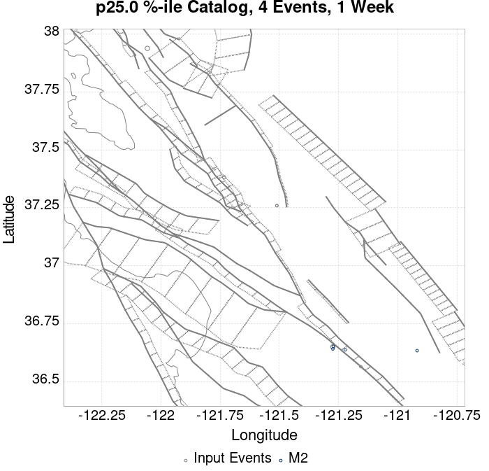 |  |  |  |  |  |  |  |  | 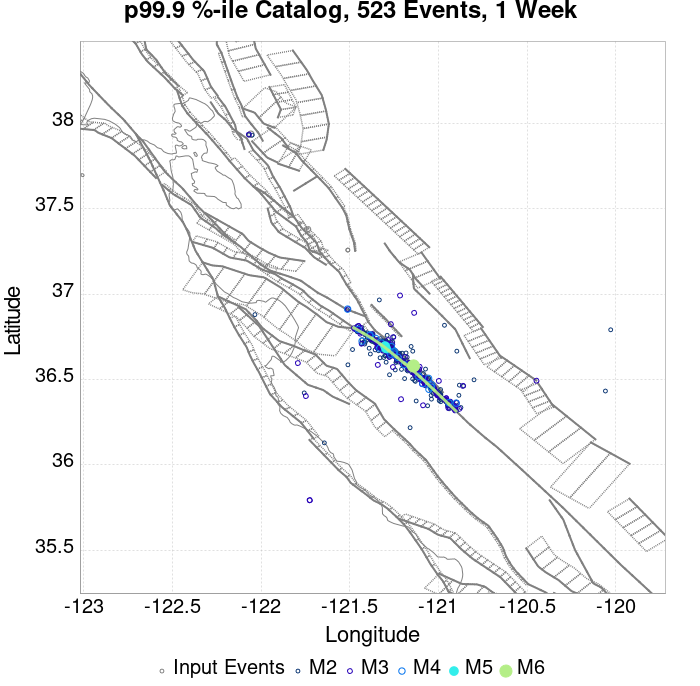 |  |
| **1 Month** |  |  |  |  |  | 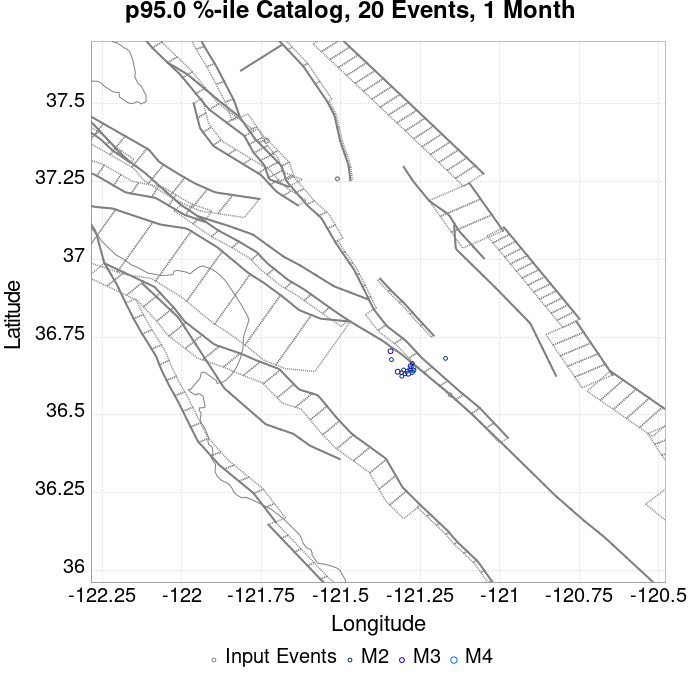 |  |  |  |  |  |  |
| **1 Year** |  |  |  | 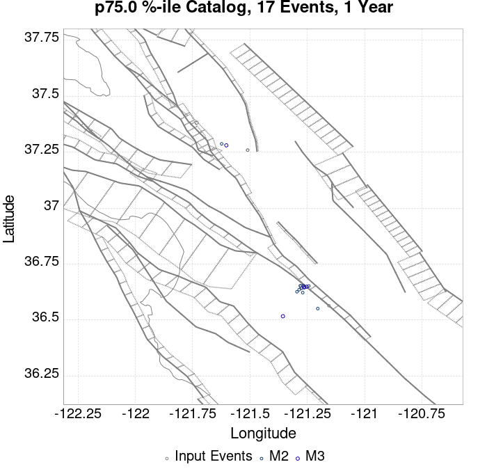 |  |  |  |  |  | 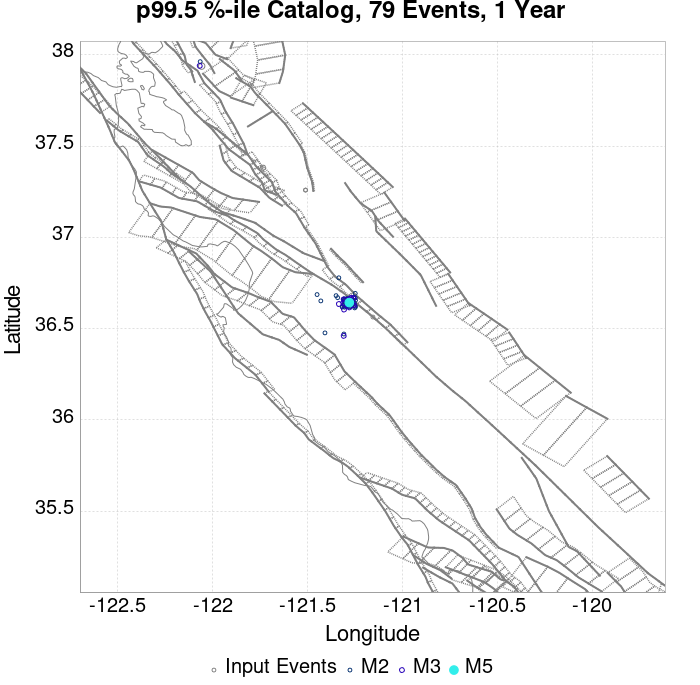 |  |  |
| **10 Year** |  |  |  |  |  |  |  |  |  | 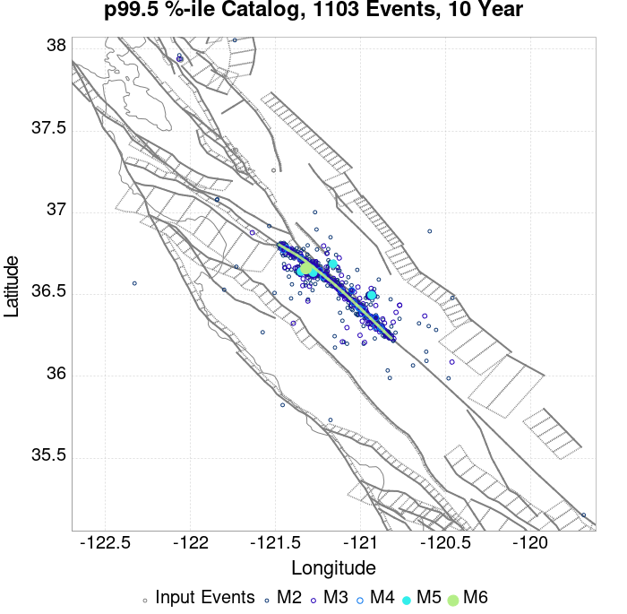 |  |  |

## ComCat Data Comparisons
*[(top)](#table-of-contents)*

These plots compare simulated sequences with data from ComCat. All plots only consider events with hypocenters inside the ComCat region defined in the JSON input file.

Last updated at 2019/10/15 23:33:37 UTC, 3.9 hr after the simulation start time

### ComCat Magnitude-Number Distributions
*[(top)](#table-of-contents)*

| Incremental MND | Cumulative MND |
|-----|-----|
|  |  |

### ComCat Time-Dependent Mc
*[(top)](#table-of-contents)*

The following plots compare simulation results with ComCat data above a magnitude threshold. Plots labeled as *M&ge;Mc(t)* use the time-dependent magnitude of completeness (Mc) defined in Helmstetter et al. (2006), which is plotted below. In the case of multiple M&ge;5 ruptures, either as input to the simulation or in the comparison data, the maximum calculated time-dependent Mc is used. This time-dependent Mc function is plotted below.


### ComCat Cumulative Number Vs Time
*[(top)](#table-of-contents)*

| M&ge;Mc(t) | M&ge;3.1 | M&ge;4 | M&ge;4.5 | M&ge;5 |
|-----|-----|-----|-----|-----|
|  |  |  |  |  |

### ComCat Cumulative Number Simulation Percentiles
*[(top)](#table-of-contents)*

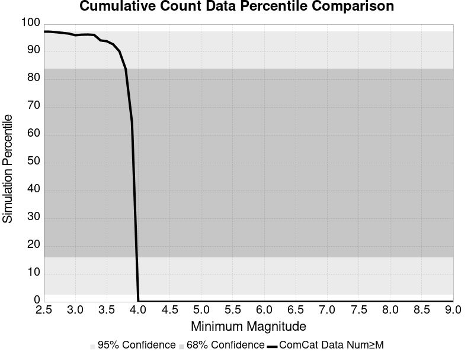

### ComCat Probability Spatial Distribution
*[(top)](#table-of-contents)*

|  | Current (3.9 Hour) |
|-----|-----|
| **M&ge;Mc(t)** | 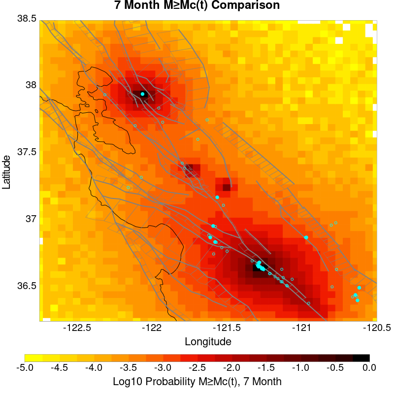 |
| **M&ge;3.1** |  |
| **M&ge;4** |  |
| **M&ge;4.5** |  |
| **M&ge;5** |  |
| **M&ge;5.5** |  |

### ComCat Mean Expectation Spatial Distribution
*[(top)](#table-of-contents)*

|  | Current (3.9 Hour) |
|-----|-----|
| **M&ge;Mc(t)** |  |
| **M&ge;3.1** | 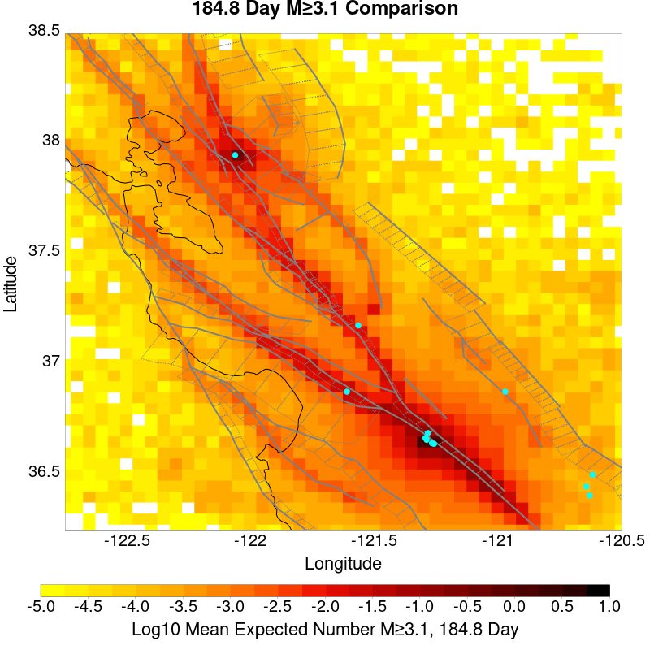 |
| **M&ge;4** |  |
| **M&ge;4.5** |  |
| **M&ge;5** | 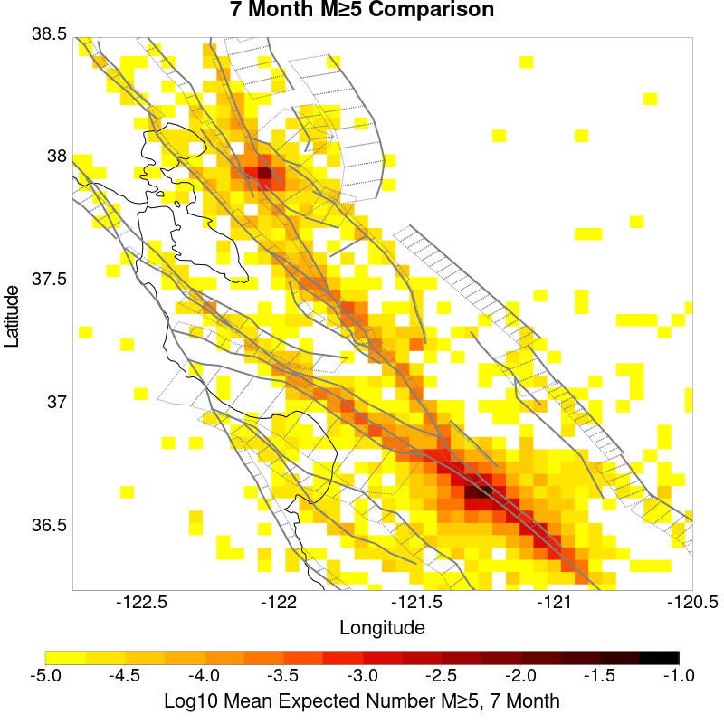 |
| **M&ge;5.5** |  |

### ComCat Depth Distribution
*[(top)](#table-of-contents)*

| M&ge;Mc(t) | M&ge;3.1 | M&ge;4 | M&ge;4.5 | M&ge;5 | M&ge;5.5 |
|-----|-----|-----|-----|-----|-----|
|  |  |  |  |  |  |

## Section Participation
*[(top)](#table-of-contents)*

### Section Participation Plots
*[(top)](#table-of-contents)*

| Min Mag | 1 yr Triggered Ruptures (no spontaneous) | 10 yr Triggered Ruptures (no spontaneous) | 10 yr Triggered Ruptures (primary aftershocks only) |
|-----|-----|-----|-----|
| **All Supra. Seis.** |  | 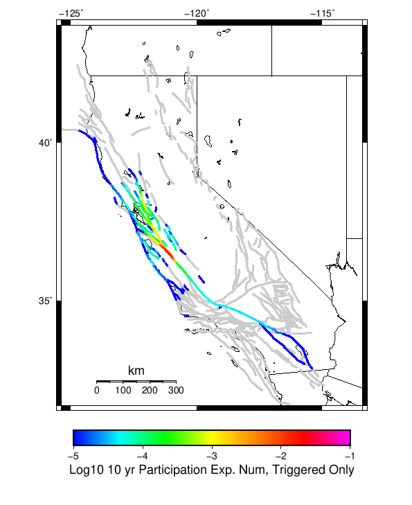 |  |
| **M&ge;6.5** |  |  |  |
| **M&ge;7** | 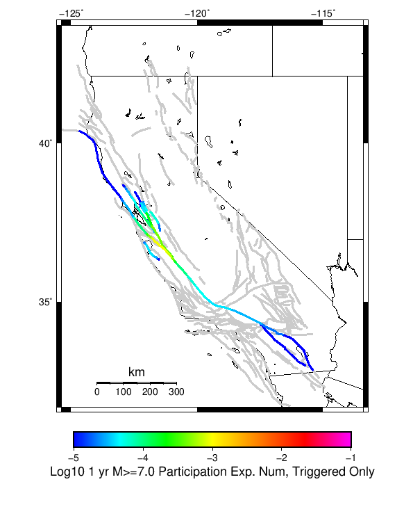 |  |  |
| **M&ge;7.5** |  |  |  |

### Supra-Seismogenic Parent Sections Table
*[(top)](#table-of-contents)*

*First 10 of 49 with matching ruptures shown*

| Parent Name | Triggered 10 Year Mean Count | Triggered 1 Day Prob | Triggered 1 Week Prob | Triggered 1 Month Prob | Triggered 1 Year Prob | Triggered 10 Year Prob | Triggered 10 Year Primary Mean Count |
|-----|-----|-----|-----|-----|-----|-----|-----|
| San Andreas (Creeping Section) 2011 CFM | 0.017012196 | 0.0058536585 | 0.008140244 | 0.010091463 | 0.012652439 | 0.015274391 | 0.009329269 |
| Calaveras (So) - Paicines extension 2011 CFM | 0.00472561 | 0.0016768293 | 0.002347561 | 0.002804878 | 0.0036890244 | 0.0043292684 | 0.0025304877 |
| Calaveras (So) 2011 CFM | 0.0017682926 | 5.487805E-4 | 8.5365854E-4 | 0.0010670732 | 0.0014634146 | 0.0017378049 | 9.1463415E-4 |
| Calaveras (Central) 2011 CFM | 0.0013109756 | 3.3536585E-4 | 5.7926826E-4 | 7.012195E-4 | 0.0010365853 | 0.00125 | 6.402439E-4 |
| Concord 2011 CFM | 0.0012195122 | 9.1463415E-5 | 3.0487805E-4 | 5.487805E-4 | 0.0010060975 | 0.0012195122 | 7.926829E-4 |
| Green Valley 2011 CFM | 0.0011280488 | 9.1463415E-5 | 3.0487805E-4 | 4.8780488E-4 | 8.841463E-4 | 0.001097561 | 6.707317E-4 |
| San Andreas (Santa Cruz Mts) 2011 CFM | 0.0011280488 | 5.7926826E-4 | 7.621951E-4 | 8.231707E-4 | 0.0010365853 | 0.0011280488 | 5.7926826E-4 |
| Hayward (So) 2011 CFM | 7.012195E-4 | 6.097561E-5 | 1.2195122E-4 | 2.1341463E-4 | 3.9634146E-4 | 6.097561E-4 | 1.5243902E-4 |
| Hayward (So) extension 2011 CFM | 3.9634146E-4 | 6.097561E-5 | 1.2195122E-4 | 1.5243902E-4 | 3.3536585E-4 | 3.9634146E-4 | 3.0487805E-5 |
| Calaveras (No) 2011 CFM | 3.0487805E-4 | 9.1463415E-5 | 1.8292683E-4 | 2.1341463E-4 | 2.4390244E-4 | 3.0487805E-4 | 1.2195122E-4 |

### M≥6.5 Parent Sections Table
*[(top)](#table-of-contents)*

*First 10 of 38 with matching ruptures shown*

| Parent Name | Triggered 10 Year Mean Count | Triggered 1 Day Prob | Triggered 1 Week Prob | Triggered 1 Month Prob | Triggered 1 Year Prob | Triggered 10 Year Prob | Triggered 10 Year Primary Mean Count |
|-----|-----|-----|-----|-----|-----|-----|-----|
| San Andreas (Creeping Section) 2011 CFM | 0.004390244 | 0.0014634146 | 0.002347561 | 0.0027743902 | 0.0036585366 | 0.0041768295 | 0.0022560975 |
| Calaveras (So) - Paicines extension 2011 CFM | 0.0024085366 | 8.231707E-4 | 0.0012195122 | 0.0014939024 | 0.0019817073 | 0.002317073 | 0.0013109756 |
| Calaveras (So) 2011 CFM | 0.0015853659 | 5.1829265E-4 | 7.926829E-4 | 9.7560976E-4 | 0.0013109756 | 0.0015853659 | 8.841463E-4 |
| Calaveras (Central) 2011 CFM | 0.0012195122 | 3.3536585E-4 | 5.487805E-4 | 6.707317E-4 | 9.7560976E-4 | 0.0011585365 | 6.097561E-4 |
| San Andreas (Santa Cruz Mts) 2011 CFM | 0.0011280488 | 5.7926826E-4 | 7.621951E-4 | 8.231707E-4 | 0.0010365853 | 0.0011280488 | 5.7926826E-4 |
| Hayward (So) 2011 CFM | 6.707317E-4 | 6.097561E-5 | 1.2195122E-4 | 2.1341463E-4 | 3.6585366E-4 | 5.7926826E-4 | 1.5243902E-4 |
| Green Valley 2011 CFM | 3.6585366E-4 | 3.0487805E-5 | 9.1463415E-5 | 1.2195122E-4 | 3.0487805E-4 | 3.6585366E-4 | 1.5243902E-4 |
| Calaveras (No) 2011 CFM | 3.0487805E-4 | 9.1463415E-5 | 1.8292683E-4 | 2.1341463E-4 | 2.4390244E-4 | 3.0487805E-4 | 1.2195122E-4 |
| Concord 2011 CFM | 2.7439024E-4 | 3.0487805E-5 | 6.097561E-5 | 9.1463415E-5 | 2.4390244E-4 | 2.7439024E-4 | 1.5243902E-4 |
| Hayward (So) extension 2011 CFM | 1.8292683E-4 | 0.0 | 3.0487805E-5 | 6.097561E-5 | 1.5243902E-4 | 1.8292683E-4 | 0.0 |

### M≥7 Parent Sections Table
*[(top)](#table-of-contents)*

*First 10 of 27 with matching ruptures shown*

| Parent Name | Triggered 10 Year Mean Count | Triggered 1 Day Prob | Triggered 1 Week Prob | Triggered 1 Month Prob | Triggered 1 Year Prob | Triggered 10 Year Prob | Triggered 10 Year Primary Mean Count |
|-----|-----|-----|-----|-----|-----|-----|-----|
| San Andreas (Creeping Section) 2011 CFM | 0.0013719512 | 6.097561E-4 | 8.231707E-4 | 9.1463415E-4 | 0.0012195122 | 0.0013414634 | 7.012195E-4 |
| San Andreas (Santa Cruz Mts) 2011 CFM | 0.0011280488 | 5.7926826E-4 | 7.621951E-4 | 8.231707E-4 | 0.0010365853 | 0.0011280488 | 5.7926826E-4 |
| Calaveras (So) - Paicines extension 2011 CFM | 8.5365854E-4 | 2.4390244E-4 | 3.9634146E-4 | 4.2682927E-4 | 6.402439E-4 | 7.926829E-4 | 3.3536585E-4 |
| Calaveras (Central) 2011 CFM | 6.707317E-4 | 1.2195122E-4 | 2.4390244E-4 | 3.0487805E-4 | 5.1829265E-4 | 6.707317E-4 | 2.4390244E-4 |
| Calaveras (So) 2011 CFM | 6.707317E-4 | 1.2195122E-4 | 2.7439024E-4 | 3.0487805E-4 | 5.1829265E-4 | 6.707317E-4 | 2.4390244E-4 |
| Calaveras (No) 2011 CFM | 3.0487805E-4 | 9.1463415E-5 | 1.8292683E-4 | 2.1341463E-4 | 2.4390244E-4 | 3.0487805E-4 | 1.2195122E-4 |
| Hayward (So) 2011 CFM | 1.5243902E-4 | 3.0487805E-5 | 6.097561E-5 | 9.1463415E-5 | 1.2195122E-4 | 1.5243902E-4 | 6.097561E-5 |
| San Andreas (Parkfield) | 1.5243902E-4 | 9.1463415E-5 | 1.2195122E-4 | 1.2195122E-4 | 1.2195122E-4 | 1.5243902E-4 | 1.5243902E-4 |
| Hayward (No) 2011 CFM | 1.2195122E-4 | 3.0487805E-5 | 9.1463415E-5 | 9.1463415E-5 | 9.1463415E-5 | 1.2195122E-4 | 6.097561E-5 |
| Rodgers Creek - Healdsburg 2011 CFM | 9.1463415E-5 | 0.0 | 6.097561E-5 | 6.097561E-5 | 6.097561E-5 | 9.1463415E-5 | 3.0487805E-5 |

### M≥7.5 Parent Sections Table
*[(top)](#table-of-contents)*

*First 10 of 18 with matching ruptures shown*

| Parent Name | Triggered 10 Year Mean Count | Triggered 1 Day Prob | Triggered 1 Week Prob | Triggered 1 Month Prob | Triggered 1 Year Prob | Triggered 10 Year Prob | Triggered 10 Year Primary Mean Count |
|-----|-----|-----|-----|-----|-----|-----|-----|
| Calaveras (Central) 2011 CFM | 6.097561E-5 | 0.0 | 3.0487805E-5 | 3.0487805E-5 | 6.097561E-5 | 6.097561E-5 | 0.0 |
| Calaveras (So) - Paicines extension 2011 CFM | 6.097561E-5 | 0.0 | 3.0487805E-5 | 3.0487805E-5 | 6.097561E-5 | 6.097561E-5 | 0.0 |
| Calaveras (So) 2011 CFM | 6.097561E-5 | 0.0 | 3.0487805E-5 | 3.0487805E-5 | 6.097561E-5 | 6.097561E-5 | 0.0 |
| San Andreas (Creeping Section) 2011 CFM | 6.097561E-5 | 0.0 | 0.0 | 3.0487805E-5 | 6.097561E-5 | 6.097561E-5 | 3.0487805E-5 |
| San Andreas (Peninsula) 2011 CFM | 6.097561E-5 | 0.0 | 0.0 | 3.0487805E-5 | 6.097561E-5 | 6.097561E-5 | 3.0487805E-5 |
| San Andreas (Santa Cruz Mts) 2011 CFM | 6.097561E-5 | 0.0 | 0.0 | 3.0487805E-5 | 6.097561E-5 | 6.097561E-5 | 3.0487805E-5 |
| Calaveras (No) 2011 CFM | 3.0487805E-5 | 0.0 | 0.0 | 0.0 | 3.0487805E-5 | 3.0487805E-5 | 0.0 |
| Contra Costa (Lafayette) 2011 CFM | 3.0487805E-5 | 0.0 | 0.0 | 0.0 | 3.0487805E-5 | 3.0487805E-5 | 0.0 |
| Contra Costa Shear Zone (connector) 2011 CFM | 3.0487805E-5 | 0.0 | 0.0 | 0.0 | 3.0487805E-5 | 3.0487805E-5 | 0.0 |
| Hayward (No) 2011 CFM | 3.0487805E-5 | 0.0 | 3.0487805E-5 | 3.0487805E-5 | 3.0487805E-5 | 3.0487805E-5 | 0.0 |

### Fault Magnitude-Probability Distributions
*[(top)](#table-of-contents)*

The first 5 sections (sorted by trigger rate) are plotted below. All fault MPDs are available [here](plots/parent_sect_mpds/README.md)

| 1 Week | 1 Month | 1 Year | 10 Year |
|-----|-----|-----|-----|
|  |  |  |  |
|  |  |  |  |
|  |  |  |  |
|  |  | 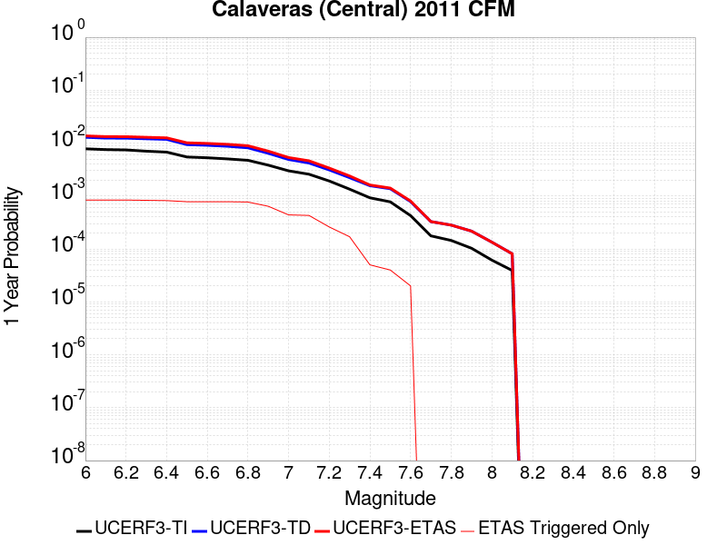 |  |
|  |  |  | 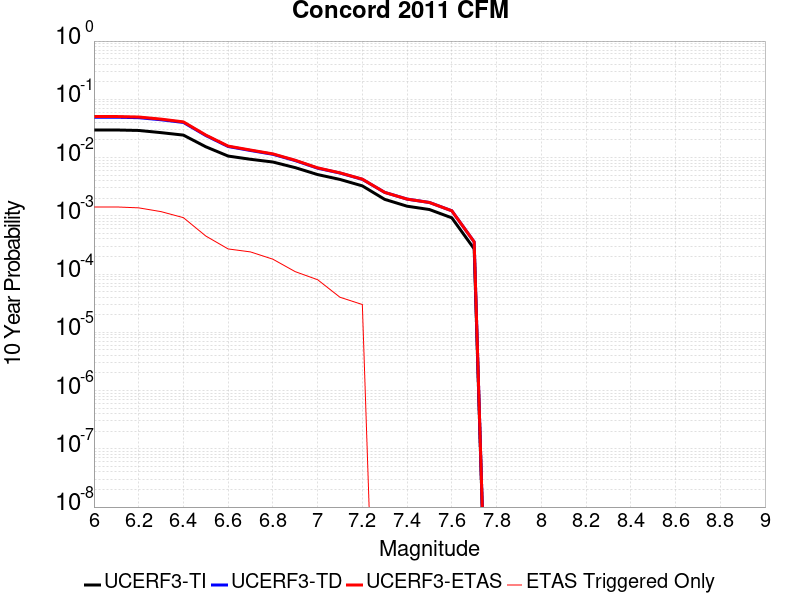 |

## Gridded Nucleation
*[(top)](#table-of-contents)*

| Min Mag | Triggered Ruptures (no spontaneous) | Triggered Ruptures (primary aftershocks only) |
|-----|-----|-----|
| **M&ge;2.5** |  |  |
| **M&ge;5** |  |  |
| **M&ge;6** |  |  |
| **M&ge;7** |  |  |


## JSON Input File
*[(top)](#table-of-contents)*

```
{
  "numSimulations": 100000,
  "duration": 10.0,
  "startTimeMillis": 1571168551550,
  "includeSpontaneous": false,
  "randomSeed": 1571173106462,
  "binaryOutput": true,
  "binaryOutputFilters": [
    {
      "prefix": "results_complete",
      "descendantsOnly": false
    },
    {
      "prefix": "results_m5_preserve_chain",
      "minMag": 5.0,
      "preserveChainBelowMag": true,
      "descendantsOnly": false
    }
  ],
  "forceRecalc": false,
  "simulationName": "ComCat M4.71 (nc73292360), Point Sources",
  "numRetries": 3,
  "outputDir": "${ETAS_SIM_DIR}/2019_10_15-ComCatM4p71_nc73292360_PointSources",
  "triggerRuptures": [
    {
      "occurrenceTimeMillis": 1570612516640,
      "comcatEventID": "nc73289220",
      "mag": 3.25,
      "latitude": 37.3818333,
      "longitude": -121.73283330000001,
      "depth": 9.27
    },
    {
      "occurrenceTimeMillis": 1571009527260,
      "comcatEventID": "nc73291290",
      "mag": 2.87,
      "latitude": 37.2589989,
      "longitude": -121.51066590000002,
      "depth": 7.8
    },
    {
      "occurrenceTimeMillis": 1571016328610,
      "comcatEventID": "nc73291345",
      "mag": 2.56,
      "latitude": 37.2593346,
      "longitude": -121.50966639999999,
      "depth": 7.97
    },
    {
      "occurrenceTimeMillis": 1571117622810,
      "comcatEventID": "nc73291880",
      "mag": 4.46,
      "latitude": 37.938,
      "longitude": -122.05700000000002,
      "depth": 13.97
    },
    {
      "occurrenceTimeMillis": 1571134783260,
      "comcatEventID": "nc73292185",
      "mag": 2.68,
      "latitude": 36.5639992,
      "longitude": -121.1555023,
      "depth": 2.69
    },
    {
      "occurrenceTimeMillis": 1571168550550,
      "comcatEventID": "nc73292360",
      "mag": 4.71,
      "latitude": 36.649334,
      "longitude": -121.2740021,
      "depth": 9.72
    }
  ],
  "cacheDir": "${ETAS_LAUNCHER}/inputs/cache_fm3p1_ba",
  "fssFile": "${ETAS_LAUNCHER}/inputs/2013_05_10-ucerf3p3-production-10runs_COMPOUND_SOL_FM3_1_SpatSeisU3_MEAN_BRANCH_AVG_SOL.zip",
  "probModel": "FULL_TD",
  "applySubSeisForSupraNucl": true,
  "totRateScaleFactor": 1.14,
  "gridSeisCorr": true,
  "timeIndependentERF": false,
  "griddedOnly": false,
  "imposeGR": false,
  "includeIndirectTriggering": true,
  "gridSeisDiscr": 0.1,
  "catalogCompletenessModel": "RELAXED",
  "configCommand": "u3etas_comcat_event_config_builder.sh --event-id nc73292360 --region 38.5,-122.75,36.25,-120.5 --num-simulations 100000 --days-before 7 --hpc-site USC_HPC --nodes 36 --hours 24 --queue scec",
  "configTime": 1571173106462,
  "comcatMetadata": {
    "region": {
      "minLatitude": 36.249999999999,
      "maxLatitude": 38.500000000001,
      "minLongitude": -122.750000000001,
      "maxLongitude": -120.49999999999902
    },
    "eventID": "nc73292360",
    "minDepth": -10.0,
    "maxDepth": 24.0,
    "minMag": 2.5,
    "startTime": 1570563750550,
    "endTime": 1571168550551
  }
}
```

