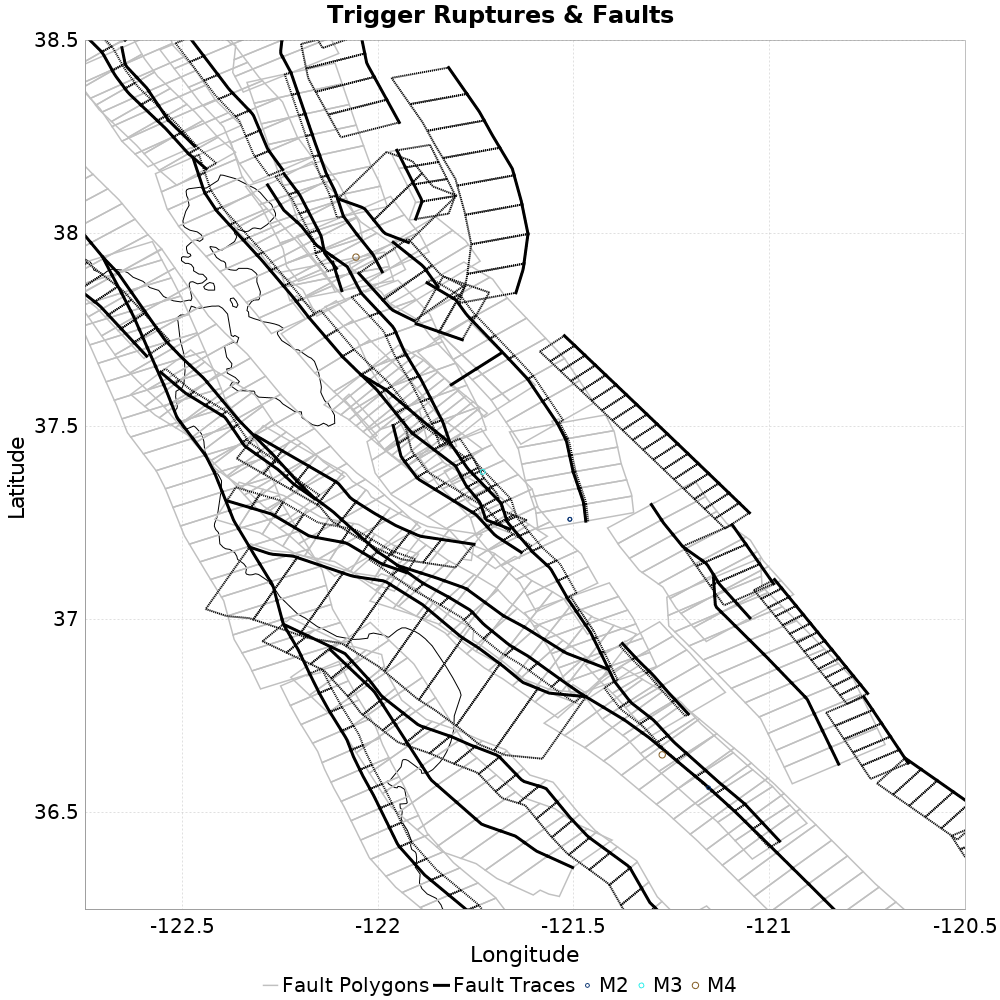
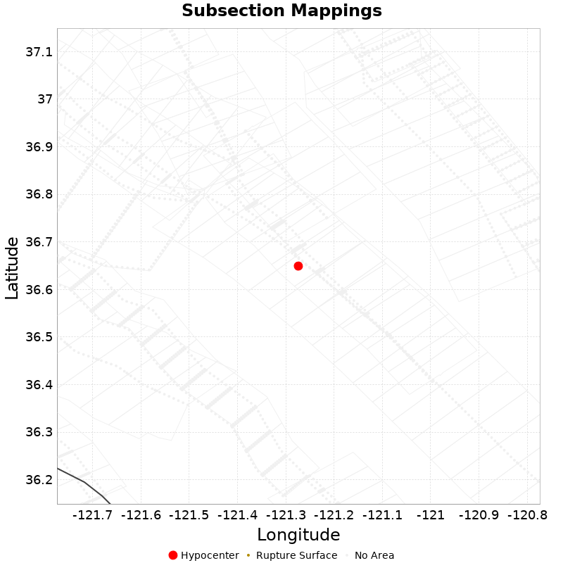

# ETAS Configuration for ComCat M4.71 (nc73292360), Point Sources

|   | ComCat M4.71 (nc73292360), Point Sources |
|-----|-----|
| Num Simulations | 100000 |
| Start Time | 2019/10/15 19:42:31 UTC |
| Start Time Epoch Milliseconds | 1571168551550 |
| Duration | 10 Years |
| Includes Spontaneous? | false |
| Historical Ruptures | *(none)* |
| Config Generated With | u3etas_comcat_event_config_builder.sh --event-id nc73292360 --region 38.5,-122.75,36.25,-120.5 --num-simulations 100000 --days-before 7 --hpc-site USC_HPC --nodes 36 --hours 24 --queue scec |

## Table Of Contents

* [Trigger Rupture Fault Map](#trigger-rupture-fault-map)
* [Fault Distances To Triggers](#fault-distances-to-triggers)
* [Possible Finite Rupture Subsection Mappings](#possible-finite-rupture-subsection-mappings)
* [JSON Input File](#json-input-file)

## Trigger Rupture Fault Map
*[(top)](#table-of-contents)*


## Fault Distances To Triggers
*[(top)](#table-of-contents)*

| Section Name | Strike, Dip, Rake | # Hypos In Poly | Max Mag w/ Hypo In Poly | # Surfs In Poly | Max Mag w/ Surf In Poly | Min Dist To Any (km) | Min Poly Dist To Any (km) | Min Dist To Largest (km) | Min Poly Dist To Largest (km) |
|-----|-----|-----|-----|-----|-----|-----|-----|-----|-----|
| San Andreas (Creeping Section) 2011 CFM | 317, 90, 180 | 2 | 4.71 | 2 | 4.71 | 0.399 | 0.000 | 1.260 | 0.000 |
| Calaveras (So) - Paicines extension 2011 CFM | 141, 77, 180 | 2 | 4.71 | 2 | 4.71 | 2.165 | 0.000 | 2.165 | 0.000 |
| Greenville (So) 2011 CFM | 347, 87, 180 | 2 | 2.87 | 2 | 2.87 | 3.909 | 0.000 | 69.471 | 69.402 |
| Calaveras (Central) 2011 CFM | 329, 77, 180 | 1 | 3.25 | 1 | 3.25 | 0.380 | 0.000 | 50.452 | 38.639 |
| Franklin 2011 CFM | 326, 90, 180 | 1 | 4.46 | 1 | 4.46 | 3.464 | 0.000 | 149.461 | 148.547 |
| Concord 2011 CFM | 152, 90, 180 | 1 | 4.46 | 1 | 4.46 | 3.636 | 0.000 | 152.814 | 152.466 |
| Contra Costa Shear Zone (connector) 2011 CFM | 157, 81, 180 | 1 | 4.46 | 1 | 4.46 | 7.540 | 0.000 | 158.347 | 151.478 |
| Hayward (So) extension 2011 CFM | 326, 48, 135 | 0 |  | 0 |  | 4.201 | 0.495 | 74.272 | 72.984 |
| Hayward (So) 2011 CFM | 322, 76, 180 | 0 |  | 0 |  | 5.302 | 5.089 | 95.761 | 94.696 |
| Contra Costa (Lafayette) 2011 CFM | 346, 90, 180 | 0 |  | 0 |  | 5.433 | 0.152 | 152.049 | 149.448 |
| Silver Creek 2011 CFM | 322, 75, 180 | 0 |  | 0 |  | 7.932 | 3.316 | 66.903 | 65.234 |
| Mount Diablo Thrust North CFM | 318, 40, 90 | 0 |  | 0 |  | 9.096 | 3.881 | 137.257 | 136.973 |
| Clayton | 142, 90, 180 | 0 |  | 0 |  | 9.374 | 1.786 | 143.967 | 140.866 |
| Calaveras (No) 2011 CFM | 155, 80, 180 | 0 |  | 0 |  | 11.479 | 9.457 | 101.970 | 100.340 |
| Mission (connected) 2011 CFM | 134, 90, 180 | 0 |  | 0 |  | 11.877 | 10.908 | 101.966 | 98.948 |
| Green Valley 2011 CFM | 164, 84, 180 | 0 |  | 0 |  | 12.105 | 12.039 | 171.104 | 169.607 |
| Quien Sabe 2011 CFM | 144, 85, 180 | 0 |  | 0 |  | 12.390 | 6.043 | 12.390 | 6.043 |
| Los Medanos - Roe Island | 309, 39, 90 | 0 |  | 0 |  | 16.811 | 9.370 | 158.589 | 158.283 |
| Hayward (No) 2011 CFM | 331, 82, 180 | 0 |  | 0 |  | 16.827 | 8.561 | 149.185 | 148.998 |
| Greenville (No) 2011 CFM | 324, 84, 180 | 0 |  | 0 |  | 18.306 | 11.733 | 98.626 | 95.007 |
| Ortigalita (North) | 326, 90, 180 | 0 |  | 0 |  | 18.872 | 8.856 | 44.176 | 34.149 |
| Mount Diablo Thrust South | 294, 40, 90 | 0 |  | 0 |  | 20.249 | 20.136 | 128.096 | 127.792 |
| Great Valley 05 Pittsburg - Kirby Hills alt1 | 348, 55, 180 | 0 |  | 0 |  | 22.058 | 15.955 | 163.116 | 163.110 |
| Calaveras (So) 2011 CFM | 336, 85, 180 | 0 |  | 0 |  | 22.271 | 20.356 | 23.749 | 23.720 |
| Monte Vista - Shannon 2011 CFM | 122, 61, 90 | 0 |  | 0 |  | 22.807 | 17.767 | 71.701 | 70.832 |
| Zayante-Vergeles 2011 CFM | 119, 30, 150 | 0 |  | 0 |  | 23.961 | 23.351 | 23.961 | 23.351 |
| San Andreas (Santa Cruz Mts) 2011 CFM | 131, 79, 180 | 0 |  | 0 |  | 24.920 | 24.206 | 24.920 | 24.899 |

## Possible Finite Rupture Subsection Mappings
*[(top)](#table-of-contents)*

This gives any possible finite rupture surface subsection mappings. In the plot below, potentially suggested subsections are outlined in green, and all subsections for which any of this rupture is within the fault polygon are in gray. Suggested sections are those for which the area of the input rupture within the polygon is at least 50.0 % of the sub section area

Overlapping polygons are removed according to the mean distance of the actual subsection surface, with the polygons of closer sections masking out the polygons of further sections

As this is a point source, there will be no matches, but sections within 25km will be listed



| Section Index | Section Name | Suggested Match? | Section Area | Sect Distance To Rup | Hypocenter in Polygon? |
|-----|-----|-----|-----|-----|-----|
| 208 | Calaveras (So) - Paicines extension 2011 CFM, Subsection 0 | no | 70.72 | mean=20.33 [16.41 24.71] [km] | no |
| 209 | Calaveras (So) - Paicines extension 2011 CFM, Subsection 1 | no | 84.7 | mean=14.36 [10.02 19.45] [km] | no |
| 210 | Calaveras (So) - Paicines extension 2011 CFM, Subsection 2 | no | 80.69 | mean=8.59 [3.82 13.98] [km] | no |
| 211 | Calaveras (So) - Paicines extension 2011 CFM, Subsection 3 | no | 50.58 | mean=4.02 [2.18 6.36] [km] | *yes* |
| 212 | Calaveras (So) - Paicines extension 2011 CFM, Subsection 4 | no | 35.36 | mean=7.31 [3.89 10.75] [km] | no |
| 213 | Calaveras (So) - Paicines extension 2011 CFM, Subsection 5 | no | 25.91 | mean=13.63 [10.08 17.22] [km] | no |
| 214 | Calaveras (So) - Paicines extension 2011 CFM, Subsection 6 | no | 8.84 | mean=20.2 [16.68 23.7] [km] | no |
| 215 | Calaveras (So) - Paicines extension 2011 CFM, Subsection 7 | no | 8.84 | mean=26.74 [23.26 30.22] [km] | no |
| 217 | Calaveras (So) 2011 CFM, Subsection 0 | no | 31.51 | mean=26.14 [23.75 28.71] [km] | no |
| 1640 | Quien Sabe 2011 CFM, Subsection 1 | no | 5.12 | mean=26.06 [23.83 28.33] [km] | no |
| 1641 | Quien Sabe 2011 CFM, Subsection 2 | no | 5.12 | mean=21.65 [19.47 23.83] [km] | no |
| 1642 | Quien Sabe 2011 CFM, Subsection 3 | no | 5.12 | mean=17.45 [15.51 19.49] [km] | no |
| 1643 | Quien Sabe 2011 CFM, Subsection 4 | no | 5.12 | mean=13.91 [12.42 15.54] [km] | no |
| 1823 | San Andreas (Creeping Section) 2011 CFM, Subsection 12 | no | 10.49 | mean=23.99 [20.95 27.03] [km] | no |
| 1824 | San Andreas (Creeping Section) 2011 CFM, Subsection 13 | no | 13.39 | mean=18.22 [15.2 21.26] [km] | no |
| 1825 | San Andreas (Creeping Section) 2011 CFM, Subsection 14 | no | 16.69 | mean=12.52 [9.47 15.6] [km] | no |
| 1826 | San Andreas (Creeping Section) 2011 CFM, Subsection 15 | no | 20.39 | mean=6.92 [3.81 10.06] [km] | no |
| 1827 | San Andreas (Creeping Section) 2011 CFM, Subsection 16 | no | 24.5 | mean=2.73 [1.24 4.5] [km] | *yes* |
| 1828 | San Andreas (Creeping Section) 2011 CFM, Subsection 17 | no | 29.02 | mean=5.44 [2.32 8.48] [km] | no |
| 1829 | San Andreas (Creeping Section) 2011 CFM, Subsection 18 | no | 33.95 | mean=10.96 [7.81 14.18] [km] | no |
| 1830 | San Andreas (Creeping Section) 2011 CFM, Subsection 19 | no | 39.3 | mean=16.64 [13.51 19.93] [km] | no |
| 1831 | San Andreas (Creeping Section) 2011 CFM, Subsection 20 | no | 45.06 | mean=22.37 [19.2 25.74] [km] | no |
| 1973 | San Andreas (Santa Cruz Mts) 2011 CFM, Subsection 8 | no | 84.92 | mean=28.62 [24.87 32.55] [km] | no |
| 2605 | Zayante-Vergeles 2011 CFM, Subsection 7 | no | 240.26 | mean=30.47 [24.26 38.3] [km] | no |

## JSON Input File
*[(top)](#table-of-contents)*

```
{
  "numSimulations": 100000,
  "duration": 10.0,
  "startTimeMillis": 1571168551550,
  "includeSpontaneous": false,
  "randomSeed": 1571173106462,
  "binaryOutput": true,
  "binaryOutputFilters": [
    {
      "prefix": "results_complete",
      "descendantsOnly": false
    },
    {
      "prefix": "results_m5_preserve_chain",
      "minMag": 5.0,
      "preserveChainBelowMag": true,
      "descendantsOnly": false
    }
  ],
  "forceRecalc": false,
  "simulationName": "ComCat M4.71 (nc73292360), Point Sources",
  "numRetries": 3,
  "outputDir": "${ETAS_SIM_DIR}/2019_10_15-ComCatM4p71_nc73292360_PointSources",
  "triggerRuptures": [
    {
      "occurrenceTimeMillis": 1570612516640,
      "comcatEventID": "nc73289220",
      "mag": 3.25,
      "latitude": 37.3818333,
      "longitude": -121.73283330000001,
      "depth": 9.27
    },
    {
      "occurrenceTimeMillis": 1571009527260,
      "comcatEventID": "nc73291290",
      "mag": 2.87,
      "latitude": 37.2589989,
      "longitude": -121.51066590000002,
      "depth": 7.8
    },
    {
      "occurrenceTimeMillis": 1571016328610,
      "comcatEventID": "nc73291345",
      "mag": 2.56,
      "latitude": 37.2593346,
      "longitude": -121.50966639999999,
      "depth": 7.97
    },
    {
      "occurrenceTimeMillis": 1571117622810,
      "comcatEventID": "nc73291880",
      "mag": 4.46,
      "latitude": 37.938,
      "longitude": -122.05700000000002,
      "depth": 13.97
    },
    {
      "occurrenceTimeMillis": 1571134783260,
      "comcatEventID": "nc73292185",
      "mag": 2.68,
      "latitude": 36.5639992,
      "longitude": -121.1555023,
      "depth": 2.69
    },
    {
      "occurrenceTimeMillis": 1571168550550,
      "comcatEventID": "nc73292360",
      "mag": 4.71,
      "latitude": 36.649334,
      "longitude": -121.2740021,
      "depth": 9.72
    }
  ],
  "cacheDir": "${ETAS_LAUNCHER}/inputs/cache_fm3p1_ba",
  "fssFile": "${ETAS_LAUNCHER}/inputs/2013_05_10-ucerf3p3-production-10runs_COMPOUND_SOL_FM3_1_SpatSeisU3_MEAN_BRANCH_AVG_SOL.zip",
  "probModel": "FULL_TD",
  "applySubSeisForSupraNucl": true,
  "totRateScaleFactor": 1.14,
  "gridSeisCorr": true,
  "timeIndependentERF": false,
  "griddedOnly": false,
  "imposeGR": false,
  "includeIndirectTriggering": true,
  "gridSeisDiscr": 0.1,
  "catalogCompletenessModel": "RELAXED",
  "configCommand": "u3etas_comcat_event_config_builder.sh --event-id nc73292360 --region 38.5,-122.75,36.25,-120.5 --num-simulations 100000 --days-before 7 --hpc-site USC_HPC --nodes 36 --hours 24 --queue scec",
  "configTime": 1571173106462,
  "comcatMetadata": {
    "region": {
      "minLatitude": 36.249999999999,
      "maxLatitude": 38.500000000001,
      "minLongitude": -122.750000000001,
      "maxLongitude": -120.49999999999902
    },
    "eventID": "nc73292360",
    "minDepth": -10.0,
    "maxDepth": 24.0,
    "minMag": 2.5,
    "startTime": 1570563750550,
    "endTime": 1571168550551
  }
}
```

