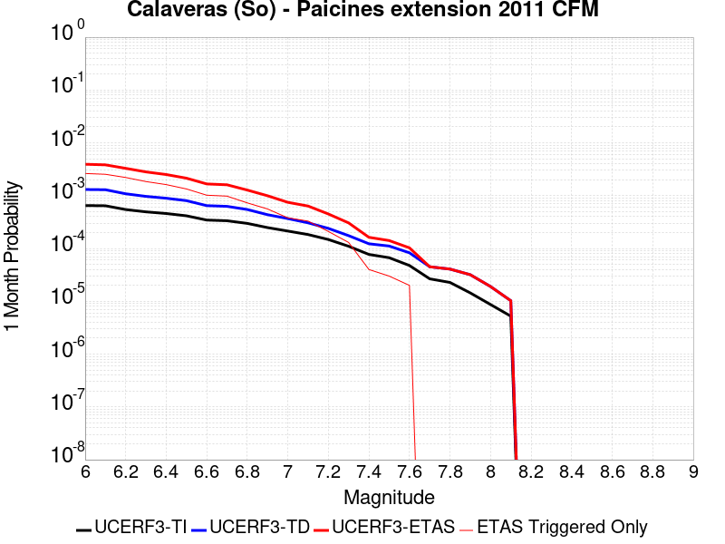
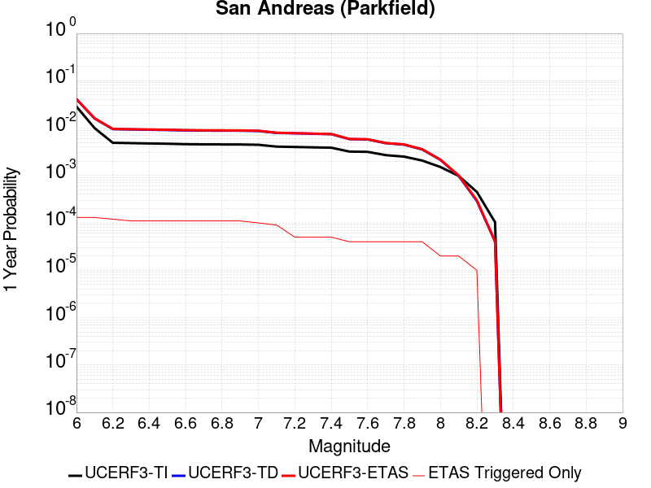
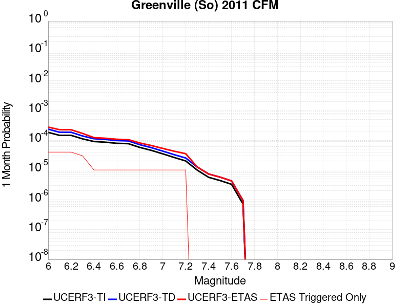
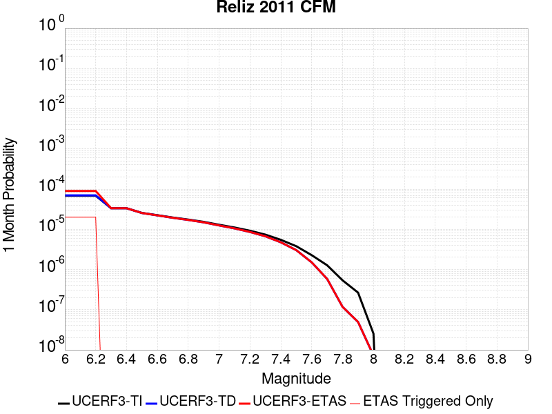
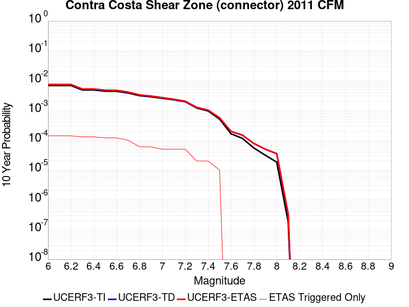
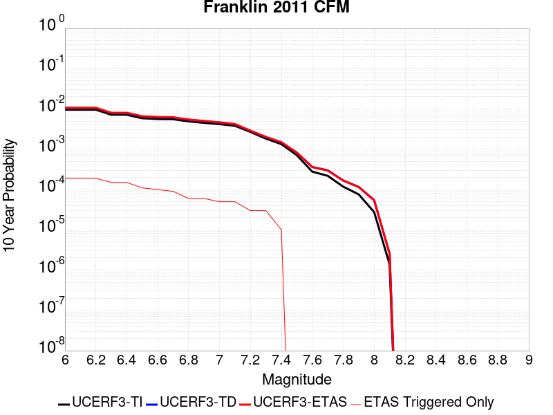
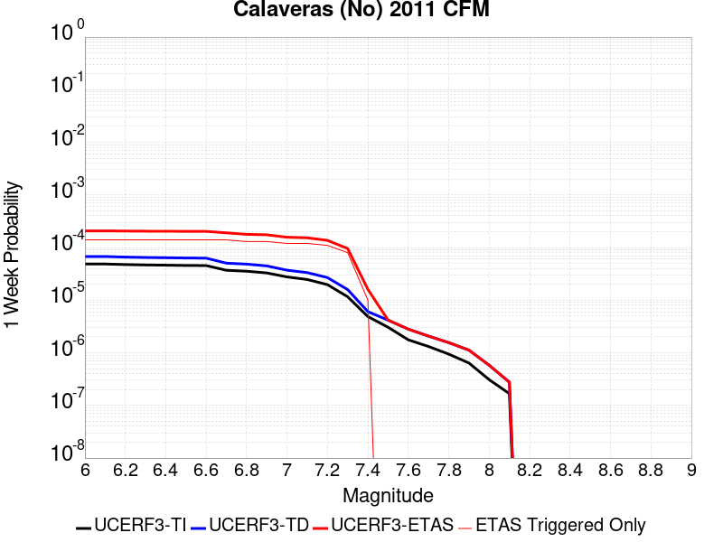
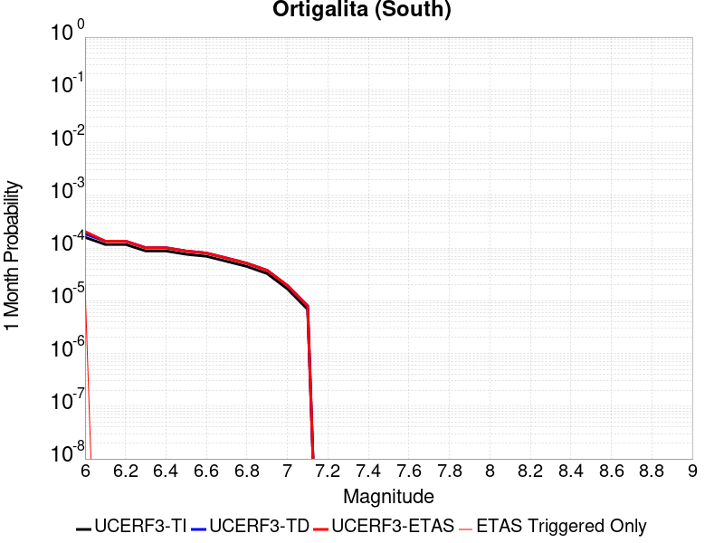
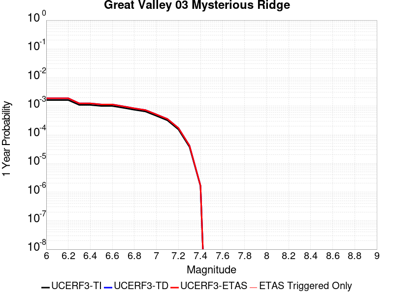
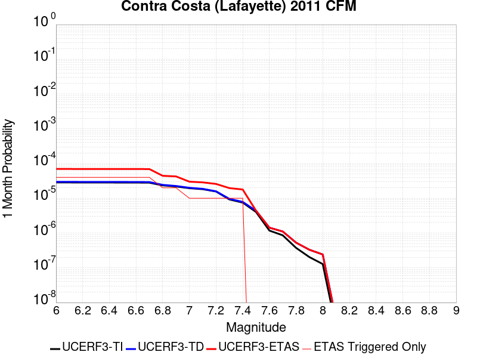

# Parent Section Magnitude-Probability Distributions

Only fault sections with at least one triggered aftershock are plotted. Sections are sorted by total supraseismogenic trigger rate (decreasing)

## Table Of Contents

* [San Andreas (Creeping Section) 2011 CFM](#san-andreas-creeping-section-2011-cfm)
* [Calaveras (So) - Paicines extension 2011 CFM](#calaveras-so---paicines-extension-2011-cfm)
* [Calaveras (So) 2011 CFM](#calaveras-so-2011-cfm)
* [San Andreas (Santa Cruz Mts) 2011 CFM](#san-andreas-santa-cruz-mts-2011-cfm)
* [Concord 2011 CFM](#concord-2011-cfm)
* [Calaveras (Central) 2011 CFM](#calaveras-central-2011-cfm)
* [Green Valley 2011 CFM](#green-valley-2011-cfm)
* [Hayward (So) 2011 CFM](#hayward-so-2011-cfm)
* [Hunting Creek - Berryessa 2011 CFM](#hunting-creek---berryessa-2011-cfm)
* [San Andreas (Parkfield)](#san-andreas-parkfield)
* [Hayward (So) extension 2011 CFM](#hayward-so-extension-2011-cfm)
* [Monte Vista - Shannon 2011 CFM](#monte-vista---shannon-2011-cfm)
* [Greenville (So) 2011 CFM](#greenville-so-2011-cfm)
* [Reliz 2011 CFM](#reliz-2011-cfm)
* [Contra Costa Shear Zone (connector) 2011 CFM](#contra-costa-shear-zone-connector-2011-cfm)
* [Hayward (No) 2011 CFM](#hayward-no-2011-cfm)
* [Franklin 2011 CFM](#franklin-2011-cfm)
* [Mission (connected) 2011 CFM](#mission-connected-2011-cfm)
* [Rinconada 2011 CFM](#rinconada-2011-cfm)
* [Great Valley 09 (Laguna Seca)](#great-valley-09-laguna-seca)
* [Calaveras (No) 2011 CFM](#calaveras-no-2011-cfm)
* [Monterey Bay-Tularcitos](#monterey-bay-tularcitos)
* [San Andreas (Cholame) rev](#san-andreas-cholame-rev)
* [Oceanic - West Huasna](#oceanic---west-huasna)
* [Ortigalita (South)](#ortigalita-south)
* [Great Valley 03 Mysterious Ridge](#great-valley-03-mysterious-ridge)
* [Greenville (No) 2011 CFM](#greenville-no-2011-cfm)
* [West Napa 2011 CFM](#west-napa-2011-cfm)
* [Great Valley 05 Pittsburg - Kirby Hills alt1](#great-valley-05-pittsburg---kirby-hills-alt1)
* [San Gregorio (South) 2011 CFM](#san-gregorio-south-2011-cfm)
* [Rodgers Creek - Healdsburg 2011 CFM](#rodgers-creek---healdsburg-2011-cfm)
* [San Andreas (North Coast) 2011 CFM](#san-andreas-north-coast-2011-cfm)
* [Hunting Creek - Bartlett Springs connector 2011](#hunting-creek---bartlett-springs-connector-2011)
* [Hosgri](#hosgri)
* [Bartlett Springs 2011 CFM](#bartlett-springs-2011-cfm)
* [Great Valley 11](#great-valley-11)
* [Sargent 2011 CFM](#sargent-2011-cfm)
* [La Panza 2011](#la-panza-2011)
* [Butano 2011 CFM](#butano-2011-cfm)
* [San Gregorio (North) 2011 CFM](#san-gregorio-north-2011-cfm)
* [Contra Costa (Lafayette) 2011 CFM](#contra-costa-lafayette-2011-cfm)

## San Andreas (Creeping Section) 2011 CFM
*[(top)](#table-of-contents)*

| 1 Week | 1 Month | 1 Year | 10 Year |
|-----|-----|-----|-----|
|  |  |  |  |

| Magnitude | 1 wk TI Prob | 1 wk TD Prob | 1 wk ETAS Prob | 1 wk ETAS/TD Gain | 1 wk ETAS Triggered Only | 1 mo TI Prob | 1 mo TD Prob | 1 mo ETAS Prob | 1 mo ETAS/TD Gain | 1 mo ETAS Triggered Only | 1 yr TI Prob | 1 yr TD Prob | 1 yr ETAS Prob | 1 yr ETAS/TD Gain | 1 yr ETAS Triggered Only | 10 yr TI Prob | 10 yr TD Prob | 10 yr ETAS Prob | 10 yr ETAS/TD Gain | 10 yr ETAS Triggered Only |
|-----|-----|-----|-----|-----|-----|-----|-----|-----|-----|-----|-----|-----|-----|-----|-----|-----|-----|-----|-----|-----|
| 6.0 | 5.986481E-4 | 0.0012305692 | 0.010301962 | 8.371704 | 0.009082569 | 0.0025631124 | 0.005255843 | 0.015477068 | 2.9447355 | 0.01027523 | 0.030762846 | 0.06129019 | 0.07283029 | 1.1882863 | 0.012293578 | 0.26835477 | 0.42638227 | 0.4349076 | 1.0199946 | 0.014862386 |
| 6.1 | 5.015945E-4 | 0.0010243965 | 0.00918117 | 8.962516 | 0.008165138 | 0.00214792 | 0.0043764436 | 0.013510604 | 3.0871196 | 0.0091743115 | 0.025839351 | 0.051319696 | 0.06167685 | 1.2018163 | 0.010917431 | 0.23032776 | 0.37328404 | 0.3815636 | 1.0221803 | 0.013211009 |
| 6.2 | 4.073338E-4 | 8.1292057E-4 | 0.007871398 | 9.682862 | 0.00706422 | 0.0017445484 | 0.0034743187 | 0.01142824 | 3.2893467 | 0.007981651 | 0.021034058 | 0.041003637 | 0.04997773 | 1.218861 | 0.009357798 | 0.19150782 | 0.31349596 | 0.3209908 | 1.0239073 | 0.010917431 |
| 6.3 | 3.464099E-4 | 6.7585194E-4 | 0.0067268056 | 9.953075 | 0.006055046 | 0.0014837692 | 0.002889607 | 0.009384546 | 3.2476895 | 0.0065137614 | 0.017915873 | 0.034260165 | 0.041525364 | 1.2120596 | 0.007522936 | 0.16538359 | 0.27180734 | 0.278154 | 1.0233498 | 0.008715596 |
| 6.4 | 2.935057E-4 | 5.564272E-4 | 0.0056911833 | 10.228082 | 0.005137615 | 0.0012572751 | 0.0023789855 | 0.007962002 | 3.3468058 | 0.0055963304 | 0.015200248 | 0.028335916 | 0.034665104 | 1.2233628 | 0.0065137614 | 0.14201577 | 0.23350294 | 0.2391286 | 1.0240924 | 0.0073394496 |
| 6.5 | 2.3409708E-4 | 4.226163E-4 | 0.0037239727 | 8.811711 | 0.0033027523 | 0.0010028875 | 0.0018080077 | 0.0053795204 | 2.9753857 | 0.0035779816 | 0.012141965 | 0.021659894 | 0.025788669 | 1.1906184 | 0.0042201835 | 0.11499573 | 0.18737322 | 0.19124997 | 1.02069 | 0.004770642 |
| 6.6 | 1.5842178E-4 | 2.5210352E-4 | 0.0017196233 | 6.8210998 | 0.0014678899 | 6.7877385E-4 | 0.0010799908 | 0.0026379393 | 2.4425573 | 0.0015596331 | 0.0082328 | 0.01306856 | 0.014879443 | 1.1385679 | 0.0018348624 | 0.07934396 | 0.12373641 | 0.12542462 | 1.0136436 | 0.0019266055 |
| 6.7 | 1.5616413E-4 | 2.4746807E-4 | 0.0017149948 | 6.930166 | 0.0014678899 | 6.691031E-4 | 0.0010601451 | 0.0026181247 | 2.469591 | 0.0015596331 | 0.0081159435 | 0.012830284 | 0.014641605 | 1.1411754 | 0.0018348624 | 0.0782586 | 0.12176359 | 0.12345561 | 1.0138959 | 0.0019266055 |
| 6.8 | 1.5538467E-4 | 2.4570388E-4 | 0.0017132331 | 6.9727554 | 0.0014678899 | 6.6576427E-4 | 0.0010525904 | 0.0025189354 | 2.393082 | 0.0014678899 | 0.008075596 | 0.012739524 | 0.014460437 | 1.1350845 | 0.0017431192 | 0.07788358 | 0.12099387 | 0.122606725 | 1.0133301 | 0.0018348624 |
| 6.9 | 1.5153569E-4 | 2.3678907E-4 | 0.0017043314 | 7.1976776 | 0.0014678899 | 6.49277E-4 | 0.0010144176 | 0.0024808184 | 2.4455593 | 0.0014678899 | 0.007876333 | 0.012281124 | 0.014002835 | 1.1401917 | 0.0017431192 | 0.07602952 | 0.117062055 | 0.11868212 | 1.0138394 | 0.0018348624 |
| 7.0 | 1.4588932E-4 | 2.2534574E-4 | 0.0016011824 | 7.1054482 | 0.0013761468 | 6.250901E-4 | 9.6541195E-4 | 0.0023402302 | 2.4240742 | 0.0013761468 | 0.0075839474 | 0.011691048 | 0.013323118 | 1.1395999 | 0.0016513761 | 0.073302895 | 0.11190571 | 0.11345376 | 1.0138335 | 0.0017431192 |
| 7.1 | 1.1565079E-4 | 1.6400899E-4 | 7.1437744E-4 | 4.355721 | 5.5045873E-4 | 4.955521E-4 | 7.0270716E-4 | 0.001252779 | 1.7827897 | 5.5045873E-4 | 0.006016669 | 0.008522104 | 0.009340755 | 1.0960622 | 8.2568807E-4 | 0.058563538 | 0.08420094 | 0.0849571 | 1.0089805 | 8.2568807E-4 |
| 7.2 | 1.0393792E-4 | 1.4727897E-4 | 4.224678E-4 | 2.868487 | 2.7522937E-4 | 4.4537216E-4 | 6.310437E-4 | 9.0609933E-4 | 1.4358742 | 2.7522937E-4 | 0.005408933 | 0.007656064 | 0.008020227 | 1.0475653 | 3.6697247E-4 | 0.052791595 | 0.076125175 | 0.076464206 | 1.0044537 | 3.6697247E-4 |
| 7.3 | 9.332884E-5 | 1.2879037E-4 | 1.2879037E-4 | 1.0 | 0.0 | 3.999194E-4 | 5.518426E-4 | 5.518426E-4 | 1.0 | 0.0 | 0.0048581534 | 0.0066981222 | 0.0066981222 | 1.0 | 0.0 | 0.047533102 | 0.066934355 | 0.066934355 | 1.0 | 0.0 |
| 7.4 | 8.670252E-5 | 1.1794803E-4 | 1.1794803E-4 | 1.0 | 0.0 | 3.715293E-4 | 5.0539424E-4 | 5.0539424E-4 | 1.0 | 0.0 | 0.004513991 | 0.0061359373 | 0.0061359373 | 1.0 | 0.0 | 0.044233937 | 0.061575722 | 0.061575722 | 1.0 | 0.0 |
| 7.5 | 7.3036405E-5 | 9.0832174E-5 | 9.0832174E-5 | 1.0 | 0.0 | 3.129756E-4 | 3.8922275E-4 | 3.8922275E-4 | 1.0 | 0.0 | 0.0038038217 | 0.004728512 | 0.004728512 | 1.0 | 0.0 | 0.03739367 | 0.04824629 | 0.04824629 | 1.0 | 0.0 |
| 7.6 | 6.3935775E-5 | 8.349784E-5 | 8.349784E-5 | 1.0 | 0.0 | 2.7398168E-4 | 3.5779888E-4 | 3.5779888E-4 | 1.0 | 0.0 | 0.0033306254 | 0.0043475195 | 0.0043475195 | 1.0 | 0.0 | 0.032811474 | 0.044322703 | 0.044322703 | 1.0 | 0.0 |
| 7.7 | 5.5050095E-5 | 6.723497E-5 | 6.723497E-5 | 1.0 | 0.0 | 2.3590765E-4 | 2.8811806E-4 | 2.8811806E-4 | 1.0 | 0.0 | 0.0028683927 | 0.0035021992 | 0.0035021992 | 1.0 | 0.0 | 0.0283165 | 0.036094807 | 0.036094807 | 1.0 | 0.0 |
| 7.8 | 5.027131E-5 | 6.219215E-5 | 6.219215E-5 | 1.0 | 0.0 | 2.1543067E-4 | 2.6651056E-4 | 2.6651056E-4 | 1.0 | 0.0 | 0.0026197135 | 0.0032399416 | 0.0032399416 | 1.0 | 0.0 | 0.025890453 | 0.033400487 | 0.033400487 | 1.0 | 0.0 |
| 7.9 | 3.7271806E-5 | 5.0678176E-5 | 5.0678176E-5 | 1.0 | 0.0 | 1.5972654E-4 | 2.1717412E-4 | 2.1717412E-4 | 1.0 | 0.0 | 0.0019429359 | 0.002640891 | 0.002640891 | 1.0 | 0.0 | 0.019260362 | 0.027289882 | 0.027289882 | 1.0 | 0.0 |
| 8.0 | 2.7310243E-5 | 3.17287E-5 | 3.17287E-5 | 1.0 | 0.0 | 1.17038646E-4 | 1.3597307E-4 | 1.3597307E-4 | 1.0 | 0.0 | 0.0014240141 | 0.0016542157 | 0.0016542157 | 1.0 | 0.0 | 0.014149235 | 0.017366638 | 0.017366638 | 1.0 | 0.0 |
| 8.1 | 1.7940547E-5 | 1.759333E-5 | 1.759333E-5 | 1.0 | 0.0 | 7.688579E-5 | 7.539781E-5 | 7.539781E-5 | 1.0 | 0.0 | 9.3568244E-4 | 9.1758225E-4 | 9.1758225E-4 | 1.0 | 0.0 | 0.009317525 | 0.009900389 | 0.009900389 | 1.0 | 0.0 |
| 8.2 | 8.643924E-6 | 5.5526552E-6 | 5.5526552E-6 | 1.0 | 0.0 | 3.704486E-5 | 2.3796878E-5 | 2.3796878E-5 | 1.0 | 0.0 | 4.5092785E-4 | 2.8968856E-4 | 2.8968856E-4 | 1.0 | 0.0 | 0.0045001395 | 0.0032912085 | 0.0032912085 | 1.0 | 0.0 |
| 8.3 | 1.983087E-6 | 7.7871465E-7 | 7.7871465E-7 | 1.0 | 0.0 | 8.498917E-6 | 3.3373444E-6 | 3.3373444E-6 | 1.0 | 0.0 | 1.034694E-4 | 4.063143E-5 | 4.063143E-5 | 1.0 | 0.0 | 0.0010342124 | 4.7926197E-4 | 4.7926197E-4 | 1.0 | 0.0 |

## Calaveras (So) - Paicines extension 2011 CFM
*[(top)](#table-of-contents)*

| 1 Week | 1 Month | 1 Year | 10 Year |
|-----|-----|-----|-----|
|  |  |  |  |

| Magnitude | 1 wk TI Prob | 1 wk TD Prob | 1 wk ETAS Prob | 1 wk ETAS/TD Gain | 1 wk ETAS Triggered Only | 1 mo TI Prob | 1 mo TD Prob | 1 mo ETAS Prob | 1 mo ETAS/TD Gain | 1 mo ETAS Triggered Only | 1 yr TI Prob | 1 yr TD Prob | 1 yr ETAS Prob | 1 yr ETAS/TD Gain | 1 yr ETAS Triggered Only | 10 yr TI Prob | 10 yr TD Prob | 10 yr ETAS Prob | 10 yr ETAS/TD Gain | 10 yr ETAS Triggered Only |
|-----|-----|-----|-----|-----|-----|-----|-----|-----|-----|-----|-----|-----|-----|-----|-----|-----|-----|-----|-----|-----|
| 6.0 | 1.5183659E-4 | 3.0548754E-4 | 0.0031486554 | 10.306984 | 0.0028440368 | 6.5056595E-4 | 0.0013085407 | 0.004332102 | 3.310636 | 0.003027523 | 0.007891912 | 0.015717275 | 0.019600226 | 1.2470498 | 0.003944954 | 0.076174594 | 0.13865978 | 0.14253186 | 1.027925 | 0.004495413 |
| 6.1 | 1.5024997E-4 | 3.024218E-4 | 0.003053883 | 10.098091 | 0.0027522936 | 6.437695E-4 | 0.0012954149 | 0.0042273914 | 3.2633495 | 0.0029357797 | 0.0078097614 | 0.015560602 | 0.019353855 | 1.2437729 | 0.003853211 | 0.075409345 | 0.13732892 | 0.14104868 | 1.0270866 | 0.0043119267 |
| 6.2 | 1.2743923E-4 | 2.5332946E-4 | 0.0025463265 | 10.051442 | 0.0022935779 | 5.460538E-4 | 0.0010852026 | 0.0036512222 | 3.3645537 | 0.0025688075 | 0.0066279583 | 0.013067426 | 0.016417565 | 1.2563732 | 0.0033944955 | 0.064337276 | 0.11742633 | 0.1207461 | 1.0282711 | 0.003761468 |
| 6.3 | 1.1525114E-4 | 2.26265E-4 | 0.002244157 | 9.918268 | 0.0020183485 | 4.9383997E-4 | 9.69315E-4 | 0.0032606698 | 3.3638906 | 0.0022935779 | 0.0059959386 | 0.011688613 | 0.014590077 | 1.24823 | 0.0029357797 | 0.058367174 | 0.10654401 | 0.10949487 | 1.0276963 | 0.0033027523 |
| 6.4 | 1.07200925E-4 | 2.0869158E-4 | 0.0018597231 | 8.911347 | 0.0016513761 | 4.5935164E-4 | 8.9405314E-4 | 0.0028189362 | 3.152985 | 0.0019266055 | 0.0055782744 | 0.010793427 | 0.013334508 | 1.2354286 | 0.0025688075 | 0.0544031 | 0.099366985 | 0.10201105 | 1.0266091 | 0.0029357797 |
| 6.5 | 9.69631E-5 | 1.8760962E-4 | 0.0015634983 | 8.333785 | 0.0013761468 | 4.1548995E-4 | 8.0376124E-4 | 0.00245381 | 3.0529091 | 0.0016513761 | 0.0050468626 | 0.009715057 | 0.01180465 | 1.215088 | 0.0021100917 | 0.04933773 | 0.09025757 | 0.0924276 | 1.0240426 | 0.002385321 |
| 6.6 | 8.0552316E-5 | 1.5109133E-4 | 0.0013435717 | 8.892447 | 0.0011926605 | 3.4517853E-4 | 6.4733875E-4 | 0.0021142785 | 3.2661083 | 0.0014678899 | 0.0041944524 | 0.007846469 | 0.009757958 | 1.2436113 | 0.0019266055 | 0.04116161 | 0.075029634 | 0.0769814 | 1.0260134 | 0.0021100917 |
| 6.7 | 7.815757E-5 | 1.4649607E-4 | 0.0013389819 | 9.140054 | 0.0011926605 | 3.34918E-4 | 6.2765885E-4 | 0.002002942 | 3.1911316 | 0.0013761468 | 0.004070005 | 0.0076091043 | 0.009430005 | 1.2393055 | 0.0018348624 | 0.039962657 | 0.07287838 | 0.074664585 | 1.0245093 | 0.0019266055 |
| 6.8 | 6.965264E-5 | 1.2757622E-4 | 0.0011366218 | 8.909354 | 0.0010091743 | 2.9847719E-4 | 5.466383E-4 | 0.001555261 | 2.8451374 | 0.0010091743 | 0.0036279052 | 0.006632332 | 0.007999352 | 1.2061145 | 0.0013761468 | 0.03569247 | 0.063965976 | 0.06525409 | 1.0201375 | 0.0013761468 |
| 6.9 | 5.8000453E-5 | 1.01761994E-4 | 0.0010190998 | 10.014543 | 9.174312E-4 | 2.4854968E-4 | 4.360505E-4 | 0.0013530817 | 3.1030388 | 9.174312E-4 | 0.0030218933 | 0.005296091 | 0.0064824354 | 1.2240037 | 0.0011926605 | 0.029811295 | 0.051654097 | 0.052785154 | 1.0218967 | 0.0011926605 |
| 7.0 | 4.9865852E-5 | 8.596907E-5 | 6.3638046E-4 | 7.4024353 | 5.5045873E-4 | 2.1369329E-4 | 3.6838732E-4 | 9.1864326E-4 | 2.4936886 | 5.5045873E-4 | 0.0025986114 | 0.0044759815 | 0.0052979738 | 1.1836451 | 8.2568807E-4 | 0.025684336 | 0.04391977 | 0.044709194 | 1.0179743 | 8.2568807E-4 |
| 7.1 | 4.283875E-5 | 7.1380826E-5 | 3.4659053E-4 | 4.855513 | 2.7522937E-4 | 1.8358172E-4 | 3.0588225E-4 | 5.810274E-4 | 1.8995134 | 2.7522937E-4 | 0.0022328163 | 0.0037178136 | 0.0042662257 | 1.1475093 | 5.5045873E-4 | 0.022105146 | 0.036860228 | 0.037390396 | 1.0143832 | 5.5045873E-4 |
| 7.2 | 3.450115E-5 | 5.6024834E-5 | 2.3950079E-4 | 4.2749043 | 1.8348623E-4 | 1.478537E-4 | 2.4008448E-4 | 4.2352668E-4 | 1.7640735 | 1.8348623E-4 | 0.0017986323 | 0.0029191398 | 0.0031935659 | 1.0940092 | 2.7522937E-4 | 0.017841442 | 0.029199667 | 0.02946686 | 1.0091505 | 2.7522937E-4 |
| 7.3 | 2.5709045E-5 | 4.0807226E-5 | 1.325466E-4 | 3.248116 | 9.174312E-5 | 1.1017697E-4 | 1.7487648E-4 | 2.6660354E-4 | 1.5245249 | 9.174312E-5 | 0.0013405791 | 0.0021270593 | 0.0023101552 | 1.0860794 | 1.8348623E-4 | 0.013325208 | 0.021404639 | 0.021584198 | 1.0083888 | 1.8348623E-4 |
| 7.4 | 1.8003093E-5 | 2.8643997E-5 | 2.8643997E-5 | 1.0 | 0.0 | 7.715383E-5 | 1.2275422E-4 | 1.2275422E-4 | 1.0 | 0.0 | 9.3894306E-4 | 0.0014935104 | 0.0015851166 | 1.061336 | 9.174312E-5 | 0.009349857 | 0.015117448 | 0.015207805 | 1.0059769 | 9.174312E-5 |
| 7.5 | 1.5595824E-5 | 2.5950492E-5 | 2.5950492E-5 | 1.0 | 0.0 | 6.683753E-5 | 1.11211666E-4 | 1.11211666E-4 | 1.0 | 0.0 | 8.134431E-4 | 0.0013531633 | 0.0014447822 | 1.0677073 | 9.174312E-5 | 0.008104719 | 0.013714428 | 0.0138049135 | 1.0065978 | 9.174312E-5 |
| 7.6 | 1.1110309E-5 | 1.9332134E-5 | 1.9332134E-5 | 1.0 | 0.0 | 4.761474E-5 | 8.284938E-5 | 8.284938E-5 | 1.0 | 0.0 | 5.795553E-4 | 0.0010082258 | 0.0010082258 | 1.0 | 0.0 | 0.0057804612 | 0.010257564 | 0.010257564 | 1.0 | 0.0 |
| 7.7 | 6.2140443E-6 | 1.0517346E-5 | 1.0517346E-5 | 1.0 | 0.0 | 2.6631347E-5 | 4.507356E-5 | 4.507356E-5 | 1.0 | 0.0 | 3.241884E-4 | 5.486325E-4 | 5.486325E-4 | 1.0 | 0.0 | 0.0032371588 | 0.0056590047 | 0.0056590047 | 1.0 | 0.0 |
| 7.8 | 5.305533E-6 | 9.504948E-6 | 9.504948E-6 | 1.0 | 0.0 | 2.27378E-5 | 4.0734856E-5 | 4.0734856E-5 | 1.0 | 0.0 | 2.7679754E-4 | 4.958341E-4 | 4.958341E-4 | 1.0 | 0.0 | 0.0027645302 | 0.0051092682 | 0.0051092682 | 1.0 | 0.0 |
| 7.9 | 3.363505E-6 | 7.438246E-6 | 7.438246E-6 | 1.0 | 0.0 | 1.4414942E-5 | 3.1877807E-5 | 3.1877807E-5 | 1.0 | 0.0 | 1.7548777E-4 | 3.8804326E-4 | 3.8804326E-4 | 1.0 | 0.0 | 0.0017534926 | 0.003974262 | 0.003974262 | 1.0 | 0.0 |
| 8.0 | 2.0271132E-6 | 4.443552E-6 | 4.443552E-6 | 1.0 | 0.0 | 8.687599E-6 | 1.9043655E-5 | 1.9043655E-5 | 1.0 | 0.0 | 1.05766376E-4 | 2.3183189E-4 | 2.3183189E-4 | 1.0 | 0.0 | 0.0010571606 | 0.0023659493 | 0.0023659493 | 1.0 | 0.0 |
| 8.1 | 1.2206116E-6 | 2.392067E-6 | 2.392067E-6 | 1.0 | 0.0 | 5.2311816E-6 | 1.0251676E-5 | 1.0251676E-5 | 1.0 | 0.0 | 6.3687774E-5 | 1.2480703E-4 | 1.2480703E-4 | 1.0 | 0.0 | 6.366953E-4 | 0.0012789681 | 0.0012789681 | 1.0 | 0.0 |

## Calaveras (So) 2011 CFM
*[(top)](#table-of-contents)*

| 1 Week | 1 Month | 1 Year | 10 Year |
|-----|-----|-----|-----|
|  |  |  |  |

| Magnitude | 1 wk TI Prob | 1 wk TD Prob | 1 wk ETAS Prob | 1 wk ETAS/TD Gain | 1 wk ETAS Triggered Only | 1 mo TI Prob | 1 mo TD Prob | 1 mo ETAS Prob | 1 mo ETAS/TD Gain | 1 mo ETAS Triggered Only | 1 yr TI Prob | 1 yr TD Prob | 1 yr ETAS Prob | 1 yr ETAS/TD Gain | 1 yr ETAS Triggered Only | 10 yr TI Prob | 10 yr TD Prob | 10 yr ETAS Prob | 10 yr ETAS/TD Gain | 10 yr ETAS Triggered Only |
|-----|-----|-----|-----|-----|-----|-----|-----|-----|-----|-----|-----|-----|-----|-----|-----|-----|-----|-----|-----|-----|
| 6.0 | 1.5950744E-4 | 3.0749437E-4 | 0.0011329285 | 3.684388 | 8.2568807E-4 | 6.834242E-4 | 0.0013171652 | 0.0023250103 | 1.7651622 | 0.0010091743 | 0.00828899 | 0.015879672 | 0.017324252 | 1.0909704 | 0.0014678899 | 0.079865426 | 0.14458352 | 0.14607461 | 1.010313 | 0.0017431192 |
| 6.1 | 1.3584697E-4 | 2.6061258E-4 | 0.0010860855 | 4.167433 | 8.2568807E-4 | 5.8207137E-4 | 0.0011164238 | 0.0021244714 | 1.9029257 | 0.0010091743 | 0.007063716 | 0.013481526 | 0.014929626 | 1.1074136 | 0.0014678899 | 0.06843361 | 0.12420534 | 0.12573196 | 1.0122911 | 0.0017431192 |
| 6.2 | 1.14676266E-4 | 2.1735905E-4 | 0.0010428677 | 4.797903 | 8.2568807E-4 | 4.9137714E-4 | 9.3119335E-4 | 0.0019394279 | 2.0827339 | 0.0010091743 | 0.0059661185 | 0.011263983 | 0.012715339 | 1.1288493 | 0.0014678899 | 0.058084648 | 0.105190955 | 0.10675072 | 1.0148278 | 0.0017431192 |
| 6.3 | 8.691518E-5 | 1.6025284E-4 | 9.858086E-4 | 6.1515827 | 8.2568807E-4 | 3.7244044E-4 | 6.865854E-4 | 0.0016950668 | 2.468836 | 0.0010091743 | 0.004525038 | 0.008320298 | 0.009775975 | 1.1749549 | 0.0014678899 | 0.044339992 | 0.079503275 | 0.08110781 | 1.020182 | 0.0017431192 |
| 6.4 | 8.50982E-5 | 1.5731492E-4 | 9.828731E-4 | 6.247806 | 8.2568807E-4 | 3.646556E-4 | 6.740008E-4 | 0.001682495 | 2.4962802 | 0.0010091743 | 0.0044306475 | 0.008168236 | 0.009624136 | 1.1782392 | 0.0014678899 | 0.04343345 | 0.078108825 | 0.079715796 | 1.0205734 | 0.0017431192 |
| 6.5 | 8.4062965E-5 | 1.5555846E-4 | 9.811181E-4 | 6.30707 | 8.2568807E-4 | 3.602201E-4 | 6.66477E-4 | 0.0016749788 | 2.513183 | 0.0010091743 | 0.004376863 | 0.008077393 | 0.009533426 | 1.1802603 | 0.0014678899 | 0.042916555 | 0.0772798 | 0.078888215 | 1.0208129 | 0.0017431192 |
| 6.6 | 8.194716E-5 | 1.5191114E-4 | 9.774738E-4 | 6.43451 | 8.2568807E-4 | 3.5115483E-4 | 6.5085484E-4 | 0.0016593724 | 2.5495274 | 0.0010091743 | 0.0042669317 | 0.00788911 | 0.009345419 | 1.1845975 | 0.0014678899 | 0.04185927 | 0.07556428 | 0.077175684 | 1.0213249 | 0.0017431192 |
| 6.7 | 8.012326E-5 | 1.4858895E-4 | 9.7415433E-4 | 6.556035 | 8.2568807E-4 | 3.433402E-4 | 6.366239E-4 | 0.0016451557 | 2.5841877 | 0.0010091743 | 0.004172157 | 0.0077174962 | 0.009174057 | 1.188735 | 0.0014678899 | 0.040946912 | 0.074005805 | 0.07553497 | 1.0206628 | 0.0016513761 |
| 6.8 | 7.119773E-5 | 1.2914711E-4 | 7.71266E-4 | 5.971996 | 6.4220186E-4 | 3.0509746E-4 | 5.533677E-4 | 0.0011952142 | 2.1598914 | 6.4220186E-4 | 0.0037082357 | 0.0067137484 | 0.0077161477 | 1.1493055 | 0.0010091743 | 0.036469642 | 0.06484202 | 0.06587155 | 1.0158775 | 0.0011009175 |
| 6.9 | 5.7343088E-5 | 9.9492536E-5 | 6.498965E-4 | 6.532113 | 5.5045873E-4 | 2.4573295E-4 | 4.2632731E-4 | 9.765514E-4 | 2.2906141 | 5.5045873E-4 | 0.0029876942 | 0.0051782588 | 0.0059996713 | 1.1586272 | 8.2568807E-4 | 0.02947844 | 0.05065133 | 0.051522292 | 1.0171952 | 9.174312E-4 |
| 7.0 | 4.8746577E-5 | 8.311504E-5 | 2.6658602E-4 | 3.2074342 | 1.8348623E-4 | 2.0889717E-4 | 3.5615906E-4 | 5.3957995E-4 | 1.5149971 | 1.8348623E-4 | 0.0025403565 | 0.0043276814 | 0.0047844118 | 1.1055369 | 4.587156E-4 | 0.025115121 | 0.04261219 | 0.043139193 | 1.0123674 | 5.5045873E-4 |
| 7.1 | 4.2998014E-5 | 7.288552E-5 | 2.5635838E-4 | 3.5172746 | 1.8348623E-4 | 1.8426418E-4 | 3.1232944E-4 | 4.957584E-4 | 1.5872931 | 1.8348623E-4 | 0.002241108 | 0.0037960412 | 0.0042530154 | 1.1203818 | 4.587156E-4 | 0.022186412 | 0.037536766 | 0.038066562 | 1.014114 | 5.5045873E-4 |
| 7.2 | 3.221292E-5 | 5.412806E-5 | 1.4586622E-4 | 2.6948354 | 9.174312E-5 | 1.3804805E-4 | 2.3195695E-4 | 3.2367877E-4 | 1.3954262 | 9.174312E-5 | 0.0016794393 | 0.0028204466 | 0.0030034154 | 1.0648723 | 1.8348623E-4 | 0.016668037 | 0.028144019 | 0.02832234 | 1.0063361 | 1.8348623E-4 |
| 7.3 | 2.3756531E-5 | 3.966755E-5 | 1.3140703E-4 | 3.3127086 | 9.174312E-5 | 1.0180973E-4 | 1.699928E-4 | 2.6172033E-4 | 1.5395966 | 9.174312E-5 | 0.0012388286 | 0.002067715 | 0.0022508218 | 1.0885552 | 1.8348623E-4 | 0.012319452 | 0.02073957 | 0.02091925 | 1.0086637 | 1.8348623E-4 |
| 7.4 | 1.5997684E-5 | 2.7452568E-5 | 2.7452568E-5 | 1.0 | 0.0 | 6.8559704E-5 | 1.17648575E-4 | 1.17648575E-4 | 1.0 | 0.0 | 8.343947E-4 | 0.0014314328 | 0.0015230445 | 1.0640001 | 9.174312E-5 | 0.008312687 | 0.014430851 | 0.01452127 | 1.0062656 | 9.174312E-5 |
| 7.5 | 1.3814293E-5 | 2.4889932E-5 | 2.4889932E-5 | 1.0 | 0.0 | 5.9202768E-5 | 1.0666679E-4 | 1.0666679E-4 | 1.0 | 0.0 | 7.205553E-4 | 0.001297897 | 0.0013895209 | 1.0705942 | 9.174312E-5 | 0.007182234 | 0.013107957 | 0.013198498 | 1.0069073 | 9.174312E-5 |
| 7.6 | 8.817309E-6 | 1.6518723E-5 | 1.6518723E-5 | 1.0 | 0.0 | 3.7787922E-5 | 7.0792616E-5 | 7.0792616E-5 | 1.0 | 0.0 | 4.5997082E-4 | 8.615606E-4 | 8.615606E-4 | 1.0 | 0.0 | 0.004590199 | 0.008763311 | 0.008763311 | 1.0 | 0.0 |
| 7.7 | 4.0352206E-6 | 7.766588E-6 | 7.766588E-6 | 1.0 | 0.0 | 1.7293689E-5 | 3.3284952E-5 | 3.3284952E-5 | 1.0 | 0.0 | 2.1053031E-4 | 4.0516903E-4 | 4.0516903E-4 | 1.0 | 0.0 | 0.0021033096 | 0.0041942275 | 0.0041942275 | 1.0 | 0.0 |
| 7.8 | 3.413169E-6 | 6.8392264E-6 | 6.8392264E-6 | 1.0 | 0.0 | 1.4627784E-5 | 2.931064E-5 | 2.931064E-5 | 1.0 | 0.0 | 1.7807873E-4 | 3.567987E-4 | 3.567987E-4 | 1.0 | 0.0 | 0.0017793609 | 0.0036918588 | 0.0036918588 | 1.0 | 0.0 |
| 7.9 | 2.4740732E-6 | 5.3175654E-6 | 5.3175654E-6 | 1.0 | 0.0 | 1.06031275E-5 | 2.2789367E-5 | 2.2789367E-5 | 1.0 | 0.0 | 1.2908543E-4 | 2.7742528E-4 | 2.7742528E-4 | 1.0 | 0.0 | 0.0012901047 | 0.0028534317 | 0.0028534317 | 1.0 | 0.0 |
| 8.0 | 1.5231818E-6 | 3.311678E-6 | 3.311678E-6 | 1.0 | 0.0 | 6.527906E-6 | 1.41928285E-5 | 1.41928285E-5 | 1.0 | 0.0 | 7.9474354E-5 | 1.7278403E-4 | 1.7278403E-4 | 1.0 | 0.0 | 7.944594E-4 | 0.0017675913 | 0.0017675913 | 1.0 | 0.0 |
| 8.1 | 1.0104524E-6 | 2.0600396E-6 | 2.0600396E-6 | 1.0 | 0.0 | 4.330503E-6 | 8.8287115E-6 | 8.8287115E-6 | 1.0 | 0.0 | 5.2722597E-5 | 1.07484295E-4 | 1.07484295E-4 | 1.0 | 0.0 | 5.271009E-4 | 0.0011000282 | 0.0011000282 | 1.0 | 0.0 |

## San Andreas (Santa Cruz Mts) 2011 CFM
*[(top)](#table-of-contents)*

| 1 Week | 1 Month | 1 Year | 10 Year |
|-----|-----|-----|-----|
|  |  |  |  |

| Magnitude | 1 wk TI Prob | 1 wk TD Prob | 1 wk ETAS Prob | 1 wk ETAS/TD Gain | 1 wk ETAS Triggered Only | 1 mo TI Prob | 1 mo TD Prob | 1 mo ETAS Prob | 1 mo ETAS/TD Gain | 1 mo ETAS Triggered Only | 1 yr TI Prob | 1 yr TD Prob | 1 yr ETAS Prob | 1 yr ETAS/TD Gain | 1 yr ETAS Triggered Only | 10 yr TI Prob | 10 yr TD Prob | 10 yr ETAS Prob | 10 yr ETAS/TD Gain | 10 yr ETAS Triggered Only |
|-----|-----|-----|-----|-----|-----|-----|-----|-----|-----|-----|-----|-----|-----|-----|-----|-----|-----|-----|-----|-----|
| 6.0 | 1.7221631E-4 | 1.3884946E-4 | 0.0014230747 | 10.249048 | 0.0012844037 | 7.378611E-4 | 5.9493544E-4 | 0.001878575 | 3.1576114 | 0.0012844037 | 0.008946515 | 0.0072196755 | 0.008676968 | 1.20185 | 0.0014678899 | 0.08594794 | 0.07099123 | 0.07244015 | 1.0204097 | 0.0015596331 |
| 6.1 | 1.7221631E-4 | 1.3884946E-4 | 0.0014230747 | 10.249048 | 0.0012844037 | 7.378611E-4 | 5.9493544E-4 | 0.001878575 | 3.1576114 | 0.0012844037 | 0.008946515 | 0.0072196755 | 0.008676968 | 1.20185 | 0.0014678899 | 0.08594794 | 0.07099123 | 0.07244015 | 1.0204097 | 0.0015596331 |
| 6.2 | 1.7221631E-4 | 1.3884946E-4 | 0.0014230747 | 10.249048 | 0.0012844037 | 7.378611E-4 | 5.9493544E-4 | 0.001878575 | 3.1576114 | 0.0012844037 | 0.008946515 | 0.0072196755 | 0.008676968 | 1.20185 | 0.0014678899 | 0.08594794 | 0.07099123 | 0.07244015 | 1.0204097 | 0.0015596331 |
| 6.3 | 1.716926E-4 | 1.3804191E-4 | 0.0014222682 | 10.303163 | 0.0012844037 | 7.3561794E-4 | 5.914761E-4 | 0.0018751201 | 3.170238 | 0.0012844037 | 0.008919428 | 0.0071778353 | 0.008635189 | 1.2030352 | 0.0014678899 | 0.08569809 | 0.0706028 | 0.072052315 | 1.0205306 | 0.0015596331 |
| 6.4 | 1.6392978E-4 | 1.3678138E-4 | 0.0014210094 | 10.388909 | 0.0012844037 | 7.02367E-4 | 5.860763E-4 | 0.0018697272 | 3.1902454 | 0.0012844037 | 0.008517839 | 0.0071125226 | 0.008569972 | 1.2049131 | 0.0014678899 | 0.08198654 | 0.06982483 | 0.07127556 | 1.0207767 | 0.0015596331 |
| 6.5 | 1.5742714E-4 | 1.2735424E-4 | 0.0014115943 | 11.083999 | 0.0012844037 | 6.745133E-4 | 5.4569147E-4 | 0.0018293943 | 3.3524332 | 0.0012844037 | 0.00818132 | 0.0066238823 | 0.008082049 | 1.2201378 | 0.0014678899 | 0.078865945 | 0.06527744 | 0.06673527 | 1.0223328 | 0.0015596331 |
| 6.6 | 1.3038084E-4 | 1.16682175E-4 | 0.0014009359 | 12.006427 | 0.0012844037 | 5.5865536E-4 | 4.999719E-4 | 0.0017837334 | 3.5676672 | 0.0012844037 | 0.006780438 | 0.0060704127 | 0.007529392 | 1.2403427 | 0.0014678899 | 0.0657725 | 0.05970143 | 0.06116795 | 1.0245643 | 0.0015596331 |
| 6.7 | 1.2867592E-4 | 1.1394204E-4 | 0.0013981994 | 12.271146 | 0.0012844037 | 5.5135164E-4 | 4.8823294E-4 | 0.0017720095 | 3.6294346 | 0.0012844037 | 0.0066920654 | 0.0059282756 | 0.0073874635 | 1.2461404 | 0.0014678899 | 0.06494093 | 0.058410734 | 0.05987927 | 1.0251415 | 0.0015596331 |
| 6.8 | 1.2801298E-4 | 1.1331655E-4 | 0.0013975747 | 12.333367 | 0.0012844037 | 5.485117E-4 | 4.8555326E-4 | 0.0017693333 | 3.643953 | 0.0012844037 | 0.0066577005 | 0.005895828 | 0.0073550637 | 1.247503 | 0.0014678899 | 0.06461738 | 0.058124207 | 0.059593186 | 1.0252731 | 0.0015596331 |
| 6.9 | 1.269149E-4 | 1.1173527E-4 | 0.0013959954 | 12.493775 | 0.0012844037 | 5.4380763E-4 | 4.7877885E-4 | 0.0017625676 | 3.6813815 | 0.0012844037 | 0.006600777 | 0.005813793 | 0.0072731483 | 1.2510161 | 0.0014678899 | 0.06408122 | 0.057394966 | 0.058865085 | 1.025614 | 0.0015596331 |
| 7.0 | 1.2030331E-4 | 1.09023524E-4 | 0.0013932872 | 12.779693 | 0.0012844037 | 5.154837E-4 | 4.671613E-4 | 0.0017509649 | 3.748095 | 0.0012844037 | 0.006257969 | 0.0056730937 | 0.007132656 | 1.2572781 | 0.0014678899 | 0.06084648 | 0.056060992 | 0.05753319 | 1.0262606 | 0.0015596331 |
| 7.1 | 8.049617E-5 | 5.4515673E-5 | 5.1320624E-4 | 9.413921 | 4.587156E-4 | 3.4493793E-4 | 2.3361787E-4 | 6.922263E-4 | 2.9630709 | 4.587156E-4 | 0.0041915346 | 0.0028406233 | 0.0034810007 | 1.2254356 | 6.4220186E-4 | 0.041133516 | 0.02991033 | 0.030533323 | 1.0208287 | 6.4220186E-4 |
| 7.2 | 7.093979E-5 | 4.3460117E-5 | 3.186775E-4 | 7.3326426 | 2.7522937E-4 | 3.0399222E-4 | 1.8624449E-4 | 4.6142258E-4 | 2.47751 | 2.7522937E-4 | 0.0036948253 | 0.0022651919 | 0.002631333 | 1.161638 | 3.6697247E-4 | 0.03633994 | 0.02420392 | 0.02456201 | 1.0147947 | 3.6697247E-4 |
| 7.3 | 6.193693E-5 | 2.9285771E-5 | 2.9285771E-5 | 1.0 | 0.0 | 2.6541698E-4 | 1.2550442E-4 | 1.2550442E-4 | 1.0 | 0.0 | 0.0032266637 | 0.001526947 | 0.001526947 | 1.0 | 0.0 | 0.031802133 | 0.01670446 | 0.01670446 | 1.0 | 0.0 |
| 7.4 | 5.906492E-5 | 2.7392227E-5 | 2.7392227E-5 | 1.0 | 0.0 | 2.5311083E-4 | 1.1738999E-4 | 1.1738999E-4 | 1.0 | 0.0 | 0.0030772698 | 0.0014282875 | 0.0014282875 | 1.0 | 0.0 | 0.030350044 | 0.015665498 | 0.015665498 | 1.0 | 0.0 |
| 7.5 | 5.424296E-5 | 2.5015886E-5 | 2.5015886E-5 | 1.0 | 0.0 | 2.324491E-4 | 1.0720654E-4 | 1.0720654E-4 | 1.0 | 0.0 | 0.002826395 | 0.0013044594 | 0.0013044594 | 1.0 | 0.0 | 0.027907165 | 0.014342199 | 0.014342199 | 1.0 | 0.0 |
| 7.6 | 4.43084E-5 | 2.0169791E-5 | 2.0169791E-5 | 1.0 | 0.0 | 1.8987931E-4 | 8.64391E-5 | 8.64391E-5 | 1.0 | 0.0 | 0.0023093296 | 0.0010518882 | 0.0010518882 | 1.0 | 0.0 | 0.022854783 | 0.011554358 | 0.011554358 | 1.0 | 0.0 |
| 7.7 | 4.118098E-5 | 1.9189929E-5 | 1.9189929E-5 | 1.0 | 0.0 | 1.7647797E-4 | 8.223996E-5 | 8.223996E-5 | 1.0 | 0.0 | 0.002146502 | 0.0010008118 | 0.0010008118 | 1.0 | 0.0 | 0.021258866 | 0.011005864 | 0.011005864 | 1.0 | 0.0 |
| 7.8 | 3.5408906E-5 | 1.8810757E-5 | 1.8810757E-5 | 1.0 | 0.0 | 1.5174363E-4 | 8.061504E-5 | 8.061504E-5 | 1.0 | 0.0 | 0.0018459131 | 9.810465E-4 | 9.810465E-4 | 1.0 | 0.0 | 0.018306552 | 0.010783297 | 0.010783297 | 1.0 | 0.0 |
| 7.9 | 2.5860836E-5 | 1.7537723E-5 | 1.7537723E-5 | 1.0 | 0.0 | 1.10827445E-4 | 7.51595E-5 | 7.51595E-5 | 1.0 | 0.0 | 0.001348489 | 9.14683E-4 | 9.14683E-4 | 1.0 | 0.0 | 0.013403354 | 0.010024931 | 0.010024931 | 1.0 | 0.0 |
| 8.0 | 1.9777332E-5 | 1.5026019E-5 | 1.5026019E-5 | 1.0 | 0.0 | 8.4757245E-5 | 6.439564E-5 | 6.439564E-5 | 1.0 | 0.0 | 0.0010314309 | 7.837351E-4 | 7.837351E-4 | 1.0 | 0.0 | 0.010266567 | 0.008607804 | 0.008607804 | 1.0 | 0.0 |
| 8.1 | 1.468494E-5 | 1.2258435E-5 | 1.2258435E-5 | 1.0 | 0.0 | 6.293394E-5 | 5.253509E-5 | 5.253509E-5 | 1.0 | 0.0 | 7.6595135E-4 | 6.394272E-4 | 6.394272E-4 | 1.0 | 0.0 | 0.0076331664 | 0.0070496635 | 0.0070496635 | 1.0 | 0.0 |
| 8.2 | 8.63836E-6 | 5.5468126E-6 | 5.5468126E-6 | 1.0 | 0.0 | 3.7021015E-5 | 2.3771838E-5 | 2.3771838E-5 | 1.0 | 0.0 | 4.5063766E-4 | 2.8938375E-4 | 2.8938375E-4 | 1.0 | 0.0 | 0.004497249 | 0.0032881699 | 0.0032881699 | 1.0 | 0.0 |
| 8.3 | 1.983087E-6 | 7.7871465E-7 | 7.7871465E-7 | 1.0 | 0.0 | 8.498917E-6 | 3.3373444E-6 | 3.3373444E-6 | 1.0 | 0.0 | 1.034694E-4 | 4.063143E-5 | 4.063143E-5 | 1.0 | 0.0 | 0.0010342124 | 4.7926197E-4 | 4.7926197E-4 | 1.0 | 0.0 |

## Concord 2011 CFM
*[(top)](#table-of-contents)*

| 1 Week | 1 Month | 1 Year | 10 Year |
|-----|-----|-----|-----|
|  |  |  |  |

| Magnitude | 1 wk TI Prob | 1 wk TD Prob | 1 wk ETAS Prob | 1 wk ETAS/TD Gain | 1 wk ETAS Triggered Only | 1 mo TI Prob | 1 mo TD Prob | 1 mo ETAS Prob | 1 mo ETAS/TD Gain | 1 mo ETAS Triggered Only | 1 yr TI Prob | 1 yr TD Prob | 1 yr ETAS Prob | 1 yr ETAS/TD Gain | 1 yr ETAS Triggered Only | 10 yr TI Prob | 10 yr TD Prob | 10 yr ETAS Prob | 10 yr ETAS/TD Gain | 10 yr ETAS Triggered Only |
|-----|-----|-----|-----|-----|-----|-----|-----|-----|-----|-----|-----|-----|-----|-----|-----|-----|-----|-----|-----|-----|
| 6.0 | 5.7865112E-5 | 9.763079E-5 | 3.7283328E-4 | 3.8188083 | 2.7522937E-4 | 2.4796976E-4 | 4.1835537E-4 | 8.76879E-4 | 2.0960147 | 4.587156E-4 | 0.0030148525 | 0.0050824312 | 0.0059952 | 1.1795928 | 9.174312E-4 | 0.029742775 | 0.04927559 | 0.05032226 | 1.0212411 | 0.0011009175 |
| 6.1 | 5.7865112E-5 | 9.763079E-5 | 3.7283328E-4 | 3.8188083 | 2.7522937E-4 | 2.4796976E-4 | 4.1835537E-4 | 8.76879E-4 | 2.0960147 | 4.587156E-4 | 0.0030148525 | 0.0050824312 | 0.0059952 | 1.1795928 | 9.174312E-4 | 0.029742775 | 0.04927559 | 0.05032226 | 1.0212411 | 0.0011009175 |
| 6.2 | 5.6789337E-5 | 9.583261E-5 | 3.710356E-4 | 3.8717048 | 2.7522937E-4 | 2.4336016E-4 | 4.106513E-4 | 8.691785E-4 | 2.1165853 | 4.587156E-4 | 0.0029588845 | 0.0049890657 | 0.0058106347 | 1.1646738 | 8.2568807E-4 | 0.029197963 | 0.04839163 | 0.049351968 | 1.0198451 | 0.0010091743 |
| 6.3 | 5.203322E-5 | 8.807962E-5 | 2.715497E-4 | 3.0830026 | 1.8348623E-4 | 2.2298045E-4 | 3.774339E-4 | 6.5255933E-4 | 1.7289369 | 2.7522937E-4 | 0.0027114071 | 0.0045863595 | 0.005225616 | 1.1393821 | 6.4220186E-4 | 0.026785625 | 0.04456013 | 0.045349024 | 1.017704 | 8.2568807E-4 |
| 6.4 | 4.7120942E-5 | 7.899214E-5 | 2.6246387E-4 | 3.3226583 | 1.8348623E-4 | 2.0193127E-4 | 3.38498E-4 | 6.136342E-4 | 1.8128148 | 2.7522937E-4 | 0.0024557412 | 0.0041141706 | 0.0047537303 | 1.1554528 | 6.4220186E-4 | 0.024287801 | 0.040074393 | 0.040778928 | 1.0175806 | 7.3394494E-4 |
| 6.5 | 2.9598437E-5 | 4.6688998E-5 | 1.3842783E-4 | 2.964892 | 9.174312E-5 | 1.2684427E-4 | 2.0008154E-4 | 2.9180633E-4 | 1.4584368 | 9.174312E-5 | 0.001543235 | 0.0024334819 | 0.0026165217 | 1.0752172 | 1.8348623E-4 | 0.015325619 | 0.023917085 | 0.024185732 | 1.0112324 | 2.7522937E-4 |
| 6.6 | 2.0443718E-5 | 2.9996829E-5 | 1.217372E-4 | 4.0583353 | 9.174312E-5 | 8.7613E-5 | 1.285517E-4 | 2.2028304E-4 | 1.7135754 | 9.174312E-5 | 0.0010661662 | 0.0015640296 | 0.0017472289 | 1.1171329 | 1.8348623E-4 | 0.010610655 | 0.015473378 | 0.015654026 | 1.0116748 | 1.8348623E-4 |
| 6.7 | 1.798539E-5 | 2.556951E-5 | 1.1731029E-4 | 4.5878973 | 9.174312E-5 | 7.7077966E-5 | 1.0957914E-4 | 2.013122E-4 | 1.8371398 | 9.174312E-5 | 9.380202E-4 | 0.001333331 | 0.0015165727 | 1.1374314 | 1.8348623E-4 | 0.009340706 | 0.013223651 | 0.01340471 | 1.0136921 | 1.8348623E-4 |
| 6.8 | 1.613555E-5 | 2.1970845E-5 | 2.1970845E-5 | 1.0 | 0.0 | 6.915052E-5 | 9.415745E-5 | 9.415745E-5 | 1.0 | 0.0 | 8.4158237E-4 | 0.001145778 | 0.001145778 | 1.0 | 0.0 | 0.008384023 | 0.011384192 | 0.011384192 | 1.0 | 0.0 |
| 6.9 | 1.2916435E-5 | 1.709193E-5 | 1.709193E-5 | 1.0 | 0.0 | 5.5354973E-5 | 7.324911E-5 | 7.324911E-5 | 1.0 | 0.0 | 6.7373837E-4 | 8.914488E-4 | 8.914488E-4 | 1.0 | 0.0 | 0.006716994 | 0.008872758 | 0.008872758 | 1.0 | 0.0 |
| 7.0 | 9.81129E-6 | 1.2637677E-5 | 1.2637677E-5 | 1.0 | 0.0 | 4.2047708E-5 | 5.416036E-5 | 5.416036E-5 | 1.0 | 0.0 | 5.118106E-4 | 6.592045E-4 | 6.592045E-4 | 1.0 | 0.0 | 0.005106334 | 0.0065727015 | 0.0065727015 | 1.0 | 0.0 |
| 7.1 | 8.0889195E-6 | 1.0423458E-5 | 1.0423458E-5 | 1.0 | 0.0 | 3.4666336E-5 | 4.46712E-5 | 4.46712E-5 | 1.0 | 0.0 | 4.219809E-4 | 5.437372E-4 | 5.437372E-4 | 1.0 | 0.0 | 0.004211805 | 0.0054242937 | 0.0054242937 | 1.0 | 0.0 |
| 7.2 | 6.267438E-6 | 8.1201115E-6 | 8.1201115E-6 | 1.0 | 0.0 | 2.6860173E-5 | 3.4800018E-5 | 3.4800018E-5 | 1.0 | 0.0 | 3.2697353E-4 | 4.2360858E-4 | 4.2360858E-4 | 1.0 | 0.0 | 0.0032649285 | 0.0042282613 | 0.0042282613 | 1.0 | 0.0 |
| 7.3 | 3.6761196E-6 | 4.8439138E-6 | 4.8439138E-6 | 1.0 | 0.0 | 1.5754704E-5 | 2.0759468E-5 | 2.0759468E-5 | 1.0 | 0.0 | 1.9179663E-4 | 2.527174E-4 | 2.527174E-4 | 1.0 | 0.0 | 0.0019163118 | 0.0025244376 | 0.0025244376 | 1.0 | 0.0 |
| 7.4 | 2.8044356E-6 | 3.7131877E-6 | 3.7131877E-6 | 1.0 | 0.0 | 1.2018954E-5 | 1.5913565E-5 | 1.5913565E-5 | 1.0 | 0.0 | 1.4632095E-4 | 1.9373054E-4 | 1.9373054E-4 | 1.0 | 0.0 | 0.0014622464 | 0.0019357144 | 0.0019357144 | 1.0 | 0.0 |
| 7.5 | 2.4578699E-6 | 3.247876E-6 | 3.247876E-6 | 1.0 | 0.0 | 1.0533685E-5 | 1.3919395E-5 | 1.3919395E-5 | 1.0 | 0.0 | 1.2824008E-4 | 1.6945557E-4 | 1.6945557E-4 | 1.0 | 0.0 | 0.0012816609 | 0.0016933441 | 0.0016933441 | 1.0 | 0.0 |
| 7.6 | 1.7713267E-6 | 2.3380017E-6 | 2.3380017E-6 | 1.0 | 0.0 | 7.591378E-6 | 1.0019969E-5 | 1.0019969E-5 | 1.0 | 0.0 | 9.2421105E-5 | 1.21986384E-4 | 1.21986384E-4 | 1.0 | 0.0 | 9.2382677E-4 | 0.0012192475 | 0.0012192475 | 1.0 | 0.0 |
| 7.7 | 5.1912366E-7 | 6.832274E-7 | 6.832274E-7 | 1.0 | 0.0 | 2.2248137E-6 | 2.9281143E-6 | 2.9281143E-6 | 1.0 | 0.0 | 2.708677E-5 | 3.564922E-5 | 3.564922E-5 | 1.0 | 0.0 | 2.708347E-4 | 3.5644288E-4 | 3.5644288E-4 | 1.0 | 0.0 |

## Calaveras (Central) 2011 CFM
*[(top)](#table-of-contents)*

| 1 Week | 1 Month | 1 Year | 10 Year |
|-----|-----|-----|-----|
|  |  |  |  |

| Magnitude | 1 wk TI Prob | 1 wk TD Prob | 1 wk ETAS Prob | 1 wk ETAS/TD Gain | 1 wk ETAS Triggered Only | 1 mo TI Prob | 1 mo TD Prob | 1 mo ETAS Prob | 1 mo ETAS/TD Gain | 1 mo ETAS Triggered Only | 1 yr TI Prob | 1 yr TD Prob | 1 yr ETAS Prob | 1 yr ETAS/TD Gain | 1 yr ETAS Triggered Only | 10 yr TI Prob | 10 yr TD Prob | 10 yr ETAS Prob | 10 yr ETAS/TD Gain | 10 yr ETAS Triggered Only |
|-----|-----|-----|-----|-----|-----|-----|-----|-----|-----|-----|-----|-----|-----|-----|-----|-----|-----|-----|-----|-----|
| 6.0 | 1.5010907E-4 | 2.484371E-4 | 7.0703874E-4 | 2.8459466 | 4.587156E-4 | 6.4316596E-4 | 0.0010642819 | 0.0016141548 | 1.5166609 | 5.5045873E-4 | 0.0078024664 | 0.012875661 | 0.01378128 | 1.0703357 | 9.174312E-4 | 0.07534136 | 0.120618775 | 0.12150622 | 1.0073575 | 0.0010091743 |
| 6.1 | 1.4521465E-4 | 2.400574E-4 | 6.986629E-4 | 2.9103992 | 4.587156E-4 | 6.222001E-4 | 0.0010283972 | 0.0015782899 | 1.5347084 | 5.5045873E-4 | 0.0075490056 | 0.012444699 | 0.013350713 | 1.0728033 | 9.174312E-4 | 0.07297657 | 0.1168888 | 0.117780015 | 1.0076245 | 0.0010091743 |
| 6.2 | 1.429998E-4 | 2.3936245E-4 | 6.9796824E-4 | 2.9159472 | 4.587156E-4 | 6.127123E-4 | 0.0010254213 | 0.0015753155 | 1.5362618 | 5.5045873E-4 | 0.007434286 | 0.012408932 | 0.013314979 | 1.0730157 | 9.174312E-4 | 0.07190444 | 0.11653908 | 0.11743065 | 1.0076504 | 0.0010091743 |
| 6.3 | 1.3536277E-4 | 2.3265288E-4 | 6.912617E-4 | 2.9712152 | 4.587156E-4 | 5.799972E-4 | 9.967126E-4 | 0.0015466227 | 1.5517238 | 5.5045873E-4 | 0.0070386264 | 0.012064224 | 0.012970587 | 1.0751282 | 9.174312E-4 | 0.0681982 | 0.11344376 | 0.11433845 | 1.0078866 | 0.0010091743 |
| 6.4 | 1.2993296E-4 | 2.2687583E-4 | 6.8548735E-4 | 3.0214207 | 4.587156E-4 | 5.5673666E-4 | 9.719725E-4 | 0.0015218962 | 1.5657811 | 5.5045873E-4 | 0.006757223 | 0.011766356 | 0.012672993 | 1.0770533 | 9.174312E-4 | 0.06555412 | 0.11071639 | 0.11161383 | 1.0081058 | 0.0010091743 |
| 6.5 | 1.0498927E-4 | 1.8023458E-4 | 6.388675E-4 | 3.5446446 | 4.587156E-4 | 4.498764E-4 | 7.7220344E-4 | 0.0013222371 | 1.7122911 | 5.5045873E-4 | 0.005463498 | 0.009361094 | 0.010179053 | 1.0873785 | 8.2568807E-4 | 0.053311124 | 0.0893862 | 0.09022163 | 1.0093462 | 9.174312E-4 |
| 6.6 | 1.0157505E-4 | 1.7510542E-4 | 6.337407E-4 | 3.6191952 | 4.587156E-4 | 4.35249E-4 | 7.5023423E-4 | 0.00130028 | 1.7331654 | 5.5045873E-4 | 0.0052862884 | 0.009095884 | 0.009914062 | 1.0899503 | 8.2568807E-4 | 0.05162293 | 0.08696195 | 0.087799594 | 1.0096323 | 9.174312E-4 |
| 6.7 | 9.660386E-5 | 1.6768758E-4 | 6.2632625E-4 | 3.7350783 | 4.587156E-4 | 4.1395082E-4 | 7.1846135E-4 | 0.0012685246 | 1.7656128 | 5.5045873E-4 | 0.0050282106 | 0.008712257 | 0.009530752 | 1.0939474 | 8.2568807E-4 | 0.049159497 | 0.08344738 | 0.084288254 | 1.0100766 | 9.174312E-4 |
| 6.8 | 9.089927E-5 | 1.5681489E-4 | 6.154585E-4 | 3.9247456 | 4.587156E-4 | 3.8951015E-4 | 6.718887E-4 | 0.0012219775 | 1.8187202 | 5.5045873E-4 | 0.0047319788 | 0.008149622 | 0.0089685805 | 1.1004905 | 8.2568807E-4 | 0.046324775 | 0.078334235 | 0.0791798 | 1.0107943 | 9.174312E-4 |
| 6.9 | 7.353187E-5 | 1.232801E-4 | 5.819392E-4 | 4.720463 | 4.587156E-4 | 3.150985E-4 | 5.282369E-4 | 9.867102E-4 | 1.8679311 | 4.587156E-4 | 0.0038295772 | 0.0064124404 | 0.007141679 | 1.1137224 | 7.3394494E-4 | 0.037642512 | 0.062338863 | 0.06311308 | 1.0124195 | 8.2568807E-4 |
| 7.0 | 5.746064E-5 | 9.41618E-5 | 1.8589628E-4 | 1.9742218 | 9.174312E-5 | 2.4623662E-4 | 4.0348852E-4 | 4.9519463E-4 | 1.227283 | 9.174312E-5 | 0.0029938098 | 0.004901479 | 0.005266653 | 1.0745028 | 3.6697247E-4 | 0.02953797 | 0.048116732 | 0.048553377 | 1.0090747 | 4.587156E-4 |
| 7.1 | 4.9557195E-5 | 8.0763544E-5 | 1.7249926E-4 | 2.1358554 | 9.174312E-5 | 2.123707E-4 | 3.460839E-4 | 4.3779527E-4 | 1.2649975 | 9.174312E-5 | 0.0025825473 | 0.0042054937 | 0.004570923 | 1.0868933 | 3.6697247E-4 | 0.0255274 | 0.041487686 | 0.04192737 | 1.010598 | 4.587156E-4 |
| 7.2 | 3.687595E-5 | 5.974866E-5 | 1.514863E-4 | 2.5353923 | 9.174312E-5 | 1.5803022E-4 | 2.5604072E-4 | 3.4776036E-4 | 1.3582228 | 9.174312E-5 | 0.0019223199 | 0.003112869 | 0.0032957841 | 1.0587609 | 1.8348623E-4 | 0.01905776 | 0.030992588 | 0.031170389 | 1.0057368 | 1.8348623E-4 |
| 7.3 | 2.5846984E-5 | 4.2667798E-5 | 1.34407E-4 | 3.1500804 | 9.174312E-5 | 1.1076809E-4 | 1.8284928E-4 | 2.7457564E-4 | 1.50165 | 9.174312E-5 | 0.0013477671 | 0.0022239347 | 0.002407013 | 1.0823218 | 1.8348623E-4 | 0.013396223 | 0.022271734 | 0.022451133 | 1.0080551 | 1.8348623E-4 |
| 7.4 | 1.7747854E-5 | 3.0047206E-5 | 3.0047206E-5 | 1.0 | 0.0 | 7.6060016E-5 | 1.287674E-4 | 1.287674E-4 | 1.0 | 0.0 | 9.2563726E-4 | 0.0015666186 | 0.001658218 | 1.0584695 | 9.174312E-5 | 0.009217911 | 0.015763417 | 0.015853714 | 1.0057282 | 9.174312E-5 |
| 7.5 | 1.4883479E-5 | 2.63474E-5 | 2.63474E-5 | 1.0 | 0.0 | 6.378478E-5 | 1.1291256E-4 | 1.1291256E-4 | 1.0 | 0.0 | 7.76303E-4 | 0.0013738462 | 0.0014654633 | 1.0666865 | 9.174312E-5 | 0.0077359667 | 0.013853255 | 0.013943727 | 1.0065308 | 9.174312E-5 |
| 7.6 | 8.166975E-6 | 1.5040534E-5 | 1.5040534E-5 | 1.0 | 0.0 | 3.5000852E-5 | 6.445785E-5 | 6.445785E-5 | 1.0 | 0.0 | 4.2605202E-4 | 7.8449305E-4 | 7.8449305E-4 | 1.0 | 0.0 | 0.004252361 | 0.007977662 | 0.007977662 | 1.0 | 0.0 |
| 7.7 | 3.3858064E-6 | 6.3019293E-6 | 6.3019293E-6 | 1.0 | 0.0 | 1.4510518E-5 | 2.7007989E-5 | 2.7007989E-5 | 1.0 | 0.0 | 1.7665124E-4 | 3.2877273E-4 | 3.2877273E-4 | 1.0 | 0.0 | 0.0017651088 | 0.003411871 | 0.003411871 | 1.0 | 0.0 |
| 7.8 | 2.7721615E-6 | 5.4076386E-6 | 5.4076386E-6 | 1.0 | 0.0 | 1.1880637E-5 | 2.3175387E-5 | 2.3175387E-5 | 1.0 | 0.0 | 1.4463716E-4 | 2.8212386E-4 | 2.8212386E-4 | 1.0 | 0.0 | 0.0014454306 | 0.002927692 | 0.002927692 | 1.0 | 0.0 |
| 7.9 | 1.9736292E-6 | 4.1587564E-6 | 4.1587564E-6 | 1.0 | 0.0 | 8.4583835E-6 | 1.782312E-5 | 1.782312E-5 | 1.0 | 0.0 | 1.0297595E-4 | 2.1697492E-4 | 2.1697492E-4 | 1.0 | 0.0 | 0.0010292825 | 0.0022383758 | 0.0022383758 | 1.0 | 0.0 |
| 8.0 | 1.1767289E-6 | 2.5723793E-6 | 2.5723793E-6 | 1.0 | 0.0 | 5.0431145E-6 | 1.1024436E-5 | 1.1024436E-5 | 1.0 | 0.0 | 6.139818E-5 | 1.3421428E-4 | 1.3421428E-4 | 1.0 | 0.0 | 6.1381224E-4 | 0.0013748175 | 0.0013748175 | 1.0 | 0.0 |
| 8.1 | 7.5112825E-7 | 1.5517952E-6 | 1.5517952E-6 | 1.0 | 0.0 | 3.2191172E-6 | 6.650534E-6 | 6.650534E-6 | 1.0 | 0.0 | 3.9192048E-5 | 8.0967264E-5 | 8.0967264E-5 | 1.0 | 0.0 | 3.9185135E-4 | 8.2888297E-4 | 8.2888297E-4 | 1.0 | 0.0 |

## Green Valley 2011 CFM
*[(top)](#table-of-contents)*

| 1 Week | 1 Month | 1 Year | 10 Year |
|-----|-----|-----|-----|
|  |  |  |  |

| Magnitude | 1 wk TI Prob | 1 wk TD Prob | 1 wk ETAS Prob | 1 wk ETAS/TD Gain | 1 wk ETAS Triggered Only | 1 mo TI Prob | 1 mo TD Prob | 1 mo ETAS Prob | 1 mo ETAS/TD Gain | 1 mo ETAS Triggered Only | 1 yr TI Prob | 1 yr TD Prob | 1 yr ETAS Prob | 1 yr ETAS/TD Gain | 1 yr ETAS Triggered Only | 10 yr TI Prob | 10 yr TD Prob | 10 yr ETAS Prob | 10 yr ETAS/TD Gain | 10 yr ETAS Triggered Only |
|-----|-----|-----|-----|-----|-----|-----|-----|-----|-----|-----|-----|-----|-----|-----|-----|-----|-----|-----|-----|-----|
| 6.0 | 9.9629346E-5 | 1.7317598E-4 | 3.5663045E-4 | 2.0593529 | 1.8348623E-4 | 4.2691303E-4 | 7.419091E-4 | 0.0011086093 | 1.4942657 | 3.6697247E-4 | 0.0051852856 | 0.008991489 | 0.009718835 | 1.0808927 | 7.3394494E-4 | 0.050659515 | 0.08556864 | 0.08649146 | 1.0107846 | 0.0010091743 |
| 6.1 | 9.88615E-5 | 1.7164624E-4 | 3.55101E-4 | 2.0687954 | 1.8348623E-4 | 4.2362334E-4 | 7.3535676E-4 | 0.0011020594 | 1.4986731 | 3.6697247E-4 | 0.0051454236 | 0.0089123715 | 0.009639774 | 1.0816174 | 7.3394494E-4 | 0.050279044 | 0.08485507 | 0.08577862 | 1.0108837 | 0.0010091743 |
| 6.2 | 9.696895E-5 | 1.6803163E-4 | 3.5148705E-4 | 2.091791 | 1.8348623E-4 | 4.15515E-4 | 7.1987417E-4 | 0.0010865825 | 1.5094061 | 3.6697247E-4 | 0.0050471667 | 0.008725558 | 0.0094531 | 1.0833805 | 7.3394494E-4 | 0.04934063 | 0.08316236 | 0.08408761 | 1.0111258 | 0.0010091743 |
| 6.3 | 9.275224E-5 | 1.5982409E-4 | 3.4328102E-4 | 2.1478677 | 1.8348623E-4 | 3.9744904E-4 | 6.8471767E-4 | 9.597586E-4 | 1.4016851 | 2.7522937E-4 | 0.0048282105 | 0.008300837 | 0.008937708 | 1.0767237 | 6.4220186E-4 | 0.047246475 | 0.079300575 | 0.080145255 | 1.0106516 | 9.174312E-4 |
| 6.4 | 8.391499E-5 | 1.4376939E-4 | 3.2722924E-4 | 2.2760704 | 1.8348623E-4 | 3.595861E-4 | 6.159458E-4 | 8.910056E-4 | 1.446565 | 2.7522937E-4 | 0.004369175 | 0.0074695917 | 0.008106996 | 1.0853333 | 6.4220186E-4 | 0.04284265 | 0.07165913 | 0.072425656 | 1.0106968 | 8.2568807E-4 |
| 6.5 | 5.9519385E-5 | 9.941439E-5 | 1.9114839E-4 | 1.9227437 | 9.174312E-5 | 2.5505814E-4 | 4.2592557E-4 | 5.176296E-4 | 1.2153053 | 9.174312E-5 | 0.0031009112 | 0.0051704263 | 0.0053529637 | 1.0353042 | 1.8348623E-4 | 0.030579966 | 0.05016996 | 0.05051852 | 1.0069476 | 3.6697247E-4 |
| 6.6 | 4.5361558E-5 | 7.4088064E-5 | 1.6582439E-4 | 2.2382066 | 9.174312E-5 | 1.9439218E-4 | 3.1748452E-4 | 4.0919852E-4 | 1.288877 | 9.174312E-5 | 0.0023641558 | 0.0038558498 | 0.0040386287 | 1.047403 | 1.8348623E-4 | 0.023391623 | 0.037687372 | 0.037952226 | 1.0070277 | 2.7522937E-4 |
| 6.7 | 3.8808106E-5 | 6.270438E-5 | 1.5444175E-4 | 2.463014 | 9.174312E-5 | 1.6630985E-4 | 2.6870798E-4 | 3.6042643E-4 | 1.3413314 | 9.174312E-5 | 0.0020229418 | 0.0032644244 | 0.0034473117 | 1.0560243 | 1.8348623E-4 | 0.020046256 | 0.032024976 | 0.03229139 | 1.008319 | 2.7522937E-4 |
| 6.8 | 2.2284667E-5 | 3.1299103E-5 | 3.1299103E-5 | 1.0 | 0.0 | 9.550222E-5 | 1.3413222E-4 | 1.3413222E-4 | 1.0 | 0.0 | 0.0011621192 | 0.0016318185 | 0.0016318185 | 1.0 | 0.0 | 0.011560607 | 0.016173003 | 0.016263261 | 1.0055809 | 9.174312E-5 |
| 6.9 | 1.8050168E-5 | 2.4460174E-5 | 2.4460174E-5 | 1.0 | 0.0 | 7.735557E-5 | 1.0482514E-4 | 1.0482514E-4 | 1.0 | 0.0 | 9.4139716E-4 | 0.001275506 | 0.001275506 | 1.0 | 0.0 | 0.009374191 | 0.01267408 | 0.012764661 | 1.007147 | 9.174312E-5 |
| 7.0 | 1.4763166E-5 | 1.9590905E-5 | 1.9590905E-5 | 1.0 | 0.0 | 6.326917E-5 | 8.395834E-5 | 8.395834E-5 | 1.0 | 0.0 | 7.7002996E-4 | 0.0010217162 | 0.0010217162 | 1.0 | 0.0 | 0.007673672 | 0.010169487 | 0.010260297 | 1.0089296 | 9.174312E-5 |
| 7.1 | 1.2399713E-5 | 1.6309968E-5 | 1.6309968E-5 | 1.0 | 0.0 | 5.3140546E-5 | 6.9898E-5 | 6.9898E-5 | 1.0 | 0.0 | 6.467941E-4 | 8.506777E-4 | 8.506777E-4 | 1.0 | 0.0 | 0.006449148 | 0.0084744925 | 0.0085654585 | 1.0107341 | 9.174312E-5 |
| 7.2 | 1.0584195E-5 | 1.3927383E-5 | 1.3927383E-5 | 1.0 | 0.0 | 4.5360044E-5 | 5.968743E-5 | 5.968743E-5 | 1.0 | 0.0 | 5.521186E-4 | 7.264538E-4 | 7.264538E-4 | 1.0 | 0.0 | 0.0055074887 | 0.0072412067 | 0.0073322854 | 1.0125779 | 9.174312E-5 |
| 7.3 | 7.998173E-6 | 1.05492245E-5 | 1.05492245E-5 | 1.0 | 0.0 | 3.4277433E-5 | 4.5210185E-5 | 4.5210185E-5 | 1.0 | 0.0 | 4.1724785E-4 | 5.502961E-4 | 5.502961E-4 | 1.0 | 0.0 | 0.004164653 | 0.0054896 | 0.0054896 | 1.0 | 0.0 |
| 7.4 | 6.7571127E-6 | 8.937685E-6 | 8.937685E-6 | 1.0 | 0.0 | 2.8958733E-5 | 3.830381E-5 | 3.830381E-5 | 1.0 | 0.0 | 3.5251552E-4 | 4.6625003E-4 | 4.6625003E-4 | 1.0 | 0.0 | 0.0035195686 | 0.004652921 | 0.004652921 | 1.0 | 0.0 |
| 7.5 | 5.69878E-6 | 7.520235E-6 | 7.520235E-6 | 1.0 | 0.0 | 2.4423114E-5 | 3.2229185E-5 | 3.2229185E-5 | 1.0 | 0.0 | 2.9731085E-4 | 3.9232057E-4 | 3.9232057E-4 | 1.0 | 0.0 | 0.002969134 | 0.003916431 | 0.003916431 | 1.0 | 0.0 |
| 7.6 | 4.503664E-6 | 5.9392337E-6 | 5.9392337E-6 | 1.0 | 0.0 | 1.9301275E-5 | 2.5453615E-5 | 2.5453615E-5 | 1.0 | 0.0 | 2.3496768E-4 | 3.098545E-4 | 3.098545E-4 | 1.0 | 0.0 | 0.002347194 | 0.00309435 | 0.00309435 | 1.0 | 0.0 |
| 7.7 | 1.0873546E-6 | 1.4111749E-6 | 1.4111749E-6 | 1.0 | 0.0 | 4.6600826E-6 | 6.0478787E-6 | 6.0478787E-6 | 1.0 | 0.0 | 5.6735033E-5 | 7.3630465E-5 | 7.3630465E-5 | 1.0 | 0.0 | 5.672055E-4 | 7.360627E-4 | 7.360627E-4 | 1.0 | 0.0 |
| 7.8 | 4.9373917E-8 | 6.178776E-8 | 6.178776E-8 | 1.0 | 0.0 | 2.1160248E-7 | 2.6480467E-7 | 2.6480467E-7 | 1.0 | 0.0 | 2.5762572E-6 | 3.2239934E-6 | 3.2239934E-6 | 1.0 | 0.0 | 2.5762274E-5 | 3.223787E-5 | 3.223787E-5 | 1.0 | 0.0 |

## Hayward (So) 2011 CFM
*[(top)](#table-of-contents)*

| 1 Week | 1 Month | 1 Year | 10 Year |
|-----|-----|-----|-----|
|  |  |  |  |

| Magnitude | 1 wk TI Prob | 1 wk TD Prob | 1 wk ETAS Prob | 1 wk ETAS/TD Gain | 1 wk ETAS Triggered Only | 1 mo TI Prob | 1 mo TD Prob | 1 mo ETAS Prob | 1 mo ETAS/TD Gain | 1 mo ETAS Triggered Only | 1 yr TI Prob | 1 yr TD Prob | 1 yr ETAS Prob | 1 yr ETAS/TD Gain | 1 yr ETAS Triggered Only | 10 yr TI Prob | 10 yr TD Prob | 10 yr ETAS Prob | 10 yr ETAS/TD Gain | 10 yr ETAS Triggered Only |
|-----|-----|-----|-----|-----|-----|-----|-----|-----|-----|-----|-----|-----|-----|-----|-----|-----|-----|-----|-----|-----|
| 6.0 | 1.8091932E-4 | 3.576308E-4 | 4.493411E-4 | 1.2564385 | 9.174312E-5 | 7.751381E-4 | 0.0015318132 | 0.0018066209 | 1.1794003 | 2.7522937E-4 | 0.00939654 | 0.01849276 | 0.018942993 | 1.0243465 | 4.587156E-4 | 0.090090066 | 0.16695412 | 0.16733626 | 1.0022888 | 4.587156E-4 |
| 6.1 | 1.8091932E-4 | 3.576308E-4 | 4.493411E-4 | 1.2564385 | 9.174312E-5 | 7.751381E-4 | 0.0015318132 | 0.0018066209 | 1.1794003 | 2.7522937E-4 | 0.00939654 | 0.01849276 | 0.018942993 | 1.0243465 | 4.587156E-4 | 0.090090066 | 0.16695412 | 0.16733626 | 1.0022888 | 4.587156E-4 |
| 6.2 | 1.8091932E-4 | 3.576308E-4 | 4.493411E-4 | 1.2564385 | 9.174312E-5 | 7.751381E-4 | 0.0015318132 | 0.0018066209 | 1.1794003 | 2.7522937E-4 | 0.00939654 | 0.01849276 | 0.018942993 | 1.0243465 | 4.587156E-4 | 0.090090066 | 0.16695412 | 0.16733626 | 1.0022888 | 4.587156E-4 |
| 6.3 | 1.7322872E-4 | 3.4318614E-4 | 4.3489778E-4 | 1.2672359 | 9.174312E-5 | 7.4219756E-4 | 0.0014699784 | 0.0017448032 | 1.1869584 | 2.7522937E-4 | 0.0089988755 | 0.017752402 | 0.018202974 | 1.025381 | 4.587156E-4 | 0.08643075 | 0.1608864 | 0.16127132 | 1.0023924 | 4.587156E-4 |
| 6.4 | 1.6334097E-4 | 3.239878E-4 | 4.1570122E-4 | 1.2830766 | 9.174312E-5 | 6.998449E-4 | 0.001387789 | 0.0016626364 | 1.1980469 | 2.7522937E-4 | 0.008487372 | 0.016767448 | 0.017128266 | 1.0215191 | 3.6697247E-4 | 0.081704415 | 0.15277125 | 0.15308216 | 1.0020351 | 3.6697247E-4 |
| 6.5 | 1.5600289E-4 | 3.1072096E-4 | 4.0243557E-4 | 1.2951671 | 9.174312E-5 | 6.684125E-4 | 0.00133099 | 0.0016058531 | 1.2065102 | 2.7522937E-4 | 0.008107598 | 0.016086295 | 0.016447365 | 1.0224458 | 3.6697247E-4 | 0.078181036 | 0.14704405 | 0.14735706 | 1.0021287 | 3.6697247E-4 |
| 6.6 | 1.4046066E-4 | 2.8083503E-4 | 3.7255237E-4 | 1.326588 | 9.174312E-5 | 6.018354E-4 | 0.0012030302 | 0.0014779285 | 1.2285049 | 2.7522937E-4 | 0.0073027555 | 0.014550033 | 0.014911666 | 1.0248544 | 3.6697247E-4 | 0.07067384 | 0.13412383 | 0.13444158 | 1.002369 | 3.6697247E-4 |
| 6.7 | 1.14696966E-4 | 2.3317046E-4 | 3.248922E-4 | 1.3933676 | 9.174312E-5 | 4.914658E-4 | 9.989244E-4 | 0.0011822273 | 1.1835003 | 1.8348623E-4 | 0.0059671924 | 0.0120951515 | 0.012367052 | 1.0224801 | 2.7522937E-4 | 0.058094822 | 0.11293557 | 0.11317971 | 1.0021619 | 2.7522937E-4 |
| 6.8 | 9.3874296E-5 | 1.8899176E-4 | 2.8071753E-4 | 1.4853427 | 9.174312E-5 | 4.0225635E-4 | 8.0971693E-4 | 9.930546E-4 | 1.226422 | 1.8348623E-4 | 0.0048864787 | 0.00981448 | 0.010087008 | 1.027768 | 2.7522937E-4 | 0.047804173 | 0.09275965 | 0.093009345 | 1.0026919 | 2.7522937E-4 |
| 6.9 | 5.551852E-5 | 1.0752712E-4 | 1.9926038E-4 | 1.8531173 | 9.174312E-5 | 2.3791482E-4 | 4.6074972E-4 | 5.524506E-4 | 1.1990253 | 9.174312E-5 | 0.0028927654 | 0.0055953185 | 0.005777778 | 1.0326093 | 1.8348623E-4 | 0.028553981 | 0.05435149 | 0.054525003 | 1.0031924 | 1.8348623E-4 |
| 7.0 | 4.2662363E-5 | 8.2650746E-5 | 1.7438628E-4 | 2.1099179 | 9.174312E-5 | 1.8282588E-4 | 3.541698E-4 | 4.4588043E-4 | 1.2589453 | 9.174312E-5 | 0.0022236328 | 0.0043035657 | 0.0044862623 | 1.0424523 | 1.8348623E-4 | 0.022015138 | 0.042151436 | 0.04232719 | 1.0041696 | 1.8348623E-4 |
| 7.1 | 3.305886E-5 | 6.317338E-5 | 6.317338E-5 | 1.0 | 0.0 | 1.4167312E-4 | 2.7071504E-4 | 2.7071504E-4 | 1.0 | 0.0 | 0.0017235056 | 0.0032909934 | 0.0032909934 | 1.0 | 0.0 | 0.017101998 | 0.032526355 | 0.032526355 | 1.0 | 0.0 |
| 7.2 | 2.9856887E-5 | 5.7159497E-5 | 5.7159497E-5 | 1.0 | 0.0 | 1.2795182E-4 | 2.4494636E-4 | 2.4494636E-4 | 1.0 | 0.0 | 0.0015567001 | 0.0029781607 | 0.0029781607 | 1.0 | 0.0 | 0.015458403 | 0.029523436 | 0.029523436 | 1.0 | 0.0 |
| 7.3 | 2.4559737E-5 | 4.611372E-5 | 4.611372E-5 | 1.0 | 0.0 | 1.0525176E-4 | 1.9761534E-4 | 1.9761534E-4 | 1.0 | 0.0 | 0.0012806869 | 0.002403325 | 0.002403325 | 1.0 | 0.0 | 0.012733313 | 0.023917055 | 0.023917055 | 1.0 | 0.0 |
| 7.4 | 1.9002231E-5 | 3.515206E-5 | 3.515206E-5 | 1.0 | 0.0 | 8.143559E-5 | 1.5064306E-4 | 1.5064306E-4 | 1.0 | 0.0 | 9.910273E-4 | 0.0018325461 | 0.0018325461 | 1.0 | 0.0 | 0.009866194 | 0.018308608 | 0.018308608 | 1.0 | 0.0 |
| 7.5 | 1.2783333E-5 | 2.3408053E-5 | 2.3408053E-5 | 1.0 | 0.0 | 5.4784563E-5 | 1.003164E-4 | 1.003164E-4 | 1.0 | 0.0 | 6.667979E-4 | 0.0012206737 | 0.0012206737 | 1.0 | 0.0 | 0.006648007 | 0.012248043 | 0.012248043 | 1.0 | 0.0 |
| 7.6 | 4.8149627E-6 | 8.921087E-6 | 8.921087E-6 | 1.0 | 0.0 | 2.063539E-5 | 3.8232676E-5 | 3.8232676E-5 | 1.0 | 0.0 | 2.5120692E-4 | 4.6538466E-4 | 4.6538466E-4 | 1.0 | 0.0 | 0.0025092314 | 0.0046977843 | 0.0046977843 | 1.0 | 0.0 |
| 7.7 | 6.0838227E-7 | 1.2138476E-6 | 1.2138476E-6 | 1.0 | 0.0 | 2.6073499E-6 | 5.2021937E-6 | 5.2021937E-6 | 1.0 | 0.0 | 3.174402E-5 | 6.333487E-5 | 6.333487E-5 | 1.0 | 0.0 | 3.1739488E-4 | 6.569028E-4 | 6.569028E-4 | 1.0 | 0.0 |
| 7.8 | 4.5542808E-7 | 9.863899E-7 | 9.863899E-7 | 1.0 | 0.0 | 1.9518332E-6 | 4.227378E-6 | 4.227378E-6 | 1.0 | 0.0 | 2.376331E-5 | 5.146712E-5 | 5.146712E-5 | 1.0 | 0.0 | 2.3760769E-4 | 5.356085E-4 | 5.356085E-4 | 1.0 | 0.0 |
| 7.9 | 3.3016747E-7 | 7.4394256E-7 | 7.4394256E-7 | 1.0 | 0.0 | 1.4150027E-6 | 3.1883212E-6 | 3.1883212E-6 | 1.0 | 0.0 | 1.7227521E-5 | 3.881712E-5 | 3.881712E-5 | 1.0 | 0.0 | 1.7226185E-4 | 4.0186857E-4 | 4.0186857E-4 | 1.0 | 0.0 |
| 8.0 | 2.347038E-7 | 5.509049E-7 | 5.509049E-7 | 1.0 | 0.0 | 1.0058731E-6 | 2.3610187E-6 | 2.3610187E-6 | 1.0 | 0.0 | 1.2246436E-5 | 2.8745026E-5 | 2.8745026E-5 | 1.0 | 0.0 | 1.2245761E-4 | 2.9535973E-4 | 2.9535973E-4 | 1.0 | 0.0 |
| 8.1 | 1.18822804E-7 | 2.6227093E-7 | 2.6227093E-7 | 1.0 | 0.0 | 5.092405E-7 | 1.1240178E-6 | 1.1240178E-6 | 1.0 | 0.0 | 6.1999854E-6 | 1.3684832E-5 | 1.3684832E-5 | 1.0 | 0.0 | 6.199812E-5 | 1.4000124E-4 | 1.4000124E-4 | 1.0 | 0.0 |

## Hunting Creek - Berryessa 2011 CFM
*[(top)](#table-of-contents)*

| 1 Week | 1 Month | 1 Year | 10 Year |
|-----|-----|-----|-----|
|  |  |  |  |

| Magnitude | 1 wk TI Prob | 1 wk TD Prob | 1 wk ETAS Prob | 1 wk ETAS/TD Gain | 1 wk ETAS Triggered Only | 1 mo TI Prob | 1 mo TD Prob | 1 mo ETAS Prob | 1 mo ETAS/TD Gain | 1 mo ETAS Triggered Only | 1 yr TI Prob | 1 yr TD Prob | 1 yr ETAS Prob | 1 yr ETAS/TD Gain | 1 yr ETAS Triggered Only | 10 yr TI Prob | 10 yr TD Prob | 10 yr ETAS Prob | 10 yr ETAS/TD Gain | 10 yr ETAS Triggered Only |
|-----|-----|-----|-----|-----|-----|-----|-----|-----|-----|-----|-----|-----|-----|-----|-----|-----|-----|-----|-----|-----|
| 6.0 | 1.1270982E-4 | 2.0033884E-4 | 2.9206357E-4 | 1.457848 | 9.174312E-5 | 4.8295266E-4 | 8.5827895E-4 | 9.499433E-4 | 1.1068002 | 9.174312E-5 | 0.0058641075 | 0.01039249 | 0.01057407 | 1.0174721 | 1.8348623E-4 | 0.057117578 | 0.09809242 | 0.09834065 | 1.0025306 | 2.7522937E-4 |
| 6.1 | 1.1239393E-4 | 1.9981996E-4 | 2.9154474E-4 | 1.4590372 | 9.174312E-5 | 4.8159933E-4 | 8.5605663E-4 | 9.4772124E-4 | 1.1070777 | 9.174312E-5 | 0.0058477195 | 0.010365712 | 0.010547297 | 1.0175178 | 1.8348623E-4 | 0.056962132 | 0.09785073 | 0.09809903 | 1.0025375 | 2.7522937E-4 |
| 6.2 | 7.596265E-5 | 1.2944505E-4 | 2.2117629E-4 | 1.7086501 | 9.174312E-5 | 3.2551357E-4 | 5.5457966E-4 | 6.462719E-4 | 1.1653365 | 9.174312E-5 | 0.0039559277 | 0.0067249946 | 0.006907247 | 1.0271007 | 1.8348623E-4 | 0.038862433 | 0.06462765 | 0.06488509 | 1.0039835 | 2.7522937E-4 |
| 6.3 | 6.78794E-5 | 1.1461031E-4 | 2.0634291E-4 | 1.800387 | 9.174312E-5 | 2.9087928E-4 | 4.910263E-4 | 5.827244E-4 | 1.1867478 | 9.174312E-5 | 0.003535705 | 0.0059555117 | 0.006137905 | 1.0306259 | 1.8348623E-4 | 0.034799766 | 0.057497483 | 0.057756886 | 1.0045116 | 2.7522937E-4 |
| 6.4 | 6.2165134E-5 | 1.0446956E-4 | 1.962031E-4 | 1.8780886 | 9.174312E-5 | 2.6639478E-4 | 4.4758292E-4 | 5.3928496E-4 | 1.2048829 | 9.174312E-5 | 0.0032385332 | 0.005430052 | 0.005612542 | 1.0336074 | 1.8348623E-4 | 0.03191742 | 0.052580375 | 0.052841134 | 1.0049592 | 2.7522937E-4 |
| 6.5 | 5.4368087E-5 | 9.080083E-5 | 1.8253562E-4 | 2.0102859 | 9.174312E-5 | 2.3298527E-4 | 3.8902112E-4 | 4.8072854E-4 | 1.235739 | 9.174312E-5 | 0.0028329059 | 0.004722142 | 0.004904762 | 1.038673 | 1.8348623E-4 | 0.027970633 | 0.045906633 | 0.04616923 | 1.0057201 | 2.7522937E-4 |
| 6.6 | 4.729947E-5 | 7.8547964E-5 | 1.7028388E-4 | 2.1678967 | 9.174312E-5 | 2.0269625E-4 | 3.3659383E-4 | 4.2830608E-4 | 1.2724715 | 9.174312E-5 | 0.002465034 | 0.004086986 | 0.0042697224 | 1.0447117 | 1.8348623E-4 | 0.02437869 | 0.039874986 | 0.04013924 | 1.0066271 | 2.7522937E-4 |
| 6.7 | 3.6875328E-5 | 6.0503822E-5 | 1.522414E-4 | 2.5162277 | 9.174312E-5 | 1.5802756E-4 | 2.5927887E-4 | 3.5099822E-4 | 1.3537478 | 9.174312E-5 | 0.0019222875 | 0.003149953 | 0.0033328612 | 1.058067 | 1.8348623E-4 | 0.019057442 | 0.030911246 | 0.031177968 | 1.0086286 | 2.7522937E-4 |
| 6.8 | 2.0292036E-5 | 2.898966E-5 | 2.898966E-5 | 1.0 | 0.0 | 8.6962966E-5 | 1.2423552E-4 | 1.2423552E-4 | 1.0 | 0.0 | 0.0010582599 | 0.0015114911 | 0.0015114911 | 1.0 | 0.0 | 0.010532344 | 0.014985252 | 0.015075621 | 1.0060304 | 9.174312E-5 |
| 6.9 | 1.7871042E-5 | 2.4483867E-5 | 2.4483867E-5 | 1.0 | 0.0 | 7.658793E-5 | 1.0492665E-4 | 1.0492665E-4 | 1.0 | 0.0 | 9.320591E-4 | 0.0012767378 | 0.0012767378 | 1.0 | 0.0 | 0.009281595 | 0.012685746 | 0.0127763245 | 1.0071403 | 9.174312E-5 |
| 7.0 | 1.6415532E-5 | 2.1917253E-5 | 2.1917253E-5 | 1.0 | 0.0 | 7.035038E-5 | 9.3927716E-5 | 9.3927716E-5 | 1.0 | 0.0 | 8.561793E-4 | 0.0011429732 | 0.0011429732 | 1.0 | 0.0 | 0.008528882 | 0.011370161 | 0.01146086 | 1.007977 | 9.174312E-5 |
| 7.1 | 1.5409885E-5 | 2.0356898E-5 | 2.0356898E-5 | 1.0 | 0.0 | 6.6040695E-5 | 8.7240944E-5 | 8.7240944E-5 | 1.0 | 0.0 | 8.0374884E-4 | 0.0010616437 | 0.0010616437 | 1.0 | 0.0 | 0.00800848 | 0.010566039 | 0.010656813 | 1.008591 | 9.174312E-5 |
| 7.2 | 1.4497423E-5 | 1.9065028E-5 | 1.9065028E-5 | 1.0 | 0.0 | 6.213033E-5 | 8.170472E-5 | 8.170472E-5 | 1.0 | 0.0 | 7.5617427E-4 | 9.943041E-4 | 9.943041E-4 | 1.0 | 0.0 | 0.0075360634 | 0.009899127 | 0.009989962 | 1.009176 | 9.174312E-5 |
| 7.3 | 1.3615175E-5 | 1.7835837E-5 | 1.7835837E-5 | 1.0 | 0.0 | 5.8349444E-5 | 7.643708E-5 | 7.643708E-5 | 1.0 | 0.0 | 7.101729E-4 | 9.30227E-4 | 9.30227E-4 | 1.0 | 0.0 | 0.0070790765 | 0.009263841 | 0.009263841 | 1.0 | 0.0 |
| 7.4 | 1.2252825E-5 | 1.6035223E-5 | 1.6035223E-5 | 1.0 | 0.0 | 5.251105E-5 | 6.872059E-5 | 6.872059E-5 | 1.0 | 0.0 | 6.391345E-4 | 8.3635485E-4 | 8.3635485E-4 | 1.0 | 0.0 | 0.0063729943 | 0.008332515 | 0.008332515 | 1.0 | 0.0 |
| 7.5 | 1.0913301E-5 | 1.42488025E-5 | 1.42488025E-5 | 1.0 | 0.0 | 4.6770452E-5 | 6.1064886E-5 | 6.1064886E-5 | 1.0 | 0.0 | 5.6928146E-4 | 7.432141E-4 | 7.432141E-4 | 1.0 | 0.0 | 0.0056782532 | 0.00740766 | 0.00740766 | 1.0 | 0.0 |
| 7.6 | 8.623192E-6 | 1.1241129E-5 | 1.1241129E-5 | 1.0 | 0.0 | 3.6956015E-5 | 4.817539E-5 | 4.817539E-5 | 1.0 | 0.0 | 4.4984656E-4 | 5.863801E-4 | 5.863801E-4 | 1.0 | 0.0 | 0.00448937 | 0.0058486434 | 0.0058486434 | 1.0 | 0.0 |
| 7.7 | 2.0993634E-6 | 2.6636358E-6 | 2.6636358E-6 | 1.0 | 0.0 | 8.997241E-6 | 1.1415532E-5 | 1.1415532E-5 | 1.0 | 0.0 | 1.09535904E-4 | 1.389753E-4 | 1.389753E-4 | 1.0 | 0.0 | 0.0010948193 | 0.0013888904 | 0.0013888904 | 1.0 | 0.0 |
| 7.8 | 1.8428308E-7 | 2.167988E-7 | 2.167988E-7 | 1.0 | 0.0 | 7.897844E-7 | 9.2913734E-7 | 9.2913734E-7 | 1.0 | 0.0 | 9.615583E-6 | 1.1312192E-5 | 1.1312192E-5 | 1.0 | 0.0 | 9.615166E-5 | 1.13114795E-4 | 1.13114795E-4 | 1.0 | 0.0 |

## San Andreas (Parkfield)
*[(top)](#table-of-contents)*

| 1 Week | 1 Month | 1 Year | 10 Year |
|-----|-----|-----|-----|
|  |  |  |  |

| Magnitude | 1 wk TI Prob | 1 wk TD Prob | 1 wk ETAS Prob | 1 wk ETAS/TD Gain | 1 wk ETAS Triggered Only | 1 mo TI Prob | 1 mo TD Prob | 1 mo ETAS Prob | 1 mo ETAS/TD Gain | 1 mo ETAS Triggered Only | 1 yr TI Prob | 1 yr TD Prob | 1 yr ETAS Prob | 1 yr ETAS/TD Gain | 1 yr ETAS Triggered Only | 10 yr TI Prob | 10 yr TD Prob | 10 yr ETAS Prob | 10 yr ETAS/TD Gain | 10 yr ETAS Triggered Only |
|-----|-----|-----|-----|-----|-----|-----|-----|-----|-----|-----|-----|-----|-----|-----|-----|-----|-----|-----|-----|-----|
| 6.0 | 5.556969E-4 | 7.925354E-4 | 0.0010675465 | 1.3470018 | 2.7522937E-4 | 0.0023793848 | 0.003392733 | 0.0036670284 | 1.080848 | 2.7522937E-4 | 0.028586963 | 0.040889088 | 0.041153062 | 1.0064559 | 2.7522937E-4 | 0.25176284 | 0.3393678 | 0.33954963 | 1.0005357 | 2.7522937E-4 |
| 6.1 | 1.925858E-4 | 3.0691034E-4 | 5.8205525E-4 | 1.8964992 | 2.7522937E-4 | 8.2510663E-4 | 0.0013147657 | 0.0015896332 | 1.209062 | 2.7522937E-4 | 0.0099994885 | 0.01598289 | 0.016253721 | 1.016945 | 2.7522937E-4 | 0.095613256 | 0.15073559 | 0.15096933 | 1.0015507 | 2.7522937E-4 |
| 6.2 | 9.4306815E-5 | 1.8358107E-4 | 4.587599E-4 | 2.49895 | 2.7522937E-4 | 4.0410945E-4 | 7.8654004E-4 | 0.0010615529 | 1.349649 | 2.7522937E-4 | 0.0049089384 | 0.009534287 | 0.009806893 | 1.0285921 | 2.7522937E-4 | 0.048019063 | 0.09235361 | 0.09260342 | 1.002705 | 2.7522937E-4 |
| 6.3 | 9.283051E-5 | 1.8054266E-4 | 4.5572233E-4 | 2.524181 | 2.7522937E-4 | 3.9778434E-4 | 7.7352603E-4 | 0.0010485424 | 1.3555361 | 2.7522937E-4 | 0.0048322747 | 0.009377217 | 0.009649865 | 1.0290756 | 2.7522937E-4 | 0.047285385 | 0.091006055 | 0.09125624 | 1.0027491 | 2.7522937E-4 |
| 6.4 | 9.138826E-5 | 1.7815719E-4 | 4.5333753E-4 | 2.5445929 | 2.7522937E-4 | 3.916052E-4 | 7.633086E-4 | 0.0010383279 | 1.3602989 | 2.7522937E-4 | 0.0047573745 | 0.009253885 | 0.009526567 | 1.0294667 | 2.7522937E-4 | 0.046568092 | 0.08990586 | 0.09015635 | 1.002786 | 2.7522937E-4 |
| 6.5 | 9.000255E-5 | 1.7573098E-4 | 4.5091196E-4 | 2.565922 | 2.7522937E-4 | 3.8566816E-4 | 7.5291656E-4 | 0.0010279387 | 1.3652757 | 2.7522937E-4 | 0.0046854047 | 0.009128439 | 0.009401156 | 1.0298755 | 2.7522937E-4 | 0.045878403 | 0.088789634 | 0.08904043 | 1.0028245 | 2.7522937E-4 |
| 6.6 | 8.8109264E-5 | 1.7252822E-4 | 4.4771007E-4 | 2.5949965 | 2.7522937E-4 | 3.7755648E-4 | 7.391983E-4 | 0.0010142241 | 1.3720597 | 2.7522937E-4 | 0.0045870654 | 0.008962819 | 0.009235581 | 1.0304327 | 2.7522937E-4 | 0.04493529 | 0.087316476 | 0.08756767 | 1.0028769 | 2.7522937E-4 |
| 6.7 | 8.738073E-5 | 1.7119577E-4 | 4.4637802E-4 | 2.6074126 | 2.7522937E-4 | 3.7443507E-4 | 7.3349103E-4 | 0.0010085185 | 1.3749568 | 2.7522937E-4 | 0.0045492216 | 0.008893945 | 0.009166727 | 1.0306705 | 2.7522937E-4 | 0.04457213 | 0.08671589 | 0.08696725 | 1.0028987 | 2.7522937E-4 |
| 6.8 | 8.710195E-5 | 1.7064829E-4 | 4.458307E-4 | 2.6125705 | 2.7522937E-4 | 3.7324068E-4 | 7.31146E-4 | 0.0010061741 | 1.3761604 | 2.7522937E-4 | 0.0045347405 | 0.008865635 | 0.009138424 | 1.0307692 | 2.7522937E-4 | 0.04443313 | 0.08646264 | 0.08671407 | 1.002908 | 2.7522937E-4 |
| 6.9 | 8.6801556E-5 | 1.7005557E-4 | 4.452381E-4 | 2.618192 | 2.7522937E-4 | 3.7195362E-4 | 7.286072E-4 | 0.001003636 | 1.377472 | 2.7522937E-4 | 0.0045191357 | 0.008834976 | 0.009107774 | 1.030877 | 2.7522937E-4 | 0.044283327 | 0.08618794 | 0.08643944 | 1.0029181 | 2.7522937E-4 |
| 7.0 | 8.5571606E-5 | 1.6757486E-4 | 4.4275812E-4 | 2.6421509 | 2.7522937E-4 | 3.6668387E-4 | 7.179815E-4 | 9.930133E-4 | 1.3830625 | 2.7522937E-4 | 0.004455241 | 0.008706649 | 0.008979482 | 1.0313362 | 2.7522937E-4 | 0.043669727 | 0.085033305 | 0.08528513 | 1.0029615 | 2.7522937E-4 |
| 7.1 | 7.82589E-5 | 1.5234148E-4 | 3.3579976E-4 | 2.2042568 | 1.8348623E-4 | 3.3535215E-4 | 6.527295E-4 | 8.3609595E-4 | 1.2809227 | 1.8348623E-4 | 0.0040752706 | 0.007918197 | 0.00810023 | 1.0229893 | 1.8348623E-4 | 0.040013418 | 0.077931635 | 0.07810082 | 1.0021709 | 1.8348623E-4 |
| 7.2 | 7.690929E-5 | 1.4970162E-4 | 1.4970162E-4 | 1.0 | 0.0 | 3.2956956E-4 | 6.4142136E-4 | 6.4142136E-4 | 1.0 | 0.0 | 0.004005129 | 0.007781511 | 0.007781511 | 1.0 | 0.0 | 0.0393371 | 0.0767006 | 0.0767006 | 1.0 | 0.0 |
| 7.3 | 7.5543794E-5 | 1.4665214E-4 | 1.4665214E-4 | 1.0 | 0.0 | 3.2371894E-4 | 6.2835845E-4 | 6.2835845E-4 | 1.0 | 0.0 | 0.003934157 | 0.007623594 | 0.007623594 | 1.0 | 0.0 | 0.038652334 | 0.075258195 | 0.075258195 | 1.0 | 0.0 |
| 7.4 | 7.4214564E-5 | 1.4364798E-4 | 1.4364798E-4 | 1.0 | 0.0 | 3.1802364E-4 | 6.1548967E-4 | 6.1548967E-4 | 1.0 | 0.0 | 0.003865065 | 0.007468 | 0.007468 | 1.0 | 0.0 | 0.03798529 | 0.073827036 | 0.073827036 | 1.0 | 0.0 |
| 7.5 | 6.149578E-5 | 1.1278729E-4 | 1.1278729E-4 | 1.0 | 0.0 | 2.6352672E-4 | 4.8328468E-4 | 4.8328468E-4 | 1.0 | 0.0 | 0.0032037178 | 0.005868149 | 0.005868149 | 1.0 | 0.0 | 0.03157923 | 0.058962863 | 0.058962863 | 1.0 | 0.0 |
| 7.6 | 6.0643448E-5 | 1.1106514E-4 | 1.1106514E-4 | 1.0 | 0.0 | 2.598746E-4 | 4.7590674E-4 | 4.7590674E-4 | 1.0 | 0.0 | 0.0031593828 | 0.0057788026 | 0.0057788026 | 1.0 | 0.0 | 0.031148417 | 0.058120478 | 0.058120478 | 1.0 | 0.0 |
| 7.7 | 5.1652263E-5 | 9.2530776E-5 | 9.2530776E-5 | 1.0 | 0.0 | 2.2134806E-4 | 3.9650023E-4 | 3.9650023E-4 | 1.0 | 0.0 | 0.002691582 | 0.004816715 | 0.004816715 | 1.0 | 0.0 | 0.026592141 | 0.048903264 | 0.048903264 | 1.0 | 0.0 |
| 7.8 | 4.8090482E-5 | 8.63174E-5 | 8.63174E-5 | 1.0 | 0.0 | 2.060858E-4 | 3.6987927E-4 | 3.6987927E-4 | 1.0 | 0.0 | 0.0025062072 | 0.00449399 | 0.00449399 | 1.0 | 0.0 | 0.024781305 | 0.04564136 | 0.04564136 | 1.0 | 0.0 |
| 7.9 | 3.970278E-5 | 6.806583E-5 | 6.806583E-5 | 1.0 | 0.0 | 1.7014367E-4 | 2.916781E-4 | 2.916781E-4 | 1.0 | 0.0 | 0.002069531 | 0.003545402 | 0.003545402 | 1.0 | 0.0 | 0.020503636 | 0.036150526 | 0.036150526 | 1.0 | 0.0 |
| 8.0 | 2.8982335E-5 | 4.1055075E-5 | 4.1055075E-5 | 1.0 | 0.0 | 1.2420409E-4 | 1.7593846E-4 | 1.7593846E-4 | 1.0 | 0.0 | 0.0015111357 | 0.0021399476 | 0.0021399476 | 1.0 | 0.0 | 0.015009012 | 0.022189254 | 0.022189254 | 1.0 | 0.0 |
| 8.1 | 1.8836186E-5 | 1.8883551E-5 | 1.8883551E-5 | 1.0 | 0.0 | 8.0724014E-5 | 8.0927E-5 | 8.0927E-5 | 1.0 | 0.0 | 9.823717E-4 | 9.848415E-4 | 9.848415E-4 | 1.0 | 0.0 | 0.009780403 | 0.01059446 | 0.01059446 | 1.0 | 0.0 |
| 8.2 | 8.643924E-6 | 5.5526552E-6 | 5.5526552E-6 | 1.0 | 0.0 | 3.704486E-5 | 2.3796878E-5 | 2.3796878E-5 | 1.0 | 0.0 | 4.5092785E-4 | 2.8968856E-4 | 2.8968856E-4 | 1.0 | 0.0 | 0.0045001395 | 0.0032912085 | 0.0032912085 | 1.0 | 0.0 |
| 8.3 | 1.983087E-6 | 7.7871465E-7 | 7.7871465E-7 | 1.0 | 0.0 | 8.498917E-6 | 3.3373444E-6 | 3.3373444E-6 | 1.0 | 0.0 | 1.034694E-4 | 4.063143E-5 | 4.063143E-5 | 1.0 | 0.0 | 0.0010342124 | 4.7926197E-4 | 4.7926197E-4 | 1.0 | 0.0 |

## Hayward (So) extension 2011 CFM
*[(top)](#table-of-contents)*

| 1 Week | 1 Month | 1 Year | 10 Year |
|-----|-----|-----|-----|
|  |  |  |  |

| Magnitude | 1 wk TI Prob | 1 wk TD Prob | 1 wk ETAS Prob | 1 wk ETAS/TD Gain | 1 wk ETAS Triggered Only | 1 mo TI Prob | 1 mo TD Prob | 1 mo ETAS Prob | 1 mo ETAS/TD Gain | 1 mo ETAS Triggered Only | 1 yr TI Prob | 1 yr TD Prob | 1 yr ETAS Prob | 1 yr ETAS/TD Gain | 1 yr ETAS Triggered Only | 10 yr TI Prob | 10 yr TD Prob | 10 yr ETAS Prob | 10 yr ETAS/TD Gain | 10 yr ETAS Triggered Only |
|-----|-----|-----|-----|-----|-----|-----|-----|-----|-----|-----|-----|-----|-----|-----|-----|-----|-----|-----|-----|-----|
| 6.0 | 1.1721256E-4 | 2.3663012E-4 | 2.3663012E-4 | 1.0 | 0.0 | 5.022428E-4 | 0.0010137935 | 0.0011054436 | 1.0904031 | 9.174312E-5 | 0.0060976758 | 0.012259374 | 0.012621848 | 1.029567 | 3.6697247E-4 | 0.0593305 | 0.112924725 | 0.11325026 | 1.0028827 | 3.6697247E-4 |
| 6.1 | 6.99169E-5 | 1.381428E-4 | 1.381428E-4 | 1.0 | 0.0 | 2.9960944E-4 | 5.919204E-4 | 6.836092E-4 | 1.1549006 | 9.174312E-5 | 0.0036416445 | 0.007179867 | 0.0074531203 | 1.0380583 | 2.7522937E-4 | 0.035825435 | 0.06787131 | 0.068127856 | 1.0037799 | 2.7522937E-4 |
| 6.2 | 6.99169E-5 | 1.381428E-4 | 1.381428E-4 | 1.0 | 0.0 | 2.9960944E-4 | 5.919204E-4 | 6.836092E-4 | 1.1549006 | 9.174312E-5 | 0.0036416445 | 0.007179867 | 0.0074531203 | 1.0380583 | 2.7522937E-4 | 0.035825435 | 0.06787131 | 0.068127856 | 1.0037799 | 2.7522937E-4 |
| 6.3 | 6.970908E-5 | 1.3782376E-4 | 1.3782376E-4 | 1.0 | 0.0 | 2.9871898E-4 | 5.905537E-4 | 6.822426E-4 | 1.1552593 | 9.174312E-5 | 0.0036308395 | 0.007163397 | 0.0074366545 | 1.0381464 | 2.7522937E-4 | 0.035720866 | 0.06772022 | 0.06797681 | 1.003789 | 2.7522937E-4 |
| 6.4 | 6.9517155E-5 | 1.3749335E-4 | 1.3749335E-4 | 1.0 | 0.0 | 2.9789665E-4 | 5.8913825E-4 | 6.808273E-4 | 1.1556325 | 9.174312E-5 | 0.0036208609 | 0.0071463026 | 0.007419565 | 1.0382383 | 2.7522937E-4 | 0.03562429 | 0.067564204 | 0.06782084 | 1.0037984 | 2.7522937E-4 |
| 6.5 | 4.786248E-5 | 9.427737E-5 | 9.427737E-5 | 1.0 | 0.0 | 2.0510878E-4 | 4.039859E-4 | 4.9569196E-4 | 1.2270031 | 9.174312E-5 | 0.0024943394 | 0.004907904 | 0.00509049 | 1.0372024 | 1.8348623E-4 | 0.02466527 | 0.046958525 | 0.047133394 | 1.003724 | 1.8348623E-4 |
| 6.6 | 4.4662214E-5 | 8.8941175E-5 | 8.8941175E-5 | 1.0 | 0.0 | 1.9139545E-4 | 3.811234E-4 | 4.7283157E-4 | 1.2406259 | 9.174312E-5 | 0.0023277493 | 0.004630768 | 0.0048134048 | 1.0394398 | 1.8348623E-4 | 0.02303517 | 0.04434846 | 0.04452381 | 1.0039539 | 1.8348623E-4 |
| 6.7 | 3.884542E-5 | 7.876597E-5 | 7.876597E-5 | 1.0 | 0.0 | 1.6646975E-4 | 3.3752725E-4 | 3.3752725E-4 | 1.0 | 0.0 | 0.002024885 | 0.004102097 | 0.0041934634 | 1.0222732 | 9.174312E-5 | 0.020065336 | 0.03938556 | 0.039473694 | 1.0022376 | 9.174312E-5 |
| 6.8 | 3.4221863E-5 | 6.866193E-5 | 6.866193E-5 | 1.0 | 0.0 | 1.4665688E-4 | 2.942346E-4 | 2.942346E-4 | 1.0 | 0.0 | 0.0017840851 | 0.003576844 | 0.003668259 | 1.0255574 | 9.174312E-5 | 0.017698295 | 0.034468345 | 0.03455693 | 1.0025699 | 9.174312E-5 |
| 6.9 | 1.6927712E-5 | 3.0115967E-5 | 3.0115967E-5 | 1.0 | 0.0 | 7.2545314E-5 | 1.2906236E-4 | 1.2906236E-4 | 1.0 | 0.0 | 8.828813E-4 | 0.0015702589 | 0.0016618579 | 1.0583338 | 9.174312E-5 | 0.008793819 | 0.015489228 | 0.0155795505 | 1.0058312 | 9.174312E-5 |
| 7.0 | 1.2509653E-5 | 2.2511605E-5 | 2.2511605E-5 | 1.0 | 0.0 | 5.3611697E-5 | 9.647499E-5 | 9.647499E-5 | 1.0 | 0.0 | 6.525269E-4 | 0.0011739943 | 0.0012656298 | 1.0780544 | 9.174312E-5 | 0.0065061417 | 0.011605909 | 0.011696587 | 1.0078131 | 9.174312E-5 |
| 7.1 | 8.751583E-6 | 1.4962153E-5 | 1.4962153E-5 | 1.0 | 0.0 | 3.750624E-5 | 6.412197E-5 | 6.412197E-5 | 1.0 | 0.0 | 4.5654282E-4 | 7.8041124E-4 | 7.8041124E-4 | 1.0 | 0.0 | 0.0045560603 | 0.0077815293 | 0.0077815293 | 1.0 | 0.0 |
| 7.2 | 6.354379E-6 | 1.1532643E-5 | 1.1532643E-5 | 1.0 | 0.0 | 2.7232769E-5 | 4.9424707E-5 | 4.9424707E-5 | 1.0 | 0.0 | 3.3150852E-4 | 6.015845E-4 | 6.015845E-4 | 1.0 | 0.0 | 0.0033101442 | 0.0060171904 | 0.0060171904 | 1.0 | 0.0 |
| 7.3 | 4.645554E-6 | 8.848017E-6 | 8.848017E-6 | 1.0 | 0.0 | 1.9909365E-5 | 3.7919544E-5 | 3.7919544E-5 | 1.0 | 0.0 | 2.4236954E-4 | 4.6157665E-4 | 4.6157665E-4 | 1.0 | 0.0 | 0.0024210536 | 0.0046256287 | 0.0046256287 | 1.0 | 0.0 |
| 7.4 | 4.23437E-6 | 8.02022E-6 | 8.02022E-6 | 1.0 | 0.0 | 1.8147173E-5 | 3.437194E-5 | 3.437194E-5 | 1.0 | 0.0 | 2.2091944E-4 | 4.184019E-4 | 4.184019E-4 | 1.0 | 0.0 | 0.0022069993 | 0.0041958606 | 0.0041958606 | 1.0 | 0.0 |
| 7.5 | 2.2187417E-6 | 3.9695706E-6 | 3.9695706E-6 | 1.0 | 0.0 | 9.508858E-6 | 1.701235E-5 | 1.701235E-5 | 1.0 | 0.0 | 1.157642E-4 | 2.0710831E-4 | 2.0710831E-4 | 1.0 | 0.0 | 0.0011570391 | 0.0020822915 | 0.0020822915 | 1.0 | 0.0 |
| 7.6 | 2.7952495E-8 | 3.8852022E-8 | 3.8852022E-8 | 1.0 | 0.0 | 1.1979641E-7 | 1.6650864E-7 | 1.6650864E-7 | 1.0 | 0.0 | 1.4585203E-6 | 2.027241E-6 | 2.027241E-6 | 1.0 | 0.0 | 1.4585107E-5 | 2.0362815E-5 | 2.0362815E-5 | 1.0 | 0.0 |
| 7.7 | 1.7192724E-8 | 2.3481117E-8 | 2.3481117E-8 | 1.0 | 0.0 | 7.36831E-8 | 1.0063336E-7 | 1.0063336E-7 | 1.0 | 0.0 | 8.9709135E-7 | 1.2252104E-6 | 1.2252104E-6 | 1.0 | 0.0 | 8.970877E-6 | 1.2320078E-5 | 1.2320078E-5 | 1.0 | 0.0 |

## Monte Vista - Shannon 2011 CFM
*[(top)](#table-of-contents)*

| 1 Week | 1 Month | 1 Year | 10 Year |
|-----|-----|-----|-----|
|  |  |  |  |

| Magnitude | 1 wk TI Prob | 1 wk TD Prob | 1 wk ETAS Prob | 1 wk ETAS/TD Gain | 1 wk ETAS Triggered Only | 1 mo TI Prob | 1 mo TD Prob | 1 mo ETAS Prob | 1 mo ETAS/TD Gain | 1 mo ETAS Triggered Only | 1 yr TI Prob | 1 yr TD Prob | 1 yr ETAS Prob | 1 yr ETAS/TD Gain | 1 yr ETAS Triggered Only | 10 yr TI Prob | 10 yr TD Prob | 10 yr ETAS Prob | 10 yr ETAS/TD Gain | 10 yr ETAS Triggered Only |
|-----|-----|-----|-----|-----|-----|-----|-----|-----|-----|-----|-----|-----|-----|-----|-----|-----|-----|-----|-----|-----|
| 6.0 | 2.7907707E-5 | 2.7597103E-5 | 2.7597103E-5 | 1.0 | 0.0 | 1.19598975E-4 | 1.1826863E-4 | 1.1826863E-4 | 1.0 | 0.0 | 0.0014551448 | 0.0014390933 | 0.0016223155 | 1.1273178 | 1.8348623E-4 | 0.014456532 | 0.014326892 | 0.014598179 | 1.0189354 | 2.7522937E-4 |
| 6.1 | 2.7907707E-5 | 2.7597103E-5 | 2.7597103E-5 | 1.0 | 0.0 | 1.19598975E-4 | 1.1826863E-4 | 1.1826863E-4 | 1.0 | 0.0 | 0.0014551448 | 0.0014390933 | 0.0016223155 | 1.1273178 | 1.8348623E-4 | 0.014456532 | 0.014326892 | 0.014598179 | 1.0189354 | 2.7522937E-4 |
| 6.2 | 2.7907707E-5 | 2.7597103E-5 | 2.7597103E-5 | 1.0 | 0.0 | 1.19598975E-4 | 1.1826863E-4 | 1.1826863E-4 | 1.0 | 0.0 | 0.0014551448 | 0.0014390933 | 0.0016223155 | 1.1273178 | 1.8348623E-4 | 0.014456532 | 0.014326892 | 0.014598179 | 1.0189354 | 2.7522937E-4 |
| 6.3 | 2.7907707E-5 | 2.7597103E-5 | 2.7597103E-5 | 1.0 | 0.0 | 1.19598975E-4 | 1.1826863E-4 | 1.1826863E-4 | 1.0 | 0.0 | 0.0014551448 | 0.0014390933 | 0.0016223155 | 1.1273178 | 1.8348623E-4 | 0.014456532 | 0.014326892 | 0.014598179 | 1.0189354 | 2.7522937E-4 |
| 6.4 | 2.7907707E-5 | 2.7597103E-5 | 2.7597103E-5 | 1.0 | 0.0 | 1.19598975E-4 | 1.1826863E-4 | 1.1826863E-4 | 1.0 | 0.0 | 0.0014551448 | 0.0014390933 | 0.0016223155 | 1.1273178 | 1.8348623E-4 | 0.014456532 | 0.014326892 | 0.014598179 | 1.0189354 | 2.7522937E-4 |
| 6.5 | 1.7990213E-5 | 1.6650592E-5 | 1.6650592E-5 | 1.0 | 0.0 | 7.709863E-5 | 7.13581E-5 | 7.13581E-5 | 1.0 | 0.0 | 9.382716E-4 | 8.6850504E-4 | 0.0010518319 | 1.2110833 | 1.8348623E-4 | 0.0093431985 | 0.008674543 | 0.008856438 | 1.0209688 | 1.8348623E-4 |
| 6.6 | 9.650407E-6 | 7.466063E-6 | 7.466063E-6 | 1.0 | 0.0 | 4.135823E-5 | 3.1997064E-5 | 3.1997064E-5 | 1.0 | 0.0 | 5.0342013E-4 | 3.8950247E-4 | 5.729172E-4 | 1.470895 | 1.8348623E-4 | 0.005022812 | 0.0039059385 | 0.004088708 | 1.0467927 | 1.8348623E-4 |
| 6.7 | 9.62828E-6 | 7.4439677E-6 | 7.4439677E-6 | 1.0 | 0.0 | 4.1263404E-5 | 3.190237E-5 | 3.190237E-5 | 1.0 | 0.0 | 5.022661E-4 | 3.8835E-4 | 5.7176495E-4 | 1.472293 | 1.8348623E-4 | 0.0050113243 | 0.0038944543 | 0.004077226 | 1.0469313 | 1.8348623E-4 |
| 6.8 | 6.887523E-6 | 4.469971E-6 | 4.469971E-6 | 1.0 | 0.0 | 2.9517621E-5 | 1.915689E-5 | 1.915689E-5 | 1.0 | 0.0 | 3.5931775E-4 | 2.3321241E-4 | 3.2493414E-4 | 1.393297 | 9.174312E-5 | 0.0035873733 | 0.0023468905 | 0.0024384183 | 1.0389996 | 9.174312E-5 |
| 6.9 | 6.2722347E-6 | 3.811725E-6 | 3.811725E-6 | 1.0 | 0.0 | 2.6880729E-5 | 1.6335875E-5 | 1.6335875E-5 | 1.0 | 0.0 | 3.2722374E-4 | 1.9887314E-4 | 2.9059802E-4 | 1.461223 | 9.174312E-5 | 0.003267423 | 0.0020041515 | 0.0020957107 | 1.0456848 | 9.174312E-5 |
| 7.0 | 5.5320347E-6 | 3.0386977E-6 | 3.0386977E-6 | 1.0 | 0.0 | 2.3708504E-5 | 1.30229355E-5 | 1.30229355E-5 | 1.0 | 0.0 | 2.8861282E-4 | 1.5854454E-4 | 1.5854454E-4 | 1.0 | 0.0 | 0.0028823826 | 0.0016015001 | 0.0016015001 | 1.0 | 0.0 |
| 7.1 | 3.8794055E-6 | 1.2913293E-6 | 1.2913293E-6 | 1.0 | 0.0 | 1.6625918E-5 | 5.534257E-6 | 5.534257E-6 | 1.0 | 0.0 | 2.0240174E-4 | 6.737751E-5 | 6.737751E-5 | 1.0 | 0.0 | 0.002022175 | 6.90582E-4 | 6.90582E-4 | 1.0 | 0.0 |
| 7.2 | 3.4813652E-6 | 9.742977E-7 | 9.742977E-7 | 1.0 | 0.0 | 1.49200505E-5 | 4.1755547E-6 | 4.1755547E-6 | 1.0 | 0.0 | 1.8163648E-4 | 5.0836203E-5 | 5.0836203E-5 | 1.0 | 0.0 | 0.0018148809 | 5.252446E-4 | 5.252446E-4 | 1.0 | 0.0 |
| 7.3 | 3.1682148E-6 | 7.788776E-7 | 7.788776E-7 | 1.0 | 0.0 | 1.3577992E-5 | 3.3380425E-6 | 3.3380425E-6 | 1.0 | 0.0 | 1.6529951E-4 | 4.0639912E-5 | 4.0639912E-5 | 1.0 | 0.0 | 0.0016517661 | 4.2329848E-4 | 4.2329848E-4 | 1.0 | 0.0 |
| 7.4 | 2.9707667E-6 | 7.4132635E-7 | 7.4132635E-7 | 1.0 | 0.0 | 1.2731795E-5 | 3.177109E-6 | 3.177109E-6 | 1.0 | 0.0 | 1.5499859E-4 | 3.8680617E-5 | 3.8680617E-5 | 1.0 | 0.0 | 0.0015489052 | 4.0350226E-4 | 4.0350226E-4 | 1.0 | 0.0 |
| 7.5 | 2.3462758E-6 | 6.0651723E-7 | 6.0651723E-7 | 1.0 | 0.0 | 1.0055429E-5 | 2.599357E-6 | 2.599357E-6 | 1.0 | 0.0 | 1.2241797E-4 | 3.1646712E-5 | 3.1646712E-5 | 1.0 | 0.0 | 0.0012235056 | 3.314278E-4 | 3.314278E-4 | 1.0 | 0.0 |
| 7.6 | 2.112783E-6 | 5.305359E-7 | 5.305359E-7 | 1.0 | 0.0 | 9.054753E-6 | 2.2737233E-6 | 2.2737233E-6 | 1.0 | 0.0 | 1.1023604E-4 | 2.768223E-5 | 2.768223E-5 | 1.0 | 0.0 | 0.0011018137 | 2.9135987E-4 | 2.9135987E-4 | 1.0 | 0.0 |
| 7.7 | 1.7022471E-6 | 4.2783478E-7 | 4.2783478E-7 | 1.0 | 0.0 | 7.2953244E-6 | 1.8335763E-6 | 1.8335763E-6 | 1.0 | 0.0 | 8.881695E-5 | 2.2323566E-5 | 2.2323566E-5 | 1.0 | 0.0 | 8.878146E-4 | 2.3645471E-4 | 2.3645471E-4 | 1.0 | 0.0 |
| 7.8 | 7.230914E-7 | 3.7707397E-7 | 3.7707397E-7 | 1.0 | 0.0 | 3.0989595E-6 | 1.6160303E-6 | 1.6160303E-6 | 1.0 | 0.0 | 3.772918E-5 | 1.9674992E-5 | 1.9674992E-5 | 1.0 | 0.0 | 3.7722773E-4 | 2.0948783E-4 | 2.0948783E-4 | 1.0 | 0.0 |
| 7.9 | 4.3588446E-7 | 3.4671746E-7 | 3.4671746E-7 | 1.0 | 0.0 | 1.868075E-6 | 1.4859311E-6 | 1.4859311E-6 | 1.0 | 0.0 | 2.2743576E-5 | 1.8091061E-5 | 1.8091061E-5 | 1.0 | 0.0 | 2.2741247E-4 | 1.9186095E-4 | 1.9186095E-4 | 1.0 | 0.0 |
| 8.0 | 2.3317523E-7 | 3.1833721E-7 | 3.1833721E-7 | 1.0 | 0.0 | 9.99322E-7 | 1.3643016E-6 | 1.3643016E-6 | 1.0 | 0.0 | 1.2166677E-5 | 1.6610247E-5 | 1.6610247E-5 | 1.0 | 0.0 | 1.21660116E-4 | 1.7564872E-4 | 1.7564872E-4 | 1.0 | 0.0 |
| 8.1 | 1.4662456E-7 | 2.0496766E-7 | 2.0496766E-7 | 1.0 | 0.0 | 6.283908E-7 | 8.7843256E-7 | 8.7843256E-7 | 1.0 | 0.0 | 7.650631E-6 | 1.0694865E-5 | 1.0694865E-5 | 1.0 | 0.0 | 7.650368E-5 | 1.1229678E-4 | 1.1229678E-4 | 1.0 | 0.0 |
| 8.2 | 5.4931775E-9 | 5.126119E-9 | 5.126119E-9 | 1.0 | 0.0 | 2.3542189E-8 | 2.1969083E-8 | 2.1969083E-8 | 1.0 | 0.0 | 2.8662612E-7 | 2.6747355E-7 | 2.6747355E-7 | 1.0 | 0.0 | 2.8662573E-6 | 2.7806063E-6 | 2.7806063E-6 | 1.0 | 0.0 |

## Greenville (So) 2011 CFM
*[(top)](#table-of-contents)*

| 1 Week | 1 Month | 1 Year | 10 Year |
|-----|-----|-----|-----|
|  |  |  |  |

| Magnitude | 1 wk TI Prob | 1 wk TD Prob | 1 wk ETAS Prob | 1 wk ETAS/TD Gain | 1 wk ETAS Triggered Only | 1 mo TI Prob | 1 mo TD Prob | 1 mo ETAS Prob | 1 mo ETAS/TD Gain | 1 mo ETAS Triggered Only | 1 yr TI Prob | 1 yr TD Prob | 1 yr ETAS Prob | 1 yr ETAS/TD Gain | 1 yr ETAS Triggered Only | 10 yr TI Prob | 10 yr TD Prob | 10 yr ETAS Prob | 10 yr ETAS/TD Gain | 10 yr ETAS Triggered Only |
|-----|-----|-----|-----|-----|-----|-----|-----|-----|-----|-----|-----|-----|-----|-----|-----|-----|-----|-----|-----|-----|
| 6.0 | 4.279693E-5 | 5.5069537E-5 | 5.5069537E-5 | 1.0 | 0.0 | 1.8340252E-4 | 2.3599301E-4 | 2.3599301E-4 | 1.0 | 0.0 | 0.0022306389 | 0.0028697122 | 0.002961192 | 1.0318778 | 9.174312E-5 | 0.022083808 | 0.02835234 | 0.028619766 | 1.0094322 | 2.7522937E-4 |
| 6.1 | 3.4037297E-5 | 4.3213688E-5 | 4.3213688E-5 | 1.0 | 0.0 | 1.4586597E-4 | 1.8518958E-4 | 1.8518958E-4 | 1.0 | 0.0 | 0.0017744715 | 0.0022524854 | 0.0023440218 | 1.040638 | 9.174312E-5 | 0.01760369 | 0.02231309 | 0.022402786 | 1.0040199 | 9.174312E-5 |
| 6.2 | 3.4037297E-5 | 4.3213688E-5 | 4.3213688E-5 | 1.0 | 0.0 | 1.4586597E-4 | 1.8518958E-4 | 1.8518958E-4 | 1.0 | 0.0 | 0.0017744715 | 0.0022524854 | 0.0023440218 | 1.040638 | 9.174312E-5 | 0.01760369 | 0.02231309 | 0.022402786 | 1.0040199 | 9.174312E-5 |
| 6.3 | 2.5956324E-5 | 3.244326E-5 | 3.244326E-5 | 1.0 | 0.0 | 1.11236644E-4 | 1.3903556E-4 | 1.3903556E-4 | 1.0 | 0.0 | 0.0013534647 | 0.0016915174 | 0.0017831053 | 1.0541455 | 9.174312E-5 | 0.013452509 | 0.016793171 | 0.016883373 | 1.0053713 | 9.174312E-5 |
| 6.4 | 2.1145053E-5 | 2.6208474E-5 | 2.6208474E-5 | 1.0 | 0.0 | 9.061851E-5 | 1.12317386E-4 | 1.12317386E-4 | 1.0 | 0.0 | 0.0011027219 | 0.0013666364 | 0.0014582541 | 1.0670389 | 9.174312E-5 | 0.01097266 | 0.013585726 | 0.013676222 | 1.0066612 | 9.174312E-5 |
| 6.5 | 2.0030959E-5 | 2.4805877E-5 | 2.4805877E-5 | 1.0 | 0.0 | 8.584414E-5 | 1.06306754E-4 | 1.06306754E-4 | 1.0 | 0.0 | 0.0010446513 | 0.0012935487 | 0.0013851732 | 1.0708319 | 9.174312E-5 | 0.010397541 | 0.012863535 | 0.012954098 | 1.0070403 | 9.174312E-5 |
| 6.6 | 1.8395405E-5 | 2.2763585E-5 | 2.2763585E-5 | 1.0 | 0.0 | 7.8835066E-5 | 9.755473E-5 | 9.755473E-5 | 1.0 | 0.0 | 9.5939427E-4 | 0.0011871106 | 0.0012787448 | 1.077191 | 9.174312E-5 | 0.009552629 | 0.011810748 | 0.0119014075 | 1.007676 | 9.174312E-5 |
| 6.7 | 1.7883482E-5 | 2.2134354E-5 | 2.2134354E-5 | 1.0 | 0.0 | 7.664124E-5 | 9.485823E-5 | 9.485823E-5 | 1.0 | 0.0 | 9.3270757E-4 | 0.0011543159 | 0.001245953 | 1.0793866 | 9.174312E-5 | 0.009288026 | 0.011486255 | 0.011576944 | 1.0078955 | 9.174312E-5 |
| 6.8 | 1.3373564E-5 | 1.651215E-5 | 1.651215E-5 | 1.0 | 0.0 | 5.7314013E-5 | 7.076452E-5 | 7.076452E-5 | 1.0 | 0.0 | 6.975747E-4 | 8.6123234E-4 | 8.6123234E-4 | 1.0 | 0.0 | 0.0069538904 | 0.008580557 | 0.008580557 | 1.0 | 0.0 |
| 6.9 | 1.06692905E-5 | 1.3157214E-5 | 1.3157214E-5 | 1.0 | 0.0 | 4.5724726E-5 | 5.6386907E-5 | 5.6386907E-5 | 1.0 | 0.0 | 5.5655633E-4 | 6.8630563E-4 | 6.8630563E-4 | 1.0 | 0.0 | 0.005551645 | 0.0068430947 | 0.0068430947 | 1.0 | 0.0 |
| 7.0 | 8.157512E-6 | 1.0065898E-5 | 1.0065898E-5 | 1.0 | 0.0 | 3.4960296E-5 | 4.3138873E-5 | 4.3138873E-5 | 1.0 | 0.0 | 4.2555845E-4 | 5.2509294E-4 | 5.2509294E-4 | 1.0 | 0.0 | 0.004247444 | 0.0052389996 | 0.0052389996 | 1.0 | 0.0 |
| 7.1 | 6.1467113E-6 | 7.6296965E-6 | 7.6296965E-6 | 1.0 | 0.0 | 2.6342783E-5 | 3.2698295E-5 | 3.2698295E-5 | 1.0 | 0.0 | 3.206762E-4 | 3.9802986E-4 | 3.9802986E-4 | 1.0 | 0.0 | 0.0032021382 | 0.003973358 | 0.003973358 | 1.0 | 0.0 |
| 7.2 | 4.713467E-6 | 5.9159674E-6 | 5.9159674E-6 | 1.0 | 0.0 | 2.0200418E-5 | 2.5353902E-5 | 2.5353902E-5 | 1.0 | 0.0 | 2.4591232E-4 | 3.0864062E-4 | 3.0864062E-4 | 1.0 | 0.0 | 0.0024564038 | 0.003082273 | 0.003082273 | 1.0 | 0.0 |
| 7.3 | 2.3266216E-6 | 2.9552855E-6 | 2.9552855E-6 | 1.0 | 0.0 | 9.971197E-6 | 1.2665449E-5 | 1.2665449E-5 | 1.0 | 0.0 | 1.2139256E-4 | 1.5419108E-4 | 1.5419108E-4 | 1.0 | 0.0 | 0.0012132627 | 0.0015409102 | 0.0015409102 | 1.0 | 0.0 |
| 7.4 | 1.3314E-6 | 1.7190824E-6 | 1.7190824E-6 | 1.0 | 0.0 | 5.7059874E-6 | 7.367476E-6 | 7.367476E-6 | 1.0 | 0.0 | 6.946818E-5 | 8.969538E-5 | 8.969538E-5 | 1.0 | 0.0 | 6.9446466E-4 | 8.9663046E-4 | 8.9663046E-4 | 1.0 | 0.0 |
| 7.5 | 1.0362941E-6 | 1.3476489E-6 | 1.3476489E-6 | 1.0 | 0.0 | 4.4412527E-6 | 5.7756256E-6 | 5.7756256E-6 | 1.0 | 0.0 | 5.407091E-5 | 7.031602E-5 | 7.031602E-5 | 1.0 | 0.0 | 5.405776E-4 | 7.0296787E-4 | 7.0296787E-4 | 1.0 | 0.0 |
| 7.6 | 7.764784E-7 | 1.009576E-6 | 1.009576E-6 | 1.0 | 0.0 | 3.3277602E-6 | 4.326747E-6 | 4.326747E-6 | 1.0 | 0.0 | 4.0514726E-5 | 5.267691E-5 | 5.267691E-5 | 1.0 | 0.0 | 4.050734E-4 | 5.266656E-4 | 5.266656E-4 | 1.0 | 0.0 |
| 7.7 | 1.6927763E-7 | 2.2140422E-7 | 2.2140422E-7 | 1.0 | 0.0 | 7.2547533E-7 | 9.4887486E-7 | 9.4887486E-7 | 1.0 | 0.0 | 8.832627E-6 | 1.1552494E-5 | 1.1552494E-5 | 1.0 | 0.0 | 8.8322755E-5 | 1.1552163E-4 | 1.1552163E-4 | 1.0 | 0.0 |

## Reliz 2011 CFM
*[(top)](#table-of-contents)*

| 1 Week | 1 Month | 1 Year | 10 Year |
|-----|-----|-----|-----|
|  |  |  |  |

| Magnitude | 1 wk TI Prob | 1 wk TD Prob | 1 wk ETAS Prob | 1 wk ETAS/TD Gain | 1 wk ETAS Triggered Only | 1 mo TI Prob | 1 mo TD Prob | 1 mo ETAS Prob | 1 mo ETAS/TD Gain | 1 mo ETAS Triggered Only | 1 yr TI Prob | 1 yr TD Prob | 1 yr ETAS Prob | 1 yr ETAS/TD Gain | 1 yr ETAS Triggered Only | 10 yr TI Prob | 10 yr TD Prob | 10 yr ETAS Prob | 10 yr ETAS/TD Gain | 10 yr ETAS Triggered Only |
|-----|-----|-----|-----|-----|-----|-----|-----|-----|-----|-----|-----|-----|-----|-----|-----|-----|-----|-----|-----|-----|
| 6.0 | 1.6002472E-5 | 1.6284195E-5 | 1.6284195E-5 | 1.0 | 0.0 | 6.8580215E-5 | 6.978765E-5 | 1.6152437E-4 | 2.3145123 | 9.174312E-5 | 8.3464425E-4 | 8.4935327E-4 | 0.0010326836 | 1.215847 | 1.8348623E-4 | 0.008315164 | 0.008463269 | 0.008645202 | 1.0214968 | 1.8348623E-4 |
| 6.1 | 1.6002472E-5 | 1.6284195E-5 | 1.6284195E-5 | 1.0 | 0.0 | 6.8580215E-5 | 6.978765E-5 | 1.6152437E-4 | 2.3145123 | 9.174312E-5 | 8.3464425E-4 | 8.4935327E-4 | 0.0010326836 | 1.215847 | 1.8348623E-4 | 0.008315164 | 0.008463269 | 0.008645202 | 1.0214968 | 1.8348623E-4 |
| 6.2 | 1.6002472E-5 | 1.6284195E-5 | 1.6284195E-5 | 1.0 | 0.0 | 6.8580215E-5 | 6.978765E-5 | 1.6152437E-4 | 2.3145123 | 9.174312E-5 | 8.3464425E-4 | 8.4935327E-4 | 0.0010326836 | 1.215847 | 1.8348623E-4 | 0.008315164 | 0.008463269 | 0.008645202 | 1.0214968 | 1.8348623E-4 |
| 6.3 | 7.792404E-6 | 7.804657E-6 | 7.804657E-6 | 1.0 | 0.0 | 3.339559E-5 | 3.3448105E-5 | 3.3448105E-5 | 1.0 | 0.0 | 4.0651546E-4 | 4.0715534E-4 | 4.9886113E-4 | 1.2252353 | 9.174312E-5 | 0.0040577264 | 0.004064372 | 0.004155742 | 1.0224807 | 9.174312E-5 |
| 6.4 | 7.792404E-6 | 7.804657E-6 | 7.804657E-6 | 1.0 | 0.0 | 3.339559E-5 | 3.3448105E-5 | 3.3448105E-5 | 1.0 | 0.0 | 4.0651546E-4 | 4.0715534E-4 | 4.9886113E-4 | 1.2252353 | 9.174312E-5 | 0.0040577264 | 0.004064372 | 0.004155742 | 1.0224807 | 9.174312E-5 |
| 6.5 | 5.9659374E-6 | 5.9294966E-6 | 5.9294966E-6 | 1.0 | 0.0 | 2.5568053E-5 | 2.5411882E-5 | 2.5411882E-5 | 1.0 | 0.0 | 3.1124658E-4 | 3.0934595E-4 | 4.0106068E-4 | 1.2964795 | 9.174312E-5 | 0.00310811 | 0.0030893725 | 0.0031808321 | 1.0296047 | 9.174312E-5 |
| 6.6 | 5.2350692E-6 | 5.179707E-6 | 5.179707E-6 | 1.0 | 0.0 | 2.2435817E-5 | 2.2198556E-5 | 2.2198556E-5 | 1.0 | 0.0 | 2.7312184E-4 | 2.7023404E-4 | 3.6195238E-4 | 1.3394033 | 9.174312E-5 | 0.002727864 | 0.0026992657 | 0.0027907612 | 1.0338964 | 9.174312E-5 |
| 6.7 | 4.580206E-6 | 4.5068055E-6 | 4.5068055E-6 | 1.0 | 0.0 | 1.9629308E-5 | 1.9314739E-5 | 1.9314739E-5 | 1.0 | 0.0 | 2.389606E-4 | 2.3513164E-4 | 3.268532E-4 | 1.3900859 | 9.174312E-5 | 0.002387038 | 0.0023490316 | 0.0024405592 | 1.038964 | 9.174312E-5 |
| 6.8 | 4.0765017E-6 | 3.988895E-6 | 3.988895E-6 | 1.0 | 0.0 | 1.7470604E-5 | 1.7095153E-5 | 1.7095153E-5 | 1.0 | 0.0 | 2.1268385E-4 | 2.0811365E-4 | 2.9983767E-4 | 1.4407401 | 9.174312E-5 | 0.002124804 | 0.002079387 | 0.0021709392 | 1.0440285 | 9.174312E-5 |
| 6.9 | 3.5752896E-6 | 3.4731459E-6 | 3.4731459E-6 | 1.0 | 0.0 | 1.532258E-5 | 1.4884826E-5 | 1.4884826E-5 | 1.0 | 0.0 | 1.8653645E-4 | 1.812077E-4 | 2.729342E-4 | 1.5061953 | 9.174312E-5 | 0.0018637994 | 0.001810797 | 0.0019023741 | 1.0505728 | 9.174312E-5 |
| 7.0 | 3.0259848E-6 | 2.9085395E-6 | 2.9085395E-6 | 1.0 | 0.0 | 1.2968442E-5 | 1.246511E-5 | 1.246511E-5 | 1.0 | 0.0 | 1.5787935E-4 | 1.5175216E-4 | 1.5175216E-4 | 1.0 | 0.0 | 0.0015776722 | 0.0015166817 | 0.0015166817 | 1.0 | 0.0 |
| 7.1 | 2.5861116E-6 | 2.4557391E-6 | 2.4557391E-6 | 1.0 | 0.0 | 1.1083288E-5 | 1.0524554E-5 | 1.0524554E-5 | 1.0 | 0.0 | 1.3493067E-4 | 1.2812892E-4 | 1.2812892E-4 | 1.0 | 0.0 | 0.0013484878 | 0.0012807463 | 0.0012807463 | 1.0 | 0.0 |
| 7.2 | 2.1482588E-6 | 2.0037808E-6 | 2.0037808E-6 | 1.0 | 0.0 | 9.20679E-6 | 8.587604E-6 | 8.587604E-6 | 1.0 | 0.0 | 1.12086906E-4 | 1.04549064E-4 | 1.04549064E-4 | 1.0 | 0.0 | 0.0011203039 | 0.0010451942 | 0.0010451942 | 1.0 | 0.0 |
| 7.3 | 1.7194744E-6 | 1.5616413E-6 | 1.5616413E-6 | 1.0 | 0.0 | 7.3691554E-6 | 6.692731E-6 | 6.692731E-6 | 1.0 | 0.0 | 8.971577E-5 | 8.1480954E-5 | 8.1480954E-5 | 1.0 | 0.0 | 8.967956E-4 | 8.14706E-4 | 8.14706E-4 | 1.0 | 0.0 |
| 7.4 | 1.2755178E-6 | 1.1061194E-6 | 1.1061194E-6 | 1.0 | 0.0 | 5.4664933E-6 | 4.7405033E-6 | 4.7405033E-6 | 1.0 | 0.0 | 6.655252E-5 | 5.77141E-5 | 5.77141E-5 | 1.0 | 0.0 | 6.6532596E-4 | 5.771862E-4 | 5.771862E-4 | 1.0 | 0.0 |
| 7.5 | 8.8463224E-7 | 7.0626817E-7 | 7.0626817E-7 | 1.0 | 0.0 | 3.7912755E-6 | 3.02686E-6 | 3.02686E-6 | 1.0 | 0.0 | 4.6157802E-5 | 3.6851397E-5 | 3.6851397E-5 | 1.0 | 0.0 | 4.6148215E-4 | 3.6864786E-4 | 3.6864786E-4 | 1.0 | 0.0 |
| 7.6 | 5.291355E-7 | 3.504847E-7 | 3.504847E-7 | 1.0 | 0.0 | 2.2677216E-6 | 1.5020763E-6 | 1.5020763E-6 | 1.0 | 0.0 | 2.760916E-5 | 1.8287627E-5 | 1.8287627E-5 | 1.0 | 0.0 | 2.760573E-4 | 1.8305524E-4 | 1.8305524E-4 | 1.0 | 0.0 |
| 7.7 | 2.9663357E-7 | 1.3541806E-7 | 1.3541806E-7 | 1.0 | 0.0 | 1.2712861E-6 | 5.8036295E-7 | 5.8036295E-7 | 1.0 | 0.0 | 1.5477797E-5 | 7.0658966E-6 | 7.0658966E-6 | 1.0 | 0.0 | 1.547672E-4 | 7.084268E-5 | 7.084268E-5 | 1.0 | 0.0 |
| 7.8 | 1.2509386E-7 | 2.7326761E-8 | 2.7326761E-8 | 1.0 | 0.0 | 5.3611643E-7 | 1.17114695E-7 | 1.17114695E-7 | 1.0 | 0.0 | 6.527198E-6 | 1.4258704E-6 | 1.4258704E-6 | 1.0 | 0.0 | 6.527006E-5 | 1.4416024E-5 | 1.4416024E-5 | 1.0 | 0.0 |
| 7.9 | 6.213493E-8 | 1.1573957E-8 | 1.1573957E-8 | 1.0 | 0.0 | 2.6629255E-7 | 4.9602672E-8 | 4.9602672E-8 | 1.0 | 0.0 | 3.242107E-6 | 6.039123E-7 | 6.039123E-7 | 1.0 | 0.0 | 3.2420594E-5 | 6.171175E-6 | 6.171175E-6 | 1.0 | 0.0 |
| 8.0 | 5.92383E-9 | 1.68809E-9 | 1.68809E-9 | 1.0 | 0.0 | 2.5387841E-8 | 7.2346698E-9 | 7.2346698E-9 | 1.0 | 0.0 | 3.0909692E-7 | 8.8082096E-8 | 8.8082096E-8 | 1.0 | 0.0 | 3.090965E-6 | 9.057315E-7 | 9.057315E-7 | 1.0 | 0.0 |

## Contra Costa Shear Zone (connector) 2011 CFM
*[(top)](#table-of-contents)*

| 1 Week | 1 Month | 1 Year | 10 Year |
|-----|-----|-----|-----|
|  |  |  |  |

| Magnitude | 1 wk TI Prob | 1 wk TD Prob | 1 wk ETAS Prob | 1 wk ETAS/TD Gain | 1 wk ETAS Triggered Only | 1 mo TI Prob | 1 mo TD Prob | 1 mo ETAS Prob | 1 mo ETAS/TD Gain | 1 mo ETAS Triggered Only | 1 yr TI Prob | 1 yr TD Prob | 1 yr ETAS Prob | 1 yr ETAS/TD Gain | 1 yr ETAS Triggered Only | 10 yr TI Prob | 10 yr TD Prob | 10 yr ETAS Prob | 10 yr ETAS/TD Gain | 10 yr ETAS Triggered Only |
|-----|-----|-----|-----|-----|-----|-----|-----|-----|-----|-----|-----|-----|-----|-----|-----|-----|-----|-----|-----|-----|
| 6.0 | 1.3187427E-5 | 1.4047914E-5 | 1.4047914E-5 | 1.0 | 0.0 | 5.6516317E-5 | 6.0204085E-5 | 6.0204085E-5 | 1.0 | 0.0 | 6.878689E-4 | 7.3276105E-4 | 8.2443695E-4 | 1.1251103 | 9.174312E-5 | 0.006857436 | 0.0073098983 | 0.007492043 | 1.0249176 | 1.8348623E-4 |
| 6.1 | 1.3187427E-5 | 1.4047914E-5 | 1.4047914E-5 | 1.0 | 0.0 | 5.6516317E-5 | 6.0204085E-5 | 6.0204085E-5 | 1.0 | 0.0 | 6.878689E-4 | 7.3276105E-4 | 8.2443695E-4 | 1.1251103 | 9.174312E-5 | 0.006857436 | 0.0073098983 | 0.007492043 | 1.0249176 | 1.8348623E-4 |
| 6.2 | 1.3187427E-5 | 1.4047914E-5 | 1.4047914E-5 | 1.0 | 0.0 | 5.6516317E-5 | 6.0204085E-5 | 6.0204085E-5 | 1.0 | 0.0 | 6.878689E-4 | 7.3276105E-4 | 8.2443695E-4 | 1.1251103 | 9.174312E-5 | 0.006857436 | 0.0073098983 | 0.007492043 | 1.0249176 | 1.8348623E-4 |
| 6.3 | 9.315374E-6 | 9.830119E-6 | 9.830119E-6 | 1.0 | 0.0 | 3.992242E-5 | 4.2128424E-5 | 4.2128424E-5 | 1.0 | 0.0 | 4.8594706E-4 | 5.12797E-4 | 6.04493E-4 | 1.1788156 | 9.174312E-5 | 0.004848858 | 0.0051207407 | 0.0053032874 | 1.0356485 | 1.8348623E-4 |
| 6.4 | 9.315374E-6 | 9.830119E-6 | 9.830119E-6 | 1.0 | 0.0 | 3.992242E-5 | 4.2128424E-5 | 4.2128424E-5 | 1.0 | 0.0 | 4.8594706E-4 | 5.12797E-4 | 6.04493E-4 | 1.1788156 | 9.174312E-5 | 0.004848858 | 0.0051207407 | 0.0053032874 | 1.0356485 | 1.8348623E-4 |
| 6.5 | 8.492638E-6 | 8.943669E-6 | 8.943669E-6 | 1.0 | 0.0 | 3.639651E-5 | 3.8329465E-5 | 3.8329465E-5 | 1.0 | 0.0 | 4.430374E-4 | 4.6656467E-4 | 5.5826496E-4 | 1.1965437 | 9.174312E-5 | 0.0044215517 | 0.0046603796 | 0.0047516953 | 1.0195941 | 9.174312E-5 |
| 6.6 | 8.402072E-6 | 8.84445E-6 | 8.84445E-6 | 1.0 | 0.0 | 3.6008387E-5 | 3.7904254E-5 | 3.7904254E-5 | 1.0 | 0.0 | 4.383139E-4 | 4.6138995E-4 | 5.530907E-4 | 1.198749 | 9.174312E-5 | 0.0043745036 | 0.004608848 | 0.0047001685 | 1.0198141 | 9.174312E-5 |
| 6.7 | 7.383587E-6 | 7.751894E-6 | 7.751894E-6 | 1.0 | 0.0 | 3.164356E-5 | 3.322199E-5 | 3.322199E-5 | 1.0 | 0.0 | 3.8519225E-4 | 4.0440477E-4 | 4.9611076E-4 | 1.2267679 | 9.174312E-5 | 0.0038452526 | 0.004041091 | 0.0041324636 | 1.0226108 | 9.174312E-5 |
| 6.8 | 6.004921E-6 | 6.269357E-6 | 6.269357E-6 | 1.0 | 0.0 | 2.5735122E-5 | 2.68684E-5 | 2.68684E-5 | 1.0 | 0.0 | 3.1328006E-4 | 3.270742E-4 | 4.187873E-4 | 1.2804046 | 9.174312E-5 | 0.0031283877 | 0.003270177 | 0.00336162 | 1.0279627 | 9.174312E-5 |
| 6.9 | 5.505255E-6 | 5.721665E-6 | 5.721665E-6 | 1.0 | 0.0 | 2.3593739E-5 | 2.4521192E-5 | 2.4521192E-5 | 1.0 | 0.0 | 2.872159E-4 | 2.9850504E-4 | 3.9022078E-4 | 1.3072501 | 9.174312E-5 | 0.0028684495 | 0.002985281 | 0.00307675 | 1.0306401 | 9.174312E-5 |
| 7.0 | 4.891922E-6 | 5.052222E-6 | 5.052222E-6 | 1.0 | 0.0 | 2.096521E-5 | 2.1652202E-5 | 2.1652202E-5 | 1.0 | 0.0 | 2.5522153E-4 | 2.6358402E-4 | 3.5530297E-4 | 1.3479685 | 9.174312E-5 | 0.0025492862 | 0.002636946 | 0.002728447 | 1.0346997 | 9.174312E-5 |
| 7.1 | 4.3599E-6 | 4.4561025E-6 | 4.4561025E-6 | 1.0 | 0.0 | 1.868515E-5 | 1.9097444E-5 | 1.9097444E-5 | 1.0 | 0.0 | 2.2746796E-4 | 2.3248685E-4 | 3.2420864E-4 | 1.3945247 | 9.174312E-5 | 0.0022723526 | 0.0023266617 | 0.0024181914 | 1.0393394 | 9.174312E-5 |
| 7.2 | 3.7647926E-6 | 3.8069954E-6 | 3.8069954E-6 | 1.0 | 0.0 | 1.6134725E-5 | 1.6315593E-5 | 1.6315593E-5 | 1.0 | 0.0 | 1.9642258E-4 | 1.9862449E-4 | 2.903494E-4 | 1.4618006 | 9.174312E-5 | 0.0019624906 | 0.0019886836 | 0.0020802442 | 1.0460409 | 9.174312E-5 |
| 7.3 | 2.3179882E-6 | 2.3945659E-6 | 2.3945659E-6 | 1.0 | 0.0 | 9.934198E-6 | 1.0262384E-5 | 1.0262384E-5 | 1.0 | 0.0 | 1.20942146E-4 | 1.2493742E-4 | 2.1666908E-4 | 1.7342209 | 9.174312E-5 | 0.0012087635 | 0.0012528638 | 0.001344492 | 1.073135 | 9.174312E-5 |
| 7.4 | 1.8378355E-6 | 1.921533E-6 | 1.921533E-6 | 1.0 | 0.0 | 7.876414E-6 | 8.235116E-6 | 8.235116E-6 | 1.0 | 0.0 | 9.5891126E-5 | 1.0025797E-4 | 1.9199189E-4 | 1.9149789 | 9.174312E-5 | 9.584976E-4 | 0.0010062316 | 0.0010978825 | 1.0910832 | 9.174312E-5 |
| 7.5 | 9.840493E-7 | 1.0649483E-6 | 1.0649483E-6 | 1.0 | 0.0 | 4.2173474E-6 | 4.564056E-6 | 4.564056E-6 | 1.0 | 0.0 | 5.1344992E-5 | 5.556598E-5 | 1.47304E-4 | 2.6509745 | 9.174312E-5 | 5.133313E-4 | 5.592636E-4 | 6.5095536E-4 | 1.163951 | 9.174312E-5 |
| 7.6 | 3.1602997E-7 | 3.7246227E-7 | 3.7246227E-7 | 1.0 | 0.0 | 1.3544135E-6 | 1.5962657E-6 | 1.5962657E-6 | 1.0 | 0.0 | 1.648986E-5 | 1.9434365E-5 | 1.9434365E-5 | 1.0 | 0.0 | 1.6488635E-4 | 1.978736E-4 | 1.978736E-4 | 1.0 | 0.0 |
| 7.7 | 2.2125788E-7 | 2.777874E-7 | 2.777874E-7 | 1.0 | 0.0 | 9.482477E-7 | 1.1905169E-6 | 1.1905169E-6 | 1.0 | 0.0 | 1.1544855E-5 | 1.4494447E-5 | 1.4494447E-5 | 1.0 | 0.0 | 1.1544255E-4 | 1.4844474E-4 | 1.4844474E-4 | 1.0 | 0.0 |
| 7.8 | 1.0509553E-7 | 1.4484402E-7 | 1.4484402E-7 | 1.0 | 0.0 | 4.5040935E-7 | 6.207599E-7 | 6.207599E-7 | 1.0 | 0.0 | 5.48372E-6 | 7.557726E-6 | 7.557726E-6 | 1.0 | 0.0 | 5.4835844E-5 | 7.7873156E-5 | 7.7873156E-5 | 1.0 | 0.0 |
| 7.9 | 6.029319E-8 | 9.309861E-8 | 9.309861E-8 | 1.0 | 0.0 | 2.5839938E-7 | 3.98994E-7 | 3.98994E-7 | 1.0 | 0.0 | 3.1460077E-6 | 4.8577413E-6 | 4.8577413E-6 | 1.0 | 0.0 | 3.1459633E-5 | 5.0153616E-5 | 5.0153616E-5 | 1.0 | 0.0 |
| 8.0 | 3.531068E-8 | 6.557522E-8 | 6.557522E-8 | 1.0 | 0.0 | 1.5133148E-7 | 2.8103662E-7 | 2.8103662E-7 | 1.0 | 0.0 | 1.8424593E-6 | 3.4216157E-6 | 3.4216157E-6 | 1.0 | 0.0 | 1.842444E-5 | 3.5351604E-5 | 3.5351604E-5 | 1.0 | 0.0 |
| 8.1 | 3.5238246E-10 | 6.3007377E-10 | 6.3007377E-10 | 1.0 | 0.0 | 1.5102107E-9 | 2.7003164E-9 | 2.7003164E-9 | 1.0 | 0.0 | 1.8386816E-8 | 3.2876354E-8 | 3.2876354E-8 | 1.0 | 0.0 | 1.8386814E-7 | 3.3670406E-7 | 3.3670406E-7 | 1.0 | 0.0 |

## Hayward (No) 2011 CFM
*[(top)](#table-of-contents)*

| 1 Week | 1 Month | 1 Year | 10 Year |
|-----|-----|-----|-----|
|  |  |  |  |

| Magnitude | 1 wk TI Prob | 1 wk TD Prob | 1 wk ETAS Prob | 1 wk ETAS/TD Gain | 1 wk ETAS Triggered Only | 1 mo TI Prob | 1 mo TD Prob | 1 mo ETAS Prob | 1 mo ETAS/TD Gain | 1 mo ETAS Triggered Only | 1 yr TI Prob | 1 yr TD Prob | 1 yr ETAS Prob | 1 yr ETAS/TD Gain | 1 yr ETAS Triggered Only | 10 yr TI Prob | 10 yr TD Prob | 10 yr ETAS Prob | 10 yr ETAS/TD Gain | 10 yr ETAS Triggered Only |
|-----|-----|-----|-----|-----|-----|-----|-----|-----|-----|-----|-----|-----|-----|-----|-----|-----|-----|-----|-----|-----|
| 6.0 | 9.3068506E-5 | 1.7425125E-4 | 3.5770552E-4 | 2.0528147 | 1.8348623E-4 | 3.9880406E-4 | 7.465782E-4 | 9.2992745E-4 | 1.2455862 | 1.8348623E-4 | 0.0048446343 | 0.009051727 | 0.009233553 | 1.0200874 | 1.8348623E-4 | 0.047403704 | 0.0865073 | 0.086674914 | 1.0019375 | 1.8348623E-4 |
| 6.1 | 9.055486E-5 | 1.6976194E-4 | 3.5321704E-4 | 2.0806608 | 1.8348623E-4 | 3.880345E-4 | 7.2734914E-4 | 9.107019E-4 | 1.2520835 | 1.8348623E-4 | 0.0047140904 | 0.008819649 | 0.009001518 | 1.0206208 | 1.8348623E-4 | 0.046153355 | 0.08439965 | 0.08456764 | 1.0019906 | 1.8348623E-4 |
| 6.2 | 9.006742E-5 | 1.6896808E-4 | 3.5242332E-4 | 2.0857391 | 1.8348623E-4 | 3.859461E-4 | 7.2394876E-4 | 9.073022E-4 | 1.2532685 | 1.8348623E-4 | 0.0046887742 | 0.008778584 | 0.008960459 | 1.0207181 | 1.8348623E-4 | 0.0459107 | 0.08402366 | 0.084191725 | 1.0020002 | 1.8348623E-4 |
| 6.3 | 8.8336754E-5 | 1.657629E-4 | 3.4921872E-4 | 2.1067364 | 1.8348623E-4 | 3.7853114E-4 | 7.1021984E-4 | 8.935757E-4 | 1.2581679 | 1.8348623E-4 | 0.004598882 | 0.008612795 | 0.008794701 | 1.0211204 | 1.8348623E-4 | 0.04504866 | 0.08251658 | 0.08268493 | 1.0020401 | 1.8348623E-4 |
| 6.4 | 8.526157E-5 | 1.6002609E-4 | 3.4348297E-4 | 2.1464186 | 1.8348623E-4 | 3.6535555E-4 | 6.856466E-4 | 8.69007E-4 | 1.267427 | 1.8348623E-4 | 0.0044391346 | 0.00831595 | 0.008497911 | 1.0218809 | 1.8348623E-4 | 0.043514993 | 0.079810895 | 0.07997974 | 1.0021155 | 1.8348623E-4 |
| 6.5 | 8.152396E-5 | 1.5334821E-4 | 3.3680632E-4 | 2.1963499 | 1.8348623E-4 | 3.493416E-4 | 6.570418E-4 | 8.4040745E-4 | 1.2790776 | 1.8348623E-4 | 0.0042449418 | 0.007970279 | 0.008152302 | 1.0228379 | 1.8348623E-4 | 0.04164765 | 0.07664138 | 0.07681081 | 1.0022106 | 1.8348623E-4 |
| 6.6 | 7.987405E-5 | 1.5038934E-4 | 3.3384797E-4 | 2.2198913 | 1.8348623E-4 | 3.4227243E-4 | 6.4436725E-4 | 8.2773523E-4 | 1.2845707 | 1.8348623E-4 | 0.0041592065 | 0.007817105 | 0.0079991575 | 1.023289 | 1.8348623E-4 | 0.04082218 | 0.07523373 | 0.07540341 | 1.0022554 | 1.8348623E-4 |
| 6.7 | 7.777665E-5 | 1.4677564E-4 | 3.3023497E-4 | 2.2499301 | 1.8348623E-4 | 3.332859E-4 | 6.288875E-4 | 8.1225834E-4 | 1.2915797 | 1.8348623E-4 | 0.004050208 | 0.007629981 | 0.007812067 | 1.0238646 | 1.8348623E-4 | 0.039771806 | 0.073507555 | 0.073677555 | 1.0023127 | 1.8348623E-4 |
| 6.8 | 7.3284005E-5 | 1.3826684E-4 | 3.217277E-4 | 2.326861 | 1.8348623E-4 | 3.140365E-4 | 5.924383E-4 | 7.758158E-4 | 1.3095303 | 1.8348623E-4 | 0.0038166929 | 0.0071892184 | 0.0073713856 | 1.0253389 | 1.8348623E-4 | 0.037518036 | 0.069414906 | 0.06958566 | 1.0024599 | 1.8348623E-4 |
| 6.9 | 6.458263E-5 | 1.2154103E-4 | 3.0500497E-4 | 2.5094814 | 1.8348623E-4 | 2.7675333E-4 | 5.207866E-4 | 7.041773E-4 | 1.3521417 | 1.8348623E-4 | 0.0033642664 | 0.0063222446 | 0.006504571 | 1.0288389 | 1.8348623E-4 | 0.033137884 | 0.061330207 | 0.061502438 | 1.0028083 | 1.8348623E-4 |
| 7.0 | 5.3853604E-5 | 1.00443234E-4 | 2.8391104E-4 | 2.826582 | 1.8348623E-4 | 2.3078074E-4 | 4.304003E-4 | 6.138076E-4 | 1.4261318 | 1.8348623E-4 | 0.0028061352 | 0.0052275984 | 0.005410125 | 1.034916 | 1.8348623E-4 | 0.027709642 | 0.051048793 | 0.05122291 | 1.0034108 | 1.8348623E-4 |
| 7.1 | 4.4308683E-5 | 8.187352E-5 | 8.187352E-5 | 1.0 | 0.0 | 1.8988053E-4 | 3.5083952E-4 | 3.5083952E-4 | 1.0 | 0.0 | 0.0023093442 | 0.004263147 | 0.004263147 | 1.0 | 0.0 | 0.022854926 | 0.0419048 | 0.0419048 | 1.0 | 0.0 |
| 7.2 | 3.295973E-5 | 6.0918384E-5 | 6.0918384E-5 | 1.0 | 0.0 | 1.4124835E-4 | 2.6105277E-4 | 2.6105277E-4 | 1.0 | 0.0 | 0.0017183421 | 0.0031737085 | 0.0031737085 | 1.0 | 0.0 | 0.017051157 | 0.03144125 | 0.03144125 | 1.0 | 0.0 |
| 7.3 | 2.452256E-5 | 4.5301702E-5 | 4.5301702E-5 | 1.0 | 0.0 | 1.05092455E-4 | 1.9413578E-4 | 1.9413578E-4 | 1.0 | 0.0 | 0.0012787496 | 0.0023610548 | 0.0023610548 | 1.0 | 0.0 | 0.0127141625 | 0.023500396 | 0.023500396 | 1.0 | 0.0 |
| 7.4 | 1.8829967E-5 | 3.470132E-5 | 3.470132E-5 | 1.0 | 0.0 | 8.069736E-5 | 1.4871152E-4 | 1.4871152E-4 | 1.0 | 0.0 | 9.820475E-4 | 0.0018090691 | 0.0018090691 | 1.0 | 0.0 | 0.009777189 | 0.01806795 | 0.01806795 | 1.0 | 0.0 |
| 7.5 | 1.26374125E-5 | 2.2995238E-5 | 2.2995238E-5 | 1.0 | 0.0 | 5.4159216E-5 | 9.854733E-5 | 9.854733E-5 | 1.0 | 0.0 | 6.5918895E-4 | 0.0011991592 | 0.0011991592 | 1.0 | 0.0 | 0.00657237 | 0.01202547 | 0.01202547 | 1.0 | 0.0 |
| 7.6 | 4.666429E-6 | 8.508941E-6 | 8.508941E-6 | 1.0 | 0.0 | 1.9998828E-5 | 3.646639E-5 | 3.646639E-5 | 1.0 | 0.0 | 2.4345852E-4 | 4.438891E-4 | 4.438891E-4 | 1.0 | 0.0 | 0.0024319198 | 0.0044738417 | 0.0044738417 | 1.0 | 0.0 |
| 7.7 | 3.8399318E-7 | 7.1789157E-7 | 7.1789157E-7 | 1.0 | 0.0 | 1.6456839E-6 | 3.0766744E-6 | 3.0766744E-6 | 1.0 | 0.0 | 2.003602E-5 | 3.745787E-5 | 3.745787E-5 | 1.0 | 0.0 | 2.0034213E-4 | 3.883479E-4 | 3.883479E-4 | 1.0 | 0.0 |
| 7.8 | 2.5637698E-7 | 5.405295E-7 | 5.405295E-7 | 1.0 | 0.0 | 1.098758E-6 | 2.316553E-6 | 2.316553E-6 | 1.0 | 0.0 | 1.3377297E-5 | 2.8203669E-5 | 2.8203669E-5 | 1.0 | 0.0 | 1.3376492E-4 | 2.9434287E-4 | 2.9434287E-4 | 1.0 | 0.0 |
| 7.9 | 1.7141245E-7 | 3.7561537E-7 | 3.7561537E-7 | 1.0 | 0.0 | 7.3462456E-7 | 1.6097791E-6 | 1.6097791E-6 | 1.0 | 0.0 | 8.944017E-6 | 1.9598885E-5 | 1.9598885E-5 | 1.0 | 0.0 | 8.943657E-5 | 2.0376658E-4 | 2.0376658E-4 | 1.0 | 0.0 |
| 8.0 | 1.1808895E-7 | 2.7700185E-7 | 2.7700185E-7 | 1.0 | 0.0 | 5.060954E-7 | 1.1871502E-6 | 1.1871502E-6 | 1.0 | 0.0 | 6.161694E-6 | 1.4453459E-5 | 1.4453459E-5 | 1.0 | 0.0 | 6.161523E-5 | 1.4907801E-4 | 1.4907801E-4 | 1.0 | 0.0 |
| 8.1 | 5.138535E-8 | 1.1304341E-7 | 1.1304341E-7 | 1.0 | 0.0 | 2.2022292E-7 | 4.844717E-7 | 4.844717E-7 | 1.0 | 0.0 | 2.6812106E-6 | 5.898427E-6 | 5.898427E-6 | 1.0 | 0.0 | 2.6811784E-5 | 6.0523264E-5 | 6.0523264E-5 | 1.0 | 0.0 |

## Franklin 2011 CFM
*[(top)](#table-of-contents)*

| 1 Week | 1 Month | 1 Year | 10 Year |
|-----|-----|-----|-----|
|  |  |  |  |

| Magnitude | 1 wk TI Prob | 1 wk TD Prob | 1 wk ETAS Prob | 1 wk ETAS/TD Gain | 1 wk ETAS Triggered Only | 1 mo TI Prob | 1 mo TD Prob | 1 mo ETAS Prob | 1 mo ETAS/TD Gain | 1 mo ETAS Triggered Only | 1 yr TI Prob | 1 yr TD Prob | 1 yr ETAS Prob | 1 yr ETAS/TD Gain | 1 yr ETAS Triggered Only | 10 yr TI Prob | 10 yr TD Prob | 10 yr ETAS Prob | 10 yr ETAS/TD Gain | 10 yr ETAS Triggered Only |
|-----|-----|-----|-----|-----|-----|-----|-----|-----|-----|-----|-----|-----|-----|-----|-----|-----|-----|-----|-----|-----|
| 6.0 | 1.845602E-5 | 2.0223706E-5 | 2.0223706E-5 | 1.0 | 0.0 | 7.9094825E-5 | 8.667031E-5 | 8.667031E-5 | 1.0 | 0.0 | 9.6255407E-4 | 0.0010547292 | 0.0011463757 | 1.0868909 | 9.174312E-5 | 0.009583955 | 0.010514545 | 0.010696103 | 1.0172672 | 1.8348623E-4 |
| 6.1 | 1.845602E-5 | 2.0223706E-5 | 2.0223706E-5 | 1.0 | 0.0 | 7.9094825E-5 | 8.667031E-5 | 8.667031E-5 | 1.0 | 0.0 | 9.6255407E-4 | 0.0010547292 | 0.0011463757 | 1.0868909 | 9.174312E-5 | 0.009583955 | 0.010514545 | 0.010696103 | 1.0172672 | 1.8348623E-4 |
| 6.2 | 1.845602E-5 | 2.0223706E-5 | 2.0223706E-5 | 1.0 | 0.0 | 7.9094825E-5 | 8.667031E-5 | 8.667031E-5 | 1.0 | 0.0 | 9.6255407E-4 | 0.0010547292 | 0.0011463757 | 1.0868909 | 9.174312E-5 | 0.009583955 | 0.010514545 | 0.010696103 | 1.0172672 | 1.8348623E-4 |
| 6.3 | 1.3813506E-5 | 1.5165042E-5 | 1.5165042E-5 | 1.0 | 0.0 | 5.9199396E-5 | 6.4991465E-5 | 6.4991465E-5 | 1.0 | 0.0 | 7.205143E-4 | 7.909915E-4 | 7.909915E-4 | 1.0 | 0.0 | 0.007181826 | 0.007896956 | 0.007896956 | 1.0 | 0.0 |
| 6.4 | 1.3813506E-5 | 1.5165042E-5 | 1.5165042E-5 | 1.0 | 0.0 | 5.9199396E-5 | 6.4991465E-5 | 6.4991465E-5 | 1.0 | 0.0 | 7.205143E-4 | 7.909915E-4 | 7.909915E-4 | 1.0 | 0.0 | 0.007181826 | 0.007896956 | 0.007896956 | 1.0 | 0.0 |
| 6.5 | 1.1308949E-5 | 1.2427525E-5 | 1.2427525E-5 | 1.0 | 0.0 | 4.8466023E-5 | 5.3259748E-5 | 5.3259748E-5 | 1.0 | 0.0 | 5.899141E-4 | 6.4824655E-4 | 6.4824655E-4 | 1.0 | 0.0 | 0.0058835056 | 0.006478196 | 0.006478196 | 1.0 | 0.0 |
| 6.6 | 1.0813164E-5 | 1.18856515E-5 | 1.18856515E-5 | 1.0 | 0.0 | 4.6341313E-5 | 5.093752E-5 | 5.093752E-5 | 1.0 | 0.0 | 5.640594E-4 | 6.1998976E-4 | 6.1998976E-4 | 1.0 | 0.0 | 0.005626298 | 0.0061972244 | 0.0061972244 | 1.0 | 0.0 |
| 6.7 | 1.0706348E-5 | 1.1767391E-5 | 1.1767391E-5 | 1.0 | 0.0 | 4.5883542E-5 | 5.043071E-5 | 5.043071E-5 | 1.0 | 0.0 | 5.5848894E-4 | 6.1382283E-4 | 6.1382283E-4 | 1.0 | 0.0 | 0.005570874 | 0.0061358972 | 0.0061358972 | 1.0 | 0.0 |
| 6.8 | 9.443655E-6 | 1.0358396E-5 | 1.0358396E-5 | 1.0 | 0.0 | 4.0472176E-5 | 4.439238E-5 | 4.439238E-5 | 1.0 | 0.0 | 4.9263734E-4 | 5.403445E-4 | 5.403445E-4 | 1.0 | 0.0 | 0.0049154665 | 0.0054048807 | 0.0054048807 | 1.0 | 0.0 |
| 6.9 | 8.7001645E-6 | 9.531287E-6 | 9.531287E-6 | 1.0 | 0.0 | 3.728589E-5 | 4.0847743E-5 | 4.0847743E-5 | 1.0 | 0.0 | 4.538611E-4 | 4.97209E-4 | 4.97209E-4 | 1.0 | 0.0 | 0.0045293528 | 0.004975525 | 0.004975525 | 1.0 | 0.0 |
| 7.0 | 8.074731E-6 | 8.824718E-6 | 8.824718E-6 | 1.0 | 0.0 | 3.460553E-5 | 3.781968E-5 | 3.781968E-5 | 1.0 | 0.0 | 4.212409E-4 | 4.603584E-4 | 4.603584E-4 | 1.0 | 0.0 | 0.004204433 | 0.004608592 | 0.004608592 | 1.0 | 0.0 |
| 7.1 | 7.3370957E-6 | 7.970384E-6 | 7.970384E-6 | 1.0 | 0.0 | 3.1444317E-5 | 3.4158347E-5 | 3.4158347E-5 | 1.0 | 0.0 | 3.8276732E-4 | 4.1579953E-4 | 4.1579953E-4 | 1.0 | 0.0 | 0.0038210868 | 0.0041646007 | 0.0041646007 | 1.0 | 0.0 |
| 7.2 | 5.1750103E-6 | 5.465292E-6 | 5.465292E-6 | 1.0 | 0.0 | 2.2178427E-5 | 2.3422472E-5 | 2.3422472E-5 | 1.0 | 0.0 | 2.699889E-4 | 2.851316E-4 | 2.851316E-4 | 1.0 | 0.0 | 0.002696611 | 0.0028615629 | 0.0028615629 | 1.0 | 0.0 |
| 7.3 | 3.5221371E-6 | 3.8033727E-6 | 3.8033727E-6 | 1.0 | 0.0 | 1.5094786E-5 | 1.6300068E-5 | 1.6300068E-5 | 1.0 | 0.0 | 1.8376352E-4 | 1.9843534E-4 | 1.9843534E-4 | 1.0 | 0.0 | 0.0018361164 | 0.0019960045 | 0.0019960045 | 1.0 | 0.0 |
| 7.4 | 2.5749775E-6 | 2.824462E-6 | 2.824462E-6 | 1.0 | 0.0 | 1.1035571E-5 | 1.21047815E-5 | 1.21047815E-5 | 1.0 | 0.0 | 1.343498E-4 | 1.4736582E-4 | 1.4736582E-4 | 1.0 | 0.0 | 0.001342686 | 0.0014848924 | 0.0014848924 | 1.0 | 0.0 |
| 7.5 | 1.3642131E-6 | 1.5545687E-6 | 1.5545687E-6 | 1.0 | 0.0 | 5.8466144E-6 | 6.66242E-6 | 6.66242E-6 | 1.0 | 0.0 | 7.1180206E-5 | 8.111197E-5 | 8.111197E-5 | 1.0 | 0.0 | 7.115741E-4 | 8.2162104E-4 | 8.2162104E-4 | 1.0 | 0.0 |
| 7.6 | 5.329124E-7 | 6.7443995E-7 | 6.7443995E-7 | 1.0 | 0.0 | 2.2839083E-6 | 2.8904537E-6 | 2.8904537E-6 | 1.0 | 0.0 | 2.7806227E-5 | 3.519071E-5 | 3.519071E-5 | 1.0 | 0.0 | 2.780275E-4 | 3.6223148E-4 | 3.6223148E-4 | 1.0 | 0.0 |
| 7.7 | 4.199127E-7 | 5.527866E-7 | 5.527866E-7 | 1.0 | 0.0 | 1.7996247E-6 | 2.3690832E-6 | 2.3690832E-6 | 1.0 | 0.0 | 2.191021E-5 | 2.8843211E-5 | 2.8843211E-5 | 1.0 | 0.0 | 2.190805E-4 | 2.9858793E-4 | 2.9858793E-4 | 1.0 | 0.0 |
| 7.8 | 2.2586491E-7 | 3.090388E-7 | 3.090388E-7 | 1.0 | 0.0 | 9.67992E-7 | 1.3244513E-6 | 1.3244513E-6 | 1.0 | 0.0 | 1.178524E-5 | 1.6125075E-5 | 1.6125075E-5 | 1.0 | 0.0 | 1.17846146E-4 | 1.675426E-4 | 1.675426E-4 | 1.0 | 0.0 |
| 7.9 | 1.4568845E-7 | 2.1370955E-7 | 2.1370955E-7 | 1.0 | 0.0 | 6.243789E-7 | 9.158977E-7 | 9.158977E-7 | 1.0 | 0.0 | 7.601787E-6 | 1.1150999E-5 | 1.1150999E-5 | 1.0 | 0.0 | 7.601527E-5 | 1.1594643E-4 | 1.1594643E-4 | 1.0 | 0.0 |
| 8.0 | 5.2868224E-8 | 1.0072543E-7 | 1.0072543E-7 | 1.0 | 0.0 | 2.2657808E-7 | 4.3168035E-7 | 4.3168035E-7 | 1.0 | 0.0 | 2.7585847E-6 | 5.2556957E-6 | 5.2556957E-6 | 1.0 | 0.0 | 2.7585504E-5 | 5.439856E-5 | 5.439856E-5 | 1.0 | 0.0 |
| 8.1 | 2.654434E-9 | 4.7539057E-9 | 4.7539057E-9 | 1.0 | 0.0 | 1.1376145E-8 | 2.037388E-8 | 2.037388E-8 | 1.0 | 0.0 | 1.3850456E-7 | 2.4805198E-7 | 2.4805198E-7 | 1.0 | 0.0 | 1.3850448E-6 | 2.5494703E-6 | 2.5494703E-6 | 1.0 | 0.0 |

## Mission (connected) 2011 CFM
*[(top)](#table-of-contents)*

| 1 Week | 1 Month | 1 Year | 10 Year |
|-----|-----|-----|-----|
|  |  |  |  |

| Magnitude | 1 wk TI Prob | 1 wk TD Prob | 1 wk ETAS Prob | 1 wk ETAS/TD Gain | 1 wk ETAS Triggered Only | 1 mo TI Prob | 1 mo TD Prob | 1 mo ETAS Prob | 1 mo ETAS/TD Gain | 1 mo ETAS Triggered Only | 1 yr TI Prob | 1 yr TD Prob | 1 yr ETAS Prob | 1 yr ETAS/TD Gain | 1 yr ETAS Triggered Only | 10 yr TI Prob | 10 yr TD Prob | 10 yr ETAS Prob | 10 yr ETAS/TD Gain | 10 yr ETAS Triggered Only |
|-----|-----|-----|-----|-----|-----|-----|-----|-----|-----|-----|-----|-----|-----|-----|-----|-----|-----|-----|-----|-----|
| 6.0 | 1.8735573E-5 | 2.6919299E-5 | 1.1865995E-4 | 4.407988 | 9.174312E-5 | 8.029284E-5 | 1.15363146E-4 | 2.0709568E-4 | 1.7951633 | 9.174312E-5 | 9.771269E-4 | 0.0014036349 | 0.0015868635 | 1.1305387 | 1.8348623E-4 | 0.009728416 | 0.013956046 | 0.014136971 | 1.012964 | 1.8348623E-4 |
| 6.1 | 1.7515964E-5 | 2.5560277E-5 | 2.5560277E-5 | 1.0 | 0.0 | 7.506625E-5 | 1.09539265E-4 | 1.09539265E-4 | 1.0 | 0.0 | 9.135484E-4 | 0.0013328177 | 0.0013328177 | 1.0 | 0.0 | 0.009098019 | 0.013256509 | 0.013256509 | 1.0 | 0.0 |
| 6.2 | 1.6486343E-5 | 2.4404653E-5 | 2.4404653E-5 | 1.0 | 0.0 | 7.065384E-5 | 1.0458707E-4 | 1.0458707E-4 | 1.0 | 0.0 | 8.5987104E-4 | 0.0012725982 | 0.0012725982 | 1.0 | 0.0 | 0.008565514 | 0.012661357 | 0.012661357 | 1.0 | 0.0 |
| 6.3 | 1.5229385E-5 | 2.283323E-5 | 2.283323E-5 | 1.0 | 0.0 | 6.526716E-5 | 9.785291E-5 | 9.785291E-5 | 1.0 | 0.0 | 7.9433795E-4 | 0.0011907034 | 0.0011907034 | 1.0 | 0.0 | 0.007915046 | 0.01185415 | 0.01185415 | 1.0 | 0.0 |
| 6.4 | 1.4435828E-5 | 2.1432059E-5 | 2.1432059E-5 | 1.0 | 0.0 | 6.186637E-5 | 9.184833E-5 | 9.184833E-5 | 1.0 | 0.0 | 7.529627E-4 | 0.0011176757 | 0.0011176757 | 1.0 | 0.0 | 0.007504165 | 0.011136543 | 0.011136543 | 1.0 | 0.0 |
| 6.5 | 1.30127955E-5 | 1.9068159E-5 | 1.9068159E-5 | 1.0 | 0.0 | 5.576793E-5 | 8.1718084E-5 | 8.1718084E-5 | 1.0 | 0.0 | 6.78763E-4 | 9.944608E-4 | 9.944608E-4 | 1.0 | 0.0 | 0.0067669353 | 0.009927544 | 0.009927544 | 1.0 | 0.0 |
| 6.6 | 1.1220718E-5 | 1.6423419E-5 | 1.6423419E-5 | 1.0 | 0.0 | 4.8087906E-5 | 7.0384194E-5 | 7.0384194E-5 | 1.0 | 0.0 | 5.8531296E-4 | 8.5658836E-4 | 8.5658836E-4 | 1.0 | 0.0 | 0.005837737 | 0.008564659 | 0.008564659 | 1.0 | 0.0 |
| 6.7 | 8.086152E-6 | 1.1775521E-5 | 1.1775521E-5 | 1.0 | 0.0 | 3.4654473E-5 | 5.0465544E-5 | 5.0465544E-5 | 1.0 | 0.0 | 4.2183654E-4 | 6.142456E-4 | 6.142456E-4 | 1.0 | 0.0 | 0.004210367 | 0.0061624083 | 0.0061624083 | 1.0 | 0.0 |
| 6.8 | 6.8361655E-6 | 1.0218049E-5 | 1.0218049E-5 | 1.0 | 0.0 | 2.9297524E-5 | 4.3790908E-5 | 4.3790908E-5 | 1.0 | 0.0 | 3.5663895E-4 | 5.330245E-4 | 5.330245E-4 | 1.0 | 0.0 | 0.0035606713 | 0.005350081 | 0.005350081 | 1.0 | 0.0 |
| 6.9 | 5.2517353E-6 | 7.888038E-6 | 7.888038E-6 | 1.0 | 0.0 | 2.2507242E-5 | 3.3805445E-5 | 3.3805445E-5 | 1.0 | 0.0 | 2.739912E-4 | 4.115038E-4 | 4.115038E-4 | 1.0 | 0.0 | 0.0027365363 | 0.0041393843 | 0.0041393843 | 1.0 | 0.0 |
| 7.0 | 4.4602784E-6 | 6.718898E-6 | 6.718898E-6 | 1.0 | 0.0 | 1.911534E-5 | 2.879496E-5 | 2.879496E-5 | 1.0 | 0.0 | 2.327044E-4 | 3.505224E-4 | 3.505224E-4 | 1.0 | 0.0 | 0.0023246086 | 0.0035308576 | 0.0035308576 | 1.0 | 0.0 |
| 7.1 | 4.1492594E-6 | 6.2665754E-6 | 6.2665754E-6 | 1.0 | 0.0 | 1.7782419E-5 | 2.6856475E-5 | 2.6856475E-5 | 1.0 | 0.0 | 2.1647944E-4 | 3.2692868E-4 | 3.2692868E-4 | 1.0 | 0.0 | 0.0021626868 | 0.003295128 | 0.003295128 | 1.0 | 0.0 |
| 7.2 | 2.213247E-6 | 3.3735946E-6 | 3.3735946E-6 | 1.0 | 0.0 | 9.485309E-6 | 1.4458183E-5 | 1.4458183E-5 | 1.0 | 0.0 | 1.15477524E-4 | 1.7601419E-4 | 1.7601419E-4 | 1.0 | 0.0 | 0.0011541754 | 0.0017872518 | 0.0017872518 | 1.0 | 0.0 |
| 7.3 | 1.7362703E-6 | 2.747984E-6 | 2.747984E-6 | 1.0 | 0.0 | 7.4411373E-6 | 1.17770205E-5 | 1.17770205E-5 | 1.0 | 0.0 | 9.0592075E-5 | 1.4337582E-4 | 1.4337582E-4 | 1.0 | 0.0 | 9.0555154E-4 | 0.0014580032 | 0.0014580032 | 1.0 | 0.0 |
| 7.4 | 1.1628409E-6 | 1.8571193E-6 | 1.8571193E-6 | 1.0 | 0.0 | 4.9835944E-6 | 7.959058E-6 | 7.959058E-6 | 1.0 | 0.0 | 6.0673574E-5 | 9.689724E-5 | 9.689724E-5 | 1.0 | 0.0 | 6.065701E-4 | 9.892007E-4 | 9.892007E-4 | 1.0 | 0.0 |
| 7.5 | 5.5610667E-7 | 9.4032964E-7 | 9.4032964E-7 | 1.0 | 0.0 | 2.3833122E-6 | 4.029978E-6 | 4.029978E-6 | 1.0 | 0.0 | 2.9016439E-5 | 4.906388E-5 | 4.906388E-5 | 1.0 | 0.0 | 2.901265E-4 | 5.0707476E-4 | 5.0707476E-4 | 1.0 | 0.0 |
| 7.6 | 4.4307663E-7 | 7.8414774E-7 | 7.8414774E-7 | 1.0 | 0.0 | 1.8988985E-6 | 3.3606289E-6 | 3.3606289E-6 | 1.0 | 0.0 | 2.3118844E-5 | 4.0914892E-5 | 4.0914892E-5 | 1.0 | 0.0 | 2.3116439E-4 | 4.2493502E-4 | 4.2493502E-4 | 1.0 | 0.0 |
| 7.7 | 3.639119E-7 | 6.405925E-7 | 6.405925E-7 | 1.0 | 0.0 | 1.5596215E-6 | 2.7453934E-6 | 2.7453934E-6 | 1.0 | 0.0 | 1.8988227E-5 | 3.3424654E-5 | 3.3424654E-5 | 1.0 | 0.0 | 1.8986604E-4 | 3.4944323E-4 | 3.4944323E-4 | 1.0 | 0.0 |
| 7.8 | 3.1152942E-7 | 5.51793E-7 | 5.51793E-7 | 1.0 | 0.0 | 1.3351254E-6 | 2.364825E-6 | 2.364825E-6 | 1.0 | 0.0 | 1.6255031E-5 | 2.8791364E-5 | 2.8791364E-5 | 1.0 | 0.0 | 1.6253842E-4 | 2.9985773E-4 | 2.9985773E-4 | 1.0 | 0.0 |
| 7.9 | 1.8035962E-7 | 3.7451431E-7 | 3.7451431E-7 | 1.0 | 0.0 | 7.729696E-7 | 1.6050603E-6 | 1.6050603E-6 | 1.0 | 0.0 | 9.410865E-6 | 1.9541436E-5 | 1.9541436E-5 | 1.0 | 0.0 | 9.410465E-5 | 2.0201689E-4 | 2.0201689E-4 | 1.0 | 0.0 |
| 8.0 | 9.279334E-8 | 1.9824984E-7 | 1.9824984E-7 | 1.0 | 0.0 | 3.976857E-7 | 8.496418E-7 | 8.496418E-7 | 1.0 | 0.0 | 4.841813E-6 | 1.0344341E-5 | 1.0344341E-5 | 1.0 | 0.0 | 4.841707E-5 | 1.05925465E-4 | 1.05925465E-4 | 1.0 | 0.0 |
| 8.1 | 5.9253985E-8 | 1.1925192E-7 | 1.1925192E-7 | 1.0 | 0.0 | 2.5394561E-7 | 5.110796E-7 | 5.110796E-7 | 1.0 | 0.0 | 3.0917836E-6 | 6.222376E-6 | 6.222376E-6 | 1.0 | 0.0 | 3.0917407E-5 | 6.359083E-5 | 6.359083E-5 | 1.0 | 0.0 |

## Rinconada 2011 CFM
*[(top)](#table-of-contents)*

| 1 Week | 1 Month | 1 Year | 10 Year |
|-----|-----|-----|-----|
|  |  |  |  |

| Magnitude | 1 wk TI Prob | 1 wk TD Prob | 1 wk ETAS Prob | 1 wk ETAS/TD Gain | 1 wk ETAS Triggered Only | 1 mo TI Prob | 1 mo TD Prob | 1 mo ETAS Prob | 1 mo ETAS/TD Gain | 1 mo ETAS Triggered Only | 1 yr TI Prob | 1 yr TD Prob | 1 yr ETAS Prob | 1 yr ETAS/TD Gain | 1 yr ETAS Triggered Only | 10 yr TI Prob | 10 yr TD Prob | 10 yr ETAS Prob | 10 yr ETAS/TD Gain | 10 yr ETAS Triggered Only |
|-----|-----|-----|-----|-----|-----|-----|-----|-----|-----|-----|-----|-----|-----|-----|-----|-----|-----|-----|-----|-----|
| 6.0 | 1.5752368E-5 | 1.627576E-5 | 1.627576E-5 | 1.0 | 0.0 | 6.75084E-5 | 6.975141E-5 | 6.975141E-5 | 1.0 | 0.0 | 8.2160486E-4 | 8.488957E-4 | 8.488957E-4 | 1.0 | 0.0 | 0.008185739 | 0.00845691 | 0.008638845 | 1.0215131 | 1.8348623E-4 |
| 6.1 | 1.0966133E-5 | 1.1323744E-5 | 1.1323744E-5 | 1.0 | 0.0 | 4.6996865E-5 | 4.8529433E-5 | 4.8529433E-5 | 1.0 | 0.0 | 5.720366E-4 | 5.906864E-4 | 5.906864E-4 | 1.0 | 0.0 | 0.0057056635 | 0.0058912598 | 0.0058912598 | 1.0 | 0.0 |
| 6.2 | 1.0966133E-5 | 1.1323744E-5 | 1.1323744E-5 | 1.0 | 0.0 | 4.6996865E-5 | 4.8529433E-5 | 4.8529433E-5 | 1.0 | 0.0 | 5.720366E-4 | 5.906864E-4 | 5.906864E-4 | 1.0 | 0.0 | 0.0057056635 | 0.0058912598 | 0.0058912598 | 1.0 | 0.0 |
| 6.3 | 8.926149E-6 | 9.213346E-6 | 9.213346E-6 | 1.0 | 0.0 | 3.8254362E-5 | 3.9485174E-5 | 3.9485174E-5 | 1.0 | 0.0 | 4.6564735E-4 | 4.8062627E-4 | 4.8062627E-4 | 1.0 | 0.0 | 0.0046467283 | 0.0047959127 | 0.0047959127 | 1.0 | 0.0 |
| 6.4 | 7.676955E-6 | 7.920679E-6 | 7.920679E-6 | 1.0 | 0.0 | 3.290082E-5 | 3.3945325E-5 | 3.3945325E-5 | 1.0 | 0.0 | 4.0049385E-4 | 4.1320614E-4 | 4.1320614E-4 | 1.0 | 0.0 | 0.0039977287 | 0.004124405 | 0.004124405 | 1.0 | 0.0 |
| 6.5 | 6.1671026E-6 | 6.3593407E-6 | 6.3593407E-6 | 1.0 | 0.0 | 2.6430173E-5 | 2.7254033E-5 | 2.7254033E-5 | 1.0 | 0.0 | 3.2173982E-4 | 3.317674E-4 | 3.317674E-4 | 1.0 | 0.0 | 0.003212744 | 0.003312733 | 0.003312733 | 1.0 | 0.0 |
| 6.6 | 5.553456E-6 | 5.7251573E-6 | 5.7251573E-6 | 1.0 | 0.0 | 2.3800309E-5 | 2.4536159E-5 | 2.4536159E-5 | 1.0 | 0.0 | 2.897302E-4 | 2.9868682E-4 | 2.9868682E-4 | 1.0 | 0.0 | 0.0028935277 | 0.0029828625 | 0.0029828625 | 1.0 | 0.0 |
| 6.7 | 4.787857E-6 | 4.9336027E-6 | 4.9336027E-6 | 1.0 | 0.0 | 2.0519226E-5 | 2.114384E-5 | 2.114384E-5 | 1.0 | 0.0 | 2.4979294E-4 | 2.5739588E-4 | 2.5739588E-4 | 1.0 | 0.0 | 0.0024951235 | 0.0025709833 | 0.0025709833 | 1.0 | 0.0 |
| 6.8 | 3.9955166E-6 | 4.113714E-6 | 4.113714E-6 | 1.0 | 0.0 | 1.7123532E-5 | 1.7630085E-5 | 1.7630085E-5 | 1.0 | 0.0 | 2.0845905E-4 | 2.1462516E-4 | 2.1462516E-4 | 1.0 | 0.0 | 0.002082636 | 0.0021441826 | 0.0021441826 | 1.0 | 0.0 |
| 6.9 | 3.4250072E-6 | 3.5226435E-6 | 3.5226435E-6 | 1.0 | 0.0 | 1.46785205E-5 | 1.5096956E-5 | 1.5096956E-5 | 1.0 | 0.0 | 1.7869633E-4 | 1.8378996E-4 | 1.8378996E-4 | 1.0 | 0.0 | 0.001785527 | 0.0018363821 | 0.0018363821 | 1.0 | 0.0 |
| 7.0 | 2.7712713E-6 | 2.846853E-6 | 2.846853E-6 | 1.0 | 0.0 | 1.1876823E-5 | 1.2200742E-5 | 1.2200742E-5 | 1.0 | 0.0 | 1.4459073E-4 | 1.4853392E-4 | 1.4853392E-4 | 1.0 | 0.0 | 0.0014449668 | 0.001484348 | 0.001484348 | 1.0 | 0.0 |
| 7.1 | 2.227358E-6 | 2.2858176E-6 | 2.2858176E-6 | 1.0 | 0.0 | 9.545785E-6 | 9.796324E-6 | 9.796324E-6 | 1.0 | 0.0 | 1.16213734E-4 | 1.1926373E-4 | 1.1926373E-4 | 1.0 | 0.0 | 0.0011615298 | 0.0011919984 | 0.0011919984 | 1.0 | 0.0 |
| 7.2 | 1.581796E-6 | 1.620982E-6 | 1.620982E-6 | 1.0 | 0.0 | 6.779108E-6 | 6.947047E-6 | 6.947047E-6 | 1.0 | 0.0 | 8.253252E-5 | 8.457702E-5 | 8.457702E-5 | 1.0 | 0.0 | 8.250187E-4 | 8.4544887E-4 | 8.4544887E-4 | 1.0 | 0.0 |
| 7.3 | 1.0306567E-6 | 1.0546985E-6 | 1.0546985E-6 | 1.0 | 0.0 | 4.4170924E-6 | 4.5201286E-6 | 4.5201286E-6 | 1.0 | 0.0 | 5.3776774E-5 | 5.5031178E-5 | 5.5031178E-5 | 1.0 | 0.0 | 5.376376E-4 | 5.501757E-4 | 5.501757E-4 | 1.0 | 0.0 |
| 7.4 | 6.535541E-7 | 6.6830665E-7 | 6.6830665E-7 | 1.0 | 0.0 | 2.800943E-6 | 2.8641682E-6 | 2.8641682E-6 | 1.0 | 0.0 | 3.4100947E-5 | 3.4870693E-5 | 3.4870693E-5 | 1.0 | 0.0 | 3.4095717E-4 | 3.486523E-4 | 3.486523E-4 | 1.0 | 0.0 |
| 7.5 | 3.2656962E-7 | 3.3318327E-7 | 3.3318327E-7 | 1.0 | 0.0 | 1.3995833E-6 | 1.4279275E-6 | 1.4279275E-6 | 1.0 | 0.0 | 1.7039794E-5 | 1.7384878E-5 | 1.7384878E-5 | 1.0 | 0.0 | 1.7038487E-4 | 1.7383523E-4 | 1.7383523E-4 | 1.0 | 0.0 |
| 7.6 | 9.754343E-8 | 9.821457E-8 | 9.821457E-8 | 1.0 | 0.0 | 4.180432E-7 | 4.2091952E-7 | 4.2091952E-7 | 1.0 | 0.0 | 5.089664E-6 | 5.124683E-6 | 5.124683E-6 | 1.0 | 0.0 | 5.0895473E-5 | 5.1245657E-5 | 5.1245657E-5 | 1.0 | 0.0 |
| 7.7 | 6.0001453E-9 | 5.849418E-9 | 5.849418E-9 | 1.0 | 0.0 | 2.5714908E-8 | 2.5068934E-8 | 2.5068934E-8 | 1.0 | 0.0 | 3.1307894E-7 | 3.0521423E-7 | 3.0521423E-7 | 1.0 | 0.0 | 3.1307852E-6 | 3.0521383E-6 | 3.0521383E-6 | 1.0 | 0.0 |
| 7.8 | 7.400003E-11 | 7.4655726E-11 | 7.4655726E-11 | 1.0 | 0.0 | 3.171432E-10 | 3.1995318E-10 | 3.1995318E-10 | 1.0 | 0.0 | 3.861218E-9 | 3.8954298E-9 | 3.8954298E-9 | 1.0 | 0.0 | 3.861218E-8 | 3.8954294E-8 | 3.8954294E-8 | 1.0 | 0.0 |

## Great Valley 09 (Laguna Seca)
*[(top)](#table-of-contents)*

| 1 Week | 1 Month | 1 Year | 10 Year |
|-----|-----|-----|-----|
|  |  |  |  |

| Magnitude | 1 wk TI Prob | 1 wk TD Prob | 1 wk ETAS Prob | 1 wk ETAS/TD Gain | 1 wk ETAS Triggered Only | 1 mo TI Prob | 1 mo TD Prob | 1 mo ETAS Prob | 1 mo ETAS/TD Gain | 1 mo ETAS Triggered Only | 1 yr TI Prob | 1 yr TD Prob | 1 yr ETAS Prob | 1 yr ETAS/TD Gain | 1 yr ETAS Triggered Only | 10 yr TI Prob | 10 yr TD Prob | 10 yr ETAS Prob | 10 yr ETAS/TD Gain | 10 yr ETAS Triggered Only |
|-----|-----|-----|-----|-----|-----|-----|-----|-----|-----|-----|-----|-----|-----|-----|-----|-----|-----|-----|-----|-----|
| 6.0 | 5.4353277E-5 | 7.054649E-5 | 7.054649E-5 | 1.0 | 0.0 | 2.3292181E-4 | 3.0230923E-4 | 3.0230923E-4 | 1.0 | 0.0 | 0.0028321352 | 0.0036742734 | 0.0037656792 | 1.0248773 | 9.174312E-5 | 0.02796312 | 0.036136415 | 0.03631327 | 1.0048941 | 1.8348623E-4 |
| 6.1 | 4.5578287E-5 | 5.825583E-5 | 5.825583E-5 | 1.0 | 0.0 | 1.953209E-4 | 2.4964547E-4 | 2.4964547E-4 | 1.0 | 0.0 | 0.0023754383 | 0.0030351633 | 0.0030351633 | 1.0 | 0.0 | 0.023502063 | 0.029936384 | 0.030025382 | 1.0029728 | 9.174312E-5 |
| 6.2 | 2.8536782E-5 | 3.4754397E-5 | 3.4754397E-5 | 1.0 | 0.0 | 1.2229476E-4 | 1.4893933E-4 | 1.4893933E-4 | 1.0 | 0.0 | 0.0014879217 | 0.0018117635 | 0.0018117635 | 1.0 | 0.0 | 0.014779986 | 0.017967276 | 0.01805737 | 1.0050144 | 9.174312E-5 |
| 6.3 | 2.3698774E-5 | 2.8225932E-5 | 2.8225932E-5 | 1.0 | 0.0 | 1.01562226E-4 | 1.20962955E-4 | 1.20962955E-4 | 1.0 | 0.0 | 0.0012358186 | 0.0014717847 | 0.0014717847 | 1.0 | 0.0 | 0.012289686 | 0.014618459 | 0.014708861 | 1.0061841 | 9.174312E-5 |
| 6.4 | 1.9191197E-5 | 2.2131611E-5 | 2.2131611E-5 | 1.0 | 0.0 | 8.2245395E-5 | 9.484656E-5 | 9.484656E-5 | 1.0 | 0.0 | 0.0010008777 | 0.001154188 | 0.001154188 | 1.0 | 0.0 | 0.009963818 | 0.011482145 | 0.011482145 | 1.0 | 0.0 |
| 6.5 | 1.5203241E-5 | 1.6807138E-5 | 1.6807138E-5 | 1.0 | 0.0 | 6.5155116E-5 | 7.2028786E-5 | 7.2028786E-5 | 1.0 | 0.0 | 7.9297484E-4 | 8.766296E-4 | 8.766296E-4 | 1.0 | 0.0 | 0.007901512 | 0.008733063 | 0.008733063 | 1.0 | 0.0 |
| 6.6 | 1.0984925E-5 | 1.1246176E-5 | 1.1246176E-5 | 1.0 | 0.0 | 4.70774E-5 | 4.8197027E-5 | 4.8197027E-5 | 1.0 | 0.0 | 5.730166E-4 | 5.866449E-4 | 5.866449E-4 | 1.0 | 0.0 | 0.005715413 | 0.0058513596 | 0.0058513596 | 1.0 | 0.0 |
| 6.7 | 9.134616E-6 | 9.022645E-6 | 9.022645E-6 | 1.0 | 0.0 | 3.9147766E-5 | 3.866792E-5 | 3.866792E-5 | 1.0 | 0.0 | 4.7651984E-4 | 4.706826E-4 | 4.706826E-4 | 1.0 | 0.0 | 0.004754993 | 0.004697102 | 0.004697102 | 1.0 | 0.0 |
| 6.8 | 7.785589E-6 | 7.4542045E-6 | 7.4542045E-6 | 1.0 | 0.0 | 3.3366385E-5 | 3.1946212E-5 | 3.1946212E-5 | 1.0 | 0.0 | 4.0616E-4 | 3.8887773E-4 | 3.8887773E-4 | 1.0 | 0.0 | 0.0040541845 | 0.0038821765 | 0.0038821765 | 1.0 | 0.0 |
| 6.9 | 5.579095E-6 | 4.899978E-6 | 4.899978E-6 | 1.0 | 0.0 | 2.3910188E-5 | 2.0999747E-5 | 2.0999747E-5 | 1.0 | 0.0 | 2.9106764E-4 | 2.556433E-4 | 2.556433E-4 | 1.0 | 0.0 | 0.002906867 | 0.0025536297 | 0.0025536297 | 1.0 | 0.0 |
| 7.0 | 2.6816688E-6 | 1.5220202E-6 | 1.5220202E-6 | 1.0 | 0.0 | 1.1492816E-5 | 6.522928E-6 | 6.522928E-6 | 1.0 | 0.0 | 1.3991605E-4 | 7.941384E-5 | 7.941384E-5 | 1.0 | 0.0 | 0.0013982799 | 7.938633E-4 | 7.938633E-4 | 1.0 | 0.0 |
| 7.1 | 1.9951021E-6 | 7.455947E-7 | 7.455947E-7 | 1.0 | 0.0 | 8.55041E-6 | 3.1954023E-6 | 3.1954023E-6 | 1.0 | 0.0 | 1.0409627E-4 | 3.890337E-5 | 3.890337E-5 | 1.0 | 0.0 | 0.0010404752 | 3.8896973E-4 | 3.8896973E-4 | 1.0 | 0.0 |
| 7.2 | 1.9951021E-6 | 7.455947E-7 | 7.455947E-7 | 1.0 | 0.0 | 8.55041E-6 | 3.1954023E-6 | 3.1954023E-6 | 1.0 | 0.0 | 1.0409627E-4 | 3.890337E-5 | 3.890337E-5 | 1.0 | 0.0 | 0.0010404752 | 3.8896973E-4 | 3.8896973E-4 | 1.0 | 0.0 |
| 7.3 | 1.7087556E-6 | 6.5806523E-7 | 6.5806523E-7 | 1.0 | 0.0 | 7.3232177E-6 | 2.8202767E-6 | 2.8202767E-6 | 1.0 | 0.0 | 8.915652E-5 | 3.4336368E-5 | 3.4336368E-5 | 1.0 | 0.0 | 8.9120766E-4 | 3.433147E-4 | 3.433147E-4 | 1.0 | 0.0 |
| 7.4 | 1.3804846E-6 | 6.0753155E-7 | 6.0753155E-7 | 1.0 | 0.0 | 5.916349E-6 | 2.6037042E-6 | 2.6037042E-6 | 1.0 | 0.0 | 7.2029165E-5 | 3.1699677E-5 | 3.1699677E-5 | 1.0 | 0.0 | 7.200583E-4 | 3.169556E-4 | 3.169556E-4 | 1.0 | 0.0 |
| 7.5 | 1.3804846E-6 | 6.0753155E-7 | 6.0753155E-7 | 1.0 | 0.0 | 5.916349E-6 | 2.6037042E-6 | 2.6037042E-6 | 1.0 | 0.0 | 7.2029165E-5 | 3.1699677E-5 | 3.1699677E-5 | 1.0 | 0.0 | 7.200583E-4 | 3.169556E-4 | 3.169556E-4 | 1.0 | 0.0 |

## Calaveras (No) 2011 CFM
*[(top)](#table-of-contents)*

| 1 Week | 1 Month | 1 Year | 10 Year |
|-----|-----|-----|-----|
|  |  |  |  |

| Magnitude | 1 wk TI Prob | 1 wk TD Prob | 1 wk ETAS Prob | 1 wk ETAS/TD Gain | 1 wk ETAS Triggered Only | 1 mo TI Prob | 1 mo TD Prob | 1 mo ETAS Prob | 1 mo ETAS/TD Gain | 1 mo ETAS Triggered Only | 1 yr TI Prob | 1 yr TD Prob | 1 yr ETAS Prob | 1 yr ETAS/TD Gain | 1 yr ETAS Triggered Only | 10 yr TI Prob | 10 yr TD Prob | 10 yr ETAS Prob | 10 yr ETAS/TD Gain | 10 yr ETAS Triggered Only |
|-----|-----|-----|-----|-----|-----|-----|-----|-----|-----|-----|-----|-----|-----|-----|-----|-----|-----|-----|-----|-----|
| 6.0 | 4.8694856E-5 | 6.761473E-5 | 1.5935165E-4 | 2.3567593 | 9.174312E-5 | 2.0867554E-4 | 2.8974633E-4 | 3.8146286E-4 | 1.3165408 | 9.174312E-5 | 0.0025376645 | 0.0035220422 | 0.0037048822 | 1.051913 | 1.8348623E-4 | 0.02508881 | 0.034841146 | 0.03501824 | 1.0050828 | 1.8348623E-4 |
| 6.1 | 4.8694856E-5 | 6.761473E-5 | 1.5935165E-4 | 2.3567593 | 9.174312E-5 | 2.0867554E-4 | 2.8974633E-4 | 3.8146286E-4 | 1.3165408 | 9.174312E-5 | 0.0025376645 | 0.0035220422 | 0.0037048822 | 1.051913 | 1.8348623E-4 | 0.02508881 | 0.034841146 | 0.03501824 | 1.0050828 | 1.8348623E-4 |
| 6.2 | 4.7541962E-5 | 6.594423E-5 | 1.576813E-4 | 2.3911312 | 9.174312E-5 | 2.0373536E-4 | 2.825886E-4 | 3.743058E-4 | 1.3245609 | 9.174312E-5 | 0.0024776561 | 0.0034352248 | 0.0036180806 | 1.0532297 | 1.8348623E-4 | 0.024502134 | 0.034002047 | 0.034179296 | 1.0052128 | 1.8348623E-4 |
| 6.3 | 4.6717287E-5 | 6.477679E-5 | 1.5651397E-4 | 2.4162045 | 9.174312E-5 | 2.0020158E-4 | 2.775863E-4 | 3.6930398E-4 | 1.3304113 | 9.174312E-5 | 0.0024347296 | 0.0033745435 | 0.0035574106 | 1.0541902 | 1.8348623E-4 | 0.024082264 | 0.033414237 | 0.03359159 | 1.0053078 | 1.8348623E-4 |
| 6.4 | 4.6276386E-5 | 6.413808E-5 | 1.5587531E-4 | 2.4303083 | 9.174312E-5 | 1.983123E-4 | 2.748496E-4 | 3.6656752E-4 | 1.3337022 | 9.174312E-5 | 0.0024117786 | 0.003341327 | 0.0035242 | 1.0547307 | 1.8348623E-4 | 0.02385771 | 0.033092905 | 0.03327032 | 1.0053611 | 1.8348623E-4 |
| 6.5 | 4.5720994E-5 | 6.333808E-5 | 1.550754E-4 | 2.4483752 | 9.174312E-5 | 1.9593239E-4 | 2.7142174E-4 | 3.6313996E-4 | 1.3379177 | 9.174312E-5 | 0.002382867 | 0.0032997404 | 0.0034826212 | 1.0554228 | 1.8348623E-4 | 0.023574775 | 0.032690268 | 0.032867756 | 1.0054294 | 1.8348623E-4 |
| 6.6 | 4.549134E-5 | 6.2990985E-5 | 1.5472833E-4 | 2.4563568 | 9.174312E-5 | 1.949483E-4 | 2.6993448E-4 | 3.6165284E-4 | 1.3397801 | 9.174312E-5 | 0.0023709119 | 0.003281688 | 0.0034645721 | 1.0557287 | 1.8348623E-4 | 0.023457756 | 0.03251555 | 0.03269307 | 1.0054595 | 1.8348623E-4 |
| 6.7 | 3.701047E-5 | 5.0488026E-5 | 1.422265E-4 | 2.8170345 | 9.174312E-5 | 1.5860666E-4 | 2.1635955E-4 | 3.0808282E-4 | 1.4239391 | 9.174312E-5 | 0.0019293258 | 0.0026310391 | 0.0028140424 | 1.0695556 | 1.8348623E-4 | 0.019126613 | 0.026189491 | 0.026368171 | 1.0068226 | 1.8348623E-4 |
| 6.8 | 3.5523568E-5 | 4.8468683E-5 | 1.4020735E-4 | 2.8927412 | 9.174312E-5 | 1.5223498E-4 | 2.0770663E-4 | 2.9943069E-4 | 1.4416039 | 9.174312E-5 | 0.0018518851 | 0.0025259387 | 0.0027089615 | 1.0724573 | 1.8348623E-4 | 0.018365284 | 0.02516132 | 0.02534019 | 1.0071089 | 1.8348623E-4 |
| 6.9 | 3.2946147E-5 | 4.4786295E-5 | 1.3652531E-4 | 3.0483725 | 9.174312E-5 | 1.4119013E-4 | 1.9192738E-4 | 2.836529E-4 | 1.4779178 | 9.174312E-5 | 0.0017176344 | 0.002334254 | 0.002517312 | 1.0784224 | 1.8348623E-4 | 0.017044188 | 0.023281476 | 0.02346069 | 1.0076977 | 1.8348623E-4 |
| 7.0 | 2.7682381E-5 | 3.7143058E-5 | 1.2888278E-4 | 3.4699018 | 9.174312E-5 | 1.1863338E-4 | 1.59175E-4 | 2.509035E-4 | 1.5762746 | 9.174312E-5 | 0.0014434044 | 0.0019362634 | 0.0021193943 | 1.0945796 | 1.8348623E-4 | 0.01434065 | 0.019371657 | 0.019551588 | 1.0092884 | 1.8348623E-4 |
| 7.1 | 2.471967E-5 | 3.340416E-5 | 1.2514422E-4 | 3.746366 | 9.174312E-5 | 1.05937135E-4 | 1.4315301E-4 | 2.3488299E-4 | 1.6407828 | 9.174312E-5 | 0.0012890215 | 0.0017415237 | 0.0019246904 | 1.1051761 | 1.8348623E-4 | 0.0128157 | 0.017445127 | 0.017625412 | 1.0103344 | 1.8348623E-4 |
| 7.2 | 1.9748062E-5 | 2.6888965E-5 | 1.18629614E-4 | 4.411833 | 9.174312E-5 | 8.463181E-5 | 1.15233466E-4 | 2.0696601E-4 | 1.7960582 | 9.174312E-5 | 0.0010299052 | 0.0014020882 | 0.0015853172 | 1.130683 | 1.8348623E-4 | 0.01025145 | 0.014088519 | 0.01426942 | 1.0128403 | 1.8348623E-4 |
| 7.3 | 1.1603734E-5 | 1.5883887E-5 | 1.0762555E-4 | 6.775769 | 9.174312E-5 | 4.9729337E-5 | 6.8072106E-5 | 1.5980897E-4 | 2.3476427 | 9.174312E-5 | 6.052865E-4 | 8.284772E-4 | 0.0010118114 | 1.2212906 | 1.8348623E-4 | 0.0060364045 | 0.008359566 | 0.008541518 | 1.0217657 | 1.8348623E-4 |
| 7.4 | 4.885381E-6 | 6.0575517E-6 | 6.0575517E-6 | 1.0 | 0.0 | 2.0937177E-5 | 2.5960679E-5 | 2.5960679E-5 | 1.0 | 0.0 | 2.5488032E-4 | 3.160256E-4 | 4.0773972E-4 | 1.2902111 | 9.174312E-5 | 0.0025458818 | 0.0032124277 | 0.0033038761 | 1.028467 | 9.174312E-5 |
| 7.5 | 3.0571264E-6 | 4.1757917E-6 | 4.1757917E-6 | 1.0 | 0.0 | 1.3101904E-5 | 1.7896127E-5 | 1.7896127E-5 | 1.0 | 0.0 | 1.5950401E-4 | 2.1786368E-4 | 3.0958682E-4 | 1.4210116 | 9.174312E-5 | 0.0015938957 | 0.0022314226 | 0.002322961 | 1.0410224 | 9.174312E-5 |
| 7.6 | 1.764948E-6 | 2.815238E-6 | 2.815238E-6 | 1.0 | 0.0 | 7.564041E-6 | 1.206525E-5 | 1.206525E-5 | 1.0 | 0.0 | 9.208831E-5 | 1.4688459E-4 | 1.4688459E-4 | 1.0 | 0.0 | 9.205016E-4 | 0.0015222435 | 0.0015222435 | 1.0 | 0.0 |
| 7.7 | 1.3173734E-6 | 2.0757866E-6 | 2.0757866E-6 | 1.0 | 0.0 | 5.645874E-6 | 8.896198E-6 | 8.896198E-6 | 1.0 | 0.0 | 6.873634E-5 | 1.0830585E-4 | 1.0830585E-4 | 1.0 | 0.0 | 6.8715087E-4 | 0.0011348927 | 0.0011348927 | 1.0 | 0.0 |
| 7.8 | 9.4429885E-7 | 1.5624398E-6 | 1.5624398E-6 | 1.0 | 0.0 | 4.0469886E-6 | 6.6961534E-6 | 6.6961534E-6 | 1.0 | 0.0 | 4.9270973E-5 | 8.152264E-5 | 8.152264E-5 | 1.0 | 0.0 | 4.926005E-4 | 8.569319E-4 | 8.569319E-4 | 1.0 | 0.0 |
| 7.9 | 6.388233E-7 | 1.124425E-6 | 1.124425E-6 | 1.0 | 0.0 | 2.7378112E-6 | 4.8189554E-6 | 4.8189554E-6 | 1.0 | 0.0 | 3.3332344E-5 | 5.866921E-5 | 5.866921E-5 | 1.0 | 0.0 | 3.3327343E-4 | 6.1441824E-4 | 6.1441824E-4 | 1.0 | 0.0 |
| 8.0 | 3.087986E-7 | 5.8040854E-7 | 5.8040854E-7 | 1.0 | 0.0 | 1.323422E-6 | 2.4874628E-6 | 2.4874628E-6 | 1.0 | 0.0 | 1.6112543E-5 | 3.0284444E-5 | 3.0284444E-5 | 1.0 | 0.0 | 1.6111376E-4 | 3.1352913E-4 | 3.1352913E-4 | 1.0 | 0.0 |
| 8.1 | 1.6725647E-7 | 2.7677092E-7 | 2.7677092E-7 | 1.0 | 0.0 | 7.168133E-7 | 1.1861606E-6 | 1.1861606E-6 | 1.0 | 0.0 | 8.7271665E-6 | 1.4441412E-5 | 1.4441412E-5 | 1.0 | 0.0 | 8.726824E-5 | 1.4985427E-4 | 1.4985427E-4 | 1.0 | 0.0 |

## Monterey Bay-Tularcitos
*[(top)](#table-of-contents)*

| 1 Week | 1 Month | 1 Year | 10 Year |
|-----|-----|-----|-----|
|  |  |  |  |

| Magnitude | 1 wk TI Prob | 1 wk TD Prob | 1 wk ETAS Prob | 1 wk ETAS/TD Gain | 1 wk ETAS Triggered Only | 1 mo TI Prob | 1 mo TD Prob | 1 mo ETAS Prob | 1 mo ETAS/TD Gain | 1 mo ETAS Triggered Only | 1 yr TI Prob | 1 yr TD Prob | 1 yr ETAS Prob | 1 yr ETAS/TD Gain | 1 yr ETAS Triggered Only | 10 yr TI Prob | 10 yr TD Prob | 10 yr ETAS Prob | 10 yr ETAS/TD Gain | 10 yr ETAS Triggered Only |
|-----|-----|-----|-----|-----|-----|-----|-----|-----|-----|-----|-----|-----|-----|-----|-----|-----|-----|-----|-----|-----|
| 6.0 | 3.0131365E-5 | 3.2804503E-5 | 3.2804503E-5 | 1.0 | 0.0 | 1.2912804E-4 | 1.4058374E-4 | 1.4058374E-4 | 1.0 | 0.0 | 0.001571 | 0.0017103688 | 0.0017103688 | 1.0 | 0.0 | 0.015599402 | 0.01698286 | 0.017073046 | 1.0053104 | 9.174312E-5 |
| 6.1 | 3.0131365E-5 | 3.2804503E-5 | 3.2804503E-5 | 1.0 | 0.0 | 1.2912804E-4 | 1.4058374E-4 | 1.4058374E-4 | 1.0 | 0.0 | 0.001571 | 0.0017103688 | 0.0017103688 | 1.0 | 0.0 | 0.015599402 | 0.01698286 | 0.017073046 | 1.0053104 | 9.174312E-5 |
| 6.2 | 3.0131365E-5 | 3.2804503E-5 | 3.2804503E-5 | 1.0 | 0.0 | 1.2912804E-4 | 1.4058374E-4 | 1.4058374E-4 | 1.0 | 0.0 | 0.001571 | 0.0017103688 | 0.0017103688 | 1.0 | 0.0 | 0.015599402 | 0.01698286 | 0.017073046 | 1.0053104 | 9.174312E-5 |
| 6.3 | 1.6998249E-5 | 1.833369E-5 | 1.833369E-5 | 1.0 | 0.0 | 7.28476E-5 | 7.8570694E-5 | 7.8570694E-5 | 1.0 | 0.0 | 8.865586E-4 | 9.561971E-4 | 9.561971E-4 | 1.0 | 0.0 | 0.0088303005 | 0.009522754 | 0.009522754 | 1.0 | 0.0 |
| 6.4 | 1.6998249E-5 | 1.833369E-5 | 1.833369E-5 | 1.0 | 0.0 | 7.28476E-5 | 7.8570694E-5 | 7.8570694E-5 | 1.0 | 0.0 | 8.865586E-4 | 9.561971E-4 | 9.561971E-4 | 1.0 | 0.0 | 0.0088303005 | 0.009522754 | 0.009522754 | 1.0 | 0.0 |
| 6.5 | 1.27470785E-5 | 1.3695391E-5 | 1.3695391E-5 | 1.0 | 0.0 | 5.4629192E-5 | 5.8693273E-5 | 5.8693273E-5 | 1.0 | 0.0 | 6.649074E-4 | 7.143667E-4 | 7.143667E-4 | 1.0 | 0.0 | 0.0066292146 | 0.0071217557 | 0.0071217557 | 1.0 | 0.0 |
| 6.6 | 1.2739422E-5 | 1.3687478E-5 | 1.3687478E-5 | 1.0 | 0.0 | 5.4596385E-5 | 5.865936E-5 | 5.865936E-5 | 1.0 | 0.0 | 6.645082E-4 | 7.1395404E-4 | 7.1395404E-4 | 1.0 | 0.0 | 0.0066252467 | 0.007117656 | 0.007117656 | 1.0 | 0.0 |
| 6.7 | 1.0160109E-5 | 1.0887372E-5 | 1.0887372E-5 | 1.0 | 0.0 | 4.35426E-5 | 4.665937E-5 | 4.665937E-5 | 1.0 | 0.0 | 5.300022E-4 | 5.679368E-4 | 5.679368E-4 | 1.0 | 0.0 | 0.005287399 | 0.0056655654 | 0.0056655654 | 1.0 | 0.0 |
| 6.8 | 8.349859E-6 | 8.933906E-6 | 8.933906E-6 | 1.0 | 0.0 | 3.578462E-5 | 3.8287642E-5 | 3.8287642E-5 | 1.0 | 0.0 | 4.3559066E-4 | 4.6605797E-4 | 4.6605797E-4 | 1.0 | 0.0 | 0.004347378 | 0.004651371 | 0.004651371 | 1.0 | 0.0 |
| 6.9 | 5.193639E-6 | 5.537252E-6 | 5.537252E-6 | 1.0 | 0.0 | 2.2258262E-5 | 2.3730881E-5 | 2.3730881E-5 | 1.0 | 0.0 | 2.7096065E-4 | 2.8888843E-4 | 2.8888843E-4 | 1.0 | 0.0 | 0.0027063051 | 0.0028854501 | 0.0028854501 | 1.0 | 0.0 |
| 7.0 | 4.359381E-6 | 4.6440664E-6 | 4.6440664E-6 | 1.0 | 0.0 | 1.8682927E-5 | 1.9903006E-5 | 1.9903006E-5 | 1.0 | 0.0 | 2.274409E-4 | 2.4229514E-4 | 2.4229514E-4 | 1.0 | 0.0 | 0.0022720827 | 0.0024206026 | 0.0024206026 | 1.0 | 0.0 |
| 7.1 | 3.0398533E-6 | 3.2315513E-6 | 3.2315513E-6 | 1.0 | 0.0 | 1.3027877E-5 | 1.3849447E-5 | 1.3849447E-5 | 1.0 | 0.0 | 1.5860285E-4 | 1.686066E-4 | 1.686066E-4 | 1.0 | 0.0 | 0.001584897 | 0.0016850445 | 0.0016850445 | 1.0 | 0.0 |
| 7.2 | 1.642335E-6 | 1.7336168E-6 | 1.7336168E-6 | 1.0 | 0.0 | 7.0385595E-6 | 7.429777E-6 | 7.429777E-6 | 1.0 | 0.0 | 8.569109E-5 | 9.045585E-5 | 9.045585E-5 | 1.0 | 0.0 | 8.5658056E-4 | 9.0439303E-4 | 9.0439303E-4 | 1.0 | 0.0 |
| 7.3 | 3.356842E-7 | 3.2962387E-7 | 3.2962387E-7 | 1.0 | 0.0 | 1.4386458E-6 | 1.412673E-6 | 1.412673E-6 | 1.0 | 0.0 | 1.7515373E-5 | 1.7199158E-5 | 1.7199158E-5 | 1.0 | 0.0 | 1.7513991E-4 | 1.7197838E-4 | 1.7197838E-4 | 1.0 | 0.0 |
| 7.4 | 2.1973483E-7 | 2.1015711E-7 | 2.1015711E-7 | 1.0 | 0.0 | 9.417204E-7 | 9.00673E-7 | 9.00673E-7 | 1.0 | 0.0 | 1.1465385E-5 | 1.0965639E-5 | 1.0965639E-5 | 1.0 | 0.0 | 1.1464794E-4 | 1.0965102E-4 | 1.0965102E-4 | 1.0 | 0.0 |
| 7.5 | 1.1944135E-7 | 1.0704702E-7 | 1.0704702E-7 | 1.0 | 0.0 | 5.118914E-7 | 4.5877286E-7 | 4.5877286E-7 | 1.0 | 0.0 | 6.23226E-6 | 5.5855453E-6 | 5.5855453E-6 | 1.0 | 0.0 | 6.2320854E-5 | 5.5854063E-5 | 5.5854063E-5 | 1.0 | 0.0 |
| 7.6 | 4.636058E-8 | 3.3423873E-8 | 3.3423873E-8 | 1.0 | 0.0 | 1.9868818E-7 | 1.4324516E-7 | 1.4324516E-7 | 1.0 | 0.0 | 2.419026E-6 | 1.7440085E-6 | 1.7440085E-6 | 1.0 | 0.0 | 2.4189996E-5 | 1.743995E-5 | 1.743995E-5 | 1.0 | 0.0 |
| 7.7 | 1.8588572E-8 | 8.033782E-9 | 8.033782E-9 | 1.0 | 0.0 | 7.9665305E-8 | 3.4430492E-8 | 3.4430492E-8 | 1.0 | 0.0 | 9.699246E-7 | 4.1919117E-7 | 4.1919117E-7 | 1.0 | 0.0 | 9.699204E-6 | 4.191904E-6 | 4.191904E-6 | 1.0 | 0.0 |
| 7.8 | 2.7960154E-9 | 7.6576245E-10 | 7.6576245E-10 | 1.0 | 0.0 | 1.1982923E-8 | 3.2818392E-9 | 3.2818392E-9 | 1.0 | 0.0 | 1.4589209E-7 | 3.995639E-8 | 3.995639E-8 | 1.0 | 0.0 | 1.4589199E-6 | 3.9956385E-7 | 3.9956385E-7 | 1.0 | 0.0 |

## San Andreas (Cholame) rev
*[(top)](#table-of-contents)*

| 1 Week | 1 Month | 1 Year | 10 Year |
|-----|-----|-----|-----|
|  |  |  |  |

| Magnitude | 1 wk TI Prob | 1 wk TD Prob | 1 wk ETAS Prob | 1 wk ETAS/TD Gain | 1 wk ETAS Triggered Only | 1 mo TI Prob | 1 mo TD Prob | 1 mo ETAS Prob | 1 mo ETAS/TD Gain | 1 mo ETAS Triggered Only | 1 yr TI Prob | 1 yr TD Prob | 1 yr ETAS Prob | 1 yr ETAS/TD Gain | 1 yr ETAS Triggered Only | 10 yr TI Prob | 10 yr TD Prob | 10 yr ETAS Prob | 10 yr ETAS/TD Gain | 10 yr ETAS Triggered Only |
|-----|-----|-----|-----|-----|-----|-----|-----|-----|-----|-----|-----|-----|-----|-----|-----|-----|-----|-----|-----|-----|
| 6.0 | 1.2302514E-4 | 2.5347935E-4 | 3.4519922E-4 | 1.3618436 | 9.174312E-5 | 5.27144E-4 | 0.0010858894 | 0.001177533 | 1.0843948 | 9.174312E-5 | 0.0063991086 | 0.013141075 | 0.013231613 | 1.0068897 | 9.174312E-5 | 0.06217949 | 0.124989286 | 0.12506956 | 1.0006423 | 9.174312E-5 |
| 6.1 | 1.2302514E-4 | 2.5347935E-4 | 3.4519922E-4 | 1.3618436 | 9.174312E-5 | 5.27144E-4 | 0.0010858894 | 0.001177533 | 1.0843948 | 9.174312E-5 | 0.0063991086 | 0.013141075 | 0.013231613 | 1.0068897 | 9.174312E-5 | 0.06217949 | 0.124989286 | 0.12506956 | 1.0006423 | 9.174312E-5 |
| 6.2 | 1.2203569E-4 | 2.516455E-4 | 3.4336554E-4 | 1.3644811 | 9.174312E-5 | 5.2290526E-4 | 0.0010780366 | 0.0011696809 | 1.0850103 | 9.174312E-5 | 0.006347804 | 0.013046616 | 0.013137163 | 1.0069402 | 9.174312E-5 | 0.061695136 | 0.12417533 | 0.12425568 | 1.0006471 | 9.174312E-5 |
| 6.3 | 1.2142645E-4 | 2.5050418E-4 | 3.4222432E-4 | 1.3661422 | 9.174312E-5 | 5.202953E-4 | 0.0010731491 | 0.0011647939 | 1.0853978 | 9.174312E-5 | 0.006316212 | 0.012987822 | 0.013078374 | 1.0069721 | 9.174312E-5 | 0.06139677 | 0.12366937 | 0.12374976 | 1.00065 | 9.174312E-5 |
| 6.4 | 1.1865206E-4 | 2.4555085E-4 | 3.3727143E-4 | 1.3735299 | 9.174312E-5 | 5.0840975E-4 | 0.0010519379 | 0.0011435845 | 1.0871217 | 9.174312E-5 | 0.006172335 | 0.0127326185 | 0.012823193 | 1.0071136 | 9.174312E-5 | 0.060036868 | 0.121460214 | 0.121540815 | 1.0006636 | 9.174312E-5 |
| 6.5 | 1.17443946E-4 | 2.4347806E-4 | 3.3519886E-4 | 1.3767107 | 9.174312E-5 | 5.032341E-4 | 0.0010430617 | 0.0011347091 | 1.0878638 | 9.174312E-5 | 0.006109677 | 0.012625805 | 0.01271639 | 1.0071746 | 9.174312E-5 | 0.059444077 | 0.12053282 | 0.1206135 | 1.0006694 | 9.174312E-5 |
| 6.6 | 1.13579066E-4 | 2.3655128E-4 | 3.282727E-4 | 1.3877443 | 9.174312E-5 | 4.866766E-4 | 0.0010133989 | 0.0011050489 | 1.0904384 | 9.174312E-5 | 0.0059092017 | 0.01226878 | 0.0123593975 | 1.007386 | 9.174312E-5 | 0.057545185 | 0.11744262 | 0.117523596 | 1.0006894 | 9.174312E-5 |
| 6.7 | 1.1271412E-4 | 2.3499105E-4 | 3.2671262E-4 | 1.3903193 | 9.174312E-5 | 4.829711E-4 | 0.0010067173 | 0.0010983681 | 1.0910392 | 9.174312E-5 | 0.005864331 | 0.012188345 | 0.01227897 | 1.0074353 | 9.174312E-5 | 0.057119697 | 0.11674537 | 0.1168264 | 1.0006942 | 9.174312E-5 |
| 6.8 | 1.1217975E-4 | 2.3387192E-4 | 3.2559357E-4 | 1.3921876 | 9.174312E-5 | 4.8068175E-4 | 0.0010019247 | 0.001093576 | 1.0914751 | 9.174312E-5 | 0.005836608 | 0.012130647 | 0.012221278 | 1.0074712 | 9.174312E-5 | 0.056856725 | 0.11624266 | 0.11632374 | 1.0006975 | 9.174312E-5 |
| 6.9 | 1.1146753E-4 | 2.323557E-4 | 3.240775E-4 | 1.3947474 | 9.174312E-5 | 4.7763053E-4 | 9.954317E-4 | 0.0010870834 | 1.0920724 | 9.174312E-5 | 0.0057996577 | 0.012052471 | 0.012143109 | 1.0075202 | 9.174312E-5 | 0.056506127 | 0.1155621 | 0.11564324 | 1.0007021 | 9.174312E-5 |
| 7.0 | 1.0965793E-4 | 2.2857812E-4 | 3.2030026E-4 | 1.4012727 | 9.174312E-5 | 4.698779E-4 | 9.792543E-4 | 0.0010709075 | 1.093595 | 9.174312E-5 | 0.005705768 | 0.011857672 | 0.0119483275 | 1.0076452 | 9.174312E-5 | 0.055614736 | 0.11386053 | 0.113941826 | 1.0007141 | 9.174312E-5 |
| 7.1 | 9.927982E-5 | 2.0671786E-4 | 2.9844203E-4 | 1.4437166 | 9.174312E-5 | 4.2541555E-4 | 8.856339E-4 | 9.772958E-4 | 1.1034986 | 9.174312E-5 | 0.0051671406 | 0.010729581 | 0.01082034 | 1.0084587 | 9.174312E-5 | 0.05048634 | 0.103941396 | 0.1040236 | 1.000791 | 9.174312E-5 |
| 7.2 | 9.696786E-5 | 2.0175103E-4 | 2.0175103E-4 | 1.0 | 0.0 | 4.1551032E-4 | 8.6436176E-4 | 8.6436176E-4 | 1.0 | 0.0 | 0.00504711 | 0.010473111 | 0.010473111 | 1.0 | 0.0 | 0.04934009 | 0.10167709 | 0.10167709 | 1.0 | 0.0 |
| 7.3 | 9.4727984E-5 | 1.9602077E-4 | 1.9602077E-4 | 1.0 | 0.0 | 4.0591392E-4 | 8.3981955E-4 | 8.3981955E-4 | 1.0 | 0.0 | 0.0049308087 | 0.010177139 | 0.010177139 | 1.0 | 0.0 | 0.048228268 | 0.09904058 | 0.09904058 | 1.0 | 0.0 |
| 7.4 | 9.220358E-5 | 1.8970236E-4 | 1.8970236E-4 | 1.0 | 0.0 | 3.9509835E-4 | 8.1275776E-4 | 8.1275776E-4 | 1.0 | 0.0 | 0.004799717 | 0.00985068 | 0.00985068 | 1.0 | 0.0 | 0.046973653 | 0.09611052 | 0.09611052 | 1.0 | 0.0 |
| 7.5 | 7.71631E-5 | 1.5289382E-4 | 1.5289382E-4 | 1.0 | 0.0 | 3.306571E-4 | 6.550948E-4 | 6.550948E-4 | 1.0 | 0.0 | 0.0040183207 | 0.007946685 | 0.007946685 | 1.0 | 0.0 | 0.03946433 | 0.078784436 | 0.078784436 | 1.0 | 0.0 |
| 7.6 | 7.5634416E-5 | 1.4947375E-4 | 1.4947375E-4 | 1.0 | 0.0 | 3.241072E-4 | 6.404447E-4 | 6.404447E-4 | 1.0 | 0.0 | 0.0039388672 | 0.007769605 | 0.007769605 | 1.0 | 0.0 | 0.038697794 | 0.07714253 | 0.07714253 | 1.0 | 0.0 |
| 7.7 | 6.3783E-5 | 1.2457426E-4 | 1.2457426E-4 | 1.0 | 0.0 | 2.7332708E-4 | 5.337805E-4 | 5.337805E-4 | 1.0 | 0.0 | 0.0033226798 | 0.00647944 | 0.00647944 | 1.0 | 0.0 | 0.032734364 | 0.06499155 | 0.06499155 | 1.0 | 0.0 |
| 7.8 | 5.863422E-5 | 1.15058065E-4 | 1.15058065E-4 | 1.0 | 0.0 | 2.512653E-4 | 4.9301283E-4 | 4.9301283E-4 | 1.0 | 0.0 | 0.003054864 | 0.005985933 | 0.005985933 | 1.0 | 0.0 | 0.030132094 | 0.06007134 | 0.06007134 | 1.0 | 0.0 |
| 7.9 | 4.595283E-5 | 8.492014E-5 | 8.492014E-5 | 1.0 | 0.0 | 1.9692584E-4 | 3.638927E-4 | 3.638927E-4 | 1.0 | 0.0 | 0.0023949358 | 0.0044214004 | 0.0044214004 | 1.0 | 0.0 | 0.023692891 | 0.04467237 | 0.04467237 | 1.0 | 0.0 |
| 8.0 | 3.2950178E-5 | 5.1184972E-5 | 5.1184972E-5 | 1.0 | 0.0 | 1.412074E-4 | 2.1934573E-4 | 2.1934573E-4 | 1.0 | 0.0 | 0.0017178444 | 0.0026672655 | 0.0026672655 | 1.0 | 0.0 | 0.017046256 | 0.027383326 | 0.027383326 | 1.0 | 0.0 |
| 8.1 | 1.9177472E-5 | 1.9391058E-5 | 1.9391058E-5 | 1.0 | 0.0 | 8.218658E-5 | 8.310189E-5 | 8.310189E-5 | 1.0 | 0.0 | 0.0010001622 | 0.0010112965 | 0.0010112965 | 1.0 | 0.0 | 0.009956728 | 0.01086626 | 0.01086626 | 1.0 | 0.0 |
| 8.2 | 8.643924E-6 | 5.5526552E-6 | 5.5526552E-6 | 1.0 | 0.0 | 3.704486E-5 | 2.3796878E-5 | 2.3796878E-5 | 1.0 | 0.0 | 4.5092785E-4 | 2.8968856E-4 | 2.8968856E-4 | 1.0 | 0.0 | 0.0045001395 | 0.0032912085 | 0.0032912085 | 1.0 | 0.0 |
| 8.3 | 1.983087E-6 | 7.7871465E-7 | 7.7871465E-7 | 1.0 | 0.0 | 8.498917E-6 | 3.3373444E-6 | 3.3373444E-6 | 1.0 | 0.0 | 1.034694E-4 | 4.063143E-5 | 4.063143E-5 | 1.0 | 0.0 | 0.0010342124 | 4.7926197E-4 | 4.7926197E-4 | 1.0 | 0.0 |

## Oceanic - West Huasna
*[(top)](#table-of-contents)*

| 1 Week | 1 Month | 1 Year | 10 Year |
|-----|-----|-----|-----|
|  |  |  |  |

| Magnitude | 1 wk TI Prob | 1 wk TD Prob | 1 wk ETAS Prob | 1 wk ETAS/TD Gain | 1 wk ETAS Triggered Only | 1 mo TI Prob | 1 mo TD Prob | 1 mo ETAS Prob | 1 mo ETAS/TD Gain | 1 mo ETAS Triggered Only | 1 yr TI Prob | 1 yr TD Prob | 1 yr ETAS Prob | 1 yr ETAS/TD Gain | 1 yr ETAS Triggered Only | 10 yr TI Prob | 10 yr TD Prob | 10 yr ETAS Prob | 10 yr ETAS/TD Gain | 10 yr ETAS Triggered Only |
|-----|-----|-----|-----|-----|-----|-----|-----|-----|-----|-----|-----|-----|-----|-----|-----|-----|-----|-----|-----|-----|
| 6.0 | 3.195567E-5 | 2.7931088E-5 | 2.7931088E-5 | 1.0 | 0.0 | 1.3694567E-4 | 1.1969941E-4 | 1.1969941E-4 | 1.0 | 0.0 | 0.0016660384 | 0.0014564092 | 0.0014564092 | 1.0 | 0.0 | 0.016536033 | 0.0144732 | 0.0145636145 | 1.006247 | 9.174312E-5 |
| 6.1 | 2.1156782E-5 | 1.7575998E-5 | 1.7575998E-5 | 1.0 | 0.0 | 9.066878E-5 | 7.532358E-5 | 7.532358E-5 | 1.0 | 0.0 | 0.0011033333 | 9.166881E-4 | 9.166881E-4 | 1.0 | 0.0 | 0.010978713 | 0.0091300765 | 0.009220982 | 1.0099567 | 9.174312E-5 |
| 6.2 | 1.6195117E-5 | 1.33289195E-5 | 1.33289195E-5 | 1.0 | 0.0 | 6.9405796E-5 | 5.7122706E-5 | 5.7122706E-5 | 1.0 | 0.0 | 8.44688E-4 | 6.952496E-4 | 6.952496E-4 | 1.0 | 0.0 | 0.008414844 | 0.006931039 | 0.007022146 | 1.0131449 | 9.174312E-5 |
| 6.3 | 1.3559345E-5 | 1.1180543E-5 | 1.1180543E-5 | 1.0 | 0.0 | 5.811018E-5 | 4.791574E-5 | 4.791574E-5 | 1.0 | 0.0 | 7.072618E-4 | 5.8321893E-4 | 5.8321893E-4 | 1.0 | 0.0 | 0.0070501505 | 0.0058170017 | 0.0059082108 | 1.0156798 | 9.174312E-5 |
| 6.4 | 1.2120619E-5 | 1.0002192E-5 | 1.0002192E-5 | 1.0 | 0.0 | 5.1944477E-5 | 4.286583E-5 | 4.286583E-5 | 1.0 | 0.0 | 6.322405E-4 | 5.21767E-4 | 5.21767E-4 | 1.0 | 0.0 | 0.006304447 | 0.0052054874 | 0.005296753 | 1.0175326 | 9.174312E-5 |
| 6.5 | 1.13511915E-5 | 9.368602E-6 | 9.368602E-6 | 1.0 | 0.0 | 4.8647056E-5 | 4.0150535E-5 | 4.0150535E-5 | 1.0 | 0.0 | 5.9211696E-4 | 4.8872357E-4 | 4.8872357E-4 | 1.0 | 0.0 | 0.0059054173 | 0.0048765466 | 0.0049678423 | 1.0187213 | 9.174312E-5 |
| 6.6 | 9.850605E-6 | 8.136387E-6 | 8.136387E-6 | 1.0 | 0.0 | 4.2216197E-5 | 3.486976E-5 | 3.486976E-5 | 1.0 | 0.0 | 5.1386096E-4 | 4.244569E-4 | 4.244569E-4 | 1.0 | 0.0 | 0.0051267436 | 0.004236494 | 0.0043278486 | 1.0215636 | 9.174312E-5 |
| 6.7 | 8.8558645E-6 | 7.319305E-6 | 7.319305E-6 | 1.0 | 0.0 | 3.7953152E-5 | 3.1368076E-5 | 3.1368076E-5 | 1.0 | 0.0 | 4.6198163E-4 | 3.8183955E-4 | 3.8183955E-4 | 1.0 | 0.0 | 0.004610224 | 0.0038118602 | 0.0039032535 | 1.0239761 | 9.174312E-5 |
| 6.8 | 7.67136E-6 | 6.3925254E-6 | 6.3925254E-6 | 1.0 | 0.0 | 3.2876844E-5 | 2.739625E-5 | 2.739625E-5 | 1.0 | 0.0 | 4.0020206E-4 | 3.3349846E-4 | 3.3349846E-4 | 1.0 | 0.0 | 0.003994821 | 0.0033300007 | 0.0034214384 | 1.0274588 | 9.174312E-5 |
| 6.9 | 6.534529E-6 | 5.459002E-6 | 5.459002E-6 | 1.0 | 0.0 | 2.8004823E-5 | 2.3395512E-5 | 2.3395512E-5 | 1.0 | 0.0 | 3.4090536E-4 | 2.8480327E-4 | 2.8480327E-4 | 1.0 | 0.0 | 0.0034038287 | 0.0028443995 | 0.0029358817 | 1.0321622 | 9.174312E-5 |
| 7.0 | 5.460525E-6 | 4.570543E-6 | 4.570543E-6 | 1.0 | 0.0 | 2.3402039E-5 | 1.9587895E-5 | 1.9587895E-5 | 1.0 | 0.0 | 2.8488258E-4 | 2.3845663E-4 | 2.3845663E-4 | 1.0 | 0.0 | 0.0028451765 | 0.0023820214 | 0.002473546 | 1.0384231 | 9.174312E-5 |
| 7.1 | 4.4825083E-6 | 3.7529808E-6 | 3.7529808E-6 | 1.0 | 0.0 | 1.9210609E-5 | 1.6084105E-5 | 1.6084105E-5 | 1.0 | 0.0 | 2.3386406E-4 | 1.9580648E-4 | 1.9580648E-4 | 1.0 | 0.0 | 0.002336181 | 0.0019563516 | 0.0020479152 | 1.0468032 | 9.174312E-5 |
| 7.2 | 2.821708E-6 | 2.425378E-6 | 2.425378E-6 | 1.0 | 0.0 | 1.2092979E-5 | 1.0394436E-5 | 1.0394436E-5 | 1.0 | 0.0 | 1.4722206E-4 | 1.2654491E-4 | 1.2654491E-4 | 1.0 | 0.0 | 0.0014712457 | 0.001264731 | 0.001356358 | 1.0724479 | 9.174312E-5 |
| 7.3 | 2.0644757E-6 | 1.769144E-6 | 1.769144E-6 | 1.0 | 0.0 | 8.847723E-6 | 7.582024E-6 | 7.582024E-6 | 1.0 | 0.0 | 1.0771569E-4 | 9.230723E-5 | 9.230723E-5 | 1.0 | 0.0 | 0.001076635 | 9.2269067E-4 | 0.0010143492 | 1.0993383 | 9.174312E-5 |
| 7.4 | 1.6980367E-6 | 1.438338E-6 | 1.438338E-6 | 1.0 | 0.0 | 7.27728E-6 | 6.164291E-6 | 6.164291E-6 | 1.0 | 0.0 | 8.8597284E-5 | 7.504766E-5 | 7.504766E-5 | 1.0 | 0.0 | 8.8561967E-4 | 7.502248E-4 | 8.418991E-4 | 1.1221957 | 9.174312E-5 |
| 7.5 | 1.3637683E-6 | 1.1305964E-6 | 1.1305964E-6 | 1.0 | 0.0 | 5.844708E-6 | 4.845404E-6 | 4.845404E-6 | 1.0 | 0.0 | 7.1156996E-5 | 5.8991198E-5 | 5.8991198E-5 | 1.0 | 0.0 | 7.1134215E-4 | 5.897569E-4 | 6.8144593E-4 | 1.1554692 | 9.174312E-5 |
| 7.6 | 9.802994E-7 | 7.6803957E-7 | 7.6803957E-7 | 1.0 | 0.0 | 4.2012766E-6 | 3.2915939E-6 | 3.2915939E-6 | 1.0 | 0.0 | 5.1149345E-5 | 4.007442E-5 | 4.007442E-5 | 1.0 | 0.0 | 5.113757E-4 | 4.0067337E-4 | 4.923797E-4 | 1.2288806 | 9.174312E-5 |
| 7.7 | 5.986191E-7 | 4.007707E-7 | 4.007707E-7 | 1.0 | 0.0 | 2.5655079E-6 | 1.7175875E-6 | 1.7175875E-6 | 1.0 | 0.0 | 3.1234613E-5 | 2.0911426E-5 | 2.0911426E-5 | 1.0 | 0.0 | 3.123022E-4 | 2.0909593E-4 | 3.0081987E-4 | 1.4386691 | 9.174312E-5 |
| 7.8 | 2.9189815E-7 | 1.5308534E-7 | 1.5308534E-7 | 1.0 | 0.0 | 1.2509914E-6 | 6.560798E-7 | 6.560798E-7 | 1.0 | 0.0 | 1.5230714E-5 | 7.987743E-6 | 7.987743E-6 | 1.0 | 0.0 | 1.522967E-4 | 7.987587E-5 | 1.7161165E-4 | 2.1484795 | 9.174312E-5 |
| 7.9 | 1.2057845E-7 | 4.6338755E-8 | 4.6338755E-8 | 1.0 | 0.0 | 5.1676466E-7 | 1.9859465E-7 | 1.9859465E-7 | 1.0 | 0.0 | 6.2915915E-6 | 2.4178871E-6 | 2.4178871E-6 | 1.0 | 0.0 | 6.2914136E-5 | 2.417991E-5 | 1.1592081E-4 | 4.794096 | 9.174312E-5 |
| 8.0 | 3.3806387E-9 | 9.060215E-10 | 9.060215E-10 | 1.0 | 0.0 | 1.4488451E-8 | 3.88295E-9 | 3.88295E-9 | 1.0 | 0.0 | 1.7639688E-7 | 4.727492E-8 | 4.727492E-8 | 1.0 | 0.0 | 1.7639674E-6 | 4.7384066E-7 | 4.7384066E-7 | 1.0 | 0.0 |

## Ortigalita (South)
*[(top)](#table-of-contents)*

| 1 Week | 1 Month | 1 Year | 10 Year |
|-----|-----|-----|-----|
|  |  |  |  |

| Magnitude | 1 wk TI Prob | 1 wk TD Prob | 1 wk ETAS Prob | 1 wk ETAS/TD Gain | 1 wk ETAS Triggered Only | 1 mo TI Prob | 1 mo TD Prob | 1 mo ETAS Prob | 1 mo ETAS/TD Gain | 1 mo ETAS Triggered Only | 1 yr TI Prob | 1 yr TD Prob | 1 yr ETAS Prob | 1 yr ETAS/TD Gain | 1 yr ETAS Triggered Only | 10 yr TI Prob | 10 yr TD Prob | 10 yr ETAS Prob | 10 yr ETAS/TD Gain | 10 yr ETAS Triggered Only |
|-----|-----|-----|-----|-----|-----|-----|-----|-----|-----|-----|-----|-----|-----|-----|-----|-----|-----|-----|-----|-----|
| 6.0 | 3.72394E-5 | 4.326915E-5 | 1.350083E-4 | 3.1201978 | 9.174312E-5 | 1.5958765E-4 | 1.8542692E-4 | 2.77153E-4 | 1.4946753 | 9.174312E-5 | 0.0019412481 | 0.0022553916 | 0.0023469278 | 1.0405855 | 9.174312E-5 | 0.019243775 | 0.022341404 | 0.022431098 | 1.0040147 | 9.174312E-5 |
| 6.1 | 2.7299884E-5 | 3.1501393E-5 | 3.1501393E-5 | 1.0 | 0.0 | 1.16994255E-4 | 1.349993E-4 | 1.349993E-4 | 1.0 | 0.0 | 0.0014234743 | 0.0016424324 | 0.0016424324 | 1.0 | 0.0 | 0.014143906 | 0.016308872 | 0.016308872 | 1.0 | 0.0 |
| 6.2 | 2.7299884E-5 | 3.1501393E-5 | 3.1501393E-5 | 1.0 | 0.0 | 1.16994255E-4 | 1.349993E-4 | 1.349993E-4 | 1.0 | 0.0 | 0.0014234743 | 0.0016424324 | 0.0016424324 | 1.0 | 0.0 | 0.014143906 | 0.016308872 | 0.016308872 | 1.0 | 0.0 |
| 6.3 | 2.0546433E-5 | 2.363831E-5 | 2.363831E-5 | 1.0 | 0.0 | 8.805317E-5 | 1.01303216E-4 | 1.01303216E-4 | 1.0 | 0.0 | 0.00107152 | 0.0012326878 | 0.0012326878 | 1.0 | 0.0 | 0.010663681 | 0.012260566 | 0.012260566 | 1.0 | 0.0 |
| 6.4 | 2.0546433E-5 | 2.363831E-5 | 2.363831E-5 | 1.0 | 0.0 | 8.805317E-5 | 1.01303216E-4 | 1.01303216E-4 | 1.0 | 0.0 | 0.00107152 | 0.0012326878 | 0.0012326878 | 1.0 | 0.0 | 0.010663681 | 0.012260566 | 0.012260566 | 1.0 | 0.0 |
| 6.5 | 1.7779594E-5 | 2.0452904E-5 | 2.0452904E-5 | 1.0 | 0.0 | 7.619603E-5 | 8.7652435E-5 | 8.7652435E-5 | 1.0 | 0.0 | 9.272918E-4 | 0.0010666596 | 0.0010666596 | 1.0 | 0.0 | 0.009234319 | 0.010616866 | 0.010616866 | 1.0 | 0.0 |
| 6.6 | 1.6272212E-5 | 1.8720399E-5 | 1.8720399E-5 | 1.0 | 0.0 | 6.973618E-5 | 8.022789E-5 | 8.022789E-5 | 1.0 | 0.0 | 8.487073E-4 | 9.7634905E-4 | 9.7634905E-4 | 1.0 | 0.0 | 0.008454733 | 0.0097218985 | 0.0097218985 | 1.0 | 0.0 |
| 6.7 | 1.3051484E-5 | 1.5043188E-5 | 1.5043188E-5 | 1.0 | 0.0 | 5.593373E-5 | 6.446926E-5 | 6.446926E-5 | 1.0 | 0.0 | 6.807804E-4 | 7.8464014E-4 | 7.8464014E-4 | 1.0 | 0.0 | 0.006786986 | 0.007819681 | 0.007819681 | 1.0 | 0.0 |
| 6.8 | 1.04277415E-5 | 1.1990697E-5 | 1.1990697E-5 | 1.0 | 0.0 | 4.4689557E-5 | 5.1387735E-5 | 5.1387735E-5 | 1.0 | 0.0 | 5.439595E-4 | 6.254735E-4 | 6.254735E-4 | 1.0 | 0.0 | 0.0054262993 | 0.0062378854 | 0.0062378854 | 1.0 | 0.0 |
| 6.9 | 7.639968E-6 | 8.794061E-6 | 8.794061E-6 | 1.0 | 0.0 | 3.274231E-5 | 3.768832E-5 | 3.768832E-5 | 1.0 | 0.0 | 3.9856473E-4 | 4.5876458E-4 | 4.5876458E-4 | 1.0 | 0.0 | 0.003978506 | 0.0045787618 | 0.0045787618 | 1.0 | 0.0 |
| 7.0 | 3.919831E-6 | 4.5347706E-6 | 4.5347706E-6 | 1.0 | 0.0 | 1.679917E-5 | 1.9434598E-5 | 1.9434598E-5 | 1.0 | 0.0 | 2.045107E-4 | 2.3659266E-4 | 2.3659266E-4 | 1.0 | 0.0 | 0.0020432258 | 0.0023636164 | 0.0023636164 | 1.0 | 0.0 |
| 7.1 | 1.6017933E-6 | 1.8576128E-6 | 1.8576128E-6 | 1.0 | 0.0 | 6.8648105E-6 | 7.961179E-6 | 7.961179E-6 | 1.0 | 0.0 | 8.357586E-5 | 9.6924115E-5 | 9.6924115E-5 | 1.0 | 0.0 | 8.3544437E-4 | 9.689232E-4 | 9.689232E-4 | 1.0 | 0.0 |

## Great Valley 03 Mysterious Ridge
*[(top)](#table-of-contents)*

| 1 Week | 1 Month | 1 Year | 10 Year |
|-----|-----|-----|-----|
|  |  |  |  |

| Magnitude | 1 wk TI Prob | 1 wk TD Prob | 1 wk ETAS Prob | 1 wk ETAS/TD Gain | 1 wk ETAS Triggered Only | 1 mo TI Prob | 1 mo TD Prob | 1 mo ETAS Prob | 1 mo ETAS/TD Gain | 1 mo ETAS Triggered Only | 1 yr TI Prob | 1 yr TD Prob | 1 yr ETAS Prob | 1 yr ETAS/TD Gain | 1 yr ETAS Triggered Only | 10 yr TI Prob | 10 yr TD Prob | 10 yr ETAS Prob | 10 yr ETAS/TD Gain | 10 yr ETAS Triggered Only |
|-----|-----|-----|-----|-----|-----|-----|-----|-----|-----|-----|-----|-----|-----|-----|-----|-----|-----|-----|-----|-----|
| 6.0 | 3.1182444E-5 | 3.6044894E-5 | 3.6044894E-5 | 1.0 | 0.0 | 1.336322E-4 | 1.5447004E-4 | 1.5447004E-4 | 1.0 | 0.0 | 0.0016257578 | 0.0018792376 | 0.0018792376 | 1.0 | 0.0 | 0.016139153 | 0.018652247 | 0.01874228 | 1.0048269 | 9.174312E-5 |
| 6.1 | 3.1182444E-5 | 3.6044894E-5 | 3.6044894E-5 | 1.0 | 0.0 | 1.336322E-4 | 1.5447004E-4 | 1.5447004E-4 | 1.0 | 0.0 | 0.0016257578 | 0.0018792376 | 0.0018792376 | 1.0 | 0.0 | 0.016139153 | 0.018652247 | 0.01874228 | 1.0048269 | 9.174312E-5 |
| 6.2 | 3.1182444E-5 | 3.6044894E-5 | 3.6044894E-5 | 1.0 | 0.0 | 1.336322E-4 | 1.5447004E-4 | 1.5447004E-4 | 1.0 | 0.0 | 0.0016257578 | 0.0018792376 | 0.0018792376 | 1.0 | 0.0 | 0.016139153 | 0.018652247 | 0.01874228 | 1.0048269 | 9.174312E-5 |
| 6.3 | 2.106934E-5 | 2.3856412E-5 | 2.3856412E-5 | 1.0 | 0.0 | 9.0294045E-5 | 1.0223794E-4 | 1.0223794E-4 | 1.0 | 0.0 | 0.0010987755 | 0.0012440669 | 0.0012440669 | 1.0 | 0.0 | 0.010933585 | 0.0123742735 | 0.0123742735 | 1.0 | 0.0 |
| 6.4 | 2.106934E-5 | 2.3856412E-5 | 2.3856412E-5 | 1.0 | 0.0 | 9.0294045E-5 | 1.0223794E-4 | 1.0223794E-4 | 1.0 | 0.0 | 0.0010987755 | 0.0012440669 | 0.0012440669 | 1.0 | 0.0 | 0.010933585 | 0.0123742735 | 0.0123742735 | 1.0 | 0.0 |
| 6.5 | 1.9389783E-5 | 2.189044E-5 | 2.189044E-5 | 1.0 | 0.0 | 8.309642E-5 | 9.381296E-5 | 9.381296E-5 | 1.0 | 0.0 | 0.0010112294 | 0.0011416018 | 0.0011416018 | 1.0 | 0.0 | 0.010066401 | 0.01136025 | 0.01136025 | 1.0 | 0.0 |
| 6.6 | 1.9370193E-5 | 2.187036E-5 | 2.187036E-5 | 1.0 | 0.0 | 8.301247E-5 | 9.372691E-5 | 9.372691E-5 | 1.0 | 0.0 | 0.0010102082 | 0.0011405553 | 0.0011405553 | 1.0 | 0.0 | 0.010056281 | 0.011349892 | 0.011349892 | 1.0 | 0.0 |
| 6.7 | 1.6723505E-5 | 1.8803798E-5 | 1.8803798E-5 | 1.0 | 0.0 | 7.16702E-5 | 8.058533E-5 | 8.058533E-5 | 1.0 | 0.0 | 8.722353E-4 | 9.807042E-4 | 9.807042E-4 | 1.0 | 0.0 | 0.008688197 | 0.009765774 | 0.009765774 | 1.0 | 0.0 |
| 6.8 | 1.426937E-5 | 1.6000957E-5 | 1.6000957E-5 | 1.0 | 0.0 | 6.115301E-5 | 6.857381E-5 | 6.857381E-5 | 1.0 | 0.0 | 7.4428355E-4 | 8.345808E-4 | 8.345808E-4 | 1.0 | 0.0 | 0.007417957 | 0.008315944 | 0.008315944 | 1.0 | 0.0 |
| 6.9 | 1.2469891E-5 | 1.3960147E-5 | 1.3960147E-5 | 1.0 | 0.0 | 5.3441294E-5 | 5.9827897E-5 | 5.9827897E-5 | 1.0 | 0.0 | 6.504535E-4 | 7.281733E-4 | 7.281733E-4 | 1.0 | 0.0 | 0.006485529 | 0.007259098 | 0.007259098 | 1.0 | 0.0 |
| 7.0 | 8.7746275E-6 | 9.793928E-6 | 9.793928E-6 | 1.0 | 0.0 | 3.7605005E-5 | 4.1973344E-5 | 4.1973344E-5 | 1.0 | 0.0 | 4.5774475E-4 | 5.1091297E-4 | 5.1091297E-4 | 1.0 | 0.0 | 0.00456803 | 0.0050981166 | 0.0050981166 | 1.0 | 0.0 |
| 7.1 | 6.1067153E-6 | 6.8152503E-6 | 6.8152503E-6 | 1.0 | 0.0 | 2.6171374E-5 | 2.920792E-5 | 2.920792E-5 | 1.0 | 0.0 | 3.1858988E-4 | 3.55554E-4 | 3.55554E-4 | 1.0 | 0.0 | 0.0031813353 | 0.0035504021 | 0.0035504021 | 1.0 | 0.0 |
| 7.2 | 2.939283E-6 | 3.2748273E-6 | 3.2748273E-6 | 1.0 | 0.0 | 1.2596866E-5 | 1.4034908E-5 | 1.4034908E-5 | 1.0 | 0.0 | 1.5335606E-4 | 1.7086336E-4 | 1.7086336E-4 | 1.0 | 0.0 | 0.0015325027 | 0.001707492 | 0.001707492 | 1.0 | 0.0 |
| 7.3 | 7.2387763E-7 | 8.0101614E-7 | 8.0101614E-7 | 1.0 | 0.0 | 3.102329E-6 | 3.4329244E-6 | 3.4329244E-6 | 1.0 | 0.0 | 3.77702E-5 | 4.1795513E-5 | 4.1795513E-5 | 1.0 | 0.0 | 3.7763783E-4 | 4.179215E-4 | 4.179215E-4 | 1.0 | 0.0 |
| 7.4 | 3.112171E-8 | 3.2070247E-8 | 3.2070247E-8 | 1.0 | 0.0 | 1.3337875E-7 | 1.374439E-7 | 1.374439E-7 | 1.0 | 0.0 | 1.6238852E-6 | 1.6733784E-6 | 1.6733784E-6 | 1.0 | 0.0 | 1.6238733E-5 | 1.6733666E-5 | 1.6733666E-5 | 1.0 | 0.0 |

## Greenville (No) 2011 CFM
*[(top)](#table-of-contents)*

| 1 Week | 1 Month | 1 Year | 10 Year |
|-----|-----|-----|-----|
|  |  |  |  |

| Magnitude | 1 wk TI Prob | 1 wk TD Prob | 1 wk ETAS Prob | 1 wk ETAS/TD Gain | 1 wk ETAS Triggered Only | 1 mo TI Prob | 1 mo TD Prob | 1 mo ETAS Prob | 1 mo ETAS/TD Gain | 1 mo ETAS Triggered Only | 1 yr TI Prob | 1 yr TD Prob | 1 yr ETAS Prob | 1 yr ETAS/TD Gain | 1 yr ETAS Triggered Only | 10 yr TI Prob | 10 yr TD Prob | 10 yr ETAS Prob | 10 yr ETAS/TD Gain | 10 yr ETAS Triggered Only |
|-----|-----|-----|-----|-----|-----|-----|-----|-----|-----|-----|-----|-----|-----|-----|-----|-----|-----|-----|-----|-----|
| 6.0 | 3.286654E-5 | 4.0385894E-5 | 4.0385894E-5 | 1.0 | 0.0 | 1.4084899E-4 | 1.7307115E-4 | 1.7307115E-4 | 1.0 | 0.0 | 0.0017134876 | 0.0021051443 | 0.0021966943 | 1.0434887 | 9.174312E-5 | 0.017003356 | 0.020856904 | 0.020946734 | 1.0043069 | 9.174312E-5 |
| 6.1 | 3.286654E-5 | 4.0385894E-5 | 4.0385894E-5 | 1.0 | 0.0 | 1.4084899E-4 | 1.7307115E-4 | 1.7307115E-4 | 1.0 | 0.0 | 0.0017134876 | 0.0021051443 | 0.0021966943 | 1.0434887 | 9.174312E-5 | 0.017003356 | 0.020856904 | 0.020946734 | 1.0043069 | 9.174312E-5 |
| 6.2 | 3.1697953E-5 | 3.8948187E-5 | 3.8948187E-5 | 1.0 | 0.0 | 1.358413E-4 | 1.6691034E-4 | 1.6691034E-4 | 1.0 | 0.0 | 0.0016526132 | 0.0020302776 | 0.0021218343 | 1.0450957 | 9.174312E-5 | 0.01640377 | 0.020121982 | 0.02021188 | 1.0044676 | 9.174312E-5 |
| 6.3 | 3.1363317E-5 | 3.853688E-5 | 3.853688E-5 | 1.0 | 0.0 | 1.344073E-4 | 1.6514782E-4 | 1.6514782E-4 | 1.0 | 0.0 | 0.0016351803 | 0.0020088586 | 0.0021004174 | 1.0455775 | 9.174312E-5 | 0.016232004 | 0.01991166 | 0.020001577 | 1.0045158 | 9.174312E-5 |
| 6.4 | 3.0228604E-5 | 3.7143403E-5 | 3.7143403E-5 | 1.0 | 0.0 | 1.2954473E-4 | 1.5917652E-4 | 1.5917652E-4 | 1.0 | 0.0 | 0.0015760659 | 0.0019362888 | 0.0020278543 | 1.0472891 | 9.174312E-5 | 0.015649348 | 0.019198699 | 0.01928868 | 1.0046868 | 9.174312E-5 |
| 6.5 | 2.9537814E-5 | 3.6298497E-5 | 3.6298497E-5 | 1.0 | 0.0 | 1.2658449E-4 | 1.5555593E-4 | 1.5555593E-4 | 1.0 | 0.0 | 0.0015400766 | 0.0018922853 | 0.0019838547 | 1.048391 | 9.174312E-5 | 0.01529447 | 0.01876618 | 0.018856201 | 1.004797 | 9.174312E-5 |
| 6.6 | 2.7345395E-5 | 3.360665E-5 | 3.360665E-5 | 1.0 | 0.0 | 1.1718928E-4 | 1.4402073E-4 | 1.4402073E-4 | 1.0 | 0.0 | 0.0014258457 | 0.0017520733 | 0.0018436557 | 1.0522709 | 9.174312E-5 | 0.014167317 | 0.017386416 | 0.017476564 | 1.005185 | 9.174312E-5 |
| 6.7 | 2.5615784E-5 | 3.1582884E-5 | 3.1582884E-5 | 1.0 | 0.0 | 1.09777306E-4 | 1.3534837E-4 | 1.3534837E-4 | 1.0 | 0.0 | 0.0013357193 | 0.0016466515 | 0.0017382435 | 1.0556232 | 9.174312E-5 | 0.013277191 | 0.016348176 | 0.016438419 | 1.0055201 | 9.174312E-5 |
| 6.8 | 2.0059057E-5 | 2.4724775E-5 | 2.4724775E-5 | 1.0 | 0.0 | 8.596455E-5 | 1.0595911E-4 | 1.0595911E-4 | 1.0 | 0.0 | 0.0010461159 | 0.001289305 | 0.001289305 | 1.0 | 0.0 | 0.0104120495 | 0.012820267 | 0.012820267 | 1.0 | 0.0 |
| 6.9 | 1.6321746E-5 | 2.019551E-5 | 2.019551E-5 | 1.0 | 0.0 | 6.9948466E-5 | 8.6549386E-5 | 8.6549386E-5 | 1.0 | 0.0 | 8.5128983E-4 | 0.0010532418 | 0.0010532418 | 1.0 | 0.0 | 0.008480361 | 0.01048403 | 0.01048403 | 1.0 | 0.0 |
| 7.0 | 1.22527645E-5 | 1.5141323E-5 | 1.5141323E-5 | 1.0 | 0.0 | 5.2510793E-5 | 6.48898E-5 | 6.48898E-5 | 1.0 | 0.0 | 6.3913135E-4 | 7.897512E-4 | 7.897512E-4 | 1.0 | 0.0 | 0.0063729626 | 0.007870084 | 0.007870084 | 1.0 | 0.0 |
| 7.1 | 8.996482E-6 | 1.1168475E-5 | 1.1168475E-5 | 1.0 | 0.0 | 3.8555783E-5 | 4.786402E-5 | 4.786402E-5 | 1.0 | 0.0 | 4.6931554E-4 | 5.825898E-4 | 5.825898E-4 | 1.0 | 0.0 | 0.004683256 | 0.0058109164 | 0.0058109164 | 1.0 | 0.0 |
| 7.2 | 6.0273087E-6 | 7.571823E-6 | 7.571823E-6 | 1.0 | 0.0 | 2.5831067E-5 | 3.245027E-5 | 3.245027E-5 | 1.0 | 0.0 | 3.1444785E-4 | 3.9501113E-4 | 3.9501113E-4 | 1.0 | 0.0 | 0.0031400328 | 0.0039432864 | 0.0039432864 | 1.0 | 0.0 |
| 7.3 | 3.1209995E-6 | 3.9680986E-6 | 3.9680986E-6 | 1.0 | 0.0 | 1.3375643E-5 | 1.7006027E-5 | 1.7006027E-5 | 1.0 | 0.0 | 1.6283628E-4 | 2.0702886E-4 | 2.0702886E-4 | 1.0 | 0.0 | 0.0016271701 | 0.00206845 | 0.00206845 | 1.0 | 0.0 |
| 7.4 | 2.0254208E-6 | 2.6111043E-6 | 2.6111043E-6 | 1.0 | 0.0 | 8.680347E-6 | 1.1190399E-5 | 1.1190399E-5 | 1.0 | 0.0 | 1.0567809E-4 | 1.3623465E-4 | 1.3623465E-4 | 1.0 | 0.0 | 0.0010562785 | 0.001361568 | 0.001361568 | 1.0 | 0.0 |
| 7.5 | 1.6763418E-6 | 2.1744677E-6 | 2.1744677E-6 | 1.0 | 0.0 | 7.184302E-6 | 9.319114E-6 | 9.319114E-6 | 1.0 | 0.0 | 8.746537E-5 | 1.1345436E-4 | 1.1345436E-4 | 1.0 | 0.0 | 8.743095E-4 | 0.0011340112 | 0.0011340112 | 1.0 | 0.0 |
| 7.6 | 1.1935462E-6 | 1.546878E-6 | 1.546878E-6 | 1.0 | 0.0 | 5.115188E-6 | 6.6294606E-6 | 6.6294606E-6 | 1.0 | 0.0 | 6.2275634E-5 | 8.071074E-5 | 8.071074E-5 | 1.0 | 0.0 | 6.2258187E-4 | 8.068449E-4 | 8.068449E-4 | 1.0 | 0.0 |
| 7.7 | 3.0464201E-7 | 3.9877884E-7 | 3.9877884E-7 | 1.0 | 0.0 | 1.3056081E-6 | 1.709051E-6 | 1.709051E-6 | 1.0 | 0.0 | 1.589566E-5 | 2.0807503E-5 | 2.0807503E-5 | 1.0 | 0.0 | 1.5894524E-4 | 2.0806021E-4 | 2.0806021E-4 | 1.0 | 0.0 |

## West Napa 2011 CFM
*[(top)](#table-of-contents)*

| 1 Week | 1 Month | 1 Year | 10 Year |
|-----|-----|-----|-----|
|  |  |  |  |

| Magnitude | 1 wk TI Prob | 1 wk TD Prob | 1 wk ETAS Prob | 1 wk ETAS/TD Gain | 1 wk ETAS Triggered Only | 1 mo TI Prob | 1 mo TD Prob | 1 mo ETAS Prob | 1 mo ETAS/TD Gain | 1 mo ETAS Triggered Only | 1 yr TI Prob | 1 yr TD Prob | 1 yr ETAS Prob | 1 yr ETAS/TD Gain | 1 yr ETAS Triggered Only | 10 yr TI Prob | 10 yr TD Prob | 10 yr ETAS Prob | 10 yr ETAS/TD Gain | 10 yr ETAS Triggered Only |
|-----|-----|-----|-----|-----|-----|-----|-----|-----|-----|-----|-----|-----|-----|-----|-----|-----|-----|-----|-----|-----|
| 6.0 | 3.773104E-5 | 4.454535E-5 | 4.454535E-5 | 1.0 | 0.0 | 1.6169442E-4 | 1.9089649E-4 | 1.9089649E-4 | 1.0 | 0.0 | 0.001966852 | 0.002322002 | 0.0024135322 | 1.0394186 | 9.174312E-5 | 0.019495348 | 0.023010869 | 0.0231005 | 1.0038952 | 9.174312E-5 |
| 6.1 | 3.773104E-5 | 4.454535E-5 | 4.454535E-5 | 1.0 | 0.0 | 1.6169442E-4 | 1.9089649E-4 | 1.9089649E-4 | 1.0 | 0.0 | 0.001966852 | 0.002322002 | 0.0024135322 | 1.0394186 | 9.174312E-5 | 0.019495348 | 0.023010869 | 0.0231005 | 1.0038952 | 9.174312E-5 |
| 6.2 | 3.773104E-5 | 4.454535E-5 | 4.454535E-5 | 1.0 | 0.0 | 1.6169442E-4 | 1.9089649E-4 | 1.9089649E-4 | 1.0 | 0.0 | 0.001966852 | 0.002322002 | 0.0024135322 | 1.0394186 | 9.174312E-5 | 0.019495348 | 0.023010869 | 0.0231005 | 1.0038952 | 9.174312E-5 |
| 6.3 | 2.147964E-5 | 2.4996316E-5 | 2.4996316E-5 | 1.0 | 0.0 | 9.2052345E-5 | 1.0712319E-4 | 1.0712319E-4 | 1.0 | 0.0 | 0.001120161 | 0.001303536 | 0.0013951595 | 1.0702884 | 9.174312E-5 | 0.011145315 | 0.01296952 | 0.013060073 | 1.006982 | 9.174312E-5 |
| 6.4 | 2.147964E-5 | 2.4996316E-5 | 2.4996316E-5 | 1.0 | 0.0 | 9.2052345E-5 | 1.0712319E-4 | 1.0712319E-4 | 1.0 | 0.0 | 0.001120161 | 0.001303536 | 0.0013951595 | 1.0702884 | 9.174312E-5 | 0.011145315 | 0.01296952 | 0.013060073 | 1.006982 | 9.174312E-5 |
| 6.5 | 1.688201E-5 | 1.9554702E-5 | 1.9554702E-5 | 1.0 | 0.0 | 7.234947E-5 | 8.3803585E-5 | 8.3803585E-5 | 1.0 | 0.0 | 8.804988E-4 | 0.0010199035 | 0.0011115529 | 1.089861 | 9.174312E-5 | 0.008770182 | 0.010160902 | 0.010251712 | 1.0089372 | 9.174312E-5 |
| 6.6 | 1.6846381E-5 | 1.9514384E-5 | 1.9514384E-5 | 1.0 | 0.0 | 7.219678E-5 | 8.36308E-5 | 8.36308E-5 | 1.0 | 0.0 | 8.7864127E-4 | 0.0010178018 | 0.0011094515 | 1.0900468 | 9.174312E-5 | 0.008751754 | 0.010140077 | 0.01023089 | 1.0089558 | 9.174312E-5 |
| 6.7 | 1.3396501E-5 | 1.547367E-5 | 1.547367E-5 | 1.0 | 0.0 | 5.7412315E-5 | 6.63144E-5 | 6.63144E-5 | 1.0 | 0.0 | 6.9877075E-4 | 8.071423E-4 | 8.988114E-4 | 1.1135724 | 9.174312E-5 | 0.0069657755 | 0.008049836 | 0.008140841 | 1.0113051 | 9.174312E-5 |
| 6.8 | 1.0139058E-5 | 1.1676956E-5 | 1.1676956E-5 | 1.0 | 0.0 | 4.3452383E-5 | 5.004345E-5 | 5.004345E-5 | 1.0 | 0.0 | 5.289043E-4 | 6.0916424E-4 | 7.0085144E-4 | 1.1505132 | 9.174312E-5 | 0.005276473 | 0.006081869 | 0.0061730538 | 1.014993 | 9.174312E-5 |
| 6.9 | 7.761281E-6 | 8.894589E-6 | 8.894589E-6 | 1.0 | 0.0 | 3.326221E-5 | 3.81194E-5 | 3.81194E-5 | 1.0 | 0.0 | 4.0489217E-4 | 4.6405627E-4 | 5.5575685E-4 | 1.1976066 | 9.174312E-5 | 0.0040415525 | 0.004637389 | 0.0047287066 | 1.0196916 | 9.174312E-5 |
| 7.0 | 2.2109202E-6 | 2.3682921E-6 | 2.3682921E-6 | 1.0 | 0.0 | 9.475338E-6 | 1.0149784E-5 | 1.0149784E-5 | 1.0 | 0.0 | 1.1535613E-4 | 1.235667E-4 | 2.1529848E-4 | 1.7423666 | 9.174312E-5 | 0.0011529627 | 0.0012364648 | 0.0013280945 | 1.0741062 | 9.174312E-5 |
| 7.1 | 1.9008926E-6 | 2.0148857E-6 | 2.0148857E-6 | 1.0 | 0.0 | 8.146657E-6 | 8.6351965E-6 | 8.6351965E-6 | 1.0 | 0.0 | 9.918104E-5 | 1.0512847E-4 | 1.9686195E-4 | 1.8725846 | 9.174312E-5 | 9.913679E-4 | 0.0010522673 | 0.0011439138 | 1.0870944 | 9.174312E-5 |
| 7.2 | 1.8495944E-6 | 1.9576798E-6 | 1.9576798E-6 | 1.0 | 0.0 | 7.926808E-6 | 8.3900295E-6 | 8.3900295E-6 | 1.0 | 0.0 | 9.650462E-5 | 1.02143844E-4 | 1.938776E-4 | 1.8980839 | 9.174312E-5 | 9.6462725E-4 | 0.0010224489 | 0.0011140981 | 1.089637 | 9.174312E-5 |
| 7.3 | 1.7883189E-6 | 1.8896261E-6 | 1.8896261E-6 | 1.0 | 0.0 | 7.664201E-6 | 8.098373E-6 | 8.098373E-6 | 1.0 | 0.0 | 9.330765E-5 | 9.859325E-5 | 1.9032732E-4 | 1.9304296 | 9.174312E-5 | 9.3268487E-4 | 9.869748E-4 | 0.0010786273 | 1.0928621 | 9.174312E-5 |
| 7.4 | 1.6520572E-6 | 1.7429599E-6 | 1.7429599E-6 | 1.0 | 0.0 | 7.0802257E-6 | 7.4698064E-6 | 7.4698064E-6 | 1.0 | 0.0 | 8.6198335E-5 | 9.0941125E-5 | 1.826759E-4 | 2.008727 | 9.174312E-5 | 8.616491E-4 | 9.1051456E-4 | 0.0010021741 | 1.100668 | 9.174312E-5 |
| 7.5 | 1.4040345E-6 | 1.4813177E-6 | 1.4813177E-6 | 1.0 | 0.0 | 6.0172765E-6 | 6.348489E-6 | 6.348489E-6 | 1.0 | 0.0 | 7.325788E-5 | 7.729014E-5 | 1.6902617E-4 | 2.1869047 | 9.174312E-5 | 7.3233736E-4 | 7.7407627E-4 | 8.657484E-4 | 1.1184278 | 9.174312E-5 |
| 7.6 | 1.3013842E-7 | 1.447772E-7 | 1.447772E-7 | 1.0 | 0.0 | 5.57736E-7 | 6.204736E-7 | 6.204736E-7 | 1.0 | 0.0 | 6.790414E-6 | 7.55424E-6 | 7.55424E-6 | 1.0 | 0.0 | 6.790207E-5 | 7.647041E-5 | 7.647041E-5 | 1.0 | 0.0 |
| 7.7 | 8.541512E-8 | 9.772765E-8 | 9.772765E-8 | 1.0 | 0.0 | 3.6606474E-7 | 4.188327E-7 | 4.188327E-7 | 1.0 | 0.0 | 4.456829E-6 | 5.099276E-6 | 5.099276E-6 | 1.0 | 0.0 | 4.4567398E-5 | 5.1896914E-5 | 5.1896914E-5 | 1.0 | 0.0 |
| 7.8 | 5.6074793E-8 | 6.942185E-8 | 6.942185E-8 | 1.0 | 0.0 | 2.403205E-7 | 2.9752218E-7 | 2.9752218E-7 | 1.0 | 0.0 | 2.9258983E-6 | 3.6223264E-6 | 3.6223264E-6 | 1.0 | 0.0 | 2.9258597E-5 | 3.7058187E-5 | 3.7058187E-5 | 1.0 | 0.0 |
| 7.9 | 2.9475839E-8 | 3.8844114E-8 | 3.8844114E-8 | 1.0 | 0.0 | 1.2632502E-7 | 1.6647476E-7 | 1.6647476E-7 | 1.0 | 0.0 | 1.538006E-6 | 2.0268285E-6 | 2.0268285E-6 | 1.0 | 0.0 | 1.5379954E-5 | 2.0810172E-5 | 2.0810172E-5 | 1.0 | 0.0 |
| 8.0 | 1.3337122E-8 | 2.1793342E-8 | 2.1793342E-8 | 1.0 | 0.0 | 5.7159088E-8 | 9.340004E-8 | 9.340004E-8 | 1.0 | 0.0 | 6.959117E-7 | 1.1371449E-6 | 1.1371449E-6 | 1.0 | 0.0 | 6.959095E-6 | 1.1729146E-5 | 1.1729146E-5 | 1.0 | 0.0 |
| 8.1 | 2.6589986E-10 | 4.8956206E-10 | 4.8956206E-10 | 1.0 | 0.0 | 1.1395708E-9 | 2.0981228E-9 | 2.0981228E-9 | 1.0 | 0.0 | 1.3874274E-8 | 2.5544647E-8 | 2.5544647E-8 | 1.0 | 0.0 | 1.3874273E-7 | 2.6210765E-7 | 2.6210765E-7 | 1.0 | 0.0 |

## Great Valley 05 Pittsburg - Kirby Hills alt1
*[(top)](#table-of-contents)*

| 1 Week | 1 Month | 1 Year | 10 Year |
|-----|-----|-----|-----|
|  |  |  |  |

| Magnitude | 1 wk TI Prob | 1 wk TD Prob | 1 wk ETAS Prob | 1 wk ETAS/TD Gain | 1 wk ETAS Triggered Only | 1 mo TI Prob | 1 mo TD Prob | 1 mo ETAS Prob | 1 mo ETAS/TD Gain | 1 mo ETAS Triggered Only | 1 yr TI Prob | 1 yr TD Prob | 1 yr ETAS Prob | 1 yr ETAS/TD Gain | 1 yr ETAS Triggered Only | 10 yr TI Prob | 10 yr TD Prob | 10 yr ETAS Prob | 10 yr ETAS/TD Gain | 10 yr ETAS Triggered Only |
|-----|-----|-----|-----|-----|-----|-----|-----|-----|-----|-----|-----|-----|-----|-----|-----|-----|-----|-----|-----|-----|
| 6.0 | 4.187212E-5 | 5.3470267E-5 | 5.3470267E-5 | 1.0 | 0.0 | 1.794396E-4 | 2.2914392E-4 | 2.2914392E-4 | 1.0 | 0.0 | 0.002182488 | 0.0027872324 | 0.0027872324 | 1.0 | 0.0 | 0.021611776 | 0.027617214 | 0.027706424 | 1.0032302 | 9.174312E-5 |
| 6.1 | 4.187212E-5 | 5.3470267E-5 | 5.3470267E-5 | 1.0 | 0.0 | 1.794396E-4 | 2.2914392E-4 | 2.2914392E-4 | 1.0 | 0.0 | 0.002182488 | 0.0027872324 | 0.0027872324 | 1.0 | 0.0 | 0.021611776 | 0.027617214 | 0.027706424 | 1.0032302 | 9.174312E-5 |
| 6.2 | 1.7353306E-5 | 2.2165877E-5 | 2.2165877E-5 | 1.0 | 0.0 | 7.436919E-5 | 9.4995485E-5 | 9.4995485E-5 | 1.0 | 0.0 | 9.050688E-4 | 0.001156366 | 0.001156366 | 1.0 | 0.0 | 0.009013915 | 0.011541089 | 0.011541089 | 1.0 | 0.0 |
| 6.3 | 1.7353306E-5 | 2.2165877E-5 | 2.2165877E-5 | 1.0 | 0.0 | 7.436919E-5 | 9.4995485E-5 | 9.4995485E-5 | 1.0 | 0.0 | 9.050688E-4 | 0.001156366 | 0.001156366 | 1.0 | 0.0 | 0.009013915 | 0.011541089 | 0.011541089 | 1.0 | 0.0 |
| 6.4 | 1.4028824E-5 | 1.791014E-5 | 1.791014E-5 | 1.0 | 0.0 | 6.0122147E-5 | 7.675775E-5 | 7.675775E-5 | 1.0 | 0.0 | 7.3174125E-4 | 9.3452557E-4 | 9.3452557E-4 | 1.0 | 0.0 | 0.0072933645 | 0.009342976 | 0.009342976 | 1.0 | 0.0 |

## San Gregorio (South) 2011 CFM
*[(top)](#table-of-contents)*

| 1 Week | 1 Month | 1 Year | 10 Year |
|-----|-----|-----|-----|
|  |  |  |  |

| Magnitude | 1 wk TI Prob | 1 wk TD Prob | 1 wk ETAS Prob | 1 wk ETAS/TD Gain | 1 wk ETAS Triggered Only | 1 mo TI Prob | 1 mo TD Prob | 1 mo ETAS Prob | 1 mo ETAS/TD Gain | 1 mo ETAS Triggered Only | 1 yr TI Prob | 1 yr TD Prob | 1 yr ETAS Prob | 1 yr ETAS/TD Gain | 1 yr ETAS Triggered Only | 10 yr TI Prob | 10 yr TD Prob | 10 yr ETAS Prob | 10 yr ETAS/TD Gain | 10 yr ETAS Triggered Only |
|-----|-----|-----|-----|-----|-----|-----|-----|-----|-----|-----|-----|-----|-----|-----|-----|-----|-----|-----|-----|-----|
| 6.0 | 1.8770423E-5 | 1.6289738E-5 | 1.6289738E-5 | 1.0 | 0.0 | 8.044219E-5 | 6.9811314E-5 | 6.9811314E-5 | 1.0 | 0.0 | 9.789435E-4 | 8.496251E-4 | 8.496251E-4 | 1.0 | 0.0 | 0.009746423 | 0.008476529 | 0.008567494 | 1.0107315 | 9.174312E-5 |
| 6.1 | 1.8770423E-5 | 1.6289738E-5 | 1.6289738E-5 | 1.0 | 0.0 | 8.044219E-5 | 6.9811314E-5 | 6.9811314E-5 | 1.0 | 0.0 | 9.789435E-4 | 8.496251E-4 | 8.496251E-4 | 1.0 | 0.0 | 0.009746423 | 0.008476529 | 0.008567494 | 1.0107315 | 9.174312E-5 |
| 6.2 | 1.7508692E-5 | 1.4908993E-5 | 1.4908993E-5 | 1.0 | 0.0 | 7.5035096E-5 | 6.3894135E-5 | 6.3894135E-5 | 1.0 | 0.0 | 9.1316935E-4 | 7.776365E-4 | 7.776365E-4 | 1.0 | 0.0 | 0.00909426 | 0.0077618314 | 0.007852863 | 1.011728 | 9.174312E-5 |
| 6.3 | 1.7508692E-5 | 1.4908993E-5 | 1.4908993E-5 | 1.0 | 0.0 | 7.5035096E-5 | 6.3894135E-5 | 6.3894135E-5 | 1.0 | 0.0 | 9.1316935E-4 | 7.776365E-4 | 7.776365E-4 | 1.0 | 0.0 | 0.00909426 | 0.0077618314 | 0.007852863 | 1.011728 | 9.174312E-5 |
| 6.4 | 1.6004591E-5 | 1.3258521E-5 | 1.3258521E-5 | 1.0 | 0.0 | 6.85893E-5 | 5.6821E-5 | 5.6821E-5 | 1.0 | 0.0 | 8.347548E-4 | 6.9157715E-4 | 6.9157715E-4 | 1.0 | 0.0 | 0.008316261 | 0.006906727 | 0.0069978363 | 1.0131915 | 9.174312E-5 |
| 6.5 | 1.6004591E-5 | 1.3258521E-5 | 1.3258521E-5 | 1.0 | 0.0 | 6.85893E-5 | 5.6821E-5 | 5.6821E-5 | 1.0 | 0.0 | 8.347548E-4 | 6.9157715E-4 | 6.9157715E-4 | 1.0 | 0.0 | 0.008316261 | 0.006906727 | 0.0069978363 | 1.0131915 | 9.174312E-5 |
| 6.6 | 1.5442201E-5 | 1.26430405E-5 | 1.26430405E-5 | 1.0 | 0.0 | 6.617918E-5 | 5.4183336E-5 | 5.4183336E-5 | 1.0 | 0.0 | 8.0543366E-4 | 6.594833E-4 | 6.594833E-4 | 1.0 | 0.0 | 0.008025207 | 0.006587722 | 0.0066788606 | 1.0138346 | 9.174312E-5 |
| 6.7 | 1.489921E-5 | 1.2051447E-5 | 1.2051447E-5 | 1.0 | 0.0 | 6.3852196E-5 | 5.164804E-5 | 5.164804E-5 | 1.0 | 0.0 | 7.7712315E-4 | 6.286342E-4 | 6.286342E-4 | 1.0 | 0.0 | 0.0077441116 | 0.006281004 | 0.0063721705 | 1.0145147 | 9.174312E-5 |
| 6.8 | 1.3876024E-5 | 1.093019E-5 | 1.093019E-5 | 1.0 | 0.0 | 5.9467322E-5 | 4.6842833E-5 | 4.6842833E-5 | 1.0 | 0.0 | 7.237741E-4 | 5.701626E-4 | 5.701626E-4 | 1.0 | 0.0 | 0.0072142133 | 0.005699408 | 0.005790628 | 1.0160052 | 9.174312E-5 |
| 6.9 | 1.33922495E-5 | 1.0401597E-5 | 1.0401597E-5 | 1.0 | 0.0 | 5.7394092E-5 | 4.4577515E-5 | 4.4577515E-5 | 1.0 | 0.0 | 6.9854903E-4 | 5.4259633E-4 | 5.4259633E-4 | 1.0 | 0.0 | 0.0069635725 | 0.005425117 | 0.0055163624 | 1.0168191 | 9.174312E-5 |
| 7.0 | 1.2807324E-5 | 9.761441E-6 | 9.761441E-6 | 1.0 | 0.0 | 5.4887376E-5 | 4.183408E-5 | 4.183408E-5 | 1.0 | 0.0 | 6.680489E-4 | 5.092111E-4 | 5.092111E-4 | 1.0 | 0.0 | 0.006660442 | 0.005092836 | 0.005184112 | 1.0179224 | 9.174312E-5 |
| 7.1 | 1.2191438E-5 | 9.070163E-6 | 9.070163E-6 | 1.0 | 0.0 | 5.224797E-5 | 3.887155E-5 | 3.887155E-5 | 1.0 | 0.0 | 6.3593336E-4 | 4.731584E-4 | 4.731584E-4 | 1.0 | 0.0 | 0.0063411663 | 0.0047338954 | 0.004825204 | 1.0192883 | 9.174312E-5 |
| 7.2 | 1.1769438E-5 | 8.590228E-6 | 8.590228E-6 | 1.0 | 0.0 | 5.0439474E-5 | 3.6814745E-5 | 3.6814745E-5 | 1.0 | 0.0 | 6.1392755E-4 | 4.481274E-4 | 4.481274E-4 | 1.0 | 0.0 | 0.0061223423 | 0.004484622 | 0.0045759534 | 1.0203655 | 9.174312E-5 |
| 7.3 | 1.150374E-5 | 8.305612E-6 | 8.305612E-6 | 1.0 | 0.0 | 4.9300812E-5 | 3.5594996E-5 | 3.5594996E-5 | 1.0 | 0.0 | 6.0007203E-4 | 4.3328296E-4 | 4.3328296E-4 | 1.0 | 0.0 | 0.0059845424 | 0.0043367483 | 0.004428094 | 1.0210631 | 9.174312E-5 |
| 7.4 | 1.12514E-5 | 8.051282E-6 | 8.051282E-6 | 1.0 | 0.0 | 4.8219394E-5 | 3.450504E-5 | 3.450504E-5 | 1.0 | 0.0 | 5.8691297E-4 | 4.2001792E-4 | 4.2001792E-4 | 1.0 | 0.0 | 0.005853653 | 0.0042045936 | 0.004295951 | 1.021728 | 9.174312E-5 |
| 7.5 | 1.059696E-5 | 7.4012414E-6 | 7.4012414E-6 | 1.0 | 0.0 | 4.5414752E-5 | 3.171922E-5 | 3.171922E-5 | 1.0 | 0.0 | 5.5278436E-4 | 3.8611316E-4 | 3.8611316E-4 | 1.0 | 0.0 | 0.0055141128 | 0.0038667116 | 0.0039581 | 1.0236347 | 9.174312E-5 |
| 7.6 | 9.018592E-6 | 5.84448E-6 | 5.84448E-6 | 1.0 | 0.0 | 3.8650534E-5 | 2.504753E-5 | 2.504753E-5 | 1.0 | 0.0 | 4.7046866E-4 | 3.0491105E-4 | 3.0491105E-4 | 1.0 | 0.0 | 0.004694739 | 0.003056837 | 0.0031482999 | 1.0299207 | 9.174312E-5 |
| 7.7 | 6.243489E-6 | 3.24569E-6 | 3.24569E-6 | 1.0 | 0.0 | 2.6757538E-5 | 1.3910027E-5 | 1.3910027E-5 | 1.0 | 0.0 | 3.257243E-4 | 1.6934142E-4 | 1.6934142E-4 | 1.0 | 0.0 | 0.003252473 | 0.0017023596 | 0.0017939465 | 1.0538 | 9.174312E-5 |
| 7.8 | 3.1941963E-6 | 1.384812E-6 | 1.384812E-6 | 1.0 | 0.0 | 1.368934E-5 | 5.9348945E-6 | 5.9348945E-6 | 1.0 | 0.0 | 1.6665498E-4 | 7.2254945E-5 | 7.2254945E-5 | 1.0 | 0.0 | 0.0016653005 | 7.283418E-4 | 8.200181E-4 | 1.1258699 | 9.174312E-5 |
| 7.9 | 2.0098398E-6 | 6.9448276E-7 | 6.9448276E-7 | 1.0 | 0.0 | 8.6135715E-6 | 2.9763512E-6 | 2.9763512E-6 | 1.0 | 0.0 | 1.0486518E-4 | 3.6236474E-5 | 3.6236474E-5 | 1.0 | 0.0 | 0.0010481571 | 3.6725012E-4 | 4.5895955E-4 | 1.2497193 | 9.174312E-5 |
| 8.0 | 8.353119E-7 | 3.175784E-7 | 3.175784E-7 | 1.0 | 0.0 | 3.579903E-6 | 1.3610495E-6 | 1.3610495E-6 | 1.0 | 0.0 | 4.358445E-5 | 1.6570651E-5 | 1.6570651E-5 | 1.0 | 0.0 | 4.3575902E-4 | 1.6689835E-4 | 1.6689835E-4 | 1.0 | 0.0 |
| 8.1 | 1.5033264E-7 | 6.550403E-8 | 6.550403E-8 | 1.0 | 0.0 | 6.442826E-7 | 2.8073154E-7 | 2.8073154E-7 | 1.0 | 0.0 | 7.844113E-6 | 3.4179013E-6 | 3.4179013E-6 | 1.0 | 0.0 | 7.843835E-5 | 3.419582E-5 | 3.419582E-5 | 1.0 | 0.0 |

## Rodgers Creek - Healdsburg 2011 CFM
*[(top)](#table-of-contents)*

| 1 Week | 1 Month | 1 Year | 10 Year |
|-----|-----|-----|-----|
|  |  |  |  |

| Magnitude | 1 wk TI Prob | 1 wk TD Prob | 1 wk ETAS Prob | 1 wk ETAS/TD Gain | 1 wk ETAS Triggered Only | 1 mo TI Prob | 1 mo TD Prob | 1 mo ETAS Prob | 1 mo ETAS/TD Gain | 1 mo ETAS Triggered Only | 1 yr TI Prob | 1 yr TD Prob | 1 yr ETAS Prob | 1 yr ETAS/TD Gain | 1 yr ETAS Triggered Only | 10 yr TI Prob | 10 yr TD Prob | 10 yr ETAS Prob | 10 yr ETAS/TD Gain | 10 yr ETAS Triggered Only |
|-----|-----|-----|-----|-----|-----|-----|-----|-----|-----|-----|-----|-----|-----|-----|-----|-----|-----|-----|-----|-----|
| 6.0 | 7.390182E-5 | 1.3156519E-4 | 2.2329624E-4 | 1.6972288 | 9.174312E-5 | 3.1668364E-4 | 5.6372944E-4 | 6.554209E-4 | 1.1626514 | 9.174312E-5 | 0.0038488081 | 0.006841826 | 0.0069329413 | 1.0133175 | 9.174312E-5 | 0.037828278 | 0.06628447 | 0.06637013 | 1.0012923 | 9.174312E-5 |
| 6.1 | 7.318768E-5 | 1.3054513E-4 | 2.2227627E-4 | 1.7026776 | 9.174312E-5 | 3.1362378E-4 | 5.593597E-4 | 6.5105146E-4 | 1.1639228 | 9.174312E-5 | 0.0038116854 | 0.006788957 | 0.006880077 | 1.0134219 | 9.174312E-5 | 0.037469655 | 0.0657888 | 0.06587451 | 1.0013027 | 9.174312E-5 |
| 6.2 | 7.1379836E-5 | 1.2747211E-4 | 2.1920355E-4 | 1.7196195 | 9.174312E-5 | 3.058777E-4 | 5.4619514E-4 | 6.3788815E-4 | 1.1678759 | 9.174312E-5 | 0.003717703 | 0.006629664 | 0.006720799 | 1.0137465 | 9.174312E-5 | 0.0365612 | 0.06430634 | 0.06439219 | 1.0013349 | 9.174312E-5 |
| 6.3 | 6.9255926E-5 | 1.2401471E-4 | 2.1574646E-4 | 1.7396843 | 9.174312E-5 | 2.9677735E-4 | 5.313838E-4 | 6.2307814E-4 | 1.1725577 | 9.174312E-5 | 0.0036072785 | 0.006450422 | 0.0065415734 | 1.0141311 | 9.174312E-5 | 0.035492823 | 0.06263191 | 0.06271791 | 1.001373 | 9.174312E-5 |
| 6.4 | 6.6757144E-5 | 1.1977896E-4 | 2.115111E-4 | 1.7658451 | 9.174312E-5 | 2.8607066E-4 | 5.1323784E-4 | 6.049339E-4 | 1.1786618 | 9.174312E-5 | 0.0034773487 | 0.0062308456 | 0.006322017 | 1.0146322 | 9.174312E-5 | 0.034234364 | 0.06058036 | 0.06066655 | 1.0014226 | 9.174312E-5 |
| 6.5 | 6.5735134E-5 | 1.1826892E-4 | 2.1000119E-4 | 1.7756245 | 9.174312E-5 | 2.8169158E-4 | 5.0676876E-4 | 5.984654E-4 | 1.1809437 | 9.174312E-5 | 0.003424202 | 0.0061525395 | 0.0062437183 | 1.0148196 | 9.174312E-5 | 0.03371918 | 0.059843887 | 0.05993014 | 1.0014412 | 9.174312E-5 |
| 6.6 | 6.289601E-5 | 1.13620714E-4 | 2.0535341E-4 | 1.807359 | 9.174312E-5 | 2.6952647E-4 | 4.8685542E-4 | 5.785539E-4 | 1.1883484 | 9.174312E-5 | 0.0032765474 | 0.0059114345 | 0.006002635 | 1.0154278 | 9.174312E-5 | 0.032286562 | 0.057580784 | 0.057667244 | 1.0015016 | 9.174312E-5 |
| 6.7 | 6.115274E-5 | 1.107893E-4 | 2.0252225E-4 | 1.8279947 | 9.174312E-5 | 2.6205686E-4 | 4.7472524E-4 | 5.664248E-4 | 1.1931634 | 9.174312E-5 | 0.0031858748 | 0.0057645417 | 0.005855756 | 1.0158234 | 9.174312E-5 | 0.031405866 | 0.05619833 | 0.056284916 | 1.0015408 | 9.174312E-5 |
| 6.8 | 5.9232367E-5 | 1.0746109E-4 | 1.9919436E-4 | 1.8536416 | 9.174312E-5 | 2.538283E-4 | 4.6046663E-4 | 5.521675E-4 | 1.1991477 | 9.174312E-5 | 0.0030859804 | 0.005591847 | 0.005683077 | 1.0163149 | 9.174312E-5 | 0.030434765 | 0.05456444 | 0.054651175 | 1.0015897 | 9.174312E-5 |
| 6.9 | 5.4030377E-5 | 9.839897E-5 | 1.9013305E-4 | 1.9322668 | 9.174312E-5 | 2.315382E-4 | 4.2164203E-4 | 5.1334646E-4 | 1.2174935 | 9.174312E-5 | 0.0028153337 | 0.0051214746 | 0.005212748 | 1.0178217 | 9.174312E-5 | 0.027799325 | 0.050098296 | 0.050185442 | 1.0017395 | 9.174312E-5 |
| 7.0 | 4.8260714E-5 | 8.756719E-5 | 1.7930228E-4 | 2.0475965 | 9.174312E-5 | 2.0681522E-4 | 3.7523426E-4 | 4.6694296E-4 | 1.2444038 | 9.174312E-5 | 0.0025150678 | 0.004558962 | 0.004650287 | 1.0200319 | 9.174312E-5 | 0.024867928 | 0.04474531 | 0.04483295 | 1.0019586 | 9.174312E-5 |
| 7.1 | 4.0294493E-5 | 7.4040654E-5 | 7.4040654E-5 | 1.0 | 0.0 | 1.7267925E-4 | 3.1727873E-4 | 3.1727873E-4 | 1.0 | 0.0 | 0.0021003427 | 0.0038560645 | 0.0038560645 | 1.0 | 0.0 | 0.02080602 | 0.0379959 | 0.0379959 | 1.0 | 0.0 |
| 7.2 | 3.096388E-5 | 5.7112917E-5 | 5.7112917E-5 | 1.0 | 0.0 | 1.326956E-4 | 2.447468E-4 | 2.447468E-4 | 1.0 | 0.0 | 0.0016143717 | 0.0029757428 | 0.0029757428 | 1.0 | 0.0 | 0.01602694 | 0.029502932 | 0.029502932 | 1.0 | 0.0 |
| 7.3 | 2.3615226E-5 | 4.3743075E-5 | 4.3743075E-5 | 1.0 | 0.0 | 1.0120418E-4 | 1.8745693E-4 | 1.8745693E-4 | 1.0 | 0.0 | 0.0012314644 | 0.002279913 | 0.002279913 | 1.0 | 0.0 | 0.0122466255 | 0.022693316 | 0.022693316 | 1.0 | 0.0 |
| 7.4 | 1.8251132E-5 | 3.363491E-5 | 3.363491E-5 | 1.0 | 0.0 | 7.821679E-5 | 1.4414171E-4 | 1.4414171E-4 | 1.0 | 0.0 | 9.518733E-4 | 0.0017535225 | 0.0017535225 | 1.0 | 0.0 | 0.009478063 | 0.017511668 | 0.017511668 | 1.0 | 0.0 |
| 7.5 | 1.2411432E-5 | 2.2530934E-5 | 2.2530934E-5 | 1.0 | 0.0 | 5.3190768E-5 | 9.6557604E-5 | 9.6557604E-5 | 1.0 | 0.0 | 6.4740516E-4 | 0.0011749606 | 0.0011749606 | 1.0 | 0.0 | 0.006455223 | 0.011778384 | 0.011778384 | 1.0 | 0.0 |
| 7.6 | 4.4771446E-6 | 8.110867E-6 | 8.110867E-6 | 1.0 | 0.0 | 1.918762E-5 | 3.4760404E-5 | 3.4760404E-5 | 1.0 | 0.0 | 2.3358424E-4 | 4.2312694E-4 | 4.2312694E-4 | 1.0 | 0.0 | 0.0023333887 | 0.0042594117 | 0.0042594117 | 1.0 | 0.0 |
| 7.7 | 2.157941E-7 | 3.552437E-7 | 3.552437E-7 | 1.0 | 0.0 | 9.248315E-7 | 1.5224721E-6 | 1.5224721E-6 | 1.0 | 0.0 | 1.1259765E-5 | 1.853594E-5 | 1.853594E-5 | 1.0 | 0.0 | 1.1259195E-4 | 1.9155742E-4 | 1.9155742E-4 | 1.0 | 0.0 |
| 7.8 | 9.9623286E-8 | 2.0033474E-7 | 2.0033474E-7 | 1.0 | 0.0 | 4.269569E-7 | 8.5857715E-7 | 8.5857715E-7 | 1.0 | 0.0 | 5.1981874E-6 | 1.0453127E-5 | 1.0453127E-5 | 1.0 | 0.0 | 5.198066E-5 | 1.09674125E-4 | 1.09674125E-4 | 1.0 | 0.0 |
| 7.9 | 5.6745257E-8 | 1.185751E-7 | 1.185751E-7 | 1.0 | 0.0 | 2.4319394E-7 | 5.0817886E-7 | 5.0817886E-7 | 1.0 | 0.0 | 2.960882E-6 | 6.1870605E-6 | 6.1870605E-6 | 1.0 | 0.0 | 2.9608427E-5 | 6.511706E-5 | 6.511706E-5 | 1.0 | 0.0 |
| 8.0 | 2.8614323E-8 | 6.623447E-8 | 6.623447E-8 | 1.0 | 0.0 | 1.2263281E-7 | 2.83862E-7 | 2.83862E-7 | 1.0 | 0.0 | 1.4930534E-6 | 3.4560144E-6 | 3.4560144E-6 | 1.0 | 0.0 | 1.4930434E-5 | 3.6041773E-5 | 3.6041773E-5 | 1.0 | 0.0 |
| 8.1 | 3.5045191E-9 | 9.022612E-9 | 9.022612E-9 | 1.0 | 0.0 | 1.5019367E-8 | 3.866834E-8 | 3.866834E-8 | 1.0 | 0.0 | 1.8286079E-7 | 4.7078692E-7 | 4.7078692E-7 | 1.0 | 0.0 | 1.8286064E-6 | 4.8596467E-6 | 4.8596467E-6 | 1.0 | 0.0 |

## San Andreas (North Coast) 2011 CFM
*[(top)](#table-of-contents)*

| 1 Week | 1 Month | 1 Year | 10 Year |
|-----|-----|-----|-----|
|  |  |  |  |

| Magnitude | 1 wk TI Prob | 1 wk TD Prob | 1 wk ETAS Prob | 1 wk ETAS/TD Gain | 1 wk ETAS Triggered Only | 1 mo TI Prob | 1 mo TD Prob | 1 mo ETAS Prob | 1 mo ETAS/TD Gain | 1 mo ETAS Triggered Only | 1 yr TI Prob | 1 yr TD Prob | 1 yr ETAS Prob | 1 yr ETAS/TD Gain | 1 yr ETAS Triggered Only | 10 yr TI Prob | 10 yr TD Prob | 10 yr ETAS Prob | 10 yr ETAS/TD Gain | 10 yr ETAS Triggered Only |
|-----|-----|-----|-----|-----|-----|-----|-----|-----|-----|-----|-----|-----|-----|-----|-----|-----|-----|-----|-----|-----|
| 6.0 | 1.5333705E-4 | 7.167264E-5 | 7.167264E-5 | 1.0 | 0.0 | 6.5699324E-4 | 3.071325E-4 | 3.071325E-4 | 1.0 | 0.0 | 0.007969595 | 0.0037329607 | 0.0037329607 | 1.0 | 0.0 | 0.0768977 | 0.03964612 | 0.039734226 | 1.0022223 | 9.174312E-5 |
| 6.1 | 1.5333705E-4 | 7.167264E-5 | 7.167264E-5 | 1.0 | 0.0 | 6.5699324E-4 | 3.071325E-4 | 3.071325E-4 | 1.0 | 0.0 | 0.007969595 | 0.0037329607 | 0.0037329607 | 1.0 | 0.0 | 0.0768977 | 0.03964612 | 0.039734226 | 1.0022223 | 9.174312E-5 |
| 6.2 | 1.3912938E-4 | 6.1008297E-5 | 6.1008297E-5 | 1.0 | 0.0 | 5.961325E-4 | 2.6143808E-4 | 2.6143808E-4 | 1.0 | 0.0 | 0.007233787 | 0.0031783902 | 0.0031783902 | 1.0 | 0.0 | 0.07002798 | 0.033958502 | 0.03404713 | 1.0026098 | 9.174312E-5 |
| 6.3 | 1.3912938E-4 | 6.1008297E-5 | 6.1008297E-5 | 1.0 | 0.0 | 5.961325E-4 | 2.6143808E-4 | 2.6143808E-4 | 1.0 | 0.0 | 0.007233787 | 0.0031783902 | 0.0031783902 | 1.0 | 0.0 | 0.07002798 | 0.033958502 | 0.03404713 | 1.0026098 | 9.174312E-5 |
| 6.4 | 1.2623647E-4 | 5.089298E-5 | 5.089298E-5 | 1.0 | 0.0 | 5.4090127E-4 | 2.1809465E-4 | 2.1809465E-4 | 1.0 | 0.0 | 0.0065656058 | 0.0026520893 | 0.0026520893 | 1.0 | 0.0 | 0.06374981 | 0.028544052 | 0.028633175 | 1.0031223 | 9.174312E-5 |
| 6.5 | 1.1736096E-4 | 4.393664E-5 | 4.393664E-5 | 1.0 | 0.0 | 5.028786E-4 | 1.882864E-4 | 1.882864E-4 | 1.0 | 0.0 | 0.006105373 | 0.0022899932 | 0.0022899932 | 1.0 | 0.0 | 0.05940335 | 0.02480242 | 0.024891889 | 1.0036073 | 9.174312E-5 |
| 6.6 | 1.1586959E-4 | 4.283032E-5 | 4.283032E-5 | 1.0 | 0.0 | 4.964894E-4 | 1.8354571E-4 | 1.8354571E-4 | 1.0 | 0.0 | 0.006028018 | 0.002232395 | 0.002232395 | 1.0 | 0.0 | 0.058671024 | 0.024205182 | 0.024294704 | 1.0036985 | 9.174312E-5 |
| 6.7 | 1.13693764E-4 | 4.1133633E-5 | 4.1133633E-5 | 1.0 | 0.0 | 4.87168E-4 | 1.7627518E-4 | 1.7627518E-4 | 1.0 | 0.0 | 0.005915152 | 0.002144054 | 0.002144054 | 1.0 | 0.0 | 0.057601593 | 0.023292398 | 0.023382004 | 1.003847 | 9.174312E-5 |
| 6.8 | 1.1204889E-4 | 4.0344774E-5 | 4.0344774E-5 | 1.0 | 0.0 | 4.8012115E-4 | 1.7289481E-4 | 1.7289481E-4 | 1.0 | 0.0 | 0.005829819 | 0.0021029783 | 0.0021029783 | 1.0 | 0.0 | 0.05679232 | 0.0228494 | 0.022939047 | 1.0039234 | 9.174312E-5 |
| 6.9 | 1.1005794E-4 | 3.9392704E-5 | 3.9392704E-5 | 1.0 | 0.0 | 4.7159163E-4 | 1.6881504E-4 | 1.6881504E-4 | 1.0 | 0.0 | 0.0057265228 | 0.0020534017 | 0.0020534017 | 1.0 | 0.0 | 0.055811852 | 0.022311093 | 0.022400789 | 1.0040202 | 9.174312E-5 |
| 7.0 | 1.0647948E-4 | 3.7532158E-5 | 3.7532158E-5 | 1.0 | 0.0 | 4.562608E-4 | 1.6084228E-4 | 1.6084228E-4 | 1.0 | 0.0 | 0.0055408357 | 0.0019565115 | 0.0019565115 | 1.0 | 0.0 | 0.054047033 | 0.021262132 | 0.021351924 | 1.0042231 | 9.174312E-5 |
| 7.1 | 1.04795035E-4 | 3.6573696E-5 | 3.6573696E-5 | 1.0 | 0.0 | 4.4904428E-4 | 1.5673508E-4 | 1.5673508E-4 | 1.0 | 0.0 | 0.0054534175 | 0.0019065951 | 0.0019065951 | 1.0 | 0.0 | 0.053215165 | 0.02072614 | 0.020815983 | 1.0043347 | 9.174312E-5 |
| 7.2 | 1.02724036E-4 | 3.5473153E-5 | 3.5473153E-5 | 1.0 | 0.0 | 4.401716E-4 | 1.5201903E-4 | 1.5201903E-4 | 1.0 | 0.0 | 0.0053459285 | 0.001849276 | 0.001849276 | 1.0 | 0.0 | 0.052191395 | 0.020110486 | 0.020200385 | 1.0044702 | 9.174312E-5 |
| 7.3 | 1.00650694E-4 | 3.4933342E-5 | 3.4933342E-5 | 1.0 | 0.0 | 4.312888E-4 | 1.4970583E-4 | 1.4970583E-4 | 1.0 | 0.0 | 0.005238306 | 0.0018211602 | 0.0018211602 | 1.0 | 0.0 | 0.051165357 | 0.019783666 | 0.019873593 | 1.0045456 | 9.174312E-5 |
| 7.4 | 9.672919E-5 | 3.3705466E-5 | 3.3705466E-5 | 1.0 | 0.0 | 4.144878E-4 | 1.4444409E-4 | 1.4444409E-4 | 1.0 | 0.0 | 0.005034718 | 0.0017572036 | 0.0017572036 | 1.0 | 0.0 | 0.049221683 | 0.01904766 | 0.019137656 | 1.0047247 | 9.174312E-5 |
| 7.5 | 8.7600405E-5 | 2.2948088E-5 | 2.2948088E-5 | 1.0 | 0.0 | 3.753763E-4 | 9.834525E-5 | 9.834525E-5 | 1.0 | 0.0 | 0.0045606326 | 0.0011966976 | 0.0011966976 | 1.0 | 0.0 | 0.04468165 | 0.0132718645 | 0.01336239 | 1.0068209 | 9.174312E-5 |
| 7.6 | 7.9562284E-5 | 1.9451085E-5 | 1.9451085E-5 | 1.0 | 0.0 | 3.4093665E-4 | 8.335914E-5 | 8.335914E-5 | 1.0 | 0.0 | 0.0041430052 | 0.0010144265 | 0.0010144265 | 1.0 | 0.0 | 0.040666126 | 0.011351465 | 0.011442167 | 1.0079904 | 9.174312E-5 |
| 7.7 | 6.3866544E-5 | 1.2119624E-5 | 1.2119624E-5 | 1.0 | 0.0 | 2.7368503E-4 | 5.1940217E-5 | 5.1940217E-5 | 1.0 | 0.0 | 0.0033270244 | 6.321889E-4 | 6.321889E-4 | 1.0 | 0.0 | 0.032776527 | 0.0073151714 | 0.007406243 | 1.0124497 | 9.174312E-5 |
| 7.8 | 4.2543215E-5 | 9.219181E-6 | 9.219181E-6 | 1.0 | 0.0 | 1.8231533E-4 | 3.951018E-5 | 3.951018E-5 | 1.0 | 0.0 | 0.0022174292 | 4.8093035E-4 | 4.8093035E-4 | 1.0 | 0.0 | 0.021954332 | 0.0055735833 | 0.005664815 | 1.0163686 | 9.174312E-5 |
| 7.9 | 2.2636612E-5 | 7.934437E-6 | 7.934437E-6 | 1.0 | 0.0 | 9.7010445E-5 | 3.4004286E-5 | 3.4004286E-5 | 1.0 | 0.0 | 0.0011804621 | 4.1392364E-4 | 4.1392364E-4 | 1.0 | 0.0 | 0.011742111 | 0.0047510383 | 0.0048423456 | 1.0192183 | 9.174312E-5 |
| 8.0 | 1.5167874E-5 | 7.157475E-6 | 7.157475E-6 | 1.0 | 0.0 | 6.500356E-5 | 3.067453E-5 | 3.067453E-5 | 1.0 | 0.0 | 7.9113094E-4 | 3.733985E-4 | 3.733985E-4 | 1.0 | 0.0 | 0.007883203 | 0.00427557 | 0.00427557 | 1.0 | 0.0 |
| 8.1 | 1.0681047E-5 | 6.4844553E-6 | 6.4844553E-6 | 1.0 | 0.0 | 4.5775112E-5 | 2.7790227E-5 | 2.7790227E-5 | 1.0 | 0.0 | 5.5716943E-4 | 3.3829358E-4 | 3.3829358E-4 | 1.0 | 0.0 | 0.0055577457 | 0.0038710767 | 0.0038710767 | 1.0 | 0.0 |
| 8.2 | 8.226114E-6 | 5.1888637E-6 | 5.1888637E-6 | 1.0 | 0.0 | 3.52543E-5 | 2.2237798E-5 | 2.2237798E-5 | 1.0 | 0.0 | 4.2913653E-4 | 2.7071164E-4 | 2.7071164E-4 | 1.0 | 0.0 | 0.004283088 | 0.0030854926 | 0.0030854926 | 1.0 | 0.0 |
| 8.3 | 1.983087E-6 | 7.7871465E-7 | 7.7871465E-7 | 1.0 | 0.0 | 8.498917E-6 | 3.3373444E-6 | 3.3373444E-6 | 1.0 | 0.0 | 1.034694E-4 | 4.063143E-5 | 4.063143E-5 | 1.0 | 0.0 | 0.0010342124 | 4.7926197E-4 | 4.7926197E-4 | 1.0 | 0.0 |

## Hunting Creek - Bartlett Springs connector 2011
*[(top)](#table-of-contents)*

| 1 Week | 1 Month | 1 Year | 10 Year |
|-----|-----|-----|-----|
|  |  |  |  |

| Magnitude | 1 wk TI Prob | 1 wk TD Prob | 1 wk ETAS Prob | 1 wk ETAS/TD Gain | 1 wk ETAS Triggered Only | 1 mo TI Prob | 1 mo TD Prob | 1 mo ETAS Prob | 1 mo ETAS/TD Gain | 1 mo ETAS Triggered Only | 1 yr TI Prob | 1 yr TD Prob | 1 yr ETAS Prob | 1 yr ETAS/TD Gain | 1 yr ETAS Triggered Only | 10 yr TI Prob | 10 yr TD Prob | 10 yr ETAS Prob | 10 yr ETAS/TD Gain | 10 yr ETAS Triggered Only |
|-----|-----|-----|-----|-----|-----|-----|-----|-----|-----|-----|-----|-----|-----|-----|-----|-----|-----|-----|-----|-----|
| 6.0 | 4.940016E-5 | 6.791398E-5 | 6.791398E-5 | 1.0 | 0.0 | 2.1169778E-4 | 2.9102844E-4 | 2.9102844E-4 | 1.0 | 0.0 | 0.002574374 | 0.003537347 | 0.003537347 | 1.0 | 0.0 | 0.025447546 | 0.034794837 | 0.034883387 | 1.002545 | 9.174312E-5 |
| 6.1 | 4.940016E-5 | 6.791398E-5 | 6.791398E-5 | 1.0 | 0.0 | 2.1169778E-4 | 2.9102844E-4 | 2.9102844E-4 | 1.0 | 0.0 | 0.002574374 | 0.003537347 | 0.003537347 | 1.0 | 0.0 | 0.025447546 | 0.034794837 | 0.034883387 | 1.002545 | 9.174312E-5 |
| 6.2 | 4.472471E-5 | 6.104228E-5 | 6.104228E-5 | 1.0 | 0.0 | 1.9166325E-4 | 2.6158424E-4 | 2.6158424E-4 | 1.0 | 0.0 | 0.0023310026 | 0.003180086 | 0.003180086 | 1.0 | 0.0 | 0.02306703 | 0.03133553 | 0.0314244 | 1.002836 | 9.174312E-5 |
| 6.3 | 4.472471E-5 | 6.104228E-5 | 6.104228E-5 | 1.0 | 0.0 | 1.9166325E-4 | 2.6158424E-4 | 2.6158424E-4 | 1.0 | 0.0 | 0.0023310026 | 0.003180086 | 0.003180086 | 1.0 | 0.0 | 0.02306703 | 0.03133553 | 0.0314244 | 1.002836 | 9.174312E-5 |
| 6.4 | 4.0001003E-5 | 5.41369E-5 | 5.41369E-5 | 1.0 | 0.0 | 1.714216E-4 | 2.3199506E-4 | 2.3199506E-4 | 1.0 | 0.0 | 0.0020850603 | 0.002820776 | 0.002820776 | 1.0 | 0.0 | 0.02065605 | 0.027844382 | 0.027933571 | 1.0032032 | 9.174312E-5 |
| 6.5 | 3.8033053E-5 | 5.1297204E-5 | 5.1297204E-5 | 1.0 | 0.0 | 1.6298861E-4 | 2.1982702E-4 | 2.1982702E-4 | 1.0 | 0.0 | 0.0019825802 | 0.0026729985 | 0.0026729985 | 1.0 | 0.0 | 0.019649856 | 0.026405504 | 0.026494823 | 1.0033827 | 9.174312E-5 |
| 6.6 | 3.653754E-5 | 4.9159073E-5 | 4.9159073E-5 | 1.0 | 0.0 | 1.5658008E-4 | 2.106651E-4 | 2.106651E-4 | 1.0 | 0.0 | 0.0019046954 | 0.002561716 | 0.002561716 | 1.0 | 0.0 | 0.018884527 | 0.02532071 | 0.02541013 | 1.0035315 | 9.174312E-5 |
| 6.7 | 3.372024E-5 | 4.516577E-5 | 4.516577E-5 | 1.0 | 0.0 | 1.4450731E-4 | 1.935535E-4 | 1.935535E-4 | 1.0 | 0.0 | 0.0017579567 | 0.0023539518 | 0.0023539518 | 1.0 | 0.0 | 0.017441148 | 0.023291007 | 0.023380613 | 1.0038472 | 9.174312E-5 |
| 6.8 | 2.9650024E-5 | 3.9432543E-5 | 3.9432543E-5 | 1.0 | 0.0 | 1.2706534E-4 | 1.6898573E-4 | 1.6898573E-4 | 1.0 | 0.0 | 0.0015459227 | 0.0020554361 | 0.0020554361 | 1.0 | 0.0 | 0.015352124 | 0.020361913 | 0.02045179 | 1.0044138 | 9.174312E-5 |
| 6.9 | 2.860775E-5 | 3.783217E-5 | 3.783217E-5 | 1.0 | 0.0 | 1.2259888E-4 | 1.6212786E-4 | 1.6212786E-4 | 1.0 | 0.0 | 0.0014916194 | 0.0019721314 | 0.0019721314 | 1.0 | 0.0 | 0.014816469 | 0.019545868 | 0.019635817 | 1.004602 | 9.174312E-5 |
| 7.0 | 2.6696067E-5 | 3.5085304E-5 | 3.5085304E-5 | 1.0 | 0.0 | 1.144067E-4 | 1.5035698E-4 | 1.5035698E-4 | 1.0 | 0.0 | 0.0013920115 | 0.0018290696 | 0.0018290696 | 1.0 | 0.0 | 0.013833242 | 0.018140588 | 0.018230667 | 1.0049655 | 9.174312E-5 |
| 7.1 | 2.456087E-5 | 3.2029777E-5 | 3.2029777E-5 | 1.0 | 0.0 | 1.0525662E-4 | 1.372633E-4 | 1.372633E-4 | 1.0 | 0.0 | 0.001280746 | 0.0016699086 | 0.0016699086 | 1.0 | 0.0 | 0.012733897 | 0.016574925 | 0.016665148 | 1.0054433 | 9.174312E-5 |
| 7.2 | 2.295761E-5 | 2.9838584E-5 | 2.9838584E-5 | 1.0 | 0.0 | 9.8386045E-5 | 1.2787343E-4 | 1.2787343E-4 | 1.0 | 0.0 | 0.0011971919 | 0.0015557564 | 0.0015557564 | 1.0 | 0.0 | 0.011907627 | 0.015450131 | 0.015540456 | 1.0058463 | 9.174312E-5 |
| 7.3 | 2.1256936E-5 | 2.7556565E-5 | 2.7556565E-5 | 1.0 | 0.0 | 9.109797E-5 | 1.1809426E-4 | 1.1809426E-4 | 1.0 | 0.0 | 0.0011085535 | 0.0014368582 | 0.0014368582 | 1.0 | 0.0 | 0.011030397 | 0.014277009 | 0.014277009 | 1.0 | 0.0 |
| 7.4 | 1.8784336E-5 | 2.431981E-5 | 2.431981E-5 | 1.0 | 0.0 | 8.050181E-5 | 1.0422364E-4 | 1.0422364E-4 | 1.0 | 0.0 | 9.796688E-4 | 0.0012681917 | 0.0012681917 | 1.0 | 0.0 | 0.009753612 | 0.012610624 | 0.012610624 | 1.0 | 0.0 |
| 7.5 | 1.7248298E-5 | 2.2280725E-5 | 2.2280725E-5 | 1.0 | 0.0 | 7.391918E-5 | 9.548537E-5 | 9.548537E-5 | 1.0 | 0.0 | 8.9959445E-4 | 0.0011619219 | 0.0011619219 | 1.0 | 0.0 | 0.008959615 | 0.011559445 | 0.011559445 | 1.0 | 0.0 |
| 7.6 | 1.0653709E-5 | 1.3729691E-5 | 1.3729691E-5 | 1.0 | 0.0 | 4.5657955E-5 | 5.884022E-5 | 5.884022E-5 | 1.0 | 0.0 | 5.557438E-4 | 7.1614695E-4 | 7.1614695E-4 | 1.0 | 0.0 | 0.0055435603 | 0.00713874 | 0.00713874 | 1.0 | 0.0 |
| 7.7 | 3.286316E-6 | 4.091958E-6 | 4.091958E-6 | 1.0 | 0.0 | 1.4084137E-5 | 1.7536846E-5 | 1.7536846E-5 | 1.0 | 0.0 | 1.7146087E-4 | 2.1349033E-4 | 2.1349033E-4 | 1.0 | 0.0 | 0.0017132863 | 0.0021328682 | 0.0021328682 | 1.0 | 0.0 |
| 7.8 | 5.1855085E-7 | 5.973635E-7 | 5.973635E-7 | 1.0 | 0.0 | 2.222359E-6 | 2.5601269E-6 | 2.5601269E-6 | 1.0 | 0.0 | 2.7056883E-5 | 3.1169107E-5 | 3.1169107E-5 | 1.0 | 0.0 | 2.705359E-4 | 3.1164664E-4 | 3.1164664E-4 | 1.0 | 0.0 |

## Hosgri
*[(top)](#table-of-contents)*

| 1 Week | 1 Month | 1 Year | 10 Year |
|-----|-----|-----|-----|
|  |  |  |  |

| Magnitude | 1 wk TI Prob | 1 wk TD Prob | 1 wk ETAS Prob | 1 wk ETAS/TD Gain | 1 wk ETAS Triggered Only | 1 mo TI Prob | 1 mo TD Prob | 1 mo ETAS Prob | 1 mo ETAS/TD Gain | 1 mo ETAS Triggered Only | 1 yr TI Prob | 1 yr TD Prob | 1 yr ETAS Prob | 1 yr ETAS/TD Gain | 1 yr ETAS Triggered Only | 10 yr TI Prob | 10 yr TD Prob | 10 yr ETAS Prob | 10 yr ETAS/TD Gain | 10 yr ETAS Triggered Only |
|-----|-----|-----|-----|-----|-----|-----|-----|-----|-----|-----|-----|-----|-----|-----|-----|-----|-----|-----|-----|-----|
| 6.0 | 2.883978E-5 | 2.9134455E-5 | 2.9134455E-5 | 1.0 | 0.0 | 1.235932E-4 | 1.2485613E-4 | 1.2485613E-4 | 1.0 | 0.0 | 0.0015037085 | 0.0015190906 | 0.0015190906 | 1.0 | 0.0 | 0.01493574 | 0.015090846 | 0.015181205 | 1.0059876 | 9.174312E-5 |
| 6.1 | 2.883978E-5 | 2.9134455E-5 | 2.9134455E-5 | 1.0 | 0.0 | 1.235932E-4 | 1.2485613E-4 | 1.2485613E-4 | 1.0 | 0.0 | 0.0015037085 | 0.0015190906 | 0.0015190906 | 1.0 | 0.0 | 0.01493574 | 0.015090846 | 0.015181205 | 1.0059876 | 9.174312E-5 |
| 6.2 | 2.883978E-5 | 2.9134455E-5 | 2.9134455E-5 | 1.0 | 0.0 | 1.235932E-4 | 1.2485613E-4 | 1.2485613E-4 | 1.0 | 0.0 | 0.0015037085 | 0.0015190906 | 0.0015190906 | 1.0 | 0.0 | 0.01493574 | 0.015090846 | 0.015181205 | 1.0059876 | 9.174312E-5 |
| 6.3 | 2.2914428E-5 | 2.264682E-5 | 2.264682E-5 | 1.0 | 0.0 | 9.8200995E-5 | 9.705422E-5 | 9.705422E-5 | 1.0 | 0.0 | 0.0011949413 | 0.0011809994 | 0.0011809994 | 1.0 | 0.0 | 0.011885363 | 0.011748637 | 0.011839302 | 1.0077171 | 9.174312E-5 |
| 6.4 | 2.0195741E-5 | 1.9700936E-5 | 1.9700936E-5 | 1.0 | 0.0 | 8.65503E-5 | 8.442986E-5 | 8.442986E-5 | 1.0 | 0.0 | 0.0010532405 | 0.0010274508 | 0.0010274508 | 1.0 | 0.0 | 0.010482626 | 0.0102280555 | 0.01031886 | 1.008878 | 9.174312E-5 |
| 6.5 | 1.9924333E-5 | 1.941332E-5 | 1.941332E-5 | 1.0 | 0.0 | 8.53872E-5 | 8.319731E-5 | 8.319731E-5 | 1.0 | 0.0 | 0.0010390934 | 0.0010124585 | 0.0010124585 | 1.0 | 0.0 | 0.010342481 | 0.0100794975 | 0.010170316 | 1.0090102 | 9.174312E-5 |
| 6.6 | 1.809694E-5 | 1.7462371E-5 | 1.7462371E-5 | 1.0 | 0.0 | 7.7556004E-5 | 7.483659E-5 | 7.483659E-5 | 1.0 | 0.0 | 9.438353E-4 | 9.1075595E-4 | 9.1075595E-4 | 1.0 | 0.0 | 0.009398366 | 0.009071181 | 0.009162092 | 1.0100219 | 9.174312E-5 |
| 6.7 | 1.675989E-5 | 1.6046652E-5 | 1.6046652E-5 | 1.0 | 0.0 | 7.182612E-5 | 6.876956E-5 | 6.876956E-5 | 1.0 | 0.0 | 8.7413215E-4 | 8.3694886E-4 | 8.3694886E-4 | 1.0 | 0.0 | 0.008707017 | 0.008338877 | 0.008429855 | 1.0109102 | 9.174312E-5 |
| 6.8 | 1.5401129E-5 | 1.4617786E-5 | 1.4617786E-5 | 1.0 | 0.0 | 6.6003166E-5 | 6.2646155E-5 | 6.2646155E-5 | 1.0 | 0.0 | 8.032922E-4 | 7.624509E-4 | 7.624509E-4 | 1.0 | 0.0 | 0.008003947 | 0.007599217 | 0.007690263 | 1.011981 | 9.174312E-5 |
| 6.9 | 1.356559E-5 | 1.2693427E-5 | 1.2693427E-5 | 1.0 | 0.0 | 5.8136946E-5 | 5.4399272E-5 | 5.4399272E-5 | 1.0 | 0.0 | 7.0758746E-4 | 6.6211034E-4 | 6.6211034E-4 | 1.0 | 0.0 | 0.007053386 | 0.006602184 | 0.0066933213 | 1.0138041 | 9.174312E-5 |
| 7.0 | 1.2030819E-5 | 1.1099228E-5 | 1.1099228E-5 | 1.0 | 0.0 | 5.155963E-5 | 4.7567253E-5 | 4.7567253E-5 | 1.0 | 0.0 | 6.275577E-4 | 5.789775E-4 | 5.789775E-4 | 1.0 | 0.0 | 0.006257884 | 0.005775454 | 0.0058666673 | 1.0157932 | 9.174312E-5 |
| 7.1 | 1.0972698E-5 | 1.0025329E-5 | 1.0025329E-5 | 1.0 | 0.0 | 4.7025E-5 | 4.296499E-5 | 4.296499E-5 | 1.0 | 0.0 | 5.72379E-4 | 5.2297325E-4 | 5.2297325E-4 | 1.0 | 0.0 | 0.0057090693 | 0.00521818 | 0.0053094444 | 1.0174897 | 9.174312E-5 |
| 7.2 | 9.961926E-6 | 9.037798E-6 | 9.037798E-6 | 1.0 | 0.0 | 4.2693267E-5 | 3.8732847E-5 | 3.8732847E-5 | 1.0 | 0.0 | 5.1966653E-4 | 4.714704E-4 | 4.714704E-4 | 1.0 | 0.0 | 0.00518453 | 0.0047054505 | 0.004796762 | 1.0194055 | 9.174312E-5 |
| 7.3 | 8.700929E-6 | 7.831038E-6 | 7.831038E-6 | 1.0 | 0.0 | 3.7289166E-5 | 3.356116E-5 | 3.356116E-5 | 1.0 | 0.0 | 4.53901E-4 | 4.0853053E-4 | 4.0853053E-4 | 1.0 | 0.0 | 0.00452975 | 0.004078537 | 0.004169906 | 1.0224024 | 9.174312E-5 |
| 7.4 | 7.866285E-6 | 7.0015703E-6 | 7.0015703E-6 | 1.0 | 0.0 | 3.3712215E-5 | 3.0006386E-5 | 3.0006386E-5 | 1.0 | 0.0 | 4.103689E-4 | 3.6526652E-4 | 3.6526652E-4 | 1.0 | 0.0 | 0.004096119 | 0.0036474012 | 0.0037388096 | 1.0250612 | 9.174312E-5 |
| 7.5 | 6.8381305E-6 | 5.962434E-6 | 5.962434E-6 | 1.0 | 0.0 | 2.9305946E-5 | 2.555304E-5 | 2.555304E-5 | 1.0 | 0.0 | 3.5674145E-4 | 3.1106386E-4 | 3.1106386E-4 | 1.0 | 0.0 | 0.0035616932 | 0.0031070218 | 0.00319848 | 1.0294359 | 9.174312E-5 |
| 7.6 | 5.503376E-6 | 4.59786E-6 | 4.59786E-6 | 1.0 | 0.0 | 2.3585684E-5 | 1.9704965E-5 | 1.9704965E-5 | 1.0 | 0.0 | 2.8711787E-4 | 2.3988156E-4 | 2.3988156E-4 | 1.0 | 0.0 | 0.002867472 | 0.0023969617 | 0.0024884848 | 1.038183 | 9.174312E-5 |
| 7.7 | 3.6144982E-6 | 2.6546047E-6 | 2.6546047E-6 | 1.0 | 0.0 | 1.5490614E-5 | 1.1376827E-5 | 1.1376827E-5 | 1.0 | 0.0 | 1.8858191E-4 | 1.3850408E-4 | 1.3850408E-4 | 1.0 | 0.0 | 0.0018842196 | 0.0013849111 | 0.0014765272 | 1.066153 | 9.174312E-5 |
| 7.8 | 1.9853494E-6 | 1.1381159E-6 | 1.1381159E-6 | 1.0 | 0.0 | 8.508612E-6 | 4.8776305E-6 | 4.8776305E-6 | 1.0 | 0.0 | 1.0358743E-4 | 5.9383532E-5 | 5.9383532E-5 | 1.0 | 0.0 | 0.0010353916 | 5.9440895E-4 | 6.8609754E-4 | 1.1542517 | 9.174312E-5 |
| 7.9 | 1.1818757E-6 | 5.310923E-7 | 5.310923E-7 | 1.0 | 0.0 | 5.0651715E-6 | 2.2761078E-6 | 2.2761078E-6 | 1.0 | 0.0 | 6.1666724E-5 | 2.771126E-5 | 2.771126E-5 | 1.0 | 0.0 | 6.1649614E-4 | 2.7776862E-4 | 3.6948625E-4 | 1.3301944 | 9.174312E-5 |
| 8.0 | 6.962958E-7 | 2.7248345E-7 | 2.7248345E-7 | 1.0 | 0.0 | 2.9841215E-6 | 1.1677856E-6 | 1.1677856E-6 | 1.0 | 0.0 | 3.6331072E-5 | 1.4217697E-5 | 1.4217697E-5 | 1.0 | 0.0 | 3.6325134E-4 | 1.4274013E-4 | 1.4274013E-4 | 1.0 | 0.0 |
| 8.1 | 1.5033264E-7 | 6.550403E-8 | 6.550403E-8 | 1.0 | 0.0 | 6.442826E-7 | 2.8073154E-7 | 2.8073154E-7 | 1.0 | 0.0 | 7.844113E-6 | 3.4179013E-6 | 3.4179013E-6 | 1.0 | 0.0 | 7.843835E-5 | 3.419582E-5 | 3.419582E-5 | 1.0 | 0.0 |

## Bartlett Springs 2011 CFM
*[(top)](#table-of-contents)*

| 1 Week | 1 Month | 1 Year | 10 Year |
|-----|-----|-----|-----|
|  |  |  |  |

| Magnitude | 1 wk TI Prob | 1 wk TD Prob | 1 wk ETAS Prob | 1 wk ETAS/TD Gain | 1 wk ETAS Triggered Only | 1 mo TI Prob | 1 mo TD Prob | 1 mo ETAS Prob | 1 mo ETAS/TD Gain | 1 mo ETAS Triggered Only | 1 yr TI Prob | 1 yr TD Prob | 1 yr ETAS Prob | 1 yr ETAS/TD Gain | 1 yr ETAS Triggered Only | 10 yr TI Prob | 10 yr TD Prob | 10 yr ETAS Prob | 10 yr ETAS/TD Gain | 10 yr ETAS Triggered Only |
|-----|-----|-----|-----|-----|-----|-----|-----|-----|-----|-----|-----|-----|-----|-----|-----|-----|-----|-----|-----|-----|
| 6.0 | 6.2326144E-5 | 8.06502E-5 | 8.06502E-5 | 1.0 | 0.0 | 2.6708472E-4 | 3.4559856E-4 | 3.4559856E-4 | 1.0 | 0.0 | 0.003246908 | 0.0041996636 | 0.0041996636 | 1.0 | 0.0 | 0.031998757 | 0.041219402 | 0.041307364 | 1.002134 | 9.174312E-5 |
| 6.1 | 6.227657E-5 | 8.058767E-5 | 8.058767E-5 | 1.0 | 0.0 | 2.668723E-4 | 3.4533063E-4 | 3.4533063E-4 | 1.0 | 0.0 | 0.0032443295 | 0.0041964143 | 0.0041964143 | 1.0 | 0.0 | 0.031973712 | 0.041188125 | 0.041276086 | 1.0021356 | 9.174312E-5 |
| 6.2 | 6.22452E-5 | 8.0548256E-5 | 8.0548256E-5 | 1.0 | 0.0 | 2.6673786E-4 | 3.4516177E-4 | 3.4516177E-4 | 1.0 | 0.0 | 0.0032426978 | 0.0041943663 | 0.0041943663 | 1.0 | 0.0 | 0.03195787 | 0.041168407 | 0.041256372 | 1.0021367 | 9.174312E-5 |
| 6.3 | 6.219006E-5 | 8.047805E-5 | 8.047805E-5 | 1.0 | 0.0 | 2.6650162E-4 | 3.4486095E-4 | 3.4486095E-4 | 1.0 | 0.0 | 0.00323983 | 0.0041907188 | 0.0041907188 | 1.0 | 0.0 | 0.031930014 | 0.04113329 | 0.041221257 | 1.0021386 | 9.174312E-5 |
| 6.4 | 5.2175856E-5 | 6.728929E-5 | 6.728929E-5 | 1.0 | 0.0 | 2.2359163E-4 | 2.8835094E-4 | 2.8835094E-4 | 1.0 | 0.0 | 0.0027188298 | 0.0035050726 | 0.0035050726 | 1.0 | 0.0 | 0.026858058 | 0.034507208 | 0.034595784 | 1.0025669 | 9.174312E-5 |
| 6.5 | 5.205166E-5 | 6.7131885E-5 | 6.7131885E-5 | 1.0 | 0.0 | 2.2305945E-4 | 2.876765E-4 | 2.876765E-4 | 1.0 | 0.0 | 0.0027123666 | 0.0034968874 | 0.0034968874 | 1.0 | 0.0 | 0.026794989 | 0.03442791 | 0.0345165 | 1.002573 | 9.174312E-5 |
| 6.6 | 5.0085426E-5 | 6.4526925E-5 | 6.4526925E-5 | 1.0 | 0.0 | 2.1463417E-4 | 2.7651477E-4 | 2.7651477E-4 | 1.0 | 0.0 | 0.0026100394 | 0.003361418 | 0.003361418 | 1.0 | 0.0 | 0.025795965 | 0.03311476 | 0.033203468 | 1.0026788 | 9.174312E-5 |
| 6.7 | 4.8930866E-5 | 6.305076E-5 | 6.305076E-5 | 1.0 | 0.0 | 2.0968684E-4 | 2.7018986E-4 | 2.7018986E-4 | 1.0 | 0.0 | 0.0025499484 | 0.0032846513 | 0.0032846513 | 1.0 | 0.0 | 0.025208864 | 0.03236975 | 0.032458525 | 1.0027425 | 9.174312E-5 |
| 6.8 | 4.5679535E-5 | 5.877262E-5 | 5.877262E-5 | 1.0 | 0.0 | 1.9575475E-4 | 2.5185855E-4 | 2.5185855E-4 | 1.0 | 0.0 | 0.002380709 | 0.0030621053 | 0.0030621053 | 1.0 | 0.0 | 0.023553653 | 0.03020596 | 0.030294932 | 1.0029455 | 9.174312E-5 |
| 6.9 | 4.1439176E-5 | 5.3247633E-5 | 5.3247633E-5 | 1.0 | 0.0 | 1.7758438E-4 | 2.2818433E-4 | 2.2818433E-4 | 1.0 | 0.0 | 0.002159946 | 0.0027746307 | 0.0027746307 | 1.0 | 0.0 | 0.021390721 | 0.027404727 | 0.027493956 | 1.003256 | 9.174312E-5 |
| 7.0 | 3.5920104E-5 | 4.6031975E-5 | 4.6031975E-5 | 1.0 | 0.0 | 1.5393422E-4 | 1.9726508E-4 | 1.9726508E-4 | 1.0 | 0.0 | 0.001872538 | 0.0023990732 | 0.0023990732 | 1.0 | 0.0 | 0.018568378 | 0.023734845 | 0.02382441 | 1.0037736 | 9.174312E-5 |
| 7.1 | 3.338812E-5 | 4.2710853E-5 | 4.2710853E-5 | 1.0 | 0.0 | 1.430841E-4 | 1.8303376E-4 | 1.8303376E-4 | 1.0 | 0.0 | 0.0017406568 | 0.002226173 | 0.002226173 | 1.0 | 0.0 | 0.017270854 | 0.02204139 | 0.02213111 | 1.0040705 | 9.174312E-5 |
| 7.2 | 2.8619615E-5 | 3.6419486E-5 | 3.6419486E-5 | 1.0 | 0.0 | 1.2264973E-4 | 1.5607424E-4 | 1.5607424E-4 | 1.0 | 0.0 | 0.0014922376 | 0.0018985574 | 0.0018985574 | 1.0 | 0.0 | 0.014822568 | 0.018825263 | 0.018915279 | 1.0047816 | 9.174312E-5 |
| 7.3 | 2.6376783E-5 | 3.3439203E-5 | 3.3439203E-5 | 1.0 | 0.0 | 1.13038455E-4 | 1.4330304E-4 | 1.4330304E-4 | 1.0 | 0.0 | 0.0013753743 | 0.0017433276 | 0.0017433276 | 1.0 | 0.0 | 0.01366893 | 0.017298153 | 0.017298153 | 1.0 | 0.0 |
| 7.4 | 2.3738676E-5 | 2.9993695E-5 | 2.9993695E-5 | 1.0 | 0.0 | 1.0173322E-4 | 1.2853811E-4 | 1.2853811E-4 | 1.0 | 0.0 | 0.0012378981 | 0.0015638362 | 0.0015638362 | 1.0 | 0.0 | 0.012310251 | 0.015529635 | 0.015529635 | 1.0 | 0.0 |
| 7.5 | 2.1789481E-5 | 2.7452648E-5 | 2.7452648E-5 | 1.0 | 0.0 | 9.338015E-5 | 1.17648946E-4 | 1.17648946E-4 | 1.0 | 0.0 | 0.0011363103 | 0.0014314427 | 0.0014314427 | 1.0 | 0.0 | 0.011305175 | 0.014223397 | 0.014223397 | 1.0 | 0.0 |
| 7.6 | 1.3895281E-5 | 1.7376884E-5 | 1.7376884E-5 | 1.0 | 0.0 | 5.9549846E-5 | 7.4470256E-5 | 7.4470256E-5 | 1.0 | 0.0 | 7.2477816E-4 | 9.063011E-4 | 9.063011E-4 | 1.0 | 0.0 | 0.0072241887 | 0.0090264585 | 0.0090264585 | 1.0 | 0.0 |
| 7.7 | 4.245981E-6 | 5.1643246E-6 | 5.1643246E-6 | 1.0 | 0.0 | 1.8196934E-5 | 2.2132634E-5 | 2.2132634E-5 | 1.0 | 0.0 | 2.2152514E-4 | 2.6943168E-4 | 2.6943168E-4 | 1.0 | 0.0 | 0.0022130446 | 0.0026910699 | 0.0026910699 | 1.0 | 0.0 |
| 7.8 | 6.145192E-7 | 7.0488204E-7 | 7.0488204E-7 | 1.0 | 0.0 | 2.633651E-6 | 3.0209196E-6 | 3.0209196E-6 | 1.0 | 0.0 | 3.206423E-5 | 3.677909E-5 | 3.677909E-5 | 1.0 | 0.0 | 3.2059604E-4 | 3.6772946E-4 | 3.6772946E-4 | 1.0 | 0.0 |

## Great Valley 11
*[(top)](#table-of-contents)*

| 1 Week | 1 Month | 1 Year | 10 Year |
|-----|-----|-----|-----|
|  |  |  |  |

| Magnitude | 1 wk TI Prob | 1 wk TD Prob | 1 wk ETAS Prob | 1 wk ETAS/TD Gain | 1 wk ETAS Triggered Only | 1 mo TI Prob | 1 mo TD Prob | 1 mo ETAS Prob | 1 mo ETAS/TD Gain | 1 mo ETAS Triggered Only | 1 yr TI Prob | 1 yr TD Prob | 1 yr ETAS Prob | 1 yr ETAS/TD Gain | 1 yr ETAS Triggered Only | 10 yr TI Prob | 10 yr TD Prob | 10 yr ETAS Prob | 10 yr ETAS/TD Gain | 10 yr ETAS Triggered Only |
|-----|-----|-----|-----|-----|-----|-----|-----|-----|-----|-----|-----|-----|-----|-----|-----|-----|-----|-----|-----|-----|
| 6.0 | 2.8099583E-5 | 2.9842391E-5 | 1.2158277E-4 | 4.0741634 | 9.174312E-5 | 1.20421224E-4 | 1.2789012E-4 | 2.1962149E-4 | 1.7172673 | 9.174312E-5 | 0.0014651422 | 0.0015560248 | 0.0016476251 | 1.0588682 | 9.174312E-5 | 0.0145552 | 0.015458818 | 0.015549143 | 1.0058429 | 9.174312E-5 |
| 6.1 | 2.483194E-5 | 2.5915866E-5 | 1.1765661E-4 | 4.539945 | 9.174312E-5 | 1.0641825E-4 | 1.1106363E-4 | 2.0279657E-4 | 1.8259493 | 9.174312E-5 | 0.0012948721 | 0.0013514253 | 0.0014430444 | 1.0677944 | 9.174312E-5 | 0.012873529 | 0.01343848 | 0.013528991 | 1.0067352 | 9.174312E-5 |
| 6.2 | 2.483194E-5 | 2.5915866E-5 | 1.1765661E-4 | 4.539945 | 9.174312E-5 | 1.0641825E-4 | 1.1106363E-4 | 2.0279657E-4 | 1.8259493 | 9.174312E-5 | 0.0012948721 | 0.0013514253 | 0.0014430444 | 1.0677944 | 9.174312E-5 | 0.012873529 | 0.01343848 | 0.013528991 | 1.0067352 | 9.174312E-5 |
| 6.3 | 2.0257901E-5 | 2.0405469E-5 | 1.12146714E-4 | 5.495915 | 9.174312E-5 | 8.681669E-5 | 8.744931E-5 | 1.7918441E-4 | 2.0490088 | 9.174312E-5 | 0.0010564806 | 0.0010642173 | 0.0011558628 | 1.0861154 | 9.174312E-5 | 0.01051472 | 0.010595395 | 0.010686167 | 1.008567 | 9.174312E-5 |
| 6.4 | 1.8054898E-5 | 1.7786466E-5 | 1.0952795E-4 | 6.157938 | 9.174312E-5 | 7.737584E-5 | 7.62257E-5 | 1.6796183E-4 | 2.2034802 | 9.174312E-5 | 9.416436E-4 | 9.2769065E-4 | 0.0010193486 | 1.0988023 | 9.174312E-5 | 0.009376635 | 0.009241931 | 0.009332826 | 1.0098351 | 9.174312E-5 |
| 6.5 | 1.34804895E-5 | 1.2324616E-5 | 1.2324616E-5 | 1.0 | 0.0 | 5.777225E-5 | 5.281874E-5 | 5.281874E-5 | 1.0 | 0.0 | 7.031501E-4 | 6.428826E-4 | 6.428826E-4 | 1.0 | 0.0 | 0.007009294 | 0.0064106653 | 0.0064106653 | 1.0 | 0.0 |
| 6.6 | 1.294883E-5 | 1.1735751E-5 | 1.1735751E-5 | 1.0 | 0.0 | 5.5493805E-5 | 5.029513E-5 | 5.029513E-5 | 1.0 | 0.0 | 6.754276E-4 | 6.1217527E-4 | 6.1217527E-4 | 1.0 | 0.0 | 0.006733784 | 0.0061053145 | 0.0061053145 | 1.0 | 0.0 |
| 6.7 | 1.1272237E-5 | 9.814787E-6 | 9.814787E-6 | 1.0 | 0.0 | 4.8308695E-5 | 4.2062708E-5 | 4.2062708E-5 | 1.0 | 0.0 | 5.879996E-4 | 5.1199587E-4 | 5.1199587E-4 | 1.0 | 0.0 | 0.005864462 | 0.0051084473 | 0.0051084473 | 1.0 | 0.0 |
| 6.8 | 9.8337505E-6 | 8.19628E-6 | 8.19628E-6 | 1.0 | 0.0 | 4.2143965E-5 | 3.5126453E-5 | 3.5126453E-5 | 1.0 | 0.0 | 5.1298196E-4 | 4.2758268E-4 | 4.2758268E-4 | 1.0 | 0.0 | 0.005117994 | 0.00426781 | 0.00426781 | 1.0 | 0.0 |
| 6.9 | 7.4224813E-6 | 5.4148227E-6 | 5.4148227E-6 | 1.0 | 0.0 | 3.1810247E-5 | 2.3206185E-5 | 2.3206185E-5 | 1.0 | 0.0 | 3.872209E-4 | 2.8250008E-4 | 2.8250008E-4 | 1.0 | 0.0 | 0.0038654688 | 0.0028215505 | 0.0028215505 | 1.0 | 0.0 |
| 7.0 | 4.4628923E-6 | 2.0116802E-6 | 2.0116802E-6 | 1.0 | 0.0 | 1.912654E-5 | 8.621459E-6 | 8.621459E-6 | 1.0 | 0.0 | 2.3284076E-4 | 1.0496132E-4 | 1.0496132E-4 | 1.0 | 0.0 | 0.0023259693 | 0.001049129 | 0.001049129 | 1.0 | 0.0 |
| 7.1 | 3.5546527E-6 | 1.1859587E-6 | 1.1859587E-6 | 1.0 | 0.0 | 1.5234136E-5 | 5.0826707E-6 | 5.0826707E-6 | 1.0 | 0.0 | 1.8545982E-4 | 6.187983E-5 | 6.187983E-5 | 1.0 | 0.0 | 0.0018530512 | 6.1863277E-4 | 6.1863277E-4 | 1.0 | 0.0 |
| 7.2 | 3.2039936E-6 | 1.1257508E-6 | 1.1257508E-6 | 1.0 | 0.0 | 1.3731329E-5 | 4.824638E-6 | 4.824638E-6 | 1.0 | 0.0 | 1.671661E-4 | 5.873845E-5 | 5.873845E-5 | 1.0 | 0.0 | 0.0016704041 | 5.8723596E-4 | 5.8723596E-4 | 1.0 | 0.0 |
| 7.3 | 2.8120473E-6 | 1.0308576E-6 | 1.0308576E-6 | 1.0 | 0.0 | 1.2051575E-5 | 4.417954E-6 | 4.417954E-6 | 1.0 | 0.0 | 1.4671806E-4 | 5.378733E-5 | 5.378733E-5 | 1.0 | 0.0 | 0.0014662122 | 5.3774973E-4 | 5.3774973E-4 | 1.0 | 0.0 |
| 7.4 | 2.4837766E-6 | 9.803239E-7 | 9.803239E-7 | 1.0 | 0.0 | 1.0644713E-5 | 4.2013817E-6 | 4.2013817E-6 | 1.0 | 0.0 | 1.2959167E-4 | 5.1150688E-5 | 5.1150688E-5 | 1.0 | 0.0 | 0.0012951613 | 5.1139574E-4 | 5.1139574E-4 | 1.0 | 0.0 |
| 7.5 | 1.5002679E-6 | 6.547736E-7 | 6.547736E-7 | 1.0 | 0.0 | 6.4297037E-6 | 2.8061697E-6 | 2.8061697E-6 | 1.0 | 0.0 | 7.827883E-5 | 3.4164623E-5 | 3.4164623E-5 | 1.0 | 0.0 | 7.825126E-4 | 3.4159786E-4 | 3.4159786E-4 | 1.0 | 0.0 |

## Sargent 2011 CFM
*[(top)](#table-of-contents)*

| 1 Week | 1 Month | 1 Year | 10 Year |
|-----|-----|-----|-----|
|  |  |  |  |

| Magnitude | 1 wk TI Prob | 1 wk TD Prob | 1 wk ETAS Prob | 1 wk ETAS/TD Gain | 1 wk ETAS Triggered Only | 1 mo TI Prob | 1 mo TD Prob | 1 mo ETAS Prob | 1 mo ETAS/TD Gain | 1 mo ETAS Triggered Only | 1 yr TI Prob | 1 yr TD Prob | 1 yr ETAS Prob | 1 yr ETAS/TD Gain | 1 yr ETAS Triggered Only | 10 yr TI Prob | 10 yr TD Prob | 10 yr ETAS Prob | 10 yr ETAS/TD Gain | 10 yr ETAS Triggered Only |
|-----|-----|-----|-----|-----|-----|-----|-----|-----|-----|-----|-----|-----|-----|-----|-----|-----|-----|-----|-----|-----|
| 6.0 | 3.7327867E-5 | 3.6675217E-5 | 3.6675217E-5 | 1.0 | 0.0 | 1.5996677E-4 | 1.5717282E-4 | 1.5717282E-4 | 1.0 | 0.0 | 0.0019458556 | 0.0019123711 | 0.002003939 | 1.0478817 | 9.174312E-5 | 0.01928905 | 0.019031476 | 0.019121474 | 1.0047289 | 9.174312E-5 |
| 6.1 | 2.3771476E-5 | 1.8493336E-5 | 1.8493336E-5 | 1.0 | 0.0 | 1.01873775E-4 | 7.925524E-5 | 7.925524E-5 | 1.0 | 0.0 | 0.0012396075 | 9.6457085E-4 | 9.6457085E-4 | 1.0 | 0.0 | 0.012327154 | 0.009643728 | 0.009643728 | 1.0 | 0.0 |
| 6.2 | 2.3112721E-5 | 1.7724447E-5 | 1.7724447E-5 | 1.0 | 0.0 | 9.9050754E-5 | 7.59602E-5 | 7.59602E-5 | 1.0 | 0.0 | 0.0012052758 | 9.2448783E-4 | 9.2448783E-4 | 1.0 | 0.0 | 0.011987597 | 0.009246255 | 0.009246255 | 1.0 | 0.0 |
| 6.3 | 1.728509E-5 | 1.0469298E-5 | 1.0469298E-5 | 1.0 | 0.0 | 7.407686E-5 | 4.486792E-5 | 4.486792E-5 | 1.0 | 0.0 | 9.015125E-4 | 5.4617383E-4 | 5.4617383E-4 | 1.0 | 0.0 | 0.008978641 | 0.005484908 | 0.005484908 | 1.0 | 0.0 |
| 6.4 | 1.48395575E-5 | 7.4650325E-6 | 7.4650325E-6 | 1.0 | 0.0 | 6.3596555E-5 | 3.199282E-5 | 3.199282E-5 | 1.0 | 0.0 | 7.7401294E-4 | 3.8947735E-4 | 3.8947735E-4 | 1.0 | 0.0 | 0.0077132257 | 0.0039237817 | 0.0039237817 | 1.0 | 0.0 |
| 6.5 | 1.4358964E-5 | 6.9036255E-6 | 6.9036255E-6 | 1.0 | 0.0 | 6.1536964E-5 | 2.9586845E-5 | 2.9586845E-5 | 1.0 | 0.0 | 7.48955E-4 | 3.601945E-4 | 3.601945E-4 | 1.0 | 0.0 | 0.0074643586 | 0.0036319366 | 0.0036319366 | 1.0 | 0.0 |
| 6.6 | 9.772591E-6 | 1.3803129E-6 | 1.3803129E-6 | 1.0 | 0.0 | 4.188186E-5 | 5.9156137E-6 | 5.9156137E-6 | 1.0 | 0.0 | 5.097923E-4 | 7.2020244E-5 | 7.2020244E-5 | 1.0 | 0.0 | 0.005086244 | 7.522172E-4 | 7.522172E-4 | 1.0 | 0.0 |
| 6.7 | 9.752745E-6 | 1.3590013E-6 | 1.3590013E-6 | 1.0 | 0.0 | 4.179681E-5 | 5.824278E-6 | 5.824278E-6 | 1.0 | 0.0 | 5.0875737E-4 | 7.090831E-5 | 7.090831E-5 | 1.0 | 0.0 | 0.005075942 | 7.4110535E-4 | 7.4110535E-4 | 1.0 | 0.0 |
| 6.8 | 9.608213E-6 | 1.2427503E-6 | 1.2427503E-6 | 1.0 | 0.0 | 4.1177405E-5 | 5.326062E-6 | 5.326062E-6 | 1.0 | 0.0 | 5.012196E-4 | 6.48429E-5 | 6.48429E-5 | 1.0 | 0.0 | 0.005000906 | 6.801856E-4 | 6.801856E-4 | 1.0 | 0.0 |
| 6.9 | 9.427164E-6 | 1.1272732E-6 | 1.1272732E-6 | 1.0 | 0.0 | 4.04015E-5 | 4.831162E-6 | 4.831162E-6 | 1.0 | 0.0 | 4.9177726E-4 | 5.8817834E-5 | 5.8817834E-5 | 1.0 | 0.0 | 0.004906904 | 6.192817E-4 | 6.192817E-4 | 1.0 | 0.0 |
| 7.0 | 9.247601E-6 | 9.935427E-7 | 9.935427E-7 | 1.0 | 0.0 | 3.9631974E-5 | 4.258033E-6 | 4.258033E-6 | 1.0 | 0.0 | 4.8241246E-4 | 5.1840336E-5 | 5.1840336E-5 | 1.0 | 0.0 | 0.0048136655 | 5.4903544E-4 | 5.4903544E-4 | 1.0 | 0.0 |
| 7.1 | 8.995454E-6 | 8.326929E-7 | 8.326929E-7 | 1.0 | 0.0 | 3.8551374E-5 | 3.568679E-6 | 3.568679E-6 | 1.0 | 0.0 | 4.6926187E-4 | 4.3447813E-5 | 4.3447813E-5 | 1.0 | 0.0 | 0.004682722 | 4.642218E-4 | 4.642218E-4 | 1.0 | 0.0 |
| 7.2 | 8.520861E-6 | 5.3258753E-7 | 5.3258753E-7 | 1.0 | 0.0 | 3.6517464E-5 | 2.282516E-6 | 2.282516E-6 | 1.0 | 0.0 | 4.445094E-4 | 2.7789285E-5 | 2.7789285E-5 | 1.0 | 0.0 | 0.004436213 | 3.0594022E-4 | 3.0594022E-4 | 1.0 | 0.0 |
| 7.3 | 8.043592E-6 | 3.501094E-7 | 3.501094E-7 | 1.0 | 0.0 | 3.4472083E-5 | 1.5004679E-6 | 1.5004679E-6 | 1.0 | 0.0 | 4.196168E-4 | 1.8268045E-5 | 1.8268045E-5 | 1.0 | 0.0 | 0.004188253 | 2.0941379E-4 | 2.0941379E-4 | 1.0 | 0.0 |
| 7.4 | 7.662316E-6 | 2.969961E-7 | 2.969961E-7 | 1.0 | 0.0 | 3.2838085E-5 | 1.2728399E-6 | 1.2728399E-6 | 1.0 | 0.0 | 3.9973034E-4 | 1.5496717E-5 | 1.5496717E-5 | 1.0 | 0.0 | 0.0039901207 | 1.7987835E-4 | 1.7987835E-4 | 1.0 | 0.0 |
| 7.5 | 6.961638E-6 | 2.3922428E-7 | 2.3922428E-7 | 1.0 | 0.0 | 2.9835252E-5 | 1.0252464E-6 | 1.0252464E-6 | 1.0 | 0.0 | 3.6318362E-4 | 1.2482305E-5 | 1.2482305E-5 | 1.0 | 0.0 | 0.0036259065 | 1.4624365E-4 | 1.4624365E-4 | 1.0 | 0.0 |
| 7.6 | 6.282332E-6 | 1.7165036E-7 | 1.7165036E-7 | 1.0 | 0.0 | 2.6924003E-5 | 7.3564416E-7 | 7.3564416E-7 | 1.0 | 0.0 | 3.2775043E-4 | 8.956432E-6 | 8.956432E-6 | 1.0 | 0.0 | 0.0032726745 | 1.0675463E-4 | 1.0675463E-4 | 1.0 | 0.0 |
| 7.7 | 4.934408E-6 | 5.0952853E-8 | 5.0952853E-8 | 1.0 | 0.0 | 2.114729E-5 | 2.1836935E-7 | 2.1836935E-7 | 1.0 | 0.0 | 2.5743784E-4 | 2.6586436E-6 | 2.6586436E-6 | 1.0 | 0.0 | 0.0025713982 | 3.3194043E-5 | 3.3194043E-5 | 1.0 | 0.0 |
| 7.8 | 2.373212E-6 | 3.5931706E-8 | 3.5931706E-8 | 1.0 | 0.0 | 1.0170869E-5 | 1.5399301E-7 | 1.5399301E-7 | 1.0 | 0.0 | 1.238233E-4 | 1.8748633E-6 | 1.8748633E-6 | 1.0 | 0.0 | 0.0012375432 | 2.4653038E-5 | 2.4653038E-5 | 1.0 | 0.0 |
| 7.9 | 1.8227792E-6 | 3.1296338E-8 | 3.1296338E-8 | 1.0 | 0.0 | 7.811887E-6 | 1.3412715E-7 | 1.3412715E-7 | 1.0 | 0.0 | 9.510558E-5 | 1.6329968E-6 | 1.6329968E-6 | 1.0 | 0.0 | 9.5064886E-4 | 2.18834E-5 | 2.18834E-5 | 1.0 | 0.0 |
| 8.0 | 1.9095137E-7 | 1.3468572E-8 | 1.3468572E-8 | 1.0 | 0.0 | 8.1836276E-7 | 5.772245E-8 | 5.772245E-8 | 1.0 | 0.0 | 9.963521E-6 | 7.027706E-7 | 7.027706E-7 | 1.0 | 0.0 | 9.963074E-5 | 8.589204E-6 | 8.589204E-6 | 1.0 | 0.0 |

## La Panza 2011
*[(top)](#table-of-contents)*

| 1 Week | 1 Month | 1 Year | 10 Year |
|-----|-----|-----|-----|
|  |  |  |  |

| Magnitude | 1 wk TI Prob | 1 wk TD Prob | 1 wk ETAS Prob | 1 wk ETAS/TD Gain | 1 wk ETAS Triggered Only | 1 mo TI Prob | 1 mo TD Prob | 1 mo ETAS Prob | 1 mo ETAS/TD Gain | 1 mo ETAS Triggered Only | 1 yr TI Prob | 1 yr TD Prob | 1 yr ETAS Prob | 1 yr ETAS/TD Gain | 1 yr ETAS Triggered Only | 10 yr TI Prob | 10 yr TD Prob | 10 yr ETAS Prob | 10 yr ETAS/TD Gain | 10 yr ETAS Triggered Only |
|-----|-----|-----|-----|-----|-----|-----|-----|-----|-----|-----|-----|-----|-----|-----|-----|-----|-----|-----|-----|-----|
| 6.0 | 4.6754544E-6 | 4.7178937E-6 | 4.7178937E-6 | 1.0 | 0.0 | 2.0037509E-5 | 2.0219399E-5 | 2.0219399E-5 | 1.0 | 0.0 | 2.4392935E-4 | 2.4614536E-4 | 2.4614536E-4 | 1.0 | 0.0 | 0.0024366176 | 0.0024589216 | 0.0025504392 | 1.0372186 | 9.174312E-5 |
| 6.1 | 4.6754544E-6 | 4.7178937E-6 | 4.7178937E-6 | 1.0 | 0.0 | 2.0037509E-5 | 2.0219399E-5 | 2.0219399E-5 | 1.0 | 0.0 | 2.4392935E-4 | 2.4614536E-4 | 2.4614536E-4 | 1.0 | 0.0 | 0.0024366176 | 0.0024589216 | 0.0025504392 | 1.0372186 | 9.174312E-5 |
| 6.2 | 4.6754544E-6 | 4.7178937E-6 | 4.7178937E-6 | 1.0 | 0.0 | 2.0037509E-5 | 2.0219399E-5 | 2.0219399E-5 | 1.0 | 0.0 | 2.4392935E-4 | 2.4614536E-4 | 2.4614536E-4 | 1.0 | 0.0 | 0.0024366176 | 0.0024589216 | 0.0025504392 | 1.0372186 | 9.174312E-5 |
| 6.3 | 4.6754544E-6 | 4.7178937E-6 | 4.7178937E-6 | 1.0 | 0.0 | 2.0037509E-5 | 2.0219399E-5 | 2.0219399E-5 | 1.0 | 0.0 | 2.4392935E-4 | 2.4614536E-4 | 2.4614536E-4 | 1.0 | 0.0 | 0.0024366176 | 0.0024589216 | 0.0025504392 | 1.0372186 | 9.174312E-5 |
| 6.4 | 4.6754544E-6 | 4.7178937E-6 | 4.7178937E-6 | 1.0 | 0.0 | 2.0037509E-5 | 2.0219399E-5 | 2.0219399E-5 | 1.0 | 0.0 | 2.4392935E-4 | 2.4614536E-4 | 2.4614536E-4 | 1.0 | 0.0 | 0.0024366176 | 0.0024589216 | 0.0025504392 | 1.0372186 | 9.174312E-5 |
| 6.5 | 2.485343E-6 | 2.5008533E-6 | 2.5008533E-6 | 1.0 | 0.0 | 1.0651426E-5 | 1.07179E-5 | 1.07179E-5 | 1.0 | 0.0 | 1.296734E-4 | 1.3048302E-4 | 1.3048302E-4 | 1.0 | 0.0 | 0.0012959775 | 0.0013041024 | 0.0013957259 | 1.0702579 | 9.174312E-5 |
| 6.6 | 2.485343E-6 | 2.5008533E-6 | 2.5008533E-6 | 1.0 | 0.0 | 1.0651426E-5 | 1.07179E-5 | 1.07179E-5 | 1.0 | 0.0 | 1.296734E-4 | 1.3048302E-4 | 1.3048302E-4 | 1.0 | 0.0 | 0.0012959775 | 0.0013041024 | 0.0013957259 | 1.0702579 | 9.174312E-5 |
| 6.7 | 1.5108508E-6 | 1.5148694E-6 | 1.5148694E-6 | 1.0 | 0.0 | 6.4750584E-6 | 6.492282E-6 | 6.492282E-6 | 1.0 | 0.0 | 7.8830984E-5 | 7.904077E-5 | 7.904077E-5 | 1.0 | 0.0 | 7.880303E-4 | 7.9013745E-4 | 7.9013745E-4 | 1.0 | 0.0 |
| 6.8 | 1.3865837E-6 | 1.3887385E-6 | 1.3887385E-6 | 1.0 | 0.0 | 5.942488E-6 | 5.9517233E-6 | 5.9517233E-6 | 1.0 | 0.0 | 7.234739E-5 | 7.245992E-5 | 7.245992E-5 | 1.0 | 0.0 | 7.232384E-4 | 7.243728E-4 | 7.243728E-4 | 1.0 | 0.0 |
| 6.9 | 9.826583E-7 | 9.798473E-7 | 9.798473E-7 | 1.0 | 0.0 | 4.2113857E-6 | 4.199339E-6 | 4.199339E-6 | 1.0 | 0.0 | 5.1272415E-5 | 5.1125808E-5 | 5.1125808E-5 | 1.0 | 0.0 | 5.126059E-4 | 5.111458E-4 | 5.111458E-4 | 1.0 | 0.0 |
| 7.0 | 6.7797646E-7 | 6.7123244E-7 | 6.7123244E-7 | 1.0 | 0.0 | 2.9056102E-6 | 2.8767076E-6 | 2.8767076E-6 | 1.0 | 0.0 | 3.537523E-5 | 3.5023382E-5 | 3.5023382E-5 | 1.0 | 0.0 | 3.5369597E-4 | 3.5018174E-4 | 3.5018174E-4 | 1.0 | 0.0 |
| 7.1 | 3.4979826E-7 | 3.389418E-7 | 3.389418E-7 | 1.0 | 0.0 | 1.4991346E-6 | 1.452607E-6 | 1.452607E-6 | 1.0 | 0.0 | 1.825181E-5 | 1.7685357E-5 | 1.7685357E-5 | 1.0 | 0.0 | 1.825031E-4 | 1.7684067E-4 | 1.7684067E-4 | 1.0 | 0.0 |
| 7.2 | 2.5088332E-7 | 2.3851902E-7 | 2.3851902E-7 | 1.0 | 0.0 | 1.0752137E-6 | 1.0222241E-6 | 1.0222241E-6 | 1.0 | 0.0 | 1.3090649E-5 | 1.24455155E-5 | 1.24455155E-5 | 1.0 | 0.0 | 1.3089878E-4 | 1.2444904E-4 | 1.2444904E-4 | 1.0 | 0.0 |
| 7.3 | 1.0159086E-7 | 8.664118E-8 | 8.664118E-8 | 1.0 | 0.0 | 4.3538932E-7 | 3.713193E-7 | 3.713193E-7 | 1.0 | 0.0 | 5.300852E-6 | 4.5208035E-6 | 4.5208035E-6 | 1.0 | 0.0 | 5.3007258E-5 | 4.5207154E-5 | 4.5207154E-5 | 1.0 | 0.0 |
| 7.4 | 3.5006252E-8 | 1.9466952E-8 | 1.9466952E-8 | 1.0 | 0.0 | 1.5002678E-7 | 8.342979E-8 | 8.342979E-8 | 1.0 | 0.0 | 1.8265745E-6 | 1.0157572E-6 | 1.0157572E-6 | 1.0 | 0.0 | 1.8265595E-5 | 1.0157529E-5 | 1.0157529E-5 | 1.0 | 0.0 |
| 7.5 | 2.592274E-8 | 1.0285871E-8 | 1.0285871E-8 | 1.0 | 0.0 | 1.1109746E-7 | 4.4082302E-8 | 4.4082302E-8 | 1.0 | 0.0 | 1.3526106E-6 | 5.367019E-7 | 5.367019E-7 | 1.0 | 0.0 | 1.3526024E-5 | 5.367007E-6 | 5.367007E-6 | 1.0 | 0.0 |
| 7.6 | 1.9016717E-8 | 5.2748517E-9 | 5.2748517E-9 | 1.0 | 0.0 | 8.150022E-8 | 2.2606505E-8 | 2.2606505E-8 | 1.0 | 0.0 | 9.922647E-7 | 2.7523419E-7 | 2.7523419E-7 | 1.0 | 0.0 | 9.922603E-6 | 2.7523386E-6 | 2.7523386E-6 | 1.0 | 0.0 |
| 7.7 | 1.17738495E-8 | 1.2528638E-9 | 1.2528638E-9 | 1.0 | 0.0 | 5.0459356E-8 | 5.3694147E-9 | 5.3694147E-9 | 1.0 | 0.0 | 6.1434247E-7 | 6.5372625E-8 | 6.5372625E-8 | 1.0 | 0.0 | 6.143408E-6 | 6.5372603E-7 | 6.5372603E-7 | 1.0 | 0.0 |
| 7.8 | 5.489079E-9 | 2.0454438E-10 | 2.0454438E-10 | 1.0 | 0.0 | 2.3524624E-8 | 8.766169E-10 | 8.766169E-10 | 1.0 | 0.0 | 2.8641225E-7 | 1.0672813E-8 | 1.0672813E-8 | 1.0 | 0.0 | 2.8641189E-6 | 1.0672812E-7 | 1.0672812E-7 | 1.0 | 0.0 |
| 7.9 | 2.5081048E-9 | 6.8139494E-11 | 6.8139494E-11 | 1.0 | 0.0 | 1.0749021E-8 | 2.9202551E-10 | 2.9202551E-10 | 1.0 | 0.0 | 1.3086932E-7 | 3.5554122E-9 | 3.5554122E-9 | 1.0 | 0.0 | 1.3086925E-6 | 3.555412E-8 | 3.555412E-8 | 1.0 | 0.0 |

## Butano 2011 CFM
*[(top)](#table-of-contents)*

| 1 Week | 1 Month | 1 Year | 10 Year |
|-----|-----|-----|-----|
|  |  |  |  |

| Magnitude | 1 wk TI Prob | 1 wk TD Prob | 1 wk ETAS Prob | 1 wk ETAS/TD Gain | 1 wk ETAS Triggered Only | 1 mo TI Prob | 1 mo TD Prob | 1 mo ETAS Prob | 1 mo ETAS/TD Gain | 1 mo ETAS Triggered Only | 1 yr TI Prob | 1 yr TD Prob | 1 yr ETAS Prob | 1 yr ETAS/TD Gain | 1 yr ETAS Triggered Only | 10 yr TI Prob | 10 yr TD Prob | 10 yr ETAS Prob | 10 yr ETAS/TD Gain | 10 yr ETAS Triggered Only |
|-----|-----|-----|-----|-----|-----|-----|-----|-----|-----|-----|-----|-----|-----|-----|-----|-----|-----|-----|-----|-----|
| 6.0 | 9.561135E-6 | 6.238993E-6 | 6.238993E-6 | 1.0 | 0.0 | 4.097565E-5 | 2.673828E-5 | 2.673828E-5 | 1.0 | 0.0 | 4.9876433E-4 | 3.2549215E-4 | 4.172054E-4 | 1.281768 | 9.174312E-5 | 0.004976464 | 0.0032678593 | 0.0033593026 | 1.0279826 | 9.174312E-5 |
| 6.1 | 9.561135E-6 | 6.238993E-6 | 6.238993E-6 | 1.0 | 0.0 | 4.097565E-5 | 2.673828E-5 | 2.673828E-5 | 1.0 | 0.0 | 4.9876433E-4 | 3.2549215E-4 | 4.172054E-4 | 1.281768 | 9.174312E-5 | 0.004976464 | 0.0032678593 | 0.0033593026 | 1.0279826 | 9.174312E-5 |
| 6.2 | 8.364741E-6 | 4.991977E-6 | 4.991977E-6 | 1.0 | 0.0 | 3.5848396E-5 | 2.139402E-5 | 2.139402E-5 | 1.0 | 0.0 | 4.3636683E-4 | 2.6044264E-4 | 3.5216185E-4 | 1.3521667 | 9.174312E-5 | 0.0043551093 | 0.0026190274 | 0.0027105303 | 1.0349377 | 9.174312E-5 |
| 6.3 | 8.364741E-6 | 4.991977E-6 | 4.991977E-6 | 1.0 | 0.0 | 3.5848396E-5 | 2.139402E-5 | 2.139402E-5 | 1.0 | 0.0 | 4.3636683E-4 | 2.6044264E-4 | 3.5216185E-4 | 1.3521667 | 9.174312E-5 | 0.0043551093 | 0.0026190274 | 0.0027105303 | 1.0349377 | 9.174312E-5 |
| 6.4 | 7.768282E-6 | 4.3698733E-6 | 4.3698733E-6 | 1.0 | 0.0 | 3.329221E-5 | 1.8727902E-5 | 1.8727902E-5 | 1.0 | 0.0 | 4.0525728E-4 | 2.279897E-4 | 3.1971192E-4 | 1.4023085 | 9.174312E-5 | 0.0040451903 | 0.0022951963 | 0.0023867288 | 1.03988 | 9.174312E-5 |
| 6.5 | 7.673437E-6 | 4.269425E-6 | 4.269425E-6 | 1.0 | 0.0 | 3.2885746E-5 | 1.8297414E-5 | 1.8297414E-5 | 1.0 | 0.0 | 4.0031038E-4 | 2.227496E-4 | 3.144723E-4 | 1.4117749 | 9.174312E-5 | 0.0039959005 | 0.0022429011 | 0.0023344385 | 1.040812 | 9.174312E-5 |
| 6.6 | 7.5244197E-6 | 4.1143703E-6 | 4.1143703E-6 | 1.0 | 0.0 | 3.2247113E-5 | 1.7632903E-5 | 1.7632903E-5 | 1.0 | 0.0 | 3.9253788E-4 | 2.1466079E-4 | 3.063842E-4 | 1.4272947 | 9.174312E-5 | 0.003918452 | 0.0021621722 | 0.002253717 | 1.0423392 | 9.174312E-5 |
| 6.7 | 6.4921405E-6 | 3.0542933E-6 | 3.0542933E-6 | 1.0 | 0.0 | 2.7823162E-5 | 1.3089762E-5 | 1.3089762E-5 | 1.0 | 0.0 | 3.3869434E-4 | 1.5935629E-4 | 1.5935629E-4 | 1.0 | 0.0 | 0.003381786 | 0.0016099443 | 0.0016099443 | 1.0 | 0.0 |
| 6.8 | 6.2890294E-6 | 2.8410277E-6 | 2.8410277E-6 | 1.0 | 0.0 | 2.6952705E-5 | 1.2175776E-5 | 1.2175776E-5 | 1.0 | 0.0 | 3.2809976E-4 | 1.4823007E-4 | 1.4823007E-4 | 1.0 | 0.0 | 0.0032761577 | 0.0014988371 | 0.0014988371 | 1.0 | 0.0 |
| 6.9 | 6.0965517E-6 | 2.6475043E-6 | 2.6475043E-6 | 1.0 | 0.0 | 2.6127816E-5 | 1.13463975E-5 | 1.13463975E-5 | 1.0 | 0.0 | 3.1805973E-4 | 1.381337E-4 | 1.381337E-4 | 1.0 | 0.0 | 0.0031760489 | 0.001398004 | 0.001398004 | 1.0 | 0.0 |
| 7.0 | 5.566252E-6 | 2.1647716E-6 | 2.1647716E-6 | 1.0 | 0.0 | 2.3855147E-5 | 9.277559E-6 | 9.277559E-6 | 1.0 | 0.0 | 2.9039773E-4 | 1.12948466E-4 | 1.12948466E-4 | 1.0 | 0.0 | 0.0029001853 | 0.0011464338 | 0.0011464338 | 1.0 | 0.0 |
| 7.1 | 3.878588E-6 | 1.614164E-6 | 1.614164E-6 | 1.0 | 0.0 | 1.6622414E-5 | 6.9178272E-6 | 6.9178272E-6 | 1.0 | 0.0 | 2.023591E-4 | 8.42213E-5 | 8.42213E-5 | 1.0 | 0.0 | 0.0020217493 | 8.5901335E-4 | 8.5901335E-4 | 1.0 | 0.0 |
| 7.2 | 3.7038085E-6 | 1.4950773E-6 | 1.4950773E-6 | 1.0 | 0.0 | 1.587337E-5 | 6.407458E-6 | 6.407458E-6 | 1.0 | 0.0 | 1.9324113E-4 | 7.800801E-5 | 7.800801E-5 | 1.0 | 0.0 | 0.0019307317 | 7.968935E-4 | 7.968935E-4 | 1.0 | 0.0 |
| 7.3 | 3.5277278E-6 | 1.4030478E-6 | 1.4030478E-6 | 1.0 | 0.0 | 1.5118746E-5 | 6.013048E-6 | 6.013048E-6 | 1.0 | 0.0 | 1.8405518E-4 | 7.32064E-5 | 7.32064E-5 | 1.0 | 0.0 | 0.0018390282 | 7.4882264E-4 | 7.4882264E-4 | 1.0 | 0.0 |
| 7.4 | 3.3711294E-6 | 1.340118E-6 | 1.340118E-6 | 1.0 | 0.0 | 1.4447617E-5 | 5.7433504E-6 | 5.7433504E-6 | 1.0 | 0.0 | 1.7588554E-4 | 6.992305E-5 | 6.992305E-5 | 1.0 | 0.0 | 0.0017574639 | 7.159579E-4 | 7.159579E-4 | 1.0 | 0.0 |
| 7.5 | 3.0496426E-6 | 1.2286403E-6 | 1.2286403E-6 | 1.0 | 0.0 | 1.3069831E-5 | 5.2655905E-6 | 5.2655905E-6 | 1.0 | 0.0 | 1.5911358E-4 | 6.410668E-5 | 6.410668E-5 | 1.0 | 0.0 | 0.001589997 | 6.5776106E-4 | 6.5776106E-4 | 1.0 | 0.0 |
| 7.6 | 2.2179781E-6 | 8.955367E-7 | 8.955367E-7 | 1.0 | 0.0 | 9.505586E-6 | 3.8380085E-6 | 3.8380085E-6 | 1.0 | 0.0 | 1.1572436E-4 | 4.6726753E-5 | 4.6726753E-5 | 1.0 | 0.0 | 0.0011566412 | 4.8394362E-4 | 4.8394362E-4 | 1.0 | 0.0 |
| 7.7 | 1.7519328E-6 | 7.006438E-7 | 7.006438E-7 | 1.0 | 0.0 | 7.508262E-6 | 3.0027556E-6 | 3.0027556E-6 | 1.0 | 0.0 | 9.140925E-5 | 3.6557936E-5 | 3.6557936E-5 | 1.0 | 0.0 | 9.137166E-4 | 3.8155814E-4 | 3.8155814E-4 | 1.0 | 0.0 |
| 7.8 | 1.1478974E-6 | 6.242931E-7 | 6.242931E-7 | 1.0 | 0.0 | 4.9195505E-6 | 2.675539E-6 | 2.675539E-6 | 1.0 | 0.0 | 5.9893882E-5 | 3.25742E-5 | 3.25742E-5 | 1.0 | 0.0 | 5.9877743E-4 | 3.4139008E-4 | 3.4139008E-4 | 1.0 | 0.0 |
| 7.9 | 6.1154634E-7 | 5.6417895E-7 | 5.6417895E-7 | 1.0 | 0.0 | 2.6209104E-6 | 2.4179076E-6 | 2.4179076E-6 | 1.0 | 0.0 | 3.1909116E-5 | 2.9437626E-5 | 2.9437626E-5 | 1.0 | 0.0 | 3.1904536E-4 | 3.0877755E-4 | 3.0877755E-4 | 1.0 | 0.0 |
| 8.0 | 4.6520046E-7 | 5.244012E-7 | 5.244012E-7 | 1.0 | 0.0 | 1.9937147E-6 | 2.2474317E-6 | 2.2474317E-6 | 1.0 | 0.0 | 2.4273206E-5 | 2.7362137E-5 | 2.7362137E-5 | 1.0 | 0.0 | 2.4270554E-4 | 2.870466E-4 | 2.870466E-4 | 1.0 | 0.0 |
| 8.1 | 2.8425194E-7 | 3.088137E-7 | 3.088137E-7 | 1.0 | 0.0 | 1.218222E-6 | 1.3234867E-6 | 1.3234867E-6 | 1.0 | 0.0 | 1.4831752E-5 | 1.611333E-5 | 1.611333E-5 | 1.0 | 0.0 | 1.4830762E-4 | 1.6903877E-4 | 1.6903877E-4 | 1.0 | 0.0 |
| 8.2 | 5.585778E-8 | 4.1048523E-8 | 4.1048523E-8 | 1.0 | 0.0 | 2.3939046E-7 | 1.7592222E-7 | 1.7592222E-7 | 1.0 | 0.0 | 2.914575E-6 | 2.141851E-6 | 2.141851E-6 | 1.0 | 0.0 | 2.9145367E-5 | 2.325999E-5 | 2.325999E-5 | 1.0 | 0.0 |
| 8.3 | 1.0371215E-10 | 5.436418E-11 | 5.436418E-11 | 1.0 | 0.0 | 4.4448079E-10 | 2.329893E-10 | 2.329893E-10 | 1.0 | 0.0 | 5.4115543E-9 | 2.8366456E-9 | 2.8366456E-9 | 1.0 | 0.0 | 5.4115542E-8 | 3.259678E-8 | 3.259678E-8 | 1.0 | 0.0 |

## San Gregorio (North) 2011 CFM
*[(top)](#table-of-contents)*

| 1 Week | 1 Month | 1 Year | 10 Year |
|-----|-----|-----|-----|
|  |  |  |  |

| Magnitude | 1 wk TI Prob | 1 wk TD Prob | 1 wk ETAS Prob | 1 wk ETAS/TD Gain | 1 wk ETAS Triggered Only | 1 mo TI Prob | 1 mo TD Prob | 1 mo ETAS Prob | 1 mo ETAS/TD Gain | 1 mo ETAS Triggered Only | 1 yr TI Prob | 1 yr TD Prob | 1 yr ETAS Prob | 1 yr ETAS/TD Gain | 1 yr ETAS Triggered Only | 10 yr TI Prob | 10 yr TD Prob | 10 yr ETAS Prob | 10 yr ETAS/TD Gain | 10 yr ETAS Triggered Only |
|-----|-----|-----|-----|-----|-----|-----|-----|-----|-----|-----|-----|-----|-----|-----|-----|-----|-----|-----|-----|-----|
| 6.0 | 5.0283932E-5 | 4.3108772E-5 | 4.3108772E-5 | 1.0 | 0.0 | 2.1548476E-4 | 1.8473892E-4 | 1.8473892E-4 | 1.0 | 0.0 | 0.0026203706 | 0.0022468918 | 0.0022468918 | 1.0 | 0.0 | 0.02589687 | 0.02231968 | 0.022409376 | 1.0040187 | 9.174312E-5 |
| 6.1 | 5.0283932E-5 | 4.3108772E-5 | 4.3108772E-5 | 1.0 | 0.0 | 2.1548476E-4 | 1.8473892E-4 | 1.8473892E-4 | 1.0 | 0.0 | 0.0026203706 | 0.0022468918 | 0.0022468918 | 1.0 | 0.0 | 0.02589687 | 0.02231968 | 0.022409376 | 1.0040187 | 9.174312E-5 |
| 6.2 | 4.2998647E-5 | 3.448791E-5 | 3.448791E-5 | 1.0 | 0.0 | 1.842669E-4 | 1.4779705E-4 | 1.4779705E-4 | 1.0 | 0.0 | 0.0022411412 | 0.0017979575 | 0.0017979575 | 1.0 | 0.0 | 0.022186736 | 0.01791081 | 0.01800091 | 1.0050305 | 9.174312E-5 |
| 6.3 | 4.2998647E-5 | 3.448791E-5 | 3.448791E-5 | 1.0 | 0.0 | 1.842669E-4 | 1.4779705E-4 | 1.4779705E-4 | 1.0 | 0.0 | 0.0022411412 | 0.0017979575 | 0.0017979575 | 1.0 | 0.0 | 0.022186736 | 0.01791081 | 0.01800091 | 1.0050305 | 9.174312E-5 |
| 6.4 | 4.1101295E-5 | 3.237201E-5 | 3.237201E-5 | 1.0 | 0.0 | 1.7613651E-4 | 1.387299E-4 | 1.387299E-4 | 1.0 | 0.0 | 0.0021423528 | 0.001687741 | 0.001687741 | 1.0 | 0.0 | 0.02121817 | 0.016825577 | 0.016915776 | 1.0053608 | 9.174312E-5 |
| 6.5 | 4.1032585E-5 | 3.2290012E-5 | 3.2290012E-5 | 1.0 | 0.0 | 1.7584208E-4 | 1.3837851E-4 | 1.3837851E-4 | 1.0 | 0.0 | 0.0021387753 | 0.0016834696 | 0.0016834696 | 1.0 | 0.0 | 0.021183075 | 0.016783515 | 0.01687372 | 1.0053746 | 9.174312E-5 |
| 6.6 | 4.011629E-5 | 3.131109E-5 | 3.131109E-5 | 1.0 | 0.0 | 1.7191563E-4 | 1.3418357E-4 | 1.3418357E-4 | 1.0 | 0.0 | 0.0020910634 | 0.0016324752 | 0.0016324752 | 1.0 | 0.0 | 0.020714961 | 0.016280808 | 0.016371056 | 1.0055434 | 9.174312E-5 |
| 6.7 | 3.8583938E-5 | 2.9497241E-5 | 2.9497241E-5 | 1.0 | 0.0 | 1.6534925E-4 | 1.2641071E-4 | 1.2641071E-4 | 1.0 | 0.0 | 0.0020112682 | 0.0015379781 | 0.0015379781 | 1.0 | 0.0 | 0.019931622 | 0.015348888 | 0.0154392235 | 1.0058855 | 9.174312E-5 |
| 6.8 | 3.44341E-5 | 2.4491947E-5 | 2.4491947E-5 | 1.0 | 0.0 | 1.4756636E-4 | 1.0496132E-4 | 1.0496132E-4 | 1.0 | 0.0 | 0.0017951399 | 0.0012771651 | 0.0012771651 | 1.0 | 0.0 | 0.017807078 | 0.012772805 | 0.012863376 | 1.0070909 | 9.174312E-5 |
| 6.9 | 3.221199E-5 | 2.1814329E-5 | 2.1814329E-5 | 1.0 | 0.0 | 1.3804408E-4 | 9.348667E-5 | 9.348667E-5 | 1.0 | 0.0 | 0.0016793909 | 0.0011376141 | 0.0011376141 | 1.0 | 0.0 | 0.01666756 | 0.011391811 | 0.011482509 | 1.0079616 | 9.174312E-5 |
| 7.0 | 2.9186718E-5 | 1.8179602E-5 | 1.8179602E-5 | 1.0 | 0.0 | 1.2507994E-4 | 7.791028E-5 | 7.791028E-5 | 1.0 | 0.0 | 0.0015217843 | 9.4814907E-4 | 9.4814907E-4 | 1.0 | 0.0 | 0.015114053 | 0.009514216 | 0.009605087 | 1.009551 | 9.174312E-5 |
| 7.1 | 2.6840138E-5 | 1.5315465E-5 | 1.5315465E-5 | 1.0 | 0.0 | 1.1502409E-4 | 6.5636064E-5 | 6.5636064E-5 | 1.0 | 0.0 | 0.0013995186 | 7.98828E-4 | 7.98828E-4 | 1.0 | 0.0 | 0.013907375 | 0.008032251 | 0.008123257 | 1.0113301 | 9.174312E-5 |
| 7.2 | 2.453002E-5 | 1.2636443E-5 | 1.2636443E-5 | 1.0 | 0.0 | 1.05124425E-4 | 5.415506E-5 | 5.415506E-5 | 1.0 | 0.0 | 0.0012791384 | 6.59139E-4 | 6.59139E-4 | 1.0 | 0.0 | 0.012718005 | 0.0066435663 | 0.0067347 | 1.0137175 | 9.174312E-5 |
| 7.3 | 2.3330727E-5 | 1.1517871E-5 | 1.1517871E-5 | 1.0 | 0.0 | 9.9985E-5 | 4.9361373E-5 | 4.9361373E-5 | 1.0 | 0.0 | 0.0012166376 | 6.0080946E-4 | 6.0080946E-4 | 1.0 | 0.0 | 0.012099981 | 0.0060622073 | 0.0061533945 | 1.0150418 | 9.174312E-5 |
| 7.4 | 2.2136466E-5 | 1.039734E-5 | 1.039734E-5 | 1.0 | 0.0 | 9.486712E-5 | 4.455927E-5 | 4.455927E-5 | 1.0 | 0.0 | 0.0011543952 | 5.423743E-4 | 5.423743E-4 | 1.0 | 0.0 | 0.011484168 | 0.00547946 | 0.005570701 | 1.0166514 | 9.174312E-5 |
| 7.5 | 2.0994974E-5 | 9.4544475E-6 | 9.4544475E-6 | 1.0 | 0.0 | 8.997535E-5 | 4.051843E-5 | 4.051843E-5 | 1.0 | 0.0 | 0.0010948994 | 4.9320044E-4 | 4.9320044E-4 | 1.0 | 0.0 | 0.010895205 | 0.0049879807 | 0.005079266 | 1.0183011 | 9.174312E-5 |
| 7.6 | 1.7091823E-5 | 6.915531E-6 | 6.915531E-6 | 1.0 | 0.0 | 7.3248615E-5 | 2.9637653E-5 | 2.9637653E-5 | 1.0 | 0.0 | 8.9143694E-4 | 3.6077877E-4 | 3.6077877E-4 | 1.0 | 0.0 | 0.008878695 | 0.003660056 | 0.0037514633 | 1.0249743 | 9.174312E-5 |
| 7.7 | 1.2772179E-5 | 4.0364894E-6 | 4.0364894E-6 | 1.0 | 0.0 | 5.473676E-5 | 1.7299124E-5 | 1.7299124E-5 | 1.0 | 0.0 | 6.6621625E-4 | 2.1059651E-4 | 2.1059651E-4 | 1.0 | 0.0 | 0.006642225 | 0.0021454499 | 0.0022369963 | 1.04267 | 9.174312E-5 |
| 7.8 | 7.041923E-6 | 1.950822E-6 | 1.950822E-6 | 1.0 | 0.0 | 3.017932E-5 | 8.360639E-6 | 8.360639E-6 | 1.0 | 0.0 | 3.6737128E-4 | 1.0178603E-4 | 1.0178603E-4 | 1.0 | 0.0 | 0.0036676454 | 0.0010434691 | 0.0011351164 | 1.0878295 | 9.174312E-5 |
| 7.9 | 2.946768E-6 | 1.009422E-6 | 1.009422E-6 | 1.0 | 0.0 | 1.2628945E-5 | 4.326087E-6 | 4.326087E-6 | 1.0 | 0.0 | 1.5374656E-4 | 5.2668835E-5 | 5.2668835E-5 | 1.0 | 0.0 | 0.0015364023 | 5.372358E-4 | 6.2892964E-4 | 1.1706771 | 9.174312E-5 |
| 8.0 | 1.1433375E-6 | 5.2164285E-7 | 5.2164285E-7 | 1.0 | 0.0 | 4.9000087E-6 | 2.2356103E-6 | 2.2356103E-6 | 1.0 | 0.0 | 5.965597E-5 | 2.7218215E-5 | 2.7218215E-5 | 1.0 | 0.0 | 5.963996E-4 | 2.7582282E-4 | 2.7582282E-4 | 1.0 | 0.0 |
| 8.1 | 2.6675295E-7 | 1.6420798E-7 | 1.6420798E-7 | 1.0 | 0.0 | 1.1432264E-6 | 7.0374824E-7 | 7.0374824E-7 | 1.0 | 0.0 | 1.3918692E-5 | 8.568101E-6 | 8.568101E-6 | 1.0 | 0.0 | 1.391782E-4 | 8.7069624E-5 | 8.7069624E-5 | 1.0 | 0.0 |
| 8.2 | 1.2704569E-8 | 9.549652E-9 | 9.549652E-9 | 1.0 | 0.0 | 5.444815E-8 | 4.092708E-8 | 4.092708E-8 | 1.0 | 0.0 | 6.629061E-7 | 4.982871E-7 | 4.982871E-7 | 1.0 | 0.0 | 6.629041E-6 | 5.1750517E-6 | 5.1750517E-6 | 1.0 | 0.0 |

## Contra Costa (Lafayette) 2011 CFM
*[(top)](#table-of-contents)*

| 1 Week | 1 Month | 1 Year | 10 Year |
|-----|-----|-----|-----|
|  |  |  |  |

| Magnitude | 1 wk TI Prob | 1 wk TD Prob | 1 wk ETAS Prob | 1 wk ETAS/TD Gain | 1 wk ETAS Triggered Only | 1 mo TI Prob | 1 mo TD Prob | 1 mo ETAS Prob | 1 mo ETAS/TD Gain | 1 mo ETAS Triggered Only | 1 yr TI Prob | 1 yr TD Prob | 1 yr ETAS Prob | 1 yr ETAS/TD Gain | 1 yr ETAS Triggered Only | 10 yr TI Prob | 10 yr TD Prob | 10 yr ETAS Prob | 10 yr ETAS/TD Gain | 10 yr ETAS Triggered Only |
|-----|-----|-----|-----|-----|-----|-----|-----|-----|-----|-----|-----|-----|-----|-----|-----|-----|-----|-----|-----|-----|
| 6.0 | 6.655419E-6 | 6.9407956E-6 | 6.9407956E-6 | 1.0 | 0.0 | 2.8522913E-5 | 2.974594E-5 | 2.974594E-5 | 1.0 | 0.0 | 3.472111E-4 | 3.620986E-4 | 4.538085E-4 | 1.2532732 | 9.174312E-5 | 0.0034666911 | 0.0036199384 | 0.0037113493 | 1.0252521 | 9.174312E-5 |
| 6.1 | 6.655419E-6 | 6.9407956E-6 | 6.9407956E-6 | 1.0 | 0.0 | 2.8522913E-5 | 2.974594E-5 | 2.974594E-5 | 1.0 | 0.0 | 3.472111E-4 | 3.620986E-4 | 4.538085E-4 | 1.2532732 | 9.174312E-5 | 0.0034666911 | 0.0036199384 | 0.0037113493 | 1.0252521 | 9.174312E-5 |
| 6.2 | 6.6254133E-6 | 6.9092016E-6 | 6.9092016E-6 | 1.0 | 0.0 | 2.839432E-5 | 2.9610539E-5 | 2.9610539E-5 | 1.0 | 0.0 | 3.45646E-4 | 3.6045065E-4 | 4.521607E-4 | 1.2544316 | 9.174312E-5 | 0.003451089 | 0.0036035122 | 0.0036949248 | 1.0253676 | 9.174312E-5 |
| 6.3 | 6.6254133E-6 | 6.9092016E-6 | 6.9092016E-6 | 1.0 | 0.0 | 2.839432E-5 | 2.9610539E-5 | 2.9610539E-5 | 1.0 | 0.0 | 3.45646E-4 | 3.6045065E-4 | 4.521607E-4 | 1.2544316 | 9.174312E-5 | 0.003451089 | 0.0036035122 | 0.0036949248 | 1.0253676 | 9.174312E-5 |
| 6.4 | 6.6254133E-6 | 6.9092016E-6 | 6.9092016E-6 | 1.0 | 0.0 | 2.839432E-5 | 2.9610539E-5 | 2.9610539E-5 | 1.0 | 0.0 | 3.45646E-4 | 3.6045065E-4 | 4.521607E-4 | 1.2544316 | 9.174312E-5 | 0.003451089 | 0.0036035122 | 0.0036949248 | 1.0253676 | 9.174312E-5 |
| 6.5 | 6.606445E-6 | 6.888747E-6 | 6.888747E-6 | 1.0 | 0.0 | 2.8313027E-5 | 2.9522878E-5 | 2.9522878E-5 | 1.0 | 0.0 | 3.4465658E-4 | 3.5938373E-4 | 4.510939E-4 | 1.2551873 | 9.174312E-5 | 0.0034412253 | 0.0035928776 | 0.0036842912 | 1.025443 | 9.174312E-5 |
| 6.6 | 6.59966E-6 | 6.8812833E-6 | 6.8812833E-6 | 1.0 | 0.0 | 2.828395E-5 | 2.9490891E-5 | 2.9490891E-5 | 1.0 | 0.0 | 3.4430268E-4 | 3.5899444E-4 | 4.5070463E-4 | 1.2554641 | 9.174312E-5 | 0.0034376972 | 0.0035889973 | 0.003680411 | 1.0254706 | 9.174312E-5 |
| 6.7 | 6.5570975E-6 | 6.835267E-6 | 6.835267E-6 | 1.0 | 0.0 | 2.8101544E-5 | 2.9293684E-5 | 2.9293684E-5 | 1.0 | 0.0 | 3.4208258E-4 | 3.5659422E-4 | 4.483046E-4 | 1.2571843 | 9.174312E-5 | 0.0034155648 | 0.0035650723 | 0.0036564884 | 1.0256422 | 9.174312E-5 |
| 6.8 | 5.472255E-6 | 5.6781187E-6 | 5.6781187E-6 | 1.0 | 0.0 | 2.345231E-5 | 2.433457E-5 | 2.433457E-5 | 1.0 | 0.0 | 2.8549446E-4 | 2.9623357E-4 | 3.879495E-4 | 1.3096069 | 9.174312E-5 | 0.0028512797 | 0.002963091 | 0.0030545625 | 1.0308702 | 9.174312E-5 |
| 6.9 | 5.092346E-6 | 5.268419E-6 | 5.268419E-6 | 1.0 | 0.0 | 2.1824157E-5 | 2.2578744E-5 | 2.2578744E-5 | 1.0 | 0.0 | 2.656767E-4 | 2.7486193E-4 | 3.6657983E-4 | 1.3336872 | 9.174312E-5 | 0.002653593 | 0.002749916 | 0.002841407 | 1.0332704 | 9.174312E-5 |
| 7.0 | 4.5525762E-6 | 4.681627E-6 | 4.681627E-6 | 1.0 | 0.0 | 1.9510895E-5 | 2.0063962E-5 | 2.0063962E-5 | 1.0 | 0.0 | 2.3751926E-4 | 2.4425166E-4 | 3.3597238E-4 | 1.3755172 | 9.174312E-5 | 0.0023726553 | 0.0024445183 | 0.0025360372 | 1.0374384 | 9.174312E-5 |
| 7.1 | 4.261504E-6 | 4.360733E-6 | 4.360733E-6 | 1.0 | 0.0 | 1.826346E-5 | 1.8688723E-5 | 1.8688723E-5 | 1.0 | 0.0 | 2.2233493E-4 | 2.2751173E-4 | 3.1923398E-4 | 1.4031539 | 9.174312E-5 | 0.002221126 | 0.0022774623 | 0.0023689964 | 1.0401913 | 9.174312E-5 |
| 7.2 | 3.654114E-6 | 3.701308E-6 | 3.701308E-6 | 1.0 | 0.0 | 1.5660395E-5 | 1.5862654E-5 | 1.5862654E-5 | 1.0 | 0.0 | 1.9064861E-4 | 1.9311093E-4 | 2.8483634E-4 | 1.4749881 | 9.174312E-5 | 0.0019048514 | 0.0019340571 | 0.0020256229 | 1.0473439 | 9.174312E-5 |
| 7.3 | 2.1595129E-6 | 2.2476072E-6 | 2.2476072E-6 | 1.0 | 0.0 | 9.255023E-6 | 9.632567E-6 | 9.632567E-6 | 1.0 | 0.0 | 1.1267407E-4 | 1.1727024E-4 | 2.090026E-4 | 1.7822305 | 9.174312E-5 | 0.0011261696 | 0.0011766788 | 0.001268314 | 1.0778761 | 9.174312E-5 |
| 7.4 | 1.7532738E-6 | 1.836593E-6 | 1.836593E-6 | 1.0 | 0.0 | 7.5140088E-6 | 7.871089E-6 | 7.871089E-6 | 1.0 | 0.0 | 9.147922E-5 | 9.582633E-5 | 1.8756067E-4 | 1.9572977 | 9.174312E-5 | 9.144157E-4 | 9.6229644E-4 | 0.0010539513 | 1.095246 | 9.174312E-5 |
| 7.5 | 9.387875E-7 | 1.0217213E-6 | 1.0217213E-6 | 1.0 | 0.0 | 4.0233685E-6 | 4.3787986E-6 | 4.3787986E-6 | 1.0 | 0.0 | 4.8983413E-5 | 5.331058E-5 | 1.450488E-4 | 2.720826 | 9.174312E-5 | 4.897262E-4 | 5.370657E-4 | 6.287595E-4 | 1.1707312 | 9.174312E-5 |
| 7.6 | 2.7471893E-7 | 3.330836E-7 | 3.330836E-7 | 1.0 | 0.0 | 1.1773664E-6 | 1.4275003E-6 | 1.4275003E-6 | 1.0 | 0.0 | 1.433434E-5 | 1.737968E-5 | 1.737968E-5 | 1.0 | 0.0 | 1.4333417E-4 | 1.7766756E-4 | 1.7766756E-4 | 1.0 | 0.0 |
| 7.7 | 2.0057985E-7 | 2.583045E-7 | 2.583045E-7 | 1.0 | 0.0 | 8.596276E-7 | 1.1070189E-6 | 1.1070189E-6 | 1.0 | 0.0 | 1.0465916E-5 | 1.3477872E-5 | 1.3477872E-5 | 1.0 | 0.0 | 1.0465423E-4 | 1.3861102E-4 | 1.3861102E-4 | 1.0 | 0.0 |
| 7.8 | 8.7403905E-8 | 1.2357017E-7 | 1.2357017E-7 | 1.0 | 0.0 | 3.745881E-7 | 5.295863E-7 | 5.295863E-7 | 1.0 | 0.0 | 4.5606007E-6 | 6.447695E-6 | 6.447695E-6 | 1.0 | 0.0 | 4.560507E-5 | 6.673835E-5 | 6.673835E-5 | 1.0 | 0.0 |
| 7.9 | 4.740233E-8 | 7.7098285E-8 | 7.7098285E-8 | 1.0 | 0.0 | 2.0315284E-7 | 3.304212E-7 | 3.304212E-7 | 1.0 | 0.0 | 2.473383E-6 | 4.0228706E-6 | 4.0228706E-6 | 1.0 | 0.0 | 2.4733554E-5 | 4.1761345E-5 | 4.1761345E-5 | 1.0 | 0.0 |
| 8.0 | 2.99164E-8 | 5.6355148E-8 | 5.6355148E-8 | 1.0 | 0.0 | 1.2821314E-7 | 2.4152203E-7 | 2.4152203E-7 | 1.0 | 0.0 | 1.5609938E-6 | 2.9405269E-6 | 2.9405269E-6 | 1.0 | 0.0 | 1.5609829E-5 | 3.0425235E-5 | 3.0425235E-5 | 1.0 | 0.0 |
| 8.1 | 4.431212E-10 | 7.476203E-10 | 7.476203E-10 | 1.0 | 0.0 | 1.899091E-9 | 3.2040874E-9 | 3.2040874E-9 | 1.0 | 0.0 | 2.3121432E-8 | 3.9009766E-8 | 3.9009766E-8 | 1.0 | 0.0 | 2.312143E-7 | 3.9890546E-7 | 3.9890546E-7 | 1.0 | 0.0 |

