# Parent Section Magnitude-Probability Distributions

Only fault sections with at least one triggered aftershock are plotted. Sections are sorted by total supraseismogenic trigger rate (decreasing)

## Table Of Contents

* [San Andreas (Creeping Section) 2011 CFM](#san-andreas-creeping-section-2011-cfm)
* [Calaveras (So) - Paicines extension 2011 CFM](#calaveras-so---paicines-extension-2011-cfm)
* [Calaveras (So) 2011 CFM](#calaveras-so-2011-cfm)
* [Concord 2011 CFM](#concord-2011-cfm)
* [Green Valley 2011 CFM](#green-valley-2011-cfm)
* [San Andreas (Santa Cruz Mts) 2011 CFM](#san-andreas-santa-cruz-mts-2011-cfm)
* [Calaveras (Central) 2011 CFM](#calaveras-central-2011-cfm)
* [Hayward (So) 2011 CFM](#hayward-so-2011-cfm)
* [Hayward (So) extension 2011 CFM](#hayward-so-extension-2011-cfm)
* [Calaveras (No) 2011 CFM](#calaveras-no-2011-cfm)
* [Hunting Creek - Berryessa 2011 CFM](#hunting-creek---berryessa-2011-cfm)
* [Sargent 2011 CFM](#sargent-2011-cfm)
* [Hayward (No) 2011 CFM](#hayward-no-2011-cfm)
* [Franklin 2011 CFM](#franklin-2011-cfm)
* [Monterey Bay-Tularcitos](#monterey-bay-tularcitos)
* [Mount Diablo Thrust North CFM](#mount-diablo-thrust-north-cfm)
* [Greenville (No) 2011 CFM](#greenville-no-2011-cfm)
* [Monte Vista - Shannon 2011 CFM](#monte-vista---shannon-2011-cfm)
* [San Andreas (Parkfield)](#san-andreas-parkfield)
* [Ortigalita (North)](#ortigalita-north)
* [Greenville (So) 2011 CFM](#greenville-so-2011-cfm)
* [Contra Costa Shear Zone (connector) 2011 CFM](#contra-costa-shear-zone-connector-2011-cfm)
* [Clayton](#clayton)
* [Mount Diablo Thrust South](#mount-diablo-thrust-south)
* [Ortigalita (South)](#ortigalita-south)
* [San Andreas (Peninsula) 2011 CFM](#san-andreas-peninsula-2011-cfm)
* [Great Valley 05 Pittsburg - Kirby Hills alt1](#great-valley-05-pittsburg---kirby-hills-alt1)
* [Rodgers Creek - Healdsburg 2011 CFM](#rodgers-creek---healdsburg-2011-cfm)
* [Mission (connected) 2011 CFM](#mission-connected-2011-cfm)
* [Contra Costa (Lafayette) 2011 CFM](#contra-costa-lafayette-2011-cfm)
* [Great Valley 09 (Laguna Seca)](#great-valley-09-laguna-seca)
* [Reliz 2011 CFM](#reliz-2011-cfm)
* [San Andreas (Cholame) rev](#san-andreas-cholame-rev)
* [Quien Sabe 2011 CFM](#quien-sabe-2011-cfm)
* [San Andreas (Carrizo) rev](#san-andreas-carrizo-rev)
* [San Andreas (Big Bend)](#san-andreas-big-bend)
* [San Andreas (Mojave N)](#san-andreas-mojave-n)
* [West Napa 2011 CFM](#west-napa-2011-cfm)
* [San Gregorio (South) 2011 CFM](#san-gregorio-south-2011-cfm)
* [San Andreas (San Bernardino N)](#san-andreas-san-bernardino-n)
* [San Andreas (North Coast) 2011 CFM](#san-andreas-north-coast-2011-cfm)
* [Great Valley 07 (Orestimba)](#great-valley-07-orestimba)
* [San Andreas (Mojave S)](#san-andreas-mojave-s)
* [San Andreas (San Bernardino S)](#san-andreas-san-bernardino-s)
* [Hunting Creek - Bartlett Springs connector 2011](#hunting-creek---bartlett-springs-connector-2011)
* [San Gregorio (North) 2011 CFM](#san-gregorio-north-2011-cfm)
* [Silver Creek 2011 CFM](#silver-creek-2011-cfm)
* [San Andreas (San Gorgonio Pass-Garnet HIll)](#san-andreas-san-gorgonio-pass-garnet-hill)
* [Hosgri](#hosgri)
* [Great Valley 08 (Quinto)](#great-valley-08-quinto)
* [Butano 2011 CFM](#butano-2011-cfm)
* [Lost Hills](#lost-hills)
* [Pilarcitos 2011 CFM](#pilarcitos-2011-cfm)
* [Rinconada 2011 CFM](#rinconada-2011-cfm)
* [Las Positas](#las-positas)
* [Santa Ynez (West)](#santa-ynez-west)
* [Point Reyes 2011 CFM](#point-reyes-2011-cfm)
* [San Jacinto (San Jacinto Valley) rev](#san-jacinto-san-jacinto-valley-rev)
* [Imperial](#imperial)
* [San Jacinto (Stepovers Combined)](#san-jacinto-stepovers-combined)
* [San Andreas (Coachella) rev](#san-andreas-coachella-rev)
* [Mendocino](#mendocino)
* [Bartlett Springs 2011 CFM](#bartlett-springs-2011-cfm)
* [Great Valley 11](#great-valley-11)
* [San Jacinto (San Bernardino)](#san-jacinto-san-bernardino)
* [Great Valley 04b Gordon Valley](#great-valley-04b-gordon-valley)
* [Brawley (Seismic Zone) alt 1](#brawley-seismic-zone-alt-1)
* [Shoreline](#shoreline)
* [King Range 2011 CFM](#king-range-2011-cfm)
* [San Andreas (Offshore) 2011 CFM](#san-andreas-offshore-2011-cfm)
* [Oceanic - West Huasna](#oceanic---west-huasna)
* [Great Valley 03 Mysterious Ridge](#great-valley-03-mysterious-ridge)
* [San Jacinto (Superstition Mtn)](#san-jacinto-superstition-mtn)
* [San Jacinto (Anza) rev](#san-jacinto-anza-rev)
* [La Panza 2011](#la-panza-2011)
* [San Jacinto (Borrego)](#san-jacinto-borrego)
* [Great Valley 06 (Midland) 2011 CFM alt1](#great-valley-06-midland-2011-cfm-alt1)
* [San Jacinto (Coyote Creek)](#san-jacinto-coyote-creek)
* [Big Pine (East)](#big-pine-east)
* [San Luis Range - Pecho 2011 CFM](#san-luis-range---pecho-2011-cfm)

## San Andreas (Creeping Section) 2011 CFM
*[(top)](#table-of-contents)*

| 1 Week | 1 Month | 1 Year | 10 Year |
|-----|-----|-----|-----|
|  |  |  |  |

| Magnitude | 1 wk TI Prob | 1 wk TD Prob | 1 wk ETAS Prob | 1 wk ETAS/TD Gain | 1 wk ETAS Triggered Only | 1 mo TI Prob | 1 mo TD Prob | 1 mo ETAS Prob | 1 mo ETAS/TD Gain | 1 mo ETAS Triggered Only | 1 yr TI Prob | 1 yr TD Prob | 1 yr ETAS Prob | 1 yr ETAS/TD Gain | 1 yr ETAS Triggered Only | 10 yr TI Prob | 10 yr TD Prob | 10 yr ETAS Prob | 10 yr ETAS/TD Gain | 10 yr ETAS Triggered Only |
|-----|-----|-----|-----|-----|-----|-----|-----|-----|-----|-----|-----|-----|-----|-----|-----|-----|-----|-----|-----|-----|
| 6.0 | 5.986481E-4 | 0.0012305692 | 0.009480405 | 7.7040806 | 0.00826 | 0.0025631124 | 0.005255843 | 0.015332601 | 2.9172487 | 0.01013 | 0.030762846 | 0.06129019 | 0.07335261 | 1.1968083 | 0.01285 | 0.26835477 | 0.42638227 | 0.43521598 | 1.0207179 | 0.0154 |
| 6.1 | 5.015945E-4 | 0.0010243965 | 0.00822701 | 8.03108 | 0.00721 | 0.00214792 | 0.0043764436 | 0.013187712 | 3.0133398 | 0.00885 | 0.025839351 | 0.051319696 | 0.06199235 | 1.2079641 | 0.01125 | 0.23032776 | 0.37328404 | 0.38176352 | 1.0227158 | 0.01353 |
| 6.2 | 4.073338E-4 | 8.1292057E-4 | 0.0067181163 | 8.264173 | 0.00591 | 0.0017445484 | 0.0034743187 | 0.010649304 | 3.0651488 | 0.0072 | 0.021034058 | 0.041003637 | 0.049701735 | 1.2121298 | 0.00907 | 0.19150782 | 0.31349596 | 0.32097197 | 1.0238473 | 0.01089 |
| 6.3 | 3.464099E-4 | 6.7585194E-4 | 0.005352689 | 7.9199133 | 0.00468 | 0.0014837692 | 0.002889607 | 0.008473425 | 2.9323797 | 0.0056 | 0.017915873 | 0.034260165 | 0.041087944 | 1.1992921 | 0.00707 | 0.16538359 | 0.27180734 | 0.27803338 | 1.0229061 | 0.00855 |
| 6.4 | 2.935057E-4 | 5.564272E-4 | 0.003854591 | 6.927395 | 0.0033 | 0.0012572751 | 0.0023789855 | 0.006329565 | 2.6606152 | 0.00396 | 0.015200248 | 0.028335916 | 0.033252537 | 1.173512 | 0.00506 | 0.14201577 | 0.23350294 | 0.23821689 | 1.020188 | 0.00615 |
| 6.5 | 2.3409708E-4 | 4.226163E-4 | 0.002641678 | 6.250772 | 0.00222 | 0.0010028875 | 0.0018080077 | 0.0044831624 | 2.4796145 | 0.00268 | 0.012141965 | 0.021659894 | 0.025025385 | 1.1553788 | 0.00344 | 0.11499573 | 0.18737322 | 0.19078624 | 1.0182152 | 0.0042 |
| 6.6 | 1.5842178E-4 | 2.5210352E-4 | 0.0010918918 | 4.3311243 | 8.4E-4 | 6.7877385E-4 | 0.0010799908 | 0.0020789108 | 1.9249338 | 0.001 | 0.0082328 | 0.01306856 | 0.014391048 | 1.1011962 | 0.00134 | 0.07934396 | 0.12373641 | 0.12518226 | 1.0116848 | 0.00165 |
| 6.7 | 1.5616413E-4 | 2.4746807E-4 | 0.0010872602 | 4.393537 | 8.4E-4 | 6.691031E-4 | 0.0010601451 | 0.0020490955 | 1.9328444 | 9.9E-4 | 0.0081159435 | 0.012830284 | 0.014133348 | 1.1015615 | 0.00132 | 0.0782586 | 0.12176359 | 0.12319511 | 1.0117565 | 0.00163 |
| 6.8 | 1.5538467E-4 | 2.4570388E-4 | 0.0010655024 | 4.3365307 | 8.2E-4 | 6.6576427E-4 | 0.0010525904 | 0.00201158 | 1.9110756 | 9.6E-4 | 0.008075596 | 0.012739524 | 0.01401309 | 1.0999696 | 0.00129 | 0.07788358 | 0.12099387 | 0.12240028 | 1.0116239 | 0.0016 |
| 6.9 | 1.5153569E-4 | 2.3678907E-4 | 0.0010166044 | 4.293291 | 7.8E-4 | 6.49277E-4 | 0.0010144176 | 0.0019234945 | 1.8961564 | 9.1E-4 | 0.007876333 | 0.012281124 | 0.01348614 | 1.0981195 | 0.00122 | 0.07602952 | 0.117062055 | 0.118368804 | 1.0111629 | 0.00148 |
| 7.0 | 1.4588932E-4 | 2.2534574E-4 | 9.3518576E-4 | 4.1500044 | 7.1E-4 | 6.250901E-4 | 9.6541195E-4 | 0.0017746299 | 1.8382101 | 8.1E-4 | 0.0075839474 | 0.011691048 | 0.012797954 | 1.0946798 | 0.00112 | 0.073302895 | 0.11190571 | 0.113113515 | 1.0107931 | 0.00136 |
| 7.1 | 1.1565079E-4 | 1.6400899E-4 | 5.7394174E-4 | 3.499453 | 4.1E-4 | 4.955521E-4 | 7.0270716E-4 | 0.0012023558 | 1.7110339 | 5.0E-4 | 0.006016669 | 0.008522104 | 0.009176479 | 1.0767857 | 6.6E-4 | 0.058563538 | 0.08420094 | 0.084869474 | 1.0079397 | 7.3E-4 |
| 7.2 | 1.0393792E-4 | 1.4727897E-4 | 4.7723038E-4 | 3.2403157 | 3.3E-4 | 4.4537216E-4 | 6.310437E-4 | 0.0010307912 | 1.6334705 | 4.0E-4 | 0.005408933 | 0.007656064 | 0.008152235 | 1.0648077 | 5.0E-4 | 0.052791595 | 0.076125175 | 0.07664254 | 1.0067964 | 5.6E-4 |
| 7.3 | 9.332884E-5 | 1.2879037E-4 | 2.0878007E-4 | 1.6210845 | 8.0E-5 | 3.999194E-4 | 5.518426E-4 | 6.7177636E-4 | 1.2173333 | 1.2E-4 | 0.0048581534 | 0.0066981222 | 0.0068868496 | 1.0281762 | 1.9E-4 | 0.047533102 | 0.066934355 | 0.067139626 | 1.0030668 | 2.2E-4 |
| 7.4 | 8.670252E-5 | 1.1794803E-4 | 1.8793978E-4 | 1.5934117 | 7.0E-5 | 3.715293E-4 | 5.0539424E-4 | 5.9534877E-4 | 1.1779888 | 9.0E-5 | 0.004513991 | 0.0061359373 | 0.006285017 | 1.0242962 | 1.5E-4 | 0.044233937 | 0.061575722 | 0.061735254 | 1.0025908 | 1.7E-4 |
| 7.5 | 7.3036405E-5 | 9.0832174E-5 | 1.4082763E-4 | 1.5504158 | 5.0E-5 | 3.129756E-4 | 3.8922275E-4 | 4.491994E-4 | 1.1540934 | 6.0E-5 | 0.0038038217 | 0.004728512 | 0.0048479447 | 1.025258 | 1.2E-4 | 0.03739367 | 0.04824629 | 0.048379533 | 1.0027617 | 1.4E-4 |
| 7.6 | 6.3935775E-5 | 8.349784E-5 | 9.3497E-5 | 1.1197536 | 1.0E-5 | 2.7398168E-4 | 3.5779888E-4 | 3.6779532E-4 | 1.0279386 | 1.0E-5 | 0.0033306254 | 0.0043475195 | 0.004397302 | 1.0114508 | 5.0E-5 | 0.032811474 | 0.044322703 | 0.044380043 | 1.0012937 | 6.0E-5 |
| 7.7 | 5.5050095E-5 | 6.723497E-5 | 7.72343E-5 | 1.1487222 | 1.0E-5 | 2.3590765E-4 | 2.8811806E-4 | 2.9811516E-4 | 1.034698 | 1.0E-5 | 0.0028683927 | 0.0035021992 | 0.0035520243 | 1.0142268 | 5.0E-5 | 0.0283165 | 0.036094807 | 0.03615264 | 1.0016023 | 6.0E-5 |
| 7.8 | 5.027131E-5 | 6.219215E-5 | 7.219153E-5 | 1.160782 | 1.0E-5 | 2.1543067E-4 | 2.6651056E-4 | 2.765079E-4 | 1.037512 | 1.0E-5 | 0.0026197135 | 0.0032399416 | 0.0032897796 | 1.0153824 | 5.0E-5 | 0.025890453 | 0.033400487 | 0.033458482 | 1.0017364 | 6.0E-5 |
| 7.9 | 3.7271806E-5 | 5.0678176E-5 | 6.067767E-5 | 1.1973135 | 1.0E-5 | 1.5972654E-4 | 2.1717412E-4 | 2.2717194E-4 | 1.046036 | 1.0E-5 | 0.0019429359 | 0.002640891 | 0.0026907588 | 1.018883 | 5.0E-5 | 0.019260362 | 0.027289882 | 0.027348246 | 1.0021386 | 6.0E-5 |
| 8.0 | 2.7310243E-5 | 3.17287E-5 | 3.17287E-5 | 1.0 | 0.0 | 1.17038646E-4 | 1.3597307E-4 | 1.3597307E-4 | 1.0 | 0.0 | 0.0014240141 | 0.0016542157 | 0.0016741827 | 1.0120703 | 2.0E-5 | 0.014149235 | 0.017366638 | 0.017396118 | 1.0016974 | 3.0E-5 |
| 8.1 | 1.7940547E-5 | 1.759333E-5 | 1.759333E-5 | 1.0 | 0.0 | 7.688579E-5 | 7.539781E-5 | 7.539781E-5 | 1.0 | 0.0 | 9.3568244E-4 | 9.1758225E-4 | 9.375639E-4 | 1.0217764 | 2.0E-5 | 0.009317525 | 0.009900389 | 0.009920191 | 1.0020001 | 2.0E-5 |
| 8.2 | 8.643924E-6 | 5.5526552E-6 | 5.5526552E-6 | 1.0 | 0.0 | 3.704486E-5 | 2.3796878E-5 | 2.3796878E-5 | 1.0 | 0.0 | 4.5092785E-4 | 2.8968856E-4 | 2.9968566E-4 | 1.0345098 | 1.0E-5 | 0.0045001395 | 0.0032912085 | 0.0033011758 | 1.0030284 | 1.0E-5 |
| 8.3 | 1.983087E-6 | 7.7871465E-7 | 7.7871465E-7 | 1.0 | 0.0 | 8.498917E-6 | 3.3373444E-6 | 3.3373444E-6 | 1.0 | 0.0 | 1.034694E-4 | 4.063143E-5 | 4.063143E-5 | 1.0 | 0.0 | 0.0010342124 | 4.7926197E-4 | 4.7926197E-4 | 1.0 | 0.0 |

## Calaveras (So) - Paicines extension 2011 CFM
*[(top)](#table-of-contents)*

| 1 Week | 1 Month | 1 Year | 10 Year |
|-----|-----|-----|-----|
|  |  |  |  |

| Magnitude | 1 wk TI Prob | 1 wk TD Prob | 1 wk ETAS Prob | 1 wk ETAS/TD Gain | 1 wk ETAS Triggered Only | 1 mo TI Prob | 1 mo TD Prob | 1 mo ETAS Prob | 1 mo ETAS/TD Gain | 1 mo ETAS Triggered Only | 1 yr TI Prob | 1 yr TD Prob | 1 yr ETAS Prob | 1 yr ETAS/TD Gain | 1 yr ETAS Triggered Only | 10 yr TI Prob | 10 yr TD Prob | 10 yr ETAS Prob | 10 yr ETAS/TD Gain | 10 yr ETAS Triggered Only |
|-----|-----|-----|-----|-----|-----|-----|-----|-----|-----|-----|-----|-----|-----|-----|-----|-----|-----|-----|-----|-----|
| 6.0 | 1.5183659E-4 | 3.0548754E-4 | 0.0024948185 | 8.166678 | 0.00219 | 6.5056595E-4 | 0.0013085407 | 0.003935099 | 3.0072424 | 0.00263 | 0.007891912 | 0.015717275 | 0.019211479 | 1.2223161 | 0.00355 | 0.076174594 | 0.13865978 | 0.14239798 | 1.0269597 | 0.00434 |
| 6.1 | 1.5024997E-4 | 3.024218E-4 | 0.0024217807 | 8.0079565 | 0.00212 | 6.437695E-4 | 0.0012954149 | 0.0038321244 | 2.958222 | 0.00254 | 0.0078097614 | 0.015560602 | 0.018956918 | 1.2182637 | 0.00345 | 0.075409345 | 0.13732892 | 0.14093488 | 1.0262579 | 0.00418 |
| 6.2 | 1.2743923E-4 | 2.5332946E-4 | 0.0020928634 | 8.261429 | 0.00184 | 5.460538E-4 | 0.0010852026 | 0.0032928044 | 3.0342762 | 0.00221 | 0.0066279583 | 0.013067426 | 0.01592953 | 1.2190259 | 0.0029 | 0.064337276 | 0.11742633 | 0.12048886 | 1.0260805 | 0.00347 |
| 6.3 | 1.1525114E-4 | 2.26265E-4 | 0.0017559188 | 7.7604527 | 0.00153 | 4.9383997E-4 | 9.69315E-4 | 0.0028175218 | 2.9067142 | 0.00185 | 0.0059959386 | 0.011688613 | 0.014080326 | 1.204619 | 0.00242 | 0.058367174 | 0.10654401 | 0.10913503 | 1.0243188 | 0.0029 |
| 6.4 | 1.07200925E-4 | 2.0869158E-4 | 0.0015184182 | 7.2758956 | 0.00131 | 4.5935164E-4 | 8.9405314E-4 | 0.0025126047 | 2.8103528 | 0.00162 | 0.0055782744 | 0.010793427 | 0.012890545 | 1.1942959 | 0.00212 | 0.0544031 | 0.099366985 | 0.101672605 | 1.0232031 | 0.00256 |
| 6.5 | 9.69631E-5 | 1.8760962E-4 | 0.0012574089 | 6.702262 | 0.00107 | 4.1548995E-4 | 8.0376124E-4 | 0.0021426843 | 2.6658218 | 0.00134 | 0.0050468626 | 0.009715057 | 0.011487667 | 1.1824601 | 0.00179 | 0.04933773 | 0.09025757 | 0.09224081 | 1.0219731 | 0.00218 |
| 6.6 | 8.0552316E-5 | 1.5109133E-4 | 9.909644E-4 | 6.5587115 | 8.4E-4 | 3.4517853E-4 | 6.4733875E-4 | 0.0016666785 | 2.574662 | 0.00102 | 0.0041944524 | 0.007846469 | 0.009215642 | 1.1744952 | 0.00138 | 0.04116161 | 0.075029634 | 0.07659283 | 1.0208344 | 0.00169 |
| 6.7 | 7.815757E-5 | 1.4649607E-4 | 9.563774E-4 | 6.528349 | 8.1E-4 | 3.34918E-4 | 6.2765885E-4 | 0.0016070437 | 2.5603778 | 9.8E-4 | 0.004070005 | 0.0076091043 | 0.008938909 | 1.1747649 | 0.00134 | 0.039962657 | 0.07287838 | 0.07437105 | 1.0204816 | 0.00161 |
| 6.8 | 6.965264E-5 | 1.2757622E-4 | 7.574959E-4 | 5.9375944 | 6.3E-4 | 2.9847719E-4 | 5.466383E-4 | 0.0012762393 | 2.334705 | 7.3E-4 | 0.0036279052 | 0.006632332 | 0.007655501 | 1.1542698 | 0.00103 | 0.03569247 | 0.063965976 | 0.0651641 | 1.0187306 | 0.00128 |
| 6.9 | 5.8000453E-5 | 1.01761994E-4 | 5.9171213E-4 | 5.814667 | 4.9E-4 | 2.4854968E-4 | 4.360505E-4 | 9.958063E-4 | 2.283695 | 5.6E-4 | 0.0030218933 | 0.005296091 | 0.006022225 | 1.1371075 | 7.3E-4 | 0.029811295 | 0.051654097 | 0.052488644 | 1.0161564 | 8.8E-4 |
| 7.0 | 4.9865852E-5 | 8.596907E-5 | 4.159407E-4 | 4.8382597 | 3.3E-4 | 2.1369329E-4 | 3.6838732E-4 | 7.482473E-4 | 2.031143 | 3.8E-4 | 0.0025986114 | 0.0044759815 | 0.005003609 | 1.1178797 | 5.3E-4 | 0.025684336 | 0.04391977 | 0.04454122 | 1.0141497 | 6.5E-4 |
| 7.1 | 4.283875E-5 | 7.1380826E-5 | 3.5136082E-4 | 4.9223423 | 2.8E-4 | 1.8358172E-4 | 3.0588225E-4 | 6.357813E-4 | 2.0785165 | 3.3E-4 | 0.0022328163 | 0.0037178136 | 0.0041860663 | 1.1259484 | 4.7E-4 | 0.022105146 | 0.036860228 | 0.037418846 | 1.0151551 | 5.8E-4 |
| 7.2 | 3.450115E-5 | 5.6024834E-5 | 2.4601418E-4 | 4.3911633 | 1.9E-4 | 1.478537E-4 | 2.4008448E-4 | 4.5003407E-4 | 1.874482 | 2.1E-4 | 0.0017986323 | 0.0029191398 | 0.0031983226 | 1.0956386 | 2.8E-4 | 0.017841442 | 0.029199667 | 0.029549155 | 1.0119689 | 3.6E-4 |
| 7.3 | 2.5709045E-5 | 4.0807226E-5 | 1.5080273E-4 | 3.695491 | 1.1E-4 | 1.1017697E-4 | 1.7487648E-4 | 3.0485375E-4 | 1.7432518 | 1.3E-4 | 0.0013405791 | 0.0021270593 | 0.002286719 | 1.0750612 | 1.6E-4 | 0.013325208 | 0.021404639 | 0.021610145 | 1.009601 | 2.1E-4 |
| 7.4 | 1.8003093E-5 | 2.8643997E-5 | 6.8642854E-5 | 2.396413 | 4.0E-5 | 7.715383E-5 | 1.2275422E-4 | 1.6274932E-4 | 1.3258144 | 4.0E-5 | 9.3894306E-4 | 0.0014935104 | 0.0015434357 | 1.0334282 | 5.0E-5 | 0.009349857 | 0.015117448 | 0.015196239 | 1.005212 | 8.0E-5 |
| 7.5 | 1.5595824E-5 | 2.5950492E-5 | 5.5949713E-5 | 2.1560175 | 3.0E-5 | 6.683753E-5 | 1.11211666E-4 | 1.4120834E-4 | 1.2697259 | 3.0E-5 | 8.134431E-4 | 0.0013531633 | 0.0013931091 | 1.0295204 | 4.0E-5 | 0.008104719 | 0.013714428 | 0.013783468 | 1.0050341 | 7.0E-5 |
| 7.6 | 1.1110309E-5 | 1.9332134E-5 | 3.9331746E-5 | 2.0345268 | 2.0E-5 | 4.761474E-5 | 8.284938E-5 | 1.0284772E-4 | 1.2413819 | 2.0E-5 | 5.795553E-4 | 0.0010082258 | 0.0010282056 | 1.0198169 | 2.0E-5 | 0.0057804612 | 0.010257564 | 0.010287256 | 1.0028946 | 3.0E-5 |
| 7.7 | 6.2140443E-6 | 1.0517346E-5 | 1.0517346E-5 | 1.0 | 0.0 | 2.6631347E-5 | 4.507356E-5 | 4.507356E-5 | 1.0 | 0.0 | 3.241884E-4 | 5.486325E-4 | 5.486325E-4 | 1.0 | 0.0 | 0.0032371588 | 0.0056590047 | 0.0056590047 | 1.0 | 0.0 |
| 7.8 | 5.305533E-6 | 9.504948E-6 | 9.504948E-6 | 1.0 | 0.0 | 2.27378E-5 | 4.0734856E-5 | 4.0734856E-5 | 1.0 | 0.0 | 2.7679754E-4 | 4.958341E-4 | 4.958341E-4 | 1.0 | 0.0 | 0.0027645302 | 0.0051092682 | 0.0051092682 | 1.0 | 0.0 |
| 7.9 | 3.363505E-6 | 7.438246E-6 | 7.438246E-6 | 1.0 | 0.0 | 1.4414942E-5 | 3.1877807E-5 | 3.1877807E-5 | 1.0 | 0.0 | 1.7548777E-4 | 3.8804326E-4 | 3.8804326E-4 | 1.0 | 0.0 | 0.0017534926 | 0.003974262 | 0.003974262 | 1.0 | 0.0 |
| 8.0 | 2.0271132E-6 | 4.443552E-6 | 4.443552E-6 | 1.0 | 0.0 | 8.687599E-6 | 1.9043655E-5 | 1.9043655E-5 | 1.0 | 0.0 | 1.05766376E-4 | 2.3183189E-4 | 2.3183189E-4 | 1.0 | 0.0 | 0.0010571606 | 0.0023659493 | 0.0023659493 | 1.0 | 0.0 |
| 8.1 | 1.2206116E-6 | 2.392067E-6 | 2.392067E-6 | 1.0 | 0.0 | 5.2311816E-6 | 1.0251676E-5 | 1.0251676E-5 | 1.0 | 0.0 | 6.3687774E-5 | 1.2480703E-4 | 1.2480703E-4 | 1.0 | 0.0 | 6.366953E-4 | 0.0012789681 | 0.0012789681 | 1.0 | 0.0 |

## Calaveras (So) 2011 CFM
*[(top)](#table-of-contents)*

| 1 Week | 1 Month | 1 Year | 10 Year |
|-----|-----|-----|-----|
|  | 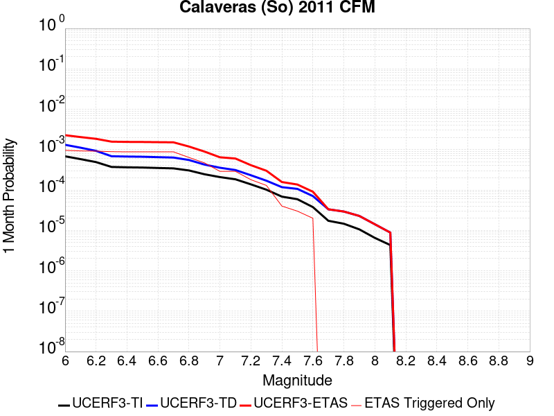 |  |  |

| Magnitude | 1 wk TI Prob | 1 wk TD Prob | 1 wk ETAS Prob | 1 wk ETAS/TD Gain | 1 wk ETAS Triggered Only | 1 mo TI Prob | 1 mo TD Prob | 1 mo ETAS Prob | 1 mo ETAS/TD Gain | 1 mo ETAS Triggered Only | 1 yr TI Prob | 1 yr TD Prob | 1 yr ETAS Prob | 1 yr ETAS/TD Gain | 1 yr ETAS Triggered Only | 10 yr TI Prob | 10 yr TD Prob | 10 yr ETAS Prob | 10 yr ETAS/TD Gain | 10 yr ETAS Triggered Only |
|-----|-----|-----|-----|-----|-----|-----|-----|-----|-----|-----|-----|-----|-----|-----|-----|-----|-----|-----|-----|-----|
| 6.0 | 1.5950744E-4 | 3.0749437E-4 | 0.0010772576 | 3.503341 | 7.7E-4 | 6.834242E-4 | 0.0013171652 | 0.0022759007 | 1.727878 | 9.6E-4 | 0.00828899 | 0.015879672 | 0.017208233 | 1.0836643 | 0.00135 | 0.079865426 | 0.14458352 | 0.14602062 | 1.0099396 | 0.00168 |
| 6.1 | 1.3584697E-4 | 2.6061258E-4 | 0.0010104171 | 3.877085 | 7.5E-4 | 5.8207137E-4 | 0.0011164238 | 0.0020453855 | 1.832087 | 9.3E-4 | 0.007063716 | 0.013481526 | 0.014764 | 1.0951283 | 0.0013 | 0.06843361 | 0.12420534 | 0.12562414 | 1.0114229 | 0.00162 |
| 6.2 | 1.14676266E-4 | 2.1735905E-4 | 9.67196E-4 | 4.449762 | 7.5E-4 | 4.9137714E-4 | 9.3119335E-4 | 0.0018503367 | 1.9870596 | 9.2E-4 | 0.0059661185 | 0.011263983 | 0.012529565 | 1.1123565 | 0.00128 | 0.058084648 | 0.105190955 | 0.1066137 | 1.0135254 | 0.00159 |
| 6.3 | 8.691518E-5 | 1.6025284E-4 | 8.8013744E-4 | 5.49218 | 7.2E-4 | 3.7244044E-4 | 6.865854E-4 | 0.0015759743 | 2.2953799 | 8.9E-4 | 0.004525038 | 0.008320298 | 0.009540063 | 1.1466012 | 0.00123 | 0.044339992 | 0.079503275 | 0.08091164 | 1.0177145 | 0.00153 |
| 6.4 | 8.50982E-5 | 1.5731492E-4 | 8.672032E-4 | 5.51253 | 7.1E-4 | 3.646556E-4 | 6.740008E-4 | 0.0015534078 | 2.3047564 | 8.8E-4 | 0.0044306475 | 0.008168236 | 0.009378271 | 1.148139 | 0.00122 | 0.04343345 | 0.078108825 | 0.0795101 | 1.01794 | 0.00152 |
| 6.5 | 8.4062965E-5 | 1.5555846E-4 | 8.6544803E-4 | 5.5634904 | 7.1E-4 | 3.602201E-4 | 6.66477E-4 | 0.0015458905 | 2.3194957 | 8.8E-4 | 0.004376863 | 0.008077393 | 0.009287538 | 1.1498188 | 0.00122 | 0.042916555 | 0.0772798 | 0.07867311 | 1.0180293 | 0.00151 |
| 6.6 | 8.194716E-5 | 1.5191114E-4 | 8.618033E-4 | 5.673075 | 7.1E-4 | 3.5115483E-4 | 6.5085484E-4 | 0.0015302821 | 2.351188 | 8.8E-4 | 0.0042669317 | 0.00788911 | 0.009099484 | 1.1534235 | 0.00122 | 0.04185927 | 0.07556428 | 0.07695094 | 1.0183506 | 0.0015 |
| 6.7 | 8.012326E-5 | 1.4858895E-4 | 8.584834E-4 | 5.7775726 | 7.1E-4 | 3.433402E-4 | 6.366239E-4 | 0.0015160637 | 2.3814118 | 8.8E-4 | 0.004172157 | 0.0077174962 | 0.008928081 | 1.1568624 | 0.00122 | 0.040946912 | 0.074005805 | 0.07537627 | 1.0185184 | 0.00148 |
| 6.8 | 7.119773E-5 | 1.2914711E-4 | 6.690774E-4 | 5.1807384 | 5.4E-4 | 3.0509746E-4 | 5.533677E-4 | 0.0011930136 | 2.1559145 | 6.4E-4 | 0.0037082357 | 0.0067137484 | 0.007627572 | 1.1361122 | 9.2E-4 | 0.036469642 | 0.06484202 | 0.065926805 | 1.0167296 | 0.00116 |
| 6.9 | 5.7343088E-5 | 9.9492536E-5 | 4.9945276E-4 | 5.0200024 | 4.0E-4 | 2.4573295E-4 | 4.2632731E-4 | 8.9612696E-4 | 2.1019692 | 4.7E-4 | 0.0029876942 | 0.0051782588 | 0.005795048 | 1.1191114 | 6.2E-4 | 0.02947844 | 0.05065133 | 0.051372837 | 1.0142446 | 7.6E-4 |
| 7.0 | 4.8746577E-5 | 8.311504E-5 | 3.230951E-4 | 3.887324 | 2.4E-4 | 2.0889717E-4 | 3.5615906E-4 | 6.4605573E-4 | 1.8139529 | 2.9E-4 | 0.0025403565 | 0.0043276814 | 0.004745864 | 1.0966296 | 4.2E-4 | 0.025115121 | 0.04261219 | 0.043119606 | 1.0119077 | 5.3E-4 |
| 7.1 | 4.2998014E-5 | 7.288552E-5 | 3.1286804E-4 | 4.292595 | 2.4E-4 | 1.8426418E-4 | 3.1232944E-4 | 6.0223887E-4 | 1.9282167 | 2.9E-4 | 0.002241108 | 0.0037960412 | 0.004214447 | 1.1102216 | 4.2E-4 | 0.022186412 | 0.037536766 | 0.03804687 | 1.0135895 | 5.3E-4 |
| 7.2 | 3.221292E-5 | 5.412806E-5 | 2.141194E-4 | 3.955793 | 1.6E-4 | 1.3804805E-4 | 2.3195695E-4 | 4.1191519E-4 | 1.7758261 | 1.8E-4 | 0.0016794393 | 0.0028204466 | 0.0030597697 | 1.0848529 | 2.4E-4 | 0.016668037 | 0.028144019 | 0.028445292 | 1.0107048 | 3.1E-4 |
| 7.3 | 2.3756531E-5 | 3.966755E-5 | 1.4966319E-4 | 3.7729375 | 1.1E-4 | 1.0180973E-4 | 1.699928E-4 | 2.999707E-4 | 1.7646083 | 1.3E-4 | 0.0012388286 | 0.002067715 | 0.0022373635 | 1.0820464 | 1.7E-4 | 0.012319452 | 0.02073957 | 0.020945216 | 1.0099156 | 2.1E-4 |
| 7.4 | 1.5997684E-5 | 2.7452568E-5 | 6.7451474E-5 | 2.4570186 | 4.0E-5 | 6.8559704E-5 | 1.17648575E-4 | 1.5764387E-4 | 1.3399556 | 4.0E-5 | 8.343947E-4 | 0.0014314328 | 0.0014813611 | 1.03488 | 5.0E-5 | 0.008312687 | 0.014430851 | 0.014499841 | 1.0047808 | 7.0E-5 |
| 7.5 | 1.3814293E-5 | 2.4889932E-5 | 5.4889188E-5 | 2.2052765 | 3.0E-5 | 5.9202768E-5 | 1.0666679E-4 | 1.366636E-4 | 1.2812197 | 3.0E-5 | 7.205553E-4 | 0.001297897 | 0.001337845 | 1.0307791 | 4.0E-5 | 0.007182234 | 0.013107957 | 0.013167171 | 1.0045173 | 6.0E-5 |
| 7.6 | 8.817309E-6 | 1.6518723E-5 | 3.651839E-5 | 2.2107275 | 2.0E-5 | 3.7787922E-5 | 7.0792616E-5 | 9.0791196E-5 | 1.2824954 | 2.0E-5 | 4.5997082E-4 | 8.615606E-4 | 8.815434E-4 | 1.0231937 | 2.0E-5 | 0.004590199 | 0.008763311 | 0.008793049 | 1.0033934 | 3.0E-5 |
| 7.7 | 4.0352206E-6 | 7.766588E-6 | 7.766588E-6 | 1.0 | 0.0 | 1.7293689E-5 | 3.3284952E-5 | 3.3284952E-5 | 1.0 | 0.0 | 2.1053031E-4 | 4.0516903E-4 | 4.0516903E-4 | 1.0 | 0.0 | 0.0021033096 | 0.0041942275 | 0.0041942275 | 1.0 | 0.0 |
| 7.8 | 3.413169E-6 | 6.8392264E-6 | 6.8392264E-6 | 1.0 | 0.0 | 1.4627784E-5 | 2.931064E-5 | 2.931064E-5 | 1.0 | 0.0 | 1.7807873E-4 | 3.567987E-4 | 3.567987E-4 | 1.0 | 0.0 | 0.0017793609 | 0.0036918588 | 0.0036918588 | 1.0 | 0.0 |
| 7.9 | 2.4740732E-6 | 5.3175654E-6 | 5.3175654E-6 | 1.0 | 0.0 | 1.06031275E-5 | 2.2789367E-5 | 2.2789367E-5 | 1.0 | 0.0 | 1.2908543E-4 | 2.7742528E-4 | 2.7742528E-4 | 1.0 | 0.0 | 0.0012901047 | 0.0028534317 | 0.0028534317 | 1.0 | 0.0 |
| 8.0 | 1.5231818E-6 | 3.311678E-6 | 3.311678E-6 | 1.0 | 0.0 | 6.527906E-6 | 1.41928285E-5 | 1.41928285E-5 | 1.0 | 0.0 | 7.9474354E-5 | 1.7278403E-4 | 1.7278403E-4 | 1.0 | 0.0 | 7.944594E-4 | 0.0017675913 | 0.0017675913 | 1.0 | 0.0 |
| 8.1 | 1.0104524E-6 | 2.0600396E-6 | 2.0600396E-6 | 1.0 | 0.0 | 4.330503E-6 | 8.8287115E-6 | 8.8287115E-6 | 1.0 | 0.0 | 5.2722597E-5 | 1.07484295E-4 | 1.07484295E-4 | 1.0 | 0.0 | 5.271009E-4 | 0.0011000282 | 0.0011000282 | 1.0 | 0.0 |

## Concord 2011 CFM
*[(top)](#table-of-contents)*

| 1 Week | 1 Month | 1 Year | 10 Year |
|-----|-----|-----|-----|
|  |  |  |  |

| Magnitude | 1 wk TI Prob | 1 wk TD Prob | 1 wk ETAS Prob | 1 wk ETAS/TD Gain | 1 wk ETAS Triggered Only | 1 mo TI Prob | 1 mo TD Prob | 1 mo ETAS Prob | 1 mo ETAS/TD Gain | 1 mo ETAS Triggered Only | 1 yr TI Prob | 1 yr TD Prob | 1 yr ETAS Prob | 1 yr ETAS/TD Gain | 1 yr ETAS Triggered Only | 10 yr TI Prob | 10 yr TD Prob | 10 yr ETAS Prob | 10 yr ETAS/TD Gain | 10 yr ETAS Triggered Only |
|-----|-----|-----|-----|-----|-----|-----|-----|-----|-----|-----|-----|-----|-----|-----|-----|-----|-----|-----|-----|-----|
| 6.0 | 5.7865112E-5 | 9.763079E-5 | 4.5759566E-4 | 4.687001 | 3.6E-4 | 2.4796976E-4 | 4.1835537E-4 | 9.88117E-4 | 2.361908 | 5.7E-4 | 0.0030148525 | 0.0050824312 | 0.0061071967 | 1.2016289 | 0.00103 | 0.029742775 | 0.04927559 | 0.05062562 | 1.0273975 | 0.00142 |
| 6.1 | 5.7865112E-5 | 9.763079E-5 | 4.5759566E-4 | 4.687001 | 3.6E-4 | 2.4796976E-4 | 4.1835537E-4 | 9.88117E-4 | 2.361908 | 5.7E-4 | 0.0030148525 | 0.0050824312 | 0.0061071967 | 1.2016289 | 0.00103 | 0.029742775 | 0.04927559 | 0.05062562 | 1.0273975 | 0.00142 |
| 6.2 | 5.6789337E-5 | 9.583261E-5 | 4.5579812E-4 | 4.75619 | 3.6E-4 | 2.4336016E-4 | 4.106513E-4 | 9.7042136E-4 | 2.3631275 | 5.6E-4 | 0.0029588845 | 0.0049890657 | 0.0059741265 | 1.197444 | 9.9E-4 | 0.029197963 | 0.04839163 | 0.04969533 | 1.0269407 | 0.00137 |
| 6.3 | 5.203322E-5 | 8.807962E-5 | 3.5805584E-4 | 4.0651383 | 2.7E-4 | 2.2298045E-4 | 3.774339E-4 | 8.172678E-4 | 2.165327 | 4.4E-4 | 0.0027114071 | 0.0045863595 | 0.0054125525 | 1.1801414 | 8.3E-4 | 0.026785625 | 0.04456013 | 0.04568755 | 1.0253011 | 0.00118 |
| 6.4 | 4.7120942E-5 | 7.899214E-5 | 2.489787E-4 | 3.151943 | 1.7E-4 | 2.0193127E-4 | 3.38498E-4 | 6.583897E-4 | 1.9450327 | 3.2E-4 | 0.0024557412 | 0.0041141706 | 0.004741579 | 1.1524993 | 6.3E-4 | 0.024287801 | 0.040074393 | 0.040967125 | 1.0222769 | 9.3E-4 |
| 6.5 | 2.9598437E-5 | 4.6688998E-5 | 1.1668573E-4 | 2.4992125 | 7.0E-5 | 1.2684427E-4 | 2.0008154E-4 | 3.3005554E-4 | 1.649605 | 1.3E-4 | 0.001543235 | 0.0024334819 | 0.0027128004 | 1.1147815 | 2.8E-4 | 0.015325619 | 0.023917085 | 0.024356322 | 1.018365 | 4.5E-4 |
| 6.6 | 2.0443718E-5 | 2.9996829E-5 | 6.999563E-5 | 2.3334343 | 4.0E-5 | 8.7613E-5 | 1.285517E-4 | 1.9854271E-4 | 1.5444579 | 7.0E-5 | 0.0010661662 | 0.0015640296 | 0.0017237794 | 1.1021398 | 1.6E-4 | 0.010610655 | 0.015473378 | 0.0157392 | 1.0171794 | 2.7E-4 |
| 6.7 | 1.798539E-5 | 2.556951E-5 | 4.5569E-5 | 1.7821616 | 2.0E-5 | 7.7077966E-5 | 1.0957914E-4 | 1.5957365E-4 | 1.4562413 | 5.0E-5 | 9.380202E-4 | 0.001333331 | 0.0014731444 | 1.1048602 | 1.4E-4 | 0.009340706 | 0.013223651 | 0.013460477 | 1.0179093 | 2.4E-4 |
| 6.8 | 1.613555E-5 | 2.1970845E-5 | 3.1970627E-5 | 1.4551386 | 1.0E-5 | 6.915052E-5 | 9.415745E-5 | 1.2415463E-4 | 1.3185853 | 3.0E-5 | 8.4158237E-4 | 0.001145778 | 0.0012456635 | 1.0871769 | 1.0E-4 | 0.008384023 | 0.011384192 | 0.0115621425 | 1.0156314 | 1.8E-4 |
| 6.9 | 1.2916435E-5 | 1.709193E-5 | 2.7091759E-5 | 1.5850614 | 1.0E-5 | 5.5354973E-5 | 7.324911E-5 | 9.324764E-5 | 1.2730209 | 2.0E-5 | 6.7373837E-4 | 8.914488E-4 | 9.513953E-4 | 1.0672462 | 6.0E-5 | 0.006716994 | 0.008872758 | 0.008981781 | 1.0122875 | 1.1E-4 |
| 7.0 | 9.81129E-6 | 1.2637677E-5 | 2.263755E-5 | 1.7912747 | 1.0E-5 | 4.2047708E-5 | 5.416036E-5 | 7.4159274E-5 | 1.3692538 | 2.0E-5 | 5.118106E-4 | 6.592045E-4 | 7.091715E-4 | 1.075799 | 5.0E-5 | 0.005106334 | 0.0065727015 | 0.006652176 | 1.0120915 | 8.0E-5 |
| 7.1 | 8.0889195E-6 | 1.0423458E-5 | 2.0423353E-5 | 1.9593645 | 1.0E-5 | 3.4666336E-5 | 4.46712E-5 | 5.4670756E-5 | 1.2238479 | 1.0E-5 | 4.219809E-4 | 5.437372E-4 | 5.6372635E-4 | 1.0367625 | 2.0E-5 | 0.004211805 | 0.0054242937 | 0.005464077 | 1.0073342 | 4.0E-5 |
| 7.2 | 6.267438E-6 | 8.1201115E-6 | 1.812003E-5 | 2.2315001 | 1.0E-5 | 2.6860173E-5 | 3.4800018E-5 | 4.4799668E-5 | 1.2873461 | 1.0E-5 | 3.2697353E-4 | 4.2360858E-4 | 4.4360012E-4 | 1.0471934 | 2.0E-5 | 0.0032649285 | 0.0042282613 | 0.0042581344 | 1.007065 | 3.0E-5 |
| 7.3 | 3.6761196E-6 | 4.8439138E-6 | 4.8439138E-6 | 1.0 | 0.0 | 1.5754704E-5 | 2.0759468E-5 | 2.0759468E-5 | 1.0 | 0.0 | 1.9179663E-4 | 2.527174E-4 | 2.527174E-4 | 1.0 | 0.0 | 0.0019163118 | 0.0025244376 | 0.0025244376 | 1.0 | 0.0 |
| 7.4 | 2.8044356E-6 | 3.7131877E-6 | 3.7131877E-6 | 1.0 | 0.0 | 1.2018954E-5 | 1.5913565E-5 | 1.5913565E-5 | 1.0 | 0.0 | 1.4632095E-4 | 1.9373054E-4 | 1.9373054E-4 | 1.0 | 0.0 | 0.0014622464 | 0.0019357144 | 0.0019357144 | 1.0 | 0.0 |
| 7.5 | 2.4578699E-6 | 3.247876E-6 | 3.247876E-6 | 1.0 | 0.0 | 1.0533685E-5 | 1.3919395E-5 | 1.3919395E-5 | 1.0 | 0.0 | 1.2824008E-4 | 1.6945557E-4 | 1.6945557E-4 | 1.0 | 0.0 | 0.0012816609 | 0.0016933441 | 0.0016933441 | 1.0 | 0.0 |
| 7.6 | 1.7713267E-6 | 2.3380017E-6 | 2.3380017E-6 | 1.0 | 0.0 | 7.591378E-6 | 1.0019969E-5 | 1.0019969E-5 | 1.0 | 0.0 | 9.2421105E-5 | 1.21986384E-4 | 1.21986384E-4 | 1.0 | 0.0 | 9.2382677E-4 | 0.0012192475 | 0.0012192475 | 1.0 | 0.0 |
| 7.7 | 5.1912366E-7 | 6.832274E-7 | 6.832274E-7 | 1.0 | 0.0 | 2.2248137E-6 | 2.9281143E-6 | 2.9281143E-6 | 1.0 | 0.0 | 2.708677E-5 | 3.564922E-5 | 3.564922E-5 | 1.0 | 0.0 | 2.708347E-4 | 3.5644288E-4 | 3.5644288E-4 | 1.0 | 0.0 |

## Green Valley 2011 CFM
*[(top)](#table-of-contents)*

| 1 Week | 1 Month | 1 Year | 10 Year |
|-----|-----|-----|-----|
|  |  | 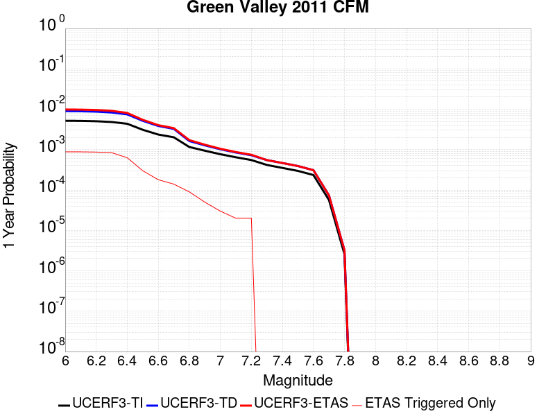 |  |

| Magnitude | 1 wk TI Prob | 1 wk TD Prob | 1 wk ETAS Prob | 1 wk ETAS/TD Gain | 1 wk ETAS Triggered Only | 1 mo TI Prob | 1 mo TD Prob | 1 mo ETAS Prob | 1 mo ETAS/TD Gain | 1 mo ETAS Triggered Only | 1 yr TI Prob | 1 yr TD Prob | 1 yr ETAS Prob | 1 yr ETAS/TD Gain | 1 yr ETAS Triggered Only | 10 yr TI Prob | 10 yr TD Prob | 10 yr ETAS Prob | 10 yr ETAS/TD Gain | 10 yr ETAS Triggered Only |
|-----|-----|-----|-----|-----|-----|-----|-----|-----|-----|-----|-----|-----|-----|-----|-----|-----|-----|-----|-----|-----|
| 6.0 | 9.9629346E-5 | 1.7317598E-4 | 4.831223E-4 | 2.7897766 | 3.1E-4 | 4.2691303E-4 | 7.419091E-4 | 0.001221553 | 1.6464995 | 4.8E-4 | 0.0051852856 | 0.008991489 | 0.009863577 | 1.0969903 | 8.8E-4 | 0.050659515 | 0.08556864 | 0.08670253 | 1.0132513 | 0.00124 |
| 6.1 | 9.88615E-5 | 1.7164624E-4 | 4.8159304E-4 | 2.80573 | 3.1E-4 | 4.2362334E-4 | 7.3535676E-4 | 0.0012150038 | 1.6522644 | 4.8E-4 | 0.0051454236 | 0.0089123715 | 0.009784528 | 1.0978591 | 8.8E-4 | 0.050279044 | 0.08485507 | 0.085989855 | 1.0133731 | 0.00124 |
| 6.2 | 9.696895E-5 | 1.6803163E-4 | 4.7797954E-4 | 2.8445807 | 3.1E-4 | 4.15515E-4 | 7.1987417E-4 | 0.0011995287 | 1.6663032 | 4.8E-4 | 0.0050471667 | 0.008725558 | 0.009587968 | 1.0988371 | 8.7E-4 | 0.04934063 | 0.08316236 | 0.08429007 | 1.0135603 | 0.00123 |
| 6.3 | 9.275224E-5 | 1.5982409E-4 | 4.4977776E-4 | 2.814205 | 2.9E-4 | 3.9744904E-4 | 6.8471767E-4 | 0.0011344096 | 1.6567552 | 4.5E-4 | 0.0048282105 | 0.008300837 | 0.009133864 | 1.1003546 | 8.4E-4 | 0.047246475 | 0.079300575 | 0.08039621 | 1.0138162 | 0.00119 |
| 6.4 | 8.391499E-5 | 1.4376939E-4 | 3.237435E-4 | 2.251825 | 1.8E-4 | 3.595861E-4 | 6.159458E-4 | 9.357487E-4 | 1.5192063 | 3.2E-4 | 0.004369175 | 0.0074695917 | 0.008094886 | 1.083712 | 6.3E-4 | 0.04284265 | 0.07165913 | 0.07252249 | 1.0120481 | 9.3E-4 |
| 6.5 | 5.9519385E-5 | 9.941439E-5 | 1.7940644E-4 | 1.8046324 | 8.0E-5 | 2.5505814E-4 | 4.2592557E-4 | 5.558702E-4 | 1.3050877 | 1.3E-4 | 0.0031009112 | 0.0051704263 | 0.005468875 | 1.0577223 | 3.0E-4 | 0.030579966 | 0.05016996 | 0.05061638 | 1.0088981 | 4.7E-4 |
| 6.6 | 4.5361558E-5 | 7.4088064E-5 | 1.2408436E-4 | 1.6748226 | 5.0E-5 | 1.9439218E-4 | 3.1748452E-4 | 3.874623E-4 | 1.2204132 | 7.0E-5 | 0.0023641558 | 0.0038558498 | 0.0040351558 | 1.0465024 | 1.8E-4 | 0.023391623 | 0.037687372 | 0.03796644 | 1.0074049 | 2.9E-4 |
| 6.7 | 3.8808106E-5 | 6.270438E-5 | 8.270312E-5 | 1.3189371 | 2.0E-5 | 1.6630985E-4 | 2.6870798E-4 | 3.0869723E-4 | 1.1488205 | 4.0E-5 | 0.0020229418 | 0.0032644244 | 0.0034039675 | 1.0427465 | 1.4E-4 | 0.020046256 | 0.032024976 | 0.03225729 | 1.0072541 | 2.4E-4 |
| 6.8 | 2.2284667E-5 | 3.1299103E-5 | 4.129879E-5 | 1.3194879 | 1.0E-5 | 9.550222E-5 | 1.3413222E-4 | 1.5412954E-4 | 1.1490866 | 2.0E-5 | 0.0011621192 | 0.0016318185 | 0.0017216717 | 1.0550632 | 9.0E-5 | 0.011560607 | 0.016173003 | 0.016340254 | 1.0103413 | 1.7E-4 |
| 6.9 | 1.8050168E-5 | 2.4460174E-5 | 3.445993E-5 | 1.4088179 | 1.0E-5 | 7.735557E-5 | 1.0482514E-4 | 1.148241E-4 | 1.095387 | 1.0E-5 | 9.4139716E-4 | 0.001275506 | 0.0013254422 | 1.0391501 | 5.0E-5 | 0.009374191 | 0.01267408 | 0.0127728125 | 1.0077901 | 1.0E-4 |
| 7.0 | 1.4763166E-5 | 1.9590905E-5 | 2.959071E-5 | 1.5104309 | 1.0E-5 | 6.326917E-5 | 8.395834E-5 | 9.39575E-5 | 1.1190966 | 1.0E-5 | 7.7002996E-4 | 0.0010217162 | 0.0010516855 | 1.0293324 | 3.0E-5 | 0.007673672 | 0.010169487 | 0.010228877 | 1.00584 | 6.0E-5 |
| 7.1 | 1.2399713E-5 | 1.6309968E-5 | 2.6309805E-5 | 1.613112 | 1.0E-5 | 5.3140546E-5 | 6.9898E-5 | 7.9897305E-5 | 1.1430556 | 1.0E-5 | 6.467941E-4 | 8.506777E-4 | 8.7066076E-4 | 1.0234907 | 2.0E-5 | 0.006449148 | 0.0084744925 | 0.008514154 | 1.00468 | 4.0E-5 |
| 7.2 | 1.0584195E-5 | 1.3927383E-5 | 2.3927245E-5 | 1.7179999 | 1.0E-5 | 4.5360044E-5 | 5.968743E-5 | 6.968683E-5 | 1.1675295 | 1.0E-5 | 5.521186E-4 | 7.264538E-4 | 7.4643927E-4 | 1.027511 | 2.0E-5 | 0.0055074887 | 0.0072412067 | 0.0072709895 | 1.004113 | 3.0E-5 |
| 7.3 | 7.998173E-6 | 1.05492245E-5 | 1.05492245E-5 | 1.0 | 0.0 | 3.4277433E-5 | 4.5210185E-5 | 4.5210185E-5 | 1.0 | 0.0 | 4.1724785E-4 | 5.502961E-4 | 5.502961E-4 | 1.0 | 0.0 | 0.004164653 | 0.0054896 | 0.0054896 | 1.0 | 0.0 |
| 7.4 | 6.7571127E-6 | 8.937685E-6 | 8.937685E-6 | 1.0 | 0.0 | 2.8958733E-5 | 3.830381E-5 | 3.830381E-5 | 1.0 | 0.0 | 3.5251552E-4 | 4.6625003E-4 | 4.6625003E-4 | 1.0 | 0.0 | 0.0035195686 | 0.004652921 | 0.004652921 | 1.0 | 0.0 |
| 7.5 | 5.69878E-6 | 7.520235E-6 | 7.520235E-6 | 1.0 | 0.0 | 2.4423114E-5 | 3.2229185E-5 | 3.2229185E-5 | 1.0 | 0.0 | 2.9731085E-4 | 3.9232057E-4 | 3.9232057E-4 | 1.0 | 0.0 | 0.002969134 | 0.003916431 | 0.003916431 | 1.0 | 0.0 |
| 7.6 | 4.503664E-6 | 5.9392337E-6 | 5.9392337E-6 | 1.0 | 0.0 | 1.9301275E-5 | 2.5453615E-5 | 2.5453615E-5 | 1.0 | 0.0 | 2.3496768E-4 | 3.098545E-4 | 3.098545E-4 | 1.0 | 0.0 | 0.002347194 | 0.00309435 | 0.00309435 | 1.0 | 0.0 |
| 7.7 | 1.0873546E-6 | 1.4111749E-6 | 1.4111749E-6 | 1.0 | 0.0 | 4.6600826E-6 | 6.0478787E-6 | 6.0478787E-6 | 1.0 | 0.0 | 5.6735033E-5 | 7.3630465E-5 | 7.3630465E-5 | 1.0 | 0.0 | 5.672055E-4 | 7.360627E-4 | 7.360627E-4 | 1.0 | 0.0 |
| 7.8 | 4.9373917E-8 | 6.178776E-8 | 6.178776E-8 | 1.0 | 0.0 | 2.1160248E-7 | 2.6480467E-7 | 2.6480467E-7 | 1.0 | 0.0 | 2.5762572E-6 | 3.2239934E-6 | 3.2239934E-6 | 1.0 | 0.0 | 2.5762274E-5 | 3.223787E-5 | 3.223787E-5 | 1.0 | 0.0 |

## San Andreas (Santa Cruz Mts) 2011 CFM
*[(top)](#table-of-contents)*

| 1 Week | 1 Month | 1 Year | 10 Year |
|-----|-----|-----|-----|
|  |  |  |  |

| Magnitude | 1 wk TI Prob | 1 wk TD Prob | 1 wk ETAS Prob | 1 wk ETAS/TD Gain | 1 wk ETAS Triggered Only | 1 mo TI Prob | 1 mo TD Prob | 1 mo ETAS Prob | 1 mo ETAS/TD Gain | 1 mo ETAS Triggered Only | 1 yr TI Prob | 1 yr TD Prob | 1 yr ETAS Prob | 1 yr ETAS/TD Gain | 1 yr ETAS Triggered Only | 10 yr TI Prob | 10 yr TD Prob | 10 yr ETAS Prob | 10 yr ETAS/TD Gain | 10 yr ETAS Triggered Only |
|-----|-----|-----|-----|-----|-----|-----|-----|-----|-----|-----|-----|-----|-----|-----|-----|-----|-----|-----|-----|-----|
| 6.0 | 1.7221631E-4 | 1.3884946E-4 | 7.887592E-4 | 5.680679 | 6.5E-4 | 7.378611E-4 | 5.9493544E-4 | 0.0013145071 | 2.2094953 | 7.2E-4 | 0.008946515 | 0.0072196755 | 0.008182673 | 1.1333851 | 9.7E-4 | 0.08594794 | 0.07099123 | 0.07210605 | 1.0157034 | 0.0012 |
| 6.1 | 1.7221631E-4 | 1.3884946E-4 | 7.887592E-4 | 5.680679 | 6.5E-4 | 7.378611E-4 | 5.9493544E-4 | 0.0013145071 | 2.2094953 | 7.2E-4 | 0.008946515 | 0.0072196755 | 0.008182673 | 1.1333851 | 9.7E-4 | 0.08594794 | 0.07099123 | 0.07210605 | 1.0157034 | 0.0012 |
| 6.2 | 1.7221631E-4 | 1.3884946E-4 | 7.887592E-4 | 5.680679 | 6.5E-4 | 7.378611E-4 | 5.9493544E-4 | 0.0013145071 | 2.2094953 | 7.2E-4 | 0.008946515 | 0.0072196755 | 0.008182673 | 1.1333851 | 9.7E-4 | 0.08594794 | 0.07099123 | 0.07210605 | 1.0157034 | 0.0012 |
| 6.3 | 1.716926E-4 | 1.3804191E-4 | 7.8795216E-4 | 5.708065 | 6.5E-4 | 7.3561794E-4 | 5.914761E-4 | 0.0013110503 | 2.2165735 | 7.2E-4 | 0.008919428 | 0.0071778353 | 0.008140873 | 1.1341683 | 9.7E-4 | 0.08569809 | 0.0706028 | 0.071718074 | 1.0157965 | 0.0012 |
| 6.4 | 1.6392978E-4 | 1.3678138E-4 | 7.866925E-4 | 5.7514586 | 6.5E-4 | 7.02367E-4 | 5.860763E-4 | 0.0013056543 | 2.227789 | 7.2E-4 | 0.008517839 | 0.0071125226 | 0.008075624 | 1.1354092 | 9.7E-4 | 0.08198654 | 0.06982483 | 0.07094104 | 1.0159858 | 0.0012 |
| 6.5 | 1.5742714E-4 | 1.2735424E-4 | 7.672727E-4 | 6.0247126 | 6.4E-4 | 6.745133E-4 | 5.4569147E-4 | 0.0012553041 | 2.3003914 | 7.1E-4 | 0.00818132 | 0.0066238823 | 0.0075775236 | 1.1439701 | 9.6E-4 | 0.078865945 | 0.06527744 | 0.06638042 | 1.0168967 | 0.00118 |
| 6.6 | 1.3038084E-4 | 1.16682175E-4 | 7.566075E-4 | 6.484345 | 6.4E-4 | 5.5865536E-4 | 4.999719E-4 | 0.0012096169 | 2.4193697 | 7.1E-4 | 0.006780438 | 0.0060704127 | 0.007024585 | 1.1571841 | 9.6E-4 | 0.0657725 | 0.05970143 | 0.060810983 | 1.018585 | 0.00118 |
| 6.7 | 1.2867592E-4 | 1.1394204E-4 | 7.538691E-4 | 6.616251 | 6.4E-4 | 5.5135164E-4 | 4.8823294E-4 | 0.0011878911 | 2.4330418 | 7.0E-4 | 0.0066920654 | 0.0059282756 | 0.0068726437 | 1.159299 | 9.5E-4 | 0.06494093 | 0.058410734 | 0.05951239 | 1.0188606 | 0.00117 |
| 6.8 | 1.2801298E-4 | 1.1331655E-4 | 7.5324404E-4 | 6.647255 | 6.4E-4 | 5.485117E-4 | 4.8555326E-4 | 0.0011852133 | 2.4409544 | 7.0E-4 | 0.0066577005 | 0.005895828 | 0.006840227 | 1.1601809 | 9.5E-4 | 0.06461738 | 0.058124207 | 0.0592262 | 1.0189593 | 0.00117 |
| 6.9 | 1.269149E-4 | 1.1173527E-4 | 7.5166376E-4 | 6.7271843 | 6.4E-4 | 5.4380763E-4 | 4.7877885E-4 | 0.0011784437 | 2.4613528 | 7.0E-4 | 0.006600777 | 0.005813793 | 0.0067582694 | 1.1624545 | 9.5E-4 | 0.06408122 | 0.057394966 | 0.058497816 | 1.0192151 | 0.00117 |
| 7.0 | 1.2030331E-4 | 1.09023524E-4 | 7.489537E-4 | 6.8696527 | 6.4E-4 | 5.154837E-4 | 4.671613E-4 | 0.0011668343 | 2.497712 | 7.0E-4 | 0.006257969 | 0.0056730937 | 0.006617704 | 1.1665071 | 9.5E-4 | 0.06084648 | 0.056060992 | 0.057155963 | 1.0195317 | 0.00116 |
| 7.1 | 8.049617E-5 | 5.4515673E-5 | 3.9449712E-4 | 7.2363987 | 3.4E-4 | 3.4493793E-4 | 2.3361787E-4 | 6.2352675E-4 | 2.6690028 | 3.9E-4 | 0.0041915346 | 0.0028406233 | 0.0033292312 | 1.1720073 | 4.9E-4 | 0.041133516 | 0.02991033 | 0.030424478 | 1.0171896 | 5.3E-4 |
| 7.2 | 7.093979E-5 | 4.3460117E-5 | 3.334475E-4 | 7.6724944 | 2.9E-4 | 3.0399222E-4 | 1.8624449E-4 | 5.1618303E-4 | 2.7715344 | 3.3E-4 | 0.0036948253 | 0.0022651919 | 0.002674263 | 1.1805902 | 4.1E-4 | 0.03633994 | 0.02420392 | 0.024643028 | 1.018142 | 4.5E-4 |
| 7.3 | 6.193693E-5 | 2.9285771E-5 | 7.9284306E-5 | 2.7072637 | 5.0E-5 | 2.6541698E-4 | 1.2550442E-4 | 1.8549689E-4 | 1.4780108 | 6.0E-5 | 0.0032266637 | 0.001526947 | 0.001636779 | 1.0719292 | 1.1E-4 | 0.031802133 | 0.01670446 | 0.016832288 | 1.0076524 | 1.3E-4 |
| 7.4 | 5.906492E-5 | 2.7392227E-5 | 7.7390854E-5 | 2.8252854 | 5.0E-5 | 2.5311083E-4 | 1.1738999E-4 | 1.7738294E-4 | 1.5110569 | 6.0E-5 | 0.0030772698 | 0.0014282875 | 0.0015381305 | 1.0769053 | 1.1E-4 | 0.030350044 | 0.015665498 | 0.01579346 | 1.0081685 | 1.3E-4 |
| 7.5 | 5.424296E-5 | 2.5015886E-5 | 6.501489E-5 | 2.598944 | 4.0E-5 | 2.324491E-4 | 1.0720654E-4 | 1.5720118E-4 | 1.4663395 | 5.0E-5 | 0.002826395 | 0.0013044594 | 0.001404329 | 1.0765601 | 1.0E-4 | 0.027907165 | 0.014342199 | 0.014460478 | 1.0082469 | 1.2E-4 |
| 7.6 | 4.43084E-5 | 2.0169791E-5 | 3.0169589E-5 | 1.495781 | 1.0E-5 | 1.8987931E-4 | 8.64391E-5 | 9.6438234E-5 | 1.1156784 | 1.0E-5 | 0.0023093296 | 0.0010518882 | 0.0010918461 | 1.0379869 | 4.0E-5 | 0.022854783 | 0.011554358 | 0.01160378 | 1.0042773 | 5.0E-5 |
| 7.7 | 4.118098E-5 | 1.9189929E-5 | 2.9189736E-5 | 1.5210967 | 1.0E-5 | 1.7647797E-4 | 8.223996E-5 | 9.2239134E-5 | 1.1215854 | 1.0E-5 | 0.002146502 | 0.0010008118 | 0.0010407718 | 1.0399276 | 4.0E-5 | 0.021258866 | 0.011005864 | 0.011055313 | 1.004493 | 5.0E-5 |
| 7.8 | 3.5408906E-5 | 1.8810757E-5 | 2.881057E-5 | 1.5316007 | 1.0E-5 | 1.5174363E-4 | 8.061504E-5 | 9.061423E-5 | 1.1240363 | 1.0E-5 | 0.0018459131 | 9.810465E-4 | 0.0010210072 | 1.0407327 | 4.0E-5 | 0.018306552 | 0.010783297 | 0.010832759 | 1.0045868 | 5.0E-5 |
| 7.9 | 2.5860836E-5 | 1.7537723E-5 | 2.7537546E-5 | 1.5701895 | 1.0E-5 | 1.10827445E-4 | 7.51595E-5 | 8.515875E-5 | 1.1330404 | 1.0E-5 | 0.001348489 | 9.14683E-4 | 9.5464644E-4 | 1.043691 | 4.0E-5 | 0.013403354 | 0.010024931 | 0.01007443 | 1.0049375 | 5.0E-5 |
| 8.0 | 1.9777332E-5 | 1.5026019E-5 | 1.5026019E-5 | 1.0 | 0.0 | 8.4757245E-5 | 6.439564E-5 | 6.439564E-5 | 1.0 | 0.0 | 0.0010314309 | 7.837351E-4 | 8.037194E-4 | 1.0254989 | 2.0E-5 | 0.010266567 | 0.008607804 | 0.008637546 | 1.0034552 | 3.0E-5 |
| 8.1 | 1.468494E-5 | 1.2258435E-5 | 1.2258435E-5 | 1.0 | 0.0 | 6.293394E-5 | 5.253509E-5 | 5.253509E-5 | 1.0 | 0.0 | 7.6595135E-4 | 6.394272E-4 | 6.5941445E-4 | 1.031258 | 2.0E-5 | 0.0076331664 | 0.0070496635 | 0.0070695225 | 1.002817 | 2.0E-5 |
| 8.2 | 8.63836E-6 | 5.5468126E-6 | 5.5468126E-6 | 1.0 | 0.0 | 3.7021015E-5 | 2.3771838E-5 | 2.3771838E-5 | 1.0 | 0.0 | 4.5063766E-4 | 2.8938375E-4 | 2.9938086E-4 | 1.0345461 | 1.0E-5 | 0.004497249 | 0.0032881699 | 0.0032981369 | 1.0030313 | 1.0E-5 |
| 8.3 | 1.983087E-6 | 7.7871465E-7 | 7.7871465E-7 | 1.0 | 0.0 | 8.498917E-6 | 3.3373444E-6 | 3.3373444E-6 | 1.0 | 0.0 | 1.034694E-4 | 4.063143E-5 | 4.063143E-5 | 1.0 | 0.0 | 0.0010342124 | 4.7926197E-4 | 4.7926197E-4 | 1.0 | 0.0 |

## Calaveras (Central) 2011 CFM
*[(top)](#table-of-contents)*

| 1 Week | 1 Month | 1 Year | 10 Year |
|-----|-----|-----|-----|
|  |  |  |  |

| Magnitude | 1 wk TI Prob | 1 wk TD Prob | 1 wk ETAS Prob | 1 wk ETAS/TD Gain | 1 wk ETAS Triggered Only | 1 mo TI Prob | 1 mo TD Prob | 1 mo ETAS Prob | 1 mo ETAS/TD Gain | 1 mo ETAS Triggered Only | 1 yr TI Prob | 1 yr TD Prob | 1 yr ETAS Prob | 1 yr ETAS/TD Gain | 1 yr ETAS Triggered Only | 10 yr TI Prob | 10 yr TD Prob | 10 yr ETAS Prob | 10 yr ETAS/TD Gain | 10 yr ETAS Triggered Only |
|-----|-----|-----|-----|-----|-----|-----|-----|-----|-----|-----|-----|-----|-----|-----|-----|-----|-----|-----|-----|-----|
| 6.0 | 1.5010907E-4 | 2.484371E-4 | 7.1832037E-4 | 2.891357 | 4.7E-4 | 6.4316596E-4 | 0.0010642819 | 0.0016336753 | 1.5350024 | 5.7E-4 | 0.0078024664 | 0.012875661 | 0.013704847 | 1.0643994 | 8.4E-4 | 0.07534136 | 0.120618775 | 0.12153333 | 1.0075822 | 0.00104 |
| 6.1 | 1.4521465E-4 | 2.400574E-4 | 7.099446E-4 | 2.957395 | 4.7E-4 | 6.222001E-4 | 0.0010283972 | 0.001597811 | 1.5536906 | 5.7E-4 | 0.0075490056 | 0.012444699 | 0.013274246 | 1.0666586 | 8.4E-4 | 0.07297657 | 0.1168888 | 0.1177984 | 1.0077817 | 0.00103 |
| 6.2 | 1.429998E-4 | 2.3936245E-4 | 7.092499E-4 | 2.9630795 | 4.7E-4 | 6.127123E-4 | 0.0010254213 | 0.0015948368 | 1.5552992 | 5.7E-4 | 0.007434286 | 0.012408932 | 0.013238508 | 1.0668532 | 8.4E-4 | 0.07190444 | 0.11653908 | 0.11744905 | 1.0078082 | 0.00103 |
| 6.3 | 1.3536277E-4 | 2.3265288E-4 | 7.0254353E-4 | 3.0197072 | 4.7E-4 | 5.799972E-4 | 9.967126E-4 | 0.0015661445 | 1.57131 | 5.7E-4 | 0.0070386264 | 0.012064224 | 0.012884211 | 1.0679685 | 8.3E-4 | 0.0681982 | 0.11344376 | 0.11433918 | 1.0078931 | 0.00101 |
| 6.4 | 1.2993296E-4 | 2.2687583E-4 | 6.8677147E-4 | 3.0270808 | 4.6E-4 | 5.5673666E-4 | 9.719725E-4 | 0.0015314282 | 1.575588 | 5.6E-4 | 0.006757223 | 0.011766356 | 0.012576709 | 1.0688702 | 8.2E-4 | 0.06555412 | 0.11071639 | 0.111605674 | 1.0080321 | 0.001 |
| 6.5 | 1.0498927E-4 | 1.8023458E-4 | 6.401517E-4 | 3.5517695 | 4.6E-4 | 4.498764E-4 | 7.7220344E-4 | 0.0013217787 | 1.7116976 | 5.5E-4 | 0.005463498 | 0.009361094 | 0.010133793 | 1.0825436 | 7.8E-4 | 0.053311124 | 0.0893862 | 0.090260394 | 1.0097799 | 9.6E-4 |
| 6.6 | 1.0157505E-4 | 1.7510542E-4 | 6.3502486E-4 | 3.626529 | 4.6E-4 | 4.35249E-4 | 7.5023423E-4 | 0.0012998217 | 1.7325544 | 5.5E-4 | 0.0052862884 | 0.009095884 | 0.009868789 | 1.0849731 | 7.8E-4 | 0.05162293 | 0.08696195 | 0.08782933 | 1.0099744 | 9.5E-4 |
| 6.7 | 9.660386E-5 | 1.6768758E-4 | 6.276104E-4 | 3.7427366 | 4.6E-4 | 4.1395082E-4 | 7.1846135E-4 | 0.0012680662 | 1.7649748 | 5.5E-4 | 0.0050282106 | 0.008712257 | 0.009485462 | 1.088749 | 7.8E-4 | 0.049159497 | 0.08344738 | 0.0843181 | 1.0104344 | 9.5E-4 |
| 6.8 | 9.089927E-5 | 1.5681489E-4 | 6.1674276E-4 | 3.932935 | 4.6E-4 | 3.8951015E-4 | 6.718887E-4 | 0.0012215192 | 1.818038 | 5.5E-4 | 0.0047319788 | 0.008149622 | 0.008913347 | 1.0937129 | 7.7E-4 | 0.046324775 | 0.078334235 | 0.07918217 | 1.0108246 | 9.2E-4 |
| 6.9 | 7.353187E-5 | 1.232801E-4 | 5.13232E-4 | 4.1631374 | 3.9E-4 | 3.150985E-4 | 5.282369E-4 | 9.979886E-4 | 1.8892822 | 4.7E-4 | 0.0038295772 | 0.0064124404 | 0.0070483363 | 1.099166 | 6.4E-4 | 0.037642512 | 0.062338863 | 0.06307961 | 1.0118827 | 7.9E-4 |
| 7.0 | 5.746064E-5 | 9.41618E-5 | 3.2414016E-4 | 3.442374 | 2.3E-4 | 2.4623662E-4 | 4.0348852E-4 | 6.933715E-4 | 1.7184417 | 2.9E-4 | 0.0029938098 | 0.004901479 | 0.0053393226 | 1.0893288 | 4.4E-4 | 0.02953797 | 0.048116732 | 0.048649788 | 1.0110784 | 5.6E-4 |
| 7.1 | 4.9557195E-5 | 8.0763544E-5 | 3.1074497E-4 | 3.8475895 | 2.3E-4 | 2.123707E-4 | 3.460839E-4 | 6.25987E-4 | 1.8087723 | 2.8E-4 | 0.0025825473 | 0.0042054937 | 0.0046336856 | 1.1018173 | 4.3E-4 | 0.0255274 | 0.041487686 | 0.04201487 | 1.012707 | 5.5E-4 |
| 7.2 | 3.687595E-5 | 5.974866E-5 | 2.197391E-4 | 3.6777241 | 1.6E-4 | 1.5803022E-4 | 2.5604072E-4 | 4.3599465E-4 | 1.7028332 | 1.8E-4 | 0.0019223199 | 0.003112869 | 0.00337206 | 1.0832642 | 2.6E-4 | 0.01905776 | 0.030992588 | 0.03131236 | 1.0103177 | 3.3E-4 |
| 7.3 | 2.5846984E-5 | 4.2667798E-5 | 1.5266311E-4 | 3.5779467 | 1.1E-4 | 1.1076809E-4 | 1.8284928E-4 | 3.1282552E-4 | 1.7108381 | 1.3E-4 | 0.0013477671 | 0.0022239347 | 0.0023935568 | 1.076271 | 1.7E-4 | 0.013396223 | 0.022271734 | 0.022477057 | 1.009219 | 2.1E-4 |
| 7.4 | 1.7747854E-5 | 3.0047206E-5 | 7.0046E-5 | 2.3311987 | 4.0E-5 | 7.6060016E-5 | 1.287674E-4 | 1.6876224E-4 | 1.3105977 | 4.0E-5 | 9.2563726E-4 | 0.0015666186 | 0.0016165402 | 1.0318658 | 5.0E-5 | 0.009217911 | 0.015763417 | 0.015832314 | 1.0043707 | 7.0E-5 |
| 7.5 | 1.4883479E-5 | 2.63474E-5 | 5.634661E-5 | 2.1386023 | 3.0E-5 | 6.378478E-5 | 1.1291256E-4 | 1.4290916E-4 | 1.2656623 | 3.0E-5 | 7.76303E-4 | 0.0013738462 | 0.0014137913 | 1.0290754 | 4.0E-5 | 0.0077359667 | 0.013853255 | 0.0139124235 | 1.0042711 | 6.0E-5 |
| 7.6 | 8.166975E-6 | 1.5040534E-5 | 3.5040233E-5 | 2.32972 | 2.0E-5 | 3.5000852E-5 | 6.445785E-5 | 8.445656E-5 | 1.3102603 | 2.0E-5 | 4.2605202E-4 | 7.8449305E-4 | 8.044774E-4 | 1.0254742 | 2.0E-5 | 0.004252361 | 0.007977662 | 0.008007422 | 1.0037305 | 3.0E-5 |
| 7.7 | 3.3858064E-6 | 6.3019293E-6 | 6.3019293E-6 | 1.0 | 0.0 | 1.4510518E-5 | 2.7007989E-5 | 2.7007989E-5 | 1.0 | 0.0 | 1.7665124E-4 | 3.2877273E-4 | 3.2877273E-4 | 1.0 | 0.0 | 0.0017651088 | 0.003411871 | 0.003411871 | 1.0 | 0.0 |
| 7.8 | 2.7721615E-6 | 5.4076386E-6 | 5.4076386E-6 | 1.0 | 0.0 | 1.1880637E-5 | 2.3175387E-5 | 2.3175387E-5 | 1.0 | 0.0 | 1.4463716E-4 | 2.8212386E-4 | 2.8212386E-4 | 1.0 | 0.0 | 0.0014454306 | 0.002927692 | 0.002927692 | 1.0 | 0.0 |
| 7.9 | 1.9736292E-6 | 4.1587564E-6 | 4.1587564E-6 | 1.0 | 0.0 | 8.4583835E-6 | 1.782312E-5 | 1.782312E-5 | 1.0 | 0.0 | 1.0297595E-4 | 2.1697492E-4 | 2.1697492E-4 | 1.0 | 0.0 | 0.0010292825 | 0.0022383758 | 0.0022383758 | 1.0 | 0.0 |
| 8.0 | 1.1767289E-6 | 2.5723793E-6 | 2.5723793E-6 | 1.0 | 0.0 | 5.0431145E-6 | 1.1024436E-5 | 1.1024436E-5 | 1.0 | 0.0 | 6.139818E-5 | 1.3421428E-4 | 1.3421428E-4 | 1.0 | 0.0 | 6.1381224E-4 | 0.0013748175 | 0.0013748175 | 1.0 | 0.0 |
| 8.1 | 7.5112825E-7 | 1.5517952E-6 | 1.5517952E-6 | 1.0 | 0.0 | 3.2191172E-6 | 6.650534E-6 | 6.650534E-6 | 1.0 | 0.0 | 3.9192048E-5 | 8.0967264E-5 | 8.0967264E-5 | 1.0 | 0.0 | 3.9185135E-4 | 8.2888297E-4 | 8.2888297E-4 | 1.0 | 0.0 |

## Hayward (So) 2011 CFM
*[(top)](#table-of-contents)*

| 1 Week | 1 Month | 1 Year | 10 Year |
|-----|-----|-----|-----|
|  |  |  |  |

| Magnitude | 1 wk TI Prob | 1 wk TD Prob | 1 wk ETAS Prob | 1 wk ETAS/TD Gain | 1 wk ETAS Triggered Only | 1 mo TI Prob | 1 mo TD Prob | 1 mo ETAS Prob | 1 mo ETAS/TD Gain | 1 mo ETAS Triggered Only | 1 yr TI Prob | 1 yr TD Prob | 1 yr ETAS Prob | 1 yr ETAS/TD Gain | 1 yr ETAS Triggered Only | 10 yr TI Prob | 10 yr TD Prob | 10 yr ETAS Prob | 10 yr ETAS/TD Gain | 10 yr ETAS Triggered Only |
|-----|-----|-----|-----|-----|-----|-----|-----|-----|-----|-----|-----|-----|-----|-----|-----|-----|-----|-----|-----|-----|
| 6.0 | 1.8091932E-4 | 3.576308E-4 | 4.6759148E-4 | 1.3074697 | 1.1E-4 | 7.751381E-4 | 0.0015318132 | 0.0016915681 | 1.1042914 | 1.6E-4 | 0.00939654 | 0.01849276 | 0.018797027 | 1.0164533 | 3.1E-4 | 0.090090066 | 0.16695412 | 0.16737065 | 1.0024948 | 5.0E-4 |
| 6.1 | 1.8091932E-4 | 3.576308E-4 | 4.6759148E-4 | 1.3074697 | 1.1E-4 | 7.751381E-4 | 0.0015318132 | 0.0016915681 | 1.1042914 | 1.6E-4 | 0.00939654 | 0.01849276 | 0.018797027 | 1.0164533 | 3.1E-4 | 0.090090066 | 0.16695412 | 0.16737065 | 1.0024948 | 5.0E-4 |
| 6.2 | 1.8091932E-4 | 3.576308E-4 | 4.6759148E-4 | 1.3074697 | 1.1E-4 | 7.751381E-4 | 0.0015318132 | 0.0016915681 | 1.1042914 | 1.6E-4 | 0.00939654 | 0.01849276 | 0.018797027 | 1.0164533 | 3.1E-4 | 0.090090066 | 0.16695412 | 0.16737065 | 1.0024948 | 5.0E-4 |
| 6.3 | 1.7322872E-4 | 3.4318614E-4 | 4.531484E-4 | 1.3204157 | 1.1E-4 | 7.4219756E-4 | 0.0014699784 | 0.0016297431 | 1.1086851 | 1.6E-4 | 0.0089988755 | 0.017752402 | 0.018047076 | 1.0165992 | 3.0E-4 | 0.08643075 | 0.1608864 | 0.16130596 | 1.0026078 | 5.0E-4 |
| 6.4 | 1.6334097E-4 | 3.239878E-4 | 4.239554E-4 | 1.3085536 | 1.0E-4 | 6.998449E-4 | 0.001387789 | 0.0015375809 | 1.1079355 | 1.5E-4 | 0.008487372 | 0.016767448 | 0.017042752 | 1.016419 | 2.8E-4 | 0.081704415 | 0.15277125 | 0.15317792 | 1.002662 | 4.8E-4 |
| 6.5 | 1.5600289E-4 | 3.1072096E-4 | 4.1068989E-4 | 1.3217322 | 1.0E-4 | 6.684125E-4 | 0.00133099 | 0.0014807904 | 1.1125481 | 1.5E-4 | 0.008107598 | 0.016086295 | 0.016351953 | 1.0165144 | 2.7E-4 | 0.078181036 | 0.14704405 | 0.14744495 | 1.0027263 | 4.7E-4 |
| 6.6 | 1.4046066E-4 | 2.8083503E-4 | 3.7080975E-4 | 1.3203828 | 9.0E-5 | 6.018354E-4 | 0.0012030302 | 0.0013428618 | 1.1162328 | 1.4E-4 | 0.0073027555 | 0.014550033 | 0.01480625 | 1.0176094 | 2.6E-4 | 0.07067384 | 0.13412383 | 0.13451348 | 1.0029051 | 4.5E-4 |
| 6.7 | 1.14696966E-4 | 2.3317046E-4 | 3.2314946E-4 | 1.3858937 | 9.0E-5 | 4.914658E-4 | 9.989244E-4 | 0.0011287945 | 1.13001 | 1.3E-4 | 0.0059671924 | 0.0120951515 | 0.0123124905 | 1.0179691 | 2.2E-4 | 0.058094822 | 0.11293557 | 0.1132904 | 1.0031419 | 4.0E-4 |
| 6.8 | 9.3874296E-5 | 1.8899176E-4 | 2.7897474E-4 | 1.4761212 | 9.0E-5 | 4.0225635E-4 | 8.0971693E-4 | 9.396117E-4 | 1.16042 | 1.3E-4 | 0.0048864787 | 0.00981448 | 0.010022419 | 1.021187 | 2.1E-4 | 0.047804173 | 0.09275965 | 0.09307718 | 1.0034232 | 3.5E-4 |
| 6.9 | 5.551852E-5 | 1.0752712E-4 | 1.9751744E-4 | 1.8369081 | 9.0E-5 | 2.3791482E-4 | 4.6074972E-4 | 5.607037E-4 | 1.2169375 | 1.0E-4 | 0.0028927654 | 0.0055953185 | 0.0057345354 | 1.0248809 | 1.4E-4 | 0.028553981 | 0.05435149 | 0.054568987 | 1.0040017 | 2.3E-4 |
| 7.0 | 4.2662363E-5 | 8.2650746E-5 | 1.6264414E-4 | 1.9678483 | 8.0E-5 | 1.8282588E-4 | 3.541698E-4 | 4.4413793E-4 | 1.2540253 | 9.0E-5 | 0.0022236328 | 0.0043035657 | 0.004433006 | 1.0300775 | 1.3E-4 | 0.022015138 | 0.042151436 | 0.04234301 | 1.0045449 | 2.0E-4 |
| 7.1 | 3.305886E-5 | 6.317338E-5 | 1.231696E-4 | 1.9497072 | 6.0E-5 | 1.4167312E-4 | 2.7071504E-4 | 3.406961E-4 | 1.2585045 | 7.0E-5 | 0.0017235056 | 0.0032909934 | 0.0033806972 | 1.0272573 | 9.0E-5 | 0.017101998 | 0.032526355 | 0.032671478 | 1.0044616 | 1.5E-4 |
| 7.2 | 2.9856887E-5 | 5.7159497E-5 | 1.07156644E-4 | 1.8746953 | 5.0E-5 | 1.2795182E-4 | 2.4494636E-4 | 3.049317E-4 | 1.2448915 | 6.0E-5 | 0.0015567001 | 0.0029781607 | 0.0030579225 | 1.0267823 | 8.0E-5 | 0.015458403 | 0.029523436 | 0.029659303 | 1.004602 | 1.4E-4 |
| 7.3 | 2.4559737E-5 | 4.611372E-5 | 7.611234E-5 | 1.6505356 | 3.0E-5 | 1.0525176E-4 | 1.9761534E-4 | 2.3760743E-4 | 1.2023734 | 4.0E-5 | 0.0012806869 | 0.002403325 | 0.0024631808 | 1.0249054 | 6.0E-5 | 0.012733313 | 0.023917055 | 0.024014663 | 1.0040811 | 1.0E-4 |
| 7.4 | 1.9002231E-5 | 3.515206E-5 | 6.5151005E-5 | 1.853405 | 3.0E-5 | 8.143559E-5 | 1.5064306E-4 | 1.8063853E-4 | 1.1991162 | 3.0E-5 | 9.910273E-4 | 0.0018325461 | 0.0018724728 | 1.0217875 | 4.0E-5 | 0.009866194 | 0.018308608 | 0.018387143 | 1.0042895 | 8.0E-5 |
| 7.5 | 1.2783333E-5 | 2.3408053E-5 | 5.340735E-5 | 2.2815802 | 3.0E-5 | 5.4784563E-5 | 1.003164E-4 | 1.3031339E-4 | 1.2990237 | 3.0E-5 | 6.667979E-4 | 0.0012206737 | 0.0012506371 | 1.0245466 | 3.0E-5 | 0.006648007 | 0.012248043 | 0.012307309 | 1.0048387 | 6.0E-5 |
| 7.6 | 4.8149627E-6 | 8.921087E-6 | 2.892091E-5 | 3.2418592 | 2.0E-5 | 2.063539E-5 | 3.8232676E-5 | 5.823191E-5 | 1.5230927 | 2.0E-5 | 2.5120692E-4 | 4.6538466E-4 | 4.8537535E-4 | 1.0429552 | 2.0E-5 | 0.0025092314 | 0.0046977843 | 0.0047276434 | 1.006356 | 3.0E-5 |
| 7.7 | 6.0838227E-7 | 1.2138476E-6 | 1.2138476E-6 | 1.0 | 0.0 | 2.6073499E-6 | 5.2021937E-6 | 5.2021937E-6 | 1.0 | 0.0 | 3.174402E-5 | 6.333487E-5 | 6.333487E-5 | 1.0 | 0.0 | 3.1739488E-4 | 6.569028E-4 | 6.569028E-4 | 1.0 | 0.0 |
| 7.8 | 4.5542808E-7 | 9.863899E-7 | 9.863899E-7 | 1.0 | 0.0 | 1.9518332E-6 | 4.227378E-6 | 4.227378E-6 | 1.0 | 0.0 | 2.376331E-5 | 5.146712E-5 | 5.146712E-5 | 1.0 | 0.0 | 2.3760769E-4 | 5.356085E-4 | 5.356085E-4 | 1.0 | 0.0 |
| 7.9 | 3.3016747E-7 | 7.4394256E-7 | 7.4394256E-7 | 1.0 | 0.0 | 1.4150027E-6 | 3.1883212E-6 | 3.1883212E-6 | 1.0 | 0.0 | 1.7227521E-5 | 3.881712E-5 | 3.881712E-5 | 1.0 | 0.0 | 1.7226185E-4 | 4.0186857E-4 | 4.0186857E-4 | 1.0 | 0.0 |
| 8.0 | 2.347038E-7 | 5.509049E-7 | 5.509049E-7 | 1.0 | 0.0 | 1.0058731E-6 | 2.3610187E-6 | 2.3610187E-6 | 1.0 | 0.0 | 1.2246436E-5 | 2.8745026E-5 | 2.8745026E-5 | 1.0 | 0.0 | 1.2245761E-4 | 2.9535973E-4 | 2.9535973E-4 | 1.0 | 0.0 |
| 8.1 | 1.18822804E-7 | 2.6227093E-7 | 2.6227093E-7 | 1.0 | 0.0 | 5.092405E-7 | 1.1240178E-6 | 1.1240178E-6 | 1.0 | 0.0 | 6.1999854E-6 | 1.3684832E-5 | 1.3684832E-5 | 1.0 | 0.0 | 6.199812E-5 | 1.4000124E-4 | 1.4000124E-4 | 1.0 | 0.0 |

## Hayward (So) extension 2011 CFM
*[(top)](#table-of-contents)*

| 1 Week | 1 Month | 1 Year | 10 Year |
|-----|-----|-----|-----|
|  |  | 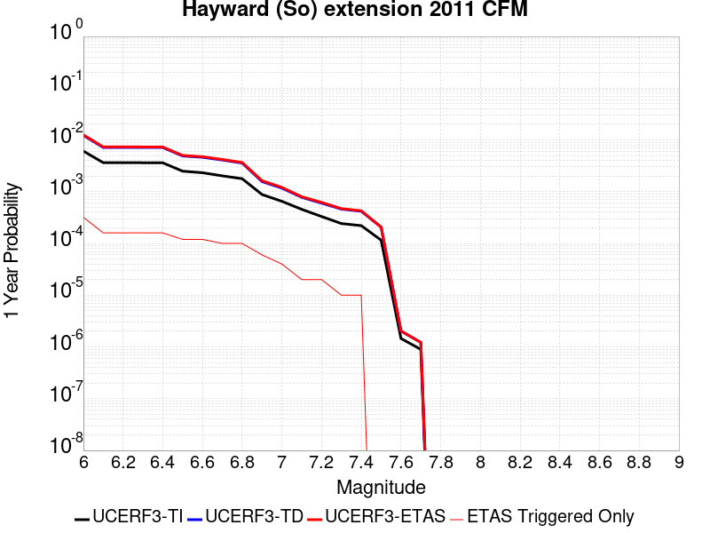 |  |

| Magnitude | 1 wk TI Prob | 1 wk TD Prob | 1 wk ETAS Prob | 1 wk ETAS/TD Gain | 1 wk ETAS Triggered Only | 1 mo TI Prob | 1 mo TD Prob | 1 mo ETAS Prob | 1 mo ETAS/TD Gain | 1 mo ETAS Triggered Only | 1 yr TI Prob | 1 yr TD Prob | 1 yr ETAS Prob | 1 yr ETAS/TD Gain | 1 yr ETAS Triggered Only | 10 yr TI Prob | 10 yr TD Prob | 10 yr ETAS Prob | 10 yr ETAS/TD Gain | 10 yr ETAS Triggered Only |
|-----|-----|-----|-----|-----|-----|-----|-----|-----|-----|-----|-----|-----|-----|-----|-----|-----|-----|-----|-----|-----|
| 6.0 | 1.1721256E-4 | 2.3663012E-4 | 3.466041E-4 | 1.4647505 | 1.1E-4 | 5.022428E-4 | 0.0010137935 | 0.0011736313 | 1.1576631 | 1.6E-4 | 0.0060976758 | 0.012259374 | 0.012575451 | 1.0257825 | 3.2E-4 | 0.0593305 | 0.112924725 | 0.1132973 | 1.0032992 | 4.2E-4 |
| 6.1 | 6.99169E-5 | 1.381428E-4 | 1.6813866E-4 | 1.2171366 | 3.0E-5 | 2.9960944E-4 | 5.919204E-4 | 6.518849E-4 | 1.101305 | 6.0E-5 | 0.0036416445 | 0.007179867 | 0.0073387185 | 1.0221245 | 1.6E-4 | 0.035825435 | 0.06787131 | 0.06809502 | 1.0032961 | 2.4E-4 |
| 6.2 | 6.99169E-5 | 1.381428E-4 | 1.6813866E-4 | 1.2171366 | 3.0E-5 | 2.9960944E-4 | 5.919204E-4 | 6.518849E-4 | 1.101305 | 6.0E-5 | 0.0036416445 | 0.007179867 | 0.0073387185 | 1.0221245 | 1.6E-4 | 0.035825435 | 0.06787131 | 0.06809502 | 1.0032961 | 2.4E-4 |
| 6.3 | 6.970908E-5 | 1.3782376E-4 | 1.6781963E-4 | 1.2176393 | 3.0E-5 | 2.9871898E-4 | 5.905537E-4 | 6.505183E-4 | 1.1015396 | 6.0E-5 | 0.0036308395 | 0.007163397 | 0.007322251 | 1.0221758 | 1.6E-4 | 0.035720866 | 0.06772022 | 0.06794397 | 1.003304 | 2.4E-4 |
| 6.4 | 6.9517155E-5 | 1.3749335E-4 | 1.6748921E-4 | 1.2181624 | 3.0E-5 | 2.9789665E-4 | 5.8913825E-4 | 6.491029E-4 | 1.1017836 | 6.0E-5 | 0.0036208609 | 0.0071463026 | 0.0073051592 | 1.0222292 | 1.6E-4 | 0.03562429 | 0.067564204 | 0.06778799 | 1.0033122 | 2.4E-4 |
| 6.5 | 4.786248E-5 | 9.427737E-5 | 1.2427455E-4 | 1.31818 | 3.0E-5 | 2.0510878E-4 | 4.039859E-4 | 4.539657E-4 | 1.1237167 | 5.0E-5 | 0.0024943394 | 0.004907904 | 0.0050273156 | 1.0243304 | 1.2E-4 | 0.02466527 | 0.046958525 | 0.047149133 | 1.0040591 | 2.0E-4 |
| 6.6 | 4.4662214E-5 | 8.8941175E-5 | 1.1893851E-4 | 1.3372716 | 3.0E-5 | 1.9139545E-4 | 3.811234E-4 | 4.3110436E-4 | 1.1311411 | 5.0E-5 | 0.0023277493 | 0.004630768 | 0.004750212 | 1.0257937 | 1.2E-4 | 0.02303517 | 0.04434846 | 0.04453959 | 1.0043098 | 2.0E-4 |
| 6.7 | 3.884542E-5 | 7.876597E-5 | 1.08763605E-4 | 1.3808452 | 3.0E-5 | 1.6646975E-4 | 3.3752725E-4 | 3.7751376E-4 | 1.118469 | 4.0E-5 | 0.002024885 | 0.004102097 | 0.0042016865 | 1.0242778 | 1.0E-4 | 0.020065336 | 0.03938556 | 0.039548866 | 1.0041463 | 1.7E-4 |
| 6.8 | 3.4221863E-5 | 6.866193E-5 | 9.865987E-5 | 1.4368933 | 3.0E-5 | 1.4665688E-4 | 2.942346E-4 | 3.3422283E-4 | 1.135906 | 4.0E-5 | 0.0017840851 | 0.003576844 | 0.0036764862 | 1.0278577 | 1.0E-4 | 0.017698295 | 0.034468345 | 0.03463249 | 1.004762 | 1.7E-4 |
| 6.9 | 1.6927712E-5 | 3.0115967E-5 | 6.0115064E-5 | 1.9961194 | 3.0E-5 | 7.2545314E-5 | 1.2906236E-4 | 1.590585E-4 | 1.2324158 | 3.0E-5 | 8.828813E-4 | 0.0015702589 | 0.0016301646 | 1.0381503 | 6.0E-5 | 0.008793819 | 0.015489228 | 0.015577834 | 1.0057205 | 9.0E-5 |
| 7.0 | 1.2509653E-5 | 2.2511605E-5 | 3.251138E-5 | 1.4442053 | 1.0E-5 | 5.3611697E-5 | 9.647499E-5 | 1.0647403E-4 | 1.1036438 | 1.0E-5 | 6.525269E-4 | 0.0011739943 | 0.0012139473 | 1.0340317 | 4.0E-5 | 0.0065061417 | 0.011605909 | 0.011675097 | 1.0059614 | 7.0E-5 |
| 7.1 | 8.751583E-6 | 1.4962153E-5 | 1.4962153E-5 | 1.0 | 0.0 | 3.750624E-5 | 6.412197E-5 | 6.412197E-5 | 1.0 | 0.0 | 4.5654282E-4 | 7.8041124E-4 | 8.003956E-4 | 1.0256075 | 2.0E-5 | 0.0045560603 | 0.0077815293 | 0.00783114 | 1.0063754 | 5.0E-5 |
| 7.2 | 6.354379E-6 | 1.1532643E-5 | 1.1532643E-5 | 1.0 | 0.0 | 2.7232769E-5 | 4.9424707E-5 | 4.9424707E-5 | 1.0 | 0.0 | 3.3150852E-4 | 6.015845E-4 | 6.215725E-4 | 1.0332255 | 2.0E-5 | 0.0033101442 | 0.0060171904 | 0.00605695 | 1.0066077 | 4.0E-5 |
| 7.3 | 4.645554E-6 | 8.848017E-6 | 8.848017E-6 | 1.0 | 0.0 | 1.9909365E-5 | 3.7919544E-5 | 3.7919544E-5 | 1.0 | 0.0 | 2.4236954E-4 | 4.6157665E-4 | 4.71572E-4 | 1.0216548 | 1.0E-5 | 0.0024210536 | 0.0046256287 | 0.004645536 | 1.0043037 | 2.0E-5 |
| 7.4 | 4.23437E-6 | 8.02022E-6 | 8.02022E-6 | 1.0 | 0.0 | 1.8147173E-5 | 3.437194E-5 | 3.437194E-5 | 1.0 | 0.0 | 2.2091944E-4 | 4.184019E-4 | 4.2839773E-4 | 1.0238905 | 1.0E-5 | 0.0022069993 | 0.0041958606 | 0.004215777 | 1.0047466 | 2.0E-5 |
| 7.5 | 2.2187417E-6 | 3.9695706E-6 | 3.9695706E-6 | 1.0 | 0.0 | 9.508858E-6 | 1.701235E-5 | 1.701235E-5 | 1.0 | 0.0 | 1.157642E-4 | 2.0710831E-4 | 2.0710831E-4 | 1.0 | 0.0 | 0.0011570391 | 0.0020822915 | 0.0020922706 | 1.0047925 | 1.0E-5 |
| 7.6 | 2.7952495E-8 | 3.8852022E-8 | 3.8852022E-8 | 1.0 | 0.0 | 1.1979641E-7 | 1.6650864E-7 | 1.6650864E-7 | 1.0 | 0.0 | 1.4585203E-6 | 2.027241E-6 | 2.027241E-6 | 1.0 | 0.0 | 1.4585107E-5 | 2.0362815E-5 | 2.0362815E-5 | 1.0 | 0.0 |
| 7.7 | 1.7192724E-8 | 2.3481117E-8 | 2.3481117E-8 | 1.0 | 0.0 | 7.36831E-8 | 1.0063336E-7 | 1.0063336E-7 | 1.0 | 0.0 | 8.9709135E-7 | 1.2252104E-6 | 1.2252104E-6 | 1.0 | 0.0 | 8.970877E-6 | 1.2320078E-5 | 1.2320078E-5 | 1.0 | 0.0 |

## Calaveras (No) 2011 CFM
*[(top)](#table-of-contents)*

| 1 Week | 1 Month | 1 Year | 10 Year |
|-----|-----|-----|-----|
|  |  |  |  |

| Magnitude | 1 wk TI Prob | 1 wk TD Prob | 1 wk ETAS Prob | 1 wk ETAS/TD Gain | 1 wk ETAS Triggered Only | 1 mo TI Prob | 1 mo TD Prob | 1 mo ETAS Prob | 1 mo ETAS/TD Gain | 1 mo ETAS Triggered Only | 1 yr TI Prob | 1 yr TD Prob | 1 yr ETAS Prob | 1 yr ETAS/TD Gain | 1 yr ETAS Triggered Only | 10 yr TI Prob | 10 yr TD Prob | 10 yr ETAS Prob | 10 yr ETAS/TD Gain | 10 yr ETAS Triggered Only |
|-----|-----|-----|-----|-----|-----|-----|-----|-----|-----|-----|-----|-----|-----|-----|-----|-----|-----|-----|-----|-----|
| 6.0 | 4.8694856E-5 | 6.761473E-5 | 2.0760526E-4 | 3.0704145 | 1.4E-4 | 2.0867554E-4 | 2.8974633E-4 | 4.6969418E-4 | 1.6210531 | 1.8E-4 | 0.0025376645 | 0.0035220422 | 0.0038209856 | 1.0848778 | 3.0E-4 | 0.02508881 | 0.034841146 | 0.035198253 | 1.0102496 | 3.7E-4 |
| 6.1 | 4.8694856E-5 | 6.761473E-5 | 2.0760526E-4 | 3.0704145 | 1.4E-4 | 2.0867554E-4 | 2.8974633E-4 | 4.6969418E-4 | 1.6210531 | 1.8E-4 | 0.0025376645 | 0.0035220422 | 0.0038209856 | 1.0848778 | 3.0E-4 | 0.02508881 | 0.034841146 | 0.035198253 | 1.0102496 | 3.7E-4 |
| 6.2 | 4.7541962E-5 | 6.594423E-5 | 2.05935E-4 | 3.1228662 | 1.4E-4 | 2.0373536E-4 | 2.825886E-4 | 4.6253772E-4 | 1.6367884 | 1.8E-4 | 0.0024776561 | 0.0034352248 | 0.0037341942 | 1.0870305 | 3.0E-4 | 0.024502134 | 0.034002047 | 0.034359466 | 1.0105118 | 3.7E-4 |
| 6.3 | 4.6717287E-5 | 6.477679E-5 | 2.0476771E-4 | 3.161128 | 1.4E-4 | 2.0020158E-4 | 2.775863E-4 | 4.5753634E-4 | 1.6482669 | 1.8E-4 | 0.0024347296 | 0.0033745435 | 0.0036735313 | 1.0886009 | 3.0E-4 | 0.024082264 | 0.033414237 | 0.033771873 | 1.0107031 | 3.7E-4 |
| 6.4 | 4.6276386E-5 | 6.413808E-5 | 2.041291E-4 | 3.1826506 | 1.4E-4 | 1.983123E-4 | 2.748496E-4 | 4.5480012E-4 | 1.6547236 | 1.8E-4 | 0.0024117786 | 0.003341327 | 0.0036403246 | 1.0894847 | 3.0E-4 | 0.02385771 | 0.033092905 | 0.033450663 | 1.0108106 | 3.7E-4 |
| 6.5 | 4.5720994E-5 | 6.333808E-5 | 2.0332921E-4 | 3.2102206 | 1.4E-4 | 1.9593239E-4 | 2.7142174E-4 | 4.5137288E-4 | 1.6629946 | 1.8E-4 | 0.002382867 | 0.0032997404 | 0.0035987506 | 1.0906162 | 3.0E-4 | 0.023574775 | 0.032690268 | 0.033048175 | 1.0109483 | 3.7E-4 |
| 6.6 | 4.549134E-5 | 6.2990985E-5 | 2.0298216E-4 | 3.2224002 | 1.4E-4 | 1.949483E-4 | 2.6993448E-4 | 4.498859E-4 | 1.6666485 | 1.8E-4 | 0.0023709119 | 0.003281688 | 0.0035807034 | 1.0911164 | 3.0E-4 | 0.023457756 | 0.03251555 | 0.03287352 | 1.0110092 | 3.7E-4 |
| 6.7 | 3.701047E-5 | 5.0488026E-5 | 1.9048096E-4 | 3.7727947 | 1.4E-4 | 1.5860666E-4 | 2.1635955E-4 | 3.963206E-4 | 1.8317685 | 1.8E-4 | 0.0019293258 | 0.0026310391 | 0.0029103023 | 1.1061418 | 2.8E-4 | 0.019126613 | 0.026189491 | 0.026530325 | 1.0130142 | 3.5E-4 |
| 6.8 | 3.5523568E-5 | 4.8468683E-5 | 1.7846237E-4 | 3.6820142 | 1.3E-4 | 1.5223498E-4 | 2.0770663E-4 | 3.7767133E-4 | 1.8182921 | 1.7E-4 | 0.0018518851 | 0.0025259387 | 0.002785282 | 1.102672 | 2.6E-4 | 0.018365284 | 0.02516132 | 0.025483018 | 1.0127853 | 3.3E-4 |
| 6.9 | 3.2946147E-5 | 4.4786295E-5 | 1.7478048E-4 | 3.9025438 | 1.3E-4 | 1.4119013E-4 | 1.9192738E-4 | 3.6189475E-4 | 1.8855817 | 1.7E-4 | 0.0017176344 | 0.002334254 | 0.0025736939 | 1.1025766 | 2.4E-4 | 0.017044188 | 0.023281476 | 0.023574492 | 1.0125858 | 3.0E-4 |
| 7.0 | 2.7682381E-5 | 3.7143058E-5 | 1.5713861E-4 | 4.230632 | 1.2E-4 | 1.1863338E-4 | 1.59175E-4 | 2.991527E-4 | 1.8793951 | 1.4E-4 | 0.0014434044 | 0.0019362634 | 0.0021458569 | 1.1082463 | 2.1E-4 | 0.01434065 | 0.019371657 | 0.019636426 | 1.013668 | 2.7E-4 |
| 7.1 | 2.471967E-5 | 3.340416E-5 | 1.5340015E-4 | 4.5922465 | 1.2E-4 | 1.05937135E-4 | 1.4315301E-4 | 2.7313438E-4 | 1.9079893 | 1.3E-4 | 0.0012890215 | 0.0017415237 | 0.0019411754 | 1.1146419 | 2.0E-4 | 0.0128157 | 0.017445127 | 0.017700592 | 1.0146439 | 2.6E-4 |
| 7.2 | 1.9748062E-5 | 2.6888965E-5 | 1.3688601E-4 | 5.0907874 | 1.1E-4 | 8.463181E-5 | 1.15233466E-4 | 2.3521963E-4 | 2.0412443 | 1.2E-4 | 0.0010299052 | 0.0014020882 | 0.0015918218 | 1.1353222 | 1.9E-4 | 0.01025145 | 0.014088519 | 0.014325138 | 1.0167952 | 2.4E-4 |
| 7.3 | 1.1603734E-5 | 1.5883887E-5 | 9.588261E-5 | 6.036471 | 8.0E-5 | 4.9729337E-5 | 6.8072106E-5 | 1.5806597E-4 | 2.3220375 | 9.0E-5 | 6.052865E-4 | 8.284772E-4 | 9.4837777E-4 | 1.144724 | 1.2E-4 | 0.0060364045 | 0.008359566 | 0.008498396 | 1.0166073 | 1.4E-4 |
| 7.4 | 4.885381E-6 | 6.0575517E-6 | 1.6057491E-5 | 2.650822 | 1.0E-5 | 2.0937177E-5 | 2.5960679E-5 | 3.596042E-5 | 1.385188 | 1.0E-5 | 2.5488032E-4 | 3.160256E-4 | 3.3601926E-4 | 1.063266 | 2.0E-5 | 0.0025458818 | 0.0032124277 | 0.0032323636 | 1.0062058 | 2.0E-5 |
| 7.5 | 3.0571264E-6 | 4.1757917E-6 | 4.1757917E-6 | 1.0 | 0.0 | 1.3101904E-5 | 1.7896127E-5 | 1.7896127E-5 | 1.0 | 0.0 | 1.5950401E-4 | 2.1786368E-4 | 2.278615E-4 | 1.0458902 | 1.0E-5 | 0.0015938957 | 0.0022314226 | 0.0022414003 | 1.0044714 | 1.0E-5 |
| 7.6 | 1.764948E-6 | 2.815238E-6 | 2.815238E-6 | 1.0 | 0.0 | 7.564041E-6 | 1.206525E-5 | 1.206525E-5 | 1.0 | 0.0 | 9.208831E-5 | 1.4688459E-4 | 1.4688459E-4 | 1.0 | 0.0 | 9.205016E-4 | 0.0015222435 | 0.0015222435 | 1.0 | 0.0 |
| 7.7 | 1.3173734E-6 | 2.0757866E-6 | 2.0757866E-6 | 1.0 | 0.0 | 5.645874E-6 | 8.896198E-6 | 8.896198E-6 | 1.0 | 0.0 | 6.873634E-5 | 1.0830585E-4 | 1.0830585E-4 | 1.0 | 0.0 | 6.8715087E-4 | 0.0011348927 | 0.0011348927 | 1.0 | 0.0 |
| 7.8 | 9.4429885E-7 | 1.5624398E-6 | 1.5624398E-6 | 1.0 | 0.0 | 4.0469886E-6 | 6.6961534E-6 | 6.6961534E-6 | 1.0 | 0.0 | 4.9270973E-5 | 8.152264E-5 | 8.152264E-5 | 1.0 | 0.0 | 4.926005E-4 | 8.569319E-4 | 8.569319E-4 | 1.0 | 0.0 |
| 7.9 | 6.388233E-7 | 1.124425E-6 | 1.124425E-6 | 1.0 | 0.0 | 2.7378112E-6 | 4.8189554E-6 | 4.8189554E-6 | 1.0 | 0.0 | 3.3332344E-5 | 5.866921E-5 | 5.866921E-5 | 1.0 | 0.0 | 3.3327343E-4 | 6.1441824E-4 | 6.1441824E-4 | 1.0 | 0.0 |
| 8.0 | 3.087986E-7 | 5.8040854E-7 | 5.8040854E-7 | 1.0 | 0.0 | 1.323422E-6 | 2.4874628E-6 | 2.4874628E-6 | 1.0 | 0.0 | 1.6112543E-5 | 3.0284444E-5 | 3.0284444E-5 | 1.0 | 0.0 | 1.6111376E-4 | 3.1352913E-4 | 3.1352913E-4 | 1.0 | 0.0 |
| 8.1 | 1.6725647E-7 | 2.7677092E-7 | 2.7677092E-7 | 1.0 | 0.0 | 7.168133E-7 | 1.1861606E-6 | 1.1861606E-6 | 1.0 | 0.0 | 8.7271665E-6 | 1.4441412E-5 | 1.4441412E-5 | 1.0 | 0.0 | 8.726824E-5 | 1.4985427E-4 | 1.4985427E-4 | 1.0 | 0.0 |

## Hunting Creek - Berryessa 2011 CFM
*[(top)](#table-of-contents)*

| 1 Week | 1 Month | 1 Year | 10 Year |
|-----|-----|-----|-----|
|  |  |  |  |

| Magnitude | 1 wk TI Prob | 1 wk TD Prob | 1 wk ETAS Prob | 1 wk ETAS/TD Gain | 1 wk ETAS Triggered Only | 1 mo TI Prob | 1 mo TD Prob | 1 mo ETAS Prob | 1 mo ETAS/TD Gain | 1 mo ETAS Triggered Only | 1 yr TI Prob | 1 yr TD Prob | 1 yr ETAS Prob | 1 yr ETAS/TD Gain | 1 yr ETAS Triggered Only | 10 yr TI Prob | 10 yr TD Prob | 10 yr ETAS Prob | 10 yr ETAS/TD Gain | 10 yr ETAS Triggered Only |
|-----|-----|-----|-----|-----|-----|-----|-----|-----|-----|-----|-----|-----|-----|-----|-----|-----|-----|-----|-----|-----|
| 6.0 | 1.1270982E-4 | 2.0033884E-4 | 2.603268E-4 | 1.2994326 | 6.0E-5 | 4.8295266E-4 | 8.5827895E-4 | 9.382103E-4 | 1.0931298 | 8.0E-5 | 0.0058641075 | 0.01039249 | 0.010531035 | 1.0133313 | 1.4E-4 | 0.057117578 | 0.09809242 | 0.0982728 | 1.0018389 | 2.0E-4 |
| 6.1 | 1.1239393E-4 | 1.9981996E-4 | 2.5980797E-4 | 1.3002102 | 6.0E-5 | 4.8159933E-4 | 8.5605663E-4 | 9.3598815E-4 | 1.0933717 | 8.0E-5 | 0.0058477195 | 0.010365712 | 0.010504262 | 1.0133661 | 1.4E-4 | 0.056962132 | 0.09785073 | 0.09803116 | 1.0018439 | 2.0E-4 |
| 6.2 | 7.596265E-5 | 1.2944505E-4 | 1.8943728E-4 | 1.4634571 | 6.0E-5 | 3.2551357E-4 | 5.5457966E-4 | 6.345353E-4 | 1.1441734 | 8.0E-5 | 0.0039559277 | 0.0067249946 | 0.006864053 | 1.0206778 | 1.4E-4 | 0.038862433 | 0.06462765 | 0.064814724 | 1.0028946 | 2.0E-4 |
| 6.3 | 6.78794E-5 | 1.1461031E-4 | 1.7460344E-4 | 1.5234531 | 6.0E-5 | 2.9087928E-4 | 4.910263E-4 | 5.7098706E-4 | 1.1628441 | 8.0E-5 | 0.003535705 | 0.0059555117 | 0.006094678 | 1.0233676 | 1.4E-4 | 0.034799766 | 0.057497483 | 0.057685982 | 1.0032784 | 2.0E-4 |
| 6.4 | 6.2165134E-5 | 1.0446956E-4 | 1.5446435E-4 | 1.4785583 | 5.0E-5 | 2.6639478E-4 | 4.4758292E-4 | 5.1755155E-4 | 1.1563256 | 7.0E-5 | 0.0032385332 | 0.005430052 | 0.005559346 | 1.0238109 | 1.3E-4 | 0.03191742 | 0.052580375 | 0.052760385 | 1.0034236 | 1.9E-4 |
| 6.5 | 5.4368087E-5 | 9.080083E-5 | 1.4079628E-4 | 1.5506058 | 5.0E-5 | 2.3298527E-4 | 3.8902112E-4 | 4.589939E-4 | 1.1798688 | 7.0E-5 | 0.0028329059 | 0.004722142 | 0.0048515284 | 1.0273999 | 1.3E-4 | 0.027970633 | 0.045906633 | 0.04607837 | 1.003741 | 1.8E-4 |
| 6.6 | 4.729947E-5 | 7.8547964E-5 | 1.1854483E-4 | 1.509203 | 4.0E-5 | 2.0269625E-4 | 3.3659383E-4 | 3.9657363E-4 | 1.1781964 | 6.0E-5 | 0.002465034 | 0.004086986 | 0.004206496 | 1.0292414 | 1.2E-4 | 0.02437869 | 0.039874986 | 0.04003821 | 1.0040933 | 1.7E-4 |
| 6.7 | 3.6875328E-5 | 6.0503822E-5 | 7.0503214E-5 | 1.1652688 | 1.0E-5 | 1.5802756E-4 | 2.5927887E-4 | 2.892711E-4 | 1.1156756 | 3.0E-5 | 0.0019222875 | 0.003149953 | 0.003229701 | 1.0253172 | 8.0E-5 | 0.019057442 | 0.030911246 | 0.031027537 | 1.0037621 | 1.2E-4 |
| 6.8 | 2.0292036E-5 | 2.898966E-5 | 2.898966E-5 | 1.0 | 0.0 | 8.6962966E-5 | 1.2423552E-4 | 1.3423429E-4 | 1.0804822 | 1.0E-5 | 0.0010582599 | 0.0015114911 | 0.0015414457 | 1.019818 | 3.0E-5 | 0.010532344 | 0.014985252 | 0.015034503 | 1.0032866 | 5.0E-5 |
| 6.9 | 1.7871042E-5 | 2.4483867E-5 | 2.4483867E-5 | 1.0 | 0.0 | 7.658793E-5 | 1.0492665E-4 | 1.0492665E-4 | 1.0 | 0.0 | 9.320591E-4 | 0.0012767378 | 0.001286725 | 1.0078225 | 1.0E-5 | 0.009281595 | 0.012685746 | 0.012705492 | 1.0015565 | 2.0E-5 |
| 7.0 | 1.6415532E-5 | 2.1917253E-5 | 2.1917253E-5 | 1.0 | 0.0 | 7.035038E-5 | 9.3927716E-5 | 9.3927716E-5 | 1.0 | 0.0 | 8.561793E-4 | 0.0011429732 | 0.0011429732 | 1.0 | 0.0 | 0.008528882 | 0.011370161 | 0.011380047 | 1.0008695 | 1.0E-5 |
| 7.1 | 1.5409885E-5 | 2.0356898E-5 | 2.0356898E-5 | 1.0 | 0.0 | 6.6040695E-5 | 8.7240944E-5 | 8.7240944E-5 | 1.0 | 0.0 | 8.0374884E-4 | 0.0010616437 | 0.0010616437 | 1.0 | 0.0 | 0.00800848 | 0.010566039 | 0.010575933 | 1.0009364 | 1.0E-5 |
| 7.2 | 1.4497423E-5 | 1.9065028E-5 | 1.9065028E-5 | 1.0 | 0.0 | 6.213033E-5 | 8.170472E-5 | 8.170472E-5 | 1.0 | 0.0 | 7.5617427E-4 | 9.943041E-4 | 9.943041E-4 | 1.0 | 0.0 | 0.0075360634 | 0.009899127 | 0.009909028 | 1.0010002 | 1.0E-5 |
| 7.3 | 1.3615175E-5 | 1.7835837E-5 | 1.7835837E-5 | 1.0 | 0.0 | 5.8349444E-5 | 7.643708E-5 | 7.643708E-5 | 1.0 | 0.0 | 7.101729E-4 | 9.30227E-4 | 9.30227E-4 | 1.0 | 0.0 | 0.0070790765 | 0.009263841 | 0.009263841 | 1.0 | 0.0 |
| 7.4 | 1.2252825E-5 | 1.6035223E-5 | 1.6035223E-5 | 1.0 | 0.0 | 5.251105E-5 | 6.872059E-5 | 6.872059E-5 | 1.0 | 0.0 | 6.391345E-4 | 8.3635485E-4 | 8.3635485E-4 | 1.0 | 0.0 | 0.0063729943 | 0.008332515 | 0.008332515 | 1.0 | 0.0 |
| 7.5 | 1.0913301E-5 | 1.42488025E-5 | 1.42488025E-5 | 1.0 | 0.0 | 4.6770452E-5 | 6.1064886E-5 | 6.1064886E-5 | 1.0 | 0.0 | 5.6928146E-4 | 7.432141E-4 | 7.432141E-4 | 1.0 | 0.0 | 0.0056782532 | 0.00740766 | 0.00740766 | 1.0 | 0.0 |
| 7.6 | 8.623192E-6 | 1.1241129E-5 | 1.1241129E-5 | 1.0 | 0.0 | 3.6956015E-5 | 4.817539E-5 | 4.817539E-5 | 1.0 | 0.0 | 4.4984656E-4 | 5.863801E-4 | 5.863801E-4 | 1.0 | 0.0 | 0.00448937 | 0.0058486434 | 0.0058486434 | 1.0 | 0.0 |
| 7.7 | 2.0993634E-6 | 2.6636358E-6 | 2.6636358E-6 | 1.0 | 0.0 | 8.997241E-6 | 1.1415532E-5 | 1.1415532E-5 | 1.0 | 0.0 | 1.09535904E-4 | 1.389753E-4 | 1.389753E-4 | 1.0 | 0.0 | 0.0010948193 | 0.0013888904 | 0.0013888904 | 1.0 | 0.0 |
| 7.8 | 1.8428308E-7 | 2.167988E-7 | 2.167988E-7 | 1.0 | 0.0 | 7.897844E-7 | 9.2913734E-7 | 9.2913734E-7 | 1.0 | 0.0 | 9.615583E-6 | 1.1312192E-5 | 1.1312192E-5 | 1.0 | 0.0 | 9.615166E-5 | 1.13114795E-4 | 1.13114795E-4 | 1.0 | 0.0 |

## Sargent 2011 CFM
*[(top)](#table-of-contents)*

| 1 Week | 1 Month | 1 Year | 10 Year |
|-----|-----|-----|-----|
|  |  |  |  |

| Magnitude | 1 wk TI Prob | 1 wk TD Prob | 1 wk ETAS Prob | 1 wk ETAS/TD Gain | 1 wk ETAS Triggered Only | 1 mo TI Prob | 1 mo TD Prob | 1 mo ETAS Prob | 1 mo ETAS/TD Gain | 1 mo ETAS Triggered Only | 1 yr TI Prob | 1 yr TD Prob | 1 yr ETAS Prob | 1 yr ETAS/TD Gain | 1 yr ETAS Triggered Only | 10 yr TI Prob | 10 yr TD Prob | 10 yr ETAS Prob | 10 yr ETAS/TD Gain | 10 yr ETAS Triggered Only |
|-----|-----|-----|-----|-----|-----|-----|-----|-----|-----|-----|-----|-----|-----|-----|-----|-----|-----|-----|-----|-----|
| 6.0 | 3.7327867E-5 | 3.6675217E-5 | 1.0667265E-4 | 2.908576 | 7.0E-5 | 1.5996677E-4 | 1.5717282E-4 | 2.3716025E-4 | 1.5089139 | 8.0E-5 | 0.0019458556 | 0.0019123711 | 0.0020321417 | 1.0626293 | 1.2E-4 | 0.01928905 | 0.019031476 | 0.019247288 | 1.0113398 | 2.2E-4 |
| 6.1 | 2.3771476E-5 | 1.8493336E-5 | 4.849278E-5 | 2.622176 | 3.0E-5 | 1.01873775E-4 | 7.925524E-5 | 1.1925207E-4 | 1.5046585 | 4.0E-5 | 0.0012396075 | 9.6457085E-4 | 0.0010145226 | 1.0517865 | 5.0E-5 | 0.012327154 | 0.009643728 | 0.009742764 | 1.0102694 | 1.0E-4 |
| 6.2 | 2.3112721E-5 | 1.7724447E-5 | 4.7723915E-5 | 2.6925476 | 3.0E-5 | 9.9050754E-5 | 7.59602E-5 | 1.15957155E-4 | 1.5265516 | 4.0E-5 | 0.0012052758 | 9.2448783E-4 | 9.7444165E-4 | 1.054034 | 5.0E-5 | 0.011987597 | 0.009246255 | 0.009335423 | 1.0096437 | 9.0E-5 |
| 6.3 | 1.728509E-5 | 1.0469298E-5 | 2.0469193E-5 | 1.9551638 | 1.0E-5 | 7.407686E-5 | 4.486792E-5 | 6.4867025E-5 | 1.4457328 | 2.0E-5 | 9.015125E-4 | 5.4617383E-4 | 5.761574E-4 | 1.0548975 | 3.0E-5 | 0.008978641 | 0.005484908 | 0.0055246884 | 1.0072527 | 4.0E-5 |
| 6.4 | 1.48395575E-5 | 7.4650325E-6 | 1.7464958E-5 | 2.3395689 | 1.0E-5 | 6.3596555E-5 | 3.199282E-5 | 4.19925E-5 | 1.3125601 | 1.0E-5 | 7.7401294E-4 | 3.8947735E-4 | 4.0946956E-4 | 1.0513309 | 2.0E-5 | 0.0077132257 | 0.0039237817 | 0.0039536636 | 1.0076157 | 3.0E-5 |
| 6.5 | 1.4358964E-5 | 6.9036255E-6 | 1.6903556E-5 | 2.4485042 | 1.0E-5 | 6.1536964E-5 | 2.9586845E-5 | 3.958655E-5 | 1.337978 | 1.0E-5 | 7.48955E-4 | 3.601945E-4 | 3.7019092E-4 | 1.0277528 | 1.0E-5 | 0.0074643586 | 0.0036319366 | 0.0036518641 | 1.0054867 | 2.0E-5 |
| 6.6 | 9.772591E-6 | 1.3803129E-6 | 1.3803129E-6 | 1.0 | 0.0 | 4.188186E-5 | 5.9156137E-6 | 5.9156137E-6 | 1.0 | 0.0 | 5.097923E-4 | 7.2020244E-5 | 7.2020244E-5 | 1.0 | 0.0 | 0.005086244 | 7.522172E-4 | 7.522172E-4 | 1.0 | 0.0 |
| 6.7 | 9.752745E-6 | 1.3590013E-6 | 1.3590013E-6 | 1.0 | 0.0 | 4.179681E-5 | 5.824278E-6 | 5.824278E-6 | 1.0 | 0.0 | 5.0875737E-4 | 7.090831E-5 | 7.090831E-5 | 1.0 | 0.0 | 0.005075942 | 7.4110535E-4 | 7.4110535E-4 | 1.0 | 0.0 |
| 6.8 | 9.608213E-6 | 1.2427503E-6 | 1.2427503E-6 | 1.0 | 0.0 | 4.1177405E-5 | 5.326062E-6 | 5.326062E-6 | 1.0 | 0.0 | 5.012196E-4 | 6.48429E-5 | 6.48429E-5 | 1.0 | 0.0 | 0.005000906 | 6.801856E-4 | 6.801856E-4 | 1.0 | 0.0 |
| 6.9 | 9.427164E-6 | 1.1272732E-6 | 1.1272732E-6 | 1.0 | 0.0 | 4.04015E-5 | 4.831162E-6 | 4.831162E-6 | 1.0 | 0.0 | 4.9177726E-4 | 5.8817834E-5 | 5.8817834E-5 | 1.0 | 0.0 | 0.004906904 | 6.192817E-4 | 6.192817E-4 | 1.0 | 0.0 |
| 7.0 | 9.247601E-6 | 9.935427E-7 | 9.935427E-7 | 1.0 | 0.0 | 3.9631974E-5 | 4.258033E-6 | 4.258033E-6 | 1.0 | 0.0 | 4.8241246E-4 | 5.1840336E-5 | 5.1840336E-5 | 1.0 | 0.0 | 0.0048136655 | 5.4903544E-4 | 5.4903544E-4 | 1.0 | 0.0 |
| 7.1 | 8.995454E-6 | 8.326929E-7 | 8.326929E-7 | 1.0 | 0.0 | 3.8551374E-5 | 3.568679E-6 | 3.568679E-6 | 1.0 | 0.0 | 4.6926187E-4 | 4.3447813E-5 | 4.3447813E-5 | 1.0 | 0.0 | 0.004682722 | 4.642218E-4 | 4.642218E-4 | 1.0 | 0.0 |
| 7.2 | 8.520861E-6 | 5.3258753E-7 | 5.3258753E-7 | 1.0 | 0.0 | 3.6517464E-5 | 2.282516E-6 | 2.282516E-6 | 1.0 | 0.0 | 4.445094E-4 | 2.7789285E-5 | 2.7789285E-5 | 1.0 | 0.0 | 0.004436213 | 3.0594022E-4 | 3.0594022E-4 | 1.0 | 0.0 |
| 7.3 | 8.043592E-6 | 3.501094E-7 | 3.501094E-7 | 1.0 | 0.0 | 3.4472083E-5 | 1.5004679E-6 | 1.5004679E-6 | 1.0 | 0.0 | 4.196168E-4 | 1.8268045E-5 | 1.8268045E-5 | 1.0 | 0.0 | 0.004188253 | 2.0941379E-4 | 2.0941379E-4 | 1.0 | 0.0 |
| 7.4 | 7.662316E-6 | 2.969961E-7 | 2.969961E-7 | 1.0 | 0.0 | 3.2838085E-5 | 1.2728399E-6 | 1.2728399E-6 | 1.0 | 0.0 | 3.9973034E-4 | 1.5496717E-5 | 1.5496717E-5 | 1.0 | 0.0 | 0.0039901207 | 1.7987835E-4 | 1.7987835E-4 | 1.0 | 0.0 |
| 7.5 | 6.961638E-6 | 2.3922428E-7 | 2.3922428E-7 | 1.0 | 0.0 | 2.9835252E-5 | 1.0252464E-6 | 1.0252464E-6 | 1.0 | 0.0 | 3.6318362E-4 | 1.2482305E-5 | 1.2482305E-5 | 1.0 | 0.0 | 0.0036259065 | 1.4624365E-4 | 1.4624365E-4 | 1.0 | 0.0 |
| 7.6 | 6.282332E-6 | 1.7165036E-7 | 1.7165036E-7 | 1.0 | 0.0 | 2.6924003E-5 | 7.3564416E-7 | 7.3564416E-7 | 1.0 | 0.0 | 3.2775043E-4 | 8.956432E-6 | 8.956432E-6 | 1.0 | 0.0 | 0.0032726745 | 1.0675463E-4 | 1.0675463E-4 | 1.0 | 0.0 |
| 7.7 | 4.934408E-6 | 5.0952853E-8 | 5.0952853E-8 | 1.0 | 0.0 | 2.114729E-5 | 2.1836935E-7 | 2.1836935E-7 | 1.0 | 0.0 | 2.5743784E-4 | 2.6586436E-6 | 2.6586436E-6 | 1.0 | 0.0 | 0.0025713982 | 3.3194043E-5 | 3.3194043E-5 | 1.0 | 0.0 |
| 7.8 | 2.373212E-6 | 3.5931706E-8 | 3.5931706E-8 | 1.0 | 0.0 | 1.0170869E-5 | 1.5399301E-7 | 1.5399301E-7 | 1.0 | 0.0 | 1.238233E-4 | 1.8748633E-6 | 1.8748633E-6 | 1.0 | 0.0 | 0.0012375432 | 2.4653038E-5 | 2.4653038E-5 | 1.0 | 0.0 |
| 7.9 | 1.8227792E-6 | 3.1296338E-8 | 3.1296338E-8 | 1.0 | 0.0 | 7.811887E-6 | 1.3412715E-7 | 1.3412715E-7 | 1.0 | 0.0 | 9.510558E-5 | 1.6329968E-6 | 1.6329968E-6 | 1.0 | 0.0 | 9.5064886E-4 | 2.18834E-5 | 2.18834E-5 | 1.0 | 0.0 |
| 8.0 | 1.9095137E-7 | 1.3468572E-8 | 1.3468572E-8 | 1.0 | 0.0 | 8.1836276E-7 | 5.772245E-8 | 5.772245E-8 | 1.0 | 0.0 | 9.963521E-6 | 7.027706E-7 | 7.027706E-7 | 1.0 | 0.0 | 9.963074E-5 | 8.589204E-6 | 8.589204E-6 | 1.0 | 0.0 |

## Hayward (No) 2011 CFM
*[(top)](#table-of-contents)*

| 1 Week | 1 Month | 1 Year | 10 Year |
|-----|-----|-----|-----|
|  | 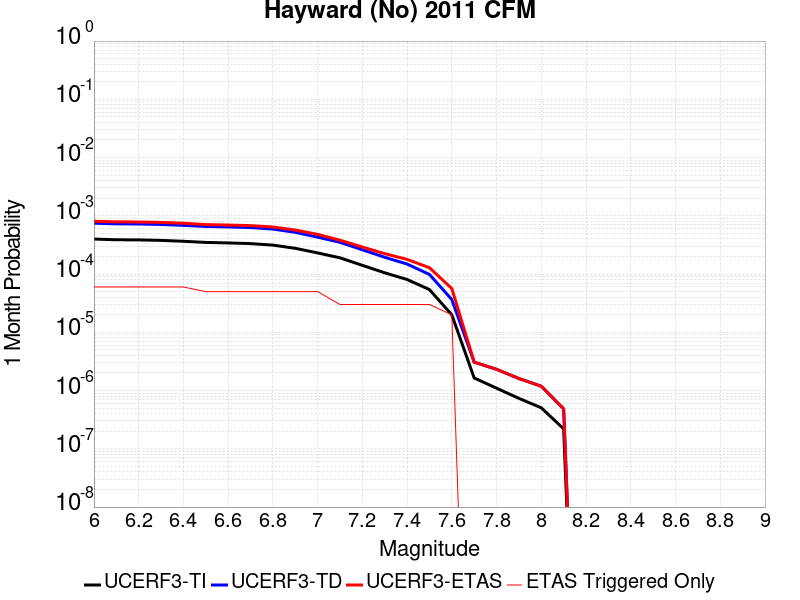 |  |  |

| Magnitude | 1 wk TI Prob | 1 wk TD Prob | 1 wk ETAS Prob | 1 wk ETAS/TD Gain | 1 wk ETAS Triggered Only | 1 mo TI Prob | 1 mo TD Prob | 1 mo ETAS Prob | 1 mo ETAS/TD Gain | 1 mo ETAS Triggered Only | 1 yr TI Prob | 1 yr TD Prob | 1 yr ETAS Prob | 1 yr ETAS/TD Gain | 1 yr ETAS Triggered Only | 10 yr TI Prob | 10 yr TD Prob | 10 yr ETAS Prob | 10 yr ETAS/TD Gain | 10 yr ETAS Triggered Only |
|-----|-----|-----|-----|-----|-----|-----|-----|-----|-----|-----|-----|-----|-----|-----|-----|-----|-----|-----|-----|-----|
| 6.0 | 9.3068506E-5 | 1.7425125E-4 | 2.342408E-4 | 1.3442703 | 6.0E-5 | 3.9880406E-4 | 7.465782E-4 | 8.065334E-4 | 1.0803066 | 6.0E-5 | 0.0048446343 | 0.009051727 | 0.009150823 | 1.0109476 | 1.0E-4 | 0.047403704 | 0.0865073 | 0.086689994 | 1.0021119 | 2.0E-4 |
| 6.1 | 9.055486E-5 | 1.6976194E-4 | 2.2975175E-4 | 1.3533762 | 6.0E-5 | 3.880345E-4 | 7.2734914E-4 | 7.8730553E-4 | 1.0824313 | 6.0E-5 | 0.0047140904 | 0.008819649 | 0.008918768 | 1.0112383 | 1.0E-4 | 0.046153355 | 0.08439965 | 0.08457361 | 1.0020612 | 1.9E-4 |
| 6.2 | 9.006742E-5 | 1.6896808E-4 | 2.2895794E-4 | 1.3550366 | 6.0E-5 | 3.859461E-4 | 7.2394876E-4 | 7.839053E-4 | 1.0828187 | 6.0E-5 | 0.0046887742 | 0.008778584 | 0.008877706 | 1.0112914 | 1.0E-4 | 0.0459107 | 0.08402366 | 0.08419769 | 1.0020713 | 1.9E-4 |
| 6.3 | 8.8336754E-5 | 1.657629E-4 | 2.2575296E-4 | 1.3619028 | 6.0E-5 | 3.7853114E-4 | 7.1021984E-4 | 7.701772E-4 | 1.0844209 | 6.0E-5 | 0.004598882 | 0.008612795 | 0.008711934 | 1.0115106 | 1.0E-4 | 0.04504866 | 0.08251658 | 0.08268173 | 1.0020014 | 1.8E-4 |
| 6.4 | 8.526157E-5 | 1.6002609E-4 | 2.2001649E-4 | 1.3748789 | 6.0E-5 | 3.6535555E-4 | 6.856466E-4 | 7.4560544E-4 | 1.0874486 | 6.0E-5 | 0.0044391346 | 0.00831595 | 0.008415118 | 1.0119251 | 1.0E-4 | 0.043514993 | 0.079810895 | 0.07997653 | 1.0020753 | 1.8E-4 |
| 6.5 | 8.152396E-5 | 1.5334821E-4 | 2.0334053E-4 | 1.3260053 | 5.0E-5 | 3.493416E-4 | 6.570418E-4 | 7.0700893E-4 | 1.0760486 | 5.0E-5 | 0.0042449418 | 0.007970279 | 0.008059561 | 1.011202 | 9.0E-5 | 0.04164765 | 0.07664138 | 0.07679835 | 1.0020481 | 1.7E-4 |
| 6.6 | 7.987405E-5 | 1.5038934E-4 | 2.0038182E-4 | 1.3324203 | 5.0E-5 | 3.4227243E-4 | 6.4436725E-4 | 6.9433503E-4 | 1.0775455 | 5.0E-5 | 0.0041592065 | 0.007817105 | 0.0079064015 | 1.0114232 | 9.0E-5 | 0.04082218 | 0.07523373 | 0.075390935 | 1.0020896 | 1.7E-4 |
| 6.7 | 7.777665E-5 | 1.4677564E-4 | 1.967683E-4 | 1.340606 | 5.0E-5 | 3.332859E-4 | 6.288875E-4 | 6.7885604E-4 | 1.0794555 | 5.0E-5 | 0.004050208 | 0.007629981 | 0.0077192937 | 1.0117055 | 9.0E-5 | 0.039771806 | 0.073507555 | 0.07366506 | 1.0021427 | 1.7E-4 |
| 6.8 | 7.3284005E-5 | 1.3826684E-4 | 1.8825993E-4 | 1.3615695 | 5.0E-5 | 3.140365E-4 | 5.924383E-4 | 6.424086E-4 | 1.084347 | 5.0E-5 | 0.0038166929 | 0.0071892184 | 0.0072785714 | 1.0124288 | 9.0E-5 | 0.037518036 | 0.069414906 | 0.0695638 | 1.0021449 | 1.6E-4 |
| 6.9 | 6.458263E-5 | 1.2154103E-4 | 1.7153495E-4 | 1.4113337 | 5.0E-5 | 2.7675333E-4 | 5.207866E-4 | 5.707606E-4 | 1.0959586 | 5.0E-5 | 0.0033642664 | 0.0063222446 | 0.0063918023 | 1.0110021 | 7.0E-5 | 0.033137884 | 0.061330207 | 0.061452232 | 1.0019897 | 1.3E-4 |
| 7.0 | 5.3853604E-5 | 1.00443234E-4 | 1.5043821E-4 | 1.4977436 | 5.0E-5 | 2.3078074E-4 | 4.304003E-4 | 4.803788E-4 | 1.1161209 | 5.0E-5 | 0.0028061352 | 0.0052275984 | 0.0052972324 | 1.0133204 | 7.0E-5 | 0.027709642 | 0.051048793 | 0.051172156 | 1.0024166 | 1.3E-4 |
| 7.1 | 4.4308683E-5 | 8.187352E-5 | 1.11871064E-4 | 1.3663888 | 3.0E-5 | 1.8988053E-4 | 3.5083952E-4 | 3.80829E-4 | 1.0854791 | 3.0E-5 | 0.0023093442 | 0.004263147 | 0.004302976 | 1.0093428 | 4.0E-5 | 0.022854926 | 0.0419048 | 0.041981447 | 1.0018291 | 8.0E-5 |
| 7.2 | 3.295973E-5 | 6.0918384E-5 | 9.0916554E-5 | 1.4924322 | 3.0E-5 | 1.4124835E-4 | 2.6105277E-4 | 2.9104494E-4 | 1.1148893 | 3.0E-5 | 0.0017183421 | 0.0031737085 | 0.0032135814 | 1.0125636 | 4.0E-5 | 0.017051157 | 0.03144125 | 0.031518735 | 1.0024644 | 8.0E-5 |
| 7.3 | 2.452256E-5 | 4.5301702E-5 | 7.530034E-5 | 1.6621968 | 3.0E-5 | 1.05092455E-4 | 1.9413578E-4 | 2.2412995E-4 | 1.1545011 | 3.0E-5 | 0.0012787496 | 0.0023610548 | 0.0024009603 | 1.0169016 | 4.0E-5 | 0.0127141625 | 0.023500396 | 0.023578517 | 1.0033242 | 8.0E-5 |
| 7.4 | 1.8829967E-5 | 3.470132E-5 | 6.470028E-5 | 1.8644904 | 3.0E-5 | 8.069736E-5 | 1.4871152E-4 | 1.7870705E-4 | 1.2017028 | 3.0E-5 | 9.820475E-4 | 0.0018090691 | 0.0018489966 | 1.0220708 | 4.0E-5 | 0.009777189 | 0.01806795 | 0.018146506 | 1.0043477 | 8.0E-5 |
| 7.5 | 1.26374125E-5 | 2.2995238E-5 | 5.299455E-5 | 2.3045878 | 3.0E-5 | 5.4159216E-5 | 9.854733E-5 | 1.2854437E-4 | 1.3043922 | 3.0E-5 | 6.5918895E-4 | 0.0011991592 | 0.0012291232 | 1.0249876 | 3.0E-5 | 0.00657237 | 0.01202547 | 0.012084749 | 1.0049294 | 6.0E-5 |
| 7.6 | 4.666429E-6 | 8.508941E-6 | 2.8508772E-5 | 3.3504486 | 2.0E-5 | 1.9998828E-5 | 3.646639E-5 | 5.646566E-5 | 1.5484302 | 2.0E-5 | 2.4345852E-4 | 4.438891E-4 | 4.638802E-4 | 1.0450363 | 2.0E-5 | 0.0024319198 | 0.0044738417 | 0.004503708 | 1.0066756 | 3.0E-5 |
| 7.7 | 3.8399318E-7 | 7.1789157E-7 | 7.1789157E-7 | 1.0 | 0.0 | 1.6456839E-6 | 3.0766744E-6 | 3.0766744E-6 | 1.0 | 0.0 | 2.003602E-5 | 3.745787E-5 | 3.745787E-5 | 1.0 | 0.0 | 2.0034213E-4 | 3.883479E-4 | 3.883479E-4 | 1.0 | 0.0 |
| 7.8 | 2.5637698E-7 | 5.405295E-7 | 5.405295E-7 | 1.0 | 0.0 | 1.098758E-6 | 2.316553E-6 | 2.316553E-6 | 1.0 | 0.0 | 1.3377297E-5 | 2.8203669E-5 | 2.8203669E-5 | 1.0 | 0.0 | 1.3376492E-4 | 2.9434287E-4 | 2.9434287E-4 | 1.0 | 0.0 |
| 7.9 | 1.7141245E-7 | 3.7561537E-7 | 3.7561537E-7 | 1.0 | 0.0 | 7.3462456E-7 | 1.6097791E-6 | 1.6097791E-6 | 1.0 | 0.0 | 8.944017E-6 | 1.9598885E-5 | 1.9598885E-5 | 1.0 | 0.0 | 8.943657E-5 | 2.0376658E-4 | 2.0376658E-4 | 1.0 | 0.0 |
| 8.0 | 1.1808895E-7 | 2.7700185E-7 | 2.7700185E-7 | 1.0 | 0.0 | 5.060954E-7 | 1.1871502E-6 | 1.1871502E-6 | 1.0 | 0.0 | 6.161694E-6 | 1.4453459E-5 | 1.4453459E-5 | 1.0 | 0.0 | 6.161523E-5 | 1.4907801E-4 | 1.4907801E-4 | 1.0 | 0.0 |
| 8.1 | 5.138535E-8 | 1.1304341E-7 | 1.1304341E-7 | 1.0 | 0.0 | 2.2022292E-7 | 4.844717E-7 | 4.844717E-7 | 1.0 | 0.0 | 2.6812106E-6 | 5.898427E-6 | 5.898427E-6 | 1.0 | 0.0 | 2.6811784E-5 | 6.0523264E-5 | 6.0523264E-5 | 1.0 | 0.0 |

## Franklin 2011 CFM
*[(top)](#table-of-contents)*

| 1 Week | 1 Month | 1 Year | 10 Year |
|-----|-----|-----|-----|
|  |  | 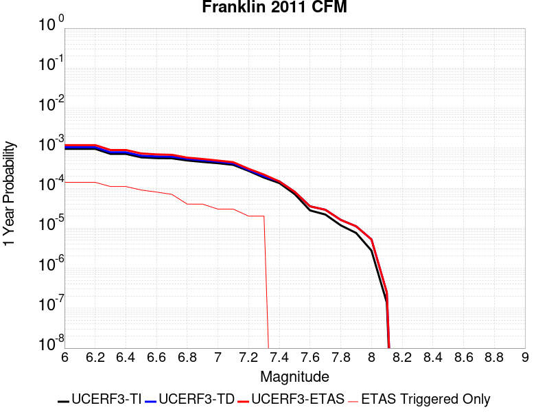 |  |

| Magnitude | 1 wk TI Prob | 1 wk TD Prob | 1 wk ETAS Prob | 1 wk ETAS/TD Gain | 1 wk ETAS Triggered Only | 1 mo TI Prob | 1 mo TD Prob | 1 mo ETAS Prob | 1 mo ETAS/TD Gain | 1 mo ETAS Triggered Only | 1 yr TI Prob | 1 yr TD Prob | 1 yr ETAS Prob | 1 yr ETAS/TD Gain | 1 yr ETAS Triggered Only | 10 yr TI Prob | 10 yr TD Prob | 10 yr ETAS Prob | 10 yr ETAS/TD Gain | 10 yr ETAS Triggered Only |
|-----|-----|-----|-----|-----|-----|-----|-----|-----|-----|-----|-----|-----|-----|-----|-----|-----|-----|-----|-----|-----|
| 6.0 | 1.845602E-5 | 2.0223706E-5 | 7.02227E-5 | 3.472296 | 5.0E-5 | 7.9094825E-5 | 8.667031E-5 | 1.5666425E-4 | 1.8075883 | 7.0E-5 | 9.6255407E-4 | 0.0010547292 | 0.0011945816 | 1.1325955 | 1.4E-4 | 0.009583955 | 0.010514545 | 0.010702548 | 1.0178802 | 1.9E-4 |
| 6.1 | 1.845602E-5 | 2.0223706E-5 | 7.02227E-5 | 3.472296 | 5.0E-5 | 7.9094825E-5 | 8.667031E-5 | 1.5666425E-4 | 1.8075883 | 7.0E-5 | 9.6255407E-4 | 0.0010547292 | 0.0011945816 | 1.1325955 | 1.4E-4 | 0.009583955 | 0.010514545 | 0.010702548 | 1.0178802 | 1.9E-4 |
| 6.2 | 1.845602E-5 | 2.0223706E-5 | 7.02227E-5 | 3.472296 | 5.0E-5 | 7.9094825E-5 | 8.667031E-5 | 1.5666425E-4 | 1.8075883 | 7.0E-5 | 9.6255407E-4 | 0.0010547292 | 0.0011945816 | 1.1325955 | 1.4E-4 | 0.009583955 | 0.010514545 | 0.010702548 | 1.0178802 | 1.9E-4 |
| 6.3 | 1.3813506E-5 | 1.5165042E-5 | 5.5164437E-5 | 3.6376052 | 4.0E-5 | 5.9199396E-5 | 6.4991465E-5 | 1.14988216E-4 | 1.7692819 | 5.0E-5 | 7.205143E-4 | 7.909915E-4 | 9.009045E-4 | 1.138956 | 1.1E-4 | 0.007181826 | 0.007896956 | 0.008045771 | 1.0188446 | 1.5E-4 |
| 6.4 | 1.3813506E-5 | 1.5165042E-5 | 5.5164437E-5 | 3.6376052 | 4.0E-5 | 5.9199396E-5 | 6.4991465E-5 | 1.14988216E-4 | 1.7692819 | 5.0E-5 | 7.205143E-4 | 7.909915E-4 | 9.009045E-4 | 1.138956 | 1.1E-4 | 0.007181826 | 0.007896956 | 0.008045771 | 1.0188446 | 1.5E-4 |
| 6.5 | 1.1308949E-5 | 1.2427525E-5 | 4.2427153E-5 | 3.4139664 | 3.0E-5 | 4.8466023E-5 | 5.3259748E-5 | 9.3257615E-5 | 1.7509962 | 4.0E-5 | 5.899141E-4 | 6.4824655E-4 | 7.381882E-4 | 1.138746 | 9.0E-5 | 0.0058835056 | 0.006478196 | 0.0065874835 | 1.01687 | 1.1E-4 |
| 6.6 | 1.0813164E-5 | 1.18856515E-5 | 4.1885294E-5 | 3.5240219 | 3.0E-5 | 4.6341313E-5 | 5.093752E-5 | 9.0935486E-5 | 1.7852358 | 4.0E-5 | 5.640594E-4 | 6.1998976E-4 | 6.9994014E-4 | 1.1289544 | 8.0E-5 | 0.005626298 | 0.0061972244 | 0.006296605 | 1.0160363 | 1.0E-4 |
| 6.7 | 1.0706348E-5 | 1.1767391E-5 | 4.1767038E-5 | 3.5493882 | 3.0E-5 | 4.5883542E-5 | 5.043071E-5 | 9.042869E-5 | 1.7931275 | 4.0E-5 | 5.5848894E-4 | 6.1382283E-4 | 6.837798E-4 | 1.1139694 | 7.0E-5 | 0.005570874 | 0.0061358972 | 0.006225345 | 1.0145777 | 9.0E-5 |
| 6.8 | 9.443655E-6 | 1.0358396E-5 | 3.035819E-5 | 2.930781 | 2.0E-5 | 4.0472176E-5 | 4.439238E-5 | 7.439105E-5 | 1.6757617 | 3.0E-5 | 4.9263734E-4 | 5.403445E-4 | 5.803229E-4 | 1.0739869 | 4.0E-5 | 0.0049154665 | 0.0054048807 | 0.0054645566 | 1.011041 | 6.0E-5 |
| 6.9 | 8.7001645E-6 | 9.531287E-6 | 2.9531097E-5 | 3.0983324 | 2.0E-5 | 3.728589E-5 | 4.0847743E-5 | 7.0846516E-5 | 1.7344047 | 3.0E-5 | 4.538611E-4 | 4.97209E-4 | 5.3718913E-4 | 1.080409 | 4.0E-5 | 0.0045293528 | 0.004975525 | 0.0050352267 | 1.011999 | 6.0E-5 |
| 7.0 | 8.074731E-6 | 8.824718E-6 | 2.8824541E-5 | 3.2663412 | 2.0E-5 | 3.460553E-5 | 3.781968E-5 | 5.781892E-5 | 1.5288053 | 2.0E-5 | 4.212409E-4 | 4.603584E-4 | 4.903446E-4 | 1.0651367 | 3.0E-5 | 0.004204433 | 0.004608592 | 0.0046583614 | 1.0107993 | 5.0E-5 |
| 7.1 | 7.3370957E-6 | 7.970384E-6 | 2.7970225E-5 | 3.5092695 | 2.0E-5 | 3.1444317E-5 | 3.4158347E-5 | 5.4157663E-5 | 1.5854884 | 2.0E-5 | 3.8276732E-4 | 4.1579953E-4 | 4.4578704E-4 | 1.0721202 | 3.0E-5 | 0.0038210868 | 0.0041646007 | 0.0042143925 | 1.011956 | 5.0E-5 |
| 7.2 | 5.1750103E-6 | 5.465292E-6 | 1.5465237E-5 | 2.8297184 | 1.0E-5 | 2.2178427E-5 | 2.3422472E-5 | 3.342224E-5 | 1.4269304 | 1.0E-5 | 2.699889E-4 | 2.851316E-4 | 3.051259E-4 | 1.0701231 | 2.0E-5 | 0.002696611 | 0.0028615629 | 0.0028914772 | 1.0104538 | 3.0E-5 |
| 7.3 | 3.5221371E-6 | 3.8033727E-6 | 1.3803335E-5 | 3.6292355 | 1.0E-5 | 1.5094786E-5 | 1.6300068E-5 | 2.6299904E-5 | 1.6134844 | 1.0E-5 | 1.8376352E-4 | 1.9843534E-4 | 2.1843138E-4 | 1.1007684 | 2.0E-5 | 0.0018361164 | 0.0019960045 | 0.0020259444 | 1.015 | 3.0E-5 |
| 7.4 | 2.5749775E-6 | 2.824462E-6 | 2.824462E-6 | 1.0 | 0.0 | 1.1035571E-5 | 1.21047815E-5 | 1.21047815E-5 | 1.0 | 0.0 | 1.343498E-4 | 1.4736582E-4 | 1.4736582E-4 | 1.0 | 0.0 | 0.001342686 | 0.0014848924 | 0.0014948776 | 1.0067245 | 1.0E-5 |
| 7.5 | 1.3642131E-6 | 1.5545687E-6 | 1.5545687E-6 | 1.0 | 0.0 | 5.8466144E-6 | 6.66242E-6 | 6.66242E-6 | 1.0 | 0.0 | 7.1180206E-5 | 8.111197E-5 | 8.111197E-5 | 1.0 | 0.0 | 7.115741E-4 | 8.2162104E-4 | 8.2162104E-4 | 1.0 | 0.0 |
| 7.6 | 5.329124E-7 | 6.7443995E-7 | 6.7443995E-7 | 1.0 | 0.0 | 2.2839083E-6 | 2.8904537E-6 | 2.8904537E-6 | 1.0 | 0.0 | 2.7806227E-5 | 3.519071E-5 | 3.519071E-5 | 1.0 | 0.0 | 2.780275E-4 | 3.6223148E-4 | 3.6223148E-4 | 1.0 | 0.0 |
| 7.7 | 4.199127E-7 | 5.527866E-7 | 5.527866E-7 | 1.0 | 0.0 | 1.7996247E-6 | 2.3690832E-6 | 2.3690832E-6 | 1.0 | 0.0 | 2.191021E-5 | 2.8843211E-5 | 2.8843211E-5 | 1.0 | 0.0 | 2.190805E-4 | 2.9858793E-4 | 2.9858793E-4 | 1.0 | 0.0 |
| 7.8 | 2.2586491E-7 | 3.090388E-7 | 3.090388E-7 | 1.0 | 0.0 | 9.67992E-7 | 1.3244513E-6 | 1.3244513E-6 | 1.0 | 0.0 | 1.178524E-5 | 1.6125075E-5 | 1.6125075E-5 | 1.0 | 0.0 | 1.17846146E-4 | 1.675426E-4 | 1.675426E-4 | 1.0 | 0.0 |
| 7.9 | 1.4568845E-7 | 2.1370955E-7 | 2.1370955E-7 | 1.0 | 0.0 | 6.243789E-7 | 9.158977E-7 | 9.158977E-7 | 1.0 | 0.0 | 7.601787E-6 | 1.1150999E-5 | 1.1150999E-5 | 1.0 | 0.0 | 7.601527E-5 | 1.1594643E-4 | 1.1594643E-4 | 1.0 | 0.0 |
| 8.0 | 5.2868224E-8 | 1.0072543E-7 | 1.0072543E-7 | 1.0 | 0.0 | 2.2657808E-7 | 4.3168035E-7 | 4.3168035E-7 | 1.0 | 0.0 | 2.7585847E-6 | 5.2556957E-6 | 5.2556957E-6 | 1.0 | 0.0 | 2.7585504E-5 | 5.439856E-5 | 5.439856E-5 | 1.0 | 0.0 |
| 8.1 | 2.654434E-9 | 4.7539057E-9 | 4.7539057E-9 | 1.0 | 0.0 | 1.1376145E-8 | 2.037388E-8 | 2.037388E-8 | 1.0 | 0.0 | 1.3850456E-7 | 2.4805198E-7 | 2.4805198E-7 | 1.0 | 0.0 | 1.3850448E-6 | 2.5494703E-6 | 2.5494703E-6 | 1.0 | 0.0 |

## Monterey Bay-Tularcitos
*[(top)](#table-of-contents)*

| 1 Week | 1 Month | 1 Year | 10 Year |
|-----|-----|-----|-----|
|  |  |  | 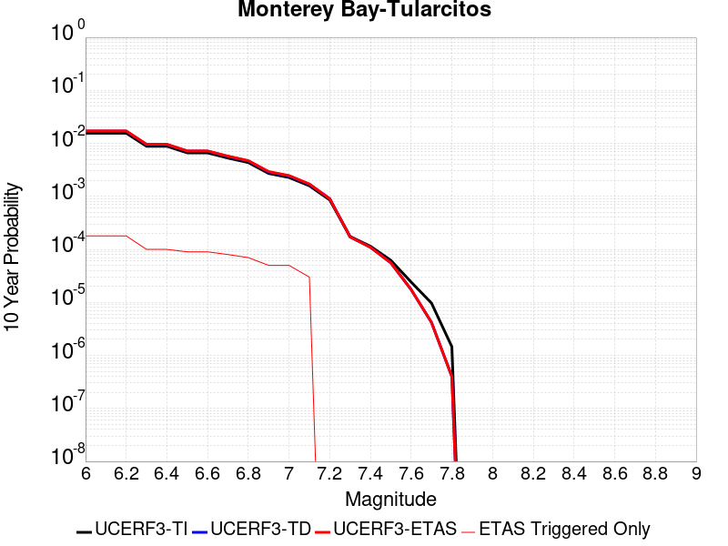 |

| Magnitude | 1 wk TI Prob | 1 wk TD Prob | 1 wk ETAS Prob | 1 wk ETAS/TD Gain | 1 wk ETAS Triggered Only | 1 mo TI Prob | 1 mo TD Prob | 1 mo ETAS Prob | 1 mo ETAS/TD Gain | 1 mo ETAS Triggered Only | 1 yr TI Prob | 1 yr TD Prob | 1 yr ETAS Prob | 1 yr ETAS/TD Gain | 1 yr ETAS Triggered Only | 10 yr TI Prob | 10 yr TD Prob | 10 yr ETAS Prob | 10 yr ETAS/TD Gain | 10 yr ETAS Triggered Only |
|-----|-----|-----|-----|-----|-----|-----|-----|-----|-----|-----|-----|-----|-----|-----|-----|-----|-----|-----|-----|-----|
| 6.0 | 3.0131365E-5 | 3.2804503E-5 | 6.280352E-5 | 1.9144787 | 3.0E-5 | 1.2912804E-4 | 1.4058374E-4 | 2.005753E-4 | 1.426732 | 6.0E-5 | 0.001571 | 0.0017103688 | 0.0018601123 | 1.0875504 | 1.5E-4 | 0.015599402 | 0.01698286 | 0.017159805 | 1.0104189 | 1.8E-4 |
| 6.1 | 3.0131365E-5 | 3.2804503E-5 | 6.280352E-5 | 1.9144787 | 3.0E-5 | 1.2912804E-4 | 1.4058374E-4 | 2.005753E-4 | 1.426732 | 6.0E-5 | 0.001571 | 0.0017103688 | 0.0018601123 | 1.0875504 | 1.5E-4 | 0.015599402 | 0.01698286 | 0.017159805 | 1.0104189 | 1.8E-4 |
| 6.2 | 3.0131365E-5 | 3.2804503E-5 | 6.280352E-5 | 1.9144787 | 3.0E-5 | 1.2912804E-4 | 1.4058374E-4 | 2.005753E-4 | 1.426732 | 6.0E-5 | 0.001571 | 0.0017103688 | 0.0018601123 | 1.0875504 | 1.5E-4 | 0.015599402 | 0.01698286 | 0.017159805 | 1.0104189 | 1.8E-4 |
| 6.3 | 1.6998249E-5 | 1.833369E-5 | 2.8333507E-5 | 1.545434 | 1.0E-5 | 7.28476E-5 | 7.8570694E-5 | 1.1856755E-4 | 1.5090556 | 4.0E-5 | 8.865586E-4 | 9.561971E-4 | 0.0010361206 | 1.0835848 | 8.0E-5 | 0.0088303005 | 0.009522754 | 0.009621801 | 1.0104011 | 1.0E-4 |
| 6.4 | 1.6998249E-5 | 1.833369E-5 | 2.8333507E-5 | 1.545434 | 1.0E-5 | 7.28476E-5 | 7.8570694E-5 | 1.1856755E-4 | 1.5090556 | 4.0E-5 | 8.865586E-4 | 9.561971E-4 | 0.0010361206 | 1.0835848 | 8.0E-5 | 0.0088303005 | 0.009522754 | 0.009621801 | 1.0104011 | 1.0E-4 |
| 6.5 | 1.27470785E-5 | 1.3695391E-5 | 2.3695255E-5 | 1.7301626 | 1.0E-5 | 5.4629192E-5 | 5.8693273E-5 | 9.869092E-5 | 1.6814691 | 4.0E-5 | 6.649074E-4 | 7.143667E-4 | 7.943095E-4 | 1.1119074 | 8.0E-5 | 0.0066292146 | 0.0071217557 | 0.0072111147 | 1.0125474 | 9.0E-5 |
| 6.6 | 1.2739422E-5 | 1.3687478E-5 | 2.368734E-5 | 1.7305847 | 1.0E-5 | 5.4596385E-5 | 5.865936E-5 | 9.8657016E-5 | 1.6818631 | 4.0E-5 | 6.645082E-4 | 7.1395404E-4 | 7.938969E-4 | 1.111972 | 8.0E-5 | 0.0066252467 | 0.007117656 | 0.0072070155 | 1.0125546 | 9.0E-5 |
| 6.7 | 1.0160109E-5 | 1.0887372E-5 | 2.0887263E-5 | 1.9184853 | 1.0E-5 | 4.35426E-5 | 4.665937E-5 | 7.665797E-5 | 1.6429276 | 3.0E-5 | 5.300022E-4 | 5.679368E-4 | 6.3789706E-4 | 1.1231831 | 7.0E-5 | 0.005287399 | 0.0056655654 | 0.005745112 | 1.0140404 | 8.0E-5 |
| 6.8 | 8.349859E-6 | 8.933906E-6 | 1.8933817E-5 | 2.119321 | 1.0E-5 | 3.578462E-5 | 3.8287642E-5 | 5.8286874E-5 | 1.5223417 | 2.0E-5 | 4.3559066E-4 | 4.6605797E-4 | 5.2603E-4 | 1.1286794 | 6.0E-5 | 0.004347378 | 0.004651371 | 0.004721045 | 1.0149794 | 7.0E-5 |
| 6.9 | 5.193639E-6 | 5.537252E-6 | 1.5537196E-5 | 2.80594 | 1.0E-5 | 2.2258262E-5 | 2.3730881E-5 | 4.3730408E-5 | 1.8427637 | 2.0E-5 | 2.7096065E-4 | 2.8888843E-4 | 3.288769E-4 | 1.1384218 | 4.0E-5 | 0.0027063051 | 0.0028854501 | 0.0029353057 | 1.0172783 | 5.0E-5 |
| 7.0 | 4.359381E-6 | 4.6440664E-6 | 1.464402E-5 | 3.1532753 | 1.0E-5 | 1.8682927E-5 | 1.9903006E-5 | 3.9902607E-5 | 2.0048532 | 2.0E-5 | 2.274409E-4 | 2.4229514E-4 | 2.8228544E-4 | 1.1650479 | 4.0E-5 | 0.0022720827 | 0.0024206026 | 0.0024704817 | 1.020606 | 5.0E-5 |
| 7.1 | 3.0398533E-6 | 3.2315513E-6 | 1.3231519E-5 | 4.094479 | 1.0E-5 | 1.3027877E-5 | 1.3849447E-5 | 2.3849308E-5 | 1.7220405 | 1.0E-5 | 1.5860285E-4 | 1.686066E-4 | 1.8860323E-4 | 1.1185993 | 2.0E-5 | 0.001584897 | 0.0016850445 | 0.001714994 | 1.0177736 | 3.0E-5 |
| 7.2 | 1.642335E-6 | 1.7336168E-6 | 1.7336168E-6 | 1.0 | 0.0 | 7.0385595E-6 | 7.429777E-6 | 7.429777E-6 | 1.0 | 0.0 | 8.569109E-5 | 9.045585E-5 | 9.045585E-5 | 1.0 | 0.0 | 8.5658056E-4 | 9.0439303E-4 | 9.0439303E-4 | 1.0 | 0.0 |
| 7.3 | 3.356842E-7 | 3.2962387E-7 | 3.2962387E-7 | 1.0 | 0.0 | 1.4386458E-6 | 1.412673E-6 | 1.412673E-6 | 1.0 | 0.0 | 1.7515373E-5 | 1.7199158E-5 | 1.7199158E-5 | 1.0 | 0.0 | 1.7513991E-4 | 1.7197838E-4 | 1.7197838E-4 | 1.0 | 0.0 |
| 7.4 | 2.1973483E-7 | 2.1015711E-7 | 2.1015711E-7 | 1.0 | 0.0 | 9.417204E-7 | 9.00673E-7 | 9.00673E-7 | 1.0 | 0.0 | 1.1465385E-5 | 1.0965639E-5 | 1.0965639E-5 | 1.0 | 0.0 | 1.1464794E-4 | 1.0965102E-4 | 1.0965102E-4 | 1.0 | 0.0 |
| 7.5 | 1.1944135E-7 | 1.0704702E-7 | 1.0704702E-7 | 1.0 | 0.0 | 5.118914E-7 | 4.5877286E-7 | 4.5877286E-7 | 1.0 | 0.0 | 6.23226E-6 | 5.5855453E-6 | 5.5855453E-6 | 1.0 | 0.0 | 6.2320854E-5 | 5.5854063E-5 | 5.5854063E-5 | 1.0 | 0.0 |
| 7.6 | 4.636058E-8 | 3.3423873E-8 | 3.3423873E-8 | 1.0 | 0.0 | 1.9868818E-7 | 1.4324516E-7 | 1.4324516E-7 | 1.0 | 0.0 | 2.419026E-6 | 1.7440085E-6 | 1.7440085E-6 | 1.0 | 0.0 | 2.4189996E-5 | 1.743995E-5 | 1.743995E-5 | 1.0 | 0.0 |
| 7.7 | 1.8588572E-8 | 8.033782E-9 | 8.033782E-9 | 1.0 | 0.0 | 7.9665305E-8 | 3.4430492E-8 | 3.4430492E-8 | 1.0 | 0.0 | 9.699246E-7 | 4.1919117E-7 | 4.1919117E-7 | 1.0 | 0.0 | 9.699204E-6 | 4.191904E-6 | 4.191904E-6 | 1.0 | 0.0 |
| 7.8 | 2.7960154E-9 | 7.6576245E-10 | 7.6576245E-10 | 1.0 | 0.0 | 1.1982923E-8 | 3.2818392E-9 | 3.2818392E-9 | 1.0 | 0.0 | 1.4589209E-7 | 3.995639E-8 | 3.995639E-8 | 1.0 | 0.0 | 1.4589199E-6 | 3.9956385E-7 | 3.9956385E-7 | 1.0 | 0.0 |

## Mount Diablo Thrust North CFM
*[(top)](#table-of-contents)*

| 1 Week | 1 Month | 1 Year | 10 Year |
|-----|-----|-----|-----|
|  |  |  |  |

| Magnitude | 1 wk TI Prob | 1 wk TD Prob | 1 wk ETAS Prob | 1 wk ETAS/TD Gain | 1 wk ETAS Triggered Only | 1 mo TI Prob | 1 mo TD Prob | 1 mo ETAS Prob | 1 mo ETAS/TD Gain | 1 mo ETAS Triggered Only | 1 yr TI Prob | 1 yr TD Prob | 1 yr ETAS Prob | 1 yr ETAS/TD Gain | 1 yr ETAS Triggered Only | 10 yr TI Prob | 10 yr TD Prob | 10 yr ETAS Prob | 10 yr ETAS/TD Gain | 10 yr ETAS Triggered Only |
|-----|-----|-----|-----|-----|-----|-----|-----|-----|-----|-----|-----|-----|-----|-----|-----|-----|-----|-----|-----|-----|
| 6.0 | 1.479628E-5 | 1.8779072E-5 | 3.8778697E-5 | 2.0649953 | 2.0E-5 | 6.341109E-5 | 8.047931E-5 | 1.10476896E-4 | 1.3727366 | 3.0E-5 | 7.717565E-4 | 9.794047E-4 | 0.0010693165 | 1.0918026 | 9.0E-5 | 0.007690818 | 0.0097521795 | 0.009920522 | 1.017262 | 1.7E-4 |
| 6.1 | 1.479628E-5 | 1.8779072E-5 | 3.8778697E-5 | 2.0649953 | 2.0E-5 | 6.341109E-5 | 8.047931E-5 | 1.10476896E-4 | 1.3727366 | 3.0E-5 | 7.717565E-4 | 9.794047E-4 | 0.0010693165 | 1.0918026 | 9.0E-5 | 0.007690818 | 0.0097521795 | 0.009920522 | 1.017262 | 1.7E-4 |
| 6.2 | 1.479628E-5 | 1.8779072E-5 | 3.8778697E-5 | 2.0649953 | 2.0E-5 | 6.341109E-5 | 8.047931E-5 | 1.10476896E-4 | 1.3727366 | 3.0E-5 | 7.717565E-4 | 9.794047E-4 | 0.0010693165 | 1.0918026 | 9.0E-5 | 0.007690818 | 0.0097521795 | 0.009920522 | 1.017262 | 1.7E-4 |
| 6.3 | 1.479628E-5 | 1.8779072E-5 | 3.8778697E-5 | 2.0649953 | 2.0E-5 | 6.341109E-5 | 8.047931E-5 | 1.10476896E-4 | 1.3727366 | 3.0E-5 | 7.717565E-4 | 9.794047E-4 | 0.0010693165 | 1.0918026 | 9.0E-5 | 0.007690818 | 0.0097521795 | 0.009920522 | 1.017262 | 1.7E-4 |
| 6.4 | 1.479628E-5 | 1.8779072E-5 | 3.8778697E-5 | 2.0649953 | 2.0E-5 | 6.341109E-5 | 8.047931E-5 | 1.10476896E-4 | 1.3727366 | 3.0E-5 | 7.717565E-4 | 9.794047E-4 | 0.0010693165 | 1.0918026 | 9.0E-5 | 0.007690818 | 0.0097521795 | 0.009920522 | 1.017262 | 1.7E-4 |
| 6.5 | 1.479628E-5 | 1.8779072E-5 | 3.8778697E-5 | 2.0649953 | 2.0E-5 | 6.341109E-5 | 8.047931E-5 | 1.10476896E-4 | 1.3727366 | 3.0E-5 | 7.717565E-4 | 9.794047E-4 | 0.0010693165 | 1.0918026 | 9.0E-5 | 0.007690818 | 0.0097521795 | 0.009920522 | 1.017262 | 1.7E-4 |
| 6.6 | 1.479016E-5 | 1.8772182E-5 | 3.8771806E-5 | 2.0653863 | 2.0E-5 | 6.338486E-5 | 8.044978E-5 | 1.1044736E-4 | 1.3728734 | 3.0E-5 | 7.714374E-4 | 9.790455E-4 | 0.0010689574 | 1.0918362 | 9.0E-5 | 0.007687649 | 0.00974862 | 0.009916962 | 1.0172684 | 1.7E-4 |
| 6.7 | 1.479016E-5 | 1.8772182E-5 | 3.8771806E-5 | 2.0653863 | 2.0E-5 | 6.338486E-5 | 8.044978E-5 | 1.1044736E-4 | 1.3728734 | 3.0E-5 | 7.714374E-4 | 9.790455E-4 | 0.0010689574 | 1.0918362 | 9.0E-5 | 0.007687649 | 0.00974862 | 0.009916962 | 1.0172684 | 1.7E-4 |
| 6.8 | 1.4771667E-5 | 1.8750945E-5 | 3.875057E-5 | 2.066593 | 2.0E-5 | 6.330561E-5 | 8.0358775E-5 | 1.1035636E-4 | 1.3732958 | 3.0E-5 | 7.704732E-4 | 9.779385E-4 | 0.0010678505 | 1.0919403 | 9.0E-5 | 0.007678074 | 0.009737647 | 0.009905991 | 1.017288 | 1.7E-4 |
| 6.9 | 1.2548234E-5 | 1.5830869E-5 | 3.583055E-5 | 2.2633345 | 2.0E-5 | 5.3777036E-5 | 6.7844834E-5 | 9.78428E-5 | 1.4421555 | 3.0E-5 | 6.545387E-4 | 8.257014E-4 | 8.956436E-4 | 1.0847064 | 7.0E-5 | 0.006526142 | 0.00822697 | 0.008355901 | 1.0156717 | 1.3E-4 |
| 7.0 | 1.01754185E-5 | 1.2813927E-5 | 3.281367E-5 | 2.5607817 | 2.0E-5 | 4.360821E-5 | 5.4915687E-5 | 8.491404E-5 | 1.546262 | 3.0E-5 | 5.308006E-4 | 6.68395E-4 | 7.283549E-4 | 1.0897073 | 6.0E-5 | 0.005295345 | 0.0066642333 | 0.0067635668 | 1.0149055 | 1.0E-4 |
| 7.1 | 8.398341E-6 | 1.0557986E-5 | 3.0557774E-5 | 2.8942807 | 2.0E-5 | 3.5992394E-5 | 4.5247732E-5 | 6.524682E-5 | 1.4419911 | 2.0E-5 | 4.3811928E-4 | 5.50753E-4 | 5.8073644E-4 | 1.0544409 | 3.0E-5 | 0.0043725655 | 0.0054941652 | 0.0055538355 | 1.0108607 | 6.0E-5 |
| 7.2 | 6.024759E-6 | 7.650704E-6 | 1.7650627E-5 | 2.3070593 | 1.0E-5 | 2.582014E-5 | 3.278832E-5 | 4.2787993E-5 | 1.3049766 | 1.0E-5 | 3.1431485E-4 | 3.991254E-4 | 4.1911742E-4 | 1.0500896 | 2.0E-5 | 0.0031387066 | 0.003984294 | 0.0040241345 | 1.0099994 | 4.0E-5 |
| 7.3 | 3.2099704E-6 | 4.137289E-6 | 4.137289E-6 | 1.0 | 0.0 | 1.3756943E-5 | 1.773112E-5 | 1.773112E-5 | 1.0 | 0.0 | 1.674779E-4 | 2.1585517E-4 | 2.1585517E-4 | 1.0 | 0.0 | 0.0016735174 | 0.0021565552 | 0.0021665336 | 1.004627 | 1.0E-5 |
| 7.4 | 2.2041513E-6 | 2.8749175E-6 | 2.8749175E-6 | 1.0 | 0.0 | 9.4463285E-6 | 1.2321017E-5 | 1.2321017E-5 | 1.0 | 0.0 | 1.1500298E-4 | 1.4999813E-4 | 1.4999813E-4 | 1.0 | 0.0 | 0.0011494348 | 0.0014990354 | 0.0015090203 | 1.0066609 | 1.0E-5 |
| 7.5 | 1.8869501E-6 | 2.4707624E-6 | 2.4707624E-6 | 1.0 | 0.0 | 8.086904E-6 | 1.0588939E-5 | 1.0588939E-5 | 1.0 | 0.0 | 9.845361E-5 | 1.2891278E-4 | 1.2891278E-4 | 1.0 | 0.0 | 9.841E-4 | 0.0012884365 | 0.0012884365 | 1.0 | 0.0 |
| 7.6 | 1.3012458E-6 | 1.7015424E-6 | 1.7015424E-6 | 1.0 | 0.0 | 5.576756E-6 | 7.2923044E-6 | 7.2923044E-6 | 1.0 | 0.0 | 6.7894885E-5 | 8.8780245E-5 | 8.8780245E-5 | 1.0 | 0.0 | 6.787415E-4 | 8.874831E-4 | 8.874831E-4 | 1.0 | 0.0 |
| 7.7 | 3.603383E-7 | 4.7196133E-7 | 4.7196133E-7 | 1.0 | 0.0 | 1.5443061E-6 | 2.0226898E-6 | 2.0226898E-6 | 1.0 | 0.0 | 1.8801764E-5 | 2.4625979E-5 | 2.4625979E-5 | 1.0 | 0.0 | 1.8800174E-4 | 2.46238E-4 | 2.46238E-4 | 1.0 | 0.0 |

## Greenville (No) 2011 CFM
*[(top)](#table-of-contents)*

| 1 Week | 1 Month | 1 Year | 10 Year |
|-----|-----|-----|-----|
|  |  |  |  |

| Magnitude | 1 wk TI Prob | 1 wk TD Prob | 1 wk ETAS Prob | 1 wk ETAS/TD Gain | 1 wk ETAS Triggered Only | 1 mo TI Prob | 1 mo TD Prob | 1 mo ETAS Prob | 1 mo ETAS/TD Gain | 1 mo ETAS Triggered Only | 1 yr TI Prob | 1 yr TD Prob | 1 yr ETAS Prob | 1 yr ETAS/TD Gain | 1 yr ETAS Triggered Only | 10 yr TI Prob | 10 yr TD Prob | 10 yr ETAS Prob | 10 yr ETAS/TD Gain | 10 yr ETAS Triggered Only |
|-----|-----|-----|-----|-----|-----|-----|-----|-----|-----|-----|-----|-----|-----|-----|-----|-----|-----|-----|-----|-----|
| 6.0 | 3.286654E-5 | 4.0385894E-5 | 6.038509E-5 | 1.4952024 | 2.0E-5 | 1.4084899E-4 | 1.7307115E-4 | 2.230625E-4 | 1.2888485 | 5.0E-5 | 0.0017134876 | 0.0021051443 | 0.0022348708 | 1.0616235 | 1.3E-4 | 0.017003356 | 0.020856904 | 0.02103315 | 1.0084503 | 1.8E-4 |
| 6.1 | 3.286654E-5 | 4.0385894E-5 | 6.038509E-5 | 1.4952024 | 2.0E-5 | 1.4084899E-4 | 1.7307115E-4 | 2.230625E-4 | 1.2888485 | 5.0E-5 | 0.0017134876 | 0.0021051443 | 0.0022348708 | 1.0616235 | 1.3E-4 | 0.017003356 | 0.020856904 | 0.02103315 | 1.0084503 | 1.8E-4 |
| 6.2 | 3.1697953E-5 | 3.8948187E-5 | 5.8947408E-5 | 1.5134827 | 2.0E-5 | 1.358413E-4 | 1.6691034E-4 | 2.1690199E-4 | 1.299512 | 5.0E-5 | 0.0016526132 | 0.0020302776 | 0.0021600137 | 1.0639007 | 1.3E-4 | 0.01640377 | 0.020121982 | 0.02029836 | 1.0087655 | 1.8E-4 |
| 6.3 | 3.1363317E-5 | 3.853688E-5 | 5.8536112E-5 | 1.5189633 | 2.0E-5 | 1.344073E-4 | 1.6514782E-4 | 2.1513956E-4 | 1.3027091 | 5.0E-5 | 0.0016351803 | 0.0020088586 | 0.0021385974 | 1.0645834 | 1.3E-4 | 0.016232004 | 0.01991166 | 0.020088077 | 1.0088599 | 1.8E-4 |
| 6.4 | 3.0228604E-5 | 3.7143403E-5 | 5.714266E-5 | 1.5384336 | 2.0E-5 | 1.2954473E-4 | 1.5917652E-4 | 2.0916856E-4 | 1.3140666 | 5.0E-5 | 0.0015760659 | 0.0019362888 | 0.0020660372 | 1.0670087 | 1.3E-4 | 0.015649348 | 0.019198699 | 0.019375242 | 1.0091957 | 1.8E-4 |
| 6.5 | 2.9537814E-5 | 3.6298497E-5 | 5.6297773E-5 | 1.550967 | 2.0E-5 | 1.2658449E-4 | 1.5555593E-4 | 2.0554815E-4 | 1.3213778 | 5.0E-5 | 0.0015400766 | 0.0018922853 | 0.0020220391 | 1.06857 | 1.3E-4 | 0.01529447 | 0.01876618 | 0.018942801 | 1.0094117 | 1.8E-4 |
| 6.6 | 2.7345395E-5 | 3.360665E-5 | 5.3605978E-5 | 1.5951003 | 2.0E-5 | 1.1718928E-4 | 1.4402073E-4 | 1.9401353E-4 | 1.3471223 | 5.0E-5 | 0.0014258457 | 0.0017520733 | 0.0018818455 | 1.0740678 | 1.3E-4 | 0.014167317 | 0.017386416 | 0.017563287 | 1.010173 | 1.8E-4 |
| 6.7 | 2.5615784E-5 | 3.1582884E-5 | 5.158225E-5 | 1.6332344 | 2.0E-5 | 1.09777306E-4 | 1.3534837E-4 | 1.8534159E-4 | 1.3693671 | 5.0E-5 | 0.0013357193 | 0.0016466515 | 0.001766454 | 1.0727552 | 1.2E-4 | 0.013277191 | 0.016348176 | 0.016515397 | 1.0102288 | 1.7E-4 |
| 6.8 | 2.0059057E-5 | 2.4724775E-5 | 4.472428E-5 | 1.8088852 | 2.0E-5 | 8.596455E-5 | 1.0595911E-4 | 1.559538E-4 | 1.4718301 | 5.0E-5 | 0.0010461159 | 0.001289305 | 0.0013891761 | 1.0774611 | 1.0E-4 | 0.0104120495 | 0.012820267 | 0.012968344 | 1.0115502 | 1.5E-4 |
| 6.9 | 1.6321746E-5 | 2.019551E-5 | 4.0195107E-5 | 1.9902991 | 2.0E-5 | 6.9948466E-5 | 8.6549386E-5 | 1.1654679E-4 | 1.3465929 | 3.0E-5 | 8.5128983E-4 | 0.0010532418 | 0.001123168 | 1.0663915 | 7.0E-5 | 0.008480361 | 0.01048403 | 0.010602771 | 1.011326 | 1.2E-4 |
| 7.0 | 1.22527645E-5 | 1.5141323E-5 | 3.514102E-5 | 2.3208685 | 2.0E-5 | 5.2510793E-5 | 6.48898E-5 | 9.488785E-5 | 1.4622923 | 3.0E-5 | 6.3913135E-4 | 7.897512E-4 | 8.497038E-4 | 1.0759133 | 6.0E-5 | 0.0063729626 | 0.007870084 | 0.007969297 | 1.0126064 | 1.0E-4 |
| 7.1 | 8.996482E-6 | 1.1168475E-5 | 3.1168252E-5 | 2.7907348 | 2.0E-5 | 3.8555783E-5 | 4.786402E-5 | 6.786306E-5 | 1.4178303 | 2.0E-5 | 4.6931554E-4 | 5.825898E-4 | 6.1257236E-4 | 1.0514642 | 3.0E-5 | 0.004683256 | 0.0058109164 | 0.0058705676 | 1.0102654 | 6.0E-5 |
| 7.2 | 6.0273087E-6 | 7.571823E-6 | 1.7571747E-5 | 2.3206758 | 1.0E-5 | 2.5831067E-5 | 3.245027E-5 | 4.2449945E-5 | 1.3081539 | 1.0E-5 | 3.1444785E-4 | 3.9501113E-4 | 4.1500322E-4 | 1.0506115 | 2.0E-5 | 0.0031400328 | 0.0039432864 | 0.003983129 | 1.0101038 | 4.0E-5 |
| 7.3 | 3.1209995E-6 | 3.9680986E-6 | 3.9680986E-6 | 1.0 | 0.0 | 1.3375643E-5 | 1.7006027E-5 | 1.7006027E-5 | 1.0 | 0.0 | 1.6283628E-4 | 2.0702886E-4 | 2.0702886E-4 | 1.0 | 0.0 | 0.0016271701 | 0.00206845 | 0.0020784293 | 1.0048245 | 1.0E-5 |
| 7.4 | 2.0254208E-6 | 2.6111043E-6 | 2.6111043E-6 | 1.0 | 0.0 | 8.680347E-6 | 1.1190399E-5 | 1.1190399E-5 | 1.0 | 0.0 | 1.0567809E-4 | 1.3623465E-4 | 1.3623465E-4 | 1.0 | 0.0 | 0.0010562785 | 0.001361568 | 0.0013715543 | 1.0073345 | 1.0E-5 |
| 7.5 | 1.6763418E-6 | 2.1744677E-6 | 2.1744677E-6 | 1.0 | 0.0 | 7.184302E-6 | 9.319114E-6 | 9.319114E-6 | 1.0 | 0.0 | 8.746537E-5 | 1.1345436E-4 | 1.1345436E-4 | 1.0 | 0.0 | 8.743095E-4 | 0.0011340112 | 0.0011340112 | 1.0 | 0.0 |
| 7.6 | 1.1935462E-6 | 1.546878E-6 | 1.546878E-6 | 1.0 | 0.0 | 5.115188E-6 | 6.6294606E-6 | 6.6294606E-6 | 1.0 | 0.0 | 6.2275634E-5 | 8.071074E-5 | 8.071074E-5 | 1.0 | 0.0 | 6.2258187E-4 | 8.068449E-4 | 8.068449E-4 | 1.0 | 0.0 |
| 7.7 | 3.0464201E-7 | 3.9877884E-7 | 3.9877884E-7 | 1.0 | 0.0 | 1.3056081E-6 | 1.709051E-6 | 1.709051E-6 | 1.0 | 0.0 | 1.589566E-5 | 2.0807503E-5 | 2.0807503E-5 | 1.0 | 0.0 | 1.5894524E-4 | 2.0806021E-4 | 2.0806021E-4 | 1.0 | 0.0 |

## Monte Vista - Shannon 2011 CFM
*[(top)](#table-of-contents)*

| 1 Week | 1 Month | 1 Year | 10 Year |
|-----|-----|-----|-----|
|  |  |  |  |

| Magnitude | 1 wk TI Prob | 1 wk TD Prob | 1 wk ETAS Prob | 1 wk ETAS/TD Gain | 1 wk ETAS Triggered Only | 1 mo TI Prob | 1 mo TD Prob | 1 mo ETAS Prob | 1 mo ETAS/TD Gain | 1 mo ETAS Triggered Only | 1 yr TI Prob | 1 yr TD Prob | 1 yr ETAS Prob | 1 yr ETAS/TD Gain | 1 yr ETAS Triggered Only | 10 yr TI Prob | 10 yr TD Prob | 10 yr ETAS Prob | 10 yr ETAS/TD Gain | 10 yr ETAS Triggered Only |
|-----|-----|-----|-----|-----|-----|-----|-----|-----|-----|-----|-----|-----|-----|-----|-----|-----|-----|-----|-----|-----|
| 6.0 | 2.7907707E-5 | 2.7597103E-5 | 7.759572E-5 | 2.8117344 | 5.0E-5 | 1.19598975E-4 | 1.1826863E-4 | 1.7826154E-4 | 1.5072596 | 6.0E-5 | 0.0014551448 | 0.0014390933 | 0.001548935 | 1.076327 | 1.1E-4 | 0.014456532 | 0.014326892 | 0.014474743 | 1.0103198 | 1.5E-4 |
| 6.1 | 2.7907707E-5 | 2.7597103E-5 | 7.759572E-5 | 2.8117344 | 5.0E-5 | 1.19598975E-4 | 1.1826863E-4 | 1.7826154E-4 | 1.5072596 | 6.0E-5 | 0.0014551448 | 0.0014390933 | 0.001548935 | 1.076327 | 1.1E-4 | 0.014456532 | 0.014326892 | 0.014474743 | 1.0103198 | 1.5E-4 |
| 6.2 | 2.7907707E-5 | 2.7597103E-5 | 7.759572E-5 | 2.8117344 | 5.0E-5 | 1.19598975E-4 | 1.1826863E-4 | 1.7826154E-4 | 1.5072596 | 6.0E-5 | 0.0014551448 | 0.0014390933 | 0.001548935 | 1.076327 | 1.1E-4 | 0.014456532 | 0.014326892 | 0.014474743 | 1.0103198 | 1.5E-4 |
| 6.3 | 2.7907707E-5 | 2.7597103E-5 | 7.759572E-5 | 2.8117344 | 5.0E-5 | 1.19598975E-4 | 1.1826863E-4 | 1.7826154E-4 | 1.5072596 | 6.0E-5 | 0.0014551448 | 0.0014390933 | 0.001548935 | 1.076327 | 1.1E-4 | 0.014456532 | 0.014326892 | 0.014474743 | 1.0103198 | 1.5E-4 |
| 6.4 | 2.7907707E-5 | 2.7597103E-5 | 7.759572E-5 | 2.8117344 | 5.0E-5 | 1.19598975E-4 | 1.1826863E-4 | 1.7826154E-4 | 1.5072596 | 6.0E-5 | 0.0014551448 | 0.0014390933 | 0.001548935 | 1.076327 | 1.1E-4 | 0.014456532 | 0.014326892 | 0.014474743 | 1.0103198 | 1.5E-4 |
| 6.5 | 1.7990213E-5 | 1.6650592E-5 | 2.6650427E-5 | 1.6005692 | 1.0E-5 | 7.709863E-5 | 7.13581E-5 | 8.135739E-5 | 1.1401283 | 1.0E-5 | 9.382716E-4 | 8.6850504E-4 | 9.184616E-4 | 1.0575202 | 5.0E-5 | 0.0093431985 | 0.008674543 | 0.008743936 | 1.0079995 | 7.0E-5 |
| 6.6 | 9.650407E-6 | 7.466063E-6 | 7.466063E-6 | 1.0 | 0.0 | 4.135823E-5 | 3.1997064E-5 | 3.1997064E-5 | 1.0 | 0.0 | 5.0342013E-4 | 3.8950247E-4 | 4.0949468E-4 | 1.0513276 | 2.0E-5 | 0.005022812 | 0.0039059385 | 0.0039457823 | 1.0102009 | 4.0E-5 |
| 6.7 | 9.62828E-6 | 7.4439677E-6 | 7.4439677E-6 | 1.0 | 0.0 | 4.1263404E-5 | 3.190237E-5 | 3.190237E-5 | 1.0 | 0.0 | 5.022661E-4 | 3.8835E-4 | 4.0834222E-4 | 1.0514799 | 2.0E-5 | 0.0050113243 | 0.0038944543 | 0.0039342986 | 1.010231 | 4.0E-5 |
| 6.8 | 6.887523E-6 | 4.469971E-6 | 4.469971E-6 | 1.0 | 0.0 | 2.9517621E-5 | 1.915689E-5 | 1.915689E-5 | 1.0 | 0.0 | 3.5931775E-4 | 2.3321241E-4 | 2.4321007E-4 | 1.0428693 | 1.0E-5 | 0.0035873733 | 0.0023468905 | 0.00237682 | 1.0127529 | 3.0E-5 |
| 6.9 | 6.2722347E-6 | 3.811725E-6 | 3.811725E-6 | 1.0 | 0.0 | 2.6880729E-5 | 1.6335875E-5 | 1.6335875E-5 | 1.0 | 0.0 | 3.2722374E-4 | 1.9887314E-4 | 2.0887115E-4 | 1.0502733 | 1.0E-5 | 0.003267423 | 0.0020041515 | 0.0020340914 | 1.014939 | 3.0E-5 |
| 7.0 | 5.5320347E-6 | 3.0386977E-6 | 3.0386977E-6 | 1.0 | 0.0 | 2.3708504E-5 | 1.30229355E-5 | 1.30229355E-5 | 1.0 | 0.0 | 2.8861282E-4 | 1.5854454E-4 | 1.5854454E-4 | 1.0 | 0.0 | 0.0028823826 | 0.0016015001 | 0.0016015001 | 1.0 | 0.0 |
| 7.1 | 3.8794055E-6 | 1.2913293E-6 | 1.2913293E-6 | 1.0 | 0.0 | 1.6625918E-5 | 5.534257E-6 | 5.534257E-6 | 1.0 | 0.0 | 2.0240174E-4 | 6.737751E-5 | 6.737751E-5 | 1.0 | 0.0 | 0.002022175 | 6.90582E-4 | 6.90582E-4 | 1.0 | 0.0 |
| 7.2 | 3.4813652E-6 | 9.742977E-7 | 9.742977E-7 | 1.0 | 0.0 | 1.49200505E-5 | 4.1755547E-6 | 4.1755547E-6 | 1.0 | 0.0 | 1.8163648E-4 | 5.0836203E-5 | 5.0836203E-5 | 1.0 | 0.0 | 0.0018148809 | 5.252446E-4 | 5.252446E-4 | 1.0 | 0.0 |
| 7.3 | 3.1682148E-6 | 7.788776E-7 | 7.788776E-7 | 1.0 | 0.0 | 1.3577992E-5 | 3.3380425E-6 | 3.3380425E-6 | 1.0 | 0.0 | 1.6529951E-4 | 4.0639912E-5 | 4.0639912E-5 | 1.0 | 0.0 | 0.0016517661 | 4.2329848E-4 | 4.2329848E-4 | 1.0 | 0.0 |
| 7.4 | 2.9707667E-6 | 7.4132635E-7 | 7.4132635E-7 | 1.0 | 0.0 | 1.2731795E-5 | 3.177109E-6 | 3.177109E-6 | 1.0 | 0.0 | 1.5499859E-4 | 3.8680617E-5 | 3.8680617E-5 | 1.0 | 0.0 | 0.0015489052 | 4.0350226E-4 | 4.0350226E-4 | 1.0 | 0.0 |
| 7.5 | 2.3462758E-6 | 6.0651723E-7 | 6.0651723E-7 | 1.0 | 0.0 | 1.0055429E-5 | 2.599357E-6 | 2.599357E-6 | 1.0 | 0.0 | 1.2241797E-4 | 3.1646712E-5 | 3.1646712E-5 | 1.0 | 0.0 | 0.0012235056 | 3.314278E-4 | 3.314278E-4 | 1.0 | 0.0 |
| 7.6 | 2.112783E-6 | 5.305359E-7 | 5.305359E-7 | 1.0 | 0.0 | 9.054753E-6 | 2.2737233E-6 | 2.2737233E-6 | 1.0 | 0.0 | 1.1023604E-4 | 2.768223E-5 | 2.768223E-5 | 1.0 | 0.0 | 0.0011018137 | 2.9135987E-4 | 2.9135987E-4 | 1.0 | 0.0 |
| 7.7 | 1.7022471E-6 | 4.2783478E-7 | 4.2783478E-7 | 1.0 | 0.0 | 7.2953244E-6 | 1.8335763E-6 | 1.8335763E-6 | 1.0 | 0.0 | 8.881695E-5 | 2.2323566E-5 | 2.2323566E-5 | 1.0 | 0.0 | 8.878146E-4 | 2.3645471E-4 | 2.3645471E-4 | 1.0 | 0.0 |
| 7.8 | 7.230914E-7 | 3.7707397E-7 | 3.7707397E-7 | 1.0 | 0.0 | 3.0989595E-6 | 1.6160303E-6 | 1.6160303E-6 | 1.0 | 0.0 | 3.772918E-5 | 1.9674992E-5 | 1.9674992E-5 | 1.0 | 0.0 | 3.7722773E-4 | 2.0948783E-4 | 2.0948783E-4 | 1.0 | 0.0 |
| 7.9 | 4.3588446E-7 | 3.4671746E-7 | 3.4671746E-7 | 1.0 | 0.0 | 1.868075E-6 | 1.4859311E-6 | 1.4859311E-6 | 1.0 | 0.0 | 2.2743576E-5 | 1.8091061E-5 | 1.8091061E-5 | 1.0 | 0.0 | 2.2741247E-4 | 1.9186095E-4 | 1.9186095E-4 | 1.0 | 0.0 |
| 8.0 | 2.3317523E-7 | 3.1833721E-7 | 3.1833721E-7 | 1.0 | 0.0 | 9.99322E-7 | 1.3643016E-6 | 1.3643016E-6 | 1.0 | 0.0 | 1.2166677E-5 | 1.6610247E-5 | 1.6610247E-5 | 1.0 | 0.0 | 1.21660116E-4 | 1.7564872E-4 | 1.7564872E-4 | 1.0 | 0.0 |
| 8.1 | 1.4662456E-7 | 2.0496766E-7 | 2.0496766E-7 | 1.0 | 0.0 | 6.283908E-7 | 8.7843256E-7 | 8.7843256E-7 | 1.0 | 0.0 | 7.650631E-6 | 1.0694865E-5 | 1.0694865E-5 | 1.0 | 0.0 | 7.650368E-5 | 1.1229678E-4 | 1.1229678E-4 | 1.0 | 0.0 |
| 8.2 | 5.4931775E-9 | 5.126119E-9 | 5.126119E-9 | 1.0 | 0.0 | 2.3542189E-8 | 2.1969083E-8 | 2.1969083E-8 | 1.0 | 0.0 | 2.8662612E-7 | 2.6747355E-7 | 2.6747355E-7 | 1.0 | 0.0 | 2.8662573E-6 | 2.7806063E-6 | 2.7806063E-6 | 1.0 | 0.0 |

## San Andreas (Parkfield)
*[(top)](#table-of-contents)*

| 1 Week | 1 Month | 1 Year | 10 Year |
|-----|-----|-----|-----|
|  |  |  |  |

| Magnitude | 1 wk TI Prob | 1 wk TD Prob | 1 wk ETAS Prob | 1 wk ETAS/TD Gain | 1 wk ETAS Triggered Only | 1 mo TI Prob | 1 mo TD Prob | 1 mo ETAS Prob | 1 mo ETAS/TD Gain | 1 mo ETAS Triggered Only | 1 yr TI Prob | 1 yr TD Prob | 1 yr ETAS Prob | 1 yr ETAS/TD Gain | 1 yr ETAS Triggered Only | 10 yr TI Prob | 10 yr TD Prob | 10 yr ETAS Prob | 10 yr ETAS/TD Gain | 10 yr ETAS Triggered Only |
|-----|-----|-----|-----|-----|-----|-----|-----|-----|-----|-----|-----|-----|-----|-----|-----|-----|-----|-----|-----|-----|
| 6.0 | 5.556969E-4 | 7.925354E-4 | 8.524878E-4 | 1.0756464 | 6.0E-5 | 0.0023793848 | 0.003392733 | 0.0034824274 | 1.0264373 | 9.0E-5 | 0.028586963 | 0.040889088 | 0.04101377 | 1.0030494 | 1.3E-4 | 0.25176284 | 0.3393678 | 0.33947352 | 1.0003115 | 1.6E-4 |
| 6.1 | 1.925858E-4 | 3.0691034E-4 | 3.6689194E-4 | 1.1954368 | 6.0E-5 | 8.2510663E-4 | 0.0013147657 | 0.0014046472 | 1.0683633 | 9.0E-5 | 0.0099994885 | 0.01598289 | 0.016110811 | 1.0080037 | 1.3E-4 | 0.095613256 | 0.15073559 | 0.15086298 | 1.0008451 | 1.5E-4 |
| 6.2 | 9.4306815E-5 | 1.8358107E-4 | 2.3357189E-4 | 1.2723092 | 5.0E-5 | 4.0410945E-4 | 7.8654004E-4 | 8.664771E-4 | 1.1016313 | 8.0E-5 | 0.0049089384 | 0.009534287 | 0.009653144 | 1.0124662 | 1.2E-4 | 0.048019063 | 0.09235361 | 0.09248069 | 1.0013759 | 1.4E-4 |
| 6.3 | 9.283051E-5 | 1.8054266E-4 | 2.3053364E-4 | 1.2768929 | 5.0E-5 | 3.9778434E-4 | 7.7352603E-4 | 8.534641E-4 | 1.1033425 | 8.0E-5 | 0.0048322747 | 0.009377217 | 0.009486185 | 1.0116205 | 1.1E-4 | 0.047285385 | 0.091006055 | 0.09112423 | 1.0012984 | 1.3E-4 |
| 6.4 | 9.138826E-5 | 1.7815719E-4 | 2.2814829E-4 | 1.280601 | 5.0E-5 | 3.916052E-4 | 7.633086E-4 | 8.432476E-4 | 1.1047269 | 8.0E-5 | 0.0047573745 | 0.009253885 | 0.009362866 | 1.0117769 | 1.1E-4 | 0.046568092 | 0.08990586 | 0.09002417 | 1.001316 | 1.3E-4 |
| 6.5 | 9.000255E-5 | 1.7573098E-4 | 2.257222E-4 | 1.2844758 | 5.0E-5 | 3.8566816E-4 | 7.5291656E-4 | 8.3285634E-4 | 1.1061735 | 8.0E-5 | 0.0046854047 | 0.009128439 | 0.009237435 | 1.0119402 | 1.1E-4 | 0.045878403 | 0.088789634 | 0.08890809 | 1.0013342 | 1.3E-4 |
| 6.6 | 8.8109264E-5 | 1.7252822E-4 | 2.225196E-4 | 1.2897577 | 5.0E-5 | 3.7755648E-4 | 7.391983E-4 | 8.191391E-4 | 1.1081454 | 8.0E-5 | 0.0045870654 | 0.008962819 | 0.009071833 | 1.0121629 | 1.1E-4 | 0.04493529 | 0.087316476 | 0.08743513 | 1.0013589 | 1.3E-4 |
| 6.7 | 8.738073E-5 | 1.7119577E-4 | 2.2118722E-4 | 1.2920133 | 5.0E-5 | 3.7443507E-4 | 7.3349103E-4 | 8.134324E-4 | 1.1089875 | 8.0E-5 | 0.0045492216 | 0.008893945 | 0.009002967 | 1.0122579 | 1.1E-4 | 0.04457213 | 0.08671589 | 0.08683462 | 1.0013691 | 1.3E-4 |
| 6.8 | 8.710195E-5 | 1.7064829E-4 | 2.2063976E-4 | 1.2929503 | 5.0E-5 | 3.7324068E-4 | 7.31146E-4 | 8.110875E-4 | 1.1093372 | 8.0E-5 | 0.0045347405 | 0.008865635 | 0.008974659 | 1.0122975 | 1.1E-4 | 0.04443313 | 0.08646264 | 0.086581394 | 1.0013735 | 1.3E-4 |
| 6.9 | 8.6801556E-5 | 1.7005557E-4 | 2.2004706E-4 | 1.2939715 | 5.0E-5 | 3.7195362E-4 | 7.286072E-4 | 8.085489E-4 | 1.1097186 | 8.0E-5 | 0.0045191357 | 0.008834976 | 0.008944004 | 1.0123405 | 1.1E-4 | 0.044283327 | 0.08618794 | 0.08630673 | 1.0013783 | 1.3E-4 |
| 7.0 | 8.5571606E-5 | 1.6757486E-4 | 2.1756648E-4 | 1.2983241 | 5.0E-5 | 3.6668387E-4 | 7.179815E-4 | 7.8793126E-4 | 1.0974256 | 7.0E-5 | 0.004455241 | 0.008706649 | 0.008805778 | 1.0113854 | 1.0E-4 | 0.043669727 | 0.085033305 | 0.0851431 | 1.0012912 | 1.2E-4 |
| 7.1 | 7.82589E-5 | 1.5234148E-4 | 1.923354E-4 | 1.262528 | 4.0E-5 | 3.3535215E-4 | 6.527295E-4 | 7.126903E-4 | 1.0918617 | 6.0E-5 | 0.0040752706 | 0.007918197 | 0.008007484 | 1.0112762 | 9.0E-5 | 0.040013418 | 0.077931635 | 0.07802384 | 1.0011832 | 1.0E-4 |
| 7.2 | 7.690929E-5 | 1.4970162E-4 | 1.5970012E-4 | 1.0667895 | 1.0E-5 | 3.2956956E-4 | 6.4142136E-4 | 6.614085E-4 | 1.0311607 | 2.0E-5 | 0.004005129 | 0.007781511 | 0.007831122 | 1.0063754 | 5.0E-5 | 0.0393371 | 0.0767006 | 0.076756 | 1.0007223 | 6.0E-5 |
| 7.3 | 7.5543794E-5 | 1.4665214E-4 | 1.5665067E-4 | 1.0681785 | 1.0E-5 | 3.2371894E-4 | 6.2835845E-4 | 6.483459E-4 | 1.031809 | 2.0E-5 | 0.003934157 | 0.007623594 | 0.0076732123 | 1.0065086 | 5.0E-5 | 0.038652334 | 0.075258195 | 0.07531368 | 1.0007373 | 6.0E-5 |
| 7.4 | 7.4214564E-5 | 1.4364798E-4 | 1.5364654E-4 | 1.0696046 | 1.0E-5 | 3.1802364E-4 | 6.1548967E-4 | 6.3547736E-4 | 1.0324744 | 2.0E-5 | 0.003865065 | 0.007468 | 0.007517627 | 1.0066452 | 5.0E-5 | 0.03798529 | 0.073827036 | 0.07388261 | 1.0007527 | 6.0E-5 |
| 7.5 | 6.149578E-5 | 1.1278729E-4 | 1.2278616E-4 | 1.0886525 | 1.0E-5 | 2.6352672E-4 | 4.8328468E-4 | 4.9327983E-4 | 1.0206817 | 1.0E-5 | 0.0032037178 | 0.005868149 | 0.005907914 | 1.0067765 | 4.0E-5 | 0.03157923 | 0.058962863 | 0.059009913 | 1.000798 | 5.0E-5 |
| 7.6 | 6.0643448E-5 | 1.1106514E-4 | 1.2106403E-4 | 1.0900272 | 1.0E-5 | 2.598746E-4 | 4.7590674E-4 | 4.8590198E-4 | 1.0210025 | 1.0E-5 | 0.0031593828 | 0.0057788026 | 0.0058185714 | 1.0068818 | 4.0E-5 | 0.031148417 | 0.058120478 | 0.058167573 | 1.0008103 | 5.0E-5 |
| 7.7 | 5.1652263E-5 | 9.2530776E-5 | 1.02529855E-4 | 1.1080621 | 1.0E-5 | 2.2134806E-4 | 3.9650023E-4 | 4.0649626E-4 | 1.0252106 | 1.0E-5 | 0.002691582 | 0.004816715 | 0.0048565227 | 1.0082644 | 4.0E-5 | 0.026592141 | 0.048903264 | 0.048950817 | 1.0009724 | 5.0E-5 |
| 7.8 | 4.8090482E-5 | 8.63174E-5 | 9.631654E-5 | 1.1158415 | 1.0E-5 | 2.060858E-4 | 3.6987927E-4 | 3.798756E-4 | 1.0270258 | 1.0E-5 | 0.0025062072 | 0.00449399 | 0.00453381 | 1.0088608 | 4.0E-5 | 0.024781305 | 0.04564136 | 0.045689076 | 1.0010455 | 5.0E-5 |
| 7.9 | 3.970278E-5 | 6.806583E-5 | 7.8065146E-5 | 1.1469066 | 1.0E-5 | 1.7014367E-4 | 2.916781E-4 | 3.0167517E-4 | 1.0342743 | 1.0E-5 | 0.002069531 | 0.003545402 | 0.0035852604 | 1.0112423 | 4.0E-5 | 0.020503636 | 0.036150526 | 0.036198717 | 1.0013331 | 5.0E-5 |
| 8.0 | 2.8982335E-5 | 4.1055075E-5 | 4.1055075E-5 | 1.0 | 0.0 | 1.2420409E-4 | 1.7593846E-4 | 1.7593846E-4 | 1.0 | 0.0 | 0.0015111357 | 0.0021399476 | 0.0021599047 | 1.009326 | 2.0E-5 | 0.015009012 | 0.022189254 | 0.022218589 | 1.001322 | 3.0E-5 |
| 8.1 | 1.8836186E-5 | 1.8883551E-5 | 1.8883551E-5 | 1.0 | 0.0 | 8.0724014E-5 | 8.0927E-5 | 8.0927E-5 | 1.0 | 0.0 | 9.823717E-4 | 9.848415E-4 | 0.0010048217 | 1.0202879 | 2.0E-5 | 0.009780403 | 0.01059446 | 0.010614248 | 1.0018678 | 2.0E-5 |
| 8.2 | 8.643924E-6 | 5.5526552E-6 | 5.5526552E-6 | 1.0 | 0.0 | 3.704486E-5 | 2.3796878E-5 | 2.3796878E-5 | 1.0 | 0.0 | 4.5092785E-4 | 2.8968856E-4 | 2.9968566E-4 | 1.0345098 | 1.0E-5 | 0.0045001395 | 0.0032912085 | 0.0033011758 | 1.0030284 | 1.0E-5 |
| 8.3 | 1.983087E-6 | 7.7871465E-7 | 7.7871465E-7 | 1.0 | 0.0 | 8.498917E-6 | 3.3373444E-6 | 3.3373444E-6 | 1.0 | 0.0 | 1.034694E-4 | 4.063143E-5 | 4.063143E-5 | 1.0 | 0.0 | 0.0010342124 | 4.7926197E-4 | 4.7926197E-4 | 1.0 | 0.0 |

## Ortigalita (North)
*[(top)](#table-of-contents)*

| 1 Week | 1 Month | 1 Year | 10 Year |
|-----|-----|-----|-----|
|  |  |  |  |

| Magnitude | 1 wk TI Prob | 1 wk TD Prob | 1 wk ETAS Prob | 1 wk ETAS/TD Gain | 1 wk ETAS Triggered Only | 1 mo TI Prob | 1 mo TD Prob | 1 mo ETAS Prob | 1 mo ETAS/TD Gain | 1 mo ETAS Triggered Only | 1 yr TI Prob | 1 yr TD Prob | 1 yr ETAS Prob | 1 yr ETAS/TD Gain | 1 yr ETAS Triggered Only | 10 yr TI Prob | 10 yr TD Prob | 10 yr ETAS Prob | 10 yr ETAS/TD Gain | 10 yr ETAS Triggered Only |
|-----|-----|-----|-----|-----|-----|-----|-----|-----|-----|-----|-----|-----|-----|-----|-----|-----|-----|-----|-----|-----|
| 6.0 | 7.711876E-5 | 1.0514144E-4 | 1.3513828E-4 | 1.2852999 | 3.0E-5 | 3.3046713E-4 | 4.505392E-4 | 4.8052566E-4 | 1.0665569 | 3.0E-5 | 0.004016016 | 0.0054711658 | 0.0055308375 | 1.0109066 | 6.0E-5 | 0.039442103 | 0.053487413 | 0.053600993 | 1.0021235 | 1.2E-4 |
| 6.1 | 4.607858E-5 | 6.0276063E-5 | 7.027546E-5 | 1.1658933 | 1.0E-5 | 1.9746469E-4 | 2.583032E-4 | 2.6830062E-4 | 1.0387042 | 1.0E-5 | 0.0024014818 | 0.0031405487 | 0.0031704544 | 1.0095224 | 3.0E-5 | 0.023756953 | 0.030992474 | 0.031050615 | 1.001876 | 6.0E-5 |
| 6.2 | 4.607858E-5 | 6.0276063E-5 | 7.027546E-5 | 1.1658933 | 1.0E-5 | 1.9746469E-4 | 2.583032E-4 | 2.6830062E-4 | 1.0387042 | 1.0E-5 | 0.0024014818 | 0.0031405487 | 0.0031704544 | 1.0095224 | 3.0E-5 | 0.023756953 | 0.030992474 | 0.031050615 | 1.001876 | 6.0E-5 |
| 6.3 | 3.327423E-5 | 4.249851E-5 | 5.2498082E-5 | 1.2352924 | 1.0E-5 | 1.4259605E-4 | 1.8212547E-4 | 1.9212365E-4 | 1.0548972 | 1.0E-5 | 0.0017347244 | 0.0022153985 | 0.0022353542 | 1.0090077 | 2.0E-5 | 0.017212452 | 0.02195717 | 0.022006072 | 1.0022272 | 5.0E-5 |
| 6.4 | 2.7732503E-5 | 3.5016896E-5 | 4.5016546E-5 | 1.2855664 | 1.0E-5 | 1.1884817E-4 | 1.5006529E-4 | 1.6006379E-4 | 1.0666276 | 1.0E-5 | 0.001446016 | 0.0018257468 | 0.0018457103 | 1.0109345 | 2.0E-5 | 0.014366428 | 0.018130416 | 0.01817951 | 1.0027078 | 5.0E-5 |
| 6.5 | 2.7689714E-5 | 3.496669E-5 | 4.4966342E-5 | 1.2859764 | 1.0E-5 | 1.186648E-4 | 1.4985015E-4 | 1.5984866E-4 | 1.0667233 | 1.0E-5 | 0.0014437864 | 0.0018231319 | 0.0018430955 | 1.0109501 | 2.0E-5 | 0.014344421 | 0.018104695 | 0.01815379 | 1.0027118 | 5.0E-5 |
| 6.6 | 2.2976905E-5 | 2.8732655E-5 | 3.8732367E-5 | 1.348026 | 1.0E-5 | 9.846873E-5 | 1.2313557E-4 | 1.3313434E-4 | 1.0812013 | 1.0E-5 | 0.0011981975 | 0.0014983724 | 0.0015183424 | 1.0133278 | 2.0E-5 | 0.011917574 | 0.014906018 | 0.014955273 | 1.0033044 | 5.0E-5 |
| 6.7 | 1.9871539E-5 | 2.4917017E-5 | 2.4917017E-5 | 1.0 | 0.0 | 8.516096E-5 | 1.06784246E-4 | 1.06784246E-4 | 1.0 | 0.0 | 0.0010363415 | 0.0012995718 | 0.0013095589 | 1.0076848 | 1.0E-5 | 0.010315218 | 0.012943401 | 0.0129828835 | 1.0030503 | 4.0E-5 |
| 6.8 | 6.5640475E-6 | 7.607822E-6 | 7.607822E-6 | 1.0 | 0.0 | 2.813133E-5 | 3.260456E-5 | 3.260456E-5 | 1.0 | 0.0 | 3.424451E-4 | 3.968911E-4 | 3.968911E-4 | 1.0 | 0.0 | 0.0034191788 | 0.00396211 | 0.003982031 | 1.0050278 | 2.0E-5 |
| 6.9 | 5.6219683E-6 | 6.503801E-6 | 6.503801E-6 | 1.0 | 0.0 | 2.4093928E-5 | 2.7873151E-5 | 2.7873151E-5 | 1.0 | 0.0 | 2.933041E-4 | 3.3930535E-4 | 3.3930535E-4 | 1.0 | 0.0 | 0.0029291727 | 0.00338813 | 0.0034080625 | 1.005883 | 2.0E-5 |
| 7.0 | 3.875591E-6 | 4.486115E-6 | 4.486115E-6 | 1.0 | 0.0 | 1.6609569E-5 | 1.9226076E-5 | 1.9226076E-5 | 1.0 | 0.0 | 2.0220275E-4 | 2.3405446E-4 | 2.3405446E-4 | 1.0 | 0.0 | 0.0020201886 | 0.002338288 | 0.0023482644 | 1.0042666 | 1.0E-5 |
| 7.1 | 1.6017933E-6 | 1.8576128E-6 | 1.8576128E-6 | 1.0 | 0.0 | 6.8648105E-6 | 7.961179E-6 | 7.961179E-6 | 1.0 | 0.0 | 8.357586E-5 | 9.6924115E-5 | 9.6924115E-5 | 1.0 | 0.0 | 8.3544437E-4 | 9.689232E-4 | 9.689232E-4 | 1.0 | 0.0 |

## Greenville (So) 2011 CFM
*[(top)](#table-of-contents)*

| 1 Week | 1 Month | 1 Year | 10 Year |
|-----|-----|-----|-----|
|  |  |  |  |

| Magnitude | 1 wk TI Prob | 1 wk TD Prob | 1 wk ETAS Prob | 1 wk ETAS/TD Gain | 1 wk ETAS Triggered Only | 1 mo TI Prob | 1 mo TD Prob | 1 mo ETAS Prob | 1 mo ETAS/TD Gain | 1 mo ETAS Triggered Only | 1 yr TI Prob | 1 yr TD Prob | 1 yr ETAS Prob | 1 yr ETAS/TD Gain | 1 yr ETAS Triggered Only | 10 yr TI Prob | 10 yr TD Prob | 10 yr ETAS Prob | 10 yr ETAS/TD Gain | 10 yr ETAS Triggered Only |
|-----|-----|-----|-----|-----|-----|-----|-----|-----|-----|-----|-----|-----|-----|-----|-----|-----|-----|-----|-----|-----|
| 6.0 | 4.279693E-5 | 5.5069537E-5 | 8.5067884E-5 | 1.5447358 | 3.0E-5 | 1.8340252E-4 | 2.3599301E-4 | 2.7598356E-4 | 1.1694566 | 4.0E-5 | 0.0022306389 | 0.0028697122 | 0.0029793966 | 1.0382214 | 1.1E-4 | 0.022083808 | 0.02835234 | 0.028498087 | 1.0051405 | 1.5E-4 |
| 6.1 | 3.4037297E-5 | 4.3213688E-5 | 7.321239E-5 | 1.6941944 | 3.0E-5 | 1.4586597E-4 | 1.8518958E-4 | 2.2518217E-4 | 1.2159549 | 4.0E-5 | 0.0017744715 | 0.0022524854 | 0.00235226 | 1.0442954 | 1.0E-4 | 0.01760369 | 0.02231309 | 0.022430412 | 1.005258 | 1.2E-4 |
| 6.2 | 3.4037297E-5 | 4.3213688E-5 | 7.321239E-5 | 1.6941944 | 3.0E-5 | 1.4586597E-4 | 1.8518958E-4 | 2.2518217E-4 | 1.2159549 | 4.0E-5 | 0.0017744715 | 0.0022524854 | 0.00235226 | 1.0442954 | 1.0E-4 | 0.01760369 | 0.02231309 | 0.022430412 | 1.005258 | 1.2E-4 |
| 6.3 | 2.5956324E-5 | 3.244326E-5 | 5.244261E-5 | 1.6164409 | 2.0E-5 | 1.11236644E-4 | 1.3903556E-4 | 1.690314E-4 | 1.2157421 | 3.0E-5 | 0.0013534647 | 0.0016915174 | 0.001761399 | 1.0413129 | 7.0E-5 | 0.013452509 | 0.016793171 | 0.016871829 | 1.0046839 | 8.0E-5 |
| 6.4 | 2.1145053E-5 | 2.6208474E-5 | 3.620821E-5 | 1.381546 | 1.0E-5 | 9.061851E-5 | 1.12317386E-4 | 1.2231625E-4 | 1.0890235 | 1.0E-5 | 0.0011027219 | 0.0013666364 | 0.0014165681 | 1.0365362 | 5.0E-5 | 0.01097266 | 0.013585726 | 0.01364491 | 1.0043564 | 6.0E-5 |
| 6.5 | 2.0030959E-5 | 2.4805877E-5 | 3.4805627E-5 | 1.4031203 | 1.0E-5 | 8.584414E-5 | 1.06306754E-4 | 1.1630569E-4 | 1.0940574 | 1.0E-5 | 0.0010446513 | 0.0012935487 | 0.0013434842 | 1.0386033 | 5.0E-5 | 0.010397541 | 0.012863535 | 0.012922764 | 1.0046043 | 6.0E-5 |
| 6.6 | 1.8395405E-5 | 2.2763585E-5 | 3.2763357E-5 | 1.4392881 | 1.0E-5 | 7.8835066E-5 | 9.755473E-5 | 1.0755376E-4 | 1.1024965 | 1.0E-5 | 9.5939427E-4 | 0.0011871106 | 0.0012370512 | 1.0420691 | 5.0E-5 | 0.009552629 | 0.011810748 | 0.01187004 | 1.0050201 | 6.0E-5 |
| 6.7 | 1.7883482E-5 | 2.2134354E-5 | 3.2134132E-5 | 1.4517764 | 1.0E-5 | 7.664124E-5 | 9.485823E-5 | 1.0485728E-4 | 1.1054105 | 1.0E-5 | 9.3270757E-4 | 0.0011543159 | 0.0012042582 | 1.0432657 | 5.0E-5 | 0.009288026 | 0.011486255 | 0.011545566 | 1.0051637 | 6.0E-5 |
| 6.8 | 1.3373564E-5 | 1.651215E-5 | 2.6511985E-5 | 1.6056046 | 1.0E-5 | 5.7314013E-5 | 7.076452E-5 | 8.076381E-5 | 1.1413038 | 1.0E-5 | 6.975747E-4 | 8.6123234E-4 | 8.912065E-4 | 1.0348037 | 3.0E-5 | 0.0069538904 | 0.008580557 | 0.008620215 | 1.0046217 | 4.0E-5 |
| 6.9 | 1.06692905E-5 | 1.3157214E-5 | 2.3157083E-5 | 1.7600293 | 1.0E-5 | 4.5724726E-5 | 5.6386907E-5 | 6.638634E-5 | 1.1773361 | 1.0E-5 | 5.5655633E-4 | 6.8630563E-4 | 7.0629193E-4 | 1.0291215 | 2.0E-5 | 0.005551645 | 0.0068430947 | 0.0068728896 | 1.004354 | 3.0E-5 |
| 7.0 | 8.157512E-6 | 1.0065898E-5 | 2.0065798E-5 | 1.9934434 | 1.0E-5 | 3.4960296E-5 | 4.3138873E-5 | 5.313844E-5 | 1.2317995 | 1.0E-5 | 4.2555845E-4 | 5.2509294E-4 | 5.4508244E-4 | 1.0380685 | 2.0E-5 | 0.004247444 | 0.0052389996 | 0.0052688424 | 1.0056963 | 3.0E-5 |
| 7.1 | 6.1467113E-6 | 7.6296965E-6 | 1.762962E-5 | 2.310658 | 1.0E-5 | 2.6342783E-5 | 3.2698295E-5 | 4.2697968E-5 | 1.3058163 | 1.0E-5 | 3.206762E-4 | 3.9802986E-4 | 4.1802193E-4 | 1.0502275 | 2.0E-5 | 0.0032021382 | 0.003973358 | 0.0040032384 | 1.0075203 | 3.0E-5 |
| 7.2 | 4.713467E-6 | 5.9159674E-6 | 1.5915908E-5 | 2.6903307 | 1.0E-5 | 2.0200418E-5 | 2.5353902E-5 | 3.535365E-5 | 1.3944066 | 1.0E-5 | 2.4591232E-4 | 3.0864062E-4 | 3.2863446E-4 | 1.0647802 | 2.0E-5 | 0.0024564038 | 0.003082273 | 0.0031121806 | 1.009703 | 3.0E-5 |
| 7.3 | 2.3266216E-6 | 2.9552855E-6 | 2.9552855E-6 | 1.0 | 0.0 | 9.971197E-6 | 1.2665449E-5 | 1.2665449E-5 | 1.0 | 0.0 | 1.2139256E-4 | 1.5419108E-4 | 1.5419108E-4 | 1.0 | 0.0 | 0.0012132627 | 0.0015409102 | 0.0015409102 | 1.0 | 0.0 |
| 7.4 | 1.3314E-6 | 1.7190824E-6 | 1.7190824E-6 | 1.0 | 0.0 | 5.7059874E-6 | 7.367476E-6 | 7.367476E-6 | 1.0 | 0.0 | 6.946818E-5 | 8.969538E-5 | 8.969538E-5 | 1.0 | 0.0 | 6.9446466E-4 | 8.9663046E-4 | 8.9663046E-4 | 1.0 | 0.0 |
| 7.5 | 1.0362941E-6 | 1.3476489E-6 | 1.3476489E-6 | 1.0 | 0.0 | 4.4412527E-6 | 5.7756256E-6 | 5.7756256E-6 | 1.0 | 0.0 | 5.407091E-5 | 7.031602E-5 | 7.031602E-5 | 1.0 | 0.0 | 5.405776E-4 | 7.0296787E-4 | 7.0296787E-4 | 1.0 | 0.0 |
| 7.6 | 7.764784E-7 | 1.009576E-6 | 1.009576E-6 | 1.0 | 0.0 | 3.3277602E-6 | 4.326747E-6 | 4.326747E-6 | 1.0 | 0.0 | 4.0514726E-5 | 5.267691E-5 | 5.267691E-5 | 1.0 | 0.0 | 4.050734E-4 | 5.266656E-4 | 5.266656E-4 | 1.0 | 0.0 |
| 7.7 | 1.6927763E-7 | 2.2140422E-7 | 2.2140422E-7 | 1.0 | 0.0 | 7.2547533E-7 | 9.4887486E-7 | 9.4887486E-7 | 1.0 | 0.0 | 8.832627E-6 | 1.1552494E-5 | 1.1552494E-5 | 1.0 | 0.0 | 8.8322755E-5 | 1.1552163E-4 | 1.1552163E-4 | 1.0 | 0.0 |

## Contra Costa Shear Zone (connector) 2011 CFM
*[(top)](#table-of-contents)*

| 1 Week | 1 Month | 1 Year | 10 Year |
|-----|-----|-----|-----|
|  | 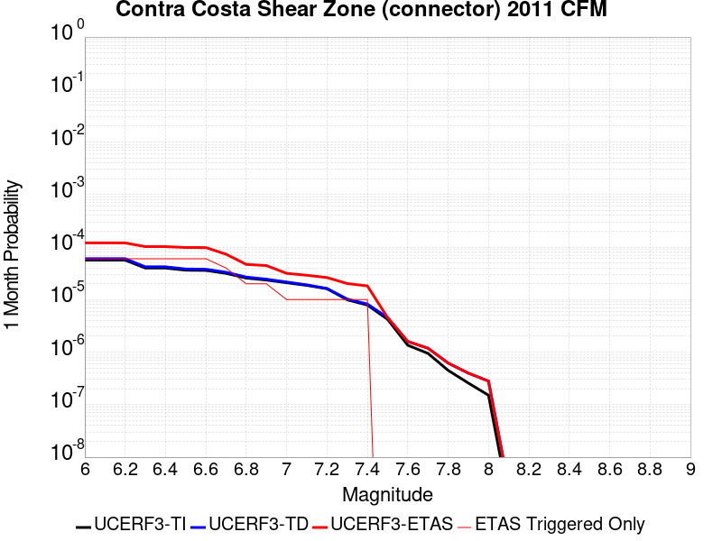 |  |  |

| Magnitude | 1 wk TI Prob | 1 wk TD Prob | 1 wk ETAS Prob | 1 wk ETAS/TD Gain | 1 wk ETAS Triggered Only | 1 mo TI Prob | 1 mo TD Prob | 1 mo ETAS Prob | 1 mo ETAS/TD Gain | 1 mo ETAS Triggered Only | 1 yr TI Prob | 1 yr TD Prob | 1 yr ETAS Prob | 1 yr ETAS/TD Gain | 1 yr ETAS Triggered Only | 10 yr TI Prob | 10 yr TD Prob | 10 yr ETAS Prob | 10 yr ETAS/TD Gain | 10 yr ETAS Triggered Only |
|-----|-----|-----|-----|-----|-----|-----|-----|-----|-----|-----|-----|-----|-----|-----|-----|-----|-----|-----|-----|-----|
| 6.0 | 1.3187427E-5 | 1.4047914E-5 | 4.404749E-5 | 3.1355183 | 3.0E-5 | 5.6516317E-5 | 6.0204085E-5 | 1.2020047E-4 | 1.9965501 | 6.0E-5 | 6.878689E-4 | 7.3276105E-4 | 8.326878E-4 | 1.1363702 | 1.0E-4 | 0.006857436 | 0.0073098983 | 0.007448875 | 1.0190121 | 1.4E-4 |
| 6.1 | 1.3187427E-5 | 1.4047914E-5 | 4.404749E-5 | 3.1355183 | 3.0E-5 | 5.6516317E-5 | 6.0204085E-5 | 1.2020047E-4 | 1.9965501 | 6.0E-5 | 6.878689E-4 | 7.3276105E-4 | 8.326878E-4 | 1.1363702 | 1.0E-4 | 0.006857436 | 0.0073098983 | 0.007448875 | 1.0190121 | 1.4E-4 |
| 6.2 | 1.3187427E-5 | 1.4047914E-5 | 4.404749E-5 | 3.1355183 | 3.0E-5 | 5.6516317E-5 | 6.0204085E-5 | 1.2020047E-4 | 1.9965501 | 6.0E-5 | 6.878689E-4 | 7.3276105E-4 | 8.326878E-4 | 1.1363702 | 1.0E-4 | 0.006857436 | 0.0073098983 | 0.007448875 | 1.0190121 | 1.4E-4 |
| 6.3 | 9.315374E-6 | 9.830119E-6 | 3.9829825E-5 | 4.051815 | 3.0E-5 | 3.992242E-5 | 4.2128424E-5 | 1.02125894E-4 | 2.4241567 | 6.0E-5 | 4.8594706E-4 | 5.12797E-4 | 6.027508E-4 | 1.175418 | 9.0E-5 | 0.004848858 | 0.0051207407 | 0.0052500754 | 1.025257 | 1.3E-4 |
| 6.4 | 9.315374E-6 | 9.830119E-6 | 3.9829825E-5 | 4.051815 | 3.0E-5 | 3.992242E-5 | 4.2128424E-5 | 1.02125894E-4 | 2.4241567 | 6.0E-5 | 4.8594706E-4 | 5.12797E-4 | 6.027508E-4 | 1.175418 | 9.0E-5 | 0.004848858 | 0.0051207407 | 0.0052500754 | 1.025257 | 1.3E-4 |
| 6.5 | 8.492638E-6 | 8.943669E-6 | 3.89434E-5 | 4.354298 | 3.0E-5 | 3.639651E-5 | 3.8329465E-5 | 9.832717E-5 | 2.5653155 | 6.0E-5 | 4.430374E-4 | 4.6656467E-4 | 5.565227E-4 | 1.1928093 | 9.0E-5 | 0.0044215517 | 0.0046603796 | 0.0047798203 | 1.0256289 | 1.2E-4 |
| 6.6 | 8.402072E-6 | 8.84445E-6 | 3.8844184E-5 | 4.3919277 | 3.0E-5 | 3.6008387E-5 | 3.7904254E-5 | 9.790198E-5 | 2.5828757 | 6.0E-5 | 4.383139E-4 | 4.6138995E-4 | 5.5134844E-4 | 1.1949728 | 9.0E-5 | 0.0043745036 | 0.004608848 | 0.004728295 | 1.0259168 | 1.2E-4 |
| 6.7 | 7.383587E-6 | 7.751894E-6 | 2.775174E-5 | 3.5799947 | 2.0E-5 | 3.164356E-5 | 3.322199E-5 | 7.322066E-5 | 2.2039816 | 4.0E-5 | 3.8519225E-4 | 4.0440477E-4 | 4.7437646E-4 | 1.1730239 | 7.0E-5 | 0.0038452526 | 0.004041091 | 0.004140687 | 1.0246458 | 1.0E-4 |
| 6.8 | 6.004921E-6 | 6.269357E-6 | 1.6269294E-5 | 2.5950499 | 1.0E-5 | 2.5735122E-5 | 2.68684E-5 | 4.6867863E-5 | 1.7443489 | 2.0E-5 | 3.1328006E-4 | 3.270742E-4 | 3.7705785E-4 | 1.1528205 | 5.0E-5 | 0.0031283877 | 0.003270177 | 0.003329981 | 1.0182877 | 6.0E-5 |
| 6.9 | 5.505255E-6 | 5.721665E-6 | 1.5721607E-5 | 2.747733 | 1.0E-5 | 2.3593739E-5 | 2.4521192E-5 | 4.45207E-5 | 1.815601 | 2.0E-5 | 2.872159E-4 | 2.9850504E-4 | 3.484901E-4 | 1.1674514 | 5.0E-5 | 0.0028684495 | 0.002985281 | 0.0030451019 | 1.0200386 | 6.0E-5 |
| 7.0 | 4.891922E-6 | 5.052222E-6 | 1.5052172E-5 | 2.9793172 | 1.0E-5 | 2.096521E-5 | 2.1652202E-5 | 3.1651987E-5 | 1.4618368 | 1.0E-5 | 2.5522153E-4 | 2.6358402E-4 | 3.0357347E-4 | 1.1517143 | 4.0E-5 | 0.0025492862 | 0.002636946 | 0.0026868142 | 1.0189114 | 5.0E-5 |
| 7.1 | 4.3599E-6 | 4.4561025E-6 | 1.4456058E-5 | 3.2441034 | 1.0E-5 | 1.868515E-5 | 1.9097444E-5 | 2.9097253E-5 | 1.5236202 | 1.0E-5 | 2.2746796E-4 | 2.3248685E-4 | 2.7247754E-4 | 1.1720127 | 4.0E-5 | 0.0022723526 | 0.0023266617 | 0.0023765455 | 1.02144 | 5.0E-5 |
| 7.2 | 3.7647926E-6 | 3.8069954E-6 | 1.3806957E-5 | 3.6267335 | 1.0E-5 | 1.6134725E-5 | 1.6315593E-5 | 2.631543E-5 | 1.6129006 | 1.0E-5 | 1.9642258E-4 | 1.9862449E-4 | 2.3861654E-4 | 1.2013451 | 4.0E-5 | 0.0019624906 | 0.0019886836 | 0.002038584 | 1.0250922 | 5.0E-5 |
| 7.3 | 2.3179882E-6 | 2.3945659E-6 | 1.2394542E-5 | 5.1761127 | 1.0E-5 | 9.934198E-6 | 1.0262384E-5 | 2.0262281E-5 | 1.9744225 | 1.0E-5 | 1.20942146E-4 | 1.2493742E-4 | 1.4493492E-4 | 1.1600602 | 2.0E-5 | 0.0012087635 | 0.0012528638 | 0.0012728387 | 1.0159434 | 2.0E-5 |
| 7.4 | 1.8378355E-6 | 1.921533E-6 | 1.1921514E-5 | 6.204168 | 1.0E-5 | 7.876414E-6 | 8.235116E-6 | 1.8235034E-5 | 2.214302 | 1.0E-5 | 9.5891126E-5 | 1.0025797E-4 | 1.2025596E-4 | 1.1994654 | 2.0E-5 | 9.584976E-4 | 0.0010062316 | 0.0010262115 | 1.0198561 | 2.0E-5 |
| 7.5 | 9.840493E-7 | 1.0649483E-6 | 1.0649483E-6 | 1.0 | 0.0 | 4.2173474E-6 | 4.564056E-6 | 4.564056E-6 | 1.0 | 0.0 | 5.1344992E-5 | 5.556598E-5 | 6.556542E-5 | 1.1799562 | 1.0E-5 | 5.133313E-4 | 5.592636E-4 | 5.6925794E-4 | 1.0178707 | 1.0E-5 |
| 7.6 | 3.1602997E-7 | 3.7246227E-7 | 3.7246227E-7 | 1.0 | 0.0 | 1.3544135E-6 | 1.5962657E-6 | 1.5962657E-6 | 1.0 | 0.0 | 1.648986E-5 | 1.9434365E-5 | 1.9434365E-5 | 1.0 | 0.0 | 1.6488635E-4 | 1.978736E-4 | 1.978736E-4 | 1.0 | 0.0 |
| 7.7 | 2.2125788E-7 | 2.777874E-7 | 2.777874E-7 | 1.0 | 0.0 | 9.482477E-7 | 1.1905169E-6 | 1.1905169E-6 | 1.0 | 0.0 | 1.1544855E-5 | 1.4494447E-5 | 1.4494447E-5 | 1.0 | 0.0 | 1.1544255E-4 | 1.4844474E-4 | 1.4844474E-4 | 1.0 | 0.0 |
| 7.8 | 1.0509553E-7 | 1.4484402E-7 | 1.4484402E-7 | 1.0 | 0.0 | 4.5040935E-7 | 6.207599E-7 | 6.207599E-7 | 1.0 | 0.0 | 5.48372E-6 | 7.557726E-6 | 7.557726E-6 | 1.0 | 0.0 | 5.4835844E-5 | 7.7873156E-5 | 7.7873156E-5 | 1.0 | 0.0 |
| 7.9 | 6.029319E-8 | 9.309861E-8 | 9.309861E-8 | 1.0 | 0.0 | 2.5839938E-7 | 3.98994E-7 | 3.98994E-7 | 1.0 | 0.0 | 3.1460077E-6 | 4.8577413E-6 | 4.8577413E-6 | 1.0 | 0.0 | 3.1459633E-5 | 5.0153616E-5 | 5.0153616E-5 | 1.0 | 0.0 |
| 8.0 | 3.531068E-8 | 6.557522E-8 | 6.557522E-8 | 1.0 | 0.0 | 1.5133148E-7 | 2.8103662E-7 | 2.8103662E-7 | 1.0 | 0.0 | 1.8424593E-6 | 3.4216157E-6 | 3.4216157E-6 | 1.0 | 0.0 | 1.842444E-5 | 3.5351604E-5 | 3.5351604E-5 | 1.0 | 0.0 |
| 8.1 | 3.5238246E-10 | 6.3007377E-10 | 6.3007377E-10 | 1.0 | 0.0 | 1.5102107E-9 | 2.7003164E-9 | 2.7003164E-9 | 1.0 | 0.0 | 1.8386816E-8 | 3.2876354E-8 | 3.2876354E-8 | 1.0 | 0.0 | 1.8386814E-7 | 3.3670406E-7 | 3.3670406E-7 | 1.0 | 0.0 |

## Clayton
*[(top)](#table-of-contents)*

| 1 Week | 1 Month | 1 Year | 10 Year |
|-----|-----|-----|-----|
|  |  |  |  |

| Magnitude | 1 wk TI Prob | 1 wk TD Prob | 1 wk ETAS Prob | 1 wk ETAS/TD Gain | 1 wk ETAS Triggered Only | 1 mo TI Prob | 1 mo TD Prob | 1 mo ETAS Prob | 1 mo ETAS/TD Gain | 1 mo ETAS Triggered Only | 1 yr TI Prob | 1 yr TD Prob | 1 yr ETAS Prob | 1 yr ETAS/TD Gain | 1 yr ETAS Triggered Only | 10 yr TI Prob | 10 yr TD Prob | 10 yr ETAS Prob | 10 yr ETAS/TD Gain | 10 yr ETAS Triggered Only |
|-----|-----|-----|-----|-----|-----|-----|-----|-----|-----|-----|-----|-----|-----|-----|-----|-----|-----|-----|-----|-----|
| 6.0 | 1.1413061E-5 | 1.2669735E-5 | 3.2669483E-5 | 2.5785449 | 2.0E-5 | 4.89122E-5 | 5.429786E-5 | 1.3429351E-4 | 2.4732745 | 8.0E-5 | 5.953433E-4 | 6.6089816E-4 | 7.608321E-4 | 1.1512092 | 1.0E-4 | 0.005937509 | 0.0065915305 | 0.0067206738 | 1.0195923 | 1.3E-4 |
| 6.1 | 1.1413061E-5 | 1.2669735E-5 | 3.2669483E-5 | 2.5785449 | 2.0E-5 | 4.89122E-5 | 5.429786E-5 | 1.3429351E-4 | 2.4732745 | 8.0E-5 | 5.953433E-4 | 6.6089816E-4 | 7.608321E-4 | 1.1512092 | 1.0E-4 | 0.005937509 | 0.0065915305 | 0.0067206738 | 1.0195923 | 1.3E-4 |
| 6.2 | 1.1413061E-5 | 1.2669735E-5 | 3.2669483E-5 | 2.5785449 | 2.0E-5 | 4.89122E-5 | 5.429786E-5 | 1.3429351E-4 | 2.4732745 | 8.0E-5 | 5.953433E-4 | 6.6089816E-4 | 7.608321E-4 | 1.1512092 | 1.0E-4 | 0.005937509 | 0.0065915305 | 0.0067206738 | 1.0195923 | 1.3E-4 |
| 6.3 | 8.538689E-6 | 9.534883E-6 | 9.534883E-6 | 1.0 | 0.0 | 3.659387E-5 | 4.0863208E-5 | 8.086157E-5 | 1.9788357 | 4.0E-5 | 4.4543925E-4 | 4.9740676E-4 | 5.473819E-4 | 1.1004714 | 5.0E-5 | 0.0044454746 | 0.004964 | 0.0050336528 | 1.0140315 | 7.0E-5 |
| 6.4 | 8.538689E-6 | 9.534883E-6 | 9.534883E-6 | 1.0 | 0.0 | 3.659387E-5 | 4.0863208E-5 | 8.086157E-5 | 1.9788357 | 4.0E-5 | 4.4543925E-4 | 4.9740676E-4 | 5.473819E-4 | 1.1004714 | 5.0E-5 | 0.0044454746 | 0.004964 | 0.0050336528 | 1.0140315 | 7.0E-5 |
| 6.5 | 7.197462E-6 | 8.082851E-6 | 8.082851E-6 | 1.0 | 0.0 | 3.08459E-5 | 3.464038E-5 | 7.463899E-5 | 2.1546817 | 4.0E-5 | 3.7548412E-4 | 4.216732E-4 | 4.7165214E-4 | 1.1185253 | 5.0E-5 | 0.003748503 | 0.004209543 | 0.0042692907 | 1.0141933 | 6.0E-5 |
| 6.6 | 7.1760483E-6 | 8.0588625E-6 | 8.0588625E-6 | 1.0 | 0.0 | 3.075413E-5 | 3.453757E-5 | 7.453619E-5 | 2.1581192 | 4.0E-5 | 3.743672E-4 | 4.20422E-4 | 4.7040096E-4 | 1.1188781 | 5.0E-5 | 0.0037373714 | 0.0041970783 | 0.0042568264 | 1.0142356 | 6.0E-5 |
| 6.7 | 6.202582E-6 | 6.978359E-6 | 6.978359E-6 | 1.0 | 0.0 | 2.6582224E-5 | 2.9906954E-5 | 6.990576E-5 | 2.3374417 | 4.0E-5 | 3.235905E-4 | 3.64064E-4 | 4.0404944E-4 | 1.1098307 | 4.0E-5 | 0.0032311971 | 0.0036354319 | 0.0036852502 | 1.0137035 | 5.0E-5 |
| 6.8 | 3.6417277E-6 | 4.1223284E-6 | 4.1223284E-6 | 1.0 | 0.0 | 1.5607311E-5 | 1.7667006E-5 | 3.766665E-5 | 2.1320338 | 2.0E-5 | 1.9000245E-4 | 2.1507533E-4 | 2.3507103E-4 | 1.0929707 | 2.0E-5 | 0.0018984007 | 0.0021487481 | 0.0021687052 | 1.0092877 | 2.0E-5 |
| 6.9 | 2.6498485E-6 | 3.00027E-6 | 3.00027E-6 | 1.0 | 0.0 | 1.1356444E-5 | 1.2858239E-5 | 1.2858239E-5 | 1.0 | 0.0 | 1.3825593E-4 | 1.5653821E-4 | 1.5653821E-4 | 1.0 | 0.0 | 0.0013816995 | 0.001564319 | 0.001564319 | 1.0 | 0.0 |
| 7.0 | 2.070442E-6 | 2.341307E-6 | 2.341307E-6 | 1.0 | 0.0 | 8.873292E-6 | 1.0034136E-5 | 1.0034136E-5 | 1.0 | 0.0 | 1.0802698E-4 | 1.2215906E-4 | 1.2215906E-4 | 1.0 | 0.0 | 0.0010797448 | 0.0012209489 | 0.0012209489 | 1.0 | 0.0 |
| 7.1 | 1.2111691E-6 | 1.3591936E-6 | 1.3591936E-6 | 1.0 | 0.0 | 5.190714E-6 | 5.825103E-6 | 5.825103E-6 | 1.0 | 0.0 | 6.319511E-5 | 7.091849E-5 | 7.091849E-5 | 1.0 | 0.0 | 6.3177146E-4 | 7.089749E-4 | 7.089749E-4 | 1.0 | 0.0 |
| 7.2 | 3.9541607E-7 | 4.2233907E-7 | 4.2233907E-7 | 1.0 | 0.0 | 1.6946392E-6 | 1.8100233E-6 | 1.8100233E-6 | 1.0 | 0.0 | 2.0632036E-5 | 2.2036813E-5 | 2.2036813E-5 | 1.0 | 0.0 | 2.063012E-4 | 2.2034642E-4 | 2.2034642E-4 | 1.0 | 0.0 |
| 7.3 | 2.5685637E-7 | 2.7461752E-7 | 2.7461752E-7 | 1.0 | 0.0 | 1.1008126E-6 | 1.1769317E-6 | 1.1769317E-6 | 1.0 | 0.0 | 1.3402311E-5 | 1.432905E-5 | 1.432905E-5 | 1.0 | 0.0 | 1.3401502E-4 | 1.4328134E-4 | 1.4328134E-4 | 1.0 | 0.0 |
| 7.4 | 1.482299E-7 | 1.5811176E-7 | 1.5811176E-7 | 1.0 | 0.0 | 6.3527085E-7 | 6.7762164E-7 | 6.7762164E-7 | 1.0 | 0.0 | 7.734395E-6 | 8.250013E-6 | 8.250013E-6 | 1.0 | 0.0 | 7.734126E-5 | 8.249709E-5 | 8.249709E-5 | 1.0 | 0.0 |
| 7.5 | 9.7969505E-8 | 1.0441063E-7 | 1.0441063E-7 | 1.0 | 0.0 | 4.1986925E-7 | 4.4747406E-7 | 4.4747406E-7 | 1.0 | 0.0 | 5.111896E-6 | 5.4479833E-6 | 5.4479833E-6 | 1.0 | 0.0 | 5.1117782E-5 | 5.4478514E-5 | 5.4478514E-5 | 1.0 | 0.0 |
| 7.6 | 6.125415E-8 | 6.523425E-8 | 6.523425E-8 | 1.0 | 0.0 | 2.6251774E-7 | 2.7957532E-7 | 2.7957532E-7 | 1.0 | 0.0 | 3.196149E-6 | 3.4038244E-6 | 3.4038244E-6 | 1.0 | 0.0 | 3.196103E-5 | 3.4037734E-5 | 3.4037734E-5 | 1.0 | 0.0 |

## Mount Diablo Thrust South
*[(top)](#table-of-contents)*

| 1 Week | 1 Month | 1 Year | 10 Year |
|-----|-----|-----|-----|
|  |  |  |  |

| Magnitude | 1 wk TI Prob | 1 wk TD Prob | 1 wk ETAS Prob | 1 wk ETAS/TD Gain | 1 wk ETAS Triggered Only | 1 mo TI Prob | 1 mo TD Prob | 1 mo ETAS Prob | 1 mo ETAS/TD Gain | 1 mo ETAS Triggered Only | 1 yr TI Prob | 1 yr TD Prob | 1 yr ETAS Prob | 1 yr ETAS/TD Gain | 1 yr ETAS Triggered Only | 10 yr TI Prob | 10 yr TD Prob | 10 yr ETAS Prob | 10 yr ETAS/TD Gain | 10 yr ETAS Triggered Only |
|-----|-----|-----|-----|-----|-----|-----|-----|-----|-----|-----|-----|-----|-----|-----|-----|-----|-----|-----|-----|-----|
| 6.0 | 2.2377444E-5 | 2.6965732E-5 | 3.6965463E-5 | 1.370831 | 1.0E-5 | 9.5899806E-5 | 1.1556342E-4 | 1.6555765E-4 | 1.4326128 | 5.0E-5 | 0.0011669548 | 0.0014062733 | 0.0014761749 | 1.0497069 | 7.0E-5 | 0.011608457 | 0.013993339 | 0.0141116595 | 1.0084555 | 1.2E-4 |
| 6.1 | 2.2377444E-5 | 2.6965732E-5 | 3.6965463E-5 | 1.370831 | 1.0E-5 | 9.5899806E-5 | 1.1556342E-4 | 1.6555765E-4 | 1.4326128 | 5.0E-5 | 0.0011669548 | 0.0014062733 | 0.0014761749 | 1.0497069 | 7.0E-5 | 0.011608457 | 0.013993339 | 0.0141116595 | 1.0084555 | 1.2E-4 |
| 6.2 | 2.2377444E-5 | 2.6965732E-5 | 3.6965463E-5 | 1.370831 | 1.0E-5 | 9.5899806E-5 | 1.1556342E-4 | 1.6555765E-4 | 1.4326128 | 5.0E-5 | 0.0011669548 | 0.0014062733 | 0.0014761749 | 1.0497069 | 7.0E-5 | 0.011608457 | 0.013993339 | 0.0141116595 | 1.0084555 | 1.2E-4 |
| 6.3 | 2.2377444E-5 | 2.6965732E-5 | 3.6965463E-5 | 1.370831 | 1.0E-5 | 9.5899806E-5 | 1.1556342E-4 | 1.6555765E-4 | 1.4326128 | 5.0E-5 | 0.0011669548 | 0.0014062733 | 0.0014761749 | 1.0497069 | 7.0E-5 | 0.011608457 | 0.013993339 | 0.0141116595 | 1.0084555 | 1.2E-4 |
| 6.4 | 1.2228463E-5 | 1.47523815E-5 | 1.47523815E-5 | 1.0 | 0.0 | 5.2406645E-5 | 6.322303E-5 | 1.03220504E-4 | 1.6326408 | 4.0E-5 | 6.378641E-4 | 7.694813E-4 | 8.1944285E-4 | 1.0649289 | 5.0E-5 | 0.0063603627 | 0.0076695546 | 0.0077489414 | 1.0103508 | 8.0E-5 |
| 6.5 | 1.2228463E-5 | 1.47523815E-5 | 1.47523815E-5 | 1.0 | 0.0 | 5.2406645E-5 | 6.322303E-5 | 1.03220504E-4 | 1.6326408 | 4.0E-5 | 6.378641E-4 | 7.694813E-4 | 8.1944285E-4 | 1.0649289 | 5.0E-5 | 0.0063603627 | 0.0076695546 | 0.0077489414 | 1.0103508 | 8.0E-5 |
| 6.6 | 1.2068118E-5 | 1.4557097E-5 | 1.4557097E-5 | 1.0 | 0.0 | 5.1719482E-5 | 6.238614E-5 | 1.02383645E-4 | 1.6411281 | 4.0E-5 | 6.2950276E-4 | 7.5929926E-4 | 8.0926134E-4 | 1.0658002 | 5.0E-5 | 0.006277225 | 0.0075684334 | 0.0076478277 | 1.0104902 | 8.0E-5 |
| 6.7 | 1.1499428E-5 | 1.3879509E-5 | 1.3879509E-5 | 1.0 | 0.0 | 4.9282335E-5 | 5.9482325E-5 | 9.947995E-5 | 1.6724286 | 4.0E-5 | 5.9984723E-4 | 7.239694E-4 | 7.7393325E-4 | 1.0690137 | 5.0E-5 | 0.0059823063 | 0.007217478 | 0.0072969003 | 1.0110042 | 8.0E-5 |
| 6.8 | 8.82118E-6 | 1.0833987E-5 | 1.0833987E-5 | 1.0 | 0.0 | 3.780451E-5 | 4.6430578E-5 | 6.642965E-5 | 1.4307306 | 2.0E-5 | 4.601727E-4 | 5.651513E-4 | 5.9513433E-4 | 1.0530531 | 3.0E-5 | 0.0045922096 | 0.0056377905 | 0.0056875087 | 1.0088187 | 5.0E-5 |
| 6.9 | 8.047112E-6 | 9.942693E-6 | 9.942693E-6 | 1.0 | 0.0 | 3.4487166E-5 | 4.2610878E-5 | 4.2610878E-5 | 1.0 | 0.0 | 4.1980037E-4 | 5.1866926E-4 | 5.2866404E-4 | 1.0192701 | 1.0E-5 | 0.004190082 | 0.0051752008 | 0.0052050455 | 1.0057669 | 3.0E-5 |
| 7.0 | 6.2574763E-6 | 7.751257E-6 | 7.751257E-6 | 1.0 | 0.0 | 2.681748E-5 | 3.321927E-5 | 3.321927E-5 | 1.0 | 0.0 | 3.264539E-4 | 4.0437325E-4 | 4.0437325E-4 | 1.0 | 0.0 | 0.0032597475 | 0.0040368163 | 0.0040467763 | 1.0024672 | 1.0E-5 |
| 7.1 | 3.6485903E-6 | 4.514226E-6 | 4.514226E-6 | 1.0 | 0.0 | 1.5636722E-5 | 1.934654E-5 | 1.934654E-5 | 1.0 | 0.0 | 1.9036046E-4 | 2.3551908E-4 | 2.3551908E-4 | 1.0 | 0.0 | 0.0019019748 | 0.0023527935 | 0.0023627698 | 1.0042403 | 1.0E-5 |
| 7.2 | 2.3034274E-6 | 2.9060375E-6 | 2.9060375E-6 | 1.0 | 0.0 | 9.871795E-6 | 1.2454388E-5 | 1.2454388E-5 | 1.0 | 0.0 | 1.2018247E-4 | 1.5162186E-4 | 1.5162186E-4 | 1.0 | 0.0 | 0.0012011749 | 0.0015152572 | 0.0015152572 | 1.0 | 0.0 |
| 7.3 | 1.224035E-6 | 1.568237E-6 | 1.568237E-6 | 1.0 | 0.0 | 5.245854E-6 | 6.7209994E-6 | 6.7209994E-6 | 1.0 | 0.0 | 6.38664E-5 | 8.182521E-5 | 8.182521E-5 | 1.0 | 0.0 | 6.384805E-4 | 8.179938E-4 | 8.179938E-4 | 1.0 | 0.0 |
| 7.4 | 5.1601154E-7 | 6.724563E-7 | 6.724563E-7 | 1.0 | 0.0 | 2.2114762E-6 | 2.8819525E-6 | 2.8819525E-6 | 1.0 | 0.0 | 2.6924388E-5 | 3.508722E-5 | 3.508722E-5 | 1.0 | 0.0 | 2.6921128E-4 | 3.5083416E-4 | 3.5083416E-4 | 1.0 | 0.0 |
| 7.5 | 3.552894E-7 | 4.66573E-7 | 4.66573E-7 | 1.0 | 0.0 | 1.5226678E-6 | 1.999597E-6 | 1.999597E-6 | 1.0 | 0.0 | 1.8538323E-5 | 2.4344838E-5 | 2.4344838E-5 | 1.0 | 0.0 | 1.8536777E-4 | 2.4343388E-4 | 2.4343388E-4 | 1.0 | 0.0 |
| 7.6 | 1.3124082E-7 | 1.7192369E-7 | 1.7192369E-7 | 1.0 | 0.0 | 5.6246057E-7 | 7.3681565E-7 | 7.3681565E-7 | 1.0 | 0.0 | 6.8479358E-6 | 8.970702E-6 | 8.970702E-6 | 1.0 | 0.0 | 6.8477246E-5 | 8.970755E-5 | 8.970755E-5 | 1.0 | 0.0 |
| 7.7 | 3.6193022E-8 | 4.7335234E-8 | 4.7335234E-8 | 1.0 | 0.0 | 1.5511293E-7 | 2.0286527E-7 | 2.0286527E-7 | 1.0 | 0.0 | 1.8884983E-6 | 2.469883E-6 | 2.469883E-6 | 1.0 | 0.0 | 1.8884823E-5 | 2.4699137E-5 | 2.4699137E-5 | 1.0 | 0.0 |

## Ortigalita (South)
*[(top)](#table-of-contents)*

| 1 Week | 1 Month | 1 Year | 10 Year |
|-----|-----|-----|-----|
|  |  |  |  |

| Magnitude | 1 wk TI Prob | 1 wk TD Prob | 1 wk ETAS Prob | 1 wk ETAS/TD Gain | 1 wk ETAS Triggered Only | 1 mo TI Prob | 1 mo TD Prob | 1 mo ETAS Prob | 1 mo ETAS/TD Gain | 1 mo ETAS Triggered Only | 1 yr TI Prob | 1 yr TD Prob | 1 yr ETAS Prob | 1 yr ETAS/TD Gain | 1 yr ETAS Triggered Only | 10 yr TI Prob | 10 yr TD Prob | 10 yr ETAS Prob | 10 yr ETAS/TD Gain | 10 yr ETAS Triggered Only |
|-----|-----|-----|-----|-----|-----|-----|-----|-----|-----|-----|-----|-----|-----|-----|-----|-----|-----|-----|-----|-----|
| 6.0 | 3.72394E-5 | 4.326915E-5 | 5.3268715E-5 | 1.2311015 | 1.0E-5 | 1.5958765E-4 | 1.8542692E-4 | 2.054232E-4 | 1.1078392 | 2.0E-5 | 0.0019412481 | 0.0022553916 | 0.0023252338 | 1.0309668 | 7.0E-5 | 0.019243775 | 0.022341404 | 0.02243917 | 1.004376 | 1.0E-4 |
| 6.1 | 2.7299884E-5 | 3.1501393E-5 | 3.1501393E-5 | 1.0 | 0.0 | 1.16994255E-4 | 1.349993E-4 | 1.349993E-4 | 1.0 | 0.0 | 0.0014234743 | 0.0016424324 | 0.0016823667 | 1.0243142 | 4.0E-5 | 0.014143906 | 0.016308872 | 0.01637773 | 1.0042222 | 7.0E-5 |
| 6.2 | 2.7299884E-5 | 3.1501393E-5 | 3.1501393E-5 | 1.0 | 0.0 | 1.16994255E-4 | 1.349993E-4 | 1.349993E-4 | 1.0 | 0.0 | 0.0014234743 | 0.0016424324 | 0.0016823667 | 1.0243142 | 4.0E-5 | 0.014143906 | 0.016308872 | 0.01637773 | 1.0042222 | 7.0E-5 |
| 6.3 | 2.0546433E-5 | 2.363831E-5 | 2.363831E-5 | 1.0 | 0.0 | 8.805317E-5 | 1.01303216E-4 | 1.01303216E-4 | 1.0 | 0.0 | 0.00107152 | 0.0012326878 | 0.0012726384 | 1.0324094 | 4.0E-5 | 0.010663681 | 0.012260566 | 0.012329709 | 1.0056393 | 7.0E-5 |
| 6.4 | 2.0546433E-5 | 2.363831E-5 | 2.363831E-5 | 1.0 | 0.0 | 8.805317E-5 | 1.01303216E-4 | 1.01303216E-4 | 1.0 | 0.0 | 0.00107152 | 0.0012326878 | 0.0012726384 | 1.0324094 | 4.0E-5 | 0.010663681 | 0.012260566 | 0.012329709 | 1.0056393 | 7.0E-5 |
| 6.5 | 1.7779594E-5 | 2.0452904E-5 | 2.0452904E-5 | 1.0 | 0.0 | 7.619603E-5 | 8.7652435E-5 | 8.7652435E-5 | 1.0 | 0.0 | 9.272918E-4 | 0.0010666596 | 0.0010966276 | 1.0280952 | 3.0E-5 | 0.009234319 | 0.010616866 | 0.010676229 | 1.0055914 | 6.0E-5 |
| 6.6 | 1.6272212E-5 | 1.8720399E-5 | 1.8720399E-5 | 1.0 | 0.0 | 6.973618E-5 | 8.022789E-5 | 8.022789E-5 | 1.0 | 0.0 | 8.487073E-4 | 9.7634905E-4 | 0.0010063198 | 1.0306967 | 3.0E-5 | 0.008454733 | 0.0097218985 | 0.009781315 | 1.0061116 | 6.0E-5 |
| 6.7 | 1.3051484E-5 | 1.5043188E-5 | 1.5043188E-5 | 1.0 | 0.0 | 5.593373E-5 | 6.446926E-5 | 6.446926E-5 | 1.0 | 0.0 | 6.807804E-4 | 7.8464014E-4 | 7.946323E-4 | 1.0127347 | 1.0E-5 | 0.006786986 | 0.007819681 | 0.007849447 | 1.0038065 | 3.0E-5 |
| 6.8 | 1.04277415E-5 | 1.1990697E-5 | 1.1990697E-5 | 1.0 | 0.0 | 4.4689557E-5 | 5.1387735E-5 | 5.1387735E-5 | 1.0 | 0.0 | 5.439595E-4 | 6.254735E-4 | 6.254735E-4 | 1.0 | 0.0 | 0.0054262993 | 0.0062378854 | 0.006257761 | 1.0031862 | 2.0E-5 |
| 6.9 | 7.639968E-6 | 8.794061E-6 | 8.794061E-6 | 1.0 | 0.0 | 3.274231E-5 | 3.768832E-5 | 3.768832E-5 | 1.0 | 0.0 | 3.9856473E-4 | 4.5876458E-4 | 4.5876458E-4 | 1.0 | 0.0 | 0.003978506 | 0.0045787618 | 0.0045986706 | 1.004348 | 2.0E-5 |
| 7.0 | 3.919831E-6 | 4.5347706E-6 | 4.5347706E-6 | 1.0 | 0.0 | 1.679917E-5 | 1.9434598E-5 | 1.9434598E-5 | 1.0 | 0.0 | 2.045107E-4 | 2.3659266E-4 | 2.3659266E-4 | 1.0 | 0.0 | 0.0020432258 | 0.0023636164 | 0.0023735927 | 1.0042208 | 1.0E-5 |
| 7.1 | 1.6017933E-6 | 1.8576128E-6 | 1.8576128E-6 | 1.0 | 0.0 | 6.8648105E-6 | 7.961179E-6 | 7.961179E-6 | 1.0 | 0.0 | 8.357586E-5 | 9.6924115E-5 | 9.6924115E-5 | 1.0 | 0.0 | 8.3544437E-4 | 9.689232E-4 | 9.689232E-4 | 1.0 | 0.0 |

## San Andreas (Peninsula) 2011 CFM
*[(top)](#table-of-contents)*

| 1 Week | 1 Month | 1 Year | 10 Year |
|-----|-----|-----|-----|
|  |  |  |  |

| Magnitude | 1 wk TI Prob | 1 wk TD Prob | 1 wk ETAS Prob | 1 wk ETAS/TD Gain | 1 wk ETAS Triggered Only | 1 mo TI Prob | 1 mo TD Prob | 1 mo ETAS Prob | 1 mo ETAS/TD Gain | 1 mo ETAS Triggered Only | 1 yr TI Prob | 1 yr TD Prob | 1 yr ETAS Prob | 1 yr ETAS/TD Gain | 1 yr ETAS Triggered Only | 10 yr TI Prob | 10 yr TD Prob | 10 yr ETAS Prob | 10 yr ETAS/TD Gain | 10 yr ETAS Triggered Only |
|-----|-----|-----|-----|-----|-----|-----|-----|-----|-----|-----|-----|-----|-----|-----|-----|-----|-----|-----|-----|-----|
| 6.0 | 8.6200685E-5 | 2.5582378E-5 | 7.55811E-5 | 2.9544203 | 5.0E-5 | 3.6937918E-4 | 1.0963416E-4 | 1.6962759E-4 | 1.5472146 | 6.0E-5 | 0.0044879215 | 0.0013339802 | 0.0014338469 | 1.0748637 | 1.0E-4 | 0.043983612 | 0.014975359 | 0.015093561 | 1.0078932 | 1.2E-4 |
| 6.1 | 8.6200685E-5 | 2.5582378E-5 | 7.55811E-5 | 2.9544203 | 5.0E-5 | 3.6937918E-4 | 1.0963416E-4 | 1.6962759E-4 | 1.5472146 | 6.0E-5 | 0.0044879215 | 0.0013339802 | 0.0014338469 | 1.0748637 | 1.0E-4 | 0.043983612 | 0.014975359 | 0.015093561 | 1.0078932 | 1.2E-4 |
| 6.2 | 8.6200685E-5 | 2.5582378E-5 | 7.55811E-5 | 2.9544203 | 5.0E-5 | 3.6937918E-4 | 1.0963416E-4 | 1.6962759E-4 | 1.5472146 | 6.0E-5 | 0.0044879215 | 0.0013339802 | 0.0014338469 | 1.0748637 | 1.0E-4 | 0.043983612 | 0.014975359 | 0.015093561 | 1.0078932 | 1.2E-4 |
| 6.3 | 8.551163E-5 | 2.5271886E-5 | 7.527062E-5 | 2.9784331 | 5.0E-5 | 3.6642692E-4 | 1.0830359E-4 | 1.6829709E-4 | 1.5539383 | 6.0E-5 | 0.004452125 | 0.0013178003 | 0.0014176685 | 1.0757841 | 1.0E-4 | 0.043639794 | 0.014801145 | 0.014919369 | 1.0079875 | 1.2E-4 |
| 6.4 | 8.551163E-5 | 2.5271886E-5 | 7.527062E-5 | 2.9784331 | 5.0E-5 | 3.6642692E-4 | 1.0830359E-4 | 1.6829709E-4 | 1.5539383 | 6.0E-5 | 0.004452125 | 0.0013178003 | 0.0014176685 | 1.0757841 | 1.0E-4 | 0.043639794 | 0.014801145 | 0.014919369 | 1.0079875 | 1.2E-4 |
| 6.5 | 8.511146E-5 | 2.5091947E-5 | 7.509069E-5 | 2.9926212 | 5.0E-5 | 3.647124E-4 | 1.0753249E-4 | 1.6752604E-4 | 1.5579109 | 6.0E-5 | 0.004431336 | 0.0013084235 | 0.0014082927 | 1.0763278 | 1.0E-4 | 0.04344007 | 0.014700223 | 0.014818459 | 1.0080432 | 1.2E-4 |
| 6.6 | 8.4985084E-5 | 2.5022164E-5 | 7.5020915E-5 | 2.9981785 | 5.0E-5 | 3.6417096E-4 | 1.0723344E-4 | 1.6722702E-4 | 1.559467 | 6.0E-5 | 0.0044247704 | 0.0013047869 | 0.0014046564 | 1.0765408 | 1.0E-4 | 0.043376986 | 0.014662078 | 0.014780318 | 1.0080644 | 1.2E-4 |
| 6.7 | 8.462618E-5 | 2.484947E-5 | 7.484823E-5 | 3.0120654 | 5.0E-5 | 3.6263323E-4 | 1.0649339E-4 | 1.66487E-4 | 1.5633552 | 6.0E-5 | 0.004406125 | 0.0012957875 | 0.001395658 | 1.0770731 | 1.0E-4 | 0.043197807 | 0.014566284 | 0.0146845365 | 1.0081182 | 1.2E-4 |
| 6.8 | 8.42337E-5 | 2.4744324E-5 | 7.474309E-5 | 3.0206153 | 5.0E-5 | 3.6095164E-4 | 1.06042804E-4 | 1.6603644E-4 | 1.5657493 | 6.0E-5 | 0.004385734 | 0.0012903081 | 0.001390179 | 1.0774009 | 1.0E-4 | 0.043001823 | 0.014506465 | 0.014624723 | 1.0081521 | 1.2E-4 |
| 6.9 | 8.365989E-5 | 2.4547677E-5 | 7.454645E-5 | 3.0368028 | 5.0E-5 | 3.5849313E-4 | 1.05200095E-4 | 1.6519378E-4 | 1.5702817 | 6.0E-5 | 0.004355922 | 0.0012800603 | 0.0013799323 | 1.0780213 | 1.0E-4 | 0.04271523 | 0.0143982805 | 0.014516553 | 1.0082144 | 1.2E-4 |
| 7.0 | 8.30936E-5 | 2.430799E-5 | 7.430677E-5 | 3.056887 | 5.0E-5 | 3.560668E-4 | 1.0417295E-4 | 1.641667E-4 | 1.5759053 | 6.0E-5 | 0.004326499 | 0.0012675694 | 0.0013674427 | 1.0787911 | 1.0E-4 | 0.042432297 | 0.014268656 | 0.0143869445 | 1.00829 | 1.2E-4 |
| 7.1 | 8.041264E-5 | 2.3991543E-5 | 7.399034E-5 | 3.0840178 | 5.0E-5 | 3.4458007E-4 | 1.02816855E-4 | 1.6281068E-4 | 1.5835019 | 6.0E-5 | 0.0041871946 | 0.001251078 | 0.0013509529 | 1.0798311 | 1.0E-4 | 0.041091725 | 0.014089807 | 0.014208117 | 1.0083967 | 1.2E-4 |
| 7.2 | 7.8427016E-5 | 2.3411747E-5 | 7.341058E-5 | 3.1356301 | 5.0E-5 | 3.3607247E-4 | 1.003322E-4 | 1.6032619E-4 | 1.5979533 | 6.0E-5 | 0.004084008 | 0.0012208617 | 0.0013207396 | 1.0818094 | 1.0E-4 | 0.040097635 | 0.013771977 | 0.013890324 | 1.0085933 | 1.2E-4 |
| 7.3 | 7.721087E-5 | 2.3195384E-5 | 7.319423E-5 | 3.1555512 | 5.0E-5 | 3.3086175E-4 | 9.940501E-5 | 1.5939905E-4 | 1.6035314 | 6.0E-5 | 0.004020803 | 0.0012095857 | 0.0013094648 | 1.0825729 | 1.0E-4 | 0.03948827 | 0.013655031 | 0.013773392 | 1.008668 | 1.2E-4 |
| 7.4 | 7.3536525E-5 | 2.1289712E-5 | 7.128865E-5 | 3.3485022 | 5.0E-5 | 3.1511846E-4 | 9.1238435E-5 | 1.5123296E-4 | 1.6575576 | 6.0E-5 | 0.0038298194 | 0.0011102633 | 0.0012101522 | 1.0899687 | 1.0E-4 | 0.037644852 | 0.012600591 | 0.012719079 | 1.0094033 | 1.2E-4 |
| 7.5 | 6.806207E-5 | 1.906485E-5 | 5.906409E-5 | 3.098062 | 4.0E-5 | 2.9166197E-4 | 8.170395E-5 | 1.3169987E-4 | 1.6119155 | 5.0E-5 | 0.0035452035 | 9.942927E-4 | 0.0010842032 | 1.0904266 | 9.0E-5 | 0.034891766 | 0.0113377925 | 0.011446546 | 1.009592 | 1.1E-4 |
| 7.6 | 5.6731416E-5 | 1.4402408E-5 | 2.4402263E-5 | 1.6943183 | 1.0E-5 | 2.43112E-4 | 6.172314E-5 | 7.172253E-5 | 1.1620038 | 1.0E-5 | 0.0029558712 | 7.5122033E-4 | 7.811978E-4 | 1.0399051 | 3.0E-5 | 0.02916862 | 0.008612224 | 0.00865188 | 1.0046046 | 4.0E-5 |
| 7.7 | 4.946994E-5 | 1.3454263E-5 | 2.345413E-5 | 1.7432488 | 1.0E-5 | 2.1199681E-4 | 5.7659854E-5 | 6.7659275E-5 | 1.1734209 | 1.0E-5 | 0.002578006 | 7.0178276E-4 | 7.3176174E-4 | 1.0427183 | 3.0E-5 | 0.02548303 | 0.008024996 | 0.008064675 | 1.0049444 | 4.0E-5 |
| 7.8 | 3.9718198E-5 | 1.3182268E-5 | 2.3182136E-5 | 1.7585847 | 1.0E-5 | 1.7020974E-4 | 5.6494213E-5 | 6.6493645E-5 | 1.1769993 | 1.0E-5 | 0.0020703338 | 6.876001E-4 | 7.175795E-4 | 1.0436 | 3.0E-5 | 0.020511515 | 0.0078299735 | 0.007869661 | 1.0050685 | 4.0E-5 |
| 7.9 | 2.4115114E-5 | 1.23614445E-5 | 2.236132E-5 | 1.8089569 | 1.0E-5 | 1.0334639E-4 | 5.2976546E-5 | 6.297602E-5 | 1.1887528 | 1.0E-5 | 0.001257516 | 6.447987E-4 | 6.7477935E-4 | 1.0464962 | 3.0E-5 | 0.012504238 | 0.007254865 | 0.0072945748 | 1.0054735 | 4.0E-5 |
| 8.0 | 1.7756569E-5 | 1.15673365E-5 | 1.15673365E-5 | 1.0 | 0.0 | 7.6097356E-5 | 4.957336E-5 | 4.957336E-5 | 1.0 | 0.0 | 9.260915E-4 | 6.0338865E-4 | 6.133826E-4 | 1.016563 | 1.0E-5 | 0.009222416 | 0.0067442013 | 0.0067640664 | 1.0029455 | 2.0E-5 |
| 8.1 | 1.3159258E-5 | 9.87797E-6 | 9.87797E-6 | 1.0 | 0.0 | 5.6395602E-5 | 4.233347E-5 | 4.233347E-5 | 1.0 | 0.0 | 6.864001E-4 | 5.1528827E-4 | 5.252831E-4 | 1.0193967 | 1.0E-5 | 0.0068428386 | 0.005760528 | 0.0057704705 | 1.0017259 | 1.0E-5 |
| 8.2 | 8.635426E-6 | 5.5446344E-6 | 5.5446344E-6 | 1.0 | 0.0 | 3.700844E-5 | 2.3762503E-5 | 2.3762503E-5 | 1.0 | 0.0 | 4.5048463E-4 | 2.8927013E-4 | 2.9926724E-4 | 1.0345597 | 1.0E-5 | 0.004495725 | 0.0032869661 | 0.0032969334 | 1.0030323 | 1.0E-5 |
| 8.3 | 1.983087E-6 | 7.7871465E-7 | 7.7871465E-7 | 1.0 | 0.0 | 8.498917E-6 | 3.3373444E-6 | 3.3373444E-6 | 1.0 | 0.0 | 1.034694E-4 | 4.063143E-5 | 4.063143E-5 | 1.0 | 0.0 | 0.0010342124 | 4.7926197E-4 | 4.7926197E-4 | 1.0 | 0.0 |

## Great Valley 05 Pittsburg - Kirby Hills alt1
*[(top)](#table-of-contents)*

| 1 Week | 1 Month | 1 Year | 10 Year |
|-----|-----|-----|-----|
|  |  |  |  |

| Magnitude | 1 wk TI Prob | 1 wk TD Prob | 1 wk ETAS Prob | 1 wk ETAS/TD Gain | 1 wk ETAS Triggered Only | 1 mo TI Prob | 1 mo TD Prob | 1 mo ETAS Prob | 1 mo ETAS/TD Gain | 1 mo ETAS Triggered Only | 1 yr TI Prob | 1 yr TD Prob | 1 yr ETAS Prob | 1 yr ETAS/TD Gain | 1 yr ETAS Triggered Only | 10 yr TI Prob | 10 yr TD Prob | 10 yr ETAS Prob | 10 yr ETAS/TD Gain | 10 yr ETAS Triggered Only |
|-----|-----|-----|-----|-----|-----|-----|-----|-----|-----|-----|-----|-----|-----|-----|-----|-----|-----|-----|-----|-----|
| 6.0 | 4.187212E-5 | 5.3470267E-5 | 5.3470267E-5 | 1.0 | 0.0 | 1.794396E-4 | 2.2914392E-4 | 2.3914163E-4 | 1.0436307 | 1.0E-5 | 0.002182488 | 0.0027872324 | 0.0028570371 | 1.0250446 | 7.0E-5 | 0.021611776 | 0.027617214 | 0.027704729 | 1.0031688 | 9.0E-5 |
| 6.1 | 4.187212E-5 | 5.3470267E-5 | 5.3470267E-5 | 1.0 | 0.0 | 1.794396E-4 | 2.2914392E-4 | 2.3914163E-4 | 1.0436307 | 1.0E-5 | 0.002182488 | 0.0027872324 | 0.0028570371 | 1.0250446 | 7.0E-5 | 0.021611776 | 0.027617214 | 0.027704729 | 1.0031688 | 9.0E-5 |
| 6.2 | 1.7353306E-5 | 2.2165877E-5 | 2.2165877E-5 | 1.0 | 0.0 | 7.436919E-5 | 9.4995485E-5 | 9.4995485E-5 | 1.0 | 0.0 | 9.050688E-4 | 0.001156366 | 0.0011663544 | 1.0086378 | 1.0E-5 | 0.009013915 | 0.011541089 | 0.011550974 | 1.0008565 | 1.0E-5 |
| 6.3 | 1.7353306E-5 | 2.2165877E-5 | 2.2165877E-5 | 1.0 | 0.0 | 7.436919E-5 | 9.4995485E-5 | 9.4995485E-5 | 1.0 | 0.0 | 9.050688E-4 | 0.001156366 | 0.0011663544 | 1.0086378 | 1.0E-5 | 0.009013915 | 0.011541089 | 0.011550974 | 1.0008565 | 1.0E-5 |
| 6.4 | 1.4028824E-5 | 1.791014E-5 | 1.791014E-5 | 1.0 | 0.0 | 6.0122147E-5 | 7.675775E-5 | 7.675775E-5 | 1.0 | 0.0 | 7.3174125E-4 | 9.3452557E-4 | 9.3452557E-4 | 1.0 | 0.0 | 0.0072933645 | 0.009342976 | 0.009342976 | 1.0 | 0.0 |

## Rodgers Creek - Healdsburg 2011 CFM
*[(top)](#table-of-contents)*

| 1 Week | 1 Month | 1 Year | 10 Year |
|-----|-----|-----|-----|
|  |  |  |  |

| Magnitude | 1 wk TI Prob | 1 wk TD Prob | 1 wk ETAS Prob | 1 wk ETAS/TD Gain | 1 wk ETAS Triggered Only | 1 mo TI Prob | 1 mo TD Prob | 1 mo ETAS Prob | 1 mo ETAS/TD Gain | 1 mo ETAS Triggered Only | 1 yr TI Prob | 1 yr TD Prob | 1 yr ETAS Prob | 1 yr ETAS/TD Gain | 1 yr ETAS Triggered Only | 10 yr TI Prob | 10 yr TD Prob | 10 yr ETAS Prob | 10 yr ETAS/TD Gain | 10 yr ETAS Triggered Only |
|-----|-----|-----|-----|-----|-----|-----|-----|-----|-----|-----|-----|-----|-----|-----|-----|-----|-----|-----|-----|-----|
| 6.0 | 7.390182E-5 | 1.3156519E-4 | 1.7155994E-4 | 1.3039918 | 4.0E-5 | 3.1668364E-4 | 5.6372944E-4 | 6.037069E-4 | 1.070916 | 4.0E-5 | 0.0038488081 | 0.006841826 | 0.0069014155 | 1.0087095 | 6.0E-5 | 0.037828278 | 0.06628447 | 0.06638718 | 1.0015495 | 1.1E-4 |
| 6.1 | 7.318768E-5 | 1.3054513E-4 | 1.705399E-4 | 1.3063674 | 4.0E-5 | 3.1362378E-4 | 5.593597E-4 | 5.993373E-4 | 1.0714704 | 4.0E-5 | 0.0038116854 | 0.006788957 | 0.0068485495 | 1.0087779 | 6.0E-5 | 0.037469655 | 0.0657888 | 0.065891564 | 1.001562 | 1.1E-4 |
| 6.2 | 7.1379836E-5 | 1.2747211E-4 | 1.6746702E-4 | 1.3137541 | 4.0E-5 | 3.058777E-4 | 5.4619514E-4 | 5.861733E-4 | 1.0731939 | 4.0E-5 | 0.003717703 | 0.006629664 | 0.0066892663 | 1.0089903 | 6.0E-5 | 0.0365612 | 0.06430634 | 0.06440927 | 1.0016005 | 1.1E-4 |
| 6.3 | 6.9255926E-5 | 1.2401471E-4 | 1.6400975E-4 | 1.3225024 | 4.0E-5 | 2.9677735E-4 | 5.313838E-4 | 5.7136256E-4 | 1.0752351 | 4.0E-5 | 0.0036072785 | 0.006450422 | 0.006510035 | 1.0092417 | 6.0E-5 | 0.035492823 | 0.06263191 | 0.06273502 | 1.0016463 | 1.1E-4 |
| 6.4 | 6.6757144E-5 | 1.1977896E-4 | 1.5977418E-4 | 1.3339084 | 4.0E-5 | 2.8607066E-4 | 5.1323784E-4 | 5.532173E-4 | 1.0778966 | 4.0E-5 | 0.0034773487 | 0.0062308456 | 0.0062904716 | 1.0095695 | 6.0E-5 | 0.034234364 | 0.06058036 | 0.0606837 | 1.0017058 | 1.1E-4 |
| 6.5 | 6.5735134E-5 | 1.1826892E-4 | 1.5826419E-4 | 1.3381723 | 4.0E-5 | 2.8169158E-4 | 5.0676876E-4 | 5.4674846E-4 | 1.0788915 | 4.0E-5 | 0.003424202 | 0.0061525395 | 0.0062121707 | 1.0096921 | 6.0E-5 | 0.03371918 | 0.059843887 | 0.059947304 | 1.001728 | 1.1E-4 |
| 6.6 | 6.289601E-5 | 1.13620714E-4 | 1.5361617E-4 | 1.3520085 | 4.0E-5 | 2.6952647E-4 | 4.8685542E-4 | 5.2683597E-4 | 1.08212 | 4.0E-5 | 0.0032765474 | 0.0059114345 | 0.00597108 | 1.0100899 | 6.0E-5 | 0.032286562 | 0.057580784 | 0.05768445 | 1.0018004 | 1.1E-4 |
| 6.7 | 6.115274E-5 | 1.107893E-4 | 1.5078486E-4 | 1.3610057 | 4.0E-5 | 2.6205686E-4 | 4.7472524E-4 | 5.1470625E-4 | 1.0842192 | 4.0E-5 | 0.0031858748 | 0.0057645417 | 0.0058241957 | 1.0103484 | 6.0E-5 | 0.031405866 | 0.05619833 | 0.05630215 | 1.0018474 | 1.1E-4 |
| 6.8 | 5.9232367E-5 | 1.0746109E-4 | 1.474568E-4 | 1.3721877 | 4.0E-5 | 2.538283E-4 | 4.6046663E-4 | 5.004482E-4 | 1.0868284 | 4.0E-5 | 0.0030859804 | 0.005591847 | 0.0056515117 | 1.01067 | 6.0E-5 | 0.030434765 | 0.05456444 | 0.054668434 | 1.0019059 | 1.1E-4 |
| 6.9 | 5.4030377E-5 | 9.839897E-5 | 1.3839503E-4 | 1.4064684 | 4.0E-5 | 2.315382E-4 | 4.2164203E-4 | 4.6162517E-4 | 1.0948272 | 4.0E-5 | 0.0028153337 | 0.0051214746 | 0.0051712184 | 1.0097128 | 5.0E-5 | 0.027799325 | 0.050098296 | 0.050193287 | 1.001896 | 1.0E-4 |
| 7.0 | 4.8260714E-5 | 8.756719E-5 | 1.2756369E-4 | 1.4567521 | 4.0E-5 | 2.0681522E-4 | 3.7523426E-4 | 4.1521926E-4 | 1.1065601 | 4.0E-5 | 0.0025150678 | 0.004558962 | 0.004608734 | 1.0109174 | 5.0E-5 | 0.024867928 | 0.04474531 | 0.04484084 | 1.0021349 | 1.0E-4 |
| 7.1 | 4.0294493E-5 | 7.4040654E-5 | 1.0403844E-4 | 1.4051528 | 3.0E-5 | 1.7267925E-4 | 3.1727873E-4 | 3.472692E-4 | 1.0945241 | 3.0E-5 | 0.0021003427 | 0.0038560645 | 0.0038959102 | 1.0103333 | 4.0E-5 | 0.02080602 | 0.0379959 | 0.03807286 | 1.0020255 | 8.0E-5 |
| 7.2 | 3.096388E-5 | 5.7112917E-5 | 8.7111206E-5 | 1.5252452 | 3.0E-5 | 1.326956E-4 | 2.447468E-4 | 2.7473946E-4 | 1.1225456 | 3.0E-5 | 0.0016143717 | 0.0029757428 | 0.0030156237 | 1.013402 | 4.0E-5 | 0.01602694 | 0.029502932 | 0.029580573 | 1.0026315 | 8.0E-5 |
| 7.3 | 2.3615226E-5 | 4.3743075E-5 | 7.3741765E-5 | 1.6857928 | 3.0E-5 | 1.0120418E-4 | 1.8745693E-4 | 2.174513E-4 | 1.1600068 | 3.0E-5 | 0.0012314644 | 0.002279913 | 0.0023198219 | 1.0175046 | 4.0E-5 | 0.0122466255 | 0.022693316 | 0.0227715 | 1.0034453 | 8.0E-5 |
| 7.4 | 1.8251132E-5 | 3.363491E-5 | 6.36339E-5 | 1.8919004 | 3.0E-5 | 7.821679E-5 | 1.4414171E-4 | 1.7413739E-4 | 1.2080985 | 3.0E-5 | 9.518733E-4 | 0.0017535225 | 0.0017934524 | 1.0227712 | 4.0E-5 | 0.009478063 | 0.017511668 | 0.017590268 | 1.0044883 | 8.0E-5 |
| 7.5 | 1.2411432E-5 | 2.2530934E-5 | 5.2530257E-5 | 2.3314726 | 3.0E-5 | 5.3190768E-5 | 9.6557604E-5 | 1.265547E-4 | 1.3106654 | 3.0E-5 | 6.4740516E-4 | 0.0011749606 | 0.0012049254 | 1.0255028 | 3.0E-5 | 0.006455223 | 0.011778384 | 0.011837678 | 1.0050341 | 6.0E-5 |
| 7.6 | 4.4771446E-6 | 8.110867E-6 | 2.8110704E-5 | 3.4658077 | 2.0E-5 | 1.918762E-5 | 3.4760404E-5 | 5.475971E-5 | 1.5753473 | 2.0E-5 | 2.3358424E-4 | 4.2312694E-4 | 4.4311848E-4 | 1.0472472 | 2.0E-5 | 0.0023333887 | 0.0042594117 | 0.004289284 | 1.0070132 | 3.0E-5 |
| 7.7 | 2.157941E-7 | 3.552437E-7 | 3.552437E-7 | 1.0 | 0.0 | 9.248315E-7 | 1.5224721E-6 | 1.5224721E-6 | 1.0 | 0.0 | 1.1259765E-5 | 1.853594E-5 | 1.853594E-5 | 1.0 | 0.0 | 1.1259195E-4 | 1.9155742E-4 | 1.9155742E-4 | 1.0 | 0.0 |
| 7.8 | 9.9623286E-8 | 2.0033474E-7 | 2.0033474E-7 | 1.0 | 0.0 | 4.269569E-7 | 8.5857715E-7 | 8.5857715E-7 | 1.0 | 0.0 | 5.1981874E-6 | 1.0453127E-5 | 1.0453127E-5 | 1.0 | 0.0 | 5.198066E-5 | 1.09674125E-4 | 1.09674125E-4 | 1.0 | 0.0 |
| 7.9 | 5.6745257E-8 | 1.185751E-7 | 1.185751E-7 | 1.0 | 0.0 | 2.4319394E-7 | 5.0817886E-7 | 5.0817886E-7 | 1.0 | 0.0 | 2.960882E-6 | 6.1870605E-6 | 6.1870605E-6 | 1.0 | 0.0 | 2.9608427E-5 | 6.511706E-5 | 6.511706E-5 | 1.0 | 0.0 |
| 8.0 | 2.8614323E-8 | 6.623447E-8 | 6.623447E-8 | 1.0 | 0.0 | 1.2263281E-7 | 2.83862E-7 | 2.83862E-7 | 1.0 | 0.0 | 1.4930534E-6 | 3.4560144E-6 | 3.4560144E-6 | 1.0 | 0.0 | 1.4930434E-5 | 3.6041773E-5 | 3.6041773E-5 | 1.0 | 0.0 |
| 8.1 | 3.5045191E-9 | 9.022612E-9 | 9.022612E-9 | 1.0 | 0.0 | 1.5019367E-8 | 3.866834E-8 | 3.866834E-8 | 1.0 | 0.0 | 1.8286079E-7 | 4.7078692E-7 | 4.7078692E-7 | 1.0 | 0.0 | 1.8286064E-6 | 4.8596467E-6 | 4.8596467E-6 | 1.0 | 0.0 |

## Mission (connected) 2011 CFM
*[(top)](#table-of-contents)*

| 1 Week | 1 Month | 1 Year | 10 Year |
|-----|-----|-----|-----|
| 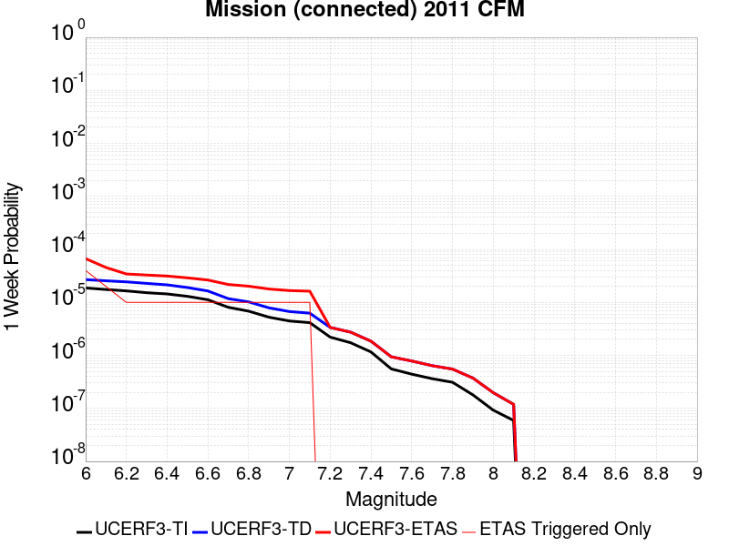 |  |  |  |

| Magnitude | 1 wk TI Prob | 1 wk TD Prob | 1 wk ETAS Prob | 1 wk ETAS/TD Gain | 1 wk ETAS Triggered Only | 1 mo TI Prob | 1 mo TD Prob | 1 mo ETAS Prob | 1 mo ETAS/TD Gain | 1 mo ETAS Triggered Only | 1 yr TI Prob | 1 yr TD Prob | 1 yr ETAS Prob | 1 yr ETAS/TD Gain | 1 yr ETAS Triggered Only | 10 yr TI Prob | 10 yr TD Prob | 10 yr ETAS Prob | 10 yr ETAS/TD Gain | 10 yr ETAS Triggered Only |
|-----|-----|-----|-----|-----|-----|-----|-----|-----|-----|-----|-----|-----|-----|-----|-----|-----|-----|-----|-----|-----|
| 6.0 | 1.8735573E-5 | 2.6919299E-5 | 6.691822E-5 | 2.4858828 | 4.0E-5 | 8.029284E-5 | 1.15363146E-4 | 1.6535737E-4 | 1.433364 | 5.0E-5 | 9.771269E-4 | 0.0014036349 | 0.0014835226 | 1.0569149 | 8.0E-5 | 0.009728416 | 0.013956046 | 0.01406451 | 1.0077718 | 1.1E-4 |
| 6.1 | 1.7515964E-5 | 2.5560277E-5 | 4.5559766E-5 | 1.7824441 | 2.0E-5 | 7.506625E-5 | 1.09539265E-4 | 1.3953597E-4 | 1.2738444 | 3.0E-5 | 9.135484E-4 | 0.0013328177 | 0.001382751 | 1.0374645 | 5.0E-5 | 0.009098019 | 0.013256509 | 0.013325581 | 1.0052104 | 7.0E-5 |
| 6.2 | 1.6486343E-5 | 2.4404653E-5 | 3.440441E-5 | 1.409748 | 1.0E-5 | 7.065384E-5 | 1.0458707E-4 | 1.2458497E-4 | 1.1912082 | 2.0E-5 | 8.5987104E-4 | 0.0012725982 | 0.0013125474 | 1.0313917 | 4.0E-5 | 0.008565514 | 0.012661357 | 0.012720598 | 1.0046788 | 6.0E-5 |
| 6.3 | 1.5229385E-5 | 2.283323E-5 | 3.2833002E-5 | 1.4379482 | 1.0E-5 | 6.526716E-5 | 9.785291E-5 | 1.17850956E-4 | 1.2043684 | 2.0E-5 | 7.9433795E-4 | 0.0011907034 | 0.0012306558 | 1.0335536 | 4.0E-5 | 0.007915046 | 0.01185415 | 0.011913439 | 1.0050015 | 6.0E-5 |
| 6.4 | 1.4435828E-5 | 2.1432059E-5 | 3.1431846E-5 | 1.4665807 | 1.0E-5 | 6.186637E-5 | 9.184833E-5 | 1.11846486E-4 | 1.2177303 | 2.0E-5 | 7.529627E-4 | 0.0011176757 | 0.0011576309 | 1.0357486 | 4.0E-5 | 0.007504165 | 0.011136543 | 0.011195875 | 1.0053277 | 6.0E-5 |
| 6.5 | 1.30127955E-5 | 1.9068159E-5 | 2.9067969E-5 | 1.5244244 | 1.0E-5 | 5.576793E-5 | 8.1718084E-5 | 1.0171645E-4 | 1.2447239 | 2.0E-5 | 6.78763E-4 | 9.944608E-4 | 0.001034421 | 1.0401828 | 4.0E-5 | 0.0067669353 | 0.009927544 | 0.009986948 | 1.0059838 | 6.0E-5 |
| 6.6 | 1.1220718E-5 | 1.6423419E-5 | 2.6423255E-5 | 1.6088766 | 1.0E-5 | 4.8087906E-5 | 7.0384194E-5 | 9.038279E-5 | 1.2841347 | 2.0E-5 | 5.8531296E-4 | 8.5658836E-4 | 8.9655415E-4 | 1.0466568 | 4.0E-5 | 0.005837737 | 0.008564659 | 0.008624146 | 1.0069455 | 6.0E-5 |
| 6.7 | 8.086152E-6 | 1.1775521E-5 | 2.1775402E-5 | 1.8492093 | 1.0E-5 | 3.4654473E-5 | 5.0465544E-5 | 7.0464535E-5 | 1.39629 | 2.0E-5 | 4.2183654E-4 | 6.142456E-4 | 6.54221E-4 | 1.0650805 | 4.0E-5 | 0.004210367 | 0.0061624083 | 0.006222038 | 1.0096765 | 6.0E-5 |
| 6.8 | 6.8361655E-6 | 1.0218049E-5 | 2.0217947E-5 | 1.9786503 | 1.0E-5 | 2.9297524E-5 | 4.3790908E-5 | 6.379003E-5 | 1.4566958 | 2.0E-5 | 3.5663895E-4 | 5.330245E-4 | 5.730032E-4 | 1.0750035 | 4.0E-5 | 0.0035606713 | 0.005350081 | 0.00540976 | 1.0111548 | 6.0E-5 |
| 6.9 | 5.2517353E-6 | 7.888038E-6 | 1.788796E-5 | 2.2677321 | 1.0E-5 | 2.2507242E-5 | 3.3805445E-5 | 5.3804768E-5 | 1.5916007 | 2.0E-5 | 2.739912E-4 | 4.115038E-4 | 4.5148734E-4 | 1.0971644 | 4.0E-5 | 0.0027365363 | 0.0041393843 | 0.0041891774 | 1.012029 | 5.0E-5 |
| 7.0 | 4.4602784E-6 | 6.718898E-6 | 1.671883E-5 | 2.4883294 | 1.0E-5 | 1.911534E-5 | 2.879496E-5 | 4.8794383E-5 | 1.694546 | 2.0E-5 | 2.327044E-4 | 3.505224E-4 | 3.905084E-4 | 1.1140754 | 4.0E-5 | 0.0023246086 | 0.0035308576 | 0.0035707164 | 1.0112886 | 4.0E-5 |
| 7.1 | 4.1492594E-6 | 6.2665754E-6 | 1.6266513E-5 | 2.595758 | 1.0E-5 | 1.7782419E-5 | 2.6856475E-5 | 4.6855937E-5 | 1.7446793 | 2.0E-5 | 2.1647944E-4 | 3.2692868E-4 | 3.669156E-4 | 1.1223109 | 4.0E-5 | 0.0021626868 | 0.003295128 | 0.003334996 | 1.0120991 | 4.0E-5 |
| 7.2 | 2.213247E-6 | 3.3735946E-6 | 3.3735946E-6 | 1.0 | 0.0 | 9.485309E-6 | 1.4458183E-5 | 2.4458039E-5 | 1.6916399 | 1.0E-5 | 1.15477524E-4 | 1.7601419E-4 | 1.8601243E-4 | 1.0568036 | 1.0E-5 | 0.0011541754 | 0.0017872518 | 0.0017972339 | 1.0055852 | 1.0E-5 |
| 7.3 | 1.7362703E-6 | 2.747984E-6 | 2.747984E-6 | 1.0 | 0.0 | 7.4411373E-6 | 1.17770205E-5 | 2.1776903E-5 | 1.8491012 | 1.0E-5 | 9.0592075E-5 | 1.4337582E-4 | 1.5337438E-4 | 1.0697367 | 1.0E-5 | 9.0555154E-4 | 0.0014580032 | 0.0014679886 | 1.0068487 | 1.0E-5 |
| 7.4 | 1.1628409E-6 | 1.8571193E-6 | 1.8571193E-6 | 1.0 | 0.0 | 4.9835944E-6 | 7.959058E-6 | 7.959058E-6 | 1.0 | 0.0 | 6.0673574E-5 | 9.689724E-5 | 9.689724E-5 | 1.0 | 0.0 | 6.065701E-4 | 9.892007E-4 | 9.892007E-4 | 1.0 | 0.0 |
| 7.5 | 5.5610667E-7 | 9.4032964E-7 | 9.4032964E-7 | 1.0 | 0.0 | 2.3833122E-6 | 4.029978E-6 | 4.029978E-6 | 1.0 | 0.0 | 2.9016439E-5 | 4.906388E-5 | 4.906388E-5 | 1.0 | 0.0 | 2.901265E-4 | 5.0707476E-4 | 5.0707476E-4 | 1.0 | 0.0 |
| 7.6 | 4.4307663E-7 | 7.8414774E-7 | 7.8414774E-7 | 1.0 | 0.0 | 1.8988985E-6 | 3.3606289E-6 | 3.3606289E-6 | 1.0 | 0.0 | 2.3118844E-5 | 4.0914892E-5 | 4.0914892E-5 | 1.0 | 0.0 | 2.3116439E-4 | 4.2493502E-4 | 4.2493502E-4 | 1.0 | 0.0 |
| 7.7 | 3.639119E-7 | 6.405925E-7 | 6.405925E-7 | 1.0 | 0.0 | 1.5596215E-6 | 2.7453934E-6 | 2.7453934E-6 | 1.0 | 0.0 | 1.8988227E-5 | 3.3424654E-5 | 3.3424654E-5 | 1.0 | 0.0 | 1.8986604E-4 | 3.4944323E-4 | 3.4944323E-4 | 1.0 | 0.0 |
| 7.8 | 3.1152942E-7 | 5.51793E-7 | 5.51793E-7 | 1.0 | 0.0 | 1.3351254E-6 | 2.364825E-6 | 2.364825E-6 | 1.0 | 0.0 | 1.6255031E-5 | 2.8791364E-5 | 2.8791364E-5 | 1.0 | 0.0 | 1.6253842E-4 | 2.9985773E-4 | 2.9985773E-4 | 1.0 | 0.0 |
| 7.9 | 1.8035962E-7 | 3.7451431E-7 | 3.7451431E-7 | 1.0 | 0.0 | 7.729696E-7 | 1.6050603E-6 | 1.6050603E-6 | 1.0 | 0.0 | 9.410865E-6 | 1.9541436E-5 | 1.9541436E-5 | 1.0 | 0.0 | 9.410465E-5 | 2.0201689E-4 | 2.0201689E-4 | 1.0 | 0.0 |
| 8.0 | 9.279334E-8 | 1.9824984E-7 | 1.9824984E-7 | 1.0 | 0.0 | 3.976857E-7 | 8.496418E-7 | 8.496418E-7 | 1.0 | 0.0 | 4.841813E-6 | 1.0344341E-5 | 1.0344341E-5 | 1.0 | 0.0 | 4.841707E-5 | 1.05925465E-4 | 1.05925465E-4 | 1.0 | 0.0 |
| 8.1 | 5.9253985E-8 | 1.1925192E-7 | 1.1925192E-7 | 1.0 | 0.0 | 2.5394561E-7 | 5.110796E-7 | 5.110796E-7 | 1.0 | 0.0 | 3.0917836E-6 | 6.222376E-6 | 6.222376E-6 | 1.0 | 0.0 | 3.0917407E-5 | 6.359083E-5 | 6.359083E-5 | 1.0 | 0.0 |

## Contra Costa (Lafayette) 2011 CFM
*[(top)](#table-of-contents)*

| 1 Week | 1 Month | 1 Year | 10 Year |
|-----|-----|-----|-----|
|  |  |  |  |

| Magnitude | 1 wk TI Prob | 1 wk TD Prob | 1 wk ETAS Prob | 1 wk ETAS/TD Gain | 1 wk ETAS Triggered Only | 1 mo TI Prob | 1 mo TD Prob | 1 mo ETAS Prob | 1 mo ETAS/TD Gain | 1 mo ETAS Triggered Only | 1 yr TI Prob | 1 yr TD Prob | 1 yr ETAS Prob | 1 yr ETAS/TD Gain | 1 yr ETAS Triggered Only | 10 yr TI Prob | 10 yr TD Prob | 10 yr ETAS Prob | 10 yr ETAS/TD Gain | 10 yr ETAS Triggered Only |
|-----|-----|-----|-----|-----|-----|-----|-----|-----|-----|-----|-----|-----|-----|-----|-----|-----|-----|-----|-----|-----|
| 6.0 | 6.655419E-6 | 6.9407956E-6 | 2.6940657E-5 | 3.881494 | 2.0E-5 | 2.8522913E-5 | 2.974594E-5 | 6.974475E-5 | 2.3446815 | 4.0E-5 | 3.472111E-4 | 3.620986E-4 | 4.3207326E-4 | 1.1932476 | 7.0E-5 | 0.0034666911 | 0.0036199384 | 0.0037195764 | 1.0275248 | 1.0E-4 |
| 6.1 | 6.655419E-6 | 6.9407956E-6 | 2.6940657E-5 | 3.881494 | 2.0E-5 | 2.8522913E-5 | 2.974594E-5 | 6.974475E-5 | 2.3446815 | 4.0E-5 | 3.472111E-4 | 3.620986E-4 | 4.3207326E-4 | 1.1932476 | 7.0E-5 | 0.0034666911 | 0.0036199384 | 0.0037195764 | 1.0275248 | 1.0E-4 |
| 6.2 | 6.6254133E-6 | 6.9092016E-6 | 2.6909063E-5 | 3.8946705 | 2.0E-5 | 2.839432E-5 | 2.9610539E-5 | 6.9609356E-5 | 2.3508303 | 4.0E-5 | 3.45646E-4 | 3.6045065E-4 | 4.3042543E-4 | 1.1941314 | 7.0E-5 | 0.003451089 | 0.0036035122 | 0.0037031518 | 1.0276507 | 1.0E-4 |
| 6.3 | 6.6254133E-6 | 6.9092016E-6 | 2.6909063E-5 | 3.8946705 | 2.0E-5 | 2.839432E-5 | 2.9610539E-5 | 6.9609356E-5 | 2.3508303 | 4.0E-5 | 3.45646E-4 | 3.6045065E-4 | 4.3042543E-4 | 1.1941314 | 7.0E-5 | 0.003451089 | 0.0036035122 | 0.0037031518 | 1.0276507 | 1.0E-4 |
| 6.4 | 6.6254133E-6 | 6.9092016E-6 | 2.6909063E-5 | 3.8946705 | 2.0E-5 | 2.839432E-5 | 2.9610539E-5 | 6.9609356E-5 | 2.3508303 | 4.0E-5 | 3.45646E-4 | 3.6045065E-4 | 4.3042543E-4 | 1.1941314 | 7.0E-5 | 0.003451089 | 0.0036035122 | 0.0037031518 | 1.0276507 | 1.0E-4 |
| 6.5 | 6.606445E-6 | 6.888747E-6 | 2.6888609E-5 | 3.9032657 | 2.0E-5 | 2.8313027E-5 | 2.9522878E-5 | 6.9521695E-5 | 2.3548415 | 4.0E-5 | 3.4465658E-4 | 3.5938373E-4 | 4.2935857E-4 | 1.1947079 | 7.0E-5 | 0.0034412253 | 0.0035928776 | 0.0036925182 | 1.0277328 | 1.0E-4 |
| 6.6 | 6.59966E-6 | 6.8812833E-6 | 2.6881145E-5 | 3.9064145 | 2.0E-5 | 2.828395E-5 | 2.9490891E-5 | 6.948971E-5 | 2.3563108 | 4.0E-5 | 3.4430268E-4 | 3.5899444E-4 | 4.289693E-4 | 1.1949191 | 7.0E-5 | 0.0034376972 | 0.0035889973 | 0.0036886383 | 1.0277629 | 1.0E-4 |
| 6.7 | 6.5570975E-6 | 6.835267E-6 | 2.683513E-5 | 3.9259813 | 2.0E-5 | 2.8101544E-5 | 2.9293684E-5 | 6.929251E-5 | 2.365442 | 4.0E-5 | 3.4208258E-4 | 3.5659422E-4 | 4.2656926E-4 | 1.1962316 | 7.0E-5 | 0.0034155648 | 0.0035650723 | 0.0036647157 | 1.0279499 | 1.0E-4 |
| 6.8 | 5.472255E-6 | 5.6781187E-6 | 1.5678062E-5 | 2.7611368 | 1.0E-5 | 2.345231E-5 | 2.433457E-5 | 4.4334083E-5 | 1.821856 | 2.0E-5 | 2.8549446E-4 | 2.9623357E-4 | 3.4621876E-4 | 1.1687357 | 5.0E-5 | 0.0028512797 | 0.002963091 | 0.0030229134 | 1.0201892 | 6.0E-5 |
| 6.9 | 5.092346E-6 | 5.268419E-6 | 1.5268366E-5 | 2.8980927 | 1.0E-5 | 2.1824157E-5 | 2.2578744E-5 | 4.2578293E-5 | 1.8857688 | 2.0E-5 | 2.656767E-4 | 2.7486193E-4 | 3.2484817E-4 | 1.1818595 | 5.0E-5 | 0.002653593 | 0.002749916 | 0.002809751 | 1.0217588 | 6.0E-5 |
| 7.0 | 4.5525762E-6 | 4.681627E-6 | 1.468158E-5 | 3.1359994 | 1.0E-5 | 1.9510895E-5 | 2.0063962E-5 | 3.0063762E-5 | 1.498396 | 1.0E-5 | 2.3751926E-4 | 2.4425166E-4 | 2.842419E-4 | 1.1637255 | 4.0E-5 | 0.0023726553 | 0.0024445183 | 0.0024943962 | 1.020404 | 5.0E-5 |
| 7.1 | 4.261504E-6 | 4.360733E-6 | 1.4360689E-5 | 3.2931824 | 1.0E-5 | 1.826346E-5 | 1.8688723E-5 | 2.8688537E-5 | 1.535072 | 1.0E-5 | 2.2233493E-4 | 2.2751173E-4 | 2.6750262E-4 | 1.1757752 | 4.0E-5 | 0.002221126 | 0.0022774623 | 0.0023273483 | 1.0219042 | 5.0E-5 |
| 7.2 | 3.654114E-6 | 3.701308E-6 | 1.3701271E-5 | 3.7017376 | 1.0E-5 | 1.5660395E-5 | 1.5862654E-5 | 2.5862495E-5 | 1.6304016 | 1.0E-5 | 1.9064861E-4 | 1.9311093E-4 | 2.3310322E-4 | 1.2070948 | 4.0E-5 | 0.0019048514 | 0.0019340571 | 0.0019839604 | 1.0258024 | 5.0E-5 |
| 7.3 | 2.1595129E-6 | 2.2476072E-6 | 1.2247585E-5 | 5.449166 | 1.0E-5 | 9.255023E-6 | 9.632567E-6 | 1.963247E-5 | 2.0381348 | 1.0E-5 | 1.1267407E-4 | 1.1727024E-4 | 1.372679E-4 | 1.1705263 | 2.0E-5 | 0.0011261696 | 0.0011766788 | 0.0011966552 | 1.016977 | 2.0E-5 |
| 7.4 | 1.7532738E-6 | 1.836593E-6 | 1.1836574E-5 | 6.4448547 | 1.0E-5 | 7.5140088E-6 | 7.871089E-6 | 1.787101E-5 | 2.2704623 | 1.0E-5 | 9.147922E-5 | 9.582633E-5 | 1.1582442E-4 | 1.2086909 | 2.0E-5 | 9.144157E-4 | 9.6229644E-4 | 9.822772E-4 | 1.0207636 | 2.0E-5 |
| 7.5 | 9.387875E-7 | 1.0217213E-6 | 1.0217213E-6 | 1.0 | 0.0 | 4.0233685E-6 | 4.3787986E-6 | 4.3787986E-6 | 1.0 | 0.0 | 4.8983413E-5 | 5.331058E-5 | 6.331005E-5 | 1.18757 | 1.0E-5 | 4.897262E-4 | 5.370657E-4 | 5.4706034E-4 | 1.0186096 | 1.0E-5 |
| 7.6 | 2.7471893E-7 | 3.330836E-7 | 3.330836E-7 | 1.0 | 0.0 | 1.1773664E-6 | 1.4275003E-6 | 1.4275003E-6 | 1.0 | 0.0 | 1.433434E-5 | 1.737968E-5 | 1.737968E-5 | 1.0 | 0.0 | 1.4333417E-4 | 1.7766756E-4 | 1.7766756E-4 | 1.0 | 0.0 |
| 7.7 | 2.0057985E-7 | 2.583045E-7 | 2.583045E-7 | 1.0 | 0.0 | 8.596276E-7 | 1.1070189E-6 | 1.1070189E-6 | 1.0 | 0.0 | 1.0465916E-5 | 1.3477872E-5 | 1.3477872E-5 | 1.0 | 0.0 | 1.0465423E-4 | 1.3861102E-4 | 1.3861102E-4 | 1.0 | 0.0 |
| 7.8 | 8.7403905E-8 | 1.2357017E-7 | 1.2357017E-7 | 1.0 | 0.0 | 3.745881E-7 | 5.295863E-7 | 5.295863E-7 | 1.0 | 0.0 | 4.5606007E-6 | 6.447695E-6 | 6.447695E-6 | 1.0 | 0.0 | 4.560507E-5 | 6.673835E-5 | 6.673835E-5 | 1.0 | 0.0 |
| 7.9 | 4.740233E-8 | 7.7098285E-8 | 7.7098285E-8 | 1.0 | 0.0 | 2.0315284E-7 | 3.304212E-7 | 3.304212E-7 | 1.0 | 0.0 | 2.473383E-6 | 4.0228706E-6 | 4.0228706E-6 | 1.0 | 0.0 | 2.4733554E-5 | 4.1761345E-5 | 4.1761345E-5 | 1.0 | 0.0 |
| 8.0 | 2.99164E-8 | 5.6355148E-8 | 5.6355148E-8 | 1.0 | 0.0 | 1.2821314E-7 | 2.4152203E-7 | 2.4152203E-7 | 1.0 | 0.0 | 1.5609938E-6 | 2.9405269E-6 | 2.9405269E-6 | 1.0 | 0.0 | 1.5609829E-5 | 3.0425235E-5 | 3.0425235E-5 | 1.0 | 0.0 |
| 8.1 | 4.431212E-10 | 7.476203E-10 | 7.476203E-10 | 1.0 | 0.0 | 1.899091E-9 | 3.2040874E-9 | 3.2040874E-9 | 1.0 | 0.0 | 2.3121432E-8 | 3.9009766E-8 | 3.9009766E-8 | 1.0 | 0.0 | 2.312143E-7 | 3.9890546E-7 | 3.9890546E-7 | 1.0 | 0.0 |

## Great Valley 09 (Laguna Seca)
*[(top)](#table-of-contents)*

| 1 Week | 1 Month | 1 Year | 10 Year |
|-----|-----|-----|-----|
|  |  | 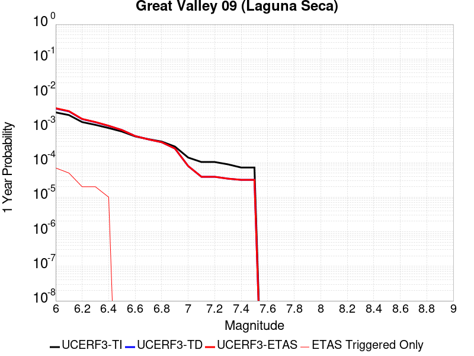 |  |

| Magnitude | 1 wk TI Prob | 1 wk TD Prob | 1 wk ETAS Prob | 1 wk ETAS/TD Gain | 1 wk ETAS Triggered Only | 1 mo TI Prob | 1 mo TD Prob | 1 mo ETAS Prob | 1 mo ETAS/TD Gain | 1 mo ETAS Triggered Only | 1 yr TI Prob | 1 yr TD Prob | 1 yr ETAS Prob | 1 yr ETAS/TD Gain | 1 yr ETAS Triggered Only | 10 yr TI Prob | 10 yr TD Prob | 10 yr ETAS Prob | 10 yr ETAS/TD Gain | 10 yr ETAS Triggered Only |
|-----|-----|-----|-----|-----|-----|-----|-----|-----|-----|-----|-----|-----|-----|-----|-----|-----|-----|-----|-----|-----|
| 6.0 | 5.4353277E-5 | 7.054649E-5 | 9.054508E-5 | 1.283481 | 2.0E-5 | 2.3292181E-4 | 3.0230923E-4 | 3.2230318E-4 | 1.0661374 | 2.0E-5 | 0.0028321352 | 0.0036742734 | 0.0037440162 | 1.0189813 | 7.0E-5 | 0.02796312 | 0.036136415 | 0.036223162 | 1.0024005 | 9.0E-5 |
| 6.1 | 4.5578287E-5 | 5.825583E-5 | 6.825525E-5 | 1.1716466 | 1.0E-5 | 1.953209E-4 | 2.4964547E-4 | 2.5964295E-4 | 1.0400468 | 1.0E-5 | 0.0023754383 | 0.0030351633 | 0.0030850114 | 1.0164236 | 5.0E-5 | 0.023502063 | 0.029936384 | 0.030004289 | 1.0022683 | 7.0E-5 |
| 6.2 | 2.8536782E-5 | 3.4754397E-5 | 3.4754397E-5 | 1.0 | 0.0 | 1.2229476E-4 | 1.4893933E-4 | 1.4893933E-4 | 1.0 | 0.0 | 0.0014879217 | 0.0018117635 | 0.0018317272 | 1.011019 | 2.0E-5 | 0.014779986 | 0.017967276 | 0.017996736 | 1.0016397 | 3.0E-5 |
| 6.3 | 2.3698774E-5 | 2.8225932E-5 | 2.8225932E-5 | 1.0 | 0.0 | 1.01562226E-4 | 1.20962955E-4 | 1.20962955E-4 | 1.0 | 0.0 | 0.0012358186 | 0.0014717847 | 0.0014917552 | 1.013569 | 2.0E-5 | 0.012289686 | 0.014618459 | 0.01464802 | 1.0020221 | 3.0E-5 |
| 6.4 | 1.9191197E-5 | 2.2131611E-5 | 2.2131611E-5 | 1.0 | 0.0 | 8.2245395E-5 | 9.484656E-5 | 9.484656E-5 | 1.0 | 0.0 | 0.0010008777 | 0.001154188 | 0.0011641764 | 1.0086541 | 1.0E-5 | 0.009963818 | 0.011482145 | 0.01149203 | 1.0008609 | 1.0E-5 |
| 6.5 | 1.5203241E-5 | 1.6807138E-5 | 1.6807138E-5 | 1.0 | 0.0 | 6.5155116E-5 | 7.2028786E-5 | 7.2028786E-5 | 1.0 | 0.0 | 7.9297484E-4 | 8.766296E-4 | 8.766296E-4 | 1.0 | 0.0 | 0.007901512 | 0.008733063 | 0.008733063 | 1.0 | 0.0 |
| 6.6 | 1.0984925E-5 | 1.1246176E-5 | 1.1246176E-5 | 1.0 | 0.0 | 4.70774E-5 | 4.8197027E-5 | 4.8197027E-5 | 1.0 | 0.0 | 5.730166E-4 | 5.866449E-4 | 5.866449E-4 | 1.0 | 0.0 | 0.005715413 | 0.0058513596 | 0.0058513596 | 1.0 | 0.0 |
| 6.7 | 9.134616E-6 | 9.022645E-6 | 9.022645E-6 | 1.0 | 0.0 | 3.9147766E-5 | 3.866792E-5 | 3.866792E-5 | 1.0 | 0.0 | 4.7651984E-4 | 4.706826E-4 | 4.706826E-4 | 1.0 | 0.0 | 0.004754993 | 0.004697102 | 0.004697102 | 1.0 | 0.0 |
| 6.8 | 7.785589E-6 | 7.4542045E-6 | 7.4542045E-6 | 1.0 | 0.0 | 3.3366385E-5 | 3.1946212E-5 | 3.1946212E-5 | 1.0 | 0.0 | 4.0616E-4 | 3.8887773E-4 | 3.8887773E-4 | 1.0 | 0.0 | 0.0040541845 | 0.0038821765 | 0.0038821765 | 1.0 | 0.0 |
| 6.9 | 5.579095E-6 | 4.899978E-6 | 4.899978E-6 | 1.0 | 0.0 | 2.3910188E-5 | 2.0999747E-5 | 2.0999747E-5 | 1.0 | 0.0 | 2.9106764E-4 | 2.556433E-4 | 2.556433E-4 | 1.0 | 0.0 | 0.002906867 | 0.0025536297 | 0.0025536297 | 1.0 | 0.0 |
| 7.0 | 2.6816688E-6 | 1.5220202E-6 | 1.5220202E-6 | 1.0 | 0.0 | 1.1492816E-5 | 6.522928E-6 | 6.522928E-6 | 1.0 | 0.0 | 1.3991605E-4 | 7.941384E-5 | 7.941384E-5 | 1.0 | 0.0 | 0.0013982799 | 7.938633E-4 | 7.938633E-4 | 1.0 | 0.0 |
| 7.1 | 1.9951021E-6 | 7.455947E-7 | 7.455947E-7 | 1.0 | 0.0 | 8.55041E-6 | 3.1954023E-6 | 3.1954023E-6 | 1.0 | 0.0 | 1.0409627E-4 | 3.890337E-5 | 3.890337E-5 | 1.0 | 0.0 | 0.0010404752 | 3.8896973E-4 | 3.8896973E-4 | 1.0 | 0.0 |
| 7.2 | 1.9951021E-6 | 7.455947E-7 | 7.455947E-7 | 1.0 | 0.0 | 8.55041E-6 | 3.1954023E-6 | 3.1954023E-6 | 1.0 | 0.0 | 1.0409627E-4 | 3.890337E-5 | 3.890337E-5 | 1.0 | 0.0 | 0.0010404752 | 3.8896973E-4 | 3.8896973E-4 | 1.0 | 0.0 |
| 7.3 | 1.7087556E-6 | 6.5806523E-7 | 6.5806523E-7 | 1.0 | 0.0 | 7.3232177E-6 | 2.8202767E-6 | 2.8202767E-6 | 1.0 | 0.0 | 8.915652E-5 | 3.4336368E-5 | 3.4336368E-5 | 1.0 | 0.0 | 8.9120766E-4 | 3.433147E-4 | 3.433147E-4 | 1.0 | 0.0 |
| 7.4 | 1.3804846E-6 | 6.0753155E-7 | 6.0753155E-7 | 1.0 | 0.0 | 5.916349E-6 | 2.6037042E-6 | 2.6037042E-6 | 1.0 | 0.0 | 7.2029165E-5 | 3.1699677E-5 | 3.1699677E-5 | 1.0 | 0.0 | 7.200583E-4 | 3.169556E-4 | 3.169556E-4 | 1.0 | 0.0 |
| 7.5 | 1.3804846E-6 | 6.0753155E-7 | 6.0753155E-7 | 1.0 | 0.0 | 5.916349E-6 | 2.6037042E-6 | 2.6037042E-6 | 1.0 | 0.0 | 7.2029165E-5 | 3.1699677E-5 | 3.1699677E-5 | 1.0 | 0.0 | 7.200583E-4 | 3.169556E-4 | 3.169556E-4 | 1.0 | 0.0 |

## Reliz 2011 CFM
*[(top)](#table-of-contents)*

| 1 Week | 1 Month | 1 Year | 10 Year |
|-----|-----|-----|-----|
|  |  |  |  |

| Magnitude | 1 wk TI Prob | 1 wk TD Prob | 1 wk ETAS Prob | 1 wk ETAS/TD Gain | 1 wk ETAS Triggered Only | 1 mo TI Prob | 1 mo TD Prob | 1 mo ETAS Prob | 1 mo ETAS/TD Gain | 1 mo ETAS Triggered Only | 1 yr TI Prob | 1 yr TD Prob | 1 yr ETAS Prob | 1 yr ETAS/TD Gain | 1 yr ETAS Triggered Only | 10 yr TI Prob | 10 yr TD Prob | 10 yr ETAS Prob | 10 yr ETAS/TD Gain | 10 yr ETAS Triggered Only |
|-----|-----|-----|-----|-----|-----|-----|-----|-----|-----|-----|-----|-----|-----|-----|-----|-----|-----|-----|-----|-----|
| 6.0 | 1.6002472E-5 | 1.6284195E-5 | 2.6284033E-5 | 1.6140823 | 1.0E-5 | 6.8580215E-5 | 6.978765E-5 | 8.9786256E-5 | 1.2865636 | 2.0E-5 | 8.3464425E-4 | 8.4935327E-4 | 9.192938E-4 | 1.0823456 | 7.0E-5 | 0.008315164 | 0.008463269 | 0.008542592 | 1.0093726 | 8.0E-5 |
| 6.1 | 1.6002472E-5 | 1.6284195E-5 | 2.6284033E-5 | 1.6140823 | 1.0E-5 | 6.8580215E-5 | 6.978765E-5 | 8.9786256E-5 | 1.2865636 | 2.0E-5 | 8.3464425E-4 | 8.4935327E-4 | 9.192938E-4 | 1.0823456 | 7.0E-5 | 0.008315164 | 0.008463269 | 0.008542592 | 1.0093726 | 8.0E-5 |
| 6.2 | 1.6002472E-5 | 1.6284195E-5 | 2.6284033E-5 | 1.6140823 | 1.0E-5 | 6.8580215E-5 | 6.978765E-5 | 8.9786256E-5 | 1.2865636 | 2.0E-5 | 8.3464425E-4 | 8.4935327E-4 | 9.192938E-4 | 1.0823456 | 7.0E-5 | 0.008315164 | 0.008463269 | 0.008542592 | 1.0093726 | 8.0E-5 |
| 6.3 | 7.792404E-6 | 7.804657E-6 | 7.804657E-6 | 1.0 | 0.0 | 3.339559E-5 | 3.3448105E-5 | 3.3448105E-5 | 1.0 | 0.0 | 4.0651546E-4 | 4.0715534E-4 | 4.271472E-4 | 1.0491014 | 2.0E-5 | 0.0040577264 | 0.004064372 | 0.0040942496 | 1.0073512 | 3.0E-5 |
| 6.4 | 7.792404E-6 | 7.804657E-6 | 7.804657E-6 | 1.0 | 0.0 | 3.339559E-5 | 3.3448105E-5 | 3.3448105E-5 | 1.0 | 0.0 | 4.0651546E-4 | 4.0715534E-4 | 4.271472E-4 | 1.0491014 | 2.0E-5 | 0.0040577264 | 0.004064372 | 0.0040942496 | 1.0073512 | 3.0E-5 |
| 6.5 | 5.9659374E-6 | 5.9294966E-6 | 5.9294966E-6 | 1.0 | 0.0 | 2.5568053E-5 | 2.5411882E-5 | 2.5411882E-5 | 1.0 | 0.0 | 3.1124658E-4 | 3.0934595E-4 | 3.1934286E-4 | 1.0323163 | 1.0E-5 | 0.00310811 | 0.0030893725 | 0.0031093105 | 1.0064538 | 2.0E-5 |
| 6.6 | 5.2350692E-6 | 5.179707E-6 | 5.179707E-6 | 1.0 | 0.0 | 2.2435817E-5 | 2.2198556E-5 | 2.2198556E-5 | 1.0 | 0.0 | 2.7312184E-4 | 2.7023404E-4 | 2.8023135E-4 | 1.0369949 | 1.0E-5 | 0.002727864 | 0.0026992657 | 0.0027192116 | 1.0073894 | 2.0E-5 |
| 6.7 | 4.580206E-6 | 4.5068055E-6 | 4.5068055E-6 | 1.0 | 0.0 | 1.9629308E-5 | 1.9314739E-5 | 1.9314739E-5 | 1.0 | 0.0 | 2.389606E-4 | 2.3513164E-4 | 2.4512928E-4 | 1.0425193 | 1.0E-5 | 0.002387038 | 0.0023490316 | 0.0023689847 | 1.0084941 | 2.0E-5 |
| 6.8 | 4.0765017E-6 | 3.988895E-6 | 3.988895E-6 | 1.0 | 0.0 | 1.7470604E-5 | 1.7095153E-5 | 1.7095153E-5 | 1.0 | 0.0 | 2.1268385E-4 | 2.0811365E-4 | 2.1811157E-4 | 1.0480406 | 1.0E-5 | 0.002124804 | 0.002079387 | 0.0020993452 | 1.0095983 | 2.0E-5 |
| 6.9 | 3.5752896E-6 | 3.4731459E-6 | 3.4731459E-6 | 1.0 | 0.0 | 1.532258E-5 | 1.4884826E-5 | 1.4884826E-5 | 1.0 | 0.0 | 1.8653645E-4 | 1.812077E-4 | 1.912059E-4 | 1.0551753 | 1.0E-5 | 0.0018637994 | 0.001810797 | 0.0018307609 | 1.0110248 | 2.0E-5 |
| 7.0 | 3.0259848E-6 | 2.9085395E-6 | 2.9085395E-6 | 1.0 | 0.0 | 1.2968442E-5 | 1.246511E-5 | 1.246511E-5 | 1.0 | 0.0 | 1.5787935E-4 | 1.5175216E-4 | 1.5175216E-4 | 1.0 | 0.0 | 0.0015776722 | 0.0015166817 | 0.0015266666 | 1.0065833 | 1.0E-5 |
| 7.1 | 2.5861116E-6 | 2.4557391E-6 | 2.4557391E-6 | 1.0 | 0.0 | 1.1083288E-5 | 1.0524554E-5 | 1.0524554E-5 | 1.0 | 0.0 | 1.3493067E-4 | 1.2812892E-4 | 1.2812892E-4 | 1.0 | 0.0 | 0.0013484878 | 0.0012807463 | 0.0012907336 | 1.007798 | 1.0E-5 |
| 7.2 | 2.1482588E-6 | 2.0037808E-6 | 2.0037808E-6 | 1.0 | 0.0 | 9.20679E-6 | 8.587604E-6 | 8.587604E-6 | 1.0 | 0.0 | 1.12086906E-4 | 1.04549064E-4 | 1.04549064E-4 | 1.0 | 0.0 | 0.0011203039 | 0.0010451942 | 0.0010451942 | 1.0 | 0.0 |
| 7.3 | 1.7194744E-6 | 1.5616413E-6 | 1.5616413E-6 | 1.0 | 0.0 | 7.3691554E-6 | 6.692731E-6 | 6.692731E-6 | 1.0 | 0.0 | 8.971577E-5 | 8.1480954E-5 | 8.1480954E-5 | 1.0 | 0.0 | 8.967956E-4 | 8.14706E-4 | 8.14706E-4 | 1.0 | 0.0 |
| 7.4 | 1.2755178E-6 | 1.1061194E-6 | 1.1061194E-6 | 1.0 | 0.0 | 5.4664933E-6 | 4.7405033E-6 | 4.7405033E-6 | 1.0 | 0.0 | 6.655252E-5 | 5.77141E-5 | 5.77141E-5 | 1.0 | 0.0 | 6.6532596E-4 | 5.771862E-4 | 5.771862E-4 | 1.0 | 0.0 |
| 7.5 | 8.8463224E-7 | 7.0626817E-7 | 7.0626817E-7 | 1.0 | 0.0 | 3.7912755E-6 | 3.02686E-6 | 3.02686E-6 | 1.0 | 0.0 | 4.6157802E-5 | 3.6851397E-5 | 3.6851397E-5 | 1.0 | 0.0 | 4.6148215E-4 | 3.6864786E-4 | 3.6864786E-4 | 1.0 | 0.0 |
| 7.6 | 5.291355E-7 | 3.504847E-7 | 3.504847E-7 | 1.0 | 0.0 | 2.2677216E-6 | 1.5020763E-6 | 1.5020763E-6 | 1.0 | 0.0 | 2.760916E-5 | 1.8287627E-5 | 1.8287627E-5 | 1.0 | 0.0 | 2.760573E-4 | 1.8305524E-4 | 1.8305524E-4 | 1.0 | 0.0 |
| 7.7 | 2.9663357E-7 | 1.3541806E-7 | 1.3541806E-7 | 1.0 | 0.0 | 1.2712861E-6 | 5.8036295E-7 | 5.8036295E-7 | 1.0 | 0.0 | 1.5477797E-5 | 7.0658966E-6 | 7.0658966E-6 | 1.0 | 0.0 | 1.547672E-4 | 7.084268E-5 | 7.084268E-5 | 1.0 | 0.0 |
| 7.8 | 1.2509386E-7 | 2.7326761E-8 | 2.7326761E-8 | 1.0 | 0.0 | 5.3611643E-7 | 1.17114695E-7 | 1.17114695E-7 | 1.0 | 0.0 | 6.527198E-6 | 1.4258704E-6 | 1.4258704E-6 | 1.0 | 0.0 | 6.527006E-5 | 1.4416024E-5 | 1.4416024E-5 | 1.0 | 0.0 |
| 7.9 | 6.213493E-8 | 1.1573957E-8 | 1.1573957E-8 | 1.0 | 0.0 | 2.6629255E-7 | 4.9602672E-8 | 4.9602672E-8 | 1.0 | 0.0 | 3.242107E-6 | 6.039123E-7 | 6.039123E-7 | 1.0 | 0.0 | 3.2420594E-5 | 6.171175E-6 | 6.171175E-6 | 1.0 | 0.0 |
| 8.0 | 5.92383E-9 | 1.68809E-9 | 1.68809E-9 | 1.0 | 0.0 | 2.5387841E-8 | 7.2346698E-9 | 7.2346698E-9 | 1.0 | 0.0 | 3.0909692E-7 | 8.8082096E-8 | 8.8082096E-8 | 1.0 | 0.0 | 3.090965E-6 | 9.057315E-7 | 9.057315E-7 | 1.0 | 0.0 |

## San Andreas (Cholame) rev
*[(top)](#table-of-contents)*

| 1 Week | 1 Month | 1 Year | 10 Year |
|-----|-----|-----|-----|
|  |  |  |  |

| Magnitude | 1 wk TI Prob | 1 wk TD Prob | 1 wk ETAS Prob | 1 wk ETAS/TD Gain | 1 wk ETAS Triggered Only | 1 mo TI Prob | 1 mo TD Prob | 1 mo ETAS Prob | 1 mo ETAS/TD Gain | 1 mo ETAS Triggered Only | 1 yr TI Prob | 1 yr TD Prob | 1 yr ETAS Prob | 1 yr ETAS/TD Gain | 1 yr ETAS Triggered Only | 10 yr TI Prob | 10 yr TD Prob | 10 yr ETAS Prob | 10 yr ETAS/TD Gain | 10 yr ETAS Triggered Only |
|-----|-----|-----|-----|-----|-----|-----|-----|-----|-----|-----|-----|-----|-----|-----|-----|-----|-----|-----|-----|-----|
| 6.0 | 1.2302514E-4 | 2.5347935E-4 | 2.734743E-4 | 1.0788819 | 2.0E-5 | 5.27144E-4 | 0.0010858894 | 0.001125846 | 1.0367962 | 4.0E-5 | 0.0063991086 | 0.013141075 | 0.013210155 | 1.0052568 | 7.0E-5 | 0.06217949 | 0.124989286 | 0.12505929 | 1.00056 | 8.0E-5 |
| 6.1 | 1.2302514E-4 | 2.5347935E-4 | 2.734743E-4 | 1.0788819 | 2.0E-5 | 5.27144E-4 | 0.0010858894 | 0.001125846 | 1.0367962 | 4.0E-5 | 0.0063991086 | 0.013141075 | 0.013210155 | 1.0052568 | 7.0E-5 | 0.06217949 | 0.124989286 | 0.12505929 | 1.00056 | 8.0E-5 |
| 6.2 | 1.2203569E-4 | 2.516455E-4 | 2.7164049E-4 | 1.0794569 | 2.0E-5 | 5.2290526E-4 | 0.0010780366 | 0.0011179935 | 1.0370644 | 4.0E-5 | 0.006347804 | 0.013046616 | 0.013115703 | 1.0052954 | 7.0E-5 | 0.061695136 | 0.12417533 | 0.1242454 | 1.0005642 | 8.0E-5 |
| 6.3 | 1.2142645E-4 | 2.5050418E-4 | 2.7049915E-4 | 1.079819 | 2.0E-5 | 5.202953E-4 | 0.0010731491 | 0.0011131063 | 1.0372335 | 4.0E-5 | 0.006316212 | 0.012987822 | 0.013056913 | 1.0053197 | 7.0E-5 | 0.06139677 | 0.12366937 | 0.12373947 | 1.0005668 | 8.0E-5 |
| 6.4 | 1.1865206E-4 | 2.4555085E-4 | 2.6554594E-4 | 1.0814295 | 2.0E-5 | 5.0840975E-4 | 0.0010519379 | 0.0010918959 | 1.0379851 | 4.0E-5 | 0.006172335 | 0.0127326185 | 0.012801727 | 1.0054277 | 7.0E-5 | 0.060036868 | 0.121460214 | 0.121530496 | 1.0005786 | 8.0E-5 |
| 6.5 | 1.17443946E-4 | 2.4347806E-4 | 2.634732E-4 | 1.0821229 | 2.0E-5 | 5.032341E-4 | 0.0010430617 | 0.00108302 | 1.0383086 | 4.0E-5 | 0.006109677 | 0.012625805 | 0.012694921 | 1.0054742 | 7.0E-5 | 0.059444077 | 0.12053282 | 0.120603174 | 1.0005838 | 8.0E-5 |
| 6.6 | 1.13579066E-4 | 2.3655128E-4 | 2.5654654E-4 | 1.0845282 | 2.0E-5 | 4.866766E-4 | 0.0010133989 | 0.0010533583 | 1.0394311 | 4.0E-5 | 0.0059092017 | 0.01226878 | 0.012337921 | 1.0056355 | 7.0E-5 | 0.057545185 | 0.11744262 | 0.11751323 | 1.0006012 | 8.0E-5 |
| 6.7 | 1.1271412E-4 | 2.3499105E-4 | 2.5498634E-4 | 1.0850897 | 2.0E-5 | 4.829711E-4 | 0.0010067173 | 0.001046677 | 1.0396931 | 4.0E-5 | 0.005864331 | 0.012188345 | 0.012257492 | 1.0056732 | 7.0E-5 | 0.057119697 | 0.11674537 | 0.11681602 | 1.0006052 | 8.0E-5 |
| 6.8 | 1.1217975E-4 | 2.3387192E-4 | 2.5386724E-4 | 1.0854969 | 2.0E-5 | 4.8068175E-4 | 0.0010019247 | 0.0010418847 | 1.0398831 | 4.0E-5 | 0.005836608 | 0.012130647 | 0.012199799 | 1.0057005 | 7.0E-5 | 0.056856725 | 0.11624266 | 0.11631337 | 1.0006082 | 8.0E-5 |
| 6.9 | 1.1146753E-4 | 2.323557E-4 | 2.5235105E-4 | 1.0860549 | 2.0E-5 | 4.7763053E-4 | 9.954317E-4 | 0.0010353918 | 1.0401436 | 4.0E-5 | 0.0057996577 | 0.012052471 | 0.012121628 | 1.0057379 | 7.0E-5 | 0.056506127 | 0.1155621 | 0.115632854 | 1.0006123 | 8.0E-5 |
| 7.0 | 1.0965793E-4 | 2.2857812E-4 | 2.4857355E-4 | 1.0874774 | 2.0E-5 | 4.698779E-4 | 9.792543E-4 | 0.0010092248 | 1.0306056 | 3.0E-5 | 0.005705768 | 0.011857672 | 0.011916961 | 1.005 | 6.0E-5 | 0.055614736 | 0.11386053 | 0.11392256 | 1.0005448 | 7.0E-5 |
| 7.1 | 9.927982E-5 | 2.0671786E-4 | 2.2671373E-4 | 1.0967302 | 2.0E-5 | 4.2541555E-4 | 8.856339E-4 | 9.156074E-4 | 1.033844 | 3.0E-5 | 0.0051671406 | 0.010729581 | 0.010788938 | 1.005532 | 6.0E-5 | 0.05048634 | 0.103941396 | 0.104004115 | 1.0006034 | 7.0E-5 |
| 7.2 | 9.696786E-5 | 2.0175103E-4 | 2.1174901E-4 | 1.049556 | 1.0E-5 | 4.1551032E-4 | 8.6436176E-4 | 8.8434445E-4 | 1.0231185 | 2.0E-5 | 0.00504711 | 0.010473111 | 0.010522587 | 1.0047241 | 5.0E-5 | 0.04934009 | 0.10167709 | 0.10173099 | 1.0005301 | 6.0E-5 |
| 7.3 | 9.4727984E-5 | 1.9602077E-4 | 2.0601881E-4 | 1.051005 | 1.0E-5 | 4.0591392E-4 | 8.3981955E-4 | 8.5980276E-4 | 1.0237947 | 2.0E-5 | 0.0049308087 | 0.010177139 | 0.010226631 | 1.004863 | 5.0E-5 | 0.048228268 | 0.09904058 | 0.09909464 | 1.0005459 | 6.0E-5 |
| 7.4 | 9.220358E-5 | 1.8970236E-4 | 1.9970046E-4 | 1.0527042 | 1.0E-5 | 3.9509835E-4 | 8.1275776E-4 | 8.327415E-4 | 1.0245876 | 2.0E-5 | 0.004799717 | 0.00985068 | 0.009900187 | 1.0050257 | 5.0E-5 | 0.046973653 | 0.09611052 | 0.096164756 | 1.0005643 | 6.0E-5 |
| 7.5 | 7.71631E-5 | 1.5289382E-4 | 1.6289228E-4 | 1.0653949 | 1.0E-5 | 3.306571E-4 | 6.550948E-4 | 6.6508824E-4 | 1.015255 | 1.0E-5 | 0.0040183207 | 0.007946685 | 0.007986367 | 1.0049936 | 4.0E-5 | 0.03946433 | 0.078784436 | 0.078830495 | 1.0005846 | 5.0E-5 |
| 7.6 | 7.5634416E-5 | 1.4947375E-4 | 1.5947226E-4 | 1.0668914 | 1.0E-5 | 3.241072E-4 | 6.404447E-4 | 6.504383E-4 | 1.0156041 | 1.0E-5 | 0.0039388672 | 0.007769605 | 0.0078092944 | 1.0051082 | 4.0E-5 | 0.038697794 | 0.07714253 | 0.07718867 | 1.0005982 | 5.0E-5 |
| 7.7 | 6.3783E-5 | 1.2457426E-4 | 1.3457301E-4 | 1.0802634 | 1.0E-5 | 2.7332708E-4 | 5.337805E-4 | 5.4377515E-4 | 1.0187243 | 1.0E-5 | 0.0033226798 | 0.00647944 | 0.0065191807 | 1.0061333 | 4.0E-5 | 0.032734364 | 0.06499155 | 0.0650383 | 1.0007193 | 5.0E-5 |
| 7.8 | 5.863422E-5 | 1.15058065E-4 | 1.2505692E-4 | 1.0869026 | 1.0E-5 | 2.512653E-4 | 4.9301283E-4 | 5.030079E-4 | 1.0202734 | 1.0E-5 | 0.003054864 | 0.005985933 | 0.0060256934 | 1.0066423 | 4.0E-5 | 0.030132094 | 0.06007134 | 0.060118336 | 1.0007824 | 5.0E-5 |
| 7.9 | 4.595283E-5 | 8.492014E-5 | 9.491929E-5 | 1.1177477 | 1.0E-5 | 1.9692584E-4 | 3.638927E-4 | 3.7388908E-4 | 1.0274706 | 1.0E-5 | 0.0023949358 | 0.0044214004 | 0.0044612237 | 1.0090069 | 4.0E-5 | 0.023692891 | 0.04467237 | 0.044720136 | 1.0010693 | 5.0E-5 |
| 8.0 | 3.2950178E-5 | 5.1184972E-5 | 5.1184972E-5 | 1.0 | 0.0 | 1.412074E-4 | 2.1934573E-4 | 2.1934573E-4 | 1.0 | 0.0 | 0.0017178444 | 0.0026672655 | 0.002687212 | 1.0074784 | 2.0E-5 | 0.017046256 | 0.027383326 | 0.027412504 | 1.0010656 | 3.0E-5 |
| 8.1 | 1.9177472E-5 | 1.9391058E-5 | 1.9391058E-5 | 1.0 | 0.0 | 8.218658E-5 | 8.310189E-5 | 8.310189E-5 | 1.0 | 0.0 | 0.0010001622 | 0.0010112965 | 0.0010312763 | 1.0197566 | 2.0E-5 | 0.009956728 | 0.01086626 | 0.010886042 | 1.0018206 | 2.0E-5 |
| 8.2 | 8.643924E-6 | 5.5526552E-6 | 5.5526552E-6 | 1.0 | 0.0 | 3.704486E-5 | 2.3796878E-5 | 2.3796878E-5 | 1.0 | 0.0 | 4.5092785E-4 | 2.8968856E-4 | 2.9968566E-4 | 1.0345098 | 1.0E-5 | 0.0045001395 | 0.0032912085 | 0.0033011758 | 1.0030284 | 1.0E-5 |
| 8.3 | 1.983087E-6 | 7.7871465E-7 | 7.7871465E-7 | 1.0 | 0.0 | 8.498917E-6 | 3.3373444E-6 | 3.3373444E-6 | 1.0 | 0.0 | 1.034694E-4 | 4.063143E-5 | 4.063143E-5 | 1.0 | 0.0 | 0.0010342124 | 4.7926197E-4 | 4.7926197E-4 | 1.0 | 0.0 |

## Quien Sabe 2011 CFM
*[(top)](#table-of-contents)*

| 1 Week | 1 Month | 1 Year | 10 Year |
|-----|-----|-----|-----|
| 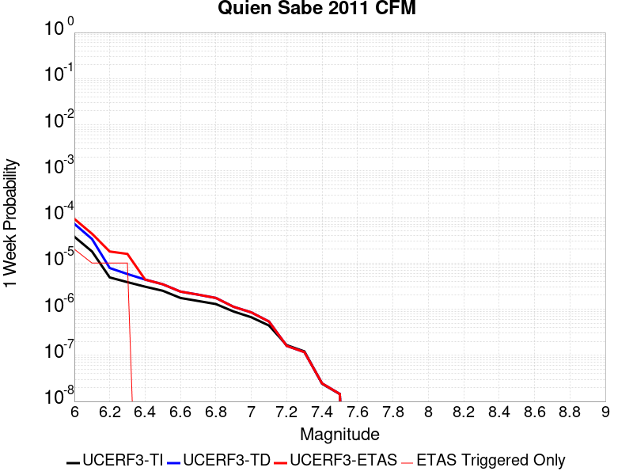 | 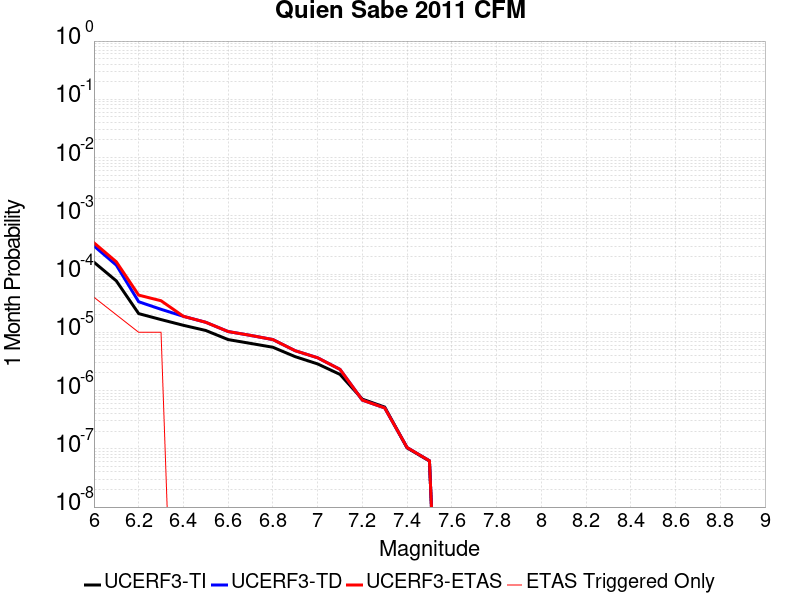 |  |  |

| Magnitude | 1 wk TI Prob | 1 wk TD Prob | 1 wk ETAS Prob | 1 wk ETAS/TD Gain | 1 wk ETAS Triggered Only | 1 mo TI Prob | 1 mo TD Prob | 1 mo ETAS Prob | 1 mo ETAS/TD Gain | 1 mo ETAS Triggered Only | 1 yr TI Prob | 1 yr TD Prob | 1 yr ETAS Prob | 1 yr ETAS/TD Gain | 1 yr ETAS Triggered Only | 10 yr TI Prob | 10 yr TD Prob | 10 yr ETAS Prob | 10 yr ETAS/TD Gain | 10 yr ETAS Triggered Only |
|-----|-----|-----|-----|-----|-----|-----|-----|-----|-----|-----|-----|-----|-----|-----|-----|-----|-----|-----|-----|-----|
| 6.0 | 3.729899E-5 | 7.1047565E-5 | 9.1046146E-5 | 1.2814815 | 2.0E-5 | 1.5984301E-4 | 3.044627E-4 | 3.4445053E-4 | 1.131339 | 4.0E-5 | 0.0019443515 | 0.003687155 | 0.0037469338 | 1.0162127 | 6.0E-5 | 0.019274272 | 0.03537049 | 0.035438016 | 1.001909 | 7.0E-5 |
| 6.1 | 1.7825725E-5 | 3.3222135E-5 | 4.32218E-5 | 1.3009942 | 1.0E-5 | 7.639373E-5 | 1.4237482E-4 | 1.6237197E-4 | 1.1404543 | 2.0E-5 | 9.296967E-4 | 0.0017277208 | 0.001757669 | 1.0173339 | 3.0E-5 | 0.009258169 | 0.01670938 | 0.016738879 | 1.0017654 | 3.0E-5 |
| 6.2 | 4.8865336E-6 | 7.815418E-6 | 1.7815339E-5 | 2.2795122 | 1.0E-5 | 2.0942118E-5 | 3.3493758E-5 | 4.3493423E-5 | 1.2985531 | 1.0E-5 | 2.5494045E-4 | 4.0723776E-4 | 4.2722962E-4 | 1.0490913 | 2.0E-5 | 0.0025464818 | 0.0040165572 | 0.0040364773 | 1.0049593 | 2.0E-5 |
| 6.3 | 3.858491E-6 | 5.7947263E-6 | 1.5794669E-5 | 2.725697 | 1.0E-5 | 1.6536285E-5 | 2.4834331E-5 | 3.4834084E-5 | 1.4026583 | 1.0E-5 | 2.0131067E-4 | 3.0232072E-4 | 3.123177E-4 | 1.0330675 | 1.0E-5 | 0.002011284 | 0.0030044934 | 0.0030144632 | 1.0033183 | 1.0E-5 |
| 6.4 | 3.0771805E-6 | 4.3897E-6 | 4.3897E-6 | 1.0 | 0.0 | 1.318785E-5 | 1.8812876E-5 | 1.8812876E-5 | 1.0 | 0.0 | 1.6055023E-4 | 2.2902513E-4 | 2.2902513E-4 | 1.0 | 0.0 | 0.001604343 | 0.0022888705 | 0.0022888705 | 1.0 | 0.0 |
| 6.5 | 2.5081235E-6 | 3.467935E-6 | 3.467935E-6 | 1.0 | 0.0 | 1.0749056E-5 | 1.4862502E-5 | 1.4862502E-5 | 1.0 | 0.0 | 1.308619E-4 | 1.8093741E-4 | 1.8093741E-4 | 1.0 | 0.0 | 0.0013078486 | 0.0018144867 | 0.0018144867 | 1.0 | 0.0 |
| 6.6 | 1.7505364E-6 | 2.4056205E-6 | 2.4056205E-6 | 1.0 | 0.0 | 7.502277E-6 | 1.03097655E-5 | 1.03097655E-5 | 1.0 | 0.0 | 9.13364E-5 | 1.2551488E-4 | 1.2551488E-4 | 1.0 | 0.0 | 9.129886E-4 | 0.0012599389 | 0.0012599389 | 1.0 | 0.0 |
| 6.7 | 1.505737E-6 | 2.0667283E-6 | 2.0667283E-6 | 1.0 | 0.0 | 6.4531428E-6 | 8.85738E-6 | 8.85738E-6 | 1.0 | 0.0 | 7.8564175E-5 | 1.0783386E-4 | 1.0783386E-4 | 1.0 | 0.0 | 7.853641E-4 | 0.0010833136 | 0.0010833136 | 1.0 | 0.0 |
| 6.8 | 1.2924105E-6 | 1.7510579E-6 | 1.7510579E-6 | 1.0 | 0.0 | 5.5388905E-6 | 7.5045155E-6 | 7.5045155E-6 | 1.0 | 0.0 | 6.74339E-5 | 9.136419E-5 | 9.136419E-5 | 1.0 | 0.0 | 6.741344E-4 | 9.174319E-4 | 9.174319E-4 | 1.0 | 0.0 |
| 6.9 | 8.9075286E-7 | 1.1267174E-6 | 1.1267174E-6 | 1.0 | 0.0 | 3.8175067E-6 | 4.828781E-6 | 4.828781E-6 | 1.0 | 0.0 | 4.6477155E-5 | 5.8789046E-5 | 5.8789046E-5 | 1.0 | 0.0 | 4.6467435E-4 | 5.912685E-4 | 5.912685E-4 | 1.0 | 0.0 |
| 7.0 | 6.6891175E-7 | 8.531235E-7 | 8.531235E-7 | 1.0 | 0.0 | 2.8667614E-6 | 3.6562394E-6 | 3.6562394E-6 | 1.0 | 0.0 | 3.4902263E-5 | 4.4514003E-5 | 4.4514003E-5 | 1.0 | 0.0 | 3.4896782E-4 | 4.475277E-4 | 4.475277E-4 | 1.0 | 0.0 |
| 7.1 | 4.4205015E-7 | 5.3963544E-7 | 5.3963544E-7 | 1.0 | 0.0 | 1.8944993E-6 | 2.3127222E-6 | 2.3127222E-6 | 1.0 | 0.0 | 2.3065284E-5 | 2.81572E-5 | 2.81572E-5 | 1.0 | 0.0 | 2.3062891E-4 | 2.8291772E-4 | 2.8291772E-4 | 1.0 | 0.0 |
| 7.2 | 1.6620965E-7 | 1.60069E-7 | 1.60069E-7 | 1.0 | 0.0 | 7.123269E-7 | 6.8600986E-7 | 6.8600986E-7 | 1.0 | 0.0 | 8.672545E-6 | 8.352142E-6 | 8.352142E-6 | 1.0 | 0.0 | 8.6722066E-5 | 8.367429E-5 | 8.367429E-5 | 1.0 | 0.0 |
| 7.3 | 1.2142488E-7 | 1.17350865E-7 | 1.17350865E-7 | 1.0 | 0.0 | 5.2039223E-7 | 5.029322E-7 | 5.029322E-7 | 1.0 | 0.0 | 6.335757E-6 | 6.1231863E-6 | 6.1231863E-6 | 1.0 | 0.0 | 6.3355765E-5 | 6.12936E-5 | 6.12936E-5 | 1.0 | 0.0 |
| 7.4 | 2.4192937E-8 | 2.455768E-8 | 2.455768E-8 | 1.0 | 0.0 | 1.0368401E-7 | 1.052472E-7 | 1.052472E-7 | 1.0 | 0.0 | 1.2623522E-6 | 1.281384E-6 | 1.281384E-6 | 1.0 | 0.0 | 1.2623449E-5 | 1.2820107E-5 | 1.2820107E-5 | 1.0 | 0.0 |
| 7.5 | 1.4432802E-8 | 1.4511974E-8 | 1.4511974E-8 | 1.0 | 0.0 | 6.185486E-8 | 6.2194175E-8 | 6.2194175E-8 | 1.0 | 0.0 | 7.530827E-7 | 7.5721385E-7 | 7.5721385E-7 | 1.0 | 0.0 | 7.530801E-6 | 7.576386E-6 | 7.576386E-6 | 1.0 | 0.0 |

## San Andreas (Carrizo) rev
*[(top)](#table-of-contents)*

| 1 Week | 1 Month | 1 Year | 10 Year |
|-----|-----|-----|-----|
|  |  |  |  |

| Magnitude | 1 wk TI Prob | 1 wk TD Prob | 1 wk ETAS Prob | 1 wk ETAS/TD Gain | 1 wk ETAS Triggered Only | 1 mo TI Prob | 1 mo TD Prob | 1 mo ETAS Prob | 1 mo ETAS/TD Gain | 1 mo ETAS Triggered Only | 1 yr TI Prob | 1 yr TD Prob | 1 yr ETAS Prob | 1 yr ETAS/TD Gain | 1 yr ETAS Triggered Only | 10 yr TI Prob | 10 yr TD Prob | 10 yr ETAS Prob | 10 yr ETAS/TD Gain | 10 yr ETAS Triggered Only |
|-----|-----|-----|-----|-----|-----|-----|-----|-----|-----|-----|-----|-----|-----|-----|-----|-----|-----|-----|-----|-----|
| 6.0 | 1.1674632E-4 | 2.446488E-4 | 2.5464638E-4 | 1.040865 | 1.0E-5 | 5.002454E-4 | 0.0010480753 | 0.0010680543 | 1.0190626 | 2.0E-5 | 0.006073493 | 0.012686147 | 0.012735513 | 1.0038913 | 5.0E-5 | 0.0591016 | 0.12121105 | 0.12126378 | 1.000435 | 6.0E-5 |
| 6.1 | 1.1674632E-4 | 2.446488E-4 | 2.5464638E-4 | 1.040865 | 1.0E-5 | 5.002454E-4 | 0.0010480753 | 0.0010680543 | 1.0190626 | 2.0E-5 | 0.006073493 | 0.012686147 | 0.012735513 | 1.0038913 | 5.0E-5 | 0.0591016 | 0.12121105 | 0.12126378 | 1.000435 | 6.0E-5 |
| 6.2 | 1.1674632E-4 | 2.446488E-4 | 2.5464638E-4 | 1.040865 | 1.0E-5 | 5.002454E-4 | 0.0010480753 | 0.0010680543 | 1.0190626 | 2.0E-5 | 0.006073493 | 0.012686147 | 0.012735513 | 1.0038913 | 5.0E-5 | 0.0591016 | 0.12121105 | 0.12126378 | 1.000435 | 6.0E-5 |
| 6.3 | 1.1674632E-4 | 2.446488E-4 | 2.5464638E-4 | 1.040865 | 1.0E-5 | 5.002454E-4 | 0.0010480753 | 0.0010680543 | 1.0190626 | 2.0E-5 | 0.006073493 | 0.012686147 | 0.012735513 | 1.0038913 | 5.0E-5 | 0.0591016 | 0.12121105 | 0.12126378 | 1.000435 | 6.0E-5 |
| 6.4 | 1.1674632E-4 | 2.446488E-4 | 2.5464638E-4 | 1.040865 | 1.0E-5 | 5.002454E-4 | 0.0010480753 | 0.0010680543 | 1.0190626 | 2.0E-5 | 0.006073493 | 0.012686147 | 0.012735513 | 1.0038913 | 5.0E-5 | 0.0591016 | 0.12121105 | 0.12126378 | 1.000435 | 6.0E-5 |
| 6.5 | 1.13136164E-4 | 2.378427E-4 | 2.4784033E-4 | 1.0420346 | 1.0E-5 | 4.847792E-4 | 0.0010189292 | 0.0010389088 | 1.0196085 | 2.0E-5 | 0.0058862255 | 0.0123353535 | 0.012384737 | 1.0040034 | 5.0E-5 | 0.057327334 | 0.11818193 | 0.11823484 | 1.0004478 | 6.0E-5 |
| 6.6 | 1.13136164E-4 | 2.378427E-4 | 2.4784033E-4 | 1.0420346 | 1.0E-5 | 4.847792E-4 | 0.0010189292 | 0.0010389088 | 1.0196085 | 2.0E-5 | 0.0058862255 | 0.0123353535 | 0.012384737 | 1.0040034 | 5.0E-5 | 0.057327334 | 0.11818193 | 0.11823484 | 1.0004478 | 6.0E-5 |
| 6.7 | 1.1149675E-4 | 2.3475211E-4 | 2.4474977E-4 | 1.0425881 | 1.0E-5 | 4.777557E-4 | 0.001005694 | 0.0010256739 | 1.0198667 | 2.0E-5 | 0.0058011734 | 0.012176025 | 0.012225416 | 1.0040565 | 5.0E-5 | 0.05652051 | 0.11680319 | 0.11685619 | 1.0004537 | 6.0E-5 |
| 6.8 | 1.1103589E-4 | 2.3377202E-4 | 2.4376968E-4 | 1.0427667 | 1.0E-5 | 4.7578133E-4 | 0.0010014969 | 0.0010214768 | 1.0199502 | 2.0E-5 | 0.005777263 | 0.012125494 | 0.012174888 | 1.0040735 | 5.0E-5 | 0.056293584 | 0.11636314 | 0.11641616 | 1.0004556 | 6.0E-5 |
| 6.9 | 1.1053259E-4 | 2.3269399E-4 | 2.4269166E-4 | 1.0429649 | 1.0E-5 | 4.7362508E-4 | 9.968803E-4 | 0.0010168604 | 1.0200425 | 2.0E-5 | 0.0057511497 | 0.012069912 | 0.012119308 | 1.0040926 | 5.0E-5 | 0.05604569 | 0.11587893 | 0.11593198 | 1.0004578 | 6.0E-5 |
| 7.0 | 1.1005377E-4 | 2.3170069E-4 | 2.4169836E-4 | 1.0431491 | 1.0E-5 | 4.7157376E-4 | 9.926265E-4 | 0.0010126067 | 1.0201286 | 2.0E-5 | 0.0057263062 | 0.012018695 | 0.012068094 | 1.0041102 | 5.0E-5 | 0.055809796 | 0.115430854 | 0.11548393 | 1.0004598 | 6.0E-5 |
| 7.1 | 1.0308142E-4 | 2.167718E-4 | 2.2676964E-4 | 1.0461215 | 1.0E-5 | 4.417027E-4 | 9.2869235E-4 | 9.4867375E-4 | 1.0215156 | 2.0E-5 | 0.0053644776 | 0.01124853 | 0.011297967 | 1.004395 | 5.0E-5 | 0.052368138 | 0.10868131 | 0.10873479 | 1.0004921 | 6.0E-5 |
| 7.2 | 1.0027479E-4 | 2.1084007E-4 | 2.2083796E-4 | 1.0474193 | 1.0E-5 | 4.296783E-4 | 9.032884E-4 | 9.2327036E-4 | 1.0221213 | 2.0E-5 | 0.0052187922 | 0.010942383 | 0.010991836 | 1.0045193 | 5.0E-5 | 0.050979212 | 0.105982825 | 0.10603647 | 1.0005062 | 6.0E-5 |
| 7.3 | 9.816942E-5 | 2.0557355E-4 | 2.1557149E-4 | 1.0486344 | 1.0E-5 | 4.2065824E-4 | 8.80733E-4 | 9.007154E-4 | 1.0226884 | 2.0E-5 | 0.005109493 | 0.010670493 | 0.01071996 | 1.0046358 | 5.0E-5 | 0.049935985 | 0.10356064 | 0.10361443 | 1.0005194 | 6.0E-5 |
| 7.4 | 9.5634205E-5 | 1.992445E-4 | 2.0924251E-4 | 1.0501796 | 1.0E-5 | 4.0979648E-4 | 8.5362646E-4 | 8.736094E-4 | 1.0234095 | 2.0E-5 | 0.0049778637 | 0.010343644 | 0.010393127 | 1.0047839 | 5.0E-5 | 0.048678253 | 0.100639075 | 0.10069304 | 1.0005362 | 6.0E-5 |
| 7.5 | 8.052417E-5 | 1.6229275E-4 | 1.7229113E-4 | 1.061607 | 1.0E-5 | 3.4505792E-4 | 6.953552E-4 | 7.053482E-4 | 1.0143712 | 1.0E-5 | 0.0041929903 | 0.008433169 | 0.008472832 | 1.0047032 | 4.0E-5 | 0.04114753 | 0.08332991 | 0.083375745 | 1.00055 | 5.0E-5 |
| 7.6 | 7.897024E-5 | 1.5881035E-4 | 1.6880877E-4 | 1.0629582 | 1.0E-5 | 3.384E-4 | 6.804384E-4 | 6.904316E-4 | 1.0146865 | 1.0E-5 | 0.0041122385 | 0.008252948 | 0.008292617 | 1.0048068 | 4.0E-5 | 0.040369697 | 0.08166586 | 0.08171178 | 1.0005623 | 5.0E-5 |
| 7.7 | 6.707427E-5 | 1.338002E-4 | 1.4379887E-4 | 1.0747283 | 1.0E-5 | 2.8742946E-4 | 5.733035E-4 | 5.8329775E-4 | 1.0174328 | 1.0E-5 | 0.003493839 | 0.0069576646 | 0.0069973865 | 1.005709 | 4.0E-5 | 0.034394164 | 0.06952006 | 0.069566585 | 1.0006692 | 5.0E-5 |
| 7.8 | 6.147705E-5 | 1.229152E-4 | 1.3291398E-4 | 1.0813469 | 1.0E-5 | 2.6344648E-4 | 5.266731E-4 | 5.366679E-4 | 1.0189772 | 1.0E-5 | 0.0032027436 | 0.006393418 | 0.0064331624 | 1.0062164 | 4.0E-5 | 0.031569764 | 0.06394434 | 0.063991144 | 1.000732 | 5.0E-5 |
| 7.9 | 4.7636717E-5 | 8.947766E-5 | 9.947676E-5 | 1.1117498 | 1.0E-5 | 2.0414138E-4 | 3.8341933E-4 | 3.934155E-4 | 1.0260711 | 1.0E-5 | 0.0024825884 | 0.0046581463 | 0.0046979603 | 1.0085471 | 4.0E-5 | 0.024550365 | 0.046948183 | 0.046995837 | 1.001015 | 5.0E-5 |
| 8.0 | 3.3554235E-5 | 5.2556596E-5 | 5.2556596E-5 | 1.0 | 0.0 | 1.4379594E-4 | 2.252231E-4 | 2.252231E-4 | 1.0 | 0.0 | 0.0017493097 | 0.002738645 | 0.0027585903 | 1.0072829 | 2.0E-5 | 0.017356034 | 0.0280876 | 0.028116755 | 1.0010381 | 3.0E-5 |
| 8.1 | 1.9175432E-5 | 1.9390885E-5 | 1.9390885E-5 | 1.0 | 0.0 | 8.217783E-5 | 8.310115E-5 | 8.310115E-5 | 1.0 | 0.0 | 0.0010000558 | 0.0010112876 | 0.0010312673 | 1.0197568 | 2.0E-5 | 0.009955673 | 0.010866142 | 0.010885925 | 1.0018206 | 2.0E-5 |
| 8.2 | 8.643924E-6 | 5.5526552E-6 | 5.5526552E-6 | 1.0 | 0.0 | 3.704486E-5 | 2.3796878E-5 | 2.3796878E-5 | 1.0 | 0.0 | 4.5092785E-4 | 2.8968856E-4 | 2.9968566E-4 | 1.0345098 | 1.0E-5 | 0.0045001395 | 0.0032912085 | 0.0033011758 | 1.0030284 | 1.0E-5 |
| 8.3 | 1.983087E-6 | 7.7871465E-7 | 7.7871465E-7 | 1.0 | 0.0 | 8.498917E-6 | 3.3373444E-6 | 3.3373444E-6 | 1.0 | 0.0 | 1.034694E-4 | 4.063143E-5 | 4.063143E-5 | 1.0 | 0.0 | 0.0010342124 | 4.7926197E-4 | 4.7926197E-4 | 1.0 | 0.0 |

## San Andreas (Big Bend)
*[(top)](#table-of-contents)*

| 1 Week | 1 Month | 1 Year | 10 Year |
|-----|-----|-----|-----|
|  |  |  |  |

| Magnitude | 1 wk TI Prob | 1 wk TD Prob | 1 wk ETAS Prob | 1 wk ETAS/TD Gain | 1 wk ETAS Triggered Only | 1 mo TI Prob | 1 mo TD Prob | 1 mo ETAS Prob | 1 mo ETAS/TD Gain | 1 mo ETAS Triggered Only | 1 yr TI Prob | 1 yr TD Prob | 1 yr ETAS Prob | 1 yr ETAS/TD Gain | 1 yr ETAS Triggered Only | 10 yr TI Prob | 10 yr TD Prob | 10 yr ETAS Prob | 10 yr ETAS/TD Gain | 10 yr ETAS Triggered Only |
|-----|-----|-----|-----|-----|-----|-----|-----|-----|-----|-----|-----|-----|-----|-----|-----|-----|-----|-----|-----|-----|
| 6.0 | 1.0179969E-4 | 2.0198448E-4 | 2.1198246E-4 | 1.0494988 | 1.0E-5 | 4.362114E-4 | 8.653616E-4 | 8.7535294E-4 | 1.0115459 | 1.0E-5 | 0.0052979486 | 0.010485169 | 0.010524749 | 1.0037749 | 4.0E-5 | 0.051734097 | 0.101998486 | 0.10204339 | 1.0004402 | 5.0E-5 |
| 6.1 | 1.0179969E-4 | 2.0198448E-4 | 2.1198246E-4 | 1.0494988 | 1.0E-5 | 4.362114E-4 | 8.653616E-4 | 8.7535294E-4 | 1.0115459 | 1.0E-5 | 0.0052979486 | 0.010485169 | 0.010524749 | 1.0037749 | 4.0E-5 | 0.051734097 | 0.101998486 | 0.10204339 | 1.0004402 | 5.0E-5 |
| 6.2 | 1.0179969E-4 | 2.0198448E-4 | 2.1198246E-4 | 1.0494988 | 1.0E-5 | 4.362114E-4 | 8.653616E-4 | 8.7535294E-4 | 1.0115459 | 1.0E-5 | 0.0052979486 | 0.010485169 | 0.010524749 | 1.0037749 | 4.0E-5 | 0.051734097 | 0.101998486 | 0.10204339 | 1.0004402 | 5.0E-5 |
| 6.3 | 1.0179969E-4 | 2.0198448E-4 | 2.1198246E-4 | 1.0494988 | 1.0E-5 | 4.362114E-4 | 8.653616E-4 | 8.7535294E-4 | 1.0115459 | 1.0E-5 | 0.0052979486 | 0.010485169 | 0.010524749 | 1.0037749 | 4.0E-5 | 0.051734097 | 0.101998486 | 0.10204339 | 1.0004402 | 5.0E-5 |
| 6.4 | 9.1639464E-5 | 1.8553282E-4 | 1.9553096E-4 | 1.0538888 | 1.0E-5 | 3.9268145E-4 | 7.9489854E-4 | 8.0489065E-4 | 1.0125703 | 1.0E-5 | 0.0047704205 | 0.009635065 | 0.0096746795 | 1.0041115 | 4.0E-5 | 0.046693064 | 0.094318874 | 0.09436416 | 1.0004802 | 5.0E-5 |
| 6.5 | 9.1639464E-5 | 1.8553282E-4 | 1.9553096E-4 | 1.0538888 | 1.0E-5 | 3.9268145E-4 | 7.9489854E-4 | 8.0489065E-4 | 1.0125703 | 1.0E-5 | 0.0047704205 | 0.009635065 | 0.0096746795 | 1.0041115 | 4.0E-5 | 0.046693064 | 0.094318874 | 0.09436416 | 1.0004802 | 5.0E-5 |
| 6.6 | 9.042622E-5 | 1.8360041E-4 | 1.9359858E-4 | 1.0544561 | 1.0E-5 | 3.8748336E-4 | 7.866218E-4 | 7.96614E-4 | 1.0127026 | 1.0E-5 | 0.0047074095 | 0.00953518 | 0.009574799 | 1.004155 | 4.0E-5 | 0.046089325 | 0.093412176 | 0.093457505 | 1.0004853 | 5.0E-5 |
| 6.7 | 8.9836685E-5 | 1.8274275E-4 | 1.9274092E-4 | 1.0547117 | 1.0E-5 | 3.8495753E-4 | 7.8294834E-4 | 7.929405E-4 | 1.0127622 | 1.0E-5 | 0.00467679 | 0.009490845 | 0.009530465 | 1.0041746 | 4.0E-5 | 0.045795817 | 0.09300621 | 0.09305156 | 1.0004876 | 5.0E-5 |
| 6.8 | 8.9471854E-5 | 1.8220942E-4 | 1.9220759E-4 | 1.0548719 | 1.0E-5 | 3.8339442E-4 | 7.80664E-4 | 7.906562E-4 | 1.0127996 | 1.0E-5 | 0.004657841 | 0.009463275 | 0.009502896 | 1.0041869 | 4.0E-5 | 0.04561414 | 0.092753045 | 0.09279841 | 1.0004891 | 5.0E-5 |
| 6.9 | 8.858234E-5 | 1.8102716E-4 | 1.9102536E-4 | 1.0552304 | 1.0E-5 | 3.7958333E-4 | 7.7560026E-4 | 7.855925E-4 | 1.0128832 | 1.0E-5 | 0.004611638 | 0.009402157 | 0.009441781 | 1.0042143 | 4.0E-5 | 0.04517103 | 0.09219259 | 0.09223799 | 1.0004923 | 5.0E-5 |
| 7.0 | 8.7433385E-5 | 1.7941212E-4 | 1.8941033E-4 | 1.0557276 | 1.0E-5 | 3.746607E-4 | 7.686827E-4 | 7.78675E-4 | 1.0129993 | 1.0E-5 | 0.004551957 | 0.009318659 | 0.009358287 | 1.0042524 | 4.0E-5 | 0.044598386 | 0.091426075 | 0.0914715 | 1.0004969 | 5.0E-5 |
| 7.1 | 8.684964E-5 | 1.7852975E-4 | 1.8852796E-4 | 1.0560031 | 1.0E-5 | 3.7215967E-4 | 7.649033E-4 | 7.748957E-4 | 1.0130635 | 1.0E-5 | 0.0045216335 | 0.009273038 | 0.009312667 | 1.0042735 | 4.0E-5 | 0.04430731 | 0.09100699 | 0.091052435 | 1.0004994 | 5.0E-5 |
| 7.2 | 8.606521E-5 | 1.7743398E-4 | 1.874322E-4 | 1.056349 | 1.0E-5 | 3.6879873E-4 | 7.602099E-4 | 7.702023E-4 | 1.0131443 | 1.0E-5 | 0.0044808835 | 0.00921638 | 0.009256012 | 1.0043001 | 4.0E-5 | 0.043916024 | 0.090486936 | 0.09053241 | 1.0005026 | 5.0E-5 |
| 7.3 | 8.568266E-5 | 1.7685178E-4 | 1.8685001E-4 | 1.0565345 | 1.0E-5 | 3.6715972E-4 | 7.5771625E-4 | 7.677087E-4 | 1.0131875 | 1.0E-5 | 0.0044610105 | 0.009186276 | 0.00922591 | 1.0043143 | 4.0E-5 | 0.043725148 | 0.09020724 | 0.09025273 | 1.0005043 | 5.0E-5 |
| 7.4 | 8.5432206E-5 | 1.7647621E-4 | 1.8647444E-4 | 1.0566548 | 1.0E-5 | 3.6608664E-4 | 7.5610756E-4 | 7.661E-4 | 1.0132157 | 1.0E-5 | 0.004447999 | 0.009166856 | 0.00920649 | 1.0043236 | 4.0E-5 | 0.043600157 | 0.09002688 | 0.09007237 | 1.0005054 | 5.0E-5 |
| 7.5 | 8.4791965E-5 | 1.7516452E-4 | 1.8516277E-4 | 1.0570792 | 1.0E-5 | 3.633435E-4 | 7.504893E-4 | 7.604818E-4 | 1.0133146 | 1.0E-5 | 0.0044147377 | 0.009099027 | 0.009138663 | 1.004356 | 4.0E-5 | 0.043280575 | 0.08940279 | 0.08944832 | 1.0005093 | 5.0E-5 |
| 7.6 | 8.241105E-5 | 1.6959863E-4 | 1.7959693E-4 | 1.0589527 | 1.0E-5 | 3.531424E-4 | 7.2664896E-4 | 7.366417E-4 | 1.0137517 | 1.0E-5 | 0.0042910352 | 0.008811154 | 0.008850802 | 1.0044997 | 4.0E-5 | 0.042091176 | 0.08677287 | 0.08681853 | 1.0005262 | 5.0E-5 |
| 7.7 | 7.00432E-5 | 1.4312482E-4 | 1.5312339E-4 | 1.069859 | 1.0E-5 | 3.001506E-4 | 6.132479E-4 | 6.2324177E-4 | 1.0162966 | 1.0E-5 | 0.0036482112 | 0.007440774 | 0.007480476 | 1.0053358 | 4.0E-5 | 0.035888977 | 0.074004605 | 0.07405091 | 1.0006256 | 5.0E-5 |
| 7.8 | 6.415362E-5 | 1.306631E-4 | 1.406618E-4 | 1.0765227 | 1.0E-5 | 2.749151E-4 | 5.598646E-4 | 5.69859E-4 | 1.0178515 | 1.0E-5 | 0.0033419547 | 0.006795078 | 0.0068348064 | 1.0058466 | 4.0E-5 | 0.03292141 | 0.06769488 | 0.06774149 | 1.0006886 | 5.0E-5 |
| 7.9 | 4.939911E-5 | 9.4112256E-5 | 1.04111314E-4 | 1.1062461 | 1.0E-5 | 2.116933E-4 | 4.032759E-4 | 4.1327186E-4 | 1.024787 | 1.0E-5 | 0.0025743195 | 0.0048988396 | 0.004938644 | 1.0081252 | 4.0E-5 | 0.025447013 | 0.04924298 | 0.04929052 | 1.0009654 | 5.0E-5 |
| 8.0 | 3.344983E-5 | 5.264615E-5 | 5.264615E-5 | 1.0 | 0.0 | 1.4334853E-4 | 2.2560685E-4 | 2.2560685E-4 | 1.0 | 0.0 | 0.0017438711 | 0.0027433054 | 0.0027632506 | 1.0072705 | 2.0E-5 | 0.017302496 | 0.028128505 | 0.02815766 | 1.0010365 | 3.0E-5 |
| 8.1 | 1.9104898E-5 | 1.9378636E-5 | 1.9378636E-5 | 1.0 | 0.0 | 8.1875565E-5 | 8.304865E-5 | 8.304865E-5 | 1.0 | 0.0 | 9.963791E-4 | 0.001010649 | 0.0010306288 | 1.0197693 | 2.0E-5 | 0.009919235 | 0.010857707 | 0.01087749 | 1.001822 | 2.0E-5 |
| 8.2 | 8.643924E-6 | 5.5526552E-6 | 5.5526552E-6 | 1.0 | 0.0 | 3.704486E-5 | 2.3796878E-5 | 2.3796878E-5 | 1.0 | 0.0 | 4.5092785E-4 | 2.8968856E-4 | 2.9968566E-4 | 1.0345098 | 1.0E-5 | 0.0045001395 | 0.0032912085 | 0.0033011758 | 1.0030284 | 1.0E-5 |
| 8.3 | 1.983087E-6 | 7.7871465E-7 | 7.7871465E-7 | 1.0 | 0.0 | 8.498917E-6 | 3.3373444E-6 | 3.3373444E-6 | 1.0 | 0.0 | 1.034694E-4 | 4.063143E-5 | 4.063143E-5 | 1.0 | 0.0 | 0.0010342124 | 4.7926197E-4 | 4.7926197E-4 | 1.0 | 0.0 |

## San Andreas (Mojave N)
*[(top)](#table-of-contents)*

| 1 Week | 1 Month | 1 Year | 10 Year |
|-----|-----|-----|-----|
|  |  | 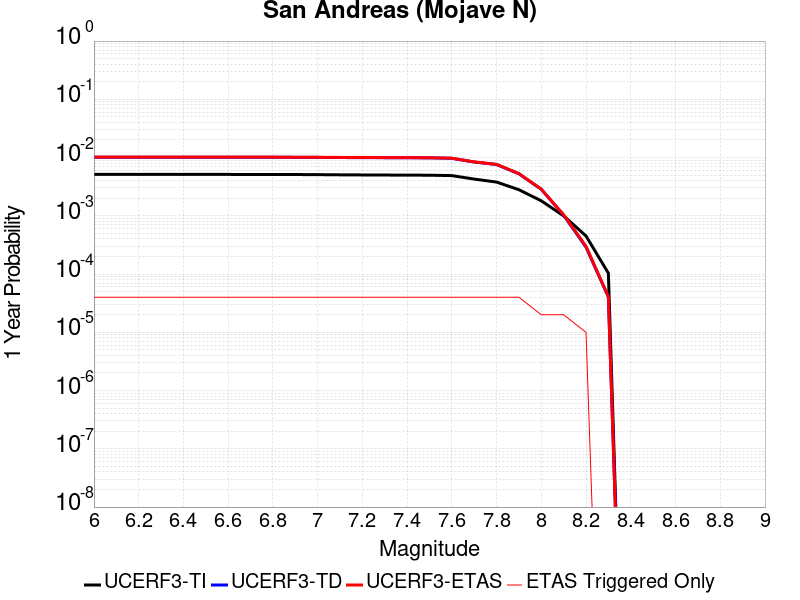 |  |

| Magnitude | 1 wk TI Prob | 1 wk TD Prob | 1 wk ETAS Prob | 1 wk ETAS/TD Gain | 1 wk ETAS Triggered Only | 1 mo TI Prob | 1 mo TD Prob | 1 mo ETAS Prob | 1 mo ETAS/TD Gain | 1 mo ETAS Triggered Only | 1 yr TI Prob | 1 yr TD Prob | 1 yr ETAS Prob | 1 yr ETAS/TD Gain | 1 yr ETAS Triggered Only | 10 yr TI Prob | 10 yr TD Prob | 10 yr ETAS Prob | 10 yr ETAS/TD Gain | 10 yr ETAS Triggered Only |
|-----|-----|-----|-----|-----|-----|-----|-----|-----|-----|-----|-----|-----|-----|-----|-----|-----|-----|-----|-----|-----|
| 6.0 | 9.877682E-5 | 1.9529383E-4 | 2.0529187E-4 | 1.0511949 | 1.0E-5 | 4.2326056E-4 | 8.3670527E-4 | 8.466969E-4 | 1.0119417 | 1.0E-5 | 0.0051410277 | 0.010139435 | 0.010179029 | 1.0039049 | 4.0E-5 | 0.05023708 | 0.098878175 | 0.098923236 | 1.0004556 | 5.0E-5 |
| 6.1 | 9.877682E-5 | 1.9529383E-4 | 2.0529187E-4 | 1.0511949 | 1.0E-5 | 4.2326056E-4 | 8.3670527E-4 | 8.466969E-4 | 1.0119417 | 1.0E-5 | 0.0051410277 | 0.010139435 | 0.010179029 | 1.0039049 | 4.0E-5 | 0.05023708 | 0.098878175 | 0.098923236 | 1.0004556 | 5.0E-5 |
| 6.2 | 9.877682E-5 | 1.9529383E-4 | 2.0529187E-4 | 1.0511949 | 1.0E-5 | 4.2326056E-4 | 8.3670527E-4 | 8.466969E-4 | 1.0119417 | 1.0E-5 | 0.0051410277 | 0.010139435 | 0.010179029 | 1.0039049 | 4.0E-5 | 0.05023708 | 0.098878175 | 0.098923236 | 1.0004556 | 5.0E-5 |
| 6.3 | 9.877682E-5 | 1.9529383E-4 | 2.0529187E-4 | 1.0511949 | 1.0E-5 | 4.2326056E-4 | 8.3670527E-4 | 8.466969E-4 | 1.0119417 | 1.0E-5 | 0.0051410277 | 0.010139435 | 0.010179029 | 1.0039049 | 4.0E-5 | 0.05023708 | 0.098878175 | 0.098923236 | 1.0004556 | 5.0E-5 |
| 6.4 | 9.877682E-5 | 1.9529383E-4 | 2.0529187E-4 | 1.0511949 | 1.0E-5 | 4.2326056E-4 | 8.3670527E-4 | 8.466969E-4 | 1.0119417 | 1.0E-5 | 0.0051410277 | 0.010139435 | 0.010179029 | 1.0039049 | 4.0E-5 | 0.05023708 | 0.098878175 | 0.098923236 | 1.0004556 | 5.0E-5 |
| 6.5 | 9.861474E-5 | 1.9503111E-4 | 2.0502915E-4 | 1.0512639 | 1.0E-5 | 4.2256617E-4 | 8.3558005E-4 | 8.455717E-4 | 1.0119578 | 1.0E-5 | 0.0051326132 | 0.010125862 | 0.010165458 | 1.0039103 | 4.0E-5 | 0.050156746 | 0.09875589 | 0.09880095 | 1.0004563 | 5.0E-5 |
| 6.6 | 9.861474E-5 | 1.9503111E-4 | 2.0502915E-4 | 1.0512639 | 1.0E-5 | 4.2256617E-4 | 8.3558005E-4 | 8.455717E-4 | 1.0119578 | 1.0E-5 | 0.0051326132 | 0.010125862 | 0.010165458 | 1.0039103 | 4.0E-5 | 0.050156746 | 0.09875589 | 0.09880095 | 1.0004563 | 5.0E-5 |
| 6.7 | 9.8552715E-5 | 1.9493049E-4 | 2.0492854E-4 | 1.0512904 | 1.0E-5 | 4.223004E-4 | 8.351491E-4 | 8.451407E-4 | 1.011964 | 1.0E-5 | 0.0051293927 | 0.010120665 | 0.01016026 | 1.0039123 | 4.0E-5 | 0.050125998 | 0.09870904 | 0.09875411 | 1.0004566 | 5.0E-5 |
| 6.8 | 9.8464974E-5 | 1.9478175E-4 | 2.0477979E-4 | 1.0513295 | 1.0E-5 | 4.219245E-4 | 8.3451206E-4 | 8.445037E-4 | 1.011973 | 1.0E-5 | 0.0051248376 | 0.01011298 | 0.010152576 | 1.0039153 | 4.0E-5 | 0.05008251 | 0.09863895 | 0.09868402 | 1.0004569 | 5.0E-5 |
| 6.9 | 9.825824E-5 | 1.9446116E-4 | 2.0445921E-4 | 1.0514141 | 1.0E-5 | 4.2103877E-4 | 8.3313894E-4 | 8.4313063E-4 | 1.0119928 | 1.0E-5 | 0.0051141046 | 0.010096418 | 0.010136014 | 1.0039217 | 4.0E-5 | 0.049980022 | 0.09848784 | 0.098532915 | 1.0004576 | 5.0E-5 |
| 7.0 | 9.781462E-5 | 1.9377335E-4 | 2.0377141E-4 | 1.0515966 | 1.0E-5 | 4.1913814E-4 | 8.301931E-4 | 8.401848E-4 | 1.0120354 | 1.0E-5 | 0.005091073 | 0.010060884 | 0.010100482 | 1.0039358 | 4.0E-5 | 0.04976007 | 0.09816376 | 0.09820885 | 1.0004593 | 5.0E-5 |
| 7.1 | 9.7121134E-5 | 1.927885E-4 | 2.0278657E-4 | 1.0518603 | 1.0E-5 | 4.1616702E-4 | 8.25975E-4 | 8.359667E-4 | 1.0120969 | 1.0E-5 | 0.005055068 | 0.010010001 | 0.010049601 | 1.003956 | 4.0E-5 | 0.04941613 | 0.09769965 | 0.09774476 | 1.0004618 | 5.0E-5 |
| 7.2 | 9.663819E-5 | 1.9209493E-4 | 2.0209301E-4 | 1.0520476 | 1.0E-5 | 4.1409794E-4 | 8.230044E-4 | 8.329962E-4 | 1.0121406 | 1.0E-5 | 0.0050299936 | 0.009974167 | 0.0100137675 | 1.0039704 | 4.0E-5 | 0.049176537 | 0.097372465 | 0.09741759 | 1.0004635 | 5.0E-5 |
| 7.3 | 9.6277574E-5 | 1.9161828E-4 | 2.0161636E-4 | 1.0521771 | 1.0E-5 | 4.125529E-4 | 8.2096294E-4 | 8.309547E-4 | 1.0121708 | 1.0E-5 | 0.0050112694 | 0.009949539 | 0.009989141 | 1.0039803 | 4.0E-5 | 0.04899759 | 0.097145244 | 0.09719039 | 1.0004647 | 5.0E-5 |
| 7.4 | 9.593308E-5 | 1.9101413E-4 | 2.0101221E-4 | 1.0523422 | 1.0E-5 | 4.1107697E-4 | 8.183753E-4 | 8.2836713E-4 | 1.0122093 | 1.0E-5 | 0.0049933824 | 0.009918322 | 0.009957925 | 1.0039929 | 4.0E-5 | 0.04882661 | 0.09686275 | 0.096907906 | 1.0004662 | 5.0E-5 |
| 7.5 | 9.561707E-5 | 1.9047315E-4 | 2.0047124E-4 | 1.0524908 | 1.0E-5 | 4.0972308E-4 | 8.160583E-4 | 8.260502E-4 | 1.012244 | 1.0E-5 | 0.0049769743 | 0.009890369 | 0.009929974 | 1.0040044 | 4.0E-5 | 0.048669744 | 0.09660831 | 0.096653484 | 1.0004675 | 5.0E-5 |
| 7.6 | 9.418194E-5 | 1.8698536E-4 | 1.969835E-4 | 1.0534701 | 1.0E-5 | 4.0357444E-4 | 8.011199E-4 | 8.111119E-4 | 1.0124725 | 1.0E-5 | 0.004902454 | 0.009710128 | 0.00974974 | 1.0040795 | 4.0E-5 | 0.047957025 | 0.09498726 | 0.095032506 | 1.0004764 | 5.0E-5 |
| 7.7 | 8.202141E-5 | 1.6137006E-4 | 1.7136845E-4 | 1.0619594 | 1.0E-5 | 3.51473E-4 | 6.914027E-4 | 7.013958E-4 | 1.0144533 | 1.0E-5 | 0.00427079 | 0.008385396 | 0.008425061 | 1.0047302 | 4.0E-5 | 0.04189639 | 0.082750104 | 0.08279596 | 1.0005542 | 5.0E-5 |
| 7.8 | 7.2859846E-5 | 1.4620528E-4 | 1.5620381E-4 | 1.068387 | 1.0E-5 | 3.1221908E-4 | 6.264436E-4 | 6.364373E-4 | 1.0159532 | 1.0E-5 | 0.003794643 | 0.0076003214 | 0.007640017 | 1.0052229 | 4.0E-5 | 0.037304975 | 0.07519419 | 0.075240426 | 1.000615 | 5.0E-5 |
| 7.9 | 5.3874453E-5 | 1.0118933E-4 | 1.1118832E-4 | 1.0988146 | 1.0E-5 | 2.3087008E-4 | 4.335965E-4 | 4.4359217E-4 | 1.0230529 | 1.0E-5 | 0.0028072202 | 0.005266271 | 0.0053060604 | 1.0075555 | 4.0E-5 | 0.02772022 | 0.052766964 | 0.052814327 | 1.0008975 | 5.0E-5 |
| 8.0 | 3.468538E-5 | 5.468548E-5 | 5.468548E-5 | 1.0 | 0.0 | 1.4864317E-4 | 2.343453E-4 | 2.343453E-4 | 1.0 | 0.0 | 0.0018082283 | 0.0028494229 | 0.002869366 | 1.006999 | 2.0E-5 | 0.017935853 | 0.02915624 | 0.029185364 | 1.000999 | 3.0E-5 |
| 8.1 | 1.9152367E-5 | 1.9606829E-5 | 1.9606829E-5 | 1.0 | 0.0 | 8.207899E-5 | 8.402656E-5 | 8.402656E-5 | 1.0 | 0.0 | 9.988535E-4 | 0.0010225439 | 0.0010425234 | 1.0195391 | 2.0E-5 | 0.009943757 | 0.010963188 | 0.010982969 | 1.0018042 | 2.0E-5 |
| 8.2 | 8.643924E-6 | 5.5526552E-6 | 5.5526552E-6 | 1.0 | 0.0 | 3.704486E-5 | 2.3796878E-5 | 2.3796878E-5 | 1.0 | 0.0 | 4.5092785E-4 | 2.8968856E-4 | 2.9968566E-4 | 1.0345098 | 1.0E-5 | 0.0045001395 | 0.0032912085 | 0.0033011758 | 1.0030284 | 1.0E-5 |
| 8.3 | 1.983087E-6 | 7.7871465E-7 | 7.7871465E-7 | 1.0 | 0.0 | 8.498917E-6 | 3.3373444E-6 | 3.3373444E-6 | 1.0 | 0.0 | 1.034694E-4 | 4.063143E-5 | 4.063143E-5 | 1.0 | 0.0 | 0.0010342124 | 4.7926197E-4 | 4.7926197E-4 | 1.0 | 0.0 |

## West Napa 2011 CFM
*[(top)](#table-of-contents)*

| 1 Week | 1 Month | 1 Year | 10 Year |
|-----|-----|-----|-----|
|  |  |  | 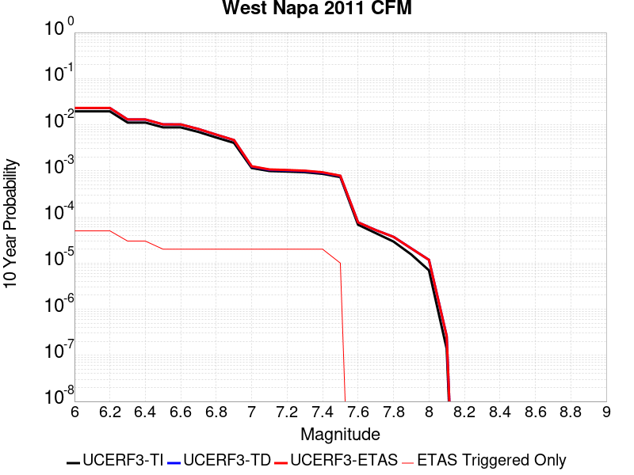 |

| Magnitude | 1 wk TI Prob | 1 wk TD Prob | 1 wk ETAS Prob | 1 wk ETAS/TD Gain | 1 wk ETAS Triggered Only | 1 mo TI Prob | 1 mo TD Prob | 1 mo ETAS Prob | 1 mo ETAS/TD Gain | 1 mo ETAS Triggered Only | 1 yr TI Prob | 1 yr TD Prob | 1 yr ETAS Prob | 1 yr ETAS/TD Gain | 1 yr ETAS Triggered Only | 10 yr TI Prob | 10 yr TD Prob | 10 yr ETAS Prob | 10 yr ETAS/TD Gain | 10 yr ETAS Triggered Only |
|-----|-----|-----|-----|-----|-----|-----|-----|-----|-----|-----|-----|-----|-----|-----|-----|-----|-----|-----|-----|-----|
| 6.0 | 3.773104E-5 | 4.454535E-5 | 5.4544907E-5 | 1.2244803 | 1.0E-5 | 1.6169442E-4 | 1.9089649E-4 | 2.0089457E-4 | 1.0523744 | 1.0E-5 | 0.001966852 | 0.002322002 | 0.0023519325 | 1.0128899 | 3.0E-5 | 0.019495348 | 0.023010869 | 0.023059718 | 1.0021229 | 5.0E-5 |
| 6.1 | 3.773104E-5 | 4.454535E-5 | 5.4544907E-5 | 1.2244803 | 1.0E-5 | 1.6169442E-4 | 1.9089649E-4 | 2.0089457E-4 | 1.0523744 | 1.0E-5 | 0.001966852 | 0.002322002 | 0.0023519325 | 1.0128899 | 3.0E-5 | 0.019495348 | 0.023010869 | 0.023059718 | 1.0021229 | 5.0E-5 |
| 6.2 | 3.773104E-5 | 4.454535E-5 | 5.4544907E-5 | 1.2244803 | 1.0E-5 | 1.6169442E-4 | 1.9089649E-4 | 2.0089457E-4 | 1.0523744 | 1.0E-5 | 0.001966852 | 0.002322002 | 0.0023519325 | 1.0128899 | 3.0E-5 | 0.019495348 | 0.023010869 | 0.023059718 | 1.0021229 | 5.0E-5 |
| 6.3 | 2.147964E-5 | 2.4996316E-5 | 2.4996316E-5 | 1.0 | 0.0 | 9.2052345E-5 | 1.0712319E-4 | 1.0712319E-4 | 1.0 | 0.0 | 0.001120161 | 0.001303536 | 0.0013135229 | 1.0076615 | 1.0E-5 | 0.011145315 | 0.01296952 | 0.01299913 | 1.0022831 | 3.0E-5 |
| 6.4 | 2.147964E-5 | 2.4996316E-5 | 2.4996316E-5 | 1.0 | 0.0 | 9.2052345E-5 | 1.0712319E-4 | 1.0712319E-4 | 1.0 | 0.0 | 0.001120161 | 0.001303536 | 0.0013135229 | 1.0076615 | 1.0E-5 | 0.011145315 | 0.01296952 | 0.01299913 | 1.0022831 | 3.0E-5 |
| 6.5 | 1.688201E-5 | 1.9554702E-5 | 1.9554702E-5 | 1.0 | 0.0 | 7.234947E-5 | 8.3803585E-5 | 8.3803585E-5 | 1.0 | 0.0 | 8.804988E-4 | 0.0010199035 | 0.0010298932 | 1.0097948 | 1.0E-5 | 0.008770182 | 0.010160902 | 0.010180698 | 1.0019484 | 2.0E-5 |
| 6.6 | 1.6846381E-5 | 1.9514384E-5 | 1.9514384E-5 | 1.0 | 0.0 | 7.219678E-5 | 8.36308E-5 | 8.36308E-5 | 1.0 | 0.0 | 8.7864127E-4 | 0.0010178018 | 0.0010277916 | 1.0098151 | 1.0E-5 | 0.008751754 | 0.010140077 | 0.010159874 | 1.0019524 | 2.0E-5 |
| 6.7 | 1.3396501E-5 | 1.547367E-5 | 1.547367E-5 | 1.0 | 0.0 | 5.7412315E-5 | 6.63144E-5 | 6.63144E-5 | 1.0 | 0.0 | 6.9877075E-4 | 8.071423E-4 | 8.171342E-4 | 1.0123794 | 1.0E-5 | 0.0069657755 | 0.008049836 | 0.008069675 | 1.0024645 | 2.0E-5 |
| 6.8 | 1.0139058E-5 | 1.1676956E-5 | 1.1676956E-5 | 1.0 | 0.0 | 4.3452383E-5 | 5.004345E-5 | 5.004345E-5 | 1.0 | 0.0 | 5.289043E-4 | 6.0916424E-4 | 6.1915815E-4 | 1.0164059 | 1.0E-5 | 0.005276473 | 0.006081869 | 0.006101747 | 1.0032685 | 2.0E-5 |
| 6.9 | 7.761281E-6 | 8.894589E-6 | 8.894589E-6 | 1.0 | 0.0 | 3.326221E-5 | 3.81194E-5 | 3.81194E-5 | 1.0 | 0.0 | 4.0489217E-4 | 4.6405627E-4 | 4.7405163E-4 | 1.0215391 | 1.0E-5 | 0.0040415525 | 0.004637389 | 0.0046572965 | 1.0042927 | 2.0E-5 |
| 7.0 | 2.2109202E-6 | 2.3682921E-6 | 2.3682921E-6 | 1.0 | 0.0 | 9.475338E-6 | 1.0149784E-5 | 1.0149784E-5 | 1.0 | 0.0 | 1.1535613E-4 | 1.235667E-4 | 1.3356547E-4 | 1.080918 | 1.0E-5 | 0.0011529627 | 0.0012364648 | 0.0012564401 | 1.0161551 | 2.0E-5 |
| 7.1 | 1.9008926E-6 | 2.0148857E-6 | 2.0148857E-6 | 1.0 | 0.0 | 8.146657E-6 | 8.6351965E-6 | 8.6351965E-6 | 1.0 | 0.0 | 9.918104E-5 | 1.0512847E-4 | 1.1512742E-4 | 1.0951117 | 1.0E-5 | 9.913679E-4 | 0.0010522673 | 0.0010722461 | 1.0189866 | 2.0E-5 |
| 7.2 | 1.8495944E-6 | 1.9576798E-6 | 1.9576798E-6 | 1.0 | 0.0 | 7.926808E-6 | 8.3900295E-6 | 8.3900295E-6 | 1.0 | 0.0 | 9.650462E-5 | 1.02143844E-4 | 1.1214282E-4 | 1.0978911 | 1.0E-5 | 9.6462725E-4 | 0.0010224489 | 0.0010424284 | 1.0195409 | 2.0E-5 |
| 7.3 | 1.7883189E-6 | 1.8896261E-6 | 1.8896261E-6 | 1.0 | 0.0 | 7.664201E-6 | 8.098373E-6 | 8.098373E-6 | 1.0 | 0.0 | 9.330765E-5 | 9.859325E-5 | 1.0859226E-4 | 1.1014168 | 1.0E-5 | 9.3268487E-4 | 9.869748E-4 | 0.001006955 | 1.0202439 | 2.0E-5 |
| 7.4 | 1.6520572E-6 | 1.7429599E-6 | 1.7429599E-6 | 1.0 | 0.0 | 7.0802257E-6 | 7.4698064E-6 | 7.4698064E-6 | 1.0 | 0.0 | 8.6198335E-5 | 9.0941125E-5 | 1.0094021E-4 | 1.1099513 | 1.0E-5 | 8.616491E-4 | 9.1051456E-4 | 9.304964E-4 | 1.0219456 | 2.0E-5 |
| 7.5 | 1.4040345E-6 | 1.4813177E-6 | 1.4813177E-6 | 1.0 | 0.0 | 6.0172765E-6 | 6.348489E-6 | 6.348489E-6 | 1.0 | 0.0 | 7.325788E-5 | 7.729014E-5 | 8.7289365E-5 | 1.1293726 | 1.0E-5 | 7.3233736E-4 | 7.7407627E-4 | 7.8406854E-4 | 1.0129086 | 1.0E-5 |
| 7.6 | 1.3013842E-7 | 1.447772E-7 | 1.447772E-7 | 1.0 | 0.0 | 5.57736E-7 | 6.204736E-7 | 6.204736E-7 | 1.0 | 0.0 | 6.790414E-6 | 7.55424E-6 | 7.55424E-6 | 1.0 | 0.0 | 6.790207E-5 | 7.647041E-5 | 7.647041E-5 | 1.0 | 0.0 |
| 7.7 | 8.541512E-8 | 9.772765E-8 | 9.772765E-8 | 1.0 | 0.0 | 3.6606474E-7 | 4.188327E-7 | 4.188327E-7 | 1.0 | 0.0 | 4.456829E-6 | 5.099276E-6 | 5.099276E-6 | 1.0 | 0.0 | 4.4567398E-5 | 5.1896914E-5 | 5.1896914E-5 | 1.0 | 0.0 |
| 7.8 | 5.6074793E-8 | 6.942185E-8 | 6.942185E-8 | 1.0 | 0.0 | 2.403205E-7 | 2.9752218E-7 | 2.9752218E-7 | 1.0 | 0.0 | 2.9258983E-6 | 3.6223264E-6 | 3.6223264E-6 | 1.0 | 0.0 | 2.9258597E-5 | 3.7058187E-5 | 3.7058187E-5 | 1.0 | 0.0 |
| 7.9 | 2.9475839E-8 | 3.8844114E-8 | 3.8844114E-8 | 1.0 | 0.0 | 1.2632502E-7 | 1.6647476E-7 | 1.6647476E-7 | 1.0 | 0.0 | 1.538006E-6 | 2.0268285E-6 | 2.0268285E-6 | 1.0 | 0.0 | 1.5379954E-5 | 2.0810172E-5 | 2.0810172E-5 | 1.0 | 0.0 |
| 8.0 | 1.3337122E-8 | 2.1793342E-8 | 2.1793342E-8 | 1.0 | 0.0 | 5.7159088E-8 | 9.340004E-8 | 9.340004E-8 | 1.0 | 0.0 | 6.959117E-7 | 1.1371449E-6 | 1.1371449E-6 | 1.0 | 0.0 | 6.959095E-6 | 1.1729146E-5 | 1.1729146E-5 | 1.0 | 0.0 |
| 8.1 | 2.6589986E-10 | 4.8956206E-10 | 4.8956206E-10 | 1.0 | 0.0 | 1.1395708E-9 | 2.0981228E-9 | 2.0981228E-9 | 1.0 | 0.0 | 1.3874274E-8 | 2.5544647E-8 | 2.5544647E-8 | 1.0 | 0.0 | 1.3874273E-7 | 2.6210765E-7 | 2.6210765E-7 | 1.0 | 0.0 |

## San Gregorio (South) 2011 CFM
*[(top)](#table-of-contents)*

| 1 Week | 1 Month | 1 Year | 10 Year |
|-----|-----|-----|-----|
|  | 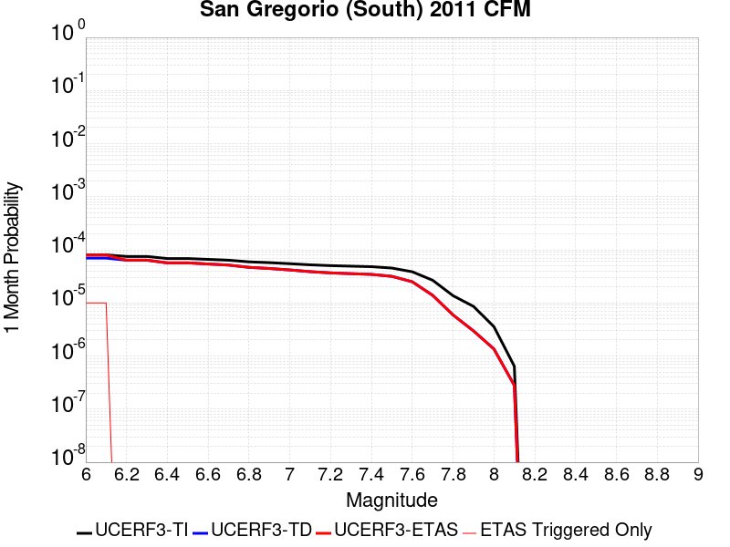 |  |  |

| Magnitude | 1 wk TI Prob | 1 wk TD Prob | 1 wk ETAS Prob | 1 wk ETAS/TD Gain | 1 wk ETAS Triggered Only | 1 mo TI Prob | 1 mo TD Prob | 1 mo ETAS Prob | 1 mo ETAS/TD Gain | 1 mo ETAS Triggered Only | 1 yr TI Prob | 1 yr TD Prob | 1 yr ETAS Prob | 1 yr ETAS/TD Gain | 1 yr ETAS Triggered Only | 10 yr TI Prob | 10 yr TD Prob | 10 yr ETAS Prob | 10 yr ETAS/TD Gain | 10 yr ETAS Triggered Only |
|-----|-----|-----|-----|-----|-----|-----|-----|-----|-----|-----|-----|-----|-----|-----|-----|-----|-----|-----|-----|-----|
| 6.0 | 1.8770423E-5 | 1.6289738E-5 | 2.6289574E-5 | 1.6138735 | 1.0E-5 | 8.044219E-5 | 6.9811314E-5 | 7.981061E-5 | 1.1432333 | 1.0E-5 | 9.789435E-4 | 8.496251E-4 | 8.795996E-4 | 1.0352798 | 3.0E-5 | 0.009746423 | 0.008476529 | 0.008526105 | 1.0058486 | 5.0E-5 |
| 6.1 | 1.8770423E-5 | 1.6289738E-5 | 2.6289574E-5 | 1.6138735 | 1.0E-5 | 8.044219E-5 | 6.9811314E-5 | 7.981061E-5 | 1.1432333 | 1.0E-5 | 9.789435E-4 | 8.496251E-4 | 8.795996E-4 | 1.0352798 | 3.0E-5 | 0.009746423 | 0.008476529 | 0.008526105 | 1.0058486 | 5.0E-5 |
| 6.2 | 1.7508692E-5 | 1.4908993E-5 | 1.4908993E-5 | 1.0 | 0.0 | 7.5035096E-5 | 6.3894135E-5 | 6.3894135E-5 | 1.0 | 0.0 | 9.1316935E-4 | 7.776365E-4 | 7.876287E-4 | 1.0128495 | 1.0E-5 | 0.00909426 | 0.0077618314 | 0.0077915983 | 1.0038351 | 3.0E-5 |
| 6.3 | 1.7508692E-5 | 1.4908993E-5 | 1.4908993E-5 | 1.0 | 0.0 | 7.5035096E-5 | 6.3894135E-5 | 6.3894135E-5 | 1.0 | 0.0 | 9.1316935E-4 | 7.776365E-4 | 7.876287E-4 | 1.0128495 | 1.0E-5 | 0.00909426 | 0.0077618314 | 0.0077915983 | 1.0038351 | 3.0E-5 |
| 6.4 | 1.6004591E-5 | 1.3258521E-5 | 1.3258521E-5 | 1.0 | 0.0 | 6.85893E-5 | 5.6821E-5 | 5.6821E-5 | 1.0 | 0.0 | 8.347548E-4 | 6.9157715E-4 | 6.9157715E-4 | 1.0 | 0.0 | 0.008316261 | 0.006906727 | 0.0069265887 | 1.0028757 | 2.0E-5 |
| 6.5 | 1.6004591E-5 | 1.3258521E-5 | 1.3258521E-5 | 1.0 | 0.0 | 6.85893E-5 | 5.6821E-5 | 5.6821E-5 | 1.0 | 0.0 | 8.347548E-4 | 6.9157715E-4 | 6.9157715E-4 | 1.0 | 0.0 | 0.008316261 | 0.006906727 | 0.0069265887 | 1.0028757 | 2.0E-5 |
| 6.6 | 1.5442201E-5 | 1.26430405E-5 | 1.26430405E-5 | 1.0 | 0.0 | 6.617918E-5 | 5.4183336E-5 | 5.4183336E-5 | 1.0 | 0.0 | 8.0543366E-4 | 6.594833E-4 | 6.594833E-4 | 1.0 | 0.0 | 0.008025207 | 0.006587722 | 0.0066075902 | 1.003016 | 2.0E-5 |
| 6.7 | 1.489921E-5 | 1.2051447E-5 | 1.2051447E-5 | 1.0 | 0.0 | 6.3852196E-5 | 5.164804E-5 | 5.164804E-5 | 1.0 | 0.0 | 7.7712315E-4 | 6.286342E-4 | 6.286342E-4 | 1.0 | 0.0 | 0.0077441116 | 0.006281004 | 0.0063008782 | 1.0031642 | 2.0E-5 |
| 6.8 | 1.3876024E-5 | 1.093019E-5 | 1.093019E-5 | 1.0 | 0.0 | 5.9467322E-5 | 4.6842833E-5 | 4.6842833E-5 | 1.0 | 0.0 | 7.237741E-4 | 5.701626E-4 | 5.701626E-4 | 1.0 | 0.0 | 0.0072142133 | 0.005699408 | 0.005719294 | 1.0034891 | 2.0E-5 |
| 6.9 | 1.33922495E-5 | 1.0401597E-5 | 1.0401597E-5 | 1.0 | 0.0 | 5.7394092E-5 | 4.4577515E-5 | 4.4577515E-5 | 1.0 | 0.0 | 6.9854903E-4 | 5.4259633E-4 | 5.4259633E-4 | 1.0 | 0.0 | 0.0069635725 | 0.005425117 | 0.0054450086 | 1.0036665 | 2.0E-5 |
| 7.0 | 1.2807324E-5 | 9.761441E-6 | 9.761441E-6 | 1.0 | 0.0 | 5.4887376E-5 | 4.183408E-5 | 4.183408E-5 | 1.0 | 0.0 | 6.680489E-4 | 5.092111E-4 | 5.092111E-4 | 1.0 | 0.0 | 0.006660442 | 0.005092836 | 0.005112734 | 1.0039071 | 2.0E-5 |
| 7.1 | 1.2191438E-5 | 9.070163E-6 | 9.070163E-6 | 1.0 | 0.0 | 5.224797E-5 | 3.887155E-5 | 3.887155E-5 | 1.0 | 0.0 | 6.3593336E-4 | 4.731584E-4 | 4.731584E-4 | 1.0 | 0.0 | 0.0063411663 | 0.0047338954 | 0.0047538006 | 1.0042049 | 2.0E-5 |
| 7.2 | 1.1769438E-5 | 8.590228E-6 | 8.590228E-6 | 1.0 | 0.0 | 5.0439474E-5 | 3.6814745E-5 | 3.6814745E-5 | 1.0 | 0.0 | 6.1392755E-4 | 4.481274E-4 | 4.481274E-4 | 1.0 | 0.0 | 0.0061223423 | 0.004484622 | 0.004504532 | 1.0044397 | 2.0E-5 |
| 7.3 | 1.150374E-5 | 8.305612E-6 | 8.305612E-6 | 1.0 | 0.0 | 4.9300812E-5 | 3.5594996E-5 | 3.5594996E-5 | 1.0 | 0.0 | 6.0007203E-4 | 4.3328296E-4 | 4.3328296E-4 | 1.0 | 0.0 | 0.0059845424 | 0.0043367483 | 0.004356662 | 1.0045917 | 2.0E-5 |
| 7.4 | 1.12514E-5 | 8.051282E-6 | 8.051282E-6 | 1.0 | 0.0 | 4.8219394E-5 | 3.450504E-5 | 3.450504E-5 | 1.0 | 0.0 | 5.8691297E-4 | 4.2001792E-4 | 4.2001792E-4 | 1.0 | 0.0 | 0.005853653 | 0.0042045936 | 0.0042245095 | 1.0047367 | 2.0E-5 |
| 7.5 | 1.059696E-5 | 7.4012414E-6 | 7.4012414E-6 | 1.0 | 0.0 | 4.5414752E-5 | 3.171922E-5 | 3.171922E-5 | 1.0 | 0.0 | 5.5278436E-4 | 3.8611316E-4 | 3.8611316E-4 | 1.0 | 0.0 | 0.0055141128 | 0.0038667116 | 0.0038866343 | 1.0051523 | 2.0E-5 |
| 7.6 | 9.018592E-6 | 5.84448E-6 | 5.84448E-6 | 1.0 | 0.0 | 3.8650534E-5 | 2.504753E-5 | 2.504753E-5 | 1.0 | 0.0 | 4.7046866E-4 | 3.0491105E-4 | 3.0491105E-4 | 1.0 | 0.0 | 0.004694739 | 0.003056837 | 0.0030668066 | 1.0032613 | 1.0E-5 |
| 7.7 | 6.243489E-6 | 3.24569E-6 | 3.24569E-6 | 1.0 | 0.0 | 2.6757538E-5 | 1.3910027E-5 | 1.3910027E-5 | 1.0 | 0.0 | 3.257243E-4 | 1.6934142E-4 | 1.6934142E-4 | 1.0 | 0.0 | 0.003252473 | 0.0017023596 | 0.0017123426 | 1.0058641 | 1.0E-5 |
| 7.8 | 3.1941963E-6 | 1.384812E-6 | 1.384812E-6 | 1.0 | 0.0 | 1.368934E-5 | 5.9348945E-6 | 5.9348945E-6 | 1.0 | 0.0 | 1.6665498E-4 | 7.2254945E-5 | 7.2254945E-5 | 1.0 | 0.0 | 0.0016653005 | 7.283418E-4 | 7.383345E-4 | 1.0137198 | 1.0E-5 |
| 7.9 | 2.0098398E-6 | 6.9448276E-7 | 6.9448276E-7 | 1.0 | 0.0 | 8.6135715E-6 | 2.9763512E-6 | 2.9763512E-6 | 1.0 | 0.0 | 1.0486518E-4 | 3.6236474E-5 | 3.6236474E-5 | 1.0 | 0.0 | 0.0010481571 | 3.6725012E-4 | 3.7724644E-4 | 1.0272194 | 1.0E-5 |
| 8.0 | 8.353119E-7 | 3.175784E-7 | 3.175784E-7 | 1.0 | 0.0 | 3.579903E-6 | 1.3610495E-6 | 1.3610495E-6 | 1.0 | 0.0 | 4.358445E-5 | 1.6570651E-5 | 1.6570651E-5 | 1.0 | 0.0 | 4.3575902E-4 | 1.6689835E-4 | 1.6689835E-4 | 1.0 | 0.0 |
| 8.1 | 1.5033264E-7 | 6.550403E-8 | 6.550403E-8 | 1.0 | 0.0 | 6.442826E-7 | 2.8073154E-7 | 2.8073154E-7 | 1.0 | 0.0 | 7.844113E-6 | 3.4179013E-6 | 3.4179013E-6 | 1.0 | 0.0 | 7.843835E-5 | 3.419582E-5 | 3.419582E-5 | 1.0 | 0.0 |

## San Andreas (San Bernardino N)
*[(top)](#table-of-contents)*

| 1 Week | 1 Month | 1 Year | 10 Year |
|-----|-----|-----|-----|
|  | 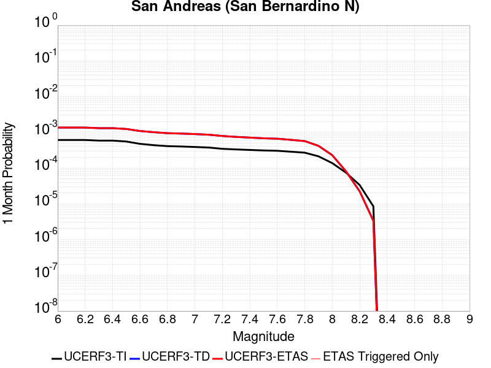 |  |  |

| Magnitude | 1 wk TI Prob | 1 wk TD Prob | 1 wk ETAS Prob | 1 wk ETAS/TD Gain | 1 wk ETAS Triggered Only | 1 mo TI Prob | 1 mo TD Prob | 1 mo ETAS Prob | 1 mo ETAS/TD Gain | 1 mo ETAS Triggered Only | 1 yr TI Prob | 1 yr TD Prob | 1 yr ETAS Prob | 1 yr ETAS/TD Gain | 1 yr ETAS Triggered Only | 10 yr TI Prob | 10 yr TD Prob | 10 yr ETAS Prob | 10 yr ETAS/TD Gain | 10 yr ETAS Triggered Only |
|-----|-----|-----|-----|-----|-----|-----|-----|-----|-----|-----|-----|-----|-----|-----|-----|-----|-----|-----|-----|-----|
| 6.0 | 1.4273766E-4 | 3.1714246E-4 | 3.1714246E-4 | 1.0 | 0.0 | 6.115894E-4 | 0.00135848 | 0.00135848 | 1.0 | 0.0 | 0.0074207084 | 0.016415568 | 0.016445076 | 1.0017976 | 3.0E-5 | 0.07177748 | 0.15070686 | 0.15074083 | 1.0002254 | 4.0E-5 |
| 6.1 | 1.4273766E-4 | 3.1714246E-4 | 3.1714246E-4 | 1.0 | 0.0 | 6.115894E-4 | 0.00135848 | 0.00135848 | 1.0 | 0.0 | 0.0074207084 | 0.016415568 | 0.016445076 | 1.0017976 | 3.0E-5 | 0.07177748 | 0.15070686 | 0.15074083 | 1.0002254 | 4.0E-5 |
| 6.2 | 1.4273766E-4 | 3.1714246E-4 | 3.1714246E-4 | 1.0 | 0.0 | 6.115894E-4 | 0.00135848 | 0.00135848 | 1.0 | 0.0 | 0.0074207084 | 0.016415568 | 0.016445076 | 1.0017976 | 3.0E-5 | 0.07177748 | 0.15070686 | 0.15074083 | 1.0002254 | 4.0E-5 |
| 6.3 | 1.3730655E-4 | 3.0618554E-4 | 3.0618554E-4 | 1.0 | 0.0 | 5.883239E-4 | 0.0013115695 | 0.0013115695 | 1.0 | 0.0 | 0.0071393442 | 0.015852848 | 0.015882373 | 1.0018624 | 3.0E-5 | 0.06914291 | 0.14600705 | 0.14604121 | 1.000234 | 4.0E-5 |
| 6.4 | 1.3730655E-4 | 3.0618554E-4 | 3.0618554E-4 | 1.0 | 0.0 | 5.883239E-4 | 0.0013115695 | 0.0013115695 | 1.0 | 0.0 | 0.0071393442 | 0.015852848 | 0.015882373 | 1.0018624 | 3.0E-5 | 0.06914291 | 0.14600705 | 0.14604121 | 1.000234 | 4.0E-5 |
| 6.5 | 1.2942807E-4 | 2.9032223E-4 | 2.9032223E-4 | 1.0 | 0.0 | 5.545738E-4 | 0.00124365 | 0.00124365 | 1.0 | 0.0 | 0.0067310524 | 0.015037569 | 0.015067118 | 1.001965 | 3.0E-5 | 0.06530788 | 0.13915014 | 0.13918458 | 1.0002475 | 4.0E-5 |
| 6.6 | 1.1125901E-4 | 2.5469047E-4 | 2.5469047E-4 | 1.0 | 0.0 | 4.767372E-4 | 0.0010910763 | 0.0010910763 | 1.0 | 0.0 | 0.005788839 | 0.013203582 | 0.013233186 | 1.0022421 | 3.0E-5 | 0.056403454 | 0.12343978 | 0.123474844 | 1.0002841 | 4.0E-5 |
| 6.7 | 1.02209575E-4 | 2.3603237E-4 | 2.3603237E-4 | 1.0 | 0.0 | 4.3796748E-4 | 0.0010111765 | 0.0010111765 | 1.0 | 0.0 | 0.0053192247 | 0.012242006 | 0.012271639 | 1.0024205 | 3.0E-5 | 0.051936906 | 0.11523267 | 0.11526806 | 1.0003071 | 4.0E-5 |
| 6.8 | 9.610582E-5 | 2.2127625E-4 | 2.2127625E-4 | 1.0 | 0.0 | 4.1181705E-4 | 9.4798283E-4 | 9.4798283E-4 | 1.0 | 0.0 | 0.0050023515 | 0.01148088 | 0.011510535 | 1.002583 | 3.0E-5 | 0.048912346 | 0.10863209 | 0.108667746 | 1.0003282 | 4.0E-5 |
| 6.9 | 9.3877505E-5 | 2.1582727E-4 | 2.1582727E-4 | 1.0 | 0.0 | 4.0227012E-4 | 9.246468E-4 | 9.246468E-4 | 1.0 | 0.0 | 0.0048866454 | 0.011199714 | 0.011229378 | 1.0026486 | 3.0E-5 | 0.04780577 | 0.10622182 | 0.106257565 | 1.0003365 | 4.0E-5 |
| 7.0 | 9.1019785E-5 | 2.0908975E-4 | 2.0908975E-4 | 1.0 | 0.0 | 3.900265E-4 | 8.957918E-4 | 8.957918E-4 | 1.0 | 0.0 | 0.0047382377 | 0.010851953 | 0.010881628 | 1.0027344 | 3.0E-5 | 0.046384744 | 0.10319069 | 0.103226565 | 1.0003476 | 4.0E-5 |
| 7.1 | 8.771155E-5 | 2.0082777E-4 | 2.0082777E-4 | 1.0 | 0.0 | 3.758525E-4 | 8.604071E-4 | 8.604071E-4 | 1.0 | 0.0 | 0.0045664064 | 0.01042534 | 0.010455027 | 1.0028476 | 3.0E-5 | 0.044737056 | 0.099501036 | 0.09953706 | 1.000362 | 4.0E-5 |
| 7.2 | 8.0830236E-5 | 1.8486784E-4 | 1.8486784E-4 | 1.0 | 0.0 | 3.4636928E-4 | 7.920503E-4 | 7.920503E-4 | 1.0 | 0.0 | 0.0042088944 | 0.009600682 | 0.009630394 | 1.0030948 | 3.0E-5 | 0.041300658 | 0.0922283 | 0.092264615 | 1.0003937 | 4.0E-5 |
| 7.3 | 7.7668235E-5 | 1.7428612E-4 | 1.7428612E-4 | 1.0 | 0.0 | 3.328214E-4 | 7.4672676E-4 | 7.4672676E-4 | 1.0 | 0.0 | 0.0040445733 | 0.009053581 | 0.00908331 | 1.0032836 | 3.0E-5 | 0.03971748 | 0.08749109 | 0.08752759 | 1.0004172 | 4.0E-5 |
| 7.4 | 7.520177E-5 | 1.664738E-4 | 1.664738E-4 | 1.0 | 0.0 | 3.2225347E-4 | 7.132641E-4 | 7.132641E-4 | 1.0 | 0.0 | 0.0039163795 | 0.0086494805 | 0.008679221 | 1.0034385 | 3.0E-5 | 0.038480744 | 0.08394351 | 0.08398015 | 1.0004365 | 4.0E-5 |
| 7.5 | 7.274697E-5 | 1.5933804E-4 | 1.5933804E-4 | 1.0 | 0.0 | 3.1173544E-4 | 6.826987E-4 | 6.826987E-4 | 1.0 | 0.0 | 0.003788775 | 0.008280237 | 0.008309988 | 1.0035931 | 3.0E-5 | 0.03724827 | 0.08065663 | 0.08069341 | 1.000456 | 4.0E-5 |
| 7.6 | 7.1185845E-5 | 1.5502879E-4 | 1.5502879E-4 | 1.0 | 0.0 | 3.0504653E-4 | 6.642399E-4 | 6.642399E-4 | 1.0 | 0.0 | 0.0037076178 | 0.008057187 | 0.008086945 | 1.0036933 | 3.0E-5 | 0.036463667 | 0.078643866 | 0.07868072 | 1.0004686 | 4.0E-5 |
| 7.7 | 6.709961E-5 | 1.4409532E-4 | 1.4409532E-4 | 1.0 | 0.0 | 2.8753807E-4 | 6.174052E-4 | 6.174052E-4 | 1.0 | 0.0 | 0.003495157 | 0.0074910405 | 0.007520816 | 1.0039748 | 3.0E-5 | 0.034406938 | 0.073465206 | 0.07350227 | 1.0005045 | 4.0E-5 |
| 7.8 | 6.300812E-5 | 1.3288956E-4 | 1.3288956E-4 | 1.0 | 0.0 | 2.7000686E-4 | 5.694024E-4 | 5.694024E-4 | 1.0 | 0.0 | 0.0032823787 | 0.006910468 | 0.0069402605 | 1.0043112 | 3.0E-5 | 0.032343175 | 0.068105824 | 0.0681431 | 1.0005473 | 4.0E-5 |
| 7.9 | 4.983037E-5 | 9.79202E-5 | 9.79202E-5 | 1.0 | 0.0 | 2.1354125E-4 | 4.195905E-4 | 4.195905E-4 | 1.0 | 0.0 | 0.0025967648 | 0.005096559 | 0.0051264064 | 1.0058563 | 3.0E-5 | 0.025666296 | 0.050968077 | 0.051006038 | 1.0007448 | 4.0E-5 |
| 8.0 | 3.2211527E-5 | 5.3709457E-5 | 5.3709457E-5 | 1.0 | 0.0 | 1.380421E-4 | 2.3016307E-4 | 2.3016307E-4 | 1.0 | 0.0 | 0.0016793669 | 0.0027986364 | 0.0028185805 | 1.0071263 | 2.0E-5 | 0.016667323 | 0.028558796 | 0.02858794 | 1.0010204 | 3.0E-5 |
| 8.1 | 1.743376E-5 | 1.9015304E-5 | 1.9015304E-5 | 1.0 | 0.0 | 7.471398E-5 | 8.149162E-5 | 8.149162E-5 | 1.0 | 0.0 | 9.0926304E-4 | 9.917095E-4 | 0.0010116897 | 1.0201472 | 2.0E-5 | 0.009055517 | 0.01058332 | 0.010603108 | 1.0018698 | 2.0E-5 |
| 8.2 | 7.831616E-6 | 5.226153E-6 | 5.226153E-6 | 1.0 | 0.0 | 3.3563636E-5 | 2.2397606E-5 | 2.2397606E-5 | 1.0 | 0.0 | 4.0856065E-4 | 2.7265682E-4 | 2.8265407E-4 | 1.0366662 | 1.0E-5 | 0.004078103 | 0.003080409 | 0.0030903784 | 1.0032363 | 1.0E-5 |
| 8.3 | 1.983087E-6 | 7.7871465E-7 | 7.7871465E-7 | 1.0 | 0.0 | 8.498917E-6 | 3.3373444E-6 | 3.3373444E-6 | 1.0 | 0.0 | 1.034694E-4 | 4.063143E-5 | 4.063143E-5 | 1.0 | 0.0 | 0.0010342124 | 4.7926197E-4 | 4.7926197E-4 | 1.0 | 0.0 |

## San Andreas (North Coast) 2011 CFM
*[(top)](#table-of-contents)*

| 1 Week | 1 Month | 1 Year | 10 Year |
|-----|-----|-----|-----|
| 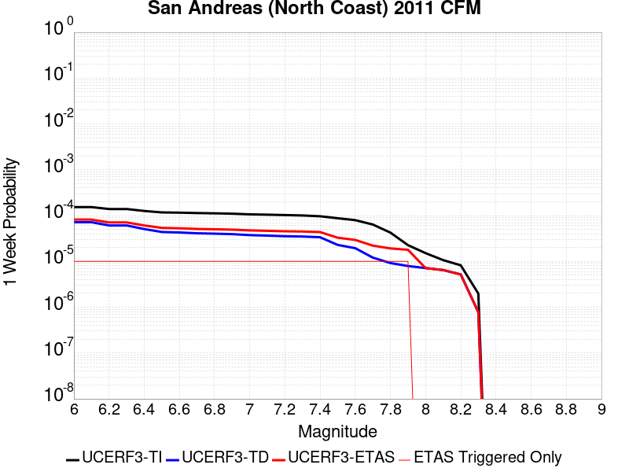 |  |  |  |

| Magnitude | 1 wk TI Prob | 1 wk TD Prob | 1 wk ETAS Prob | 1 wk ETAS/TD Gain | 1 wk ETAS Triggered Only | 1 mo TI Prob | 1 mo TD Prob | 1 mo ETAS Prob | 1 mo ETAS/TD Gain | 1 mo ETAS Triggered Only | 1 yr TI Prob | 1 yr TD Prob | 1 yr ETAS Prob | 1 yr ETAS/TD Gain | 1 yr ETAS Triggered Only | 10 yr TI Prob | 10 yr TD Prob | 10 yr ETAS Prob | 10 yr ETAS/TD Gain | 10 yr ETAS Triggered Only |
|-----|-----|-----|-----|-----|-----|-----|-----|-----|-----|-----|-----|-----|-----|-----|-----|-----|-----|-----|-----|-----|
| 6.0 | 1.5333705E-4 | 7.167264E-5 | 8.1671926E-5 | 1.1395133 | 1.0E-5 | 6.5699324E-4 | 3.071325E-4 | 3.171294E-4 | 1.0325493 | 1.0E-5 | 0.007969595 | 0.0037329607 | 0.0037628487 | 1.0080066 | 3.0E-5 | 0.0768977 | 0.03964612 | 0.039694138 | 1.0012112 | 5.0E-5 |
| 6.1 | 1.5333705E-4 | 7.167264E-5 | 8.1671926E-5 | 1.1395133 | 1.0E-5 | 6.5699324E-4 | 3.071325E-4 | 3.171294E-4 | 1.0325493 | 1.0E-5 | 0.007969595 | 0.0037329607 | 0.0037628487 | 1.0080066 | 3.0E-5 | 0.0768977 | 0.03964612 | 0.039694138 | 1.0012112 | 5.0E-5 |
| 6.2 | 1.3912938E-4 | 6.1008297E-5 | 7.1007686E-5 | 1.1639022 | 1.0E-5 | 5.961325E-4 | 2.6143808E-4 | 2.7143548E-4 | 1.03824 | 1.0E-5 | 0.007233787 | 0.0031783902 | 0.003208295 | 1.0094087 | 3.0E-5 | 0.07002798 | 0.033958502 | 0.034006804 | 1.0014224 | 5.0E-5 |
| 6.3 | 1.3912938E-4 | 6.1008297E-5 | 7.1007686E-5 | 1.1639022 | 1.0E-5 | 5.961325E-4 | 2.6143808E-4 | 2.7143548E-4 | 1.03824 | 1.0E-5 | 0.007233787 | 0.0031783902 | 0.003208295 | 1.0094087 | 3.0E-5 | 0.07002798 | 0.033958502 | 0.034006804 | 1.0014224 | 5.0E-5 |
| 6.4 | 1.2623647E-4 | 5.089298E-5 | 6.089247E-5 | 1.1964808 | 1.0E-5 | 5.4090127E-4 | 2.1809465E-4 | 2.2809247E-4 | 1.0458417 | 1.0E-5 | 0.0065656058 | 0.0026520893 | 0.0026820097 | 1.0112818 | 3.0E-5 | 0.06374981 | 0.028544052 | 0.028592624 | 1.0017017 | 5.0E-5 |
| 6.5 | 1.1736096E-4 | 4.393664E-5 | 5.3936204E-5 | 1.2275904 | 1.0E-5 | 5.028786E-4 | 1.882864E-4 | 1.9828451E-4 | 1.0531006 | 1.0E-5 | 0.006105373 | 0.0022899932 | 0.0023199245 | 1.0130705 | 3.0E-5 | 0.05940335 | 0.02480242 | 0.02485118 | 1.0019659 | 5.0E-5 |
| 6.6 | 1.1586959E-4 | 4.283032E-5 | 5.2829895E-5 | 1.2334695 | 1.0E-5 | 4.964894E-4 | 1.8354571E-4 | 1.9354386E-4 | 1.0544723 | 1.0E-5 | 0.006028018 | 0.002232395 | 0.002262328 | 1.0134084 | 3.0E-5 | 0.058671024 | 0.024205182 | 0.024253972 | 1.0020157 | 5.0E-5 |
| 6.7 | 1.13693764E-4 | 4.1133633E-5 | 5.1133222E-5 | 1.2431 | 1.0E-5 | 4.87168E-4 | 1.7627518E-4 | 1.8627342E-4 | 1.0567195 | 1.0E-5 | 0.005915152 | 0.002144054 | 0.0021739898 | 1.0139621 | 3.0E-5 | 0.057601593 | 0.023292398 | 0.023331465 | 1.0016773 | 4.0E-5 |
| 6.8 | 1.1204889E-4 | 4.0344774E-5 | 5.0344373E-5 | 1.2478535 | 1.0E-5 | 4.8012115E-4 | 1.7289481E-4 | 1.8289308E-4 | 1.0578287 | 1.0E-5 | 0.005829819 | 0.0021029783 | 0.0021329152 | 1.0142355 | 3.0E-5 | 0.05679232 | 0.0228494 | 0.022888485 | 1.0017105 | 4.0E-5 |
| 6.9 | 1.1005794E-4 | 3.9392704E-5 | 4.939231E-5 | 1.2538441 | 1.0E-5 | 4.7159163E-4 | 1.6881504E-4 | 1.7881335E-4 | 1.0592264 | 1.0E-5 | 0.0057265228 | 0.0020534017 | 0.00208334 | 1.0145799 | 3.0E-5 | 0.055811852 | 0.022311093 | 0.022350201 | 1.0017529 | 4.0E-5 |
| 7.0 | 1.0647948E-4 | 3.7532158E-5 | 4.753178E-5 | 1.2664282 | 1.0E-5 | 4.562608E-4 | 1.6084228E-4 | 1.7084066E-4 | 1.0621628 | 1.0E-5 | 0.0055408357 | 0.0019565115 | 0.0019864528 | 1.0153034 | 3.0E-5 | 0.054047033 | 0.021262132 | 0.02130128 | 1.0018413 | 4.0E-5 |
| 7.1 | 1.04795035E-4 | 3.6573696E-5 | 4.6573332E-5 | 1.2734106 | 1.0E-5 | 4.4904428E-4 | 1.5673508E-4 | 1.6673352E-4 | 1.0637919 | 1.0E-5 | 0.0054534175 | 0.0019065951 | 0.0019365379 | 1.0157049 | 3.0E-5 | 0.053215165 | 0.02072614 | 0.020765312 | 1.00189 | 4.0E-5 |
| 7.2 | 1.02724036E-4 | 3.5473153E-5 | 4.5472796E-5 | 1.2818934 | 1.0E-5 | 4.401716E-4 | 1.5201903E-4 | 1.620175E-4 | 1.0657712 | 1.0E-5 | 0.0053459285 | 0.001849276 | 0.0018792205 | 1.0161926 | 3.0E-5 | 0.052191395 | 0.020110486 | 0.020149682 | 1.001949 | 4.0E-5 |
| 7.3 | 1.00650694E-4 | 3.4933342E-5 | 4.4932993E-5 | 1.2862494 | 1.0E-5 | 4.312888E-4 | 1.4970583E-4 | 1.5970433E-4 | 1.0667877 | 1.0E-5 | 0.005238306 | 0.0018211602 | 0.0018511056 | 1.016443 | 3.0E-5 | 0.051165357 | 0.019783666 | 0.019822875 | 1.0019819 | 4.0E-5 |
| 7.4 | 9.672919E-5 | 3.3705466E-5 | 4.3705128E-5 | 1.2966778 | 1.0E-5 | 4.144878E-4 | 1.4444409E-4 | 1.5444263E-4 | 1.0692209 | 1.0E-5 | 0.005034718 | 0.0017572036 | 0.0017871509 | 1.0170426 | 3.0E-5 | 0.049221683 | 0.01904766 | 0.0190869 | 1.0020599 | 4.0E-5 |
| 7.5 | 8.7600405E-5 | 2.2948088E-5 | 3.2947857E-5 | 1.4357561 | 1.0E-5 | 3.753763E-4 | 9.834525E-5 | 1.0834427E-4 | 1.1016726 | 1.0E-5 | 0.0045606326 | 0.0011966976 | 0.0012266617 | 1.025039 | 3.0E-5 | 0.04468165 | 0.0132718645 | 0.013311334 | 1.0029739 | 4.0E-5 |
| 7.6 | 7.9562284E-5 | 1.9451085E-5 | 2.945089E-5 | 1.5141001 | 1.0E-5 | 3.4093665E-4 | 8.335914E-5 | 9.335831E-5 | 1.1199528 | 1.0E-5 | 0.0041430052 | 0.0010144265 | 0.0010443961 | 1.0295434 | 3.0E-5 | 0.040666126 | 0.011351465 | 0.011391011 | 1.0034838 | 4.0E-5 |
| 7.7 | 6.3866544E-5 | 1.2119624E-5 | 2.2119504E-5 | 1.825098 | 1.0E-5 | 2.7368503E-4 | 5.1940217E-5 | 6.1939696E-5 | 1.1925191 | 1.0E-5 | 0.0033270244 | 6.321889E-4 | 6.6216994E-4 | 1.0474242 | 3.0E-5 | 0.032776527 | 0.0073151714 | 0.007354879 | 1.0054281 | 4.0E-5 |
| 7.8 | 4.2543215E-5 | 9.219181E-6 | 1.921909E-5 | 2.084685 | 1.0E-5 | 1.8231533E-4 | 3.951018E-5 | 4.9509785E-5 | 1.2530893 | 1.0E-5 | 0.0022174292 | 4.8093035E-4 | 5.1091594E-4 | 1.0623491 | 3.0E-5 | 0.021954332 | 0.0055735833 | 0.0056133606 | 1.0071367 | 4.0E-5 |
| 7.9 | 2.2636612E-5 | 7.934437E-6 | 1.7934357E-5 | 2.2603188 | 1.0E-5 | 9.7010445E-5 | 3.4004286E-5 | 4.4003948E-5 | 1.2940706 | 1.0E-5 | 0.0011804621 | 4.1392364E-4 | 4.439112E-4 | 1.0724472 | 3.0E-5 | 0.011742111 | 0.0047510383 | 0.004790848 | 1.0083792 | 4.0E-5 |
| 8.0 | 1.5167874E-5 | 7.157475E-6 | 7.157475E-6 | 1.0 | 0.0 | 6.500356E-5 | 3.067453E-5 | 3.067453E-5 | 1.0 | 0.0 | 7.9113094E-4 | 3.733985E-4 | 3.8339477E-4 | 1.0267711 | 1.0E-5 | 0.007883203 | 0.00427557 | 0.0042855274 | 1.0023289 | 1.0E-5 |
| 8.1 | 1.0681047E-5 | 6.4844553E-6 | 6.4844553E-6 | 1.0 | 0.0 | 4.5775112E-5 | 2.7790227E-5 | 2.7790227E-5 | 1.0 | 0.0 | 5.5716943E-4 | 3.3829358E-4 | 3.482902E-4 | 1.0295501 | 1.0E-5 | 0.0055577457 | 0.0038710767 | 0.003881038 | 1.0025733 | 1.0E-5 |
| 8.2 | 8.226114E-6 | 5.1888637E-6 | 5.1888637E-6 | 1.0 | 0.0 | 3.52543E-5 | 2.2237798E-5 | 2.2237798E-5 | 1.0 | 0.0 | 4.2913653E-4 | 2.7071164E-4 | 2.8070895E-4 | 1.0369297 | 1.0E-5 | 0.004283088 | 0.0030854926 | 0.0030954618 | 1.0032309 | 1.0E-5 |
| 8.3 | 1.983087E-6 | 7.7871465E-7 | 7.7871465E-7 | 1.0 | 0.0 | 8.498917E-6 | 3.3373444E-6 | 3.3373444E-6 | 1.0 | 0.0 | 1.034694E-4 | 4.063143E-5 | 4.063143E-5 | 1.0 | 0.0 | 0.0010342124 | 4.7926197E-4 | 4.7926197E-4 | 1.0 | 0.0 |

## Great Valley 07 (Orestimba)
*[(top)](#table-of-contents)*

| 1 Week | 1 Month | 1 Year | 10 Year |
|-----|-----|-----|-----|
|  | 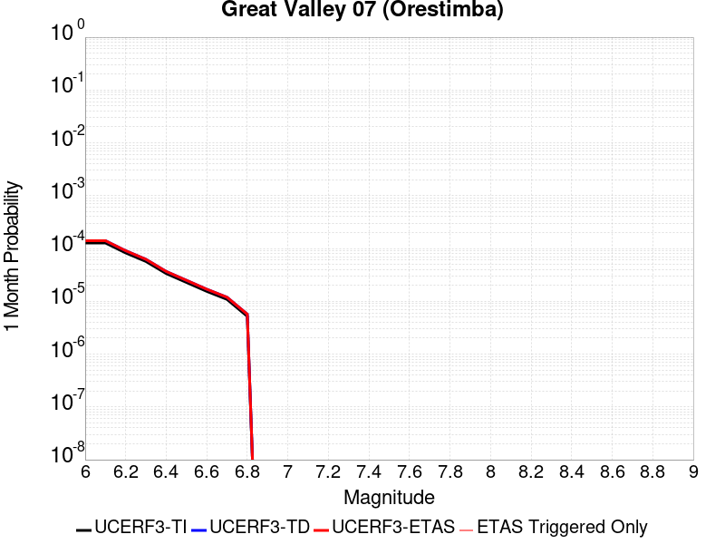 |  |  |

| Magnitude | 1 wk TI Prob | 1 wk TD Prob | 1 wk ETAS Prob | 1 wk ETAS/TD Gain | 1 wk ETAS Triggered Only | 1 mo TI Prob | 1 mo TD Prob | 1 mo ETAS Prob | 1 mo ETAS/TD Gain | 1 mo ETAS Triggered Only | 1 yr TI Prob | 1 yr TD Prob | 1 yr ETAS Prob | 1 yr ETAS/TD Gain | 1 yr ETAS Triggered Only | 10 yr TI Prob | 10 yr TD Prob | 10 yr ETAS Prob | 10 yr ETAS/TD Gain | 10 yr ETAS Triggered Only |
|-----|-----|-----|-----|-----|-----|-----|-----|-----|-----|-----|-----|-----|-----|-----|-----|-----|-----|-----|-----|-----|
| 6.0 | 2.9687902E-5 | 3.276403E-5 | 3.276403E-5 | 1.0 | 0.0 | 1.2722766E-4 | 1.4041012E-4 | 1.4041012E-4 | 1.0 | 0.0 | 0.0015478961 | 0.0017082248 | 0.0017481564 | 1.0233761 | 4.0E-5 | 0.015371585 | 0.01695849 | 0.016997812 | 1.0023187 | 4.0E-5 |
| 6.1 | 2.9687902E-5 | 3.276403E-5 | 3.276403E-5 | 1.0 | 0.0 | 1.2722766E-4 | 1.4041012E-4 | 1.4041012E-4 | 1.0 | 0.0 | 0.0015478961 | 0.0017082248 | 0.0017381735 | 1.0175321 | 3.0E-5 | 0.015371585 | 0.01695849 | 0.016987981 | 1.001739 | 3.0E-5 |
| 6.2 | 1.9231524E-5 | 2.1163256E-5 | 2.1163256E-5 | 1.0 | 0.0 | 8.2418206E-5 | 9.0696645E-5 | 9.0696645E-5 | 1.0 | 0.0 | 0.0010029797 | 0.0011036954 | 0.0011236733 | 1.018101 | 2.0E-5 | 0.00998465 | 0.010984551 | 0.0110043315 | 1.0018008 | 2.0E-5 |
| 6.3 | 1.324766E-5 | 1.4551287E-5 | 1.4551287E-5 | 1.0 | 0.0 | 5.6774446E-5 | 6.236122E-5 | 6.236122E-5 | 1.0 | 0.0 | 6.910097E-4 | 7.5899257E-4 | 7.6898496E-4 | 1.0131654 | 1.0E-5 | 0.006888649 | 0.00756495 | 0.0075748744 | 1.0013119 | 1.0E-5 |
| 6.4 | 7.818645E-6 | 8.574433E-6 | 8.574433E-6 | 1.0 | 0.0 | 3.3508048E-5 | 3.6747075E-5 | 3.6747075E-5 | 1.0 | 0.0 | 4.078841E-4 | 4.4730716E-4 | 4.4730716E-4 | 1.0 | 0.0 | 0.004071363 | 0.0044644084 | 0.0044644084 | 1.0 | 0.0 |
| 6.5 | 5.3076565E-6 | 5.8188784E-6 | 5.8188784E-6 | 1.0 | 0.0 | 2.27469E-5 | 2.4937823E-5 | 2.4937823E-5 | 1.0 | 0.0 | 2.7690834E-4 | 3.035778E-4 | 3.035778E-4 | 1.0 | 0.0 | 0.0027656353 | 0.0030318405 | 0.0030318405 | 1.0 | 0.0 |
| 6.6 | 3.6003578E-6 | 3.949231E-6 | 3.949231E-6 | 1.0 | 0.0 | 1.5430012E-5 | 1.6925174E-5 | 1.6925174E-5 | 1.0 | 0.0 | 1.8784421E-4 | 2.0604608E-4 | 2.0604608E-4 | 1.0 | 0.0 | 0.0018768552 | 0.0020587046 | 0.0020587046 | 1.0 | 0.0 |
| 6.7 | 2.5361826E-6 | 2.7839908E-6 | 2.7839908E-6 | 1.0 | 0.0 | 1.0869308E-5 | 1.1931343E-5 | 1.1931343E-5 | 1.0 | 0.0 | 1.3232579E-4 | 1.4525573E-4 | 1.4525573E-4 | 1.0 | 0.0 | 0.0013224703 | 0.0014517378 | 0.0014517378 | 1.0 | 0.0 |
| 6.8 | 1.2115831E-6 | 1.3316335E-6 | 1.3316335E-6 | 1.0 | 0.0 | 5.1924885E-6 | 5.7069933E-6 | 5.7069933E-6 | 1.0 | 0.0 | 6.3216714E-5 | 6.94814E-5 | 6.94814E-5 | 1.0 | 0.0 | 6.3198735E-4 | 6.946919E-4 | 6.946919E-4 | 1.0 | 0.0 |

## San Andreas (Mojave S)
*[(top)](#table-of-contents)*

| 1 Week | 1 Month | 1 Year | 10 Year |
|-----|-----|-----|-----|
|  |  |  |  |

| Magnitude | 1 wk TI Prob | 1 wk TD Prob | 1 wk ETAS Prob | 1 wk ETAS/TD Gain | 1 wk ETAS Triggered Only | 1 mo TI Prob | 1 mo TD Prob | 1 mo ETAS Prob | 1 mo ETAS/TD Gain | 1 mo ETAS Triggered Only | 1 yr TI Prob | 1 yr TD Prob | 1 yr ETAS Prob | 1 yr ETAS/TD Gain | 1 yr ETAS Triggered Only | 10 yr TI Prob | 10 yr TD Prob | 10 yr ETAS Prob | 10 yr ETAS/TD Gain | 10 yr ETAS Triggered Only |
|-----|-----|-----|-----|-----|-----|-----|-----|-----|-----|-----|-----|-----|-----|-----|-----|-----|-----|-----|-----|-----|
| 6.0 | 3.1064058E-4 | 6.760334E-4 | 6.760334E-4 | 1.0 | 0.0 | 0.0013306376 | 0.0028941974 | 0.0028941974 | 1.0 | 0.0 | 0.016080605 | 0.03469392 | 0.03472288 | 1.0008347 | 3.0E-5 | 0.1496549 | 0.2870912 | 0.2871197 | 1.0000993 | 4.0E-5 |
| 6.1 | 3.1064058E-4 | 6.760334E-4 | 6.760334E-4 | 1.0 | 0.0 | 0.0013306376 | 0.0028941974 | 0.0028941974 | 1.0 | 0.0 | 0.016080605 | 0.03469392 | 0.03472288 | 1.0008347 | 3.0E-5 | 0.1496549 | 0.2870912 | 0.2871197 | 1.0000993 | 4.0E-5 |
| 6.2 | 3.1064058E-4 | 6.760334E-4 | 6.760334E-4 | 1.0 | 0.0 | 0.0013306376 | 0.0028941974 | 0.0028941974 | 1.0 | 0.0 | 0.016080605 | 0.03469392 | 0.03472288 | 1.0008347 | 3.0E-5 | 0.1496549 | 0.2870912 | 0.2871197 | 1.0000993 | 4.0E-5 |
| 6.3 | 3.1064058E-4 | 6.760334E-4 | 6.760334E-4 | 1.0 | 0.0 | 0.0013306376 | 0.0028941974 | 0.0028941974 | 1.0 | 0.0 | 0.016080605 | 0.03469392 | 0.03472288 | 1.0008347 | 3.0E-5 | 0.1496549 | 0.2870912 | 0.2871197 | 1.0000993 | 4.0E-5 |
| 6.4 | 1.9872203E-4 | 4.3315E-4 | 4.3315E-4 | 1.0 | 0.0 | 8.5138786E-4 | 0.0018550648 | 0.0018550648 | 1.0 | 0.0 | 0.010316478 | 0.022357672 | 0.022387002 | 1.0013118 | 3.0E-5 | 0.098504856 | 0.19751844 | 0.19755054 | 1.0001625 | 4.0E-5 |
| 6.5 | 1.291105E-4 | 2.8881425E-4 | 2.8881425E-4 | 1.0 | 0.0 | 5.5321335E-4 | 0.001237191 | 0.001237191 | 1.0 | 0.0 | 0.006714592 | 0.0149596 | 0.014989152 | 1.0019754 | 3.0E-5 | 0.065152965 | 0.13856798 | 0.13860244 | 1.0002487 | 4.0E-5 |
| 6.6 | 1.291105E-4 | 2.8881425E-4 | 2.8881425E-4 | 1.0 | 0.0 | 5.5321335E-4 | 0.001237191 | 0.001237191 | 1.0 | 0.0 | 0.006714592 | 0.0149596 | 0.014989152 | 1.0019754 | 3.0E-5 | 0.065152965 | 0.13856798 | 0.13860244 | 1.0002487 | 4.0E-5 |
| 6.7 | 1.08001186E-4 | 2.4460704E-4 | 2.4460704E-4 | 1.0 | 0.0 | 4.6278012E-4 | 0.0010478954 | 0.0010478954 | 1.0 | 0.0 | 0.0056198016 | 0.012683797 | 0.012713416 | 1.0023352 | 3.0E-5 | 0.054797906 | 0.11971538 | 0.11975059 | 1.0002941 | 4.0E-5 |
| 6.8 | 1.0624356E-4 | 2.3978013E-4 | 2.3978013E-4 | 1.0 | 0.0 | 4.5525006E-4 | 0.0010272249 | 0.0010272249 | 1.0 | 0.0 | 0.0055285925 | 0.012435025 | 0.012464652 | 1.0023825 | 3.0E-5 | 0.053930566 | 0.11766437 | 0.11769966 | 1.0002999 | 4.0E-5 |
| 6.9 | 1.0393785E-4 | 2.3347879E-4 | 2.3347879E-4 | 1.0 | 0.0 | 4.4537184E-4 | 0.0010002401 | 0.0010002401 | 1.0 | 0.0 | 0.0054089287 | 0.012110177 | 0.012139814 | 1.0024472 | 3.0E-5 | 0.05279156 | 0.11496176 | 0.11499716 | 1.0003079 | 4.0E-5 |
| 7.0 | 1.0155622E-4 | 2.2716862E-4 | 2.2716862E-4 | 1.0 | 0.0 | 4.3516833E-4 | 9.7321696E-4 | 9.7321696E-4 | 1.0 | 0.0 | 0.005285311 | 0.0117847705 | 0.011814417 | 1.0025157 | 3.0E-5 | 0.05161361 | 0.11222137 | 0.11225688 | 1.0003164 | 4.0E-5 |
| 7.1 | 9.885595E-5 | 2.2004638E-4 | 2.2004638E-4 | 1.0 | 0.0 | 4.2359953E-4 | 9.427154E-4 | 9.427154E-4 | 1.0 | 0.0 | 0.0051451353 | 0.01141736 | 0.011447017 | 1.0025976 | 3.0E-5 | 0.05027629 | 0.10910523 | 0.109140866 | 1.0003266 | 4.0E-5 |
| 7.2 | 9.6411415E-5 | 2.1367033E-4 | 2.1367033E-4 | 1.0 | 0.0 | 4.1312634E-4 | 9.154089E-4 | 9.154089E-4 | 1.0 | 0.0 | 0.005018219 | 0.011088334 | 0.011118001 | 1.0026755 | 3.0E-5 | 0.049064007 | 0.10629434 | 0.10633009 | 1.0003363 | 4.0E-5 |
| 7.3 | 9.1180635E-5 | 1.9592093E-4 | 1.9592093E-4 | 1.0 | 0.0 | 3.907156E-4 | 8.39391E-4 | 8.39391E-4 | 1.0 | 0.0 | 0.004746591 | 0.010171813 | 0.010201507 | 1.0029193 | 3.0E-5 | 0.046464786 | 0.098479286 | 0.09851535 | 1.0003662 | 4.0E-5 |
| 7.4 | 8.887388E-5 | 1.8839308E-4 | 1.8839308E-4 | 1.0 | 0.0 | 3.8083247E-4 | 8.0714916E-4 | 8.0714916E-4 | 1.0 | 0.0 | 0.0046267817 | 0.009782861 | 0.009812568 | 1.0030366 | 3.0E-5 | 0.045316286 | 0.09511067 | 0.095146865 | 1.0003805 | 4.0E-5 |
| 7.5 | 8.6750515E-5 | 1.8169629E-4 | 1.8169629E-4 | 1.0 | 0.0 | 3.7173493E-4 | 7.7846606E-4 | 7.7846606E-4 | 1.0 | 0.0 | 0.004516484 | 0.009436724 | 0.00946644 | 1.003149 | 3.0E-5 | 0.04425787 | 0.09207104 | 0.09210736 | 1.0003945 | 4.0E-5 |
| 7.6 | 8.453092E-5 | 1.755574E-4 | 1.755574E-4 | 1.0 | 0.0 | 3.6222505E-4 | 7.5217197E-4 | 7.5217197E-4 | 1.0 | 0.0 | 0.0044011753 | 0.009119318 | 0.009149045 | 1.0032598 | 3.0E-5 | 0.04315024 | 0.08922548 | 0.08926191 | 1.0004083 | 4.0E-5 |
| 7.7 | 8.259102E-5 | 1.7076606E-4 | 1.7076606E-4 | 1.0 | 0.0 | 3.539135E-4 | 7.316493E-4 | 7.316493E-4 | 1.0 | 0.0 | 0.004300386 | 0.008871517 | 0.0089012515 | 1.0033516 | 3.0E-5 | 0.042181134 | 0.08697198 | 0.087008506 | 1.00042 | 4.0E-5 |
| 7.8 | 7.444844E-5 | 1.5388784E-4 | 1.5388784E-4 | 1.0 | 0.0 | 3.1902574E-4 | 6.593527E-4 | 6.593527E-4 | 1.0 | 0.0 | 0.0038772223 | 0.007998121 | 0.008027881 | 1.0037209 | 3.0E-5 | 0.03810269 | 0.078762494 | 0.078799345 | 1.0004679 | 4.0E-5 |
| 7.9 | 5.2586525E-5 | 1.0078799E-4 | 1.0078799E-4 | 1.0 | 0.0 | 2.2535135E-4 | 4.3187704E-4 | 4.3187704E-4 | 1.0 | 0.0 | 0.0027402006 | 0.0052454374 | 0.0052752797 | 1.0056893 | 3.0E-5 | 0.027066574 | 0.05253791 | 0.05257581 | 1.0007213 | 4.0E-5 |
| 8.0 | 3.379877E-5 | 5.449475E-5 | 5.449475E-5 | 1.0 | 0.0 | 1.4484383E-4 | 2.3352803E-4 | 2.3352803E-4 | 1.0 | 0.0 | 0.0017620471 | 0.0028394987 | 0.0028594418 | 1.0070235 | 2.0E-5 | 0.017481409 | 0.02904101 | 0.029070139 | 1.001003 | 3.0E-5 |
| 8.1 | 1.8668277E-5 | 1.9511233E-5 | 1.9511233E-5 | 1.0 | 0.0 | 8.000444E-5 | 8.361689E-5 | 8.361689E-5 | 1.0 | 0.0 | 9.736188E-4 | 0.0010175608 | 0.0010375405 | 1.0196348 | 2.0E-5 | 0.009693642 | 0.010904464 | 0.010924246 | 1.0018141 | 2.0E-5 |
| 8.2 | 8.541571E-6 | 5.538353E-6 | 5.538353E-6 | 1.0 | 0.0 | 3.660622E-5 | 2.3735583E-5 | 2.3735583E-5 | 1.0 | 0.0 | 4.455896E-4 | 2.8894248E-4 | 2.989396E-4 | 1.034599 | 1.0E-5 | 0.0044469717 | 0.0032831642 | 0.0032931315 | 1.0030358 | 1.0E-5 |
| 8.3 | 1.983087E-6 | 7.7871465E-7 | 7.7871465E-7 | 1.0 | 0.0 | 8.498917E-6 | 3.3373444E-6 | 3.3373444E-6 | 1.0 | 0.0 | 1.034694E-4 | 4.063143E-5 | 4.063143E-5 | 1.0 | 0.0 | 0.0010342124 | 4.7926197E-4 | 4.7926197E-4 | 1.0 | 0.0 |

## San Andreas (San Bernardino S)
*[(top)](#table-of-contents)*

| 1 Week | 1 Month | 1 Year | 10 Year |
|-----|-----|-----|-----|
|  |  |  | 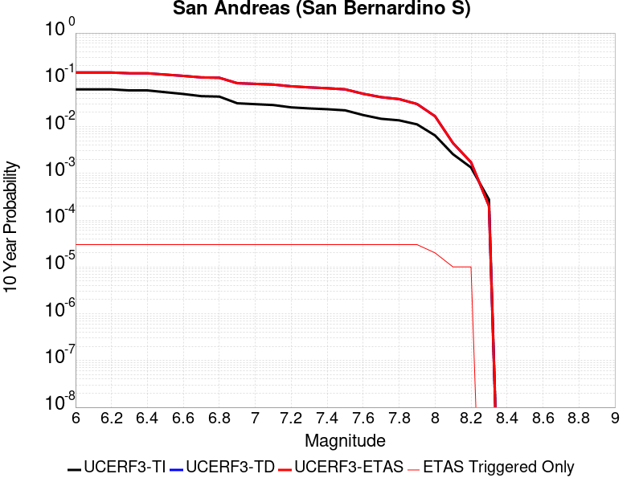 |

| Magnitude | 1 wk TI Prob | 1 wk TD Prob | 1 wk ETAS Prob | 1 wk ETAS/TD Gain | 1 wk ETAS Triggered Only | 1 mo TI Prob | 1 mo TD Prob | 1 mo ETAS Prob | 1 mo ETAS/TD Gain | 1 mo ETAS Triggered Only | 1 yr TI Prob | 1 yr TD Prob | 1 yr ETAS Prob | 1 yr ETAS/TD Gain | 1 yr ETAS Triggered Only | 10 yr TI Prob | 10 yr TD Prob | 10 yr ETAS Prob | 10 yr ETAS/TD Gain | 10 yr ETAS Triggered Only |
|-----|-----|-----|-----|-----|-----|-----|-----|-----|-----|-----|-----|-----|-----|-----|-----|-----|-----|-----|-----|-----|
| 6.0 | 1.2336002E-4 | 3.0075735E-4 | 3.0075735E-4 | 1.0 | 0.0 | 5.2857865E-4 | 0.0012883495 | 0.0012883495 | 1.0 | 0.0 | 0.006416472 | 0.015577812 | 0.0155975 | 1.0012639 | 2.0E-5 | 0.06234337 | 0.1431204 | 0.1431461 | 1.0001796 | 3.0E-5 |
| 6.1 | 1.2336002E-4 | 3.0075735E-4 | 3.0075735E-4 | 1.0 | 0.0 | 5.2857865E-4 | 0.0012883495 | 0.0012883495 | 1.0 | 0.0 | 0.006416472 | 0.015577812 | 0.0155975 | 1.0012639 | 2.0E-5 | 0.06234337 | 0.1431204 | 0.1431461 | 1.0001796 | 3.0E-5 |
| 6.2 | 1.2336002E-4 | 3.0075735E-4 | 3.0075735E-4 | 1.0 | 0.0 | 5.2857865E-4 | 0.0012883495 | 0.0012883495 | 1.0 | 0.0 | 0.006416472 | 0.015577812 | 0.0155975 | 1.0012639 | 2.0E-5 | 0.06234337 | 0.1431204 | 0.1431461 | 1.0001796 | 3.0E-5 |
| 6.3 | 1.1712257E-4 | 2.8863284E-4 | 2.8863284E-4 | 1.0 | 0.0 | 5.018573E-4 | 0.0012364372 | 0.0012364372 | 1.0 | 0.0 | 0.006093008 | 0.014954573 | 0.014974274 | 1.0013174 | 2.0E-5 | 0.059286322 | 0.1378281 | 0.13785395 | 1.0001876 | 3.0E-5 |
| 6.4 | 1.1712257E-4 | 2.8863284E-4 | 2.8863284E-4 | 1.0 | 0.0 | 5.018573E-4 | 0.0012364372 | 0.0012364372 | 1.0 | 0.0 | 0.006093008 | 0.014954573 | 0.014974274 | 1.0013174 | 2.0E-5 | 0.059286322 | 0.1378281 | 0.13785395 | 1.0001876 | 3.0E-5 |
| 6.5 | 1.0689076E-4 | 2.6874917E-4 | 2.6874917E-4 | 1.0 | 0.0 | 4.5802278E-4 | 0.0011512985 | 0.0011512985 | 1.0 | 0.0 | 0.0055621783 | 0.0139316 | 0.013951321 | 1.0014156 | 2.0E-5 | 0.05425003 | 0.1290726 | 0.12909873 | 1.0002024 | 3.0E-5 |
| 6.6 | 9.7648895E-5 | 2.511853E-4 | 2.511853E-4 | 1.0 | 0.0 | 4.1842813E-4 | 0.0010760879 | 0.0010760879 | 1.0 | 0.0 | 0.005082469 | 0.013027044 | 0.013046783 | 1.0015153 | 2.0E-5 | 0.049677886 | 0.121230006 | 0.121256374 | 1.0002174 | 3.0E-5 |
| 6.7 | 8.757013E-5 | 2.3188148E-4 | 2.3188148E-4 | 1.0 | 0.0 | 3.7524657E-4 | 9.934217E-4 | 9.934217E-4 | 1.0 | 0.0 | 0.00455906 | 0.01203193 | 0.012051689 | 1.0016422 | 2.0E-5 | 0.04466656 | 0.11253677 | 0.112563394 | 1.0002366 | 3.0E-5 |
| 6.8 | 8.562978E-5 | 2.2747536E-4 | 2.2747536E-4 | 1.0 | 0.0 | 3.6693315E-4 | 9.745525E-4 | 9.745525E-4 | 1.0 | 0.0 | 0.004458263 | 0.011804702 | 0.011824465 | 1.0016743 | 2.0E-5 | 0.043698758 | 0.110545516 | 0.1105722 | 1.0002414 | 3.0E-5 |
| 6.9 | 6.124075E-5 | 1.7125961E-4 | 1.7125961E-4 | 1.0 | 0.0 | 2.6243398E-4 | 7.3376414E-4 | 7.3376414E-4 | 1.0 | 0.0 | 0.0031904527 | 0.008897194 | 0.008917015 | 1.0022279 | 2.0E-5 | 0.031450346 | 0.08443951 | 0.08446697 | 1.0003253 | 3.0E-5 |
| 7.0 | 5.8598747E-5 | 1.6554352E-4 | 1.6554352E-4 | 1.0 | 0.0 | 2.5111332E-4 | 7.0928014E-4 | 7.0928014E-4 | 1.0 | 0.0 | 0.0030530186 | 0.00860149 | 0.008621318 | 1.0023052 | 2.0E-5 | 0.03011414 | 0.08175517 | 0.08178271 | 1.000337 | 3.0E-5 |
| 7.1 | 5.613814E-5 | 1.5972315E-4 | 1.5972315E-4 | 1.0 | 0.0 | 2.4056983E-4 | 6.84349E-4 | 6.84349E-4 | 1.0 | 0.0 | 0.0029250039 | 0.0083003 | 0.008320134 | 1.0023896 | 2.0E-5 | 0.028868021 | 0.07905248 | 0.079080105 | 1.0003495 | 3.0E-5 |
| 7.2 | 4.991222E-5 | 1.4577387E-4 | 1.4577387E-4 | 1.0 | 0.0 | 2.1389198E-4 | 6.245959E-4 | 6.245959E-4 | 1.0 | 0.0 | 0.002601025 | 0.0075780447 | 0.007597893 | 1.0026191 | 2.0E-5 | 0.025707912 | 0.07250162 | 0.07252944 | 1.0003837 | 3.0E-5 |
| 7.3 | 4.7410045E-5 | 1.3770342E-4 | 1.3770342E-4 | 1.0 | 0.0 | 2.0317009E-4 | 5.9002434E-4 | 5.9002434E-4 | 1.0 | 0.0 | 0.0024707897 | 0.007159972 | 0.007179829 | 1.0027733 | 2.0E-5 | 0.024434982 | 0.06878014 | 0.06880807 | 1.0004061 | 3.0E-5 |
| 7.4 | 4.5556746E-5 | 1.3177289E-4 | 1.3177289E-4 | 1.0 | 0.0 | 1.952286E-4 | 5.64619E-4 | 5.64619E-4 | 1.0 | 0.0 | 0.002374317 | 0.006852649 | 0.006872512 | 1.0028986 | 2.0E-5 | 0.023491086 | 0.06602932 | 0.06605734 | 1.0004244 | 3.0E-5 |
| 7.5 | 4.3084514E-5 | 1.2411473E-4 | 1.2411473E-4 | 1.0 | 0.0 | 1.8463485E-4 | 5.318121E-4 | 5.318121E-4 | 1.0 | 0.0 | 0.0022456115 | 0.006455662 | 0.006475533 | 1.0030781 | 2.0E-5 | 0.022230545 | 0.06242615 | 0.06245428 | 1.0004506 | 3.0E-5 |
| 7.6 | 3.408608E-5 | 9.885395E-5 | 9.885395E-5 | 1.0 | 0.0 | 1.4607502E-4 | 4.235911E-4 | 4.235911E-4 | 1.0 | 0.0 | 0.0017770125 | 0.0051450524 | 0.0051649497 | 1.0038673 | 2.0E-5 | 0.017628696 | 0.05024141 | 0.0502699 | 1.0005671 | 3.0E-5 |
| 7.7 | 2.8315713E-5 | 8.295591E-5 | 8.295591E-5 | 1.0 | 0.0 | 1.2134742E-4 | 3.554769E-4 | 3.554769E-4 | 1.0 | 0.0 | 0.0014764034 | 0.0043193516 | 0.0043392656 | 1.0046103 | 2.0E-5 | 0.01466633 | 0.042481087 | 0.042509813 | 1.0006762 | 3.0E-5 |
| 7.8 | 2.6222975E-5 | 7.5069765E-5 | 7.5069765E-5 | 1.0 | 0.0 | 1.1237934E-4 | 3.2168793E-4 | 3.2168793E-4 | 1.0 | 0.0 | 0.0013673597 | 0.003909523 | 0.003929445 | 1.0050957 | 2.0E-5 | 0.013589768 | 0.03863392 | 0.03866276 | 1.0007465 | 3.0E-5 |
| 7.9 | 2.1469694E-5 | 5.8245987E-5 | 5.8245987E-5 | 1.0 | 0.0 | 9.200973E-5 | 2.4960178E-4 | 2.4960178E-4 | 1.0 | 0.0 | 0.0011196428 | 0.0030346701 | 0.0030546095 | 1.0065705 | 2.0E-5 | 0.011140184 | 0.030319374 | 0.030348465 | 1.0009595 | 3.0E-5 |
| 8.0 | 1.2420249E-5 | 3.1525855E-5 | 3.1525855E-5 | 1.0 | 0.0 | 5.322855E-5 | 1.3510382E-4 | 1.3510382E-4 | 1.0 | 0.0 | 6.478649E-4 | 0.0016436488 | 0.0016536325 | 1.0060741 | 1.0E-5 | 0.0064597935 | 0.016619267 | 0.016638935 | 1.0011834 | 2.0E-5 |
| 8.1 | 4.9197724E-6 | 7.900863E-6 | 7.900863E-6 | 1.0 | 0.0 | 2.1084568E-5 | 3.38604E-5 | 3.38604E-5 | 1.0 | 0.0 | 2.566744E-4 | 4.1217255E-4 | 4.2216844E-4 | 1.0242517 | 1.0E-5 | 0.002563781 | 0.004423904 | 0.00443386 | 1.0022504 | 1.0E-5 |
| 8.2 | 2.5634774E-6 | 2.9432802E-6 | 2.9432802E-6 | 1.0 | 0.0 | 1.0986286E-5 | 1.2613997E-5 | 1.2613997E-5 | 1.0 | 0.0 | 1.3374983E-4 | 1.5356463E-4 | 1.635631E-4 | 1.0651091 | 1.0E-5 | 0.0013366934 | 0.0017241918 | 0.0017341747 | 1.0057899 | 1.0E-5 |
| 8.3 | 5.2850464E-7 | 3.2583085E-7 | 3.2583085E-7 | 1.0 | 0.0 | 2.2650179E-6 | 1.3964172E-6 | 1.3964172E-6 | 1.0 | 0.0 | 2.7576245E-5 | 1.700126E-5 | 1.700126E-5 | 1.0 | 0.0 | 2.7572823E-4 | 2.0149192E-4 | 2.0149192E-4 | 1.0 | 0.0 |

## Hunting Creek - Bartlett Springs connector 2011
*[(top)](#table-of-contents)*

| 1 Week | 1 Month | 1 Year | 10 Year |
|-----|-----|-----|-----|
|  |  |  |  |

| Magnitude | 1 wk TI Prob | 1 wk TD Prob | 1 wk ETAS Prob | 1 wk ETAS/TD Gain | 1 wk ETAS Triggered Only | 1 mo TI Prob | 1 mo TD Prob | 1 mo ETAS Prob | 1 mo ETAS/TD Gain | 1 mo ETAS Triggered Only | 1 yr TI Prob | 1 yr TD Prob | 1 yr ETAS Prob | 1 yr ETAS/TD Gain | 1 yr ETAS Triggered Only | 10 yr TI Prob | 10 yr TD Prob | 10 yr ETAS Prob | 10 yr ETAS/TD Gain | 10 yr ETAS Triggered Only |
|-----|-----|-----|-----|-----|-----|-----|-----|-----|-----|-----|-----|-----|-----|-----|-----|-----|-----|-----|-----|-----|
| 6.0 | 4.940016E-5 | 6.791398E-5 | 6.791398E-5 | 1.0 | 0.0 | 2.1169778E-4 | 2.9102844E-4 | 2.9102844E-4 | 1.0 | 0.0 | 0.002574374 | 0.003537347 | 0.0035473118 | 1.002817 | 1.0E-5 | 0.025447546 | 0.034794837 | 0.034823794 | 1.0008322 | 3.0E-5 |
| 6.1 | 4.940016E-5 | 6.791398E-5 | 6.791398E-5 | 1.0 | 0.0 | 2.1169778E-4 | 2.9102844E-4 | 2.9102844E-4 | 1.0 | 0.0 | 0.002574374 | 0.003537347 | 0.0035473118 | 1.002817 | 1.0E-5 | 0.025447546 | 0.034794837 | 0.034823794 | 1.0008322 | 3.0E-5 |
| 6.2 | 4.472471E-5 | 6.104228E-5 | 6.104228E-5 | 1.0 | 0.0 | 1.9166325E-4 | 2.6158424E-4 | 2.6158424E-4 | 1.0 | 0.0 | 0.0023310026 | 0.003180086 | 0.0031900543 | 1.0031346 | 1.0E-5 | 0.02306703 | 0.03133553 | 0.031354904 | 1.0006182 | 2.0E-5 |
| 6.3 | 4.472471E-5 | 6.104228E-5 | 6.104228E-5 | 1.0 | 0.0 | 1.9166325E-4 | 2.6158424E-4 | 2.6158424E-4 | 1.0 | 0.0 | 0.0023310026 | 0.003180086 | 0.0031900543 | 1.0031346 | 1.0E-5 | 0.02306703 | 0.03133553 | 0.031354904 | 1.0006182 | 2.0E-5 |
| 6.4 | 4.0001003E-5 | 5.41369E-5 | 5.41369E-5 | 1.0 | 0.0 | 1.714216E-4 | 2.3199506E-4 | 2.3199506E-4 | 1.0 | 0.0 | 0.0020850603 | 0.002820776 | 0.002830748 | 1.0035352 | 1.0E-5 | 0.02065605 | 0.027844382 | 0.027863825 | 1.0006983 | 2.0E-5 |
| 6.5 | 3.8033053E-5 | 5.1297204E-5 | 5.1297204E-5 | 1.0 | 0.0 | 1.6298861E-4 | 2.1982702E-4 | 2.1982702E-4 | 1.0 | 0.0 | 0.0019825802 | 0.0026729985 | 0.0026829718 | 1.0037311 | 1.0E-5 | 0.019649856 | 0.026405504 | 0.026424974 | 1.0007374 | 2.0E-5 |
| 6.6 | 3.653754E-5 | 4.9159073E-5 | 4.9159073E-5 | 1.0 | 0.0 | 1.5658008E-4 | 2.106651E-4 | 2.106651E-4 | 1.0 | 0.0 | 0.0019046954 | 0.002561716 | 0.0025716904 | 1.0038936 | 1.0E-5 | 0.018884527 | 0.02532071 | 0.025340203 | 1.0007699 | 2.0E-5 |
| 6.7 | 3.372024E-5 | 4.516577E-5 | 4.516577E-5 | 1.0 | 0.0 | 1.4450731E-4 | 1.935535E-4 | 1.935535E-4 | 1.0 | 0.0 | 0.0017579567 | 0.0023539518 | 0.0023639284 | 1.0042381 | 1.0E-5 | 0.017441148 | 0.023291007 | 0.02331054 | 1.0008388 | 2.0E-5 |
| 6.8 | 2.9650024E-5 | 3.9432543E-5 | 3.9432543E-5 | 1.0 | 0.0 | 1.2706534E-4 | 1.6898573E-4 | 1.6898573E-4 | 1.0 | 0.0 | 0.0015459227 | 0.0020554361 | 0.0020654155 | 1.0048552 | 1.0E-5 | 0.015352124 | 0.020361913 | 0.020381507 | 1.0009623 | 2.0E-5 |
| 6.9 | 2.860775E-5 | 3.783217E-5 | 3.783217E-5 | 1.0 | 0.0 | 1.2259888E-4 | 1.6212786E-4 | 1.6212786E-4 | 1.0 | 0.0 | 0.0014916194 | 0.0019721314 | 0.0019821117 | 1.0050607 | 1.0E-5 | 0.014816469 | 0.019545868 | 0.019565476 | 1.0010033 | 2.0E-5 |
| 7.0 | 2.6696067E-5 | 3.5085304E-5 | 3.5085304E-5 | 1.0 | 0.0 | 1.144067E-4 | 1.5035698E-4 | 1.5035698E-4 | 1.0 | 0.0 | 0.0013920115 | 0.0018290696 | 0.0018290696 | 1.0 | 0.0 | 0.013833242 | 0.018140588 | 0.018150406 | 1.0005412 | 1.0E-5 |
| 7.1 | 2.456087E-5 | 3.2029777E-5 | 3.2029777E-5 | 1.0 | 0.0 | 1.0525662E-4 | 1.372633E-4 | 1.372633E-4 | 1.0 | 0.0 | 0.001280746 | 0.0016699086 | 0.0016699086 | 1.0 | 0.0 | 0.012733897 | 0.016574925 | 0.01658476 | 1.0005933 | 1.0E-5 |
| 7.2 | 2.295761E-5 | 2.9838584E-5 | 2.9838584E-5 | 1.0 | 0.0 | 9.8386045E-5 | 1.2787343E-4 | 1.2787343E-4 | 1.0 | 0.0 | 0.0011971919 | 0.0015557564 | 0.0015557564 | 1.0 | 0.0 | 0.011907627 | 0.015450131 | 0.015459976 | 1.0006373 | 1.0E-5 |
| 7.3 | 2.1256936E-5 | 2.7556565E-5 | 2.7556565E-5 | 1.0 | 0.0 | 9.109797E-5 | 1.1809426E-4 | 1.1809426E-4 | 1.0 | 0.0 | 0.0011085535 | 0.0014368582 | 0.0014368582 | 1.0 | 0.0 | 0.011030397 | 0.014277009 | 0.014277009 | 1.0 | 0.0 |
| 7.4 | 1.8784336E-5 | 2.431981E-5 | 2.431981E-5 | 1.0 | 0.0 | 8.050181E-5 | 1.0422364E-4 | 1.0422364E-4 | 1.0 | 0.0 | 9.796688E-4 | 0.0012681917 | 0.0012681917 | 1.0 | 0.0 | 0.009753612 | 0.012610624 | 0.012610624 | 1.0 | 0.0 |
| 7.5 | 1.7248298E-5 | 2.2280725E-5 | 2.2280725E-5 | 1.0 | 0.0 | 7.391918E-5 | 9.548537E-5 | 9.548537E-5 | 1.0 | 0.0 | 8.9959445E-4 | 0.0011619219 | 0.0011619219 | 1.0 | 0.0 | 0.008959615 | 0.011559445 | 0.011559445 | 1.0 | 0.0 |
| 7.6 | 1.0653709E-5 | 1.3729691E-5 | 1.3729691E-5 | 1.0 | 0.0 | 4.5657955E-5 | 5.884022E-5 | 5.884022E-5 | 1.0 | 0.0 | 5.557438E-4 | 7.1614695E-4 | 7.1614695E-4 | 1.0 | 0.0 | 0.0055435603 | 0.00713874 | 0.00713874 | 1.0 | 0.0 |
| 7.7 | 3.286316E-6 | 4.091958E-6 | 4.091958E-6 | 1.0 | 0.0 | 1.4084137E-5 | 1.7536846E-5 | 1.7536846E-5 | 1.0 | 0.0 | 1.7146087E-4 | 2.1349033E-4 | 2.1349033E-4 | 1.0 | 0.0 | 0.0017132863 | 0.0021328682 | 0.0021328682 | 1.0 | 0.0 |
| 7.8 | 5.1855085E-7 | 5.973635E-7 | 5.973635E-7 | 1.0 | 0.0 | 2.222359E-6 | 2.5601269E-6 | 2.5601269E-6 | 1.0 | 0.0 | 2.7056883E-5 | 3.1169107E-5 | 3.1169107E-5 | 1.0 | 0.0 | 2.705359E-4 | 3.1164664E-4 | 3.1164664E-4 | 1.0 | 0.0 |

## San Gregorio (North) 2011 CFM
*[(top)](#table-of-contents)*

| 1 Week | 1 Month | 1 Year | 10 Year |
|-----|-----|-----|-----|
|  |  |  |  |

| Magnitude | 1 wk TI Prob | 1 wk TD Prob | 1 wk ETAS Prob | 1 wk ETAS/TD Gain | 1 wk ETAS Triggered Only | 1 mo TI Prob | 1 mo TD Prob | 1 mo ETAS Prob | 1 mo ETAS/TD Gain | 1 mo ETAS Triggered Only | 1 yr TI Prob | 1 yr TD Prob | 1 yr ETAS Prob | 1 yr ETAS/TD Gain | 1 yr ETAS Triggered Only | 10 yr TI Prob | 10 yr TD Prob | 10 yr ETAS Prob | 10 yr ETAS/TD Gain | 10 yr ETAS Triggered Only |
|-----|-----|-----|-----|-----|-----|-----|-----|-----|-----|-----|-----|-----|-----|-----|-----|-----|-----|-----|-----|-----|
| 6.0 | 5.0283932E-5 | 4.3108772E-5 | 4.3108772E-5 | 1.0 | 0.0 | 2.1548476E-4 | 1.8473892E-4 | 1.8473892E-4 | 1.0 | 0.0 | 0.0026203706 | 0.0022468918 | 0.0022668468 | 1.0088812 | 2.0E-5 | 0.02589687 | 0.02231968 | 0.022349011 | 1.0013142 | 3.0E-5 |
| 6.1 | 5.0283932E-5 | 4.3108772E-5 | 4.3108772E-5 | 1.0 | 0.0 | 2.1548476E-4 | 1.8473892E-4 | 1.8473892E-4 | 1.0 | 0.0 | 0.0026203706 | 0.0022468918 | 0.0022668468 | 1.0088812 | 2.0E-5 | 0.02589687 | 0.02231968 | 0.022349011 | 1.0013142 | 3.0E-5 |
| 6.2 | 4.2998647E-5 | 3.448791E-5 | 3.448791E-5 | 1.0 | 0.0 | 1.842669E-4 | 1.4779705E-4 | 1.4779705E-4 | 1.0 | 0.0 | 0.0022411412 | 0.0017979575 | 0.0018179215 | 1.0111037 | 2.0E-5 | 0.022186736 | 0.01791081 | 0.017940272 | 1.001645 | 3.0E-5 |
| 6.3 | 4.2998647E-5 | 3.448791E-5 | 3.448791E-5 | 1.0 | 0.0 | 1.842669E-4 | 1.4779705E-4 | 1.4779705E-4 | 1.0 | 0.0 | 0.0022411412 | 0.0017979575 | 0.0018179215 | 1.0111037 | 2.0E-5 | 0.022186736 | 0.01791081 | 0.017940272 | 1.001645 | 3.0E-5 |
| 6.4 | 4.1101295E-5 | 3.237201E-5 | 3.237201E-5 | 1.0 | 0.0 | 1.7613651E-4 | 1.387299E-4 | 1.387299E-4 | 1.0 | 0.0 | 0.0021423528 | 0.001687741 | 0.0017077072 | 1.0118302 | 2.0E-5 | 0.02121817 | 0.016825577 | 0.016855072 | 1.001753 | 3.0E-5 |
| 6.5 | 4.1032585E-5 | 3.2290012E-5 | 3.2290012E-5 | 1.0 | 0.0 | 1.7584208E-4 | 1.3837851E-4 | 1.3837851E-4 | 1.0 | 0.0 | 0.0021387753 | 0.0016834696 | 0.0017034359 | 1.0118603 | 2.0E-5 | 0.021183075 | 0.016783515 | 0.016813012 | 1.0017575 | 3.0E-5 |
| 6.6 | 4.011629E-5 | 3.131109E-5 | 3.131109E-5 | 1.0 | 0.0 | 1.7191563E-4 | 1.3418357E-4 | 1.3418357E-4 | 1.0 | 0.0 | 0.0020910634 | 0.0016324752 | 0.0016524425 | 1.0122313 | 2.0E-5 | 0.020714961 | 0.016280808 | 0.01631032 | 1.0018127 | 3.0E-5 |
| 6.7 | 3.8583938E-5 | 2.9497241E-5 | 2.9497241E-5 | 1.0 | 0.0 | 1.6534925E-4 | 1.2641071E-4 | 1.2641071E-4 | 1.0 | 0.0 | 0.0020112682 | 0.0015379781 | 0.0015579473 | 1.012984 | 2.0E-5 | 0.019931622 | 0.015348888 | 0.015378428 | 1.0019245 | 3.0E-5 |
| 6.8 | 3.44341E-5 | 2.4491947E-5 | 2.4491947E-5 | 1.0 | 0.0 | 1.4756636E-4 | 1.0496132E-4 | 1.0496132E-4 | 1.0 | 0.0 | 0.0017951399 | 0.0012771651 | 0.0012871524 | 1.0078199 | 1.0E-5 | 0.017807078 | 0.012772805 | 0.012792549 | 1.0015458 | 2.0E-5 |
| 6.9 | 3.221199E-5 | 2.1814329E-5 | 2.1814329E-5 | 1.0 | 0.0 | 1.3804408E-4 | 9.348667E-5 | 9.348667E-5 | 1.0 | 0.0 | 0.0016793909 | 0.0011376141 | 0.0011376141 | 1.0 | 0.0 | 0.01666756 | 0.011391811 | 0.011401697 | 1.0008678 | 1.0E-5 |
| 7.0 | 2.9186718E-5 | 1.8179602E-5 | 1.8179602E-5 | 1.0 | 0.0 | 1.2507994E-4 | 7.791028E-5 | 7.791028E-5 | 1.0 | 0.0 | 0.0015217843 | 9.4814907E-4 | 9.4814907E-4 | 1.0 | 0.0 | 0.015114053 | 0.009514216 | 0.009524122 | 1.001041 | 1.0E-5 |
| 7.1 | 2.6840138E-5 | 1.5315465E-5 | 1.5315465E-5 | 1.0 | 0.0 | 1.1502409E-4 | 6.5636064E-5 | 6.5636064E-5 | 1.0 | 0.0 | 0.0013995186 | 7.98828E-4 | 7.98828E-4 | 1.0 | 0.0 | 0.013907375 | 0.008032251 | 0.008042171 | 1.001235 | 1.0E-5 |
| 7.2 | 2.453002E-5 | 1.2636443E-5 | 1.2636443E-5 | 1.0 | 0.0 | 1.05124425E-4 | 5.415506E-5 | 5.415506E-5 | 1.0 | 0.0 | 0.0012791384 | 6.59139E-4 | 6.59139E-4 | 1.0 | 0.0 | 0.012718005 | 0.0066435663 | 0.0066535003 | 1.0014952 | 1.0E-5 |
| 7.3 | 2.3330727E-5 | 1.1517871E-5 | 1.1517871E-5 | 1.0 | 0.0 | 9.9985E-5 | 4.9361373E-5 | 4.9361373E-5 | 1.0 | 0.0 | 0.0012166376 | 6.0080946E-4 | 6.0080946E-4 | 1.0 | 0.0 | 0.012099981 | 0.0060622073 | 0.006072147 | 1.0016396 | 1.0E-5 |
| 7.4 | 2.2136466E-5 | 1.039734E-5 | 1.039734E-5 | 1.0 | 0.0 | 9.486712E-5 | 4.455927E-5 | 4.455927E-5 | 1.0 | 0.0 | 0.0011543952 | 5.423743E-4 | 5.423743E-4 | 1.0 | 0.0 | 0.011484168 | 0.00547946 | 0.0054894052 | 1.001815 | 1.0E-5 |
| 7.5 | 2.0994974E-5 | 9.4544475E-6 | 9.4544475E-6 | 1.0 | 0.0 | 8.997535E-5 | 4.051843E-5 | 4.051843E-5 | 1.0 | 0.0 | 0.0010948994 | 4.9320044E-4 | 4.9320044E-4 | 1.0 | 0.0 | 0.010895205 | 0.0049879807 | 0.0049979305 | 1.0019948 | 1.0E-5 |
| 7.6 | 1.7091823E-5 | 6.915531E-6 | 6.915531E-6 | 1.0 | 0.0 | 7.3248615E-5 | 2.9637653E-5 | 2.9637653E-5 | 1.0 | 0.0 | 8.9143694E-4 | 3.6077877E-4 | 3.6077877E-4 | 1.0 | 0.0 | 0.008878695 | 0.003660056 | 0.0036700193 | 1.0027221 | 1.0E-5 |
| 7.7 | 1.2772179E-5 | 4.0364894E-6 | 4.0364894E-6 | 1.0 | 0.0 | 5.473676E-5 | 1.7299124E-5 | 1.7299124E-5 | 1.0 | 0.0 | 6.6621625E-4 | 2.1059651E-4 | 2.1059651E-4 | 1.0 | 0.0 | 0.006642225 | 0.0021454499 | 0.0021554285 | 1.0046511 | 1.0E-5 |
| 7.8 | 7.041923E-6 | 1.950822E-6 | 1.950822E-6 | 1.0 | 0.0 | 3.017932E-5 | 8.360639E-6 | 8.360639E-6 | 1.0 | 0.0 | 3.6737128E-4 | 1.0178603E-4 | 1.0178603E-4 | 1.0 | 0.0 | 0.0036676454 | 0.0010434691 | 0.0010534585 | 1.0095735 | 1.0E-5 |
| 7.9 | 2.946768E-6 | 1.009422E-6 | 1.009422E-6 | 1.0 | 0.0 | 1.2628945E-5 | 4.326087E-6 | 4.326087E-6 | 1.0 | 0.0 | 1.5374656E-4 | 5.2668835E-5 | 5.2668835E-5 | 1.0 | 0.0 | 0.0015364023 | 5.372358E-4 | 5.472304E-4 | 1.0186038 | 1.0E-5 |
| 8.0 | 1.1433375E-6 | 5.2164285E-7 | 5.2164285E-7 | 1.0 | 0.0 | 4.9000087E-6 | 2.2356103E-6 | 2.2356103E-6 | 1.0 | 0.0 | 5.965597E-5 | 2.7218215E-5 | 2.7218215E-5 | 1.0 | 0.0 | 5.963996E-4 | 2.7582282E-4 | 2.7582282E-4 | 1.0 | 0.0 |
| 8.1 | 2.6675295E-7 | 1.6420798E-7 | 1.6420798E-7 | 1.0 | 0.0 | 1.1432264E-6 | 7.0374824E-7 | 7.0374824E-7 | 1.0 | 0.0 | 1.3918692E-5 | 8.568101E-6 | 8.568101E-6 | 1.0 | 0.0 | 1.391782E-4 | 8.7069624E-5 | 8.7069624E-5 | 1.0 | 0.0 |
| 8.2 | 1.2704569E-8 | 9.549652E-9 | 9.549652E-9 | 1.0 | 0.0 | 5.444815E-8 | 4.092708E-8 | 4.092708E-8 | 1.0 | 0.0 | 6.629061E-7 | 4.982871E-7 | 4.982871E-7 | 1.0 | 0.0 | 6.629041E-6 | 5.1750517E-6 | 5.1750517E-6 | 1.0 | 0.0 |

## Silver Creek 2011 CFM
*[(top)](#table-of-contents)*

| 1 Week | 1 Month | 1 Year | 10 Year |
|-----|-----|-----|-----|
|  |  |  |  |

| Magnitude | 1 wk TI Prob | 1 wk TD Prob | 1 wk ETAS Prob | 1 wk ETAS/TD Gain | 1 wk ETAS Triggered Only | 1 mo TI Prob | 1 mo TD Prob | 1 mo ETAS Prob | 1 mo ETAS/TD Gain | 1 mo ETAS Triggered Only | 1 yr TI Prob | 1 yr TD Prob | 1 yr ETAS Prob | 1 yr ETAS/TD Gain | 1 yr ETAS Triggered Only | 10 yr TI Prob | 10 yr TD Prob | 10 yr ETAS Prob | 10 yr ETAS/TD Gain | 10 yr ETAS Triggered Only |
|-----|-----|-----|-----|-----|-----|-----|-----|-----|-----|-----|-----|-----|-----|-----|-----|-----|-----|-----|-----|-----|
| 6.0 | 3.5229125E-6 | 4.0129016E-6 | 4.0129016E-6 | 1.0 | 0.0 | 1.5098109E-5 | 1.719804E-5 | 1.719804E-5 | 1.0 | 0.0 | 1.8380396E-4 | 2.0936638E-4 | 2.0936638E-4 | 1.0 | 0.0 | 0.0018365202 | 0.002092048 | 0.002112006 | 1.00954 | 2.0E-5 |
| 6.1 | 3.5229125E-6 | 4.0129016E-6 | 4.0129016E-6 | 1.0 | 0.0 | 1.5098109E-5 | 1.719804E-5 | 1.719804E-5 | 1.0 | 0.0 | 1.8380396E-4 | 2.0936638E-4 | 2.0936638E-4 | 1.0 | 0.0 | 0.0018365202 | 0.002092048 | 0.002112006 | 1.00954 | 2.0E-5 |
| 6.2 | 2.6363234E-6 | 3.1152663E-6 | 3.1152663E-6 | 1.0 | 0.0 | 1.129848E-5 | 1.3351074E-5 | 1.3351074E-5 | 1.0 | 0.0 | 1.375503E-4 | 1.6253725E-4 | 1.6253725E-4 | 1.0 | 0.0 | 0.0013746519 | 0.0016245097 | 0.0016444771 | 1.0122914 | 2.0E-5 |
| 6.3 | 2.5275126E-6 | 3.0049023E-6 | 3.0049023E-6 | 1.0 | 0.0 | 1.0832152E-5 | 1.2878089E-5 | 1.2878089E-5 | 1.0 | 0.0 | 1.3187347E-4 | 1.5677951E-4 | 1.5677951E-4 | 1.0 | 0.0 | 0.0013179524 | 0.001567014 | 0.0015869826 | 1.0127431 | 2.0E-5 |
| 6.4 | 2.178732E-6 | 2.6753758E-6 | 2.6753758E-6 | 1.0 | 0.0 | 9.337389E-6 | 1.1465846E-5 | 1.1465846E-5 | 1.0 | 0.0 | 1.1367678E-4 | 1.3958776E-4 | 1.3958776E-4 | 1.0 | 0.0 | 0.0011361865 | 0.0013953234 | 0.0014152955 | 1.0143136 | 2.0E-5 |
| 6.5 | 2.0341574E-6 | 2.534443E-6 | 2.534443E-6 | 1.0 | 0.0 | 8.717788E-6 | 1.0861853E-5 | 1.0861853E-5 | 1.0 | 0.0 | 1.061339E-4 | 1.3223507E-4 | 1.3223507E-4 | 1.0 | 0.0 | 0.0010608323 | 0.001321886 | 0.0013418595 | 1.0151099 | 2.0E-5 |
| 6.6 | 1.8856827E-6 | 2.365939E-6 | 2.365939E-6 | 1.0 | 0.0 | 8.0814725E-6 | 1.0139699E-5 | 1.0139699E-5 | 1.0 | 0.0 | 9.838748E-5 | 1.2344387E-4 | 1.2344387E-4 | 1.0 | 0.0 | 9.834393E-4 | 0.0012340746 | 0.00125405 | 1.0161865 | 2.0E-5 |
| 6.7 | 1.6844668E-6 | 2.124184E-6 | 2.124184E-6 | 1.0 | 0.0 | 7.2191233E-6 | 9.103614E-6 | 9.103614E-6 | 1.0 | 0.0 | 8.788928E-5 | 1.1083088E-4 | 1.1083088E-4 | 1.0 | 0.0 | 8.785453E-4 | 0.001108077 | 0.0011280548 | 1.0180293 | 2.0E-5 |
| 6.8 | 1.5177161E-6 | 1.8995382E-6 | 1.8995382E-6 | 1.0 | 0.0 | 6.504481E-6 | 8.1408525E-6 | 8.1408525E-6 | 1.0 | 0.0 | 7.918918E-5 | 9.911038E-5 | 9.911038E-5 | 1.0 | 0.0 | 7.9160964E-4 | 9.909823E-4 | 0.0010009723 | 1.010081 | 1.0E-5 |
| 6.9 | 1.3437394E-6 | 1.6599771E-6 | 1.6599771E-6 | 1.0 | 0.0 | 5.7588704E-6 | 7.114168E-6 | 7.114168E-6 | 1.0 | 0.0 | 7.011199E-5 | 8.661156E-5 | 8.661156E-5 | 1.0 | 0.0 | 7.0089876E-4 | 8.6609804E-4 | 8.6609804E-4 | 1.0 | 0.0 |
| 7.0 | 1.1563575E-6 | 1.4348819E-6 | 1.4348819E-6 | 1.0 | 0.0 | 4.9558084E-6 | 6.1494798E-6 | 6.1494798E-6 | 1.0 | 0.0 | 6.03353E-5 | 7.486735E-5 | 7.486735E-5 | 1.0 | 0.0 | 6.0318917E-4 | 7.487411E-4 | 7.487411E-4 | 1.0 | 0.0 |
| 7.1 | 8.602183E-7 | 1.0923065E-6 | 1.0923065E-6 | 1.0 | 0.0 | 3.6866445E-6 | 4.681305E-6 | 4.681305E-6 | 1.0 | 0.0 | 4.4883975E-5 | 5.69934E-5 | 5.69934E-5 | 1.0 | 0.0 | 4.4874908E-4 | 5.701075E-4 | 5.701075E-4 | 1.0 | 0.0 |
| 7.2 | 6.788407E-7 | 8.650568E-7 | 8.650568E-7 | 1.0 | 0.0 | 2.9093142E-6 | 3.7073808E-6 | 3.7073808E-6 | 1.0 | 0.0 | 3.5420322E-5 | 4.513643E-5 | 4.513643E-5 | 1.0 | 0.0 | 3.541468E-4 | 4.5159223E-4 | 4.5159223E-4 | 1.0 | 0.0 |
| 7.3 | 5.1292045E-7 | 6.7186437E-7 | 6.7186437E-7 | 1.0 | 0.0 | 2.1982287E-6 | 2.8794154E-6 | 2.8794154E-6 | 1.0 | 0.0 | 2.6763106E-5 | 3.505632E-5 | 3.505632E-5 | 1.0 | 0.0 | 2.6759884E-4 | 3.5082753E-4 | 3.5082753E-4 | 1.0 | 0.0 |
| 7.4 | 3.820994E-7 | 5.0833563E-7 | 5.0833563E-7 | 1.0 | 0.0 | 1.6375678E-6 | 2.1785793E-6 | 2.1785793E-6 | 1.0 | 0.0 | 1.9937206E-5 | 2.6523881E-5 | 2.6523881E-5 | 1.0 | 0.0 | 1.9935417E-4 | 2.6552676E-4 | 2.6552676E-4 | 1.0 | 0.0 |
| 7.5 | 2.2292595E-7 | 3.083788E-7 | 3.083788E-7 | 1.0 | 0.0 | 9.553966E-7 | 1.3216227E-6 | 1.3216227E-6 | 1.0 | 0.0 | 1.16318915E-5 | 1.6090637E-5 | 1.6090637E-5 | 1.0 | 0.0 | 1.16312825E-4 | 1.6121432E-4 | 1.6121432E-4 | 1.0 | 0.0 |
| 7.6 | 1.420587E-7 | 2.1061219E-7 | 2.1061219E-7 | 1.0 | 0.0 | 6.088228E-7 | 9.0262336E-7 | 9.0262336E-7 | 1.0 | 0.0 | 7.4123927E-6 | 1.0989384E-5 | 1.0989384E-5 | 1.0 | 0.0 | 7.412145E-5 | 1.1020766E-4 | 1.1020766E-4 | 1.0 | 0.0 |
| 7.7 | 1.1250075E-7 | 1.700581E-7 | 1.700581E-7 | 1.0 | 0.0 | 4.82146E-7 | 7.2882017E-7 | 7.2882017E-7 | 1.0 | 0.0 | 5.8701116E-6 | 8.8733495E-6 | 8.8733495E-6 | 1.0 | 0.0 | 5.8699567E-5 | 8.90468E-5 | 8.90468E-5 | 1.0 | 0.0 |
| 7.8 | 8.592761E-8 | 1.376445E-7 | 1.376445E-7 | 1.0 | 0.0 | 3.682611E-7 | 5.8990486E-7 | 5.8990486E-7 | 1.0 | 0.0 | 4.48357E-6 | 7.182068E-6 | 7.182068E-6 | 1.0 | 0.0 | 4.4834796E-5 | 7.212392E-5 | 7.212392E-5 | 1.0 | 0.0 |
| 7.9 | 6.156529E-8 | 1.0829748E-7 | 1.0829748E-7 | 1.0 | 0.0 | 2.638512E-7 | 4.6413197E-7 | 4.6413197E-7 | 1.0 | 0.0 | 3.212384E-6 | 5.650792E-6 | 5.650792E-6 | 1.0 | 0.0 | 3.2123375E-5 | 5.6766607E-5 | 5.6766607E-5 | 1.0 | 0.0 |
| 8.0 | 2.9230547E-8 | 5.430176E-8 | 5.430176E-8 | 1.0 | 0.0 | 1.2527377E-7 | 2.3272182E-7 | 2.3272182E-7 | 1.0 | 0.0 | 1.525207E-6 | 2.8333845E-6 | 2.8333845E-6 | 1.0 | 0.0 | 1.5251966E-5 | 2.8470198E-5 | 2.8470198E-5 | 1.0 | 0.0 |
| 8.1 | 5.6062213E-9 | 7.963527E-9 | 7.963527E-9 | 1.0 | 0.0 | 2.4026663E-8 | 3.41294E-8 | 3.41294E-8 | 1.0 | 0.0 | 2.925246E-7 | 4.155254E-7 | 4.155254E-7 | 1.0 | 0.0 | 2.925242E-6 | 4.1942235E-6 | 4.1942235E-6 | 1.0 | 0.0 |

## San Andreas (San Gorgonio Pass-Garnet HIll)
*[(top)](#table-of-contents)*

| 1 Week | 1 Month | 1 Year | 10 Year |
|-----|-----|-----|-----|
| 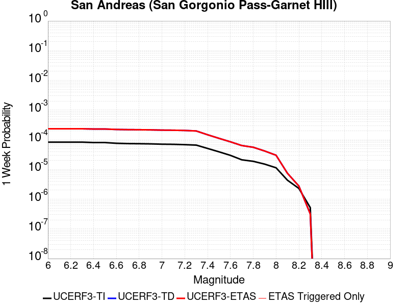 |  | 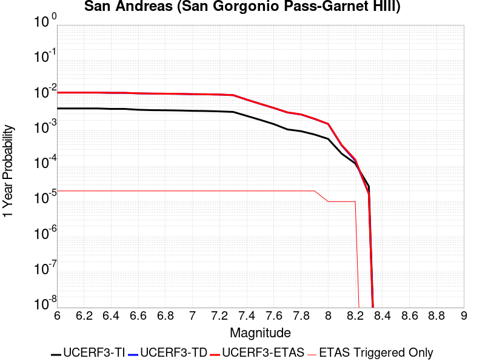 |  |

| Magnitude | 1 wk TI Prob | 1 wk TD Prob | 1 wk ETAS Prob | 1 wk ETAS/TD Gain | 1 wk ETAS Triggered Only | 1 mo TI Prob | 1 mo TD Prob | 1 mo ETAS Prob | 1 mo ETAS/TD Gain | 1 mo ETAS Triggered Only | 1 yr TI Prob | 1 yr TD Prob | 1 yr ETAS Prob | 1 yr ETAS/TD Gain | 1 yr ETAS Triggered Only | 10 yr TI Prob | 10 yr TD Prob | 10 yr ETAS Prob | 10 yr ETAS/TD Gain | 10 yr ETAS Triggered Only |
|-----|-----|-----|-----|-----|-----|-----|-----|-----|-----|-----|-----|-----|-----|-----|-----|-----|-----|-----|-----|-----|
| 6.0 | 8.31567E-5 | 2.344114E-4 | 2.344114E-4 | 1.0 | 0.0 | 3.5633717E-4 | 0.0010042359 | 0.0010042359 | 1.0 | 0.0 | 0.004329778 | 0.012157845 | 0.012177602 | 1.0016251 | 2.0E-5 | 0.042463828 | 0.112816945 | 0.112834685 | 1.0001572 | 2.0E-5 |
| 6.1 | 8.31567E-5 | 2.344114E-4 | 2.344114E-4 | 1.0 | 0.0 | 3.5633717E-4 | 0.0010042359 | 0.0010042359 | 1.0 | 0.0 | 0.004329778 | 0.012157845 | 0.012177602 | 1.0016251 | 2.0E-5 | 0.042463828 | 0.112816945 | 0.112834685 | 1.0001572 | 2.0E-5 |
| 6.2 | 8.31567E-5 | 2.344114E-4 | 2.344114E-4 | 1.0 | 0.0 | 3.5633717E-4 | 0.0010042359 | 0.0010042359 | 1.0 | 0.0 | 0.004329778 | 0.012157845 | 0.012177602 | 1.0016251 | 2.0E-5 | 0.042463828 | 0.112816945 | 0.112834685 | 1.0001572 | 2.0E-5 |
| 6.3 | 8.31567E-5 | 2.344114E-4 | 2.344114E-4 | 1.0 | 0.0 | 3.5633717E-4 | 0.0010042359 | 0.0010042359 | 1.0 | 0.0 | 0.004329778 | 0.012157845 | 0.012177602 | 1.0016251 | 2.0E-5 | 0.042463828 | 0.112816945 | 0.112834685 | 1.0001572 | 2.0E-5 |
| 6.4 | 8.059055E-5 | 2.2998777E-4 | 2.2998777E-4 | 1.0 | 0.0 | 3.4534236E-4 | 9.852918E-4 | 9.852918E-4 | 1.0 | 0.0 | 0.0041964394 | 0.011929748 | 0.011949509 | 1.0016565 | 2.0E-5 | 0.041180745 | 0.11079719 | 0.11081497 | 1.0001605 | 2.0E-5 |
| 6.5 | 8.059055E-5 | 2.2998777E-4 | 2.2998777E-4 | 1.0 | 0.0 | 3.4534236E-4 | 9.852918E-4 | 9.852918E-4 | 1.0 | 0.0 | 0.0041964394 | 0.011929748 | 0.011949509 | 1.0016565 | 2.0E-5 | 0.041180745 | 0.11079719 | 0.11081497 | 1.0001605 | 2.0E-5 |
| 6.6 | 7.619237E-5 | 2.2242195E-4 | 2.2242195E-4 | 1.0 | 0.0 | 3.2649786E-4 | 9.52891E-4 | 9.52891E-4 | 1.0 | 0.0 | 0.0039678677 | 0.011540289 | 0.011560058 | 1.001713 | 2.0E-5 | 0.03897764 | 0.107332654 | 0.107350506 | 1.0001663 | 2.0E-5 |
| 6.7 | 7.440636E-5 | 2.1917891E-4 | 2.1917891E-4 | 1.0 | 0.0 | 3.188454E-4 | 9.390023E-4 | 9.390023E-4 | 1.0 | 0.0 | 0.0038750346 | 0.011372965 | 0.011392738 | 1.0017385 | 2.0E-5 | 0.038081564 | 0.10584094 | 0.105858825 | 1.0001689 | 2.0E-5 |
| 6.8 | 7.3735864E-5 | 2.1764987E-4 | 2.1764987E-4 | 1.0 | 0.0 | 3.1597257E-4 | 9.32454E-4 | 9.32454E-4 | 1.0 | 0.0 | 0.0038401815 | 0.011294069 | 0.011313843 | 1.0017508 | 2.0E-5 | 0.03774495 | 0.105142355 | 0.10516025 | 1.0001702 | 2.0E-5 |
| 6.9 | 7.27575E-5 | 2.153387E-4 | 2.153387E-4 | 1.0 | 0.0 | 3.117806E-4 | 9.22556E-4 | 9.22556E-4 | 1.0 | 0.0 | 0.003789323 | 0.011174804 | 0.01119458 | 1.0017698 | 2.0E-5 | 0.037253562 | 0.104090154 | 0.10410807 | 1.0001721 | 2.0E-5 |
| 7.0 | 7.102591E-5 | 2.1117668E-4 | 2.1117668E-4 | 1.0 | 0.0 | 3.0436125E-4 | 9.047312E-4 | 9.047312E-4 | 1.0 | 0.0 | 0.003699303 | 0.0109599875 | 0.010979769 | 1.0018048 | 2.0E-5 | 0.03638325 | 0.10219181 | 0.10220977 | 1.0001757 | 2.0E-5 |
| 7.1 | 7.028513E-5 | 2.0953201E-4 | 2.0953201E-4 | 1.0 | 0.0 | 3.0118722E-4 | 8.9768757E-4 | 8.9768757E-4 | 1.0 | 0.0 | 0.0036607897 | 0.010875091 | 0.010894873 | 1.001819 | 2.0E-5 | 0.036010686 | 0.10143456 | 0.10145253 | 1.0001771 | 2.0E-5 |
| 7.2 | 6.8498244E-5 | 2.05608E-4 | 2.05608E-4 | 1.0 | 0.0 | 2.9353087E-4 | 8.8088174E-4 | 8.8088174E-4 | 1.0 | 0.0 | 0.003567883 | 0.0106725 | 0.010692286 | 1.001854 | 2.0E-5 | 0.035111405 | 0.09962587 | 0.09964388 | 1.0001807 | 2.0E-5 |
| 7.3 | 6.622592E-5 | 1.9787368E-4 | 1.9787368E-4 | 1.0 | 0.0 | 2.8379448E-4 | 8.4775663E-4 | 8.4775663E-4 | 1.0 | 0.0 | 0.0034497243 | 0.010273073 | 0.010292868 | 1.0019268 | 2.0E-5 | 0.033966612 | 0.09612023 | 0.09613831 | 1.0001881 | 2.0E-5 |
| 7.4 | 5.1050705E-5 | 1.4736863E-4 | 1.4736863E-4 | 1.0 | 0.0 | 2.1877038E-4 | 6.314278E-4 | 6.314278E-4 | 1.0 | 0.0 | 0.002660276 | 0.0076607293 | 0.0076805763 | 1.0025908 | 2.0E-5 | 0.02628654 | 0.07306989 | 0.07308843 | 1.0002537 | 2.0E-5 |
| 7.5 | 3.9302922E-5 | 1.1171539E-4 | 1.1171539E-4 | 1.0 | 0.0 | 1.6843023E-4 | 4.786927E-4 | 4.786927E-4 | 1.0 | 0.0 | 0.0020487092 | 0.0058125798 | 0.0058324635 | 1.0034208 | 2.0E-5 | 0.020299247 | 0.05619383 | 0.056212705 | 1.0003359 | 2.0E-5 |
| 7.6 | 2.9851626E-5 | 8.532174E-5 | 8.532174E-5 | 1.0 | 0.0 | 1.2792926E-4 | 3.6561346E-4 | 3.6561346E-4 | 1.0 | 0.0 | 0.0015564259 | 0.0044422843 | 0.0044621956 | 1.0044822 | 2.0E-5 | 0.0154556995 | 0.04336039 | 0.043379523 | 1.0004412 | 2.0E-5 |
| 7.7 | 2.1135214E-5 | 6.38603E-5 | 6.38603E-5 | 1.0 | 0.0 | 9.0576345E-5 | 2.736583E-4 | 2.736583E-4 | 1.0 | 0.0 | 0.0011022091 | 0.0033267052 | 0.0033466388 | 1.0059919 | 2.0E-5 | 0.010967582 | 0.03273207 | 0.032751415 | 1.000591 | 2.0E-5 |
| 7.8 | 1.883379E-5 | 5.5944303E-5 | 5.5944303E-5 | 1.0 | 0.0 | 8.0713755E-5 | 2.3973928E-4 | 2.3973928E-4 | 1.0 | 0.0 | 9.822468E-4 | 0.0029149223 | 0.002934864 | 1.0068413 | 2.0E-5 | 0.0097791655 | 0.028833086 | 0.02885251 | 1.0006737 | 2.0E-5 |
| 7.9 | 1.5156185E-5 | 4.190922E-5 | 4.190922E-5 | 1.0 | 0.0 | 6.495346E-5 | 1.795986E-4 | 1.795986E-4 | 1.0 | 0.0 | 7.9052144E-4 | 0.0021844215 | 0.0022043777 | 1.0091357 | 2.0E-5 | 0.007877152 | 0.02187479 | 0.021894353 | 1.0008943 | 2.0E-5 |
| 8.0 | 1.1405907E-5 | 3.0164329E-5 | 3.0164329E-5 | 1.0 | 0.0 | 4.8881542E-5 | 1.2926929E-4 | 1.2926929E-4 | 1.0 | 0.0 | 5.9497025E-4 | 0.0015727184 | 0.0015827027 | 1.0063484 | 1.0E-5 | 0.005933798 | 0.015861288 | 0.01587113 | 1.0006205 | 1.0E-5 |
| 8.1 | 4.3511436E-6 | 7.44043E-6 | 7.44043E-6 | 1.0 | 0.0 | 1.8647626E-5 | 3.1887168E-5 | 3.1887168E-5 | 1.0 | 0.0 | 2.2701119E-4 | 3.8815723E-4 | 3.9815335E-4 | 1.0257528 | 1.0E-5 | 0.0022677942 | 0.0041519296 | 0.004161888 | 1.0023985 | 1.0E-5 |
| 8.2 | 2.3042528E-6 | 2.7663746E-6 | 2.7663746E-6 | 1.0 | 0.0 | 9.875332E-6 | 1.1855837E-5 | 1.1855837E-5 | 1.0 | 0.0 | 1.2022553E-4 | 1.443353E-4 | 1.5433386E-4 | 1.0692731 | 1.0E-5 | 0.0012016051 | 0.0016154682 | 0.0016254521 | 1.0061802 | 1.0E-5 |
| 8.3 | 5.202968E-7 | 3.2085435E-7 | 3.2085435E-7 | 1.0 | 0.0 | 2.2298414E-6 | 1.3750895E-6 | 1.3750895E-6 | 1.0 | 0.0 | 2.714798E-5 | 1.6741598E-5 | 1.6741598E-5 | 1.0 | 0.0 | 2.7144665E-4 | 1.9837897E-4 | 1.9837897E-4 | 1.0 | 0.0 |

## Hosgri
*[(top)](#table-of-contents)*

| 1 Week | 1 Month | 1 Year | 10 Year |
|-----|-----|-----|-----|
|  |  |  | 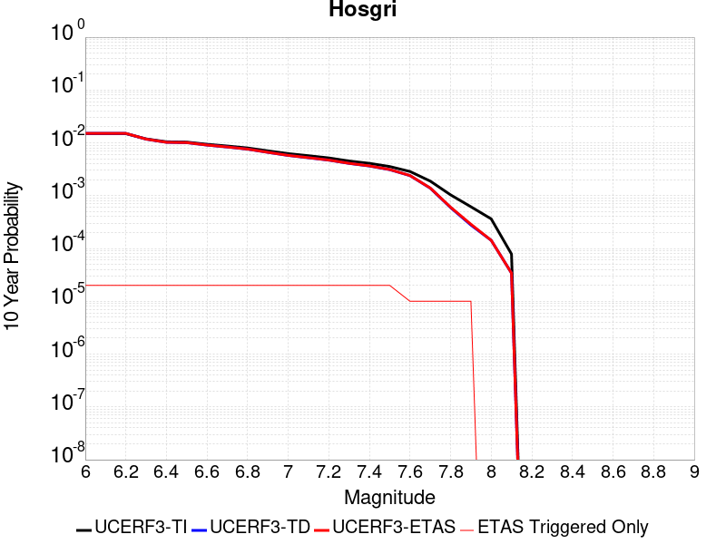 |

| Magnitude | 1 wk TI Prob | 1 wk TD Prob | 1 wk ETAS Prob | 1 wk ETAS/TD Gain | 1 wk ETAS Triggered Only | 1 mo TI Prob | 1 mo TD Prob | 1 mo ETAS Prob | 1 mo ETAS/TD Gain | 1 mo ETAS Triggered Only | 1 yr TI Prob | 1 yr TD Prob | 1 yr ETAS Prob | 1 yr ETAS/TD Gain | 1 yr ETAS Triggered Only | 10 yr TI Prob | 10 yr TD Prob | 10 yr ETAS Prob | 10 yr ETAS/TD Gain | 10 yr ETAS Triggered Only |
|-----|-----|-----|-----|-----|-----|-----|-----|-----|-----|-----|-----|-----|-----|-----|-----|-----|-----|-----|-----|-----|
| 6.0 | 2.883978E-5 | 2.9134455E-5 | 2.9134455E-5 | 1.0 | 0.0 | 1.235932E-4 | 1.2485613E-4 | 1.2485613E-4 | 1.0 | 0.0 | 0.0015037085 | 0.0015190906 | 0.0015190906 | 1.0 | 0.0 | 0.01493574 | 0.015090846 | 0.015110545 | 1.0013053 | 2.0E-5 |
| 6.1 | 2.883978E-5 | 2.9134455E-5 | 2.9134455E-5 | 1.0 | 0.0 | 1.235932E-4 | 1.2485613E-4 | 1.2485613E-4 | 1.0 | 0.0 | 0.0015037085 | 0.0015190906 | 0.0015190906 | 1.0 | 0.0 | 0.01493574 | 0.015090846 | 0.015110545 | 1.0013053 | 2.0E-5 |
| 6.2 | 2.883978E-5 | 2.9134455E-5 | 2.9134455E-5 | 1.0 | 0.0 | 1.235932E-4 | 1.2485613E-4 | 1.2485613E-4 | 1.0 | 0.0 | 0.0015037085 | 0.0015190906 | 0.0015190906 | 1.0 | 0.0 | 0.01493574 | 0.015090846 | 0.015110545 | 1.0013053 | 2.0E-5 |
| 6.3 | 2.2914428E-5 | 2.264682E-5 | 2.264682E-5 | 1.0 | 0.0 | 9.8200995E-5 | 9.705422E-5 | 9.705422E-5 | 1.0 | 0.0 | 0.0011949413 | 0.0011809994 | 0.0011809994 | 1.0 | 0.0 | 0.011885363 | 0.011748637 | 0.011768402 | 1.0016823 | 2.0E-5 |
| 6.4 | 2.0195741E-5 | 1.9700936E-5 | 1.9700936E-5 | 1.0 | 0.0 | 8.65503E-5 | 8.442986E-5 | 8.442986E-5 | 1.0 | 0.0 | 0.0010532405 | 0.0010274508 | 0.0010274508 | 1.0 | 0.0 | 0.010482626 | 0.0102280555 | 0.010247851 | 1.0019354 | 2.0E-5 |
| 6.5 | 1.9924333E-5 | 1.941332E-5 | 1.941332E-5 | 1.0 | 0.0 | 8.53872E-5 | 8.319731E-5 | 8.319731E-5 | 1.0 | 0.0 | 0.0010390934 | 0.0010124585 | 0.0010124585 | 1.0 | 0.0 | 0.010342481 | 0.0100794975 | 0.010099296 | 1.0019642 | 2.0E-5 |
| 6.6 | 1.809694E-5 | 1.7462371E-5 | 1.7462371E-5 | 1.0 | 0.0 | 7.7556004E-5 | 7.483659E-5 | 7.483659E-5 | 1.0 | 0.0 | 9.438353E-4 | 9.1075595E-4 | 9.1075595E-4 | 1.0 | 0.0 | 0.009398366 | 0.009071181 | 0.009090999 | 1.0021847 | 2.0E-5 |
| 6.7 | 1.675989E-5 | 1.6046652E-5 | 1.6046652E-5 | 1.0 | 0.0 | 7.182612E-5 | 6.876956E-5 | 6.876956E-5 | 1.0 | 0.0 | 8.7413215E-4 | 8.3694886E-4 | 8.3694886E-4 | 1.0 | 0.0 | 0.008707017 | 0.008338877 | 0.0083587095 | 1.0023785 | 2.0E-5 |
| 6.8 | 1.5401129E-5 | 1.4617786E-5 | 1.4617786E-5 | 1.0 | 0.0 | 6.6003166E-5 | 6.2646155E-5 | 6.2646155E-5 | 1.0 | 0.0 | 8.032922E-4 | 7.624509E-4 | 7.624509E-4 | 1.0 | 0.0 | 0.008003947 | 0.007599217 | 0.007619065 | 1.0026119 | 2.0E-5 |
| 6.9 | 1.356559E-5 | 1.2693427E-5 | 1.2693427E-5 | 1.0 | 0.0 | 5.8136946E-5 | 5.4399272E-5 | 5.4399272E-5 | 1.0 | 0.0 | 7.0758746E-4 | 6.6211034E-4 | 6.6211034E-4 | 1.0 | 0.0 | 0.007053386 | 0.006602184 | 0.006622052 | 1.0030093 | 2.0E-5 |
| 7.0 | 1.2030819E-5 | 1.1099228E-5 | 1.1099228E-5 | 1.0 | 0.0 | 5.155963E-5 | 4.7567253E-5 | 4.7567253E-5 | 1.0 | 0.0 | 6.275577E-4 | 5.789775E-4 | 5.789775E-4 | 1.0 | 0.0 | 0.006257884 | 0.005775454 | 0.0057953387 | 1.0034429 | 2.0E-5 |
| 7.1 | 1.0972698E-5 | 1.0025329E-5 | 1.0025329E-5 | 1.0 | 0.0 | 4.7025E-5 | 4.296499E-5 | 4.296499E-5 | 1.0 | 0.0 | 5.72379E-4 | 5.2297325E-4 | 5.2297325E-4 | 1.0 | 0.0 | 0.0057090693 | 0.00521818 | 0.0052380757 | 1.0038128 | 2.0E-5 |
| 7.2 | 9.961926E-6 | 9.037798E-6 | 9.037798E-6 | 1.0 | 0.0 | 4.2693267E-5 | 3.8732847E-5 | 3.8732847E-5 | 1.0 | 0.0 | 5.1966653E-4 | 4.714704E-4 | 4.714704E-4 | 1.0 | 0.0 | 0.00518453 | 0.0047054505 | 0.0047253566 | 1.0042304 | 2.0E-5 |
| 7.3 | 8.700929E-6 | 7.831038E-6 | 7.831038E-6 | 1.0 | 0.0 | 3.7289166E-5 | 3.356116E-5 | 3.356116E-5 | 1.0 | 0.0 | 4.53901E-4 | 4.0853053E-4 | 4.0853053E-4 | 1.0 | 0.0 | 0.00452975 | 0.004078537 | 0.0040984554 | 1.0048838 | 2.0E-5 |
| 7.4 | 7.866285E-6 | 7.0015703E-6 | 7.0015703E-6 | 1.0 | 0.0 | 3.3712215E-5 | 3.0006386E-5 | 3.0006386E-5 | 1.0 | 0.0 | 4.103689E-4 | 3.6526652E-4 | 3.6526652E-4 | 1.0 | 0.0 | 0.004096119 | 0.0036474012 | 0.0036673283 | 1.0054634 | 2.0E-5 |
| 7.5 | 6.8381305E-6 | 5.962434E-6 | 5.962434E-6 | 1.0 | 0.0 | 2.9305946E-5 | 2.555304E-5 | 2.555304E-5 | 1.0 | 0.0 | 3.5674145E-4 | 3.1106386E-4 | 3.1106386E-4 | 1.0 | 0.0 | 0.0035616932 | 0.0031070218 | 0.0031269598 | 1.006417 | 2.0E-5 |
| 7.6 | 5.503376E-6 | 4.59786E-6 | 4.59786E-6 | 1.0 | 0.0 | 2.3585684E-5 | 1.9704965E-5 | 1.9704965E-5 | 1.0 | 0.0 | 2.8711787E-4 | 2.3988156E-4 | 2.3988156E-4 | 1.0 | 0.0 | 0.002867472 | 0.0023969617 | 0.0024069378 | 1.004162 | 1.0E-5 |
| 7.7 | 3.6144982E-6 | 2.6546047E-6 | 2.6546047E-6 | 1.0 | 0.0 | 1.5490614E-5 | 1.1376827E-5 | 1.1376827E-5 | 1.0 | 0.0 | 1.8858191E-4 | 1.3850408E-4 | 1.3850408E-4 | 1.0 | 0.0 | 0.0018842196 | 0.0013849111 | 0.0013948972 | 1.0072107 | 1.0E-5 |
| 7.8 | 1.9853494E-6 | 1.1381159E-6 | 1.1381159E-6 | 1.0 | 0.0 | 8.508612E-6 | 4.8776305E-6 | 4.8776305E-6 | 1.0 | 0.0 | 1.0358743E-4 | 5.9383532E-5 | 5.9383532E-5 | 1.0 | 0.0 | 0.0010353916 | 5.9440895E-4 | 6.0440303E-4 | 1.0168134 | 1.0E-5 |
| 7.9 | 1.1818757E-6 | 5.310923E-7 | 5.310923E-7 | 1.0 | 0.0 | 5.0651715E-6 | 2.2761078E-6 | 2.2761078E-6 | 1.0 | 0.0 | 6.1666724E-5 | 2.771126E-5 | 2.771126E-5 | 1.0 | 0.0 | 6.1649614E-4 | 2.7776862E-4 | 2.8776584E-4 | 1.0359912 | 1.0E-5 |
| 8.0 | 6.962958E-7 | 2.7248345E-7 | 2.7248345E-7 | 1.0 | 0.0 | 2.9841215E-6 | 1.1677856E-6 | 1.1677856E-6 | 1.0 | 0.0 | 3.6331072E-5 | 1.4217697E-5 | 1.4217697E-5 | 1.0 | 0.0 | 3.6325134E-4 | 1.4274013E-4 | 1.4274013E-4 | 1.0 | 0.0 |
| 8.1 | 1.5033264E-7 | 6.550403E-8 | 6.550403E-8 | 1.0 | 0.0 | 6.442826E-7 | 2.8073154E-7 | 2.8073154E-7 | 1.0 | 0.0 | 7.844113E-6 | 3.4179013E-6 | 3.4179013E-6 | 1.0 | 0.0 | 7.843835E-5 | 3.419582E-5 | 3.419582E-5 | 1.0 | 0.0 |

## Great Valley 08 (Quinto)
*[(top)](#table-of-contents)*

| 1 Week | 1 Month | 1 Year | 10 Year |
|-----|-----|-----|-----|
|  | 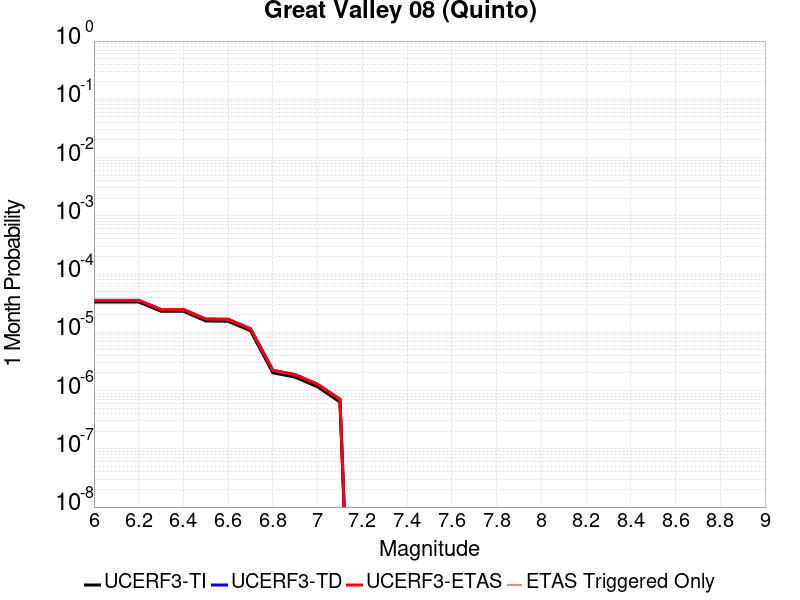 | 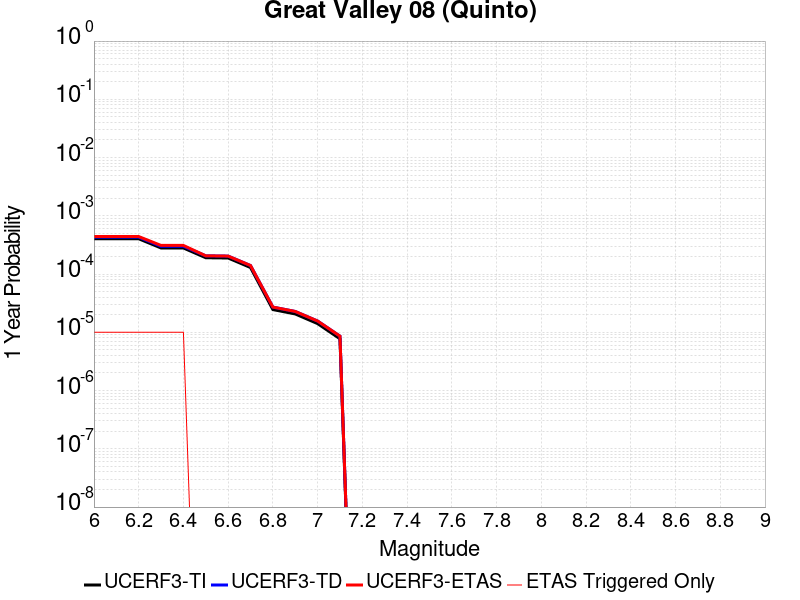 | 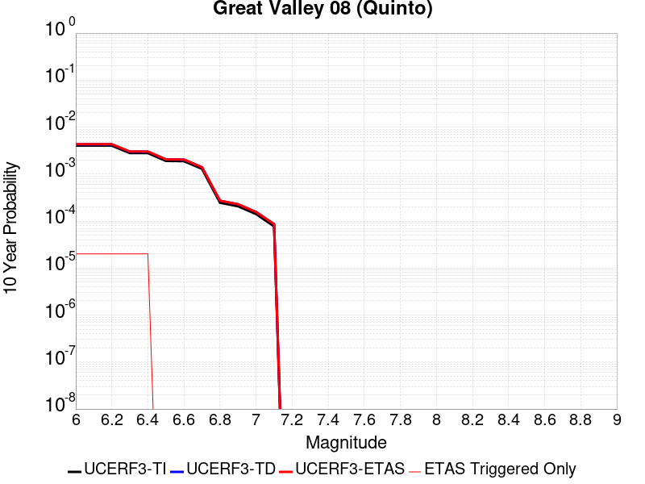 |

| Magnitude | 1 wk TI Prob | 1 wk TD Prob | 1 wk ETAS Prob | 1 wk ETAS/TD Gain | 1 wk ETAS Triggered Only | 1 mo TI Prob | 1 mo TD Prob | 1 mo ETAS Prob | 1 mo ETAS/TD Gain | 1 mo ETAS Triggered Only | 1 yr TI Prob | 1 yr TD Prob | 1 yr ETAS Prob | 1 yr ETAS/TD Gain | 1 yr ETAS Triggered Only | 10 yr TI Prob | 10 yr TD Prob | 10 yr ETAS Prob | 10 yr ETAS/TD Gain | 10 yr ETAS Triggered Only |
|-----|-----|-----|-----|-----|-----|-----|-----|-----|-----|-----|-----|-----|-----|-----|-----|-----|-----|-----|-----|-----|
| 6.0 | 7.737697E-6 | 8.2541E-6 | 8.2541E-6 | 1.0 | 0.0 | 3.3161137E-5 | 3.537434E-5 | 3.537434E-5 | 1.0 | 0.0 | 4.0366207E-4 | 4.3061635E-4 | 4.4061203E-4 | 1.0232126 | 1.0E-5 | 0.004029296 | 0.004299673 | 0.004319587 | 1.0046315 | 2.0E-5 |
| 6.1 | 7.737697E-6 | 8.2541E-6 | 8.2541E-6 | 1.0 | 0.0 | 3.3161137E-5 | 3.537434E-5 | 3.537434E-5 | 1.0 | 0.0 | 4.0366207E-4 | 4.3061635E-4 | 4.4061203E-4 | 1.0232126 | 1.0E-5 | 0.004029296 | 0.004299673 | 0.004319587 | 1.0046315 | 2.0E-5 |
| 6.2 | 7.737697E-6 | 8.2541E-6 | 8.2541E-6 | 1.0 | 0.0 | 3.3161137E-5 | 3.537434E-5 | 3.537434E-5 | 1.0 | 0.0 | 4.0366207E-4 | 4.3061635E-4 | 4.4061203E-4 | 1.0232126 | 1.0E-5 | 0.004029296 | 0.004299673 | 0.004319587 | 1.0046315 | 2.0E-5 |
| 6.3 | 5.374012E-6 | 5.751352E-6 | 5.751352E-6 | 1.0 | 0.0 | 2.3031276E-5 | 2.4648483E-5 | 2.4648483E-5 | 1.0 | 0.0 | 2.803697E-4 | 3.000651E-4 | 3.1006208E-4 | 1.0333161 | 1.0E-5 | 0.0028001624 | 0.002997693 | 0.003017633 | 1.0066518 | 2.0E-5 |
| 6.4 | 5.374012E-6 | 5.751352E-6 | 5.751352E-6 | 1.0 | 0.0 | 2.3031276E-5 | 2.4648483E-5 | 2.4648483E-5 | 1.0 | 0.0 | 2.803697E-4 | 3.000651E-4 | 3.1006208E-4 | 1.0333161 | 1.0E-5 | 0.0028001624 | 0.002997693 | 0.003017633 | 1.0066518 | 2.0E-5 |
| 6.5 | 3.65427E-6 | 3.941921E-6 | 3.941921E-6 | 1.0 | 0.0 | 1.5661062E-5 | 1.6893879E-5 | 1.6893879E-5 | 1.0 | 0.0 | 1.9065675E-4 | 2.0567061E-4 | 2.0567061E-4 | 1.0 | 0.0 | 0.0019049325 | 0.0020554946 | 0.0020554946 | 1.0 | 0.0 |
| 6.6 | 3.6143538E-6 | 3.899102E-6 | 3.899102E-6 | 1.0 | 0.0 | 1.5489995E-5 | 1.671037E-5 | 1.671037E-5 | 1.0 | 0.0 | 1.8857437E-4 | 2.0343681E-4 | 2.0343681E-4 | 1.0 | 0.0 | 0.0018841444 | 0.0020331976 | 0.0020331976 | 1.0 | 0.0 |
| 6.7 | 2.4821015E-6 | 2.686132E-6 | 2.686132E-6 | 1.0 | 0.0 | 1.0637535E-5 | 1.1511975E-5 | 1.1511975E-5 | 1.0 | 0.0 | 1.2950429E-4 | 1.4015494E-4 | 1.4015494E-4 | 1.0 | 0.0 | 0.0012942884 | 0.0014012204 | 0.0014012204 | 1.0 | 0.0 |
| 6.8 | 4.7110538E-7 | 5.194045E-7 | 5.194045E-7 | 1.0 | 0.0 | 2.0190216E-6 | 2.2260176E-6 | 2.2260176E-6 | 1.0 | 0.0 | 2.458131E-5 | 2.7101445E-5 | 2.7101445E-5 | 1.0 | 0.0 | 2.457859E-4 | 2.709832E-4 | 2.709832E-4 | 1.0 | 0.0 |
| 6.9 | 3.958685E-7 | 4.3712214E-7 | 4.3712214E-7 | 1.0 | 0.0 | 1.6965782E-6 | 1.8733792E-6 | 1.8733792E-6 | 1.0 | 0.0 | 2.0655643E-5 | 2.280817E-5 | 2.280817E-5 | 1.0 | 0.0 | 2.0653724E-4 | 2.2805991E-4 | 2.2805991E-4 | 1.0 | 0.0 |
| 7.0 | 2.70294E-7 | 2.9926176E-7 | 2.9926176E-7 | 1.0 | 0.0 | 1.1584025E-6 | 1.2825498E-6 | 1.2825498E-6 | 1.0 | 0.0 | 1.4103458E-5 | 1.5614945E-5 | 1.5614945E-5 | 1.0 | 0.0 | 1.4102564E-4 | 1.5613977E-4 | 1.5613977E-4 | 1.0 | 0.0 |
| 7.1 | 1.4828602E-7 | 1.6472617E-7 | 1.6472617E-7 | 1.0 | 0.0 | 6.3551136E-7 | 7.0596917E-7 | 7.0596917E-7 | 1.0 | 0.0 | 7.737323E-6 | 8.59515E-6 | 8.59515E-6 | 1.0 | 0.0 | 7.737054E-5 | 8.594897E-5 | 8.594897E-5 | 1.0 | 0.0 |

## Butano 2011 CFM
*[(top)](#table-of-contents)*

| 1 Week | 1 Month | 1 Year | 10 Year |
|-----|-----|-----|-----|
|  |  |  |  |

| Magnitude | 1 wk TI Prob | 1 wk TD Prob | 1 wk ETAS Prob | 1 wk ETAS/TD Gain | 1 wk ETAS Triggered Only | 1 mo TI Prob | 1 mo TD Prob | 1 mo ETAS Prob | 1 mo ETAS/TD Gain | 1 mo ETAS Triggered Only | 1 yr TI Prob | 1 yr TD Prob | 1 yr ETAS Prob | 1 yr ETAS/TD Gain | 1 yr ETAS Triggered Only | 10 yr TI Prob | 10 yr TD Prob | 10 yr ETAS Prob | 10 yr ETAS/TD Gain | 10 yr ETAS Triggered Only |
|-----|-----|-----|-----|-----|-----|-----|-----|-----|-----|-----|-----|-----|-----|-----|-----|-----|-----|-----|-----|-----|
| 6.0 | 9.561135E-6 | 6.238993E-6 | 6.238993E-6 | 1.0 | 0.0 | 4.097565E-5 | 2.673828E-5 | 2.673828E-5 | 1.0 | 0.0 | 4.9876433E-4 | 3.2549215E-4 | 3.4548563E-4 | 1.0614254 | 2.0E-5 | 0.004976464 | 0.0032678593 | 0.003287794 | 1.0061002 | 2.0E-5 |
| 6.1 | 9.561135E-6 | 6.238993E-6 | 6.238993E-6 | 1.0 | 0.0 | 4.097565E-5 | 2.673828E-5 | 2.673828E-5 | 1.0 | 0.0 | 4.9876433E-4 | 3.2549215E-4 | 3.4548563E-4 | 1.0614254 | 2.0E-5 | 0.004976464 | 0.0032678593 | 0.003287794 | 1.0061002 | 2.0E-5 |
| 6.2 | 8.364741E-6 | 4.991977E-6 | 4.991977E-6 | 1.0 | 0.0 | 3.5848396E-5 | 2.139402E-5 | 2.139402E-5 | 1.0 | 0.0 | 4.3636683E-4 | 2.6044264E-4 | 2.8043744E-4 | 1.0767723 | 2.0E-5 | 0.0043551093 | 0.0026190274 | 0.0026389752 | 1.0076164 | 2.0E-5 |
| 6.3 | 8.364741E-6 | 4.991977E-6 | 4.991977E-6 | 1.0 | 0.0 | 3.5848396E-5 | 2.139402E-5 | 2.139402E-5 | 1.0 | 0.0 | 4.3636683E-4 | 2.6044264E-4 | 2.8043744E-4 | 1.0767723 | 2.0E-5 | 0.0043551093 | 0.0026190274 | 0.0026389752 | 1.0076164 | 2.0E-5 |
| 6.4 | 7.768282E-6 | 4.3698733E-6 | 4.3698733E-6 | 1.0 | 0.0 | 3.329221E-5 | 1.8727902E-5 | 1.8727902E-5 | 1.0 | 0.0 | 4.0525728E-4 | 2.279897E-4 | 2.4798515E-4 | 1.0877032 | 2.0E-5 | 0.0040451903 | 0.0022951963 | 0.0023151503 | 1.0086938 | 2.0E-5 |
| 6.5 | 7.673437E-6 | 4.269425E-6 | 4.269425E-6 | 1.0 | 0.0 | 3.2885746E-5 | 1.8297414E-5 | 1.8297414E-5 | 1.0 | 0.0 | 4.0031038E-4 | 2.227496E-4 | 2.3274738E-4 | 1.0448835 | 1.0E-5 | 0.0039959005 | 0.0022429011 | 0.0022528786 | 1.0044485 | 1.0E-5 |
| 6.6 | 7.5244197E-6 | 4.1143703E-6 | 4.1143703E-6 | 1.0 | 0.0 | 3.2247113E-5 | 1.7632903E-5 | 1.7632903E-5 | 1.0 | 0.0 | 3.9253788E-4 | 2.1466079E-4 | 2.2465864E-4 | 1.0465751 | 1.0E-5 | 0.003918452 | 0.0021621722 | 0.0021721506 | 1.004615 | 1.0E-5 |
| 6.7 | 6.4921405E-6 | 3.0542933E-6 | 3.0542933E-6 | 1.0 | 0.0 | 2.7823162E-5 | 1.3089762E-5 | 1.3089762E-5 | 1.0 | 0.0 | 3.3869434E-4 | 1.5935629E-4 | 1.5935629E-4 | 1.0 | 0.0 | 0.003381786 | 0.0016099443 | 0.0016099443 | 1.0 | 0.0 |
| 6.8 | 6.2890294E-6 | 2.8410277E-6 | 2.8410277E-6 | 1.0 | 0.0 | 2.6952705E-5 | 1.2175776E-5 | 1.2175776E-5 | 1.0 | 0.0 | 3.2809976E-4 | 1.4823007E-4 | 1.4823007E-4 | 1.0 | 0.0 | 0.0032761577 | 0.0014988371 | 0.0014988371 | 1.0 | 0.0 |
| 6.9 | 6.0965517E-6 | 2.6475043E-6 | 2.6475043E-6 | 1.0 | 0.0 | 2.6127816E-5 | 1.13463975E-5 | 1.13463975E-5 | 1.0 | 0.0 | 3.1805973E-4 | 1.381337E-4 | 1.381337E-4 | 1.0 | 0.0 | 0.0031760489 | 0.001398004 | 0.001398004 | 1.0 | 0.0 |
| 7.0 | 5.566252E-6 | 2.1647716E-6 | 2.1647716E-6 | 1.0 | 0.0 | 2.3855147E-5 | 9.277559E-6 | 9.277559E-6 | 1.0 | 0.0 | 2.9039773E-4 | 1.12948466E-4 | 1.12948466E-4 | 1.0 | 0.0 | 0.0029001853 | 0.0011464338 | 0.0011464338 | 1.0 | 0.0 |
| 7.1 | 3.878588E-6 | 1.614164E-6 | 1.614164E-6 | 1.0 | 0.0 | 1.6622414E-5 | 6.9178272E-6 | 6.9178272E-6 | 1.0 | 0.0 | 2.023591E-4 | 8.42213E-5 | 8.42213E-5 | 1.0 | 0.0 | 0.0020217493 | 8.5901335E-4 | 8.5901335E-4 | 1.0 | 0.0 |
| 7.2 | 3.7038085E-6 | 1.4950773E-6 | 1.4950773E-6 | 1.0 | 0.0 | 1.587337E-5 | 6.407458E-6 | 6.407458E-6 | 1.0 | 0.0 | 1.9324113E-4 | 7.800801E-5 | 7.800801E-5 | 1.0 | 0.0 | 0.0019307317 | 7.968935E-4 | 7.968935E-4 | 1.0 | 0.0 |
| 7.3 | 3.5277278E-6 | 1.4030478E-6 | 1.4030478E-6 | 1.0 | 0.0 | 1.5118746E-5 | 6.013048E-6 | 6.013048E-6 | 1.0 | 0.0 | 1.8405518E-4 | 7.32064E-5 | 7.32064E-5 | 1.0 | 0.0 | 0.0018390282 | 7.4882264E-4 | 7.4882264E-4 | 1.0 | 0.0 |
| 7.4 | 3.3711294E-6 | 1.340118E-6 | 1.340118E-6 | 1.0 | 0.0 | 1.4447617E-5 | 5.7433504E-6 | 5.7433504E-6 | 1.0 | 0.0 | 1.7588554E-4 | 6.992305E-5 | 6.992305E-5 | 1.0 | 0.0 | 0.0017574639 | 7.159579E-4 | 7.159579E-4 | 1.0 | 0.0 |
| 7.5 | 3.0496426E-6 | 1.2286403E-6 | 1.2286403E-6 | 1.0 | 0.0 | 1.3069831E-5 | 5.2655905E-6 | 5.2655905E-6 | 1.0 | 0.0 | 1.5911358E-4 | 6.410668E-5 | 6.410668E-5 | 1.0 | 0.0 | 0.001589997 | 6.5776106E-4 | 6.5776106E-4 | 1.0 | 0.0 |
| 7.6 | 2.2179781E-6 | 8.955367E-7 | 8.955367E-7 | 1.0 | 0.0 | 9.505586E-6 | 3.8380085E-6 | 3.8380085E-6 | 1.0 | 0.0 | 1.1572436E-4 | 4.6726753E-5 | 4.6726753E-5 | 1.0 | 0.0 | 0.0011566412 | 4.8394362E-4 | 4.8394362E-4 | 1.0 | 0.0 |
| 7.7 | 1.7519328E-6 | 7.006438E-7 | 7.006438E-7 | 1.0 | 0.0 | 7.508262E-6 | 3.0027556E-6 | 3.0027556E-6 | 1.0 | 0.0 | 9.140925E-5 | 3.6557936E-5 | 3.6557936E-5 | 1.0 | 0.0 | 9.137166E-4 | 3.8155814E-4 | 3.8155814E-4 | 1.0 | 0.0 |
| 7.8 | 1.1478974E-6 | 6.242931E-7 | 6.242931E-7 | 1.0 | 0.0 | 4.9195505E-6 | 2.675539E-6 | 2.675539E-6 | 1.0 | 0.0 | 5.9893882E-5 | 3.25742E-5 | 3.25742E-5 | 1.0 | 0.0 | 5.9877743E-4 | 3.4139008E-4 | 3.4139008E-4 | 1.0 | 0.0 |
| 7.9 | 6.1154634E-7 | 5.6417895E-7 | 5.6417895E-7 | 1.0 | 0.0 | 2.6209104E-6 | 2.4179076E-6 | 2.4179076E-6 | 1.0 | 0.0 | 3.1909116E-5 | 2.9437626E-5 | 2.9437626E-5 | 1.0 | 0.0 | 3.1904536E-4 | 3.0877755E-4 | 3.0877755E-4 | 1.0 | 0.0 |
| 8.0 | 4.6520046E-7 | 5.244012E-7 | 5.244012E-7 | 1.0 | 0.0 | 1.9937147E-6 | 2.2474317E-6 | 2.2474317E-6 | 1.0 | 0.0 | 2.4273206E-5 | 2.7362137E-5 | 2.7362137E-5 | 1.0 | 0.0 | 2.4270554E-4 | 2.870466E-4 | 2.870466E-4 | 1.0 | 0.0 |
| 8.1 | 2.8425194E-7 | 3.088137E-7 | 3.088137E-7 | 1.0 | 0.0 | 1.218222E-6 | 1.3234867E-6 | 1.3234867E-6 | 1.0 | 0.0 | 1.4831752E-5 | 1.611333E-5 | 1.611333E-5 | 1.0 | 0.0 | 1.4830762E-4 | 1.6903877E-4 | 1.6903877E-4 | 1.0 | 0.0 |
| 8.2 | 5.585778E-8 | 4.1048523E-8 | 4.1048523E-8 | 1.0 | 0.0 | 2.3939046E-7 | 1.7592222E-7 | 1.7592222E-7 | 1.0 | 0.0 | 2.914575E-6 | 2.141851E-6 | 2.141851E-6 | 1.0 | 0.0 | 2.9145367E-5 | 2.325999E-5 | 2.325999E-5 | 1.0 | 0.0 |
| 8.3 | 1.0371215E-10 | 5.436418E-11 | 5.436418E-11 | 1.0 | 0.0 | 4.4448079E-10 | 2.329893E-10 | 2.329893E-10 | 1.0 | 0.0 | 5.4115543E-9 | 2.8366456E-9 | 2.8366456E-9 | 1.0 | 0.0 | 5.4115542E-8 | 3.259678E-8 | 3.259678E-8 | 1.0 | 0.0 |

## Lost Hills
*[(top)](#table-of-contents)*

| 1 Week | 1 Month | 1 Year | 10 Year |
|-----|-----|-----|-----|
| 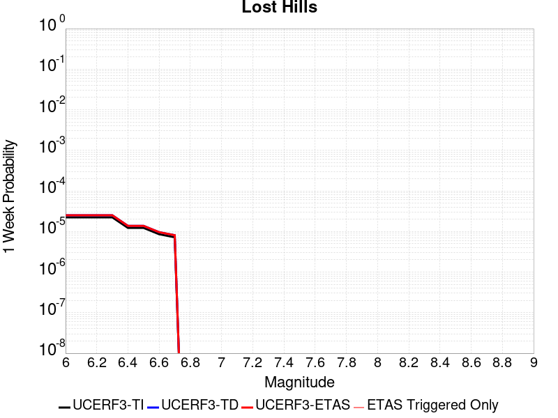 | 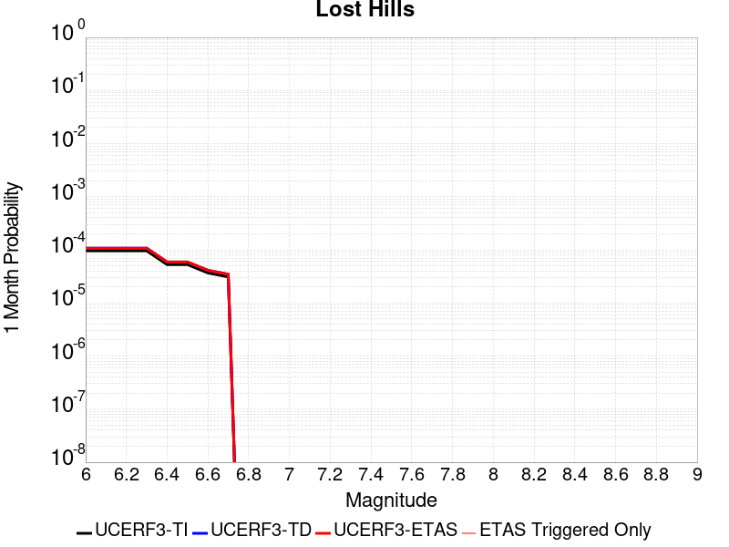 |  |  |

| Magnitude | 1 wk TI Prob | 1 wk TD Prob | 1 wk ETAS Prob | 1 wk ETAS/TD Gain | 1 wk ETAS Triggered Only | 1 mo TI Prob | 1 mo TD Prob | 1 mo ETAS Prob | 1 mo ETAS/TD Gain | 1 mo ETAS Triggered Only | 1 yr TI Prob | 1 yr TD Prob | 1 yr ETAS Prob | 1 yr ETAS/TD Gain | 1 yr ETAS Triggered Only | 10 yr TI Prob | 10 yr TD Prob | 10 yr ETAS Prob | 10 yr ETAS/TD Gain | 10 yr ETAS Triggered Only |
|-----|-----|-----|-----|-----|-----|-----|-----|-----|-----|-----|-----|-----|-----|-----|-----|-----|-----|-----|-----|-----|
| 6.0 | 2.233523E-5 | 2.5112586E-5 | 2.5112586E-5 | 1.0 | 0.0 | 9.571891E-5 | 1.07621876E-4 | 1.07621876E-4 | 1.0 | 0.0 | 0.0011647546 | 0.0013096769 | 0.0013196638 | 1.0076255 | 1.0E-5 | 0.011586686 | 0.0130361905 | 0.01305593 | 1.0015142 | 2.0E-5 |
| 6.1 | 2.233523E-5 | 2.5112586E-5 | 2.5112586E-5 | 1.0 | 0.0 | 9.571891E-5 | 1.07621876E-4 | 1.07621876E-4 | 1.0 | 0.0 | 0.0011647546 | 0.0013096769 | 0.0013196638 | 1.0076255 | 1.0E-5 | 0.011586686 | 0.0130361905 | 0.01305593 | 1.0015142 | 2.0E-5 |
| 6.2 | 2.233523E-5 | 2.5112586E-5 | 2.5112586E-5 | 1.0 | 0.0 | 9.571891E-5 | 1.07621876E-4 | 1.07621876E-4 | 1.0 | 0.0 | 0.0011647546 | 0.0013096769 | 0.0013196638 | 1.0076255 | 1.0E-5 | 0.011586686 | 0.0130361905 | 0.01305593 | 1.0015142 | 2.0E-5 |
| 6.3 | 2.233523E-5 | 2.5112586E-5 | 2.5112586E-5 | 1.0 | 0.0 | 9.571891E-5 | 1.07621876E-4 | 1.07621876E-4 | 1.0 | 0.0 | 0.0011647546 | 0.0013096769 | 0.0013196638 | 1.0076255 | 1.0E-5 | 0.011586686 | 0.0130361905 | 0.01305593 | 1.0015142 | 2.0E-5 |
| 6.4 | 1.2288092E-5 | 1.37843335E-5 | 1.37843335E-5 | 1.0 | 0.0 | 5.2662188E-5 | 5.9074908E-5 | 5.9074908E-5 | 1.0 | 0.0 | 6.409735E-4 | 7.190935E-4 | 7.190935E-4 | 1.0 | 0.0 | 0.006391279 | 0.007176877 | 0.0071868054 | 1.0013833 | 1.0E-5 |
| 6.5 | 1.2288092E-5 | 1.37843335E-5 | 1.37843335E-5 | 1.0 | 0.0 | 5.2662188E-5 | 5.9074908E-5 | 5.9074908E-5 | 1.0 | 0.0 | 6.409735E-4 | 7.190935E-4 | 7.190935E-4 | 1.0 | 0.0 | 0.006391279 | 0.007176877 | 0.0071868054 | 1.0013833 | 1.0E-5 |
| 6.6 | 8.58281E-6 | 9.636043E-6 | 9.636043E-6 | 1.0 | 0.0 | 3.6782953E-5 | 4.1297142E-5 | 4.1297142E-5 | 1.0 | 0.0 | 4.4774043E-4 | 5.0275994E-4 | 5.0275994E-4 | 1.0 | 0.0 | 0.0044683935 | 0.0050243894 | 0.0050243894 | 1.0 | 0.0 |
| 6.7 | 7.205685E-6 | 8.090211E-6 | 8.090211E-6 | 1.0 | 0.0 | 3.088114E-5 | 3.4672332E-5 | 3.4672332E-5 | 1.0 | 0.0 | 3.7591302E-4 | 4.2213564E-4 | 4.2213564E-4 | 1.0 | 0.0 | 0.0037527776 | 0.0042213565 | 0.0042213565 | 1.0 | 0.0 |

## Pilarcitos 2011 CFM
*[(top)](#table-of-contents)*

| 1 Week | 1 Month | 1 Year | 10 Year |
|-----|-----|-----|-----|
|  |  |  |  |

| Magnitude | 1 wk TI Prob | 1 wk TD Prob | 1 wk ETAS Prob | 1 wk ETAS/TD Gain | 1 wk ETAS Triggered Only | 1 mo TI Prob | 1 mo TD Prob | 1 mo ETAS Prob | 1 mo ETAS/TD Gain | 1 mo ETAS Triggered Only | 1 yr TI Prob | 1 yr TD Prob | 1 yr ETAS Prob | 1 yr ETAS/TD Gain | 1 yr ETAS Triggered Only | 10 yr TI Prob | 10 yr TD Prob | 10 yr ETAS Prob | 10 yr ETAS/TD Gain | 10 yr ETAS Triggered Only |
|-----|-----|-----|-----|-----|-----|-----|-----|-----|-----|-----|-----|-----|-----|-----|-----|-----|-----|-----|-----|-----|
| 6.0 | 4.9150476E-6 | 3.2107332E-6 | 3.2107332E-6 | 1.0 | 0.0 | 2.1064321E-5 | 1.3760214E-5 | 2.3760076E-5 | 1.7267228 | 1.0E-5 | 2.564279E-4 | 1.6751804E-4 | 1.8751468E-4 | 1.1193701 | 2.0E-5 | 0.0025613222 | 0.0016863721 | 0.0017063384 | 1.0118397 | 2.0E-5 |
| 6.1 | 4.9150476E-6 | 3.2107332E-6 | 3.2107332E-6 | 1.0 | 0.0 | 2.1064321E-5 | 1.3760214E-5 | 1.3760214E-5 | 1.0 | 0.0 | 2.564279E-4 | 1.6751804E-4 | 1.7751637E-4 | 1.0596851 | 1.0E-5 | 0.0025613222 | 0.0016863721 | 0.0016963552 | 1.0059199 | 1.0E-5 |
| 6.2 | 4.162343E-6 | 2.439086E-6 | 2.439086E-6 | 1.0 | 0.0 | 1.783849E-5 | 1.0453185E-5 | 1.0453185E-5 | 1.0 | 0.0 | 2.1716199E-4 | 1.2726017E-4 | 1.3725889E-4 | 1.0785692 | 1.0E-5 | 0.002169499 | 0.0012843093 | 0.0012942965 | 1.0077763 | 1.0E-5 |
| 6.3 | 4.162343E-6 | 2.439086E-6 | 2.439086E-6 | 1.0 | 0.0 | 1.783849E-5 | 1.0453185E-5 | 1.0453185E-5 | 1.0 | 0.0 | 2.1716199E-4 | 1.2726017E-4 | 1.3725889E-4 | 1.0785692 | 1.0E-5 | 0.002169499 | 0.0012843093 | 0.0012942965 | 1.0077763 | 1.0E-5 |
| 6.4 | 3.8768926E-6 | 2.1464914E-6 | 2.1464914E-6 | 1.0 | 0.0 | 1.6615148E-5 | 9.199216E-6 | 9.199216E-6 | 1.0 | 0.0 | 2.0227065E-4 | 1.1199475E-4 | 1.1199475E-4 | 1.0 | 0.0 | 0.0020208664 | 0.0011318177 | 0.0011318177 | 1.0 | 0.0 |
| 6.5 | 3.7137002E-6 | 1.9798367E-6 | 1.9798367E-6 | 1.0 | 0.0 | 1.591576E-5 | 8.484986E-6 | 8.484986E-6 | 1.0 | 0.0 | 1.9375715E-4 | 1.0329985E-4 | 1.0329985E-4 | 1.0 | 0.0 | 0.001935883 | 0.0010449529 | 0.0010449529 | 1.0 | 0.0 |
| 6.6 | 3.5048733E-6 | 1.764777E-6 | 1.764777E-6 | 1.0 | 0.0 | 1.5020799E-5 | 7.563308E-6 | 7.563308E-6 | 1.0 | 0.0 | 1.8286289E-4 | 9.2079405E-5 | 9.2079405E-5 | 1.0 | 0.0 | 0.0018271249 | 9.328476E-4 | 9.328476E-4 | 1.0 | 0.0 |
| 6.7 | 3.3908584E-6 | 1.6484541E-6 | 1.6484541E-6 | 1.0 | 0.0 | 1.453217E-5 | 7.0647843E-6 | 7.0647843E-6 | 1.0 | 0.0 | 1.7691481E-4 | 8.6010376E-5 | 8.6010376E-5 | 1.0 | 0.0 | 0.0017677402 | 8.722062E-4 | 8.722062E-4 | 1.0 | 0.0 |
| 6.8 | 3.2451449E-6 | 1.5016554E-6 | 1.5016554E-6 | 1.0 | 0.0 | 1.3907689E-5 | 6.4356504E-6 | 6.4356504E-6 | 1.0 | 0.0 | 1.6931296E-4 | 7.835124E-5 | 7.835124E-5 | 1.0 | 0.0 | 0.0016918402 | 7.956717E-4 | 7.956717E-4 | 1.0 | 0.0 |
| 6.9 | 3.1239128E-6 | 1.3781637E-6 | 1.3781637E-6 | 1.0 | 0.0 | 1.3388129E-5 | 5.9064023E-6 | 5.9064023E-6 | 1.0 | 0.0 | 1.6298829E-4 | 7.1908085E-5 | 7.1908085E-5 | 1.0 | 0.0 | 0.001628688 | 7.3128426E-4 | 7.3128426E-4 | 1.0 | 0.0 |
| 7.0 | 2.9940109E-6 | 1.2494497E-6 | 1.2494497E-6 | 1.0 | 0.0 | 1.2831412E-5 | 5.3547733E-6 | 5.3547733E-6 | 1.0 | 0.0 | 1.5621124E-4 | 6.519242E-5 | 6.519242E-5 | 1.0 | 0.0 | 0.0015610148 | 6.6416926E-4 | 6.6416926E-4 | 1.0 | 0.0 |
| 7.1 | 2.7471217E-6 | 1.1609669E-6 | 1.1609669E-6 | 1.0 | 0.0 | 1.1773326E-5 | 4.9755627E-6 | 4.9755627E-6 | 1.0 | 0.0 | 1.4333082E-4 | 6.0575796E-5 | 6.0575796E-5 | 1.0 | 0.0 | 0.001432384 | 6.1797624E-4 | 6.1797624E-4 | 1.0 | 0.0 |
| 7.2 | 2.592675E-6 | 1.0269217E-6 | 1.0269217E-6 | 1.0 | 0.0 | 1.1111417E-5 | 4.401086E-6 | 4.401086E-6 | 1.0 | 0.0 | 1.3527309E-4 | 5.35819E-5 | 5.35819E-5 | 1.0 | 0.0 | 0.0013519078 | 5.480739E-4 | 5.480739E-4 | 1.0 | 0.0 |
| 7.3 | 2.4518663E-6 | 9.178007E-7 | 9.178007E-7 | 1.0 | 0.0 | 1.0507956E-5 | 3.9334254E-6 | 3.9334254E-6 | 1.0 | 0.0 | 1.2792686E-4 | 4.7888407E-5 | 4.7888407E-5 | 1.0 | 0.0 | 0.0012785323 | 4.9116294E-4 | 4.9116294E-4 | 1.0 | 0.0 |
| 7.4 | 2.3349535E-6 | 8.7986444E-7 | 8.7986444E-7 | 1.0 | 0.0 | 1.0006905E-5 | 3.770842E-6 | 3.770842E-6 | 1.0 | 0.0 | 1.2182725E-4 | 4.5909033E-5 | 4.5909033E-5 | 1.0 | 0.0 | 0.0012176048 | 4.7135237E-4 | 4.7135237E-4 | 1.0 | 0.0 |
| 7.5 | 2.1358665E-6 | 8.3163224E-7 | 8.3163224E-7 | 1.0 | 0.0 | 9.15368E-6 | 3.564133E-6 | 3.564133E-6 | 1.0 | 0.0 | 1.11440364E-4 | 4.3392458E-5 | 4.3392458E-5 | 1.0 | 0.0 | 0.0011138449 | 4.4610165E-4 | 4.4610165E-4 | 1.0 | 0.0 |
| 7.6 | 1.6445446E-6 | 6.849915E-7 | 6.849915E-7 | 1.0 | 0.0 | 7.048029E-6 | 2.9356745E-6 | 2.9356745E-6 | 1.0 | 0.0 | 8.580638E-5 | 3.574125E-5 | 3.574125E-5 | 1.0 | 0.0 | 8.5773255E-4 | 3.695485E-4 | 3.695485E-4 | 1.0 | 0.0 |
| 7.7 | 1.3650961E-6 | 5.837239E-7 | 5.837239E-7 | 1.0 | 0.0 | 5.850399E-6 | 2.5016711E-6 | 2.5016711E-6 | 1.0 | 0.0 | 7.122628E-5 | 3.0457422E-5 | 3.0457422E-5 | 1.0 | 0.0 | 7.120345E-4 | 3.1660782E-4 | 3.1660782E-4 | 1.0 | 0.0 |
| 7.8 | 1.0500993E-6 | 5.5494223E-7 | 5.5494223E-7 | 1.0 | 0.0 | 4.5004176E-6 | 2.3783216E-6 | 2.3783216E-6 | 1.0 | 0.0 | 5.4791206E-5 | 2.8955683E-5 | 2.8955683E-5 | 1.0 | 0.0 | 5.47777E-4 | 3.0146088E-4 | 3.0146088E-4 | 1.0 | 0.0 |
| 7.9 | 5.856431E-7 | 5.18515E-7 | 5.18515E-7 | 1.0 | 0.0 | 2.5098966E-6 | 2.2222052E-6 | 2.2222052E-6 | 1.0 | 0.0 | 3.0557563E-5 | 2.7055014E-5 | 2.7055014E-5 | 1.0 | 0.0 | 3.055336E-4 | 2.8170765E-4 | 2.8170765E-4 | 1.0 | 0.0 |
| 8.0 | 4.4768265E-7 | 4.887463E-7 | 4.887463E-7 | 1.0 | 0.0 | 1.9186384E-6 | 2.0946252E-6 | 2.0946252E-6 | 1.0 | 0.0 | 2.3359173E-5 | 2.5501766E-5 | 2.5501766E-5 | 1.0 | 0.0 | 2.3356717E-4 | 2.6563994E-4 | 2.6563994E-4 | 1.0 | 0.0 |
| 8.1 | 2.6692538E-7 | 3.391171E-7 | 3.391171E-7 | 1.0 | 0.0 | 1.1439654E-6 | 1.4533581E-6 | 1.4533581E-6 | 1.0 | 0.0 | 1.392769E-5 | 1.7694492E-5 | 1.7694492E-5 | 1.0 | 0.0 | 1.3926817E-4 | 1.8429187E-4 | 1.8429187E-4 | 1.0 | 0.0 |
| 8.2 | 1.3198862E-8 | 1.0954908E-8 | 1.0954908E-8 | 1.0 | 0.0 | 5.656655E-8 | 4.694961E-8 | 4.694961E-8 | 1.0 | 0.0 | 6.886975E-7 | 5.7161134E-7 | 5.7161134E-7 | 1.0 | 0.0 | 6.8869535E-6 | 5.9491704E-6 | 5.9491704E-6 | 1.0 | 0.0 |

## Rinconada 2011 CFM
*[(top)](#table-of-contents)*

| 1 Week | 1 Month | 1 Year | 10 Year |
|-----|-----|-----|-----|
|  |  | 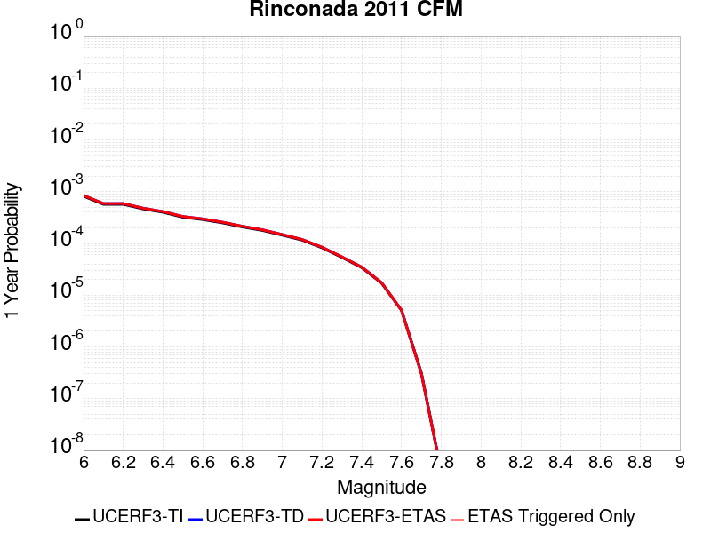 | 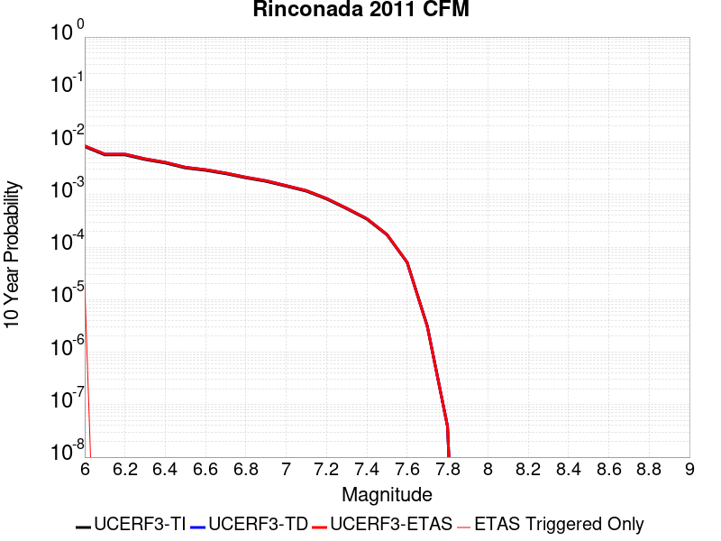 |

| Magnitude | 1 wk TI Prob | 1 wk TD Prob | 1 wk ETAS Prob | 1 wk ETAS/TD Gain | 1 wk ETAS Triggered Only | 1 mo TI Prob | 1 mo TD Prob | 1 mo ETAS Prob | 1 mo ETAS/TD Gain | 1 mo ETAS Triggered Only | 1 yr TI Prob | 1 yr TD Prob | 1 yr ETAS Prob | 1 yr ETAS/TD Gain | 1 yr ETAS Triggered Only | 10 yr TI Prob | 10 yr TD Prob | 10 yr ETAS Prob | 10 yr ETAS/TD Gain | 10 yr ETAS Triggered Only |
|-----|-----|-----|-----|-----|-----|-----|-----|-----|-----|-----|-----|-----|-----|-----|-----|-----|-----|-----|-----|-----|
| 6.0 | 1.5752368E-5 | 1.627576E-5 | 1.627576E-5 | 1.0 | 0.0 | 6.75084E-5 | 6.975141E-5 | 6.975141E-5 | 1.0 | 0.0 | 8.2160486E-4 | 8.488957E-4 | 8.488957E-4 | 1.0 | 0.0 | 0.008185739 | 0.00845691 | 0.008476742 | 1.002345 | 2.0E-5 |
| 6.1 | 1.0966133E-5 | 1.1323744E-5 | 1.1323744E-5 | 1.0 | 0.0 | 4.6996865E-5 | 4.8529433E-5 | 4.8529433E-5 | 1.0 | 0.0 | 5.720366E-4 | 5.906864E-4 | 5.906864E-4 | 1.0 | 0.0 | 0.0057056635 | 0.0058912598 | 0.0058912598 | 1.0 | 0.0 |
| 6.2 | 1.0966133E-5 | 1.1323744E-5 | 1.1323744E-5 | 1.0 | 0.0 | 4.6996865E-5 | 4.8529433E-5 | 4.8529433E-5 | 1.0 | 0.0 | 5.720366E-4 | 5.906864E-4 | 5.906864E-4 | 1.0 | 0.0 | 0.0057056635 | 0.0058912598 | 0.0058912598 | 1.0 | 0.0 |
| 6.3 | 8.926149E-6 | 9.213346E-6 | 9.213346E-6 | 1.0 | 0.0 | 3.8254362E-5 | 3.9485174E-5 | 3.9485174E-5 | 1.0 | 0.0 | 4.6564735E-4 | 4.8062627E-4 | 4.8062627E-4 | 1.0 | 0.0 | 0.0046467283 | 0.0047959127 | 0.0047959127 | 1.0 | 0.0 |
| 6.4 | 7.676955E-6 | 7.920679E-6 | 7.920679E-6 | 1.0 | 0.0 | 3.290082E-5 | 3.3945325E-5 | 3.3945325E-5 | 1.0 | 0.0 | 4.0049385E-4 | 4.1320614E-4 | 4.1320614E-4 | 1.0 | 0.0 | 0.0039977287 | 0.004124405 | 0.004124405 | 1.0 | 0.0 |
| 6.5 | 6.1671026E-6 | 6.3593407E-6 | 6.3593407E-6 | 1.0 | 0.0 | 2.6430173E-5 | 2.7254033E-5 | 2.7254033E-5 | 1.0 | 0.0 | 3.2173982E-4 | 3.317674E-4 | 3.317674E-4 | 1.0 | 0.0 | 0.003212744 | 0.003312733 | 0.003312733 | 1.0 | 0.0 |
| 6.6 | 5.553456E-6 | 5.7251573E-6 | 5.7251573E-6 | 1.0 | 0.0 | 2.3800309E-5 | 2.4536159E-5 | 2.4536159E-5 | 1.0 | 0.0 | 2.897302E-4 | 2.9868682E-4 | 2.9868682E-4 | 1.0 | 0.0 | 0.0028935277 | 0.0029828625 | 0.0029828625 | 1.0 | 0.0 |
| 6.7 | 4.787857E-6 | 4.9336027E-6 | 4.9336027E-6 | 1.0 | 0.0 | 2.0519226E-5 | 2.114384E-5 | 2.114384E-5 | 1.0 | 0.0 | 2.4979294E-4 | 2.5739588E-4 | 2.5739588E-4 | 1.0 | 0.0 | 0.0024951235 | 0.0025709833 | 0.0025709833 | 1.0 | 0.0 |
| 6.8 | 3.9955166E-6 | 4.113714E-6 | 4.113714E-6 | 1.0 | 0.0 | 1.7123532E-5 | 1.7630085E-5 | 1.7630085E-5 | 1.0 | 0.0 | 2.0845905E-4 | 2.1462516E-4 | 2.1462516E-4 | 1.0 | 0.0 | 0.002082636 | 0.0021441826 | 0.0021441826 | 1.0 | 0.0 |
| 6.9 | 3.4250072E-6 | 3.5226435E-6 | 3.5226435E-6 | 1.0 | 0.0 | 1.46785205E-5 | 1.5096956E-5 | 1.5096956E-5 | 1.0 | 0.0 | 1.7869633E-4 | 1.8378996E-4 | 1.8378996E-4 | 1.0 | 0.0 | 0.001785527 | 0.0018363821 | 0.0018363821 | 1.0 | 0.0 |
| 7.0 | 2.7712713E-6 | 2.846853E-6 | 2.846853E-6 | 1.0 | 0.0 | 1.1876823E-5 | 1.2200742E-5 | 1.2200742E-5 | 1.0 | 0.0 | 1.4459073E-4 | 1.4853392E-4 | 1.4853392E-4 | 1.0 | 0.0 | 0.0014449668 | 0.001484348 | 0.001484348 | 1.0 | 0.0 |
| 7.1 | 2.227358E-6 | 2.2858176E-6 | 2.2858176E-6 | 1.0 | 0.0 | 9.545785E-6 | 9.796324E-6 | 9.796324E-6 | 1.0 | 0.0 | 1.16213734E-4 | 1.1926373E-4 | 1.1926373E-4 | 1.0 | 0.0 | 0.0011615298 | 0.0011919984 | 0.0011919984 | 1.0 | 0.0 |
| 7.2 | 1.581796E-6 | 1.620982E-6 | 1.620982E-6 | 1.0 | 0.0 | 6.779108E-6 | 6.947047E-6 | 6.947047E-6 | 1.0 | 0.0 | 8.253252E-5 | 8.457702E-5 | 8.457702E-5 | 1.0 | 0.0 | 8.250187E-4 | 8.4544887E-4 | 8.4544887E-4 | 1.0 | 0.0 |
| 7.3 | 1.0306567E-6 | 1.0546985E-6 | 1.0546985E-6 | 1.0 | 0.0 | 4.4170924E-6 | 4.5201286E-6 | 4.5201286E-6 | 1.0 | 0.0 | 5.3776774E-5 | 5.5031178E-5 | 5.5031178E-5 | 1.0 | 0.0 | 5.376376E-4 | 5.501757E-4 | 5.501757E-4 | 1.0 | 0.0 |
| 7.4 | 6.535541E-7 | 6.6830665E-7 | 6.6830665E-7 | 1.0 | 0.0 | 2.800943E-6 | 2.8641682E-6 | 2.8641682E-6 | 1.0 | 0.0 | 3.4100947E-5 | 3.4870693E-5 | 3.4870693E-5 | 1.0 | 0.0 | 3.4095717E-4 | 3.486523E-4 | 3.486523E-4 | 1.0 | 0.0 |
| 7.5 | 3.2656962E-7 | 3.3318327E-7 | 3.3318327E-7 | 1.0 | 0.0 | 1.3995833E-6 | 1.4279275E-6 | 1.4279275E-6 | 1.0 | 0.0 | 1.7039794E-5 | 1.7384878E-5 | 1.7384878E-5 | 1.0 | 0.0 | 1.7038487E-4 | 1.7383523E-4 | 1.7383523E-4 | 1.0 | 0.0 |
| 7.6 | 9.754343E-8 | 9.821457E-8 | 9.821457E-8 | 1.0 | 0.0 | 4.180432E-7 | 4.2091952E-7 | 4.2091952E-7 | 1.0 | 0.0 | 5.089664E-6 | 5.124683E-6 | 5.124683E-6 | 1.0 | 0.0 | 5.0895473E-5 | 5.1245657E-5 | 5.1245657E-5 | 1.0 | 0.0 |
| 7.7 | 6.0001453E-9 | 5.849418E-9 | 5.849418E-9 | 1.0 | 0.0 | 2.5714908E-8 | 2.5068934E-8 | 2.5068934E-8 | 1.0 | 0.0 | 3.1307894E-7 | 3.0521423E-7 | 3.0521423E-7 | 1.0 | 0.0 | 3.1307852E-6 | 3.0521383E-6 | 3.0521383E-6 | 1.0 | 0.0 |
| 7.8 | 7.400003E-11 | 7.4655726E-11 | 7.4655726E-11 | 1.0 | 0.0 | 3.171432E-10 | 3.1995318E-10 | 3.1995318E-10 | 1.0 | 0.0 | 3.861218E-9 | 3.8954298E-9 | 3.8954298E-9 | 1.0 | 0.0 | 3.861218E-8 | 3.8954294E-8 | 3.8954294E-8 | 1.0 | 0.0 |

## Las Positas
*[(top)](#table-of-contents)*

| 1 Week | 1 Month | 1 Year | 10 Year |
|-----|-----|-----|-----|
|  |  |  |  |

| Magnitude | 1 wk TI Prob | 1 wk TD Prob | 1 wk ETAS Prob | 1 wk ETAS/TD Gain | 1 wk ETAS Triggered Only | 1 mo TI Prob | 1 mo TD Prob | 1 mo ETAS Prob | 1 mo ETAS/TD Gain | 1 mo ETAS Triggered Only | 1 yr TI Prob | 1 yr TD Prob | 1 yr ETAS Prob | 1 yr ETAS/TD Gain | 1 yr ETAS Triggered Only | 10 yr TI Prob | 10 yr TD Prob | 10 yr ETAS Prob | 10 yr ETAS/TD Gain | 10 yr ETAS Triggered Only |
|-----|-----|-----|-----|-----|-----|-----|-----|-----|-----|-----|-----|-----|-----|-----|-----|-----|-----|-----|-----|-----|
| 6.0 | 1.0659424E-5 | 1.1593074E-5 | 1.1593074E-5 | 1.0 | 0.0 | 4.568245E-5 | 4.9684604E-5 | 4.9684604E-5 | 1.0 | 0.0 | 5.560419E-4 | 6.049101E-4 | 6.14904E-4 | 1.0165213 | 1.0E-5 | 0.005546526 | 0.0060491003 | 0.0060689794 | 1.0032862 | 2.0E-5 |
| 6.1 | 1.0659424E-5 | 1.1593074E-5 | 1.1593074E-5 | 1.0 | 0.0 | 4.568245E-5 | 4.9684604E-5 | 4.9684604E-5 | 1.0 | 0.0 | 5.560419E-4 | 6.049101E-4 | 6.14904E-4 | 1.0165213 | 1.0E-5 | 0.005546526 | 0.0060491003 | 0.0060689794 | 1.0032862 | 2.0E-5 |
| 6.2 | 1.0659424E-5 | 1.1593074E-5 | 1.1593074E-5 | 1.0 | 0.0 | 4.568245E-5 | 4.9684604E-5 | 4.9684604E-5 | 1.0 | 0.0 | 5.560419E-4 | 6.049101E-4 | 6.14904E-4 | 1.0165213 | 1.0E-5 | 0.005546526 | 0.0060491003 | 0.0060689794 | 1.0032862 | 2.0E-5 |
| 6.3 | 1.0659424E-5 | 1.1593074E-5 | 1.1593074E-5 | 1.0 | 0.0 | 4.568245E-5 | 4.9684604E-5 | 4.9684604E-5 | 1.0 | 0.0 | 5.560419E-4 | 6.049101E-4 | 6.14904E-4 | 1.0165213 | 1.0E-5 | 0.005546526 | 0.0060491003 | 0.0060689794 | 1.0032862 | 2.0E-5 |

## Santa Ynez (West)
*[(top)](#table-of-contents)*

| 1 Week | 1 Month | 1 Year | 10 Year |
|-----|-----|-----|-----|
| 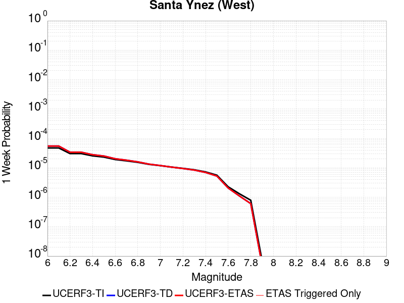 | 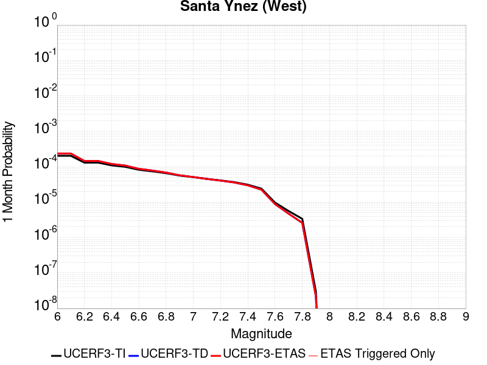 |  |  |

| Magnitude | 1 wk TI Prob | 1 wk TD Prob | 1 wk ETAS Prob | 1 wk ETAS/TD Gain | 1 wk ETAS Triggered Only | 1 mo TI Prob | 1 mo TD Prob | 1 mo ETAS Prob | 1 mo ETAS/TD Gain | 1 mo ETAS Triggered Only | 1 yr TI Prob | 1 yr TD Prob | 1 yr ETAS Prob | 1 yr ETAS/TD Gain | 1 yr ETAS Triggered Only | 10 yr TI Prob | 10 yr TD Prob | 10 yr ETAS Prob | 10 yr ETAS/TD Gain | 10 yr ETAS Triggered Only |
|-----|-----|-----|-----|-----|-----|-----|-----|-----|-----|-----|-----|-----|-----|-----|-----|-----|-----|-----|-----|-----|
| 6.0 | 4.7352758E-5 | 5.4989374E-5 | 5.4989374E-5 | 1.0 | 0.0 | 2.0292461E-4 | 2.3564912E-4 | 2.3564912E-4 | 1.0 | 0.0 | 0.0024678076 | 0.0028655485 | 0.0028655485 | 1.0 | 0.0 | 0.024405818 | 0.028314501 | 0.028324217 | 1.0003432 | 1.0E-5 |
| 6.1 | 4.7352758E-5 | 5.4989374E-5 | 5.4989374E-5 | 1.0 | 0.0 | 2.0292461E-4 | 2.3564912E-4 | 2.3564912E-4 | 1.0 | 0.0 | 0.0024678076 | 0.0028655485 | 0.0028655485 | 1.0 | 0.0 | 0.024405818 | 0.028314501 | 0.028324217 | 1.0003432 | 1.0E-5 |
| 6.2 | 3.0415853E-5 | 3.393526E-5 | 3.393526E-5 | 1.0 | 0.0 | 1.3034715E-4 | 1.4542893E-4 | 1.4542893E-4 | 1.0 | 0.0 | 0.0015858212 | 0.0017691979 | 0.0017691979 | 1.0 | 0.0 | 0.015745522 | 0.017555023 | 0.017555023 | 1.0 | 0.0 |
| 6.3 | 3.0415853E-5 | 3.393526E-5 | 3.393526E-5 | 1.0 | 0.0 | 1.3034715E-4 | 1.4542893E-4 | 1.4542893E-4 | 1.0 | 0.0 | 0.0015858212 | 0.0017691979 | 0.0017691979 | 1.0 | 0.0 | 0.015745522 | 0.017555023 | 0.017555023 | 1.0 | 0.0 |
| 6.4 | 2.5452082E-5 | 2.7920081E-5 | 2.7920081E-5 | 1.0 | 0.0 | 1.09075794E-4 | 1.1965211E-4 | 1.1965211E-4 | 1.0 | 0.0 | 0.0013271887 | 0.0014558111 | 0.0014558111 | 1.0 | 0.0 | 0.013192902 | 0.014464922 | 0.014464922 | 1.0 | 0.0 |
| 6.5 | 2.3143784E-5 | 2.5134797E-5 | 2.5134797E-5 | 1.0 | 0.0 | 9.9183875E-5 | 1.077162E-4 | 1.077162E-4 | 1.0 | 0.0 | 0.0012068948 | 0.0013106709 | 0.0013106709 | 1.0 | 0.0 | 0.012003611 | 0.013031087 | 0.013031087 | 1.0 | 0.0 |
| 6.6 | 1.9118515E-5 | 2.0359237E-5 | 2.0359237E-5 | 1.0 | 0.0 | 8.193392E-5 | 8.7251E-5 | 8.7251E-5 | 1.0 | 0.0 | 9.97089E-4 | 0.0010617712 | 0.0010617712 | 1.0 | 0.0 | 0.00992627 | 0.010567892 | 0.010567892 | 1.0 | 0.0 |
| 6.7 | 1.722807E-5 | 1.8150524E-5 | 1.8150524E-5 | 1.0 | 0.0 | 7.3832496E-5 | 7.778567E-5 | 7.778567E-5 | 1.0 | 0.0 | 8.985399E-4 | 9.466346E-4 | 9.466346E-4 | 1.0 | 0.0 | 0.008949154 | 0.009426668 | 0.009426668 | 1.0 | 0.0 |
| 6.8 | 1.5317364E-5 | 1.5929963E-5 | 1.5929963E-5 | 1.0 | 0.0 | 6.56442E-5 | 6.826951E-5 | 6.826951E-5 | 1.0 | 0.0 | 7.98925E-4 | 8.308686E-4 | 8.308686E-4 | 1.0 | 0.0 | 0.007960589 | 0.00827811 | 0.00827811 | 1.0 | 0.0 |
| 6.9 | 1.3071226E-5 | 1.3332316E-5 | 1.3332316E-5 | 1.0 | 0.0 | 5.6018336E-5 | 5.7137255E-5 | 5.7137255E-5 | 1.0 | 0.0 | 6.8180985E-4 | 6.954263E-4 | 6.954263E-4 | 1.0 | 0.0 | 0.0067972173 | 0.006932762 | 0.006932762 | 1.0 | 0.0 |
| 7.0 | 1.1836986E-5 | 1.1935115E-5 | 1.1935115E-5 | 1.0 | 0.0 | 5.0728955E-5 | 5.11495E-5 | 5.11495E-5 | 1.0 | 0.0 | 6.1745E-4 | 6.2256894E-4 | 6.2256894E-4 | 1.0 | 0.0 | 0.006157372 | 0.006208441 | 0.006208441 | 1.0 | 0.0 |
| 7.1 | 1.0597169E-5 | 1.0544206E-5 | 1.0544206E-5 | 1.0 | 0.0 | 4.541565E-5 | 4.5188677E-5 | 4.5188677E-5 | 1.0 | 0.0 | 5.5279525E-4 | 5.500344E-4 | 5.500344E-4 | 1.0 | 0.0 | 0.0055142213 | 0.0054868613 | 0.0054868613 | 1.0 | 0.0 |
| 7.2 | 9.59113E-6 | 9.460987E-6 | 9.460987E-6 | 1.0 | 0.0 | 4.11042E-5 | 4.0546463E-5 | 4.0546463E-5 | 1.0 | 0.0 | 5.0032866E-4 | 4.935424E-4 | 4.935424E-4 | 1.0 | 0.0 | 0.004992037 | 0.0049245823 | 0.0049245823 | 1.0 | 0.0 |
| 7.3 | 8.586084E-6 | 8.38127E-6 | 8.38127E-6 | 1.0 | 0.0 | 3.679698E-5 | 3.591924E-5 | 3.591924E-5 | 1.0 | 0.0 | 4.4791115E-4 | 4.3723005E-4 | 4.3723005E-4 | 1.0 | 0.0 | 0.004470094 | 0.0043638097 | 0.0043638097 | 1.0 | 0.0 |
| 7.4 | 7.2622997E-6 | 6.953007E-6 | 6.953007E-6 | 1.0 | 0.0 | 3.112377E-5 | 2.9798266E-5 | 2.9798266E-5 | 1.0 | 0.0 | 3.78866E-4 | 3.6273446E-4 | 3.6273446E-4 | 1.0 | 0.0 | 0.0037822074 | 0.0036215242 | 0.0036215242 | 1.0 | 0.0 |
| 7.5 | 5.627296E-6 | 5.2524906E-6 | 5.2524906E-6 | 1.0 | 0.0 | 2.411676E-5 | 2.2510485E-5 | 2.2510485E-5 | 1.0 | 0.0 | 2.9358198E-4 | 2.740314E-4 | 2.740314E-4 | 1.0 | 0.0 | 0.0029319443 | 0.0027370069 | 0.0027370069 | 1.0 | 0.0 |
| 7.6 | 2.265244E-6 | 2.0611255E-6 | 2.0611255E-6 | 1.0 | 0.0 | 9.708152E-6 | 8.833365E-6 | 8.833365E-6 | 1.0 | 0.0 | 1.18190335E-4 | 1.0754101E-4 | 1.0754101E-4 | 1.0 | 0.0 | 0.001181275 | 0.0010748983 | 0.0010748983 | 1.0 | 0.0 |
| 7.7 | 1.3099874E-6 | 1.1017623E-6 | 1.1017623E-6 | 1.0 | 0.0 | 5.61422E-6 | 4.72183E-6 | 4.72183E-6 | 1.0 | 0.0 | 6.8350986E-5 | 5.7486788E-5 | 5.7486788E-5 | 1.0 | 0.0 | 6.832996E-4 | 5.747216E-4 | 5.747216E-4 | 1.0 | 0.0 |
| 7.8 | 7.903951E-7 | 6.071855E-7 | 6.071855E-7 | 1.0 | 0.0 | 3.3874032E-6 | 2.602221E-6 | 2.602221E-6 | 1.0 | 0.0 | 4.1240855E-5 | 3.1681593E-5 | 3.1681593E-5 | 1.0 | 0.0 | 4.12332E-4 | 3.1677212E-4 | 3.1677212E-4 | 1.0 | 0.0 |
| 7.9 | 7.0753297E-9 | 5.090397E-9 | 5.090397E-9 | 1.0 | 0.0 | 3.032284E-8 | 2.1815987E-8 | 2.1815987E-8 | 1.0 | 0.0 | 3.6918053E-7 | 2.6560963E-7 | 2.6560963E-7 | 1.0 | 0.0 | 3.691799E-6 | 2.656094E-6 | 2.656094E-6 | 1.0 | 0.0 |

## Point Reyes 2011 CFM
*[(top)](#table-of-contents)*

| 1 Week | 1 Month | 1 Year | 10 Year |
|-----|-----|-----|-----|
|  |  |  | 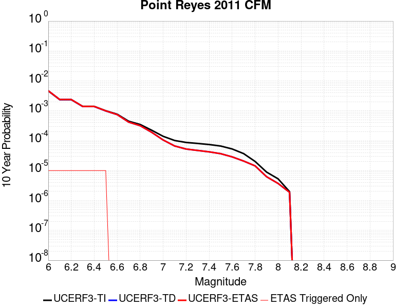 |

| Magnitude | 1 wk TI Prob | 1 wk TD Prob | 1 wk ETAS Prob | 1 wk ETAS/TD Gain | 1 wk ETAS Triggered Only | 1 mo TI Prob | 1 mo TD Prob | 1 mo ETAS Prob | 1 mo ETAS/TD Gain | 1 mo ETAS Triggered Only | 1 yr TI Prob | 1 yr TD Prob | 1 yr ETAS Prob | 1 yr ETAS/TD Gain | 1 yr ETAS Triggered Only | 10 yr TI Prob | 10 yr TD Prob | 10 yr ETAS Prob | 10 yr ETAS/TD Gain | 10 yr ETAS Triggered Only |
|-----|-----|-----|-----|-----|-----|-----|-----|-----|-----|-----|-----|-----|-----|-----|-----|-----|-----|-----|-----|-----|
| 6.0 | 8.8644965E-6 | 8.96772E-6 | 8.96772E-6 | 1.0 | 0.0 | 3.7990147E-5 | 3.843255E-5 | 4.8432168E-5 | 1.2601861 | 1.0E-5 | 4.624319E-4 | 4.6782213E-4 | 4.7781746E-4 | 1.0213656 | 1.0E-5 | 0.0046147075 | 0.004669002 | 0.004678955 | 1.0021318 | 1.0E-5 |
| 6.1 | 4.526405E-6 | 4.5395977E-6 | 4.5395977E-6 | 1.0 | 0.0 | 1.9398734E-5 | 1.945528E-5 | 2.9455085E-5 | 1.5139893 | 1.0E-5 | 2.36154E-4 | 2.3684332E-4 | 2.4684097E-4 | 1.042212 | 1.0E-5 | 0.002359032 | 0.0023660152 | 0.0023759915 | 1.0042166 | 1.0E-5 |
| 6.2 | 4.526405E-6 | 4.5395977E-6 | 4.5395977E-6 | 1.0 | 0.0 | 1.9398734E-5 | 1.945528E-5 | 2.9455085E-5 | 1.5139893 | 1.0E-5 | 2.36154E-4 | 2.3684332E-4 | 2.4684097E-4 | 1.042212 | 1.0E-5 | 0.002359032 | 0.0023660152 | 0.0023759915 | 1.0042166 | 1.0E-5 |
| 6.3 | 2.6842322E-6 | 2.6609837E-6 | 2.6609837E-6 | 1.0 | 0.0 | 1.1503801E-5 | 1.1404167E-5 | 2.1404054E-5 | 1.8768624 | 1.0E-5 | 1.4004979E-4 | 1.3883709E-4 | 1.488357E-4 | 1.0720168 | 1.0E-5 | 0.0013996155 | 0.0013875252 | 0.0013975115 | 1.007197 | 1.0E-5 |
| 6.4 | 2.6842322E-6 | 2.6609837E-6 | 2.6609837E-6 | 1.0 | 0.0 | 1.1503801E-5 | 1.1404167E-5 | 2.1404054E-5 | 1.8768624 | 1.0E-5 | 1.4004979E-4 | 1.3883709E-4 | 1.488357E-4 | 1.0720168 | 1.0E-5 | 0.0013996155 | 0.0013875252 | 0.0013975115 | 1.007197 | 1.0E-5 |
| 6.5 | 1.9281833E-6 | 1.8909064E-6 | 1.8909064E-6 | 1.0 | 0.0 | 8.263617E-6 | 8.10386E-6 | 1.810378E-5 | 2.23397 | 1.0E-5 | 1.0060489E-4 | 9.8660115E-5 | 1.0865913E-4 | 1.101348 | 1.0E-5 | 0.0010055936 | 9.86174E-4 | 9.961642E-4 | 1.0101302 | 1.0E-5 |
| 6.6 | 1.4726726E-6 | 1.4272218E-6 | 1.4272218E-6 | 1.0 | 0.0 | 6.3114385E-6 | 6.116651E-6 | 6.116651E-6 | 1.0 | 0.0 | 7.683905E-5 | 7.446773E-5 | 7.446773E-5 | 1.0 | 0.0 | 7.6812494E-4 | 7.4443495E-4 | 7.4443495E-4 | 1.0 | 0.0 |
| 6.7 | 8.572307E-7 | 8.0096424E-7 | 8.0096424E-7 | 1.0 | 0.0 | 3.6738406E-6 | 3.4326993E-6 | 3.4326993E-6 | 1.0 | 0.0 | 4.472809E-5 | 4.179233E-5 | 4.179233E-5 | 1.0 | 0.0 | 4.471909E-4 | 4.178486E-4 | 4.178486E-4 | 1.0 | 0.0 |
| 6.8 | 6.6745434E-7 | 6.079667E-7 | 6.079667E-7 | 1.0 | 0.0 | 2.8605155E-6 | 2.6055689E-6 | 2.6055689E-6 | 1.0 | 0.0 | 3.482622E-5 | 3.172235E-5 | 3.172235E-5 | 1.0 | 0.0 | 3.4820763E-4 | 3.1718152E-4 | 3.1718152E-4 | 1.0 | 0.0 |
| 6.9 | 4.291521E-7 | 3.6558814E-7 | 3.6558814E-7 | 1.0 | 0.0 | 1.839222E-6 | 1.5668053E-6 | 1.5668053E-6 | 1.0 | 0.0 | 2.2392298E-5 | 1.9075691E-5 | 1.9075691E-5 | 1.0 | 0.0 | 2.2390042E-4 | 1.907432E-4 | 1.907432E-4 | 1.0 | 0.0 |
| 7.0 | 2.6812808E-7 | 2.0209737E-7 | 2.0209737E-7 | 1.0 | 0.0 | 1.1491198E-6 | 8.6613124E-7 | 8.6613124E-7 | 1.0 | 0.0 | 1.3990444E-5 | 1.0545098E-5 | 1.0545098E-5 | 1.0 | 0.0 | 1.3989564E-4 | 1.0544834E-4 | 1.0544834E-4 | 1.0 | 0.0 |
| 7.1 | 1.9451231E-7 | 1.2747557E-7 | 1.2747557E-7 | 1.0 | 0.0 | 8.336239E-7 | 5.4632375E-7 | 5.4632375E-7 | 1.0 | 0.0 | 1.0149324E-5 | 6.6514717E-6 | 6.6514717E-6 | 1.0 | 0.0 | 1.014886E-4 | 6.6515015E-5 | 6.6515015E-5 | 1.0 | 0.0 |
| 7.2 | 1.6715143E-7 | 1.00645735E-7 | 1.00645735E-7 | 1.0 | 0.0 | 7.1636305E-7 | 4.3133878E-7 | 4.3133878E-7 | 1.0 | 0.0 | 8.721685E-6 | 5.251537E-6 | 5.251537E-6 | 1.0 | 0.0 | 8.721343E-5 | 5.251641E-5 | 5.251641E-5 | 1.0 | 0.0 |
| 7.3 | 1.5503173E-7 | 9.034514E-8 | 9.034514E-8 | 1.0 | 0.0 | 6.644215E-7 | 3.8719338E-7 | 3.8719338E-7 | 1.0 | 0.0 | 8.089301E-6 | 4.714069E-6 | 4.714069E-6 | 1.0 | 0.0 | 8.089007E-5 | 4.7141973E-5 | 4.7141973E-5 | 1.0 | 0.0 |
| 7.4 | 1.4251614E-7 | 8.118456E-8 | 8.118456E-8 | 1.0 | 0.0 | 6.1078333E-7 | 3.479338E-7 | 3.479338E-7 | 1.0 | 0.0 | 7.4362615E-6 | 4.2360857E-6 | 4.2360857E-6 | 1.0 | 0.0 | 7.436013E-5 | 4.2362328E-5 | 4.2362328E-5 | 1.0 | 0.0 |
| 7.5 | 1.2710186E-7 | 7.049653E-8 | 7.049653E-8 | 1.0 | 0.0 | 5.447221E-7 | 3.0212797E-7 | 3.0212797E-7 | 1.0 | 0.0 | 6.6319717E-6 | 3.6784015E-6 | 3.6784015E-6 | 1.0 | 0.0 | 6.6317734E-5 | 3.678569E-5 | 3.678569E-5 | 1.0 | 0.0 |
| 7.6 | 1.0144708E-7 | 5.5135335E-8 | 5.5135335E-8 | 1.0 | 0.0 | 4.347731E-7 | 2.3629427E-7 | 2.3629427E-7 | 1.0 | 0.0 | 5.2933497E-6 | 2.8768789E-6 | 2.8768789E-6 | 1.0 | 0.0 | 5.293224E-5 | 2.8770697E-5 | 2.8770697E-5 | 1.0 | 0.0 |
| 7.7 | 7.090527E-8 | 3.9976225E-8 | 3.9976225E-8 | 1.0 | 0.0 | 3.038797E-7 | 1.7132668E-7 | 1.7132668E-7 | 1.0 | 0.0 | 3.699729E-6 | 2.0859002E-6 | 2.0859002E-6 | 1.0 | 0.0 | 3.6996673E-5 | 2.0861087E-5 | 2.0861087E-5 | 1.0 | 0.0 |
| 7.8 | 3.8712045E-8 | 2.7570799E-8 | 2.7570799E-8 | 1.0 | 0.0 | 1.6590876E-7 | 1.18160564E-7 | 1.18160564E-7 | 1.0 | 0.0 | 2.0199373E-6 | 1.4386039E-6 | 1.4386039E-6 | 1.0 | 0.0 | 2.0199188E-5 | 1.4388227E-5 | 1.4388227E-5 | 1.0 | 0.0 |
| 7.9 | 1.7068782E-8 | 1.1940555E-8 | 1.1940555E-8 | 1.0 | 0.0 | 7.315192E-8 | 5.1173807E-8 | 5.1173807E-8 | 1.0 | 0.0 | 8.906242E-7 | 6.2304093E-7 | 6.2304093E-7 | 1.0 | 0.0 | 8.906207E-6 | 6.232673E-6 | 6.232673E-6 | 1.0 | 0.0 |
| 8.0 | 1.0172592E-8 | 7.118161E-9 | 7.118161E-9 | 1.0 | 0.0 | 4.359682E-8 | 3.0506406E-8 | 3.0506406E-8 | 1.0 | 0.0 | 5.3079117E-7 | 3.7141544E-7 | 3.7141544E-7 | 1.0 | 0.0 | 5.307899E-6 | 3.716429E-6 | 3.716429E-6 | 1.0 | 0.0 |
| 8.1 | 3.7861243E-9 | 3.588693E-9 | 3.588693E-9 | 1.0 | 0.0 | 1.6226247E-8 | 1.5380113E-8 | 1.5380113E-8 | 1.0 | 0.0 | 1.9755454E-7 | 1.8725285E-7 | 1.8725285E-7 | 1.0 | 0.0 | 1.9755437E-6 | 1.8745352E-6 | 1.8745352E-6 | 1.0 | 0.0 |

## San Jacinto (San Jacinto Valley) rev
*[(top)](#table-of-contents)*

| 1 Week | 1 Month | 1 Year | 10 Year |
|-----|-----|-----|-----|
| 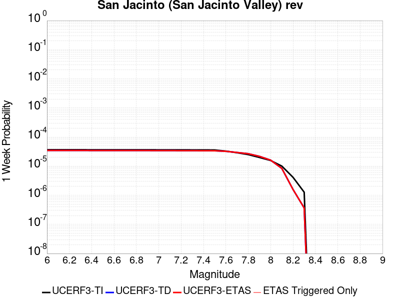 |  |  |  |

| Magnitude | 1 wk TI Prob | 1 wk TD Prob | 1 wk ETAS Prob | 1 wk ETAS/TD Gain | 1 wk ETAS Triggered Only | 1 mo TI Prob | 1 mo TD Prob | 1 mo ETAS Prob | 1 mo ETAS/TD Gain | 1 mo ETAS Triggered Only | 1 yr TI Prob | 1 yr TD Prob | 1 yr ETAS Prob | 1 yr ETAS/TD Gain | 1 yr ETAS Triggered Only | 10 yr TI Prob | 10 yr TD Prob | 10 yr ETAS Prob | 10 yr ETAS/TD Gain | 10 yr ETAS Triggered Only |
|-----|-----|-----|-----|-----|-----|-----|-----|-----|-----|-----|-----|-----|-----|-----|-----|-----|-----|-----|-----|-----|
| 6.0 | 3.652694E-5 | 3.462265E-5 | 3.462265E-5 | 1.0 | 0.0 | 1.5653463E-4 | 1.4837437E-4 | 1.4837437E-4 | 1.0 | 0.0 | 0.0019041431 | 0.0018049623 | 0.0018149442 | 1.0055302 | 1.0E-5 | 0.018879099 | 0.018640328 | 0.018650142 | 1.0005264 | 1.0E-5 |
| 6.1 | 3.652694E-5 | 3.462265E-5 | 3.462265E-5 | 1.0 | 0.0 | 1.5653463E-4 | 1.4837437E-4 | 1.4837437E-4 | 1.0 | 0.0 | 0.0019041431 | 0.0018049623 | 0.0018149442 | 1.0055302 | 1.0E-5 | 0.018879099 | 0.018640328 | 0.018650142 | 1.0005264 | 1.0E-5 |
| 6.2 | 3.652694E-5 | 3.462265E-5 | 3.462265E-5 | 1.0 | 0.0 | 1.5653463E-4 | 1.4837437E-4 | 1.4837437E-4 | 1.0 | 0.0 | 0.0019041431 | 0.0018049623 | 0.0018149442 | 1.0055302 | 1.0E-5 | 0.018879099 | 0.018640328 | 0.018650142 | 1.0005264 | 1.0E-5 |
| 6.3 | 3.652694E-5 | 3.462265E-5 | 3.462265E-5 | 1.0 | 0.0 | 1.5653463E-4 | 1.4837437E-4 | 1.4837437E-4 | 1.0 | 0.0 | 0.0019041431 | 0.0018049623 | 0.0018149442 | 1.0055302 | 1.0E-5 | 0.018879099 | 0.018640328 | 0.018650142 | 1.0005264 | 1.0E-5 |
| 6.4 | 3.646941E-5 | 3.4544173E-5 | 3.4544173E-5 | 1.0 | 0.0 | 1.5628811E-4 | 1.4803806E-4 | 1.4803806E-4 | 1.0 | 0.0 | 0.0019011468 | 0.0018008754 | 0.0018108573 | 1.0055429 | 1.0E-5 | 0.018849645 | 0.018600188 | 0.018610002 | 1.0005276 | 1.0E-5 |
| 6.5 | 3.646941E-5 | 3.4544173E-5 | 3.4544173E-5 | 1.0 | 0.0 | 1.5628811E-4 | 1.4803806E-4 | 1.4803806E-4 | 1.0 | 0.0 | 0.0019011468 | 0.0018008754 | 0.0018108573 | 1.0055429 | 1.0E-5 | 0.018849645 | 0.018600188 | 0.018610002 | 1.0005276 | 1.0E-5 |
| 6.6 | 3.6442503E-5 | 3.450753E-5 | 3.450753E-5 | 1.0 | 0.0 | 1.561728E-4 | 1.4788104E-4 | 1.4788104E-4 | 1.0 | 0.0 | 0.0018997455 | 0.0017989671 | 0.0018089492 | 1.0055487 | 1.0E-5 | 0.018835869 | 0.018581448 | 0.018591262 | 1.0005282 | 1.0E-5 |
| 6.7 | 3.6432113E-5 | 3.4493092E-5 | 3.4493092E-5 | 1.0 | 0.0 | 1.5612828E-4 | 1.4781917E-4 | 1.4781917E-4 | 1.0 | 0.0 | 0.0018992044 | 0.0017982154 | 0.0018081975 | 1.0055511 | 1.0E-5 | 0.018830549 | 0.018574066 | 0.01858388 | 1.0005283 | 1.0E-5 |
| 6.8 | 3.6409598E-5 | 3.4462126E-5 | 3.4462126E-5 | 1.0 | 0.0 | 1.560318E-4 | 1.4768647E-4 | 1.4768647E-4 | 1.0 | 0.0 | 0.0018980318 | 0.0017966026 | 0.0018065847 | 1.0055561 | 1.0E-5 | 0.018819023 | 0.018558212 | 0.018568026 | 1.0005288 | 1.0E-5 |
| 6.9 | 3.638078E-5 | 3.4422523E-5 | 3.4422523E-5 | 1.0 | 0.0 | 1.5590832E-4 | 1.4751677E-4 | 1.4751677E-4 | 1.0 | 0.0 | 0.0018965311 | 0.0017945397 | 0.0018045218 | 1.0055624 | 1.0E-5 | 0.018804269 | 0.018537935 | 0.01854775 | 1.0005294 | 1.0E-5 |
| 7.0 | 3.6294874E-5 | 3.430446E-5 | 3.430446E-5 | 1.0 | 0.0 | 1.5554018E-4 | 1.4701084E-4 | 1.4701084E-4 | 1.0 | 0.0 | 0.0018920569 | 0.0017883903 | 0.0017983724 | 1.0055816 | 1.0E-5 | 0.018760284 | 0.01847748 | 0.018487295 | 1.0005312 | 1.0E-5 |
| 7.1 | 3.6260717E-5 | 3.426072E-5 | 3.426072E-5 | 1.0 | 0.0 | 1.5539382E-4 | 1.4682341E-4 | 1.4682341E-4 | 1.0 | 0.0 | 0.001890278 | 0.001786112 | 0.0017960941 | 1.0055888 | 1.0E-5 | 0.018742796 | 0.018455071 | 0.018464888 | 1.0005319 | 1.0E-5 |
| 7.2 | 3.6210204E-5 | 3.419482E-5 | 3.419482E-5 | 1.0 | 0.0 | 1.5517735E-4 | 1.4654102E-4 | 1.4654102E-4 | 1.0 | 0.0 | 0.001887647 | 0.0017826795 | 0.0017926616 | 1.0055995 | 1.0E-5 | 0.01871693 | 0.018421294 | 0.01843111 | 1.0005329 | 1.0E-5 |
| 7.3 | 3.6119454E-5 | 3.4082837E-5 | 3.4082837E-5 | 1.0 | 0.0 | 1.5478847E-4 | 1.4606114E-4 | 1.4606114E-4 | 1.0 | 0.0 | 0.0018829206 | 0.0017768465 | 0.0017868287 | 1.005618 | 1.0E-5 | 0.018670462 | 0.018363714 | 0.018373532 | 1.0005345 | 1.0E-5 |
| 7.4 | 3.607848E-5 | 3.4030232E-5 | 3.4030232E-5 | 1.0 | 0.0 | 1.5461289E-4 | 1.4583571E-4 | 1.4583571E-4 | 1.0 | 0.0 | 0.0018807866 | 0.0017741065 | 0.0017840888 | 1.0056267 | 1.0E-5 | 0.018649481 | 0.018336661 | 0.018346477 | 1.0005354 | 1.0E-5 |
| 7.5 | 3.5856774E-5 | 3.3838834E-5 | 3.3838834E-5 | 1.0 | 0.0 | 1.5366284E-4 | 1.4501554E-4 | 1.4501554E-4 | 1.0 | 0.0 | 0.0018692396 | 0.0017641371 | 0.0017741194 | 1.0056585 | 1.0E-5 | 0.018535944 | 0.01823716 | 0.018246979 | 1.0005383 | 1.0E-5 |
| 7.6 | 3.286655E-5 | 3.2352084E-5 | 3.2352084E-5 | 1.0 | 0.0 | 1.4084904E-4 | 1.3864443E-4 | 1.3864443E-4 | 1.0 | 0.0 | 0.001713488 | 0.0016866911 | 0.0016966743 | 1.0059187 | 1.0E-5 | 0.017003361 | 0.017451806 | 0.017461631 | 1.000563 | 1.0E-5 |
| 7.7 | 2.8882527E-5 | 2.944033E-5 | 2.944033E-5 | 1.0 | 0.0 | 1.237764E-4 | 1.2616675E-4 | 1.2616675E-4 | 1.0 | 0.0 | 0.0015059357 | 0.001534999 | 0.0015449836 | 1.0065047 | 1.0E-5 | 0.014957713 | 0.015936024 | 0.015945865 | 1.0006175 | 1.0E-5 |
| 7.8 | 2.4950225E-5 | 2.6723428E-5 | 2.6723428E-5 | 1.0 | 0.0 | 1.0692515E-4 | 1.1452396E-4 | 1.1452396E-4 | 1.0 | 0.0 | 0.0013010362 | 0.0013934382 | 0.0014034243 | 1.0071665 | 1.0E-5 | 0.012934455 | 0.014513439 | 0.014523294 | 1.000679 | 1.0E-5 |
| 7.9 | 1.9881603E-5 | 2.1683936E-5 | 2.1683936E-5 | 1.0 | 0.0 | 8.520408E-5 | 9.292785E-5 | 9.292785E-5 | 1.0 | 0.0 | 0.001036866 | 0.0011308101 | 0.0011407988 | 1.0088332 | 1.0E-5 | 0.010320415 | 0.011868863 | 0.011878745 | 1.0008326 | 1.0E-5 |
| 8.0 | 1.563292E-5 | 1.60799E-5 | 1.60799E-5 | 1.0 | 0.0 | 6.6996516E-5 | 6.891204E-5 | 6.891204E-5 | 1.0 | 0.0 | 8.153773E-4 | 8.386818E-4 | 8.4867346E-4 | 1.0119134 | 1.0E-5 | 0.00812392 | 0.008885515 | 0.008895426 | 1.0011154 | 1.0E-5 |
| 8.1 | 1.0045313E-5 | 8.385289E-6 | 8.385289E-6 | 1.0 | 0.0 | 4.305063E-5 | 3.593646E-5 | 3.593646E-5 | 1.0 | 0.0 | 5.2401534E-4 | 4.374391E-4 | 4.4743472E-4 | 1.0228503 | 1.0E-5 | 0.0052278144 | 0.0047039804 | 0.0047139334 | 1.0021158 | 1.0E-5 |
| 8.2 | 4.1554413E-6 | 1.5896835E-6 | 1.5896835E-6 | 1.0 | 0.0 | 1.7808914E-5 | 6.8129116E-6 | 6.8129116E-6 | 1.0 | 0.0 | 2.1680194E-4 | 8.294407E-5 | 8.294407E-5 | 1.0 | 0.0 | 0.0021659054 | 9.6207194E-4 | 9.6207194E-4 | 1.0 | 0.0 |
| 8.3 | 1.2758221E-6 | 3.6805784E-7 | 3.6805784E-7 | 1.0 | 0.0 | 5.4677976E-6 | 1.5773899E-6 | 1.5773899E-6 | 1.0 | 0.0 | 6.65684E-5 | 1.9204557E-5 | 1.9204557E-5 | 1.0 | 0.0 | 6.6548464E-4 | 2.3136413E-4 | 2.3136413E-4 | 1.0 | 0.0 |

## Imperial
*[(top)](#table-of-contents)*

| 1 Week | 1 Month | 1 Year | 10 Year |
|-----|-----|-----|-----|
|  | 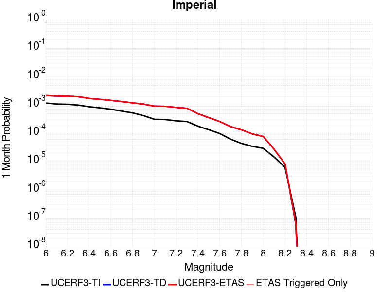 |  |  |

| Magnitude | 1 wk TI Prob | 1 wk TD Prob | 1 wk ETAS Prob | 1 wk ETAS/TD Gain | 1 wk ETAS Triggered Only | 1 mo TI Prob | 1 mo TD Prob | 1 mo ETAS Prob | 1 mo ETAS/TD Gain | 1 mo ETAS Triggered Only | 1 yr TI Prob | 1 yr TD Prob | 1 yr ETAS Prob | 1 yr ETAS/TD Gain | 1 yr ETAS Triggered Only | 10 yr TI Prob | 10 yr TD Prob | 10 yr ETAS Prob | 10 yr ETAS/TD Gain | 10 yr ETAS Triggered Only |
|-----|-----|-----|-----|-----|-----|-----|-----|-----|-----|-----|-----|-----|-----|-----|-----|-----|-----|-----|-----|-----|
| 6.0 | 2.7496446E-4 | 5.0743396E-4 | 5.0743396E-4 | 1.0 | 0.0 | 0.0011778869 | 0.002172944 | 0.002172944 | 1.0 | 0.0 | 0.0142467655 | 0.026134845 | 0.026144585 | 1.0003726 | 1.0E-5 | 0.13367249 | 0.22867881 | 0.22868651 | 1.0000337 | 1.0E-5 |
| 6.1 | 2.5356023E-4 | 4.8823512E-4 | 4.8823512E-4 | 1.0 | 0.0 | 0.001086234 | 0.0020907968 | 0.0020907968 | 1.0 | 0.0 | 0.013144928 | 0.025155788 | 0.025165537 | 1.0003875 | 1.0E-5 | 0.123940155 | 0.2200454 | 0.22005321 | 1.0000354 | 1.0E-5 |
| 6.2 | 2.4820742E-4 | 4.7915816E-4 | 4.7915816E-4 | 1.0 | 0.0 | 0.0010633124 | 0.0020519567 | 0.0020519567 | 1.0 | 0.0 | 0.01286919 | 0.024694275 | 0.02470403 | 1.0003949 | 1.0E-5 | 0.12148927 | 0.21654509 | 0.21655293 | 1.0000361 | 1.0E-5 |
| 6.3 | 2.3205351E-4 | 4.6036538E-4 | 4.6036538E-4 | 1.0 | 0.0 | 9.94136E-4 | 0.0019715396 | 0.0019715396 | 1.0 | 0.0 | 0.012036599 | 0.023735547 | 0.023745311 | 1.0004113 | 1.0E-5 | 0.11405133 | 0.20844483 | 0.20845276 | 1.000038 | 1.0E-5 |
| 6.4 | 2.0304754E-4 | 4.0018788E-4 | 4.0018788E-4 | 1.0 | 0.0 | 8.6991355E-4 | 0.0017139784 | 0.0017139784 | 1.0 | 0.0 | 0.010539869 | 0.02066819 | 0.020677984 | 1.0004739 | 1.0E-5 | 0.100537635 | 0.18558091 | 0.18558906 | 1.0000439 | 1.0E-5 |
| 6.5 | 1.854992E-4 | 3.712142E-4 | 3.712142E-4 | 1.0 | 0.0 | 7.9475436E-4 | 0.0015899604 | 0.0015899604 | 1.0 | 0.0 | 0.009633281 | 0.01918735 | 0.019197159 | 1.0005112 | 1.0E-5 | 0.0922623 | 0.17378832 | 0.1737966 | 1.0000476 | 1.0E-5 |
| 6.6 | 1.6586106E-4 | 3.4155208E-4 | 3.4155208E-4 | 1.0 | 0.0 | 7.106394E-4 | 0.0014629837 | 0.0014629837 | 1.0 | 0.0 | 0.008617763 | 0.017668065 | 0.017677888 | 1.000556 | 1.0E-5 | 0.08291132 | 0.16123115 | 0.16123953 | 1.000052 | 1.0E-5 |
| 6.7 | 1.4224656E-4 | 3.0870596E-4 | 3.0870596E-4 | 1.0 | 0.0 | 6.094856E-4 | 0.001322363 | 0.001322363 | 1.0 | 0.0 | 0.0073952693 | 0.015982835 | 0.015992673 | 1.0006157 | 1.0E-5 | 0.07153955 | 0.14688857 | 0.1468971 | 1.000058 | 1.0E-5 |
| 6.8 | 1.2317259E-4 | 2.7878533E-4 | 2.7878533E-4 | 1.0 | 0.0 | 5.2777573E-4 | 0.0011942533 | 0.0011942533 | 1.0 | 0.0 | 0.0064067547 | 0.014444493 | 0.014454349 | 1.0006824 | 1.0E-5 | 0.06225166 | 0.1332888 | 0.13329747 | 1.000065 | 1.0E-5 |
| 6.9 | 9.859898E-5 | 2.50793E-4 | 2.50793E-4 | 1.0 | 0.0 | 4.2249862E-4 | 0.0010743887 | 0.0010743887 | 1.0 | 0.0 | 0.0051317946 | 0.0130031975 | 0.013013068 | 1.000759 | 1.0E-5 | 0.05014893 | 0.11967219 | 0.11968099 | 1.0000736 | 1.0E-5 |
| 7.0 | 7.3191884E-5 | 2.1314582E-4 | 2.1314582E-4 | 1.0 | 0.0 | 3.136418E-4 | 9.1316545E-4 | 9.1316545E-4 | 1.0 | 0.0 | 0.003811904 | 0.011061803 | 0.011071693 | 1.0008941 | 1.0E-5 | 0.037471764 | 0.10226207 | 0.10227105 | 1.0000877 | 1.0E-5 |
| 7.1 | 7.1760296E-5 | 2.1015291E-4 | 2.1015291E-4 | 1.0 | 0.0 | 3.0750787E-4 | 9.003476E-4 | 9.003476E-4 | 1.0 | 0.0 | 0.003737482 | 0.010907318 | 0.010917209 | 1.0009068 | 1.0E-5 | 0.03675245 | 0.10089623 | 0.100905225 | 1.0000892 | 1.0E-5 |
| 7.2 | 6.46614E-5 | 1.9182067E-4 | 1.9182067E-4 | 1.0 | 0.0 | 2.7709085E-4 | 8.218326E-4 | 8.218326E-4 | 1.0 | 0.0 | 0.0033683628 | 0.009960531 | 0.009970432 | 1.000994 | 1.0E-5 | 0.033177625 | 0.092698574 | 0.09270764 | 1.0000979 | 1.0E-5 |
| 7.3 | 6.088115E-5 | 1.7851753E-4 | 1.7851753E-4 | 1.0 | 0.0 | 2.6089314E-4 | 7.6485367E-4 | 7.6485367E-4 | 1.0 | 0.0 | 0.0031717476 | 0.009272912 | 0.009282818 | 1.0010684 | 1.0E-5 | 0.031268585 | 0.08674281 | 0.086751945 | 1.0001053 | 1.0E-5 |
| 7.4 | 4.199346E-5 | 1.1543755E-4 | 1.1543755E-4 | 1.0 | 0.0 | 1.7995955E-4 | 4.946394E-4 | 4.946394E-4 | 1.0 | 0.0 | 0.0021888057 | 0.0060057756 | 0.0060157157 | 1.0016551 | 1.0E-5 | 0.02167372 | 0.05758733 | 0.057596754 | 1.0001637 | 1.0E-5 |
| 7.5 | 3.130448E-5 | 8.3609E-5 | 8.3609E-5 | 1.0 | 0.0 | 1.3415517E-4 | 3.5827537E-4 | 3.5827537E-4 | 1.0 | 0.0 | 0.0016321153 | 0.0043533384 | 0.0043632947 | 1.002287 | 1.0E-5 | 0.016201803 | 0.042256624 | 0.0422662 | 1.0002266 | 1.0E-5 |
| 7.6 | 2.3074248E-5 | 6.108041E-5 | 6.108041E-5 | 1.0 | 0.0 | 9.888588E-5 | 2.6174705E-4 | 2.6174705E-4 | 1.0 | 0.0 | 0.0012032706 | 0.003182137 | 0.003192105 | 1.0031326 | 1.0E-5 | 0.011967761 | 0.031133993 | 0.031143682 | 1.0003111 | 1.0E-5 |
| 7.7 | 1.45864815E-5 | 4.032036E-5 | 4.032036E-5 | 1.0 | 0.0 | 6.2511994E-5 | 1.7279013E-4 | 1.7279013E-4 | 1.0 | 0.0 | 7.608177E-4 | 0.0021016954 | 0.0021116745 | 1.0047481 | 1.0E-5 | 0.007582182 | 0.02071751 | 0.020727301 | 1.0004727 | 1.0E-5 |
| 7.8 | 1.0352979E-5 | 3.1126907E-5 | 3.1126907E-5 | 1.0 | 0.0 | 4.4369157E-5 | 1.3339422E-4 | 1.3339422E-4 | 1.0 | 0.0 | 5.400606E-4 | 0.0016228671 | 0.0016328509 | 1.0061519 | 1.0E-5 | 0.0053875 | 0.016092977 | 0.016102817 | 1.0006114 | 1.0E-5 |
| 7.9 | 8.137906E-6 | 2.2282546E-5 | 2.2282546E-5 | 1.0 | 0.0 | 3.4876273E-5 | 9.549314E-5 | 9.549314E-5 | 1.0 | 0.0 | 4.2453592E-4 | 0.0011620098 | 0.0011719982 | 1.0085958 | 1.0E-5 | 0.004237258 | 0.011680074 | 0.011689957 | 1.0008461 | 1.0E-5 |
| 8.0 | 6.93792E-6 | 1.8123586E-5 | 1.8123586E-5 | 1.0 | 0.0 | 2.9733603E-5 | 7.767021E-5 | 7.767021E-5 | 1.0 | 0.0 | 3.6194647E-4 | 9.452253E-4 | 9.5521583E-4 | 1.0105695 | 1.0E-5 | 0.0036135751 | 0.009555411 | 0.009565314 | 1.0010365 | 1.0E-5 |
| 8.1 | 3.4286315E-6 | 6.4333744E-6 | 6.4333744E-6 | 1.0 | 0.0 | 1.4694053E-5 | 2.7571314E-5 | 2.7571314E-5 | 1.0 | 0.0 | 1.7888541E-4 | 3.3562916E-4 | 3.456258E-4 | 1.0297848 | 1.0E-5 | 0.0017874148 | 0.0035125932 | 0.0035225581 | 1.002837 | 1.0E-5 |
| 8.2 | 1.4906886E-6 | 1.9575668E-6 | 1.9575668E-6 | 1.0 | 0.0 | 6.3886496E-6 | 8.389546E-6 | 8.389546E-6 | 1.0 | 0.0 | 7.7779034E-5 | 1.02137965E-4 | 1.1213694E-4 | 1.0978968 | 1.0E-5 | 7.775182E-4 | 0.0011182481 | 0.0011282369 | 1.0089326 | 1.0E-5 |
| 8.3 | 2.5758007E-8 | 1.4713001E-8 | 1.4713001E-8 | 1.0 | 0.0 | 1.10391454E-7 | 6.3055715E-8 | 6.3055715E-8 | 1.0 | 0.0 | 1.3440151E-6 | 7.6770334E-7 | 7.6770334E-7 | 1.0 | 0.0 | 1.344007E-5 | 8.001215E-6 | 8.001215E-6 | 1.0 | 0.0 |

## San Jacinto (Stepovers Combined)
*[(top)](#table-of-contents)*

| 1 Week | 1 Month | 1 Year | 10 Year |
|-----|-----|-----|-----|
|  |  | 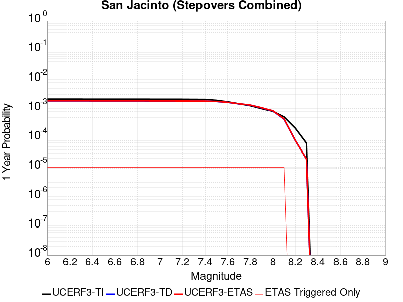 |  |

| Magnitude | 1 wk TI Prob | 1 wk TD Prob | 1 wk ETAS Prob | 1 wk ETAS/TD Gain | 1 wk ETAS Triggered Only | 1 mo TI Prob | 1 mo TD Prob | 1 mo ETAS Prob | 1 mo ETAS/TD Gain | 1 mo ETAS Triggered Only | 1 yr TI Prob | 1 yr TD Prob | 1 yr ETAS Prob | 1 yr ETAS/TD Gain | 1 yr ETAS Triggered Only | 10 yr TI Prob | 10 yr TD Prob | 10 yr ETAS Prob | 10 yr ETAS/TD Gain | 10 yr ETAS Triggered Only |
|-----|-----|-----|-----|-----|-----|-----|-----|-----|-----|-----|-----|-----|-----|-----|-----|-----|-----|-----|-----|-----|
| 6.0 | 4.0667746E-5 | 3.5491797E-5 | 3.5491797E-5 | 1.0 | 0.0 | 1.742787E-4 | 1.5209884E-4 | 1.5209884E-4 | 1.0 | 0.0 | 0.0021197782 | 0.0018502326 | 0.001860214 | 1.0053947 | 1.0E-5 | 0.020996714 | 0.019100336 | 0.019110145 | 1.0005136 | 1.0E-5 |
| 6.1 | 4.0667746E-5 | 3.5491797E-5 | 3.5491797E-5 | 1.0 | 0.0 | 1.742787E-4 | 1.5209884E-4 | 1.5209884E-4 | 1.0 | 0.0 | 0.0021197782 | 0.0018502326 | 0.001860214 | 1.0053947 | 1.0E-5 | 0.020996714 | 0.019100336 | 0.019110145 | 1.0005136 | 1.0E-5 |
| 6.2 | 4.0667746E-5 | 3.5491797E-5 | 3.5491797E-5 | 1.0 | 0.0 | 1.742787E-4 | 1.5209884E-4 | 1.5209884E-4 | 1.0 | 0.0 | 0.0021197782 | 0.0018502326 | 0.001860214 | 1.0053947 | 1.0E-5 | 0.020996714 | 0.019100336 | 0.019110145 | 1.0005136 | 1.0E-5 |
| 6.3 | 4.0667746E-5 | 3.5491797E-5 | 3.5491797E-5 | 1.0 | 0.0 | 1.742787E-4 | 1.5209884E-4 | 1.5209884E-4 | 1.0 | 0.0 | 0.0021197782 | 0.0018502326 | 0.001860214 | 1.0053947 | 1.0E-5 | 0.020996714 | 0.019100336 | 0.019110145 | 1.0005136 | 1.0E-5 |
| 6.4 | 4.0577226E-5 | 3.536363E-5 | 3.536363E-5 | 1.0 | 0.0 | 1.738908E-4 | 1.5154964E-4 | 1.5154964E-4 | 1.0 | 0.0 | 0.0021150648 | 0.0018435575 | 0.001853539 | 1.0054142 | 1.0E-5 | 0.020950472 | 0.019034866 | 0.019044677 | 1.0005153 | 1.0E-5 |
| 6.5 | 4.0577226E-5 | 3.536363E-5 | 3.536363E-5 | 1.0 | 0.0 | 1.738908E-4 | 1.5154964E-4 | 1.5154964E-4 | 1.0 | 0.0 | 0.0021150648 | 0.0018435575 | 0.001853539 | 1.0054142 | 1.0E-5 | 0.020950472 | 0.019034866 | 0.019044677 | 1.0005153 | 1.0E-5 |
| 6.6 | 4.053861E-5 | 3.5308934E-5 | 3.5308934E-5 | 1.0 | 0.0 | 1.7372532E-4 | 1.5131524E-4 | 1.5131524E-4 | 1.0 | 0.0 | 0.0021130538 | 0.0018407088 | 0.0018506903 | 1.0054227 | 1.0E-5 | 0.020930743 | 0.019006928 | 0.019016739 | 1.0005162 | 1.0E-5 |
| 6.7 | 4.0516545E-5 | 3.5277975E-5 | 3.5277975E-5 | 1.0 | 0.0 | 1.7363077E-4 | 1.5118258E-4 | 1.5118258E-4 | 1.0 | 0.0 | 0.002111905 | 0.0018390972 | 0.0018490789 | 1.0054275 | 1.0E-5 | 0.020919468 | 0.018991116 | 0.019000927 | 1.0005165 | 1.0E-5 |
| 6.8 | 4.049434E-5 | 3.5249406E-5 | 3.5249406E-5 | 1.0 | 0.0 | 1.7353562E-4 | 1.5106014E-4 | 1.5106014E-4 | 1.0 | 0.0 | 0.0021107488 | 0.0018376091 | 0.0018475908 | 1.0054319 | 1.0E-5 | 0.020908125 | 0.018976463 | 0.018986274 | 1.000517 | 1.0E-5 |
| 6.9 | 4.046386E-5 | 3.521186E-5 | 3.521186E-5 | 1.0 | 0.0 | 1.73405E-4 | 1.5089926E-4 | 1.5089926E-4 | 1.0 | 0.0 | 0.0021091616 | 0.0018356537 | 0.0018456352 | 1.0054376 | 1.0E-5 | 0.020892553 | 0.018957185 | 0.018966993 | 1.0005175 | 1.0E-5 |
| 7.0 | 4.036382E-5 | 3.5092096E-5 | 3.5092096E-5 | 1.0 | 0.0 | 1.7297632E-4 | 1.5038605E-4 | 1.5038605E-4 | 1.0 | 0.0 | 0.0021039525 | 0.0018294158 | 0.0018393975 | 1.0054562 | 1.0E-5 | 0.02084144 | 0.01889563 | 0.018905442 | 1.0005193 | 1.0E-5 |
| 7.1 | 4.0343282E-5 | 3.507051E-5 | 3.507051E-5 | 1.0 | 0.0 | 1.7288832E-4 | 1.5029355E-4 | 1.5029355E-4 | 1.0 | 0.0 | 0.002102883 | 0.0018282915 | 0.0018382731 | 1.0054595 | 1.0E-5 | 0.020830948 | 0.018884484 | 0.018894294 | 1.0005195 | 1.0E-5 |
| 7.2 | 4.0257353E-5 | 3.497481E-5 | 3.497481E-5 | 1.0 | 0.0 | 1.725201E-4 | 1.4988346E-4 | 1.4988346E-4 | 1.0 | 0.0 | 0.0020984085 | 0.0018233071 | 0.0018332888 | 1.0054746 | 1.0E-5 | 0.020787042 | 0.018835127 | 0.01884494 | 1.000521 | 1.0E-5 |
| 7.3 | 3.9940667E-5 | 3.4800836E-5 | 3.4800836E-5 | 1.0 | 0.0 | 1.7116306E-4 | 1.4913792E-4 | 1.4913792E-4 | 1.0 | 0.0 | 0.0020819185 | 0.0018142454 | 0.0018242273 | 1.005502 | 1.0E-5 | 0.020625217 | 0.0187429 | 0.018752713 | 1.0005236 | 1.0E-5 |
| 7.4 | 3.9721202E-5 | 3.4685665E-5 | 3.4685665E-5 | 1.0 | 0.0 | 1.7022261E-4 | 1.4864441E-4 | 1.4864441E-4 | 1.0 | 0.0 | 0.0020704903 | 0.0018082467 | 0.0018182286 | 1.0055202 | 1.0E-5 | 0.020513052 | 0.018681735 | 0.018691547 | 1.0005252 | 1.0E-5 |
| 7.5 | 3.7036873E-5 | 3.374818E-5 | 3.374818E-5 | 1.0 | 0.0 | 1.5871979E-4 | 1.4462705E-4 | 1.4462705E-4 | 1.0 | 0.0 | 0.0019307006 | 0.0017594153 | 0.0017693976 | 1.0056738 | 1.0E-5 | 0.019140124 | 0.018180756 | 0.018190574 | 1.00054 | 1.0E-5 |
| 7.6 | 3.2940967E-5 | 3.151806E-5 | 3.151806E-5 | 1.0 | 0.0 | 1.4116794E-4 | 1.3507041E-4 | 1.3507041E-4 | 1.0 | 0.0 | 0.0017173645 | 0.0016432442 | 0.0016532277 | 1.0060755 | 1.0E-5 | 0.01704153 | 0.017008042 | 0.017017873 | 1.0005779 | 1.0E-5 |
| 7.7 | 2.8236149E-5 | 2.8078555E-5 | 2.8078555E-5 | 1.0 | 0.0 | 1.2100645E-4 | 1.20331126E-4 | 1.20331126E-4 | 1.0 | 0.0 | 0.0014722579 | 0.0014640479 | 0.0014740333 | 1.0068203 | 1.0E-5 | 0.014625421 | 0.015216174 | 0.015226021 | 1.0006472 | 1.0E-5 |
| 7.8 | 2.4329287E-5 | 2.53945E-5 | 2.53945E-5 | 1.0 | 0.0 | 1.042642E-4 | 1.0882904E-4 | 1.0882904E-4 | 1.0 | 0.0 | 0.0012686774 | 0.001324189 | 0.0013341757 | 1.0075418 | 1.0E-5 | 0.012614589 | 0.013809636 | 0.013819498 | 1.0007142 | 1.0E-5 |
| 7.9 | 1.9370926E-5 | 2.0590145E-5 | 2.0590145E-5 | 1.0 | 0.0 | 8.301561E-5 | 8.82405E-5 | 8.82405E-5 | 1.0 | 0.0 | 0.0010102465 | 0.0010737993 | 0.0010837886 | 1.0093027 | 1.0E-5 | 0.0100566605 | 0.011287564 | 0.011297451 | 1.000876 | 1.0E-5 |
| 8.0 | 1.5583017E-5 | 1.6028429E-5 | 1.6028429E-5 | 1.0 | 0.0 | 6.6782646E-5 | 6.8691465E-5 | 6.8691465E-5 | 1.0 | 0.0 | 8.127754E-4 | 8.359984E-4 | 8.4599E-4 | 1.0119518 | 1.0E-5 | 0.008098091 | 0.008856509 | 0.00886642 | 1.0011191 | 1.0E-5 |
| 8.1 | 1.0024873E-5 | 8.375728E-6 | 8.375728E-6 | 1.0 | 0.0 | 4.2963035E-5 | 3.5895486E-5 | 3.5895486E-5 | 1.0 | 0.0 | 5.229494E-4 | 4.369404E-4 | 4.4693606E-4 | 1.0228764 | 1.0E-5 | 0.0052172043 | 0.0046981853 | 0.0047081383 | 1.0021185 | 1.0E-5 |
| 8.2 | 4.142796E-6 | 1.585044E-6 | 1.585044E-6 | 1.0 | 0.0 | 1.775472E-5 | 6.7930278E-6 | 6.7930278E-6 | 1.0 | 0.0 | 2.1614227E-4 | 8.2702005E-5 | 8.2702005E-5 | 1.0 | 0.0 | 0.0021593217 | 9.591983E-4 | 9.591983E-4 | 1.0 | 0.0 |
| 8.3 | 1.2750878E-6 | 3.6776746E-7 | 3.6776746E-7 | 1.0 | 0.0 | 5.4646503E-6 | 1.5761453E-6 | 1.5761453E-6 | 1.0 | 0.0 | 6.653009E-5 | 1.9189405E-5 | 1.9189405E-5 | 1.0 | 0.0 | 6.6510175E-4 | 2.3119134E-4 | 2.3119134E-4 | 1.0 | 0.0 |

## San Andreas (Coachella) rev
*[(top)](#table-of-contents)*

| 1 Week | 1 Month | 1 Year | 10 Year |
|-----|-----|-----|-----|
|  | 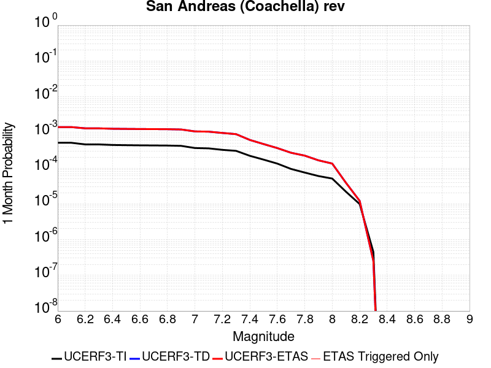 | 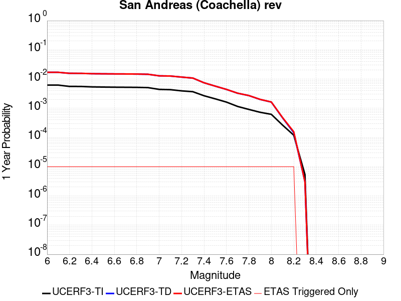 |  |

| Magnitude | 1 wk TI Prob | 1 wk TD Prob | 1 wk ETAS Prob | 1 wk ETAS/TD Gain | 1 wk ETAS Triggered Only | 1 mo TI Prob | 1 mo TD Prob | 1 mo ETAS Prob | 1 mo ETAS/TD Gain | 1 mo ETAS Triggered Only | 1 yr TI Prob | 1 yr TD Prob | 1 yr ETAS Prob | 1 yr ETAS/TD Gain | 1 yr ETAS Triggered Only | 10 yr TI Prob | 10 yr TD Prob | 10 yr ETAS Prob | 10 yr ETAS/TD Gain | 10 yr ETAS Triggered Only |
|-----|-----|-----|-----|-----|-----|-----|-----|-----|-----|-----|-----|-----|-----|-----|-----|-----|-----|-----|-----|-----|
| 6.0 | 1.1925945E-4 | 3.2794088E-4 | 3.2794088E-4 | 1.0 | 0.0 | 5.110118E-4 | 0.0014047086 | 0.0014047086 | 1.0 | 0.0 | 0.0062038354 | 0.016969558 | 0.016979387 | 1.0005792 | 1.0E-5 | 0.060334753 | 0.15290551 | 0.15291399 | 1.0000554 | 1.0E-5 |
| 6.1 | 1.1925945E-4 | 3.2794088E-4 | 3.2794088E-4 | 1.0 | 0.0 | 5.110118E-4 | 0.0014047086 | 0.0014047086 | 1.0 | 0.0 | 0.0062038354 | 0.016969558 | 0.016979387 | 1.0005792 | 1.0E-5 | 0.060334753 | 0.15290551 | 0.15291399 | 1.0000554 | 1.0E-5 |
| 6.2 | 1.07432395E-4 | 3.029438E-4 | 3.029438E-4 | 1.0 | 0.0 | 4.603433E-4 | 0.0012976887 | 0.0012976887 | 1.0 | 0.0 | 0.005590286 | 0.015686007 | 0.015695851 | 1.0006275 | 1.0E-5 | 0.05451731 | 0.14207749 | 0.14208606 | 1.0000604 | 1.0E-5 |
| 6.3 | 1.0718766E-4 | 3.0239683E-4 | 3.0239683E-4 | 1.0 | 0.0 | 4.592948E-4 | 0.0012953468 | 0.0012953468 | 1.0 | 0.0 | 0.005577586 | 0.015657905 | 0.01566775 | 1.0006287 | 1.0E-5 | 0.054396555 | 0.1418458 | 0.14185439 | 1.0000606 | 1.0E-5 |
| 6.4 | 1.0355944E-4 | 2.9447678E-4 | 2.9447678E-4 | 1.0 | 0.0 | 4.4375064E-4 | 0.0012614368 | 0.0012614368 | 1.0 | 0.0 | 0.0053892885 | 0.015250904 | 0.015260751 | 1.0006458 | 1.0E-5 | 0.052604496 | 0.13840644 | 0.13841505 | 1.0000622 | 1.0E-5 |
| 6.5 | 1.0227914E-4 | 2.916708E-4 | 2.916708E-4 | 1.0 | 0.0 | 4.382655E-4 | 0.0012494228 | 0.0012494228 | 1.0 | 0.0 | 0.0053228354 | 0.015106671 | 0.015116519 | 1.000652 | 1.0E-5 | 0.051971316 | 0.13718586 | 0.13719448 | 1.000063 | 1.0E-5 |
| 6.6 | 1.0116757E-4 | 2.8932802E-4 | 2.8932802E-4 | 1.0 | 0.0 | 4.3350324E-4 | 0.001239392 | 0.001239392 | 1.0 | 0.0 | 0.0052651367 | 0.014986229 | 0.01499608 | 1.0006573 | 1.0E-5 | 0.051421247 | 0.13616422 | 0.13617285 | 1.0000634 | 1.0E-5 |
| 6.7 | 1.0050676E-4 | 2.8791346E-4 | 2.8791346E-4 | 1.0 | 0.0 | 4.3067214E-4 | 0.0012333352 | 0.0012333352 | 1.0 | 0.0 | 0.005230834 | 0.014913502 | 0.014923353 | 1.0006605 | 1.0E-5 | 0.051094085 | 0.13554904 | 0.1355577 | 1.0000638 | 1.0E-5 |
| 6.8 | 9.976819E-5 | 2.8594927E-4 | 2.8594927E-4 | 1.0 | 0.0 | 4.2750788E-4 | 0.0012249252 | 0.0012249252 | 1.0 | 0.0 | 0.0051924936 | 0.014812507 | 0.014822358 | 1.0006651 | 1.0E-5 | 0.050728295 | 0.13470069 | 0.13470934 | 1.0000643 | 1.0E-5 |
| 6.9 | 9.77719E-5 | 2.8091393E-4 | 2.8091393E-4 | 1.0 | 0.0 | 4.1895514E-4 | 0.0012033653 | 0.0012033653 | 1.0 | 0.0 | 0.0050888555 | 0.014553551 | 0.014563405 | 1.0006771 | 1.0E-5 | 0.049738888 | 0.1325282 | 0.13253687 | 1.0000654 | 1.0E-5 |
| 7.0 | 8.500761E-5 | 2.48225E-4 | 2.48225E-4 | 1.0 | 0.0 | 3.6426744E-4 | 0.001063391 | 0.001063391 | 1.0 | 0.0 | 0.0044259406 | 0.012870708 | 0.01288058 | 1.000767 | 1.0E-5 | 0.04338823 | 0.11837728 | 0.118386105 | 1.0000745 | 1.0E-5 |
| 7.1 | 8.319876E-5 | 2.442456E-4 | 2.442456E-4 | 1.0 | 0.0 | 3.5651738E-4 | 0.0010463502 | 0.0010463502 | 1.0 | 0.0 | 0.004331963 | 0.012665668 | 0.012675541 | 1.0007795 | 1.0E-5 | 0.042484846 | 0.11659532 | 0.11660415 | 1.0000758 | 1.0E-5 |
| 7.2 | 7.563917E-5 | 2.2471204E-4 | 2.2471204E-4 | 1.0 | 0.0 | 3.2412758E-4 | 9.6269924E-4 | 9.6269924E-4 | 1.0 | 0.0 | 0.0039391145 | 0.011658566 | 0.011668449 | 1.0008477 | 1.0E-5 | 0.03870018 | 0.1079969 | 0.10800582 | 1.0000826 | 1.0E-5 |
| 7.3 | 7.082985E-5 | 2.0785135E-4 | 2.0785135E-4 | 1.0 | 0.0 | 3.0352117E-4 | 8.904903E-4 | 8.904903E-4 | 1.0 | 0.0 | 0.0036891096 | 0.010788452 | 0.010798344 | 1.000917 | 1.0E-5 | 0.03628465 | 0.10051286 | 0.100521855 | 1.0000895 | 1.0E-5 |
| 7.4 | 5.146215E-5 | 1.431899E-4 | 1.431899E-4 | 1.0 | 0.0 | 2.2053342E-4 | 6.1352755E-4 | 6.1352755E-4 | 1.0 | 0.0 | 0.0026816884 | 0.007444305 | 0.0074542305 | 1.0013334 | 1.0E-5 | 0.02649557 | 0.07104689 | 0.07105617 | 1.0001308 | 1.0E-5 |
| 7.5 | 4.0285166E-5 | 1.0980905E-4 | 1.0980905E-4 | 1.0 | 0.0 | 1.7263928E-4 | 4.7052564E-4 | 4.7052564E-4 | 1.0 | 0.0 | 0.002099857 | 0.0057136724 | 0.005723615 | 1.0017402 | 1.0E-5 | 0.020801254 | 0.055186283 | 0.055195734 | 1.0001712 | 1.0E-5 |
| 7.6 | 3.1168736E-5 | 8.473927E-5 | 8.473927E-5 | 1.0 | 0.0 | 1.3357346E-4 | 3.631179E-4 | 3.631179E-4 | 1.0 | 0.0 | 0.0016250437 | 0.004412025 | 0.004421981 | 1.0022565 | 1.0E-5 | 0.016132116 | 0.04296808 | 0.04297765 | 1.0002227 | 1.0E-5 |
| 7.7 | 2.2100989E-5 | 6.2696294E-5 | 6.2696294E-5 | 1.0 | 0.0 | 9.4715084E-5 | 2.6867076E-4 | 2.6867076E-4 | 1.0 | 0.0 | 0.001152546 | 0.0032661667 | 0.003276134 | 1.0030516 | 1.0E-5 | 0.011465867 | 0.032040603 | 0.03205028 | 1.0003021 | 1.0E-5 |
| 7.8 | 1.7484861E-5 | 5.2071187E-5 | 5.2071187E-5 | 1.0 | 0.0 | 7.493296E-5 | 2.2314316E-4 | 2.2314316E-4 | 1.0 | 0.0 | 9.1192697E-4 | 0.0027133862 | 0.002723359 | 1.0036755 | 1.0E-5 | 0.009081938 | 0.02676577 | 0.026775502 | 1.0003636 | 1.0E-5 |
| 7.9 | 1.3967285E-5 | 3.844941E-5 | 3.844941E-5 | 1.0 | 0.0 | 5.985842E-5 | 1.6477278E-4 | 1.6477278E-4 | 1.0 | 0.0 | 7.2853256E-4 | 0.002004264 | 0.002014244 | 1.0049794 | 1.0E-5 | 0.0072614877 | 0.0200145 | 0.0200243 | 1.0004896 | 1.0E-5 |
| 8.0 | 1.1887396E-5 | 3.126096E-5 | 3.126096E-5 | 1.0 | 0.0 | 5.094499E-5 | 1.3396866E-4 | 1.3396866E-4 | 1.0 | 0.0 | 6.200787E-4 | 0.0016298491 | 0.0016398329 | 1.0061256 | 1.0E-5 | 0.006183513 | 0.016370665 | 0.0163805 | 1.0006008 | 1.0E-5 |
| 8.1 | 5.100864E-6 | 9.055438E-6 | 9.055438E-6 | 1.0 | 0.0 | 2.1860664E-5 | 3.880844E-5 | 3.880844E-5 | 1.0 | 0.0 | 2.6612106E-4 | 4.7239044E-4 | 4.8238575E-4 | 1.0211589 | 1.0E-5 | 0.002658026 | 0.0049586757 | 0.004968626 | 1.0020066 | 1.0E-5 |
| 8.2 | 2.3004484E-6 | 2.8196814E-6 | 2.8196814E-6 | 1.0 | 0.0 | 9.859027E-6 | 1.2084293E-5 | 1.2084293E-5 | 1.0 | 0.0 | 1.2002704E-4 | 1.4711637E-4 | 1.571149E-4 | 1.0679634 | 1.0E-5 | 0.0011996223 | 0.0016145802 | 0.0016245639 | 1.0061835 | 1.0E-5 |
| 8.3 | 1.0424446E-7 | 5.90264E-8 | 5.90264E-8 | 1.0 | 0.0 | 4.4676187E-7 | 2.5297027E-7 | 2.5297027E-7 | 1.0 | 0.0 | 5.439312E-6 | 3.079909E-6 | 3.079909E-6 | 1.0 | 0.0 | 5.4391792E-5 | 3.2369222E-5 | 3.2369222E-5 | 1.0 | 0.0 |

## Mendocino
*[(top)](#table-of-contents)*

| 1 Week | 1 Month | 1 Year | 10 Year |
|-----|-----|-----|-----|
| 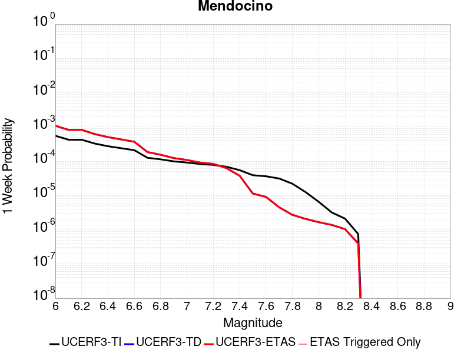 |  | 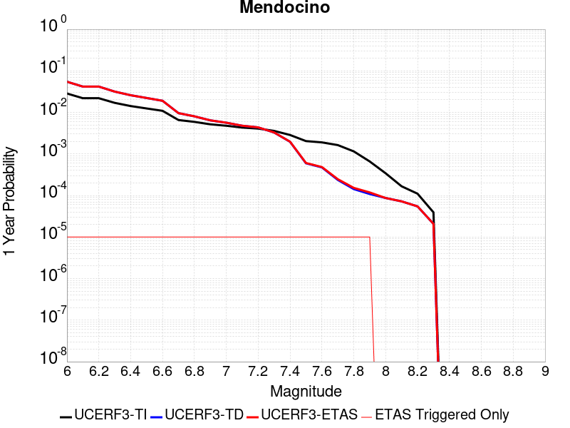 | 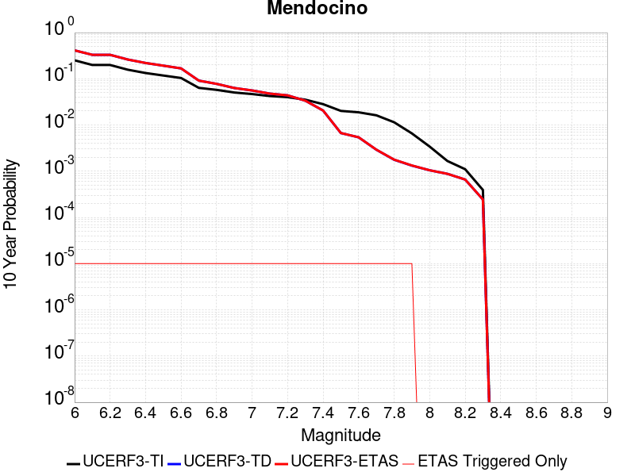 |

| Magnitude | 1 wk TI Prob | 1 wk TD Prob | 1 wk ETAS Prob | 1 wk ETAS/TD Gain | 1 wk ETAS Triggered Only | 1 mo TI Prob | 1 mo TD Prob | 1 mo ETAS Prob | 1 mo ETAS/TD Gain | 1 mo ETAS Triggered Only | 1 yr TI Prob | 1 yr TD Prob | 1 yr ETAS Prob | 1 yr ETAS/TD Gain | 1 yr ETAS Triggered Only | 10 yr TI Prob | 10 yr TD Prob | 10 yr ETAS Prob | 10 yr ETAS/TD Gain | 10 yr ETAS Triggered Only |
|-----|-----|-----|-----|-----|-----|-----|-----|-----|-----|-----|-----|-----|-----|-----|-----|-----|-----|-----|-----|-----|
| 6.0 | 5.5409013E-4 | 0.0010839439 | 0.0010839439 | 1.0 | 0.0 | 0.0023725112 | 0.0046361797 | 0.0046361797 | 1.0 | 0.0 | 0.028505474 | 0.054720383 | 0.054729834 | 1.0001727 | 1.0E-5 | 0.25113493 | 0.41213164 | 0.4121375 | 1.0000143 | 1.0E-5 |
| 6.1 | 4.2515888E-4 | 8.2285004E-4 | 8.2285004E-4 | 1.0 | 0.0 | 0.0018208373 | 0.003520711 | 0.003520711 | 1.0 | 0.0 | 0.021944538 | 0.041788954 | 0.041798536 | 1.0002292 | 1.0E-5 | 0.19899574 | 0.33020326 | 0.33020997 | 1.0000203 | 1.0E-5 |
| 6.2 | 4.2515888E-4 | 8.2285004E-4 | 8.2285004E-4 | 1.0 | 0.0 | 0.0018208373 | 0.003520711 | 0.003520711 | 1.0 | 0.0 | 0.021944538 | 0.041788954 | 0.041798536 | 1.0002292 | 1.0E-5 | 0.19899574 | 0.33020326 | 0.33020997 | 1.0000203 | 1.0E-5 |
| 6.3 | 3.2773745E-4 | 6.195384E-4 | 6.195384E-4 | 1.0 | 0.0 | 0.0014038329 | 0.0026513822 | 0.0026513822 | 1.0 | 0.0 | 0.016958237 | 0.031627487 | 0.03163717 | 1.0003061 | 1.0E-5 | 0.1572094 | 0.2610328 | 0.26104018 | 1.0000283 | 1.0E-5 |
| 6.4 | 2.7417165E-4 | 5.048861E-4 | 5.048861E-4 | 1.0 | 0.0 | 0.0011744922 | 0.0021611606 | 0.0021611606 | 1.0 | 0.0 | 0.014205975 | 0.02587126 | 0.025881002 | 1.0003766 | 1.0E-5 | 0.13331394 | 0.21974036 | 0.21974817 | 1.0000355 | 1.0E-5 |
| 6.5 | 2.3984899E-4 | 4.3228967E-4 | 4.3228967E-4 | 1.0 | 0.0 | 0.0010275192 | 0.0018511888 | 0.0018511888 | 1.0 | 0.0 | 0.012438473 | 0.0222133 | 0.02222308 | 1.0004402 | 1.0E-5 | 0.11764851 | 0.19229998 | 0.19230805 | 1.000042 | 1.0E-5 |
| 6.6 | 2.1023539E-4 | 3.6919315E-4 | 3.6919315E-4 | 1.0 | 0.0 | 9.0069766E-4 | 0.0015813772 | 0.0015813772 | 1.0 | 0.0 | 0.010910975 | 0.01902177 | 0.01903158 | 1.0005157 | 1.0E-5 | 0.10390546 | 0.16775876 | 0.1677671 | 1.0000496 | 1.0E-5 |
| 6.7 | 1.2592976E-4 | 1.847956E-4 | 1.847956E-4 | 1.0 | 0.0 | 5.395873E-4 | 7.917333E-4 | 7.917333E-4 | 1.0 | 0.0 | 0.006549705 | 0.00958942 | 0.009599323 | 1.0010328 | 1.0E-5 | 0.063599944 | 0.09124855 | 0.09125764 | 1.0000995 | 1.0E-5 |
| 6.8 | 1.13663555E-4 | 1.5456534E-4 | 1.5456534E-4 | 1.0 | 0.0 | 4.8703855E-4 | 6.622554E-4 | 6.622554E-4 | 1.0 | 0.0 | 0.0059135845 | 0.008031181 | 0.008041101 | 1.0012351 | 1.0E-5 | 0.057586733 | 0.077665105 | 0.07767433 | 1.0001187 | 1.0E-5 |
| 6.9 | 9.926894E-5 | 1.235614E-4 | 1.235614E-4 | 1.0 | 0.0 | 4.2536893E-4 | 5.294414E-4 | 5.294414E-4 | 1.0 | 0.0 | 0.0051665753 | 0.006426344 | 0.00643628 | 1.0015461 | 1.0E-5 | 0.050480947 | 0.06312279 | 0.06313215 | 1.0001484 | 1.0E-5 |
| 7.0 | 9.168125E-5 | 1.0838869E-4 | 1.0838869E-4 | 1.0 | 0.0 | 3.9286047E-4 | 4.6444096E-4 | 4.6444096E-4 | 1.0 | 0.0 | 0.004772591 | 0.005639538 | 0.005649482 | 1.0017632 | 1.0E-5 | 0.04671385 | 0.055878796 | 0.055888236 | 1.0001689 | 1.0E-5 |
| 7.1 | 8.2854116E-5 | 9.157962E-5 | 9.157962E-5 | 1.0 | 0.0 | 3.5504074E-4 | 3.924257E-4 | 3.924257E-4 | 1.0 | 0.0 | 0.004314056 | 0.004767396 | 0.004777348 | 1.0020876 | 1.0E-5 | 0.042312626 | 0.047731623 | 0.047741145 | 1.0001996 | 1.0E-5 |
| 7.2 | 7.8255274E-5 | 8.35201E-5 | 8.35201E-5 | 1.0 | 0.0 | 3.3533663E-4 | 3.5789498E-4 | 3.5789498E-4 | 1.0 | 0.0 | 0.0040750825 | 0.004348812 | 0.0043587685 | 1.0022895 | 1.0E-5 | 0.040011603 | 0.04377144 | 0.043780997 | 1.0002185 | 1.0E-5 |
| 7.3 | 6.887904E-5 | 6.300333E-5 | 6.300333E-5 | 1.0 | 0.0 | 2.9516246E-4 | 2.6998686E-4 | 2.6998686E-4 | 1.0 | 0.0 | 0.0035876823 | 0.0032822315 | 0.0032921988 | 1.0030367 | 1.0E-5 | 0.035303112 | 0.03355563 | 0.033565298 | 1.000288 | 1.0E-5 |
| 7.4 | 5.4898497E-5 | 3.767713E-5 | 3.767713E-5 | 1.0 | 0.0 | 2.3525805E-4 | 1.6146373E-4 | 1.6146373E-4 | 1.0 | 0.0 | 0.0028605047 | 0.0019641046 | 0.001974085 | 1.0050814 | 1.0E-5 | 0.02823963 | 0.020554421 | 0.020564217 | 1.0004765 | 1.0E-5 |
| 7.5 | 3.9103943E-5 | 1.1426408E-5 | 1.1426408E-5 | 1.0 | 0.0 | 1.6757756E-4 | 4.8969407E-5 | 4.8969407E-5 | 1.0 | 0.0 | 0.0020383475 | 5.9604103E-4 | 6.060351E-4 | 1.0167674 | 1.0E-5 | 0.020197518 | 0.006694092 | 0.006704025 | 1.0014838 | 1.0E-5 |
| 7.6 | 3.641042E-5 | 9.089782E-6 | 9.089782E-6 | 1.0 | 0.0 | 1.5603533E-4 | 3.8955633E-5 | 3.8955633E-5 | 1.0 | 0.0 | 0.0018980748 | 4.74183E-4 | 4.8417828E-4 | 1.021079 | 1.0E-5 | 0.018819444 | 0.0054109925 | 0.0054209386 | 1.0018381 | 1.0E-5 |
| 7.7 | 3.1318774E-5 | 4.536357E-6 | 4.536357E-6 | 1.0 | 0.0 | 1.342164E-4 | 1.9441388E-5 | 1.9441388E-5 | 1.0 | 0.0 | 0.0016328598 | 2.3667337E-4 | 2.46671E-4 | 1.0422423 | 1.0E-5 | 0.016209139 | 0.0029163538 | 0.0029263245 | 1.0034189 | 1.0E-5 |
| 7.8 | 2.209241E-5 | 2.7348567E-6 | 2.7348567E-6 | 1.0 | 0.0 | 9.467832E-5 | 1.1720762E-5 | 1.1720762E-5 | 1.0 | 0.0 | 0.001152099 | 1.4269096E-4 | 1.5268954E-4 | 1.0700716 | 1.0E-5 | 0.011461443 | 0.0017709426 | 0.0017809249 | 1.0056367 | 1.0E-5 |
| 7.9 | 1.2640477E-5 | 2.0811742E-6 | 2.0811742E-6 | 1.0 | 0.0 | 5.4172346E-5 | 8.919288E-6 | 8.919288E-6 | 1.0 | 0.0 | 6.593487E-4 | 1.08586944E-4 | 1.1858586E-4 | 1.0920821 | 1.0E-5 | 0.006573958 | 0.0013215652 | 0.001331552 | 1.0075568 | 1.0E-5 |
| 8.0 | 6.5548907E-6 | 1.668803E-6 | 1.668803E-6 | 1.0 | 0.0 | 2.8092087E-5 | 7.151993E-6 | 7.151993E-6 | 1.0 | 0.0 | 3.4196748E-4 | 8.707206E-5 | 8.707206E-5 | 1.0 | 0.0 | 0.0034144172 | 0.0010486966 | 0.0010486966 | 1.0 | 0.0 |
| 8.1 | 3.1916707E-6 | 1.3848729E-6 | 1.3848729E-6 | 1.0 | 0.0 | 1.3678517E-5 | 5.935156E-6 | 5.935156E-6 | 1.0 | 0.0 | 1.6652321E-4 | 7.225815E-5 | 7.225815E-5 | 1.0 | 0.0 | 0.0016639848 | 8.78172E-4 | 8.78172E-4 | 1.0 | 0.0 |
| 8.2 | 2.1193785E-6 | 1.0488772E-6 | 1.0488772E-6 | 1.0 | 0.0 | 9.083019E-6 | 4.4951803E-6 | 4.4951803E-6 | 1.0 | 0.0 | 1.1058014E-4 | 5.4727465E-5 | 5.4727465E-5 | 1.0 | 0.0 | 0.0011052513 | 6.609971E-4 | 6.609971E-4 | 1.0 | 0.0 |
| 8.3 | 7.536878E-7 | 3.9886797E-7 | 3.9886797E-7 | 1.0 | 0.0 | 3.2300866E-6 | 1.7094331E-6 | 1.7094331E-6 | 1.0 | 0.0 | 3.9325594E-5 | 2.0812162E-5 | 2.0812162E-5 | 1.0 | 0.0 | 3.9318635E-4 | 2.447695E-4 | 2.447695E-4 | 1.0 | 0.0 |

## Bartlett Springs 2011 CFM
*[(top)](#table-of-contents)*

| 1 Week | 1 Month | 1 Year | 10 Year |
|-----|-----|-----|-----|
|  |  |  |  |

| Magnitude | 1 wk TI Prob | 1 wk TD Prob | 1 wk ETAS Prob | 1 wk ETAS/TD Gain | 1 wk ETAS Triggered Only | 1 mo TI Prob | 1 mo TD Prob | 1 mo ETAS Prob | 1 mo ETAS/TD Gain | 1 mo ETAS Triggered Only | 1 yr TI Prob | 1 yr TD Prob | 1 yr ETAS Prob | 1 yr ETAS/TD Gain | 1 yr ETAS Triggered Only | 10 yr TI Prob | 10 yr TD Prob | 10 yr ETAS Prob | 10 yr ETAS/TD Gain | 10 yr ETAS Triggered Only |
|-----|-----|-----|-----|-----|-----|-----|-----|-----|-----|-----|-----|-----|-----|-----|-----|-----|-----|-----|-----|-----|
| 6.0 | 6.2326144E-5 | 8.06502E-5 | 8.06502E-5 | 1.0 | 0.0 | 2.6708472E-4 | 3.4559856E-4 | 3.4559856E-4 | 1.0 | 0.0 | 0.003246908 | 0.0041996636 | 0.0041996636 | 1.0 | 0.0 | 0.031998757 | 0.041219402 | 0.04122899 | 1.0002326 | 1.0E-5 |
| 6.1 | 6.227657E-5 | 8.058767E-5 | 8.058767E-5 | 1.0 | 0.0 | 2.668723E-4 | 3.4533063E-4 | 3.4533063E-4 | 1.0 | 0.0 | 0.0032443295 | 0.0041964143 | 0.0041964143 | 1.0 | 0.0 | 0.031973712 | 0.041188125 | 0.04119771 | 1.0002328 | 1.0E-5 |
| 6.2 | 6.22452E-5 | 8.0548256E-5 | 8.0548256E-5 | 1.0 | 0.0 | 2.6673786E-4 | 3.4516177E-4 | 3.4516177E-4 | 1.0 | 0.0 | 0.0032426978 | 0.0041943663 | 0.0041943663 | 1.0 | 0.0 | 0.03195787 | 0.041168407 | 0.04117799 | 1.0002329 | 1.0E-5 |
| 6.3 | 6.219006E-5 | 8.047805E-5 | 8.047805E-5 | 1.0 | 0.0 | 2.6650162E-4 | 3.4486095E-4 | 3.4486095E-4 | 1.0 | 0.0 | 0.00323983 | 0.0041907188 | 0.0041907188 | 1.0 | 0.0 | 0.031930014 | 0.04113329 | 0.041142877 | 1.000233 | 1.0E-5 |
| 6.4 | 5.2175856E-5 | 6.728929E-5 | 6.728929E-5 | 1.0 | 0.0 | 2.2359163E-4 | 2.8835094E-4 | 2.8835094E-4 | 1.0 | 0.0 | 0.0027188298 | 0.0035050726 | 0.0035050726 | 1.0 | 0.0 | 0.026858058 | 0.034507208 | 0.03451686 | 1.0002798 | 1.0E-5 |
| 6.5 | 5.205166E-5 | 6.7131885E-5 | 6.7131885E-5 | 1.0 | 0.0 | 2.2305945E-4 | 2.876765E-4 | 2.876765E-4 | 1.0 | 0.0 | 0.0027123666 | 0.0034968874 | 0.0034968874 | 1.0 | 0.0 | 0.026794989 | 0.03442791 | 0.034437567 | 1.0002805 | 1.0E-5 |
| 6.6 | 5.0085426E-5 | 6.4526925E-5 | 6.4526925E-5 | 1.0 | 0.0 | 2.1463417E-4 | 2.7651477E-4 | 2.7651477E-4 | 1.0 | 0.0 | 0.0026100394 | 0.003361418 | 0.003361418 | 1.0 | 0.0 | 0.025795965 | 0.03311476 | 0.033124432 | 1.000292 | 1.0E-5 |
| 6.7 | 4.8930866E-5 | 6.305076E-5 | 6.305076E-5 | 1.0 | 0.0 | 2.0968684E-4 | 2.7018986E-4 | 2.7018986E-4 | 1.0 | 0.0 | 0.0025499484 | 0.0032846513 | 0.0032846513 | 1.0 | 0.0 | 0.025208864 | 0.03236975 | 0.03237943 | 1.000299 | 1.0E-5 |
| 6.8 | 4.5679535E-5 | 5.877262E-5 | 5.877262E-5 | 1.0 | 0.0 | 1.9575475E-4 | 2.5185855E-4 | 2.5185855E-4 | 1.0 | 0.0 | 0.002380709 | 0.0030621053 | 0.0030621053 | 1.0 | 0.0 | 0.023553653 | 0.03020596 | 0.030215658 | 1.000321 | 1.0E-5 |
| 6.9 | 4.1439176E-5 | 5.3247633E-5 | 5.3247633E-5 | 1.0 | 0.0 | 1.7758438E-4 | 2.2818433E-4 | 2.2818433E-4 | 1.0 | 0.0 | 0.002159946 | 0.0027746307 | 0.0027746307 | 1.0 | 0.0 | 0.021390721 | 0.027404727 | 0.027414452 | 1.0003549 | 1.0E-5 |
| 7.0 | 3.5920104E-5 | 4.6031975E-5 | 4.6031975E-5 | 1.0 | 0.0 | 1.5393422E-4 | 1.9726508E-4 | 1.9726508E-4 | 1.0 | 0.0 | 0.001872538 | 0.0023990732 | 0.0023990732 | 1.0 | 0.0 | 0.018568378 | 0.023734845 | 0.023744607 | 1.0004113 | 1.0E-5 |
| 7.1 | 3.338812E-5 | 4.2710853E-5 | 4.2710853E-5 | 1.0 | 0.0 | 1.430841E-4 | 1.8303376E-4 | 1.8303376E-4 | 1.0 | 0.0 | 0.0017406568 | 0.002226173 | 0.002226173 | 1.0 | 0.0 | 0.017270854 | 0.02204139 | 0.022051169 | 1.0004437 | 1.0E-5 |
| 7.2 | 2.8619615E-5 | 3.6419486E-5 | 3.6419486E-5 | 1.0 | 0.0 | 1.2264973E-4 | 1.5607424E-4 | 1.5607424E-4 | 1.0 | 0.0 | 0.0014922376 | 0.0018985574 | 0.0018985574 | 1.0 | 0.0 | 0.014822568 | 0.018825263 | 0.018835073 | 1.0005212 | 1.0E-5 |
| 7.3 | 2.6376783E-5 | 3.3439203E-5 | 3.3439203E-5 | 1.0 | 0.0 | 1.13038455E-4 | 1.4330304E-4 | 1.4330304E-4 | 1.0 | 0.0 | 0.0013753743 | 0.0017433276 | 0.0017433276 | 1.0 | 0.0 | 0.01366893 | 0.017298153 | 0.017298153 | 1.0 | 0.0 |
| 7.4 | 2.3738676E-5 | 2.9993695E-5 | 2.9993695E-5 | 1.0 | 0.0 | 1.0173322E-4 | 1.2853811E-4 | 1.2853811E-4 | 1.0 | 0.0 | 0.0012378981 | 0.0015638362 | 0.0015638362 | 1.0 | 0.0 | 0.012310251 | 0.015529635 | 0.015529635 | 1.0 | 0.0 |
| 7.5 | 2.1789481E-5 | 2.7452648E-5 | 2.7452648E-5 | 1.0 | 0.0 | 9.338015E-5 | 1.17648946E-4 | 1.17648946E-4 | 1.0 | 0.0 | 0.0011363103 | 0.0014314427 | 0.0014314427 | 1.0 | 0.0 | 0.011305175 | 0.014223397 | 0.014223397 | 1.0 | 0.0 |
| 7.6 | 1.3895281E-5 | 1.7376884E-5 | 1.7376884E-5 | 1.0 | 0.0 | 5.9549846E-5 | 7.4470256E-5 | 7.4470256E-5 | 1.0 | 0.0 | 7.2477816E-4 | 9.063011E-4 | 9.063011E-4 | 1.0 | 0.0 | 0.0072241887 | 0.0090264585 | 0.0090264585 | 1.0 | 0.0 |
| 7.7 | 4.245981E-6 | 5.1643246E-6 | 5.1643246E-6 | 1.0 | 0.0 | 1.8196934E-5 | 2.2132634E-5 | 2.2132634E-5 | 1.0 | 0.0 | 2.2152514E-4 | 2.6943168E-4 | 2.6943168E-4 | 1.0 | 0.0 | 0.0022130446 | 0.0026910699 | 0.0026910699 | 1.0 | 0.0 |
| 7.8 | 6.145192E-7 | 7.0488204E-7 | 7.0488204E-7 | 1.0 | 0.0 | 2.633651E-6 | 3.0209196E-6 | 3.0209196E-6 | 1.0 | 0.0 | 3.206423E-5 | 3.677909E-5 | 3.677909E-5 | 1.0 | 0.0 | 3.2059604E-4 | 3.6772946E-4 | 3.6772946E-4 | 1.0 | 0.0 |

## Great Valley 11
*[(top)](#table-of-contents)*

| 1 Week | 1 Month | 1 Year | 10 Year |
|-----|-----|-----|-----|
|  |  |  |  |

| Magnitude | 1 wk TI Prob | 1 wk TD Prob | 1 wk ETAS Prob | 1 wk ETAS/TD Gain | 1 wk ETAS Triggered Only | 1 mo TI Prob | 1 mo TD Prob | 1 mo ETAS Prob | 1 mo ETAS/TD Gain | 1 mo ETAS Triggered Only | 1 yr TI Prob | 1 yr TD Prob | 1 yr ETAS Prob | 1 yr ETAS/TD Gain | 1 yr ETAS Triggered Only | 10 yr TI Prob | 10 yr TD Prob | 10 yr ETAS Prob | 10 yr ETAS/TD Gain | 10 yr ETAS Triggered Only |
|-----|-----|-----|-----|-----|-----|-----|-----|-----|-----|-----|-----|-----|-----|-----|-----|-----|-----|-----|-----|-----|
| 6.0 | 2.8099583E-5 | 2.9842391E-5 | 3.9842093E-5 | 1.3350838 | 1.0E-5 | 1.20421224E-4 | 1.2789012E-4 | 1.3788883E-4 | 1.0781821 | 1.0E-5 | 0.0014651422 | 0.0015560248 | 0.0015660092 | 1.0064167 | 1.0E-5 | 0.0145552 | 0.015458818 | 0.015468663 | 1.0006369 | 1.0E-5 |
| 6.1 | 2.483194E-5 | 2.5915866E-5 | 3.5915607E-5 | 1.385854 | 1.0E-5 | 1.0641825E-4 | 1.1106363E-4 | 1.2106252E-4 | 1.0900285 | 1.0E-5 | 0.0012948721 | 0.0013514253 | 0.0013614118 | 1.0073895 | 1.0E-5 | 0.012873529 | 0.01343848 | 0.013448346 | 1.0007341 | 1.0E-5 |
| 6.2 | 2.483194E-5 | 2.5915866E-5 | 3.5915607E-5 | 1.385854 | 1.0E-5 | 1.0641825E-4 | 1.1106363E-4 | 1.2106252E-4 | 1.0900285 | 1.0E-5 | 0.0012948721 | 0.0013514253 | 0.0013614118 | 1.0073895 | 1.0E-5 | 0.012873529 | 0.01343848 | 0.013448346 | 1.0007341 | 1.0E-5 |
| 6.3 | 2.0257901E-5 | 2.0405469E-5 | 3.0405265E-5 | 1.4900547 | 1.0E-5 | 8.681669E-5 | 8.744931E-5 | 9.7448436E-5 | 1.114342 | 1.0E-5 | 0.0010564806 | 0.0010642173 | 0.0010742067 | 1.0093865 | 1.0E-5 | 0.01051472 | 0.010595395 | 0.01060529 | 1.0009338 | 1.0E-5 |
| 6.4 | 1.8054898E-5 | 1.7786466E-5 | 2.7786287E-5 | 1.5622152 | 1.0E-5 | 7.737584E-5 | 7.62257E-5 | 8.6224936E-5 | 1.1311793 | 1.0E-5 | 9.416436E-4 | 9.2769065E-4 | 9.3768135E-4 | 1.0107695 | 1.0E-5 | 0.009376635 | 0.009241931 | 0.0092518395 | 1.001072 | 1.0E-5 |
| 6.5 | 1.34804895E-5 | 1.2324616E-5 | 1.2324616E-5 | 1.0 | 0.0 | 5.777225E-5 | 5.281874E-5 | 5.281874E-5 | 1.0 | 0.0 | 7.031501E-4 | 6.428826E-4 | 6.428826E-4 | 1.0 | 0.0 | 0.007009294 | 0.0064106653 | 0.0064106653 | 1.0 | 0.0 |
| 6.6 | 1.294883E-5 | 1.1735751E-5 | 1.1735751E-5 | 1.0 | 0.0 | 5.5493805E-5 | 5.029513E-5 | 5.029513E-5 | 1.0 | 0.0 | 6.754276E-4 | 6.1217527E-4 | 6.1217527E-4 | 1.0 | 0.0 | 0.006733784 | 0.0061053145 | 0.0061053145 | 1.0 | 0.0 |
| 6.7 | 1.1272237E-5 | 9.814787E-6 | 9.814787E-6 | 1.0 | 0.0 | 4.8308695E-5 | 4.2062708E-5 | 4.2062708E-5 | 1.0 | 0.0 | 5.879996E-4 | 5.1199587E-4 | 5.1199587E-4 | 1.0 | 0.0 | 0.005864462 | 0.0051084473 | 0.0051084473 | 1.0 | 0.0 |
| 6.8 | 9.8337505E-6 | 8.19628E-6 | 8.19628E-6 | 1.0 | 0.0 | 4.2143965E-5 | 3.5126453E-5 | 3.5126453E-5 | 1.0 | 0.0 | 5.1298196E-4 | 4.2758268E-4 | 4.2758268E-4 | 1.0 | 0.0 | 0.005117994 | 0.00426781 | 0.00426781 | 1.0 | 0.0 |
| 6.9 | 7.4224813E-6 | 5.4148227E-6 | 5.4148227E-6 | 1.0 | 0.0 | 3.1810247E-5 | 2.3206185E-5 | 2.3206185E-5 | 1.0 | 0.0 | 3.872209E-4 | 2.8250008E-4 | 2.8250008E-4 | 1.0 | 0.0 | 0.0038654688 | 0.0028215505 | 0.0028215505 | 1.0 | 0.0 |
| 7.0 | 4.4628923E-6 | 2.0116802E-6 | 2.0116802E-6 | 1.0 | 0.0 | 1.912654E-5 | 8.621459E-6 | 8.621459E-6 | 1.0 | 0.0 | 2.3284076E-4 | 1.0496132E-4 | 1.0496132E-4 | 1.0 | 0.0 | 0.0023259693 | 0.001049129 | 0.001049129 | 1.0 | 0.0 |
| 7.1 | 3.5546527E-6 | 1.1859587E-6 | 1.1859587E-6 | 1.0 | 0.0 | 1.5234136E-5 | 5.0826707E-6 | 5.0826707E-6 | 1.0 | 0.0 | 1.8545982E-4 | 6.187983E-5 | 6.187983E-5 | 1.0 | 0.0 | 0.0018530512 | 6.1863277E-4 | 6.1863277E-4 | 1.0 | 0.0 |
| 7.2 | 3.2039936E-6 | 1.1257508E-6 | 1.1257508E-6 | 1.0 | 0.0 | 1.3731329E-5 | 4.824638E-6 | 4.824638E-6 | 1.0 | 0.0 | 1.671661E-4 | 5.873845E-5 | 5.873845E-5 | 1.0 | 0.0 | 0.0016704041 | 5.8723596E-4 | 5.8723596E-4 | 1.0 | 0.0 |
| 7.3 | 2.8120473E-6 | 1.0308576E-6 | 1.0308576E-6 | 1.0 | 0.0 | 1.2051575E-5 | 4.417954E-6 | 4.417954E-6 | 1.0 | 0.0 | 1.4671806E-4 | 5.378733E-5 | 5.378733E-5 | 1.0 | 0.0 | 0.0014662122 | 5.3774973E-4 | 5.3774973E-4 | 1.0 | 0.0 |
| 7.4 | 2.4837766E-6 | 9.803239E-7 | 9.803239E-7 | 1.0 | 0.0 | 1.0644713E-5 | 4.2013817E-6 | 4.2013817E-6 | 1.0 | 0.0 | 1.2959167E-4 | 5.1150688E-5 | 5.1150688E-5 | 1.0 | 0.0 | 0.0012951613 | 5.1139574E-4 | 5.1139574E-4 | 1.0 | 0.0 |
| 7.5 | 1.5002679E-6 | 6.547736E-7 | 6.547736E-7 | 1.0 | 0.0 | 6.4297037E-6 | 2.8061697E-6 | 2.8061697E-6 | 1.0 | 0.0 | 7.827883E-5 | 3.4164623E-5 | 3.4164623E-5 | 1.0 | 0.0 | 7.825126E-4 | 3.4159786E-4 | 3.4159786E-4 | 1.0 | 0.0 |

## San Jacinto (San Bernardino)
*[(top)](#table-of-contents)*

| 1 Week | 1 Month | 1 Year | 10 Year |
|-----|-----|-----|-----|
|  |  | 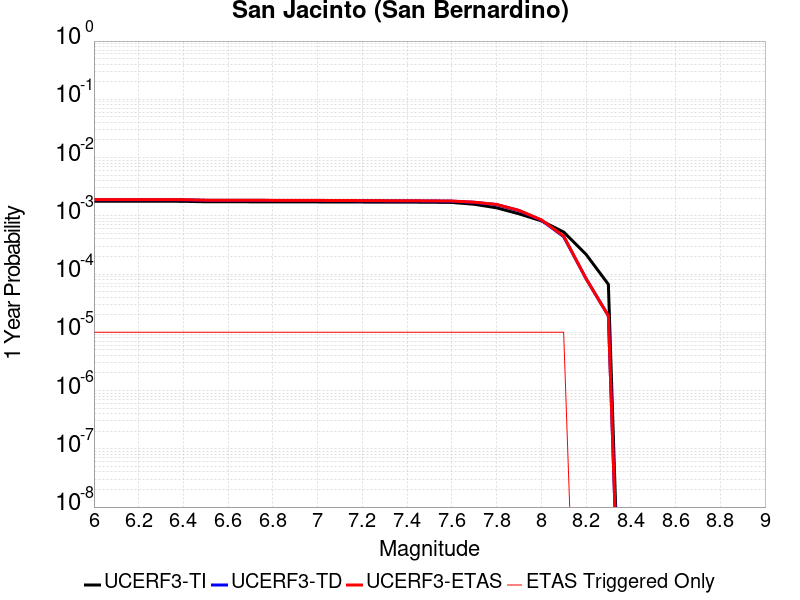 |  |

| Magnitude | 1 wk TI Prob | 1 wk TD Prob | 1 wk ETAS Prob | 1 wk ETAS/TD Gain | 1 wk ETAS Triggered Only | 1 mo TI Prob | 1 mo TD Prob | 1 mo ETAS Prob | 1 mo ETAS/TD Gain | 1 mo ETAS Triggered Only | 1 yr TI Prob | 1 yr TD Prob | 1 yr ETAS Prob | 1 yr ETAS/TD Gain | 1 yr ETAS Triggered Only | 10 yr TI Prob | 10 yr TD Prob | 10 yr ETAS Prob | 10 yr ETAS/TD Gain | 10 yr ETAS Triggered Only |
|-----|-----|-----|-----|-----|-----|-----|-----|-----|-----|-----|-----|-----|-----|-----|-----|-----|-----|-----|-----|-----|
| 6.0 | 3.409352E-5 | 3.6217927E-5 | 3.6217927E-5 | 1.0 | 0.0 | 1.461069E-4 | 1.5521045E-4 | 1.5521045E-4 | 1.0 | 0.0 | 0.0017774 | 0.0018880512 | 0.0018980323 | 1.0052865 | 1.0E-5 | 0.01763251 | 0.019468177 | 0.019477982 | 1.0005037 | 1.0E-5 |
| 6.1 | 3.409352E-5 | 3.6217927E-5 | 3.6217927E-5 | 1.0 | 0.0 | 1.461069E-4 | 1.5521045E-4 | 1.5521045E-4 | 1.0 | 0.0 | 0.0017774 | 0.0018880512 | 0.0018980323 | 1.0052865 | 1.0E-5 | 0.01763251 | 0.019468177 | 0.019477982 | 1.0005037 | 1.0E-5 |
| 6.2 | 3.409352E-5 | 3.6217927E-5 | 3.6217927E-5 | 1.0 | 0.0 | 1.461069E-4 | 1.5521045E-4 | 1.5521045E-4 | 1.0 | 0.0 | 0.0017774 | 0.0018880512 | 0.0018980323 | 1.0052865 | 1.0E-5 | 0.01763251 | 0.019468177 | 0.019477982 | 1.0005037 | 1.0E-5 |
| 6.3 | 3.409352E-5 | 3.6217927E-5 | 3.6217927E-5 | 1.0 | 0.0 | 1.461069E-4 | 1.5521045E-4 | 1.5521045E-4 | 1.0 | 0.0 | 0.0017774 | 0.0018880512 | 0.0018980323 | 1.0052865 | 1.0E-5 | 0.01763251 | 0.019468177 | 0.019477982 | 1.0005037 | 1.0E-5 |
| 6.4 | 3.400795E-5 | 3.6110534E-5 | 3.6110534E-5 | 1.0 | 0.0 | 1.4574021E-4 | 1.5475026E-4 | 1.5475026E-4 | 1.0 | 0.0 | 0.0017729428 | 0.0018824583 | 0.0018924394 | 1.0053022 | 1.0E-5 | 0.017588645 | 0.019413238 | 0.019423045 | 1.0005051 | 1.0E-5 |
| 6.5 | 3.341482E-5 | 3.5370824E-5 | 3.5370824E-5 | 1.0 | 0.0 | 1.4319851E-4 | 1.5158043E-4 | 1.5158043E-4 | 1.0 | 0.0 | 0.0017420477 | 0.001843931 | 0.0018539126 | 1.0054132 | 1.0E-5 | 0.017284546 | 0.01903465 | 0.019044459 | 1.0005153 | 1.0E-5 |
| 6.6 | 3.3364955E-5 | 3.530801E-5 | 3.530801E-5 | 1.0 | 0.0 | 1.4298483E-4 | 1.5131127E-4 | 1.5131127E-4 | 1.0 | 0.0 | 0.0017394501 | 0.0018406595 | 0.0018506411 | 1.0054228 | 1.0E-5 | 0.017258976 | 0.019002503 | 0.019012311 | 1.0005163 | 1.0E-5 |
| 6.7 | 3.335922E-5 | 3.529778E-5 | 3.529778E-5 | 1.0 | 0.0 | 1.4296026E-4 | 1.5126744E-4 | 1.5126744E-4 | 1.0 | 0.0 | 0.0017391514 | 0.0018401267 | 0.0018501083 | 1.0054244 | 1.0E-5 | 0.017256035 | 0.018997291 | 0.019007102 | 1.0005164 | 1.0E-5 |
| 6.8 | 3.327683E-5 | 3.5191788E-5 | 3.5191788E-5 | 1.0 | 0.0 | 1.4260718E-4 | 1.5081324E-4 | 1.5081324E-4 | 1.0 | 0.0 | 0.0017348597 | 0.0018346063 | 0.0018445879 | 1.0054407 | 1.0E-5 | 0.017213784 | 0.018943042 | 0.018952852 | 1.0005178 | 1.0E-5 |
| 6.9 | 3.3235785E-5 | 3.5132707E-5 | 3.5132707E-5 | 1.0 | 0.0 | 1.4243131E-4 | 1.5056007E-4 | 1.5056007E-4 | 1.0 | 0.0 | 0.0017327217 | 0.0018315291 | 0.0018415108 | 1.0054499 | 1.0E-5 | 0.017192734 | 0.018912897 | 0.018922707 | 1.0005188 | 1.0E-5 |
| 7.0 | 3.3197095E-5 | 3.5072597E-5 | 3.5072597E-5 | 1.0 | 0.0 | 1.422655E-4 | 1.5030248E-4 | 1.5030248E-4 | 1.0 | 0.0 | 0.0017307063 | 0.0018283982 | 0.0018383799 | 1.0054593 | 1.0E-5 | 0.017172894 | 0.018882258 | 0.018892068 | 1.0005196 | 1.0E-5 |
| 7.1 | 3.3129716E-5 | 3.4952718E-5 | 3.4952718E-5 | 1.0 | 0.0 | 1.4197677E-4 | 1.4978877E-4 | 1.4978877E-4 | 1.0 | 0.0 | 0.0017271966 | 0.0018221543 | 0.0018321361 | 1.005478 | 1.0E-5 | 0.017138338 | 0.0188213 | 0.018831111 | 1.0005213 | 1.0E-5 |
| 7.2 | 3.3034008E-5 | 3.4820092E-5 | 3.4820092E-5 | 1.0 | 0.0 | 1.4156665E-4 | 1.4922045E-4 | 1.4922045E-4 | 1.0 | 0.0 | 0.0017222111 | 0.0018152464 | 0.0018252283 | 1.0054989 | 1.0E-5 | 0.017089253 | 0.018753665 | 0.018763477 | 1.0005232 | 1.0E-5 |
| 7.3 | 3.2956614E-5 | 3.4687713E-5 | 3.4687713E-5 | 1.0 | 0.0 | 1.4123498E-4 | 1.4865317E-4 | 1.4865317E-4 | 1.0 | 0.0 | 0.0017181796 | 0.0018083514 | 0.0018183333 | 1.0055199 | 1.0E-5 | 0.017049557 | 0.018686354 | 0.018696167 | 1.0005251 | 1.0E-5 |
| 7.4 | 3.2915937E-5 | 3.4609304E-5 | 3.4609304E-5 | 1.0 | 0.0 | 1.4106068E-4 | 1.4831717E-4 | 1.4831717E-4 | 1.0 | 0.0 | 0.0017160608 | 0.0018042674 | 0.0018142493 | 1.0055324 | 1.0E-5 | 0.017028693 | 0.018646574 | 0.018656388 | 1.0005263 | 1.0E-5 |
| 7.5 | 3.281791E-5 | 3.4474055E-5 | 3.4474055E-5 | 1.0 | 0.0 | 1.406406E-4 | 1.4773759E-4 | 1.4773759E-4 | 1.0 | 0.0 | 0.0017109542 | 0.0017972226 | 0.0018072047 | 1.0055542 | 1.0E-5 | 0.016978411 | 0.018577388 | 0.018587202 | 1.0005283 | 1.0E-5 |
| 7.6 | 3.2521442E-5 | 3.419857E-5 | 3.419857E-5 | 1.0 | 0.0 | 1.3937015E-4 | 1.4655707E-4 | 1.4655707E-4 | 1.0 | 0.0 | 0.0016955109 | 0.0017828733 | 0.0017928556 | 1.0055989 | 1.0E-5 | 0.016826328 | 0.01843481 | 0.018444626 | 1.0005325 | 1.0E-5 |
| 7.7 | 3.0287873E-5 | 3.2679935E-5 | 3.2679935E-5 | 1.0 | 0.0 | 1.297987E-4 | 1.4004935E-4 | 1.4004935E-4 | 1.0 | 0.0 | 0.0015791537 | 0.0017037685 | 0.0017137515 | 1.0058594 | 1.0E-5 | 0.01567979 | 0.01764439 | 0.017654212 | 1.0005567 | 1.0E-5 |
| 7.8 | 2.6316151E-5 | 2.9882467E-5 | 2.9882467E-5 | 1.0 | 0.0 | 1.1277862E-4 | 1.2806144E-4 | 1.2806144E-4 | 1.0 | 0.0 | 0.0013722149 | 0.0015580339 | 0.0015680182 | 1.0064083 | 1.0E-5 | 0.013637724 | 0.016181849 | 0.016191687 | 1.000608 | 1.0E-5 |
| 7.9 | 2.0761147E-5 | 2.3609087E-5 | 2.3609087E-5 | 1.0 | 0.0 | 8.897331E-5 | 1.0117788E-4 | 1.0117788E-4 | 1.0 | 0.0 | 0.0010827117 | 0.0012311455 | 0.0012411331 | 1.0081125 | 1.0E-5 | 0.010774517 | 0.012891841 | 0.012901712 | 1.0007657 | 1.0E-5 |
| 8.0 | 1.5738568E-5 | 1.6177393E-5 | 1.6177393E-5 | 1.0 | 0.0 | 6.744926E-5 | 6.932985E-5 | 6.932985E-5 | 1.0 | 0.0 | 8.2088535E-4 | 8.437647E-4 | 8.5375627E-4 | 1.0118417 | 1.0E-5 | 0.008178596 | 0.008941599 | 0.00895151 | 1.0011084 | 1.0E-5 |
| 8.1 | 1.0105832E-5 | 8.4144995E-6 | 8.4144995E-6 | 1.0 | 0.0 | 4.3309992E-5 | 3.6061647E-5 | 3.6061647E-5 | 1.0 | 0.0 | 5.2717153E-4 | 4.3896263E-4 | 4.4895822E-4 | 1.022771 | 1.0E-5 | 0.005259227 | 0.004722393 | 0.0047323457 | 1.0021076 | 1.0E-5 |
| 8.2 | 4.189207E-6 | 1.6028054E-6 | 1.6028054E-6 | 1.0 | 0.0 | 1.7953622E-5 | 6.8691475E-6 | 6.8691475E-6 | 1.0 | 0.0 | 2.1856341E-4 | 8.362869E-5 | 8.362869E-5 | 1.0 | 0.0 | 0.0021834858 | 9.7051286E-4 | 9.7051286E-4 | 1.0 | 0.0 |
| 8.3 | 1.2758221E-6 | 3.6805784E-7 | 3.6805784E-7 | 1.0 | 0.0 | 5.4677976E-6 | 1.5773899E-6 | 1.5773899E-6 | 1.0 | 0.0 | 6.65684E-5 | 1.9204557E-5 | 1.9204557E-5 | 1.0 | 0.0 | 6.6548464E-4 | 2.3136413E-4 | 2.3136413E-4 | 1.0 | 0.0 |

## Great Valley 04b Gordon Valley
*[(top)](#table-of-contents)*

| 1 Week | 1 Month | 1 Year | 10 Year |
|-----|-----|-----|-----|
|  |  |  |  |

| Magnitude | 1 wk TI Prob | 1 wk TD Prob | 1 wk ETAS Prob | 1 wk ETAS/TD Gain | 1 wk ETAS Triggered Only | 1 mo TI Prob | 1 mo TD Prob | 1 mo ETAS Prob | 1 mo ETAS/TD Gain | 1 mo ETAS Triggered Only | 1 yr TI Prob | 1 yr TD Prob | 1 yr ETAS Prob | 1 yr ETAS/TD Gain | 1 yr ETAS Triggered Only | 10 yr TI Prob | 10 yr TD Prob | 10 yr ETAS Prob | 10 yr ETAS/TD Gain | 10 yr ETAS Triggered Only |
|-----|-----|-----|-----|-----|-----|-----|-----|-----|-----|-----|-----|-----|-----|-----|-----|-----|-----|-----|-----|-----|
| 6.0 | 2.1181217E-5 | 2.3988083E-5 | 2.3988083E-5 | 1.0 | 0.0 | 9.077348E-5 | 1.0280296E-4 | 1.0280296E-4 | 1.0 | 0.0 | 0.0011046068 | 0.0012510741 | 0.0012610616 | 1.0079831 | 1.0E-5 | 0.010991322 | 0.012456767 | 0.012466643 | 1.0007927 | 1.0E-5 |
| 6.1 | 2.1181217E-5 | 2.3988083E-5 | 2.3988083E-5 | 1.0 | 0.0 | 9.077348E-5 | 1.0280296E-4 | 1.0280296E-4 | 1.0 | 0.0 | 0.0011046068 | 0.0012510741 | 0.0012610616 | 1.0079831 | 1.0E-5 | 0.010991322 | 0.012456767 | 0.012466643 | 1.0007927 | 1.0E-5 |
| 6.2 | 2.1181217E-5 | 2.3988083E-5 | 2.3988083E-5 | 1.0 | 0.0 | 9.077348E-5 | 1.0280296E-4 | 1.0280296E-4 | 1.0 | 0.0 | 0.0011046068 | 0.0012510741 | 0.0012610616 | 1.0079831 | 1.0E-5 | 0.010991322 | 0.012456767 | 0.012466643 | 1.0007927 | 1.0E-5 |
| 6.3 | 2.1181217E-5 | 2.3988083E-5 | 2.3988083E-5 | 1.0 | 0.0 | 9.077348E-5 | 1.0280296E-4 | 1.0280296E-4 | 1.0 | 0.0 | 0.0011046068 | 0.0012510741 | 0.0012610616 | 1.0079831 | 1.0E-5 | 0.010991322 | 0.012456767 | 0.012466643 | 1.0007927 | 1.0E-5 |
| 6.4 | 1.0988268E-5 | 1.2257221E-5 | 1.2257221E-5 | 1.0 | 0.0 | 4.7091726E-5 | 5.252998E-5 | 5.252998E-5 | 1.0 | 0.0 | 5.731909E-4 | 6.3938077E-4 | 6.3938077E-4 | 1.0 | 0.0 | 0.005717147 | 0.006377 | 0.006377 | 1.0 | 0.0 |
| 6.5 | 1.0988268E-5 | 1.2257221E-5 | 1.2257221E-5 | 1.0 | 0.0 | 4.7091726E-5 | 5.252998E-5 | 5.252998E-5 | 1.0 | 0.0 | 5.731909E-4 | 6.3938077E-4 | 6.3938077E-4 | 1.0 | 0.0 | 0.005717147 | 0.006377 | 0.006377 | 1.0 | 0.0 |
| 6.6 | 1.0517822E-5 | 1.17266545E-5 | 1.17266545E-5 | 1.0 | 0.0 | 4.5075605E-5 | 5.025621E-5 | 5.025621E-5 | 1.0 | 0.0 | 5.4865726E-4 | 6.117132E-4 | 6.117132E-4 | 1.0 | 0.0 | 0.0054730466 | 0.0061018486 | 0.0061018486 | 1.0 | 0.0 |
| 6.7 | 7.789219E-6 | 8.6795535E-6 | 8.6795535E-6 | 1.0 | 0.0 | 3.3381937E-5 | 3.7197584E-5 | 3.7197584E-5 | 1.0 | 0.0 | 4.063493E-4 | 4.5279166E-4 | 4.5279166E-4 | 1.0 | 0.0 | 0.004056071 | 0.0045192083 | 0.0045192083 | 1.0 | 0.0 |
| 6.8 | 7.5850853E-6 | 8.454253E-6 | 8.454253E-6 | 1.0 | 0.0 | 3.2507105E-5 | 3.623204E-5 | 3.623204E-5 | 1.0 | 0.0 | 3.957021E-4 | 4.410409E-4 | 4.410409E-4 | 1.0 | 0.0 | 0.0039499826 | 0.0044021686 | 0.0044021686 | 1.0 | 0.0 |
| 6.9 | 6.604105E-6 | 7.3601705E-6 | 7.3601705E-6 | 1.0 | 0.0 | 2.8303E-5 | 3.154323E-5 | 3.154323E-5 | 1.0 | 0.0 | 3.4453452E-4 | 3.83975E-4 | 3.83975E-4 | 1.0 | 0.0 | 0.0034400085 | 0.0038335025 | 0.0038335025 | 1.0 | 0.0 |
| 7.0 | 5.3701115E-6 | 5.9897484E-6 | 5.9897484E-6 | 1.0 | 0.0 | 2.301456E-5 | 2.5670115E-5 | 2.5670115E-5 | 1.0 | 0.0 | 2.8016625E-4 | 3.1249173E-4 | 3.1249173E-4 | 1.0 | 0.0 | 0.0027981328 | 0.003120812 | 0.003120812 | 1.0 | 0.0 |
| 7.1 | 4.4685607E-6 | 4.9875935E-6 | 4.9875935E-6 | 1.0 | 0.0 | 1.9150835E-5 | 2.137524E-5 | 2.137524E-5 | 1.0 | 0.0 | 2.3313647E-4 | 2.6021493E-4 | 2.6021493E-4 | 1.0 | 0.0 | 0.0023289204 | 0.0025993474 | 0.0025993474 | 1.0 | 0.0 |
| 7.2 | 2.833378E-6 | 3.165133E-6 | 3.165133E-6 | 1.0 | 0.0 | 1.2142991E-5 | 1.3564795E-5 | 1.3564795E-5 | 1.0 | 0.0 | 1.4783088E-4 | 1.6514062E-4 | 1.6514062E-4 | 1.0 | 0.0 | 0.0014773258 | 0.0016503509 | 0.0016503509 | 1.0 | 0.0 |
| 7.3 | 7.0087293E-7 | 7.774461E-7 | 7.774461E-7 | 1.0 | 0.0 | 3.0037377E-6 | 3.33191E-6 | 3.33191E-6 | 1.0 | 0.0 | 3.656989E-5 | 4.056571E-5 | 4.056571E-5 | 1.0 | 0.0 | 3.6563876E-4 | 4.0562803E-4 | 4.0562803E-4 | 1.0 | 0.0 |
| 7.4 | 3.112171E-8 | 3.2070247E-8 | 3.2070247E-8 | 1.0 | 0.0 | 1.3337875E-7 | 1.374439E-7 | 1.374439E-7 | 1.0 | 0.0 | 1.6238852E-6 | 1.6733784E-6 | 1.6733784E-6 | 1.0 | 0.0 | 1.6238733E-5 | 1.6733666E-5 | 1.6733666E-5 | 1.0 | 0.0 |

## Brawley (Seismic Zone) alt 1
*[(top)](#table-of-contents)*

| 1 Week | 1 Month | 1 Year | 10 Year |
|-----|-----|-----|-----|
|  |  |  |  |

| Magnitude | 1 wk TI Prob | 1 wk TD Prob | 1 wk ETAS Prob | 1 wk ETAS/TD Gain | 1 wk ETAS Triggered Only | 1 mo TI Prob | 1 mo TD Prob | 1 mo ETAS Prob | 1 mo ETAS/TD Gain | 1 mo ETAS Triggered Only | 1 yr TI Prob | 1 yr TD Prob | 1 yr ETAS Prob | 1 yr ETAS/TD Gain | 1 yr ETAS Triggered Only | 10 yr TI Prob | 10 yr TD Prob | 10 yr ETAS Prob | 10 yr ETAS/TD Gain | 10 yr ETAS Triggered Only |
|-----|-----|-----|-----|-----|-----|-----|-----|-----|-----|-----|-----|-----|-----|-----|-----|-----|-----|-----|-----|-----|
| 6.0 | 2.2521618E-4 | 4.7765442E-4 | 4.7765442E-4 | 1.0 | 0.0 | 9.6485513E-4 | 0.0020455215 | 0.0020455215 | 1.0 | 0.0 | 0.011683988 | 0.024613852 | 0.024623606 | 1.0003963 | 1.0E-5 | 0.11088423 | 0.21395558 | 0.21396345 | 1.0000367 | 1.0E-5 |
| 6.1 | 2.2521618E-4 | 4.7765442E-4 | 4.7765442E-4 | 1.0 | 0.0 | 9.6485513E-4 | 0.0020455215 | 0.0020455215 | 1.0 | 0.0 | 0.011683988 | 0.024613852 | 0.024623606 | 1.0003963 | 1.0E-5 | 0.11088423 | 0.21395558 | 0.21396345 | 1.0000367 | 1.0E-5 |
| 6.2 | 2.198148E-4 | 4.6846925E-4 | 4.6846925E-4 | 1.0 | 0.0 | 9.417233E-4 | 0.0020062174 | 0.0020062174 | 1.0 | 0.0 | 0.011405343 | 0.024146577 | 0.024156336 | 1.0004041 | 1.0E-5 | 0.10837428 | 0.21038558 | 0.21039347 | 1.0000376 | 1.0E-5 |
| 6.3 | 2.1704129E-4 | 4.6281624E-4 | 4.6281624E-4 | 1.0 | 0.0 | 9.298453E-4 | 0.0019820272 | 0.0019820272 | 1.0 | 0.0 | 0.011262234 | 0.023859257 | 0.023869019 | 1.0004091 | 1.0E-5 | 0.107082725 | 0.20827506 | 0.20828299 | 1.000038 | 1.0E-5 |
| 6.4 | 1.876142E-4 | 4.0169957E-4 | 4.0169957E-4 | 1.0 | 0.0 | 8.038131E-4 | 0.0017204481 | 0.0017204481 | 1.0 | 0.0 | 0.00974259 | 0.020744273 | 0.020754065 | 1.0004721 | 1.0E-5 | 0.093263686 | 0.18502785 | 0.185036 | 1.000044 | 1.0E-5 |
| 6.5 | 1.7390939E-4 | 3.7597326E-4 | 3.7597326E-4 | 1.0 | 0.0 | 7.45113E-4 | 0.0016103312 | 0.0016103312 | 1.0 | 0.0 | 0.009034078 | 0.019430246 | 0.019440053 | 1.0005046 | 1.0E-5 | 0.086755216 | 0.17484118 | 0.17484944 | 1.0000472 | 1.0E-5 |
| 6.6 | 1.591791E-4 | 3.5005933E-4 | 3.5005933E-4 | 1.0 | 0.0 | 6.8201777E-4 | 0.0014994019 | 0.0014994019 | 1.0 | 0.0 | 0.008271996 | 0.018103976 | 0.018113794 | 1.0005424 | 1.0E-5 | 0.07970774 | 0.16423537 | 0.16424373 | 1.0000509 | 1.0E-5 |
| 6.7 | 1.4268003E-4 | 3.216382E-4 | 3.216382E-4 | 1.0 | 0.0 | 6.1134255E-4 | 0.0013777295 | 0.0013777295 | 1.0 | 0.0 | 0.007417723 | 0.01664682 | 0.016656652 | 1.0005907 | 1.0E-5 | 0.07174956 | 0.15233909 | 0.15234756 | 1.0000557 | 1.0E-5 |
| 6.8 | 1.239713E-4 | 2.9143257E-4 | 2.9143257E-4 | 1.0 | 0.0 | 5.3119735E-4 | 0.0012484051 | 0.0012484051 | 1.0 | 0.0 | 0.0064481674 | 0.015094847 | 0.015104696 | 1.0006524 | 1.0E-5 | 0.06264243 | 0.13873355 | 0.13874216 | 1.0000621 | 1.0E-5 |
| 6.9 | 1.0180238E-4 | 2.6323396E-4 | 2.6323396E-4 | 1.0 | 0.0 | 4.3622297E-4 | 0.001127662 | 0.001127662 | 1.0 | 0.0 | 0.005298089 | 0.013643865 | 0.013653727 | 1.0007229 | 1.0E-5 | 0.05173543 | 0.12524168 | 0.12525044 | 1.0000699 | 1.0E-5 |
| 7.0 | 7.6619996E-5 | 2.2451325E-4 | 2.2451325E-4 | 1.0 | 0.0 | 3.283301E-4 | 9.61848E-4 | 9.61848E-4 | 1.0 | 0.0 | 0.0039900932 | 0.011648334 | 0.011658217 | 1.0008485 | 1.0E-5 | 0.039192066 | 0.107480206 | 0.10748913 | 1.0000831 | 1.0E-5 |
| 7.1 | 7.5127435E-5 | 2.2133827E-4 | 2.2133827E-4 | 1.0 | 0.0 | 3.2193496E-4 | 9.4825093E-4 | 9.4825093E-4 | 1.0 | 0.0 | 0.0039125155 | 0.011484546 | 0.011494431 | 1.0008607 | 1.0E-5 | 0.038443442 | 0.10604187 | 0.10605081 | 1.0000843 | 1.0E-5 |
| 7.2 | 6.788582E-5 | 2.0259776E-4 | 2.0259776E-4 | 1.0 | 0.0 | 2.9090676E-4 | 8.6799025E-4 | 8.6799025E-4 | 1.0 | 0.0 | 0.0035360386 | 0.010517217 | 0.0105271125 | 1.0009408 | 1.0E-5 | 0.034803 | 0.09770732 | 0.09771635 | 1.0000924 | 1.0E-5 |
| 7.3 | 6.399602E-5 | 1.8888667E-4 | 1.8888667E-4 | 1.0 | 0.0 | 2.7423984E-4 | 8.0926606E-4 | 8.0926606E-4 | 1.0 | 0.0 | 0.0033337586 | 0.009808895 | 0.009818797 | 1.0010095 | 1.0E-5 | 0.03284188 | 0.091595575 | 0.09160466 | 1.0000992 | 1.0E-5 |
| 7.4 | 4.506759E-5 | 1.2566763E-4 | 1.2566763E-4 | 1.0 | 0.0 | 1.9313251E-4 | 5.3846533E-4 | 5.3846533E-4 | 1.0 | 0.0 | 0.0023488526 | 0.0065362845 | 0.006546219 | 1.0015199 | 1.0E-5 | 0.023241805 | 0.06252845 | 0.06253782 | 1.00015 | 1.0E-5 |
| 7.5 | 3.43289E-5 | 9.367184E-5 | 9.367184E-5 | 1.0 | 0.0 | 1.4711556E-4 | 4.0138932E-4 | 4.0138932E-4 | 1.0 | 0.0 | 0.0017896603 | 0.004876027 | 0.004885978 | 1.0020409 | 1.0E-5 | 0.01775316 | 0.04719738 | 0.047206905 | 1.0002018 | 1.0E-5 |
| 7.6 | 2.5980507E-5 | 7.080803E-5 | 7.080803E-5 | 1.0 | 0.0 | 1.1134028E-4 | 3.0342783E-4 | 3.0342783E-4 | 1.0 | 0.0 | 0.001354725 | 0.0036880004 | 0.0036979634 | 1.0027015 | 1.0E-5 | 0.013464959 | 0.035966188 | 0.03597583 | 1.000268 | 1.0E-5 |
| 7.7 | 1.7292105E-5 | 4.9643837E-5 | 4.9643837E-5 | 1.0 | 0.0 | 7.4106916E-5 | 2.1274199E-4 | 2.1274199E-4 | 1.0 | 0.0 | 9.018782E-4 | 0.0025870628 | 0.002597037 | 1.0038553 | 1.0E-5 | 0.008982267 | 0.02539802 | 0.025407767 | 1.0003837 | 1.0E-5 |
| 7.8 | 1.2927471E-5 | 3.9898816E-5 | 3.9898816E-5 | 1.0 | 0.0 | 5.5402274E-5 | 1.7098374E-4 | 1.7098374E-4 | 1.0 | 0.0 | 6.743139E-4 | 0.002079742 | 0.0020897212 | 1.0047983 | 1.0E-5 | 0.0067227143 | 0.020525336 | 0.02053513 | 1.0004772 | 1.0E-5 |
| 7.9 | 1.0200774E-5 | 2.8912087E-5 | 2.8912087E-5 | 1.0 | 0.0 | 4.371687E-5 | 1.2390307E-4 | 1.2390307E-4 | 1.0 | 0.0 | 5.321229E-4 | 0.0015074771 | 0.0015174621 | 1.0066236 | 1.0E-5 | 0.005308505 | 0.015068604 | 0.015078452 | 1.0006536 | 1.0E-5 |
| 8.0 | 8.650396E-6 | 2.342018E-5 | 2.342018E-5 | 1.0 | 0.0 | 3.70726E-5 | 1.0036834E-4 | 1.0036834E-4 | 1.0 | 0.0 | 4.5126543E-4 | 0.0012213005 | 0.0012312882 | 1.008178 | 1.0E-5 | 0.0045035016 | 0.012277625 | 0.012287502 | 1.0008045 | 1.0E-5 |
| 8.1 | 3.9368224E-6 | 7.389511E-6 | 7.389511E-6 | 1.0 | 0.0 | 1.6871985E-5 | 3.166895E-5 | 3.166895E-5 | 1.0 | 0.0 | 2.0539707E-4 | 3.855014E-4 | 3.9549754E-4 | 1.0259303 | 1.0E-5 | 0.0020520731 | 0.0040316973 | 0.004041657 | 1.0024704 | 1.0E-5 |
| 8.2 | 1.7101195E-6 | 2.2418792E-6 | 2.2418792E-6 | 1.0 | 0.0 | 7.329063E-6 | 9.608018E-6 | 9.608018E-6 | 1.0 | 0.0 | 8.922769E-5 | 1.1697138E-4 | 1.269702E-4 | 1.085481 | 1.0E-5 | 8.9191867E-4 | 0.0012789823 | 0.0012889695 | 1.0078087 | 1.0E-5 |
| 8.3 | 3.0346666E-8 | 1.7467134E-8 | 1.7467134E-8 | 1.0 | 0.0 | 1.3005713E-7 | 7.4859145E-8 | 7.4859145E-8 | 1.0 | 0.0 | 1.5834444E-6 | 9.1141E-7 | 9.1141E-7 | 1.0 | 0.0 | 1.5834332E-5 | 9.501647E-6 | 9.501647E-6 | 1.0 | 0.0 |

## Shoreline
*[(top)](#table-of-contents)*

| 1 Week | 1 Month | 1 Year | 10 Year |
|-----|-----|-----|-----|
|  | 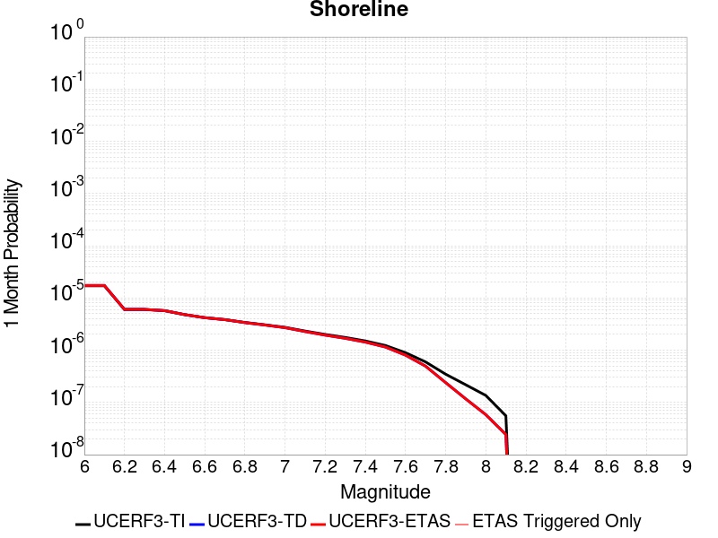 |  |  |

| Magnitude | 1 wk TI Prob | 1 wk TD Prob | 1 wk ETAS Prob | 1 wk ETAS/TD Gain | 1 wk ETAS Triggered Only | 1 mo TI Prob | 1 mo TD Prob | 1 mo ETAS Prob | 1 mo ETAS/TD Gain | 1 mo ETAS Triggered Only | 1 yr TI Prob | 1 yr TD Prob | 1 yr ETAS Prob | 1 yr ETAS/TD Gain | 1 yr ETAS Triggered Only | 10 yr TI Prob | 10 yr TD Prob | 10 yr ETAS Prob | 10 yr ETAS/TD Gain | 10 yr ETAS Triggered Only |
|-----|-----|-----|-----|-----|-----|-----|-----|-----|-----|-----|-----|-----|-----|-----|-----|-----|-----|-----|-----|-----|
| 6.0 | 3.9888673E-6 | 4.0481614E-6 | 4.0481614E-6 | 1.0 | 0.0 | 1.7095033E-5 | 1.7349179E-5 | 1.7349179E-5 | 1.0 | 0.0 | 2.0811215E-4 | 2.1121136E-4 | 2.1121136E-4 | 1.0 | 0.0 | 0.0020791737 | 0.002110655 | 0.0021206338 | 1.0047278 | 1.0E-5 |
| 6.1 | 3.9888673E-6 | 4.0481614E-6 | 4.0481614E-6 | 1.0 | 0.0 | 1.7095033E-5 | 1.7349179E-5 | 1.7349179E-5 | 1.0 | 0.0 | 2.0811215E-4 | 2.1121136E-4 | 2.1121136E-4 | 1.0 | 0.0 | 0.0020791737 | 0.002110655 | 0.0021206338 | 1.0047278 | 1.0E-5 |
| 6.2 | 1.4039653E-6 | 1.4102171E-6 | 1.4102171E-6 | 1.0 | 0.0 | 6.0169805E-6 | 6.0437737E-6 | 6.0437737E-6 | 1.0 | 0.0 | 7.325427E-5 | 7.358052E-5 | 7.358052E-5 | 1.0 | 0.0 | 7.3230127E-4 | 7.355676E-4 | 7.455603E-4 | 1.013585 | 1.0E-5 |
| 6.3 | 1.4039653E-6 | 1.4102171E-6 | 1.4102171E-6 | 1.0 | 0.0 | 6.0169805E-6 | 6.0437737E-6 | 6.0437737E-6 | 1.0 | 0.0 | 7.325427E-5 | 7.358052E-5 | 7.358052E-5 | 1.0 | 0.0 | 7.3230127E-4 | 7.355676E-4 | 7.455603E-4 | 1.013585 | 1.0E-5 |
| 6.4 | 1.3314152E-6 | 1.3362858E-6 | 1.3362858E-6 | 1.0 | 0.0 | 5.7060524E-6 | 5.7269267E-6 | 5.7269267E-6 | 1.0 | 0.0 | 6.946897E-5 | 6.972316E-5 | 6.972316E-5 | 1.0 | 0.0 | 6.9447263E-4 | 6.9701823E-4 | 7.070112E-4 | 1.0143368 | 1.0E-5 |
| 6.5 | 1.1187026E-6 | 1.1204833E-6 | 1.1204833E-6 | 1.0 | 0.0 | 4.794431E-6 | 4.8020624E-6 | 4.8020624E-6 | 1.0 | 0.0 | 5.8370628E-5 | 5.8463564E-5 | 5.8463564E-5 | 1.0 | 0.0 | 5.83553E-4 | 5.8448437E-4 | 5.944785E-4 | 1.0170991 | 1.0E-5 |
| 6.6 | 9.793089E-7 | 9.786063E-7 | 9.786063E-7 | 1.0 | 0.0 | 4.1970316E-6 | 4.1940207E-6 | 4.1940207E-6 | 1.0 | 0.0 | 5.1097657E-5 | 5.1061015E-5 | 5.1061015E-5 | 1.0 | 0.0 | 5.108591E-4 | 5.104941E-4 | 5.104941E-4 | 1.0 | 0.0 |
| 6.7 | 8.995986E-7 | 8.9739143E-7 | 8.9739143E-7 | 1.0 | 0.0 | 3.8554167E-6 | 3.8459575E-6 | 3.8459575E-6 | 1.0 | 0.0 | 4.693869E-5 | 4.6823538E-5 | 4.6823538E-5 | 1.0 | 0.0 | 4.6928777E-4 | 4.6813767E-4 | 4.6813767E-4 | 1.0 | 0.0 |
| 6.8 | 7.931612E-7 | 7.8814617E-7 | 7.8814617E-7 | 1.0 | 0.0 | 3.3992578E-6 | 3.3777649E-6 | 3.3777649E-6 | 1.0 | 0.0 | 4.1385178E-5 | 4.1123516E-5 | 4.1123516E-5 | 1.0 | 0.0 | 4.1377472E-4 | 4.1115962E-4 | 4.1115962E-4 | 1.0 | 0.0 |
| 6.9 | 7.1465956E-7 | 7.0790304E-7 | 7.0790304E-7 | 1.0 | 0.0 | 3.062823E-6 | 3.0338667E-6 | 3.0338667E-6 | 1.0 | 0.0 | 3.7289232E-5 | 3.6936704E-5 | 3.6936704E-5 | 1.0 | 0.0 | 3.7282976E-4 | 3.69306E-4 | 3.69306E-4 | 1.0 | 0.0 |
| 7.0 | 6.389046E-7 | 6.300441E-7 | 6.300441E-7 | 1.0 | 0.0 | 2.7381598E-6 | 2.7001863E-6 | 2.7001863E-6 | 1.0 | 0.0 | 3.3336586E-5 | 3.2874275E-5 | 3.2874275E-5 | 1.0 | 0.0 | 3.3331584E-4 | 3.2869435E-4 | 3.2869435E-4 | 1.0 | 0.0 |
| 7.1 | 5.4300875E-7 | 5.3120556E-7 | 5.3120556E-7 | 1.0 | 0.0 | 2.3271782E-6 | 2.2765932E-6 | 2.2765932E-6 | 1.0 | 0.0 | 2.8333026E-5 | 2.771717E-5 | 2.771717E-5 | 1.0 | 0.0 | 2.8329415E-4 | 2.7713724E-4 | 2.7713724E-4 | 1.0 | 0.0 |
| 7.2 | 4.6768855E-7 | 4.5357737E-7 | 4.5357737E-7 | 1.0 | 0.0 | 2.0043778E-6 | 1.9439017E-6 | 1.9439017E-6 | 1.0 | 0.0 | 2.4403027E-5 | 2.3666746E-5 | 2.3666746E-5 | 1.0 | 0.0 | 2.4400349E-4 | 2.366423E-4 | 2.366423E-4 | 1.0 | 0.0 |
| 7.3 | 4.0966103E-7 | 3.939413E-7 | 3.939413E-7 | 1.0 | 0.0 | 1.7556889E-6 | 1.6883187E-6 | 1.6883187E-6 | 1.0 | 0.0 | 2.1375303E-5 | 2.0555086E-5 | 2.0555086E-5 | 1.0 | 0.0 | 2.1373246E-4 | 2.0553189E-4 | 2.0553189E-4 | 1.0 | 0.0 |
| 7.4 | 3.5105785E-7 | 3.3372118E-7 | 3.3372118E-7 | 1.0 | 0.0 | 1.5045327E-6 | 1.4302328E-6 | 1.4302328E-6 | 1.0 | 0.0 | 1.8317533E-5 | 1.7412945E-5 | 1.7412945E-5 | 1.0 | 0.0 | 1.8316023E-4 | 1.7411583E-4 | 1.7411583E-4 | 1.0 | 0.0 |
| 7.5 | 2.8737534E-7 | 2.6827834E-7 | 2.6827834E-7 | 1.0 | 0.0 | 1.2316079E-6 | 1.1497638E-6 | 1.1497638E-6 | 1.0 | 0.0 | 1.4994724E-5 | 1.3998284E-5 | 1.3998284E-5 | 1.0 | 0.0 | 1.4993713E-4 | 1.3997404E-4 | 1.3997404E-4 | 1.0 | 0.0 |
| 7.6 | 2.0924051E-7 | 1.8786326E-7 | 1.8786326E-7 | 1.0 | 0.0 | 8.967448E-7 | 8.0512797E-7 | 8.0512797E-7 | 1.0 | 0.0 | 1.0917813E-5 | 9.802389E-6 | 9.802389E-6 | 1.0 | 0.0 | 1.0917276E-4 | 9.801958E-5 | 9.801958E-5 | 1.0 | 0.0 |
| 7.7 | 1.392265E-7 | 1.15502566E-7 | 1.15502566E-7 | 1.0 | 0.0 | 5.9668486E-7 | 4.950109E-7 | 4.950109E-7 | 1.0 | 0.0 | 7.2646135E-6 | 6.026741E-6 | 6.026741E-6 | 1.0 | 0.0 | 7.2643765E-5 | 6.0265782E-5 | 6.0265782E-5 | 1.0 | 0.0 |
| 7.8 | 8.1080074E-8 | 5.5931675E-8 | 5.5931675E-8 | 1.0 | 0.0 | 3.4748598E-7 | 2.3970716E-7 | 2.3970716E-7 | 1.0 | 0.0 | 4.2306337E-6 | 2.9184307E-6 | 2.9184307E-6 | 1.0 | 0.0 | 4.230553E-5 | 2.9183926E-5 | 2.9183926E-5 | 1.0 | 0.0 |
| 7.9 | 5.0859036E-8 | 2.7303486E-8 | 2.7303486E-8 | 1.0 | 0.0 | 2.1796728E-7 | 1.17014935E-7 | 1.17014935E-7 | 1.0 | 0.0 | 2.6537484E-6 | 1.4246559E-6 | 1.4246559E-6 | 1.0 | 0.0 | 2.6537167E-5 | 1.4246468E-5 | 1.4246468E-5 | 1.0 | 0.0 |
| 8.0 | 3.1760536E-8 | 1.362286E-8 | 1.362286E-8 | 1.0 | 0.0 | 1.3611657E-7 | 5.8383687E-8 | 5.8383687E-8 | 1.0 | 0.0 | 1.6572179E-6 | 7.1082115E-7 | 7.1082115E-7 | 1.0 | 0.0 | 1.6572056E-5 | 7.108189E-6 | 7.108189E-6 | 1.0 | 0.0 |
| 8.1 | 1.2947896E-8 | 5.6822302E-9 | 5.6822302E-9 | 1.0 | 0.0 | 5.5490982E-8 | 2.4352415E-8 | 2.4352415E-8 | 1.0 | 0.0 | 6.756025E-7 | 2.964906E-7 | 2.964906E-7 | 1.0 | 0.0 | 6.7560045E-6 | 2.9649025E-6 | 2.9649025E-6 | 1.0 | 0.0 |

## King Range 2011 CFM
*[(top)](#table-of-contents)*

| 1 Week | 1 Month | 1 Year | 10 Year |
|-----|-----|-----|-----|
|  |  |  |  |

| Magnitude | 1 wk TI Prob | 1 wk TD Prob | 1 wk ETAS Prob | 1 wk ETAS/TD Gain | 1 wk ETAS Triggered Only | 1 mo TI Prob | 1 mo TD Prob | 1 mo ETAS Prob | 1 mo ETAS/TD Gain | 1 mo ETAS Triggered Only | 1 yr TI Prob | 1 yr TD Prob | 1 yr ETAS Prob | 1 yr ETAS/TD Gain | 1 yr ETAS Triggered Only | 10 yr TI Prob | 10 yr TD Prob | 10 yr ETAS Prob | 10 yr ETAS/TD Gain | 10 yr ETAS Triggered Only |
|-----|-----|-----|-----|-----|-----|-----|-----|-----|-----|-----|-----|-----|-----|-----|-----|-----|-----|-----|-----|-----|
| 6.0 | 1.2462566E-5 | 1.30260305E-5 | 1.30260305E-5 | 1.0 | 0.0 | 5.34099E-5 | 5.5824847E-5 | 5.5824847E-5 | 1.0 | 0.0 | 6.5007154E-4 | 6.794905E-4 | 6.794905E-4 | 1.0 | 0.0 | 0.0064817313 | 0.006778515 | 0.006788447 | 1.0014652 | 1.0E-5 |
| 6.1 | 1.2462566E-5 | 1.30260305E-5 | 1.30260305E-5 | 1.0 | 0.0 | 5.34099E-5 | 5.5824847E-5 | 5.5824847E-5 | 1.0 | 0.0 | 6.5007154E-4 | 6.794905E-4 | 6.794905E-4 | 1.0 | 0.0 | 0.0064817313 | 0.006778515 | 0.006788447 | 1.0014652 | 1.0E-5 |
| 6.2 | 1.2462566E-5 | 1.30260305E-5 | 1.30260305E-5 | 1.0 | 0.0 | 5.34099E-5 | 5.5824847E-5 | 5.5824847E-5 | 1.0 | 0.0 | 6.5007154E-4 | 6.794905E-4 | 6.794905E-4 | 1.0 | 0.0 | 0.0064817313 | 0.006778515 | 0.006788447 | 1.0014652 | 1.0E-5 |
| 6.3 | 7.988484E-6 | 8.216453E-6 | 8.216453E-6 | 1.0 | 0.0 | 3.423591E-5 | 3.521297E-5 | 3.521297E-5 | 1.0 | 0.0 | 4.1674246E-4 | 4.2864648E-4 | 4.2864648E-4 | 1.0 | 0.0 | 0.004159618 | 0.004280413 | 0.0042903703 | 1.0023263 | 1.0E-5 |
| 6.4 | 7.988484E-6 | 8.216453E-6 | 8.216453E-6 | 1.0 | 0.0 | 3.423591E-5 | 3.521297E-5 | 3.521297E-5 | 1.0 | 0.0 | 4.1674246E-4 | 4.2864648E-4 | 4.2864648E-4 | 1.0 | 0.0 | 0.004159618 | 0.004280413 | 0.0042903703 | 1.0023263 | 1.0E-5 |
| 6.5 | 5.0522513E-6 | 5.0845183E-6 | 5.0845183E-6 | 1.0 | 0.0 | 2.1652326E-5 | 2.1790616E-5 | 2.1790616E-5 | 1.0 | 0.0 | 2.6358519E-4 | 2.652694E-4 | 2.652694E-4 | 1.0 | 0.0 | 0.0026327274 | 0.0026505652 | 0.0026505652 | 1.0 | 0.0 |
| 6.6 | 4.53682E-6 | 4.541151E-6 | 4.541151E-6 | 1.0 | 0.0 | 1.944337E-5 | 1.9461935E-5 | 1.9461935E-5 | 1.0 | 0.0 | 2.3669732E-4 | 2.3692391E-4 | 2.3692391E-4 | 1.0 | 0.0 | 0.0023644536 | 0.0023677184 | 0.0023677184 | 1.0 | 0.0 |
| 6.7 | 4.1144335E-6 | 4.09914E-6 | 4.09914E-6 | 1.0 | 0.0 | 1.7633167E-5 | 1.7567627E-5 | 1.7567627E-5 | 1.0 | 0.0 | 2.1466266E-4 | 2.1386526E-4 | 2.1386526E-4 | 1.0 | 0.0 | 0.0021445542 | 0.0021375788 | 0.0021375788 | 1.0 | 0.0 |
| 6.8 | 3.8321214E-6 | 3.809519E-6 | 3.809519E-6 | 1.0 | 0.0 | 1.6423275E-5 | 1.632641E-5 | 1.632641E-5 | 1.0 | 0.0 | 1.9993502E-4 | 1.9875624E-4 | 1.9875624E-4 | 1.0 | 0.0 | 0.0019975523 | 0.0019867627 | 0.0019867627 | 1.0 | 0.0 |
| 6.9 | 3.4999944E-6 | 3.465889E-6 | 3.465889E-6 | 1.0 | 0.0 | 1.499989E-5 | 1.48537265E-5 | 1.48537265E-5 | 1.0 | 0.0 | 1.8260835E-4 | 1.8082937E-4 | 1.8082937E-4 | 1.0 | 0.0 | 0.0018245836 | 0.0018077926 | 0.0018077926 | 1.0 | 0.0 |
| 7.0 | 2.9470837E-6 | 2.888862E-6 | 2.888862E-6 | 1.0 | 0.0 | 1.26302975E-5 | 1.23807795E-5 | 1.23807795E-5 | 1.0 | 0.0 | 1.5376302E-4 | 1.5072574E-4 | 1.5072574E-4 | 1.0 | 0.0 | 0.0015365666 | 0.0015071959 | 0.0015071959 | 1.0 | 0.0 |
| 7.1 | 2.4850247E-6 | 2.399896E-6 | 2.399896E-6 | 1.0 | 0.0 | 1.0650062E-5 | 1.0285228E-5 | 1.0285228E-5 | 1.0 | 0.0 | 1.296568E-4 | 1.252156E-4 | 1.252156E-4 | 1.0 | 0.0 | 0.0012958117 | 0.0012524046 | 0.0012524046 | 1.0 | 0.0 |
| 7.2 | 2.1800304E-6 | 2.078079E-6 | 2.078079E-6 | 1.0 | 0.0 | 9.342954E-6 | 8.906022E-6 | 8.906022E-6 | 1.0 | 0.0 | 1.1374453E-4 | 1.0842552E-4 | 1.0842552E-4 | 1.0 | 0.0 | 0.0011368633 | 0.0010846651 | 0.0010846651 | 1.0 | 0.0 |
| 7.3 | 2.0378504E-6 | 1.9514325E-6 | 1.9514325E-6 | 1.0 | 0.0 | 8.733615E-6 | 8.363256E-6 | 8.363256E-6 | 1.0 | 0.0 | 1.0632657E-4 | 1.0181797E-4 | 1.0181797E-4 | 1.0 | 0.0 | 0.0010627571 | 0.001018636 | 0.001018636 | 1.0 | 0.0 |
| 7.4 | 1.4577047E-6 | 1.4106382E-6 | 1.4106382E-6 | 1.0 | 0.0 | 6.247291E-6 | 6.0455786E-6 | 6.0455786E-6 | 1.0 | 0.0 | 7.605811E-5 | 7.360251E-5 | 7.360251E-5 | 1.0 | 0.0 | 7.603208E-4 | 7.366402E-4 | 7.366402E-4 | 1.0 | 0.0 |
| 7.5 | 8.0685743E-7 | 6.5432914E-7 | 6.5432914E-7 | 1.0 | 0.0 | 3.457956E-6 | 2.804265E-6 | 2.804265E-6 | 1.0 | 0.0 | 4.20998E-5 | 3.414144E-5 | 3.414144E-5 | 1.0 | 0.0 | 4.2091825E-4 | 3.4206477E-4 | 3.4206477E-4 | 1.0 | 0.0 |
| 7.6 | 3.1239435E-7 | 1.3328138E-7 | 1.3328138E-7 | 1.0 | 0.0 | 1.3388321E-6 | 5.7120576E-7 | 5.7120576E-7 | 1.0 | 0.0 | 1.630016E-5 | 6.9544085E-6 | 6.9544085E-6 | 1.0 | 0.0 | 1.6298964E-4 | 7.019744E-5 | 7.019744E-5 | 1.0 | 0.0 |
| 7.7 | 1.7747207E-7 | 4.8011387E-8 | 4.8011387E-8 | 1.0 | 0.0 | 7.605944E-7 | 2.0576309E-7 | 2.0576309E-7 | 1.0 | 0.0 | 9.260198E-6 | 2.5051627E-6 | 2.5051627E-6 | 1.0 | 0.0 | 9.2598115E-5 | 2.5470175E-5 | 2.5470175E-5 | 1.0 | 0.0 |
| 7.8 | 2.1035538E-8 | 2.2163302E-9 | 2.2163302E-9 | 1.0 | 0.0 | 9.0152305E-8 | 9.49856E-9 | 9.49856E-9 | 1.0 | 0.0 | 1.0976038E-6 | 1.1564496E-7 | 1.1564496E-7 | 1.0 | 0.0 | 1.0975983E-5 | 1.193497E-6 | 1.193497E-6 | 1.0 | 0.0 |
| 7.9 | 1.4782963E-9 | 9.2093E-13 | 9.2093E-13 | 1.0 | 0.0 | 6.335555E-9 | 3.947953E-12 | 3.947953E-12 | 1.0 | 0.0 | 7.713538E-8 | 4.806744E-11 | 4.806744E-11 | 1.0 | 0.0 | 7.7135354E-7 | 6.933888E-10 | 6.933888E-10 | 1.0 | 0.0 |

## San Andreas (Offshore) 2011 CFM
*[(top)](#table-of-contents)*

| 1 Week | 1 Month | 1 Year | 10 Year |
|-----|-----|-----|-----|
|  |  |  |  |

| Magnitude | 1 wk TI Prob | 1 wk TD Prob | 1 wk ETAS Prob | 1 wk ETAS/TD Gain | 1 wk ETAS Triggered Only | 1 mo TI Prob | 1 mo TD Prob | 1 mo ETAS Prob | 1 mo ETAS/TD Gain | 1 mo ETAS Triggered Only | 1 yr TI Prob | 1 yr TD Prob | 1 yr ETAS Prob | 1 yr ETAS/TD Gain | 1 yr ETAS Triggered Only | 10 yr TI Prob | 10 yr TD Prob | 10 yr ETAS Prob | 10 yr ETAS/TD Gain | 10 yr ETAS Triggered Only |
|-----|-----|-----|-----|-----|-----|-----|-----|-----|-----|-----|-----|-----|-----|-----|-----|-----|-----|-----|-----|-----|
| 6.0 | 1.7072787E-4 | 1.9315176E-4 | 1.9315176E-4 | 1.0 | 0.0 | 7.3148566E-4 | 8.275331E-4 | 8.275331E-4 | 1.0 | 0.0 | 0.008869528 | 0.01002919 | 0.01003909 | 1.000987 | 1.0E-5 | 0.085237645 | 0.097221665 | 0.09723069 | 1.0000929 | 1.0E-5 |
| 6.1 | 1.7072787E-4 | 1.9315176E-4 | 1.9315176E-4 | 1.0 | 0.0 | 7.3148566E-4 | 8.275331E-4 | 8.275331E-4 | 1.0 | 0.0 | 0.008869528 | 0.01002919 | 0.01003909 | 1.000987 | 1.0E-5 | 0.085237645 | 0.097221665 | 0.09723069 | 1.0000929 | 1.0E-5 |
| 6.2 | 1.6312556E-4 | 1.8493678E-4 | 1.8493678E-4 | 1.0 | 0.0 | 6.989222E-4 | 7.923478E-4 | 7.923478E-4 | 1.0 | 0.0 | 0.008476226 | 0.009604667 | 0.009614571 | 1.0010312 | 1.0E-5 | 0.08160117 | 0.09323005 | 0.09323911 | 1.0000973 | 1.0E-5 |
| 6.3 | 1.5103363E-4 | 1.6961685E-4 | 1.6961685E-4 | 1.0 | 0.0 | 6.471264E-4 | 7.2672905E-4 | 7.2672905E-4 | 1.0 | 0.0 | 0.007850339 | 0.008812479 | 0.008822391 | 1.0011247 | 1.0E-5 | 0.075787395 | 0.08585295 | 0.08586209 | 1.0001065 | 1.0E-5 |
| 6.4 | 1.5047993E-4 | 1.684745E-4 | 1.684745E-4 | 1.0 | 0.0 | 6.4475456E-4 | 7.2183594E-4 | 7.2183594E-4 | 1.0 | 0.0 | 0.007821669 | 0.008753384 | 0.0087632965 | 1.0011324 | 1.0E-5 | 0.0755203 | 0.08533269 | 0.08534184 | 1.0001072 | 1.0E-5 |
| 6.5 | 1.2760791E-4 | 1.380663E-4 | 1.380663E-4 | 1.0 | 0.0 | 5.467764E-4 | 5.9157994E-4 | 5.9157994E-4 | 1.0 | 0.0 | 0.0066367025 | 0.0071789767 | 0.007188905 | 1.001383 | 1.0E-5 | 0.064419635 | 0.07057971 | 0.070589 | 1.0001317 | 1.0E-5 |
| 6.6 | 1.1063525E-4 | 1.1621299E-4 | 1.1621299E-4 | 1.0 | 0.0 | 4.740649E-4 | 4.9796165E-4 | 4.9796165E-4 | 1.0 | 0.0 | 0.0057564764 | 0.0060460344 | 0.006055974 | 1.001644 | 1.0E-5 | 0.05609626 | 0.05979198 | 0.05980138 | 1.0001572 | 1.0E-5 |
| 6.7 | 1.0391049E-4 | 1.07079795E-4 | 1.07079795E-4 | 1.0 | 0.0 | 4.4525467E-4 | 4.588337E-4 | 4.588337E-4 | 1.0 | 0.0 | 0.0054075094 | 0.0055721817 | 0.005582126 | 1.0017847 | 1.0E-5 | 0.052778035 | 0.05528179 | 0.055291235 | 1.000171 | 1.0E-5 |
| 6.8 | 1.0096706E-4 | 1.02189784E-4 | 1.02189784E-4 | 1.0 | 0.0 | 4.3264418E-4 | 4.3788366E-4 | 4.3788366E-4 | 1.0 | 0.0 | 0.0052547283 | 0.005318381 | 0.005328328 | 1.0018703 | 1.0E-5 | 0.051321987 | 0.052975293 | 0.052984763 | 1.0001788 | 1.0E-5 |
| 6.9 | 9.800265E-5 | 9.6483935E-5 | 9.6483935E-5 | 1.0 | 0.0 | 4.1994374E-4 | 4.1343796E-4 | 4.1343796E-4 | 1.0 | 0.0 | 0.0051008356 | 0.0050221602 | 0.00503211 | 1.0019811 | 1.0E-5 | 0.049853306 | 0.050298728 | 0.050308228 | 1.0001888 | 1.0E-5 |
| 7.0 | 9.4642375E-5 | 9.060458E-5 | 9.060458E-5 | 1.0 | 0.0 | 4.0554712E-4 | 3.8824847E-4 | 3.8824847E-4 | 1.0 | 0.0 | 0.004926363 | 0.0047168443 | 0.0047267973 | 1.00211 | 1.0E-5 | 0.048185747 | 0.04747447 | 0.047483996 | 1.0002006 | 1.0E-5 |
| 7.1 | 9.0996844E-5 | 8.410979E-5 | 8.410979E-5 | 1.0 | 0.0 | 3.8992817E-4 | 3.604216E-4 | 3.604216E-4 | 1.0 | 0.0 | 0.004737046 | 0.0043794625 | 0.0043894188 | 1.0022734 | 1.0E-5 | 0.04637333 | 0.044320155 | 0.044329714 | 1.0002156 | 1.0E-5 |
| 7.2 | 8.848287E-5 | 8.037172E-5 | 8.037172E-5 | 1.0 | 0.0 | 3.791572E-4 | 3.4440562E-4 | 3.4440562E-4 | 1.0 | 0.0 | 0.004606472 | 0.0041852323 | 0.0041951905 | 1.0023793 | 1.0E-5 | 0.045121472 | 0.042458 | 0.042467576 | 1.0002255 | 1.0E-5 |
| 7.3 | 7.9280784E-5 | 6.172416E-5 | 6.172416E-5 | 1.0 | 0.0 | 3.3973053E-4 | 2.6450588E-4 | 2.6450588E-4 | 1.0 | 0.0 | 0.004128377 | 0.0032157076 | 0.0032256756 | 1.0030997 | 1.0E-5 | 0.040525194 | 0.03312658 | 0.03313625 | 1.0002918 | 1.0E-5 |
| 7.4 | 6.468038E-5 | 3.823544E-5 | 3.823544E-5 | 1.0 | 0.0 | 2.771722E-4 | 1.6385622E-4 | 1.6385622E-4 | 1.0 | 0.0 | 0.0033693502 | 0.0019931828 | 0.0020031629 | 1.0050071 | 1.0E-5 | 0.0331872 | 0.0209792 | 0.02098899 | 1.0004667 | 1.0E-5 |
| 7.5 | 4.930574E-5 | 1.2846581E-5 | 1.2846581E-5 | 1.0 | 0.0 | 2.1129321E-4 | 5.505562E-5 | 5.505562E-5 | 1.0 | 0.0 | 0.0025694598 | 6.7009765E-4 | 6.80091E-4 | 1.0149132 | 1.0E-5 | 0.02539953 | 0.007565381 | 0.0075753056 | 1.0013118 | 1.0E-5 |
| 7.6 | 4.612566E-5 | 1.04643495E-5 | 1.04643495E-5 | 1.0 | 0.0 | 1.9766642E-4 | 4.484645E-5 | 4.484645E-5 | 1.0 | 0.0 | 0.0024039324 | 5.458701E-4 | 5.5586465E-4 | 1.0183094 | 1.0E-5 | 0.023780935 | 0.006248186 | 0.006258123 | 1.0015905 | 1.0E-5 |
| 7.7 | 3.9435414E-5 | 5.6743606E-6 | 5.6743606E-6 | 1.0 | 0.0 | 1.6899795E-4 | 2.4318462E-5 | 2.4318462E-5 | 1.0 | 0.0 | 0.0020556084 | 2.9603724E-4 | 3.060343E-4 | 1.0337695 | 1.0E-5 | 0.020366974 | 0.0036030624 | 0.0036130263 | 1.0027654 | 1.0E-5 |
| 7.8 | 2.7787428E-5 | 3.8264607E-6 | 3.8264607E-6 | 1.0 | 0.0 | 1.1908354E-4 | 1.6399013E-5 | 1.6399013E-5 | 1.0 | 0.0 | 0.0014488777 | 1.9963975E-4 | 2.0963774E-4 | 1.0500802 | 1.0E-5 | 0.014394675 | 0.0024310502 | 0.0024410258 | 1.0041034 | 1.0E-5 |
| 7.9 | 1.590671E-5 | 3.0964343E-6 | 3.0964343E-6 | 1.0 | 0.0 | 6.816983E-5 | 1.3270365E-5 | 1.3270365E-5 | 1.0 | 0.0 | 8.2965166E-4 | 1.6155475E-4 | 1.7155314E-4 | 1.0618886 | 1.0E-5 | 0.008265611 | 0.0019373248 | 0.0019473054 | 1.0051517 | 1.0E-5 |
| 8.0 | 9.193638E-6 | 2.6383468E-6 | 2.6383468E-6 | 1.0 | 0.0 | 3.940071E-5 | 1.1307152E-5 | 1.1307152E-5 | 1.0 | 0.0 | 4.7959806E-4 | 1.3765591E-4 | 1.3765591E-4 | 1.0 | 0.0 | 0.0047856434 | 0.001638398 | 0.001638398 | 1.0 | 0.0 |
| 8.1 | 5.601576E-6 | 2.2766717E-6 | 2.2766717E-6 | 1.0 | 0.0 | 2.4006533E-5 | 9.757128E-6 | 9.757128E-6 | 1.0 | 0.0 | 2.9224035E-4 | 1.1878659E-4 | 1.1878659E-4 | 1.0 | 0.0 | 0.0029185633 | 0.0014264877 | 0.0014264877 | 1.0 | 0.0 |
| 8.2 | 4.3508785E-6 | 1.891002E-6 | 1.891002E-6 | 1.0 | 0.0 | 1.864649E-5 | 8.104269E-6 | 8.104269E-6 | 1.0 | 0.0 | 2.2699735E-4 | 9.8665034E-5 | 9.8665034E-5 | 1.0 | 0.0 | 0.0022676561 | 0.0011785039 | 0.0011785039 | 1.0 | 0.0 |
| 8.3 | 1.9573292E-6 | 7.640017E-7 | 7.640017E-7 | 1.0 | 0.0 | 8.388526E-6 | 3.274289E-6 | 3.274289E-6 | 1.0 | 0.0 | 1.0212552E-4 | 3.9863757E-5 | 3.9863757E-5 | 1.0 | 0.0 | 0.001020786 | 4.712645E-4 | 4.712645E-4 | 1.0 | 0.0 |

## Oceanic - West Huasna
*[(top)](#table-of-contents)*

| 1 Week | 1 Month | 1 Year | 10 Year |
|-----|-----|-----|-----|
|  |  |  | 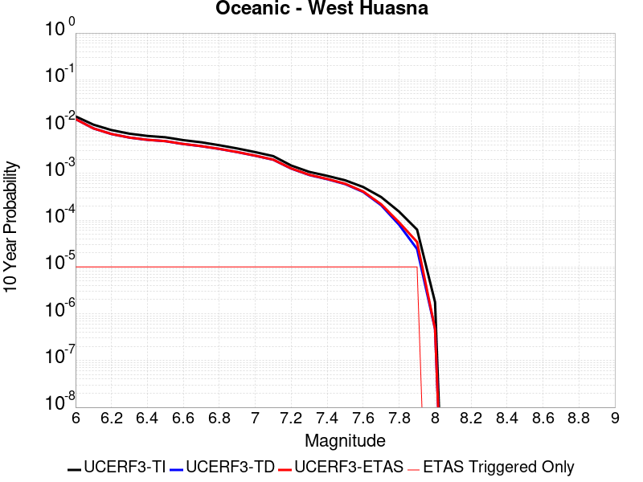 |

| Magnitude | 1 wk TI Prob | 1 wk TD Prob | 1 wk ETAS Prob | 1 wk ETAS/TD Gain | 1 wk ETAS Triggered Only | 1 mo TI Prob | 1 mo TD Prob | 1 mo ETAS Prob | 1 mo ETAS/TD Gain | 1 mo ETAS Triggered Only | 1 yr TI Prob | 1 yr TD Prob | 1 yr ETAS Prob | 1 yr ETAS/TD Gain | 1 yr ETAS Triggered Only | 10 yr TI Prob | 10 yr TD Prob | 10 yr ETAS Prob | 10 yr ETAS/TD Gain | 10 yr ETAS Triggered Only |
|-----|-----|-----|-----|-----|-----|-----|-----|-----|-----|-----|-----|-----|-----|-----|-----|-----|-----|-----|-----|-----|
| 6.0 | 3.195567E-5 | 2.7931088E-5 | 2.7931088E-5 | 1.0 | 0.0 | 1.3694567E-4 | 1.1969941E-4 | 1.1969941E-4 | 1.0 | 0.0 | 0.0016660384 | 0.0014564092 | 0.0014564092 | 1.0 | 0.0 | 0.016536033 | 0.0144732 | 0.014483055 | 1.0006809 | 1.0E-5 |
| 6.1 | 2.1156782E-5 | 1.7575998E-5 | 1.7575998E-5 | 1.0 | 0.0 | 9.066878E-5 | 7.532358E-5 | 7.532358E-5 | 1.0 | 0.0 | 0.0011033333 | 9.166881E-4 | 9.166881E-4 | 1.0 | 0.0 | 0.010978713 | 0.0091300765 | 0.009139985 | 1.0010853 | 1.0E-5 |
| 6.2 | 1.6195117E-5 | 1.33289195E-5 | 1.33289195E-5 | 1.0 | 0.0 | 6.9405796E-5 | 5.7122706E-5 | 5.7122706E-5 | 1.0 | 0.0 | 8.44688E-4 | 6.952496E-4 | 6.952496E-4 | 1.0 | 0.0 | 0.008414844 | 0.006931039 | 0.0069409697 | 1.0014328 | 1.0E-5 |
| 6.3 | 1.3559345E-5 | 1.1180543E-5 | 1.1180543E-5 | 1.0 | 0.0 | 5.811018E-5 | 4.791574E-5 | 4.791574E-5 | 1.0 | 0.0 | 7.072618E-4 | 5.8321893E-4 | 5.8321893E-4 | 1.0 | 0.0 | 0.0070501505 | 0.0058170017 | 0.005826943 | 1.0017091 | 1.0E-5 |
| 6.4 | 1.2120619E-5 | 1.0002192E-5 | 1.0002192E-5 | 1.0 | 0.0 | 5.1944477E-5 | 4.286583E-5 | 4.286583E-5 | 1.0 | 0.0 | 6.322405E-4 | 5.21767E-4 | 5.21767E-4 | 1.0 | 0.0 | 0.006304447 | 0.0052054874 | 0.0052154353 | 1.001911 | 1.0E-5 |
| 6.5 | 1.13511915E-5 | 9.368602E-6 | 9.368602E-6 | 1.0 | 0.0 | 4.8647056E-5 | 4.0150535E-5 | 4.0150535E-5 | 1.0 | 0.0 | 5.9211696E-4 | 4.8872357E-4 | 4.8872357E-4 | 1.0 | 0.0 | 0.0059054173 | 0.0048765466 | 0.0048864977 | 1.0020406 | 1.0E-5 |
| 6.6 | 9.850605E-6 | 8.136387E-6 | 8.136387E-6 | 1.0 | 0.0 | 4.2216197E-5 | 3.486976E-5 | 3.486976E-5 | 1.0 | 0.0 | 5.1386096E-4 | 4.244569E-4 | 4.244569E-4 | 1.0 | 0.0 | 0.0051267436 | 0.004236494 | 0.004246452 | 1.0023504 | 1.0E-5 |
| 6.7 | 8.8558645E-6 | 7.319305E-6 | 7.319305E-6 | 1.0 | 0.0 | 3.7953152E-5 | 3.1368076E-5 | 3.1368076E-5 | 1.0 | 0.0 | 4.6198163E-4 | 3.8183955E-4 | 3.8183955E-4 | 1.0 | 0.0 | 0.004610224 | 0.0038118602 | 0.003821822 | 1.0026134 | 1.0E-5 |
| 6.8 | 7.67136E-6 | 6.3925254E-6 | 6.3925254E-6 | 1.0 | 0.0 | 3.2876844E-5 | 2.739625E-5 | 2.739625E-5 | 1.0 | 0.0 | 4.0020206E-4 | 3.3349846E-4 | 3.3349846E-4 | 1.0 | 0.0 | 0.003994821 | 0.0033300007 | 0.0033399675 | 1.002993 | 1.0E-5 |
| 6.9 | 6.534529E-6 | 5.459002E-6 | 5.459002E-6 | 1.0 | 0.0 | 2.8004823E-5 | 2.3395512E-5 | 2.3395512E-5 | 1.0 | 0.0 | 3.4090536E-4 | 2.8480327E-4 | 2.8480327E-4 | 1.0 | 0.0 | 0.0034038287 | 0.0028443995 | 0.002854371 | 1.0035057 | 1.0E-5 |
| 7.0 | 5.460525E-6 | 4.570543E-6 | 4.570543E-6 | 1.0 | 0.0 | 2.3402039E-5 | 1.9587895E-5 | 1.9587895E-5 | 1.0 | 0.0 | 2.8488258E-4 | 2.3845663E-4 | 2.3845663E-4 | 1.0 | 0.0 | 0.0028451765 | 0.0023820214 | 0.0023919977 | 1.0041881 | 1.0E-5 |
| 7.1 | 4.4825083E-6 | 3.7529808E-6 | 3.7529808E-6 | 1.0 | 0.0 | 1.9210609E-5 | 1.6084105E-5 | 1.6084105E-5 | 1.0 | 0.0 | 2.3386406E-4 | 1.9580648E-4 | 1.9580648E-4 | 1.0 | 0.0 | 0.002336181 | 0.0019563516 | 0.0019663319 | 1.0051016 | 1.0E-5 |
| 7.2 | 2.821708E-6 | 2.425378E-6 | 2.425378E-6 | 1.0 | 0.0 | 1.2092979E-5 | 1.0394436E-5 | 1.0394436E-5 | 1.0 | 0.0 | 1.4722206E-4 | 1.2654491E-4 | 1.2654491E-4 | 1.0 | 0.0 | 0.0014712457 | 0.001264731 | 0.0012747183 | 1.0078968 | 1.0E-5 |
| 7.3 | 2.0644757E-6 | 1.769144E-6 | 1.769144E-6 | 1.0 | 0.0 | 8.847723E-6 | 7.582024E-6 | 7.582024E-6 | 1.0 | 0.0 | 1.0771569E-4 | 9.230723E-5 | 9.230723E-5 | 1.0 | 0.0 | 0.001076635 | 9.2269067E-4 | 9.3268143E-4 | 1.0108279 | 1.0E-5 |
| 7.4 | 1.6980367E-6 | 1.438338E-6 | 1.438338E-6 | 1.0 | 0.0 | 7.27728E-6 | 6.164291E-6 | 6.164291E-6 | 1.0 | 0.0 | 8.8597284E-5 | 7.504766E-5 | 7.504766E-5 | 1.0 | 0.0 | 8.8561967E-4 | 7.502248E-4 | 7.6021726E-4 | 1.0133194 | 1.0E-5 |
| 7.5 | 1.3637683E-6 | 1.1305964E-6 | 1.1305964E-6 | 1.0 | 0.0 | 5.844708E-6 | 4.845404E-6 | 4.845404E-6 | 1.0 | 0.0 | 7.1156996E-5 | 5.8991198E-5 | 5.8991198E-5 | 1.0 | 0.0 | 7.1134215E-4 | 5.897569E-4 | 5.99751E-4 | 1.0169462 | 1.0E-5 |
| 7.6 | 9.802994E-7 | 7.6803957E-7 | 7.6803957E-7 | 1.0 | 0.0 | 4.2012766E-6 | 3.2915939E-6 | 3.2915939E-6 | 1.0 | 0.0 | 5.1149345E-5 | 4.007442E-5 | 4.007442E-5 | 1.0 | 0.0 | 5.113757E-4 | 4.0067337E-4 | 4.1066934E-4 | 1.024948 | 1.0E-5 |
| 7.7 | 5.986191E-7 | 4.007707E-7 | 4.007707E-7 | 1.0 | 0.0 | 2.5655079E-6 | 1.7175875E-6 | 1.7175875E-6 | 1.0 | 0.0 | 3.1234613E-5 | 2.0911426E-5 | 2.0911426E-5 | 1.0 | 0.0 | 3.123022E-4 | 2.0909593E-4 | 2.1909385E-4 | 1.047815 | 1.0E-5 |
| 7.8 | 2.9189815E-7 | 1.5308534E-7 | 1.5308534E-7 | 1.0 | 0.0 | 1.2509914E-6 | 6.560798E-7 | 6.560798E-7 | 1.0 | 0.0 | 1.5230714E-5 | 7.987743E-6 | 7.987743E-6 | 1.0 | 0.0 | 1.522967E-4 | 7.987587E-5 | 8.9875066E-5 | 1.1251843 | 1.0E-5 |
| 7.9 | 1.2057845E-7 | 4.6338755E-8 | 4.6338755E-8 | 1.0 | 0.0 | 5.1676466E-7 | 1.9859465E-7 | 1.9859465E-7 | 1.0 | 0.0 | 6.2915915E-6 | 2.4178871E-6 | 2.4178871E-6 | 1.0 | 0.0 | 6.2914136E-5 | 2.417991E-5 | 3.417967E-5 | 1.4135565 | 1.0E-5 |
| 8.0 | 3.3806387E-9 | 9.060215E-10 | 9.060215E-10 | 1.0 | 0.0 | 1.4488451E-8 | 3.88295E-9 | 3.88295E-9 | 1.0 | 0.0 | 1.7639688E-7 | 4.727492E-8 | 4.727492E-8 | 1.0 | 0.0 | 1.7639674E-6 | 4.7384066E-7 | 4.7384066E-7 | 1.0 | 0.0 |

## Great Valley 03 Mysterious Ridge
*[(top)](#table-of-contents)*

| 1 Week | 1 Month | 1 Year | 10 Year |
|-----|-----|-----|-----|
|  |  |  |  |

| Magnitude | 1 wk TI Prob | 1 wk TD Prob | 1 wk ETAS Prob | 1 wk ETAS/TD Gain | 1 wk ETAS Triggered Only | 1 mo TI Prob | 1 mo TD Prob | 1 mo ETAS Prob | 1 mo ETAS/TD Gain | 1 mo ETAS Triggered Only | 1 yr TI Prob | 1 yr TD Prob | 1 yr ETAS Prob | 1 yr ETAS/TD Gain | 1 yr ETAS Triggered Only | 10 yr TI Prob | 10 yr TD Prob | 10 yr ETAS Prob | 10 yr ETAS/TD Gain | 10 yr ETAS Triggered Only |
|-----|-----|-----|-----|-----|-----|-----|-----|-----|-----|-----|-----|-----|-----|-----|-----|-----|-----|-----|-----|-----|
| 6.0 | 3.1182444E-5 | 3.6044894E-5 | 3.6044894E-5 | 1.0 | 0.0 | 1.336322E-4 | 1.5447004E-4 | 1.5447004E-4 | 1.0 | 0.0 | 0.0016257578 | 0.0018792376 | 0.0018792376 | 1.0 | 0.0 | 0.016139153 | 0.018652247 | 0.018662062 | 1.0005261 | 1.0E-5 |
| 6.1 | 3.1182444E-5 | 3.6044894E-5 | 3.6044894E-5 | 1.0 | 0.0 | 1.336322E-4 | 1.5447004E-4 | 1.5447004E-4 | 1.0 | 0.0 | 0.0016257578 | 0.0018792376 | 0.0018792376 | 1.0 | 0.0 | 0.016139153 | 0.018652247 | 0.018662062 | 1.0005261 | 1.0E-5 |
| 6.2 | 3.1182444E-5 | 3.6044894E-5 | 3.6044894E-5 | 1.0 | 0.0 | 1.336322E-4 | 1.5447004E-4 | 1.5447004E-4 | 1.0 | 0.0 | 0.0016257578 | 0.0018792376 | 0.0018792376 | 1.0 | 0.0 | 0.016139153 | 0.018652247 | 0.018662062 | 1.0005261 | 1.0E-5 |
| 6.3 | 2.106934E-5 | 2.3856412E-5 | 2.3856412E-5 | 1.0 | 0.0 | 9.0294045E-5 | 1.0223794E-4 | 1.0223794E-4 | 1.0 | 0.0 | 0.0010987755 | 0.0012440669 | 0.0012440669 | 1.0 | 0.0 | 0.010933585 | 0.0123742735 | 0.0123742735 | 1.0 | 0.0 |
| 6.4 | 2.106934E-5 | 2.3856412E-5 | 2.3856412E-5 | 1.0 | 0.0 | 9.0294045E-5 | 1.0223794E-4 | 1.0223794E-4 | 1.0 | 0.0 | 0.0010987755 | 0.0012440669 | 0.0012440669 | 1.0 | 0.0 | 0.010933585 | 0.0123742735 | 0.0123742735 | 1.0 | 0.0 |
| 6.5 | 1.9389783E-5 | 2.189044E-5 | 2.189044E-5 | 1.0 | 0.0 | 8.309642E-5 | 9.381296E-5 | 9.381296E-5 | 1.0 | 0.0 | 0.0010112294 | 0.0011416018 | 0.0011416018 | 1.0 | 0.0 | 0.010066401 | 0.01136025 | 0.01136025 | 1.0 | 0.0 |
| 6.6 | 1.9370193E-5 | 2.187036E-5 | 2.187036E-5 | 1.0 | 0.0 | 8.301247E-5 | 9.372691E-5 | 9.372691E-5 | 1.0 | 0.0 | 0.0010102082 | 0.0011405553 | 0.0011405553 | 1.0 | 0.0 | 0.010056281 | 0.011349892 | 0.011349892 | 1.0 | 0.0 |
| 6.7 | 1.6723505E-5 | 1.8803798E-5 | 1.8803798E-5 | 1.0 | 0.0 | 7.16702E-5 | 8.058533E-5 | 8.058533E-5 | 1.0 | 0.0 | 8.722353E-4 | 9.807042E-4 | 9.807042E-4 | 1.0 | 0.0 | 0.008688197 | 0.009765774 | 0.009765774 | 1.0 | 0.0 |
| 6.8 | 1.426937E-5 | 1.6000957E-5 | 1.6000957E-5 | 1.0 | 0.0 | 6.115301E-5 | 6.857381E-5 | 6.857381E-5 | 1.0 | 0.0 | 7.4428355E-4 | 8.345808E-4 | 8.345808E-4 | 1.0 | 0.0 | 0.007417957 | 0.008315944 | 0.008315944 | 1.0 | 0.0 |
| 6.9 | 1.2469891E-5 | 1.3960147E-5 | 1.3960147E-5 | 1.0 | 0.0 | 5.3441294E-5 | 5.9827897E-5 | 5.9827897E-5 | 1.0 | 0.0 | 6.504535E-4 | 7.281733E-4 | 7.281733E-4 | 1.0 | 0.0 | 0.006485529 | 0.007259098 | 0.007259098 | 1.0 | 0.0 |
| 7.0 | 8.7746275E-6 | 9.793928E-6 | 9.793928E-6 | 1.0 | 0.0 | 3.7605005E-5 | 4.1973344E-5 | 4.1973344E-5 | 1.0 | 0.0 | 4.5774475E-4 | 5.1091297E-4 | 5.1091297E-4 | 1.0 | 0.0 | 0.00456803 | 0.0050981166 | 0.0050981166 | 1.0 | 0.0 |
| 7.1 | 6.1067153E-6 | 6.8152503E-6 | 6.8152503E-6 | 1.0 | 0.0 | 2.6171374E-5 | 2.920792E-5 | 2.920792E-5 | 1.0 | 0.0 | 3.1858988E-4 | 3.55554E-4 | 3.55554E-4 | 1.0 | 0.0 | 0.0031813353 | 0.0035504021 | 0.0035504021 | 1.0 | 0.0 |
| 7.2 | 2.939283E-6 | 3.2748273E-6 | 3.2748273E-6 | 1.0 | 0.0 | 1.2596866E-5 | 1.4034908E-5 | 1.4034908E-5 | 1.0 | 0.0 | 1.5335606E-4 | 1.7086336E-4 | 1.7086336E-4 | 1.0 | 0.0 | 0.0015325027 | 0.001707492 | 0.001707492 | 1.0 | 0.0 |
| 7.3 | 7.2387763E-7 | 8.0101614E-7 | 8.0101614E-7 | 1.0 | 0.0 | 3.102329E-6 | 3.4329244E-6 | 3.4329244E-6 | 1.0 | 0.0 | 3.77702E-5 | 4.1795513E-5 | 4.1795513E-5 | 1.0 | 0.0 | 3.7763783E-4 | 4.179215E-4 | 4.179215E-4 | 1.0 | 0.0 |
| 7.4 | 3.112171E-8 | 3.2070247E-8 | 3.2070247E-8 | 1.0 | 0.0 | 1.3337875E-7 | 1.374439E-7 | 1.374439E-7 | 1.0 | 0.0 | 1.6238852E-6 | 1.6733784E-6 | 1.6733784E-6 | 1.0 | 0.0 | 1.6238733E-5 | 1.6733666E-5 | 1.6733666E-5 | 1.0 | 0.0 |

## San Jacinto (Superstition Mtn)
*[(top)](#table-of-contents)*

| 1 Week | 1 Month | 1 Year | 10 Year |
|-----|-----|-----|-----|
| 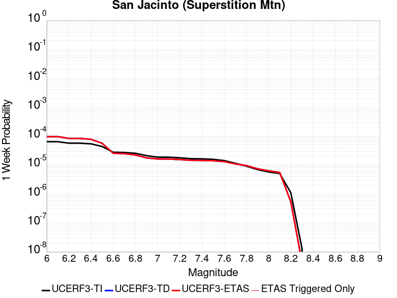 |  | 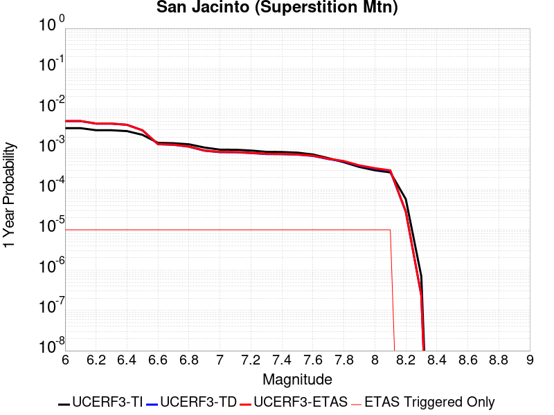 |  |

| Magnitude | 1 wk TI Prob | 1 wk TD Prob | 1 wk ETAS Prob | 1 wk ETAS/TD Gain | 1 wk ETAS Triggered Only | 1 mo TI Prob | 1 mo TD Prob | 1 mo ETAS Prob | 1 mo ETAS/TD Gain | 1 mo ETAS Triggered Only | 1 yr TI Prob | 1 yr TD Prob | 1 yr ETAS Prob | 1 yr ETAS/TD Gain | 1 yr ETAS Triggered Only | 10 yr TI Prob | 10 yr TD Prob | 10 yr ETAS Prob | 10 yr ETAS/TD Gain | 10 yr ETAS Triggered Only |
|-----|-----|-----|-----|-----|-----|-----|-----|-----|-----|-----|-----|-----|-----|-----|-----|-----|-----|-----|-----|-----|
| 6.0 | 6.4193904E-5 | 9.610487E-5 | 9.610487E-5 | 1.0 | 0.0 | 2.7508775E-4 | 4.118228E-4 | 4.118228E-4 | 1.0 | 0.0 | 0.0033440501 | 0.005003626 | 0.005013576 | 1.0019885 | 1.0E-5 | 0.03294174 | 0.04887716 | 0.04888667 | 1.0001945 | 1.0E-5 |
| 6.1 | 6.4193904E-5 | 9.610487E-5 | 9.610487E-5 | 1.0 | 0.0 | 2.7508775E-4 | 4.118228E-4 | 4.118228E-4 | 1.0 | 0.0 | 0.0033440501 | 0.005003626 | 0.005013576 | 1.0019885 | 1.0E-5 | 0.03294174 | 0.04887716 | 0.04888667 | 1.0001945 | 1.0E-5 |
| 6.2 | 5.7023593E-5 | 8.324514E-5 | 8.324514E-5 | 1.0 | 0.0 | 2.4436394E-4 | 3.567255E-4 | 3.567255E-4 | 1.0 | 0.0 | 0.002971072 | 0.0043360987 | 0.0043460554 | 1.0022962 | 1.0E-5 | 0.029316625 | 0.042554263 | 0.042563837 | 1.000225 | 1.0E-5 |
| 6.3 | 5.6940098E-5 | 8.309043E-5 | 8.309043E-5 | 1.0 | 0.0 | 2.4400617E-4 | 3.5606266E-4 | 3.5606266E-4 | 1.0 | 0.0 | 0.002966728 | 0.0043280604 | 0.004338017 | 1.0023005 | 1.0E-5 | 0.029274331 | 0.042477485 | 0.04248706 | 1.0002254 | 1.0E-5 |
| 6.4 | 5.4171585E-5 | 7.758034E-5 | 7.758034E-5 | 1.0 | 0.0 | 2.3214328E-4 | 3.324541E-4 | 3.324541E-4 | 1.0 | 0.0 | 0.0028226813 | 0.0040417654 | 0.004051725 | 1.0024642 | 1.0E-5 | 0.02787096 | 0.039765224 | 0.039774824 | 1.0002415 | 1.0E-5 |
| 6.5 | 4.375144E-5 | 5.651511E-5 | 5.651511E-5 | 1.0 | 0.0 | 1.874927E-4 | 2.4219177E-4 | 2.4219177E-4 | 1.0 | 0.0 | 0.0022803338 | 0.0029458737 | 0.0029558442 | 1.0033846 | 1.0E-5 | 0.022570757 | 0.029284593 | 0.0292943 | 1.0003315 | 1.0E-5 |
| 6.6 | 2.772192E-5 | 2.5577614E-5 | 2.5577614E-5 | 1.0 | 0.0 | 1.1880282E-4 | 1.0961385E-4 | 1.0961385E-4 | 1.0 | 0.0 | 0.0014454646 | 0.001333751 | 0.0013437377 | 1.0074877 | 1.0E-5 | 0.014360986 | 0.013586823 | 0.0135966875 | 1.000726 | 1.0E-5 |
| 6.7 | 2.7124124E-5 | 2.4788185E-5 | 2.4788185E-5 | 1.0 | 0.0 | 1.1624106E-4 | 1.06230866E-4 | 1.06230866E-4 | 1.0 | 0.0 | 0.0014143161 | 0.0012926126 | 0.0013025997 | 1.0077263 | 1.0E-5 | 0.014053487 | 0.013180068 | 0.013189936 | 1.0007488 | 1.0E-5 |
| 6.8 | 2.5475807E-5 | 2.2251092E-5 | 2.2251092E-5 | 1.0 | 0.0 | 1.0917746E-4 | 9.535841E-5 | 9.535841E-5 | 1.0 | 0.0 | 0.001328425 | 0.0011603823 | 0.0011703706 | 1.0086079 | 1.0E-5 | 0.0132051185 | 0.011867279 | 0.0118771605 | 1.0008327 | 1.0E-5 |
| 6.9 | 2.1162023E-5 | 1.770633E-5 | 1.770633E-5 | 1.0 | 0.0 | 9.069123E-5 | 7.588209E-5 | 7.588209E-5 | 1.0 | 0.0 | 0.0011036064 | 9.2347665E-4 | 9.334674E-4 | 1.0108186 | 1.0E-5 | 0.010981417 | 0.009488733 | 0.009498638 | 1.0010439 | 1.0E-5 |
| 7.0 | 1.8754288E-5 | 1.6238078E-5 | 1.6238078E-5 | 1.0 | 0.0 | 8.037304E-5 | 6.958992E-5 | 6.958992E-5 | 1.0 | 0.0 | 9.781026E-4 | 8.469305E-4 | 8.56922E-4 | 1.0117973 | 1.0E-5 | 0.009738087 | 0.008710048 | 0.008719961 | 1.0011381 | 1.0E-5 |
| 7.1 | 1.8678527E-5 | 1.6163149E-5 | 1.6163149E-5 | 1.0 | 0.0 | 8.0048376E-5 | 6.926881E-5 | 6.926881E-5 | 1.0 | 0.0 | 9.7415317E-4 | 8.4302394E-4 | 8.530155E-4 | 1.011852 | 1.0E-5 | 0.009698939 | 0.008670971 | 0.008680884 | 1.0011432 | 1.0E-5 |
| 7.2 | 1.7804578E-5 | 1.5456922E-5 | 1.5456922E-5 | 1.0 | 0.0 | 7.6303106E-5 | 6.624229E-5 | 6.624229E-5 | 1.0 | 0.0 | 9.285943E-4 | 8.062037E-4 | 8.161956E-4 | 1.0123938 | 1.0E-5 | 0.009247236 | 0.008301882 | 0.008311799 | 1.0011946 | 1.0E-5 |
| 7.3 | 1.6583685E-5 | 1.46051525E-5 | 1.46051525E-5 | 1.0 | 0.0 | 7.1070994E-5 | 6.259202E-5 | 6.259202E-5 | 1.0 | 0.0 | 8.649459E-4 | 7.6179346E-4 | 7.7178585E-4 | 1.013117 | 1.0E-5 | 0.00861587 | 0.0078567555 | 0.007866677 | 1.0012628 | 1.0E-5 |
| 7.4 | 1.6387552E-5 | 1.4469894E-5 | 1.4469894E-5 | 1.0 | 0.0 | 7.023047E-5 | 6.201237E-5 | 6.201237E-5 | 1.0 | 0.0 | 8.5472054E-4 | 7.547411E-4 | 7.6473353E-4 | 1.0132396 | 1.0E-5 | 0.008514405 | 0.0077860653 | 0.007795987 | 1.0012743 | 1.0E-5 |
| 7.5 | 1.5790754E-5 | 1.41098235E-5 | 1.41098235E-5 | 1.0 | 0.0 | 6.767291E-5 | 6.0469283E-5 | 6.0469283E-5 | 1.0 | 0.0 | 8.236062E-4 | 7.3596684E-4 | 7.4595946E-4 | 1.0135776 | 1.0E-5 | 0.008205604 | 0.00759624 | 0.0076061636 | 1.0013064 | 1.0E-5 |
| 7.6 | 1.4248672E-5 | 1.3126889E-5 | 1.3126889E-5 | 1.0 | 0.0 | 6.106431E-5 | 5.625689E-5 | 5.625689E-5 | 1.0 | 0.0 | 7.432043E-4 | 6.847141E-4 | 6.9470727E-4 | 1.0145947 | 1.0E-5 | 0.007407237 | 0.007077851 | 0.00708778 | 1.0014029 | 1.0E-5 |
| 7.7 | 1.15449975E-5 | 1.0972594E-5 | 1.0972594E-5 | 1.0 | 0.0 | 4.947762E-5 | 4.702456E-5 | 4.702456E-5 | 1.0 | 0.0 | 6.022235E-4 | 5.723744E-4 | 5.823687E-4 | 1.0174611 | 1.0E-5 | 0.006005941 | 0.0059463303 | 0.0059562707 | 1.0016717 | 1.0E-5 |
| 7.8 | 9.1391985E-6 | 9.580587E-6 | 9.580587E-6 | 1.0 | 0.0 | 3.9167408E-5 | 4.105902E-5 | 4.105902E-5 | 1.0 | 0.0 | 4.767588E-4 | 4.997795E-4 | 5.097745E-4 | 1.0199988 | 1.0E-5 | 0.0047573727 | 0.005211488 | 0.005221436 | 1.0019088 | 1.0E-5 |
| 7.9 | 6.973017E-6 | 7.441298E-6 | 7.441298E-6 | 1.0 | 0.0 | 2.9884017E-5 | 3.189089E-5 | 3.189089E-5 | 1.0 | 0.0 | 3.6377716E-4 | 3.8820296E-4 | 3.9819907E-4 | 1.0257497 | 1.0E-5 | 0.0036318225 | 0.0040829023 | 0.004092862 | 1.0024393 | 1.0E-5 |
| 8.0 | 5.7638235E-6 | 6.313992E-6 | 6.313992E-6 | 1.0 | 0.0 | 2.4701867E-5 | 2.7059687E-5 | 2.7059687E-5 | 1.0 | 0.0 | 3.0070372E-4 | 3.294024E-4 | 3.393991E-4 | 1.0303481 | 1.0E-5 | 0.0030029714 | 0.0034819096 | 0.0034918748 | 1.002862 | 1.0E-5 |
| 8.1 | 5.1124434E-6 | 5.5449905E-6 | 5.5449905E-6 | 1.0 | 0.0 | 2.1910288E-5 | 2.3764032E-5 | 2.3764032E-5 | 1.0 | 0.0 | 2.6672508E-4 | 2.8928916E-4 | 2.9928627E-4 | 1.0345575 | 1.0E-5 | 0.0026640517 | 0.003066355 | 0.0030763242 | 1.0032512 | 1.0E-5 |
| 8.2 | 1.1075938E-6 | 5.4066044E-7 | 5.4066044E-7 | 1.0 | 0.0 | 4.7468216E-6 | 2.3171142E-6 | 2.3171142E-6 | 1.0 | 0.0 | 5.779102E-5 | 2.8210523E-5 | 2.8210523E-5 | 1.0 | 0.0 | 5.777599E-4 | 3.173688E-4 | 3.173688E-4 | 1.0 | 0.0 |
| 8.3 | 1.3584393E-8 | 4.540806E-9 | 4.540806E-9 | 1.0 | 0.0 | 5.8218827E-8 | 1.9460597E-8 | 1.9460597E-8 | 1.0 | 0.0 | 7.0881396E-7 | 2.3693276E-7 | 2.3693276E-7 | 1.0 | 0.0 | 7.0881174E-6 | 2.6538544E-6 | 2.6538544E-6 | 1.0 | 0.0 |

## San Jacinto (Anza) rev
*[(top)](#table-of-contents)*

| 1 Week | 1 Month | 1 Year | 10 Year |
|-----|-----|-----|-----|
|  |  |  |  |

| Magnitude | 1 wk TI Prob | 1 wk TD Prob | 1 wk ETAS Prob | 1 wk ETAS/TD Gain | 1 wk ETAS Triggered Only | 1 mo TI Prob | 1 mo TD Prob | 1 mo ETAS Prob | 1 mo ETAS/TD Gain | 1 mo ETAS Triggered Only | 1 yr TI Prob | 1 yr TD Prob | 1 yr ETAS Prob | 1 yr ETAS/TD Gain | 1 yr ETAS Triggered Only | 10 yr TI Prob | 10 yr TD Prob | 10 yr ETAS Prob | 10 yr ETAS/TD Gain | 10 yr ETAS Triggered Only |
|-----|-----|-----|-----|-----|-----|-----|-----|-----|-----|-----|-----|-----|-----|-----|-----|-----|-----|-----|-----|-----|
| 6.0 | 6.3015636E-5 | 4.3558586E-5 | 4.3558586E-5 | 1.0 | 0.0 | 2.7003905E-4 | 1.8666637E-4 | 1.8666637E-4 | 1.0 | 0.0 | 0.0032827691 | 0.0022703062 | 0.0022802837 | 1.0043947 | 1.0E-5 | 0.032346968 | 0.02342843 | 0.023438197 | 1.0004169 | 1.0E-5 |
| 6.1 | 6.3015636E-5 | 4.3558586E-5 | 4.3558586E-5 | 1.0 | 0.0 | 2.7003905E-4 | 1.8666637E-4 | 1.8666637E-4 | 1.0 | 0.0 | 0.0032827691 | 0.0022703062 | 0.0022802837 | 1.0043947 | 1.0E-5 | 0.032346968 | 0.02342843 | 0.023438197 | 1.0004169 | 1.0E-5 |
| 6.2 | 6.3015636E-5 | 4.3558586E-5 | 4.3558586E-5 | 1.0 | 0.0 | 2.7003905E-4 | 1.8666637E-4 | 1.8666637E-4 | 1.0 | 0.0 | 0.0032827691 | 0.0022703062 | 0.0022802837 | 1.0043947 | 1.0E-5 | 0.032346968 | 0.02342843 | 0.023438197 | 1.0004169 | 1.0E-5 |
| 6.3 | 6.3015636E-5 | 4.3558586E-5 | 4.3558586E-5 | 1.0 | 0.0 | 2.7003905E-4 | 1.8666637E-4 | 1.8666637E-4 | 1.0 | 0.0 | 0.0032827691 | 0.0022703062 | 0.0022802837 | 1.0043947 | 1.0E-5 | 0.032346968 | 0.02342843 | 0.023438197 | 1.0004169 | 1.0E-5 |
| 6.4 | 6.3015636E-5 | 4.3558586E-5 | 4.3558586E-5 | 1.0 | 0.0 | 2.7003905E-4 | 1.8666637E-4 | 1.8666637E-4 | 1.0 | 0.0 | 0.0032827691 | 0.0022703062 | 0.0022802837 | 1.0043947 | 1.0E-5 | 0.032346968 | 0.02342843 | 0.023438197 | 1.0004169 | 1.0E-5 |
| 6.5 | 5.811017E-5 | 4.0325962E-5 | 4.0325962E-5 | 1.0 | 0.0 | 2.4901982E-4 | 1.7281414E-4 | 1.7281414E-4 | 1.0 | 0.0 | 0.0030276014 | 0.0021019876 | 0.0021119665 | 1.0047474 | 1.0E-5 | 0.02986684 | 0.021719897 | 0.02172968 | 1.0004504 | 1.0E-5 |
| 6.6 | 5.811017E-5 | 4.0325962E-5 | 4.0325962E-5 | 1.0 | 0.0 | 2.4901982E-4 | 1.7281414E-4 | 1.7281414E-4 | 1.0 | 0.0 | 0.0030276014 | 0.0021019876 | 0.0021119665 | 1.0047474 | 1.0E-5 | 0.02986684 | 0.021719897 | 0.02172968 | 1.0004504 | 1.0E-5 |
| 6.7 | 5.712442E-5 | 3.974603E-5 | 3.974603E-5 | 1.0 | 0.0 | 2.4479596E-4 | 1.7032905E-4 | 1.7032905E-4 | 1.0 | 0.0 | 0.0029763177 | 0.0020717892 | 0.0020817686 | 1.0048168 | 1.0E-5 | 0.029367693 | 0.02141046 | 0.021420246 | 1.000457 | 1.0E-5 |
| 6.8 | 5.6967532E-5 | 3.9601873E-5 | 3.9601873E-5 | 1.0 | 0.0 | 2.4412372E-4 | 1.697113E-4 | 1.697113E-4 | 1.0 | 0.0 | 0.0029681553 | 0.0020642825 | 0.002074262 | 1.0048343 | 1.0E-5 | 0.029288229 | 0.021334913 | 0.021344699 | 1.0004587 | 1.0E-5 |
| 6.9 | 5.6211324E-5 | 3.9304945E-5 | 3.9304945E-5 | 1.0 | 0.0 | 2.4088343E-4 | 1.6843891E-4 | 1.6843891E-4 | 1.0 | 0.0 | 0.0029288116 | 0.0020488205 | 0.0020587998 | 1.0048709 | 1.0E-5 | 0.028905109 | 0.021173479 | 0.021183267 | 1.0004623 | 1.0E-5 |
| 7.0 | 5.4383527E-5 | 3.8159793E-5 | 3.8159793E-5 | 1.0 | 0.0 | 2.3305144E-4 | 1.6353175E-4 | 1.6353175E-4 | 1.0 | 0.0 | 0.0028337094 | 0.0019891858 | 0.0019991659 | 1.0050172 | 1.0E-5 | 0.027978465 | 0.02056159 | 0.020571385 | 1.0004764 | 1.0E-5 |
| 7.1 | 5.1393665E-5 | 3.6614238E-5 | 3.6614238E-5 | 1.0 | 0.0 | 2.2023996E-4 | 1.5690875E-4 | 1.5690875E-4 | 1.0 | 0.0 | 0.0026781242 | 0.0019086944 | 0.0019186753 | 1.0052292 | 1.0E-5 | 0.026460782 | 0.019731123 | 0.019740926 | 1.0004969 | 1.0E-5 |
| 7.2 | 4.785222E-5 | 3.4957E-5 | 3.4957E-5 | 1.0 | 0.0 | 2.0506482E-4 | 1.4980712E-4 | 1.4980712E-4 | 1.0 | 0.0 | 0.0024938055 | 0.0018223795 | 0.0018323613 | 1.0054773 | 1.0E-5 | 0.024660049 | 0.018841097 | 0.018850908 | 1.0005207 | 1.0E-5 |
| 7.3 | 4.2143256E-5 | 3.4044428E-5 | 3.4044428E-5 | 1.0 | 0.0 | 1.8060145E-4 | 1.4589654E-4 | 1.4589654E-4 | 1.0 | 0.0 | 0.002196605 | 0.0017748467 | 0.001784829 | 1.0056243 | 1.0E-5 | 0.02175019 | 0.018345477 | 0.018355293 | 1.0005351 | 1.0E-5 |
| 7.4 | 4.0264713E-5 | 3.368046E-5 | 3.368046E-5 | 1.0 | 0.0 | 1.7255165E-4 | 1.4433687E-4 | 1.4433687E-4 | 1.0 | 0.0 | 0.002098792 | 0.0017558883 | 0.0017658707 | 1.0056851 | 1.0E-5 | 0.020790804 | 0.018148893 | 0.018158711 | 1.000541 | 1.0E-5 |
| 7.5 | 3.694492E-5 | 3.2388787E-5 | 3.2388787E-5 | 1.0 | 0.0 | 1.5832575E-4 | 1.3880171E-4 | 1.3880171E-4 | 1.0 | 0.0 | 0.0019259118 | 0.001688604 | 0.0016985872 | 1.0059121 | 1.0E-5 | 0.01909306 | 0.017462421 | 0.017472247 | 1.0005627 | 1.0E-5 |
| 7.6 | 3.200565E-5 | 2.9692457E-5 | 2.9692457E-5 | 1.0 | 0.0 | 1.3715986E-4 | 1.272472E-4 | 1.272472E-4 | 1.0 | 0.0 | 0.001668642 | 0.0015481359 | 0.0015581205 | 1.0064493 | 1.0E-5 | 0.01656168 | 0.016044319 | 0.016054159 | 1.0006133 | 1.0E-5 |
| 7.7 | 2.731642E-5 | 2.627576E-5 | 2.627576E-5 | 1.0 | 0.0 | 1.1706512E-4 | 1.1260554E-4 | 1.1260554E-4 | 1.0 | 0.0 | 0.001424336 | 0.0013701114 | 0.0013800976 | 1.0072887 | 1.0E-5 | 0.014152412 | 0.014262413 | 0.01427227 | 1.0006912 | 1.0E-5 |
| 7.8 | 2.3466424E-5 | 2.3680419E-5 | 2.3680419E-5 | 1.0 | 0.0 | 1.0056651E-4 | 1.01483565E-4 | 1.01483565E-4 | 1.0 | 0.0 | 0.0012237094 | 0.001234863 | 0.0012448506 | 1.0080881 | 1.0E-5 | 0.012169928 | 0.012900615 | 0.012910486 | 1.0007652 | 1.0E-5 |
| 7.9 | 1.8611925E-5 | 1.9066525E-5 | 1.9066525E-5 | 1.0 | 0.0 | 7.9762955E-5 | 8.171112E-5 | 8.171112E-5 | 1.0 | 0.0 | 9.7068126E-4 | 9.943796E-4 | 0.0010043697 | 1.0100465 | 1.0E-5 | 0.0096645225 | 0.010476896 | 0.010486791 | 1.0009445 | 1.0E-5 |
| 8.0 | 1.5460775E-5 | 1.5881766E-5 | 1.5881766E-5 | 1.0 | 0.0 | 6.6258784E-5 | 6.806294E-5 | 6.806294E-5 | 1.0 | 0.0 | 8.0640207E-4 | 8.2835194E-4 | 8.3834364E-4 | 1.0120622 | 1.0E-5 | 0.008034821 | 0.008776985 | 0.008786897 | 1.0011294 | 1.0E-5 |
| 8.1 | 9.983884E-6 | 8.352938E-6 | 8.352938E-6 | 1.0 | 0.0 | 4.2787375E-5 | 3.5797817E-5 | 3.5797817E-5 | 1.0 | 0.0 | 5.2081177E-4 | 4.3575178E-4 | 4.4574743E-4 | 1.0229388 | 1.0E-5 | 0.0051959283 | 0.0046846094 | 0.0046945624 | 1.0021247 | 1.0E-5 |
| 8.2 | 4.1226E-6 | 1.5768792E-6 | 1.5768792E-6 | 1.0 | 0.0 | 1.7668166E-5 | 6.7580363E-6 | 6.7580363E-6 | 1.0 | 0.0 | 2.1508869E-4 | 8.227601E-5 | 8.227601E-5 | 1.0 | 0.0 | 0.0021488064 | 9.5415505E-4 | 9.5415505E-4 | 1.0 | 0.0 |
| 8.3 | 1.2750878E-6 | 3.6776746E-7 | 3.6776746E-7 | 1.0 | 0.0 | 5.4646503E-6 | 1.5761453E-6 | 1.5761453E-6 | 1.0 | 0.0 | 6.653009E-5 | 1.9189405E-5 | 1.9189405E-5 | 1.0 | 0.0 | 6.6510175E-4 | 2.3119134E-4 | 2.3119134E-4 | 1.0 | 0.0 |

## La Panza 2011
*[(top)](#table-of-contents)*

| 1 Week | 1 Month | 1 Year | 10 Year |
|-----|-----|-----|-----|
|  |  |  |  |

| Magnitude | 1 wk TI Prob | 1 wk TD Prob | 1 wk ETAS Prob | 1 wk ETAS/TD Gain | 1 wk ETAS Triggered Only | 1 mo TI Prob | 1 mo TD Prob | 1 mo ETAS Prob | 1 mo ETAS/TD Gain | 1 mo ETAS Triggered Only | 1 yr TI Prob | 1 yr TD Prob | 1 yr ETAS Prob | 1 yr ETAS/TD Gain | 1 yr ETAS Triggered Only | 10 yr TI Prob | 10 yr TD Prob | 10 yr ETAS Prob | 10 yr ETAS/TD Gain | 10 yr ETAS Triggered Only |
|-----|-----|-----|-----|-----|-----|-----|-----|-----|-----|-----|-----|-----|-----|-----|-----|-----|-----|-----|-----|-----|
| 6.0 | 4.6754544E-6 | 4.7178937E-6 | 4.7178937E-6 | 1.0 | 0.0 | 2.0037509E-5 | 2.0219399E-5 | 2.0219399E-5 | 1.0 | 0.0 | 2.4392935E-4 | 2.4614536E-4 | 2.4614536E-4 | 1.0 | 0.0 | 0.0024366176 | 0.0024589216 | 0.002468897 | 1.0040568 | 1.0E-5 |
| 6.1 | 4.6754544E-6 | 4.7178937E-6 | 4.7178937E-6 | 1.0 | 0.0 | 2.0037509E-5 | 2.0219399E-5 | 2.0219399E-5 | 1.0 | 0.0 | 2.4392935E-4 | 2.4614536E-4 | 2.4614536E-4 | 1.0 | 0.0 | 0.0024366176 | 0.0024589216 | 0.002468897 | 1.0040568 | 1.0E-5 |
| 6.2 | 4.6754544E-6 | 4.7178937E-6 | 4.7178937E-6 | 1.0 | 0.0 | 2.0037509E-5 | 2.0219399E-5 | 2.0219399E-5 | 1.0 | 0.0 | 2.4392935E-4 | 2.4614536E-4 | 2.4614536E-4 | 1.0 | 0.0 | 0.0024366176 | 0.0024589216 | 0.002468897 | 1.0040568 | 1.0E-5 |
| 6.3 | 4.6754544E-6 | 4.7178937E-6 | 4.7178937E-6 | 1.0 | 0.0 | 2.0037509E-5 | 2.0219399E-5 | 2.0219399E-5 | 1.0 | 0.0 | 2.4392935E-4 | 2.4614536E-4 | 2.4614536E-4 | 1.0 | 0.0 | 0.0024366176 | 0.0024589216 | 0.002468897 | 1.0040568 | 1.0E-5 |
| 6.4 | 4.6754544E-6 | 4.7178937E-6 | 4.7178937E-6 | 1.0 | 0.0 | 2.0037509E-5 | 2.0219399E-5 | 2.0219399E-5 | 1.0 | 0.0 | 2.4392935E-4 | 2.4614536E-4 | 2.4614536E-4 | 1.0 | 0.0 | 0.0024366176 | 0.0024589216 | 0.002468897 | 1.0040568 | 1.0E-5 |
| 6.5 | 2.485343E-6 | 2.5008533E-6 | 2.5008533E-6 | 1.0 | 0.0 | 1.0651426E-5 | 1.07179E-5 | 1.07179E-5 | 1.0 | 0.0 | 1.296734E-4 | 1.3048302E-4 | 1.3048302E-4 | 1.0 | 0.0 | 0.0012959775 | 0.0013041024 | 0.0013140894 | 1.0076581 | 1.0E-5 |
| 6.6 | 2.485343E-6 | 2.5008533E-6 | 2.5008533E-6 | 1.0 | 0.0 | 1.0651426E-5 | 1.07179E-5 | 1.07179E-5 | 1.0 | 0.0 | 1.296734E-4 | 1.3048302E-4 | 1.3048302E-4 | 1.0 | 0.0 | 0.0012959775 | 0.0013041024 | 0.0013140894 | 1.0076581 | 1.0E-5 |
| 6.7 | 1.5108508E-6 | 1.5148694E-6 | 1.5148694E-6 | 1.0 | 0.0 | 6.4750584E-6 | 6.492282E-6 | 6.492282E-6 | 1.0 | 0.0 | 7.8830984E-5 | 7.904077E-5 | 7.904077E-5 | 1.0 | 0.0 | 7.880303E-4 | 7.9013745E-4 | 7.9013745E-4 | 1.0 | 0.0 |
| 6.8 | 1.3865837E-6 | 1.3887385E-6 | 1.3887385E-6 | 1.0 | 0.0 | 5.942488E-6 | 5.9517233E-6 | 5.9517233E-6 | 1.0 | 0.0 | 7.234739E-5 | 7.245992E-5 | 7.245992E-5 | 1.0 | 0.0 | 7.232384E-4 | 7.243728E-4 | 7.243728E-4 | 1.0 | 0.0 |
| 6.9 | 9.826583E-7 | 9.798473E-7 | 9.798473E-7 | 1.0 | 0.0 | 4.2113857E-6 | 4.199339E-6 | 4.199339E-6 | 1.0 | 0.0 | 5.1272415E-5 | 5.1125808E-5 | 5.1125808E-5 | 1.0 | 0.0 | 5.126059E-4 | 5.111458E-4 | 5.111458E-4 | 1.0 | 0.0 |
| 7.0 | 6.7797646E-7 | 6.7123244E-7 | 6.7123244E-7 | 1.0 | 0.0 | 2.9056102E-6 | 2.8767076E-6 | 2.8767076E-6 | 1.0 | 0.0 | 3.537523E-5 | 3.5023382E-5 | 3.5023382E-5 | 1.0 | 0.0 | 3.5369597E-4 | 3.5018174E-4 | 3.5018174E-4 | 1.0 | 0.0 |
| 7.1 | 3.4979826E-7 | 3.389418E-7 | 3.389418E-7 | 1.0 | 0.0 | 1.4991346E-6 | 1.452607E-6 | 1.452607E-6 | 1.0 | 0.0 | 1.825181E-5 | 1.7685357E-5 | 1.7685357E-5 | 1.0 | 0.0 | 1.825031E-4 | 1.7684067E-4 | 1.7684067E-4 | 1.0 | 0.0 |
| 7.2 | 2.5088332E-7 | 2.3851902E-7 | 2.3851902E-7 | 1.0 | 0.0 | 1.0752137E-6 | 1.0222241E-6 | 1.0222241E-6 | 1.0 | 0.0 | 1.3090649E-5 | 1.24455155E-5 | 1.24455155E-5 | 1.0 | 0.0 | 1.3089878E-4 | 1.2444904E-4 | 1.2444904E-4 | 1.0 | 0.0 |
| 7.3 | 1.0159086E-7 | 8.664118E-8 | 8.664118E-8 | 1.0 | 0.0 | 4.3538932E-7 | 3.713193E-7 | 3.713193E-7 | 1.0 | 0.0 | 5.300852E-6 | 4.5208035E-6 | 4.5208035E-6 | 1.0 | 0.0 | 5.3007258E-5 | 4.5207154E-5 | 4.5207154E-5 | 1.0 | 0.0 |
| 7.4 | 3.5006252E-8 | 1.9466952E-8 | 1.9466952E-8 | 1.0 | 0.0 | 1.5002678E-7 | 8.342979E-8 | 8.342979E-8 | 1.0 | 0.0 | 1.8265745E-6 | 1.0157572E-6 | 1.0157572E-6 | 1.0 | 0.0 | 1.8265595E-5 | 1.0157529E-5 | 1.0157529E-5 | 1.0 | 0.0 |
| 7.5 | 2.592274E-8 | 1.0285871E-8 | 1.0285871E-8 | 1.0 | 0.0 | 1.1109746E-7 | 4.4082302E-8 | 4.4082302E-8 | 1.0 | 0.0 | 1.3526106E-6 | 5.367019E-7 | 5.367019E-7 | 1.0 | 0.0 | 1.3526024E-5 | 5.367007E-6 | 5.367007E-6 | 1.0 | 0.0 |
| 7.6 | 1.9016717E-8 | 5.2748517E-9 | 5.2748517E-9 | 1.0 | 0.0 | 8.150022E-8 | 2.2606505E-8 | 2.2606505E-8 | 1.0 | 0.0 | 9.922647E-7 | 2.7523419E-7 | 2.7523419E-7 | 1.0 | 0.0 | 9.922603E-6 | 2.7523386E-6 | 2.7523386E-6 | 1.0 | 0.0 |
| 7.7 | 1.17738495E-8 | 1.2528638E-9 | 1.2528638E-9 | 1.0 | 0.0 | 5.0459356E-8 | 5.3694147E-9 | 5.3694147E-9 | 1.0 | 0.0 | 6.1434247E-7 | 6.5372625E-8 | 6.5372625E-8 | 1.0 | 0.0 | 6.143408E-6 | 6.5372603E-7 | 6.5372603E-7 | 1.0 | 0.0 |
| 7.8 | 5.489079E-9 | 2.0454438E-10 | 2.0454438E-10 | 1.0 | 0.0 | 2.3524624E-8 | 8.766169E-10 | 8.766169E-10 | 1.0 | 0.0 | 2.8641225E-7 | 1.0672813E-8 | 1.0672813E-8 | 1.0 | 0.0 | 2.8641189E-6 | 1.0672812E-7 | 1.0672812E-7 | 1.0 | 0.0 |
| 7.9 | 2.5081048E-9 | 6.8139494E-11 | 6.8139494E-11 | 1.0 | 0.0 | 1.0749021E-8 | 2.9202551E-10 | 2.9202551E-10 | 1.0 | 0.0 | 1.3086932E-7 | 3.5554122E-9 | 3.5554122E-9 | 1.0 | 0.0 | 1.3086925E-6 | 3.555412E-8 | 3.555412E-8 | 1.0 | 0.0 |

## San Jacinto (Borrego)
*[(top)](#table-of-contents)*

| 1 Week | 1 Month | 1 Year | 10 Year |
|-----|-----|-----|-----|
|  | 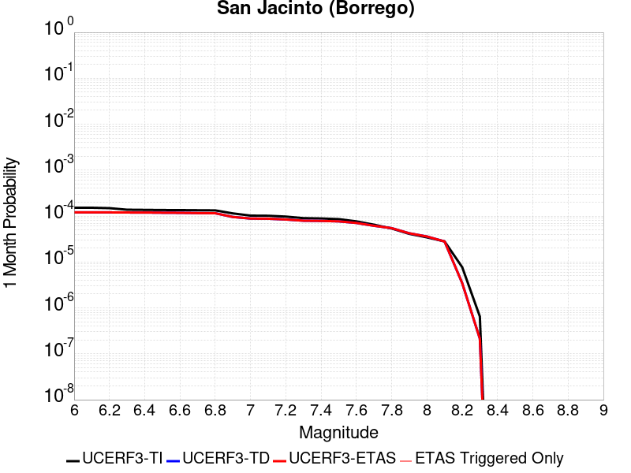 |  |  |

| Magnitude | 1 wk TI Prob | 1 wk TD Prob | 1 wk ETAS Prob | 1 wk ETAS/TD Gain | 1 wk ETAS Triggered Only | 1 mo TI Prob | 1 mo TD Prob | 1 mo ETAS Prob | 1 mo ETAS/TD Gain | 1 mo ETAS Triggered Only | 1 yr TI Prob | 1 yr TD Prob | 1 yr ETAS Prob | 1 yr ETAS/TD Gain | 1 yr ETAS Triggered Only | 10 yr TI Prob | 10 yr TD Prob | 10 yr ETAS Prob | 10 yr ETAS/TD Gain | 10 yr ETAS Triggered Only |
|-----|-----|-----|-----|-----|-----|-----|-----|-----|-----|-----|-----|-----|-----|-----|-----|-----|-----|-----|-----|-----|
| 6.0 | 3.543992E-5 | 2.8038052E-5 | 2.8038052E-5 | 1.0 | 0.0 | 1.5187653E-4 | 1.20157616E-4 | 1.20157616E-4 | 1.0 | 0.0 | 0.0018475284 | 0.0014619495 | 0.001471935 | 1.0068302 | 1.0E-5 | 0.018322436 | 0.014927606 | 0.014937458 | 1.00066 | 1.0E-5 |
| 6.1 | 3.542281E-5 | 2.8038052E-5 | 2.8038052E-5 | 1.0 | 0.0 | 1.5180321E-4 | 1.20157616E-4 | 1.20157616E-4 | 1.0 | 0.0 | 0.0018466372 | 0.0014619495 | 0.001471935 | 1.0068302 | 1.0E-5 | 0.018313672 | 0.014927606 | 0.014937458 | 1.00066 | 1.0E-5 |
| 6.2 | 3.4688688E-5 | 2.8038052E-5 | 2.8038052E-5 | 1.0 | 0.0 | 1.4865733E-4 | 1.2015761E-4 | 1.2015761E-4 | 1.0 | 0.0 | 0.0018084005 | 0.0014619495 | 0.0014719348 | 1.0068302 | 1.0E-5 | 0.017937548 | 0.014927606 | 0.014937457 | 1.00066 | 1.0E-5 |
| 6.3 | 3.2087122E-5 | 2.7883338E-5 | 2.7883338E-5 | 1.0 | 0.0 | 1.3750899E-4 | 1.19494616E-4 | 1.19494616E-4 | 1.0 | 0.0 | 0.0016728862 | 0.0014538883 | 0.0014638738 | 1.0068681 | 1.0E-5 | 0.016603488 | 0.01484861 | 0.014858462 | 1.0006635 | 1.0E-5 |
| 6.4 | 3.1828724E-5 | 2.7850301E-5 | 2.7850301E-5 | 1.0 | 0.0 | 1.364017E-4 | 1.1935304E-4 | 1.1935304E-4 | 1.0 | 0.0 | 0.0016594254 | 0.0014521669 | 0.0014621525 | 1.0068762 | 1.0E-5 | 0.016470885 | 0.014831679 | 0.0148415305 | 1.0006642 | 1.0E-5 |
| 6.5 | 3.1563577E-5 | 2.7589609E-5 | 2.7589609E-5 | 1.0 | 0.0 | 1.3526545E-4 | 1.1823589E-4 | 1.1823589E-4 | 1.0 | 0.0 | 0.0016456128 | 0.0014385836 | 0.0014485692 | 1.0069413 | 1.0E-5 | 0.0163348 | 0.014698069 | 0.014707921 | 1.0006703 | 1.0E-5 |
| 6.6 | 3.1467625E-5 | 2.74337E-5 | 2.74337E-5 | 1.0 | 0.0 | 1.3485427E-4 | 1.1756777E-4 | 1.1756777E-4 | 1.0 | 0.0 | 0.0016406142 | 0.0014304599 | 0.0014404457 | 1.0069808 | 1.0E-5 | 0.016285548 | 0.014618252 | 0.014628106 | 1.0006741 | 1.0E-5 |
| 6.7 | 3.1223695E-5 | 2.7051503E-5 | 2.7051503E-5 | 1.0 | 0.0 | 1.3380898E-4 | 1.1592993E-4 | 1.1592993E-4 | 1.0 | 0.0 | 0.0016279068 | 0.0014105452 | 0.0014205311 | 1.0070795 | 1.0E-5 | 0.01616033 | 0.014422529 | 0.014432386 | 1.0006833 | 1.0E-5 |
| 6.8 | 3.1015585E-5 | 2.6872278E-5 | 2.6872278E-5 | 1.0 | 0.0 | 1.3291716E-4 | 1.15161885E-4 | 1.15161885E-4 | 1.0 | 0.0 | 0.001617065 | 0.0014012064 | 0.0014111924 | 1.0071267 | 1.0E-5 | 0.016053487 | 0.014329696 | 0.014339553 | 1.0006878 | 1.0E-5 |
| 6.9 | 2.6641965E-5 | 2.2288134E-5 | 2.2288134E-5 | 1.0 | 0.0 | 1.1417485E-4 | 9.55171E-5 | 9.55171E-5 | 1.0 | 0.0 | 0.0013891924 | 0.0011623042 | 0.0011722925 | 1.0085936 | 1.0E-5 | 0.0138054015 | 0.011936672 | 0.011946552 | 1.0008278 | 1.0E-5 |
| 7.0 | 2.3854353E-5 | 2.0579198E-5 | 2.0579198E-5 | 1.0 | 0.0 | 1.02228936E-4 | 8.81936E-5 | 8.81936E-5 | 1.0 | 0.0 | 0.0012439266 | 0.0010732308 | 0.00108322 | 1.0093076 | 1.0E-5 | 0.012369866 | 0.011035131 | 0.011045021 | 1.0008962 | 1.0E-5 |
| 7.1 | 2.3672901E-5 | 2.0415582E-5 | 2.0415582E-5 | 1.0 | 0.0 | 1.0145135E-4 | 8.749243E-5 | 8.749243E-5 | 1.0 | 0.0 | 0.0012344702 | 0.0010647024 | 0.0010746918 | 1.0093822 | 1.0E-5 | 0.0122763505 | 0.010950261 | 0.010960151 | 1.0009032 | 1.0E-5 |
| 7.2 | 2.2717244E-5 | 1.9642135E-5 | 1.9642135E-5 | 1.0 | 0.0 | 9.735599E-5 | 8.4177875E-5 | 8.4177875E-5 | 1.0 | 0.0 | 0.0011846646 | 0.0010243861 | 0.0010343759 | 1.0097519 | 1.0E-5 | 0.01178369 | 0.010547219 | 0.010557113 | 1.000938 | 1.0E-5 |
| 7.3 | 2.1016205E-5 | 1.8482382E-5 | 1.8482382E-5 | 1.0 | 0.0 | 9.006634E-5 | 7.920781E-5 | 7.920781E-5 | 1.0 | 0.0 | 0.001096006 | 9.639306E-4 | 9.73921E-4 | 1.0103642 | 1.0E-5 | 0.010906163 | 0.009942156 | 0.009952057 | 1.0009959 | 1.0E-5 |
| 7.4 | 2.0683625E-5 | 1.8284616E-5 | 1.8284616E-5 | 1.0 | 0.0 | 8.86411E-5 | 7.8360295E-5 | 7.8360295E-5 | 1.0 | 0.0 | 0.001078671 | 9.5362106E-4 | 9.636115E-4 | 1.0104764 | 1.0E-5 | 0.010734501 | 0.009838737 | 0.009848638 | 1.0010064 | 1.0E-5 |
| 7.5 | 1.9993966E-5 | 1.787879E-5 | 1.787879E-5 | 1.0 | 0.0 | 8.568561E-5 | 7.6621145E-5 | 7.6621145E-5 | 1.0 | 0.0 | 0.001042723 | 9.3246525E-4 | 9.424559E-4 | 1.0107143 | 1.0E-5 | 0.010378438 | 0.009625225 | 0.009635129 | 1.0010289 | 1.0E-5 |
| 7.6 | 1.788966E-5 | 1.6529573E-5 | 1.6529573E-5 | 1.0 | 0.0 | 7.666772E-5 | 7.0839116E-5 | 7.0839116E-5 | 1.0 | 0.0 | 9.3302975E-4 | 8.621267E-4 | 8.721181E-4 | 1.0115892 | 1.0E-5 | 0.00929122 | 0.008915865 | 0.008925776 | 1.0011116 | 1.0E-5 |
| 7.7 | 1.5125781E-5 | 1.4328572E-5 | 1.4328572E-5 | 1.0 | 0.0 | 6.4823165E-5 | 6.1406725E-5 | 6.1406725E-5 | 1.0 | 0.0 | 7.889362E-4 | 7.473713E-4 | 7.573638E-4 | 1.0133703 | 1.0E-5 | 0.007861412 | 0.0077620298 | 0.0077719525 | 1.0012783 | 1.0E-5 |
| 7.8 | 1.250089E-5 | 1.2718391E-5 | 1.2718391E-5 | 1.0 | 0.0 | 5.3574146E-5 | 5.4506254E-5 | 5.4506254E-5 | 1.0 | 0.0 | 6.5207E-4 | 6.634122E-4 | 6.734056E-4 | 1.0150636 | 1.0E-5 | 0.006501599 | 0.0069139088 | 0.0069238394 | 1.0014364 | 1.0E-5 |
| 7.9 | 9.561E-6 | 9.832705E-6 | 9.832705E-6 | 1.0 | 0.0 | 4.0975072E-5 | 4.2139483E-5 | 4.2139483E-5 | 1.0 | 0.0 | 4.987573E-4 | 5.12928E-4 | 5.2292284E-4 | 1.019486 | 1.0E-5 | 0.0049763937 | 0.005393473 | 0.005403419 | 1.001844 | 1.0E-5 |
| 8.0 | 8.01699E-6 | 8.364675E-6 | 8.364675E-6 | 1.0 | 0.0 | 3.4358076E-5 | 3.5848116E-5 | 3.5848116E-5 | 1.0 | 0.0 | 4.1822926E-4 | 4.3636395E-4 | 4.4635957E-4 | 1.0229067 | 1.0E-5 | 0.0041744304 | 0.00461093 | 0.0046208836 | 1.0021588 | 1.0E-5 |
| 8.1 | 6.541947E-6 | 6.5207787E-6 | 6.5207787E-6 | 1.0 | 0.0 | 2.8036617E-5 | 2.7945898E-5 | 2.7945898E-5 | 1.0 | 0.0 | 3.4129233E-4 | 3.401887E-4 | 3.5018532E-4 | 1.0293854 | 1.0E-5 | 0.0034076865 | 0.0036117164 | 0.0036216802 | 1.0027587 | 1.0E-5 |
| 8.2 | 1.7968189E-6 | 8.0802477E-7 | 8.0802477E-7 | 1.0 | 0.0 | 7.70063E-6 | 3.4629588E-6 | 3.4629588E-6 | 1.0 | 0.0 | 9.3751136E-5 | 4.216073E-5 | 4.216073E-5 | 1.0 | 0.0 | 9.371159E-4 | 4.7731164E-4 | 4.7731164E-4 | 1.0 | 0.0 |
| 8.3 | 1.5167889E-7 | 4.9756718E-8 | 4.9756718E-8 | 1.0 | 0.0 | 6.500522E-7 | 2.1324307E-7 | 2.1324307E-7 | 1.0 | 0.0 | 7.9143565E-6 | 2.5962318E-6 | 2.5962318E-6 | 1.0 | 0.0 | 7.914075E-5 | 3.0141848E-5 | 3.0141848E-5 | 1.0 | 0.0 |

## Great Valley 06 (Midland) 2011 CFM alt1
*[(top)](#table-of-contents)*

| 1 Week | 1 Month | 1 Year | 10 Year |
|-----|-----|-----|-----|
|  |  |  |  |

| Magnitude | 1 wk TI Prob | 1 wk TD Prob | 1 wk ETAS Prob | 1 wk ETAS/TD Gain | 1 wk ETAS Triggered Only | 1 mo TI Prob | 1 mo TD Prob | 1 mo ETAS Prob | 1 mo ETAS/TD Gain | 1 mo ETAS Triggered Only | 1 yr TI Prob | 1 yr TD Prob | 1 yr ETAS Prob | 1 yr ETAS/TD Gain | 1 yr ETAS Triggered Only | 10 yr TI Prob | 10 yr TD Prob | 10 yr ETAS Prob | 10 yr ETAS/TD Gain | 10 yr ETAS Triggered Only |
|-----|-----|-----|-----|-----|-----|-----|-----|-----|-----|-----|-----|-----|-----|-----|-----|-----|-----|-----|-----|-----|
| 6.0 | 1.2712525E-5 | 1.3211573E-5 | 1.3211573E-5 | 1.0 | 0.0 | 5.4481112E-5 | 5.661994E-5 | 5.661994E-5 | 1.0 | 0.0 | 6.6310563E-4 | 6.891552E-4 | 6.891552E-4 | 1.0 | 0.0 | 0.0066113044 | 0.0068726963 | 0.0068826275 | 1.001445 | 1.0E-5 |
| 6.1 | 1.2712525E-5 | 1.3211573E-5 | 1.3211573E-5 | 1.0 | 0.0 | 5.4481112E-5 | 5.661994E-5 | 5.661994E-5 | 1.0 | 0.0 | 6.6310563E-4 | 6.891552E-4 | 6.891552E-4 | 1.0 | 0.0 | 0.0066113044 | 0.0068726963 | 0.0068826275 | 1.001445 | 1.0E-5 |
| 6.2 | 1.2712525E-5 | 1.3211573E-5 | 1.3211573E-5 | 1.0 | 0.0 | 5.4481112E-5 | 5.661994E-5 | 5.661994E-5 | 1.0 | 0.0 | 6.6310563E-4 | 6.891552E-4 | 6.891552E-4 | 1.0 | 0.0 | 0.0066113044 | 0.0068726963 | 0.0068826275 | 1.001445 | 1.0E-5 |
| 6.3 | 1.2712525E-5 | 1.3211573E-5 | 1.3211573E-5 | 1.0 | 0.0 | 5.4481112E-5 | 5.661994E-5 | 5.661994E-5 | 1.0 | 0.0 | 6.6310563E-4 | 6.891552E-4 | 6.891552E-4 | 1.0 | 0.0 | 0.0066113044 | 0.0068726963 | 0.0068826275 | 1.001445 | 1.0E-5 |
| 6.4 | 1.2712525E-5 | 1.3211573E-5 | 1.3211573E-5 | 1.0 | 0.0 | 5.4481112E-5 | 5.661994E-5 | 5.661994E-5 | 1.0 | 0.0 | 6.6310563E-4 | 6.891552E-4 | 6.891552E-4 | 1.0 | 0.0 | 0.0066113044 | 0.0068726963 | 0.0068826275 | 1.001445 | 1.0E-5 |
| 6.5 | 1.2712525E-5 | 1.3211573E-5 | 1.3211573E-5 | 1.0 | 0.0 | 5.4481112E-5 | 5.661994E-5 | 5.661994E-5 | 1.0 | 0.0 | 6.6310563E-4 | 6.891552E-4 | 6.891552E-4 | 1.0 | 0.0 | 0.0066113044 | 0.0068726963 | 0.0068826275 | 1.001445 | 1.0E-5 |
| 6.6 | 5.7574384E-6 | 5.9710724E-6 | 5.9710724E-6 | 1.0 | 0.0 | 2.4674504E-5 | 2.5590081E-5 | 2.5590081E-5 | 1.0 | 0.0 | 3.0037065E-4 | 3.115186E-4 | 3.115186E-4 | 1.0 | 0.0 | 0.0029996498 | 0.003111206 | 0.003111206 | 1.0 | 0.0 |
| 6.7 | 5.7574384E-6 | 5.9710724E-6 | 5.9710724E-6 | 1.0 | 0.0 | 2.4674504E-5 | 2.5590081E-5 | 2.5590081E-5 | 1.0 | 0.0 | 3.0037065E-4 | 3.115186E-4 | 3.115186E-4 | 1.0 | 0.0 | 0.0029996498 | 0.003111206 | 0.003111206 | 1.0 | 0.0 |
| 6.8 | 3.3474828E-6 | 3.4696282E-6 | 3.4696282E-6 | 1.0 | 0.0 | 1.4346277E-5 | 1.4869759E-5 | 1.4869759E-5 | 1.0 | 0.0 | 1.7465191E-4 | 1.8102577E-4 | 1.8102577E-4 | 1.0 | 0.0 | 0.0017451472 | 0.0018089301 | 0.0018089301 | 1.0 | 0.0 |
| 6.9 | 2.035106E-6 | 2.1091832E-6 | 2.1091832E-6 | 1.0 | 0.0 | 8.721853E-6 | 9.03933E-6 | 9.03933E-6 | 1.0 | 0.0 | 1.0618339E-4 | 1.1004901E-4 | 1.1004901E-4 | 1.0 | 0.0 | 0.0010613267 | 0.0011000175 | 0.0011000175 | 1.0 | 0.0 |
| 7.0 | 1.2424716E-6 | 1.2879668E-6 | 1.2879668E-6 | 1.0 | 0.0 | 5.3248673E-6 | 5.519849E-6 | 5.519849E-6 | 1.0 | 0.0 | 6.482833E-5 | 6.720254E-5 | 6.720254E-5 | 1.0 | 0.0 | 6.480942E-4 | 6.7186647E-4 | 6.7186647E-4 | 1.0 | 0.0 |
| 7.1 | 6.6904556E-7 | 6.9395315E-7 | 6.9395315E-7 | 1.0 | 0.0 | 2.867335E-6 | 2.974083E-6 | 2.974083E-6 | 1.0 | 0.0 | 3.4909244E-5 | 3.620912E-5 | 3.620912E-5 | 1.0 | 0.0 | 3.490376E-4 | 3.620577E-4 | 3.620577E-4 | 1.0 | 0.0 |
| 7.2 | 3.948168E-7 | 4.0959998E-7 | 4.0959998E-7 | 1.0 | 0.0 | 1.6920709E-6 | 1.7554285E-6 | 1.7554285E-6 | 1.0 | 0.0 | 2.0600768E-5 | 2.1372342E-5 | 2.1372342E-5 | 1.0 | 0.0 | 2.0598859E-4 | 2.1372341E-4 | 2.1372341E-4 | 1.0 | 0.0 |

## San Jacinto (Coyote Creek)
*[(top)](#table-of-contents)*

| 1 Week | 1 Month | 1 Year | 10 Year |
|-----|-----|-----|-----|
| 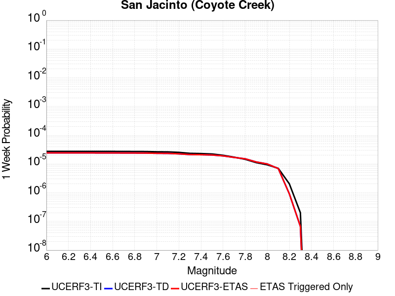 |  |  |  |

| Magnitude | 1 wk TI Prob | 1 wk TD Prob | 1 wk ETAS Prob | 1 wk ETAS/TD Gain | 1 wk ETAS Triggered Only | 1 mo TI Prob | 1 mo TD Prob | 1 mo ETAS Prob | 1 mo ETAS/TD Gain | 1 mo ETAS Triggered Only | 1 yr TI Prob | 1 yr TD Prob | 1 yr ETAS Prob | 1 yr ETAS/TD Gain | 1 yr ETAS Triggered Only | 10 yr TI Prob | 10 yr TD Prob | 10 yr ETAS Prob | 10 yr ETAS/TD Gain | 10 yr ETAS Triggered Only |
|-----|-----|-----|-----|-----|-----|-----|-----|-----|-----|-----|-----|-----|-----|-----|-----|-----|-----|-----|-----|-----|
| 6.0 | 2.7374346E-5 | 2.42628E-5 | 2.42628E-5 | 1.0 | 0.0 | 1.1731335E-4 | 1.039793E-4 | 1.039793E-4 | 1.0 | 0.0 | 0.0014273542 | 0.0012652153 | 0.0012752027 | 1.0078938 | 1.0E-5 | 0.01418221 | 0.012989526 | 0.012999396 | 1.0007598 | 1.0E-5 |
| 6.1 | 2.7374346E-5 | 2.42628E-5 | 2.42628E-5 | 1.0 | 0.0 | 1.1731335E-4 | 1.039793E-4 | 1.039793E-4 | 1.0 | 0.0 | 0.0014273542 | 0.0012652153 | 0.0012752027 | 1.0078938 | 1.0E-5 | 0.01418221 | 0.012989526 | 0.012999396 | 1.0007598 | 1.0E-5 |
| 6.2 | 2.7374346E-5 | 2.42628E-5 | 2.42628E-5 | 1.0 | 0.0 | 1.1731335E-4 | 1.039793E-4 | 1.039793E-4 | 1.0 | 0.0 | 0.0014273542 | 0.0012652153 | 0.0012752027 | 1.0078938 | 1.0E-5 | 0.01418221 | 0.012989526 | 0.012999396 | 1.0007598 | 1.0E-5 |
| 6.3 | 2.7374346E-5 | 2.42628E-5 | 2.42628E-5 | 1.0 | 0.0 | 1.1731335E-4 | 1.039793E-4 | 1.039793E-4 | 1.0 | 0.0 | 0.0014273542 | 0.0012652153 | 0.0012752027 | 1.0078938 | 1.0E-5 | 0.01418221 | 0.012989526 | 0.012999396 | 1.0007598 | 1.0E-5 |
| 6.4 | 2.7374346E-5 | 2.42628E-5 | 2.42628E-5 | 1.0 | 0.0 | 1.1731335E-4 | 1.039793E-4 | 1.039793E-4 | 1.0 | 0.0 | 0.0014273542 | 0.0012652153 | 0.0012752027 | 1.0078938 | 1.0E-5 | 0.01418221 | 0.012989526 | 0.012999396 | 1.0007598 | 1.0E-5 |
| 6.5 | 2.7282445E-5 | 2.4148825E-5 | 2.4148825E-5 | 1.0 | 0.0 | 1.16919524E-4 | 1.0349087E-4 | 1.0349087E-4 | 1.0 | 0.0 | 0.0014225657 | 0.0012592757 | 0.0012692632 | 1.0079311 | 1.0E-5 | 0.014134934 | 0.01293083 | 0.012940701 | 1.0007633 | 1.0E-5 |
| 6.6 | 2.7282445E-5 | 2.4148825E-5 | 2.4148825E-5 | 1.0 | 0.0 | 1.16919524E-4 | 1.0349087E-4 | 1.0349087E-4 | 1.0 | 0.0 | 0.0014225657 | 0.0012592757 | 0.0012692632 | 1.0079311 | 1.0E-5 | 0.014134934 | 0.01293083 | 0.012940701 | 1.0007633 | 1.0E-5 |
| 6.7 | 2.7216198E-5 | 2.4073912E-5 | 2.4073912E-5 | 1.0 | 0.0 | 1.1663563E-4 | 1.0316984E-4 | 1.0316984E-4 | 1.0 | 0.0 | 0.0014191137 | 0.0012553717 | 0.0012653592 | 1.0079558 | 1.0E-5 | 0.014100855 | 0.012892226 | 0.012902097 | 1.0007657 | 1.0E-5 |
| 6.8 | 2.7078617E-5 | 2.3991059E-5 | 2.3991059E-5 | 1.0 | 0.0 | 1.1604605E-4 | 1.0281479E-4 | 1.0281479E-4 | 1.0 | 0.0 | 0.001411945 | 0.0012510539 | 0.0012610414 | 1.0079832 | 1.0E-5 | 0.014030075 | 0.012849335 | 0.012859206 | 1.0007683 | 1.0E-5 |
| 6.9 | 2.6982952E-5 | 2.3910497E-5 | 2.3910497E-5 | 1.0 | 0.0 | 1.15636096E-4 | 1.0246955E-4 | 1.0246955E-4 | 1.0 | 0.0 | 0.0014069602 | 0.0012468555 | 0.001256843 | 1.0080101 | 1.0E-5 | 0.013980856 | 0.012807615 | 0.012817487 | 1.0007708 | 1.0E-5 |
| 7.0 | 2.6449972E-5 | 2.348726E-5 | 2.348726E-5 | 1.0 | 0.0 | 1.1335209E-4 | 1.0065582E-4 | 1.0065582E-4 | 1.0 | 0.0 | 0.001379188 | 0.0012247983 | 0.001234786 | 1.0081546 | 1.0E-5 | 0.0137065975 | 0.012588857 | 0.012598731 | 1.0007844 | 1.0E-5 |
| 7.1 | 2.6257849E-5 | 2.3313178E-5 | 2.3313178E-5 | 1.0 | 0.0 | 1.1252879E-4 | 9.9909805E-5 | 9.9909805E-5 | 1.0 | 0.0 | 0.0013691769 | 0.0012157257 | 0.0012257135 | 1.0082155 | 1.0E-5 | 0.013607717 | 0.012498667 | 0.012508542 | 1.0007901 | 1.0E-5 |
| 7.2 | 2.5270041E-5 | 2.2507069E-5 | 2.2507069E-5 | 1.0 | 0.0 | 1.0829568E-4 | 9.645531E-5 | 9.645531E-5 | 1.0 | 0.0 | 0.0013177024 | 0.0011737131 | 0.0011837014 | 1.00851 | 1.0E-5 | 0.013099162 | 0.012079278 | 0.0120891575 | 1.0008179 | 1.0E-5 |
| 7.3 | 2.339701E-5 | 2.1237285E-5 | 2.1237285E-5 | 1.0 | 0.0 | 1.0026905E-4 | 9.1013775E-5 | 9.1013775E-5 | 1.0 | 0.0 | 0.001220092 | 0.0011075315 | 0.0011175204 | 1.0090191 | 1.0E-5 | 0.012134149 | 0.011417391 | 0.011427277 | 1.0008658 | 1.0E-5 |
| 7.4 | 2.296333E-5 | 2.0967216E-5 | 2.0967216E-5 | 1.0 | 0.0 | 9.841056E-5 | 8.985642E-5 | 8.985642E-5 | 1.0 | 0.0 | 0.0011974899 | 0.0010934549 | 0.0011034439 | 1.0091354 | 1.0E-5 | 0.011910575 | 0.011276292 | 0.01128618 | 1.0008768 | 1.0E-5 |
| 7.5 | 2.2188895E-5 | 2.04892E-5 | 2.04892E-5 | 1.0 | 0.0 | 9.50918E-5 | 8.7807915E-5 | 8.7807915E-5 | 1.0 | 0.0 | 0.0011571277 | 0.0010685391 | 0.0010785285 | 1.0093486 | 1.0E-5 | 0.011511209 | 0.011025436 | 0.011035326 | 1.000897 | 1.0E-5 |
| 7.6 | 2.0013189E-5 | 1.907297E-5 | 1.907297E-5 | 1.0 | 0.0 | 8.5767984E-5 | 8.173874E-5 | 8.173874E-5 | 1.0 | 0.0 | 0.001043725 | 9.947167E-4 | 0.0010047067 | 1.0100431 | 1.0E-5 | 0.010388365 | 0.010282182 | 0.010292079 | 1.0009626 | 1.0E-5 |
| 7.7 | 1.7230794E-5 | 1.6851202E-5 | 1.6851202E-5 | 1.0 | 0.0 | 7.384417E-5 | 7.221744E-5 | 7.221744E-5 | 1.0 | 0.0 | 8.986819E-4 | 8.788935E-4 | 8.888847E-4 | 1.0113679 | 1.0E-5 | 0.008950562 | 0.009119153 | 0.009129061 | 1.0010866 | 1.0E-5 |
| 7.8 | 1.4478809E-5 | 1.509473E-5 | 1.509473E-5 | 1.0 | 0.0 | 6.205057E-5 | 6.4690095E-5 | 6.4690095E-5 | 1.0 | 0.0 | 7.552038E-4 | 7.87318E-4 | 7.973101E-4 | 1.0126914 | 1.0E-5 | 0.0075264242 | 0.008195694 | 0.008205611 | 1.0012101 | 1.0E-5 |
| 7.9 | 1.1114467E-5 | 1.173734E-5 | 1.173734E-5 | 1.0 | 0.0 | 4.7632562E-5 | 5.030192E-5 | 5.030192E-5 | 1.0 | 0.0 | 5.797721E-4 | 6.122544E-4 | 6.222482E-4 | 1.0163231 | 1.0E-5 | 0.0057826187 | 0.0064287656 | 0.006438701 | 1.0015455 | 1.0E-5 |
| 8.0 | 9.327402E-6 | 9.982999E-6 | 9.982999E-6 | 1.0 | 0.0 | 3.9973966E-5 | 4.278358E-5 | 4.278358E-5 | 1.0 | 0.0 | 4.8657437E-4 | 5.2076613E-4 | 5.307609E-4 | 1.0191925 | 1.0E-5 | 0.0048551033 | 0.0054940647 | 0.00550401 | 1.0018102 | 1.0E-5 |
| 8.1 | 7.0235833E-6 | 6.890001E-6 | 6.890001E-6 | 1.0 | 0.0 | 3.0100724E-5 | 2.9528243E-5 | 2.9528243E-5 | 1.0 | 0.0 | 3.664147E-4 | 3.5944756E-4 | 3.6944397E-4 | 1.0278105 | 1.0E-5 | 0.003658111 | 0.0038207553 | 0.0038307172 | 1.0026072 | 1.0E-5 |
| 8.2 | 2.0358202E-6 | 9.118491E-7 | 9.118491E-7 | 1.0 | 0.0 | 8.724915E-6 | 3.907919E-6 | 3.907919E-6 | 1.0 | 0.0 | 1.06220665E-4 | 4.7577898E-5 | 4.7577898E-5 | 1.0 | 0.0 | 0.001061699 | 5.3949835E-4 | 5.3949835E-4 | 1.0 | 0.0 |
| 8.3 | 2.0051264E-7 | 6.722551E-8 | 6.722551E-8 | 1.0 | 0.0 | 8.5933965E-7 | 2.8810928E-7 | 2.8810928E-7 | 1.0 | 0.0 | 1.046241E-5 | 3.5077253E-6 | 3.5077253E-6 | 1.0 | 0.0 | 1.0461917E-4 | 4.0742E-5 | 4.0742E-5 | 1.0 | 0.0 |

## Big Pine (East)
*[(top)](#table-of-contents)*

| 1 Week | 1 Month | 1 Year | 10 Year |
|-----|-----|-----|-----|
|  |  |  |  |

| Magnitude | 1 wk TI Prob | 1 wk TD Prob | 1 wk ETAS Prob | 1 wk ETAS/TD Gain | 1 wk ETAS Triggered Only | 1 mo TI Prob | 1 mo TD Prob | 1 mo ETAS Prob | 1 mo ETAS/TD Gain | 1 mo ETAS Triggered Only | 1 yr TI Prob | 1 yr TD Prob | 1 yr ETAS Prob | 1 yr ETAS/TD Gain | 1 yr ETAS Triggered Only | 10 yr TI Prob | 10 yr TD Prob | 10 yr ETAS Prob | 10 yr ETAS/TD Gain | 10 yr ETAS Triggered Only |
|-----|-----|-----|-----|-----|-----|-----|-----|-----|-----|-----|-----|-----|-----|-----|-----|-----|-----|-----|-----|-----|
| 6.0 | 9.916913E-6 | 1.2835096E-5 | 2.2834967E-5 | 1.7791038 | 1.0E-5 | 4.250036E-5 | 5.500652E-5 | 6.500597E-5 | 1.1817867 | 1.0E-5 | 5.173191E-4 | 6.695207E-4 | 6.79514E-4 | 1.0149261 | 1.0E-5 | 0.0051611643 | 0.0066796727 | 0.006689606 | 1.0014871 | 1.0E-5 |
| 6.1 | 9.916913E-6 | 1.2835096E-5 | 2.2834967E-5 | 1.7791038 | 1.0E-5 | 4.250036E-5 | 5.500652E-5 | 6.500597E-5 | 1.1817867 | 1.0E-5 | 5.173191E-4 | 6.695207E-4 | 6.79514E-4 | 1.0149261 | 1.0E-5 | 0.0051611643 | 0.0066796727 | 0.006689606 | 1.0014871 | 1.0E-5 |
| 6.2 | 9.916913E-6 | 1.2835096E-5 | 2.2834967E-5 | 1.7791038 | 1.0E-5 | 4.250036E-5 | 5.500652E-5 | 6.500597E-5 | 1.1817867 | 1.0E-5 | 5.173191E-4 | 6.695207E-4 | 6.79514E-4 | 1.0149261 | 1.0E-5 | 0.0051611643 | 0.0066796727 | 0.006689606 | 1.0014871 | 1.0E-5 |
| 6.3 | 5.479711E-6 | 8.130518E-6 | 1.8130437E-5 | 2.229924 | 1.0E-5 | 2.3484265E-5 | 3.4844626E-5 | 4.484428E-5 | 1.2869782 | 1.0E-5 | 2.858834E-4 | 4.2415396E-4 | 4.3414973E-4 | 1.0235664 | 1.0E-5 | 0.0028551589 | 0.004236214 | 0.0042461716 | 1.0023506 | 1.0E-5 |
| 6.4 | 5.465009E-6 | 8.114809E-6 | 1.8114728E-5 | 2.2323048 | 1.0E-5 | 2.3421257E-5 | 3.4777306E-5 | 4.477696E-5 | 1.2875339 | 1.0E-5 | 2.851165E-4 | 4.2333466E-4 | 4.3333042E-4 | 1.023612 | 1.0E-5 | 0.0028475097 | 0.0042280518 | 0.0042380095 | 1.0023551 | 1.0E-5 |
| 6.5 | 4.826767E-6 | 7.4397904E-6 | 1.7439716E-5 | 2.3441138 | 1.0E-5 | 2.068598E-5 | 3.1884443E-5 | 4.1884123E-5 | 1.3136226 | 1.0E-5 | 2.518227E-4 | 3.8812673E-4 | 3.9812285E-4 | 1.0257548 | 1.0E-5 | 0.0025153751 | 0.0038772165 | 0.0038871777 | 1.0025692 | 1.0E-5 |
| 6.6 | 4.3146847E-6 | 6.8996696E-6 | 1.6899601E-5 | 2.4493349 | 1.0E-5 | 1.8491375E-5 | 2.9569692E-5 | 3.9569397E-5 | 1.3381741 | 1.0E-5 | 2.2510924E-4 | 3.5995396E-4 | 3.6995037E-4 | 1.0277714 | 1.0E-5 | 0.0022488134 | 0.003596405 | 0.003606369 | 1.0027705 | 1.0E-5 |
| 6.7 | 3.6968106E-6 | 6.0118778E-6 | 1.6011818E-5 | 2.6633637 | 1.0E-5 | 1.5843378E-5 | 2.5764944E-5 | 3.5764686E-5 | 1.3881142 | 1.0E-5 | 1.9287605E-4 | 3.136446E-4 | 3.2364146E-4 | 1.0318732 | 1.0E-5 | 0.0019270873 | 0.0031346243 | 0.003144593 | 1.0031801 | 1.0E-5 |
| 6.8 | 3.4671132E-6 | 5.7181373E-6 | 1.571808E-5 | 2.7488112 | 1.0E-5 | 1.4858972E-5 | 2.4506082E-5 | 3.4505836E-5 | 1.408052 | 1.0E-5 | 1.8089297E-4 | 2.9832215E-4 | 3.0831917E-4 | 1.0335108 | 1.0E-5 | 0.0018074579 | 0.0029818132 | 0.0029917832 | 1.0033437 | 1.0E-5 |
| 6.9 | 2.7686972E-6 | 4.8399593E-6 | 1.4839911E-5 | 3.066123 | 1.0E-5 | 1.1865792E-5 | 2.0742522E-5 | 3.0742314E-5 | 1.4820914 | 1.0E-5 | 1.4445644E-4 | 2.525117E-4 | 2.625092E-4 | 1.0395921 | 1.0E-5 | 0.0014436257 | 0.002524776 | 0.0025347508 | 1.0039507 | 1.0E-5 |
| 7.0 | 2.1472624E-6 | 3.9984284E-6 | 3.9984284E-6 | 1.0 | 0.0 | 9.20252E-6 | 1.7136012E-5 | 1.7136012E-5 | 1.0 | 0.0 | 1.12034926E-4 | 2.0861151E-4 | 2.0861151E-4 | 1.0 | 0.0 | 0.0011197845 | 0.002086653 | 0.002086653 | 1.0 | 0.0 |
| 7.1 | 1.7018335E-6 | 3.3570607E-6 | 3.3570607E-6 | 1.0 | 0.0 | 7.293552E-6 | 1.4387325E-5 | 1.4387325E-5 | 1.0 | 0.0 | 8.879537E-5 | 1.7515196E-4 | 1.7515196E-4 | 1.0 | 0.0 | 8.87599E-4 | 0.0017526038 | 0.0017526038 | 1.0 | 0.0 |
| 7.2 | 1.25603E-6 | 2.8059949E-6 | 2.8059949E-6 | 1.0 | 0.0 | 5.3829745E-6 | 1.2025638E-5 | 1.2025638E-5 | 1.0 | 0.0 | 6.553574E-5 | 1.4640254E-4 | 1.4640254E-4 | 1.0 | 0.0 | 6.551642E-4 | 0.0014655013 | 0.0014655013 | 1.0 | 0.0 |
| 7.3 | 1.112297E-6 | 2.621202E-6 | 2.621202E-6 | 1.0 | 0.0 | 4.7669787E-6 | 1.1233675E-5 | 1.1233675E-5 | 1.0 | 0.0 | 5.803642E-5 | 1.3676164E-4 | 1.3676164E-4 | 1.0 | 0.0 | 5.802127E-4 | 0.0013690467 | 0.0013690467 | 1.0 | 0.0 |
| 7.4 | 1.0137181E-6 | 2.4938956E-6 | 2.4938956E-6 | 1.0 | 0.0 | 4.3444993E-6 | 1.0688082E-5 | 1.0688082E-5 | 1.0 | 0.0 | 5.2892992E-5 | 1.3011984E-4 | 1.3011984E-4 | 1.0 | 0.0 | 5.288041E-4 | 0.0013024933 | 0.0013024933 | 1.0 | 0.0 |
| 7.5 | 9.598608E-7 | 2.4172425E-6 | 2.4172425E-6 | 1.0 | 0.0 | 4.1136827E-6 | 1.0359571E-5 | 1.0359571E-5 | 1.0 | 0.0 | 5.0082934E-5 | 1.2612069E-4 | 1.2612069E-4 | 1.0 | 0.0 | 5.007165E-4 | 0.0012623572 | 0.0012623572 | 1.0 | 0.0 |
| 7.6 | 7.929459E-7 | 2.053776E-6 | 2.053776E-6 | 1.0 | 0.0 | 3.3983351E-6 | 8.801868E-6 | 8.801868E-6 | 1.0 | 0.0 | 4.1373947E-5 | 1.0715765E-4 | 1.0715765E-4 | 1.0 | 0.0 | 4.1366243E-4 | 0.0010730304 | 0.0010730304 | 1.0 | 0.0 |
| 7.7 | 4.155788E-7 | 1.1668847E-6 | 1.1668847E-6 | 1.0 | 0.0 | 1.7810507E-6 | 5.000925E-6 | 5.000925E-6 | 1.0 | 0.0 | 2.1684076E-5 | 6.0884602E-5 | 6.0884602E-5 | 1.0 | 0.0 | 2.1681961E-4 | 6.117665E-4 | 6.117665E-4 | 1.0 | 0.0 |
| 7.8 | 1.14666925E-7 | 2.6062185E-7 | 2.6062185E-7 | 1.0 | 0.0 | 4.914296E-7 | 1.1169502E-6 | 1.1169502E-6 | 1.0 | 0.0 | 5.9831386E-6 | 1.3598788E-5 | 1.3598788E-5 | 1.0 | 0.0 | 5.9829777E-5 | 1.3706903E-4 | 1.3706903E-4 | 1.0 | 0.0 |
| 7.9 | 2.9231824E-8 | 4.1702062E-8 | 4.1702062E-8 | 1.0 | 0.0 | 1.2527924E-7 | 1.7872311E-7 | 1.7872311E-7 | 1.0 | 0.0 | 1.5252737E-6 | 2.175952E-6 | 2.175952E-6 | 1.0 | 0.0 | 1.5252632E-5 | 2.2092348E-5 | 2.2092348E-5 | 1.0 | 0.0 |

## San Luis Range - Pecho 2011 CFM
*[(top)](#table-of-contents)*

| 1 Week | 1 Month | 1 Year | 10 Year |
|-----|-----|-----|-----|
| 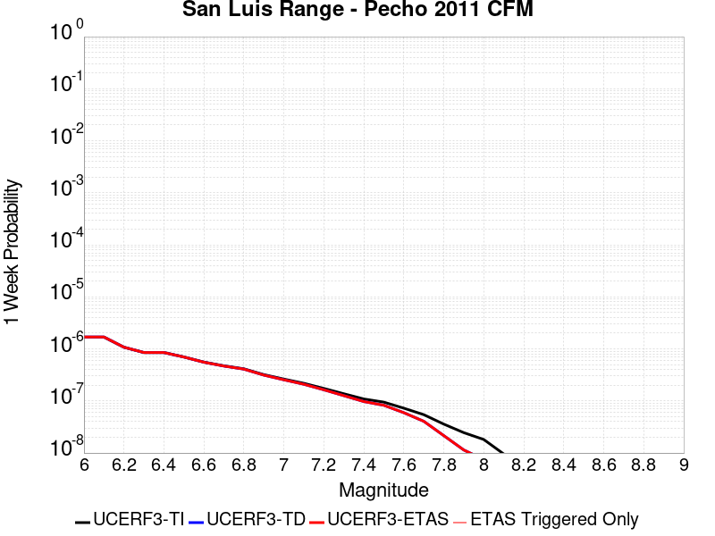 |  |  |  |

| Magnitude | 1 wk TI Prob | 1 wk TD Prob | 1 wk ETAS Prob | 1 wk ETAS/TD Gain | 1 wk ETAS Triggered Only | 1 mo TI Prob | 1 mo TD Prob | 1 mo ETAS Prob | 1 mo ETAS/TD Gain | 1 mo ETAS Triggered Only | 1 yr TI Prob | 1 yr TD Prob | 1 yr ETAS Prob | 1 yr ETAS/TD Gain | 1 yr ETAS Triggered Only | 10 yr TI Prob | 10 yr TD Prob | 10 yr ETAS Prob | 10 yr ETAS/TD Gain | 10 yr ETAS Triggered Only |
|-----|-----|-----|-----|-----|-----|-----|-----|-----|-----|-----|-----|-----|-----|-----|-----|-----|-----|-----|-----|-----|
| 6.0 | 1.687423E-6 | 1.69227E-6 | 1.69227E-6 | 1.0 | 0.0 | 7.231793E-6 | 7.252567E-6 | 7.252567E-6 | 1.0 | 0.0 | 8.804352E-5 | 8.829666E-5 | 8.829666E-5 | 1.0 | 0.0 | 8.8008645E-4 | 8.826397E-4 | 8.926309E-4 | 1.0113196 | 1.0E-5 |
| 6.1 | 1.687423E-6 | 1.69227E-6 | 1.69227E-6 | 1.0 | 0.0 | 7.231793E-6 | 7.252567E-6 | 7.252567E-6 | 1.0 | 0.0 | 8.804352E-5 | 8.829666E-5 | 8.829666E-5 | 1.0 | 0.0 | 8.8008645E-4 | 8.826397E-4 | 8.926309E-4 | 1.0113196 | 1.0E-5 |
| 6.2 | 1.0765672E-6 | 1.0771213E-6 | 1.0771213E-6 | 1.0 | 0.0 | 4.613851E-6 | 4.6162263E-6 | 4.6162263E-6 | 1.0 | 0.0 | 5.617219E-5 | 5.620117E-5 | 5.620117E-5 | 1.0 | 0.0 | 5.6157995E-4 | 5.618758E-4 | 5.718702E-4 | 1.0177876 | 1.0E-5 |
| 6.3 | 8.523104E-7 | 8.513665E-7 | 8.513665E-7 | 1.0 | 0.0 | 3.6527538E-6 | 3.6487088E-6 | 3.6487088E-6 | 1.0 | 0.0 | 4.447137E-5 | 4.4422155E-5 | 4.4422155E-5 | 1.0 | 0.0 | 4.4462472E-4 | 4.4413595E-4 | 4.541315E-4 | 1.0225056 | 1.0E-5 |
| 6.4 | 8.523104E-7 | 8.513665E-7 | 8.513665E-7 | 1.0 | 0.0 | 3.6527538E-6 | 3.6487088E-6 | 3.6487088E-6 | 1.0 | 0.0 | 4.447137E-5 | 4.4422155E-5 | 4.4422155E-5 | 1.0 | 0.0 | 4.4462472E-4 | 4.4413595E-4 | 4.541315E-4 | 1.0225056 | 1.0E-5 |
| 6.5 | 7.0029404E-7 | 6.97705E-7 | 6.97705E-7 | 1.0 | 0.0 | 3.0012568E-6 | 2.990161E-6 | 2.990161E-6 | 1.0 | 0.0 | 3.6539688E-5 | 3.6404617E-5 | 3.6404617E-5 | 1.0 | 0.0 | 3.653368E-4 | 3.6398822E-4 | 3.739846E-4 | 1.0274634 | 1.0E-5 |
| 6.6 | 5.583906E-7 | 5.543413E-7 | 5.543413E-7 | 1.0 | 0.0 | 2.3931002E-6 | 2.3757461E-6 | 2.3757461E-6 | 1.0 | 0.0 | 2.9135606E-5 | 2.8924333E-5 | 2.8924333E-5 | 1.0 | 0.0 | 2.9131788E-4 | 2.8920642E-4 | 2.8920642E-4 | 1.0 | 0.0 |
| 6.7 | 4.73441E-7 | 4.683629E-7 | 4.683629E-7 | 1.0 | 0.0 | 2.0290313E-6 | 2.007268E-6 | 2.007268E-6 | 1.0 | 0.0 | 2.4703175E-5 | 2.4438219E-5 | 2.4438219E-5 | 1.0 | 0.0 | 2.470043E-4 | 2.4435576E-4 | 2.4435576E-4 | 1.0 | 0.0 |
| 6.8 | 4.1466086E-7 | 4.0883435E-7 | 4.0883435E-7 | 1.0 | 0.0 | 1.7771167E-6 | 1.7521461E-6 | 1.7521461E-6 | 1.0 | 0.0 | 2.1636182E-5 | 2.1332173E-5 | 2.1332173E-5 | 1.0 | 0.0 | 2.1634075E-4 | 2.133016E-4 | 2.133016E-4 | 1.0 | 0.0 |
| 6.9 | 3.2056641E-7 | 3.1334514E-7 | 3.1334514E-7 | 1.0 | 0.0 | 1.3738553E-6 | 1.342907E-6 | 1.342907E-6 | 1.0 | 0.0 | 1.6726559E-5 | 1.6349772E-5 | 1.6349772E-5 | 1.0 | 0.0 | 1.67253E-4 | 1.6348585E-4 | 1.6348585E-4 | 1.0 | 0.0 |
| 7.0 | 2.6315942E-7 | 2.5494694E-7 | 2.5494694E-7 | 1.0 | 0.0 | 1.1278256E-6 | 1.0926292E-6 | 1.0926292E-6 | 1.0 | 0.0 | 1.3731191E-5 | 1.3302681E-5 | 1.3302681E-5 | 1.0 | 0.0 | 1.3730342E-4 | 1.3301893E-4 | 1.3301893E-4 | 1.0 | 0.0 |
| 7.1 | 2.1832436E-7 | 2.0922157E-7 | 2.0922157E-7 | 1.0 | 0.0 | 9.356755E-7 | 8.9666355E-7 | 8.9666355E-7 | 1.0 | 0.0 | 1.13917895E-5 | 1.0916825E-5 | 1.0916825E-5 | 1.0 | 0.0 | 1.1391206E-4 | 1.0916294E-4 | 1.0916294E-4 | 1.0 | 0.0 |
| 7.2 | 1.7393015E-7 | 1.6381236E-7 | 1.6381236E-7 | 1.0 | 0.0 | 7.454147E-7 | 7.020528E-7 | 7.020528E-7 | 1.0 | 0.0 | 9.075386E-6 | 8.547459E-6 | 8.547459E-6 | 1.0 | 0.0 | 9.075015E-5 | 8.5471336E-5 | 8.5471336E-5 | 1.0 | 0.0 |
| 7.3 | 1.3744894E-7 | 1.2643088E-7 | 1.2643088E-7 | 1.0 | 0.0 | 5.890667E-7 | 5.418465E-7 | 5.418465E-7 | 1.0 | 0.0 | 7.1718637E-6 | 6.5969607E-6 | 6.5969607E-6 | 1.0 | 0.0 | 7.171632E-5 | 6.5967666E-5 | 6.5967666E-5 | 1.0 | 0.0 |
| 7.4 | 1.0915278E-7 | 9.73184E-8 | 9.73184E-8 | 1.0 | 0.0 | 4.6779755E-7 | 4.1707878E-7 | 4.1707878E-7 | 1.0 | 0.0 | 5.6954204E-6 | 5.077922E-6 | 5.077922E-6 | 1.0 | 0.0 | 5.6952744E-5 | 5.077807E-5 | 5.077807E-5 | 1.0 | 0.0 |
| 7.5 | 9.490291E-8 | 8.2613475E-8 | 8.2613475E-8 | 1.0 | 0.0 | 4.0672668E-7 | 3.5405768E-7 | 3.5405768E-7 | 1.0 | 0.0 | 4.9518862E-6 | 4.310644E-6 | 4.310644E-6 | 1.0 | 0.0 | 4.951776E-5 | 4.3105607E-5 | 4.3105607E-5 | 1.0 | 0.0 |
| 7.6 | 7.256678E-8 | 5.946583E-8 | 5.946583E-8 | 1.0 | 0.0 | 3.1100043E-7 | 2.5485355E-7 | 2.5485355E-7 | 1.0 | 0.0 | 3.7864236E-6 | 3.1028374E-6 | 3.1028374E-6 | 1.0 | 0.0 | 3.7863592E-5 | 3.1027943E-5 | 3.1027943E-5 | 1.0 | 0.0 |
| 7.7 | 5.446273E-8 | 4.061842E-8 | 4.061842E-8 | 1.0 | 0.0 | 2.3341168E-7 | 1.7407893E-7 | 1.7407893E-7 | 1.0 | 0.0 | 2.8417835E-6 | 2.119409E-6 | 2.119409E-6 | 1.0 | 0.0 | 2.8417471E-5 | 2.1193888E-5 | 2.1193888E-5 | 1.0 | 0.0 |
| 7.8 | 3.5850867E-8 | 2.155485E-8 | 2.155485E-8 | 1.0 | 0.0 | 1.5364655E-7 | 9.237793E-8 | 9.237793E-8 | 1.0 | 0.0 | 1.8706452E-6 | 1.1247007E-6 | 1.1247007E-6 | 1.0 | 0.0 | 1.8706294E-5 | 1.1246951E-5 | 1.1246951E-5 | 1.0 | 0.0 |
| 7.9 | 2.45879E-8 | 1.1426843E-8 | 1.1426843E-8 | 1.0 | 0.0 | 1.0537671E-7 | 4.8972183E-8 | 4.8972183E-8 | 1.0 | 0.0 | 1.2829606E-6 | 5.9623613E-7 | 5.9623613E-7 | 1.0 | 0.0 | 1.2829532E-5 | 5.9623458E-6 | 5.9623458E-6 | 1.0 | 0.0 |
| 8.0 | 1.8151761E-8 | 7.467404E-9 | 7.467404E-9 | 1.0 | 0.0 | 7.779326E-8 | 3.200316E-8 | 3.200316E-8 | 1.0 | 0.0 | 9.4713255E-7 | 3.896384E-7 | 3.896384E-7 | 1.0 | 0.0 | 9.471285E-6 | 3.896377E-6 | 3.896377E-6 | 1.0 | 0.0 |
| 8.1 | 9.559205E-9 | 4.1146904E-9 | 4.1146904E-9 | 1.0 | 0.0 | 4.096802E-8 | 1.7634386E-8 | 1.7634386E-8 | 1.0 | 0.0 | 4.9878554E-7 | 2.1469864E-7 | 2.1469864E-7 | 1.0 | 0.0 | 4.987844E-6 | 2.1469843E-6 | 2.1469843E-6 | 1.0 | 0.0 |

