# Parent Section Magnitude-Probability Distributions

Only fault sections with at least one triggered aftershock are plotted. Sections are sorted by total supraseismogenic trigger rate (decreasing)

## Table Of Contents

* [San Andreas (Creeping Section) 2011 CFM](#san-andreas-creeping-section-2011-cfm)
* [Calaveras (So) - Paicines extension 2011 CFM](#calaveras-so---paicines-extension-2011-cfm)
* [Calaveras (So) 2011 CFM](#calaveras-so-2011-cfm)
* [Calaveras (Central) 2011 CFM](#calaveras-central-2011-cfm)
* [Concord 2011 CFM](#concord-2011-cfm)
* [San Andreas (Santa Cruz Mts) 2011 CFM](#san-andreas-santa-cruz-mts-2011-cfm)
* [Green Valley 2011 CFM](#green-valley-2011-cfm)
* [Hayward (So) 2011 CFM](#hayward-so-2011-cfm)
* [Hayward (So) extension 2011 CFM](#hayward-so-extension-2011-cfm)
* [Calaveras (No) 2011 CFM](#calaveras-no-2011-cfm)
* [Hunting Creek - Berryessa 2011 CFM](#hunting-creek---berryessa-2011-cfm)
* [Mission (connected) 2011 CFM](#mission-connected-2011-cfm)
* [Hayward (No) 2011 CFM](#hayward-no-2011-cfm)
* [San Andreas (Parkfield)](#san-andreas-parkfield)
* [Monte Vista - Shannon 2011 CFM](#monte-vista---shannon-2011-cfm)
* [Greenville (So) 2011 CFM](#greenville-so-2011-cfm)
* [Great Valley 09 (Laguna Seca)](#great-valley-09-laguna-seca)
* [Quien Sabe 2011 CFM](#quien-sabe-2011-cfm)
* [Ortigalita (North)](#ortigalita-north)
* [Monterey Bay-Tularcitos](#monterey-bay-tularcitos)
* [Sargent 2011 CFM](#sargent-2011-cfm)
* [Rodgers Creek - Healdsburg 2011 CFM](#rodgers-creek---healdsburg-2011-cfm)
* [Great Valley 07 (Orestimba)](#great-valley-07-orestimba)
* [Contra Costa Shear Zone (connector) 2011 CFM](#contra-costa-shear-zone-connector-2011-cfm)
* [Franklin 2011 CFM](#franklin-2011-cfm)
* [Greenville (No) 2011 CFM](#greenville-no-2011-cfm)
* [Great Valley 05 Pittsburg - Kirby Hills alt1](#great-valley-05-pittsburg---kirby-hills-alt1)
* [West Napa 2011 CFM](#west-napa-2011-cfm)
* [Clayton](#clayton)
* [San Andreas (Peninsula) 2011 CFM](#san-andreas-peninsula-2011-cfm)
* [Reliz 2011 CFM](#reliz-2011-cfm)
* [Rinconada 2011 CFM](#rinconada-2011-cfm)
* [Ortigalita (South)](#ortigalita-south)
* [San Gregorio (North) 2011 CFM](#san-gregorio-north-2011-cfm)
* [Butano 2011 CFM](#butano-2011-cfm)
* [Mount Diablo Thrust South](#mount-diablo-thrust-south)
* [San Gregorio (South) 2011 CFM](#san-gregorio-south-2011-cfm)
* [Bartlett Springs 2011 CFM](#bartlett-springs-2011-cfm)
* [San Andreas (Cholame) rev](#san-andreas-cholame-rev)
* [Contra Costa (Lafayette) 2011 CFM](#contra-costa-lafayette-2011-cfm)
* [Great Valley 03 Mysterious Ridge](#great-valley-03-mysterious-ridge)
* [La Panza 2011](#la-panza-2011)
* [Silver Creek 2011 CFM](#silver-creek-2011-cfm)
* [Oceanic - West Huasna](#oceanic---west-huasna)
* [Las Positas](#las-positas)
* [Great Valley 11](#great-valley-11)
* [San Andreas (North Coast) 2011 CFM](#san-andreas-north-coast-2011-cfm)
* [Hunting Creek - Bartlett Springs connector 2011](#hunting-creek---bartlett-springs-connector-2011)
* [Hosgri](#hosgri)

## San Andreas (Creeping Section) 2011 CFM
*[(top)](#table-of-contents)*

| 1 Week | 1 Month | 1 Year | 10 Year |
|-----|-----|-----|-----|
| 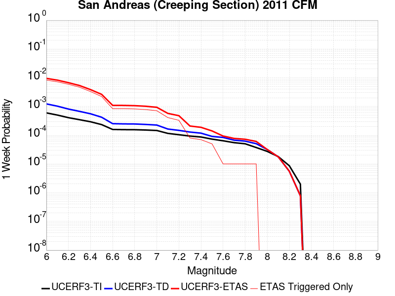 |  |  |  |

| Magnitude | 1 wk TI Prob | 1 wk TD Prob | 1 wk ETAS Prob | 1 wk ETAS/TD Gain | 1 wk ETAS Triggered Only | 1 mo TI Prob | 1 mo TD Prob | 1 mo ETAS Prob | 1 mo ETAS/TD Gain | 1 mo ETAS Triggered Only | 1 yr TI Prob | 1 yr TD Prob | 1 yr ETAS Prob | 1 yr ETAS/TD Gain | 1 yr ETAS Triggered Only | 10 yr TI Prob | 10 yr TD Prob | 10 yr ETAS Prob | 10 yr ETAS/TD Gain | 10 yr ETAS Triggered Only |
|-----|-----|-----|-----|-----|-----|-----|-----|-----|-----|-----|-----|-----|-----|-----|-----|-----|-----|-----|-----|-----|
| 6.0 | 5.986481E-4 | 0.0012305692 | 0.009360796 | 7.6068826 | 0.008140244 | 0.0025631124 | 0.005255843 | 0.015294267 | 2.909955 | 0.010091463 | 0.030762846 | 0.06129019 | 0.07316716 | 1.1937826 | 0.012652439 | 0.26835477 | 0.42638227 | 0.43514392 | 1.0205488 | 0.015274391 |
| 6.1 | 5.015945E-4 | 0.0010243965 | 0.008059865 | 7.867915 | 0.0070426827 | 0.00214792 | 0.0043764436 | 0.0129667325 | 2.9628468 | 0.008628049 | 0.025839351 | 0.051319696 | 0.061558504 | 1.1995102 | 0.010792683 | 0.23032776 | 0.37328404 | 0.38159567 | 1.0222663 | 0.0132621955 |
| 6.2 | 4.073338E-4 | 8.1292057E-4 | 0.0066313576 | 8.157448 | 0.0058231708 | 0.0017445484 | 0.0034743187 | 0.010492533 | 3.020026 | 0.0070426827 | 0.021034058 | 0.041003637 | 0.04951181 | 1.207498 | 0.008871951 | 0.19150782 | 0.31349596 | 0.32088423 | 1.0235674 | 0.010762195 |
| 6.3 | 3.464099E-4 | 6.7585194E-4 | 0.0055201366 | 8.167671 | 0.004847561 | 0.0014837692 | 0.002889607 | 0.008513553 | 2.9462667 | 0.005640244 | 0.017915873 | 0.034260165 | 0.041149896 | 1.2011003 | 0.0071341465 | 0.16538359 | 0.27180734 | 0.27800143 | 1.0227885 | 0.008506098 |
| 6.4 | 2.935057E-4 | 5.564272E-4 | 0.004243399 | 7.6261525 | 0.0036890244 | 0.0012572751 | 0.0023789855 | 0.0066979546 | 2.815467 | 0.0043292684 | 0.015200248 | 0.028335916 | 0.033608973 | 1.1860908 | 0.005426829 | 0.14201577 | 0.23350294 | 0.23838702 | 1.0209166 | 0.006371951 |
| 6.5 | 2.3409708E-4 | 4.226163E-4 | 0.0027691852 | 6.5524807 | 0.002347561 | 0.0010028875 | 0.0018080077 | 0.004577382 | 2.531727 | 0.0027743902 | 0.012141965 | 0.021659894 | 0.025239186 | 1.1652498 | 0.0036585366 | 0.11499573 | 0.18737322 | 0.19076742 | 1.0181147 | 0.0041768295 |
| 6.6 | 1.5842178E-4 | 2.5210352E-4 | 0.0011665071 | 4.627095 | 9.1463415E-4 | 6.7877385E-4 | 0.0010799908 | 0.0021459116 | 1.9869721 | 0.0010670732 | 0.0082328 | 0.01306856 | 0.0144225815 | 1.1036091 | 0.0013719512 | 0.07934396 | 0.12373641 | 0.1250989 | 1.0110111 | 0.0015548781 |
| 6.7 | 1.5616413E-4 | 2.4746807E-4 | 0.0011618759 | 4.6950536 | 9.1463415E-4 | 6.691031E-4 | 0.0010601451 | 0.002126087 | 2.005468 | 0.0010670732 | 0.0081159435 | 0.012830284 | 0.014154537 | 1.103213 | 0.0013414634 | 0.0782586 | 0.12176359 | 0.12310237 | 1.0109949 | 0.0015243902 |
| 6.8 | 1.5538467E-4 | 2.4570388E-4 | 0.0011601133 | 4.721591 | 9.1463415E-4 | 6.6576427E-4 | 0.0010525904 | 0.0020880848 | 1.983758 | 0.0010365853 | 0.008075596 | 0.012739524 | 0.014033798 | 1.1015952 | 0.0013109756 | 0.07788358 | 0.12099387 | 0.12230702 | 1.010853 | 0.0014939024 |
| 6.9 | 1.5153569E-4 | 2.3678907E-4 | 0.001120726 | 4.7330146 | 8.841463E-4 | 6.49277E-4 | 0.0010144176 | 0.0020194945 | 1.990792 | 0.0010060975 | 0.007876333 | 0.012281124 | 0.013575999 | 1.1054362 | 0.0013109756 | 0.07602952 | 0.117062055 | 0.118327245 | 1.0108079 | 0.0014329269 |
| 7.0 | 1.4588932E-4 | 2.2534574E-4 | 0.0010483309 | 4.6521006 | 8.231707E-4 | 6.250901E-4 | 9.6541195E-4 | 0.0018791631 | 1.9464884 | 9.1463415E-4 | 0.0075839474 | 0.011691048 | 0.012896302 | 1.1030921 | 0.0012195122 | 0.073302895 | 0.11190571 | 0.11309705 | 1.010646 | 0.0013414634 |
| 7.1 | 1.1565079E-4 | 1.6400899E-4 | 5.6028547E-4 | 3.4161875 | 3.9634146E-4 | 4.955521E-4 | 7.0270716E-4 | 0.0011901692 | 1.6936916 | 4.8780488E-4 | 0.006016669 | 0.008522104 | 0.009187119 | 1.0780342 | 6.707317E-4 | 0.058563538 | 0.08420094 | 0.084843114 | 1.0076267 | 7.012195E-4 |
| 7.2 | 1.0393792E-4 | 1.4727897E-4 | 3.911455E-4 | 2.6558135 | 2.4390244E-4 | 4.4537216E-4 | 6.310437E-4 | 9.6619787E-4 | 1.531111 | 3.3536585E-4 | 0.005408933 | 0.007656064 | 0.008049371 | 1.0513719 | 3.9634146E-4 | 0.052791595 | 0.076125175 | 0.07651951 | 1.0051801 | 4.2682927E-4 |
| 7.3 | 9.332884E-5 | 1.2879037E-4 | 1.5927425E-4 | 1.2366937 | 3.0487805E-5 | 3.999194E-4 | 5.518426E-4 | 6.4325554E-4 | 1.1656504 | 9.1463415E-5 | 0.0048581534 | 0.0066981222 | 0.0068192566 | 1.0180849 | 1.2195122E-4 | 0.047533102 | 0.066934355 | 0.06707659 | 1.002125 | 1.5243902E-4 |
| 7.4 | 8.670252E-5 | 1.1794803E-4 | 1.1794803E-4 | 1.0 | 0.0 | 3.715293E-4 | 5.0539424E-4 | 5.3586665E-4 | 1.0602943 | 3.0487805E-5 | 0.004513991 | 0.0061359373 | 0.0061965385 | 1.0098765 | 6.097561E-5 | 0.044233937 | 0.061575722 | 0.061632942 | 1.0009292 | 6.097561E-5 |
| 7.5 | 7.3036405E-5 | 9.0832174E-5 | 9.0832174E-5 | 1.0 | 0.0 | 3.129756E-4 | 3.8922275E-4 | 4.1969868E-4 | 1.0782995 | 3.0487805E-5 | 0.0038038217 | 0.004728512 | 0.004789199 | 1.0128343 | 6.097561E-5 | 0.03739367 | 0.04824629 | 0.048304323 | 1.0012028 | 6.097561E-5 |
| 7.6 | 6.3935775E-5 | 8.349784E-5 | 8.349784E-5 | 1.0 | 0.0 | 2.7398168E-4 | 3.5779888E-4 | 3.5779888E-4 | 1.0 | 0.0 | 0.0033306254 | 0.0043475195 | 0.0043475195 | 1.0 | 0.0 | 0.032811474 | 0.044322703 | 0.044322703 | 1.0 | 0.0 |
| 7.7 | 5.5050095E-5 | 6.723497E-5 | 6.723497E-5 | 1.0 | 0.0 | 2.3590765E-4 | 2.8811806E-4 | 2.8811806E-4 | 1.0 | 0.0 | 0.0028683927 | 0.0035021992 | 0.0035021992 | 1.0 | 0.0 | 0.0283165 | 0.036094807 | 0.036094807 | 1.0 | 0.0 |
| 7.8 | 5.027131E-5 | 6.219215E-5 | 6.219215E-5 | 1.0 | 0.0 | 2.1543067E-4 | 2.6651056E-4 | 2.6651056E-4 | 1.0 | 0.0 | 0.0026197135 | 0.0032399416 | 0.0032399416 | 1.0 | 0.0 | 0.025890453 | 0.033400487 | 0.033400487 | 1.0 | 0.0 |
| 7.9 | 3.7271806E-5 | 5.0678176E-5 | 5.0678176E-5 | 1.0 | 0.0 | 1.5972654E-4 | 2.1717412E-4 | 2.1717412E-4 | 1.0 | 0.0 | 0.0019429359 | 0.002640891 | 0.002640891 | 1.0 | 0.0 | 0.019260362 | 0.027289882 | 0.027289882 | 1.0 | 0.0 |
| 8.0 | 2.7310243E-5 | 3.17287E-5 | 3.17287E-5 | 1.0 | 0.0 | 1.17038646E-4 | 1.3597307E-4 | 1.3597307E-4 | 1.0 | 0.0 | 0.0014240141 | 0.0016542157 | 0.0016542157 | 1.0 | 0.0 | 0.014149235 | 0.017366638 | 0.017366638 | 1.0 | 0.0 |
| 8.1 | 1.7940547E-5 | 1.759333E-5 | 1.759333E-5 | 1.0 | 0.0 | 7.688579E-5 | 7.539781E-5 | 7.539781E-5 | 1.0 | 0.0 | 9.3568244E-4 | 9.1758225E-4 | 9.1758225E-4 | 1.0 | 0.0 | 0.009317525 | 0.009900389 | 0.009900389 | 1.0 | 0.0 |
| 8.2 | 8.643924E-6 | 5.5526552E-6 | 5.5526552E-6 | 1.0 | 0.0 | 3.704486E-5 | 2.3796878E-5 | 2.3796878E-5 | 1.0 | 0.0 | 4.5092785E-4 | 2.8968856E-4 | 2.8968856E-4 | 1.0 | 0.0 | 0.0045001395 | 0.0032912085 | 0.0032912085 | 1.0 | 0.0 |
| 8.3 | 1.983087E-6 | 7.7871465E-7 | 7.7871465E-7 | 1.0 | 0.0 | 8.498917E-6 | 3.3373444E-6 | 3.3373444E-6 | 1.0 | 0.0 | 1.034694E-4 | 4.063143E-5 | 4.063143E-5 | 1.0 | 0.0 | 0.0010342124 | 4.7926197E-4 | 4.7926197E-4 | 1.0 | 0.0 |

## Calaveras (So) - Paicines extension 2011 CFM
*[(top)](#table-of-contents)*

| 1 Week | 1 Month | 1 Year | 10 Year |
|-----|-----|-----|-----|
|  |  |  |  |

| Magnitude | 1 wk TI Prob | 1 wk TD Prob | 1 wk ETAS Prob | 1 wk ETAS/TD Gain | 1 wk ETAS Triggered Only | 1 mo TI Prob | 1 mo TD Prob | 1 mo ETAS Prob | 1 mo ETAS/TD Gain | 1 mo ETAS Triggered Only | 1 yr TI Prob | 1 yr TD Prob | 1 yr ETAS Prob | 1 yr ETAS/TD Gain | 1 yr ETAS Triggered Only | 10 yr TI Prob | 10 yr TD Prob | 10 yr ETAS Prob | 10 yr ETAS/TD Gain | 10 yr ETAS Triggered Only |
|-----|-----|-----|-----|-----|-----|-----|-----|-----|-----|-----|-----|-----|-----|-----|-----|-----|-----|-----|-----|-----|
| 6.0 | 1.5183659E-4 | 3.0548754E-4 | 0.0026523315 | 8.682289 | 0.002347561 | 6.5056595E-4 | 0.0013085407 | 0.0041097486 | 3.1407113 | 0.002804878 | 0.007891912 | 0.015717275 | 0.019348318 | 1.2310225 | 0.0036890244 | 0.076174594 | 0.13865978 | 0.14238875 | 1.026893 | 0.0043292684 |
| 6.1 | 1.5024997E-4 | 3.024218E-4 | 0.0026187943 | 8.6594095 | 0.002317073 | 6.437695E-4 | 0.0012954149 | 0.0040053143 | 3.0919163 | 0.0027134146 | 0.0078097614 | 0.015560602 | 0.019102182 | 1.2275993 | 0.003597561 | 0.075409345 | 0.13732892 | 0.14095844 | 1.0264294 | 0.0042073173 |
| 6.2 | 1.2743923E-4 | 2.5332946E-4 | 0.002265015 | 8.940985 | 0.002012195 | 5.460538E-4 | 0.0010852026 | 0.0034911253 | 3.2170265 | 0.0024085366 | 0.0066279583 | 0.013067426 | 0.016136546 | 1.2348679 | 0.0031097562 | 0.064337276 | 0.11742633 | 0.120574534 | 1.02681 | 0.0035670733 |
| 6.3 | 1.1525114E-4 | 2.26265E-4 | 0.0019331957 | 8.543945 | 0.0017073171 | 4.9383997E-4 | 9.69315E-4 | 0.003010018 | 3.1053042 | 0.0020426828 | 0.0059959386 | 0.011688613 | 0.014279917 | 1.2216947 | 0.0026219513 | 0.058367174 | 0.10654401 | 0.10924072 | 1.0253108 | 0.0030182926 |
| 6.4 | 1.07200925E-4 | 2.0869158E-4 | 0.0016413194 | 7.8648086 | 0.0014329269 | 4.5935164E-4 | 8.9405314E-4 | 0.0026607648 | 2.9760702 | 0.0017682926 | 0.0055782744 | 0.010793427 | 0.01311565 | 1.2151515 | 0.002347561 | 0.0544031 | 0.099366985 | 0.101810776 | 1.0245936 | 0.0027134146 |
| 6.5 | 9.69631E-5 | 1.8760962E-4 | 0.001406893 | 7.499045 | 0.0012195122 | 4.1548995E-4 | 8.0376124E-4 | 0.002296463 | 2.8571455 | 0.0014939024 | 0.0050468626 | 0.009715057 | 0.011677512 | 1.2020013 | 0.0019817073 | 0.04933773 | 0.09025757 | 0.09236551 | 1.0233548 | 0.002317073 |
| 6.6 | 8.0552316E-5 | 1.5109133E-4 | 0.0010960705 | 7.2543573 | 9.451219E-4 | 3.4517853E-4 | 6.4733875E-4 | 0.0018051254 | 2.788533 | 0.0011585365 | 0.0041944524 | 0.007846469 | 0.00932865 | 1.1888977 | 0.0014939024 | 0.04116161 | 0.075029634 | 0.07669345 | 1.0221754 | 0.0017987805 |
| 6.7 | 7.815757E-5 | 1.4649607E-4 | 0.0010609962 | 7.2424893 | 9.1463415E-4 | 3.34918E-4 | 6.2765885E-4 | 0.001724531 | 2.747561 | 0.001097561 | 0.004070005 | 0.0076091043 | 0.009031128 | 1.1868845 | 0.0014329269 | 0.039962657 | 0.07287838 | 0.07443301 | 1.0213318 | 0.0016768293 |
| 6.8 | 6.965264E-5 | 1.2757622E-4 | 8.896741E-4 | 6.973667 | 7.621951E-4 | 2.9847719E-4 | 5.466383E-4 | 0.0013693591 | 2.5050552 | 8.231707E-4 | 0.0036279052 | 0.006632332 | 0.007722614 | 1.1643889 | 0.001097561 | 0.03569247 | 0.063965976 | 0.06519309 | 1.0191839 | 0.0013109756 |
| 6.9 | 5.8000453E-5 | 1.01761994E-4 | 7.7242544E-4 | 7.5905104 | 6.707317E-4 | 2.4854968E-4 | 4.360505E-4 | 0.0011674388 | 2.6773016 | 7.317073E-4 | 0.0030218933 | 0.005296091 | 0.006266534 | 1.1832376 | 9.7560976E-4 | 0.029811295 | 0.051654097 | 0.052723877 | 1.0207105 | 0.0011280488 |
| 7.0 | 4.9865852E-5 | 8.596907E-5 | 4.8227646E-4 | 5.6098833 | 3.9634146E-4 | 2.1369329E-4 | 3.6838732E-4 | 7.950594E-4 | 2.1582158 | 4.2682927E-4 | 0.0025986114 | 0.0044759815 | 0.0051133595 | 1.1423997 | 6.402439E-4 | 0.025684336 | 0.04391977 | 0.044677638 | 1.0172558 | 7.926829E-4 |
| 7.1 | 4.283875E-5 | 7.1380826E-5 | 3.7623712E-4 | 5.270843 | 3.0487805E-4 | 1.8358172E-4 | 3.0588225E-4 | 6.411455E-4 | 2.0960534 | 3.3536585E-4 | 0.0022328163 | 0.0037178136 | 0.004264554 | 1.1470596 | 5.487805E-4 | 0.022105146 | 0.036860228 | 0.037506234 | 1.0175259 | 6.707317E-4 |
| 7.2 | 3.450115E-5 | 5.6024834E-5 | 2.999136E-4 | 5.353226 | 2.4390244E-4 | 1.478537E-4 | 2.4008448E-4 | 5.1440886E-4 | 2.142616 | 2.7439024E-4 | 0.0017986323 | 0.0029191398 | 0.003223128 | 1.1041362 | 3.0487805E-4 | 0.017841442 | 0.029199667 | 0.029554838 | 1.0121635 | 3.6585366E-4 |
| 7.3 | 2.5709045E-5 | 4.0807226E-5 | 1.9324003E-4 | 4.7354364 | 1.5243902E-4 | 1.1017697E-4 | 1.7487648E-4 | 3.5777132E-4 | 2.0458515 | 1.8292683E-4 | 0.0013405791 | 0.0021270593 | 0.00234002 | 1.1001198 | 2.1341463E-4 | 0.013325208 | 0.021404639 | 0.021673156 | 1.0125448 | 2.7439024E-4 |
| 7.4 | 1.8003093E-5 | 2.8643997E-5 | 5.913093E-5 | 2.0643392 | 3.0487805E-5 | 7.715383E-5 | 1.2275422E-4 | 1.5323829E-4 | 1.2483342 | 3.0487805E-5 | 9.3894306E-4 | 0.0014935104 | 0.001554395 | 1.0407661 | 6.097561E-5 | 0.009349857 | 0.015117448 | 0.015177502 | 1.0039725 | 6.097561E-5 |
| 7.5 | 1.5595824E-5 | 2.5950492E-5 | 5.6437504E-5 | 2.1748145 | 3.0487805E-5 | 6.683753E-5 | 1.11211666E-4 | 1.4169607E-4 | 1.2741116 | 3.0487805E-5 | 8.134431E-4 | 0.0013531633 | 0.0014140564 | 1.0450006 | 6.097561E-5 | 0.008104719 | 0.013714428 | 0.013774567 | 1.0043851 | 6.097561E-5 |
| 7.6 | 1.1110309E-5 | 1.9332134E-5 | 4.981935E-5 | 2.5770228 | 3.0487805E-5 | 4.761474E-5 | 8.284938E-5 | 1.1333466E-4 | 1.3679602 | 3.0487805E-5 | 5.795553E-4 | 0.0010082258 | 0.0010386829 | 1.0302086 | 3.0487805E-5 | 0.0057804612 | 0.010257564 | 0.010287738 | 1.0029417 | 3.0487805E-5 |
| 7.7 | 6.2140443E-6 | 1.0517346E-5 | 1.0517346E-5 | 1.0 | 0.0 | 2.6631347E-5 | 4.507356E-5 | 4.507356E-5 | 1.0 | 0.0 | 3.241884E-4 | 5.486325E-4 | 5.486325E-4 | 1.0 | 0.0 | 0.0032371588 | 0.0056590047 | 0.0056590047 | 1.0 | 0.0 |
| 7.8 | 5.305533E-6 | 9.504948E-6 | 9.504948E-6 | 1.0 | 0.0 | 2.27378E-5 | 4.0734856E-5 | 4.0734856E-5 | 1.0 | 0.0 | 2.7679754E-4 | 4.958341E-4 | 4.958341E-4 | 1.0 | 0.0 | 0.0027645302 | 0.0051092682 | 0.0051092682 | 1.0 | 0.0 |
| 7.9 | 3.363505E-6 | 7.438246E-6 | 7.438246E-6 | 1.0 | 0.0 | 1.4414942E-5 | 3.1877807E-5 | 3.1877807E-5 | 1.0 | 0.0 | 1.7548777E-4 | 3.8804326E-4 | 3.8804326E-4 | 1.0 | 0.0 | 0.0017534926 | 0.003974262 | 0.003974262 | 1.0 | 0.0 |
| 8.0 | 2.0271132E-6 | 4.443552E-6 | 4.443552E-6 | 1.0 | 0.0 | 8.687599E-6 | 1.9043655E-5 | 1.9043655E-5 | 1.0 | 0.0 | 1.05766376E-4 | 2.3183189E-4 | 2.3183189E-4 | 1.0 | 0.0 | 0.0010571606 | 0.0023659493 | 0.0023659493 | 1.0 | 0.0 |
| 8.1 | 1.2206116E-6 | 2.392067E-6 | 2.392067E-6 | 1.0 | 0.0 | 5.2311816E-6 | 1.0251676E-5 | 1.0251676E-5 | 1.0 | 0.0 | 6.3687774E-5 | 1.2480703E-4 | 1.2480703E-4 | 1.0 | 0.0 | 6.366953E-4 | 0.0012789681 | 0.0012789681 | 1.0 | 0.0 |

## Calaveras (So) 2011 CFM
*[(top)](#table-of-contents)*

| 1 Week | 1 Month | 1 Year | 10 Year |
|-----|-----|-----|-----|
|  |  |  |  |

| Magnitude | 1 wk TI Prob | 1 wk TD Prob | 1 wk ETAS Prob | 1 wk ETAS/TD Gain | 1 wk ETAS Triggered Only | 1 mo TI Prob | 1 mo TD Prob | 1 mo ETAS Prob | 1 mo ETAS/TD Gain | 1 mo ETAS Triggered Only | 1 yr TI Prob | 1 yr TD Prob | 1 yr ETAS Prob | 1 yr ETAS/TD Gain | 1 yr ETAS Triggered Only | 10 yr TI Prob | 10 yr TD Prob | 10 yr ETAS Prob | 10 yr ETAS/TD Gain | 10 yr ETAS Triggered Only |
|-----|-----|-----|-----|-----|-----|-----|-----|-----|-----|-----|-----|-----|-----|-----|-----|-----|-----|-----|-----|-----|
| 6.0 | 1.5950744E-4 | 3.0749437E-4 | 0.0011608904 | 3.7753224 | 8.5365854E-4 | 6.834242E-4 | 0.0013171652 | 0.0023828328 | 1.8090615 | 0.0010670732 | 0.00828899 | 0.015879672 | 0.017319847 | 1.0906931 | 0.0014634146 | 0.079865426 | 0.14458352 | 0.14607006 | 1.0102816 | 0.0017378049 |
| 6.1 | 1.3584697E-4 | 2.6061258E-4 | 0.0010835688 | 4.157776 | 8.231707E-4 | 5.8207137E-4 | 0.0011164238 | 0.0021518518 | 1.9274508 | 0.0010365853 | 0.007063716 | 0.013481526 | 0.014834981 | 1.1003933 | 0.0013719512 | 0.06843361 | 0.12420534 | 0.1256472 | 1.0116086 | 0.0016463414 |
| 6.2 | 1.14676266E-4 | 2.1735905E-4 | 0.0010403509 | 4.786324 | 8.231707E-4 | 4.9137714E-4 | 9.3119335E-4 | 0.0019363541 | 2.0794327 | 0.0010060975 | 0.0059661185 | 0.011263983 | 0.012590337 | 1.1177517 | 0.0013414634 | 0.058084648 | 0.105190955 | 0.10663684 | 1.0137453 | 0.0016158536 |
| 6.3 | 8.691518E-5 | 1.6025284E-4 | 9.832917E-4 | 6.1358767 | 8.231707E-4 | 3.7244044E-4 | 6.865854E-4 | 0.0016919922 | 2.4643579 | 0.0010060975 | 0.004525038 | 0.008320298 | 0.0096506 | 1.1598864 | 0.0013414634 | 0.044339992 | 0.079503275 | 0.080990665 | 1.0187085 | 0.0016158536 |
| 6.4 | 8.50982E-5 | 1.5731492E-4 | 9.498731E-4 | 6.038036 | 7.926829E-4 | 3.646556E-4 | 6.740008E-4 | 0.0016489531 | 2.4465148 | 9.7560976E-4 | 0.0044306475 | 0.008168236 | 0.009468503 | 1.1591858 | 0.0013109756 | 0.04343345 | 0.078108825 | 0.07957036 | 1.0187116 | 0.0015853659 |
| 6.5 | 8.4062965E-5 | 1.5555846E-4 | 9.481181E-4 | 6.094931 | 7.926829E-4 | 3.602201E-4 | 6.66477E-4 | 0.0016414366 | 2.4628556 | 9.7560976E-4 | 0.004376863 | 0.008077393 | 0.009377779 | 1.1609908 | 0.0013109756 | 0.042916555 | 0.0772798 | 0.07874265 | 1.0189292 | 0.0015853659 |
| 6.6 | 8.194716E-5 | 1.5191114E-4 | 9.4447366E-4 | 6.217277 | 7.926829E-4 | 3.5115483E-4 | 6.5085484E-4 | 0.0016258296 | 2.497991 | 9.7560976E-4 | 0.0042669317 | 0.00788911 | 0.009189743 | 1.1648644 | 0.0013109756 | 0.04185927 | 0.07556428 | 0.07702985 | 1.019395 | 0.0015853659 |
| 6.7 | 8.012326E-5 | 1.4858895E-4 | 9.411541E-4 | 6.3339443 | 7.926829E-4 | 3.433402E-4 | 6.366239E-4 | 0.0016116126 | 2.5314987 | 9.7560976E-4 | 0.004172157 | 0.0077174962 | 0.009018354 | 1.1685597 | 0.0013109756 | 0.040946912 | 0.074005805 | 0.07544561 | 1.0194553 | 0.0015548781 |
| 6.8 | 7.119773E-5 | 1.2914711E-4 | 7.693083E-4 | 5.9568377 | 6.402439E-4 | 3.0509746E-4 | 5.533677E-4 | 0.0012541992 | 2.2664843 | 7.012195E-4 | 0.0037082357 | 0.0067137484 | 0.007682808 | 1.1443396 | 9.7560976E-4 | 0.036469642 | 0.06484202 | 0.06595395 | 1.0171483 | 0.0011890244 |
| 6.9 | 5.7343088E-5 | 9.9492536E-5 | 6.4821844E-4 | 6.515247 | 5.487805E-4 | 2.4573295E-4 | 4.2632731E-4 | 0.0010358235 | 2.4296436 | 6.097561E-4 | 0.0029876942 | 0.0051782588 | 0.006027497 | 1.1640007 | 8.5365854E-4 | 0.02947844 | 0.05065133 | 0.05160647 | 1.0188571 | 0.0010060975 |
| 7.0 | 4.8746577E-5 | 8.311504E-5 | 3.5748247E-4 | 4.3010564 | 2.7439024E-4 | 2.0889717E-4 | 3.5615906E-4 | 6.609285E-4 | 1.8557117 | 3.0487805E-4 | 0.0025403565 | 0.0043276814 | 0.0048437314 | 1.1192439 | 5.1829265E-4 | 0.025115121 | 0.04261219 | 0.043254342 | 1.0150696 | 6.707317E-4 |
| 7.1 | 4.2998014E-5 | 7.288552E-5 | 3.4725576E-4 | 4.7644 | 2.7439024E-4 | 1.8426418E-4 | 3.1232944E-4 | 6.1711227E-4 | 1.9758376 | 3.0487805E-4 | 0.002241108 | 0.0037960412 | 0.0043123667 | 1.1360167 | 5.1829265E-4 | 0.022186412 | 0.037536766 | 0.038182322 | 1.017198 | 6.707317E-4 |
| 7.2 | 3.221292E-5 | 5.412806E-5 | 2.6753114E-4 | 4.9425592 | 2.1341463E-4 | 1.3804805E-4 | 2.3195695E-4 | 4.758028E-4 | 2.051255 | 2.4390244E-4 | 0.0016794393 | 0.0028204466 | 0.0030940631 | 1.0970117 | 2.7439024E-4 | 0.016668037 | 0.028144019 | 0.028469944 | 1.0115807 | 3.3536585E-4 |
| 7.3 | 2.3756531E-5 | 3.966755E-5 | 1.9210053E-4 | 4.842763 | 1.5243902E-4 | 1.0180973E-4 | 1.699928E-4 | 3.5288854E-4 | 2.075903 | 1.8292683E-4 | 0.0012388286 | 0.002067715 | 0.0022806884 | 1.1029993 | 2.1341463E-4 | 0.012319452 | 0.02073957 | 0.02100827 | 1.0129559 | 2.7439024E-4 |
| 7.4 | 1.5997684E-5 | 2.7452568E-5 | 5.793954E-5 | 2.1105325 | 3.0487805E-5 | 6.8559704E-5 | 1.17648575E-4 | 1.4813279E-4 | 1.2591125 | 3.0487805E-5 | 8.343947E-4 | 0.0014314328 | 0.001492321 | 1.0425366 | 6.097561E-5 | 0.008312687 | 0.014430851 | 0.014490947 | 1.0041643 | 6.097561E-5 |
| 7.5 | 1.3814293E-5 | 2.4889932E-5 | 5.537698E-5 | 2.2248745 | 3.0487805E-5 | 5.9202768E-5 | 1.0666679E-4 | 1.3715135E-4 | 1.2857924 | 3.0487805E-5 | 7.205553E-4 | 0.001297897 | 0.0013587933 | 1.0469193 | 6.097561E-5 | 0.007182234 | 0.013107957 | 0.013168134 | 1.0045909 | 6.097561E-5 |
| 7.6 | 8.817309E-6 | 1.6518723E-5 | 4.7006022E-5 | 2.8456209 | 3.0487805E-5 | 3.7787922E-5 | 7.0792616E-5 | 1.0127826E-4 | 1.4306332 | 3.0487805E-5 | 4.5997082E-4 | 8.615606E-4 | 8.920221E-4 | 1.0353563 | 3.0487805E-5 | 0.004590199 | 0.008763311 | 0.008793532 | 1.0034485 | 3.0487805E-5 |
| 7.7 | 4.0352206E-6 | 7.766588E-6 | 7.766588E-6 | 1.0 | 0.0 | 1.7293689E-5 | 3.3284952E-5 | 3.3284952E-5 | 1.0 | 0.0 | 2.1053031E-4 | 4.0516903E-4 | 4.0516903E-4 | 1.0 | 0.0 | 0.0021033096 | 0.0041942275 | 0.0041942275 | 1.0 | 0.0 |
| 7.8 | 3.413169E-6 | 6.8392264E-6 | 6.8392264E-6 | 1.0 | 0.0 | 1.4627784E-5 | 2.931064E-5 | 2.931064E-5 | 1.0 | 0.0 | 1.7807873E-4 | 3.567987E-4 | 3.567987E-4 | 1.0 | 0.0 | 0.0017793609 | 0.0036918588 | 0.0036918588 | 1.0 | 0.0 |
| 7.9 | 2.4740732E-6 | 5.3175654E-6 | 5.3175654E-6 | 1.0 | 0.0 | 1.06031275E-5 | 2.2789367E-5 | 2.2789367E-5 | 1.0 | 0.0 | 1.2908543E-4 | 2.7742528E-4 | 2.7742528E-4 | 1.0 | 0.0 | 0.0012901047 | 0.0028534317 | 0.0028534317 | 1.0 | 0.0 |
| 8.0 | 1.5231818E-6 | 3.311678E-6 | 3.311678E-6 | 1.0 | 0.0 | 6.527906E-6 | 1.41928285E-5 | 1.41928285E-5 | 1.0 | 0.0 | 7.9474354E-5 | 1.7278403E-4 | 1.7278403E-4 | 1.0 | 0.0 | 7.944594E-4 | 0.0017675913 | 0.0017675913 | 1.0 | 0.0 |
| 8.1 | 1.0104524E-6 | 2.0600396E-6 | 2.0600396E-6 | 1.0 | 0.0 | 4.330503E-6 | 8.8287115E-6 | 8.8287115E-6 | 1.0 | 0.0 | 5.2722597E-5 | 1.07484295E-4 | 1.07484295E-4 | 1.0 | 0.0 | 5.271009E-4 | 0.0011000282 | 0.0011000282 | 1.0 | 0.0 |

## Calaveras (Central) 2011 CFM
*[(top)](#table-of-contents)*

| 1 Week | 1 Month | 1 Year | 10 Year |
|-----|-----|-----|-----|
|  |  |  |  |

| Magnitude | 1 wk TI Prob | 1 wk TD Prob | 1 wk ETAS Prob | 1 wk ETAS/TD Gain | 1 wk ETAS Triggered Only | 1 mo TI Prob | 1 mo TD Prob | 1 mo ETAS Prob | 1 mo ETAS/TD Gain | 1 mo ETAS Triggered Only | 1 yr TI Prob | 1 yr TD Prob | 1 yr ETAS Prob | 1 yr ETAS/TD Gain | 1 yr ETAS Triggered Only | 10 yr TI Prob | 10 yr TD Prob | 10 yr ETAS Prob | 10 yr ETAS/TD Gain | 10 yr ETAS Triggered Only |
|-----|-----|-----|-----|-----|-----|-----|-----|-----|-----|-----|-----|-----|-----|-----|-----|-----|-----|-----|-----|-----|
| 6.0 | 1.5010907E-4 | 2.484371E-4 | 8.275615E-4 | 3.3310702 | 5.7926826E-4 | 6.4316596E-4 | 0.0010642819 | 0.0017647552 | 1.6581651 | 7.012195E-4 | 0.0078024664 | 0.012875661 | 0.013898901 | 1.0794708 | 0.0010365853 | 0.07534136 | 0.120618775 | 0.121718 | 1.0091132 | 0.00125 |
| 6.1 | 1.4521465E-4 | 2.400574E-4 | 8.191866E-4 | 3.4124615 | 5.7926826E-4 | 6.222001E-4 | 0.0010283972 | 0.0017288956 | 1.6811554 | 7.012195E-4 | 0.0075490056 | 0.012444699 | 0.013468385 | 1.0822587 | 0.0010365853 | 0.07297657 | 0.1168888 | 0.11799269 | 1.0094439 | 0.00125 |
| 6.2 | 1.429998E-4 | 2.3936245E-4 | 8.184921E-4 | 3.4194674 | 5.7926826E-4 | 6.127123E-4 | 0.0010254213 | 0.0017259218 | 1.6831343 | 7.012195E-4 | 0.007434286 | 0.012408932 | 0.013432655 | 1.0824988 | 0.0010365853 | 0.07190444 | 0.11653908 | 0.11764341 | 1.0094761 | 0.00125 |
| 6.3 | 1.3536277E-4 | 2.3265288E-4 | 8.117864E-4 | 3.4892602 | 5.7926826E-4 | 5.799972E-4 | 9.967126E-4 | 0.0016972332 | 1.702831 | 7.012195E-4 | 0.0070386264 | 0.012064224 | 0.013088304 | 1.0848857 | 0.0010365853 | 0.0681982 | 0.11344376 | 0.11452492 | 1.0095304 | 0.0012195122 |
| 6.4 | 1.2993296E-4 | 2.2687583E-4 | 7.755318E-4 | 3.4183095 | 5.487805E-4 | 5.5673666E-4 | 9.719725E-4 | 0.0016420523 | 1.689402 | 6.707317E-4 | 0.006757223 | 0.011766356 | 0.012760616 | 1.0845002 | 0.0010060975 | 0.06555412 | 0.11071639 | 0.11177377 | 1.0095503 | 0.0011890244 |
| 6.5 | 1.0498927E-4 | 1.8023458E-4 | 7.2891614E-4 | 4.044264 | 5.487805E-4 | 4.498764E-4 | 7.7220344E-4 | 0.0014424173 | 1.8679239 | 6.707317E-4 | 0.005463498 | 0.009361094 | 0.010327571 | 1.1032441 | 9.7560976E-4 | 0.053311124 | 0.0893862 | 0.09044118 | 1.0118024 | 0.0011585365 |
| 6.6 | 1.0157505E-4 | 1.7510542E-4 | 7.237898E-4 | 4.133452 | 5.487805E-4 | 4.35249E-4 | 7.5023423E-4 | 0.0014204627 | 1.893359 | 6.707317E-4 | 0.0052862884 | 0.009095884 | 0.01006262 | 1.1062827 | 9.7560976E-4 | 0.05162293 | 0.08696195 | 0.08801973 | 1.0121638 | 0.0011585365 |
| 6.7 | 9.660386E-5 | 1.6768758E-4 | 7.1637606E-4 | 4.2720876 | 5.487805E-4 | 4.1395082E-4 | 7.1846135E-4 | 0.0013887112 | 1.9328961 | 6.707317E-4 | 0.0050282106 | 0.008712257 | 0.009679367 | 1.1110057 | 9.7560976E-4 | 0.049159497 | 0.08344738 | 0.08450924 | 1.0127249 | 0.0011585365 |
| 6.8 | 9.089927E-5 | 1.5681489E-4 | 7.0550933E-4 | 4.4989944 | 5.487805E-4 | 3.8951015E-4 | 6.718887E-4 | 0.0013421697 | 1.9976072 | 6.707317E-4 | 0.0047319788 | 0.008149622 | 0.009087041 | 1.1150261 | 9.451219E-4 | 0.046324775 | 0.078334235 | 0.07934582 | 1.0129137 | 0.001097561 |
| 6.9 | 7.353187E-5 | 1.232801E-4 | 6.415089E-4 | 5.203669 | 5.1829265E-4 | 3.150985E-4 | 5.282369E-4 | 0.001137671 | 2.1537132 | 6.097561E-4 | 0.0038295772 | 0.0064124404 | 0.007260625 | 1.1322718 | 8.5365854E-4 | 0.037642512 | 0.062338863 | 0.063282244 | 1.015133 | 0.0010060975 |
| 7.0 | 5.746064E-5 | 9.41618E-5 | 3.3804128E-4 | 3.5900042 | 2.4390244E-4 | 2.4623662E-4 | 4.0348852E-4 | 7.082436E-4 | 1.7553004 | 3.0487805E-4 | 0.0029938098 | 0.004901479 | 0.0054172315 | 1.1052238 | 5.1829265E-4 | 0.02953797 | 0.048116732 | 0.04875519 | 1.013269 | 6.707317E-4 |
| 7.1 | 4.9557195E-5 | 8.0763544E-5 | 3.2464627E-4 | 4.019713 | 2.4390244E-4 | 2.123707E-4 | 3.460839E-4 | 6.2037917E-4 | 1.7925687 | 2.7439024E-4 | 0.0025825473 | 0.0042054937 | 0.0046912474 | 1.1155045 | 4.8780488E-4 | 0.0255274 | 0.041487686 | 0.04210137 | 1.0147918 | 6.402439E-4 |
| 7.2 | 3.687595E-5 | 5.974866E-5 | 2.7315054E-4 | 4.5716596 | 2.1341463E-4 | 1.5803022E-4 | 2.5604072E-4 | 4.998807E-4 | 1.9523485 | 2.4390244E-4 | 0.0019223199 | 0.003112869 | 0.0033864053 | 1.0878726 | 2.7439024E-4 | 0.01905776 | 0.030992588 | 0.031317562 | 1.0104855 | 3.3536585E-4 |
| 7.3 | 2.5846984E-5 | 4.2667798E-5 | 1.9510032E-4 | 4.572542 | 1.5243902E-4 | 1.1076809E-4 | 1.8284928E-4 | 3.6574266E-4 | 2.0002413 | 1.8292683E-4 | 0.0013477671 | 0.0022239347 | 0.002436875 | 1.0957493 | 2.1341463E-4 | 0.013396223 | 0.022271734 | 0.022540012 | 1.0120457 | 2.7439024E-4 |
| 7.4 | 1.7747854E-5 | 3.0047206E-5 | 6.0534094E-5 | 2.0146332 | 3.0487805E-5 | 7.6060016E-5 | 1.287674E-4 | 1.5925127E-4 | 1.236736 | 3.0487805E-5 | 9.2563726E-4 | 0.0015666186 | 0.0016274987 | 1.0388608 | 6.097561E-5 | 0.009217911 | 0.015763417 | 0.015823431 | 1.0038072 | 6.097561E-5 |
| 7.5 | 1.4883479E-5 | 2.63474E-5 | 5.68344E-5 | 2.1571162 | 3.0487805E-5 | 6.378478E-5 | 1.1291256E-4 | 1.4339692E-4 | 1.2699821 | 3.0487805E-5 | 7.76303E-4 | 0.0013738462 | 0.001434738 | 1.0443221 | 6.097561E-5 | 0.0077359667 | 0.013853255 | 0.013913386 | 1.0043405 | 6.097561E-5 |
| 7.6 | 8.166975E-6 | 1.5040534E-5 | 4.552788E-5 | 3.0270123 | 3.0487805E-5 | 3.5000852E-5 | 6.445785E-5 | 9.494369E-5 | 1.4729577 | 3.0487805E-5 | 4.2605202E-4 | 7.8449305E-4 | 8.149569E-4 | 1.0388325 | 3.0487805E-5 | 0.004252361 | 0.007977662 | 0.008007906 | 1.0037912 | 3.0487805E-5 |
| 7.7 | 3.3858064E-6 | 6.3019293E-6 | 6.3019293E-6 | 1.0 | 0.0 | 1.4510518E-5 | 2.7007989E-5 | 2.7007989E-5 | 1.0 | 0.0 | 1.7665124E-4 | 3.2877273E-4 | 3.2877273E-4 | 1.0 | 0.0 | 0.0017651088 | 0.003411871 | 0.003411871 | 1.0 | 0.0 |
| 7.8 | 2.7721615E-6 | 5.4076386E-6 | 5.4076386E-6 | 1.0 | 0.0 | 1.1880637E-5 | 2.3175387E-5 | 2.3175387E-5 | 1.0 | 0.0 | 1.4463716E-4 | 2.8212386E-4 | 2.8212386E-4 | 1.0 | 0.0 | 0.0014454306 | 0.002927692 | 0.002927692 | 1.0 | 0.0 |
| 7.9 | 1.9736292E-6 | 4.1587564E-6 | 4.1587564E-6 | 1.0 | 0.0 | 8.4583835E-6 | 1.782312E-5 | 1.782312E-5 | 1.0 | 0.0 | 1.0297595E-4 | 2.1697492E-4 | 2.1697492E-4 | 1.0 | 0.0 | 0.0010292825 | 0.0022383758 | 0.0022383758 | 1.0 | 0.0 |
| 8.0 | 1.1767289E-6 | 2.5723793E-6 | 2.5723793E-6 | 1.0 | 0.0 | 5.0431145E-6 | 1.1024436E-5 | 1.1024436E-5 | 1.0 | 0.0 | 6.139818E-5 | 1.3421428E-4 | 1.3421428E-4 | 1.0 | 0.0 | 6.1381224E-4 | 0.0013748175 | 0.0013748175 | 1.0 | 0.0 |
| 8.1 | 7.5112825E-7 | 1.5517952E-6 | 1.5517952E-6 | 1.0 | 0.0 | 3.2191172E-6 | 6.650534E-6 | 6.650534E-6 | 1.0 | 0.0 | 3.9192048E-5 | 8.0967264E-5 | 8.0967264E-5 | 1.0 | 0.0 | 3.9185135E-4 | 8.2888297E-4 | 8.2888297E-4 | 1.0 | 0.0 |

## Concord 2011 CFM
*[(top)](#table-of-contents)*

| 1 Week | 1 Month | 1 Year | 10 Year |
|-----|-----|-----|-----|
|  |  |  |  |

| Magnitude | 1 wk TI Prob | 1 wk TD Prob | 1 wk ETAS Prob | 1 wk ETAS/TD Gain | 1 wk ETAS Triggered Only | 1 mo TI Prob | 1 mo TD Prob | 1 mo ETAS Prob | 1 mo ETAS/TD Gain | 1 mo ETAS Triggered Only | 1 yr TI Prob | 1 yr TD Prob | 1 yr ETAS Prob | 1 yr ETAS/TD Gain | 1 yr ETAS Triggered Only | 10 yr TI Prob | 10 yr TD Prob | 10 yr ETAS Prob | 10 yr ETAS/TD Gain | 10 yr ETAS Triggered Only |
|-----|-----|-----|-----|-----|-----|-----|-----|-----|-----|-----|-----|-----|-----|-----|-----|-----|-----|-----|-----|-----|
| 6.0 | 5.7865112E-5 | 9.763079E-5 | 4.0247908E-4 | 4.1224604 | 3.0487805E-4 | 2.4796976E-4 | 4.1835537E-4 | 9.6690626E-4 | 2.311208 | 5.487805E-4 | 0.0030148525 | 0.0050824312 | 0.006083416 | 1.1969498 | 0.0010060975 | 0.029742775 | 0.04927559 | 0.05043501 | 1.0235293 | 0.0012195122 |
| 6.1 | 5.7865112E-5 | 9.763079E-5 | 4.0247908E-4 | 4.1224604 | 3.0487805E-4 | 2.4796976E-4 | 4.1835537E-4 | 9.6690626E-4 | 2.311208 | 5.487805E-4 | 0.0030148525 | 0.0050824312 | 0.006083416 | 1.1969498 | 0.0010060975 | 0.029742775 | 0.04927559 | 0.05043501 | 1.0235293 | 0.0012195122 |
| 6.2 | 5.6789337E-5 | 9.583261E-5 | 4.0068146E-4 | 4.181055 | 3.0487805E-4 | 2.4336016E-4 | 4.106513E-4 | 9.5920643E-4 | 2.3358173 | 5.487805E-4 | 0.0029588845 | 0.0049890657 | 0.0059598084 | 1.194574 | 9.7560976E-4 | 0.029197963 | 0.04839163 | 0.04952311 | 1.0233818 | 0.0011890244 |
| 6.3 | 5.203322E-5 | 8.807962E-5 | 3.0147546E-4 | 3.4227607 | 2.1341463E-4 | 2.2298045E-4 | 3.774339E-4 | 7.4314943E-4 | 1.9689527 | 3.6585366E-4 | 0.0027114071 | 0.0045863595 | 0.0053450586 | 1.1654252 | 7.621951E-4 | 0.026785625 | 0.04456013 | 0.045463137 | 1.0202649 | 9.451219E-4 |
| 6.4 | 4.7120942E-5 | 7.899214E-5 | 2.0093372E-4 | 2.543718 | 1.2195122E-4 | 2.0193127E-4 | 3.38498E-4 | 5.823179E-4 | 1.7202994 | 2.4390244E-4 | 0.0024557412 | 0.0041141706 | 0.004721418 | 1.147599 | 6.097561E-4 | 0.024287801 | 0.040074393 | 0.040776778 | 1.017527 | 7.317073E-4 |
| 6.5 | 2.9598437E-5 | 4.6688998E-5 | 1.0766176E-4 | 2.3059342 | 6.097561E-5 | 1.2684427E-4 | 2.0008154E-4 | 2.9152667E-4 | 1.4570392 | 9.1463415E-5 | 0.001543235 | 0.0024334819 | 0.0026767908 | 1.0999838 | 2.4390244E-4 | 0.015325619 | 0.023917085 | 0.024184912 | 1.0111982 | 2.7439024E-4 |
| 6.6 | 2.0443718E-5 | 2.9996829E-5 | 6.048372E-5 | 2.0163372 | 3.0487805E-5 | 8.7613E-5 | 1.285517E-4 | 1.590356E-4 | 1.2371333 | 3.0487805E-5 | 0.0010661662 | 0.0015640296 | 0.00165535 | 1.0583879 | 9.1463415E-5 | 0.010610655 | 0.015473378 | 0.015563426 | 1.0058196 | 9.1463415E-5 |
| 6.7 | 1.798539E-5 | 2.556951E-5 | 5.6056535E-5 | 2.1923194 | 3.0487805E-5 | 7.7077966E-5 | 1.0957914E-4 | 1.400636E-4 | 1.2781959 | 3.0487805E-5 | 9.380202E-4 | 0.001333331 | 0.0014246725 | 1.0685062 | 9.1463415E-5 | 0.009340706 | 0.013223651 | 0.013313904 | 1.0068252 | 9.1463415E-5 |
| 6.8 | 1.613555E-5 | 2.1970845E-5 | 2.1970845E-5 | 1.0 | 0.0 | 6.915052E-5 | 9.415745E-5 | 9.415745E-5 | 1.0 | 0.0 | 8.4158237E-4 | 0.001145778 | 0.0011762308 | 1.0265783 | 3.0487805E-5 | 0.008384023 | 0.011384192 | 0.011414332 | 1.0026476 | 3.0487805E-5 |
| 6.9 | 1.2916435E-5 | 1.709193E-5 | 1.709193E-5 | 1.0 | 0.0 | 5.5354973E-5 | 7.324911E-5 | 7.324911E-5 | 1.0 | 0.0 | 6.7373837E-4 | 8.914488E-4 | 8.914488E-4 | 1.0 | 0.0 | 0.006716994 | 0.008872758 | 0.008872758 | 1.0 | 0.0 |
| 7.0 | 9.81129E-6 | 1.2637677E-5 | 1.2637677E-5 | 1.0 | 0.0 | 4.2047708E-5 | 5.416036E-5 | 5.416036E-5 | 1.0 | 0.0 | 5.118106E-4 | 6.592045E-4 | 6.592045E-4 | 1.0 | 0.0 | 0.005106334 | 0.0065727015 | 0.0065727015 | 1.0 | 0.0 |
| 7.1 | 8.0889195E-6 | 1.0423458E-5 | 1.0423458E-5 | 1.0 | 0.0 | 3.4666336E-5 | 4.46712E-5 | 4.46712E-5 | 1.0 | 0.0 | 4.219809E-4 | 5.437372E-4 | 5.437372E-4 | 1.0 | 0.0 | 0.004211805 | 0.0054242937 | 0.0054242937 | 1.0 | 0.0 |
| 7.2 | 6.267438E-6 | 8.1201115E-6 | 8.1201115E-6 | 1.0 | 0.0 | 2.6860173E-5 | 3.4800018E-5 | 3.4800018E-5 | 1.0 | 0.0 | 3.2697353E-4 | 4.2360858E-4 | 4.2360858E-4 | 1.0 | 0.0 | 0.0032649285 | 0.0042282613 | 0.0042282613 | 1.0 | 0.0 |
| 7.3 | 3.6761196E-6 | 4.8439138E-6 | 4.8439138E-6 | 1.0 | 0.0 | 1.5754704E-5 | 2.0759468E-5 | 2.0759468E-5 | 1.0 | 0.0 | 1.9179663E-4 | 2.527174E-4 | 2.527174E-4 | 1.0 | 0.0 | 0.0019163118 | 0.0025244376 | 0.0025244376 | 1.0 | 0.0 |
| 7.4 | 2.8044356E-6 | 3.7131877E-6 | 3.7131877E-6 | 1.0 | 0.0 | 1.2018954E-5 | 1.5913565E-5 | 1.5913565E-5 | 1.0 | 0.0 | 1.4632095E-4 | 1.9373054E-4 | 1.9373054E-4 | 1.0 | 0.0 | 0.0014622464 | 0.0019357144 | 0.0019357144 | 1.0 | 0.0 |
| 7.5 | 2.4578699E-6 | 3.247876E-6 | 3.247876E-6 | 1.0 | 0.0 | 1.0533685E-5 | 1.3919395E-5 | 1.3919395E-5 | 1.0 | 0.0 | 1.2824008E-4 | 1.6945557E-4 | 1.6945557E-4 | 1.0 | 0.0 | 0.0012816609 | 0.0016933441 | 0.0016933441 | 1.0 | 0.0 |
| 7.6 | 1.7713267E-6 | 2.3380017E-6 | 2.3380017E-6 | 1.0 | 0.0 | 7.591378E-6 | 1.0019969E-5 | 1.0019969E-5 | 1.0 | 0.0 | 9.2421105E-5 | 1.21986384E-4 | 1.21986384E-4 | 1.0 | 0.0 | 9.2382677E-4 | 0.0012192475 | 0.0012192475 | 1.0 | 0.0 |
| 7.7 | 5.1912366E-7 | 6.832274E-7 | 6.832274E-7 | 1.0 | 0.0 | 2.2248137E-6 | 2.9281143E-6 | 2.9281143E-6 | 1.0 | 0.0 | 2.708677E-5 | 3.564922E-5 | 3.564922E-5 | 1.0 | 0.0 | 2.708347E-4 | 3.5644288E-4 | 3.5644288E-4 | 1.0 | 0.0 |

## San Andreas (Santa Cruz Mts) 2011 CFM
*[(top)](#table-of-contents)*

| 1 Week | 1 Month | 1 Year | 10 Year |
|-----|-----|-----|-----|
|  |  | 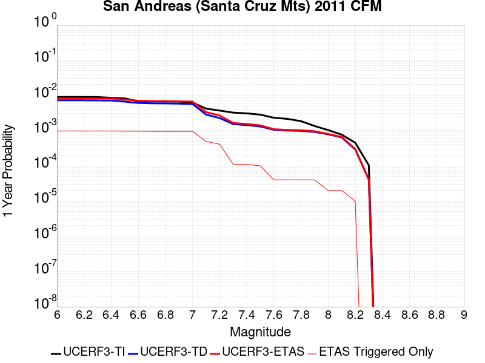 |  |

| Magnitude | 1 wk TI Prob | 1 wk TD Prob | 1 wk ETAS Prob | 1 wk ETAS/TD Gain | 1 wk ETAS Triggered Only | 1 mo TI Prob | 1 mo TD Prob | 1 mo ETAS Prob | 1 mo ETAS/TD Gain | 1 mo ETAS Triggered Only | 1 yr TI Prob | 1 yr TD Prob | 1 yr ETAS Prob | 1 yr ETAS/TD Gain | 1 yr ETAS Triggered Only | 10 yr TI Prob | 10 yr TD Prob | 10 yr ETAS Prob | 10 yr ETAS/TD Gain | 10 yr ETAS Triggered Only |
|-----|-----|-----|-----|-----|-----|-----|-----|-----|-----|-----|-----|-----|-----|-----|-----|-----|-----|-----|-----|-----|
| 6.0 | 1.7221631E-4 | 1.3884946E-4 | 9.0093876E-4 | 6.488601 | 7.621951E-4 | 7.378611E-4 | 5.9493544E-4 | 0.0014176165 | 2.3828073 | 8.231707E-4 | 0.008946515 | 0.0072196755 | 0.008248777 | 1.1425413 | 0.0010365853 | 0.08594794 | 0.07099123 | 0.0720392 | 1.0147619 | 0.0011280488 |
| 6.1 | 1.7221631E-4 | 1.3884946E-4 | 9.0093876E-4 | 6.488601 | 7.621951E-4 | 7.378611E-4 | 5.9493544E-4 | 0.0014176165 | 2.3828073 | 8.231707E-4 | 0.008946515 | 0.0072196755 | 0.008248777 | 1.1425413 | 0.0010365853 | 0.08594794 | 0.07099123 | 0.0720392 | 1.0147619 | 0.0011280488 |
| 6.2 | 1.7221631E-4 | 1.3884946E-4 | 9.0093876E-4 | 6.488601 | 7.621951E-4 | 7.378611E-4 | 5.9493544E-4 | 0.0014176165 | 2.3828073 | 8.231707E-4 | 0.008946515 | 0.0072196755 | 0.008248777 | 1.1425413 | 0.0010365853 | 0.08594794 | 0.07099123 | 0.0720392 | 1.0147619 | 0.0011280488 |
| 6.3 | 1.716926E-4 | 1.3804191E-4 | 9.001318E-4 | 6.5207143 | 7.621951E-4 | 7.3561794E-4 | 5.914761E-4 | 0.0014141599 | 2.3908997 | 8.231707E-4 | 0.008919428 | 0.0071778353 | 0.00820698 | 1.1433781 | 0.0010365853 | 0.08569809 | 0.0706028 | 0.0716512 | 1.0148493 | 0.0011280488 |
| 6.4 | 1.6392978E-4 | 1.3678138E-4 | 8.9887227E-4 | 6.5715976 | 7.621951E-4 | 7.02367E-4 | 5.860763E-4 | 0.0014087646 | 2.4037223 | 8.231707E-4 | 0.008517839 | 0.0071125226 | 0.008141736 | 1.1447043 | 0.0010365853 | 0.08198654 | 0.06982483 | 0.07087411 | 1.0150274 | 0.0011280488 |
| 6.5 | 1.5742714E-4 | 1.2735424E-4 | 8.894523E-4 | 6.9840803 | 7.621951E-4 | 6.745133E-4 | 5.4569147E-4 | 0.001368413 | 2.5076678 | 8.231707E-4 | 0.00818132 | 0.0066238823 | 0.0076536015 | 1.1554556 | 0.0010365853 | 0.078865945 | 0.06527744 | 0.066331856 | 1.0161527 | 0.0011280488 |
| 6.6 | 1.3038084E-4 | 1.16682175E-4 | 8.7878836E-4 | 7.531471 | 7.621951E-4 | 5.5865536E-4 | 4.999719E-4 | 0.0013227311 | 2.6456108 | 8.231707E-4 | 0.006780438 | 0.0060704127 | 0.0071007055 | 1.1697237 | 0.0010365853 | 0.0657725 | 0.05970143 | 0.060762133 | 1.0177668 | 0.0011280488 |
| 6.7 | 1.2867592E-4 | 1.1394204E-4 | 8.760503E-4 | 7.688561 | 7.621951E-4 | 5.5135164E-4 | 4.8823294E-4 | 0.0013110017 | 2.6851974 | 8.231707E-4 | 0.0066920654 | 0.0059282756 | 0.0069587156 | 1.1738179 | 0.0010365853 | 0.06494093 | 0.058410734 | 0.059472892 | 1.0181843 | 0.0011280488 |
| 6.8 | 1.2801298E-4 | 1.1331655E-4 | 8.754253E-4 | 7.725485 | 7.621951E-4 | 5.485117E-4 | 4.8555326E-4 | 0.0013083243 | 2.694502 | 8.231707E-4 | 0.0066577005 | 0.005895828 | 0.006926302 | 1.1747801 | 0.0010365853 | 0.06461738 | 0.058124207 | 0.059186686 | 1.0182796 | 0.0011280488 |
| 6.9 | 1.269149E-4 | 1.1173527E-4 | 8.7384525E-4 | 7.820675 | 7.621951E-4 | 5.4380763E-4 | 4.7877885E-4 | 0.0013015554 | 2.71849 | 8.231707E-4 | 0.006600777 | 0.005813793 | 0.0068443515 | 1.177261 | 0.0010365853 | 0.06408122 | 0.057394966 | 0.058458272 | 1.0185261 | 0.0011280488 |
| 7.0 | 1.2030331E-4 | 1.09023524E-4 | 8.7113556E-4 | 7.9903445 | 7.621951E-4 | 5.154837E-4 | 4.671613E-4 | 0.0012899474 | 2.7612464 | 8.231707E-4 | 0.006257969 | 0.0056730937 | 0.006703798 | 1.1816831 | 0.0010365853 | 0.06084648 | 0.056060992 | 0.057125803 | 1.0189937 | 0.0011280488 |
| 7.1 | 8.049617E-5 | 5.4515673E-5 | 3.8986324E-4 | 7.151397 | 3.3536585E-4 | 3.4493793E-4 | 2.3361787E-4 | 6.298667E-4 | 2.696141 | 3.9634146E-4 | 0.0041915346 | 0.0028406233 | 0.0033270423 | 1.1712368 | 4.8780488E-4 | 0.041133516 | 0.02991033 | 0.030383544 | 1.0158211 | 4.8780488E-4 |
| 7.2 | 7.093979E-5 | 4.3460117E-5 | 2.568655E-4 | 5.9103723 | 2.1341463E-4 | 3.0399222E-4 | 1.8624449E-4 | 4.6058363E-4 | 2.4730055 | 2.7439024E-4 | 0.0036948253 | 0.0022651919 | 0.002599798 | 1.1477165 | 3.3536585E-4 | 0.03633994 | 0.02420392 | 0.024531169 | 1.0135205 | 3.3536585E-4 |
| 7.3 | 6.193693E-5 | 2.9285771E-5 | 2.9285771E-5 | 1.0 | 0.0 | 2.6541698E-4 | 1.2550442E-4 | 1.559884E-4 | 1.2428917 | 3.0487805E-5 | 0.0032266637 | 0.001526947 | 0.0015878296 | 1.039872 | 6.097561E-5 | 0.031802133 | 0.01670446 | 0.016764417 | 1.0035893 | 6.097561E-5 |
| 7.4 | 5.906492E-5 | 2.7392227E-5 | 2.7392227E-5 | 1.0 | 0.0 | 2.5311083E-4 | 1.1738999E-4 | 1.478742E-4 | 1.2596834 | 3.0487805E-5 | 0.0030772698 | 0.0014282875 | 0.0014891761 | 1.0426304 | 6.097561E-5 | 0.030350044 | 0.015665498 | 0.015725518 | 1.0038314 | 6.097561E-5 |
| 7.5 | 5.424296E-5 | 2.5015886E-5 | 2.5015886E-5 | 1.0 | 0.0 | 2.324491E-4 | 1.0720654E-4 | 1.3769108E-4 | 1.2843534 | 3.0487805E-5 | 0.002826395 | 0.0013044594 | 0.0013653554 | 1.046683 | 6.097561E-5 | 0.027907165 | 0.014342199 | 0.0144023 | 1.0041906 | 6.097561E-5 |
| 7.6 | 4.43084E-5 | 2.0169791E-5 | 2.0169791E-5 | 1.0 | 0.0 | 1.8987931E-4 | 8.64391E-5 | 8.64391E-5 | 1.0 | 0.0 | 0.0023093296 | 0.0010518882 | 0.0010518882 | 1.0 | 0.0 | 0.022854783 | 0.011554358 | 0.011554358 | 1.0 | 0.0 |
| 7.7 | 4.118098E-5 | 1.9189929E-5 | 1.9189929E-5 | 1.0 | 0.0 | 1.7647797E-4 | 8.223996E-5 | 8.223996E-5 | 1.0 | 0.0 | 0.002146502 | 0.0010008118 | 0.0010008118 | 1.0 | 0.0 | 0.021258866 | 0.011005864 | 0.011005864 | 1.0 | 0.0 |
| 7.8 | 3.5408906E-5 | 1.8810757E-5 | 1.8810757E-5 | 1.0 | 0.0 | 1.5174363E-4 | 8.061504E-5 | 8.061504E-5 | 1.0 | 0.0 | 0.0018459131 | 9.810465E-4 | 9.810465E-4 | 1.0 | 0.0 | 0.018306552 | 0.010783297 | 0.010783297 | 1.0 | 0.0 |
| 7.9 | 2.5860836E-5 | 1.7537723E-5 | 1.7537723E-5 | 1.0 | 0.0 | 1.10827445E-4 | 7.51595E-5 | 7.51595E-5 | 1.0 | 0.0 | 0.001348489 | 9.14683E-4 | 9.14683E-4 | 1.0 | 0.0 | 0.013403354 | 0.010024931 | 0.010024931 | 1.0 | 0.0 |
| 8.0 | 1.9777332E-5 | 1.5026019E-5 | 1.5026019E-5 | 1.0 | 0.0 | 8.4757245E-5 | 6.439564E-5 | 6.439564E-5 | 1.0 | 0.0 | 0.0010314309 | 7.837351E-4 | 7.837351E-4 | 1.0 | 0.0 | 0.010266567 | 0.008607804 | 0.008607804 | 1.0 | 0.0 |
| 8.1 | 1.468494E-5 | 1.2258435E-5 | 1.2258435E-5 | 1.0 | 0.0 | 6.293394E-5 | 5.253509E-5 | 5.253509E-5 | 1.0 | 0.0 | 7.6595135E-4 | 6.394272E-4 | 6.394272E-4 | 1.0 | 0.0 | 0.0076331664 | 0.0070496635 | 0.0070496635 | 1.0 | 0.0 |
| 8.2 | 8.63836E-6 | 5.5468126E-6 | 5.5468126E-6 | 1.0 | 0.0 | 3.7021015E-5 | 2.3771838E-5 | 2.3771838E-5 | 1.0 | 0.0 | 4.5063766E-4 | 2.8938375E-4 | 2.8938375E-4 | 1.0 | 0.0 | 0.004497249 | 0.0032881699 | 0.0032881699 | 1.0 | 0.0 |
| 8.3 | 1.983087E-6 | 7.7871465E-7 | 7.7871465E-7 | 1.0 | 0.0 | 8.498917E-6 | 3.3373444E-6 | 3.3373444E-6 | 1.0 | 0.0 | 1.034694E-4 | 4.063143E-5 | 4.063143E-5 | 1.0 | 0.0 | 0.0010342124 | 4.7926197E-4 | 4.7926197E-4 | 1.0 | 0.0 |

## Green Valley 2011 CFM
*[(top)](#table-of-contents)*

| 1 Week | 1 Month | 1 Year | 10 Year |
|-----|-----|-----|-----|
|  |  |  |  |

| Magnitude | 1 wk TI Prob | 1 wk TD Prob | 1 wk ETAS Prob | 1 wk ETAS/TD Gain | 1 wk ETAS Triggered Only | 1 mo TI Prob | 1 mo TD Prob | 1 mo ETAS Prob | 1 mo ETAS/TD Gain | 1 mo ETAS Triggered Only | 1 yr TI Prob | 1 yr TD Prob | 1 yr ETAS Prob | 1 yr ETAS/TD Gain | 1 yr ETAS Triggered Only | 10 yr TI Prob | 10 yr TD Prob | 10 yr ETAS Prob | 10 yr ETAS/TD Gain | 10 yr ETAS Triggered Only |
|-----|-----|-----|-----|-----|-----|-----|-----|-----|-----|-----|-----|-----|-----|-----|-----|-----|-----|-----|-----|-----|
| 6.0 | 9.9629346E-5 | 1.7317598E-4 | 4.7800122E-4 | 2.760205 | 3.0487805E-4 | 4.2691303E-4 | 7.419091E-4 | 0.0012293521 | 1.6570117 | 4.8780488E-4 | 0.0051852856 | 0.008991489 | 0.009867686 | 1.0974473 | 8.841463E-4 | 0.050659515 | 0.08556864 | 0.08657228 | 1.0117291 | 0.001097561 |
| 6.1 | 9.88615E-5 | 1.7164624E-4 | 4.7647196E-4 | 2.775895 | 3.0487805E-4 | 4.2362334E-4 | 7.3535676E-4 | 0.0012228029 | 1.6628703 | 4.8780488E-4 | 0.0051454236 | 0.0089123715 | 0.009788638 | 1.0983202 | 8.841463E-4 | 0.050279044 | 0.08485507 | 0.0858595 | 1.011837 | 0.001097561 |
| 6.2 | 9.696895E-5 | 1.6803163E-4 | 4.7285846E-4 | 2.8141038 | 3.0487805E-4 | 4.15515E-4 | 7.1987417E-4 | 0.0012073279 | 1.6771374 | 4.8780488E-4 | 0.0050471667 | 0.008725558 | 0.009601991 | 1.1004442 | 8.841463E-4 | 0.04934063 | 0.08316236 | 0.08416865 | 1.0121002 | 0.001097561 |
| 6.3 | 9.275224E-5 | 1.5982409E-4 | 4.3417048E-4 | 2.716552 | 2.7439024E-4 | 3.9744904E-4 | 6.8471767E-4 | 0.0011112547 | 1.6229385 | 4.2682927E-4 | 0.0048282105 | 0.008300837 | 0.009117175 | 1.098344 | 8.231707E-4 | 0.047246475 | 0.079300575 | 0.080254965 | 1.012035 | 0.0010365853 |
| 6.4 | 8.391499E-5 | 1.4376939E-4 | 2.961865E-4 | 2.06015 | 1.5243902E-4 | 3.595861E-4 | 6.159458E-4 | 8.90167E-4 | 1.4452035 | 2.7439024E-4 | 0.004369175 | 0.0074695917 | 0.008105054 | 1.0850731 | 6.402439E-4 | 0.04284265 | 0.07165913 | 0.07239501 | 1.0102692 | 7.926829E-4 |
| 6.5 | 5.9519385E-5 | 9.941439E-5 | 1.9086871E-4 | 1.9199305 | 9.1463415E-5 | 2.5505814E-4 | 4.2592557E-4 | 5.4782483E-4 | 1.2861985 | 1.2195122E-4 | 0.0031009112 | 0.0051704263 | 0.005473728 | 1.0586609 | 3.0487805E-4 | 0.030579966 | 0.05016996 | 0.05051746 | 1.0069264 | 3.6585366E-4 |
| 6.6 | 4.5361558E-5 | 7.4088064E-5 | 1.3505915E-4 | 1.8229543 | 6.097561E-5 | 1.9439218E-4 | 3.1748452E-4 | 3.7844077E-4 | 1.1919975 | 6.097561E-5 | 0.0023641558 | 0.0038558498 | 0.0040077013 | 1.0393821 | 1.5243902E-4 | 0.023391623 | 0.037687372 | 0.037863404 | 1.0046709 | 1.8292683E-4 |
| 6.7 | 3.8808106E-5 | 6.270438E-5 | 9.319027E-5 | 1.4861845 | 3.0487805E-5 | 1.6630985E-4 | 2.6870798E-4 | 2.9918758E-4 | 1.1134303 | 3.0487805E-5 | 0.0020229418 | 0.0032644244 | 0.0033555892 | 1.0279268 | 9.1463415E-5 | 0.020046256 | 0.032024976 | 0.032143023 | 1.0036861 | 1.2195122E-4 |
| 6.8 | 2.2284667E-5 | 3.1299103E-5 | 3.1299103E-5 | 1.0 | 0.0 | 9.550222E-5 | 1.3413222E-4 | 1.3413222E-4 | 1.0 | 0.0 | 0.0011621192 | 0.0016318185 | 0.0016622565 | 1.0186528 | 3.0487805E-5 | 0.011560607 | 0.016173003 | 0.016232992 | 1.0037092 | 6.097561E-5 |
| 6.9 | 1.8050168E-5 | 2.4460174E-5 | 2.4460174E-5 | 1.0 | 0.0 | 7.735557E-5 | 1.0482514E-4 | 1.0482514E-4 | 1.0 | 0.0 | 9.4139716E-4 | 0.001275506 | 0.001275506 | 1.0 | 0.0 | 0.009374191 | 0.01267408 | 0.0127041815 | 1.002375 | 3.0487805E-5 |
| 7.0 | 1.4763166E-5 | 1.9590905E-5 | 1.9590905E-5 | 1.0 | 0.0 | 6.326917E-5 | 8.395834E-5 | 8.395834E-5 | 1.0 | 0.0 | 7.7002996E-4 | 0.0010217162 | 0.0010217162 | 1.0 | 0.0 | 0.007673672 | 0.010169487 | 0.010199665 | 1.0029675 | 3.0487805E-5 |
| 7.1 | 1.2399713E-5 | 1.6309968E-5 | 1.6309968E-5 | 1.0 | 0.0 | 5.3140546E-5 | 6.9898E-5 | 6.9898E-5 | 1.0 | 0.0 | 6.467941E-4 | 8.506777E-4 | 8.506777E-4 | 1.0 | 0.0 | 0.006449148 | 0.0084744925 | 0.008504722 | 1.0035671 | 3.0487805E-5 |
| 7.2 | 1.0584195E-5 | 1.3927383E-5 | 1.3927383E-5 | 1.0 | 0.0 | 4.5360044E-5 | 5.968743E-5 | 5.968743E-5 | 1.0 | 0.0 | 5.521186E-4 | 7.264538E-4 | 7.264538E-4 | 1.0 | 0.0 | 0.0055074887 | 0.0072412067 | 0.0072714738 | 1.0041798 | 3.0487805E-5 |
| 7.3 | 7.998173E-6 | 1.05492245E-5 | 1.05492245E-5 | 1.0 | 0.0 | 3.4277433E-5 | 4.5210185E-5 | 4.5210185E-5 | 1.0 | 0.0 | 4.1724785E-4 | 5.502961E-4 | 5.502961E-4 | 1.0 | 0.0 | 0.004164653 | 0.0054896 | 0.0054896 | 1.0 | 0.0 |
| 7.4 | 6.7571127E-6 | 8.937685E-6 | 8.937685E-6 | 1.0 | 0.0 | 2.8958733E-5 | 3.830381E-5 | 3.830381E-5 | 1.0 | 0.0 | 3.5251552E-4 | 4.6625003E-4 | 4.6625003E-4 | 1.0 | 0.0 | 0.0035195686 | 0.004652921 | 0.004652921 | 1.0 | 0.0 |
| 7.5 | 5.69878E-6 | 7.520235E-6 | 7.520235E-6 | 1.0 | 0.0 | 2.4423114E-5 | 3.2229185E-5 | 3.2229185E-5 | 1.0 | 0.0 | 2.9731085E-4 | 3.9232057E-4 | 3.9232057E-4 | 1.0 | 0.0 | 0.002969134 | 0.003916431 | 0.003916431 | 1.0 | 0.0 |
| 7.6 | 4.503664E-6 | 5.9392337E-6 | 5.9392337E-6 | 1.0 | 0.0 | 1.9301275E-5 | 2.5453615E-5 | 2.5453615E-5 | 1.0 | 0.0 | 2.3496768E-4 | 3.098545E-4 | 3.098545E-4 | 1.0 | 0.0 | 0.002347194 | 0.00309435 | 0.00309435 | 1.0 | 0.0 |
| 7.7 | 1.0873546E-6 | 1.4111749E-6 | 1.4111749E-6 | 1.0 | 0.0 | 4.6600826E-6 | 6.0478787E-6 | 6.0478787E-6 | 1.0 | 0.0 | 5.6735033E-5 | 7.3630465E-5 | 7.3630465E-5 | 1.0 | 0.0 | 5.672055E-4 | 7.360627E-4 | 7.360627E-4 | 1.0 | 0.0 |
| 7.8 | 4.9373917E-8 | 6.178776E-8 | 6.178776E-8 | 1.0 | 0.0 | 2.1160248E-7 | 2.6480467E-7 | 2.6480467E-7 | 1.0 | 0.0 | 2.5762572E-6 | 3.2239934E-6 | 3.2239934E-6 | 1.0 | 0.0 | 2.5762274E-5 | 3.223787E-5 | 3.223787E-5 | 1.0 | 0.0 |

## Hayward (So) 2011 CFM
*[(top)](#table-of-contents)*

| 1 Week | 1 Month | 1 Year | 10 Year |
|-----|-----|-----|-----|
|  |  |  |  |

| Magnitude | 1 wk TI Prob | 1 wk TD Prob | 1 wk ETAS Prob | 1 wk ETAS/TD Gain | 1 wk ETAS Triggered Only | 1 mo TI Prob | 1 mo TD Prob | 1 mo ETAS Prob | 1 mo ETAS/TD Gain | 1 mo ETAS Triggered Only | 1 yr TI Prob | 1 yr TD Prob | 1 yr ETAS Prob | 1 yr ETAS/TD Gain | 1 yr ETAS Triggered Only | 10 yr TI Prob | 10 yr TD Prob | 10 yr ETAS Prob | 10 yr ETAS/TD Gain | 10 yr ETAS Triggered Only |
|-----|-----|-----|-----|-----|-----|-----|-----|-----|-----|-----|-----|-----|-----|-----|-----|-----|-----|-----|-----|-----|
| 6.0 | 1.8091932E-4 | 3.576308E-4 | 4.795384E-4 | 1.3408756 | 1.2195122E-4 | 7.751381E-4 | 0.0015318132 | 0.0017449008 | 1.1391082 | 2.1341463E-4 | 0.00939654 | 0.01849276 | 0.018881772 | 1.0210359 | 3.9634146E-4 | 0.090090066 | 0.16695412 | 0.16746208 | 1.0030425 | 6.097561E-4 |
| 6.1 | 1.8091932E-4 | 3.576308E-4 | 4.795384E-4 | 1.3408756 | 1.2195122E-4 | 7.751381E-4 | 0.0015318132 | 0.0017449008 | 1.1391082 | 2.1341463E-4 | 0.00939654 | 0.01849276 | 0.018881772 | 1.0210359 | 3.9634146E-4 | 0.090090066 | 0.16695412 | 0.16746208 | 1.0030425 | 6.097561E-4 |
| 6.2 | 1.8091932E-4 | 3.576308E-4 | 4.795384E-4 | 1.3408756 | 1.2195122E-4 | 7.751381E-4 | 0.0015318132 | 0.0017449008 | 1.1391082 | 2.1341463E-4 | 0.00939654 | 0.01849276 | 0.018881772 | 1.0210359 | 3.9634146E-4 | 0.090090066 | 0.16695412 | 0.16746208 | 1.0030425 | 6.097561E-4 |
| 6.3 | 1.7322872E-4 | 3.4318614E-4 | 4.650955E-4 | 1.3552281 | 1.2195122E-4 | 7.4219756E-4 | 0.0014699784 | 0.0016830793 | 1.1449687 | 2.1341463E-4 | 0.0089988755 | 0.017752402 | 0.018141707 | 1.0219297 | 3.9634146E-4 | 0.08643075 | 0.1608864 | 0.16139805 | 1.0031803 | 6.097561E-4 |
| 6.4 | 1.6334097E-4 | 3.239878E-4 | 4.4589952E-4 | 1.3762848 | 1.2195122E-4 | 6.998449E-4 | 0.001387789 | 0.0016009074 | 1.153567 | 2.1341463E-4 | 0.008487372 | 0.016767448 | 0.017127167 | 1.0214534 | 3.6585366E-4 | 0.081704415 | 0.15277125 | 0.15326202 | 1.0032125 | 5.7926826E-4 |
| 6.5 | 1.5600289E-4 | 3.1072096E-4 | 4.326343E-4 | 1.3923563 | 1.2195122E-4 | 6.684125E-4 | 0.00133099 | 0.0015441206 | 1.1601293 | 2.1341463E-4 | 0.008107598 | 0.016086295 | 0.016446264 | 1.0223774 | 3.6585366E-4 | 0.078181036 | 0.14704405 | 0.14753814 | 1.0033602 | 5.7926826E-4 |
| 6.6 | 1.4046066E-4 | 2.8083503E-4 | 3.7227274E-4 | 1.3255923 | 9.1463415E-5 | 6.018354E-4 | 0.0012030302 | 0.001385737 | 1.1518722 | 1.8292683E-4 | 0.0073027555 | 0.014550033 | 0.014880519 | 1.0227138 | 3.3536585E-4 | 0.07067384 | 0.13412383 | 0.13459902 | 1.0035428 | 5.487805E-4 |
| 6.7 | 1.14696966E-4 | 2.3317046E-4 | 3.2461254E-4 | 1.3921684 | 9.1463415E-5 | 4.914658E-4 | 9.989244E-4 | 0.0011512111 | 1.1524507 | 1.5243902E-4 | 0.0059671924 | 0.0120951515 | 0.012396342 | 1.0249017 | 3.0487805E-4 | 0.058094822 | 0.11293557 | 0.113395326 | 1.004071 | 5.1829265E-4 |
| 6.8 | 9.3874296E-5 | 1.8899176E-4 | 2.8043787E-4 | 1.483863 | 9.1463415E-5 | 4.0225635E-4 | 8.0971693E-4 | 9.620325E-4 | 1.1881096 | 1.5243902E-4 | 0.0048864787 | 0.00981448 | 0.010086177 | 1.0276833 | 2.7439024E-4 | 0.047804173 | 0.09275965 | 0.09311923 | 1.0038764 | 3.9634146E-4 |
| 6.9 | 5.551852E-5 | 1.0752712E-4 | 1.989807E-4 | 1.8505164 | 9.1463415E-5 | 2.3791482E-4 | 4.6074972E-4 | 5.826448E-4 | 1.264558 | 1.2195122E-4 | 0.0028927654 | 0.0055953185 | 0.0057469048 | 1.0270916 | 1.5243902E-4 | 0.028553981 | 0.05435149 | 0.054553304 | 1.0037131 | 2.1341463E-4 |
| 7.0 | 4.2662363E-5 | 8.2650746E-5 | 1.4362132E-4 | 1.7376893 | 6.097561E-5 | 1.8282588E-4 | 3.541698E-4 | 4.4560083E-4 | 1.258156 | 9.1463415E-5 | 0.0022236328 | 0.0043035657 | 0.004424992 | 1.0282153 | 1.2195122E-4 | 0.022015138 | 0.042151436 | 0.042297453 | 1.003464 | 1.5243902E-4 |
| 7.1 | 3.305886E-5 | 6.317338E-5 | 9.3659255E-5 | 1.4825748 | 3.0487805E-5 | 1.4167312E-4 | 2.7071504E-4 | 3.3167415E-4 | 1.2251781 | 6.097561E-5 | 0.0017235056 | 0.0032909934 | 0.0033517682 | 1.0184671 | 6.097561E-5 | 0.017101998 | 0.032526355 | 0.032614846 | 1.0027205 | 9.1463415E-5 |
| 7.2 | 2.9856887E-5 | 5.7159497E-5 | 8.764556E-5 | 1.5333507 | 3.0487805E-5 | 1.2795182E-4 | 2.4494636E-4 | 3.0590704E-4 | 1.2488736 | 6.097561E-5 | 0.0015567001 | 0.0029781607 | 0.0030389547 | 1.0204133 | 6.097561E-5 | 0.015458403 | 0.029523436 | 0.029612198 | 1.0030066 | 9.1463415E-5 |
| 7.3 | 2.4559737E-5 | 4.611372E-5 | 7.660012E-5 | 1.6611134 | 3.0487805E-5 | 1.0525176E-4 | 1.9761534E-4 | 2.585789E-4 | 1.3084961 | 6.097561E-5 | 0.0012806869 | 0.002403325 | 0.002464154 | 1.0253104 | 6.097561E-5 | 0.012733313 | 0.023917055 | 0.02400633 | 1.0037327 | 9.1463415E-5 |
| 7.4 | 1.9002231E-5 | 3.515206E-5 | 6.563879E-5 | 1.8672816 | 3.0487805E-5 | 8.143559E-5 | 1.5064306E-4 | 1.8112626E-4 | 1.202354 | 3.0487805E-5 | 9.910273E-4 | 0.0018325461 | 0.0018629781 | 1.0166063 | 3.0487805E-5 | 0.009866194 | 0.018308608 | 0.018368466 | 1.0032694 | 6.097561E-5 |
| 7.5 | 1.2783333E-5 | 2.3408053E-5 | 5.3895143E-5 | 2.302419 | 3.0487805E-5 | 5.4784563E-5 | 1.003164E-4 | 1.3080114E-4 | 1.3038859 | 3.0487805E-5 | 6.667979E-4 | 0.0012206737 | 0.0012511243 | 1.0249457 | 3.0487805E-5 | 0.006648007 | 0.012248043 | 0.012278157 | 1.0024587 | 3.0487805E-5 |
| 7.6 | 4.8149627E-6 | 8.921087E-6 | 3.940862E-5 | 4.4174685 | 3.0487805E-5 | 2.063539E-5 | 3.8232676E-5 | 6.871932E-5 | 1.7973975 | 3.0487805E-5 | 2.5120692E-4 | 4.6538466E-4 | 4.9585826E-4 | 1.0654805 | 3.0487805E-5 | 0.0025092314 | 0.0046977843 | 0.0047281287 | 1.0064594 | 3.0487805E-5 |
| 7.7 | 6.0838227E-7 | 1.2138476E-6 | 1.2138476E-6 | 1.0 | 0.0 | 2.6073499E-6 | 5.2021937E-6 | 5.2021937E-6 | 1.0 | 0.0 | 3.174402E-5 | 6.333487E-5 | 6.333487E-5 | 1.0 | 0.0 | 3.1739488E-4 | 6.569028E-4 | 6.569028E-4 | 1.0 | 0.0 |
| 7.8 | 4.5542808E-7 | 9.863899E-7 | 9.863899E-7 | 1.0 | 0.0 | 1.9518332E-6 | 4.227378E-6 | 4.227378E-6 | 1.0 | 0.0 | 2.376331E-5 | 5.146712E-5 | 5.146712E-5 | 1.0 | 0.0 | 2.3760769E-4 | 5.356085E-4 | 5.356085E-4 | 1.0 | 0.0 |
| 7.9 | 3.3016747E-7 | 7.4394256E-7 | 7.4394256E-7 | 1.0 | 0.0 | 1.4150027E-6 | 3.1883212E-6 | 3.1883212E-6 | 1.0 | 0.0 | 1.7227521E-5 | 3.881712E-5 | 3.881712E-5 | 1.0 | 0.0 | 1.7226185E-4 | 4.0186857E-4 | 4.0186857E-4 | 1.0 | 0.0 |
| 8.0 | 2.347038E-7 | 5.509049E-7 | 5.509049E-7 | 1.0 | 0.0 | 1.0058731E-6 | 2.3610187E-6 | 2.3610187E-6 | 1.0 | 0.0 | 1.2246436E-5 | 2.8745026E-5 | 2.8745026E-5 | 1.0 | 0.0 | 1.2245761E-4 | 2.9535973E-4 | 2.9535973E-4 | 1.0 | 0.0 |
| 8.1 | 1.18822804E-7 | 2.6227093E-7 | 2.6227093E-7 | 1.0 | 0.0 | 5.092405E-7 | 1.1240178E-6 | 1.1240178E-6 | 1.0 | 0.0 | 6.1999854E-6 | 1.3684832E-5 | 1.3684832E-5 | 1.0 | 0.0 | 6.199812E-5 | 1.4000124E-4 | 1.4000124E-4 | 1.0 | 0.0 |

## Hayward (So) extension 2011 CFM
*[(top)](#table-of-contents)*

| 1 Week | 1 Month | 1 Year | 10 Year |
|-----|-----|-----|-----|
|  |  |  |  |

| Magnitude | 1 wk TI Prob | 1 wk TD Prob | 1 wk ETAS Prob | 1 wk ETAS/TD Gain | 1 wk ETAS Triggered Only | 1 mo TI Prob | 1 mo TD Prob | 1 mo ETAS Prob | 1 mo ETAS/TD Gain | 1 mo ETAS Triggered Only | 1 yr TI Prob | 1 yr TD Prob | 1 yr ETAS Prob | 1 yr ETAS/TD Gain | 1 yr ETAS Triggered Only | 10 yr TI Prob | 10 yr TD Prob | 10 yr ETAS Prob | 10 yr ETAS/TD Gain | 10 yr ETAS Triggered Only |
|-----|-----|-----|-----|-----|-----|-----|-----|-----|-----|-----|-----|-----|-----|-----|-----|-----|-----|-----|-----|-----|
| 6.0 | 1.1721256E-4 | 2.3663012E-4 | 3.585525E-4 | 1.5152445 | 1.2195122E-4 | 5.022428E-4 | 0.0010137935 | 0.0011660779 | 1.1502125 | 1.5243902E-4 | 0.0060976758 | 0.012259374 | 0.012590629 | 1.0270205 | 3.3536585E-4 | 0.0593305 | 0.112924725 | 0.11327631 | 1.0031134 | 3.9634146E-4 |
| 6.1 | 6.99169E-5 | 1.381428E-4 | 1.686264E-4 | 1.2206672 | 3.0487805E-5 | 2.9960944E-4 | 5.919204E-4 | 6.528599E-4 | 1.1029522 | 6.097561E-5 | 0.0036416445 | 0.007179867 | 0.0073614805 | 1.0252948 | 1.8292683E-4 | 0.035825435 | 0.06787131 | 0.06807024 | 1.002931 | 2.1341463E-4 |
| 6.2 | 6.99169E-5 | 1.381428E-4 | 1.686264E-4 | 1.2206672 | 3.0487805E-5 | 2.9960944E-4 | 5.919204E-4 | 6.528599E-4 | 1.1029522 | 6.097561E-5 | 0.0036416445 | 0.007179867 | 0.0073614805 | 1.0252948 | 1.8292683E-4 | 0.035825435 | 0.06787131 | 0.06807024 | 1.002931 | 2.1341463E-4 |
| 6.3 | 6.970908E-5 | 1.3782376E-4 | 1.6830736E-4 | 1.2211782 | 3.0487805E-5 | 2.9871898E-4 | 5.905537E-4 | 6.514933E-4 | 1.1031907 | 6.097561E-5 | 0.0036308395 | 0.007163397 | 0.0073450133 | 1.0253534 | 1.8292683E-4 | 0.035720866 | 0.06772022 | 0.06791918 | 1.002938 | 2.1341463E-4 |
| 6.4 | 6.9517155E-5 | 1.3749335E-4 | 1.6797695E-4 | 1.2217097 | 3.0487805E-5 | 2.9789665E-4 | 5.8913825E-4 | 6.5007794E-4 | 1.1034387 | 6.097561E-5 | 0.0036208609 | 0.0071463026 | 0.007327922 | 1.0254145 | 1.8292683E-4 | 0.03562429 | 0.067564204 | 0.0677632 | 1.0029453 | 2.1341463E-4 |
| 6.5 | 4.786248E-5 | 9.427737E-5 | 1.247623E-4 | 1.3233536 | 3.0487805E-5 | 2.0510878E-4 | 4.039859E-4 | 4.6493686E-4 | 1.150874 | 6.097561E-5 | 0.0024943394 | 0.004907904 | 0.005059595 | 1.0309075 | 1.5243902E-4 | 0.02466527 | 0.046958525 | 0.04713286 | 1.0037125 | 1.8292683E-4 |
| 6.6 | 4.4662214E-5 | 8.8941175E-5 | 1.1942627E-4 | 1.3427557 | 3.0487805E-5 | 1.9139545E-4 | 3.811234E-4 | 4.4207578E-4 | 1.1599282 | 6.097561E-5 | 0.0023277493 | 0.004630768 | 0.004782501 | 1.0327663 | 1.5243902E-4 | 0.02303517 | 0.04434846 | 0.044523273 | 1.0039419 | 1.8292683E-4 |
| 6.7 | 3.884542E-5 | 7.876597E-5 | 1.0925137E-4 | 1.3870378 | 3.0487805E-5 | 1.6646975E-4 | 3.3752725E-4 | 3.6800475E-4 | 1.0902965 | 3.0487805E-5 | 0.002024885 | 0.004102097 | 0.004223548 | 1.029607 | 1.2195122E-4 | 0.020065336 | 0.03938556 | 0.039532 | 1.003718 | 1.5243902E-4 |
| 6.8 | 3.4221863E-5 | 6.866193E-5 | 9.914764E-5 | 1.4439973 | 3.0487805E-5 | 1.4665688E-4 | 2.942346E-4 | 3.2471344E-4 | 1.1035868 | 3.0487805E-5 | 0.0017840851 | 0.003576844 | 0.003698359 | 1.0339727 | 1.2195122E-4 | 0.017698295 | 0.034468345 | 0.03461553 | 1.0042702 | 1.5243902E-4 |
| 6.9 | 1.6927712E-5 | 3.0115967E-5 | 6.0602855E-5 | 2.0123165 | 3.0487805E-5 | 7.2545314E-5 | 1.2906236E-4 | 1.5954624E-4 | 1.2361948 | 3.0487805E-5 | 8.828813E-4 | 0.0015702589 | 0.0016311387 | 1.0387706 | 6.097561E-5 | 0.008793819 | 0.015489228 | 0.015549259 | 1.0038756 | 6.097561E-5 |
| 7.0 | 1.2509653E-5 | 2.2511605E-5 | 2.2511605E-5 | 1.0 | 0.0 | 5.3611697E-5 | 9.647499E-5 | 9.647499E-5 | 1.0 | 0.0 | 6.525269E-4 | 0.0011739943 | 0.0012044463 | 1.0259387 | 3.0487805E-5 | 0.0065061417 | 0.011605909 | 0.011636043 | 1.0025964 | 3.0487805E-5 |
| 7.1 | 8.751583E-6 | 1.4962153E-5 | 1.4962153E-5 | 1.0 | 0.0 | 3.750624E-5 | 6.412197E-5 | 6.412197E-5 | 1.0 | 0.0 | 4.5654282E-4 | 7.8041124E-4 | 7.8041124E-4 | 1.0 | 0.0 | 0.0045560603 | 0.0077815293 | 0.0077815293 | 1.0 | 0.0 |
| 7.2 | 6.354379E-6 | 1.1532643E-5 | 1.1532643E-5 | 1.0 | 0.0 | 2.7232769E-5 | 4.9424707E-5 | 4.9424707E-5 | 1.0 | 0.0 | 3.3150852E-4 | 6.015845E-4 | 6.015845E-4 | 1.0 | 0.0 | 0.0033101442 | 0.0060171904 | 0.0060171904 | 1.0 | 0.0 |
| 7.3 | 4.645554E-6 | 8.848017E-6 | 8.848017E-6 | 1.0 | 0.0 | 1.9909365E-5 | 3.7919544E-5 | 3.7919544E-5 | 1.0 | 0.0 | 2.4236954E-4 | 4.6157665E-4 | 4.6157665E-4 | 1.0 | 0.0 | 0.0024210536 | 0.0046256287 | 0.0046256287 | 1.0 | 0.0 |
| 7.4 | 4.23437E-6 | 8.02022E-6 | 8.02022E-6 | 1.0 | 0.0 | 1.8147173E-5 | 3.437194E-5 | 3.437194E-5 | 1.0 | 0.0 | 2.2091944E-4 | 4.184019E-4 | 4.184019E-4 | 1.0 | 0.0 | 0.0022069993 | 0.0041958606 | 0.0041958606 | 1.0 | 0.0 |
| 7.5 | 2.2187417E-6 | 3.9695706E-6 | 3.9695706E-6 | 1.0 | 0.0 | 9.508858E-6 | 1.701235E-5 | 1.701235E-5 | 1.0 | 0.0 | 1.157642E-4 | 2.0710831E-4 | 2.0710831E-4 | 1.0 | 0.0 | 0.0011570391 | 0.0020822915 | 0.0020822915 | 1.0 | 0.0 |
| 7.6 | 2.7952495E-8 | 3.8852022E-8 | 3.8852022E-8 | 1.0 | 0.0 | 1.1979641E-7 | 1.6650864E-7 | 1.6650864E-7 | 1.0 | 0.0 | 1.4585203E-6 | 2.027241E-6 | 2.027241E-6 | 1.0 | 0.0 | 1.4585107E-5 | 2.0362815E-5 | 2.0362815E-5 | 1.0 | 0.0 |
| 7.7 | 1.7192724E-8 | 2.3481117E-8 | 2.3481117E-8 | 1.0 | 0.0 | 7.36831E-8 | 1.0063336E-7 | 1.0063336E-7 | 1.0 | 0.0 | 8.9709135E-7 | 1.2252104E-6 | 1.2252104E-6 | 1.0 | 0.0 | 8.970877E-6 | 1.2320078E-5 | 1.2320078E-5 | 1.0 | 0.0 |

## Calaveras (No) 2011 CFM
*[(top)](#table-of-contents)*

| 1 Week | 1 Month | 1 Year | 10 Year |
|-----|-----|-----|-----|
|  |  |  |  |

| Magnitude | 1 wk TI Prob | 1 wk TD Prob | 1 wk ETAS Prob | 1 wk ETAS/TD Gain | 1 wk ETAS Triggered Only | 1 mo TI Prob | 1 mo TD Prob | 1 mo ETAS Prob | 1 mo ETAS/TD Gain | 1 mo ETAS Triggered Only | 1 yr TI Prob | 1 yr TD Prob | 1 yr ETAS Prob | 1 yr ETAS/TD Gain | 1 yr ETAS Triggered Only | 10 yr TI Prob | 10 yr TD Prob | 10 yr ETAS Prob | 10 yr ETAS/TD Gain | 10 yr ETAS Triggered Only |
|-----|-----|-----|-----|-----|-----|-----|-----|-----|-----|-----|-----|-----|-----|-----|-----|-----|-----|-----|-----|-----|
| 6.0 | 4.8694856E-5 | 6.761473E-5 | 2.505292E-4 | 3.7052455 | 1.8292683E-4 | 2.0867554E-4 | 2.8974633E-4 | 5.030991E-4 | 1.7363434 | 2.1341463E-4 | 0.0025376645 | 0.0035220422 | 0.0037650857 | 1.0690064 | 2.4390244E-4 | 0.02508881 | 0.034841146 | 0.0351354 | 1.0084456 | 3.0487805E-4 |
| 6.1 | 4.8694856E-5 | 6.761473E-5 | 2.505292E-4 | 3.7052455 | 1.8292683E-4 | 2.0867554E-4 | 2.8974633E-4 | 5.030991E-4 | 1.7363434 | 2.1341463E-4 | 0.0025376645 | 0.0035220422 | 0.0037650857 | 1.0690064 | 2.4390244E-4 | 0.02508881 | 0.034841146 | 0.0351354 | 1.0084456 | 3.0487805E-4 |
| 6.2 | 4.7541962E-5 | 6.594423E-5 | 2.48859E-4 | 3.7737796 | 1.8292683E-4 | 2.0373536E-4 | 2.825886E-4 | 4.959429E-4 | 1.7549998 | 2.1341463E-4 | 0.0024776561 | 0.0034352248 | 0.0036782892 | 1.0707566 | 2.4390244E-4 | 0.024502134 | 0.034002047 | 0.034296557 | 1.0086616 | 3.0487805E-4 |
| 6.3 | 4.6717287E-5 | 6.477679E-5 | 2.4769176E-4 | 3.8237736 | 1.8292683E-4 | 2.0020158E-4 | 2.775863E-4 | 4.909417E-4 | 1.7686092 | 2.1341463E-4 | 0.0024347296 | 0.0033745435 | 0.003617623 | 1.0720333 | 2.4390244E-4 | 0.024082264 | 0.033414237 | 0.033708926 | 1.0088193 | 3.0487805E-4 |
| 6.4 | 4.6276386E-5 | 6.413808E-5 | 2.470532E-4 | 3.8518953 | 1.8292683E-4 | 1.983123E-4 | 2.748496E-4 | 4.8820558E-4 | 1.7762644 | 2.1341463E-4 | 0.0024117786 | 0.003341327 | 0.0035844145 | 1.0727518 | 2.4390244E-4 | 0.02385771 | 0.033092905 | 0.033387695 | 1.0089079 | 3.0487805E-4 |
| 6.5 | 4.5720994E-5 | 6.333808E-5 | 2.4625333E-4 | 3.887919 | 1.8292683E-4 | 1.9593239E-4 | 2.7142174E-4 | 4.8477843E-4 | 1.7860708 | 2.1341463E-4 | 0.002382867 | 0.0032997404 | 0.0035428382 | 1.0736717 | 2.4390244E-4 | 0.023574775 | 0.032690268 | 0.03298518 | 1.0090214 | 3.0487805E-4 |
| 6.6 | 4.549134E-5 | 6.2990985E-5 | 2.459063E-4 | 3.9038332 | 1.8292683E-4 | 1.949483E-4 | 2.6993448E-4 | 4.8329151E-4 | 1.790403 | 2.1341463E-4 | 0.0023709119 | 0.003281688 | 0.00352479 | 1.0740783 | 2.4390244E-4 | 0.023457756 | 0.03251555 | 0.032810513 | 1.0090715 | 3.0487805E-4 |
| 6.7 | 3.701047E-5 | 5.0488026E-5 | 2.3340562E-4 | 4.6229897 | 1.8292683E-4 | 1.5860666E-4 | 2.1635955E-4 | 4.29728E-4 | 1.9861754 | 2.1341463E-4 | 0.0019293258 | 0.0026310391 | 0.0028742997 | 1.092458 | 2.4390244E-4 | 0.019126613 | 0.026189491 | 0.026486384 | 1.0113363 | 3.0487805E-4 |
| 6.8 | 3.5523568E-5 | 4.8468683E-5 | 2.3138664E-4 | 4.7739415 | 1.8292683E-4 | 1.5223498E-4 | 2.0770663E-4 | 4.2107693E-4 | 2.0272677 | 2.1341463E-4 | 0.0018518851 | 0.0025259387 | 0.002769225 | 1.0963153 | 2.4390244E-4 | 0.018365284 | 0.02516132 | 0.025458528 | 1.0118121 | 3.0487805E-4 |
| 6.9 | 3.2946147E-5 | 4.4786295E-5 | 2.2770494E-4 | 5.0842547 | 1.8292683E-4 | 1.4119013E-4 | 1.9192738E-4 | 4.0530105E-4 | 2.1117418 | 2.1341463E-4 | 0.0017176344 | 0.002334254 | 0.0025775873 | 1.1042445 | 2.4390244E-4 | 0.017044188 | 0.023281476 | 0.023579257 | 1.0127904 | 3.0487805E-4 |
| 7.0 | 2.7682381E-5 | 3.7143058E-5 | 2.200631E-4 | 5.924743 | 1.8292683E-4 | 1.1863338E-4 | 1.59175E-4 | 3.7255566E-4 | 2.3405414 | 2.1341463E-4 | 0.0014434044 | 0.0019362634 | 0.0021796937 | 1.1257216 | 2.4390244E-4 | 0.01434065 | 0.019371657 | 0.019670628 | 1.0154334 | 3.0487805E-4 |
| 7.1 | 2.471967E-5 | 3.340416E-5 | 2.1632489E-4 | 6.4759855 | 1.8292683E-4 | 1.05937135E-4 | 1.4315301E-4 | 3.2605365E-4 | 2.2776585 | 1.8292683E-4 | 0.0012890215 | 0.0017415237 | 0.0019545667 | 1.1223314 | 2.1341463E-4 | 0.0128157 | 0.017445127 | 0.017714731 | 1.0154544 | 2.7439024E-4 |
| 7.2 | 1.9748062E-5 | 2.6888965E-5 | 2.0981088E-4 | 7.8028617 | 1.8292683E-4 | 8.463181E-5 | 1.15233466E-4 | 2.981392E-4 | 2.5872624 | 1.8292683E-4 | 0.0010299052 | 0.0014020882 | 0.0016152037 | 1.1519985 | 2.1341463E-4 | 0.01025145 | 0.014088519 | 0.014359044 | 1.0192018 | 2.7439024E-4 |
| 7.3 | 1.1603734E-5 | 1.5883887E-5 | 1.3783317E-4 | 8.6775465 | 1.2195122E-4 | 4.9729337E-5 | 6.8072106E-5 | 1.9001502E-4 | 2.7913787 | 1.2195122E-4 | 6.052865E-4 | 8.284772E-4 | 9.807899E-4 | 1.1838466 | 1.5243902E-4 | 0.0060364045 | 0.008359566 | 0.008571196 | 1.025316 | 2.1341463E-4 |
| 7.4 | 4.885381E-6 | 6.0575517E-6 | 6.0575517E-6 | 1.0 | 0.0 | 2.0937177E-5 | 2.5960679E-5 | 2.5960679E-5 | 1.0 | 0.0 | 2.5488032E-4 | 3.160256E-4 | 3.4650377E-4 | 1.0964421 | 3.0487805E-5 | 0.0025458818 | 0.0032124277 | 0.0032428177 | 1.0094601 | 3.0487805E-5 |
| 7.5 | 3.0571264E-6 | 4.1757917E-6 | 4.1757917E-6 | 1.0 | 0.0 | 1.3101904E-5 | 1.7896127E-5 | 1.7896127E-5 | 1.0 | 0.0 | 1.5950401E-4 | 2.1786368E-4 | 2.4834485E-4 | 1.1399094 | 3.0487805E-5 | 0.0015938957 | 0.0022314226 | 0.0022618424 | 1.0136324 | 3.0487805E-5 |
| 7.6 | 1.764948E-6 | 2.815238E-6 | 2.815238E-6 | 1.0 | 0.0 | 7.564041E-6 | 1.206525E-5 | 1.206525E-5 | 1.0 | 0.0 | 9.208831E-5 | 1.4688459E-4 | 1.4688459E-4 | 1.0 | 0.0 | 9.205016E-4 | 0.0015222435 | 0.0015222435 | 1.0 | 0.0 |
| 7.7 | 1.3173734E-6 | 2.0757866E-6 | 2.0757866E-6 | 1.0 | 0.0 | 5.645874E-6 | 8.896198E-6 | 8.896198E-6 | 1.0 | 0.0 | 6.873634E-5 | 1.0830585E-4 | 1.0830585E-4 | 1.0 | 0.0 | 6.8715087E-4 | 0.0011348927 | 0.0011348927 | 1.0 | 0.0 |
| 7.8 | 9.4429885E-7 | 1.5624398E-6 | 1.5624398E-6 | 1.0 | 0.0 | 4.0469886E-6 | 6.6961534E-6 | 6.6961534E-6 | 1.0 | 0.0 | 4.9270973E-5 | 8.152264E-5 | 8.152264E-5 | 1.0 | 0.0 | 4.926005E-4 | 8.569319E-4 | 8.569319E-4 | 1.0 | 0.0 |
| 7.9 | 6.388233E-7 | 1.124425E-6 | 1.124425E-6 | 1.0 | 0.0 | 2.7378112E-6 | 4.8189554E-6 | 4.8189554E-6 | 1.0 | 0.0 | 3.3332344E-5 | 5.866921E-5 | 5.866921E-5 | 1.0 | 0.0 | 3.3327343E-4 | 6.1441824E-4 | 6.1441824E-4 | 1.0 | 0.0 |
| 8.0 | 3.087986E-7 | 5.8040854E-7 | 5.8040854E-7 | 1.0 | 0.0 | 1.323422E-6 | 2.4874628E-6 | 2.4874628E-6 | 1.0 | 0.0 | 1.6112543E-5 | 3.0284444E-5 | 3.0284444E-5 | 1.0 | 0.0 | 1.6111376E-4 | 3.1352913E-4 | 3.1352913E-4 | 1.0 | 0.0 |
| 8.1 | 1.6725647E-7 | 2.7677092E-7 | 2.7677092E-7 | 1.0 | 0.0 | 7.168133E-7 | 1.1861606E-6 | 1.1861606E-6 | 1.0 | 0.0 | 8.7271665E-6 | 1.4441412E-5 | 1.4441412E-5 | 1.0 | 0.0 | 8.726824E-5 | 1.4985427E-4 | 1.4985427E-4 | 1.0 | 0.0 |

## Hunting Creek - Berryessa 2011 CFM
*[(top)](#table-of-contents)*

| 1 Week | 1 Month | 1 Year | 10 Year |
|-----|-----|-----|-----|
|  |  |  | 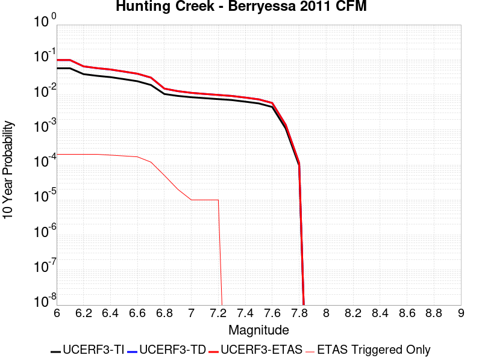 |

| Magnitude | 1 wk TI Prob | 1 wk TD Prob | 1 wk ETAS Prob | 1 wk ETAS/TD Gain | 1 wk ETAS Triggered Only | 1 mo TI Prob | 1 mo TD Prob | 1 mo ETAS Prob | 1 mo ETAS/TD Gain | 1 mo ETAS Triggered Only | 1 yr TI Prob | 1 yr TD Prob | 1 yr ETAS Prob | 1 yr ETAS/TD Gain | 1 yr ETAS Triggered Only | 10 yr TI Prob | 10 yr TD Prob | 10 yr ETAS Prob | 10 yr ETAS/TD Gain | 10 yr ETAS Triggered Only |
|-----|-----|-----|-----|-----|-----|-----|-----|-----|-----|-----|-----|-----|-----|-----|-----|-----|-----|-----|-----|-----|
| 6.0 | 1.1270982E-4 | 2.0033884E-4 | 2.9178394E-4 | 1.4564521 | 9.1463415E-5 | 4.8295266E-4 | 8.5827895E-4 | 9.496638E-4 | 1.1064746 | 9.1463415E-5 | 0.0058641075 | 0.01039249 | 0.010573516 | 1.0174189 | 1.8292683E-4 | 0.057117578 | 0.09809242 | 0.0982849 | 1.0019622 | 2.1341463E-4 |
| 6.1 | 1.1239393E-4 | 1.9981996E-4 | 2.912651E-4 | 1.4576377 | 9.1463415E-5 | 4.8159933E-4 | 8.5605663E-4 | 9.4744173E-4 | 1.1067512 | 9.1463415E-5 | 0.0058477195 | 0.010365712 | 0.010546743 | 1.0174644 | 1.8292683E-4 | 0.056962132 | 0.09785073 | 0.09804326 | 1.0019675 | 2.1341463E-4 |
| 6.2 | 7.596265E-5 | 1.2944505E-4 | 2.2089662E-4 | 1.7064896 | 9.1463415E-5 | 3.2551357E-4 | 5.5457966E-4 | 6.4599235E-4 | 1.1648324 | 9.1463415E-5 | 0.0039559277 | 0.0067249946 | 0.006906691 | 1.0270181 | 1.8292683E-4 | 0.038862433 | 0.06462765 | 0.06482727 | 1.0030888 | 2.1341463E-4 |
| 6.3 | 6.78794E-5 | 1.1461031E-4 | 2.0606324E-4 | 1.7979468 | 9.1463415E-5 | 2.9087928E-4 | 4.910263E-4 | 5.8244483E-4 | 1.1861784 | 9.1463415E-5 | 0.003535705 | 0.0059555117 | 0.006137349 | 1.0305326 | 1.8292683E-4 | 0.034799766 | 0.057497483 | 0.057698626 | 1.0034983 | 2.1341463E-4 |
| 6.4 | 6.2165134E-5 | 1.0446956E-4 | 1.654388E-4 | 1.5836077 | 6.097561E-5 | 2.6639478E-4 | 4.4758292E-4 | 5.0853123E-4 | 1.1361722 | 6.097561E-5 | 0.0032385332 | 0.005430052 | 0.0055816635 | 1.0279207 | 1.5243902E-4 | 0.03191742 | 0.052580375 | 0.052753683 | 1.003296 | 1.8292683E-4 |
| 6.5 | 5.4368087E-5 | 9.080083E-5 | 1.517709E-4 | 1.6714704 | 6.097561E-5 | 2.3298527E-4 | 3.8902112E-4 | 4.49973E-4 | 1.1566801 | 6.097561E-5 | 0.0028329059 | 0.004722142 | 0.0048738616 | 1.0321293 | 1.5243902E-4 | 0.027970633 | 0.045906633 | 0.046081163 | 1.0038018 | 1.8292683E-4 |
| 6.6 | 4.729947E-5 | 7.8547964E-5 | 1.3951879E-4 | 1.776224 | 6.097561E-5 | 2.0269625E-4 | 3.3659383E-4 | 3.9754892E-4 | 1.1810939 | 6.097561E-5 | 0.002465034 | 0.004086986 | 0.004238802 | 1.0371462 | 1.5243902E-4 | 0.02437869 | 0.039874986 | 0.04005062 | 1.0044045 | 1.8292683E-4 |
| 6.7 | 3.6875328E-5 | 6.0503822E-5 | 9.098978E-5 | 1.5038683 | 3.0487805E-5 | 1.5802756E-4 | 2.5927887E-4 | 2.8975878E-4 | 1.1175565 | 3.0487805E-5 | 0.0019222875 | 0.003149953 | 0.0032411283 | 1.028945 | 9.1463415E-5 | 0.019057442 | 0.030911246 | 0.031029427 | 1.0038233 | 1.2195122E-4 |
| 6.8 | 2.0292036E-5 | 2.898966E-5 | 2.898966E-5 | 1.0 | 0.0 | 8.6962966E-5 | 1.2423552E-4 | 1.2423552E-4 | 1.0 | 0.0 | 0.0010582599 | 0.0015114911 | 0.0015419328 | 1.0201402 | 3.0487805E-5 | 0.010532344 | 0.014985252 | 0.015045314 | 1.004008 | 6.097561E-5 |
| 6.9 | 1.7871042E-5 | 2.4483867E-5 | 2.4483867E-5 | 1.0 | 0.0 | 7.658793E-5 | 1.0492665E-4 | 1.0492665E-4 | 1.0 | 0.0 | 9.320591E-4 | 0.0012767378 | 0.0012767378 | 1.0 | 0.0 | 0.009281595 | 0.012685746 | 0.012715846 | 1.0023729 | 3.0487805E-5 |
| 7.0 | 1.6415532E-5 | 2.1917253E-5 | 2.1917253E-5 | 1.0 | 0.0 | 7.035038E-5 | 9.3927716E-5 | 9.3927716E-5 | 1.0 | 0.0 | 8.561793E-4 | 0.0011429732 | 0.0011429732 | 1.0 | 0.0 | 0.008528882 | 0.011370161 | 0.011400302 | 1.0026509 | 3.0487805E-5 |
| 7.1 | 1.5409885E-5 | 2.0356898E-5 | 2.0356898E-5 | 1.0 | 0.0 | 6.6040695E-5 | 8.7240944E-5 | 8.7240944E-5 | 1.0 | 0.0 | 8.0374884E-4 | 0.0010616437 | 0.0010616437 | 1.0 | 0.0 | 0.00800848 | 0.010566039 | 0.010596205 | 1.002855 | 3.0487805E-5 |
| 7.2 | 1.4497423E-5 | 1.9065028E-5 | 1.9065028E-5 | 1.0 | 0.0 | 6.213033E-5 | 8.170472E-5 | 8.170472E-5 | 1.0 | 0.0 | 7.5617427E-4 | 9.943041E-4 | 9.943041E-4 | 1.0 | 0.0 | 0.0075360634 | 0.009899127 | 0.009929313 | 1.0030494 | 3.0487805E-5 |
| 7.3 | 1.3615175E-5 | 1.7835837E-5 | 1.7835837E-5 | 1.0 | 0.0 | 5.8349444E-5 | 7.643708E-5 | 7.643708E-5 | 1.0 | 0.0 | 7.101729E-4 | 9.30227E-4 | 9.30227E-4 | 1.0 | 0.0 | 0.0070790765 | 0.009263841 | 0.009263841 | 1.0 | 0.0 |
| 7.4 | 1.2252825E-5 | 1.6035223E-5 | 1.6035223E-5 | 1.0 | 0.0 | 5.251105E-5 | 6.872059E-5 | 6.872059E-5 | 1.0 | 0.0 | 6.391345E-4 | 8.3635485E-4 | 8.3635485E-4 | 1.0 | 0.0 | 0.0063729943 | 0.008332515 | 0.008332515 | 1.0 | 0.0 |
| 7.5 | 1.0913301E-5 | 1.42488025E-5 | 1.42488025E-5 | 1.0 | 0.0 | 4.6770452E-5 | 6.1064886E-5 | 6.1064886E-5 | 1.0 | 0.0 | 5.6928146E-4 | 7.432141E-4 | 7.432141E-4 | 1.0 | 0.0 | 0.0056782532 | 0.00740766 | 0.00740766 | 1.0 | 0.0 |
| 7.6 | 8.623192E-6 | 1.1241129E-5 | 1.1241129E-5 | 1.0 | 0.0 | 3.6956015E-5 | 4.817539E-5 | 4.817539E-5 | 1.0 | 0.0 | 4.4984656E-4 | 5.863801E-4 | 5.863801E-4 | 1.0 | 0.0 | 0.00448937 | 0.0058486434 | 0.0058486434 | 1.0 | 0.0 |
| 7.7 | 2.0993634E-6 | 2.6636358E-6 | 2.6636358E-6 | 1.0 | 0.0 | 8.997241E-6 | 1.1415532E-5 | 1.1415532E-5 | 1.0 | 0.0 | 1.09535904E-4 | 1.389753E-4 | 1.389753E-4 | 1.0 | 0.0 | 0.0010948193 | 0.0013888904 | 0.0013888904 | 1.0 | 0.0 |
| 7.8 | 1.8428308E-7 | 2.167988E-7 | 2.167988E-7 | 1.0 | 0.0 | 7.897844E-7 | 9.2913734E-7 | 9.2913734E-7 | 1.0 | 0.0 | 9.615583E-6 | 1.1312192E-5 | 1.1312192E-5 | 1.0 | 0.0 | 9.615166E-5 | 1.13114795E-4 | 1.13114795E-4 | 1.0 | 0.0 |

## Mission (connected) 2011 CFM
*[(top)](#table-of-contents)*

| 1 Week | 1 Month | 1 Year | 10 Year |
|-----|-----|-----|-----|
|  |  |  |  |

| Magnitude | 1 wk TI Prob | 1 wk TD Prob | 1 wk ETAS Prob | 1 wk ETAS/TD Gain | 1 wk ETAS Triggered Only | 1 mo TI Prob | 1 mo TD Prob | 1 mo ETAS Prob | 1 mo ETAS/TD Gain | 1 mo ETAS Triggered Only | 1 yr TI Prob | 1 yr TD Prob | 1 yr ETAS Prob | 1 yr ETAS/TD Gain | 1 yr ETAS Triggered Only | 10 yr TI Prob | 10 yr TD Prob | 10 yr ETAS Prob | 10 yr ETAS/TD Gain | 10 yr ETAS Triggered Only |
|-----|-----|-----|-----|-----|-----|-----|-----|-----|-----|-----|-----|-----|-----|-----|-----|-----|-----|-----|-----|-----|
| 6.0 | 1.8735573E-5 | 2.6919299E-5 | 8.789327E-5 | 3.2650652 | 6.097561E-5 | 8.029284E-5 | 1.15363146E-4 | 2.0681601E-4 | 1.792739 | 9.1463415E-5 | 9.771269E-4 | 0.0014036349 | 0.0015558599 | 1.1084507 | 1.5243902E-4 | 0.009728416 | 0.013956046 | 0.01413642 | 1.0129244 | 1.8292683E-4 |
| 6.1 | 1.7515964E-5 | 2.5560277E-5 | 2.5560277E-5 | 1.0 | 0.0 | 7.506625E-5 | 1.09539265E-4 | 1.4002372E-4 | 1.2782972 | 3.0487805E-5 | 9.135484E-4 | 0.0013328177 | 0.0013937121 | 1.0456884 | 6.097561E-5 | 0.009098019 | 0.013256509 | 0.01334676 | 1.006808 | 9.1463415E-5 |
| 6.2 | 1.6486343E-5 | 2.4404653E-5 | 2.4404653E-5 | 1.0 | 0.0 | 7.065384E-5 | 1.0458707E-4 | 1.3507168E-4 | 1.291476 | 3.0487805E-5 | 8.5987104E-4 | 0.0012725982 | 0.0013334962 | 1.0478532 | 6.097561E-5 | 0.008565514 | 0.012661357 | 0.012751662 | 1.0071324 | 9.1463415E-5 |
| 6.3 | 1.5229385E-5 | 2.283323E-5 | 2.283323E-5 | 1.0 | 0.0 | 6.526716E-5 | 9.785291E-5 | 1.2833774E-4 | 1.3115371 | 3.0487805E-5 | 7.9433795E-4 | 0.0011907034 | 0.0012516064 | 1.0511488 | 6.097561E-5 | 0.007915046 | 0.01185415 | 0.01194453 | 1.0076243 | 9.1463415E-5 |
| 6.4 | 1.4435828E-5 | 2.1432059E-5 | 2.1432059E-5 | 1.0 | 0.0 | 6.186637E-5 | 9.184833E-5 | 1.2233332E-4 | 1.331906 | 3.0487805E-5 | 7.529627E-4 | 0.0011176757 | 0.0011785831 | 1.0544947 | 6.097561E-5 | 0.007504165 | 0.011136543 | 0.0112269875 | 1.0081215 | 9.1463415E-5 |
| 6.5 | 1.30127955E-5 | 1.9068159E-5 | 1.9068159E-5 | 1.0 | 0.0 | 5.576793E-5 | 8.1718084E-5 | 1.122034E-4 | 1.3730546 | 3.0487805E-5 | 6.78763E-4 | 9.944608E-4 | 0.0010553758 | 1.0612543 | 6.097561E-5 | 0.0067669353 | 0.009927544 | 0.010018099 | 1.0091217 | 9.1463415E-5 |
| 6.6 | 1.1220718E-5 | 1.6423419E-5 | 1.6423419E-5 | 1.0 | 0.0 | 4.8087906E-5 | 7.0384194E-5 | 1.0086985E-4 | 1.4331322 | 3.0487805E-5 | 5.8531296E-4 | 8.5658836E-4 | 9.1751176E-4 | 1.0711232 | 6.097561E-5 | 0.005837737 | 0.008564659 | 0.0086553395 | 1.0105877 | 9.1463415E-5 |
| 6.7 | 8.086152E-6 | 1.1775521E-5 | 1.1775521E-5 | 1.0 | 0.0 | 3.4654473E-5 | 5.0465544E-5 | 8.095181E-5 | 1.6041006 | 3.0487805E-5 | 4.2183654E-4 | 6.142456E-4 | 6.751837E-4 | 1.0992081 | 6.097561E-5 | 0.004210367 | 0.0061624083 | 0.0062533077 | 1.0147507 | 9.1463415E-5 |
| 6.8 | 6.8361655E-6 | 1.0218049E-5 | 1.0218049E-5 | 1.0 | 0.0 | 2.9297524E-5 | 4.3790908E-5 | 7.427738E-5 | 1.6961826 | 3.0487805E-5 | 3.5663895E-4 | 5.330245E-4 | 5.939676E-4 | 1.1143346 | 6.097561E-5 | 0.0035606713 | 0.005350081 | 0.0054410547 | 1.0170043 | 9.1463415E-5 |
| 6.9 | 5.2517353E-6 | 7.888038E-6 | 7.888038E-6 | 1.0 | 0.0 | 2.2507242E-5 | 3.3805445E-5 | 6.429222E-5 | 1.9018303 | 3.0487805E-5 | 2.739912E-4 | 4.115038E-4 | 4.724543E-4 | 1.1481166 | 6.097561E-5 | 0.0027365363 | 0.0041393843 | 0.004230469 | 1.0220045 | 9.1463415E-5 |
| 7.0 | 4.4602784E-6 | 6.718898E-6 | 6.718898E-6 | 1.0 | 0.0 | 1.911534E-5 | 2.879496E-5 | 5.9281887E-5 | 2.0587592 | 3.0487805E-5 | 2.327044E-4 | 3.505224E-4 | 4.1147665E-4 | 1.1738954 | 6.097561E-5 | 0.0023246086 | 0.0035308576 | 0.003591618 | 1.0172083 | 6.097561E-5 |
| 7.1 | 4.1492594E-6 | 6.2665754E-6 | 6.2665754E-6 | 1.0 | 0.0 | 1.7782419E-5 | 2.6856475E-5 | 5.7343463E-5 | 2.135182 | 3.0487805E-5 | 2.1647944E-4 | 3.2692868E-4 | 3.8788436E-4 | 1.1864494 | 6.097561E-5 | 0.0021626868 | 0.003295128 | 0.0033559026 | 1.0184438 | 6.097561E-5 |
| 7.2 | 2.213247E-6 | 3.3735946E-6 | 3.3735946E-6 | 1.0 | 0.0 | 9.485309E-6 | 1.4458183E-5 | 4.4945547E-5 | 3.108658 | 3.0487805E-5 | 1.15477524E-4 | 1.7601419E-4 | 2.0649662E-4 | 1.1731818 | 3.0487805E-5 | 0.0011541754 | 0.0017872518 | 0.0018176851 | 1.017028 | 3.0487805E-5 |
| 7.3 | 1.7362703E-6 | 2.747984E-6 | 2.747984E-6 | 1.0 | 0.0 | 7.4411373E-6 | 1.17770205E-5 | 4.2264466E-5 | 3.5887232 | 3.0487805E-5 | 9.0592075E-5 | 1.4337582E-4 | 1.7385924E-4 | 1.2126122 | 3.0487805E-5 | 9.0555154E-4 | 0.0014580032 | 0.0014884465 | 1.0208802 | 3.0487805E-5 |
| 7.4 | 1.1628409E-6 | 1.8571193E-6 | 1.8571193E-6 | 1.0 | 0.0 | 4.9835944E-6 | 7.959058E-6 | 7.959058E-6 | 1.0 | 0.0 | 6.0673574E-5 | 9.689724E-5 | 9.689724E-5 | 1.0 | 0.0 | 6.065701E-4 | 9.892007E-4 | 9.892007E-4 | 1.0 | 0.0 |
| 7.5 | 5.5610667E-7 | 9.4032964E-7 | 9.4032964E-7 | 1.0 | 0.0 | 2.3833122E-6 | 4.029978E-6 | 4.029978E-6 | 1.0 | 0.0 | 2.9016439E-5 | 4.906388E-5 | 4.906388E-5 | 1.0 | 0.0 | 2.901265E-4 | 5.0707476E-4 | 5.0707476E-4 | 1.0 | 0.0 |
| 7.6 | 4.4307663E-7 | 7.8414774E-7 | 7.8414774E-7 | 1.0 | 0.0 | 1.8988985E-6 | 3.3606289E-6 | 3.3606289E-6 | 1.0 | 0.0 | 2.3118844E-5 | 4.0914892E-5 | 4.0914892E-5 | 1.0 | 0.0 | 2.3116439E-4 | 4.2493502E-4 | 4.2493502E-4 | 1.0 | 0.0 |
| 7.7 | 3.639119E-7 | 6.405925E-7 | 6.405925E-7 | 1.0 | 0.0 | 1.5596215E-6 | 2.7453934E-6 | 2.7453934E-6 | 1.0 | 0.0 | 1.8988227E-5 | 3.3424654E-5 | 3.3424654E-5 | 1.0 | 0.0 | 1.8986604E-4 | 3.4944323E-4 | 3.4944323E-4 | 1.0 | 0.0 |
| 7.8 | 3.1152942E-7 | 5.51793E-7 | 5.51793E-7 | 1.0 | 0.0 | 1.3351254E-6 | 2.364825E-6 | 2.364825E-6 | 1.0 | 0.0 | 1.6255031E-5 | 2.8791364E-5 | 2.8791364E-5 | 1.0 | 0.0 | 1.6253842E-4 | 2.9985773E-4 | 2.9985773E-4 | 1.0 | 0.0 |
| 7.9 | 1.8035962E-7 | 3.7451431E-7 | 3.7451431E-7 | 1.0 | 0.0 | 7.729696E-7 | 1.6050603E-6 | 1.6050603E-6 | 1.0 | 0.0 | 9.410865E-6 | 1.9541436E-5 | 1.9541436E-5 | 1.0 | 0.0 | 9.410465E-5 | 2.0201689E-4 | 2.0201689E-4 | 1.0 | 0.0 |
| 8.0 | 9.279334E-8 | 1.9824984E-7 | 1.9824984E-7 | 1.0 | 0.0 | 3.976857E-7 | 8.496418E-7 | 8.496418E-7 | 1.0 | 0.0 | 4.841813E-6 | 1.0344341E-5 | 1.0344341E-5 | 1.0 | 0.0 | 4.841707E-5 | 1.05925465E-4 | 1.05925465E-4 | 1.0 | 0.0 |
| 8.1 | 5.9253985E-8 | 1.1925192E-7 | 1.1925192E-7 | 1.0 | 0.0 | 2.5394561E-7 | 5.110796E-7 | 5.110796E-7 | 1.0 | 0.0 | 3.0917836E-6 | 6.222376E-6 | 6.222376E-6 | 1.0 | 0.0 | 3.0917407E-5 | 6.359083E-5 | 6.359083E-5 | 1.0 | 0.0 |

## Hayward (No) 2011 CFM
*[(top)](#table-of-contents)*

| 1 Week | 1 Month | 1 Year | 10 Year |
|-----|-----|-----|-----|
|  |  |  |  |

| Magnitude | 1 wk TI Prob | 1 wk TD Prob | 1 wk ETAS Prob | 1 wk ETAS/TD Gain | 1 wk ETAS Triggered Only | 1 mo TI Prob | 1 mo TD Prob | 1 mo ETAS Prob | 1 mo ETAS/TD Gain | 1 mo ETAS Triggered Only | 1 yr TI Prob | 1 yr TD Prob | 1 yr ETAS Prob | 1 yr ETAS/TD Gain | 1 yr ETAS Triggered Only | 10 yr TI Prob | 10 yr TD Prob | 10 yr ETAS Prob | 10 yr ETAS/TD Gain | 10 yr ETAS Triggered Only |
|-----|-----|-----|-----|-----|-----|-----|-----|-----|-----|-----|-----|-----|-----|-----|-----|-----|-----|-----|-----|-----|
| 6.0 | 9.3068506E-5 | 1.7425125E-4 | 2.6569873E-4 | 1.5248024 | 9.1463415E-5 | 3.9880406E-4 | 7.465782E-4 | 8.379733E-4 | 1.1224186 | 9.1463415E-5 | 0.0048446343 | 0.009051727 | 0.009172575 | 1.0133507 | 1.2195122E-4 | 0.047403704 | 0.0865073 | 0.0866744 | 1.0019317 | 1.8292683E-4 |
| 6.1 | 9.055486E-5 | 1.6976194E-4 | 2.6120982E-4 | 1.538683 | 9.1463415E-5 | 3.880345E-4 | 7.2734914E-4 | 8.1874605E-4 | 1.1256576 | 9.1463415E-5 | 0.0047140904 | 0.008819649 | 0.008940525 | 1.0137053 | 1.2195122E-4 | 0.046153355 | 0.08439965 | 0.08453922 | 1.0016537 | 1.5243902E-4 |
| 6.2 | 9.006742E-5 | 1.6896808E-4 | 2.6041604E-4 | 1.5412145 | 9.1463415E-5 | 3.859461E-4 | 7.2394876E-4 | 8.1534596E-4 | 1.1262481 | 9.1463415E-5 | 0.0046887742 | 0.008778584 | 0.008899464 | 1.01377 | 1.2195122E-4 | 0.0459107 | 0.08402366 | 0.084163286 | 1.0016618 | 1.5243902E-4 |
| 6.3 | 8.8336754E-5 | 1.657629E-4 | 2.5721116E-4 | 1.551681 | 9.1463415E-5 | 3.7853114E-4 | 7.1021984E-4 | 8.0161827E-4 | 1.1286904 | 9.1463415E-5 | 0.004598882 | 0.008612795 | 0.008733696 | 1.0140374 | 1.2195122E-4 | 0.04504866 | 0.08251658 | 0.08265644 | 1.0016949 | 1.5243902E-4 |
| 6.4 | 8.526157E-5 | 1.6002609E-4 | 2.5147488E-4 | 1.5714617 | 9.1463415E-5 | 3.6535555E-4 | 6.856466E-4 | 7.770473E-4 | 1.1333059 | 9.1463415E-5 | 0.0044391346 | 0.00831595 | 0.008436887 | 1.0145428 | 1.2195122E-4 | 0.043514993 | 0.079810895 | 0.07995117 | 1.0017576 | 1.5243902E-4 |
| 6.5 | 8.152396E-5 | 1.5334821E-4 | 2.447976E-4 | 1.5963513 | 9.1463415E-5 | 3.493416E-4 | 6.570418E-4 | 7.484451E-4 | 1.1391134 | 9.1463415E-5 | 0.0042449418 | 0.007970279 | 0.008091258 | 1.0151788 | 1.2195122E-4 | 0.04164765 | 0.07664138 | 0.07678214 | 1.0018365 | 1.5243902E-4 |
| 6.6 | 7.987405E-5 | 1.5038934E-4 | 2.41839E-4 | 1.608086 | 9.1463415E-5 | 3.4227243E-4 | 6.4436725E-4 | 7.357717E-4 | 1.1418515 | 9.1463415E-5 | 0.0041592065 | 0.007817105 | 0.007938104 | 1.0154786 | 1.2195122E-4 | 0.04082218 | 0.07523373 | 0.07537469 | 1.0018737 | 1.5243902E-4 |
| 6.7 | 7.777665E-5 | 1.4677564E-4 | 2.3822564E-4 | 1.6230597 | 9.1463415E-5 | 3.332859E-4 | 6.288875E-4 | 7.202934E-4 | 1.1453453 | 9.1463415E-5 | 0.004050208 | 0.007629981 | 0.0077510015 | 1.0158612 | 1.2195122E-4 | 0.039771806 | 0.073507555 | 0.07364879 | 1.0019213 | 1.5243902E-4 |
| 6.8 | 7.3284005E-5 | 1.3826684E-4 | 2.2971761E-4 | 1.6614078 | 9.1463415E-5 | 3.140365E-4 | 5.924383E-4 | 6.8384747E-4 | 1.1542933 | 9.1463415E-5 | 0.0038166929 | 0.0071892184 | 0.007310293 | 1.0168412 | 1.2195122E-4 | 0.037518036 | 0.069414906 | 0.069556765 | 1.0020436 | 1.5243902E-4 |
| 6.9 | 6.458263E-5 | 1.2154103E-4 | 2.1299333E-4 | 1.7524397 | 9.1463415E-5 | 2.7675333E-4 | 5.207866E-4 | 6.122024E-4 | 1.175534 | 9.1463415E-5 | 0.0033642664 | 0.0063222446 | 0.00641313 | 1.0143754 | 9.1463415E-5 | 0.033137884 | 0.061330207 | 0.061444677 | 1.0018665 | 1.2195122E-4 |
| 7.0 | 5.3853604E-5 | 1.00443234E-4 | 1.9189746E-4 | 1.9105066 | 9.1463415E-5 | 2.3078074E-4 | 4.304003E-4 | 5.2182435E-4 | 1.2124163 | 9.1463415E-5 | 0.0028061352 | 0.0052275984 | 0.0053185835 | 1.0174048 | 9.1463415E-5 | 0.027709642 | 0.051048793 | 0.051164515 | 1.002267 | 1.2195122E-4 |
| 7.1 | 4.4308683E-5 | 8.187352E-5 | 1.1235882E-4 | 1.3723464 | 3.0487805E-5 | 1.8988053E-4 | 3.5083952E-4 | 3.8131664E-4 | 1.0868691 | 3.0487805E-5 | 0.0023093442 | 0.004263147 | 0.0042935046 | 1.007121 | 3.0487805E-5 | 0.022854926 | 0.0419048 | 0.04196322 | 1.0013942 | 6.097561E-5 |
| 7.2 | 3.295973E-5 | 6.0918384E-5 | 9.1404334E-5 | 1.5004392 | 3.0487805E-5 | 1.4124835E-4 | 2.6105277E-4 | 2.9153263E-4 | 1.1167574 | 3.0487805E-5 | 0.0017183421 | 0.0031737085 | 0.0032040996 | 1.0095758 | 3.0487805E-5 | 0.017051157 | 0.03144125 | 0.03150031 | 1.0018784 | 6.097561E-5 |
| 7.3 | 2.452256E-5 | 4.5301702E-5 | 7.578812E-5 | 1.6729642 | 3.0487805E-5 | 1.05092455E-4 | 1.9413578E-4 | 2.2461766E-4 | 1.1570132 | 3.0487805E-5 | 0.0012787496 | 0.0023610548 | 0.0023914706 | 1.0128824 | 3.0487805E-5 | 0.0127141625 | 0.023500396 | 0.02355994 | 1.0025337 | 6.097561E-5 |
| 7.4 | 1.8829967E-5 | 3.470132E-5 | 6.518807E-5 | 1.8785472 | 3.0487805E-5 | 8.069736E-5 | 1.4871152E-4 | 1.7919479E-4 | 1.2049826 | 3.0487805E-5 | 9.820475E-4 | 0.0018090691 | 0.0018395017 | 1.0168222 | 3.0487805E-5 | 0.009777189 | 0.01806795 | 0.018127825 | 1.0033138 | 6.097561E-5 |
| 7.5 | 1.26374125E-5 | 2.2995238E-5 | 5.348234E-5 | 2.3258007 | 3.0487805E-5 | 5.4159216E-5 | 9.854733E-5 | 1.2903214E-4 | 1.3093417 | 3.0487805E-5 | 6.5918895E-4 | 0.0011991592 | 0.0012296104 | 1.0253938 | 3.0487805E-5 | 0.00657237 | 0.01202547 | 0.012055591 | 1.0025048 | 3.0487805E-5 |
| 7.6 | 4.666429E-6 | 8.508941E-6 | 3.8996488E-5 | 4.583001 | 3.0487805E-5 | 1.9998828E-5 | 3.646639E-5 | 6.6953085E-5 | 1.8360217 | 3.0487805E-5 | 2.4345852E-4 | 4.438891E-4 | 4.7436336E-4 | 1.0686529 | 3.0487805E-5 | 0.0024319198 | 0.0044738417 | 0.004504193 | 1.0067842 | 3.0487805E-5 |
| 7.7 | 3.8399318E-7 | 7.1789157E-7 | 7.1789157E-7 | 1.0 | 0.0 | 1.6456839E-6 | 3.0766744E-6 | 3.0766744E-6 | 1.0 | 0.0 | 2.003602E-5 | 3.745787E-5 | 3.745787E-5 | 1.0 | 0.0 | 2.0034213E-4 | 3.883479E-4 | 3.883479E-4 | 1.0 | 0.0 |
| 7.8 | 2.5637698E-7 | 5.405295E-7 | 5.405295E-7 | 1.0 | 0.0 | 1.098758E-6 | 2.316553E-6 | 2.316553E-6 | 1.0 | 0.0 | 1.3377297E-5 | 2.8203669E-5 | 2.8203669E-5 | 1.0 | 0.0 | 1.3376492E-4 | 2.9434287E-4 | 2.9434287E-4 | 1.0 | 0.0 |
| 7.9 | 1.7141245E-7 | 3.7561537E-7 | 3.7561537E-7 | 1.0 | 0.0 | 7.3462456E-7 | 1.6097791E-6 | 1.6097791E-6 | 1.0 | 0.0 | 8.944017E-6 | 1.9598885E-5 | 1.9598885E-5 | 1.0 | 0.0 | 8.943657E-5 | 2.0376658E-4 | 2.0376658E-4 | 1.0 | 0.0 |
| 8.0 | 1.1808895E-7 | 2.7700185E-7 | 2.7700185E-7 | 1.0 | 0.0 | 5.060954E-7 | 1.1871502E-6 | 1.1871502E-6 | 1.0 | 0.0 | 6.161694E-6 | 1.4453459E-5 | 1.4453459E-5 | 1.0 | 0.0 | 6.161523E-5 | 1.4907801E-4 | 1.4907801E-4 | 1.0 | 0.0 |
| 8.1 | 5.138535E-8 | 1.1304341E-7 | 1.1304341E-7 | 1.0 | 0.0 | 2.2022292E-7 | 4.844717E-7 | 4.844717E-7 | 1.0 | 0.0 | 2.6812106E-6 | 5.898427E-6 | 5.898427E-6 | 1.0 | 0.0 | 2.6811784E-5 | 6.0523264E-5 | 6.0523264E-5 | 1.0 | 0.0 |

## San Andreas (Parkfield)
*[(top)](#table-of-contents)*

| 1 Week | 1 Month | 1 Year | 10 Year |
|-----|-----|-----|-----|
|  |  |  |  |

| Magnitude | 1 wk TI Prob | 1 wk TD Prob | 1 wk ETAS Prob | 1 wk ETAS/TD Gain | 1 wk ETAS Triggered Only | 1 mo TI Prob | 1 mo TD Prob | 1 mo ETAS Prob | 1 mo ETAS/TD Gain | 1 mo ETAS Triggered Only | 1 yr TI Prob | 1 yr TD Prob | 1 yr ETAS Prob | 1 yr ETAS/TD Gain | 1 yr ETAS Triggered Only | 10 yr TI Prob | 10 yr TD Prob | 10 yr ETAS Prob | 10 yr ETAS/TD Gain | 10 yr ETAS Triggered Only |
|-----|-----|-----|-----|-----|-----|-----|-----|-----|-----|-----|-----|-----|-----|-----|-----|-----|-----|-----|-----|-----|
| 6.0 | 5.556969E-4 | 7.925354E-4 | 9.1438997E-4 | 1.1537528 | 1.2195122E-4 | 0.0023793848 | 0.003392733 | 0.0035142703 | 1.0358229 | 1.2195122E-4 | 0.028586963 | 0.040889088 | 0.04100605 | 1.0028605 | 1.2195122E-4 | 0.25176284 | 0.3393678 | 0.33946854 | 1.0002967 | 1.5243902E-4 |
| 6.1 | 1.925858E-4 | 3.0691034E-4 | 4.2882413E-4 | 1.3972293 | 1.2195122E-4 | 8.2510663E-4 | 0.0013147657 | 0.0014365565 | 1.0926331 | 1.2195122E-4 | 0.0099994885 | 0.01598289 | 0.016102891 | 1.0075082 | 1.2195122E-4 | 0.095613256 | 0.15073559 | 0.15086505 | 1.0008589 | 1.5243902E-4 |
| 6.2 | 9.4306815E-5 | 1.8358107E-4 | 3.055099E-4 | 1.6641688 | 1.2195122E-4 | 4.0410945E-4 | 7.8654004E-4 | 9.0839533E-4 | 1.1549257 | 1.2195122E-4 | 0.0049089384 | 0.009534287 | 0.009655076 | 1.0126688 | 1.2195122E-4 | 0.048019063 | 0.09235361 | 0.09249198 | 1.0014981 | 1.5243902E-4 |
| 6.3 | 9.283051E-5 | 1.8054266E-4 | 3.0247186E-4 | 1.6753484 | 1.2195122E-4 | 3.9778434E-4 | 7.7352603E-4 | 8.953829E-4 | 1.1575344 | 1.2195122E-4 | 0.0048322747 | 0.009377217 | 0.009498025 | 1.0128831 | 1.2195122E-4 | 0.047285385 | 0.091006055 | 0.09114462 | 1.0015227 | 1.5243902E-4 |
| 6.4 | 9.138826E-5 | 1.7815719E-4 | 3.000867E-4 | 1.6843928 | 1.2195122E-4 | 3.916052E-4 | 7.633086E-4 | 8.8516675E-4 | 1.1596446 | 1.2195122E-4 | 0.0047573745 | 0.009253885 | 0.009374707 | 1.0130564 | 1.2195122E-4 | 0.046568092 | 0.08990586 | 0.090044595 | 1.001543 | 1.5243902E-4 |
| 6.5 | 9.000255E-5 | 1.7573098E-4 | 2.9766076E-4 | 1.6938435 | 1.2195122E-4 | 3.8566816E-4 | 7.5291656E-4 | 8.747759E-4 | 1.1618499 | 1.2195122E-4 | 0.0046854047 | 0.009128439 | 0.0092492765 | 1.0132375 | 1.2195122E-4 | 0.045878403 | 0.088789634 | 0.08892854 | 1.0015644 | 1.5243902E-4 |
| 6.6 | 8.8109264E-5 | 1.7252822E-4 | 2.9445838E-4 | 1.7067261 | 1.2195122E-4 | 3.7755648E-4 | 7.391983E-4 | 8.6105935E-4 | 1.1648557 | 1.2195122E-4 | 0.0045870654 | 0.008962819 | 0.009083677 | 1.0134844 | 1.2195122E-4 | 0.04493529 | 0.087316476 | 0.08745561 | 1.0015934 | 1.5243902E-4 |
| 6.7 | 8.738073E-5 | 1.7119577E-4 | 2.9312613E-4 | 1.7122275 | 1.2195122E-4 | 3.7443507E-4 | 7.3349103E-4 | 8.5535285E-4 | 1.1661394 | 1.2195122E-4 | 0.0045492216 | 0.008893945 | 0.009014811 | 1.0135897 | 1.2195122E-4 | 0.04457213 | 0.08671589 | 0.08685511 | 1.0016055 | 1.5243902E-4 |
| 6.8 | 8.710195E-5 | 1.7064829E-4 | 2.925787E-4 | 1.714513 | 1.2195122E-4 | 3.7324068E-4 | 7.31146E-4 | 8.5300807E-4 | 1.1666727 | 1.2195122E-4 | 0.0045347405 | 0.008865635 | 0.008986505 | 1.0136335 | 1.2195122E-4 | 0.04443313 | 0.08646264 | 0.0866019 | 1.0016106 | 1.5243902E-4 |
| 6.9 | 8.6801556E-5 | 1.7005557E-4 | 2.9198604E-4 | 1.7170037 | 1.2195122E-4 | 3.7195362E-4 | 7.286072E-4 | 8.504696E-4 | 1.1672539 | 1.2195122E-4 | 0.0045191357 | 0.008834976 | 0.008955849 | 1.0136813 | 1.2195122E-4 | 0.044283327 | 0.08618794 | 0.08632723 | 1.0016162 | 1.5243902E-4 |
| 7.0 | 8.5571606E-5 | 1.6757486E-4 | 2.8950567E-4 | 1.7276198 | 1.2195122E-4 | 3.6668387E-4 | 7.179815E-4 | 8.3984516E-4 | 1.1697309 | 1.2195122E-4 | 0.004455241 | 0.008706649 | 0.008827538 | 1.0138848 | 1.2195122E-4 | 0.043669727 | 0.085033305 | 0.08517278 | 1.0016402 | 1.5243902E-4 |
| 7.1 | 7.82589E-5 | 1.5234148E-4 | 2.4379097E-4 | 1.6002927 | 9.1463415E-5 | 3.3535215E-4 | 6.527295E-4 | 7.441332E-4 | 1.1400331 | 9.1463415E-5 | 0.0040752706 | 0.007918197 | 0.0080089355 | 1.0114596 | 9.1463415E-5 | 0.040013418 | 0.077931635 | 0.07801597 | 1.0010822 | 9.1463415E-5 |
| 7.2 | 7.690929E-5 | 1.4970162E-4 | 1.4970162E-4 | 1.0 | 0.0 | 3.2956956E-4 | 6.4142136E-4 | 6.4142136E-4 | 1.0 | 0.0 | 0.004005129 | 0.007781511 | 0.007781511 | 1.0 | 0.0 | 0.0393371 | 0.0767006 | 0.0767006 | 1.0 | 0.0 |
| 7.3 | 7.5543794E-5 | 1.4665214E-4 | 1.4665214E-4 | 1.0 | 0.0 | 3.2371894E-4 | 6.2835845E-4 | 6.2835845E-4 | 1.0 | 0.0 | 0.003934157 | 0.007623594 | 0.007623594 | 1.0 | 0.0 | 0.038652334 | 0.075258195 | 0.075258195 | 1.0 | 0.0 |
| 7.4 | 7.4214564E-5 | 1.4364798E-4 | 1.4364798E-4 | 1.0 | 0.0 | 3.1802364E-4 | 6.1548967E-4 | 6.1548967E-4 | 1.0 | 0.0 | 0.003865065 | 0.007468 | 0.007468 | 1.0 | 0.0 | 0.03798529 | 0.073827036 | 0.073827036 | 1.0 | 0.0 |
| 7.5 | 6.149578E-5 | 1.1278729E-4 | 1.1278729E-4 | 1.0 | 0.0 | 2.6352672E-4 | 4.8328468E-4 | 4.8328468E-4 | 1.0 | 0.0 | 0.0032037178 | 0.005868149 | 0.005868149 | 1.0 | 0.0 | 0.03157923 | 0.058962863 | 0.058962863 | 1.0 | 0.0 |
| 7.6 | 6.0643448E-5 | 1.1106514E-4 | 1.1106514E-4 | 1.0 | 0.0 | 2.598746E-4 | 4.7590674E-4 | 4.7590674E-4 | 1.0 | 0.0 | 0.0031593828 | 0.0057788026 | 0.0057788026 | 1.0 | 0.0 | 0.031148417 | 0.058120478 | 0.058120478 | 1.0 | 0.0 |
| 7.7 | 5.1652263E-5 | 9.2530776E-5 | 9.2530776E-5 | 1.0 | 0.0 | 2.2134806E-4 | 3.9650023E-4 | 3.9650023E-4 | 1.0 | 0.0 | 0.002691582 | 0.004816715 | 0.004816715 | 1.0 | 0.0 | 0.026592141 | 0.048903264 | 0.048903264 | 1.0 | 0.0 |
| 7.8 | 4.8090482E-5 | 8.63174E-5 | 8.63174E-5 | 1.0 | 0.0 | 2.060858E-4 | 3.6987927E-4 | 3.6987927E-4 | 1.0 | 0.0 | 0.0025062072 | 0.00449399 | 0.00449399 | 1.0 | 0.0 | 0.024781305 | 0.04564136 | 0.04564136 | 1.0 | 0.0 |
| 7.9 | 3.970278E-5 | 6.806583E-5 | 6.806583E-5 | 1.0 | 0.0 | 1.7014367E-4 | 2.916781E-4 | 2.916781E-4 | 1.0 | 0.0 | 0.002069531 | 0.003545402 | 0.003545402 | 1.0 | 0.0 | 0.020503636 | 0.036150526 | 0.036150526 | 1.0 | 0.0 |
| 8.0 | 2.8982335E-5 | 4.1055075E-5 | 4.1055075E-5 | 1.0 | 0.0 | 1.2420409E-4 | 1.7593846E-4 | 1.7593846E-4 | 1.0 | 0.0 | 0.0015111357 | 0.0021399476 | 0.0021399476 | 1.0 | 0.0 | 0.015009012 | 0.022189254 | 0.022189254 | 1.0 | 0.0 |
| 8.1 | 1.8836186E-5 | 1.8883551E-5 | 1.8883551E-5 | 1.0 | 0.0 | 8.0724014E-5 | 8.0927E-5 | 8.0927E-5 | 1.0 | 0.0 | 9.823717E-4 | 9.848415E-4 | 9.848415E-4 | 1.0 | 0.0 | 0.009780403 | 0.01059446 | 0.01059446 | 1.0 | 0.0 |
| 8.2 | 8.643924E-6 | 5.5526552E-6 | 5.5526552E-6 | 1.0 | 0.0 | 3.704486E-5 | 2.3796878E-5 | 2.3796878E-5 | 1.0 | 0.0 | 4.5092785E-4 | 2.8968856E-4 | 2.8968856E-4 | 1.0 | 0.0 | 0.0045001395 | 0.0032912085 | 0.0032912085 | 1.0 | 0.0 |
| 8.3 | 1.983087E-6 | 7.7871465E-7 | 7.7871465E-7 | 1.0 | 0.0 | 8.498917E-6 | 3.3373444E-6 | 3.3373444E-6 | 1.0 | 0.0 | 1.034694E-4 | 4.063143E-5 | 4.063143E-5 | 1.0 | 0.0 | 0.0010342124 | 4.7926197E-4 | 4.7926197E-4 | 1.0 | 0.0 |

## Monte Vista - Shannon 2011 CFM
*[(top)](#table-of-contents)*

| 1 Week | 1 Month | 1 Year | 10 Year |
|-----|-----|-----|-----|
|  |  |  | 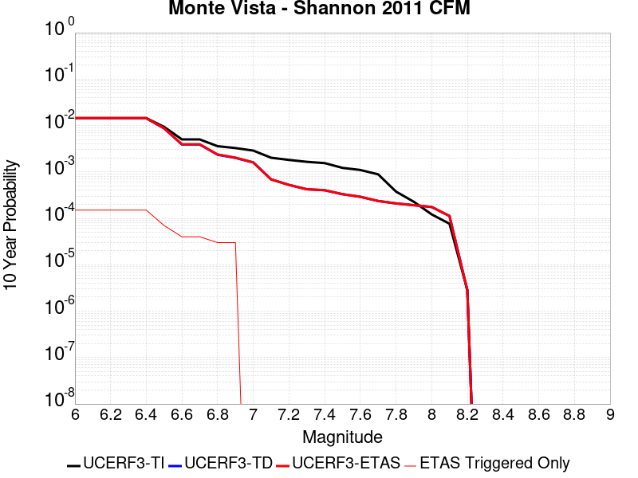 |

| Magnitude | 1 wk TI Prob | 1 wk TD Prob | 1 wk ETAS Prob | 1 wk ETAS/TD Gain | 1 wk ETAS Triggered Only | 1 mo TI Prob | 1 mo TD Prob | 1 mo ETAS Prob | 1 mo ETAS/TD Gain | 1 mo ETAS Triggered Only | 1 yr TI Prob | 1 yr TD Prob | 1 yr ETAS Prob | 1 yr ETAS/TD Gain | 1 yr ETAS Triggered Only | 10 yr TI Prob | 10 yr TD Prob | 10 yr ETAS Prob | 10 yr ETAS/TD Gain | 10 yr ETAS Triggered Only |
|-----|-----|-----|-----|-----|-----|-----|-----|-----|-----|-----|-----|-----|-----|-----|-----|-----|-----|-----|-----|-----|
| 6.0 | 2.7907707E-5 | 2.7597103E-5 | 2.7597103E-5 | 1.0 | 0.0 | 1.19598975E-4 | 1.1826863E-4 | 1.4875284E-4 | 1.2577538 | 3.0487805E-5 | 0.0014551448 | 0.0014390933 | 0.001560869 | 1.0846198 | 1.2195122E-4 | 0.014456532 | 0.014326892 | 0.014477147 | 1.0104877 | 1.5243902E-4 |
| 6.1 | 2.7907707E-5 | 2.7597103E-5 | 2.7597103E-5 | 1.0 | 0.0 | 1.19598975E-4 | 1.1826863E-4 | 1.4875284E-4 | 1.2577538 | 3.0487805E-5 | 0.0014551448 | 0.0014390933 | 0.001560869 | 1.0846198 | 1.2195122E-4 | 0.014456532 | 0.014326892 | 0.014477147 | 1.0104877 | 1.5243902E-4 |
| 6.2 | 2.7907707E-5 | 2.7597103E-5 | 2.7597103E-5 | 1.0 | 0.0 | 1.19598975E-4 | 1.1826863E-4 | 1.4875284E-4 | 1.2577538 | 3.0487805E-5 | 0.0014551448 | 0.0014390933 | 0.001560869 | 1.0846198 | 1.2195122E-4 | 0.014456532 | 0.014326892 | 0.014477147 | 1.0104877 | 1.5243902E-4 |
| 6.3 | 2.7907707E-5 | 2.7597103E-5 | 2.7597103E-5 | 1.0 | 0.0 | 1.19598975E-4 | 1.1826863E-4 | 1.4875284E-4 | 1.2577538 | 3.0487805E-5 | 0.0014551448 | 0.0014390933 | 0.001560869 | 1.0846198 | 1.2195122E-4 | 0.014456532 | 0.014326892 | 0.014477147 | 1.0104877 | 1.5243902E-4 |
| 6.4 | 2.7907707E-5 | 2.7597103E-5 | 2.7597103E-5 | 1.0 | 0.0 | 1.19598975E-4 | 1.1826863E-4 | 1.4875284E-4 | 1.2577538 | 3.0487805E-5 | 0.0014551448 | 0.0014390933 | 0.001560869 | 1.0846198 | 1.2195122E-4 | 0.014456532 | 0.014326892 | 0.014477147 | 1.0104877 | 1.5243902E-4 |
| 6.5 | 1.7990213E-5 | 1.6650592E-5 | 1.6650592E-5 | 1.0 | 0.0 | 7.709863E-5 | 7.13581E-5 | 7.13581E-5 | 1.0 | 0.0 | 9.382716E-4 | 8.6850504E-4 | 9.294277E-4 | 1.0701466 | 6.097561E-5 | 0.0093431985 | 0.008674543 | 0.00873499 | 1.0069683 | 6.097561E-5 |
| 6.6 | 9.650407E-6 | 7.466063E-6 | 7.466063E-6 | 1.0 | 0.0 | 4.135823E-5 | 3.1997064E-5 | 3.1997064E-5 | 1.0 | 0.0 | 5.0342013E-4 | 3.8950247E-4 | 4.5045433E-4 | 1.1564865 | 6.097561E-5 | 0.005022812 | 0.0039059385 | 0.003966676 | 1.01555 | 6.097561E-5 |
| 6.7 | 9.62828E-6 | 7.4439677E-6 | 7.4439677E-6 | 1.0 | 0.0 | 4.1263404E-5 | 3.190237E-5 | 3.190237E-5 | 1.0 | 0.0 | 5.022661E-4 | 3.8835E-4 | 4.4930194E-4 | 1.1569511 | 6.097561E-5 | 0.0050113243 | 0.0038944543 | 0.0039551924 | 1.015596 | 6.097561E-5 |
| 6.8 | 6.887523E-6 | 4.469971E-6 | 4.469971E-6 | 1.0 | 0.0 | 2.9517621E-5 | 1.915689E-5 | 1.915689E-5 | 1.0 | 0.0 | 3.5931775E-4 | 2.3321241E-4 | 2.636931E-4 | 1.1306993 | 3.0487805E-5 | 0.0035873733 | 0.0023468905 | 0.0023773068 | 1.0129602 | 3.0487805E-5 |
| 6.9 | 6.2722347E-6 | 3.811725E-6 | 3.811725E-6 | 1.0 | 0.0 | 2.6880729E-5 | 1.6335875E-5 | 1.6335875E-5 | 1.0 | 0.0 | 3.2722374E-4 | 1.9887314E-4 | 2.2935489E-4 | 1.1532723 | 3.0487805E-5 | 0.003267423 | 0.0020041515 | 0.0020345782 | 1.0151818 | 3.0487805E-5 |
| 7.0 | 5.5320347E-6 | 3.0386977E-6 | 3.0386977E-6 | 1.0 | 0.0 | 2.3708504E-5 | 1.30229355E-5 | 1.30229355E-5 | 1.0 | 0.0 | 2.8861282E-4 | 1.5854454E-4 | 1.5854454E-4 | 1.0 | 0.0 | 0.0028823826 | 0.0016015001 | 0.0016015001 | 1.0 | 0.0 |
| 7.1 | 3.8794055E-6 | 1.2913293E-6 | 1.2913293E-6 | 1.0 | 0.0 | 1.6625918E-5 | 5.534257E-6 | 5.534257E-6 | 1.0 | 0.0 | 2.0240174E-4 | 6.737751E-5 | 6.737751E-5 | 1.0 | 0.0 | 0.002022175 | 6.90582E-4 | 6.90582E-4 | 1.0 | 0.0 |
| 7.2 | 3.4813652E-6 | 9.742977E-7 | 9.742977E-7 | 1.0 | 0.0 | 1.49200505E-5 | 4.1755547E-6 | 4.1755547E-6 | 1.0 | 0.0 | 1.8163648E-4 | 5.0836203E-5 | 5.0836203E-5 | 1.0 | 0.0 | 0.0018148809 | 5.252446E-4 | 5.252446E-4 | 1.0 | 0.0 |
| 7.3 | 3.1682148E-6 | 7.788776E-7 | 7.788776E-7 | 1.0 | 0.0 | 1.3577992E-5 | 3.3380425E-6 | 3.3380425E-6 | 1.0 | 0.0 | 1.6529951E-4 | 4.0639912E-5 | 4.0639912E-5 | 1.0 | 0.0 | 0.0016517661 | 4.2329848E-4 | 4.2329848E-4 | 1.0 | 0.0 |
| 7.4 | 2.9707667E-6 | 7.4132635E-7 | 7.4132635E-7 | 1.0 | 0.0 | 1.2731795E-5 | 3.177109E-6 | 3.177109E-6 | 1.0 | 0.0 | 1.5499859E-4 | 3.8680617E-5 | 3.8680617E-5 | 1.0 | 0.0 | 0.0015489052 | 4.0350226E-4 | 4.0350226E-4 | 1.0 | 0.0 |
| 7.5 | 2.3462758E-6 | 6.0651723E-7 | 6.0651723E-7 | 1.0 | 0.0 | 1.0055429E-5 | 2.599357E-6 | 2.599357E-6 | 1.0 | 0.0 | 1.2241797E-4 | 3.1646712E-5 | 3.1646712E-5 | 1.0 | 0.0 | 0.0012235056 | 3.314278E-4 | 3.314278E-4 | 1.0 | 0.0 |
| 7.6 | 2.112783E-6 | 5.305359E-7 | 5.305359E-7 | 1.0 | 0.0 | 9.054753E-6 | 2.2737233E-6 | 2.2737233E-6 | 1.0 | 0.0 | 1.1023604E-4 | 2.768223E-5 | 2.768223E-5 | 1.0 | 0.0 | 0.0011018137 | 2.9135987E-4 | 2.9135987E-4 | 1.0 | 0.0 |
| 7.7 | 1.7022471E-6 | 4.2783478E-7 | 4.2783478E-7 | 1.0 | 0.0 | 7.2953244E-6 | 1.8335763E-6 | 1.8335763E-6 | 1.0 | 0.0 | 8.881695E-5 | 2.2323566E-5 | 2.2323566E-5 | 1.0 | 0.0 | 8.878146E-4 | 2.3645471E-4 | 2.3645471E-4 | 1.0 | 0.0 |
| 7.8 | 7.230914E-7 | 3.7707397E-7 | 3.7707397E-7 | 1.0 | 0.0 | 3.0989595E-6 | 1.6160303E-6 | 1.6160303E-6 | 1.0 | 0.0 | 3.772918E-5 | 1.9674992E-5 | 1.9674992E-5 | 1.0 | 0.0 | 3.7722773E-4 | 2.0948783E-4 | 2.0948783E-4 | 1.0 | 0.0 |
| 7.9 | 4.3588446E-7 | 3.4671746E-7 | 3.4671746E-7 | 1.0 | 0.0 | 1.868075E-6 | 1.4859311E-6 | 1.4859311E-6 | 1.0 | 0.0 | 2.2743576E-5 | 1.8091061E-5 | 1.8091061E-5 | 1.0 | 0.0 | 2.2741247E-4 | 1.9186095E-4 | 1.9186095E-4 | 1.0 | 0.0 |
| 8.0 | 2.3317523E-7 | 3.1833721E-7 | 3.1833721E-7 | 1.0 | 0.0 | 9.99322E-7 | 1.3643016E-6 | 1.3643016E-6 | 1.0 | 0.0 | 1.2166677E-5 | 1.6610247E-5 | 1.6610247E-5 | 1.0 | 0.0 | 1.21660116E-4 | 1.7564872E-4 | 1.7564872E-4 | 1.0 | 0.0 |
| 8.1 | 1.4662456E-7 | 2.0496766E-7 | 2.0496766E-7 | 1.0 | 0.0 | 6.283908E-7 | 8.7843256E-7 | 8.7843256E-7 | 1.0 | 0.0 | 7.650631E-6 | 1.0694865E-5 | 1.0694865E-5 | 1.0 | 0.0 | 7.650368E-5 | 1.1229678E-4 | 1.1229678E-4 | 1.0 | 0.0 |
| 8.2 | 5.4931775E-9 | 5.126119E-9 | 5.126119E-9 | 1.0 | 0.0 | 2.3542189E-8 | 2.1969083E-8 | 2.1969083E-8 | 1.0 | 0.0 | 2.8662612E-7 | 2.6747355E-7 | 2.6747355E-7 | 1.0 | 0.0 | 2.8662573E-6 | 2.7806063E-6 | 2.7806063E-6 | 1.0 | 0.0 |

## Greenville (So) 2011 CFM
*[(top)](#table-of-contents)*

| 1 Week | 1 Month | 1 Year | 10 Year |
|-----|-----|-----|-----|
|  |  |  |  |

| Magnitude | 1 wk TI Prob | 1 wk TD Prob | 1 wk ETAS Prob | 1 wk ETAS/TD Gain | 1 wk ETAS Triggered Only | 1 mo TI Prob | 1 mo TD Prob | 1 mo ETAS Prob | 1 mo ETAS/TD Gain | 1 mo ETAS Triggered Only | 1 yr TI Prob | 1 yr TD Prob | 1 yr ETAS Prob | 1 yr ETAS/TD Gain | 1 yr ETAS Triggered Only | 10 yr TI Prob | 10 yr TD Prob | 10 yr ETAS Prob | 10 yr ETAS/TD Gain | 10 yr ETAS Triggered Only |
|-----|-----|-----|-----|-----|-----|-----|-----|-----|-----|-----|-----|-----|-----|-----|-----|-----|-----|-----|-----|-----|
| 6.0 | 4.279693E-5 | 5.5069537E-5 | 5.5069537E-5 | 1.0 | 0.0 | 1.8340252E-4 | 2.3599301E-4 | 2.3599301E-4 | 1.0 | 0.0 | 0.0022306389 | 0.0028697122 | 0.002930513 | 1.0211871 | 6.097561E-5 | 0.022083808 | 0.02835234 | 0.028500458 | 1.0052241 | 1.5243902E-4 |
| 6.1 | 3.4037297E-5 | 4.3213688E-5 | 4.3213688E-5 | 1.0 | 0.0 | 1.4586597E-4 | 1.8518958E-4 | 1.8518958E-4 | 1.0 | 0.0 | 0.0017744715 | 0.0022524854 | 0.0023133236 | 1.0270094 | 6.097561E-5 | 0.01760369 | 0.02231309 | 0.022402512 | 1.0040076 | 9.1463415E-5 |
| 6.2 | 3.4037297E-5 | 4.3213688E-5 | 4.3213688E-5 | 1.0 | 0.0 | 1.4586597E-4 | 1.8518958E-4 | 1.8518958E-4 | 1.0 | 0.0 | 0.0017744715 | 0.0022524854 | 0.0023133236 | 1.0270094 | 6.097561E-5 | 0.01760369 | 0.02231309 | 0.022402512 | 1.0040076 | 9.1463415E-5 |
| 6.3 | 2.5956324E-5 | 3.244326E-5 | 3.244326E-5 | 1.0 | 0.0 | 1.11236644E-4 | 1.3903556E-4 | 1.3903556E-4 | 1.0 | 0.0 | 0.0013534647 | 0.0016915174 | 0.0017523898 | 1.0359869 | 6.097561E-5 | 0.013452509 | 0.016793171 | 0.016853124 | 1.00357 | 6.097561E-5 |
| 6.4 | 2.1145053E-5 | 2.6208474E-5 | 2.6208474E-5 | 1.0 | 0.0 | 9.061851E-5 | 1.12317386E-4 | 1.12317386E-4 | 1.0 | 0.0 | 0.0011027219 | 0.0013666364 | 0.0014275286 | 1.0445563 | 6.097561E-5 | 0.01097266 | 0.013585726 | 0.013645873 | 1.0044272 | 6.097561E-5 |
| 6.5 | 2.0030959E-5 | 2.4805877E-5 | 2.4805877E-5 | 1.0 | 0.0 | 8.584414E-5 | 1.06306754E-4 | 1.06306754E-4 | 1.0 | 0.0 | 0.0010446513 | 0.0012935487 | 0.0013544455 | 1.0470773 | 6.097561E-5 | 0.010397541 | 0.012863535 | 0.012923727 | 1.0046792 | 6.097561E-5 |
| 6.6 | 1.8395405E-5 | 2.2763585E-5 | 2.2763585E-5 | 1.0 | 0.0 | 7.8835066E-5 | 9.755473E-5 | 9.755473E-5 | 1.0 | 0.0 | 9.5939427E-4 | 0.0011871106 | 0.0012480138 | 1.0513037 | 6.097561E-5 | 0.009552629 | 0.011810748 | 0.011871004 | 1.0051018 | 6.097561E-5 |
| 6.7 | 1.7883482E-5 | 2.2134354E-5 | 2.2134354E-5 | 1.0 | 0.0 | 7.664124E-5 | 9.485823E-5 | 9.485823E-5 | 1.0 | 0.0 | 9.3270757E-4 | 0.0011543159 | 0.0012152211 | 1.0527631 | 6.097561E-5 | 0.009288026 | 0.011486255 | 0.011546531 | 1.0052476 | 6.097561E-5 |
| 6.8 | 1.3373564E-5 | 1.651215E-5 | 1.651215E-5 | 1.0 | 0.0 | 5.7314013E-5 | 7.076452E-5 | 7.076452E-5 | 1.0 | 0.0 | 6.975747E-4 | 8.6123234E-4 | 8.6123234E-4 | 1.0 | 0.0 | 0.0069538904 | 0.008580557 | 0.008580557 | 1.0 | 0.0 |
| 6.9 | 1.06692905E-5 | 1.3157214E-5 | 1.3157214E-5 | 1.0 | 0.0 | 4.5724726E-5 | 5.6386907E-5 | 5.6386907E-5 | 1.0 | 0.0 | 5.5655633E-4 | 6.8630563E-4 | 6.8630563E-4 | 1.0 | 0.0 | 0.005551645 | 0.0068430947 | 0.0068430947 | 1.0 | 0.0 |
| 7.0 | 8.157512E-6 | 1.0065898E-5 | 1.0065898E-5 | 1.0 | 0.0 | 3.4960296E-5 | 4.3138873E-5 | 4.3138873E-5 | 1.0 | 0.0 | 4.2555845E-4 | 5.2509294E-4 | 5.2509294E-4 | 1.0 | 0.0 | 0.004247444 | 0.0052389996 | 0.0052389996 | 1.0 | 0.0 |
| 7.1 | 6.1467113E-6 | 7.6296965E-6 | 7.6296965E-6 | 1.0 | 0.0 | 2.6342783E-5 | 3.2698295E-5 | 3.2698295E-5 | 1.0 | 0.0 | 3.206762E-4 | 3.9802986E-4 | 3.9802986E-4 | 1.0 | 0.0 | 0.0032021382 | 0.003973358 | 0.003973358 | 1.0 | 0.0 |
| 7.2 | 4.713467E-6 | 5.9159674E-6 | 5.9159674E-6 | 1.0 | 0.0 | 2.0200418E-5 | 2.5353902E-5 | 2.5353902E-5 | 1.0 | 0.0 | 2.4591232E-4 | 3.0864062E-4 | 3.0864062E-4 | 1.0 | 0.0 | 0.0024564038 | 0.003082273 | 0.003082273 | 1.0 | 0.0 |
| 7.3 | 2.3266216E-6 | 2.9552855E-6 | 2.9552855E-6 | 1.0 | 0.0 | 9.971197E-6 | 1.2665449E-5 | 1.2665449E-5 | 1.0 | 0.0 | 1.2139256E-4 | 1.5419108E-4 | 1.5419108E-4 | 1.0 | 0.0 | 0.0012132627 | 0.0015409102 | 0.0015409102 | 1.0 | 0.0 |
| 7.4 | 1.3314E-6 | 1.7190824E-6 | 1.7190824E-6 | 1.0 | 0.0 | 5.7059874E-6 | 7.367476E-6 | 7.367476E-6 | 1.0 | 0.0 | 6.946818E-5 | 8.969538E-5 | 8.969538E-5 | 1.0 | 0.0 | 6.9446466E-4 | 8.9663046E-4 | 8.9663046E-4 | 1.0 | 0.0 |
| 7.5 | 1.0362941E-6 | 1.3476489E-6 | 1.3476489E-6 | 1.0 | 0.0 | 4.4412527E-6 | 5.7756256E-6 | 5.7756256E-6 | 1.0 | 0.0 | 5.407091E-5 | 7.031602E-5 | 7.031602E-5 | 1.0 | 0.0 | 5.405776E-4 | 7.0296787E-4 | 7.0296787E-4 | 1.0 | 0.0 |
| 7.6 | 7.764784E-7 | 1.009576E-6 | 1.009576E-6 | 1.0 | 0.0 | 3.3277602E-6 | 4.326747E-6 | 4.326747E-6 | 1.0 | 0.0 | 4.0514726E-5 | 5.267691E-5 | 5.267691E-5 | 1.0 | 0.0 | 4.050734E-4 | 5.266656E-4 | 5.266656E-4 | 1.0 | 0.0 |
| 7.7 | 1.6927763E-7 | 2.2140422E-7 | 2.2140422E-7 | 1.0 | 0.0 | 7.2547533E-7 | 9.4887486E-7 | 9.4887486E-7 | 1.0 | 0.0 | 8.832627E-6 | 1.1552494E-5 | 1.1552494E-5 | 1.0 | 0.0 | 8.8322755E-5 | 1.1552163E-4 | 1.1552163E-4 | 1.0 | 0.0 |

## Great Valley 09 (Laguna Seca)
*[(top)](#table-of-contents)*

| 1 Week | 1 Month | 1 Year | 10 Year |
|-----|-----|-----|-----|
|  |  |  |  |

| Magnitude | 1 wk TI Prob | 1 wk TD Prob | 1 wk ETAS Prob | 1 wk ETAS/TD Gain | 1 wk ETAS Triggered Only | 1 mo TI Prob | 1 mo TD Prob | 1 mo ETAS Prob | 1 mo ETAS/TD Gain | 1 mo ETAS Triggered Only | 1 yr TI Prob | 1 yr TD Prob | 1 yr ETAS Prob | 1 yr ETAS/TD Gain | 1 yr ETAS Triggered Only | 10 yr TI Prob | 10 yr TD Prob | 10 yr ETAS Prob | 10 yr ETAS/TD Gain | 10 yr ETAS Triggered Only |
|-----|-----|-----|-----|-----|-----|-----|-----|-----|-----|-----|-----|-----|-----|-----|-----|-----|-----|-----|-----|-----|
| 6.0 | 5.4353277E-5 | 7.054649E-5 | 1.315178E-4 | 1.8642713 | 6.097561E-5 | 2.3292181E-4 | 3.0230923E-4 | 3.6326642E-4 | 1.2016385 | 6.097561E-5 | 0.0028321352 | 0.0036742734 | 0.0037957765 | 1.0330687 | 1.2195122E-4 | 0.02796312 | 0.036136415 | 0.036283344 | 1.004066 | 1.5243902E-4 |
| 6.1 | 4.5578287E-5 | 5.825583E-5 | 8.874186E-5 | 1.5233129 | 3.0487805E-5 | 1.953209E-4 | 2.4964547E-4 | 2.8012565E-4 | 1.1220939 | 3.0487805E-5 | 0.0023754383 | 0.0030351633 | 0.0030959537 | 1.0200287 | 6.097561E-5 | 0.023502063 | 0.029936384 | 0.03002511 | 1.0029638 | 9.1463415E-5 |
| 6.2 | 2.8536782E-5 | 3.4754397E-5 | 3.4754397E-5 | 1.0 | 0.0 | 1.2229476E-4 | 1.4893933E-4 | 1.4893933E-4 | 1.0 | 0.0 | 0.0014879217 | 0.0018117635 | 0.001842196 | 1.0167972 | 3.0487805E-5 | 0.014779986 | 0.017967276 | 0.018027155 | 1.0033327 | 6.097561E-5 |
| 6.3 | 2.3698774E-5 | 2.8225932E-5 | 2.8225932E-5 | 1.0 | 0.0 | 1.01562226E-4 | 1.20962955E-4 | 1.20962955E-4 | 1.0 | 0.0 | 0.0012358186 | 0.0014717847 | 0.0015022276 | 1.0206844 | 3.0487805E-5 | 0.012289686 | 0.014618459 | 0.014678543 | 1.0041102 | 6.097561E-5 |
| 6.4 | 1.9191197E-5 | 2.2131611E-5 | 2.2131611E-5 | 1.0 | 0.0 | 8.2245395E-5 | 9.484656E-5 | 9.484656E-5 | 1.0 | 0.0 | 0.0010008777 | 0.001154188 | 0.001154188 | 1.0 | 0.0 | 0.009963818 | 0.011482145 | 0.011482145 | 1.0 | 0.0 |
| 6.5 | 1.5203241E-5 | 1.6807138E-5 | 1.6807138E-5 | 1.0 | 0.0 | 6.5155116E-5 | 7.2028786E-5 | 7.2028786E-5 | 1.0 | 0.0 | 7.9297484E-4 | 8.766296E-4 | 8.766296E-4 | 1.0 | 0.0 | 0.007901512 | 0.008733063 | 0.008733063 | 1.0 | 0.0 |
| 6.6 | 1.0984925E-5 | 1.1246176E-5 | 1.1246176E-5 | 1.0 | 0.0 | 4.70774E-5 | 4.8197027E-5 | 4.8197027E-5 | 1.0 | 0.0 | 5.730166E-4 | 5.866449E-4 | 5.866449E-4 | 1.0 | 0.0 | 0.005715413 | 0.0058513596 | 0.0058513596 | 1.0 | 0.0 |
| 6.7 | 9.134616E-6 | 9.022645E-6 | 9.022645E-6 | 1.0 | 0.0 | 3.9147766E-5 | 3.866792E-5 | 3.866792E-5 | 1.0 | 0.0 | 4.7651984E-4 | 4.706826E-4 | 4.706826E-4 | 1.0 | 0.0 | 0.004754993 | 0.004697102 | 0.004697102 | 1.0 | 0.0 |
| 6.8 | 7.785589E-6 | 7.4542045E-6 | 7.4542045E-6 | 1.0 | 0.0 | 3.3366385E-5 | 3.1946212E-5 | 3.1946212E-5 | 1.0 | 0.0 | 4.0616E-4 | 3.8887773E-4 | 3.8887773E-4 | 1.0 | 0.0 | 0.0040541845 | 0.0038821765 | 0.0038821765 | 1.0 | 0.0 |
| 6.9 | 5.579095E-6 | 4.899978E-6 | 4.899978E-6 | 1.0 | 0.0 | 2.3910188E-5 | 2.0999747E-5 | 2.0999747E-5 | 1.0 | 0.0 | 2.9106764E-4 | 2.556433E-4 | 2.556433E-4 | 1.0 | 0.0 | 0.002906867 | 0.0025536297 | 0.0025536297 | 1.0 | 0.0 |
| 7.0 | 2.6816688E-6 | 1.5220202E-6 | 1.5220202E-6 | 1.0 | 0.0 | 1.1492816E-5 | 6.522928E-6 | 6.522928E-6 | 1.0 | 0.0 | 1.3991605E-4 | 7.941384E-5 | 7.941384E-5 | 1.0 | 0.0 | 0.0013982799 | 7.938633E-4 | 7.938633E-4 | 1.0 | 0.0 |
| 7.1 | 1.9951021E-6 | 7.455947E-7 | 7.455947E-7 | 1.0 | 0.0 | 8.55041E-6 | 3.1954023E-6 | 3.1954023E-6 | 1.0 | 0.0 | 1.0409627E-4 | 3.890337E-5 | 3.890337E-5 | 1.0 | 0.0 | 0.0010404752 | 3.8896973E-4 | 3.8896973E-4 | 1.0 | 0.0 |
| 7.2 | 1.9951021E-6 | 7.455947E-7 | 7.455947E-7 | 1.0 | 0.0 | 8.55041E-6 | 3.1954023E-6 | 3.1954023E-6 | 1.0 | 0.0 | 1.0409627E-4 | 3.890337E-5 | 3.890337E-5 | 1.0 | 0.0 | 0.0010404752 | 3.8896973E-4 | 3.8896973E-4 | 1.0 | 0.0 |
| 7.3 | 1.7087556E-6 | 6.5806523E-7 | 6.5806523E-7 | 1.0 | 0.0 | 7.3232177E-6 | 2.8202767E-6 | 2.8202767E-6 | 1.0 | 0.0 | 8.915652E-5 | 3.4336368E-5 | 3.4336368E-5 | 1.0 | 0.0 | 8.9120766E-4 | 3.433147E-4 | 3.433147E-4 | 1.0 | 0.0 |
| 7.4 | 1.3804846E-6 | 6.0753155E-7 | 6.0753155E-7 | 1.0 | 0.0 | 5.916349E-6 | 2.6037042E-6 | 2.6037042E-6 | 1.0 | 0.0 | 7.2029165E-5 | 3.1699677E-5 | 3.1699677E-5 | 1.0 | 0.0 | 7.200583E-4 | 3.169556E-4 | 3.169556E-4 | 1.0 | 0.0 |
| 7.5 | 1.3804846E-6 | 6.0753155E-7 | 6.0753155E-7 | 1.0 | 0.0 | 5.916349E-6 | 2.6037042E-6 | 2.6037042E-6 | 1.0 | 0.0 | 7.2029165E-5 | 3.1699677E-5 | 3.1699677E-5 | 1.0 | 0.0 | 7.200583E-4 | 3.169556E-4 | 3.169556E-4 | 1.0 | 0.0 |

## Quien Sabe 2011 CFM
*[(top)](#table-of-contents)*

| 1 Week | 1 Month | 1 Year | 10 Year |
|-----|-----|-----|-----|
|  |  |  | 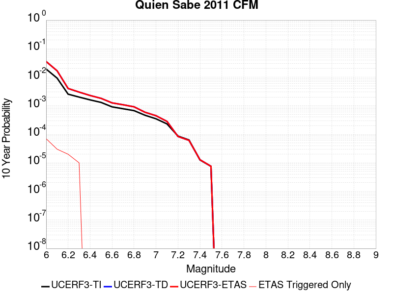 |

| Magnitude | 1 wk TI Prob | 1 wk TD Prob | 1 wk ETAS Prob | 1 wk ETAS/TD Gain | 1 wk ETAS Triggered Only | 1 mo TI Prob | 1 mo TD Prob | 1 mo ETAS Prob | 1 mo ETAS/TD Gain | 1 mo ETAS Triggered Only | 1 yr TI Prob | 1 yr TD Prob | 1 yr ETAS Prob | 1 yr ETAS/TD Gain | 1 yr ETAS Triggered Only | 10 yr TI Prob | 10 yr TD Prob | 10 yr ETAS Prob | 10 yr ETAS/TD Gain | 10 yr ETAS Triggered Only |
|-----|-----|-----|-----|-----|-----|-----|-----|-----|-----|-----|-----|-----|-----|-----|-----|-----|-----|-----|-----|-----|
| 6.0 | 3.729899E-5 | 7.1047565E-5 | 1.3201885E-4 | 1.8581755 | 6.097561E-5 | 1.5984301E-4 | 3.044627E-4 | 3.9589827E-4 | 1.3003178 | 9.1463415E-5 | 0.0019443515 | 0.003687155 | 0.0038086565 | 1.0329527 | 1.2195122E-4 | 0.019274272 | 0.03537049 | 0.03551754 | 1.0041573 | 1.5243902E-4 |
| 6.1 | 1.7825725E-5 | 3.3222135E-5 | 6.3708925E-5 | 1.9176651 | 3.0487805E-5 | 7.639373E-5 | 1.4237482E-4 | 2.0334175E-4 | 1.4282142 | 6.097561E-5 | 9.296967E-4 | 0.0017277208 | 0.0017885912 | 1.0352316 | 6.097561E-5 | 0.009258169 | 0.01670938 | 0.016769337 | 1.0035882 | 6.097561E-5 |
| 6.2 | 4.8865336E-6 | 7.815418E-6 | 3.8302984E-5 | 4.900952 | 3.0487805E-5 | 2.0942118E-5 | 3.3493758E-5 | 6.3980544E-5 | 1.9102229 | 3.0487805E-5 | 2.5494045E-4 | 4.0723776E-4 | 4.3771314E-4 | 1.0748343 | 3.0487805E-5 | 0.0025464818 | 0.0040165572 | 0.0040469225 | 1.00756 | 3.0487805E-5 |
| 6.3 | 3.858491E-6 | 5.7947263E-6 | 3.6282356E-5 | 6.2612715 | 3.0487805E-5 | 1.6536285E-5 | 2.4834331E-5 | 5.532138E-5 | 2.227617 | 3.0487805E-5 | 2.0131067E-4 | 3.0232072E-4 | 3.327993E-4 | 1.1008154 | 3.0487805E-5 | 0.002011284 | 0.0030044934 | 0.0030348895 | 1.0101169 | 3.0487805E-5 |
| 6.4 | 3.0771805E-6 | 4.3897E-6 | 4.3897E-6 | 1.0 | 0.0 | 1.318785E-5 | 1.8812876E-5 | 1.8812876E-5 | 1.0 | 0.0 | 1.6055023E-4 | 2.2902513E-4 | 2.2902513E-4 | 1.0 | 0.0 | 0.001604343 | 0.0022888705 | 0.0022888705 | 1.0 | 0.0 |
| 6.5 | 2.5081235E-6 | 3.467935E-6 | 3.467935E-6 | 1.0 | 0.0 | 1.0749056E-5 | 1.4862502E-5 | 1.4862502E-5 | 1.0 | 0.0 | 1.308619E-4 | 1.8093741E-4 | 1.8093741E-4 | 1.0 | 0.0 | 0.0013078486 | 0.0018144867 | 0.0018144867 | 1.0 | 0.0 |
| 6.6 | 1.7505364E-6 | 2.4056205E-6 | 2.4056205E-6 | 1.0 | 0.0 | 7.502277E-6 | 1.03097655E-5 | 1.03097655E-5 | 1.0 | 0.0 | 9.13364E-5 | 1.2551488E-4 | 1.2551488E-4 | 1.0 | 0.0 | 9.129886E-4 | 0.0012599389 | 0.0012599389 | 1.0 | 0.0 |
| 6.7 | 1.505737E-6 | 2.0667283E-6 | 2.0667283E-6 | 1.0 | 0.0 | 6.4531428E-6 | 8.85738E-6 | 8.85738E-6 | 1.0 | 0.0 | 7.8564175E-5 | 1.0783386E-4 | 1.0783386E-4 | 1.0 | 0.0 | 7.853641E-4 | 0.0010833136 | 0.0010833136 | 1.0 | 0.0 |
| 6.8 | 1.2924105E-6 | 1.7510579E-6 | 1.7510579E-6 | 1.0 | 0.0 | 5.5388905E-6 | 7.5045155E-6 | 7.5045155E-6 | 1.0 | 0.0 | 6.74339E-5 | 9.136419E-5 | 9.136419E-5 | 1.0 | 0.0 | 6.741344E-4 | 9.174319E-4 | 9.174319E-4 | 1.0 | 0.0 |
| 6.9 | 8.9075286E-7 | 1.1267174E-6 | 1.1267174E-6 | 1.0 | 0.0 | 3.8175067E-6 | 4.828781E-6 | 4.828781E-6 | 1.0 | 0.0 | 4.6477155E-5 | 5.8789046E-5 | 5.8789046E-5 | 1.0 | 0.0 | 4.6467435E-4 | 5.912685E-4 | 5.912685E-4 | 1.0 | 0.0 |
| 7.0 | 6.6891175E-7 | 8.531235E-7 | 8.531235E-7 | 1.0 | 0.0 | 2.8667614E-6 | 3.6562394E-6 | 3.6562394E-6 | 1.0 | 0.0 | 3.4902263E-5 | 4.4514003E-5 | 4.4514003E-5 | 1.0 | 0.0 | 3.4896782E-4 | 4.475277E-4 | 4.475277E-4 | 1.0 | 0.0 |
| 7.1 | 4.4205015E-7 | 5.3963544E-7 | 5.3963544E-7 | 1.0 | 0.0 | 1.8944993E-6 | 2.3127222E-6 | 2.3127222E-6 | 1.0 | 0.0 | 2.3065284E-5 | 2.81572E-5 | 2.81572E-5 | 1.0 | 0.0 | 2.3062891E-4 | 2.8291772E-4 | 2.8291772E-4 | 1.0 | 0.0 |
| 7.2 | 1.6620965E-7 | 1.60069E-7 | 1.60069E-7 | 1.0 | 0.0 | 7.123269E-7 | 6.8600986E-7 | 6.8600986E-7 | 1.0 | 0.0 | 8.672545E-6 | 8.352142E-6 | 8.352142E-6 | 1.0 | 0.0 | 8.6722066E-5 | 8.367429E-5 | 8.367429E-5 | 1.0 | 0.0 |
| 7.3 | 1.2142488E-7 | 1.17350865E-7 | 1.17350865E-7 | 1.0 | 0.0 | 5.2039223E-7 | 5.029322E-7 | 5.029322E-7 | 1.0 | 0.0 | 6.335757E-6 | 6.1231863E-6 | 6.1231863E-6 | 1.0 | 0.0 | 6.3355765E-5 | 6.12936E-5 | 6.12936E-5 | 1.0 | 0.0 |
| 7.4 | 2.4192937E-8 | 2.455768E-8 | 2.455768E-8 | 1.0 | 0.0 | 1.0368401E-7 | 1.052472E-7 | 1.052472E-7 | 1.0 | 0.0 | 1.2623522E-6 | 1.281384E-6 | 1.281384E-6 | 1.0 | 0.0 | 1.2623449E-5 | 1.2820107E-5 | 1.2820107E-5 | 1.0 | 0.0 |
| 7.5 | 1.4432802E-8 | 1.4511974E-8 | 1.4511974E-8 | 1.0 | 0.0 | 6.185486E-8 | 6.2194175E-8 | 6.2194175E-8 | 1.0 | 0.0 | 7.530827E-7 | 7.5721385E-7 | 7.5721385E-7 | 1.0 | 0.0 | 7.530801E-6 | 7.576386E-6 | 7.576386E-6 | 1.0 | 0.0 |

## Ortigalita (North)
*[(top)](#table-of-contents)*

| 1 Week | 1 Month | 1 Year | 10 Year |
|-----|-----|-----|-----|
| 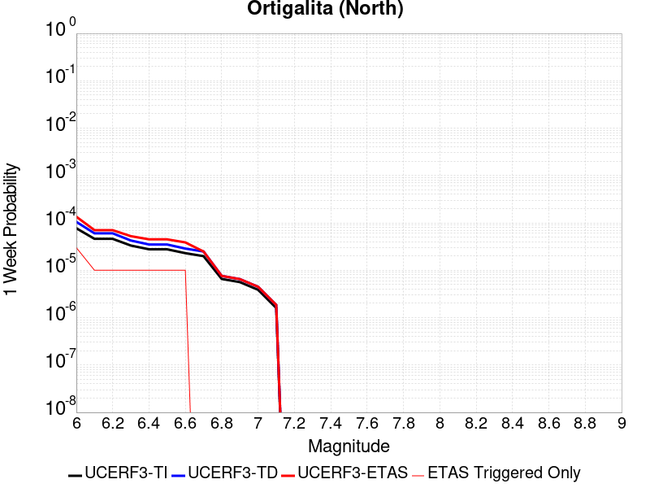 |  | 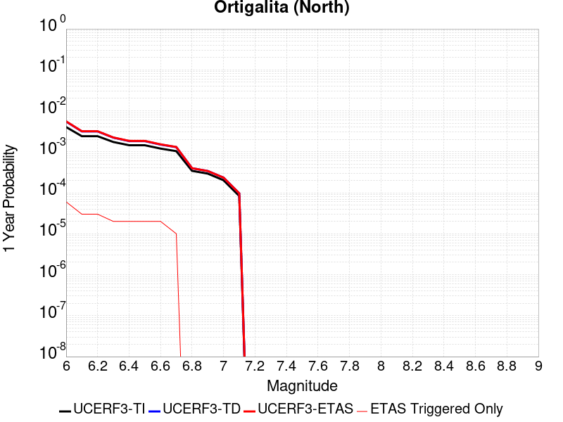 | 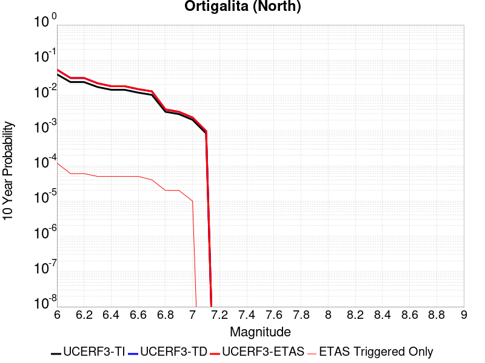 |

| Magnitude | 1 wk TI Prob | 1 wk TD Prob | 1 wk ETAS Prob | 1 wk ETAS/TD Gain | 1 wk ETAS Triggered Only | 1 mo TI Prob | 1 mo TD Prob | 1 mo ETAS Prob | 1 mo ETAS/TD Gain | 1 mo ETAS Triggered Only | 1 yr TI Prob | 1 yr TD Prob | 1 yr ETAS Prob | 1 yr ETAS/TD Gain | 1 yr ETAS Triggered Only | 10 yr TI Prob | 10 yr TD Prob | 10 yr ETAS Prob | 10 yr ETAS/TD Gain | 10 yr ETAS Triggered Only |
|-----|-----|-----|-----|-----|-----|-----|-----|-----|-----|-----|-----|-----|-----|-----|-----|-----|-----|-----|-----|-----|
| 6.0 | 7.711876E-5 | 1.0514144E-4 | 1.9659524E-4 | 1.8698169 | 9.1463415E-5 | 3.3046713E-4 | 4.505392E-4 | 5.419614E-4 | 1.2029173 | 9.1463415E-5 | 0.004016016 | 0.0054711658 | 0.0055621285 | 1.0166259 | 9.1463415E-5 | 0.039442103 | 0.053487413 | 0.053631697 | 1.0026976 | 1.5243902E-4 |
| 6.1 | 4.607858E-5 | 6.0276063E-5 | 9.0762034E-5 | 1.5057724 | 3.0487805E-5 | 1.9746469E-4 | 2.583032E-4 | 2.887831E-4 | 1.1180006 | 3.0487805E-5 | 0.0024014818 | 0.0031405487 | 0.0031709406 | 1.0096773 | 3.0487805E-5 | 0.023756953 | 0.030992474 | 0.031022018 | 1.0009532 | 3.0487805E-5 |
| 6.2 | 4.607858E-5 | 6.0276063E-5 | 9.0762034E-5 | 1.5057724 | 3.0487805E-5 | 1.9746469E-4 | 2.583032E-4 | 2.887831E-4 | 1.1180006 | 3.0487805E-5 | 0.0024014818 | 0.0031405487 | 0.0031709406 | 1.0096773 | 3.0487805E-5 | 0.023756953 | 0.030992474 | 0.031022018 | 1.0009532 | 3.0487805E-5 |
| 6.3 | 3.327423E-5 | 4.249851E-5 | 7.2985014E-5 | 1.7173548 | 3.0487805E-5 | 1.4259605E-4 | 1.8212547E-4 | 2.1260773E-4 | 1.1673695 | 3.0487805E-5 | 0.0017347244 | 0.0022153985 | 0.0022458187 | 1.0137312 | 3.0487805E-5 | 0.017212452 | 0.02195717 | 0.02198699 | 1.001358 | 3.0487805E-5 |
| 6.4 | 2.7732503E-5 | 3.5016896E-5 | 6.5503635E-5 | 1.8706293 | 3.0487805E-5 | 1.1884817E-4 | 1.5006529E-4 | 1.8054852E-4 | 1.2031331 | 3.0487805E-5 | 0.001446016 | 0.0018257468 | 0.001856179 | 1.0166683 | 3.0487805E-5 | 0.014366428 | 0.018130416 | 0.018160352 | 1.001651 | 3.0487805E-5 |
| 6.5 | 2.7689714E-5 | 3.496669E-5 | 6.545343E-5 | 1.8718793 | 3.0487805E-5 | 1.186648E-4 | 1.4985015E-4 | 1.8033339E-4 | 1.2034248 | 3.0487805E-5 | 0.0014437864 | 0.0018231319 | 0.0018535642 | 1.0166923 | 3.0487805E-5 | 0.014344421 | 0.018104695 | 0.018134631 | 1.0016534 | 3.0487805E-5 |
| 6.6 | 2.2976905E-5 | 2.8732655E-5 | 5.9219583E-5 | 2.061055 | 3.0487805E-5 | 9.846873E-5 | 1.2313557E-4 | 1.5361962E-4 | 1.2475649 | 3.0487805E-5 | 0.0011981975 | 0.0014983724 | 0.0015288146 | 1.0203168 | 3.0487805E-5 | 0.011917574 | 0.014906018 | 0.014936051 | 1.0020149 | 3.0487805E-5 |
| 6.7 | 1.9871539E-5 | 2.4917017E-5 | 2.4917017E-5 | 1.0 | 0.0 | 8.516096E-5 | 1.06784246E-4 | 1.06784246E-4 | 1.0 | 0.0 | 0.0010363415 | 0.0012995718 | 0.0012995718 | 1.0 | 0.0 | 0.010315218 | 0.012943401 | 0.012943401 | 1.0 | 0.0 |
| 6.8 | 6.5640475E-6 | 7.607822E-6 | 7.607822E-6 | 1.0 | 0.0 | 2.813133E-5 | 3.260456E-5 | 3.260456E-5 | 1.0 | 0.0 | 3.424451E-4 | 3.968911E-4 | 3.968911E-4 | 1.0 | 0.0 | 0.0034191788 | 0.00396211 | 0.00396211 | 1.0 | 0.0 |
| 6.9 | 5.6219683E-6 | 6.503801E-6 | 6.503801E-6 | 1.0 | 0.0 | 2.4093928E-5 | 2.7873151E-5 | 2.7873151E-5 | 1.0 | 0.0 | 2.933041E-4 | 3.3930535E-4 | 3.3930535E-4 | 1.0 | 0.0 | 0.0029291727 | 0.00338813 | 0.00338813 | 1.0 | 0.0 |
| 7.0 | 3.875591E-6 | 4.486115E-6 | 4.486115E-6 | 1.0 | 0.0 | 1.6609569E-5 | 1.9226076E-5 | 1.9226076E-5 | 1.0 | 0.0 | 2.0220275E-4 | 2.3405446E-4 | 2.3405446E-4 | 1.0 | 0.0 | 0.0020201886 | 0.002338288 | 0.002338288 | 1.0 | 0.0 |
| 7.1 | 1.6017933E-6 | 1.8576128E-6 | 1.8576128E-6 | 1.0 | 0.0 | 6.8648105E-6 | 7.961179E-6 | 7.961179E-6 | 1.0 | 0.0 | 8.357586E-5 | 9.6924115E-5 | 9.6924115E-5 | 1.0 | 0.0 | 8.3544437E-4 | 9.689232E-4 | 9.689232E-4 | 1.0 | 0.0 |

## Monterey Bay-Tularcitos
*[(top)](#table-of-contents)*

| 1 Week | 1 Month | 1 Year | 10 Year |
|-----|-----|-----|-----|
|  | 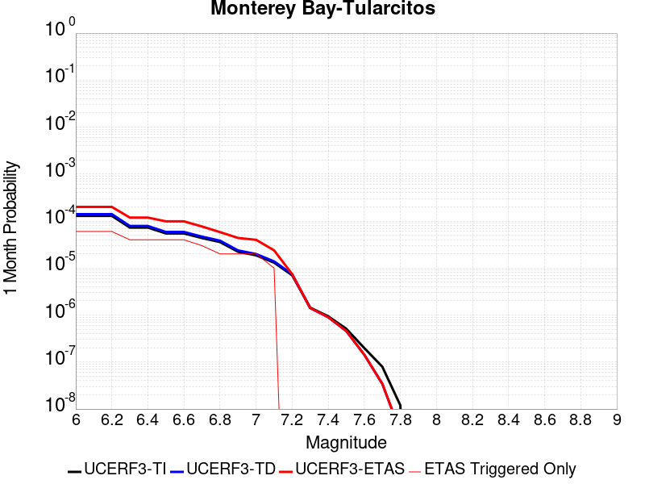 |  |  |

| Magnitude | 1 wk TI Prob | 1 wk TD Prob | 1 wk ETAS Prob | 1 wk ETAS/TD Gain | 1 wk ETAS Triggered Only | 1 mo TI Prob | 1 mo TD Prob | 1 mo ETAS Prob | 1 mo ETAS/TD Gain | 1 mo ETAS Triggered Only | 1 yr TI Prob | 1 yr TD Prob | 1 yr ETAS Prob | 1 yr ETAS/TD Gain | 1 yr ETAS Triggered Only | 10 yr TI Prob | 10 yr TD Prob | 10 yr ETAS Prob | 10 yr ETAS/TD Gain | 10 yr ETAS Triggered Only |
|-----|-----|-----|-----|-----|-----|-----|-----|-----|-----|-----|-----|-----|-----|-----|-----|-----|-----|-----|-----|-----|
| 6.0 | 3.0131365E-5 | 3.2804503E-5 | 3.2804503E-5 | 1.0 | 0.0 | 1.2912804E-4 | 1.4058374E-4 | 2.0155078E-4 | 1.4336706 | 6.097561E-5 | 0.001571 | 0.0017103688 | 0.0018016758 | 1.0533844 | 9.1463415E-5 | 0.015599402 | 0.01698286 | 0.01710274 | 1.0070589 | 1.2195122E-4 |
| 6.1 | 3.0131365E-5 | 3.2804503E-5 | 3.2804503E-5 | 1.0 | 0.0 | 1.2912804E-4 | 1.4058374E-4 | 2.0155078E-4 | 1.4336706 | 6.097561E-5 | 0.001571 | 0.0017103688 | 0.0018016758 | 1.0533844 | 9.1463415E-5 | 0.015599402 | 0.01698286 | 0.01710274 | 1.0070589 | 1.2195122E-4 |
| 6.2 | 3.0131365E-5 | 3.2804503E-5 | 3.2804503E-5 | 1.0 | 0.0 | 1.2912804E-4 | 1.4058374E-4 | 2.0155078E-4 | 1.4336706 | 6.097561E-5 | 0.001571 | 0.0017103688 | 0.0018016758 | 1.0533844 | 9.1463415E-5 | 0.015599402 | 0.01698286 | 0.01710274 | 1.0070589 | 1.2195122E-4 |
| 6.3 | 1.6998249E-5 | 1.833369E-5 | 1.833369E-5 | 1.0 | 0.0 | 7.28476E-5 | 7.8570694E-5 | 1.3954152E-4 | 1.7759994 | 6.097561E-5 | 8.865586E-4 | 9.561971E-4 | 0.001047573 | 1.0955619 | 9.1463415E-5 | 0.0088303005 | 0.009522754 | 0.009613345 | 1.0095133 | 9.1463415E-5 |
| 6.4 | 1.6998249E-5 | 1.833369E-5 | 1.833369E-5 | 1.0 | 0.0 | 7.28476E-5 | 7.8570694E-5 | 1.3954152E-4 | 1.7759994 | 6.097561E-5 | 8.865586E-4 | 9.561971E-4 | 0.001047573 | 1.0955619 | 9.1463415E-5 | 0.0088303005 | 0.009522754 | 0.009613345 | 1.0095133 | 9.1463415E-5 |
| 6.5 | 1.27470785E-5 | 1.3695391E-5 | 1.3695391E-5 | 1.0 | 0.0 | 5.4629192E-5 | 5.8693273E-5 | 1.196653E-4 | 2.0388248 | 6.097561E-5 | 6.649074E-4 | 7.143667E-4 | 8.0576475E-4 | 1.1279428 | 9.1463415E-5 | 0.0066292146 | 0.0071217557 | 0.0072125676 | 1.0127513 | 9.1463415E-5 |
| 6.6 | 1.2739422E-5 | 1.3687478E-5 | 1.3687478E-5 | 1.0 | 0.0 | 5.4596385E-5 | 5.865936E-5 | 1.1963139E-4 | 2.0394256 | 6.097561E-5 | 6.645082E-4 | 7.1395404E-4 | 8.053521E-4 | 1.1280168 | 9.1463415E-5 | 0.0066252467 | 0.007117656 | 0.0072084684 | 1.0127587 | 9.1463415E-5 |
| 6.7 | 1.0160109E-5 | 1.0887372E-5 | 1.0887372E-5 | 1.0 | 0.0 | 4.35426E-5 | 4.665937E-5 | 1.07632135E-4 | 2.3067636 | 6.097561E-5 | 5.300022E-4 | 5.679368E-4 | 6.5934827E-4 | 1.1609536 | 9.1463415E-5 | 0.005287399 | 0.0056655654 | 0.0057565104 | 1.0160522 | 9.1463415E-5 |
| 6.8 | 8.349859E-6 | 8.933906E-6 | 8.933906E-6 | 1.0 | 0.0 | 3.578462E-5 | 3.8287642E-5 | 6.877428E-5 | 1.7962527 | 3.0487805E-5 | 4.3559066E-4 | 4.6605797E-4 | 5.270052E-4 | 1.1307716 | 6.097561E-5 | 0.004347378 | 0.004651371 | 0.004712063 | 1.0130482 | 6.097561E-5 |
| 6.9 | 5.193639E-6 | 5.537252E-6 | 5.537252E-6 | 1.0 | 0.0 | 2.2258262E-5 | 2.3730881E-5 | 5.4217962E-5 | 2.2847006 | 3.0487805E-5 | 2.7096065E-4 | 2.8888843E-4 | 3.4984644E-4 | 1.2110088 | 6.097561E-5 | 0.0027063051 | 0.0028854501 | 0.0029462497 | 1.0210711 | 6.097561E-5 |
| 7.0 | 4.359381E-6 | 4.6440664E-6 | 4.6440664E-6 | 1.0 | 0.0 | 1.8682927E-5 | 1.9903006E-5 | 5.0390205E-5 | 2.5317886 | 3.0487805E-5 | 2.274409E-4 | 2.4229514E-4 | 3.0325598E-4 | 1.2515974 | 6.097561E-5 | 0.0022720827 | 0.0024206026 | 0.0024814305 | 1.0251293 | 6.097561E-5 |
| 7.1 | 3.0398533E-6 | 3.2315513E-6 | 3.2315513E-6 | 1.0 | 0.0 | 1.3027877E-5 | 1.3849447E-5 | 1.3849447E-5 | 1.0 | 0.0 | 1.5860285E-4 | 1.686066E-4 | 1.9908926E-4 | 1.1807916 | 3.0487805E-5 | 0.001584897 | 0.0016850445 | 0.0017154809 | 1.0180627 | 3.0487805E-5 |
| 7.2 | 1.642335E-6 | 1.7336168E-6 | 1.7336168E-6 | 1.0 | 0.0 | 7.0385595E-6 | 7.429777E-6 | 7.429777E-6 | 1.0 | 0.0 | 8.569109E-5 | 9.045585E-5 | 9.045585E-5 | 1.0 | 0.0 | 8.5658056E-4 | 9.0439303E-4 | 9.0439303E-4 | 1.0 | 0.0 |
| 7.3 | 3.356842E-7 | 3.2962387E-7 | 3.2962387E-7 | 1.0 | 0.0 | 1.4386458E-6 | 1.412673E-6 | 1.412673E-6 | 1.0 | 0.0 | 1.7515373E-5 | 1.7199158E-5 | 1.7199158E-5 | 1.0 | 0.0 | 1.7513991E-4 | 1.7197838E-4 | 1.7197838E-4 | 1.0 | 0.0 |
| 7.4 | 2.1973483E-7 | 2.1015711E-7 | 2.1015711E-7 | 1.0 | 0.0 | 9.417204E-7 | 9.00673E-7 | 9.00673E-7 | 1.0 | 0.0 | 1.1465385E-5 | 1.0965639E-5 | 1.0965639E-5 | 1.0 | 0.0 | 1.1464794E-4 | 1.0965102E-4 | 1.0965102E-4 | 1.0 | 0.0 |
| 7.5 | 1.1944135E-7 | 1.0704702E-7 | 1.0704702E-7 | 1.0 | 0.0 | 5.118914E-7 | 4.5877286E-7 | 4.5877286E-7 | 1.0 | 0.0 | 6.23226E-6 | 5.5855453E-6 | 5.5855453E-6 | 1.0 | 0.0 | 6.2320854E-5 | 5.5854063E-5 | 5.5854063E-5 | 1.0 | 0.0 |
| 7.6 | 4.636058E-8 | 3.3423873E-8 | 3.3423873E-8 | 1.0 | 0.0 | 1.9868818E-7 | 1.4324516E-7 | 1.4324516E-7 | 1.0 | 0.0 | 2.419026E-6 | 1.7440085E-6 | 1.7440085E-6 | 1.0 | 0.0 | 2.4189996E-5 | 1.743995E-5 | 1.743995E-5 | 1.0 | 0.0 |
| 7.7 | 1.8588572E-8 | 8.033782E-9 | 8.033782E-9 | 1.0 | 0.0 | 7.9665305E-8 | 3.4430492E-8 | 3.4430492E-8 | 1.0 | 0.0 | 9.699246E-7 | 4.1919117E-7 | 4.1919117E-7 | 1.0 | 0.0 | 9.699204E-6 | 4.191904E-6 | 4.191904E-6 | 1.0 | 0.0 |
| 7.8 | 2.7960154E-9 | 7.6576245E-10 | 7.6576245E-10 | 1.0 | 0.0 | 1.1982923E-8 | 3.2818392E-9 | 3.2818392E-9 | 1.0 | 0.0 | 1.4589209E-7 | 3.995639E-8 | 3.995639E-8 | 1.0 | 0.0 | 1.4589199E-6 | 3.9956385E-7 | 3.9956385E-7 | 1.0 | 0.0 |

## Sargent 2011 CFM
*[(top)](#table-of-contents)*

| 1 Week | 1 Month | 1 Year | 10 Year |
|-----|-----|-----|-----|
| 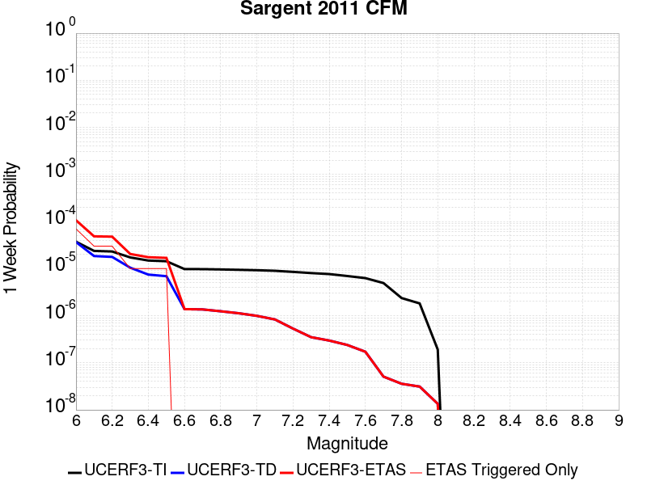 |  |  |  |

| Magnitude | 1 wk TI Prob | 1 wk TD Prob | 1 wk ETAS Prob | 1 wk ETAS/TD Gain | 1 wk ETAS Triggered Only | 1 mo TI Prob | 1 mo TD Prob | 1 mo ETAS Prob | 1 mo ETAS/TD Gain | 1 mo ETAS Triggered Only | 1 yr TI Prob | 1 yr TD Prob | 1 yr ETAS Prob | 1 yr ETAS/TD Gain | 1 yr ETAS Triggered Only | 10 yr TI Prob | 10 yr TD Prob | 10 yr ETAS Prob | 10 yr ETAS/TD Gain | 10 yr ETAS Triggered Only |
|-----|-----|-----|-----|-----|-----|-----|-----|-----|-----|-----|-----|-----|-----|-----|-----|-----|-----|-----|-----|-----|
| 6.0 | 3.7327867E-5 | 3.6675217E-5 | 6.7161905E-5 | 1.8312613 | 3.0487805E-5 | 1.5996677E-4 | 1.5717282E-4 | 2.1813884E-4 | 1.3878917 | 6.097561E-5 | 0.0019458556 | 0.0019123711 | 0.0020340893 | 1.0636476 | 1.2195122E-4 | 0.01928905 | 0.019031476 | 0.019151106 | 1.0062859 | 1.2195122E-4 |
| 6.1 | 2.3771476E-5 | 1.8493336E-5 | 4.8980575E-5 | 2.648553 | 3.0487805E-5 | 1.01873775E-4 | 7.925524E-5 | 1.4022602E-4 | 1.7692965 | 6.097561E-5 | 0.0012396075 | 9.6457085E-4 | 0.0010254877 | 1.0631543 | 6.097561E-5 | 0.012327154 | 0.009643728 | 0.009704116 | 1.0062618 | 6.097561E-5 |
| 6.2 | 2.3112721E-5 | 1.7724447E-5 | 4.821171E-5 | 2.7200687 | 3.0487805E-5 | 9.9050754E-5 | 7.59602E-5 | 1.3693118E-4 | 1.8026701 | 6.097561E-5 | 0.0012052758 | 9.2448783E-4 | 9.85407E-4 | 1.0658951 | 6.097561E-5 | 0.011987597 | 0.009246255 | 0.009306667 | 1.0065336 | 6.097561E-5 |
| 6.3 | 1.728509E-5 | 1.0469298E-5 | 1.0469298E-5 | 1.0 | 0.0 | 7.407686E-5 | 4.486792E-5 | 7.535436E-5 | 1.6794707 | 3.0487805E-5 | 9.015125E-4 | 5.4617383E-4 | 5.7664496E-4 | 1.0557902 | 3.0487805E-5 | 0.008978641 | 0.005484908 | 0.0055152285 | 1.005528 | 3.0487805E-5 |
| 6.4 | 1.48395575E-5 | 7.4650325E-6 | 7.4650325E-6 | 1.0 | 0.0 | 6.3596555E-5 | 3.199282E-5 | 3.199282E-5 | 1.0 | 0.0 | 7.7401294E-4 | 3.8947735E-4 | 3.8947735E-4 | 1.0 | 0.0 | 0.0077132257 | 0.0039237817 | 0.0039237817 | 1.0 | 0.0 |
| 6.5 | 1.4358964E-5 | 6.9036255E-6 | 6.9036255E-6 | 1.0 | 0.0 | 6.1536964E-5 | 2.9586845E-5 | 2.9586845E-5 | 1.0 | 0.0 | 7.48955E-4 | 3.601945E-4 | 3.601945E-4 | 1.0 | 0.0 | 0.0074643586 | 0.0036319366 | 0.0036319366 | 1.0 | 0.0 |
| 6.6 | 9.772591E-6 | 1.3803129E-6 | 1.3803129E-6 | 1.0 | 0.0 | 4.188186E-5 | 5.9156137E-6 | 5.9156137E-6 | 1.0 | 0.0 | 5.097923E-4 | 7.2020244E-5 | 7.2020244E-5 | 1.0 | 0.0 | 0.005086244 | 7.522172E-4 | 7.522172E-4 | 1.0 | 0.0 |
| 6.7 | 9.752745E-6 | 1.3590013E-6 | 1.3590013E-6 | 1.0 | 0.0 | 4.179681E-5 | 5.824278E-6 | 5.824278E-6 | 1.0 | 0.0 | 5.0875737E-4 | 7.090831E-5 | 7.090831E-5 | 1.0 | 0.0 | 0.005075942 | 7.4110535E-4 | 7.4110535E-4 | 1.0 | 0.0 |
| 6.8 | 9.608213E-6 | 1.2427503E-6 | 1.2427503E-6 | 1.0 | 0.0 | 4.1177405E-5 | 5.326062E-6 | 5.326062E-6 | 1.0 | 0.0 | 5.012196E-4 | 6.48429E-5 | 6.48429E-5 | 1.0 | 0.0 | 0.005000906 | 6.801856E-4 | 6.801856E-4 | 1.0 | 0.0 |
| 6.9 | 9.427164E-6 | 1.1272732E-6 | 1.1272732E-6 | 1.0 | 0.0 | 4.04015E-5 | 4.831162E-6 | 4.831162E-6 | 1.0 | 0.0 | 4.9177726E-4 | 5.8817834E-5 | 5.8817834E-5 | 1.0 | 0.0 | 0.004906904 | 6.192817E-4 | 6.192817E-4 | 1.0 | 0.0 |
| 7.0 | 9.247601E-6 | 9.935427E-7 | 9.935427E-7 | 1.0 | 0.0 | 3.9631974E-5 | 4.258033E-6 | 4.258033E-6 | 1.0 | 0.0 | 4.8241246E-4 | 5.1840336E-5 | 5.1840336E-5 | 1.0 | 0.0 | 0.0048136655 | 5.4903544E-4 | 5.4903544E-4 | 1.0 | 0.0 |
| 7.1 | 8.995454E-6 | 8.326929E-7 | 8.326929E-7 | 1.0 | 0.0 | 3.8551374E-5 | 3.568679E-6 | 3.568679E-6 | 1.0 | 0.0 | 4.6926187E-4 | 4.3447813E-5 | 4.3447813E-5 | 1.0 | 0.0 | 0.004682722 | 4.642218E-4 | 4.642218E-4 | 1.0 | 0.0 |
| 7.2 | 8.520861E-6 | 5.3258753E-7 | 5.3258753E-7 | 1.0 | 0.0 | 3.6517464E-5 | 2.282516E-6 | 2.282516E-6 | 1.0 | 0.0 | 4.445094E-4 | 2.7789285E-5 | 2.7789285E-5 | 1.0 | 0.0 | 0.004436213 | 3.0594022E-4 | 3.0594022E-4 | 1.0 | 0.0 |
| 7.3 | 8.043592E-6 | 3.501094E-7 | 3.501094E-7 | 1.0 | 0.0 | 3.4472083E-5 | 1.5004679E-6 | 1.5004679E-6 | 1.0 | 0.0 | 4.196168E-4 | 1.8268045E-5 | 1.8268045E-5 | 1.0 | 0.0 | 0.004188253 | 2.0941379E-4 | 2.0941379E-4 | 1.0 | 0.0 |
| 7.4 | 7.662316E-6 | 2.969961E-7 | 2.969961E-7 | 1.0 | 0.0 | 3.2838085E-5 | 1.2728399E-6 | 1.2728399E-6 | 1.0 | 0.0 | 3.9973034E-4 | 1.5496717E-5 | 1.5496717E-5 | 1.0 | 0.0 | 0.0039901207 | 1.7987835E-4 | 1.7987835E-4 | 1.0 | 0.0 |
| 7.5 | 6.961638E-6 | 2.3922428E-7 | 2.3922428E-7 | 1.0 | 0.0 | 2.9835252E-5 | 1.0252464E-6 | 1.0252464E-6 | 1.0 | 0.0 | 3.6318362E-4 | 1.2482305E-5 | 1.2482305E-5 | 1.0 | 0.0 | 0.0036259065 | 1.4624365E-4 | 1.4624365E-4 | 1.0 | 0.0 |
| 7.6 | 6.282332E-6 | 1.7165036E-7 | 1.7165036E-7 | 1.0 | 0.0 | 2.6924003E-5 | 7.3564416E-7 | 7.3564416E-7 | 1.0 | 0.0 | 3.2775043E-4 | 8.956432E-6 | 8.956432E-6 | 1.0 | 0.0 | 0.0032726745 | 1.0675463E-4 | 1.0675463E-4 | 1.0 | 0.0 |
| 7.7 | 4.934408E-6 | 5.0952853E-8 | 5.0952853E-8 | 1.0 | 0.0 | 2.114729E-5 | 2.1836935E-7 | 2.1836935E-7 | 1.0 | 0.0 | 2.5743784E-4 | 2.6586436E-6 | 2.6586436E-6 | 1.0 | 0.0 | 0.0025713982 | 3.3194043E-5 | 3.3194043E-5 | 1.0 | 0.0 |
| 7.8 | 2.373212E-6 | 3.5931706E-8 | 3.5931706E-8 | 1.0 | 0.0 | 1.0170869E-5 | 1.5399301E-7 | 1.5399301E-7 | 1.0 | 0.0 | 1.238233E-4 | 1.8748633E-6 | 1.8748633E-6 | 1.0 | 0.0 | 0.0012375432 | 2.4653038E-5 | 2.4653038E-5 | 1.0 | 0.0 |
| 7.9 | 1.8227792E-6 | 3.1296338E-8 | 3.1296338E-8 | 1.0 | 0.0 | 7.811887E-6 | 1.3412715E-7 | 1.3412715E-7 | 1.0 | 0.0 | 9.510558E-5 | 1.6329968E-6 | 1.6329968E-6 | 1.0 | 0.0 | 9.5064886E-4 | 2.18834E-5 | 2.18834E-5 | 1.0 | 0.0 |
| 8.0 | 1.9095137E-7 | 1.3468572E-8 | 1.3468572E-8 | 1.0 | 0.0 | 8.1836276E-7 | 5.772245E-8 | 5.772245E-8 | 1.0 | 0.0 | 9.963521E-6 | 7.027706E-7 | 7.027706E-7 | 1.0 | 0.0 | 9.963074E-5 | 8.589204E-6 | 8.589204E-6 | 1.0 | 0.0 |

## Rodgers Creek - Healdsburg 2011 CFM
*[(top)](#table-of-contents)*

| 1 Week | 1 Month | 1 Year | 10 Year |
|-----|-----|-----|-----|
|  |  |  |  |

| Magnitude | 1 wk TI Prob | 1 wk TD Prob | 1 wk ETAS Prob | 1 wk ETAS/TD Gain | 1 wk ETAS Triggered Only | 1 mo TI Prob | 1 mo TD Prob | 1 mo ETAS Prob | 1 mo ETAS/TD Gain | 1 mo ETAS Triggered Only | 1 yr TI Prob | 1 yr TD Prob | 1 yr ETAS Prob | 1 yr ETAS/TD Gain | 1 yr ETAS Triggered Only | 10 yr TI Prob | 10 yr TD Prob | 10 yr ETAS Prob | 10 yr ETAS/TD Gain | 10 yr ETAS Triggered Only |
|-----|-----|-----|-----|-----|-----|-----|-----|-----|-----|-----|-----|-----|-----|-----|-----|-----|-----|-----|-----|-----|
| 6.0 | 7.390182E-5 | 1.3156519E-4 | 1.9253278E-4 | 1.4634022 | 6.097561E-5 | 3.1668364E-4 | 5.6372944E-4 | 6.246707E-4 | 1.1081036 | 6.097561E-5 | 0.0038488081 | 0.006841826 | 0.0069326637 | 1.0132768 | 9.1463415E-5 | 0.037828278 | 0.06628447 | 0.06639834 | 1.0017178 | 1.2195122E-4 |
| 6.1 | 7.318768E-5 | 1.3054513E-4 | 1.9151278E-4 | 1.4670235 | 6.097561E-5 | 3.1362378E-4 | 5.593597E-4 | 6.203012E-4 | 1.1089487 | 6.097561E-5 | 0.0038116854 | 0.006788957 | 0.0068797995 | 1.0133809 | 9.1463415E-5 | 0.037469655 | 0.0657888 | 0.065902725 | 1.0017318 | 1.2195122E-4 |
| 6.2 | 7.1379836E-5 | 1.2747211E-4 | 1.8843995E-4 | 1.4782836 | 6.097561E-5 | 3.058777E-4 | 5.4619514E-4 | 6.0713745E-4 | 1.1115761 | 6.097561E-5 | 0.003717703 | 0.006629664 | 0.006720521 | 1.0137047 | 9.1463415E-5 | 0.0365612 | 0.06430634 | 0.064420454 | 1.0017744 | 1.2195122E-4 |
| 6.3 | 6.9255926E-5 | 1.2401471E-4 | 1.8498277E-4 | 1.4916195 | 6.097561E-5 | 2.9677735E-4 | 5.313838E-4 | 5.9232704E-4 | 1.1146878 | 6.097561E-5 | 0.0036072785 | 0.006450422 | 0.0065412954 | 1.014088 | 9.1463415E-5 | 0.035492823 | 0.06263191 | 0.06274622 | 1.0018252 | 1.2195122E-4 |
| 6.4 | 6.6757144E-5 | 1.1977896E-4 | 1.8074727E-4 | 1.5090067 | 6.097561E-5 | 2.8607066E-4 | 5.1323784E-4 | 5.7418214E-4 | 1.1187447 | 6.097561E-5 | 0.0034773487 | 0.0062308456 | 0.0063217394 | 1.0145876 | 9.1463415E-5 | 0.034234364 | 0.06058036 | 0.060694925 | 1.0018911 | 1.2195122E-4 |
| 6.5 | 6.5735134E-5 | 1.1826892E-4 | 1.7923732E-4 | 1.5155065 | 6.097561E-5 | 2.8169158E-4 | 5.0676876E-4 | 5.6771346E-4 | 1.1202614 | 6.097561E-5 | 0.003424202 | 0.0061525395 | 0.0062434403 | 1.0147744 | 9.1463415E-5 | 0.03371918 | 0.059843887 | 0.05995854 | 1.0019158 | 1.2195122E-4 |
| 6.6 | 6.289601E-5 | 1.13620714E-4 | 1.745894E-4 | 1.5365983 | 6.097561E-5 | 2.6952647E-4 | 4.8685542E-4 | 5.478013E-4 | 1.1251827 | 6.097561E-5 | 0.0032765474 | 0.0059114345 | 0.006002357 | 1.0153809 | 9.1463415E-5 | 0.032286562 | 0.057580784 | 0.057695713 | 1.0019959 | 1.2195122E-4 |
| 6.7 | 6.115274E-5 | 1.107893E-4 | 1.7175815E-4 | 1.5503136 | 6.097561E-5 | 2.6205686E-4 | 4.7472524E-4 | 5.356719E-4 | 1.128383 | 6.097561E-5 | 0.0031858748 | 0.0057645417 | 0.005855478 | 1.0157751 | 9.1463415E-5 | 0.031405866 | 0.05619833 | 0.05631343 | 1.002048 | 1.2195122E-4 |
| 6.8 | 5.9232367E-5 | 1.0746109E-4 | 1.6843015E-4 | 1.5673593 | 6.097561E-5 | 2.538283E-4 | 4.6046663E-4 | 5.2141416E-4 | 1.1323603 | 6.097561E-5 | 0.0030859804 | 0.005591847 | 0.005682799 | 1.0162652 | 9.1463415E-5 | 0.030434765 | 0.05456444 | 0.054679733 | 1.002113 | 1.2195122E-4 |
| 6.9 | 5.4030377E-5 | 9.839897E-5 | 1.5936857E-4 | 1.6196164 | 6.097561E-5 | 2.315382E-4 | 4.2164203E-4 | 4.8259192E-4 | 1.1445537 | 6.097561E-5 | 0.0028153337 | 0.0051214746 | 0.005182138 | 1.0118449 | 6.097561E-5 | 0.027799325 | 0.050098296 | 0.050185177 | 1.0017343 | 9.1463415E-5 |
| 7.0 | 4.8260714E-5 | 8.756719E-5 | 1.4853747E-4 | 1.6962684 | 6.097561E-5 | 2.0681522E-4 | 3.7523426E-4 | 4.36187E-4 | 1.1624391 | 6.097561E-5 | 0.0025150678 | 0.004558962 | 0.0046196594 | 1.0133139 | 6.097561E-5 | 0.024867928 | 0.04474531 | 0.044832684 | 1.0019526 | 9.1463415E-5 |
| 7.1 | 4.0294493E-5 | 7.4040654E-5 | 1.045262E-4 | 1.4117407 | 3.0487805E-5 | 1.7267925E-4 | 3.1727873E-4 | 3.4775684E-4 | 1.0960611 | 3.0487805E-5 | 0.0021003427 | 0.0038560645 | 0.0038864347 | 1.0078759 | 3.0487805E-5 | 0.02080602 | 0.0379959 | 0.03805456 | 1.0015438 | 6.097561E-5 |
| 7.2 | 3.096388E-5 | 5.7112917E-5 | 8.759898E-5 | 1.5337858 | 3.0487805E-5 | 1.326956E-4 | 2.447468E-4 | 2.7522715E-4 | 1.1245383 | 3.0487805E-5 | 0.0016143717 | 0.0029757428 | 0.0030061398 | 1.0102149 | 3.0487805E-5 | 0.01602694 | 0.029502932 | 0.02956211 | 1.0020058 | 6.097561E-5 |
| 7.3 | 2.3615226E-5 | 4.3743075E-5 | 7.4229545E-5 | 1.696944 | 3.0487805E-5 | 1.0120418E-4 | 1.8745693E-4 | 2.1793901E-4 | 1.1626085 | 3.0487805E-5 | 0.0012314644 | 0.002279913 | 0.0023103312 | 1.0133419 | 3.0487805E-5 | 0.0122466255 | 0.022693316 | 0.022752907 | 1.002626 | 6.097561E-5 |
| 7.4 | 1.8251132E-5 | 3.363491E-5 | 6.412169E-5 | 1.9064028 | 3.0487805E-5 | 7.821679E-5 | 1.4414171E-4 | 1.7462512E-4 | 1.2114823 | 3.0487805E-5 | 9.518733E-4 | 0.0017535225 | 0.0017839569 | 1.0173562 | 3.0487805E-5 | 0.009478063 | 0.017511668 | 0.017571576 | 1.0034211 | 6.097561E-5 |
| 7.5 | 1.2411432E-5 | 2.2530934E-5 | 5.301805E-5 | 2.3531227 | 3.0487805E-5 | 5.3190768E-5 | 9.6557604E-5 | 1.2704247E-4 | 1.3157169 | 3.0487805E-5 | 6.4740516E-4 | 0.0011749606 | 0.0012054127 | 1.0259174 | 3.0487805E-5 | 0.006455223 | 0.011778384 | 0.011808513 | 1.002558 | 3.0487805E-5 |
| 7.6 | 4.4771446E-6 | 8.110867E-6 | 3.8598424E-5 | 4.758853 | 3.0487805E-5 | 1.918762E-5 | 3.4760404E-5 | 6.524715E-5 | 1.8770539 | 3.0487805E-5 | 2.3358424E-4 | 4.2312694E-4 | 4.5360185E-4 | 1.072023 | 3.0487805E-5 | 0.0023333887 | 0.0042594117 | 0.0042897696 | 1.0071273 | 3.0487805E-5 |
| 7.7 | 2.157941E-7 | 3.552437E-7 | 3.552437E-7 | 1.0 | 0.0 | 9.248315E-7 | 1.5224721E-6 | 1.5224721E-6 | 1.0 | 0.0 | 1.1259765E-5 | 1.853594E-5 | 1.853594E-5 | 1.0 | 0.0 | 1.1259195E-4 | 1.9155742E-4 | 1.9155742E-4 | 1.0 | 0.0 |
| 7.8 | 9.9623286E-8 | 2.0033474E-7 | 2.0033474E-7 | 1.0 | 0.0 | 4.269569E-7 | 8.5857715E-7 | 8.5857715E-7 | 1.0 | 0.0 | 5.1981874E-6 | 1.0453127E-5 | 1.0453127E-5 | 1.0 | 0.0 | 5.198066E-5 | 1.09674125E-4 | 1.09674125E-4 | 1.0 | 0.0 |
| 7.9 | 5.6745257E-8 | 1.185751E-7 | 1.185751E-7 | 1.0 | 0.0 | 2.4319394E-7 | 5.0817886E-7 | 5.0817886E-7 | 1.0 | 0.0 | 2.960882E-6 | 6.1870605E-6 | 6.1870605E-6 | 1.0 | 0.0 | 2.9608427E-5 | 6.511706E-5 | 6.511706E-5 | 1.0 | 0.0 |
| 8.0 | 2.8614323E-8 | 6.623447E-8 | 6.623447E-8 | 1.0 | 0.0 | 1.2263281E-7 | 2.83862E-7 | 2.83862E-7 | 1.0 | 0.0 | 1.4930534E-6 | 3.4560144E-6 | 3.4560144E-6 | 1.0 | 0.0 | 1.4930434E-5 | 3.6041773E-5 | 3.6041773E-5 | 1.0 | 0.0 |
| 8.1 | 3.5045191E-9 | 9.022612E-9 | 9.022612E-9 | 1.0 | 0.0 | 1.5019367E-8 | 3.866834E-8 | 3.866834E-8 | 1.0 | 0.0 | 1.8286079E-7 | 4.7078692E-7 | 4.7078692E-7 | 1.0 | 0.0 | 1.8286064E-6 | 4.8596467E-6 | 4.8596467E-6 | 1.0 | 0.0 |

## Great Valley 07 (Orestimba)
*[(top)](#table-of-contents)*

| 1 Week | 1 Month | 1 Year | 10 Year |
|-----|-----|-----|-----|
|  |  |  |  |

| Magnitude | 1 wk TI Prob | 1 wk TD Prob | 1 wk ETAS Prob | 1 wk ETAS/TD Gain | 1 wk ETAS Triggered Only | 1 mo TI Prob | 1 mo TD Prob | 1 mo ETAS Prob | 1 mo ETAS/TD Gain | 1 mo ETAS Triggered Only | 1 yr TI Prob | 1 yr TD Prob | 1 yr ETAS Prob | 1 yr ETAS/TD Gain | 1 yr ETAS Triggered Only | 10 yr TI Prob | 10 yr TD Prob | 10 yr ETAS Prob | 10 yr ETAS/TD Gain | 10 yr ETAS Triggered Only |
|-----|-----|-----|-----|-----|-----|-----|-----|-----|-----|-----|-----|-----|-----|-----|-----|-----|-----|-----|-----|-----|
| 6.0 | 2.9687902E-5 | 3.276403E-5 | 3.276403E-5 | 1.0 | 0.0 | 1.2722766E-4 | 1.4041012E-4 | 1.4041012E-4 | 1.0 | 0.0 | 0.0015478961 | 0.0017082248 | 0.0017995319 | 1.0534515 | 9.1463415E-5 | 0.015371585 | 0.01695849 | 0.017048402 | 1.005302 | 9.1463415E-5 |
| 6.1 | 2.9687902E-5 | 3.276403E-5 | 3.276403E-5 | 1.0 | 0.0 | 1.2722766E-4 | 1.4041012E-4 | 1.4041012E-4 | 1.0 | 0.0 | 0.0015478961 | 0.0017082248 | 0.0017690961 | 1.0356343 | 6.097561E-5 | 0.015371585 | 0.01695849 | 0.017018432 | 1.0035346 | 6.097561E-5 |
| 6.2 | 1.9231524E-5 | 2.1163256E-5 | 2.1163256E-5 | 1.0 | 0.0 | 8.2418206E-5 | 9.0696645E-5 | 9.0696645E-5 | 1.0 | 0.0 | 0.0010029797 | 0.0011036954 | 0.0011341495 | 1.0275929 | 3.0487805E-5 | 0.00998465 | 0.010984551 | 0.011014705 | 1.002745 | 3.0487805E-5 |
| 6.3 | 1.324766E-5 | 1.4551287E-5 | 1.4551287E-5 | 1.0 | 0.0 | 5.6774446E-5 | 6.236122E-5 | 6.236122E-5 | 1.0 | 0.0 | 6.910097E-4 | 7.5899257E-4 | 7.8945723E-4 | 1.0401382 | 3.0487805E-5 | 0.006888649 | 0.00756495 | 0.007595207 | 1.0039997 | 3.0487805E-5 |
| 6.4 | 7.818645E-6 | 8.574433E-6 | 8.574433E-6 | 1.0 | 0.0 | 3.3508048E-5 | 3.6747075E-5 | 3.6747075E-5 | 1.0 | 0.0 | 4.078841E-4 | 4.4730716E-4 | 4.4730716E-4 | 1.0 | 0.0 | 0.004071363 | 0.0044644084 | 0.0044644084 | 1.0 | 0.0 |
| 6.5 | 5.3076565E-6 | 5.8188784E-6 | 5.8188784E-6 | 1.0 | 0.0 | 2.27469E-5 | 2.4937823E-5 | 2.4937823E-5 | 1.0 | 0.0 | 2.7690834E-4 | 3.035778E-4 | 3.035778E-4 | 1.0 | 0.0 | 0.0027656353 | 0.0030318405 | 0.0030318405 | 1.0 | 0.0 |
| 6.6 | 3.6003578E-6 | 3.949231E-6 | 3.949231E-6 | 1.0 | 0.0 | 1.5430012E-5 | 1.6925174E-5 | 1.6925174E-5 | 1.0 | 0.0 | 1.8784421E-4 | 2.0604608E-4 | 2.0604608E-4 | 1.0 | 0.0 | 0.0018768552 | 0.0020587046 | 0.0020587046 | 1.0 | 0.0 |
| 6.7 | 2.5361826E-6 | 2.7839908E-6 | 2.7839908E-6 | 1.0 | 0.0 | 1.0869308E-5 | 1.1931343E-5 | 1.1931343E-5 | 1.0 | 0.0 | 1.3232579E-4 | 1.4525573E-4 | 1.4525573E-4 | 1.0 | 0.0 | 0.0013224703 | 0.0014517378 | 0.0014517378 | 1.0 | 0.0 |
| 6.8 | 1.2115831E-6 | 1.3316335E-6 | 1.3316335E-6 | 1.0 | 0.0 | 5.1924885E-6 | 5.7069933E-6 | 5.7069933E-6 | 1.0 | 0.0 | 6.3216714E-5 | 6.94814E-5 | 6.94814E-5 | 1.0 | 0.0 | 6.3198735E-4 | 6.946919E-4 | 6.946919E-4 | 1.0 | 0.0 |

## Contra Costa Shear Zone (connector) 2011 CFM
*[(top)](#table-of-contents)*

| 1 Week | 1 Month | 1 Year | 10 Year |
|-----|-----|-----|-----|
|  |  |  |  |

| Magnitude | 1 wk TI Prob | 1 wk TD Prob | 1 wk ETAS Prob | 1 wk ETAS/TD Gain | 1 wk ETAS Triggered Only | 1 mo TI Prob | 1 mo TD Prob | 1 mo ETAS Prob | 1 mo ETAS/TD Gain | 1 mo ETAS Triggered Only | 1 yr TI Prob | 1 yr TD Prob | 1 yr ETAS Prob | 1 yr ETAS/TD Gain | 1 yr ETAS Triggered Only | 10 yr TI Prob | 10 yr TD Prob | 10 yr ETAS Prob | 10 yr ETAS/TD Gain | 10 yr ETAS Triggered Only |
|-----|-----|-----|-----|-----|-----|-----|-----|-----|-----|-----|-----|-----|-----|-----|-----|-----|-----|-----|-----|-----|
| 6.0 | 1.3187427E-5 | 1.4047914E-5 | 4.453529E-5 | 3.1702423 | 3.0487805E-5 | 5.6516317E-5 | 6.0204085E-5 | 9.069005E-5 | 1.5063771 | 3.0487805E-5 | 6.878689E-4 | 7.3276105E-4 | 7.9369196E-4 | 1.0831525 | 6.097561E-5 | 0.006857436 | 0.0073098983 | 0.007400693 | 1.0124208 | 9.1463415E-5 |
| 6.1 | 1.3187427E-5 | 1.4047914E-5 | 4.453529E-5 | 3.1702423 | 3.0487805E-5 | 5.6516317E-5 | 6.0204085E-5 | 9.069005E-5 | 1.5063771 | 3.0487805E-5 | 6.878689E-4 | 7.3276105E-4 | 7.9369196E-4 | 1.0831525 | 6.097561E-5 | 0.006857436 | 0.0073098983 | 0.007400693 | 1.0124208 | 9.1463415E-5 |
| 6.2 | 1.3187427E-5 | 1.4047914E-5 | 4.453529E-5 | 3.1702423 | 3.0487805E-5 | 5.6516317E-5 | 6.0204085E-5 | 9.069005E-5 | 1.5063771 | 3.0487805E-5 | 6.878689E-4 | 7.3276105E-4 | 7.9369196E-4 | 1.0831525 | 6.097561E-5 | 0.006857436 | 0.0073098983 | 0.007400693 | 1.0124208 | 9.1463415E-5 |
| 6.3 | 9.315374E-6 | 9.830119E-6 | 4.0317624E-5 | 4.101438 | 3.0487805E-5 | 3.992242E-5 | 4.2128424E-5 | 7.2614945E-5 | 1.7236568 | 3.0487805E-5 | 4.8594706E-4 | 5.12797E-4 | 5.737413E-4 | 1.1188469 | 6.097561E-5 | 0.004848858 | 0.0051207407 | 0.005211736 | 1.0177699 | 9.1463415E-5 |
| 6.4 | 9.315374E-6 | 9.830119E-6 | 4.0317624E-5 | 4.101438 | 3.0487805E-5 | 3.992242E-5 | 4.2128424E-5 | 7.2614945E-5 | 1.7236568 | 3.0487805E-5 | 4.8594706E-4 | 5.12797E-4 | 5.737413E-4 | 1.1188469 | 6.097561E-5 | 0.004848858 | 0.0051207407 | 0.005211736 | 1.0177699 | 9.1463415E-5 |
| 6.5 | 8.492638E-6 | 8.943669E-6 | 3.94312E-5 | 4.4088397 | 3.0487805E-5 | 3.639651E-5 | 3.8329465E-5 | 6.88161E-5 | 1.7953838 | 3.0487805E-5 | 4.430374E-4 | 4.6656467E-4 | 5.275118E-4 | 1.1306297 | 6.097561E-5 | 0.0044215517 | 0.0046603796 | 0.004721071 | 1.0130229 | 6.097561E-5 |
| 6.6 | 8.402072E-6 | 8.84445E-6 | 3.9331986E-5 | 4.447081 | 3.0487805E-5 | 3.6008387E-5 | 3.7904254E-5 | 6.83909E-5 | 1.8043067 | 3.0487805E-5 | 4.383139E-4 | 4.6138995E-4 | 5.2233745E-4 | 1.1320953 | 6.097561E-5 | 0.0043745036 | 0.004608848 | 0.004669543 | 1.0131692 | 6.097561E-5 |
| 6.7 | 7.383587E-6 | 7.751894E-6 | 7.751894E-6 | 1.0 | 0.0 | 3.164356E-5 | 3.322199E-5 | 3.322199E-5 | 1.0 | 0.0 | 3.8519225E-4 | 4.0440477E-4 | 4.3488023E-4 | 1.0753589 | 3.0487805E-5 | 0.0038452526 | 0.004041091 | 0.004071456 | 1.007514 | 3.0487805E-5 |
| 6.8 | 6.004921E-6 | 6.269357E-6 | 6.269357E-6 | 1.0 | 0.0 | 2.5735122E-5 | 2.68684E-5 | 2.68684E-5 | 1.0 | 0.0 | 3.1328006E-4 | 3.270742E-4 | 3.5755202E-4 | 1.0931833 | 3.0487805E-5 | 0.0031283877 | 0.003270177 | 0.003300565 | 1.0092925 | 3.0487805E-5 |
| 6.9 | 5.505255E-6 | 5.721665E-6 | 5.721665E-6 | 1.0 | 0.0 | 2.3593739E-5 | 2.4521192E-5 | 2.4521192E-5 | 1.0 | 0.0 | 2.872159E-4 | 2.9850504E-4 | 3.2898376E-4 | 1.1021044 | 3.0487805E-5 | 0.0028684495 | 0.002985281 | 0.0030156777 | 1.0101823 | 3.0487805E-5 |
| 7.0 | 4.891922E-6 | 5.052222E-6 | 5.052222E-6 | 1.0 | 0.0 | 2.096521E-5 | 2.1652202E-5 | 2.1652202E-5 | 1.0 | 0.0 | 2.5522153E-4 | 2.6358402E-4 | 2.940638E-4 | 1.1156359 | 3.0487805E-5 | 0.0025492862 | 0.002636946 | 0.0026673535 | 1.0115314 | 3.0487805E-5 |
| 7.1 | 4.3599E-6 | 4.4561025E-6 | 4.4561025E-6 | 1.0 | 0.0 | 1.868515E-5 | 1.9097444E-5 | 1.9097444E-5 | 1.0 | 0.0 | 2.2746796E-4 | 2.3248685E-4 | 2.6296757E-4 | 1.1311073 | 3.0487805E-5 | 0.0022723526 | 0.0023266617 | 0.0023570787 | 1.0130732 | 3.0487805E-5 |
| 7.2 | 3.7647926E-6 | 3.8069954E-6 | 3.8069954E-6 | 1.0 | 0.0 | 1.6134725E-5 | 1.6315593E-5 | 1.6315593E-5 | 1.0 | 0.0 | 1.9642258E-4 | 1.9862449E-4 | 2.2910624E-4 | 1.1534642 | 3.0487805E-5 | 0.0019624906 | 0.0019886836 | 0.0020191108 | 1.0153002 | 3.0487805E-5 |
| 7.3 | 2.3179882E-6 | 2.3945659E-6 | 2.3945659E-6 | 1.0 | 0.0 | 9.934198E-6 | 1.0262384E-5 | 1.0262384E-5 | 1.0 | 0.0 | 1.20942146E-4 | 1.2493742E-4 | 1.5542141E-4 | 1.2439941 | 3.0487805E-5 | 0.0012087635 | 0.0012528638 | 0.0012833134 | 1.024304 | 3.0487805E-5 |
| 7.4 | 1.8378355E-6 | 1.921533E-6 | 1.921533E-6 | 1.0 | 0.0 | 7.876414E-6 | 8.235116E-6 | 8.235116E-6 | 1.0 | 0.0 | 9.5891126E-5 | 1.0025797E-4 | 1.3074272E-4 | 1.3040631 | 3.0487805E-5 | 9.584976E-4 | 0.0010062316 | 0.0010366888 | 1.0302685 | 3.0487805E-5 |
| 7.5 | 9.840493E-7 | 1.0649483E-6 | 1.0649483E-6 | 1.0 | 0.0 | 4.2173474E-6 | 4.564056E-6 | 4.564056E-6 | 1.0 | 0.0 | 5.1344992E-5 | 5.556598E-5 | 8.605209E-5 | 1.548647 | 3.0487805E-5 | 5.133313E-4 | 5.592636E-4 | 5.897343E-4 | 1.0544837 | 3.0487805E-5 |
| 7.6 | 3.1602997E-7 | 3.7246227E-7 | 3.7246227E-7 | 1.0 | 0.0 | 1.3544135E-6 | 1.5962657E-6 | 1.5962657E-6 | 1.0 | 0.0 | 1.648986E-5 | 1.9434365E-5 | 1.9434365E-5 | 1.0 | 0.0 | 1.6488635E-4 | 1.978736E-4 | 1.978736E-4 | 1.0 | 0.0 |
| 7.7 | 2.2125788E-7 | 2.777874E-7 | 2.777874E-7 | 1.0 | 0.0 | 9.482477E-7 | 1.1905169E-6 | 1.1905169E-6 | 1.0 | 0.0 | 1.1544855E-5 | 1.4494447E-5 | 1.4494447E-5 | 1.0 | 0.0 | 1.1544255E-4 | 1.4844474E-4 | 1.4844474E-4 | 1.0 | 0.0 |
| 7.8 | 1.0509553E-7 | 1.4484402E-7 | 1.4484402E-7 | 1.0 | 0.0 | 4.5040935E-7 | 6.207599E-7 | 6.207599E-7 | 1.0 | 0.0 | 5.48372E-6 | 7.557726E-6 | 7.557726E-6 | 1.0 | 0.0 | 5.4835844E-5 | 7.7873156E-5 | 7.7873156E-5 | 1.0 | 0.0 |
| 7.9 | 6.029319E-8 | 9.309861E-8 | 9.309861E-8 | 1.0 | 0.0 | 2.5839938E-7 | 3.98994E-7 | 3.98994E-7 | 1.0 | 0.0 | 3.1460077E-6 | 4.8577413E-6 | 4.8577413E-6 | 1.0 | 0.0 | 3.1459633E-5 | 5.0153616E-5 | 5.0153616E-5 | 1.0 | 0.0 |
| 8.0 | 3.531068E-8 | 6.557522E-8 | 6.557522E-8 | 1.0 | 0.0 | 1.5133148E-7 | 2.8103662E-7 | 2.8103662E-7 | 1.0 | 0.0 | 1.8424593E-6 | 3.4216157E-6 | 3.4216157E-6 | 1.0 | 0.0 | 1.842444E-5 | 3.5351604E-5 | 3.5351604E-5 | 1.0 | 0.0 |
| 8.1 | 3.5238246E-10 | 6.3007377E-10 | 6.3007377E-10 | 1.0 | 0.0 | 1.5102107E-9 | 2.7003164E-9 | 2.7003164E-9 | 1.0 | 0.0 | 1.8386816E-8 | 3.2876354E-8 | 3.2876354E-8 | 1.0 | 0.0 | 1.8386814E-7 | 3.3670406E-7 | 3.3670406E-7 | 1.0 | 0.0 |

## Franklin 2011 CFM
*[(top)](#table-of-contents)*

| 1 Week | 1 Month | 1 Year | 10 Year |
|-----|-----|-----|-----|
|  |  |  |  |

| Magnitude | 1 wk TI Prob | 1 wk TD Prob | 1 wk ETAS Prob | 1 wk ETAS/TD Gain | 1 wk ETAS Triggered Only | 1 mo TI Prob | 1 mo TD Prob | 1 mo ETAS Prob | 1 mo ETAS/TD Gain | 1 mo ETAS Triggered Only | 1 yr TI Prob | 1 yr TD Prob | 1 yr ETAS Prob | 1 yr ETAS/TD Gain | 1 yr ETAS Triggered Only | 10 yr TI Prob | 10 yr TD Prob | 10 yr ETAS Prob | 10 yr ETAS/TD Gain | 10 yr ETAS Triggered Only |
|-----|-----|-----|-----|-----|-----|-----|-----|-----|-----|-----|-----|-----|-----|-----|-----|-----|-----|-----|-----|-----|
| 6.0 | 1.845602E-5 | 2.0223706E-5 | 2.0223706E-5 | 1.0 | 0.0 | 7.9094825E-5 | 8.667031E-5 | 8.667031E-5 | 1.0 | 0.0 | 9.6255407E-4 | 0.0010547292 | 0.0010851849 | 1.0288754 | 3.0487805E-5 | 0.009583955 | 0.010514545 | 0.010605047 | 1.0086073 | 9.1463415E-5 |
| 6.1 | 1.845602E-5 | 2.0223706E-5 | 2.0223706E-5 | 1.0 | 0.0 | 7.9094825E-5 | 8.667031E-5 | 8.667031E-5 | 1.0 | 0.0 | 9.6255407E-4 | 0.0010547292 | 0.0010851849 | 1.0288754 | 3.0487805E-5 | 0.009583955 | 0.010514545 | 0.010605047 | 1.0086073 | 9.1463415E-5 |
| 6.2 | 1.845602E-5 | 2.0223706E-5 | 2.0223706E-5 | 1.0 | 0.0 | 7.9094825E-5 | 8.667031E-5 | 8.667031E-5 | 1.0 | 0.0 | 9.6255407E-4 | 0.0010547292 | 0.0010851849 | 1.0288754 | 3.0487805E-5 | 0.009583955 | 0.010514545 | 0.010605047 | 1.0086073 | 9.1463415E-5 |
| 6.3 | 1.3813506E-5 | 1.5165042E-5 | 1.5165042E-5 | 1.0 | 0.0 | 5.9199396E-5 | 6.4991465E-5 | 6.4991465E-5 | 1.0 | 0.0 | 7.205143E-4 | 7.909915E-4 | 7.909915E-4 | 1.0 | 0.0 | 0.007181826 | 0.007896956 | 0.007927203 | 1.0038302 | 3.0487805E-5 |
| 6.4 | 1.3813506E-5 | 1.5165042E-5 | 1.5165042E-5 | 1.0 | 0.0 | 5.9199396E-5 | 6.4991465E-5 | 6.4991465E-5 | 1.0 | 0.0 | 7.205143E-4 | 7.909915E-4 | 7.909915E-4 | 1.0 | 0.0 | 0.007181826 | 0.007896956 | 0.007927203 | 1.0038302 | 3.0487805E-5 |
| 6.5 | 1.1308949E-5 | 1.2427525E-5 | 1.2427525E-5 | 1.0 | 0.0 | 4.8466023E-5 | 5.3259748E-5 | 5.3259748E-5 | 1.0 | 0.0 | 5.899141E-4 | 6.4824655E-4 | 6.4824655E-4 | 1.0 | 0.0 | 0.0058835056 | 0.006478196 | 0.006478196 | 1.0 | 0.0 |
| 6.6 | 1.0813164E-5 | 1.18856515E-5 | 1.18856515E-5 | 1.0 | 0.0 | 4.6341313E-5 | 5.093752E-5 | 5.093752E-5 | 1.0 | 0.0 | 5.640594E-4 | 6.1998976E-4 | 6.1998976E-4 | 1.0 | 0.0 | 0.005626298 | 0.0061972244 | 0.0061972244 | 1.0 | 0.0 |
| 6.7 | 1.0706348E-5 | 1.1767391E-5 | 1.1767391E-5 | 1.0 | 0.0 | 4.5883542E-5 | 5.043071E-5 | 5.043071E-5 | 1.0 | 0.0 | 5.5848894E-4 | 6.1382283E-4 | 6.1382283E-4 | 1.0 | 0.0 | 0.005570874 | 0.0061358972 | 0.0061358972 | 1.0 | 0.0 |
| 6.8 | 9.443655E-6 | 1.0358396E-5 | 1.0358396E-5 | 1.0 | 0.0 | 4.0472176E-5 | 4.439238E-5 | 4.439238E-5 | 1.0 | 0.0 | 4.9263734E-4 | 5.403445E-4 | 5.403445E-4 | 1.0 | 0.0 | 0.0049154665 | 0.0054048807 | 0.0054048807 | 1.0 | 0.0 |
| 6.9 | 8.7001645E-6 | 9.531287E-6 | 9.531287E-6 | 1.0 | 0.0 | 3.728589E-5 | 4.0847743E-5 | 4.0847743E-5 | 1.0 | 0.0 | 4.538611E-4 | 4.97209E-4 | 4.97209E-4 | 1.0 | 0.0 | 0.0045293528 | 0.004975525 | 0.004975525 | 1.0 | 0.0 |
| 7.0 | 8.074731E-6 | 8.824718E-6 | 8.824718E-6 | 1.0 | 0.0 | 3.460553E-5 | 3.781968E-5 | 3.781968E-5 | 1.0 | 0.0 | 4.212409E-4 | 4.603584E-4 | 4.603584E-4 | 1.0 | 0.0 | 0.004204433 | 0.004608592 | 0.004608592 | 1.0 | 0.0 |
| 7.1 | 7.3370957E-6 | 7.970384E-6 | 7.970384E-6 | 1.0 | 0.0 | 3.1444317E-5 | 3.4158347E-5 | 3.4158347E-5 | 1.0 | 0.0 | 3.8276732E-4 | 4.1579953E-4 | 4.1579953E-4 | 1.0 | 0.0 | 0.0038210868 | 0.0041646007 | 0.0041646007 | 1.0 | 0.0 |
| 7.2 | 5.1750103E-6 | 5.465292E-6 | 5.465292E-6 | 1.0 | 0.0 | 2.2178427E-5 | 2.3422472E-5 | 2.3422472E-5 | 1.0 | 0.0 | 2.699889E-4 | 2.851316E-4 | 2.851316E-4 | 1.0 | 0.0 | 0.002696611 | 0.0028615629 | 0.0028615629 | 1.0 | 0.0 |
| 7.3 | 3.5221371E-6 | 3.8033727E-6 | 3.8033727E-6 | 1.0 | 0.0 | 1.5094786E-5 | 1.6300068E-5 | 1.6300068E-5 | 1.0 | 0.0 | 1.8376352E-4 | 1.9843534E-4 | 1.9843534E-4 | 1.0 | 0.0 | 0.0018361164 | 0.0019960045 | 0.0019960045 | 1.0 | 0.0 |
| 7.4 | 2.5749775E-6 | 2.824462E-6 | 2.824462E-6 | 1.0 | 0.0 | 1.1035571E-5 | 1.21047815E-5 | 1.21047815E-5 | 1.0 | 0.0 | 1.343498E-4 | 1.4736582E-4 | 1.4736582E-4 | 1.0 | 0.0 | 0.001342686 | 0.0014848924 | 0.0014848924 | 1.0 | 0.0 |
| 7.5 | 1.3642131E-6 | 1.5545687E-6 | 1.5545687E-6 | 1.0 | 0.0 | 5.8466144E-6 | 6.66242E-6 | 6.66242E-6 | 1.0 | 0.0 | 7.1180206E-5 | 8.111197E-5 | 8.111197E-5 | 1.0 | 0.0 | 7.115741E-4 | 8.2162104E-4 | 8.2162104E-4 | 1.0 | 0.0 |
| 7.6 | 5.329124E-7 | 6.7443995E-7 | 6.7443995E-7 | 1.0 | 0.0 | 2.2839083E-6 | 2.8904537E-6 | 2.8904537E-6 | 1.0 | 0.0 | 2.7806227E-5 | 3.519071E-5 | 3.519071E-5 | 1.0 | 0.0 | 2.780275E-4 | 3.6223148E-4 | 3.6223148E-4 | 1.0 | 0.0 |
| 7.7 | 4.199127E-7 | 5.527866E-7 | 5.527866E-7 | 1.0 | 0.0 | 1.7996247E-6 | 2.3690832E-6 | 2.3690832E-6 | 1.0 | 0.0 | 2.191021E-5 | 2.8843211E-5 | 2.8843211E-5 | 1.0 | 0.0 | 2.190805E-4 | 2.9858793E-4 | 2.9858793E-4 | 1.0 | 0.0 |
| 7.8 | 2.2586491E-7 | 3.090388E-7 | 3.090388E-7 | 1.0 | 0.0 | 9.67992E-7 | 1.3244513E-6 | 1.3244513E-6 | 1.0 | 0.0 | 1.178524E-5 | 1.6125075E-5 | 1.6125075E-5 | 1.0 | 0.0 | 1.17846146E-4 | 1.675426E-4 | 1.675426E-4 | 1.0 | 0.0 |
| 7.9 | 1.4568845E-7 | 2.1370955E-7 | 2.1370955E-7 | 1.0 | 0.0 | 6.243789E-7 | 9.158977E-7 | 9.158977E-7 | 1.0 | 0.0 | 7.601787E-6 | 1.1150999E-5 | 1.1150999E-5 | 1.0 | 0.0 | 7.601527E-5 | 1.1594643E-4 | 1.1594643E-4 | 1.0 | 0.0 |
| 8.0 | 5.2868224E-8 | 1.0072543E-7 | 1.0072543E-7 | 1.0 | 0.0 | 2.2657808E-7 | 4.3168035E-7 | 4.3168035E-7 | 1.0 | 0.0 | 2.7585847E-6 | 5.2556957E-6 | 5.2556957E-6 | 1.0 | 0.0 | 2.7585504E-5 | 5.439856E-5 | 5.439856E-5 | 1.0 | 0.0 |
| 8.1 | 2.654434E-9 | 4.7539057E-9 | 4.7539057E-9 | 1.0 | 0.0 | 1.1376145E-8 | 2.037388E-8 | 2.037388E-8 | 1.0 | 0.0 | 1.3850456E-7 | 2.4805198E-7 | 2.4805198E-7 | 1.0 | 0.0 | 1.3850448E-6 | 2.5494703E-6 | 2.5494703E-6 | 1.0 | 0.0 |

## Greenville (No) 2011 CFM
*[(top)](#table-of-contents)*

| 1 Week | 1 Month | 1 Year | 10 Year |
|-----|-----|-----|-----|
| 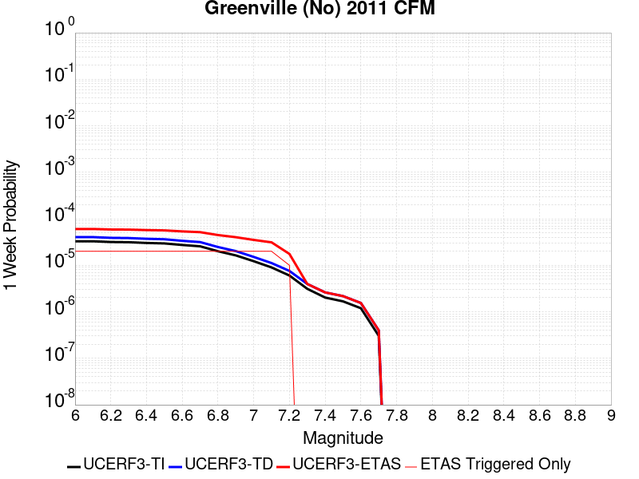 |  |  |  |

| Magnitude | 1 wk TI Prob | 1 wk TD Prob | 1 wk ETAS Prob | 1 wk ETAS/TD Gain | 1 wk ETAS Triggered Only | 1 mo TI Prob | 1 mo TD Prob | 1 mo ETAS Prob | 1 mo ETAS/TD Gain | 1 mo ETAS Triggered Only | 1 yr TI Prob | 1 yr TD Prob | 1 yr ETAS Prob | 1 yr ETAS/TD Gain | 1 yr ETAS Triggered Only | 10 yr TI Prob | 10 yr TD Prob | 10 yr ETAS Prob | 10 yr ETAS/TD Gain | 10 yr ETAS Triggered Only |
|-----|-----|-----|-----|-----|-----|-----|-----|-----|-----|-----|-----|-----|-----|-----|-----|-----|-----|-----|-----|-----|
| 6.0 | 3.286654E-5 | 4.0385894E-5 | 4.0385894E-5 | 1.0 | 0.0 | 1.4084899E-4 | 1.7307115E-4 | 1.7307115E-4 | 1.0 | 0.0 | 0.0017134876 | 0.0021051443 | 0.0021659916 | 1.0289041 | 6.097561E-5 | 0.017003356 | 0.020856904 | 0.020916607 | 1.0028626 | 6.097561E-5 |
| 6.1 | 3.286654E-5 | 4.0385894E-5 | 4.0385894E-5 | 1.0 | 0.0 | 1.4084899E-4 | 1.7307115E-4 | 1.7307115E-4 | 1.0 | 0.0 | 0.0017134876 | 0.0021051443 | 0.0021659916 | 1.0289041 | 6.097561E-5 | 0.017003356 | 0.020856904 | 0.020916607 | 1.0028626 | 6.097561E-5 |
| 6.2 | 3.1697953E-5 | 3.8948187E-5 | 3.8948187E-5 | 1.0 | 0.0 | 1.358413E-4 | 1.6691034E-4 | 1.6691034E-4 | 1.0 | 0.0 | 0.0016526132 | 0.0020302776 | 0.0020911293 | 1.0299722 | 6.097561E-5 | 0.01640377 | 0.020121982 | 0.020181732 | 1.0029693 | 6.097561E-5 |
| 6.3 | 3.1363317E-5 | 3.853688E-5 | 3.853688E-5 | 1.0 | 0.0 | 1.344073E-4 | 1.6514782E-4 | 1.6514782E-4 | 1.0 | 0.0 | 0.0016351803 | 0.0020088586 | 0.0020697117 | 1.0302924 | 6.097561E-5 | 0.016232004 | 0.01991166 | 0.019971423 | 1.0030013 | 6.097561E-5 |
| 6.4 | 3.0228604E-5 | 3.7143403E-5 | 3.7143403E-5 | 1.0 | 0.0 | 1.2954473E-4 | 1.5917652E-4 | 1.5917652E-4 | 1.0 | 0.0 | 0.0015760659 | 0.0019362888 | 0.0019971463 | 1.03143 | 6.097561E-5 | 0.015649348 | 0.019198699 | 0.019258503 | 1.003115 | 6.097561E-5 |
| 6.5 | 2.9537814E-5 | 3.6298497E-5 | 3.6298497E-5 | 1.0 | 0.0 | 1.2658449E-4 | 1.5555593E-4 | 1.5555593E-4 | 1.0 | 0.0 | 0.0015400766 | 0.0018922853 | 0.0019531455 | 1.0321623 | 6.097561E-5 | 0.01529447 | 0.01876618 | 0.018826012 | 1.0031883 | 6.097561E-5 |
| 6.6 | 2.7345395E-5 | 3.360665E-5 | 3.360665E-5 | 1.0 | 0.0 | 1.1718928E-4 | 1.4402073E-4 | 1.4402073E-4 | 1.0 | 0.0 | 0.0014258457 | 0.0017520733 | 0.0018129421 | 1.034741 | 6.097561E-5 | 0.014167317 | 0.017386416 | 0.017446332 | 1.0034461 | 6.097561E-5 |
| 6.7 | 2.5615784E-5 | 3.1582884E-5 | 3.1582884E-5 | 1.0 | 0.0 | 1.09777306E-4 | 1.3534837E-4 | 1.3534837E-4 | 1.0 | 0.0 | 0.0013357193 | 0.0016466515 | 0.0017075267 | 1.0369691 | 6.097561E-5 | 0.013277191 | 0.016348176 | 0.016408155 | 1.0036688 | 6.097561E-5 |
| 6.8 | 2.0059057E-5 | 2.4724775E-5 | 2.4724775E-5 | 1.0 | 0.0 | 8.596455E-5 | 1.0595911E-4 | 1.0595911E-4 | 1.0 | 0.0 | 0.0010461159 | 0.001289305 | 0.001289305 | 1.0 | 0.0 | 0.0104120495 | 0.012820267 | 0.012820267 | 1.0 | 0.0 |
| 6.9 | 1.6321746E-5 | 2.019551E-5 | 2.019551E-5 | 1.0 | 0.0 | 6.9948466E-5 | 8.6549386E-5 | 8.6549386E-5 | 1.0 | 0.0 | 8.5128983E-4 | 0.0010532418 | 0.0010532418 | 1.0 | 0.0 | 0.008480361 | 0.01048403 | 0.01048403 | 1.0 | 0.0 |
| 7.0 | 1.22527645E-5 | 1.5141323E-5 | 1.5141323E-5 | 1.0 | 0.0 | 5.2510793E-5 | 6.48898E-5 | 6.48898E-5 | 1.0 | 0.0 | 6.3913135E-4 | 7.897512E-4 | 7.897512E-4 | 1.0 | 0.0 | 0.0063729626 | 0.007870084 | 0.007870084 | 1.0 | 0.0 |
| 7.1 | 8.996482E-6 | 1.1168475E-5 | 1.1168475E-5 | 1.0 | 0.0 | 3.8555783E-5 | 4.786402E-5 | 4.786402E-5 | 1.0 | 0.0 | 4.6931554E-4 | 5.825898E-4 | 5.825898E-4 | 1.0 | 0.0 | 0.004683256 | 0.0058109164 | 0.0058109164 | 1.0 | 0.0 |
| 7.2 | 6.0273087E-6 | 7.571823E-6 | 7.571823E-6 | 1.0 | 0.0 | 2.5831067E-5 | 3.245027E-5 | 3.245027E-5 | 1.0 | 0.0 | 3.1444785E-4 | 3.9501113E-4 | 3.9501113E-4 | 1.0 | 0.0 | 0.0031400328 | 0.0039432864 | 0.0039432864 | 1.0 | 0.0 |
| 7.3 | 3.1209995E-6 | 3.9680986E-6 | 3.9680986E-6 | 1.0 | 0.0 | 1.3375643E-5 | 1.7006027E-5 | 1.7006027E-5 | 1.0 | 0.0 | 1.6283628E-4 | 2.0702886E-4 | 2.0702886E-4 | 1.0 | 0.0 | 0.0016271701 | 0.00206845 | 0.00206845 | 1.0 | 0.0 |
| 7.4 | 2.0254208E-6 | 2.6111043E-6 | 2.6111043E-6 | 1.0 | 0.0 | 8.680347E-6 | 1.1190399E-5 | 1.1190399E-5 | 1.0 | 0.0 | 1.0567809E-4 | 1.3623465E-4 | 1.3623465E-4 | 1.0 | 0.0 | 0.0010562785 | 0.001361568 | 0.001361568 | 1.0 | 0.0 |
| 7.5 | 1.6763418E-6 | 2.1744677E-6 | 2.1744677E-6 | 1.0 | 0.0 | 7.184302E-6 | 9.319114E-6 | 9.319114E-6 | 1.0 | 0.0 | 8.746537E-5 | 1.1345436E-4 | 1.1345436E-4 | 1.0 | 0.0 | 8.743095E-4 | 0.0011340112 | 0.0011340112 | 1.0 | 0.0 |
| 7.6 | 1.1935462E-6 | 1.546878E-6 | 1.546878E-6 | 1.0 | 0.0 | 5.115188E-6 | 6.6294606E-6 | 6.6294606E-6 | 1.0 | 0.0 | 6.2275634E-5 | 8.071074E-5 | 8.071074E-5 | 1.0 | 0.0 | 6.2258187E-4 | 8.068449E-4 | 8.068449E-4 | 1.0 | 0.0 |
| 7.7 | 3.0464201E-7 | 3.9877884E-7 | 3.9877884E-7 | 1.0 | 0.0 | 1.3056081E-6 | 1.709051E-6 | 1.709051E-6 | 1.0 | 0.0 | 1.589566E-5 | 2.0807503E-5 | 2.0807503E-5 | 1.0 | 0.0 | 1.5894524E-4 | 2.0806021E-4 | 2.0806021E-4 | 1.0 | 0.0 |

## Great Valley 05 Pittsburg - Kirby Hills alt1
*[(top)](#table-of-contents)*

| 1 Week | 1 Month | 1 Year | 10 Year |
|-----|-----|-----|-----|
|  |  |  |  |

| Magnitude | 1 wk TI Prob | 1 wk TD Prob | 1 wk ETAS Prob | 1 wk ETAS/TD Gain | 1 wk ETAS Triggered Only | 1 mo TI Prob | 1 mo TD Prob | 1 mo ETAS Prob | 1 mo ETAS/TD Gain | 1 mo ETAS Triggered Only | 1 yr TI Prob | 1 yr TD Prob | 1 yr ETAS Prob | 1 yr ETAS/TD Gain | 1 yr ETAS Triggered Only | 10 yr TI Prob | 10 yr TD Prob | 10 yr ETAS Prob | 10 yr ETAS/TD Gain | 10 yr ETAS Triggered Only |
|-----|-----|-----|-----|-----|-----|-----|-----|-----|-----|-----|-----|-----|-----|-----|-----|-----|-----|-----|-----|-----|
| 6.0 | 4.187212E-5 | 5.3470267E-5 | 5.3470267E-5 | 1.0 | 0.0 | 1.794396E-4 | 2.2914392E-4 | 2.2914392E-4 | 1.0 | 0.0 | 0.002182488 | 0.0027872324 | 0.0028176352 | 1.0109079 | 3.0487805E-5 | 0.021611776 | 0.027617214 | 0.027676506 | 1.002147 | 6.097561E-5 |
| 6.1 | 4.187212E-5 | 5.3470267E-5 | 5.3470267E-5 | 1.0 | 0.0 | 1.794396E-4 | 2.2914392E-4 | 2.2914392E-4 | 1.0 | 0.0 | 0.002182488 | 0.0027872324 | 0.0028176352 | 1.0109079 | 3.0487805E-5 | 0.021611776 | 0.027617214 | 0.027676506 | 1.002147 | 6.097561E-5 |
| 6.2 | 1.7353306E-5 | 2.2165877E-5 | 2.2165877E-5 | 1.0 | 0.0 | 7.436919E-5 | 9.4995485E-5 | 9.4995485E-5 | 1.0 | 0.0 | 9.050688E-4 | 0.001156366 | 0.001156366 | 1.0 | 0.0 | 0.009013915 | 0.011541089 | 0.011541089 | 1.0 | 0.0 |
| 6.3 | 1.7353306E-5 | 2.2165877E-5 | 2.2165877E-5 | 1.0 | 0.0 | 7.436919E-5 | 9.4995485E-5 | 9.4995485E-5 | 1.0 | 0.0 | 9.050688E-4 | 0.001156366 | 0.001156366 | 1.0 | 0.0 | 0.009013915 | 0.011541089 | 0.011541089 | 1.0 | 0.0 |
| 6.4 | 1.4028824E-5 | 1.791014E-5 | 1.791014E-5 | 1.0 | 0.0 | 6.0122147E-5 | 7.675775E-5 | 7.675775E-5 | 1.0 | 0.0 | 7.3174125E-4 | 9.3452557E-4 | 9.3452557E-4 | 1.0 | 0.0 | 0.0072933645 | 0.009342976 | 0.009342976 | 1.0 | 0.0 |

## West Napa 2011 CFM
*[(top)](#table-of-contents)*

| 1 Week | 1 Month | 1 Year | 10 Year |
|-----|-----|-----|-----|
|  |  |  |  |

| Magnitude | 1 wk TI Prob | 1 wk TD Prob | 1 wk ETAS Prob | 1 wk ETAS/TD Gain | 1 wk ETAS Triggered Only | 1 mo TI Prob | 1 mo TD Prob | 1 mo ETAS Prob | 1 mo ETAS/TD Gain | 1 mo ETAS Triggered Only | 1 yr TI Prob | 1 yr TD Prob | 1 yr ETAS Prob | 1 yr ETAS/TD Gain | 1 yr ETAS Triggered Only | 10 yr TI Prob | 10 yr TD Prob | 10 yr ETAS Prob | 10 yr ETAS/TD Gain | 10 yr ETAS Triggered Only |
|-----|-----|-----|-----|-----|-----|-----|-----|-----|-----|-----|-----|-----|-----|-----|-----|-----|-----|-----|-----|-----|
| 6.0 | 3.773104E-5 | 4.454535E-5 | 7.50318E-5 | 1.6843911 | 3.0487805E-5 | 1.6169442E-4 | 1.9089649E-4 | 2.2137848E-4 | 1.1596781 | 3.0487805E-5 | 0.001966852 | 0.002322002 | 0.002382836 | 1.026199 | 6.097561E-5 | 0.019495348 | 0.023010869 | 0.023070442 | 1.0025889 | 6.097561E-5 |
| 6.1 | 3.773104E-5 | 4.454535E-5 | 7.50318E-5 | 1.6843911 | 3.0487805E-5 | 1.6169442E-4 | 1.9089649E-4 | 2.2137848E-4 | 1.1596781 | 3.0487805E-5 | 0.001966852 | 0.002322002 | 0.002382836 | 1.026199 | 6.097561E-5 | 0.019495348 | 0.023010869 | 0.023070442 | 1.0025889 | 6.097561E-5 |
| 6.2 | 3.773104E-5 | 4.454535E-5 | 7.50318E-5 | 1.6843911 | 3.0487805E-5 | 1.6169442E-4 | 1.9089649E-4 | 2.2137848E-4 | 1.1596781 | 3.0487805E-5 | 0.001966852 | 0.002322002 | 0.002382836 | 1.026199 | 6.097561E-5 | 0.019495348 | 0.023010869 | 0.023070442 | 1.0025889 | 6.097561E-5 |
| 6.3 | 2.147964E-5 | 2.4996316E-5 | 2.4996316E-5 | 1.0 | 0.0 | 9.2052345E-5 | 1.0712319E-4 | 1.0712319E-4 | 1.0 | 0.0 | 0.001120161 | 0.001303536 | 0.0013339841 | 1.0233581 | 3.0487805E-5 | 0.011145315 | 0.01296952 | 0.012999612 | 1.0023203 | 3.0487805E-5 |
| 6.4 | 2.147964E-5 | 2.4996316E-5 | 2.4996316E-5 | 1.0 | 0.0 | 9.2052345E-5 | 1.0712319E-4 | 1.0712319E-4 | 1.0 | 0.0 | 0.001120161 | 0.001303536 | 0.0013339841 | 1.0233581 | 3.0487805E-5 | 0.011145315 | 0.01296952 | 0.012999612 | 1.0023203 | 3.0487805E-5 |
| 6.5 | 1.688201E-5 | 1.9554702E-5 | 1.9554702E-5 | 1.0 | 0.0 | 7.234947E-5 | 8.3803585E-5 | 8.3803585E-5 | 1.0 | 0.0 | 8.804988E-4 | 0.0010199035 | 0.0010503602 | 1.0298624 | 3.0487805E-5 | 0.008770182 | 0.010160902 | 0.010191079 | 1.00297 | 3.0487805E-5 |
| 6.6 | 1.6846381E-5 | 1.9514384E-5 | 1.9514384E-5 | 1.0 | 0.0 | 7.219678E-5 | 8.36308E-5 | 8.36308E-5 | 1.0 | 0.0 | 8.7864127E-4 | 0.0010178018 | 0.0010482586 | 1.029924 | 3.0487805E-5 | 0.008751754 | 0.010140077 | 0.010170256 | 1.0029762 | 3.0487805E-5 |
| 6.7 | 1.3396501E-5 | 1.547367E-5 | 1.547367E-5 | 1.0 | 0.0 | 5.7412315E-5 | 6.63144E-5 | 6.63144E-5 | 1.0 | 0.0 | 6.9877075E-4 | 8.071423E-4 | 8.376055E-4 | 1.037742 | 3.0487805E-5 | 0.0069657755 | 0.008049836 | 0.008080078 | 1.0037569 | 3.0487805E-5 |
| 6.8 | 1.0139058E-5 | 1.1676956E-5 | 1.1676956E-5 | 1.0 | 0.0 | 4.3452383E-5 | 5.004345E-5 | 5.004345E-5 | 1.0 | 0.0 | 5.289043E-4 | 6.0916424E-4 | 6.3963345E-4 | 1.0500181 | 3.0487805E-5 | 0.005276473 | 0.006081869 | 0.0061121713 | 1.0049825 | 3.0487805E-5 |
| 6.9 | 7.761281E-6 | 8.894589E-6 | 8.894589E-6 | 1.0 | 0.0 | 3.326221E-5 | 3.81194E-5 | 3.81194E-5 | 1.0 | 0.0 | 4.0489217E-4 | 4.6405627E-4 | 4.9452996E-4 | 1.065668 | 3.0487805E-5 | 0.0040415525 | 0.004637389 | 0.0046677357 | 1.0065439 | 3.0487805E-5 |
| 7.0 | 2.2109202E-6 | 2.3682921E-6 | 2.3682921E-6 | 1.0 | 0.0 | 9.475338E-6 | 1.0149784E-5 | 1.0149784E-5 | 1.0 | 0.0 | 1.1535613E-4 | 1.235667E-4 | 1.5405074E-4 | 1.2467011 | 3.0487805E-5 | 0.0011529627 | 0.0012364648 | 0.0012669149 | 1.0246267 | 3.0487805E-5 |
| 7.1 | 1.9008926E-6 | 2.0148857E-6 | 2.0148857E-6 | 1.0 | 0.0 | 8.146657E-6 | 8.6351965E-6 | 8.6351965E-6 | 1.0 | 0.0 | 9.918104E-5 | 1.0512847E-4 | 1.3561307E-4 | 1.2899747 | 3.0487805E-5 | 9.913679E-4 | 0.0010522673 | 0.0010827229 | 1.028943 | 3.0487805E-5 |
| 7.2 | 1.8495944E-6 | 1.9576798E-6 | 1.9576798E-6 | 1.0 | 0.0 | 7.926808E-6 | 8.3900295E-6 | 8.3900295E-6 | 1.0 | 0.0 | 9.650462E-5 | 1.02143844E-4 | 1.3262854E-4 | 1.2984487 | 3.0487805E-5 | 9.6462725E-4 | 0.0010224489 | 0.0010529055 | 1.0297879 | 3.0487805E-5 |
| 7.3 | 1.7883189E-6 | 1.8896261E-6 | 1.8896261E-6 | 1.0 | 0.0 | 7.664201E-6 | 8.098373E-6 | 8.098373E-6 | 1.0 | 0.0 | 9.330765E-5 | 9.859325E-5 | 1.2907805E-4 | 1.3091977 | 3.0487805E-5 | 9.3268487E-4 | 9.869748E-4 | 0.0010174325 | 1.0308597 | 3.0487805E-5 |
| 7.4 | 1.6520572E-6 | 1.7429599E-6 | 1.7429599E-6 | 1.0 | 0.0 | 7.0802257E-6 | 7.4698064E-6 | 7.4698064E-6 | 1.0 | 0.0 | 8.6198335E-5 | 9.0941125E-5 | 1.2142616E-4 | 1.3352172 | 3.0487805E-5 | 8.616491E-4 | 9.1051456E-4 | 9.409746E-4 | 1.0334537 | 3.0487805E-5 |
| 7.5 | 1.4040345E-6 | 1.4813177E-6 | 1.4813177E-6 | 1.0 | 0.0 | 6.0172765E-6 | 6.348489E-6 | 6.348489E-6 | 1.0 | 0.0 | 7.325788E-5 | 7.729014E-5 | 1.0777559E-4 | 1.3944287 | 3.0487805E-5 | 7.3233736E-4 | 7.7407627E-4 | 8.0454047E-4 | 1.0393555 | 3.0487805E-5 |
| 7.6 | 1.3013842E-7 | 1.447772E-7 | 1.447772E-7 | 1.0 | 0.0 | 5.57736E-7 | 6.204736E-7 | 6.204736E-7 | 1.0 | 0.0 | 6.790414E-6 | 7.55424E-6 | 7.55424E-6 | 1.0 | 0.0 | 6.790207E-5 | 7.647041E-5 | 7.647041E-5 | 1.0 | 0.0 |
| 7.7 | 8.541512E-8 | 9.772765E-8 | 9.772765E-8 | 1.0 | 0.0 | 3.6606474E-7 | 4.188327E-7 | 4.188327E-7 | 1.0 | 0.0 | 4.456829E-6 | 5.099276E-6 | 5.099276E-6 | 1.0 | 0.0 | 4.4567398E-5 | 5.1896914E-5 | 5.1896914E-5 | 1.0 | 0.0 |
| 7.8 | 5.6074793E-8 | 6.942185E-8 | 6.942185E-8 | 1.0 | 0.0 | 2.403205E-7 | 2.9752218E-7 | 2.9752218E-7 | 1.0 | 0.0 | 2.9258983E-6 | 3.6223264E-6 | 3.6223264E-6 | 1.0 | 0.0 | 2.9258597E-5 | 3.7058187E-5 | 3.7058187E-5 | 1.0 | 0.0 |
| 7.9 | 2.9475839E-8 | 3.8844114E-8 | 3.8844114E-8 | 1.0 | 0.0 | 1.2632502E-7 | 1.6647476E-7 | 1.6647476E-7 | 1.0 | 0.0 | 1.538006E-6 | 2.0268285E-6 | 2.0268285E-6 | 1.0 | 0.0 | 1.5379954E-5 | 2.0810172E-5 | 2.0810172E-5 | 1.0 | 0.0 |
| 8.0 | 1.3337122E-8 | 2.1793342E-8 | 2.1793342E-8 | 1.0 | 0.0 | 5.7159088E-8 | 9.340004E-8 | 9.340004E-8 | 1.0 | 0.0 | 6.959117E-7 | 1.1371449E-6 | 1.1371449E-6 | 1.0 | 0.0 | 6.959095E-6 | 1.1729146E-5 | 1.1729146E-5 | 1.0 | 0.0 |
| 8.1 | 2.6589986E-10 | 4.8956206E-10 | 4.8956206E-10 | 1.0 | 0.0 | 1.1395708E-9 | 2.0981228E-9 | 2.0981228E-9 | 1.0 | 0.0 | 1.3874274E-8 | 2.5544647E-8 | 2.5544647E-8 | 1.0 | 0.0 | 1.3874273E-7 | 2.6210765E-7 | 2.6210765E-7 | 1.0 | 0.0 |

## Clayton
*[(top)](#table-of-contents)*

| 1 Week | 1 Month | 1 Year | 10 Year |
|-----|-----|-----|-----|
|  |  |  |  |

| Magnitude | 1 wk TI Prob | 1 wk TD Prob | 1 wk ETAS Prob | 1 wk ETAS/TD Gain | 1 wk ETAS Triggered Only | 1 mo TI Prob | 1 mo TD Prob | 1 mo ETAS Prob | 1 mo ETAS/TD Gain | 1 mo ETAS Triggered Only | 1 yr TI Prob | 1 yr TD Prob | 1 yr ETAS Prob | 1 yr ETAS/TD Gain | 1 yr ETAS Triggered Only | 10 yr TI Prob | 10 yr TD Prob | 10 yr ETAS Prob | 10 yr ETAS/TD Gain | 10 yr ETAS Triggered Only |
|-----|-----|-----|-----|-----|-----|-----|-----|-----|-----|-----|-----|-----|-----|-----|-----|-----|-----|-----|-----|-----|
| 6.0 | 1.1413061E-5 | 1.2669735E-5 | 4.3157153E-5 | 3.4063184 | 3.0487805E-5 | 4.89122E-5 | 5.429786E-5 | 8.478401E-5 | 1.5614613 | 3.0487805E-5 | 5.953433E-4 | 6.6089816E-4 | 6.9136586E-4 | 1.0461004 | 3.0487805E-5 | 0.005937509 | 0.0065915305 | 0.006652104 | 1.0091896 | 6.097561E-5 |
| 6.1 | 1.1413061E-5 | 1.2669735E-5 | 4.3157153E-5 | 3.4063184 | 3.0487805E-5 | 4.89122E-5 | 5.429786E-5 | 8.478401E-5 | 1.5614613 | 3.0487805E-5 | 5.953433E-4 | 6.6089816E-4 | 6.9136586E-4 | 1.0461004 | 3.0487805E-5 | 0.005937509 | 0.0065915305 | 0.006652104 | 1.0091896 | 6.097561E-5 |
| 6.2 | 1.1413061E-5 | 1.2669735E-5 | 4.3157153E-5 | 3.4063184 | 3.0487805E-5 | 4.89122E-5 | 5.429786E-5 | 8.478401E-5 | 1.5614613 | 3.0487805E-5 | 5.953433E-4 | 6.6089816E-4 | 6.9136586E-4 | 1.0461004 | 3.0487805E-5 | 0.005937509 | 0.0065915305 | 0.006652104 | 1.0091896 | 6.097561E-5 |
| 6.3 | 8.538689E-6 | 9.534883E-6 | 9.534883E-6 | 1.0 | 0.0 | 3.659387E-5 | 4.0863208E-5 | 4.0863208E-5 | 1.0 | 0.0 | 4.4543925E-4 | 4.9740676E-4 | 4.9740676E-4 | 1.0 | 0.0 | 0.0044454746 | 0.004964 | 0.0049943365 | 1.0061113 | 3.0487805E-5 |
| 6.4 | 8.538689E-6 | 9.534883E-6 | 9.534883E-6 | 1.0 | 0.0 | 3.659387E-5 | 4.0863208E-5 | 4.0863208E-5 | 1.0 | 0.0 | 4.4543925E-4 | 4.9740676E-4 | 4.9740676E-4 | 1.0 | 0.0 | 0.0044454746 | 0.004964 | 0.0049943365 | 1.0061113 | 3.0487805E-5 |
| 6.5 | 7.197462E-6 | 8.082851E-6 | 8.082851E-6 | 1.0 | 0.0 | 3.08459E-5 | 3.464038E-5 | 3.464038E-5 | 1.0 | 0.0 | 3.7548412E-4 | 4.216732E-4 | 4.216732E-4 | 1.0 | 0.0 | 0.003748503 | 0.004209543 | 0.004239903 | 1.007212 | 3.0487805E-5 |
| 6.6 | 7.1760483E-6 | 8.0588625E-6 | 8.0588625E-6 | 1.0 | 0.0 | 3.075413E-5 | 3.453757E-5 | 3.453757E-5 | 1.0 | 0.0 | 3.743672E-4 | 4.20422E-4 | 4.20422E-4 | 1.0 | 0.0 | 0.0037373714 | 0.0041970783 | 0.004227438 | 1.0072336 | 3.0487805E-5 |
| 6.7 | 6.202582E-6 | 6.978359E-6 | 6.978359E-6 | 1.0 | 0.0 | 2.6582224E-5 | 2.9906954E-5 | 2.9906954E-5 | 1.0 | 0.0 | 3.235905E-4 | 3.64064E-4 | 3.64064E-4 | 1.0 | 0.0 | 0.0032311971 | 0.0036354319 | 0.0036658088 | 1.0083559 | 3.0487805E-5 |
| 6.8 | 3.6417277E-6 | 4.1223284E-6 | 4.1223284E-6 | 1.0 | 0.0 | 1.5607311E-5 | 1.7667006E-5 | 1.7667006E-5 | 1.0 | 0.0 | 1.9000245E-4 | 2.1507533E-4 | 2.1507533E-4 | 1.0 | 0.0 | 0.0018984007 | 0.0021487481 | 0.0021487481 | 1.0 | 0.0 |
| 6.9 | 2.6498485E-6 | 3.00027E-6 | 3.00027E-6 | 1.0 | 0.0 | 1.1356444E-5 | 1.2858239E-5 | 1.2858239E-5 | 1.0 | 0.0 | 1.3825593E-4 | 1.5653821E-4 | 1.5653821E-4 | 1.0 | 0.0 | 0.0013816995 | 0.001564319 | 0.001564319 | 1.0 | 0.0 |
| 7.0 | 2.070442E-6 | 2.341307E-6 | 2.341307E-6 | 1.0 | 0.0 | 8.873292E-6 | 1.0034136E-5 | 1.0034136E-5 | 1.0 | 0.0 | 1.0802698E-4 | 1.2215906E-4 | 1.2215906E-4 | 1.0 | 0.0 | 0.0010797448 | 0.0012209489 | 0.0012209489 | 1.0 | 0.0 |
| 7.1 | 1.2111691E-6 | 1.3591936E-6 | 1.3591936E-6 | 1.0 | 0.0 | 5.190714E-6 | 5.825103E-6 | 5.825103E-6 | 1.0 | 0.0 | 6.319511E-5 | 7.091849E-5 | 7.091849E-5 | 1.0 | 0.0 | 6.3177146E-4 | 7.089749E-4 | 7.089749E-4 | 1.0 | 0.0 |
| 7.2 | 3.9541607E-7 | 4.2233907E-7 | 4.2233907E-7 | 1.0 | 0.0 | 1.6946392E-6 | 1.8100233E-6 | 1.8100233E-6 | 1.0 | 0.0 | 2.0632036E-5 | 2.2036813E-5 | 2.2036813E-5 | 1.0 | 0.0 | 2.063012E-4 | 2.2034642E-4 | 2.2034642E-4 | 1.0 | 0.0 |
| 7.3 | 2.5685637E-7 | 2.7461752E-7 | 2.7461752E-7 | 1.0 | 0.0 | 1.1008126E-6 | 1.1769317E-6 | 1.1769317E-6 | 1.0 | 0.0 | 1.3402311E-5 | 1.432905E-5 | 1.432905E-5 | 1.0 | 0.0 | 1.3401502E-4 | 1.4328134E-4 | 1.4328134E-4 | 1.0 | 0.0 |
| 7.4 | 1.482299E-7 | 1.5811176E-7 | 1.5811176E-7 | 1.0 | 0.0 | 6.3527085E-7 | 6.7762164E-7 | 6.7762164E-7 | 1.0 | 0.0 | 7.734395E-6 | 8.250013E-6 | 8.250013E-6 | 1.0 | 0.0 | 7.734126E-5 | 8.249709E-5 | 8.249709E-5 | 1.0 | 0.0 |
| 7.5 | 9.7969505E-8 | 1.0441063E-7 | 1.0441063E-7 | 1.0 | 0.0 | 4.1986925E-7 | 4.4747406E-7 | 4.4747406E-7 | 1.0 | 0.0 | 5.111896E-6 | 5.4479833E-6 | 5.4479833E-6 | 1.0 | 0.0 | 5.1117782E-5 | 5.4478514E-5 | 5.4478514E-5 | 1.0 | 0.0 |
| 7.6 | 6.125415E-8 | 6.523425E-8 | 6.523425E-8 | 1.0 | 0.0 | 2.6251774E-7 | 2.7957532E-7 | 2.7957532E-7 | 1.0 | 0.0 | 3.196149E-6 | 3.4038244E-6 | 3.4038244E-6 | 1.0 | 0.0 | 3.196103E-5 | 3.4037734E-5 | 3.4037734E-5 | 1.0 | 0.0 |

## San Andreas (Peninsula) 2011 CFM
*[(top)](#table-of-contents)*

| 1 Week | 1 Month | 1 Year | 10 Year |
|-----|-----|-----|-----|
|  |  |  |  |

| Magnitude | 1 wk TI Prob | 1 wk TD Prob | 1 wk ETAS Prob | 1 wk ETAS/TD Gain | 1 wk ETAS Triggered Only | 1 mo TI Prob | 1 mo TD Prob | 1 mo ETAS Prob | 1 mo ETAS/TD Gain | 1 mo ETAS Triggered Only | 1 yr TI Prob | 1 yr TD Prob | 1 yr ETAS Prob | 1 yr ETAS/TD Gain | 1 yr ETAS Triggered Only | 10 yr TI Prob | 10 yr TD Prob | 10 yr ETAS Prob | 10 yr ETAS/TD Gain | 10 yr ETAS Triggered Only |
|-----|-----|-----|-----|-----|-----|-----|-----|-----|-----|-----|-----|-----|-----|-----|-----|-----|-----|-----|-----|-----|
| 6.0 | 8.6200685E-5 | 2.5582378E-5 | 2.5582378E-5 | 1.0 | 0.0 | 3.6937918E-4 | 1.0963416E-4 | 1.4011862E-4 | 1.2780563 | 3.0487805E-5 | 0.0044879215 | 0.0013339802 | 0.0013948745 | 1.0456486 | 6.097561E-5 | 0.043983612 | 0.014975359 | 0.015035422 | 1.0040108 | 6.097561E-5 |
| 6.1 | 8.6200685E-5 | 2.5582378E-5 | 2.5582378E-5 | 1.0 | 0.0 | 3.6937918E-4 | 1.0963416E-4 | 1.4011862E-4 | 1.2780563 | 3.0487805E-5 | 0.0044879215 | 0.0013339802 | 0.0013948745 | 1.0456486 | 6.097561E-5 | 0.043983612 | 0.014975359 | 0.015035422 | 1.0040108 | 6.097561E-5 |
| 6.2 | 8.6200685E-5 | 2.5582378E-5 | 2.5582378E-5 | 1.0 | 0.0 | 3.6937918E-4 | 1.0963416E-4 | 1.4011862E-4 | 1.2780563 | 3.0487805E-5 | 0.0044879215 | 0.0013339802 | 0.0013948745 | 1.0456486 | 6.097561E-5 | 0.043983612 | 0.014975359 | 0.015035422 | 1.0040108 | 6.097561E-5 |
| 6.3 | 8.551163E-5 | 2.5271886E-5 | 2.5271886E-5 | 1.0 | 0.0 | 3.6642692E-4 | 1.0830359E-4 | 1.3878809E-4 | 1.2814727 | 3.0487805E-5 | 0.004452125 | 0.0013178003 | 0.0013786956 | 1.0462098 | 6.097561E-5 | 0.043639794 | 0.014801145 | 0.014861218 | 1.0040587 | 6.097561E-5 |
| 6.4 | 8.551163E-5 | 2.5271886E-5 | 2.5271886E-5 | 1.0 | 0.0 | 3.6642692E-4 | 1.0830359E-4 | 1.3878809E-4 | 1.2814727 | 3.0487805E-5 | 0.004452125 | 0.0013178003 | 0.0013786956 | 1.0462098 | 6.097561E-5 | 0.043639794 | 0.014801145 | 0.014861218 | 1.0040587 | 6.097561E-5 |
| 6.5 | 8.511146E-5 | 2.5091947E-5 | 2.5091947E-5 | 1.0 | 0.0 | 3.647124E-4 | 1.0753249E-4 | 1.3801701E-4 | 1.2834913 | 3.0487805E-5 | 0.004431336 | 0.0013084235 | 0.0013693193 | 1.0465413 | 6.097561E-5 | 0.04344007 | 0.014700223 | 0.014760302 | 1.004087 | 6.097561E-5 |
| 6.6 | 8.4985084E-5 | 2.5022164E-5 | 2.5022164E-5 | 1.0 | 0.0 | 3.6417096E-4 | 1.0723344E-4 | 1.3771797E-4 | 1.284282 | 3.0487805E-5 | 0.0044247704 | 0.0013047869 | 0.0013656829 | 1.0466713 | 6.097561E-5 | 0.043376986 | 0.014662078 | 0.014722159 | 1.0040977 | 6.097561E-5 |
| 6.7 | 8.462618E-5 | 2.484947E-5 | 2.484947E-5 | 1.0 | 0.0 | 3.6263323E-4 | 1.0649339E-4 | 1.3697795E-4 | 1.2862577 | 3.0487805E-5 | 0.004406125 | 0.0012957875 | 0.0013566841 | 1.0469959 | 6.097561E-5 | 0.043197807 | 0.014566284 | 0.014626372 | 1.0041251 | 6.097561E-5 |
| 6.8 | 8.42337E-5 | 2.4744324E-5 | 2.4744324E-5 | 1.0 | 0.0 | 3.6095164E-4 | 1.06042804E-4 | 1.3652738E-4 | 1.2874743 | 3.0487805E-5 | 0.004385734 | 0.0012903081 | 0.001351205 | 1.0471957 | 6.097561E-5 | 0.043001823 | 0.014506465 | 0.014566556 | 1.0041424 | 6.097561E-5 |
| 6.9 | 8.365989E-5 | 2.4547677E-5 | 2.4547677E-5 | 1.0 | 0.0 | 3.5849313E-4 | 1.05200095E-4 | 1.3568469E-4 | 1.2897773 | 3.0487805E-5 | 0.004355922 | 0.0012800603 | 0.0013409578 | 1.0475739 | 6.097561E-5 | 0.04271523 | 0.0143982805 | 0.014458378 | 1.004174 | 6.097561E-5 |
| 7.0 | 8.30936E-5 | 2.430799E-5 | 2.430799E-5 | 1.0 | 0.0 | 3.560668E-4 | 1.0417295E-4 | 1.3465757E-4 | 1.2926348 | 3.0487805E-5 | 0.004326499 | 0.0012675694 | 0.0013284677 | 1.0480434 | 6.097561E-5 | 0.042432297 | 0.014268656 | 0.014328762 | 1.0042124 | 6.097561E-5 |
| 7.1 | 8.041264E-5 | 2.3991543E-5 | 2.3991543E-5 | 1.0 | 0.0 | 3.4458007E-4 | 1.02816855E-4 | 1.3330152E-4 | 1.2964948 | 3.0487805E-5 | 0.0041871946 | 0.001251078 | 0.0013119774 | 1.0486774 | 6.097561E-5 | 0.041091725 | 0.014089807 | 0.014149924 | 1.0042666 | 6.097561E-5 |
| 7.2 | 7.8427016E-5 | 2.3411747E-5 | 2.3411747E-5 | 1.0 | 0.0 | 3.3607247E-4 | 1.003322E-4 | 1.3081694E-4 | 1.3038381 | 3.0487805E-5 | 0.004084008 | 0.0012208617 | 0.0012817628 | 1.0498837 | 6.097561E-5 | 0.040097635 | 0.013771977 | 0.013832113 | 1.0043665 | 6.097561E-5 |
| 7.3 | 7.721087E-5 | 2.3195384E-5 | 2.3195384E-5 | 1.0 | 0.0 | 3.3086175E-4 | 9.940501E-5 | 1.2988978E-4 | 1.3066725 | 3.0487805E-5 | 0.004020803 | 0.0012095857 | 0.0012704876 | 1.0503494 | 6.097561E-5 | 0.03948827 | 0.013655031 | 0.013715174 | 1.0044044 | 6.097561E-5 |
| 7.4 | 7.3536525E-5 | 2.1289712E-5 | 2.1289712E-5 | 1.0 | 0.0 | 3.1511846E-4 | 9.1238435E-5 | 1.2172346E-4 | 1.3341248 | 3.0487805E-5 | 0.0038298194 | 0.0011102633 | 0.0011711712 | 1.0548589 | 6.097561E-5 | 0.037644852 | 0.012600591 | 0.012660799 | 1.0047781 | 6.097561E-5 |
| 7.5 | 6.806207E-5 | 1.906485E-5 | 1.906485E-5 | 1.0 | 0.0 | 2.9166197E-4 | 8.170395E-5 | 1.12189264E-4 | 1.3731192 | 3.0487805E-5 | 0.0035452035 | 9.942927E-4 | 0.0010552077 | 1.0612646 | 6.097561E-5 | 0.034891766 | 0.0113377925 | 0.011398077 | 1.0053171 | 6.097561E-5 |
| 7.6 | 5.6731416E-5 | 1.4402408E-5 | 1.4402408E-5 | 1.0 | 0.0 | 2.43112E-4 | 6.172314E-5 | 6.172314E-5 | 1.0 | 0.0 | 0.0029558712 | 7.5122033E-4 | 7.5122033E-4 | 1.0 | 0.0 | 0.02916862 | 0.008612224 | 0.008612224 | 1.0 | 0.0 |
| 7.7 | 4.946994E-5 | 1.3454263E-5 | 1.3454263E-5 | 1.0 | 0.0 | 2.1199681E-4 | 5.7659854E-5 | 5.7659854E-5 | 1.0 | 0.0 | 0.002578006 | 7.0178276E-4 | 7.0178276E-4 | 1.0 | 0.0 | 0.02548303 | 0.008024996 | 0.008024996 | 1.0 | 0.0 |
| 7.8 | 3.9718198E-5 | 1.3182268E-5 | 1.3182268E-5 | 1.0 | 0.0 | 1.7020974E-4 | 5.6494213E-5 | 5.6494213E-5 | 1.0 | 0.0 | 0.0020703338 | 6.876001E-4 | 6.876001E-4 | 1.0 | 0.0 | 0.020511515 | 0.0078299735 | 0.0078299735 | 1.0 | 0.0 |
| 7.9 | 2.4115114E-5 | 1.23614445E-5 | 1.23614445E-5 | 1.0 | 0.0 | 1.0334639E-4 | 5.2976546E-5 | 5.2976546E-5 | 1.0 | 0.0 | 0.001257516 | 6.447987E-4 | 6.447987E-4 | 1.0 | 0.0 | 0.012504238 | 0.007254865 | 0.007254865 | 1.0 | 0.0 |
| 8.0 | 1.7756569E-5 | 1.15673365E-5 | 1.15673365E-5 | 1.0 | 0.0 | 7.6097356E-5 | 4.957336E-5 | 4.957336E-5 | 1.0 | 0.0 | 9.260915E-4 | 6.0338865E-4 | 6.0338865E-4 | 1.0 | 0.0 | 0.009222416 | 0.0067442013 | 0.0067442013 | 1.0 | 0.0 |
| 8.1 | 1.3159258E-5 | 9.87797E-6 | 9.87797E-6 | 1.0 | 0.0 | 5.6395602E-5 | 4.233347E-5 | 4.233347E-5 | 1.0 | 0.0 | 6.864001E-4 | 5.1528827E-4 | 5.1528827E-4 | 1.0 | 0.0 | 0.0068428386 | 0.005760528 | 0.005760528 | 1.0 | 0.0 |
| 8.2 | 8.635426E-6 | 5.5446344E-6 | 5.5446344E-6 | 1.0 | 0.0 | 3.700844E-5 | 2.3762503E-5 | 2.3762503E-5 | 1.0 | 0.0 | 4.5048463E-4 | 2.8927013E-4 | 2.8927013E-4 | 1.0 | 0.0 | 0.004495725 | 0.0032869661 | 0.0032869661 | 1.0 | 0.0 |
| 8.3 | 1.983087E-6 | 7.7871465E-7 | 7.7871465E-7 | 1.0 | 0.0 | 8.498917E-6 | 3.3373444E-6 | 3.3373444E-6 | 1.0 | 0.0 | 1.034694E-4 | 4.063143E-5 | 4.063143E-5 | 1.0 | 0.0 | 0.0010342124 | 4.7926197E-4 | 4.7926197E-4 | 1.0 | 0.0 |

## Reliz 2011 CFM
*[(top)](#table-of-contents)*

| 1 Week | 1 Month | 1 Year | 10 Year |
|-----|-----|-----|-----|
|  |  |  |  |

| Magnitude | 1 wk TI Prob | 1 wk TD Prob | 1 wk ETAS Prob | 1 wk ETAS/TD Gain | 1 wk ETAS Triggered Only | 1 mo TI Prob | 1 mo TD Prob | 1 mo ETAS Prob | 1 mo ETAS/TD Gain | 1 mo ETAS Triggered Only | 1 yr TI Prob | 1 yr TD Prob | 1 yr ETAS Prob | 1 yr ETAS/TD Gain | 1 yr ETAS Triggered Only | 10 yr TI Prob | 10 yr TD Prob | 10 yr ETAS Prob | 10 yr ETAS/TD Gain | 10 yr ETAS Triggered Only |
|-----|-----|-----|-----|-----|-----|-----|-----|-----|-----|-----|-----|-----|-----|-----|-----|-----|-----|-----|-----|-----|
| 6.0 | 1.6002472E-5 | 1.6284195E-5 | 1.6284195E-5 | 1.0 | 0.0 | 6.8580215E-5 | 6.978765E-5 | 1.00273326E-4 | 1.4368348 | 3.0487805E-5 | 8.3464425E-4 | 8.4935327E-4 | 9.102771E-4 | 1.0717297 | 6.097561E-5 | 0.008315164 | 0.008463269 | 0.008523729 | 1.0071437 | 6.097561E-5 |
| 6.1 | 1.6002472E-5 | 1.6284195E-5 | 1.6284195E-5 | 1.0 | 0.0 | 6.8580215E-5 | 6.978765E-5 | 1.00273326E-4 | 1.4368348 | 3.0487805E-5 | 8.3464425E-4 | 8.4935327E-4 | 9.102771E-4 | 1.0717297 | 6.097561E-5 | 0.008315164 | 0.008463269 | 0.008523729 | 1.0071437 | 6.097561E-5 |
| 6.2 | 1.6002472E-5 | 1.6284195E-5 | 1.6284195E-5 | 1.0 | 0.0 | 6.8580215E-5 | 6.978765E-5 | 1.00273326E-4 | 1.4368348 | 3.0487805E-5 | 8.3464425E-4 | 8.4935327E-4 | 9.102771E-4 | 1.0717297 | 6.097561E-5 | 0.008315164 | 0.008463269 | 0.008523729 | 1.0071437 | 6.097561E-5 |
| 6.3 | 7.792404E-6 | 7.804657E-6 | 7.804657E-6 | 1.0 | 0.0 | 3.339559E-5 | 3.3448105E-5 | 3.3448105E-5 | 1.0 | 0.0 | 4.0651546E-4 | 4.0715534E-4 | 4.3763075E-4 | 1.0748495 | 3.0487805E-5 | 0.0040577264 | 0.004064372 | 0.0040947357 | 1.0074707 | 3.0487805E-5 |
| 6.4 | 7.792404E-6 | 7.804657E-6 | 7.804657E-6 | 1.0 | 0.0 | 3.339559E-5 | 3.3448105E-5 | 3.3448105E-5 | 1.0 | 0.0 | 4.0651546E-4 | 4.0715534E-4 | 4.3763075E-4 | 1.0748495 | 3.0487805E-5 | 0.0040577264 | 0.004064372 | 0.0040947357 | 1.0074707 | 3.0487805E-5 |
| 6.5 | 5.9659374E-6 | 5.9294966E-6 | 5.9294966E-6 | 1.0 | 0.0 | 2.5568053E-5 | 2.5411882E-5 | 2.5411882E-5 | 1.0 | 0.0 | 3.1124658E-4 | 3.0934595E-4 | 3.3982433E-4 | 1.0985252 | 3.0487805E-5 | 0.00310811 | 0.0030893725 | 0.003119766 | 1.0098381 | 3.0487805E-5 |
| 6.6 | 5.2350692E-6 | 5.179707E-6 | 5.179707E-6 | 1.0 | 0.0 | 2.2435817E-5 | 2.2198556E-5 | 2.2198556E-5 | 1.0 | 0.0 | 2.7312184E-4 | 2.7023404E-4 | 3.007136E-4 | 1.1127895 | 3.0487805E-5 | 0.002727864 | 0.0026992657 | 0.002729671 | 1.0112643 | 3.0487805E-5 |
| 6.7 | 4.580206E-6 | 4.5068055E-6 | 4.5068055E-6 | 1.0 | 0.0 | 1.9629308E-5 | 1.9314739E-5 | 1.9314739E-5 | 1.0 | 0.0 | 2.389606E-4 | 2.3513164E-4 | 2.6561227E-4 | 1.1296322 | 3.0487805E-5 | 0.002387038 | 0.0023490316 | 0.002379448 | 1.0129484 | 3.0487805E-5 |
| 6.8 | 4.0765017E-6 | 3.988895E-6 | 3.988895E-6 | 1.0 | 0.0 | 1.7470604E-5 | 1.7095153E-5 | 1.7095153E-5 | 1.0 | 0.0 | 2.1268385E-4 | 2.0811365E-4 | 2.3859511E-4 | 1.1464654 | 3.0487805E-5 | 0.002124804 | 0.002079387 | 0.0021098114 | 1.0146314 | 3.0487805E-5 |
| 6.9 | 3.5752896E-6 | 3.4731459E-6 | 3.4731459E-6 | 1.0 | 0.0 | 1.532258E-5 | 1.4884826E-5 | 1.4884826E-5 | 1.0 | 0.0 | 1.8653645E-4 | 1.812077E-4 | 2.1168999E-4 | 1.1682173 | 3.0487805E-5 | 0.0018637994 | 0.001810797 | 0.0018412296 | 1.0168062 | 3.0487805E-5 |
| 7.0 | 3.0259848E-6 | 2.9085395E-6 | 2.9085395E-6 | 1.0 | 0.0 | 1.2968442E-5 | 1.246511E-5 | 1.246511E-5 | 1.0 | 0.0 | 1.5787935E-4 | 1.5175216E-4 | 1.5175216E-4 | 1.0 | 0.0 | 0.0015776722 | 0.0015166817 | 0.0015166817 | 1.0 | 0.0 |
| 7.1 | 2.5861116E-6 | 2.4557391E-6 | 2.4557391E-6 | 1.0 | 0.0 | 1.1083288E-5 | 1.0524554E-5 | 1.0524554E-5 | 1.0 | 0.0 | 1.3493067E-4 | 1.2812892E-4 | 1.2812892E-4 | 1.0 | 0.0 | 0.0013484878 | 0.0012807463 | 0.0012807463 | 1.0 | 0.0 |
| 7.2 | 2.1482588E-6 | 2.0037808E-6 | 2.0037808E-6 | 1.0 | 0.0 | 9.20679E-6 | 8.587604E-6 | 8.587604E-6 | 1.0 | 0.0 | 1.12086906E-4 | 1.04549064E-4 | 1.04549064E-4 | 1.0 | 0.0 | 0.0011203039 | 0.0010451942 | 0.0010451942 | 1.0 | 0.0 |
| 7.3 | 1.7194744E-6 | 1.5616413E-6 | 1.5616413E-6 | 1.0 | 0.0 | 7.3691554E-6 | 6.692731E-6 | 6.692731E-6 | 1.0 | 0.0 | 8.971577E-5 | 8.1480954E-5 | 8.1480954E-5 | 1.0 | 0.0 | 8.967956E-4 | 8.14706E-4 | 8.14706E-4 | 1.0 | 0.0 |
| 7.4 | 1.2755178E-6 | 1.1061194E-6 | 1.1061194E-6 | 1.0 | 0.0 | 5.4664933E-6 | 4.7405033E-6 | 4.7405033E-6 | 1.0 | 0.0 | 6.655252E-5 | 5.77141E-5 | 5.77141E-5 | 1.0 | 0.0 | 6.6532596E-4 | 5.771862E-4 | 5.771862E-4 | 1.0 | 0.0 |
| 7.5 | 8.8463224E-7 | 7.0626817E-7 | 7.0626817E-7 | 1.0 | 0.0 | 3.7912755E-6 | 3.02686E-6 | 3.02686E-6 | 1.0 | 0.0 | 4.6157802E-5 | 3.6851397E-5 | 3.6851397E-5 | 1.0 | 0.0 | 4.6148215E-4 | 3.6864786E-4 | 3.6864786E-4 | 1.0 | 0.0 |
| 7.6 | 5.291355E-7 | 3.504847E-7 | 3.504847E-7 | 1.0 | 0.0 | 2.2677216E-6 | 1.5020763E-6 | 1.5020763E-6 | 1.0 | 0.0 | 2.760916E-5 | 1.8287627E-5 | 1.8287627E-5 | 1.0 | 0.0 | 2.760573E-4 | 1.8305524E-4 | 1.8305524E-4 | 1.0 | 0.0 |
| 7.7 | 2.9663357E-7 | 1.3541806E-7 | 1.3541806E-7 | 1.0 | 0.0 | 1.2712861E-6 | 5.8036295E-7 | 5.8036295E-7 | 1.0 | 0.0 | 1.5477797E-5 | 7.0658966E-6 | 7.0658966E-6 | 1.0 | 0.0 | 1.547672E-4 | 7.084268E-5 | 7.084268E-5 | 1.0 | 0.0 |
| 7.8 | 1.2509386E-7 | 2.7326761E-8 | 2.7326761E-8 | 1.0 | 0.0 | 5.3611643E-7 | 1.17114695E-7 | 1.17114695E-7 | 1.0 | 0.0 | 6.527198E-6 | 1.4258704E-6 | 1.4258704E-6 | 1.0 | 0.0 | 6.527006E-5 | 1.4416024E-5 | 1.4416024E-5 | 1.0 | 0.0 |
| 7.9 | 6.213493E-8 | 1.1573957E-8 | 1.1573957E-8 | 1.0 | 0.0 | 2.6629255E-7 | 4.9602672E-8 | 4.9602672E-8 | 1.0 | 0.0 | 3.242107E-6 | 6.039123E-7 | 6.039123E-7 | 1.0 | 0.0 | 3.2420594E-5 | 6.171175E-6 | 6.171175E-6 | 1.0 | 0.0 |
| 8.0 | 5.92383E-9 | 1.68809E-9 | 1.68809E-9 | 1.0 | 0.0 | 2.5387841E-8 | 7.2346698E-9 | 7.2346698E-9 | 1.0 | 0.0 | 3.0909692E-7 | 8.8082096E-8 | 8.8082096E-8 | 1.0 | 0.0 | 3.090965E-6 | 9.057315E-7 | 9.057315E-7 | 1.0 | 0.0 |

## Rinconada 2011 CFM
*[(top)](#table-of-contents)*

| 1 Week | 1 Month | 1 Year | 10 Year |
|-----|-----|-----|-----|
|  |  |  |  |

| Magnitude | 1 wk TI Prob | 1 wk TD Prob | 1 wk ETAS Prob | 1 wk ETAS/TD Gain | 1 wk ETAS Triggered Only | 1 mo TI Prob | 1 mo TD Prob | 1 mo ETAS Prob | 1 mo ETAS/TD Gain | 1 mo ETAS Triggered Only | 1 yr TI Prob | 1 yr TD Prob | 1 yr ETAS Prob | 1 yr ETAS/TD Gain | 1 yr ETAS Triggered Only | 10 yr TI Prob | 10 yr TD Prob | 10 yr ETAS Prob | 10 yr ETAS/TD Gain | 10 yr ETAS Triggered Only |
|-----|-----|-----|-----|-----|-----|-----|-----|-----|-----|-----|-----|-----|-----|-----|-----|-----|-----|-----|-----|-----|
| 6.0 | 1.5752368E-5 | 1.627576E-5 | 1.627576E-5 | 1.0 | 0.0 | 6.75084E-5 | 6.975141E-5 | 6.975141E-5 | 1.0 | 0.0 | 8.2160486E-4 | 8.488957E-4 | 8.488957E-4 | 1.0 | 0.0 | 0.008185739 | 0.00845691 | 0.008517371 | 1.0071492 | 6.097561E-5 |
| 6.1 | 1.0966133E-5 | 1.1323744E-5 | 1.1323744E-5 | 1.0 | 0.0 | 4.6996865E-5 | 4.8529433E-5 | 4.8529433E-5 | 1.0 | 0.0 | 5.720366E-4 | 5.906864E-4 | 5.906864E-4 | 1.0 | 0.0 | 0.0057056635 | 0.0058912598 | 0.0058912598 | 1.0 | 0.0 |
| 6.2 | 1.0966133E-5 | 1.1323744E-5 | 1.1323744E-5 | 1.0 | 0.0 | 4.6996865E-5 | 4.8529433E-5 | 4.8529433E-5 | 1.0 | 0.0 | 5.720366E-4 | 5.906864E-4 | 5.906864E-4 | 1.0 | 0.0 | 0.0057056635 | 0.0058912598 | 0.0058912598 | 1.0 | 0.0 |
| 6.3 | 8.926149E-6 | 9.213346E-6 | 9.213346E-6 | 1.0 | 0.0 | 3.8254362E-5 | 3.9485174E-5 | 3.9485174E-5 | 1.0 | 0.0 | 4.6564735E-4 | 4.8062627E-4 | 4.8062627E-4 | 1.0 | 0.0 | 0.0046467283 | 0.0047959127 | 0.0047959127 | 1.0 | 0.0 |
| 6.4 | 7.676955E-6 | 7.920679E-6 | 7.920679E-6 | 1.0 | 0.0 | 3.290082E-5 | 3.3945325E-5 | 3.3945325E-5 | 1.0 | 0.0 | 4.0049385E-4 | 4.1320614E-4 | 4.1320614E-4 | 1.0 | 0.0 | 0.0039977287 | 0.004124405 | 0.004124405 | 1.0 | 0.0 |
| 6.5 | 6.1671026E-6 | 6.3593407E-6 | 6.3593407E-6 | 1.0 | 0.0 | 2.6430173E-5 | 2.7254033E-5 | 2.7254033E-5 | 1.0 | 0.0 | 3.2173982E-4 | 3.317674E-4 | 3.317674E-4 | 1.0 | 0.0 | 0.003212744 | 0.003312733 | 0.003312733 | 1.0 | 0.0 |
| 6.6 | 5.553456E-6 | 5.7251573E-6 | 5.7251573E-6 | 1.0 | 0.0 | 2.3800309E-5 | 2.4536159E-5 | 2.4536159E-5 | 1.0 | 0.0 | 2.897302E-4 | 2.9868682E-4 | 2.9868682E-4 | 1.0 | 0.0 | 0.0028935277 | 0.0029828625 | 0.0029828625 | 1.0 | 0.0 |
| 6.7 | 4.787857E-6 | 4.9336027E-6 | 4.9336027E-6 | 1.0 | 0.0 | 2.0519226E-5 | 2.114384E-5 | 2.114384E-5 | 1.0 | 0.0 | 2.4979294E-4 | 2.5739588E-4 | 2.5739588E-4 | 1.0 | 0.0 | 0.0024951235 | 0.0025709833 | 0.0025709833 | 1.0 | 0.0 |
| 6.8 | 3.9955166E-6 | 4.113714E-6 | 4.113714E-6 | 1.0 | 0.0 | 1.7123532E-5 | 1.7630085E-5 | 1.7630085E-5 | 1.0 | 0.0 | 2.0845905E-4 | 2.1462516E-4 | 2.1462516E-4 | 1.0 | 0.0 | 0.002082636 | 0.0021441826 | 0.0021441826 | 1.0 | 0.0 |
| 6.9 | 3.4250072E-6 | 3.5226435E-6 | 3.5226435E-6 | 1.0 | 0.0 | 1.46785205E-5 | 1.5096956E-5 | 1.5096956E-5 | 1.0 | 0.0 | 1.7869633E-4 | 1.8378996E-4 | 1.8378996E-4 | 1.0 | 0.0 | 0.001785527 | 0.0018363821 | 0.0018363821 | 1.0 | 0.0 |
| 7.0 | 2.7712713E-6 | 2.846853E-6 | 2.846853E-6 | 1.0 | 0.0 | 1.1876823E-5 | 1.2200742E-5 | 1.2200742E-5 | 1.0 | 0.0 | 1.4459073E-4 | 1.4853392E-4 | 1.4853392E-4 | 1.0 | 0.0 | 0.0014449668 | 0.001484348 | 0.001484348 | 1.0 | 0.0 |
| 7.1 | 2.227358E-6 | 2.2858176E-6 | 2.2858176E-6 | 1.0 | 0.0 | 9.545785E-6 | 9.796324E-6 | 9.796324E-6 | 1.0 | 0.0 | 1.16213734E-4 | 1.1926373E-4 | 1.1926373E-4 | 1.0 | 0.0 | 0.0011615298 | 0.0011919984 | 0.0011919984 | 1.0 | 0.0 |
| 7.2 | 1.581796E-6 | 1.620982E-6 | 1.620982E-6 | 1.0 | 0.0 | 6.779108E-6 | 6.947047E-6 | 6.947047E-6 | 1.0 | 0.0 | 8.253252E-5 | 8.457702E-5 | 8.457702E-5 | 1.0 | 0.0 | 8.250187E-4 | 8.4544887E-4 | 8.4544887E-4 | 1.0 | 0.0 |
| 7.3 | 1.0306567E-6 | 1.0546985E-6 | 1.0546985E-6 | 1.0 | 0.0 | 4.4170924E-6 | 4.5201286E-6 | 4.5201286E-6 | 1.0 | 0.0 | 5.3776774E-5 | 5.5031178E-5 | 5.5031178E-5 | 1.0 | 0.0 | 5.376376E-4 | 5.501757E-4 | 5.501757E-4 | 1.0 | 0.0 |
| 7.4 | 6.535541E-7 | 6.6830665E-7 | 6.6830665E-7 | 1.0 | 0.0 | 2.800943E-6 | 2.8641682E-6 | 2.8641682E-6 | 1.0 | 0.0 | 3.4100947E-5 | 3.4870693E-5 | 3.4870693E-5 | 1.0 | 0.0 | 3.4095717E-4 | 3.486523E-4 | 3.486523E-4 | 1.0 | 0.0 |
| 7.5 | 3.2656962E-7 | 3.3318327E-7 | 3.3318327E-7 | 1.0 | 0.0 | 1.3995833E-6 | 1.4279275E-6 | 1.4279275E-6 | 1.0 | 0.0 | 1.7039794E-5 | 1.7384878E-5 | 1.7384878E-5 | 1.0 | 0.0 | 1.7038487E-4 | 1.7383523E-4 | 1.7383523E-4 | 1.0 | 0.0 |
| 7.6 | 9.754343E-8 | 9.821457E-8 | 9.821457E-8 | 1.0 | 0.0 | 4.180432E-7 | 4.2091952E-7 | 4.2091952E-7 | 1.0 | 0.0 | 5.089664E-6 | 5.124683E-6 | 5.124683E-6 | 1.0 | 0.0 | 5.0895473E-5 | 5.1245657E-5 | 5.1245657E-5 | 1.0 | 0.0 |
| 7.7 | 6.0001453E-9 | 5.849418E-9 | 5.849418E-9 | 1.0 | 0.0 | 2.5714908E-8 | 2.5068934E-8 | 2.5068934E-8 | 1.0 | 0.0 | 3.1307894E-7 | 3.0521423E-7 | 3.0521423E-7 | 1.0 | 0.0 | 3.1307852E-6 | 3.0521383E-6 | 3.0521383E-6 | 1.0 | 0.0 |
| 7.8 | 7.400003E-11 | 7.4655726E-11 | 7.4655726E-11 | 1.0 | 0.0 | 3.171432E-10 | 3.1995318E-10 | 3.1995318E-10 | 1.0 | 0.0 | 3.861218E-9 | 3.8954298E-9 | 3.8954298E-9 | 1.0 | 0.0 | 3.861218E-8 | 3.8954294E-8 | 3.8954294E-8 | 1.0 | 0.0 |

## Ortigalita (South)
*[(top)](#table-of-contents)*

| 1 Week | 1 Month | 1 Year | 10 Year |
|-----|-----|-----|-----|
|  |  |  |  |

| Magnitude | 1 wk TI Prob | 1 wk TD Prob | 1 wk ETAS Prob | 1 wk ETAS/TD Gain | 1 wk ETAS Triggered Only | 1 mo TI Prob | 1 mo TD Prob | 1 mo ETAS Prob | 1 mo ETAS/TD Gain | 1 mo ETAS Triggered Only | 1 yr TI Prob | 1 yr TD Prob | 1 yr ETAS Prob | 1 yr ETAS/TD Gain | 1 yr ETAS Triggered Only | 10 yr TI Prob | 10 yr TD Prob | 10 yr ETAS Prob | 10 yr ETAS/TD Gain | 10 yr ETAS Triggered Only |
|-----|-----|-----|-----|-----|-----|-----|-----|-----|-----|-----|-----|-----|-----|-----|-----|-----|-----|-----|-----|-----|
| 6.0 | 3.72394E-5 | 4.326915E-5 | 7.375563E-5 | 1.7045779 | 3.0487805E-5 | 1.5958765E-4 | 1.8542692E-4 | 2.4639122E-4 | 1.328778 | 6.097561E-5 | 0.0019412481 | 0.0022553916 | 0.0023162297 | 1.0269746 | 6.097561E-5 | 0.019243775 | 0.022341404 | 0.022401018 | 1.0026683 | 6.097561E-5 |
| 6.1 | 2.7299884E-5 | 3.1501393E-5 | 3.1501393E-5 | 1.0 | 0.0 | 1.16994255E-4 | 1.349993E-4 | 1.349993E-4 | 1.0 | 0.0 | 0.0014234743 | 0.0016424324 | 0.0016424324 | 1.0 | 0.0 | 0.014143906 | 0.016308872 | 0.016308872 | 1.0 | 0.0 |
| 6.2 | 2.7299884E-5 | 3.1501393E-5 | 3.1501393E-5 | 1.0 | 0.0 | 1.16994255E-4 | 1.349993E-4 | 1.349993E-4 | 1.0 | 0.0 | 0.0014234743 | 0.0016424324 | 0.0016424324 | 1.0 | 0.0 | 0.014143906 | 0.016308872 | 0.016308872 | 1.0 | 0.0 |
| 6.3 | 2.0546433E-5 | 2.363831E-5 | 2.363831E-5 | 1.0 | 0.0 | 8.805317E-5 | 1.01303216E-4 | 1.01303216E-4 | 1.0 | 0.0 | 0.00107152 | 0.0012326878 | 0.0012326878 | 1.0 | 0.0 | 0.010663681 | 0.012260566 | 0.012260566 | 1.0 | 0.0 |
| 6.4 | 2.0546433E-5 | 2.363831E-5 | 2.363831E-5 | 1.0 | 0.0 | 8.805317E-5 | 1.01303216E-4 | 1.01303216E-4 | 1.0 | 0.0 | 0.00107152 | 0.0012326878 | 0.0012326878 | 1.0 | 0.0 | 0.010663681 | 0.012260566 | 0.012260566 | 1.0 | 0.0 |
| 6.5 | 1.7779594E-5 | 2.0452904E-5 | 2.0452904E-5 | 1.0 | 0.0 | 7.619603E-5 | 8.7652435E-5 | 8.7652435E-5 | 1.0 | 0.0 | 9.272918E-4 | 0.0010666596 | 0.0010666596 | 1.0 | 0.0 | 0.009234319 | 0.010616866 | 0.010616866 | 1.0 | 0.0 |
| 6.6 | 1.6272212E-5 | 1.8720399E-5 | 1.8720399E-5 | 1.0 | 0.0 | 6.973618E-5 | 8.022789E-5 | 8.022789E-5 | 1.0 | 0.0 | 8.487073E-4 | 9.7634905E-4 | 9.7634905E-4 | 1.0 | 0.0 | 0.008454733 | 0.0097218985 | 0.0097218985 | 1.0 | 0.0 |
| 6.7 | 1.3051484E-5 | 1.5043188E-5 | 1.5043188E-5 | 1.0 | 0.0 | 5.593373E-5 | 6.446926E-5 | 6.446926E-5 | 1.0 | 0.0 | 6.807804E-4 | 7.8464014E-4 | 7.8464014E-4 | 1.0 | 0.0 | 0.006786986 | 0.007819681 | 0.007819681 | 1.0 | 0.0 |
| 6.8 | 1.04277415E-5 | 1.1990697E-5 | 1.1990697E-5 | 1.0 | 0.0 | 4.4689557E-5 | 5.1387735E-5 | 5.1387735E-5 | 1.0 | 0.0 | 5.439595E-4 | 6.254735E-4 | 6.254735E-4 | 1.0 | 0.0 | 0.0054262993 | 0.0062378854 | 0.0062378854 | 1.0 | 0.0 |
| 6.9 | 7.639968E-6 | 8.794061E-6 | 8.794061E-6 | 1.0 | 0.0 | 3.274231E-5 | 3.768832E-5 | 3.768832E-5 | 1.0 | 0.0 | 3.9856473E-4 | 4.5876458E-4 | 4.5876458E-4 | 1.0 | 0.0 | 0.003978506 | 0.0045787618 | 0.0045787618 | 1.0 | 0.0 |
| 7.0 | 3.919831E-6 | 4.5347706E-6 | 4.5347706E-6 | 1.0 | 0.0 | 1.679917E-5 | 1.9434598E-5 | 1.9434598E-5 | 1.0 | 0.0 | 2.045107E-4 | 2.3659266E-4 | 2.3659266E-4 | 1.0 | 0.0 | 0.0020432258 | 0.0023636164 | 0.0023636164 | 1.0 | 0.0 |
| 7.1 | 1.6017933E-6 | 1.8576128E-6 | 1.8576128E-6 | 1.0 | 0.0 | 6.8648105E-6 | 7.961179E-6 | 7.961179E-6 | 1.0 | 0.0 | 8.357586E-5 | 9.6924115E-5 | 9.6924115E-5 | 1.0 | 0.0 | 8.3544437E-4 | 9.689232E-4 | 9.689232E-4 | 1.0 | 0.0 |

## San Gregorio (North) 2011 CFM
*[(top)](#table-of-contents)*

| 1 Week | 1 Month | 1 Year | 10 Year |
|-----|-----|-----|-----|
|  |  |  |  |

| Magnitude | 1 wk TI Prob | 1 wk TD Prob | 1 wk ETAS Prob | 1 wk ETAS/TD Gain | 1 wk ETAS Triggered Only | 1 mo TI Prob | 1 mo TD Prob | 1 mo ETAS Prob | 1 mo ETAS/TD Gain | 1 mo ETAS Triggered Only | 1 yr TI Prob | 1 yr TD Prob | 1 yr ETAS Prob | 1 yr ETAS/TD Gain | 1 yr ETAS Triggered Only | 10 yr TI Prob | 10 yr TD Prob | 10 yr ETAS Prob | 10 yr ETAS/TD Gain | 10 yr ETAS Triggered Only |
|-----|-----|-----|-----|-----|-----|-----|-----|-----|-----|-----|-----|-----|-----|-----|-----|-----|-----|-----|-----|-----|
| 6.0 | 5.0283932E-5 | 4.3108772E-5 | 4.3108772E-5 | 1.0 | 0.0 | 2.1548476E-4 | 1.8473892E-4 | 1.8473892E-4 | 1.0 | 0.0 | 0.0026203706 | 0.0022468918 | 0.0022773112 | 1.0135384 | 3.0487805E-5 | 0.02589687 | 0.02231968 | 0.022379296 | 1.002671 | 6.097561E-5 |
| 6.1 | 5.0283932E-5 | 4.3108772E-5 | 4.3108772E-5 | 1.0 | 0.0 | 2.1548476E-4 | 1.8473892E-4 | 1.8473892E-4 | 1.0 | 0.0 | 0.0026203706 | 0.0022468918 | 0.0022773112 | 1.0135384 | 3.0487805E-5 | 0.02589687 | 0.02231968 | 0.022379296 | 1.002671 | 6.097561E-5 |
| 6.2 | 4.2998647E-5 | 3.448791E-5 | 3.448791E-5 | 1.0 | 0.0 | 1.842669E-4 | 1.4779705E-4 | 1.4779705E-4 | 1.0 | 0.0 | 0.0022411412 | 0.0017979575 | 0.0018283904 | 1.0169264 | 3.0487805E-5 | 0.022186736 | 0.01791081 | 0.017970692 | 1.0033435 | 6.097561E-5 |
| 6.3 | 4.2998647E-5 | 3.448791E-5 | 3.448791E-5 | 1.0 | 0.0 | 1.842669E-4 | 1.4779705E-4 | 1.4779705E-4 | 1.0 | 0.0 | 0.0022411412 | 0.0017979575 | 0.0018283904 | 1.0169264 | 3.0487805E-5 | 0.022186736 | 0.01791081 | 0.017970692 | 1.0033435 | 6.097561E-5 |
| 6.4 | 4.1101295E-5 | 3.237201E-5 | 3.237201E-5 | 1.0 | 0.0 | 1.7613651E-4 | 1.387299E-4 | 1.387299E-4 | 1.0 | 0.0 | 0.0021423528 | 0.001687741 | 0.0017181773 | 1.0180337 | 3.0487805E-5 | 0.02121817 | 0.016825577 | 0.016885526 | 1.003563 | 6.097561E-5 |
| 6.5 | 4.1032585E-5 | 3.2290012E-5 | 3.2290012E-5 | 1.0 | 0.0 | 1.7584208E-4 | 1.3837851E-4 | 1.3837851E-4 | 1.0 | 0.0 | 0.0021387753 | 0.0016834696 | 0.0017139061 | 1.0180796 | 3.0487805E-5 | 0.021183075 | 0.016783515 | 0.016843468 | 1.0035721 | 6.097561E-5 |
| 6.6 | 4.011629E-5 | 3.131109E-5 | 3.131109E-5 | 1.0 | 0.0 | 1.7191563E-4 | 1.3418357E-4 | 1.3418357E-4 | 1.0 | 0.0 | 0.0020910634 | 0.0016324752 | 0.0016629131 | 1.0186453 | 3.0487805E-5 | 0.020714961 | 0.016280808 | 0.01634079 | 1.0036843 | 6.097561E-5 |
| 6.7 | 3.8583938E-5 | 2.9497241E-5 | 2.9497241E-5 | 1.0 | 0.0 | 1.6534925E-4 | 1.2641071E-4 | 1.2641071E-4 | 1.0 | 0.0 | 0.0020112682 | 0.0015379781 | 0.0015684189 | 1.0197928 | 3.0487805E-5 | 0.019931622 | 0.015348888 | 0.0154089285 | 1.0039116 | 6.097561E-5 |
| 6.8 | 3.44341E-5 | 2.4491947E-5 | 2.4491947E-5 | 1.0 | 0.0 | 1.4756636E-4 | 1.0496132E-4 | 1.0496132E-4 | 1.0 | 0.0 | 0.0017951399 | 0.0012771651 | 0.001307614 | 1.023841 | 3.0487805E-5 | 0.017807078 | 0.012772805 | 0.012833001 | 1.0047129 | 6.097561E-5 |
| 6.9 | 3.221199E-5 | 2.1814329E-5 | 2.1814329E-5 | 1.0 | 0.0 | 1.3804408E-4 | 9.348667E-5 | 9.348667E-5 | 1.0 | 0.0 | 0.0016793909 | 0.0011376141 | 0.0011376141 | 1.0 | 0.0 | 0.01666756 | 0.011391811 | 0.011421951 | 1.0026459 | 3.0487805E-5 |
| 7.0 | 2.9186718E-5 | 1.8179602E-5 | 1.8179602E-5 | 1.0 | 0.0 | 1.2507994E-4 | 7.791028E-5 | 7.791028E-5 | 1.0 | 0.0 | 0.0015217843 | 9.4814907E-4 | 9.4814907E-4 | 1.0 | 0.0 | 0.015114053 | 0.009514216 | 0.0095444145 | 1.003174 | 3.0487805E-5 |
| 7.1 | 2.6840138E-5 | 1.5315465E-5 | 1.5315465E-5 | 1.0 | 0.0 | 1.1502409E-4 | 6.5636064E-5 | 6.5636064E-5 | 1.0 | 0.0 | 0.0013995186 | 7.98828E-4 | 7.98828E-4 | 1.0 | 0.0 | 0.013907375 | 0.008032251 | 0.008062494 | 1.0037652 | 3.0487805E-5 |
| 7.2 | 2.453002E-5 | 1.2636443E-5 | 1.2636443E-5 | 1.0 | 0.0 | 1.05124425E-4 | 5.415506E-5 | 5.415506E-5 | 1.0 | 0.0 | 0.0012791384 | 6.59139E-4 | 6.59139E-4 | 1.0 | 0.0 | 0.012718005 | 0.0066435663 | 0.0066738515 | 1.0045586 | 3.0487805E-5 |
| 7.3 | 2.3330727E-5 | 1.1517871E-5 | 1.1517871E-5 | 1.0 | 0.0 | 9.9985E-5 | 4.9361373E-5 | 4.9361373E-5 | 1.0 | 0.0 | 0.0012166376 | 6.0080946E-4 | 6.0080946E-4 | 1.0 | 0.0 | 0.012099981 | 0.0060622073 | 0.0060925107 | 1.0049987 | 3.0487805E-5 |
| 7.4 | 2.2136466E-5 | 1.039734E-5 | 1.039734E-5 | 1.0 | 0.0 | 9.486712E-5 | 4.455927E-5 | 4.455927E-5 | 1.0 | 0.0 | 0.0011543952 | 5.423743E-4 | 5.423743E-4 | 1.0 | 0.0 | 0.011484168 | 0.00547946 | 0.005509781 | 1.0055336 | 3.0487805E-5 |
| 7.5 | 2.0994974E-5 | 9.4544475E-6 | 9.4544475E-6 | 1.0 | 0.0 | 8.997535E-5 | 4.051843E-5 | 4.051843E-5 | 1.0 | 0.0 | 0.0010948994 | 4.9320044E-4 | 4.9320044E-4 | 1.0 | 0.0 | 0.010895205 | 0.0049879807 | 0.005018316 | 1.0060818 | 3.0487805E-5 |
| 7.6 | 1.7091823E-5 | 6.915531E-6 | 6.915531E-6 | 1.0 | 0.0 | 7.3248615E-5 | 2.9637653E-5 | 2.9637653E-5 | 1.0 | 0.0 | 8.9143694E-4 | 3.6077877E-4 | 3.6077877E-4 | 1.0 | 0.0 | 0.008878695 | 0.003660056 | 0.0036904323 | 1.0082994 | 3.0487805E-5 |
| 7.7 | 1.2772179E-5 | 4.0364894E-6 | 4.0364894E-6 | 1.0 | 0.0 | 5.473676E-5 | 1.7299124E-5 | 1.7299124E-5 | 1.0 | 0.0 | 6.6621625E-4 | 2.1059651E-4 | 2.1059651E-4 | 1.0 | 0.0 | 0.006642225 | 0.0021454499 | 0.0021758724 | 1.01418 | 3.0487805E-5 |
| 7.8 | 7.041923E-6 | 1.950822E-6 | 1.950822E-6 | 1.0 | 0.0 | 3.017932E-5 | 8.360639E-6 | 8.360639E-6 | 1.0 | 0.0 | 3.6737128E-4 | 1.0178603E-4 | 1.0178603E-4 | 1.0 | 0.0 | 0.0036676454 | 0.0010434691 | 0.001073925 | 1.0291872 | 3.0487805E-5 |
| 7.9 | 2.946768E-6 | 1.009422E-6 | 1.009422E-6 | 1.0 | 0.0 | 1.2628945E-5 | 4.326087E-6 | 4.326087E-6 | 1.0 | 0.0 | 1.5374656E-4 | 5.2668835E-5 | 5.2668835E-5 | 1.0 | 0.0 | 0.0015364023 | 5.372358E-4 | 5.6770723E-4 | 1.056719 | 3.0487805E-5 |
| 8.0 | 1.1433375E-6 | 5.2164285E-7 | 5.2164285E-7 | 1.0 | 0.0 | 4.9000087E-6 | 2.2356103E-6 | 2.2356103E-6 | 1.0 | 0.0 | 5.965597E-5 | 2.7218215E-5 | 2.7218215E-5 | 1.0 | 0.0 | 5.963996E-4 | 2.7582282E-4 | 2.7582282E-4 | 1.0 | 0.0 |
| 8.1 | 2.6675295E-7 | 1.6420798E-7 | 1.6420798E-7 | 1.0 | 0.0 | 1.1432264E-6 | 7.0374824E-7 | 7.0374824E-7 | 1.0 | 0.0 | 1.3918692E-5 | 8.568101E-6 | 8.568101E-6 | 1.0 | 0.0 | 1.391782E-4 | 8.7069624E-5 | 8.7069624E-5 | 1.0 | 0.0 |
| 8.2 | 1.2704569E-8 | 9.549652E-9 | 9.549652E-9 | 1.0 | 0.0 | 5.444815E-8 | 4.092708E-8 | 4.092708E-8 | 1.0 | 0.0 | 6.629061E-7 | 4.982871E-7 | 4.982871E-7 | 1.0 | 0.0 | 6.629041E-6 | 5.1750517E-6 | 5.1750517E-6 | 1.0 | 0.0 |

## Butano 2011 CFM
*[(top)](#table-of-contents)*

| 1 Week | 1 Month | 1 Year | 10 Year |
|-----|-----|-----|-----|
|  |  |  |  |

| Magnitude | 1 wk TI Prob | 1 wk TD Prob | 1 wk ETAS Prob | 1 wk ETAS/TD Gain | 1 wk ETAS Triggered Only | 1 mo TI Prob | 1 mo TD Prob | 1 mo ETAS Prob | 1 mo ETAS/TD Gain | 1 mo ETAS Triggered Only | 1 yr TI Prob | 1 yr TD Prob | 1 yr ETAS Prob | 1 yr ETAS/TD Gain | 1 yr ETAS Triggered Only | 10 yr TI Prob | 10 yr TD Prob | 10 yr ETAS Prob | 10 yr ETAS/TD Gain | 10 yr ETAS Triggered Only |
|-----|-----|-----|-----|-----|-----|-----|-----|-----|-----|-----|-----|-----|-----|-----|-----|-----|-----|-----|-----|-----|
| 6.0 | 9.561135E-6 | 6.238993E-6 | 6.238993E-6 | 1.0 | 0.0 | 4.097565E-5 | 2.673828E-5 | 2.673828E-5 | 1.0 | 0.0 | 4.9876433E-4 | 3.2549215E-4 | 3.5597003E-4 | 1.0936363 | 3.0487805E-5 | 0.004976464 | 0.0032678593 | 0.0032982475 | 1.0092992 | 3.0487805E-5 |
| 6.1 | 9.561135E-6 | 6.238993E-6 | 6.238993E-6 | 1.0 | 0.0 | 4.097565E-5 | 2.673828E-5 | 2.673828E-5 | 1.0 | 0.0 | 4.9876433E-4 | 3.2549215E-4 | 3.5597003E-4 | 1.0936363 | 3.0487805E-5 | 0.004976464 | 0.0032678593 | 0.0032982475 | 1.0092992 | 3.0487805E-5 |
| 6.2 | 8.364741E-6 | 4.991977E-6 | 4.991977E-6 | 1.0 | 0.0 | 3.5848396E-5 | 2.139402E-5 | 2.139402E-5 | 1.0 | 0.0 | 4.3636683E-4 | 2.6044264E-4 | 2.909225E-4 | 1.117031 | 3.0487805E-5 | 0.0043551093 | 0.0026190274 | 0.0026494355 | 1.0116104 | 3.0487805E-5 |
| 6.3 | 8.364741E-6 | 4.991977E-6 | 4.991977E-6 | 1.0 | 0.0 | 3.5848396E-5 | 2.139402E-5 | 2.139402E-5 | 1.0 | 0.0 | 4.3636683E-4 | 2.6044264E-4 | 2.909225E-4 | 1.117031 | 3.0487805E-5 | 0.0043551093 | 0.0026190274 | 0.0026494355 | 1.0116104 | 3.0487805E-5 |
| 6.4 | 7.768282E-6 | 4.3698733E-6 | 4.3698733E-6 | 1.0 | 0.0 | 3.329221E-5 | 1.8727902E-5 | 1.8727902E-5 | 1.0 | 0.0 | 4.0525728E-4 | 2.279897E-4 | 2.5847057E-4 | 1.1336939 | 3.0487805E-5 | 0.0040451903 | 0.0022951963 | 0.002325614 | 1.0132529 | 3.0487805E-5 |
| 6.5 | 7.673437E-6 | 4.269425E-6 | 4.269425E-6 | 1.0 | 0.0 | 3.2885746E-5 | 1.8297414E-5 | 1.8297414E-5 | 1.0 | 0.0 | 4.0031038E-4 | 2.227496E-4 | 2.5323062E-4 | 1.1368399 | 3.0487805E-5 | 0.0039959005 | 0.0022429011 | 0.0022733205 | 1.0135626 | 3.0487805E-5 |
| 6.6 | 7.5244197E-6 | 4.1143703E-6 | 4.1143703E-6 | 1.0 | 0.0 | 3.2247113E-5 | 1.7632903E-5 | 1.7632903E-5 | 1.0 | 0.0 | 3.9253788E-4 | 2.1466079E-4 | 2.4514206E-4 | 1.1419973 | 3.0487805E-5 | 0.003918452 | 0.0021621722 | 0.002192594 | 1.01407 | 3.0487805E-5 |
| 6.7 | 6.4921405E-6 | 3.0542933E-6 | 3.0542933E-6 | 1.0 | 0.0 | 2.7823162E-5 | 1.3089762E-5 | 1.3089762E-5 | 1.0 | 0.0 | 3.3869434E-4 | 1.5935629E-4 | 1.5935629E-4 | 1.0 | 0.0 | 0.003381786 | 0.0016099443 | 0.0016099443 | 1.0 | 0.0 |
| 6.8 | 6.2890294E-6 | 2.8410277E-6 | 2.8410277E-6 | 1.0 | 0.0 | 2.6952705E-5 | 1.2175776E-5 | 1.2175776E-5 | 1.0 | 0.0 | 3.2809976E-4 | 1.4823007E-4 | 1.4823007E-4 | 1.0 | 0.0 | 0.0032761577 | 0.0014988371 | 0.0014988371 | 1.0 | 0.0 |
| 6.9 | 6.0965517E-6 | 2.6475043E-6 | 2.6475043E-6 | 1.0 | 0.0 | 2.6127816E-5 | 1.13463975E-5 | 1.13463975E-5 | 1.0 | 0.0 | 3.1805973E-4 | 1.381337E-4 | 1.381337E-4 | 1.0 | 0.0 | 0.0031760489 | 0.001398004 | 0.001398004 | 1.0 | 0.0 |
| 7.0 | 5.566252E-6 | 2.1647716E-6 | 2.1647716E-6 | 1.0 | 0.0 | 2.3855147E-5 | 9.277559E-6 | 9.277559E-6 | 1.0 | 0.0 | 2.9039773E-4 | 1.12948466E-4 | 1.12948466E-4 | 1.0 | 0.0 | 0.0029001853 | 0.0011464338 | 0.0011464338 | 1.0 | 0.0 |
| 7.1 | 3.878588E-6 | 1.614164E-6 | 1.614164E-6 | 1.0 | 0.0 | 1.6622414E-5 | 6.9178272E-6 | 6.9178272E-6 | 1.0 | 0.0 | 2.023591E-4 | 8.42213E-5 | 8.42213E-5 | 1.0 | 0.0 | 0.0020217493 | 8.5901335E-4 | 8.5901335E-4 | 1.0 | 0.0 |
| 7.2 | 3.7038085E-6 | 1.4950773E-6 | 1.4950773E-6 | 1.0 | 0.0 | 1.587337E-5 | 6.407458E-6 | 6.407458E-6 | 1.0 | 0.0 | 1.9324113E-4 | 7.800801E-5 | 7.800801E-5 | 1.0 | 0.0 | 0.0019307317 | 7.968935E-4 | 7.968935E-4 | 1.0 | 0.0 |
| 7.3 | 3.5277278E-6 | 1.4030478E-6 | 1.4030478E-6 | 1.0 | 0.0 | 1.5118746E-5 | 6.013048E-6 | 6.013048E-6 | 1.0 | 0.0 | 1.8405518E-4 | 7.32064E-5 | 7.32064E-5 | 1.0 | 0.0 | 0.0018390282 | 7.4882264E-4 | 7.4882264E-4 | 1.0 | 0.0 |
| 7.4 | 3.3711294E-6 | 1.340118E-6 | 1.340118E-6 | 1.0 | 0.0 | 1.4447617E-5 | 5.7433504E-6 | 5.7433504E-6 | 1.0 | 0.0 | 1.7588554E-4 | 6.992305E-5 | 6.992305E-5 | 1.0 | 0.0 | 0.0017574639 | 7.159579E-4 | 7.159579E-4 | 1.0 | 0.0 |
| 7.5 | 3.0496426E-6 | 1.2286403E-6 | 1.2286403E-6 | 1.0 | 0.0 | 1.3069831E-5 | 5.2655905E-6 | 5.2655905E-6 | 1.0 | 0.0 | 1.5911358E-4 | 6.410668E-5 | 6.410668E-5 | 1.0 | 0.0 | 0.001589997 | 6.5776106E-4 | 6.5776106E-4 | 1.0 | 0.0 |
| 7.6 | 2.2179781E-6 | 8.955367E-7 | 8.955367E-7 | 1.0 | 0.0 | 9.505586E-6 | 3.8380085E-6 | 3.8380085E-6 | 1.0 | 0.0 | 1.1572436E-4 | 4.6726753E-5 | 4.6726753E-5 | 1.0 | 0.0 | 0.0011566412 | 4.8394362E-4 | 4.8394362E-4 | 1.0 | 0.0 |
| 7.7 | 1.7519328E-6 | 7.006438E-7 | 7.006438E-7 | 1.0 | 0.0 | 7.508262E-6 | 3.0027556E-6 | 3.0027556E-6 | 1.0 | 0.0 | 9.140925E-5 | 3.6557936E-5 | 3.6557936E-5 | 1.0 | 0.0 | 9.137166E-4 | 3.8155814E-4 | 3.8155814E-4 | 1.0 | 0.0 |
| 7.8 | 1.1478974E-6 | 6.242931E-7 | 6.242931E-7 | 1.0 | 0.0 | 4.9195505E-6 | 2.675539E-6 | 2.675539E-6 | 1.0 | 0.0 | 5.9893882E-5 | 3.25742E-5 | 3.25742E-5 | 1.0 | 0.0 | 5.9877743E-4 | 3.4139008E-4 | 3.4139008E-4 | 1.0 | 0.0 |
| 7.9 | 6.1154634E-7 | 5.6417895E-7 | 5.6417895E-7 | 1.0 | 0.0 | 2.6209104E-6 | 2.4179076E-6 | 2.4179076E-6 | 1.0 | 0.0 | 3.1909116E-5 | 2.9437626E-5 | 2.9437626E-5 | 1.0 | 0.0 | 3.1904536E-4 | 3.0877755E-4 | 3.0877755E-4 | 1.0 | 0.0 |
| 8.0 | 4.6520046E-7 | 5.244012E-7 | 5.244012E-7 | 1.0 | 0.0 | 1.9937147E-6 | 2.2474317E-6 | 2.2474317E-6 | 1.0 | 0.0 | 2.4273206E-5 | 2.7362137E-5 | 2.7362137E-5 | 1.0 | 0.0 | 2.4270554E-4 | 2.870466E-4 | 2.870466E-4 | 1.0 | 0.0 |
| 8.1 | 2.8425194E-7 | 3.088137E-7 | 3.088137E-7 | 1.0 | 0.0 | 1.218222E-6 | 1.3234867E-6 | 1.3234867E-6 | 1.0 | 0.0 | 1.4831752E-5 | 1.611333E-5 | 1.611333E-5 | 1.0 | 0.0 | 1.4830762E-4 | 1.6903877E-4 | 1.6903877E-4 | 1.0 | 0.0 |
| 8.2 | 5.585778E-8 | 4.1048523E-8 | 4.1048523E-8 | 1.0 | 0.0 | 2.3939046E-7 | 1.7592222E-7 | 1.7592222E-7 | 1.0 | 0.0 | 2.914575E-6 | 2.141851E-6 | 2.141851E-6 | 1.0 | 0.0 | 2.9145367E-5 | 2.325999E-5 | 2.325999E-5 | 1.0 | 0.0 |
| 8.3 | 1.0371215E-10 | 5.436418E-11 | 5.436418E-11 | 1.0 | 0.0 | 4.4448079E-10 | 2.329893E-10 | 2.329893E-10 | 1.0 | 0.0 | 5.4115543E-9 | 2.8366456E-9 | 2.8366456E-9 | 1.0 | 0.0 | 5.4115542E-8 | 3.259678E-8 | 3.259678E-8 | 1.0 | 0.0 |

## Mount Diablo Thrust South
*[(top)](#table-of-contents)*

| 1 Week | 1 Month | 1 Year | 10 Year |
|-----|-----|-----|-----|
|  | 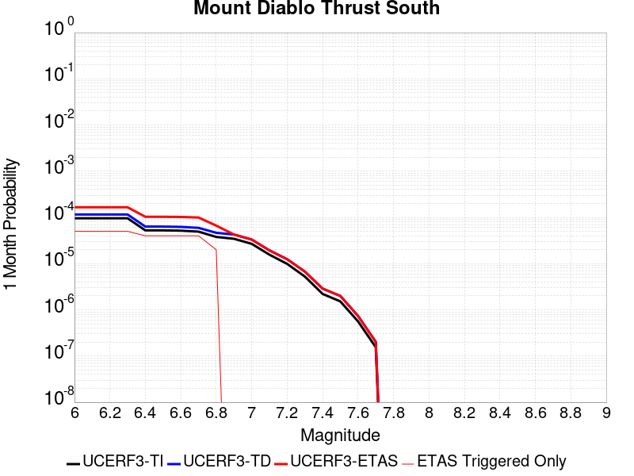 |  |  |

| Magnitude | 1 wk TI Prob | 1 wk TD Prob | 1 wk ETAS Prob | 1 wk ETAS/TD Gain | 1 wk ETAS Triggered Only | 1 mo TI Prob | 1 mo TD Prob | 1 mo ETAS Prob | 1 mo ETAS/TD Gain | 1 mo ETAS Triggered Only | 1 yr TI Prob | 1 yr TD Prob | 1 yr ETAS Prob | 1 yr ETAS/TD Gain | 1 yr ETAS Triggered Only | 10 yr TI Prob | 10 yr TD Prob | 10 yr ETAS Prob | 10 yr ETAS/TD Gain | 10 yr ETAS Triggered Only |
|-----|-----|-----|-----|-----|-----|-----|-----|-----|-----|-----|-----|-----|-----|-----|-----|-----|-----|-----|-----|-----|
| 6.0 | 2.2377444E-5 | 2.6965732E-5 | 2.6965732E-5 | 1.0 | 0.0 | 9.5899806E-5 | 1.1556342E-4 | 1.1556342E-4 | 1.0 | 0.0 | 0.0011669548 | 0.0014062733 | 0.0014062733 | 1.0 | 0.0 | 0.011608457 | 0.013993339 | 0.0140234 | 1.0021483 | 3.0487805E-5 |
| 6.1 | 2.2377444E-5 | 2.6965732E-5 | 2.6965732E-5 | 1.0 | 0.0 | 9.5899806E-5 | 1.1556342E-4 | 1.1556342E-4 | 1.0 | 0.0 | 0.0011669548 | 0.0014062733 | 0.0014062733 | 1.0 | 0.0 | 0.011608457 | 0.013993339 | 0.0140234 | 1.0021483 | 3.0487805E-5 |
| 6.2 | 2.2377444E-5 | 2.6965732E-5 | 2.6965732E-5 | 1.0 | 0.0 | 9.5899806E-5 | 1.1556342E-4 | 1.1556342E-4 | 1.0 | 0.0 | 0.0011669548 | 0.0014062733 | 0.0014062733 | 1.0 | 0.0 | 0.011608457 | 0.013993339 | 0.0140234 | 1.0021483 | 3.0487805E-5 |
| 6.3 | 2.2377444E-5 | 2.6965732E-5 | 2.6965732E-5 | 1.0 | 0.0 | 9.5899806E-5 | 1.1556342E-4 | 1.1556342E-4 | 1.0 | 0.0 | 0.0011669548 | 0.0014062733 | 0.0014062733 | 1.0 | 0.0 | 0.011608457 | 0.013993339 | 0.0140234 | 1.0021483 | 3.0487805E-5 |
| 6.4 | 1.2228463E-5 | 1.47523815E-5 | 1.47523815E-5 | 1.0 | 0.0 | 5.2406645E-5 | 6.322303E-5 | 6.322303E-5 | 1.0 | 0.0 | 6.378641E-4 | 7.694813E-4 | 7.694813E-4 | 1.0 | 0.0 | 0.0063603627 | 0.0076695546 | 0.0076998086 | 1.0039446 | 3.0487805E-5 |
| 6.5 | 1.2228463E-5 | 1.47523815E-5 | 1.47523815E-5 | 1.0 | 0.0 | 5.2406645E-5 | 6.322303E-5 | 6.322303E-5 | 1.0 | 0.0 | 6.378641E-4 | 7.694813E-4 | 7.694813E-4 | 1.0 | 0.0 | 0.0063603627 | 0.0076695546 | 0.0076998086 | 1.0039446 | 3.0487805E-5 |
| 6.6 | 1.2068118E-5 | 1.4557097E-5 | 1.4557097E-5 | 1.0 | 0.0 | 5.1719482E-5 | 6.238614E-5 | 6.238614E-5 | 1.0 | 0.0 | 6.2950276E-4 | 7.5929926E-4 | 7.5929926E-4 | 1.0 | 0.0 | 0.006277225 | 0.0075684334 | 0.00759869 | 1.0039978 | 3.0487805E-5 |
| 6.7 | 1.1499428E-5 | 1.3879509E-5 | 1.3879509E-5 | 1.0 | 0.0 | 4.9282335E-5 | 5.9482325E-5 | 5.9482325E-5 | 1.0 | 0.0 | 5.9984723E-4 | 7.239694E-4 | 7.239694E-4 | 1.0 | 0.0 | 0.0059823063 | 0.007217478 | 0.0072477455 | 1.0041937 | 3.0487805E-5 |
| 6.8 | 8.82118E-6 | 1.0833987E-5 | 1.0833987E-5 | 1.0 | 0.0 | 3.780451E-5 | 4.6430578E-5 | 4.6430578E-5 | 1.0 | 0.0 | 4.601727E-4 | 5.651513E-4 | 5.651513E-4 | 1.0 | 0.0 | 0.0045922096 | 0.0056377905 | 0.0056377905 | 1.0 | 0.0 |
| 6.9 | 8.047112E-6 | 9.942693E-6 | 9.942693E-6 | 1.0 | 0.0 | 3.4487166E-5 | 4.2610878E-5 | 4.2610878E-5 | 1.0 | 0.0 | 4.1980037E-4 | 5.1866926E-4 | 5.1866926E-4 | 1.0 | 0.0 | 0.004190082 | 0.0051752008 | 0.0051752008 | 1.0 | 0.0 |
| 7.0 | 6.2574763E-6 | 7.751257E-6 | 7.751257E-6 | 1.0 | 0.0 | 2.681748E-5 | 3.321927E-5 | 3.321927E-5 | 1.0 | 0.0 | 3.264539E-4 | 4.0437325E-4 | 4.0437325E-4 | 1.0 | 0.0 | 0.0032597475 | 0.0040368163 | 0.0040368163 | 1.0 | 0.0 |
| 7.1 | 3.6485903E-6 | 4.514226E-6 | 4.514226E-6 | 1.0 | 0.0 | 1.5636722E-5 | 1.934654E-5 | 1.934654E-5 | 1.0 | 0.0 | 1.9036046E-4 | 2.3551908E-4 | 2.3551908E-4 | 1.0 | 0.0 | 0.0019019748 | 0.0023527935 | 0.0023527935 | 1.0 | 0.0 |
| 7.2 | 2.3034274E-6 | 2.9060375E-6 | 2.9060375E-6 | 1.0 | 0.0 | 9.871795E-6 | 1.2454388E-5 | 1.2454388E-5 | 1.0 | 0.0 | 1.2018247E-4 | 1.5162186E-4 | 1.5162186E-4 | 1.0 | 0.0 | 0.0012011749 | 0.0015152572 | 0.0015152572 | 1.0 | 0.0 |
| 7.3 | 1.224035E-6 | 1.568237E-6 | 1.568237E-6 | 1.0 | 0.0 | 5.245854E-6 | 6.7209994E-6 | 6.7209994E-6 | 1.0 | 0.0 | 6.38664E-5 | 8.182521E-5 | 8.182521E-5 | 1.0 | 0.0 | 6.384805E-4 | 8.179938E-4 | 8.179938E-4 | 1.0 | 0.0 |
| 7.4 | 5.1601154E-7 | 6.724563E-7 | 6.724563E-7 | 1.0 | 0.0 | 2.2114762E-6 | 2.8819525E-6 | 2.8819525E-6 | 1.0 | 0.0 | 2.6924388E-5 | 3.508722E-5 | 3.508722E-5 | 1.0 | 0.0 | 2.6921128E-4 | 3.5083416E-4 | 3.5083416E-4 | 1.0 | 0.0 |
| 7.5 | 3.552894E-7 | 4.66573E-7 | 4.66573E-7 | 1.0 | 0.0 | 1.5226678E-6 | 1.999597E-6 | 1.999597E-6 | 1.0 | 0.0 | 1.8538323E-5 | 2.4344838E-5 | 2.4344838E-5 | 1.0 | 0.0 | 1.8536777E-4 | 2.4343388E-4 | 2.4343388E-4 | 1.0 | 0.0 |
| 7.6 | 1.3124082E-7 | 1.7192369E-7 | 1.7192369E-7 | 1.0 | 0.0 | 5.6246057E-7 | 7.3681565E-7 | 7.3681565E-7 | 1.0 | 0.0 | 6.8479358E-6 | 8.970702E-6 | 8.970702E-6 | 1.0 | 0.0 | 6.8477246E-5 | 8.970755E-5 | 8.970755E-5 | 1.0 | 0.0 |
| 7.7 | 3.6193022E-8 | 4.7335234E-8 | 4.7335234E-8 | 1.0 | 0.0 | 1.5511293E-7 | 2.0286527E-7 | 2.0286527E-7 | 1.0 | 0.0 | 1.8884983E-6 | 2.469883E-6 | 2.469883E-6 | 1.0 | 0.0 | 1.8884823E-5 | 2.4699137E-5 | 2.4699137E-5 | 1.0 | 0.0 |

## San Gregorio (South) 2011 CFM
*[(top)](#table-of-contents)*

| 1 Week | 1 Month | 1 Year | 10 Year |
|-----|-----|-----|-----|
|  |  |  |  |

| Magnitude | 1 wk TI Prob | 1 wk TD Prob | 1 wk ETAS Prob | 1 wk ETAS/TD Gain | 1 wk ETAS Triggered Only | 1 mo TI Prob | 1 mo TD Prob | 1 mo ETAS Prob | 1 mo ETAS/TD Gain | 1 mo ETAS Triggered Only | 1 yr TI Prob | 1 yr TD Prob | 1 yr ETAS Prob | 1 yr ETAS/TD Gain | 1 yr ETAS Triggered Only | 10 yr TI Prob | 10 yr TD Prob | 10 yr ETAS Prob | 10 yr ETAS/TD Gain | 10 yr ETAS Triggered Only |
|-----|-----|-----|-----|-----|-----|-----|-----|-----|-----|-----|-----|-----|-----|-----|-----|-----|-----|-----|-----|-----|
| 6.0 | 1.8770423E-5 | 1.6289738E-5 | 1.6289738E-5 | 1.0 | 0.0 | 8.044219E-5 | 6.9811314E-5 | 6.9811314E-5 | 1.0 | 0.0 | 9.789435E-4 | 8.496251E-4 | 8.496251E-4 | 1.0 | 0.0 | 0.009746423 | 0.008476529 | 0.008506758 | 1.0035663 | 3.0487805E-5 |
| 6.1 | 1.8770423E-5 | 1.6289738E-5 | 1.6289738E-5 | 1.0 | 0.0 | 8.044219E-5 | 6.9811314E-5 | 6.9811314E-5 | 1.0 | 0.0 | 9.789435E-4 | 8.496251E-4 | 8.496251E-4 | 1.0 | 0.0 | 0.009746423 | 0.008476529 | 0.008506758 | 1.0035663 | 3.0487805E-5 |
| 6.2 | 1.7508692E-5 | 1.4908993E-5 | 1.4908993E-5 | 1.0 | 0.0 | 7.5035096E-5 | 6.3894135E-5 | 6.3894135E-5 | 1.0 | 0.0 | 9.1316935E-4 | 7.776365E-4 | 7.776365E-4 | 1.0 | 0.0 | 0.00909426 | 0.0077618314 | 0.0077920826 | 1.0038974 | 3.0487805E-5 |
| 6.3 | 1.7508692E-5 | 1.4908993E-5 | 1.4908993E-5 | 1.0 | 0.0 | 7.5035096E-5 | 6.3894135E-5 | 6.3894135E-5 | 1.0 | 0.0 | 9.1316935E-4 | 7.776365E-4 | 7.776365E-4 | 1.0 | 0.0 | 0.00909426 | 0.0077618314 | 0.0077920826 | 1.0038974 | 3.0487805E-5 |
| 6.4 | 1.6004591E-5 | 1.3258521E-5 | 1.3258521E-5 | 1.0 | 0.0 | 6.85893E-5 | 5.6821E-5 | 5.6821E-5 | 1.0 | 0.0 | 8.347548E-4 | 6.9157715E-4 | 6.9157715E-4 | 1.0 | 0.0 | 0.008316261 | 0.006906727 | 0.006937004 | 1.0043837 | 3.0487805E-5 |
| 6.5 | 1.6004591E-5 | 1.3258521E-5 | 1.3258521E-5 | 1.0 | 0.0 | 6.85893E-5 | 5.6821E-5 | 5.6821E-5 | 1.0 | 0.0 | 8.347548E-4 | 6.9157715E-4 | 6.9157715E-4 | 1.0 | 0.0 | 0.008316261 | 0.006906727 | 0.006937004 | 1.0043837 | 3.0487805E-5 |
| 6.6 | 1.5442201E-5 | 1.26430405E-5 | 1.26430405E-5 | 1.0 | 0.0 | 6.617918E-5 | 5.4183336E-5 | 5.4183336E-5 | 1.0 | 0.0 | 8.0543366E-4 | 6.594833E-4 | 6.594833E-4 | 1.0 | 0.0 | 0.008025207 | 0.006587722 | 0.006618009 | 1.0045975 | 3.0487805E-5 |
| 6.7 | 1.489921E-5 | 1.2051447E-5 | 1.2051447E-5 | 1.0 | 0.0 | 6.3852196E-5 | 5.164804E-5 | 5.164804E-5 | 1.0 | 0.0 | 7.7712315E-4 | 6.286342E-4 | 6.286342E-4 | 1.0 | 0.0 | 0.0077441116 | 0.006281004 | 0.0063113 | 1.0048234 | 3.0487805E-5 |
| 6.8 | 1.3876024E-5 | 1.093019E-5 | 1.093019E-5 | 1.0 | 0.0 | 5.9467322E-5 | 4.6842833E-5 | 4.6842833E-5 | 1.0 | 0.0 | 7.237741E-4 | 5.701626E-4 | 5.701626E-4 | 1.0 | 0.0 | 0.0072142133 | 0.005699408 | 0.005729722 | 1.0053188 | 3.0487805E-5 |
| 6.9 | 1.33922495E-5 | 1.0401597E-5 | 1.0401597E-5 | 1.0 | 0.0 | 5.7394092E-5 | 4.4577515E-5 | 4.4577515E-5 | 1.0 | 0.0 | 6.9854903E-4 | 5.4259633E-4 | 5.4259633E-4 | 1.0 | 0.0 | 0.0069635725 | 0.005425117 | 0.0054554394 | 1.0055892 | 3.0487805E-5 |
| 7.0 | 1.2807324E-5 | 9.761441E-6 | 9.761441E-6 | 1.0 | 0.0 | 5.4887376E-5 | 4.183408E-5 | 4.183408E-5 | 1.0 | 0.0 | 6.680489E-4 | 5.092111E-4 | 5.092111E-4 | 1.0 | 0.0 | 0.006660442 | 0.005092836 | 0.0051231687 | 1.0059559 | 3.0487805E-5 |
| 7.1 | 1.2191438E-5 | 9.070163E-6 | 9.070163E-6 | 1.0 | 0.0 | 5.224797E-5 | 3.887155E-5 | 3.887155E-5 | 1.0 | 0.0 | 6.3593336E-4 | 4.731584E-4 | 4.731584E-4 | 1.0 | 0.0 | 0.0063411663 | 0.0047338954 | 0.004764239 | 1.0064099 | 3.0487805E-5 |
| 7.2 | 1.1769438E-5 | 8.590228E-6 | 8.590228E-6 | 1.0 | 0.0 | 5.0439474E-5 | 3.6814745E-5 | 3.6814745E-5 | 1.0 | 0.0 | 6.1392755E-4 | 4.481274E-4 | 4.481274E-4 | 1.0 | 0.0 | 0.0061223423 | 0.004484622 | 0.004514973 | 1.0067679 | 3.0487805E-5 |
| 7.3 | 1.150374E-5 | 8.305612E-6 | 8.305612E-6 | 1.0 | 0.0 | 4.9300812E-5 | 3.5594996E-5 | 3.5594996E-5 | 1.0 | 0.0 | 6.0007203E-4 | 4.3328296E-4 | 4.3328296E-4 | 1.0 | 0.0 | 0.0059845424 | 0.0043367483 | 0.004367104 | 1.0069996 | 3.0487805E-5 |
| 7.4 | 1.12514E-5 | 8.051282E-6 | 8.051282E-6 | 1.0 | 0.0 | 4.8219394E-5 | 3.450504E-5 | 3.450504E-5 | 1.0 | 0.0 | 5.8691297E-4 | 4.2001792E-4 | 4.2001792E-4 | 1.0 | 0.0 | 0.005853653 | 0.0042045936 | 0.0042349533 | 1.0072206 | 3.0487805E-5 |
| 7.5 | 1.059696E-5 | 7.4012414E-6 | 7.4012414E-6 | 1.0 | 0.0 | 4.5414752E-5 | 3.171922E-5 | 3.171922E-5 | 1.0 | 0.0 | 5.5278436E-4 | 3.8611316E-4 | 3.8611316E-4 | 1.0 | 0.0 | 0.0055141128 | 0.0038667116 | 0.0038970814 | 1.0078542 | 3.0487805E-5 |
| 7.6 | 9.018592E-6 | 5.84448E-6 | 5.84448E-6 | 1.0 | 0.0 | 3.8650534E-5 | 2.504753E-5 | 2.504753E-5 | 1.0 | 0.0 | 4.7046866E-4 | 3.0491105E-4 | 3.0491105E-4 | 1.0 | 0.0 | 0.004694739 | 0.003056837 | 0.0030872317 | 1.0099431 | 3.0487805E-5 |
| 7.7 | 6.243489E-6 | 3.24569E-6 | 3.24569E-6 | 1.0 | 0.0 | 2.6757538E-5 | 1.3910027E-5 | 1.3910027E-5 | 1.0 | 0.0 | 3.257243E-4 | 1.6934142E-4 | 1.6934142E-4 | 1.0 | 0.0 | 0.003252473 | 0.0017023596 | 0.0017327955 | 1.0178787 | 3.0487805E-5 |
| 7.8 | 3.1941963E-6 | 1.384812E-6 | 1.384812E-6 | 1.0 | 0.0 | 1.368934E-5 | 5.9348945E-6 | 5.9348945E-6 | 1.0 | 0.0 | 1.6665498E-4 | 7.2254945E-5 | 7.2254945E-5 | 1.0 | 0.0 | 0.0016653005 | 7.283418E-4 | 7.588074E-4 | 1.0418288 | 3.0487805E-5 |
| 7.9 | 2.0098398E-6 | 6.9448276E-7 | 6.9448276E-7 | 1.0 | 0.0 | 8.6135715E-6 | 2.9763512E-6 | 2.9763512E-6 | 1.0 | 0.0 | 1.0486518E-4 | 3.6236474E-5 | 3.6236474E-5 | 1.0 | 0.0 | 0.0010481571 | 3.6725012E-4 | 3.9772672E-4 | 1.082986 | 3.0487805E-5 |
| 8.0 | 8.353119E-7 | 3.175784E-7 | 3.175784E-7 | 1.0 | 0.0 | 3.579903E-6 | 1.3610495E-6 | 1.3610495E-6 | 1.0 | 0.0 | 4.358445E-5 | 1.6570651E-5 | 1.6570651E-5 | 1.0 | 0.0 | 4.3575902E-4 | 1.6689835E-4 | 1.6689835E-4 | 1.0 | 0.0 |
| 8.1 | 1.5033264E-7 | 6.550403E-8 | 6.550403E-8 | 1.0 | 0.0 | 6.442826E-7 | 2.8073154E-7 | 2.8073154E-7 | 1.0 | 0.0 | 7.844113E-6 | 3.4179013E-6 | 3.4179013E-6 | 1.0 | 0.0 | 7.843835E-5 | 3.419582E-5 | 3.419582E-5 | 1.0 | 0.0 |

## Bartlett Springs 2011 CFM
*[(top)](#table-of-contents)*

| 1 Week | 1 Month | 1 Year | 10 Year |
|-----|-----|-----|-----|
|  |  |  | 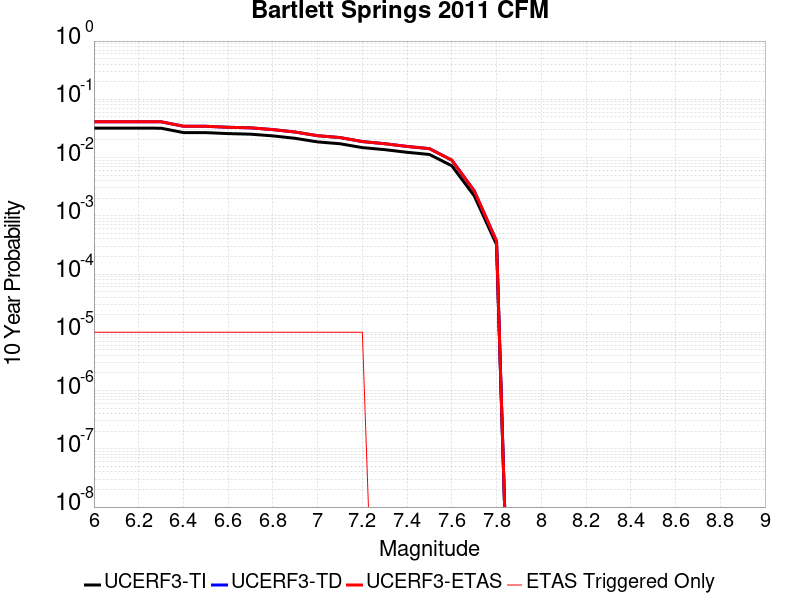 |

| Magnitude | 1 wk TI Prob | 1 wk TD Prob | 1 wk ETAS Prob | 1 wk ETAS/TD Gain | 1 wk ETAS Triggered Only | 1 mo TI Prob | 1 mo TD Prob | 1 mo ETAS Prob | 1 mo ETAS/TD Gain | 1 mo ETAS Triggered Only | 1 yr TI Prob | 1 yr TD Prob | 1 yr ETAS Prob | 1 yr ETAS/TD Gain | 1 yr ETAS Triggered Only | 10 yr TI Prob | 10 yr TD Prob | 10 yr ETAS Prob | 10 yr ETAS/TD Gain | 10 yr ETAS Triggered Only |
|-----|-----|-----|-----|-----|-----|-----|-----|-----|-----|-----|-----|-----|-----|-----|-----|-----|-----|-----|-----|-----|
| 6.0 | 6.2326144E-5 | 8.06502E-5 | 8.06502E-5 | 1.0 | 0.0 | 2.6708472E-4 | 3.4559856E-4 | 3.4559856E-4 | 1.0 | 0.0 | 0.003246908 | 0.0041996636 | 0.0041996636 | 1.0 | 0.0 | 0.031998757 | 0.041219402 | 0.041248634 | 1.0007092 | 3.0487805E-5 |
| 6.1 | 6.227657E-5 | 8.058767E-5 | 8.058767E-5 | 1.0 | 0.0 | 2.668723E-4 | 3.4533063E-4 | 3.4533063E-4 | 1.0 | 0.0 | 0.0032443295 | 0.0041964143 | 0.0041964143 | 1.0 | 0.0 | 0.031973712 | 0.041188125 | 0.041217353 | 1.0007098 | 3.0487805E-5 |
| 6.2 | 6.22452E-5 | 8.0548256E-5 | 8.0548256E-5 | 1.0 | 0.0 | 2.6673786E-4 | 3.4516177E-4 | 3.4516177E-4 | 1.0 | 0.0 | 0.0032426978 | 0.0041943663 | 0.0041943663 | 1.0 | 0.0 | 0.03195787 | 0.041168407 | 0.04119764 | 1.0007101 | 3.0487805E-5 |
| 6.3 | 6.219006E-5 | 8.047805E-5 | 8.047805E-5 | 1.0 | 0.0 | 2.6650162E-4 | 3.4486095E-4 | 3.4486095E-4 | 1.0 | 0.0 | 0.00323983 | 0.0041907188 | 0.0041907188 | 1.0 | 0.0 | 0.031930014 | 0.04113329 | 0.041162524 | 1.0007107 | 3.0487805E-5 |
| 6.4 | 5.2175856E-5 | 6.728929E-5 | 6.728929E-5 | 1.0 | 0.0 | 2.2359163E-4 | 2.8835094E-4 | 2.8835094E-4 | 1.0 | 0.0 | 0.0027188298 | 0.0035050726 | 0.0035050726 | 1.0 | 0.0 | 0.026858058 | 0.034507208 | 0.03453664 | 1.0008531 | 3.0487805E-5 |
| 6.5 | 5.205166E-5 | 6.7131885E-5 | 6.7131885E-5 | 1.0 | 0.0 | 2.2305945E-4 | 2.876765E-4 | 2.876765E-4 | 1.0 | 0.0 | 0.0027123666 | 0.0034968874 | 0.0034968874 | 1.0 | 0.0 | 0.026794989 | 0.03442791 | 0.034457352 | 1.0008551 | 3.0487805E-5 |
| 6.6 | 5.0085426E-5 | 6.4526925E-5 | 6.4526925E-5 | 1.0 | 0.0 | 2.1463417E-4 | 2.7651477E-4 | 2.7651477E-4 | 1.0 | 0.0 | 0.0026100394 | 0.003361418 | 0.003361418 | 1.0 | 0.0 | 0.025795965 | 0.03311476 | 0.03314424 | 1.0008901 | 3.0487805E-5 |
| 6.7 | 4.8930866E-5 | 6.305076E-5 | 6.305076E-5 | 1.0 | 0.0 | 2.0968684E-4 | 2.7018986E-4 | 2.7018986E-4 | 1.0 | 0.0 | 0.0025499484 | 0.0032846513 | 0.0032846513 | 1.0 | 0.0 | 0.025208864 | 0.03236975 | 0.032399252 | 1.0009114 | 3.0487805E-5 |
| 6.8 | 4.5679535E-5 | 5.877262E-5 | 5.877262E-5 | 1.0 | 0.0 | 1.9575475E-4 | 2.5185855E-4 | 2.5185855E-4 | 1.0 | 0.0 | 0.002380709 | 0.0030621053 | 0.0030621053 | 1.0 | 0.0 | 0.023553653 | 0.03020596 | 0.030235527 | 1.0009788 | 3.0487805E-5 |
| 6.9 | 4.1439176E-5 | 5.3247633E-5 | 5.3247633E-5 | 1.0 | 0.0 | 1.7758438E-4 | 2.2818433E-4 | 2.2818433E-4 | 1.0 | 0.0 | 0.002159946 | 0.0027746307 | 0.0027746307 | 1.0 | 0.0 | 0.021390721 | 0.027404727 | 0.027434379 | 1.0010821 | 3.0487805E-5 |
| 7.0 | 3.5920104E-5 | 4.6031975E-5 | 4.6031975E-5 | 1.0 | 0.0 | 1.5393422E-4 | 1.9726508E-4 | 1.9726508E-4 | 1.0 | 0.0 | 0.001872538 | 0.0023990732 | 0.0023990732 | 1.0 | 0.0 | 0.018568378 | 0.023734845 | 0.023764608 | 1.0012541 | 3.0487805E-5 |
| 7.1 | 3.338812E-5 | 4.2710853E-5 | 4.2710853E-5 | 1.0 | 0.0 | 1.430841E-4 | 1.8303376E-4 | 1.8303376E-4 | 1.0 | 0.0 | 0.0017406568 | 0.002226173 | 0.002226173 | 1.0 | 0.0 | 0.017270854 | 0.02204139 | 0.022071205 | 1.0013527 | 3.0487805E-5 |
| 7.2 | 2.8619615E-5 | 3.6419486E-5 | 3.6419486E-5 | 1.0 | 0.0 | 1.2264973E-4 | 1.5607424E-4 | 1.5607424E-4 | 1.0 | 0.0 | 0.0014922376 | 0.0018985574 | 0.0018985574 | 1.0 | 0.0 | 0.014822568 | 0.018825263 | 0.018855175 | 1.0015891 | 3.0487805E-5 |
| 7.3 | 2.6376783E-5 | 3.3439203E-5 | 3.3439203E-5 | 1.0 | 0.0 | 1.13038455E-4 | 1.4330304E-4 | 1.4330304E-4 | 1.0 | 0.0 | 0.0013753743 | 0.0017433276 | 0.0017433276 | 1.0 | 0.0 | 0.01366893 | 0.017298153 | 0.017298153 | 1.0 | 0.0 |
| 7.4 | 2.3738676E-5 | 2.9993695E-5 | 2.9993695E-5 | 1.0 | 0.0 | 1.0173322E-4 | 1.2853811E-4 | 1.2853811E-4 | 1.0 | 0.0 | 0.0012378981 | 0.0015638362 | 0.0015638362 | 1.0 | 0.0 | 0.012310251 | 0.015529635 | 0.015529635 | 1.0 | 0.0 |
| 7.5 | 2.1789481E-5 | 2.7452648E-5 | 2.7452648E-5 | 1.0 | 0.0 | 9.338015E-5 | 1.17648946E-4 | 1.17648946E-4 | 1.0 | 0.0 | 0.0011363103 | 0.0014314427 | 0.0014314427 | 1.0 | 0.0 | 0.011305175 | 0.014223397 | 0.014223397 | 1.0 | 0.0 |
| 7.6 | 1.3895281E-5 | 1.7376884E-5 | 1.7376884E-5 | 1.0 | 0.0 | 5.9549846E-5 | 7.4470256E-5 | 7.4470256E-5 | 1.0 | 0.0 | 7.2477816E-4 | 9.063011E-4 | 9.063011E-4 | 1.0 | 0.0 | 0.0072241887 | 0.0090264585 | 0.0090264585 | 1.0 | 0.0 |
| 7.7 | 4.245981E-6 | 5.1643246E-6 | 5.1643246E-6 | 1.0 | 0.0 | 1.8196934E-5 | 2.2132634E-5 | 2.2132634E-5 | 1.0 | 0.0 | 2.2152514E-4 | 2.6943168E-4 | 2.6943168E-4 | 1.0 | 0.0 | 0.0022130446 | 0.0026910699 | 0.0026910699 | 1.0 | 0.0 |
| 7.8 | 6.145192E-7 | 7.0488204E-7 | 7.0488204E-7 | 1.0 | 0.0 | 2.633651E-6 | 3.0209196E-6 | 3.0209196E-6 | 1.0 | 0.0 | 3.206423E-5 | 3.677909E-5 | 3.677909E-5 | 1.0 | 0.0 | 3.2059604E-4 | 3.6772946E-4 | 3.6772946E-4 | 1.0 | 0.0 |

## San Andreas (Cholame) rev
*[(top)](#table-of-contents)*

| 1 Week | 1 Month | 1 Year | 10 Year |
|-----|-----|-----|-----|
|  |  |  |  |

| Magnitude | 1 wk TI Prob | 1 wk TD Prob | 1 wk ETAS Prob | 1 wk ETAS/TD Gain | 1 wk ETAS Triggered Only | 1 mo TI Prob | 1 mo TD Prob | 1 mo ETAS Prob | 1 mo ETAS/TD Gain | 1 mo ETAS Triggered Only | 1 yr TI Prob | 1 yr TD Prob | 1 yr ETAS Prob | 1 yr ETAS/TD Gain | 1 yr ETAS Triggered Only | 10 yr TI Prob | 10 yr TD Prob | 10 yr ETAS Prob | 10 yr ETAS/TD Gain | 10 yr ETAS Triggered Only |
|-----|-----|-----|-----|-----|-----|-----|-----|-----|-----|-----|-----|-----|-----|-----|-----|-----|-----|-----|-----|-----|
| 6.0 | 1.2302514E-4 | 2.5347935E-4 | 2.8395944E-4 | 1.1202468 | 3.0487805E-5 | 5.27144E-4 | 0.0010858894 | 0.0011163441 | 1.0280459 | 3.0487805E-5 | 0.0063991086 | 0.013141075 | 0.013171162 | 1.0022895 | 3.0487805E-5 | 0.06217949 | 0.124989286 | 0.12501597 | 1.0002134 | 3.0487805E-5 |
| 6.1 | 1.2302514E-4 | 2.5347935E-4 | 2.8395944E-4 | 1.1202468 | 3.0487805E-5 | 5.27144E-4 | 0.0010858894 | 0.0011163441 | 1.0280459 | 3.0487805E-5 | 0.0063991086 | 0.013141075 | 0.013171162 | 1.0022895 | 3.0487805E-5 | 0.06217949 | 0.124989286 | 0.12501597 | 1.0002134 | 3.0487805E-5 |
| 6.2 | 1.2203569E-4 | 2.516455E-4 | 2.8212566E-4 | 1.1211233 | 3.0487805E-5 | 5.2290526E-4 | 0.0010780366 | 0.0011084916 | 1.0282503 | 3.0487805E-5 | 0.006347804 | 0.013046616 | 0.013076706 | 1.0023063 | 3.0487805E-5 | 0.061695136 | 0.12417533 | 0.124202035 | 1.000215 | 3.0487805E-5 |
| 6.3 | 1.2142645E-4 | 2.5050418E-4 | 2.8098433E-4 | 1.1216753 | 3.0487805E-5 | 5.202953E-4 | 0.0010731491 | 0.0011036043 | 1.0283792 | 3.0487805E-5 | 0.006316212 | 0.012987822 | 0.013017914 | 1.002317 | 3.0487805E-5 | 0.06139677 | 0.12366937 | 0.12369609 | 1.000216 | 3.0487805E-5 |
| 6.4 | 1.1865206E-4 | 2.4555085E-4 | 2.7603115E-4 | 1.1241304 | 3.0487805E-5 | 5.0840975E-4 | 0.0010519379 | 0.0010823937 | 1.028952 | 3.0487805E-5 | 0.006172335 | 0.0127326185 | 0.012762718 | 1.0023639 | 3.0487805E-5 | 0.060036868 | 0.121460214 | 0.121487 | 1.0002205 | 3.0487805E-5 |
| 6.5 | 1.17443946E-4 | 2.4347806E-4 | 2.7395843E-4 | 1.1251874 | 3.0487805E-5 | 5.032341E-4 | 0.0010430617 | 0.0010735177 | 1.0291986 | 3.0487805E-5 | 0.006109677 | 0.012625805 | 0.012655908 | 1.0023842 | 3.0487805E-5 | 0.059444077 | 0.12053282 | 0.12055963 | 1.0002224 | 3.0487805E-5 |
| 6.6 | 1.13579066E-4 | 2.3655128E-4 | 2.6703186E-4 | 1.128854 | 3.0487805E-5 | 4.866766E-4 | 0.0010133989 | 0.0010438558 | 1.0300542 | 3.0487805E-5 | 0.0059092017 | 0.01226878 | 0.012298893 | 1.0024545 | 3.0487805E-5 | 0.057545185 | 0.11744262 | 0.117469534 | 1.0002291 | 3.0487805E-5 |
| 6.7 | 1.1271412E-4 | 2.3499105E-4 | 2.654717E-4 | 1.1297098 | 3.0487805E-5 | 4.829711E-4 | 0.0010067173 | 0.0010371745 | 1.0302539 | 3.0487805E-5 | 0.005864331 | 0.012188345 | 0.012218462 | 1.0024709 | 3.0487805E-5 | 0.057119697 | 0.11674537 | 0.116772294 | 1.0002307 | 3.0487805E-5 |
| 6.8 | 1.1217975E-4 | 2.3387192E-4 | 2.643526E-4 | 1.1303307 | 3.0487805E-5 | 4.8068175E-4 | 0.0010019247 | 0.001032382 | 1.0303987 | 3.0487805E-5 | 0.005836608 | 0.012130647 | 0.012160765 | 1.0024828 | 3.0487805E-5 | 0.056856725 | 0.11624266 | 0.11626961 | 1.0002317 | 3.0487805E-5 |
| 6.9 | 1.1146753E-4 | 2.323557E-4 | 2.6283643E-4 | 1.1311812 | 3.0487805E-5 | 4.7763053E-4 | 9.954317E-4 | 0.0010258891 | 1.0305972 | 3.0487805E-5 | 0.0057996577 | 0.012052471 | 0.012082592 | 1.0024991 | 3.0487805E-5 | 0.056506127 | 0.1155621 | 0.11558907 | 1.0002333 | 3.0487805E-5 |
| 7.0 | 1.0965793E-4 | 2.2857812E-4 | 2.5905896E-4 | 1.1333498 | 3.0487805E-5 | 4.698779E-4 | 9.792543E-4 | 0.0010097122 | 1.0311033 | 3.0487805E-5 | 0.005705768 | 0.011857672 | 0.011887798 | 1.0025407 | 3.0487805E-5 | 0.055614736 | 0.11386053 | 0.11388755 | 1.0002372 | 3.0487805E-5 |
| 7.1 | 9.927982E-5 | 2.0671786E-4 | 2.3719936E-4 | 1.1474546 | 3.0487805E-5 | 4.2541555E-4 | 8.856339E-4 | 9.1609475E-4 | 1.0343944 | 3.0487805E-5 | 0.0051671406 | 0.010729581 | 0.010759742 | 1.002811 | 3.0487805E-5 | 0.05048634 | 0.103941396 | 0.10396871 | 1.0002629 | 3.0487805E-5 |
| 7.2 | 9.696786E-5 | 2.0175103E-4 | 2.0175103E-4 | 1.0 | 0.0 | 4.1551032E-4 | 8.6436176E-4 | 8.6436176E-4 | 1.0 | 0.0 | 0.00504711 | 0.010473111 | 0.010473111 | 1.0 | 0.0 | 0.04934009 | 0.10167709 | 0.10167709 | 1.0 | 0.0 |
| 7.3 | 9.4727984E-5 | 1.9602077E-4 | 1.9602077E-4 | 1.0 | 0.0 | 4.0591392E-4 | 8.3981955E-4 | 8.3981955E-4 | 1.0 | 0.0 | 0.0049308087 | 0.010177139 | 0.010177139 | 1.0 | 0.0 | 0.048228268 | 0.09904058 | 0.09904058 | 1.0 | 0.0 |
| 7.4 | 9.220358E-5 | 1.8970236E-4 | 1.8970236E-4 | 1.0 | 0.0 | 3.9509835E-4 | 8.1275776E-4 | 8.1275776E-4 | 1.0 | 0.0 | 0.004799717 | 0.00985068 | 0.00985068 | 1.0 | 0.0 | 0.046973653 | 0.09611052 | 0.09611052 | 1.0 | 0.0 |
| 7.5 | 7.71631E-5 | 1.5289382E-4 | 1.5289382E-4 | 1.0 | 0.0 | 3.306571E-4 | 6.550948E-4 | 6.550948E-4 | 1.0 | 0.0 | 0.0040183207 | 0.007946685 | 0.007946685 | 1.0 | 0.0 | 0.03946433 | 0.078784436 | 0.078784436 | 1.0 | 0.0 |
| 7.6 | 7.5634416E-5 | 1.4947375E-4 | 1.4947375E-4 | 1.0 | 0.0 | 3.241072E-4 | 6.404447E-4 | 6.404447E-4 | 1.0 | 0.0 | 0.0039388672 | 0.007769605 | 0.007769605 | 1.0 | 0.0 | 0.038697794 | 0.07714253 | 0.07714253 | 1.0 | 0.0 |
| 7.7 | 6.3783E-5 | 1.2457426E-4 | 1.2457426E-4 | 1.0 | 0.0 | 2.7332708E-4 | 5.337805E-4 | 5.337805E-4 | 1.0 | 0.0 | 0.0033226798 | 0.00647944 | 0.00647944 | 1.0 | 0.0 | 0.032734364 | 0.06499155 | 0.06499155 | 1.0 | 0.0 |
| 7.8 | 5.863422E-5 | 1.15058065E-4 | 1.15058065E-4 | 1.0 | 0.0 | 2.512653E-4 | 4.9301283E-4 | 4.9301283E-4 | 1.0 | 0.0 | 0.003054864 | 0.005985933 | 0.005985933 | 1.0 | 0.0 | 0.030132094 | 0.06007134 | 0.06007134 | 1.0 | 0.0 |
| 7.9 | 4.595283E-5 | 8.492014E-5 | 8.492014E-5 | 1.0 | 0.0 | 1.9692584E-4 | 3.638927E-4 | 3.638927E-4 | 1.0 | 0.0 | 0.0023949358 | 0.0044214004 | 0.0044214004 | 1.0 | 0.0 | 0.023692891 | 0.04467237 | 0.04467237 | 1.0 | 0.0 |
| 8.0 | 3.2950178E-5 | 5.1184972E-5 | 5.1184972E-5 | 1.0 | 0.0 | 1.412074E-4 | 2.1934573E-4 | 2.1934573E-4 | 1.0 | 0.0 | 0.0017178444 | 0.0026672655 | 0.0026672655 | 1.0 | 0.0 | 0.017046256 | 0.027383326 | 0.027383326 | 1.0 | 0.0 |
| 8.1 | 1.9177472E-5 | 1.9391058E-5 | 1.9391058E-5 | 1.0 | 0.0 | 8.218658E-5 | 8.310189E-5 | 8.310189E-5 | 1.0 | 0.0 | 0.0010001622 | 0.0010112965 | 0.0010112965 | 1.0 | 0.0 | 0.009956728 | 0.01086626 | 0.01086626 | 1.0 | 0.0 |
| 8.2 | 8.643924E-6 | 5.5526552E-6 | 5.5526552E-6 | 1.0 | 0.0 | 3.704486E-5 | 2.3796878E-5 | 2.3796878E-5 | 1.0 | 0.0 | 4.5092785E-4 | 2.8968856E-4 | 2.8968856E-4 | 1.0 | 0.0 | 0.0045001395 | 0.0032912085 | 0.0032912085 | 1.0 | 0.0 |
| 8.3 | 1.983087E-6 | 7.7871465E-7 | 7.7871465E-7 | 1.0 | 0.0 | 8.498917E-6 | 3.3373444E-6 | 3.3373444E-6 | 1.0 | 0.0 | 1.034694E-4 | 4.063143E-5 | 4.063143E-5 | 1.0 | 0.0 | 0.0010342124 | 4.7926197E-4 | 4.7926197E-4 | 1.0 | 0.0 |

## Contra Costa (Lafayette) 2011 CFM
*[(top)](#table-of-contents)*

| 1 Week | 1 Month | 1 Year | 10 Year |
|-----|-----|-----|-----|
|  |  |  |  |

| Magnitude | 1 wk TI Prob | 1 wk TD Prob | 1 wk ETAS Prob | 1 wk ETAS/TD Gain | 1 wk ETAS Triggered Only | 1 mo TI Prob | 1 mo TD Prob | 1 mo ETAS Prob | 1 mo ETAS/TD Gain | 1 mo ETAS Triggered Only | 1 yr TI Prob | 1 yr TD Prob | 1 yr ETAS Prob | 1 yr ETAS/TD Gain | 1 yr ETAS Triggered Only | 10 yr TI Prob | 10 yr TD Prob | 10 yr ETAS Prob | 10 yr ETAS/TD Gain | 10 yr ETAS Triggered Only |
|-----|-----|-----|-----|-----|-----|-----|-----|-----|-----|-----|-----|-----|-----|-----|-----|-----|-----|-----|-----|-----|
| 6.0 | 6.655419E-6 | 6.9407956E-6 | 6.9407956E-6 | 1.0 | 0.0 | 2.8522913E-5 | 2.974594E-5 | 2.974594E-5 | 1.0 | 0.0 | 3.472111E-4 | 3.620986E-4 | 3.9257537E-4 | 1.084167 | 3.0487805E-5 | 0.0034666911 | 0.0036199384 | 0.0036503158 | 1.0083917 | 3.0487805E-5 |
| 6.1 | 6.655419E-6 | 6.9407956E-6 | 6.9407956E-6 | 1.0 | 0.0 | 2.8522913E-5 | 2.974594E-5 | 2.974594E-5 | 1.0 | 0.0 | 3.472111E-4 | 3.620986E-4 | 3.9257537E-4 | 1.084167 | 3.0487805E-5 | 0.0034666911 | 0.0036199384 | 0.0036503158 | 1.0083917 | 3.0487805E-5 |
| 6.2 | 6.6254133E-6 | 6.9092016E-6 | 6.9092016E-6 | 1.0 | 0.0 | 2.839432E-5 | 2.9610539E-5 | 2.9610539E-5 | 1.0 | 0.0 | 3.45646E-4 | 3.6045065E-4 | 3.9092745E-4 | 1.0845519 | 3.0487805E-5 | 0.003451089 | 0.0036035122 | 0.0036338903 | 1.0084301 | 3.0487805E-5 |
| 6.3 | 6.6254133E-6 | 6.9092016E-6 | 6.9092016E-6 | 1.0 | 0.0 | 2.839432E-5 | 2.9610539E-5 | 2.9610539E-5 | 1.0 | 0.0 | 3.45646E-4 | 3.6045065E-4 | 3.9092745E-4 | 1.0845519 | 3.0487805E-5 | 0.003451089 | 0.0036035122 | 0.0036338903 | 1.0084301 | 3.0487805E-5 |
| 6.4 | 6.6254133E-6 | 6.9092016E-6 | 6.9092016E-6 | 1.0 | 0.0 | 2.839432E-5 | 2.9610539E-5 | 2.9610539E-5 | 1.0 | 0.0 | 3.45646E-4 | 3.6045065E-4 | 3.9092745E-4 | 1.0845519 | 3.0487805E-5 | 0.003451089 | 0.0036035122 | 0.0036338903 | 1.0084301 | 3.0487805E-5 |
| 6.5 | 6.606445E-6 | 6.888747E-6 | 6.888747E-6 | 1.0 | 0.0 | 2.8313027E-5 | 2.9522878E-5 | 2.9522878E-5 | 1.0 | 0.0 | 3.4465658E-4 | 3.5938373E-4 | 3.8986056E-4 | 1.0848031 | 3.0487805E-5 | 0.0034412253 | 0.0035928776 | 0.003623256 | 1.0084552 | 3.0487805E-5 |
| 6.6 | 6.59966E-6 | 6.8812833E-6 | 6.8812833E-6 | 1.0 | 0.0 | 2.828395E-5 | 2.9490891E-5 | 2.9490891E-5 | 1.0 | 0.0 | 3.4430268E-4 | 3.5899444E-4 | 3.894713E-4 | 1.0848951 | 3.0487805E-5 | 0.0034376972 | 0.0035889973 | 0.0036193756 | 1.0084643 | 3.0487805E-5 |
| 6.7 | 6.5570975E-6 | 6.835267E-6 | 6.835267E-6 | 1.0 | 0.0 | 2.8101544E-5 | 2.9293684E-5 | 2.9293684E-5 | 1.0 | 0.0 | 3.4208258E-4 | 3.5659422E-4 | 3.8707114E-4 | 1.0854667 | 3.0487805E-5 | 0.0034155648 | 0.0035650723 | 0.0035954514 | 1.0085213 | 3.0487805E-5 |
| 6.8 | 5.472255E-6 | 5.6781187E-6 | 5.6781187E-6 | 1.0 | 0.0 | 2.345231E-5 | 2.433457E-5 | 2.433457E-5 | 1.0 | 0.0 | 2.8549446E-4 | 2.9623357E-4 | 3.2671232E-4 | 1.1028876 | 3.0487805E-5 | 0.0028512797 | 0.002963091 | 0.0029934887 | 1.0102587 | 3.0487805E-5 |
| 6.9 | 5.092346E-6 | 5.268419E-6 | 5.268419E-6 | 1.0 | 0.0 | 2.1824157E-5 | 2.2578744E-5 | 2.2578744E-5 | 1.0 | 0.0 | 2.656767E-4 | 2.7486193E-4 | 3.0534135E-4 | 1.1108899 | 3.0487805E-5 | 0.002653593 | 0.002749916 | 0.00278032 | 1.0110563 | 3.0487805E-5 |
| 7.0 | 4.5525762E-6 | 4.681627E-6 | 4.681627E-6 | 1.0 | 0.0 | 1.9510895E-5 | 2.0063962E-5 | 2.0063962E-5 | 1.0 | 0.0 | 2.3751926E-4 | 2.4425166E-4 | 2.74732E-4 | 1.1247908 | 3.0487805E-5 | 0.0023726553 | 0.0024445183 | 0.0024749315 | 1.0124414 | 3.0487805E-5 |
| 7.1 | 4.261504E-6 | 4.360733E-6 | 4.360733E-6 | 1.0 | 0.0 | 1.826346E-5 | 1.8688723E-5 | 1.8688723E-5 | 1.0 | 0.0 | 2.2233493E-4 | 2.2751173E-4 | 2.579926E-4 | 1.1339749 | 3.0487805E-5 | 0.002221126 | 0.0022774623 | 0.0023078807 | 1.0133562 | 3.0487805E-5 |
| 7.2 | 3.654114E-6 | 3.701308E-6 | 3.701308E-6 | 1.0 | 0.0 | 1.5660395E-5 | 1.5862654E-5 | 1.5862654E-5 | 1.0 | 0.0 | 1.9064861E-4 | 1.9311093E-4 | 2.2359286E-4 | 1.1578467 | 3.0487805E-5 | 0.0019048514 | 0.0019340571 | 0.001964486 | 1.0157331 | 3.0487805E-5 |
| 7.3 | 2.1595129E-6 | 2.2476072E-6 | 2.2476072E-6 | 1.0 | 0.0 | 9.255023E-6 | 9.632567E-6 | 9.632567E-6 | 1.0 | 0.0 | 1.1267407E-4 | 1.1727024E-4 | 1.4775447E-4 | 1.2599486 | 3.0487805E-5 | 0.0011261696 | 0.0011766788 | 0.0012071307 | 1.0258795 | 3.0487805E-5 |
| 7.4 | 1.7532738E-6 | 1.836593E-6 | 1.836593E-6 | 1.0 | 0.0 | 7.5140088E-6 | 7.871089E-6 | 7.871089E-6 | 1.0 | 0.0 | 9.147922E-5 | 9.582633E-5 | 1.2631122E-4 | 1.3181263 | 3.0487805E-5 | 9.144157E-4 | 9.6229644E-4 | 9.927549E-4 | 1.0316519 | 3.0487805E-5 |
| 7.5 | 9.387875E-7 | 1.0217213E-6 | 1.0217213E-6 | 1.0 | 0.0 | 4.0233685E-6 | 4.3787986E-6 | 4.3787986E-6 | 1.0 | 0.0 | 4.8983413E-5 | 5.331058E-5 | 8.379676E-5 | 1.5718598 | 3.0487805E-5 | 4.897262E-4 | 5.370657E-4 | 5.675371E-4 | 1.0567368 | 3.0487805E-5 |
| 7.6 | 2.7471893E-7 | 3.330836E-7 | 3.330836E-7 | 1.0 | 0.0 | 1.1773664E-6 | 1.4275003E-6 | 1.4275003E-6 | 1.0 | 0.0 | 1.433434E-5 | 1.737968E-5 | 1.737968E-5 | 1.0 | 0.0 | 1.4333417E-4 | 1.7766756E-4 | 1.7766756E-4 | 1.0 | 0.0 |
| 7.7 | 2.0057985E-7 | 2.583045E-7 | 2.583045E-7 | 1.0 | 0.0 | 8.596276E-7 | 1.1070189E-6 | 1.1070189E-6 | 1.0 | 0.0 | 1.0465916E-5 | 1.3477872E-5 | 1.3477872E-5 | 1.0 | 0.0 | 1.0465423E-4 | 1.3861102E-4 | 1.3861102E-4 | 1.0 | 0.0 |
| 7.8 | 8.7403905E-8 | 1.2357017E-7 | 1.2357017E-7 | 1.0 | 0.0 | 3.745881E-7 | 5.295863E-7 | 5.295863E-7 | 1.0 | 0.0 | 4.5606007E-6 | 6.447695E-6 | 6.447695E-6 | 1.0 | 0.0 | 4.560507E-5 | 6.673835E-5 | 6.673835E-5 | 1.0 | 0.0 |
| 7.9 | 4.740233E-8 | 7.7098285E-8 | 7.7098285E-8 | 1.0 | 0.0 | 2.0315284E-7 | 3.304212E-7 | 3.304212E-7 | 1.0 | 0.0 | 2.473383E-6 | 4.0228706E-6 | 4.0228706E-6 | 1.0 | 0.0 | 2.4733554E-5 | 4.1761345E-5 | 4.1761345E-5 | 1.0 | 0.0 |
| 8.0 | 2.99164E-8 | 5.6355148E-8 | 5.6355148E-8 | 1.0 | 0.0 | 1.2821314E-7 | 2.4152203E-7 | 2.4152203E-7 | 1.0 | 0.0 | 1.5609938E-6 | 2.9405269E-6 | 2.9405269E-6 | 1.0 | 0.0 | 1.5609829E-5 | 3.0425235E-5 | 3.0425235E-5 | 1.0 | 0.0 |
| 8.1 | 4.431212E-10 | 7.476203E-10 | 7.476203E-10 | 1.0 | 0.0 | 1.899091E-9 | 3.2040874E-9 | 3.2040874E-9 | 1.0 | 0.0 | 2.3121432E-8 | 3.9009766E-8 | 3.9009766E-8 | 1.0 | 0.0 | 2.312143E-7 | 3.9890546E-7 | 3.9890546E-7 | 1.0 | 0.0 |

## Great Valley 03 Mysterious Ridge
*[(top)](#table-of-contents)*

| 1 Week | 1 Month | 1 Year | 10 Year |
|-----|-----|-----|-----|
|  |  |  |  |

| Magnitude | 1 wk TI Prob | 1 wk TD Prob | 1 wk ETAS Prob | 1 wk ETAS/TD Gain | 1 wk ETAS Triggered Only | 1 mo TI Prob | 1 mo TD Prob | 1 mo ETAS Prob | 1 mo ETAS/TD Gain | 1 mo ETAS Triggered Only | 1 yr TI Prob | 1 yr TD Prob | 1 yr ETAS Prob | 1 yr ETAS/TD Gain | 1 yr ETAS Triggered Only | 10 yr TI Prob | 10 yr TD Prob | 10 yr ETAS Prob | 10 yr ETAS/TD Gain | 10 yr ETAS Triggered Only |
|-----|-----|-----|-----|-----|-----|-----|-----|-----|-----|-----|-----|-----|-----|-----|-----|-----|-----|-----|-----|-----|
| 6.0 | 3.1182444E-5 | 3.6044894E-5 | 3.6044894E-5 | 1.0 | 0.0 | 1.336322E-4 | 1.5447004E-4 | 1.5447004E-4 | 1.0 | 0.0 | 0.0016257578 | 0.0018792376 | 0.0018792376 | 1.0 | 0.0 | 0.016139153 | 0.018652247 | 0.018682167 | 1.0016041 | 3.0487805E-5 |
| 6.1 | 3.1182444E-5 | 3.6044894E-5 | 3.6044894E-5 | 1.0 | 0.0 | 1.336322E-4 | 1.5447004E-4 | 1.5447004E-4 | 1.0 | 0.0 | 0.0016257578 | 0.0018792376 | 0.0018792376 | 1.0 | 0.0 | 0.016139153 | 0.018652247 | 0.018682167 | 1.0016041 | 3.0487805E-5 |
| 6.2 | 3.1182444E-5 | 3.6044894E-5 | 3.6044894E-5 | 1.0 | 0.0 | 1.336322E-4 | 1.5447004E-4 | 1.5447004E-4 | 1.0 | 0.0 | 0.0016257578 | 0.0018792376 | 0.0018792376 | 1.0 | 0.0 | 0.016139153 | 0.018652247 | 0.018682167 | 1.0016041 | 3.0487805E-5 |
| 6.3 | 2.106934E-5 | 2.3856412E-5 | 2.3856412E-5 | 1.0 | 0.0 | 9.0294045E-5 | 1.0223794E-4 | 1.0223794E-4 | 1.0 | 0.0 | 0.0010987755 | 0.0012440669 | 0.0012440669 | 1.0 | 0.0 | 0.010933585 | 0.0123742735 | 0.0123742735 | 1.0 | 0.0 |
| 6.4 | 2.106934E-5 | 2.3856412E-5 | 2.3856412E-5 | 1.0 | 0.0 | 9.0294045E-5 | 1.0223794E-4 | 1.0223794E-4 | 1.0 | 0.0 | 0.0010987755 | 0.0012440669 | 0.0012440669 | 1.0 | 0.0 | 0.010933585 | 0.0123742735 | 0.0123742735 | 1.0 | 0.0 |
| 6.5 | 1.9389783E-5 | 2.189044E-5 | 2.189044E-5 | 1.0 | 0.0 | 8.309642E-5 | 9.381296E-5 | 9.381296E-5 | 1.0 | 0.0 | 0.0010112294 | 0.0011416018 | 0.0011416018 | 1.0 | 0.0 | 0.010066401 | 0.01136025 | 0.01136025 | 1.0 | 0.0 |
| 6.6 | 1.9370193E-5 | 2.187036E-5 | 2.187036E-5 | 1.0 | 0.0 | 8.301247E-5 | 9.372691E-5 | 9.372691E-5 | 1.0 | 0.0 | 0.0010102082 | 0.0011405553 | 0.0011405553 | 1.0 | 0.0 | 0.010056281 | 0.011349892 | 0.011349892 | 1.0 | 0.0 |
| 6.7 | 1.6723505E-5 | 1.8803798E-5 | 1.8803798E-5 | 1.0 | 0.0 | 7.16702E-5 | 8.058533E-5 | 8.058533E-5 | 1.0 | 0.0 | 8.722353E-4 | 9.807042E-4 | 9.807042E-4 | 1.0 | 0.0 | 0.008688197 | 0.009765774 | 0.009765774 | 1.0 | 0.0 |
| 6.8 | 1.426937E-5 | 1.6000957E-5 | 1.6000957E-5 | 1.0 | 0.0 | 6.115301E-5 | 6.857381E-5 | 6.857381E-5 | 1.0 | 0.0 | 7.4428355E-4 | 8.345808E-4 | 8.345808E-4 | 1.0 | 0.0 | 0.007417957 | 0.008315944 | 0.008315944 | 1.0 | 0.0 |
| 6.9 | 1.2469891E-5 | 1.3960147E-5 | 1.3960147E-5 | 1.0 | 0.0 | 5.3441294E-5 | 5.9827897E-5 | 5.9827897E-5 | 1.0 | 0.0 | 6.504535E-4 | 7.281733E-4 | 7.281733E-4 | 1.0 | 0.0 | 0.006485529 | 0.007259098 | 0.007259098 | 1.0 | 0.0 |
| 7.0 | 8.7746275E-6 | 9.793928E-6 | 9.793928E-6 | 1.0 | 0.0 | 3.7605005E-5 | 4.1973344E-5 | 4.1973344E-5 | 1.0 | 0.0 | 4.5774475E-4 | 5.1091297E-4 | 5.1091297E-4 | 1.0 | 0.0 | 0.00456803 | 0.0050981166 | 0.0050981166 | 1.0 | 0.0 |
| 7.1 | 6.1067153E-6 | 6.8152503E-6 | 6.8152503E-6 | 1.0 | 0.0 | 2.6171374E-5 | 2.920792E-5 | 2.920792E-5 | 1.0 | 0.0 | 3.1858988E-4 | 3.55554E-4 | 3.55554E-4 | 1.0 | 0.0 | 0.0031813353 | 0.0035504021 | 0.0035504021 | 1.0 | 0.0 |
| 7.2 | 2.939283E-6 | 3.2748273E-6 | 3.2748273E-6 | 1.0 | 0.0 | 1.2596866E-5 | 1.4034908E-5 | 1.4034908E-5 | 1.0 | 0.0 | 1.5335606E-4 | 1.7086336E-4 | 1.7086336E-4 | 1.0 | 0.0 | 0.0015325027 | 0.001707492 | 0.001707492 | 1.0 | 0.0 |
| 7.3 | 7.2387763E-7 | 8.0101614E-7 | 8.0101614E-7 | 1.0 | 0.0 | 3.102329E-6 | 3.4329244E-6 | 3.4329244E-6 | 1.0 | 0.0 | 3.77702E-5 | 4.1795513E-5 | 4.1795513E-5 | 1.0 | 0.0 | 3.7763783E-4 | 4.179215E-4 | 4.179215E-4 | 1.0 | 0.0 |
| 7.4 | 3.112171E-8 | 3.2070247E-8 | 3.2070247E-8 | 1.0 | 0.0 | 1.3337875E-7 | 1.374439E-7 | 1.374439E-7 | 1.0 | 0.0 | 1.6238852E-6 | 1.6733784E-6 | 1.6733784E-6 | 1.0 | 0.0 | 1.6238733E-5 | 1.6733666E-5 | 1.6733666E-5 | 1.0 | 0.0 |

## La Panza 2011
*[(top)](#table-of-contents)*

| 1 Week | 1 Month | 1 Year | 10 Year |
|-----|-----|-----|-----|
| 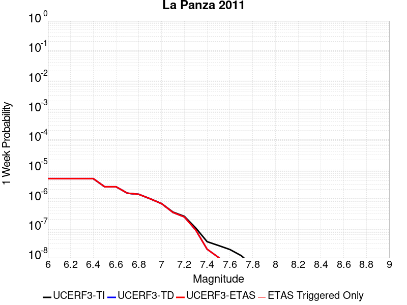 |  |  |  |

| Magnitude | 1 wk TI Prob | 1 wk TD Prob | 1 wk ETAS Prob | 1 wk ETAS/TD Gain | 1 wk ETAS Triggered Only | 1 mo TI Prob | 1 mo TD Prob | 1 mo ETAS Prob | 1 mo ETAS/TD Gain | 1 mo ETAS Triggered Only | 1 yr TI Prob | 1 yr TD Prob | 1 yr ETAS Prob | 1 yr ETAS/TD Gain | 1 yr ETAS Triggered Only | 10 yr TI Prob | 10 yr TD Prob | 10 yr ETAS Prob | 10 yr ETAS/TD Gain | 10 yr ETAS Triggered Only |
|-----|-----|-----|-----|-----|-----|-----|-----|-----|-----|-----|-----|-----|-----|-----|-----|-----|-----|-----|-----|-----|
| 6.0 | 4.6754544E-6 | 4.7178937E-6 | 4.7178937E-6 | 1.0 | 0.0 | 2.0037509E-5 | 2.0219399E-5 | 2.0219399E-5 | 1.0 | 0.0 | 2.4392935E-4 | 2.4614536E-4 | 2.4614536E-4 | 1.0 | 0.0 | 0.0024366176 | 0.0024589216 | 0.0024893344 | 1.0123683 | 3.0487805E-5 |
| 6.1 | 4.6754544E-6 | 4.7178937E-6 | 4.7178937E-6 | 1.0 | 0.0 | 2.0037509E-5 | 2.0219399E-5 | 2.0219399E-5 | 1.0 | 0.0 | 2.4392935E-4 | 2.4614536E-4 | 2.4614536E-4 | 1.0 | 0.0 | 0.0024366176 | 0.0024589216 | 0.0024893344 | 1.0123683 | 3.0487805E-5 |
| 6.2 | 4.6754544E-6 | 4.7178937E-6 | 4.7178937E-6 | 1.0 | 0.0 | 2.0037509E-5 | 2.0219399E-5 | 2.0219399E-5 | 1.0 | 0.0 | 2.4392935E-4 | 2.4614536E-4 | 2.4614536E-4 | 1.0 | 0.0 | 0.0024366176 | 0.0024589216 | 0.0024893344 | 1.0123683 | 3.0487805E-5 |
| 6.3 | 4.6754544E-6 | 4.7178937E-6 | 4.7178937E-6 | 1.0 | 0.0 | 2.0037509E-5 | 2.0219399E-5 | 2.0219399E-5 | 1.0 | 0.0 | 2.4392935E-4 | 2.4614536E-4 | 2.4614536E-4 | 1.0 | 0.0 | 0.0024366176 | 0.0024589216 | 0.0024893344 | 1.0123683 | 3.0487805E-5 |
| 6.4 | 4.6754544E-6 | 4.7178937E-6 | 4.7178937E-6 | 1.0 | 0.0 | 2.0037509E-5 | 2.0219399E-5 | 2.0219399E-5 | 1.0 | 0.0 | 2.4392935E-4 | 2.4614536E-4 | 2.4614536E-4 | 1.0 | 0.0 | 0.0024366176 | 0.0024589216 | 0.0024893344 | 1.0123683 | 3.0487805E-5 |
| 6.5 | 2.485343E-6 | 2.5008533E-6 | 2.5008533E-6 | 1.0 | 0.0 | 1.0651426E-5 | 1.07179E-5 | 1.07179E-5 | 1.0 | 0.0 | 1.296734E-4 | 1.3048302E-4 | 1.3048302E-4 | 1.0 | 0.0 | 0.0012959775 | 0.0013041024 | 0.0013345504 | 1.0233479 | 3.0487805E-5 |
| 6.6 | 2.485343E-6 | 2.5008533E-6 | 2.5008533E-6 | 1.0 | 0.0 | 1.0651426E-5 | 1.07179E-5 | 1.07179E-5 | 1.0 | 0.0 | 1.296734E-4 | 1.3048302E-4 | 1.3048302E-4 | 1.0 | 0.0 | 0.0012959775 | 0.0013041024 | 0.0013345504 | 1.0233479 | 3.0487805E-5 |
| 6.7 | 1.5108508E-6 | 1.5148694E-6 | 1.5148694E-6 | 1.0 | 0.0 | 6.4750584E-6 | 6.492282E-6 | 6.492282E-6 | 1.0 | 0.0 | 7.8830984E-5 | 7.904077E-5 | 7.904077E-5 | 1.0 | 0.0 | 7.880303E-4 | 7.9013745E-4 | 7.9013745E-4 | 1.0 | 0.0 |
| 6.8 | 1.3865837E-6 | 1.3887385E-6 | 1.3887385E-6 | 1.0 | 0.0 | 5.942488E-6 | 5.9517233E-6 | 5.9517233E-6 | 1.0 | 0.0 | 7.234739E-5 | 7.245992E-5 | 7.245992E-5 | 1.0 | 0.0 | 7.232384E-4 | 7.243728E-4 | 7.243728E-4 | 1.0 | 0.0 |
| 6.9 | 9.826583E-7 | 9.798473E-7 | 9.798473E-7 | 1.0 | 0.0 | 4.2113857E-6 | 4.199339E-6 | 4.199339E-6 | 1.0 | 0.0 | 5.1272415E-5 | 5.1125808E-5 | 5.1125808E-5 | 1.0 | 0.0 | 5.126059E-4 | 5.111458E-4 | 5.111458E-4 | 1.0 | 0.0 |
| 7.0 | 6.7797646E-7 | 6.7123244E-7 | 6.7123244E-7 | 1.0 | 0.0 | 2.9056102E-6 | 2.8767076E-6 | 2.8767076E-6 | 1.0 | 0.0 | 3.537523E-5 | 3.5023382E-5 | 3.5023382E-5 | 1.0 | 0.0 | 3.5369597E-4 | 3.5018174E-4 | 3.5018174E-4 | 1.0 | 0.0 |
| 7.1 | 3.4979826E-7 | 3.389418E-7 | 3.389418E-7 | 1.0 | 0.0 | 1.4991346E-6 | 1.452607E-6 | 1.452607E-6 | 1.0 | 0.0 | 1.825181E-5 | 1.7685357E-5 | 1.7685357E-5 | 1.0 | 0.0 | 1.825031E-4 | 1.7684067E-4 | 1.7684067E-4 | 1.0 | 0.0 |
| 7.2 | 2.5088332E-7 | 2.3851902E-7 | 2.3851902E-7 | 1.0 | 0.0 | 1.0752137E-6 | 1.0222241E-6 | 1.0222241E-6 | 1.0 | 0.0 | 1.3090649E-5 | 1.24455155E-5 | 1.24455155E-5 | 1.0 | 0.0 | 1.3089878E-4 | 1.2444904E-4 | 1.2444904E-4 | 1.0 | 0.0 |
| 7.3 | 1.0159086E-7 | 8.664118E-8 | 8.664118E-8 | 1.0 | 0.0 | 4.3538932E-7 | 3.713193E-7 | 3.713193E-7 | 1.0 | 0.0 | 5.300852E-6 | 4.5208035E-6 | 4.5208035E-6 | 1.0 | 0.0 | 5.3007258E-5 | 4.5207154E-5 | 4.5207154E-5 | 1.0 | 0.0 |
| 7.4 | 3.5006252E-8 | 1.9466952E-8 | 1.9466952E-8 | 1.0 | 0.0 | 1.5002678E-7 | 8.342979E-8 | 8.342979E-8 | 1.0 | 0.0 | 1.8265745E-6 | 1.0157572E-6 | 1.0157572E-6 | 1.0 | 0.0 | 1.8265595E-5 | 1.0157529E-5 | 1.0157529E-5 | 1.0 | 0.0 |
| 7.5 | 2.592274E-8 | 1.0285871E-8 | 1.0285871E-8 | 1.0 | 0.0 | 1.1109746E-7 | 4.4082302E-8 | 4.4082302E-8 | 1.0 | 0.0 | 1.3526106E-6 | 5.367019E-7 | 5.367019E-7 | 1.0 | 0.0 | 1.3526024E-5 | 5.367007E-6 | 5.367007E-6 | 1.0 | 0.0 |
| 7.6 | 1.9016717E-8 | 5.2748517E-9 | 5.2748517E-9 | 1.0 | 0.0 | 8.150022E-8 | 2.2606505E-8 | 2.2606505E-8 | 1.0 | 0.0 | 9.922647E-7 | 2.7523419E-7 | 2.7523419E-7 | 1.0 | 0.0 | 9.922603E-6 | 2.7523386E-6 | 2.7523386E-6 | 1.0 | 0.0 |
| 7.7 | 1.17738495E-8 | 1.2528638E-9 | 1.2528638E-9 | 1.0 | 0.0 | 5.0459356E-8 | 5.3694147E-9 | 5.3694147E-9 | 1.0 | 0.0 | 6.1434247E-7 | 6.5372625E-8 | 6.5372625E-8 | 1.0 | 0.0 | 6.143408E-6 | 6.5372603E-7 | 6.5372603E-7 | 1.0 | 0.0 |
| 7.8 | 5.489079E-9 | 2.0454438E-10 | 2.0454438E-10 | 1.0 | 0.0 | 2.3524624E-8 | 8.766169E-10 | 8.766169E-10 | 1.0 | 0.0 | 2.8641225E-7 | 1.0672813E-8 | 1.0672813E-8 | 1.0 | 0.0 | 2.8641189E-6 | 1.0672812E-7 | 1.0672812E-7 | 1.0 | 0.0 |
| 7.9 | 2.5081048E-9 | 6.8139494E-11 | 6.8139494E-11 | 1.0 | 0.0 | 1.0749021E-8 | 2.9202551E-10 | 2.9202551E-10 | 1.0 | 0.0 | 1.3086932E-7 | 3.5554122E-9 | 3.5554122E-9 | 1.0 | 0.0 | 1.3086925E-6 | 3.555412E-8 | 3.555412E-8 | 1.0 | 0.0 |

## Silver Creek 2011 CFM
*[(top)](#table-of-contents)*

| 1 Week | 1 Month | 1 Year | 10 Year |
|-----|-----|-----|-----|
|  |  |  |  |

| Magnitude | 1 wk TI Prob | 1 wk TD Prob | 1 wk ETAS Prob | 1 wk ETAS/TD Gain | 1 wk ETAS Triggered Only | 1 mo TI Prob | 1 mo TD Prob | 1 mo ETAS Prob | 1 mo ETAS/TD Gain | 1 mo ETAS Triggered Only | 1 yr TI Prob | 1 yr TD Prob | 1 yr ETAS Prob | 1 yr ETAS/TD Gain | 1 yr ETAS Triggered Only | 10 yr TI Prob | 10 yr TD Prob | 10 yr ETAS Prob | 10 yr ETAS/TD Gain | 10 yr ETAS Triggered Only |
|-----|-----|-----|-----|-----|-----|-----|-----|-----|-----|-----|-----|-----|-----|-----|-----|-----|-----|-----|-----|-----|
| 6.0 | 3.5229125E-6 | 4.0129016E-6 | 4.0129016E-6 | 1.0 | 0.0 | 1.5098109E-5 | 1.719804E-5 | 1.719804E-5 | 1.0 | 0.0 | 1.8380396E-4 | 2.0936638E-4 | 2.0936638E-4 | 1.0 | 0.0 | 0.0018365202 | 0.002092048 | 0.002122472 | 1.0145427 | 3.0487805E-5 |
| 6.1 | 3.5229125E-6 | 4.0129016E-6 | 4.0129016E-6 | 1.0 | 0.0 | 1.5098109E-5 | 1.719804E-5 | 1.719804E-5 | 1.0 | 0.0 | 1.8380396E-4 | 2.0936638E-4 | 2.0936638E-4 | 1.0 | 0.0 | 0.0018365202 | 0.002092048 | 0.002122472 | 1.0145427 | 3.0487805E-5 |
| 6.2 | 2.6363234E-6 | 3.1152663E-6 | 3.1152663E-6 | 1.0 | 0.0 | 1.129848E-5 | 1.3351074E-5 | 1.3351074E-5 | 1.0 | 0.0 | 1.375503E-4 | 1.6253725E-4 | 1.6253725E-4 | 1.0 | 0.0 | 0.0013746519 | 0.0016245097 | 0.001654948 | 1.018737 | 3.0487805E-5 |
| 6.3 | 2.5275126E-6 | 3.0049023E-6 | 3.0049023E-6 | 1.0 | 0.0 | 1.0832152E-5 | 1.2878089E-5 | 1.2878089E-5 | 1.0 | 0.0 | 1.3187347E-4 | 1.5677951E-4 | 1.5677951E-4 | 1.0 | 0.0 | 0.0013179524 | 0.001567014 | 0.001597454 | 1.0194255 | 3.0487805E-5 |
| 6.4 | 2.178732E-6 | 2.6753758E-6 | 2.6753758E-6 | 1.0 | 0.0 | 9.337389E-6 | 1.1465846E-5 | 1.1465846E-5 | 1.0 | 0.0 | 1.1367678E-4 | 1.3958776E-4 | 1.3958776E-4 | 1.0 | 0.0 | 0.0011361865 | 0.0013953234 | 0.0014257687 | 1.0218195 | 3.0487805E-5 |
| 6.5 | 2.0341574E-6 | 2.534443E-6 | 2.534443E-6 | 1.0 | 0.0 | 8.717788E-6 | 1.0861853E-5 | 1.0861853E-5 | 1.0 | 0.0 | 1.061339E-4 | 1.3223507E-4 | 1.3223507E-4 | 1.0 | 0.0 | 0.0010608323 | 0.001321886 | 0.0013523335 | 1.0230334 | 3.0487805E-5 |
| 6.6 | 1.8856827E-6 | 2.365939E-6 | 2.365939E-6 | 1.0 | 0.0 | 8.0814725E-6 | 1.0139699E-5 | 1.0139699E-5 | 1.0 | 0.0 | 9.838748E-5 | 1.2344387E-4 | 1.2344387E-4 | 1.0 | 0.0 | 9.834393E-4 | 0.0012340746 | 0.0012645248 | 1.0246745 | 3.0487805E-5 |
| 6.7 | 1.6844668E-6 | 2.124184E-6 | 2.124184E-6 | 1.0 | 0.0 | 7.2191233E-6 | 9.103614E-6 | 9.103614E-6 | 1.0 | 0.0 | 8.788928E-5 | 1.1083088E-4 | 1.1083088E-4 | 1.0 | 0.0 | 8.785453E-4 | 0.001108077 | 0.001138531 | 1.0274837 | 3.0487805E-5 |
| 6.8 | 1.5177161E-6 | 1.8995382E-6 | 1.8995382E-6 | 1.0 | 0.0 | 6.504481E-6 | 8.1408525E-6 | 8.1408525E-6 | 1.0 | 0.0 | 7.918918E-5 | 9.911038E-5 | 9.911038E-5 | 1.0 | 0.0 | 7.9160964E-4 | 9.909823E-4 | 9.909823E-4 | 1.0 | 0.0 |
| 6.9 | 1.3437394E-6 | 1.6599771E-6 | 1.6599771E-6 | 1.0 | 0.0 | 5.7588704E-6 | 7.114168E-6 | 7.114168E-6 | 1.0 | 0.0 | 7.011199E-5 | 8.661156E-5 | 8.661156E-5 | 1.0 | 0.0 | 7.0089876E-4 | 8.6609804E-4 | 8.6609804E-4 | 1.0 | 0.0 |
| 7.0 | 1.1563575E-6 | 1.4348819E-6 | 1.4348819E-6 | 1.0 | 0.0 | 4.9558084E-6 | 6.1494798E-6 | 6.1494798E-6 | 1.0 | 0.0 | 6.03353E-5 | 7.486735E-5 | 7.486735E-5 | 1.0 | 0.0 | 6.0318917E-4 | 7.487411E-4 | 7.487411E-4 | 1.0 | 0.0 |
| 7.1 | 8.602183E-7 | 1.0923065E-6 | 1.0923065E-6 | 1.0 | 0.0 | 3.6866445E-6 | 4.681305E-6 | 4.681305E-6 | 1.0 | 0.0 | 4.4883975E-5 | 5.69934E-5 | 5.69934E-5 | 1.0 | 0.0 | 4.4874908E-4 | 5.701075E-4 | 5.701075E-4 | 1.0 | 0.0 |
| 7.2 | 6.788407E-7 | 8.650568E-7 | 8.650568E-7 | 1.0 | 0.0 | 2.9093142E-6 | 3.7073808E-6 | 3.7073808E-6 | 1.0 | 0.0 | 3.5420322E-5 | 4.513643E-5 | 4.513643E-5 | 1.0 | 0.0 | 3.541468E-4 | 4.5159223E-4 | 4.5159223E-4 | 1.0 | 0.0 |
| 7.3 | 5.1292045E-7 | 6.7186437E-7 | 6.7186437E-7 | 1.0 | 0.0 | 2.1982287E-6 | 2.8794154E-6 | 2.8794154E-6 | 1.0 | 0.0 | 2.6763106E-5 | 3.505632E-5 | 3.505632E-5 | 1.0 | 0.0 | 2.6759884E-4 | 3.5082753E-4 | 3.5082753E-4 | 1.0 | 0.0 |
| 7.4 | 3.820994E-7 | 5.0833563E-7 | 5.0833563E-7 | 1.0 | 0.0 | 1.6375678E-6 | 2.1785793E-6 | 2.1785793E-6 | 1.0 | 0.0 | 1.9937206E-5 | 2.6523881E-5 | 2.6523881E-5 | 1.0 | 0.0 | 1.9935417E-4 | 2.6552676E-4 | 2.6552676E-4 | 1.0 | 0.0 |
| 7.5 | 2.2292595E-7 | 3.083788E-7 | 3.083788E-7 | 1.0 | 0.0 | 9.553966E-7 | 1.3216227E-6 | 1.3216227E-6 | 1.0 | 0.0 | 1.16318915E-5 | 1.6090637E-5 | 1.6090637E-5 | 1.0 | 0.0 | 1.16312825E-4 | 1.6121432E-4 | 1.6121432E-4 | 1.0 | 0.0 |
| 7.6 | 1.420587E-7 | 2.1061219E-7 | 2.1061219E-7 | 1.0 | 0.0 | 6.088228E-7 | 9.0262336E-7 | 9.0262336E-7 | 1.0 | 0.0 | 7.4123927E-6 | 1.0989384E-5 | 1.0989384E-5 | 1.0 | 0.0 | 7.412145E-5 | 1.1020766E-4 | 1.1020766E-4 | 1.0 | 0.0 |
| 7.7 | 1.1250075E-7 | 1.700581E-7 | 1.700581E-7 | 1.0 | 0.0 | 4.82146E-7 | 7.2882017E-7 | 7.2882017E-7 | 1.0 | 0.0 | 5.8701116E-6 | 8.8733495E-6 | 8.8733495E-6 | 1.0 | 0.0 | 5.8699567E-5 | 8.90468E-5 | 8.90468E-5 | 1.0 | 0.0 |
| 7.8 | 8.592761E-8 | 1.376445E-7 | 1.376445E-7 | 1.0 | 0.0 | 3.682611E-7 | 5.8990486E-7 | 5.8990486E-7 | 1.0 | 0.0 | 4.48357E-6 | 7.182068E-6 | 7.182068E-6 | 1.0 | 0.0 | 4.4834796E-5 | 7.212392E-5 | 7.212392E-5 | 1.0 | 0.0 |
| 7.9 | 6.156529E-8 | 1.0829748E-7 | 1.0829748E-7 | 1.0 | 0.0 | 2.638512E-7 | 4.6413197E-7 | 4.6413197E-7 | 1.0 | 0.0 | 3.212384E-6 | 5.650792E-6 | 5.650792E-6 | 1.0 | 0.0 | 3.2123375E-5 | 5.6766607E-5 | 5.6766607E-5 | 1.0 | 0.0 |
| 8.0 | 2.9230547E-8 | 5.430176E-8 | 5.430176E-8 | 1.0 | 0.0 | 1.2527377E-7 | 2.3272182E-7 | 2.3272182E-7 | 1.0 | 0.0 | 1.525207E-6 | 2.8333845E-6 | 2.8333845E-6 | 1.0 | 0.0 | 1.5251966E-5 | 2.8470198E-5 | 2.8470198E-5 | 1.0 | 0.0 |
| 8.1 | 5.6062213E-9 | 7.963527E-9 | 7.963527E-9 | 1.0 | 0.0 | 2.4026663E-8 | 3.41294E-8 | 3.41294E-8 | 1.0 | 0.0 | 2.925246E-7 | 4.155254E-7 | 4.155254E-7 | 1.0 | 0.0 | 2.925242E-6 | 4.1942235E-6 | 4.1942235E-6 | 1.0 | 0.0 |

## Oceanic - West Huasna
*[(top)](#table-of-contents)*

| 1 Week | 1 Month | 1 Year | 10 Year |
|-----|-----|-----|-----|
|  |  |  |  |

| Magnitude | 1 wk TI Prob | 1 wk TD Prob | 1 wk ETAS Prob | 1 wk ETAS/TD Gain | 1 wk ETAS Triggered Only | 1 mo TI Prob | 1 mo TD Prob | 1 mo ETAS Prob | 1 mo ETAS/TD Gain | 1 mo ETAS Triggered Only | 1 yr TI Prob | 1 yr TD Prob | 1 yr ETAS Prob | 1 yr ETAS/TD Gain | 1 yr ETAS Triggered Only | 10 yr TI Prob | 10 yr TD Prob | 10 yr ETAS Prob | 10 yr ETAS/TD Gain | 10 yr ETAS Triggered Only |
|-----|-----|-----|-----|-----|-----|-----|-----|-----|-----|-----|-----|-----|-----|-----|-----|-----|-----|-----|-----|-----|
| 6.0 | 3.195567E-5 | 2.7931088E-5 | 2.7931088E-5 | 1.0 | 0.0 | 1.3694567E-4 | 1.1969941E-4 | 1.1969941E-4 | 1.0 | 0.0 | 0.0016660384 | 0.0014564092 | 0.0014564092 | 1.0 | 0.0 | 0.016536033 | 0.0144732 | 0.014503246 | 1.002076 | 3.0487805E-5 |
| 6.1 | 2.1156782E-5 | 1.7575998E-5 | 1.7575998E-5 | 1.0 | 0.0 | 9.066878E-5 | 7.532358E-5 | 7.532358E-5 | 1.0 | 0.0 | 0.0011033333 | 9.166881E-4 | 9.166881E-4 | 1.0 | 0.0 | 0.010978713 | 0.0091300765 | 0.009160286 | 1.0033088 | 3.0487805E-5 |
| 6.2 | 1.6195117E-5 | 1.33289195E-5 | 1.33289195E-5 | 1.0 | 0.0 | 6.9405796E-5 | 5.7122706E-5 | 5.7122706E-5 | 1.0 | 0.0 | 8.44688E-4 | 6.952496E-4 | 6.952496E-4 | 1.0 | 0.0 | 0.008414844 | 0.006931039 | 0.0069613154 | 1.0043683 | 3.0487805E-5 |
| 6.3 | 1.3559345E-5 | 1.1180543E-5 | 1.1180543E-5 | 1.0 | 0.0 | 5.811018E-5 | 4.791574E-5 | 4.791574E-5 | 1.0 | 0.0 | 7.072618E-4 | 5.8321893E-4 | 5.8321893E-4 | 1.0 | 0.0 | 0.0070501505 | 0.0058170017 | 0.005847312 | 1.0052106 | 3.0487805E-5 |
| 6.4 | 1.2120619E-5 | 1.0002192E-5 | 1.0002192E-5 | 1.0 | 0.0 | 5.1944477E-5 | 4.286583E-5 | 4.286583E-5 | 1.0 | 0.0 | 6.322405E-4 | 5.21767E-4 | 5.21767E-4 | 1.0 | 0.0 | 0.006304447 | 0.0052054874 | 0.0052358164 | 1.0058264 | 3.0487805E-5 |
| 6.5 | 1.13511915E-5 | 9.368602E-6 | 9.368602E-6 | 1.0 | 0.0 | 4.8647056E-5 | 4.0150535E-5 | 4.0150535E-5 | 1.0 | 0.0 | 5.9211696E-4 | 4.8872357E-4 | 4.8872357E-4 | 1.0 | 0.0 | 0.0059054173 | 0.0048765466 | 0.004906886 | 1.0062214 | 3.0487805E-5 |
| 6.6 | 9.850605E-6 | 8.136387E-6 | 8.136387E-6 | 1.0 | 0.0 | 4.2216197E-5 | 3.486976E-5 | 3.486976E-5 | 1.0 | 0.0 | 5.1386096E-4 | 4.244569E-4 | 4.244569E-4 | 1.0 | 0.0 | 0.0051267436 | 0.004236494 | 0.004266853 | 1.007166 | 3.0487805E-5 |
| 6.7 | 8.8558645E-6 | 7.319305E-6 | 7.319305E-6 | 1.0 | 0.0 | 3.7953152E-5 | 3.1368076E-5 | 3.1368076E-5 | 1.0 | 0.0 | 4.6198163E-4 | 3.8183955E-4 | 3.8183955E-4 | 1.0 | 0.0 | 0.004610224 | 0.0038118602 | 0.0038422318 | 1.0079677 | 3.0487805E-5 |
| 6.8 | 7.67136E-6 | 6.3925254E-6 | 6.3925254E-6 | 1.0 | 0.0 | 3.2876844E-5 | 2.739625E-5 | 2.739625E-5 | 1.0 | 0.0 | 4.0020206E-4 | 3.3349846E-4 | 3.3349846E-4 | 1.0 | 0.0 | 0.003994821 | 0.0033300007 | 0.003360387 | 1.009125 | 3.0487805E-5 |
| 6.9 | 6.534529E-6 | 5.459002E-6 | 5.459002E-6 | 1.0 | 0.0 | 2.8004823E-5 | 2.3395512E-5 | 2.3395512E-5 | 1.0 | 0.0 | 3.4090536E-4 | 2.8480327E-4 | 2.8480327E-4 | 1.0 | 0.0 | 0.0034038287 | 0.0028443995 | 0.0028748005 | 1.0106881 | 3.0487805E-5 |
| 7.0 | 5.460525E-6 | 4.570543E-6 | 4.570543E-6 | 1.0 | 0.0 | 2.3402039E-5 | 1.9587895E-5 | 1.9587895E-5 | 1.0 | 0.0 | 2.8488258E-4 | 2.3845663E-4 | 2.3845663E-4 | 1.0 | 0.0 | 0.0028451765 | 0.0023820214 | 0.0024124365 | 1.0127686 | 3.0487805E-5 |
| 7.1 | 4.4825083E-6 | 3.7529808E-6 | 3.7529808E-6 | 1.0 | 0.0 | 1.9210609E-5 | 1.6084105E-5 | 1.6084105E-5 | 1.0 | 0.0 | 2.3386406E-4 | 1.9580648E-4 | 1.9580648E-4 | 1.0 | 0.0 | 0.002336181 | 0.0019563516 | 0.0019867797 | 1.0155535 | 3.0487805E-5 |
| 7.2 | 2.821708E-6 | 2.425378E-6 | 2.425378E-6 | 1.0 | 0.0 | 1.2092979E-5 | 1.0394436E-5 | 1.0394436E-5 | 1.0 | 0.0 | 1.4722206E-4 | 1.2654491E-4 | 1.2654491E-4 | 1.0 | 0.0 | 0.0014712457 | 0.001264731 | 0.0012951803 | 1.0240756 | 3.0487805E-5 |
| 7.3 | 2.0644757E-6 | 1.769144E-6 | 1.769144E-6 | 1.0 | 0.0 | 8.847723E-6 | 7.582024E-6 | 7.582024E-6 | 1.0 | 0.0 | 1.0771569E-4 | 9.230723E-5 | 9.230723E-5 | 1.0 | 0.0 | 0.001076635 | 9.2269067E-4 | 9.5315033E-4 | 1.0330118 | 3.0487805E-5 |
| 7.4 | 1.6980367E-6 | 1.438338E-6 | 1.438338E-6 | 1.0 | 0.0 | 7.27728E-6 | 6.164291E-6 | 6.164291E-6 | 1.0 | 0.0 | 8.8597284E-5 | 7.504766E-5 | 7.504766E-5 | 1.0 | 0.0 | 8.8561967E-4 | 7.502248E-4 | 7.806897E-4 | 1.0406077 | 3.0487805E-5 |
| 7.5 | 1.3637683E-6 | 1.1305964E-6 | 1.1305964E-6 | 1.0 | 0.0 | 5.844708E-6 | 4.845404E-6 | 4.845404E-6 | 1.0 | 0.0 | 7.1156996E-5 | 5.8991198E-5 | 5.8991198E-5 | 1.0 | 0.0 | 7.1134215E-4 | 5.897569E-4 | 6.202267E-4 | 1.0516651 | 3.0487805E-5 |
| 7.6 | 9.802994E-7 | 7.6803957E-7 | 7.6803957E-7 | 1.0 | 0.0 | 4.2012766E-6 | 3.2915939E-6 | 3.2915939E-6 | 1.0 | 0.0 | 5.1149345E-5 | 4.007442E-5 | 4.007442E-5 | 1.0 | 0.0 | 5.113757E-4 | 4.0067337E-4 | 4.3114895E-4 | 1.0760609 | 3.0487805E-5 |
| 7.7 | 5.986191E-7 | 4.007707E-7 | 4.007707E-7 | 1.0 | 0.0 | 2.5655079E-6 | 1.7175875E-6 | 1.7175875E-6 | 1.0 | 0.0 | 3.1234613E-5 | 2.0911426E-5 | 2.0911426E-5 | 1.0 | 0.0 | 3.123022E-4 | 2.0909593E-4 | 2.3957736E-4 | 1.1457772 | 3.0487805E-5 |
| 7.8 | 2.9189815E-7 | 1.5308534E-7 | 1.5308534E-7 | 1.0 | 0.0 | 1.2509914E-6 | 6.560798E-7 | 6.560798E-7 | 1.0 | 0.0 | 1.5230714E-5 | 7.987743E-6 | 7.987743E-6 | 1.0 | 0.0 | 1.522967E-4 | 7.987587E-5 | 1.1036124E-4 | 1.3816593 | 3.0487805E-5 |
| 7.9 | 1.2057845E-7 | 4.6338755E-8 | 4.6338755E-8 | 1.0 | 0.0 | 5.1676466E-7 | 1.9859465E-7 | 1.9859465E-7 | 1.0 | 0.0 | 6.2915915E-6 | 2.4178871E-6 | 2.4178871E-6 | 1.0 | 0.0 | 6.2914136E-5 | 2.417991E-5 | 5.4666976E-5 | 2.2608428 | 3.0487805E-5 |
| 8.0 | 3.3806387E-9 | 9.060215E-10 | 9.060215E-10 | 1.0 | 0.0 | 1.4488451E-8 | 3.88295E-9 | 3.88295E-9 | 1.0 | 0.0 | 1.7639688E-7 | 4.727492E-8 | 4.727492E-8 | 1.0 | 0.0 | 1.7639674E-6 | 4.7384066E-7 | 4.7384066E-7 | 1.0 | 0.0 |

## Las Positas
*[(top)](#table-of-contents)*

| 1 Week | 1 Month | 1 Year | 10 Year |
|-----|-----|-----|-----|
|  |  |  |  |

| Magnitude | 1 wk TI Prob | 1 wk TD Prob | 1 wk ETAS Prob | 1 wk ETAS/TD Gain | 1 wk ETAS Triggered Only | 1 mo TI Prob | 1 mo TD Prob | 1 mo ETAS Prob | 1 mo ETAS/TD Gain | 1 mo ETAS Triggered Only | 1 yr TI Prob | 1 yr TD Prob | 1 yr ETAS Prob | 1 yr ETAS/TD Gain | 1 yr ETAS Triggered Only | 10 yr TI Prob | 10 yr TD Prob | 10 yr ETAS Prob | 10 yr ETAS/TD Gain | 10 yr ETAS Triggered Only |
|-----|-----|-----|-----|-----|-----|-----|-----|-----|-----|-----|-----|-----|-----|-----|-----|-----|-----|-----|-----|-----|
| 6.0 | 1.0659424E-5 | 1.1593074E-5 | 1.1593074E-5 | 1.0 | 0.0 | 4.568245E-5 | 4.9684604E-5 | 4.9684604E-5 | 1.0 | 0.0 | 5.560419E-4 | 6.049101E-4 | 6.353794E-4 | 1.0503701 | 3.0487805E-5 | 0.005546526 | 0.0060491003 | 0.006079404 | 1.0050095 | 3.0487805E-5 |
| 6.1 | 1.0659424E-5 | 1.1593074E-5 | 1.1593074E-5 | 1.0 | 0.0 | 4.568245E-5 | 4.9684604E-5 | 4.9684604E-5 | 1.0 | 0.0 | 5.560419E-4 | 6.049101E-4 | 6.353794E-4 | 1.0503701 | 3.0487805E-5 | 0.005546526 | 0.0060491003 | 0.006079404 | 1.0050095 | 3.0487805E-5 |
| 6.2 | 1.0659424E-5 | 1.1593074E-5 | 1.1593074E-5 | 1.0 | 0.0 | 4.568245E-5 | 4.9684604E-5 | 4.9684604E-5 | 1.0 | 0.0 | 5.560419E-4 | 6.049101E-4 | 6.353794E-4 | 1.0503701 | 3.0487805E-5 | 0.005546526 | 0.0060491003 | 0.006079404 | 1.0050095 | 3.0487805E-5 |
| 6.3 | 1.0659424E-5 | 1.1593074E-5 | 1.1593074E-5 | 1.0 | 0.0 | 4.568245E-5 | 4.9684604E-5 | 4.9684604E-5 | 1.0 | 0.0 | 5.560419E-4 | 6.049101E-4 | 6.353794E-4 | 1.0503701 | 3.0487805E-5 | 0.005546526 | 0.0060491003 | 0.006079404 | 1.0050095 | 3.0487805E-5 |

## Great Valley 11
*[(top)](#table-of-contents)*

| 1 Week | 1 Month | 1 Year | 10 Year |
|-----|-----|-----|-----|
|  |  |  |  |

| Magnitude | 1 wk TI Prob | 1 wk TD Prob | 1 wk ETAS Prob | 1 wk ETAS/TD Gain | 1 wk ETAS Triggered Only | 1 mo TI Prob | 1 mo TD Prob | 1 mo ETAS Prob | 1 mo ETAS/TD Gain | 1 mo ETAS Triggered Only | 1 yr TI Prob | 1 yr TD Prob | 1 yr ETAS Prob | 1 yr ETAS/TD Gain | 1 yr ETAS Triggered Only | 10 yr TI Prob | 10 yr TD Prob | 10 yr ETAS Prob | 10 yr ETAS/TD Gain | 10 yr ETAS Triggered Only |
|-----|-----|-----|-----|-----|-----|-----|-----|-----|-----|-----|-----|-----|-----|-----|-----|-----|-----|-----|-----|-----|
| 6.0 | 2.8099583E-5 | 2.9842391E-5 | 6.0329286E-5 | 2.021597 | 3.0487805E-5 | 1.20421224E-4 | 1.2789012E-4 | 1.5837402E-4 | 1.2383602 | 3.0487805E-5 | 0.0014651422 | 0.0015560248 | 0.0015864652 | 1.019563 | 3.0487805E-5 | 0.0145552 | 0.015458818 | 0.015488834 | 1.0019417 | 3.0487805E-5 |
| 6.1 | 2.483194E-5 | 2.5915866E-5 | 5.640288E-5 | 2.1763842 | 3.0487805E-5 | 1.0641825E-4 | 1.1106363E-4 | 1.4154805E-4 | 1.274477 | 3.0487805E-5 | 0.0012948721 | 0.0013514253 | 0.0013818719 | 1.0225292 | 3.0487805E-5 | 0.012873529 | 0.01343848 | 0.013468559 | 1.0022382 | 3.0487805E-5 |
| 6.2 | 2.483194E-5 | 2.5915866E-5 | 5.640288E-5 | 2.1763842 | 3.0487805E-5 | 1.0641825E-4 | 1.1106363E-4 | 1.4154805E-4 | 1.274477 | 3.0487805E-5 | 0.0012948721 | 0.0013514253 | 0.0013818719 | 1.0225292 | 3.0487805E-5 | 0.012873529 | 0.01343848 | 0.013468559 | 1.0022382 | 3.0487805E-5 |
| 6.3 | 2.0257901E-5 | 2.0405469E-5 | 5.089265E-5 | 2.4940693 | 3.0487805E-5 | 8.681669E-5 | 8.744931E-5 | 1.17934454E-4 | 1.3486035 | 3.0487805E-5 | 0.0010564806 | 0.0010642173 | 0.0010946727 | 1.0286176 | 3.0487805E-5 | 0.01051472 | 0.010595395 | 0.01062556 | 1.002847 | 3.0487805E-5 |
| 6.4 | 1.8054898E-5 | 1.7786466E-5 | 4.8273727E-5 | 2.7140708 | 3.0487805E-5 | 7.737584E-5 | 7.62257E-5 | 1.0671118E-4 | 1.399937 | 3.0487805E-5 | 9.416436E-4 | 9.2769065E-4 | 9.5815014E-4 | 1.0328337 | 3.0487805E-5 | 0.009376635 | 0.009241931 | 0.009272138 | 1.0032684 | 3.0487805E-5 |
| 6.5 | 1.34804895E-5 | 1.2324616E-5 | 1.2324616E-5 | 1.0 | 0.0 | 5.777225E-5 | 5.281874E-5 | 5.281874E-5 | 1.0 | 0.0 | 7.031501E-4 | 6.428826E-4 | 6.428826E-4 | 1.0 | 0.0 | 0.007009294 | 0.0064106653 | 0.0064106653 | 1.0 | 0.0 |
| 6.6 | 1.294883E-5 | 1.1735751E-5 | 1.1735751E-5 | 1.0 | 0.0 | 5.5493805E-5 | 5.029513E-5 | 5.029513E-5 | 1.0 | 0.0 | 6.754276E-4 | 6.1217527E-4 | 6.1217527E-4 | 1.0 | 0.0 | 0.006733784 | 0.0061053145 | 0.0061053145 | 1.0 | 0.0 |
| 6.7 | 1.1272237E-5 | 9.814787E-6 | 9.814787E-6 | 1.0 | 0.0 | 4.8308695E-5 | 4.2062708E-5 | 4.2062708E-5 | 1.0 | 0.0 | 5.879996E-4 | 5.1199587E-4 | 5.1199587E-4 | 1.0 | 0.0 | 0.005864462 | 0.0051084473 | 0.0051084473 | 1.0 | 0.0 |
| 6.8 | 9.8337505E-6 | 8.19628E-6 | 8.19628E-6 | 1.0 | 0.0 | 4.2143965E-5 | 3.5126453E-5 | 3.5126453E-5 | 1.0 | 0.0 | 5.1298196E-4 | 4.2758268E-4 | 4.2758268E-4 | 1.0 | 0.0 | 0.005117994 | 0.00426781 | 0.00426781 | 1.0 | 0.0 |
| 6.9 | 7.4224813E-6 | 5.4148227E-6 | 5.4148227E-6 | 1.0 | 0.0 | 3.1810247E-5 | 2.3206185E-5 | 2.3206185E-5 | 1.0 | 0.0 | 3.872209E-4 | 2.8250008E-4 | 2.8250008E-4 | 1.0 | 0.0 | 0.0038654688 | 0.0028215505 | 0.0028215505 | 1.0 | 0.0 |
| 7.0 | 4.4628923E-6 | 2.0116802E-6 | 2.0116802E-6 | 1.0 | 0.0 | 1.912654E-5 | 8.621459E-6 | 8.621459E-6 | 1.0 | 0.0 | 2.3284076E-4 | 1.0496132E-4 | 1.0496132E-4 | 1.0 | 0.0 | 0.0023259693 | 0.001049129 | 0.001049129 | 1.0 | 0.0 |
| 7.1 | 3.5546527E-6 | 1.1859587E-6 | 1.1859587E-6 | 1.0 | 0.0 | 1.5234136E-5 | 5.0826707E-6 | 5.0826707E-6 | 1.0 | 0.0 | 1.8545982E-4 | 6.187983E-5 | 6.187983E-5 | 1.0 | 0.0 | 0.0018530512 | 6.1863277E-4 | 6.1863277E-4 | 1.0 | 0.0 |
| 7.2 | 3.2039936E-6 | 1.1257508E-6 | 1.1257508E-6 | 1.0 | 0.0 | 1.3731329E-5 | 4.824638E-6 | 4.824638E-6 | 1.0 | 0.0 | 1.671661E-4 | 5.873845E-5 | 5.873845E-5 | 1.0 | 0.0 | 0.0016704041 | 5.8723596E-4 | 5.8723596E-4 | 1.0 | 0.0 |
| 7.3 | 2.8120473E-6 | 1.0308576E-6 | 1.0308576E-6 | 1.0 | 0.0 | 1.2051575E-5 | 4.417954E-6 | 4.417954E-6 | 1.0 | 0.0 | 1.4671806E-4 | 5.378733E-5 | 5.378733E-5 | 1.0 | 0.0 | 0.0014662122 | 5.3774973E-4 | 5.3774973E-4 | 1.0 | 0.0 |
| 7.4 | 2.4837766E-6 | 9.803239E-7 | 9.803239E-7 | 1.0 | 0.0 | 1.0644713E-5 | 4.2013817E-6 | 4.2013817E-6 | 1.0 | 0.0 | 1.2959167E-4 | 5.1150688E-5 | 5.1150688E-5 | 1.0 | 0.0 | 0.0012951613 | 5.1139574E-4 | 5.1139574E-4 | 1.0 | 0.0 |
| 7.5 | 1.5002679E-6 | 6.547736E-7 | 6.547736E-7 | 1.0 | 0.0 | 6.4297037E-6 | 2.8061697E-6 | 2.8061697E-6 | 1.0 | 0.0 | 7.827883E-5 | 3.4164623E-5 | 3.4164623E-5 | 1.0 | 0.0 | 7.825126E-4 | 3.4159786E-4 | 3.4159786E-4 | 1.0 | 0.0 |

## San Andreas (North Coast) 2011 CFM
*[(top)](#table-of-contents)*

| 1 Week | 1 Month | 1 Year | 10 Year |
|-----|-----|-----|-----|
|  |  |  |  |

| Magnitude | 1 wk TI Prob | 1 wk TD Prob | 1 wk ETAS Prob | 1 wk ETAS/TD Gain | 1 wk ETAS Triggered Only | 1 mo TI Prob | 1 mo TD Prob | 1 mo ETAS Prob | 1 mo ETAS/TD Gain | 1 mo ETAS Triggered Only | 1 yr TI Prob | 1 yr TD Prob | 1 yr ETAS Prob | 1 yr ETAS/TD Gain | 1 yr ETAS Triggered Only | 10 yr TI Prob | 10 yr TD Prob | 10 yr ETAS Prob | 10 yr ETAS/TD Gain | 10 yr ETAS Triggered Only |
|-----|-----|-----|-----|-----|-----|-----|-----|-----|-----|-----|-----|-----|-----|-----|-----|-----|-----|-----|-----|-----|
| 6.0 | 1.5333705E-4 | 7.167264E-5 | 7.167264E-5 | 1.0 | 0.0 | 6.5699324E-4 | 3.071325E-4 | 3.071325E-4 | 1.0 | 0.0 | 0.007969595 | 0.0037329607 | 0.0037329607 | 1.0 | 0.0 | 0.0768977 | 0.03964612 | 0.0396754 | 1.0007385 | 3.0487805E-5 |
| 6.1 | 1.5333705E-4 | 7.167264E-5 | 7.167264E-5 | 1.0 | 0.0 | 6.5699324E-4 | 3.071325E-4 | 3.071325E-4 | 1.0 | 0.0 | 0.007969595 | 0.0037329607 | 0.0037329607 | 1.0 | 0.0 | 0.0768977 | 0.03964612 | 0.0396754 | 1.0007385 | 3.0487805E-5 |
| 6.2 | 1.3912938E-4 | 6.1008297E-5 | 6.1008297E-5 | 1.0 | 0.0 | 5.961325E-4 | 2.6143808E-4 | 2.6143808E-4 | 1.0 | 0.0 | 0.007233787 | 0.0031783902 | 0.0031783902 | 1.0 | 0.0 | 0.07002798 | 0.033958502 | 0.033987954 | 1.0008674 | 3.0487805E-5 |
| 6.3 | 1.3912938E-4 | 6.1008297E-5 | 6.1008297E-5 | 1.0 | 0.0 | 5.961325E-4 | 2.6143808E-4 | 2.6143808E-4 | 1.0 | 0.0 | 0.007233787 | 0.0031783902 | 0.0031783902 | 1.0 | 0.0 | 0.07002798 | 0.033958502 | 0.033987954 | 1.0008674 | 3.0487805E-5 |
| 6.4 | 1.2623647E-4 | 5.089298E-5 | 5.089298E-5 | 1.0 | 0.0 | 5.4090127E-4 | 2.1809465E-4 | 2.1809465E-4 | 1.0 | 0.0 | 0.0065656058 | 0.0026520893 | 0.0026520893 | 1.0 | 0.0 | 0.06374981 | 0.028544052 | 0.028573668 | 1.0010376 | 3.0487805E-5 |
| 6.5 | 1.1736096E-4 | 4.393664E-5 | 4.393664E-5 | 1.0 | 0.0 | 5.028786E-4 | 1.882864E-4 | 1.882864E-4 | 1.0 | 0.0 | 0.006105373 | 0.0022899932 | 0.0022899932 | 1.0 | 0.0 | 0.05940335 | 0.02480242 | 0.024832152 | 1.0011988 | 3.0487805E-5 |
| 6.6 | 1.1586959E-4 | 4.283032E-5 | 4.283032E-5 | 1.0 | 0.0 | 4.964894E-4 | 1.8354571E-4 | 1.8354571E-4 | 1.0 | 0.0 | 0.006028018 | 0.002232395 | 0.002232395 | 1.0 | 0.0 | 0.058671024 | 0.024205182 | 0.024234932 | 1.001229 | 3.0487805E-5 |
| 6.7 | 1.13693764E-4 | 4.1133633E-5 | 4.1133633E-5 | 1.0 | 0.0 | 4.87168E-4 | 1.7627518E-4 | 1.7627518E-4 | 1.0 | 0.0 | 0.005915152 | 0.002144054 | 0.002144054 | 1.0 | 0.0 | 0.057601593 | 0.023292398 | 0.023322174 | 1.0012784 | 3.0487805E-5 |
| 6.8 | 1.1204889E-4 | 4.0344774E-5 | 4.0344774E-5 | 1.0 | 0.0 | 4.8012115E-4 | 1.7289481E-4 | 1.7289481E-4 | 1.0 | 0.0 | 0.005829819 | 0.0021029783 | 0.0021029783 | 1.0 | 0.0 | 0.05679232 | 0.0228494 | 0.02287919 | 1.0013038 | 3.0487805E-5 |
| 6.9 | 1.1005794E-4 | 3.9392704E-5 | 3.9392704E-5 | 1.0 | 0.0 | 4.7159163E-4 | 1.6881504E-4 | 1.6881504E-4 | 1.0 | 0.0 | 0.0057265228 | 0.0020534017 | 0.0020534017 | 1.0 | 0.0 | 0.055811852 | 0.022311093 | 0.022340901 | 1.001336 | 3.0487805E-5 |
| 7.0 | 1.0647948E-4 | 3.7532158E-5 | 3.7532158E-5 | 1.0 | 0.0 | 4.562608E-4 | 1.6084228E-4 | 1.6084228E-4 | 1.0 | 0.0 | 0.0055408357 | 0.0019565115 | 0.0019565115 | 1.0 | 0.0 | 0.054047033 | 0.021262132 | 0.021291971 | 1.0014035 | 3.0487805E-5 |
| 7.1 | 1.04795035E-4 | 3.6573696E-5 | 3.6573696E-5 | 1.0 | 0.0 | 4.4904428E-4 | 1.5673508E-4 | 1.5673508E-4 | 1.0 | 0.0 | 0.0054534175 | 0.0019065951 | 0.0019065951 | 1.0 | 0.0 | 0.053215165 | 0.02072614 | 0.020755997 | 1.0014405 | 3.0487805E-5 |
| 7.2 | 1.02724036E-4 | 3.5473153E-5 | 3.5473153E-5 | 1.0 | 0.0 | 4.401716E-4 | 1.5201903E-4 | 1.5201903E-4 | 1.0 | 0.0 | 0.0053459285 | 0.001849276 | 0.001849276 | 1.0 | 0.0 | 0.052191395 | 0.020110486 | 0.020140361 | 1.0014856 | 3.0487805E-5 |
| 7.3 | 1.00650694E-4 | 3.4933342E-5 | 3.4933342E-5 | 1.0 | 0.0 | 4.312888E-4 | 1.4970583E-4 | 1.4970583E-4 | 1.0 | 0.0 | 0.005238306 | 0.0018211602 | 0.0018211602 | 1.0 | 0.0 | 0.051165357 | 0.019783666 | 0.01981355 | 1.0015106 | 3.0487805E-5 |
| 7.4 | 9.672919E-5 | 3.3705466E-5 | 3.3705466E-5 | 1.0 | 0.0 | 4.144878E-4 | 1.4444409E-4 | 1.4444409E-4 | 1.0 | 0.0 | 0.005034718 | 0.0017572036 | 0.0017572036 | 1.0 | 0.0 | 0.049221683 | 0.01904766 | 0.01907757 | 1.0015701 | 3.0487805E-5 |
| 7.5 | 8.7600405E-5 | 2.2948088E-5 | 2.2948088E-5 | 1.0 | 0.0 | 3.753763E-4 | 9.834525E-5 | 9.834525E-5 | 1.0 | 0.0 | 0.0045606326 | 0.0011966976 | 0.0011966976 | 1.0 | 0.0 | 0.04468165 | 0.0132718645 | 0.013301948 | 1.0022666 | 3.0487805E-5 |
| 7.6 | 7.9562284E-5 | 1.9451085E-5 | 1.9451085E-5 | 1.0 | 0.0 | 3.4093665E-4 | 8.335914E-5 | 8.335914E-5 | 1.0 | 0.0 | 0.0041430052 | 0.0010144265 | 0.0010144265 | 1.0 | 0.0 | 0.040666126 | 0.011351465 | 0.011381607 | 1.0026553 | 3.0487805E-5 |
| 7.7 | 6.3866544E-5 | 1.2119624E-5 | 1.2119624E-5 | 1.0 | 0.0 | 2.7368503E-4 | 5.1940217E-5 | 5.1940217E-5 | 1.0 | 0.0 | 0.0033270244 | 6.321889E-4 | 6.321889E-4 | 1.0 | 0.0 | 0.032776527 | 0.0073151714 | 0.007345436 | 1.0041373 | 3.0487805E-5 |
| 7.8 | 4.2543215E-5 | 9.219181E-6 | 9.219181E-6 | 1.0 | 0.0 | 1.8231533E-4 | 3.951018E-5 | 3.951018E-5 | 1.0 | 0.0 | 0.0022174292 | 4.8093035E-4 | 4.8093035E-4 | 1.0 | 0.0 | 0.021954332 | 0.0055735833 | 0.005603901 | 1.0054395 | 3.0487805E-5 |
| 7.9 | 2.2636612E-5 | 7.934437E-6 | 7.934437E-6 | 1.0 | 0.0 | 9.7010445E-5 | 3.4004286E-5 | 3.4004286E-5 | 1.0 | 0.0 | 0.0011804621 | 4.1392364E-4 | 4.1392364E-4 | 1.0 | 0.0 | 0.011742111 | 0.0047510383 | 0.004781381 | 1.0063866 | 3.0487805E-5 |
| 8.0 | 1.5167874E-5 | 7.157475E-6 | 7.157475E-6 | 1.0 | 0.0 | 6.500356E-5 | 3.067453E-5 | 3.067453E-5 | 1.0 | 0.0 | 7.9113094E-4 | 3.733985E-4 | 3.733985E-4 | 1.0 | 0.0 | 0.007883203 | 0.00427557 | 0.00427557 | 1.0 | 0.0 |
| 8.1 | 1.0681047E-5 | 6.4844553E-6 | 6.4844553E-6 | 1.0 | 0.0 | 4.5775112E-5 | 2.7790227E-5 | 2.7790227E-5 | 1.0 | 0.0 | 5.5716943E-4 | 3.3829358E-4 | 3.3829358E-4 | 1.0 | 0.0 | 0.0055577457 | 0.0038710767 | 0.0038710767 | 1.0 | 0.0 |
| 8.2 | 8.226114E-6 | 5.1888637E-6 | 5.1888637E-6 | 1.0 | 0.0 | 3.52543E-5 | 2.2237798E-5 | 2.2237798E-5 | 1.0 | 0.0 | 4.2913653E-4 | 2.7071164E-4 | 2.7071164E-4 | 1.0 | 0.0 | 0.004283088 | 0.0030854926 | 0.0030854926 | 1.0 | 0.0 |
| 8.3 | 1.983087E-6 | 7.7871465E-7 | 7.7871465E-7 | 1.0 | 0.0 | 8.498917E-6 | 3.3373444E-6 | 3.3373444E-6 | 1.0 | 0.0 | 1.034694E-4 | 4.063143E-5 | 4.063143E-5 | 1.0 | 0.0 | 0.0010342124 | 4.7926197E-4 | 4.7926197E-4 | 1.0 | 0.0 |

## Hunting Creek - Bartlett Springs connector 2011
*[(top)](#table-of-contents)*

| 1 Week | 1 Month | 1 Year | 10 Year |
|-----|-----|-----|-----|
|  |  |  |  |

| Magnitude | 1 wk TI Prob | 1 wk TD Prob | 1 wk ETAS Prob | 1 wk ETAS/TD Gain | 1 wk ETAS Triggered Only | 1 mo TI Prob | 1 mo TD Prob | 1 mo ETAS Prob | 1 mo ETAS/TD Gain | 1 mo ETAS Triggered Only | 1 yr TI Prob | 1 yr TD Prob | 1 yr ETAS Prob | 1 yr ETAS/TD Gain | 1 yr ETAS Triggered Only | 10 yr TI Prob | 10 yr TD Prob | 10 yr ETAS Prob | 10 yr ETAS/TD Gain | 10 yr ETAS Triggered Only |
|-----|-----|-----|-----|-----|-----|-----|-----|-----|-----|-----|-----|-----|-----|-----|-----|-----|-----|-----|-----|-----|
| 6.0 | 4.940016E-5 | 6.791398E-5 | 6.791398E-5 | 1.0 | 0.0 | 2.1169778E-4 | 2.9102844E-4 | 2.9102844E-4 | 1.0 | 0.0 | 0.002574374 | 0.003537347 | 0.003537347 | 1.0 | 0.0 | 0.025447546 | 0.034794837 | 0.034824263 | 1.0008457 | 3.0487805E-5 |
| 6.1 | 4.940016E-5 | 6.791398E-5 | 6.791398E-5 | 1.0 | 0.0 | 2.1169778E-4 | 2.9102844E-4 | 2.9102844E-4 | 1.0 | 0.0 | 0.002574374 | 0.003537347 | 0.003537347 | 1.0 | 0.0 | 0.025447546 | 0.034794837 | 0.034824263 | 1.0008457 | 3.0487805E-5 |
| 6.2 | 4.472471E-5 | 6.104228E-5 | 6.104228E-5 | 1.0 | 0.0 | 1.9166325E-4 | 2.6158424E-4 | 2.6158424E-4 | 1.0 | 0.0 | 0.0023310026 | 0.003180086 | 0.003180086 | 1.0 | 0.0 | 0.02306703 | 0.03133553 | 0.031365063 | 1.0009425 | 3.0487805E-5 |
| 6.3 | 4.472471E-5 | 6.104228E-5 | 6.104228E-5 | 1.0 | 0.0 | 1.9166325E-4 | 2.6158424E-4 | 2.6158424E-4 | 1.0 | 0.0 | 0.0023310026 | 0.003180086 | 0.003180086 | 1.0 | 0.0 | 0.02306703 | 0.03133553 | 0.031365063 | 1.0009425 | 3.0487805E-5 |
| 6.4 | 4.0001003E-5 | 5.41369E-5 | 5.41369E-5 | 1.0 | 0.0 | 1.714216E-4 | 2.3199506E-4 | 2.3199506E-4 | 1.0 | 0.0 | 0.0020850603 | 0.002820776 | 0.002820776 | 1.0 | 0.0 | 0.02065605 | 0.027844382 | 0.02787402 | 1.0010644 | 3.0487805E-5 |
| 6.5 | 3.8033053E-5 | 5.1297204E-5 | 5.1297204E-5 | 1.0 | 0.0 | 1.6298861E-4 | 2.1982702E-4 | 2.1982702E-4 | 1.0 | 0.0 | 0.0019825802 | 0.0026729985 | 0.0026729985 | 1.0 | 0.0 | 0.019649856 | 0.026405504 | 0.026435185 | 1.0011241 | 3.0487805E-5 |
| 6.6 | 3.653754E-5 | 4.9159073E-5 | 4.9159073E-5 | 1.0 | 0.0 | 1.5658008E-4 | 2.106651E-4 | 2.106651E-4 | 1.0 | 0.0 | 0.0019046954 | 0.002561716 | 0.002561716 | 1.0 | 0.0 | 0.018884527 | 0.02532071 | 0.025350425 | 1.0011736 | 3.0487805E-5 |
| 6.7 | 3.372024E-5 | 4.516577E-5 | 4.516577E-5 | 1.0 | 0.0 | 1.4450731E-4 | 1.935535E-4 | 1.935535E-4 | 1.0 | 0.0 | 0.0017579567 | 0.0023539518 | 0.0023539518 | 1.0 | 0.0 | 0.017441148 | 0.023291007 | 0.023320785 | 1.0012785 | 3.0487805E-5 |
| 6.8 | 2.9650024E-5 | 3.9432543E-5 | 3.9432543E-5 | 1.0 | 0.0 | 1.2706534E-4 | 1.6898573E-4 | 1.6898573E-4 | 1.0 | 0.0 | 0.0015459227 | 0.0020554361 | 0.0020554361 | 1.0 | 0.0 | 0.015352124 | 0.020361913 | 0.02039178 | 1.0014668 | 3.0487805E-5 |
| 6.9 | 2.860775E-5 | 3.783217E-5 | 3.783217E-5 | 1.0 | 0.0 | 1.2259888E-4 | 1.6212786E-4 | 1.6212786E-4 | 1.0 | 0.0 | 0.0014916194 | 0.0019721314 | 0.0019721314 | 1.0 | 0.0 | 0.014816469 | 0.019545868 | 0.01957576 | 1.0015293 | 3.0487805E-5 |
| 7.0 | 2.6696067E-5 | 3.5085304E-5 | 3.5085304E-5 | 1.0 | 0.0 | 1.144067E-4 | 1.5035698E-4 | 1.5035698E-4 | 1.0 | 0.0 | 0.0013920115 | 0.0018290696 | 0.0018290696 | 1.0 | 0.0 | 0.013833242 | 0.018140588 | 0.018170523 | 1.0016501 | 3.0487805E-5 |
| 7.1 | 2.456087E-5 | 3.2029777E-5 | 3.2029777E-5 | 1.0 | 0.0 | 1.0525662E-4 | 1.372633E-4 | 1.372633E-4 | 1.0 | 0.0 | 0.001280746 | 0.0016699086 | 0.0016699086 | 1.0 | 0.0 | 0.012733897 | 0.016574925 | 0.016604908 | 1.0018089 | 3.0487805E-5 |
| 7.2 | 2.295761E-5 | 2.9838584E-5 | 2.9838584E-5 | 1.0 | 0.0 | 9.8386045E-5 | 1.2787343E-4 | 1.2787343E-4 | 1.0 | 0.0 | 0.0011971919 | 0.0015557564 | 0.0015557564 | 1.0 | 0.0 | 0.011907627 | 0.015450131 | 0.015480148 | 1.0019429 | 3.0487805E-5 |
| 7.3 | 2.1256936E-5 | 2.7556565E-5 | 2.7556565E-5 | 1.0 | 0.0 | 9.109797E-5 | 1.1809426E-4 | 1.1809426E-4 | 1.0 | 0.0 | 0.0011085535 | 0.0014368582 | 0.0014368582 | 1.0 | 0.0 | 0.011030397 | 0.014277009 | 0.014277009 | 1.0 | 0.0 |
| 7.4 | 1.8784336E-5 | 2.431981E-5 | 2.431981E-5 | 1.0 | 0.0 | 8.050181E-5 | 1.0422364E-4 | 1.0422364E-4 | 1.0 | 0.0 | 9.796688E-4 | 0.0012681917 | 0.0012681917 | 1.0 | 0.0 | 0.009753612 | 0.012610624 | 0.012610624 | 1.0 | 0.0 |
| 7.5 | 1.7248298E-5 | 2.2280725E-5 | 2.2280725E-5 | 1.0 | 0.0 | 7.391918E-5 | 9.548537E-5 | 9.548537E-5 | 1.0 | 0.0 | 8.9959445E-4 | 0.0011619219 | 0.0011619219 | 1.0 | 0.0 | 0.008959615 | 0.011559445 | 0.011559445 | 1.0 | 0.0 |
| 7.6 | 1.0653709E-5 | 1.3729691E-5 | 1.3729691E-5 | 1.0 | 0.0 | 4.5657955E-5 | 5.884022E-5 | 5.884022E-5 | 1.0 | 0.0 | 5.557438E-4 | 7.1614695E-4 | 7.1614695E-4 | 1.0 | 0.0 | 0.0055435603 | 0.00713874 | 0.00713874 | 1.0 | 0.0 |
| 7.7 | 3.286316E-6 | 4.091958E-6 | 4.091958E-6 | 1.0 | 0.0 | 1.4084137E-5 | 1.7536846E-5 | 1.7536846E-5 | 1.0 | 0.0 | 1.7146087E-4 | 2.1349033E-4 | 2.1349033E-4 | 1.0 | 0.0 | 0.0017132863 | 0.0021328682 | 0.0021328682 | 1.0 | 0.0 |
| 7.8 | 5.1855085E-7 | 5.973635E-7 | 5.973635E-7 | 1.0 | 0.0 | 2.222359E-6 | 2.5601269E-6 | 2.5601269E-6 | 1.0 | 0.0 | 2.7056883E-5 | 3.1169107E-5 | 3.1169107E-5 | 1.0 | 0.0 | 2.705359E-4 | 3.1164664E-4 | 3.1164664E-4 | 1.0 | 0.0 |

## Hosgri
*[(top)](#table-of-contents)*

| 1 Week | 1 Month | 1 Year | 10 Year |
|-----|-----|-----|-----|
|  |  |  |  |

| Magnitude | 1 wk TI Prob | 1 wk TD Prob | 1 wk ETAS Prob | 1 wk ETAS/TD Gain | 1 wk ETAS Triggered Only | 1 mo TI Prob | 1 mo TD Prob | 1 mo ETAS Prob | 1 mo ETAS/TD Gain | 1 mo ETAS Triggered Only | 1 yr TI Prob | 1 yr TD Prob | 1 yr ETAS Prob | 1 yr ETAS/TD Gain | 1 yr ETAS Triggered Only | 10 yr TI Prob | 10 yr TD Prob | 10 yr ETAS Prob | 10 yr ETAS/TD Gain | 10 yr ETAS Triggered Only |
|-----|-----|-----|-----|-----|-----|-----|-----|-----|-----|-----|-----|-----|-----|-----|-----|-----|-----|-----|-----|-----|
| 6.0 | 2.883978E-5 | 2.9134455E-5 | 2.9134455E-5 | 1.0 | 0.0 | 1.235932E-4 | 1.2485613E-4 | 1.2485613E-4 | 1.0 | 0.0 | 0.0015037085 | 0.0015190906 | 0.0015190906 | 1.0 | 0.0 | 0.01493574 | 0.015090846 | 0.015120874 | 1.0019898 | 3.0487805E-5 |
| 6.1 | 2.883978E-5 | 2.9134455E-5 | 2.9134455E-5 | 1.0 | 0.0 | 1.235932E-4 | 1.2485613E-4 | 1.2485613E-4 | 1.0 | 0.0 | 0.0015037085 | 0.0015190906 | 0.0015190906 | 1.0 | 0.0 | 0.01493574 | 0.015090846 | 0.015120874 | 1.0019898 | 3.0487805E-5 |
| 6.2 | 2.883978E-5 | 2.9134455E-5 | 2.9134455E-5 | 1.0 | 0.0 | 1.235932E-4 | 1.2485613E-4 | 1.2485613E-4 | 1.0 | 0.0 | 0.0015037085 | 0.0015190906 | 0.0015190906 | 1.0 | 0.0 | 0.01493574 | 0.015090846 | 0.015120874 | 1.0019898 | 3.0487805E-5 |
| 6.3 | 2.2914428E-5 | 2.264682E-5 | 2.264682E-5 | 1.0 | 0.0 | 9.8200995E-5 | 9.705422E-5 | 9.705422E-5 | 1.0 | 0.0 | 0.0011949413 | 0.0011809994 | 0.0011809994 | 1.0 | 0.0 | 0.011885363 | 0.011748637 | 0.011778766 | 1.0025645 | 3.0487805E-5 |
| 6.4 | 2.0195741E-5 | 1.9700936E-5 | 1.9700936E-5 | 1.0 | 0.0 | 8.65503E-5 | 8.442986E-5 | 8.442986E-5 | 1.0 | 0.0 | 0.0010532405 | 0.0010274508 | 0.0010274508 | 1.0 | 0.0 | 0.010482626 | 0.0102280555 | 0.010258231 | 1.0029503 | 3.0487805E-5 |
| 6.5 | 1.9924333E-5 | 1.941332E-5 | 1.941332E-5 | 1.0 | 0.0 | 8.53872E-5 | 8.319731E-5 | 8.319731E-5 | 1.0 | 0.0 | 0.0010390934 | 0.0010124585 | 0.0010124585 | 1.0 | 0.0 | 0.010342481 | 0.0100794975 | 0.010109678 | 1.0029943 | 3.0487805E-5 |
| 6.6 | 1.809694E-5 | 1.7462371E-5 | 1.7462371E-5 | 1.0 | 0.0 | 7.7556004E-5 | 7.483659E-5 | 7.483659E-5 | 1.0 | 0.0 | 9.438353E-4 | 9.1075595E-4 | 9.1075595E-4 | 1.0 | 0.0 | 0.009398366 | 0.009071181 | 0.009101392 | 1.0033305 | 3.0487805E-5 |
| 6.7 | 1.675989E-5 | 1.6046652E-5 | 1.6046652E-5 | 1.0 | 0.0 | 7.182612E-5 | 6.876956E-5 | 6.876956E-5 | 1.0 | 0.0 | 8.7413215E-4 | 8.3694886E-4 | 8.3694886E-4 | 1.0 | 0.0 | 0.008707017 | 0.008338877 | 0.0083691105 | 1.0036256 | 3.0487805E-5 |
| 6.8 | 1.5401129E-5 | 1.4617786E-5 | 1.4617786E-5 | 1.0 | 0.0 | 6.6003166E-5 | 6.2646155E-5 | 6.2646155E-5 | 1.0 | 0.0 | 8.032922E-4 | 7.624509E-4 | 7.624509E-4 | 1.0 | 0.0 | 0.008003947 | 0.007599217 | 0.007629473 | 1.0039815 | 3.0487805E-5 |
| 6.9 | 1.356559E-5 | 1.2693427E-5 | 1.2693427E-5 | 1.0 | 0.0 | 5.8136946E-5 | 5.4399272E-5 | 5.4399272E-5 | 1.0 | 0.0 | 7.0758746E-4 | 6.6211034E-4 | 6.6211034E-4 | 1.0 | 0.0 | 0.007053386 | 0.006602184 | 0.0066324705 | 1.0045873 | 3.0487805E-5 |
| 7.0 | 1.2030819E-5 | 1.1099228E-5 | 1.1099228E-5 | 1.0 | 0.0 | 5.155963E-5 | 4.7567253E-5 | 4.7567253E-5 | 1.0 | 0.0 | 6.275577E-4 | 5.789775E-4 | 5.789775E-4 | 1.0 | 0.0 | 0.006257884 | 0.005775454 | 0.0058057657 | 1.0052484 | 3.0487805E-5 |
| 7.1 | 1.0972698E-5 | 1.0025329E-5 | 1.0025329E-5 | 1.0 | 0.0 | 4.7025E-5 | 4.296499E-5 | 4.296499E-5 | 1.0 | 0.0 | 5.72379E-4 | 5.2297325E-4 | 5.2297325E-4 | 1.0 | 0.0 | 0.0057090693 | 0.00521818 | 0.005248509 | 1.0058122 | 3.0487805E-5 |
| 7.2 | 9.961926E-6 | 9.037798E-6 | 9.037798E-6 | 1.0 | 0.0 | 4.2693267E-5 | 3.8732847E-5 | 3.8732847E-5 | 1.0 | 0.0 | 5.1966653E-4 | 4.714704E-4 | 4.714704E-4 | 1.0 | 0.0 | 0.00518453 | 0.0047054505 | 0.004735795 | 1.0064487 | 3.0487805E-5 |
| 7.3 | 8.700929E-6 | 7.831038E-6 | 7.831038E-6 | 1.0 | 0.0 | 3.7289166E-5 | 3.356116E-5 | 3.356116E-5 | 1.0 | 0.0 | 4.53901E-4 | 4.0853053E-4 | 4.0853053E-4 | 1.0 | 0.0 | 0.00452975 | 0.004078537 | 0.0041089007 | 1.0074447 | 3.0487805E-5 |
| 7.4 | 7.866285E-6 | 7.0015703E-6 | 7.0015703E-6 | 1.0 | 0.0 | 3.3712215E-5 | 3.0006386E-5 | 3.0006386E-5 | 1.0 | 0.0 | 4.103689E-4 | 3.6526652E-4 | 3.6526652E-4 | 1.0 | 0.0 | 0.004096119 | 0.0036474012 | 0.0036777777 | 1.0083283 | 3.0487805E-5 |
| 7.5 | 6.8381305E-6 | 5.962434E-6 | 5.962434E-6 | 1.0 | 0.0 | 2.9305946E-5 | 2.555304E-5 | 2.555304E-5 | 1.0 | 0.0 | 3.5674145E-4 | 3.1106386E-4 | 3.1106386E-4 | 1.0 | 0.0 | 0.0035616932 | 0.0031070218 | 0.003137415 | 1.0097821 | 3.0487805E-5 |
| 7.6 | 5.503376E-6 | 4.59786E-6 | 4.59786E-6 | 1.0 | 0.0 | 2.3585684E-5 | 1.9704965E-5 | 1.9704965E-5 | 1.0 | 0.0 | 2.8711787E-4 | 2.3988156E-4 | 2.3988156E-4 | 1.0 | 0.0 | 0.002867472 | 0.0023969617 | 0.0024273763 | 1.0126889 | 3.0487805E-5 |
| 7.7 | 3.6144982E-6 | 2.6546047E-6 | 2.6546047E-6 | 1.0 | 0.0 | 1.5490614E-5 | 1.1376827E-5 | 1.1376827E-5 | 1.0 | 0.0 | 1.8858191E-4 | 1.3850408E-4 | 1.3850408E-4 | 1.0 | 0.0 | 0.0018842196 | 0.0013849111 | 0.0014153568 | 1.0219837 | 3.0487805E-5 |
| 7.8 | 1.9853494E-6 | 1.1381159E-6 | 1.1381159E-6 | 1.0 | 0.0 | 8.508612E-6 | 4.8776305E-6 | 4.8776305E-6 | 1.0 | 0.0 | 1.0358743E-4 | 5.9383532E-5 | 5.9383532E-5 | 1.0 | 0.0 | 0.0010353916 | 5.9440895E-4 | 6.248786E-4 | 1.0512605 | 3.0487805E-5 |
| 7.9 | 1.1818757E-6 | 5.310923E-7 | 5.310923E-7 | 1.0 | 0.0 | 5.0651715E-6 | 2.2761078E-6 | 2.2761078E-6 | 1.0 | 0.0 | 6.1666724E-5 | 2.771126E-5 | 2.771126E-5 | 1.0 | 0.0 | 6.1649614E-4 | 2.7776862E-4 | 3.0824795E-4 | 1.1097292 | 3.0487805E-5 |
| 8.0 | 6.962958E-7 | 2.7248345E-7 | 2.7248345E-7 | 1.0 | 0.0 | 2.9841215E-6 | 1.1677856E-6 | 1.1677856E-6 | 1.0 | 0.0 | 3.6331072E-5 | 1.4217697E-5 | 1.4217697E-5 | 1.0 | 0.0 | 3.6325134E-4 | 1.4274013E-4 | 1.4274013E-4 | 1.0 | 0.0 |
| 8.1 | 1.5033264E-7 | 6.550403E-8 | 6.550403E-8 | 1.0 | 0.0 | 6.442826E-7 | 2.8073154E-7 | 2.8073154E-7 | 1.0 | 0.0 | 7.844113E-6 | 3.4179013E-6 | 3.4179013E-6 | 1.0 | 0.0 | 7.843835E-5 | 3.419582E-5 | 3.419582E-5 | 1.0 | 0.0 |

