# Parent Section Magnitude-Probability Distributions

Only fault sections with at least one triggered aftershock are plotted. Sections are sorted by total supraseismogenic trigger rate (decreasing)

## Table Of Contents

* [San Andreas (Creeping Section) 2011 CFM](#san-andreas-creeping-section-2011-cfm)
* [Calaveras (So) - Paicines extension 2011 CFM](#calaveras-so---paicines-extension-2011-cfm)
* [Calaveras (So) 2011 CFM](#calaveras-so-2011-cfm)
* [Concord 2011 CFM](#concord-2011-cfm)
* [Green Valley 2011 CFM](#green-valley-2011-cfm)
* [San Andreas (Santa Cruz Mts) 2011 CFM](#san-andreas-santa-cruz-mts-2011-cfm)
* [Calaveras (Central) 2011 CFM](#calaveras-central-2011-cfm)
* [Hayward (So) 2011 CFM](#hayward-so-2011-cfm)
* [Hayward (So) extension 2011 CFM](#hayward-so-extension-2011-cfm)
* [Calaveras (No) 2011 CFM](#calaveras-no-2011-cfm)
* [Sargent 2011 CFM](#sargent-2011-cfm)
* [Hunting Creek - Berryessa 2011 CFM](#hunting-creek---berryessa-2011-cfm)
* [Hayward (No) 2011 CFM](#hayward-no-2011-cfm)
* [Franklin 2011 CFM](#franklin-2011-cfm)
* [Greenville (No) 2011 CFM](#greenville-no-2011-cfm)
* [Mount Diablo Thrust North CFM](#mount-diablo-thrust-north-cfm)
* [Monterey Bay-Tularcitos](#monterey-bay-tularcitos)
* [Monte Vista - Shannon 2011 CFM](#monte-vista---shannon-2011-cfm)
* [San Andreas (Parkfield)](#san-andreas-parkfield)
* [Greenville (So) 2011 CFM](#greenville-so-2011-cfm)
* [Ortigalita (North)](#ortigalita-north)
* [Contra Costa Shear Zone (connector) 2011 CFM](#contra-costa-shear-zone-connector-2011-cfm)
* [Clayton](#clayton)
* [Ortigalita (South)](#ortigalita-south)
* [Mount Diablo Thrust South](#mount-diablo-thrust-south)
* [San Andreas (Peninsula) 2011 CFM](#san-andreas-peninsula-2011-cfm)
* [Great Valley 05 Pittsburg - Kirby Hills alt1](#great-valley-05-pittsburg---kirby-hills-alt1)
* [Rodgers Creek - Healdsburg 2011 CFM](#rodgers-creek---healdsburg-2011-cfm)
* [Mission (connected) 2011 CFM](#mission-connected-2011-cfm)
* [Contra Costa (Lafayette) 2011 CFM](#contra-costa-lafayette-2011-cfm)
* [Great Valley 09 (Laguna Seca)](#great-valley-09-laguna-seca)
* [Reliz 2011 CFM](#reliz-2011-cfm)
* [San Andreas (Cholame) rev](#san-andreas-cholame-rev)
* [Quien Sabe 2011 CFM](#quien-sabe-2011-cfm)
* [San Andreas (Big Bend)](#san-andreas-big-bend)
* [San Andreas (Mojave N)](#san-andreas-mojave-n)
* [San Andreas (Carrizo) rev](#san-andreas-carrizo-rev)
* [San Gregorio (South) 2011 CFM](#san-gregorio-south-2011-cfm)
* [West Napa 2011 CFM](#west-napa-2011-cfm)
* [San Andreas (San Bernardino N)](#san-andreas-san-bernardino-n)
* [San Andreas (North Coast) 2011 CFM](#san-andreas-north-coast-2011-cfm)
* [San Andreas (Mojave S)](#san-andreas-mojave-s)
* [Great Valley 07 (Orestimba)](#great-valley-07-orestimba)
* [San Gregorio (North) 2011 CFM](#san-gregorio-north-2011-cfm)
* [San Andreas (San Bernardino S)](#san-andreas-san-bernardino-s)
* [Hunting Creek - Bartlett Springs connector 2011](#hunting-creek---bartlett-springs-connector-2011)
* [Hosgri](#hosgri)
* [San Andreas (San Gorgonio Pass-Garnet HIll)](#san-andreas-san-gorgonio-pass-garnet-hill)
* [Rinconada 2011 CFM](#rinconada-2011-cfm)
* [Butano 2011 CFM](#butano-2011-cfm)
* [Lost Hills](#lost-hills)
* [Las Positas](#las-positas)
* [Silver Creek 2011 CFM](#silver-creek-2011-cfm)
* [Pilarcitos 2011 CFM](#pilarcitos-2011-cfm)
* [Great Valley 08 (Quinto)](#great-valley-08-quinto)
* [La Panza 2011](#la-panza-2011)
* [Brawley (Seismic Zone) alt 1](#brawley-seismic-zone-alt-1)
* [Point Reyes 2011 CFM](#point-reyes-2011-cfm)
* [Great Valley 04b Gordon Valley](#great-valley-04b-gordon-valley)
* [San Jacinto (Borrego)](#san-jacinto-borrego)
* [Big Pine (East)](#big-pine-east)
* [San Luis Range - Pecho 2011 CFM](#san-luis-range---pecho-2011-cfm)
* [San Andreas (Offshore) 2011 CFM](#san-andreas-offshore-2011-cfm)
* [King Range 2011 CFM](#king-range-2011-cfm)
* [San Jacinto (Superstition Mtn)](#san-jacinto-superstition-mtn)
* [Great Valley 06 (Midland) 2011 CFM alt1](#great-valley-06-midland-2011-cfm-alt1)
* [Great Valley 11](#great-valley-11)
* [San Jacinto (San Bernardino)](#san-jacinto-san-bernardino)
* [Shoreline](#shoreline)
* [Mendocino](#mendocino)
* [San Andreas (Coachella) rev](#san-andreas-coachella-rev)
* [Great Valley 03 Mysterious Ridge](#great-valley-03-mysterious-ridge)
* [Oceanic - West Huasna](#oceanic---west-huasna)
* [San Jacinto (San Jacinto Valley) rev](#san-jacinto-san-jacinto-valley-rev)
* [Bartlett Springs 2011 CFM](#bartlett-springs-2011-cfm)
* [Santa Ynez (West)](#santa-ynez-west)
* [San Jacinto (Coyote Creek)](#san-jacinto-coyote-creek)
* [San Jacinto (Anza) rev](#san-jacinto-anza-rev)
* [San Jacinto (Stepovers Combined)](#san-jacinto-stepovers-combined)
* [Imperial](#imperial)

## San Andreas (Creeping Section) 2011 CFM
*[(top)](#table-of-contents)*

| 1 Week | 1 Month | 1 Year | 10 Year |
|-----|-----|-----|-----|
|  |  |  | 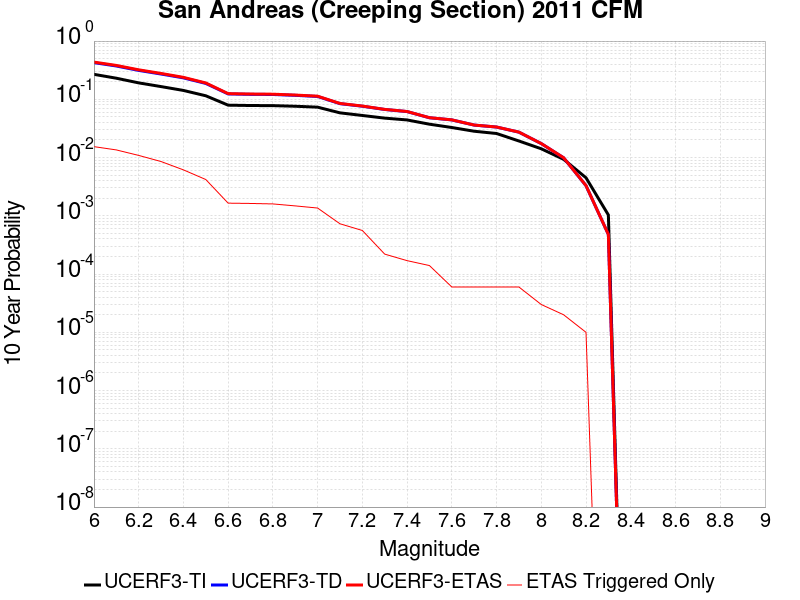 |

| Magnitude | 1 wk TI Prob | 1 wk TD Prob | 1 wk ETAS Prob | 1 wk ETAS/TD Gain | 1 wk ETAS Triggered Only | 1 mo TI Prob | 1 mo TD Prob | 1 mo ETAS Prob | 1 mo ETAS/TD Gain | 1 mo ETAS Triggered Only | 1 yr TI Prob | 1 yr TD Prob | 1 yr ETAS Prob | 1 yr ETAS/TD Gain | 1 yr ETAS Triggered Only | 10 yr TI Prob | 10 yr TD Prob | 10 yr ETAS Prob | 10 yr ETAS/TD Gain | 10 yr ETAS Triggered Only |
|-----|-----|-----|-----|-----|-----|-----|-----|-----|-----|-----|-----|-----|-----|-----|-----|-----|-----|-----|-----|-----|
| 6.0 | 5.986481E-4 | 0.0012293495 | 0.009479195 | 7.7107406 | 0.00826 | 0.0025631124 | 0.0052530365 | 0.015329824 | 2.9182785 | 0.01013 | 0.030762846 | 0.061291363 | 0.07335377 | 1.1968043 | 0.01285 | 0.26835477 | 0.42638344 | 0.43521714 | 1.0207177 | 0.0154 |
| 6.1 | 5.015945E-4 | 0.0010232513 | 0.008225874 | 8.038958 | 0.00721 | 0.00214792 | 0.0043740505 | 0.01318534 | 3.0144463 | 0.00885 | 0.025839351 | 0.05132028 | 0.06199293 | 1.2079616 | 0.01125 | 0.23032776 | 0.3732852 | 0.38176465 | 1.0227157 | 0.01353 |
| 6.2 | 4.073338E-4 | 8.1216753E-4 | 0.0067173676 | 8.270914 | 0.00591 | 0.0017445484 | 0.0034732304 | 0.010648223 | 3.065798 | 0.0072 | 0.021034058 | 0.041004535 | 0.049702622 | 1.2121251 | 0.00907 | 0.19150782 | 0.31349698 | 0.320973 | 1.0238472 | 0.01089 |
| 6.3 | 3.464099E-4 | 6.753551E-4 | 0.0053521944 | 7.9250083 | 0.00468 | 0.0014837692 | 0.0028890595 | 0.00847288 | 2.9327471 | 0.0056 | 0.017915873 | 0.034261506 | 0.041089274 | 1.1992841 | 0.00707 | 0.16538359 | 0.2718083 | 0.27803436 | 1.022906 | 0.00855 |
| 6.4 | 2.935057E-4 | 5.5586075E-4 | 0.0038540263 | 6.9334383 | 0.0033 | 0.0012572751 | 0.0023786526 | 0.006329233 | 2.6608481 | 0.00396 | 0.015200248 | 0.02833712 | 0.033253733 | 1.1735044 | 0.00506 | 0.14201577 | 0.2335043 | 0.23821825 | 1.0201879 | 0.00615 |
| 6.5 | 2.3409708E-4 | 4.2236297E-4 | 0.0026414252 | 6.253923 | 0.00222 | 0.0010028875 | 0.0018081 | 0.004483254 | 2.479539 | 0.00268 | 0.012141965 | 0.021660637 | 0.025026126 | 1.1553735 | 0.00344 | 0.11499573 | 0.18737428 | 0.1907873 | 1.0182151 | 0.0042 |
| 6.6 | 1.5842178E-4 | 2.5211865E-4 | 0.0010919069 | 4.3309245 | 8.4E-4 | 6.7877385E-4 | 0.0010800501 | 0.0020789702 | 1.9248829 | 0.001 | 0.0082328 | 0.013068941 | 0.01439143 | 1.1011932 | 0.00134 | 0.07934396 | 0.12373757 | 0.1251834 | 1.0116847 | 0.00165 |
| 6.7 | 1.5616413E-4 | 2.4748038E-4 | 0.0010872725 | 4.3933687 | 8.4E-4 | 6.691031E-4 | 0.0010601921 | 0.0020491425 | 1.932803 | 9.9E-4 | 0.0081159435 | 0.012830643 | 0.014133707 | 1.1015587 | 0.00132 | 0.0782586 | 0.121764675 | 0.1231962 | 1.0117564 | 0.00163 |
| 6.8 | 1.5538467E-4 | 2.4571587E-4 | 0.0010655144 | 4.3363676 | 8.2E-4 | 6.6576427E-4 | 0.0010526371 | 0.0020116265 | 1.9110352 | 9.6E-4 | 0.008075596 | 0.012739898 | 0.014013464 | 1.0999666 | 0.00129 | 0.07788358 | 0.120994985 | 0.122401394 | 1.0116237 | 0.0016 |
| 6.9 | 1.5153569E-4 | 2.3679626E-4 | 0.0010166116 | 4.293191 | 7.8E-4 | 6.49277E-4 | 0.0010144485 | 0.0019235252 | 1.8961291 | 9.1E-4 | 0.007876333 | 0.012281492 | 0.013486509 | 1.0981165 | 0.00122 | 0.07602952 | 0.11706305 | 0.118369795 | 1.0111628 | 0.00148 |
| 7.0 | 1.4588932E-4 | 2.2535253E-4 | 9.351925E-4 | 4.149909 | 7.1E-4 | 6.250901E-4 | 9.654411E-4 | 0.0017746591 | 1.8381847 | 8.1E-4 | 0.0075839474 | 0.011691399 | 0.012798305 | 1.094677 | 0.00112 | 0.073302895 | 0.1119063 | 0.1131141 | 1.010793 | 0.00136 |
| 7.1 | 1.1565079E-4 | 1.6401421E-4 | 5.73947E-4 | 3.4993734 | 4.1E-4 | 4.955521E-4 | 7.0272957E-4 | 0.0012023782 | 1.7110113 | 5.0E-4 | 0.006016669 | 0.008522374 | 0.009176749 | 1.0767832 | 6.6E-4 | 0.058563538 | 0.084202036 | 0.08487057 | 1.0079396 | 7.3E-4 |
| 7.2 | 1.0393792E-4 | 1.472837E-4 | 4.772351E-4 | 3.2402437 | 3.3E-4 | 4.4537216E-4 | 6.3106394E-4 | 0.0010308116 | 1.6334502 | 4.0E-4 | 0.005408933 | 0.0076563093 | 0.008152481 | 1.0648056 | 5.0E-4 | 0.052791595 | 0.07612702 | 0.07664439 | 1.0067961 | 5.6E-4 |
| 7.3 | 9.332884E-5 | 1.2879435E-4 | 2.0878404E-4 | 1.6210653 | 8.0E-5 | 3.999194E-4 | 5.518597E-4 | 6.717934E-4 | 1.2173266 | 1.2E-4 | 0.0048581534 | 0.0066983285 | 0.006887056 | 1.0281752 | 1.9E-4 | 0.047533102 | 0.06693581 | 0.067141086 | 1.0030668 | 2.2E-4 |
| 7.4 | 8.670252E-5 | 1.1795177E-4 | 1.8794351E-4 | 1.5933928 | 7.0E-5 | 3.715293E-4 | 5.0541025E-4 | 5.953648E-4 | 1.1779832 | 9.0E-5 | 0.004513991 | 0.006136131 | 0.0062852106 | 1.0242953 | 1.5E-4 | 0.044233937 | 0.06157686 | 0.06173639 | 1.0025908 | 1.7E-4 |
| 7.5 | 7.3036405E-5 | 9.083461E-5 | 1.4083007E-4 | 1.550401 | 5.0E-5 | 3.129756E-4 | 3.892332E-4 | 4.4920985E-4 | 1.1540892 | 6.0E-5 | 0.0038038217 | 0.0047286386 | 0.0048480714 | 1.0252572 | 1.2E-4 | 0.03739367 | 0.048246622 | 0.04837987 | 1.0027617 | 1.4E-4 |
| 7.6 | 6.3935775E-5 | 8.3500425E-5 | 9.3499584E-5 | 1.1197499 | 1.0E-5 | 2.7398168E-4 | 3.5780994E-4 | 3.6780638E-4 | 1.0279378 | 1.0E-5 | 0.0033306254 | 0.0043476536 | 0.004397436 | 1.0114504 | 5.0E-5 | 0.032811474 | 0.044323333 | 0.044380672 | 1.0012937 | 6.0E-5 |
| 7.7 | 5.5050095E-5 | 6.723655E-5 | 7.723588E-5 | 1.1487186 | 1.0E-5 | 2.3590765E-4 | 2.8812484E-4 | 2.9812197E-4 | 1.0346972 | 1.0E-5 | 0.0028683927 | 0.0035022818 | 0.0035521067 | 1.0142264 | 5.0E-5 | 0.0283165 | 0.03609507 | 0.036152907 | 1.0016023 | 6.0E-5 |
| 7.8 | 5.027131E-5 | 6.2193605E-5 | 7.219298E-5 | 1.1607783 | 1.0E-5 | 2.1543067E-4 | 2.6651678E-4 | 2.7651413E-4 | 1.0375111 | 1.0E-5 | 0.0026197135 | 0.0032400172 | 0.0032898553 | 1.015382 | 5.0E-5 | 0.025890453 | 0.03340082 | 0.033458814 | 1.0017364 | 6.0E-5 |
| 7.9 | 3.7271806E-5 | 5.067911E-5 | 6.06786E-5 | 1.19731 | 1.0E-5 | 1.5972654E-4 | 2.1717811E-4 | 2.2717594E-4 | 1.0460352 | 1.0E-5 | 0.0019429359 | 0.0026409393 | 0.0026908072 | 1.0188826 | 5.0E-5 | 0.019260362 | 0.027290307 | 0.02734867 | 1.0021386 | 6.0E-5 |
| 8.0 | 2.7310243E-5 | 3.1728112E-5 | 3.1728112E-5 | 1.0 | 0.0 | 1.17038646E-4 | 1.3597053E-4 | 1.3597053E-4 | 1.0 | 0.0 | 0.0014240141 | 0.0016541851 | 0.001674152 | 1.0120705 | 2.0E-5 | 0.014149235 | 0.01736636 | 0.017395841 | 1.0016974 | 3.0E-5 |
| 8.1 | 1.7940547E-5 | 1.7591927E-5 | 1.7591927E-5 | 1.0 | 0.0 | 7.688579E-5 | 7.539179E-5 | 7.539179E-5 | 1.0 | 0.0 | 9.3568244E-4 | 9.175091E-4 | 9.374907E-4 | 1.0217781 | 2.0E-5 | 0.009317525 | 0.009899838 | 0.009919641 | 1.0020002 | 2.0E-5 |
| 8.2 | 8.643924E-6 | 5.5514706E-6 | 5.5514706E-6 | 1.0 | 0.0 | 3.704486E-5 | 2.3791801E-5 | 2.3791801E-5 | 1.0 | 0.0 | 4.5092785E-4 | 2.8962674E-4 | 2.9962385E-4 | 1.0345172 | 1.0E-5 | 0.0045001395 | 0.0032906544 | 0.0033006216 | 1.0030289 | 1.0E-5 |
| 8.3 | 1.983087E-6 | 7.783617E-7 | 7.783617E-7 | 1.0 | 0.0 | 8.498917E-6 | 3.3358317E-6 | 3.3358317E-6 | 1.0 | 0.0 | 1.034694E-4 | 4.0613013E-5 | 4.0613013E-5 | 1.0 | 0.0 | 0.0010342124 | 4.791138E-4 | 4.791138E-4 | 1.0 | 0.0 |

## Calaveras (So) - Paicines extension 2011 CFM
*[(top)](#table-of-contents)*

| 1 Week | 1 Month | 1 Year | 10 Year |
|-----|-----|-----|-----|
|  |  |  |  |

| Magnitude | 1 wk TI Prob | 1 wk TD Prob | 1 wk ETAS Prob | 1 wk ETAS/TD Gain | 1 wk ETAS Triggered Only | 1 mo TI Prob | 1 mo TD Prob | 1 mo ETAS Prob | 1 mo ETAS/TD Gain | 1 mo ETAS Triggered Only | 1 yr TI Prob | 1 yr TD Prob | 1 yr ETAS Prob | 1 yr ETAS/TD Gain | 1 yr ETAS Triggered Only | 10 yr TI Prob | 10 yr TD Prob | 10 yr ETAS Prob | 10 yr ETAS/TD Gain | 10 yr ETAS Triggered Only |
|-----|-----|-----|-----|-----|-----|-----|-----|-----|-----|-----|-----|-----|-----|-----|-----|-----|-----|-----|-----|-----|
| 6.0 | 1.5183659E-4 | 3.056286E-4 | 0.0024949592 | 8.16337 | 0.00219 | 6.5056595E-4 | 0.0013086009 | 0.003935159 | 3.00715 | 0.00263 | 0.007891912 | 0.015717553 | 0.019211756 | 1.2223121 | 0.00355 | 0.076174594 | 0.13865836 | 0.14239658 | 1.0269599 | 0.00434 |
| 6.1 | 1.5024997E-4 | 3.0256834E-4 | 0.002421927 | 8.004561 | 0.00212 | 6.437695E-4 | 0.0012955031 | 0.0038322126 | 2.9580882 | 0.00254 | 0.0078097614 | 0.0155608505 | 0.018957166 | 1.2182603 | 0.00345 | 0.075409345 | 0.13732745 | 0.14093342 | 1.0262582 | 0.00418 |
| 6.2 | 1.2743923E-4 | 2.5354547E-4 | 0.002093079 | 8.255241 | 0.00184 | 5.460538E-4 | 0.0010857398 | 0.0032933403 | 3.0332685 | 0.00221 | 0.0066279583 | 0.013067722 | 0.015929826 | 1.2190208 | 0.0029 | 0.064337276 | 0.11742511 | 0.12048764 | 1.0260807 | 0.00347 |
| 6.3 | 1.1525114E-4 | 2.2640434E-4 | 0.001756058 | 7.756291 | 0.00153 | 4.9383997E-4 | 9.696106E-4 | 0.0028178168 | 2.9061325 | 0.00185 | 0.0059959386 | 0.011688861 | 0.014080575 | 1.2046148 | 0.00242 | 0.058367174 | 0.10654259 | 0.109133616 | 1.0243192 | 0.0029 |
| 6.4 | 1.07200925E-4 | 2.0881052E-4 | 0.0015185369 | 7.2723203 | 0.00131 | 4.5935164E-4 | 8.943376E-4 | 0.0025128888 | 2.8097765 | 0.00162 | 0.0055782744 | 0.010793649 | 0.012890765 | 1.1942918 | 0.00212 | 0.0544031 | 0.099365726 | 0.10167135 | 1.0232034 | 0.00256 |
| 6.5 | 9.69631E-5 | 1.8773972E-4 | 0.0012575388 | 6.6983104 | 0.00107 | 4.1548995E-4 | 8.0415385E-4 | 0.0021430762 | 2.6650078 | 0.00134 | 0.0050468626 | 0.009715157 | 0.011487767 | 1.1824582 | 0.00179 | 0.04933773 | 0.09025607 | 0.09223931 | 1.0219735 | 0.00218 |
| 6.6 | 8.0552316E-5 | 1.511002E-4 | 9.909733E-4 | 6.558385 | 8.4E-4 | 3.4517853E-4 | 6.473696E-4 | 0.0016667093 | 2.5745869 | 0.00102 | 0.0041944524 | 0.007846748 | 0.00921592 | 1.174489 | 0.00138 | 0.04116161 | 0.0750278 | 0.07659101 | 1.020835 | 0.00169 |
| 6.7 | 7.815757E-5 | 1.4650238E-4 | 9.563837E-4 | 6.52811 | 8.1E-4 | 3.34918E-4 | 6.2768004E-4 | 0.001607065 | 2.560325 | 9.8E-4 | 0.004070005 | 0.0076094037 | 0.008939207 | 1.174758 | 0.00134 | 0.039962657 | 0.07287646 | 0.074369125 | 1.0204822 | 0.00161 |
| 6.8 | 6.965264E-5 | 1.2759454E-4 | 7.5751415E-4 | 5.9368854 | 6.3E-4 | 2.9847719E-4 | 5.466999E-4 | 0.0012763009 | 2.3345547 | 7.3E-4 | 0.0036279052 | 0.0066325427 | 0.0076557114 | 1.1542649 | 0.00103 | 0.03569247 | 0.06396372 | 0.06516184 | 1.0187314 | 0.00128 |
| 6.9 | 5.8000453E-5 | 1.0176564E-4 | 5.917158E-4 | 5.8144946 | 4.9E-4 | 2.4854968E-4 | 4.3606613E-4 | 9.958219E-4 | 2.283649 | 5.6E-4 | 0.0030218933 | 0.0052962787 | 0.0060224123 | 1.1371026 | 7.3E-4 | 0.029811295 | 0.05165387 | 0.052488413 | 1.0161564 | 8.8E-4 |
| 7.0 | 4.9865852E-5 | 8.597217E-5 | 4.159438E-4 | 4.8381214 | 3.3E-4 | 2.1369329E-4 | 3.684006E-4 | 7.482606E-4 | 2.0311058 | 3.8E-4 | 0.0025986114 | 0.0044761426 | 0.00500377 | 1.1178756 | 5.3E-4 | 0.025684336 | 0.043919444 | 0.044540897 | 1.0141498 | 6.5E-4 |
| 7.1 | 4.283875E-5 | 7.1383394E-5 | 3.5136341E-4 | 4.922201 | 2.8E-4 | 1.8358172E-4 | 3.0589328E-4 | 6.357923E-4 | 2.0784776 | 3.3E-4 | 0.0022328163 | 0.0037179473 | 0.0041862 | 1.1259439 | 4.7E-4 | 0.022105146 | 0.036860093 | 0.037418712 | 1.0151552 | 5.8E-4 |
| 7.2 | 3.450115E-5 | 5.602686E-5 | 2.4601622E-4 | 4.391041 | 1.9E-4 | 1.478537E-4 | 2.4009318E-4 | 4.5004275E-4 | 1.8744504 | 2.1E-4 | 0.0017986323 | 0.0029192455 | 0.003198428 | 1.0956352 | 2.8E-4 | 0.017841442 | 0.029199816 | 0.029549304 | 1.0119689 | 3.6E-4 |
| 7.3 | 2.5709045E-5 | 4.0808765E-5 | 1.5080428E-4 | 3.6953893 | 1.1E-4 | 1.1017697E-4 | 1.7488308E-4 | 3.0486035E-4 | 1.7432238 | 1.3E-4 | 0.0013405791 | 0.0021271396 | 0.0022867993 | 1.0750583 | 1.6E-4 | 0.013325208 | 0.021404557 | 0.02161006 | 1.009601 | 2.1E-4 |
| 7.4 | 1.8003093E-5 | 2.86454E-5 | 6.864425E-5 | 2.3963447 | 4.0E-5 | 7.715383E-5 | 1.2276023E-4 | 1.6275533E-4 | 1.3257984 | 4.0E-5 | 9.3894306E-4 | 0.0014935835 | 0.0015435088 | 1.0334265 | 5.0E-5 | 0.009349857 | 0.015116798 | 0.015195588 | 1.0052121 | 8.0E-5 |
| 7.5 | 1.5595824E-5 | 2.595182E-5 | 5.595104E-5 | 2.1559584 | 3.0E-5 | 6.683753E-5 | 1.11217356E-4 | 1.4121401E-4 | 1.2697121 | 3.0E-5 | 8.134431E-4 | 0.0013532324 | 0.0013931784 | 1.0295188 | 4.0E-5 | 0.008104719 | 0.013714053 | 0.013783093 | 1.0050342 | 7.0E-5 |
| 7.6 | 1.1110309E-5 | 1.9333203E-5 | 3.9332816E-5 | 2.0344696 | 2.0E-5 | 4.761474E-5 | 8.285396E-5 | 1.02852304E-4 | 1.2413685 | 2.0E-5 | 5.795553E-4 | 0.0010082815 | 0.0010282614 | 1.0198157 | 2.0E-5 | 0.0057804612 | 0.010257012 | 0.010286705 | 1.0028949 | 3.0E-5 |
| 7.7 | 6.2140443E-6 | 1.0517965E-5 | 1.0517965E-5 | 1.0 | 0.0 | 2.6631347E-5 | 4.5076213E-5 | 4.5076213E-5 | 1.0 | 0.0 | 3.241884E-4 | 5.4866483E-4 | 5.4866483E-4 | 1.0 | 0.0 | 0.0032371588 | 0.005659303 | 0.005659303 | 1.0 | 0.0 |
| 7.8 | 5.305533E-6 | 9.505557E-6 | 9.505557E-6 | 1.0 | 0.0 | 2.27378E-5 | 4.0737465E-5 | 4.0737465E-5 | 1.0 | 0.0 | 2.7679754E-4 | 4.958659E-4 | 4.958659E-4 | 1.0 | 0.0 | 0.0027645302 | 0.0051095965 | 0.0051095965 | 1.0 | 0.0 |
| 7.9 | 3.363505E-6 | 7.438808E-6 | 7.438808E-6 | 1.0 | 0.0 | 1.4414942E-5 | 3.1880216E-5 | 3.1880216E-5 | 1.0 | 0.0 | 1.7548777E-4 | 3.880726E-4 | 3.880726E-4 | 1.0 | 0.0 | 0.0017534926 | 0.0039745644 | 0.0039745644 | 1.0 | 0.0 |
| 8.0 | 2.0271132E-6 | 4.4438734E-6 | 4.4438734E-6 | 1.0 | 0.0 | 8.687599E-6 | 1.9045032E-5 | 1.9045032E-5 | 1.0 | 0.0 | 1.05766376E-4 | 2.3184865E-4 | 2.3184865E-4 | 1.0 | 0.0 | 0.0010571606 | 0.0023660618 | 0.0023660618 | 1.0 | 0.0 |
| 8.1 | 1.2206116E-6 | 2.3922025E-6 | 2.3922025E-6 | 1.0 | 0.0 | 5.2311816E-6 | 1.0252256E-5 | 1.0252256E-5 | 1.0 | 0.0 | 6.3687774E-5 | 1.248141E-4 | 1.248141E-4 | 1.0 | 0.0 | 6.366953E-4 | 0.0012790338 | 0.0012790338 | 1.0 | 0.0 |

## Calaveras (So) 2011 CFM
*[(top)](#table-of-contents)*

| 1 Week | 1 Month | 1 Year | 10 Year |
|-----|-----|-----|-----|
|  |  |  |  |

| Magnitude | 1 wk TI Prob | 1 wk TD Prob | 1 wk ETAS Prob | 1 wk ETAS/TD Gain | 1 wk ETAS Triggered Only | 1 mo TI Prob | 1 mo TD Prob | 1 mo ETAS Prob | 1 mo ETAS/TD Gain | 1 mo ETAS Triggered Only | 1 yr TI Prob | 1 yr TD Prob | 1 yr ETAS Prob | 1 yr ETAS/TD Gain | 1 yr ETAS Triggered Only | 10 yr TI Prob | 10 yr TD Prob | 10 yr ETAS Prob | 10 yr ETAS/TD Gain | 10 yr ETAS Triggered Only |
|-----|-----|-----|-----|-----|-----|-----|-----|-----|-----|-----|-----|-----|-----|-----|-----|-----|-----|-----|-----|-----|
| 6.0 | 1.5950744E-4 | 3.075675E-4 | 0.0010773307 | 3.5027454 | 7.7E-4 | 6.834242E-4 | 0.0013173391 | 0.0022760746 | 1.7277817 | 9.6E-4 | 0.00828899 | 0.015881283 | 0.017209843 | 1.0836557 | 0.00135 | 0.079865426 | 0.1445826 | 0.1460197 | 1.0099397 | 0.00168 |
| 6.1 | 1.3584697E-4 | 2.6077544E-4 | 0.0010105799 | 3.8752875 | 7.5E-4 | 5.8207137E-4 | 0.0011169954 | 0.0020459567 | 1.8316607 | 9.3E-4 | 0.007063716 | 0.013483079 | 0.01476555 | 1.0951171 | 0.0013 | 0.06843361 | 0.12420464 | 0.12562343 | 1.011423 | 0.00162 |
| 6.2 | 1.14676266E-4 | 2.1754697E-4 | 9.673838E-4 | 4.4467816 | 7.5E-4 | 4.9137714E-4 | 9.3194545E-4 | 0.001851088 | 1.9862622 | 9.2E-4 | 0.0059661185 | 0.011265734 | 0.012531314 | 1.1123389 | 0.00128 | 0.058084648 | 0.105190866 | 0.10661361 | 1.0135254 | 0.00159 |
| 6.3 | 8.691518E-5 | 1.602576E-4 | 8.801422E-4 | 5.492047 | 7.2E-4 | 3.7244044E-4 | 6.865974E-4 | 0.0015759864 | 2.2953572 | 8.9E-4 | 0.004525038 | 0.00832061 | 0.009540375 | 1.1465957 | 0.00123 | 0.044339992 | 0.07950171 | 0.08091008 | 1.0177149 | 0.00153 |
| 6.4 | 8.50982E-5 | 1.5731962E-4 | 8.6720794E-4 | 5.5123954 | 7.1E-4 | 3.646556E-4 | 6.7401264E-4 | 0.0015534195 | 2.3047335 | 8.8E-4 | 0.0044306475 | 0.008168546 | 0.009378579 | 1.1481334 | 0.00122 | 0.04343345 | 0.07810723 | 0.079508506 | 1.0179404 | 0.00152 |
| 6.5 | 8.4062965E-5 | 1.5556284E-4 | 8.654524E-4 | 5.563362 | 7.1E-4 | 3.602201E-4 | 6.664877E-4 | 0.0015459012 | 2.3194745 | 8.8E-4 | 0.004376863 | 0.008077703 | 0.009287848 | 1.149813 | 0.00122 | 0.042916555 | 0.077278145 | 0.078671455 | 1.0180298 | 0.00151 |
| 6.6 | 8.194716E-5 | 1.5191858E-4 | 8.618107E-4 | 5.6728463 | 7.1E-4 | 3.5115483E-4 | 6.508777E-4 | 0.0015303049 | 2.3511405 | 8.8E-4 | 0.0042669317 | 0.007889415 | 0.00909979 | 1.1534176 | 0.00122 | 0.04185927 | 0.07556239 | 0.076949045 | 1.0183512 | 0.0015 |
| 6.7 | 8.012326E-5 | 1.4859518E-4 | 8.5848966E-4 | 5.7773724 | 7.1E-4 | 3.433402E-4 | 6.3664495E-4 | 0.0015160847 | 2.381366 | 8.8E-4 | 0.004172157 | 0.0077177975 | 0.008928382 | 1.1568562 | 0.00122 | 0.040946912 | 0.07400386 | 0.07537433 | 1.0185189 | 0.00148 |
| 6.8 | 7.119773E-5 | 1.2916543E-4 | 6.6909567E-4 | 5.180145 | 5.4E-4 | 3.0509746E-4 | 5.534294E-4 | 0.0011930752 | 2.1557858 | 6.4E-4 | 0.0037082357 | 0.00671396 | 0.007627783 | 1.1361079 | 9.2E-4 | 0.036469642 | 0.06483975 | 0.06592454 | 1.0167303 | 0.00116 |
| 6.9 | 5.7343088E-5 | 9.949606E-5 | 4.9945625E-4 | 5.01986 | 4.0E-4 | 2.4573295E-4 | 4.2634242E-4 | 8.9614204E-4 | 2.1019304 | 4.7E-4 | 0.0029876942 | 0.00517844 | 0.005795229 | 1.1191071 | 6.2E-4 | 0.02947844 | 0.050651338 | 0.051372845 | 1.0142446 | 7.6E-4 |
| 7.0 | 4.8746577E-5 | 8.3118E-5 | 3.2309807E-4 | 3.887221 | 2.4E-4 | 2.0889717E-4 | 3.5617172E-4 | 6.460684E-4 | 1.813924 | 2.9E-4 | 0.0025403565 | 0.004327835 | 0.0047460175 | 1.0966262 | 4.2E-4 | 0.025115121 | 0.04261209 | 0.04311951 | 1.0119078 | 5.3E-4 |
| 7.1 | 4.2998014E-5 | 7.2888084E-5 | 3.128706E-4 | 4.2924795 | 2.4E-4 | 1.8426418E-4 | 3.1234045E-4 | 6.022499E-4 | 1.928184 | 2.9E-4 | 0.002241108 | 0.0037961747 | 0.00421458 | 1.1102177 | 4.2E-4 | 0.022186412 | 0.037536595 | 0.0380467 | 1.0135895 | 5.3E-4 |
| 7.2 | 3.221292E-5 | 5.4130007E-5 | 2.1412135E-4 | 3.9556866 | 1.6E-4 | 1.3804805E-4 | 2.3196527E-4 | 4.119235E-4 | 1.7757982 | 1.8E-4 | 0.0016794393 | 0.002820548 | 0.003059871 | 1.0848498 | 2.4E-4 | 0.016668037 | 0.028144209 | 0.028445484 | 1.0107048 | 3.1E-4 |
| 7.3 | 2.3756531E-5 | 3.9669034E-5 | 1.4966467E-4 | 3.7728338 | 1.1E-4 | 1.0180973E-4 | 1.6999916E-4 | 2.9997705E-4 | 1.7645797 | 1.3E-4 | 0.0012388286 | 0.0020677922 | 0.0022374408 | 1.0820433 | 1.7E-4 | 0.012319452 | 0.020739699 | 0.020945342 | 1.0099155 | 2.1E-4 |
| 7.4 | 1.5997684E-5 | 2.7453918E-5 | 6.745282E-5 | 2.4569468 | 4.0E-5 | 6.8559704E-5 | 1.1765436E-4 | 1.5764966E-4 | 1.3399389 | 4.0E-5 | 8.343947E-4 | 0.0014315031 | 0.0014814314 | 1.0348784 | 5.0E-5 | 0.008312687 | 0.014430365 | 0.014499354 | 1.0047809 | 7.0E-5 |
| 7.5 | 1.3814293E-5 | 2.4891238E-5 | 5.489049E-5 | 2.2052133 | 3.0E-5 | 5.9202768E-5 | 1.06672385E-4 | 1.3666919E-4 | 1.2812049 | 3.0E-5 | 7.205553E-4 | 0.001297965 | 0.0013379131 | 1.0307775 | 4.0E-5 | 0.007182234 | 0.0131074805 | 0.013166694 | 1.0045176 | 6.0E-5 |
| 7.6 | 8.817309E-6 | 1.6519625E-5 | 3.6519294E-5 | 2.2106612 | 2.0E-5 | 3.7787922E-5 | 7.079648E-5 | 9.079506E-5 | 1.2824799 | 2.0E-5 | 4.5997082E-4 | 8.616076E-4 | 8.8159036E-4 | 1.0231924 | 2.0E-5 | 0.004590199 | 0.008762723 | 0.00879246 | 1.0033937 | 3.0E-5 |
| 7.7 | 4.0352206E-6 | 7.767029E-6 | 7.767029E-6 | 1.0 | 0.0 | 1.7293689E-5 | 3.3286844E-5 | 3.3286844E-5 | 1.0 | 0.0 | 2.1053031E-4 | 4.0519206E-4 | 4.0519206E-4 | 1.0 | 0.0 | 0.0021033096 | 0.004194483 | 0.004194483 | 1.0 | 0.0 |
| 7.8 | 3.413169E-6 | 6.839645E-6 | 6.839645E-6 | 1.0 | 0.0 | 1.4627784E-5 | 2.9312434E-5 | 2.9312434E-5 | 1.0 | 0.0 | 1.7807873E-4 | 3.568205E-4 | 3.568205E-4 | 1.0 | 0.0 | 0.0017793609 | 0.003692136 | 0.003692136 | 1.0 | 0.0 |
| 7.9 | 2.4740732E-6 | 5.317935E-6 | 5.317935E-6 | 1.0 | 0.0 | 1.06031275E-5 | 2.2790951E-5 | 2.2790951E-5 | 1.0 | 0.0 | 1.2908543E-4 | 2.7744455E-4 | 2.7744455E-4 | 1.0 | 0.0 | 0.0012901047 | 0.0028536797 | 0.0028536797 | 1.0 | 0.0 |
| 8.0 | 1.5231818E-6 | 3.3119125E-6 | 3.3119125E-6 | 1.0 | 0.0 | 6.527906E-6 | 1.4193833E-5 | 1.4193833E-5 | 1.0 | 0.0 | 7.9474354E-5 | 1.7279625E-4 | 1.7279625E-4 | 1.0 | 0.0 | 7.944594E-4 | 0.0017677062 | 0.0017677062 | 1.0 | 0.0 |
| 8.1 | 1.0104524E-6 | 2.0601656E-6 | 2.0601656E-6 | 1.0 | 0.0 | 4.330503E-6 | 8.829252E-6 | 8.829252E-6 | 1.0 | 0.0 | 5.2722597E-5 | 1.07490865E-4 | 1.07490865E-4 | 1.0 | 0.0 | 5.271009E-4 | 0.0011000879 | 0.0011000879 | 1.0 | 0.0 |

## Concord 2011 CFM
*[(top)](#table-of-contents)*

| 1 Week | 1 Month | 1 Year | 10 Year |
|-----|-----|-----|-----|
|  |  |  |  |

| Magnitude | 1 wk TI Prob | 1 wk TD Prob | 1 wk ETAS Prob | 1 wk ETAS/TD Gain | 1 wk ETAS Triggered Only | 1 mo TI Prob | 1 mo TD Prob | 1 mo ETAS Prob | 1 mo ETAS/TD Gain | 1 mo ETAS Triggered Only | 1 yr TI Prob | 1 yr TD Prob | 1 yr ETAS Prob | 1 yr ETAS/TD Gain | 1 yr ETAS Triggered Only | 10 yr TI Prob | 10 yr TD Prob | 10 yr ETAS Prob | 10 yr ETAS/TD Gain | 10 yr ETAS Triggered Only |
|-----|-----|-----|-----|-----|-----|-----|-----|-----|-----|-----|-----|-----|-----|-----|-----|-----|-----|-----|-----|-----|
| 6.0 | 5.7865112E-5 | 9.7641554E-5 | 4.576064E-4 | 4.686595 | 3.6E-4 | 2.4796976E-4 | 4.1839524E-4 | 9.881568E-4 | 2.3617783 | 5.7E-4 | 0.0030148525 | 0.0050825938 | 0.0061073587 | 1.2016225 | 0.00103 | 0.029742775 | 0.049277306 | 0.050627332 | 1.0273966 | 0.00142 |
| 6.1 | 5.7865112E-5 | 9.7641554E-5 | 4.576064E-4 | 4.686595 | 3.6E-4 | 2.4796976E-4 | 4.1839524E-4 | 9.881568E-4 | 2.3617783 | 5.7E-4 | 0.0030148525 | 0.0050825938 | 0.0061073587 | 1.2016225 | 0.00103 | 0.029742775 | 0.049277306 | 0.050627332 | 1.0273966 | 0.00142 |
| 6.2 | 5.6789337E-5 | 9.584295E-5 | 4.5580845E-4 | 4.755785 | 3.6E-4 | 2.4336016E-4 | 4.1068997E-4 | 9.7046E-4 | 2.362999 | 5.6E-4 | 0.0029588845 | 0.0049892613 | 0.005974322 | 1.1974362 | 9.9E-4 | 0.029197963 | 0.04839343 | 0.049697127 | 1.0269396 | 0.00137 |
| 6.3 | 5.203322E-5 | 8.808044E-5 | 3.5805666E-4 | 4.0651097 | 2.7E-4 | 2.2298045E-4 | 3.7743736E-4 | 8.172713E-4 | 2.1653163 | 4.4E-4 | 0.0027114071 | 0.004586402 | 0.005412595 | 1.1801398 | 8.3E-4 | 0.026785625 | 0.04456182 | 0.045689233 | 1.0253 | 0.00118 |
| 6.4 | 4.7120942E-5 | 7.8992845E-5 | 2.4897943E-4 | 3.1519237 | 1.7E-4 | 2.0193127E-4 | 3.3850104E-4 | 6.5839273E-4 | 1.9450243 | 3.2E-4 | 0.0024557412 | 0.0041142073 | 0.004741615 | 1.1524979 | 6.3E-4 | 0.024287801 | 0.040077433 | 0.04097016 | 1.0222751 | 9.3E-4 |
| 6.5 | 2.9598437E-5 | 4.6689907E-5 | 1.1668664E-4 | 2.4991834 | 7.0E-5 | 1.2684427E-4 | 2.0008544E-4 | 3.3005944E-4 | 1.6495924 | 1.3E-4 | 0.001543235 | 0.0024335291 | 0.0027128477 | 1.1147792 | 2.8E-4 | 0.015325619 | 0.023914209 | 0.024353446 | 1.0183673 | 4.5E-4 |
| 6.6 | 2.0443718E-5 | 2.9997453E-5 | 6.9996255E-5 | 2.3334064 | 4.0E-5 | 8.7613E-5 | 1.2855438E-4 | 1.9854539E-4 | 1.5444466 | 7.0E-5 | 0.0010661662 | 0.0015640621 | 0.0017238118 | 1.1021377 | 1.6E-4 | 0.010610655 | 0.015472484 | 0.015738307 | 1.0171803 | 2.7E-4 |
| 6.7 | 1.798539E-5 | 2.5570018E-5 | 4.5569508E-5 | 1.782146 | 2.0E-5 | 7.7077966E-5 | 1.0958131E-4 | 1.5957584E-4 | 1.4562322 | 5.0E-5 | 9.380202E-4 | 0.0013333575 | 0.0014731708 | 1.104858 | 1.4E-4 | 0.009340706 | 0.013222647 | 0.013459473 | 1.0179107 | 2.4E-4 |
| 6.8 | 1.613555E-5 | 2.197128E-5 | 3.197106E-5 | 1.4551296 | 1.0E-5 | 6.915052E-5 | 9.415931E-5 | 1.2415649E-4 | 1.318579 | 3.0E-5 | 8.4158237E-4 | 0.0011458007 | 0.0012456861 | 1.0871753 | 1.0E-4 | 0.008384023 | 0.011383364 | 0.011561315 | 1.0156325 | 1.8E-4 |
| 6.9 | 1.2916435E-5 | 1.7092227E-5 | 2.7092057E-5 | 1.5850513 | 1.0E-5 | 5.5354973E-5 | 7.3250376E-5 | 9.324891E-5 | 1.2730161 | 2.0E-5 | 6.7373837E-4 | 8.914643E-4 | 9.514108E-4 | 1.067245 | 6.0E-5 | 0.006716994 | 0.0088732755 | 0.0089823 | 1.0122868 | 1.1E-4 |
| 7.0 | 9.81129E-6 | 1.2637888E-5 | 2.2637762E-5 | 1.7912614 | 1.0E-5 | 4.2047708E-5 | 5.416126E-5 | 7.4160176E-5 | 1.3692477 | 2.0E-5 | 5.118106E-4 | 6.592155E-4 | 7.091825E-4 | 1.0757977 | 5.0E-5 | 0.005106334 | 0.006573381 | 0.0066528553 | 1.0120903 | 8.0E-5 |
| 7.1 | 8.0889195E-6 | 1.0423651E-5 | 2.0423546E-5 | 1.9593468 | 1.0E-5 | 3.4666336E-5 | 4.467203E-5 | 5.4671582E-5 | 1.2238437 | 1.0E-5 | 4.219809E-4 | 5.437473E-4 | 5.637364E-4 | 1.0367618 | 2.0E-5 | 0.004211805 | 0.005424482 | 0.0054642647 | 1.007334 | 4.0E-5 |
| 7.2 | 6.267438E-6 | 8.120282E-6 | 1.81202E-5 | 2.2314744 | 1.0E-5 | 2.6860173E-5 | 3.4800745E-5 | 4.4800396E-5 | 1.2873402 | 1.0E-5 | 3.2697353E-4 | 4.2361743E-4 | 4.4360897E-4 | 1.0471925 | 2.0E-5 | 0.0032649285 | 0.0042285053 | 0.004258379 | 1.0070647 | 3.0E-5 |
| 7.3 | 3.6761196E-6 | 4.8440324E-6 | 4.8440324E-6 | 1.0 | 0.0 | 1.5754704E-5 | 2.0759975E-5 | 2.0759975E-5 | 1.0 | 0.0 | 1.9179663E-4 | 2.527236E-4 | 2.527236E-4 | 1.0 | 0.0 | 0.0019163118 | 0.0025247212 | 0.0025247212 | 1.0 | 0.0 |
| 7.4 | 2.8044356E-6 | 3.713288E-6 | 3.713288E-6 | 1.0 | 0.0 | 1.2018954E-5 | 1.5913995E-5 | 1.5913995E-5 | 1.0 | 0.0 | 1.4632095E-4 | 1.9373577E-4 | 1.9373577E-4 | 1.0 | 0.0 | 0.0014622464 | 0.0019359066 | 0.0019359066 | 1.0 | 0.0 |
| 7.5 | 2.4578699E-6 | 3.2479675E-6 | 3.2479675E-6 | 1.0 | 0.0 | 1.0533685E-5 | 1.3919786E-5 | 1.3919786E-5 | 1.0 | 0.0 | 1.2824008E-4 | 1.6946033E-4 | 1.6946033E-4 | 1.0 | 0.0 | 0.0012816609 | 0.0016935312 | 0.0016935312 | 1.0 | 0.0 |
| 7.6 | 1.7713267E-6 | 2.3380726E-6 | 2.3380726E-6 | 1.0 | 0.0 | 7.591378E-6 | 1.0020273E-5 | 1.0020273E-5 | 1.0 | 0.0 | 9.2421105E-5 | 1.21990095E-4 | 1.21990095E-4 | 1.0 | 0.0 | 9.2382677E-4 | 0.0012194485 | 0.0012194485 | 1.0 | 0.0 |
| 7.7 | 5.1912366E-7 | 6.8326125E-7 | 6.8326125E-7 | 1.0 | 0.0 | 2.2248137E-6 | 2.9282594E-6 | 2.9282594E-6 | 1.0 | 0.0 | 2.708677E-5 | 3.5650985E-5 | 3.5650985E-5 | 1.0 | 0.0 | 2.708347E-4 | 3.5647038E-4 | 3.5647038E-4 | 1.0 | 0.0 |

## Green Valley 2011 CFM
*[(top)](#table-of-contents)*

| 1 Week | 1 Month | 1 Year | 10 Year |
|-----|-----|-----|-----|
|  |  |  | 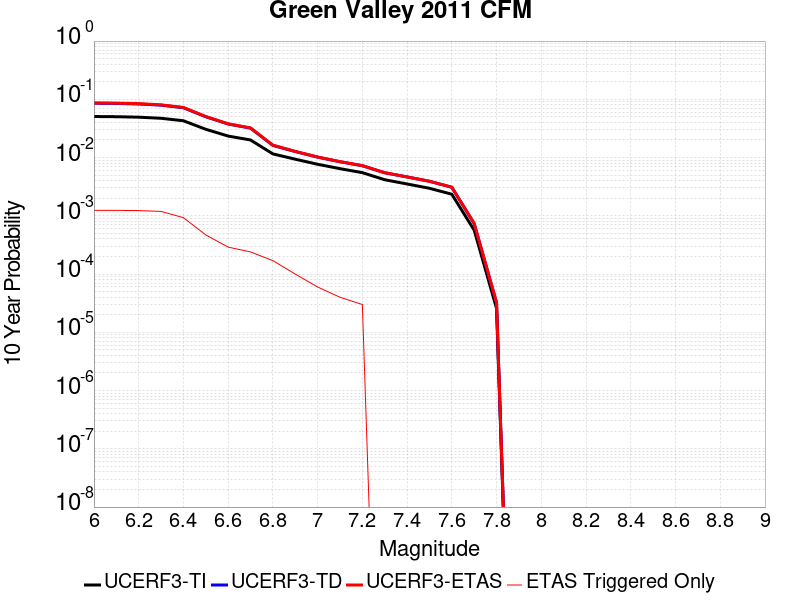 |

| Magnitude | 1 wk TI Prob | 1 wk TD Prob | 1 wk ETAS Prob | 1 wk ETAS/TD Gain | 1 wk ETAS Triggered Only | 1 mo TI Prob | 1 mo TD Prob | 1 mo ETAS Prob | 1 mo ETAS/TD Gain | 1 mo ETAS Triggered Only | 1 yr TI Prob | 1 yr TD Prob | 1 yr ETAS Prob | 1 yr ETAS/TD Gain | 1 yr ETAS Triggered Only | 10 yr TI Prob | 10 yr TD Prob | 10 yr ETAS Prob | 10 yr ETAS/TD Gain | 10 yr ETAS Triggered Only |
|-----|-----|-----|-----|-----|-----|-----|-----|-----|-----|-----|-----|-----|-----|-----|-----|-----|-----|-----|-----|-----|
| 6.0 | 9.9629346E-5 | 1.7313591E-4 | 4.8308223E-4 | 2.790191 | 3.1E-4 | 4.2691303E-4 | 7.4177206E-4 | 0.001221416 | 1.6466191 | 4.8E-4 | 0.0051852856 | 0.008992254 | 0.009864341 | 1.096982 | 8.8E-4 | 0.050659515 | 0.08557089 | 0.086704776 | 1.013251 | 0.00124 |
| 6.1 | 9.88615E-5 | 1.7160611E-4 | 4.815529E-4 | 2.8061526 | 3.1E-4 | 4.2362334E-4 | 7.3521945E-4 | 0.0012148665 | 1.6523863 | 4.8E-4 | 0.0051454236 | 0.008913136 | 0.009785293 | 1.0978507 | 8.8E-4 | 0.050279044 | 0.084857345 | 0.08599212 | 1.0133728 | 0.00124 |
| 6.2 | 9.696895E-5 | 1.679925E-4 | 4.7794043E-4 | 2.8450105 | 3.1E-4 | 4.15515E-4 | 7.1974256E-4 | 0.0011993971 | 1.6664251 | 4.8E-4 | 0.0050471667 | 0.008726313 | 0.009588721 | 1.0988284 | 8.7E-4 | 0.04934063 | 0.083164826 | 0.08429253 | 1.0135599 | 0.00123 |
| 6.3 | 9.275224E-5 | 1.597848E-4 | 4.4973847E-4 | 2.814651 | 2.9E-4 | 3.9744904E-4 | 6.845854E-4 | 0.0011342773 | 1.6568822 | 4.5E-4 | 0.0048282105 | 0.008301583 | 0.009134609 | 1.1003455 | 8.4E-4 | 0.047246475 | 0.07930312 | 0.08039875 | 1.0138158 | 0.00119 |
| 6.4 | 8.391499E-5 | 1.4372397E-4 | 3.236981E-4 | 2.2522206 | 1.8E-4 | 3.595861E-4 | 6.157896E-4 | 9.355926E-4 | 1.519338 | 3.2E-4 | 0.004369175 | 0.007470341 | 0.008095635 | 1.0837035 | 6.3E-4 | 0.04284265 | 0.07166284 | 0.072526194 | 1.0120474 | 9.3E-4 |
| 6.5 | 5.9519385E-5 | 9.938212E-5 | 1.7937417E-4 | 1.8048937 | 8.0E-5 | 2.5505814E-4 | 4.258293E-4 | 5.557739E-4 | 1.3051567 | 1.3E-4 | 0.0031009112 | 0.0051710117 | 0.0054694605 | 1.0577158 | 3.0E-4 | 0.030579966 | 0.050167497 | 0.05061392 | 1.0088986 | 4.7E-4 |
| 6.6 | 4.5361558E-5 | 7.406684E-5 | 1.2406314E-4 | 1.6750159 | 5.0E-5 | 1.9439218E-4 | 3.1737192E-4 | 3.8734972E-4 | 1.2204914 | 7.0E-5 | 0.0023641558 | 0.0038561895 | 0.004035495 | 1.0464982 | 1.8E-4 | 0.023391623 | 0.037686642 | 0.03796571 | 1.007405 | 2.9E-4 |
| 6.7 | 3.8808106E-5 | 6.268606E-5 | 8.2684805E-5 | 1.3190302 | 2.0E-5 | 1.6630985E-4 | 2.6860842E-4 | 3.0859766E-4 | 1.1488757 | 4.0E-5 | 0.0020229418 | 0.003264781 | 0.003404324 | 1.0427419 | 1.4E-4 | 0.020046256 | 0.032024194 | 0.032256506 | 1.0072544 | 2.4E-4 |
| 6.8 | 2.2284667E-5 | 3.129953E-5 | 4.1299216E-5 | 1.3194836 | 1.0E-5 | 9.550222E-5 | 1.341338E-4 | 1.5413114E-4 | 1.1490848 | 2.0E-5 | 0.0011621192 | 0.0016318542 | 0.0017217074 | 1.0550619 | 9.0E-5 | 0.011560607 | 0.016172443 | 0.016339693 | 1.0103418 | 1.7E-4 |
| 6.9 | 1.8050168E-5 | 2.4460724E-5 | 3.4460478E-5 | 1.4088086 | 1.0E-5 | 7.735557E-5 | 1.04827464E-4 | 1.1482641E-4 | 1.0953848 | 1.0E-5 | 9.4139716E-4 | 0.0012755299 | 0.0013254661 | 1.0391494 | 5.0E-5 | 0.009374191 | 0.012674765 | 0.012773498 | 1.0077897 | 1.0E-4 |
| 7.0 | 1.4763166E-5 | 1.9591294E-5 | 2.9591098E-5 | 1.5104208 | 1.0E-5 | 6.326917E-5 | 8.396E-5 | 9.395916E-5 | 1.1190944 | 1.0E-5 | 7.7002996E-4 | 0.0010217349 | 0.0010517043 | 1.0293318 | 3.0E-5 | 0.007673672 | 0.010170201 | 0.01022959 | 1.0058396 | 6.0E-5 |
| 7.1 | 1.2399713E-5 | 1.6310292E-5 | 2.6310128E-5 | 1.6130998 | 1.0E-5 | 5.3140546E-5 | 6.989939E-5 | 7.9898695E-5 | 1.1430528 | 1.0E-5 | 6.467941E-4 | 8.506948E-4 | 8.7067776E-4 | 1.0234902 | 2.0E-5 | 0.006449148 | 0.008474788 | 0.008514449 | 1.0046799 | 4.0E-5 |
| 7.2 | 1.0584195E-5 | 1.3927677E-5 | 2.3927538E-5 | 1.7179848 | 1.0E-5 | 4.5360044E-5 | 5.968869E-5 | 6.9688096E-5 | 1.1675259 | 1.0E-5 | 5.521186E-4 | 7.264691E-4 | 7.464546E-4 | 1.0275104 | 2.0E-5 | 0.0055074887 | 0.007241565 | 0.0072713476 | 1.0041127 | 3.0E-5 |
| 7.3 | 7.998173E-6 | 1.0549448E-5 | 1.0549448E-5 | 1.0 | 0.0 | 3.4277433E-5 | 4.5211145E-5 | 4.5211145E-5 | 1.0 | 0.0 | 4.1724785E-4 | 5.5030774E-4 | 5.5030774E-4 | 1.0 | 0.0 | 0.004164653 | 0.0054900344 | 0.0054900344 | 1.0 | 0.0 |
| 7.4 | 6.7571127E-6 | 8.937885E-6 | 8.937885E-6 | 1.0 | 0.0 | 2.8958733E-5 | 3.830466E-5 | 3.830466E-5 | 1.0 | 0.0 | 3.5251552E-4 | 4.6626042E-4 | 4.6626042E-4 | 1.0 | 0.0 | 0.0035195686 | 0.0046532126 | 0.0046532126 | 1.0 | 0.0 |
| 7.5 | 5.69878E-6 | 7.5203984E-6 | 7.5203984E-6 | 1.0 | 0.0 | 2.4423114E-5 | 3.2229887E-5 | 3.2229887E-5 | 1.0 | 0.0 | 2.9731085E-4 | 3.923291E-4 | 3.923291E-4 | 1.0 | 0.0 | 0.002969134 | 0.003916734 | 0.003916734 | 1.0 | 0.0 |
| 7.6 | 4.503664E-6 | 5.9393674E-6 | 5.9393674E-6 | 1.0 | 0.0 | 1.9301275E-5 | 2.5454188E-5 | 2.5454188E-5 | 1.0 | 0.0 | 2.3496768E-4 | 3.098615E-4 | 3.098615E-4 | 1.0 | 0.0 | 0.002347194 | 0.0030946329 | 0.0030946329 | 1.0 | 0.0 |
| 7.7 | 1.0873546E-6 | 1.4112298E-6 | 1.4112298E-6 | 1.0 | 0.0 | 4.6600826E-6 | 6.0481143E-6 | 6.0481143E-6 | 1.0 | 0.0 | 5.6735033E-5 | 7.363333E-5 | 7.363333E-5 | 1.0 | 0.0 | 5.672055E-4 | 7.3612045E-4 | 7.3612045E-4 | 1.0 | 0.0 |
| 7.8 | 4.9373917E-8 | 6.1789706E-8 | 6.1789706E-8 | 1.0 | 0.0 | 2.1160248E-7 | 2.64813E-7 | 2.64813E-7 | 1.0 | 0.0 | 2.5762572E-6 | 3.224095E-6 | 3.224095E-6 | 1.0 | 0.0 | 2.5762274E-5 | 3.2233464E-5 | 3.2233464E-5 | 1.0 | 0.0 |

## San Andreas (Santa Cruz Mts) 2011 CFM
*[(top)](#table-of-contents)*

| 1 Week | 1 Month | 1 Year | 10 Year |
|-----|-----|-----|-----|
|  |  |  |  |

| Magnitude | 1 wk TI Prob | 1 wk TD Prob | 1 wk ETAS Prob | 1 wk ETAS/TD Gain | 1 wk ETAS Triggered Only | 1 mo TI Prob | 1 mo TD Prob | 1 mo ETAS Prob | 1 mo ETAS/TD Gain | 1 mo ETAS Triggered Only | 1 yr TI Prob | 1 yr TD Prob | 1 yr ETAS Prob | 1 yr ETAS/TD Gain | 1 yr ETAS Triggered Only | 10 yr TI Prob | 10 yr TD Prob | 10 yr ETAS Prob | 10 yr ETAS/TD Gain | 10 yr ETAS Triggered Only |
|-----|-----|-----|-----|-----|-----|-----|-----|-----|-----|-----|-----|-----|-----|-----|-----|-----|-----|-----|-----|-----|
| 6.0 | 1.7221631E-4 | 1.3884813E-4 | 7.8875787E-4 | 5.6807237 | 6.5E-4 | 7.378611E-4 | 5.949298E-4 | 0.0013145014 | 2.209507 | 7.2E-4 | 0.008946515 | 0.0072195893 | 0.008182586 | 1.1333866 | 9.7E-4 | 0.08594794 | 0.07098033 | 0.072095156 | 1.0157061 | 0.0012 |
| 6.1 | 1.7221631E-4 | 1.3884813E-4 | 7.8875787E-4 | 5.6807237 | 6.5E-4 | 7.378611E-4 | 5.949298E-4 | 0.0013145014 | 2.209507 | 7.2E-4 | 0.008946515 | 0.0072195893 | 0.008182586 | 1.1333866 | 9.7E-4 | 0.08594794 | 0.07098033 | 0.072095156 | 1.0157061 | 0.0012 |
| 6.2 | 1.7221631E-4 | 1.3884813E-4 | 7.8875787E-4 | 5.6807237 | 6.5E-4 | 7.378611E-4 | 5.949298E-4 | 0.0013145014 | 2.209507 | 7.2E-4 | 0.008946515 | 0.0072195893 | 0.008182586 | 1.1333866 | 9.7E-4 | 0.08594794 | 0.07098033 | 0.072095156 | 1.0157061 | 0.0012 |
| 6.3 | 1.716926E-4 | 1.3804044E-4 | 7.879507E-4 | 5.7081146 | 6.5E-4 | 7.3561794E-4 | 5.914698E-4 | 0.001311044 | 2.2165864 | 7.2E-4 | 0.008919428 | 0.0071777427 | 0.00814078 | 1.1341699 | 9.7E-4 | 0.08569809 | 0.070591554 | 0.07170685 | 1.0157992 | 0.0012 |
| 6.4 | 1.6392978E-4 | 1.3678071E-4 | 7.866918E-4 | 5.751482 | 6.5E-4 | 7.02367E-4 | 5.860734E-4 | 0.0013056514 | 2.2277951 | 7.2E-4 | 0.008517839 | 0.0071124705 | 0.008075572 | 1.1354102 | 9.7E-4 | 0.08198654 | 0.06981397 | 0.07093019 | 1.0159886 | 0.0012 |
| 6.5 | 1.5742714E-4 | 1.273507E-4 | 7.672692E-4 | 6.024853 | 6.4E-4 | 6.745133E-4 | 5.456762E-4 | 0.0012552888 | 2.300428 | 7.1E-4 | 0.00818132 | 0.0066236807 | 0.007577322 | 1.1439745 | 9.6E-4 | 0.078865945 | 0.065269575 | 0.06637256 | 1.0168989 | 0.00118 |
| 6.6 | 1.3038084E-4 | 1.1668041E-4 | 7.566057E-4 | 6.4844284 | 6.4E-4 | 5.5865536E-4 | 4.9996434E-4 | 0.0012096093 | 2.4193912 | 7.1E-4 | 0.006780438 | 0.0060703037 | 0.0070244763 | 1.157187 | 9.6E-4 | 0.0657725 | 0.05969804 | 0.060807597 | 1.0185862 | 0.00118 |
| 6.7 | 1.2867592E-4 | 1.1394015E-4 | 7.538672E-4 | 6.616344 | 6.4E-4 | 5.5135164E-4 | 4.8822485E-4 | 0.0011878831 | 2.4330657 | 7.0E-4 | 0.0066920654 | 0.00592816 | 0.0068725287 | 1.1593021 | 9.5E-4 | 0.06494093 | 0.058406997 | 0.059508663 | 1.0188619 | 0.00117 |
| 6.8 | 1.2801298E-4 | 1.13314665E-4 | 7.532422E-4 | 6.6473494 | 6.4E-4 | 5.485117E-4 | 4.8554517E-4 | 0.0011852053 | 2.4409783 | 7.0E-4 | 0.0066577005 | 0.00589573 | 0.0068401294 | 1.1601835 | 9.5E-4 | 0.06461738 | 0.058120523 | 0.059222523 | 1.0189606 | 0.00117 |
| 6.9 | 1.269149E-4 | 1.11733374E-4 | 7.516619E-4 | 6.7272816 | 6.4E-4 | 5.4380763E-4 | 4.7877073E-4 | 0.0011784356 | 2.4613776 | 7.0E-4 | 0.006600777 | 0.005813694 | 0.006758171 | 1.1624572 | 9.5E-4 | 0.06408122 | 0.05739127 | 0.058494125 | 1.0192164 | 0.00117 |
| 7.0 | 1.2030331E-4 | 1.09021465E-4 | 7.489517E-4 | 6.8697634 | 6.4E-4 | 5.154837E-4 | 4.6715248E-4 | 0.0011668254 | 2.49774 | 7.0E-4 | 0.006257969 | 0.0056729866 | 0.0066175973 | 1.1665103 | 9.5E-4 | 0.06084648 | 0.0560578 | 0.05715277 | 1.0195329 | 0.00116 |
| 7.1 | 8.049617E-5 | 5.4513344E-5 | 3.944948E-4 | 7.236665 | 3.4E-4 | 3.4493793E-4 | 2.3360789E-4 | 6.235168E-4 | 2.669074 | 3.9E-4 | 0.0041915346 | 0.002840502 | 0.00332911 | 1.1720147 | 4.9E-4 | 0.041133516 | 0.029908214 | 0.030422363 | 1.0171909 | 5.3E-4 |
| 7.2 | 7.093979E-5 | 4.345757E-5 | 3.3344497E-4 | 7.6728854 | 2.9E-4 | 3.0399222E-4 | 1.8623356E-4 | 5.161721E-4 | 2.7716384 | 3.3E-4 | 0.0036948253 | 0.0022650592 | 0.0026741305 | 1.1806008 | 4.1E-4 | 0.03633994 | 0.024201993 | 0.024641102 | 1.0181435 | 4.5E-4 |
| 7.3 | 6.193693E-5 | 2.928268E-5 | 7.928121E-5 | 2.707444 | 5.0E-5 | 2.6541698E-4 | 1.2549118E-4 | 1.8548364E-4 | 1.4780613 | 6.0E-5 | 0.0032266637 | 0.001526786 | 0.001636618 | 1.0719367 | 1.1E-4 | 0.031802133 | 0.016702168 | 0.016829997 | 1.0076535 | 1.3E-4 |
| 7.4 | 5.906492E-5 | 2.7389127E-5 | 7.7387755E-5 | 2.825492 | 5.0E-5 | 2.5311083E-4 | 1.173767E-4 | 1.7736966E-4 | 1.5111147 | 6.0E-5 | 0.0030772698 | 0.001428126 | 0.0015379689 | 1.0769141 | 1.1E-4 | 0.030350044 | 0.015663154 | 0.015791118 | 1.0081698 | 1.3E-4 |
| 7.5 | 5.424296E-5 | 2.5012829E-5 | 6.501183E-5 | 2.5991395 | 4.0E-5 | 2.324491E-4 | 1.0719344E-4 | 1.5718807E-4 | 1.4663965 | 5.0E-5 | 0.002826395 | 0.0013043 | 0.0014041696 | 1.0765694 | 1.0E-4 | 0.027907165 | 0.0143401865 | 0.014458465 | 1.0082481 | 1.2E-4 |
| 7.6 | 4.43084E-5 | 2.0167066E-5 | 3.0166864E-5 | 1.495848 | 1.0E-5 | 1.8987931E-4 | 8.6427426E-5 | 9.642656E-5 | 1.115694 | 1.0E-5 | 0.0023093296 | 0.0010517462 | 0.0010917041 | 1.037992 | 4.0E-5 | 0.022854783 | 0.011552726 | 0.011602148 | 1.004278 | 5.0E-5 |
| 7.7 | 4.118098E-5 | 1.9187377E-5 | 2.9187184E-5 | 1.521166 | 1.0E-5 | 1.7647797E-4 | 8.2229024E-5 | 9.22282E-5 | 1.1216016 | 1.0E-5 | 0.002146502 | 0.0010006787 | 0.0010406388 | 1.0399328 | 4.0E-5 | 0.021258866 | 0.011004387 | 0.011053837 | 1.0044936 | 5.0E-5 |
| 7.8 | 3.5408906E-5 | 1.8808338E-5 | 2.880815E-5 | 1.5316691 | 1.0E-5 | 1.5174363E-4 | 8.0604674E-5 | 9.060387E-5 | 1.1240523 | 1.0E-5 | 0.0018459131 | 9.809203E-4 | 0.0010208811 | 1.040738 | 4.0E-5 | 0.018306552 | 0.010781993 | 0.010831454 | 1.0045874 | 5.0E-5 |
| 7.9 | 2.5860836E-5 | 1.7535778E-5 | 2.7535603E-5 | 1.5702527 | 1.0E-5 | 1.10827445E-4 | 7.515117E-5 | 8.515042E-5 | 1.1330551 | 1.0E-5 | 0.001348489 | 9.145817E-4 | 9.545451E-4 | 1.0436958 | 4.0E-5 | 0.013403354 | 0.010023945 | 0.010073444 | 1.004938 | 5.0E-5 |
| 8.0 | 1.9777332E-5 | 1.5024337E-5 | 1.5024337E-5 | 1.0 | 0.0 | 8.4757245E-5 | 6.438843E-5 | 6.438843E-5 | 1.0 | 0.0 | 0.0010314309 | 7.8364735E-4 | 8.036317E-4 | 1.0255017 | 2.0E-5 | 0.010266567 | 0.008607016 | 0.008636758 | 1.0034555 | 3.0E-5 |
| 8.1 | 1.468494E-5 | 1.2256925E-5 | 1.2256925E-5 | 1.0 | 0.0 | 6.293394E-5 | 5.2528623E-5 | 5.2528623E-5 | 1.0 | 0.0 | 7.6595135E-4 | 6.393485E-4 | 6.5933575E-4 | 1.0312618 | 2.0E-5 | 0.0076331664 | 0.0070490325 | 0.0070688915 | 1.0028173 | 2.0E-5 |
| 8.2 | 8.63836E-6 | 5.545628E-6 | 5.545628E-6 | 1.0 | 0.0 | 3.7021015E-5 | 2.3766761E-5 | 2.3766761E-5 | 1.0 | 0.0 | 4.5063766E-4 | 2.8932196E-4 | 2.9931907E-4 | 1.0345535 | 1.0E-5 | 0.004497249 | 0.003287616 | 0.003297583 | 1.0030317 | 1.0E-5 |
| 8.3 | 1.983087E-6 | 7.783617E-7 | 7.783617E-7 | 1.0 | 0.0 | 8.498917E-6 | 3.3358317E-6 | 3.3358317E-6 | 1.0 | 0.0 | 1.034694E-4 | 4.0613013E-5 | 4.0613013E-5 | 1.0 | 0.0 | 0.0010342124 | 4.791138E-4 | 4.791138E-4 | 1.0 | 0.0 |

## Calaveras (Central) 2011 CFM
*[(top)](#table-of-contents)*

| 1 Week | 1 Month | 1 Year | 10 Year |
|-----|-----|-----|-----|
|  |  |  |  |

| Magnitude | 1 wk TI Prob | 1 wk TD Prob | 1 wk ETAS Prob | 1 wk ETAS/TD Gain | 1 wk ETAS Triggered Only | 1 mo TI Prob | 1 mo TD Prob | 1 mo ETAS Prob | 1 mo ETAS/TD Gain | 1 mo ETAS Triggered Only | 1 yr TI Prob | 1 yr TD Prob | 1 yr ETAS Prob | 1 yr ETAS/TD Gain | 1 yr ETAS Triggered Only | 10 yr TI Prob | 10 yr TD Prob | 10 yr ETAS Prob | 10 yr ETAS/TD Gain | 10 yr ETAS Triggered Only |
|-----|-----|-----|-----|-----|-----|-----|-----|-----|-----|-----|-----|-----|-----|-----|-----|-----|-----|-----|-----|-----|
| 6.0 | 1.5010907E-4 | 2.4853798E-4 | 7.184212E-4 | 2.890589 | 4.7E-4 | 6.4316596E-4 | 0.0010646407 | 0.0016340339 | 1.5348219 | 5.7E-4 | 0.0078024664 | 0.012876211 | 0.013705394 | 1.0643966 | 8.4E-4 | 0.07534136 | 0.12061286 | 0.12152742 | 1.0075827 | 0.00104 |
| 6.1 | 1.4521465E-4 | 2.4014905E-4 | 7.100362E-4 | 2.9566479 | 4.7E-4 | 6.222001E-4 | 0.0010287166 | 0.0015981302 | 1.5535184 | 5.7E-4 | 0.0075490056 | 0.012445273 | 0.01327482 | 1.0666555 | 8.4E-4 | 0.07297657 | 0.11688304 | 0.11779265 | 1.0077822 | 0.00103 |
| 6.2 | 1.429998E-4 | 2.3945422E-4 | 7.0934166E-4 | 2.9623268 | 4.7E-4 | 6.127123E-4 | 0.0010257415 | 0.0015951568 | 1.5551256 | 5.7E-4 | 0.007434286 | 0.012409511 | 0.013239088 | 1.0668501 | 8.4E-4 | 0.07190444 | 0.11653356 | 0.11744353 | 1.0078087 | 0.00103 |
| 6.3 | 1.3536277E-4 | 2.3274895E-4 | 7.026396E-4 | 3.0188732 | 4.7E-4 | 5.799972E-4 | 9.970313E-4 | 0.001566463 | 1.5711272 | 5.7E-4 | 0.0070386264 | 0.012064802 | 0.012884789 | 1.0679651 | 8.3E-4 | 0.0681982 | 0.11343816 | 0.114333585 | 1.0078936 | 0.00101 |
| 6.4 | 1.2993296E-4 | 2.2697143E-4 | 6.8686705E-4 | 3.0262268 | 4.6E-4 | 5.5673666E-4 | 9.722894E-4 | 0.001531745 | 1.5754002 | 5.6E-4 | 0.006757223 | 0.01176693 | 0.012577281 | 1.0688668 | 8.2E-4 | 0.06555412 | 0.110710815 | 0.11160011 | 1.0080326 | 0.001 |
| 6.5 | 1.0498927E-4 | 1.8024351E-4 | 6.401606E-4 | 3.551643 | 4.6E-4 | 4.498764E-4 | 7.7224255E-4 | 0.0013218179 | 1.7116615 | 5.5E-4 | 0.005463498 | 0.00936143 | 0.010134128 | 1.0825406 | 7.8E-4 | 0.053311124 | 0.08938072 | 0.09025492 | 1.0097805 | 9.6E-4 |
| 6.6 | 1.0157505E-4 | 1.751136E-4 | 6.3503307E-4 | 3.6264062 | 4.6E-4 | 4.35249E-4 | 7.5027003E-4 | 0.0012998574 | 1.7325194 | 5.5E-4 | 0.0052862884 | 0.009096215 | 0.00986912 | 1.08497 | 7.8E-4 | 0.05162293 | 0.08695614 | 0.08782353 | 1.0099751 | 9.5E-4 |
| 6.7 | 9.660386E-5 | 1.6769569E-4 | 6.276186E-4 | 3.742604 | 4.6E-4 | 4.1395082E-4 | 7.184974E-4 | 0.0012681022 | 1.7649364 | 5.5E-4 | 0.0050282106 | 0.008712579 | 0.009485782 | 1.0887457 | 7.8E-4 | 0.049159497 | 0.08344163 | 0.084312364 | 1.0104352 | 9.5E-4 |
| 6.8 | 9.089927E-5 | 1.568221E-4 | 6.1675E-4 | 3.9327998 | 4.6E-4 | 3.8951015E-4 | 6.719215E-4 | 0.0012215519 | 1.817998 | 5.5E-4 | 0.0047319788 | 0.008149924 | 0.008913648 | 1.0937095 | 7.7E-4 | 0.046324775 | 0.07833084 | 0.07917877 | 1.010825 | 9.2E-4 |
| 6.9 | 7.353187E-5 | 1.2328436E-4 | 5.132363E-4 | 4.1630282 | 3.9E-4 | 3.150985E-4 | 5.282552E-4 | 9.980069E-4 | 1.8892515 | 4.7E-4 | 0.0038295772 | 0.006412662 | 0.007048558 | 1.0991626 | 6.4E-4 | 0.037642512 | 0.062339306 | 0.06308006 | 1.0118825 | 7.9E-4 |
| 7.0 | 5.746064E-5 | 9.416502E-5 | 3.2414336E-4 | 3.4422905 | 2.3E-4 | 2.4623662E-4 | 4.0350232E-4 | 6.933853E-4 | 1.7184172 | 2.9E-4 | 0.0029938098 | 0.0049016466 | 0.00533949 | 1.0893258 | 4.4E-4 | 0.02953797 | 0.048116982 | 0.048650037 | 1.0110784 | 5.6E-4 |
| 7.1 | 4.9557195E-5 | 8.0766295E-5 | 3.107477E-4 | 3.8474925 | 2.3E-4 | 2.123707E-4 | 3.4609568E-4 | 6.259988E-4 | 1.8087448 | 2.8E-4 | 0.0025825473 | 0.0042056367 | 0.0046338285 | 1.1018137 | 4.3E-4 | 0.0255274 | 0.04148773 | 0.04201491 | 1.0127069 | 5.5E-4 |
| 7.2 | 3.687595E-5 | 5.9750764E-5 | 2.197412E-4 | 3.6776302 | 1.6E-4 | 1.5803022E-4 | 2.5604974E-4 | 4.3600364E-4 | 1.7028085 | 1.8E-4 | 0.0019223199 | 0.0031129783 | 0.003372169 | 1.0832613 | 2.6E-4 | 0.01905776 | 0.030993002 | 0.031312775 | 1.0103176 | 3.3E-4 |
| 7.3 | 2.5846984E-5 | 4.2669337E-5 | 1.5266464E-4 | 3.5778537 | 1.1E-4 | 1.1076809E-4 | 1.8285587E-4 | 3.128321E-4 | 1.7108124 | 1.3E-4 | 0.0013477671 | 0.0022240148 | 0.0023936369 | 1.0762683 | 1.7E-4 | 0.013396223 | 0.022272078 | 0.022477401 | 1.0092188 | 2.1E-4 |
| 7.4 | 1.7747854E-5 | 3.0048603E-5 | 7.0047405E-5 | 2.3311367 | 4.0E-5 | 7.6060016E-5 | 1.2877339E-4 | 1.6876824E-4 | 1.3105832 | 4.0E-5 | 9.2563726E-4 | 0.0015666913 | 0.001616613 | 1.0318644 | 5.0E-5 | 0.009217911 | 0.015763149 | 0.015832046 | 1.0043707 | 7.0E-5 |
| 7.5 | 1.4883479E-5 | 2.6348704E-5 | 5.634791E-5 | 2.138546 | 3.0E-5 | 6.378478E-5 | 1.1291815E-4 | 1.4291475E-4 | 1.2656492 | 3.0E-5 | 7.76303E-4 | 0.0013739142 | 0.0014138592 | 1.029074 | 4.0E-5 | 0.0077359667 | 0.013852971 | 0.013912139 | 1.0042711 | 6.0E-5 |
| 7.6 | 8.166975E-6 | 1.50413325E-5 | 3.504103E-5 | 2.3296494 | 2.0E-5 | 3.5000852E-5 | 6.446127E-5 | 8.445998E-5 | 1.3102438 | 2.0E-5 | 4.2605202E-4 | 7.8453467E-4 | 8.04519E-4 | 1.0254728 | 2.0E-5 | 0.004252361 | 0.007977014 | 0.008006776 | 1.0037308 | 3.0E-5 |
| 7.7 | 3.3858064E-6 | 6.3022685E-6 | 6.3022685E-6 | 1.0 | 0.0 | 1.4510518E-5 | 2.7009442E-5 | 2.7009442E-5 | 1.0 | 0.0 | 1.7665124E-4 | 3.287904E-4 | 3.287904E-4 | 1.0 | 0.0 | 0.0017651088 | 0.0034120693 | 0.0034120693 | 1.0 | 0.0 |
| 7.8 | 2.7721615E-6 | 5.4079574E-6 | 5.4079574E-6 | 1.0 | 0.0 | 1.1880637E-5 | 2.3176754E-5 | 2.3176754E-5 | 1.0 | 0.0 | 1.4463716E-4 | 2.8214048E-4 | 2.8214048E-4 | 1.0 | 0.0 | 0.0014454306 | 0.0029279073 | 0.0029279073 | 1.0 | 0.0 |
| 7.9 | 1.9736292E-6 | 4.1590415E-6 | 4.1590415E-6 | 1.0 | 0.0 | 8.4583835E-6 | 1.782434E-5 | 1.782434E-5 | 1.0 | 0.0 | 1.0297595E-4 | 2.1698979E-4 | 2.1698979E-4 | 1.0 | 0.0 | 0.0010292825 | 0.0022385716 | 0.0022385716 | 1.0 | 0.0 |
| 8.0 | 1.1767289E-6 | 2.5725647E-6 | 2.5725647E-6 | 1.0 | 0.0 | 5.0431145E-6 | 1.102523E-5 | 1.102523E-5 | 1.0 | 0.0 | 6.139818E-5 | 1.3422394E-4 | 1.3422394E-4 | 1.0 | 0.0 | 6.1381224E-4 | 0.0013749128 | 0.0013749128 | 1.0 | 0.0 |
| 8.1 | 7.5112825E-7 | 1.5518942E-6 | 1.5518942E-6 | 1.0 | 0.0 | 3.2191172E-6 | 6.6509583E-6 | 6.6509583E-6 | 1.0 | 0.0 | 3.9192048E-5 | 8.097244E-5 | 8.097244E-5 | 1.0 | 0.0 | 3.9185135E-4 | 8.289271E-4 | 8.289271E-4 | 1.0 | 0.0 |

## Hayward (So) 2011 CFM
*[(top)](#table-of-contents)*

| 1 Week | 1 Month | 1 Year | 10 Year |
|-----|-----|-----|-----|
|  |  | 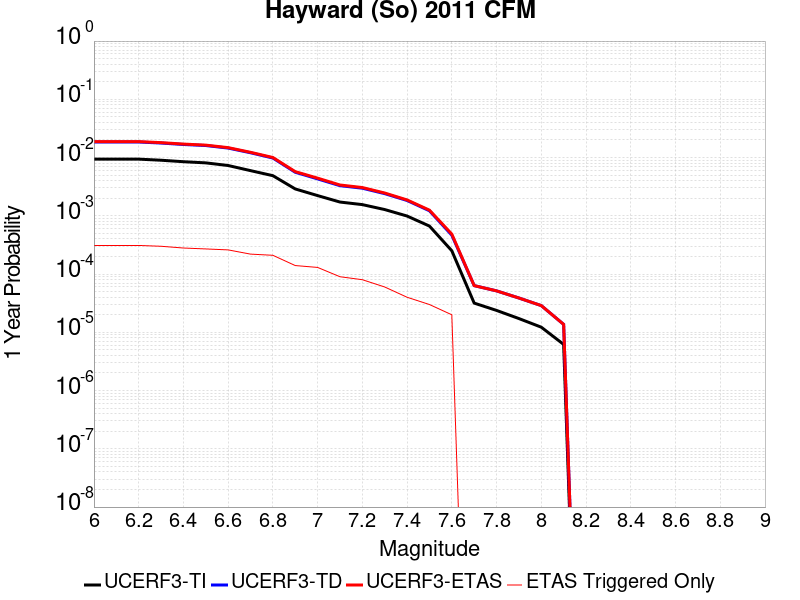 |  |

| Magnitude | 1 wk TI Prob | 1 wk TD Prob | 1 wk ETAS Prob | 1 wk ETAS/TD Gain | 1 wk ETAS Triggered Only | 1 mo TI Prob | 1 mo TD Prob | 1 mo ETAS Prob | 1 mo ETAS/TD Gain | 1 mo ETAS Triggered Only | 1 yr TI Prob | 1 yr TD Prob | 1 yr ETAS Prob | 1 yr ETAS/TD Gain | 1 yr ETAS Triggered Only | 10 yr TI Prob | 10 yr TD Prob | 10 yr ETAS Prob | 10 yr ETAS/TD Gain | 10 yr ETAS Triggered Only |
|-----|-----|-----|-----|-----|-----|-----|-----|-----|-----|-----|-----|-----|-----|-----|-----|-----|-----|-----|-----|-----|
| 6.0 | 1.8091932E-4 | 3.576444E-4 | 4.6760504E-4 | 1.307458 | 1.1E-4 | 7.751381E-4 | 0.0015318713 | 0.0016916262 | 1.1042874 | 1.6E-4 | 0.00939654 | 0.018493457 | 0.018797724 | 1.0164527 | 3.1E-4 | 0.090090066 | 0.16694987 | 0.1673664 | 1.0024949 | 5.0E-4 |
| 6.1 | 1.8091932E-4 | 3.576444E-4 | 4.6760504E-4 | 1.307458 | 1.1E-4 | 7.751381E-4 | 0.0015318713 | 0.0016916262 | 1.1042874 | 1.6E-4 | 0.00939654 | 0.018493457 | 0.018797724 | 1.0164527 | 3.1E-4 | 0.090090066 | 0.16694987 | 0.1673664 | 1.0024949 | 5.0E-4 |
| 6.2 | 1.8091932E-4 | 3.576444E-4 | 4.6760504E-4 | 1.307458 | 1.1E-4 | 7.751381E-4 | 0.0015318713 | 0.0016916262 | 1.1042874 | 1.6E-4 | 0.00939654 | 0.018493457 | 0.018797724 | 1.0164527 | 3.1E-4 | 0.090090066 | 0.16694987 | 0.1673664 | 1.0024949 | 5.0E-4 |
| 6.3 | 1.7322872E-4 | 3.431997E-4 | 4.5316195E-4 | 1.3204031 | 1.1E-4 | 7.4219756E-4 | 0.0014700365 | 0.0016298012 | 1.1086808 | 1.6E-4 | 0.0089988755 | 0.017753096 | 0.01804777 | 1.0165985 | 3.0E-4 | 0.08643075 | 0.16087672 | 0.16129628 | 1.002608 | 5.0E-4 |
| 6.4 | 1.6334097E-4 | 3.2400212E-4 | 4.239697E-4 | 1.30854 | 1.0E-4 | 6.998449E-4 | 0.0013878501 | 0.001537642 | 1.1079308 | 1.5E-4 | 0.008487372 | 0.016768182 | 0.017043486 | 1.0164183 | 2.8E-4 | 0.081704415 | 0.15275027 | 0.15315695 | 1.0026624 | 4.8E-4 |
| 6.5 | 1.5600289E-4 | 3.1073482E-4 | 4.1070374E-4 | 1.3217179 | 1.0E-4 | 6.684125E-4 | 0.0013310493 | 0.0014808497 | 1.112543 | 1.5E-4 | 0.008107598 | 0.016087007 | 0.016352663 | 1.0165137 | 2.7E-4 | 0.078181036 | 0.14701682 | 0.14741772 | 1.0027269 | 4.7E-4 |
| 6.6 | 1.4046066E-4 | 2.8084763E-4 | 3.7082235E-4 | 1.3203684 | 9.0E-5 | 6.018354E-4 | 0.0012030842 | 0.0013429158 | 1.1162276 | 1.4E-4 | 0.0073027555 | 0.014550682 | 0.014806899 | 1.0176085 | 2.6E-4 | 0.07067384 | 0.1340958 | 0.13448545 | 1.0029058 | 4.5E-4 |
| 6.7 | 1.14696966E-4 | 2.3318005E-4 | 3.2315907E-4 | 1.3858778 | 9.0E-5 | 4.914658E-4 | 9.989655E-4 | 0.0011288356 | 1.1300046 | 1.3E-4 | 0.0059671924 | 0.012095646 | 0.012312985 | 1.0179684 | 2.2E-4 | 0.058094822 | 0.112940885 | 0.11329571 | 1.0031416 | 4.0E-4 |
| 6.8 | 9.3874296E-5 | 1.8900084E-4 | 2.7898382E-4 | 1.4760984 | 9.0E-5 | 4.0225635E-4 | 8.097558E-4 | 9.396506E-4 | 1.1604122 | 1.3E-4 | 0.0048864787 | 0.009814949 | 0.010022888 | 1.0211859 | 2.1E-4 | 0.047804173 | 0.092746735 | 0.09306427 | 1.0034237 | 3.5E-4 |
| 6.9 | 5.551852E-5 | 1.0753225E-4 | 1.9752258E-4 | 1.8368682 | 9.0E-5 | 2.3791482E-4 | 4.6077173E-4 | 5.6072563E-4 | 1.2169272 | 1.0E-4 | 0.0028927654 | 0.005595585 | 0.0057348013 | 1.0248797 | 1.4E-4 | 0.028553981 | 0.054346986 | 0.054564487 | 1.0040021 | 2.3E-4 |
| 7.0 | 4.2662363E-5 | 8.2654355E-5 | 1.6264775E-4 | 1.9678061 | 8.0E-5 | 1.8282588E-4 | 3.5418523E-4 | 4.4415338E-4 | 1.2540144 | 9.0E-5 | 0.0022236328 | 0.004303753 | 0.0044331932 | 1.0300761 | 1.3E-4 | 0.022015138 | 0.042152237 | 0.042343806 | 1.0045447 | 2.0E-4 |
| 7.1 | 3.305886E-5 | 6.317638E-5 | 1.2317259E-4 | 1.949662 | 6.0E-5 | 1.4167312E-4 | 2.7072793E-4 | 3.40709E-4 | 1.2584921 | 7.0E-5 | 0.0017235056 | 0.0032911499 | 0.0033808537 | 1.027256 | 9.0E-5 | 0.017101998 | 0.032526787 | 0.03267191 | 1.0044615 | 1.5E-4 |
| 7.2 | 2.9856887E-5 | 5.716231E-5 | 1.0715945E-4 | 1.8746523 | 5.0E-5 | 1.2795182E-4 | 2.449584E-4 | 3.049437E-4 | 1.2448795 | 6.0E-5 | 0.0015567001 | 0.002978307 | 0.0030580687 | 1.0267808 | 8.0E-5 | 0.015458403 | 0.029523628 | 0.029659495 | 1.004602 | 1.4E-4 |
| 7.3 | 2.4559737E-5 | 4.611603E-5 | 7.6114644E-5 | 1.650503 | 3.0E-5 | 1.0525176E-4 | 1.9762522E-4 | 2.3761732E-4 | 1.2023633 | 4.0E-5 | 0.0012806869 | 0.002403445 | 0.002463301 | 1.0249041 | 6.0E-5 | 0.012733313 | 0.023917088 | 0.024014696 | 1.0040811 | 1.0E-4 |
| 7.4 | 1.9002231E-5 | 3.515387E-5 | 6.515282E-5 | 1.8533611 | 3.0E-5 | 8.143559E-5 | 1.506508E-4 | 1.8064628E-4 | 1.199106 | 3.0E-5 | 9.910273E-4 | 0.0018326403 | 0.001872567 | 1.0217865 | 4.0E-5 | 0.009866194 | 0.018308053 | 0.01838659 | 1.0042896 | 8.0E-5 |
| 7.5 | 1.2783333E-5 | 2.340918E-5 | 5.340848E-5 | 2.2815185 | 3.0E-5 | 5.4784563E-5 | 1.0032124E-4 | 1.3031822E-4 | 1.2990093 | 3.0E-5 | 6.667979E-4 | 0.0012207325 | 0.0012506959 | 1.0245454 | 3.0E-5 | 0.006648007 | 0.01224769 | 0.012306956 | 1.0048388 | 6.0E-5 |
| 7.6 | 4.8149627E-6 | 8.921587E-6 | 2.892141E-5 | 3.2417336 | 2.0E-5 | 2.063539E-5 | 3.8234823E-5 | 5.8234058E-5 | 1.5230634 | 2.0E-5 | 2.5120692E-4 | 4.6541076E-4 | 4.8540146E-4 | 1.0429528 | 2.0E-5 | 0.0025092314 | 0.0046969336 | 0.0047267927 | 1.0063572 | 3.0E-5 |
| 7.7 | 6.0838227E-7 | 1.2139337E-6 | 1.2139337E-6 | 1.0 | 0.0 | 2.6073499E-6 | 5.2025625E-6 | 5.2025625E-6 | 1.0 | 0.0 | 3.174402E-5 | 6.3339365E-5 | 6.3339365E-5 | 1.0 | 0.0 | 3.1739488E-4 | 6.569496E-4 | 6.569496E-4 | 1.0 | 0.0 |
| 7.8 | 4.5542808E-7 | 9.864626E-7 | 9.864626E-7 | 1.0 | 0.0 | 1.9518332E-6 | 4.22769E-6 | 4.22769E-6 | 1.0 | 0.0 | 2.376331E-5 | 5.1470917E-5 | 5.1470917E-5 | 1.0 | 0.0 | 2.3760769E-4 | 5.356565E-4 | 5.356565E-4 | 1.0 | 0.0 |
| 7.9 | 3.3016747E-7 | 7.4400174E-7 | 7.4400174E-7 | 1.0 | 0.0 | 1.4150027E-6 | 3.188575E-6 | 3.188575E-6 | 1.0 | 0.0 | 1.7227521E-5 | 3.882021E-5 | 3.882021E-5 | 1.0 | 0.0 | 1.7226185E-4 | 4.0190507E-4 | 4.0190507E-4 | 1.0 | 0.0 |
| 8.0 | 2.347038E-7 | 5.509533E-7 | 5.509533E-7 | 1.0 | 0.0 | 1.0058731E-6 | 2.361226E-6 | 2.361226E-6 | 1.0 | 0.0 | 1.2246436E-5 | 2.874755E-5 | 2.874755E-5 | 1.0 | 0.0 | 1.2245761E-4 | 2.9538097E-4 | 2.9538097E-4 | 1.0 | 0.0 |
| 8.1 | 1.18822804E-7 | 2.622927E-7 | 2.622927E-7 | 1.0 | 0.0 | 5.092405E-7 | 1.1241111E-6 | 1.1241111E-6 | 1.0 | 0.0 | 6.1999854E-6 | 1.3685968E-5 | 1.3685968E-5 | 1.0 | 0.0 | 6.199812E-5 | 1.400082E-4 | 1.400082E-4 | 1.0 | 0.0 |

## Hayward (So) extension 2011 CFM
*[(top)](#table-of-contents)*

| 1 Week | 1 Month | 1 Year | 10 Year |
|-----|-----|-----|-----|
|  |  |  |  |

| Magnitude | 1 wk TI Prob | 1 wk TD Prob | 1 wk ETAS Prob | 1 wk ETAS/TD Gain | 1 wk ETAS Triggered Only | 1 mo TI Prob | 1 mo TD Prob | 1 mo ETAS Prob | 1 mo ETAS/TD Gain | 1 mo ETAS Triggered Only | 1 yr TI Prob | 1 yr TD Prob | 1 yr ETAS Prob | 1 yr ETAS/TD Gain | 1 yr ETAS Triggered Only | 10 yr TI Prob | 10 yr TD Prob | 10 yr ETAS Prob | 10 yr ETAS/TD Gain | 10 yr ETAS Triggered Only |
|-----|-----|-----|-----|-----|-----|-----|-----|-----|-----|-----|-----|-----|-----|-----|-----|-----|-----|-----|-----|-----|
| 6.0 | 1.1721256E-4 | 2.368966E-4 | 3.4687054E-4 | 1.4642277 | 1.1E-4 | 5.022428E-4 | 0.0010147279 | 0.0011745655 | 1.1575178 | 1.6E-4 | 0.0060976758 | 0.012260713 | 0.01257679 | 1.0257796 | 3.2E-4 | 0.0593305 | 0.11292522 | 0.11329779 | 1.0032992 | 4.2E-4 |
| 6.1 | 6.99169E-5 | 1.3823296E-4 | 1.6822881E-4 | 1.216995 | 3.0E-5 | 2.9960944E-4 | 5.922129E-4 | 6.521774E-4 | 1.1012549 | 6.0E-5 | 0.0036416445 | 0.007180251 | 0.0073391027 | 1.0221233 | 1.6E-4 | 0.035825435 | 0.067871265 | 0.068094976 | 1.0032961 | 2.4E-4 |
| 6.2 | 6.99169E-5 | 1.3823296E-4 | 1.6822881E-4 | 1.216995 | 3.0E-5 | 2.9960944E-4 | 5.922129E-4 | 6.521774E-4 | 1.1012549 | 6.0E-5 | 0.0036416445 | 0.007180251 | 0.0073391027 | 1.0221233 | 1.6E-4 | 0.035825435 | 0.067871265 | 0.068094976 | 1.0032961 | 2.4E-4 |
| 6.3 | 6.970908E-5 | 1.3791428E-4 | 1.6791014E-4 | 1.2174964 | 3.0E-5 | 2.9871898E-4 | 5.9084786E-4 | 6.5081246E-4 | 1.101489 | 6.0E-5 | 0.0036308395 | 0.0071637807 | 0.0073226346 | 1.0221746 | 1.6E-4 | 0.035720866 | 0.067720175 | 0.06794392 | 1.003304 | 2.4E-4 |
| 6.4 | 6.9517155E-5 | 1.3758331E-4 | 1.6757919E-4 | 1.2180197 | 3.0E-5 | 2.9789665E-4 | 5.8943033E-4 | 6.49395E-4 | 1.1017332 | 6.0E-5 | 0.0036208609 | 0.0071466854 | 0.007305542 | 1.022228 | 1.6E-4 | 0.03562429 | 0.06756415 | 0.06778794 | 1.0033122 | 2.4E-4 |
| 6.5 | 4.786248E-5 | 9.428081E-5 | 1.2427798E-4 | 1.3181684 | 3.0E-5 | 2.0510878E-4 | 4.0400066E-4 | 4.5398044E-4 | 1.1237122 | 5.0E-5 | 0.0024943394 | 0.004908051 | 0.0050274623 | 1.0243297 | 1.2E-4 | 0.02466527 | 0.04695874 | 0.04714935 | 1.0040591 | 2.0E-4 |
| 6.6 | 4.4662214E-5 | 8.894386E-5 | 1.1894119E-4 | 1.3372614 | 3.0E-5 | 1.9139545E-4 | 3.811349E-4 | 4.3111586E-4 | 1.1311371 | 5.0E-5 | 0.0023277493 | 0.0046309093 | 0.0047503537 | 1.0257928 | 1.2E-4 | 0.02303517 | 0.04434839 | 0.044539522 | 1.0043098 | 2.0E-4 |
| 6.7 | 3.884542E-5 | 7.876853E-5 | 1.08766166E-4 | 1.3808328 | 3.0E-5 | 1.6646975E-4 | 3.3753825E-4 | 3.7752473E-4 | 1.1184651 | 4.0E-5 | 0.002024885 | 0.00410223 | 0.0042018197 | 1.024277 | 1.0E-4 | 0.020065336 | 0.039385635 | 0.03954894 | 1.0041463 | 1.7E-4 |
| 6.8 | 3.4221863E-5 | 6.866426E-5 | 9.8662196E-5 | 1.4368786 | 3.0E-5 | 1.4665688E-4 | 2.942446E-4 | 3.342328E-4 | 1.1359013 | 4.0E-5 | 0.0017840851 | 0.0035769648 | 0.0036766073 | 1.0278567 | 1.0E-4 | 0.017698295 | 0.034467913 | 0.034632053 | 1.0047622 | 1.7E-4 |
| 6.9 | 1.6927712E-5 | 3.0117317E-5 | 6.0116414E-5 | 1.9960747 | 3.0E-5 | 7.2545314E-5 | 1.2906815E-4 | 1.5906428E-4 | 1.2324053 | 3.0E-5 | 8.828813E-4 | 0.0015703292 | 0.0016302349 | 1.0381485 | 6.0E-5 | 0.008793819 | 0.015488898 | 0.015577504 | 1.0057206 | 9.0E-5 |
| 7.0 | 1.2509653E-5 | 2.2512628E-5 | 3.2512402E-5 | 1.4441851 | 1.0E-5 | 5.3611697E-5 | 9.647937E-5 | 1.0647841E-4 | 1.1036391 | 1.0E-5 | 6.525269E-4 | 0.0011740476 | 0.0012140006 | 1.0340302 | 4.0E-5 | 0.0065061417 | 0.011605988 | 0.011675175 | 1.0059614 | 7.0E-5 |
| 7.1 | 8.751583E-6 | 1.496289E-5 | 1.496289E-5 | 1.0 | 0.0 | 3.750624E-5 | 6.412513E-5 | 6.412513E-5 | 1.0 | 0.0 | 4.5654282E-4 | 7.8044966E-4 | 8.004341E-4 | 1.0256063 | 2.0E-5 | 0.0045560603 | 0.007782067 | 0.007831678 | 1.0063751 | 5.0E-5 |
| 7.2 | 6.354379E-6 | 1.1533311E-5 | 1.1533311E-5 | 1.0 | 0.0 | 2.7232769E-5 | 4.942757E-5 | 4.942757E-5 | 1.0 | 0.0 | 3.3150852E-4 | 6.0161937E-4 | 6.2160735E-4 | 1.0332236 | 2.0E-5 | 0.0033101442 | 0.0060175816 | 0.006057341 | 1.0066072 | 4.0E-5 |
| 7.3 | 4.645554E-6 | 8.848529E-6 | 8.848529E-6 | 1.0 | 0.0 | 1.9909365E-5 | 3.7921738E-5 | 3.7921738E-5 | 1.0 | 0.0 | 2.4236954E-4 | 4.6160334E-4 | 4.715987E-4 | 1.0216537 | 1.0E-5 | 0.0024210536 | 0.0046258606 | 0.004645768 | 1.0043036 | 2.0E-5 |
| 7.4 | 4.23437E-6 | 8.020688E-6 | 8.020688E-6 | 1.0 | 0.0 | 1.8147173E-5 | 3.437395E-5 | 3.437395E-5 | 1.0 | 0.0 | 2.2091944E-4 | 4.1842632E-4 | 4.2842215E-4 | 1.0238891 | 1.0E-5 | 0.0022069993 | 0.0041960757 | 0.004215992 | 1.0047463 | 2.0E-5 |
| 7.5 | 2.2187417E-6 | 3.969716E-6 | 3.969716E-6 | 1.0 | 0.0 | 9.508858E-6 | 1.7012973E-5 | 1.7012973E-5 | 1.0 | 0.0 | 1.157642E-4 | 2.0711591E-4 | 2.0711591E-4 | 1.0 | 0.0 | 0.0011570391 | 0.0020826403 | 0.0020926194 | 1.0047916 | 1.0E-5 |
| 7.6 | 2.7952495E-8 | 3.8855283E-8 | 3.8855283E-8 | 1.0 | 0.0 | 1.1979641E-7 | 1.6652264E-7 | 1.6652264E-7 | 1.0 | 0.0 | 1.4585203E-6 | 2.0274113E-6 | 2.0274113E-6 | 1.0 | 0.0 | 1.4585107E-5 | 2.0361616E-5 | 2.0361616E-5 | 1.0 | 0.0 |
| 7.7 | 1.7192724E-8 | 2.3484029E-8 | 2.3484029E-8 | 1.0 | 0.0 | 7.36831E-8 | 1.00645835E-7 | 1.00645835E-7 | 1.0 | 0.0 | 8.9709135E-7 | 1.2253623E-6 | 1.2253623E-6 | 1.0 | 0.0 | 8.970877E-6 | 1.2318992E-5 | 1.2318992E-5 | 1.0 | 0.0 |

## Calaveras (No) 2011 CFM
*[(top)](#table-of-contents)*

| 1 Week | 1 Month | 1 Year | 10 Year |
|-----|-----|-----|-----|
|  |  |  |  |

| Magnitude | 1 wk TI Prob | 1 wk TD Prob | 1 wk ETAS Prob | 1 wk ETAS/TD Gain | 1 wk ETAS Triggered Only | 1 mo TI Prob | 1 mo TD Prob | 1 mo ETAS Prob | 1 mo ETAS/TD Gain | 1 mo ETAS Triggered Only | 1 yr TI Prob | 1 yr TD Prob | 1 yr ETAS Prob | 1 yr ETAS/TD Gain | 1 yr ETAS Triggered Only | 10 yr TI Prob | 10 yr TD Prob | 10 yr ETAS Prob | 10 yr ETAS/TD Gain | 10 yr ETAS Triggered Only |
|-----|-----|-----|-----|-----|-----|-----|-----|-----|-----|-----|-----|-----|-----|-----|-----|-----|-----|-----|-----|-----|
| 6.0 | 4.8694856E-5 | 6.761586E-5 | 2.076064E-4 | 3.0703802 | 1.4E-4 | 2.0867554E-4 | 2.8975084E-4 | 4.696987E-4 | 1.6210434 | 1.8E-4 | 0.0025376645 | 0.0035220108 | 0.0038209541 | 1.0848786 | 3.0E-4 | 0.02508881 | 0.03484133 | 0.03519844 | 1.0102496 | 3.7E-4 |
| 6.1 | 4.8694856E-5 | 6.761586E-5 | 2.076064E-4 | 3.0703802 | 1.4E-4 | 2.0867554E-4 | 2.8975084E-4 | 4.696987E-4 | 1.6210434 | 1.8E-4 | 0.0025376645 | 0.0035220108 | 0.0038209541 | 1.0848786 | 3.0E-4 | 0.02508881 | 0.03484133 | 0.03519844 | 1.0102496 | 3.7E-4 |
| 6.2 | 4.7541962E-5 | 6.594582E-5 | 2.0593658E-4 | 3.122815 | 1.4E-4 | 2.0373536E-4 | 2.8259508E-4 | 4.625442E-4 | 1.6367737 | 1.8E-4 | 0.0024776561 | 0.0034351891 | 0.0037341586 | 1.0870315 | 3.0E-4 | 0.024502134 | 0.034002215 | 0.034359634 | 1.0105116 | 3.7E-4 |
| 6.3 | 4.6717287E-5 | 6.477861E-5 | 2.0476955E-4 | 3.1610672 | 1.4E-4 | 2.0020158E-4 | 2.7759394E-4 | 4.5754397E-4 | 1.6482491 | 1.8E-4 | 0.0024347296 | 0.0033745 | 0.0036734876 | 1.0886021 | 3.0E-4 | 0.024082264 | 0.0334144 | 0.033772036 | 1.0107031 | 3.7E-4 |
| 6.4 | 4.6276386E-5 | 6.413982E-5 | 2.0413085E-4 | 3.1825912 | 1.4E-4 | 1.983123E-4 | 2.748569E-4 | 4.5480742E-4 | 1.6547062 | 1.8E-4 | 0.0024117786 | 0.0033412864 | 0.0036402838 | 1.0894858 | 3.0E-4 | 0.02385771 | 0.033093065 | 0.03345082 | 1.0108106 | 3.7E-4 |
| 6.5 | 4.5720994E-5 | 6.3339976E-5 | 2.0333112E-4 | 3.2101545 | 1.4E-4 | 1.9593239E-4 | 2.7142986E-4 | 4.51381E-4 | 1.6629747 | 1.8E-4 | 0.002382867 | 0.0032996982 | 0.0035987084 | 1.0906174 | 3.0E-4 | 0.023574775 | 0.03269041 | 0.033048313 | 1.0109483 | 3.7E-4 |
| 6.6 | 4.549134E-5 | 6.299287E-5 | 2.0298405E-4 | 3.2223337 | 1.4E-4 | 1.949483E-4 | 2.6994257E-4 | 4.49894E-4 | 1.6666285 | 1.8E-4 | 0.0023709119 | 0.0032816452 | 0.0035806608 | 1.0911176 | 3.0E-4 | 0.023457756 | 0.032515757 | 0.032873727 | 1.0110091 | 3.7E-4 |
| 6.7 | 3.701047E-5 | 5.048898E-5 | 1.9048191E-4 | 3.7727423 | 1.4E-4 | 1.5860666E-4 | 2.1636364E-4 | 3.963247E-4 | 1.8317528 | 1.8E-4 | 0.0019293258 | 0.0026310887 | 0.002910352 | 1.1061398 | 2.8E-4 | 0.019126613 | 0.026189692 | 0.026530527 | 1.0130141 | 3.5E-4 |
| 6.8 | 3.5523568E-5 | 4.8469614E-5 | 1.784633E-4 | 3.6819627 | 1.3E-4 | 1.5223498E-4 | 2.0771062E-4 | 3.7767531E-4 | 1.8182764 | 1.7E-4 | 0.0018518851 | 0.002525987 | 0.0027853304 | 1.1026701 | 2.6E-4 | 0.018365284 | 0.02516152 | 0.025483215 | 1.0127853 | 3.3E-4 |
| 6.9 | 3.2946147E-5 | 4.478715E-5 | 1.7478132E-4 | 3.9024882 | 1.3E-4 | 1.4119013E-4 | 1.9193105E-4 | 3.6189842E-4 | 1.8855648 | 1.7E-4 | 0.0017176344 | 0.0023342986 | 0.0025737383 | 1.1025746 | 2.4E-4 | 0.017044188 | 0.023281738 | 0.023574753 | 1.0125856 | 3.0E-4 |
| 7.0 | 2.7682381E-5 | 3.7143694E-5 | 1.5713923E-4 | 4.2305765 | 1.2E-4 | 1.1863338E-4 | 1.5917771E-4 | 2.9915542E-4 | 1.8793801 | 1.4E-4 | 0.0014434044 | 0.0019362964 | 0.0021458897 | 1.1082444 | 2.1E-4 | 0.01434065 | 0.019371962 | 0.019636732 | 1.0136677 | 2.7E-4 |
| 7.1 | 2.471967E-5 | 3.3404696E-5 | 1.5340069E-4 | 4.5921893 | 1.2E-4 | 1.05937135E-4 | 1.431553E-4 | 2.7313668E-4 | 1.9079747 | 1.3E-4 | 0.0012890215 | 0.0017415516 | 0.0019412033 | 1.1146401 | 2.0E-4 | 0.0128157 | 0.017445765 | 0.01770123 | 1.0146433 | 2.6E-4 |
| 7.2 | 1.9748062E-5 | 2.6889387E-5 | 1.3688643E-4 | 5.0907235 | 1.1E-4 | 8.463181E-5 | 1.1523527E-4 | 2.3522145E-4 | 2.0412278 | 1.2E-4 | 0.0010299052 | 0.0014021102 | 0.0015918438 | 1.1353201 | 1.9E-4 | 0.01025145 | 0.01408925 | 0.014325868 | 1.0167942 | 2.4E-4 |
| 7.3 | 1.1603734E-5 | 1.5884028E-5 | 9.588276E-5 | 6.0364256 | 8.0E-5 | 4.9729337E-5 | 6.807272E-5 | 1.5806658E-4 | 2.3220255 | 9.0E-5 | 6.052865E-4 | 8.2848466E-4 | 9.483852E-4 | 1.1447227 | 1.2E-4 | 0.0060364045 | 0.008360278 | 0.008499107 | 1.0166059 | 1.4E-4 |
| 7.4 | 4.885381E-6 | 6.057688E-6 | 1.6057627E-5 | 2.6507847 | 1.0E-5 | 2.0937177E-5 | 2.5961263E-5 | 3.5961002E-5 | 1.3851793 | 1.0E-5 | 2.5488032E-4 | 3.160327E-4 | 3.360264E-4 | 1.0632646 | 2.0E-5 | 0.0025458818 | 0.0032126233 | 0.0032325592 | 1.0062054 | 2.0E-5 |
| 7.5 | 3.0571264E-6 | 4.1759104E-6 | 4.1759104E-6 | 1.0 | 0.0 | 1.3101904E-5 | 1.7896637E-5 | 1.7896637E-5 | 1.0 | 0.0 | 1.5950401E-4 | 2.1786986E-4 | 2.2786768E-4 | 1.0458889 | 1.0E-5 | 0.0015938957 | 0.0022316445 | 0.0022416222 | 1.004471 | 1.0E-5 |
| 7.6 | 1.764948E-6 | 2.8153418E-6 | 2.8153418E-6 | 1.0 | 0.0 | 7.564041E-6 | 1.2065695E-5 | 1.2065695E-5 | 1.0 | 0.0 | 9.208831E-5 | 1.4689002E-4 | 1.4689002E-4 | 1.0 | 0.0 | 9.205016E-4 | 0.0015222877 | 0.0015222877 | 1.0 | 0.0 |
| 7.7 | 1.3173734E-6 | 2.0758525E-6 | 2.0758525E-6 | 1.0 | 0.0 | 5.645874E-6 | 8.896481E-6 | 8.896481E-6 | 1.0 | 0.0 | 6.873634E-5 | 1.08309294E-4 | 1.08309294E-4 | 1.0 | 0.0 | 6.8715087E-4 | 0.001134934 | 0.001134934 | 1.0 | 0.0 |
| 7.8 | 9.4429885E-7 | 1.5624996E-6 | 1.5624996E-6 | 1.0 | 0.0 | 4.0469886E-6 | 6.69641E-6 | 6.69641E-6 | 1.0 | 0.0 | 4.9270973E-5 | 8.152575E-5 | 8.152575E-5 | 1.0 | 0.0 | 4.926005E-4 | 8.569971E-4 | 8.569971E-4 | 1.0 | 0.0 |
| 7.9 | 6.388233E-7 | 1.1244719E-6 | 1.1244719E-6 | 1.0 | 0.0 | 2.7378112E-6 | 4.819156E-6 | 4.819156E-6 | 1.0 | 0.0 | 3.3332344E-5 | 5.8671656E-5 | 5.8671656E-5 | 1.0 | 0.0 | 3.3327343E-4 | 6.144991E-4 | 6.144991E-4 | 1.0 | 0.0 |
| 8.0 | 3.087986E-7 | 5.804411E-7 | 5.804411E-7 | 1.0 | 0.0 | 1.323422E-6 | 2.4876024E-6 | 2.4876024E-6 | 1.0 | 0.0 | 1.6112543E-5 | 3.028614E-5 | 3.028614E-5 | 1.0 | 0.0 | 1.6111376E-4 | 3.1355317E-4 | 3.1355317E-4 | 1.0 | 0.0 |
| 8.1 | 1.6725647E-7 | 2.7678075E-7 | 2.7678075E-7 | 1.0 | 0.0 | 7.168133E-7 | 1.1862027E-6 | 1.1862027E-6 | 1.0 | 0.0 | 8.7271665E-6 | 1.4441924E-5 | 1.4441924E-5 | 1.0 | 0.0 | 8.726824E-5 | 1.4986278E-4 | 1.4986278E-4 | 1.0 | 0.0 |

## Sargent 2011 CFM
*[(top)](#table-of-contents)*

| 1 Week | 1 Month | 1 Year | 10 Year |
|-----|-----|-----|-----|
|  |  |  |  |

| Magnitude | 1 wk TI Prob | 1 wk TD Prob | 1 wk ETAS Prob | 1 wk ETAS/TD Gain | 1 wk ETAS Triggered Only | 1 mo TI Prob | 1 mo TD Prob | 1 mo ETAS Prob | 1 mo ETAS/TD Gain | 1 mo ETAS Triggered Only | 1 yr TI Prob | 1 yr TD Prob | 1 yr ETAS Prob | 1 yr ETAS/TD Gain | 1 yr ETAS Triggered Only | 10 yr TI Prob | 10 yr TD Prob | 10 yr ETAS Prob | 10 yr ETAS/TD Gain | 10 yr ETAS Triggered Only |
|-----|-----|-----|-----|-----|-----|-----|-----|-----|-----|-----|-----|-----|-----|-----|-----|-----|-----|-----|-----|-----|
| 6.0 | 3.7327867E-5 | 3.66759E-5 | 1.0667333E-4 | 2.9085402 | 7.0E-5 | 1.5996677E-4 | 1.5717551E-4 | 2.3716294E-4 | 1.5089052 | 8.0E-5 | 0.0019458556 | 0.0019123429 | 0.0020321135 | 1.0626303 | 1.2E-4 | 0.01928905 | 0.019031286 | 0.019247098 | 1.0113399 | 2.2E-4 |
| 6.1 | 2.3771476E-5 | 1.84927E-5 | 4.8492144E-5 | 2.6222317 | 3.0E-5 | 1.01873775E-4 | 7.925252E-5 | 1.19249344E-4 | 1.5046759 | 4.0E-5 | 0.0012396075 | 9.645534E-4 | 0.0010145052 | 1.0517875 | 5.0E-5 | 0.012327154 | 0.009643522 | 0.009742557 | 1.0102696 | 1.0E-4 |
| 6.2 | 2.3112721E-5 | 1.772381E-5 | 4.772328E-5 | 2.6926084 | 3.0E-5 | 9.9050754E-5 | 7.595747E-5 | 1.1595443E-4 | 1.5265704 | 4.0E-5 | 0.0012052758 | 9.2447037E-4 | 9.744242E-4 | 1.0540351 | 5.0E-5 | 0.011987597 | 0.0092460485 | 0.009335216 | 1.0096439 | 9.0E-5 |
| 6.3 | 1.728509E-5 | 1.0468866E-5 | 2.0468762E-5 | 1.9552033 | 1.0E-5 | 7.407686E-5 | 4.4866065E-5 | 6.486517E-5 | 1.4457512 | 2.0E-5 | 9.015125E-4 | 5.4615387E-4 | 5.761375E-4 | 1.0548996 | 3.0E-5 | 0.008978641 | 0.0054846806 | 0.005524461 | 1.007253 | 4.0E-5 |
| 6.4 | 1.48395575E-5 | 7.464625E-6 | 1.746455E-5 | 2.339642 | 1.0E-5 | 6.3596555E-5 | 3.1991072E-5 | 4.1990752E-5 | 1.3125772 | 1.0E-5 | 7.7401294E-4 | 3.8945937E-4 | 4.0945158E-4 | 1.0513332 | 2.0E-5 | 0.0077132257 | 0.003923548 | 0.0039534303 | 1.0076162 | 3.0E-5 |
| 6.5 | 1.4358964E-5 | 6.9032167E-6 | 1.6903148E-5 | 2.44859 | 1.0E-5 | 6.1536964E-5 | 2.9585093E-5 | 3.9584796E-5 | 1.337998 | 1.0E-5 | 7.48955E-4 | 3.6017652E-4 | 3.701729E-4 | 1.0277542 | 1.0E-5 | 0.0074643586 | 0.0036317029 | 0.0036516301 | 1.0054871 | 2.0E-5 |
| 6.6 | 9.772591E-6 | 1.3799386E-6 | 1.3799386E-6 | 1.0 | 0.0 | 4.188186E-5 | 5.9140093E-6 | 5.9140093E-6 | 1.0 | 0.0 | 5.097923E-4 | 7.2000716E-5 | 7.2000716E-5 | 1.0 | 0.0 | 0.005086244 | 7.5197575E-4 | 7.5197575E-4 | 1.0 | 0.0 |
| 6.7 | 9.752745E-6 | 1.358627E-6 | 1.358627E-6 | 1.0 | 0.0 | 4.179681E-5 | 5.8226738E-6 | 5.8226738E-6 | 1.0 | 0.0 | 5.0875737E-4 | 7.0888775E-5 | 7.0888775E-5 | 1.0 | 0.0 | 0.005075942 | 7.4086385E-4 | 7.4086385E-4 | 1.0 | 0.0 |
| 6.8 | 9.608213E-6 | 1.2423781E-6 | 1.2423781E-6 | 1.0 | 0.0 | 4.1177405E-5 | 5.324466E-6 | 5.324466E-6 | 1.0 | 0.0 | 5.012196E-4 | 6.482347E-5 | 6.482347E-5 | 1.0 | 0.0 | 0.005000906 | 6.799458E-4 | 6.799458E-4 | 1.0 | 0.0 |
| 6.9 | 9.427164E-6 | 1.1269155E-6 | 1.1269155E-6 | 1.0 | 0.0 | 4.04015E-5 | 4.8296292E-6 | 4.8296292E-6 | 1.0 | 0.0 | 4.9177726E-4 | 5.8799167E-5 | 5.8799167E-5 | 1.0 | 0.0 | 0.004906904 | 6.190613E-4 | 6.190613E-4 | 1.0 | 0.0 |
| 7.0 | 9.247601E-6 | 9.931869E-7 | 9.931869E-7 | 1.0 | 0.0 | 3.9631974E-5 | 4.256508E-6 | 4.256508E-6 | 1.0 | 0.0 | 4.8241246E-4 | 5.182177E-5 | 5.182177E-5 | 1.0 | 0.0 | 0.0048136655 | 5.488196E-4 | 5.488196E-4 | 1.0 | 0.0 |
| 7.1 | 8.995454E-6 | 8.3234227E-7 | 8.3234227E-7 | 1.0 | 0.0 | 3.8551374E-5 | 3.5671762E-6 | 3.5671762E-6 | 1.0 | 0.0 | 4.6926187E-4 | 4.342952E-5 | 4.342952E-5 | 1.0 | 0.0 | 0.004682722 | 4.6401215E-4 | 4.6401215E-4 | 1.0 | 0.0 |
| 7.2 | 8.520861E-6 | 5.322471E-7 | 5.322471E-7 | 1.0 | 0.0 | 3.6517464E-5 | 2.281057E-6 | 2.281057E-6 | 1.0 | 0.0 | 4.445094E-4 | 2.7771523E-5 | 2.7771523E-5 | 1.0 | 0.0 | 0.004436213 | 3.0573667E-4 | 3.0573667E-4 | 1.0 | 0.0 |
| 7.3 | 8.043592E-6 | 3.4978723E-7 | 3.4978723E-7 | 1.0 | 0.0 | 3.4472083E-5 | 1.4990873E-6 | 1.4990873E-6 | 1.0 | 0.0 | 4.196168E-4 | 1.8251236E-5 | 1.8251236E-5 | 1.0 | 0.0 | 0.004188253 | 2.092194E-4 | 2.092194E-4 | 1.0 | 0.0 |
| 7.4 | 7.662316E-6 | 2.966965E-7 | 2.966965E-7 | 1.0 | 0.0 | 3.2838085E-5 | 1.2715558E-6 | 1.2715558E-6 | 1.0 | 0.0 | 3.9973034E-4 | 1.5481082E-5 | 1.5481082E-5 | 1.0 | 0.0 | 0.0039901207 | 1.7969355E-4 | 1.7969355E-4 | 1.0 | 0.0 |
| 7.5 | 6.961638E-6 | 2.3896274E-7 | 2.3896274E-7 | 1.0 | 0.0 | 2.9835252E-5 | 1.0241256E-6 | 1.0241256E-6 | 1.0 | 0.0 | 3.6318362E-4 | 1.24686585E-5 | 1.24686585E-5 | 1.0 | 0.0 | 0.0036259065 | 1.4608557E-4 | 1.4608557E-4 | 1.0 | 0.0 |
| 7.6 | 6.282332E-6 | 1.7144185E-7 | 1.7144185E-7 | 1.0 | 0.0 | 2.6924003E-5 | 7.347506E-7 | 7.347506E-7 | 1.0 | 0.0 | 3.2775043E-4 | 8.9455525E-6 | 8.9455525E-6 | 1.0 | 0.0 | 0.0032726745 | 1.06616906E-4 | 1.06616906E-4 | 1.0 | 0.0 |
| 7.7 | 4.934408E-6 | 5.0855686E-8 | 5.0855686E-8 | 1.0 | 0.0 | 2.114729E-5 | 2.1795293E-7 | 2.1795293E-7 | 1.0 | 0.0 | 2.5743784E-4 | 2.6535736E-6 | 2.6535736E-6 | 1.0 | 0.0 | 0.0025713982 | 3.3127955E-5 | 3.3127955E-5 | 1.0 | 0.0 |
| 7.8 | 2.373212E-6 | 3.5855745E-8 | 3.5855745E-8 | 1.0 | 0.0 | 1.0170869E-5 | 1.5366747E-7 | 1.5366747E-7 | 1.0 | 0.0 | 1.238233E-4 | 1.8708998E-6 | 1.8708998E-6 | 1.0 | 0.0 | 0.0012375432 | 2.4602417E-5 | 2.4602417E-5 | 1.0 | 0.0 |
| 7.9 | 1.8227792E-6 | 3.1229092E-8 | 3.1229092E-8 | 1.0 | 0.0 | 7.811887E-6 | 1.3383895E-7 | 1.3383895E-7 | 1.0 | 0.0 | 9.510558E-5 | 1.6294881E-6 | 1.6294881E-6 | 1.0 | 0.0 | 9.5064886E-4 | 2.1838767E-5 | 2.1838767E-5 | 1.0 | 0.0 |
| 8.0 | 1.9095137E-7 | 1.345429E-8 | 1.345429E-8 | 1.0 | 0.0 | 8.1836276E-7 | 5.766124E-8 | 5.766124E-8 | 1.0 | 0.0 | 9.963521E-6 | 7.020254E-7 | 7.020254E-7 | 1.0 | 0.0 | 9.963074E-5 | 8.58075E-6 | 8.58075E-6 | 1.0 | 0.0 |

## Hunting Creek - Berryessa 2011 CFM
*[(top)](#table-of-contents)*

| 1 Week | 1 Month | 1 Year | 10 Year |
|-----|-----|-----|-----|
|  |  | 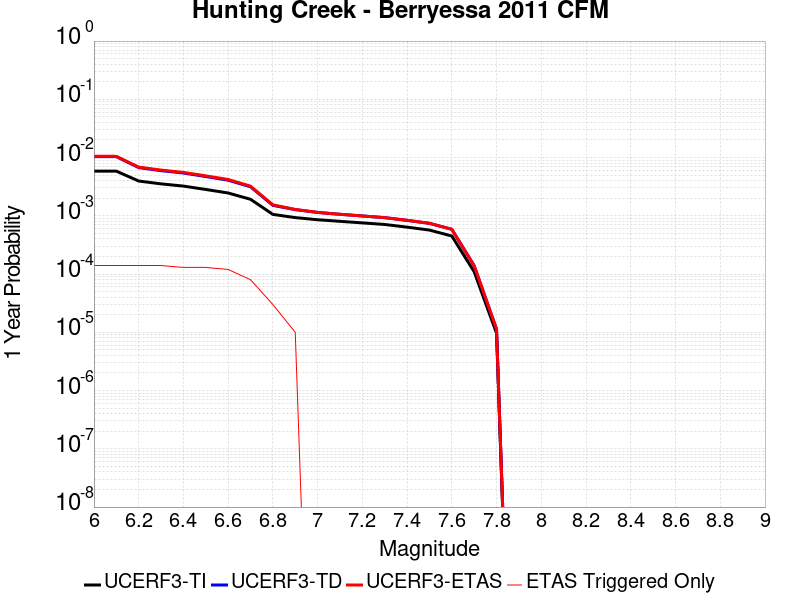 |  |

| Magnitude | 1 wk TI Prob | 1 wk TD Prob | 1 wk ETAS Prob | 1 wk ETAS/TD Gain | 1 wk ETAS Triggered Only | 1 mo TI Prob | 1 mo TD Prob | 1 mo ETAS Prob | 1 mo ETAS/TD Gain | 1 mo ETAS Triggered Only | 1 yr TI Prob | 1 yr TD Prob | 1 yr ETAS Prob | 1 yr ETAS/TD Gain | 1 yr ETAS Triggered Only | 10 yr TI Prob | 10 yr TD Prob | 10 yr ETAS Prob | 10 yr ETAS/TD Gain | 10 yr ETAS Triggered Only |
|-----|-----|-----|-----|-----|-----|-----|-----|-----|-----|-----|-----|-----|-----|-----|-----|-----|-----|-----|-----|-----|
| 6.0 | 1.1270982E-4 | 2.003951E-4 | 2.6038307E-4 | 1.2993485 | 6.0E-5 | 4.8295266E-4 | 8.585386E-4 | 9.384699E-4 | 1.0931016 | 8.0E-5 | 0.0058641075 | 0.010392612 | 0.010531157 | 1.013331 | 1.4E-4 | 0.057117578 | 0.098095 | 0.098275386 | 1.0018388 | 2.0E-4 |
| 6.1 | 1.1239393E-4 | 1.9987613E-4 | 2.5986414E-4 | 1.300126 | 6.0E-5 | 4.8159933E-4 | 8.56316E-4 | 9.3624747E-4 | 1.0933435 | 8.0E-5 | 0.0058477195 | 0.010365835 | 0.010504384 | 1.0133659 | 1.4E-4 | 0.056962132 | 0.0978533 | 0.09803373 | 1.0018439 | 2.0E-4 |
| 6.2 | 7.596265E-5 | 1.2942415E-4 | 1.8941639E-4 | 1.463532 | 6.0E-5 | 3.2551357E-4 | 5.54509E-4 | 6.344646E-4 | 1.1441917 | 8.0E-5 | 0.0039559277 | 0.006725556 | 0.006864615 | 1.0206761 | 1.4E-4 | 0.038862433 | 0.064629294 | 0.06481636 | 1.0028945 | 2.0E-4 |
| 6.3 | 6.78794E-5 | 1.1455879E-4 | 1.7455191E-4 | 1.5236886 | 6.0E-5 | 2.9087928E-4 | 4.9083366E-4 | 5.707944E-4 | 1.162908 | 8.0E-5 | 0.003535705 | 0.005956316 | 0.006095482 | 1.0233644 | 1.4E-4 | 0.034799766 | 0.057498842 | 0.057687342 | 1.0032784 | 2.0E-4 |
| 6.4 | 6.2165134E-5 | 1.0441751E-4 | 1.544123E-4 | 1.4787968 | 5.0E-5 | 2.6639478E-4 | 4.4739392E-4 | 5.173626E-4 | 1.1563916 | 7.0E-5 | 0.0032385332 | 0.0054307836 | 0.0055600777 | 1.0238076 | 1.3E-4 | 0.03191742 | 0.05258149 | 0.052761495 | 1.0034235 | 1.9E-4 |
| 6.5 | 5.4368087E-5 | 9.076426E-5 | 1.4075973E-4 | 1.5508276 | 5.0E-5 | 2.3298527E-4 | 3.8890383E-4 | 4.588766E-4 | 1.179923 | 7.0E-5 | 0.0028329059 | 0.004722658 | 0.0048520444 | 1.0273969 | 1.3E-4 | 0.027970633 | 0.045907296 | 0.046079036 | 1.0037409 | 1.8E-4 |
| 6.6 | 4.729947E-5 | 7.852248E-5 | 1.1851933E-4 | 1.5093683 | 4.0E-5 | 2.0269625E-4 | 3.3646295E-4 | 3.9644277E-4 | 1.1782657 | 6.0E-5 | 0.002465034 | 0.0040873145 | 0.0042068237 | 1.0292392 | 1.2E-4 | 0.02437869 | 0.03987545 | 0.040038675 | 1.0040933 | 1.7E-4 |
| 6.7 | 3.6875328E-5 | 6.048536E-5 | 7.0484755E-5 | 1.1653192 | 1.0E-5 | 1.5802756E-4 | 2.591787E-4 | 2.8917092E-4 | 1.1157203 | 3.0E-5 | 0.0019222875 | 0.0031503 | 0.0032300479 | 1.0253145 | 8.0E-5 | 0.019057442 | 0.030911557 | 0.031027848 | 1.003762 | 1.2E-4 |
| 6.8 | 2.0292036E-5 | 2.8989936E-5 | 2.8989936E-5 | 1.0 | 0.0 | 8.6962966E-5 | 1.2423648E-4 | 1.3423523E-4 | 1.0804816 | 1.0E-5 | 0.0010582599 | 0.0015115169 | 0.0015414715 | 1.0198176 | 3.0E-5 | 0.010532344 | 0.014985805 | 0.015035056 | 1.0032865 | 5.0E-5 |
| 6.9 | 1.7871042E-5 | 2.4484303E-5 | 2.4484303E-5 | 1.0 | 0.0 | 7.658793E-5 | 1.049285E-4 | 1.049285E-4 | 1.0 | 0.0 | 9.320591E-4 | 0.0012767552 | 0.0012867424 | 1.0078224 | 1.0E-5 | 0.009281595 | 0.012686039 | 0.012705785 | 1.0015565 | 2.0E-5 |
| 7.0 | 1.6415532E-5 | 2.191754E-5 | 2.191754E-5 | 1.0 | 0.0 | 7.035038E-5 | 9.392895E-5 | 9.392895E-5 | 1.0 | 0.0 | 8.561793E-4 | 0.0011429862 | 0.0011429862 | 1.0 | 0.0 | 0.008528882 | 0.011370371 | 0.011380257 | 1.0008695 | 1.0E-5 |
| 7.1 | 1.5409885E-5 | 2.035714E-5 | 2.035714E-5 | 1.0 | 0.0 | 6.6040695E-5 | 8.7241984E-5 | 8.7241984E-5 | 1.0 | 0.0 | 8.0374884E-4 | 0.0010616564 | 0.0010616564 | 1.0 | 0.0 | 0.00800848 | 0.010566317 | 0.010576211 | 1.0009364 | 1.0E-5 |
| 7.2 | 1.4497423E-5 | 1.906526E-5 | 1.906526E-5 | 1.0 | 0.0 | 6.213033E-5 | 8.170572E-5 | 8.170572E-5 | 1.0 | 0.0 | 7.5617427E-4 | 9.943163E-4 | 9.943163E-4 | 1.0 | 0.0 | 0.0075360634 | 0.009899417 | 0.009909318 | 1.0010002 | 1.0E-5 |
| 7.3 | 1.3615175E-5 | 1.783605E-5 | 1.783605E-5 | 1.0 | 0.0 | 5.8349444E-5 | 7.643799E-5 | 7.643799E-5 | 1.0 | 0.0 | 7.101729E-4 | 9.302381E-4 | 9.302381E-4 | 1.0 | 0.0 | 0.0070790765 | 0.009264177 | 0.009264177 | 1.0 | 0.0 |
| 7.4 | 1.2252825E-5 | 1.6035423E-5 | 1.6035423E-5 | 1.0 | 0.0 | 5.251105E-5 | 6.872145E-5 | 6.872145E-5 | 1.0 | 0.0 | 6.391345E-4 | 8.363653E-4 | 8.363653E-4 | 1.0 | 0.0 | 0.0063729943 | 0.008332806 | 0.008332806 | 1.0 | 0.0 |
| 7.5 | 1.0913301E-5 | 1.4248966E-5 | 1.4248966E-5 | 1.0 | 0.0 | 4.6770452E-5 | 6.1065584E-5 | 6.1065584E-5 | 1.0 | 0.0 | 5.6928146E-4 | 7.432226E-4 | 7.432226E-4 | 1.0 | 0.0 | 0.0056782532 | 0.0074079614 | 0.0074079614 | 1.0 | 0.0 |
| 7.6 | 8.623192E-6 | 1.1241263E-5 | 1.1241263E-5 | 1.0 | 0.0 | 3.6956015E-5 | 4.8175963E-5 | 4.8175963E-5 | 1.0 | 0.0 | 4.4984656E-4 | 5.8638706E-4 | 5.8638706E-4 | 1.0 | 0.0 | 0.00448937 | 0.0058489256 | 0.0058489256 | 1.0 | 0.0 |
| 7.7 | 2.0993634E-6 | 2.6636906E-6 | 2.6636906E-6 | 1.0 | 0.0 | 8.997241E-6 | 1.1415767E-5 | 1.1415767E-5 | 1.0 | 0.0 | 1.09535904E-4 | 1.3897817E-4 | 1.3897817E-4 | 1.0 | 0.0 | 0.0010948193 | 0.0013889482 | 0.0013889482 | 1.0 | 0.0 |
| 7.8 | 1.8428308E-7 | 2.1680074E-7 | 2.1680074E-7 | 1.0 | 0.0 | 7.897844E-7 | 9.291457E-7 | 9.291457E-7 | 1.0 | 0.0 | 9.615583E-6 | 1.1312294E-5 | 1.1312294E-5 | 1.0 | 0.0 | 9.615166E-5 | 1.1311039E-4 | 1.1311039E-4 | 1.0 | 0.0 |

## Hayward (No) 2011 CFM
*[(top)](#table-of-contents)*

| 1 Week | 1 Month | 1 Year | 10 Year |
|-----|-----|-----|-----|
|  |  | 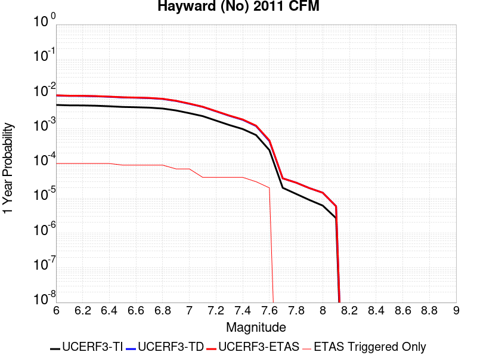 |  |

| Magnitude | 1 wk TI Prob | 1 wk TD Prob | 1 wk ETAS Prob | 1 wk ETAS/TD Gain | 1 wk ETAS Triggered Only | 1 mo TI Prob | 1 mo TD Prob | 1 mo ETAS Prob | 1 mo ETAS/TD Gain | 1 mo ETAS Triggered Only | 1 yr TI Prob | 1 yr TD Prob | 1 yr ETAS Prob | 1 yr ETAS/TD Gain | 1 yr ETAS Triggered Only | 10 yr TI Prob | 10 yr TD Prob | 10 yr ETAS Prob | 10 yr ETAS/TD Gain | 10 yr ETAS Triggered Only |
|-----|-----|-----|-----|-----|-----|-----|-----|-----|-----|-----|-----|-----|-----|-----|-----|-----|-----|-----|-----|-----|
| 6.0 | 9.3068506E-5 | 1.7426009E-4 | 2.3424963E-4 | 1.344253 | 6.0E-5 | 3.9880406E-4 | 7.466154E-4 | 8.0657064E-4 | 1.0803027 | 6.0E-5 | 0.0048446343 | 0.009052039 | 0.009151134 | 1.0109472 | 1.0E-4 | 0.047403704 | 0.08649084 | 0.08667354 | 1.0021124 | 2.0E-4 |
| 6.1 | 9.055486E-5 | 1.6976938E-4 | 2.2975919E-4 | 1.3533607 | 6.0E-5 | 3.880345E-4 | 7.273807E-4 | 7.87337E-4 | 1.0824277 | 6.0E-5 | 0.0047140904 | 0.008819976 | 0.008919094 | 1.0112379 | 1.0E-4 | 0.046153355 | 0.08438777 | 0.084561735 | 1.0020615 | 1.9E-4 |
| 6.2 | 9.006742E-5 | 1.6897473E-4 | 2.2896459E-4 | 1.3550227 | 6.0E-5 | 3.859461E-4 | 7.2397705E-4 | 7.839336E-4 | 1.0828155 | 6.0E-5 | 0.0046887742 | 0.008778909 | 0.008878032 | 1.0112909 | 1.0E-4 | 0.0459107 | 0.08401176 | 0.0841858 | 1.0020716 | 1.9E-4 |
| 6.3 | 8.8336754E-5 | 1.6576922E-4 | 2.2575927E-4 | 1.361889 | 6.0E-5 | 3.7853114E-4 | 7.102467E-4 | 7.7020406E-4 | 1.0844177 | 6.0E-5 | 0.004598882 | 0.008613128 | 0.008712267 | 1.0115101 | 1.0E-4 | 0.04504866 | 0.082503535 | 0.082668684 | 1.0020018 | 1.8E-4 |
| 6.4 | 8.526157E-5 | 1.6003211E-4 | 2.2002251E-4 | 1.3748648 | 6.0E-5 | 3.6535555E-4 | 6.856723E-4 | 7.456311E-4 | 1.0874454 | 6.0E-5 | 0.0044391346 | 0.008316266 | 0.0084154345 | 1.0119246 | 1.0E-4 | 0.043514993 | 0.079811774 | 0.07997741 | 1.0020753 | 1.8E-4 |
| 6.5 | 8.152396E-5 | 1.5335383E-4 | 2.0334616E-4 | 1.3259934 | 5.0E-5 | 3.493416E-4 | 6.570659E-4 | 7.0703303E-4 | 1.0760459 | 5.0E-5 | 0.0042449418 | 0.0079705855 | 0.008059868 | 1.0112015 | 9.0E-5 | 0.04164765 | 0.076642774 | 0.07679974 | 1.0020481 | 1.7E-4 |
| 6.6 | 7.987405E-5 | 1.5039509E-4 | 2.0038757E-4 | 1.3324077 | 5.0E-5 | 3.4227243E-4 | 6.4439187E-4 | 6.9435965E-4 | 1.0775425 | 5.0E-5 | 0.0041592065 | 0.007817407 | 0.007906703 | 1.0114228 | 9.0E-5 | 0.04082218 | 0.0752352 | 0.07539241 | 1.0020896 | 1.7E-4 |
| 6.7 | 7.777665E-5 | 1.467814E-4 | 1.9677405E-4 | 1.3405926 | 5.0E-5 | 3.332859E-4 | 6.289122E-4 | 6.788807E-4 | 1.0794524 | 5.0E-5 | 0.004050208 | 0.007630279 | 0.0077195917 | 1.0117052 | 9.0E-5 | 0.039771806 | 0.07350889 | 0.07366639 | 1.0021427 | 1.7E-4 |
| 6.8 | 7.3284005E-5 | 1.3827228E-4 | 1.8826536E-4 | 1.3615553 | 5.0E-5 | 3.140365E-4 | 5.924615E-4 | 6.424319E-4 | 1.0843437 | 5.0E-5 | 0.0038166929 | 0.0071894997 | 0.0072788526 | 1.0124283 | 9.0E-5 | 0.037518036 | 0.069415994 | 0.06956489 | 1.0021449 | 1.6E-4 |
| 6.9 | 6.458263E-5 | 1.2154585E-4 | 1.7153977E-4 | 1.4113175 | 5.0E-5 | 2.7675333E-4 | 5.208072E-4 | 5.707812E-4 | 1.0959548 | 5.0E-5 | 0.0033642664 | 0.0063224947 | 0.006392052 | 1.0110016 | 7.0E-5 | 0.033137884 | 0.061331037 | 0.061453063 | 1.0019896 | 1.3E-4 |
| 7.0 | 5.3853604E-5 | 1.00447294E-4 | 1.5044227E-4 | 1.4977235 | 5.0E-5 | 2.3078074E-4 | 4.3041768E-4 | 4.8039618E-4 | 1.1161163 | 5.0E-5 | 0.0028061352 | 0.005227809 | 0.005297443 | 1.01332 | 7.0E-5 | 0.027709642 | 0.051048636 | 0.051172 | 1.0024166 | 1.3E-4 |
| 7.1 | 4.4308683E-5 | 8.187706E-5 | 1.118746E-4 | 1.366373 | 3.0E-5 | 1.8988053E-4 | 3.508547E-4 | 3.8084417E-4 | 1.0854754 | 3.0E-5 | 0.0023093442 | 0.0042633307 | 0.00430316 | 1.0093423 | 4.0E-5 | 0.022854926 | 0.041903682 | 0.04198033 | 1.0018291 | 8.0E-5 |
| 7.2 | 3.295973E-5 | 6.092126E-5 | 9.091943E-5 | 1.492409 | 3.0E-5 | 1.4124835E-4 | 2.6106508E-4 | 2.9105728E-4 | 1.1148839 | 3.0E-5 | 0.0017183421 | 0.003173858 | 0.0032137309 | 1.012563 | 4.0E-5 | 0.017051157 | 0.031439994 | 0.03151748 | 1.0024645 | 8.0E-5 |
| 7.3 | 2.452256E-5 | 4.53039E-5 | 7.530254E-5 | 1.6621647 | 3.0E-5 | 1.05092455E-4 | 1.9414519E-4 | 2.2413937E-4 | 1.1544936 | 3.0E-5 | 0.0012787496 | 0.0023611693 | 0.0024010749 | 1.0169008 | 4.0E-5 | 0.0127141625 | 0.023500413 | 0.023578534 | 1.0033242 | 8.0E-5 |
| 7.4 | 1.8829967E-5 | 3.4703084E-5 | 6.470204E-5 | 1.8644465 | 3.0E-5 | 8.069736E-5 | 1.4871907E-4 | 1.7871462E-4 | 1.2016926 | 3.0E-5 | 9.820475E-4 | 0.0018091609 | 0.0018490886 | 1.0220697 | 4.0E-5 | 0.009777189 | 0.018067393 | 0.018145949 | 1.0043479 | 8.0E-5 |
| 7.5 | 1.26374125E-5 | 2.2996326E-5 | 5.2995634E-5 | 2.3045263 | 3.0E-5 | 5.4159216E-5 | 9.8551995E-5 | 1.2854903E-4 | 1.3043778 | 3.0E-5 | 6.5918895E-4 | 0.0011992159 | 0.0012291799 | 1.0249864 | 3.0E-5 | 0.00657237 | 0.012025115 | 0.012084393 | 1.0049295 | 6.0E-5 |
| 7.6 | 4.666429E-6 | 8.509402E-6 | 2.8509232E-5 | 3.3503215 | 2.0E-5 | 1.9998828E-5 | 3.6468362E-5 | 5.646763E-5 | 1.5484006 | 2.0E-5 | 2.4345852E-4 | 4.4391307E-4 | 4.639042E-4 | 1.0450338 | 2.0E-5 | 0.0024319198 | 0.00447299 | 0.0045028557 | 1.0066769 | 3.0E-5 |
| 7.7 | 3.8399318E-7 | 7.1793875E-7 | 7.1793875E-7 | 1.0 | 0.0 | 1.6456839E-6 | 3.0768765E-6 | 3.0768765E-6 | 1.0 | 0.0 | 2.003602E-5 | 3.746033E-5 | 3.746033E-5 | 1.0 | 0.0 | 2.0034213E-4 | 3.8837E-4 | 3.8837E-4 | 1.0 | 0.0 |
| 7.8 | 2.5637698E-7 | 5.405678E-7 | 5.405678E-7 | 1.0 | 0.0 | 1.098758E-6 | 2.316717E-6 | 2.316717E-6 | 1.0 | 0.0 | 1.3377297E-5 | 2.8205664E-5 | 2.8205664E-5 | 1.0 | 0.0 | 1.3376492E-4 | 2.9436633E-4 | 2.9436633E-4 | 1.0 | 0.0 |
| 7.9 | 1.7141245E-7 | 3.7564456E-7 | 3.7564456E-7 | 1.0 | 0.0 | 7.3462456E-7 | 1.6099042E-6 | 1.6099042E-6 | 1.0 | 0.0 | 8.944017E-6 | 1.9600408E-5 | 1.9600408E-5 | 1.0 | 0.0 | 8.943657E-5 | 2.0378258E-4 | 2.0378258E-4 | 1.0 | 0.0 |
| 8.0 | 1.1808895E-7 | 2.770262E-7 | 2.770262E-7 | 1.0 | 0.0 | 5.060954E-7 | 1.1872546E-6 | 1.1872546E-6 | 1.0 | 0.0 | 6.161694E-6 | 1.4454729E-5 | 1.4454729E-5 | 1.0 | 0.0 | 6.161523E-5 | 1.490898E-4 | 1.490898E-4 | 1.0 | 0.0 |
| 8.1 | 5.138535E-8 | 1.1305326E-7 | 1.1305326E-7 | 1.0 | 0.0 | 2.2022292E-7 | 4.8451386E-7 | 4.8451386E-7 | 1.0 | 0.0 | 2.6812106E-6 | 5.898941E-6 | 5.898941E-6 | 1.0 | 0.0 | 2.6811784E-5 | 6.0523173E-5 | 6.0523173E-5 | 1.0 | 0.0 |

## Franklin 2011 CFM
*[(top)](#table-of-contents)*

| 1 Week | 1 Month | 1 Year | 10 Year |
|-----|-----|-----|-----|
|  |  |  |  |

| Magnitude | 1 wk TI Prob | 1 wk TD Prob | 1 wk ETAS Prob | 1 wk ETAS/TD Gain | 1 wk ETAS Triggered Only | 1 mo TI Prob | 1 mo TD Prob | 1 mo ETAS Prob | 1 mo ETAS/TD Gain | 1 mo ETAS Triggered Only | 1 yr TI Prob | 1 yr TD Prob | 1 yr ETAS Prob | 1 yr ETAS/TD Gain | 1 yr ETAS Triggered Only | 10 yr TI Prob | 10 yr TD Prob | 10 yr ETAS Prob | 10 yr ETAS/TD Gain | 10 yr ETAS Triggered Only |
|-----|-----|-----|-----|-----|-----|-----|-----|-----|-----|-----|-----|-----|-----|-----|-----|-----|-----|-----|-----|-----|
| 6.0 | 1.845602E-5 | 2.0223792E-5 | 7.022278E-5 | 3.4722857 | 5.0E-5 | 7.9094825E-5 | 8.6670676E-5 | 1.5666461E-4 | 1.807585 | 7.0E-5 | 9.6255407E-4 | 0.0010547336 | 0.001194586 | 1.132595 | 1.4E-4 | 0.009583955 | 0.010514666 | 0.010702669 | 1.01788 | 1.9E-4 |
| 6.1 | 1.845602E-5 | 2.0223792E-5 | 7.022278E-5 | 3.4722857 | 5.0E-5 | 7.9094825E-5 | 8.6670676E-5 | 1.5666461E-4 | 1.807585 | 7.0E-5 | 9.6255407E-4 | 0.0010547336 | 0.001194586 | 1.132595 | 1.4E-4 | 0.009583955 | 0.010514666 | 0.010702669 | 1.01788 | 1.9E-4 |
| 6.2 | 1.845602E-5 | 2.0223792E-5 | 7.022278E-5 | 3.4722857 | 5.0E-5 | 7.9094825E-5 | 8.6670676E-5 | 1.5666461E-4 | 1.807585 | 7.0E-5 | 9.6255407E-4 | 0.0010547336 | 0.001194586 | 1.132595 | 1.4E-4 | 0.009583955 | 0.010514666 | 0.010702669 | 1.01788 | 1.9E-4 |
| 6.3 | 1.3813506E-5 | 1.5165127E-5 | 5.516452E-5 | 3.6375904 | 4.0E-5 | 5.9199396E-5 | 6.499182E-5 | 1.1498857E-4 | 1.7692776 | 5.0E-5 | 7.205143E-4 | 7.909959E-4 | 9.009089E-4 | 1.1389552 | 1.1E-4 | 0.007181826 | 0.007897076 | 0.008045892 | 1.0188444 | 1.5E-4 |
| 6.4 | 1.3813506E-5 | 1.5165127E-5 | 5.516452E-5 | 3.6375904 | 4.0E-5 | 5.9199396E-5 | 6.499182E-5 | 1.1498857E-4 | 1.7692776 | 5.0E-5 | 7.205143E-4 | 7.909959E-4 | 9.009089E-4 | 1.1389552 | 1.1E-4 | 0.007181826 | 0.007897076 | 0.008045892 | 1.0188444 | 1.5E-4 |
| 6.5 | 1.1308949E-5 | 1.242761E-5 | 4.2427237E-5 | 3.41395 | 3.0E-5 | 4.8466023E-5 | 5.3260108E-5 | 9.325798E-5 | 1.7509911 | 4.0E-5 | 5.899141E-4 | 6.48251E-4 | 7.3819264E-4 | 1.1387451 | 9.0E-5 | 0.0058835056 | 0.0064783166 | 0.006587604 | 1.0168697 | 1.1E-4 |
| 6.6 | 1.0813164E-5 | 1.1885736E-5 | 4.1885378E-5 | 3.524004 | 3.0E-5 | 4.6341313E-5 | 5.0937884E-5 | 9.093585E-5 | 1.7852302 | 4.0E-5 | 5.640594E-4 | 6.199942E-4 | 6.9994456E-4 | 1.1289535 | 8.0E-5 | 0.005626298 | 0.0061973454 | 0.006296726 | 1.0160359 | 1.0E-4 |
| 6.7 | 1.0706348E-5 | 1.1767475E-5 | 4.176712E-5 | 3.5493698 | 3.0E-5 | 4.5883542E-5 | 5.0431074E-5 | 9.042906E-5 | 1.7931218 | 4.0E-5 | 5.5848894E-4 | 6.1382726E-4 | 6.8378425E-4 | 1.1139686 | 7.0E-5 | 0.005570874 | 0.0061360183 | 0.006225466 | 1.0145775 | 9.0E-5 |
| 6.8 | 9.443655E-6 | 1.0358481E-5 | 3.0358273E-5 | 2.9307652 | 2.0E-5 | 4.0472176E-5 | 4.4392742E-5 | 7.439141E-5 | 1.6757561 | 3.0E-5 | 4.9263734E-4 | 5.4034893E-4 | 5.8032735E-4 | 1.0739863 | 4.0E-5 | 0.0049154665 | 0.005405002 | 0.0054646777 | 1.0110408 | 6.0E-5 |
| 6.9 | 8.7001645E-6 | 9.531372E-6 | 2.9531182E-5 | 3.0983138 | 2.0E-5 | 3.728589E-5 | 4.0848103E-5 | 7.084688E-5 | 1.7343982 | 3.0E-5 | 4.538611E-4 | 4.972134E-4 | 5.3719355E-4 | 1.0804083 | 4.0E-5 | 0.0045293528 | 0.0049756477 | 0.005035349 | 1.0119988 | 6.0E-5 |
| 7.0 | 8.074731E-6 | 8.8248025E-6 | 2.8824626E-5 | 3.2663198 | 2.0E-5 | 3.460553E-5 | 3.782004E-5 | 5.7819285E-5 | 1.5288001 | 2.0E-5 | 4.212409E-4 | 4.603628E-4 | 4.9034896E-4 | 1.065136 | 3.0E-5 | 0.004204433 | 0.004608718 | 0.0046584876 | 1.010799 | 5.0E-5 |
| 7.1 | 7.3370957E-6 | 7.970462E-6 | 2.7970304E-5 | 3.5092447 | 2.0E-5 | 3.1444317E-5 | 3.4158682E-5 | 5.4158E-5 | 1.5854827 | 2.0E-5 | 3.8276732E-4 | 4.1580363E-4 | 4.4579114E-4 | 1.0721195 | 3.0E-5 | 0.0038210868 | 0.0041647456 | 0.0042145373 | 1.0119555 | 5.0E-5 |
| 7.2 | 5.1750103E-6 | 5.4653465E-6 | 1.5465292E-5 | 2.8297002 | 1.0E-5 | 2.2178427E-5 | 2.3422705E-5 | 3.342247E-5 | 1.4269261 | 1.0E-5 | 2.699889E-4 | 2.8513445E-4 | 3.0512872E-4 | 1.0701224 | 2.0E-5 | 0.002696611 | 0.0028616386 | 0.0028915526 | 1.0104535 | 3.0E-5 |
| 7.3 | 3.5221371E-6 | 3.803401E-6 | 1.3803363E-5 | 3.629216 | 1.0E-5 | 1.5094786E-5 | 1.6300188E-5 | 2.6300026E-5 | 1.6134799 | 1.0E-5 | 1.8376352E-4 | 1.9843683E-4 | 2.1843285E-4 | 1.1007677 | 2.0E-5 | 0.0018361164 | 0.0019961025 | 0.0020260427 | 1.0149993 | 3.0E-5 |
| 7.4 | 2.5749775E-6 | 2.8244838E-6 | 2.8244838E-6 | 1.0 | 0.0 | 1.1035571E-5 | 1.2104875E-5 | 1.2104875E-5 | 1.0 | 0.0 | 1.343498E-4 | 1.4736695E-4 | 1.4736695E-4 | 1.0 | 0.0 | 0.001342686 | 0.0014851382 | 0.0014951234 | 1.0067234 | 1.0E-5 |
| 7.5 | 1.3642131E-6 | 1.5545746E-6 | 1.5545746E-6 | 1.0 | 0.0 | 5.8466144E-6 | 6.6624457E-6 | 6.6624457E-6 | 1.0 | 0.0 | 7.1180206E-5 | 8.111227E-5 | 8.111227E-5 | 1.0 | 0.0 | 7.115741E-4 | 8.2187547E-4 | 8.2187547E-4 | 1.0 | 0.0 |
| 7.6 | 5.329124E-7 | 6.7444273E-7 | 6.7444273E-7 | 1.0 | 0.0 | 2.2839083E-6 | 2.8904658E-6 | 2.8904658E-6 | 1.0 | 0.0 | 2.7806227E-5 | 3.5190857E-5 | 3.5190857E-5 | 1.0 | 0.0 | 2.780275E-4 | 3.622351E-4 | 3.622351E-4 | 1.0 | 0.0 |
| 7.7 | 4.199127E-7 | 5.5278673E-7 | 5.5278673E-7 | 1.0 | 0.0 | 1.7996247E-6 | 2.3690836E-6 | 2.3690836E-6 | 1.0 | 0.0 | 2.191021E-5 | 2.8843217E-5 | 2.8843217E-5 | 1.0 | 0.0 | 2.190805E-4 | 2.9859046E-4 | 2.9859046E-4 | 1.0 | 0.0 |
| 7.8 | 2.2586491E-7 | 3.0904005E-7 | 3.0904005E-7 | 1.0 | 0.0 | 9.67992E-7 | 1.3244567E-6 | 1.3244567E-6 | 1.0 | 0.0 | 1.178524E-5 | 1.6125141E-5 | 1.6125141E-5 | 1.0 | 0.0 | 1.17846146E-4 | 1.6754001E-4 | 1.6754001E-4 | 1.0 | 0.0 |
| 7.9 | 1.4568845E-7 | 2.137125E-7 | 2.137125E-7 | 1.0 | 0.0 | 6.243789E-7 | 9.159104E-7 | 9.159104E-7 | 1.0 | 0.0 | 7.601787E-6 | 1.1151153E-5 | 1.1151153E-5 | 1.0 | 0.0 | 7.601527E-5 | 1.1594556E-4 | 1.1594556E-4 | 1.0 | 0.0 |
| 8.0 | 5.2868224E-8 | 1.0073042E-7 | 1.0073042E-7 | 1.0 | 0.0 | 2.2657808E-7 | 4.3170172E-7 | 4.3170172E-7 | 1.0 | 0.0 | 2.7585847E-6 | 5.255956E-6 | 5.255956E-6 | 1.0 | 0.0 | 2.7585504E-5 | 5.4400454E-5 | 5.4400454E-5 | 1.0 | 0.0 |
| 8.1 | 2.654434E-9 | 4.7540536E-9 | 4.7540536E-9 | 1.0 | 0.0 | 1.1376145E-8 | 2.0374515E-8 | 2.0374515E-8 | 1.0 | 0.0 | 1.3850456E-7 | 2.4805968E-7 | 2.4805968E-7 | 1.0 | 0.0 | 1.3850448E-6 | 2.5497507E-6 | 2.5497507E-6 | 1.0 | 0.0 |

## Greenville (No) 2011 CFM
*[(top)](#table-of-contents)*

| 1 Week | 1 Month | 1 Year | 10 Year |
|-----|-----|-----|-----|
|  |  |  |  |

| Magnitude | 1 wk TI Prob | 1 wk TD Prob | 1 wk ETAS Prob | 1 wk ETAS/TD Gain | 1 wk ETAS Triggered Only | 1 mo TI Prob | 1 mo TD Prob | 1 mo ETAS Prob | 1 mo ETAS/TD Gain | 1 mo ETAS Triggered Only | 1 yr TI Prob | 1 yr TD Prob | 1 yr ETAS Prob | 1 yr ETAS/TD Gain | 1 yr ETAS Triggered Only | 10 yr TI Prob | 10 yr TD Prob | 10 yr ETAS Prob | 10 yr ETAS/TD Gain | 10 yr ETAS Triggered Only |
|-----|-----|-----|-----|-----|-----|-----|-----|-----|-----|-----|-----|-----|-----|-----|-----|-----|-----|-----|-----|-----|
| 6.0 | 3.286654E-5 | 4.038613E-5 | 6.0385322E-5 | 1.4951996 | 2.0E-5 | 1.4084899E-4 | 1.7307216E-4 | 2.230635E-4 | 1.2888469 | 5.0E-5 | 0.0017134876 | 0.0021051548 | 0.002234881 | 1.0616232 | 1.3E-4 | 0.017003356 | 0.020857127 | 0.021033373 | 1.0084502 | 1.8E-4 |
| 6.1 | 3.286654E-5 | 4.038613E-5 | 6.0385322E-5 | 1.4951996 | 2.0E-5 | 1.4084899E-4 | 1.7307216E-4 | 2.230635E-4 | 1.2888469 | 5.0E-5 | 0.0017134876 | 0.0021051548 | 0.002234881 | 1.0616232 | 1.3E-4 | 0.017003356 | 0.020857127 | 0.021033373 | 1.0084502 | 1.8E-4 |
| 6.2 | 3.1697953E-5 | 3.8948405E-5 | 5.8947626E-5 | 1.5134798 | 2.0E-5 | 1.358413E-4 | 1.6691127E-4 | 2.1690292E-4 | 1.2995104 | 5.0E-5 | 0.0016526132 | 0.0020302874 | 0.0021600234 | 1.0639004 | 1.3E-4 | 0.01640377 | 0.020122204 | 0.020298582 | 1.0087653 | 1.8E-4 |
| 6.3 | 3.1363317E-5 | 3.85371E-5 | 5.8536327E-5 | 1.5189605 | 2.0E-5 | 1.344073E-4 | 1.6514875E-4 | 2.1514049E-4 | 1.3027073 | 5.0E-5 | 0.0016351803 | 0.0020088686 | 0.0021386074 | 1.0645831 | 1.3E-4 | 0.016232004 | 0.019911882 | 0.020088296 | 1.0088599 | 1.8E-4 |
| 6.4 | 3.0228604E-5 | 3.7143614E-5 | 5.714287E-5 | 1.5384306 | 2.0E-5 | 1.2954473E-4 | 1.5917742E-4 | 2.0916945E-4 | 1.3140649 | 5.0E-5 | 0.0015760659 | 0.0019362986 | 0.002066047 | 1.0670084 | 1.3E-4 | 0.015649348 | 0.019198917 | 0.019375462 | 1.0091956 | 1.8E-4 |
| 6.5 | 2.9537814E-5 | 3.62987E-5 | 5.6297977E-5 | 1.5509639 | 2.0E-5 | 1.2658449E-4 | 1.555568E-4 | 2.0554902E-4 | 1.321376 | 5.0E-5 | 0.0015400766 | 0.0018922949 | 0.002022049 | 1.0685697 | 1.3E-4 | 0.01529447 | 0.018766398 | 0.01894302 | 1.0094116 | 1.8E-4 |
| 6.6 | 2.7345395E-5 | 3.3606848E-5 | 5.3606174E-5 | 1.5950968 | 2.0E-5 | 1.1718928E-4 | 1.4402157E-4 | 1.9401437E-4 | 1.3471203 | 5.0E-5 | 0.0014258457 | 0.0017520834 | 0.0018818557 | 1.0740674 | 1.3E-4 | 0.014167317 | 0.017386634 | 0.017563503 | 1.0101727 | 1.8E-4 |
| 6.7 | 2.5615784E-5 | 3.1583077E-5 | 5.1582447E-5 | 1.6332306 | 2.0E-5 | 1.09777306E-4 | 1.353492E-4 | 1.8534243E-4 | 1.3693649 | 5.0E-5 | 0.0013357193 | 0.0016466615 | 0.0017664639 | 1.0727547 | 1.2E-4 | 0.013277191 | 0.016348392 | 0.016515613 | 1.0102286 | 1.7E-4 |
| 6.8 | 2.0059057E-5 | 2.4724965E-5 | 4.472447E-5 | 1.808879 | 2.0E-5 | 8.596455E-5 | 1.05959916E-4 | 1.5595462E-4 | 1.4718266 | 5.0E-5 | 0.0010461159 | 0.0012893148 | 0.0013891859 | 1.0774605 | 1.0E-4 | 0.0104120495 | 0.012820482 | 0.01296856 | 1.0115501 | 1.5E-4 |
| 6.9 | 1.6321746E-5 | 2.01957E-5 | 4.0195297E-5 | 1.9902898 | 2.0E-5 | 6.9948466E-5 | 8.655019E-5 | 1.165476E-4 | 1.3465897 | 3.0E-5 | 8.5128983E-4 | 0.0010532517 | 0.0011231779 | 1.0663909 | 7.0E-5 | 0.008480361 | 0.010484245 | 0.010602987 | 1.0113257 | 1.2E-4 |
| 7.0 | 1.22527645E-5 | 1.5141496E-5 | 3.5141195E-5 | 2.3208535 | 2.0E-5 | 5.2510793E-5 | 6.489054E-5 | 9.488859E-5 | 1.4622871 | 3.0E-5 | 6.3913135E-4 | 7.897602E-4 | 8.497128E-4 | 1.0759125 | 6.0E-5 | 0.0063729626 | 0.007870369 | 0.0079695815 | 1.0126059 | 1.0E-4 |
| 7.1 | 8.996482E-6 | 1.1168632E-5 | 3.116841E-5 | 2.7907095 | 2.0E-5 | 3.8555783E-5 | 4.7864698E-5 | 6.786374E-5 | 1.4178245 | 2.0E-5 | 4.6931554E-4 | 5.825981E-4 | 6.125806E-4 | 1.0514635 | 3.0E-5 | 0.004683256 | 0.005811204 | 0.0058708554 | 1.0102649 | 6.0E-5 |
| 7.2 | 6.0273087E-6 | 7.5719568E-6 | 1.7571881E-5 | 2.3206525 | 1.0E-5 | 2.5831067E-5 | 3.2450844E-5 | 4.245052E-5 | 1.3081484 | 1.0E-5 | 3.1444785E-4 | 3.9501808E-4 | 4.1501017E-4 | 1.0506105 | 2.0E-5 | 0.0031400328 | 0.0039436305 | 0.0039834725 | 1.010103 | 4.0E-5 |
| 7.3 | 3.1209995E-6 | 3.9681804E-6 | 3.9681804E-6 | 1.0 | 0.0 | 1.3375643E-5 | 1.7006378E-5 | 1.7006378E-5 | 1.0 | 0.0 | 1.6283628E-4 | 2.0703312E-4 | 2.0703312E-4 | 1.0 | 0.0 | 0.0016271701 | 0.002068826 | 0.0020788054 | 1.0048237 | 1.0E-5 |
| 7.4 | 2.0254208E-6 | 2.611167E-6 | 2.611167E-6 | 1.0 | 0.0 | 8.680347E-6 | 1.1190668E-5 | 1.1190668E-5 | 1.0 | 0.0 | 1.0567809E-4 | 1.3623793E-4 | 1.3623793E-4 | 1.0 | 0.0 | 0.0010562785 | 0.0013618509 | 0.0013718373 | 1.0073329 | 1.0E-5 |
| 7.5 | 1.6763418E-6 | 2.174523E-6 | 2.174523E-6 | 1.0 | 0.0 | 7.184302E-6 | 9.319351E-6 | 9.319351E-6 | 1.0 | 0.0 | 8.746537E-5 | 1.13457245E-4 | 1.13457245E-4 | 1.0 | 0.0 | 8.743095E-4 | 0.0011342971 | 0.0011342971 | 1.0 | 0.0 |
| 7.6 | 1.1935462E-6 | 1.546921E-6 | 1.546921E-6 | 1.0 | 0.0 | 5.115188E-6 | 6.6296448E-6 | 6.6296448E-6 | 1.0 | 0.0 | 6.2275634E-5 | 8.0712976E-5 | 8.0712976E-5 | 1.0 | 0.0 | 6.2258187E-4 | 8.071344E-4 | 8.071344E-4 | 1.0 | 0.0 |
| 7.7 | 3.0464201E-7 | 3.9879887E-7 | 3.9879887E-7 | 1.0 | 0.0 | 1.3056081E-6 | 1.709137E-6 | 1.709137E-6 | 1.0 | 0.0 | 1.589566E-5 | 2.080855E-5 | 2.080855E-5 | 1.0 | 0.0 | 1.5894524E-4 | 2.0807517E-4 | 2.0807517E-4 | 1.0 | 0.0 |

## Mount Diablo Thrust North CFM
*[(top)](#table-of-contents)*

| 1 Week | 1 Month | 1 Year | 10 Year |
|-----|-----|-----|-----|
|  |  | 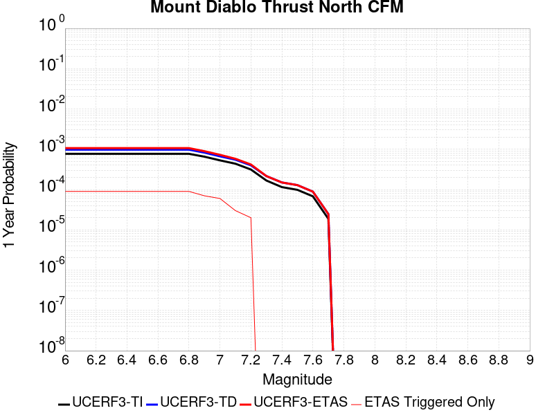 |  |

| Magnitude | 1 wk TI Prob | 1 wk TD Prob | 1 wk ETAS Prob | 1 wk ETAS/TD Gain | 1 wk ETAS Triggered Only | 1 mo TI Prob | 1 mo TD Prob | 1 mo ETAS Prob | 1 mo ETAS/TD Gain | 1 mo ETAS Triggered Only | 1 yr TI Prob | 1 yr TD Prob | 1 yr ETAS Prob | 1 yr ETAS/TD Gain | 1 yr ETAS Triggered Only | 10 yr TI Prob | 10 yr TD Prob | 10 yr ETAS Prob | 10 yr ETAS/TD Gain | 10 yr ETAS Triggered Only |
|-----|-----|-----|-----|-----|-----|-----|-----|-----|-----|-----|-----|-----|-----|-----|-----|-----|-----|-----|-----|-----|
| 6.0 | 1.479628E-5 | 1.8779354E-5 | 3.877898E-5 | 2.0649793 | 2.0E-5 | 6.341109E-5 | 8.048052E-5 | 1.10478104E-4 | 1.372731 | 3.0E-5 | 7.717565E-4 | 9.794194E-4 | 0.0010693312 | 1.0918012 | 9.0E-5 | 0.007690818 | 0.009751337 | 0.009919679 | 1.0172635 | 1.7E-4 |
| 6.1 | 1.479628E-5 | 1.8779354E-5 | 3.877898E-5 | 2.0649793 | 2.0E-5 | 6.341109E-5 | 8.048052E-5 | 1.10478104E-4 | 1.372731 | 3.0E-5 | 7.717565E-4 | 9.794194E-4 | 0.0010693312 | 1.0918012 | 9.0E-5 | 0.007690818 | 0.009751337 | 0.009919679 | 1.0172635 | 1.7E-4 |
| 6.2 | 1.479628E-5 | 1.8779354E-5 | 3.877898E-5 | 2.0649793 | 2.0E-5 | 6.341109E-5 | 8.048052E-5 | 1.10478104E-4 | 1.372731 | 3.0E-5 | 7.717565E-4 | 9.794194E-4 | 0.0010693312 | 1.0918012 | 9.0E-5 | 0.007690818 | 0.009751337 | 0.009919679 | 1.0172635 | 1.7E-4 |
| 6.3 | 1.479628E-5 | 1.8779354E-5 | 3.877898E-5 | 2.0649793 | 2.0E-5 | 6.341109E-5 | 8.048052E-5 | 1.10478104E-4 | 1.372731 | 3.0E-5 | 7.717565E-4 | 9.794194E-4 | 0.0010693312 | 1.0918012 | 9.0E-5 | 0.007690818 | 0.009751337 | 0.009919679 | 1.0172635 | 1.7E-4 |
| 6.4 | 1.479628E-5 | 1.8779354E-5 | 3.877898E-5 | 2.0649793 | 2.0E-5 | 6.341109E-5 | 8.048052E-5 | 1.10478104E-4 | 1.372731 | 3.0E-5 | 7.717565E-4 | 9.794194E-4 | 0.0010693312 | 1.0918012 | 9.0E-5 | 0.007690818 | 0.009751337 | 0.009919679 | 1.0172635 | 1.7E-4 |
| 6.5 | 1.479628E-5 | 1.8779354E-5 | 3.877898E-5 | 2.0649793 | 2.0E-5 | 6.341109E-5 | 8.048052E-5 | 1.10478104E-4 | 1.372731 | 3.0E-5 | 7.717565E-4 | 9.794194E-4 | 0.0010693312 | 1.0918012 | 9.0E-5 | 0.007690818 | 0.009751337 | 0.009919679 | 1.0172635 | 1.7E-4 |
| 6.6 | 1.479016E-5 | 1.8772464E-5 | 3.877209E-5 | 2.0653703 | 2.0E-5 | 6.338486E-5 | 8.045099E-5 | 1.1044858E-4 | 1.3728678 | 3.0E-5 | 7.714374E-4 | 9.790602E-4 | 0.001068972 | 1.0918349 | 9.0E-5 | 0.007687649 | 0.009747776 | 0.009916119 | 1.0172698 | 1.7E-4 |
| 6.7 | 1.479016E-5 | 1.8772464E-5 | 3.877209E-5 | 2.0653703 | 2.0E-5 | 6.338486E-5 | 8.045099E-5 | 1.1044858E-4 | 1.3728678 | 3.0E-5 | 7.714374E-4 | 9.790602E-4 | 0.001068972 | 1.0918349 | 9.0E-5 | 0.007687649 | 0.009747776 | 0.009916119 | 1.0172698 | 1.7E-4 |
| 6.8 | 1.4771667E-5 | 1.8751229E-5 | 3.8750855E-5 | 2.0665767 | 2.0E-5 | 6.330561E-5 | 8.035998E-5 | 1.1035758E-4 | 1.3732901 | 3.0E-5 | 7.704732E-4 | 9.779532E-4 | 0.0010678652 | 1.091939 | 9.0E-5 | 0.007678074 | 0.009736803 | 0.009905148 | 1.0172895 | 1.7E-4 |
| 6.9 | 1.2548234E-5 | 1.5831067E-5 | 3.583075E-5 | 2.2633188 | 2.0E-5 | 5.3777036E-5 | 6.7845685E-5 | 9.784365E-5 | 1.4421499 | 3.0E-5 | 6.545387E-4 | 8.2571176E-4 | 8.9565397E-4 | 1.0847054 | 7.0E-5 | 0.006526142 | 0.008227636 | 0.008356567 | 1.0156704 | 1.3E-4 |
| 7.0 | 1.01754185E-5 | 1.2814098E-5 | 3.281384E-5 | 2.560761 | 2.0E-5 | 4.360821E-5 | 5.4916418E-5 | 8.491477E-5 | 1.5462548 | 3.0E-5 | 5.308006E-4 | 6.684039E-4 | 7.283638E-4 | 1.0897061 | 6.0E-5 | 0.005295345 | 0.006665009 | 0.0067643425 | 1.0149038 | 1.0E-4 |
| 7.1 | 8.398341E-6 | 1.0558139E-5 | 3.0557927E-5 | 2.894253 | 2.0E-5 | 3.5992394E-5 | 4.524839E-5 | 6.5247485E-5 | 1.4419847 | 2.0E-5 | 4.3811928E-4 | 5.50761E-4 | 5.8074447E-4 | 1.0544401 | 3.0E-5 | 0.0043725655 | 0.0054944516 | 0.0055541224 | 1.0108601 | 6.0E-5 |
| 7.2 | 6.024759E-6 | 7.650835E-6 | 1.7650758E-5 | 2.3070369 | 1.0E-5 | 2.582014E-5 | 3.2788885E-5 | 4.2788557E-5 | 1.3049715 | 1.0E-5 | 3.1431485E-4 | 3.9913226E-4 | 4.1912426E-4 | 1.0500888 | 2.0E-5 | 0.0031387066 | 0.0039846385 | 0.004024479 | 1.0099986 | 4.0E-5 |
| 7.3 | 3.2099704E-6 | 4.1373714E-6 | 4.1373714E-6 | 1.0 | 0.0 | 1.3756943E-5 | 1.7731472E-5 | 1.7731472E-5 | 1.0 | 0.0 | 1.674779E-4 | 2.1585946E-4 | 2.1585946E-4 | 1.0 | 0.0 | 0.0016735174 | 0.002156937 | 0.0021669155 | 1.0046262 | 1.0E-5 |
| 7.4 | 2.2041513E-6 | 2.874983E-6 | 2.874983E-6 | 1.0 | 0.0 | 9.4463285E-6 | 1.2321298E-5 | 1.2321298E-5 | 1.0 | 0.0 | 1.1500298E-4 | 1.5000155E-4 | 1.5000155E-4 | 1.0 | 0.0 | 0.0011494348 | 0.0014993263 | 0.0015093114 | 1.0066596 | 1.0E-5 |
| 7.5 | 1.8869501E-6 | 2.4708215E-6 | 2.4708215E-6 | 1.0 | 0.0 | 8.086904E-6 | 1.0589192E-5 | 1.0589192E-5 | 1.0 | 0.0 | 9.845361E-5 | 1.2891585E-4 | 1.2891585E-4 | 1.0 | 0.0 | 9.841E-4 | 0.0012887291 | 0.0012887291 | 1.0 | 0.0 |
| 7.6 | 1.3012458E-6 | 1.7015866E-6 | 1.7015866E-6 | 1.0 | 0.0 | 5.576756E-6 | 7.292494E-6 | 7.292494E-6 | 1.0 | 0.0 | 6.7894885E-5 | 8.878255E-5 | 8.878255E-5 | 1.0 | 0.0 | 6.787415E-4 | 8.8777166E-4 | 8.8777166E-4 | 1.0 | 0.0 |
| 7.7 | 3.603383E-7 | 4.719844E-7 | 4.719844E-7 | 1.0 | 0.0 | 1.5443061E-6 | 2.0227887E-6 | 2.0227887E-6 | 1.0 | 0.0 | 1.8801764E-5 | 2.4627181E-5 | 2.4627181E-5 | 1.0 | 0.0 | 1.8800174E-4 | 2.4626154E-4 | 2.4626154E-4 | 1.0 | 0.0 |

## Monterey Bay-Tularcitos
*[(top)](#table-of-contents)*

| 1 Week | 1 Month | 1 Year | 10 Year |
|-----|-----|-----|-----|
|  |  | 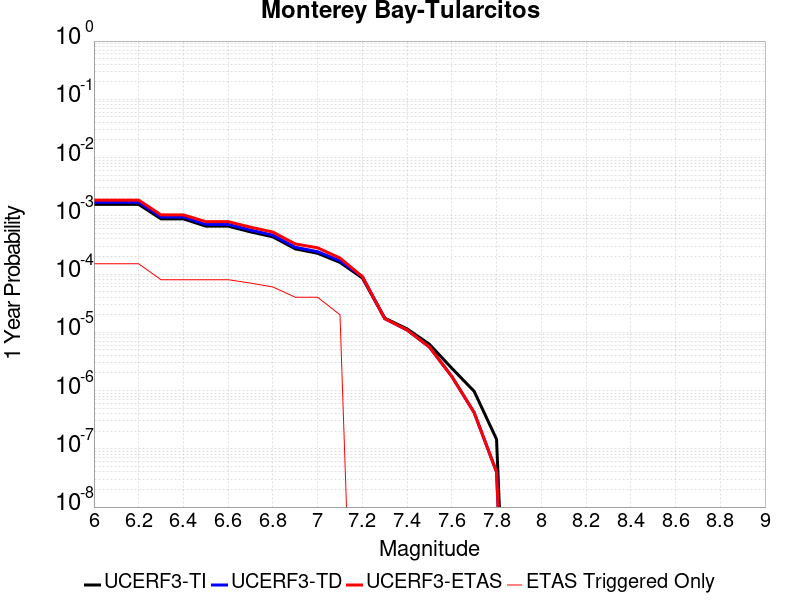 |  |

| Magnitude | 1 wk TI Prob | 1 wk TD Prob | 1 wk ETAS Prob | 1 wk ETAS/TD Gain | 1 wk ETAS Triggered Only | 1 mo TI Prob | 1 mo TD Prob | 1 mo ETAS Prob | 1 mo ETAS/TD Gain | 1 mo ETAS Triggered Only | 1 yr TI Prob | 1 yr TD Prob | 1 yr ETAS Prob | 1 yr ETAS/TD Gain | 1 yr ETAS Triggered Only | 10 yr TI Prob | 10 yr TD Prob | 10 yr ETAS Prob | 10 yr ETAS/TD Gain | 10 yr ETAS Triggered Only |
|-----|-----|-----|-----|-----|-----|-----|-----|-----|-----|-----|-----|-----|-----|-----|-----|-----|-----|-----|-----|-----|
| 6.0 | 3.0131365E-5 | 3.2804503E-5 | 6.280352E-5 | 1.9144787 | 3.0E-5 | 1.2912804E-4 | 1.4058374E-4 | 2.005753E-4 | 1.426732 | 6.0E-5 | 0.001571 | 0.0017103688 | 0.0018601123 | 1.0875504 | 1.5E-4 | 0.015599402 | 0.01698286 | 0.017159805 | 1.0104189 | 1.8E-4 |
| 6.1 | 3.0131365E-5 | 3.2804503E-5 | 6.280352E-5 | 1.9144787 | 3.0E-5 | 1.2912804E-4 | 1.4058374E-4 | 2.005753E-4 | 1.426732 | 6.0E-5 | 0.001571 | 0.0017103688 | 0.0018601123 | 1.0875504 | 1.5E-4 | 0.015599402 | 0.01698286 | 0.017159805 | 1.0104189 | 1.8E-4 |
| 6.2 | 3.0131365E-5 | 3.2804503E-5 | 6.280352E-5 | 1.9144787 | 3.0E-5 | 1.2912804E-4 | 1.4058374E-4 | 2.005753E-4 | 1.426732 | 6.0E-5 | 0.001571 | 0.0017103688 | 0.0018601123 | 1.0875504 | 1.5E-4 | 0.015599402 | 0.01698286 | 0.017159805 | 1.0104189 | 1.8E-4 |
| 6.3 | 1.6998249E-5 | 1.833369E-5 | 2.8333507E-5 | 1.545434 | 1.0E-5 | 7.28476E-5 | 7.8570694E-5 | 1.1856755E-4 | 1.5090556 | 4.0E-5 | 8.865586E-4 | 9.561971E-4 | 0.0010361206 | 1.0835848 | 8.0E-5 | 0.0088303005 | 0.009522754 | 0.009621801 | 1.0104011 | 1.0E-4 |
| 6.4 | 1.6998249E-5 | 1.833369E-5 | 2.8333507E-5 | 1.545434 | 1.0E-5 | 7.28476E-5 | 7.8570694E-5 | 1.1856755E-4 | 1.5090556 | 4.0E-5 | 8.865586E-4 | 9.561971E-4 | 0.0010361206 | 1.0835848 | 8.0E-5 | 0.0088303005 | 0.009522754 | 0.009621801 | 1.0104011 | 1.0E-4 |
| 6.5 | 1.27470785E-5 | 1.3695391E-5 | 2.3695255E-5 | 1.7301626 | 1.0E-5 | 5.4629192E-5 | 5.8693273E-5 | 9.869092E-5 | 1.6814691 | 4.0E-5 | 6.649074E-4 | 7.143667E-4 | 7.943095E-4 | 1.1119074 | 8.0E-5 | 0.0066292146 | 0.0071217557 | 0.0072111147 | 1.0125474 | 9.0E-5 |
| 6.6 | 1.2739422E-5 | 1.3687478E-5 | 2.368734E-5 | 1.7305847 | 1.0E-5 | 5.4596385E-5 | 5.865936E-5 | 9.8657016E-5 | 1.6818631 | 4.0E-5 | 6.645082E-4 | 7.1395404E-4 | 7.938969E-4 | 1.111972 | 8.0E-5 | 0.0066252467 | 0.007117656 | 0.007207015 | 1.0125546 | 9.0E-5 |
| 6.7 | 1.0160109E-5 | 1.0887372E-5 | 2.0887263E-5 | 1.9184853 | 1.0E-5 | 4.35426E-5 | 4.665937E-5 | 7.665797E-5 | 1.6429276 | 3.0E-5 | 5.300022E-4 | 5.679368E-4 | 6.3789706E-4 | 1.1231831 | 7.0E-5 | 0.005287399 | 0.0056655654 | 0.005745112 | 1.0140404 | 8.0E-5 |
| 6.8 | 8.349859E-6 | 8.933906E-6 | 1.8933817E-5 | 2.119321 | 1.0E-5 | 3.578462E-5 | 3.8287642E-5 | 5.8286874E-5 | 1.5223417 | 2.0E-5 | 4.3559066E-4 | 4.6605797E-4 | 5.2603E-4 | 1.1286794 | 6.0E-5 | 0.004347378 | 0.004651371 | 0.004721045 | 1.0149794 | 7.0E-5 |
| 6.9 | 5.193639E-6 | 5.537252E-6 | 1.5537196E-5 | 2.80594 | 1.0E-5 | 2.2258262E-5 | 2.3730881E-5 | 4.3730408E-5 | 1.8427637 | 2.0E-5 | 2.7096065E-4 | 2.8888843E-4 | 3.288769E-4 | 1.1384218 | 4.0E-5 | 0.0027063051 | 0.0028854501 | 0.0029353057 | 1.0172783 | 5.0E-5 |
| 7.0 | 4.359381E-6 | 4.6440664E-6 | 1.464402E-5 | 3.1532753 | 1.0E-5 | 1.8682927E-5 | 1.9903006E-5 | 3.9902607E-5 | 2.0048532 | 2.0E-5 | 2.274409E-4 | 2.4229514E-4 | 2.8228544E-4 | 1.1650479 | 4.0E-5 | 0.0022720827 | 0.0024206026 | 0.0024704817 | 1.020606 | 5.0E-5 |
| 7.1 | 3.0398533E-6 | 3.2315513E-6 | 1.3231519E-5 | 4.094479 | 1.0E-5 | 1.3027877E-5 | 1.3849447E-5 | 2.3849308E-5 | 1.7220405 | 1.0E-5 | 1.5860285E-4 | 1.686066E-4 | 1.8860323E-4 | 1.1185993 | 2.0E-5 | 0.001584897 | 0.0016850445 | 0.0017149939 | 1.0177736 | 3.0E-5 |
| 7.2 | 1.642335E-6 | 1.7336168E-6 | 1.7336168E-6 | 1.0 | 0.0 | 7.0385595E-6 | 7.429777E-6 | 7.429777E-6 | 1.0 | 0.0 | 8.569109E-5 | 9.045585E-5 | 9.045585E-5 | 1.0 | 0.0 | 8.5658056E-4 | 9.0439303E-4 | 9.0439303E-4 | 1.0 | 0.0 |
| 7.3 | 3.356842E-7 | 3.2962387E-7 | 3.2962387E-7 | 1.0 | 0.0 | 1.4386458E-6 | 1.412673E-6 | 1.412673E-6 | 1.0 | 0.0 | 1.7515373E-5 | 1.7199158E-5 | 1.7199158E-5 | 1.0 | 0.0 | 1.7513991E-4 | 1.7197836E-4 | 1.7197836E-4 | 1.0 | 0.0 |
| 7.4 | 2.1973483E-7 | 2.1015711E-7 | 2.1015711E-7 | 1.0 | 0.0 | 9.417204E-7 | 9.00673E-7 | 9.00673E-7 | 1.0 | 0.0 | 1.1465385E-5 | 1.09656385E-5 | 1.09656385E-5 | 1.0 | 0.0 | 1.1464794E-4 | 1.0965102E-4 | 1.0965102E-4 | 1.0 | 0.0 |
| 7.5 | 1.1944135E-7 | 1.070469E-7 | 1.070469E-7 | 1.0 | 0.0 | 5.118914E-7 | 4.5877235E-7 | 4.5877235E-7 | 1.0 | 0.0 | 6.23226E-6 | 5.5855394E-6 | 5.5855394E-6 | 1.0 | 0.0 | 6.2320854E-5 | 5.5854E-5 | 5.5854E-5 | 1.0 | 0.0 |
| 7.6 | 4.636058E-8 | 3.3423447E-8 | 3.3423447E-8 | 1.0 | 0.0 | 1.9868818E-7 | 1.4324333E-7 | 1.4324333E-7 | 1.0 | 0.0 | 2.419026E-6 | 1.7439862E-6 | 1.7439862E-6 | 1.0 | 0.0 | 2.4189996E-5 | 1.7439726E-5 | 1.7439726E-5 | 1.0 | 0.0 |
| 7.7 | 1.8588572E-8 | 8.033227E-9 | 8.033227E-9 | 1.0 | 0.0 | 7.9665305E-8 | 3.4428115E-8 | 3.4428115E-8 | 1.0 | 0.0 | 9.699246E-7 | 4.1916223E-7 | 4.1916223E-7 | 1.0 | 0.0 | 9.699204E-6 | 4.1916146E-6 | 4.1916146E-6 | 1.0 | 0.0 |
| 7.8 | 2.7960154E-9 | 7.656409E-10 | 7.656409E-10 | 1.0 | 0.0 | 1.1982923E-8 | 3.2813179E-9 | 3.2813179E-9 | 1.0 | 0.0 | 1.4589209E-7 | 3.9950045E-8 | 3.9950045E-8 | 1.0 | 0.0 | 1.4589199E-6 | 3.9950044E-7 | 3.9950044E-7 | 1.0 | 0.0 |

## Monte Vista - Shannon 2011 CFM
*[(top)](#table-of-contents)*

| 1 Week | 1 Month | 1 Year | 10 Year |
|-----|-----|-----|-----|
|  | 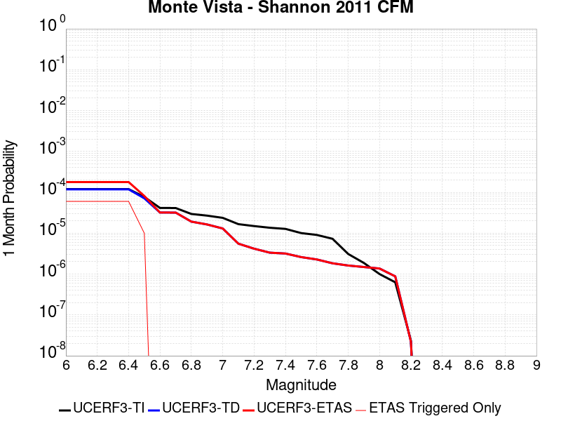 |  |  |

| Magnitude | 1 wk TI Prob | 1 wk TD Prob | 1 wk ETAS Prob | 1 wk ETAS/TD Gain | 1 wk ETAS Triggered Only | 1 mo TI Prob | 1 mo TD Prob | 1 mo ETAS Prob | 1 mo ETAS/TD Gain | 1 mo ETAS Triggered Only | 1 yr TI Prob | 1 yr TD Prob | 1 yr ETAS Prob | 1 yr ETAS/TD Gain | 1 yr ETAS Triggered Only | 10 yr TI Prob | 10 yr TD Prob | 10 yr ETAS Prob | 10 yr ETAS/TD Gain | 10 yr ETAS Triggered Only |
|-----|-----|-----|-----|-----|-----|-----|-----|-----|-----|-----|-----|-----|-----|-----|-----|-----|-----|-----|-----|-----|
| 6.0 | 2.7907707E-5 | 2.7596961E-5 | 7.759558E-5 | 2.8117437 | 5.0E-5 | 1.19598975E-4 | 1.1826803E-4 | 1.7826093E-4 | 1.5072622 | 6.0E-5 | 0.0014551448 | 0.0014390859 | 0.0015489276 | 1.0763274 | 1.1E-4 | 0.014456532 | 0.014326813 | 0.014474664 | 1.0103198 | 1.5E-4 |
| 6.1 | 2.7907707E-5 | 2.7596961E-5 | 7.759558E-5 | 2.8117437 | 5.0E-5 | 1.19598975E-4 | 1.1826803E-4 | 1.7826093E-4 | 1.5072622 | 6.0E-5 | 0.0014551448 | 0.0014390859 | 0.0015489276 | 1.0763274 | 1.1E-4 | 0.014456532 | 0.014326813 | 0.014474664 | 1.0103198 | 1.5E-4 |
| 6.2 | 2.7907707E-5 | 2.7596961E-5 | 7.759558E-5 | 2.8117437 | 5.0E-5 | 1.19598975E-4 | 1.1826803E-4 | 1.7826093E-4 | 1.5072622 | 6.0E-5 | 0.0014551448 | 0.0014390859 | 0.0015489276 | 1.0763274 | 1.1E-4 | 0.014456532 | 0.014326813 | 0.014474664 | 1.0103198 | 1.5E-4 |
| 6.3 | 2.7907707E-5 | 2.7596961E-5 | 7.759558E-5 | 2.8117437 | 5.0E-5 | 1.19598975E-4 | 1.1826803E-4 | 1.7826093E-4 | 1.5072622 | 6.0E-5 | 0.0014551448 | 0.0014390859 | 0.0015489276 | 1.0763274 | 1.1E-4 | 0.014456532 | 0.014326813 | 0.014474664 | 1.0103198 | 1.5E-4 |
| 6.4 | 2.7907707E-5 | 2.7596961E-5 | 7.759558E-5 | 2.8117437 | 5.0E-5 | 1.19598975E-4 | 1.1826803E-4 | 1.7826093E-4 | 1.5072622 | 6.0E-5 | 0.0014551448 | 0.0014390859 | 0.0015489276 | 1.0763274 | 1.1E-4 | 0.014456532 | 0.014326813 | 0.014474664 | 1.0103198 | 1.5E-4 |
| 6.5 | 1.7990213E-5 | 1.665045E-5 | 2.6650285E-5 | 1.6005744 | 1.0E-5 | 7.709863E-5 | 7.13575E-5 | 8.135678E-5 | 1.1401294 | 1.0E-5 | 9.382716E-4 | 8.684976E-4 | 9.184542E-4 | 1.0575206 | 5.0E-5 | 0.0093431985 | 0.008674463 | 0.008743856 | 1.0079997 | 7.0E-5 |
| 6.6 | 9.650407E-6 | 7.465921E-6 | 7.465921E-6 | 1.0 | 0.0 | 4.135823E-5 | 3.1996457E-5 | 3.1996457E-5 | 1.0 | 0.0 | 5.0342013E-4 | 3.8949505E-4 | 4.0948726E-4 | 1.0513285 | 2.0E-5 | 0.005022812 | 0.0039058586 | 0.003945702 | 1.010201 | 4.0E-5 |
| 6.7 | 9.62828E-6 | 7.443826E-6 | 7.443826E-6 | 1.0 | 0.0 | 4.1263404E-5 | 3.1901764E-5 | 3.1901764E-5 | 1.0 | 0.0 | 5.022661E-4 | 3.883426E-4 | 4.0833483E-4 | 1.0514809 | 2.0E-5 | 0.0050113243 | 0.0038943745 | 0.0039342185 | 1.0102313 | 4.0E-5 |
| 6.8 | 6.887523E-6 | 4.469829E-6 | 4.469829E-6 | 1.0 | 0.0 | 2.9517621E-5 | 1.9156283E-5 | 1.9156283E-5 | 1.0 | 0.0 | 3.5931775E-4 | 2.33205E-4 | 2.4320267E-4 | 1.0428708 | 1.0E-5 | 0.0035873733 | 0.0023468107 | 0.00237674 | 1.0127532 | 3.0E-5 |
| 6.9 | 6.2722347E-6 | 3.8115834E-6 | 3.8115834E-6 | 1.0 | 0.0 | 2.6880729E-5 | 1.6335267E-5 | 1.6335267E-5 | 1.0 | 0.0 | 3.2722374E-4 | 1.9886575E-4 | 2.0886376E-4 | 1.0502752 | 1.0E-5 | 0.003267423 | 0.0020040716 | 0.0020340115 | 1.0149395 | 3.0E-5 |
| 7.0 | 5.5320347E-6 | 3.0385556E-6 | 3.0385556E-6 | 1.0 | 0.0 | 2.3708504E-5 | 1.3022326E-5 | 1.3022326E-5 | 1.0 | 0.0 | 2.8861282E-4 | 1.5853712E-4 | 1.5853712E-4 | 1.0 | 0.0 | 0.0028823826 | 0.0016014194 | 0.0016014194 | 1.0 | 0.0 |
| 7.1 | 3.8794055E-6 | 1.2911887E-6 | 1.2911887E-6 | 1.0 | 0.0 | 1.6625918E-5 | 5.533654E-6 | 5.533654E-6 | 1.0 | 0.0 | 2.0240174E-4 | 6.737017E-5 | 6.737017E-5 | 1.0 | 0.0 | 0.002022175 | 6.9050473E-4 | 6.9050473E-4 | 1.0 | 0.0 |
| 7.2 | 3.4813652E-6 | 9.7416E-7 | 9.7416E-7 | 1.0 | 0.0 | 1.49200505E-5 | 4.1749645E-6 | 4.1749645E-6 | 1.0 | 0.0 | 1.8163648E-4 | 5.0829018E-5 | 5.0829018E-5 | 1.0 | 0.0 | 0.0018148809 | 5.251682E-4 | 5.251682E-4 | 1.0 | 0.0 |
| 7.3 | 3.1682148E-6 | 7.7874347E-7 | 7.7874347E-7 | 1.0 | 0.0 | 1.3577992E-5 | 3.3374677E-6 | 3.3374677E-6 | 1.0 | 0.0 | 1.6529951E-4 | 4.0632916E-5 | 4.0632916E-5 | 1.0 | 0.0 | 0.0016517661 | 4.23224E-4 | 4.23224E-4 | 1.0 | 0.0 |
| 7.4 | 2.9707667E-6 | 7.4119936E-7 | 7.4119936E-7 | 1.0 | 0.0 | 1.2731795E-5 | 3.1765646E-6 | 3.1765646E-6 | 1.0 | 0.0 | 1.5499859E-4 | 3.8673992E-5 | 3.8673992E-5 | 1.0 | 0.0 | 0.0015489052 | 4.0343223E-4 | 4.0343223E-4 | 1.0 | 0.0 |
| 7.5 | 2.3462758E-6 | 6.0641764E-7 | 6.0641764E-7 | 1.0 | 0.0 | 1.0055429E-5 | 2.59893E-6 | 2.59893E-6 | 1.0 | 0.0 | 1.2241797E-4 | 3.1641517E-5 | 3.1641517E-5 | 1.0 | 0.0 | 0.0012235056 | 3.3137595E-4 | 3.3137595E-4 | 1.0 | 0.0 |
| 7.6 | 2.112783E-6 | 5.304488E-7 | 5.304488E-7 | 1.0 | 0.0 | 9.054753E-6 | 2.27335E-6 | 2.27335E-6 | 1.0 | 0.0 | 1.1023604E-4 | 2.7677688E-5 | 2.7677688E-5 | 1.0 | 0.0 | 0.0011018137 | 2.9131604E-4 | 2.9131604E-4 | 1.0 | 0.0 |
| 7.7 | 1.7022471E-6 | 4.27777E-7 | 4.27777E-7 | 1.0 | 0.0 | 7.2953244E-6 | 1.8333286E-6 | 1.8333286E-6 | 1.0 | 0.0 | 8.881695E-5 | 2.2320548E-5 | 2.2320548E-5 | 1.0 | 0.0 | 8.878146E-4 | 2.3642003E-4 | 2.3642003E-4 | 1.0 | 0.0 |
| 7.8 | 7.230914E-7 | 3.77047E-7 | 3.77047E-7 | 1.0 | 0.0 | 3.0989595E-6 | 1.6159147E-6 | 1.6159147E-6 | 1.0 | 0.0 | 3.772918E-5 | 1.9673585E-5 | 1.9673585E-5 | 1.0 | 0.0 | 3.7722773E-4 | 2.0947706E-4 | 2.0947706E-4 | 1.0 | 0.0 |
| 7.9 | 4.3588446E-7 | 3.4670603E-7 | 3.4670603E-7 | 1.0 | 0.0 | 1.868075E-6 | 1.4858821E-6 | 1.4858821E-6 | 1.0 | 0.0 | 2.2743576E-5 | 1.8090466E-5 | 1.8090466E-5 | 1.0 | 0.0 | 2.2741247E-4 | 1.9185612E-4 | 1.9185612E-4 | 1.0 | 0.0 |
| 8.0 | 2.3317523E-7 | 3.183387E-7 | 3.183387E-7 | 1.0 | 0.0 | 9.99322E-7 | 1.3643079E-6 | 1.3643079E-6 | 1.0 | 0.0 | 1.2166677E-5 | 1.6610324E-5 | 1.6610324E-5 | 1.0 | 0.0 | 1.21660116E-4 | 1.7565125E-4 | 1.7565125E-4 | 1.0 | 0.0 |
| 8.1 | 1.4662456E-7 | 2.0497022E-7 | 2.0497022E-7 | 1.0 | 0.0 | 6.283908E-7 | 8.7844353E-7 | 8.7844353E-7 | 1.0 | 0.0 | 7.650631E-6 | 1.0694998E-5 | 1.0694998E-5 | 1.0 | 0.0 | 7.650368E-5 | 1.12296955E-4 | 1.12296955E-4 | 1.0 | 0.0 |
| 8.2 | 5.4931775E-9 | 5.1256395E-9 | 5.1256395E-9 | 1.0 | 0.0 | 2.3542189E-8 | 2.1967027E-8 | 2.1967027E-8 | 1.0 | 0.0 | 2.8662612E-7 | 2.6744854E-7 | 2.6744854E-7 | 1.0 | 0.0 | 2.8662573E-6 | 2.7807469E-6 | 2.7807469E-6 | 1.0 | 0.0 |

## San Andreas (Parkfield)
*[(top)](#table-of-contents)*

| 1 Week | 1 Month | 1 Year | 10 Year |
|-----|-----|-----|-----|
| 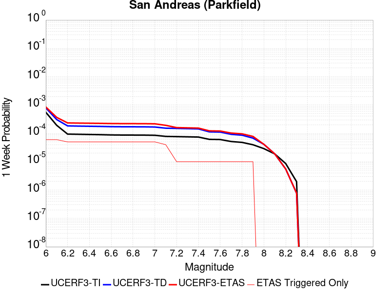 |  |  |  |

| Magnitude | 1 wk TI Prob | 1 wk TD Prob | 1 wk ETAS Prob | 1 wk ETAS/TD Gain | 1 wk ETAS Triggered Only | 1 mo TI Prob | 1 mo TD Prob | 1 mo ETAS Prob | 1 mo ETAS/TD Gain | 1 mo ETAS Triggered Only | 1 yr TI Prob | 1 yr TD Prob | 1 yr ETAS Prob | 1 yr ETAS/TD Gain | 1 yr ETAS Triggered Only | 10 yr TI Prob | 10 yr TD Prob | 10 yr ETAS Prob | 10 yr ETAS/TD Gain | 10 yr ETAS Triggered Only |
|-----|-----|-----|-----|-----|-----|-----|-----|-----|-----|-----|-----|-----|-----|-----|-----|-----|-----|-----|-----|-----|
| 6.0 | 5.556969E-4 | 7.9263543E-4 | 8.5258787E-4 | 1.0756369 | 6.0E-5 | 0.0023793848 | 0.0033931606 | 0.0034828552 | 1.026434 | 9.0E-5 | 0.028586963 | 0.04093722 | 0.041061897 | 1.0030456 | 1.3E-4 | 0.25176284 | 0.33930582 | 0.33941153 | 1.0003115 | 1.6E-4 |
| 6.1 | 1.925858E-4 | 3.0696427E-4 | 3.6694584E-4 | 1.1954025 | 6.0E-5 | 8.2510663E-4 | 0.0013149965 | 0.0014048782 | 1.0683513 | 9.0E-5 | 0.0099994885 | 0.015980305 | 0.016108228 | 1.008005 | 1.3E-4 | 0.095613256 | 0.15071057 | 0.15083797 | 1.0008453 | 1.5E-4 |
| 6.2 | 9.4306815E-5 | 1.8358765E-4 | 2.3357847E-4 | 1.2722995 | 5.0E-5 | 4.0410945E-4 | 7.865682E-4 | 8.665053E-4 | 1.1016276 | 8.0E-5 | 0.0049089384 | 0.009534626 | 0.009653482 | 1.0124657 | 1.2E-4 | 0.048019063 | 0.09236156 | 0.09248863 | 1.0013758 | 1.4E-4 |
| 6.3 | 9.283051E-5 | 1.8054922E-4 | 2.305402E-4 | 1.2768828 | 5.0E-5 | 3.9778434E-4 | 7.7355414E-4 | 8.5349224E-4 | 1.1033387 | 8.0E-5 | 0.0048322747 | 0.009377554 | 0.0094865225 | 1.0116202 | 1.1E-4 | 0.047285385 | 0.09101387 | 0.09113204 | 1.0012983 | 1.3E-4 |
| 6.4 | 9.138826E-5 | 1.781635E-4 | 2.2815459E-4 | 1.2805911 | 5.0E-5 | 3.916052E-4 | 7.633356E-4 | 8.432745E-4 | 1.1047232 | 8.0E-5 | 0.0047573745 | 0.0092542125 | 0.009363195 | 1.0117764 | 1.1E-4 | 0.046568092 | 0.08991512 | 0.09003343 | 1.0013158 | 1.3E-4 |
| 6.5 | 9.000255E-5 | 1.7573753E-4 | 2.2572874E-4 | 1.2844652 | 5.0E-5 | 3.8566816E-4 | 7.529446E-4 | 8.328844E-4 | 1.1061695 | 8.0E-5 | 0.0046854047 | 0.009128781 | 0.0092377765 | 1.0119398 | 1.1E-4 | 0.045878403 | 0.08879583 | 0.08891429 | 1.0013341 | 1.3E-4 |
| 6.6 | 8.8109264E-5 | 1.7253471E-4 | 2.2252608E-4 | 1.2897468 | 5.0E-5 | 3.7755648E-4 | 7.392261E-4 | 8.1916695E-4 | 1.1081413 | 8.0E-5 | 0.0045870654 | 0.008963158 | 0.009072172 | 1.0121624 | 1.1E-4 | 0.04493529 | 0.08732202 | 0.08744066 | 1.0013587 | 1.3E-4 |
| 6.7 | 8.738073E-5 | 1.712023E-4 | 2.2119372E-4 | 1.2920022 | 5.0E-5 | 3.7443507E-4 | 7.335189E-4 | 8.1346027E-4 | 1.1089833 | 8.0E-5 | 0.0045492216 | 0.008894282 | 0.009003304 | 1.0122575 | 1.1E-4 | 0.04457213 | 0.08672093 | 0.08683965 | 1.0013691 | 1.3E-4 |
| 6.8 | 8.710195E-5 | 1.7065476E-4 | 2.2064624E-4 | 1.2929392 | 5.0E-5 | 3.7324068E-4 | 7.311737E-4 | 8.1111526E-4 | 1.1093332 | 8.0E-5 | 0.0045347405 | 0.008865969 | 0.0089749945 | 1.012297 | 1.1E-4 | 0.04443313 | 0.08646772 | 0.086586475 | 1.0013734 | 1.3E-4 |
| 6.9 | 8.6801556E-5 | 1.70062E-4 | 2.200535E-4 | 1.2939605 | 5.0E-5 | 3.7195362E-4 | 7.286347E-4 | 8.085764E-4 | 1.1097144 | 8.0E-5 | 0.0045191357 | 0.008835308 | 0.008944336 | 1.0123401 | 1.1E-4 | 0.044283327 | 0.08619316 | 0.08631195 | 1.0013783 | 1.3E-4 |
| 7.0 | 8.5571606E-5 | 1.6758125E-4 | 2.1757287E-4 | 1.2983127 | 5.0E-5 | 3.6668387E-4 | 7.1800884E-4 | 7.879586E-4 | 1.0974219 | 7.0E-5 | 0.004455241 | 0.008706979 | 0.0088061085 | 1.0113851 | 1.0E-4 | 0.043669727 | 0.085038014 | 0.08514781 | 1.0012912 | 1.2E-4 |
| 7.1 | 7.82589E-5 | 1.5234933E-4 | 1.9234323E-4 | 1.2625145 | 4.0E-5 | 3.3535215E-4 | 6.5276306E-4 | 7.127239E-4 | 1.091857 | 6.0E-5 | 0.0040752706 | 0.007918602 | 0.00800789 | 1.0112756 | 9.0E-5 | 0.040013418 | 0.07793748 | 0.078029685 | 1.001183 | 1.0E-4 |
| 7.2 | 7.690929E-5 | 1.4970943E-4 | 1.5970794E-4 | 1.066786 | 1.0E-5 | 3.2956956E-4 | 6.414548E-4 | 6.61442E-4 | 1.0311592 | 2.0E-5 | 0.004005129 | 0.007781916 | 0.007831527 | 1.0063752 | 5.0E-5 | 0.0393371 | 0.07670636 | 0.07676176 | 1.0007222 | 6.0E-5 |
| 7.3 | 7.5543794E-5 | 1.4665986E-4 | 1.566584E-4 | 1.068175 | 1.0E-5 | 3.2371894E-4 | 6.283916E-4 | 6.4837903E-4 | 1.0318073 | 2.0E-5 | 0.003934157 | 0.0076239943 | 0.0076736133 | 1.0065082 | 5.0E-5 | 0.038652334 | 0.075262666 | 0.07531815 | 1.0007372 | 6.0E-5 |
| 7.4 | 7.4214564E-5 | 1.4365558E-4 | 1.5365414E-4 | 1.0696009 | 1.0E-5 | 3.1802364E-4 | 6.155222E-4 | 6.355099E-4 | 1.0324727 | 2.0E-5 | 0.003865065 | 0.0074683935 | 0.0075180205 | 1.0066448 | 5.0E-5 | 0.03798529 | 0.07383138 | 0.073886946 | 1.0007527 | 6.0E-5 |
| 7.5 | 6.149578E-5 | 1.1279444E-4 | 1.2279331E-4 | 1.0886469 | 1.0E-5 | 2.6352672E-4 | 4.8331532E-4 | 4.9331045E-4 | 1.0206804 | 1.0E-5 | 0.0032037178 | 0.0058685197 | 0.0059082853 | 1.006776 | 4.0E-5 | 0.03157923 | 0.058961328 | 0.059008382 | 1.000798 | 5.0E-5 |
| 7.6 | 6.0643448E-5 | 1.110722E-4 | 1.2107109E-4 | 1.0900215 | 1.0E-5 | 2.598746E-4 | 4.7593698E-4 | 4.8593222E-4 | 1.0210012 | 1.0E-5 | 0.0031593828 | 0.005779169 | 0.005818938 | 1.0068814 | 4.0E-5 | 0.031148417 | 0.058118872 | 0.058165967 | 1.0008103 | 5.0E-5 |
| 7.7 | 5.1652263E-5 | 9.253609E-5 | 1.0253516E-4 | 1.108056 | 1.0E-5 | 2.2134806E-4 | 3.9652298E-4 | 4.0651902E-4 | 1.0252092 | 1.0E-5 | 0.002691582 | 0.004816991 | 0.0048567983 | 1.008264 | 4.0E-5 | 0.026592141 | 0.04890274 | 0.048950292 | 1.0009724 | 5.0E-5 |
| 7.8 | 4.8090482E-5 | 8.632214E-5 | 9.632128E-5 | 1.1158351 | 1.0E-5 | 2.060858E-4 | 3.6989962E-4 | 3.798959E-4 | 1.0270244 | 1.0E-5 | 0.0025062072 | 0.0044942363 | 0.004534057 | 1.0088602 | 4.0E-5 | 0.024781305 | 0.04564113 | 0.045688853 | 1.0010455 | 5.0E-5 |
| 7.9 | 3.970278E-5 | 6.806859E-5 | 7.806791E-5 | 1.1469007 | 1.0E-5 | 1.7014367E-4 | 2.916899E-4 | 3.01687E-4 | 1.034273 | 1.0E-5 | 0.002069531 | 0.0035455455 | 0.0035854038 | 1.0112418 | 4.0E-5 | 0.020503636 | 0.03615142 | 0.036199614 | 1.0013331 | 5.0E-5 |
| 8.0 | 2.8982335E-5 | 4.1055268E-5 | 4.1055268E-5 | 1.0 | 0.0 | 1.2420409E-4 | 1.7593929E-4 | 1.7593929E-4 | 1.0 | 0.0 | 0.0015111357 | 0.0021399576 | 0.002159915 | 1.009326 | 2.0E-5 | 0.015009012 | 0.02218932 | 0.022218654 | 1.001322 | 3.0E-5 |
| 8.1 | 1.8836186E-5 | 1.8882112E-5 | 1.8882112E-5 | 1.0 | 0.0 | 8.0724014E-5 | 8.092083E-5 | 8.092083E-5 | 1.0 | 0.0 | 9.823717E-4 | 9.847664E-4 | 0.0010047468 | 1.0202894 | 2.0E-5 | 0.009780403 | 0.010593857 | 0.0106136445 | 1.0018679 | 2.0E-5 |
| 8.2 | 8.643924E-6 | 5.5514706E-6 | 5.5514706E-6 | 1.0 | 0.0 | 3.704486E-5 | 2.3791801E-5 | 2.3791801E-5 | 1.0 | 0.0 | 4.5092785E-4 | 2.8962674E-4 | 2.9962385E-4 | 1.0345172 | 1.0E-5 | 0.0045001395 | 0.0032906544 | 0.0033006216 | 1.0030289 | 1.0E-5 |
| 8.3 | 1.983087E-6 | 7.783617E-7 | 7.783617E-7 | 1.0 | 0.0 | 8.498917E-6 | 3.3358317E-6 | 3.3358317E-6 | 1.0 | 0.0 | 1.034694E-4 | 4.0613013E-5 | 4.0613013E-5 | 1.0 | 0.0 | 0.0010342124 | 4.791138E-4 | 4.791138E-4 | 1.0 | 0.0 |

## Greenville (So) 2011 CFM
*[(top)](#table-of-contents)*

| 1 Week | 1 Month | 1 Year | 10 Year |
|-----|-----|-----|-----|
|  |  |  |  |

| Magnitude | 1 wk TI Prob | 1 wk TD Prob | 1 wk ETAS Prob | 1 wk ETAS/TD Gain | 1 wk ETAS Triggered Only | 1 mo TI Prob | 1 mo TD Prob | 1 mo ETAS Prob | 1 mo ETAS/TD Gain | 1 mo ETAS Triggered Only | 1 yr TI Prob | 1 yr TD Prob | 1 yr ETAS Prob | 1 yr ETAS/TD Gain | 1 yr ETAS Triggered Only | 10 yr TI Prob | 10 yr TD Prob | 10 yr ETAS Prob | 10 yr ETAS/TD Gain | 10 yr ETAS Triggered Only |
|-----|-----|-----|-----|-----|-----|-----|-----|-----|-----|-----|-----|-----|-----|-----|-----|-----|-----|-----|-----|-----|
| 6.0 | 4.279693E-5 | 5.5068864E-5 | 8.5067215E-5 | 1.5447425 | 3.0E-5 | 1.8340252E-4 | 2.3599011E-4 | 2.7598065E-4 | 1.1694586 | 4.0E-5 | 0.0022306389 | 0.0028696412 | 0.0029793256 | 1.0382223 | 1.1E-4 | 0.022083808 | 0.028352855 | 0.028498601 | 1.0051404 | 1.5E-4 |
| 6.1 | 3.4037297E-5 | 4.321312E-5 | 7.321182E-5 | 1.6942036 | 3.0E-5 | 1.4586597E-4 | 1.8518712E-4 | 2.2517971E-4 | 1.2159578 | 4.0E-5 | 0.0017744715 | 0.00225248 | 0.0023522547 | 1.0442955 | 1.0E-4 | 0.01760369 | 0.02231353 | 0.022430852 | 1.0052578 | 1.2E-4 |
| 6.2 | 3.4037297E-5 | 4.321312E-5 | 7.321182E-5 | 1.6942036 | 3.0E-5 | 1.4586597E-4 | 1.8518712E-4 | 2.2517971E-4 | 1.2159578 | 4.0E-5 | 0.0017744715 | 0.00225248 | 0.0023522547 | 1.0442955 | 1.0E-4 | 0.01760369 | 0.02231353 | 0.022430852 | 1.0052578 | 1.2E-4 |
| 6.3 | 2.5956324E-5 | 3.2443586E-5 | 5.2442938E-5 | 1.6164347 | 2.0E-5 | 1.11236644E-4 | 1.3903697E-4 | 1.6903279E-4 | 1.21574 | 3.0E-5 | 0.0013534647 | 0.0016915252 | 0.0017614068 | 1.0413128 | 7.0E-5 | 0.013452509 | 0.016793529 | 0.016872184 | 1.0046837 | 8.0E-5 |
| 6.4 | 2.1145053E-5 | 2.6208558E-5 | 3.6208297E-5 | 1.3815447 | 1.0E-5 | 9.061851E-5 | 1.1231774E-4 | 1.2231662E-4 | 1.0890231 | 1.0E-5 | 0.0011027219 | 0.001366642 | 0.0014165737 | 1.036536 | 5.0E-5 | 0.01097266 | 0.013586048 | 0.013645233 | 1.0043563 | 6.0E-5 |
| 6.5 | 2.0030959E-5 | 2.4806E-5 | 3.480575E-5 | 1.4031183 | 1.0E-5 | 8.584414E-5 | 1.0630728E-4 | 1.1630622E-4 | 1.094057 | 1.0E-5 | 0.0010446513 | 0.0012935537 | 0.001343489 | 1.0386032 | 5.0E-5 | 0.010397541 | 0.012863853 | 0.012923081 | 1.0046042 | 6.0E-5 |
| 6.6 | 1.8395405E-5 | 2.2763696E-5 | 3.276347E-5 | 1.439286 | 1.0E-5 | 7.8835066E-5 | 9.755521E-5 | 1.0755423E-4 | 1.102496 | 1.0E-5 | 9.5939427E-4 | 0.001187116 | 0.0012370567 | 1.0420688 | 5.0E-5 | 0.009552629 | 0.011811062 | 0.0118703535 | 1.00502 | 6.0E-5 |
| 6.7 | 1.7883482E-5 | 2.2134464E-5 | 3.213424E-5 | 1.4517741 | 1.0E-5 | 7.664124E-5 | 9.4858704E-5 | 1.04857754E-4 | 1.10541 | 1.0E-5 | 9.3270757E-4 | 0.0011543215 | 0.0012042638 | 1.0432655 | 5.0E-5 | 0.009288026 | 0.0114865685 | 0.011545879 | 1.0051636 | 6.0E-5 |
| 6.8 | 1.3373564E-5 | 1.6512255E-5 | 2.6512089E-5 | 1.6056008 | 1.0E-5 | 5.7314013E-5 | 7.076497E-5 | 8.0764265E-5 | 1.1413028 | 1.0E-5 | 6.975747E-4 | 8.6123776E-4 | 8.912119E-4 | 1.0348036 | 3.0E-5 | 0.0069538904 | 0.008580871 | 0.008620528 | 1.0046215 | 4.0E-5 |
| 6.9 | 1.06692905E-5 | 1.3157319E-5 | 2.3157187E-5 | 1.7600232 | 1.0E-5 | 4.5724726E-5 | 5.6387355E-5 | 6.638679E-5 | 1.1773348 | 1.0E-5 | 5.5655633E-4 | 6.8631105E-4 | 7.0629735E-4 | 1.0291213 | 2.0E-5 | 0.005551645 | 0.0068434086 | 0.0068732034 | 1.0043538 | 3.0E-5 |
| 7.0 | 8.157512E-6 | 1.0066003E-5 | 2.0065901E-5 | 1.993433 | 1.0E-5 | 3.4960296E-5 | 4.313932E-5 | 5.3138887E-5 | 1.2317971 | 1.0E-5 | 4.2555845E-4 | 5.2509835E-4 | 5.4508785E-4 | 1.038068 | 2.0E-5 | 0.004247444 | 0.0052393135 | 0.0052691563 | 1.0056959 | 3.0E-5 |
| 7.1 | 6.1467113E-6 | 7.6298E-6 | 1.7629724E-5 | 2.3106403 | 1.0E-5 | 2.6342783E-5 | 3.269874E-5 | 4.269841E-5 | 1.3058122 | 1.0E-5 | 3.206762E-4 | 3.9803528E-4 | 4.180273E-4 | 1.0502268 | 2.0E-5 | 0.0032021382 | 0.0039736717 | 0.0040035527 | 1.0075197 | 3.0E-5 |
| 7.2 | 4.713467E-6 | 5.9160684E-6 | 1.591601E-5 | 2.690302 | 1.0E-5 | 2.0200418E-5 | 2.5354335E-5 | 3.535408E-5 | 1.3943999 | 1.0E-5 | 2.4591232E-4 | 3.0864592E-4 | 3.2863973E-4 | 1.0647792 | 2.0E-5 | 0.0024564038 | 0.003082583 | 0.0031124905 | 1.0097021 | 3.0E-5 |
| 7.3 | 2.3266216E-6 | 2.9553435E-6 | 2.9553435E-6 | 1.0 | 0.0 | 9.971197E-6 | 1.2665697E-5 | 1.2665697E-5 | 1.0 | 0.0 | 1.2139256E-4 | 1.541941E-4 | 1.541941E-4 | 1.0 | 0.0 | 0.0012132627 | 0.0015412734 | 0.0015412734 | 1.0 | 0.0 |
| 7.4 | 1.3314E-6 | 1.7191236E-6 | 1.7191236E-6 | 1.0 | 0.0 | 5.7059874E-6 | 7.367652E-6 | 7.367652E-6 | 1.0 | 0.0 | 6.946818E-5 | 8.969752E-5 | 8.969752E-5 | 1.0 | 0.0 | 6.9446466E-4 | 8.9690136E-4 | 8.9690136E-4 | 1.0 | 0.0 |
| 7.5 | 1.0362941E-6 | 1.3476846E-6 | 1.3476846E-6 | 1.0 | 0.0 | 4.4412527E-6 | 5.7757784E-6 | 5.7757784E-6 | 1.0 | 0.0 | 5.407091E-5 | 7.031788E-5 | 7.031788E-5 | 1.0 | 0.0 | 5.405776E-4 | 7.032396E-4 | 7.032396E-4 | 1.0 | 0.0 |
| 7.6 | 7.764784E-7 | 1.0096026E-6 | 1.0096026E-6 | 1.0 | 0.0 | 3.3277602E-6 | 4.3268615E-6 | 4.3268615E-6 | 1.0 | 0.0 | 4.0514726E-5 | 5.26783E-5 | 5.26783E-5 | 1.0 | 0.0 | 4.050734E-4 | 5.269713E-4 | 5.269713E-4 | 1.0 | 0.0 |
| 7.7 | 1.6927763E-7 | 2.2141442E-7 | 2.2141442E-7 | 1.0 | 0.0 | 7.2547533E-7 | 9.489186E-7 | 9.489186E-7 | 1.0 | 0.0 | 8.832627E-6 | 1.15530265E-5 | 1.15530265E-5 | 1.0 | 0.0 | 8.8322755E-5 | 1.1555313E-4 | 1.1555313E-4 | 1.0 | 0.0 |

## Ortigalita (North)
*[(top)](#table-of-contents)*

| 1 Week | 1 Month | 1 Year | 10 Year |
|-----|-----|-----|-----|
|  |  |  |  |

| Magnitude | 1 wk TI Prob | 1 wk TD Prob | 1 wk ETAS Prob | 1 wk ETAS/TD Gain | 1 wk ETAS Triggered Only | 1 mo TI Prob | 1 mo TD Prob | 1 mo ETAS Prob | 1 mo ETAS/TD Gain | 1 mo ETAS Triggered Only | 1 yr TI Prob | 1 yr TD Prob | 1 yr ETAS Prob | 1 yr ETAS/TD Gain | 1 yr ETAS Triggered Only | 10 yr TI Prob | 10 yr TD Prob | 10 yr ETAS Prob | 10 yr ETAS/TD Gain | 10 yr ETAS Triggered Only |
|-----|-----|-----|-----|-----|-----|-----|-----|-----|-----|-----|-----|-----|-----|-----|-----|-----|-----|-----|-----|-----|
| 6.0 | 7.711876E-5 | 1.051221E-4 | 1.3511894E-4 | 1.2853525 | 3.0E-5 | 3.3046713E-4 | 4.5044618E-4 | 4.8043267E-4 | 1.0665706 | 3.0E-5 | 0.004016016 | 0.005471551 | 0.0055312226 | 1.0109059 | 6.0E-5 | 0.039442103 | 0.0534885 | 0.05360208 | 1.0021235 | 1.2E-4 |
| 6.1 | 4.607858E-5 | 6.0274764E-5 | 7.027416E-5 | 1.1658969 | 1.0E-5 | 1.9746469E-4 | 2.582965E-4 | 2.682939E-4 | 1.0387052 | 1.0E-5 | 0.0024014818 | 0.0031405424 | 0.0031704481 | 1.0095224 | 3.0E-5 | 0.023756953 | 0.03099272 | 0.031050859 | 1.001876 | 6.0E-5 |
| 6.2 | 4.607858E-5 | 6.0274764E-5 | 7.027416E-5 | 1.1658969 | 1.0E-5 | 1.9746469E-4 | 2.582965E-4 | 2.682939E-4 | 1.0387052 | 1.0E-5 | 0.0024014818 | 0.0031405424 | 0.0031704481 | 1.0095224 | 3.0E-5 | 0.023756953 | 0.03099272 | 0.031050859 | 1.001876 | 6.0E-5 |
| 6.3 | 3.327423E-5 | 4.2498803E-5 | 5.2498377E-5 | 1.2352908 | 1.0E-5 | 1.4259605E-4 | 1.821267E-4 | 1.9212488E-4 | 1.0548968 | 1.0E-5 | 0.0017347244 | 0.0022153861 | 0.0022353418 | 1.0090078 | 2.0E-5 | 0.017212452 | 0.021957261 | 0.022006163 | 1.0022272 | 5.0E-5 |
| 6.4 | 2.7732503E-5 | 3.501695E-5 | 4.50166E-5 | 1.285566 | 1.0E-5 | 1.1884817E-4 | 1.5006546E-4 | 1.6006397E-4 | 1.0666276 | 1.0E-5 | 0.001446016 | 0.0018257501 | 0.0018457136 | 1.0109344 | 2.0E-5 | 0.014366428 | 0.018130474 | 0.018179568 | 1.0027078 | 5.0E-5 |
| 6.5 | 2.7689714E-5 | 3.4966746E-5 | 4.4966397E-5 | 1.285976 | 1.0E-5 | 1.186648E-4 | 1.4985034E-4 | 1.5984883E-4 | 1.0667232 | 1.0E-5 | 0.0014437864 | 0.0018231353 | 0.0018430988 | 1.0109501 | 2.0E-5 | 0.014344421 | 0.018104753 | 0.018153848 | 1.0027117 | 5.0E-5 |
| 6.6 | 2.2976905E-5 | 2.8732524E-5 | 3.8732236E-5 | 1.3480276 | 1.0E-5 | 9.846873E-5 | 1.2313496E-4 | 1.3313373E-4 | 1.0812017 | 1.0E-5 | 0.0011981975 | 0.0014983759 | 0.0015183459 | 1.0133278 | 2.0E-5 | 0.011917574 | 0.0149060525 | 0.014955306 | 1.0033044 | 5.0E-5 |
| 6.7 | 1.9871539E-5 | 2.4917166E-5 | 2.4917166E-5 | 1.0 | 0.0 | 8.516096E-5 | 1.06784886E-4 | 1.06784886E-4 | 1.0 | 0.0 | 0.0010363415 | 0.0012995731 | 0.00130956 | 1.0076848 | 1.0E-5 | 0.010315218 | 0.012943409 | 0.012982892 | 1.0030503 | 4.0E-5 |
| 6.8 | 6.5640475E-6 | 7.607822E-6 | 7.607822E-6 | 1.0 | 0.0 | 2.813133E-5 | 3.260456E-5 | 3.260456E-5 | 1.0 | 0.0 | 3.424451E-4 | 3.968911E-4 | 3.968911E-4 | 1.0 | 0.0 | 0.0034191788 | 0.00396211 | 0.003982031 | 1.0050278 | 2.0E-5 |
| 6.9 | 5.6219683E-6 | 6.503801E-6 | 6.503801E-6 | 1.0 | 0.0 | 2.4093928E-5 | 2.7873151E-5 | 2.7873151E-5 | 1.0 | 0.0 | 2.933041E-4 | 3.3930535E-4 | 3.3930535E-4 | 1.0 | 0.0 | 0.0029291727 | 0.00338813 | 0.0034080625 | 1.005883 | 2.0E-5 |
| 7.0 | 3.875591E-6 | 4.486115E-6 | 4.486115E-6 | 1.0 | 0.0 | 1.6609569E-5 | 1.9226076E-5 | 1.9226076E-5 | 1.0 | 0.0 | 2.0220275E-4 | 2.3405446E-4 | 2.3405446E-4 | 1.0 | 0.0 | 0.0020201886 | 0.002338288 | 0.0023482644 | 1.0042666 | 1.0E-5 |
| 7.1 | 1.6017933E-6 | 1.8576128E-6 | 1.8576128E-6 | 1.0 | 0.0 | 6.8648105E-6 | 7.961179E-6 | 7.961179E-6 | 1.0 | 0.0 | 8.357586E-5 | 9.6924115E-5 | 9.6924115E-5 | 1.0 | 0.0 | 8.3544437E-4 | 9.689232E-4 | 9.689232E-4 | 1.0 | 0.0 |

## Contra Costa Shear Zone (connector) 2011 CFM
*[(top)](#table-of-contents)*

| 1 Week | 1 Month | 1 Year | 10 Year |
|-----|-----|-----|-----|
|  |  |  |  |

| Magnitude | 1 wk TI Prob | 1 wk TD Prob | 1 wk ETAS Prob | 1 wk ETAS/TD Gain | 1 wk ETAS Triggered Only | 1 mo TI Prob | 1 mo TD Prob | 1 mo ETAS Prob | 1 mo ETAS/TD Gain | 1 mo ETAS Triggered Only | 1 yr TI Prob | 1 yr TD Prob | 1 yr ETAS Prob | 1 yr ETAS/TD Gain | 1 yr ETAS Triggered Only | 10 yr TI Prob | 10 yr TD Prob | 10 yr ETAS Prob | 10 yr ETAS/TD Gain | 10 yr ETAS Triggered Only |
|-----|-----|-----|-----|-----|-----|-----|-----|-----|-----|-----|-----|-----|-----|-----|-----|-----|-----|-----|-----|-----|
| 6.0 | 1.3187427E-5 | 1.4048021E-5 | 4.40476E-5 | 3.135502 | 3.0E-5 | 5.6516317E-5 | 6.0204544E-5 | 1.2020093E-4 | 1.9965426 | 6.0E-5 | 6.878689E-4 | 7.3276664E-4 | 8.3269336E-4 | 1.1363691 | 1.0E-4 | 0.006857436 | 0.0073097665 | 0.007448743 | 1.0190125 | 1.4E-4 |
| 6.1 | 1.3187427E-5 | 1.4048021E-5 | 4.40476E-5 | 3.135502 | 3.0E-5 | 5.6516317E-5 | 6.0204544E-5 | 1.2020093E-4 | 1.9965426 | 6.0E-5 | 6.878689E-4 | 7.3276664E-4 | 8.3269336E-4 | 1.1363691 | 1.0E-4 | 0.006857436 | 0.0073097665 | 0.007448743 | 1.0190125 | 1.4E-4 |
| 6.2 | 1.3187427E-5 | 1.4048021E-5 | 4.40476E-5 | 3.135502 | 3.0E-5 | 5.6516317E-5 | 6.0204544E-5 | 1.2020093E-4 | 1.9965426 | 6.0E-5 | 6.878689E-4 | 7.3276664E-4 | 8.3269336E-4 | 1.1363691 | 1.0E-4 | 0.006857436 | 0.0073097665 | 0.007448743 | 1.0190125 | 1.4E-4 |
| 6.3 | 9.315374E-6 | 9.830226E-6 | 3.982993E-5 | 4.051782 | 3.0E-5 | 3.992242E-5 | 4.2128882E-5 | 1.0212635E-4 | 2.4241412 | 6.0E-5 | 4.8594706E-4 | 5.1280257E-4 | 6.027564E-4 | 1.1754161 | 9.0E-5 | 0.004848858 | 0.005120609 | 0.005249943 | 1.0252576 | 1.3E-4 |
| 6.4 | 9.315374E-6 | 9.830226E-6 | 3.982993E-5 | 4.051782 | 3.0E-5 | 3.992242E-5 | 4.2128882E-5 | 1.0212635E-4 | 2.4241412 | 6.0E-5 | 4.8594706E-4 | 5.1280257E-4 | 6.027564E-4 | 1.1754161 | 9.0E-5 | 0.004848858 | 0.005120609 | 0.005249943 | 1.0252576 | 1.3E-4 |
| 6.5 | 8.492638E-6 | 8.943775E-6 | 3.8943508E-5 | 4.354258 | 3.0E-5 | 3.639651E-5 | 3.8329923E-5 | 9.8327626E-5 | 2.5652966 | 6.0E-5 | 4.430374E-4 | 4.6657026E-4 | 5.565283E-4 | 1.192807 | 9.0E-5 | 0.0044215517 | 0.004660248 | 0.0047796885 | 1.0256298 | 1.2E-4 |
| 6.6 | 8.402072E-6 | 8.844558E-6 | 3.8844293E-5 | 4.3918867 | 3.0E-5 | 3.6008387E-5 | 3.7904712E-5 | 9.790244E-5 | 2.5828567 | 6.0E-5 | 4.383139E-4 | 4.6139554E-4 | 5.51354E-4 | 1.1949704 | 9.0E-5 | 0.0043745036 | 0.004608716 | 0.004728163 | 1.0259176 | 1.2E-4 |
| 6.7 | 7.383587E-6 | 7.752001E-6 | 2.7751847E-5 | 3.579959 | 2.0E-5 | 3.164356E-5 | 3.322245E-5 | 7.322112E-5 | 2.2039652 | 4.0E-5 | 3.8519225E-4 | 4.0441036E-4 | 4.7438205E-4 | 1.1730216 | 7.0E-5 | 0.0038452526 | 0.004040959 | 0.004140555 | 1.0246466 | 1.0E-4 |
| 6.8 | 6.004921E-6 | 6.2694644E-6 | 1.6269401E-5 | 2.5950227 | 1.0E-5 | 2.5735122E-5 | 2.6868858E-5 | 4.686832E-5 | 1.7443361 | 2.0E-5 | 3.1328006E-4 | 3.270798E-4 | 3.7706344E-4 | 1.1528178 | 5.0E-5 | 0.0031283877 | 0.0032700447 | 0.0033298484 | 1.0182884 | 6.0E-5 |
| 6.9 | 5.505255E-6 | 5.7217717E-6 | 1.5721715E-5 | 2.7477005 | 1.0E-5 | 2.3593739E-5 | 2.452165E-5 | 4.4521163E-5 | 1.8155857 | 2.0E-5 | 2.872159E-4 | 2.9851065E-4 | 3.4849573E-4 | 1.1674482 | 5.0E-5 | 0.0028684495 | 0.0029851485 | 0.0030449694 | 1.0200396 | 6.0E-5 |
| 7.0 | 4.891922E-6 | 5.052329E-6 | 1.5052278E-5 | 2.9792752 | 1.0E-5 | 2.096521E-5 | 2.1652662E-5 | 3.1652446E-5 | 1.461827 | 1.0E-5 | 2.5522153E-4 | 2.635896E-4 | 3.035791E-4 | 1.151711 | 4.0E-5 | 0.0025492862 | 0.0026368136 | 0.0026866817 | 1.0189123 | 5.0E-5 |
| 7.1 | 4.3599E-6 | 4.45621E-6 | 1.4456165E-5 | 3.2440495 | 1.0E-5 | 1.868515E-5 | 1.9097904E-5 | 2.9097713E-5 | 1.5236077 | 1.0E-5 | 2.2746796E-4 | 2.3249244E-4 | 2.7248316E-4 | 1.1720086 | 4.0E-5 | 0.0022723526 | 0.0023265292 | 0.002376413 | 1.0214412 | 5.0E-5 |
| 7.2 | 3.7647926E-6 | 3.8070978E-6 | 1.380706E-5 | 3.6266627 | 1.0E-5 | 1.6134725E-5 | 1.6316033E-5 | 2.6315869E-5 | 1.612884 | 1.0E-5 | 1.9642258E-4 | 1.9862983E-4 | 2.3862188E-4 | 1.2013396 | 4.0E-5 | 0.0019624906 | 0.0019885479 | 0.0020384484 | 1.025094 | 5.0E-5 |
| 7.3 | 2.3179882E-6 | 2.3945984E-6 | 1.2394575E-5 | 5.176056 | 1.0E-5 | 9.934198E-6 | 1.0262524E-5 | 2.0262421E-5 | 1.9744091 | 1.0E-5 | 1.20942146E-4 | 1.2493912E-4 | 1.4493661E-4 | 1.160058 | 2.0E-5 | 0.0012087635 | 0.0012527077 | 0.0012726827 | 1.0159454 | 2.0E-5 |
| 7.4 | 1.8378355E-6 | 1.9215563E-6 | 1.1921537E-5 | 6.2041054 | 1.0E-5 | 7.876414E-6 | 8.235215E-6 | 1.8235132E-5 | 2.2142873 | 1.0E-5 | 9.5891126E-5 | 1.0025917E-4 | 1.20257166E-4 | 1.199463 | 2.0E-5 | 9.584976E-4 | 0.0010060758 | 0.0010260557 | 1.0198592 | 2.0E-5 |
| 7.5 | 9.840493E-7 | 1.0649657E-6 | 1.0649657E-6 | 1.0 | 0.0 | 4.2173474E-6 | 4.5641304E-6 | 4.5641304E-6 | 1.0 | 0.0 | 5.1344992E-5 | 5.5566885E-5 | 6.556633E-5 | 1.1799533 | 1.0E-5 | 5.133313E-4 | 5.591408E-4 | 5.6913524E-4 | 1.0178746 | 1.0E-5 |
| 7.6 | 3.1602997E-7 | 3.724657E-7 | 3.724657E-7 | 1.0 | 0.0 | 1.3544135E-6 | 1.5962806E-6 | 1.5962806E-6 | 1.0 | 0.0 | 1.648986E-5 | 1.9434545E-5 | 1.9434545E-5 | 1.0 | 0.0 | 1.6488635E-4 | 1.9783223E-4 | 1.9783223E-4 | 1.0 | 0.0 |
| 7.7 | 2.2125788E-7 | 2.777897E-7 | 2.777897E-7 | 1.0 | 0.0 | 9.482477E-7 | 1.1905267E-6 | 1.1905267E-6 | 1.0 | 0.0 | 1.1544855E-5 | 1.4494567E-5 | 1.4494567E-5 | 1.0 | 0.0 | 1.1544255E-4 | 1.4840343E-4 | 1.4840343E-4 | 1.0 | 0.0 |
| 7.8 | 1.0509553E-7 | 1.448451E-7 | 1.448451E-7 | 1.0 | 0.0 | 4.5040935E-7 | 6.207646E-7 | 6.207646E-7 | 1.0 | 0.0 | 5.48372E-6 | 7.5577823E-6 | 7.5577823E-6 | 1.0 | 0.0 | 5.4835844E-5 | 7.786888E-5 | 7.786888E-5 | 1.0 | 0.0 |
| 7.9 | 6.029319E-8 | 9.3100546E-8 | 9.3100546E-8 | 1.0 | 0.0 | 2.5839938E-7 | 3.990023E-7 | 3.990023E-7 | 1.0 | 0.0 | 3.1460077E-6 | 4.857842E-6 | 4.857842E-6 | 1.0 | 0.0 | 3.1459633E-5 | 5.0150862E-5 | 5.0150862E-5 | 1.0 | 0.0 |
| 8.0 | 3.531068E-8 | 6.55782E-8 | 6.55782E-8 | 1.0 | 0.0 | 1.5133148E-7 | 2.810494E-7 | 2.810494E-7 | 1.0 | 0.0 | 1.8424593E-6 | 3.4217712E-6 | 3.4217712E-6 | 1.0 | 0.0 | 1.842444E-5 | 3.5349527E-5 | 3.5349527E-5 | 1.0 | 0.0 |
| 8.1 | 3.5238246E-10 | 6.3010697E-10 | 6.3010697E-10 | 1.0 | 0.0 | 1.5102107E-9 | 2.7004592E-9 | 2.7004592E-9 | 1.0 | 0.0 | 1.8386816E-8 | 3.287809E-8 | 3.287809E-8 | 1.0 | 0.0 | 1.8386814E-7 | 3.3670398E-7 | 3.3670398E-7 | 1.0 | 0.0 |

## Clayton
*[(top)](#table-of-contents)*

| 1 Week | 1 Month | 1 Year | 10 Year |
|-----|-----|-----|-----|
|  |  | 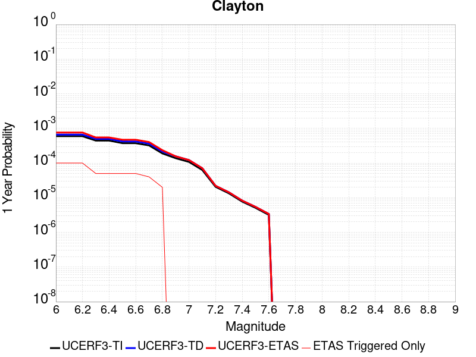 |  |

| Magnitude | 1 wk TI Prob | 1 wk TD Prob | 1 wk ETAS Prob | 1 wk ETAS/TD Gain | 1 wk ETAS Triggered Only | 1 mo TI Prob | 1 mo TD Prob | 1 mo ETAS Prob | 1 mo ETAS/TD Gain | 1 mo ETAS Triggered Only | 1 yr TI Prob | 1 yr TD Prob | 1 yr ETAS Prob | 1 yr ETAS/TD Gain | 1 yr ETAS Triggered Only | 10 yr TI Prob | 10 yr TD Prob | 10 yr ETAS Prob | 10 yr ETAS/TD Gain | 10 yr ETAS Triggered Only |
|-----|-----|-----|-----|-----|-----|-----|-----|-----|-----|-----|-----|-----|-----|-----|-----|-----|-----|-----|-----|-----|
| 6.0 | 1.1413061E-5 | 1.2669748E-5 | 3.2669494E-5 | 2.5785434 | 2.0E-5 | 4.89122E-5 | 5.4297918E-5 | 1.3429357E-4 | 2.473273 | 8.0E-5 | 5.953433E-4 | 6.6089886E-4 | 7.6083274E-4 | 1.1512091 | 1.0E-4 | 0.005937509 | 0.006591537 | 0.0067206803 | 1.0195923 | 1.3E-4 |
| 6.1 | 1.1413061E-5 | 1.2669748E-5 | 3.2669494E-5 | 2.5785434 | 2.0E-5 | 4.89122E-5 | 5.4297918E-5 | 1.3429357E-4 | 2.473273 | 8.0E-5 | 5.953433E-4 | 6.6089886E-4 | 7.6083274E-4 | 1.1512091 | 1.0E-4 | 0.005937509 | 0.006591537 | 0.0067206803 | 1.0195923 | 1.3E-4 |
| 6.2 | 1.1413061E-5 | 1.2669748E-5 | 3.2669494E-5 | 2.5785434 | 2.0E-5 | 4.89122E-5 | 5.4297918E-5 | 1.3429357E-4 | 2.473273 | 8.0E-5 | 5.953433E-4 | 6.6089886E-4 | 7.6083274E-4 | 1.1512091 | 1.0E-4 | 0.005937509 | 0.006591537 | 0.0067206803 | 1.0195923 | 1.3E-4 |
| 6.3 | 8.538689E-6 | 9.534896E-6 | 9.534896E-6 | 1.0 | 0.0 | 3.659387E-5 | 4.0863262E-5 | 8.0861624E-5 | 1.9788344 | 4.0E-5 | 4.4543925E-4 | 4.974074E-4 | 5.473825E-4 | 1.1004713 | 5.0E-5 | 0.0044454746 | 0.004964007 | 0.0050336593 | 1.0140315 | 7.0E-5 |
| 6.4 | 8.538689E-6 | 9.534896E-6 | 9.534896E-6 | 1.0 | 0.0 | 3.659387E-5 | 4.0863262E-5 | 8.0861624E-5 | 1.9788344 | 4.0E-5 | 4.4543925E-4 | 4.974074E-4 | 5.473825E-4 | 1.1004713 | 5.0E-5 | 0.0044454746 | 0.004964007 | 0.0050336593 | 1.0140315 | 7.0E-5 |
| 6.5 | 7.197462E-6 | 8.082864E-6 | 8.082864E-6 | 1.0 | 0.0 | 3.08459E-5 | 3.4640434E-5 | 7.463905E-5 | 2.15468 | 4.0E-5 | 3.7548412E-4 | 4.2167387E-4 | 4.716528E-4 | 1.118525 | 5.0E-5 | 0.003748503 | 0.00420955 | 0.0042692972 | 1.0141933 | 6.0E-5 |
| 6.6 | 7.1760483E-6 | 8.058875E-6 | 8.058875E-6 | 1.0 | 0.0 | 3.075413E-5 | 3.4537625E-5 | 7.453624E-5 | 2.1581173 | 4.0E-5 | 3.743672E-4 | 4.2042267E-4 | 4.7040163E-4 | 1.1188779 | 5.0E-5 | 0.0037373714 | 0.004197085 | 0.0042568333 | 1.0142356 | 6.0E-5 |
| 6.7 | 6.202582E-6 | 6.978372E-6 | 6.978372E-6 | 1.0 | 0.0 | 2.6582224E-5 | 2.9907009E-5 | 6.9905815E-5 | 2.337439 | 4.0E-5 | 3.235905E-4 | 3.6406468E-4 | 4.040501E-4 | 1.1098306 | 4.0E-5 | 0.0032311971 | 0.0036354384 | 0.0036852567 | 1.0137035 | 5.0E-5 |
| 6.8 | 3.6417277E-6 | 4.122341E-6 | 4.122341E-6 | 1.0 | 0.0 | 1.5607311E-5 | 1.766706E-5 | 3.766671E-5 | 2.1320302 | 2.0E-5 | 1.9000245E-4 | 2.15076E-4 | 2.350717E-4 | 1.0929704 | 2.0E-5 | 0.0018984007 | 0.002148755 | 0.002168712 | 1.0092877 | 2.0E-5 |
| 6.9 | 2.6498485E-6 | 3.0002825E-6 | 3.0002825E-6 | 1.0 | 0.0 | 1.1356444E-5 | 1.2858292E-5 | 1.2858292E-5 | 1.0 | 0.0 | 1.3825593E-4 | 1.5653887E-4 | 1.5653887E-4 | 1.0 | 0.0 | 0.0013816995 | 0.0015643255 | 0.0015643255 | 1.0 | 0.0 |
| 7.0 | 2.070442E-6 | 2.3413186E-6 | 2.3413186E-6 | 1.0 | 0.0 | 8.873292E-6 | 1.0034186E-5 | 1.0034186E-5 | 1.0 | 0.0 | 1.0802698E-4 | 1.2215966E-4 | 1.2215966E-4 | 1.0 | 0.0 | 0.0010797448 | 0.001220955 | 0.001220955 | 1.0 | 0.0 |
| 7.1 | 1.2111691E-6 | 1.359203E-6 | 1.359203E-6 | 1.0 | 0.0 | 5.190714E-6 | 5.825144E-6 | 5.825144E-6 | 1.0 | 0.0 | 6.319511E-5 | 7.0918984E-5 | 7.0918984E-5 | 1.0 | 0.0 | 6.3177146E-4 | 7.089799E-4 | 7.089799E-4 | 1.0 | 0.0 |
| 7.2 | 3.9541607E-7 | 4.2234782E-7 | 4.2234782E-7 | 1.0 | 0.0 | 1.6946392E-6 | 1.8100608E-6 | 1.8100608E-6 | 1.0 | 0.0 | 2.0632036E-5 | 2.203727E-5 | 2.203727E-5 | 1.0 | 0.0 | 2.063012E-4 | 2.2035098E-4 | 2.2035098E-4 | 1.0 | 0.0 |
| 7.3 | 2.5685637E-7 | 2.7462335E-7 | 2.7462335E-7 | 1.0 | 0.0 | 1.1008126E-6 | 1.1769567E-6 | 1.1769567E-6 | 1.0 | 0.0 | 1.3402311E-5 | 1.4329355E-5 | 1.4329355E-5 | 1.0 | 0.0 | 1.3401502E-4 | 1.4328439E-4 | 1.4328439E-4 | 1.0 | 0.0 |
| 7.4 | 1.482299E-7 | 1.5811504E-7 | 1.5811504E-7 | 1.0 | 0.0 | 6.3527085E-7 | 6.776357E-7 | 6.776357E-7 | 1.0 | 0.0 | 7.734395E-6 | 8.250184E-6 | 8.250184E-6 | 1.0 | 0.0 | 7.734126E-5 | 8.24988E-5 | 8.24988E-5 | 1.0 | 0.0 |
| 7.5 | 9.7969505E-8 | 1.0441255E-7 | 1.0441255E-7 | 1.0 | 0.0 | 4.1986925E-7 | 4.4748225E-7 | 4.4748225E-7 | 1.0 | 0.0 | 5.111896E-6 | 5.448083E-6 | 5.448083E-6 | 1.0 | 0.0 | 5.1117782E-5 | 5.447951E-5 | 5.447951E-5 | 1.0 | 0.0 |
| 7.6 | 6.125415E-8 | 6.5235575E-8 | 6.5235575E-8 | 1.0 | 0.0 | 2.6251774E-7 | 2.79581E-7 | 2.79581E-7 | 1.0 | 0.0 | 3.196149E-6 | 3.4038937E-6 | 3.4038937E-6 | 1.0 | 0.0 | 3.196103E-5 | 3.4038425E-5 | 3.4038425E-5 | 1.0 | 0.0 |

## Ortigalita (South)
*[(top)](#table-of-contents)*

| 1 Week | 1 Month | 1 Year | 10 Year |
|-----|-----|-----|-----|
|  |  |  |  |

| Magnitude | 1 wk TI Prob | 1 wk TD Prob | 1 wk ETAS Prob | 1 wk ETAS/TD Gain | 1 wk ETAS Triggered Only | 1 mo TI Prob | 1 mo TD Prob | 1 mo ETAS Prob | 1 mo ETAS/TD Gain | 1 mo ETAS Triggered Only | 1 yr TI Prob | 1 yr TD Prob | 1 yr ETAS Prob | 1 yr ETAS/TD Gain | 1 yr ETAS Triggered Only | 10 yr TI Prob | 10 yr TD Prob | 10 yr ETAS Prob | 10 yr ETAS/TD Gain | 10 yr ETAS Triggered Only |
|-----|-----|-----|-----|-----|-----|-----|-----|-----|-----|-----|-----|-----|-----|-----|-----|-----|-----|-----|-----|-----|
| 6.0 | 3.72394E-5 | 4.3269127E-5 | 5.3268697E-5 | 1.2311016 | 1.0E-5 | 1.5958765E-4 | 1.8542683E-4 | 2.0542312E-4 | 1.1078392 | 2.0E-5 | 0.0019412481 | 0.0022553904 | 0.0023252326 | 1.0309668 | 7.0E-5 | 0.019243775 | 0.02234141 | 0.022439174 | 1.0043759 | 1.0E-4 |
| 6.1 | 2.7299884E-5 | 3.1501382E-5 | 3.1501382E-5 | 1.0 | 0.0 | 1.16994255E-4 | 1.3499927E-4 | 1.3499927E-4 | 1.0 | 0.0 | 0.0014234743 | 0.0016424328 | 0.0016823671 | 1.0243142 | 4.0E-5 | 0.014143906 | 0.016308874 | 0.016377732 | 1.0042222 | 7.0E-5 |
| 6.2 | 2.7299884E-5 | 3.1501382E-5 | 3.1501382E-5 | 1.0 | 0.0 | 1.16994255E-4 | 1.3499927E-4 | 1.3499927E-4 | 1.0 | 0.0 | 0.0014234743 | 0.0016424328 | 0.0016823671 | 1.0243142 | 4.0E-5 | 0.014143906 | 0.016308874 | 0.016377732 | 1.0042222 | 7.0E-5 |
| 6.3 | 2.0546433E-5 | 2.3638311E-5 | 2.3638311E-5 | 1.0 | 0.0 | 8.805317E-5 | 1.0130322E-4 | 1.0130322E-4 | 1.0 | 0.0 | 0.00107152 | 0.0012326878 | 0.0012726386 | 1.0324094 | 4.0E-5 | 0.010663681 | 0.012260567 | 0.012329709 | 1.0056393 | 7.0E-5 |
| 6.4 | 2.0546433E-5 | 2.3638311E-5 | 2.3638311E-5 | 1.0 | 0.0 | 8.805317E-5 | 1.0130322E-4 | 1.0130322E-4 | 1.0 | 0.0 | 0.00107152 | 0.0012326878 | 0.0012726386 | 1.0324094 | 4.0E-5 | 0.010663681 | 0.012260567 | 0.012329709 | 1.0056393 | 7.0E-5 |
| 6.5 | 1.7779594E-5 | 2.0452906E-5 | 2.0452906E-5 | 1.0 | 0.0 | 7.619603E-5 | 8.765244E-5 | 8.765244E-5 | 1.0 | 0.0 | 9.272918E-4 | 0.0010666597 | 0.0010966277 | 1.0280951 | 3.0E-5 | 0.009234319 | 0.010616867 | 0.010676229 | 1.0055914 | 6.0E-5 |
| 6.6 | 1.6272212E-5 | 1.87204E-5 | 1.87204E-5 | 1.0 | 0.0 | 6.973618E-5 | 8.022789E-5 | 8.022789E-5 | 1.0 | 0.0 | 8.487073E-4 | 9.763491E-4 | 0.0010063198 | 1.0306967 | 3.0E-5 | 0.008454733 | 0.0097218985 | 0.009781315 | 1.0061116 | 6.0E-5 |
| 6.7 | 1.3051484E-5 | 1.5043188E-5 | 1.5043188E-5 | 1.0 | 0.0 | 5.593373E-5 | 6.446926E-5 | 6.446926E-5 | 1.0 | 0.0 | 6.807804E-4 | 7.8464014E-4 | 7.946323E-4 | 1.0127347 | 1.0E-5 | 0.006786986 | 0.007819681 | 0.007849447 | 1.0038065 | 3.0E-5 |
| 6.8 | 1.04277415E-5 | 1.1990697E-5 | 1.1990697E-5 | 1.0 | 0.0 | 4.4689557E-5 | 5.1387735E-5 | 5.1387735E-5 | 1.0 | 0.0 | 5.439595E-4 | 6.254735E-4 | 6.254735E-4 | 1.0 | 0.0 | 0.0054262993 | 0.006237886 | 0.006257761 | 1.0031862 | 2.0E-5 |
| 6.9 | 7.639968E-6 | 8.794061E-6 | 8.794061E-6 | 1.0 | 0.0 | 3.274231E-5 | 3.768832E-5 | 3.768832E-5 | 1.0 | 0.0 | 3.9856473E-4 | 4.5876458E-4 | 4.5876458E-4 | 1.0 | 0.0 | 0.003978506 | 0.004578762 | 0.0045986706 | 1.004348 | 2.0E-5 |
| 7.0 | 3.919831E-6 | 4.5347706E-6 | 4.5347706E-6 | 1.0 | 0.0 | 1.679917E-5 | 1.9434598E-5 | 1.9434598E-5 | 1.0 | 0.0 | 2.045107E-4 | 2.3659266E-4 | 2.3659266E-4 | 1.0 | 0.0 | 0.0020432258 | 0.0023636164 | 0.0023735927 | 1.0042208 | 1.0E-5 |
| 7.1 | 1.6017933E-6 | 1.8576128E-6 | 1.8576128E-6 | 1.0 | 0.0 | 6.8648105E-6 | 7.961179E-6 | 7.961179E-6 | 1.0 | 0.0 | 8.357586E-5 | 9.6924115E-5 | 9.6924115E-5 | 1.0 | 0.0 | 8.3544437E-4 | 9.689232E-4 | 9.689232E-4 | 1.0 | 0.0 |

## Mount Diablo Thrust South
*[(top)](#table-of-contents)*

| 1 Week | 1 Month | 1 Year | 10 Year |
|-----|-----|-----|-----|
|  |  |  |  |

| Magnitude | 1 wk TI Prob | 1 wk TD Prob | 1 wk ETAS Prob | 1 wk ETAS/TD Gain | 1 wk ETAS Triggered Only | 1 mo TI Prob | 1 mo TD Prob | 1 mo ETAS Prob | 1 mo ETAS/TD Gain | 1 mo ETAS Triggered Only | 1 yr TI Prob | 1 yr TD Prob | 1 yr ETAS Prob | 1 yr ETAS/TD Gain | 1 yr ETAS Triggered Only | 10 yr TI Prob | 10 yr TD Prob | 10 yr ETAS Prob | 10 yr ETAS/TD Gain | 10 yr ETAS Triggered Only |
|-----|-----|-----|-----|-----|-----|-----|-----|-----|-----|-----|-----|-----|-----|-----|-----|-----|-----|-----|-----|-----|
| 6.0 | 2.2377444E-5 | 2.696574E-5 | 3.696547E-5 | 1.3708309 | 1.0E-5 | 9.5899806E-5 | 1.1556345E-4 | 1.6555768E-4 | 1.4326128 | 5.0E-5 | 0.0011669548 | 0.0014062751 | 0.0014761767 | 1.0497069 | 7.0E-5 | 0.011608457 | 0.013993767 | 0.014112088 | 1.0084553 | 1.2E-4 |
| 6.1 | 2.2377444E-5 | 2.696574E-5 | 3.696547E-5 | 1.3708309 | 1.0E-5 | 9.5899806E-5 | 1.1556345E-4 | 1.6555768E-4 | 1.4326128 | 5.0E-5 | 0.0011669548 | 0.0014062751 | 0.0014761767 | 1.0497069 | 7.0E-5 | 0.011608457 | 0.013993767 | 0.014112088 | 1.0084553 | 1.2E-4 |
| 6.2 | 2.2377444E-5 | 2.696574E-5 | 3.696547E-5 | 1.3708309 | 1.0E-5 | 9.5899806E-5 | 1.1556345E-4 | 1.6555768E-4 | 1.4326128 | 5.0E-5 | 0.0011669548 | 0.0014062751 | 0.0014761767 | 1.0497069 | 7.0E-5 | 0.011608457 | 0.013993767 | 0.014112088 | 1.0084553 | 1.2E-4 |
| 6.3 | 2.2377444E-5 | 2.696574E-5 | 3.696547E-5 | 1.3708309 | 1.0E-5 | 9.5899806E-5 | 1.1556345E-4 | 1.6555768E-4 | 1.4326128 | 5.0E-5 | 0.0011669548 | 0.0014062751 | 0.0014761767 | 1.0497069 | 7.0E-5 | 0.011608457 | 0.013993767 | 0.014112088 | 1.0084553 | 1.2E-4 |
| 6.4 | 1.2228463E-5 | 1.4752443E-5 | 1.4752443E-5 | 1.0 | 0.0 | 5.2406645E-5 | 6.32233E-5 | 1.03220766E-4 | 1.6326382 | 4.0E-5 | 6.378641E-4 | 7.694847E-4 | 8.1944617E-4 | 1.0649285 | 5.0E-5 | 0.0063603627 | 0.0076699774 | 0.007749364 | 1.0103502 | 8.0E-5 |
| 6.5 | 1.2228463E-5 | 1.4752443E-5 | 1.4752443E-5 | 1.0 | 0.0 | 5.2406645E-5 | 6.32233E-5 | 1.03220766E-4 | 1.6326382 | 4.0E-5 | 6.378641E-4 | 7.694847E-4 | 8.1944617E-4 | 1.0649285 | 5.0E-5 | 0.0063603627 | 0.0076699774 | 0.007749364 | 1.0103502 | 8.0E-5 |
| 6.6 | 1.2068118E-5 | 1.455716E-5 | 1.455716E-5 | 1.0 | 0.0 | 5.1719482E-5 | 6.238641E-5 | 1.02383914E-4 | 1.6411253 | 4.0E-5 | 6.2950276E-4 | 7.593027E-4 | 8.092647E-4 | 1.0657998 | 5.0E-5 | 0.006277225 | 0.0075688553 | 0.00764825 | 1.0104896 | 8.0E-5 |
| 6.7 | 1.1499428E-5 | 1.3879572E-5 | 1.3879572E-5 | 1.0 | 0.0 | 4.9282335E-5 | 5.9482594E-5 | 9.948022E-5 | 1.6724256 | 4.0E-5 | 5.9984723E-4 | 7.2397274E-4 | 7.739365E-4 | 1.0690134 | 5.0E-5 | 0.0059823063 | 0.0072178994 | 0.007297322 | 1.0110036 | 8.0E-5 |
| 6.8 | 8.82118E-6 | 1.083405E-5 | 1.083405E-5 | 1.0 | 0.0 | 3.780451E-5 | 4.6430847E-5 | 6.642992E-5 | 1.4307281 | 2.0E-5 | 4.601727E-4 | 5.6515454E-4 | 5.951376E-4 | 1.0530528 | 3.0E-5 | 0.0045922096 | 0.005638213 | 0.005687931 | 1.008818 | 5.0E-5 |
| 6.9 | 8.047112E-6 | 9.942756E-6 | 9.942756E-6 | 1.0 | 0.0 | 3.4487166E-5 | 4.2611147E-5 | 4.2611147E-5 | 1.0 | 0.0 | 4.1980037E-4 | 5.186725E-4 | 5.2866735E-4 | 1.01927 | 1.0E-5 | 0.004190082 | 0.005175623 | 0.005205468 | 1.0057664 | 3.0E-5 |
| 7.0 | 6.2574763E-6 | 7.75131E-6 | 7.75131E-6 | 1.0 | 0.0 | 2.681748E-5 | 3.3219498E-5 | 3.3219498E-5 | 1.0 | 0.0 | 3.264539E-4 | 4.04376E-4 | 4.04376E-4 | 1.0 | 0.0 | 0.0032597475 | 0.004037295 | 0.0040472546 | 1.0024669 | 1.0E-5 |
| 7.1 | 3.6485903E-6 | 4.514272E-6 | 4.514272E-6 | 1.0 | 0.0 | 1.5636722E-5 | 1.9346739E-5 | 1.9346739E-5 | 1.0 | 0.0 | 1.9036046E-4 | 2.3552148E-4 | 2.3552148E-4 | 1.0 | 0.0 | 0.0019019748 | 0.0023527688 | 0.002362745 | 1.0042403 | 1.0E-5 |
| 7.2 | 2.3034274E-6 | 2.9060748E-6 | 2.9060748E-6 | 1.0 | 0.0 | 9.871795E-6 | 1.2454549E-5 | 1.2454549E-5 | 1.0 | 0.0 | 1.2018247E-4 | 1.5162381E-4 | 1.5162381E-4 | 1.0 | 0.0 | 0.0012011749 | 0.0015153174 | 0.0015153174 | 1.0 | 0.0 |
| 7.3 | 1.224035E-6 | 1.5682601E-6 | 1.5682601E-6 | 1.0 | 0.0 | 5.245854E-6 | 6.721098E-6 | 6.721098E-6 | 1.0 | 0.0 | 6.38664E-5 | 8.18264E-5 | 8.18264E-5 | 1.0 | 0.0 | 6.384805E-4 | 8.180418E-4 | 8.180418E-4 | 1.0 | 0.0 |
| 7.4 | 5.1601154E-7 | 6.7246805E-7 | 6.7246805E-7 | 1.0 | 0.0 | 2.2114762E-6 | 2.8820027E-6 | 2.8820027E-6 | 1.0 | 0.0 | 2.6924388E-5 | 3.5087836E-5 | 3.5087836E-5 | 1.0 | 0.0 | 2.6921128E-4 | 3.507808E-4 | 3.507808E-4 | 1.0 | 0.0 |
| 7.5 | 3.552894E-7 | 4.6657922E-7 | 4.6657922E-7 | 1.0 | 0.0 | 1.5226678E-6 | 1.9996237E-6 | 1.9996237E-6 | 1.0 | 0.0 | 1.8538323E-5 | 2.4345161E-5 | 2.4345161E-5 | 1.0 | 0.0 | 1.8536777E-4 | 2.4343158E-4 | 2.4343158E-4 | 1.0 | 0.0 |
| 7.6 | 1.3124082E-7 | 1.7192494E-7 | 1.7192494E-7 | 1.0 | 0.0 | 5.6246057E-7 | 7.36821E-7 | 7.36821E-7 | 1.0 | 0.0 | 6.8479358E-6 | 8.970767E-6 | 8.970767E-6 | 1.0 | 0.0 | 6.8477246E-5 | 8.970267E-5 | 8.970267E-5 | 1.0 | 0.0 |
| 7.7 | 3.6193022E-8 | 4.7337167E-8 | 4.7337167E-8 | 1.0 | 0.0 | 1.5511293E-7 | 2.0287355E-7 | 2.0287355E-7 | 1.0 | 0.0 | 1.8884983E-6 | 2.4699839E-6 | 2.4699839E-6 | 1.0 | 0.0 | 1.8884823E-5 | 2.470389E-5 | 2.470389E-5 | 1.0 | 0.0 |

## San Andreas (Peninsula) 2011 CFM
*[(top)](#table-of-contents)*

| 1 Week | 1 Month | 1 Year | 10 Year |
|-----|-----|-----|-----|
|  |  |  |  |

| Magnitude | 1 wk TI Prob | 1 wk TD Prob | 1 wk ETAS Prob | 1 wk ETAS/TD Gain | 1 wk ETAS Triggered Only | 1 mo TI Prob | 1 mo TD Prob | 1 mo ETAS Prob | 1 mo ETAS/TD Gain | 1 mo ETAS Triggered Only | 1 yr TI Prob | 1 yr TD Prob | 1 yr ETAS Prob | 1 yr ETAS/TD Gain | 1 yr ETAS Triggered Only | 10 yr TI Prob | 10 yr TD Prob | 10 yr ETAS Prob | 10 yr ETAS/TD Gain | 10 yr ETAS Triggered Only |
|-----|-----|-----|-----|-----|-----|-----|-----|-----|-----|-----|-----|-----|-----|-----|-----|-----|-----|-----|-----|-----|
| 6.0 | 8.6200685E-5 | 2.5576986E-5 | 7.557571E-5 | 2.9548323 | 5.0E-5 | 3.6937918E-4 | 1.0961106E-4 | 1.6960448E-4 | 1.54733 | 6.0E-5 | 0.0044879215 | 0.0013336993 | 0.001433566 | 1.0748794 | 1.0E-4 | 0.043983612 | 0.014971707 | 0.0150899105 | 1.0078951 | 1.2E-4 |
| 6.1 | 8.6200685E-5 | 2.5576986E-5 | 7.557571E-5 | 2.9548323 | 5.0E-5 | 3.6937918E-4 | 1.0961106E-4 | 1.6960448E-4 | 1.54733 | 6.0E-5 | 0.0044879215 | 0.0013336993 | 0.001433566 | 1.0748794 | 1.0E-4 | 0.043983612 | 0.014971707 | 0.0150899105 | 1.0078951 | 1.2E-4 |
| 6.2 | 8.6200685E-5 | 2.5576986E-5 | 7.557571E-5 | 2.9548323 | 5.0E-5 | 3.6937918E-4 | 1.0961106E-4 | 1.6960448E-4 | 1.54733 | 6.0E-5 | 0.0044879215 | 0.0013336993 | 0.001433566 | 1.0748794 | 1.0E-4 | 0.043983612 | 0.014971707 | 0.0150899105 | 1.0078951 | 1.2E-4 |
| 6.3 | 8.551163E-5 | 2.526643E-5 | 7.526517E-5 | 2.9788604 | 5.0E-5 | 3.6642692E-4 | 1.0828021E-4 | 1.6827372E-4 | 1.5540578 | 6.0E-5 | 0.004452125 | 0.001317516 | 0.0014173843 | 1.0758004 | 1.0E-4 | 0.043639794 | 0.014797204 | 0.014915428 | 1.0079896 | 1.2E-4 |
| 6.4 | 8.551163E-5 | 2.526643E-5 | 7.526517E-5 | 2.9788604 | 5.0E-5 | 3.6642692E-4 | 1.0828021E-4 | 1.6827372E-4 | 1.5540578 | 6.0E-5 | 0.004452125 | 0.001317516 | 0.0014173843 | 1.0758004 | 1.0E-4 | 0.043639794 | 0.014797204 | 0.014915428 | 1.0079896 | 1.2E-4 |
| 6.5 | 8.511146E-5 | 2.5086492E-5 | 7.508524E-5 | 2.9930544 | 5.0E-5 | 3.647124E-4 | 1.0750911E-4 | 1.6750267E-4 | 1.5580322 | 6.0E-5 | 0.004431336 | 0.0013081392 | 0.0014080084 | 1.0763445 | 1.0E-4 | 0.04344007 | 0.014696257 | 0.014814494 | 1.0080453 | 1.2E-4 |
| 6.6 | 8.4985084E-5 | 2.5016734E-5 | 7.501548E-5 | 2.9986122 | 5.0E-5 | 3.6417096E-4 | 1.0721017E-4 | 1.6720375E-4 | 1.5595884 | 6.0E-5 | 0.0044247704 | 0.001304504 | 0.0014043734 | 1.0765575 | 1.0E-4 | 0.043376986 | 0.014658007 | 0.0147762485 | 1.0080667 | 1.2E-4 |
| 6.7 | 8.462618E-5 | 2.4844016E-5 | 7.484277E-5 | 3.0125072 | 5.0E-5 | 3.6263323E-4 | 1.0647002E-4 | 1.6646362E-4 | 1.563479 | 6.0E-5 | 0.004406125 | 0.0012955032 | 0.0013953737 | 1.07709 | 1.0E-4 | 0.043197807 | 0.014562456 | 0.014680709 | 1.0081204 | 1.2E-4 |
| 6.8 | 8.42337E-5 | 2.4738883E-5 | 7.473765E-5 | 3.0210598 | 5.0E-5 | 3.6095164E-4 | 1.06019485E-4 | 1.6601312E-4 | 1.5658737 | 6.0E-5 | 0.004385734 | 0.0012900246 | 0.0013898956 | 1.0774179 | 1.0E-4 | 0.043001823 | 0.01450267 | 0.01462093 | 1.0081544 | 1.2E-4 |
| 6.9 | 8.365989E-5 | 2.454221E-5 | 7.4540985E-5 | 3.0372562 | 5.0E-5 | 3.5849313E-4 | 1.05176674E-4 | 1.6517036E-4 | 1.5704087 | 6.0E-5 | 0.004355922 | 0.0012797754 | 0.0013796474 | 1.0780387 | 1.0E-4 | 0.04271523 | 0.014394584 | 0.014512857 | 1.0082165 | 1.2E-4 |
| 7.0 | 8.30936E-5 | 2.4302593E-5 | 7.430138E-5 | 3.0573435 | 5.0E-5 | 3.560668E-4 | 1.04149825E-4 | 1.6414358E-4 | 1.5760331 | 6.0E-5 | 0.004326499 | 0.0012672882 | 0.0013671614 | 1.0788087 | 1.0E-4 | 0.042432297 | 0.014264939 | 0.014383228 | 1.0082922 | 1.2E-4 |
| 7.1 | 8.041264E-5 | 2.3986217E-5 | 7.3985015E-5 | 3.0844805 | 5.0E-5 | 3.4458007E-4 | 1.0279402E-4 | 1.6278785E-4 | 1.5836315 | 6.0E-5 | 0.0041871946 | 0.0012508003 | 0.0013506752 | 1.0798488 | 1.0E-4 | 0.041091725 | 0.014086153 | 0.014204463 | 1.008399 | 1.2E-4 |
| 7.2 | 7.8427016E-5 | 2.340641E-5 | 7.340524E-5 | 3.136117 | 5.0E-5 | 3.3607247E-4 | 1.00309335E-4 | 1.6030332E-4 | 1.5980897 | 6.0E-5 | 0.004084008 | 0.0012205836 | 0.0013204615 | 1.081828 | 1.0E-4 | 0.040097635 | 0.013768775 | 0.013887123 | 1.0085953 | 1.2E-4 |
| 7.3 | 7.721087E-5 | 2.3190101E-5 | 7.3188945E-5 | 3.1560423 | 5.0E-5 | 3.3086175E-4 | 9.938237E-5 | 1.593764E-4 | 1.6036688 | 6.0E-5 | 0.004020803 | 0.0012093104 | 0.0013091895 | 1.0825918 | 1.0E-4 | 0.03948827 | 0.01365187 | 0.013770232 | 1.00867 | 1.2E-4 |
| 7.4 | 7.3536525E-5 | 2.1284479E-5 | 7.1283415E-5 | 3.3490796 | 5.0E-5 | 3.1511846E-4 | 9.121601E-5 | 1.5121054E-4 | 1.6577193 | 6.0E-5 | 0.0038298194 | 0.0011099904 | 0.0012098794 | 1.0899909 | 1.0E-4 | 0.037644852 | 0.01259747 | 0.012715957 | 1.0094057 | 1.2E-4 |
| 7.5 | 6.806207E-5 | 1.9059735E-5 | 5.9058973E-5 | 3.0986252 | 4.0E-5 | 2.9166197E-4 | 8.1682025E-5 | 1.3167794E-4 | 1.6120799 | 5.0E-5 | 0.0035452035 | 9.94026E-4 | 0.0010839365 | 1.0904509 | 9.0E-5 | 0.034891766 | 0.011335085 | 0.0114438385 | 1.0095944 | 1.1E-4 |
| 7.6 | 5.6731416E-5 | 1.43978305E-5 | 2.4397687E-5 | 1.6945391 | 1.0E-5 | 2.43112E-4 | 6.1703526E-5 | 7.170291E-5 | 1.1620553 | 1.0E-5 | 0.0029558712 | 7.509817E-4 | 7.8095915E-4 | 1.0399177 | 3.0E-5 | 0.02916862 | 0.008609943 | 0.008649599 | 1.0046058 | 4.0E-5 |
| 7.7 | 4.946994E-5 | 1.34503825E-5 | 2.3450248E-5 | 1.7434633 | 1.0E-5 | 2.1199681E-4 | 5.7643225E-5 | 6.764265E-5 | 1.173471 | 1.0E-5 | 0.002578006 | 7.0158043E-4 | 7.3155935E-4 | 1.0427306 | 3.0E-5 | 0.02548303 | 0.008022894 | 0.008062573 | 1.0049458 | 4.0E-5 |
| 7.8 | 3.9718198E-5 | 1.3178822E-5 | 2.317869E-5 | 1.7587831 | 1.0E-5 | 1.7020974E-4 | 5.6479446E-5 | 6.647888E-5 | 1.1770456 | 1.0E-5 | 0.0020703338 | 6.874204E-4 | 7.173998E-4 | 1.0436114 | 3.0E-5 | 0.020511515 | 0.007828144 | 0.007867832 | 1.0050697 | 4.0E-5 |
| 7.9 | 2.4115114E-5 | 1.23591135E-5 | 2.235899E-5 | 1.8091096 | 1.0E-5 | 1.0334639E-4 | 5.2966552E-5 | 6.296602E-5 | 1.1887884 | 1.0E-5 | 0.001257516 | 6.4467714E-4 | 6.746578E-4 | 1.046505 | 3.0E-5 | 0.012504238 | 0.007253709 | 0.0072934185 | 1.0054744 | 4.0E-5 |
| 8.0 | 1.7756569E-5 | 1.156549E-5 | 1.156549E-5 | 1.0 | 0.0 | 7.6097356E-5 | 4.9565446E-5 | 4.9565446E-5 | 1.0 | 0.0 | 9.260915E-4 | 6.0329237E-4 | 6.1328633E-4 | 1.0165657 | 1.0E-5 | 0.009222416 | 0.0067433827 | 0.006763248 | 1.0029459 | 2.0E-5 |
| 8.1 | 1.3159258E-5 | 9.87639E-6 | 9.87639E-6 | 1.0 | 0.0 | 5.6395602E-5 | 4.23267E-5 | 4.23267E-5 | 1.0 | 0.0 | 6.864001E-4 | 5.1520584E-4 | 5.2520074E-4 | 1.0193998 | 1.0E-5 | 0.0068428386 | 0.0057598758 | 0.0057698186 | 1.0017262 | 1.0E-5 |
| 8.2 | 8.635426E-6 | 5.5434502E-6 | 5.5434502E-6 | 1.0 | 0.0 | 3.700844E-5 | 2.3757428E-5 | 2.3757428E-5 | 1.0 | 0.0 | 4.5048463E-4 | 2.8920837E-4 | 2.9920548E-4 | 1.0345671 | 1.0E-5 | 0.004495725 | 0.0032864118 | 0.003296379 | 1.0030328 | 1.0E-5 |
| 8.3 | 1.983087E-6 | 7.783617E-7 | 7.783617E-7 | 1.0 | 0.0 | 8.498917E-6 | 3.3358317E-6 | 3.3358317E-6 | 1.0 | 0.0 | 1.034694E-4 | 4.0613013E-5 | 4.0613013E-5 | 1.0 | 0.0 | 0.0010342124 | 4.791138E-4 | 4.791138E-4 | 1.0 | 0.0 |

## Great Valley 05 Pittsburg - Kirby Hills alt1
*[(top)](#table-of-contents)*

| 1 Week | 1 Month | 1 Year | 10 Year |
|-----|-----|-----|-----|
|  | 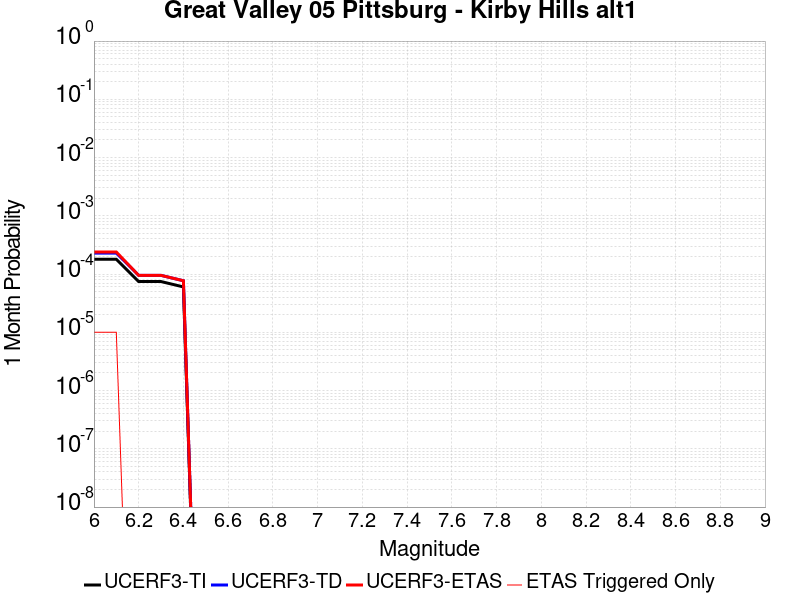 |  | 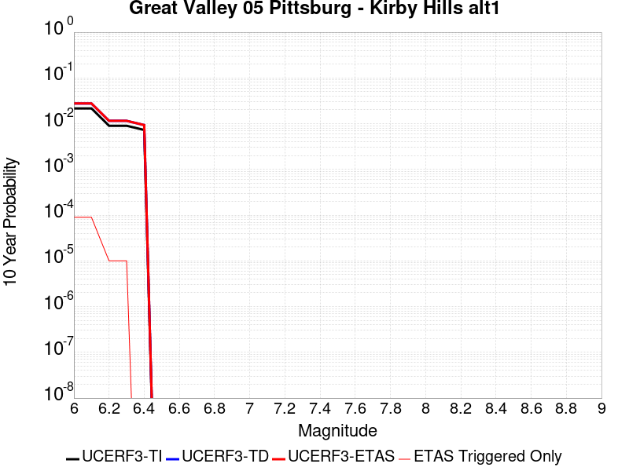 |

| Magnitude | 1 wk TI Prob | 1 wk TD Prob | 1 wk ETAS Prob | 1 wk ETAS/TD Gain | 1 wk ETAS Triggered Only | 1 mo TI Prob | 1 mo TD Prob | 1 mo ETAS Prob | 1 mo ETAS/TD Gain | 1 mo ETAS Triggered Only | 1 yr TI Prob | 1 yr TD Prob | 1 yr ETAS Prob | 1 yr ETAS/TD Gain | 1 yr ETAS Triggered Only | 10 yr TI Prob | 10 yr TD Prob | 10 yr ETAS Prob | 10 yr ETAS/TD Gain | 10 yr ETAS Triggered Only |
|-----|-----|-----|-----|-----|-----|-----|-----|-----|-----|-----|-----|-----|-----|-----|-----|-----|-----|-----|-----|-----|
| 6.0 | 4.187212E-5 | 5.3470685E-5 | 5.3470685E-5 | 1.0 | 0.0 | 1.794396E-4 | 2.2914568E-4 | 2.3914338E-4 | 1.0436304 | 1.0E-5 | 0.002182488 | 0.0027872522 | 0.002857057 | 1.0250443 | 7.0E-5 | 0.021611776 | 0.027617399 | 0.027704911 | 1.0031688 | 9.0E-5 |
| 6.1 | 4.187212E-5 | 5.3470685E-5 | 5.3470685E-5 | 1.0 | 0.0 | 1.794396E-4 | 2.2914568E-4 | 2.3914338E-4 | 1.0436304 | 1.0E-5 | 0.002182488 | 0.0027872522 | 0.002857057 | 1.0250443 | 7.0E-5 | 0.021611776 | 0.027617399 | 0.027704911 | 1.0031688 | 9.0E-5 |
| 6.2 | 1.7353306E-5 | 2.2166203E-5 | 2.2166203E-5 | 1.0 | 0.0 | 7.436919E-5 | 9.4996874E-5 | 9.4996874E-5 | 1.0 | 0.0 | 9.050688E-4 | 0.0011563611 | 0.0011663495 | 1.0086378 | 1.0E-5 | 0.009013915 | 0.011541181 | 0.011551065 | 1.0008565 | 1.0E-5 |
| 6.3 | 1.7353306E-5 | 2.2166203E-5 | 2.2166203E-5 | 1.0 | 0.0 | 7.436919E-5 | 9.4996874E-5 | 9.4996874E-5 | 1.0 | 0.0 | 9.050688E-4 | 0.0011563611 | 0.0011663495 | 1.0086378 | 1.0E-5 | 0.009013915 | 0.011541181 | 0.011551065 | 1.0008565 | 1.0E-5 |
| 6.4 | 1.4028824E-5 | 1.7910359E-5 | 1.7910359E-5 | 1.0 | 0.0 | 6.0122147E-5 | 7.675868E-5 | 7.675868E-5 | 1.0 | 0.0 | 7.3174125E-4 | 9.3451724E-4 | 9.3451724E-4 | 1.0 | 0.0 | 0.0072933645 | 0.009343052 | 0.009343052 | 1.0 | 0.0 |

## Rodgers Creek - Healdsburg 2011 CFM
*[(top)](#table-of-contents)*

| 1 Week | 1 Month | 1 Year | 10 Year |
|-----|-----|-----|-----|
|  |  |  |  |

| Magnitude | 1 wk TI Prob | 1 wk TD Prob | 1 wk ETAS Prob | 1 wk ETAS/TD Gain | 1 wk ETAS Triggered Only | 1 mo TI Prob | 1 mo TD Prob | 1 mo ETAS Prob | 1 mo ETAS/TD Gain | 1 mo ETAS Triggered Only | 1 yr TI Prob | 1 yr TD Prob | 1 yr ETAS Prob | 1 yr ETAS/TD Gain | 1 yr ETAS Triggered Only | 10 yr TI Prob | 10 yr TD Prob | 10 yr ETAS Prob | 10 yr ETAS/TD Gain | 10 yr ETAS Triggered Only |
|-----|-----|-----|-----|-----|-----|-----|-----|-----|-----|-----|-----|-----|-----|-----|-----|-----|-----|-----|-----|-----|
| 6.0 | 7.390182E-5 | 1.3157165E-4 | 1.7156638E-4 | 1.3039769 | 4.0E-5 | 3.1668364E-4 | 5.637557E-4 | 6.037331E-4 | 1.0709127 | 4.0E-5 | 0.0038488081 | 0.0068420824 | 0.0069016716 | 1.0087093 | 6.0E-5 | 0.037828278 | 0.06628237 | 0.06638508 | 1.0015496 | 1.1E-4 |
| 6.1 | 7.318768E-5 | 1.3055115E-4 | 1.7054593E-4 | 1.3063533 | 4.0E-5 | 3.1362378E-4 | 5.59384E-4 | 5.993616E-4 | 1.0714673 | 4.0E-5 | 0.0038116854 | 0.0067892047 | 0.006848797 | 1.0087776 | 6.0E-5 | 0.037469655 | 0.06578668 | 0.06588945 | 1.0015621 | 1.1E-4 |
| 6.2 | 7.1379836E-5 | 1.2747782E-4 | 1.6747272E-4 | 1.31374 | 4.0E-5 | 3.058777E-4 | 5.462181E-4 | 5.861963E-4 | 1.0731908 | 4.0E-5 | 0.003717703 | 0.006629895 | 0.006689497 | 1.0089899 | 6.0E-5 | 0.0365612 | 0.06430813 | 0.06441106 | 1.0016005 | 1.1E-4 |
| 6.3 | 6.9255926E-5 | 1.240191E-4 | 1.6401414E-4 | 1.3224909 | 4.0E-5 | 2.9677735E-4 | 5.31402E-4 | 5.713807E-4 | 1.0752326 | 4.0E-5 | 0.0036072785 | 0.006450675 | 0.006510288 | 1.0092413 | 6.0E-5 | 0.035492823 | 0.062629744 | 0.06273285 | 1.0016464 | 1.1E-4 |
| 6.4 | 6.6757144E-5 | 1.1978368E-4 | 1.597789E-4 | 1.3338953 | 4.0E-5 | 2.8607066E-4 | 5.13258E-4 | 5.5323745E-4 | 1.0778935 | 4.0E-5 | 0.0034773487 | 0.0062310835 | 0.0062907096 | 1.0095692 | 6.0E-5 | 0.034234364 | 0.06057876 | 0.060682096 | 1.0017058 | 1.1E-4 |
| 6.5 | 6.5735134E-5 | 1.1827345E-4 | 1.5826873E-4 | 1.3381593 | 4.0E-5 | 2.8169158E-4 | 5.0678814E-4 | 5.4676784E-4 | 1.0788884 | 4.0E-5 | 0.003424202 | 0.0061527737 | 0.006212405 | 1.0096917 | 6.0E-5 | 0.03371918 | 0.05984277 | 0.059946187 | 1.0017282 | 1.1E-4 |
| 6.6 | 6.289601E-5 | 1.1362519E-4 | 1.5362064E-4 | 1.3519946 | 4.0E-5 | 2.6952647E-4 | 4.8687457E-4 | 5.268551E-4 | 1.0821167 | 4.0E-5 | 0.0032765474 | 0.0059116674 | 0.0059713125 | 1.0100894 | 6.0E-5 | 0.032286562 | 0.057579715 | 0.057683382 | 1.0018004 | 1.1E-4 |
| 6.7 | 6.115274E-5 | 1.10793684E-4 | 1.5078926E-4 | 1.3609914 | 4.0E-5 | 2.6205686E-4 | 4.7474407E-4 | 5.1472505E-4 | 1.0842159 | 4.0E-5 | 0.0031858748 | 0.00576477 | 0.005824424 | 1.0103481 | 6.0E-5 | 0.031405866 | 0.056197304 | 0.056301124 | 1.0018474 | 1.1E-4 |
| 6.8 | 5.9232367E-5 | 1.0746539E-4 | 1.4746109E-4 | 1.3721728 | 4.0E-5 | 2.538283E-4 | 4.6048503E-4 | 5.004666E-4 | 1.0868249 | 4.0E-5 | 0.0030859804 | 0.00559207 | 0.005651735 | 1.0106695 | 6.0E-5 | 0.030434765 | 0.054563563 | 0.054667562 | 1.001906 | 1.1E-4 |
| 6.9 | 5.4030377E-5 | 9.8402976E-5 | 1.3839905E-4 | 1.4064518 | 4.0E-5 | 2.315382E-4 | 4.216592E-4 | 4.6164234E-4 | 1.0948234 | 4.0E-5 | 0.0028153337 | 0.005121683 | 0.0051714266 | 1.0097125 | 5.0E-5 | 0.027799325 | 0.05009786 | 0.05019285 | 1.0018961 | 1.0E-4 |
| 7.0 | 4.8260714E-5 | 8.757084E-5 | 1.2756734E-4 | 1.4567331 | 4.0E-5 | 2.0681522E-4 | 3.752499E-4 | 4.1523488E-4 | 1.1065556 | 4.0E-5 | 0.0025150678 | 0.0045591514 | 0.0046089236 | 1.010917 | 5.0E-5 | 0.024867928 | 0.04474404 | 0.044839565 | 1.0021349 | 1.0E-4 |
| 7.1 | 4.0294493E-5 | 7.4043885E-5 | 1.0404166E-4 | 1.4051352 | 3.0E-5 | 1.7267925E-4 | 3.1729255E-4 | 3.4728303E-4 | 1.09452 | 3.0E-5 | 0.0021003427 | 0.0038562322 | 0.003896078 | 1.0103328 | 4.0E-5 | 0.02080602 | 0.03799456 | 0.03807152 | 1.0020256 | 8.0E-5 |
| 7.2 | 3.096388E-5 | 5.7115616E-5 | 8.7113905E-5 | 1.5252204 | 3.0E-5 | 1.326956E-4 | 2.4475838E-4 | 2.7475104E-4 | 1.1225399 | 3.0E-5 | 0.0016143717 | 0.0029758832 | 0.0030157643 | 1.0134014 | 4.0E-5 | 0.01602694 | 0.029501589 | 0.029579228 | 1.0026317 | 8.0E-5 |
| 7.3 | 2.3615226E-5 | 4.3745207E-5 | 7.37439E-5 | 1.6857594 | 3.0E-5 | 1.0120418E-4 | 1.8746607E-4 | 2.1746045E-4 | 1.159999 | 3.0E-5 | 0.0012314644 | 0.002280024 | 0.002319933 | 1.0175036 | 4.0E-5 | 0.0122466255 | 0.022693282 | 0.022771467 | 1.0034453 | 8.0E-5 |
| 7.4 | 1.8251132E-5 | 3.363662E-5 | 6.363561E-5 | 1.891855 | 3.0E-5 | 7.821679E-5 | 1.4414905E-4 | 1.7414472E-4 | 1.2080879 | 3.0E-5 | 9.518733E-4 | 0.0017536117 | 0.0017935415 | 1.02277 | 4.0E-5 | 0.009478063 | 0.017511075 | 0.017589673 | 1.0044886 | 8.0E-5 |
| 7.5 | 1.2411432E-5 | 2.2531989E-5 | 5.253131E-5 | 2.3314104 | 3.0E-5 | 5.3190768E-5 | 9.656212E-5 | 1.2655923E-4 | 1.3106508 | 3.0E-5 | 6.4740516E-4 | 0.0011750157 | 0.0012049804 | 1.0255016 | 3.0E-5 | 0.006455223 | 0.011778016 | 0.011837308 | 1.0050342 | 6.0E-5 |
| 7.6 | 4.4771446E-6 | 8.111298E-6 | 2.8111135E-5 | 3.4656765 | 2.0E-5 | 1.918762E-5 | 3.4762248E-5 | 5.4761553E-5 | 1.5753168 | 2.0E-5 | 2.3358424E-4 | 4.2314944E-4 | 4.4314098E-4 | 1.0472447 | 2.0E-5 | 0.0023333887 | 0.004258548 | 0.00428842 | 1.0070146 | 3.0E-5 |
| 7.7 | 2.157941E-7 | 3.5526307E-7 | 3.5526307E-7 | 1.0 | 0.0 | 9.248315E-7 | 1.5225551E-6 | 1.5225551E-6 | 1.0 | 0.0 | 1.1259765E-5 | 1.853695E-5 | 1.853695E-5 | 1.0 | 0.0 | 1.1259195E-4 | 1.9156875E-4 | 1.9156875E-4 | 1.0 | 0.0 |
| 7.8 | 9.9623286E-8 | 2.0034656E-7 | 2.0034656E-7 | 1.0 | 0.0 | 4.269569E-7 | 8.586278E-7 | 8.586278E-7 | 1.0 | 0.0 | 5.1981874E-6 | 1.0453743E-5 | 1.0453743E-5 | 1.0 | 0.0 | 5.198066E-5 | 1.09688255E-4 | 1.09688255E-4 | 1.0 | 0.0 |
| 7.9 | 5.6745257E-8 | 1.18582776E-7 | 1.18582776E-7 | 1.0 | 0.0 | 2.4319394E-7 | 5.0821177E-7 | 5.0821177E-7 | 1.0 | 0.0 | 2.960882E-6 | 6.1874607E-6 | 6.1874607E-6 | 1.0 | 0.0 | 2.9608427E-5 | 6.512543E-5 | 6.512543E-5 | 1.0 | 0.0 |
| 8.0 | 2.8614323E-8 | 6.623968E-8 | 6.623968E-8 | 1.0 | 0.0 | 1.2263281E-7 | 2.8388428E-7 | 2.8388428E-7 | 1.0 | 0.0 | 1.4930534E-6 | 3.4562859E-6 | 3.4562859E-6 | 1.0 | 0.0 | 1.4930434E-5 | 3.6046935E-5 | 3.6046935E-5 | 1.0 | 0.0 |
| 8.1 | 3.5045191E-9 | 9.023355E-9 | 9.023355E-9 | 1.0 | 0.0 | 1.5019367E-8 | 3.8671523E-8 | 3.8671523E-8 | 1.0 | 0.0 | 1.8286079E-7 | 4.708257E-7 | 4.708257E-7 | 1.0 | 0.0 | 1.8286064E-6 | 4.8603833E-6 | 4.8603833E-6 | 1.0 | 0.0 |

## Mission (connected) 2011 CFM
*[(top)](#table-of-contents)*

| 1 Week | 1 Month | 1 Year | 10 Year |
|-----|-----|-----|-----|
|  |  |  |  |

| Magnitude | 1 wk TI Prob | 1 wk TD Prob | 1 wk ETAS Prob | 1 wk ETAS/TD Gain | 1 wk ETAS Triggered Only | 1 mo TI Prob | 1 mo TD Prob | 1 mo ETAS Prob | 1 mo ETAS/TD Gain | 1 mo ETAS Triggered Only | 1 yr TI Prob | 1 yr TD Prob | 1 yr ETAS Prob | 1 yr ETAS/TD Gain | 1 yr ETAS Triggered Only | 10 yr TI Prob | 10 yr TD Prob | 10 yr ETAS Prob | 10 yr ETAS/TD Gain | 10 yr ETAS Triggered Only |
|-----|-----|-----|-----|-----|-----|-----|-----|-----|-----|-----|-----|-----|-----|-----|-----|-----|-----|-----|-----|-----|
| 6.0 | 1.8735573E-5 | 2.6921949E-5 | 6.6920875E-5 | 2.4857366 | 4.0E-5 | 8.029284E-5 | 1.1537355E-4 | 1.6536778E-4 | 1.4333249 | 5.0E-5 | 9.771269E-4 | 0.0014036691 | 0.0014835568 | 1.0569135 | 8.0E-5 | 0.009728416 | 0.013956763 | 0.0140652275 | 1.0077715 | 1.1E-4 |
| 6.1 | 1.7515964E-5 | 2.5562927E-5 | 4.5562414E-5 | 1.782363 | 2.0E-5 | 7.506625E-5 | 1.0954966E-4 | 1.3954638E-4 | 1.2738184 | 3.0E-5 | 9.135484E-4 | 0.0013328519 | 0.0013827854 | 1.0374635 | 5.0E-5 | 0.009098019 | 0.013257227 | 0.013326298 | 1.0052102 | 7.0E-5 |
| 6.2 | 1.6486343E-5 | 2.4407327E-5 | 3.4407083E-5 | 1.409703 | 1.0E-5 | 7.065384E-5 | 1.0459751E-4 | 1.2459542E-4 | 1.1911892 | 2.0E-5 | 8.5987104E-4 | 0.0012726317 | 0.0013125809 | 1.0313909 | 4.0E-5 | 0.008565514 | 0.012662074 | 0.012721314 | 1.0046786 | 6.0E-5 |
| 6.3 | 1.5229385E-5 | 2.283591E-5 | 3.283568E-5 | 1.4378968 | 1.0E-5 | 6.526716E-5 | 9.786338E-5 | 1.17861426E-4 | 1.2043465 | 2.0E-5 | 7.9433795E-4 | 0.0011907365 | 0.0012306889 | 1.0335526 | 4.0E-5 | 0.007915046 | 0.011854907 | 0.0119141955 | 1.0050012 | 6.0E-5 |
| 6.4 | 1.4435828E-5 | 2.14347E-5 | 3.1434487E-5 | 1.4665232 | 1.0E-5 | 6.186637E-5 | 9.1858645E-5 | 1.118568E-4 | 1.2177058 | 2.0E-5 | 7.529627E-4 | 0.0011177073 | 0.0011576626 | 1.0357475 | 4.0E-5 | 0.007504165 | 0.011137163 | 0.011196495 | 1.0053273 | 6.0E-5 |
| 6.5 | 1.30127955E-5 | 1.9069268E-5 | 2.9069077E-5 | 1.524394 | 1.0E-5 | 5.576793E-5 | 8.1722836E-5 | 1.017212E-4 | 1.2447096 | 2.0E-5 | 6.78763E-4 | 9.94486E-4 | 0.0010344462 | 1.0401818 | 4.0E-5 | 0.0067669353 | 0.009928156 | 0.00998756 | 1.0059835 | 6.0E-5 |
| 6.6 | 1.1220718E-5 | 1.6423797E-5 | 2.6423633E-5 | 1.6088626 | 1.0E-5 | 4.8087906E-5 | 7.038581E-5 | 9.03844E-5 | 1.2841282 | 2.0E-5 | 5.8531296E-4 | 8.566098E-4 | 8.965755E-4 | 1.0466557 | 4.0E-5 | 0.005837737 | 0.008565263 | 0.008624749 | 1.006945 | 6.0E-5 |
| 6.7 | 8.086152E-6 | 1.17758245E-5 | 2.1775706E-5 | 1.8491875 | 1.0E-5 | 3.4654473E-5 | 5.0466846E-5 | 7.046584E-5 | 1.3962798 | 2.0E-5 | 4.2183654E-4 | 6.1426143E-4 | 6.542368E-4 | 1.0650789 | 4.0E-5 | 0.004210367 | 0.006163018 | 0.006222648 | 1.0096755 | 6.0E-5 |
| 6.8 | 6.8361655E-6 | 1.0218317E-5 | 2.0218215E-5 | 1.9786247 | 1.0E-5 | 2.9297524E-5 | 4.3792053E-5 | 6.379118E-5 | 1.4566839 | 2.0E-5 | 3.5663895E-4 | 5.3303846E-4 | 5.7301717E-4 | 1.0750015 | 4.0E-5 | 0.0035606713 | 0.0053506256 | 0.0054103048 | 1.0111537 | 6.0E-5 |
| 6.9 | 5.2517353E-6 | 7.888233E-6 | 1.7888155E-5 | 2.267701 | 1.0E-5 | 2.2507242E-5 | 3.380628E-5 | 5.38056E-5 | 1.5915861 | 2.0E-5 | 2.739912E-4 | 4.1151393E-4 | 4.5149747E-4 | 1.097162 | 4.0E-5 | 0.0027365363 | 0.0041398965 | 0.0041896896 | 1.0120276 | 5.0E-5 |
| 7.0 | 4.4602784E-6 | 6.7190645E-6 | 1.6718997E-5 | 2.4882925 | 1.0E-5 | 1.911534E-5 | 2.8795674E-5 | 4.8795097E-5 | 1.6945288 | 2.0E-5 | 2.327044E-4 | 3.5053107E-4 | 3.9051706E-4 | 1.1140726 | 4.0E-5 | 0.0023246086 | 0.003531248 | 0.0035711068 | 1.0112875 | 4.0E-5 |
| 7.1 | 4.1492594E-6 | 6.26673E-6 | 1.6266667E-5 | 2.5957186 | 1.0E-5 | 1.7782419E-5 | 2.6857138E-5 | 4.68566E-5 | 1.744661 | 2.0E-5 | 2.1647944E-4 | 3.2693674E-4 | 3.6692366E-4 | 1.1223078 | 4.0E-5 | 0.0021626868 | 0.0032955057 | 0.0033353737 | 1.0120977 | 4.0E-5 |
| 7.2 | 2.213247E-6 | 3.373692E-6 | 3.373692E-6 | 1.0 | 0.0 | 9.485309E-6 | 1.44586E-5 | 2.4458455E-5 | 1.6916199 | 1.0E-5 | 1.15477524E-4 | 1.7601927E-4 | 1.8601751E-4 | 1.0568019 | 1.0E-5 | 0.0011541754 | 0.0017873076 | 0.0017972897 | 1.005585 | 1.0E-5 |
| 7.3 | 1.7362703E-6 | 2.7480667E-6 | 2.7480667E-6 | 1.0 | 0.0 | 7.4411373E-6 | 1.1777376E-5 | 2.1777258E-5 | 1.8490756 | 1.0E-5 | 9.0592075E-5 | 1.4338014E-4 | 1.533787E-4 | 1.0697347 | 1.0E-5 | 9.0555154E-4 | 0.0014580768 | 0.0014680622 | 1.0068483 | 1.0E-5 |
| 7.4 | 1.1628409E-6 | 1.8571843E-6 | 1.8571843E-6 | 1.0 | 0.0 | 4.9835944E-6 | 7.959337E-6 | 7.959337E-6 | 1.0 | 0.0 | 6.0673574E-5 | 9.6900636E-5 | 9.6900636E-5 | 1.0 | 0.0 | 6.065701E-4 | 9.892385E-4 | 9.892385E-4 | 1.0 | 0.0 |
| 7.5 | 5.5610667E-7 | 9.4037034E-7 | 9.4037034E-7 | 1.0 | 0.0 | 2.3833122E-6 | 4.0301525E-6 | 4.0301525E-6 | 1.0 | 0.0 | 2.9016439E-5 | 4.9066006E-5 | 4.9066006E-5 | 1.0 | 0.0 | 2.901265E-4 | 5.071087E-4 | 5.071087E-4 | 1.0 | 0.0 |
| 7.6 | 4.4307663E-7 | 7.8418213E-7 | 7.8418213E-7 | 1.0 | 0.0 | 1.8988985E-6 | 3.3607762E-6 | 3.3607762E-6 | 1.0 | 0.0 | 2.3118844E-5 | 4.0916686E-5 | 4.0916686E-5 | 1.0 | 0.0 | 2.3116439E-4 | 4.2496173E-4 | 4.2496173E-4 | 1.0 | 0.0 |
| 7.7 | 3.639119E-7 | 6.4061936E-7 | 6.4061936E-7 | 1.0 | 0.0 | 1.5596215E-6 | 2.7455087E-6 | 2.7455087E-6 | 1.0 | 0.0 | 1.8988227E-5 | 3.342606E-5 | 3.342606E-5 | 1.0 | 0.0 | 1.8986604E-4 | 3.4946823E-4 | 3.4946823E-4 | 1.0 | 0.0 |
| 7.8 | 3.1152942E-7 | 5.518162E-7 | 5.518162E-7 | 1.0 | 0.0 | 1.3351254E-6 | 2.3649243E-6 | 2.3649243E-6 | 1.0 | 0.0 | 1.6255031E-5 | 2.8792574E-5 | 2.8792574E-5 | 1.0 | 0.0 | 1.6253842E-4 | 2.998795E-4 | 2.998795E-4 | 1.0 | 0.0 |
| 7.9 | 1.8035962E-7 | 3.7453972E-7 | 3.7453972E-7 | 1.0 | 0.0 | 7.729696E-7 | 1.6051692E-6 | 1.6051692E-6 | 1.0 | 0.0 | 9.410865E-6 | 1.9542762E-5 | 1.9542762E-5 | 1.0 | 0.0 | 9.410465E-5 | 2.020298E-4 | 2.020298E-4 | 1.0 | 0.0 |
| 8.0 | 9.279334E-8 | 1.9826278E-7 | 1.9826278E-7 | 1.0 | 0.0 | 3.976857E-7 | 8.4969736E-7 | 8.4969736E-7 | 1.0 | 0.0 | 4.841813E-6 | 1.0345017E-5 | 1.0345017E-5 | 1.0 | 0.0 | 4.841707E-5 | 1.05930674E-4 | 1.05930674E-4 | 1.0 | 0.0 |
| 8.1 | 5.9253985E-8 | 1.1925898E-7 | 1.1925898E-7 | 1.0 | 0.0 | 2.5394561E-7 | 5.111098E-7 | 5.111098E-7 | 1.0 | 0.0 | 3.0917836E-6 | 6.2227446E-6 | 6.2227446E-6 | 1.0 | 0.0 | 3.0917407E-5 | 6.3591266E-5 | 6.3591266E-5 | 1.0 | 0.0 |

## Contra Costa (Lafayette) 2011 CFM
*[(top)](#table-of-contents)*

| 1 Week | 1 Month | 1 Year | 10 Year |
|-----|-----|-----|-----|
|  |  |  |  |

| Magnitude | 1 wk TI Prob | 1 wk TD Prob | 1 wk ETAS Prob | 1 wk ETAS/TD Gain | 1 wk ETAS Triggered Only | 1 mo TI Prob | 1 mo TD Prob | 1 mo ETAS Prob | 1 mo ETAS/TD Gain | 1 mo ETAS Triggered Only | 1 yr TI Prob | 1 yr TD Prob | 1 yr ETAS Prob | 1 yr ETAS/TD Gain | 1 yr ETAS Triggered Only | 10 yr TI Prob | 10 yr TD Prob | 10 yr ETAS Prob | 10 yr ETAS/TD Gain | 10 yr ETAS Triggered Only |
|-----|-----|-----|-----|-----|-----|-----|-----|-----|-----|-----|-----|-----|-----|-----|-----|-----|-----|-----|-----|-----|
| 6.0 | 6.655419E-6 | 6.9408998E-6 | 2.6940761E-5 | 3.881451 | 2.0E-5 | 2.8522913E-5 | 2.9746385E-5 | 6.97452E-5 | 2.3446612 | 4.0E-5 | 3.472111E-4 | 3.62104E-4 | 4.3207867E-4 | 1.1932446 | 7.0E-5 | 0.0034666911 | 0.0036197712 | 0.0037194092 | 1.027526 | 1.0E-4 |
| 6.1 | 6.655419E-6 | 6.9408998E-6 | 2.6940761E-5 | 3.881451 | 2.0E-5 | 2.8522913E-5 | 2.9746385E-5 | 6.97452E-5 | 2.3446612 | 4.0E-5 | 3.472111E-4 | 3.62104E-4 | 4.3207867E-4 | 1.1932446 | 7.0E-5 | 0.0034666911 | 0.0036197712 | 0.0037194092 | 1.027526 | 1.0E-4 |
| 6.2 | 6.6254133E-6 | 6.9093053E-6 | 2.6909167E-5 | 3.8946269 | 2.0E-5 | 2.839432E-5 | 2.9610985E-5 | 6.96098E-5 | 2.35081 | 4.0E-5 | 3.45646E-4 | 3.6045606E-4 | 4.3043084E-4 | 1.1941284 | 7.0E-5 | 0.003451089 | 0.0036033452 | 0.003702985 | 1.027652 | 1.0E-4 |
| 6.3 | 6.6254133E-6 | 6.9093053E-6 | 2.6909167E-5 | 3.8946269 | 2.0E-5 | 2.839432E-5 | 2.9610985E-5 | 6.96098E-5 | 2.35081 | 4.0E-5 | 3.45646E-4 | 3.6045606E-4 | 4.3043084E-4 | 1.1941284 | 7.0E-5 | 0.003451089 | 0.0036033452 | 0.003702985 | 1.027652 | 1.0E-4 |
| 6.4 | 6.6254133E-6 | 6.9093053E-6 | 2.6909167E-5 | 3.8946269 | 2.0E-5 | 2.839432E-5 | 2.9610985E-5 | 6.96098E-5 | 2.35081 | 4.0E-5 | 3.45646E-4 | 3.6045606E-4 | 4.3043084E-4 | 1.1941284 | 7.0E-5 | 0.003451089 | 0.0036033452 | 0.003702985 | 1.027652 | 1.0E-4 |
| 6.5 | 6.606445E-6 | 6.8888507E-6 | 2.6888712E-5 | 3.9032218 | 2.0E-5 | 2.8313027E-5 | 2.9523324E-5 | 6.9522146E-5 | 2.354821 | 4.0E-5 | 3.4465658E-4 | 3.5938915E-4 | 4.29364E-4 | 1.1947049 | 7.0E-5 | 0.0034412253 | 0.0035927105 | 0.0036923513 | 1.0277342 | 1.0E-4 |
| 6.6 | 6.59966E-6 | 6.8813874E-6 | 2.688125E-5 | 3.9063706 | 2.0E-5 | 2.828395E-5 | 2.9491337E-5 | 6.949016E-5 | 2.3562906 | 4.0E-5 | 3.4430268E-4 | 3.5899985E-4 | 4.2897472E-4 | 1.1949161 | 7.0E-5 | 0.0034376972 | 0.0035888301 | 0.0036884714 | 1.0277642 | 1.0E-4 |
| 6.7 | 6.5570975E-6 | 6.835371E-6 | 2.6835234E-5 | 3.9259367 | 2.0E-5 | 2.8101544E-5 | 2.929413E-5 | 6.929296E-5 | 2.3654213 | 4.0E-5 | 3.4208258E-4 | 3.5659963E-4 | 4.2657467E-4 | 1.1962286 | 7.0E-5 | 0.0034155648 | 0.0035649051 | 0.0036645487 | 1.0279512 | 1.0E-4 |
| 6.8 | 5.472255E-6 | 5.6782224E-6 | 1.5678166E-5 | 2.7611046 | 1.0E-5 | 2.345231E-5 | 2.4335015E-5 | 4.4334527E-5 | 1.821841 | 2.0E-5 | 2.8549446E-4 | 2.9623898E-4 | 3.4622417E-4 | 1.1687326 | 5.0E-5 | 0.0028512797 | 0.002962924 | 0.0030227462 | 1.0201902 | 6.0E-5 |
| 6.9 | 5.092346E-6 | 5.2685227E-6 | 1.526847E-5 | 2.8980553 | 1.0E-5 | 2.1824157E-5 | 2.257919E-5 | 4.257874E-5 | 1.8857514 | 2.0E-5 | 2.656767E-4 | 2.7486734E-4 | 3.248536E-4 | 1.1818559 | 5.0E-5 | 0.002653593 | 0.0027497485 | 0.0028095837 | 1.0217602 | 6.0E-5 |
| 7.0 | 4.5525762E-6 | 4.681731E-6 | 1.4681684E-5 | 3.1359522 | 1.0E-5 | 1.9510895E-5 | 2.0064408E-5 | 3.0064208E-5 | 1.498385 | 1.0E-5 | 2.3751926E-4 | 2.4425707E-4 | 2.842473E-4 | 1.1637219 | 4.0E-5 | 0.0023726553 | 0.0024443523 | 0.00249423 | 1.0204053 | 5.0E-5 |
| 7.1 | 4.261504E-6 | 4.3608366E-6 | 1.4360793E-5 | 3.2931278 | 1.0E-5 | 1.826346E-5 | 1.8689168E-5 | 2.868898E-5 | 1.5350593 | 1.0E-5 | 2.2233493E-4 | 2.2751713E-4 | 2.6750803E-4 | 1.1757709 | 4.0E-5 | 0.002221126 | 0.0022772993 | 0.0023271854 | 1.0219058 | 5.0E-5 |
| 7.2 | 3.654114E-6 | 3.7014063E-6 | 1.3701369E-5 | 3.7016659 | 1.0E-5 | 1.5660395E-5 | 1.5863076E-5 | 2.5862917E-5 | 1.6303848 | 1.0E-5 | 1.9064861E-4 | 1.9311607E-4 | 2.3310834E-4 | 1.2070893 | 4.0E-5 | 0.0019048514 | 0.0019338889 | 0.0019837923 | 1.0258046 | 5.0E-5 |
| 7.3 | 2.1595129E-6 | 2.2476356E-6 | 1.2247613E-5 | 5.4491096 | 1.0E-5 | 9.255023E-6 | 9.632689E-6 | 1.9632593E-5 | 2.0381217 | 1.0E-5 | 1.1267407E-4 | 1.17271724E-4 | 1.3726938E-4 | 1.1705241 | 2.0E-5 | 0.0011261696 | 0.0011765212 | 0.0011964976 | 1.0169792 | 2.0E-5 |
| 7.4 | 1.7532738E-6 | 1.836611E-6 | 1.1836592E-5 | 6.444801 | 1.0E-5 | 7.5140088E-6 | 7.871166E-6 | 1.7871087E-5 | 2.2704496 | 1.0E-5 | 9.147922E-5 | 9.582728E-5 | 1.15825365E-4 | 1.2086889 | 2.0E-5 | 9.144157E-4 | 9.62147E-4 | 9.821277E-4 | 1.0207669 | 2.0E-5 |
| 7.5 | 9.387875E-7 | 1.0217359E-6 | 1.0217359E-6 | 1.0 | 0.0 | 4.0233685E-6 | 4.378861E-6 | 4.378861E-6 | 1.0 | 0.0 | 4.8983413E-5 | 5.3311338E-5 | 6.331081E-5 | 1.1875674 | 1.0E-5 | 4.897262E-4 | 5.369381E-4 | 5.4693274E-4 | 1.0186142 | 1.0E-5 |
| 7.6 | 2.7471893E-7 | 3.3308567E-7 | 3.3308567E-7 | 1.0 | 0.0 | 1.1773664E-6 | 1.4275092E-6 | 1.4275092E-6 | 1.0 | 0.0 | 1.433434E-5 | 1.7379787E-5 | 1.7379787E-5 | 1.0 | 0.0 | 1.4333417E-4 | 1.7762893E-4 | 1.7762893E-4 | 1.0 | 0.0 |
| 7.7 | 2.0057985E-7 | 2.5830596E-7 | 2.5830596E-7 | 1.0 | 0.0 | 8.596276E-7 | 1.1070251E-6 | 1.1070251E-6 | 1.0 | 0.0 | 1.0465916E-5 | 1.3477948E-5 | 1.3477948E-5 | 1.0 | 0.0 | 1.0465423E-4 | 1.3857224E-4 | 1.3857224E-4 | 1.0 | 0.0 |
| 7.8 | 8.7403905E-8 | 1.235716E-7 | 1.235716E-7 | 1.0 | 0.0 | 3.745881E-7 | 5.2959246E-7 | 5.2959246E-7 | 1.0 | 0.0 | 4.5606007E-6 | 6.447769E-6 | 6.447769E-6 | 1.0 | 0.0 | 4.560507E-5 | 6.673739E-5 | 6.673739E-5 | 1.0 | 0.0 |
| 7.9 | 4.740233E-8 | 7.71003E-8 | 7.71003E-8 | 1.0 | 0.0 | 2.0315284E-7 | 3.3042983E-7 | 3.3042983E-7 | 1.0 | 0.0 | 2.473383E-6 | 4.0229756E-6 | 4.0229756E-6 | 1.0 | 0.0 | 2.4733554E-5 | 4.1759926E-5 | 4.1759926E-5 | 1.0 | 0.0 |
| 8.0 | 2.99164E-8 | 5.6358004E-8 | 5.6358004E-8 | 1.0 | 0.0 | 1.2821314E-7 | 2.4153428E-7 | 2.4153428E-7 | 1.0 | 0.0 | 1.5609938E-6 | 2.940676E-6 | 2.940676E-6 | 1.0 | 0.0 | 1.5609829E-5 | 3.0424442E-5 | 3.0424442E-5 | 1.0 | 0.0 |
| 8.1 | 4.431212E-10 | 7.476495E-10 | 7.476495E-10 | 1.0 | 0.0 | 1.899091E-9 | 3.2042125E-9 | 3.2042125E-9 | 1.0 | 0.0 | 2.3121432E-8 | 3.901129E-8 | 3.901129E-8 | 1.0 | 0.0 | 2.312143E-7 | 3.9893203E-7 | 3.9893203E-7 | 1.0 | 0.0 |

## Great Valley 09 (Laguna Seca)
*[(top)](#table-of-contents)*

| 1 Week | 1 Month | 1 Year | 10 Year |
|-----|-----|-----|-----|
|  |  |  |  |

| Magnitude | 1 wk TI Prob | 1 wk TD Prob | 1 wk ETAS Prob | 1 wk ETAS/TD Gain | 1 wk ETAS Triggered Only | 1 mo TI Prob | 1 mo TD Prob | 1 mo ETAS Prob | 1 mo ETAS/TD Gain | 1 mo ETAS Triggered Only | 1 yr TI Prob | 1 yr TD Prob | 1 yr ETAS Prob | 1 yr ETAS/TD Gain | 1 yr ETAS Triggered Only | 10 yr TI Prob | 10 yr TD Prob | 10 yr ETAS Prob | 10 yr ETAS/TD Gain | 10 yr ETAS Triggered Only |
|-----|-----|-----|-----|-----|-----|-----|-----|-----|-----|-----|-----|-----|-----|-----|-----|-----|-----|-----|-----|-----|
| 6.0 | 5.4353277E-5 | 7.054278E-5 | 9.054137E-5 | 1.2834959 | 2.0E-5 | 2.3292181E-4 | 3.0229206E-4 | 3.22286E-4 | 1.0661411 | 2.0E-5 | 0.0028321352 | 0.0036741914 | 0.0037439342 | 1.0189818 | 7.0E-5 | 0.02796312 | 0.03613665 | 0.036223397 | 1.0024005 | 9.0E-5 |
| 6.1 | 4.5578287E-5 | 5.825451E-5 | 6.825393E-5 | 1.1716505 | 1.0E-5 | 1.953209E-4 | 2.496385E-4 | 2.5963603E-4 | 1.0400479 | 1.0E-5 | 0.0023754383 | 0.0030351027 | 0.003084951 | 1.016424 | 5.0E-5 | 0.023502063 | 0.029936645 | 0.03000455 | 1.0022683 | 7.0E-5 |
| 6.2 | 2.8536782E-5 | 3.475452E-5 | 3.475452E-5 | 1.0 | 0.0 | 1.2229476E-4 | 1.4893885E-4 | 1.4893885E-4 | 1.0 | 0.0 | 0.0014879217 | 0.0018117963 | 0.0018317602 | 1.0110188 | 2.0E-5 | 0.014779986 | 0.017967403 | 0.017996864 | 1.0016397 | 3.0E-5 |
| 6.3 | 2.3698774E-5 | 2.8227327E-5 | 2.8227327E-5 | 1.0 | 0.0 | 1.01562226E-4 | 1.2096793E-4 | 1.2096793E-4 | 1.0 | 0.0 | 0.0012358186 | 0.0014717776 | 0.0014917481 | 1.013569 | 2.0E-5 | 0.012289686 | 0.014618549 | 0.014648111 | 1.0020221 | 3.0E-5 |
| 6.4 | 1.9191197E-5 | 2.2133006E-5 | 2.2133006E-5 | 1.0 | 0.0 | 8.2245395E-5 | 9.4852156E-5 | 9.4852156E-5 | 1.0 | 0.0 | 0.0010008777 | 0.0011542172 | 0.0011642057 | 1.0086539 | 1.0E-5 | 0.009963818 | 0.01148219 | 0.011492075 | 1.0008609 | 1.0E-5 |
| 6.5 | 1.5203241E-5 | 1.6808166E-5 | 1.6808166E-5 | 1.0 | 0.0 | 6.5155116E-5 | 7.20328E-5 | 7.20328E-5 | 1.0 | 0.0 | 7.9297484E-4 | 8.766588E-4 | 8.766588E-4 | 1.0 | 0.0 | 0.007901512 | 0.008733111 | 0.008733111 | 1.0 | 0.0 |
| 6.6 | 1.0984925E-5 | 1.1246171E-5 | 1.1246171E-5 | 1.0 | 0.0 | 4.70774E-5 | 4.8197006E-5 | 4.8197006E-5 | 1.0 | 0.0 | 5.730166E-4 | 5.866444E-4 | 5.866444E-4 | 1.0 | 0.0 | 0.005715413 | 0.0058513484 | 0.0058513484 | 1.0 | 0.0 |
| 6.7 | 9.134616E-6 | 9.022618E-6 | 9.022618E-6 | 1.0 | 0.0 | 3.9147766E-5 | 3.86678E-5 | 3.86678E-5 | 1.0 | 0.0 | 4.7651984E-4 | 4.7068117E-4 | 4.7068117E-4 | 1.0 | 0.0 | 0.004754993 | 0.0046970877 | 0.0046970877 | 1.0 | 0.0 |
| 6.8 | 7.785589E-6 | 7.4541767E-6 | 7.4541767E-6 | 1.0 | 0.0 | 3.3366385E-5 | 3.1946092E-5 | 3.1946092E-5 | 1.0 | 0.0 | 4.0616E-4 | 3.8887627E-4 | 3.8887627E-4 | 1.0 | 0.0 | 0.0040541845 | 0.003882162 | 0.003882162 | 1.0 | 0.0 |
| 6.9 | 5.579095E-6 | 4.899951E-6 | 4.899951E-6 | 1.0 | 0.0 | 2.3910188E-5 | 2.0999629E-5 | 2.0999629E-5 | 1.0 | 0.0 | 2.9106764E-4 | 2.5564185E-4 | 2.5564185E-4 | 1.0 | 0.0 | 0.002906867 | 0.0025536153 | 0.0025536153 | 1.0 | 0.0 |
| 7.0 | 2.6816688E-6 | 1.5219925E-6 | 1.5219925E-6 | 1.0 | 0.0 | 1.1492816E-5 | 6.5228096E-6 | 6.5228096E-6 | 1.0 | 0.0 | 1.3991605E-4 | 7.94124E-5 | 7.94124E-5 | 1.0 | 0.0 | 0.0013982799 | 7.9384894E-4 | 7.9384894E-4 | 1.0 | 0.0 |
| 7.1 | 1.9951021E-6 | 7.4556715E-7 | 7.4556715E-7 | 1.0 | 0.0 | 8.55041E-6 | 3.195284E-6 | 3.195284E-6 | 1.0 | 0.0 | 1.0409627E-4 | 3.890193E-5 | 3.890193E-5 | 1.0 | 0.0 | 0.0010404752 | 3.8895535E-4 | 3.8895535E-4 | 1.0 | 0.0 |
| 7.2 | 1.9951021E-6 | 7.4556715E-7 | 7.4556715E-7 | 1.0 | 0.0 | 8.55041E-6 | 3.195284E-6 | 3.195284E-6 | 1.0 | 0.0 | 1.0409627E-4 | 3.890193E-5 | 3.890193E-5 | 1.0 | 0.0 | 0.0010404752 | 3.8895535E-4 | 3.8895535E-4 | 1.0 | 0.0 |
| 7.3 | 1.7087556E-6 | 6.580433E-7 | 6.580433E-7 | 1.0 | 0.0 | 7.3232177E-6 | 2.8201828E-6 | 2.8201828E-6 | 1.0 | 0.0 | 8.915652E-5 | 3.4335226E-5 | 3.4335226E-5 | 1.0 | 0.0 | 8.9120766E-4 | 3.4330323E-4 | 3.4330323E-4 | 1.0 | 0.0 |
| 7.4 | 1.3804846E-6 | 6.075168E-7 | 6.075168E-7 | 1.0 | 0.0 | 5.916349E-6 | 2.603641E-6 | 2.603641E-6 | 1.0 | 0.0 | 7.2029165E-5 | 3.169891E-5 | 3.169891E-5 | 1.0 | 0.0 | 7.200583E-4 | 3.169479E-4 | 3.169479E-4 | 1.0 | 0.0 |
| 7.5 | 1.3804846E-6 | 6.075168E-7 | 6.075168E-7 | 1.0 | 0.0 | 5.916349E-6 | 2.603641E-6 | 2.603641E-6 | 1.0 | 0.0 | 7.2029165E-5 | 3.169891E-5 | 3.169891E-5 | 1.0 | 0.0 | 7.200583E-4 | 3.169479E-4 | 3.169479E-4 | 1.0 | 0.0 |

## Reliz 2011 CFM
*[(top)](#table-of-contents)*

| 1 Week | 1 Month | 1 Year | 10 Year |
|-----|-----|-----|-----|
| 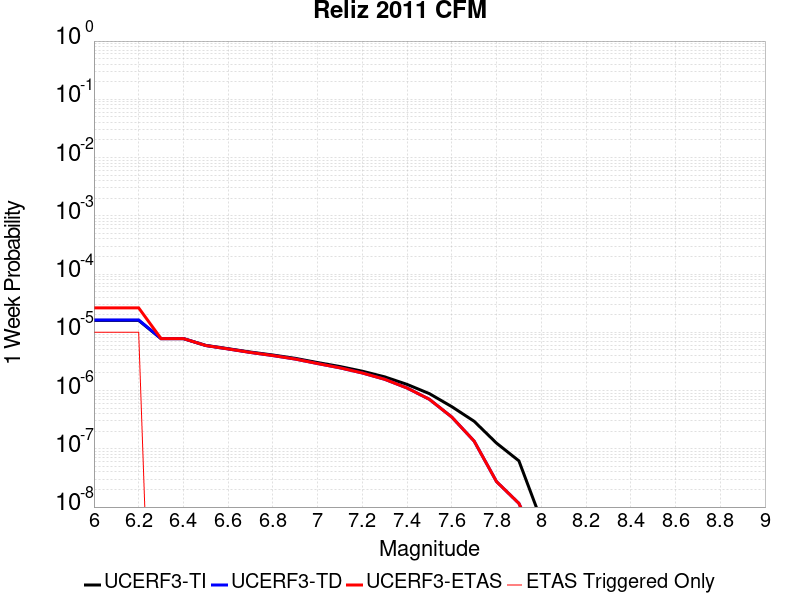 |  |  |  |

| Magnitude | 1 wk TI Prob | 1 wk TD Prob | 1 wk ETAS Prob | 1 wk ETAS/TD Gain | 1 wk ETAS Triggered Only | 1 mo TI Prob | 1 mo TD Prob | 1 mo ETAS Prob | 1 mo ETAS/TD Gain | 1 mo ETAS Triggered Only | 1 yr TI Prob | 1 yr TD Prob | 1 yr ETAS Prob | 1 yr ETAS/TD Gain | 1 yr ETAS Triggered Only | 10 yr TI Prob | 10 yr TD Prob | 10 yr ETAS Prob | 10 yr ETAS/TD Gain | 10 yr ETAS Triggered Only |
|-----|-----|-----|-----|-----|-----|-----|-----|-----|-----|-----|-----|-----|-----|-----|-----|-----|-----|-----|-----|-----|
| 6.0 | 1.6002472E-5 | 1.6284186E-5 | 2.6284022E-5 | 1.6140827 | 1.0E-5 | 6.8580215E-5 | 6.978761E-5 | 8.978622E-5 | 1.2865638 | 2.0E-5 | 8.3464425E-4 | 8.493528E-4 | 9.192933E-4 | 1.0823457 | 7.0E-5 | 0.008315164 | 0.008463266 | 0.008542589 | 1.0093726 | 8.0E-5 |
| 6.1 | 1.6002472E-5 | 1.6284186E-5 | 2.6284022E-5 | 1.6140827 | 1.0E-5 | 6.8580215E-5 | 6.978761E-5 | 8.978622E-5 | 1.2865638 | 2.0E-5 | 8.3464425E-4 | 8.493528E-4 | 9.192933E-4 | 1.0823457 | 7.0E-5 | 0.008315164 | 0.008463266 | 0.008542589 | 1.0093726 | 8.0E-5 |
| 6.2 | 1.6002472E-5 | 1.6284186E-5 | 2.6284022E-5 | 1.6140827 | 1.0E-5 | 6.8580215E-5 | 6.978761E-5 | 8.978622E-5 | 1.2865638 | 2.0E-5 | 8.3464425E-4 | 8.493528E-4 | 9.192933E-4 | 1.0823457 | 7.0E-5 | 0.008315164 | 0.008463266 | 0.008542589 | 1.0093726 | 8.0E-5 |
| 6.3 | 7.792404E-6 | 7.804648E-6 | 7.804648E-6 | 1.0 | 0.0 | 3.339559E-5 | 3.3448065E-5 | 3.3448065E-5 | 1.0 | 0.0 | 4.0651546E-4 | 4.0715485E-4 | 4.271467E-4 | 1.0491014 | 2.0E-5 | 0.0040577264 | 0.004064369 | 0.0040942472 | 1.0073512 | 3.0E-5 |
| 6.4 | 7.792404E-6 | 7.804648E-6 | 7.804648E-6 | 1.0 | 0.0 | 3.339559E-5 | 3.3448065E-5 | 3.3448065E-5 | 1.0 | 0.0 | 4.0651546E-4 | 4.0715485E-4 | 4.271467E-4 | 1.0491014 | 2.0E-5 | 0.0040577264 | 0.004064369 | 0.0040942472 | 1.0073512 | 3.0E-5 |
| 6.5 | 5.9659374E-6 | 5.929487E-6 | 5.929487E-6 | 1.0 | 0.0 | 2.5568053E-5 | 2.5411842E-5 | 2.5411842E-5 | 1.0 | 0.0 | 3.1124658E-4 | 3.0934546E-4 | 3.1934236E-4 | 1.0323163 | 1.0E-5 | 0.00310811 | 0.00308937 | 0.0031093082 | 1.0064538 | 2.0E-5 |
| 6.6 | 5.2350692E-6 | 5.179698E-6 | 5.179698E-6 | 1.0 | 0.0 | 2.2435817E-5 | 2.2198516E-5 | 2.2198516E-5 | 1.0 | 0.0 | 2.7312184E-4 | 2.7023358E-4 | 2.8023086E-4 | 1.036995 | 1.0E-5 | 0.002727864 | 0.0026992632 | 0.0027192093 | 1.0073894 | 2.0E-5 |
| 6.7 | 4.580206E-6 | 4.5067964E-6 | 4.5067964E-6 | 1.0 | 0.0 | 1.9629308E-5 | 1.9314699E-5 | 1.9314699E-5 | 1.0 | 0.0 | 2.389606E-4 | 2.3513116E-4 | 2.4512882E-4 | 1.0425195 | 1.0E-5 | 0.002387038 | 0.0023490293 | 0.0023689822 | 1.0084941 | 2.0E-5 |
| 6.8 | 4.0765017E-6 | 3.988886E-6 | 3.988886E-6 | 1.0 | 0.0 | 1.7470604E-5 | 1.7095113E-5 | 1.7095113E-5 | 1.0 | 0.0 | 2.1268385E-4 | 2.0811317E-4 | 2.1811109E-4 | 1.0480407 | 1.0E-5 | 0.002124804 | 0.0020793844 | 0.0020993429 | 1.0095983 | 2.0E-5 |
| 6.9 | 3.5752896E-6 | 3.4731365E-6 | 3.4731365E-6 | 1.0 | 0.0 | 1.532258E-5 | 1.4884786E-5 | 1.4884786E-5 | 1.0 | 0.0 | 1.8653645E-4 | 1.8120722E-4 | 1.9120541E-4 | 1.0551754 | 1.0E-5 | 0.0018637994 | 0.0018107947 | 0.0018307584 | 1.0110248 | 2.0E-5 |
| 7.0 | 3.0259848E-6 | 2.9085304E-6 | 2.9085304E-6 | 1.0 | 0.0 | 1.2968442E-5 | 1.24650705E-5 | 1.24650705E-5 | 1.0 | 0.0 | 1.5787935E-4 | 1.5175168E-4 | 1.5175168E-4 | 1.0 | 0.0 | 0.0015776722 | 0.0015166793 | 0.0015266641 | 1.0065833 | 1.0E-5 |
| 7.1 | 2.5861116E-6 | 2.45573E-6 | 2.45573E-6 | 1.0 | 0.0 | 1.1083288E-5 | 1.0524514E-5 | 1.0524514E-5 | 1.0 | 0.0 | 1.3493067E-4 | 1.2812843E-4 | 1.2812843E-4 | 1.0 | 0.0 | 0.0013484878 | 0.001280744 | 0.0012907311 | 1.007798 | 1.0E-5 |
| 7.2 | 2.1482588E-6 | 2.0037714E-6 | 2.0037714E-6 | 1.0 | 0.0 | 9.20679E-6 | 8.587564E-6 | 8.587564E-6 | 1.0 | 0.0 | 1.12086906E-4 | 1.0454858E-4 | 1.0454858E-4 | 1.0 | 0.0 | 0.0011203039 | 0.0010451918 | 0.0010451918 | 1.0 | 0.0 |
| 7.3 | 1.7194744E-6 | 1.561632E-6 | 1.561632E-6 | 1.0 | 0.0 | 7.3691554E-6 | 6.6926914E-6 | 6.6926914E-6 | 1.0 | 0.0 | 8.971577E-5 | 8.148047E-5 | 8.148047E-5 | 1.0 | 0.0 | 8.967956E-4 | 8.147036E-4 | 8.147036E-4 | 1.0 | 0.0 |
| 7.4 | 1.2755178E-6 | 1.1061101E-6 | 1.1061101E-6 | 1.0 | 0.0 | 5.4664933E-6 | 4.740463E-6 | 4.740463E-6 | 1.0 | 0.0 | 6.655252E-5 | 5.771361E-5 | 5.771361E-5 | 1.0 | 0.0 | 6.6532596E-4 | 5.771837E-4 | 5.771837E-4 | 1.0 | 0.0 |
| 7.5 | 8.8463224E-7 | 7.062584E-7 | 7.062584E-7 | 1.0 | 0.0 | 3.7912755E-6 | 3.0268181E-6 | 3.0268181E-6 | 1.0 | 0.0 | 4.6157802E-5 | 3.6850888E-5 | 3.6850888E-5 | 1.0 | 0.0 | 4.6148215E-4 | 3.6864515E-4 | 3.6864515E-4 | 1.0 | 0.0 |
| 7.6 | 5.291355E-7 | 3.5047393E-7 | 3.5047393E-7 | 1.0 | 0.0 | 2.2677216E-6 | 1.5020303E-6 | 1.5020303E-6 | 1.0 | 0.0 | 2.760916E-5 | 1.8287064E-5 | 1.8287064E-5 | 1.0 | 0.0 | 2.760573E-4 | 1.830514E-4 | 1.830514E-4 | 1.0 | 0.0 |
| 7.7 | 2.9663357E-7 | 1.354067E-7 | 1.354067E-7 | 1.0 | 0.0 | 1.2712861E-6 | 5.8031424E-7 | 5.8031424E-7 | 1.0 | 0.0 | 1.5477797E-5 | 7.065303E-6 | 7.065303E-6 | 1.0 | 0.0 | 1.547672E-4 | 7.0839E-5 | 7.0839E-5 | 1.0 | 0.0 |
| 7.8 | 1.2509386E-7 | 2.7319428E-8 | 2.7319428E-8 | 1.0 | 0.0 | 5.3611643E-7 | 1.1708327E-7 | 1.1708327E-7 | 1.0 | 0.0 | 6.527198E-6 | 1.4254878E-6 | 1.4254878E-6 | 1.0 | 0.0 | 6.527006E-5 | 1.4414465E-5 | 1.4414465E-5 | 1.0 | 0.0 |
| 7.9 | 6.213493E-8 | 1.1569378E-8 | 1.1569378E-8 | 1.0 | 0.0 | 2.6629255E-7 | 4.958305E-8 | 4.958305E-8 | 1.0 | 0.0 | 3.242107E-6 | 6.0367347E-7 | 6.0367347E-7 | 1.0 | 0.0 | 3.2420594E-5 | 6.1707365E-6 | 6.1707365E-6 | 1.0 | 0.0 |
| 8.0 | 5.92383E-9 | 1.6876875E-9 | 1.6876875E-9 | 1.0 | 0.0 | 2.5387841E-8 | 7.2329467E-9 | 7.2329467E-9 | 1.0 | 0.0 | 3.0909692E-7 | 8.806112E-8 | 8.806112E-8 | 1.0 | 0.0 | 3.090965E-6 | 9.0555415E-7 | 9.0555415E-7 | 1.0 | 0.0 |

## San Andreas (Cholame) rev
*[(top)](#table-of-contents)*

| 1 Week | 1 Month | 1 Year | 10 Year |
|-----|-----|-----|-----|
|  |  |  |  |

| Magnitude | 1 wk TI Prob | 1 wk TD Prob | 1 wk ETAS Prob | 1 wk ETAS/TD Gain | 1 wk ETAS Triggered Only | 1 mo TI Prob | 1 mo TD Prob | 1 mo ETAS Prob | 1 mo ETAS/TD Gain | 1 mo ETAS Triggered Only | 1 yr TI Prob | 1 yr TD Prob | 1 yr ETAS Prob | 1 yr ETAS/TD Gain | 1 yr ETAS Triggered Only | 10 yr TI Prob | 10 yr TD Prob | 10 yr ETAS Prob | 10 yr ETAS/TD Gain | 10 yr ETAS Triggered Only |
|-----|-----|-----|-----|-----|-----|-----|-----|-----|-----|-----|-----|-----|-----|-----|-----|-----|-----|-----|-----|-----|
| 6.0 | 1.2302514E-4 | 2.5348942E-4 | 2.7348436E-4 | 1.0788788 | 2.0E-5 | 5.27144E-4 | 0.0010859326 | 0.0011258891 | 1.0367947 | 4.0E-5 | 0.0063991086 | 0.013141594 | 0.013210674 | 1.0052567 | 7.0E-5 | 0.06217949 | 0.12498023 | 0.12505023 | 1.00056 | 8.0E-5 |
| 6.1 | 1.2302514E-4 | 2.5348942E-4 | 2.7348436E-4 | 1.0788788 | 2.0E-5 | 5.27144E-4 | 0.0010859326 | 0.0011258891 | 1.0367947 | 4.0E-5 | 0.0063991086 | 0.013141594 | 0.013210674 | 1.0052567 | 7.0E-5 | 0.06217949 | 0.12498023 | 0.12505023 | 1.00056 | 8.0E-5 |
| 6.2 | 1.2203569E-4 | 2.516554E-4 | 2.7165038E-4 | 1.0794537 | 2.0E-5 | 5.2290526E-4 | 0.001078079 | 0.0011180359 | 1.037063 | 4.0E-5 | 0.006347804 | 0.013047125 | 0.013116212 | 1.0052952 | 7.0E-5 | 0.061695136 | 0.12416853 | 0.124238595 | 1.0005643 | 8.0E-5 |
| 6.3 | 1.2142645E-4 | 2.5051407E-4 | 2.7050904E-4 | 1.0798159 | 2.0E-5 | 5.202953E-4 | 0.0010731915 | 0.0011131486 | 1.037232 | 4.0E-5 | 0.006316212 | 0.012988332 | 0.013057423 | 1.0053195 | 7.0E-5 | 0.06139677 | 0.1236617 | 0.1237318 | 1.000567 | 8.0E-5 |
| 6.4 | 1.1865206E-4 | 2.455602E-4 | 2.6555528E-4 | 1.0814264 | 2.0E-5 | 5.0840975E-4 | 0.001051978 | 0.0010919359 | 1.0379837 | 4.0E-5 | 0.006172335 | 0.0127331 | 0.012802209 | 1.0054275 | 7.0E-5 | 0.060036868 | 0.121457405 | 0.121527694 | 1.0005786 | 8.0E-5 |
| 6.5 | 1.17443946E-4 | 2.4348768E-4 | 2.634828E-4 | 1.0821197 | 2.0E-5 | 5.032341E-4 | 0.0010431028 | 0.0010830611 | 1.0383071 | 4.0E-5 | 0.006109677 | 0.012626301 | 0.012695417 | 1.005474 | 7.0E-5 | 0.059444077 | 0.120527044 | 0.1205974 | 1.0005838 | 8.0E-5 |
| 6.6 | 1.13579066E-4 | 2.365605E-4 | 2.5655577E-4 | 1.084525 | 2.0E-5 | 4.866766E-4 | 0.0010134383 | 0.0010533978 | 1.0394295 | 4.0E-5 | 0.0059092017 | 0.012269255 | 0.012338396 | 1.0056353 | 7.0E-5 | 0.057545185 | 0.11744215 | 0.117512755 | 1.0006012 | 8.0E-5 |
| 6.7 | 1.1271412E-4 | 2.3500029E-4 | 2.549956E-4 | 1.0850862 | 2.0E-5 | 4.829711E-4 | 0.0010067569 | 0.0010467166 | 1.0396916 | 4.0E-5 | 0.005864331 | 0.012188822 | 0.012257969 | 1.0056729 | 7.0E-5 | 0.057119697 | 0.11674472 | 0.11681537 | 1.0006052 | 8.0E-5 |
| 6.8 | 1.1217975E-4 | 2.3388112E-4 | 2.5387644E-4 | 1.0854936 | 2.0E-5 | 4.8068175E-4 | 0.0010019641 | 0.001041924 | 1.0398816 | 4.0E-5 | 0.005836608 | 0.012131121 | 0.012200272 | 1.0057002 | 7.0E-5 | 0.056856725 | 0.11624265 | 0.11631335 | 1.0006082 | 8.0E-5 |
| 6.9 | 1.1146753E-4 | 2.3236492E-4 | 2.5236027E-4 | 1.0860515 | 2.0E-5 | 4.7763053E-4 | 9.954711E-4 | 0.0010354313 | 1.0401419 | 4.0E-5 | 0.0057996577 | 0.012052947 | 0.012122103 | 1.0057377 | 7.0E-5 | 0.056506127 | 0.115561485 | 0.11563224 | 1.0006123 | 8.0E-5 |
| 7.0 | 1.0965793E-4 | 2.2858709E-4 | 2.485825E-4 | 1.087474 | 2.0E-5 | 4.698779E-4 | 9.792927E-4 | 0.0010092632 | 1.0306044 | 3.0E-5 | 0.005705768 | 0.0118581345 | 0.011917423 | 1.0049999 | 6.0E-5 | 0.055614736 | 0.11386124 | 0.113923274 | 1.0005448 | 7.0E-5 |
| 7.1 | 9.927982E-5 | 2.0672708E-4 | 2.2672294E-4 | 1.096726 | 2.0E-5 | 4.2541555E-4 | 8.856734E-4 | 9.1564684E-4 | 1.0338426 | 3.0E-5 | 0.0051671406 | 0.010730057 | 0.010789413 | 1.0055318 | 6.0E-5 | 0.05048634 | 0.10394797 | 0.10401069 | 1.0006034 | 7.0E-5 |
| 7.2 | 9.696786E-5 | 2.0176056E-4 | 2.1175854E-4 | 1.0495538 | 1.0E-5 | 4.1551032E-4 | 8.6440257E-4 | 8.8438526E-4 | 1.0231174 | 2.0E-5 | 0.00504711 | 0.010473602 | 0.010523079 | 1.0047239 | 5.0E-5 | 0.04934009 | 0.101681165 | 0.10173506 | 1.0005301 | 6.0E-5 |
| 7.3 | 9.4727984E-5 | 1.960298E-4 | 2.0602783E-4 | 1.0510026 | 1.0E-5 | 4.0591392E-4 | 8.398582E-4 | 8.598414E-4 | 1.0237936 | 2.0E-5 | 0.0049308087 | 0.010177606 | 0.010227097 | 1.0048628 | 5.0E-5 | 0.048228268 | 0.09904414 | 0.0990982 | 1.0005457 | 6.0E-5 |
| 7.4 | 9.220358E-5 | 1.8971068E-4 | 1.9970878E-4 | 1.0527018 | 1.0E-5 | 3.9509835E-4 | 8.127934E-4 | 8.327771E-4 | 1.0245866 | 2.0E-5 | 0.004799717 | 0.009851109 | 0.009900617 | 1.0050256 | 5.0E-5 | 0.046973653 | 0.09612046 | 0.096174695 | 1.0005642 | 6.0E-5 |
| 7.5 | 7.71631E-5 | 1.529026E-4 | 1.6290107E-4 | 1.0653911 | 1.0E-5 | 3.306571E-4 | 6.5513246E-4 | 6.651259E-4 | 1.0152541 | 1.0E-5 | 0.0040183207 | 0.007947139 | 0.007986822 | 1.0049932 | 4.0E-5 | 0.03946433 | 0.078785084 | 0.07883114 | 1.0005846 | 5.0E-5 |
| 7.6 | 7.5634416E-5 | 1.4948244E-4 | 1.5948094E-4 | 1.0668875 | 1.0E-5 | 3.241072E-4 | 6.4048194E-4 | 6.504755E-4 | 1.0156032 | 1.0E-5 | 0.0039388672 | 0.0077700554 | 0.0078097447 | 1.005108 | 4.0E-5 | 0.038697794 | 0.07714266 | 0.07718881 | 1.0005982 | 5.0E-5 |
| 7.7 | 6.3783E-5 | 1.2458202E-4 | 1.3458077E-4 | 1.0802584 | 1.0E-5 | 2.7332708E-4 | 5.338137E-4 | 5.438084E-4 | 1.0187231 | 1.0E-5 | 0.0033226798 | 0.006479842 | 0.0065195826 | 1.006133 | 4.0E-5 | 0.032734364 | 0.06499255 | 0.0650393 | 1.0007193 | 5.0E-5 |
| 7.8 | 5.863422E-5 | 1.15064904E-4 | 1.2506376E-4 | 1.0868975 | 1.0E-5 | 2.512653E-4 | 4.930421E-4 | 5.030372E-4 | 1.0202723 | 1.0E-5 | 0.003054864 | 0.0059862877 | 0.006026048 | 1.006642 | 4.0E-5 | 0.030132094 | 0.06007103 | 0.060118027 | 1.0007824 | 5.0E-5 |
| 7.9 | 4.595283E-5 | 8.4924744E-5 | 9.49239E-5 | 1.1177413 | 1.0E-5 | 1.9692584E-4 | 3.6391243E-4 | 3.7390878E-4 | 1.0274692 | 1.0E-5 | 0.0023949358 | 0.0044216397 | 0.0044614626 | 1.0090064 | 4.0E-5 | 0.023692891 | 0.04467351 | 0.044721276 | 1.0010692 | 5.0E-5 |
| 8.0 | 3.2950178E-5 | 5.1186053E-5 | 5.1186053E-5 | 1.0 | 0.0 | 1.412074E-4 | 2.1935036E-4 | 2.1935036E-4 | 1.0 | 0.0 | 0.0017178444 | 0.0026673216 | 0.0026872682 | 1.0074781 | 2.0E-5 | 0.017046256 | 0.027383532 | 0.02741271 | 1.0010655 | 3.0E-5 |
| 8.1 | 1.9177472E-5 | 1.938966E-5 | 1.938966E-5 | 1.0 | 0.0 | 8.218658E-5 | 8.3095896E-5 | 8.3095896E-5 | 1.0 | 0.0 | 0.0010001622 | 0.0010112236 | 0.0010312034 | 1.019758 | 2.0E-5 | 0.009956728 | 0.010865423 | 0.010885206 | 1.0018207 | 2.0E-5 |
| 8.2 | 8.643924E-6 | 5.5514706E-6 | 5.5514706E-6 | 1.0 | 0.0 | 3.704486E-5 | 2.3791801E-5 | 2.3791801E-5 | 1.0 | 0.0 | 4.5092785E-4 | 2.8962674E-4 | 2.9962385E-4 | 1.0345172 | 1.0E-5 | 0.0045001395 | 0.0032906544 | 0.0033006216 | 1.0030289 | 1.0E-5 |
| 8.3 | 1.983087E-6 | 7.783617E-7 | 7.783617E-7 | 1.0 | 0.0 | 8.498917E-6 | 3.3358317E-6 | 3.3358317E-6 | 1.0 | 0.0 | 1.034694E-4 | 4.0613013E-5 | 4.0613013E-5 | 1.0 | 0.0 | 0.0010342124 | 4.791138E-4 | 4.791138E-4 | 1.0 | 0.0 |

## Quien Sabe 2011 CFM
*[(top)](#table-of-contents)*

| 1 Week | 1 Month | 1 Year | 10 Year |
|-----|-----|-----|-----|
|  |  |  |  |

| Magnitude | 1 wk TI Prob | 1 wk TD Prob | 1 wk ETAS Prob | 1 wk ETAS/TD Gain | 1 wk ETAS Triggered Only | 1 mo TI Prob | 1 mo TD Prob | 1 mo ETAS Prob | 1 mo ETAS/TD Gain | 1 mo ETAS Triggered Only | 1 yr TI Prob | 1 yr TD Prob | 1 yr ETAS Prob | 1 yr ETAS/TD Gain | 1 yr ETAS Triggered Only | 10 yr TI Prob | 10 yr TD Prob | 10 yr ETAS Prob | 10 yr ETAS/TD Gain | 10 yr ETAS Triggered Only |
|-----|-----|-----|-----|-----|-----|-----|-----|-----|-----|-----|-----|-----|-----|-----|-----|-----|-----|-----|-----|-----|
| 6.0 | 3.729899E-5 | 7.098068E-5 | 9.097926E-5 | 1.2817469 | 2.0E-5 | 1.5984301E-4 | 3.0414577E-4 | 3.441336E-4 | 1.1314759 | 4.0E-5 | 0.0019443515 | 0.0036873862 | 0.003747165 | 1.0162117 | 6.0E-5 | 0.019274272 | 0.03536981 | 0.035437334 | 1.0019091 | 7.0E-5 |
| 6.1 | 1.7825725E-5 | 3.322987E-5 | 4.322954E-5 | 1.3009241 | 1.0E-5 | 7.639373E-5 | 1.4238052E-4 | 1.6237768E-4 | 1.1404487 | 2.0E-5 | 9.296967E-4 | 0.0017277398 | 0.001757688 | 1.0173337 | 3.0E-5 | 0.009258169 | 0.016708774 | 0.016738273 | 1.0017655 | 3.0E-5 |
| 6.2 | 4.8865336E-6 | 7.813316E-6 | 1.7813238E-5 | 2.2798562 | 1.0E-5 | 2.0942118E-5 | 3.348469E-5 | 4.3484357E-5 | 1.2986339 | 1.0E-5 | 2.5494045E-4 | 4.0725095E-4 | 4.272428E-4 | 1.0490898 | 2.0E-5 | 0.0025464818 | 0.004016717 | 0.0040366366 | 1.0049592 | 2.0E-5 |
| 6.3 | 3.858491E-6 | 5.7948646E-6 | 1.5794807E-5 | 2.725656 | 1.0E-5 | 1.6536285E-5 | 2.4834922E-5 | 3.4834677E-5 | 1.4026488 | 1.0E-5 | 2.0131067E-4 | 3.023279E-4 | 3.123249E-4 | 1.0330666 | 1.0E-5 | 0.002011284 | 0.003004663 | 0.003014633 | 1.0033182 | 1.0E-5 |
| 6.4 | 3.0771805E-6 | 4.3898053E-6 | 4.3898053E-6 | 1.0 | 0.0 | 1.318785E-5 | 1.8813329E-5 | 1.8813329E-5 | 1.0 | 0.0 | 1.6055023E-4 | 2.2903063E-4 | 2.2903063E-4 | 1.0 | 0.0 | 0.001604343 | 0.002289123 | 0.002289123 | 1.0 | 0.0 |
| 6.5 | 2.5081235E-6 | 3.4680183E-6 | 3.4680183E-6 | 1.0 | 0.0 | 1.0749056E-5 | 1.4862859E-5 | 1.4862859E-5 | 1.0 | 0.0 | 1.308619E-4 | 1.8094176E-4 | 1.8094176E-4 | 1.0 | 0.0 | 0.0013078486 | 0.001814684 | 0.001814684 | 1.0 | 0.0 |
| 6.6 | 1.7505364E-6 | 2.405698E-6 | 2.405698E-6 | 1.0 | 0.0 | 7.502277E-6 | 1.0310097E-5 | 1.0310097E-5 | 1.0 | 0.0 | 9.13364E-5 | 1.2551893E-4 | 1.2551893E-4 | 1.0 | 0.0 | 9.129886E-4 | 0.0012599137 | 0.0012599137 | 1.0 | 0.0 |
| 6.7 | 1.505737E-6 | 2.0667978E-6 | 2.0667978E-6 | 1.0 | 0.0 | 6.4531428E-6 | 8.857678E-6 | 8.857678E-6 | 1.0 | 0.0 | 7.8564175E-5 | 1.0783749E-4 | 1.0783749E-4 | 1.0 | 0.0 | 7.853641E-4 | 0.0010832768 | 0.0010832768 | 1.0 | 0.0 |
| 6.8 | 1.2924105E-6 | 1.7511131E-6 | 1.7511131E-6 | 1.0 | 0.0 | 5.5388905E-6 | 7.504752E-6 | 7.504752E-6 | 1.0 | 0.0 | 6.74339E-5 | 9.136707E-5 | 9.136707E-5 | 1.0 | 0.0 | 6.741344E-4 | 9.1740704E-4 | 9.1740704E-4 | 1.0 | 0.0 |
| 6.9 | 8.9075286E-7 | 1.1267575E-6 | 1.1267575E-6 | 1.0 | 0.0 | 3.8175067E-6 | 4.828953E-6 | 4.828953E-6 | 1.0 | 0.0 | 4.6477155E-5 | 5.879114E-5 | 5.879114E-5 | 1.0 | 0.0 | 4.6467435E-4 | 5.91213E-4 | 5.91213E-4 | 1.0 | 0.0 |
| 7.0 | 6.6891175E-7 | 8.5316003E-7 | 8.5316003E-7 | 1.0 | 0.0 | 2.8667614E-6 | 3.656396E-6 | 3.656396E-6 | 1.0 | 0.0 | 3.4902263E-5 | 4.451591E-5 | 4.451591E-5 | 1.0 | 0.0 | 3.4896782E-4 | 4.47462E-4 | 4.47462E-4 | 1.0 | 0.0 |
| 7.1 | 4.4205015E-7 | 5.3966187E-7 | 5.3966187E-7 | 1.0 | 0.0 | 1.8944993E-6 | 2.3128355E-6 | 2.3128355E-6 | 1.0 | 0.0 | 2.3065284E-5 | 2.8158578E-5 | 2.8158578E-5 | 1.0 | 0.0 | 2.3062891E-4 | 2.8293638E-4 | 2.8293638E-4 | 1.0 | 0.0 |
| 7.2 | 1.6620965E-7 | 1.6007118E-7 | 1.6007118E-7 | 1.0 | 0.0 | 7.123269E-7 | 6.8601923E-7 | 6.8601923E-7 | 1.0 | 0.0 | 8.672545E-6 | 8.352256E-6 | 8.352256E-6 | 1.0 | 0.0 | 8.6722066E-5 | 8.369122E-5 | 8.369122E-5 | 1.0 | 0.0 |
| 7.3 | 1.2142488E-7 | 1.1734877E-7 | 1.1734877E-7 | 1.0 | 0.0 | 5.2039223E-7 | 5.029232E-7 | 5.029232E-7 | 1.0 | 0.0 | 6.335757E-6 | 6.1230767E-6 | 6.1230767E-6 | 1.0 | 0.0 | 6.3355765E-5 | 6.133587E-5 | 6.133587E-5 | 1.0 | 0.0 |
| 7.4 | 2.4192937E-8 | 2.4556979E-8 | 2.4556979E-8 | 1.0 | 0.0 | 1.0368401E-7 | 1.0524419E-7 | 1.0524419E-7 | 1.0 | 0.0 | 1.2623522E-6 | 1.2813474E-6 | 1.2813474E-6 | 1.0 | 0.0 | 1.2623449E-5 | 1.2834673E-5 | 1.2834673E-5 | 1.0 | 0.0 |
| 7.5 | 1.4432802E-8 | 1.4511104E-8 | 1.4511104E-8 | 1.0 | 0.0 | 6.185486E-8 | 6.2190445E-8 | 6.2190445E-8 | 1.0 | 0.0 | 7.530827E-7 | 7.571685E-7 | 7.571685E-7 | 1.0 | 0.0 | 7.530801E-6 | 7.5914386E-6 | 7.5914386E-6 | 1.0 | 0.0 |

## San Andreas (Big Bend)
*[(top)](#table-of-contents)*

| 1 Week | 1 Month | 1 Year | 10 Year |
|-----|-----|-----|-----|
|  |  |  |  |

| Magnitude | 1 wk TI Prob | 1 wk TD Prob | 1 wk ETAS Prob | 1 wk ETAS/TD Gain | 1 wk ETAS Triggered Only | 1 mo TI Prob | 1 mo TD Prob | 1 mo ETAS Prob | 1 mo ETAS/TD Gain | 1 mo ETAS Triggered Only | 1 yr TI Prob | 1 yr TD Prob | 1 yr ETAS Prob | 1 yr ETAS/TD Gain | 1 yr ETAS Triggered Only | 10 yr TI Prob | 10 yr TD Prob | 10 yr ETAS Prob | 10 yr ETAS/TD Gain | 10 yr ETAS Triggered Only |
|-----|-----|-----|-----|-----|-----|-----|-----|-----|-----|-----|-----|-----|-----|-----|-----|-----|-----|-----|-----|-----|
| 6.0 | 1.0179969E-4 | 2.0199355E-4 | 2.1199153E-4 | 1.0494965 | 1.0E-5 | 4.362114E-4 | 8.654004E-4 | 8.7539176E-4 | 1.0115453 | 1.0E-5 | 0.0052979486 | 0.010485636 | 0.010525216 | 1.0037748 | 4.0E-5 | 0.051734097 | 0.10203736 | 0.10208226 | 1.00044 | 5.0E-5 |
| 6.1 | 1.0179969E-4 | 2.0199355E-4 | 2.1199153E-4 | 1.0494965 | 1.0E-5 | 4.362114E-4 | 8.654004E-4 | 8.7539176E-4 | 1.0115453 | 1.0E-5 | 0.0052979486 | 0.010485636 | 0.010525216 | 1.0037748 | 4.0E-5 | 0.051734097 | 0.10203736 | 0.10208226 | 1.00044 | 5.0E-5 |
| 6.2 | 1.0179969E-4 | 2.0199355E-4 | 2.1199153E-4 | 1.0494965 | 1.0E-5 | 4.362114E-4 | 8.654004E-4 | 8.7539176E-4 | 1.0115453 | 1.0E-5 | 0.0052979486 | 0.010485636 | 0.010525216 | 1.0037748 | 4.0E-5 | 0.051734097 | 0.10203736 | 0.10208226 | 1.00044 | 5.0E-5 |
| 6.3 | 1.0179969E-4 | 2.0199355E-4 | 2.1199153E-4 | 1.0494965 | 1.0E-5 | 4.362114E-4 | 8.654004E-4 | 8.7539176E-4 | 1.0115453 | 1.0E-5 | 0.0052979486 | 0.010485636 | 0.010525216 | 1.0037748 | 4.0E-5 | 0.051734097 | 0.10203736 | 0.10208226 | 1.00044 | 5.0E-5 |
| 6.4 | 9.1639464E-5 | 1.8554417E-4 | 1.955423E-4 | 1.0538856 | 1.0E-5 | 3.9268145E-4 | 7.949472E-4 | 8.0493925E-4 | 1.0125694 | 1.0E-5 | 0.0047704205 | 0.0096356515 | 0.009675266 | 1.0041113 | 4.0E-5 | 0.046693064 | 0.09431894 | 0.094364226 | 1.0004802 | 5.0E-5 |
| 6.5 | 9.1639464E-5 | 1.8554417E-4 | 1.955423E-4 | 1.0538856 | 1.0E-5 | 3.9268145E-4 | 7.949472E-4 | 8.0493925E-4 | 1.0125694 | 1.0E-5 | 0.0047704205 | 0.0096356515 | 0.009675266 | 1.0041113 | 4.0E-5 | 0.046693064 | 0.09431894 | 0.094364226 | 1.0004802 | 5.0E-5 |
| 6.6 | 9.042622E-5 | 1.8361163E-4 | 1.936098E-4 | 1.0544528 | 1.0E-5 | 3.8748336E-4 | 7.866699E-4 | 7.9666206E-4 | 1.0127019 | 1.0E-5 | 0.0047074095 | 0.00953576 | 0.009575379 | 1.0041547 | 4.0E-5 | 0.046089325 | 0.09341518 | 0.09346051 | 1.0004853 | 5.0E-5 |
| 6.7 | 8.9836685E-5 | 1.8275395E-4 | 1.9275212E-4 | 1.0547084 | 1.0E-5 | 3.8495753E-4 | 7.829963E-4 | 7.9298846E-4 | 1.0127615 | 1.0E-5 | 0.00467679 | 0.009491424 | 0.009531044 | 1.0041744 | 4.0E-5 | 0.045795817 | 0.0930092 | 0.09305455 | 1.0004876 | 5.0E-5 |
| 6.8 | 8.9471854E-5 | 1.8222064E-4 | 1.9221881E-4 | 1.0548686 | 1.0E-5 | 3.8339442E-4 | 7.8071206E-4 | 7.907043E-4 | 1.0127988 | 1.0E-5 | 0.004657841 | 0.009463855 | 0.009503476 | 1.0041866 | 4.0E-5 | 0.04561414 | 0.092755556 | 0.092800915 | 1.000489 | 5.0E-5 |
| 6.9 | 8.858234E-5 | 1.8103831E-4 | 1.9103651E-4 | 1.0552269 | 1.0E-5 | 3.7958333E-4 | 7.75648E-4 | 7.856402E-4 | 1.0128825 | 1.0E-5 | 0.004611638 | 0.009402733 | 0.009442357 | 1.004214 | 4.0E-5 | 0.04517103 | 0.09219544 | 0.092240825 | 1.0004923 | 5.0E-5 |
| 7.0 | 8.7433385E-5 | 1.7942318E-4 | 1.894214E-4 | 1.0557241 | 1.0E-5 | 3.746607E-4 | 7.6873007E-4 | 7.787224E-4 | 1.0129985 | 1.0E-5 | 0.004551957 | 0.009319231 | 0.009358859 | 1.0042522 | 4.0E-5 | 0.044598386 | 0.091429226 | 0.09147465 | 1.0004969 | 5.0E-5 |
| 7.1 | 8.684964E-5 | 1.7854078E-4 | 1.88539E-4 | 1.0559996 | 1.0E-5 | 3.7215967E-4 | 7.649506E-4 | 7.749429E-4 | 1.0130627 | 1.0E-5 | 0.0045216335 | 0.009273608 | 0.009313238 | 1.0042733 | 4.0E-5 | 0.04430731 | 0.09101009 | 0.09105554 | 1.0004994 | 5.0E-5 |
| 7.2 | 8.606521E-5 | 1.77445E-4 | 1.8744323E-4 | 1.0563455 | 1.0E-5 | 3.6879873E-4 | 7.602572E-4 | 7.702496E-4 | 1.0131434 | 1.0E-5 | 0.0044808835 | 0.009216951 | 0.009256583 | 1.0042999 | 4.0E-5 | 0.043916024 | 0.09049017 | 0.09053565 | 1.0005026 | 5.0E-5 |
| 7.3 | 8.568266E-5 | 1.7686271E-4 | 1.8686094E-4 | 1.0565311 | 1.0E-5 | 3.6715972E-4 | 7.5776305E-4 | 7.677555E-4 | 1.0131867 | 1.0E-5 | 0.0044610105 | 0.009186842 | 0.009226474 | 1.0043141 | 4.0E-5 | 0.043725148 | 0.09021053 | 0.09025602 | 1.0005043 | 5.0E-5 |
| 7.4 | 8.5432206E-5 | 1.7648713E-4 | 1.8648535E-4 | 1.0566514 | 1.0E-5 | 3.6608664E-4 | 7.5615436E-4 | 7.6614675E-4 | 1.0132148 | 1.0E-5 | 0.004447999 | 0.009167421 | 0.009207054 | 1.0043232 | 4.0E-5 | 0.043600157 | 0.09003015 | 0.09007565 | 1.0005053 | 5.0E-5 |
| 7.5 | 8.4791965E-5 | 1.7517526E-4 | 1.851735E-4 | 1.0570757 | 1.0E-5 | 3.633435E-4 | 7.505353E-4 | 7.6052774E-4 | 1.0133138 | 1.0E-5 | 0.0044147377 | 0.009099582 | 0.009139217 | 1.0043558 | 4.0E-5 | 0.043280575 | 0.08940553 | 0.08945106 | 1.0005093 | 5.0E-5 |
| 7.6 | 8.241105E-5 | 1.6960947E-4 | 1.7960777E-4 | 1.058949 | 1.0E-5 | 3.531424E-4 | 7.266954E-4 | 7.3668815E-4 | 1.0137509 | 1.0E-5 | 0.0042910352 | 0.008811715 | 0.008851362 | 1.0044994 | 4.0E-5 | 0.042091176 | 0.08677437 | 0.086820036 | 1.0005262 | 5.0E-5 |
| 7.7 | 7.00432E-5 | 1.4313462E-4 | 1.531332E-4 | 1.0698543 | 1.0E-5 | 3.001506E-4 | 6.1328994E-4 | 6.232838E-4 | 1.0162956 | 1.0E-5 | 0.0036482112 | 0.007441282 | 0.007480984 | 1.0053355 | 4.0E-5 | 0.035888977 | 0.07400693 | 0.07405323 | 1.0006256 | 5.0E-5 |
| 7.8 | 6.415362E-5 | 1.3067157E-4 | 1.4067026E-4 | 1.0765177 | 1.0E-5 | 2.749151E-4 | 5.599009E-4 | 5.698953E-4 | 1.0178503 | 1.0E-5 | 0.0033419547 | 0.006795517 | 0.0068352455 | 1.0058463 | 4.0E-5 | 0.03292141 | 0.06769523 | 0.06774184 | 1.0006886 | 5.0E-5 |
| 7.9 | 4.939911E-5 | 9.41176E-5 | 1.04116654E-4 | 1.10624 | 1.0E-5 | 2.116933E-4 | 4.032988E-4 | 4.1329474E-4 | 1.0247855 | 1.0E-5 | 0.0025743195 | 0.004899117 | 0.0049389214 | 1.0081247 | 4.0E-5 | 0.025447013 | 0.04924456 | 0.0492921 | 1.0009654 | 5.0E-5 |
| 8.0 | 3.344983E-5 | 5.2647367E-5 | 5.2647367E-5 | 1.0 | 0.0 | 1.4334853E-4 | 2.2561206E-4 | 2.2561206E-4 | 1.0 | 0.0 | 0.0017438711 | 0.0027433687 | 0.002763314 | 1.0072703 | 2.0E-5 | 0.017302496 | 0.02812872 | 0.028157877 | 1.0010365 | 3.0E-5 |
| 8.1 | 1.9104898E-5 | 1.9377247E-5 | 1.9377247E-5 | 1.0 | 0.0 | 8.1875565E-5 | 8.30427E-5 | 8.30427E-5 | 1.0 | 0.0 | 9.963791E-4 | 0.0010105766 | 0.0010305564 | 1.0197707 | 2.0E-5 | 0.009919235 | 0.010856872 | 0.010876656 | 1.0018221 | 2.0E-5 |
| 8.2 | 8.643924E-6 | 5.5514706E-6 | 5.5514706E-6 | 1.0 | 0.0 | 3.704486E-5 | 2.3791801E-5 | 2.3791801E-5 | 1.0 | 0.0 | 4.5092785E-4 | 2.8962674E-4 | 2.9962385E-4 | 1.0345172 | 1.0E-5 | 0.0045001395 | 0.0032906544 | 0.0033006216 | 1.0030289 | 1.0E-5 |
| 8.3 | 1.983087E-6 | 7.783617E-7 | 7.783617E-7 | 1.0 | 0.0 | 8.498917E-6 | 3.3358317E-6 | 3.3358317E-6 | 1.0 | 0.0 | 1.034694E-4 | 4.0613013E-5 | 4.0613013E-5 | 1.0 | 0.0 | 0.0010342124 | 4.791138E-4 | 4.791138E-4 | 1.0 | 0.0 |

## San Andreas (Mojave N)
*[(top)](#table-of-contents)*

| 1 Week | 1 Month | 1 Year | 10 Year |
|-----|-----|-----|-----|
|  |  |  |  |

| Magnitude | 1 wk TI Prob | 1 wk TD Prob | 1 wk ETAS Prob | 1 wk ETAS/TD Gain | 1 wk ETAS Triggered Only | 1 mo TI Prob | 1 mo TD Prob | 1 mo ETAS Prob | 1 mo ETAS/TD Gain | 1 mo ETAS Triggered Only | 1 yr TI Prob | 1 yr TD Prob | 1 yr ETAS Prob | 1 yr ETAS/TD Gain | 1 yr ETAS Triggered Only | 10 yr TI Prob | 10 yr TD Prob | 10 yr ETAS Prob | 10 yr ETAS/TD Gain | 10 yr ETAS Triggered Only |
|-----|-----|-----|-----|-----|-----|-----|-----|-----|-----|-----|-----|-----|-----|-----|-----|-----|-----|-----|-----|-----|
| 6.0 | 9.877682E-5 | 1.9530515E-4 | 2.053032E-4 | 1.0511919 | 1.0E-5 | 4.2326056E-4 | 8.3675375E-4 | 8.467454E-4 | 1.011941 | 1.0E-5 | 0.0051410277 | 0.0101400195 | 0.010179614 | 1.0039048 | 4.0E-5 | 0.05023708 | 0.098881036 | 0.09892609 | 1.0004556 | 5.0E-5 |
| 6.1 | 9.877682E-5 | 1.9530515E-4 | 2.053032E-4 | 1.0511919 | 1.0E-5 | 4.2326056E-4 | 8.3675375E-4 | 8.467454E-4 | 1.011941 | 1.0E-5 | 0.0051410277 | 0.0101400195 | 0.010179614 | 1.0039048 | 4.0E-5 | 0.05023708 | 0.098881036 | 0.09892609 | 1.0004556 | 5.0E-5 |
| 6.2 | 9.877682E-5 | 1.9530515E-4 | 2.053032E-4 | 1.0511919 | 1.0E-5 | 4.2326056E-4 | 8.3675375E-4 | 8.467454E-4 | 1.011941 | 1.0E-5 | 0.0051410277 | 0.0101400195 | 0.010179614 | 1.0039048 | 4.0E-5 | 0.05023708 | 0.098881036 | 0.09892609 | 1.0004556 | 5.0E-5 |
| 6.3 | 9.877682E-5 | 1.9530515E-4 | 2.053032E-4 | 1.0511919 | 1.0E-5 | 4.2326056E-4 | 8.3675375E-4 | 8.467454E-4 | 1.011941 | 1.0E-5 | 0.0051410277 | 0.0101400195 | 0.010179614 | 1.0039048 | 4.0E-5 | 0.05023708 | 0.098881036 | 0.09892609 | 1.0004556 | 5.0E-5 |
| 6.4 | 9.877682E-5 | 1.9530515E-4 | 2.053032E-4 | 1.0511919 | 1.0E-5 | 4.2326056E-4 | 8.3675375E-4 | 8.467454E-4 | 1.011941 | 1.0E-5 | 0.0051410277 | 0.0101400195 | 0.010179614 | 1.0039048 | 4.0E-5 | 0.05023708 | 0.098881036 | 0.09892609 | 1.0004556 | 5.0E-5 |
| 6.5 | 9.861474E-5 | 1.9504238E-4 | 2.0504043E-4 | 1.051261 | 1.0E-5 | 4.2256617E-4 | 8.356283E-4 | 8.4561994E-4 | 1.011957 | 1.0E-5 | 0.0051326132 | 0.0101264445 | 0.01016604 | 1.0039101 | 4.0E-5 | 0.050156746 | 0.09875881 | 0.09880387 | 1.0004563 | 5.0E-5 |
| 6.6 | 9.861474E-5 | 1.9504238E-4 | 2.0504043E-4 | 1.051261 | 1.0E-5 | 4.2256617E-4 | 8.356283E-4 | 8.4561994E-4 | 1.011957 | 1.0E-5 | 0.0051326132 | 0.0101264445 | 0.01016604 | 1.0039101 | 4.0E-5 | 0.050156746 | 0.09875881 | 0.09880387 | 1.0004563 | 5.0E-5 |
| 6.7 | 9.8552715E-5 | 1.9494175E-4 | 2.049398E-4 | 1.0512874 | 1.0E-5 | 4.223004E-4 | 8.3519734E-4 | 8.45189E-4 | 1.0119632 | 1.0E-5 | 0.0051293927 | 0.010121246 | 0.010160841 | 1.0039121 | 4.0E-5 | 0.050125998 | 0.098712154 | 0.098757215 | 1.0004566 | 5.0E-5 |
| 6.8 | 9.8464974E-5 | 1.9479301E-4 | 2.0479107E-4 | 1.0513265 | 1.0E-5 | 4.219245E-4 | 8.345603E-4 | 8.4455195E-4 | 1.0119723 | 1.0E-5 | 0.0051248376 | 0.010113562 | 0.010153159 | 1.0039151 | 4.0E-5 | 0.05008251 | 0.09864182 | 0.09868688 | 1.0004569 | 5.0E-5 |
| 6.9 | 9.825824E-5 | 1.9447238E-4 | 2.0447043E-4 | 1.0514112 | 1.0E-5 | 4.2103877E-4 | 8.33187E-4 | 8.431787E-4 | 1.0119921 | 1.0E-5 | 0.0051141046 | 0.010096998 | 0.010136594 | 1.0039216 | 4.0E-5 | 0.049980022 | 0.09849072 | 0.0985358 | 1.0004576 | 5.0E-5 |
| 7.0 | 9.781462E-5 | 1.9378454E-4 | 2.037826E-4 | 1.0515937 | 1.0E-5 | 4.1913814E-4 | 8.30241E-4 | 8.402327E-4 | 1.0120347 | 1.0E-5 | 0.005091073 | 0.010061462 | 0.010101059 | 1.0039356 | 4.0E-5 | 0.04976007 | 0.09816675 | 0.09821185 | 1.0004593 | 5.0E-5 |
| 7.1 | 9.7121134E-5 | 1.9279962E-4 | 2.027977E-4 | 1.0518574 | 1.0E-5 | 4.1616702E-4 | 8.2602265E-4 | 8.360144E-4 | 1.0120962 | 1.0E-5 | 0.005055068 | 0.010010577 | 0.010050176 | 1.0039557 | 4.0E-5 | 0.04941613 | 0.09770252 | 0.09774763 | 1.0004618 | 5.0E-5 |
| 7.2 | 9.663819E-5 | 1.9210603E-4 | 2.021041E-4 | 1.0520446 | 1.0E-5 | 4.1409794E-4 | 8.2305196E-4 | 8.330437E-4 | 1.0121399 | 1.0E-5 | 0.0050299936 | 0.00997474 | 0.010014341 | 1.0039701 | 4.0E-5 | 0.049176537 | 0.09737537 | 0.097420506 | 1.0004635 | 5.0E-5 |
| 7.3 | 9.6277574E-5 | 1.9162935E-4 | 2.0162745E-4 | 1.0521741 | 1.0E-5 | 4.125529E-4 | 8.210104E-4 | 8.310022E-4 | 1.0121701 | 1.0E-5 | 0.0050112694 | 0.009950112 | 0.009989713 | 1.00398 | 4.0E-5 | 0.04899759 | 0.09714816 | 0.0971933 | 1.0004647 | 5.0E-5 |
| 7.4 | 9.593308E-5 | 1.9102513E-4 | 2.0102321E-4 | 1.0523391 | 1.0E-5 | 4.1107697E-4 | 8.184224E-4 | 8.284142E-4 | 1.0122086 | 1.0E-5 | 0.0049933824 | 0.009918891 | 0.0099584935 | 1.0039927 | 4.0E-5 | 0.04882661 | 0.09686599 | 0.09691115 | 1.0004662 | 5.0E-5 |
| 7.5 | 9.561707E-5 | 1.9048409E-4 | 2.0048219E-4 | 1.0524879 | 1.0E-5 | 4.0972308E-4 | 8.1610517E-4 | 8.2609704E-4 | 1.0122433 | 1.0E-5 | 0.0049769743 | 0.009890934 | 0.009930539 | 1.0040041 | 4.0E-5 | 0.048669744 | 0.09661153 | 0.0966567 | 1.0004675 | 5.0E-5 |
| 7.6 | 9.418194E-5 | 1.8699648E-4 | 1.969946E-4 | 1.0534669 | 1.0E-5 | 4.0357444E-4 | 8.011675E-4 | 8.111595E-4 | 1.0124718 | 1.0E-5 | 0.004902454 | 0.009710703 | 0.009750315 | 1.0040792 | 4.0E-5 | 0.047957025 | 0.0949895 | 0.095034756 | 1.0004764 | 5.0E-5 |
| 7.7 | 8.202141E-5 | 1.6138036E-4 | 1.7137875E-4 | 1.0619555 | 1.0E-5 | 3.51473E-4 | 6.914468E-4 | 7.014399E-4 | 1.0144525 | 1.0E-5 | 0.00427079 | 0.008385929 | 0.008425593 | 1.0047299 | 4.0E-5 | 0.04189639 | 0.082752936 | 0.082798794 | 1.0005542 | 5.0E-5 |
| 7.8 | 7.2859846E-5 | 1.462144E-4 | 1.5621293E-4 | 1.0683827 | 1.0E-5 | 3.1221908E-4 | 6.2648265E-4 | 6.364764E-4 | 1.0159521 | 1.0E-5 | 0.003794643 | 0.0076007936 | 0.0076404894 | 1.0052226 | 4.0E-5 | 0.037304975 | 0.07519517 | 0.07524141 | 1.0006149 | 5.0E-5 |
| 7.9 | 5.3874453E-5 | 1.0119486E-4 | 1.1119385E-4 | 1.0988092 | 1.0E-5 | 2.3087008E-4 | 4.3362018E-4 | 4.4361586E-4 | 1.0230516 | 1.0E-5 | 0.0028072202 | 0.005266558 | 0.0053063473 | 1.0075551 | 4.0E-5 | 0.02772022 | 0.052768894 | 0.052816257 | 1.0008975 | 5.0E-5 |
| 8.0 | 3.468538E-5 | 5.468676E-5 | 5.468676E-5 | 1.0 | 0.0 | 1.4864317E-4 | 2.3435078E-4 | 2.3435078E-4 | 1.0 | 0.0 | 0.0018082283 | 0.0028494895 | 0.0028694323 | 1.0069988 | 2.0E-5 | 0.017935853 | 0.029156707 | 0.029185832 | 1.000999 | 3.0E-5 |
| 8.1 | 1.9152367E-5 | 1.9605492E-5 | 1.9605492E-5 | 1.0 | 0.0 | 8.207899E-5 | 8.402084E-5 | 8.402084E-5 | 1.0 | 0.0 | 9.988535E-4 | 0.0010224743 | 0.0010424538 | 1.0195404 | 2.0E-5 | 0.009943757 | 0.010962427 | 0.010982207 | 1.0018045 | 2.0E-5 |
| 8.2 | 8.643924E-6 | 5.5514706E-6 | 5.5514706E-6 | 1.0 | 0.0 | 3.704486E-5 | 2.3791801E-5 | 2.3791801E-5 | 1.0 | 0.0 | 4.5092785E-4 | 2.8962674E-4 | 2.9962385E-4 | 1.0345172 | 1.0E-5 | 0.0045001395 | 0.0032906544 | 0.0033006216 | 1.0030289 | 1.0E-5 |
| 8.3 | 1.983087E-6 | 7.783617E-7 | 7.783617E-7 | 1.0 | 0.0 | 8.498917E-6 | 3.3358317E-6 | 3.3358317E-6 | 1.0 | 0.0 | 1.034694E-4 | 4.0613013E-5 | 4.0613013E-5 | 1.0 | 0.0 | 0.0010342124 | 4.791138E-4 | 4.791138E-4 | 1.0 | 0.0 |

## San Andreas (Carrizo) rev
*[(top)](#table-of-contents)*

| 1 Week | 1 Month | 1 Year | 10 Year |
|-----|-----|-----|-----|
|  |  |  |  |

| Magnitude | 1 wk TI Prob | 1 wk TD Prob | 1 wk ETAS Prob | 1 wk ETAS/TD Gain | 1 wk ETAS Triggered Only | 1 mo TI Prob | 1 mo TD Prob | 1 mo ETAS Prob | 1 mo ETAS/TD Gain | 1 mo ETAS Triggered Only | 1 yr TI Prob | 1 yr TD Prob | 1 yr ETAS Prob | 1 yr ETAS/TD Gain | 1 yr ETAS Triggered Only | 10 yr TI Prob | 10 yr TD Prob | 10 yr ETAS Prob | 10 yr ETAS/TD Gain | 10 yr ETAS Triggered Only |
|-----|-----|-----|-----|-----|-----|-----|-----|-----|-----|-----|-----|-----|-----|-----|-----|-----|-----|-----|-----|-----|
| 6.0 | 1.1674632E-4 | 2.446587E-4 | 2.5465625E-4 | 1.0408633 | 1.0E-5 | 5.002454E-4 | 0.0010481175 | 0.0010680966 | 1.0190618 | 2.0E-5 | 0.006073493 | 0.012686656 | 0.012736022 | 1.0038911 | 5.0E-5 | 0.0591016 | 0.121233195 | 0.12128592 | 1.0004349 | 6.0E-5 |
| 6.1 | 1.1674632E-4 | 2.446587E-4 | 2.5465625E-4 | 1.0408633 | 1.0E-5 | 5.002454E-4 | 0.0010481175 | 0.0010680966 | 1.0190618 | 2.0E-5 | 0.006073493 | 0.012686656 | 0.012736022 | 1.0038911 | 5.0E-5 | 0.0591016 | 0.121233195 | 0.12128592 | 1.0004349 | 6.0E-5 |
| 6.2 | 1.1674632E-4 | 2.446587E-4 | 2.5465625E-4 | 1.0408633 | 1.0E-5 | 5.002454E-4 | 0.0010481175 | 0.0010680966 | 1.0190618 | 2.0E-5 | 0.006073493 | 0.012686656 | 0.012736022 | 1.0038911 | 5.0E-5 | 0.0591016 | 0.121233195 | 0.12128592 | 1.0004349 | 6.0E-5 |
| 6.3 | 1.1674632E-4 | 2.446587E-4 | 2.5465625E-4 | 1.0408633 | 1.0E-5 | 5.002454E-4 | 0.0010481175 | 0.0010680966 | 1.0190618 | 2.0E-5 | 0.006073493 | 0.012686656 | 0.012736022 | 1.0038911 | 5.0E-5 | 0.0591016 | 0.121233195 | 0.12128592 | 1.0004349 | 6.0E-5 |
| 6.4 | 1.1674632E-4 | 2.446587E-4 | 2.5465625E-4 | 1.0408633 | 1.0E-5 | 5.002454E-4 | 0.0010481175 | 0.0010680966 | 1.0190618 | 2.0E-5 | 0.006073493 | 0.012686656 | 0.012736022 | 1.0038911 | 5.0E-5 | 0.0591016 | 0.121233195 | 0.12128592 | 1.0004349 | 6.0E-5 |
| 6.5 | 1.13136164E-4 | 2.3785238E-4 | 2.4785E-4 | 1.0420328 | 1.0E-5 | 4.847792E-4 | 0.0010189706 | 0.0010389503 | 1.0196077 | 2.0E-5 | 0.0058862255 | 0.012335852 | 0.012385235 | 1.0040032 | 5.0E-5 | 0.057327334 | 0.11820241 | 0.11825532 | 1.0004476 | 6.0E-5 |
| 6.6 | 1.13136164E-4 | 2.3785238E-4 | 2.4785E-4 | 1.0420328 | 1.0E-5 | 4.847792E-4 | 0.0010189706 | 0.0010389503 | 1.0196077 | 2.0E-5 | 0.0058862255 | 0.012335852 | 0.012385235 | 1.0040032 | 5.0E-5 | 0.057327334 | 0.11820241 | 0.11825532 | 1.0004476 | 6.0E-5 |
| 6.7 | 1.1149675E-4 | 2.3476148E-4 | 2.4475914E-4 | 1.0425864 | 1.0E-5 | 4.777557E-4 | 0.0010057342 | 0.0010257141 | 1.019866 | 2.0E-5 | 0.0058011734 | 0.012176507 | 0.012225899 | 1.0040562 | 5.0E-5 | 0.05652051 | 0.11682972 | 0.11688271 | 1.0004536 | 6.0E-5 |
| 6.8 | 1.1103589E-4 | 2.337814E-4 | 2.4377905E-4 | 1.042765 | 1.0E-5 | 4.7578133E-4 | 0.0010015371 | 0.001021517 | 1.0199493 | 2.0E-5 | 0.005777263 | 0.012125977 | 0.012175371 | 1.0040734 | 5.0E-5 | 0.056293584 | 0.11639005 | 0.11644307 | 1.0004555 | 6.0E-5 |
| 6.9 | 1.1053259E-4 | 2.3270346E-4 | 2.4270113E-4 | 1.0429631 | 1.0E-5 | 4.7362508E-4 | 9.969209E-4 | 0.0010169009 | 1.0200418 | 2.0E-5 | 0.0057511497 | 0.0120704 | 0.012119796 | 1.0040923 | 5.0E-5 | 0.05604569 | 0.11590487 | 0.11595791 | 1.0004576 | 6.0E-5 |
| 7.0 | 1.1005377E-4 | 2.3171002E-4 | 2.4170769E-4 | 1.0431474 | 1.0E-5 | 4.7157376E-4 | 9.926665E-4 | 0.0010126466 | 1.0201278 | 2.0E-5 | 0.0057263062 | 0.012019175 | 0.012068574 | 1.00411 | 5.0E-5 | 0.055809796 | 0.11545806 | 0.11551113 | 1.0004597 | 6.0E-5 |
| 7.1 | 1.0308142E-4 | 2.1678228E-4 | 2.2678012E-4 | 1.0461192 | 1.0E-5 | 4.417027E-4 | 9.2873716E-4 | 9.4871863E-4 | 1.0215147 | 2.0E-5 | 0.0053644776 | 0.01124907 | 0.011298507 | 1.0043948 | 5.0E-5 | 0.052368138 | 0.10869067 | 0.10874415 | 1.000492 | 6.0E-5 |
| 7.2 | 1.0027479E-4 | 2.108509E-4 | 2.208488E-4 | 1.0474169 | 1.0E-5 | 4.296783E-4 | 9.033348E-4 | 9.2331675E-4 | 1.0221202 | 2.0E-5 | 0.0052187922 | 0.010942942 | 0.010992396 | 1.0045191 | 5.0E-5 | 0.050979212 | 0.10598754 | 0.106041186 | 1.0005062 | 6.0E-5 |
| 7.3 | 9.816942E-5 | 2.0558383E-4 | 2.1558178E-4 | 1.0486319 | 1.0E-5 | 4.2065824E-4 | 8.807771E-4 | 9.007594E-4 | 1.0226872 | 2.0E-5 | 0.005109493 | 0.010671024 | 0.0107204905 | 1.0046356 | 5.0E-5 | 0.049935985 | 0.10356493 | 0.10361872 | 1.0005194 | 6.0E-5 |
| 7.4 | 9.5634205E-5 | 1.9925408E-4 | 2.0925209E-4 | 1.0501772 | 1.0E-5 | 4.0979648E-4 | 8.536675E-4 | 8.736504E-4 | 1.0234083 | 2.0E-5 | 0.0049778637 | 0.010344138 | 0.010393621 | 1.0047836 | 5.0E-5 | 0.048678253 | 0.1006497 | 0.10070366 | 1.0005361 | 6.0E-5 |
| 7.5 | 8.052417E-5 | 1.6230272E-4 | 1.723011E-4 | 1.0616033 | 1.0E-5 | 3.4505792E-4 | 6.9539784E-4 | 7.053909E-4 | 1.0143702 | 1.0E-5 | 0.0041929903 | 0.008433685 | 0.008473347 | 1.0047029 | 4.0E-5 | 0.04114753 | 0.08333142 | 0.08337725 | 1.00055 | 5.0E-5 |
| 7.6 | 7.897024E-5 | 1.5882021E-4 | 1.6881862E-4 | 1.0629543 | 1.0E-5 | 3.384E-4 | 6.804807E-4 | 6.904738E-4 | 1.0146855 | 1.0E-5 | 0.0041122385 | 0.008253458 | 0.008293128 | 1.0048064 | 4.0E-5 | 0.040369697 | 0.081666954 | 0.08171287 | 1.0005622 | 5.0E-5 |
| 7.7 | 6.707427E-5 | 1.3380915E-4 | 1.4380782E-4 | 1.0747234 | 1.0E-5 | 2.8742946E-4 | 5.733418E-4 | 5.8333605E-4 | 1.0174316 | 1.0E-5 | 0.003493839 | 0.006958128 | 0.00699785 | 1.0057087 | 4.0E-5 | 0.034394164 | 0.06952184 | 0.069568366 | 1.0006692 | 5.0E-5 |
| 7.8 | 6.147705E-5 | 1.2292301E-4 | 1.3292178E-4 | 1.0813417 | 1.0E-5 | 2.6344648E-4 | 5.267066E-4 | 5.367013E-4 | 1.0189759 | 1.0E-5 | 0.0032027436 | 0.006393823 | 0.006433567 | 1.006216 | 4.0E-5 | 0.031569764 | 0.06394441 | 0.06399121 | 1.000732 | 5.0E-5 |
| 7.9 | 4.7636717E-5 | 8.9482666E-5 | 9.948177E-5 | 1.1117435 | 1.0E-5 | 2.0414138E-4 | 3.8344078E-4 | 3.9343693E-4 | 1.0260696 | 1.0E-5 | 0.0024825884 | 0.0046584066 | 0.00469822 | 1.0085466 | 4.0E-5 | 0.024550365 | 0.046949543 | 0.046997197 | 1.001015 | 5.0E-5 |
| 8.0 | 3.3554235E-5 | 5.2557778E-5 | 5.2557778E-5 | 1.0 | 0.0 | 1.4379594E-4 | 2.2522818E-4 | 2.2522818E-4 | 1.0 | 0.0 | 0.0017493097 | 0.0027387065 | 0.0027586517 | 1.0072827 | 2.0E-5 | 0.017356034 | 0.028087804 | 0.028116962 | 1.0010381 | 3.0E-5 |
| 8.1 | 1.9175432E-5 | 1.9389485E-5 | 1.9389485E-5 | 1.0 | 0.0 | 8.217783E-5 | 8.3095154E-5 | 8.3095154E-5 | 1.0 | 0.0 | 0.0010000558 | 0.0010112146 | 0.0010311943 | 1.0197582 | 2.0E-5 | 0.009955673 | 0.010865306 | 0.010885088 | 1.0018207 | 2.0E-5 |
| 8.2 | 8.643924E-6 | 5.5514706E-6 | 5.5514706E-6 | 1.0 | 0.0 | 3.704486E-5 | 2.3791801E-5 | 2.3791801E-5 | 1.0 | 0.0 | 4.5092785E-4 | 2.8962674E-4 | 2.9962385E-4 | 1.0345172 | 1.0E-5 | 0.0045001395 | 0.0032906544 | 0.0033006216 | 1.0030289 | 1.0E-5 |
| 8.3 | 1.983087E-6 | 7.783617E-7 | 7.783617E-7 | 1.0 | 0.0 | 8.498917E-6 | 3.3358317E-6 | 3.3358317E-6 | 1.0 | 0.0 | 1.034694E-4 | 4.0613013E-5 | 4.0613013E-5 | 1.0 | 0.0 | 0.0010342124 | 4.791138E-4 | 4.791138E-4 | 1.0 | 0.0 |

## San Gregorio (South) 2011 CFM
*[(top)](#table-of-contents)*

| 1 Week | 1 Month | 1 Year | 10 Year |
|-----|-----|-----|-----|
|  |  | 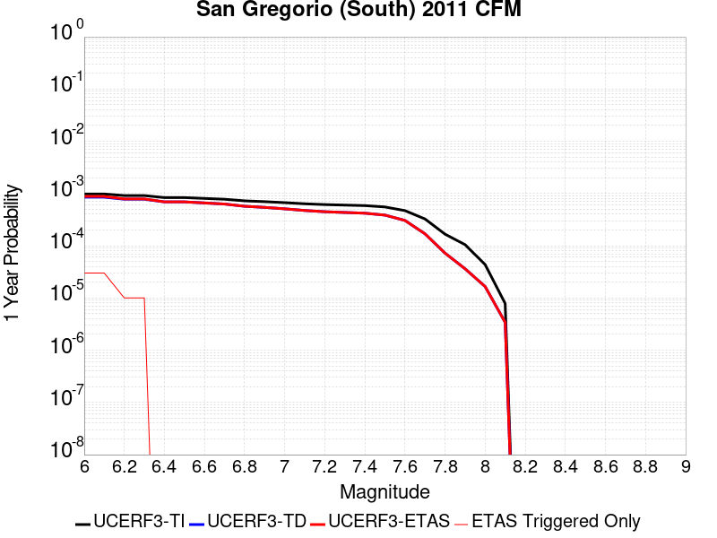 |  |

| Magnitude | 1 wk TI Prob | 1 wk TD Prob | 1 wk ETAS Prob | 1 wk ETAS/TD Gain | 1 wk ETAS Triggered Only | 1 mo TI Prob | 1 mo TD Prob | 1 mo ETAS Prob | 1 mo ETAS/TD Gain | 1 mo ETAS Triggered Only | 1 yr TI Prob | 1 yr TD Prob | 1 yr ETAS Prob | 1 yr ETAS/TD Gain | 1 yr ETAS Triggered Only | 10 yr TI Prob | 10 yr TD Prob | 10 yr ETAS Prob | 10 yr ETAS/TD Gain | 10 yr ETAS Triggered Only |
|-----|-----|-----|-----|-----|-----|-----|-----|-----|-----|-----|-----|-----|-----|-----|-----|-----|-----|-----|-----|-----|
| 6.0 | 1.8770423E-5 | 1.6289563E-5 | 2.6289401E-5 | 1.6138799 | 1.0E-5 | 8.044219E-5 | 6.981057E-5 | 7.980987E-5 | 1.1432347 | 1.0E-5 | 9.789435E-4 | 8.49616E-4 | 8.795906E-4 | 1.0352801 | 3.0E-5 | 0.009746423 | 0.008476441 | 0.008526017 | 1.0058486 | 5.0E-5 |
| 6.1 | 1.8770423E-5 | 1.6289563E-5 | 2.6289401E-5 | 1.6138799 | 1.0E-5 | 8.044219E-5 | 6.981057E-5 | 7.980987E-5 | 1.1432347 | 1.0E-5 | 9.789435E-4 | 8.49616E-4 | 8.795906E-4 | 1.0352801 | 3.0E-5 | 0.009746423 | 0.008476441 | 0.008526017 | 1.0058486 | 5.0E-5 |
| 6.2 | 1.7508692E-5 | 1.4908819E-5 | 1.4908819E-5 | 1.0 | 0.0 | 7.5035096E-5 | 6.389339E-5 | 6.389339E-5 | 1.0 | 0.0 | 9.1316935E-4 | 7.776274E-4 | 7.876196E-4 | 1.0128496 | 1.0E-5 | 0.00909426 | 0.0077617425 | 0.00779151 | 1.0038351 | 3.0E-5 |
| 6.3 | 1.7508692E-5 | 1.4908819E-5 | 1.4908819E-5 | 1.0 | 0.0 | 7.5035096E-5 | 6.389339E-5 | 6.389339E-5 | 1.0 | 0.0 | 9.1316935E-4 | 7.776274E-4 | 7.876196E-4 | 1.0128496 | 1.0E-5 | 0.00909426 | 0.0077617425 | 0.00779151 | 1.0038351 | 3.0E-5 |
| 6.4 | 1.6004591E-5 | 1.3258347E-5 | 1.3258347E-5 | 1.0 | 0.0 | 6.85893E-5 | 5.6820256E-5 | 5.6820256E-5 | 1.0 | 0.0 | 8.347548E-4 | 6.915681E-4 | 6.915681E-4 | 1.0 | 0.0 | 0.008316261 | 0.006906638 | 0.0069265 | 1.0028758 | 2.0E-5 |
| 6.5 | 1.6004591E-5 | 1.3258347E-5 | 1.3258347E-5 | 1.0 | 0.0 | 6.85893E-5 | 5.6820256E-5 | 5.6820256E-5 | 1.0 | 0.0 | 8.347548E-4 | 6.915681E-4 | 6.915681E-4 | 1.0 | 0.0 | 0.008316261 | 0.006906638 | 0.0069265 | 1.0028758 | 2.0E-5 |
| 6.6 | 1.5442201E-5 | 1.2642867E-5 | 1.2642867E-5 | 1.0 | 0.0 | 6.617918E-5 | 5.4182594E-5 | 5.4182594E-5 | 1.0 | 0.0 | 8.0543366E-4 | 6.594743E-4 | 6.594743E-4 | 1.0 | 0.0 | 0.008025207 | 0.006587633 | 0.0066075013 | 1.003016 | 2.0E-5 |
| 6.7 | 1.489921E-5 | 1.2051274E-5 | 1.2051274E-5 | 1.0 | 0.0 | 6.3852196E-5 | 5.1647297E-5 | 5.1647297E-5 | 1.0 | 0.0 | 7.7712315E-4 | 6.2862516E-4 | 6.2862516E-4 | 1.0 | 0.0 | 0.0077441116 | 0.006280915 | 0.0063007893 | 1.0031643 | 2.0E-5 |
| 6.8 | 1.3876024E-5 | 1.0930016E-5 | 1.0930016E-5 | 1.0 | 0.0 | 5.9467322E-5 | 4.6842088E-5 | 4.6842088E-5 | 1.0 | 0.0 | 7.237741E-4 | 5.701535E-4 | 5.701535E-4 | 1.0 | 0.0 | 0.0072142133 | 0.005699319 | 0.005719205 | 1.0034891 | 2.0E-5 |
| 6.9 | 1.33922495E-5 | 1.0401423E-5 | 1.0401423E-5 | 1.0 | 0.0 | 5.7394092E-5 | 4.457677E-5 | 4.457677E-5 | 1.0 | 0.0 | 6.9854903E-4 | 5.425873E-4 | 5.425873E-4 | 1.0 | 0.0 | 0.0069635725 | 0.005425028 | 0.0054449197 | 1.0036666 | 2.0E-5 |
| 7.0 | 1.2807324E-5 | 9.761268E-6 | 9.761268E-6 | 1.0 | 0.0 | 5.4887376E-5 | 4.1833337E-5 | 4.1833337E-5 | 1.0 | 0.0 | 6.680489E-4 | 5.09202E-4 | 5.09202E-4 | 1.0 | 0.0 | 0.006660442 | 0.005092747 | 0.005112645 | 1.0039072 | 2.0E-5 |
| 7.1 | 1.2191438E-5 | 9.06999E-6 | 9.06999E-6 | 1.0 | 0.0 | 5.224797E-5 | 3.8870803E-5 | 3.8870803E-5 | 1.0 | 0.0 | 6.3593336E-4 | 4.7314935E-4 | 4.7314935E-4 | 1.0 | 0.0 | 0.0063411663 | 0.0047338065 | 0.0047537116 | 1.004205 | 2.0E-5 |
| 7.2 | 1.1769438E-5 | 8.590055E-6 | 8.590055E-6 | 1.0 | 0.0 | 5.0439474E-5 | 3.6814E-5 | 3.6814E-5 | 1.0 | 0.0 | 6.1392755E-4 | 4.4811834E-4 | 4.4811834E-4 | 1.0 | 0.0 | 0.0061223423 | 0.004484533 | 0.004504443 | 1.0044398 | 2.0E-5 |
| 7.3 | 1.150374E-5 | 8.305438E-6 | 8.305438E-6 | 1.0 | 0.0 | 4.9300812E-5 | 3.559425E-5 | 3.559425E-5 | 1.0 | 0.0 | 6.0007203E-4 | 4.3327388E-4 | 4.3327388E-4 | 1.0 | 0.0 | 0.0059845424 | 0.004336663 | 0.0043565766 | 1.0045918 | 2.0E-5 |
| 7.4 | 1.12514E-5 | 8.051108E-6 | 8.051108E-6 | 1.0 | 0.0 | 4.8219394E-5 | 3.4504294E-5 | 3.4504294E-5 | 1.0 | 0.0 | 5.8691297E-4 | 4.2000884E-4 | 4.2000884E-4 | 1.0 | 0.0 | 0.005853653 | 0.0042045135 | 0.0042244294 | 1.0047368 | 2.0E-5 |
| 7.5 | 1.059696E-5 | 7.4010595E-6 | 7.4010595E-6 | 1.0 | 0.0 | 4.5414752E-5 | 3.1718442E-5 | 3.1718442E-5 | 1.0 | 0.0 | 5.5278436E-4 | 3.8610367E-4 | 3.8610367E-4 | 1.0 | 0.0 | 0.0055141128 | 0.003866626 | 0.0038865486 | 1.0051525 | 2.0E-5 |
| 7.6 | 9.018592E-6 | 5.8442924E-6 | 5.8442924E-6 | 1.0 | 0.0 | 3.8650534E-5 | 2.5046727E-5 | 2.5046727E-5 | 1.0 | 0.0 | 4.7046866E-4 | 3.0490127E-4 | 3.0490127E-4 | 1.0 | 0.0 | 0.004694739 | 0.0030567446 | 0.0030667142 | 1.0032614 | 1.0E-5 |
| 7.7 | 6.243489E-6 | 3.2455112E-6 | 3.2455112E-6 | 1.0 | 0.0 | 2.6757538E-5 | 1.3909259E-5 | 1.3909259E-5 | 1.0 | 0.0 | 3.257243E-4 | 1.6933208E-4 | 1.6933208E-4 | 1.0 | 0.0 | 0.003252473 | 0.0017022382 | 0.0017122213 | 1.0058646 | 1.0E-5 |
| 7.8 | 3.1941963E-6 | 1.3846911E-6 | 1.3846911E-6 | 1.0 | 0.0 | 1.368934E-5 | 5.934377E-6 | 5.934377E-6 | 1.0 | 0.0 | 1.6665498E-4 | 7.2248644E-5 | 7.2248644E-5 | 1.0 | 0.0 | 0.0016653005 | 7.282937E-4 | 7.382864E-4 | 1.0137208 | 1.0E-5 |
| 7.9 | 2.0098398E-6 | 6.943788E-7 | 6.943788E-7 | 1.0 | 0.0 | 8.6135715E-6 | 2.9759055E-6 | 2.9759055E-6 | 1.0 | 0.0 | 1.0486518E-4 | 3.623105E-5 | 3.623105E-5 | 1.0 | 0.0 | 0.0010481571 | 3.6720882E-4 | 3.7720514E-4 | 1.0272225 | 1.0E-5 |
| 8.0 | 8.353119E-7 | 3.1753785E-7 | 3.1753785E-7 | 1.0 | 0.0 | 3.579903E-6 | 1.3608757E-6 | 1.3608757E-6 | 1.0 | 0.0 | 4.358445E-5 | 1.6568536E-5 | 1.6568536E-5 | 1.0 | 0.0 | 4.3575902E-4 | 1.6687257E-4 | 1.6687257E-4 | 1.0 | 0.0 |
| 8.1 | 1.5033264E-7 | 6.549686E-8 | 6.549686E-8 | 1.0 | 0.0 | 6.442826E-7 | 2.8070082E-7 | 2.8070082E-7 | 1.0 | 0.0 | 7.844113E-6 | 3.417527E-6 | 3.417527E-6 | 1.0 | 0.0 | 7.843835E-5 | 3.419461E-5 | 3.419461E-5 | 1.0 | 0.0 |

## West Napa 2011 CFM
*[(top)](#table-of-contents)*

| 1 Week | 1 Month | 1 Year | 10 Year |
|-----|-----|-----|-----|
|  |  |  |  |

| Magnitude | 1 wk TI Prob | 1 wk TD Prob | 1 wk ETAS Prob | 1 wk ETAS/TD Gain | 1 wk ETAS Triggered Only | 1 mo TI Prob | 1 mo TD Prob | 1 mo ETAS Prob | 1 mo ETAS/TD Gain | 1 mo ETAS Triggered Only | 1 yr TI Prob | 1 yr TD Prob | 1 yr ETAS Prob | 1 yr ETAS/TD Gain | 1 yr ETAS Triggered Only | 10 yr TI Prob | 10 yr TD Prob | 10 yr ETAS Prob | 10 yr ETAS/TD Gain | 10 yr ETAS Triggered Only |
|-----|-----|-----|-----|-----|-----|-----|-----|-----|-----|-----|-----|-----|-----|-----|-----|-----|-----|-----|-----|-----|
| 6.0 | 3.773104E-5 | 4.4545388E-5 | 5.4544944E-5 | 1.2244802 | 1.0E-5 | 1.6169442E-4 | 1.9089662E-4 | 2.0089472E-4 | 1.0523744 | 1.0E-5 | 0.001966852 | 0.0023220065 | 0.002351937 | 1.0128899 | 3.0E-5 | 0.019495348 | 0.023011073 | 0.023059923 | 1.0021229 | 5.0E-5 |
| 6.1 | 3.773104E-5 | 4.4545388E-5 | 5.4544944E-5 | 1.2244802 | 1.0E-5 | 1.6169442E-4 | 1.9089662E-4 | 2.0089472E-4 | 1.0523744 | 1.0E-5 | 0.001966852 | 0.0023220065 | 0.002351937 | 1.0128899 | 3.0E-5 | 0.019495348 | 0.023011073 | 0.023059923 | 1.0021229 | 5.0E-5 |
| 6.2 | 3.773104E-5 | 4.4545388E-5 | 5.4544944E-5 | 1.2244802 | 1.0E-5 | 1.6169442E-4 | 1.9089662E-4 | 2.0089472E-4 | 1.0523744 | 1.0E-5 | 0.001966852 | 0.0023220065 | 0.002351937 | 1.0128899 | 3.0E-5 | 0.019495348 | 0.023011073 | 0.023059923 | 1.0021229 | 5.0E-5 |
| 6.3 | 2.147964E-5 | 2.4996332E-5 | 2.4996332E-5 | 1.0 | 0.0 | 9.2052345E-5 | 1.0712326E-4 | 1.0712326E-4 | 1.0 | 0.0 | 0.001120161 | 0.0013035372 | 0.0013135241 | 1.0076615 | 1.0E-5 | 0.011145315 | 0.012969706 | 0.012999317 | 1.0022831 | 3.0E-5 |
| 6.4 | 2.147964E-5 | 2.4996332E-5 | 2.4996332E-5 | 1.0 | 0.0 | 9.2052345E-5 | 1.0712326E-4 | 1.0712326E-4 | 1.0 | 0.0 | 0.001120161 | 0.0013035372 | 0.0013135241 | 1.0076615 | 1.0E-5 | 0.011145315 | 0.012969706 | 0.012999317 | 1.0022831 | 3.0E-5 |
| 6.5 | 1.688201E-5 | 1.955472E-5 | 1.955472E-5 | 1.0 | 0.0 | 7.234947E-5 | 8.380366E-5 | 8.380366E-5 | 1.0 | 0.0 | 8.804988E-4 | 0.0010199047 | 0.0010298946 | 1.0097948 | 1.0E-5 | 0.008770182 | 0.010161086 | 0.010180882 | 1.0019482 | 2.0E-5 |
| 6.6 | 1.6846381E-5 | 1.9514402E-5 | 1.9514402E-5 | 1.0 | 0.0 | 7.219678E-5 | 8.363088E-5 | 8.363088E-5 | 1.0 | 0.0 | 8.7864127E-4 | 0.0010178032 | 0.0010277929 | 1.0098151 | 1.0E-5 | 0.008751754 | 0.010140262 | 0.010160059 | 1.0019523 | 2.0E-5 |
| 6.7 | 1.3396501E-5 | 1.5473694E-5 | 1.5473694E-5 | 1.0 | 0.0 | 5.7412315E-5 | 6.63145E-5 | 6.63145E-5 | 1.0 | 0.0 | 6.9877075E-4 | 8.071435E-4 | 8.1713544E-4 | 1.0123794 | 1.0E-5 | 0.0069657755 | 0.008050021 | 0.00806986 | 1.0024644 | 2.0E-5 |
| 6.8 | 1.0139058E-5 | 1.1676979E-5 | 1.1676979E-5 | 1.0 | 0.0 | 4.3452383E-5 | 5.004355E-5 | 5.004355E-5 | 1.0 | 0.0 | 5.289043E-4 | 6.091654E-4 | 6.191593E-4 | 1.0164059 | 1.0E-5 | 0.005276473 | 0.0060820533 | 0.006101932 | 1.0032684 | 2.0E-5 |
| 6.9 | 7.761281E-6 | 8.894612E-6 | 8.894612E-6 | 1.0 | 0.0 | 3.326221E-5 | 3.81195E-5 | 3.81195E-5 | 1.0 | 0.0 | 4.0489217E-4 | 4.6405746E-4 | 4.7405282E-4 | 1.0215391 | 1.0E-5 | 0.0040415525 | 0.004637574 | 0.0046574813 | 1.0042926 | 2.0E-5 |
| 7.0 | 2.2109202E-6 | 2.3683149E-6 | 2.3683149E-6 | 1.0 | 0.0 | 9.475338E-6 | 1.0149882E-5 | 1.0149882E-5 | 1.0 | 0.0 | 1.1535613E-4 | 1.2356788E-4 | 1.3356665E-4 | 1.0809171 | 1.0E-5 | 0.0011529627 | 0.0012366503 | 0.0012566256 | 1.0161527 | 2.0E-5 |
| 7.1 | 1.9008926E-6 | 2.0149084E-6 | 2.0149084E-6 | 1.0 | 0.0 | 8.146657E-6 | 8.635294E-6 | 8.635294E-6 | 1.0 | 0.0 | 9.918104E-5 | 1.0512966E-4 | 1.15128605E-4 | 1.0951107 | 1.0E-5 | 9.913679E-4 | 0.0010524527 | 0.0010724317 | 1.0189832 | 2.0E-5 |
| 7.2 | 1.8495944E-6 | 1.9577026E-6 | 1.9577026E-6 | 1.0 | 0.0 | 7.926808E-6 | 8.390127E-6 | 8.390127E-6 | 1.0 | 0.0 | 9.650462E-5 | 1.0214503E-4 | 1.12144015E-4 | 1.09789 | 1.0E-5 | 9.6462725E-4 | 0.0010226344 | 0.001042614 | 1.0195373 | 2.0E-5 |
| 7.3 | 1.7883189E-6 | 1.8896486E-6 | 1.8896486E-6 | 1.0 | 0.0 | 7.664201E-6 | 8.098469E-6 | 8.098469E-6 | 1.0 | 0.0 | 9.330765E-5 | 9.859443E-5 | 1.0859344E-4 | 1.1014156 | 1.0E-5 | 9.3268487E-4 | 9.871604E-4 | 0.0010071406 | 1.0202402 | 2.0E-5 |
| 7.4 | 1.6520572E-6 | 1.7429809E-6 | 1.7429809E-6 | 1.0 | 0.0 | 7.0802257E-6 | 7.469897E-6 | 7.469897E-6 | 1.0 | 0.0 | 8.6198335E-5 | 9.094222E-5 | 1.0094132E-4 | 1.10995 | 1.0E-5 | 8.616491E-4 | 9.1070123E-4 | 9.30683E-4 | 1.0219411 | 2.0E-5 |
| 7.5 | 1.4040345E-6 | 1.4813329E-6 | 1.4813329E-6 | 1.0 | 0.0 | 6.0172765E-6 | 6.3485545E-6 | 6.3485545E-6 | 1.0 | 0.0 | 7.325788E-5 | 7.729093E-5 | 8.729016E-5 | 1.1293713 | 1.0E-5 | 7.3233736E-4 | 7.7425473E-4 | 7.84247E-4 | 1.0129056 | 1.0E-5 |
| 7.6 | 1.3013842E-7 | 1.4477867E-7 | 1.4477867E-7 | 1.0 | 0.0 | 5.57736E-7 | 6.2047985E-7 | 6.2047985E-7 | 1.0 | 0.0 | 6.790414E-6 | 7.5543157E-6 | 7.5543157E-6 | 1.0 | 0.0 | 6.790207E-5 | 7.646992E-5 | 7.646992E-5 | 1.0 | 0.0 |
| 7.7 | 8.541512E-8 | 9.772852E-8 | 9.772852E-8 | 1.0 | 0.0 | 3.6606474E-7 | 4.1883644E-7 | 4.1883644E-7 | 1.0 | 0.0 | 4.456829E-6 | 5.0993217E-6 | 5.0993217E-6 | 1.0 | 0.0 | 4.4567398E-5 | 5.18965E-5 | 5.18965E-5 | 1.0 | 0.0 |
| 7.8 | 5.6074793E-8 | 6.9422484E-8 | 6.9422484E-8 | 1.0 | 0.0 | 2.403205E-7 | 2.975249E-7 | 2.975249E-7 | 1.0 | 0.0 | 2.9258983E-6 | 3.6223596E-6 | 3.6223596E-6 | 1.0 | 0.0 | 2.9258597E-5 | 3.7055714E-5 | 3.7055714E-5 | 1.0 | 0.0 |
| 7.9 | 2.9475839E-8 | 3.8844767E-8 | 3.8844767E-8 | 1.0 | 0.0 | 1.2632502E-7 | 1.6647758E-7 | 1.6647758E-7 | 1.0 | 0.0 | 1.538006E-6 | 2.0268626E-6 | 2.0268626E-6 | 1.0 | 0.0 | 1.5379954E-5 | 2.0807607E-5 | 2.0807607E-5 | 1.0 | 0.0 |
| 8.0 | 1.3337122E-8 | 2.1794186E-8 | 2.1794186E-8 | 1.0 | 0.0 | 5.7159088E-8 | 9.3403656E-8 | 9.3403656E-8 | 1.0 | 0.0 | 6.959117E-7 | 1.137189E-6 | 1.137189E-6 | 1.0 | 0.0 | 6.959095E-6 | 1.1726984E-5 | 1.1726984E-5 | 1.0 | 0.0 |
| 8.1 | 2.6589986E-10 | 4.8958637E-10 | 4.8958637E-10 | 1.0 | 0.0 | 1.1395708E-9 | 2.098227E-9 | 2.098227E-9 | 1.0 | 0.0 | 1.3874274E-8 | 2.5545908E-8 | 2.5545908E-8 | 1.0 | 0.0 | 1.3874273E-7 | 2.621045E-7 | 2.621045E-7 | 1.0 | 0.0 |

## San Andreas (San Bernardino N)
*[(top)](#table-of-contents)*

| 1 Week | 1 Month | 1 Year | 10 Year |
|-----|-----|-----|-----|
|  |  | 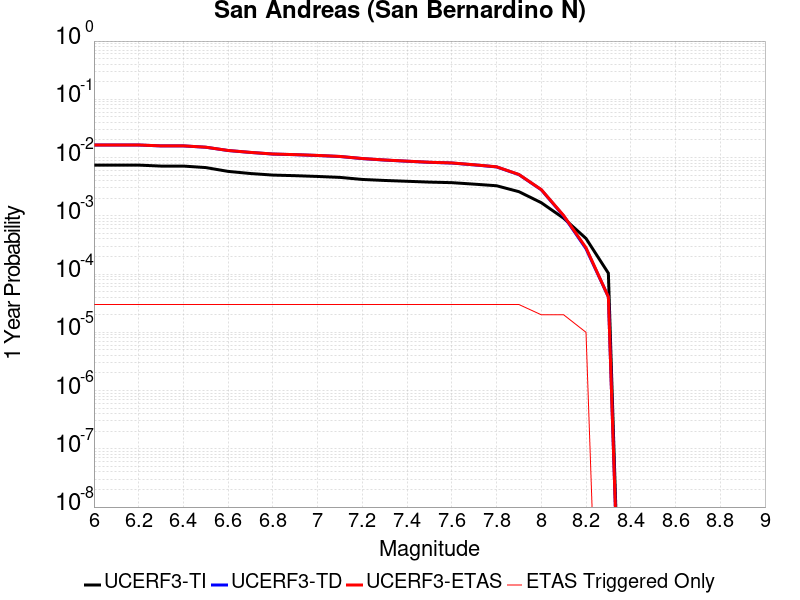 |  |

| Magnitude | 1 wk TI Prob | 1 wk TD Prob | 1 wk ETAS Prob | 1 wk ETAS/TD Gain | 1 wk ETAS Triggered Only | 1 mo TI Prob | 1 mo TD Prob | 1 mo ETAS Prob | 1 mo ETAS/TD Gain | 1 mo ETAS Triggered Only | 1 yr TI Prob | 1 yr TD Prob | 1 yr ETAS Prob | 1 yr ETAS/TD Gain | 1 yr ETAS Triggered Only | 10 yr TI Prob | 10 yr TD Prob | 10 yr ETAS Prob | 10 yr ETAS/TD Gain | 10 yr ETAS Triggered Only |
|-----|-----|-----|-----|-----|-----|-----|-----|-----|-----|-----|-----|-----|-----|-----|-----|-----|-----|-----|-----|-----|
| 6.0 | 1.4273766E-4 | 3.1715693E-4 | 3.1715693E-4 | 1.0 | 0.0 | 6.115894E-4 | 0.0013585419 | 0.0013585419 | 1.0 | 0.0 | 0.0074207084 | 0.016416313 | 0.01644582 | 1.0017974 | 3.0E-5 | 0.07177748 | 0.15074801 | 0.15078199 | 1.0002253 | 4.0E-5 |
| 6.1 | 1.4273766E-4 | 3.1715693E-4 | 3.1715693E-4 | 1.0 | 0.0 | 6.115894E-4 | 0.0013585419 | 0.0013585419 | 1.0 | 0.0 | 0.0074207084 | 0.016416313 | 0.01644582 | 1.0017974 | 3.0E-5 | 0.07177748 | 0.15074801 | 0.15078199 | 1.0002253 | 4.0E-5 |
| 6.2 | 1.4273766E-4 | 3.1715693E-4 | 3.1715693E-4 | 1.0 | 0.0 | 6.115894E-4 | 0.0013585419 | 0.0013585419 | 1.0 | 0.0 | 0.0074207084 | 0.016416313 | 0.01644582 | 1.0017974 | 3.0E-5 | 0.07177748 | 0.15074801 | 0.15078199 | 1.0002253 | 4.0E-5 |
| 6.3 | 1.3730655E-4 | 3.0620035E-4 | 3.0620035E-4 | 1.0 | 0.0 | 5.883239E-4 | 0.0013116329 | 0.0013116329 | 1.0 | 0.0 | 0.0071393442 | 0.01585361 | 0.015883135 | 1.0018623 | 3.0E-5 | 0.06914291 | 0.14603491 | 0.14606906 | 1.0002339 | 4.0E-5 |
| 6.4 | 1.3730655E-4 | 3.0620035E-4 | 3.0620035E-4 | 1.0 | 0.0 | 5.883239E-4 | 0.0013116329 | 0.0013116329 | 1.0 | 0.0 | 0.0071393442 | 0.01585361 | 0.015883135 | 1.0018623 | 3.0E-5 | 0.06914291 | 0.14603491 | 0.14606906 | 1.0002339 | 4.0E-5 |
| 6.5 | 1.2942807E-4 | 2.903367E-4 | 2.903367E-4 | 1.0 | 0.0 | 5.545738E-4 | 0.001243712 | 0.001243712 | 1.0 | 0.0 | 0.0067310524 | 0.015038314 | 0.015067863 | 1.0019649 | 3.0E-5 | 0.06530788 | 0.13916023 | 0.13919467 | 1.0002475 | 4.0E-5 |
| 6.6 | 1.1125901E-4 | 2.54703E-4 | 2.54703E-4 | 1.0 | 0.0 | 4.767372E-4 | 0.00109113 | 0.00109113 | 1.0 | 0.0 | 0.005788839 | 0.013204226 | 0.01323383 | 1.002242 | 3.0E-5 | 0.056403454 | 0.1234773 | 0.12351236 | 1.000284 | 4.0E-5 |
| 6.7 | 1.02209575E-4 | 2.3604566E-4 | 2.3604566E-4 | 1.0 | 0.0 | 4.3796748E-4 | 0.0010112334 | 0.0010112334 | 1.0 | 0.0 | 0.0053192247 | 0.012242691 | 0.0122723235 | 1.0024204 | 3.0E-5 | 0.051936906 | 0.115236536 | 0.115271926 | 1.0003071 | 4.0E-5 |
| 6.8 | 9.610582E-5 | 2.2128974E-4 | 2.2128974E-4 | 1.0 | 0.0 | 4.1181705E-4 | 9.480406E-4 | 9.480406E-4 | 1.0 | 0.0 | 0.0050023515 | 0.011481576 | 0.011511231 | 1.0025829 | 3.0E-5 | 0.048912346 | 0.10863702 | 0.10867267 | 1.0003282 | 4.0E-5 |
| 6.9 | 9.3877505E-5 | 2.1584045E-4 | 2.1584045E-4 | 1.0 | 0.0 | 4.0227012E-4 | 9.247032E-4 | 9.247032E-4 | 1.0 | 0.0 | 0.0048866454 | 0.011200394 | 0.011230058 | 1.0026485 | 3.0E-5 | 0.04780577 | 0.10622987 | 0.10626563 | 1.0003365 | 4.0E-5 |
| 7.0 | 9.1019785E-5 | 2.091031E-4 | 2.091031E-4 | 1.0 | 0.0 | 3.900265E-4 | 8.95849E-4 | 8.95849E-4 | 1.0 | 0.0 | 0.0047382377 | 0.010852643 | 0.010882317 | 1.0027343 | 3.0E-5 | 0.046384744 | 0.10318951 | 0.10322538 | 1.0003476 | 4.0E-5 |
| 7.1 | 8.771155E-5 | 2.0084127E-4 | 2.0084127E-4 | 1.0 | 0.0 | 3.758525E-4 | 8.6046493E-4 | 8.6046493E-4 | 1.0 | 0.0 | 0.0045664064 | 0.010426038 | 0.010455725 | 1.0028474 | 3.0E-5 | 0.044737056 | 0.09949862 | 0.099534646 | 1.000362 | 4.0E-5 |
| 7.2 | 8.0830236E-5 | 1.8488054E-4 | 1.8488054E-4 | 1.0 | 0.0 | 3.4636928E-4 | 7.921047E-4 | 7.921047E-4 | 1.0 | 0.0 | 0.0042088944 | 0.009601339 | 0.009631051 | 1.0030946 | 3.0E-5 | 0.041300658 | 0.09222007 | 0.09225638 | 1.0003937 | 4.0E-5 |
| 7.3 | 7.7668235E-5 | 1.7429797E-4 | 1.7429797E-4 | 1.0 | 0.0 | 3.328214E-4 | 7.467775E-4 | 7.467775E-4 | 1.0 | 0.0 | 0.0040445733 | 0.009054194 | 0.009083923 | 1.0032834 | 3.0E-5 | 0.03971748 | 0.087489985 | 0.087526485 | 1.0004172 | 4.0E-5 |
| 7.4 | 7.520177E-5 | 1.6648525E-4 | 1.6648525E-4 | 1.0 | 0.0 | 3.2225347E-4 | 7.133132E-4 | 7.133132E-4 | 1.0 | 0.0 | 0.0039163795 | 0.008650074 | 0.008679815 | 1.0034382 | 3.0E-5 | 0.038480744 | 0.08394442 | 0.08398106 | 1.0004365 | 4.0E-5 |
| 7.5 | 7.274697E-5 | 1.5934913E-4 | 1.5934913E-4 | 1.0 | 0.0 | 3.1173544E-4 | 6.827462E-4 | 6.827462E-4 | 1.0 | 0.0 | 0.003788775 | 0.008280811 | 0.008310562 | 1.0035928 | 3.0E-5 | 0.03724827 | 0.08065913 | 0.080695905 | 1.0004559 | 4.0E-5 |
| 7.6 | 7.1185845E-5 | 1.5503971E-4 | 1.5503971E-4 | 1.0 | 0.0 | 3.0504653E-4 | 6.642867E-4 | 6.642867E-4 | 1.0 | 0.0 | 0.0037076178 | 0.008057753 | 0.008087511 | 1.0036931 | 3.0E-5 | 0.036463667 | 0.078646176 | 0.078683026 | 1.0004686 | 4.0E-5 |
| 7.7 | 6.709961E-5 | 1.4410561E-4 | 1.4410561E-4 | 1.0 | 0.0 | 2.8753807E-4 | 6.1744935E-4 | 6.1744935E-4 | 1.0 | 0.0 | 0.003495157 | 0.0074915737 | 0.007521349 | 1.0039746 | 3.0E-5 | 0.034406938 | 0.07346765 | 0.07350471 | 1.0005045 | 4.0E-5 |
| 7.8 | 6.300812E-5 | 1.3289896E-4 | 1.3289896E-4 | 1.0 | 0.0 | 2.7000686E-4 | 5.694427E-4 | 5.694427E-4 | 1.0 | 0.0 | 0.0032823787 | 0.0069109555 | 0.006940748 | 1.004311 | 3.0E-5 | 0.032343175 | 0.06810767 | 0.068144955 | 1.0005473 | 4.0E-5 |
| 7.9 | 4.983037E-5 | 9.79261E-5 | 9.79261E-5 | 1.0 | 0.0 | 2.1354125E-4 | 4.196158E-4 | 4.196158E-4 | 1.0 | 0.0 | 0.0025967648 | 0.005096866 | 0.005126713 | 1.0058559 | 3.0E-5 | 0.025666296 | 0.05097016 | 0.05100812 | 1.0007448 | 4.0E-5 |
| 8.0 | 3.2211527E-5 | 5.371115E-5 | 5.371115E-5 | 1.0 | 0.0 | 1.380421E-4 | 2.3017034E-4 | 2.3017034E-4 | 1.0 | 0.0 | 0.0016793669 | 0.0027987245 | 0.0028186685 | 1.0071261 | 2.0E-5 | 0.016667323 | 0.0285595 | 0.028588643 | 1.0010204 | 3.0E-5 |
| 8.1 | 1.743376E-5 | 1.9014282E-5 | 1.9014282E-5 | 1.0 | 0.0 | 7.471398E-5 | 8.148724E-5 | 8.148724E-5 | 1.0 | 0.0 | 9.0926304E-4 | 9.916562E-4 | 0.0010116363 | 1.0201483 | 2.0E-5 | 0.009055517 | 0.010582717 | 0.010602505 | 1.0018699 | 2.0E-5 |
| 8.2 | 7.831616E-6 | 5.225111E-6 | 5.225111E-6 | 1.0 | 0.0 | 3.3563636E-5 | 2.2393142E-5 | 2.2393142E-5 | 1.0 | 0.0 | 4.0856065E-4 | 2.7260248E-4 | 2.8259974E-4 | 1.0366734 | 1.0E-5 | 0.004078103 | 0.003079944 | 0.0030899134 | 1.0032368 | 1.0E-5 |
| 8.3 | 1.983087E-6 | 7.783617E-7 | 7.783617E-7 | 1.0 | 0.0 | 8.498917E-6 | 3.3358317E-6 | 3.3358317E-6 | 1.0 | 0.0 | 1.034694E-4 | 4.0613013E-5 | 4.0613013E-5 | 1.0 | 0.0 | 0.0010342124 | 4.791138E-4 | 4.791138E-4 | 1.0 | 0.0 |

## San Andreas (North Coast) 2011 CFM
*[(top)](#table-of-contents)*

| 1 Week | 1 Month | 1 Year | 10 Year |
|-----|-----|-----|-----|
|  |  |  |  |

| Magnitude | 1 wk TI Prob | 1 wk TD Prob | 1 wk ETAS Prob | 1 wk ETAS/TD Gain | 1 wk ETAS Triggered Only | 1 mo TI Prob | 1 mo TD Prob | 1 mo ETAS Prob | 1 mo ETAS/TD Gain | 1 mo ETAS Triggered Only | 1 yr TI Prob | 1 yr TD Prob | 1 yr ETAS Prob | 1 yr ETAS/TD Gain | 1 yr ETAS Triggered Only | 10 yr TI Prob | 10 yr TD Prob | 10 yr ETAS Prob | 10 yr ETAS/TD Gain | 10 yr ETAS Triggered Only |
|-----|-----|-----|-----|-----|-----|-----|-----|-----|-----|-----|-----|-----|-----|-----|-----|-----|-----|-----|-----|-----|
| 6.0 | 1.5333705E-4 | 7.166444E-5 | 8.1663726E-5 | 1.1395292 | 1.0E-5 | 6.5699324E-4 | 3.0709733E-4 | 3.1709427E-4 | 1.032553 | 1.0E-5 | 0.007969595 | 0.0037325346 | 0.0037624226 | 1.0080074 | 3.0E-5 | 0.0768977 | 0.039643332 | 0.039691348 | 1.0012113 | 5.0E-5 |
| 6.1 | 1.5333705E-4 | 7.166444E-5 | 8.1663726E-5 | 1.1395292 | 1.0E-5 | 6.5699324E-4 | 3.0709733E-4 | 3.1709427E-4 | 1.032553 | 1.0E-5 | 0.007969595 | 0.0037325346 | 0.0037624226 | 1.0080074 | 3.0E-5 | 0.0768977 | 0.039643332 | 0.039691348 | 1.0012113 | 5.0E-5 |
| 6.2 | 1.3912938E-4 | 6.100286E-5 | 7.100225E-5 | 1.1639167 | 1.0E-5 | 5.961325E-4 | 2.6141477E-4 | 2.7141217E-4 | 1.0382434 | 1.0E-5 | 0.007233787 | 0.0031781073 | 0.003208012 | 1.0094095 | 3.0E-5 | 0.07002798 | 0.033949286 | 0.033997588 | 1.0014228 | 5.0E-5 |
| 6.3 | 1.3912938E-4 | 6.100286E-5 | 7.100225E-5 | 1.1639167 | 1.0E-5 | 5.961325E-4 | 2.6141477E-4 | 2.7141217E-4 | 1.0382434 | 1.0E-5 | 0.007233787 | 0.0031781073 | 0.003208012 | 1.0094095 | 3.0E-5 | 0.07002798 | 0.033949286 | 0.033997588 | 1.0014228 | 5.0E-5 |
| 6.4 | 1.2623647E-4 | 5.0886236E-5 | 6.0885726E-5 | 1.1965067 | 1.0E-5 | 5.4090127E-4 | 2.1806575E-4 | 2.2806357E-4 | 1.0458478 | 1.0E-5 | 0.0065656058 | 0.0026517382 | 0.0026816588 | 1.0112833 | 3.0E-5 | 0.06374981 | 0.028542992 | 0.028591566 | 1.0017017 | 5.0E-5 |
| 6.5 | 1.1736096E-4 | 4.3929205E-5 | 5.3928765E-5 | 1.227629 | 1.0E-5 | 5.028786E-4 | 1.8825452E-4 | 1.9825264E-4 | 1.0531095 | 1.0E-5 | 0.006105373 | 0.002289606 | 0.0023195373 | 1.0130727 | 3.0E-5 | 0.05940335 | 0.024800463 | 0.024849221 | 1.0019661 | 5.0E-5 |
| 6.6 | 1.1586959E-4 | 4.2822743E-5 | 5.2822317E-5 | 1.2335107 | 1.0E-5 | 4.964894E-4 | 1.8351323E-4 | 1.935114E-4 | 1.054482 | 1.0E-5 | 0.006028018 | 0.0022320005 | 0.0022619336 | 1.0134108 | 3.0E-5 | 0.058671024 | 0.024202995 | 0.024251785 | 1.0020158 | 5.0E-5 |
| 6.7 | 1.13693764E-4 | 4.1125637E-5 | 5.1125226E-5 | 1.2431474 | 1.0E-5 | 4.87168E-4 | 1.7624091E-4 | 1.8623915E-4 | 1.0567305 | 1.0E-5 | 0.005915152 | 0.0021436377 | 0.0021735735 | 1.0139649 | 3.0E-5 | 0.057601593 | 0.023290562 | 0.023329629 | 1.0016774 | 4.0E-5 |
| 6.8 | 1.1204889E-4 | 4.0336916E-5 | 5.033651E-5 | 1.2479019 | 1.0E-5 | 4.8012115E-4 | 1.7286114E-4 | 1.8285941E-4 | 1.0578399 | 1.0E-5 | 0.005829819 | 0.002102569 | 0.0021325059 | 1.0142382 | 3.0E-5 | 0.05679232 | 0.022847498 | 0.022886584 | 1.0017108 | 4.0E-5 |
| 6.9 | 1.1005794E-4 | 3.9384562E-5 | 4.9384165E-5 | 1.2538966 | 1.0E-5 | 4.7159163E-4 | 1.6878014E-4 | 1.7877846E-4 | 1.0592387 | 1.0E-5 | 0.0057265228 | 0.0020529777 | 0.002082916 | 1.0145829 | 3.0E-5 | 0.055811852 | 0.02231005 | 0.022349158 | 1.001753 | 4.0E-5 |
| 7.0 | 1.0647948E-4 | 3.7524605E-5 | 4.752423E-5 | 1.2664818 | 1.0E-5 | 4.562608E-4 | 1.6080991E-4 | 1.708083E-4 | 1.0621753 | 1.0E-5 | 0.0055408357 | 0.0019561183 | 0.0019860596 | 1.0153065 | 3.0E-5 | 0.054047033 | 0.02126368 | 0.02130283 | 1.0018412 | 4.0E-5 |
| 7.1 | 1.04795035E-4 | 3.6566726E-5 | 4.6566358E-5 | 1.2734627 | 1.0E-5 | 4.4904428E-4 | 1.5670521E-4 | 1.6670364E-4 | 1.063804 | 1.0E-5 | 0.0054534175 | 0.0019062321 | 0.0019361749 | 1.0157079 | 3.0E-5 | 0.053215165 | 0.020726223 | 0.020765394 | 1.00189 | 4.0E-5 |
| 7.2 | 1.02724036E-4 | 3.546596E-5 | 4.5465607E-5 | 1.2819505 | 1.0E-5 | 4.401716E-4 | 1.519882E-4 | 1.6198668E-4 | 1.0657846 | 1.0E-5 | 0.0053459285 | 0.0018489014 | 0.001878846 | 1.0161959 | 3.0E-5 | 0.052191395 | 0.020112155 | 0.02015135 | 1.0019488 | 4.0E-5 |
| 7.3 | 1.00650694E-4 | 3.492624E-5 | 4.492589E-5 | 1.2863077 | 1.0E-5 | 4.312888E-4 | 1.4967538E-4 | 1.5967389E-4 | 1.0668013 | 1.0E-5 | 0.005238306 | 0.0018207902 | 0.0018507356 | 1.0164464 | 3.0E-5 | 0.051165357 | 0.01978575 | 0.01982496 | 1.0019816 | 4.0E-5 |
| 7.4 | 9.672919E-5 | 3.3698492E-5 | 4.3698154E-5 | 1.2967392 | 1.0E-5 | 4.144878E-4 | 1.444142E-4 | 1.5441276E-4 | 1.0692353 | 1.0E-5 | 0.005034718 | 0.0017568403 | 0.0017867875 | 1.0170461 | 3.0E-5 | 0.049221683 | 0.019049408 | 0.019088646 | 1.0020598 | 4.0E-5 |
| 7.5 | 8.7600405E-5 | 2.2941029E-5 | 3.29408E-5 | 1.4358902 | 1.0E-5 | 3.753763E-4 | 9.8315E-5 | 1.0831402E-4 | 1.1017039 | 1.0E-5 | 0.0045606326 | 0.0011963297 | 0.0012262939 | 1.0250467 | 3.0E-5 | 0.04468165 | 0.0132699795 | 0.013309449 | 1.0029743 | 4.0E-5 |
| 7.6 | 7.9562284E-5 | 1.9444382E-5 | 2.9444187E-5 | 1.5142773 | 1.0E-5 | 3.4093665E-4 | 8.3330415E-5 | 9.332958E-5 | 1.1199942 | 1.0E-5 | 0.0041430052 | 0.0010140771 | 0.0010440466 | 1.0295535 | 3.0E-5 | 0.040666126 | 0.011349569 | 0.011389115 | 1.0034844 | 4.0E-5 |
| 7.7 | 6.3866544E-5 | 1.2114099E-5 | 2.2113978E-5 | 1.8254744 | 1.0E-5 | 2.7368503E-4 | 5.1916537E-5 | 6.191602E-5 | 1.1926068 | 1.0E-5 | 0.0033270244 | 6.319008E-4 | 6.618818E-4 | 1.0474458 | 3.0E-5 | 0.032776527 | 0.007312091 | 0.0073517985 | 1.0054303 | 4.0E-5 |
| 7.8 | 4.2543215E-5 | 9.215332E-6 | 1.921524E-5 | 2.085138 | 1.0E-5 | 1.8231533E-4 | 3.949368E-5 | 4.9493286E-5 | 1.253195 | 1.0E-5 | 0.0022174292 | 4.807296E-4 | 5.107152E-4 | 1.0623752 | 3.0E-5 | 0.021954332 | 0.005571458 | 0.0056112353 | 1.0071394 | 4.0E-5 |
| 7.9 | 2.2636612E-5 | 7.931997E-6 | 1.7931918E-5 | 2.2607067 | 1.0E-5 | 9.7010445E-5 | 3.3993827E-5 | 4.399349E-5 | 1.2941611 | 1.0E-5 | 0.0011804621 | 4.1379634E-4 | 4.4378394E-4 | 1.0724695 | 3.0E-5 | 0.011742111 | 0.004749737 | 0.004789547 | 1.0083815 | 4.0E-5 |
| 8.0 | 1.5167874E-5 | 7.1555696E-6 | 7.1555696E-6 | 1.0 | 0.0 | 6.500356E-5 | 3.0666368E-5 | 3.0666368E-5 | 1.0 | 0.0 | 7.9113094E-4 | 3.7329915E-4 | 3.832954E-4 | 1.0267782 | 1.0E-5 | 0.007883203 | 0.0042746244 | 0.0042845816 | 1.0023293 | 1.0E-5 |
| 8.1 | 1.0681047E-5 | 6.4829237E-6 | 6.4829237E-6 | 1.0 | 0.0 | 4.5775112E-5 | 2.7783663E-5 | 2.7783663E-5 | 1.0 | 0.0 | 5.5716943E-4 | 3.3821366E-4 | 3.482103E-4 | 1.0295571 | 1.0E-5 | 0.0055577457 | 0.0038703298 | 0.003880291 | 1.0025737 | 1.0E-5 |
| 8.2 | 8.226114E-6 | 5.187722E-6 | 5.187722E-6 | 1.0 | 0.0 | 3.52543E-5 | 2.2232904E-5 | 2.2232904E-5 | 1.0 | 0.0 | 4.2913653E-4 | 2.7065206E-4 | 2.8064937E-4 | 1.0369378 | 1.0E-5 | 0.004283088 | 0.0030849453 | 0.0030949144 | 1.0032315 | 1.0E-5 |
| 8.3 | 1.983087E-6 | 7.783617E-7 | 7.783617E-7 | 1.0 | 0.0 | 8.498917E-6 | 3.3358317E-6 | 3.3358317E-6 | 1.0 | 0.0 | 1.034694E-4 | 4.0613013E-5 | 4.0613013E-5 | 1.0 | 0.0 | 0.0010342124 | 4.791138E-4 | 4.791138E-4 | 1.0 | 0.0 |

## San Andreas (Mojave S)
*[(top)](#table-of-contents)*

| 1 Week | 1 Month | 1 Year | 10 Year |
|-----|-----|-----|-----|
|  |  |  |  |

| Magnitude | 1 wk TI Prob | 1 wk TD Prob | 1 wk ETAS Prob | 1 wk ETAS/TD Gain | 1 wk ETAS Triggered Only | 1 mo TI Prob | 1 mo TD Prob | 1 mo ETAS Prob | 1 mo ETAS/TD Gain | 1 mo ETAS Triggered Only | 1 yr TI Prob | 1 yr TD Prob | 1 yr ETAS Prob | 1 yr ETAS/TD Gain | 1 yr ETAS Triggered Only | 10 yr TI Prob | 10 yr TD Prob | 10 yr ETAS Prob | 10 yr ETAS/TD Gain | 10 yr ETAS Triggered Only |
|-----|-----|-----|-----|-----|-----|-----|-----|-----|-----|-----|-----|-----|-----|-----|-----|-----|-----|-----|-----|-----|
| 6.0 | 3.1064058E-4 | 6.760526E-4 | 6.760526E-4 | 1.0 | 0.0 | 0.0013306376 | 0.0028942795 | 0.0028942795 | 1.0 | 0.0 | 0.016080605 | 0.03479576 | 0.034824718 | 1.0008322 | 3.0E-5 | 0.1496549 | 0.28701046 | 0.28703898 | 1.0000994 | 4.0E-5 |
| 6.1 | 3.1064058E-4 | 6.760526E-4 | 6.760526E-4 | 1.0 | 0.0 | 0.0013306376 | 0.0028942795 | 0.0028942795 | 1.0 | 0.0 | 0.016080605 | 0.03479576 | 0.034824718 | 1.0008322 | 3.0E-5 | 0.1496549 | 0.28701046 | 0.28703898 | 1.0000994 | 4.0E-5 |
| 6.2 | 3.1064058E-4 | 6.760526E-4 | 6.760526E-4 | 1.0 | 0.0 | 0.0013306376 | 0.0028942795 | 0.0028942795 | 1.0 | 0.0 | 0.016080605 | 0.03479576 | 0.034824718 | 1.0008322 | 3.0E-5 | 0.1496549 | 0.28701046 | 0.28703898 | 1.0000994 | 4.0E-5 |
| 6.3 | 3.1064058E-4 | 6.760526E-4 | 6.760526E-4 | 1.0 | 0.0 | 0.0013306376 | 0.0028942795 | 0.0028942795 | 1.0 | 0.0 | 0.016080605 | 0.03479576 | 0.034824718 | 1.0008322 | 3.0E-5 | 0.1496549 | 0.28701046 | 0.28703898 | 1.0000994 | 4.0E-5 |
| 6.4 | 1.9872203E-4 | 4.3316846E-4 | 4.3316846E-4 | 1.0 | 0.0 | 8.5138786E-4 | 0.0018551437 | 0.0018551437 | 1.0 | 0.0 | 0.010316478 | 0.022358613 | 0.022387942 | 1.0013118 | 3.0E-5 | 0.098504856 | 0.1974784 | 0.1975105 | 1.0001626 | 4.0E-5 |
| 6.5 | 1.291105E-4 | 2.8882886E-4 | 2.8882886E-4 | 1.0 | 0.0 | 5.5321335E-4 | 0.0012372535 | 0.0012372535 | 1.0 | 0.0 | 0.006714592 | 0.014960351 | 0.014989902 | 1.0019753 | 3.0E-5 | 0.065152965 | 0.13857114 | 0.13860561 | 1.0002487 | 4.0E-5 |
| 6.6 | 1.291105E-4 | 2.8882886E-4 | 2.8882886E-4 | 1.0 | 0.0 | 5.5321335E-4 | 0.0012372535 | 0.0012372535 | 1.0 | 0.0 | 0.006714592 | 0.014960351 | 0.014989902 | 1.0019753 | 3.0E-5 | 0.065152965 | 0.13857114 | 0.13860561 | 1.0002487 | 4.0E-5 |
| 6.7 | 1.08001186E-4 | 2.446214E-4 | 2.446214E-4 | 1.0 | 0.0 | 4.6278012E-4 | 0.0010479568 | 0.0010479568 | 1.0 | 0.0 | 0.0056198016 | 0.012684535 | 0.012714155 | 1.0023351 | 3.0E-5 | 0.054797906 | 0.119716905 | 0.11975212 | 1.0002941 | 4.0E-5 |
| 6.8 | 1.0624356E-4 | 2.3979432E-4 | 2.3979432E-4 | 1.0 | 0.0 | 4.5525006E-4 | 0.0010272857 | 0.0010272857 | 1.0 | 0.0 | 0.0055285925 | 0.012435757 | 0.012465383 | 1.0023824 | 3.0E-5 | 0.053930566 | 0.11766559 | 0.11770088 | 1.0002999 | 4.0E-5 |
| 6.9 | 1.0393785E-4 | 2.3349283E-4 | 2.3349283E-4 | 1.0 | 0.0 | 4.4537184E-4 | 0.0010003002 | 0.0010003002 | 1.0 | 0.0 | 0.0054089287 | 0.012110901 | 0.012140538 | 1.0024471 | 3.0E-5 | 0.05279156 | 0.11496502 | 0.11500042 | 1.0003079 | 4.0E-5 |
| 7.0 | 1.0155622E-4 | 2.2718265E-4 | 2.2718265E-4 | 1.0 | 0.0 | 4.3516833E-4 | 9.73277E-4 | 9.73277E-4 | 1.0 | 0.0 | 0.005285311 | 0.011785494 | 0.011815141 | 1.0025156 | 3.0E-5 | 0.05161361 | 0.1122189 | 0.11225442 | 1.0003165 | 4.0E-5 |
| 7.1 | 9.885595E-5 | 2.200603E-4 | 2.200603E-4 | 1.0 | 0.0 | 4.2359953E-4 | 9.4277505E-4 | 9.4277505E-4 | 1.0 | 0.0 | 0.0051451353 | 0.011418079 | 0.011447736 | 1.0025975 | 3.0E-5 | 0.05027629 | 0.109101124 | 0.10913676 | 1.0003266 | 4.0E-5 |
| 7.2 | 9.6411415E-5 | 2.136842E-4 | 2.136842E-4 | 1.0 | 0.0 | 4.1312634E-4 | 9.154683E-4 | 9.154683E-4 | 1.0 | 0.0 | 0.005018219 | 0.01108905 | 0.0111187175 | 1.0026754 | 3.0E-5 | 0.049064007 | 0.10629075 | 0.1063265 | 1.0003363 | 4.0E-5 |
| 7.3 | 9.1180635E-5 | 1.959334E-4 | 1.959334E-4 | 1.0 | 0.0 | 3.907156E-4 | 8.3944446E-4 | 8.3944446E-4 | 1.0 | 0.0 | 0.004746591 | 0.010172457 | 0.010202152 | 1.0029192 | 3.0E-5 | 0.046464786 | 0.09848038 | 0.09851644 | 1.0003662 | 4.0E-5 |
| 7.4 | 8.887388E-5 | 1.8840512E-4 | 1.8840512E-4 | 1.0 | 0.0 | 3.8083247E-4 | 8.0720073E-4 | 8.0720073E-4 | 1.0 | 0.0 | 0.0046267817 | 0.009783483 | 0.0098131895 | 1.0030364 | 3.0E-5 | 0.045316286 | 0.09511409 | 0.095150284 | 1.0003805 | 4.0E-5 |
| 7.5 | 8.6750515E-5 | 1.8170798E-4 | 1.8170798E-4 | 1.0 | 0.0 | 3.7173493E-4 | 7.785161E-4 | 7.785161E-4 | 1.0 | 0.0 | 0.004516484 | 0.009437327 | 0.009467045 | 1.0031489 | 3.0E-5 | 0.04425787 | 0.09207592 | 0.092112236 | 1.0003945 | 4.0E-5 |
| 7.6 | 8.453092E-5 | 1.7556918E-4 | 1.7556918E-4 | 1.0 | 0.0 | 3.6222505E-4 | 7.522224E-4 | 7.522224E-4 | 1.0 | 0.0 | 0.0044011753 | 0.009119927 | 0.009149653 | 1.0032595 | 3.0E-5 | 0.04315024 | 0.08922915 | 0.089265585 | 1.0004083 | 4.0E-5 |
| 7.7 | 8.259102E-5 | 1.7077757E-4 | 1.7077757E-4 | 1.0 | 0.0 | 3.539135E-4 | 7.316986E-4 | 7.316986E-4 | 1.0 | 0.0 | 0.004300386 | 0.008872113 | 0.008901847 | 1.0033513 | 3.0E-5 | 0.042181134 | 0.08697555 | 0.087012075 | 1.0004199 | 4.0E-5 |
| 7.8 | 7.444844E-5 | 1.5389791E-4 | 1.5389791E-4 | 1.0 | 0.0 | 3.1902574E-4 | 6.5939577E-4 | 6.5939577E-4 | 1.0 | 0.0 | 0.0038772223 | 0.0079986425 | 0.008028402 | 1.0037206 | 3.0E-5 | 0.03810269 | 0.07876392 | 0.07880077 | 1.0004679 | 4.0E-5 |
| 7.9 | 5.2586525E-5 | 1.00793724E-4 | 1.00793724E-4 | 1.0 | 0.0 | 2.2535135E-4 | 4.319016E-4 | 4.319016E-4 | 1.0 | 0.0 | 0.0027402006 | 0.005245735 | 0.005275578 | 1.0056889 | 3.0E-5 | 0.027066574 | 0.05253995 | 0.05257785 | 1.0007213 | 4.0E-5 |
| 8.0 | 3.379877E-5 | 5.4496184E-5 | 5.4496184E-5 | 1.0 | 0.0 | 1.4484383E-4 | 2.3353417E-4 | 2.3353417E-4 | 1.0 | 0.0 | 0.0017620471 | 0.0028395732 | 0.0028595165 | 1.0070233 | 2.0E-5 | 0.017481409 | 0.029041536 | 0.029070664 | 1.001003 | 3.0E-5 |
| 8.1 | 1.8668277E-5 | 1.9509971E-5 | 1.9509971E-5 | 1.0 | 0.0 | 8.000444E-5 | 8.3611485E-5 | 8.3611485E-5 | 1.0 | 0.0 | 9.736188E-4 | 0.0010174951 | 0.0010374747 | 1.0196362 | 2.0E-5 | 0.009693642 | 0.010903738 | 0.01092352 | 1.0018142 | 2.0E-5 |
| 8.2 | 8.541571E-6 | 5.5371797E-6 | 5.5371797E-6 | 1.0 | 0.0 | 3.660622E-5 | 2.3730554E-5 | 2.3730554E-5 | 1.0 | 0.0 | 4.455896E-4 | 2.8888127E-4 | 2.9887838E-4 | 1.0346063 | 1.0E-5 | 0.0044469717 | 0.0032826175 | 0.0032925846 | 1.0030364 | 1.0E-5 |
| 8.3 | 1.983087E-6 | 7.783617E-7 | 7.783617E-7 | 1.0 | 0.0 | 8.498917E-6 | 3.3358317E-6 | 3.3358317E-6 | 1.0 | 0.0 | 1.034694E-4 | 4.0613013E-5 | 4.0613013E-5 | 1.0 | 0.0 | 0.0010342124 | 4.791138E-4 | 4.791138E-4 | 1.0 | 0.0 |

## Great Valley 07 (Orestimba)
*[(top)](#table-of-contents)*

| 1 Week | 1 Month | 1 Year | 10 Year |
|-----|-----|-----|-----|
|  |  |  |  |

| Magnitude | 1 wk TI Prob | 1 wk TD Prob | 1 wk ETAS Prob | 1 wk ETAS/TD Gain | 1 wk ETAS Triggered Only | 1 mo TI Prob | 1 mo TD Prob | 1 mo ETAS Prob | 1 mo ETAS/TD Gain | 1 mo ETAS Triggered Only | 1 yr TI Prob | 1 yr TD Prob | 1 yr ETAS Prob | 1 yr ETAS/TD Gain | 1 yr ETAS Triggered Only | 10 yr TI Prob | 10 yr TD Prob | 10 yr ETAS Prob | 10 yr ETAS/TD Gain | 10 yr ETAS Triggered Only |
|-----|-----|-----|-----|-----|-----|-----|-----|-----|-----|-----|-----|-----|-----|-----|-----|-----|-----|-----|-----|-----|
| 6.0 | 2.9687902E-5 | 3.276403E-5 | 3.276403E-5 | 1.0 | 0.0 | 1.2722766E-4 | 1.4041012E-4 | 1.4041012E-4 | 1.0 | 0.0 | 0.0015478961 | 0.0017082248 | 0.0017481564 | 1.0233761 | 4.0E-5 | 0.015371585 | 0.01695849 | 0.016997812 | 1.0023187 | 4.0E-5 |
| 6.1 | 2.9687902E-5 | 3.276403E-5 | 3.276403E-5 | 1.0 | 0.0 | 1.2722766E-4 | 1.4041012E-4 | 1.4041012E-4 | 1.0 | 0.0 | 0.0015478961 | 0.0017082248 | 0.0017381735 | 1.0175321 | 3.0E-5 | 0.015371585 | 0.01695849 | 0.016987981 | 1.001739 | 3.0E-5 |
| 6.2 | 1.9231524E-5 | 2.1163256E-5 | 2.1163256E-5 | 1.0 | 0.0 | 8.2418206E-5 | 9.0696645E-5 | 9.0696645E-5 | 1.0 | 0.0 | 0.0010029797 | 0.0011036954 | 0.0011236733 | 1.018101 | 2.0E-5 | 0.00998465 | 0.010984551 | 0.0110043315 | 1.0018008 | 2.0E-5 |
| 6.3 | 1.324766E-5 | 1.4551287E-5 | 1.4551287E-5 | 1.0 | 0.0 | 5.6774446E-5 | 6.236122E-5 | 6.236122E-5 | 1.0 | 0.0 | 6.910097E-4 | 7.5899257E-4 | 7.6898496E-4 | 1.0131654 | 1.0E-5 | 0.006888649 | 0.00756495 | 0.0075748744 | 1.0013119 | 1.0E-5 |
| 6.4 | 7.818645E-6 | 8.574433E-6 | 8.574433E-6 | 1.0 | 0.0 | 3.3508048E-5 | 3.6747075E-5 | 3.6747075E-5 | 1.0 | 0.0 | 4.078841E-4 | 4.4730716E-4 | 4.4730716E-4 | 1.0 | 0.0 | 0.004071363 | 0.0044644084 | 0.0044644084 | 1.0 | 0.0 |
| 6.5 | 5.3076565E-6 | 5.8188784E-6 | 5.8188784E-6 | 1.0 | 0.0 | 2.27469E-5 | 2.4937823E-5 | 2.4937823E-5 | 1.0 | 0.0 | 2.7690834E-4 | 3.035778E-4 | 3.035778E-4 | 1.0 | 0.0 | 0.0027656353 | 0.0030318405 | 0.0030318405 | 1.0 | 0.0 |
| 6.6 | 3.6003578E-6 | 3.949231E-6 | 3.949231E-6 | 1.0 | 0.0 | 1.5430012E-5 | 1.6925174E-5 | 1.6925174E-5 | 1.0 | 0.0 | 1.8784421E-4 | 2.0604608E-4 | 2.0604608E-4 | 1.0 | 0.0 | 0.0018768552 | 0.0020587046 | 0.0020587046 | 1.0 | 0.0 |
| 6.7 | 2.5361826E-6 | 2.7839908E-6 | 2.7839908E-6 | 1.0 | 0.0 | 1.0869308E-5 | 1.1931343E-5 | 1.1931343E-5 | 1.0 | 0.0 | 1.3232579E-4 | 1.4525573E-4 | 1.4525573E-4 | 1.0 | 0.0 | 0.0013224703 | 0.0014517378 | 0.0014517378 | 1.0 | 0.0 |
| 6.8 | 1.2115831E-6 | 1.3316335E-6 | 1.3316335E-6 | 1.0 | 0.0 | 5.1924885E-6 | 5.7069933E-6 | 5.7069933E-6 | 1.0 | 0.0 | 6.3216714E-5 | 6.94814E-5 | 6.94814E-5 | 1.0 | 0.0 | 6.3198735E-4 | 6.946919E-4 | 6.946919E-4 | 1.0 | 0.0 |

## San Gregorio (North) 2011 CFM
*[(top)](#table-of-contents)*

| 1 Week | 1 Month | 1 Year | 10 Year |
|-----|-----|-----|-----|
|  |  |  |  |

| Magnitude | 1 wk TI Prob | 1 wk TD Prob | 1 wk ETAS Prob | 1 wk ETAS/TD Gain | 1 wk ETAS Triggered Only | 1 mo TI Prob | 1 mo TD Prob | 1 mo ETAS Prob | 1 mo ETAS/TD Gain | 1 mo ETAS Triggered Only | 1 yr TI Prob | 1 yr TD Prob | 1 yr ETAS Prob | 1 yr ETAS/TD Gain | 1 yr ETAS Triggered Only | 10 yr TI Prob | 10 yr TD Prob | 10 yr ETAS Prob | 10 yr ETAS/TD Gain | 10 yr ETAS Triggered Only |
|-----|-----|-----|-----|-----|-----|-----|-----|-----|-----|-----|-----|-----|-----|-----|-----|-----|-----|-----|-----|-----|
| 6.0 | 5.0283932E-5 | 4.31077E-5 | 4.31077E-5 | 1.0 | 0.0 | 2.1548476E-4 | 1.8473432E-4 | 1.8473432E-4 | 1.0 | 0.0 | 0.0026203706 | 0.0022468343 | 0.0022667893 | 1.0088814 | 2.0E-5 | 0.02589687 | 0.022321213 | 0.022350544 | 1.001314 | 3.0E-5 |
| 6.1 | 5.0283932E-5 | 4.31077E-5 | 4.31077E-5 | 1.0 | 0.0 | 2.1548476E-4 | 1.8473432E-4 | 1.8473432E-4 | 1.0 | 0.0 | 0.0026203706 | 0.0022468343 | 0.0022667893 | 1.0088814 | 2.0E-5 | 0.02589687 | 0.022321213 | 0.022350544 | 1.001314 | 3.0E-5 |
| 6.2 | 4.2998647E-5 | 3.4486944E-5 | 3.4486944E-5 | 1.0 | 0.0 | 1.842669E-4 | 1.477929E-4 | 1.477929E-4 | 1.0 | 0.0 | 0.0022411412 | 0.001797906 | 0.00181787 | 1.0111041 | 2.0E-5 | 0.022186736 | 0.017912274 | 0.017941738 | 1.0016448 | 3.0E-5 |
| 6.3 | 4.2998647E-5 | 3.4486944E-5 | 3.4486944E-5 | 1.0 | 0.0 | 1.842669E-4 | 1.477929E-4 | 1.477929E-4 | 1.0 | 0.0 | 0.0022411412 | 0.001797906 | 0.00181787 | 1.0111041 | 2.0E-5 | 0.022186736 | 0.017912274 | 0.017941738 | 1.0016448 | 3.0E-5 |
| 6.4 | 4.1101295E-5 | 3.2371103E-5 | 3.2371103E-5 | 1.0 | 0.0 | 1.7613651E-4 | 1.3872601E-4 | 1.3872601E-4 | 1.0 | 0.0 | 0.0021423528 | 0.0016876939 | 0.0017076602 | 1.0118304 | 2.0E-5 | 0.02121817 | 0.016827295 | 0.01685679 | 1.0017529 | 3.0E-5 |
| 6.5 | 4.1032585E-5 | 3.228911E-5 | 3.228911E-5 | 1.0 | 0.0 | 1.7584208E-4 | 1.3837463E-4 | 1.3837463E-4 | 1.0 | 0.0 | 0.0021387753 | 0.0016834226 | 0.001703389 | 1.0118606 | 2.0E-5 | 0.021183075 | 0.016785232 | 0.01681473 | 1.0017573 | 3.0E-5 |
| 6.6 | 4.011629E-5 | 3.1310243E-5 | 3.1310243E-5 | 1.0 | 0.0 | 1.7191563E-4 | 1.3417994E-4 | 1.3417994E-4 | 1.0 | 0.0 | 0.0020910634 | 0.0016324302 | 0.0016523976 | 1.0122317 | 2.0E-5 | 0.020714961 | 0.016281236 | 0.016310748 | 1.0018126 | 3.0E-5 |
| 6.7 | 3.8583938E-5 | 2.949645E-5 | 2.949645E-5 | 1.0 | 0.0 | 1.6534925E-4 | 1.264073E-4 | 1.264073E-4 | 1.0 | 0.0 | 0.0020112682 | 0.0015379369 | 0.001557906 | 1.0129844 | 2.0E-5 | 0.019931622 | 0.015348542 | 0.015378081 | 1.0019246 | 3.0E-5 |
| 6.8 | 3.44341E-5 | 2.4491128E-5 | 2.4491128E-5 | 1.0 | 0.0 | 1.4756636E-4 | 1.0495781E-4 | 1.0495781E-4 | 1.0 | 0.0 | 0.0017951399 | 0.0012771228 | 0.00128711 | 1.0078201 | 1.0E-5 | 0.017807078 | 0.012772366 | 0.01279211 | 1.0015459 | 2.0E-5 |
| 6.9 | 3.221199E-5 | 2.1813525E-5 | 2.1813525E-5 | 1.0 | 0.0 | 1.3804408E-4 | 9.3483235E-5 | 9.3483235E-5 | 1.0 | 0.0 | 0.0016793909 | 0.0011375723 | 0.0011375723 | 1.0 | 0.0 | 0.01666756 | 0.011391143 | 0.011401029 | 1.0008678 | 1.0E-5 |
| 7.0 | 2.9186718E-5 | 1.81788E-5 | 1.81788E-5 | 1.0 | 0.0 | 1.2507994E-4 | 7.7906836E-5 | 7.7906836E-5 | 1.0 | 0.0 | 0.0015217843 | 9.4810745E-4 | 9.4810745E-4 | 1.0 | 0.0 | 0.015114053 | 0.0095135365 | 0.009523441 | 1.0010412 | 1.0E-5 |
| 7.1 | 2.6840138E-5 | 1.5314668E-5 | 1.5314668E-5 | 1.0 | 0.0 | 1.1502409E-4 | 6.563265E-5 | 6.563265E-5 | 1.0 | 0.0 | 0.0013995186 | 7.987866E-4 | 7.987866E-4 | 1.0 | 0.0 | 0.013907375 | 0.008031467 | 0.008041387 | 1.0012351 | 1.0E-5 |
| 7.2 | 2.453002E-5 | 1.2635636E-5 | 1.2635636E-5 | 1.0 | 0.0 | 1.05124425E-4 | 5.4151606E-5 | 5.4151606E-5 | 1.0 | 0.0 | 0.0012791384 | 6.590969E-4 | 6.590969E-4 | 1.0 | 0.0 | 0.012718005 | 0.006642893 | 0.0066528264 | 1.0014954 | 1.0E-5 |
| 7.3 | 2.3330727E-5 | 1.1517053E-5 | 1.1517053E-5 | 1.0 | 0.0 | 9.9985E-5 | 4.9357866E-5 | 4.9357866E-5 | 1.0 | 0.0 | 0.0012166376 | 6.007668E-4 | 6.007668E-4 | 1.0 | 0.0 | 0.012099981 | 0.0060616005 | 0.00607154 | 1.0016397 | 1.0E-5 |
| 7.4 | 2.2136466E-5 | 1.0396523E-5 | 1.0396523E-5 | 1.0 | 0.0 | 9.486712E-5 | 4.4555767E-5 | 4.4555767E-5 | 1.0 | 0.0 | 0.0011543952 | 5.4233166E-4 | 5.4233166E-4 | 1.0 | 0.0 | 0.011484168 | 0.005478782 | 0.0054887277 | 1.0018152 | 1.0E-5 |
| 7.5 | 2.0994974E-5 | 9.453621E-6 | 9.453621E-6 | 1.0 | 0.0 | 8.997535E-5 | 4.051489E-5 | 4.051489E-5 | 1.0 | 0.0 | 0.0010948994 | 4.9315736E-4 | 4.9315736E-4 | 1.0 | 0.0 | 0.010895205 | 0.0049875304 | 0.0049974807 | 1.001995 | 1.0E-5 |
| 7.6 | 1.7091823E-5 | 6.9147836E-6 | 6.9147836E-6 | 1.0 | 0.0 | 7.3248615E-5 | 2.963445E-5 | 2.963445E-5 | 1.0 | 0.0 | 8.9143694E-4 | 3.607398E-4 | 3.607398E-4 | 1.0 | 0.0 | 0.008878695 | 0.003659592 | 0.0036695555 | 1.0027225 | 1.0E-5 |
| 7.7 | 1.2772179E-5 | 4.035854E-6 | 4.035854E-6 | 1.0 | 0.0 | 5.473676E-5 | 1.7296401E-5 | 1.7296401E-5 | 1.0 | 0.0 | 6.6621625E-4 | 2.1056336E-4 | 2.1056336E-4 | 1.0 | 0.0 | 0.006642225 | 0.002144985 | 0.0021549633 | 1.004652 | 1.0E-5 |
| 7.8 | 7.041923E-6 | 1.9504273E-6 | 1.9504273E-6 | 1.0 | 0.0 | 3.017932E-5 | 8.358947E-6 | 8.358947E-6 | 1.0 | 0.0 | 3.6737128E-4 | 1.0176542E-4 | 1.0176542E-4 | 1.0 | 0.0 | 0.0036676454 | 0.0010432694 | 0.001053259 | 1.0095752 | 1.0E-5 |
| 7.9 | 2.946768E-6 | 1.0092457E-6 | 1.0092457E-6 | 1.0 | 0.0 | 1.2628945E-5 | 4.3253317E-6 | 4.3253317E-6 | 1.0 | 0.0 | 1.5374656E-4 | 5.2659638E-5 | 5.2659638E-5 | 1.0 | 0.0 | 0.0015364023 | 5.371614E-4 | 5.47156E-4 | 1.0186064 | 1.0E-5 |
| 8.0 | 1.1433375E-6 | 5.215774E-7 | 5.215774E-7 | 1.0 | 0.0 | 4.9000087E-6 | 2.2353297E-6 | 2.2353297E-6 | 1.0 | 0.0 | 5.965597E-5 | 2.72148E-5 | 2.72148E-5 | 1.0 | 0.0 | 5.963996E-4 | 2.7578938E-4 | 2.7578938E-4 | 1.0 | 0.0 |
| 8.1 | 2.6675295E-7 | 1.6418946E-7 | 1.6418946E-7 | 1.0 | 0.0 | 1.1432264E-6 | 7.036689E-7 | 7.036689E-7 | 1.0 | 0.0 | 1.3918692E-5 | 8.567135E-6 | 8.567135E-6 | 1.0 | 0.0 | 1.391782E-4 | 8.7065484E-5 | 8.7065484E-5 | 1.0 | 0.0 |
| 8.2 | 1.2704569E-8 | 9.547798E-9 | 9.547798E-9 | 1.0 | 0.0 | 5.444815E-8 | 4.0919137E-8 | 4.0919137E-8 | 1.0 | 0.0 | 6.629061E-7 | 4.9819033E-7 | 4.9819033E-7 | 1.0 | 0.0 | 6.629041E-6 | 5.1746865E-6 | 5.1746865E-6 | 1.0 | 0.0 |

## San Andreas (San Bernardino S)
*[(top)](#table-of-contents)*

| 1 Week | 1 Month | 1 Year | 10 Year |
|-----|-----|-----|-----|
|  |  | 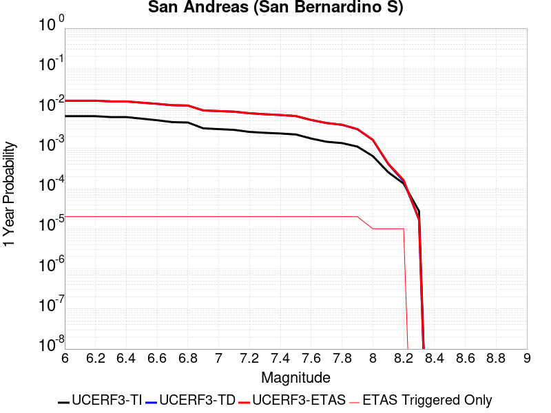 |  |

| Magnitude | 1 wk TI Prob | 1 wk TD Prob | 1 wk ETAS Prob | 1 wk ETAS/TD Gain | 1 wk ETAS Triggered Only | 1 mo TI Prob | 1 mo TD Prob | 1 mo ETAS Prob | 1 mo ETAS/TD Gain | 1 mo ETAS Triggered Only | 1 yr TI Prob | 1 yr TD Prob | 1 yr ETAS Prob | 1 yr ETAS/TD Gain | 1 yr ETAS Triggered Only | 10 yr TI Prob | 10 yr TD Prob | 10 yr ETAS Prob | 10 yr ETAS/TD Gain | 10 yr ETAS Triggered Only |
|-----|-----|-----|-----|-----|-----|-----|-----|-----|-----|-----|-----|-----|-----|-----|-----|-----|-----|-----|-----|-----|
| 6.0 | 1.2336002E-4 | 3.0078314E-4 | 3.0078314E-4 | 1.0 | 0.0 | 5.2857865E-4 | 0.0012884599 | 0.0012884599 | 1.0 | 0.0 | 0.006416472 | 0.015579138 | 0.015598826 | 1.0012637 | 2.0E-5 | 0.06234337 | 0.14296174 | 0.14298744 | 1.0001799 | 3.0E-5 |
| 6.1 | 1.2336002E-4 | 3.0078314E-4 | 3.0078314E-4 | 1.0 | 0.0 | 5.2857865E-4 | 0.0012884599 | 0.0012884599 | 1.0 | 0.0 | 0.006416472 | 0.015579138 | 0.015598826 | 1.0012637 | 2.0E-5 | 0.06234337 | 0.14296174 | 0.14298744 | 1.0001799 | 3.0E-5 |
| 6.2 | 1.2336002E-4 | 3.0078314E-4 | 3.0078314E-4 | 1.0 | 0.0 | 5.2857865E-4 | 0.0012884599 | 0.0012884599 | 1.0 | 0.0 | 0.006416472 | 0.015579138 | 0.015598826 | 1.0012637 | 2.0E-5 | 0.06234337 | 0.14296174 | 0.14298744 | 1.0001799 | 3.0E-5 |
| 6.3 | 1.1712257E-4 | 2.8865776E-4 | 2.8865776E-4 | 1.0 | 0.0 | 5.018573E-4 | 0.0012365439 | 0.0012365439 | 1.0 | 0.0 | 0.006093008 | 0.014955855 | 0.014975556 | 1.0013173 | 2.0E-5 | 0.059286322 | 0.13766426 | 0.13769013 | 1.0001879 | 3.0E-5 |
| 6.4 | 1.1712257E-4 | 2.8865776E-4 | 2.8865776E-4 | 1.0 | 0.0 | 5.018573E-4 | 0.0012365439 | 0.0012365439 | 1.0 | 0.0 | 0.006093008 | 0.014955855 | 0.014975556 | 1.0013173 | 2.0E-5 | 0.059286322 | 0.13766426 | 0.13769013 | 1.0001879 | 3.0E-5 |
| 6.5 | 1.0689076E-4 | 2.6877332E-4 | 2.6877332E-4 | 1.0 | 0.0 | 4.5802278E-4 | 0.001151402 | 0.001151402 | 1.0 | 0.0 | 0.0055621783 | 0.013932845 | 0.013952566 | 1.0014155 | 2.0E-5 | 0.05425003 | 0.12892844 | 0.12895457 | 1.0002027 | 3.0E-5 |
| 6.6 | 9.7648895E-5 | 2.5120768E-4 | 2.5120768E-4 | 1.0 | 0.0 | 4.1842813E-4 | 0.0010761837 | 0.0010761837 | 1.0 | 0.0 | 0.005082469 | 0.013028199 | 0.013047938 | 1.0015152 | 2.0E-5 | 0.049677886 | 0.12110118 | 0.121127546 | 1.0002177 | 3.0E-5 |
| 6.7 | 8.757013E-5 | 2.3190412E-4 | 2.3190412E-4 | 1.0 | 0.0 | 3.7524657E-4 | 9.935186E-4 | 9.935186E-4 | 1.0 | 0.0 | 0.00455906 | 0.012033098 | 0.012052857 | 1.0016421 | 2.0E-5 | 0.04466656 | 0.112379625 | 0.112406254 | 1.000237 | 3.0E-5 |
| 6.8 | 8.562978E-5 | 2.2749817E-4 | 2.2749817E-4 | 1.0 | 0.0 | 3.6693315E-4 | 9.746501E-4 | 9.746501E-4 | 1.0 | 0.0 | 0.004458263 | 0.011805879 | 0.0118256435 | 1.001674 | 2.0E-5 | 0.043698758 | 0.11038404 | 0.11041073 | 1.0002418 | 3.0E-5 |
| 6.9 | 6.124075E-5 | 1.7127262E-4 | 1.7127262E-4 | 1.0 | 0.0 | 2.6243398E-4 | 7.338199E-4 | 7.338199E-4 | 1.0 | 0.0 | 0.0031904527 | 0.008897867 | 0.008917688 | 1.0022278 | 2.0E-5 | 0.031450346 | 0.08444487 | 0.084472336 | 1.0003252 | 3.0E-5 |
| 7.0 | 5.8598747E-5 | 1.655565E-4 | 1.655565E-4 | 1.0 | 0.0 | 2.5111332E-4 | 7.093357E-4 | 7.093357E-4 | 1.0 | 0.0 | 0.0030530186 | 0.008602162 | 0.00862199 | 1.002305 | 2.0E-5 | 0.03011414 | 0.081756294 | 0.08178384 | 1.0003369 | 3.0E-5 |
| 7.1 | 5.613814E-5 | 1.5973621E-4 | 1.5973621E-4 | 1.0 | 0.0 | 2.4056983E-4 | 6.84405E-4 | 6.84405E-4 | 1.0 | 0.0 | 0.0029250039 | 0.008300977 | 0.00832081 | 1.0023893 | 2.0E-5 | 0.028868021 | 0.07905447 | 0.079082094 | 1.0003495 | 3.0E-5 |
| 7.2 | 4.991222E-5 | 1.4578617E-4 | 1.4578617E-4 | 1.0 | 0.0 | 2.1389198E-4 | 6.2464864E-4 | 6.2464864E-4 | 1.0 | 0.0 | 0.002601025 | 0.0075786817 | 0.00759853 | 1.002619 | 2.0E-5 | 0.025707912 | 0.07249507 | 0.07252289 | 1.0003839 | 3.0E-5 |
| 7.3 | 4.7410045E-5 | 1.3771489E-4 | 1.3771489E-4 | 1.0 | 0.0 | 2.0317009E-4 | 5.9007347E-4 | 5.9007347E-4 | 1.0 | 0.0 | 0.0024707897 | 0.0071605663 | 0.007180423 | 1.002773 | 2.0E-5 | 0.024434982 | 0.06878009 | 0.06880803 | 1.0004061 | 3.0E-5 |
| 7.4 | 4.5556746E-5 | 1.3178392E-4 | 1.3178392E-4 | 1.0 | 0.0 | 1.952286E-4 | 5.646663E-4 | 5.646663E-4 | 1.0 | 0.0 | 0.002374317 | 0.006853221 | 0.006873084 | 1.0028983 | 2.0E-5 | 0.023491086 | 0.06603161 | 0.066059634 | 1.0004244 | 3.0E-5 |
| 7.5 | 4.3084514E-5 | 1.2412538E-4 | 1.2412538E-4 | 1.0 | 0.0 | 1.8463485E-4 | 5.318578E-4 | 5.318578E-4 | 1.0 | 0.0 | 0.0022456115 | 0.006456215 | 0.0064760856 | 1.0030777 | 2.0E-5 | 0.022230545 | 0.062429707 | 0.062457833 | 1.0004505 | 3.0E-5 |
| 7.6 | 3.408608E-5 | 9.886329E-5 | 9.886329E-5 | 1.0 | 0.0 | 1.4607502E-4 | 4.2363114E-4 | 4.2363114E-4 | 1.0 | 0.0 | 0.0017770125 | 0.005145537 | 0.0051654344 | 1.0038669 | 2.0E-5 | 0.017628696 | 0.05024415 | 0.050272644 | 1.0005671 | 3.0E-5 |
| 7.7 | 2.8315713E-5 | 8.29644E-5 | 8.29644E-5 | 1.0 | 0.0 | 1.2134742E-4 | 3.555133E-4 | 3.555133E-4 | 1.0 | 0.0 | 0.0014764034 | 0.004319793 | 0.0043397066 | 1.0046098 | 2.0E-5 | 0.01466633 | 0.042483974 | 0.0425127 | 1.0006762 | 3.0E-5 |
| 7.8 | 2.6222975E-5 | 7.507742E-5 | 7.507742E-5 | 1.0 | 0.0 | 1.1237934E-4 | 3.217207E-4 | 3.217207E-4 | 1.0 | 0.0 | 0.0013673597 | 0.003909921 | 0.0039298427 | 1.0050952 | 2.0E-5 | 0.013589768 | 0.03863645 | 0.03866529 | 1.0007465 | 3.0E-5 |
| 7.9 | 2.1469694E-5 | 5.8251793E-5 | 5.8251793E-5 | 1.0 | 0.0 | 9.200973E-5 | 2.4962667E-4 | 2.4962667E-4 | 1.0 | 0.0 | 0.0011196428 | 0.0030349724 | 0.0030549115 | 1.0065699 | 2.0E-5 | 0.011140184 | 0.030321505 | 0.030350596 | 1.0009594 | 3.0E-5 |
| 8.0 | 1.2420249E-5 | 3.152857E-5 | 3.152857E-5 | 1.0 | 0.0 | 5.322855E-5 | 1.3511545E-4 | 1.3511545E-4 | 1.0 | 0.0 | 6.478649E-4 | 0.0016437903 | 0.001653774 | 1.0060735 | 1.0E-5 | 0.0064597935 | 0.01662063 | 0.016640298 | 1.0011833 | 2.0E-5 |
| 8.1 | 4.9197724E-6 | 7.901037E-6 | 7.901037E-6 | 1.0 | 0.0 | 2.1084568E-5 | 3.386115E-5 | 3.386115E-5 | 1.0 | 0.0 | 2.566744E-4 | 4.1218166E-4 | 4.2217752E-4 | 1.0242511 | 1.0E-5 | 0.002563781 | 0.0044241752 | 0.004434131 | 1.0022503 | 1.0E-5 |
| 8.2 | 2.5634774E-6 | 2.943124E-6 | 2.943124E-6 | 1.0 | 0.0 | 1.0986286E-5 | 1.2613327E-5 | 1.2613327E-5 | 1.0 | 0.0 | 1.3374983E-4 | 1.535565E-4 | 1.6355496E-4 | 1.0651126 | 1.0E-5 | 0.0013366934 | 0.0017241889 | 0.0017341716 | 1.0057899 | 1.0E-5 |
| 8.3 | 5.2850464E-7 | 3.257407E-7 | 3.257407E-7 | 1.0 | 0.0 | 2.2650179E-6 | 1.3960309E-6 | 1.3960309E-6 | 1.0 | 0.0 | 2.7576245E-5 | 1.6996557E-5 | 1.6996557E-5 | 1.0 | 0.0 | 2.7572823E-4 | 2.0148199E-4 | 2.0148199E-4 | 1.0 | 0.0 |

## Hunting Creek - Bartlett Springs connector 2011
*[(top)](#table-of-contents)*

| 1 Week | 1 Month | 1 Year | 10 Year |
|-----|-----|-----|-----|
| 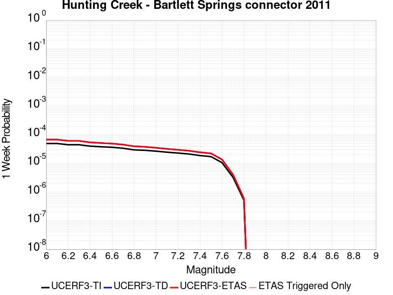 |  |  |  |

| Magnitude | 1 wk TI Prob | 1 wk TD Prob | 1 wk ETAS Prob | 1 wk ETAS/TD Gain | 1 wk ETAS Triggered Only | 1 mo TI Prob | 1 mo TD Prob | 1 mo ETAS Prob | 1 mo ETAS/TD Gain | 1 mo ETAS Triggered Only | 1 yr TI Prob | 1 yr TD Prob | 1 yr ETAS Prob | 1 yr ETAS/TD Gain | 1 yr ETAS Triggered Only | 10 yr TI Prob | 10 yr TD Prob | 10 yr ETAS Prob | 10 yr ETAS/TD Gain | 10 yr ETAS Triggered Only |
|-----|-----|-----|-----|-----|-----|-----|-----|-----|-----|-----|-----|-----|-----|-----|-----|-----|-----|-----|-----|-----|
| 6.0 | 4.940016E-5 | 6.791328E-5 | 6.791328E-5 | 1.0 | 0.0 | 2.1169778E-4 | 2.9102078E-4 | 2.9102078E-4 | 1.0 | 0.0 | 0.002574374 | 0.0035372714 | 0.003547236 | 1.002817 | 1.0E-5 | 0.025447546 | 0.034795366 | 0.034824323 | 1.0008322 | 3.0E-5 |
| 6.1 | 4.940016E-5 | 6.791328E-5 | 6.791328E-5 | 1.0 | 0.0 | 2.1169778E-4 | 2.9102078E-4 | 2.9102078E-4 | 1.0 | 0.0 | 0.002574374 | 0.0035372714 | 0.003547236 | 1.002817 | 1.0E-5 | 0.025447546 | 0.034795366 | 0.034824323 | 1.0008322 | 3.0E-5 |
| 6.2 | 4.472471E-5 | 6.1042876E-5 | 6.1042876E-5 | 1.0 | 0.0 | 1.9166325E-4 | 2.61585E-4 | 2.61585E-4 | 1.0 | 0.0 | 0.0023310026 | 0.0031800452 | 0.0031900136 | 1.0031346 | 1.0E-5 | 0.02306703 | 0.03133597 | 0.031355344 | 1.0006182 | 2.0E-5 |
| 6.3 | 4.472471E-5 | 6.1042876E-5 | 6.1042876E-5 | 1.0 | 0.0 | 1.9166325E-4 | 2.61585E-4 | 2.61585E-4 | 1.0 | 0.0 | 0.0023310026 | 0.0031800452 | 0.0031900136 | 1.0031346 | 1.0E-5 | 0.02306703 | 0.03133597 | 0.031355344 | 1.0006182 | 2.0E-5 |
| 6.4 | 4.0001003E-5 | 5.4136915E-5 | 5.4136915E-5 | 1.0 | 0.0 | 1.714216E-4 | 2.3199468E-4 | 2.3199468E-4 | 1.0 | 0.0 | 0.0020850603 | 0.002820826 | 0.0028307978 | 1.003535 | 1.0E-5 | 0.02065605 | 0.027844893 | 0.027864335 | 1.0006982 | 2.0E-5 |
| 6.5 | 3.8033053E-5 | 5.1296407E-5 | 5.1296407E-5 | 1.0 | 0.0 | 1.6298861E-4 | 2.1982315E-4 | 2.1982315E-4 | 1.0 | 0.0 | 0.0019825802 | 0.0026730346 | 0.0026830076 | 1.003731 | 1.0E-5 | 0.019649856 | 0.026405964 | 0.026425436 | 1.0007374 | 2.0E-5 |
| 6.6 | 3.653754E-5 | 4.915789E-5 | 4.915789E-5 | 1.0 | 0.0 | 1.5658008E-4 | 2.1065972E-4 | 2.1065972E-4 | 1.0 | 0.0 | 0.0019046954 | 0.0025617585 | 0.0025717327 | 1.0038936 | 1.0E-5 | 0.018884527 | 0.025321145 | 0.025340639 | 1.0007699 | 2.0E-5 |
| 6.7 | 3.372024E-5 | 4.516568E-5 | 4.516568E-5 | 1.0 | 0.0 | 1.4450731E-4 | 1.9355283E-4 | 1.9355283E-4 | 1.0 | 0.0 | 0.0017579567 | 0.0023539767 | 0.002363953 | 1.0042381 | 1.0E-5 | 0.017441148 | 0.023291433 | 0.023310967 | 1.0008386 | 2.0E-5 |
| 6.8 | 2.9650024E-5 | 3.9432685E-5 | 3.9432685E-5 | 1.0 | 0.0 | 1.2706534E-4 | 1.689861E-4 | 1.689861E-4 | 1.0 | 0.0 | 0.0015459227 | 0.0020554543 | 0.0020654337 | 1.0048552 | 1.0E-5 | 0.015352124 | 0.020362325 | 0.020381916 | 1.0009623 | 2.0E-5 |
| 6.9 | 2.860775E-5 | 3.783254E-5 | 3.783254E-5 | 1.0 | 0.0 | 1.2259888E-4 | 1.6212939E-4 | 1.6212939E-4 | 1.0 | 0.0 | 0.0014916194 | 0.0019721447 | 0.001982125 | 1.0050607 | 1.0E-5 | 0.014816469 | 0.019546246 | 0.019565856 | 1.0010033 | 2.0E-5 |
| 7.0 | 2.6696067E-5 | 3.5085584E-5 | 3.5085584E-5 | 1.0 | 0.0 | 1.144067E-4 | 1.5035819E-4 | 1.5035819E-4 | 1.0 | 0.0 | 0.0013920115 | 0.0018290823 | 0.0018290823 | 1.0 | 0.0 | 0.013833242 | 0.018140832 | 0.01815065 | 1.0005412 | 1.0E-5 |
| 7.1 | 2.456087E-5 | 3.203001E-5 | 3.203001E-5 | 1.0 | 0.0 | 1.0525662E-4 | 1.372643E-4 | 1.372643E-4 | 1.0 | 0.0 | 0.001280746 | 0.0016699209 | 0.0016699209 | 1.0 | 0.0 | 0.012733897 | 0.016575238 | 0.01658507 | 1.0005933 | 1.0E-5 |
| 7.2 | 2.295761E-5 | 2.9838806E-5 | 2.9838806E-5 | 1.0 | 0.0 | 9.8386045E-5 | 1.2787437E-4 | 1.2787437E-4 | 1.0 | 0.0 | 0.0011971919 | 0.001555768 | 0.001555768 | 1.0 | 0.0 | 0.011907627 | 0.015450446 | 0.015460292 | 1.0006372 | 1.0E-5 |
| 7.3 | 2.1256936E-5 | 2.7556767E-5 | 2.7556767E-5 | 1.0 | 0.0 | 9.109797E-5 | 1.1809514E-4 | 1.1809514E-4 | 1.0 | 0.0 | 0.0011085535 | 0.0014368688 | 0.0014368688 | 1.0 | 0.0 | 0.011030397 | 0.014277365 | 0.014277365 | 1.0 | 0.0 |
| 7.4 | 1.8784336E-5 | 2.4320007E-5 | 2.4320007E-5 | 1.0 | 0.0 | 8.050181E-5 | 1.0422448E-4 | 1.0422448E-4 | 1.0 | 0.0 | 9.796688E-4 | 0.001268202 | 0.001268202 | 1.0 | 0.0 | 0.009753612 | 0.012610929 | 0.012610929 | 1.0 | 0.0 |
| 7.5 | 1.7248298E-5 | 2.2280889E-5 | 2.2280889E-5 | 1.0 | 0.0 | 7.391918E-5 | 9.548607E-5 | 9.548607E-5 | 1.0 | 0.0 | 8.9959445E-4 | 0.0011619304 | 0.0011619304 | 1.0 | 0.0 | 0.008959615 | 0.011559745 | 0.011559745 | 1.0 | 0.0 |
| 7.6 | 1.0653709E-5 | 1.3729825E-5 | 1.3729825E-5 | 1.0 | 0.0 | 4.5657955E-5 | 5.8840793E-5 | 5.8840793E-5 | 1.0 | 0.0 | 5.557438E-4 | 7.161539E-4 | 7.161539E-4 | 1.0 | 0.0 | 0.0055435603 | 0.0071390215 | 0.0071390215 | 1.0 | 0.0 |
| 7.7 | 3.286316E-6 | 4.092013E-6 | 4.092013E-6 | 1.0 | 0.0 | 1.4084137E-5 | 1.753708E-5 | 1.753708E-5 | 1.0 | 0.0 | 1.7146087E-4 | 2.134932E-4 | 2.134932E-4 | 1.0 | 0.0 | 0.0017132863 | 0.0021329257 | 0.0021329257 | 1.0 | 0.0 |
| 7.8 | 5.1855085E-7 | 5.9736544E-7 | 5.9736544E-7 | 1.0 | 0.0 | 2.222359E-6 | 2.5601353E-6 | 2.5601353E-6 | 1.0 | 0.0 | 2.7056883E-5 | 3.116921E-5 | 3.116921E-5 | 1.0 | 0.0 | 2.705359E-4 | 3.1164222E-4 | 3.1164222E-4 | 1.0 | 0.0 |

## Hosgri
*[(top)](#table-of-contents)*

| 1 Week | 1 Month | 1 Year | 10 Year |
|-----|-----|-----|-----|
|  |  |  |  |

| Magnitude | 1 wk TI Prob | 1 wk TD Prob | 1 wk ETAS Prob | 1 wk ETAS/TD Gain | 1 wk ETAS Triggered Only | 1 mo TI Prob | 1 mo TD Prob | 1 mo ETAS Prob | 1 mo ETAS/TD Gain | 1 mo ETAS Triggered Only | 1 yr TI Prob | 1 yr TD Prob | 1 yr ETAS Prob | 1 yr ETAS/TD Gain | 1 yr ETAS Triggered Only | 10 yr TI Prob | 10 yr TD Prob | 10 yr ETAS Prob | 10 yr ETAS/TD Gain | 10 yr ETAS Triggered Only |
|-----|-----|-----|-----|-----|-----|-----|-----|-----|-----|-----|-----|-----|-----|-----|-----|-----|-----|-----|-----|-----|
| 6.0 | 2.883978E-5 | 2.9134455E-5 | 2.9134455E-5 | 1.0 | 0.0 | 1.235932E-4 | 1.2485613E-4 | 1.2485613E-4 | 1.0 | 0.0 | 0.0015037085 | 0.0015190906 | 0.0015190906 | 1.0 | 0.0 | 0.01493574 | 0.015090848 | 0.015110547 | 1.0013053 | 2.0E-5 |
| 6.1 | 2.883978E-5 | 2.9134455E-5 | 2.9134455E-5 | 1.0 | 0.0 | 1.235932E-4 | 1.2485613E-4 | 1.2485613E-4 | 1.0 | 0.0 | 0.0015037085 | 0.0015190906 | 0.0015190906 | 1.0 | 0.0 | 0.01493574 | 0.015090848 | 0.015110547 | 1.0013053 | 2.0E-5 |
| 6.2 | 2.883978E-5 | 2.9134455E-5 | 2.9134455E-5 | 1.0 | 0.0 | 1.235932E-4 | 1.2485613E-4 | 1.2485613E-4 | 1.0 | 0.0 | 0.0015037085 | 0.0015190906 | 0.0015190906 | 1.0 | 0.0 | 0.01493574 | 0.015090848 | 0.015110547 | 1.0013053 | 2.0E-5 |
| 6.3 | 2.2914428E-5 | 2.264682E-5 | 2.264682E-5 | 1.0 | 0.0 | 9.8200995E-5 | 9.705422E-5 | 9.705422E-5 | 1.0 | 0.0 | 0.0011949413 | 0.0011809996 | 0.0011809996 | 1.0 | 0.0 | 0.011885363 | 0.011748639 | 0.011768404 | 1.0016823 | 2.0E-5 |
| 6.4 | 2.0195741E-5 | 1.9700938E-5 | 1.9700938E-5 | 1.0 | 0.0 | 8.65503E-5 | 8.442986E-5 | 8.442986E-5 | 1.0 | 0.0 | 0.0010532405 | 0.0010274509 | 0.0010274509 | 1.0 | 0.0 | 0.010482626 | 0.010228057 | 0.010247853 | 1.0019354 | 2.0E-5 |
| 6.5 | 1.9924333E-5 | 1.9413323E-5 | 1.9413323E-5 | 1.0 | 0.0 | 8.53872E-5 | 8.3197316E-5 | 8.3197316E-5 | 1.0 | 0.0 | 0.0010390934 | 0.0010124585 | 0.0010124585 | 1.0 | 0.0 | 0.010342481 | 0.0100795 | 0.010099298 | 1.0019642 | 2.0E-5 |
| 6.6 | 1.809694E-5 | 1.7462373E-5 | 1.7462373E-5 | 1.0 | 0.0 | 7.7556004E-5 | 7.48366E-5 | 7.48366E-5 | 1.0 | 0.0 | 9.438353E-4 | 9.10756E-4 | 9.10756E-4 | 1.0 | 0.0 | 0.009398366 | 0.009071182 | 0.009091001 | 1.0021847 | 2.0E-5 |
| 6.7 | 1.675989E-5 | 1.6046652E-5 | 1.6046652E-5 | 1.0 | 0.0 | 7.182612E-5 | 6.876956E-5 | 6.876956E-5 | 1.0 | 0.0 | 8.7413215E-4 | 8.369489E-4 | 8.369489E-4 | 1.0 | 0.0 | 0.008707017 | 0.008338879 | 0.008358712 | 1.0023783 | 2.0E-5 |
| 6.8 | 1.5401129E-5 | 1.4617788E-5 | 1.4617788E-5 | 1.0 | 0.0 | 6.6003166E-5 | 6.264616E-5 | 6.264616E-5 | 1.0 | 0.0 | 8.032922E-4 | 7.62451E-4 | 7.62451E-4 | 1.0 | 0.0 | 0.008003947 | 0.007599219 | 0.007619067 | 1.0026119 | 2.0E-5 |
| 6.9 | 1.356559E-5 | 1.2693429E-5 | 1.2693429E-5 | 1.0 | 0.0 | 5.8136946E-5 | 5.439928E-5 | 5.439928E-5 | 1.0 | 0.0 | 7.0758746E-4 | 6.621104E-4 | 6.621104E-4 | 1.0 | 0.0 | 0.007053386 | 0.0066021862 | 0.0066220546 | 1.0030093 | 2.0E-5 |
| 7.0 | 1.2030819E-5 | 1.109923E-5 | 1.109923E-5 | 1.0 | 0.0 | 5.155963E-5 | 4.756726E-5 | 4.756726E-5 | 1.0 | 0.0 | 6.275577E-4 | 5.789776E-4 | 5.789776E-4 | 1.0 | 0.0 | 0.006257884 | 0.005775457 | 0.005795341 | 1.0034429 | 2.0E-5 |
| 7.1 | 1.0972698E-5 | 1.0025332E-5 | 1.0025332E-5 | 1.0 | 0.0 | 4.7025E-5 | 4.2965E-5 | 4.2965E-5 | 1.0 | 0.0 | 5.72379E-4 | 5.229734E-4 | 5.229734E-4 | 1.0 | 0.0 | 0.0057090693 | 0.005218183 | 0.0052380785 | 1.0038128 | 2.0E-5 |
| 7.2 | 9.961926E-6 | 9.037799E-6 | 9.037799E-6 | 1.0 | 0.0 | 4.2693267E-5 | 3.873285E-5 | 3.873285E-5 | 1.0 | 0.0 | 5.1966653E-4 | 4.7147047E-4 | 4.7147047E-4 | 1.0 | 0.0 | 0.00518453 | 0.0047054524 | 0.0047253584 | 1.0042304 | 2.0E-5 |
| 7.3 | 8.700929E-6 | 7.8310395E-6 | 7.8310395E-6 | 1.0 | 0.0 | 3.7289166E-5 | 3.356117E-5 | 3.356117E-5 | 1.0 | 0.0 | 4.53901E-4 | 4.0853064E-4 | 4.0853064E-4 | 1.0 | 0.0 | 0.00452975 | 0.00407854 | 0.004098458 | 1.0048838 | 2.0E-5 |
| 7.4 | 7.866285E-6 | 7.0015717E-6 | 7.0015717E-6 | 1.0 | 0.0 | 3.3712215E-5 | 3.0006391E-5 | 3.0006391E-5 | 1.0 | 0.0 | 4.103689E-4 | 3.652666E-4 | 3.652666E-4 | 1.0 | 0.0 | 0.004096119 | 0.0036474036 | 0.0036673306 | 1.0054634 | 2.0E-5 |
| 7.5 | 6.8381305E-6 | 5.962434E-6 | 5.962434E-6 | 1.0 | 0.0 | 2.9305946E-5 | 2.5553038E-5 | 2.5553038E-5 | 1.0 | 0.0 | 3.5674145E-4 | 3.1106384E-4 | 3.1106384E-4 | 1.0 | 0.0 | 0.0035616932 | 0.0031070234 | 0.0031269612 | 1.006417 | 2.0E-5 |
| 7.6 | 5.503376E-6 | 4.5978554E-6 | 4.5978554E-6 | 1.0 | 0.0 | 2.3585684E-5 | 1.9704947E-5 | 1.9704947E-5 | 1.0 | 0.0 | 2.8711787E-4 | 2.3988134E-4 | 2.3988134E-4 | 1.0 | 0.0 | 0.002867472 | 0.002396961 | 0.002406937 | 1.004162 | 1.0E-5 |
| 7.7 | 3.6144982E-6 | 2.6545886E-6 | 2.6545886E-6 | 1.0 | 0.0 | 1.5490614E-5 | 1.1376758E-5 | 1.1376758E-5 | 1.0 | 0.0 | 1.8858191E-4 | 1.3850324E-4 | 1.3850324E-4 | 1.0 | 0.0 | 0.0018842196 | 0.0013849044 | 0.0013948905 | 1.0072107 | 1.0E-5 |
| 7.8 | 1.9853494E-6 | 1.1380818E-6 | 1.1380818E-6 | 1.0 | 0.0 | 8.508612E-6 | 4.8774837E-6 | 4.8774837E-6 | 1.0 | 0.0 | 1.0358743E-4 | 5.938175E-5 | 5.938175E-5 | 1.0 | 0.0 | 0.0010353916 | 5.943927E-4 | 6.043868E-4 | 1.0168139 | 1.0E-5 |
| 7.9 | 1.1818757E-6 | 5.3104844E-7 | 5.3104844E-7 | 1.0 | 0.0 | 5.0651715E-6 | 2.27592E-6 | 2.27592E-6 | 1.0 | 0.0 | 6.1666724E-5 | 2.7708973E-5 | 2.7708973E-5 | 1.0 | 0.0 | 6.1649614E-4 | 2.777518E-4 | 2.8774902E-4 | 1.0359933 | 1.0E-5 |
| 8.0 | 6.962958E-7 | 2.724504E-7 | 2.724504E-7 | 1.0 | 0.0 | 2.9841215E-6 | 1.167644E-6 | 1.167644E-6 | 1.0 | 0.0 | 3.6331072E-5 | 1.4215973E-5 | 1.4215973E-5 | 1.0 | 0.0 | 3.6325134E-4 | 1.4272005E-4 | 1.4272005E-4 | 1.0 | 0.0 |
| 8.1 | 1.5033264E-7 | 6.549686E-8 | 6.549686E-8 | 1.0 | 0.0 | 6.442826E-7 | 2.8070082E-7 | 2.8070082E-7 | 1.0 | 0.0 | 7.844113E-6 | 3.417527E-6 | 3.417527E-6 | 1.0 | 0.0 | 7.843835E-5 | 3.419461E-5 | 3.419461E-5 | 1.0 | 0.0 |

## San Andreas (San Gorgonio Pass-Garnet HIll)
*[(top)](#table-of-contents)*

| 1 Week | 1 Month | 1 Year | 10 Year |
|-----|-----|-----|-----|
|  | 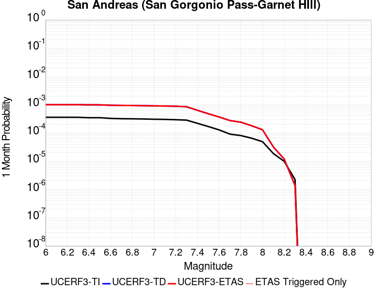 |  |  |

| Magnitude | 1 wk TI Prob | 1 wk TD Prob | 1 wk ETAS Prob | 1 wk ETAS/TD Gain | 1 wk ETAS Triggered Only | 1 mo TI Prob | 1 mo TD Prob | 1 mo ETAS Prob | 1 mo ETAS/TD Gain | 1 mo ETAS Triggered Only | 1 yr TI Prob | 1 yr TD Prob | 1 yr ETAS Prob | 1 yr ETAS/TD Gain | 1 yr ETAS Triggered Only | 10 yr TI Prob | 10 yr TD Prob | 10 yr ETAS Prob | 10 yr ETAS/TD Gain | 10 yr ETAS Triggered Only |
|-----|-----|-----|-----|-----|-----|-----|-----|-----|-----|-----|-----|-----|-----|-----|-----|-----|-----|-----|-----|-----|
| 6.0 | 8.31567E-5 | 2.3442265E-4 | 2.3442265E-4 | 1.0 | 0.0 | 3.5633717E-4 | 0.0010042794 | 0.0010042794 | 1.0 | 0.0 | 0.004329778 | 0.012158454 | 0.0121782115 | 1.001625 | 2.0E-5 | 0.042463828 | 0.11282446 | 0.11284221 | 1.0001572 | 2.0E-5 |
| 6.1 | 8.31567E-5 | 2.3442265E-4 | 2.3442265E-4 | 1.0 | 0.0 | 3.5633717E-4 | 0.0010042794 | 0.0010042794 | 1.0 | 0.0 | 0.004329778 | 0.012158454 | 0.0121782115 | 1.001625 | 2.0E-5 | 0.042463828 | 0.11282446 | 0.11284221 | 1.0001572 | 2.0E-5 |
| 6.2 | 8.31567E-5 | 2.3442265E-4 | 2.3442265E-4 | 1.0 | 0.0 | 3.5633717E-4 | 0.0010042794 | 0.0010042794 | 1.0 | 0.0 | 0.004329778 | 0.012158454 | 0.0121782115 | 1.001625 | 2.0E-5 | 0.042463828 | 0.11282446 | 0.11284221 | 1.0001572 | 2.0E-5 |
| 6.3 | 8.31567E-5 | 2.3442265E-4 | 2.3442265E-4 | 1.0 | 0.0 | 3.5633717E-4 | 0.0010042794 | 0.0010042794 | 1.0 | 0.0 | 0.004329778 | 0.012158454 | 0.0121782115 | 1.001625 | 2.0E-5 | 0.042463828 | 0.11282446 | 0.11284221 | 1.0001572 | 2.0E-5 |
| 6.4 | 8.059055E-5 | 2.2999418E-4 | 2.2999418E-4 | 1.0 | 0.0 | 3.4534236E-4 | 9.853188E-4 | 9.853188E-4 | 1.0 | 0.0 | 0.0041964394 | 0.011930486 | 0.011950247 | 1.0016564 | 2.0E-5 | 0.041180745 | 0.11080468 | 0.11082246 | 1.0001605 | 2.0E-5 |
| 6.5 | 8.059055E-5 | 2.2999418E-4 | 2.2999418E-4 | 1.0 | 0.0 | 3.4534236E-4 | 9.853188E-4 | 9.853188E-4 | 1.0 | 0.0 | 0.0041964394 | 0.011930486 | 0.011950247 | 1.0016564 | 2.0E-5 | 0.041180745 | 0.11080468 | 0.11082246 | 1.0001605 | 2.0E-5 |
| 6.6 | 7.619237E-5 | 2.2243494E-4 | 2.2243494E-4 | 1.0 | 0.0 | 3.2649786E-4 | 9.529466E-4 | 9.529466E-4 | 1.0 | 0.0 | 0.0039678677 | 0.011540954 | 0.011560723 | 1.0017129 | 2.0E-5 | 0.03897764 | 0.107340075 | 0.10735793 | 1.0001663 | 2.0E-5 |
| 6.7 | 7.440636E-5 | 2.191918E-4 | 2.191918E-4 | 1.0 | 0.0 | 3.188454E-4 | 9.3905756E-4 | 9.3905756E-4 | 1.0 | 0.0 | 0.0038750346 | 0.011373628 | 0.011393401 | 1.0017384 | 2.0E-5 | 0.038081564 | 0.10584821 | 0.1058661 | 1.0001689 | 2.0E-5 |
| 6.8 | 7.3735864E-5 | 2.1766272E-4 | 2.1766272E-4 | 1.0 | 0.0 | 3.1597257E-4 | 9.32509E-4 | 9.32509E-4 | 1.0 | 0.0 | 0.0038401815 | 0.011294731 | 0.011314506 | 1.0017507 | 2.0E-5 | 0.03774495 | 0.1051495 | 0.1051674 | 1.0001702 | 2.0E-5 |
| 6.9 | 7.27575E-5 | 2.1535151E-4 | 2.1535151E-4 | 1.0 | 0.0 | 3.117806E-4 | 9.226108E-4 | 9.226108E-4 | 1.0 | 0.0 | 0.003789323 | 0.011175464 | 0.011195241 | 1.0017697 | 2.0E-5 | 0.037253562 | 0.10409731 | 0.104115225 | 1.0001721 | 2.0E-5 |
| 7.0 | 7.102591E-5 | 2.111894E-4 | 2.111894E-4 | 1.0 | 0.0 | 3.0436125E-4 | 9.047857E-4 | 9.047857E-4 | 1.0 | 0.0 | 0.003699303 | 0.010960644 | 0.0109804245 | 1.0018047 | 2.0E-5 | 0.03638325 | 0.10219848 | 0.10221644 | 1.0001757 | 2.0E-5 |
| 7.1 | 7.028513E-5 | 2.0954468E-4 | 2.0954468E-4 | 1.0 | 0.0 | 3.0118722E-4 | 8.977418E-4 | 8.977418E-4 | 1.0 | 0.0 | 0.0036607897 | 0.010875745 | 0.010895527 | 1.0018189 | 2.0E-5 | 0.036010686 | 0.10144131 | 0.10145928 | 1.0001771 | 2.0E-5 |
| 7.2 | 6.8498244E-5 | 2.0562056E-4 | 2.0562056E-4 | 1.0 | 0.0 | 2.9353087E-4 | 8.809356E-4 | 8.809356E-4 | 1.0 | 0.0 | 0.003567883 | 0.010673149 | 0.010692935 | 1.0018538 | 2.0E-5 | 0.035111405 | 0.099632524 | 0.099650525 | 1.0001807 | 2.0E-5 |
| 7.3 | 6.622592E-5 | 1.9788598E-4 | 1.9788598E-4 | 1.0 | 0.0 | 2.8379448E-4 | 8.478093E-4 | 8.478093E-4 | 1.0 | 0.0 | 0.0034497243 | 0.010273709 | 0.010293503 | 1.0019267 | 2.0E-5 | 0.033966612 | 0.096126504 | 0.09614459 | 1.0001881 | 2.0E-5 |
| 7.4 | 5.1050705E-5 | 1.4737909E-4 | 1.4737909E-4 | 1.0 | 0.0 | 2.1877038E-4 | 6.314727E-4 | 6.314727E-4 | 1.0 | 0.0 | 0.002660276 | 0.007661272 | 0.007681119 | 1.0025905 | 2.0E-5 | 0.02628654 | 0.07307384 | 0.07309238 | 1.0002537 | 2.0E-5 |
| 7.5 | 3.9302922E-5 | 1.1172402E-4 | 1.1172402E-4 | 1.0 | 0.0 | 1.6843023E-4 | 4.7872966E-4 | 4.7872966E-4 | 1.0 | 0.0 | 0.0020487092 | 0.005813027 | 0.0058329105 | 1.0034206 | 2.0E-5 | 0.020299247 | 0.056197945 | 0.05621682 | 1.0003359 | 2.0E-5 |
| 7.6 | 2.9851626E-5 | 8.532898E-5 | 8.532898E-5 | 1.0 | 0.0 | 1.2792926E-4 | 3.6564452E-4 | 3.6564452E-4 | 1.0 | 0.0 | 0.0015564259 | 0.0044426606 | 0.004462572 | 1.0044818 | 2.0E-5 | 0.0154556995 | 0.043363757 | 0.04338289 | 1.0004412 | 2.0E-5 |
| 7.7 | 2.1135214E-5 | 6.38665E-5 | 6.38665E-5 | 1.0 | 0.0 | 9.0576345E-5 | 2.7368488E-4 | 2.7368488E-4 | 1.0 | 0.0 | 0.0011022091 | 0.0033270277 | 0.003346961 | 1.0059913 | 2.0E-5 | 0.010967582 | 0.032735404 | 0.03275475 | 1.0005909 | 2.0E-5 |
| 7.8 | 1.883379E-5 | 5.594973E-5 | 5.594973E-5 | 1.0 | 0.0 | 8.0713755E-5 | 2.3976255E-4 | 2.3976255E-4 | 1.0 | 0.0 | 9.822468E-4 | 0.0029152047 | 0.0029351464 | 1.0068406 | 2.0E-5 | 0.0097791655 | 0.028836189 | 0.028855613 | 1.0006735 | 2.0E-5 |
| 7.9 | 1.5156185E-5 | 4.1913132E-5 | 4.1913132E-5 | 1.0 | 0.0 | 6.495346E-5 | 1.7961535E-4 | 1.7961535E-4 | 1.0 | 0.0 | 7.9052144E-4 | 0.002184625 | 0.0022045814 | 1.0091349 | 2.0E-5 | 0.007877152 | 0.021877227 | 0.021896789 | 1.0008942 | 2.0E-5 |
| 8.0 | 1.1405907E-5 | 3.0167012E-5 | 3.0167012E-5 | 1.0 | 0.0 | 4.8881542E-5 | 1.2928079E-4 | 1.2928079E-4 | 1.0 | 0.0 | 5.9497025E-4 | 0.0015728582 | 0.0015828426 | 1.0063479 | 1.0E-5 | 0.005933798 | 0.015862875 | 0.015872715 | 1.0006204 | 1.0E-5 |
| 8.1 | 4.3511436E-6 | 7.4406876E-6 | 7.4406876E-6 | 1.0 | 0.0 | 1.8647626E-5 | 3.1888274E-5 | 3.1888274E-5 | 1.0 | 0.0 | 2.2701119E-4 | 3.8817068E-4 | 3.981668E-4 | 1.0257518 | 1.0E-5 | 0.0022677942 | 0.004152225 | 0.004162183 | 1.0023984 | 1.0E-5 |
| 8.2 | 2.3042528E-6 | 2.7662643E-6 | 2.7662643E-6 | 1.0 | 0.0 | 9.875332E-6 | 1.1855365E-5 | 1.1855365E-5 | 1.0 | 0.0 | 1.2022553E-4 | 1.4432956E-4 | 1.5432811E-4 | 1.0692759 | 1.0E-5 | 0.0012016051 | 0.001615473 | 0.0016254568 | 1.0061802 | 1.0E-5 |
| 8.3 | 5.202968E-7 | 3.2076272E-7 | 3.2076272E-7 | 1.0 | 0.0 | 2.2298414E-6 | 1.3746967E-6 | 1.3746967E-6 | 1.0 | 0.0 | 2.714798E-5 | 1.6736816E-5 | 1.6736816E-5 | 1.0 | 0.0 | 2.7144665E-4 | 1.9837209E-4 | 1.9837209E-4 | 1.0 | 0.0 |

## Rinconada 2011 CFM
*[(top)](#table-of-contents)*

| 1 Week | 1 Month | 1 Year | 10 Year |
|-----|-----|-----|-----|
|  |  |  |  |

| Magnitude | 1 wk TI Prob | 1 wk TD Prob | 1 wk ETAS Prob | 1 wk ETAS/TD Gain | 1 wk ETAS Triggered Only | 1 mo TI Prob | 1 mo TD Prob | 1 mo ETAS Prob | 1 mo ETAS/TD Gain | 1 mo ETAS Triggered Only | 1 yr TI Prob | 1 yr TD Prob | 1 yr ETAS Prob | 1 yr ETAS/TD Gain | 1 yr ETAS Triggered Only | 10 yr TI Prob | 10 yr TD Prob | 10 yr ETAS Prob | 10 yr ETAS/TD Gain | 10 yr ETAS Triggered Only |
|-----|-----|-----|-----|-----|-----|-----|-----|-----|-----|-----|-----|-----|-----|-----|-----|-----|-----|-----|-----|-----|
| 6.0 | 1.5752368E-5 | 1.627576E-5 | 1.627576E-5 | 1.0 | 0.0 | 6.75084E-5 | 6.975141E-5 | 6.975141E-5 | 1.0 | 0.0 | 8.2160486E-4 | 8.488957E-4 | 8.488957E-4 | 1.0 | 0.0 | 0.008185739 | 0.008456911 | 0.008476742 | 1.002345 | 2.0E-5 |
| 6.1 | 1.0966133E-5 | 1.1323744E-5 | 1.1323744E-5 | 1.0 | 0.0 | 4.6996865E-5 | 4.8529433E-5 | 4.8529433E-5 | 1.0 | 0.0 | 5.720366E-4 | 5.906864E-4 | 5.906864E-4 | 1.0 | 0.0 | 0.0057056635 | 0.0058912598 | 0.0058912598 | 1.0 | 0.0 |
| 6.2 | 1.0966133E-5 | 1.1323744E-5 | 1.1323744E-5 | 1.0 | 0.0 | 4.6996865E-5 | 4.8529433E-5 | 4.8529433E-5 | 1.0 | 0.0 | 5.720366E-4 | 5.906864E-4 | 5.906864E-4 | 1.0 | 0.0 | 0.0057056635 | 0.0058912598 | 0.0058912598 | 1.0 | 0.0 |
| 6.3 | 8.926149E-6 | 9.213347E-6 | 9.213347E-6 | 1.0 | 0.0 | 3.8254362E-5 | 3.9485174E-5 | 3.9485174E-5 | 1.0 | 0.0 | 4.6564735E-4 | 4.8062627E-4 | 4.8062627E-4 | 1.0 | 0.0 | 0.0046467283 | 0.004795913 | 0.004795913 | 1.0 | 0.0 |
| 6.4 | 7.676955E-6 | 7.920679E-6 | 7.920679E-6 | 1.0 | 0.0 | 3.290082E-5 | 3.394533E-5 | 3.394533E-5 | 1.0 | 0.0 | 4.0049385E-4 | 4.1320617E-4 | 4.1320617E-4 | 1.0 | 0.0 | 0.0039977287 | 0.004124405 | 0.004124405 | 1.0 | 0.0 |
| 6.5 | 6.1671026E-6 | 6.3593407E-6 | 6.3593407E-6 | 1.0 | 0.0 | 2.6430173E-5 | 2.7254033E-5 | 2.7254033E-5 | 1.0 | 0.0 | 3.2173982E-4 | 3.317674E-4 | 3.317674E-4 | 1.0 | 0.0 | 0.003212744 | 0.0033127333 | 0.0033127333 | 1.0 | 0.0 |
| 6.6 | 5.553456E-6 | 5.7251577E-6 | 5.7251577E-6 | 1.0 | 0.0 | 2.3800309E-5 | 2.4536159E-5 | 2.4536159E-5 | 1.0 | 0.0 | 2.897302E-4 | 2.9868685E-4 | 2.9868685E-4 | 1.0 | 0.0 | 0.0028935277 | 0.0029828628 | 0.0029828628 | 1.0 | 0.0 |
| 6.7 | 4.787857E-6 | 4.933603E-6 | 4.933603E-6 | 1.0 | 0.0 | 2.0519226E-5 | 2.1143842E-5 | 2.1143842E-5 | 1.0 | 0.0 | 2.4979294E-4 | 2.573959E-4 | 2.573959E-4 | 1.0 | 0.0 | 0.0024951235 | 0.0025709835 | 0.0025709835 | 1.0 | 0.0 |
| 6.8 | 3.9955166E-6 | 4.1137146E-6 | 4.1137146E-6 | 1.0 | 0.0 | 1.7123532E-5 | 1.7630087E-5 | 1.7630087E-5 | 1.0 | 0.0 | 2.0845905E-4 | 2.1462518E-4 | 2.1462518E-4 | 1.0 | 0.0 | 0.002082636 | 0.0021441826 | 0.0021441826 | 1.0 | 0.0 |
| 6.9 | 3.4250072E-6 | 3.5226437E-6 | 3.5226437E-6 | 1.0 | 0.0 | 1.46785205E-5 | 1.5096957E-5 | 1.5096957E-5 | 1.0 | 0.0 | 1.7869633E-4 | 1.8378998E-4 | 1.8378998E-4 | 1.0 | 0.0 | 0.001785527 | 0.0018363822 | 0.0018363822 | 1.0 | 0.0 |
| 7.0 | 2.7712713E-6 | 2.8468535E-6 | 2.8468535E-6 | 1.0 | 0.0 | 1.1876823E-5 | 1.2200743E-5 | 1.2200743E-5 | 1.0 | 0.0 | 1.4459073E-4 | 1.4853393E-4 | 1.4853393E-4 | 1.0 | 0.0 | 0.0014449668 | 0.0014843482 | 0.0014843482 | 1.0 | 0.0 |
| 7.1 | 2.227358E-6 | 2.2858178E-6 | 2.2858178E-6 | 1.0 | 0.0 | 9.545785E-6 | 9.796326E-6 | 9.796326E-6 | 1.0 | 0.0 | 1.16213734E-4 | 1.1926374E-4 | 1.1926374E-4 | 1.0 | 0.0 | 0.0011615298 | 0.0011919985 | 0.0011919985 | 1.0 | 0.0 |
| 7.2 | 1.581796E-6 | 1.6209823E-6 | 1.6209823E-6 | 1.0 | 0.0 | 6.779108E-6 | 6.9470484E-6 | 6.9470484E-6 | 1.0 | 0.0 | 8.253252E-5 | 8.4577034E-5 | 8.4577034E-5 | 1.0 | 0.0 | 8.250187E-4 | 8.4544905E-4 | 8.4544905E-4 | 1.0 | 0.0 |
| 7.3 | 1.0306567E-6 | 1.0546988E-6 | 1.0546988E-6 | 1.0 | 0.0 | 4.4170924E-6 | 4.52013E-6 | 4.52013E-6 | 1.0 | 0.0 | 5.3776774E-5 | 5.5031192E-5 | 5.5031192E-5 | 1.0 | 0.0 | 5.376376E-4 | 5.501759E-4 | 5.501759E-4 | 1.0 | 0.0 |
| 7.4 | 6.535541E-7 | 6.6830694E-7 | 6.6830694E-7 | 1.0 | 0.0 | 2.800943E-6 | 2.8641696E-6 | 2.8641696E-6 | 1.0 | 0.0 | 3.4100947E-5 | 3.4870707E-5 | 3.4870707E-5 | 1.0 | 0.0 | 3.4095717E-4 | 3.4865248E-4 | 3.4865248E-4 | 1.0 | 0.0 |
| 7.5 | 3.2656962E-7 | 3.3318358E-7 | 3.3318358E-7 | 1.0 | 0.0 | 1.3995833E-6 | 1.4279287E-6 | 1.4279287E-6 | 1.0 | 0.0 | 1.7039794E-5 | 1.7384895E-5 | 1.7384895E-5 | 1.0 | 0.0 | 1.7038487E-4 | 1.7383539E-4 | 1.7383539E-4 | 1.0 | 0.0 |
| 7.6 | 9.754343E-8 | 9.821485E-8 | 9.821485E-8 | 1.0 | 0.0 | 4.180432E-7 | 4.209207E-7 | 4.209207E-7 | 1.0 | 0.0 | 5.089664E-6 | 5.1246975E-6 | 5.1246975E-6 | 1.0 | 0.0 | 5.0895473E-5 | 5.1245803E-5 | 5.1245803E-5 | 1.0 | 0.0 |
| 7.7 | 6.0001453E-9 | 5.8494627E-9 | 5.8494627E-9 | 1.0 | 0.0 | 2.5714908E-8 | 2.5069127E-8 | 2.5069127E-8 | 1.0 | 0.0 | 3.1307894E-7 | 3.0521656E-7 | 3.0521656E-7 | 1.0 | 0.0 | 3.1307852E-6 | 3.0521617E-6 | 3.0521617E-6 | 1.0 | 0.0 |
| 7.8 | 7.400003E-11 | 7.4655726E-11 | 7.4655726E-11 | 1.0 | 0.0 | 3.171432E-10 | 3.1995318E-10 | 3.1995318E-10 | 1.0 | 0.0 | 3.861218E-9 | 3.8954298E-9 | 3.8954298E-9 | 1.0 | 0.0 | 3.861218E-8 | 3.8954294E-8 | 3.8954294E-8 | 1.0 | 0.0 |

## Butano 2011 CFM
*[(top)](#table-of-contents)*

| 1 Week | 1 Month | 1 Year | 10 Year |
|-----|-----|-----|-----|
|  | 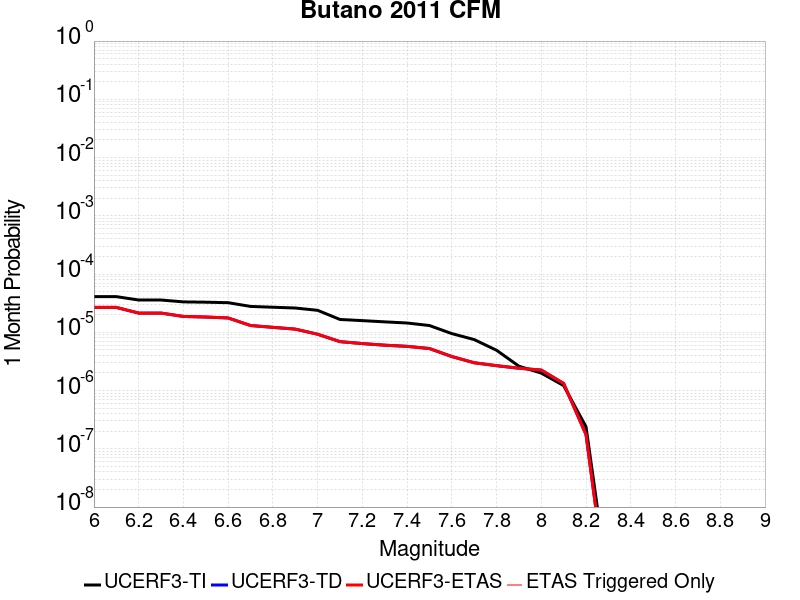 |  |  |

| Magnitude | 1 wk TI Prob | 1 wk TD Prob | 1 wk ETAS Prob | 1 wk ETAS/TD Gain | 1 wk ETAS Triggered Only | 1 mo TI Prob | 1 mo TD Prob | 1 mo ETAS Prob | 1 mo ETAS/TD Gain | 1 mo ETAS Triggered Only | 1 yr TI Prob | 1 yr TD Prob | 1 yr ETAS Prob | 1 yr ETAS/TD Gain | 1 yr ETAS Triggered Only | 10 yr TI Prob | 10 yr TD Prob | 10 yr ETAS Prob | 10 yr ETAS/TD Gain | 10 yr ETAS Triggered Only |
|-----|-----|-----|-----|-----|-----|-----|-----|-----|-----|-----|-----|-----|-----|-----|-----|-----|-----|-----|-----|-----|
| 6.0 | 9.561135E-6 | 6.238798E-6 | 6.238798E-6 | 1.0 | 0.0 | 4.097565E-5 | 2.6737443E-5 | 2.6737443E-5 | 1.0 | 0.0 | 4.9876433E-4 | 3.2548196E-4 | 3.4547545E-4 | 1.0614274 | 2.0E-5 | 0.004976464 | 0.003267767 | 0.0032877014 | 1.0061004 | 2.0E-5 |
| 6.1 | 9.561135E-6 | 6.238798E-6 | 6.238798E-6 | 1.0 | 0.0 | 4.097565E-5 | 2.6737443E-5 | 2.6737443E-5 | 1.0 | 0.0 | 4.9876433E-4 | 3.2548196E-4 | 3.4547545E-4 | 1.0614274 | 2.0E-5 | 0.004976464 | 0.003267767 | 0.0032877014 | 1.0061004 | 2.0E-5 |
| 6.2 | 8.364741E-6 | 4.9917817E-6 | 4.9917817E-6 | 1.0 | 0.0 | 3.5848396E-5 | 2.1393183E-5 | 2.1393183E-5 | 1.0 | 0.0 | 4.3636683E-4 | 2.6043245E-4 | 2.8042725E-4 | 1.0767753 | 2.0E-5 | 0.0043551093 | 0.002618935 | 0.0026388825 | 1.0076166 | 2.0E-5 |
| 6.3 | 8.364741E-6 | 4.9917817E-6 | 4.9917817E-6 | 1.0 | 0.0 | 3.5848396E-5 | 2.1393183E-5 | 2.1393183E-5 | 1.0 | 0.0 | 4.3636683E-4 | 2.6043245E-4 | 2.8042725E-4 | 1.0767753 | 2.0E-5 | 0.0043551093 | 0.002618935 | 0.0026388825 | 1.0076166 | 2.0E-5 |
| 6.4 | 7.768282E-6 | 4.369678E-6 | 4.369678E-6 | 1.0 | 0.0 | 3.329221E-5 | 1.8727065E-5 | 1.8727065E-5 | 1.0 | 0.0 | 4.0525728E-4 | 2.2797952E-4 | 2.4797497E-4 | 1.0877072 | 2.0E-5 | 0.0040451903 | 0.0022951036 | 0.0023150577 | 1.0086942 | 2.0E-5 |
| 6.5 | 7.673437E-6 | 4.26923E-6 | 4.26923E-6 | 1.0 | 0.0 | 3.2885746E-5 | 1.8296578E-5 | 1.8296578E-5 | 1.0 | 0.0 | 4.0031038E-4 | 2.2273941E-4 | 2.3273719E-4 | 1.0448855 | 1.0E-5 | 0.0039959005 | 0.0022428085 | 0.002252786 | 1.0044487 | 1.0E-5 |
| 6.6 | 7.5244197E-6 | 4.1141748E-6 | 4.1141748E-6 | 1.0 | 0.0 | 3.2247113E-5 | 1.7632066E-5 | 1.7632066E-5 | 1.0 | 0.0 | 3.9253788E-4 | 2.146506E-4 | 2.2464845E-4 | 1.0465773 | 1.0E-5 | 0.003918452 | 0.0021620796 | 0.002172058 | 1.0046152 | 1.0E-5 |
| 6.7 | 6.4921405E-6 | 3.0540987E-6 | 3.0540987E-6 | 1.0 | 0.0 | 2.7823162E-5 | 1.3088928E-5 | 1.3088928E-5 | 1.0 | 0.0 | 3.3869434E-4 | 1.5934613E-4 | 1.5934613E-4 | 1.0 | 0.0 | 0.003381786 | 0.001609852 | 0.001609852 | 1.0 | 0.0 |
| 6.8 | 6.2890294E-6 | 2.840833E-6 | 2.840833E-6 | 1.0 | 0.0 | 2.6952705E-5 | 1.2174942E-5 | 1.2174942E-5 | 1.0 | 0.0 | 3.2809976E-4 | 1.4821991E-4 | 1.4821991E-4 | 1.0 | 0.0 | 0.0032761577 | 0.0014987447 | 0.0014987447 | 1.0 | 0.0 |
| 6.9 | 6.0965517E-6 | 2.6473087E-6 | 2.6473087E-6 | 1.0 | 0.0 | 2.6127816E-5 | 1.134556E-5 | 1.134556E-5 | 1.0 | 0.0 | 3.1805973E-4 | 1.381235E-4 | 1.381235E-4 | 1.0 | 0.0 | 0.0031760489 | 0.0013979112 | 0.0013979112 | 1.0 | 0.0 |
| 7.0 | 5.566252E-6 | 2.1645799E-6 | 2.1645799E-6 | 1.0 | 0.0 | 2.3855147E-5 | 9.276738E-6 | 9.276738E-6 | 1.0 | 0.0 | 2.9039773E-4 | 1.1293847E-4 | 1.1293847E-4 | 1.0 | 0.0 | 0.0029001853 | 0.0011463423 | 0.0011463423 | 1.0 | 0.0 |
| 7.1 | 3.878588E-6 | 1.6140211E-6 | 1.6140211E-6 | 1.0 | 0.0 | 1.6622414E-5 | 6.9172147E-6 | 6.9172147E-6 | 1.0 | 0.0 | 2.023591E-4 | 8.421384E-5 | 8.421384E-5 | 1.0 | 0.0 | 0.0020217493 | 8.5894833E-4 | 8.5894833E-4 | 1.0 | 0.0 |
| 7.2 | 3.7038085E-6 | 1.4949356E-6 | 1.4949356E-6 | 1.0 | 0.0 | 1.587337E-5 | 6.4068513E-6 | 6.4068513E-6 | 1.0 | 0.0 | 1.9324113E-4 | 7.800062E-5 | 7.800062E-5 | 1.0 | 0.0 | 0.0019307317 | 7.9682923E-4 | 7.9682923E-4 | 1.0 | 0.0 |
| 7.3 | 3.5277278E-6 | 1.4029091E-6 | 1.4029091E-6 | 1.0 | 0.0 | 1.5118746E-5 | 6.0124535E-6 | 6.0124535E-6 | 1.0 | 0.0 | 1.8405518E-4 | 7.319916E-5 | 7.319916E-5 | 1.0 | 0.0 | 0.0018390282 | 7.487599E-4 | 7.487599E-4 | 1.0 | 0.0 |
| 7.4 | 3.3711294E-6 | 1.3399828E-6 | 1.3399828E-6 | 1.0 | 0.0 | 1.4447617E-5 | 5.7427706E-6 | 5.7427706E-6 | 1.0 | 0.0 | 1.7588554E-4 | 6.991599E-5 | 6.991599E-5 | 1.0 | 0.0 | 0.0017574639 | 7.158971E-4 | 7.158971E-4 | 1.0 | 0.0 |
| 7.5 | 3.0496426E-6 | 1.2285157E-6 | 1.2285157E-6 | 1.0 | 0.0 | 1.3069831E-5 | 5.2650566E-6 | 5.2650566E-6 | 1.0 | 0.0 | 1.5911358E-4 | 6.4100175E-5 | 6.4100175E-5 | 1.0 | 0.0 | 0.001589997 | 6.577039E-4 | 6.577039E-4 | 1.0 | 0.0 |
| 7.6 | 2.2179781E-6 | 8.9543187E-7 | 8.9543187E-7 | 1.0 | 0.0 | 9.505586E-6 | 3.8375597E-6 | 3.8375597E-6 | 1.0 | 0.0 | 1.1572436E-4 | 4.6721285E-5 | 4.6721285E-5 | 1.0 | 0.0 | 0.0011566412 | 4.838956E-4 | 4.838956E-4 | 1.0 | 0.0 |
| 7.7 | 1.7519328E-6 | 7.005572E-7 | 7.005572E-7 | 1.0 | 0.0 | 7.508262E-6 | 3.0023846E-6 | 3.0023846E-6 | 1.0 | 0.0 | 9.140925E-5 | 3.6553418E-5 | 3.6553418E-5 | 1.0 | 0.0 | 9.137166E-4 | 3.8151725E-4 | 3.8151725E-4 | 1.0 | 0.0 |
| 7.8 | 1.1478974E-6 | 6.242374E-7 | 6.242374E-7 | 1.0 | 0.0 | 4.9195505E-6 | 2.6753003E-6 | 2.6753003E-6 | 1.0 | 0.0 | 5.9893882E-5 | 3.2571294E-5 | 3.2571294E-5 | 1.0 | 0.0 | 5.9877743E-4 | 3.4137085E-4 | 3.4137085E-4 | 1.0 | 0.0 |
| 7.9 | 6.1154634E-7 | 5.641511E-7 | 5.641511E-7 | 1.0 | 0.0 | 2.6209104E-6 | 2.4177882E-6 | 2.4177882E-6 | 1.0 | 0.0 | 3.1909116E-5 | 2.9436173E-5 | 2.9436173E-5 | 1.0 | 0.0 | 3.1904536E-4 | 3.0877496E-4 | 3.0877496E-4 | 1.0 | 0.0 |
| 8.0 | 4.6520046E-7 | 5.243843E-7 | 5.243843E-7 | 1.0 | 0.0 | 1.9937147E-6 | 2.2473594E-6 | 2.2473594E-6 | 1.0 | 0.0 | 2.4273206E-5 | 2.7361255E-5 | 2.7361255E-5 | 1.0 | 0.0 | 2.4270554E-4 | 2.8704898E-4 | 2.8704898E-4 | 1.0 | 0.0 |
| 8.1 | 2.8425194E-7 | 3.0879764E-7 | 3.0879764E-7 | 1.0 | 0.0 | 1.218222E-6 | 1.3234178E-6 | 1.3234178E-6 | 1.0 | 0.0 | 1.4831752E-5 | 1.6112492E-5 | 1.6112492E-5 | 1.0 | 0.0 | 1.4830762E-4 | 1.6903698E-4 | 1.6903698E-4 | 1.0 | 0.0 |
| 8.2 | 5.585778E-8 | 4.104121E-8 | 4.104121E-8 | 1.0 | 0.0 | 2.3939046E-7 | 1.758909E-7 | 1.758909E-7 | 1.0 | 0.0 | 2.914575E-6 | 2.1414696E-6 | 2.1414696E-6 | 1.0 | 0.0 | 2.9145367E-5 | 2.3258122E-5 | 2.3258122E-5 | 1.0 | 0.0 |
| 8.3 | 1.0371215E-10 | 5.4345306E-11 | 5.4345306E-11 | 1.0 | 0.0 | 4.4448079E-10 | 2.3290803E-10 | 2.3290803E-10 | 1.0 | 0.0 | 5.4115543E-9 | 2.835654E-9 | 2.835654E-9 | 1.0 | 0.0 | 5.4115542E-8 | 3.2597157E-8 | 3.2597157E-8 | 1.0 | 0.0 |

## Lost Hills
*[(top)](#table-of-contents)*

| 1 Week | 1 Month | 1 Year | 10 Year |
|-----|-----|-----|-----|
|  |  |  |  |

| Magnitude | 1 wk TI Prob | 1 wk TD Prob | 1 wk ETAS Prob | 1 wk ETAS/TD Gain | 1 wk ETAS Triggered Only | 1 mo TI Prob | 1 mo TD Prob | 1 mo ETAS Prob | 1 mo ETAS/TD Gain | 1 mo ETAS Triggered Only | 1 yr TI Prob | 1 yr TD Prob | 1 yr ETAS Prob | 1 yr ETAS/TD Gain | 1 yr ETAS Triggered Only | 10 yr TI Prob | 10 yr TD Prob | 10 yr ETAS Prob | 10 yr ETAS/TD Gain | 10 yr ETAS Triggered Only |
|-----|-----|-----|-----|-----|-----|-----|-----|-----|-----|-----|-----|-----|-----|-----|-----|-----|-----|-----|-----|-----|
| 6.0 | 2.233523E-5 | 2.5112586E-5 | 2.5112586E-5 | 1.0 | 0.0 | 9.571891E-5 | 1.07621876E-4 | 1.07621876E-4 | 1.0 | 0.0 | 0.0011647546 | 0.0013096769 | 0.0013196638 | 1.0076255 | 1.0E-5 | 0.011586686 | 0.013036191 | 0.013055931 | 1.0015142 | 2.0E-5 |
| 6.1 | 2.233523E-5 | 2.5112586E-5 | 2.5112586E-5 | 1.0 | 0.0 | 9.571891E-5 | 1.07621876E-4 | 1.07621876E-4 | 1.0 | 0.0 | 0.0011647546 | 0.0013096769 | 0.0013196638 | 1.0076255 | 1.0E-5 | 0.011586686 | 0.013036191 | 0.013055931 | 1.0015142 | 2.0E-5 |
| 6.2 | 2.233523E-5 | 2.5112586E-5 | 2.5112586E-5 | 1.0 | 0.0 | 9.571891E-5 | 1.07621876E-4 | 1.07621876E-4 | 1.0 | 0.0 | 0.0011647546 | 0.0013096769 | 0.0013196638 | 1.0076255 | 1.0E-5 | 0.011586686 | 0.013036191 | 0.013055931 | 1.0015142 | 2.0E-5 |
| 6.3 | 2.233523E-5 | 2.5112586E-5 | 2.5112586E-5 | 1.0 | 0.0 | 9.571891E-5 | 1.07621876E-4 | 1.07621876E-4 | 1.0 | 0.0 | 0.0011647546 | 0.0013096769 | 0.0013196638 | 1.0076255 | 1.0E-5 | 0.011586686 | 0.013036191 | 0.013055931 | 1.0015142 | 2.0E-5 |
| 6.4 | 1.2288092E-5 | 1.37843335E-5 | 1.37843335E-5 | 1.0 | 0.0 | 5.2662188E-5 | 5.9074908E-5 | 5.9074908E-5 | 1.0 | 0.0 | 6.409735E-4 | 7.190935E-4 | 7.190935E-4 | 1.0 | 0.0 | 0.006391279 | 0.007176877 | 0.0071868054 | 1.0013833 | 1.0E-5 |
| 6.5 | 1.2288092E-5 | 1.37843335E-5 | 1.37843335E-5 | 1.0 | 0.0 | 5.2662188E-5 | 5.9074908E-5 | 5.9074908E-5 | 1.0 | 0.0 | 6.409735E-4 | 7.190935E-4 | 7.190935E-4 | 1.0 | 0.0 | 0.006391279 | 0.007176877 | 0.0071868054 | 1.0013833 | 1.0E-5 |
| 6.6 | 8.58281E-6 | 9.636043E-6 | 9.636043E-6 | 1.0 | 0.0 | 3.6782953E-5 | 4.1297142E-5 | 4.1297142E-5 | 1.0 | 0.0 | 4.4774043E-4 | 5.0275994E-4 | 5.0275994E-4 | 1.0 | 0.0 | 0.0044683935 | 0.0050243894 | 0.0050243894 | 1.0 | 0.0 |
| 6.7 | 7.205685E-6 | 8.090211E-6 | 8.090211E-6 | 1.0 | 0.0 | 3.088114E-5 | 3.4672332E-5 | 3.4672332E-5 | 1.0 | 0.0 | 3.7591302E-4 | 4.2213564E-4 | 4.2213564E-4 | 1.0 | 0.0 | 0.0037527776 | 0.0042213565 | 0.0042213565 | 1.0 | 0.0 |

## Las Positas
*[(top)](#table-of-contents)*

| 1 Week | 1 Month | 1 Year | 10 Year |
|-----|-----|-----|-----|
|  |  | 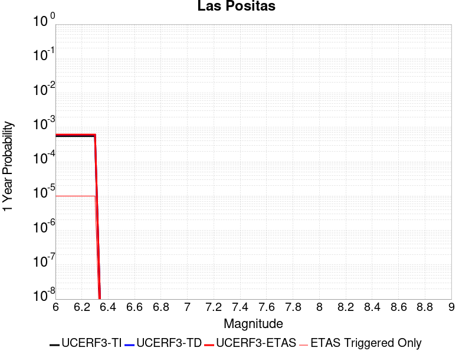 |  |

| Magnitude | 1 wk TI Prob | 1 wk TD Prob | 1 wk ETAS Prob | 1 wk ETAS/TD Gain | 1 wk ETAS Triggered Only | 1 mo TI Prob | 1 mo TD Prob | 1 mo ETAS Prob | 1 mo ETAS/TD Gain | 1 mo ETAS Triggered Only | 1 yr TI Prob | 1 yr TD Prob | 1 yr ETAS Prob | 1 yr ETAS/TD Gain | 1 yr ETAS Triggered Only | 10 yr TI Prob | 10 yr TD Prob | 10 yr ETAS Prob | 10 yr ETAS/TD Gain | 10 yr ETAS Triggered Only |
|-----|-----|-----|-----|-----|-----|-----|-----|-----|-----|-----|-----|-----|-----|-----|-----|-----|-----|-----|-----|-----|
| 6.0 | 1.0659424E-5 | 1.1593074E-5 | 1.1593074E-5 | 1.0 | 0.0 | 4.568245E-5 | 4.9684604E-5 | 4.9684604E-5 | 1.0 | 0.0 | 5.560419E-4 | 6.049101E-4 | 6.14904E-4 | 1.0165213 | 1.0E-5 | 0.005546526 | 0.0060491003 | 0.0060689794 | 1.0032862 | 2.0E-5 |
| 6.1 | 1.0659424E-5 | 1.1593074E-5 | 1.1593074E-5 | 1.0 | 0.0 | 4.568245E-5 | 4.9684604E-5 | 4.9684604E-5 | 1.0 | 0.0 | 5.560419E-4 | 6.049101E-4 | 6.14904E-4 | 1.0165213 | 1.0E-5 | 0.005546526 | 0.0060491003 | 0.0060689794 | 1.0032862 | 2.0E-5 |
| 6.2 | 1.0659424E-5 | 1.1593074E-5 | 1.1593074E-5 | 1.0 | 0.0 | 4.568245E-5 | 4.9684604E-5 | 4.9684604E-5 | 1.0 | 0.0 | 5.560419E-4 | 6.049101E-4 | 6.14904E-4 | 1.0165213 | 1.0E-5 | 0.005546526 | 0.0060491003 | 0.0060689794 | 1.0032862 | 2.0E-5 |
| 6.3 | 1.0659424E-5 | 1.1593074E-5 | 1.1593074E-5 | 1.0 | 0.0 | 4.568245E-5 | 4.9684604E-5 | 4.9684604E-5 | 1.0 | 0.0 | 5.560419E-4 | 6.049101E-4 | 6.14904E-4 | 1.0165213 | 1.0E-5 | 0.005546526 | 0.0060491003 | 0.0060689794 | 1.0032862 | 2.0E-5 |

## Silver Creek 2011 CFM
*[(top)](#table-of-contents)*

| 1 Week | 1 Month | 1 Year | 10 Year |
|-----|-----|-----|-----|
|  |  |  |  |

| Magnitude | 1 wk TI Prob | 1 wk TD Prob | 1 wk ETAS Prob | 1 wk ETAS/TD Gain | 1 wk ETAS Triggered Only | 1 mo TI Prob | 1 mo TD Prob | 1 mo ETAS Prob | 1 mo ETAS/TD Gain | 1 mo ETAS Triggered Only | 1 yr TI Prob | 1 yr TD Prob | 1 yr ETAS Prob | 1 yr ETAS/TD Gain | 1 yr ETAS Triggered Only | 10 yr TI Prob | 10 yr TD Prob | 10 yr ETAS Prob | 10 yr ETAS/TD Gain | 10 yr ETAS Triggered Only |
|-----|-----|-----|-----|-----|-----|-----|-----|-----|-----|-----|-----|-----|-----|-----|-----|-----|-----|-----|-----|-----|
| 6.0 | 3.5229125E-6 | 4.012951E-6 | 4.012951E-6 | 1.0 | 0.0 | 1.5098109E-5 | 1.7198252E-5 | 1.7198252E-5 | 1.0 | 0.0 | 1.8380396E-4 | 2.0936897E-4 | 2.0936897E-4 | 1.0 | 0.0 | 0.0018365202 | 0.0020920788 | 0.002112037 | 1.0095398 | 2.0E-5 |
| 6.1 | 3.5229125E-6 | 4.012951E-6 | 4.012951E-6 | 1.0 | 0.0 | 1.5098109E-5 | 1.7198252E-5 | 1.7198252E-5 | 1.0 | 0.0 | 1.8380396E-4 | 2.0936897E-4 | 2.0936897E-4 | 1.0 | 0.0 | 0.0018365202 | 0.0020920788 | 0.002112037 | 1.0095398 | 2.0E-5 |
| 6.2 | 2.6363234E-6 | 3.115316E-6 | 3.115316E-6 | 1.0 | 0.0 | 1.129848E-5 | 1.3351287E-5 | 1.3351287E-5 | 1.0 | 0.0 | 1.375503E-4 | 1.6253986E-4 | 1.6253986E-4 | 1.0 | 0.0 | 0.0013746519 | 0.0016245405 | 0.001644508 | 1.0122912 | 2.0E-5 |
| 6.3 | 2.5275126E-6 | 3.0049519E-6 | 3.0049519E-6 | 1.0 | 0.0 | 1.0832152E-5 | 1.2878302E-5 | 1.2878302E-5 | 1.0 | 0.0 | 1.3187347E-4 | 1.567821E-4 | 1.567821E-4 | 1.0 | 0.0 | 0.0013179524 | 0.0015670448 | 0.0015870135 | 1.0127429 | 2.0E-5 |
| 6.4 | 2.178732E-6 | 2.675427E-6 | 2.675427E-6 | 1.0 | 0.0 | 9.337389E-6 | 1.1466065E-5 | 1.1466065E-5 | 1.0 | 0.0 | 1.1367678E-4 | 1.3959044E-4 | 1.3959044E-4 | 1.0 | 0.0 | 0.0011361865 | 0.001395355 | 0.0014153271 | 1.0143132 | 2.0E-5 |
| 6.5 | 2.0341574E-6 | 2.5344941E-6 | 2.5344941E-6 | 1.0 | 0.0 | 8.717788E-6 | 1.08620725E-5 | 1.08620725E-5 | 1.0 | 0.0 | 1.061339E-4 | 1.3223774E-4 | 1.3223774E-4 | 1.0 | 0.0 | 0.0010608323 | 0.0013219175 | 0.0013418911 | 1.0151095 | 2.0E-5 |
| 6.6 | 1.8856827E-6 | 2.3659886E-6 | 2.3659886E-6 | 1.0 | 0.0 | 8.0814725E-6 | 1.0139912E-5 | 1.0139912E-5 | 1.0 | 0.0 | 9.838748E-5 | 1.2344646E-4 | 1.2344646E-4 | 1.0 | 0.0 | 9.834393E-4 | 0.0012341056 | 0.0012540808 | 1.0161861 | 2.0E-5 |
| 6.7 | 1.6844668E-6 | 2.1242317E-6 | 2.1242317E-6 | 1.0 | 0.0 | 7.2191233E-6 | 9.103818E-6 | 9.103818E-6 | 1.0 | 0.0 | 8.788928E-5 | 1.1083337E-4 | 1.1083337E-4 | 1.0 | 0.0 | 8.785453E-4 | 0.0011081068 | 0.0011280846 | 1.0180289 | 2.0E-5 |
| 6.8 | 1.5177161E-6 | 1.8995809E-6 | 1.8995809E-6 | 1.0 | 0.0 | 6.504481E-6 | 8.141035E-6 | 8.141035E-6 | 1.0 | 0.0 | 7.918918E-5 | 9.911261E-5 | 9.911261E-5 | 1.0 | 0.0 | 7.9160964E-4 | 9.910094E-4 | 0.0010009996 | 1.0100807 | 1.0E-5 |
| 6.9 | 1.3437394E-6 | 1.6600129E-6 | 1.6600129E-6 | 1.0 | 0.0 | 5.7588704E-6 | 7.1143218E-6 | 7.1143218E-6 | 1.0 | 0.0 | 7.011199E-5 | 8.661343E-5 | 8.661343E-5 | 1.0 | 0.0 | 7.0089876E-4 | 8.661216E-4 | 8.661216E-4 | 1.0 | 0.0 |
| 7.0 | 1.1563575E-6 | 1.4349142E-6 | 1.4349142E-6 | 1.0 | 0.0 | 4.9558084E-6 | 6.149618E-6 | 6.149618E-6 | 1.0 | 0.0 | 6.03353E-5 | 7.486903E-5 | 7.486903E-5 | 1.0 | 0.0 | 6.0318917E-4 | 7.4876286E-4 | 7.4876286E-4 | 1.0 | 0.0 |
| 7.1 | 8.602183E-7 | 1.09233E-6 | 1.09233E-6 | 1.0 | 0.0 | 3.6866445E-6 | 4.6814057E-6 | 4.6814057E-6 | 1.0 | 0.0 | 4.4883975E-5 | 5.6994624E-5 | 5.6994624E-5 | 1.0 | 0.0 | 4.4874908E-4 | 5.701247E-4 | 5.701247E-4 | 1.0 | 0.0 |
| 7.2 | 6.788407E-7 | 8.650751E-7 | 8.650751E-7 | 1.0 | 0.0 | 2.9093142E-6 | 3.7074592E-6 | 3.7074592E-6 | 1.0 | 0.0 | 3.5420322E-5 | 4.513738E-5 | 4.513738E-5 | 1.0 | 0.0 | 3.541468E-4 | 4.5160673E-4 | 4.5160673E-4 | 1.0 | 0.0 |
| 7.3 | 5.1292045E-7 | 6.718798E-7 | 6.718798E-7 | 1.0 | 0.0 | 2.1982287E-6 | 2.8794816E-6 | 2.8794816E-6 | 1.0 | 0.0 | 2.6763106E-5 | 3.5057124E-5 | 3.5057124E-5 | 1.0 | 0.0 | 2.6759884E-4 | 3.508405E-4 | 3.508405E-4 | 1.0 | 0.0 |
| 7.4 | 3.820994E-7 | 5.0834836E-7 | 5.0834836E-7 | 1.0 | 0.0 | 1.6375678E-6 | 2.178634E-6 | 2.178634E-6 | 1.0 | 0.0 | 1.9937206E-5 | 2.6524545E-5 | 2.6524545E-5 | 1.0 | 0.0 | 1.9935417E-4 | 2.6553837E-4 | 2.6553837E-4 | 1.0 | 0.0 |
| 7.5 | 2.2292595E-7 | 3.083866E-7 | 3.083866E-7 | 1.0 | 0.0 | 9.553966E-7 | 1.3216561E-6 | 1.3216561E-6 | 1.0 | 0.0 | 1.16318915E-5 | 1.6091044E-5 | 1.6091044E-5 | 1.0 | 0.0 | 1.16312825E-4 | 1.6122335E-4 | 1.6122335E-4 | 1.0 | 0.0 |
| 7.6 | 1.420587E-7 | 2.1061783E-7 | 2.1061783E-7 | 1.0 | 0.0 | 6.088228E-7 | 9.026475E-7 | 9.026475E-7 | 1.0 | 0.0 | 7.4123927E-6 | 1.0989678E-5 | 1.0989678E-5 | 1.0 | 0.0 | 7.412145E-5 | 1.10215624E-4 | 1.10215624E-4 | 1.0 | 0.0 |
| 7.7 | 1.1250075E-7 | 1.7006248E-7 | 1.7006248E-7 | 1.0 | 0.0 | 4.82146E-7 | 7.28839E-7 | 7.28839E-7 | 1.0 | 0.0 | 5.8701116E-6 | 8.873579E-6 | 8.873579E-6 | 1.0 | 0.0 | 5.8699567E-5 | 8.905174E-5 | 8.905174E-5 | 1.0 | 0.0 |
| 7.8 | 8.592761E-8 | 1.3764858E-7 | 1.3764858E-7 | 1.0 | 0.0 | 3.682611E-7 | 5.8992237E-7 | 5.8992237E-7 | 1.0 | 0.0 | 4.48357E-6 | 7.182281E-6 | 7.182281E-6 | 1.0 | 0.0 | 4.4834796E-5 | 7.2128176E-5 | 7.2128176E-5 | 1.0 | 0.0 |
| 7.9 | 6.156529E-8 | 1.0830247E-7 | 1.0830247E-7 | 1.0 | 0.0 | 2.638512E-7 | 4.6415337E-7 | 4.6415337E-7 | 1.0 | 0.0 | 3.212384E-6 | 5.6510526E-6 | 5.6510526E-6 | 1.0 | 0.0 | 3.2123375E-5 | 5.6771325E-5 | 5.6771325E-5 | 1.0 | 0.0 |
| 8.0 | 2.9230547E-8 | 5.4304294E-8 | 5.4304294E-8 | 1.0 | 0.0 | 1.2527377E-7 | 2.3273266E-7 | 2.3273266E-7 | 1.0 | 0.0 | 1.525207E-6 | 2.8335164E-6 | 2.8335164E-6 | 1.0 | 0.0 | 1.5251966E-5 | 2.8472883E-5 | 2.8472883E-5 | 1.0 | 0.0 |
| 8.1 | 5.6062213E-9 | 7.963622E-9 | 7.963622E-9 | 1.0 | 0.0 | 2.4026663E-8 | 3.412981E-8 | 3.412981E-8 | 1.0 | 0.0 | 2.925246E-7 | 4.155303E-7 | 4.155303E-7 | 1.0 | 0.0 | 2.925242E-6 | 4.1953667E-6 | 4.1953667E-6 | 1.0 | 0.0 |

## Pilarcitos 2011 CFM
*[(top)](#table-of-contents)*

| 1 Week | 1 Month | 1 Year | 10 Year |
|-----|-----|-----|-----|
|  |  |  |  |

| Magnitude | 1 wk TI Prob | 1 wk TD Prob | 1 wk ETAS Prob | 1 wk ETAS/TD Gain | 1 wk ETAS Triggered Only | 1 mo TI Prob | 1 mo TD Prob | 1 mo ETAS Prob | 1 mo ETAS/TD Gain | 1 mo ETAS Triggered Only | 1 yr TI Prob | 1 yr TD Prob | 1 yr ETAS Prob | 1 yr ETAS/TD Gain | 1 yr ETAS Triggered Only | 10 yr TI Prob | 10 yr TD Prob | 10 yr ETAS Prob | 10 yr ETAS/TD Gain | 10 yr ETAS Triggered Only |
|-----|-----|-----|-----|-----|-----|-----|-----|-----|-----|-----|-----|-----|-----|-----|-----|-----|-----|-----|-----|-----|
| 6.0 | 4.9150476E-6 | 3.210603E-6 | 3.210603E-6 | 1.0 | 0.0 | 2.1064321E-5 | 1.3759655E-5 | 2.3759518E-5 | 1.7267524 | 1.0E-5 | 2.564279E-4 | 1.6751124E-4 | 1.8750789E-4 | 1.119375 | 2.0E-5 | 0.0025613222 | 0.001686351 | 0.0017063173 | 1.01184 | 2.0E-5 |
| 6.1 | 4.9150476E-6 | 3.210603E-6 | 3.210603E-6 | 1.0 | 0.0 | 2.1064321E-5 | 1.3759655E-5 | 1.3759655E-5 | 1.0 | 0.0 | 2.564279E-4 | 1.6751124E-4 | 1.7750956E-4 | 1.0596875 | 1.0E-5 | 0.0025613222 | 0.001686351 | 0.0016963341 | 1.0059199 | 1.0E-5 |
| 6.2 | 4.162343E-6 | 2.4389558E-6 | 2.4389558E-6 | 1.0 | 0.0 | 1.783849E-5 | 1.0452626E-5 | 1.0452626E-5 | 1.0 | 0.0 | 2.1716199E-4 | 1.2725337E-4 | 1.372521E-4 | 1.0785733 | 1.0E-5 | 0.002169499 | 0.0012842881 | 0.0012942753 | 1.0077764 | 1.0E-5 |
| 6.3 | 4.162343E-6 | 2.4389558E-6 | 2.4389558E-6 | 1.0 | 0.0 | 1.783849E-5 | 1.0452626E-5 | 1.0452626E-5 | 1.0 | 0.0 | 2.1716199E-4 | 1.2725337E-4 | 1.372521E-4 | 1.0785733 | 1.0E-5 | 0.002169499 | 0.0012842881 | 0.0012942753 | 1.0077764 | 1.0E-5 |
| 6.4 | 3.8768926E-6 | 2.146361E-6 | 2.146361E-6 | 1.0 | 0.0 | 1.6615148E-5 | 9.198658E-6 | 9.198658E-6 | 1.0 | 0.0 | 2.0227065E-4 | 1.11987945E-4 | 1.11987945E-4 | 1.0 | 0.0 | 0.0020208664 | 0.0011317965 | 0.0011317965 | 1.0 | 0.0 |
| 6.5 | 3.7137002E-6 | 1.9797064E-6 | 1.9797064E-6 | 1.0 | 0.0 | 1.591576E-5 | 8.484428E-6 | 8.484428E-6 | 1.0 | 0.0 | 1.9375715E-4 | 1.03293045E-4 | 1.03293045E-4 | 1.0 | 0.0 | 0.001935883 | 0.0010449317 | 0.0010449317 | 1.0 | 0.0 |
| 6.6 | 3.5048733E-6 | 1.7646466E-6 | 1.7646466E-6 | 1.0 | 0.0 | 1.5020799E-5 | 7.5627495E-6 | 7.5627495E-6 | 1.0 | 0.0 | 1.8286289E-4 | 9.207261E-5 | 9.207261E-5 | 1.0 | 0.0 | 0.0018271249 | 9.328265E-4 | 9.328265E-4 | 1.0 | 0.0 |
| 6.7 | 3.3908584E-6 | 1.6483237E-6 | 1.6483237E-6 | 1.0 | 0.0 | 1.453217E-5 | 7.0642254E-6 | 7.0642254E-6 | 1.0 | 0.0 | 1.7691481E-4 | 8.600357E-5 | 8.600357E-5 | 1.0 | 0.0 | 0.0017677402 | 8.7218505E-4 | 8.7218505E-4 | 1.0 | 0.0 |
| 6.8 | 3.2451449E-6 | 1.5015253E-6 | 1.5015253E-6 | 1.0 | 0.0 | 1.3907689E-5 | 6.435092E-6 | 6.435092E-6 | 1.0 | 0.0 | 1.6931296E-4 | 7.834444E-5 | 7.834444E-5 | 1.0 | 0.0 | 0.0016918402 | 7.9565065E-4 | 7.9565065E-4 | 1.0 | 0.0 |
| 6.9 | 3.1239128E-6 | 1.3780335E-6 | 1.3780335E-6 | 1.0 | 0.0 | 1.3388129E-5 | 5.9058443E-6 | 5.9058443E-6 | 1.0 | 0.0 | 1.6298829E-4 | 7.190129E-5 | 7.190129E-5 | 1.0 | 0.0 | 0.001628688 | 7.312632E-4 | 7.312632E-4 | 1.0 | 0.0 |
| 7.0 | 2.9940109E-6 | 1.2493194E-6 | 1.2493194E-6 | 1.0 | 0.0 | 1.2831412E-5 | 5.354215E-6 | 5.354215E-6 | 1.0 | 0.0 | 1.5621124E-4 | 6.518562E-5 | 6.518562E-5 | 1.0 | 0.0 | 0.0015610148 | 6.6414813E-4 | 6.6414813E-4 | 1.0 | 0.0 |
| 7.1 | 2.7471217E-6 | 1.1608468E-6 | 1.1608468E-6 | 1.0 | 0.0 | 1.1773326E-5 | 4.9750474E-6 | 4.9750474E-6 | 1.0 | 0.0 | 1.4333082E-4 | 6.0569524E-5 | 6.0569524E-5 | 1.0 | 0.0 | 0.001432384 | 6.179605E-4 | 6.179605E-4 | 1.0 | 0.0 |
| 7.2 | 2.592675E-6 | 1.0268021E-6 | 1.0268021E-6 | 1.0 | 0.0 | 1.1111417E-5 | 4.400573E-6 | 4.400573E-6 | 1.0 | 0.0 | 1.3527309E-4 | 5.357566E-5 | 5.357566E-5 | 1.0 | 0.0 | 0.0013519078 | 5.4805854E-4 | 5.4805854E-4 | 1.0 | 0.0 |
| 7.3 | 2.4518663E-6 | 9.176819E-7 | 9.176819E-7 | 1.0 | 0.0 | 1.0507956E-5 | 3.9329166E-6 | 3.9329166E-6 | 1.0 | 0.0 | 1.2792686E-4 | 4.7882208E-5 | 4.7882208E-5 | 1.0 | 0.0 | 0.0012785323 | 4.911484E-4 | 4.911484E-4 | 1.0 | 0.0 |
| 7.4 | 2.3349535E-6 | 8.7974837E-7 | 8.7974837E-7 | 1.0 | 0.0 | 1.0006905E-5 | 3.7703446E-6 | 3.7703446E-6 | 1.0 | 0.0 | 1.2182725E-4 | 4.590298E-5 | 4.590298E-5 | 1.0 | 0.0 | 0.0012176048 | 4.713411E-4 | 4.713411E-4 | 1.0 | 0.0 |
| 7.5 | 2.1358665E-6 | 8.315239E-7 | 8.315239E-7 | 1.0 | 0.0 | 9.15368E-6 | 3.563669E-6 | 3.563669E-6 | 1.0 | 0.0 | 1.11440364E-4 | 4.3386808E-5 | 4.3386808E-5 | 1.0 | 0.0 | 0.0011138449 | 4.4609446E-4 | 4.4609446E-4 | 1.0 | 0.0 |
| 7.6 | 1.6445446E-6 | 6.8490374E-7 | 6.8490374E-7 | 1.0 | 0.0 | 7.048029E-6 | 2.9352984E-6 | 2.9352984E-6 | 1.0 | 0.0 | 8.580638E-5 | 3.5736673E-5 | 3.5736673E-5 | 1.0 | 0.0 | 8.5773255E-4 | 3.6955148E-4 | 3.6955148E-4 | 1.0 | 0.0 |
| 7.7 | 1.3650961E-6 | 5.8364867E-7 | 5.8364867E-7 | 1.0 | 0.0 | 5.850399E-6 | 2.5013492E-6 | 2.5013492E-6 | 1.0 | 0.0 | 7.122628E-5 | 3.04535E-5 | 3.04535E-5 | 1.0 | 0.0 | 7.120345E-4 | 3.166177E-4 | 3.166177E-4 | 1.0 | 0.0 |
| 7.8 | 1.0500993E-6 | 5.5488545E-7 | 5.5488545E-7 | 1.0 | 0.0 | 4.5004176E-6 | 2.3780783E-6 | 2.3780783E-6 | 1.0 | 0.0 | 5.4791206E-5 | 2.8952718E-5 | 2.8952718E-5 | 1.0 | 0.0 | 5.47777E-4 | 3.0148032E-4 | 3.0148032E-4 | 1.0 | 0.0 |
| 7.9 | 5.856431E-7 | 5.184848E-7 | 5.184848E-7 | 1.0 | 0.0 | 2.5098966E-6 | 2.2220759E-6 | 2.2220759E-6 | 1.0 | 0.0 | 3.0557563E-5 | 2.7053438E-5 | 2.7053438E-5 | 1.0 | 0.0 | 3.055336E-4 | 2.8173937E-4 | 2.8173937E-4 | 1.0 | 0.0 |
| 8.0 | 4.4768265E-7 | 4.88728E-7 | 4.88728E-7 | 1.0 | 0.0 | 1.9186384E-6 | 2.0945467E-6 | 2.0945467E-6 | 1.0 | 0.0 | 2.3359173E-5 | 2.5500809E-5 | 2.5500809E-5 | 1.0 | 0.0 | 2.3356717E-4 | 2.6567656E-4 | 2.6567656E-4 | 1.0 | 0.0 |
| 8.1 | 2.6692538E-7 | 3.3911186E-7 | 3.3911186E-7 | 1.0 | 0.0 | 1.1439654E-6 | 1.4533358E-6 | 1.4533358E-6 | 1.0 | 0.0 | 1.392769E-5 | 1.7694221E-5 | 1.7694221E-5 | 1.0 | 0.0 | 1.3926817E-4 | 1.843052E-4 | 1.843052E-4 | 1.0 | 0.0 |
| 8.2 | 1.3198862E-8 | 1.0953292E-8 | 1.0953292E-8 | 1.0 | 0.0 | 5.656655E-8 | 4.6942677E-8 | 4.6942677E-8 | 1.0 | 0.0 | 6.886975E-7 | 5.715269E-7 | 5.715269E-7 | 1.0 | 0.0 | 6.8869535E-6 | 5.9494296E-6 | 5.9494296E-6 | 1.0 | 0.0 |

## Great Valley 08 (Quinto)
*[(top)](#table-of-contents)*

| 1 Week | 1 Month | 1 Year | 10 Year |
|-----|-----|-----|-----|
|  |  |  |  |

| Magnitude | 1 wk TI Prob | 1 wk TD Prob | 1 wk ETAS Prob | 1 wk ETAS/TD Gain | 1 wk ETAS Triggered Only | 1 mo TI Prob | 1 mo TD Prob | 1 mo ETAS Prob | 1 mo ETAS/TD Gain | 1 mo ETAS Triggered Only | 1 yr TI Prob | 1 yr TD Prob | 1 yr ETAS Prob | 1 yr ETAS/TD Gain | 1 yr ETAS Triggered Only | 10 yr TI Prob | 10 yr TD Prob | 10 yr ETAS Prob | 10 yr ETAS/TD Gain | 10 yr ETAS Triggered Only |
|-----|-----|-----|-----|-----|-----|-----|-----|-----|-----|-----|-----|-----|-----|-----|-----|-----|-----|-----|-----|-----|
| 6.0 | 7.737697E-6 | 8.2541E-6 | 8.2541E-6 | 1.0 | 0.0 | 3.3161137E-5 | 3.537434E-5 | 3.537434E-5 | 1.0 | 0.0 | 4.0366207E-4 | 4.3061635E-4 | 4.4061203E-4 | 1.0232126 | 1.0E-5 | 0.004029296 | 0.004299673 | 0.004319587 | 1.0046315 | 2.0E-5 |
| 6.1 | 7.737697E-6 | 8.2541E-6 | 8.2541E-6 | 1.0 | 0.0 | 3.3161137E-5 | 3.537434E-5 | 3.537434E-5 | 1.0 | 0.0 | 4.0366207E-4 | 4.3061635E-4 | 4.4061203E-4 | 1.0232126 | 1.0E-5 | 0.004029296 | 0.004299673 | 0.004319587 | 1.0046315 | 2.0E-5 |
| 6.2 | 7.737697E-6 | 8.2541E-6 | 8.2541E-6 | 1.0 | 0.0 | 3.3161137E-5 | 3.537434E-5 | 3.537434E-5 | 1.0 | 0.0 | 4.0366207E-4 | 4.3061635E-4 | 4.4061203E-4 | 1.0232126 | 1.0E-5 | 0.004029296 | 0.004299673 | 0.004319587 | 1.0046315 | 2.0E-5 |
| 6.3 | 5.374012E-6 | 5.751352E-6 | 5.751352E-6 | 1.0 | 0.0 | 2.3031276E-5 | 2.4648483E-5 | 2.4648483E-5 | 1.0 | 0.0 | 2.803697E-4 | 3.000651E-4 | 3.1006208E-4 | 1.0333161 | 1.0E-5 | 0.0028001624 | 0.002997693 | 0.003017633 | 1.0066518 | 2.0E-5 |
| 6.4 | 5.374012E-6 | 5.751352E-6 | 5.751352E-6 | 1.0 | 0.0 | 2.3031276E-5 | 2.4648483E-5 | 2.4648483E-5 | 1.0 | 0.0 | 2.803697E-4 | 3.000651E-4 | 3.1006208E-4 | 1.0333161 | 1.0E-5 | 0.0028001624 | 0.002997693 | 0.003017633 | 1.0066518 | 2.0E-5 |
| 6.5 | 3.65427E-6 | 3.941921E-6 | 3.941921E-6 | 1.0 | 0.0 | 1.5661062E-5 | 1.6893879E-5 | 1.6893879E-5 | 1.0 | 0.0 | 1.9065675E-4 | 2.0567061E-4 | 2.0567061E-4 | 1.0 | 0.0 | 0.0019049325 | 0.0020554946 | 0.0020554946 | 1.0 | 0.0 |
| 6.6 | 3.6143538E-6 | 3.899102E-6 | 3.899102E-6 | 1.0 | 0.0 | 1.5489995E-5 | 1.671037E-5 | 1.671037E-5 | 1.0 | 0.0 | 1.8857437E-4 | 2.0343681E-4 | 2.0343681E-4 | 1.0 | 0.0 | 0.0018841444 | 0.0020331976 | 0.0020331976 | 1.0 | 0.0 |
| 6.7 | 2.4821015E-6 | 2.686132E-6 | 2.686132E-6 | 1.0 | 0.0 | 1.0637535E-5 | 1.1511975E-5 | 1.1511975E-5 | 1.0 | 0.0 | 1.2950429E-4 | 1.4015494E-4 | 1.4015494E-4 | 1.0 | 0.0 | 0.0012942884 | 0.0014012204 | 0.0014012204 | 1.0 | 0.0 |
| 6.8 | 4.7110538E-7 | 5.194045E-7 | 5.194045E-7 | 1.0 | 0.0 | 2.0190216E-6 | 2.2260176E-6 | 2.2260176E-6 | 1.0 | 0.0 | 2.458131E-5 | 2.7101445E-5 | 2.7101445E-5 | 1.0 | 0.0 | 2.457859E-4 | 2.709832E-4 | 2.709832E-4 | 1.0 | 0.0 |
| 6.9 | 3.958685E-7 | 4.3712214E-7 | 4.3712214E-7 | 1.0 | 0.0 | 1.6965782E-6 | 1.8733792E-6 | 1.8733792E-6 | 1.0 | 0.0 | 2.0655643E-5 | 2.280817E-5 | 2.280817E-5 | 1.0 | 0.0 | 2.0653724E-4 | 2.2805991E-4 | 2.2805991E-4 | 1.0 | 0.0 |
| 7.0 | 2.70294E-7 | 2.9926176E-7 | 2.9926176E-7 | 1.0 | 0.0 | 1.1584025E-6 | 1.2825498E-6 | 1.2825498E-6 | 1.0 | 0.0 | 1.4103458E-5 | 1.5614945E-5 | 1.5614945E-5 | 1.0 | 0.0 | 1.4102564E-4 | 1.5613977E-4 | 1.5613977E-4 | 1.0 | 0.0 |
| 7.1 | 1.4828602E-7 | 1.6472617E-7 | 1.6472617E-7 | 1.0 | 0.0 | 6.3551136E-7 | 7.0596917E-7 | 7.0596917E-7 | 1.0 | 0.0 | 7.737323E-6 | 8.59515E-6 | 8.59515E-6 | 1.0 | 0.0 | 7.737054E-5 | 8.594897E-5 | 8.594897E-5 | 1.0 | 0.0 |

## La Panza 2011
*[(top)](#table-of-contents)*

| 1 Week | 1 Month | 1 Year | 10 Year |
|-----|-----|-----|-----|
|  |  |  |  |

| Magnitude | 1 wk TI Prob | 1 wk TD Prob | 1 wk ETAS Prob | 1 wk ETAS/TD Gain | 1 wk ETAS Triggered Only | 1 mo TI Prob | 1 mo TD Prob | 1 mo ETAS Prob | 1 mo ETAS/TD Gain | 1 mo ETAS Triggered Only | 1 yr TI Prob | 1 yr TD Prob | 1 yr ETAS Prob | 1 yr ETAS/TD Gain | 1 yr ETAS Triggered Only | 10 yr TI Prob | 10 yr TD Prob | 10 yr ETAS Prob | 10 yr ETAS/TD Gain | 10 yr ETAS Triggered Only |
|-----|-----|-----|-----|-----|-----|-----|-----|-----|-----|-----|-----|-----|-----|-----|-----|-----|-----|-----|-----|-----|
| 6.0 | 4.6754544E-6 | 4.7178933E-6 | 4.7178933E-6 | 1.0 | 0.0 | 2.0037509E-5 | 2.0219397E-5 | 2.0219397E-5 | 1.0 | 0.0 | 2.4392935E-4 | 2.461453E-4 | 2.461453E-4 | 1.0 | 0.0 | 0.0024366176 | 0.0024589212 | 0.0024688966 | 1.0040568 | 1.0E-5 |
| 6.1 | 4.6754544E-6 | 4.7178933E-6 | 4.7178933E-6 | 1.0 | 0.0 | 2.0037509E-5 | 2.0219397E-5 | 2.0219397E-5 | 1.0 | 0.0 | 2.4392935E-4 | 2.461453E-4 | 2.461453E-4 | 1.0 | 0.0 | 0.0024366176 | 0.0024589212 | 0.0024688966 | 1.0040568 | 1.0E-5 |
| 6.2 | 4.6754544E-6 | 4.7178933E-6 | 4.7178933E-6 | 1.0 | 0.0 | 2.0037509E-5 | 2.0219397E-5 | 2.0219397E-5 | 1.0 | 0.0 | 2.4392935E-4 | 2.461453E-4 | 2.461453E-4 | 1.0 | 0.0 | 0.0024366176 | 0.0024589212 | 0.0024688966 | 1.0040568 | 1.0E-5 |
| 6.3 | 4.6754544E-6 | 4.7178933E-6 | 4.7178933E-6 | 1.0 | 0.0 | 2.0037509E-5 | 2.0219397E-5 | 2.0219397E-5 | 1.0 | 0.0 | 2.4392935E-4 | 2.461453E-4 | 2.461453E-4 | 1.0 | 0.0 | 0.0024366176 | 0.0024589212 | 0.0024688966 | 1.0040568 | 1.0E-5 |
| 6.4 | 4.6754544E-6 | 4.7178933E-6 | 4.7178933E-6 | 1.0 | 0.0 | 2.0037509E-5 | 2.0219397E-5 | 2.0219397E-5 | 1.0 | 0.0 | 2.4392935E-4 | 2.461453E-4 | 2.461453E-4 | 1.0 | 0.0 | 0.0024366176 | 0.0024589212 | 0.0024688966 | 1.0040568 | 1.0E-5 |
| 6.5 | 2.485343E-6 | 2.5008526E-6 | 2.5008526E-6 | 1.0 | 0.0 | 1.0651426E-5 | 1.0717898E-5 | 1.0717898E-5 | 1.0 | 0.0 | 1.296734E-4 | 1.3048298E-4 | 1.3048298E-4 | 1.0 | 0.0 | 0.0012959775 | 0.001304102 | 0.001314089 | 1.0076581 | 1.0E-5 |
| 6.6 | 2.485343E-6 | 2.5008526E-6 | 2.5008526E-6 | 1.0 | 0.0 | 1.0651426E-5 | 1.0717898E-5 | 1.0717898E-5 | 1.0 | 0.0 | 1.296734E-4 | 1.3048298E-4 | 1.3048298E-4 | 1.0 | 0.0 | 0.0012959775 | 0.001304102 | 0.001314089 | 1.0076581 | 1.0E-5 |
| 6.7 | 1.5108508E-6 | 1.5148687E-6 | 1.5148687E-6 | 1.0 | 0.0 | 6.4750584E-6 | 6.492279E-6 | 6.492279E-6 | 1.0 | 0.0 | 7.8830984E-5 | 7.9040736E-5 | 7.9040736E-5 | 1.0 | 0.0 | 7.880303E-4 | 7.901371E-4 | 7.901371E-4 | 1.0 | 0.0 |
| 6.8 | 1.3865837E-6 | 1.3887378E-6 | 1.3887378E-6 | 1.0 | 0.0 | 5.942488E-6 | 5.9517206E-6 | 5.9517206E-6 | 1.0 | 0.0 | 7.234739E-5 | 7.245989E-5 | 7.245989E-5 | 1.0 | 0.0 | 7.232384E-4 | 7.243724E-4 | 7.243724E-4 | 1.0 | 0.0 |
| 6.9 | 9.826583E-7 | 9.798466E-7 | 9.798466E-7 | 1.0 | 0.0 | 4.2113857E-6 | 4.199336E-6 | 4.199336E-6 | 1.0 | 0.0 | 5.1272415E-5 | 5.112577E-5 | 5.112577E-5 | 1.0 | 0.0 | 5.126059E-4 | 5.1114545E-4 | 5.1114545E-4 | 1.0 | 0.0 |
| 7.0 | 6.7797646E-7 | 6.7123176E-7 | 6.7123176E-7 | 1.0 | 0.0 | 2.9056102E-6 | 2.8767047E-6 | 2.8767047E-6 | 1.0 | 0.0 | 3.537523E-5 | 3.5023346E-5 | 3.5023346E-5 | 1.0 | 0.0 | 3.5369597E-4 | 3.5018136E-4 | 3.5018136E-4 | 1.0 | 0.0 |
| 7.1 | 3.4979826E-7 | 3.389411E-7 | 3.389411E-7 | 1.0 | 0.0 | 1.4991346E-6 | 1.452604E-6 | 1.452604E-6 | 1.0 | 0.0 | 1.825181E-5 | 1.7685321E-5 | 1.7685321E-5 | 1.0 | 0.0 | 1.825031E-4 | 1.7684032E-4 | 1.7684032E-4 | 1.0 | 0.0 |
| 7.2 | 2.5088332E-7 | 2.3851834E-7 | 2.3851834E-7 | 1.0 | 0.0 | 1.0752137E-6 | 1.0222211E-6 | 1.0222211E-6 | 1.0 | 0.0 | 1.3090649E-5 | 1.2445479E-5 | 1.2445479E-5 | 1.0 | 0.0 | 1.3089878E-4 | 1.2444868E-4 | 1.2444868E-4 | 1.0 | 0.0 |
| 7.3 | 1.0159086E-7 | 8.664048E-8 | 8.664048E-8 | 1.0 | 0.0 | 4.3538932E-7 | 3.713163E-7 | 3.713163E-7 | 1.0 | 0.0 | 5.300852E-6 | 4.520767E-6 | 4.520767E-6 | 1.0 | 0.0 | 5.3007258E-5 | 4.5206794E-5 | 4.5206794E-5 | 1.0 | 0.0 |
| 7.4 | 3.5006252E-8 | 1.9466446E-8 | 1.9466446E-8 | 1.0 | 0.0 | 1.5002678E-7 | 8.342763E-8 | 8.342763E-8 | 1.0 | 0.0 | 1.8265745E-6 | 1.015731E-6 | 1.015731E-6 | 1.0 | 0.0 | 1.8265595E-5 | 1.0157265E-5 | 1.0157265E-5 | 1.0 | 0.0 |
| 7.5 | 2.592274E-8 | 1.0285233E-8 | 1.0285233E-8 | 1.0 | 0.0 | 1.1109746E-7 | 4.407957E-8 | 4.407957E-8 | 1.0 | 0.0 | 1.3526106E-6 | 5.3666867E-7 | 5.3666867E-7 | 1.0 | 0.0 | 1.3526024E-5 | 5.3666745E-6 | 5.3666745E-6 | 1.0 | 0.0 |
| 7.6 | 1.9016717E-8 | 5.27415E-9 | 5.27415E-9 | 1.0 | 0.0 | 8.150022E-8 | 2.2603501E-8 | 2.2603501E-8 | 1.0 | 0.0 | 9.922647E-7 | 2.7519758E-7 | 2.7519758E-7 | 1.0 | 0.0 | 9.922603E-6 | 2.7519727E-6 | 2.7519727E-6 | 1.0 | 0.0 |
| 7.7 | 1.17738495E-8 | 1.2522341E-9 | 1.2522341E-9 | 1.0 | 0.0 | 5.0459356E-8 | 5.3667195E-9 | 5.3667195E-9 | 1.0 | 0.0 | 6.1434247E-7 | 6.5339805E-8 | 6.5339805E-8 | 1.0 | 0.0 | 6.143408E-6 | 6.533979E-7 | 6.533979E-7 | 1.0 | 0.0 |
| 7.8 | 5.489079E-9 | 2.0434066E-10 | 2.0434066E-10 | 1.0 | 0.0 | 2.3524624E-8 | 8.7574703E-10 | 8.7574703E-10 | 1.0 | 0.0 | 2.8641225E-7 | 1.0662221E-8 | 1.0662221E-8 | 1.0 | 0.0 | 2.8641189E-6 | 1.0662222E-7 | 1.0662222E-7 | 1.0 | 0.0 |
| 7.9 | 2.5081048E-9 | 6.8053785E-11 | 6.8053785E-11 | 1.0 | 0.0 | 1.0749021E-8 | 2.916598E-10 | 2.916598E-10 | 1.0 | 0.0 | 1.3086932E-7 | 3.5509602E-9 | 3.5509602E-9 | 1.0 | 0.0 | 1.3086925E-6 | 3.5509604E-8 | 3.5509604E-8 | 1.0 | 0.0 |

## Brawley (Seismic Zone) alt 1
*[(top)](#table-of-contents)*

| 1 Week | 1 Month | 1 Year | 10 Year |
|-----|-----|-----|-----|
|  |  |  | 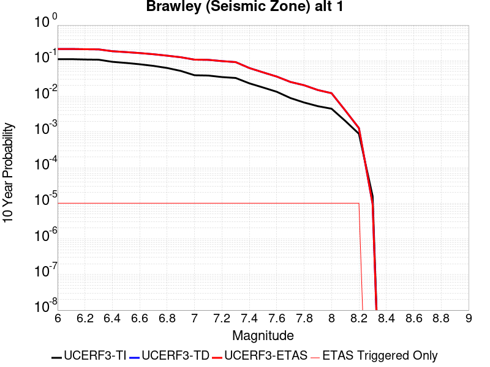 |

| Magnitude | 1 wk TI Prob | 1 wk TD Prob | 1 wk ETAS Prob | 1 wk ETAS/TD Gain | 1 wk ETAS Triggered Only | 1 mo TI Prob | 1 mo TD Prob | 1 mo ETAS Prob | 1 mo ETAS/TD Gain | 1 mo ETAS Triggered Only | 1 yr TI Prob | 1 yr TD Prob | 1 yr ETAS Prob | 1 yr ETAS/TD Gain | 1 yr ETAS Triggered Only | 10 yr TI Prob | 10 yr TD Prob | 10 yr ETAS Prob | 10 yr ETAS/TD Gain | 10 yr ETAS Triggered Only |
|-----|-----|-----|-----|-----|-----|-----|-----|-----|-----|-----|-----|-----|-----|-----|-----|-----|-----|-----|-----|-----|
| 6.0 | 2.2521618E-4 | 4.776729E-4 | 4.776729E-4 | 1.0 | 0.0 | 9.6485513E-4 | 0.0020456007 | 0.0020456007 | 1.0 | 0.0 | 0.011683988 | 0.024613243 | 0.024622997 | 1.0003963 | 1.0E-5 | 0.11088423 | 0.21395981 | 0.21396767 | 1.0000367 | 1.0E-5 |
| 6.1 | 2.2521618E-4 | 4.776729E-4 | 4.776729E-4 | 1.0 | 0.0 | 9.6485513E-4 | 0.0020456007 | 0.0020456007 | 1.0 | 0.0 | 0.011683988 | 0.024613243 | 0.024622997 | 1.0003963 | 1.0E-5 | 0.11088423 | 0.21395981 | 0.21396767 | 1.0000367 | 1.0E-5 |
| 6.2 | 2.198148E-4 | 4.6848747E-4 | 4.6848747E-4 | 1.0 | 0.0 | 9.417233E-4 | 0.0020062951 | 0.0020062951 | 1.0 | 0.0 | 0.011405343 | 0.024146155 | 0.024155913 | 1.0004041 | 1.0E-5 | 0.10837428 | 0.21038997 | 0.21039787 | 1.0000376 | 1.0E-5 |
| 6.3 | 2.1704129E-4 | 4.6283443E-4 | 4.6283443E-4 | 1.0 | 0.0 | 9.298453E-4 | 0.001982105 | 0.001982105 | 1.0 | 0.0 | 0.011262234 | 0.023858448 | 0.02386821 | 1.0004091 | 1.0E-5 | 0.107082725 | 0.2082791 | 0.20828703 | 1.000038 | 1.0E-5 |
| 6.4 | 1.876142E-4 | 4.017173E-4 | 4.017173E-4 | 1.0 | 0.0 | 8.038131E-4 | 0.001720524 | 0.001720524 | 1.0 | 0.0 | 0.00974259 | 0.020744978 | 0.02075477 | 1.0004721 | 1.0E-5 | 0.093263686 | 0.18503235 | 0.1850405 | 1.000044 | 1.0E-5 |
| 6.5 | 1.7390939E-4 | 3.759906E-4 | 3.759906E-4 | 1.0 | 0.0 | 7.45113E-4 | 0.0016104055 | 0.0016104055 | 1.0 | 0.0 | 0.009034078 | 0.019431164 | 0.01944097 | 1.0005046 | 1.0E-5 | 0.086755216 | 0.17484573 | 0.17485398 | 1.0000472 | 1.0E-5 |
| 6.6 | 1.591791E-4 | 3.5007612E-4 | 3.5007612E-4 | 1.0 | 0.0 | 6.8201777E-4 | 0.0014994737 | 0.0014994737 | 1.0 | 0.0 | 0.008271996 | 0.018105352 | 0.01811517 | 1.0005423 | 1.0E-5 | 0.07970774 | 0.16423938 | 0.16424774 | 1.0000509 | 1.0E-5 |
| 6.7 | 1.4268003E-4 | 3.216537E-4 | 3.216537E-4 | 1.0 | 0.0 | 6.1134255E-4 | 0.0013777958 | 0.0013777958 | 1.0 | 0.0 | 0.007417723 | 0.016647456 | 0.016657291 | 1.0005907 | 1.0E-5 | 0.07174956 | 0.15234672 | 0.1523552 | 1.0000557 | 1.0E-5 |
| 6.8 | 1.239713E-4 | 2.914468E-4 | 2.914468E-4 | 1.0 | 0.0 | 5.3119735E-4 | 0.001248466 | 0.001248466 | 1.0 | 0.0 | 0.0064481674 | 0.0150955785 | 0.015105428 | 1.0006524 | 1.0E-5 | 0.06264243 | 0.13874088 | 0.1387495 | 1.0000621 | 1.0E-5 |
| 6.9 | 1.0180238E-4 | 2.6324694E-4 | 2.6324694E-4 | 1.0 | 0.0 | 4.3622297E-4 | 0.0011277177 | 0.0011277177 | 1.0 | 0.0 | 0.005298089 | 0.013644532 | 0.013654396 | 1.0007229 | 1.0E-5 | 0.05173543 | 0.12524758 | 0.12525633 | 1.0000699 | 1.0E-5 |
| 7.0 | 7.6619996E-5 | 2.2452515E-4 | 2.2452515E-4 | 1.0 | 0.0 | 3.283301E-4 | 9.61899E-4 | 9.61899E-4 | 1.0 | 0.0 | 0.0039900932 | 0.011648947 | 0.0116588315 | 1.0008484 | 1.0E-5 | 0.039192066 | 0.10748507 | 0.107494 | 1.0000831 | 1.0E-5 |
| 7.1 | 7.5127435E-5 | 2.213501E-4 | 2.213501E-4 | 1.0 | 0.0 | 3.2193496E-4 | 9.483016E-4 | 9.483016E-4 | 1.0 | 0.0 | 0.0039125155 | 0.011485156 | 0.011495041 | 1.0008607 | 1.0E-5 | 0.038443442 | 0.10604661 | 0.10605555 | 1.0000843 | 1.0E-5 |
| 7.2 | 6.788582E-5 | 2.026093E-4 | 2.026093E-4 | 1.0 | 0.0 | 2.9090676E-4 | 8.680396E-4 | 8.680396E-4 | 1.0 | 0.0 | 0.0035360386 | 0.010517813 | 0.010527708 | 1.0009408 | 1.0E-5 | 0.034803 | 0.09771205 | 0.09772107 | 1.0000924 | 1.0E-5 |
| 7.3 | 6.399602E-5 | 1.888977E-4 | 1.888977E-4 | 1.0 | 0.0 | 2.7423984E-4 | 8.0931326E-4 | 8.0931326E-4 | 1.0 | 0.0 | 0.0033337586 | 0.009809465 | 0.009819367 | 1.0010095 | 1.0E-5 | 0.03284188 | 0.091600604 | 0.091609694 | 1.0000992 | 1.0E-5 |
| 7.4 | 4.506759E-5 | 1.2567634E-4 | 1.2567634E-4 | 1.0 | 0.0 | 1.9313251E-4 | 5.385025E-4 | 5.385025E-4 | 1.0 | 0.0 | 0.0023488526 | 0.0065367348 | 0.0065466696 | 1.0015198 | 1.0E-5 | 0.023241805 | 0.06253236 | 0.06254173 | 1.00015 | 1.0E-5 |
| 7.5 | 3.43289E-5 | 9.367882E-5 | 9.367882E-5 | 1.0 | 0.0 | 1.4711556E-4 | 4.0141918E-4 | 4.0141918E-4 | 1.0 | 0.0 | 0.0017896603 | 0.004876389 | 0.0048863403 | 1.0020407 | 1.0E-5 | 0.01775316 | 0.04720012 | 0.04720965 | 1.0002018 | 1.0E-5 |
| 7.6 | 2.5980507E-5 | 7.0813774E-5 | 7.0813774E-5 | 1.0 | 0.0 | 1.1134028E-4 | 3.0345243E-4 | 3.0345243E-4 | 1.0 | 0.0 | 0.001354725 | 0.003688299 | 0.0036982622 | 1.0027013 | 1.0E-5 | 0.013464959 | 0.035968143 | 0.035977785 | 1.000268 | 1.0E-5 |
| 7.7 | 1.7292105E-5 | 4.9648545E-5 | 4.9648545E-5 | 1.0 | 0.0 | 7.4106916E-5 | 2.1276216E-4 | 2.1276216E-4 | 1.0 | 0.0 | 9.018782E-4 | 0.0025873077 | 0.002597282 | 1.003855 | 1.0E-5 | 0.008982267 | 0.02539993 | 0.025409676 | 1.0003837 | 1.0E-5 |
| 7.8 | 1.2927471E-5 | 3.9902796E-5 | 3.9902796E-5 | 1.0 | 0.0 | 5.5402274E-5 | 1.710008E-4 | 1.710008E-4 | 1.0 | 0.0 | 6.743139E-4 | 0.0020799492 | 0.0020899286 | 1.0047978 | 1.0E-5 | 0.0067227143 | 0.02052716 | 0.020536954 | 1.0004772 | 1.0E-5 |
| 7.9 | 1.0200774E-5 | 2.8914856E-5 | 2.8914856E-5 | 1.0 | 0.0 | 4.371687E-5 | 1.2391493E-4 | 1.2391493E-4 | 1.0 | 0.0 | 5.321229E-4 | 0.0015076213 | 0.0015176062 | 1.0066229 | 1.0E-5 | 0.005308505 | 0.015069848 | 0.015079698 | 1.0006536 | 1.0E-5 |
| 8.0 | 8.650396E-6 | 2.3422355E-5 | 2.3422355E-5 | 1.0 | 0.0 | 3.70726E-5 | 1.0037766E-4 | 1.0037766E-4 | 1.0 | 0.0 | 4.5126543E-4 | 0.0012214137 | 0.0012314016 | 1.0081773 | 1.0E-5 | 0.0045035016 | 0.012278532 | 0.012288409 | 1.0008044 | 1.0E-5 |
| 8.1 | 3.9368224E-6 | 7.389893E-6 | 7.389893E-6 | 1.0 | 0.0 | 1.6871985E-5 | 3.167059E-5 | 3.167059E-5 | 1.0 | 0.0 | 2.0539707E-4 | 3.855213E-4 | 3.9551745E-4 | 1.0259289 | 1.0E-5 | 0.0020520731 | 0.004031829 | 0.0040417886 | 1.0024703 | 1.0E-5 |
| 8.2 | 1.7101195E-6 | 2.2418465E-6 | 2.2418465E-6 | 1.0 | 0.0 | 7.329063E-6 | 9.607878E-6 | 9.607878E-6 | 1.0 | 0.0 | 8.922769E-5 | 1.1696968E-4 | 1.269685E-4 | 1.0854822 | 1.0E-5 | 8.9191867E-4 | 0.0012789777 | 0.001288965 | 1.0078087 | 1.0E-5 |
| 8.3 | 3.0346666E-8 | 1.7462124E-8 | 1.7462124E-8 | 1.0 | 0.0 | 1.3005713E-7 | 7.483767E-8 | 7.483767E-8 | 1.0 | 0.0 | 1.5834444E-6 | 9.1114856E-7 | 9.1114856E-7 | 1.0 | 0.0 | 1.5834332E-5 | 9.49799E-6 | 9.49799E-6 | 1.0 | 0.0 |

## Point Reyes 2011 CFM
*[(top)](#table-of-contents)*

| 1 Week | 1 Month | 1 Year | 10 Year |
|-----|-----|-----|-----|
| 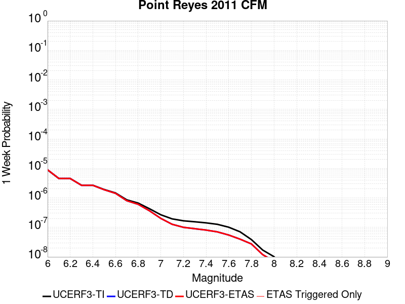 |  | 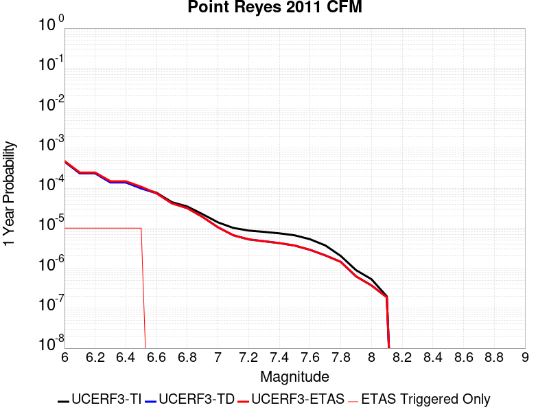 |  |

| Magnitude | 1 wk TI Prob | 1 wk TD Prob | 1 wk ETAS Prob | 1 wk ETAS/TD Gain | 1 wk ETAS Triggered Only | 1 mo TI Prob | 1 mo TD Prob | 1 mo ETAS Prob | 1 mo ETAS/TD Gain | 1 mo ETAS Triggered Only | 1 yr TI Prob | 1 yr TD Prob | 1 yr ETAS Prob | 1 yr ETAS/TD Gain | 1 yr ETAS Triggered Only | 10 yr TI Prob | 10 yr TD Prob | 10 yr ETAS Prob | 10 yr ETAS/TD Gain | 10 yr ETAS Triggered Only |
|-----|-----|-----|-----|-----|-----|-----|-----|-----|-----|-----|-----|-----|-----|-----|-----|-----|-----|-----|-----|-----|
| 6.0 | 8.8644965E-6 | 8.967717E-6 | 8.967717E-6 | 1.0 | 0.0 | 3.7990147E-5 | 3.843254E-5 | 4.8432157E-5 | 1.2601862 | 1.0E-5 | 4.624319E-4 | 4.6782198E-4 | 4.7781732E-4 | 1.0213656 | 1.0E-5 | 0.0046147075 | 0.0046690004 | 0.0046789534 | 1.0021318 | 1.0E-5 |
| 6.1 | 4.526405E-6 | 4.539595E-6 | 4.539595E-6 | 1.0 | 0.0 | 1.9398734E-5 | 1.9455267E-5 | 2.9455072E-5 | 1.5139896 | 1.0E-5 | 2.36154E-4 | 2.3684317E-4 | 2.4684082E-4 | 1.042212 | 1.0E-5 | 0.002359032 | 0.0023660138 | 0.0023759902 | 1.0042166 | 1.0E-5 |
| 6.2 | 4.526405E-6 | 4.539595E-6 | 4.539595E-6 | 1.0 | 0.0 | 1.9398734E-5 | 1.9455267E-5 | 2.9455072E-5 | 1.5139896 | 1.0E-5 | 2.36154E-4 | 2.3684317E-4 | 2.4684082E-4 | 1.042212 | 1.0E-5 | 0.002359032 | 0.0023660138 | 0.0023759902 | 1.0042166 | 1.0E-5 |
| 6.3 | 2.6842322E-6 | 2.660981E-6 | 2.660981E-6 | 1.0 | 0.0 | 1.1503801E-5 | 1.1404155E-5 | 2.1404041E-5 | 1.8768634 | 1.0E-5 | 1.4004979E-4 | 1.3883694E-4 | 1.4883555E-4 | 1.072017 | 1.0E-5 | 0.0013996155 | 0.0013875238 | 0.00139751 | 1.0071971 | 1.0E-5 |
| 6.4 | 2.6842322E-6 | 2.660981E-6 | 2.660981E-6 | 1.0 | 0.0 | 1.1503801E-5 | 1.1404155E-5 | 2.1404041E-5 | 1.8768634 | 1.0E-5 | 1.4004979E-4 | 1.3883694E-4 | 1.4883555E-4 | 1.072017 | 1.0E-5 | 0.0013996155 | 0.0013875238 | 0.00139751 | 1.0071971 | 1.0E-5 |
| 6.5 | 1.9281833E-6 | 1.8909037E-6 | 1.8909037E-6 | 1.0 | 0.0 | 8.263617E-6 | 8.103848E-6 | 1.8103767E-5 | 2.2339716 | 1.0E-5 | 1.0060489E-4 | 9.865997E-5 | 1.08658984E-4 | 1.1013483 | 1.0E-5 | 0.0010055936 | 9.861726E-4 | 9.961626E-4 | 1.0101302 | 1.0E-5 |
| 6.6 | 1.4726726E-6 | 1.4272191E-6 | 1.4272191E-6 | 1.0 | 0.0 | 6.3114385E-6 | 6.1166393E-6 | 6.1166393E-6 | 1.0 | 0.0 | 7.683905E-5 | 7.4467585E-5 | 7.4467585E-5 | 1.0 | 0.0 | 7.6812494E-4 | 7.444335E-4 | 7.444335E-4 | 1.0 | 0.0 |
| 6.7 | 8.572307E-7 | 8.0096146E-7 | 8.0096146E-7 | 1.0 | 0.0 | 3.6738406E-6 | 3.4326874E-6 | 3.4326874E-6 | 1.0 | 0.0 | 4.472809E-5 | 4.1792184E-5 | 4.1792184E-5 | 1.0 | 0.0 | 4.471909E-4 | 4.1784716E-4 | 4.1784716E-4 | 1.0 | 0.0 |
| 6.8 | 6.6745434E-7 | 6.0796395E-7 | 6.0796395E-7 | 1.0 | 0.0 | 2.8605155E-6 | 2.6055573E-6 | 2.6055573E-6 | 1.0 | 0.0 | 3.482622E-5 | 3.1722207E-5 | 3.1722207E-5 | 1.0 | 0.0 | 3.4820763E-4 | 3.171801E-4 | 3.171801E-4 | 1.0 | 0.0 |
| 6.9 | 4.291521E-7 | 3.6558538E-7 | 3.6558538E-7 | 1.0 | 0.0 | 1.839222E-6 | 1.5667935E-6 | 1.5667935E-6 | 1.0 | 0.0 | 2.2392298E-5 | 1.9075547E-5 | 1.9075547E-5 | 1.0 | 0.0 | 2.2390042E-4 | 1.9074175E-4 | 1.9074175E-4 | 1.0 | 0.0 |
| 7.0 | 2.6812808E-7 | 2.0209461E-7 | 2.0209461E-7 | 1.0 | 0.0 | 1.1491198E-6 | 8.661195E-7 | 8.661195E-7 | 1.0 | 0.0 | 1.3990444E-5 | 1.0544954E-5 | 1.0544954E-5 | 1.0 | 0.0 | 1.3989564E-4 | 1.0544688E-4 | 1.0544688E-4 | 1.0 | 0.0 |
| 7.1 | 1.9451231E-7 | 1.2747282E-7 | 1.2747282E-7 | 1.0 | 0.0 | 8.336239E-7 | 5.46312E-7 | 5.46312E-7 | 1.0 | 0.0 | 1.0149324E-5 | 6.6513276E-6 | 6.6513276E-6 | 1.0 | 0.0 | 1.014886E-4 | 6.651356E-5 | 6.651356E-5 | 1.0 | 0.0 |
| 7.2 | 1.6715143E-7 | 1.00642986E-7 | 1.00642986E-7 | 1.0 | 0.0 | 7.1636305E-7 | 4.3132704E-7 | 4.3132704E-7 | 1.0 | 0.0 | 8.721685E-6 | 5.2513938E-6 | 5.2513938E-6 | 1.0 | 0.0 | 8.721343E-5 | 5.2514966E-5 | 5.2514966E-5 | 1.0 | 0.0 |
| 7.3 | 1.5503173E-7 | 9.0342404E-8 | 9.0342404E-8 | 1.0 | 0.0 | 6.644215E-7 | 3.871817E-7 | 3.871817E-7 | 1.0 | 0.0 | 8.089301E-6 | 4.7139265E-6 | 4.7139265E-6 | 1.0 | 0.0 | 8.089007E-5 | 4.7140536E-5 | 4.7140536E-5 | 1.0 | 0.0 |
| 7.4 | 1.4251614E-7 | 8.118185E-8 | 8.118185E-8 | 1.0 | 0.0 | 6.1078333E-7 | 3.479222E-7 | 3.479222E-7 | 1.0 | 0.0 | 7.4362615E-6 | 4.2359443E-6 | 4.2359443E-6 | 1.0 | 0.0 | 7.436013E-5 | 4.2360905E-5 | 4.2360905E-5 | 1.0 | 0.0 |
| 7.5 | 1.2710186E-7 | 7.0493925E-8 | 7.0493925E-8 | 1.0 | 0.0 | 5.447221E-7 | 3.0211683E-7 | 3.0211683E-7 | 1.0 | 0.0 | 6.6319717E-6 | 3.6782658E-6 | 3.6782658E-6 | 1.0 | 0.0 | 6.6317734E-5 | 3.678432E-5 | 3.678432E-5 | 1.0 | 0.0 |
| 7.6 | 1.0144708E-7 | 5.5133064E-8 | 5.5133064E-8 | 1.0 | 0.0 | 4.347731E-7 | 2.3628456E-7 | 2.3628456E-7 | 1.0 | 0.0 | 5.2933497E-6 | 2.8767606E-6 | 2.8767606E-6 | 1.0 | 0.0 | 5.293224E-5 | 2.8769502E-5 | 2.8769502E-5 | 1.0 | 0.0 |
| 7.7 | 7.090527E-8 | 3.99745E-8 | 3.99745E-8 | 1.0 | 0.0 | 3.038797E-7 | 1.7131929E-7 | 1.7131929E-7 | 1.0 | 0.0 | 3.699729E-6 | 2.0858104E-6 | 2.0858104E-6 | 1.0 | 0.0 | 3.6996673E-5 | 2.0860176E-5 | 2.0860176E-5 | 1.0 | 0.0 |
| 7.8 | 3.8712045E-8 | 2.7569504E-8 | 2.7569504E-8 | 1.0 | 0.0 | 1.6590876E-7 | 1.18155036E-7 | 1.18155036E-7 | 1.0 | 0.0 | 2.0199373E-6 | 1.4385365E-6 | 1.4385365E-6 | 1.0 | 0.0 | 2.0199188E-5 | 1.4387541E-5 | 1.4387541E-5 | 1.0 | 0.0 |
| 7.9 | 1.7068782E-8 | 1.1939118E-8 | 1.1939118E-8 | 1.0 | 0.0 | 7.315192E-8 | 5.116766E-8 | 5.116766E-8 | 1.0 | 0.0 | 8.906242E-7 | 6.2296607E-7 | 6.2296607E-7 | 1.0 | 0.0 | 8.906207E-6 | 6.231912E-6 | 6.231912E-6 | 1.0 | 0.0 |
| 8.0 | 1.0172592E-8 | 7.1169284E-9 | 7.1169284E-9 | 1.0 | 0.0 | 4.359682E-8 | 3.050113E-8 | 3.050113E-8 | 1.0 | 0.0 | 5.3079117E-7 | 3.7135118E-7 | 3.7135118E-7 | 1.0 | 0.0 | 5.307899E-6 | 3.7157743E-6 | 3.7157743E-6 | 1.0 | 0.0 |
| 8.1 | 3.7861243E-9 | 3.588338E-9 | 3.588338E-9 | 1.0 | 0.0 | 1.6226247E-8 | 1.5378596E-8 | 1.5378596E-8 | 1.0 | 0.0 | 1.9755454E-7 | 1.8723439E-7 | 1.8723439E-7 | 1.0 | 0.0 | 1.9755437E-6 | 1.8742838E-6 | 1.8742838E-6 | 1.0 | 0.0 |

## Great Valley 04b Gordon Valley
*[(top)](#table-of-contents)*

| 1 Week | 1 Month | 1 Year | 10 Year |
|-----|-----|-----|-----|
|  |  |  |  |

| Magnitude | 1 wk TI Prob | 1 wk TD Prob | 1 wk ETAS Prob | 1 wk ETAS/TD Gain | 1 wk ETAS Triggered Only | 1 mo TI Prob | 1 mo TD Prob | 1 mo ETAS Prob | 1 mo ETAS/TD Gain | 1 mo ETAS Triggered Only | 1 yr TI Prob | 1 yr TD Prob | 1 yr ETAS Prob | 1 yr ETAS/TD Gain | 1 yr ETAS Triggered Only | 10 yr TI Prob | 10 yr TD Prob | 10 yr ETAS Prob | 10 yr ETAS/TD Gain | 10 yr ETAS Triggered Only |
|-----|-----|-----|-----|-----|-----|-----|-----|-----|-----|-----|-----|-----|-----|-----|-----|-----|-----|-----|-----|-----|
| 6.0 | 2.1181217E-5 | 2.398808E-5 | 2.398808E-5 | 1.0 | 0.0 | 9.077348E-5 | 1.02802944E-4 | 1.02802944E-4 | 1.0 | 0.0 | 0.0011046068 | 0.001251074 | 0.0012610615 | 1.0079831 | 1.0E-5 | 0.010991322 | 0.012456768 | 0.012466644 | 1.0007927 | 1.0E-5 |
| 6.1 | 2.1181217E-5 | 2.398808E-5 | 2.398808E-5 | 1.0 | 0.0 | 9.077348E-5 | 1.02802944E-4 | 1.02802944E-4 | 1.0 | 0.0 | 0.0011046068 | 0.001251074 | 0.0012610615 | 1.0079831 | 1.0E-5 | 0.010991322 | 0.012456768 | 0.012466644 | 1.0007927 | 1.0E-5 |
| 6.2 | 2.1181217E-5 | 2.398808E-5 | 2.398808E-5 | 1.0 | 0.0 | 9.077348E-5 | 1.02802944E-4 | 1.02802944E-4 | 1.0 | 0.0 | 0.0011046068 | 0.001251074 | 0.0012610615 | 1.0079831 | 1.0E-5 | 0.010991322 | 0.012456768 | 0.012466644 | 1.0007927 | 1.0E-5 |
| 6.3 | 2.1181217E-5 | 2.398808E-5 | 2.398808E-5 | 1.0 | 0.0 | 9.077348E-5 | 1.02802944E-4 | 1.02802944E-4 | 1.0 | 0.0 | 0.0011046068 | 0.001251074 | 0.0012610615 | 1.0079831 | 1.0E-5 | 0.010991322 | 0.012456768 | 0.012466644 | 1.0007927 | 1.0E-5 |
| 6.4 | 1.0988268E-5 | 1.2257221E-5 | 1.2257221E-5 | 1.0 | 0.0 | 4.7091726E-5 | 5.252998E-5 | 5.252998E-5 | 1.0 | 0.0 | 5.731909E-4 | 6.3938077E-4 | 6.3938077E-4 | 1.0 | 0.0 | 0.005717147 | 0.006377 | 0.006377 | 1.0 | 0.0 |
| 6.5 | 1.0988268E-5 | 1.2257221E-5 | 1.2257221E-5 | 1.0 | 0.0 | 4.7091726E-5 | 5.252998E-5 | 5.252998E-5 | 1.0 | 0.0 | 5.731909E-4 | 6.3938077E-4 | 6.3938077E-4 | 1.0 | 0.0 | 0.005717147 | 0.006377 | 0.006377 | 1.0 | 0.0 |
| 6.6 | 1.0517822E-5 | 1.17266545E-5 | 1.17266545E-5 | 1.0 | 0.0 | 4.5075605E-5 | 5.025621E-5 | 5.025621E-5 | 1.0 | 0.0 | 5.4865726E-4 | 6.117132E-4 | 6.117132E-4 | 1.0 | 0.0 | 0.0054730466 | 0.0061018486 | 0.0061018486 | 1.0 | 0.0 |
| 6.7 | 7.789219E-6 | 8.6795535E-6 | 8.6795535E-6 | 1.0 | 0.0 | 3.3381937E-5 | 3.7197584E-5 | 3.7197584E-5 | 1.0 | 0.0 | 4.063493E-4 | 4.5279166E-4 | 4.5279166E-4 | 1.0 | 0.0 | 0.004056071 | 0.0045192083 | 0.0045192083 | 1.0 | 0.0 |
| 6.8 | 7.5850853E-6 | 8.454253E-6 | 8.454253E-6 | 1.0 | 0.0 | 3.2507105E-5 | 3.623204E-5 | 3.623204E-5 | 1.0 | 0.0 | 3.957021E-4 | 4.410409E-4 | 4.410409E-4 | 1.0 | 0.0 | 0.0039499826 | 0.0044021686 | 0.0044021686 | 1.0 | 0.0 |
| 6.9 | 6.604105E-6 | 7.3601705E-6 | 7.3601705E-6 | 1.0 | 0.0 | 2.8303E-5 | 3.154323E-5 | 3.154323E-5 | 1.0 | 0.0 | 3.4453452E-4 | 3.83975E-4 | 3.83975E-4 | 1.0 | 0.0 | 0.0034400085 | 0.0038335025 | 0.0038335025 | 1.0 | 0.0 |
| 7.0 | 5.3701115E-6 | 5.9897484E-6 | 5.9897484E-6 | 1.0 | 0.0 | 2.301456E-5 | 2.5670115E-5 | 2.5670115E-5 | 1.0 | 0.0 | 2.8016625E-4 | 3.1249173E-4 | 3.1249173E-4 | 1.0 | 0.0 | 0.0027981328 | 0.003120812 | 0.003120812 | 1.0 | 0.0 |
| 7.1 | 4.4685607E-6 | 4.9875935E-6 | 4.9875935E-6 | 1.0 | 0.0 | 1.9150835E-5 | 2.137524E-5 | 2.137524E-5 | 1.0 | 0.0 | 2.3313647E-4 | 2.6021493E-4 | 2.6021493E-4 | 1.0 | 0.0 | 0.0023289204 | 0.0025993474 | 0.0025993474 | 1.0 | 0.0 |
| 7.2 | 2.833378E-6 | 3.165133E-6 | 3.165133E-6 | 1.0 | 0.0 | 1.2142991E-5 | 1.3564795E-5 | 1.3564795E-5 | 1.0 | 0.0 | 1.4783088E-4 | 1.6514062E-4 | 1.6514062E-4 | 1.0 | 0.0 | 0.0014773258 | 0.0016503509 | 0.0016503509 | 1.0 | 0.0 |
| 7.3 | 7.0087293E-7 | 7.774461E-7 | 7.774461E-7 | 1.0 | 0.0 | 3.0037377E-6 | 3.33191E-6 | 3.33191E-6 | 1.0 | 0.0 | 3.656989E-5 | 4.056571E-5 | 4.056571E-5 | 1.0 | 0.0 | 3.6563876E-4 | 4.0562803E-4 | 4.0562803E-4 | 1.0 | 0.0 |
| 7.4 | 3.112171E-8 | 3.2070247E-8 | 3.2070247E-8 | 1.0 | 0.0 | 1.3337875E-7 | 1.374439E-7 | 1.374439E-7 | 1.0 | 0.0 | 1.6238852E-6 | 1.6733784E-6 | 1.6733784E-6 | 1.0 | 0.0 | 1.6238733E-5 | 1.6733666E-5 | 1.6733666E-5 | 1.0 | 0.0 |

## San Jacinto (Borrego)
*[(top)](#table-of-contents)*

| 1 Week | 1 Month | 1 Year | 10 Year |
|-----|-----|-----|-----|
|  |  | 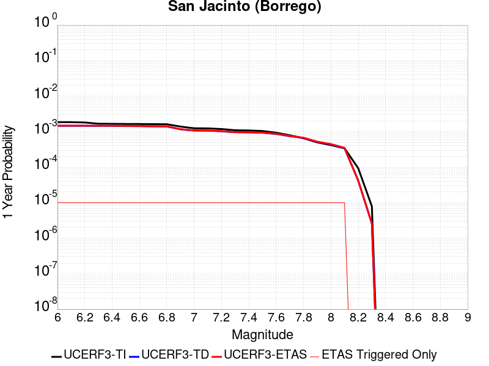 | 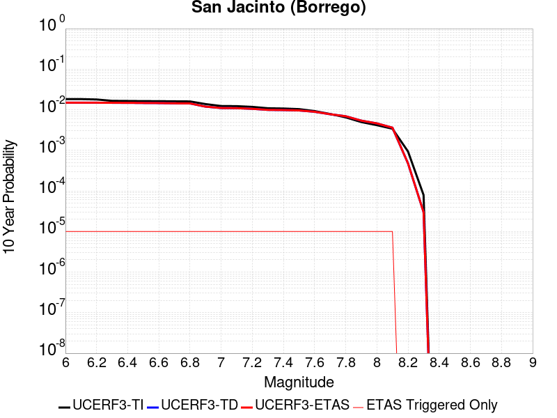 |

| Magnitude | 1 wk TI Prob | 1 wk TD Prob | 1 wk ETAS Prob | 1 wk ETAS/TD Gain | 1 wk ETAS Triggered Only | 1 mo TI Prob | 1 mo TD Prob | 1 mo ETAS Prob | 1 mo ETAS/TD Gain | 1 mo ETAS Triggered Only | 1 yr TI Prob | 1 yr TD Prob | 1 yr ETAS Prob | 1 yr ETAS/TD Gain | 1 yr ETAS Triggered Only | 10 yr TI Prob | 10 yr TD Prob | 10 yr ETAS Prob | 10 yr ETAS/TD Gain | 10 yr ETAS Triggered Only |
|-----|-----|-----|-----|-----|-----|-----|-----|-----|-----|-----|-----|-----|-----|-----|-----|-----|-----|-----|-----|-----|
| 6.0 | 3.543992E-5 | 2.803755E-5 | 2.803755E-5 | 1.0 | 0.0 | 1.5187653E-4 | 1.2015546E-4 | 1.2015546E-4 | 1.0 | 0.0 | 0.0018475284 | 0.0014619234 | 0.0014719088 | 1.0068303 | 1.0E-5 | 0.018322436 | 0.014926705 | 0.014936556 | 1.00066 | 1.0E-5 |
| 6.1 | 3.542281E-5 | 2.803755E-5 | 2.803755E-5 | 1.0 | 0.0 | 1.5180321E-4 | 1.2015546E-4 | 1.2015546E-4 | 1.0 | 0.0 | 0.0018466372 | 0.0014619234 | 0.0014719088 | 1.0068303 | 1.0E-5 | 0.018313672 | 0.014926705 | 0.014936556 | 1.00066 | 1.0E-5 |
| 6.2 | 3.4688688E-5 | 2.803755E-5 | 2.803755E-5 | 1.0 | 0.0 | 1.4865733E-4 | 1.2015546E-4 | 1.2015546E-4 | 1.0 | 0.0 | 0.0018084005 | 0.0014619234 | 0.0014719088 | 1.0068303 | 1.0E-5 | 0.017937548 | 0.014926705 | 0.014936555 | 1.00066 | 1.0E-5 |
| 6.3 | 3.2087122E-5 | 2.788285E-5 | 2.788285E-5 | 1.0 | 0.0 | 1.3750899E-4 | 1.1949252E-4 | 1.1949252E-4 | 1.0 | 0.0 | 0.0016728862 | 0.0014538629 | 0.0014638483 | 1.0068682 | 1.0E-5 | 0.016603488 | 0.014847842 | 0.014857694 | 1.0006635 | 1.0E-5 |
| 6.4 | 3.1828724E-5 | 2.7849808E-5 | 2.7849808E-5 | 1.0 | 0.0 | 1.364017E-4 | 1.1935093E-4 | 1.1935093E-4 | 1.0 | 0.0 | 0.0016594254 | 0.0014521413 | 0.0014621267 | 1.0068763 | 1.0E-5 | 0.016470885 | 0.014831028 | 0.0148408795 | 1.0006642 | 1.0E-5 |
| 6.5 | 3.1563577E-5 | 2.7589102E-5 | 2.7589102E-5 | 1.0 | 0.0 | 1.3526545E-4 | 1.18233715E-4 | 1.18233715E-4 | 1.0 | 0.0 | 0.0016456128 | 0.0014385572 | 0.0014485428 | 1.0069414 | 1.0E-5 | 0.0163348 | 0.0146969035 | 0.014706756 | 1.0006704 | 1.0E-5 |
| 6.6 | 3.1467625E-5 | 2.7433189E-5 | 2.7433189E-5 | 1.0 | 0.0 | 1.3485427E-4 | 1.1756558E-4 | 1.1756558E-4 | 1.0 | 0.0 | 0.0016406142 | 0.0014304334 | 0.001440419 | 1.0069809 | 1.0E-5 | 0.016285548 | 0.014617 | 0.014626854 | 1.0006741 | 1.0E-5 |
| 6.7 | 3.1223695E-5 | 2.7050997E-5 | 2.7050997E-5 | 1.0 | 0.0 | 1.3380898E-4 | 1.1592777E-4 | 1.1592777E-4 | 1.0 | 0.0 | 0.0016279068 | 0.0014105189 | 0.0014205048 | 1.0070796 | 1.0E-5 | 0.01616033 | 0.014421192 | 0.014431047 | 1.0006834 | 1.0E-5 |
| 6.8 | 3.1015585E-5 | 2.6871763E-5 | 2.6871763E-5 | 1.0 | 0.0 | 1.3291716E-4 | 1.1515968E-4 | 1.1515968E-4 | 1.0 | 0.0 | 0.001617065 | 0.0014011796 | 0.0014111656 | 1.0071268 | 1.0E-5 | 0.016053487 | 0.014328398 | 0.014338254 | 1.000688 | 1.0E-5 |
| 6.9 | 2.6641965E-5 | 2.2287346E-5 | 2.2287346E-5 | 1.0 | 0.0 | 1.1417485E-4 | 9.551372E-5 | 9.551372E-5 | 1.0 | 0.0 | 0.0013891924 | 0.0011622632 | 0.0011722515 | 1.0085939 | 1.0E-5 | 0.0138054015 | 0.011935795 | 0.011945675 | 1.0008278 | 1.0E-5 |
| 7.0 | 2.3854353E-5 | 2.0578404E-5 | 2.0578404E-5 | 1.0 | 0.0 | 1.02228936E-4 | 8.8190194E-5 | 8.8190194E-5 | 1.0 | 0.0 | 0.0012439266 | 0.0010731893 | 0.0010831786 | 1.009308 | 1.0E-5 | 0.012369866 | 0.011034441 | 0.011044331 | 1.0008962 | 1.0E-5 |
| 7.1 | 2.3672901E-5 | 2.041478E-5 | 2.041478E-5 | 1.0 | 0.0 | 1.0145135E-4 | 8.7488996E-5 | 8.7488996E-5 | 1.0 | 0.0 | 0.0012344702 | 0.0010646606 | 0.0010746499 | 1.0093826 | 1.0E-5 | 0.0122763505 | 0.010949543 | 0.010959432 | 1.0009032 | 1.0E-5 |
| 7.2 | 2.2717244E-5 | 1.9641322E-5 | 1.9641322E-5 | 1.0 | 0.0 | 9.735599E-5 | 8.417439E-5 | 8.417439E-5 | 1.0 | 0.0 | 0.0011846646 | 0.0010243438 | 0.0010343335 | 1.0097524 | 1.0E-5 | 0.01178369 | 0.010546606 | 0.0105565 | 1.0009382 | 1.0E-5 |
| 7.3 | 2.1016205E-5 | 1.8481605E-5 | 1.8481605E-5 | 1.0 | 0.0 | 9.006634E-5 | 7.920448E-5 | 7.920448E-5 | 1.0 | 0.0 | 0.001096006 | 9.6389005E-4 | 9.738804E-4 | 1.0103647 | 1.0E-5 | 0.010906163 | 0.009941606 | 0.009951507 | 1.0009959 | 1.0E-5 |
| 7.4 | 2.0683625E-5 | 1.8283845E-5 | 1.8283845E-5 | 1.0 | 0.0 | 8.86411E-5 | 7.8357E-5 | 7.8357E-5 | 1.0 | 0.0 | 0.001078671 | 9.5358095E-4 | 9.635714E-4 | 1.0104768 | 1.0E-5 | 0.010734501 | 0.009838183 | 0.009848085 | 1.0010065 | 1.0E-5 |
| 7.5 | 1.9993966E-5 | 1.7878037E-5 | 1.7878037E-5 | 1.0 | 0.0 | 8.568561E-5 | 7.661792E-5 | 7.661792E-5 | 1.0 | 0.0 | 0.001042723 | 9.324261E-4 | 9.424167E-4 | 1.0107148 | 1.0E-5 | 0.010378438 | 0.009624699 | 0.009634603 | 1.001029 | 1.0E-5 |
| 7.6 | 1.788966E-5 | 1.6528877E-5 | 1.6528877E-5 | 1.0 | 0.0 | 7.666772E-5 | 7.0836126E-5 | 7.0836126E-5 | 1.0 | 0.0 | 9.3302975E-4 | 8.620904E-4 | 8.720818E-4 | 1.0115898 | 1.0E-5 | 0.00929122 | 0.008915414 | 0.008925325 | 1.0011116 | 1.0E-5 |
| 7.7 | 1.5125781E-5 | 1.4327906E-5 | 1.4327906E-5 | 1.0 | 0.0 | 6.4823165E-5 | 6.140387E-5 | 6.140387E-5 | 1.0 | 0.0 | 7.889362E-4 | 7.4733654E-4 | 7.5732905E-4 | 1.0133709 | 1.0E-5 | 0.007861412 | 0.0077615543 | 0.0077714766 | 1.0012784 | 1.0E-5 |
| 7.8 | 1.250089E-5 | 1.2717789E-5 | 1.2717789E-5 | 1.0 | 0.0 | 5.3574146E-5 | 5.4503675E-5 | 5.4503675E-5 | 1.0 | 0.0 | 6.5207E-4 | 6.6338084E-4 | 6.733742E-4 | 1.0150642 | 1.0E-5 | 0.006501599 | 0.0069136126 | 0.0069235438 | 1.0014365 | 1.0E-5 |
| 7.9 | 9.561E-6 | 9.8321E-6 | 9.8321E-6 | 1.0 | 0.0 | 4.0975072E-5 | 4.2136893E-5 | 4.2136893E-5 | 1.0 | 0.0 | 4.987573E-4 | 5.128965E-4 | 5.2289135E-4 | 1.0194871 | 1.0E-5 | 0.0049763937 | 0.0053931945 | 0.0054031406 | 1.0018442 | 1.0E-5 |
| 8.0 | 8.01699E-6 | 8.364132E-6 | 8.364132E-6 | 1.0 | 0.0 | 3.4358076E-5 | 3.584579E-5 | 3.584579E-5 | 1.0 | 0.0 | 4.1822926E-4 | 4.3633566E-4 | 4.4633128E-4 | 1.0229081 | 1.0E-5 | 0.0041744304 | 0.004610577 | 0.004620531 | 1.0021589 | 1.0E-5 |
| 8.1 | 6.541947E-6 | 6.5202626E-6 | 6.5202626E-6 | 1.0 | 0.0 | 2.8036617E-5 | 2.7943684E-5 | 2.7943684E-5 | 1.0 | 0.0 | 3.4129233E-4 | 3.4016176E-4 | 3.5015837E-4 | 1.0293878 | 1.0E-5 | 0.0034076865 | 0.0036113712 | 0.0036213351 | 1.002759 | 1.0E-5 |
| 8.2 | 1.7968189E-6 | 8.0772884E-7 | 8.0772884E-7 | 1.0 | 0.0 | 7.70063E-6 | 3.4616905E-6 | 3.4616905E-6 | 1.0 | 0.0 | 9.3751136E-5 | 4.214529E-5 | 4.214529E-5 | 1.0 | 0.0 | 9.371159E-4 | 4.7717895E-4 | 4.7717895E-4 | 1.0 | 0.0 |
| 8.3 | 1.5167889E-7 | 4.973109E-8 | 4.973109E-8 | 1.0 | 0.0 | 6.500522E-7 | 2.1313322E-7 | 2.1313322E-7 | 1.0 | 0.0 | 7.9143565E-6 | 2.5948943E-6 | 2.5948943E-6 | 1.0 | 0.0 | 7.914075E-5 | 3.0128132E-5 | 3.0128132E-5 | 1.0 | 0.0 |

## Big Pine (East)
*[(top)](#table-of-contents)*

| 1 Week | 1 Month | 1 Year | 10 Year |
|-----|-----|-----|-----|
|  | 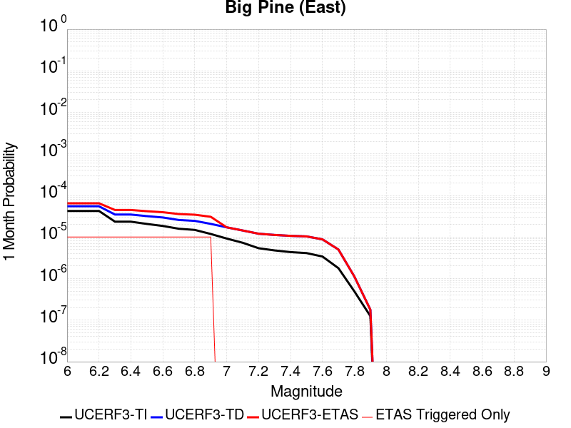 | 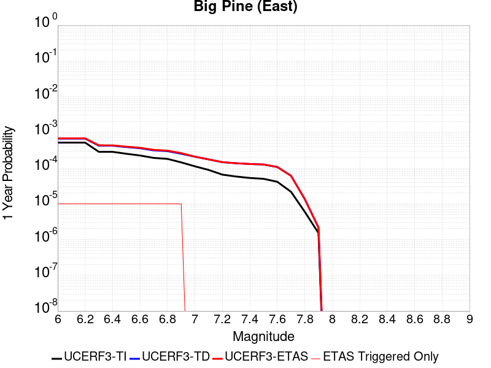 |  |

| Magnitude | 1 wk TI Prob | 1 wk TD Prob | 1 wk ETAS Prob | 1 wk ETAS/TD Gain | 1 wk ETAS Triggered Only | 1 mo TI Prob | 1 mo TD Prob | 1 mo ETAS Prob | 1 mo ETAS/TD Gain | 1 mo ETAS Triggered Only | 1 yr TI Prob | 1 yr TD Prob | 1 yr ETAS Prob | 1 yr ETAS/TD Gain | 1 yr ETAS Triggered Only | 10 yr TI Prob | 10 yr TD Prob | 10 yr ETAS Prob | 10 yr ETAS/TD Gain | 10 yr ETAS Triggered Only |
|-----|-----|-----|-----|-----|-----|-----|-----|-----|-----|-----|-----|-----|-----|-----|-----|-----|-----|-----|-----|-----|
| 6.0 | 9.916913E-6 | 1.2835414E-5 | 2.2835286E-5 | 1.7790844 | 1.0E-5 | 4.250036E-5 | 5.5007884E-5 | 6.5007334E-5 | 1.1817821 | 1.0E-5 | 5.173191E-4 | 6.695373E-4 | 6.795306E-4 | 1.0149257 | 1.0E-5 | 0.0051611643 | 0.0066799624 | 0.0066898954 | 1.001487 | 1.0E-5 |
| 6.1 | 9.916913E-6 | 1.2835414E-5 | 2.2835286E-5 | 1.7790844 | 1.0E-5 | 4.250036E-5 | 5.5007884E-5 | 6.5007334E-5 | 1.1817821 | 1.0E-5 | 5.173191E-4 | 6.695373E-4 | 6.795306E-4 | 1.0149257 | 1.0E-5 | 0.0051611643 | 0.0066799624 | 0.0066898954 | 1.001487 | 1.0E-5 |
| 6.2 | 9.916913E-6 | 1.2835414E-5 | 2.2835286E-5 | 1.7790844 | 1.0E-5 | 4.250036E-5 | 5.5007884E-5 | 6.5007334E-5 | 1.1817821 | 1.0E-5 | 5.173191E-4 | 6.695373E-4 | 6.795306E-4 | 1.0149257 | 1.0E-5 | 0.0051611643 | 0.0066799624 | 0.0066898954 | 1.001487 | 1.0E-5 |
| 6.3 | 5.479711E-6 | 8.130836E-6 | 1.8130755E-5 | 2.2298758 | 1.0E-5 | 2.3484265E-5 | 3.4845994E-5 | 4.4845645E-5 | 1.286967 | 1.0E-5 | 2.858834E-4 | 4.2417058E-4 | 4.3416634E-4 | 1.0235654 | 1.0E-5 | 0.0028551589 | 0.0042365044 | 0.0042464617 | 1.0023504 | 1.0E-5 |
| 6.4 | 5.465009E-6 | 8.1151275E-6 | 1.8115046E-5 | 2.2322564 | 1.0E-5 | 2.3421257E-5 | 3.4778674E-5 | 4.4778324E-5 | 1.2875226 | 1.0E-5 | 2.851165E-4 | 4.2335127E-4 | 4.3334704E-4 | 1.0236111 | 1.0E-5 | 0.0028475097 | 0.0042283423 | 0.0042383 | 1.002355 | 1.0E-5 |
| 6.5 | 4.826767E-6 | 7.440109E-6 | 1.7440034E-5 | 2.3440564 | 1.0E-5 | 2.068598E-5 | 3.1885807E-5 | 4.188549E-5 | 1.3136091 | 1.0E-5 | 2.518227E-4 | 3.8814335E-4 | 3.9813947E-4 | 1.0257537 | 1.0E-5 | 0.0025153751 | 0.003877507 | 0.0038874683 | 1.002569 | 1.0E-5 |
| 6.6 | 4.3146847E-6 | 6.8999884E-6 | 1.689992E-5 | 2.4492679 | 1.0E-5 | 1.8491375E-5 | 2.9571056E-5 | 3.957076E-5 | 1.3381585 | 1.0E-5 | 2.2510924E-4 | 3.5997058E-4 | 3.69967E-4 | 1.02777 | 1.0E-5 | 0.0022488134 | 0.0035966956 | 0.0036066596 | 1.0027703 | 1.0E-5 |
| 6.7 | 3.6968106E-6 | 6.0121733E-6 | 1.6012113E-5 | 2.6632822 | 1.0E-5 | 1.5843378E-5 | 2.576621E-5 | 3.5765952E-5 | 1.3880951 | 1.0E-5 | 1.9287605E-4 | 3.1366E-4 | 3.2365686E-4 | 1.0318717 | 1.0E-5 | 0.0019270873 | 0.003134903 | 0.0031448717 | 1.0031799 | 1.0E-5 |
| 6.8 | 3.4671132E-6 | 5.718423E-6 | 1.5718366E-5 | 2.748724 | 1.0E-5 | 1.4858972E-5 | 2.4507304E-5 | 3.450706E-5 | 1.4080316 | 1.0E-5 | 1.8089297E-4 | 2.9833702E-4 | 3.0833404E-4 | 1.0335091 | 1.0E-5 | 0.0018074579 | 0.0029820865 | 0.0029920565 | 1.0033433 | 1.0E-5 |
| 6.9 | 2.7686972E-6 | 4.8402244E-6 | 1.4840176E-5 | 3.06601 | 1.0E-5 | 1.1865792E-5 | 2.0743659E-5 | 3.074345E-5 | 1.4820651 | 1.0E-5 | 1.4445644E-4 | 2.5252553E-4 | 2.62523E-4 | 1.03959 | 1.0E-5 | 0.0014436257 | 0.002525039 | 0.0025350137 | 1.0039504 | 1.0E-5 |
| 7.0 | 2.1472624E-6 | 3.9986735E-6 | 3.9986735E-6 | 1.0 | 0.0 | 9.20252E-6 | 1.7137061E-5 | 1.7137061E-5 | 1.0 | 0.0 | 1.12034926E-4 | 2.0862429E-4 | 2.0862429E-4 | 1.0 | 0.0 | 0.0011197845 | 0.0020869283 | 0.0020869283 | 1.0 | 0.0 |
| 7.1 | 1.7018335E-6 | 3.3572564E-6 | 3.3572564E-6 | 1.0 | 0.0 | 7.293552E-6 | 1.4388164E-5 | 1.4388164E-5 | 1.0 | 0.0 | 8.879537E-5 | 1.7516217E-4 | 1.7516217E-4 | 1.0 | 0.0 | 8.87599E-4 | 0.0017528529 | 0.0017528529 | 1.0 | 0.0 |
| 7.2 | 1.25603E-6 | 2.8061725E-6 | 2.8061725E-6 | 1.0 | 0.0 | 5.3829745E-6 | 1.2026399E-5 | 1.2026399E-5 | 1.0 | 0.0 | 6.553574E-5 | 1.464118E-4 | 1.464118E-4 | 1.0 | 0.0 | 6.551642E-4 | 0.0014657407 | 0.0014657407 | 1.0 | 0.0 |
| 7.3 | 1.112297E-6 | 2.6213734E-6 | 2.6213734E-6 | 1.0 | 0.0 | 4.7669787E-6 | 1.123441E-5 | 1.123441E-5 | 1.0 | 0.0 | 5.803642E-5 | 1.3677057E-4 | 1.3677057E-4 | 1.0 | 0.0 | 5.802127E-4 | 0.0013692701 | 0.0013692701 | 1.0 | 0.0 |
| 7.4 | 1.0137181E-6 | 2.4940612E-6 | 2.4940612E-6 | 1.0 | 0.0 | 4.3444993E-6 | 1.0688791E-5 | 1.0688791E-5 | 1.0 | 0.0 | 5.2892992E-5 | 1.3012848E-4 | 1.3012848E-4 | 1.0 | 0.0 | 5.288041E-4 | 0.0013027164 | 0.0013027164 | 1.0 | 0.0 |
| 7.5 | 9.598608E-7 | 2.4174037E-6 | 2.4174037E-6 | 1.0 | 0.0 | 4.1136827E-6 | 1.03602615E-5 | 1.03602615E-5 | 1.0 | 0.0 | 5.0082934E-5 | 1.261291E-4 | 1.261291E-4 | 1.0 | 0.0 | 5.007165E-4 | 0.0012625828 | 0.0012625828 | 1.0 | 0.0 |
| 7.6 | 7.929459E-7 | 2.0539192E-6 | 2.0539192E-6 | 1.0 | 0.0 | 3.3983351E-6 | 8.802482E-6 | 8.802482E-6 | 1.0 | 0.0 | 4.1373947E-5 | 1.0716513E-4 | 1.0716513E-4 | 1.0 | 0.0 | 4.1366243E-4 | 0.0010731713 | 0.0010731713 | 1.0 | 0.0 |
| 7.7 | 4.155788E-7 | 1.166993E-6 | 1.166993E-6 | 1.0 | 0.0 | 1.7810507E-6 | 5.0013896E-6 | 5.0013896E-6 | 1.0 | 0.0 | 2.1684076E-5 | 6.0890256E-5 | 6.0890256E-5 | 1.0 | 0.0 | 2.1681961E-4 | 6.1190216E-4 | 6.1190216E-4 | 1.0 | 0.0 |
| 7.8 | 1.14666925E-7 | 2.6064194E-7 | 2.6064194E-7 | 1.0 | 0.0 | 4.914296E-7 | 1.1170365E-6 | 1.1170365E-6 | 1.0 | 0.0 | 5.9831386E-6 | 1.3599839E-5 | 1.3599839E-5 | 1.0 | 0.0 | 5.9829777E-5 | 1.370776E-4 | 1.370776E-4 | 1.0 | 0.0 |
| 7.9 | 2.9231824E-8 | 4.1703974E-8 | 4.1703974E-8 | 1.0 | 0.0 | 1.2527924E-7 | 1.7873131E-7 | 1.7873131E-7 | 1.0 | 0.0 | 1.5252737E-6 | 2.1760518E-6 | 2.1760518E-6 | 1.0 | 0.0 | 1.5252632E-5 | 2.208426E-5 | 2.208426E-5 | 1.0 | 0.0 |

## San Luis Range - Pecho 2011 CFM
*[(top)](#table-of-contents)*

| 1 Week | 1 Month | 1 Year | 10 Year |
|-----|-----|-----|-----|
|  |  | 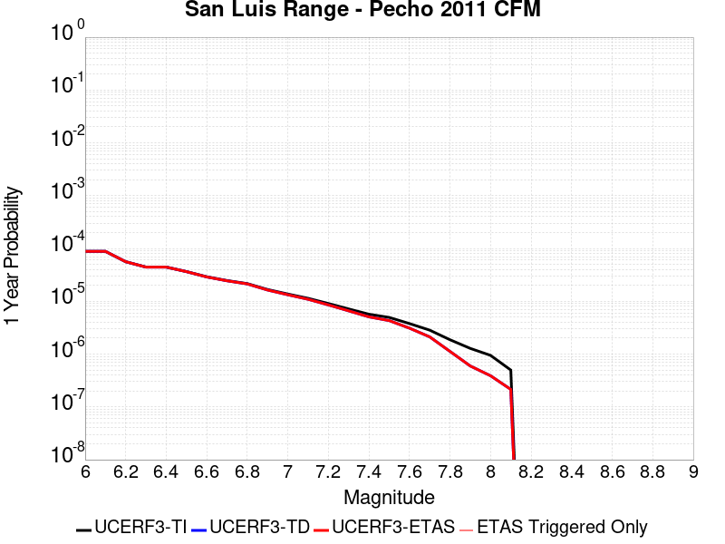 |  |

| Magnitude | 1 wk TI Prob | 1 wk TD Prob | 1 wk ETAS Prob | 1 wk ETAS/TD Gain | 1 wk ETAS Triggered Only | 1 mo TI Prob | 1 mo TD Prob | 1 mo ETAS Prob | 1 mo ETAS/TD Gain | 1 mo ETAS Triggered Only | 1 yr TI Prob | 1 yr TD Prob | 1 yr ETAS Prob | 1 yr ETAS/TD Gain | 1 yr ETAS Triggered Only | 10 yr TI Prob | 10 yr TD Prob | 10 yr ETAS Prob | 10 yr ETAS/TD Gain | 10 yr ETAS Triggered Only |
|-----|-----|-----|-----|-----|-----|-----|-----|-----|-----|-----|-----|-----|-----|-----|-----|-----|-----|-----|-----|-----|
| 6.0 | 1.687423E-6 | 1.6922695E-6 | 1.6922695E-6 | 1.0 | 0.0 | 7.231793E-6 | 7.2525645E-6 | 7.2525645E-6 | 1.0 | 0.0 | 8.804352E-5 | 8.829664E-5 | 8.829664E-5 | 1.0 | 0.0 | 8.8008645E-4 | 8.826395E-4 | 8.9263066E-4 | 1.0113196 | 1.0E-5 |
| 6.1 | 1.687423E-6 | 1.6922695E-6 | 1.6922695E-6 | 1.0 | 0.0 | 7.231793E-6 | 7.2525645E-6 | 7.2525645E-6 | 1.0 | 0.0 | 8.804352E-5 | 8.829664E-5 | 8.829664E-5 | 1.0 | 0.0 | 8.8008645E-4 | 8.826395E-4 | 8.9263066E-4 | 1.0113196 | 1.0E-5 |
| 6.2 | 1.0765672E-6 | 1.0771208E-6 | 1.0771208E-6 | 1.0 | 0.0 | 4.613851E-6 | 4.6162245E-6 | 4.6162245E-6 | 1.0 | 0.0 | 5.617219E-5 | 5.6201145E-5 | 5.6201145E-5 | 1.0 | 0.0 | 5.6157995E-4 | 5.618756E-4 | 5.7186995E-4 | 1.0177876 | 1.0E-5 |
| 6.3 | 8.523104E-7 | 8.5136605E-7 | 8.5136605E-7 | 1.0 | 0.0 | 3.6527538E-6 | 3.6487068E-6 | 3.6487068E-6 | 1.0 | 0.0 | 4.447137E-5 | 4.442213E-5 | 4.442213E-5 | 1.0 | 0.0 | 4.4462472E-4 | 4.4413572E-4 | 4.5413128E-4 | 1.0225056 | 1.0E-5 |
| 6.4 | 8.523104E-7 | 8.5136605E-7 | 8.5136605E-7 | 1.0 | 0.0 | 3.6527538E-6 | 3.6487068E-6 | 3.6487068E-6 | 1.0 | 0.0 | 4.447137E-5 | 4.442213E-5 | 4.442213E-5 | 1.0 | 0.0 | 4.4462472E-4 | 4.4413572E-4 | 4.5413128E-4 | 1.0225056 | 1.0E-5 |
| 6.5 | 7.0029404E-7 | 6.9770454E-7 | 6.9770454E-7 | 1.0 | 0.0 | 3.0012568E-6 | 2.990159E-6 | 2.990159E-6 | 1.0 | 0.0 | 3.6539688E-5 | 3.640459E-5 | 3.640459E-5 | 1.0 | 0.0 | 3.653368E-4 | 3.63988E-4 | 3.7398434E-4 | 1.0274634 | 1.0E-5 |
| 6.6 | 5.583906E-7 | 5.543408E-7 | 5.543408E-7 | 1.0 | 0.0 | 2.3931002E-6 | 2.375744E-6 | 2.375744E-6 | 1.0 | 0.0 | 2.9135606E-5 | 2.8924309E-5 | 2.8924309E-5 | 1.0 | 0.0 | 2.9131788E-4 | 2.8920616E-4 | 2.8920616E-4 | 1.0 | 0.0 |
| 6.7 | 4.73441E-7 | 4.6836243E-7 | 4.6836243E-7 | 1.0 | 0.0 | 2.0290313E-6 | 2.0072662E-6 | 2.0072662E-6 | 1.0 | 0.0 | 2.4703175E-5 | 2.4438195E-5 | 2.4438195E-5 | 1.0 | 0.0 | 2.470043E-4 | 2.4435553E-4 | 2.4435553E-4 | 1.0 | 0.0 |
| 6.8 | 4.1466086E-7 | 4.0883387E-7 | 4.0883387E-7 | 1.0 | 0.0 | 1.7771167E-6 | 1.752144E-6 | 1.752144E-6 | 1.0 | 0.0 | 2.1636182E-5 | 2.133215E-5 | 2.133215E-5 | 1.0 | 0.0 | 2.1634075E-4 | 2.1330135E-4 | 2.1330135E-4 | 1.0 | 0.0 |
| 6.9 | 3.2056641E-7 | 3.1334466E-7 | 3.1334466E-7 | 1.0 | 0.0 | 1.3738553E-6 | 1.342905E-6 | 1.342905E-6 | 1.0 | 0.0 | 1.6726559E-5 | 1.6349748E-5 | 1.6349748E-5 | 1.0 | 0.0 | 1.67253E-4 | 1.634856E-4 | 1.634856E-4 | 1.0 | 0.0 |
| 7.0 | 2.6315942E-7 | 2.5494646E-7 | 2.5494646E-7 | 1.0 | 0.0 | 1.1278256E-6 | 1.0926273E-6 | 1.0926273E-6 | 1.0 | 0.0 | 1.3731191E-5 | 1.3302656E-5 | 1.3302656E-5 | 1.0 | 0.0 | 1.3730342E-4 | 1.3301868E-4 | 1.3301868E-4 | 1.0 | 0.0 |
| 7.1 | 2.1832436E-7 | 2.092211E-7 | 2.092211E-7 | 1.0 | 0.0 | 9.356755E-7 | 8.9666156E-7 | 8.9666156E-7 | 1.0 | 0.0 | 1.13917895E-5 | 1.09168E-5 | 1.09168E-5 | 1.0 | 0.0 | 1.1391206E-4 | 1.0916269E-4 | 1.0916269E-4 | 1.0 | 0.0 |
| 7.2 | 1.7393015E-7 | 1.6381189E-7 | 1.6381189E-7 | 1.0 | 0.0 | 7.454147E-7 | 7.020508E-7 | 7.020508E-7 | 1.0 | 0.0 | 9.075386E-6 | 8.547435E-6 | 8.547435E-6 | 1.0 | 0.0 | 9.075015E-5 | 8.547109E-5 | 8.547109E-5 | 1.0 | 0.0 |
| 7.3 | 1.3744894E-7 | 1.2643041E-7 | 1.2643041E-7 | 1.0 | 0.0 | 5.890667E-7 | 5.418445E-7 | 5.418445E-7 | 1.0 | 0.0 | 7.1718637E-6 | 6.5969366E-6 | 6.5969366E-6 | 1.0 | 0.0 | 7.171632E-5 | 6.596742E-5 | 6.596742E-5 | 1.0 | 0.0 |
| 7.4 | 1.0915278E-7 | 9.731793E-8 | 9.731793E-8 | 1.0 | 0.0 | 4.6779755E-7 | 4.1707676E-7 | 4.1707676E-7 | 1.0 | 0.0 | 5.6954204E-6 | 5.077898E-6 | 5.077898E-6 | 1.0 | 0.0 | 5.6952744E-5 | 5.0777824E-5 | 5.0777824E-5 | 1.0 | 0.0 |
| 7.5 | 9.490291E-8 | 8.2613006E-8 | 8.2613006E-8 | 1.0 | 0.0 | 4.0672668E-7 | 3.540557E-7 | 3.540557E-7 | 1.0 | 0.0 | 4.9518862E-6 | 4.3106193E-6 | 4.3106193E-6 | 1.0 | 0.0 | 4.951776E-5 | 4.3105363E-5 | 4.3105363E-5 | 1.0 | 0.0 |
| 7.6 | 7.256678E-8 | 5.9465364E-8 | 5.9465364E-8 | 1.0 | 0.0 | 3.1100043E-7 | 2.5485153E-7 | 2.5485153E-7 | 1.0 | 0.0 | 3.7864236E-6 | 3.1028128E-6 | 3.1028128E-6 | 1.0 | 0.0 | 3.7863592E-5 | 3.10277E-5 | 3.10277E-5 | 1.0 | 0.0 |
| 7.7 | 5.446273E-8 | 4.061795E-8 | 4.061795E-8 | 1.0 | 0.0 | 2.3341168E-7 | 1.7407693E-7 | 1.7407693E-7 | 1.0 | 0.0 | 2.8417835E-6 | 2.1193844E-6 | 2.1193844E-6 | 1.0 | 0.0 | 2.8417471E-5 | 2.1193644E-5 | 2.1193644E-5 | 1.0 | 0.0 |
| 7.8 | 3.5850867E-8 | 2.1554177E-8 | 2.1554177E-8 | 1.0 | 0.0 | 1.5364655E-7 | 9.237504E-8 | 9.237504E-8 | 1.0 | 0.0 | 1.8706452E-6 | 1.1246655E-6 | 1.1246655E-6 | 1.0 | 0.0 | 1.8706294E-5 | 1.1246599E-5 | 1.1246599E-5 | 1.0 | 0.0 |
| 7.9 | 2.45879E-8 | 1.1425945E-8 | 1.1425945E-8 | 1.0 | 0.0 | 1.0537671E-7 | 4.8968335E-8 | 4.8968335E-8 | 1.0 | 0.0 | 1.2829606E-6 | 5.961893E-7 | 5.961893E-7 | 1.0 | 0.0 | 1.2829532E-5 | 5.9618774E-6 | 5.9618774E-6 | 1.0 | 0.0 |
| 8.0 | 1.8151761E-8 | 7.466667E-9 | 7.466667E-9 | 1.0 | 0.0 | 7.779326E-8 | 3.2000003E-8 | 3.2000003E-8 | 1.0 | 0.0 | 9.4713255E-7 | 3.8959996E-7 | 3.8959996E-7 | 1.0 | 0.0 | 9.471285E-6 | 3.895993E-6 | 3.895993E-6 | 1.0 | 0.0 |
| 8.1 | 9.559205E-9 | 4.1143373E-9 | 4.1143373E-9 | 1.0 | 0.0 | 4.096802E-8 | 1.7632875E-8 | 1.7632875E-8 | 1.0 | 0.0 | 4.9878554E-7 | 2.1468021E-7 | 2.1468021E-7 | 1.0 | 0.0 | 4.987844E-6 | 2.1468002E-6 | 2.1468002E-6 | 1.0 | 0.0 |

## San Andreas (Offshore) 2011 CFM
*[(top)](#table-of-contents)*

| 1 Week | 1 Month | 1 Year | 10 Year |
|-----|-----|-----|-----|
|  |  |  |  |

| Magnitude | 1 wk TI Prob | 1 wk TD Prob | 1 wk ETAS Prob | 1 wk ETAS/TD Gain | 1 wk ETAS Triggered Only | 1 mo TI Prob | 1 mo TD Prob | 1 mo ETAS Prob | 1 mo ETAS/TD Gain | 1 mo ETAS Triggered Only | 1 yr TI Prob | 1 yr TD Prob | 1 yr ETAS Prob | 1 yr ETAS/TD Gain | 1 yr ETAS Triggered Only | 10 yr TI Prob | 10 yr TD Prob | 10 yr ETAS Prob | 10 yr ETAS/TD Gain | 10 yr ETAS Triggered Only |
|-----|-----|-----|-----|-----|-----|-----|-----|-----|-----|-----|-----|-----|-----|-----|-----|-----|-----|-----|-----|-----|
| 6.0 | 1.7072787E-4 | 1.9315524E-4 | 1.9315524E-4 | 1.0 | 0.0 | 7.3148566E-4 | 8.27548E-4 | 8.27548E-4 | 1.0 | 0.0 | 0.008869528 | 0.01002937 | 0.01003927 | 1.000987 | 1.0E-5 | 0.085237645 | 0.09720624 | 0.097215265 | 1.0000929 | 1.0E-5 |
| 6.1 | 1.7072787E-4 | 1.9315524E-4 | 1.9315524E-4 | 1.0 | 0.0 | 7.3148566E-4 | 8.27548E-4 | 8.27548E-4 | 1.0 | 0.0 | 0.008869528 | 0.01002937 | 0.01003927 | 1.000987 | 1.0E-5 | 0.085237645 | 0.09720624 | 0.097215265 | 1.0000929 | 1.0E-5 |
| 6.2 | 1.6312556E-4 | 1.8494048E-4 | 1.8494048E-4 | 1.0 | 0.0 | 6.989222E-4 | 7.923637E-4 | 7.923637E-4 | 1.0 | 0.0 | 0.008476226 | 0.009604859 | 0.009614763 | 1.0010312 | 1.0E-5 | 0.08160117 | 0.09321115 | 0.09322022 | 1.0000973 | 1.0E-5 |
| 6.3 | 1.5103363E-4 | 1.6962014E-4 | 1.6962014E-4 | 1.0 | 0.0 | 6.471264E-4 | 7.2674314E-4 | 7.2674314E-4 | 1.0 | 0.0 | 0.007850339 | 0.008812649 | 0.008822561 | 1.0011247 | 1.0E-5 | 0.075787395 | 0.085836306 | 0.08584545 | 1.0001065 | 1.0E-5 |
| 6.4 | 1.5047993E-4 | 1.6847777E-4 | 1.6847777E-4 | 1.0 | 0.0 | 6.4475456E-4 | 7.2185E-4 | 7.2185E-4 | 1.0 | 0.0 | 0.007821669 | 0.008753554 | 0.008763467 | 1.0011324 | 1.0E-5 | 0.0755203 | 0.085315906 | 0.08532505 | 1.0001072 | 1.0E-5 |
| 6.5 | 1.2760791E-4 | 1.3806831E-4 | 1.3806831E-4 | 1.0 | 0.0 | 5.467764E-4 | 5.9158856E-4 | 5.9158856E-4 | 1.0 | 0.0 | 0.0066367025 | 0.007179081 | 0.0071890093 | 1.001383 | 1.0E-5 | 0.064419635 | 0.0705839 | 0.0705932 | 1.0001317 | 1.0E-5 |
| 6.6 | 1.1063525E-4 | 1.16211515E-4 | 1.16211515E-4 | 1.0 | 0.0 | 4.740649E-4 | 4.9795536E-4 | 4.9795536E-4 | 1.0 | 0.0 | 0.0057564764 | 0.0060459576 | 0.006055897 | 1.001644 | 1.0E-5 | 0.05609626 | 0.059806835 | 0.059816238 | 1.0001572 | 1.0E-5 |
| 6.7 | 1.0391049E-4 | 1.0707914E-4 | 1.0707914E-4 | 1.0 | 0.0 | 4.4525467E-4 | 4.588309E-4 | 4.588309E-4 | 1.0 | 0.0 | 0.0054075094 | 0.0055721477 | 0.005582092 | 1.0017847 | 1.0E-5 | 0.052778035 | 0.05528345 | 0.055292897 | 1.0001708 | 1.0E-5 |
| 6.8 | 1.0096706E-4 | 1.0218926E-4 | 1.0218926E-4 | 1.0 | 0.0 | 4.3264418E-4 | 4.3788142E-4 | 4.3788142E-4 | 1.0 | 0.0 | 0.0052547283 | 0.005318354 | 0.005328301 | 1.0018703 | 1.0E-5 | 0.051321987 | 0.05297637 | 0.05298584 | 1.0001788 | 1.0E-5 |
| 6.9 | 9.800265E-5 | 9.648363E-5 | 9.648363E-5 | 1.0 | 0.0 | 4.1994374E-4 | 4.1343668E-4 | 4.1343668E-4 | 1.0 | 0.0 | 0.0051008356 | 0.0050221444 | 0.005032094 | 1.0019811 | 1.0E-5 | 0.049853306 | 0.050299358 | 0.050308853 | 1.0001888 | 1.0E-5 |
| 7.0 | 9.4642375E-5 | 9.060363E-5 | 9.060363E-5 | 1.0 | 0.0 | 4.0554712E-4 | 3.8824437E-4 | 3.8824437E-4 | 1.0 | 0.0 | 0.004926363 | 0.004716795 | 0.0047267475 | 1.0021101 | 1.0E-5 | 0.048185747 | 0.047477435 | 0.04748696 | 1.0002006 | 1.0E-5 |
| 7.1 | 9.0996844E-5 | 8.410925E-5 | 8.410925E-5 | 1.0 | 0.0 | 3.8992817E-4 | 3.6041928E-4 | 3.6041928E-4 | 1.0 | 0.0 | 0.004737046 | 0.004379434 | 0.0043893903 | 1.0022734 | 1.0E-5 | 0.04637333 | 0.0443211 | 0.04433066 | 1.0002156 | 1.0E-5 |
| 7.2 | 8.848287E-5 | 8.037083E-5 | 8.037083E-5 | 1.0 | 0.0 | 3.791572E-4 | 3.444018E-4 | 3.444018E-4 | 1.0 | 0.0 | 0.004606472 | 0.0041851862 | 0.0041951444 | 1.0023794 | 1.0E-5 | 0.045121472 | 0.042460166 | 0.04246974 | 1.0002255 | 1.0E-5 |
| 7.3 | 7.9280784E-5 | 6.1722196E-5 | 6.1722196E-5 | 1.0 | 0.0 | 3.3973053E-4 | 2.6449744E-4 | 2.6449744E-4 | 1.0 | 0.0 | 0.004128377 | 0.0032156052 | 0.003225573 | 1.0030998 | 1.0E-5 | 0.040525194 | 0.03312907 | 0.03313874 | 1.0002918 | 1.0E-5 |
| 7.4 | 6.468038E-5 | 3.8232476E-5 | 3.8232476E-5 | 1.0 | 0.0 | 2.771722E-4 | 1.638435E-4 | 1.638435E-4 | 1.0 | 0.0 | 0.0033693502 | 0.0019930282 | 0.0020030083 | 1.0050075 | 1.0E-5 | 0.0331872 | 0.020980049 | 0.020989839 | 1.0004666 | 1.0E-5 |
| 7.5 | 4.930574E-5 | 1.2842037E-5 | 1.2842037E-5 | 1.0 | 0.0 | 2.1129321E-4 | 5.5036147E-5 | 5.5036147E-5 | 1.0 | 0.0 | 0.0025694598 | 6.6986075E-4 | 6.79854E-4 | 1.0149184 | 1.0E-5 | 0.02539953 | 0.0075646546 | 0.0075745787 | 1.0013119 | 1.0E-5 |
| 7.6 | 4.612566E-5 | 1.0459834E-5 | 1.0459834E-5 | 1.0 | 0.0 | 1.9766642E-4 | 4.4827095E-5 | 4.4827095E-5 | 1.0 | 0.0 | 0.0024039324 | 5.456346E-4 | 5.5562914E-4 | 1.0183173 | 1.0E-5 | 0.023780935 | 0.0062474096 | 0.0062573473 | 1.0015906 | 1.0E-5 |
| 7.7 | 3.9435414E-5 | 5.6703507E-6 | 5.6703507E-6 | 1.0 | 0.0 | 1.6899795E-4 | 2.4301276E-5 | 2.4301276E-5 | 1.0 | 0.0 | 0.0020556084 | 2.9582807E-4 | 3.0582512E-4 | 1.0337934 | 1.0E-5 | 0.020366974 | 0.0036010111 | 0.003610975 | 1.002767 | 1.0E-5 |
| 7.8 | 2.7787428E-5 | 3.8237667E-6 | 3.8237667E-6 | 1.0 | 0.0 | 1.1908354E-4 | 1.6387468E-5 | 1.6387468E-5 | 1.0 | 0.0 | 0.0014488777 | 1.994992E-4 | 2.0949722E-4 | 1.0501155 | 1.0E-5 | 0.014394675 | 0.0024296155 | 0.002439591 | 1.0041059 | 1.0E-5 |
| 7.9 | 1.590671E-5 | 3.0947278E-6 | 3.0947278E-6 | 1.0 | 0.0 | 6.816983E-5 | 1.3263052E-5 | 1.3263052E-5 | 1.0 | 0.0 | 8.2965166E-4 | 1.6146572E-4 | 1.7146411E-4 | 1.0619227 | 1.0E-5 | 0.008265611 | 0.0019364414 | 0.001946422 | 1.0051541 | 1.0E-5 |
| 8.0 | 9.193638E-6 | 2.637112E-6 | 2.637112E-6 | 1.0 | 0.0 | 3.940071E-5 | 1.130186E-5 | 1.130186E-5 | 1.0 | 0.0 | 4.7959806E-4 | 1.3759147E-4 | 1.3759147E-4 | 1.0 | 0.0 | 0.0047856434 | 0.0016378387 | 0.0016378387 | 1.0 | 0.0 |
| 8.1 | 5.601576E-6 | 2.2756572E-6 | 2.2756572E-6 | 1.0 | 0.0 | 2.4006533E-5 | 9.75278E-6 | 9.75278E-6 | 1.0 | 0.0 | 2.9224035E-4 | 1.1873366E-4 | 1.1873366E-4 | 1.0 | 0.0 | 0.0029185633 | 0.0014260678 | 0.0014260678 | 1.0 | 0.0 |
| 8.2 | 4.3508785E-6 | 1.8902257E-6 | 1.8902257E-6 | 1.0 | 0.0 | 1.864649E-5 | 8.100942E-6 | 8.100942E-6 | 1.0 | 0.0 | 2.2699735E-4 | 9.8624536E-5 | 9.8624536E-5 | 1.0 | 0.0 | 0.0022676561 | 0.0011781744 | 0.0011781744 | 1.0 | 0.0 |
| 8.3 | 1.9573292E-6 | 7.636531E-7 | 7.636531E-7 | 1.0 | 0.0 | 8.388526E-6 | 3.2727949E-6 | 3.2727949E-6 | 1.0 | 0.0 | 1.0212552E-4 | 3.9845567E-5 | 3.9845567E-5 | 1.0 | 0.0 | 0.001020786 | 4.711197E-4 | 4.711197E-4 | 1.0 | 0.0 |

## King Range 2011 CFM
*[(top)](#table-of-contents)*

| 1 Week | 1 Month | 1 Year | 10 Year |
|-----|-----|-----|-----|
|  |  |  |  |

| Magnitude | 1 wk TI Prob | 1 wk TD Prob | 1 wk ETAS Prob | 1 wk ETAS/TD Gain | 1 wk ETAS Triggered Only | 1 mo TI Prob | 1 mo TD Prob | 1 mo ETAS Prob | 1 mo ETAS/TD Gain | 1 mo ETAS Triggered Only | 1 yr TI Prob | 1 yr TD Prob | 1 yr ETAS Prob | 1 yr ETAS/TD Gain | 1 yr ETAS Triggered Only | 10 yr TI Prob | 10 yr TD Prob | 10 yr ETAS Prob | 10 yr ETAS/TD Gain | 10 yr ETAS Triggered Only |
|-----|-----|-----|-----|-----|-----|-----|-----|-----|-----|-----|-----|-----|-----|-----|-----|-----|-----|-----|-----|-----|
| 6.0 | 1.2462566E-5 | 1.3025981E-5 | 1.3025981E-5 | 1.0 | 0.0 | 5.34099E-5 | 5.5824636E-5 | 5.5824636E-5 | 1.0 | 0.0 | 6.5007154E-4 | 6.7948794E-4 | 6.7948794E-4 | 1.0 | 0.0 | 0.0064817313 | 0.0067784972 | 0.0067884293 | 1.0014652 | 1.0E-5 |
| 6.1 | 1.2462566E-5 | 1.3025981E-5 | 1.3025981E-5 | 1.0 | 0.0 | 5.34099E-5 | 5.5824636E-5 | 5.5824636E-5 | 1.0 | 0.0 | 6.5007154E-4 | 6.7948794E-4 | 6.7948794E-4 | 1.0 | 0.0 | 0.0064817313 | 0.0067784972 | 0.0067884293 | 1.0014652 | 1.0E-5 |
| 6.2 | 1.2462566E-5 | 1.3025981E-5 | 1.3025981E-5 | 1.0 | 0.0 | 5.34099E-5 | 5.5824636E-5 | 5.5824636E-5 | 1.0 | 0.0 | 6.5007154E-4 | 6.7948794E-4 | 6.7948794E-4 | 1.0 | 0.0 | 0.0064817313 | 0.0067784972 | 0.0067884293 | 1.0014652 | 1.0E-5 |
| 6.3 | 7.988484E-6 | 8.216404E-6 | 8.216404E-6 | 1.0 | 0.0 | 3.423591E-5 | 3.5212757E-5 | 3.5212757E-5 | 1.0 | 0.0 | 4.1674246E-4 | 4.2864392E-4 | 4.2864392E-4 | 1.0 | 0.0 | 0.004159618 | 0.004280396 | 0.004290353 | 1.0023263 | 1.0E-5 |
| 6.4 | 7.988484E-6 | 8.216404E-6 | 8.216404E-6 | 1.0 | 0.0 | 3.423591E-5 | 3.5212757E-5 | 3.5212757E-5 | 1.0 | 0.0 | 4.1674246E-4 | 4.2864392E-4 | 4.2864392E-4 | 1.0 | 0.0 | 0.004159618 | 0.004280396 | 0.004290353 | 1.0023263 | 1.0E-5 |
| 6.5 | 5.0522513E-6 | 5.084469E-6 | 5.084469E-6 | 1.0 | 0.0 | 2.1652326E-5 | 2.1790405E-5 | 2.1790405E-5 | 1.0 | 0.0 | 2.6358519E-4 | 2.6526683E-4 | 2.6526683E-4 | 1.0 | 0.0 | 0.0026327274 | 0.0026505475 | 0.0026505475 | 1.0 | 0.0 |
| 6.6 | 4.53682E-6 | 4.541102E-6 | 4.541102E-6 | 1.0 | 0.0 | 1.944337E-5 | 1.9461724E-5 | 1.9461724E-5 | 1.0 | 0.0 | 2.3669732E-4 | 2.3692133E-4 | 2.3692133E-4 | 1.0 | 0.0 | 0.0023644536 | 0.002367701 | 0.002367701 | 1.0 | 0.0 |
| 6.7 | 4.1144335E-6 | 4.099091E-6 | 4.099091E-6 | 1.0 | 0.0 | 1.7633167E-5 | 1.7567416E-5 | 1.7567416E-5 | 1.0 | 0.0 | 2.1466266E-4 | 2.1386269E-4 | 2.1386269E-4 | 1.0 | 0.0 | 0.0021445542 | 0.0021375613 | 0.0021375613 | 1.0 | 0.0 |
| 6.8 | 3.8321214E-6 | 3.809469E-6 | 3.809469E-6 | 1.0 | 0.0 | 1.6423275E-5 | 1.6326196E-5 | 1.6326196E-5 | 1.0 | 0.0 | 1.9993502E-4 | 1.9875364E-4 | 1.9875364E-4 | 1.0 | 0.0 | 0.0019975523 | 0.0019867448 | 0.0019867448 | 1.0 | 0.0 |
| 6.9 | 3.4999944E-6 | 3.465839E-6 | 3.465839E-6 | 1.0 | 0.0 | 1.499989E-5 | 1.4853513E-5 | 1.4853513E-5 | 1.0 | 0.0 | 1.8260835E-4 | 1.8082677E-4 | 1.8082677E-4 | 1.0 | 0.0 | 0.0018245836 | 0.0018077746 | 0.0018077746 | 1.0 | 0.0 |
| 7.0 | 2.9470837E-6 | 2.888812E-6 | 2.888812E-6 | 1.0 | 0.0 | 1.26302975E-5 | 1.2380566E-5 | 1.2380566E-5 | 1.0 | 0.0 | 1.5376302E-4 | 1.5072314E-4 | 1.5072314E-4 | 1.0 | 0.0 | 0.0015365666 | 0.0015071778 | 0.0015071778 | 1.0 | 0.0 |
| 7.1 | 2.4850247E-6 | 2.3998828E-6 | 2.3998828E-6 | 1.0 | 0.0 | 1.0650062E-5 | 1.0285173E-5 | 1.0285173E-5 | 1.0 | 0.0 | 1.296568E-4 | 1.2521492E-4 | 1.2521492E-4 | 1.0 | 0.0 | 0.0012958117 | 0.0012524092 | 0.0012524092 | 1.0 | 0.0 |
| 7.2 | 2.1800304E-6 | 2.0780649E-6 | 2.0780649E-6 | 1.0 | 0.0 | 9.342954E-6 | 8.905962E-6 | 8.905962E-6 | 1.0 | 0.0 | 1.1374453E-4 | 1.08424785E-4 | 1.08424785E-4 | 1.0 | 0.0 | 0.0011368633 | 0.0010846723 | 0.0010846723 | 1.0 | 0.0 |
| 7.3 | 2.0378504E-6 | 1.9514202E-6 | 1.9514202E-6 | 1.0 | 0.0 | 8.733615E-6 | 8.363203E-6 | 8.363203E-6 | 1.0 | 0.0 | 1.0632657E-4 | 1.01817335E-4 | 1.01817335E-4 | 1.0 | 0.0 | 0.0010627571 | 0.0010186444 | 0.0010186444 | 1.0 | 0.0 |
| 7.4 | 1.4577047E-6 | 1.4106328E-6 | 1.4106328E-6 | 1.0 | 0.0 | 6.247291E-6 | 6.0455554E-6 | 6.0455554E-6 | 1.0 | 0.0 | 7.605811E-5 | 7.360223E-5 | 7.360223E-5 | 1.0 | 0.0 | 7.603208E-4 | 7.3663634E-4 | 7.3663634E-4 | 1.0 | 0.0 |
| 7.5 | 8.0685743E-7 | 6.5432135E-7 | 6.5432135E-7 | 1.0 | 0.0 | 3.457956E-6 | 2.8042316E-6 | 2.8042316E-6 | 1.0 | 0.0 | 4.20998E-5 | 3.414103E-5 | 3.414103E-5 | 1.0 | 0.0 | 4.2091825E-4 | 3.4205013E-4 | 3.4205013E-4 | 1.0 | 0.0 |
| 7.6 | 3.1239435E-7 | 1.3326827E-7 | 1.3326827E-7 | 1.0 | 0.0 | 1.3388321E-6 | 5.7114966E-7 | 5.7114966E-7 | 1.0 | 0.0 | 1.630016E-5 | 6.9537255E-6 | 6.9537255E-6 | 1.0 | 0.0 | 1.6298964E-4 | 7.018452E-5 | 7.018452E-5 | 1.0 | 0.0 |
| 7.7 | 1.7747207E-7 | 4.8002907E-8 | 4.8002907E-8 | 1.0 | 0.0 | 7.605944E-7 | 2.0572672E-7 | 2.0572672E-7 | 1.0 | 0.0 | 9.260198E-6 | 2.50472E-6 | 2.50472E-6 | 1.0 | 0.0 | 9.2598115E-5 | 2.5458437E-5 | 2.5458437E-5 | 1.0 | 0.0 |
| 7.8 | 2.1035538E-8 | 2.2154982E-9 | 2.2154982E-9 | 1.0 | 0.0 | 9.0152305E-8 | 9.494991E-9 | 9.494991E-9 | 1.0 | 0.0 | 1.0976038E-6 | 1.1560151E-7 | 1.1560151E-7 | 1.0 | 0.0 | 1.0975983E-5 | 1.1929924E-6 | 1.1929924E-6 | 1.0 | 0.0 |
| 7.9 | 1.4782963E-9 | 9.133805E-13 | 9.133805E-13 | 1.0 | 0.0 | 6.335555E-9 | 3.9147574E-12 | 3.9147574E-12 | 1.0 | 0.0 | 7.713538E-8 | 4.7663762E-11 | 4.7663762E-11 | 1.0 | 0.0 | 7.7135354E-7 | 6.8804085E-10 | 6.8804085E-10 | 1.0 | 0.0 |

## San Jacinto (Superstition Mtn)
*[(top)](#table-of-contents)*

| 1 Week | 1 Month | 1 Year | 10 Year |
|-----|-----|-----|-----|
|  |  |  | 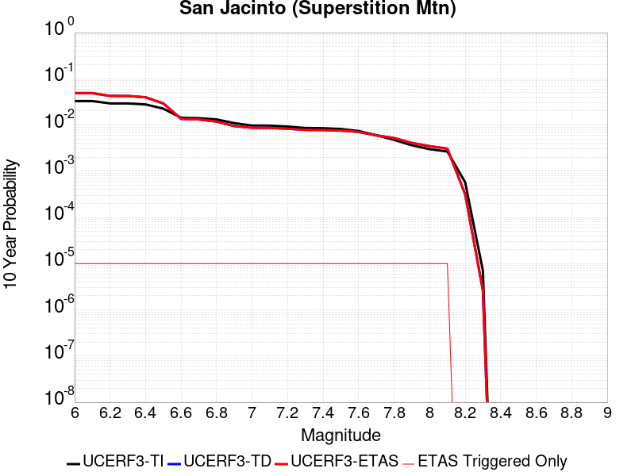 |

| Magnitude | 1 wk TI Prob | 1 wk TD Prob | 1 wk ETAS Prob | 1 wk ETAS/TD Gain | 1 wk ETAS Triggered Only | 1 mo TI Prob | 1 mo TD Prob | 1 mo ETAS Prob | 1 mo ETAS/TD Gain | 1 mo ETAS Triggered Only | 1 yr TI Prob | 1 yr TD Prob | 1 yr ETAS Prob | 1 yr ETAS/TD Gain | 1 yr ETAS Triggered Only | 10 yr TI Prob | 10 yr TD Prob | 10 yr ETAS Prob | 10 yr ETAS/TD Gain | 10 yr ETAS Triggered Only |
|-----|-----|-----|-----|-----|-----|-----|-----|-----|-----|-----|-----|-----|-----|-----|-----|-----|-----|-----|-----|-----|
| 6.0 | 6.4193904E-5 | 9.6104115E-5 | 9.6104115E-5 | 1.0 | 0.0 | 2.7508775E-4 | 4.1181638E-4 | 4.1181638E-4 | 1.0 | 0.0 | 0.0033440501 | 0.0050037336 | 0.0050136833 | 1.0019885 | 1.0E-5 | 0.03294174 | 0.04887582 | 0.04888533 | 1.0001945 | 1.0E-5 |
| 6.1 | 6.4193904E-5 | 9.6104115E-5 | 9.6104115E-5 | 1.0 | 0.0 | 2.7508775E-4 | 4.1181638E-4 | 4.1181638E-4 | 1.0 | 0.0 | 0.0033440501 | 0.0050037336 | 0.0050136833 | 1.0019885 | 1.0E-5 | 0.03294174 | 0.04887582 | 0.04888533 | 1.0001945 | 1.0E-5 |
| 6.2 | 5.7023593E-5 | 8.324506E-5 | 8.324506E-5 | 1.0 | 0.0 | 2.4436394E-4 | 3.5672518E-4 | 3.5672518E-4 | 1.0 | 0.0 | 0.002971072 | 0.0043361224 | 0.0043460787 | 1.0022962 | 1.0E-5 | 0.029316625 | 0.042555425 | 0.042565 | 1.000225 | 1.0E-5 |
| 6.3 | 5.6940098E-5 | 8.309037E-5 | 8.309037E-5 | 1.0 | 0.0 | 2.4400617E-4 | 3.560624E-4 | 3.560624E-4 | 1.0 | 0.0 | 0.002966728 | 0.004328085 | 0.004338042 | 1.0023005 | 1.0E-5 | 0.029274331 | 0.042478777 | 0.04248835 | 1.0002254 | 1.0E-5 |
| 6.4 | 5.4171585E-5 | 7.758071E-5 | 7.758071E-5 | 1.0 | 0.0 | 2.3214328E-4 | 3.324557E-4 | 3.324557E-4 | 1.0 | 0.0 | 0.0028226813 | 0.004041785 | 0.0040517445 | 1.0024642 | 1.0E-5 | 0.02787096 | 0.039766487 | 0.03977609 | 1.0002415 | 1.0E-5 |
| 6.5 | 4.375144E-5 | 5.651529E-5 | 5.651529E-5 | 1.0 | 0.0 | 1.874927E-4 | 2.4219253E-4 | 2.4219253E-4 | 1.0 | 0.0 | 0.0022803338 | 0.002945883 | 0.0029558535 | 1.0033846 | 1.0E-5 | 0.022570757 | 0.029285092 | 0.0292948 | 1.0003315 | 1.0E-5 |
| 6.6 | 2.772192E-5 | 2.5577456E-5 | 2.5577456E-5 | 1.0 | 0.0 | 1.1880282E-4 | 1.0961317E-4 | 1.0961317E-4 | 1.0 | 0.0 | 0.0014454646 | 0.0013337428 | 0.0013437294 | 1.0074877 | 1.0E-5 | 0.014360986 | 0.013585948 | 0.013595813 | 1.0007261 | 1.0E-5 |
| 6.7 | 2.7124124E-5 | 2.4788016E-5 | 2.4788016E-5 | 1.0 | 0.0 | 1.1624106E-4 | 1.0623014E-4 | 1.0623014E-4 | 1.0 | 0.0 | 0.0014143161 | 0.0012926038 | 0.001302591 | 1.0077263 | 1.0E-5 | 0.014053487 | 0.013179125 | 0.013188994 | 1.0007488 | 1.0E-5 |
| 6.8 | 2.5475807E-5 | 2.2250813E-5 | 2.2250813E-5 | 1.0 | 0.0 | 1.0917746E-4 | 9.535721E-5 | 9.535721E-5 | 1.0 | 0.0 | 0.001328425 | 0.0011603677 | 0.0011703562 | 1.008608 | 1.0E-5 | 0.0132051185 | 0.011866234 | 0.011876116 | 1.0008327 | 1.0E-5 |
| 6.9 | 2.1162023E-5 | 1.770578E-5 | 1.770578E-5 | 1.0 | 0.0 | 9.069123E-5 | 7.5879725E-5 | 7.5879725E-5 | 1.0 | 0.0 | 0.0011036064 | 9.2344783E-4 | 9.3343866E-4 | 1.010819 | 1.0E-5 | 0.010981417 | 0.009488132 | 0.009498037 | 1.0010439 | 1.0E-5 |
| 7.0 | 1.8754288E-5 | 1.6237516E-5 | 1.6237516E-5 | 1.0 | 0.0 | 8.037304E-5 | 6.958751E-5 | 6.958751E-5 | 1.0 | 0.0 | 9.781026E-4 | 8.4690115E-4 | 8.568927E-4 | 1.0117978 | 1.0E-5 | 0.009738087 | 0.008709618 | 0.008719531 | 1.0011382 | 1.0E-5 |
| 7.1 | 1.8678527E-5 | 1.6162578E-5 | 1.6162578E-5 | 1.0 | 0.0 | 8.0048376E-5 | 6.926636E-5 | 6.926636E-5 | 1.0 | 0.0 | 9.7415317E-4 | 8.4299414E-4 | 8.529857E-4 | 1.0118525 | 1.0E-5 | 0.009698939 | 0.008670506 | 0.008680419 | 1.0011433 | 1.0E-5 |
| 7.2 | 1.7804578E-5 | 1.5456342E-5 | 1.5456342E-5 | 1.0 | 0.0 | 7.6303106E-5 | 6.6239794E-5 | 6.6239794E-5 | 1.0 | 0.0 | 9.285943E-4 | 8.061734E-4 | 8.1616535E-4 | 1.0123943 | 1.0E-5 | 0.009247236 | 0.00830152 | 0.0083114365 | 1.0011946 | 1.0E-5 |
| 7.3 | 1.6583685E-5 | 1.4604595E-5 | 1.4604595E-5 | 1.0 | 0.0 | 7.1070994E-5 | 6.2589635E-5 | 6.2589635E-5 | 1.0 | 0.0 | 8.649459E-4 | 7.617644E-4 | 7.7175675E-4 | 1.0131174 | 1.0E-5 | 0.00861587 | 0.007856389 | 0.00786631 | 1.0012629 | 1.0E-5 |
| 7.4 | 1.6387552E-5 | 1.44693395E-5 | 1.44693395E-5 | 1.0 | 0.0 | 7.023047E-5 | 6.200999E-5 | 6.200999E-5 | 1.0 | 0.0 | 8.5472054E-4 | 7.5471215E-4 | 7.647046E-4 | 1.0132401 | 1.0E-5 | 0.008514405 | 0.007785693 | 0.007795615 | 1.0012745 | 1.0E-5 |
| 7.5 | 1.5790754E-5 | 1.4109283E-5 | 1.4109283E-5 | 1.0 | 0.0 | 6.767291E-5 | 6.0466966E-5 | 6.0466966E-5 | 1.0 | 0.0 | 8.236062E-4 | 7.359386E-4 | 7.4593123E-4 | 1.013578 | 1.0E-5 | 0.008205604 | 0.007595896 | 0.00760582 | 1.0013065 | 1.0E-5 |
| 7.6 | 1.4248672E-5 | 1.3126391E-5 | 1.3126391E-5 | 1.0 | 0.0 | 6.106431E-5 | 5.625476E-5 | 5.625476E-5 | 1.0 | 0.0 | 7.432043E-4 | 6.846882E-4 | 6.9468137E-4 | 1.0145952 | 1.0E-5 | 0.007407237 | 0.0070775636 | 0.007087493 | 1.001403 | 1.0E-5 |
| 7.7 | 1.15449975E-5 | 1.0972128E-5 | 1.0972128E-5 | 1.0 | 0.0 | 4.947762E-5 | 4.702256E-5 | 4.702256E-5 | 1.0 | 0.0 | 6.022235E-4 | 5.7235005E-4 | 5.8234436E-4 | 1.0174618 | 1.0E-5 | 0.006005941 | 0.005946018 | 0.0059559583 | 1.0016718 | 1.0E-5 |
| 7.8 | 9.1391985E-6 | 9.580185E-6 | 9.580185E-6 | 1.0 | 0.0 | 3.9167408E-5 | 4.1057294E-5 | 4.1057294E-5 | 1.0 | 0.0 | 4.767588E-4 | 4.997585E-4 | 5.0975353E-4 | 1.0199996 | 1.0E-5 | 0.0047573727 | 0.005211357 | 0.005221305 | 1.0019089 | 1.0E-5 |
| 7.9 | 6.973017E-6 | 7.4409E-6 | 7.4409E-6 | 1.0 | 0.0 | 2.9884017E-5 | 3.1889183E-5 | 3.1889183E-5 | 1.0 | 0.0 | 3.6377716E-4 | 3.8818218E-4 | 3.981783E-4 | 1.0257511 | 1.0E-5 | 0.0036318225 | 0.004082651 | 0.0040926104 | 1.0024394 | 1.0E-5 |
| 8.0 | 5.7638235E-6 | 6.313643E-6 | 6.313643E-6 | 1.0 | 0.0 | 2.4701867E-5 | 2.7058193E-5 | 2.7058193E-5 | 1.0 | 0.0 | 3.0070372E-4 | 3.293842E-4 | 3.393809E-4 | 1.0303497 | 1.0E-5 | 0.0030029714 | 0.003481583 | 0.0034915484 | 1.0028622 | 1.0E-5 |
| 8.1 | 5.1124434E-6 | 5.5446503E-6 | 5.5446503E-6 | 1.0 | 0.0 | 2.1910288E-5 | 2.3762574E-5 | 2.3762574E-5 | 1.0 | 0.0 | 2.6672508E-4 | 2.892714E-4 | 2.9926852E-4 | 1.0345596 | 1.0E-5 | 0.0026640517 | 0.003066024 | 0.0030759934 | 1.0032516 | 1.0E-5 |
| 8.2 | 1.1075938E-6 | 5.404807E-7 | 5.404807E-7 | 1.0 | 0.0 | 4.7468216E-6 | 2.3163439E-6 | 2.3163439E-6 | 1.0 | 0.0 | 5.779102E-5 | 2.8201144E-5 | 2.8201144E-5 | 1.0 | 0.0 | 5.777599E-4 | 3.1729226E-4 | 3.1729226E-4 | 1.0 | 0.0 |
| 8.3 | 1.3584393E-8 | 4.539057E-9 | 4.539057E-9 | 1.0 | 0.0 | 5.8218827E-8 | 1.9453102E-8 | 1.9453102E-8 | 1.0 | 0.0 | 7.0881396E-7 | 2.3684153E-7 | 2.3684153E-7 | 1.0 | 0.0 | 7.0881174E-6 | 2.6516934E-6 | 2.6516934E-6 | 1.0 | 0.0 |

## Great Valley 06 (Midland) 2011 CFM alt1
*[(top)](#table-of-contents)*

| 1 Week | 1 Month | 1 Year | 10 Year |
|-----|-----|-----|-----|
|  | 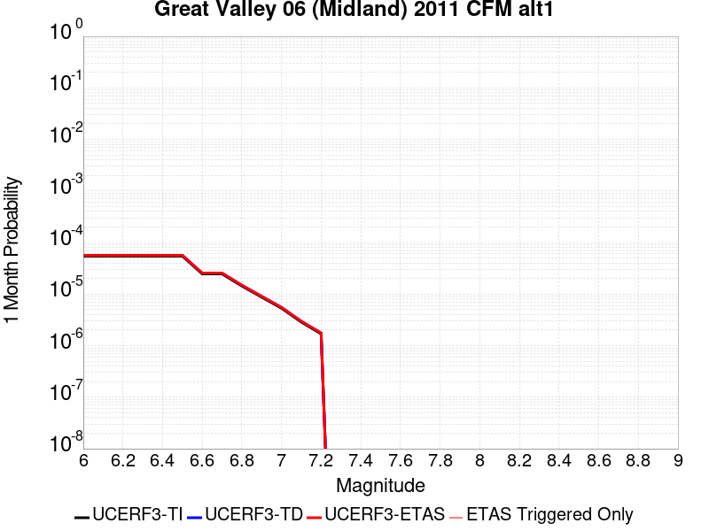 | 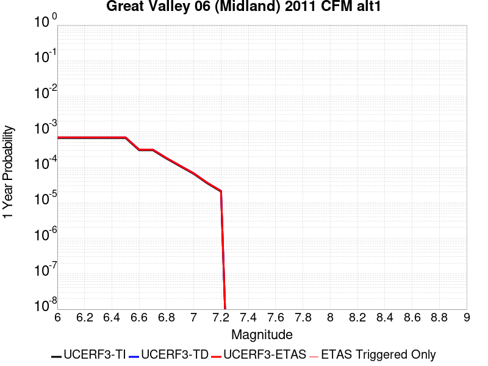 |  |

| Magnitude | 1 wk TI Prob | 1 wk TD Prob | 1 wk ETAS Prob | 1 wk ETAS/TD Gain | 1 wk ETAS Triggered Only | 1 mo TI Prob | 1 mo TD Prob | 1 mo ETAS Prob | 1 mo ETAS/TD Gain | 1 mo ETAS Triggered Only | 1 yr TI Prob | 1 yr TD Prob | 1 yr ETAS Prob | 1 yr ETAS/TD Gain | 1 yr ETAS Triggered Only | 10 yr TI Prob | 10 yr TD Prob | 10 yr ETAS Prob | 10 yr ETAS/TD Gain | 10 yr ETAS Triggered Only |
|-----|-----|-----|-----|-----|-----|-----|-----|-----|-----|-----|-----|-----|-----|-----|-----|-----|-----|-----|-----|-----|
| 6.0 | 1.2712525E-5 | 1.3211573E-5 | 1.3211573E-5 | 1.0 | 0.0 | 5.4481112E-5 | 5.661994E-5 | 5.661994E-5 | 1.0 | 0.0 | 6.6310563E-4 | 6.891552E-4 | 6.891552E-4 | 1.0 | 0.0 | 0.0066113044 | 0.0068726963 | 0.0068826275 | 1.001445 | 1.0E-5 |
| 6.1 | 1.2712525E-5 | 1.3211573E-5 | 1.3211573E-5 | 1.0 | 0.0 | 5.4481112E-5 | 5.661994E-5 | 5.661994E-5 | 1.0 | 0.0 | 6.6310563E-4 | 6.891552E-4 | 6.891552E-4 | 1.0 | 0.0 | 0.0066113044 | 0.0068726963 | 0.0068826275 | 1.001445 | 1.0E-5 |
| 6.2 | 1.2712525E-5 | 1.3211573E-5 | 1.3211573E-5 | 1.0 | 0.0 | 5.4481112E-5 | 5.661994E-5 | 5.661994E-5 | 1.0 | 0.0 | 6.6310563E-4 | 6.891552E-4 | 6.891552E-4 | 1.0 | 0.0 | 0.0066113044 | 0.0068726963 | 0.0068826275 | 1.001445 | 1.0E-5 |
| 6.3 | 1.2712525E-5 | 1.3211573E-5 | 1.3211573E-5 | 1.0 | 0.0 | 5.4481112E-5 | 5.661994E-5 | 5.661994E-5 | 1.0 | 0.0 | 6.6310563E-4 | 6.891552E-4 | 6.891552E-4 | 1.0 | 0.0 | 0.0066113044 | 0.0068726963 | 0.0068826275 | 1.001445 | 1.0E-5 |
| 6.4 | 1.2712525E-5 | 1.3211573E-5 | 1.3211573E-5 | 1.0 | 0.0 | 5.4481112E-5 | 5.661994E-5 | 5.661994E-5 | 1.0 | 0.0 | 6.6310563E-4 | 6.891552E-4 | 6.891552E-4 | 1.0 | 0.0 | 0.0066113044 | 0.0068726963 | 0.0068826275 | 1.001445 | 1.0E-5 |
| 6.5 | 1.2712525E-5 | 1.3211573E-5 | 1.3211573E-5 | 1.0 | 0.0 | 5.4481112E-5 | 5.661994E-5 | 5.661994E-5 | 1.0 | 0.0 | 6.6310563E-4 | 6.891552E-4 | 6.891552E-4 | 1.0 | 0.0 | 0.0066113044 | 0.0068726963 | 0.0068826275 | 1.001445 | 1.0E-5 |
| 6.6 | 5.7574384E-6 | 5.9710724E-6 | 5.9710724E-6 | 1.0 | 0.0 | 2.4674504E-5 | 2.5590081E-5 | 2.5590081E-5 | 1.0 | 0.0 | 3.0037065E-4 | 3.115186E-4 | 3.115186E-4 | 1.0 | 0.0 | 0.0029996498 | 0.003111206 | 0.003111206 | 1.0 | 0.0 |
| 6.7 | 5.7574384E-6 | 5.9710724E-6 | 5.9710724E-6 | 1.0 | 0.0 | 2.4674504E-5 | 2.5590081E-5 | 2.5590081E-5 | 1.0 | 0.0 | 3.0037065E-4 | 3.115186E-4 | 3.115186E-4 | 1.0 | 0.0 | 0.0029996498 | 0.003111206 | 0.003111206 | 1.0 | 0.0 |
| 6.8 | 3.3474828E-6 | 3.4696282E-6 | 3.4696282E-6 | 1.0 | 0.0 | 1.4346277E-5 | 1.4869759E-5 | 1.4869759E-5 | 1.0 | 0.0 | 1.7465191E-4 | 1.8102577E-4 | 1.8102577E-4 | 1.0 | 0.0 | 0.0017451472 | 0.0018089301 | 0.0018089301 | 1.0 | 0.0 |
| 6.9 | 2.035106E-6 | 2.1091832E-6 | 2.1091832E-6 | 1.0 | 0.0 | 8.721853E-6 | 9.03933E-6 | 9.03933E-6 | 1.0 | 0.0 | 1.0618339E-4 | 1.1004901E-4 | 1.1004901E-4 | 1.0 | 0.0 | 0.0010613267 | 0.0011000175 | 0.0011000175 | 1.0 | 0.0 |
| 7.0 | 1.2424716E-6 | 1.2879668E-6 | 1.2879668E-6 | 1.0 | 0.0 | 5.3248673E-6 | 5.519849E-6 | 5.519849E-6 | 1.0 | 0.0 | 6.482833E-5 | 6.720254E-5 | 6.720254E-5 | 1.0 | 0.0 | 6.480942E-4 | 6.7186647E-4 | 6.7186647E-4 | 1.0 | 0.0 |
| 7.1 | 6.6904556E-7 | 6.9395315E-7 | 6.9395315E-7 | 1.0 | 0.0 | 2.867335E-6 | 2.974083E-6 | 2.974083E-6 | 1.0 | 0.0 | 3.4909244E-5 | 3.620912E-5 | 3.620912E-5 | 1.0 | 0.0 | 3.490376E-4 | 3.620577E-4 | 3.620577E-4 | 1.0 | 0.0 |
| 7.2 | 3.948168E-7 | 4.0959998E-7 | 4.0959998E-7 | 1.0 | 0.0 | 1.6920709E-6 | 1.7554285E-6 | 1.7554285E-6 | 1.0 | 0.0 | 2.0600768E-5 | 2.1372342E-5 | 2.1372342E-5 | 1.0 | 0.0 | 2.0598859E-4 | 2.1372341E-4 | 2.1372341E-4 | 1.0 | 0.0 |

## Great Valley 11
*[(top)](#table-of-contents)*

| 1 Week | 1 Month | 1 Year | 10 Year |
|-----|-----|-----|-----|
|  |  |  |  |

| Magnitude | 1 wk TI Prob | 1 wk TD Prob | 1 wk ETAS Prob | 1 wk ETAS/TD Gain | 1 wk ETAS Triggered Only | 1 mo TI Prob | 1 mo TD Prob | 1 mo ETAS Prob | 1 mo ETAS/TD Gain | 1 mo ETAS Triggered Only | 1 yr TI Prob | 1 yr TD Prob | 1 yr ETAS Prob | 1 yr ETAS/TD Gain | 1 yr ETAS Triggered Only | 10 yr TI Prob | 10 yr TD Prob | 10 yr ETAS Prob | 10 yr ETAS/TD Gain | 10 yr ETAS Triggered Only |
|-----|-----|-----|-----|-----|-----|-----|-----|-----|-----|-----|-----|-----|-----|-----|-----|-----|-----|-----|-----|-----|
| 6.0 | 2.8099583E-5 | 2.9842357E-5 | 3.984206E-5 | 1.3350842 | 1.0E-5 | 1.20421224E-4 | 1.2788996E-4 | 1.3788868E-4 | 1.0781822 | 1.0E-5 | 0.0014651422 | 0.0015560216 | 0.0015660061 | 1.0064167 | 1.0E-5 | 0.0145552 | 0.015458796 | 0.015468641 | 1.0006369 | 1.0E-5 |
| 6.1 | 2.483194E-5 | 2.5915839E-5 | 3.591558E-5 | 1.3858544 | 1.0E-5 | 1.0641825E-4 | 1.1106351E-4 | 1.210624E-4 | 1.0900285 | 1.0E-5 | 0.0012948721 | 0.0013514229 | 0.0013614093 | 1.0073897 | 1.0E-5 | 0.012873529 | 0.013438457 | 0.013448323 | 1.0007341 | 1.0E-5 |
| 6.2 | 2.483194E-5 | 2.5915839E-5 | 3.591558E-5 | 1.3858544 | 1.0E-5 | 1.0641825E-4 | 1.1106351E-4 | 1.210624E-4 | 1.0900285 | 1.0E-5 | 0.0012948721 | 0.0013514229 | 0.0013614093 | 1.0073897 | 1.0E-5 | 0.012873529 | 0.013438457 | 0.013448323 | 1.0007341 | 1.0E-5 |
| 6.3 | 2.0257901E-5 | 2.0405449E-5 | 3.0405245E-5 | 1.4900552 | 1.0E-5 | 8.681669E-5 | 8.7449225E-5 | 9.7448356E-5 | 1.1143421 | 1.0E-5 | 0.0010564806 | 0.0010642159 | 0.0010742052 | 1.0093865 | 1.0E-5 | 0.01051472 | 0.010595368 | 0.010605262 | 1.0009338 | 1.0E-5 |
| 6.4 | 1.8054898E-5 | 1.7786433E-5 | 2.7786256E-5 | 1.5622163 | 1.0E-5 | 7.737584E-5 | 7.622556E-5 | 8.62248E-5 | 1.1311796 | 1.0E-5 | 9.416436E-4 | 9.2768855E-4 | 9.3767926E-4 | 1.0107695 | 1.0E-5 | 0.009376635 | 0.009241901 | 0.009251809 | 1.001072 | 1.0E-5 |
| 6.5 | 1.34804895E-5 | 1.2324548E-5 | 1.2324548E-5 | 1.0 | 0.0 | 5.777225E-5 | 5.2818443E-5 | 5.2818443E-5 | 1.0 | 0.0 | 7.031501E-4 | 6.42879E-4 | 6.42879E-4 | 1.0 | 0.0 | 0.007009294 | 0.0064106295 | 0.0064106295 | 1.0 | 0.0 |
| 6.6 | 1.294883E-5 | 1.1735682E-5 | 1.1735682E-5 | 1.0 | 0.0 | 5.5493805E-5 | 5.0294835E-5 | 5.0294835E-5 | 1.0 | 0.0 | 6.754276E-4 | 6.1217166E-4 | 6.1217166E-4 | 1.0 | 0.0 | 0.006733784 | 0.006105279 | 0.006105279 | 1.0 | 0.0 |
| 6.7 | 1.1272237E-5 | 9.814717E-6 | 9.814717E-6 | 1.0 | 0.0 | 4.8308695E-5 | 4.206241E-5 | 4.206241E-5 | 1.0 | 0.0 | 5.879996E-4 | 5.1199226E-4 | 5.1199226E-4 | 1.0 | 0.0 | 0.005864462 | 0.005108411 | 0.005108411 | 1.0 | 0.0 |
| 6.8 | 9.8337505E-6 | 8.196211E-6 | 8.196211E-6 | 1.0 | 0.0 | 4.2143965E-5 | 3.5126155E-5 | 3.5126155E-5 | 1.0 | 0.0 | 5.1298196E-4 | 4.2757907E-4 | 4.2757907E-4 | 1.0 | 0.0 | 0.005117994 | 0.004267774 | 0.004267774 | 1.0 | 0.0 |
| 6.9 | 7.4224813E-6 | 5.4147536E-6 | 5.4147536E-6 | 1.0 | 0.0 | 3.1810247E-5 | 2.3205888E-5 | 2.3205888E-5 | 1.0 | 0.0 | 3.872209E-4 | 2.8249648E-4 | 2.8249648E-4 | 1.0 | 0.0 | 0.0038654688 | 0.0028215146 | 0.0028215146 | 1.0 | 0.0 |
| 7.0 | 4.4628923E-6 | 2.0116117E-6 | 2.0116117E-6 | 1.0 | 0.0 | 1.912654E-5 | 8.621166E-6 | 8.621166E-6 | 1.0 | 0.0 | 2.3284076E-4 | 1.04957755E-4 | 1.04957755E-4 | 1.0 | 0.0 | 0.0023259693 | 0.0010490934 | 0.0010490934 | 1.0 | 0.0 |
| 7.1 | 3.5546527E-6 | 1.1858963E-6 | 1.1858963E-6 | 1.0 | 0.0 | 1.5234136E-5 | 5.0824033E-6 | 5.0824033E-6 | 1.0 | 0.0 | 1.8545982E-4 | 6.187657E-5 | 6.187657E-5 | 1.0 | 0.0 | 0.0018530512 | 6.186002E-4 | 6.186002E-4 | 1.0 | 0.0 |
| 7.2 | 3.2039936E-6 | 1.1256966E-6 | 1.1256966E-6 | 1.0 | 0.0 | 1.3731329E-5 | 4.8244056E-6 | 4.8244056E-6 | 1.0 | 0.0 | 1.671661E-4 | 5.8735623E-5 | 5.8735623E-5 | 1.0 | 0.0 | 0.0016704041 | 5.872077E-4 | 5.872077E-4 | 1.0 | 0.0 |
| 7.3 | 2.8120473E-6 | 1.0308111E-6 | 1.0308111E-6 | 1.0 | 0.0 | 1.2051575E-5 | 4.4177546E-6 | 4.4177546E-6 | 1.0 | 0.0 | 1.4671806E-4 | 5.3784905E-5 | 5.3784905E-5 | 1.0 | 0.0 | 0.0014662122 | 5.3772546E-4 | 5.3772546E-4 | 1.0 | 0.0 |
| 7.4 | 2.4837766E-6 | 9.802847E-7 | 9.802847E-7 | 1.0 | 0.0 | 1.0644713E-5 | 4.2012134E-6 | 4.2012134E-6 | 1.0 | 0.0 | 1.2959167E-4 | 5.114864E-5 | 5.114864E-5 | 1.0 | 0.0 | 0.0012951613 | 5.1137526E-4 | 5.1137526E-4 | 1.0 | 0.0 |
| 7.5 | 1.5002679E-6 | 6.5475774E-7 | 6.5475774E-7 | 1.0 | 0.0 | 6.4297037E-6 | 2.8061017E-6 | 2.8061017E-6 | 1.0 | 0.0 | 7.827883E-5 | 3.4163797E-5 | 3.4163797E-5 | 1.0 | 0.0 | 7.825126E-4 | 3.415896E-4 | 3.415896E-4 | 1.0 | 0.0 |

## San Jacinto (San Bernardino)
*[(top)](#table-of-contents)*

| 1 Week | 1 Month | 1 Year | 10 Year |
|-----|-----|-----|-----|
|  |  |  | 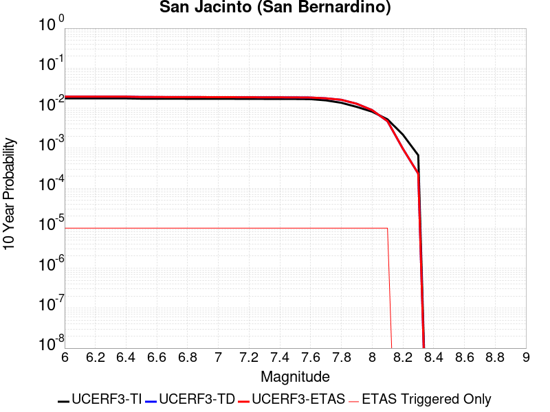 |

| Magnitude | 1 wk TI Prob | 1 wk TD Prob | 1 wk ETAS Prob | 1 wk ETAS/TD Gain | 1 wk ETAS Triggered Only | 1 mo TI Prob | 1 mo TD Prob | 1 mo ETAS Prob | 1 mo ETAS/TD Gain | 1 mo ETAS Triggered Only | 1 yr TI Prob | 1 yr TD Prob | 1 yr ETAS Prob | 1 yr ETAS/TD Gain | 1 yr ETAS Triggered Only | 10 yr TI Prob | 10 yr TD Prob | 10 yr ETAS Prob | 10 yr ETAS/TD Gain | 10 yr ETAS Triggered Only |
|-----|-----|-----|-----|-----|-----|-----|-----|-----|-----|-----|-----|-----|-----|-----|-----|-----|-----|-----|-----|-----|
| 6.0 | 3.409352E-5 | 3.6217036E-5 | 3.6217036E-5 | 1.0 | 0.0 | 1.461069E-4 | 1.5520664E-4 | 1.5520664E-4 | 1.0 | 0.0 | 0.0017774 | 0.0018880047 | 0.0018979858 | 1.0052866 | 1.0E-5 | 0.01763251 | 0.019467667 | 0.019477472 | 1.0005037 | 1.0E-5 |
| 6.1 | 3.409352E-5 | 3.6217036E-5 | 3.6217036E-5 | 1.0 | 0.0 | 1.461069E-4 | 1.5520664E-4 | 1.5520664E-4 | 1.0 | 0.0 | 0.0017774 | 0.0018880047 | 0.0018979858 | 1.0052866 | 1.0E-5 | 0.01763251 | 0.019467667 | 0.019477472 | 1.0005037 | 1.0E-5 |
| 6.2 | 3.409352E-5 | 3.6217036E-5 | 3.6217036E-5 | 1.0 | 0.0 | 1.461069E-4 | 1.5520664E-4 | 1.5520664E-4 | 1.0 | 0.0 | 0.0017774 | 0.0018880047 | 0.0018979858 | 1.0052866 | 1.0E-5 | 0.01763251 | 0.019467667 | 0.019477472 | 1.0005037 | 1.0E-5 |
| 6.3 | 3.409352E-5 | 3.6217036E-5 | 3.6217036E-5 | 1.0 | 0.0 | 1.461069E-4 | 1.5520664E-4 | 1.5520664E-4 | 1.0 | 0.0 | 0.0017774 | 0.0018880047 | 0.0018979858 | 1.0052866 | 1.0E-5 | 0.01763251 | 0.019467667 | 0.019477472 | 1.0005037 | 1.0E-5 |
| 6.4 | 3.400795E-5 | 3.610965E-5 | 3.610965E-5 | 1.0 | 0.0 | 1.4574021E-4 | 1.5474646E-4 | 1.5474646E-4 | 1.0 | 0.0 | 0.0017729428 | 0.0018824118 | 0.001892393 | 1.0053023 | 1.0E-5 | 0.017588645 | 0.019412728 | 0.019422533 | 1.0005051 | 1.0E-5 |
| 6.5 | 3.341482E-5 | 3.536993E-5 | 3.536993E-5 | 1.0 | 0.0 | 1.4319851E-4 | 1.5157662E-4 | 1.5157662E-4 | 1.0 | 0.0 | 0.0017420477 | 0.0018438846 | 0.0018538662 | 1.0054133 | 1.0E-5 | 0.017284546 | 0.019034138 | 0.019043947 | 1.0005153 | 1.0E-5 |
| 6.6 | 3.3364955E-5 | 3.5307115E-5 | 3.5307115E-5 | 1.0 | 0.0 | 1.4298483E-4 | 1.5130745E-4 | 1.5130745E-4 | 1.0 | 0.0 | 0.0017394501 | 0.0018406131 | 0.0018505947 | 1.005423 | 1.0E-5 | 0.017258976 | 0.01900199 | 0.0190118 | 1.0005163 | 1.0E-5 |
| 6.7 | 3.335922E-5 | 3.5296885E-5 | 3.5296885E-5 | 1.0 | 0.0 | 1.4296026E-4 | 1.5126361E-4 | 1.5126361E-4 | 1.0 | 0.0 | 0.0017391514 | 0.0018400801 | 0.0018500618 | 1.0054245 | 1.0E-5 | 0.017256035 | 0.01899678 | 0.019006591 | 1.0005164 | 1.0E-5 |
| 6.8 | 3.327683E-5 | 3.5190897E-5 | 3.5190897E-5 | 1.0 | 0.0 | 1.4260718E-4 | 1.5080941E-4 | 1.5080941E-4 | 1.0 | 0.0 | 0.0017348597 | 0.0018345597 | 0.0018445414 | 1.005441 | 1.0E-5 | 0.017213784 | 0.018942531 | 0.018952342 | 1.000518 | 1.0E-5 |
| 6.9 | 3.3235785E-5 | 3.5131816E-5 | 3.5131816E-5 | 1.0 | 0.0 | 1.4243131E-4 | 1.5055624E-4 | 1.5055624E-4 | 1.0 | 0.0 | 0.0017327217 | 0.0018314825 | 0.0018414642 | 1.00545 | 1.0E-5 | 0.017192734 | 0.018912386 | 0.018922197 | 1.0005188 | 1.0E-5 |
| 7.0 | 3.3197095E-5 | 3.5071702E-5 | 3.5071702E-5 | 1.0 | 0.0 | 1.422655E-4 | 1.5029866E-4 | 1.5029866E-4 | 1.0 | 0.0 | 0.0017307063 | 0.0018283516 | 0.0018383333 | 1.0054594 | 1.0E-5 | 0.017172894 | 0.018881747 | 0.018891558 | 1.0005196 | 1.0E-5 |
| 7.1 | 3.3129716E-5 | 3.4951823E-5 | 3.4951823E-5 | 1.0 | 0.0 | 1.4197677E-4 | 1.4978493E-4 | 1.4978493E-4 | 1.0 | 0.0 | 0.0017271966 | 0.0018221076 | 0.0018320894 | 1.0054781 | 1.0E-5 | 0.017138338 | 0.018820789 | 0.018830601 | 1.0005213 | 1.0E-5 |
| 7.2 | 3.3034008E-5 | 3.4819197E-5 | 3.4819197E-5 | 1.0 | 0.0 | 1.4156665E-4 | 1.492166E-4 | 1.492166E-4 | 1.0 | 0.0 | 0.0017222111 | 0.0018151997 | 0.0018251817 | 1.005499 | 1.0E-5 | 0.017089253 | 0.018753165 | 0.018762978 | 1.0005232 | 1.0E-5 |
| 7.3 | 3.2956614E-5 | 3.4686815E-5 | 3.4686815E-5 | 1.0 | 0.0 | 1.4123498E-4 | 1.4864933E-4 | 1.4864933E-4 | 1.0 | 0.0 | 0.0017181796 | 0.0018083046 | 0.0018182865 | 1.00552 | 1.0E-5 | 0.017049557 | 0.018685855 | 0.018695667 | 1.0005251 | 1.0E-5 |
| 7.4 | 3.2915937E-5 | 3.4608405E-5 | 3.4608405E-5 | 1.0 | 0.0 | 1.4106068E-4 | 1.4831331E-4 | 1.4831331E-4 | 1.0 | 0.0 | 0.0017160608 | 0.0018042204 | 0.0018142024 | 1.0055325 | 1.0E-5 | 0.017028693 | 0.018646065 | 0.018655878 | 1.0005263 | 1.0E-5 |
| 7.5 | 3.281791E-5 | 3.4473152E-5 | 3.4473152E-5 | 1.0 | 0.0 | 1.406406E-4 | 1.4773372E-4 | 1.4773372E-4 | 1.0 | 0.0 | 0.0017109542 | 0.0017971756 | 0.0018071575 | 1.0055543 | 1.0E-5 | 0.016978411 | 0.018576879 | 0.018586693 | 1.0005283 | 1.0E-5 |
| 7.6 | 3.2521442E-5 | 3.4197663E-5 | 3.4197663E-5 | 1.0 | 0.0 | 1.3937015E-4 | 1.4655318E-4 | 1.4655318E-4 | 1.0 | 0.0 | 0.0016955109 | 0.0017828263 | 0.0017928084 | 1.005599 | 1.0E-5 | 0.016826328 | 0.018434307 | 0.018444123 | 1.0005325 | 1.0E-5 |
| 7.7 | 3.0287873E-5 | 3.26791E-5 | 3.26791E-5 | 1.0 | 0.0 | 1.297987E-4 | 1.4004577E-4 | 1.4004577E-4 | 1.0 | 0.0 | 0.0015791537 | 0.001703725 | 0.0017137079 | 1.0058595 | 1.0E-5 | 0.01567979 | 0.01764394 | 0.017653763 | 1.0005567 | 1.0E-5 |
| 7.8 | 2.6316151E-5 | 2.9881721E-5 | 2.9881721E-5 | 1.0 | 0.0 | 1.1277862E-4 | 1.2805824E-4 | 1.2805824E-4 | 1.0 | 0.0 | 0.0013722149 | 0.001557995 | 0.0015679795 | 1.0064085 | 1.0E-5 | 0.013637724 | 0.016181543 | 0.016191382 | 1.000608 | 1.0E-5 |
| 7.9 | 2.0761147E-5 | 2.360826E-5 | 2.360826E-5 | 1.0 | 0.0 | 8.897331E-5 | 1.0117434E-4 | 1.0117434E-4 | 1.0 | 0.0 | 0.0010827117 | 0.0012311024 | 0.00124109 | 1.0081128 | 1.0E-5 | 0.010774517 | 0.012891394 | 0.012901265 | 1.0007657 | 1.0E-5 |
| 8.0 | 1.5738568E-5 | 1.6176331E-5 | 1.6176331E-5 | 1.0 | 0.0 | 6.744926E-5 | 6.932529E-5 | 6.932529E-5 | 1.0 | 0.0 | 8.2088535E-4 | 8.437093E-4 | 8.5370085E-4 | 1.0118424 | 1.0E-5 | 0.008178596 | 0.008940907 | 0.008950817 | 1.0011084 | 1.0E-5 |
| 8.1 | 1.0105832E-5 | 8.413447E-6 | 8.413447E-6 | 1.0 | 0.0 | 4.3309992E-5 | 3.6057132E-5 | 3.6057132E-5 | 1.0 | 0.0 | 5.2717153E-4 | 4.389077E-4 | 4.489033E-4 | 1.0227739 | 1.0E-5 | 0.005259227 | 0.0047217715 | 0.004731724 | 1.0021079 | 1.0E-5 |
| 8.2 | 4.189207E-6 | 1.602093E-6 | 1.602093E-6 | 1.0 | 0.0 | 1.7953622E-5 | 6.8660947E-6 | 6.8660947E-6 | 1.0 | 0.0 | 2.1856341E-4 | 8.359153E-5 | 8.359153E-5 | 1.0 | 0.0 | 0.0021834858 | 9.701208E-4 | 9.701208E-4 | 1.0 | 0.0 |
| 8.3 | 1.2758221E-6 | 3.6782495E-7 | 3.6782495E-7 | 1.0 | 0.0 | 5.4677976E-6 | 1.5763917E-6 | 1.5763917E-6 | 1.0 | 0.0 | 6.65684E-5 | 1.9192405E-5 | 1.9192405E-5 | 1.0 | 0.0 | 6.6548464E-4 | 2.3124217E-4 | 2.3124217E-4 | 1.0 | 0.0 |

## Shoreline
*[(top)](#table-of-contents)*

| 1 Week | 1 Month | 1 Year | 10 Year |
|-----|-----|-----|-----|
|  |  | 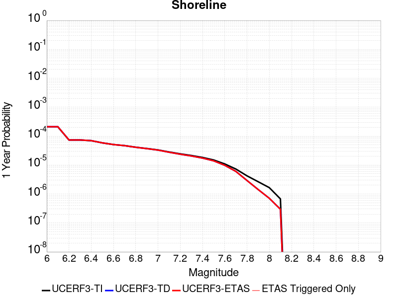 |  |

| Magnitude | 1 wk TI Prob | 1 wk TD Prob | 1 wk ETAS Prob | 1 wk ETAS/TD Gain | 1 wk ETAS Triggered Only | 1 mo TI Prob | 1 mo TD Prob | 1 mo ETAS Prob | 1 mo ETAS/TD Gain | 1 mo ETAS Triggered Only | 1 yr TI Prob | 1 yr TD Prob | 1 yr ETAS Prob | 1 yr ETAS/TD Gain | 1 yr ETAS Triggered Only | 10 yr TI Prob | 10 yr TD Prob | 10 yr ETAS Prob | 10 yr ETAS/TD Gain | 10 yr ETAS Triggered Only |
|-----|-----|-----|-----|-----|-----|-----|-----|-----|-----|-----|-----|-----|-----|-----|-----|-----|-----|-----|-----|-----|
| 6.0 | 3.9888673E-6 | 4.04816E-6 | 4.04816E-6 | 1.0 | 0.0 | 1.7095033E-5 | 1.7349174E-5 | 1.7349174E-5 | 1.0 | 0.0 | 2.0811215E-4 | 2.1121131E-4 | 2.1121131E-4 | 1.0 | 0.0 | 0.0020791737 | 0.0021106545 | 0.0021206334 | 1.0047278 | 1.0E-5 |
| 6.1 | 3.9888673E-6 | 4.04816E-6 | 4.04816E-6 | 1.0 | 0.0 | 1.7095033E-5 | 1.7349174E-5 | 1.7349174E-5 | 1.0 | 0.0 | 2.0811215E-4 | 2.1121131E-4 | 2.1121131E-4 | 1.0 | 0.0 | 0.0020791737 | 0.0021106545 | 0.0021206334 | 1.0047278 | 1.0E-5 |
| 6.2 | 1.4039653E-6 | 1.4102161E-6 | 1.4102161E-6 | 1.0 | 0.0 | 6.0169805E-6 | 6.0437696E-6 | 6.0437696E-6 | 1.0 | 0.0 | 7.325427E-5 | 7.358047E-5 | 7.358047E-5 | 1.0 | 0.0 | 7.3230127E-4 | 7.355671E-4 | 7.4555975E-4 | 1.013585 | 1.0E-5 |
| 6.3 | 1.4039653E-6 | 1.4102161E-6 | 1.4102161E-6 | 1.0 | 0.0 | 6.0169805E-6 | 6.0437696E-6 | 6.0437696E-6 | 1.0 | 0.0 | 7.325427E-5 | 7.358047E-5 | 7.358047E-5 | 1.0 | 0.0 | 7.3230127E-4 | 7.355671E-4 | 7.4555975E-4 | 1.013585 | 1.0E-5 |
| 6.4 | 1.3314152E-6 | 1.3362849E-6 | 1.3362849E-6 | 1.0 | 0.0 | 5.7060524E-6 | 5.7269226E-6 | 5.7269226E-6 | 1.0 | 0.0 | 6.946897E-5 | 6.972311E-5 | 6.972311E-5 | 1.0 | 0.0 | 6.9447263E-4 | 6.970177E-4 | 7.0701074E-4 | 1.0143368 | 1.0E-5 |
| 6.5 | 1.1187026E-6 | 1.1204822E-6 | 1.1204822E-6 | 1.0 | 0.0 | 4.794431E-6 | 4.8020584E-6 | 4.8020584E-6 | 1.0 | 0.0 | 5.8370628E-5 | 5.8463516E-5 | 5.8463516E-5 | 1.0 | 0.0 | 5.83553E-4 | 5.8448385E-4 | 5.9447804E-4 | 1.0170991 | 1.0E-5 |
| 6.6 | 9.793089E-7 | 9.786054E-7 | 9.786054E-7 | 1.0 | 0.0 | 4.1970316E-6 | 4.1940166E-6 | 4.1940166E-6 | 1.0 | 0.0 | 5.1097657E-5 | 5.1060968E-5 | 5.1060968E-5 | 1.0 | 0.0 | 5.108591E-4 | 5.1049364E-4 | 5.1049364E-4 | 1.0 | 0.0 |
| 6.7 | 8.995986E-7 | 8.9739046E-7 | 8.9739046E-7 | 1.0 | 0.0 | 3.8554167E-6 | 3.8459534E-6 | 3.8459534E-6 | 1.0 | 0.0 | 4.693869E-5 | 4.6823487E-5 | 4.6823487E-5 | 1.0 | 0.0 | 4.6928777E-4 | 4.6813718E-4 | 4.6813718E-4 | 1.0 | 0.0 |
| 6.8 | 7.931612E-7 | 7.881452E-7 | 7.881452E-7 | 1.0 | 0.0 | 3.3992578E-6 | 3.3777608E-6 | 3.3777608E-6 | 1.0 | 0.0 | 4.1385178E-5 | 4.112347E-5 | 4.112347E-5 | 1.0 | 0.0 | 4.1377472E-4 | 4.1115913E-4 | 4.1115913E-4 | 1.0 | 0.0 |
| 6.9 | 7.1465956E-7 | 7.079021E-7 | 7.079021E-7 | 1.0 | 0.0 | 3.062823E-6 | 3.0338626E-6 | 3.0338626E-6 | 1.0 | 0.0 | 3.7289232E-5 | 3.6936653E-5 | 3.6936653E-5 | 1.0 | 0.0 | 3.7282976E-4 | 3.6930552E-4 | 3.6930552E-4 | 1.0 | 0.0 |
| 7.0 | 6.389046E-7 | 6.3004313E-7 | 6.3004313E-7 | 1.0 | 0.0 | 2.7381598E-6 | 2.7001822E-6 | 2.7001822E-6 | 1.0 | 0.0 | 3.3336586E-5 | 3.2874224E-5 | 3.2874224E-5 | 1.0 | 0.0 | 3.3331584E-4 | 3.2869386E-4 | 3.2869386E-4 | 1.0 | 0.0 |
| 7.1 | 5.4300875E-7 | 5.312046E-7 | 5.312046E-7 | 1.0 | 0.0 | 2.3271782E-6 | 2.2765892E-6 | 2.2765892E-6 | 1.0 | 0.0 | 2.8333026E-5 | 2.771712E-5 | 2.771712E-5 | 1.0 | 0.0 | 2.8329415E-4 | 2.7713674E-4 | 2.7713674E-4 | 1.0 | 0.0 |
| 7.2 | 4.6768855E-7 | 4.5357643E-7 | 4.5357643E-7 | 1.0 | 0.0 | 2.0043778E-6 | 1.9438976E-6 | 1.9438976E-6 | 1.0 | 0.0 | 2.4403027E-5 | 2.3666695E-5 | 2.3666695E-5 | 1.0 | 0.0 | 2.4400349E-4 | 2.366418E-4 | 2.366418E-4 | 1.0 | 0.0 |
| 7.3 | 4.0966103E-7 | 3.9394033E-7 | 3.9394033E-7 | 1.0 | 0.0 | 1.7556889E-6 | 1.6883146E-6 | 1.6883146E-6 | 1.0 | 0.0 | 2.1375303E-5 | 2.0555037E-5 | 2.0555037E-5 | 1.0 | 0.0 | 2.1373246E-4 | 2.055314E-4 | 2.055314E-4 | 1.0 | 0.0 |
| 7.4 | 3.5105785E-7 | 3.3372024E-7 | 3.3372024E-7 | 1.0 | 0.0 | 1.5045327E-6 | 1.4302287E-6 | 1.4302287E-6 | 1.0 | 0.0 | 1.8317533E-5 | 1.7412896E-5 | 1.7412896E-5 | 1.0 | 0.0 | 1.8316023E-4 | 1.7411534E-4 | 1.7411534E-4 | 1.0 | 0.0 |
| 7.5 | 2.8737534E-7 | 2.6827738E-7 | 2.6827738E-7 | 1.0 | 0.0 | 1.2316079E-6 | 1.1497597E-6 | 1.1497597E-6 | 1.0 | 0.0 | 1.4994724E-5 | 1.3998234E-5 | 1.3998234E-5 | 1.0 | 0.0 | 1.4993713E-4 | 1.3997355E-4 | 1.3997355E-4 | 1.0 | 0.0 |
| 7.6 | 2.0924051E-7 | 1.8786231E-7 | 1.8786231E-7 | 1.0 | 0.0 | 8.967448E-7 | 8.0512393E-7 | 8.0512393E-7 | 1.0 | 0.0 | 1.0917813E-5 | 9.802339E-6 | 9.802339E-6 | 1.0 | 0.0 | 1.0917276E-4 | 9.801908E-5 | 9.801908E-5 | 1.0 | 0.0 |
| 7.7 | 1.392265E-7 | 1.1550162E-7 | 1.1550162E-7 | 1.0 | 0.0 | 5.9668486E-7 | 4.950068E-7 | 4.950068E-7 | 1.0 | 0.0 | 7.2646135E-6 | 6.0266916E-6 | 6.0266916E-6 | 1.0 | 0.0 | 7.2643765E-5 | 6.0265287E-5 | 6.0265287E-5 | 1.0 | 0.0 |
| 7.8 | 8.1080074E-8 | 5.5930364E-8 | 5.5930364E-8 | 1.0 | 0.0 | 3.4748598E-7 | 2.3970154E-7 | 2.3970154E-7 | 1.0 | 0.0 | 4.2306337E-6 | 2.9183623E-6 | 2.9183623E-6 | 1.0 | 0.0 | 4.230553E-5 | 2.9183242E-5 | 2.9183242E-5 | 1.0 | 0.0 |
| 7.9 | 5.0859036E-8 | 2.7302043E-8 | 2.7302043E-8 | 1.0 | 0.0 | 2.1796728E-7 | 1.1700875E-7 | 1.1700875E-7 | 1.0 | 0.0 | 2.6537484E-6 | 1.4245807E-6 | 1.4245807E-6 | 1.0 | 0.0 | 2.6537167E-5 | 1.4245716E-5 | 1.4245716E-5 | 1.0 | 0.0 |
| 8.0 | 3.1760536E-8 | 1.3621442E-8 | 1.3621442E-8 | 1.0 | 0.0 | 1.3611657E-7 | 5.83776E-8 | 5.83776E-8 | 1.0 | 0.0 | 1.6572179E-6 | 7.107471E-7 | 7.107471E-7 | 1.0 | 0.0 | 1.6572056E-5 | 7.1074483E-6 | 7.1074483E-6 | 1.0 | 0.0 |
| 8.1 | 1.2947896E-8 | 5.681641E-9 | 5.681641E-9 | 1.0 | 0.0 | 5.5490982E-8 | 2.4349887E-8 | 2.4349887E-8 | 1.0 | 0.0 | 6.756025E-7 | 2.9645983E-7 | 2.9645983E-7 | 1.0 | 0.0 | 6.7560045E-6 | 2.9645946E-6 | 2.9645946E-6 | 1.0 | 0.0 |

## Mendocino
*[(top)](#table-of-contents)*

| 1 Week | 1 Month | 1 Year | 10 Year |
|-----|-----|-----|-----|
|  | 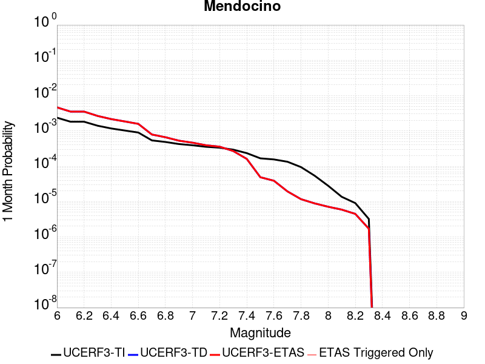 |  |  |

| Magnitude | 1 wk TI Prob | 1 wk TD Prob | 1 wk ETAS Prob | 1 wk ETAS/TD Gain | 1 wk ETAS Triggered Only | 1 mo TI Prob | 1 mo TD Prob | 1 mo ETAS Prob | 1 mo ETAS/TD Gain | 1 mo ETAS Triggered Only | 1 yr TI Prob | 1 yr TD Prob | 1 yr ETAS Prob | 1 yr ETAS/TD Gain | 1 yr ETAS Triggered Only | 10 yr TI Prob | 10 yr TD Prob | 10 yr ETAS Prob | 10 yr ETAS/TD Gain | 10 yr ETAS Triggered Only |
|-----|-----|-----|-----|-----|-----|-----|-----|-----|-----|-----|-----|-----|-----|-----|-----|-----|-----|-----|-----|-----|
| 6.0 | 5.5409013E-4 | 0.0010849311 | 0.0010849311 | 1.0 | 0.0 | 0.0023725112 | 0.0046395287 | 0.0046395287 | 1.0 | 0.0 | 0.028505474 | 0.054721527 | 0.054730978 | 1.0001727 | 1.0E-5 | 0.25113493 | 0.41213614 | 0.412142 | 1.0000143 | 1.0E-5 |
| 6.1 | 4.2515888E-4 | 8.2361576E-4 | 8.2361576E-4 | 1.0 | 0.0 | 0.0018208373 | 0.003523503 | 0.003523503 | 1.0 | 0.0 | 0.021944538 | 0.04179039 | 0.04179997 | 1.0002292 | 1.0E-5 | 0.19899574 | 0.33020866 | 0.33021533 | 1.0000203 | 1.0E-5 |
| 6.2 | 4.2515888E-4 | 8.2361576E-4 | 8.2361576E-4 | 1.0 | 0.0 | 0.0018208373 | 0.003523503 | 0.003523503 | 1.0 | 0.0 | 0.021944538 | 0.04179039 | 0.04179997 | 1.0002292 | 1.0E-5 | 0.19899574 | 0.33020866 | 0.33021533 | 1.0000203 | 1.0E-5 |
| 6.3 | 3.2773745E-4 | 6.200424E-4 | 6.200424E-4 | 1.0 | 0.0 | 0.0014038329 | 0.002653455 | 0.002653455 | 1.0 | 0.0 | 0.016958237 | 0.031629782 | 0.031639468 | 1.0003061 | 1.0E-5 | 0.1572094 | 0.26103786 | 0.26104525 | 1.0000283 | 1.0E-5 |
| 6.4 | 2.7417165E-4 | 5.0544116E-4 | 5.0544116E-4 | 1.0 | 0.0 | 0.0011744922 | 0.0021635266 | 0.0021635266 | 1.0 | 0.0 | 0.014205975 | 0.02587398 | 0.025883721 | 1.0003765 | 1.0E-5 | 0.13331394 | 0.21974553 | 0.21975332 | 1.0000355 | 1.0E-5 |
| 6.5 | 2.3984899E-4 | 4.3299436E-4 | 4.3299436E-4 | 1.0 | 0.0 | 0.0010275192 | 0.0018537208 | 0.0018537208 | 1.0 | 0.0 | 0.012438473 | 0.022215888 | 0.022225665 | 1.0004401 | 1.0E-5 | 0.11764851 | 0.1923049 | 0.19231297 | 1.000042 | 1.0E-5 |
| 6.6 | 2.1023539E-4 | 3.6998096E-4 | 3.6998096E-4 | 1.0 | 0.0 | 9.0069766E-4 | 0.0015841589 | 0.0015841589 | 1.0 | 0.0 | 0.010910975 | 0.019024227 | 0.019034037 | 1.0005157 | 1.0E-5 | 0.10390546 | 0.16776323 | 0.16777156 | 1.0000496 | 1.0E-5 |
| 6.7 | 1.2592976E-4 | 1.8488408E-4 | 1.8488408E-4 | 1.0 | 0.0 | 5.395873E-4 | 7.9205824E-4 | 7.9205824E-4 | 1.0 | 0.0 | 0.006549705 | 0.009589142 | 0.009599047 | 1.0010328 | 1.0E-5 | 0.063599944 | 0.0912522 | 0.09126129 | 1.0000995 | 1.0E-5 |
| 6.8 | 1.13663555E-4 | 1.5461294E-4 | 1.5461294E-4 | 1.0 | 0.0 | 4.8703855E-4 | 6.624365E-4 | 6.624365E-4 | 1.0 | 0.0 | 0.0059135845 | 0.008031159 | 0.008041078 | 1.0012351 | 1.0E-5 | 0.057586733 | 0.07766879 | 0.07767802 | 1.0001187 | 1.0E-5 |
| 6.9 | 9.926894E-5 | 1.2356913E-4 | 1.2356913E-4 | 1.0 | 0.0 | 4.2536893E-4 | 5.294694E-4 | 5.294694E-4 | 1.0 | 0.0 | 0.0051665753 | 0.006426257 | 0.006436193 | 1.0015461 | 1.0E-5 | 0.050480947 | 0.06312626 | 0.063135624 | 1.0001484 | 1.0E-5 |
| 7.0 | 9.168125E-5 | 1.08390166E-4 | 1.08390166E-4 | 1.0 | 0.0 | 3.9286047E-4 | 4.6444344E-4 | 4.6444344E-4 | 1.0 | 0.0 | 0.004772591 | 0.0056395717 | 0.005649515 | 1.0017632 | 1.0E-5 | 0.04671385 | 0.055882122 | 0.055891562 | 1.0001689 | 1.0E-5 |
| 7.1 | 8.2854116E-5 | 9.158021E-5 | 9.158021E-5 | 1.0 | 0.0 | 3.5504074E-4 | 3.9242802E-4 | 3.9242802E-4 | 1.0 | 0.0 | 0.004314056 | 0.004767409 | 0.0047773616 | 1.0020876 | 1.0E-5 | 0.042312626 | 0.04773449 | 0.047744017 | 1.0001994 | 1.0E-5 |
| 7.2 | 7.8255274E-5 | 8.351997E-5 | 8.351997E-5 | 1.0 | 0.0 | 3.3533663E-4 | 3.5789446E-4 | 3.5789446E-4 | 1.0 | 0.0 | 0.0040750825 | 0.0043488084 | 0.004358765 | 1.0022895 | 1.0E-5 | 0.040011603 | 0.043774426 | 0.04378399 | 1.0002184 | 1.0E-5 |
| 7.3 | 6.887904E-5 | 6.30021E-5 | 6.30021E-5 | 1.0 | 0.0 | 2.9516246E-4 | 2.6998165E-4 | 2.6998165E-4 | 1.0 | 0.0 | 0.0035876823 | 0.0032821703 | 0.0032921375 | 1.0030367 | 1.0E-5 | 0.035303112 | 0.033558525 | 0.03356819 | 1.000288 | 1.0E-5 |
| 7.4 | 5.4898497E-5 | 3.7674945E-5 | 3.7674945E-5 | 1.0 | 0.0 | 2.3525805E-4 | 1.6145437E-4 | 1.6145437E-4 | 1.0 | 0.0 | 0.0028605047 | 0.0019639917 | 0.0019739722 | 1.0050817 | 1.0E-5 | 0.02823963 | 0.020555854 | 0.020565648 | 1.0004765 | 1.0E-5 |
| 7.5 | 3.9103943E-5 | 1.14226405E-5 | 1.14226405E-5 | 1.0 | 0.0 | 1.6757756E-4 | 4.8953265E-5 | 4.8953265E-5 | 1.0 | 0.0 | 0.0020383475 | 5.9584464E-4 | 6.0583866E-4 | 1.0167729 | 1.0E-5 | 0.020197518 | 0.006693911 | 0.006703844 | 1.0014839 | 1.0E-5 |
| 7.6 | 3.641042E-5 | 9.085984E-6 | 9.085984E-6 | 1.0 | 0.0 | 1.5603533E-4 | 3.8939357E-5 | 3.8939357E-5 | 1.0 | 0.0 | 0.0018980748 | 4.7398492E-4 | 4.8398017E-4 | 1.0210878 | 1.0E-5 | 0.018819444 | 0.005410734 | 0.00542068 | 1.0018382 | 1.0E-5 |
| 7.7 | 3.1318774E-5 | 4.532965E-6 | 4.532965E-6 | 1.0 | 0.0 | 1.342164E-4 | 1.9426849E-5 | 1.9426849E-5 | 1.0 | 0.0 | 0.0016328598 | 2.3649639E-4 | 2.4649402E-4 | 1.042274 | 1.0E-5 | 0.016209139 | 0.002914601 | 0.0029245717 | 1.003421 | 1.0E-5 |
| 7.8 | 2.209241E-5 | 2.7327187E-6 | 2.7327187E-6 | 1.0 | 0.0 | 9.467832E-5 | 1.17116E-5 | 1.17116E-5 | 1.0 | 0.0 | 0.001152099 | 1.4257942E-4 | 1.52578E-4 | 1.0701263 | 1.0E-5 | 0.011461443 | 0.0017697728 | 0.0017797551 | 1.0056404 | 1.0E-5 |
| 7.9 | 1.2640477E-5 | 2.0799446E-6 | 2.0799446E-6 | 1.0 | 0.0 | 5.4172346E-5 | 8.914018E-6 | 8.914018E-6 | 1.0 | 0.0 | 6.593487E-4 | 1.0852279E-4 | 1.18521704E-4 | 1.0921365 | 1.0E-5 | 0.006573958 | 0.0013209021 | 0.001330889 | 1.0075606 | 1.0E-5 |
| 8.0 | 6.5548907E-6 | 1.6680156E-6 | 1.6680156E-6 | 1.0 | 0.0 | 2.8092087E-5 | 7.148619E-6 | 7.148619E-6 | 1.0 | 0.0 | 3.4196748E-4 | 8.703098E-5 | 8.703098E-5 | 1.0 | 0.0 | 0.0034144172 | 0.0010483356 | 0.0010483356 | 1.0 | 0.0 |
| 8.1 | 3.1916707E-6 | 1.384292E-6 | 1.384292E-6 | 1.0 | 0.0 | 1.3678517E-5 | 5.9326667E-6 | 5.9326667E-6 | 1.0 | 0.0 | 1.6652321E-4 | 7.222784E-5 | 7.222784E-5 | 1.0 | 0.0 | 0.0016639848 | 8.779419E-4 | 8.779419E-4 | 1.0 | 0.0 |
| 8.2 | 2.1193785E-6 | 1.0485071E-6 | 1.0485071E-6 | 1.0 | 0.0 | 9.083019E-6 | 4.493594E-6 | 4.493594E-6 | 1.0 | 0.0 | 1.1058014E-4 | 5.4708158E-5 | 5.4708158E-5 | 1.0 | 0.0 | 0.0011052513 | 6.6084345E-4 | 6.6084345E-4 | 1.0 | 0.0 |
| 8.3 | 7.536878E-7 | 3.987392E-7 | 3.987392E-7 | 1.0 | 0.0 | 3.2300866E-6 | 1.7088812E-6 | 1.7088812E-6 | 1.0 | 0.0 | 3.9325594E-5 | 2.0805443E-5 | 2.0805443E-5 | 1.0 | 0.0 | 3.9318635E-4 | 2.4473926E-4 | 2.4473926E-4 | 1.0 | 0.0 |

## San Andreas (Coachella) rev
*[(top)](#table-of-contents)*

| 1 Week | 1 Month | 1 Year | 10 Year |
|-----|-----|-----|-----|
|  |  |  |  |

| Magnitude | 1 wk TI Prob | 1 wk TD Prob | 1 wk ETAS Prob | 1 wk ETAS/TD Gain | 1 wk ETAS Triggered Only | 1 mo TI Prob | 1 mo TD Prob | 1 mo ETAS Prob | 1 mo ETAS/TD Gain | 1 mo ETAS Triggered Only | 1 yr TI Prob | 1 yr TD Prob | 1 yr ETAS Prob | 1 yr ETAS/TD Gain | 1 yr ETAS Triggered Only | 10 yr TI Prob | 10 yr TD Prob | 10 yr ETAS Prob | 10 yr ETAS/TD Gain | 10 yr ETAS Triggered Only |
|-----|-----|-----|-----|-----|-----|-----|-----|-----|-----|-----|-----|-----|-----|-----|-----|-----|-----|-----|-----|-----|
| 6.0 | 1.1925945E-4 | 3.2795544E-4 | 3.2795544E-4 | 1.0 | 0.0 | 5.110118E-4 | 0.001404771 | 0.001404771 | 1.0 | 0.0 | 0.0062038354 | 0.016970305 | 0.016980136 | 1.0005792 | 1.0E-5 | 0.060334753 | 0.15290765 | 0.15291613 | 1.0000554 | 1.0E-5 |
| 6.1 | 1.1925945E-4 | 3.2795544E-4 | 3.2795544E-4 | 1.0 | 0.0 | 5.110118E-4 | 0.001404771 | 0.001404771 | 1.0 | 0.0 | 0.0062038354 | 0.016970305 | 0.016980136 | 1.0005792 | 1.0E-5 | 0.060334753 | 0.15290765 | 0.15291613 | 1.0000554 | 1.0E-5 |
| 6.2 | 1.07432395E-4 | 3.0295792E-4 | 3.0295792E-4 | 1.0 | 0.0 | 4.603433E-4 | 0.001297749 | 0.001297749 | 1.0 | 0.0 | 0.005590286 | 0.015686732 | 0.015696576 | 1.0006275 | 1.0E-5 | 0.05451731 | 0.14208044 | 0.14208902 | 1.0000604 | 1.0E-5 |
| 6.3 | 1.0718766E-4 | 3.0241095E-4 | 3.0241095E-4 | 1.0 | 0.0 | 4.592948E-4 | 0.0012954072 | 0.0012954072 | 1.0 | 0.0 | 0.005577586 | 0.01565863 | 0.015668474 | 1.0006286 | 1.0E-5 | 0.054396555 | 0.14184873 | 0.14185731 | 1.0000604 | 1.0E-5 |
| 6.4 | 1.0355944E-4 | 2.9449092E-4 | 2.9449092E-4 | 1.0 | 0.0 | 4.4375064E-4 | 0.0012614974 | 0.0012614974 | 1.0 | 0.0 | 0.0053892885 | 0.01525163 | 0.015261478 | 1.0006456 | 1.0E-5 | 0.052604496 | 0.13841268 | 0.1384213 | 1.0000622 | 1.0E-5 |
| 6.5 | 1.0227914E-4 | 2.9168493E-4 | 2.9168493E-4 | 1.0 | 0.0 | 4.382655E-4 | 0.0012494833 | 0.0012494833 | 1.0 | 0.0 | 0.0053228354 | 0.015107397 | 0.015117246 | 1.000652 | 1.0E-5 | 0.051971316 | 0.13719806 | 0.13720669 | 1.000063 | 1.0E-5 |
| 6.6 | 1.0116757E-4 | 2.8934213E-4 | 2.8934213E-4 | 1.0 | 0.0 | 4.3350324E-4 | 0.0012394523 | 0.0012394523 | 1.0 | 0.0 | 0.0052651367 | 0.014986955 | 0.014996805 | 1.0006572 | 1.0E-5 | 0.051421247 | 0.13617665 | 0.13618529 | 1.0000634 | 1.0E-5 |
| 6.7 | 1.0050676E-4 | 2.8792757E-4 | 2.8792757E-4 | 1.0 | 0.0 | 4.3067214E-4 | 0.0012333957 | 0.0012333957 | 1.0 | 0.0 | 0.005230834 | 0.014914227 | 0.014924078 | 1.0006605 | 1.0E-5 | 0.051094085 | 0.1355612 | 0.13556984 | 1.0000638 | 1.0E-5 |
| 6.8 | 9.976819E-5 | 2.8596332E-4 | 2.8596332E-4 | 1.0 | 0.0 | 4.2750788E-4 | 0.0012249855 | 0.0012249855 | 1.0 | 0.0 | 0.0051924936 | 0.01481323 | 0.014823082 | 1.0006651 | 1.0E-5 | 0.050728295 | 0.13471319 | 0.13472185 | 1.0000643 | 1.0E-5 |
| 6.9 | 9.77719E-5 | 2.8092792E-4 | 2.8092792E-4 | 1.0 | 0.0 | 4.1895514E-4 | 0.0012034252 | 0.0012034252 | 1.0 | 0.0 | 0.0050888555 | 0.014554271 | 0.014564125 | 1.0006771 | 1.0E-5 | 0.049738888 | 0.13254105 | 0.13254972 | 1.0000654 | 1.0E-5 |
| 7.0 | 8.500761E-5 | 2.4823844E-4 | 2.4823844E-4 | 1.0 | 0.0 | 3.6426744E-4 | 0.0010634485 | 0.0010634485 | 1.0 | 0.0 | 0.0044259406 | 0.0128714 | 0.012881272 | 1.0007669 | 1.0E-5 | 0.04338823 | 0.118382566 | 0.11839138 | 1.0000745 | 1.0E-5 |
| 7.1 | 8.319876E-5 | 2.4425896E-4 | 2.4425896E-4 | 1.0 | 0.0 | 3.5651738E-4 | 0.0010464074 | 0.0010464074 | 1.0 | 0.0 | 0.004331963 | 0.012666356 | 0.012676229 | 1.0007795 | 1.0E-5 | 0.042484846 | 0.11660042 | 0.11660925 | 1.0000758 | 1.0E-5 |
| 7.2 | 7.563917E-5 | 2.2472508E-4 | 2.2472508E-4 | 1.0 | 0.0 | 3.2412758E-4 | 9.627551E-4 | 9.627551E-4 | 1.0 | 0.0 | 0.0039391145 | 0.0116592385 | 0.011669123 | 1.0008477 | 1.0E-5 | 0.03870018 | 0.10800197 | 0.10801089 | 1.0000826 | 1.0E-5 |
| 7.3 | 7.082985E-5 | 2.0786376E-4 | 2.0786376E-4 | 1.0 | 0.0 | 3.0352117E-4 | 8.905435E-4 | 8.905435E-4 | 1.0 | 0.0 | 0.0036891096 | 0.010789094 | 0.010798986 | 1.0009168 | 1.0E-5 | 0.03628465 | 0.10051835 | 0.10052735 | 1.0000895 | 1.0E-5 |
| 7.4 | 5.146215E-5 | 1.4319994E-4 | 1.4319994E-4 | 1.0 | 0.0 | 2.2053342E-4 | 6.1357056E-4 | 6.1357056E-4 | 1.0 | 0.0 | 0.0026816884 | 0.007444825 | 0.0074547506 | 1.0013332 | 1.0E-5 | 0.02649557 | 0.07105118 | 0.07106047 | 1.0001308 | 1.0E-5 |
| 7.5 | 4.0285166E-5 | 1.09817316E-4 | 1.09817316E-4 | 1.0 | 0.0 | 1.7263928E-4 | 4.705611E-4 | 4.705611E-4 | 1.0 | 0.0 | 0.002099857 | 0.0057141017 | 0.0057240445 | 1.0017401 | 1.0E-5 | 0.020801254 | 0.05518945 | 0.055198897 | 1.0001712 | 1.0E-5 |
| 7.6 | 3.1168736E-5 | 8.4746214E-5 | 8.4746214E-5 | 1.0 | 0.0 | 1.3357346E-4 | 3.631476E-4 | 3.631476E-4 | 1.0 | 0.0 | 0.0016250437 | 0.0044123856 | 0.0044223415 | 1.0022564 | 1.0E-5 | 0.016132116 | 0.04297056 | 0.04298013 | 1.0002227 | 1.0E-5 |
| 7.7 | 2.2100989E-5 | 6.2702165E-5 | 6.2702165E-5 | 1.0 | 0.0 | 9.4715084E-5 | 2.686959E-4 | 2.686959E-4 | 1.0 | 0.0 | 0.001152546 | 0.003266472 | 0.0032764392 | 1.0030514 | 1.0E-5 | 0.011465867 | 0.032043032 | 0.032052714 | 1.0003021 | 1.0E-5 |
| 7.8 | 1.7484861E-5 | 5.2076255E-5 | 5.2076255E-5 | 1.0 | 0.0 | 7.493296E-5 | 2.2316487E-4 | 2.2316487E-4 | 1.0 | 0.0 | 9.1192697E-4 | 0.00271365 | 0.0027236228 | 1.0036751 | 1.0E-5 | 0.009081938 | 0.02676803 | 0.026777763 | 1.0003636 | 1.0E-5 |
| 7.9 | 1.3967285E-5 | 3.8453007E-5 | 3.8453007E-5 | 1.0 | 0.0 | 5.985842E-5 | 1.6478819E-4 | 1.6478819E-4 | 1.0 | 0.0 | 7.2853256E-4 | 0.0020044514 | 0.0020144312 | 1.0049789 | 1.0E-5 | 0.0072614877 | 0.020016097 | 0.020025896 | 1.0004896 | 1.0E-5 |
| 8.0 | 1.1887396E-5 | 3.1263775E-5 | 3.1263775E-5 | 1.0 | 0.0 | 5.094499E-5 | 1.3398073E-4 | 1.3398073E-4 | 1.0 | 0.0 | 6.200787E-4 | 0.0016299959 | 0.0016399797 | 1.006125 | 1.0E-5 | 0.006183513 | 0.01637186 | 0.016381694 | 1.0006008 | 1.0E-5 |
| 8.1 | 5.100864E-6 | 9.05582E-6 | 9.05582E-6 | 1.0 | 0.0 | 2.1860664E-5 | 3.8810078E-5 | 3.8810078E-5 | 1.0 | 0.0 | 2.6612106E-4 | 4.724104E-4 | 4.8240568E-4 | 1.021158 | 1.0E-5 | 0.002658026 | 0.0049588303 | 0.004968781 | 1.0020066 | 1.0E-5 |
| 8.2 | 2.3004484E-6 | 2.8195918E-6 | 2.8195918E-6 | 1.0 | 0.0 | 9.859027E-6 | 1.20839095E-5 | 1.20839095E-5 | 1.0 | 0.0 | 1.2002704E-4 | 1.471117E-4 | 1.5711022E-4 | 1.0679655 | 1.0E-5 | 0.0011996223 | 0.0016145526 | 0.0016245364 | 1.0061836 | 1.0E-5 |
| 8.3 | 1.0424446E-7 | 5.900866E-8 | 5.900866E-8 | 1.0 | 0.0 | 4.4676187E-7 | 2.5289424E-7 | 2.5289424E-7 | 1.0 | 0.0 | 5.439312E-6 | 3.0789834E-6 | 3.0789834E-6 | 1.0 | 0.0 | 5.4391792E-5 | 3.2359807E-5 | 3.2359807E-5 | 1.0 | 0.0 |

## Great Valley 03 Mysterious Ridge
*[(top)](#table-of-contents)*

| 1 Week | 1 Month | 1 Year | 10 Year |
|-----|-----|-----|-----|
|  |  |  |  |

| Magnitude | 1 wk TI Prob | 1 wk TD Prob | 1 wk ETAS Prob | 1 wk ETAS/TD Gain | 1 wk ETAS Triggered Only | 1 mo TI Prob | 1 mo TD Prob | 1 mo ETAS Prob | 1 mo ETAS/TD Gain | 1 mo ETAS Triggered Only | 1 yr TI Prob | 1 yr TD Prob | 1 yr ETAS Prob | 1 yr ETAS/TD Gain | 1 yr ETAS Triggered Only | 10 yr TI Prob | 10 yr TD Prob | 10 yr ETAS Prob | 10 yr ETAS/TD Gain | 10 yr ETAS Triggered Only |
|-----|-----|-----|-----|-----|-----|-----|-----|-----|-----|-----|-----|-----|-----|-----|-----|-----|-----|-----|-----|-----|
| 6.0 | 3.1182444E-5 | 3.604503E-5 | 3.604503E-5 | 1.0 | 0.0 | 1.336322E-4 | 1.5447062E-4 | 1.5447062E-4 | 1.0 | 0.0 | 0.0016257578 | 0.0018792433 | 0.0018792433 | 1.0 | 0.0 | 0.016139153 | 0.018652268 | 0.018662082 | 1.0005261 | 1.0E-5 |
| 6.1 | 3.1182444E-5 | 3.604503E-5 | 3.604503E-5 | 1.0 | 0.0 | 1.336322E-4 | 1.5447062E-4 | 1.5447062E-4 | 1.0 | 0.0 | 0.0016257578 | 0.0018792433 | 0.0018792433 | 1.0 | 0.0 | 0.016139153 | 0.018652268 | 0.018662082 | 1.0005261 | 1.0E-5 |
| 6.2 | 3.1182444E-5 | 3.604503E-5 | 3.604503E-5 | 1.0 | 0.0 | 1.336322E-4 | 1.5447062E-4 | 1.5447062E-4 | 1.0 | 0.0 | 0.0016257578 | 0.0018792433 | 0.0018792433 | 1.0 | 0.0 | 0.016139153 | 0.018652268 | 0.018662082 | 1.0005261 | 1.0E-5 |
| 6.3 | 2.106934E-5 | 2.3856406E-5 | 2.3856406E-5 | 1.0 | 0.0 | 9.0294045E-5 | 1.02237915E-4 | 1.02237915E-4 | 1.0 | 0.0 | 0.0010987755 | 0.001244067 | 0.001244067 | 1.0 | 0.0 | 0.010933585 | 0.012374274 | 0.012374274 | 1.0 | 0.0 |
| 6.4 | 2.106934E-5 | 2.3856406E-5 | 2.3856406E-5 | 1.0 | 0.0 | 9.0294045E-5 | 1.02237915E-4 | 1.02237915E-4 | 1.0 | 0.0 | 0.0010987755 | 0.001244067 | 0.001244067 | 1.0 | 0.0 | 0.010933585 | 0.012374274 | 0.012374274 | 1.0 | 0.0 |
| 6.5 | 1.9389783E-5 | 2.1890439E-5 | 2.1890439E-5 | 1.0 | 0.0 | 8.309642E-5 | 9.3812945E-5 | 9.3812945E-5 | 1.0 | 0.0 | 0.0010112294 | 0.0011416019 | 0.0011416019 | 1.0 | 0.0 | 0.010066401 | 0.011360251 | 0.011360251 | 1.0 | 0.0 |
| 6.6 | 1.9370193E-5 | 2.1870359E-5 | 2.1870359E-5 | 1.0 | 0.0 | 8.301247E-5 | 9.37269E-5 | 9.37269E-5 | 1.0 | 0.0 | 0.0010102082 | 0.0011405554 | 0.0011405554 | 1.0 | 0.0 | 0.010056281 | 0.011349892 | 0.011349892 | 1.0 | 0.0 |
| 6.7 | 1.6723505E-5 | 1.8803798E-5 | 1.8803798E-5 | 1.0 | 0.0 | 7.16702E-5 | 8.058533E-5 | 8.058533E-5 | 1.0 | 0.0 | 8.722353E-4 | 9.807042E-4 | 9.807042E-4 | 1.0 | 0.0 | 0.008688197 | 0.009765774 | 0.009765774 | 1.0 | 0.0 |
| 6.8 | 1.426937E-5 | 1.6000957E-5 | 1.6000957E-5 | 1.0 | 0.0 | 6.115301E-5 | 6.857381E-5 | 6.857381E-5 | 1.0 | 0.0 | 7.4428355E-4 | 8.345808E-4 | 8.345808E-4 | 1.0 | 0.0 | 0.007417957 | 0.008315945 | 0.008315945 | 1.0 | 0.0 |
| 6.9 | 1.2469891E-5 | 1.3960147E-5 | 1.3960147E-5 | 1.0 | 0.0 | 5.3441294E-5 | 5.9827897E-5 | 5.9827897E-5 | 1.0 | 0.0 | 6.504535E-4 | 7.281733E-4 | 7.281733E-4 | 1.0 | 0.0 | 0.006485529 | 0.007259098 | 0.007259098 | 1.0 | 0.0 |
| 7.0 | 8.7746275E-6 | 9.793928E-6 | 9.793928E-6 | 1.0 | 0.0 | 3.7605005E-5 | 4.1973344E-5 | 4.1973344E-5 | 1.0 | 0.0 | 4.5774475E-4 | 5.1091297E-4 | 5.1091297E-4 | 1.0 | 0.0 | 0.00456803 | 0.0050981166 | 0.0050981166 | 1.0 | 0.0 |
| 7.1 | 6.1067153E-6 | 6.8152503E-6 | 6.8152503E-6 | 1.0 | 0.0 | 2.6171374E-5 | 2.920792E-5 | 2.920792E-5 | 1.0 | 0.0 | 3.1858988E-4 | 3.55554E-4 | 3.55554E-4 | 1.0 | 0.0 | 0.0031813353 | 0.0035504021 | 0.0035504021 | 1.0 | 0.0 |
| 7.2 | 2.939283E-6 | 3.2748273E-6 | 3.2748273E-6 | 1.0 | 0.0 | 1.2596866E-5 | 1.4034908E-5 | 1.4034908E-5 | 1.0 | 0.0 | 1.5335606E-4 | 1.7086336E-4 | 1.7086336E-4 | 1.0 | 0.0 | 0.0015325027 | 0.001707492 | 0.001707492 | 1.0 | 0.0 |
| 7.3 | 7.2387763E-7 | 8.0101614E-7 | 8.0101614E-7 | 1.0 | 0.0 | 3.102329E-6 | 3.4329244E-6 | 3.4329244E-6 | 1.0 | 0.0 | 3.77702E-5 | 4.1795513E-5 | 4.1795513E-5 | 1.0 | 0.0 | 3.7763783E-4 | 4.179215E-4 | 4.179215E-4 | 1.0 | 0.0 |
| 7.4 | 3.112171E-8 | 3.2070247E-8 | 3.2070247E-8 | 1.0 | 0.0 | 1.3337875E-7 | 1.374439E-7 | 1.374439E-7 | 1.0 | 0.0 | 1.6238852E-6 | 1.6733784E-6 | 1.6733784E-6 | 1.0 | 0.0 | 1.6238733E-5 | 1.6733666E-5 | 1.6733666E-5 | 1.0 | 0.0 |

## Oceanic - West Huasna
*[(top)](#table-of-contents)*

| 1 Week | 1 Month | 1 Year | 10 Year |
|-----|-----|-----|-----|
|  |  |  |  |

| Magnitude | 1 wk TI Prob | 1 wk TD Prob | 1 wk ETAS Prob | 1 wk ETAS/TD Gain | 1 wk ETAS Triggered Only | 1 mo TI Prob | 1 mo TD Prob | 1 mo ETAS Prob | 1 mo ETAS/TD Gain | 1 mo ETAS Triggered Only | 1 yr TI Prob | 1 yr TD Prob | 1 yr ETAS Prob | 1 yr ETAS/TD Gain | 1 yr ETAS Triggered Only | 10 yr TI Prob | 10 yr TD Prob | 10 yr ETAS Prob | 10 yr ETAS/TD Gain | 10 yr ETAS Triggered Only |
|-----|-----|-----|-----|-----|-----|-----|-----|-----|-----|-----|-----|-----|-----|-----|-----|-----|-----|-----|-----|-----|
| 6.0 | 3.195567E-5 | 2.7931637E-5 | 2.7931637E-5 | 1.0 | 0.0 | 1.3694567E-4 | 1.1970176E-4 | 1.1970176E-4 | 1.0 | 0.0 | 0.0016660384 | 0.0014564379 | 0.0014564379 | 1.0 | 0.0 | 0.016536033 | 0.014473481 | 0.014483336 | 1.0006809 | 1.0E-5 |
| 6.1 | 2.1156782E-5 | 1.7576454E-5 | 1.7576454E-5 | 1.0 | 0.0 | 9.066878E-5 | 7.5325544E-5 | 7.5325544E-5 | 1.0 | 0.0 | 0.0011033333 | 9.16712E-4 | 9.16712E-4 | 1.0 | 0.0 | 0.010978713 | 0.009130313 | 0.009140222 | 1.0010853 | 1.0E-5 |
| 6.2 | 1.6195117E-5 | 1.3328975E-5 | 1.3328975E-5 | 1.0 | 0.0 | 6.9405796E-5 | 5.7122943E-5 | 5.7122943E-5 | 1.0 | 0.0 | 8.44688E-4 | 6.952525E-4 | 6.952525E-4 | 1.0 | 0.0 | 0.008414844 | 0.0069310674 | 0.006940998 | 1.0014328 | 1.0E-5 |
| 6.3 | 1.3559345E-5 | 1.1180472E-5 | 1.1180472E-5 | 1.0 | 0.0 | 5.811018E-5 | 4.7915433E-5 | 4.7915433E-5 | 1.0 | 0.0 | 7.072618E-4 | 5.832152E-4 | 5.832152E-4 | 1.0 | 0.0 | 0.0070501505 | 0.0058169644 | 0.0058269063 | 1.0017091 | 1.0E-5 |
| 6.4 | 1.2120619E-5 | 1.0002109E-5 | 1.0002109E-5 | 1.0 | 0.0 | 5.1944477E-5 | 4.286548E-5 | 4.286548E-5 | 1.0 | 0.0 | 6.322405E-4 | 5.217627E-4 | 5.217627E-4 | 1.0 | 0.0 | 0.006304447 | 0.0052054445 | 0.0052153924 | 1.001911 | 1.0E-5 |
| 6.5 | 1.13511915E-5 | 9.368529E-6 | 9.368529E-6 | 1.0 | 0.0 | 4.8647056E-5 | 4.0150226E-5 | 4.0150226E-5 | 1.0 | 0.0 | 5.9211696E-4 | 4.887198E-4 | 4.887198E-4 | 1.0 | 0.0 | 0.0059054173 | 0.004876509 | 0.00488646 | 1.0020406 | 1.0E-5 |
| 6.6 | 9.850605E-6 | 8.136316E-6 | 8.136316E-6 | 1.0 | 0.0 | 4.2216197E-5 | 3.4869463E-5 | 3.4869463E-5 | 1.0 | 0.0 | 5.1386096E-4 | 4.2445323E-4 | 4.2445323E-4 | 1.0 | 0.0 | 0.0051267436 | 0.0042364574 | 0.004246415 | 1.0023504 | 1.0E-5 |
| 6.7 | 8.8558645E-6 | 7.31925E-6 | 7.31925E-6 | 1.0 | 0.0 | 3.7953152E-5 | 3.136784E-5 | 3.136784E-5 | 1.0 | 0.0 | 4.6198163E-4 | 3.818367E-4 | 3.818367E-4 | 1.0 | 0.0 | 0.004610224 | 0.0038118314 | 0.0038217932 | 1.0026134 | 1.0E-5 |
| 6.8 | 7.67136E-6 | 6.3924927E-6 | 6.3924927E-6 | 1.0 | 0.0 | 3.2876844E-5 | 2.739611E-5 | 2.739611E-5 | 1.0 | 0.0 | 4.0020206E-4 | 3.3349675E-4 | 3.3349675E-4 | 1.0 | 0.0 | 0.003994821 | 0.0033299837 | 0.0033399505 | 1.002993 | 1.0E-5 |
| 6.9 | 6.534529E-6 | 5.4589805E-6 | 5.4589805E-6 | 1.0 | 0.0 | 2.8004823E-5 | 2.3395422E-5 | 2.3395422E-5 | 1.0 | 0.0 | 3.4090536E-4 | 2.8480217E-4 | 2.8480217E-4 | 1.0 | 0.0 | 0.0034038287 | 0.0028443884 | 0.0028543598 | 1.0035057 | 1.0E-5 |
| 7.0 | 5.460525E-6 | 4.570472E-6 | 4.570472E-6 | 1.0 | 0.0 | 2.3402039E-5 | 1.958759E-5 | 1.958759E-5 | 1.0 | 0.0 | 2.8488258E-4 | 2.3845292E-4 | 2.3845292E-4 | 1.0 | 0.0 | 0.0028451765 | 0.0023819844 | 0.0023919605 | 1.0041882 | 1.0E-5 |
| 7.1 | 4.4825083E-6 | 3.7529292E-6 | 3.7529292E-6 | 1.0 | 0.0 | 1.9210609E-5 | 1.6083883E-5 | 1.6083883E-5 | 1.0 | 0.0 | 2.3386406E-4 | 1.9580379E-4 | 1.9580379E-4 | 1.0 | 0.0 | 0.002336181 | 0.0019563246 | 0.0019663048 | 1.0051017 | 1.0E-5 |
| 7.2 | 2.821708E-6 | 2.4253857E-6 | 2.4253857E-6 | 1.0 | 0.0 | 1.2092979E-5 | 1.03944685E-5 | 1.03944685E-5 | 1.0 | 0.0 | 1.4722206E-4 | 1.2654532E-4 | 1.2654532E-4 | 1.0 | 0.0 | 0.0014712457 | 0.0012647349 | 0.0012747223 | 1.0078968 | 1.0E-5 |
| 7.3 | 2.0644757E-6 | 1.7691533E-6 | 1.7691533E-6 | 1.0 | 0.0 | 8.847723E-6 | 7.5820635E-6 | 7.5820635E-6 | 1.0 | 0.0 | 1.0771569E-4 | 9.230772E-5 | 9.230772E-5 | 1.0 | 0.0 | 0.001076635 | 9.226953E-4 | 9.326861E-4 | 1.0108278 | 1.0E-5 |
| 7.4 | 1.6980367E-6 | 1.4383463E-6 | 1.4383463E-6 | 1.0 | 0.0 | 7.27728E-6 | 6.164327E-6 | 6.164327E-6 | 1.0 | 0.0 | 8.8597284E-5 | 7.50481E-5 | 7.50481E-5 | 1.0 | 0.0 | 8.8561967E-4 | 7.50229E-4 | 7.602215E-4 | 1.0133193 | 1.0E-5 |
| 7.5 | 1.3637683E-6 | 1.130603E-6 | 1.130603E-6 | 1.0 | 0.0 | 5.844708E-6 | 4.845432E-6 | 4.845432E-6 | 1.0 | 0.0 | 7.1156996E-5 | 5.8991543E-5 | 5.8991543E-5 | 1.0 | 0.0 | 7.1134215E-4 | 5.897602E-4 | 5.997543E-4 | 1.0169461 | 1.0E-5 |
| 7.6 | 9.802994E-7 | 7.6804383E-7 | 7.6804383E-7 | 1.0 | 0.0 | 4.2012766E-6 | 3.2916123E-6 | 3.2916123E-6 | 1.0 | 0.0 | 5.1149345E-5 | 4.0074643E-5 | 4.0074643E-5 | 1.0 | 0.0 | 5.113757E-4 | 4.0067546E-4 | 4.1067143E-4 | 1.0249479 | 1.0E-5 |
| 7.7 | 5.986191E-7 | 4.0077282E-7 | 4.0077282E-7 | 1.0 | 0.0 | 2.5655079E-6 | 1.7175965E-6 | 1.7175965E-6 | 1.0 | 0.0 | 3.1234613E-5 | 2.0911539E-5 | 2.0911539E-5 | 1.0 | 0.0 | 3.123022E-4 | 2.0909692E-4 | 2.1909483E-4 | 1.0478147 | 1.0E-5 |
| 7.8 | 2.9189815E-7 | 1.5308012E-7 | 1.5308012E-7 | 1.0 | 0.0 | 1.2509914E-6 | 6.5605747E-7 | 6.5605747E-7 | 1.0 | 0.0 | 1.5230714E-5 | 7.98747E-6 | 7.98747E-6 | 1.0 | 0.0 | 1.522967E-4 | 7.987301E-5 | 8.9872214E-5 | 1.1251887 | 1.0E-5 |
| 7.9 | 1.2057845E-7 | 4.633496E-8 | 4.633496E-8 | 1.0 | 0.0 | 5.1676466E-7 | 1.9857839E-7 | 1.9857839E-7 | 1.0 | 0.0 | 6.2915915E-6 | 2.417689E-6 | 2.417689E-6 | 1.0 | 0.0 | 6.2914136E-5 | 2.41778E-5 | 3.4177556E-5 | 1.4135926 | 1.0E-5 |
| 8.0 | 3.3806387E-9 | 9.058314E-10 | 9.058314E-10 | 1.0 | 0.0 | 1.4488451E-8 | 3.8821346E-9 | 3.8821346E-9 | 1.0 | 0.0 | 1.7639688E-7 | 4.7264983E-8 | 4.7264983E-8 | 1.0 | 0.0 | 1.7639674E-6 | 4.7367422E-7 | 4.7367422E-7 | 1.0 | 0.0 |

## San Jacinto (San Jacinto Valley) rev
*[(top)](#table-of-contents)*

| 1 Week | 1 Month | 1 Year | 10 Year |
|-----|-----|-----|-----|
|  | 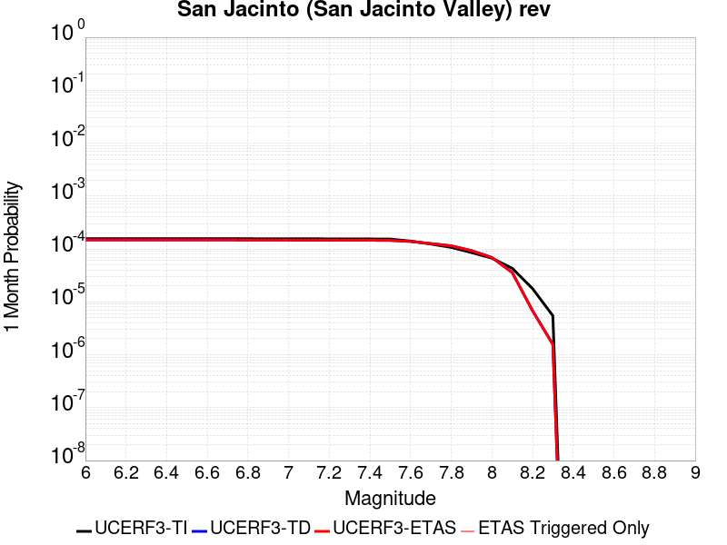 |  |  |

| Magnitude | 1 wk TI Prob | 1 wk TD Prob | 1 wk ETAS Prob | 1 wk ETAS/TD Gain | 1 wk ETAS Triggered Only | 1 mo TI Prob | 1 mo TD Prob | 1 mo ETAS Prob | 1 mo ETAS/TD Gain | 1 mo ETAS Triggered Only | 1 yr TI Prob | 1 yr TD Prob | 1 yr ETAS Prob | 1 yr ETAS/TD Gain | 1 yr ETAS Triggered Only | 10 yr TI Prob | 10 yr TD Prob | 10 yr ETAS Prob | 10 yr ETAS/TD Gain | 10 yr ETAS Triggered Only |
|-----|-----|-----|-----|-----|-----|-----|-----|-----|-----|-----|-----|-----|-----|-----|-----|-----|-----|-----|-----|-----|
| 6.0 | 3.652694E-5 | 3.46213E-5 | 3.46213E-5 | 1.0 | 0.0 | 1.5653463E-4 | 1.4836855E-4 | 1.4836855E-4 | 1.0 | 0.0 | 0.0019041431 | 0.0018048923 | 0.0018148742 | 1.0055305 | 1.0E-5 | 0.018879099 | 0.018639479 | 0.018649293 | 1.0005265 | 1.0E-5 |
| 6.1 | 3.652694E-5 | 3.46213E-5 | 3.46213E-5 | 1.0 | 0.0 | 1.5653463E-4 | 1.4836855E-4 | 1.4836855E-4 | 1.0 | 0.0 | 0.0019041431 | 0.0018048923 | 0.0018148742 | 1.0055305 | 1.0E-5 | 0.018879099 | 0.018639479 | 0.018649293 | 1.0005265 | 1.0E-5 |
| 6.2 | 3.652694E-5 | 3.46213E-5 | 3.46213E-5 | 1.0 | 0.0 | 1.5653463E-4 | 1.4836855E-4 | 1.4836855E-4 | 1.0 | 0.0 | 0.0019041431 | 0.0018048923 | 0.0018148742 | 1.0055305 | 1.0E-5 | 0.018879099 | 0.018639479 | 0.018649293 | 1.0005265 | 1.0E-5 |
| 6.3 | 3.652694E-5 | 3.46213E-5 | 3.46213E-5 | 1.0 | 0.0 | 1.5653463E-4 | 1.4836855E-4 | 1.4836855E-4 | 1.0 | 0.0 | 0.0019041431 | 0.0018048923 | 0.0018148742 | 1.0055305 | 1.0E-5 | 0.018879099 | 0.018639479 | 0.018649293 | 1.0005265 | 1.0E-5 |
| 6.4 | 3.646941E-5 | 3.454282E-5 | 3.454282E-5 | 1.0 | 0.0 | 1.5628811E-4 | 1.4803227E-4 | 1.4803227E-4 | 1.0 | 0.0 | 0.0019011468 | 0.0018008052 | 0.0018107872 | 1.0055431 | 1.0E-5 | 0.018849645 | 0.018599339 | 0.018609153 | 1.0005276 | 1.0E-5 |
| 6.5 | 3.646941E-5 | 3.454282E-5 | 3.454282E-5 | 1.0 | 0.0 | 1.5628811E-4 | 1.4803227E-4 | 1.4803227E-4 | 1.0 | 0.0 | 0.0019011468 | 0.0018008052 | 0.0018107872 | 1.0055431 | 1.0E-5 | 0.018849645 | 0.018599339 | 0.018609153 | 1.0005276 | 1.0E-5 |
| 6.6 | 3.6442503E-5 | 3.450618E-5 | 3.450618E-5 | 1.0 | 0.0 | 1.561728E-4 | 1.4787527E-4 | 1.4787527E-4 | 1.0 | 0.0 | 0.0018997455 | 0.001798897 | 0.0018088791 | 1.005549 | 1.0E-5 | 0.018835869 | 0.018580597 | 0.018590411 | 1.0005282 | 1.0E-5 |
| 6.7 | 3.6432113E-5 | 3.449175E-5 | 3.449175E-5 | 1.0 | 0.0 | 1.5612828E-4 | 1.4781342E-4 | 1.4781342E-4 | 1.0 | 0.0 | 0.0018992044 | 0.0017981454 | 0.0018081274 | 1.0055513 | 1.0E-5 | 0.018830549 | 0.018573217 | 0.018583031 | 1.0005285 | 1.0E-5 |
| 6.8 | 3.6409598E-5 | 3.4460783E-5 | 3.4460783E-5 | 1.0 | 0.0 | 1.560318E-4 | 1.4768072E-4 | 1.4768072E-4 | 1.0 | 0.0 | 0.0018980318 | 0.0017965324 | 0.0018065145 | 1.0055562 | 1.0E-5 | 0.018819023 | 0.018557362 | 0.018567177 | 1.0005288 | 1.0E-5 |
| 6.9 | 3.638078E-5 | 3.4421177E-5 | 3.4421177E-5 | 1.0 | 0.0 | 1.5590832E-4 | 1.47511E-4 | 1.47511E-4 | 1.0 | 0.0 | 0.0018965311 | 0.0017944695 | 0.0018044517 | 1.0055627 | 1.0E-5 | 0.018804269 | 0.018537084 | 0.018546898 | 1.0005294 | 1.0E-5 |
| 7.0 | 3.6294874E-5 | 3.430311E-5 | 3.430311E-5 | 1.0 | 0.0 | 1.5554018E-4 | 1.4700506E-4 | 1.4700506E-4 | 1.0 | 0.0 | 0.0018920569 | 0.00178832 | 0.0017983022 | 1.0055819 | 1.0E-5 | 0.018760284 | 0.01847663 | 0.018486446 | 1.0005312 | 1.0E-5 |
| 7.1 | 3.6260717E-5 | 3.425937E-5 | 3.425937E-5 | 1.0 | 0.0 | 1.5539382E-4 | 1.4681763E-4 | 1.4681763E-4 | 1.0 | 0.0 | 0.001890278 | 0.0017860418 | 0.0017960239 | 1.005589 | 1.0E-5 | 0.018742796 | 0.018454222 | 0.018464038 | 1.0005319 | 1.0E-5 |
| 7.2 | 3.6210204E-5 | 3.4193472E-5 | 3.4193472E-5 | 1.0 | 0.0 | 1.5517735E-4 | 1.4653523E-4 | 1.4653523E-4 | 1.0 | 0.0 | 0.001887647 | 0.0017826093 | 0.0017925914 | 1.0055997 | 1.0E-5 | 0.01871693 | 0.018420458 | 0.018430274 | 1.0005329 | 1.0E-5 |
| 7.3 | 3.6119454E-5 | 3.4081488E-5 | 3.4081488E-5 | 1.0 | 0.0 | 1.5478847E-4 | 1.4605535E-4 | 1.4605535E-4 | 1.0 | 0.0 | 0.0018829206 | 0.0017767763 | 0.0017867584 | 1.0056182 | 1.0E-5 | 0.018670462 | 0.01836288 | 0.018372696 | 1.0005345 | 1.0E-5 |
| 7.4 | 3.607848E-5 | 3.4028883E-5 | 3.4028883E-5 | 1.0 | 0.0 | 1.5461289E-4 | 1.4582992E-4 | 1.4582992E-4 | 1.0 | 0.0 | 0.0018807866 | 0.0017740362 | 0.0017840185 | 1.0056269 | 1.0E-5 | 0.018649481 | 0.018335821 | 0.01834564 | 1.0005354 | 1.0E-5 |
| 7.5 | 3.5856774E-5 | 3.383749E-5 | 3.383749E-5 | 1.0 | 0.0 | 1.5366284E-4 | 1.4500976E-4 | 1.4500976E-4 | 1.0 | 0.0 | 0.0018692396 | 0.001764067 | 0.0017740492 | 1.0056587 | 1.0E-5 | 0.018535944 | 0.018236317 | 0.018246135 | 1.0005383 | 1.0E-5 |
| 7.6 | 3.286655E-5 | 3.235092E-5 | 3.235092E-5 | 1.0 | 0.0 | 1.4084904E-4 | 1.3863944E-4 | 1.3863944E-4 | 1.0 | 0.0 | 0.001713488 | 0.0016866304 | 0.0016966135 | 1.005919 | 1.0E-5 | 0.017003361 | 0.017451072 | 0.017460898 | 1.000563 | 1.0E-5 |
| 7.7 | 2.8882527E-5 | 2.9439245E-5 | 2.9439245E-5 | 1.0 | 0.0 | 1.237764E-4 | 1.261621E-4 | 1.261621E-4 | 1.0 | 0.0 | 0.0015059357 | 0.0015349423 | 0.001544927 | 1.0065049 | 1.0E-5 | 0.014957713 | 0.015935382 | 0.015945222 | 1.0006175 | 1.0E-5 |
| 7.8 | 2.4950225E-5 | 2.6722435E-5 | 2.6722435E-5 | 1.0 | 0.0 | 1.0692515E-4 | 1.14519695E-4 | 1.14519695E-4 | 1.0 | 0.0 | 0.0013010362 | 0.0013933864 | 0.0014033725 | 1.0071667 | 1.0E-5 | 0.012934455 | 0.014512955 | 0.01452281 | 1.000679 | 1.0E-5 |
| 7.9 | 1.9881603E-5 | 2.1682961E-5 | 2.1682961E-5 | 1.0 | 0.0 | 8.520408E-5 | 9.292368E-5 | 9.292368E-5 | 1.0 | 0.0 | 0.001036866 | 0.0011307594 | 0.001140748 | 1.0088336 | 1.0E-5 | 0.010320415 | 0.011868326 | 0.011878207 | 1.0008326 | 1.0E-5 |
| 8.0 | 1.563292E-5 | 1.607885E-5 | 1.607885E-5 | 1.0 | 0.0 | 6.6996516E-5 | 6.890754E-5 | 6.890754E-5 | 1.0 | 0.0 | 8.153773E-4 | 8.3862705E-4 | 8.486187E-4 | 1.0119143 | 1.0E-5 | 0.00812392 | 0.008884826 | 0.008894737 | 1.0011156 | 1.0E-5 |
| 8.1 | 1.0045313E-5 | 8.384248E-6 | 8.384248E-6 | 1.0 | 0.0 | 4.305063E-5 | 3.5932E-5 | 3.5932E-5 | 1.0 | 0.0 | 5.2401534E-4 | 4.373848E-4 | 4.4738041E-4 | 1.0228531 | 1.0E-5 | 0.0052278144 | 0.0047033634 | 0.0047133164 | 1.0021161 | 1.0E-5 |
| 8.2 | 4.1554413E-6 | 1.5889781E-6 | 1.5889781E-6 | 1.0 | 0.0 | 1.7808914E-5 | 6.8098884E-6 | 6.8098884E-6 | 1.0 | 0.0 | 2.1680194E-4 | 8.290727E-5 | 8.290727E-5 | 1.0 | 0.0 | 0.0021659054 | 9.6168317E-4 | 9.6168317E-4 | 1.0 | 0.0 |
| 8.3 | 1.2758221E-6 | 3.6782495E-7 | 3.6782495E-7 | 1.0 | 0.0 | 5.4677976E-6 | 1.5763917E-6 | 1.5763917E-6 | 1.0 | 0.0 | 6.65684E-5 | 1.9192405E-5 | 1.9192405E-5 | 1.0 | 0.0 | 6.6548464E-4 | 2.3124217E-4 | 2.3124217E-4 | 1.0 | 0.0 |

## Bartlett Springs 2011 CFM
*[(top)](#table-of-contents)*

| 1 Week | 1 Month | 1 Year | 10 Year |
|-----|-----|-----|-----|
|  |  |  |  |

| Magnitude | 1 wk TI Prob | 1 wk TD Prob | 1 wk ETAS Prob | 1 wk ETAS/TD Gain | 1 wk ETAS Triggered Only | 1 mo TI Prob | 1 mo TD Prob | 1 mo ETAS Prob | 1 mo ETAS/TD Gain | 1 mo ETAS Triggered Only | 1 yr TI Prob | 1 yr TD Prob | 1 yr ETAS Prob | 1 yr ETAS/TD Gain | 1 yr ETAS Triggered Only | 10 yr TI Prob | 10 yr TD Prob | 10 yr ETAS Prob | 10 yr ETAS/TD Gain | 10 yr ETAS Triggered Only |
|-----|-----|-----|-----|-----|-----|-----|-----|-----|-----|-----|-----|-----|-----|-----|-----|-----|-----|-----|-----|-----|
| 6.0 | 6.2326144E-5 | 8.065019E-5 | 8.065019E-5 | 1.0 | 0.0 | 2.6708472E-4 | 3.4559862E-4 | 3.4559862E-4 | 1.0 | 0.0 | 0.003246908 | 0.0041996357 | 0.0041996357 | 1.0 | 0.0 | 0.031998757 | 0.041219816 | 0.0412294 | 1.0002326 | 1.0E-5 |
| 6.1 | 6.227657E-5 | 8.058766E-5 | 8.058766E-5 | 1.0 | 0.0 | 2.668723E-4 | 3.4533069E-4 | 3.4533069E-4 | 1.0 | 0.0 | 0.0032443295 | 0.004196387 | 0.004196387 | 1.0 | 0.0 | 0.031973712 | 0.041188534 | 0.041198123 | 1.0002328 | 1.0E-5 |
| 6.2 | 6.22452E-5 | 8.054825E-5 | 8.054825E-5 | 1.0 | 0.0 | 2.6673786E-4 | 3.4516182E-4 | 3.4516182E-4 | 1.0 | 0.0 | 0.0032426978 | 0.0041943383 | 0.0041943383 | 1.0 | 0.0 | 0.03195787 | 0.041168816 | 0.041178405 | 1.0002329 | 1.0E-5 |
| 6.3 | 6.219006E-5 | 8.047804E-5 | 8.047804E-5 | 1.0 | 0.0 | 2.6650162E-4 | 3.4486104E-4 | 3.4486104E-4 | 1.0 | 0.0 | 0.00323983 | 0.004190691 | 0.004190691 | 1.0 | 0.0 | 0.031930014 | 0.0411337 | 0.041143287 | 1.000233 | 1.0E-5 |
| 6.4 | 5.2175856E-5 | 6.728973E-5 | 6.728973E-5 | 1.0 | 0.0 | 2.2359163E-4 | 2.8835295E-4 | 2.8835295E-4 | 1.0 | 0.0 | 0.0027188298 | 0.0035050937 | 0.0035050937 | 1.0 | 0.0 | 0.026858058 | 0.03450754 | 0.034517195 | 1.0002798 | 1.0E-5 |
| 6.5 | 5.205166E-5 | 6.7132314E-5 | 6.7132314E-5 | 1.0 | 0.0 | 2.2305945E-4 | 2.8767847E-4 | 2.8767847E-4 | 1.0 | 0.0 | 0.0027123666 | 0.0034969086 | 0.0034969086 | 1.0 | 0.0 | 0.026794989 | 0.034428246 | 0.034437902 | 1.0002805 | 1.0E-5 |
| 6.6 | 5.0085426E-5 | 6.4527136E-5 | 6.4527136E-5 | 1.0 | 0.0 | 2.1463417E-4 | 2.7651578E-4 | 2.7651578E-4 | 1.0 | 0.0 | 0.0026100394 | 0.0033614326 | 0.0033614326 | 1.0 | 0.0 | 0.025795965 | 0.033115078 | 0.03312475 | 1.000292 | 1.0E-5 |
| 6.7 | 4.8930866E-5 | 6.305102E-5 | 6.305102E-5 | 1.0 | 0.0 | 2.0968684E-4 | 2.7019094E-4 | 2.7019094E-4 | 1.0 | 0.0 | 0.0025499484 | 0.0032846625 | 0.0032846625 | 1.0 | 0.0 | 0.025208864 | 0.032370064 | 0.032379743 | 1.000299 | 1.0E-5 |
| 6.8 | 4.5679535E-5 | 5.8772857E-5 | 5.8772857E-5 | 1.0 | 0.0 | 1.9575475E-4 | 2.5185954E-4 | 2.5185954E-4 | 1.0 | 0.0 | 0.002380709 | 0.003062116 | 0.003062116 | 1.0 | 0.0 | 0.023553653 | 0.030206269 | 0.030215967 | 1.000321 | 1.0E-5 |
| 6.9 | 4.1439176E-5 | 5.324785E-5 | 5.324785E-5 | 1.0 | 0.0 | 1.7758438E-4 | 2.2818525E-4 | 2.2818525E-4 | 1.0 | 0.0 | 0.002159946 | 0.0027746414 | 0.0027746414 | 1.0 | 0.0 | 0.021390721 | 0.027405033 | 0.02741476 | 1.0003549 | 1.0E-5 |
| 7.0 | 3.5920104E-5 | 4.603221E-5 | 4.603221E-5 | 1.0 | 0.0 | 1.5393422E-4 | 1.9726607E-4 | 1.9726607E-4 | 1.0 | 0.0 | 0.001872538 | 0.0023990849 | 0.0023990849 | 1.0 | 0.0 | 0.018568378 | 0.023735147 | 0.02374491 | 1.0004113 | 1.0E-5 |
| 7.1 | 3.338812E-5 | 4.271108E-5 | 4.271108E-5 | 1.0 | 0.0 | 1.430841E-4 | 1.8303472E-4 | 1.8303472E-4 | 1.0 | 0.0 | 0.0017406568 | 0.0022261846 | 0.0022261846 | 1.0 | 0.0 | 0.017270854 | 0.022041688 | 0.022051468 | 1.0004437 | 1.0E-5 |
| 7.2 | 2.8619615E-5 | 3.64197E-5 | 3.64197E-5 | 1.0 | 0.0 | 1.2264973E-4 | 1.5607516E-4 | 1.5607516E-4 | 1.0 | 0.0 | 0.0014922376 | 0.0018985686 | 0.0018985686 | 1.0 | 0.0 | 0.014822568 | 0.018825563 | 0.018835375 | 1.0005212 | 1.0E-5 |
| 7.3 | 2.6376783E-5 | 3.34394E-5 | 3.34394E-5 | 1.0 | 0.0 | 1.13038455E-4 | 1.4330389E-4 | 1.4330389E-4 | 1.0 | 0.0 | 0.0013753743 | 0.0017433378 | 0.0017433378 | 1.0 | 0.0 | 0.01366893 | 0.017298495 | 0.017298495 | 1.0 | 0.0 |
| 7.4 | 2.3738676E-5 | 2.9993886E-5 | 2.9993886E-5 | 1.0 | 0.0 | 1.0173322E-4 | 1.2853893E-4 | 1.2853893E-4 | 1.0 | 0.0 | 0.0012378981 | 0.0015638461 | 0.0015638461 | 1.0 | 0.0 | 0.012310251 | 0.015529928 | 0.015529928 | 1.0 | 0.0 |
| 7.5 | 2.1789481E-5 | 2.745281E-5 | 2.745281E-5 | 1.0 | 0.0 | 9.338015E-5 | 1.1764964E-4 | 1.1764964E-4 | 1.0 | 0.0 | 0.0011363103 | 0.0014314511 | 0.0014314511 | 1.0 | 0.0 | 0.011305175 | 0.0142237 | 0.0142237 | 1.0 | 0.0 |
| 7.6 | 1.3895281E-5 | 1.7377019E-5 | 1.7377019E-5 | 1.0 | 0.0 | 5.9549846E-5 | 7.447083E-5 | 7.447083E-5 | 1.0 | 0.0 | 7.2477816E-4 | 9.06308E-4 | 9.06308E-4 | 1.0 | 0.0 | 0.0072241887 | 0.00902674 | 0.00902674 | 1.0 | 0.0 |
| 7.7 | 4.245981E-6 | 5.1643797E-6 | 5.1643797E-6 | 1.0 | 0.0 | 1.8196934E-5 | 2.213287E-5 | 2.213287E-5 | 1.0 | 0.0 | 2.2152514E-4 | 2.6943456E-4 | 2.6943456E-4 | 1.0 | 0.0 | 0.0022130446 | 0.0026911274 | 0.0026911274 | 1.0 | 0.0 |
| 7.8 | 6.145192E-7 | 7.0488403E-7 | 7.0488403E-7 | 1.0 | 0.0 | 2.633651E-6 | 3.020928E-6 | 3.020928E-6 | 1.0 | 0.0 | 3.206423E-5 | 3.677919E-5 | 3.677919E-5 | 1.0 | 0.0 | 3.2059604E-4 | 3.6772504E-4 | 3.6772504E-4 | 1.0 | 0.0 |

## Santa Ynez (West)
*[(top)](#table-of-contents)*

| 1 Week | 1 Month | 1 Year | 10 Year |
|-----|-----|-----|-----|
|  |  | 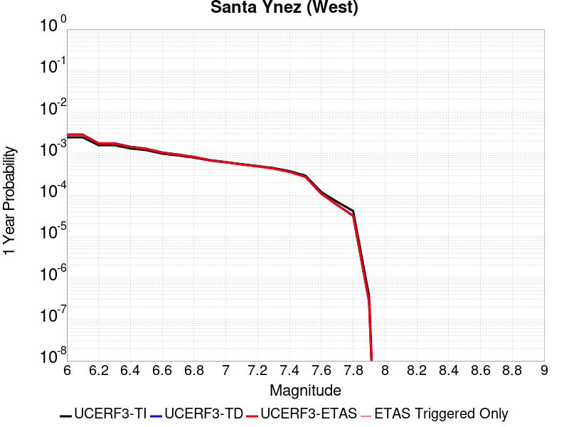 | 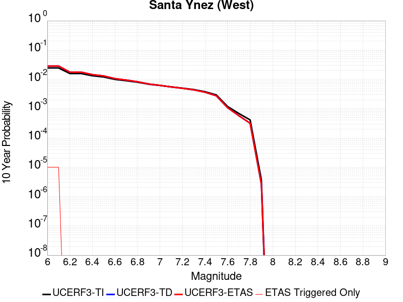 |

| Magnitude | 1 wk TI Prob | 1 wk TD Prob | 1 wk ETAS Prob | 1 wk ETAS/TD Gain | 1 wk ETAS Triggered Only | 1 mo TI Prob | 1 mo TD Prob | 1 mo ETAS Prob | 1 mo ETAS/TD Gain | 1 mo ETAS Triggered Only | 1 yr TI Prob | 1 yr TD Prob | 1 yr ETAS Prob | 1 yr ETAS/TD Gain | 1 yr ETAS Triggered Only | 10 yr TI Prob | 10 yr TD Prob | 10 yr ETAS Prob | 10 yr ETAS/TD Gain | 10 yr ETAS Triggered Only |
|-----|-----|-----|-----|-----|-----|-----|-----|-----|-----|-----|-----|-----|-----|-----|-----|-----|-----|-----|-----|-----|
| 6.0 | 4.7352758E-5 | 5.4991026E-5 | 5.4991026E-5 | 1.0 | 0.0 | 2.0292461E-4 | 2.3565617E-4 | 2.3565617E-4 | 1.0 | 0.0 | 0.0024678076 | 0.00286561 | 0.00286561 | 1.0 | 0.0 | 0.024405818 | 0.028314698 | 0.028324416 | 1.0003432 | 1.0E-5 |
| 6.1 | 4.7352758E-5 | 5.4991026E-5 | 5.4991026E-5 | 1.0 | 0.0 | 2.0292461E-4 | 2.3565617E-4 | 2.3565617E-4 | 1.0 | 0.0 | 0.0024678076 | 0.00286561 | 0.00286561 | 1.0 | 0.0 | 0.024405818 | 0.028314698 | 0.028324416 | 1.0003432 | 1.0E-5 |
| 6.2 | 3.0415853E-5 | 3.393543E-5 | 3.393543E-5 | 1.0 | 0.0 | 1.3034715E-4 | 1.4542964E-4 | 1.4542964E-4 | 1.0 | 0.0 | 0.0015858212 | 0.0017692024 | 0.0017692024 | 1.0 | 0.0 | 0.015745522 | 0.017555121 | 0.017555121 | 1.0 | 0.0 |
| 6.3 | 3.0415853E-5 | 3.393543E-5 | 3.393543E-5 | 1.0 | 0.0 | 1.3034715E-4 | 1.4542964E-4 | 1.4542964E-4 | 1.0 | 0.0 | 0.0015858212 | 0.0017692024 | 0.0017692024 | 1.0 | 0.0 | 0.015745522 | 0.017555121 | 0.017555121 | 1.0 | 0.0 |
| 6.4 | 2.5452082E-5 | 2.7920296E-5 | 2.7920296E-5 | 1.0 | 0.0 | 1.09075794E-4 | 1.1965301E-4 | 1.1965301E-4 | 1.0 | 0.0 | 0.0013271887 | 0.0014558209 | 0.0014558209 | 1.0 | 0.0 | 0.013192902 | 0.014465008 | 0.014465008 | 1.0 | 0.0 |
| 6.5 | 2.3143784E-5 | 2.5134992E-5 | 2.5134992E-5 | 1.0 | 0.0 | 9.9183875E-5 | 1.0771703E-4 | 1.0771703E-4 | 1.0 | 0.0 | 0.0012068948 | 0.0013106805 | 0.0013106805 | 1.0 | 0.0 | 0.012003611 | 0.013031172 | 0.013031172 | 1.0 | 0.0 |
| 6.6 | 1.9118515E-5 | 2.0359386E-5 | 2.0359386E-5 | 1.0 | 0.0 | 8.193392E-5 | 8.725165E-5 | 8.725165E-5 | 1.0 | 0.0 | 9.97089E-4 | 0.001061779 | 0.001061779 | 1.0 | 0.0 | 0.00992627 | 0.0105679715 | 0.0105679715 | 1.0 | 0.0 |
| 6.7 | 1.722807E-5 | 1.8150675E-5 | 1.8150675E-5 | 1.0 | 0.0 | 7.3832496E-5 | 7.778632E-5 | 7.778632E-5 | 1.0 | 0.0 | 8.985399E-4 | 9.4664254E-4 | 9.4664254E-4 | 1.0 | 0.0 | 0.008949154 | 0.009426747 | 0.009426747 | 1.0 | 0.0 |
| 6.8 | 1.5317364E-5 | 1.5930114E-5 | 1.5930114E-5 | 1.0 | 0.0 | 6.56442E-5 | 6.827016E-5 | 6.827016E-5 | 1.0 | 0.0 | 7.98925E-4 | 8.3087647E-4 | 8.3087647E-4 | 1.0 | 0.0 | 0.007960589 | 0.008278188 | 0.008278188 | 1.0 | 0.0 |
| 6.9 | 1.3071226E-5 | 1.33324675E-5 | 1.33324675E-5 | 1.0 | 0.0 | 5.6018336E-5 | 5.7137906E-5 | 5.7137906E-5 | 1.0 | 0.0 | 6.8180985E-4 | 6.954342E-4 | 6.954342E-4 | 1.0 | 0.0 | 0.0067972173 | 0.0069328407 | 0.0069328407 | 1.0 | 0.0 |
| 7.0 | 1.1836986E-5 | 1.1935267E-5 | 1.1935267E-5 | 1.0 | 0.0 | 5.0728955E-5 | 5.115015E-5 | 5.115015E-5 | 1.0 | 0.0 | 6.1745E-4 | 6.225768E-4 | 6.225768E-4 | 1.0 | 0.0 | 0.006157372 | 0.00620852 | 0.00620852 | 1.0 | 0.0 |
| 7.1 | 1.0597169E-5 | 1.0544357E-5 | 1.0544357E-5 | 1.0 | 0.0 | 4.541565E-5 | 4.5189325E-5 | 4.5189325E-5 | 1.0 | 0.0 | 5.5279525E-4 | 5.500423E-4 | 5.500423E-4 | 1.0 | 0.0 | 0.0055142213 | 0.00548694 | 0.00548694 | 1.0 | 0.0 |
| 7.2 | 9.59113E-6 | 9.461139E-6 | 9.461139E-6 | 1.0 | 0.0 | 4.11042E-5 | 4.054711E-5 | 4.054711E-5 | 1.0 | 0.0 | 5.0032866E-4 | 4.935503E-4 | 4.935503E-4 | 1.0 | 0.0 | 0.004992037 | 0.004924661 | 0.004924661 | 1.0 | 0.0 |
| 7.3 | 8.586084E-6 | 8.381422E-6 | 8.381422E-6 | 1.0 | 0.0 | 3.679698E-5 | 3.5919893E-5 | 3.5919893E-5 | 1.0 | 0.0 | 4.4791115E-4 | 4.3723796E-4 | 4.3723796E-4 | 1.0 | 0.0 | 0.004470094 | 0.0043638884 | 0.0043638884 | 1.0 | 0.0 |
| 7.4 | 7.2622997E-6 | 6.953158E-6 | 6.953158E-6 | 1.0 | 0.0 | 3.112377E-5 | 2.9798914E-5 | 2.9798914E-5 | 1.0 | 0.0 | 3.78866E-4 | 3.6274234E-4 | 3.6274234E-4 | 1.0 | 0.0 | 0.0037822074 | 0.0036216027 | 0.0036216027 | 1.0 | 0.0 |
| 7.5 | 5.627296E-6 | 5.2526384E-6 | 5.2526384E-6 | 1.0 | 0.0 | 2.411676E-5 | 2.2511116E-5 | 2.2511116E-5 | 1.0 | 0.0 | 2.9358198E-4 | 2.7403908E-4 | 2.7403908E-4 | 1.0 | 0.0 | 0.0029319443 | 0.0027370837 | 0.0027370837 | 1.0 | 0.0 |
| 7.6 | 2.265244E-6 | 2.0611328E-6 | 2.0611328E-6 | 1.0 | 0.0 | 9.708152E-6 | 8.833396E-6 | 8.833396E-6 | 1.0 | 0.0 | 1.18190335E-4 | 1.0754138E-4 | 1.0754138E-4 | 1.0 | 0.0 | 0.001181275 | 0.001074902 | 0.001074902 | 1.0 | 0.0 |
| 7.7 | 1.3099874E-6 | 1.1017663E-6 | 1.1017663E-6 | 1.0 | 0.0 | 5.61422E-6 | 4.7218473E-6 | 4.7218473E-6 | 1.0 | 0.0 | 6.8350986E-5 | 5.7487E-5 | 5.7487E-5 | 1.0 | 0.0 | 6.832996E-4 | 5.7472364E-4 | 5.7472364E-4 | 1.0 | 0.0 |
| 7.8 | 7.903951E-7 | 6.07185E-7 | 6.07185E-7 | 1.0 | 0.0 | 3.3874032E-6 | 2.6022187E-6 | 2.6022187E-6 | 1.0 | 0.0 | 4.1240855E-5 | 3.1681564E-5 | 3.1681564E-5 | 1.0 | 0.0 | 4.12332E-4 | 3.1677182E-4 | 3.1677182E-4 | 1.0 | 0.0 |
| 7.9 | 7.0753297E-9 | 5.090425E-9 | 5.090425E-9 | 1.0 | 0.0 | 3.032284E-8 | 2.1816108E-8 | 2.1816108E-8 | 1.0 | 0.0 | 3.6918053E-7 | 2.6561108E-7 | 2.6561108E-7 | 1.0 | 0.0 | 3.691799E-6 | 2.6561086E-6 | 2.6561086E-6 | 1.0 | 0.0 |

## San Jacinto (Coyote Creek)
*[(top)](#table-of-contents)*

| 1 Week | 1 Month | 1 Year | 10 Year |
|-----|-----|-----|-----|
|  |  |  |  |

| Magnitude | 1 wk TI Prob | 1 wk TD Prob | 1 wk ETAS Prob | 1 wk ETAS/TD Gain | 1 wk ETAS Triggered Only | 1 mo TI Prob | 1 mo TD Prob | 1 mo ETAS Prob | 1 mo ETAS/TD Gain | 1 mo ETAS Triggered Only | 1 yr TI Prob | 1 yr TD Prob | 1 yr ETAS Prob | 1 yr ETAS/TD Gain | 1 yr ETAS Triggered Only | 10 yr TI Prob | 10 yr TD Prob | 10 yr ETAS Prob | 10 yr ETAS/TD Gain | 10 yr ETAS Triggered Only |
|-----|-----|-----|-----|-----|-----|-----|-----|-----|-----|-----|-----|-----|-----|-----|-----|-----|-----|-----|-----|-----|
| 6.0 | 2.7374346E-5 | 2.426198E-5 | 2.426198E-5 | 1.0 | 0.0 | 1.1731335E-4 | 1.0397579E-4 | 1.0397579E-4 | 1.0 | 0.0 | 0.0014273542 | 0.0012651727 | 0.00127516 | 1.007894 | 1.0E-5 | 0.01418221 | 0.012988786 | 0.012998656 | 1.0007598 | 1.0E-5 |
| 6.1 | 2.7374346E-5 | 2.426198E-5 | 2.426198E-5 | 1.0 | 0.0 | 1.1731335E-4 | 1.0397579E-4 | 1.0397579E-4 | 1.0 | 0.0 | 0.0014273542 | 0.0012651727 | 0.00127516 | 1.007894 | 1.0E-5 | 0.01418221 | 0.012988786 | 0.012998656 | 1.0007598 | 1.0E-5 |
| 6.2 | 2.7374346E-5 | 2.426198E-5 | 2.426198E-5 | 1.0 | 0.0 | 1.1731335E-4 | 1.0397579E-4 | 1.0397579E-4 | 1.0 | 0.0 | 0.0014273542 | 0.0012651727 | 0.00127516 | 1.007894 | 1.0E-5 | 0.01418221 | 0.012988786 | 0.012998656 | 1.0007598 | 1.0E-5 |
| 6.3 | 2.7374346E-5 | 2.426198E-5 | 2.426198E-5 | 1.0 | 0.0 | 1.1731335E-4 | 1.0397579E-4 | 1.0397579E-4 | 1.0 | 0.0 | 0.0014273542 | 0.0012651727 | 0.00127516 | 1.007894 | 1.0E-5 | 0.01418221 | 0.012988786 | 0.012998656 | 1.0007598 | 1.0E-5 |
| 6.4 | 2.7374346E-5 | 2.426198E-5 | 2.426198E-5 | 1.0 | 0.0 | 1.1731335E-4 | 1.0397579E-4 | 1.0397579E-4 | 1.0 | 0.0 | 0.0014273542 | 0.0012651727 | 0.00127516 | 1.007894 | 1.0E-5 | 0.01418221 | 0.012988786 | 0.012998656 | 1.0007598 | 1.0E-5 |
| 6.5 | 2.7282445E-5 | 2.4148007E-5 | 2.4148007E-5 | 1.0 | 0.0 | 1.16919524E-4 | 1.03487364E-4 | 1.03487364E-4 | 1.0 | 0.0 | 0.0014225657 | 0.0012592331 | 0.0012692205 | 1.0079314 | 1.0E-5 | 0.014134934 | 0.012930091 | 0.012939962 | 1.0007634 | 1.0E-5 |
| 6.6 | 2.7282445E-5 | 2.4148007E-5 | 2.4148007E-5 | 1.0 | 0.0 | 1.16919524E-4 | 1.03487364E-4 | 1.03487364E-4 | 1.0 | 0.0 | 0.0014225657 | 0.0012592331 | 0.0012692205 | 1.0079314 | 1.0E-5 | 0.014134934 | 0.012930091 | 0.012939962 | 1.0007634 | 1.0E-5 |
| 6.7 | 2.7216198E-5 | 2.4073093E-5 | 2.4073093E-5 | 1.0 | 0.0 | 1.1663563E-4 | 1.03166334E-4 | 1.03166334E-4 | 1.0 | 0.0 | 0.0014191137 | 0.001255329 | 0.0012653165 | 1.007956 | 1.0E-5 | 0.014100855 | 0.012891487 | 0.012901358 | 1.0007657 | 1.0E-5 |
| 6.8 | 2.7078617E-5 | 2.399024E-5 | 2.399024E-5 | 1.0 | 0.0 | 1.1604605E-4 | 1.0281128E-4 | 1.0281128E-4 | 1.0 | 0.0 | 0.001411945 | 0.0012510113 | 0.0012609988 | 1.0079836 | 1.0E-5 | 0.014030075 | 0.0128486 | 0.012858471 | 1.0007683 | 1.0E-5 |
| 6.9 | 2.6982952E-5 | 2.3909679E-5 | 2.3909679E-5 | 1.0 | 0.0 | 1.15636096E-4 | 1.02466045E-4 | 1.02466045E-4 | 1.0 | 0.0 | 0.0014069602 | 0.0012468128 | 0.0012568004 | 1.0080105 | 1.0E-5 | 0.013980856 | 0.012806859 | 0.01281673 | 1.0007708 | 1.0E-5 |
| 7.0 | 2.6449972E-5 | 2.3486446E-5 | 2.3486446E-5 | 1.0 | 0.0 | 1.1335209E-4 | 1.0065232E-4 | 1.0065232E-4 | 1.0 | 0.0 | 0.001379188 | 0.0012247558 | 0.0012347435 | 1.0081549 | 1.0E-5 | 0.0137065975 | 0.012588118 | 0.012597992 | 1.0007844 | 1.0E-5 |
| 7.1 | 2.6257849E-5 | 2.3312354E-5 | 2.3312354E-5 | 1.0 | 0.0 | 1.1252879E-4 | 9.9906276E-5 | 9.9906276E-5 | 1.0 | 0.0 | 0.0013691769 | 0.0012156827 | 0.0012256706 | 1.0082158 | 1.0E-5 | 0.013607717 | 0.012497902 | 0.012507777 | 1.0007901 | 1.0E-5 |
| 7.2 | 2.5270041E-5 | 2.2506234E-5 | 2.2506234E-5 | 1.0 | 0.0 | 1.0829568E-4 | 9.645174E-5 | 9.645174E-5 | 1.0 | 0.0 | 0.0013177024 | 0.0011736697 | 0.001183658 | 1.0085102 | 1.0E-5 | 0.013099162 | 0.012078611 | 0.012088491 | 1.0008179 | 1.0E-5 |
| 7.3 | 2.339701E-5 | 2.1236476E-5 | 2.1236476E-5 | 1.0 | 0.0 | 1.0026905E-4 | 9.1010304E-5 | 9.1010304E-5 | 1.0 | 0.0 | 0.001220092 | 0.0011074893 | 0.0011174782 | 1.0090194 | 1.0E-5 | 0.012134149 | 0.0114168385 | 0.0114267245 | 1.0008659 | 1.0E-5 |
| 7.4 | 2.296333E-5 | 2.0966416E-5 | 2.0966416E-5 | 1.0 | 0.0 | 9.841056E-5 | 8.985298E-5 | 8.985298E-5 | 1.0 | 0.0 | 0.0011974899 | 0.0010934131 | 0.0011034022 | 1.0091357 | 1.0E-5 | 0.011910575 | 0.011275737 | 0.0112856245 | 1.0008769 | 1.0E-5 |
| 7.5 | 2.2188895E-5 | 2.0488416E-5 | 2.0488416E-5 | 1.0 | 0.0 | 9.50918E-5 | 8.7804554E-5 | 8.7804554E-5 | 1.0 | 0.0 | 0.0011571277 | 0.0010684982 | 0.0010784875 | 1.009349 | 1.0E-5 | 0.011511209 | 0.011024921 | 0.011034811 | 1.000897 | 1.0E-5 |
| 7.6 | 2.0013189E-5 | 1.9072239E-5 | 1.9072239E-5 | 1.0 | 0.0 | 8.5767984E-5 | 8.173562E-5 | 8.173562E-5 | 1.0 | 0.0 | 0.001043725 | 9.946786E-4 | 0.0010046687 | 1.0100435 | 1.0E-5 | 0.010388365 | 0.010281745 | 0.0102916425 | 1.0009626 | 1.0E-5 |
| 7.7 | 1.7230794E-5 | 1.6850501E-5 | 1.6850501E-5 | 1.0 | 0.0 | 7.384417E-5 | 7.221444E-5 | 7.221444E-5 | 1.0 | 0.0 | 8.986819E-4 | 8.78857E-4 | 8.888482E-4 | 1.0113684 | 1.0E-5 | 0.008950562 | 0.009118687 | 0.009128597 | 1.0010866 | 1.0E-5 |
| 7.8 | 1.4478809E-5 | 1.5094091E-5 | 1.5094091E-5 | 1.0 | 0.0 | 6.205057E-5 | 6.468736E-5 | 6.468736E-5 | 1.0 | 0.0 | 7.552038E-4 | 7.872847E-4 | 7.9727685E-4 | 1.0126919 | 1.0E-5 | 0.0075264242 | 0.008195413 | 0.008205331 | 1.0012102 | 1.0E-5 |
| 7.9 | 1.1114467E-5 | 1.1736694E-5 | 1.1736694E-5 | 1.0 | 0.0 | 4.7632562E-5 | 5.0299153E-5 | 5.0299153E-5 | 1.0 | 0.0 | 5.797721E-4 | 6.122207E-4 | 6.222146E-4 | 1.0163239 | 1.0E-5 | 0.0057826187 | 0.006428502 | 0.006438438 | 1.0015455 | 1.0E-5 |
| 8.0 | 9.327402E-6 | 9.982416E-6 | 9.982416E-6 | 1.0 | 0.0 | 3.9973966E-5 | 4.278108E-5 | 4.278108E-5 | 1.0 | 0.0 | 4.8657437E-4 | 5.2073575E-4 | 5.307305E-4 | 1.0191936 | 1.0E-5 | 0.0048551033 | 0.005493728 | 0.005503673 | 1.0018103 | 1.0E-5 |
| 8.1 | 7.0235833E-6 | 6.8894324E-6 | 6.8894324E-6 | 1.0 | 0.0 | 3.0100724E-5 | 2.9525807E-5 | 2.9525807E-5 | 1.0 | 0.0 | 3.664147E-4 | 3.5941793E-4 | 3.694143E-4 | 1.0278127 | 1.0E-5 | 0.003658111 | 0.0038203835 | 0.003830345 | 1.0026076 | 1.0E-5 |
| 8.2 | 2.0358202E-6 | 9.1151486E-7 | 9.1151486E-7 | 1.0 | 0.0 | 8.724915E-6 | 3.9064867E-6 | 3.9064867E-6 | 1.0 | 0.0 | 1.06220665E-4 | 4.7560457E-5 | 4.7560457E-5 | 1.0 | 0.0 | 0.001061699 | 5.393413E-4 | 5.393413E-4 | 1.0 | 0.0 |
| 8.3 | 2.0051264E-7 | 6.7192694E-8 | 6.7192694E-8 | 1.0 | 0.0 | 8.5933965E-7 | 2.8796865E-7 | 2.8796865E-7 | 1.0 | 0.0 | 1.046241E-5 | 3.5060132E-6 | 3.5060132E-6 | 1.0 | 0.0 | 1.0461917E-4 | 4.0721698E-5 | 4.0721698E-5 | 1.0 | 0.0 |

## San Jacinto (Anza) rev
*[(top)](#table-of-contents)*

| 1 Week | 1 Month | 1 Year | 10 Year |
|-----|-----|-----|-----|
|  |  |  |  |

| Magnitude | 1 wk TI Prob | 1 wk TD Prob | 1 wk ETAS Prob | 1 wk ETAS/TD Gain | 1 wk ETAS Triggered Only | 1 mo TI Prob | 1 mo TD Prob | 1 mo ETAS Prob | 1 mo ETAS/TD Gain | 1 mo ETAS Triggered Only | 1 yr TI Prob | 1 yr TD Prob | 1 yr ETAS Prob | 1 yr ETAS/TD Gain | 1 yr ETAS Triggered Only | 10 yr TI Prob | 10 yr TD Prob | 10 yr ETAS Prob | 10 yr ETAS/TD Gain | 10 yr ETAS Triggered Only |
|-----|-----|-----|-----|-----|-----|-----|-----|-----|-----|-----|-----|-----|-----|-----|-----|-----|-----|-----|-----|-----|
| 6.0 | 6.3015636E-5 | 4.3556713E-5 | 4.3556713E-5 | 1.0 | 0.0 | 2.7003905E-4 | 1.8665833E-4 | 1.8665833E-4 | 1.0 | 0.0 | 0.0032827691 | 0.0022702087 | 0.002280186 | 1.0043949 | 1.0E-5 | 0.032346968 | 0.023431234 | 0.023441 | 1.0004168 | 1.0E-5 |
| 6.1 | 6.3015636E-5 | 4.3556713E-5 | 4.3556713E-5 | 1.0 | 0.0 | 2.7003905E-4 | 1.8665833E-4 | 1.8665833E-4 | 1.0 | 0.0 | 0.0032827691 | 0.0022702087 | 0.002280186 | 1.0043949 | 1.0E-5 | 0.032346968 | 0.023431234 | 0.023441 | 1.0004168 | 1.0E-5 |
| 6.2 | 6.3015636E-5 | 4.3556713E-5 | 4.3556713E-5 | 1.0 | 0.0 | 2.7003905E-4 | 1.8665833E-4 | 1.8665833E-4 | 1.0 | 0.0 | 0.0032827691 | 0.0022702087 | 0.002280186 | 1.0043949 | 1.0E-5 | 0.032346968 | 0.023431234 | 0.023441 | 1.0004168 | 1.0E-5 |
| 6.3 | 6.3015636E-5 | 4.3556713E-5 | 4.3556713E-5 | 1.0 | 0.0 | 2.7003905E-4 | 1.8665833E-4 | 1.8665833E-4 | 1.0 | 0.0 | 0.0032827691 | 0.0022702087 | 0.002280186 | 1.0043949 | 1.0E-5 | 0.032346968 | 0.023431234 | 0.023441 | 1.0004168 | 1.0E-5 |
| 6.4 | 6.3015636E-5 | 4.3556713E-5 | 4.3556713E-5 | 1.0 | 0.0 | 2.7003905E-4 | 1.8665833E-4 | 1.8665833E-4 | 1.0 | 0.0 | 0.0032827691 | 0.0022702087 | 0.002280186 | 1.0043949 | 1.0E-5 | 0.032346968 | 0.023431234 | 0.023441 | 1.0004168 | 1.0E-5 |
| 6.5 | 5.811017E-5 | 4.032445E-5 | 4.032445E-5 | 1.0 | 0.0 | 2.4901982E-4 | 1.7280766E-4 | 1.7280766E-4 | 1.0 | 0.0 | 0.0030276014 | 0.0021019087 | 0.0021118878 | 1.0047476 | 1.0E-5 | 0.02986684 | 0.021723542 | 0.021733325 | 1.0004504 | 1.0E-5 |
| 6.6 | 5.811017E-5 | 4.032445E-5 | 4.032445E-5 | 1.0 | 0.0 | 2.4901982E-4 | 1.7280766E-4 | 1.7280766E-4 | 1.0 | 0.0 | 0.0030276014 | 0.0021019087 | 0.0021118878 | 1.0047476 | 1.0E-5 | 0.02986684 | 0.021723542 | 0.021733325 | 1.0004504 | 1.0E-5 |
| 6.7 | 5.712442E-5 | 3.974471E-5 | 3.974471E-5 | 1.0 | 0.0 | 2.4479596E-4 | 1.7032339E-4 | 1.7032339E-4 | 1.0 | 0.0 | 0.0029763177 | 0.0020717205 | 0.0020816997 | 1.0048169 | 1.0E-5 | 0.029367693 | 0.02141267 | 0.021422457 | 1.000457 | 1.0E-5 |
| 6.8 | 5.6967532E-5 | 3.960055E-5 | 3.960055E-5 | 1.0 | 0.0 | 2.4412372E-4 | 1.6970563E-4 | 1.6970563E-4 | 1.0 | 0.0 | 0.0029681553 | 0.0020642136 | 0.002074193 | 1.0048344 | 1.0E-5 | 0.029288229 | 0.02133661 | 0.021346396 | 1.0004587 | 1.0E-5 |
| 6.9 | 5.6211324E-5 | 3.9303824E-5 | 3.9303824E-5 | 1.0 | 0.0 | 2.4088343E-4 | 1.6843413E-4 | 1.6843413E-4 | 1.0 | 0.0 | 0.0029288116 | 0.0020487623 | 0.0020587416 | 1.004871 | 1.0E-5 | 0.028905109 | 0.021175219 | 0.021185007 | 1.0004623 | 1.0E-5 |
| 7.0 | 5.4383527E-5 | 3.8158974E-5 | 3.8158974E-5 | 1.0 | 0.0 | 2.3305144E-4 | 1.6352824E-4 | 1.6352824E-4 | 1.0 | 0.0 | 0.0028337094 | 0.0019891432 | 0.0019991233 | 1.0050173 | 1.0E-5 | 0.027978465 | 0.020559916 | 0.02056971 | 1.0004764 | 1.0E-5 |
| 7.1 | 5.1393665E-5 | 3.6612026E-5 | 3.6612026E-5 | 1.0 | 0.0 | 2.2023996E-4 | 1.5689927E-4 | 1.5689927E-4 | 1.0 | 0.0 | 0.0026781242 | 0.0019085791 | 0.0019185601 | 1.0052295 | 1.0E-5 | 0.026460782 | 0.019730551 | 0.019740354 | 1.0004969 | 1.0E-5 |
| 7.2 | 4.785222E-5 | 3.4954675E-5 | 3.4954675E-5 | 1.0 | 0.0 | 2.0506482E-4 | 1.4979717E-4 | 1.4979717E-4 | 1.0 | 0.0 | 0.0024938055 | 0.0018222585 | 0.0018322403 | 1.0054777 | 1.0E-5 | 0.024660049 | 0.018839056 | 0.018848868 | 1.0005208 | 1.0E-5 |
| 7.3 | 4.2143256E-5 | 3.4042478E-5 | 3.4042478E-5 | 1.0 | 0.0 | 1.8060145E-4 | 1.458882E-4 | 1.458882E-4 | 1.0 | 0.0 | 0.002196605 | 0.0017747453 | 0.0017847276 | 1.0056247 | 1.0E-5 | 0.02175019 | 0.018344134 | 0.01835395 | 1.0005351 | 1.0E-5 |
| 7.4 | 4.0264713E-5 | 3.367864E-5 | 3.367864E-5 | 1.0 | 0.0 | 1.7255165E-4 | 1.4432907E-4 | 1.4432907E-4 | 1.0 | 0.0 | 0.002098792 | 0.0017557935 | 0.001765776 | 1.0056854 | 1.0E-5 | 0.020790804 | 0.01814769 | 0.01815751 | 1.0005411 | 1.0E-5 |
| 7.5 | 3.694492E-5 | 3.2387154E-5 | 3.2387154E-5 | 1.0 | 0.0 | 1.5832575E-4 | 1.3879473E-4 | 1.3879473E-4 | 1.0 | 0.0 | 0.0019259118 | 0.0016885191 | 0.0016985022 | 1.0059123 | 1.0E-5 | 0.01909306 | 0.017461387 | 0.017471213 | 1.0005627 | 1.0E-5 |
| 7.6 | 3.200565E-5 | 2.9691066E-5 | 2.9691066E-5 | 1.0 | 0.0 | 1.3715986E-4 | 1.2724123E-4 | 1.2724123E-4 | 1.0 | 0.0 | 0.001668642 | 0.0015480634 | 0.0015580478 | 1.0064497 | 1.0E-5 | 0.01656168 | 0.016043462 | 0.016053302 | 1.0006133 | 1.0E-5 |
| 7.7 | 2.731642E-5 | 2.6274469E-5 | 2.6274469E-5 | 1.0 | 0.0 | 1.1706512E-4 | 1.1260001E-4 | 1.1260001E-4 | 1.0 | 0.0 | 0.001424336 | 0.0013700441 | 0.0013800303 | 1.007289 | 1.0E-5 | 0.014152412 | 0.014261598 | 0.014271456 | 1.0006912 | 1.0E-5 |
| 7.8 | 2.3466424E-5 | 2.3679226E-5 | 2.3679226E-5 | 1.0 | 0.0 | 1.0056651E-4 | 1.0147846E-4 | 1.0147846E-4 | 1.0 | 0.0 | 0.0012237094 | 0.0012348008 | 0.0012447884 | 1.0080885 | 1.0E-5 | 0.012169928 | 0.012899987 | 0.0129098585 | 1.0007652 | 1.0E-5 |
| 7.9 | 1.8611925E-5 | 1.906538E-5 | 1.906538E-5 | 1.0 | 0.0 | 7.9762955E-5 | 8.170622E-5 | 8.170622E-5 | 1.0 | 0.0 | 9.7068126E-4 | 9.943199E-4 | 0.00100431 | 1.0100471 | 1.0E-5 | 0.0096645225 | 0.01047624 | 0.010486135 | 1.0009445 | 1.0E-5 |
| 8.0 | 1.5460775E-5 | 1.5880722E-5 | 1.5880722E-5 | 1.0 | 0.0 | 6.6258784E-5 | 6.805846E-5 | 6.805846E-5 | 1.0 | 0.0 | 8.0640207E-4 | 8.282975E-4 | 8.382892E-4 | 1.0120629 | 1.0E-5 | 0.008034821 | 0.008776305 | 0.008786218 | 1.0011294 | 1.0E-5 |
| 8.1 | 9.983884E-6 | 8.351906E-6 | 8.351906E-6 | 1.0 | 0.0 | 4.2787375E-5 | 3.5793397E-5 | 3.5793397E-5 | 1.0 | 0.0 | 5.2081177E-4 | 4.35698E-4 | 4.4569364E-4 | 1.0229417 | 1.0E-5 | 0.0051959283 | 0.004683998 | 0.0046939515 | 1.0021249 | 1.0E-5 |
| 8.2 | 4.1226E-6 | 1.5761796E-6 | 1.5761796E-6 | 1.0 | 0.0 | 1.7668166E-5 | 6.7550377E-6 | 6.7550377E-6 | 1.0 | 0.0 | 2.1508869E-4 | 8.223951E-5 | 8.223951E-5 | 1.0 | 0.0 | 0.0021488064 | 9.5377007E-4 | 9.5377007E-4 | 1.0 | 0.0 |
| 8.3 | 1.2750878E-6 | 3.6753468E-7 | 3.6753468E-7 | 1.0 | 0.0 | 5.4646503E-6 | 1.5751477E-6 | 1.5751477E-6 | 1.0 | 0.0 | 6.653009E-5 | 1.917726E-5 | 1.917726E-5 | 1.0 | 0.0 | 6.6510175E-4 | 2.3106944E-4 | 2.3106944E-4 | 1.0 | 0.0 |

## San Jacinto (Stepovers Combined)
*[(top)](#table-of-contents)*

| 1 Week | 1 Month | 1 Year | 10 Year |
|-----|-----|-----|-----|
|  |  |  |  |

| Magnitude | 1 wk TI Prob | 1 wk TD Prob | 1 wk ETAS Prob | 1 wk ETAS/TD Gain | 1 wk ETAS Triggered Only | 1 mo TI Prob | 1 mo TD Prob | 1 mo ETAS Prob | 1 mo ETAS/TD Gain | 1 mo ETAS Triggered Only | 1 yr TI Prob | 1 yr TD Prob | 1 yr ETAS Prob | 1 yr ETAS/TD Gain | 1 yr ETAS Triggered Only | 10 yr TI Prob | 10 yr TD Prob | 10 yr ETAS Prob | 10 yr ETAS/TD Gain | 10 yr ETAS Triggered Only |
|-----|-----|-----|-----|-----|-----|-----|-----|-----|-----|-----|-----|-----|-----|-----|-----|-----|-----|-----|-----|-----|
| 6.0 | 4.0667746E-5 | 3.5490113E-5 | 3.5490113E-5 | 1.0 | 0.0 | 1.742787E-4 | 1.5209163E-4 | 1.5209163E-4 | 1.0 | 0.0 | 0.0021197782 | 0.001850144 | 0.0018601255 | 1.0053949 | 1.0E-5 | 0.020996714 | 0.01909927 | 0.01910908 | 1.0005136 | 1.0E-5 |
| 6.1 | 4.0667746E-5 | 3.5490113E-5 | 3.5490113E-5 | 1.0 | 0.0 | 1.742787E-4 | 1.5209163E-4 | 1.5209163E-4 | 1.0 | 0.0 | 0.0021197782 | 0.001850144 | 0.0018601255 | 1.0053949 | 1.0E-5 | 0.020996714 | 0.01909927 | 0.01910908 | 1.0005136 | 1.0E-5 |
| 6.2 | 4.0667746E-5 | 3.5490113E-5 | 3.5490113E-5 | 1.0 | 0.0 | 1.742787E-4 | 1.5209163E-4 | 1.5209163E-4 | 1.0 | 0.0 | 0.0021197782 | 0.001850144 | 0.0018601255 | 1.0053949 | 1.0E-5 | 0.020996714 | 0.01909927 | 0.01910908 | 1.0005136 | 1.0E-5 |
| 6.3 | 4.0667746E-5 | 3.5490113E-5 | 3.5490113E-5 | 1.0 | 0.0 | 1.742787E-4 | 1.5209163E-4 | 1.5209163E-4 | 1.0 | 0.0 | 0.0021197782 | 0.001850144 | 0.0018601255 | 1.0053949 | 1.0E-5 | 0.020996714 | 0.01909927 | 0.01910908 | 1.0005136 | 1.0E-5 |
| 6.4 | 4.0577226E-5 | 3.5361933E-5 | 3.5361933E-5 | 1.0 | 0.0 | 1.738908E-4 | 1.5154235E-4 | 1.5154235E-4 | 1.0 | 0.0 | 0.0021150648 | 0.0018434691 | 0.0018534507 | 1.0054146 | 1.0E-5 | 0.020950472 | 0.0190338 | 0.019043611 | 1.0005153 | 1.0E-5 |
| 6.5 | 4.0577226E-5 | 3.5361933E-5 | 3.5361933E-5 | 1.0 | 0.0 | 1.738908E-4 | 1.5154235E-4 | 1.5154235E-4 | 1.0 | 0.0 | 0.0021150648 | 0.0018434691 | 0.0018534507 | 1.0054146 | 1.0E-5 | 0.020950472 | 0.0190338 | 0.019043611 | 1.0005153 | 1.0E-5 |
| 6.6 | 4.053861E-5 | 3.5307236E-5 | 3.5307236E-5 | 1.0 | 0.0 | 1.7372532E-4 | 1.5130796E-4 | 1.5130796E-4 | 1.0 | 0.0 | 0.0021130538 | 0.0018406208 | 0.0018506023 | 1.005423 | 1.0E-5 | 0.020930743 | 0.019005863 | 0.019015674 | 1.0005162 | 1.0E-5 |
| 6.7 | 4.0516545E-5 | 3.5276287E-5 | 3.5276287E-5 | 1.0 | 0.0 | 1.7363077E-4 | 1.5117534E-4 | 1.5117534E-4 | 1.0 | 0.0 | 0.002111905 | 0.0018390091 | 0.0018489907 | 1.0054277 | 1.0E-5 | 0.020919468 | 0.018990051 | 0.01899986 | 1.0005165 | 1.0E-5 |
| 6.8 | 4.049434E-5 | 3.5247715E-5 | 3.5247715E-5 | 1.0 | 0.0 | 1.7353562E-4 | 1.5105291E-4 | 1.5105291E-4 | 1.0 | 0.0 | 0.0021107488 | 0.001837521 | 0.0018475027 | 1.0054321 | 1.0E-5 | 0.020908125 | 0.018975396 | 0.018985204 | 1.000517 | 1.0E-5 |
| 6.9 | 4.046386E-5 | 3.521017E-5 | 3.521017E-5 | 1.0 | 0.0 | 1.73405E-4 | 1.5089201E-4 | 1.5089201E-4 | 1.0 | 0.0 | 0.0021091616 | 0.0018355655 | 0.0018455471 | 1.005438 | 1.0E-5 | 0.020892553 | 0.018956117 | 0.018965928 | 1.0005175 | 1.0E-5 |
| 7.0 | 4.036382E-5 | 3.50904E-5 | 3.50904E-5 | 1.0 | 0.0 | 1.7297632E-4 | 1.503788E-4 | 1.503788E-4 | 1.0 | 0.0 | 0.0021039525 | 0.0018293275 | 0.0018393092 | 1.0054564 | 1.0E-5 | 0.02084144 | 0.018894562 | 0.018904373 | 1.0005193 | 1.0E-5 |
| 7.1 | 4.0343282E-5 | 3.5068817E-5 | 3.5068817E-5 | 1.0 | 0.0 | 1.7288832E-4 | 1.5028629E-4 | 1.5028629E-4 | 1.0 | 0.0 | 0.002102883 | 0.0018282032 | 0.001838185 | 1.0054599 | 1.0E-5 | 0.020830948 | 0.018883418 | 0.01889323 | 1.0005195 | 1.0E-5 |
| 7.2 | 4.0257353E-5 | 3.497312E-5 | 3.497312E-5 | 1.0 | 0.0 | 1.725201E-4 | 1.498762E-4 | 1.498762E-4 | 1.0 | 0.0 | 0.0020984085 | 0.0018232188 | 0.0018332006 | 1.0054748 | 1.0E-5 | 0.020787042 | 0.018834064 | 0.018843876 | 1.000521 | 1.0E-5 |
| 7.3 | 3.9940667E-5 | 3.479916E-5 | 3.479916E-5 | 1.0 | 0.0 | 1.7116306E-4 | 1.4913075E-4 | 1.4913075E-4 | 1.0 | 0.0 | 0.0020819185 | 0.001814158 | 0.0018241399 | 1.0055022 | 1.0E-5 | 0.020625217 | 0.01874185 | 0.018751662 | 1.0005236 | 1.0E-5 |
| 7.4 | 3.9721202E-5 | 3.4684006E-5 | 3.4684006E-5 | 1.0 | 0.0 | 1.7022261E-4 | 1.4863728E-4 | 1.4863728E-4 | 1.0 | 0.0 | 0.0020704903 | 0.0018081601 | 0.001818142 | 1.0055205 | 1.0E-5 | 0.020513052 | 0.018680703 | 0.018690517 | 1.0005254 | 1.0E-5 |
| 7.5 | 3.7036873E-5 | 3.374669E-5 | 3.374669E-5 | 1.0 | 0.0 | 1.5871979E-4 | 1.4462067E-4 | 1.4462067E-4 | 1.0 | 0.0 | 0.0019307006 | 0.0017593376 | 0.0017693201 | 1.005674 | 1.0E-5 | 0.019140124 | 0.01817986 | 0.018189678 | 1.00054 | 1.0E-5 |
| 7.6 | 3.2940967E-5 | 3.1516774E-5 | 3.1516774E-5 | 1.0 | 0.0 | 1.4116794E-4 | 1.3506491E-4 | 1.3506491E-4 | 1.0 | 0.0 | 0.0017173645 | 0.0016431772 | 0.0016531608 | 1.0060757 | 1.0E-5 | 0.01704153 | 0.017007314 | 0.017017143 | 1.0005779 | 1.0E-5 |
| 7.7 | 2.8236149E-5 | 2.8077373E-5 | 2.8077373E-5 | 1.0 | 0.0 | 1.2100645E-4 | 1.20326054E-4 | 1.20326054E-4 | 1.0 | 0.0 | 0.0014722579 | 0.0014639864 | 0.0014739716 | 1.0068207 | 1.0E-5 | 0.014625421 | 0.015215486 | 0.015225334 | 1.0006472 | 1.0E-5 |
| 7.8 | 2.4329287E-5 | 2.539341E-5 | 2.539341E-5 | 1.0 | 0.0 | 1.042642E-4 | 1.0882437E-4 | 1.0882437E-4 | 1.0 | 0.0 | 0.0012686774 | 0.0013241323 | 0.001334119 | 1.0075421 | 1.0E-5 | 0.012614589 | 0.013809109 | 0.013818972 | 1.0007142 | 1.0E-5 |
| 7.9 | 1.9370926E-5 | 2.0589096E-5 | 2.0589096E-5 | 1.0 | 0.0 | 8.301561E-5 | 8.8236E-5 | 8.8236E-5 | 1.0 | 0.0 | 0.0010102465 | 0.0010737446 | 0.0010837339 | 1.0093032 | 1.0E-5 | 0.0100566605 | 0.011287005 | 0.011296892 | 1.000876 | 1.0E-5 |
| 8.0 | 1.5583017E-5 | 1.6027383E-5 | 1.6027383E-5 | 1.0 | 0.0 | 6.6782646E-5 | 6.868698E-5 | 6.868698E-5 | 1.0 | 0.0 | 8.127754E-4 | 8.3594385E-4 | 8.459355E-4 | 1.0119525 | 1.0E-5 | 0.008098091 | 0.00885582 | 0.008865732 | 1.0011193 | 1.0E-5 |
| 8.1 | 1.0024873E-5 | 8.37469E-6 | 8.37469E-6 | 1.0 | 0.0 | 4.2963035E-5 | 3.5891037E-5 | 3.5891037E-5 | 1.0 | 0.0 | 5.229494E-4 | 4.368863E-4 | 4.4688192E-4 | 1.0228792 | 1.0E-5 | 0.0052172043 | 0.00469757 | 0.004707523 | 1.0021187 | 1.0E-5 |
| 8.2 | 4.142796E-6 | 1.5843408E-6 | 1.5843408E-6 | 1.0 | 0.0 | 1.775472E-5 | 6.7900146E-6 | 6.7900146E-6 | 1.0 | 0.0 | 2.1614227E-4 | 8.266532E-5 | 8.266532E-5 | 1.0 | 0.0 | 0.0021593217 | 9.588108E-4 | 9.588108E-4 | 1.0 | 0.0 |
| 8.3 | 1.2750878E-6 | 3.6753468E-7 | 3.6753468E-7 | 1.0 | 0.0 | 5.4646503E-6 | 1.5751477E-6 | 1.5751477E-6 | 1.0 | 0.0 | 6.653009E-5 | 1.917726E-5 | 1.917726E-5 | 1.0 | 0.0 | 6.6510175E-4 | 2.3106944E-4 | 2.3106944E-4 | 1.0 | 0.0 |

## Imperial
*[(top)](#table-of-contents)*

| 1 Week | 1 Month | 1 Year | 10 Year |
|-----|-----|-----|-----|
|  |  |  | 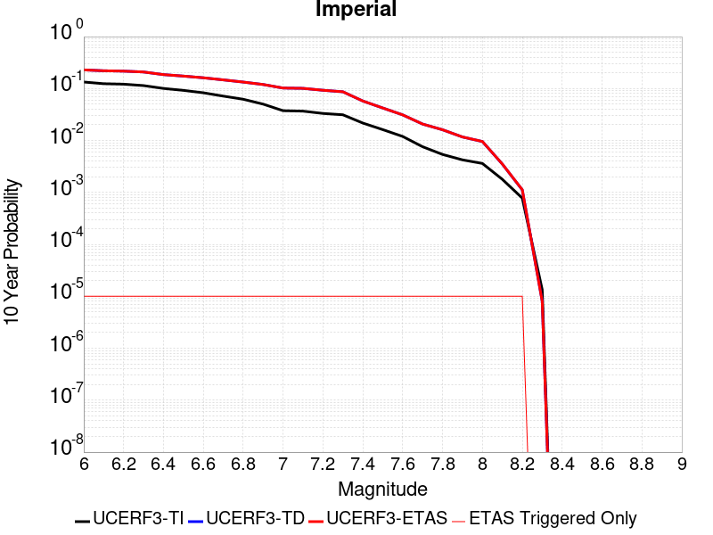 |

| Magnitude | 1 wk TI Prob | 1 wk TD Prob | 1 wk ETAS Prob | 1 wk ETAS/TD Gain | 1 wk ETAS Triggered Only | 1 mo TI Prob | 1 mo TD Prob | 1 mo ETAS Prob | 1 mo ETAS/TD Gain | 1 mo ETAS Triggered Only | 1 yr TI Prob | 1 yr TD Prob | 1 yr ETAS Prob | 1 yr ETAS/TD Gain | 1 yr ETAS Triggered Only | 10 yr TI Prob | 10 yr TD Prob | 10 yr ETAS Prob | 10 yr ETAS/TD Gain | 10 yr ETAS Triggered Only |
|-----|-----|-----|-----|-----|-----|-----|-----|-----|-----|-----|-----|-----|-----|-----|-----|-----|-----|-----|-----|-----|
| 6.0 | 2.7496446E-4 | 5.074544E-4 | 5.074544E-4 | 1.0 | 0.0 | 0.0011778869 | 0.0021730314 | 0.0021730314 | 1.0 | 0.0 | 0.0142467655 | 0.026131915 | 0.026141653 | 1.0003726 | 1.0E-5 | 0.13367249 | 0.22867928 | 0.228687 | 1.0000337 | 1.0E-5 |
| 6.1 | 2.5356023E-4 | 4.8825468E-4 | 4.8825468E-4 | 1.0 | 0.0 | 0.001086234 | 0.0020908804 | 0.0020908804 | 1.0 | 0.0 | 0.013144928 | 0.025161719 | 0.025171466 | 1.0003874 | 1.0E-5 | 0.123940155 | 0.22005196 | 0.22005975 | 1.0000354 | 1.0E-5 |
| 6.2 | 2.4820742E-4 | 4.7917743E-4 | 4.7917743E-4 | 1.0 | 0.0 | 0.0010633124 | 0.0020520394 | 0.0020520394 | 1.0 | 0.0 | 0.01286919 | 0.024700396 | 0.024710149 | 1.0003948 | 1.0E-5 | 0.12148927 | 0.21655184 | 0.21655966 | 1.0000361 | 1.0E-5 |
| 6.3 | 2.3205351E-4 | 4.6037938E-4 | 4.6037938E-4 | 1.0 | 0.0 | 9.94136E-4 | 0.0019715994 | 0.0019715994 | 1.0 | 0.0 | 0.012036599 | 0.02373753 | 0.023747291 | 1.0004113 | 1.0E-5 | 0.11405133 | 0.20845234 | 0.20846026 | 1.000038 | 1.0E-5 |
| 6.4 | 2.0304754E-4 | 4.0020142E-4 | 4.0020142E-4 | 1.0 | 0.0 | 8.6991355E-4 | 0.0017140362 | 0.0017140362 | 1.0 | 0.0 | 0.010539869 | 0.020671692 | 0.020681486 | 1.0004737 | 1.0E-5 | 0.100537635 | 0.185589 | 0.18559714 | 1.0000439 | 1.0E-5 |
| 6.5 | 1.854992E-4 | 3.7122748E-4 | 3.7122748E-4 | 1.0 | 0.0 | 7.9475436E-4 | 0.0015900173 | 0.0015900173 | 1.0 | 0.0 | 0.009633281 | 0.019193593 | 0.0192034 | 1.000511 | 1.0E-5 | 0.0922623 | 0.17379777 | 0.17380603 | 1.0000476 | 1.0E-5 |
| 6.6 | 1.6586106E-4 | 3.4156462E-4 | 3.4156462E-4 | 1.0 | 0.0 | 7.106394E-4 | 0.0014630373 | 0.0014630373 | 1.0 | 0.0 | 0.008617763 | 0.017671239 | 0.017681062 | 1.0005559 | 1.0E-5 | 0.08291132 | 0.16124132 | 0.16124971 | 1.000052 | 1.0E-5 |
| 6.7 | 1.4224656E-4 | 3.0871877E-4 | 3.0871877E-4 | 1.0 | 0.0 | 6.094856E-4 | 0.0013224178 | 0.0013224178 | 1.0 | 0.0 | 0.0073952693 | 0.015983334 | 0.015993174 | 1.0006156 | 1.0E-5 | 0.07153955 | 0.14689726 | 0.1469058 | 1.000058 | 1.0E-5 |
| 6.8 | 1.2317259E-4 | 2.7879674E-4 | 2.7879674E-4 | 1.0 | 0.0 | 5.2777573E-4 | 0.0011943022 | 0.0011943022 | 1.0 | 0.0 | 0.0064067547 | 0.01444508 | 0.014454936 | 1.0006822 | 1.0E-5 | 0.06225166 | 0.13329718 | 0.13330585 | 1.000065 | 1.0E-5 |
| 6.9 | 9.859898E-5 | 2.508048E-4 | 2.508048E-4 | 1.0 | 0.0 | 4.2249862E-4 | 0.0010744391 | 0.0010744391 | 1.0 | 0.0 | 0.0051317946 | 0.013003804 | 0.013013674 | 1.000759 | 1.0E-5 | 0.05014893 | 0.11967744 | 0.119686246 | 1.0000736 | 1.0E-5 |
| 7.0 | 7.3191884E-5 | 2.1315672E-4 | 2.1315672E-4 | 1.0 | 0.0 | 3.136418E-4 | 9.1321213E-4 | 9.1321213E-4 | 1.0 | 0.0 | 0.003811904 | 0.011062366 | 0.011072256 | 1.000894 | 1.0E-5 | 0.037471764 | 0.10226658 | 0.10227556 | 1.0000877 | 1.0E-5 |
| 7.1 | 7.1760296E-5 | 2.1016372E-4 | 2.1016372E-4 | 1.0 | 0.0 | 3.0750787E-4 | 9.0039393E-4 | 9.0039393E-4 | 1.0 | 0.0 | 0.003737482 | 0.010907877 | 0.010917768 | 1.0009068 | 1.0E-5 | 0.03675245 | 0.10090062 | 0.10090961 | 1.000089 | 1.0E-5 |
| 7.2 | 6.46614E-5 | 1.9183119E-4 | 1.9183119E-4 | 1.0 | 0.0 | 2.7709085E-4 | 8.218777E-4 | 8.218777E-4 | 1.0 | 0.0 | 0.0033683628 | 0.009961075 | 0.009970976 | 1.000994 | 1.0E-5 | 0.033177625 | 0.09270296 | 0.09271204 | 1.0000979 | 1.0E-5 |
| 7.3 | 6.088115E-5 | 1.7852755E-4 | 1.7852755E-4 | 1.0 | 0.0 | 2.6089314E-4 | 7.648966E-4 | 7.648966E-4 | 1.0 | 0.0 | 0.0031717476 | 0.009273429 | 0.009283337 | 1.0010684 | 1.0E-5 | 0.031268585 | 0.086747505 | 0.08675664 | 1.0001053 | 1.0E-5 |
| 7.4 | 4.199346E-5 | 1.1544525E-4 | 1.1544525E-4 | 1.0 | 0.0 | 1.7995955E-4 | 4.946724E-4 | 4.946724E-4 | 1.0 | 0.0 | 0.0021888057 | 0.0060061757 | 0.006016115 | 1.001655 | 1.0E-5 | 0.02167372 | 0.057590876 | 0.0576003 | 1.0001637 | 1.0E-5 |
| 7.5 | 3.130448E-5 | 8.3614985E-5 | 8.3614985E-5 | 1.0 | 0.0 | 1.3415517E-4 | 3.5830104E-4 | 3.5830104E-4 | 1.0 | 0.0 | 0.0016321153 | 0.0043536494 | 0.004363606 | 1.0022869 | 1.0E-5 | 0.016201803 | 0.042258974 | 0.042268552 | 1.0002266 | 1.0E-5 |
| 7.6 | 2.3074248E-5 | 6.1085186E-5 | 6.1085186E-5 | 1.0 | 0.0 | 9.888588E-5 | 2.617675E-4 | 2.617675E-4 | 1.0 | 0.0 | 0.0012032706 | 0.0031823851 | 0.0031923533 | 1.0031323 | 1.0E-5 | 0.011967761 | 0.031135553 | 0.031145243 | 1.0003111 | 1.0E-5 |
| 7.7 | 1.45864815E-5 | 4.032411E-5 | 4.032411E-5 | 1.0 | 0.0 | 6.2511994E-5 | 1.728062E-4 | 1.728062E-4 | 1.0 | 0.0 | 7.608177E-4 | 0.0021018907 | 0.0021118699 | 1.0047476 | 1.0E-5 | 0.007582182 | 0.020719025 | 0.02072882 | 1.0004727 | 1.0E-5 |
| 7.8 | 1.0352979E-5 | 3.1129977E-5 | 3.1129977E-5 | 1.0 | 0.0 | 4.4369157E-5 | 1.3340737E-4 | 1.3340737E-4 | 1.0 | 0.0 | 5.400606E-4 | 0.0016230271 | 0.0016330109 | 1.0061513 | 1.0E-5 | 0.0053875 | 0.01609446 | 0.016104298 | 1.0006113 | 1.0E-5 |
| 7.9 | 8.137906E-6 | 2.228463E-5 | 2.228463E-5 | 1.0 | 0.0 | 3.4876273E-5 | 9.5502066E-5 | 9.5502066E-5 | 1.0 | 0.0 | 4.2453592E-4 | 0.0011621184 | 0.0011721068 | 1.008595 | 1.0E-5 | 0.004237258 | 0.011681032 | 0.011690916 | 1.0008461 | 1.0E-5 |
| 8.0 | 6.93792E-6 | 1.8125233E-5 | 1.8125233E-5 | 1.0 | 0.0 | 2.9733603E-5 | 7.7677265E-5 | 7.7677265E-5 | 1.0 | 0.0 | 3.6194647E-4 | 9.453111E-4 | 9.553017E-4 | 1.0105685 | 1.0E-5 | 0.0036135751 | 0.009556044 | 0.009565948 | 1.0010364 | 1.0E-5 |
| 8.1 | 3.4286315E-6 | 6.4337037E-6 | 6.4337037E-6 | 1.0 | 0.0 | 1.4694053E-5 | 2.7572725E-5 | 2.7572725E-5 | 1.0 | 0.0 | 1.7888541E-4 | 3.3564633E-4 | 3.4564297E-4 | 1.0297832 | 1.0E-5 | 0.0017874148 | 0.0035126854 | 0.0035226503 | 1.0028368 | 1.0E-5 |
| 8.2 | 1.4906886E-6 | 1.9575393E-6 | 1.9575393E-6 | 1.0 | 0.0 | 6.3886496E-6 | 8.389427E-6 | 8.389427E-6 | 1.0 | 0.0 | 7.7779034E-5 | 1.0213652E-4 | 1.121355E-4 | 1.0978981 | 1.0E-5 | 7.775182E-4 | 0.0011182398 | 0.0011282287 | 1.0089326 | 1.0E-5 |
| 8.3 | 2.5758007E-8 | 1.47086565E-8 | 1.47086565E-8 | 1.0 | 0.0 | 1.10391454E-7 | 6.30371E-8 | 6.30371E-8 | 1.0 | 0.0 | 1.3440151E-6 | 7.674767E-7 | 7.674767E-7 | 1.0 | 0.0 | 1.344007E-5 | 7.997853E-6 | 7.997853E-6 | 1.0 | 0.0 |

