# Parent Section Magnitude-Probability Distributions

Only fault sections with at least one triggered aftershock are plotted. Sections are sorted by total supraseismogenic trigger rate (decreasing)

## Table Of Contents

* [San Andreas (Creeping Section) 2011 CFM](#san-andreas-creeping-section-2011-cfm)
* [Calaveras (So) - Paicines extension 2011 CFM](#calaveras-so---paicines-extension-2011-cfm)
* [Calaveras (So) 2011 CFM](#calaveras-so-2011-cfm)
* [Concord 2011 CFM](#concord-2011-cfm)
* [Calaveras (Central) 2011 CFM](#calaveras-central-2011-cfm)
* [Green Valley 2011 CFM](#green-valley-2011-cfm)
* [San Andreas (Santa Cruz Mts) 2011 CFM](#san-andreas-santa-cruz-mts-2011-cfm)
* [Hayward (So) 2011 CFM](#hayward-so-2011-cfm)
* [Hayward (So) extension 2011 CFM](#hayward-so-extension-2011-cfm)
* [Calaveras (No) 2011 CFM](#calaveras-no-2011-cfm)
* [Hunting Creek - Berryessa 2011 CFM](#hunting-creek---berryessa-2011-cfm)
* [Sargent 2011 CFM](#sargent-2011-cfm)
* [Ortigalita (North)](#ortigalita-north)
* [San Andreas (Parkfield)](#san-andreas-parkfield)
* [Monte Vista - Shannon 2011 CFM](#monte-vista---shannon-2011-cfm)
* [Monterey Bay-Tularcitos](#monterey-bay-tularcitos)
* [Contra Costa Shear Zone (connector) 2011 CFM](#contra-costa-shear-zone-connector-2011-cfm)
* [Hayward (No) 2011 CFM](#hayward-no-2011-cfm)
* [Clayton](#clayton)
* [Ortigalita (South)](#ortigalita-south)
* [Greenville (So) 2011 CFM](#greenville-so-2011-cfm)
* [Mount Diablo Thrust South](#mount-diablo-thrust-south)
* [Franklin 2011 CFM](#franklin-2011-cfm)
* [Greenville (No) 2011 CFM](#greenville-no-2011-cfm)
* [Mission (connected) 2011 CFM](#mission-connected-2011-cfm)
* [Great Valley 09 (Laguna Seca)](#great-valley-09-laguna-seca)
* [Rodgers Creek - Healdsburg 2011 CFM](#rodgers-creek---healdsburg-2011-cfm)
* [San Andreas (Peninsula) 2011 CFM](#san-andreas-peninsula-2011-cfm)
* [Quien Sabe 2011 CFM](#quien-sabe-2011-cfm)
* [Contra Costa (Lafayette) 2011 CFM](#contra-costa-lafayette-2011-cfm)
* [Mount Diablo Thrust North CFM](#mount-diablo-thrust-north-cfm)
* [Reliz 2011 CFM](#reliz-2011-cfm)
* [West Napa 2011 CFM](#west-napa-2011-cfm)
* [Hunting Creek - Bartlett Springs connector 2011](#hunting-creek---bartlett-springs-connector-2011)
* [Great Valley 07 (Orestimba)](#great-valley-07-orestimba)
* [San Andreas (Cholame) rev](#san-andreas-cholame-rev)
* [San Andreas (Carrizo) rev](#san-andreas-carrizo-rev)
* [San Andreas (Big Bend)](#san-andreas-big-bend)
* [Great Valley 05 Pittsburg - Kirby Hills alt1](#great-valley-05-pittsburg---kirby-hills-alt1)
* [San Andreas (San Bernardino S)](#san-andreas-san-bernardino-s)
* [San Andreas (Mojave N)](#san-andreas-mojave-n)
* [San Andreas (San Bernardino N)](#san-andreas-san-bernardino-n)
* [San Gregorio (North) 2011 CFM](#san-gregorio-north-2011-cfm)
* [San Andreas (Mojave S)](#san-andreas-mojave-s)
* [Rinconada 2011 CFM](#rinconada-2011-cfm)
* [Las Positas](#las-positas)
* [Silver Creek 2011 CFM](#silver-creek-2011-cfm)
* [San Andreas (San Gorgonio Pass-Garnet HIll)](#san-andreas-san-gorgonio-pass-garnet-hill)
* [San Gregorio (South) 2011 CFM](#san-gregorio-south-2011-cfm)
* [Hosgri](#hosgri)
* [Bartlett Springs 2011 CFM](#bartlett-springs-2011-cfm)
* [Great Valley 11](#great-valley-11)
* [Butano 2011 CFM](#butano-2011-cfm)
* [Pilarcitos 2011 CFM](#pilarcitos-2011-cfm)
* [Oceanic - West Huasna](#oceanic---west-huasna)
* [Great Valley 03 Mysterious Ridge](#great-valley-03-mysterious-ridge)
* [San Andreas (North Coast) 2011 CFM](#san-andreas-north-coast-2011-cfm)
* [La Panza 2011](#la-panza-2011)

## San Andreas (Creeping Section) 2011 CFM
*[(top)](#table-of-contents)*

| 1 Week | 1 Month | 1 Year | 10 Year |
|-----|-----|-----|-----|
|  |  |  |  |

| Magnitude | 1 wk TI Prob | 1 wk TD Prob | 1 wk ETAS Prob | 1 wk ETAS/TD Gain | 1 wk ETAS Triggered Only | 1 mo TI Prob | 1 mo TD Prob | 1 mo ETAS Prob | 1 mo ETAS/TD Gain | 1 mo ETAS Triggered Only | 1 yr TI Prob | 1 yr TD Prob | 1 yr ETAS Prob | 1 yr ETAS/TD Gain | 1 yr ETAS Triggered Only | 10 yr TI Prob | 10 yr TD Prob | 10 yr ETAS Prob | 10 yr ETAS/TD Gain | 10 yr ETAS Triggered Only |
|-----|-----|-----|-----|-----|-----|-----|-----|-----|-----|-----|-----|-----|-----|-----|-----|-----|-----|-----|-----|-----|
| 6.0 | 5.986481E-4 | 0.0012305692 | 0.009400683 | 7.6392965 | 0.008180181 | 0.0025631124 | 0.005255843 | 0.015346671 | 2.9199257 | 0.010144144 | 0.030762846 | 0.06129019 | 0.07324817 | 1.1951042 | 0.012738739 | 0.26835477 | 0.42638227 | 0.4351674 | 1.0206039 | 0.015315316 |
| 6.1 | 5.015945E-4 | 0.0010243965 | 0.008098224 | 7.9053607 | 0.007081081 | 0.00214792 | 0.0043764436 | 0.013076938 | 2.9880283 | 0.0087387385 | 0.025839351 | 0.051319696 | 0.061746635 | 1.2031761 | 0.010990991 | 0.23032776 | 0.37328404 | 0.38166285 | 1.0224462 | 0.013369369 |
| 6.2 | 4.073338E-4 | 8.1292057E-4 | 0.0065920027 | 8.109036 | 0.0057837837 | 0.0017445484 | 0.0034743187 | 0.010512843 | 3.0258715 | 0.007063063 | 0.021034058 | 0.041003637 | 0.04953957 | 1.208175 | 0.008900901 | 0.19150782 | 0.31349596 | 0.32086813 | 1.023516 | 0.010738739 |
| 6.3 | 3.464099E-4 | 6.7585194E-4 | 0.005213324 | 7.7137065 | 0.0045405407 | 0.0014837692 | 0.002889607 | 0.008297359 | 2.871449 | 0.0054234234 | 0.017915873 | 0.034260165 | 0.040907238 | 1.1940175 | 0.0068828827 | 0.16538359 | 0.27180734 | 0.2778953 | 1.022398 | 0.008360361 |
| 6.4 | 2.935057E-4 | 5.564272E-4 | 0.003797866 | 6.8254495 | 0.0032432433 | 0.0012572751 | 0.0023789855 | 0.0062616183 | 2.632054 | 0.0038918918 | 0.015200248 | 0.028335916 | 0.033167977 | 1.1705277 | 0.004972973 | 0.14201577 | 0.23350294 | 0.23818478 | 1.0200505 | 0.006108108 |
| 6.5 | 2.3409708E-4 | 4.226163E-4 | 0.002637896 | 6.2418227 | 0.0022162162 | 0.0010028875 | 0.0018080077 | 0.004469853 | 2.4722533 | 0.0026666666 | 0.012141965 | 0.021659894 | 0.025079677 | 1.1578856 | 0.0034954955 | 0.11499573 | 0.18737322 | 0.19082871 | 1.0184418 | 0.004252252 |
| 6.6 | 1.5842178E-4 | 2.5210352E-4 | 0.0010807234 | 4.2868237 | 8.2882884E-4 | 6.7877385E-4 | 0.0010799908 | 0.002015916 | 1.8666047 | 9.3693694E-4 | 0.0082328 | 0.01306856 | 0.014348903 | 1.0979713 | 0.0012972973 | 0.07934396 | 0.12373641 | 0.12512581 | 1.0112287 | 0.0015855855 |
| 6.7 | 1.5616413E-4 | 2.4746807E-4 | 0.0010760918 | 4.348407 | 8.2882884E-4 | 6.691031E-4 | 0.0010601451 | 0.0019960888 | 1.8828448 | 9.3693694E-4 | 0.0081159435 | 0.012830284 | 0.01409315 | 1.0984285 | 0.0012792792 | 0.0782586 | 0.12176359 | 0.12314028 | 1.0113063 | 0.0015675676 |
| 6.8 | 1.5538467E-4 | 2.4570388E-4 | 0.0010563155 | 4.2991405 | 8.1081083E-4 | 6.6576427E-4 | 0.0010525904 | 0.0019525432 | 1.8549883 | 9.009009E-4 | 0.008075596 | 0.012739524 | 0.013966929 | 1.0963463 | 0.0012432432 | 0.07788358 | 0.12099387 | 0.12234009 | 1.0111264 | 0.0015315316 |
| 6.9 | 1.5153569E-4 | 2.3678907E-4 | 0.0010113803 | 4.2712293 | 7.7477476E-4 | 6.49277E-4 | 0.0010144176 | 0.0018784051 | 1.8517079 | 8.6486485E-4 | 0.007876333 | 0.012281124 | 0.013455708 | 1.0956415 | 0.0011891891 | 0.07602952 | 0.117062055 | 0.11831885 | 1.0107361 | 0.0014234234 |
| 7.0 | 1.4588932E-4 | 2.2534574E-4 | 9.2789007E-4 | 4.117629 | 7.0270273E-4 | 6.250901E-4 | 9.6541195E-4 | 0.0017394387 | 1.801758 | 7.7477476E-4 | 0.0075839474 | 0.011691048 | 0.012777297 | 1.0929129 | 0.001099099 | 0.073302895 | 0.11190571 | 0.11307383 | 1.0104384 | 0.0013153154 |
| 7.1 | 1.1565079E-4 | 1.6400899E-4 | 5.6034036E-4 | 3.4165223 | 3.9639638E-4 | 4.955521E-4 | 7.0270716E-4 | 0.0011708464 | 1.666194 | 4.6846847E-4 | 0.006016669 | 0.008522104 | 0.009129495 | 1.0712725 | 6.1261264E-4 | 0.058563538 | 0.08420094 | 0.08481147 | 1.0072509 | 6.6666666E-4 |
| 7.2 | 1.0393792E-4 | 1.4727897E-4 | 4.355248E-4 | 2.9571419 | 2.8828828E-4 | 4.4537216E-4 | 6.310437E-4 | 9.911766E-4 | 1.5706942 | 3.6036037E-4 | 0.005408933 | 0.007656064 | 0.008085186 | 1.05605 | 4.3243243E-4 | 0.052791595 | 0.076125175 | 0.07657462 | 1.0059041 | 4.8648647E-4 |
| 7.3 | 9.332884E-5 | 1.2879037E-4 | 1.8283747E-4 | 1.4196516 | 5.4054053E-5 | 3.999194E-4 | 5.518426E-4 | 6.41883E-4 | 1.1631632 | 9.009009E-5 | 0.0048581534 | 0.0066981222 | 0.0068234038 | 1.0187039 | 1.2612612E-4 | 0.047533102 | 0.066934355 | 0.06710248 | 1.0025117 | 1.8018018E-4 |
| 7.4 | 8.670252E-5 | 1.1794803E-4 | 1.5397982E-4 | 1.3054887 | 3.6036035E-5 | 3.715293E-4 | 5.0539424E-4 | 5.5942097E-4 | 1.1069002 | 5.4054053E-5 | 0.004513991 | 0.0061359373 | 0.006225474 | 1.0145923 | 9.009009E-5 | 0.044233937 | 0.061575722 | 0.061694082 | 1.0019221 | 1.2612612E-4 |
| 7.5 | 7.3036405E-5 | 9.0832174E-5 | 1.0884855E-4 | 1.198348 | 1.8018018E-5 | 3.129756E-4 | 3.8922275E-4 | 4.2524477E-4 | 1.0925486 | 3.6036035E-5 | 0.0038038217 | 0.004728512 | 0.0048002433 | 1.01517 | 7.207207E-5 | 0.03739367 | 0.04824629 | 0.048349183 | 1.0021327 | 1.08108106E-4 |
| 7.6 | 6.3935775E-5 | 8.349784E-5 | 8.349784E-5 | 1.0 | 0.0 | 2.7398168E-4 | 3.5779888E-4 | 3.5779888E-4 | 1.0 | 0.0 | 0.0033306254 | 0.0043475195 | 0.004365459 | 1.0041264 | 1.8018018E-5 | 0.032811474 | 0.044322703 | 0.04435714 | 1.000777 | 3.6036035E-5 |
| 7.7 | 5.5050095E-5 | 6.723497E-5 | 6.723497E-5 | 1.0 | 0.0 | 2.3590765E-4 | 2.8811806E-4 | 2.8811806E-4 | 1.0 | 0.0 | 0.0028683927 | 0.0035021992 | 0.0035201542 | 1.0051267 | 1.8018018E-5 | 0.0283165 | 0.036094807 | 0.03612954 | 1.0009624 | 3.6036035E-5 |
| 7.8 | 5.027131E-5 | 6.219215E-5 | 6.219215E-5 | 1.0 | 0.0 | 2.1543067E-4 | 2.6651056E-4 | 2.6651056E-4 | 1.0 | 0.0 | 0.0026197135 | 0.0032399416 | 0.0032579012 | 1.0055432 | 1.8018018E-5 | 0.025890453 | 0.033400487 | 0.03343532 | 1.0010428 | 3.6036035E-5 |
| 7.9 | 3.7271806E-5 | 5.0678176E-5 | 5.0678176E-5 | 1.0 | 0.0 | 1.5972654E-4 | 2.1717412E-4 | 2.1717412E-4 | 1.0 | 0.0 | 0.0019429359 | 0.002640891 | 0.0026588612 | 1.0068047 | 1.8018018E-5 | 0.019260362 | 0.027289882 | 0.027324935 | 1.0012845 | 3.6036035E-5 |
| 8.0 | 2.7310243E-5 | 3.17287E-5 | 3.17287E-5 | 1.0 | 0.0 | 1.17038646E-4 | 1.3597307E-4 | 1.3597307E-4 | 1.0 | 0.0 | 0.0014240141 | 0.0016542157 | 0.0016542157 | 1.0 | 0.0 | 0.014149235 | 0.017366638 | 0.017384345 | 1.0010195 | 1.8018018E-5 |
| 8.1 | 1.7940547E-5 | 1.759333E-5 | 1.759333E-5 | 1.0 | 0.0 | 7.688579E-5 | 7.539781E-5 | 7.539781E-5 | 1.0 | 0.0 | 9.3568244E-4 | 9.1758225E-4 | 9.1758225E-4 | 1.0 | 0.0 | 0.009317525 | 0.009900389 | 0.009900389 | 1.0 | 0.0 |
| 8.2 | 8.643924E-6 | 5.5526552E-6 | 5.5526552E-6 | 1.0 | 0.0 | 3.704486E-5 | 2.3796878E-5 | 2.3796878E-5 | 1.0 | 0.0 | 4.5092785E-4 | 2.8968856E-4 | 2.8968856E-4 | 1.0 | 0.0 | 0.0045001395 | 0.0032912085 | 0.0032912085 | 1.0 | 0.0 |
| 8.3 | 1.983087E-6 | 7.7871465E-7 | 7.7871465E-7 | 1.0 | 0.0 | 8.498917E-6 | 3.3373444E-6 | 3.3373444E-6 | 1.0 | 0.0 | 1.034694E-4 | 4.063143E-5 | 4.063143E-5 | 1.0 | 0.0 | 0.0010342124 | 4.7926197E-4 | 4.7926197E-4 | 1.0 | 0.0 |

## Calaveras (So) - Paicines extension 2011 CFM
*[(top)](#table-of-contents)*

| 1 Week | 1 Month | 1 Year | 10 Year |
|-----|-----|-----|-----|
|  |  |  |  |

| Magnitude | 1 wk TI Prob | 1 wk TD Prob | 1 wk ETAS Prob | 1 wk ETAS/TD Gain | 1 wk ETAS Triggered Only | 1 mo TI Prob | 1 mo TD Prob | 1 mo ETAS Prob | 1 mo ETAS/TD Gain | 1 mo ETAS Triggered Only | 1 yr TI Prob | 1 yr TD Prob | 1 yr ETAS Prob | 1 yr ETAS/TD Gain | 1 yr ETAS Triggered Only | 10 yr TI Prob | 10 yr TD Prob | 10 yr ETAS Prob | 10 yr ETAS/TD Gain | 10 yr ETAS Triggered Only |
|-----|-----|-----|-----|-----|-----|-----|-----|-----|-----|-----|-----|-----|-----|-----|-----|-----|-----|-----|-----|-----|
| 6.0 | 1.5183659E-4 | 3.0548754E-4 | 0.002394939 | 7.8397274 | 0.0020900902 | 6.5056595E-4 | 0.0013085407 | 0.0038637512 | 2.9527178 | 0.0025585585 | 0.007891912 | 0.015717275 | 0.01915783 | 1.2189028 | 0.0034954955 | 0.076174594 | 0.13865978 | 0.1423224 | 1.0264145 | 0.004252252 |
| 6.1 | 1.5024997E-4 | 3.024218E-4 | 0.002337842 | 7.730402 | 0.002036036 | 6.437695E-4 | 0.0012954149 | 0.0037606857 | 2.9030743 | 0.0024684684 | 0.0078097614 | 0.015560602 | 0.01889528 | 1.2143027 | 0.0033873874 | 0.075409345 | 0.13732892 | 0.14088841 | 1.0259194 | 0.004126126 |
| 6.2 | 1.2743923E-4 | 2.5332946E-4 | 0.002018648 | 7.9684687 | 0.0017657657 | 5.460538E-4 | 0.0010852026 | 0.0032630167 | 3.0068274 | 0.0021801803 | 0.0066279583 | 0.013067426 | 0.01593042 | 1.2190939 | 0.0029009008 | 0.064337276 | 0.11742633 | 0.12051136 | 1.026272 | 0.0034954955 |
| 6.3 | 1.1525114E-4 | 2.26265E-4 | 0.00175745 | 7.76722 | 0.0015315316 | 4.9383997E-4 | 9.69315E-4 | 0.0028773737 | 2.9684608 | 0.0019099099 | 0.0059959386 | 0.011688613 | 0.014163843 | 1.2117642 | 0.0025045045 | 0.058367174 | 0.10654401 | 0.10926462 | 1.0255351 | 0.003045045 |
| 6.4 | 1.07200925E-4 | 2.0869158E-4 | 0.0014877039 | 7.1287203 | 0.0012792792 | 4.5935164E-4 | 8.9405314E-4 | 0.002532227 | 2.8323002 | 0.0016396396 | 0.0055782744 | 0.010793427 | 0.012950076 | 1.1998113 | 0.0021801803 | 0.0544031 | 0.099366985 | 0.1017849 | 1.0243332 | 0.0026846847 |
| 6.5 | 9.69631E-5 | 1.8760962E-4 | 0.0012865026 | 6.8573375 | 0.001099099 | 4.1548995E-4 | 8.0376124E-4 | 0.002208037 | 2.7471304 | 0.0014054055 | 0.0050468626 | 0.009715057 | 0.01158857 | 1.1928462 | 0.0018918919 | 0.04933773 | 0.09025757 | 0.092404895 | 1.0237911 | 0.0023603605 |
| 6.6 | 8.0552316E-5 | 1.5109133E-4 | 0.0010338408 | 6.8424897 | 8.8288286E-4 | 3.4517853E-4 | 6.4733875E-4 | 0.0017457263 | 2.6967742 | 0.001099099 | 0.0041944524 | 0.007846469 | 0.009312354 | 1.1868209 | 0.0014774775 | 0.04116161 | 0.075029634 | 0.07676291 | 1.0231012 | 0.0018738739 |
| 6.7 | 7.815757E-5 | 1.4649607E-4 | 9.7520347E-4 | 6.656858 | 8.2882884E-4 | 3.34918E-4 | 6.2765885E-4 | 0.0016540412 | 2.6352553 | 0.001027027 | 0.004070005 | 0.0076091043 | 0.009003816 | 1.1832951 | 0.0014054055 | 0.039962657 | 0.07287838 | 0.07449876 | 1.022234 | 0.0017477478 |
| 6.8 | 6.965264E-5 | 1.2757622E-4 | 8.1217353E-4 | 6.366183 | 6.8468467E-4 | 2.9847719E-4 | 5.466383E-4 | 0.0013389977 | 2.4495132 | 7.9279277E-4 | 0.0036279052 | 0.006632332 | 0.0077241417 | 1.1646192 | 0.001099099 | 0.03569247 | 0.063965976 | 0.06529835 | 1.0208294 | 0.0014234234 |
| 6.9 | 5.8000453E-5 | 1.01761994E-4 | 6.2423135E-4 | 6.1342287 | 5.2252255E-4 | 2.4854968E-4 | 4.360505E-4 | 0.0010303858 | 2.3629966 | 5.945946E-4 | 0.0030218933 | 0.005296091 | 0.006066763 | 1.145517 | 7.7477476E-4 | 0.029811295 | 0.051654097 | 0.052559726 | 1.0175326 | 9.5495494E-4 |
| 7.0 | 4.9865852E-5 | 8.596907E-5 | 3.9224903E-4 | 4.5626764 | 3.0630632E-4 | 2.1369329E-4 | 3.6838732E-4 | 7.286149E-4 | 1.9778502 | 3.6036037E-4 | 0.0025986114 | 0.0044759815 | 0.004996165 | 1.1162167 | 5.2252255E-4 | 0.025684336 | 0.04391977 | 0.044557154 | 1.0145125 | 6.6666666E-4 |
| 7.1 | 4.283875E-5 | 7.1380826E-5 | 3.2361507E-4 | 4.533642 | 2.5225224E-4 | 1.8358172E-4 | 3.0588225E-4 | 6.120949E-4 | 2.00108 | 3.0630632E-4 | 0.0022328163 | 0.0037178136 | 0.0041665896 | 1.1207095 | 4.5045046E-4 | 0.022105146 | 0.036860228 | 0.03741555 | 1.0150657 | 5.7657657E-4 |
| 7.2 | 3.450115E-5 | 5.6024834E-5 | 2.3619492E-4 | 4.215897 | 1.8018018E-4 | 1.478537E-4 | 2.4008448E-4 | 4.382351E-4 | 1.825337 | 1.9819819E-4 | 0.0017986323 | 0.0029191398 | 0.0031526904 | 1.0800066 | 2.3423423E-4 | 0.017841442 | 0.029199667 | 0.029514521 | 1.0107828 | 3.2432433E-4 |
| 7.3 | 2.5709045E-5 | 4.0807226E-5 | 1.4891093E-4 | 3.6491313 | 1.08108106E-4 | 1.1017697E-4 | 1.7487648E-4 | 3.0098055E-4 | 1.7211037 | 1.2612612E-4 | 0.0013405791 | 0.0021270593 | 0.0022708967 | 1.0676228 | 1.4414414E-4 | 0.013325208 | 0.021404639 | 0.021616228 | 1.0098852 | 2.1621621E-4 |
| 7.4 | 1.8003093E-5 | 2.8643997E-5 | 6.4679E-5 | 2.25803 | 3.6036035E-5 | 7.715383E-5 | 1.2275422E-4 | 1.5878584E-4 | 1.2935264 | 3.6036035E-5 | 9.3894306E-4 | 0.0014935104 | 0.0015474837 | 1.0361385 | 5.4054053E-5 | 0.009349857 | 0.015117448 | 0.015206177 | 1.0058693 | 9.009009E-5 |
| 7.5 | 1.5595824E-5 | 2.5950492E-5 | 4.396804E-5 | 1.6943048 | 1.8018018E-5 | 6.683753E-5 | 1.11211666E-4 | 1.2922769E-4 | 1.1619976 | 1.8018018E-5 | 8.134431E-4 | 0.0013531633 | 0.0013891505 | 1.0265949 | 3.6036035E-5 | 0.008104719 | 0.013714428 | 0.013785512 | 1.0051831 | 7.207207E-5 |
| 7.6 | 1.1110309E-5 | 1.9332134E-5 | 3.7349804E-5 | 1.9320062 | 1.8018018E-5 | 4.761474E-5 | 8.284938E-5 | 1.008659E-4 | 1.2174612 | 1.8018018E-5 | 5.795553E-4 | 0.0010082258 | 0.0010262256 | 1.017853 | 1.8018018E-5 | 0.0057804612 | 0.010257564 | 0.0102753965 | 1.0017385 | 1.8018018E-5 |
| 7.7 | 6.2140443E-6 | 1.0517346E-5 | 1.0517346E-5 | 1.0 | 0.0 | 2.6631347E-5 | 4.507356E-5 | 4.507356E-5 | 1.0 | 0.0 | 3.241884E-4 | 5.486325E-4 | 5.486325E-4 | 1.0 | 0.0 | 0.0032371588 | 0.0056590047 | 0.0056590047 | 1.0 | 0.0 |
| 7.8 | 5.305533E-6 | 9.504948E-6 | 9.504948E-6 | 1.0 | 0.0 | 2.27378E-5 | 4.0734856E-5 | 4.0734856E-5 | 1.0 | 0.0 | 2.7679754E-4 | 4.958341E-4 | 4.958341E-4 | 1.0 | 0.0 | 0.0027645302 | 0.0051092682 | 0.0051092682 | 1.0 | 0.0 |
| 7.9 | 3.363505E-6 | 7.438246E-6 | 7.438246E-6 | 1.0 | 0.0 | 1.4414942E-5 | 3.1877807E-5 | 3.1877807E-5 | 1.0 | 0.0 | 1.7548777E-4 | 3.8804326E-4 | 3.8804326E-4 | 1.0 | 0.0 | 0.0017534926 | 0.003974262 | 0.003974262 | 1.0 | 0.0 |
| 8.0 | 2.0271132E-6 | 4.443552E-6 | 4.443552E-6 | 1.0 | 0.0 | 8.687599E-6 | 1.9043655E-5 | 1.9043655E-5 | 1.0 | 0.0 | 1.05766376E-4 | 2.3183189E-4 | 2.3183189E-4 | 1.0 | 0.0 | 0.0010571606 | 0.0023659493 | 0.0023659493 | 1.0 | 0.0 |
| 8.1 | 1.2206116E-6 | 2.392067E-6 | 2.392067E-6 | 1.0 | 0.0 | 5.2311816E-6 | 1.0251676E-5 | 1.0251676E-5 | 1.0 | 0.0 | 6.3687774E-5 | 1.2480703E-4 | 1.2480703E-4 | 1.0 | 0.0 | 6.366953E-4 | 0.0012789681 | 0.0012789681 | 1.0 | 0.0 |

## Calaveras (So) 2011 CFM
*[(top)](#table-of-contents)*

| 1 Week | 1 Month | 1 Year | 10 Year |
|-----|-----|-----|-----|
|  |  |  |  |

| Magnitude | 1 wk TI Prob | 1 wk TD Prob | 1 wk ETAS Prob | 1 wk ETAS/TD Gain | 1 wk ETAS Triggered Only | 1 mo TI Prob | 1 mo TD Prob | 1 mo ETAS Prob | 1 mo ETAS/TD Gain | 1 mo ETAS Triggered Only | 1 yr TI Prob | 1 yr TD Prob | 1 yr ETAS Prob | 1 yr ETAS/TD Gain | 1 yr ETAS Triggered Only | 10 yr TI Prob | 10 yr TD Prob | 10 yr ETAS Prob | 10 yr ETAS/TD Gain | 10 yr ETAS Triggered Only |
|-----|-----|-----|-----|-----|-----|-----|-----|-----|-----|-----|-----|-----|-----|-----|-----|-----|-----|-----|-----|-----|
| 6.0 | 1.5950744E-4 | 3.0749437E-4 | 0.0011360684 | 3.6945987 | 8.2882884E-4 | 6.834242E-4 | 0.0013171652 | 0.0023608338 | 1.7923596 | 0.0010450451 | 0.00828899 | 0.015879672 | 0.017315956 | 1.0904479 | 0.0014594594 | 0.079865426 | 0.14458352 | 0.14615564 | 1.0108734 | 0.0018378379 |
| 6.1 | 1.3584697E-4 | 2.6061258E-4 | 0.0010531988 | 4.041243 | 7.9279277E-4 | 5.8207137E-4 | 0.0011164238 | 0.0021243063 | 1.9027778 | 0.001009009 | 0.007063716 | 0.013481526 | 0.0148502095 | 1.1015229 | 0.0013873874 | 0.06843361 | 0.12420534 | 0.1257518 | 1.0124507 | 0.0017657657 |
| 6.2 | 1.14676266E-4 | 2.1735905E-4 | 0.0010099795 | 4.6465955 | 7.9279277E-4 | 4.9137714E-4 | 9.3119335E-4 | 0.0019212615 | 2.063225 | 9.90991E-4 | 0.0059661185 | 0.011263983 | 0.012600113 | 1.1186197 | 0.0013513514 | 0.058084648 | 0.105190955 | 0.106722616 | 1.0145607 | 0.0017117118 |
| 6.3 | 8.691518E-5 | 1.6025284E-4 | 9.3490345E-4 | 5.8339276 | 7.7477476E-4 | 3.7244044E-4 | 6.865854E-4 | 0.0016588903 | 2.4161458 | 9.7297295E-4 | 0.004525038 | 0.008320298 | 0.009624669 | 1.1567698 | 0.0013153154 | 0.044339992 | 0.079503275 | 0.081045724 | 1.0194012 | 0.0016756756 |
| 6.4 | 8.50982E-5 | 1.5731492E-4 | 9.1395265E-4 | 5.809701 | 7.5675675E-4 | 3.646556E-4 | 6.740008E-4 | 0.0016283122 | 2.4158905 | 9.5495494E-4 | 0.0044306475 | 0.008168236 | 0.009454937 | 1.157525 | 0.0012972973 | 0.04343345 | 0.078108825 | 0.079637006 | 1.0195647 | 0.0016576577 |
| 6.5 | 8.4062965E-5 | 1.5555846E-4 | 9.121975E-4 | 5.8640175 | 7.5675675E-4 | 3.602201E-4 | 6.66477E-4 | 0.0016207955 | 2.431885 | 9.5495494E-4 | 0.004376863 | 0.008077393 | 0.009364211 | 1.1593112 | 0.0012972973 | 0.042916555 | 0.0772798 | 0.07879273 | 1.0195773 | 0.0016396396 |
| 6.6 | 8.194716E-5 | 1.5191114E-4 | 9.0855296E-4 | 5.9808183 | 7.5675675E-4 | 3.5115483E-4 | 6.5085484E-4 | 0.0016051882 | 2.466277 | 9.5495494E-4 | 0.0042669317 | 0.00788911 | 0.009176172 | 1.1631442 | 0.0012972973 | 0.04185927 | 0.07556428 | 0.077080026 | 1.020059 | 0.0016396396 |
| 6.7 | 8.012326E-5 | 1.4858895E-4 | 9.0523326E-4 | 6.092198 | 7.5675675E-4 | 3.433402E-4 | 6.366239E-4 | 0.0015909709 | 2.499075 | 9.5495494E-4 | 0.004172157 | 0.0077174962 | 0.009004782 | 1.1668009 | 0.0012972973 | 0.040946912 | 0.074005805 | 0.07550742 | 1.0202905 | 0.0016216217 |
| 6.8 | 7.119773E-5 | 1.2914711E-4 | 7.416806E-4 | 5.7429132 | 6.1261264E-4 | 3.0509746E-4 | 5.533677E-4 | 0.0012736897 | 2.3017056 | 7.2072074E-4 | 0.0037082357 | 0.0067137484 | 0.0076980866 | 1.1466153 | 9.90991E-4 | 0.036469642 | 0.06484202 | 0.0660552 | 1.0187098 | 0.0012972973 |
| 6.9 | 5.7343088E-5 | 9.9492536E-5 | 5.498982E-4 | 5.5270295 | 4.5045046E-4 | 2.4573295E-4 | 4.2632731E-4 | 9.486271E-4 | 2.2251143 | 5.2252255E-4 | 0.0029876942 | 0.0051782588 | 0.005841473 | 1.1280768 | 6.6666666E-4 | 0.02947844 | 0.05065133 | 0.05143818 | 1.0155346 | 8.2882884E-4 |
| 7.0 | 4.8746577E-5 | 8.311504E-5 | 3.173298E-4 | 3.8179588 | 2.3423423E-4 | 2.0889717E-4 | 3.5615906E-4 | 6.4434466E-4 | 1.8091487 | 2.8828828E-4 | 0.0025403565 | 0.0043276814 | 0.0047403025 | 1.0953445 | 4.1441442E-4 | 0.025115121 | 0.04261219 | 0.043129697 | 1.0121446 | 5.4054055E-4 |
| 7.1 | 4.2998014E-5 | 7.288552E-5 | 3.071027E-4 | 4.213494 | 2.3423423E-4 | 1.8426418E-4 | 3.1232944E-4 | 6.005277E-4 | 1.922738 | 2.8828828E-4 | 0.002241108 | 0.0037960412 | 0.004208883 | 1.1087557 | 4.1441442E-4 | 0.022186412 | 0.037536766 | 0.038057018 | 1.0138597 | 5.4054055E-4 |
| 7.2 | 3.221292E-5 | 5.412806E-5 | 2.1628145E-4 | 3.9957361 | 1.6216216E-4 | 1.3804805E-4 | 2.3195695E-4 | 4.1209534E-4 | 1.7766027 | 1.8018018E-4 | 0.0016794393 | 0.0028204466 | 0.0030180858 | 1.0700737 | 1.9819819E-4 | 0.016668037 | 0.028144019 | 0.028406681 | 1.0093329 | 2.7027028E-4 |
| 7.3 | 2.3756531E-5 | 3.966755E-5 | 1.4777137E-4 | 3.7252457 | 1.08108106E-4 | 1.0180973E-4 | 1.699928E-4 | 2.9609748E-4 | 1.7418237 | 1.2612612E-4 | 0.0012388286 | 0.002067715 | 0.0022115612 | 1.0695677 | 1.4414414E-4 | 0.012319452 | 0.02073957 | 0.020933658 | 1.0093583 | 1.9819819E-4 |
| 7.4 | 1.5997684E-5 | 2.7452568E-5 | 6.348761E-5 | 2.3126292 | 3.6036035E-5 | 6.8559704E-5 | 1.17648575E-4 | 1.5368038E-4 | 1.3062663 | 3.6036035E-5 | 8.343947E-4 | 0.0014314328 | 0.0014854094 | 1.0377082 | 5.4054053E-5 | 0.008312687 | 0.014430851 | 0.014501883 | 1.0049223 | 7.207207E-5 |
| 7.5 | 1.3814293E-5 | 2.4889932E-5 | 4.29075E-5 | 1.7238898 | 1.8018018E-5 | 5.9202768E-5 | 1.0666679E-4 | 1.2468289E-4 | 1.1689007 | 1.8018018E-5 | 7.205553E-4 | 0.001297897 | 0.0013338862 | 1.0277289 | 3.6036035E-5 | 0.007182234 | 0.013107957 | 0.013161303 | 1.0040697 | 5.4054053E-5 |
| 7.6 | 8.817309E-6 | 1.6518723E-5 | 3.4536442E-5 | 2.0907454 | 1.8018018E-5 | 3.7787922E-5 | 7.0792616E-5 | 8.880936E-5 | 1.2545003 | 1.8018018E-5 | 4.5997082E-4 | 8.615606E-4 | 8.795631E-4 | 1.0208952 | 1.8018018E-5 | 0.004590199 | 0.008763311 | 0.008781171 | 1.002038 | 1.8018018E-5 |
| 7.7 | 4.0352206E-6 | 7.766588E-6 | 7.766588E-6 | 1.0 | 0.0 | 1.7293689E-5 | 3.3284952E-5 | 3.3284952E-5 | 1.0 | 0.0 | 2.1053031E-4 | 4.0516903E-4 | 4.0516903E-4 | 1.0 | 0.0 | 0.0021033096 | 0.0041942275 | 0.0041942275 | 1.0 | 0.0 |
| 7.8 | 3.413169E-6 | 6.8392264E-6 | 6.8392264E-6 | 1.0 | 0.0 | 1.4627784E-5 | 2.931064E-5 | 2.931064E-5 | 1.0 | 0.0 | 1.7807873E-4 | 3.567987E-4 | 3.567987E-4 | 1.0 | 0.0 | 0.0017793609 | 0.0036918588 | 0.0036918588 | 1.0 | 0.0 |
| 7.9 | 2.4740732E-6 | 5.3175654E-6 | 5.3175654E-6 | 1.0 | 0.0 | 1.06031275E-5 | 2.2789367E-5 | 2.2789367E-5 | 1.0 | 0.0 | 1.2908543E-4 | 2.7742528E-4 | 2.7742528E-4 | 1.0 | 0.0 | 0.0012901047 | 0.0028534317 | 0.0028534317 | 1.0 | 0.0 |
| 8.0 | 1.5231818E-6 | 3.311678E-6 | 3.311678E-6 | 1.0 | 0.0 | 6.527906E-6 | 1.41928285E-5 | 1.41928285E-5 | 1.0 | 0.0 | 7.9474354E-5 | 1.7278403E-4 | 1.7278403E-4 | 1.0 | 0.0 | 7.944594E-4 | 0.0017675913 | 0.0017675913 | 1.0 | 0.0 |
| 8.1 | 1.0104524E-6 | 2.0600396E-6 | 2.0600396E-6 | 1.0 | 0.0 | 4.330503E-6 | 8.8287115E-6 | 8.8287115E-6 | 1.0 | 0.0 | 5.2722597E-5 | 1.07484295E-4 | 1.07484295E-4 | 1.0 | 0.0 | 5.271009E-4 | 0.0011000282 | 0.0011000282 | 1.0 | 0.0 |

## Concord 2011 CFM
*[(top)](#table-of-contents)*

| 1 Week | 1 Month | 1 Year | 10 Year |
|-----|-----|-----|-----|
|  |  |  |  |

| Magnitude | 1 wk TI Prob | 1 wk TD Prob | 1 wk ETAS Prob | 1 wk ETAS/TD Gain | 1 wk ETAS Triggered Only | 1 mo TI Prob | 1 mo TD Prob | 1 mo ETAS Prob | 1 mo ETAS/TD Gain | 1 mo ETAS Triggered Only | 1 yr TI Prob | 1 yr TD Prob | 1 yr ETAS Prob | 1 yr ETAS/TD Gain | 1 yr ETAS Triggered Only | 10 yr TI Prob | 10 yr TD Prob | 10 yr ETAS Prob | 10 yr ETAS/TD Gain | 10 yr ETAS Triggered Only |
|-----|-----|-----|-----|-----|-----|-----|-----|-----|-----|-----|-----|-----|-----|-----|-----|-----|-----|-----|-----|-----|
| 6.0 | 5.7865112E-5 | 9.763079E-5 | 4.939885E-4 | 5.059761 | 3.9639638E-4 | 2.4796976E-4 | 4.1835537E-4 | 9.766802E-4 | 2.334571 | 5.5855856E-4 | 0.0030148525 | 0.0050824312 | 0.006104239 | 1.201047 | 0.001027027 | 0.029742775 | 0.04927559 | 0.05050896 | 1.0250301 | 0.0012972973 |
| 6.1 | 5.7865112E-5 | 9.763079E-5 | 4.939885E-4 | 5.059761 | 3.9639638E-4 | 2.4796976E-4 | 4.1835537E-4 | 9.766802E-4 | 2.334571 | 5.5855856E-4 | 0.0030148525 | 0.0050824312 | 0.006104239 | 1.201047 | 0.001027027 | 0.029742775 | 0.04927559 | 0.05050896 | 1.0250301 | 0.0012972973 |
| 6.2 | 5.6789337E-5 | 9.583261E-5 | 4.92191E-4 | 5.135945 | 3.9639638E-4 | 2.4336016E-4 | 4.106513E-4 | 9.689805E-4 | 2.3596187 | 5.5855856E-4 | 0.0029588845 | 0.0049890657 | 0.0059930407 | 1.201235 | 0.001009009 | 0.029197963 | 0.04839163 | 0.049609 | 1.0251567 | 0.0012792792 |
| 6.3 | 5.203322E-5 | 8.807962E-5 | 3.9435894E-4 | 4.4773006 | 3.0630632E-4 | 2.2298045E-4 | 3.774339E-4 | 7.916919E-4 | 2.0975645 | 4.1441442E-4 | 0.0027114071 | 0.0045863595 | 0.005411387 | 1.1798873 | 8.2882884E-4 | 0.026785625 | 0.04456013 | 0.045575824 | 1.0227938 | 0.001063063 |
| 6.4 | 4.7120942E-5 | 7.899214E-5 | 2.7717467E-4 | 3.5088894 | 1.9819819E-4 | 2.0193127E-4 | 3.38498E-4 | 6.266887E-4 | 1.8513808 | 2.8828828E-4 | 0.0024557412 | 0.0041141706 | 0.004760151 | 1.1570134 | 6.4864865E-4 | 0.024287801 | 0.040074393 | 0.040887304 | 1.020285 | 8.4684684E-4 |
| 6.5 | 2.9598437E-5 | 4.6688998E-5 | 1.5479205E-4 | 3.315386 | 1.08108106E-4 | 1.2684427E-4 | 2.0008154E-4 | 3.4419686E-4 | 1.7202828 | 1.4414414E-4 | 0.001543235 | 0.0024334819 | 0.0027210687 | 1.1181791 | 2.8828828E-4 | 0.015325619 | 0.023917085 | 0.024304 | 1.0161774 | 3.9639638E-4 |
| 6.6 | 2.0443718E-5 | 2.9996829E-5 | 8.4049265E-5 | 2.8019383 | 5.4054053E-5 | 8.7613E-5 | 1.285517E-4 | 1.8259881E-4 | 1.4204309 | 5.4054053E-5 | 0.0010661662 | 0.0015640296 | 0.0016719686 | 1.0690134 | 1.08108106E-4 | 0.010610655 | 0.015473378 | 0.01563303 | 1.0103179 | 1.6216216E-4 |
| 6.7 | 1.798539E-5 | 2.556951E-5 | 4.3587068E-5 | 1.70465 | 1.8018018E-5 | 7.7077966E-5 | 1.0957914E-4 | 1.2759518E-4 | 1.1644113 | 1.8018018E-5 | 9.380202E-4 | 0.001333331 | 0.001405307 | 1.053982 | 7.207207E-5 | 0.009340706 | 0.013223651 | 0.013348109 | 1.0094118 | 1.2612612E-4 |
| 6.8 | 1.613555E-5 | 2.1970845E-5 | 2.1970845E-5 | 1.0 | 0.0 | 6.915052E-5 | 9.415745E-5 | 9.415745E-5 | 1.0 | 0.0 | 8.4158237E-4 | 0.001145778 | 0.0011817728 | 1.0314151 | 3.6036035E-5 | 0.008384023 | 0.011384192 | 0.011473256 | 1.0078235 | 9.009009E-5 |
| 6.9 | 1.2916435E-5 | 1.709193E-5 | 1.709193E-5 | 1.0 | 0.0 | 5.5354973E-5 | 7.324911E-5 | 7.324911E-5 | 1.0 | 0.0 | 6.7373837E-4 | 8.914488E-4 | 9.0945075E-4 | 1.020194 | 1.8018018E-5 | 0.006716994 | 0.008872758 | 0.008926332 | 1.0060381 | 5.4054053E-5 |
| 7.0 | 9.81129E-6 | 1.2637677E-5 | 1.2637677E-5 | 1.0 | 0.0 | 4.2047708E-5 | 5.416036E-5 | 5.416036E-5 | 1.0 | 0.0 | 5.118106E-4 | 6.592045E-4 | 6.772106E-4 | 1.0273149 | 1.8018018E-5 | 0.005106334 | 0.0065727015 | 0.006590601 | 1.0027233 | 1.8018018E-5 |
| 7.1 | 8.0889195E-6 | 1.0423458E-5 | 1.0423458E-5 | 1.0 | 0.0 | 3.4666336E-5 | 4.46712E-5 | 4.46712E-5 | 1.0 | 0.0 | 4.219809E-4 | 5.437372E-4 | 5.437372E-4 | 1.0 | 0.0 | 0.004211805 | 0.0054242937 | 0.0054242937 | 1.0 | 0.0 |
| 7.2 | 6.267438E-6 | 8.1201115E-6 | 8.1201115E-6 | 1.0 | 0.0 | 2.6860173E-5 | 3.4800018E-5 | 3.4800018E-5 | 1.0 | 0.0 | 3.2697353E-4 | 4.2360858E-4 | 4.2360858E-4 | 1.0 | 0.0 | 0.0032649285 | 0.0042282613 | 0.0042282613 | 1.0 | 0.0 |
| 7.3 | 3.6761196E-6 | 4.8439138E-6 | 4.8439138E-6 | 1.0 | 0.0 | 1.5754704E-5 | 2.0759468E-5 | 2.0759468E-5 | 1.0 | 0.0 | 1.9179663E-4 | 2.527174E-4 | 2.527174E-4 | 1.0 | 0.0 | 0.0019163118 | 0.0025244376 | 0.0025244376 | 1.0 | 0.0 |
| 7.4 | 2.8044356E-6 | 3.7131877E-6 | 3.7131877E-6 | 1.0 | 0.0 | 1.2018954E-5 | 1.5913565E-5 | 1.5913565E-5 | 1.0 | 0.0 | 1.4632095E-4 | 1.9373054E-4 | 1.9373054E-4 | 1.0 | 0.0 | 0.0014622464 | 0.0019357144 | 0.0019357144 | 1.0 | 0.0 |
| 7.5 | 2.4578699E-6 | 3.247876E-6 | 3.247876E-6 | 1.0 | 0.0 | 1.0533685E-5 | 1.3919395E-5 | 1.3919395E-5 | 1.0 | 0.0 | 1.2824008E-4 | 1.6945557E-4 | 1.6945557E-4 | 1.0 | 0.0 | 0.0012816609 | 0.0016933441 | 0.0016933441 | 1.0 | 0.0 |
| 7.6 | 1.7713267E-6 | 2.3380017E-6 | 2.3380017E-6 | 1.0 | 0.0 | 7.591378E-6 | 1.0019969E-5 | 1.0019969E-5 | 1.0 | 0.0 | 9.2421105E-5 | 1.21986384E-4 | 1.21986384E-4 | 1.0 | 0.0 | 9.2382677E-4 | 0.0012192475 | 0.0012192475 | 1.0 | 0.0 |
| 7.7 | 5.1912366E-7 | 6.832274E-7 | 6.832274E-7 | 1.0 | 0.0 | 2.2248137E-6 | 2.9281143E-6 | 2.9281143E-6 | 1.0 | 0.0 | 2.708677E-5 | 3.564922E-5 | 3.564922E-5 | 1.0 | 0.0 | 2.708347E-4 | 3.5644288E-4 | 3.5644288E-4 | 1.0 | 0.0 |

## Calaveras (Central) 2011 CFM
*[(top)](#table-of-contents)*

| 1 Week | 1 Month | 1 Year | 10 Year |
|-----|-----|-----|-----|
|  | 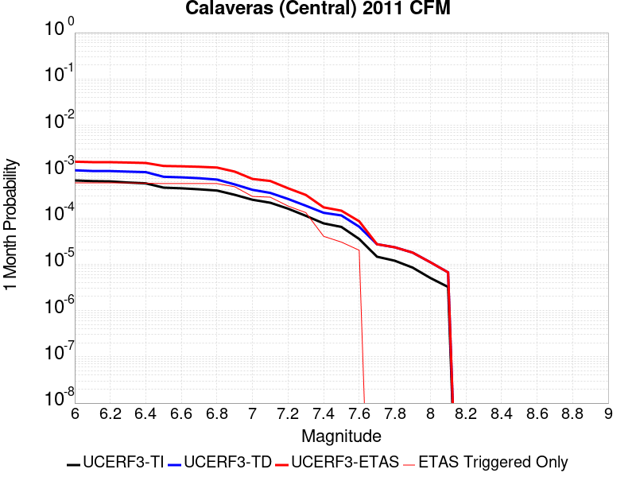 |  |  |

| Magnitude | 1 wk TI Prob | 1 wk TD Prob | 1 wk ETAS Prob | 1 wk ETAS/TD Gain | 1 wk ETAS Triggered Only | 1 mo TI Prob | 1 mo TD Prob | 1 mo ETAS Prob | 1 mo ETAS/TD Gain | 1 mo ETAS Triggered Only | 1 yr TI Prob | 1 yr TD Prob | 1 yr ETAS Prob | 1 yr ETAS/TD Gain | 1 yr ETAS Triggered Only | 10 yr TI Prob | 10 yr TD Prob | 10 yr ETAS Prob | 10 yr ETAS/TD Gain | 10 yr ETAS Triggered Only |
|-----|-----|-----|-----|-----|-----|-----|-----|-----|-----|-----|-----|-----|-----|-----|-----|-----|-----|-----|-----|-----|
| 6.0 | 1.5010907E-4 | 2.484371E-4 | 7.888434E-4 | 3.1752236 | 5.4054055E-4 | 6.4316596E-4 | 0.0010642819 | 0.0017122403 | 1.608822 | 6.4864865E-4 | 0.0078024664 | 0.012875661 | 0.013729391 | 1.0663056 | 8.6486485E-4 | 0.07534136 | 0.120618775 | 0.12160114 | 1.0081444 | 0.0011171171 |
| 6.1 | 1.4521465E-4 | 2.400574E-4 | 7.8046817E-4 | 3.2511733 | 5.4054055E-4 | 6.222001E-4 | 0.0010283972 | 0.0016763788 | 1.6300888 | 6.4864865E-4 | 0.0075490056 | 0.012444699 | 0.013298801 | 1.0686318 | 8.6486485E-4 | 0.07297657 | 0.1168888 | 0.11785943 | 1.0083039 | 0.001099099 |
| 6.2 | 1.429998E-4 | 2.3936245E-4 | 7.797736E-4 | 3.2577107 | 5.4054055E-4 | 6.127123E-4 | 0.0010254213 | 0.0016734048 | 1.6319193 | 6.4864865E-4 | 0.007434286 | 0.012408932 | 0.013263064 | 1.068832 | 8.6486485E-4 | 0.07190444 | 0.11653908 | 0.117510095 | 1.008332 | 0.001099099 |
| 6.3 | 1.3536277E-4 | 2.3265288E-4 | 7.7306764E-4 | 3.3228374 | 5.4054055E-4 | 5.799972E-4 | 9.967126E-4 | 0.0016447147 | 1.6501395 | 6.4864865E-4 | 0.0070386264 | 0.012064224 | 0.012918655 | 1.0708236 | 8.6486485E-4 | 0.0681982 | 0.11344376 | 0.1144022 | 1.0084486 | 0.0010810811 |
| 6.4 | 1.2993296E-4 | 2.2687583E-4 | 7.492798E-4 | 3.3025987 | 5.2252255E-4 | 5.5673666E-4 | 9.719725E-4 | 0.0016019902 | 1.6481847 | 6.3063065E-4 | 0.006757223 | 0.011766356 | 0.012603239 | 1.071125 | 8.4684684E-4 | 0.06555412 | 0.11071639 | 0.111661755 | 1.0085386 | 0.001063063 |
| 6.5 | 1.0498927E-4 | 1.8023458E-4 | 7.026629E-4 | 3.8986022 | 5.2252255E-4 | 4.498764E-4 | 7.7220344E-4 | 0.0014023471 | 1.8160332 | 6.3063065E-4 | 0.005463498 | 0.009361094 | 0.010182165 | 1.0877109 | 8.2882884E-4 | 0.053311124 | 0.0893862 | 0.090337835 | 1.0106463 | 0.0010450451 |
| 6.6 | 1.0157505E-4 | 1.7510542E-4 | 6.9753645E-4 | 3.983523 | 5.2252255E-4 | 4.35249E-4 | 7.5023423E-4 | 0.0013803918 | 1.8399477 | 6.3063065E-4 | 0.0052862884 | 0.009095884 | 0.0099171745 | 1.0902925 | 8.2882884E-4 | 0.05162293 | 0.08696195 | 0.08791611 | 1.0109723 | 0.0010450451 |
| 6.7 | 9.660386E-5 | 1.6768758E-4 | 6.901225E-4 | 4.1155252 | 5.2252255E-4 | 4.1395082E-4 | 7.1846135E-4 | 0.0013486389 | 1.877121 | 6.3063065E-4 | 0.0050282106 | 0.008712257 | 0.009533865 | 1.0943048 | 8.2882884E-4 | 0.049159497 | 0.08344738 | 0.08440522 | 1.0114783 | 0.0010450451 |
| 6.8 | 9.089927E-5 | 1.5681489E-4 | 6.7925546E-4 | 4.331575 | 5.2252255E-4 | 3.8951015E-4 | 6.718887E-4 | 0.0013020956 | 1.9379632 | 6.3063065E-4 | 0.0047319788 | 0.008149622 | 0.008953825 | 1.0986798 | 8.1081083E-4 | 0.046324775 | 0.078334235 | 0.0792476 | 1.0116599 | 9.90991E-4 |
| 6.9 | 7.353187E-5 | 1.232801E-4 | 5.5565924E-4 | 4.5072904 | 4.3243243E-4 | 3.150985E-4 | 5.282369E-4 | 0.0010504834 | 1.9886596 | 5.2252255E-4 | 0.0038295772 | 0.0064124404 | 0.007074832 | 1.103298 | 6.6666666E-4 | 0.037642512 | 0.062338863 | 0.06313292 | 1.0127378 | 8.4684684E-4 |
| 7.0 | 5.746064E-5 | 9.41618E-5 | 3.1035766E-4 | 3.2960038 | 2.1621621E-4 | 2.4623662E-4 | 4.0348852E-4 | 6.916605E-4 | 1.7142011 | 2.8828828E-4 | 0.0029938098 | 0.004901479 | 0.0053138626 | 1.0841345 | 4.1441442E-4 | 0.02953797 | 0.048116732 | 0.048648417 | 1.0110499 | 5.5855856E-4 |
| 7.1 | 4.9557195E-5 | 8.0763544E-5 | 2.969623E-4 | 3.676935 | 2.1621621E-4 | 2.123707E-4 | 3.460839E-4 | 6.1626063E-4 | 1.7806683 | 2.7027028E-4 | 0.0025825473 | 0.0042054937 | 0.004600223 | 1.0938604 | 3.9639638E-4 | 0.0255274 | 0.041487686 | 0.042005803 | 1.0124884 | 5.4054055E-4 |
| 7.2 | 3.687595E-5 | 5.974866E-5 | 2.2190114E-4 | 3.7139096 | 1.6216216E-4 | 1.5803022E-4 | 2.5604072E-4 | 4.3617477E-4 | 1.7035367 | 1.8018018E-4 | 0.0019223199 | 0.003112869 | 0.0033104504 | 1.0634724 | 1.9819819E-4 | 0.01905776 | 0.030992588 | 0.03125448 | 1.0084503 | 2.7027028E-4 |
| 7.3 | 2.5846984E-5 | 4.2667798E-5 | 1.5077129E-4 | 3.5336084 | 1.08108106E-4 | 1.1076809E-4 | 1.8284928E-4 | 3.0895235E-4 | 1.6896558 | 1.2612612E-4 | 0.0013477671 | 0.0022239347 | 0.0023677584 | 1.0646708 | 1.4414414E-4 | 0.013396223 | 0.022271734 | 0.022465518 | 1.0087008 | 1.9819819E-4 |
| 7.4 | 1.7747854E-5 | 3.0047206E-5 | 6.608216E-5 | 2.199278 | 3.6036035E-5 | 7.6060016E-5 | 1.287674E-4 | 1.647988E-4 | 1.2798177 | 3.6036035E-5 | 9.2563726E-4 | 0.0015666186 | 0.0016205879 | 1.0344496 | 5.4054053E-5 | 0.009217911 | 0.015763417 | 0.015834354 | 1.0045 | 7.207207E-5 |
| 7.5 | 1.4883479E-5 | 2.63474E-5 | 4.4364944E-5 | 1.6838452 | 1.8018018E-5 | 6.378478E-5 | 1.1291256E-4 | 1.3092854E-4 | 1.159557 | 1.8018018E-5 | 7.76303E-4 | 0.0013738462 | 0.0014098327 | 1.026194 | 3.6036035E-5 | 0.0077359667 | 0.013853255 | 0.01390656 | 1.0038478 | 5.4054053E-5 |
| 7.6 | 8.166975E-6 | 1.5040534E-5 | 3.305828E-5 | 2.197946 | 1.8018018E-5 | 3.5000852E-5 | 6.445785E-5 | 8.2474704E-5 | 1.2795138 | 1.8018018E-5 | 4.2605202E-4 | 7.8449305E-4 | 8.024969E-4 | 1.0229497 | 1.8018018E-5 | 0.004252361 | 0.007977662 | 0.007995536 | 1.0022405 | 1.8018018E-5 |
| 7.7 | 3.3858064E-6 | 6.3019293E-6 | 6.3019293E-6 | 1.0 | 0.0 | 1.4510518E-5 | 2.7007989E-5 | 2.7007989E-5 | 1.0 | 0.0 | 1.7665124E-4 | 3.2877273E-4 | 3.2877273E-4 | 1.0 | 0.0 | 0.0017651088 | 0.003411871 | 0.003411871 | 1.0 | 0.0 |
| 7.8 | 2.7721615E-6 | 5.4076386E-6 | 5.4076386E-6 | 1.0 | 0.0 | 1.1880637E-5 | 2.3175387E-5 | 2.3175387E-5 | 1.0 | 0.0 | 1.4463716E-4 | 2.8212386E-4 | 2.8212386E-4 | 1.0 | 0.0 | 0.0014454306 | 0.002927692 | 0.002927692 | 1.0 | 0.0 |
| 7.9 | 1.9736292E-6 | 4.1587564E-6 | 4.1587564E-6 | 1.0 | 0.0 | 8.4583835E-6 | 1.782312E-5 | 1.782312E-5 | 1.0 | 0.0 | 1.0297595E-4 | 2.1697492E-4 | 2.1697492E-4 | 1.0 | 0.0 | 0.0010292825 | 0.0022383758 | 0.0022383758 | 1.0 | 0.0 |
| 8.0 | 1.1767289E-6 | 2.5723793E-6 | 2.5723793E-6 | 1.0 | 0.0 | 5.0431145E-6 | 1.1024436E-5 | 1.1024436E-5 | 1.0 | 0.0 | 6.139818E-5 | 1.3421428E-4 | 1.3421428E-4 | 1.0 | 0.0 | 6.1381224E-4 | 0.0013748175 | 0.0013748175 | 1.0 | 0.0 |
| 8.1 | 7.5112825E-7 | 1.5517952E-6 | 1.5517952E-6 | 1.0 | 0.0 | 3.2191172E-6 | 6.650534E-6 | 6.650534E-6 | 1.0 | 0.0 | 3.9192048E-5 | 8.0967264E-5 | 8.0967264E-5 | 1.0 | 0.0 | 3.9185135E-4 | 8.2888297E-4 | 8.2888297E-4 | 1.0 | 0.0 |

## Green Valley 2011 CFM
*[(top)](#table-of-contents)*

| 1 Week | 1 Month | 1 Year | 10 Year |
|-----|-----|-----|-----|
|  |  |  |  |

| Magnitude | 1 wk TI Prob | 1 wk TD Prob | 1 wk ETAS Prob | 1 wk ETAS/TD Gain | 1 wk ETAS Triggered Only | 1 mo TI Prob | 1 mo TD Prob | 1 mo ETAS Prob | 1 mo ETAS/TD Gain | 1 mo ETAS Triggered Only | 1 yr TI Prob | 1 yr TD Prob | 1 yr ETAS Prob | 1 yr ETAS/TD Gain | 1 yr ETAS Triggered Only | 10 yr TI Prob | 10 yr TD Prob | 10 yr ETAS Prob | 10 yr ETAS/TD Gain | 10 yr ETAS Triggered Only |
|-----|-----|-----|-----|-----|-----|-----|-----|-----|-----|-----|-----|-----|-----|-----|-----|-----|-----|-----|-----|-----|
| 6.0 | 9.9629346E-5 | 1.7317598E-4 | 5.334739E-4 | 3.0805306 | 3.6036037E-4 | 4.2691303E-4 | 7.419091E-4 | 0.0012280346 | 1.655236 | 4.8648647E-4 | 0.0051852856 | 0.008991489 | 0.0098842895 | 1.099294 | 9.009009E-4 | 0.050659515 | 0.08556864 | 0.08663959 | 1.0125158 | 0.0011711712 |
| 6.1 | 9.88615E-5 | 1.7164624E-4 | 5.3194474E-4 | 3.099076 | 3.6036037E-4 | 4.2362334E-4 | 7.3535676E-4 | 0.0012214856 | 1.6610788 | 4.8648647E-4 | 0.0051454236 | 0.0089123715 | 0.0098052425 | 1.1001834 | 9.009009E-4 | 0.050279044 | 0.08485507 | 0.08592687 | 1.0126308 | 0.0011711712 |
| 6.2 | 9.696895E-5 | 1.6803163E-4 | 5.2833144E-4 | 3.144238 | 3.6036037E-4 | 4.15515E-4 | 7.1987417E-4 | 0.0012060105 | 1.6753073 | 4.8648647E-4 | 0.0050471667 | 0.008725558 | 0.009618599 | 1.1023476 | 9.009009E-4 | 0.04934063 | 0.08316236 | 0.08423614 | 1.0129118 | 0.0011711712 |
| 6.3 | 9.275224E-5 | 1.5982409E-4 | 5.0211174E-4 | 3.1416523 | 3.4234233E-4 | 3.9744904E-4 | 6.8471767E-4 | 0.0011348597 | 1.6574125 | 4.5045046E-4 | 0.0048282105 | 0.008300837 | 0.009158523 | 1.1033252 | 8.6486485E-4 | 0.047246475 | 0.079300575 | 0.080329105 | 1.01297 | 0.0011171171 |
| 6.4 | 8.391499E-5 | 1.4376939E-4 | 3.5995452E-4 | 2.5036938 | 2.1621621E-4 | 3.595861E-4 | 6.159458E-4 | 9.220634E-4 | 1.4969879 | 3.0630632E-4 | 0.004369175 | 0.0074695917 | 0.008131279 | 1.0885841 | 6.6666666E-4 | 0.04284265 | 0.07165913 | 0.07247875 | 1.0114377 | 8.8288286E-4 |
| 6.5 | 5.9519385E-5 | 9.941439E-5 | 2.2552798E-4 | 2.2685647 | 1.2612612E-4 | 2.5505814E-4 | 4.2592557E-4 | 5.880187E-4 | 1.3805667 | 1.6216216E-4 | 0.0031009112 | 0.0051704263 | 0.0055109984 | 1.0658693 | 3.4234233E-4 | 0.030579966 | 0.05016996 | 0.050614923 | 1.0088692 | 4.6846847E-4 |
| 6.6 | 4.5361558E-5 | 7.4088064E-5 | 1.461548E-4 | 1.9727172 | 7.207207E-5 | 1.9439218E-4 | 3.1748452E-4 | 3.895337E-4 | 1.2269377 | 7.207207E-5 | 0.0023641558 | 0.0038558498 | 0.0040173866 | 1.041894 | 1.6216216E-4 | 0.023391623 | 0.037687372 | 0.03791278 | 1.005981 | 2.3423423E-4 |
| 6.7 | 3.8808106E-5 | 6.270438E-5 | 8.0721264E-5 | 1.2873306 | 1.8018018E-5 | 1.6630985E-4 | 2.6870798E-4 | 2.8672116E-4 | 1.0670363 | 1.8018018E-5 | 0.0020229418 | 0.0032644244 | 0.0033542204 | 1.0275074 | 9.009009E-5 | 0.020046256 | 0.032024976 | 0.032181945 | 1.0049014 | 1.6216216E-4 |
| 6.8 | 2.2284667E-5 | 3.1299103E-5 | 3.1299103E-5 | 1.0 | 0.0 | 9.550222E-5 | 1.3413222E-4 | 1.3413222E-4 | 1.0 | 0.0 | 0.0011621192 | 0.0016318185 | 0.0016677957 | 1.0220473 | 3.6036035E-5 | 0.011560607 | 0.016173003 | 0.016279362 | 1.0065764 | 1.08108106E-4 |
| 6.9 | 1.8050168E-5 | 2.4460174E-5 | 2.4460174E-5 | 1.0 | 0.0 | 7.735557E-5 | 1.0482514E-4 | 1.0482514E-4 | 1.0 | 0.0 | 9.4139716E-4 | 0.001275506 | 0.001293501 | 1.0141082 | 1.8018018E-5 | 0.009374191 | 0.01267408 | 0.012745239 | 1.0056145 | 7.207207E-5 |
| 7.0 | 1.4763166E-5 | 1.9590905E-5 | 1.9590905E-5 | 1.0 | 0.0 | 6.326917E-5 | 8.395834E-5 | 8.395834E-5 | 1.0 | 0.0 | 7.7002996E-4 | 0.0010217162 | 0.0010217162 | 1.0 | 0.0 | 0.007673672 | 0.010169487 | 0.010187322 | 1.0017538 | 1.8018018E-5 |
| 7.1 | 1.2399713E-5 | 1.6309968E-5 | 1.6309968E-5 | 1.0 | 0.0 | 5.3140546E-5 | 6.9898E-5 | 6.9898E-5 | 1.0 | 0.0 | 6.467941E-4 | 8.506777E-4 | 8.506777E-4 | 1.0 | 0.0 | 0.006449148 | 0.0084744925 | 0.008492358 | 1.0021081 | 1.8018018E-5 |
| 7.2 | 1.0584195E-5 | 1.3927383E-5 | 1.3927383E-5 | 1.0 | 0.0 | 4.5360044E-5 | 5.968743E-5 | 5.968743E-5 | 1.0 | 0.0 | 5.521186E-4 | 7.264538E-4 | 7.264538E-4 | 1.0 | 0.0 | 0.0055074887 | 0.0072412067 | 0.007259094 | 1.0024703 | 1.8018018E-5 |
| 7.3 | 7.998173E-6 | 1.05492245E-5 | 1.05492245E-5 | 1.0 | 0.0 | 3.4277433E-5 | 4.5210185E-5 | 4.5210185E-5 | 1.0 | 0.0 | 4.1724785E-4 | 5.502961E-4 | 5.502961E-4 | 1.0 | 0.0 | 0.004164653 | 0.0054896 | 0.0054896 | 1.0 | 0.0 |
| 7.4 | 6.7571127E-6 | 8.937685E-6 | 8.937685E-6 | 1.0 | 0.0 | 2.8958733E-5 | 3.830381E-5 | 3.830381E-5 | 1.0 | 0.0 | 3.5251552E-4 | 4.6625003E-4 | 4.6625003E-4 | 1.0 | 0.0 | 0.0035195686 | 0.004652921 | 0.004652921 | 1.0 | 0.0 |
| 7.5 | 5.69878E-6 | 7.520235E-6 | 7.520235E-6 | 1.0 | 0.0 | 2.4423114E-5 | 3.2229185E-5 | 3.2229185E-5 | 1.0 | 0.0 | 2.9731085E-4 | 3.9232057E-4 | 3.9232057E-4 | 1.0 | 0.0 | 0.002969134 | 0.003916431 | 0.003916431 | 1.0 | 0.0 |
| 7.6 | 4.503664E-6 | 5.9392337E-6 | 5.9392337E-6 | 1.0 | 0.0 | 1.9301275E-5 | 2.5453615E-5 | 2.5453615E-5 | 1.0 | 0.0 | 2.3496768E-4 | 3.098545E-4 | 3.098545E-4 | 1.0 | 0.0 | 0.002347194 | 0.00309435 | 0.00309435 | 1.0 | 0.0 |
| 7.7 | 1.0873546E-6 | 1.4111749E-6 | 1.4111749E-6 | 1.0 | 0.0 | 4.6600826E-6 | 6.0478787E-6 | 6.0478787E-6 | 1.0 | 0.0 | 5.6735033E-5 | 7.3630465E-5 | 7.3630465E-5 | 1.0 | 0.0 | 5.672055E-4 | 7.360627E-4 | 7.360627E-4 | 1.0 | 0.0 |
| 7.8 | 4.9373917E-8 | 6.178776E-8 | 6.178776E-8 | 1.0 | 0.0 | 2.1160248E-7 | 2.6480467E-7 | 2.6480467E-7 | 1.0 | 0.0 | 2.5762572E-6 | 3.2239934E-6 | 3.2239934E-6 | 1.0 | 0.0 | 2.5762274E-5 | 3.223787E-5 | 3.223787E-5 | 1.0 | 0.0 |

## San Andreas (Santa Cruz Mts) 2011 CFM
*[(top)](#table-of-contents)*

| 1 Week | 1 Month | 1 Year | 10 Year |
|-----|-----|-----|-----|
|  |  |  |  |

| Magnitude | 1 wk TI Prob | 1 wk TD Prob | 1 wk ETAS Prob | 1 wk ETAS/TD Gain | 1 wk ETAS Triggered Only | 1 mo TI Prob | 1 mo TD Prob | 1 mo ETAS Prob | 1 mo ETAS/TD Gain | 1 mo ETAS Triggered Only | 1 yr TI Prob | 1 yr TD Prob | 1 yr ETAS Prob | 1 yr ETAS/TD Gain | 1 yr ETAS Triggered Only | 10 yr TI Prob | 10 yr TD Prob | 10 yr ETAS Prob | 10 yr ETAS/TD Gain | 10 yr ETAS Triggered Only |
|-----|-----|-----|-----|-----|-----|-----|-----|-----|-----|-----|-----|-----|-----|-----|-----|-----|-----|-----|-----|-----|
| 6.0 | 1.7221631E-4 | 1.3884946E-4 | 7.693925E-4 | 5.541199 | 6.3063065E-4 | 7.378611E-4 | 5.9493544E-4 | 0.0012792128 | 2.1501708 | 6.8468467E-4 | 0.008946515 | 0.0072196755 | 0.008149848 | 1.1288385 | 9.3693694E-4 | 0.08594794 | 0.07099123 | 0.07204579 | 1.0148547 | 0.0011351352 |
| 6.1 | 1.7221631E-4 | 1.3884946E-4 | 7.693925E-4 | 5.541199 | 6.3063065E-4 | 7.378611E-4 | 5.9493544E-4 | 0.0012792128 | 2.1501708 | 6.8468467E-4 | 0.008946515 | 0.0072196755 | 0.008149848 | 1.1288385 | 9.3693694E-4 | 0.08594794 | 0.07099123 | 0.07204579 | 1.0148547 | 0.0011351352 |
| 6.2 | 1.7221631E-4 | 1.3884946E-4 | 7.693925E-4 | 5.541199 | 6.3063065E-4 | 7.378611E-4 | 5.9493544E-4 | 0.0012792128 | 2.1501708 | 6.8468467E-4 | 0.008946515 | 0.0072196755 | 0.008149848 | 1.1288385 | 9.3693694E-4 | 0.08594794 | 0.07099123 | 0.07204579 | 1.0148547 | 0.0011351352 |
| 6.3 | 1.716926E-4 | 1.3804191E-4 | 7.685855E-4 | 5.567769 | 6.3063065E-4 | 7.3561794E-4 | 5.914761E-4 | 0.0012757558 | 2.1569016 | 6.8468467E-4 | 0.008919428 | 0.0071778353 | 0.008108047 | 1.129595 | 9.3693694E-4 | 0.08569809 | 0.0706028 | 0.071657784 | 1.0149426 | 0.0011351352 |
| 6.4 | 1.6392978E-4 | 1.3678138E-4 | 7.6732575E-4 | 5.6098695 | 6.3063065E-4 | 7.02367E-4 | 5.860763E-4 | 0.0012703597 | 2.167567 | 6.8468467E-4 | 0.008517839 | 0.0071125226 | 0.008042796 | 1.1307937 | 9.3693694E-4 | 0.08198654 | 0.06982483 | 0.0708807 | 1.0151218 | 0.0011351352 |
| 6.5 | 1.5742714E-4 | 1.2735424E-4 | 7.3988887E-4 | 5.809691 | 6.1261264E-4 | 6.745133E-4 | 5.4569147E-4 | 0.0012119943 | 2.2210248 | 6.6666666E-4 | 0.00818132 | 0.0066238823 | 0.0075367144 | 1.1378093 | 9.1891893E-4 | 0.078865945 | 0.06527744 | 0.06632164 | 1.0159962 | 0.0011171171 |
| 6.6 | 1.3038084E-4 | 1.16682175E-4 | 7.292233E-4 | 6.249655 | 6.1261264E-4 | 5.5865536E-4 | 4.999719E-4 | 0.0011663053 | 2.3327415 | 6.6666666E-4 | 0.006780438 | 0.0060704127 | 0.0069837533 | 1.1504577 | 9.1891893E-4 | 0.0657725 | 0.05970143 | 0.060751855 | 1.0175946 | 0.0011171171 |
| 6.7 | 1.2867592E-4 | 1.1394204E-4 | 7.2648487E-4 | 6.3759155 | 6.1261264E-4 | 5.5135164E-4 | 4.8823294E-4 | 0.0011545741 | 2.364802 | 6.6666666E-4 | 0.0066920654 | 0.0059282756 | 0.0068417466 | 1.1540872 | 9.1891893E-4 | 0.06494093 | 0.058410734 | 0.0594626 | 1.0180081 | 0.0011171171 |
| 6.8 | 1.2801298E-4 | 1.1331655E-4 | 7.258597E-4 | 6.4055934 | 6.1261264E-4 | 5.485117E-4 | 4.8555326E-4 | 0.0011518962 | 2.3723376 | 6.6666666E-4 | 0.0066577005 | 0.005895828 | 0.006809329 | 1.1549402 | 9.1891893E-4 | 0.06461738 | 0.058124207 | 0.059176393 | 1.0181024 | 0.0011171171 |
| 6.9 | 1.269149E-4 | 1.1173527E-4 | 7.2427944E-4 | 6.482102 | 6.1261264E-4 | 5.4380763E-4 | 4.7877885E-4 | 0.0011451263 | 2.3917646 | 6.6666666E-4 | 0.006600777 | 0.005813793 | 0.006727369 | 1.1571395 | 9.1891893E-4 | 0.06408122 | 0.057394966 | 0.05844797 | 1.0183465 | 0.0011171171 |
| 7.0 | 1.2030331E-4 | 1.09023524E-4 | 7.2156935E-4 | 6.618474 | 6.1261264E-4 | 5.154837E-4 | 4.671613E-4 | 0.0011335165 | 2.4263923 | 6.6666666E-4 | 0.006257969 | 0.0056730937 | 0.0065867994 | 1.1610595 | 9.1891893E-4 | 0.06084648 | 0.056060992 | 0.057115484 | 1.0188097 | 0.0011171171 |
| 7.1 | 8.049617E-5 | 5.4515673E-5 | 3.6080528E-4 | 6.618377 | 3.0630632E-4 | 3.4493793E-4 | 2.3361787E-4 | 5.9389404E-4 | 2.54216 | 3.6036037E-4 | 0.0041915346 | 0.0028406233 | 0.0032718272 | 1.1517991 | 4.3243243E-4 | 0.041133516 | 0.02991033 | 0.030364785 | 1.0151939 | 4.6846847E-4 |
| 7.2 | 7.093979E-5 | 4.3460117E-5 | 2.776842E-4 | 6.389402 | 2.3423423E-4 | 3.0399222E-4 | 1.8624449E-4 | 4.7447908E-4 | 2.547614 | 2.8828828E-4 | 0.0036948253 | 0.0022651919 | 0.0026067586 | 1.1507894 | 3.4234233E-4 | 0.03633994 | 0.02420392 | 0.02457314 | 1.0152546 | 3.7837838E-4 |
| 7.3 | 6.193693E-5 | 2.9285771E-5 | 4.730326E-5 | 1.6152302 | 1.8018018E-5 | 2.6541698E-4 | 1.2550442E-4 | 1.6153594E-4 | 1.2870936 | 3.6036035E-5 | 0.0032266637 | 0.001526947 | 0.0015809186 | 1.035346 | 5.4054053E-5 | 0.031802133 | 0.01670446 | 0.016793046 | 1.0053031 | 9.009009E-5 |
| 7.4 | 5.906492E-5 | 2.7392227E-5 | 4.5409754E-5 | 1.6577605 | 1.8018018E-5 | 2.5311083E-4 | 1.1738999E-4 | 1.5342179E-4 | 1.306941 | 3.6036035E-5 | 0.0030772698 | 0.0014282875 | 0.0014822644 | 1.0377913 | 5.4054053E-5 | 0.030350044 | 0.015665498 | 0.015754176 | 1.0056608 | 9.009009E-5 |
| 7.5 | 5.424296E-5 | 2.5015886E-5 | 4.3033455E-5 | 1.720245 | 1.8018018E-5 | 2.324491E-4 | 1.0720654E-4 | 1.4323872E-4 | 1.3361005 | 3.6036035E-5 | 0.002826395 | 0.0013044594 | 0.0013584429 | 1.0413839 | 5.4054053E-5 | 0.027907165 | 0.014342199 | 0.014430997 | 1.0061914 | 9.009009E-5 |
| 7.6 | 4.43084E-5 | 2.0169791E-5 | 2.0169791E-5 | 1.0 | 0.0 | 1.8987931E-4 | 8.64391E-5 | 8.64391E-5 | 1.0 | 0.0 | 0.0023093296 | 0.0010518882 | 0.0010518882 | 1.0 | 0.0 | 0.022854783 | 0.011554358 | 0.011572167 | 1.0015414 | 1.8018018E-5 |
| 7.7 | 4.118098E-5 | 1.9189929E-5 | 1.9189929E-5 | 1.0 | 0.0 | 1.7647797E-4 | 8.223996E-5 | 8.223996E-5 | 1.0 | 0.0 | 0.002146502 | 0.0010008118 | 0.0010008118 | 1.0 | 0.0 | 0.021258866 | 0.011005864 | 0.0110236835 | 1.0016191 | 1.8018018E-5 |
| 7.8 | 3.5408906E-5 | 1.8810757E-5 | 1.8810757E-5 | 1.0 | 0.0 | 1.5174363E-4 | 8.061504E-5 | 8.061504E-5 | 1.0 | 0.0 | 0.0018459131 | 9.810465E-4 | 9.810465E-4 | 1.0 | 0.0 | 0.018306552 | 0.010783297 | 0.010801121 | 1.001653 | 1.8018018E-5 |
| 7.9 | 2.5860836E-5 | 1.7537723E-5 | 1.7537723E-5 | 1.0 | 0.0 | 1.10827445E-4 | 7.51595E-5 | 7.51595E-5 | 1.0 | 0.0 | 0.001348489 | 9.14683E-4 | 9.14683E-4 | 1.0 | 0.0 | 0.013403354 | 0.010024931 | 0.010042769 | 1.0017793 | 1.8018018E-5 |
| 8.0 | 1.9777332E-5 | 1.5026019E-5 | 1.5026019E-5 | 1.0 | 0.0 | 8.4757245E-5 | 6.439564E-5 | 6.439564E-5 | 1.0 | 0.0 | 0.0010314309 | 7.837351E-4 | 7.837351E-4 | 1.0 | 0.0 | 0.010266567 | 0.008607804 | 0.008625667 | 1.0020752 | 1.8018018E-5 |
| 8.1 | 1.468494E-5 | 1.2258435E-5 | 1.2258435E-5 | 1.0 | 0.0 | 6.293394E-5 | 5.253509E-5 | 5.253509E-5 | 1.0 | 0.0 | 7.6595135E-4 | 6.394272E-4 | 6.394272E-4 | 1.0 | 0.0 | 0.0076331664 | 0.0070496635 | 0.0070496635 | 1.0 | 0.0 |
| 8.2 | 8.63836E-6 | 5.5468126E-6 | 5.5468126E-6 | 1.0 | 0.0 | 3.7021015E-5 | 2.3771838E-5 | 2.3771838E-5 | 1.0 | 0.0 | 4.5063766E-4 | 2.8938375E-4 | 2.8938375E-4 | 1.0 | 0.0 | 0.004497249 | 0.0032881699 | 0.0032881699 | 1.0 | 0.0 |
| 8.3 | 1.983087E-6 | 7.7871465E-7 | 7.7871465E-7 | 1.0 | 0.0 | 8.498917E-6 | 3.3373444E-6 | 3.3373444E-6 | 1.0 | 0.0 | 1.034694E-4 | 4.063143E-5 | 4.063143E-5 | 1.0 | 0.0 | 0.0010342124 | 4.7926197E-4 | 4.7926197E-4 | 1.0 | 0.0 |

## Hayward (So) 2011 CFM
*[(top)](#table-of-contents)*

| 1 Week | 1 Month | 1 Year | 10 Year |
|-----|-----|-----|-----|
|  |  |  |  |

| Magnitude | 1 wk TI Prob | 1 wk TD Prob | 1 wk ETAS Prob | 1 wk ETAS/TD Gain | 1 wk ETAS Triggered Only | 1 mo TI Prob | 1 mo TD Prob | 1 mo ETAS Prob | 1 mo ETAS/TD Gain | 1 mo ETAS Triggered Only | 1 yr TI Prob | 1 yr TD Prob | 1 yr ETAS Prob | 1 yr ETAS/TD Gain | 1 yr ETAS Triggered Only | 10 yr TI Prob | 10 yr TD Prob | 10 yr ETAS Prob | 10 yr ETAS/TD Gain | 10 yr ETAS Triggered Only |
|-----|-----|-----|-----|-----|-----|-----|-----|-----|-----|-----|-----|-----|-----|-----|-----|-----|-----|-----|-----|-----|
| 6.0 | 1.8091932E-4 | 3.576308E-4 | 4.6570026E-4 | 1.3021816 | 1.08108106E-4 | 7.751381E-4 | 0.0015318132 | 0.0017117173 | 1.1174452 | 1.8018018E-4 | 0.00939654 | 0.01849276 | 0.018775716 | 1.015301 | 2.8828828E-4 | 0.090090066 | 0.16695412 | 0.16735938 | 1.0024275 | 4.8648647E-4 |
| 6.1 | 1.8091932E-4 | 3.576308E-4 | 4.6570026E-4 | 1.3021816 | 1.08108106E-4 | 7.751381E-4 | 0.0015318132 | 0.0017117173 | 1.1174452 | 1.8018018E-4 | 0.00939654 | 0.01849276 | 0.018775716 | 1.015301 | 2.8828828E-4 | 0.090090066 | 0.16695412 | 0.16735938 | 1.0024275 | 4.8648647E-4 |
| 6.2 | 1.8091932E-4 | 3.576308E-4 | 4.6570026E-4 | 1.3021816 | 1.08108106E-4 | 7.751381E-4 | 0.0015318132 | 0.0017117173 | 1.1174452 | 1.8018018E-4 | 0.00939654 | 0.01849276 | 0.018775716 | 1.015301 | 2.8828828E-4 | 0.090090066 | 0.16695412 | 0.16735938 | 1.0024275 | 4.8648647E-4 |
| 6.3 | 1.7322872E-4 | 3.4318614E-4 | 4.5125713E-4 | 1.3149049 | 1.08108106E-4 | 7.4219756E-4 | 0.0014699784 | 0.0016498937 | 1.1223931 | 1.8018018E-4 | 0.0089988755 | 0.017752402 | 0.018035572 | 1.0159512 | 2.8828828E-4 | 0.08643075 | 0.1608864 | 0.16129462 | 1.0025373 | 4.8648647E-4 |
| 6.4 | 1.6334097E-4 | 3.239878E-4 | 4.140487E-4 | 1.2779762 | 9.009009E-5 | 6.998449E-4 | 0.001387789 | 0.0015497261 | 1.1166872 | 1.6216216E-4 | 0.008487372 | 0.016767448 | 0.01701547 | 1.014792 | 2.5225224E-4 | 0.081704415 | 0.15277125 | 0.15315288 | 1.002498 | 4.5045046E-4 |
| 6.5 | 1.5600289E-4 | 3.1072096E-4 | 4.0078306E-4 | 1.2898488 | 9.009009E-5 | 6.684125E-4 | 0.00133099 | 0.0014929364 | 1.1216736 | 1.6216216E-4 | 0.008107598 | 0.016086295 | 0.01633449 | 1.0154289 | 2.5225224E-4 | 0.078181036 | 0.14704405 | 0.14742827 | 1.002613 | 4.5045046E-4 |
| 6.6 | 1.4046066E-4 | 2.8083503E-4 | 3.5288685E-4 | 1.2565628 | 7.207207E-5 | 6.018354E-4 | 0.0012030302 | 0.001347001 | 1.1196734 | 1.4414414E-4 | 0.0073027555 | 0.014550033 | 0.014780859 | 1.0158643 | 2.3423423E-4 | 0.07067384 | 0.13412383 | 0.13449827 | 1.0027916 | 4.3243243E-4 |
| 6.7 | 1.14696966E-4 | 2.3317046E-4 | 3.0522572E-4 | 1.309024 | 7.207207E-5 | 4.914658E-4 | 9.989244E-4 | 0.0011249245 | 1.1261358 | 1.2612612E-4 | 0.0059671924 | 0.0120951515 | 0.012308753 | 1.01766 | 2.1621621E-4 | 0.058094822 | 0.11293557 | 0.113303185 | 1.003255 | 4.1441442E-4 |
| 6.8 | 9.3874296E-5 | 1.8899176E-4 | 2.610502E-4 | 1.3812783 | 7.207207E-5 | 4.0225635E-4 | 8.0971693E-4 | 9.3574094E-4 | 1.1556395 | 1.2612612E-4 | 0.0048864787 | 0.00981448 | 0.010010733 | 1.0199963 | 1.9819819E-4 | 0.047804173 | 0.09275965 | 0.09307023 | 1.0033484 | 3.4234233E-4 |
| 6.9 | 5.551852E-5 | 1.0752712E-4 | 1.7959144E-4 | 1.6701967 | 7.207207E-5 | 2.3791482E-4 | 4.6074972E-4 | 5.507983E-4 | 1.1954392 | 9.009009E-5 | 0.0028927654 | 0.0055953185 | 0.005702822 | 1.0192131 | 1.08108106E-4 | 0.028553981 | 0.05435149 | 0.054538913 | 1.0034484 | 1.9819819E-4 |
| 7.0 | 4.2662363E-5 | 8.2650746E-5 | 1.3670034E-4 | 1.6539515 | 5.4054053E-5 | 1.8282588E-4 | 3.541698E-4 | 4.2621634E-4 | 1.2034237 | 7.207207E-5 | 0.0022236328 | 0.0043035657 | 0.004393268 | 1.0208437 | 9.009009E-5 | 0.022015138 | 0.042151436 | 0.042289507 | 1.0032755 | 1.4414414E-4 |
| 7.1 | 3.305886E-5 | 6.317338E-5 | 9.920714E-5 | 1.5703948 | 3.6036035E-5 | 1.4167312E-4 | 2.7071504E-4 | 3.2475448E-4 | 1.1996174 | 5.4054053E-5 | 0.0017235056 | 0.0032909934 | 0.0033448695 | 1.0163708 | 5.4054053E-5 | 0.017101998 | 0.032526355 | 0.032630946 | 1.0032156 | 1.08108106E-4 |
| 7.2 | 2.9856887E-5 | 5.7159497E-5 | 9.319348E-5 | 1.630411 | 3.6036035E-5 | 1.2795182E-4 | 2.4494636E-4 | 2.9898717E-4 | 1.220623 | 5.4054053E-5 | 0.0015567001 | 0.0029781607 | 0.0030320538 | 1.0180961 | 5.4054053E-5 | 0.015458403 | 0.029523436 | 0.029628353 | 1.0035536 | 1.08108106E-4 |
| 7.3 | 2.4559737E-5 | 4.611372E-5 | 6.413091E-5 | 1.390712 | 1.8018018E-5 | 1.0525176E-4 | 1.9761534E-4 | 2.3364426E-4 | 1.1823184 | 3.6036035E-5 | 0.0012806869 | 0.002403325 | 0.0024392745 | 1.0149583 | 3.6036035E-5 | 0.012733313 | 0.023917055 | 0.023987403 | 1.0029414 | 7.207207E-5 |
| 7.4 | 1.9002231E-5 | 3.515206E-5 | 5.3169446E-5 | 1.5125556 | 1.8018018E-5 | 8.143559E-5 | 1.5064306E-4 | 1.6865836E-4 | 1.1195893 | 1.8018018E-5 | 9.910273E-4 | 0.0018325461 | 0.0018505311 | 1.0098143 | 1.8018018E-5 | 0.009866194 | 0.018308608 | 0.01836167 | 1.0028983 | 5.4054053E-5 |
| 7.5 | 1.2783333E-5 | 2.3408053E-5 | 4.142565E-5 | 1.7697179 | 1.8018018E-5 | 5.4784563E-5 | 1.003164E-4 | 1.1833261E-4 | 1.1795939 | 1.8018018E-5 | 6.667979E-4 | 0.0012206737 | 0.0012386697 | 1.0147427 | 1.8018018E-5 | 0.006648007 | 0.012248043 | 0.012283638 | 1.0029062 | 3.6036035E-5 |
| 7.6 | 4.8149627E-6 | 8.921087E-6 | 2.6938944E-5 | 3.019693 | 1.8018018E-5 | 2.063539E-5 | 3.8232676E-5 | 5.6250006E-5 | 1.4712547 | 1.8018018E-5 | 2.5120692E-4 | 4.6538466E-4 | 4.8339428E-4 | 1.0386984 | 1.8018018E-5 | 0.0025092314 | 0.0046977843 | 0.004715718 | 1.0038174 | 1.8018018E-5 |
| 7.7 | 6.0838227E-7 | 1.2138476E-6 | 1.2138476E-6 | 1.0 | 0.0 | 2.6073499E-6 | 5.2021937E-6 | 5.2021937E-6 | 1.0 | 0.0 | 3.174402E-5 | 6.333487E-5 | 6.333487E-5 | 1.0 | 0.0 | 3.1739488E-4 | 6.569028E-4 | 6.569028E-4 | 1.0 | 0.0 |
| 7.8 | 4.5542808E-7 | 9.863899E-7 | 9.863899E-7 | 1.0 | 0.0 | 1.9518332E-6 | 4.227378E-6 | 4.227378E-6 | 1.0 | 0.0 | 2.376331E-5 | 5.146712E-5 | 5.146712E-5 | 1.0 | 0.0 | 2.3760769E-4 | 5.356085E-4 | 5.356085E-4 | 1.0 | 0.0 |
| 7.9 | 3.3016747E-7 | 7.4394256E-7 | 7.4394256E-7 | 1.0 | 0.0 | 1.4150027E-6 | 3.1883212E-6 | 3.1883212E-6 | 1.0 | 0.0 | 1.7227521E-5 | 3.881712E-5 | 3.881712E-5 | 1.0 | 0.0 | 1.7226185E-4 | 4.0186857E-4 | 4.0186857E-4 | 1.0 | 0.0 |
| 8.0 | 2.347038E-7 | 5.509049E-7 | 5.509049E-7 | 1.0 | 0.0 | 1.0058731E-6 | 2.3610187E-6 | 2.3610187E-6 | 1.0 | 0.0 | 1.2246436E-5 | 2.8745026E-5 | 2.8745026E-5 | 1.0 | 0.0 | 1.2245761E-4 | 2.9535973E-4 | 2.9535973E-4 | 1.0 | 0.0 |
| 8.1 | 1.18822804E-7 | 2.6227093E-7 | 2.6227093E-7 | 1.0 | 0.0 | 5.092405E-7 | 1.1240178E-6 | 1.1240178E-6 | 1.0 | 0.0 | 6.1999854E-6 | 1.3684832E-5 | 1.3684832E-5 | 1.0 | 0.0 | 6.199812E-5 | 1.4000124E-4 | 1.4000124E-4 | 1.0 | 0.0 |

## Hayward (So) extension 2011 CFM
*[(top)](#table-of-contents)*

| 1 Week | 1 Month | 1 Year | 10 Year |
|-----|-----|-----|-----|
|  | 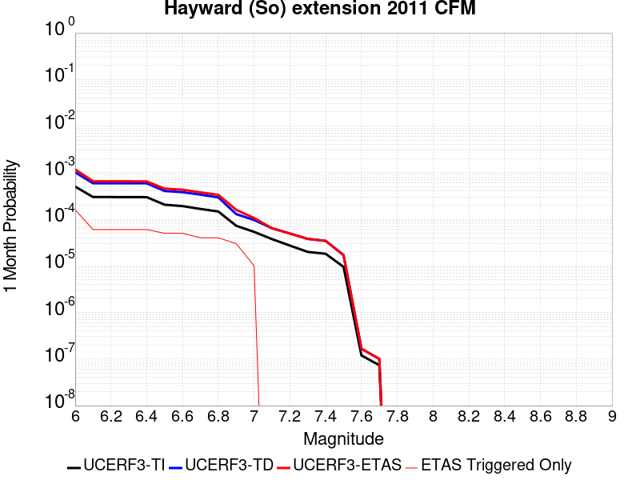 |  |  |

| Magnitude | 1 wk TI Prob | 1 wk TD Prob | 1 wk ETAS Prob | 1 wk ETAS/TD Gain | 1 wk ETAS Triggered Only | 1 mo TI Prob | 1 mo TD Prob | 1 mo ETAS Prob | 1 mo ETAS/TD Gain | 1 mo ETAS Triggered Only | 1 yr TI Prob | 1 yr TD Prob | 1 yr ETAS Prob | 1 yr ETAS/TD Gain | 1 yr ETAS Triggered Only | 10 yr TI Prob | 10 yr TD Prob | 10 yr ETAS Prob | 10 yr ETAS/TD Gain | 10 yr ETAS Triggered Only |
|-----|-----|-----|-----|-----|-----|-----|-----|-----|-----|-----|-----|-----|-----|-----|-----|-----|-----|-----|-----|-----|
| 6.0 | 1.1721256E-4 | 2.3663012E-4 | 3.2669888E-4 | 1.3806311 | 9.009009E-5 | 5.022428E-4 | 0.0010137935 | 0.0011577915 | 1.1420388 | 1.4414414E-4 | 0.0060976758 | 0.012259374 | 0.012561926 | 1.0246792 | 3.0630632E-4 | 0.0593305 | 0.112924725 | 0.113292344 | 1.0032554 | 4.1441442E-4 |
| 6.1 | 6.99169E-5 | 1.381428E-4 | 1.5615833E-4 | 1.1304123 | 1.8018018E-5 | 2.9960944E-4 | 5.919204E-4 | 6.279351E-4 | 1.0608438 | 3.6036035E-5 | 0.0036416445 | 0.007179867 | 0.007287199 | 1.014949 | 1.08108106E-4 | 0.035825435 | 0.06787131 | 0.068056054 | 1.002722 | 1.9819819E-4 |
| 6.2 | 6.99169E-5 | 1.381428E-4 | 1.5615833E-4 | 1.1304123 | 1.8018018E-5 | 2.9960944E-4 | 5.919204E-4 | 6.279351E-4 | 1.0608438 | 3.6036035E-5 | 0.0036416445 | 0.007179867 | 0.007287199 | 1.014949 | 1.08108106E-4 | 0.035825435 | 0.06787131 | 0.068056054 | 1.002722 | 1.9819819E-4 |
| 6.3 | 6.970908E-5 | 1.3782376E-4 | 1.558393E-4 | 1.1307143 | 1.8018018E-5 | 2.9871898E-4 | 5.905537E-4 | 6.2656845E-4 | 1.0609847 | 3.6036035E-5 | 0.0036308395 | 0.007163397 | 0.0072707306 | 1.0149837 | 1.08108106E-4 | 0.035720866 | 0.06772022 | 0.067904994 | 1.0027286 | 1.9819819E-4 |
| 6.4 | 6.9517155E-5 | 1.3749335E-4 | 1.5550888E-4 | 1.1310284 | 1.8018018E-5 | 2.9789665E-4 | 5.8913825E-4 | 6.25153E-4 | 1.0611314 | 3.6036035E-5 | 0.0036208609 | 0.0071463026 | 0.0072536385 | 1.0150198 | 1.08108106E-4 | 0.03562429 | 0.067564204 | 0.067749016 | 1.0027353 | 1.9819819E-4 |
| 6.5 | 4.786248E-5 | 9.427737E-5 | 1.1229369E-4 | 1.191099 | 1.8018018E-5 | 2.0510878E-4 | 4.039859E-4 | 4.4000737E-4 | 1.0891652 | 3.6036035E-5 | 0.0024943394 | 0.004907904 | 0.0049975524 | 1.0182661 | 9.009009E-5 | 0.02466527 | 0.046958525 | 0.047113072 | 1.0032911 | 1.6216216E-4 |
| 6.6 | 4.4662214E-5 | 8.8941175E-5 | 1.06957596E-4 | 1.2025656 | 1.8018018E-5 | 1.9139545E-4 | 3.811234E-4 | 4.171457E-4 | 1.0945162 | 3.6036035E-5 | 0.0023277493 | 0.004630768 | 0.004720441 | 1.0193646 | 9.009009E-5 | 0.02303517 | 0.04434846 | 0.044503428 | 1.0034944 | 1.6216216E-4 |
| 6.7 | 3.884542E-5 | 7.876597E-5 | 9.678256E-5 | 1.2287358 | 1.8018018E-5 | 1.6646975E-4 | 3.3752725E-4 | 3.5553917E-4 | 1.0533644 | 1.8018018E-5 | 0.002024885 | 0.004102097 | 0.004173873 | 1.0174975 | 7.207207E-5 | 0.020065336 | 0.03938556 | 0.03952403 | 1.0035157 | 1.4414414E-4 |
| 6.8 | 3.4221863E-5 | 6.866193E-5 | 8.667871E-5 | 1.2623984 | 1.8018018E-5 | 1.4665688E-4 | 2.942346E-4 | 3.122473E-4 | 1.0612189 | 1.8018018E-5 | 0.0017840851 | 0.003576844 | 0.0036486583 | 1.0200776 | 7.207207E-5 | 0.017698295 | 0.034468345 | 0.034607522 | 1.0040377 | 1.4414414E-4 |
| 6.9 | 1.6927712E-5 | 3.0115967E-5 | 4.8133443E-5 | 1.5982698 | 1.8018018E-5 | 7.2545314E-5 | 1.2906236E-4 | 1.4707806E-4 | 1.1395891 | 1.8018018E-5 | 8.828813E-4 | 0.0015702589 | 0.0016062383 | 1.0229131 | 3.6036035E-5 | 0.008793819 | 0.015489228 | 0.015560184 | 1.004581 | 7.207207E-5 |
| 7.0 | 1.2509653E-5 | 2.2511605E-5 | 2.2511605E-5 | 1.0 | 0.0 | 5.3611697E-5 | 9.647499E-5 | 9.647499E-5 | 1.0 | 0.0 | 6.525269E-4 | 0.0011739943 | 0.0011919911 | 1.0153296 | 1.8018018E-5 | 0.0065061417 | 0.011605909 | 0.011659336 | 1.0046034 | 5.4054053E-5 |
| 7.1 | 8.751583E-6 | 1.4962153E-5 | 1.4962153E-5 | 1.0 | 0.0 | 3.750624E-5 | 6.412197E-5 | 6.412197E-5 | 1.0 | 0.0 | 4.5654282E-4 | 7.8041124E-4 | 7.8041124E-4 | 1.0 | 0.0 | 0.0045560603 | 0.0077815293 | 0.007817285 | 1.0045949 | 3.6036035E-5 |
| 7.2 | 6.354379E-6 | 1.1532643E-5 | 1.1532643E-5 | 1.0 | 0.0 | 2.7232769E-5 | 4.9424707E-5 | 4.9424707E-5 | 1.0 | 0.0 | 3.3150852E-4 | 6.015845E-4 | 6.015845E-4 | 1.0 | 0.0 | 0.0033101442 | 0.0060171904 | 0.0060351 | 1.0029764 | 1.8018018E-5 |
| 7.3 | 4.645554E-6 | 8.848017E-6 | 8.848017E-6 | 1.0 | 0.0 | 1.9909365E-5 | 3.7919544E-5 | 3.7919544E-5 | 1.0 | 0.0 | 2.4236954E-4 | 4.6157665E-4 | 4.6157665E-4 | 1.0 | 0.0 | 0.0024210536 | 0.0046256287 | 0.0046256287 | 1.0 | 0.0 |
| 7.4 | 4.23437E-6 | 8.02022E-6 | 8.02022E-6 | 1.0 | 0.0 | 1.8147173E-5 | 3.437194E-5 | 3.437194E-5 | 1.0 | 0.0 | 2.2091944E-4 | 4.184019E-4 | 4.184019E-4 | 1.0 | 0.0 | 0.0022069993 | 0.0041958606 | 0.0041958606 | 1.0 | 0.0 |
| 7.5 | 2.2187417E-6 | 3.9695706E-6 | 3.9695706E-6 | 1.0 | 0.0 | 9.508858E-6 | 1.701235E-5 | 1.701235E-5 | 1.0 | 0.0 | 1.157642E-4 | 2.0710831E-4 | 2.0710831E-4 | 1.0 | 0.0 | 0.0011570391 | 0.0020822915 | 0.0020822915 | 1.0 | 0.0 |
| 7.6 | 2.7952495E-8 | 3.8852022E-8 | 3.8852022E-8 | 1.0 | 0.0 | 1.1979641E-7 | 1.6650864E-7 | 1.6650864E-7 | 1.0 | 0.0 | 1.4585203E-6 | 2.027241E-6 | 2.027241E-6 | 1.0 | 0.0 | 1.4585107E-5 | 2.0362815E-5 | 2.0362815E-5 | 1.0 | 0.0 |
| 7.7 | 1.7192724E-8 | 2.3481117E-8 | 2.3481117E-8 | 1.0 | 0.0 | 7.36831E-8 | 1.0063336E-7 | 1.0063336E-7 | 1.0 | 0.0 | 8.9709135E-7 | 1.2252104E-6 | 1.2252104E-6 | 1.0 | 0.0 | 8.970877E-6 | 1.2320078E-5 | 1.2320078E-5 | 1.0 | 0.0 |

## Calaveras (No) 2011 CFM
*[(top)](#table-of-contents)*

| 1 Week | 1 Month | 1 Year | 10 Year |
|-----|-----|-----|-----|
|  | 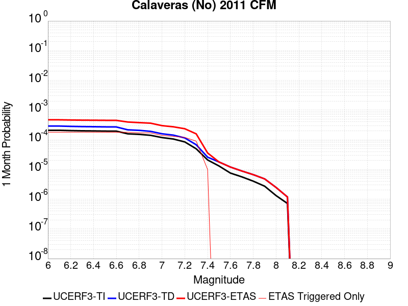 |  |  |

| Magnitude | 1 wk TI Prob | 1 wk TD Prob | 1 wk ETAS Prob | 1 wk ETAS/TD Gain | 1 wk ETAS Triggered Only | 1 mo TI Prob | 1 mo TD Prob | 1 mo ETAS Prob | 1 mo ETAS/TD Gain | 1 mo ETAS Triggered Only | 1 yr TI Prob | 1 yr TD Prob | 1 yr ETAS Prob | 1 yr ETAS/TD Gain | 1 yr ETAS Triggered Only | 10 yr TI Prob | 10 yr TD Prob | 10 yr ETAS Prob | 10 yr ETAS/TD Gain | 10 yr ETAS Triggered Only |
|-----|-----|-----|-----|-----|-----|-----|-----|-----|-----|-----|-----|-----|-----|-----|-----|-----|-----|-----|-----|-----|
| 6.0 | 4.8694856E-5 | 6.761473E-5 | 2.1174914E-4 | 3.131701 | 1.4414414E-4 | 2.0867554E-4 | 2.8974633E-4 | 4.518615E-4 | 1.5595073 | 1.6216216E-4 | 0.0025376645 | 0.0035220422 | 0.003737497 | 1.0611732 | 2.1621621E-4 | 0.02508881 | 0.034841146 | 0.03515417 | 1.0089843 | 3.2432433E-4 |
| 6.1 | 4.8694856E-5 | 6.761473E-5 | 2.1174914E-4 | 3.131701 | 1.4414414E-4 | 2.0867554E-4 | 2.8974633E-4 | 4.518615E-4 | 1.5595073 | 1.6216216E-4 | 0.0025376645 | 0.0035220422 | 0.003737497 | 1.0611732 | 2.1621621E-4 | 0.02508881 | 0.034841146 | 0.03515417 | 1.0089843 | 3.2432433E-4 |
| 6.2 | 4.7541962E-5 | 6.594423E-5 | 2.1007887E-4 | 3.1857052 | 1.4414414E-4 | 2.0373536E-4 | 2.825886E-4 | 4.4470493E-4 | 1.5736833 | 1.6216216E-4 | 0.0024776561 | 0.0034352248 | 0.003650698 | 1.0627247 | 2.1621621E-4 | 0.024502134 | 0.034002047 | 0.034315344 | 1.009214 | 3.2432433E-4 |
| 6.3 | 4.6717287E-5 | 6.477679E-5 | 2.0891159E-4 | 3.2250998 | 1.4414414E-4 | 2.0020158E-4 | 2.775863E-4 | 4.3970346E-4 | 1.5840243 | 1.6216216E-4 | 0.0024347296 | 0.0033745435 | 0.0035900301 | 1.0638565 | 2.1621621E-4 | 0.024082264 | 0.033414237 | 0.033727724 | 1.0093819 | 3.2432433E-4 |
| 6.4 | 4.6276386E-5 | 6.413808E-5 | 2.0827298E-4 | 3.2472591 | 1.4414414E-4 | 1.983123E-4 | 2.748496E-4 | 4.3696718E-4 | 1.5898411 | 1.6216216E-4 | 0.0024117786 | 0.003341327 | 0.0035568208 | 1.0644934 | 2.1621621E-4 | 0.02385771 | 0.033092905 | 0.033406496 | 1.0094761 | 3.2432433E-4 |
| 6.5 | 4.5720994E-5 | 6.333808E-5 | 2.0747309E-4 | 3.2756455 | 1.4414414E-4 | 1.9593239E-4 | 2.7142174E-4 | 4.3353988E-4 | 1.5972924 | 1.6216216E-4 | 0.002382867 | 0.0032997404 | 0.0035152433 | 1.065309 | 2.1621621E-4 | 0.023574775 | 0.032690268 | 0.03300399 | 1.0095968 | 3.2432433E-4 |
| 6.6 | 4.549134E-5 | 6.2990985E-5 | 2.0712605E-4 | 3.2881856 | 1.4414414E-4 | 1.949483E-4 | 2.6993448E-4 | 4.3205288E-4 | 1.6005841 | 1.6216216E-4 | 0.0023709119 | 0.003281688 | 0.0034971947 | 1.0656694 | 2.1621621E-4 | 0.023457756 | 0.03251555 | 0.03282933 | 1.0096501 | 3.2432433E-4 |
| 6.7 | 3.701047E-5 | 5.0488026E-5 | 1.946249E-4 | 3.8548725 | 1.4414414E-4 | 1.5860666E-4 | 2.1635955E-4 | 3.784866E-4 | 1.749341 | 1.6216216E-4 | 0.0019293258 | 0.0026310391 | 0.0028466864 | 1.0819628 | 2.1621621E-4 | 0.019126613 | 0.026189491 | 0.026505321 | 1.0120595 | 3.2432433E-4 |
| 6.8 | 3.5523568E-5 | 4.8468683E-5 | 1.9260583E-4 | 3.9738204 | 1.4414414E-4 | 1.5223498E-4 | 2.0770663E-4 | 3.698351E-4 | 1.7805648 | 1.6216216E-4 | 0.0018518851 | 0.0025259387 | 0.0027236363 | 1.078267 | 1.9819819E-4 | 0.018365284 | 0.02516132 | 0.025459921 | 1.0118674 | 3.0630632E-4 |
| 6.9 | 3.2946147E-5 | 4.4786295E-5 | 1.8892398E-4 | 4.2183437 | 1.4414414E-4 | 1.4119013E-4 | 1.9192738E-4 | 3.5405843E-4 | 1.844752 | 1.6216216E-4 | 0.0017176344 | 0.002334254 | 0.0025140138 | 1.0770094 | 1.8018018E-4 | 0.017044188 | 0.023281476 | 0.023545453 | 1.0113386 | 2.7027028E-4 |
| 7.0 | 2.7682381E-5 | 3.7143058E-5 | 1.8128185E-4 | 4.8806386 | 1.4414414E-4 | 1.1863338E-4 | 1.59175E-4 | 3.2131135E-4 | 2.0186043 | 1.6216216E-4 | 0.0014434044 | 0.0019362634 | 0.0021160948 | 1.0928755 | 1.8018018E-4 | 0.01434065 | 0.019371657 | 0.01963669 | 1.0136815 | 2.7027028E-4 |
| 7.1 | 2.471967E-5 | 3.340416E-5 | 1.775435E-4 | 5.315011 | 1.4414414E-4 | 1.05937135E-4 | 1.4315301E-4 | 2.8727652E-4 | 2.0067794 | 1.4414414E-4 | 0.0012890215 | 0.0017415237 | 0.0019034034 | 1.092953 | 1.6216216E-4 | 0.0128157 | 0.017445127 | 0.01769298 | 1.0142075 | 2.5225224E-4 |
| 7.2 | 1.9748062E-5 | 2.6888965E-5 | 1.530117E-4 | 5.6905017 | 1.2612612E-4 | 8.463181E-5 | 1.15233466E-4 | 2.4134506E-4 | 2.094401 | 1.2612612E-4 | 0.0010299052 | 0.0014020882 | 0.0015460303 | 1.1026626 | 1.4414414E-4 | 0.01025145 | 0.014088519 | 0.014301689 | 1.0151308 | 2.1621621E-4 |
| 7.3 | 1.1603734E-5 | 1.5883887E-5 | 1.0597255E-4 | 6.6717014 | 9.009009E-5 | 4.9729337E-5 | 6.8072106E-5 | 1.5815606E-4 | 2.323361 | 9.009009E-5 | 6.052865E-4 | 8.284772E-4 | 9.364957E-4 | 1.1303821 | 1.08108106E-4 | 0.0060364045 | 0.008359566 | 0.008502505 | 1.0170989 | 1.4414414E-4 |
| 7.4 | 4.885381E-6 | 6.0575517E-6 | 2.407546E-5 | 3.974454 | 1.8018018E-5 | 2.0937177E-5 | 2.5960679E-5 | 4.3978227E-5 | 1.6940323 | 1.8018018E-5 | 2.5488032E-4 | 3.160256E-4 | 3.5205024E-4 | 1.1139928 | 3.6036035E-5 | 0.0025458818 | 0.0032124277 | 0.0032483481 | 1.0111817 | 3.6036035E-5 |
| 7.5 | 3.0571264E-6 | 4.1757917E-6 | 4.1757917E-6 | 1.0 | 0.0 | 1.3101904E-5 | 1.7896127E-5 | 1.7896127E-5 | 1.0 | 0.0 | 1.5950401E-4 | 2.1786368E-4 | 2.3587777E-4 | 1.0826851 | 1.8018018E-5 | 0.0015938957 | 0.0022314226 | 0.0022494004 | 1.0080566 | 1.8018018E-5 |
| 7.6 | 1.764948E-6 | 2.815238E-6 | 2.815238E-6 | 1.0 | 0.0 | 7.564041E-6 | 1.206525E-5 | 1.206525E-5 | 1.0 | 0.0 | 9.208831E-5 | 1.4688459E-4 | 1.4688459E-4 | 1.0 | 0.0 | 9.205016E-4 | 0.0015222435 | 0.0015222435 | 1.0 | 0.0 |
| 7.7 | 1.3173734E-6 | 2.0757866E-6 | 2.0757866E-6 | 1.0 | 0.0 | 5.645874E-6 | 8.896198E-6 | 8.896198E-6 | 1.0 | 0.0 | 6.873634E-5 | 1.0830585E-4 | 1.0830585E-4 | 1.0 | 0.0 | 6.8715087E-4 | 0.0011348927 | 0.0011348927 | 1.0 | 0.0 |
| 7.8 | 9.4429885E-7 | 1.5624398E-6 | 1.5624398E-6 | 1.0 | 0.0 | 4.0469886E-6 | 6.6961534E-6 | 6.6961534E-6 | 1.0 | 0.0 | 4.9270973E-5 | 8.152264E-5 | 8.152264E-5 | 1.0 | 0.0 | 4.926005E-4 | 8.569319E-4 | 8.569319E-4 | 1.0 | 0.0 |
| 7.9 | 6.388233E-7 | 1.124425E-6 | 1.124425E-6 | 1.0 | 0.0 | 2.7378112E-6 | 4.8189554E-6 | 4.8189554E-6 | 1.0 | 0.0 | 3.3332344E-5 | 5.866921E-5 | 5.866921E-5 | 1.0 | 0.0 | 3.3327343E-4 | 6.1441824E-4 | 6.1441824E-4 | 1.0 | 0.0 |
| 8.0 | 3.087986E-7 | 5.8040854E-7 | 5.8040854E-7 | 1.0 | 0.0 | 1.323422E-6 | 2.4874628E-6 | 2.4874628E-6 | 1.0 | 0.0 | 1.6112543E-5 | 3.0284444E-5 | 3.0284444E-5 | 1.0 | 0.0 | 1.6111376E-4 | 3.1352913E-4 | 3.1352913E-4 | 1.0 | 0.0 |
| 8.1 | 1.6725647E-7 | 2.7677092E-7 | 2.7677092E-7 | 1.0 | 0.0 | 7.168133E-7 | 1.1861606E-6 | 1.1861606E-6 | 1.0 | 0.0 | 8.7271665E-6 | 1.4441412E-5 | 1.4441412E-5 | 1.0 | 0.0 | 8.726824E-5 | 1.4985427E-4 | 1.4985427E-4 | 1.0 | 0.0 |

## Hunting Creek - Berryessa 2011 CFM
*[(top)](#table-of-contents)*

| 1 Week | 1 Month | 1 Year | 10 Year |
|-----|-----|-----|-----|
|  |  |  |  |

| Magnitude | 1 wk TI Prob | 1 wk TD Prob | 1 wk ETAS Prob | 1 wk ETAS/TD Gain | 1 wk ETAS Triggered Only | 1 mo TI Prob | 1 mo TD Prob | 1 mo ETAS Prob | 1 mo ETAS/TD Gain | 1 mo ETAS Triggered Only | 1 yr TI Prob | 1 yr TD Prob | 1 yr ETAS Prob | 1 yr ETAS/TD Gain | 1 yr ETAS Triggered Only | 10 yr TI Prob | 10 yr TD Prob | 10 yr ETAS Prob | 10 yr ETAS/TD Gain | 10 yr ETAS Triggered Only |
|-----|-----|-----|-----|-----|-----|-----|-----|-----|-----|-----|-----|-----|-----|-----|-----|-----|-----|-----|-----|-----|
| 6.0 | 1.1270982E-4 | 2.0033884E-4 | 3.0842528E-4 | 1.5395182 | 1.08108106E-4 | 4.8295266E-4 | 8.5827895E-4 | 9.6629426E-4 | 1.125851 | 1.08108106E-4 | 0.0058641075 | 0.01039249 | 0.010588628 | 1.0188731 | 1.9819819E-4 | 0.057117578 | 0.09809242 | 0.098303676 | 1.0021536 | 2.3423423E-4 |
| 6.1 | 1.1239393E-4 | 1.9981996E-4 | 3.0790648E-4 | 1.5409194 | 1.08108106E-4 | 4.8159933E-4 | 8.5605663E-4 | 9.640722E-4 | 1.126178 | 1.08108106E-4 | 0.0058477195 | 0.010365712 | 0.010561856 | 1.0189223 | 1.9819819E-4 | 0.056962132 | 0.09785073 | 0.098062046 | 1.0021596 | 2.3423423E-4 |
| 6.2 | 7.596265E-5 | 1.2944505E-4 | 2.3753916E-4 | 1.835058 | 1.08108106E-4 | 3.2551357E-4 | 5.5457966E-4 | 6.626278E-4 | 1.1948289 | 1.08108106E-4 | 0.0039559277 | 0.0067249946 | 0.00692186 | 1.0292736 | 1.9819819E-4 | 0.038862433 | 0.06462765 | 0.06484675 | 1.0033901 | 2.3423423E-4 |
| 6.3 | 6.78794E-5 | 1.1461031E-4 | 2.2270603E-4 | 1.9431587 | 1.08108106E-4 | 2.9087928E-4 | 4.910263E-4 | 5.9908134E-4 | 1.2200595 | 1.08108106E-4 | 0.003535705 | 0.0059555117 | 0.0061525293 | 1.0330817 | 1.9819819E-4 | 0.034799766 | 0.057497483 | 0.057718247 | 1.0038396 | 2.3423423E-4 |
| 6.4 | 6.2165134E-5 | 1.0446956E-4 | 1.9455024E-4 | 1.8622673 | 9.009009E-5 | 2.6639478E-4 | 4.4758292E-4 | 5.376327E-4 | 1.2011913 | 9.009009E-5 | 0.0032385332 | 0.005430052 | 0.005609254 | 1.0330019 | 1.8018018E-4 | 0.03191742 | 0.052580375 | 0.05278522 | 1.0038959 | 2.1621621E-4 |
| 6.5 | 5.4368087E-5 | 9.080083E-5 | 1.8088274E-4 | 1.9920825 | 9.009009E-5 | 2.3298527E-4 | 3.8902112E-4 | 4.7907614E-4 | 1.2314914 | 9.009009E-5 | 0.0028329059 | 0.004722142 | 0.0049014715 | 1.0379763 | 1.8018018E-4 | 0.027970633 | 0.045906633 | 0.046095733 | 1.0041193 | 1.9819819E-4 |
| 6.6 | 4.729947E-5 | 7.8547964E-5 | 1.5061437E-4 | 1.9174829 | 7.207207E-5 | 2.0269625E-4 | 3.3659383E-4 | 4.0864164E-4 | 1.2140497 | 7.207207E-5 | 0.002465034 | 0.004086986 | 0.0042484854 | 1.0395155 | 1.6216216E-4 | 0.02437869 | 0.039874986 | 0.04004798 | 1.0043385 | 1.8018018E-4 |
| 6.7 | 3.6875328E-5 | 6.0503822E-5 | 7.852075E-5 | 1.2977817 | 1.8018018E-5 | 1.5802756E-4 | 2.5927887E-4 | 2.7729222E-4 | 1.0694748 | 1.8018018E-5 | 0.0019222875 | 0.003149953 | 0.0032397592 | 1.0285103 | 9.009009E-5 | 0.019057442 | 0.030911246 | 0.031016013 | 1.0033892 | 1.08108106E-4 |
| 6.8 | 2.0292036E-5 | 2.898966E-5 | 2.898966E-5 | 1.0 | 0.0 | 8.6962966E-5 | 1.2423552E-4 | 1.2423552E-4 | 1.0 | 0.0 | 0.0010582599 | 0.0015114911 | 0.0015474727 | 1.0238054 | 3.6036035E-5 | 0.010532344 | 0.014985252 | 0.015038497 | 1.0035532 | 5.4054053E-5 |
| 6.9 | 1.7871042E-5 | 2.4483867E-5 | 2.4483867E-5 | 1.0 | 0.0 | 7.658793E-5 | 1.0492665E-4 | 1.0492665E-4 | 1.0 | 0.0 | 9.320591E-4 | 0.0012767378 | 0.0012947328 | 1.0140945 | 1.8018018E-5 | 0.009281595 | 0.012685746 | 0.012721324 | 1.0028046 | 3.6036035E-5 |
| 7.0 | 1.6415532E-5 | 2.1917253E-5 | 2.1917253E-5 | 1.0 | 0.0 | 7.035038E-5 | 9.3927716E-5 | 9.3927716E-5 | 1.0 | 0.0 | 8.561793E-4 | 0.0011429732 | 0.0011429732 | 1.0 | 0.0 | 0.008528882 | 0.011370161 | 0.011387973 | 1.0015666 | 1.8018018E-5 |
| 7.1 | 1.5409885E-5 | 2.0356898E-5 | 2.0356898E-5 | 1.0 | 0.0 | 6.6040695E-5 | 8.7240944E-5 | 8.7240944E-5 | 1.0 | 0.0 | 8.0374884E-4 | 0.0010616437 | 0.0010616437 | 1.0 | 0.0 | 0.00800848 | 0.010566039 | 0.010583867 | 1.0016873 | 1.8018018E-5 |
| 7.2 | 1.4497423E-5 | 1.9065028E-5 | 1.9065028E-5 | 1.0 | 0.0 | 6.213033E-5 | 8.170472E-5 | 8.170472E-5 | 1.0 | 0.0 | 7.5617427E-4 | 9.943041E-4 | 9.943041E-4 | 1.0 | 0.0 | 0.0075360634 | 0.009899127 | 0.009916967 | 1.0018021 | 1.8018018E-5 |
| 7.3 | 1.3615175E-5 | 1.7835837E-5 | 1.7835837E-5 | 1.0 | 0.0 | 5.8349444E-5 | 7.643708E-5 | 7.643708E-5 | 1.0 | 0.0 | 7.101729E-4 | 9.30227E-4 | 9.30227E-4 | 1.0 | 0.0 | 0.0070790765 | 0.009263841 | 0.009263841 | 1.0 | 0.0 |
| 7.4 | 1.2252825E-5 | 1.6035223E-5 | 1.6035223E-5 | 1.0 | 0.0 | 5.251105E-5 | 6.872059E-5 | 6.872059E-5 | 1.0 | 0.0 | 6.391345E-4 | 8.3635485E-4 | 8.3635485E-4 | 1.0 | 0.0 | 0.0063729943 | 0.008332515 | 0.008332515 | 1.0 | 0.0 |
| 7.5 | 1.0913301E-5 | 1.42488025E-5 | 1.42488025E-5 | 1.0 | 0.0 | 4.6770452E-5 | 6.1064886E-5 | 6.1064886E-5 | 1.0 | 0.0 | 5.6928146E-4 | 7.432141E-4 | 7.432141E-4 | 1.0 | 0.0 | 0.0056782532 | 0.00740766 | 0.00740766 | 1.0 | 0.0 |
| 7.6 | 8.623192E-6 | 1.1241129E-5 | 1.1241129E-5 | 1.0 | 0.0 | 3.6956015E-5 | 4.817539E-5 | 4.817539E-5 | 1.0 | 0.0 | 4.4984656E-4 | 5.863801E-4 | 5.863801E-4 | 1.0 | 0.0 | 0.00448937 | 0.0058486434 | 0.0058486434 | 1.0 | 0.0 |
| 7.7 | 2.0993634E-6 | 2.6636358E-6 | 2.6636358E-6 | 1.0 | 0.0 | 8.997241E-6 | 1.1415532E-5 | 1.1415532E-5 | 1.0 | 0.0 | 1.09535904E-4 | 1.389753E-4 | 1.389753E-4 | 1.0 | 0.0 | 0.0010948193 | 0.0013888904 | 0.0013888904 | 1.0 | 0.0 |
| 7.8 | 1.8428308E-7 | 2.167988E-7 | 2.167988E-7 | 1.0 | 0.0 | 7.897844E-7 | 9.2913734E-7 | 9.2913734E-7 | 1.0 | 0.0 | 9.615583E-6 | 1.1312192E-5 | 1.1312192E-5 | 1.0 | 0.0 | 9.615166E-5 | 1.13114795E-4 | 1.13114795E-4 | 1.0 | 0.0 |

## Sargent 2011 CFM
*[(top)](#table-of-contents)*

| 1 Week | 1 Month | 1 Year | 10 Year |
|-----|-----|-----|-----|
|  |  |  |  |

| Magnitude | 1 wk TI Prob | 1 wk TD Prob | 1 wk ETAS Prob | 1 wk ETAS/TD Gain | 1 wk ETAS Triggered Only | 1 mo TI Prob | 1 mo TD Prob | 1 mo ETAS Prob | 1 mo ETAS/TD Gain | 1 mo ETAS Triggered Only | 1 yr TI Prob | 1 yr TD Prob | 1 yr ETAS Prob | 1 yr ETAS/TD Gain | 1 yr ETAS Triggered Only | 10 yr TI Prob | 10 yr TD Prob | 10 yr ETAS Prob | 10 yr ETAS/TD Gain | 10 yr ETAS Triggered Only |
|-----|-----|-----|-----|-----|-----|-----|-----|-----|-----|-----|-----|-----|-----|-----|-----|-----|-----|-----|-----|-----|
| 6.0 | 3.7327867E-5 | 3.6675217E-5 | 7.270993E-5 | 1.9825358 | 3.6036035E-5 | 1.5996677E-4 | 1.5717282E-4 | 2.1121837E-4 | 1.3438607 | 5.4054053E-5 | 0.0019458556 | 0.0019123711 | 0.002002289 | 1.047019 | 9.009009E-5 | 0.01928905 | 0.019031476 | 0.019225901 | 1.010216 | 1.9819819E-4 |
| 6.1 | 2.3771476E-5 | 1.8493336E-5 | 3.651102E-5 | 1.9742799 | 1.8018018E-5 | 1.01873775E-4 | 7.925524E-5 | 1.1528842E-4 | 1.4546473 | 3.6036035E-5 | 0.0012396075 | 9.6457085E-4 | 0.0010005721 | 1.0373236 | 3.6036035E-5 | 0.012327154 | 0.009643728 | 0.00973295 | 1.0092517 | 9.009009E-5 |
| 6.2 | 2.3112721E-5 | 1.7724447E-5 | 3.5742145E-5 | 2.016545 | 1.8018018E-5 | 9.9050754E-5 | 7.59602E-5 | 1.119935E-4 | 1.4743708 | 3.6036035E-5 | 0.0012052758 | 9.2448783E-4 | 9.6049055E-4 | 1.0389434 | 3.6036035E-5 | 0.011987597 | 0.009246255 | 0.009317661 | 1.0077226 | 7.207207E-5 |
| 6.3 | 1.728509E-5 | 1.0469298E-5 | 1.0469298E-5 | 1.0 | 0.0 | 7.407686E-5 | 4.486792E-5 | 6.288513E-5 | 1.401561 | 1.8018018E-5 | 9.015125E-4 | 5.4617383E-4 | 5.64182E-4 | 1.0329715 | 1.8018018E-5 | 0.008978641 | 0.005484908 | 0.005502827 | 1.003267 | 1.8018018E-5 |
| 6.4 | 1.48395575E-5 | 7.4650325E-6 | 7.4650325E-6 | 1.0 | 0.0 | 6.3596555E-5 | 3.199282E-5 | 3.199282E-5 | 1.0 | 0.0 | 7.7401294E-4 | 3.8947735E-4 | 3.8947735E-4 | 1.0 | 0.0 | 0.0077132257 | 0.0039237817 | 0.0039237817 | 1.0 | 0.0 |
| 6.5 | 1.4358964E-5 | 6.9036255E-6 | 6.9036255E-6 | 1.0 | 0.0 | 6.1536964E-5 | 2.9586845E-5 | 2.9586845E-5 | 1.0 | 0.0 | 7.48955E-4 | 3.601945E-4 | 3.601945E-4 | 1.0 | 0.0 | 0.0074643586 | 0.0036319366 | 0.0036319366 | 1.0 | 0.0 |
| 6.6 | 9.772591E-6 | 1.3803129E-6 | 1.3803129E-6 | 1.0 | 0.0 | 4.188186E-5 | 5.9156137E-6 | 5.9156137E-6 | 1.0 | 0.0 | 5.097923E-4 | 7.2020244E-5 | 7.2020244E-5 | 1.0 | 0.0 | 0.005086244 | 7.522172E-4 | 7.522172E-4 | 1.0 | 0.0 |
| 6.7 | 9.752745E-6 | 1.3590013E-6 | 1.3590013E-6 | 1.0 | 0.0 | 4.179681E-5 | 5.824278E-6 | 5.824278E-6 | 1.0 | 0.0 | 5.0875737E-4 | 7.090831E-5 | 7.090831E-5 | 1.0 | 0.0 | 0.005075942 | 7.4110535E-4 | 7.4110535E-4 | 1.0 | 0.0 |
| 6.8 | 9.608213E-6 | 1.2427503E-6 | 1.2427503E-6 | 1.0 | 0.0 | 4.1177405E-5 | 5.326062E-6 | 5.326062E-6 | 1.0 | 0.0 | 5.012196E-4 | 6.48429E-5 | 6.48429E-5 | 1.0 | 0.0 | 0.005000906 | 6.801856E-4 | 6.801856E-4 | 1.0 | 0.0 |
| 6.9 | 9.427164E-6 | 1.1272732E-6 | 1.1272732E-6 | 1.0 | 0.0 | 4.04015E-5 | 4.831162E-6 | 4.831162E-6 | 1.0 | 0.0 | 4.9177726E-4 | 5.8817834E-5 | 5.8817834E-5 | 1.0 | 0.0 | 0.004906904 | 6.192817E-4 | 6.192817E-4 | 1.0 | 0.0 |
| 7.0 | 9.247601E-6 | 9.935427E-7 | 9.935427E-7 | 1.0 | 0.0 | 3.9631974E-5 | 4.258033E-6 | 4.258033E-6 | 1.0 | 0.0 | 4.8241246E-4 | 5.1840336E-5 | 5.1840336E-5 | 1.0 | 0.0 | 0.0048136655 | 5.4903544E-4 | 5.4903544E-4 | 1.0 | 0.0 |
| 7.1 | 8.995454E-6 | 8.326929E-7 | 8.326929E-7 | 1.0 | 0.0 | 3.8551374E-5 | 3.568679E-6 | 3.568679E-6 | 1.0 | 0.0 | 4.6926187E-4 | 4.3447813E-5 | 4.3447813E-5 | 1.0 | 0.0 | 0.004682722 | 4.642218E-4 | 4.642218E-4 | 1.0 | 0.0 |
| 7.2 | 8.520861E-6 | 5.3258753E-7 | 5.3258753E-7 | 1.0 | 0.0 | 3.6517464E-5 | 2.282516E-6 | 2.282516E-6 | 1.0 | 0.0 | 4.445094E-4 | 2.7789285E-5 | 2.7789285E-5 | 1.0 | 0.0 | 0.004436213 | 3.0594022E-4 | 3.0594022E-4 | 1.0 | 0.0 |
| 7.3 | 8.043592E-6 | 3.501094E-7 | 3.501094E-7 | 1.0 | 0.0 | 3.4472083E-5 | 1.5004679E-6 | 1.5004679E-6 | 1.0 | 0.0 | 4.196168E-4 | 1.8268045E-5 | 1.8268045E-5 | 1.0 | 0.0 | 0.004188253 | 2.0941379E-4 | 2.0941379E-4 | 1.0 | 0.0 |
| 7.4 | 7.662316E-6 | 2.969961E-7 | 2.969961E-7 | 1.0 | 0.0 | 3.2838085E-5 | 1.2728399E-6 | 1.2728399E-6 | 1.0 | 0.0 | 3.9973034E-4 | 1.5496717E-5 | 1.5496717E-5 | 1.0 | 0.0 | 0.0039901207 | 1.7987835E-4 | 1.7987835E-4 | 1.0 | 0.0 |
| 7.5 | 6.961638E-6 | 2.3922428E-7 | 2.3922428E-7 | 1.0 | 0.0 | 2.9835252E-5 | 1.0252464E-6 | 1.0252464E-6 | 1.0 | 0.0 | 3.6318362E-4 | 1.2482305E-5 | 1.2482305E-5 | 1.0 | 0.0 | 0.0036259065 | 1.4624365E-4 | 1.4624365E-4 | 1.0 | 0.0 |
| 7.6 | 6.282332E-6 | 1.7165036E-7 | 1.7165036E-7 | 1.0 | 0.0 | 2.6924003E-5 | 7.3564416E-7 | 7.3564416E-7 | 1.0 | 0.0 | 3.2775043E-4 | 8.956432E-6 | 8.956432E-6 | 1.0 | 0.0 | 0.0032726745 | 1.0675463E-4 | 1.0675463E-4 | 1.0 | 0.0 |
| 7.7 | 4.934408E-6 | 5.0952853E-8 | 5.0952853E-8 | 1.0 | 0.0 | 2.114729E-5 | 2.1836935E-7 | 2.1836935E-7 | 1.0 | 0.0 | 2.5743784E-4 | 2.6586436E-6 | 2.6586436E-6 | 1.0 | 0.0 | 0.0025713982 | 3.3194043E-5 | 3.3194043E-5 | 1.0 | 0.0 |
| 7.8 | 2.373212E-6 | 3.5931706E-8 | 3.5931706E-8 | 1.0 | 0.0 | 1.0170869E-5 | 1.5399301E-7 | 1.5399301E-7 | 1.0 | 0.0 | 1.238233E-4 | 1.8748633E-6 | 1.8748633E-6 | 1.0 | 0.0 | 0.0012375432 | 2.4653038E-5 | 2.4653038E-5 | 1.0 | 0.0 |
| 7.9 | 1.8227792E-6 | 3.1296338E-8 | 3.1296338E-8 | 1.0 | 0.0 | 7.811887E-6 | 1.3412715E-7 | 1.3412715E-7 | 1.0 | 0.0 | 9.510558E-5 | 1.6329968E-6 | 1.6329968E-6 | 1.0 | 0.0 | 9.5064886E-4 | 2.18834E-5 | 2.18834E-5 | 1.0 | 0.0 |
| 8.0 | 1.9095137E-7 | 1.3468572E-8 | 1.3468572E-8 | 1.0 | 0.0 | 8.1836276E-7 | 5.772245E-8 | 5.772245E-8 | 1.0 | 0.0 | 9.963521E-6 | 7.027706E-7 | 7.027706E-7 | 1.0 | 0.0 | 9.963074E-5 | 8.589204E-6 | 8.589204E-6 | 1.0 | 0.0 |

## Ortigalita (North)
*[(top)](#table-of-contents)*

| 1 Week | 1 Month | 1 Year | 10 Year |
|-----|-----|-----|-----|
|  |  |  |  |

| Magnitude | 1 wk TI Prob | 1 wk TD Prob | 1 wk ETAS Prob | 1 wk ETAS/TD Gain | 1 wk ETAS Triggered Only | 1 mo TI Prob | 1 mo TD Prob | 1 mo ETAS Prob | 1 mo ETAS/TD Gain | 1 mo ETAS Triggered Only | 1 yr TI Prob | 1 yr TD Prob | 1 yr ETAS Prob | 1 yr ETAS/TD Gain | 1 yr ETAS Triggered Only | 10 yr TI Prob | 10 yr TD Prob | 10 yr ETAS Prob | 10 yr ETAS/TD Gain | 10 yr ETAS Triggered Only |
|-----|-----|-----|-----|-----|-----|-----|-----|-----|-----|-----|-----|-----|-----|-----|-----|-----|-----|-----|-----|-----|
| 6.0 | 7.711876E-5 | 1.0514144E-4 | 1.591898E-4 | 1.514054 | 5.4054053E-5 | 3.3046713E-4 | 4.505392E-4 | 5.045689E-4 | 1.1199223 | 5.4054053E-5 | 0.004016016 | 0.0054711658 | 0.005542843 | 1.013101 | 7.207207E-5 | 0.039442103 | 0.053487413 | 0.053623844 | 1.0025507 | 1.4414414E-4 |
| 6.1 | 4.607858E-5 | 6.0276063E-5 | 7.829299E-5 | 1.2989069 | 1.8018018E-5 | 1.9746469E-4 | 2.583032E-4 | 2.7631654E-4 | 1.0697373 | 1.8018018E-5 | 0.0024014818 | 0.0031405487 | 0.0031764715 | 1.0114384 | 3.6036035E-5 | 0.023756953 | 0.030992474 | 0.031044852 | 1.00169 | 5.4054053E-5 |
| 6.2 | 4.607858E-5 | 6.0276063E-5 | 7.829299E-5 | 1.2989069 | 1.8018018E-5 | 1.9746469E-4 | 2.583032E-4 | 2.7631654E-4 | 1.0697373 | 1.8018018E-5 | 0.0024014818 | 0.0031405487 | 0.0031764715 | 1.0114384 | 3.6036035E-5 | 0.023756953 | 0.030992474 | 0.031044852 | 1.00169 | 5.4054053E-5 |
| 6.3 | 3.327423E-5 | 4.249851E-5 | 6.051576E-5 | 1.4239502 | 1.8018018E-5 | 1.4259605E-4 | 1.8212547E-4 | 2.001402E-4 | 1.0989139 | 1.8018018E-5 | 0.0017347244 | 0.0022153985 | 0.0022333765 | 1.008115 | 1.8018018E-5 | 0.017212452 | 0.02195717 | 0.021992415 | 1.0016052 | 3.6036035E-5 |
| 6.4 | 2.7732503E-5 | 3.5016896E-5 | 5.3034284E-5 | 1.5145341 | 1.8018018E-5 | 1.1884817E-4 | 1.5006529E-4 | 1.680806E-4 | 1.1200498 | 1.8018018E-5 | 0.001446016 | 0.0018257468 | 0.001843732 | 1.0098509 | 1.8018018E-5 | 0.014366428 | 0.018130416 | 0.018165799 | 1.0019516 | 3.6036035E-5 |
| 6.5 | 2.7689714E-5 | 3.496669E-5 | 5.298408E-5 | 1.5152729 | 1.8018018E-5 | 1.186648E-4 | 1.4985015E-4 | 1.6786548E-4 | 1.1202222 | 1.8018018E-5 | 0.0014437864 | 0.0018231319 | 0.0018411172 | 1.0098649 | 1.8018018E-5 | 0.014344421 | 0.018104695 | 0.01814008 | 1.0019544 | 3.6036035E-5 |
| 6.6 | 2.2976905E-5 | 2.8732655E-5 | 4.6750156E-5 | 1.627074 | 1.8018018E-5 | 9.846873E-5 | 1.2313557E-4 | 1.4115137E-4 | 1.1463087 | 1.8018018E-5 | 0.0011981975 | 0.0014983724 | 0.0015163635 | 1.012007 | 1.8018018E-5 | 0.011917574 | 0.014906018 | 0.014941517 | 1.0023816 | 3.6036035E-5 |
| 6.7 | 1.9871539E-5 | 2.4917017E-5 | 2.4917017E-5 | 1.0 | 0.0 | 8.516096E-5 | 1.06784246E-4 | 1.06784246E-4 | 1.0 | 0.0 | 0.0010363415 | 0.0012995718 | 0.0012995718 | 1.0 | 0.0 | 0.010315218 | 0.012943401 | 0.012961186 | 1.001374 | 1.8018018E-5 |
| 6.8 | 6.5640475E-6 | 7.607822E-6 | 7.607822E-6 | 1.0 | 0.0 | 2.813133E-5 | 3.260456E-5 | 3.260456E-5 | 1.0 | 0.0 | 3.424451E-4 | 3.968911E-4 | 3.968911E-4 | 1.0 | 0.0 | 0.0034191788 | 0.00396211 | 0.0039800564 | 1.0045296 | 1.8018018E-5 |
| 6.9 | 5.6219683E-6 | 6.503801E-6 | 6.503801E-6 | 1.0 | 0.0 | 2.4093928E-5 | 2.7873151E-5 | 2.7873151E-5 | 1.0 | 0.0 | 2.933041E-4 | 3.3930535E-4 | 3.3930535E-4 | 1.0 | 0.0 | 0.0029291727 | 0.00338813 | 0.0034060872 | 1.0052999 | 1.8018018E-5 |
| 7.0 | 3.875591E-6 | 4.486115E-6 | 4.486115E-6 | 1.0 | 0.0 | 1.6609569E-5 | 1.9226076E-5 | 1.9226076E-5 | 1.0 | 0.0 | 2.0220275E-4 | 2.3405446E-4 | 2.3405446E-4 | 1.0 | 0.0 | 0.0020201886 | 0.002338288 | 0.002338288 | 1.0 | 0.0 |
| 7.1 | 1.6017933E-6 | 1.8576128E-6 | 1.8576128E-6 | 1.0 | 0.0 | 6.8648105E-6 | 7.961179E-6 | 7.961179E-6 | 1.0 | 0.0 | 8.357586E-5 | 9.6924115E-5 | 9.6924115E-5 | 1.0 | 0.0 | 8.3544437E-4 | 9.689232E-4 | 9.689232E-4 | 1.0 | 0.0 |

## San Andreas (Parkfield)
*[(top)](#table-of-contents)*

| 1 Week | 1 Month | 1 Year | 10 Year |
|-----|-----|-----|-----|
|  |  |  |  |

| Magnitude | 1 wk TI Prob | 1 wk TD Prob | 1 wk ETAS Prob | 1 wk ETAS/TD Gain | 1 wk ETAS Triggered Only | 1 mo TI Prob | 1 mo TD Prob | 1 mo ETAS Prob | 1 mo ETAS/TD Gain | 1 mo ETAS Triggered Only | 1 yr TI Prob | 1 yr TD Prob | 1 yr ETAS Prob | 1 yr ETAS/TD Gain | 1 yr ETAS Triggered Only | 10 yr TI Prob | 10 yr TD Prob | 10 yr ETAS Prob | 10 yr ETAS/TD Gain | 10 yr ETAS Triggered Only |
|-----|-----|-----|-----|-----|-----|-----|-----|-----|-----|-----|-----|-----|-----|-----|-----|-----|-----|-----|-----|-----|
| 6.0 | 5.556969E-4 | 7.925354E-4 | 8.8255404E-4 | 1.1135832 | 9.009009E-5 | 0.0023793848 | 0.003392733 | 0.0034825173 | 1.0264637 | 9.009009E-5 | 0.028586963 | 0.040889088 | 0.040992774 | 1.0025358 | 1.08108106E-4 | 0.25176284 | 0.3393678 | 0.33946306 | 1.0002806 | 1.4414414E-4 |
| 6.1 | 1.925858E-4 | 3.0691034E-4 | 3.9697278E-4 | 1.2934487 | 9.009009E-5 | 8.2510663E-4 | 0.0013147657 | 0.0014047372 | 1.0684317 | 9.009009E-5 | 0.0099994885 | 0.01598289 | 0.01608927 | 1.0066559 | 1.08108106E-4 | 0.095613256 | 0.15073559 | 0.150858 | 1.0008122 | 1.4414414E-4 |
| 6.2 | 9.4306815E-5 | 1.8358107E-4 | 2.556399E-4 | 1.3925178 | 7.207207E-5 | 4.0410945E-4 | 7.8654004E-4 | 8.5855543E-4 | 1.0915598 | 7.207207E-5 | 0.0049089384 | 0.009534287 | 0.009623518 | 1.009359 | 9.009009E-5 | 0.048019063 | 0.09235361 | 0.09246809 | 1.0012395 | 1.2612612E-4 |
| 6.3 | 9.283051E-5 | 1.8054266E-4 | 2.5260172E-4 | 1.3991249 | 7.207207E-5 | 3.9778434E-4 | 7.7352603E-4 | 8.4554235E-4 | 1.0931014 | 7.207207E-5 | 0.0048322747 | 0.009377217 | 0.009466463 | 1.0095172 | 9.009009E-5 | 0.047285385 | 0.091006055 | 0.091120705 | 1.0012598 | 1.2612612E-4 |
| 6.4 | 9.138826E-5 | 1.7815719E-4 | 2.5021643E-4 | 1.40447 | 7.207207E-5 | 3.916052E-4 | 7.633086E-4 | 8.353257E-4 | 1.0943485 | 7.207207E-5 | 0.0047573745 | 0.009253885 | 0.009343141 | 1.0096453 | 9.009009E-5 | 0.046568092 | 0.08990586 | 0.09002065 | 1.0012767 | 1.2612612E-4 |
| 6.5 | 9.000255E-5 | 1.7573098E-4 | 2.477904E-4 | 1.4100553 | 7.207207E-5 | 3.8566816E-4 | 7.5291656E-4 | 8.2493434E-4 | 1.0956517 | 7.207207E-5 | 0.0046854047 | 0.009128439 | 0.0092177065 | 1.0097791 | 9.009009E-5 | 0.045878403 | 0.088789634 | 0.08890457 | 1.0012944 | 1.2612612E-4 |
| 6.6 | 8.8109264E-5 | 1.7252822E-4 | 2.4458786E-4 | 1.4176687 | 7.207207E-5 | 3.7755648E-4 | 7.391983E-4 | 8.1121706E-4 | 1.0974282 | 7.207207E-5 | 0.0045870654 | 0.008962819 | 0.0090521015 | 1.0099615 | 9.009009E-5 | 0.04493529 | 0.087316476 | 0.08743159 | 1.0013183 | 1.2612612E-4 |
| 6.7 | 8.738073E-5 | 1.7119577E-4 | 2.4325552E-4 | 1.42092 | 7.207207E-5 | 3.7443507E-4 | 7.3349103E-4 | 8.0551027E-4 | 1.0981869 | 7.207207E-5 | 0.0045492216 | 0.008893945 | 0.008983234 | 1.0100393 | 9.009009E-5 | 0.04457213 | 0.08671589 | 0.08683108 | 1.0013283 | 1.2612612E-4 |
| 6.8 | 8.710195E-5 | 1.7064829E-4 | 2.4270806E-4 | 1.4222707 | 7.207207E-5 | 3.7324068E-4 | 7.31146E-4 | 8.0316537E-4 | 1.098502 | 7.207207E-5 | 0.0045347405 | 0.008865635 | 0.008954926 | 1.0100716 | 9.009009E-5 | 0.04443313 | 0.08646264 | 0.086577855 | 1.0013326 | 1.2612612E-4 |
| 6.9 | 8.6801556E-5 | 1.7005557E-4 | 2.4211539E-4 | 1.4237428 | 7.207207E-5 | 3.7195362E-4 | 7.286072E-4 | 8.0062676E-4 | 1.0988455 | 7.207207E-5 | 0.0045191357 | 0.008834976 | 0.00892427 | 1.0101069 | 9.009009E-5 | 0.044283327 | 0.08618794 | 0.08630319 | 1.0013373 | 1.2612612E-4 |
| 7.0 | 8.5571606E-5 | 1.6757486E-4 | 2.3963487E-4 | 1.4300168 | 7.207207E-5 | 3.6668387E-4 | 7.179815E-4 | 7.900018E-4 | 1.1003095 | 7.207207E-5 | 0.004455241 | 0.008706649 | 0.008795954 | 1.0102572 | 9.009009E-5 | 0.043669727 | 0.085033305 | 0.0851487 | 1.0013571 | 1.2612612E-4 |
| 7.1 | 7.82589E-5 | 1.5234148E-4 | 2.0638731E-4 | 1.3547676 | 5.4054053E-5 | 3.3535215E-4 | 6.527295E-4 | 7.067482E-4 | 1.0827583 | 5.4054053E-5 | 0.0040752706 | 0.007918197 | 0.007989698 | 1.00903 | 7.207207E-5 | 0.040013418 | 0.077931635 | 0.0780147 | 1.001066 | 9.009009E-5 |
| 7.2 | 7.690929E-5 | 1.4970162E-4 | 1.4970162E-4 | 1.0 | 0.0 | 3.2956956E-4 | 6.4142136E-4 | 6.4142136E-4 | 1.0 | 0.0 | 0.004005129 | 0.007781511 | 0.007799389 | 1.0022975 | 1.8018018E-5 | 0.0393371 | 0.0767006 | 0.07673387 | 1.0004338 | 3.6036035E-5 |
| 7.3 | 7.5543794E-5 | 1.4665214E-4 | 1.4665214E-4 | 1.0 | 0.0 | 3.2371894E-4 | 6.2835845E-4 | 6.2835845E-4 | 1.0 | 0.0 | 0.003934157 | 0.007623594 | 0.0076414743 | 1.0023454 | 1.8018018E-5 | 0.038652334 | 0.075258195 | 0.07529152 | 1.0004427 | 3.6036035E-5 |
| 7.4 | 7.4214564E-5 | 1.4364798E-4 | 1.4364798E-4 | 1.0 | 0.0 | 3.1802364E-4 | 6.1548967E-4 | 6.1548967E-4 | 1.0 | 0.0 | 0.003865065 | 0.007468 | 0.007485884 | 1.0023947 | 1.8018018E-5 | 0.03798529 | 0.073827036 | 0.073860414 | 1.000452 | 3.6036035E-5 |
| 7.5 | 6.149578E-5 | 1.1278729E-4 | 1.1278729E-4 | 1.0 | 0.0 | 2.6352672E-4 | 4.8328468E-4 | 4.8328468E-4 | 1.0 | 0.0 | 0.0032037178 | 0.005868149 | 0.005886061 | 1.0030525 | 1.8018018E-5 | 0.03157923 | 0.058962863 | 0.058996774 | 1.0005752 | 3.6036035E-5 |
| 7.6 | 6.0643448E-5 | 1.1106514E-4 | 1.1106514E-4 | 1.0 | 0.0 | 2.598746E-4 | 4.7590674E-4 | 4.7590674E-4 | 1.0 | 0.0 | 0.0031593828 | 0.0057788026 | 0.0057967165 | 1.0030999 | 1.8018018E-5 | 0.031148417 | 0.058120478 | 0.058154423 | 1.000584 | 3.6036035E-5 |
| 7.7 | 5.1652263E-5 | 9.2530776E-5 | 9.2530776E-5 | 1.0 | 0.0 | 2.2134806E-4 | 3.9650023E-4 | 3.9650023E-4 | 1.0 | 0.0 | 0.002691582 | 0.004816715 | 0.0048346464 | 1.0037227 | 1.8018018E-5 | 0.026592141 | 0.048903264 | 0.048937537 | 1.0007008 | 3.6036035E-5 |
| 7.8 | 4.8090482E-5 | 8.63174E-5 | 8.63174E-5 | 1.0 | 0.0 | 2.060858E-4 | 3.6987927E-4 | 3.6987927E-4 | 1.0 | 0.0 | 0.0025062072 | 0.00449399 | 0.004511927 | 1.0039914 | 1.8018018E-5 | 0.024781305 | 0.04564136 | 0.045675747 | 1.0007535 | 3.6036035E-5 |
| 7.9 | 3.970278E-5 | 6.806583E-5 | 6.806583E-5 | 1.0 | 0.0 | 1.7014367E-4 | 2.916781E-4 | 2.916781E-4 | 1.0 | 0.0 | 0.002069531 | 0.003545402 | 0.0035633561 | 1.005064 | 1.8018018E-5 | 0.020503636 | 0.036150526 | 0.036185257 | 1.0009608 | 3.6036035E-5 |
| 8.0 | 2.8982335E-5 | 4.1055075E-5 | 4.1055075E-5 | 1.0 | 0.0 | 1.2420409E-4 | 1.7593846E-4 | 1.7593846E-4 | 1.0 | 0.0 | 0.0015111357 | 0.0021399476 | 0.0021399476 | 1.0 | 0.0 | 0.015009012 | 0.022189254 | 0.022206873 | 1.000794 | 1.8018018E-5 |
| 8.1 | 1.8836186E-5 | 1.8883551E-5 | 1.8883551E-5 | 1.0 | 0.0 | 8.0724014E-5 | 8.0927E-5 | 8.0927E-5 | 1.0 | 0.0 | 9.823717E-4 | 9.848415E-4 | 9.848415E-4 | 1.0 | 0.0 | 0.009780403 | 0.01059446 | 0.01059446 | 1.0 | 0.0 |
| 8.2 | 8.643924E-6 | 5.5526552E-6 | 5.5526552E-6 | 1.0 | 0.0 | 3.704486E-5 | 2.3796878E-5 | 2.3796878E-5 | 1.0 | 0.0 | 4.5092785E-4 | 2.8968856E-4 | 2.8968856E-4 | 1.0 | 0.0 | 0.0045001395 | 0.0032912085 | 0.0032912085 | 1.0 | 0.0 |
| 8.3 | 1.983087E-6 | 7.7871465E-7 | 7.7871465E-7 | 1.0 | 0.0 | 8.498917E-6 | 3.3373444E-6 | 3.3373444E-6 | 1.0 | 0.0 | 1.034694E-4 | 4.063143E-5 | 4.063143E-5 | 1.0 | 0.0 | 0.0010342124 | 4.7926197E-4 | 4.7926197E-4 | 1.0 | 0.0 |

## Monte Vista - Shannon 2011 CFM
*[(top)](#table-of-contents)*

| 1 Week | 1 Month | 1 Year | 10 Year |
|-----|-----|-----|-----|
| 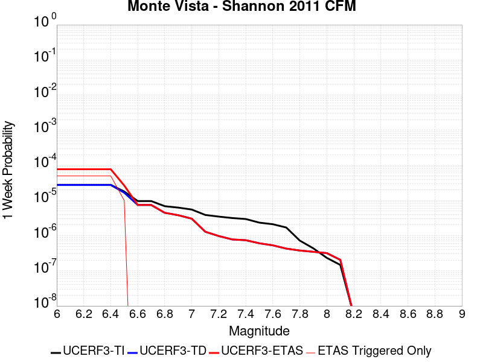 |  |  |  |

| Magnitude | 1 wk TI Prob | 1 wk TD Prob | 1 wk ETAS Prob | 1 wk ETAS/TD Gain | 1 wk ETAS Triggered Only | 1 mo TI Prob | 1 mo TD Prob | 1 mo ETAS Prob | 1 mo ETAS/TD Gain | 1 mo ETAS Triggered Only | 1 yr TI Prob | 1 yr TD Prob | 1 yr ETAS Prob | 1 yr ETAS/TD Gain | 1 yr ETAS Triggered Only | 10 yr TI Prob | 10 yr TD Prob | 10 yr ETAS Prob | 10 yr ETAS/TD Gain | 10 yr ETAS Triggered Only |
|-----|-----|-----|-----|-----|-----|-----|-----|-----|-----|-----|-----|-----|-----|-----|-----|-----|-----|-----|-----|-----|
| 6.0 | 2.7907707E-5 | 2.7597103E-5 | 4.5614623E-5 | 1.6528772 | 1.8018018E-5 | 1.19598975E-4 | 1.1826863E-4 | 1.543004E-4 | 1.3046604 | 3.6036035E-5 | 0.0014551448 | 0.0014390933 | 0.0015290538 | 1.0625119 | 9.009009E-5 | 0.014456532 | 0.014326892 | 0.014468971 | 1.0099169 | 1.4414414E-4 |
| 6.1 | 2.7907707E-5 | 2.7597103E-5 | 4.5614623E-5 | 1.6528772 | 1.8018018E-5 | 1.19598975E-4 | 1.1826863E-4 | 1.543004E-4 | 1.3046604 | 3.6036035E-5 | 0.0014551448 | 0.0014390933 | 0.0015290538 | 1.0625119 | 9.009009E-5 | 0.014456532 | 0.014326892 | 0.014468971 | 1.0099169 | 1.4414414E-4 |
| 6.2 | 2.7907707E-5 | 2.7597103E-5 | 4.5614623E-5 | 1.6528772 | 1.8018018E-5 | 1.19598975E-4 | 1.1826863E-4 | 1.543004E-4 | 1.3046604 | 3.6036035E-5 | 0.0014551448 | 0.0014390933 | 0.0015290538 | 1.0625119 | 9.009009E-5 | 0.014456532 | 0.014326892 | 0.014468971 | 1.0099169 | 1.4414414E-4 |
| 6.3 | 2.7907707E-5 | 2.7597103E-5 | 4.5614623E-5 | 1.6528772 | 1.8018018E-5 | 1.19598975E-4 | 1.1826863E-4 | 1.543004E-4 | 1.3046604 | 3.6036035E-5 | 0.0014551448 | 0.0014390933 | 0.0015290538 | 1.0625119 | 9.009009E-5 | 0.014456532 | 0.014326892 | 0.014468971 | 1.0099169 | 1.4414414E-4 |
| 6.4 | 2.7907707E-5 | 2.7597103E-5 | 4.5614623E-5 | 1.6528772 | 1.8018018E-5 | 1.19598975E-4 | 1.1826863E-4 | 1.543004E-4 | 1.3046604 | 3.6036035E-5 | 0.0014551448 | 0.0014390933 | 0.0015290538 | 1.0625119 | 9.009009E-5 | 0.014456532 | 0.014326892 | 0.014468971 | 1.0099169 | 1.4414414E-4 |
| 6.5 | 1.7990213E-5 | 1.6650592E-5 | 1.6650592E-5 | 1.0 | 0.0 | 7.709863E-5 | 7.13581E-5 | 7.13581E-5 | 1.0 | 0.0 | 9.382716E-4 | 8.6850504E-4 | 9.0450974E-4 | 1.041456 | 3.6036035E-5 | 0.0093431985 | 0.008674543 | 0.008728128 | 1.0061773 | 5.4054053E-5 |
| 6.6 | 9.650407E-6 | 7.466063E-6 | 7.466063E-6 | 1.0 | 0.0 | 4.135823E-5 | 3.1997064E-5 | 3.1997064E-5 | 1.0 | 0.0 | 5.0342013E-4 | 3.8950247E-4 | 4.2552446E-4 | 1.0924821 | 3.6036035E-5 | 0.005022812 | 0.0039059385 | 0.0039597815 | 1.0137849 | 5.4054053E-5 |
| 6.7 | 9.62828E-6 | 7.4439677E-6 | 7.4439677E-6 | 1.0 | 0.0 | 4.1263404E-5 | 3.190237E-5 | 3.190237E-5 | 1.0 | 0.0 | 5.022661E-4 | 3.8835E-4 | 4.2437203E-4 | 1.0927566 | 3.6036035E-5 | 0.0050113243 | 0.0038944543 | 0.003948298 | 1.0138257 | 5.4054053E-5 |
| 6.8 | 6.887523E-6 | 4.469971E-6 | 4.469971E-6 | 1.0 | 0.0 | 2.9517621E-5 | 1.915689E-5 | 1.915689E-5 | 1.0 | 0.0 | 3.5931775E-4 | 2.3321241E-4 | 2.512262E-4 | 1.0772421 | 1.8018018E-5 | 0.0035873733 | 0.0023468905 | 0.002382842 | 1.0153188 | 3.6036035E-5 |
| 6.9 | 6.2722347E-6 | 3.811725E-6 | 3.811725E-6 | 1.0 | 0.0 | 2.6880729E-5 | 1.6335875E-5 | 1.6335875E-5 | 1.0 | 0.0 | 3.2722374E-4 | 1.9887314E-4 | 2.1688758E-4 | 1.0905825 | 1.8018018E-5 | 0.003267423 | 0.0020041515 | 0.0020401154 | 1.0179447 | 3.6036035E-5 |
| 7.0 | 5.5320347E-6 | 3.0386977E-6 | 3.0386977E-6 | 1.0 | 0.0 | 2.3708504E-5 | 1.30229355E-5 | 1.30229355E-5 | 1.0 | 0.0 | 2.8861282E-4 | 1.5854454E-4 | 1.5854454E-4 | 1.0 | 0.0 | 0.0028823826 | 0.0016015001 | 0.0016015001 | 1.0 | 0.0 |
| 7.1 | 3.8794055E-6 | 1.2913293E-6 | 1.2913293E-6 | 1.0 | 0.0 | 1.6625918E-5 | 5.534257E-6 | 5.534257E-6 | 1.0 | 0.0 | 2.0240174E-4 | 6.737751E-5 | 6.737751E-5 | 1.0 | 0.0 | 0.002022175 | 6.90582E-4 | 6.90582E-4 | 1.0 | 0.0 |
| 7.2 | 3.4813652E-6 | 9.742977E-7 | 9.742977E-7 | 1.0 | 0.0 | 1.49200505E-5 | 4.1755547E-6 | 4.1755547E-6 | 1.0 | 0.0 | 1.8163648E-4 | 5.0836203E-5 | 5.0836203E-5 | 1.0 | 0.0 | 0.0018148809 | 5.252446E-4 | 5.252446E-4 | 1.0 | 0.0 |
| 7.3 | 3.1682148E-6 | 7.788776E-7 | 7.788776E-7 | 1.0 | 0.0 | 1.3577992E-5 | 3.3380425E-6 | 3.3380425E-6 | 1.0 | 0.0 | 1.6529951E-4 | 4.0639912E-5 | 4.0639912E-5 | 1.0 | 0.0 | 0.0016517661 | 4.2329848E-4 | 4.2329848E-4 | 1.0 | 0.0 |
| 7.4 | 2.9707667E-6 | 7.4132635E-7 | 7.4132635E-7 | 1.0 | 0.0 | 1.2731795E-5 | 3.177109E-6 | 3.177109E-6 | 1.0 | 0.0 | 1.5499859E-4 | 3.8680617E-5 | 3.8680617E-5 | 1.0 | 0.0 | 0.0015489052 | 4.0350226E-4 | 4.0350226E-4 | 1.0 | 0.0 |
| 7.5 | 2.3462758E-6 | 6.0651723E-7 | 6.0651723E-7 | 1.0 | 0.0 | 1.0055429E-5 | 2.599357E-6 | 2.599357E-6 | 1.0 | 0.0 | 1.2241797E-4 | 3.1646712E-5 | 3.1646712E-5 | 1.0 | 0.0 | 0.0012235056 | 3.314278E-4 | 3.314278E-4 | 1.0 | 0.0 |
| 7.6 | 2.112783E-6 | 5.305359E-7 | 5.305359E-7 | 1.0 | 0.0 | 9.054753E-6 | 2.2737233E-6 | 2.2737233E-6 | 1.0 | 0.0 | 1.1023604E-4 | 2.768223E-5 | 2.768223E-5 | 1.0 | 0.0 | 0.0011018137 | 2.9135987E-4 | 2.9135987E-4 | 1.0 | 0.0 |
| 7.7 | 1.7022471E-6 | 4.2783478E-7 | 4.2783478E-7 | 1.0 | 0.0 | 7.2953244E-6 | 1.8335763E-6 | 1.8335763E-6 | 1.0 | 0.0 | 8.881695E-5 | 2.2323566E-5 | 2.2323566E-5 | 1.0 | 0.0 | 8.878146E-4 | 2.3645471E-4 | 2.3645471E-4 | 1.0 | 0.0 |
| 7.8 | 7.230914E-7 | 3.7707397E-7 | 3.7707397E-7 | 1.0 | 0.0 | 3.0989595E-6 | 1.6160303E-6 | 1.6160303E-6 | 1.0 | 0.0 | 3.772918E-5 | 1.9674992E-5 | 1.9674992E-5 | 1.0 | 0.0 | 3.7722773E-4 | 2.0948783E-4 | 2.0948783E-4 | 1.0 | 0.0 |
| 7.9 | 4.3588446E-7 | 3.4671746E-7 | 3.4671746E-7 | 1.0 | 0.0 | 1.868075E-6 | 1.4859311E-6 | 1.4859311E-6 | 1.0 | 0.0 | 2.2743576E-5 | 1.8091061E-5 | 1.8091061E-5 | 1.0 | 0.0 | 2.2741247E-4 | 1.9186095E-4 | 1.9186095E-4 | 1.0 | 0.0 |
| 8.0 | 2.3317523E-7 | 3.1833721E-7 | 3.1833721E-7 | 1.0 | 0.0 | 9.99322E-7 | 1.3643016E-6 | 1.3643016E-6 | 1.0 | 0.0 | 1.2166677E-5 | 1.6610247E-5 | 1.6610247E-5 | 1.0 | 0.0 | 1.21660116E-4 | 1.7564872E-4 | 1.7564872E-4 | 1.0 | 0.0 |
| 8.1 | 1.4662456E-7 | 2.0496766E-7 | 2.0496766E-7 | 1.0 | 0.0 | 6.283908E-7 | 8.7843256E-7 | 8.7843256E-7 | 1.0 | 0.0 | 7.650631E-6 | 1.0694865E-5 | 1.0694865E-5 | 1.0 | 0.0 | 7.650368E-5 | 1.1229678E-4 | 1.1229678E-4 | 1.0 | 0.0 |
| 8.2 | 5.4931775E-9 | 5.126119E-9 | 5.126119E-9 | 1.0 | 0.0 | 2.3542189E-8 | 2.1969083E-8 | 2.1969083E-8 | 1.0 | 0.0 | 2.8662612E-7 | 2.6747355E-7 | 2.6747355E-7 | 1.0 | 0.0 | 2.8662573E-6 | 2.7806063E-6 | 2.7806063E-6 | 1.0 | 0.0 |

## Monterey Bay-Tularcitos
*[(top)](#table-of-contents)*

| 1 Week | 1 Month | 1 Year | 10 Year |
|-----|-----|-----|-----|
|  |  |  |  |

| Magnitude | 1 wk TI Prob | 1 wk TD Prob | 1 wk ETAS Prob | 1 wk ETAS/TD Gain | 1 wk ETAS Triggered Only | 1 mo TI Prob | 1 mo TD Prob | 1 mo ETAS Prob | 1 mo ETAS/TD Gain | 1 mo ETAS Triggered Only | 1 yr TI Prob | 1 yr TD Prob | 1 yr ETAS Prob | 1 yr ETAS/TD Gain | 1 yr ETAS Triggered Only | 10 yr TI Prob | 10 yr TD Prob | 10 yr ETAS Prob | 10 yr ETAS/TD Gain | 10 yr ETAS Triggered Only |
|-----|-----|-----|-----|-----|-----|-----|-----|-----|-----|-----|-----|-----|-----|-----|-----|-----|-----|-----|-----|-----|
| 6.0 | 3.0131365E-5 | 3.2804503E-5 | 5.0821927E-5 | 1.5492364 | 1.8018018E-5 | 1.2912804E-4 | 1.4058374E-4 | 2.1264568E-4 | 1.5125909 | 7.207207E-5 | 0.001571 | 0.0017103688 | 0.0018362792 | 1.0736159 | 1.2612612E-4 | 0.015599402 | 0.01698286 | 0.017124558 | 1.0083435 | 1.4414414E-4 |
| 6.1 | 3.0131365E-5 | 3.2804503E-5 | 5.0821927E-5 | 1.5492364 | 1.8018018E-5 | 1.2912804E-4 | 1.4058374E-4 | 2.1264568E-4 | 1.5125909 | 7.207207E-5 | 0.001571 | 0.0017103688 | 0.0018362792 | 1.0736159 | 1.2612612E-4 | 0.015599402 | 0.01698286 | 0.017124558 | 1.0083435 | 1.4414414E-4 |
| 6.2 | 3.0131365E-5 | 3.2804503E-5 | 5.0821927E-5 | 1.5492364 | 1.8018018E-5 | 1.2912804E-4 | 1.4058374E-4 | 2.1264568E-4 | 1.5125909 | 7.207207E-5 | 0.001571 | 0.0017103688 | 0.0018362792 | 1.0736159 | 1.2612612E-4 | 0.015599402 | 0.01698286 | 0.017124558 | 1.0083435 | 1.4414414E-4 |
| 6.3 | 1.6998249E-5 | 1.833369E-5 | 1.833369E-5 | 1.0 | 0.0 | 7.28476E-5 | 7.8570694E-5 | 1.3262051E-4 | 1.6879131 | 5.4054053E-5 | 8.865586E-4 | 9.561971E-4 | 0.0010462011 | 1.0941269 | 9.009009E-5 | 0.0088303005 | 0.009522754 | 0.009611986 | 1.0093704 | 9.009009E-5 |
| 6.4 | 1.6998249E-5 | 1.833369E-5 | 1.833369E-5 | 1.0 | 0.0 | 7.28476E-5 | 7.8570694E-5 | 1.3262051E-4 | 1.6879131 | 5.4054053E-5 | 8.865586E-4 | 9.561971E-4 | 0.0010462011 | 1.0941269 | 9.009009E-5 | 0.0088303005 | 0.009522754 | 0.009611986 | 1.0093704 | 9.009009E-5 |
| 6.5 | 1.27470785E-5 | 1.3695391E-5 | 1.3695391E-5 | 1.0 | 0.0 | 5.4629192E-5 | 5.8693273E-5 | 1.1274415E-4 | 1.9209042 | 5.4054053E-5 | 6.649074E-4 | 7.143667E-4 | 8.043924E-4 | 1.1260217 | 9.009009E-5 | 0.0066292146 | 0.0071217557 | 0.007211204 | 1.0125599 | 9.009009E-5 |
| 6.6 | 1.2739422E-5 | 1.3687478E-5 | 1.3687478E-5 | 1.0 | 0.0 | 5.4596385E-5 | 5.865936E-5 | 1.12710244E-4 | 1.9214367 | 5.4054053E-5 | 6.645082E-4 | 7.1395404E-4 | 8.039798E-4 | 1.1260946 | 9.009009E-5 | 0.0066252467 | 0.007117656 | 0.007207105 | 1.0125672 | 9.009009E-5 |
| 6.7 | 1.0160109E-5 | 1.0887372E-5 | 1.0887372E-5 | 1.0 | 0.0 | 4.35426E-5 | 4.665937E-5 | 8.2693725E-5 | 1.7722855 | 3.6036035E-5 | 5.300022E-4 | 5.679368E-4 | 6.3996797E-4 | 1.1268295 | 7.207207E-5 | 0.005287399 | 0.0056655654 | 0.0057372293 | 1.012649 | 7.207207E-5 |
| 6.8 | 8.349859E-6 | 8.933906E-6 | 8.933906E-6 | 1.0 | 0.0 | 3.578462E-5 | 3.8287642E-5 | 5.630497E-5 | 1.4705782 | 1.8018018E-5 | 4.3559066E-4 | 4.6605797E-4 | 5.2008685E-4 | 1.1159273 | 5.4054053E-5 | 0.004347378 | 0.004651371 | 0.0047051734 | 1.011567 | 5.4054053E-5 |
| 6.9 | 5.193639E-6 | 5.537252E-6 | 5.537252E-6 | 1.0 | 0.0 | 2.2258262E-5 | 2.3730881E-5 | 4.1748473E-5 | 1.7592466 | 1.8018018E-5 | 2.7096065E-4 | 2.8888843E-4 | 3.4292688E-4 | 1.1870564 | 5.4054053E-5 | 0.0027063051 | 0.0028854501 | 0.002939348 | 1.0186793 | 5.4054053E-5 |
| 7.0 | 4.359381E-6 | 4.6440664E-6 | 4.6440664E-6 | 1.0 | 0.0 | 1.8682927E-5 | 1.9903006E-5 | 3.7920665E-5 | 1.9052733 | 1.8018018E-5 | 2.274409E-4 | 2.4229514E-4 | 2.963361E-4 | 1.2230377 | 5.4054053E-5 | 0.0022720827 | 0.0024206026 | 0.002474526 | 1.0222768 | 5.4054053E-5 |
| 7.1 | 3.0398533E-6 | 3.2315513E-6 | 3.2315513E-6 | 1.0 | 0.0 | 1.3027877E-5 | 1.3849447E-5 | 1.3849447E-5 | 1.0 | 0.0 | 1.5860285E-4 | 1.686066E-4 | 1.8662158E-4 | 1.1068462 | 1.8018018E-5 | 0.001584897 | 0.0016850445 | 0.0017030322 | 1.0106748 | 1.8018018E-5 |
| 7.2 | 1.642335E-6 | 1.7336168E-6 | 1.7336168E-6 | 1.0 | 0.0 | 7.0385595E-6 | 7.429777E-6 | 7.429777E-6 | 1.0 | 0.0 | 8.569109E-5 | 9.045585E-5 | 9.045585E-5 | 1.0 | 0.0 | 8.5658056E-4 | 9.0439303E-4 | 9.0439303E-4 | 1.0 | 0.0 |
| 7.3 | 3.356842E-7 | 3.2962387E-7 | 3.2962387E-7 | 1.0 | 0.0 | 1.4386458E-6 | 1.412673E-6 | 1.412673E-6 | 1.0 | 0.0 | 1.7515373E-5 | 1.7199158E-5 | 1.7199158E-5 | 1.0 | 0.0 | 1.7513991E-4 | 1.7197838E-4 | 1.7197838E-4 | 1.0 | 0.0 |
| 7.4 | 2.1973483E-7 | 2.1015711E-7 | 2.1015711E-7 | 1.0 | 0.0 | 9.417204E-7 | 9.00673E-7 | 9.00673E-7 | 1.0 | 0.0 | 1.1465385E-5 | 1.0965639E-5 | 1.0965639E-5 | 1.0 | 0.0 | 1.1464794E-4 | 1.0965102E-4 | 1.0965102E-4 | 1.0 | 0.0 |
| 7.5 | 1.1944135E-7 | 1.0704702E-7 | 1.0704702E-7 | 1.0 | 0.0 | 5.118914E-7 | 4.5877286E-7 | 4.5877286E-7 | 1.0 | 0.0 | 6.23226E-6 | 5.5855453E-6 | 5.5855453E-6 | 1.0 | 0.0 | 6.2320854E-5 | 5.5854063E-5 | 5.5854063E-5 | 1.0 | 0.0 |
| 7.6 | 4.636058E-8 | 3.3423873E-8 | 3.3423873E-8 | 1.0 | 0.0 | 1.9868818E-7 | 1.4324516E-7 | 1.4324516E-7 | 1.0 | 0.0 | 2.419026E-6 | 1.7440085E-6 | 1.7440085E-6 | 1.0 | 0.0 | 2.4189996E-5 | 1.743995E-5 | 1.743995E-5 | 1.0 | 0.0 |
| 7.7 | 1.8588572E-8 | 8.033782E-9 | 8.033782E-9 | 1.0 | 0.0 | 7.9665305E-8 | 3.4430492E-8 | 3.4430492E-8 | 1.0 | 0.0 | 9.699246E-7 | 4.1919117E-7 | 4.1919117E-7 | 1.0 | 0.0 | 9.699204E-6 | 4.191904E-6 | 4.191904E-6 | 1.0 | 0.0 |
| 7.8 | 2.7960154E-9 | 7.6576245E-10 | 7.6576245E-10 | 1.0 | 0.0 | 1.1982923E-8 | 3.2818392E-9 | 3.2818392E-9 | 1.0 | 0.0 | 1.4589209E-7 | 3.995639E-8 | 3.995639E-8 | 1.0 | 0.0 | 1.4589199E-6 | 3.9956385E-7 | 3.9956385E-7 | 1.0 | 0.0 |

## Contra Costa Shear Zone (connector) 2011 CFM
*[(top)](#table-of-contents)*

| 1 Week | 1 Month | 1 Year | 10 Year |
|-----|-----|-----|-----|
|  |  |  |  |

| Magnitude | 1 wk TI Prob | 1 wk TD Prob | 1 wk ETAS Prob | 1 wk ETAS/TD Gain | 1 wk ETAS Triggered Only | 1 mo TI Prob | 1 mo TD Prob | 1 mo ETAS Prob | 1 mo ETAS/TD Gain | 1 mo ETAS Triggered Only | 1 yr TI Prob | 1 yr TD Prob | 1 yr ETAS Prob | 1 yr ETAS/TD Gain | 1 yr ETAS Triggered Only | 10 yr TI Prob | 10 yr TD Prob | 10 yr ETAS Prob | 10 yr ETAS/TD Gain | 10 yr ETAS Triggered Only |
|-----|-----|-----|-----|-----|-----|-----|-----|-----|-----|-----|-----|-----|-----|-----|-----|-----|-----|-----|-----|-----|
| 6.0 | 1.3187427E-5 | 1.4047914E-5 | 6.810121E-5 | 4.8477807 | 5.4054053E-5 | 5.6516317E-5 | 6.0204085E-5 | 1.14254886E-4 | 1.8977929 | 5.4054053E-5 | 6.878689E-4 | 7.3276105E-4 | 8.2278514E-4 | 1.122856 | 9.009009E-5 | 0.006857436 | 0.0073098983 | 0.007452989 | 1.0195749 | 1.4414414E-4 |
| 6.1 | 1.3187427E-5 | 1.4047914E-5 | 6.810121E-5 | 4.8477807 | 5.4054053E-5 | 5.6516317E-5 | 6.0204085E-5 | 1.14254886E-4 | 1.8977929 | 5.4054053E-5 | 6.878689E-4 | 7.3276105E-4 | 8.2278514E-4 | 1.122856 | 9.009009E-5 | 0.006857436 | 0.0073098983 | 0.007452989 | 1.0195749 | 1.4414414E-4 |
| 6.2 | 1.3187427E-5 | 1.4047914E-5 | 6.810121E-5 | 4.8477807 | 5.4054053E-5 | 5.6516317E-5 | 6.0204085E-5 | 1.14254886E-4 | 1.8977929 | 5.4054053E-5 | 6.878689E-4 | 7.3276105E-4 | 8.2278514E-4 | 1.122856 | 9.009009E-5 | 0.006857436 | 0.0073098983 | 0.007452989 | 1.0195749 | 1.4414414E-4 |
| 6.3 | 9.315374E-6 | 9.830119E-6 | 6.388364E-5 | 6.498766 | 5.4054053E-5 | 3.992242E-5 | 4.2128424E-5 | 9.61802E-5 | 2.283024 | 5.4054053E-5 | 4.8594706E-4 | 5.12797E-4 | 5.8483204E-4 | 1.1404749 | 7.207207E-5 | 0.004848858 | 0.0051207407 | 0.005246221 | 1.0245043 | 1.2612612E-4 |
| 6.4 | 9.315374E-6 | 9.830119E-6 | 6.388364E-5 | 6.498766 | 5.4054053E-5 | 3.992242E-5 | 4.2128424E-5 | 9.61802E-5 | 2.283024 | 5.4054053E-5 | 4.8594706E-4 | 5.12797E-4 | 5.8483204E-4 | 1.1404749 | 7.207207E-5 | 0.004848858 | 0.0051207407 | 0.005246221 | 1.0245043 | 1.2612612E-4 |
| 6.5 | 8.492638E-6 | 8.943669E-6 | 6.299724E-5 | 7.043781 | 5.4054053E-5 | 3.639651E-5 | 3.8329465E-5 | 9.2381444E-5 | 2.4101942 | 5.4054053E-5 | 4.430374E-4 | 4.6656467E-4 | 5.386031E-4 | 1.1544019 | 7.207207E-5 | 0.0044215517 | 0.0046603796 | 0.004767984 | 1.0230892 | 1.08108106E-4 |
| 6.6 | 8.402072E-6 | 8.84445E-6 | 6.289803E-5 | 7.1115813 | 5.4054053E-5 | 3.6008387E-5 | 3.7904254E-5 | 9.195626E-5 | 2.4260142 | 5.4054053E-5 | 4.383139E-4 | 4.6138995E-4 | 5.3342874E-4 | 1.1561344 | 7.207207E-5 | 0.0043745036 | 0.004608848 | 0.004716458 | 1.0233486 | 1.08108106E-4 |
| 6.7 | 7.383587E-6 | 7.751894E-6 | 4.378765E-5 | 5.648639 | 3.6036035E-5 | 3.164356E-5 | 3.322199E-5 | 6.925683E-5 | 2.0846682 | 3.6036035E-5 | 3.8519225E-4 | 4.0440477E-4 | 4.5843696E-4 | 1.1336092 | 5.4054053E-5 | 0.0038452526 | 0.004041091 | 0.004130817 | 1.0222034 | 9.009009E-5 |
| 6.8 | 6.004921E-6 | 6.269357E-6 | 2.4287263E-5 | 3.8739638 | 1.8018018E-5 | 2.5735122E-5 | 2.68684E-5 | 4.4885932E-5 | 1.6705846 | 1.8018018E-5 | 3.1328006E-4 | 3.270742E-4 | 3.6309843E-4 | 1.1101409 | 3.6036035E-5 | 0.0031283877 | 0.003270177 | 0.0033240544 | 1.0164753 | 5.4054053E-5 |
| 6.9 | 5.505255E-6 | 5.721665E-6 | 2.373958E-5 | 4.149069 | 1.8018018E-5 | 2.3593739E-5 | 2.4521192E-5 | 4.253877E-5 | 1.7347757 | 1.8018018E-5 | 2.872159E-4 | 2.9850504E-4 | 3.3453034E-4 | 1.1206857 | 3.6036035E-5 | 0.0028684495 | 0.002985281 | 0.0030391735 | 1.0180528 | 5.4054053E-5 |
| 7.0 | 4.891922E-6 | 5.052222E-6 | 2.307015E-5 | 4.566337 | 1.8018018E-5 | 2.096521E-5 | 2.1652202E-5 | 3.966983E-5 | 1.8321383 | 1.8018018E-5 | 2.5522153E-4 | 2.6358402E-4 | 2.9961055E-4 | 1.1366795 | 3.6036035E-5 | 0.0025492862 | 0.002636946 | 0.0026908575 | 1.0204446 | 5.4054053E-5 |
| 7.1 | 4.3599E-6 | 4.4561025E-6 | 2.247404E-5 | 5.04343 | 1.8018018E-5 | 1.868515E-5 | 1.9097444E-5 | 3.7115118E-5 | 1.94346 | 1.8018018E-5 | 2.2746796E-4 | 2.3248685E-4 | 2.685145E-4 | 1.1549665 | 3.6036035E-5 | 0.0022723526 | 0.0023266617 | 0.00238059 | 1.0231783 | 5.4054053E-5 |
| 7.2 | 3.7647926E-6 | 3.8069954E-6 | 2.1824944E-5 | 5.732853 | 1.8018018E-5 | 1.6134725E-5 | 1.6315593E-5 | 3.4333316E-5 | 2.1043253 | 1.8018018E-5 | 1.9642258E-4 | 1.9862449E-4 | 2.3465337E-4 | 1.181392 | 3.6036035E-5 | 0.0019624906 | 0.0019886836 | 0.0020426302 | 1.0271268 | 5.4054053E-5 |
| 7.3 | 2.3179882E-6 | 2.3945659E-6 | 2.041254E-5 | 8.524527 | 1.8018018E-5 | 9.934198E-6 | 1.0262384E-5 | 2.8280218E-5 | 2.755716 | 1.8018018E-5 | 1.20942146E-4 | 1.2493742E-4 | 1.6096895E-4 | 1.2883966 | 3.6036035E-5 | 0.0012087635 | 0.0012528638 | 0.0012888546 | 1.0287269 | 3.6036035E-5 |
| 7.4 | 1.8378355E-6 | 1.921533E-6 | 1.9939516E-5 | 10.376879 | 1.8018018E-5 | 7.876414E-6 | 8.235116E-6 | 2.6252987E-5 | 3.1879315 | 1.8018018E-5 | 9.5891126E-5 | 1.0025797E-4 | 1.3629039E-4 | 1.359397 | 3.6036035E-5 | 9.584976E-4 | 0.0010062316 | 0.0010422315 | 1.0357769 | 3.6036035E-5 |
| 7.5 | 9.840493E-7 | 1.0649483E-6 | 1.0649483E-6 | 1.0 | 0.0 | 4.2173474E-6 | 4.564056E-6 | 4.564056E-6 | 1.0 | 0.0 | 5.1344992E-5 | 5.556598E-5 | 7.3582996E-5 | 1.3242455 | 1.8018018E-5 | 5.133313E-4 | 5.592636E-4 | 5.772715E-4 | 1.0321994 | 1.8018018E-5 |
| 7.6 | 3.1602997E-7 | 3.7246227E-7 | 3.7246227E-7 | 1.0 | 0.0 | 1.3544135E-6 | 1.5962657E-6 | 1.5962657E-6 | 1.0 | 0.0 | 1.648986E-5 | 1.9434365E-5 | 1.9434365E-5 | 1.0 | 0.0 | 1.6488635E-4 | 1.978736E-4 | 1.978736E-4 | 1.0 | 0.0 |
| 7.7 | 2.2125788E-7 | 2.777874E-7 | 2.777874E-7 | 1.0 | 0.0 | 9.482477E-7 | 1.1905169E-6 | 1.1905169E-6 | 1.0 | 0.0 | 1.1544855E-5 | 1.4494447E-5 | 1.4494447E-5 | 1.0 | 0.0 | 1.1544255E-4 | 1.4844474E-4 | 1.4844474E-4 | 1.0 | 0.0 |
| 7.8 | 1.0509553E-7 | 1.4484402E-7 | 1.4484402E-7 | 1.0 | 0.0 | 4.5040935E-7 | 6.207599E-7 | 6.207599E-7 | 1.0 | 0.0 | 5.48372E-6 | 7.557726E-6 | 7.557726E-6 | 1.0 | 0.0 | 5.4835844E-5 | 7.7873156E-5 | 7.7873156E-5 | 1.0 | 0.0 |
| 7.9 | 6.029319E-8 | 9.309861E-8 | 9.309861E-8 | 1.0 | 0.0 | 2.5839938E-7 | 3.98994E-7 | 3.98994E-7 | 1.0 | 0.0 | 3.1460077E-6 | 4.8577413E-6 | 4.8577413E-6 | 1.0 | 0.0 | 3.1459633E-5 | 5.0153616E-5 | 5.0153616E-5 | 1.0 | 0.0 |
| 8.0 | 3.531068E-8 | 6.557522E-8 | 6.557522E-8 | 1.0 | 0.0 | 1.5133148E-7 | 2.8103662E-7 | 2.8103662E-7 | 1.0 | 0.0 | 1.8424593E-6 | 3.4216157E-6 | 3.4216157E-6 | 1.0 | 0.0 | 1.842444E-5 | 3.5351604E-5 | 3.5351604E-5 | 1.0 | 0.0 |
| 8.1 | 3.5238246E-10 | 6.3007377E-10 | 6.3007377E-10 | 1.0 | 0.0 | 1.5102107E-9 | 2.7003164E-9 | 2.7003164E-9 | 1.0 | 0.0 | 1.8386816E-8 | 3.2876354E-8 | 3.2876354E-8 | 1.0 | 0.0 | 1.8386814E-7 | 3.3670406E-7 | 3.3670406E-7 | 1.0 | 0.0 |

## Hayward (No) 2011 CFM
*[(top)](#table-of-contents)*

| 1 Week | 1 Month | 1 Year | 10 Year |
|-----|-----|-----|-----|
|  |  |  |  |

| Magnitude | 1 wk TI Prob | 1 wk TD Prob | 1 wk ETAS Prob | 1 wk ETAS/TD Gain | 1 wk ETAS Triggered Only | 1 mo TI Prob | 1 mo TD Prob | 1 mo ETAS Prob | 1 mo ETAS/TD Gain | 1 mo ETAS Triggered Only | 1 yr TI Prob | 1 yr TD Prob | 1 yr ETAS Prob | 1 yr ETAS/TD Gain | 1 yr ETAS Triggered Only | 10 yr TI Prob | 10 yr TD Prob | 10 yr ETAS Prob | 10 yr ETAS/TD Gain | 10 yr ETAS Triggered Only |
|-----|-----|-----|-----|-----|-----|-----|-----|-----|-----|-----|-----|-----|-----|-----|-----|-----|-----|-----|-----|-----|
| 6.0 | 9.3068506E-5 | 1.7425125E-4 | 2.2829589E-4 | 1.3101535 | 5.4054053E-5 | 3.9880406E-4 | 7.465782E-4 | 8.005919E-4 | 1.0723484 | 5.4054053E-5 | 0.0048446343 | 0.009051727 | 0.009141002 | 1.0098627 | 9.009009E-5 | 0.047403704 | 0.0865073 | 0.08663897 | 1.0015221 | 1.4414414E-4 |
| 6.1 | 9.055486E-5 | 1.6976194E-4 | 2.2380681E-4 | 1.3183569 | 5.4054053E-5 | 3.880345E-4 | 7.2734914E-4 | 7.8136387E-4 | 1.0742625 | 5.4054053E-5 | 0.0047140904 | 0.008819649 | 0.008908945 | 1.0101246 | 9.009009E-5 | 0.046153355 | 0.08439965 | 0.084515125 | 1.0013683 | 1.2612612E-4 |
| 6.2 | 9.006742E-5 | 1.6896808E-4 | 2.23013E-4 | 1.3198528 | 5.4054053E-5 | 3.859461E-4 | 7.2394876E-4 | 7.7796367E-4 | 1.0746115 | 5.4054053E-5 | 0.0046887742 | 0.008778584 | 0.008867883 | 1.0101724 | 9.009009E-5 | 0.0459107 | 0.08402366 | 0.08413918 | 1.001375 | 1.2612612E-4 |
| 6.3 | 8.8336754E-5 | 1.657629E-4 | 2.1980799E-4 | 1.3260386 | 5.4054053E-5 | 3.7853114E-4 | 7.1021984E-4 | 7.642355E-4 | 1.0760548 | 5.4054053E-5 | 0.004598882 | 0.008612795 | 0.00870211 | 1.0103699 | 9.009009E-5 | 0.04504866 | 0.08251658 | 0.0826323 | 1.0014024 | 1.2612612E-4 |
| 6.4 | 8.526157E-5 | 1.6002609E-4 | 2.140715E-4 | 1.3377287 | 5.4054053E-5 | 3.6535555E-4 | 6.856466E-4 | 7.396636E-4 | 1.0787826 | 5.4054053E-5 | 0.0044391346 | 0.00831595 | 0.008405291 | 1.0107433 | 9.009009E-5 | 0.043514993 | 0.079810895 | 0.07992695 | 1.0014542 | 1.2612612E-4 |
| 6.5 | 8.152396E-5 | 1.5334821E-4 | 2.0739397E-4 | 1.3524382 | 5.4054053E-5 | 3.493416E-4 | 6.570418E-4 | 7.110603E-4 | 1.0822147 | 5.4054053E-5 | 0.0042449418 | 0.007970279 | 0.008059651 | 1.0112132 | 9.009009E-5 | 0.04164765 | 0.07664138 | 0.07675784 | 1.0015196 | 1.2612612E-4 |
| 6.6 | 7.987405E-5 | 1.5038934E-4 | 2.0443527E-4 | 1.3593733 | 5.4054053E-5 | 3.4227243E-4 | 6.4436725E-4 | 6.9838646E-4 | 1.083833 | 5.4054053E-5 | 0.0041592065 | 0.007817105 | 0.007906491 | 1.0114347 | 9.009009E-5 | 0.04082218 | 0.07523373 | 0.07535037 | 1.0015503 | 1.2612612E-4 |
| 6.7 | 7.777665E-5 | 1.4677564E-4 | 2.0082177E-4 | 1.3682227 | 5.4054053E-5 | 3.332859E-4 | 6.288875E-4 | 6.829076E-4 | 1.0858978 | 5.4054053E-5 | 0.004050208 | 0.007629981 | 0.007719383 | 1.0117173 | 9.009009E-5 | 0.039771806 | 0.073507555 | 0.07362441 | 1.0015897 | 1.2612612E-4 |
| 6.8 | 7.3284005E-5 | 1.3826684E-4 | 1.9231343E-4 | 1.3908861 | 5.4054053E-5 | 3.140365E-4 | 5.924383E-4 | 6.464603E-4 | 1.0911859 | 5.4054053E-5 | 0.0038166929 | 0.0071892184 | 0.0072786612 | 1.0124412 | 9.009009E-5 | 0.037518036 | 0.069414906 | 0.069532275 | 1.0016909 | 1.2612612E-4 |
| 6.9 | 6.458263E-5 | 1.2154103E-4 | 1.7558852E-4 | 1.4446851 | 5.4054053E-5 | 2.7675333E-4 | 5.207866E-4 | 5.748125E-4 | 1.103739 | 5.4054053E-5 | 0.0033642664 | 0.0063222446 | 0.0063759573 | 1.0084958 | 5.4054053E-5 | 0.033137884 | 0.061330207 | 0.06141477 | 1.0013789 | 9.009009E-5 |
| 7.0 | 5.3853604E-5 | 1.00443234E-4 | 1.5449186E-4 | 1.5381012 | 5.4054053E-5 | 2.3078074E-4 | 4.304003E-4 | 4.844311E-4 | 1.1255361 | 5.4054053E-5 | 0.0028061352 | 0.0052275984 | 0.0052813697 | 1.0102861 | 5.4054053E-5 | 0.027709642 | 0.051048793 | 0.05113428 | 1.0016747 | 9.009009E-5 |
| 7.1 | 4.4308683E-5 | 8.187352E-5 | 9.989006E-5 | 1.2200533 | 1.8018018E-5 | 1.8988053E-4 | 3.5083952E-4 | 3.6885124E-4 | 1.0513388 | 1.8018018E-5 | 0.0023093442 | 0.004263147 | 0.004281088 | 1.0042084 | 1.8018018E-5 | 0.022854926 | 0.0419048 | 0.04195659 | 1.0012358 | 5.4054053E-5 |
| 7.2 | 3.295973E-5 | 6.0918384E-5 | 7.893531E-5 | 1.295755 | 1.8018018E-5 | 1.4124835E-4 | 2.6105277E-4 | 2.790661E-4 | 1.0690026 | 1.8018018E-5 | 0.0017183421 | 0.0031737085 | 0.0031916692 | 1.0056592 | 1.8018018E-5 | 0.017051157 | 0.03144125 | 0.031493604 | 1.0016651 | 5.4054053E-5 |
| 7.3 | 2.452256E-5 | 4.5301702E-5 | 6.3318905E-5 | 1.3977158 | 1.8018018E-5 | 1.05092455E-4 | 1.9413578E-4 | 2.1215029E-4 | 1.0927935 | 1.8018018E-5 | 0.0012787496 | 0.0023610548 | 0.0023790302 | 1.0076133 | 1.8018018E-5 | 0.0127141625 | 0.023500396 | 0.023553181 | 1.002246 | 5.4054053E-5 |
| 7.4 | 1.8829967E-5 | 3.470132E-5 | 5.271871E-5 | 1.5192134 | 1.8018018E-5 | 8.069736E-5 | 1.4871152E-4 | 1.6672685E-4 | 1.1211429 | 1.8018018E-5 | 9.820475E-4 | 0.0018090691 | 0.0018270544 | 1.0099418 | 1.8018018E-5 | 0.009777189 | 0.01806795 | 0.018121028 | 1.0029377 | 5.4054053E-5 |
| 7.5 | 1.26374125E-5 | 2.2995238E-5 | 4.101284E-5 | 1.7835363 | 1.8018018E-5 | 5.4159216E-5 | 9.854733E-5 | 1.1656358E-4 | 1.1828182 | 1.8018018E-5 | 6.5918895E-4 | 0.0011991592 | 0.0012171556 | 1.0150075 | 1.8018018E-5 | 0.00657237 | 0.01202547 | 0.0120610725 | 1.0029606 | 3.6036035E-5 |
| 7.6 | 4.666429E-6 | 8.508941E-6 | 2.6526806E-5 | 3.1175213 | 1.8018018E-5 | 1.9998828E-5 | 3.646639E-5 | 5.448375E-5 | 1.4940813 | 1.8018018E-5 | 2.4345852E-4 | 4.438891E-4 | 4.618991E-4 | 1.0405732 | 1.8018018E-5 | 0.0024319198 | 0.0044738417 | 0.0044917795 | 1.0040094 | 1.8018018E-5 |
| 7.7 | 3.8399318E-7 | 7.1789157E-7 | 7.1789157E-7 | 1.0 | 0.0 | 1.6456839E-6 | 3.0766744E-6 | 3.0766744E-6 | 1.0 | 0.0 | 2.003602E-5 | 3.745787E-5 | 3.745787E-5 | 1.0 | 0.0 | 2.0034213E-4 | 3.883479E-4 | 3.883479E-4 | 1.0 | 0.0 |
| 7.8 | 2.5637698E-7 | 5.405295E-7 | 5.405295E-7 | 1.0 | 0.0 | 1.098758E-6 | 2.316553E-6 | 2.316553E-6 | 1.0 | 0.0 | 1.3377297E-5 | 2.8203669E-5 | 2.8203669E-5 | 1.0 | 0.0 | 1.3376492E-4 | 2.9434287E-4 | 2.9434287E-4 | 1.0 | 0.0 |
| 7.9 | 1.7141245E-7 | 3.7561537E-7 | 3.7561537E-7 | 1.0 | 0.0 | 7.3462456E-7 | 1.6097791E-6 | 1.6097791E-6 | 1.0 | 0.0 | 8.944017E-6 | 1.9598885E-5 | 1.9598885E-5 | 1.0 | 0.0 | 8.943657E-5 | 2.0376658E-4 | 2.0376658E-4 | 1.0 | 0.0 |
| 8.0 | 1.1808895E-7 | 2.7700185E-7 | 2.7700185E-7 | 1.0 | 0.0 | 5.060954E-7 | 1.1871502E-6 | 1.1871502E-6 | 1.0 | 0.0 | 6.161694E-6 | 1.4453459E-5 | 1.4453459E-5 | 1.0 | 0.0 | 6.161523E-5 | 1.4907801E-4 | 1.4907801E-4 | 1.0 | 0.0 |
| 8.1 | 5.138535E-8 | 1.1304341E-7 | 1.1304341E-7 | 1.0 | 0.0 | 2.2022292E-7 | 4.844717E-7 | 4.844717E-7 | 1.0 | 0.0 | 2.6812106E-6 | 5.898427E-6 | 5.898427E-6 | 1.0 | 0.0 | 2.6811784E-5 | 6.0523264E-5 | 6.0523264E-5 | 1.0 | 0.0 |

## Clayton
*[(top)](#table-of-contents)*

| 1 Week | 1 Month | 1 Year | 10 Year |
|-----|-----|-----|-----|
|  |  |  |  |

| Magnitude | 1 wk TI Prob | 1 wk TD Prob | 1 wk ETAS Prob | 1 wk ETAS/TD Gain | 1 wk ETAS Triggered Only | 1 mo TI Prob | 1 mo TD Prob | 1 mo ETAS Prob | 1 mo ETAS/TD Gain | 1 mo ETAS Triggered Only | 1 yr TI Prob | 1 yr TD Prob | 1 yr ETAS Prob | 1 yr ETAS/TD Gain | 1 yr ETAS Triggered Only | 10 yr TI Prob | 10 yr TD Prob | 10 yr ETAS Prob | 10 yr ETAS/TD Gain | 10 yr ETAS Triggered Only |
|-----|-----|-----|-----|-----|-----|-----|-----|-----|-----|-----|-----|-----|-----|-----|-----|-----|-----|-----|-----|-----|
| 6.0 | 1.1413061E-5 | 1.2669735E-5 | 4.8705315E-5 | 3.8442252 | 3.6036035E-5 | 4.89122E-5 | 5.429786E-5 | 1.2636602E-4 | 2.3272743 | 7.207207E-5 | 5.953433E-4 | 6.6089816E-4 | 7.6893484E-4 | 1.1634694 | 1.08108106E-4 | 0.005937509 | 0.0065915305 | 0.0067168255 | 1.0190084 | 1.2612612E-4 |
| 6.1 | 1.1413061E-5 | 1.2669735E-5 | 4.8705315E-5 | 3.8442252 | 3.6036035E-5 | 4.89122E-5 | 5.429786E-5 | 1.2636602E-4 | 2.3272743 | 7.207207E-5 | 5.953433E-4 | 6.6089816E-4 | 7.6893484E-4 | 1.1634694 | 1.08108106E-4 | 0.005937509 | 0.0065915305 | 0.0067168255 | 1.0190084 | 1.2612612E-4 |
| 6.2 | 1.1413061E-5 | 1.2669735E-5 | 4.8705315E-5 | 3.8442252 | 3.6036035E-5 | 4.89122E-5 | 5.429786E-5 | 1.2636602E-4 | 2.3272743 | 7.207207E-5 | 5.953433E-4 | 6.6089816E-4 | 7.6893484E-4 | 1.1634694 | 1.08108106E-4 | 0.005937509 | 0.0065915305 | 0.0067168255 | 1.0190084 | 1.2612612E-4 |
| 6.3 | 8.538689E-6 | 9.534883E-6 | 9.534883E-6 | 1.0 | 0.0 | 3.659387E-5 | 4.0863208E-5 | 7.689777E-5 | 1.8818339 | 3.6036035E-5 | 4.4543925E-4 | 4.9740676E-4 | 5.514339E-4 | 1.1086177 | 5.4054053E-5 | 0.0044454746 | 0.004964 | 0.0050357147 | 1.0144469 | 7.207207E-5 |
| 6.4 | 8.538689E-6 | 9.534883E-6 | 9.534883E-6 | 1.0 | 0.0 | 3.659387E-5 | 4.0863208E-5 | 7.689777E-5 | 1.8818339 | 3.6036035E-5 | 4.4543925E-4 | 4.9740676E-4 | 5.514339E-4 | 1.1086177 | 5.4054053E-5 | 0.0044454746 | 0.004964 | 0.0050357147 | 1.0144469 | 7.207207E-5 |
| 6.5 | 7.197462E-6 | 8.082851E-6 | 8.082851E-6 | 1.0 | 0.0 | 3.08459E-5 | 3.464038E-5 | 7.067517E-5 | 2.0402539 | 3.6036035E-5 | 3.7548412E-4 | 4.216732E-4 | 4.7570447E-4 | 1.1281354 | 5.4054053E-5 | 0.003748503 | 0.004209543 | 0.0042813118 | 1.0170491 | 7.207207E-5 |
| 6.6 | 7.1760483E-6 | 8.0588625E-6 | 8.0588625E-6 | 1.0 | 0.0 | 3.075413E-5 | 3.453757E-5 | 7.057236E-5 | 2.0433505 | 3.6036035E-5 | 3.743672E-4 | 4.20422E-4 | 4.7445332E-4 | 1.1285169 | 5.4054053E-5 | 0.0037373714 | 0.0041970783 | 0.004268848 | 1.0170999 | 7.207207E-5 |
| 6.7 | 6.202582E-6 | 6.978359E-6 | 6.978359E-6 | 1.0 | 0.0 | 2.6582224E-5 | 2.9906954E-5 | 6.594191E-5 | 2.2049024 | 3.6036035E-5 | 3.235905E-4 | 3.64064E-4 | 4.0008692E-4 | 1.0989467 | 3.6036035E-5 | 0.0032311971 | 0.0036354319 | 0.0036892893 | 1.0148146 | 5.4054053E-5 |
| 6.8 | 3.6417277E-6 | 4.1223284E-6 | 4.1223284E-6 | 1.0 | 0.0 | 1.5607311E-5 | 1.7667006E-5 | 3.5684705E-5 | 2.0198503 | 1.8018018E-5 | 1.9000245E-4 | 2.1507533E-4 | 2.3308948E-4 | 1.0837574 | 1.8018018E-5 | 0.0018984007 | 0.0021487481 | 0.0021667276 | 1.0083673 | 1.8018018E-5 |
| 6.9 | 2.6498485E-6 | 3.00027E-6 | 3.00027E-6 | 1.0 | 0.0 | 1.1356444E-5 | 1.2858239E-5 | 1.2858239E-5 | 1.0 | 0.0 | 1.3825593E-4 | 1.5653821E-4 | 1.5653821E-4 | 1.0 | 0.0 | 0.0013816995 | 0.001564319 | 0.001564319 | 1.0 | 0.0 |
| 7.0 | 2.070442E-6 | 2.341307E-6 | 2.341307E-6 | 1.0 | 0.0 | 8.873292E-6 | 1.0034136E-5 | 1.0034136E-5 | 1.0 | 0.0 | 1.0802698E-4 | 1.2215906E-4 | 1.2215906E-4 | 1.0 | 0.0 | 0.0010797448 | 0.0012209489 | 0.0012209489 | 1.0 | 0.0 |
| 7.1 | 1.2111691E-6 | 1.3591936E-6 | 1.3591936E-6 | 1.0 | 0.0 | 5.190714E-6 | 5.825103E-6 | 5.825103E-6 | 1.0 | 0.0 | 6.319511E-5 | 7.091849E-5 | 7.091849E-5 | 1.0 | 0.0 | 6.3177146E-4 | 7.089749E-4 | 7.089749E-4 | 1.0 | 0.0 |
| 7.2 | 3.9541607E-7 | 4.2233907E-7 | 4.2233907E-7 | 1.0 | 0.0 | 1.6946392E-6 | 1.8100233E-6 | 1.8100233E-6 | 1.0 | 0.0 | 2.0632036E-5 | 2.2036813E-5 | 2.2036813E-5 | 1.0 | 0.0 | 2.063012E-4 | 2.2034642E-4 | 2.2034642E-4 | 1.0 | 0.0 |
| 7.3 | 2.5685637E-7 | 2.7461752E-7 | 2.7461752E-7 | 1.0 | 0.0 | 1.1008126E-6 | 1.1769317E-6 | 1.1769317E-6 | 1.0 | 0.0 | 1.3402311E-5 | 1.432905E-5 | 1.432905E-5 | 1.0 | 0.0 | 1.3401502E-4 | 1.4328134E-4 | 1.4328134E-4 | 1.0 | 0.0 |
| 7.4 | 1.482299E-7 | 1.5811176E-7 | 1.5811176E-7 | 1.0 | 0.0 | 6.3527085E-7 | 6.7762164E-7 | 6.7762164E-7 | 1.0 | 0.0 | 7.734395E-6 | 8.250013E-6 | 8.250013E-6 | 1.0 | 0.0 | 7.734126E-5 | 8.249709E-5 | 8.249709E-5 | 1.0 | 0.0 |
| 7.5 | 9.7969505E-8 | 1.0441063E-7 | 1.0441063E-7 | 1.0 | 0.0 | 4.1986925E-7 | 4.4747406E-7 | 4.4747406E-7 | 1.0 | 0.0 | 5.111896E-6 | 5.4479833E-6 | 5.4479833E-6 | 1.0 | 0.0 | 5.1117782E-5 | 5.4478514E-5 | 5.4478514E-5 | 1.0 | 0.0 |
| 7.6 | 6.125415E-8 | 6.523425E-8 | 6.523425E-8 | 1.0 | 0.0 | 2.6251774E-7 | 2.7957532E-7 | 2.7957532E-7 | 1.0 | 0.0 | 3.196149E-6 | 3.4038244E-6 | 3.4038244E-6 | 1.0 | 0.0 | 3.196103E-5 | 3.4037734E-5 | 3.4037734E-5 | 1.0 | 0.0 |

## Ortigalita (South)
*[(top)](#table-of-contents)*

| 1 Week | 1 Month | 1 Year | 10 Year |
|-----|-----|-----|-----|
|  |  |  |  |

| Magnitude | 1 wk TI Prob | 1 wk TD Prob | 1 wk ETAS Prob | 1 wk ETAS/TD Gain | 1 wk ETAS Triggered Only | 1 mo TI Prob | 1 mo TD Prob | 1 mo ETAS Prob | 1 mo ETAS/TD Gain | 1 mo ETAS Triggered Only | 1 yr TI Prob | 1 yr TD Prob | 1 yr ETAS Prob | 1 yr ETAS/TD Gain | 1 yr ETAS Triggered Only | 10 yr TI Prob | 10 yr TD Prob | 10 yr ETAS Prob | 10 yr ETAS/TD Gain | 10 yr ETAS Triggered Only |
|-----|-----|-----|-----|-----|-----|-----|-----|-----|-----|-----|-----|-----|-----|-----|-----|-----|-----|-----|-----|-----|
| 6.0 | 3.72394E-5 | 4.326915E-5 | 6.128639E-5 | 1.4163992 | 1.8018018E-5 | 1.5958765E-4 | 1.8542692E-4 | 2.2145627E-4 | 1.1943048 | 3.6036035E-5 | 0.0019412481 | 0.0022553916 | 0.0023452784 | 1.0398543 | 9.009009E-5 | 0.019243775 | 0.022341404 | 0.022447098 | 1.0047308 | 1.08108106E-4 |
| 6.1 | 2.7299884E-5 | 3.1501393E-5 | 3.1501393E-5 | 1.0 | 0.0 | 1.16994255E-4 | 1.349993E-4 | 1.349993E-4 | 1.0 | 0.0 | 0.0014234743 | 0.0016424324 | 0.0016784093 | 1.0219046 | 3.6036035E-5 | 0.014143906 | 0.016308872 | 0.016362045 | 1.0032604 | 5.4054053E-5 |
| 6.2 | 2.7299884E-5 | 3.1501393E-5 | 3.1501393E-5 | 1.0 | 0.0 | 1.16994255E-4 | 1.349993E-4 | 1.349993E-4 | 1.0 | 0.0 | 0.0014234743 | 0.0016424324 | 0.0016784093 | 1.0219046 | 3.6036035E-5 | 0.014143906 | 0.016308872 | 0.016362045 | 1.0032604 | 5.4054053E-5 |
| 6.3 | 2.0546433E-5 | 2.363831E-5 | 2.363831E-5 | 1.0 | 0.0 | 8.805317E-5 | 1.01303216E-4 | 1.01303216E-4 | 1.0 | 0.0 | 0.00107152 | 0.0012326878 | 0.0012686794 | 1.0291977 | 3.6036035E-5 | 0.010663681 | 0.012260566 | 0.012313958 | 1.0043547 | 5.4054053E-5 |
| 6.4 | 2.0546433E-5 | 2.363831E-5 | 2.363831E-5 | 1.0 | 0.0 | 8.805317E-5 | 1.01303216E-4 | 1.01303216E-4 | 1.0 | 0.0 | 0.00107152 | 0.0012326878 | 0.0012686794 | 1.0291977 | 3.6036035E-5 | 0.010663681 | 0.012260566 | 0.012313958 | 1.0043547 | 5.4054053E-5 |
| 6.5 | 1.7779594E-5 | 2.0452904E-5 | 2.0452904E-5 | 1.0 | 0.0 | 7.619603E-5 | 8.7652435E-5 | 8.7652435E-5 | 1.0 | 0.0 | 9.272918E-4 | 0.0010666596 | 0.0011026572 | 1.033748 | 3.6036035E-5 | 0.009234319 | 0.010616866 | 0.010670346 | 1.0050373 | 5.4054053E-5 |
| 6.6 | 1.6272212E-5 | 1.8720399E-5 | 1.8720399E-5 | 1.0 | 0.0 | 6.973618E-5 | 8.022789E-5 | 8.022789E-5 | 1.0 | 0.0 | 8.487073E-4 | 9.7634905E-4 | 0.0010123499 | 1.036873 | 3.6036035E-5 | 0.008454733 | 0.0097218985 | 0.009775427 | 1.0055059 | 5.4054053E-5 |
| 6.7 | 1.3051484E-5 | 1.5043188E-5 | 1.5043188E-5 | 1.0 | 0.0 | 5.593373E-5 | 6.446926E-5 | 6.446926E-5 | 1.0 | 0.0 | 6.807804E-4 | 7.8464014E-4 | 7.8464014E-4 | 1.0 | 0.0 | 0.006786986 | 0.007819681 | 0.007837559 | 1.0022862 | 1.8018018E-5 |
| 6.8 | 1.04277415E-5 | 1.1990697E-5 | 1.1990697E-5 | 1.0 | 0.0 | 4.4689557E-5 | 5.1387735E-5 | 5.1387735E-5 | 1.0 | 0.0 | 5.439595E-4 | 6.254735E-4 | 6.254735E-4 | 1.0 | 0.0 | 0.0054262993 | 0.0062378854 | 0.0062557915 | 1.0028704 | 1.8018018E-5 |
| 6.9 | 7.639968E-6 | 8.794061E-6 | 8.794061E-6 | 1.0 | 0.0 | 3.274231E-5 | 3.768832E-5 | 3.768832E-5 | 1.0 | 0.0 | 3.9856473E-4 | 4.5876458E-4 | 4.5876458E-4 | 1.0 | 0.0 | 0.003978506 | 0.0045787618 | 0.0045966976 | 1.0039171 | 1.8018018E-5 |
| 7.0 | 3.919831E-6 | 4.5347706E-6 | 4.5347706E-6 | 1.0 | 0.0 | 1.679917E-5 | 1.9434598E-5 | 1.9434598E-5 | 1.0 | 0.0 | 2.045107E-4 | 2.3659266E-4 | 2.3659266E-4 | 1.0 | 0.0 | 0.0020432258 | 0.0023636164 | 0.0023636164 | 1.0 | 0.0 |
| 7.1 | 1.6017933E-6 | 1.8576128E-6 | 1.8576128E-6 | 1.0 | 0.0 | 6.8648105E-6 | 7.961179E-6 | 7.961179E-6 | 1.0 | 0.0 | 8.357586E-5 | 9.6924115E-5 | 9.6924115E-5 | 1.0 | 0.0 | 8.3544437E-4 | 9.689232E-4 | 9.689232E-4 | 1.0 | 0.0 |

## Greenville (So) 2011 CFM
*[(top)](#table-of-contents)*

| 1 Week | 1 Month | 1 Year | 10 Year |
|-----|-----|-----|-----|
|  |  |  |  |

| Magnitude | 1 wk TI Prob | 1 wk TD Prob | 1 wk ETAS Prob | 1 wk ETAS/TD Gain | 1 wk ETAS Triggered Only | 1 mo TI Prob | 1 mo TD Prob | 1 mo ETAS Prob | 1 mo ETAS/TD Gain | 1 mo ETAS Triggered Only | 1 yr TI Prob | 1 yr TD Prob | 1 yr ETAS Prob | 1 yr ETAS/TD Gain | 1 yr ETAS Triggered Only | 10 yr TI Prob | 10 yr TD Prob | 10 yr ETAS Prob | 10 yr ETAS/TD Gain | 10 yr ETAS Triggered Only |
|-----|-----|-----|-----|-----|-----|-----|-----|-----|-----|-----|-----|-----|-----|-----|-----|-----|-----|-----|-----|-----|
| 6.0 | 4.279693E-5 | 5.5069537E-5 | 7.3086565E-5 | 1.3271687 | 1.8018018E-5 | 1.8340252E-4 | 2.3599301E-4 | 2.5400677E-4 | 1.0763317 | 1.8018018E-5 | 0.0022306389 | 0.0028697122 | 0.0029415775 | 1.0250427 | 7.207207E-5 | 0.022083808 | 0.02835234 | 0.028474892 | 1.0043224 | 1.2612612E-4 |
| 6.1 | 3.4037297E-5 | 4.3213688E-5 | 6.123093E-5 | 1.4169337 | 1.8018018E-5 | 1.4586597E-4 | 1.8518958E-4 | 2.0320425E-4 | 1.0972769 | 1.8018018E-5 | 0.0017744715 | 0.0022524854 | 0.0023243949 | 1.0319246 | 7.207207E-5 | 0.01760369 | 0.02231309 | 0.02240117 | 1.0039475 | 9.009009E-5 |
| 6.2 | 3.4037297E-5 | 4.3213688E-5 | 6.123093E-5 | 1.4169337 | 1.8018018E-5 | 1.4586597E-4 | 1.8518958E-4 | 2.0320425E-4 | 1.0972769 | 1.8018018E-5 | 0.0017744715 | 0.0022524854 | 0.0023243949 | 1.0319246 | 7.207207E-5 | 0.01760369 | 0.02231309 | 0.02240117 | 1.0039475 | 9.009009E-5 |
| 6.3 | 2.5956324E-5 | 3.244326E-5 | 3.244326E-5 | 1.0 | 0.0 | 1.11236644E-4 | 1.3903556E-4 | 1.3903556E-4 | 1.0 | 0.0 | 0.0013534647 | 0.0016915174 | 0.0017274924 | 1.0212679 | 3.6036035E-5 | 0.013452509 | 0.016793171 | 0.016828602 | 1.0021099 | 3.6036035E-5 |
| 6.4 | 2.1145053E-5 | 2.6208474E-5 | 2.6208474E-5 | 1.0 | 0.0 | 9.061851E-5 | 1.12317386E-4 | 1.12317386E-4 | 1.0 | 0.0 | 0.0011027219 | 0.0013666364 | 0.0014026231 | 1.0263324 | 3.6036035E-5 | 0.01097266 | 0.013585726 | 0.0136212725 | 1.0026164 | 3.6036035E-5 |
| 6.5 | 2.0030959E-5 | 2.4805877E-5 | 2.4805877E-5 | 1.0 | 0.0 | 8.584414E-5 | 1.06306754E-4 | 1.06306754E-4 | 1.0 | 0.0 | 0.0010446513 | 0.0012935487 | 0.0013295382 | 1.0278223 | 3.6036035E-5 | 0.010397541 | 0.012863535 | 0.012899108 | 1.0027654 | 3.6036035E-5 |
| 6.6 | 1.8395405E-5 | 2.2763585E-5 | 2.2763585E-5 | 1.0 | 0.0 | 7.8835066E-5 | 9.755473E-5 | 9.755473E-5 | 1.0 | 0.0 | 9.5939427E-4 | 0.0011871106 | 0.0012231038 | 1.03032 | 3.6036035E-5 | 0.009552629 | 0.011810748 | 0.011846358 | 1.003015 | 3.6036035E-5 |
| 6.7 | 1.7883482E-5 | 2.2134354E-5 | 2.2134354E-5 | 1.0 | 0.0 | 7.664124E-5 | 9.485823E-5 | 9.485823E-5 | 1.0 | 0.0 | 9.3270757E-4 | 0.0011543159 | 0.0011903103 | 1.0311825 | 3.6036035E-5 | 0.009288026 | 0.011486255 | 0.011521877 | 1.0031012 | 3.6036035E-5 |
| 6.8 | 1.3373564E-5 | 1.651215E-5 | 1.651215E-5 | 1.0 | 0.0 | 5.7314013E-5 | 7.076452E-5 | 7.076452E-5 | 1.0 | 0.0 | 6.975747E-4 | 8.6123234E-4 | 8.6123234E-4 | 1.0 | 0.0 | 0.0069538904 | 0.008580557 | 0.008580557 | 1.0 | 0.0 |
| 6.9 | 1.06692905E-5 | 1.3157214E-5 | 1.3157214E-5 | 1.0 | 0.0 | 4.5724726E-5 | 5.6386907E-5 | 5.6386907E-5 | 1.0 | 0.0 | 5.5655633E-4 | 6.8630563E-4 | 6.8630563E-4 | 1.0 | 0.0 | 0.005551645 | 0.0068430947 | 0.0068430947 | 1.0 | 0.0 |
| 7.0 | 8.157512E-6 | 1.0065898E-5 | 1.0065898E-5 | 1.0 | 0.0 | 3.4960296E-5 | 4.3138873E-5 | 4.3138873E-5 | 1.0 | 0.0 | 4.2555845E-4 | 5.2509294E-4 | 5.2509294E-4 | 1.0 | 0.0 | 0.004247444 | 0.0052389996 | 0.0052389996 | 1.0 | 0.0 |
| 7.1 | 6.1467113E-6 | 7.6296965E-6 | 7.6296965E-6 | 1.0 | 0.0 | 2.6342783E-5 | 3.2698295E-5 | 3.2698295E-5 | 1.0 | 0.0 | 3.206762E-4 | 3.9802986E-4 | 3.9802986E-4 | 1.0 | 0.0 | 0.0032021382 | 0.003973358 | 0.003973358 | 1.0 | 0.0 |
| 7.2 | 4.713467E-6 | 5.9159674E-6 | 5.9159674E-6 | 1.0 | 0.0 | 2.0200418E-5 | 2.5353902E-5 | 2.5353902E-5 | 1.0 | 0.0 | 2.4591232E-4 | 3.0864062E-4 | 3.0864062E-4 | 1.0 | 0.0 | 0.0024564038 | 0.003082273 | 0.003082273 | 1.0 | 0.0 |
| 7.3 | 2.3266216E-6 | 2.9552855E-6 | 2.9552855E-6 | 1.0 | 0.0 | 9.971197E-6 | 1.2665449E-5 | 1.2665449E-5 | 1.0 | 0.0 | 1.2139256E-4 | 1.5419108E-4 | 1.5419108E-4 | 1.0 | 0.0 | 0.0012132627 | 0.0015409102 | 0.0015409102 | 1.0 | 0.0 |
| 7.4 | 1.3314E-6 | 1.7190824E-6 | 1.7190824E-6 | 1.0 | 0.0 | 5.7059874E-6 | 7.367476E-6 | 7.367476E-6 | 1.0 | 0.0 | 6.946818E-5 | 8.969538E-5 | 8.969538E-5 | 1.0 | 0.0 | 6.9446466E-4 | 8.9663046E-4 | 8.9663046E-4 | 1.0 | 0.0 |
| 7.5 | 1.0362941E-6 | 1.3476489E-6 | 1.3476489E-6 | 1.0 | 0.0 | 4.4412527E-6 | 5.7756256E-6 | 5.7756256E-6 | 1.0 | 0.0 | 5.407091E-5 | 7.031602E-5 | 7.031602E-5 | 1.0 | 0.0 | 5.405776E-4 | 7.0296787E-4 | 7.0296787E-4 | 1.0 | 0.0 |
| 7.6 | 7.764784E-7 | 1.009576E-6 | 1.009576E-6 | 1.0 | 0.0 | 3.3277602E-6 | 4.326747E-6 | 4.326747E-6 | 1.0 | 0.0 | 4.0514726E-5 | 5.267691E-5 | 5.267691E-5 | 1.0 | 0.0 | 4.050734E-4 | 5.266656E-4 | 5.266656E-4 | 1.0 | 0.0 |
| 7.7 | 1.6927763E-7 | 2.2140422E-7 | 2.2140422E-7 | 1.0 | 0.0 | 7.2547533E-7 | 9.4887486E-7 | 9.4887486E-7 | 1.0 | 0.0 | 8.832627E-6 | 1.1552494E-5 | 1.1552494E-5 | 1.0 | 0.0 | 8.8322755E-5 | 1.1552163E-4 | 1.1552163E-4 | 1.0 | 0.0 |

## Mount Diablo Thrust South
*[(top)](#table-of-contents)*

| 1 Week | 1 Month | 1 Year | 10 Year |
|-----|-----|-----|-----|
|  |  |  |  |

| Magnitude | 1 wk TI Prob | 1 wk TD Prob | 1 wk ETAS Prob | 1 wk ETAS/TD Gain | 1 wk ETAS Triggered Only | 1 mo TI Prob | 1 mo TD Prob | 1 mo ETAS Prob | 1 mo ETAS/TD Gain | 1 mo ETAS Triggered Only | 1 yr TI Prob | 1 yr TD Prob | 1 yr ETAS Prob | 1 yr ETAS/TD Gain | 1 yr ETAS Triggered Only | 10 yr TI Prob | 10 yr TD Prob | 10 yr ETAS Prob | 10 yr ETAS/TD Gain | 10 yr ETAS Triggered Only |
|-----|-----|-----|-----|-----|-----|-----|-----|-----|-----|-----|-----|-----|-----|-----|-----|-----|-----|-----|-----|-----|
| 6.0 | 2.2377444E-5 | 2.6965732E-5 | 4.4983266E-5 | 1.668164 | 1.8018018E-5 | 9.5899806E-5 | 1.1556342E-4 | 1.6961123E-4 | 1.4676895 | 5.4054053E-5 | 0.0011669548 | 0.0014062733 | 0.0014782441 | 1.0511783 | 7.207207E-5 | 0.011608457 | 0.013993339 | 0.014099933 | 1.0076176 | 1.08108106E-4 |
| 6.1 | 2.2377444E-5 | 2.6965732E-5 | 4.4983266E-5 | 1.668164 | 1.8018018E-5 | 9.5899806E-5 | 1.1556342E-4 | 1.6961123E-4 | 1.4676895 | 5.4054053E-5 | 0.0011669548 | 0.0014062733 | 0.0014782441 | 1.0511783 | 7.207207E-5 | 0.011608457 | 0.013993339 | 0.014099933 | 1.0076176 | 1.08108106E-4 |
| 6.2 | 2.2377444E-5 | 2.6965732E-5 | 4.4983266E-5 | 1.668164 | 1.8018018E-5 | 9.5899806E-5 | 1.1556342E-4 | 1.6961123E-4 | 1.4676895 | 5.4054053E-5 | 0.0011669548 | 0.0014062733 | 0.0014782441 | 1.0511783 | 7.207207E-5 | 0.011608457 | 0.013993339 | 0.014099933 | 1.0076176 | 1.08108106E-4 |
| 6.3 | 2.2377444E-5 | 2.6965732E-5 | 4.4983266E-5 | 1.668164 | 1.8018018E-5 | 9.5899806E-5 | 1.1556342E-4 | 1.6961123E-4 | 1.4676895 | 5.4054053E-5 | 0.0011669548 | 0.0014062733 | 0.0014782441 | 1.0511783 | 7.207207E-5 | 0.011608457 | 0.013993339 | 0.014099933 | 1.0076176 | 1.08108106E-4 |
| 6.4 | 1.2228463E-5 | 1.47523815E-5 | 1.47523815E-5 | 1.0 | 0.0 | 5.2406645E-5 | 6.322303E-5 | 9.925679E-5 | 1.5699466 | 3.6036035E-5 | 6.378641E-4 | 7.694813E-4 | 8.054896E-4 | 1.0467956 | 3.6036035E-5 | 0.0063603627 | 0.0076695546 | 0.007741074 | 1.0093251 | 7.207207E-5 |
| 6.5 | 1.2228463E-5 | 1.47523815E-5 | 1.47523815E-5 | 1.0 | 0.0 | 5.2406645E-5 | 6.322303E-5 | 9.925679E-5 | 1.5699466 | 3.6036035E-5 | 6.378641E-4 | 7.694813E-4 | 8.054896E-4 | 1.0467956 | 3.6036035E-5 | 0.0063603627 | 0.0076695546 | 0.007741074 | 1.0093251 | 7.207207E-5 |
| 6.6 | 1.2068118E-5 | 1.4557097E-5 | 1.4557097E-5 | 1.0 | 0.0 | 5.1719482E-5 | 6.238614E-5 | 9.841993E-5 | 1.5775928 | 3.6036035E-5 | 6.2950276E-4 | 7.5929926E-4 | 7.95308E-4 | 1.0474236 | 3.6036035E-5 | 0.006277225 | 0.0075684334 | 0.00763996 | 1.0094507 | 7.207207E-5 |
| 6.7 | 1.1499428E-5 | 1.3879509E-5 | 1.3879509E-5 | 1.0 | 0.0 | 4.9282335E-5 | 5.9482325E-5 | 9.551622E-5 | 1.6057916 | 3.6036035E-5 | 5.9984723E-4 | 7.239694E-4 | 7.599794E-4 | 1.0497396 | 3.6036035E-5 | 0.0059823063 | 0.007217478 | 0.0072890297 | 1.0099137 | 7.207207E-5 |
| 6.8 | 8.82118E-6 | 1.0833987E-5 | 1.0833987E-5 | 1.0 | 0.0 | 3.780451E-5 | 4.6430578E-5 | 6.444776E-5 | 1.3880455 | 1.8018018E-5 | 4.601727E-4 | 5.651513E-4 | 5.8315916E-4 | 1.0318637 | 1.8018018E-5 | 0.0045922096 | 0.0056377905 | 0.0056736236 | 1.0063559 | 3.6036035E-5 |
| 6.9 | 8.047112E-6 | 9.942693E-6 | 9.942693E-6 | 1.0 | 0.0 | 3.4487166E-5 | 4.2610878E-5 | 4.2610878E-5 | 1.0 | 0.0 | 4.1980037E-4 | 5.1866926E-4 | 5.1866926E-4 | 1.0 | 0.0 | 0.004190082 | 0.0051752008 | 0.0051931255 | 1.0034636 | 1.8018018E-5 |
| 7.0 | 6.2574763E-6 | 7.751257E-6 | 7.751257E-6 | 1.0 | 0.0 | 2.681748E-5 | 3.321927E-5 | 3.321927E-5 | 1.0 | 0.0 | 3.264539E-4 | 4.0437325E-4 | 4.0437325E-4 | 1.0 | 0.0 | 0.0032597475 | 0.0040368163 | 0.0040368163 | 1.0 | 0.0 |
| 7.1 | 3.6485903E-6 | 4.514226E-6 | 4.514226E-6 | 1.0 | 0.0 | 1.5636722E-5 | 1.934654E-5 | 1.934654E-5 | 1.0 | 0.0 | 1.9036046E-4 | 2.3551908E-4 | 2.3551908E-4 | 1.0 | 0.0 | 0.0019019748 | 0.0023527935 | 0.0023527935 | 1.0 | 0.0 |
| 7.2 | 2.3034274E-6 | 2.9060375E-6 | 2.9060375E-6 | 1.0 | 0.0 | 9.871795E-6 | 1.2454388E-5 | 1.2454388E-5 | 1.0 | 0.0 | 1.2018247E-4 | 1.5162186E-4 | 1.5162186E-4 | 1.0 | 0.0 | 0.0012011749 | 0.0015152572 | 0.0015152572 | 1.0 | 0.0 |
| 7.3 | 1.224035E-6 | 1.568237E-6 | 1.568237E-6 | 1.0 | 0.0 | 5.245854E-6 | 6.7209994E-6 | 6.7209994E-6 | 1.0 | 0.0 | 6.38664E-5 | 8.182521E-5 | 8.182521E-5 | 1.0 | 0.0 | 6.384805E-4 | 8.179938E-4 | 8.179938E-4 | 1.0 | 0.0 |
| 7.4 | 5.1601154E-7 | 6.724563E-7 | 6.724563E-7 | 1.0 | 0.0 | 2.2114762E-6 | 2.8819525E-6 | 2.8819525E-6 | 1.0 | 0.0 | 2.6924388E-5 | 3.508722E-5 | 3.508722E-5 | 1.0 | 0.0 | 2.6921128E-4 | 3.5083416E-4 | 3.5083416E-4 | 1.0 | 0.0 |
| 7.5 | 3.552894E-7 | 4.66573E-7 | 4.66573E-7 | 1.0 | 0.0 | 1.5226678E-6 | 1.999597E-6 | 1.999597E-6 | 1.0 | 0.0 | 1.8538323E-5 | 2.4344838E-5 | 2.4344838E-5 | 1.0 | 0.0 | 1.8536777E-4 | 2.4343388E-4 | 2.4343388E-4 | 1.0 | 0.0 |
| 7.6 | 1.3124082E-7 | 1.7192369E-7 | 1.7192369E-7 | 1.0 | 0.0 | 5.6246057E-7 | 7.3681565E-7 | 7.3681565E-7 | 1.0 | 0.0 | 6.8479358E-6 | 8.970702E-6 | 8.970702E-6 | 1.0 | 0.0 | 6.8477246E-5 | 8.970755E-5 | 8.970755E-5 | 1.0 | 0.0 |
| 7.7 | 3.6193022E-8 | 4.7335234E-8 | 4.7335234E-8 | 1.0 | 0.0 | 1.5511293E-7 | 2.0286527E-7 | 2.0286527E-7 | 1.0 | 0.0 | 1.8884983E-6 | 2.469883E-6 | 2.469883E-6 | 1.0 | 0.0 | 1.8884823E-5 | 2.4699137E-5 | 2.4699137E-5 | 1.0 | 0.0 |

## Franklin 2011 CFM
*[(top)](#table-of-contents)*

| 1 Week | 1 Month | 1 Year | 10 Year |
|-----|-----|-----|-----|
|  |  |  |  |

| Magnitude | 1 wk TI Prob | 1 wk TD Prob | 1 wk ETAS Prob | 1 wk ETAS/TD Gain | 1 wk ETAS Triggered Only | 1 mo TI Prob | 1 mo TD Prob | 1 mo ETAS Prob | 1 mo ETAS/TD Gain | 1 mo ETAS Triggered Only | 1 yr TI Prob | 1 yr TD Prob | 1 yr ETAS Prob | 1 yr ETAS/TD Gain | 1 yr ETAS Triggered Only | 10 yr TI Prob | 10 yr TD Prob | 10 yr ETAS Prob | 10 yr ETAS/TD Gain | 10 yr ETAS Triggered Only |
|-----|-----|-----|-----|-----|-----|-----|-----|-----|-----|-----|-----|-----|-----|-----|-----|-----|-----|-----|-----|-----|
| 6.0 | 1.845602E-5 | 2.0223706E-5 | 2.0223706E-5 | 1.0 | 0.0 | 7.9094825E-5 | 8.667031E-5 | 8.667031E-5 | 1.0 | 0.0 | 9.6255407E-4 | 0.0010547292 | 0.0011087263 | 1.0511951 | 5.4054053E-5 | 0.009583955 | 0.010514545 | 0.010621517 | 1.0101737 | 1.08108106E-4 |
| 6.1 | 1.845602E-5 | 2.0223706E-5 | 2.0223706E-5 | 1.0 | 0.0 | 7.9094825E-5 | 8.667031E-5 | 8.667031E-5 | 1.0 | 0.0 | 9.6255407E-4 | 0.0010547292 | 0.0011087263 | 1.0511951 | 5.4054053E-5 | 0.009583955 | 0.010514545 | 0.010621517 | 1.0101737 | 1.08108106E-4 |
| 6.2 | 1.845602E-5 | 2.0223706E-5 | 2.0223706E-5 | 1.0 | 0.0 | 7.9094825E-5 | 8.667031E-5 | 8.667031E-5 | 1.0 | 0.0 | 9.6255407E-4 | 0.0010547292 | 0.0011087263 | 1.0511951 | 5.4054053E-5 | 0.009583955 | 0.010514545 | 0.010621517 | 1.0101737 | 1.08108106E-4 |
| 6.3 | 1.3813506E-5 | 1.5165042E-5 | 1.5165042E-5 | 1.0 | 0.0 | 5.9199396E-5 | 6.4991465E-5 | 6.4991465E-5 | 1.0 | 0.0 | 7.205143E-4 | 7.909915E-4 | 8.26999E-4 | 1.045522 | 3.6036035E-5 | 0.007181826 | 0.007896956 | 0.007968458 | 1.0090545 | 7.207207E-5 |
| 6.4 | 1.3813506E-5 | 1.5165042E-5 | 1.5165042E-5 | 1.0 | 0.0 | 5.9199396E-5 | 6.4991465E-5 | 6.4991465E-5 | 1.0 | 0.0 | 7.205143E-4 | 7.909915E-4 | 8.26999E-4 | 1.045522 | 3.6036035E-5 | 0.007181826 | 0.007896956 | 0.007968458 | 1.0090545 | 7.207207E-5 |
| 6.5 | 1.1308949E-5 | 1.2427525E-5 | 1.2427525E-5 | 1.0 | 0.0 | 4.8466023E-5 | 5.3259748E-5 | 5.3259748E-5 | 1.0 | 0.0 | 5.899141E-4 | 6.4824655E-4 | 6.6625286E-4 | 1.027777 | 1.8018018E-5 | 0.0058835056 | 0.006478196 | 0.0065139984 | 1.0055267 | 3.6036035E-5 |
| 6.6 | 1.0813164E-5 | 1.18856515E-5 | 1.18856515E-5 | 1.0 | 0.0 | 4.6341313E-5 | 5.093752E-5 | 5.093752E-5 | 1.0 | 0.0 | 5.640594E-4 | 6.1998976E-4 | 6.379966E-4 | 1.0290438 | 1.8018018E-5 | 0.005626298 | 0.0061972244 | 0.0062330374 | 1.0057788 | 3.6036035E-5 |
| 6.7 | 1.0706348E-5 | 1.1767391E-5 | 1.1767391E-5 | 1.0 | 0.0 | 4.5883542E-5 | 5.043071E-5 | 5.043071E-5 | 1.0 | 0.0 | 5.5848894E-4 | 6.1382283E-4 | 6.318298E-4 | 1.0293357 | 1.8018018E-5 | 0.005570874 | 0.0061358972 | 0.006171712 | 1.005837 | 3.6036035E-5 |
| 6.8 | 9.443655E-6 | 1.0358396E-5 | 1.0358396E-5 | 1.0 | 0.0 | 4.0472176E-5 | 4.439238E-5 | 4.439238E-5 | 1.0 | 0.0 | 4.9263734E-4 | 5.403445E-4 | 5.403445E-4 | 1.0 | 0.0 | 0.0049154665 | 0.0054048807 | 0.0054228017 | 1.0033157 | 1.8018018E-5 |
| 6.9 | 8.7001645E-6 | 9.531287E-6 | 9.531287E-6 | 1.0 | 0.0 | 3.728589E-5 | 4.0847743E-5 | 4.0847743E-5 | 1.0 | 0.0 | 4.538611E-4 | 4.97209E-4 | 4.97209E-4 | 1.0 | 0.0 | 0.0045293528 | 0.004975525 | 0.0049934536 | 1.0036033 | 1.8018018E-5 |
| 7.0 | 8.074731E-6 | 8.824718E-6 | 8.824718E-6 | 1.0 | 0.0 | 3.460553E-5 | 3.781968E-5 | 3.781968E-5 | 1.0 | 0.0 | 4.212409E-4 | 4.603584E-4 | 4.603584E-4 | 1.0 | 0.0 | 0.004204433 | 0.004608592 | 0.004626527 | 1.0038916 | 1.8018018E-5 |
| 7.1 | 7.3370957E-6 | 7.970384E-6 | 7.970384E-6 | 1.0 | 0.0 | 3.1444317E-5 | 3.4158347E-5 | 3.4158347E-5 | 1.0 | 0.0 | 3.8276732E-4 | 4.1579953E-4 | 4.1579953E-4 | 1.0 | 0.0 | 0.0038210868 | 0.0041646007 | 0.0041825436 | 1.0043085 | 1.8018018E-5 |
| 7.2 | 5.1750103E-6 | 5.465292E-6 | 5.465292E-6 | 1.0 | 0.0 | 2.2178427E-5 | 2.3422472E-5 | 2.3422472E-5 | 1.0 | 0.0 | 2.699889E-4 | 2.851316E-4 | 2.851316E-4 | 1.0 | 0.0 | 0.002696611 | 0.0028615629 | 0.0028615629 | 1.0 | 0.0 |
| 7.3 | 3.5221371E-6 | 3.8033727E-6 | 3.8033727E-6 | 1.0 | 0.0 | 1.5094786E-5 | 1.6300068E-5 | 1.6300068E-5 | 1.0 | 0.0 | 1.8376352E-4 | 1.9843534E-4 | 1.9843534E-4 | 1.0 | 0.0 | 0.0018361164 | 0.0019960045 | 0.0019960045 | 1.0 | 0.0 |
| 7.4 | 2.5749775E-6 | 2.824462E-6 | 2.824462E-6 | 1.0 | 0.0 | 1.1035571E-5 | 1.21047815E-5 | 1.21047815E-5 | 1.0 | 0.0 | 1.343498E-4 | 1.4736582E-4 | 1.4736582E-4 | 1.0 | 0.0 | 0.001342686 | 0.0014848924 | 0.0014848924 | 1.0 | 0.0 |
| 7.5 | 1.3642131E-6 | 1.5545687E-6 | 1.5545687E-6 | 1.0 | 0.0 | 5.8466144E-6 | 6.66242E-6 | 6.66242E-6 | 1.0 | 0.0 | 7.1180206E-5 | 8.111197E-5 | 8.111197E-5 | 1.0 | 0.0 | 7.115741E-4 | 8.2162104E-4 | 8.2162104E-4 | 1.0 | 0.0 |
| 7.6 | 5.329124E-7 | 6.7443995E-7 | 6.7443995E-7 | 1.0 | 0.0 | 2.2839083E-6 | 2.8904537E-6 | 2.8904537E-6 | 1.0 | 0.0 | 2.7806227E-5 | 3.519071E-5 | 3.519071E-5 | 1.0 | 0.0 | 2.780275E-4 | 3.6223148E-4 | 3.6223148E-4 | 1.0 | 0.0 |
| 7.7 | 4.199127E-7 | 5.527866E-7 | 5.527866E-7 | 1.0 | 0.0 | 1.7996247E-6 | 2.3690832E-6 | 2.3690832E-6 | 1.0 | 0.0 | 2.191021E-5 | 2.8843211E-5 | 2.8843211E-5 | 1.0 | 0.0 | 2.190805E-4 | 2.9858793E-4 | 2.9858793E-4 | 1.0 | 0.0 |
| 7.8 | 2.2586491E-7 | 3.090388E-7 | 3.090388E-7 | 1.0 | 0.0 | 9.67992E-7 | 1.3244513E-6 | 1.3244513E-6 | 1.0 | 0.0 | 1.178524E-5 | 1.6125075E-5 | 1.6125075E-5 | 1.0 | 0.0 | 1.17846146E-4 | 1.675426E-4 | 1.675426E-4 | 1.0 | 0.0 |
| 7.9 | 1.4568845E-7 | 2.1370955E-7 | 2.1370955E-7 | 1.0 | 0.0 | 6.243789E-7 | 9.158977E-7 | 9.158977E-7 | 1.0 | 0.0 | 7.601787E-6 | 1.1150999E-5 | 1.1150999E-5 | 1.0 | 0.0 | 7.601527E-5 | 1.1594643E-4 | 1.1594643E-4 | 1.0 | 0.0 |
| 8.0 | 5.2868224E-8 | 1.0072543E-7 | 1.0072543E-7 | 1.0 | 0.0 | 2.2657808E-7 | 4.3168035E-7 | 4.3168035E-7 | 1.0 | 0.0 | 2.7585847E-6 | 5.2556957E-6 | 5.2556957E-6 | 1.0 | 0.0 | 2.7585504E-5 | 5.439856E-5 | 5.439856E-5 | 1.0 | 0.0 |
| 8.1 | 2.654434E-9 | 4.7539057E-9 | 4.7539057E-9 | 1.0 | 0.0 | 1.1376145E-8 | 2.037388E-8 | 2.037388E-8 | 1.0 | 0.0 | 1.3850456E-7 | 2.4805198E-7 | 2.4805198E-7 | 1.0 | 0.0 | 1.3850448E-6 | 2.5494703E-6 | 2.5494703E-6 | 1.0 | 0.0 |

## Greenville (No) 2011 CFM
*[(top)](#table-of-contents)*

| 1 Week | 1 Month | 1 Year | 10 Year |
|-----|-----|-----|-----|
|  |  | 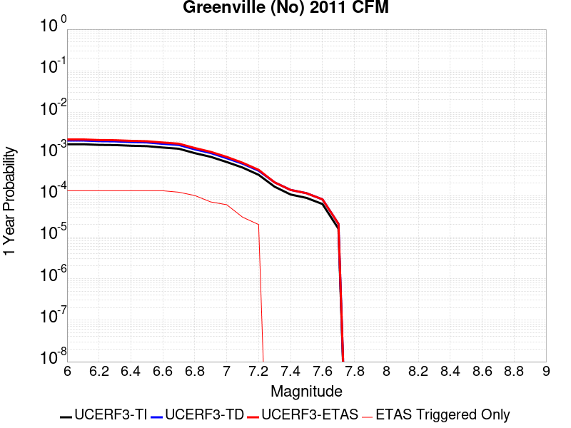 |  |

| Magnitude | 1 wk TI Prob | 1 wk TD Prob | 1 wk ETAS Prob | 1 wk ETAS/TD Gain | 1 wk ETAS Triggered Only | 1 mo TI Prob | 1 mo TD Prob | 1 mo ETAS Prob | 1 mo ETAS/TD Gain | 1 mo ETAS Triggered Only | 1 yr TI Prob | 1 yr TD Prob | 1 yr ETAS Prob | 1 yr ETAS/TD Gain | 1 yr ETAS Triggered Only | 10 yr TI Prob | 10 yr TD Prob | 10 yr ETAS Prob | 10 yr ETAS/TD Gain | 10 yr ETAS Triggered Only |
|-----|-----|-----|-----|-----|-----|-----|-----|-----|-----|-----|-----|-----|-----|-----|-----|-----|-----|-----|-----|-----|
| 6.0 | 3.286654E-5 | 4.0385894E-5 | 4.0385894E-5 | 1.0 | 0.0 | 1.4084899E-4 | 1.7307115E-4 | 1.9108604E-4 | 1.1040896 | 1.8018018E-5 | 0.0017134876 | 0.0021051443 | 0.002195045 | 1.042705 | 9.009009E-5 | 0.017003356 | 0.020856904 | 0.020962756 | 1.0050752 | 1.08108106E-4 |
| 6.1 | 3.286654E-5 | 4.0385894E-5 | 4.0385894E-5 | 1.0 | 0.0 | 1.4084899E-4 | 1.7307115E-4 | 1.9108604E-4 | 1.1040896 | 1.8018018E-5 | 0.0017134876 | 0.0021051443 | 0.002195045 | 1.042705 | 9.009009E-5 | 0.017003356 | 0.020856904 | 0.020962756 | 1.0050752 | 1.08108106E-4 |
| 6.2 | 3.1697953E-5 | 3.8948187E-5 | 3.8948187E-5 | 1.0 | 0.0 | 1.358413E-4 | 1.6691034E-4 | 1.8492535E-4 | 1.1079322 | 1.8018018E-5 | 0.0016526132 | 0.0020302776 | 0.0021201847 | 1.0442832 | 9.009009E-5 | 0.01640377 | 0.020121982 | 0.020227915 | 1.0052645 | 1.08108106E-4 |
| 6.3 | 3.1363317E-5 | 3.853688E-5 | 3.853688E-5 | 1.0 | 0.0 | 1.344073E-4 | 1.6514782E-4 | 1.8316286E-4 | 1.1090844 | 1.8018018E-5 | 0.0016351803 | 0.0020088586 | 0.0020987678 | 1.0447563 | 9.009009E-5 | 0.016232004 | 0.01991166 | 0.020017616 | 1.0053213 | 1.08108106E-4 |
| 6.4 | 3.0228604E-5 | 3.7143403E-5 | 3.7143403E-5 | 1.0 | 0.0 | 1.2954473E-4 | 1.5917652E-4 | 1.7719167E-4 | 1.1131772 | 1.8018018E-5 | 0.0015760659 | 0.0019362888 | 0.0020262045 | 1.0464371 | 9.009009E-5 | 0.015649348 | 0.019198699 | 0.01930473 | 1.0055228 | 1.08108106E-4 |
| 6.5 | 2.9537814E-5 | 3.6298497E-5 | 3.6298497E-5 | 1.0 | 0.0 | 1.2658449E-4 | 1.5555593E-4 | 1.7357114E-4 | 1.1158118 | 1.8018018E-5 | 0.0015400766 | 0.0018922853 | 0.0019822048 | 1.0475191 | 9.009009E-5 | 0.01529447 | 0.01876618 | 0.01887226 | 1.0056527 | 1.08108106E-4 |
| 6.6 | 2.7345395E-5 | 3.360665E-5 | 3.360665E-5 | 1.0 | 0.0 | 1.1718928E-4 | 1.4402073E-4 | 1.6203614E-4 | 1.125089 | 1.8018018E-5 | 0.0014258457 | 0.0017520733 | 0.0018420056 | 1.051329 | 9.009009E-5 | 0.014167317 | 0.017386416 | 0.017492644 | 1.0061098 | 1.08108106E-4 |
| 6.7 | 2.5615784E-5 | 3.1582884E-5 | 3.1582884E-5 | 1.0 | 0.0 | 1.09777306E-4 | 1.3534837E-4 | 1.5336394E-4 | 1.1331053 | 1.8018018E-5 | 0.0013357193 | 0.0016466515 | 0.0017186049 | 1.0436968 | 7.207207E-5 | 0.013277191 | 0.016348176 | 0.016436793 | 1.0054206 | 9.009009E-5 |
| 6.8 | 2.0059057E-5 | 2.4724775E-5 | 2.4724775E-5 | 1.0 | 0.0 | 8.596455E-5 | 1.0595911E-4 | 1.2397522E-4 | 1.1700289 | 1.8018018E-5 | 0.0010461159 | 0.001289305 | 0.0013252946 | 1.0279139 | 3.6036035E-5 | 0.0104120495 | 0.012820267 | 0.012873628 | 1.0041622 | 5.4054053E-5 |
| 6.9 | 1.6321746E-5 | 2.019551E-5 | 2.019551E-5 | 1.0 | 0.0 | 6.9948466E-5 | 8.6549386E-5 | 8.6549386E-5 | 1.0 | 0.0 | 8.5128983E-4 | 0.0010532418 | 0.0010712409 | 1.0170891 | 1.8018018E-5 | 0.008480361 | 0.01048403 | 0.010519687 | 1.0034012 | 3.6036035E-5 |
| 7.0 | 1.22527645E-5 | 1.5141323E-5 | 1.5141323E-5 | 1.0 | 0.0 | 5.2510793E-5 | 6.48898E-5 | 6.48898E-5 | 1.0 | 0.0 | 6.3913135E-4 | 7.897512E-4 | 8.07755E-4 | 1.0227968 | 1.8018018E-5 | 0.0063729626 | 0.007870084 | 0.0078879595 | 1.0022714 | 1.8018018E-5 |
| 7.1 | 8.996482E-6 | 1.1168475E-5 | 1.1168475E-5 | 1.0 | 0.0 | 3.8555783E-5 | 4.786402E-5 | 4.786402E-5 | 1.0 | 0.0 | 4.6931554E-4 | 5.825898E-4 | 5.825898E-4 | 1.0 | 0.0 | 0.004683256 | 0.0058109164 | 0.0058109164 | 1.0 | 0.0 |
| 7.2 | 6.0273087E-6 | 7.571823E-6 | 7.571823E-6 | 1.0 | 0.0 | 2.5831067E-5 | 3.245027E-5 | 3.245027E-5 | 1.0 | 0.0 | 3.1444785E-4 | 3.9501113E-4 | 3.9501113E-4 | 1.0 | 0.0 | 0.0031400328 | 0.0039432864 | 0.0039432864 | 1.0 | 0.0 |
| 7.3 | 3.1209995E-6 | 3.9680986E-6 | 3.9680986E-6 | 1.0 | 0.0 | 1.3375643E-5 | 1.7006027E-5 | 1.7006027E-5 | 1.0 | 0.0 | 1.6283628E-4 | 2.0702886E-4 | 2.0702886E-4 | 1.0 | 0.0 | 0.0016271701 | 0.00206845 | 0.00206845 | 1.0 | 0.0 |
| 7.4 | 2.0254208E-6 | 2.6111043E-6 | 2.6111043E-6 | 1.0 | 0.0 | 8.680347E-6 | 1.1190399E-5 | 1.1190399E-5 | 1.0 | 0.0 | 1.0567809E-4 | 1.3623465E-4 | 1.3623465E-4 | 1.0 | 0.0 | 0.0010562785 | 0.001361568 | 0.001361568 | 1.0 | 0.0 |
| 7.5 | 1.6763418E-6 | 2.1744677E-6 | 2.1744677E-6 | 1.0 | 0.0 | 7.184302E-6 | 9.319114E-6 | 9.319114E-6 | 1.0 | 0.0 | 8.746537E-5 | 1.1345436E-4 | 1.1345436E-4 | 1.0 | 0.0 | 8.743095E-4 | 0.0011340112 | 0.0011340112 | 1.0 | 0.0 |
| 7.6 | 1.1935462E-6 | 1.546878E-6 | 1.546878E-6 | 1.0 | 0.0 | 5.115188E-6 | 6.6294606E-6 | 6.6294606E-6 | 1.0 | 0.0 | 6.2275634E-5 | 8.071074E-5 | 8.071074E-5 | 1.0 | 0.0 | 6.2258187E-4 | 8.068449E-4 | 8.068449E-4 | 1.0 | 0.0 |
| 7.7 | 3.0464201E-7 | 3.9877884E-7 | 3.9877884E-7 | 1.0 | 0.0 | 1.3056081E-6 | 1.709051E-6 | 1.709051E-6 | 1.0 | 0.0 | 1.589566E-5 | 2.0807503E-5 | 2.0807503E-5 | 1.0 | 0.0 | 1.5894524E-4 | 2.0806021E-4 | 2.0806021E-4 | 1.0 | 0.0 |

## Mission (connected) 2011 CFM
*[(top)](#table-of-contents)*

| 1 Week | 1 Month | 1 Year | 10 Year |
|-----|-----|-----|-----|
|  |  | 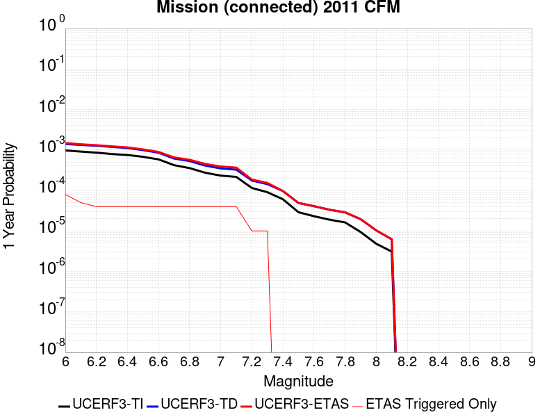 |  |

| Magnitude | 1 wk TI Prob | 1 wk TD Prob | 1 wk ETAS Prob | 1 wk ETAS/TD Gain | 1 wk ETAS Triggered Only | 1 mo TI Prob | 1 mo TD Prob | 1 mo ETAS Prob | 1 mo ETAS/TD Gain | 1 mo ETAS Triggered Only | 1 yr TI Prob | 1 yr TD Prob | 1 yr ETAS Prob | 1 yr ETAS/TD Gain | 1 yr ETAS Triggered Only | 10 yr TI Prob | 10 yr TD Prob | 10 yr ETAS Prob | 10 yr ETAS/TD Gain | 10 yr ETAS Triggered Only |
|-----|-----|-----|-----|-----|-----|-----|-----|-----|-----|-----|-----|-----|-----|-----|-----|-----|-----|-----|-----|-----|
| 6.0 | 1.8735573E-5 | 2.6919299E-5 | 6.2954365E-5 | 2.338633 | 3.6036035E-5 | 8.029284E-5 | 1.15363146E-4 | 1.6941097E-4 | 1.4685016 | 5.4054053E-5 | 9.771269E-4 | 0.0014036349 | 0.0014935986 | 1.0640934 | 9.009009E-5 | 0.009728416 | 0.013956046 | 0.014062645 | 1.0076382 | 1.08108106E-4 |
| 6.1 | 1.7515964E-5 | 2.5560277E-5 | 2.5560277E-5 | 1.0 | 0.0 | 7.506625E-5 | 1.09539265E-4 | 1.2755531E-4 | 1.1644711 | 1.8018018E-5 | 9.135484E-4 | 0.0013328177 | 0.0013688058 | 1.0270015 | 3.6036035E-5 | 0.009098019 | 0.013256509 | 0.013309847 | 1.0040236 | 5.4054053E-5 |
| 6.2 | 1.6486343E-5 | 2.4404653E-5 | 2.4404653E-5 | 1.0 | 0.0 | 7.065384E-5 | 1.0458707E-4 | 1.226032E-4 | 1.1722597 | 1.8018018E-5 | 8.5987104E-4 | 0.0012725982 | 0.0013085884 | 1.0282809 | 3.6036035E-5 | 0.008565514 | 0.012661357 | 0.012714727 | 1.0042151 | 5.4054053E-5 |
| 6.3 | 1.5229385E-5 | 2.283323E-5 | 2.283323E-5 | 1.0 | 0.0 | 6.526716E-5 | 9.785291E-5 | 1.1586917E-4 | 1.1841156 | 1.8018018E-5 | 7.9433795E-4 | 0.0011907034 | 0.0012266965 | 1.0302285 | 3.6036035E-5 | 0.007915046 | 0.01185415 | 0.011907564 | 1.0045059 | 5.4054053E-5 |
| 6.4 | 1.4435828E-5 | 2.1432059E-5 | 2.1432059E-5 | 1.0 | 0.0 | 6.186637E-5 | 9.184833E-5 | 1.0986469E-4 | 1.1961534 | 1.8018018E-5 | 7.529627E-4 | 0.0011176757 | 0.0011536714 | 1.0322059 | 3.6036035E-5 | 0.007504165 | 0.011136543 | 0.011189994 | 1.0047997 | 5.4054053E-5 |
| 6.5 | 1.30127955E-5 | 1.9068159E-5 | 1.9068159E-5 | 1.0 | 0.0 | 5.576793E-5 | 8.1718084E-5 | 9.973463E-5 | 1.220472 | 1.8018018E-5 | 6.78763E-4 | 9.944608E-4 | 0.0010304609 | 1.0362008 | 3.6036035E-5 | 0.0067669353 | 0.009927544 | 0.009981061 | 1.0053908 | 5.4054053E-5 |
| 6.6 | 1.1220718E-5 | 1.6423419E-5 | 1.6423419E-5 | 1.0 | 0.0 | 4.8087906E-5 | 7.0384194E-5 | 8.840095E-5 | 1.2559772 | 1.8018018E-5 | 5.8531296E-4 | 8.5658836E-4 | 8.925935E-4 | 1.0420332 | 3.6036035E-5 | 0.005837737 | 0.008564659 | 0.0086182505 | 1.0062573 | 5.4054053E-5 |
| 6.7 | 8.086152E-6 | 1.1775521E-5 | 1.1775521E-5 | 1.0 | 0.0 | 3.4654473E-5 | 5.0465544E-5 | 6.848265E-5 | 1.357018 | 1.8018018E-5 | 4.2183654E-4 | 6.142456E-4 | 6.502595E-4 | 1.0586311 | 3.6036035E-5 | 0.004210367 | 0.0061624083 | 0.006216129 | 1.0087175 | 5.4054053E-5 |
| 6.8 | 6.8361655E-6 | 1.0218049E-5 | 1.0218049E-5 | 1.0 | 0.0 | 2.9297524E-5 | 4.3790908E-5 | 6.180814E-5 | 1.4114376 | 1.8018018E-5 | 3.5663895E-4 | 5.330245E-4 | 5.6904135E-4 | 1.0675707 | 3.6036035E-5 | 0.0035606713 | 0.005350081 | 0.0054038456 | 1.0100493 | 5.4054053E-5 |
| 6.9 | 5.2517353E-6 | 7.888038E-6 | 7.888038E-6 | 1.0 | 0.0 | 2.2507242E-5 | 3.3805445E-5 | 5.182285E-5 | 1.5329736 | 1.8018018E-5 | 2.739912E-4 | 4.115038E-4 | 4.47525E-4 | 1.0875355 | 3.6036035E-5 | 0.0027365363 | 0.0041393843 | 0.0041932147 | 1.0130044 | 5.4054053E-5 |
| 7.0 | 4.4602784E-6 | 6.718898E-6 | 6.718898E-6 | 1.0 | 0.0 | 1.911534E-5 | 2.879496E-5 | 4.681246E-5 | 1.6257172 | 1.8018018E-5 | 2.327044E-4 | 3.505224E-4 | 3.865458E-4 | 1.1027706 | 3.6036035E-5 | 0.0023246086 | 0.0035308576 | 0.0035667664 | 1.01017 | 3.6036035E-5 |
| 7.1 | 4.1492594E-6 | 6.2665754E-6 | 6.2665754E-6 | 1.0 | 0.0 | 1.7782419E-5 | 2.6856475E-5 | 4.487401E-5 | 1.6708823 | 1.8018018E-5 | 2.1647944E-4 | 3.2692868E-4 | 3.6295294E-4 | 1.1101899 | 3.6036035E-5 | 0.0021626868 | 0.003295128 | 0.0033310452 | 1.0109001 | 3.6036035E-5 |
| 7.2 | 2.213247E-6 | 3.3735946E-6 | 3.3735946E-6 | 1.0 | 0.0 | 9.485309E-6 | 1.4458183E-5 | 3.247594E-5 | 2.246198 | 1.8018018E-5 | 1.15477524E-4 | 1.7601419E-4 | 1.9402904E-4 | 1.1023488 | 1.8018018E-5 | 0.0011541754 | 0.0017872518 | 0.0018052376 | 1.0100634 | 1.8018018E-5 |
| 7.3 | 1.7362703E-6 | 2.747984E-6 | 2.747984E-6 | 1.0 | 0.0 | 7.4411373E-6 | 1.17770205E-5 | 2.9794826E-5 | 2.529912 | 1.8018018E-5 | 9.0592075E-5 | 1.4337582E-4 | 1.6139125E-4 | 1.1256518 | 1.8018018E-5 | 9.0555154E-4 | 0.0014580032 | 0.0014759949 | 1.01234 | 1.8018018E-5 |
| 7.4 | 1.1628409E-6 | 1.8571193E-6 | 1.8571193E-6 | 1.0 | 0.0 | 4.9835944E-6 | 7.959058E-6 | 7.959058E-6 | 1.0 | 0.0 | 6.0673574E-5 | 9.689724E-5 | 9.689724E-5 | 1.0 | 0.0 | 6.065701E-4 | 9.892007E-4 | 9.892007E-4 | 1.0 | 0.0 |
| 7.5 | 5.5610667E-7 | 9.4032964E-7 | 9.4032964E-7 | 1.0 | 0.0 | 2.3833122E-6 | 4.029978E-6 | 4.029978E-6 | 1.0 | 0.0 | 2.9016439E-5 | 4.906388E-5 | 4.906388E-5 | 1.0 | 0.0 | 2.901265E-4 | 5.0707476E-4 | 5.0707476E-4 | 1.0 | 0.0 |
| 7.6 | 4.4307663E-7 | 7.8414774E-7 | 7.8414774E-7 | 1.0 | 0.0 | 1.8988985E-6 | 3.3606289E-6 | 3.3606289E-6 | 1.0 | 0.0 | 2.3118844E-5 | 4.0914892E-5 | 4.0914892E-5 | 1.0 | 0.0 | 2.3116439E-4 | 4.2493502E-4 | 4.2493502E-4 | 1.0 | 0.0 |
| 7.7 | 3.639119E-7 | 6.405925E-7 | 6.405925E-7 | 1.0 | 0.0 | 1.5596215E-6 | 2.7453934E-6 | 2.7453934E-6 | 1.0 | 0.0 | 1.8988227E-5 | 3.3424654E-5 | 3.3424654E-5 | 1.0 | 0.0 | 1.8986604E-4 | 3.4944323E-4 | 3.4944323E-4 | 1.0 | 0.0 |
| 7.8 | 3.1152942E-7 | 5.51793E-7 | 5.51793E-7 | 1.0 | 0.0 | 1.3351254E-6 | 2.364825E-6 | 2.364825E-6 | 1.0 | 0.0 | 1.6255031E-5 | 2.8791364E-5 | 2.8791364E-5 | 1.0 | 0.0 | 1.6253842E-4 | 2.9985773E-4 | 2.9985773E-4 | 1.0 | 0.0 |
| 7.9 | 1.8035962E-7 | 3.7451431E-7 | 3.7451431E-7 | 1.0 | 0.0 | 7.729696E-7 | 1.6050603E-6 | 1.6050603E-6 | 1.0 | 0.0 | 9.410865E-6 | 1.9541436E-5 | 1.9541436E-5 | 1.0 | 0.0 | 9.410465E-5 | 2.0201689E-4 | 2.0201689E-4 | 1.0 | 0.0 |
| 8.0 | 9.279334E-8 | 1.9824984E-7 | 1.9824984E-7 | 1.0 | 0.0 | 3.976857E-7 | 8.496418E-7 | 8.496418E-7 | 1.0 | 0.0 | 4.841813E-6 | 1.0344341E-5 | 1.0344341E-5 | 1.0 | 0.0 | 4.841707E-5 | 1.05925465E-4 | 1.05925465E-4 | 1.0 | 0.0 |
| 8.1 | 5.9253985E-8 | 1.1925192E-7 | 1.1925192E-7 | 1.0 | 0.0 | 2.5394561E-7 | 5.110796E-7 | 5.110796E-7 | 1.0 | 0.0 | 3.0917836E-6 | 6.222376E-6 | 6.222376E-6 | 1.0 | 0.0 | 3.0917407E-5 | 6.359083E-5 | 6.359083E-5 | 1.0 | 0.0 |

## Great Valley 09 (Laguna Seca)
*[(top)](#table-of-contents)*

| 1 Week | 1 Month | 1 Year | 10 Year |
|-----|-----|-----|-----|
|  |  |  |  |

| Magnitude | 1 wk TI Prob | 1 wk TD Prob | 1 wk ETAS Prob | 1 wk ETAS/TD Gain | 1 wk ETAS Triggered Only | 1 mo TI Prob | 1 mo TD Prob | 1 mo ETAS Prob | 1 mo ETAS/TD Gain | 1 mo ETAS Triggered Only | 1 yr TI Prob | 1 yr TD Prob | 1 yr ETAS Prob | 1 yr ETAS/TD Gain | 1 yr ETAS Triggered Only | 10 yr TI Prob | 10 yr TD Prob | 10 yr ETAS Prob | 10 yr ETAS/TD Gain | 10 yr ETAS Triggered Only |
|-----|-----|-----|-----|-----|-----|-----|-----|-----|-----|-----|-----|-----|-----|-----|-----|-----|-----|-----|-----|-----|
| 6.0 | 5.4353277E-5 | 7.054649E-5 | 1.0657999E-4 | 1.5107765 | 3.6036035E-5 | 2.3292181E-4 | 3.0230923E-4 | 3.3833436E-4 | 1.1191665 | 3.6036035E-5 | 0.0028321352 | 0.0036742734 | 0.0037640324 | 1.0244291 | 9.009009E-5 | 0.02796312 | 0.036136415 | 0.036240615 | 1.0028836 | 1.08108106E-4 |
| 6.1 | 4.5578287E-5 | 5.825583E-5 | 7.62728E-5 | 1.3092732 | 1.8018018E-5 | 1.953209E-4 | 2.4964547E-4 | 2.6765896E-4 | 1.0721564 | 1.8018018E-5 | 0.0023754383 | 0.0030351633 | 0.0030890533 | 1.0177553 | 5.4054053E-5 | 0.023502063 | 0.029936384 | 0.030006299 | 1.0023354 | 7.207207E-5 |
| 6.2 | 2.8536782E-5 | 3.4754397E-5 | 3.4754397E-5 | 1.0 | 0.0 | 1.2229476E-4 | 1.4893933E-4 | 1.4893933E-4 | 1.0 | 0.0 | 0.0014879217 | 0.0018117635 | 0.0018297489 | 1.009927 | 1.8018018E-5 | 0.014779986 | 0.017967276 | 0.018002665 | 1.0019696 | 3.6036035E-5 |
| 6.3 | 2.3698774E-5 | 2.8225932E-5 | 2.8225932E-5 | 1.0 | 0.0 | 1.01562226E-4 | 1.20962955E-4 | 1.20962955E-4 | 1.0 | 0.0 | 0.0012358186 | 0.0014717847 | 0.0014897762 | 1.0122243 | 1.8018018E-5 | 0.012289686 | 0.014618459 | 0.014653969 | 1.0024291 | 3.6036035E-5 |
| 6.4 | 1.9191197E-5 | 2.2131611E-5 | 2.2131611E-5 | 1.0 | 0.0 | 8.2245395E-5 | 9.484656E-5 | 9.484656E-5 | 1.0 | 0.0 | 0.0010008777 | 0.001154188 | 0.001154188 | 1.0 | 0.0 | 0.009963818 | 0.011482145 | 0.011482145 | 1.0 | 0.0 |
| 6.5 | 1.5203241E-5 | 1.6807138E-5 | 1.6807138E-5 | 1.0 | 0.0 | 6.5155116E-5 | 7.2028786E-5 | 7.2028786E-5 | 1.0 | 0.0 | 7.9297484E-4 | 8.766296E-4 | 8.766296E-4 | 1.0 | 0.0 | 0.007901512 | 0.008733063 | 0.008733063 | 1.0 | 0.0 |
| 6.6 | 1.0984925E-5 | 1.1246176E-5 | 1.1246176E-5 | 1.0 | 0.0 | 4.70774E-5 | 4.8197027E-5 | 4.8197027E-5 | 1.0 | 0.0 | 5.730166E-4 | 5.866449E-4 | 5.866449E-4 | 1.0 | 0.0 | 0.005715413 | 0.0058513596 | 0.0058513596 | 1.0 | 0.0 |
| 6.7 | 9.134616E-6 | 9.022645E-6 | 9.022645E-6 | 1.0 | 0.0 | 3.9147766E-5 | 3.866792E-5 | 3.866792E-5 | 1.0 | 0.0 | 4.7651984E-4 | 4.706826E-4 | 4.706826E-4 | 1.0 | 0.0 | 0.004754993 | 0.004697102 | 0.004697102 | 1.0 | 0.0 |
| 6.8 | 7.785589E-6 | 7.4542045E-6 | 7.4542045E-6 | 1.0 | 0.0 | 3.3366385E-5 | 3.1946212E-5 | 3.1946212E-5 | 1.0 | 0.0 | 4.0616E-4 | 3.8887773E-4 | 3.8887773E-4 | 1.0 | 0.0 | 0.0040541845 | 0.0038821765 | 0.0038821765 | 1.0 | 0.0 |
| 6.9 | 5.579095E-6 | 4.899978E-6 | 4.899978E-6 | 1.0 | 0.0 | 2.3910188E-5 | 2.0999747E-5 | 2.0999747E-5 | 1.0 | 0.0 | 2.9106764E-4 | 2.556433E-4 | 2.556433E-4 | 1.0 | 0.0 | 0.002906867 | 0.0025536297 | 0.0025536297 | 1.0 | 0.0 |
| 7.0 | 2.6816688E-6 | 1.5220202E-6 | 1.5220202E-6 | 1.0 | 0.0 | 1.1492816E-5 | 6.522928E-6 | 6.522928E-6 | 1.0 | 0.0 | 1.3991605E-4 | 7.941384E-5 | 7.941384E-5 | 1.0 | 0.0 | 0.0013982799 | 7.938633E-4 | 7.938633E-4 | 1.0 | 0.0 |
| 7.1 | 1.9951021E-6 | 7.455947E-7 | 7.455947E-7 | 1.0 | 0.0 | 8.55041E-6 | 3.1954023E-6 | 3.1954023E-6 | 1.0 | 0.0 | 1.0409627E-4 | 3.890337E-5 | 3.890337E-5 | 1.0 | 0.0 | 0.0010404752 | 3.8896973E-4 | 3.8896973E-4 | 1.0 | 0.0 |
| 7.2 | 1.9951021E-6 | 7.455947E-7 | 7.455947E-7 | 1.0 | 0.0 | 8.55041E-6 | 3.1954023E-6 | 3.1954023E-6 | 1.0 | 0.0 | 1.0409627E-4 | 3.890337E-5 | 3.890337E-5 | 1.0 | 0.0 | 0.0010404752 | 3.8896973E-4 | 3.8896973E-4 | 1.0 | 0.0 |
| 7.3 | 1.7087556E-6 | 6.5806523E-7 | 6.5806523E-7 | 1.0 | 0.0 | 7.3232177E-6 | 2.8202767E-6 | 2.8202767E-6 | 1.0 | 0.0 | 8.915652E-5 | 3.4336368E-5 | 3.4336368E-5 | 1.0 | 0.0 | 8.9120766E-4 | 3.433147E-4 | 3.433147E-4 | 1.0 | 0.0 |
| 7.4 | 1.3804846E-6 | 6.0753155E-7 | 6.0753155E-7 | 1.0 | 0.0 | 5.916349E-6 | 2.6037042E-6 | 2.6037042E-6 | 1.0 | 0.0 | 7.2029165E-5 | 3.1699677E-5 | 3.1699677E-5 | 1.0 | 0.0 | 7.200583E-4 | 3.169556E-4 | 3.169556E-4 | 1.0 | 0.0 |
| 7.5 | 1.3804846E-6 | 6.0753155E-7 | 6.0753155E-7 | 1.0 | 0.0 | 5.916349E-6 | 2.6037042E-6 | 2.6037042E-6 | 1.0 | 0.0 | 7.2029165E-5 | 3.1699677E-5 | 3.1699677E-5 | 1.0 | 0.0 | 7.200583E-4 | 3.169556E-4 | 3.169556E-4 | 1.0 | 0.0 |

## Rodgers Creek - Healdsburg 2011 CFM
*[(top)](#table-of-contents)*

| 1 Week | 1 Month | 1 Year | 10 Year |
|-----|-----|-----|-----|
|  | 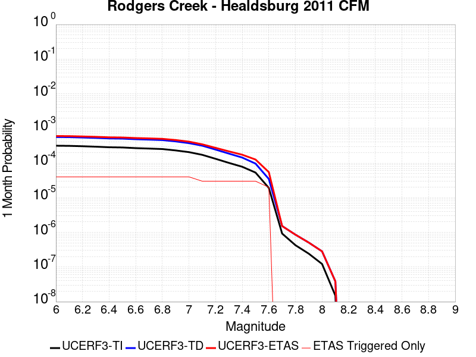 |  |  |

| Magnitude | 1 wk TI Prob | 1 wk TD Prob | 1 wk ETAS Prob | 1 wk ETAS/TD Gain | 1 wk ETAS Triggered Only | 1 mo TI Prob | 1 mo TD Prob | 1 mo ETAS Prob | 1 mo ETAS/TD Gain | 1 mo ETAS Triggered Only | 1 yr TI Prob | 1 yr TD Prob | 1 yr ETAS Prob | 1 yr ETAS/TD Gain | 1 yr ETAS Triggered Only | 10 yr TI Prob | 10 yr TD Prob | 10 yr ETAS Prob | 10 yr ETAS/TD Gain | 10 yr ETAS Triggered Only |
|-----|-----|-----|-----|-----|-----|-----|-----|-----|-----|-----|-----|-----|-----|-----|-----|-----|-----|-----|-----|-----|
| 6.0 | 7.390182E-5 | 1.3156519E-4 | 1.6759649E-4 | 1.2738664 | 3.6036035E-5 | 3.1668364E-4 | 5.6372944E-4 | 5.997452E-4 | 1.0638883 | 3.6036035E-5 | 0.0038488081 | 0.006841826 | 0.00689551 | 1.0078465 | 5.4054053E-5 | 0.037828278 | 0.06628447 | 0.06636859 | 1.0012691 | 9.009009E-5 |
| 6.1 | 7.318768E-5 | 1.3054513E-4 | 1.6657647E-4 | 1.2760067 | 3.6036035E-5 | 3.1362378E-4 | 5.593597E-4 | 5.9537555E-4 | 1.0643877 | 3.6036035E-5 | 0.0038116854 | 0.006788957 | 0.006842644 | 1.007908 | 5.4054053E-5 | 0.037469655 | 0.0657888 | 0.06587296 | 1.0012792 | 9.009009E-5 |
| 6.2 | 7.1379836E-5 | 1.2747211E-4 | 1.6350356E-4 | 1.2826613 | 3.6036035E-5 | 3.058777E-4 | 5.4619514E-4 | 5.8221153E-4 | 1.0659405 | 3.6036035E-5 | 0.003717703 | 0.006629664 | 0.00668336 | 1.0080993 | 5.4054053E-5 | 0.0365612 | 0.06430634 | 0.06439064 | 1.0013108 | 9.009009E-5 |
| 6.3 | 6.9255926E-5 | 1.2401471E-4 | 1.6004629E-4 | 1.2905427 | 3.6036035E-5 | 2.9677735E-4 | 5.313838E-4 | 5.674007E-4 | 1.0677794 | 3.6036035E-5 | 0.0036072785 | 0.006450422 | 0.0065041278 | 1.0083258 | 5.4054053E-5 | 0.035492823 | 0.06263191 | 0.06271636 | 1.0013483 | 9.009009E-5 |
| 6.4 | 6.6757144E-5 | 1.1977896E-4 | 1.5581069E-4 | 1.3008184 | 3.6036035E-5 | 2.8607066E-4 | 5.1323784E-4 | 5.492554E-4 | 1.0701771 | 3.6036035E-5 | 0.0034773487 | 0.0062308456 | 0.006284563 | 1.0086212 | 5.4054053E-5 | 0.034234364 | 0.06058036 | 0.060664997 | 1.001397 | 9.009009E-5 |
| 6.5 | 6.5735134E-5 | 1.1826892E-4 | 1.543007E-4 | 1.3046597 | 3.6036035E-5 | 2.8169158E-4 | 5.0676876E-4 | 5.4278655E-4 | 1.0710734 | 3.6036035E-5 | 0.003424202 | 0.0061525395 | 0.006206261 | 1.0087316 | 5.4054053E-5 | 0.03371918 | 0.059843887 | 0.059928585 | 1.0014154 | 9.009009E-5 |
| 6.6 | 6.289601E-5 | 1.13620714E-4 | 1.4965265E-4 | 1.3171247 | 3.6036035E-5 | 2.6952647E-4 | 4.8685542E-4 | 5.228739E-4 | 1.0739819 | 3.6036035E-5 | 0.0032765474 | 0.0059114345 | 0.005965169 | 1.00909 | 5.4054053E-5 | 0.032286562 | 0.057580784 | 0.057665687 | 1.0014745 | 9.009009E-5 |
| 6.7 | 6.115274E-5 | 1.107893E-4 | 1.4682134E-4 | 1.3252304 | 3.6036035E-5 | 2.6205686E-4 | 4.7472524E-4 | 5.1074417E-4 | 1.0758733 | 3.6036035E-5 | 0.0031858748 | 0.0057645417 | 0.005818284 | 1.0093229 | 5.4054053E-5 | 0.031405866 | 0.05619833 | 0.05628336 | 1.001513 | 9.009009E-5 |
| 6.8 | 5.9232367E-5 | 1.0746109E-4 | 1.4349326E-4 | 1.3353043 | 3.6036035E-5 | 2.538283E-4 | 4.6046663E-4 | 4.964861E-4 | 1.0782238 | 3.6036035E-5 | 0.0030859804 | 0.005591847 | 0.0056455988 | 1.0096126 | 5.4054053E-5 | 0.030434765 | 0.05456444 | 0.05464961 | 1.001561 | 9.009009E-5 |
| 6.9 | 5.4030377E-5 | 9.839897E-5 | 1.3443145E-4 | 1.3661877 | 3.6036035E-5 | 2.315382E-4 | 4.2164203E-4 | 4.5766286E-4 | 1.0854299 | 3.6036035E-5 | 0.0028153337 | 0.0051214746 | 0.0051573263 | 1.0070002 | 3.6036035E-5 | 0.027799325 | 0.050098296 | 0.050166756 | 1.0013665 | 7.207207E-5 |
| 7.0 | 4.8260714E-5 | 8.756719E-5 | 1.2360007E-4 | 1.4114884 | 3.6036035E-5 | 2.0681522E-4 | 3.7523426E-4 | 4.112568E-4 | 1.0960001 | 3.6036035E-5 | 0.0025150678 | 0.004558962 | 0.0045948336 | 1.0078684 | 3.6036035E-5 | 0.024867928 | 0.04474531 | 0.04481416 | 1.0015386 | 7.207207E-5 |
| 7.1 | 4.0294493E-5 | 7.4040654E-5 | 9.2057344E-5 | 1.243335 | 1.8018018E-5 | 1.7267925E-4 | 3.1727873E-4 | 3.3529103E-4 | 1.0567713 | 1.8018018E-5 | 0.0021003427 | 0.0038560645 | 0.003874013 | 1.0046546 | 1.8018018E-5 | 0.02080602 | 0.0379959 | 0.038047902 | 1.0013685 | 5.4054053E-5 |
| 7.2 | 3.096388E-5 | 5.7112917E-5 | 7.512991E-5 | 1.3154626 | 1.8018018E-5 | 1.326956E-4 | 2.447468E-4 | 2.627604E-4 | 1.073601 | 1.8018018E-5 | 0.0016143717 | 0.0029757428 | 0.002993707 | 1.006037 | 1.8018018E-5 | 0.01602694 | 0.029502932 | 0.029555392 | 1.0017781 | 5.4054053E-5 |
| 7.3 | 2.3615226E-5 | 4.3743075E-5 | 6.176031E-5 | 1.4118876 | 1.8018018E-5 | 1.0120418E-4 | 1.8745693E-4 | 2.0547157E-4 | 1.0961002 | 1.8018018E-5 | 0.0012314644 | 0.002279913 | 0.00229789 | 1.007885 | 1.8018018E-5 | 0.0122466255 | 0.022693316 | 0.022746142 | 1.0023279 | 5.4054053E-5 |
| 7.4 | 1.8251132E-5 | 3.363491E-5 | 5.165232E-5 | 1.5356759 | 1.8018018E-5 | 7.821679E-5 | 1.4414171E-4 | 1.6215713E-4 | 1.1249841 | 1.8018018E-5 | 9.518733E-4 | 0.0017535225 | 0.001771509 | 1.0102574 | 1.8018018E-5 | 0.009478063 | 0.017511668 | 0.017564775 | 1.0030327 | 5.4054053E-5 |
| 7.5 | 1.2411432E-5 | 2.2530934E-5 | 4.0548544E-5 | 1.7996833 | 1.8018018E-5 | 5.3190768E-5 | 9.6557604E-5 | 1.1457388E-4 | 1.1865858 | 1.8018018E-5 | 6.4740516E-4 | 0.0011749606 | 0.0011929575 | 1.015317 | 1.8018018E-5 | 0.006455223 | 0.011778384 | 0.011813996 | 1.0030235 | 3.6036035E-5 |
| 7.6 | 4.4771446E-6 | 8.110867E-6 | 2.6128739E-5 | 3.2214484 | 1.8018018E-5 | 1.918762E-5 | 3.4760404E-5 | 5.2777796E-5 | 1.5183309 | 1.8018018E-5 | 2.3358424E-4 | 4.2312694E-4 | 4.4113735E-4 | 1.042565 | 1.8018018E-5 | 0.0023333887 | 0.0042594117 | 0.0042773527 | 1.0042121 | 1.8018018E-5 |
| 7.7 | 2.157941E-7 | 3.552437E-7 | 3.552437E-7 | 1.0 | 0.0 | 9.248315E-7 | 1.5224721E-6 | 1.5224721E-6 | 1.0 | 0.0 | 1.1259765E-5 | 1.853594E-5 | 1.853594E-5 | 1.0 | 0.0 | 1.1259195E-4 | 1.9155742E-4 | 1.9155742E-4 | 1.0 | 0.0 |
| 7.8 | 9.9623286E-8 | 2.0033474E-7 | 2.0033474E-7 | 1.0 | 0.0 | 4.269569E-7 | 8.5857715E-7 | 8.5857715E-7 | 1.0 | 0.0 | 5.1981874E-6 | 1.0453127E-5 | 1.0453127E-5 | 1.0 | 0.0 | 5.198066E-5 | 1.09674125E-4 | 1.09674125E-4 | 1.0 | 0.0 |
| 7.9 | 5.6745257E-8 | 1.185751E-7 | 1.185751E-7 | 1.0 | 0.0 | 2.4319394E-7 | 5.0817886E-7 | 5.0817886E-7 | 1.0 | 0.0 | 2.960882E-6 | 6.1870605E-6 | 6.1870605E-6 | 1.0 | 0.0 | 2.9608427E-5 | 6.511706E-5 | 6.511706E-5 | 1.0 | 0.0 |
| 8.0 | 2.8614323E-8 | 6.623447E-8 | 6.623447E-8 | 1.0 | 0.0 | 1.2263281E-7 | 2.83862E-7 | 2.83862E-7 | 1.0 | 0.0 | 1.4930534E-6 | 3.4560144E-6 | 3.4560144E-6 | 1.0 | 0.0 | 1.4930434E-5 | 3.6041773E-5 | 3.6041773E-5 | 1.0 | 0.0 |
| 8.1 | 3.5045191E-9 | 9.022612E-9 | 9.022612E-9 | 1.0 | 0.0 | 1.5019367E-8 | 3.866834E-8 | 3.866834E-8 | 1.0 | 0.0 | 1.8286079E-7 | 4.7078692E-7 | 4.7078692E-7 | 1.0 | 0.0 | 1.8286064E-6 | 4.8596467E-6 | 4.8596467E-6 | 1.0 | 0.0 |

## San Andreas (Peninsula) 2011 CFM
*[(top)](#table-of-contents)*

| 1 Week | 1 Month | 1 Year | 10 Year |
|-----|-----|-----|-----|
|  |  |  |  |

| Magnitude | 1 wk TI Prob | 1 wk TD Prob | 1 wk ETAS Prob | 1 wk ETAS/TD Gain | 1 wk ETAS Triggered Only | 1 mo TI Prob | 1 mo TD Prob | 1 mo ETAS Prob | 1 mo ETAS/TD Gain | 1 mo ETAS Triggered Only | 1 yr TI Prob | 1 yr TD Prob | 1 yr ETAS Prob | 1 yr ETAS/TD Gain | 1 yr ETAS Triggered Only | 10 yr TI Prob | 10 yr TD Prob | 10 yr ETAS Prob | 10 yr ETAS/TD Gain | 10 yr ETAS Triggered Only |
|-----|-----|-----|-----|-----|-----|-----|-----|-----|-----|-----|-----|-----|-----|-----|-----|-----|-----|-----|-----|-----|
| 6.0 | 8.6200685E-5 | 2.5582378E-5 | 4.3599935E-5 | 1.7042956 | 1.8018018E-5 | 3.6937918E-4 | 1.0963416E-4 | 1.4566624E-4 | 1.3286575 | 3.6036035E-5 | 0.0044879215 | 0.0013339802 | 0.0013879623 | 1.0404668 | 5.4054053E-5 | 0.043983612 | 0.014975359 | 0.0150641 | 1.0059258 | 9.009009E-5 |
| 6.1 | 8.6200685E-5 | 2.5582378E-5 | 4.3599935E-5 | 1.7042956 | 1.8018018E-5 | 3.6937918E-4 | 1.0963416E-4 | 1.4566624E-4 | 1.3286575 | 3.6036035E-5 | 0.0044879215 | 0.0013339802 | 0.0013879623 | 1.0404668 | 5.4054053E-5 | 0.043983612 | 0.014975359 | 0.0150641 | 1.0059258 | 9.009009E-5 |
| 6.2 | 8.6200685E-5 | 2.5582378E-5 | 4.3599935E-5 | 1.7042956 | 1.8018018E-5 | 3.6937918E-4 | 1.0963416E-4 | 1.4566624E-4 | 1.3286575 | 3.6036035E-5 | 0.0044879215 | 0.0013339802 | 0.0013879623 | 1.0404668 | 5.4054053E-5 | 0.043983612 | 0.014975359 | 0.0150641 | 1.0059258 | 9.009009E-5 |
| 6.3 | 8.551163E-5 | 2.5271886E-5 | 4.328945E-5 | 1.7129489 | 1.8018018E-5 | 3.6642692E-4 | 1.0830359E-4 | 1.4433572E-4 | 1.3326956 | 3.6036035E-5 | 0.004452125 | 0.0013178003 | 0.0013717831 | 1.0409644 | 5.4054053E-5 | 0.043639794 | 0.014801145 | 0.0148899015 | 1.0059966 | 9.009009E-5 |
| 6.4 | 8.551163E-5 | 2.5271886E-5 | 4.328945E-5 | 1.7129489 | 1.8018018E-5 | 3.6642692E-4 | 1.0830359E-4 | 1.4433572E-4 | 1.3326956 | 3.6036035E-5 | 0.004452125 | 0.0013178003 | 0.0013717831 | 1.0409644 | 5.4054053E-5 | 0.043639794 | 0.014801145 | 0.0148899015 | 1.0059966 | 9.009009E-5 |
| 6.5 | 8.511146E-5 | 2.5091947E-5 | 4.3109514E-5 | 1.7180617 | 1.8018018E-5 | 3.647124E-4 | 1.0753249E-4 | 1.4356466E-4 | 1.3350816 | 3.6036035E-5 | 0.004431336 | 0.0013084235 | 0.0013624068 | 1.0412583 | 5.4054053E-5 | 0.04344007 | 0.014700223 | 0.014788989 | 1.0060384 | 9.009009E-5 |
| 6.6 | 8.4985084E-5 | 2.5022164E-5 | 4.303973E-5 | 1.7200643 | 1.8018018E-5 | 3.6417096E-4 | 1.0723344E-4 | 1.4326561E-4 | 1.3360162 | 3.6036035E-5 | 0.0044247704 | 0.0013047869 | 0.0013587704 | 1.0413735 | 5.4054053E-5 | 0.043376986 | 0.014662078 | 0.014750847 | 1.0060543 | 9.009009E-5 |
| 6.7 | 8.462618E-5 | 2.484947E-5 | 4.286704E-5 | 1.7250686 | 1.8018018E-5 | 3.6263323E-4 | 1.0649339E-4 | 1.4252559E-4 | 1.3383515 | 3.6036035E-5 | 0.004406125 | 0.0012957875 | 0.0013497715 | 1.0416611 | 5.4054053E-5 | 0.043197807 | 0.014566284 | 0.014655062 | 1.0060947 | 9.009009E-5 |
| 6.8 | 8.42337E-5 | 2.4744324E-5 | 4.2761898E-5 | 1.7281497 | 1.8018018E-5 | 3.6095164E-4 | 1.06042804E-4 | 1.4207502E-4 | 1.3397894 | 3.6036035E-5 | 0.004385734 | 0.0012903081 | 0.0013442924 | 1.0418383 | 5.4054053E-5 | 0.043001823 | 0.014506465 | 0.014595248 | 1.0061202 | 9.009009E-5 |
| 6.9 | 8.365989E-5 | 2.4547677E-5 | 4.256525E-5 | 1.7339829 | 1.8018018E-5 | 3.5849313E-4 | 1.05200095E-4 | 1.4123233E-4 | 1.3425115 | 3.6036035E-5 | 0.004355922 | 0.0012800603 | 0.0013340451 | 1.0421737 | 5.4054053E-5 | 0.04271523 | 0.0143982805 | 0.014487074 | 1.0061669 | 9.009009E-5 |
| 7.0 | 8.30936E-5 | 2.430799E-5 | 4.232557E-5 | 1.7412205 | 1.8018018E-5 | 3.560668E-4 | 1.0417295E-4 | 1.4020523E-4 | 1.3458891 | 3.6036035E-5 | 0.004326499 | 0.0012675694 | 0.0013215549 | 1.0425898 | 5.4054053E-5 | 0.042432297 | 0.014268656 | 0.014357462 | 1.0062238 | 9.009009E-5 |
| 7.1 | 8.041264E-5 | 2.3991543E-5 | 4.2009127E-5 | 1.7509973 | 1.8018018E-5 | 3.4458007E-4 | 1.02816855E-4 | 1.3884918E-4 | 1.3504516 | 3.6036035E-5 | 0.0041871946 | 0.001251078 | 0.0013050644 | 1.043152 | 5.4054053E-5 | 0.041091725 | 0.014089807 | 0.014178628 | 1.0063039 | 9.009009E-5 |
| 7.2 | 7.8427016E-5 | 2.3411747E-5 | 4.1429343E-5 | 1.7695965 | 1.8018018E-5 | 3.3607247E-4 | 1.003322E-4 | 1.3636463E-4 | 1.3591311 | 3.6036035E-5 | 0.004084008 | 0.0012208617 | 0.0012748498 | 1.0442213 | 5.4054053E-5 | 0.040097635 | 0.013771977 | 0.013860826 | 1.0064515 | 9.009009E-5 |
| 7.3 | 7.721087E-5 | 2.3195384E-5 | 4.1212985E-5 | 1.7767752 | 1.8018018E-5 | 3.3086175E-4 | 9.940501E-5 | 1.3543747E-4 | 1.3624812 | 3.6036035E-5 | 0.004020803 | 0.0012095857 | 0.0012635743 | 1.044634 | 5.4054053E-5 | 0.03948827 | 0.013655031 | 0.01374389 | 1.0065075 | 9.009009E-5 |
| 7.4 | 7.3536525E-5 | 2.1289712E-5 | 3.9307346E-5 | 1.8463072 | 1.8018018E-5 | 3.1511846E-4 | 9.1238435E-5 | 1.2727118E-4 | 1.3949295 | 3.6036035E-5 | 0.0038298194 | 0.0011102633 | 0.0011642573 | 1.0486318 | 5.4054053E-5 | 0.037644852 | 0.012600591 | 0.012689546 | 1.0070596 | 9.009009E-5 |
| 7.5 | 6.806207E-5 | 1.906485E-5 | 3.7082526E-5 | 1.9450729 | 1.8018018E-5 | 2.9166197E-4 | 8.170395E-5 | 1.1773704E-4 | 1.4410203 | 3.6036035E-5 | 0.0035452035 | 9.942927E-4 | 0.0010482931 | 1.0543103 | 5.4054053E-5 | 0.034891766 | 0.0113377925 | 0.011426861 | 1.0078559 | 9.009009E-5 |
| 7.6 | 5.6731416E-5 | 1.4402408E-5 | 1.4402408E-5 | 1.0 | 0.0 | 2.43112E-4 | 6.172314E-5 | 6.172314E-5 | 1.0 | 0.0 | 0.0029558712 | 7.5122033E-4 | 7.5122033E-4 | 1.0 | 0.0 | 0.02916862 | 0.008612224 | 0.008630087 | 1.0020741 | 1.8018018E-5 |
| 7.7 | 4.946994E-5 | 1.3454263E-5 | 1.3454263E-5 | 1.0 | 0.0 | 2.1199681E-4 | 5.7659854E-5 | 5.7659854E-5 | 1.0 | 0.0 | 0.002578006 | 7.0178276E-4 | 7.0178276E-4 | 1.0 | 0.0 | 0.02548303 | 0.008024996 | 0.00804287 | 1.0022272 | 1.8018018E-5 |
| 7.8 | 3.9718198E-5 | 1.3182268E-5 | 1.3182268E-5 | 1.0 | 0.0 | 1.7020974E-4 | 5.6494213E-5 | 5.6494213E-5 | 1.0 | 0.0 | 0.0020703338 | 6.876001E-4 | 6.876001E-4 | 1.0 | 0.0 | 0.020511515 | 0.0078299735 | 0.00784785 | 1.0022831 | 1.8018018E-5 |
| 7.9 | 2.4115114E-5 | 1.23614445E-5 | 1.23614445E-5 | 1.0 | 0.0 | 1.0334639E-4 | 5.2976546E-5 | 5.2976546E-5 | 1.0 | 0.0 | 0.001257516 | 6.447987E-4 | 6.447987E-4 | 1.0 | 0.0 | 0.012504238 | 0.007254865 | 0.0072727525 | 1.0024656 | 1.8018018E-5 |
| 8.0 | 1.7756569E-5 | 1.15673365E-5 | 1.15673365E-5 | 1.0 | 0.0 | 7.6097356E-5 | 4.957336E-5 | 4.957336E-5 | 1.0 | 0.0 | 9.260915E-4 | 6.0338865E-4 | 6.0338865E-4 | 1.0 | 0.0 | 0.009222416 | 0.0067442013 | 0.0067620976 | 1.0026536 | 1.8018018E-5 |
| 8.1 | 1.3159258E-5 | 9.87797E-6 | 9.87797E-6 | 1.0 | 0.0 | 5.6395602E-5 | 4.233347E-5 | 4.233347E-5 | 1.0 | 0.0 | 6.864001E-4 | 5.1528827E-4 | 5.1528827E-4 | 1.0 | 0.0 | 0.0068428386 | 0.005760528 | 0.005760528 | 1.0 | 0.0 |
| 8.2 | 8.635426E-6 | 5.5446344E-6 | 5.5446344E-6 | 1.0 | 0.0 | 3.700844E-5 | 2.3762503E-5 | 2.3762503E-5 | 1.0 | 0.0 | 4.5048463E-4 | 2.8927013E-4 | 2.8927013E-4 | 1.0 | 0.0 | 0.004495725 | 0.0032869661 | 0.0032869661 | 1.0 | 0.0 |
| 8.3 | 1.983087E-6 | 7.7871465E-7 | 7.7871465E-7 | 1.0 | 0.0 | 8.498917E-6 | 3.3373444E-6 | 3.3373444E-6 | 1.0 | 0.0 | 1.034694E-4 | 4.063143E-5 | 4.063143E-5 | 1.0 | 0.0 | 0.0010342124 | 4.7926197E-4 | 4.7926197E-4 | 1.0 | 0.0 |

## Quien Sabe 2011 CFM
*[(top)](#table-of-contents)*

| 1 Week | 1 Month | 1 Year | 10 Year |
|-----|-----|-----|-----|
|  |  |  |  |

| Magnitude | 1 wk TI Prob | 1 wk TD Prob | 1 wk ETAS Prob | 1 wk ETAS/TD Gain | 1 wk ETAS Triggered Only | 1 mo TI Prob | 1 mo TD Prob | 1 mo ETAS Prob | 1 mo ETAS/TD Gain | 1 mo ETAS Triggered Only | 1 yr TI Prob | 1 yr TD Prob | 1 yr ETAS Prob | 1 yr ETAS/TD Gain | 1 yr ETAS Triggered Only | 10 yr TI Prob | 10 yr TD Prob | 10 yr ETAS Prob | 10 yr ETAS/TD Gain | 10 yr ETAS Triggered Only |
|-----|-----|-----|-----|-----|-----|-----|-----|-----|-----|-----|-----|-----|-----|-----|-----|-----|-----|-----|-----|-----|
| 6.0 | 3.729899E-5 | 7.1047565E-5 | 1.0708104E-4 | 1.507174 | 3.6036035E-5 | 1.5984301E-4 | 3.044627E-4 | 3.5850029E-4 | 1.1774851 | 5.4054053E-5 | 0.0019443515 | 0.003687155 | 0.0037589613 | 1.0194747 | 7.207207E-5 | 0.019274272 | 0.03537049 | 0.035457395 | 1.0024569 | 9.009009E-5 |
| 6.1 | 1.7825725E-5 | 3.3222135E-5 | 5.1239553E-5 | 1.5423318 | 1.8018018E-5 | 7.639373E-5 | 1.4237482E-4 | 1.7840572E-4 | 1.2530707 | 3.6036035E-5 | 9.296967E-4 | 0.0017277208 | 0.0017636947 | 1.0208216 | 3.6036035E-5 | 0.009258169 | 0.01670938 | 0.016744815 | 1.0021206 | 3.6036035E-5 |
| 6.2 | 4.8865336E-6 | 7.815418E-6 | 2.5833295E-5 | 3.3054273 | 1.8018018E-5 | 2.0942118E-5 | 3.3493758E-5 | 5.151117E-5 | 1.5379335 | 1.8018018E-5 | 2.5494045E-4 | 4.0723776E-4 | 4.2524844E-4 | 1.0442264 | 1.8018018E-5 | 0.0025464818 | 0.0040165572 | 0.004034503 | 1.004468 | 1.8018018E-5 |
| 6.3 | 3.858491E-6 | 5.7947263E-6 | 2.381264E-5 | 4.109364 | 1.8018018E-5 | 1.6536285E-5 | 2.4834331E-5 | 4.28519E-5 | 1.7255106 | 1.8018018E-5 | 2.0131067E-4 | 3.0232072E-4 | 3.203333E-4 | 1.059581 | 1.8018018E-5 | 0.002011284 | 0.0030044934 | 0.0030224572 | 1.0059791 | 1.8018018E-5 |
| 6.4 | 3.0771805E-6 | 4.3897E-6 | 4.3897E-6 | 1.0 | 0.0 | 1.318785E-5 | 1.8812876E-5 | 1.8812876E-5 | 1.0 | 0.0 | 1.6055023E-4 | 2.2902513E-4 | 2.2902513E-4 | 1.0 | 0.0 | 0.001604343 | 0.0022888705 | 0.0022888705 | 1.0 | 0.0 |
| 6.5 | 2.5081235E-6 | 3.467935E-6 | 3.467935E-6 | 1.0 | 0.0 | 1.0749056E-5 | 1.4862502E-5 | 1.4862502E-5 | 1.0 | 0.0 | 1.308619E-4 | 1.8093741E-4 | 1.8093741E-4 | 1.0 | 0.0 | 0.0013078486 | 0.0018144867 | 0.0018144867 | 1.0 | 0.0 |
| 6.6 | 1.7505364E-6 | 2.4056205E-6 | 2.4056205E-6 | 1.0 | 0.0 | 7.502277E-6 | 1.03097655E-5 | 1.03097655E-5 | 1.0 | 0.0 | 9.13364E-5 | 1.2551488E-4 | 1.2551488E-4 | 1.0 | 0.0 | 9.129886E-4 | 0.0012599389 | 0.0012599389 | 1.0 | 0.0 |
| 6.7 | 1.505737E-6 | 2.0667283E-6 | 2.0667283E-6 | 1.0 | 0.0 | 6.4531428E-6 | 8.85738E-6 | 8.85738E-6 | 1.0 | 0.0 | 7.8564175E-5 | 1.0783386E-4 | 1.0783386E-4 | 1.0 | 0.0 | 7.853641E-4 | 0.0010833136 | 0.0010833136 | 1.0 | 0.0 |
| 6.8 | 1.2924105E-6 | 1.7510579E-6 | 1.7510579E-6 | 1.0 | 0.0 | 5.5388905E-6 | 7.5045155E-6 | 7.5045155E-6 | 1.0 | 0.0 | 6.74339E-5 | 9.136419E-5 | 9.136419E-5 | 1.0 | 0.0 | 6.741344E-4 | 9.174319E-4 | 9.174319E-4 | 1.0 | 0.0 |
| 6.9 | 8.9075286E-7 | 1.1267174E-6 | 1.1267174E-6 | 1.0 | 0.0 | 3.8175067E-6 | 4.828781E-6 | 4.828781E-6 | 1.0 | 0.0 | 4.6477155E-5 | 5.8789046E-5 | 5.8789046E-5 | 1.0 | 0.0 | 4.6467435E-4 | 5.912685E-4 | 5.912685E-4 | 1.0 | 0.0 |
| 7.0 | 6.6891175E-7 | 8.531235E-7 | 8.531235E-7 | 1.0 | 0.0 | 2.8667614E-6 | 3.6562394E-6 | 3.6562394E-6 | 1.0 | 0.0 | 3.4902263E-5 | 4.4514003E-5 | 4.4514003E-5 | 1.0 | 0.0 | 3.4896782E-4 | 4.475277E-4 | 4.475277E-4 | 1.0 | 0.0 |
| 7.1 | 4.4205015E-7 | 5.3963544E-7 | 5.3963544E-7 | 1.0 | 0.0 | 1.8944993E-6 | 2.3127222E-6 | 2.3127222E-6 | 1.0 | 0.0 | 2.3065284E-5 | 2.81572E-5 | 2.81572E-5 | 1.0 | 0.0 | 2.3062891E-4 | 2.8291772E-4 | 2.8291772E-4 | 1.0 | 0.0 |
| 7.2 | 1.6620965E-7 | 1.60069E-7 | 1.60069E-7 | 1.0 | 0.0 | 7.123269E-7 | 6.8600986E-7 | 6.8600986E-7 | 1.0 | 0.0 | 8.672545E-6 | 8.352142E-6 | 8.352142E-6 | 1.0 | 0.0 | 8.6722066E-5 | 8.367429E-5 | 8.367429E-5 | 1.0 | 0.0 |
| 7.3 | 1.2142488E-7 | 1.17350865E-7 | 1.17350865E-7 | 1.0 | 0.0 | 5.2039223E-7 | 5.029322E-7 | 5.029322E-7 | 1.0 | 0.0 | 6.335757E-6 | 6.1231863E-6 | 6.1231863E-6 | 1.0 | 0.0 | 6.3355765E-5 | 6.12936E-5 | 6.12936E-5 | 1.0 | 0.0 |
| 7.4 | 2.4192937E-8 | 2.455768E-8 | 2.455768E-8 | 1.0 | 0.0 | 1.0368401E-7 | 1.052472E-7 | 1.052472E-7 | 1.0 | 0.0 | 1.2623522E-6 | 1.281384E-6 | 1.281384E-6 | 1.0 | 0.0 | 1.2623449E-5 | 1.2820107E-5 | 1.2820107E-5 | 1.0 | 0.0 |
| 7.5 | 1.4432802E-8 | 1.4511974E-8 | 1.4511974E-8 | 1.0 | 0.0 | 6.185486E-8 | 6.2194175E-8 | 6.2194175E-8 | 1.0 | 0.0 | 7.530827E-7 | 7.5721385E-7 | 7.5721385E-7 | 1.0 | 0.0 | 7.530801E-6 | 7.576386E-6 | 7.576386E-6 | 1.0 | 0.0 |

## Contra Costa (Lafayette) 2011 CFM
*[(top)](#table-of-contents)*

| 1 Week | 1 Month | 1 Year | 10 Year |
|-----|-----|-----|-----|
| 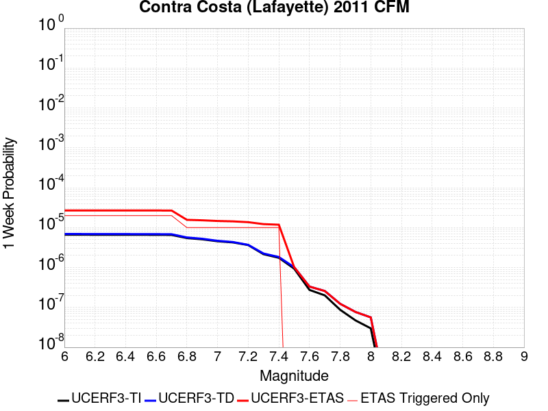 |  |  |  |

| Magnitude | 1 wk TI Prob | 1 wk TD Prob | 1 wk ETAS Prob | 1 wk ETAS/TD Gain | 1 wk ETAS Triggered Only | 1 mo TI Prob | 1 mo TD Prob | 1 mo ETAS Prob | 1 mo ETAS/TD Gain | 1 mo ETAS Triggered Only | 1 yr TI Prob | 1 yr TD Prob | 1 yr ETAS Prob | 1 yr ETAS/TD Gain | 1 yr ETAS Triggered Only | 10 yr TI Prob | 10 yr TD Prob | 10 yr ETAS Prob | 10 yr ETAS/TD Gain | 10 yr ETAS Triggered Only |
|-----|-----|-----|-----|-----|-----|-----|-----|-----|-----|-----|-----|-----|-----|-----|-----|-----|-----|-----|-----|-----|
| 6.0 | 6.655419E-6 | 6.9407956E-6 | 4.2976582E-5 | 6.191881 | 3.6036035E-5 | 2.8522913E-5 | 2.974594E-5 | 6.57809E-5 | 2.2114246 | 3.6036035E-5 | 3.472111E-4 | 3.620986E-4 | 4.161331E-4 | 1.1492258 | 5.4054053E-5 | 0.0034666911 | 0.0036199384 | 0.0037097023 | 1.0247971 | 9.009009E-5 |
| 6.1 | 6.655419E-6 | 6.9407956E-6 | 4.2976582E-5 | 6.191881 | 3.6036035E-5 | 2.8522913E-5 | 2.974594E-5 | 6.57809E-5 | 2.2114246 | 3.6036035E-5 | 3.472111E-4 | 3.620986E-4 | 4.161331E-4 | 1.1492258 | 5.4054053E-5 | 0.0034666911 | 0.0036199384 | 0.0037097023 | 1.0247971 | 9.009009E-5 |
| 6.2 | 6.6254133E-6 | 6.9092016E-6 | 4.294499E-5 | 6.2156224 | 3.6036035E-5 | 2.839432E-5 | 2.9610539E-5 | 6.564551E-5 | 2.2169642 | 3.6036035E-5 | 3.45646E-4 | 3.6045065E-4 | 4.1448523E-4 | 1.1499084 | 5.4054053E-5 | 0.003451089 | 0.0036035122 | 0.0036932777 | 1.0249106 | 9.009009E-5 |
| 6.3 | 6.6254133E-6 | 6.9092016E-6 | 4.294499E-5 | 6.2156224 | 3.6036035E-5 | 2.839432E-5 | 2.9610539E-5 | 6.564551E-5 | 2.2169642 | 3.6036035E-5 | 3.45646E-4 | 3.6045065E-4 | 4.1448523E-4 | 1.1499084 | 5.4054053E-5 | 0.003451089 | 0.0036035122 | 0.0036932777 | 1.0249106 | 9.009009E-5 |
| 6.4 | 6.6254133E-6 | 6.9092016E-6 | 4.294499E-5 | 6.2156224 | 3.6036035E-5 | 2.839432E-5 | 2.9610539E-5 | 6.564551E-5 | 2.2169642 | 3.6036035E-5 | 3.45646E-4 | 3.6045065E-4 | 4.1448523E-4 | 1.1499084 | 5.4054053E-5 | 0.003451089 | 0.0036035122 | 0.0036932777 | 1.0249106 | 9.009009E-5 |
| 6.5 | 6.606445E-6 | 6.888747E-6 | 4.2924534E-5 | 6.231109 | 3.6036035E-5 | 2.8313027E-5 | 2.9522878E-5 | 6.555785E-5 | 2.220578 | 3.6036035E-5 | 3.4465658E-4 | 3.5938373E-4 | 4.1341837E-4 | 1.1503536 | 5.4054053E-5 | 0.0034412253 | 0.0035928776 | 0.003682644 | 1.0249846 | 9.009009E-5 |
| 6.6 | 6.59966E-6 | 6.8812833E-6 | 4.2917072E-5 | 6.236783 | 3.6036035E-5 | 2.828395E-5 | 2.9490891E-5 | 6.552586E-5 | 2.2219017 | 3.6036035E-5 | 3.4430268E-4 | 3.5899444E-4 | 4.1302908E-4 | 1.1505166 | 5.4054053E-5 | 0.0034376972 | 0.0035889973 | 0.003678764 | 1.0250117 | 9.009009E-5 |
| 6.7 | 6.5570975E-6 | 6.835267E-6 | 4.2871055E-5 | 6.2720385 | 3.6036035E-5 | 2.8101544E-5 | 2.9293684E-5 | 6.532866E-5 | 2.230128 | 3.6036035E-5 | 3.4208258E-4 | 3.5659422E-4 | 4.10629E-4 | 1.1515301 | 5.4054053E-5 | 0.0034155648 | 0.0035650723 | 0.003654841 | 1.0251801 | 9.009009E-5 |
| 6.8 | 5.472255E-6 | 5.6781187E-6 | 2.3696035E-5 | 4.173219 | 1.8018018E-5 | 2.345231E-5 | 2.433457E-5 | 4.235215E-5 | 1.7404109 | 1.8018018E-5 | 2.8549446E-4 | 2.9623357E-4 | 3.3225893E-4 | 1.1216114 | 3.6036035E-5 | 0.0028512797 | 0.002963091 | 0.003016985 | 1.0181884 | 5.4054053E-5 |
| 6.9 | 5.092346E-6 | 5.268419E-6 | 2.3286342E-5 | 4.4199867 | 1.8018018E-5 | 2.1824157E-5 | 2.2578744E-5 | 4.0596355E-5 | 1.79799 | 1.8018018E-5 | 2.656767E-4 | 2.7486193E-4 | 3.1088805E-4 | 1.1310699 | 3.6036035E-5 | 0.002653593 | 0.002749916 | 0.0028038213 | 1.0196025 | 5.4054053E-5 |
| 7.0 | 4.5525762E-6 | 4.681627E-6 | 2.269956E-5 | 4.8486476 | 1.8018018E-5 | 1.9510895E-5 | 2.0063962E-5 | 3.808162E-5 | 1.8980108 | 1.8018018E-5 | 2.3751926E-4 | 2.4425166E-4 | 2.802789E-4 | 1.1475005 | 3.6036035E-5 | 0.0023726553 | 0.0024445183 | 0.0024984402 | 1.0220582 | 5.4054053E-5 |
| 7.1 | 4.261504E-6 | 4.360733E-6 | 2.2378672E-5 | 5.1318603 | 1.8018018E-5 | 1.826346E-5 | 1.8688723E-5 | 3.6706406E-5 | 1.9640937 | 1.8018018E-5 | 2.2233493E-4 | 2.2751173E-4 | 2.6353955E-4 | 1.158356 | 3.6036035E-5 | 0.002221126 | 0.0022774623 | 0.002331393 | 1.0236803 | 5.4054053E-5 |
| 7.2 | 3.654114E-6 | 3.701308E-6 | 2.171926E-5 | 5.8679957 | 1.8018018E-5 | 1.5660395E-5 | 1.5862654E-5 | 3.3880384E-5 | 2.1358588 | 1.8018018E-5 | 1.9064861E-4 | 1.9311093E-4 | 2.2914002E-4 | 1.186572 | 3.6036035E-5 | 0.0019048514 | 0.0019340571 | 0.0019880068 | 1.0278945 | 5.4054053E-5 |
| 7.3 | 2.1595129E-6 | 2.2476072E-6 | 2.0265585E-5 | 9.016515 | 1.8018018E-5 | 9.255023E-6 | 9.632567E-6 | 2.765041E-5 | 2.8705132 | 1.8018018E-5 | 1.1267407E-4 | 1.1727024E-4 | 1.5330205E-4 | 1.3072546 | 3.6036035E-5 | 0.0011261696 | 0.0011766788 | 0.0012126724 | 1.0305892 | 3.6036035E-5 |
| 7.4 | 1.7532738E-6 | 1.836593E-6 | 1.9854579E-5 | 10.810549 | 1.8018018E-5 | 7.5140088E-6 | 7.871089E-6 | 2.5888965E-5 | 3.2891212 | 1.8018018E-5 | 9.147922E-5 | 9.582633E-5 | 1.3185892E-4 | 1.3760196 | 3.6036035E-5 | 9.144157E-4 | 9.6229644E-4 | 9.982978E-4 | 1.0374119 | 3.6036035E-5 |
| 7.5 | 9.387875E-7 | 1.0217213E-6 | 1.0217213E-6 | 1.0 | 0.0 | 4.0233685E-6 | 4.3787986E-6 | 4.3787986E-6 | 1.0 | 0.0 | 4.8983413E-5 | 5.331058E-5 | 7.132764E-5 | 1.337964 | 1.8018018E-5 | 4.897262E-4 | 5.370657E-4 | 5.55074E-4 | 1.033531 | 1.8018018E-5 |
| 7.6 | 2.7471893E-7 | 3.330836E-7 | 3.330836E-7 | 1.0 | 0.0 | 1.1773664E-6 | 1.4275003E-6 | 1.4275003E-6 | 1.0 | 0.0 | 1.433434E-5 | 1.737968E-5 | 1.737968E-5 | 1.0 | 0.0 | 1.4333417E-4 | 1.7766756E-4 | 1.7766756E-4 | 1.0 | 0.0 |
| 7.7 | 2.0057985E-7 | 2.583045E-7 | 2.583045E-7 | 1.0 | 0.0 | 8.596276E-7 | 1.1070189E-6 | 1.1070189E-6 | 1.0 | 0.0 | 1.0465916E-5 | 1.3477872E-5 | 1.3477872E-5 | 1.0 | 0.0 | 1.0465423E-4 | 1.3861102E-4 | 1.3861102E-4 | 1.0 | 0.0 |
| 7.8 | 8.7403905E-8 | 1.2357017E-7 | 1.2357017E-7 | 1.0 | 0.0 | 3.745881E-7 | 5.295863E-7 | 5.295863E-7 | 1.0 | 0.0 | 4.5606007E-6 | 6.447695E-6 | 6.447695E-6 | 1.0 | 0.0 | 4.560507E-5 | 6.673835E-5 | 6.673835E-5 | 1.0 | 0.0 |
| 7.9 | 4.740233E-8 | 7.7098285E-8 | 7.7098285E-8 | 1.0 | 0.0 | 2.0315284E-7 | 3.304212E-7 | 3.304212E-7 | 1.0 | 0.0 | 2.473383E-6 | 4.0228706E-6 | 4.0228706E-6 | 1.0 | 0.0 | 2.4733554E-5 | 4.1761345E-5 | 4.1761345E-5 | 1.0 | 0.0 |
| 8.0 | 2.99164E-8 | 5.6355148E-8 | 5.6355148E-8 | 1.0 | 0.0 | 1.2821314E-7 | 2.4152203E-7 | 2.4152203E-7 | 1.0 | 0.0 | 1.5609938E-6 | 2.9405269E-6 | 2.9405269E-6 | 1.0 | 0.0 | 1.5609829E-5 | 3.0425235E-5 | 3.0425235E-5 | 1.0 | 0.0 |
| 8.1 | 4.431212E-10 | 7.476203E-10 | 7.476203E-10 | 1.0 | 0.0 | 1.899091E-9 | 3.2040874E-9 | 3.2040874E-9 | 1.0 | 0.0 | 2.3121432E-8 | 3.9009766E-8 | 3.9009766E-8 | 1.0 | 0.0 | 2.312143E-7 | 3.9890546E-7 | 3.9890546E-7 | 1.0 | 0.0 |

## Mount Diablo Thrust North CFM
*[(top)](#table-of-contents)*

| 1 Week | 1 Month | 1 Year | 10 Year |
|-----|-----|-----|-----|
|  | 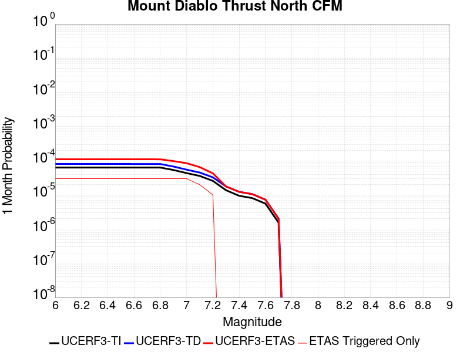 |  | 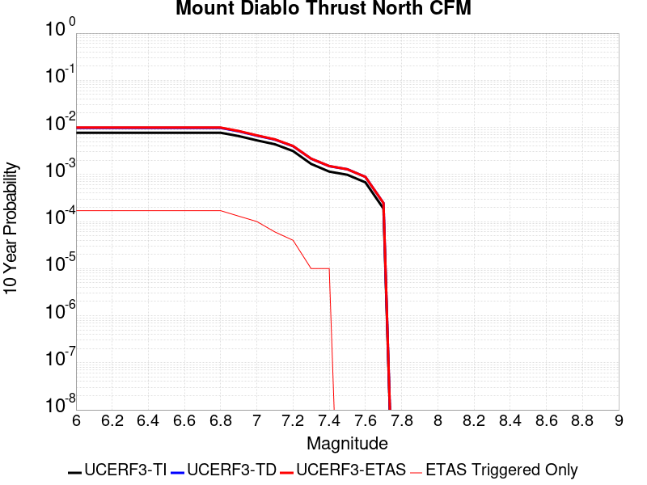 |

| Magnitude | 1 wk TI Prob | 1 wk TD Prob | 1 wk ETAS Prob | 1 wk ETAS/TD Gain | 1 wk ETAS Triggered Only | 1 mo TI Prob | 1 mo TD Prob | 1 mo ETAS Prob | 1 mo ETAS/TD Gain | 1 mo ETAS Triggered Only | 1 yr TI Prob | 1 yr TD Prob | 1 yr ETAS Prob | 1 yr ETAS/TD Gain | 1 yr ETAS Triggered Only | 10 yr TI Prob | 10 yr TD Prob | 10 yr ETAS Prob | 10 yr ETAS/TD Gain | 10 yr ETAS Triggered Only |
|-----|-----|-----|-----|-----|-----|-----|-----|-----|-----|-----|-----|-----|-----|-----|-----|-----|-----|-----|-----|-----|
| 6.0 | 1.479628E-5 | 1.8779072E-5 | 1.8779072E-5 | 1.0 | 0.0 | 6.341109E-5 | 8.047931E-5 | 8.047931E-5 | 1.0 | 0.0 | 7.717565E-4 | 9.794047E-4 | 9.97405E-4 | 1.0183789 | 1.8018018E-5 | 0.007690818 | 0.0097521795 | 0.009823549 | 1.0073183 | 7.207207E-5 |
| 6.1 | 1.479628E-5 | 1.8779072E-5 | 1.8779072E-5 | 1.0 | 0.0 | 6.341109E-5 | 8.047931E-5 | 8.047931E-5 | 1.0 | 0.0 | 7.717565E-4 | 9.794047E-4 | 9.97405E-4 | 1.0183789 | 1.8018018E-5 | 0.007690818 | 0.0097521795 | 0.009823549 | 1.0073183 | 7.207207E-5 |
| 6.2 | 1.479628E-5 | 1.8779072E-5 | 1.8779072E-5 | 1.0 | 0.0 | 6.341109E-5 | 8.047931E-5 | 8.047931E-5 | 1.0 | 0.0 | 7.717565E-4 | 9.794047E-4 | 9.97405E-4 | 1.0183789 | 1.8018018E-5 | 0.007690818 | 0.0097521795 | 0.009823549 | 1.0073183 | 7.207207E-5 |
| 6.3 | 1.479628E-5 | 1.8779072E-5 | 1.8779072E-5 | 1.0 | 0.0 | 6.341109E-5 | 8.047931E-5 | 8.047931E-5 | 1.0 | 0.0 | 7.717565E-4 | 9.794047E-4 | 9.97405E-4 | 1.0183789 | 1.8018018E-5 | 0.007690818 | 0.0097521795 | 0.009823549 | 1.0073183 | 7.207207E-5 |
| 6.4 | 1.479628E-5 | 1.8779072E-5 | 1.8779072E-5 | 1.0 | 0.0 | 6.341109E-5 | 8.047931E-5 | 8.047931E-5 | 1.0 | 0.0 | 7.717565E-4 | 9.794047E-4 | 9.97405E-4 | 1.0183789 | 1.8018018E-5 | 0.007690818 | 0.0097521795 | 0.009823549 | 1.0073183 | 7.207207E-5 |
| 6.5 | 1.479628E-5 | 1.8779072E-5 | 1.8779072E-5 | 1.0 | 0.0 | 6.341109E-5 | 8.047931E-5 | 8.047931E-5 | 1.0 | 0.0 | 7.717565E-4 | 9.794047E-4 | 9.97405E-4 | 1.0183789 | 1.8018018E-5 | 0.007690818 | 0.0097521795 | 0.009823549 | 1.0073183 | 7.207207E-5 |
| 6.6 | 1.479016E-5 | 1.8772182E-5 | 1.8772182E-5 | 1.0 | 0.0 | 6.338486E-5 | 8.044978E-5 | 8.044978E-5 | 1.0 | 0.0 | 7.714374E-4 | 9.790455E-4 | 9.970459E-4 | 1.0183856 | 1.8018018E-5 | 0.007687649 | 0.00974862 | 0.009819989 | 1.007321 | 7.207207E-5 |
| 6.7 | 1.479016E-5 | 1.8772182E-5 | 1.8772182E-5 | 1.0 | 0.0 | 6.338486E-5 | 8.044978E-5 | 8.044978E-5 | 1.0 | 0.0 | 7.714374E-4 | 9.790455E-4 | 9.970459E-4 | 1.0183856 | 1.8018018E-5 | 0.007687649 | 0.00974862 | 0.009819989 | 1.007321 | 7.207207E-5 |
| 6.8 | 1.4771667E-5 | 1.8750945E-5 | 1.8750945E-5 | 1.0 | 0.0 | 6.330561E-5 | 8.0358775E-5 | 8.0358775E-5 | 1.0 | 0.0 | 7.704732E-4 | 9.779385E-4 | 9.959389E-4 | 1.0184065 | 1.8018018E-5 | 0.007678074 | 0.009737647 | 0.009809017 | 1.0073293 | 7.207207E-5 |
| 6.9 | 1.2548234E-5 | 1.5830869E-5 | 1.5830869E-5 | 1.0 | 0.0 | 5.3777036E-5 | 6.7844834E-5 | 6.7844834E-5 | 1.0 | 0.0 | 6.545387E-4 | 8.257014E-4 | 8.4370456E-4 | 1.0218035 | 1.8018018E-5 | 0.006526142 | 0.00822697 | 0.00828058 | 1.0065163 | 5.4054053E-5 |
| 7.0 | 1.01754185E-5 | 1.2813927E-5 | 1.2813927E-5 | 1.0 | 0.0 | 4.360821E-5 | 5.4915687E-5 | 5.4915687E-5 | 1.0 | 0.0 | 5.308006E-4 | 6.68395E-4 | 6.8640104E-4 | 1.0269392 | 1.8018018E-5 | 0.005295345 | 0.0066642333 | 0.0066821314 | 1.0026857 | 1.8018018E-5 |
| 7.1 | 8.398341E-6 | 1.0557986E-5 | 1.0557986E-5 | 1.0 | 0.0 | 3.5992394E-5 | 4.5247732E-5 | 4.5247732E-5 | 1.0 | 0.0 | 4.3811928E-4 | 5.50753E-4 | 5.50753E-4 | 1.0 | 0.0 | 0.0043725655 | 0.0054941652 | 0.0054941652 | 1.0 | 0.0 |
| 7.2 | 6.024759E-6 | 7.650704E-6 | 7.650704E-6 | 1.0 | 0.0 | 2.582014E-5 | 3.278832E-5 | 3.278832E-5 | 1.0 | 0.0 | 3.1431485E-4 | 3.991254E-4 | 3.991254E-4 | 1.0 | 0.0 | 0.0031387066 | 0.003984294 | 0.003984294 | 1.0 | 0.0 |
| 7.3 | 3.2099704E-6 | 4.137289E-6 | 4.137289E-6 | 1.0 | 0.0 | 1.3756943E-5 | 1.773112E-5 | 1.773112E-5 | 1.0 | 0.0 | 1.674779E-4 | 2.1585517E-4 | 2.1585517E-4 | 1.0 | 0.0 | 0.0016735174 | 0.0021565552 | 0.0021565552 | 1.0 | 0.0 |
| 7.4 | 2.2041513E-6 | 2.8749175E-6 | 2.8749175E-6 | 1.0 | 0.0 | 9.4463285E-6 | 1.2321017E-5 | 1.2321017E-5 | 1.0 | 0.0 | 1.1500298E-4 | 1.4999813E-4 | 1.4999813E-4 | 1.0 | 0.0 | 0.0011494348 | 0.0014990354 | 0.0014990354 | 1.0 | 0.0 |
| 7.5 | 1.8869501E-6 | 2.4707624E-6 | 2.4707624E-6 | 1.0 | 0.0 | 8.086904E-6 | 1.0588939E-5 | 1.0588939E-5 | 1.0 | 0.0 | 9.845361E-5 | 1.2891278E-4 | 1.2891278E-4 | 1.0 | 0.0 | 9.841E-4 | 0.0012884365 | 0.0012884365 | 1.0 | 0.0 |
| 7.6 | 1.3012458E-6 | 1.7015424E-6 | 1.7015424E-6 | 1.0 | 0.0 | 5.576756E-6 | 7.2923044E-6 | 7.2923044E-6 | 1.0 | 0.0 | 6.7894885E-5 | 8.8780245E-5 | 8.8780245E-5 | 1.0 | 0.0 | 6.787415E-4 | 8.874831E-4 | 8.874831E-4 | 1.0 | 0.0 |
| 7.7 | 3.603383E-7 | 4.7196133E-7 | 4.7196133E-7 | 1.0 | 0.0 | 1.5443061E-6 | 2.0226898E-6 | 2.0226898E-6 | 1.0 | 0.0 | 1.8801764E-5 | 2.4625979E-5 | 2.4625979E-5 | 1.0 | 0.0 | 1.8800174E-4 | 2.46238E-4 | 2.46238E-4 | 1.0 | 0.0 |

## Reliz 2011 CFM
*[(top)](#table-of-contents)*

| 1 Week | 1 Month | 1 Year | 10 Year |
|-----|-----|-----|-----|
|  |  |  |  |

| Magnitude | 1 wk TI Prob | 1 wk TD Prob | 1 wk ETAS Prob | 1 wk ETAS/TD Gain | 1 wk ETAS Triggered Only | 1 mo TI Prob | 1 mo TD Prob | 1 mo ETAS Prob | 1 mo ETAS/TD Gain | 1 mo ETAS Triggered Only | 1 yr TI Prob | 1 yr TD Prob | 1 yr ETAS Prob | 1 yr ETAS/TD Gain | 1 yr ETAS Triggered Only | 10 yr TI Prob | 10 yr TD Prob | 10 yr ETAS Prob | 10 yr ETAS/TD Gain | 10 yr ETAS Triggered Only |
|-----|-----|-----|-----|-----|-----|-----|-----|-----|-----|-----|-----|-----|-----|-----|-----|-----|-----|-----|-----|-----|
| 6.0 | 1.6002472E-5 | 1.6284195E-5 | 3.430192E-5 | 2.1064546 | 1.8018018E-5 | 6.8580215E-5 | 6.978765E-5 | 1.0582117E-4 | 1.5163308 | 3.6036035E-5 | 8.3464425E-4 | 8.4935327E-4 | 9.033614E-4 | 1.0635874 | 5.4054053E-5 | 0.008315164 | 0.008463269 | 0.008516865 | 1.0063329 | 5.4054053E-5 |
| 6.1 | 1.6002472E-5 | 1.6284195E-5 | 3.430192E-5 | 2.1064546 | 1.8018018E-5 | 6.8580215E-5 | 6.978765E-5 | 1.0582117E-4 | 1.5163308 | 3.6036035E-5 | 8.3464425E-4 | 8.4935327E-4 | 9.033614E-4 | 1.0635874 | 5.4054053E-5 | 0.008315164 | 0.008463269 | 0.008516865 | 1.0063329 | 5.4054053E-5 |
| 6.2 | 1.6002472E-5 | 1.6284195E-5 | 3.430192E-5 | 2.1064546 | 1.8018018E-5 | 6.8580215E-5 | 6.978765E-5 | 1.0582117E-4 | 1.5163308 | 3.6036035E-5 | 8.3464425E-4 | 8.4935327E-4 | 9.033614E-4 | 1.0635874 | 5.4054053E-5 | 0.008315164 | 0.008463269 | 0.008516865 | 1.0063329 | 5.4054053E-5 |
| 6.3 | 7.792404E-6 | 7.804657E-6 | 7.804657E-6 | 1.0 | 0.0 | 3.339559E-5 | 3.3448105E-5 | 3.3448105E-5 | 1.0 | 0.0 | 4.0651546E-4 | 4.0715534E-4 | 4.25166E-4 | 1.0442353 | 1.8018018E-5 | 0.0040577264 | 0.004064372 | 0.0040823165 | 1.0044152 | 1.8018018E-5 |
| 6.4 | 7.792404E-6 | 7.804657E-6 | 7.804657E-6 | 1.0 | 0.0 | 3.339559E-5 | 3.3448105E-5 | 3.3448105E-5 | 1.0 | 0.0 | 4.0651546E-4 | 4.0715534E-4 | 4.25166E-4 | 1.0442353 | 1.8018018E-5 | 0.0040577264 | 0.004064372 | 0.0040823165 | 1.0044152 | 1.8018018E-5 |
| 6.5 | 5.9659374E-6 | 5.9294966E-6 | 5.9294966E-6 | 1.0 | 0.0 | 2.5568053E-5 | 2.5411882E-5 | 2.5411882E-5 | 1.0 | 0.0 | 3.1124658E-4 | 3.0934595E-4 | 3.273584E-4 | 1.0582275 | 1.8018018E-5 | 0.00310811 | 0.0030893725 | 0.0031073347 | 1.0058142 | 1.8018018E-5 |
| 6.6 | 5.2350692E-6 | 5.179707E-6 | 5.179707E-6 | 1.0 | 0.0 | 2.2435817E-5 | 2.2198556E-5 | 2.2198556E-5 | 1.0 | 0.0 | 2.7312184E-4 | 2.7023404E-4 | 2.882472E-4 | 1.0666575 | 1.8018018E-5 | 0.002727864 | 0.0026992657 | 0.0027172351 | 1.0066571 | 1.8018018E-5 |
| 6.7 | 4.580206E-6 | 4.5068055E-6 | 4.5068055E-6 | 1.0 | 0.0 | 1.9629308E-5 | 1.9314739E-5 | 1.9314739E-5 | 1.0 | 0.0 | 2.389606E-4 | 2.3513164E-4 | 2.531454E-4 | 1.0766115 | 1.8018018E-5 | 0.002387038 | 0.0023490316 | 0.0023670073 | 1.0076524 | 1.8018018E-5 |
| 6.8 | 4.0765017E-6 | 3.988895E-6 | 3.988895E-6 | 1.0 | 0.0 | 1.7470604E-5 | 1.7095153E-5 | 1.7095153E-5 | 1.0 | 0.0 | 2.1268385E-4 | 2.0811365E-4 | 2.2612792E-4 | 1.0865598 | 1.8018018E-5 | 0.002124804 | 0.002079387 | 0.0020973675 | 1.0086471 | 1.8018018E-5 |
| 6.9 | 3.5752896E-6 | 3.4731459E-6 | 3.4731459E-6 | 1.0 | 0.0 | 1.532258E-5 | 1.4884826E-5 | 1.4884826E-5 | 1.0 | 0.0 | 1.8653645E-4 | 1.812077E-4 | 1.9922246E-4 | 1.099415 | 1.8018018E-5 | 0.0018637994 | 0.001810797 | 0.0018287825 | 1.0099323 | 1.8018018E-5 |
| 7.0 | 3.0259848E-6 | 2.9085395E-6 | 2.9085395E-6 | 1.0 | 0.0 | 1.2968442E-5 | 1.246511E-5 | 1.246511E-5 | 1.0 | 0.0 | 1.5787935E-4 | 1.5175216E-4 | 1.5175216E-4 | 1.0 | 0.0 | 0.0015776722 | 0.0015166817 | 0.0015166817 | 1.0 | 0.0 |
| 7.1 | 2.5861116E-6 | 2.4557391E-6 | 2.4557391E-6 | 1.0 | 0.0 | 1.1083288E-5 | 1.0524554E-5 | 1.0524554E-5 | 1.0 | 0.0 | 1.3493067E-4 | 1.2812892E-4 | 1.2812892E-4 | 1.0 | 0.0 | 0.0013484878 | 0.0012807463 | 0.0012807463 | 1.0 | 0.0 |
| 7.2 | 2.1482588E-6 | 2.0037808E-6 | 2.0037808E-6 | 1.0 | 0.0 | 9.20679E-6 | 8.587604E-6 | 8.587604E-6 | 1.0 | 0.0 | 1.12086906E-4 | 1.04549064E-4 | 1.04549064E-4 | 1.0 | 0.0 | 0.0011203039 | 0.0010451942 | 0.0010451942 | 1.0 | 0.0 |
| 7.3 | 1.7194744E-6 | 1.5616413E-6 | 1.5616413E-6 | 1.0 | 0.0 | 7.3691554E-6 | 6.692731E-6 | 6.692731E-6 | 1.0 | 0.0 | 8.971577E-5 | 8.1480954E-5 | 8.1480954E-5 | 1.0 | 0.0 | 8.967956E-4 | 8.14706E-4 | 8.14706E-4 | 1.0 | 0.0 |
| 7.4 | 1.2755178E-6 | 1.1061194E-6 | 1.1061194E-6 | 1.0 | 0.0 | 5.4664933E-6 | 4.7405033E-6 | 4.7405033E-6 | 1.0 | 0.0 | 6.655252E-5 | 5.77141E-5 | 5.77141E-5 | 1.0 | 0.0 | 6.6532596E-4 | 5.771862E-4 | 5.771862E-4 | 1.0 | 0.0 |
| 7.5 | 8.8463224E-7 | 7.0626817E-7 | 7.0626817E-7 | 1.0 | 0.0 | 3.7912755E-6 | 3.02686E-6 | 3.02686E-6 | 1.0 | 0.0 | 4.6157802E-5 | 3.6851397E-5 | 3.6851397E-5 | 1.0 | 0.0 | 4.6148215E-4 | 3.6864786E-4 | 3.6864786E-4 | 1.0 | 0.0 |
| 7.6 | 5.291355E-7 | 3.504847E-7 | 3.504847E-7 | 1.0 | 0.0 | 2.2677216E-6 | 1.5020763E-6 | 1.5020763E-6 | 1.0 | 0.0 | 2.760916E-5 | 1.8287627E-5 | 1.8287627E-5 | 1.0 | 0.0 | 2.760573E-4 | 1.8305524E-4 | 1.8305524E-4 | 1.0 | 0.0 |
| 7.7 | 2.9663357E-7 | 1.3541806E-7 | 1.3541806E-7 | 1.0 | 0.0 | 1.2712861E-6 | 5.8036295E-7 | 5.8036295E-7 | 1.0 | 0.0 | 1.5477797E-5 | 7.0658966E-6 | 7.0658966E-6 | 1.0 | 0.0 | 1.547672E-4 | 7.084268E-5 | 7.084268E-5 | 1.0 | 0.0 |
| 7.8 | 1.2509386E-7 | 2.7326761E-8 | 2.7326761E-8 | 1.0 | 0.0 | 5.3611643E-7 | 1.17114695E-7 | 1.17114695E-7 | 1.0 | 0.0 | 6.527198E-6 | 1.4258704E-6 | 1.4258704E-6 | 1.0 | 0.0 | 6.527006E-5 | 1.4416024E-5 | 1.4416024E-5 | 1.0 | 0.0 |
| 7.9 | 6.213493E-8 | 1.1573957E-8 | 1.1573957E-8 | 1.0 | 0.0 | 2.6629255E-7 | 4.9602672E-8 | 4.9602672E-8 | 1.0 | 0.0 | 3.242107E-6 | 6.039123E-7 | 6.039123E-7 | 1.0 | 0.0 | 3.2420594E-5 | 6.171175E-6 | 6.171175E-6 | 1.0 | 0.0 |
| 8.0 | 5.92383E-9 | 1.68809E-9 | 1.68809E-9 | 1.0 | 0.0 | 2.5387841E-8 | 7.2346698E-9 | 7.2346698E-9 | 1.0 | 0.0 | 3.0909692E-7 | 8.8082096E-8 | 8.8082096E-8 | 1.0 | 0.0 | 3.090965E-6 | 9.057315E-7 | 9.057315E-7 | 1.0 | 0.0 |

## West Napa 2011 CFM
*[(top)](#table-of-contents)*

| 1 Week | 1 Month | 1 Year | 10 Year |
|-----|-----|-----|-----|
|  |  |  |  |

| Magnitude | 1 wk TI Prob | 1 wk TD Prob | 1 wk ETAS Prob | 1 wk ETAS/TD Gain | 1 wk ETAS Triggered Only | 1 mo TI Prob | 1 mo TD Prob | 1 mo ETAS Prob | 1 mo ETAS/TD Gain | 1 mo ETAS Triggered Only | 1 yr TI Prob | 1 yr TD Prob | 1 yr ETAS Prob | 1 yr ETAS/TD Gain | 1 yr ETAS Triggered Only | 10 yr TI Prob | 10 yr TD Prob | 10 yr ETAS Prob | 10 yr ETAS/TD Gain | 10 yr ETAS Triggered Only |
|-----|-----|-----|-----|-----|-----|-----|-----|-----|-----|-----|-----|-----|-----|-----|-----|-----|-----|-----|-----|-----|
| 6.0 | 3.773104E-5 | 4.454535E-5 | 6.256257E-5 | 1.404469 | 1.8018018E-5 | 1.6169442E-4 | 1.9089649E-4 | 2.0891106E-4 | 1.0943683 | 1.8018018E-5 | 0.001966852 | 0.002322002 | 0.0023759305 | 1.0232251 | 5.4054053E-5 | 0.019495348 | 0.023010869 | 0.02306368 | 1.002295 | 5.4054053E-5 |
| 6.1 | 3.773104E-5 | 4.454535E-5 | 6.256257E-5 | 1.404469 | 1.8018018E-5 | 1.6169442E-4 | 1.9089649E-4 | 2.0891106E-4 | 1.0943683 | 1.8018018E-5 | 0.001966852 | 0.002322002 | 0.0023759305 | 1.0232251 | 5.4054053E-5 | 0.019495348 | 0.023010869 | 0.02306368 | 1.002295 | 5.4054053E-5 |
| 6.2 | 3.773104E-5 | 4.454535E-5 | 6.256257E-5 | 1.404469 | 1.8018018E-5 | 1.6169442E-4 | 1.9089649E-4 | 2.0891106E-4 | 1.0943683 | 1.8018018E-5 | 0.001966852 | 0.002322002 | 0.0023759305 | 1.0232251 | 5.4054053E-5 | 0.019495348 | 0.023010869 | 0.02306368 | 1.002295 | 5.4054053E-5 |
| 6.3 | 2.147964E-5 | 2.4996316E-5 | 2.4996316E-5 | 1.0 | 0.0 | 9.2052345E-5 | 1.0712319E-4 | 1.0712319E-4 | 1.0 | 0.0 | 0.001120161 | 0.001303536 | 0.0013215306 | 1.0138044 | 1.8018018E-5 | 0.011145315 | 0.01296952 | 0.0129873045 | 1.0013713 | 1.8018018E-5 |
| 6.4 | 2.147964E-5 | 2.4996316E-5 | 2.4996316E-5 | 1.0 | 0.0 | 9.2052345E-5 | 1.0712319E-4 | 1.0712319E-4 | 1.0 | 0.0 | 0.001120161 | 0.001303536 | 0.0013215306 | 1.0138044 | 1.8018018E-5 | 0.011145315 | 0.01296952 | 0.0129873045 | 1.0013713 | 1.8018018E-5 |
| 6.5 | 1.688201E-5 | 1.9554702E-5 | 1.9554702E-5 | 1.0 | 0.0 | 7.234947E-5 | 8.3803585E-5 | 8.3803585E-5 | 1.0 | 0.0 | 8.804988E-4 | 0.0010199035 | 0.001037903 | 1.0176483 | 1.8018018E-5 | 0.008770182 | 0.010160902 | 0.010178736 | 1.0017552 | 1.8018018E-5 |
| 6.6 | 1.6846381E-5 | 1.9514384E-5 | 1.9514384E-5 | 1.0 | 0.0 | 7.219678E-5 | 8.36308E-5 | 8.36308E-5 | 1.0 | 0.0 | 8.7864127E-4 | 0.0010178018 | 0.0010358015 | 1.0176848 | 1.8018018E-5 | 0.008751754 | 0.010140077 | 0.010157912 | 1.0017589 | 1.8018018E-5 |
| 6.7 | 1.3396501E-5 | 1.547367E-5 | 1.547367E-5 | 1.0 | 0.0 | 5.7412315E-5 | 6.63144E-5 | 6.63144E-5 | 1.0 | 0.0 | 6.9877075E-4 | 8.071423E-4 | 8.251458E-4 | 1.0223053 | 1.8018018E-5 | 0.0069657755 | 0.008049836 | 0.008067709 | 1.0022203 | 1.8018018E-5 |
| 6.8 | 1.0139058E-5 | 1.1676956E-5 | 1.1676956E-5 | 1.0 | 0.0 | 4.3452383E-5 | 5.004345E-5 | 5.004345E-5 | 1.0 | 0.0 | 5.289043E-4 | 6.0916424E-4 | 6.2717125E-4 | 1.0295602 | 1.8018018E-5 | 0.005276473 | 0.006081869 | 0.0060997773 | 1.0029446 | 1.8018018E-5 |
| 6.9 | 7.761281E-6 | 8.894589E-6 | 8.894589E-6 | 1.0 | 0.0 | 3.326221E-5 | 3.81194E-5 | 3.81194E-5 | 1.0 | 0.0 | 4.0489217E-4 | 4.6405627E-4 | 4.8206592E-4 | 1.0388092 | 1.8018018E-5 | 0.0040415525 | 0.004637389 | 0.0046553235 | 1.0038674 | 1.8018018E-5 |
| 7.0 | 2.2109202E-6 | 2.3682921E-6 | 2.3682921E-6 | 1.0 | 0.0 | 9.475338E-6 | 1.0149784E-5 | 1.0149784E-5 | 1.0 | 0.0 | 1.1535613E-4 | 1.235667E-4 | 1.4158248E-4 | 1.1457981 | 1.8018018E-5 | 0.0011529627 | 0.0012364648 | 0.0012544605 | 1.0145541 | 1.8018018E-5 |
| 7.1 | 1.9008926E-6 | 2.0148857E-6 | 2.0148857E-6 | 1.0 | 0.0 | 8.146657E-6 | 8.6351965E-6 | 8.6351965E-6 | 1.0 | 0.0 | 9.918104E-5 | 1.0512847E-4 | 1.231446E-4 | 1.1713724 | 1.8018018E-5 | 9.913679E-4 | 0.0010522673 | 0.0010702662 | 1.017105 | 1.8018018E-5 |
| 7.2 | 1.8495944E-6 | 1.9576798E-6 | 1.9576798E-6 | 1.0 | 0.0 | 7.926808E-6 | 8.3900295E-6 | 8.3900295E-6 | 1.0 | 0.0 | 9.650462E-5 | 1.02143844E-4 | 1.20160024E-4 | 1.1763804 | 1.8018018E-5 | 9.6462725E-4 | 0.0010224489 | 0.0010404484 | 1.0176044 | 1.8018018E-5 |
| 7.3 | 1.7883189E-6 | 1.8896261E-6 | 1.8896261E-6 | 1.0 | 0.0 | 7.664201E-6 | 8.098373E-6 | 8.098373E-6 | 1.0 | 0.0 | 9.330765E-5 | 9.859325E-5 | 1.16609495E-4 | 1.182733 | 1.8018018E-5 | 9.3268487E-4 | 9.869748E-4 | 0.001004975 | 1.0182378 | 1.8018018E-5 |
| 7.4 | 1.6520572E-6 | 1.7429599E-6 | 1.7429599E-6 | 1.0 | 0.0 | 7.0802257E-6 | 7.4698064E-6 | 7.4698064E-6 | 1.0 | 0.0 | 8.6198335E-5 | 9.0941125E-5 | 1.089575E-4 | 1.1981103 | 1.8018018E-5 | 8.616491E-4 | 9.1051456E-4 | 9.285162E-4 | 1.0197709 | 1.8018018E-5 |
| 7.5 | 1.4040345E-6 | 1.4813177E-6 | 1.4813177E-6 | 1.0 | 0.0 | 6.0172765E-6 | 6.348489E-6 | 6.348489E-6 | 1.0 | 0.0 | 7.325788E-5 | 7.729014E-5 | 9.5306765E-5 | 1.2331038 | 1.8018018E-5 | 7.3233736E-4 | 7.7407627E-4 | 7.9208036E-4 | 1.0232588 | 1.8018018E-5 |
| 7.6 | 1.3013842E-7 | 1.447772E-7 | 1.447772E-7 | 1.0 | 0.0 | 5.57736E-7 | 6.204736E-7 | 6.204736E-7 | 1.0 | 0.0 | 6.790414E-6 | 7.55424E-6 | 7.55424E-6 | 1.0 | 0.0 | 6.790207E-5 | 7.647041E-5 | 7.647041E-5 | 1.0 | 0.0 |
| 7.7 | 8.541512E-8 | 9.772765E-8 | 9.772765E-8 | 1.0 | 0.0 | 3.6606474E-7 | 4.188327E-7 | 4.188327E-7 | 1.0 | 0.0 | 4.456829E-6 | 5.099276E-6 | 5.099276E-6 | 1.0 | 0.0 | 4.4567398E-5 | 5.1896914E-5 | 5.1896914E-5 | 1.0 | 0.0 |
| 7.8 | 5.6074793E-8 | 6.942185E-8 | 6.942185E-8 | 1.0 | 0.0 | 2.403205E-7 | 2.9752218E-7 | 2.9752218E-7 | 1.0 | 0.0 | 2.9258983E-6 | 3.6223264E-6 | 3.6223264E-6 | 1.0 | 0.0 | 2.9258597E-5 | 3.7058187E-5 | 3.7058187E-5 | 1.0 | 0.0 |
| 7.9 | 2.9475839E-8 | 3.8844114E-8 | 3.8844114E-8 | 1.0 | 0.0 | 1.2632502E-7 | 1.6647476E-7 | 1.6647476E-7 | 1.0 | 0.0 | 1.538006E-6 | 2.0268285E-6 | 2.0268285E-6 | 1.0 | 0.0 | 1.5379954E-5 | 2.0810172E-5 | 2.0810172E-5 | 1.0 | 0.0 |
| 8.0 | 1.3337122E-8 | 2.1793342E-8 | 2.1793342E-8 | 1.0 | 0.0 | 5.7159088E-8 | 9.340004E-8 | 9.340004E-8 | 1.0 | 0.0 | 6.959117E-7 | 1.1371449E-6 | 1.1371449E-6 | 1.0 | 0.0 | 6.959095E-6 | 1.1729146E-5 | 1.1729146E-5 | 1.0 | 0.0 |
| 8.1 | 2.6589986E-10 | 4.8956206E-10 | 4.8956206E-10 | 1.0 | 0.0 | 1.1395708E-9 | 2.0981228E-9 | 2.0981228E-9 | 1.0 | 0.0 | 1.3874274E-8 | 2.5544647E-8 | 2.5544647E-8 | 1.0 | 0.0 | 1.3874273E-7 | 2.6210765E-7 | 2.6210765E-7 | 1.0 | 0.0 |

## Hunting Creek - Bartlett Springs connector 2011
*[(top)](#table-of-contents)*

| 1 Week | 1 Month | 1 Year | 10 Year |
|-----|-----|-----|-----|
|  | 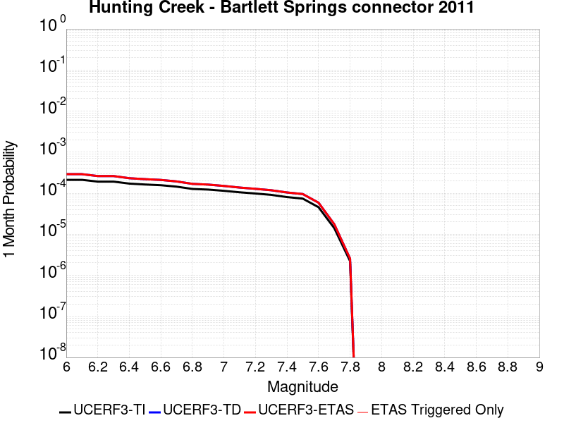 |  |  |

| Magnitude | 1 wk TI Prob | 1 wk TD Prob | 1 wk ETAS Prob | 1 wk ETAS/TD Gain | 1 wk ETAS Triggered Only | 1 mo TI Prob | 1 mo TD Prob | 1 mo ETAS Prob | 1 mo ETAS/TD Gain | 1 mo ETAS Triggered Only | 1 yr TI Prob | 1 yr TD Prob | 1 yr ETAS Prob | 1 yr ETAS/TD Gain | 1 yr ETAS Triggered Only | 10 yr TI Prob | 10 yr TD Prob | 10 yr ETAS Prob | 10 yr ETAS/TD Gain | 10 yr ETAS Triggered Only |
|-----|-----|-----|-----|-----|-----|-----|-----|-----|-----|-----|-----|-----|-----|-----|-----|-----|-----|-----|-----|-----|
| 6.0 | 4.940016E-5 | 6.791398E-5 | 6.791398E-5 | 1.0 | 0.0 | 2.1169778E-4 | 2.9102844E-4 | 2.9102844E-4 | 1.0 | 0.0 | 0.002574374 | 0.003537347 | 0.0035553016 | 1.0050757 | 1.8018018E-5 | 0.025447546 | 0.034794837 | 0.03484701 | 1.0014994 | 5.4054053E-5 |
| 6.1 | 4.940016E-5 | 6.791398E-5 | 6.791398E-5 | 1.0 | 0.0 | 2.1169778E-4 | 2.9102844E-4 | 2.9102844E-4 | 1.0 | 0.0 | 0.002574374 | 0.003537347 | 0.0035553016 | 1.0050757 | 1.8018018E-5 | 0.025447546 | 0.034794837 | 0.03484701 | 1.0014994 | 5.4054053E-5 |
| 6.2 | 4.472471E-5 | 6.104228E-5 | 6.104228E-5 | 1.0 | 0.0 | 1.9166325E-4 | 2.6158424E-4 | 2.6158424E-4 | 1.0 | 0.0 | 0.0023310026 | 0.003180086 | 0.0031980467 | 1.0056479 | 1.8018018E-5 | 0.02306703 | 0.03133553 | 0.031370435 | 1.001114 | 3.6036035E-5 |
| 6.3 | 4.472471E-5 | 6.104228E-5 | 6.104228E-5 | 1.0 | 0.0 | 1.9166325E-4 | 2.6158424E-4 | 2.6158424E-4 | 1.0 | 0.0 | 0.0023310026 | 0.003180086 | 0.0031980467 | 1.0056479 | 1.8018018E-5 | 0.02306703 | 0.03133553 | 0.031370435 | 1.001114 | 3.6036035E-5 |
| 6.4 | 4.0001003E-5 | 5.41369E-5 | 5.41369E-5 | 1.0 | 0.0 | 1.714216E-4 | 2.3199506E-4 | 2.3199506E-4 | 1.0 | 0.0 | 0.0020850603 | 0.002820776 | 0.0028387434 | 1.0063696 | 1.8018018E-5 | 0.02065605 | 0.027844382 | 0.027879415 | 1.0012581 | 3.6036035E-5 |
| 6.5 | 3.8033053E-5 | 5.1297204E-5 | 5.1297204E-5 | 1.0 | 0.0 | 1.6298861E-4 | 2.1982702E-4 | 2.1982702E-4 | 1.0 | 0.0 | 0.0019825802 | 0.0026729985 | 0.0026909683 | 1.0067227 | 1.8018018E-5 | 0.019649856 | 0.026405504 | 0.026440587 | 1.0013287 | 3.6036035E-5 |
| 6.6 | 3.653754E-5 | 4.9159073E-5 | 4.9159073E-5 | 1.0 | 0.0 | 1.5658008E-4 | 2.106651E-4 | 2.106651E-4 | 1.0 | 0.0 | 0.0019046954 | 0.002561716 | 0.0025796876 | 1.0070156 | 1.8018018E-5 | 0.018884527 | 0.02532071 | 0.025355833 | 1.0013871 | 3.6036035E-5 |
| 6.7 | 3.372024E-5 | 4.516577E-5 | 4.516577E-5 | 1.0 | 0.0 | 1.4450731E-4 | 1.935535E-4 | 1.935535E-4 | 1.0 | 0.0 | 0.0017579567 | 0.0023539518 | 0.0023719275 | 1.0076363 | 1.8018018E-5 | 0.017441148 | 0.023291007 | 0.023326203 | 1.0015112 | 3.6036035E-5 |
| 6.8 | 2.9650024E-5 | 3.9432543E-5 | 3.9432543E-5 | 1.0 | 0.0 | 1.2706534E-4 | 1.6898573E-4 | 1.6898573E-4 | 1.0 | 0.0 | 0.0015459227 | 0.0020554361 | 0.0020734172 | 1.008748 | 1.8018018E-5 | 0.015352124 | 0.020361913 | 0.020397216 | 1.0017338 | 3.6036035E-5 |
| 6.9 | 2.860775E-5 | 3.783217E-5 | 3.783217E-5 | 1.0 | 0.0 | 1.2259888E-4 | 1.6212786E-4 | 1.6212786E-4 | 1.0 | 0.0 | 0.0014916194 | 0.0019721314 | 0.0019901139 | 1.0091183 | 1.8018018E-5 | 0.014816469 | 0.019545868 | 0.019581199 | 1.0018076 | 3.6036035E-5 |
| 7.0 | 2.6696067E-5 | 3.5085304E-5 | 3.5085304E-5 | 1.0 | 0.0 | 1.144067E-4 | 1.5035698E-4 | 1.5035698E-4 | 1.0 | 0.0 | 0.0013920115 | 0.0018290696 | 0.0018290696 | 1.0 | 0.0 | 0.013833242 | 0.018140588 | 0.01815828 | 1.0009753 | 1.8018018E-5 |
| 7.1 | 2.456087E-5 | 3.2029777E-5 | 3.2029777E-5 | 1.0 | 0.0 | 1.0525662E-4 | 1.372633E-4 | 1.372633E-4 | 1.0 | 0.0 | 0.001280746 | 0.0016699086 | 0.0016699086 | 1.0 | 0.0 | 0.012733897 | 0.016574925 | 0.016592644 | 1.0010691 | 1.8018018E-5 |
| 7.2 | 2.295761E-5 | 2.9838584E-5 | 2.9838584E-5 | 1.0 | 0.0 | 9.8386045E-5 | 1.2787343E-4 | 1.2787343E-4 | 1.0 | 0.0 | 0.0011971919 | 0.0015557564 | 0.0015557564 | 1.0 | 0.0 | 0.011907627 | 0.015450131 | 0.015467871 | 1.0011482 | 1.8018018E-5 |
| 7.3 | 2.1256936E-5 | 2.7556565E-5 | 2.7556565E-5 | 1.0 | 0.0 | 9.109797E-5 | 1.1809426E-4 | 1.1809426E-4 | 1.0 | 0.0 | 0.0011085535 | 0.0014368582 | 0.0014368582 | 1.0 | 0.0 | 0.011030397 | 0.014277009 | 0.014277009 | 1.0 | 0.0 |
| 7.4 | 1.8784336E-5 | 2.431981E-5 | 2.431981E-5 | 1.0 | 0.0 | 8.050181E-5 | 1.0422364E-4 | 1.0422364E-4 | 1.0 | 0.0 | 9.796688E-4 | 0.0012681917 | 0.0012681917 | 1.0 | 0.0 | 0.009753612 | 0.012610624 | 0.012610624 | 1.0 | 0.0 |
| 7.5 | 1.7248298E-5 | 2.2280725E-5 | 2.2280725E-5 | 1.0 | 0.0 | 7.391918E-5 | 9.548537E-5 | 9.548537E-5 | 1.0 | 0.0 | 8.9959445E-4 | 0.0011619219 | 0.0011619219 | 1.0 | 0.0 | 0.008959615 | 0.011559445 | 0.011559445 | 1.0 | 0.0 |
| 7.6 | 1.0653709E-5 | 1.3729691E-5 | 1.3729691E-5 | 1.0 | 0.0 | 4.5657955E-5 | 5.884022E-5 | 5.884022E-5 | 1.0 | 0.0 | 5.557438E-4 | 7.1614695E-4 | 7.1614695E-4 | 1.0 | 0.0 | 0.0055435603 | 0.00713874 | 0.00713874 | 1.0 | 0.0 |
| 7.7 | 3.286316E-6 | 4.091958E-6 | 4.091958E-6 | 1.0 | 0.0 | 1.4084137E-5 | 1.7536846E-5 | 1.7536846E-5 | 1.0 | 0.0 | 1.7146087E-4 | 2.1349033E-4 | 2.1349033E-4 | 1.0 | 0.0 | 0.0017132863 | 0.0021328682 | 0.0021328682 | 1.0 | 0.0 |
| 7.8 | 5.1855085E-7 | 5.973635E-7 | 5.973635E-7 | 1.0 | 0.0 | 2.222359E-6 | 2.5601269E-6 | 2.5601269E-6 | 1.0 | 0.0 | 2.7056883E-5 | 3.1169107E-5 | 3.1169107E-5 | 1.0 | 0.0 | 2.705359E-4 | 3.1164664E-4 | 3.1164664E-4 | 1.0 | 0.0 |

## Great Valley 07 (Orestimba)
*[(top)](#table-of-contents)*

| 1 Week | 1 Month | 1 Year | 10 Year |
|-----|-----|-----|-----|
| 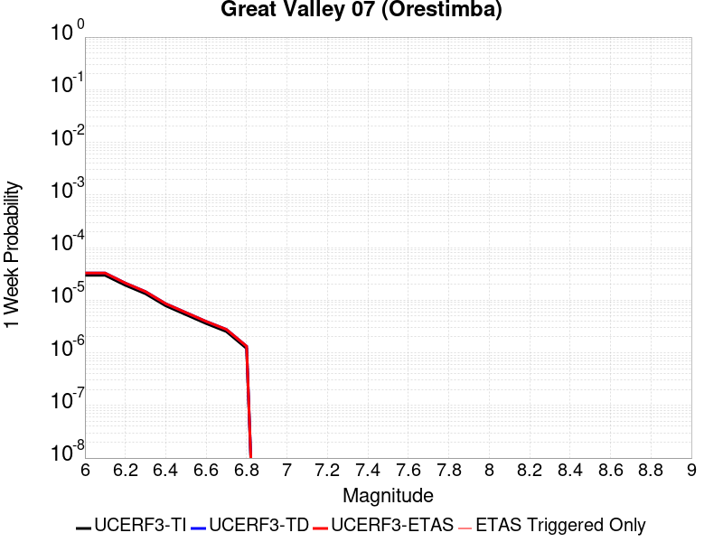 |  |  |  |

| Magnitude | 1 wk TI Prob | 1 wk TD Prob | 1 wk ETAS Prob | 1 wk ETAS/TD Gain | 1 wk ETAS Triggered Only | 1 mo TI Prob | 1 mo TD Prob | 1 mo ETAS Prob | 1 mo ETAS/TD Gain | 1 mo ETAS Triggered Only | 1 yr TI Prob | 1 yr TD Prob | 1 yr ETAS Prob | 1 yr ETAS/TD Gain | 1 yr ETAS Triggered Only | 10 yr TI Prob | 10 yr TD Prob | 10 yr ETAS Prob | 10 yr ETAS/TD Gain | 10 yr ETAS Triggered Only |
|-----|-----|-----|-----|-----|-----|-----|-----|-----|-----|-----|-----|-----|-----|-----|-----|-----|-----|-----|-----|-----|
| 6.0 | 2.9687902E-5 | 3.276403E-5 | 3.276403E-5 | 1.0 | 0.0 | 1.2722766E-4 | 1.4041012E-4 | 1.4041012E-4 | 1.0 | 0.0 | 0.0015478961 | 0.0017082248 | 0.0017621864 | 1.0315894 | 5.4054053E-5 | 0.015371585 | 0.01695849 | 0.017011628 | 1.0031334 | 5.4054053E-5 |
| 6.1 | 2.9687902E-5 | 3.276403E-5 | 3.276403E-5 | 1.0 | 0.0 | 1.2722766E-4 | 1.4041012E-4 | 1.4041012E-4 | 1.0 | 0.0 | 0.0015478961 | 0.0017082248 | 0.0017441992 | 1.0210595 | 3.6036035E-5 | 0.015371585 | 0.01695849 | 0.016993916 | 1.0020889 | 3.6036035E-5 |
| 6.2 | 1.9231524E-5 | 2.1163256E-5 | 2.1163256E-5 | 1.0 | 0.0 | 8.2418206E-5 | 9.0696645E-5 | 9.0696645E-5 | 1.0 | 0.0 | 0.0010029797 | 0.0011036954 | 0.0011216935 | 1.0163071 | 1.8018018E-5 | 0.00998465 | 0.010984551 | 0.011002372 | 1.0016223 | 1.8018018E-5 |
| 6.3 | 1.324766E-5 | 1.4551287E-5 | 1.4551287E-5 | 1.0 | 0.0 | 5.6774446E-5 | 6.236122E-5 | 6.236122E-5 | 1.0 | 0.0 | 6.910097E-4 | 7.5899257E-4 | 7.769969E-4 | 1.0237213 | 1.8018018E-5 | 0.006888649 | 0.00756495 | 0.0075828317 | 1.0023638 | 1.8018018E-5 |
| 6.4 | 7.818645E-6 | 8.574433E-6 | 8.574433E-6 | 1.0 | 0.0 | 3.3508048E-5 | 3.6747075E-5 | 3.6747075E-5 | 1.0 | 0.0 | 4.078841E-4 | 4.4730716E-4 | 4.4730716E-4 | 1.0 | 0.0 | 0.004071363 | 0.0044644084 | 0.0044644084 | 1.0 | 0.0 |
| 6.5 | 5.3076565E-6 | 5.8188784E-6 | 5.8188784E-6 | 1.0 | 0.0 | 2.27469E-5 | 2.4937823E-5 | 2.4937823E-5 | 1.0 | 0.0 | 2.7690834E-4 | 3.035778E-4 | 3.035778E-4 | 1.0 | 0.0 | 0.0027656353 | 0.0030318405 | 0.0030318405 | 1.0 | 0.0 |
| 6.6 | 3.6003578E-6 | 3.949231E-6 | 3.949231E-6 | 1.0 | 0.0 | 1.5430012E-5 | 1.6925174E-5 | 1.6925174E-5 | 1.0 | 0.0 | 1.8784421E-4 | 2.0604608E-4 | 2.0604608E-4 | 1.0 | 0.0 | 0.0018768552 | 0.0020587046 | 0.0020587046 | 1.0 | 0.0 |
| 6.7 | 2.5361826E-6 | 2.7839908E-6 | 2.7839908E-6 | 1.0 | 0.0 | 1.0869308E-5 | 1.1931343E-5 | 1.1931343E-5 | 1.0 | 0.0 | 1.3232579E-4 | 1.4525573E-4 | 1.4525573E-4 | 1.0 | 0.0 | 0.0013224703 | 0.0014517378 | 0.0014517378 | 1.0 | 0.0 |
| 6.8 | 1.2115831E-6 | 1.3316335E-6 | 1.3316335E-6 | 1.0 | 0.0 | 5.1924885E-6 | 5.7069933E-6 | 5.7069933E-6 | 1.0 | 0.0 | 6.3216714E-5 | 6.94814E-5 | 6.94814E-5 | 1.0 | 0.0 | 6.3198735E-4 | 6.946919E-4 | 6.946919E-4 | 1.0 | 0.0 |

## San Andreas (Cholame) rev
*[(top)](#table-of-contents)*

| 1 Week | 1 Month | 1 Year | 10 Year |
|-----|-----|-----|-----|
|  | 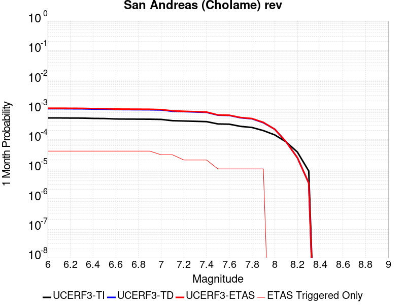 |  |  |

| Magnitude | 1 wk TI Prob | 1 wk TD Prob | 1 wk ETAS Prob | 1 wk ETAS/TD Gain | 1 wk ETAS Triggered Only | 1 mo TI Prob | 1 mo TD Prob | 1 mo ETAS Prob | 1 mo ETAS/TD Gain | 1 mo ETAS Triggered Only | 1 yr TI Prob | 1 yr TD Prob | 1 yr ETAS Prob | 1 yr ETAS/TD Gain | 1 yr ETAS Triggered Only | 10 yr TI Prob | 10 yr TD Prob | 10 yr ETAS Prob | 10 yr ETAS/TD Gain | 10 yr ETAS Triggered Only |
|-----|-----|-----|-----|-----|-----|-----|-----|-----|-----|-----|-----|-----|-----|-----|-----|-----|-----|-----|-----|-----|
| 6.0 | 1.2302514E-4 | 2.5347935E-4 | 2.714928E-4 | 1.0710647 | 1.8018018E-5 | 5.27144E-4 | 0.0010858894 | 0.0011038879 | 1.0165749 | 1.8018018E-5 | 0.0063991086 | 0.013141075 | 0.013176638 | 1.0027062 | 3.6036035E-5 | 0.06217949 | 0.124989286 | 0.12503658 | 1.0003784 | 5.4054053E-5 |
| 6.1 | 1.2302514E-4 | 2.5347935E-4 | 2.714928E-4 | 1.0710647 | 1.8018018E-5 | 5.27144E-4 | 0.0010858894 | 0.0011038879 | 1.0165749 | 1.8018018E-5 | 0.0063991086 | 0.013141075 | 0.013176638 | 1.0027062 | 3.6036035E-5 | 0.06217949 | 0.124989286 | 0.12503658 | 1.0003784 | 5.4054053E-5 |
| 6.2 | 1.2203569E-4 | 2.516455E-4 | 2.69659E-4 | 1.0715828 | 1.8018018E-5 | 5.2290526E-4 | 0.0010780366 | 0.0010960352 | 1.0166957 | 1.8018018E-5 | 0.006347804 | 0.013046616 | 0.013082182 | 1.0027261 | 3.6036035E-5 | 0.061695136 | 0.12417533 | 0.12422267 | 1.0003812 | 5.4054053E-5 |
| 6.3 | 1.2142645E-4 | 2.5050418E-4 | 2.6851767E-4 | 1.071909 | 1.8018018E-5 | 5.202953E-4 | 0.0010731491 | 0.0010911479 | 1.0167718 | 1.8018018E-5 | 0.006316212 | 0.012987822 | 0.01302339 | 1.0027386 | 3.6036035E-5 | 0.06139677 | 0.12366937 | 0.12371674 | 1.000383 | 5.4054053E-5 |
| 6.4 | 1.1865206E-4 | 2.4555085E-4 | 2.6356443E-4 | 1.07336 | 1.8018018E-5 | 5.0840975E-4 | 0.0010519379 | 0.001069937 | 1.0171103 | 1.8018018E-5 | 0.006172335 | 0.0127326185 | 0.012768196 | 1.0027941 | 3.6036035E-5 | 0.060036868 | 0.121460214 | 0.121507704 | 1.000391 | 5.4054053E-5 |
| 6.5 | 1.17443946E-4 | 2.4347806E-4 | 2.614917E-4 | 1.0739846 | 1.8018018E-5 | 5.032341E-4 | 0.0010430617 | 0.0010610609 | 1.0172561 | 1.8018018E-5 | 0.006109677 | 0.012625805 | 0.012661386 | 1.0028181 | 3.6036035E-5 | 0.059444077 | 0.12053282 | 0.12058036 | 1.0003945 | 5.4054053E-5 |
| 6.6 | 1.13579066E-4 | 2.3655128E-4 | 2.5456503E-4 | 1.0761516 | 1.8018018E-5 | 4.866766E-4 | 0.0010133989 | 0.0010313985 | 1.0177618 | 1.8018018E-5 | 0.0059092017 | 0.01226878 | 0.012304374 | 1.0029012 | 3.6036035E-5 | 0.057545185 | 0.11744262 | 0.11749033 | 1.0004061 | 5.4054053E-5 |
| 6.7 | 1.1271412E-4 | 2.3499105E-4 | 2.5300484E-4 | 1.0766573 | 1.8018018E-5 | 4.829711E-4 | 0.0010067173 | 0.0010247172 | 1.0178797 | 1.8018018E-5 | 0.005864331 | 0.012188345 | 0.012223942 | 1.0029205 | 3.6036035E-5 | 0.057119697 | 0.11674537 | 0.11679311 | 1.000409 | 5.4054053E-5 |
| 6.8 | 1.1217975E-4 | 2.3387192E-4 | 2.5188574E-4 | 1.0770242 | 1.8018018E-5 | 4.8068175E-4 | 0.0010019247 | 0.0010199248 | 1.0179654 | 1.8018018E-5 | 0.005836608 | 0.012130647 | 0.012166246 | 1.0029346 | 3.6036035E-5 | 0.056856725 | 0.11624266 | 0.116290435 | 1.0004109 | 5.4054053E-5 |
| 6.9 | 1.1146753E-4 | 2.323557E-4 | 2.5036954E-4 | 1.0775269 | 1.8018018E-5 | 4.7763053E-4 | 9.954317E-4 | 0.0010134317 | 1.0180827 | 1.8018018E-5 | 0.0057996577 | 0.012052471 | 0.012088073 | 1.0029539 | 3.6036035E-5 | 0.056506127 | 0.1155621 | 0.115609914 | 1.0004137 | 5.4054053E-5 |
| 7.0 | 1.0965793E-4 | 2.2857812E-4 | 2.46592E-4 | 1.0788085 | 1.8018018E-5 | 4.698779E-4 | 9.792543E-4 | 9.972546E-4 | 1.0183817 | 1.8018018E-5 | 0.005705768 | 0.011857672 | 0.011893281 | 1.003003 | 3.6036035E-5 | 0.055614736 | 0.11386053 | 0.11390843 | 1.0004207 | 5.4054053E-5 |
| 7.1 | 9.927982E-5 | 2.0671786E-4 | 2.2473215E-4 | 1.0871444 | 1.8018018E-5 | 4.2541555E-4 | 8.856339E-4 | 9.03636E-4 | 1.0203267 | 1.8018018E-5 | 0.0051671406 | 0.010729581 | 0.010765231 | 1.0033225 | 3.6036035E-5 | 0.05048634 | 0.103941396 | 0.10398983 | 1.000466 | 5.4054053E-5 |
| 7.2 | 9.696786E-5 | 2.0175103E-4 | 2.0175103E-4 | 1.0 | 0.0 | 4.1551032E-4 | 8.6436176E-4 | 8.6436176E-4 | 1.0 | 0.0 | 0.00504711 | 0.010473111 | 0.01049094 | 1.0017024 | 1.8018018E-5 | 0.04934009 | 0.10167709 | 0.10170946 | 1.0003184 | 3.6036035E-5 |
| 7.3 | 9.4727984E-5 | 1.9602077E-4 | 1.9602077E-4 | 1.0 | 0.0 | 4.0591392E-4 | 8.3981955E-4 | 8.3981955E-4 | 1.0 | 0.0 | 0.0049308087 | 0.010177139 | 0.010194974 | 1.0017524 | 1.8018018E-5 | 0.048228268 | 0.09904058 | 0.099073045 | 1.0003278 | 3.6036035E-5 |
| 7.4 | 9.220358E-5 | 1.8970236E-4 | 1.8970236E-4 | 1.0 | 0.0 | 3.9509835E-4 | 8.1275776E-4 | 8.1275776E-4 | 1.0 | 0.0 | 0.004799717 | 0.00985068 | 0.00986852 | 1.0018111 | 1.8018018E-5 | 0.046973653 | 0.09611052 | 0.0961431 | 1.0003389 | 3.6036035E-5 |
| 7.5 | 7.71631E-5 | 1.5289382E-4 | 1.5289382E-4 | 1.0 | 0.0 | 3.306571E-4 | 6.550948E-4 | 6.550948E-4 | 1.0 | 0.0 | 0.0040183207 | 0.007946685 | 0.00796456 | 1.0022494 | 1.8018018E-5 | 0.03946433 | 0.078784436 | 0.07881763 | 1.0004214 | 3.6036035E-5 |
| 7.6 | 7.5634416E-5 | 1.4947375E-4 | 1.4947375E-4 | 1.0 | 0.0 | 3.241072E-4 | 6.404447E-4 | 6.404447E-4 | 1.0 | 0.0 | 0.0039388672 | 0.007769605 | 0.0077874833 | 1.002301 | 1.8018018E-5 | 0.038697794 | 0.07714253 | 0.07717578 | 1.0004311 | 3.6036035E-5 |
| 7.7 | 6.3783E-5 | 1.2457426E-4 | 1.2457426E-4 | 1.0 | 0.0 | 2.7332708E-4 | 5.337805E-4 | 5.337805E-4 | 1.0 | 0.0 | 0.0033226798 | 0.00647944 | 0.006497341 | 1.0027628 | 1.8018018E-5 | 0.032734364 | 0.06499155 | 0.06502525 | 1.0005184 | 3.6036035E-5 |
| 7.8 | 5.863422E-5 | 1.15058065E-4 | 1.15058065E-4 | 1.0 | 0.0 | 2.512653E-4 | 4.9301283E-4 | 4.9301283E-4 | 1.0 | 0.0 | 0.003054864 | 0.005985933 | 0.006003843 | 1.002992 | 1.8018018E-5 | 0.030132094 | 0.06007134 | 0.060105212 | 1.0005639 | 3.6036035E-5 |
| 7.9 | 4.595283E-5 | 8.492014E-5 | 8.492014E-5 | 1.0 | 0.0 | 1.9692584E-4 | 3.638927E-4 | 3.638927E-4 | 1.0 | 0.0 | 0.0023949358 | 0.0044214004 | 0.004439339 | 1.0040572 | 1.8018018E-5 | 0.023692891 | 0.04467237 | 0.044706795 | 1.0007707 | 3.6036035E-5 |
| 8.0 | 3.2950178E-5 | 5.1184972E-5 | 5.1184972E-5 | 1.0 | 0.0 | 1.412074E-4 | 2.1934573E-4 | 2.1934573E-4 | 1.0 | 0.0 | 0.0017178444 | 0.0026672655 | 0.0026672655 | 1.0 | 0.0 | 0.017046256 | 0.027383326 | 0.02740085 | 1.0006399 | 1.8018018E-5 |
| 8.1 | 1.9177472E-5 | 1.9391058E-5 | 1.9391058E-5 | 1.0 | 0.0 | 8.218658E-5 | 8.310189E-5 | 8.310189E-5 | 1.0 | 0.0 | 0.0010001622 | 0.0010112965 | 0.0010112965 | 1.0 | 0.0 | 0.009956728 | 0.01086626 | 0.01086626 | 1.0 | 0.0 |
| 8.2 | 8.643924E-6 | 5.5526552E-6 | 5.5526552E-6 | 1.0 | 0.0 | 3.704486E-5 | 2.3796878E-5 | 2.3796878E-5 | 1.0 | 0.0 | 4.5092785E-4 | 2.8968856E-4 | 2.8968856E-4 | 1.0 | 0.0 | 0.0045001395 | 0.0032912085 | 0.0032912085 | 1.0 | 0.0 |
| 8.3 | 1.983087E-6 | 7.7871465E-7 | 7.7871465E-7 | 1.0 | 0.0 | 8.498917E-6 | 3.3373444E-6 | 3.3373444E-6 | 1.0 | 0.0 | 1.034694E-4 | 4.063143E-5 | 4.063143E-5 | 1.0 | 0.0 | 0.0010342124 | 4.7926197E-4 | 4.7926197E-4 | 1.0 | 0.0 |

## San Andreas (Carrizo) rev
*[(top)](#table-of-contents)*

| 1 Week | 1 Month | 1 Year | 10 Year |
|-----|-----|-----|-----|
|  |  |  |  |

| Magnitude | 1 wk TI Prob | 1 wk TD Prob | 1 wk ETAS Prob | 1 wk ETAS/TD Gain | 1 wk ETAS Triggered Only | 1 mo TI Prob | 1 mo TD Prob | 1 mo ETAS Prob | 1 mo ETAS/TD Gain | 1 mo ETAS Triggered Only | 1 yr TI Prob | 1 yr TD Prob | 1 yr ETAS Prob | 1 yr ETAS/TD Gain | 1 yr ETAS Triggered Only | 10 yr TI Prob | 10 yr TD Prob | 10 yr ETAS Prob | 10 yr ETAS/TD Gain | 10 yr ETAS Triggered Only |
|-----|-----|-----|-----|-----|-----|-----|-----|-----|-----|-----|-----|-----|-----|-----|-----|-----|-----|-----|-----|-----|
| 6.0 | 1.1674632E-4 | 2.446488E-4 | 2.446488E-4 | 1.0 | 0.0 | 5.002454E-4 | 0.0010480753 | 0.0010480753 | 1.0 | 0.0 | 0.006073493 | 0.012686147 | 0.012703937 | 1.0014023 | 1.8018018E-5 | 0.0591016 | 0.12121105 | 0.121242724 | 1.0002613 | 3.6036035E-5 |
| 6.1 | 1.1674632E-4 | 2.446488E-4 | 2.446488E-4 | 1.0 | 0.0 | 5.002454E-4 | 0.0010480753 | 0.0010480753 | 1.0 | 0.0 | 0.006073493 | 0.012686147 | 0.012703937 | 1.0014023 | 1.8018018E-5 | 0.0591016 | 0.12121105 | 0.121242724 | 1.0002613 | 3.6036035E-5 |
| 6.2 | 1.1674632E-4 | 2.446488E-4 | 2.446488E-4 | 1.0 | 0.0 | 5.002454E-4 | 0.0010480753 | 0.0010480753 | 1.0 | 0.0 | 0.006073493 | 0.012686147 | 0.012703937 | 1.0014023 | 1.8018018E-5 | 0.0591016 | 0.12121105 | 0.121242724 | 1.0002613 | 3.6036035E-5 |
| 6.3 | 1.1674632E-4 | 2.446488E-4 | 2.446488E-4 | 1.0 | 0.0 | 5.002454E-4 | 0.0010480753 | 0.0010480753 | 1.0 | 0.0 | 0.006073493 | 0.012686147 | 0.012703937 | 1.0014023 | 1.8018018E-5 | 0.0591016 | 0.12121105 | 0.121242724 | 1.0002613 | 3.6036035E-5 |
| 6.4 | 1.1674632E-4 | 2.446488E-4 | 2.446488E-4 | 1.0 | 0.0 | 5.002454E-4 | 0.0010480753 | 0.0010480753 | 1.0 | 0.0 | 0.006073493 | 0.012686147 | 0.012703937 | 1.0014023 | 1.8018018E-5 | 0.0591016 | 0.12121105 | 0.121242724 | 1.0002613 | 3.6036035E-5 |
| 6.5 | 1.13136164E-4 | 2.378427E-4 | 2.378427E-4 | 1.0 | 0.0 | 4.847792E-4 | 0.0010189292 | 0.0010189292 | 1.0 | 0.0 | 0.0058862255 | 0.0123353535 | 0.012353149 | 1.0014427 | 1.8018018E-5 | 0.057327334 | 0.11818193 | 0.118213706 | 1.0002689 | 3.6036035E-5 |
| 6.6 | 1.13136164E-4 | 2.378427E-4 | 2.378427E-4 | 1.0 | 0.0 | 4.847792E-4 | 0.0010189292 | 0.0010189292 | 1.0 | 0.0 | 0.0058862255 | 0.0123353535 | 0.012353149 | 1.0014427 | 1.8018018E-5 | 0.057327334 | 0.11818193 | 0.118213706 | 1.0002689 | 3.6036035E-5 |
| 6.7 | 1.1149675E-4 | 2.3475211E-4 | 2.3475211E-4 | 1.0 | 0.0 | 4.777557E-4 | 0.001005694 | 0.001005694 | 1.0 | 0.0 | 0.0058011734 | 0.012176025 | 0.012193823 | 1.0014617 | 1.8018018E-5 | 0.05652051 | 0.11680319 | 0.11683502 | 1.0002725 | 3.6036035E-5 |
| 6.8 | 1.1103589E-4 | 2.3377202E-4 | 2.3377202E-4 | 1.0 | 0.0 | 4.7578133E-4 | 0.0010014969 | 0.0010014969 | 1.0 | 0.0 | 0.005777263 | 0.012125494 | 0.012143293 | 1.001468 | 1.8018018E-5 | 0.056293584 | 0.11636314 | 0.116394974 | 1.0002737 | 3.6036035E-5 |
| 6.9 | 1.1053259E-4 | 2.3269399E-4 | 2.3269399E-4 | 1.0 | 0.0 | 4.7362508E-4 | 9.968803E-4 | 9.968803E-4 | 1.0 | 0.0 | 0.0057511497 | 0.012069912 | 0.012087712 | 1.0014747 | 1.8018018E-5 | 0.05604569 | 0.11587893 | 0.11591079 | 1.0002749 | 3.6036035E-5 |
| 7.0 | 1.1005377E-4 | 2.3170069E-4 | 2.3170069E-4 | 1.0 | 0.0 | 4.7157376E-4 | 9.926265E-4 | 9.926265E-4 | 1.0 | 0.0 | 0.0057263062 | 0.012018695 | 0.012036496 | 1.0014812 | 1.8018018E-5 | 0.055809796 | 0.115430854 | 0.115462735 | 1.0002762 | 3.6036035E-5 |
| 7.1 | 1.0308142E-4 | 2.167718E-4 | 2.167718E-4 | 1.0 | 0.0 | 4.417027E-4 | 9.2869235E-4 | 9.2869235E-4 | 1.0 | 0.0 | 0.0053644776 | 0.01124853 | 0.011266345 | 1.0015838 | 1.8018018E-5 | 0.052368138 | 0.10868131 | 0.10871343 | 1.0002955 | 3.6036035E-5 |
| 7.2 | 1.0027479E-4 | 2.1084007E-4 | 2.1084007E-4 | 1.0 | 0.0 | 4.296783E-4 | 9.032884E-4 | 9.032884E-4 | 1.0 | 0.0 | 0.0052187922 | 0.010942383 | 0.010960204 | 1.0016286 | 1.8018018E-5 | 0.050979212 | 0.105982825 | 0.10601504 | 1.000304 | 3.6036035E-5 |
| 7.3 | 9.816942E-5 | 2.0557355E-4 | 2.0557355E-4 | 1.0 | 0.0 | 4.2065824E-4 | 8.80733E-4 | 8.80733E-4 | 1.0 | 0.0 | 0.005109493 | 0.010670493 | 0.010688319 | 1.0016706 | 1.8018018E-5 | 0.049935985 | 0.10356064 | 0.10359295 | 1.000312 | 3.6036035E-5 |
| 7.4 | 9.5634205E-5 | 1.992445E-4 | 1.992445E-4 | 1.0 | 0.0 | 4.0979648E-4 | 8.5362646E-4 | 8.5362646E-4 | 1.0 | 0.0 | 0.0049778637 | 0.010343644 | 0.010361476 | 1.0017239 | 1.8018018E-5 | 0.048678253 | 0.100639075 | 0.100671485 | 1.000322 | 3.6036035E-5 |
| 7.5 | 8.052417E-5 | 1.6229275E-4 | 1.6229275E-4 | 1.0 | 0.0 | 3.4505792E-4 | 6.953552E-4 | 6.953552E-4 | 1.0 | 0.0 | 0.0041929903 | 0.008433169 | 0.008451035 | 1.0021186 | 1.8018018E-5 | 0.04114753 | 0.08332991 | 0.083362944 | 1.0003964 | 3.6036035E-5 |
| 7.6 | 7.897024E-5 | 1.5881035E-4 | 1.5881035E-4 | 1.0 | 0.0 | 3.384E-4 | 6.804384E-4 | 6.804384E-4 | 1.0 | 0.0 | 0.0041122385 | 0.008252948 | 0.008270817 | 1.0021652 | 1.8018018E-5 | 0.040369697 | 0.08166586 | 0.081698954 | 1.0004052 | 3.6036035E-5 |
| 7.7 | 6.707427E-5 | 1.338002E-4 | 1.338002E-4 | 1.0 | 0.0 | 2.8742946E-4 | 5.733035E-4 | 5.733035E-4 | 1.0 | 0.0 | 0.003493839 | 0.0069576646 | 0.006975557 | 1.0025717 | 1.8018018E-5 | 0.034394164 | 0.06952006 | 0.06955359 | 1.0004823 | 3.6036035E-5 |
| 7.8 | 6.147705E-5 | 1.229152E-4 | 1.229152E-4 | 1.0 | 0.0 | 2.6344648E-4 | 5.266731E-4 | 5.266731E-4 | 1.0 | 0.0 | 0.0032027436 | 0.006393418 | 0.006411321 | 1.0028002 | 1.8018018E-5 | 0.031569764 | 0.06394434 | 0.06397807 | 1.0005275 | 3.6036035E-5 |
| 7.9 | 4.7636717E-5 | 8.947766E-5 | 8.947766E-5 | 1.0 | 0.0 | 2.0414138E-4 | 3.8341933E-4 | 3.8341933E-4 | 1.0 | 0.0 | 0.0024825884 | 0.0046581463 | 0.004676081 | 1.0038501 | 1.8018018E-5 | 0.024550365 | 0.046948183 | 0.046982527 | 1.0007316 | 3.6036035E-5 |
| 8.0 | 3.3554235E-5 | 5.2556596E-5 | 5.2556596E-5 | 1.0 | 0.0 | 1.4379594E-4 | 2.252231E-4 | 2.252231E-4 | 1.0 | 0.0 | 0.0017493097 | 0.002738645 | 0.002738645 | 1.0 | 0.0 | 0.017356034 | 0.0280876 | 0.02810511 | 1.0006235 | 1.8018018E-5 |
| 8.1 | 1.9175432E-5 | 1.9390885E-5 | 1.9390885E-5 | 1.0 | 0.0 | 8.217783E-5 | 8.310115E-5 | 8.310115E-5 | 1.0 | 0.0 | 0.0010000558 | 0.0010112876 | 0.0010112876 | 1.0 | 0.0 | 0.009955673 | 0.010866142 | 0.010866142 | 1.0 | 0.0 |
| 8.2 | 8.643924E-6 | 5.5526552E-6 | 5.5526552E-6 | 1.0 | 0.0 | 3.704486E-5 | 2.3796878E-5 | 2.3796878E-5 | 1.0 | 0.0 | 4.5092785E-4 | 2.8968856E-4 | 2.8968856E-4 | 1.0 | 0.0 | 0.0045001395 | 0.0032912085 | 0.0032912085 | 1.0 | 0.0 |
| 8.3 | 1.983087E-6 | 7.7871465E-7 | 7.7871465E-7 | 1.0 | 0.0 | 8.498917E-6 | 3.3373444E-6 | 3.3373444E-6 | 1.0 | 0.0 | 1.034694E-4 | 4.063143E-5 | 4.063143E-5 | 1.0 | 0.0 | 0.0010342124 | 4.7926197E-4 | 4.7926197E-4 | 1.0 | 0.0 |

## San Andreas (Big Bend)
*[(top)](#table-of-contents)*

| 1 Week | 1 Month | 1 Year | 10 Year |
|-----|-----|-----|-----|
|  |  |  |  |

| Magnitude | 1 wk TI Prob | 1 wk TD Prob | 1 wk ETAS Prob | 1 wk ETAS/TD Gain | 1 wk ETAS Triggered Only | 1 mo TI Prob | 1 mo TD Prob | 1 mo ETAS Prob | 1 mo ETAS/TD Gain | 1 mo ETAS Triggered Only | 1 yr TI Prob | 1 yr TD Prob | 1 yr ETAS Prob | 1 yr ETAS/TD Gain | 1 yr ETAS Triggered Only | 10 yr TI Prob | 10 yr TD Prob | 10 yr ETAS Prob | 10 yr ETAS/TD Gain | 10 yr ETAS Triggered Only |
|-----|-----|-----|-----|-----|-----|-----|-----|-----|-----|-----|-----|-----|-----|-----|-----|-----|-----|-----|-----|-----|
| 6.0 | 1.0179969E-4 | 2.0198448E-4 | 2.0198448E-4 | 1.0 | 0.0 | 4.362114E-4 | 8.653616E-4 | 8.653616E-4 | 1.0 | 0.0 | 0.0052979486 | 0.010485169 | 0.010502997 | 1.0017004 | 1.8018018E-5 | 0.051734097 | 0.101998486 | 0.10203085 | 1.0003172 | 3.6036035E-5 |
| 6.1 | 1.0179969E-4 | 2.0198448E-4 | 2.0198448E-4 | 1.0 | 0.0 | 4.362114E-4 | 8.653616E-4 | 8.653616E-4 | 1.0 | 0.0 | 0.0052979486 | 0.010485169 | 0.010502997 | 1.0017004 | 1.8018018E-5 | 0.051734097 | 0.101998486 | 0.10203085 | 1.0003172 | 3.6036035E-5 |
| 6.2 | 1.0179969E-4 | 2.0198448E-4 | 2.0198448E-4 | 1.0 | 0.0 | 4.362114E-4 | 8.653616E-4 | 8.653616E-4 | 1.0 | 0.0 | 0.0052979486 | 0.010485169 | 0.010502997 | 1.0017004 | 1.8018018E-5 | 0.051734097 | 0.101998486 | 0.10203085 | 1.0003172 | 3.6036035E-5 |
| 6.3 | 1.0179969E-4 | 2.0198448E-4 | 2.0198448E-4 | 1.0 | 0.0 | 4.362114E-4 | 8.653616E-4 | 8.653616E-4 | 1.0 | 0.0 | 0.0052979486 | 0.010485169 | 0.010502997 | 1.0017004 | 1.8018018E-5 | 0.051734097 | 0.101998486 | 0.10203085 | 1.0003172 | 3.6036035E-5 |
| 6.4 | 9.1639464E-5 | 1.8553282E-4 | 1.8553282E-4 | 1.0 | 0.0 | 3.9268145E-4 | 7.9489854E-4 | 7.9489854E-4 | 1.0 | 0.0 | 0.0047704205 | 0.009635065 | 0.00965291 | 1.001852 | 1.8018018E-5 | 0.046693064 | 0.094318874 | 0.09435151 | 1.0003461 | 3.6036035E-5 |
| 6.5 | 9.1639464E-5 | 1.8553282E-4 | 1.8553282E-4 | 1.0 | 0.0 | 3.9268145E-4 | 7.9489854E-4 | 7.9489854E-4 | 1.0 | 0.0 | 0.0047704205 | 0.009635065 | 0.00965291 | 1.001852 | 1.8018018E-5 | 0.046693064 | 0.094318874 | 0.09435151 | 1.0003461 | 3.6036035E-5 |
| 6.6 | 9.042622E-5 | 1.8360041E-4 | 1.8360041E-4 | 1.0 | 0.0 | 3.8748336E-4 | 7.866218E-4 | 7.866218E-4 | 1.0 | 0.0 | 0.0047074095 | 0.00953518 | 0.009553026 | 1.0018716 | 1.8018018E-5 | 0.046089325 | 0.093412176 | 0.09344485 | 1.0003498 | 3.6036035E-5 |
| 6.7 | 8.9836685E-5 | 1.8274275E-4 | 1.8274275E-4 | 1.0 | 0.0 | 3.8495753E-4 | 7.8294834E-4 | 7.8294834E-4 | 1.0 | 0.0 | 0.00467679 | 0.009490845 | 0.009508692 | 1.0018804 | 1.8018018E-5 | 0.045795817 | 0.09300621 | 0.093038894 | 1.0003514 | 3.6036035E-5 |
| 6.8 | 8.9471854E-5 | 1.8220942E-4 | 1.8220942E-4 | 1.0 | 0.0 | 3.8339442E-4 | 7.80664E-4 | 7.80664E-4 | 1.0 | 0.0 | 0.004657841 | 0.009463275 | 0.009481123 | 1.001886 | 1.8018018E-5 | 0.04561414 | 0.092753045 | 0.09278574 | 1.0003525 | 3.6036035E-5 |
| 6.9 | 8.858234E-5 | 1.8102716E-4 | 1.8102716E-4 | 1.0 | 0.0 | 3.7958333E-4 | 7.7560026E-4 | 7.7560026E-4 | 1.0 | 0.0 | 0.004611638 | 0.009402157 | 0.009420006 | 1.0018984 | 1.8018018E-5 | 0.04517103 | 0.09219259 | 0.092225306 | 1.0003549 | 3.6036035E-5 |
| 7.0 | 8.7433385E-5 | 1.7941212E-4 | 1.7941212E-4 | 1.0 | 0.0 | 3.746607E-4 | 7.686827E-4 | 7.686827E-4 | 1.0 | 0.0 | 0.004551957 | 0.009318659 | 0.00933651 | 1.0019156 | 1.8018018E-5 | 0.044598386 | 0.091426075 | 0.09145881 | 1.0003581 | 3.6036035E-5 |
| 7.1 | 8.684964E-5 | 1.7852975E-4 | 1.7852975E-4 | 1.0 | 0.0 | 3.7215967E-4 | 7.649033E-4 | 7.649033E-4 | 1.0 | 0.0 | 0.0045216335 | 0.009273038 | 0.009290889 | 1.001925 | 1.8018018E-5 | 0.04430731 | 0.09100699 | 0.09103975 | 1.0003599 | 3.6036035E-5 |
| 7.2 | 8.606521E-5 | 1.7743398E-4 | 1.7743398E-4 | 1.0 | 0.0 | 3.6879873E-4 | 7.602099E-4 | 7.602099E-4 | 1.0 | 0.0 | 0.0044808835 | 0.00921638 | 0.009234233 | 1.001937 | 1.8018018E-5 | 0.043916024 | 0.090486936 | 0.09051971 | 1.0003622 | 3.6036035E-5 |
| 7.3 | 8.568266E-5 | 1.7685178E-4 | 1.7685178E-4 | 1.0 | 0.0 | 3.6715972E-4 | 7.5771625E-4 | 7.5771625E-4 | 1.0 | 0.0 | 0.0044610105 | 0.009186276 | 0.009204129 | 1.0019433 | 1.8018018E-5 | 0.043725148 | 0.09020724 | 0.090240024 | 1.0003635 | 3.6036035E-5 |
| 7.4 | 8.5432206E-5 | 1.7647621E-4 | 1.7647621E-4 | 1.0 | 0.0 | 3.6608664E-4 | 7.5610756E-4 | 7.5610756E-4 | 1.0 | 0.0 | 0.004447999 | 0.009166856 | 0.009184709 | 1.0019475 | 1.8018018E-5 | 0.043600157 | 0.09002688 | 0.09005967 | 1.0003643 | 3.6036035E-5 |
| 7.5 | 8.4791965E-5 | 1.7516452E-4 | 1.7516452E-4 | 1.0 | 0.0 | 3.633435E-4 | 7.504893E-4 | 7.504893E-4 | 1.0 | 0.0 | 0.0044147377 | 0.009099027 | 0.0091168815 | 1.0019622 | 1.8018018E-5 | 0.043280575 | 0.08940279 | 0.0894356 | 1.000367 | 3.6036035E-5 |
| 7.6 | 8.241105E-5 | 1.6959863E-4 | 1.6959863E-4 | 1.0 | 0.0 | 3.531424E-4 | 7.2664896E-4 | 7.2664896E-4 | 1.0 | 0.0 | 0.0042910352 | 0.008811154 | 0.008829013 | 1.0020269 | 1.8018018E-5 | 0.042091176 | 0.08677287 | 0.086805776 | 1.0003792 | 3.6036035E-5 |
| 7.7 | 7.00432E-5 | 1.4312482E-4 | 1.4312482E-4 | 1.0 | 0.0 | 3.001506E-4 | 6.132479E-4 | 6.132479E-4 | 1.0 | 0.0 | 0.0036482112 | 0.007440774 | 0.007458658 | 1.0024035 | 1.8018018E-5 | 0.035888977 | 0.074004605 | 0.07403798 | 1.0004508 | 3.6036035E-5 |
| 7.8 | 6.415362E-5 | 1.306631E-4 | 1.306631E-4 | 1.0 | 0.0 | 2.749151E-4 | 5.598646E-4 | 5.598646E-4 | 1.0 | 0.0 | 0.0033419547 | 0.006795078 | 0.006812974 | 1.0026336 | 1.8018018E-5 | 0.03292141 | 0.06769488 | 0.067728475 | 1.0004963 | 3.6036035E-5 |
| 7.9 | 4.939911E-5 | 9.4112256E-5 | 9.4112256E-5 | 1.0 | 0.0 | 2.116933E-4 | 4.032759E-4 | 4.032759E-4 | 1.0 | 0.0 | 0.0025743195 | 0.0048988396 | 0.0049167695 | 1.00366 | 1.8018018E-5 | 0.025447013 | 0.04924298 | 0.049277242 | 1.0006957 | 3.6036035E-5 |
| 8.0 | 3.344983E-5 | 5.264615E-5 | 5.264615E-5 | 1.0 | 0.0 | 1.4334853E-4 | 2.2560685E-4 | 2.2560685E-4 | 1.0 | 0.0 | 0.0017438711 | 0.0027433054 | 0.0027433054 | 1.0 | 0.0 | 0.017302496 | 0.028128505 | 0.028146015 | 1.0006225 | 1.8018018E-5 |
| 8.1 | 1.9104898E-5 | 1.9378636E-5 | 1.9378636E-5 | 1.0 | 0.0 | 8.1875565E-5 | 8.304865E-5 | 8.304865E-5 | 1.0 | 0.0 | 9.963791E-4 | 0.001010649 | 0.001010649 | 1.0 | 0.0 | 0.009919235 | 0.010857707 | 0.010857707 | 1.0 | 0.0 |
| 8.2 | 8.643924E-6 | 5.5526552E-6 | 5.5526552E-6 | 1.0 | 0.0 | 3.704486E-5 | 2.3796878E-5 | 2.3796878E-5 | 1.0 | 0.0 | 4.5092785E-4 | 2.8968856E-4 | 2.8968856E-4 | 1.0 | 0.0 | 0.0045001395 | 0.0032912085 | 0.0032912085 | 1.0 | 0.0 |
| 8.3 | 1.983087E-6 | 7.7871465E-7 | 7.7871465E-7 | 1.0 | 0.0 | 8.498917E-6 | 3.3373444E-6 | 3.3373444E-6 | 1.0 | 0.0 | 1.034694E-4 | 4.063143E-5 | 4.063143E-5 | 1.0 | 0.0 | 0.0010342124 | 4.7926197E-4 | 4.7926197E-4 | 1.0 | 0.0 |

## Great Valley 05 Pittsburg - Kirby Hills alt1
*[(top)](#table-of-contents)*

| 1 Week | 1 Month | 1 Year | 10 Year |
|-----|-----|-----|-----|
|  |  |  |  |

| Magnitude | 1 wk TI Prob | 1 wk TD Prob | 1 wk ETAS Prob | 1 wk ETAS/TD Gain | 1 wk ETAS Triggered Only | 1 mo TI Prob | 1 mo TD Prob | 1 mo ETAS Prob | 1 mo ETAS/TD Gain | 1 mo ETAS Triggered Only | 1 yr TI Prob | 1 yr TD Prob | 1 yr ETAS Prob | 1 yr ETAS/TD Gain | 1 yr ETAS Triggered Only | 10 yr TI Prob | 10 yr TD Prob | 10 yr ETAS Prob | 10 yr ETAS/TD Gain | 10 yr ETAS Triggered Only |
|-----|-----|-----|-----|-----|-----|-----|-----|-----|-----|-----|-----|-----|-----|-----|-----|-----|-----|-----|-----|-----|
| 6.0 | 4.187212E-5 | 5.3470267E-5 | 5.3470267E-5 | 1.0 | 0.0 | 1.794396E-4 | 2.2914392E-4 | 2.2914392E-4 | 1.0 | 0.0 | 0.002182488 | 0.0027872324 | 0.0028052002 | 1.0064465 | 1.8018018E-5 | 0.021611776 | 0.027617214 | 0.027652256 | 1.0012687 | 3.6036035E-5 |
| 6.1 | 4.187212E-5 | 5.3470267E-5 | 5.3470267E-5 | 1.0 | 0.0 | 1.794396E-4 | 2.2914392E-4 | 2.2914392E-4 | 1.0 | 0.0 | 0.002182488 | 0.0027872324 | 0.0028052002 | 1.0064465 | 1.8018018E-5 | 0.021611776 | 0.027617214 | 0.027652256 | 1.0012687 | 3.6036035E-5 |
| 6.2 | 1.7353306E-5 | 2.2165877E-5 | 2.2165877E-5 | 1.0 | 0.0 | 7.436919E-5 | 9.4995485E-5 | 9.4995485E-5 | 1.0 | 0.0 | 9.050688E-4 | 0.001156366 | 0.001156366 | 1.0 | 0.0 | 0.009013915 | 0.011541089 | 0.011541089 | 1.0 | 0.0 |
| 6.3 | 1.7353306E-5 | 2.2165877E-5 | 2.2165877E-5 | 1.0 | 0.0 | 7.436919E-5 | 9.4995485E-5 | 9.4995485E-5 | 1.0 | 0.0 | 9.050688E-4 | 0.001156366 | 0.001156366 | 1.0 | 0.0 | 0.009013915 | 0.011541089 | 0.011541089 | 1.0 | 0.0 |
| 6.4 | 1.4028824E-5 | 1.791014E-5 | 1.791014E-5 | 1.0 | 0.0 | 6.0122147E-5 | 7.675775E-5 | 7.675775E-5 | 1.0 | 0.0 | 7.3174125E-4 | 9.3452557E-4 | 9.3452557E-4 | 1.0 | 0.0 | 0.0072933645 | 0.009342976 | 0.009342976 | 1.0 | 0.0 |

## San Andreas (San Bernardino S)
*[(top)](#table-of-contents)*

| 1 Week | 1 Month | 1 Year | 10 Year |
|-----|-----|-----|-----|
|  |  |  |  |

| Magnitude | 1 wk TI Prob | 1 wk TD Prob | 1 wk ETAS Prob | 1 wk ETAS/TD Gain | 1 wk ETAS Triggered Only | 1 mo TI Prob | 1 mo TD Prob | 1 mo ETAS Prob | 1 mo ETAS/TD Gain | 1 mo ETAS Triggered Only | 1 yr TI Prob | 1 yr TD Prob | 1 yr ETAS Prob | 1 yr ETAS/TD Gain | 1 yr ETAS Triggered Only | 10 yr TI Prob | 10 yr TD Prob | 10 yr ETAS Prob | 10 yr ETAS/TD Gain | 10 yr ETAS Triggered Only |
|-----|-----|-----|-----|-----|-----|-----|-----|-----|-----|-----|-----|-----|-----|-----|-----|-----|-----|-----|-----|-----|
| 6.0 | 1.2336002E-4 | 3.0075735E-4 | 3.0075735E-4 | 1.0 | 0.0 | 5.2857865E-4 | 0.0012883495 | 0.0012883495 | 1.0 | 0.0 | 0.006416472 | 0.015577812 | 0.015595549 | 1.0011387 | 1.8018018E-5 | 0.06234337 | 0.1431204 | 0.14315127 | 1.0002158 | 3.6036035E-5 |
| 6.1 | 1.2336002E-4 | 3.0075735E-4 | 3.0075735E-4 | 1.0 | 0.0 | 5.2857865E-4 | 0.0012883495 | 0.0012883495 | 1.0 | 0.0 | 0.006416472 | 0.015577812 | 0.015595549 | 1.0011387 | 1.8018018E-5 | 0.06234337 | 0.1431204 | 0.14315127 | 1.0002158 | 3.6036035E-5 |
| 6.2 | 1.2336002E-4 | 3.0075735E-4 | 3.0075735E-4 | 1.0 | 0.0 | 5.2857865E-4 | 0.0012883495 | 0.0012883495 | 1.0 | 0.0 | 0.006416472 | 0.015577812 | 0.015595549 | 1.0011387 | 1.8018018E-5 | 0.06234337 | 0.1431204 | 0.14315127 | 1.0002158 | 3.6036035E-5 |
| 6.3 | 1.1712257E-4 | 2.8863284E-4 | 2.8863284E-4 | 1.0 | 0.0 | 5.018573E-4 | 0.0012364372 | 0.0012364372 | 1.0 | 0.0 | 0.006093008 | 0.014954573 | 0.014972322 | 1.0011868 | 1.8018018E-5 | 0.059286322 | 0.1378281 | 0.13785917 | 1.0002254 | 3.6036035E-5 |
| 6.4 | 1.1712257E-4 | 2.8863284E-4 | 2.8863284E-4 | 1.0 | 0.0 | 5.018573E-4 | 0.0012364372 | 0.0012364372 | 1.0 | 0.0 | 0.006093008 | 0.014954573 | 0.014972322 | 1.0011868 | 1.8018018E-5 | 0.059286322 | 0.1378281 | 0.13785917 | 1.0002254 | 3.6036035E-5 |
| 6.5 | 1.0689076E-4 | 2.6874917E-4 | 2.6874917E-4 | 1.0 | 0.0 | 4.5802278E-4 | 0.0011512985 | 0.0011512985 | 1.0 | 0.0 | 0.0055621783 | 0.0139316 | 0.013949367 | 1.0012753 | 1.8018018E-5 | 0.05425003 | 0.1290726 | 0.12910399 | 1.0002432 | 3.6036035E-5 |
| 6.6 | 9.7648895E-5 | 2.511853E-4 | 2.511853E-4 | 1.0 | 0.0 | 4.1842813E-4 | 0.0010760879 | 0.0010760879 | 1.0 | 0.0 | 0.005082469 | 0.013027044 | 0.013044828 | 1.0013651 | 1.8018018E-5 | 0.049677886 | 0.121230006 | 0.12126168 | 1.0002612 | 3.6036035E-5 |
| 6.7 | 8.757013E-5 | 2.3188148E-4 | 2.3188148E-4 | 1.0 | 0.0 | 3.7524657E-4 | 9.934217E-4 | 9.934217E-4 | 1.0 | 0.0 | 0.00455906 | 0.01203193 | 0.012049731 | 1.0014795 | 1.8018018E-5 | 0.04466656 | 0.11253677 | 0.11256875 | 1.0002842 | 3.6036035E-5 |
| 6.8 | 8.562978E-5 | 2.2747536E-4 | 2.2747536E-4 | 1.0 | 0.0 | 3.6693315E-4 | 9.745525E-4 | 9.745525E-4 | 1.0 | 0.0 | 0.004458263 | 0.011804702 | 0.011822507 | 1.0015084 | 1.8018018E-5 | 0.043698758 | 0.110545516 | 0.11057757 | 1.0002899 | 3.6036035E-5 |
| 6.9 | 6.124075E-5 | 1.7125961E-4 | 1.7125961E-4 | 1.0 | 0.0 | 2.6243398E-4 | 7.3376414E-4 | 7.3376414E-4 | 1.0 | 0.0 | 0.0031904527 | 0.008897194 | 0.008915051 | 1.0020071 | 1.8018018E-5 | 0.031450346 | 0.08443951 | 0.0844725 | 1.0003908 | 3.6036035E-5 |
| 7.0 | 5.8598747E-5 | 1.6554352E-4 | 1.6554352E-4 | 1.0 | 0.0 | 2.5111332E-4 | 7.0928014E-4 | 7.0928014E-4 | 1.0 | 0.0 | 0.0030530186 | 0.00860149 | 0.008619353 | 1.0020767 | 1.8018018E-5 | 0.03011414 | 0.08175517 | 0.08178826 | 1.0004047 | 3.6036035E-5 |
| 7.1 | 5.613814E-5 | 1.5972315E-4 | 1.5972315E-4 | 1.0 | 0.0 | 2.4056983E-4 | 6.84349E-4 | 6.84349E-4 | 1.0 | 0.0 | 0.0029250039 | 0.0083003 | 0.008318169 | 1.0021528 | 1.8018018E-5 | 0.028868021 | 0.07905248 | 0.07908566 | 1.0004199 | 3.6036035E-5 |
| 7.2 | 4.991222E-5 | 1.4577387E-4 | 1.4577387E-4 | 1.0 | 0.0 | 2.1389198E-4 | 6.245959E-4 | 6.245959E-4 | 1.0 | 0.0 | 0.002601025 | 0.0075780447 | 0.007595926 | 1.0023596 | 1.8018018E-5 | 0.025707912 | 0.07250162 | 0.072535045 | 1.000461 | 3.6036035E-5 |
| 7.3 | 4.7410045E-5 | 1.3770342E-4 | 1.3770342E-4 | 1.0 | 0.0 | 2.0317009E-4 | 5.9002434E-4 | 5.9002434E-4 | 1.0 | 0.0 | 0.0024707897 | 0.007159972 | 0.0071778614 | 1.0024985 | 1.8018018E-5 | 0.024434982 | 0.06878014 | 0.0688137 | 1.0004879 | 3.6036035E-5 |
| 7.4 | 4.5556746E-5 | 1.3177289E-4 | 1.3177289E-4 | 1.0 | 0.0 | 1.952286E-4 | 5.64619E-4 | 5.64619E-4 | 1.0 | 0.0 | 0.002374317 | 0.006852649 | 0.0068705436 | 1.0026113 | 1.8018018E-5 | 0.023491086 | 0.06602932 | 0.06606298 | 1.0005097 | 3.6036035E-5 |
| 7.5 | 4.3084514E-5 | 1.2411473E-4 | 1.2411473E-4 | 1.0 | 0.0 | 1.8463485E-4 | 5.318121E-4 | 5.318121E-4 | 1.0 | 0.0 | 0.0022456115 | 0.006455662 | 0.006473564 | 1.002773 | 1.8018018E-5 | 0.022230545 | 0.06242615 | 0.06245994 | 1.0005412 | 3.6036035E-5 |
| 7.6 | 3.408608E-5 | 9.885395E-5 | 9.885395E-5 | 1.0 | 0.0 | 1.4607502E-4 | 4.235911E-4 | 4.235911E-4 | 1.0 | 0.0 | 0.0017770125 | 0.0051450524 | 0.0051629776 | 1.003484 | 1.8018018E-5 | 0.017628696 | 0.05024141 | 0.050275635 | 1.0006813 | 3.6036035E-5 |
| 7.7 | 2.8315713E-5 | 8.295591E-5 | 8.295591E-5 | 1.0 | 0.0 | 1.2134742E-4 | 3.554769E-4 | 3.554769E-4 | 1.0 | 0.0 | 0.0014764034 | 0.0043193516 | 0.004337292 | 1.0041535 | 1.8018018E-5 | 0.01466633 | 0.042481087 | 0.04251559 | 1.0008123 | 3.6036035E-5 |
| 7.8 | 2.6222975E-5 | 7.5069765E-5 | 7.5069765E-5 | 1.0 | 0.0 | 1.1237934E-4 | 3.2168793E-4 | 3.2168793E-4 | 1.0 | 0.0 | 0.0013673597 | 0.003909523 | 0.0039274707 | 1.0045907 | 1.8018018E-5 | 0.013589768 | 0.03863392 | 0.038668565 | 1.0008967 | 3.6036035E-5 |
| 7.9 | 2.1469694E-5 | 5.8245987E-5 | 5.8245987E-5 | 1.0 | 0.0 | 9.200973E-5 | 2.4960178E-4 | 2.4960178E-4 | 1.0 | 0.0 | 0.0011196428 | 0.0030346701 | 0.0030526335 | 1.0059193 | 1.8018018E-5 | 0.011140184 | 0.030319374 | 0.030354317 | 1.0011525 | 3.6036035E-5 |
| 8.0 | 1.2420249E-5 | 3.1525855E-5 | 3.1525855E-5 | 1.0 | 0.0 | 5.322855E-5 | 1.3510382E-4 | 1.3510382E-4 | 1.0 | 0.0 | 6.478649E-4 | 0.0016436488 | 0.0016436488 | 1.0 | 0.0 | 0.0064597935 | 0.016619267 | 0.016636986 | 1.0010661 | 1.8018018E-5 |
| 8.1 | 4.9197724E-6 | 7.900863E-6 | 7.900863E-6 | 1.0 | 0.0 | 2.1084568E-5 | 3.38604E-5 | 3.38604E-5 | 1.0 | 0.0 | 2.566744E-4 | 4.1217255E-4 | 4.1217255E-4 | 1.0 | 0.0 | 0.002563781 | 0.004423904 | 0.004423904 | 1.0 | 0.0 |
| 8.2 | 2.5634774E-6 | 2.9432802E-6 | 2.9432802E-6 | 1.0 | 0.0 | 1.0986286E-5 | 1.2613997E-5 | 1.2613997E-5 | 1.0 | 0.0 | 1.3374983E-4 | 1.5356463E-4 | 1.5356463E-4 | 1.0 | 0.0 | 0.0013366934 | 0.0017241918 | 0.0017241918 | 1.0 | 0.0 |
| 8.3 | 5.2850464E-7 | 3.2583085E-7 | 3.2583085E-7 | 1.0 | 0.0 | 2.2650179E-6 | 1.3964172E-6 | 1.3964172E-6 | 1.0 | 0.0 | 2.7576245E-5 | 1.700126E-5 | 1.700126E-5 | 1.0 | 0.0 | 2.7572823E-4 | 2.0149192E-4 | 2.0149192E-4 | 1.0 | 0.0 |

## San Andreas (Mojave N)
*[(top)](#table-of-contents)*

| 1 Week | 1 Month | 1 Year | 10 Year |
|-----|-----|-----|-----|
| 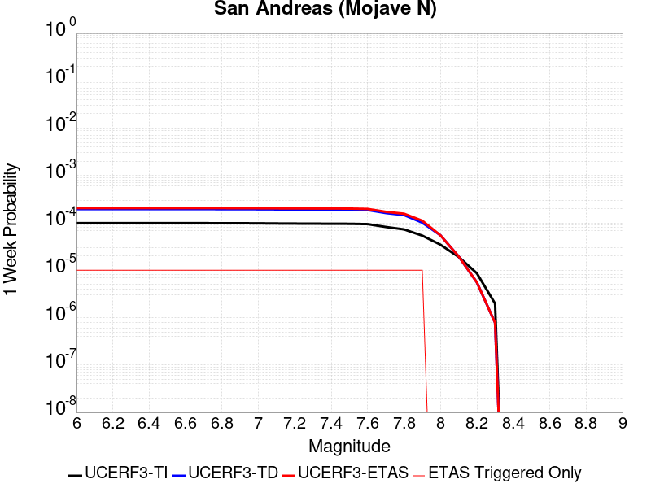 | 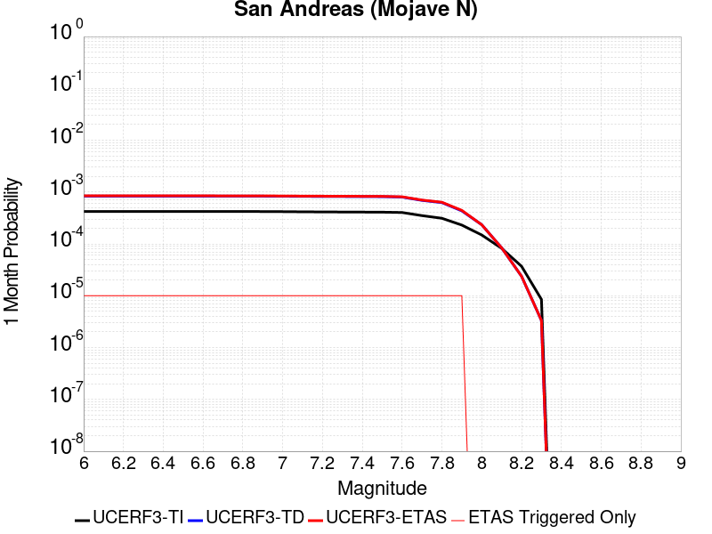 |  |  |

| Magnitude | 1 wk TI Prob | 1 wk TD Prob | 1 wk ETAS Prob | 1 wk ETAS/TD Gain | 1 wk ETAS Triggered Only | 1 mo TI Prob | 1 mo TD Prob | 1 mo ETAS Prob | 1 mo ETAS/TD Gain | 1 mo ETAS Triggered Only | 1 yr TI Prob | 1 yr TD Prob | 1 yr ETAS Prob | 1 yr ETAS/TD Gain | 1 yr ETAS Triggered Only | 10 yr TI Prob | 10 yr TD Prob | 10 yr ETAS Prob | 10 yr ETAS/TD Gain | 10 yr ETAS Triggered Only |
|-----|-----|-----|-----|-----|-----|-----|-----|-----|-----|-----|-----|-----|-----|-----|-----|-----|-----|-----|-----|-----|
| 6.0 | 9.877682E-5 | 1.9529383E-4 | 1.9529383E-4 | 1.0 | 0.0 | 4.2326056E-4 | 8.3670527E-4 | 8.3670527E-4 | 1.0 | 0.0 | 0.0051410277 | 0.010139435 | 0.01015727 | 1.001759 | 1.8018018E-5 | 0.05023708 | 0.098878175 | 0.09891065 | 1.0003284 | 3.6036035E-5 |
| 6.1 | 9.877682E-5 | 1.9529383E-4 | 1.9529383E-4 | 1.0 | 0.0 | 4.2326056E-4 | 8.3670527E-4 | 8.3670527E-4 | 1.0 | 0.0 | 0.0051410277 | 0.010139435 | 0.01015727 | 1.001759 | 1.8018018E-5 | 0.05023708 | 0.098878175 | 0.09891065 | 1.0003284 | 3.6036035E-5 |
| 6.2 | 9.877682E-5 | 1.9529383E-4 | 1.9529383E-4 | 1.0 | 0.0 | 4.2326056E-4 | 8.3670527E-4 | 8.3670527E-4 | 1.0 | 0.0 | 0.0051410277 | 0.010139435 | 0.01015727 | 1.001759 | 1.8018018E-5 | 0.05023708 | 0.098878175 | 0.09891065 | 1.0003284 | 3.6036035E-5 |
| 6.3 | 9.877682E-5 | 1.9529383E-4 | 1.9529383E-4 | 1.0 | 0.0 | 4.2326056E-4 | 8.3670527E-4 | 8.3670527E-4 | 1.0 | 0.0 | 0.0051410277 | 0.010139435 | 0.01015727 | 1.001759 | 1.8018018E-5 | 0.05023708 | 0.098878175 | 0.09891065 | 1.0003284 | 3.6036035E-5 |
| 6.4 | 9.877682E-5 | 1.9529383E-4 | 1.9529383E-4 | 1.0 | 0.0 | 4.2326056E-4 | 8.3670527E-4 | 8.3670527E-4 | 1.0 | 0.0 | 0.0051410277 | 0.010139435 | 0.01015727 | 1.001759 | 1.8018018E-5 | 0.05023708 | 0.098878175 | 0.09891065 | 1.0003284 | 3.6036035E-5 |
| 6.5 | 9.861474E-5 | 1.9503111E-4 | 1.9503111E-4 | 1.0 | 0.0 | 4.2256617E-4 | 8.3558005E-4 | 8.3558005E-4 | 1.0 | 0.0 | 0.0051326132 | 0.010125862 | 0.010143698 | 1.0017614 | 1.8018018E-5 | 0.050156746 | 0.09875589 | 0.098788366 | 1.0003289 | 3.6036035E-5 |
| 6.6 | 9.861474E-5 | 1.9503111E-4 | 1.9503111E-4 | 1.0 | 0.0 | 4.2256617E-4 | 8.3558005E-4 | 8.3558005E-4 | 1.0 | 0.0 | 0.0051326132 | 0.010125862 | 0.010143698 | 1.0017614 | 1.8018018E-5 | 0.050156746 | 0.09875589 | 0.098788366 | 1.0003289 | 3.6036035E-5 |
| 6.7 | 9.8552715E-5 | 1.9493049E-4 | 1.9493049E-4 | 1.0 | 0.0 | 4.223004E-4 | 8.351491E-4 | 8.351491E-4 | 1.0 | 0.0 | 0.0051293927 | 0.010120665 | 0.0101385005 | 1.0017623 | 1.8018018E-5 | 0.050125998 | 0.09870904 | 0.09874152 | 1.000329 | 3.6036035E-5 |
| 6.8 | 9.8464974E-5 | 1.9478175E-4 | 1.9478175E-4 | 1.0 | 0.0 | 4.219245E-4 | 8.3451206E-4 | 8.3451206E-4 | 1.0 | 0.0 | 0.0051248376 | 0.01011298 | 0.010130816 | 1.0017637 | 1.8018018E-5 | 0.05008251 | 0.09863895 | 0.09867143 | 1.0003293 | 3.6036035E-5 |
| 6.9 | 9.825824E-5 | 1.9446116E-4 | 1.9446116E-4 | 1.0 | 0.0 | 4.2103877E-4 | 8.3313894E-4 | 8.3313894E-4 | 1.0 | 0.0 | 0.0051141046 | 0.010096418 | 0.010114254 | 1.0017666 | 1.8018018E-5 | 0.049980022 | 0.09848784 | 0.09852032 | 1.0003299 | 3.6036035E-5 |
| 7.0 | 9.781462E-5 | 1.9377335E-4 | 1.9377335E-4 | 1.0 | 0.0 | 4.1913814E-4 | 8.301931E-4 | 8.301931E-4 | 1.0 | 0.0 | 0.005091073 | 0.010060884 | 0.010078721 | 1.0017729 | 1.8018018E-5 | 0.04976007 | 0.09816376 | 0.09819626 | 1.000331 | 3.6036035E-5 |
| 7.1 | 9.7121134E-5 | 1.927885E-4 | 1.927885E-4 | 1.0 | 0.0 | 4.1616702E-4 | 8.25975E-4 | 8.25975E-4 | 1.0 | 0.0 | 0.005055068 | 0.010010001 | 0.010027839 | 1.001782 | 1.8018018E-5 | 0.04941613 | 0.09769965 | 0.097732164 | 1.0003328 | 3.6036035E-5 |
| 7.2 | 9.663819E-5 | 1.9209493E-4 | 1.9209493E-4 | 1.0 | 0.0 | 4.1409794E-4 | 8.230044E-4 | 8.230044E-4 | 1.0 | 0.0 | 0.0050299936 | 0.009974167 | 0.009992005 | 1.0017885 | 1.8018018E-5 | 0.049176537 | 0.097372465 | 0.09740499 | 1.000334 | 3.6036035E-5 |
| 7.3 | 9.6277574E-5 | 1.9161828E-4 | 1.9161828E-4 | 1.0 | 0.0 | 4.125529E-4 | 8.2096294E-4 | 8.2096294E-4 | 1.0 | 0.0 | 0.0050112694 | 0.009949539 | 0.009967377 | 1.0017929 | 1.8018018E-5 | 0.04899759 | 0.097145244 | 0.09717778 | 1.0003349 | 3.6036035E-5 |
| 7.4 | 9.593308E-5 | 1.9101413E-4 | 1.9101413E-4 | 1.0 | 0.0 | 4.1107697E-4 | 8.183753E-4 | 8.183753E-4 | 1.0 | 0.0 | 0.0049933824 | 0.009918322 | 0.009936161 | 1.0017986 | 1.8018018E-5 | 0.04882661 | 0.09686275 | 0.0968953 | 1.000336 | 3.6036035E-5 |
| 7.5 | 9.561707E-5 | 1.9047315E-4 | 1.9047315E-4 | 1.0 | 0.0 | 4.0972308E-4 | 8.160583E-4 | 8.160583E-4 | 1.0 | 0.0 | 0.0049769743 | 0.009890369 | 0.009908209 | 1.0018038 | 1.8018018E-5 | 0.048669744 | 0.09660831 | 0.09664086 | 1.000337 | 3.6036035E-5 |
| 7.6 | 9.418194E-5 | 1.8698536E-4 | 1.8698536E-4 | 1.0 | 0.0 | 4.0357444E-4 | 8.011199E-4 | 8.011199E-4 | 1.0 | 0.0 | 0.004902454 | 0.009710128 | 0.009727972 | 1.0018376 | 1.8018018E-5 | 0.047957025 | 0.09498726 | 0.09501987 | 1.0003433 | 3.6036035E-5 |
| 7.7 | 8.202141E-5 | 1.6137006E-4 | 1.6137006E-4 | 1.0 | 0.0 | 3.51473E-4 | 6.914027E-4 | 6.914027E-4 | 1.0 | 0.0 | 0.00427079 | 0.008385396 | 0.008403263 | 1.0021307 | 1.8018018E-5 | 0.04189639 | 0.082750104 | 0.082783155 | 1.0003995 | 3.6036035E-5 |
| 7.8 | 7.2859846E-5 | 1.4620528E-4 | 1.4620528E-4 | 1.0 | 0.0 | 3.1221908E-4 | 6.264436E-4 | 6.264436E-4 | 1.0 | 0.0 | 0.003794643 | 0.0076003214 | 0.0076182024 | 1.0023527 | 1.8018018E-5 | 0.037304975 | 0.07519419 | 0.075227514 | 1.0004432 | 3.6036035E-5 |
| 7.9 | 5.3874453E-5 | 1.0118933E-4 | 1.0118933E-4 | 1.0 | 0.0 | 2.3087008E-4 | 4.335965E-4 | 4.335965E-4 | 1.0 | 0.0 | 0.0028072202 | 0.005266271 | 0.005284194 | 1.0034034 | 1.8018018E-5 | 0.02772022 | 0.052766964 | 0.0528011 | 1.000647 | 3.6036035E-5 |
| 8.0 | 3.468538E-5 | 5.468548E-5 | 5.468548E-5 | 1.0 | 0.0 | 1.4864317E-4 | 2.343453E-4 | 2.343453E-4 | 1.0 | 0.0 | 0.0018082283 | 0.0028494229 | 0.0028494229 | 1.0 | 0.0 | 0.017935853 | 0.02915624 | 0.029173732 | 1.0006 | 1.8018018E-5 |
| 8.1 | 1.9152367E-5 | 1.9606829E-5 | 1.9606829E-5 | 1.0 | 0.0 | 8.207899E-5 | 8.402656E-5 | 8.402656E-5 | 1.0 | 0.0 | 9.988535E-4 | 0.0010225439 | 0.0010225439 | 1.0 | 0.0 | 0.009943757 | 0.010963188 | 0.010963188 | 1.0 | 0.0 |
| 8.2 | 8.643924E-6 | 5.5526552E-6 | 5.5526552E-6 | 1.0 | 0.0 | 3.704486E-5 | 2.3796878E-5 | 2.3796878E-5 | 1.0 | 0.0 | 4.5092785E-4 | 2.8968856E-4 | 2.8968856E-4 | 1.0 | 0.0 | 0.0045001395 | 0.0032912085 | 0.0032912085 | 1.0 | 0.0 |
| 8.3 | 1.983087E-6 | 7.7871465E-7 | 7.7871465E-7 | 1.0 | 0.0 | 8.498917E-6 | 3.3373444E-6 | 3.3373444E-6 | 1.0 | 0.0 | 1.034694E-4 | 4.063143E-5 | 4.063143E-5 | 1.0 | 0.0 | 0.0010342124 | 4.7926197E-4 | 4.7926197E-4 | 1.0 | 0.0 |

## San Andreas (San Bernardino N)
*[(top)](#table-of-contents)*

| 1 Week | 1 Month | 1 Year | 10 Year |
|-----|-----|-----|-----|
|  |  |  |  |

| Magnitude | 1 wk TI Prob | 1 wk TD Prob | 1 wk ETAS Prob | 1 wk ETAS/TD Gain | 1 wk ETAS Triggered Only | 1 mo TI Prob | 1 mo TD Prob | 1 mo ETAS Prob | 1 mo ETAS/TD Gain | 1 mo ETAS Triggered Only | 1 yr TI Prob | 1 yr TD Prob | 1 yr ETAS Prob | 1 yr ETAS/TD Gain | 1 yr ETAS Triggered Only | 10 yr TI Prob | 10 yr TD Prob | 10 yr ETAS Prob | 10 yr ETAS/TD Gain | 10 yr ETAS Triggered Only |
|-----|-----|-----|-----|-----|-----|-----|-----|-----|-----|-----|-----|-----|-----|-----|-----|-----|-----|-----|-----|-----|
| 6.0 | 1.4273766E-4 | 3.1714246E-4 | 3.1714246E-4 | 1.0 | 0.0 | 6.115894E-4 | 0.00135848 | 0.00135848 | 1.0 | 0.0 | 0.0074207084 | 0.016415568 | 0.016433291 | 1.0010796 | 1.8018018E-5 | 0.07177748 | 0.15070686 | 0.15073746 | 1.0002031 | 3.6036035E-5 |
| 6.1 | 1.4273766E-4 | 3.1714246E-4 | 3.1714246E-4 | 1.0 | 0.0 | 6.115894E-4 | 0.00135848 | 0.00135848 | 1.0 | 0.0 | 0.0074207084 | 0.016415568 | 0.016433291 | 1.0010796 | 1.8018018E-5 | 0.07177748 | 0.15070686 | 0.15073746 | 1.0002031 | 3.6036035E-5 |
| 6.2 | 1.4273766E-4 | 3.1714246E-4 | 3.1714246E-4 | 1.0 | 0.0 | 6.115894E-4 | 0.00135848 | 0.00135848 | 1.0 | 0.0 | 0.0074207084 | 0.016415568 | 0.016433291 | 1.0010796 | 1.8018018E-5 | 0.07177748 | 0.15070686 | 0.15073746 | 1.0002031 | 3.6036035E-5 |
| 6.3 | 1.3730655E-4 | 3.0618554E-4 | 3.0618554E-4 | 1.0 | 0.0 | 5.883239E-4 | 0.0013115695 | 0.0013115695 | 1.0 | 0.0 | 0.0071393442 | 0.015852848 | 0.01587058 | 1.0011185 | 1.8018018E-5 | 0.06914291 | 0.14600705 | 0.14603782 | 1.0002108 | 3.6036035E-5 |
| 6.4 | 1.3730655E-4 | 3.0618554E-4 | 3.0618554E-4 | 1.0 | 0.0 | 5.883239E-4 | 0.0013115695 | 0.0013115695 | 1.0 | 0.0 | 0.0071393442 | 0.015852848 | 0.01587058 | 1.0011185 | 1.8018018E-5 | 0.06914291 | 0.14600705 | 0.14603782 | 1.0002108 | 3.6036035E-5 |
| 6.5 | 1.2942807E-4 | 2.9032223E-4 | 2.9032223E-4 | 1.0 | 0.0 | 5.545738E-4 | 0.00124365 | 0.00124365 | 1.0 | 0.0 | 0.0067310524 | 0.015037569 | 0.0150553165 | 1.0011802 | 1.8018018E-5 | 0.06530788 | 0.13915014 | 0.13918117 | 1.0002229 | 3.6036035E-5 |
| 6.6 | 1.1125901E-4 | 2.5469047E-4 | 2.5469047E-4 | 1.0 | 0.0 | 4.767372E-4 | 0.0010910763 | 0.0010910763 | 1.0 | 0.0 | 0.005788839 | 0.013203582 | 0.013221362 | 1.0013466 | 1.8018018E-5 | 0.056403454 | 0.12343978 | 0.12347137 | 1.000256 | 3.6036035E-5 |
| 6.7 | 1.02209575E-4 | 2.3603237E-4 | 2.3603237E-4 | 1.0 | 0.0 | 4.3796748E-4 | 0.0010111765 | 0.0010111765 | 1.0 | 0.0 | 0.0053192247 | 0.012242006 | 0.012259804 | 1.0014538 | 1.8018018E-5 | 0.051936906 | 0.11523267 | 0.11526455 | 1.0002767 | 3.6036035E-5 |
| 6.8 | 9.610582E-5 | 2.2127625E-4 | 2.2127625E-4 | 1.0 | 0.0 | 4.1181705E-4 | 9.4798283E-4 | 9.4798283E-4 | 1.0 | 0.0 | 0.0050023515 | 0.01148088 | 0.011498691 | 1.0015514 | 1.8018018E-5 | 0.048912346 | 0.10863209 | 0.108664215 | 1.0002956 | 3.6036035E-5 |
| 6.9 | 9.3877505E-5 | 2.1582727E-4 | 2.1582727E-4 | 1.0 | 0.0 | 4.0227012E-4 | 9.246468E-4 | 9.246468E-4 | 1.0 | 0.0 | 0.0048866454 | 0.011199714 | 0.01121753 | 1.0015907 | 1.8018018E-5 | 0.04780577 | 0.10622182 | 0.10625403 | 1.0003033 | 3.6036035E-5 |
| 7.0 | 9.1019785E-5 | 2.0908975E-4 | 2.0908975E-4 | 1.0 | 0.0 | 3.900265E-4 | 8.957918E-4 | 8.957918E-4 | 1.0 | 0.0 | 0.0047382377 | 0.010851953 | 0.010869776 | 1.0016423 | 1.8018018E-5 | 0.046384744 | 0.10319069 | 0.10322301 | 1.0003132 | 3.6036035E-5 |
| 7.1 | 8.771155E-5 | 2.0082777E-4 | 2.0082777E-4 | 1.0 | 0.0 | 3.758525E-4 | 8.604071E-4 | 8.604071E-4 | 1.0 | 0.0 | 0.0045664064 | 0.01042534 | 0.010443171 | 1.0017103 | 1.8018018E-5 | 0.044737056 | 0.099501036 | 0.09953349 | 1.0003262 | 3.6036035E-5 |
| 7.2 | 8.0830236E-5 | 1.8486784E-4 | 1.8486784E-4 | 1.0 | 0.0 | 3.4636928E-4 | 7.920503E-4 | 7.920503E-4 | 1.0 | 0.0 | 0.0042088944 | 0.009600682 | 0.009618527 | 1.0018587 | 1.8018018E-5 | 0.041300658 | 0.0922283 | 0.09226102 | 1.0003546 | 3.6036035E-5 |
| 7.3 | 7.7668235E-5 | 1.7428612E-4 | 1.7428612E-4 | 1.0 | 0.0 | 3.328214E-4 | 7.4672676E-4 | 7.4672676E-4 | 1.0 | 0.0 | 0.0040445733 | 0.009053581 | 0.009071437 | 1.0019721 | 1.8018018E-5 | 0.03971748 | 0.08749109 | 0.087523974 | 1.0003759 | 3.6036035E-5 |
| 7.4 | 7.520177E-5 | 1.664738E-4 | 1.664738E-4 | 1.0 | 0.0 | 3.2225347E-4 | 7.132641E-4 | 7.132641E-4 | 1.0 | 0.0 | 0.0039163795 | 0.0086494805 | 0.008667343 | 1.0020651 | 1.8018018E-5 | 0.038480744 | 0.08394351 | 0.08397652 | 1.0003933 | 3.6036035E-5 |
| 7.5 | 7.274697E-5 | 1.5933804E-4 | 1.5933804E-4 | 1.0 | 0.0 | 3.1173544E-4 | 6.826987E-4 | 6.826987E-4 | 1.0 | 0.0 | 0.003788775 | 0.008280237 | 0.008298106 | 1.002158 | 1.8018018E-5 | 0.03724827 | 0.08065663 | 0.080689766 | 1.0004108 | 3.6036035E-5 |
| 7.6 | 7.1185845E-5 | 1.5502879E-4 | 1.5502879E-4 | 1.0 | 0.0 | 3.0504653E-4 | 6.642399E-4 | 6.642399E-4 | 1.0 | 0.0 | 0.0037076178 | 0.008057187 | 0.008075059 | 1.0022182 | 1.8018018E-5 | 0.036463667 | 0.078643866 | 0.078677066 | 1.0004222 | 3.6036035E-5 |
| 7.7 | 6.709961E-5 | 1.4409532E-4 | 1.4409532E-4 | 1.0 | 0.0 | 2.8753807E-4 | 6.174052E-4 | 6.174052E-4 | 1.0 | 0.0 | 0.003495157 | 0.0074910405 | 0.0075089233 | 1.0023873 | 1.8018018E-5 | 0.034406938 | 0.073465206 | 0.0734986 | 1.0004544 | 3.6036035E-5 |
| 7.8 | 6.300812E-5 | 1.3288956E-4 | 1.3288956E-4 | 1.0 | 0.0 | 2.7000686E-4 | 5.694024E-4 | 5.694024E-4 | 1.0 | 0.0 | 0.0032823787 | 0.006910468 | 0.0069283615 | 1.0025893 | 1.8018018E-5 | 0.032343175 | 0.068105824 | 0.068139404 | 1.000493 | 3.6036035E-5 |
| 7.9 | 4.983037E-5 | 9.79202E-5 | 9.79202E-5 | 1.0 | 0.0 | 2.1354125E-4 | 4.195905E-4 | 4.195905E-4 | 1.0 | 0.0 | 0.0025967648 | 0.005096559 | 0.0051144855 | 1.0035173 | 1.8018018E-5 | 0.025666296 | 0.050968077 | 0.051002275 | 1.000671 | 3.6036035E-5 |
| 8.0 | 3.2211527E-5 | 5.3709457E-5 | 5.3709457E-5 | 1.0 | 0.0 | 1.380421E-4 | 2.3016307E-4 | 2.3016307E-4 | 1.0 | 0.0 | 0.0016793669 | 0.0027986364 | 0.0027986364 | 1.0 | 0.0 | 0.016667323 | 0.028558796 | 0.0285763 | 1.0006129 | 1.8018018E-5 |
| 8.1 | 1.743376E-5 | 1.9015304E-5 | 1.9015304E-5 | 1.0 | 0.0 | 7.471398E-5 | 8.149162E-5 | 8.149162E-5 | 1.0 | 0.0 | 9.0926304E-4 | 9.917095E-4 | 9.917095E-4 | 1.0 | 0.0 | 0.009055517 | 0.01058332 | 0.01058332 | 1.0 | 0.0 |
| 8.2 | 7.831616E-6 | 5.226153E-6 | 5.226153E-6 | 1.0 | 0.0 | 3.3563636E-5 | 2.2397606E-5 | 2.2397606E-5 | 1.0 | 0.0 | 4.0856065E-4 | 2.7265682E-4 | 2.7265682E-4 | 1.0 | 0.0 | 0.004078103 | 0.003080409 | 0.003080409 | 1.0 | 0.0 |
| 8.3 | 1.983087E-6 | 7.7871465E-7 | 7.7871465E-7 | 1.0 | 0.0 | 8.498917E-6 | 3.3373444E-6 | 3.3373444E-6 | 1.0 | 0.0 | 1.034694E-4 | 4.063143E-5 | 4.063143E-5 | 1.0 | 0.0 | 0.0010342124 | 4.7926197E-4 | 4.7926197E-4 | 1.0 | 0.0 |

## San Gregorio (North) 2011 CFM
*[(top)](#table-of-contents)*

| 1 Week | 1 Month | 1 Year | 10 Year |
|-----|-----|-----|-----|
|  |  |  |  |

| Magnitude | 1 wk TI Prob | 1 wk TD Prob | 1 wk ETAS Prob | 1 wk ETAS/TD Gain | 1 wk ETAS Triggered Only | 1 mo TI Prob | 1 mo TD Prob | 1 mo ETAS Prob | 1 mo ETAS/TD Gain | 1 mo ETAS Triggered Only | 1 yr TI Prob | 1 yr TD Prob | 1 yr ETAS Prob | 1 yr ETAS/TD Gain | 1 yr ETAS Triggered Only | 10 yr TI Prob | 10 yr TD Prob | 10 yr ETAS Prob | 10 yr ETAS/TD Gain | 10 yr ETAS Triggered Only |
|-----|-----|-----|-----|-----|-----|-----|-----|-----|-----|-----|-----|-----|-----|-----|-----|-----|-----|-----|-----|-----|
| 6.0 | 5.0283932E-5 | 4.3108772E-5 | 4.3108772E-5 | 1.0 | 0.0 | 2.1548476E-4 | 1.8473892E-4 | 1.8473892E-4 | 1.0 | 0.0 | 0.0026203706 | 0.0022468918 | 0.0022648694 | 1.0080011 | 1.8018018E-5 | 0.02589687 | 0.02231968 | 0.022354912 | 1.0015785 | 3.6036035E-5 |
| 6.1 | 5.0283932E-5 | 4.3108772E-5 | 4.3108772E-5 | 1.0 | 0.0 | 2.1548476E-4 | 1.8473892E-4 | 1.8473892E-4 | 1.0 | 0.0 | 0.0026203706 | 0.0022468918 | 0.0022648694 | 1.0080011 | 1.8018018E-5 | 0.02589687 | 0.02231968 | 0.022354912 | 1.0015785 | 3.6036035E-5 |
| 6.2 | 4.2998647E-5 | 3.448791E-5 | 3.448791E-5 | 1.0 | 0.0 | 1.842669E-4 | 1.4779705E-4 | 1.4779705E-4 | 1.0 | 0.0 | 0.0022411412 | 0.0017979575 | 0.001815943 | 1.0100033 | 1.8018018E-5 | 0.022186736 | 0.01791081 | 0.0179462 | 1.0019759 | 3.6036035E-5 |
| 6.3 | 4.2998647E-5 | 3.448791E-5 | 3.448791E-5 | 1.0 | 0.0 | 1.842669E-4 | 1.4779705E-4 | 1.4779705E-4 | 1.0 | 0.0 | 0.0022411412 | 0.0017979575 | 0.001815943 | 1.0100033 | 1.8018018E-5 | 0.022186736 | 0.01791081 | 0.0179462 | 1.0019759 | 3.6036035E-5 |
| 6.4 | 4.1101295E-5 | 3.237201E-5 | 3.237201E-5 | 1.0 | 0.0 | 1.7613651E-4 | 1.387299E-4 | 1.387299E-4 | 1.0 | 0.0 | 0.0021423528 | 0.001687741 | 0.0017057286 | 1.0106578 | 1.8018018E-5 | 0.02121817 | 0.016825577 | 0.016861007 | 1.0021057 | 3.6036035E-5 |
| 6.5 | 4.1032585E-5 | 3.2290012E-5 | 3.2290012E-5 | 1.0 | 0.0 | 1.7584208E-4 | 1.3837851E-4 | 1.3837851E-4 | 1.0 | 0.0 | 0.0021387753 | 0.0016834696 | 0.0017014573 | 1.0106848 | 1.8018018E-5 | 0.021183075 | 0.016783515 | 0.016818946 | 1.0021111 | 3.6036035E-5 |
| 6.6 | 4.011629E-5 | 3.131109E-5 | 3.131109E-5 | 1.0 | 0.0 | 1.7191563E-4 | 1.3418357E-4 | 1.3418357E-4 | 1.0 | 0.0 | 0.0020910634 | 0.0016324752 | 0.0016504637 | 1.0110192 | 1.8018018E-5 | 0.020714961 | 0.016280808 | 0.016316257 | 1.0021774 | 3.6036035E-5 |
| 6.7 | 3.8583938E-5 | 2.9497241E-5 | 2.9497241E-5 | 1.0 | 0.0 | 1.6534925E-4 | 1.2641071E-4 | 1.2641071E-4 | 1.0 | 0.0 | 0.0020112682 | 0.0015379781 | 0.0015559683 | 1.0116974 | 1.8018018E-5 | 0.019931622 | 0.015348888 | 0.015384371 | 1.0023117 | 3.6036035E-5 |
| 6.8 | 3.44341E-5 | 2.4491947E-5 | 2.4491947E-5 | 1.0 | 0.0 | 1.4756636E-4 | 1.0496132E-4 | 1.0496132E-4 | 1.0 | 0.0 | 0.0017951399 | 0.0012771651 | 0.0012951602 | 1.0140898 | 1.8018018E-5 | 0.017807078 | 0.012772805 | 0.012808381 | 1.0027853 | 3.6036035E-5 |
| 6.9 | 3.221199E-5 | 2.1814329E-5 | 2.1814329E-5 | 1.0 | 0.0 | 1.3804408E-4 | 9.348667E-5 | 9.348667E-5 | 1.0 | 0.0 | 0.0016793909 | 0.0011376141 | 0.0011376141 | 1.0 | 0.0 | 0.01666756 | 0.011391811 | 0.011409624 | 1.0015637 | 1.8018018E-5 |
| 7.0 | 2.9186718E-5 | 1.8179602E-5 | 1.8179602E-5 | 1.0 | 0.0 | 1.2507994E-4 | 7.791028E-5 | 7.791028E-5 | 1.0 | 0.0 | 0.0015217843 | 9.4814907E-4 | 9.4814907E-4 | 1.0 | 0.0 | 0.015114053 | 0.009514216 | 0.009532063 | 1.0018758 | 1.8018018E-5 |
| 7.1 | 2.6840138E-5 | 1.5315465E-5 | 1.5315465E-5 | 1.0 | 0.0 | 1.1502409E-4 | 6.5636064E-5 | 6.5636064E-5 | 1.0 | 0.0 | 0.0013995186 | 7.98828E-4 | 7.98828E-4 | 1.0 | 0.0 | 0.013907375 | 0.008032251 | 0.008050124 | 1.0022252 | 1.8018018E-5 |
| 7.2 | 2.453002E-5 | 1.2636443E-5 | 1.2636443E-5 | 1.0 | 0.0 | 1.05124425E-4 | 5.415506E-5 | 5.415506E-5 | 1.0 | 0.0 | 0.0012791384 | 6.59139E-4 | 6.59139E-4 | 1.0 | 0.0 | 0.012718005 | 0.0066435663 | 0.006661465 | 1.0026941 | 1.8018018E-5 |
| 7.3 | 2.3330727E-5 | 1.1517871E-5 | 1.1517871E-5 | 1.0 | 0.0 | 9.9985E-5 | 4.9361373E-5 | 4.9361373E-5 | 1.0 | 0.0 | 0.0012166376 | 6.0080946E-4 | 6.0080946E-4 | 1.0 | 0.0 | 0.012099981 | 0.0060622073 | 0.006080116 | 1.0029541 | 1.8018018E-5 |
| 7.4 | 2.2136466E-5 | 1.039734E-5 | 1.039734E-5 | 1.0 | 0.0 | 9.486712E-5 | 4.455927E-5 | 4.455927E-5 | 1.0 | 0.0 | 0.0011543952 | 5.423743E-4 | 5.423743E-4 | 1.0 | 0.0 | 0.011484168 | 0.00547946 | 0.0054973797 | 1.0032703 | 1.8018018E-5 |
| 7.5 | 2.0994974E-5 | 9.4544475E-6 | 9.4544475E-6 | 1.0 | 0.0 | 8.997535E-5 | 4.051843E-5 | 4.051843E-5 | 1.0 | 0.0 | 0.0010948994 | 4.9320044E-4 | 4.9320044E-4 | 1.0 | 0.0 | 0.010895205 | 0.0049879807 | 0.0050059087 | 1.0035943 | 1.8018018E-5 |
| 7.6 | 1.7091823E-5 | 6.915531E-6 | 6.915531E-6 | 1.0 | 0.0 | 7.3248615E-5 | 2.9637653E-5 | 2.9637653E-5 | 1.0 | 0.0 | 8.9143694E-4 | 3.6077877E-4 | 3.6077877E-4 | 1.0 | 0.0 | 0.008878695 | 0.003660056 | 0.003678008 | 1.0049049 | 1.8018018E-5 |
| 7.7 | 1.2772179E-5 | 4.0364894E-6 | 4.0364894E-6 | 1.0 | 0.0 | 5.473676E-5 | 1.7299124E-5 | 1.7299124E-5 | 1.0 | 0.0 | 6.6621625E-4 | 2.1059651E-4 | 2.1059651E-4 | 1.0 | 0.0 | 0.006642225 | 0.0021454499 | 0.0021634293 | 1.0083802 | 1.8018018E-5 |
| 7.8 | 7.041923E-6 | 1.950822E-6 | 1.950822E-6 | 1.0 | 0.0 | 3.017932E-5 | 8.360639E-6 | 8.360639E-6 | 1.0 | 0.0 | 3.6737128E-4 | 1.0178603E-4 | 1.0178603E-4 | 1.0 | 0.0 | 0.0036676454 | 0.0010434691 | 0.0010614683 | 1.0172493 | 1.8018018E-5 |
| 7.9 | 2.946768E-6 | 1.009422E-6 | 1.009422E-6 | 1.0 | 0.0 | 1.2628945E-5 | 4.326087E-6 | 4.326087E-6 | 1.0 | 0.0 | 1.5374656E-4 | 5.2668835E-5 | 5.2668835E-5 | 1.0 | 0.0 | 0.0015364023 | 5.372358E-4 | 5.5524416E-4 | 1.0335203 | 1.8018018E-5 |
| 8.0 | 1.1433375E-6 | 5.2164285E-7 | 5.2164285E-7 | 1.0 | 0.0 | 4.9000087E-6 | 2.2356103E-6 | 2.2356103E-6 | 1.0 | 0.0 | 5.965597E-5 | 2.7218215E-5 | 2.7218215E-5 | 1.0 | 0.0 | 5.963996E-4 | 2.7582282E-4 | 2.7582282E-4 | 1.0 | 0.0 |
| 8.1 | 2.6675295E-7 | 1.6420798E-7 | 1.6420798E-7 | 1.0 | 0.0 | 1.1432264E-6 | 7.0374824E-7 | 7.0374824E-7 | 1.0 | 0.0 | 1.3918692E-5 | 8.568101E-6 | 8.568101E-6 | 1.0 | 0.0 | 1.391782E-4 | 8.7069624E-5 | 8.7069624E-5 | 1.0 | 0.0 |
| 8.2 | 1.2704569E-8 | 9.549652E-9 | 9.549652E-9 | 1.0 | 0.0 | 5.444815E-8 | 4.092708E-8 | 4.092708E-8 | 1.0 | 0.0 | 6.629061E-7 | 4.982871E-7 | 4.982871E-7 | 1.0 | 0.0 | 6.629041E-6 | 5.1750517E-6 | 5.1750517E-6 | 1.0 | 0.0 |

## San Andreas (Mojave S)
*[(top)](#table-of-contents)*

| 1 Week | 1 Month | 1 Year | 10 Year |
|-----|-----|-----|-----|
| 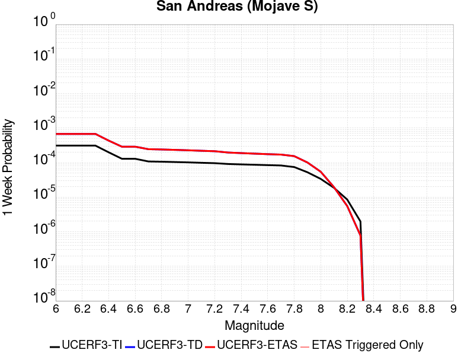 |  |  |  |

| Magnitude | 1 wk TI Prob | 1 wk TD Prob | 1 wk ETAS Prob | 1 wk ETAS/TD Gain | 1 wk ETAS Triggered Only | 1 mo TI Prob | 1 mo TD Prob | 1 mo ETAS Prob | 1 mo ETAS/TD Gain | 1 mo ETAS Triggered Only | 1 yr TI Prob | 1 yr TD Prob | 1 yr ETAS Prob | 1 yr ETAS/TD Gain | 1 yr ETAS Triggered Only | 10 yr TI Prob | 10 yr TD Prob | 10 yr ETAS Prob | 10 yr ETAS/TD Gain | 10 yr ETAS Triggered Only |
|-----|-----|-----|-----|-----|-----|-----|-----|-----|-----|-----|-----|-----|-----|-----|-----|-----|-----|-----|-----|-----|
| 6.0 | 3.1064058E-4 | 6.760334E-4 | 6.760334E-4 | 1.0 | 0.0 | 0.0013306376 | 0.0028941974 | 0.0028941974 | 1.0 | 0.0 | 0.016080605 | 0.03469392 | 0.034711313 | 1.0005013 | 1.8018018E-5 | 0.1496549 | 0.2870912 | 0.2871169 | 1.0000895 | 3.6036035E-5 |
| 6.1 | 3.1064058E-4 | 6.760334E-4 | 6.760334E-4 | 1.0 | 0.0 | 0.0013306376 | 0.0028941974 | 0.0028941974 | 1.0 | 0.0 | 0.016080605 | 0.03469392 | 0.034711313 | 1.0005013 | 1.8018018E-5 | 0.1496549 | 0.2870912 | 0.2871169 | 1.0000895 | 3.6036035E-5 |
| 6.2 | 3.1064058E-4 | 6.760334E-4 | 6.760334E-4 | 1.0 | 0.0 | 0.0013306376 | 0.0028941974 | 0.0028941974 | 1.0 | 0.0 | 0.016080605 | 0.03469392 | 0.034711313 | 1.0005013 | 1.8018018E-5 | 0.1496549 | 0.2870912 | 0.2871169 | 1.0000895 | 3.6036035E-5 |
| 6.3 | 3.1064058E-4 | 6.760334E-4 | 6.760334E-4 | 1.0 | 0.0 | 0.0013306376 | 0.0028941974 | 0.0028941974 | 1.0 | 0.0 | 0.016080605 | 0.03469392 | 0.034711313 | 1.0005013 | 1.8018018E-5 | 0.1496549 | 0.2870912 | 0.2871169 | 1.0000895 | 3.6036035E-5 |
| 6.4 | 1.9872203E-4 | 4.3315E-4 | 4.3315E-4 | 1.0 | 0.0 | 8.5138786E-4 | 0.0018550648 | 0.0018550648 | 1.0 | 0.0 | 0.010316478 | 0.022357672 | 0.022375287 | 1.0007879 | 1.8018018E-5 | 0.098504856 | 0.19751844 | 0.19754735 | 1.0001464 | 3.6036035E-5 |
| 6.5 | 1.291105E-4 | 2.8881425E-4 | 2.8881425E-4 | 1.0 | 0.0 | 5.5321335E-4 | 0.001237191 | 0.001237191 | 1.0 | 0.0 | 0.006714592 | 0.0149596 | 0.014977349 | 1.0011864 | 1.8018018E-5 | 0.065152965 | 0.13856798 | 0.13859902 | 1.000224 | 3.6036035E-5 |
| 6.6 | 1.291105E-4 | 2.8881425E-4 | 2.8881425E-4 | 1.0 | 0.0 | 5.5321335E-4 | 0.001237191 | 0.001237191 | 1.0 | 0.0 | 0.006714592 | 0.0149596 | 0.014977349 | 1.0011864 | 1.8018018E-5 | 0.065152965 | 0.13856798 | 0.13859902 | 1.000224 | 3.6036035E-5 |
| 6.7 | 1.08001186E-4 | 2.4460704E-4 | 2.4460704E-4 | 1.0 | 0.0 | 4.6278012E-4 | 0.0010478954 | 0.0010478954 | 1.0 | 0.0 | 0.0056198016 | 0.012683797 | 0.012701586 | 1.0014025 | 1.8018018E-5 | 0.054797906 | 0.11971538 | 0.1197471 | 1.000265 | 3.6036035E-5 |
| 6.8 | 1.0624356E-4 | 2.3978013E-4 | 2.3978013E-4 | 1.0 | 0.0 | 4.5525006E-4 | 0.0010272249 | 0.0010272249 | 1.0 | 0.0 | 0.0055285925 | 0.012435025 | 0.012452818 | 1.001431 | 1.8018018E-5 | 0.053930566 | 0.11766437 | 0.117696166 | 1.0002702 | 3.6036035E-5 |
| 6.9 | 1.0393785E-4 | 2.3347879E-4 | 2.3347879E-4 | 1.0 | 0.0 | 4.4537184E-4 | 0.0010002401 | 0.0010002401 | 1.0 | 0.0 | 0.0054089287 | 0.012110177 | 0.012127977 | 1.0014699 | 1.8018018E-5 | 0.05279156 | 0.11496176 | 0.114993654 | 1.0002774 | 3.6036035E-5 |
| 7.0 | 1.0155622E-4 | 2.2716862E-4 | 2.2716862E-4 | 1.0 | 0.0 | 4.3516833E-4 | 9.7321696E-4 | 9.7321696E-4 | 1.0 | 0.0 | 0.005285311 | 0.0117847705 | 0.0118025765 | 1.0015109 | 1.8018018E-5 | 0.05161361 | 0.11222137 | 0.11225336 | 1.000285 | 3.6036035E-5 |
| 7.1 | 9.885595E-5 | 2.2004638E-4 | 2.2004638E-4 | 1.0 | 0.0 | 4.2359953E-4 | 9.427154E-4 | 9.427154E-4 | 1.0 | 0.0 | 0.0051451353 | 0.01141736 | 0.0114351725 | 1.0015601 | 1.8018018E-5 | 0.05027629 | 0.10910523 | 0.109137334 | 1.0002942 | 3.6036035E-5 |
| 7.2 | 9.6411415E-5 | 2.1367033E-4 | 2.1367033E-4 | 1.0 | 0.0 | 4.1312634E-4 | 9.154089E-4 | 9.154089E-4 | 1.0 | 0.0 | 0.005018219 | 0.011088334 | 0.011106153 | 1.001607 | 1.8018018E-5 | 0.049064007 | 0.10629434 | 0.10632655 | 1.000303 | 3.6036035E-5 |
| 7.3 | 9.1180635E-5 | 1.9592093E-4 | 1.9592093E-4 | 1.0 | 0.0 | 3.907156E-4 | 8.39391E-4 | 8.39391E-4 | 1.0 | 0.0 | 0.004746591 | 0.010171813 | 0.010189648 | 1.0017533 | 1.8018018E-5 | 0.046464786 | 0.098479286 | 0.09851178 | 1.0003299 | 3.6036035E-5 |
| 7.4 | 8.887388E-5 | 1.8839308E-4 | 1.8839308E-4 | 1.0 | 0.0 | 3.8083247E-4 | 8.0714916E-4 | 8.0714916E-4 | 1.0 | 0.0 | 0.0046267817 | 0.009782861 | 0.009800703 | 1.0018238 | 1.8018018E-5 | 0.045316286 | 0.09511067 | 0.09514328 | 1.0003428 | 3.6036035E-5 |
| 7.5 | 8.6750515E-5 | 1.8169629E-4 | 1.8169629E-4 | 1.0 | 0.0 | 3.7173493E-4 | 7.7846606E-4 | 7.7846606E-4 | 1.0 | 0.0 | 0.004516484 | 0.009436724 | 0.009454572 | 1.0018914 | 1.8018018E-5 | 0.04425787 | 0.09207104 | 0.09210376 | 1.0003554 | 3.6036035E-5 |
| 7.6 | 8.453092E-5 | 1.755574E-4 | 1.755574E-4 | 1.0 | 0.0 | 3.6222505E-4 | 7.5217197E-4 | 7.5217197E-4 | 1.0 | 0.0 | 0.0044011753 | 0.009119318 | 0.009137171 | 1.0019578 | 1.8018018E-5 | 0.04315024 | 0.08922548 | 0.0892583 | 1.0003679 | 3.6036035E-5 |
| 7.7 | 8.259102E-5 | 1.7076606E-4 | 1.7076606E-4 | 1.0 | 0.0 | 3.539135E-4 | 7.316493E-4 | 7.316493E-4 | 1.0 | 0.0 | 0.004300386 | 0.008871517 | 0.008889375 | 1.002013 | 1.8018018E-5 | 0.042181134 | 0.08697198 | 0.08700489 | 1.0003783 | 3.6036035E-5 |
| 7.8 | 7.444844E-5 | 1.5388784E-4 | 1.5388784E-4 | 1.0 | 0.0 | 3.1902574E-4 | 6.593527E-4 | 6.593527E-4 | 1.0 | 0.0 | 0.0038772223 | 0.007998121 | 0.008015995 | 1.0022348 | 1.8018018E-5 | 0.03810269 | 0.078762494 | 0.078795694 | 1.0004215 | 3.6036035E-5 |
| 7.9 | 5.2586525E-5 | 1.0078799E-4 | 1.0078799E-4 | 1.0 | 0.0 | 2.2535135E-4 | 4.3187704E-4 | 4.3187704E-4 | 1.0 | 0.0 | 0.0027402006 | 0.0052454374 | 0.0052633607 | 1.003417 | 1.8018018E-5 | 0.027066574 | 0.05253791 | 0.052572053 | 1.0006498 | 3.6036035E-5 |
| 8.0 | 3.379877E-5 | 5.449475E-5 | 5.449475E-5 | 1.0 | 0.0 | 1.4484383E-4 | 2.3352803E-4 | 2.3352803E-4 | 1.0 | 0.0 | 0.0017620471 | 0.0028394987 | 0.0028394987 | 1.0 | 0.0 | 0.017481409 | 0.02904101 | 0.029058505 | 1.0006024 | 1.8018018E-5 |
| 8.1 | 1.8668277E-5 | 1.9511233E-5 | 1.9511233E-5 | 1.0 | 0.0 | 8.000444E-5 | 8.361689E-5 | 8.361689E-5 | 1.0 | 0.0 | 9.736188E-4 | 0.0010175608 | 0.0010175608 | 1.0 | 0.0 | 0.009693642 | 0.010904464 | 0.010904464 | 1.0 | 0.0 |
| 8.2 | 8.541571E-6 | 5.538353E-6 | 5.538353E-6 | 1.0 | 0.0 | 3.660622E-5 | 2.3735583E-5 | 2.3735583E-5 | 1.0 | 0.0 | 4.455896E-4 | 2.8894248E-4 | 2.8894248E-4 | 1.0 | 0.0 | 0.0044469717 | 0.0032831642 | 0.0032831642 | 1.0 | 0.0 |
| 8.3 | 1.983087E-6 | 7.7871465E-7 | 7.7871465E-7 | 1.0 | 0.0 | 8.498917E-6 | 3.3373444E-6 | 3.3373444E-6 | 1.0 | 0.0 | 1.034694E-4 | 4.063143E-5 | 4.063143E-5 | 1.0 | 0.0 | 0.0010342124 | 4.7926197E-4 | 4.7926197E-4 | 1.0 | 0.0 |

## Rinconada 2011 CFM
*[(top)](#table-of-contents)*

| 1 Week | 1 Month | 1 Year | 10 Year |
|-----|-----|-----|-----|
|  |  |  |  |

| Magnitude | 1 wk TI Prob | 1 wk TD Prob | 1 wk ETAS Prob | 1 wk ETAS/TD Gain | 1 wk ETAS Triggered Only | 1 mo TI Prob | 1 mo TD Prob | 1 mo ETAS Prob | 1 mo ETAS/TD Gain | 1 mo ETAS Triggered Only | 1 yr TI Prob | 1 yr TD Prob | 1 yr ETAS Prob | 1 yr ETAS/TD Gain | 1 yr ETAS Triggered Only | 10 yr TI Prob | 10 yr TD Prob | 10 yr ETAS Prob | 10 yr ETAS/TD Gain | 10 yr ETAS Triggered Only |
|-----|-----|-----|-----|-----|-----|-----|-----|-----|-----|-----|-----|-----|-----|-----|-----|-----|-----|-----|-----|-----|
| 6.0 | 1.5752368E-5 | 1.627576E-5 | 1.627576E-5 | 1.0 | 0.0 | 6.75084E-5 | 6.975141E-5 | 6.975141E-5 | 1.0 | 0.0 | 8.2160486E-4 | 8.488957E-4 | 8.488957E-4 | 1.0 | 0.0 | 0.008185739 | 0.00845691 | 0.008492642 | 1.0042251 | 3.6036035E-5 |
| 6.1 | 1.0966133E-5 | 1.1323744E-5 | 1.1323744E-5 | 1.0 | 0.0 | 4.6996865E-5 | 4.8529433E-5 | 4.8529433E-5 | 1.0 | 0.0 | 5.720366E-4 | 5.906864E-4 | 5.906864E-4 | 1.0 | 0.0 | 0.0057056635 | 0.0058912598 | 0.0058912598 | 1.0 | 0.0 |
| 6.2 | 1.0966133E-5 | 1.1323744E-5 | 1.1323744E-5 | 1.0 | 0.0 | 4.6996865E-5 | 4.8529433E-5 | 4.8529433E-5 | 1.0 | 0.0 | 5.720366E-4 | 5.906864E-4 | 5.906864E-4 | 1.0 | 0.0 | 0.0057056635 | 0.0058912598 | 0.0058912598 | 1.0 | 0.0 |
| 6.3 | 8.926149E-6 | 9.213346E-6 | 9.213346E-6 | 1.0 | 0.0 | 3.8254362E-5 | 3.9485174E-5 | 3.9485174E-5 | 1.0 | 0.0 | 4.6564735E-4 | 4.8062627E-4 | 4.8062627E-4 | 1.0 | 0.0 | 0.0046467283 | 0.0047959127 | 0.0047959127 | 1.0 | 0.0 |
| 6.4 | 7.676955E-6 | 7.920679E-6 | 7.920679E-6 | 1.0 | 0.0 | 3.290082E-5 | 3.3945325E-5 | 3.3945325E-5 | 1.0 | 0.0 | 4.0049385E-4 | 4.1320614E-4 | 4.1320614E-4 | 1.0 | 0.0 | 0.0039977287 | 0.004124405 | 0.004124405 | 1.0 | 0.0 |
| 6.5 | 6.1671026E-6 | 6.3593407E-6 | 6.3593407E-6 | 1.0 | 0.0 | 2.6430173E-5 | 2.7254033E-5 | 2.7254033E-5 | 1.0 | 0.0 | 3.2173982E-4 | 3.317674E-4 | 3.317674E-4 | 1.0 | 0.0 | 0.003212744 | 0.003312733 | 0.003312733 | 1.0 | 0.0 |
| 6.6 | 5.553456E-6 | 5.7251573E-6 | 5.7251573E-6 | 1.0 | 0.0 | 2.3800309E-5 | 2.4536159E-5 | 2.4536159E-5 | 1.0 | 0.0 | 2.897302E-4 | 2.9868682E-4 | 2.9868682E-4 | 1.0 | 0.0 | 0.0028935277 | 0.0029828625 | 0.0029828625 | 1.0 | 0.0 |
| 6.7 | 4.787857E-6 | 4.9336027E-6 | 4.9336027E-6 | 1.0 | 0.0 | 2.0519226E-5 | 2.114384E-5 | 2.114384E-5 | 1.0 | 0.0 | 2.4979294E-4 | 2.5739588E-4 | 2.5739588E-4 | 1.0 | 0.0 | 0.0024951235 | 0.0025709833 | 0.0025709833 | 1.0 | 0.0 |
| 6.8 | 3.9955166E-6 | 4.113714E-6 | 4.113714E-6 | 1.0 | 0.0 | 1.7123532E-5 | 1.7630085E-5 | 1.7630085E-5 | 1.0 | 0.0 | 2.0845905E-4 | 2.1462516E-4 | 2.1462516E-4 | 1.0 | 0.0 | 0.002082636 | 0.0021441826 | 0.0021441826 | 1.0 | 0.0 |
| 6.9 | 3.4250072E-6 | 3.5226435E-6 | 3.5226435E-6 | 1.0 | 0.0 | 1.46785205E-5 | 1.5096956E-5 | 1.5096956E-5 | 1.0 | 0.0 | 1.7869633E-4 | 1.8378996E-4 | 1.8378996E-4 | 1.0 | 0.0 | 0.001785527 | 0.0018363821 | 0.0018363821 | 1.0 | 0.0 |
| 7.0 | 2.7712713E-6 | 2.846853E-6 | 2.846853E-6 | 1.0 | 0.0 | 1.1876823E-5 | 1.2200742E-5 | 1.2200742E-5 | 1.0 | 0.0 | 1.4459073E-4 | 1.4853392E-4 | 1.4853392E-4 | 1.0 | 0.0 | 0.0014449668 | 0.001484348 | 0.001484348 | 1.0 | 0.0 |
| 7.1 | 2.227358E-6 | 2.2858176E-6 | 2.2858176E-6 | 1.0 | 0.0 | 9.545785E-6 | 9.796324E-6 | 9.796324E-6 | 1.0 | 0.0 | 1.16213734E-4 | 1.1926373E-4 | 1.1926373E-4 | 1.0 | 0.0 | 0.0011615298 | 0.0011919984 | 0.0011919984 | 1.0 | 0.0 |
| 7.2 | 1.581796E-6 | 1.620982E-6 | 1.620982E-6 | 1.0 | 0.0 | 6.779108E-6 | 6.947047E-6 | 6.947047E-6 | 1.0 | 0.0 | 8.253252E-5 | 8.457702E-5 | 8.457702E-5 | 1.0 | 0.0 | 8.250187E-4 | 8.4544887E-4 | 8.4544887E-4 | 1.0 | 0.0 |
| 7.3 | 1.0306567E-6 | 1.0546985E-6 | 1.0546985E-6 | 1.0 | 0.0 | 4.4170924E-6 | 4.5201286E-6 | 4.5201286E-6 | 1.0 | 0.0 | 5.3776774E-5 | 5.5031178E-5 | 5.5031178E-5 | 1.0 | 0.0 | 5.376376E-4 | 5.501757E-4 | 5.501757E-4 | 1.0 | 0.0 |
| 7.4 | 6.535541E-7 | 6.6830665E-7 | 6.6830665E-7 | 1.0 | 0.0 | 2.800943E-6 | 2.8641682E-6 | 2.8641682E-6 | 1.0 | 0.0 | 3.4100947E-5 | 3.4870693E-5 | 3.4870693E-5 | 1.0 | 0.0 | 3.4095717E-4 | 3.486523E-4 | 3.486523E-4 | 1.0 | 0.0 |
| 7.5 | 3.2656962E-7 | 3.3318327E-7 | 3.3318327E-7 | 1.0 | 0.0 | 1.3995833E-6 | 1.4279275E-6 | 1.4279275E-6 | 1.0 | 0.0 | 1.7039794E-5 | 1.7384878E-5 | 1.7384878E-5 | 1.0 | 0.0 | 1.7038487E-4 | 1.7383523E-4 | 1.7383523E-4 | 1.0 | 0.0 |
| 7.6 | 9.754343E-8 | 9.821457E-8 | 9.821457E-8 | 1.0 | 0.0 | 4.180432E-7 | 4.2091952E-7 | 4.2091952E-7 | 1.0 | 0.0 | 5.089664E-6 | 5.124683E-6 | 5.124683E-6 | 1.0 | 0.0 | 5.0895473E-5 | 5.1245657E-5 | 5.1245657E-5 | 1.0 | 0.0 |
| 7.7 | 6.0001453E-9 | 5.849418E-9 | 5.849418E-9 | 1.0 | 0.0 | 2.5714908E-8 | 2.5068934E-8 | 2.5068934E-8 | 1.0 | 0.0 | 3.1307894E-7 | 3.0521423E-7 | 3.0521423E-7 | 1.0 | 0.0 | 3.1307852E-6 | 3.0521383E-6 | 3.0521383E-6 | 1.0 | 0.0 |
| 7.8 | 7.400003E-11 | 7.4655726E-11 | 7.4655726E-11 | 1.0 | 0.0 | 3.171432E-10 | 3.1995318E-10 | 3.1995318E-10 | 1.0 | 0.0 | 3.861218E-9 | 3.8954298E-9 | 3.8954298E-9 | 1.0 | 0.0 | 3.861218E-8 | 3.8954294E-8 | 3.8954294E-8 | 1.0 | 0.0 |

## Las Positas
*[(top)](#table-of-contents)*

| 1 Week | 1 Month | 1 Year | 10 Year |
|-----|-----|-----|-----|
|  |  |  | 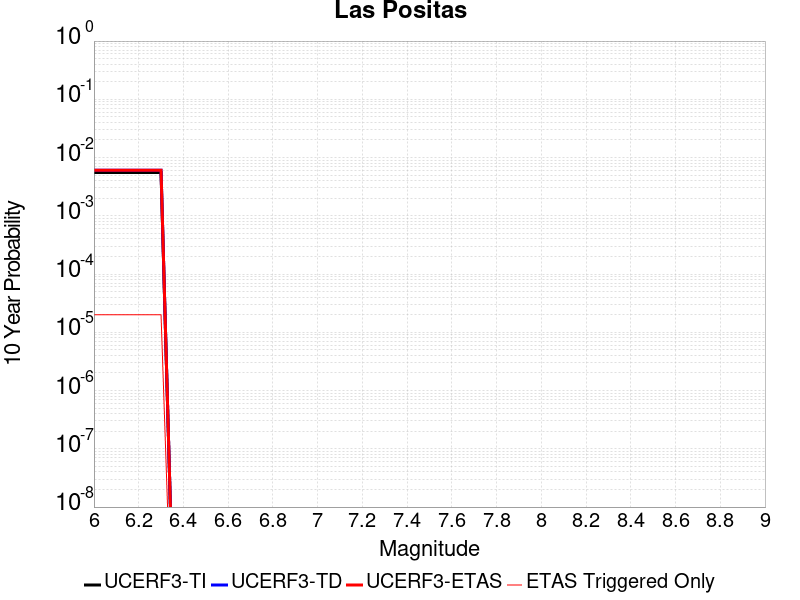 |

| Magnitude | 1 wk TI Prob | 1 wk TD Prob | 1 wk ETAS Prob | 1 wk ETAS/TD Gain | 1 wk ETAS Triggered Only | 1 mo TI Prob | 1 mo TD Prob | 1 mo ETAS Prob | 1 mo ETAS/TD Gain | 1 mo ETAS Triggered Only | 1 yr TI Prob | 1 yr TD Prob | 1 yr ETAS Prob | 1 yr ETAS/TD Gain | 1 yr ETAS Triggered Only | 10 yr TI Prob | 10 yr TD Prob | 10 yr ETAS Prob | 10 yr ETAS/TD Gain | 10 yr ETAS Triggered Only |
|-----|-----|-----|-----|-----|-----|-----|-----|-----|-----|-----|-----|-----|-----|-----|-----|-----|-----|-----|-----|-----|
| 6.0 | 1.0659424E-5 | 1.1593074E-5 | 1.1593074E-5 | 1.0 | 0.0 | 4.568245E-5 | 4.9684604E-5 | 4.9684604E-5 | 1.0 | 0.0 | 5.560419E-4 | 6.049101E-4 | 6.229172E-4 | 1.0297682 | 1.8018018E-5 | 0.005546526 | 0.0060491003 | 0.0060849185 | 1.0059212 | 3.6036035E-5 |
| 6.1 | 1.0659424E-5 | 1.1593074E-5 | 1.1593074E-5 | 1.0 | 0.0 | 4.568245E-5 | 4.9684604E-5 | 4.9684604E-5 | 1.0 | 0.0 | 5.560419E-4 | 6.049101E-4 | 6.229172E-4 | 1.0297682 | 1.8018018E-5 | 0.005546526 | 0.0060491003 | 0.0060849185 | 1.0059212 | 3.6036035E-5 |
| 6.2 | 1.0659424E-5 | 1.1593074E-5 | 1.1593074E-5 | 1.0 | 0.0 | 4.568245E-5 | 4.9684604E-5 | 4.9684604E-5 | 1.0 | 0.0 | 5.560419E-4 | 6.049101E-4 | 6.229172E-4 | 1.0297682 | 1.8018018E-5 | 0.005546526 | 0.0060491003 | 0.0060849185 | 1.0059212 | 3.6036035E-5 |
| 6.3 | 1.0659424E-5 | 1.1593074E-5 | 1.1593074E-5 | 1.0 | 0.0 | 4.568245E-5 | 4.9684604E-5 | 4.9684604E-5 | 1.0 | 0.0 | 5.560419E-4 | 6.049101E-4 | 6.229172E-4 | 1.0297682 | 1.8018018E-5 | 0.005546526 | 0.0060491003 | 0.0060849185 | 1.0059212 | 3.6036035E-5 |

## Silver Creek 2011 CFM
*[(top)](#table-of-contents)*

| 1 Week | 1 Month | 1 Year | 10 Year |
|-----|-----|-----|-----|
| 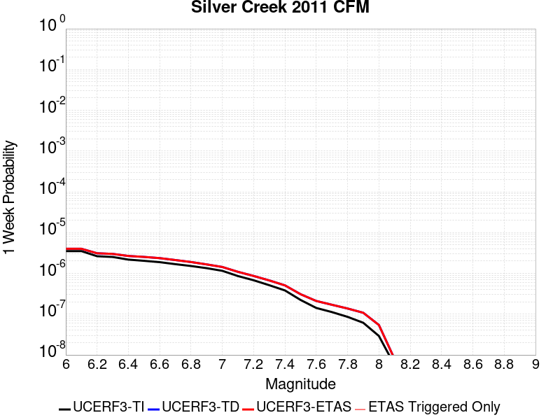 | 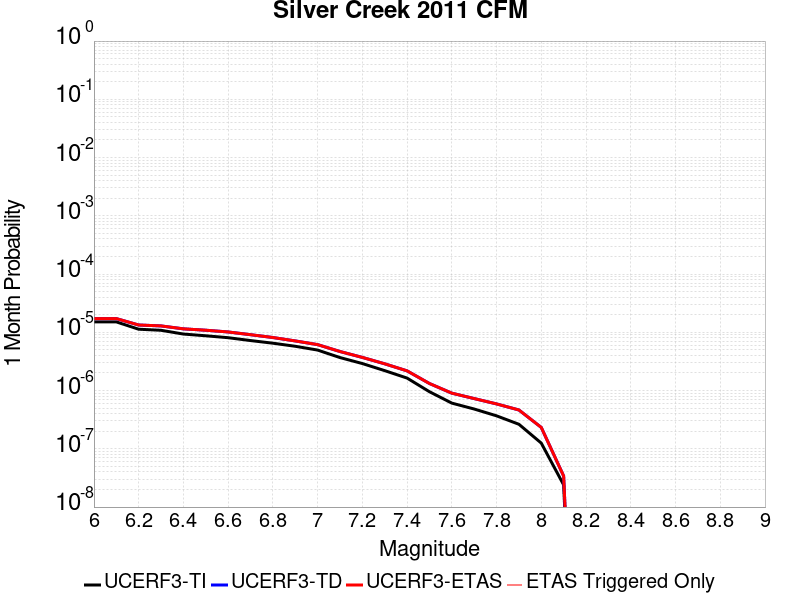 |  |  |

| Magnitude | 1 wk TI Prob | 1 wk TD Prob | 1 wk ETAS Prob | 1 wk ETAS/TD Gain | 1 wk ETAS Triggered Only | 1 mo TI Prob | 1 mo TD Prob | 1 mo ETAS Prob | 1 mo ETAS/TD Gain | 1 mo ETAS Triggered Only | 1 yr TI Prob | 1 yr TD Prob | 1 yr ETAS Prob | 1 yr ETAS/TD Gain | 1 yr ETAS Triggered Only | 10 yr TI Prob | 10 yr TD Prob | 10 yr ETAS Prob | 10 yr ETAS/TD Gain | 10 yr ETAS Triggered Only |
|-----|-----|-----|-----|-----|-----|-----|-----|-----|-----|-----|-----|-----|-----|-----|-----|-----|-----|-----|-----|-----|
| 6.0 | 3.5229125E-6 | 4.0129016E-6 | 4.0129016E-6 | 1.0 | 0.0 | 1.5098109E-5 | 1.719804E-5 | 1.719804E-5 | 1.0 | 0.0 | 1.8380396E-4 | 2.0936638E-4 | 2.0936638E-4 | 1.0 | 0.0 | 0.0018365202 | 0.002092048 | 0.0021100284 | 1.0085946 | 1.8018018E-5 |
| 6.1 | 3.5229125E-6 | 4.0129016E-6 | 4.0129016E-6 | 1.0 | 0.0 | 1.5098109E-5 | 1.719804E-5 | 1.719804E-5 | 1.0 | 0.0 | 1.8380396E-4 | 2.0936638E-4 | 2.0936638E-4 | 1.0 | 0.0 | 0.0018365202 | 0.002092048 | 0.0021100284 | 1.0085946 | 1.8018018E-5 |
| 6.2 | 2.6363234E-6 | 3.1152663E-6 | 3.1152663E-6 | 1.0 | 0.0 | 1.129848E-5 | 1.3351074E-5 | 1.3351074E-5 | 1.0 | 0.0 | 1.375503E-4 | 1.6253725E-4 | 1.6253725E-4 | 1.0 | 0.0 | 0.0013746519 | 0.0016245097 | 0.0016424984 | 1.0110734 | 1.8018018E-5 |
| 6.3 | 2.5275126E-6 | 3.0049023E-6 | 3.0049023E-6 | 1.0 | 0.0 | 1.0832152E-5 | 1.2878089E-5 | 1.2878089E-5 | 1.0 | 0.0 | 1.3187347E-4 | 1.5677951E-4 | 1.5677951E-4 | 1.0 | 0.0 | 0.0013179524 | 0.001567014 | 0.0015850038 | 1.0114803 | 1.8018018E-5 |
| 6.4 | 2.178732E-6 | 2.6753758E-6 | 2.6753758E-6 | 1.0 | 0.0 | 9.337389E-6 | 1.1465846E-5 | 1.1465846E-5 | 1.0 | 0.0 | 1.1367678E-4 | 1.3958776E-4 | 1.3958776E-4 | 1.0 | 0.0 | 0.0011361865 | 0.0013953234 | 0.0014133162 | 1.0128951 | 1.8018018E-5 |
| 6.5 | 2.0341574E-6 | 2.534443E-6 | 2.534443E-6 | 1.0 | 0.0 | 8.717788E-6 | 1.0861853E-5 | 1.0861853E-5 | 1.0 | 0.0 | 1.061339E-4 | 1.3223507E-4 | 1.3223507E-4 | 1.0 | 0.0 | 0.0010608323 | 0.001321886 | 0.0013398802 | 1.0136125 | 1.8018018E-5 |
| 6.6 | 1.8856827E-6 | 2.365939E-6 | 2.365939E-6 | 1.0 | 0.0 | 8.0814725E-6 | 1.0139699E-5 | 1.0139699E-5 | 1.0 | 0.0 | 9.838748E-5 | 1.2344387E-4 | 1.2344387E-4 | 1.0 | 0.0 | 9.834393E-4 | 0.0012340746 | 0.0012520704 | 1.0145824 | 1.8018018E-5 |
| 6.7 | 1.6844668E-6 | 2.124184E-6 | 2.124184E-6 | 1.0 | 0.0 | 7.2191233E-6 | 9.103614E-6 | 9.103614E-6 | 1.0 | 0.0 | 8.788928E-5 | 1.1083088E-4 | 1.1083088E-4 | 1.0 | 0.0 | 8.785453E-4 | 0.001108077 | 0.001126075 | 1.0162426 | 1.8018018E-5 |
| 6.8 | 1.5177161E-6 | 1.8995382E-6 | 1.8995382E-6 | 1.0 | 0.0 | 6.504481E-6 | 8.1408525E-6 | 8.1408525E-6 | 1.0 | 0.0 | 7.918918E-5 | 9.911038E-5 | 9.911038E-5 | 1.0 | 0.0 | 7.9160964E-4 | 9.909823E-4 | 9.909823E-4 | 1.0 | 0.0 |
| 6.9 | 1.3437394E-6 | 1.6599771E-6 | 1.6599771E-6 | 1.0 | 0.0 | 5.7588704E-6 | 7.114168E-6 | 7.114168E-6 | 1.0 | 0.0 | 7.011199E-5 | 8.661156E-5 | 8.661156E-5 | 1.0 | 0.0 | 7.0089876E-4 | 8.6609804E-4 | 8.6609804E-4 | 1.0 | 0.0 |
| 7.0 | 1.1563575E-6 | 1.4348819E-6 | 1.4348819E-6 | 1.0 | 0.0 | 4.9558084E-6 | 6.1494798E-6 | 6.1494798E-6 | 1.0 | 0.0 | 6.03353E-5 | 7.486735E-5 | 7.486735E-5 | 1.0 | 0.0 | 6.0318917E-4 | 7.487411E-4 | 7.487411E-4 | 1.0 | 0.0 |
| 7.1 | 8.602183E-7 | 1.0923065E-6 | 1.0923065E-6 | 1.0 | 0.0 | 3.6866445E-6 | 4.681305E-6 | 4.681305E-6 | 1.0 | 0.0 | 4.4883975E-5 | 5.69934E-5 | 5.69934E-5 | 1.0 | 0.0 | 4.4874908E-4 | 5.701075E-4 | 5.701075E-4 | 1.0 | 0.0 |
| 7.2 | 6.788407E-7 | 8.650568E-7 | 8.650568E-7 | 1.0 | 0.0 | 2.9093142E-6 | 3.7073808E-6 | 3.7073808E-6 | 1.0 | 0.0 | 3.5420322E-5 | 4.513643E-5 | 4.513643E-5 | 1.0 | 0.0 | 3.541468E-4 | 4.5159223E-4 | 4.5159223E-4 | 1.0 | 0.0 |
| 7.3 | 5.1292045E-7 | 6.7186437E-7 | 6.7186437E-7 | 1.0 | 0.0 | 2.1982287E-6 | 2.8794154E-6 | 2.8794154E-6 | 1.0 | 0.0 | 2.6763106E-5 | 3.505632E-5 | 3.505632E-5 | 1.0 | 0.0 | 2.6759884E-4 | 3.5082753E-4 | 3.5082753E-4 | 1.0 | 0.0 |
| 7.4 | 3.820994E-7 | 5.0833563E-7 | 5.0833563E-7 | 1.0 | 0.0 | 1.6375678E-6 | 2.1785793E-6 | 2.1785793E-6 | 1.0 | 0.0 | 1.9937206E-5 | 2.6523881E-5 | 2.6523881E-5 | 1.0 | 0.0 | 1.9935417E-4 | 2.6552676E-4 | 2.6552676E-4 | 1.0 | 0.0 |
| 7.5 | 2.2292595E-7 | 3.083788E-7 | 3.083788E-7 | 1.0 | 0.0 | 9.553966E-7 | 1.3216227E-6 | 1.3216227E-6 | 1.0 | 0.0 | 1.16318915E-5 | 1.6090637E-5 | 1.6090637E-5 | 1.0 | 0.0 | 1.16312825E-4 | 1.6121432E-4 | 1.6121432E-4 | 1.0 | 0.0 |
| 7.6 | 1.420587E-7 | 2.1061219E-7 | 2.1061219E-7 | 1.0 | 0.0 | 6.088228E-7 | 9.0262336E-7 | 9.0262336E-7 | 1.0 | 0.0 | 7.4123927E-6 | 1.0989384E-5 | 1.0989384E-5 | 1.0 | 0.0 | 7.412145E-5 | 1.1020766E-4 | 1.1020766E-4 | 1.0 | 0.0 |
| 7.7 | 1.1250075E-7 | 1.700581E-7 | 1.700581E-7 | 1.0 | 0.0 | 4.82146E-7 | 7.2882017E-7 | 7.2882017E-7 | 1.0 | 0.0 | 5.8701116E-6 | 8.8733495E-6 | 8.8733495E-6 | 1.0 | 0.0 | 5.8699567E-5 | 8.90468E-5 | 8.90468E-5 | 1.0 | 0.0 |
| 7.8 | 8.592761E-8 | 1.376445E-7 | 1.376445E-7 | 1.0 | 0.0 | 3.682611E-7 | 5.8990486E-7 | 5.8990486E-7 | 1.0 | 0.0 | 4.48357E-6 | 7.182068E-6 | 7.182068E-6 | 1.0 | 0.0 | 4.4834796E-5 | 7.212392E-5 | 7.212392E-5 | 1.0 | 0.0 |
| 7.9 | 6.156529E-8 | 1.0829748E-7 | 1.0829748E-7 | 1.0 | 0.0 | 2.638512E-7 | 4.6413197E-7 | 4.6413197E-7 | 1.0 | 0.0 | 3.212384E-6 | 5.650792E-6 | 5.650792E-6 | 1.0 | 0.0 | 3.2123375E-5 | 5.6766607E-5 | 5.6766607E-5 | 1.0 | 0.0 |
| 8.0 | 2.9230547E-8 | 5.430176E-8 | 5.430176E-8 | 1.0 | 0.0 | 1.2527377E-7 | 2.3272182E-7 | 2.3272182E-7 | 1.0 | 0.0 | 1.525207E-6 | 2.8333845E-6 | 2.8333845E-6 | 1.0 | 0.0 | 1.5251966E-5 | 2.8470198E-5 | 2.8470198E-5 | 1.0 | 0.0 |
| 8.1 | 5.6062213E-9 | 7.963527E-9 | 7.963527E-9 | 1.0 | 0.0 | 2.4026663E-8 | 3.41294E-8 | 3.41294E-8 | 1.0 | 0.0 | 2.925246E-7 | 4.155254E-7 | 4.155254E-7 | 1.0 | 0.0 | 2.925242E-6 | 4.1942235E-6 | 4.1942235E-6 | 1.0 | 0.0 |

## San Andreas (San Gorgonio Pass-Garnet HIll)
*[(top)](#table-of-contents)*

| 1 Week | 1 Month | 1 Year | 10 Year |
|-----|-----|-----|-----|
|  |  |  |  |

| Magnitude | 1 wk TI Prob | 1 wk TD Prob | 1 wk ETAS Prob | 1 wk ETAS/TD Gain | 1 wk ETAS Triggered Only | 1 mo TI Prob | 1 mo TD Prob | 1 mo ETAS Prob | 1 mo ETAS/TD Gain | 1 mo ETAS Triggered Only | 1 yr TI Prob | 1 yr TD Prob | 1 yr ETAS Prob | 1 yr ETAS/TD Gain | 1 yr ETAS Triggered Only | 10 yr TI Prob | 10 yr TD Prob | 10 yr ETAS Prob | 10 yr ETAS/TD Gain | 10 yr ETAS Triggered Only |
|-----|-----|-----|-----|-----|-----|-----|-----|-----|-----|-----|-----|-----|-----|-----|-----|-----|-----|-----|-----|-----|
| 6.0 | 8.31567E-5 | 2.344114E-4 | 2.344114E-4 | 1.0 | 0.0 | 3.5633717E-4 | 0.0010042359 | 0.0010042359 | 1.0 | 0.0 | 0.004329778 | 0.012157845 | 0.012175644 | 1.001464 | 1.8018018E-5 | 0.042463828 | 0.112816945 | 0.112832926 | 1.0001417 | 1.8018018E-5 |
| 6.1 | 8.31567E-5 | 2.344114E-4 | 2.344114E-4 | 1.0 | 0.0 | 3.5633717E-4 | 0.0010042359 | 0.0010042359 | 1.0 | 0.0 | 0.004329778 | 0.012157845 | 0.012175644 | 1.001464 | 1.8018018E-5 | 0.042463828 | 0.112816945 | 0.112832926 | 1.0001417 | 1.8018018E-5 |
| 6.2 | 8.31567E-5 | 2.344114E-4 | 2.344114E-4 | 1.0 | 0.0 | 3.5633717E-4 | 0.0010042359 | 0.0010042359 | 1.0 | 0.0 | 0.004329778 | 0.012157845 | 0.012175644 | 1.001464 | 1.8018018E-5 | 0.042463828 | 0.112816945 | 0.112832926 | 1.0001417 | 1.8018018E-5 |
| 6.3 | 8.31567E-5 | 2.344114E-4 | 2.344114E-4 | 1.0 | 0.0 | 3.5633717E-4 | 0.0010042359 | 0.0010042359 | 1.0 | 0.0 | 0.004329778 | 0.012157845 | 0.012175644 | 1.001464 | 1.8018018E-5 | 0.042463828 | 0.112816945 | 0.112832926 | 1.0001417 | 1.8018018E-5 |
| 6.4 | 8.059055E-5 | 2.2998777E-4 | 2.2998777E-4 | 1.0 | 0.0 | 3.4534236E-4 | 9.852918E-4 | 9.852918E-4 | 1.0 | 0.0 | 0.0041964394 | 0.011929748 | 0.011947551 | 1.0014924 | 1.8018018E-5 | 0.041180745 | 0.11079719 | 0.110813215 | 1.0001446 | 1.8018018E-5 |
| 6.5 | 8.059055E-5 | 2.2998777E-4 | 2.2998777E-4 | 1.0 | 0.0 | 3.4534236E-4 | 9.852918E-4 | 9.852918E-4 | 1.0 | 0.0 | 0.0041964394 | 0.011929748 | 0.011947551 | 1.0014924 | 1.8018018E-5 | 0.041180745 | 0.11079719 | 0.110813215 | 1.0001446 | 1.8018018E-5 |
| 6.6 | 7.619237E-5 | 2.2242195E-4 | 2.2242195E-4 | 1.0 | 0.0 | 3.2649786E-4 | 9.52891E-4 | 9.52891E-4 | 1.0 | 0.0 | 0.0039678677 | 0.011540289 | 0.011558099 | 1.0015433 | 1.8018018E-5 | 0.03897764 | 0.107332654 | 0.10734874 | 1.0001498 | 1.8018018E-5 |
| 6.7 | 7.440636E-5 | 2.1917891E-4 | 2.1917891E-4 | 1.0 | 0.0 | 3.188454E-4 | 9.390023E-4 | 9.390023E-4 | 1.0 | 0.0 | 0.0038750346 | 0.011372965 | 0.011390778 | 1.0015663 | 1.8018018E-5 | 0.038081564 | 0.10584094 | 0.10585705 | 1.0001522 | 1.8018018E-5 |
| 6.8 | 7.3735864E-5 | 2.1764987E-4 | 2.1764987E-4 | 1.0 | 0.0 | 3.1597257E-4 | 9.32454E-4 | 9.32454E-4 | 1.0 | 0.0 | 0.0038401815 | 0.011294069 | 0.011311883 | 1.0015774 | 1.8018018E-5 | 0.03774495 | 0.105142355 | 0.10515848 | 1.0001533 | 1.8018018E-5 |
| 6.9 | 7.27575E-5 | 2.153387E-4 | 2.153387E-4 | 1.0 | 0.0 | 3.117806E-4 | 9.22556E-4 | 9.22556E-4 | 1.0 | 0.0 | 0.003789323 | 0.011174804 | 0.01119262 | 1.0015943 | 1.8018018E-5 | 0.037253562 | 0.104090154 | 0.1041063 | 1.0001551 | 1.8018018E-5 |
| 7.0 | 7.102591E-5 | 2.1117668E-4 | 2.1117668E-4 | 1.0 | 0.0 | 3.0436125E-4 | 9.047312E-4 | 9.047312E-4 | 1.0 | 0.0 | 0.003699303 | 0.0109599875 | 0.010977808 | 1.001626 | 1.8018018E-5 | 0.03638325 | 0.10219181 | 0.10220799 | 1.0001583 | 1.8018018E-5 |
| 7.1 | 7.028513E-5 | 2.0953201E-4 | 2.0953201E-4 | 1.0 | 0.0 | 3.0118722E-4 | 8.9768757E-4 | 8.9768757E-4 | 1.0 | 0.0 | 0.0036607897 | 0.010875091 | 0.010892913 | 1.0016388 | 1.8018018E-5 | 0.036010686 | 0.10143456 | 0.10145075 | 1.0001596 | 1.8018018E-5 |
| 7.2 | 6.8498244E-5 | 2.05608E-4 | 2.05608E-4 | 1.0 | 0.0 | 2.9353087E-4 | 8.8088174E-4 | 8.8088174E-4 | 1.0 | 0.0 | 0.003567883 | 0.0106725 | 0.010690326 | 1.0016702 | 1.8018018E-5 | 0.035111405 | 0.09962587 | 0.0996421 | 1.0001628 | 1.8018018E-5 |
| 7.3 | 6.622592E-5 | 1.9787368E-4 | 1.9787368E-4 | 1.0 | 0.0 | 2.8379448E-4 | 8.4775663E-4 | 8.4775663E-4 | 1.0 | 0.0 | 0.0034497243 | 0.010273073 | 0.010290906 | 1.0017359 | 1.8018018E-5 | 0.033966612 | 0.09612023 | 0.09613652 | 1.0001694 | 1.8018018E-5 |
| 7.4 | 5.1050705E-5 | 1.4736863E-4 | 1.4736863E-4 | 1.0 | 0.0 | 2.1877038E-4 | 6.314278E-4 | 6.314278E-4 | 1.0 | 0.0 | 0.002660276 | 0.0076607293 | 0.0076786093 | 1.002334 | 1.8018018E-5 | 0.02628654 | 0.07306989 | 0.0730866 | 1.0002285 | 1.8018018E-5 |
| 7.5 | 3.9302922E-5 | 1.1171539E-4 | 1.1171539E-4 | 1.0 | 0.0 | 1.6843023E-4 | 4.786927E-4 | 4.786927E-4 | 1.0 | 0.0 | 0.0020487092 | 0.0058125798 | 0.005830493 | 1.0030818 | 1.8018018E-5 | 0.020299247 | 0.05619383 | 0.056210835 | 1.0003027 | 1.8018018E-5 |
| 7.6 | 2.9851626E-5 | 8.532174E-5 | 8.532174E-5 | 1.0 | 0.0 | 1.2792926E-4 | 3.6561346E-4 | 3.6561346E-4 | 1.0 | 0.0 | 0.0015564259 | 0.0044422843 | 0.0044602226 | 1.004038 | 1.8018018E-5 | 0.0154556995 | 0.04336039 | 0.043377627 | 1.0003976 | 1.8018018E-5 |
| 7.7 | 2.1135214E-5 | 6.38603E-5 | 6.38603E-5 | 1.0 | 0.0 | 9.0576345E-5 | 2.736583E-4 | 2.736583E-4 | 1.0 | 0.0 | 0.0011022091 | 0.0033267052 | 0.0033446634 | 1.0053982 | 1.8018018E-5 | 0.010967582 | 0.03273207 | 0.032749496 | 1.0005325 | 1.8018018E-5 |
| 7.8 | 1.883379E-5 | 5.5944303E-5 | 5.5944303E-5 | 1.0 | 0.0 | 8.0713755E-5 | 2.3973928E-4 | 2.3973928E-4 | 1.0 | 0.0 | 9.822468E-4 | 0.0029149223 | 0.0029328878 | 1.0061632 | 1.8018018E-5 | 0.0097791655 | 0.028833086 | 0.028850583 | 1.0006069 | 1.8018018E-5 |
| 7.9 | 1.5156185E-5 | 4.190922E-5 | 4.190922E-5 | 1.0 | 0.0 | 6.495346E-5 | 1.795986E-4 | 1.795986E-4 | 1.0 | 0.0 | 7.9052144E-4 | 0.0021844215 | 0.0022024002 | 1.0082304 | 1.8018018E-5 | 0.007877152 | 0.02187479 | 0.021892413 | 1.0008056 | 1.8018018E-5 |
| 8.0 | 1.1405907E-5 | 3.0164329E-5 | 3.0164329E-5 | 1.0 | 0.0 | 4.8881542E-5 | 1.2926929E-4 | 1.2926929E-4 | 1.0 | 0.0 | 5.9497025E-4 | 0.0015727184 | 0.0015727184 | 1.0 | 0.0 | 0.005933798 | 0.015861288 | 0.015861288 | 1.0 | 0.0 |
| 8.1 | 4.3511436E-6 | 7.44043E-6 | 7.44043E-6 | 1.0 | 0.0 | 1.8647626E-5 | 3.1887168E-5 | 3.1887168E-5 | 1.0 | 0.0 | 2.2701119E-4 | 3.8815723E-4 | 3.8815723E-4 | 1.0 | 0.0 | 0.0022677942 | 0.0041519296 | 0.0041519296 | 1.0 | 0.0 |
| 8.2 | 2.3042528E-6 | 2.7663746E-6 | 2.7663746E-6 | 1.0 | 0.0 | 9.875332E-6 | 1.1855837E-5 | 1.1855837E-5 | 1.0 | 0.0 | 1.2022553E-4 | 1.443353E-4 | 1.443353E-4 | 1.0 | 0.0 | 0.0012016051 | 0.0016154682 | 0.0016154682 | 1.0 | 0.0 |
| 8.3 | 5.202968E-7 | 3.2085435E-7 | 3.2085435E-7 | 1.0 | 0.0 | 2.2298414E-6 | 1.3750895E-6 | 1.3750895E-6 | 1.0 | 0.0 | 2.714798E-5 | 1.6741598E-5 | 1.6741598E-5 | 1.0 | 0.0 | 2.7144665E-4 | 1.9837897E-4 | 1.9837897E-4 | 1.0 | 0.0 |

## San Gregorio (South) 2011 CFM
*[(top)](#table-of-contents)*

| 1 Week | 1 Month | 1 Year | 10 Year |
|-----|-----|-----|-----|
|  |  |  |  |

| Magnitude | 1 wk TI Prob | 1 wk TD Prob | 1 wk ETAS Prob | 1 wk ETAS/TD Gain | 1 wk ETAS Triggered Only | 1 mo TI Prob | 1 mo TD Prob | 1 mo ETAS Prob | 1 mo ETAS/TD Gain | 1 mo ETAS Triggered Only | 1 yr TI Prob | 1 yr TD Prob | 1 yr ETAS Prob | 1 yr ETAS/TD Gain | 1 yr ETAS Triggered Only | 10 yr TI Prob | 10 yr TD Prob | 10 yr ETAS Prob | 10 yr ETAS/TD Gain | 10 yr ETAS Triggered Only |
|-----|-----|-----|-----|-----|-----|-----|-----|-----|-----|-----|-----|-----|-----|-----|-----|-----|-----|-----|-----|-----|
| 6.0 | 1.8770423E-5 | 1.6289738E-5 | 1.6289738E-5 | 1.0 | 0.0 | 8.044219E-5 | 6.9811314E-5 | 6.9811314E-5 | 1.0 | 0.0 | 9.789435E-4 | 8.496251E-4 | 8.496251E-4 | 1.0 | 0.0 | 0.009746423 | 0.008476529 | 0.008494395 | 1.0021076 | 1.8018018E-5 |
| 6.1 | 1.8770423E-5 | 1.6289738E-5 | 1.6289738E-5 | 1.0 | 0.0 | 8.044219E-5 | 6.9811314E-5 | 6.9811314E-5 | 1.0 | 0.0 | 9.789435E-4 | 8.496251E-4 | 8.496251E-4 | 1.0 | 0.0 | 0.009746423 | 0.008476529 | 0.008494395 | 1.0021076 | 1.8018018E-5 |
| 6.2 | 1.7508692E-5 | 1.4908993E-5 | 1.4908993E-5 | 1.0 | 0.0 | 7.5035096E-5 | 6.3894135E-5 | 6.3894135E-5 | 1.0 | 0.0 | 9.1316935E-4 | 7.776365E-4 | 7.776365E-4 | 1.0 | 0.0 | 0.00909426 | 0.0077618314 | 0.0077797095 | 1.0023034 | 1.8018018E-5 |
| 6.3 | 1.7508692E-5 | 1.4908993E-5 | 1.4908993E-5 | 1.0 | 0.0 | 7.5035096E-5 | 6.3894135E-5 | 6.3894135E-5 | 1.0 | 0.0 | 9.1316935E-4 | 7.776365E-4 | 7.776365E-4 | 1.0 | 0.0 | 0.00909426 | 0.0077618314 | 0.0077797095 | 1.0023034 | 1.8018018E-5 |
| 6.4 | 1.6004591E-5 | 1.3258521E-5 | 1.3258521E-5 | 1.0 | 0.0 | 6.85893E-5 | 5.6821E-5 | 5.6821E-5 | 1.0 | 0.0 | 8.347548E-4 | 6.9157715E-4 | 6.9157715E-4 | 1.0 | 0.0 | 0.008316261 | 0.006906727 | 0.0069246204 | 1.0025908 | 1.8018018E-5 |
| 6.5 | 1.6004591E-5 | 1.3258521E-5 | 1.3258521E-5 | 1.0 | 0.0 | 6.85893E-5 | 5.6821E-5 | 5.6821E-5 | 1.0 | 0.0 | 8.347548E-4 | 6.9157715E-4 | 6.9157715E-4 | 1.0 | 0.0 | 0.008316261 | 0.006906727 | 0.0069246204 | 1.0025908 | 1.8018018E-5 |
| 6.6 | 1.5442201E-5 | 1.26430405E-5 | 1.26430405E-5 | 1.0 | 0.0 | 6.617918E-5 | 5.4183336E-5 | 5.4183336E-5 | 1.0 | 0.0 | 8.0543366E-4 | 6.594833E-4 | 6.594833E-4 | 1.0 | 0.0 | 0.008025207 | 0.006587722 | 0.0066056214 | 1.002717 | 1.8018018E-5 |
| 6.7 | 1.489921E-5 | 1.2051447E-5 | 1.2051447E-5 | 1.0 | 0.0 | 6.3852196E-5 | 5.164804E-5 | 5.164804E-5 | 1.0 | 0.0 | 7.7712315E-4 | 6.286342E-4 | 6.286342E-4 | 1.0 | 0.0 | 0.0077441116 | 0.006281004 | 0.0062989085 | 1.0028507 | 1.8018018E-5 |
| 6.8 | 1.3876024E-5 | 1.093019E-5 | 1.093019E-5 | 1.0 | 0.0 | 5.9467322E-5 | 4.6842833E-5 | 4.6842833E-5 | 1.0 | 0.0 | 7.237741E-4 | 5.701626E-4 | 5.701626E-4 | 1.0 | 0.0 | 0.0072142133 | 0.005699408 | 0.005717323 | 1.0031433 | 1.8018018E-5 |
| 6.9 | 1.33922495E-5 | 1.0401597E-5 | 1.0401597E-5 | 1.0 | 0.0 | 5.7394092E-5 | 4.4577515E-5 | 4.4577515E-5 | 1.0 | 0.0 | 6.9854903E-4 | 5.4259633E-4 | 5.4259633E-4 | 1.0 | 0.0 | 0.0069635725 | 0.005425117 | 0.0054430375 | 1.0033032 | 1.8018018E-5 |
| 7.0 | 1.2807324E-5 | 9.761441E-6 | 9.761441E-6 | 1.0 | 0.0 | 5.4887376E-5 | 4.183408E-5 | 4.183408E-5 | 1.0 | 0.0 | 6.680489E-4 | 5.092111E-4 | 5.092111E-4 | 1.0 | 0.0 | 0.006660442 | 0.005092836 | 0.0051107625 | 1.0035199 | 1.8018018E-5 |
| 7.1 | 1.2191438E-5 | 9.070163E-6 | 9.070163E-6 | 1.0 | 0.0 | 5.224797E-5 | 3.887155E-5 | 3.887155E-5 | 1.0 | 0.0 | 6.3593336E-4 | 4.731584E-4 | 4.731584E-4 | 1.0 | 0.0 | 0.0063411663 | 0.0047338954 | 0.004751828 | 1.0037881 | 1.8018018E-5 |
| 7.2 | 1.1769438E-5 | 8.590228E-6 | 8.590228E-6 | 1.0 | 0.0 | 5.0439474E-5 | 3.6814745E-5 | 3.6814745E-5 | 1.0 | 0.0 | 6.1392755E-4 | 4.481274E-4 | 4.481274E-4 | 1.0 | 0.0 | 0.0061223423 | 0.004484622 | 0.004502559 | 1.0039997 | 1.8018018E-5 |
| 7.3 | 1.150374E-5 | 8.305612E-6 | 8.305612E-6 | 1.0 | 0.0 | 4.9300812E-5 | 3.5594996E-5 | 3.5594996E-5 | 1.0 | 0.0 | 6.0007203E-4 | 4.3328296E-4 | 4.3328296E-4 | 1.0 | 0.0 | 0.0059845424 | 0.0043367483 | 0.0043546883 | 1.0041367 | 1.8018018E-5 |
| 7.4 | 1.12514E-5 | 8.051282E-6 | 8.051282E-6 | 1.0 | 0.0 | 4.8219394E-5 | 3.450504E-5 | 3.450504E-5 | 1.0 | 0.0 | 5.8691297E-4 | 4.2001792E-4 | 4.2001792E-4 | 1.0 | 0.0 | 0.005853653 | 0.0042045936 | 0.004222536 | 1.0042673 | 1.8018018E-5 |
| 7.5 | 1.059696E-5 | 7.4012414E-6 | 7.4012414E-6 | 1.0 | 0.0 | 4.5414752E-5 | 3.171922E-5 | 3.171922E-5 | 1.0 | 0.0 | 5.5278436E-4 | 3.8611316E-4 | 3.8611316E-4 | 1.0 | 0.0 | 0.0055141128 | 0.0038667116 | 0.0038846598 | 1.0046418 | 1.8018018E-5 |
| 7.6 | 9.018592E-6 | 5.84448E-6 | 5.84448E-6 | 1.0 | 0.0 | 3.8650534E-5 | 2.504753E-5 | 2.504753E-5 | 1.0 | 0.0 | 4.7046866E-4 | 3.0491105E-4 | 3.0491105E-4 | 1.0 | 0.0 | 0.004694739 | 0.003056837 | 0.0030748001 | 1.0058763 | 1.8018018E-5 |
| 7.7 | 6.243489E-6 | 3.24569E-6 | 3.24569E-6 | 1.0 | 0.0 | 2.6757538E-5 | 1.3910027E-5 | 1.3910027E-5 | 1.0 | 0.0 | 3.257243E-4 | 1.6934142E-4 | 1.6934142E-4 | 1.0 | 0.0 | 0.003252473 | 0.0017023596 | 0.001720347 | 1.0105661 | 1.8018018E-5 |
| 7.8 | 3.1941963E-6 | 1.384812E-6 | 1.384812E-6 | 1.0 | 0.0 | 1.368934E-5 | 5.9348945E-6 | 5.9348945E-6 | 1.0 | 0.0 | 1.6665498E-4 | 7.2254945E-5 | 7.2254945E-5 | 1.0 | 0.0 | 0.0016653005 | 7.283418E-4 | 7.463467E-4 | 1.0247204 | 1.8018018E-5 |
| 7.9 | 2.0098398E-6 | 6.9448276E-7 | 6.9448276E-7 | 1.0 | 0.0 | 8.6135715E-6 | 2.9763512E-6 | 2.9763512E-6 | 1.0 | 0.0 | 1.0486518E-4 | 3.6236474E-5 | 3.6236474E-5 | 1.0 | 0.0 | 0.0010481571 | 3.6725012E-4 | 3.8526152E-4 | 1.049044 | 1.8018018E-5 |
| 8.0 | 8.353119E-7 | 3.175784E-7 | 3.175784E-7 | 1.0 | 0.0 | 3.579903E-6 | 1.3610495E-6 | 1.3610495E-6 | 1.0 | 0.0 | 4.358445E-5 | 1.6570651E-5 | 1.6570651E-5 | 1.0 | 0.0 | 4.3575902E-4 | 1.6689835E-4 | 1.6689835E-4 | 1.0 | 0.0 |
| 8.1 | 1.5033264E-7 | 6.550403E-8 | 6.550403E-8 | 1.0 | 0.0 | 6.442826E-7 | 2.8073154E-7 | 2.8073154E-7 | 1.0 | 0.0 | 7.844113E-6 | 3.4179013E-6 | 3.4179013E-6 | 1.0 | 0.0 | 7.843835E-5 | 3.419582E-5 | 3.419582E-5 | 1.0 | 0.0 |

## Hosgri
*[(top)](#table-of-contents)*

| 1 Week | 1 Month | 1 Year | 10 Year |
|-----|-----|-----|-----|
|  |  |  |  |

| Magnitude | 1 wk TI Prob | 1 wk TD Prob | 1 wk ETAS Prob | 1 wk ETAS/TD Gain | 1 wk ETAS Triggered Only | 1 mo TI Prob | 1 mo TD Prob | 1 mo ETAS Prob | 1 mo ETAS/TD Gain | 1 mo ETAS Triggered Only | 1 yr TI Prob | 1 yr TD Prob | 1 yr ETAS Prob | 1 yr ETAS/TD Gain | 1 yr ETAS Triggered Only | 10 yr TI Prob | 10 yr TD Prob | 10 yr ETAS Prob | 10 yr ETAS/TD Gain | 10 yr ETAS Triggered Only |
|-----|-----|-----|-----|-----|-----|-----|-----|-----|-----|-----|-----|-----|-----|-----|-----|-----|-----|-----|-----|-----|
| 6.0 | 2.883978E-5 | 2.9134455E-5 | 2.9134455E-5 | 1.0 | 0.0 | 1.235932E-4 | 1.2485613E-4 | 1.2485613E-4 | 1.0 | 0.0 | 0.0015037085 | 0.0015190906 | 0.0015190906 | 1.0 | 0.0 | 0.01493574 | 0.015090846 | 0.015108593 | 1.001176 | 1.8018018E-5 |
| 6.1 | 2.883978E-5 | 2.9134455E-5 | 2.9134455E-5 | 1.0 | 0.0 | 1.235932E-4 | 1.2485613E-4 | 1.2485613E-4 | 1.0 | 0.0 | 0.0015037085 | 0.0015190906 | 0.0015190906 | 1.0 | 0.0 | 0.01493574 | 0.015090846 | 0.015108593 | 1.001176 | 1.8018018E-5 |
| 6.2 | 2.883978E-5 | 2.9134455E-5 | 2.9134455E-5 | 1.0 | 0.0 | 1.235932E-4 | 1.2485613E-4 | 1.2485613E-4 | 1.0 | 0.0 | 0.0015037085 | 0.0015190906 | 0.0015190906 | 1.0 | 0.0 | 0.01493574 | 0.015090846 | 0.015108593 | 1.001176 | 1.8018018E-5 |
| 6.3 | 2.2914428E-5 | 2.264682E-5 | 2.264682E-5 | 1.0 | 0.0 | 9.8200995E-5 | 9.705422E-5 | 9.705422E-5 | 1.0 | 0.0 | 0.0011949413 | 0.0011809994 | 0.0011809994 | 1.0 | 0.0 | 0.011885363 | 0.011748637 | 0.011766443 | 1.0015156 | 1.8018018E-5 |
| 6.4 | 2.0195741E-5 | 1.9700936E-5 | 1.9700936E-5 | 1.0 | 0.0 | 8.65503E-5 | 8.442986E-5 | 8.442986E-5 | 1.0 | 0.0 | 0.0010532405 | 0.0010274508 | 0.0010274508 | 1.0 | 0.0 | 0.010482626 | 0.0102280555 | 0.010245889 | 1.0017436 | 1.8018018E-5 |
| 6.5 | 1.9924333E-5 | 1.941332E-5 | 1.941332E-5 | 1.0 | 0.0 | 8.53872E-5 | 8.319731E-5 | 8.319731E-5 | 1.0 | 0.0 | 0.0010390934 | 0.0010124585 | 0.0010124585 | 1.0 | 0.0 | 0.010342481 | 0.0100794975 | 0.010097334 | 1.0017695 | 1.8018018E-5 |
| 6.6 | 1.809694E-5 | 1.7462371E-5 | 1.7462371E-5 | 1.0 | 0.0 | 7.7556004E-5 | 7.483659E-5 | 7.483659E-5 | 1.0 | 0.0 | 9.438353E-4 | 9.1075595E-4 | 9.1075595E-4 | 1.0 | 0.0 | 0.009398366 | 0.009071181 | 0.009089035 | 1.0019683 | 1.8018018E-5 |
| 6.7 | 1.675989E-5 | 1.6046652E-5 | 1.6046652E-5 | 1.0 | 0.0 | 7.182612E-5 | 6.876956E-5 | 6.876956E-5 | 1.0 | 0.0 | 8.7413215E-4 | 8.3694886E-4 | 8.3694886E-4 | 1.0 | 0.0 | 0.008707017 | 0.008338877 | 0.008356744 | 1.0021427 | 1.8018018E-5 |
| 6.8 | 1.5401129E-5 | 1.4617786E-5 | 1.4617786E-5 | 1.0 | 0.0 | 6.6003166E-5 | 6.2646155E-5 | 6.2646155E-5 | 1.0 | 0.0 | 8.032922E-4 | 7.624509E-4 | 7.624509E-4 | 1.0 | 0.0 | 0.008003947 | 0.007599217 | 0.0076170983 | 1.0023531 | 1.8018018E-5 |
| 6.9 | 1.356559E-5 | 1.2693427E-5 | 1.2693427E-5 | 1.0 | 0.0 | 5.8136946E-5 | 5.4399272E-5 | 5.4399272E-5 | 1.0 | 0.0 | 7.0758746E-4 | 6.6211034E-4 | 6.6211034E-4 | 1.0 | 0.0 | 0.007053386 | 0.006602184 | 0.006620083 | 1.002711 | 1.8018018E-5 |
| 7.0 | 1.2030819E-5 | 1.1099228E-5 | 1.1099228E-5 | 1.0 | 0.0 | 5.155963E-5 | 4.7567253E-5 | 4.7567253E-5 | 1.0 | 0.0 | 6.275577E-4 | 5.789775E-4 | 5.789775E-4 | 1.0 | 0.0 | 0.006257884 | 0.005775454 | 0.005793368 | 1.0031017 | 1.8018018E-5 |
| 7.1 | 1.0972698E-5 | 1.0025329E-5 | 1.0025329E-5 | 1.0 | 0.0 | 4.7025E-5 | 4.296499E-5 | 4.296499E-5 | 1.0 | 0.0 | 5.72379E-4 | 5.2297325E-4 | 5.2297325E-4 | 1.0 | 0.0 | 0.0057090693 | 0.00521818 | 0.005236104 | 1.0034349 | 1.8018018E-5 |
| 7.2 | 9.961926E-6 | 9.037798E-6 | 9.037798E-6 | 1.0 | 0.0 | 4.2693267E-5 | 3.8732847E-5 | 3.8732847E-5 | 1.0 | 0.0 | 5.1966653E-4 | 4.714704E-4 | 4.714704E-4 | 1.0 | 0.0 | 0.00518453 | 0.0047054505 | 0.0047233836 | 1.0038111 | 1.8018018E-5 |
| 7.3 | 8.700929E-6 | 7.831038E-6 | 7.831038E-6 | 1.0 | 0.0 | 3.7289166E-5 | 3.356116E-5 | 3.356116E-5 | 1.0 | 0.0 | 4.53901E-4 | 4.0853053E-4 | 4.0853053E-4 | 1.0 | 0.0 | 0.00452975 | 0.004078537 | 0.0040964815 | 1.0043998 | 1.8018018E-5 |
| 7.4 | 7.866285E-6 | 7.0015703E-6 | 7.0015703E-6 | 1.0 | 0.0 | 3.3712215E-5 | 3.0006386E-5 | 3.0006386E-5 | 1.0 | 0.0 | 4.103689E-4 | 3.6526652E-4 | 3.6526652E-4 | 1.0 | 0.0 | 0.004096119 | 0.0036474012 | 0.0036653536 | 1.0049219 | 1.8018018E-5 |
| 7.5 | 6.8381305E-6 | 5.962434E-6 | 5.962434E-6 | 1.0 | 0.0 | 2.9305946E-5 | 2.555304E-5 | 2.555304E-5 | 1.0 | 0.0 | 3.5674145E-4 | 3.1106386E-4 | 3.1106386E-4 | 1.0 | 0.0 | 0.0035616932 | 0.0031070218 | 0.003124984 | 1.005781 | 1.8018018E-5 |
| 7.6 | 5.503376E-6 | 4.59786E-6 | 4.59786E-6 | 1.0 | 0.0 | 2.3585684E-5 | 1.9704965E-5 | 1.9704965E-5 | 1.0 | 0.0 | 2.8711787E-4 | 2.3988156E-4 | 2.3988156E-4 | 1.0 | 0.0 | 0.002867472 | 0.0023969617 | 0.0024149364 | 1.007499 | 1.8018018E-5 |
| 7.7 | 3.6144982E-6 | 2.6546047E-6 | 2.6546047E-6 | 1.0 | 0.0 | 1.5490614E-5 | 1.1376827E-5 | 1.1376827E-5 | 1.0 | 0.0 | 1.8858191E-4 | 1.3850408E-4 | 1.3850408E-4 | 1.0 | 0.0 | 0.0018842196 | 0.0013849111 | 0.0014029042 | 1.0129923 | 1.8018018E-5 |
| 7.8 | 1.9853494E-6 | 1.1381159E-6 | 1.1381159E-6 | 1.0 | 0.0 | 8.508612E-6 | 4.8776305E-6 | 4.8776305E-6 | 1.0 | 0.0 | 1.0358743E-4 | 5.9383532E-5 | 5.9383532E-5 | 1.0 | 0.0 | 0.0010353916 | 5.9440895E-4 | 6.1241625E-4 | 1.0302944 | 1.8018018E-5 |
| 7.9 | 1.1818757E-6 | 5.310923E-7 | 5.310923E-7 | 1.0 | 0.0 | 5.0651715E-6 | 2.2761078E-6 | 2.2761078E-6 | 1.0 | 0.0 | 6.1666724E-5 | 2.771126E-5 | 2.771126E-5 | 1.0 | 0.0 | 6.1649614E-4 | 2.7776862E-4 | 2.9578162E-4 | 1.064849 | 1.8018018E-5 |
| 8.0 | 6.962958E-7 | 2.7248345E-7 | 2.7248345E-7 | 1.0 | 0.0 | 2.9841215E-6 | 1.1677856E-6 | 1.1677856E-6 | 1.0 | 0.0 | 3.6331072E-5 | 1.4217697E-5 | 1.4217697E-5 | 1.0 | 0.0 | 3.6325134E-4 | 1.4274013E-4 | 1.4274013E-4 | 1.0 | 0.0 |
| 8.1 | 1.5033264E-7 | 6.550403E-8 | 6.550403E-8 | 1.0 | 0.0 | 6.442826E-7 | 2.8073154E-7 | 2.8073154E-7 | 1.0 | 0.0 | 7.844113E-6 | 3.4179013E-6 | 3.4179013E-6 | 1.0 | 0.0 | 7.843835E-5 | 3.419582E-5 | 3.419582E-5 | 1.0 | 0.0 |

## Bartlett Springs 2011 CFM
*[(top)](#table-of-contents)*

| 1 Week | 1 Month | 1 Year | 10 Year |
|-----|-----|-----|-----|
|  |  |  |  |

| Magnitude | 1 wk TI Prob | 1 wk TD Prob | 1 wk ETAS Prob | 1 wk ETAS/TD Gain | 1 wk ETAS Triggered Only | 1 mo TI Prob | 1 mo TD Prob | 1 mo ETAS Prob | 1 mo ETAS/TD Gain | 1 mo ETAS Triggered Only | 1 yr TI Prob | 1 yr TD Prob | 1 yr ETAS Prob | 1 yr ETAS/TD Gain | 1 yr ETAS Triggered Only | 10 yr TI Prob | 10 yr TD Prob | 10 yr ETAS Prob | 10 yr ETAS/TD Gain | 10 yr ETAS Triggered Only |
|-----|-----|-----|-----|-----|-----|-----|-----|-----|-----|-----|-----|-----|-----|-----|-----|-----|-----|-----|-----|-----|
| 6.0 | 6.2326144E-5 | 8.06502E-5 | 8.06502E-5 | 1.0 | 0.0 | 2.6708472E-4 | 3.4559856E-4 | 3.4559856E-4 | 1.0 | 0.0 | 0.003246908 | 0.0041996636 | 0.0041996636 | 1.0 | 0.0 | 0.031998757 | 0.041219402 | 0.041236676 | 1.0004191 | 1.8018018E-5 |
| 6.1 | 6.227657E-5 | 8.058767E-5 | 8.058767E-5 | 1.0 | 0.0 | 2.668723E-4 | 3.4533063E-4 | 3.4533063E-4 | 1.0 | 0.0 | 0.0032443295 | 0.0041964143 | 0.0041964143 | 1.0 | 0.0 | 0.031973712 | 0.041188125 | 0.0412054 | 1.0004195 | 1.8018018E-5 |
| 6.2 | 6.22452E-5 | 8.0548256E-5 | 8.0548256E-5 | 1.0 | 0.0 | 2.6673786E-4 | 3.4516177E-4 | 3.4516177E-4 | 1.0 | 0.0 | 0.0032426978 | 0.0041943663 | 0.0041943663 | 1.0 | 0.0 | 0.03195787 | 0.041168407 | 0.04118568 | 1.0004196 | 1.8018018E-5 |
| 6.3 | 6.219006E-5 | 8.047805E-5 | 8.047805E-5 | 1.0 | 0.0 | 2.6650162E-4 | 3.4486095E-4 | 3.4486095E-4 | 1.0 | 0.0 | 0.00323983 | 0.0041907188 | 0.0041907188 | 1.0 | 0.0 | 0.031930014 | 0.04113329 | 0.041150566 | 1.00042 | 1.8018018E-5 |
| 6.4 | 5.2175856E-5 | 6.728929E-5 | 6.728929E-5 | 1.0 | 0.0 | 2.2359163E-4 | 2.8835094E-4 | 2.8835094E-4 | 1.0 | 0.0 | 0.0027188298 | 0.0035050726 | 0.0035050726 | 1.0 | 0.0 | 0.026858058 | 0.034507208 | 0.0345246 | 1.0005041 | 1.8018018E-5 |
| 6.5 | 5.205166E-5 | 6.7131885E-5 | 6.7131885E-5 | 1.0 | 0.0 | 2.2305945E-4 | 2.876765E-4 | 2.876765E-4 | 1.0 | 0.0 | 0.0027123666 | 0.0034968874 | 0.0034968874 | 1.0 | 0.0 | 0.026794989 | 0.03442791 | 0.034445312 | 1.0005053 | 1.8018018E-5 |
| 6.6 | 5.0085426E-5 | 6.4526925E-5 | 6.4526925E-5 | 1.0 | 0.0 | 2.1463417E-4 | 2.7651477E-4 | 2.7651477E-4 | 1.0 | 0.0 | 0.0026100394 | 0.003361418 | 0.003361418 | 1.0 | 0.0 | 0.025795965 | 0.03311476 | 0.033132184 | 1.0005261 | 1.8018018E-5 |
| 6.7 | 4.8930866E-5 | 6.305076E-5 | 6.305076E-5 | 1.0 | 0.0 | 2.0968684E-4 | 2.7018986E-4 | 2.7018986E-4 | 1.0 | 0.0 | 0.0025499484 | 0.0032846513 | 0.0032846513 | 1.0 | 0.0 | 0.025208864 | 0.03236975 | 0.032387186 | 1.0005386 | 1.8018018E-5 |
| 6.8 | 4.5679535E-5 | 5.877262E-5 | 5.877262E-5 | 1.0 | 0.0 | 1.9575475E-4 | 2.5185855E-4 | 2.5185855E-4 | 1.0 | 0.0 | 0.002380709 | 0.0030621053 | 0.0030621053 | 1.0 | 0.0 | 0.023553653 | 0.03020596 | 0.030223433 | 1.0005785 | 1.8018018E-5 |
| 6.9 | 4.1439176E-5 | 5.3247633E-5 | 5.3247633E-5 | 1.0 | 0.0 | 1.7758438E-4 | 2.2818433E-4 | 2.2818433E-4 | 1.0 | 0.0 | 0.002159946 | 0.0027746307 | 0.0027746307 | 1.0 | 0.0 | 0.021390721 | 0.027404727 | 0.027422251 | 1.0006394 | 1.8018018E-5 |
| 7.0 | 3.5920104E-5 | 4.6031975E-5 | 4.6031975E-5 | 1.0 | 0.0 | 1.5393422E-4 | 1.9726508E-4 | 1.9726508E-4 | 1.0 | 0.0 | 0.001872538 | 0.0023990732 | 0.0023990732 | 1.0 | 0.0 | 0.018568378 | 0.023734845 | 0.023752434 | 1.0007411 | 1.8018018E-5 |
| 7.1 | 3.338812E-5 | 4.2710853E-5 | 4.2710853E-5 | 1.0 | 0.0 | 1.430841E-4 | 1.8303376E-4 | 1.8303376E-4 | 1.0 | 0.0 | 0.0017406568 | 0.002226173 | 0.002226173 | 1.0 | 0.0 | 0.017270854 | 0.02204139 | 0.02205901 | 1.0007994 | 1.8018018E-5 |
| 7.2 | 2.8619615E-5 | 3.6419486E-5 | 3.6419486E-5 | 1.0 | 0.0 | 1.2264973E-4 | 1.5607424E-4 | 1.5607424E-4 | 1.0 | 0.0 | 0.0014922376 | 0.0018985574 | 0.0018985574 | 1.0 | 0.0 | 0.014822568 | 0.018825263 | 0.018842941 | 1.0009391 | 1.8018018E-5 |
| 7.3 | 2.6376783E-5 | 3.3439203E-5 | 3.3439203E-5 | 1.0 | 0.0 | 1.13038455E-4 | 1.4330304E-4 | 1.4330304E-4 | 1.0 | 0.0 | 0.0013753743 | 0.0017433276 | 0.0017433276 | 1.0 | 0.0 | 0.01366893 | 0.017298153 | 0.017298153 | 1.0 | 0.0 |
| 7.4 | 2.3738676E-5 | 2.9993695E-5 | 2.9993695E-5 | 1.0 | 0.0 | 1.0173322E-4 | 1.2853811E-4 | 1.2853811E-4 | 1.0 | 0.0 | 0.0012378981 | 0.0015638362 | 0.0015638362 | 1.0 | 0.0 | 0.012310251 | 0.015529635 | 0.015529635 | 1.0 | 0.0 |
| 7.5 | 2.1789481E-5 | 2.7452648E-5 | 2.7452648E-5 | 1.0 | 0.0 | 9.338015E-5 | 1.17648946E-4 | 1.17648946E-4 | 1.0 | 0.0 | 0.0011363103 | 0.0014314427 | 0.0014314427 | 1.0 | 0.0 | 0.011305175 | 0.014223397 | 0.014223397 | 1.0 | 0.0 |
| 7.6 | 1.3895281E-5 | 1.7376884E-5 | 1.7376884E-5 | 1.0 | 0.0 | 5.9549846E-5 | 7.4470256E-5 | 7.4470256E-5 | 1.0 | 0.0 | 7.2477816E-4 | 9.063011E-4 | 9.063011E-4 | 1.0 | 0.0 | 0.0072241887 | 0.0090264585 | 0.0090264585 | 1.0 | 0.0 |
| 7.7 | 4.245981E-6 | 5.1643246E-6 | 5.1643246E-6 | 1.0 | 0.0 | 1.8196934E-5 | 2.2132634E-5 | 2.2132634E-5 | 1.0 | 0.0 | 2.2152514E-4 | 2.6943168E-4 | 2.6943168E-4 | 1.0 | 0.0 | 0.0022130446 | 0.0026910699 | 0.0026910699 | 1.0 | 0.0 |
| 7.8 | 6.145192E-7 | 7.0488204E-7 | 7.0488204E-7 | 1.0 | 0.0 | 2.633651E-6 | 3.0209196E-6 | 3.0209196E-6 | 1.0 | 0.0 | 3.206423E-5 | 3.677909E-5 | 3.677909E-5 | 1.0 | 0.0 | 3.2059604E-4 | 3.6772946E-4 | 3.6772946E-4 | 1.0 | 0.0 |

## Great Valley 11
*[(top)](#table-of-contents)*

| 1 Week | 1 Month | 1 Year | 10 Year |
|-----|-----|-----|-----|
|  |  |  |  |

| Magnitude | 1 wk TI Prob | 1 wk TD Prob | 1 wk ETAS Prob | 1 wk ETAS/TD Gain | 1 wk ETAS Triggered Only | 1 mo TI Prob | 1 mo TD Prob | 1 mo ETAS Prob | 1 mo ETAS/TD Gain | 1 mo ETAS Triggered Only | 1 yr TI Prob | 1 yr TD Prob | 1 yr ETAS Prob | 1 yr ETAS/TD Gain | 1 yr ETAS Triggered Only | 10 yr TI Prob | 10 yr TD Prob | 10 yr ETAS Prob | 10 yr ETAS/TD Gain | 10 yr ETAS Triggered Only |
|-----|-----|-----|-----|-----|-----|-----|-----|-----|-----|-----|-----|-----|-----|-----|-----|-----|-----|-----|-----|-----|
| 6.0 | 2.8099583E-5 | 2.9842391E-5 | 4.785987E-5 | 1.6037546 | 1.8018018E-5 | 1.20421224E-4 | 1.2789012E-4 | 1.4590583E-4 | 1.1408687 | 1.8018018E-5 | 0.0014651422 | 0.0015560248 | 0.0015740148 | 1.0115615 | 1.8018018E-5 | 0.0145552 | 0.015458818 | 0.015476557 | 1.0011475 | 1.8018018E-5 |
| 6.1 | 2.483194E-5 | 2.5915866E-5 | 4.3933418E-5 | 1.6952325 | 1.8018018E-5 | 1.0641825E-4 | 1.1106363E-4 | 1.2907965E-4 | 1.1622134 | 1.8018018E-5 | 0.0012948721 | 0.0013514253 | 0.0013694189 | 1.0133146 | 1.8018018E-5 | 0.012873529 | 0.01343848 | 0.013456256 | 1.0013227 | 1.8018018E-5 |
| 6.2 | 2.483194E-5 | 2.5915866E-5 | 4.3933418E-5 | 1.6952325 | 1.8018018E-5 | 1.0641825E-4 | 1.1106363E-4 | 1.2907965E-4 | 1.1622134 | 1.8018018E-5 | 0.0012948721 | 0.0013514253 | 0.0013694189 | 1.0133146 | 1.8018018E-5 | 0.012873529 | 0.01343848 | 0.013456256 | 1.0013227 | 1.8018018E-5 |
| 6.3 | 2.0257901E-5 | 2.0405469E-5 | 3.8423117E-5 | 1.8829814 | 1.8018018E-5 | 8.681669E-5 | 8.744931E-5 | 1.05465755E-4 | 1.2060215 | 1.8018018E-5 | 0.0010564806 | 0.0010642173 | 0.0010822162 | 1.0169127 | 1.8018018E-5 | 0.01051472 | 0.010595395 | 0.010613223 | 1.0016825 | 1.8018018E-5 |
| 6.4 | 1.8054898E-5 | 1.7786466E-5 | 3.580416E-5 | 2.0130005 | 1.8018018E-5 | 7.737584E-5 | 7.62257E-5 | 9.424234E-5 | 1.2363592 | 1.8018018E-5 | 9.416436E-4 | 9.2769065E-4 | 9.4569195E-4 | 1.0194044 | 1.8018018E-5 | 0.009376635 | 0.009241931 | 0.009259783 | 1.0019315 | 1.8018018E-5 |
| 6.5 | 1.34804895E-5 | 1.2324616E-5 | 1.2324616E-5 | 1.0 | 0.0 | 5.777225E-5 | 5.281874E-5 | 5.281874E-5 | 1.0 | 0.0 | 7.031501E-4 | 6.428826E-4 | 6.428826E-4 | 1.0 | 0.0 | 0.007009294 | 0.0064106653 | 0.0064106653 | 1.0 | 0.0 |
| 6.6 | 1.294883E-5 | 1.1735751E-5 | 1.1735751E-5 | 1.0 | 0.0 | 5.5493805E-5 | 5.029513E-5 | 5.029513E-5 | 1.0 | 0.0 | 6.754276E-4 | 6.1217527E-4 | 6.1217527E-4 | 1.0 | 0.0 | 0.006733784 | 0.0061053145 | 0.0061053145 | 1.0 | 0.0 |
| 6.7 | 1.1272237E-5 | 9.814787E-6 | 9.814787E-6 | 1.0 | 0.0 | 4.8308695E-5 | 4.2062708E-5 | 4.2062708E-5 | 1.0 | 0.0 | 5.879996E-4 | 5.1199587E-4 | 5.1199587E-4 | 1.0 | 0.0 | 0.005864462 | 0.0051084473 | 0.0051084473 | 1.0 | 0.0 |
| 6.8 | 9.8337505E-6 | 8.19628E-6 | 8.19628E-6 | 1.0 | 0.0 | 4.2143965E-5 | 3.5126453E-5 | 3.5126453E-5 | 1.0 | 0.0 | 5.1298196E-4 | 4.2758268E-4 | 4.2758268E-4 | 1.0 | 0.0 | 0.005117994 | 0.00426781 | 0.00426781 | 1.0 | 0.0 |
| 6.9 | 7.4224813E-6 | 5.4148227E-6 | 5.4148227E-6 | 1.0 | 0.0 | 3.1810247E-5 | 2.3206185E-5 | 2.3206185E-5 | 1.0 | 0.0 | 3.872209E-4 | 2.8250008E-4 | 2.8250008E-4 | 1.0 | 0.0 | 0.0038654688 | 0.0028215505 | 0.0028215505 | 1.0 | 0.0 |
| 7.0 | 4.4628923E-6 | 2.0116802E-6 | 2.0116802E-6 | 1.0 | 0.0 | 1.912654E-5 | 8.621459E-6 | 8.621459E-6 | 1.0 | 0.0 | 2.3284076E-4 | 1.0496132E-4 | 1.0496132E-4 | 1.0 | 0.0 | 0.0023259693 | 0.001049129 | 0.001049129 | 1.0 | 0.0 |
| 7.1 | 3.5546527E-6 | 1.1859587E-6 | 1.1859587E-6 | 1.0 | 0.0 | 1.5234136E-5 | 5.0826707E-6 | 5.0826707E-6 | 1.0 | 0.0 | 1.8545982E-4 | 6.187983E-5 | 6.187983E-5 | 1.0 | 0.0 | 0.0018530512 | 6.1863277E-4 | 6.1863277E-4 | 1.0 | 0.0 |
| 7.2 | 3.2039936E-6 | 1.1257508E-6 | 1.1257508E-6 | 1.0 | 0.0 | 1.3731329E-5 | 4.824638E-6 | 4.824638E-6 | 1.0 | 0.0 | 1.671661E-4 | 5.873845E-5 | 5.873845E-5 | 1.0 | 0.0 | 0.0016704041 | 5.8723596E-4 | 5.8723596E-4 | 1.0 | 0.0 |
| 7.3 | 2.8120473E-6 | 1.0308576E-6 | 1.0308576E-6 | 1.0 | 0.0 | 1.2051575E-5 | 4.417954E-6 | 4.417954E-6 | 1.0 | 0.0 | 1.4671806E-4 | 5.378733E-5 | 5.378733E-5 | 1.0 | 0.0 | 0.0014662122 | 5.3774973E-4 | 5.3774973E-4 | 1.0 | 0.0 |
| 7.4 | 2.4837766E-6 | 9.803239E-7 | 9.803239E-7 | 1.0 | 0.0 | 1.0644713E-5 | 4.2013817E-6 | 4.2013817E-6 | 1.0 | 0.0 | 1.2959167E-4 | 5.1150688E-5 | 5.1150688E-5 | 1.0 | 0.0 | 0.0012951613 | 5.1139574E-4 | 5.1139574E-4 | 1.0 | 0.0 |
| 7.5 | 1.5002679E-6 | 6.547736E-7 | 6.547736E-7 | 1.0 | 0.0 | 6.4297037E-6 | 2.8061697E-6 | 2.8061697E-6 | 1.0 | 0.0 | 7.827883E-5 | 3.4164623E-5 | 3.4164623E-5 | 1.0 | 0.0 | 7.825126E-4 | 3.4159786E-4 | 3.4159786E-4 | 1.0 | 0.0 |

## Butano 2011 CFM
*[(top)](#table-of-contents)*

| 1 Week | 1 Month | 1 Year | 10 Year |
|-----|-----|-----|-----|
|  |  |  |  |

| Magnitude | 1 wk TI Prob | 1 wk TD Prob | 1 wk ETAS Prob | 1 wk ETAS/TD Gain | 1 wk ETAS Triggered Only | 1 mo TI Prob | 1 mo TD Prob | 1 mo ETAS Prob | 1 mo ETAS/TD Gain | 1 mo ETAS Triggered Only | 1 yr TI Prob | 1 yr TD Prob | 1 yr ETAS Prob | 1 yr ETAS/TD Gain | 1 yr ETAS Triggered Only | 10 yr TI Prob | 10 yr TD Prob | 10 yr ETAS Prob | 10 yr ETAS/TD Gain | 10 yr ETAS Triggered Only |
|-----|-----|-----|-----|-----|-----|-----|-----|-----|-----|-----|-----|-----|-----|-----|-----|-----|-----|-----|-----|-----|
| 6.0 | 9.561135E-6 | 6.238993E-6 | 6.238993E-6 | 1.0 | 0.0 | 4.097565E-5 | 2.673828E-5 | 2.673828E-5 | 1.0 | 0.0 | 4.9876433E-4 | 3.2549215E-4 | 3.435043E-4 | 1.0553383 | 1.8018018E-5 | 0.004976464 | 0.0032678593 | 0.0032858185 | 1.0054957 | 1.8018018E-5 |
| 6.1 | 9.561135E-6 | 6.238993E-6 | 6.238993E-6 | 1.0 | 0.0 | 4.097565E-5 | 2.673828E-5 | 2.673828E-5 | 1.0 | 0.0 | 4.9876433E-4 | 3.2549215E-4 | 3.435043E-4 | 1.0553383 | 1.8018018E-5 | 0.004976464 | 0.0032678593 | 0.0032858185 | 1.0054957 | 1.8018018E-5 |
| 6.2 | 8.364741E-6 | 4.991977E-6 | 4.991977E-6 | 1.0 | 0.0 | 3.5848396E-5 | 2.139402E-5 | 2.139402E-5 | 1.0 | 0.0 | 4.3636683E-4 | 2.6044264E-4 | 2.7845596E-4 | 1.0691643 | 1.8018018E-5 | 0.0043551093 | 0.0026190274 | 0.0026369984 | 1.0068617 | 1.8018018E-5 |
| 6.3 | 8.364741E-6 | 4.991977E-6 | 4.991977E-6 | 1.0 | 0.0 | 3.5848396E-5 | 2.139402E-5 | 2.139402E-5 | 1.0 | 0.0 | 4.3636683E-4 | 2.6044264E-4 | 2.7845596E-4 | 1.0691643 | 1.8018018E-5 | 0.0043551093 | 0.0026190274 | 0.0026369984 | 1.0068617 | 1.8018018E-5 |
| 6.4 | 7.768282E-6 | 4.3698733E-6 | 4.3698733E-6 | 1.0 | 0.0 | 3.329221E-5 | 1.8727902E-5 | 1.8727902E-5 | 1.0 | 0.0 | 4.0525728E-4 | 2.279897E-4 | 2.4600362E-4 | 1.0790119 | 1.8018018E-5 | 0.0040451903 | 0.0022951963 | 0.002313173 | 1.0078323 | 1.8018018E-5 |
| 6.5 | 7.673437E-6 | 4.269425E-6 | 4.269425E-6 | 1.0 | 0.0 | 3.2885746E-5 | 1.8297414E-5 | 1.8297414E-5 | 1.0 | 0.0 | 4.0031038E-4 | 2.227496E-4 | 2.407636E-4 | 1.0808711 | 1.8018018E-5 | 0.0039959005 | 0.0022429011 | 0.0022608787 | 1.0080154 | 1.8018018E-5 |
| 6.6 | 7.5244197E-6 | 4.1143703E-6 | 4.1143703E-6 | 1.0 | 0.0 | 3.2247113E-5 | 1.7632903E-5 | 1.7632903E-5 | 1.0 | 0.0 | 3.9253788E-4 | 2.1466079E-4 | 2.3267494E-4 | 1.0839192 | 1.8018018E-5 | 0.003918452 | 0.0021621722 | 0.0021801512 | 1.0083153 | 1.8018018E-5 |
| 6.7 | 6.4921405E-6 | 3.0542933E-6 | 3.0542933E-6 | 1.0 | 0.0 | 2.7823162E-5 | 1.3089762E-5 | 1.3089762E-5 | 1.0 | 0.0 | 3.3869434E-4 | 1.5935629E-4 | 1.5935629E-4 | 1.0 | 0.0 | 0.003381786 | 0.0016099443 | 0.0016099443 | 1.0 | 0.0 |
| 6.8 | 6.2890294E-6 | 2.8410277E-6 | 2.8410277E-6 | 1.0 | 0.0 | 2.6952705E-5 | 1.2175776E-5 | 1.2175776E-5 | 1.0 | 0.0 | 3.2809976E-4 | 1.4823007E-4 | 1.4823007E-4 | 1.0 | 0.0 | 0.0032761577 | 0.0014988371 | 0.0014988371 | 1.0 | 0.0 |
| 6.9 | 6.0965517E-6 | 2.6475043E-6 | 2.6475043E-6 | 1.0 | 0.0 | 2.6127816E-5 | 1.13463975E-5 | 1.13463975E-5 | 1.0 | 0.0 | 3.1805973E-4 | 1.381337E-4 | 1.381337E-4 | 1.0 | 0.0 | 0.0031760489 | 0.001398004 | 0.001398004 | 1.0 | 0.0 |
| 7.0 | 5.566252E-6 | 2.1647716E-6 | 2.1647716E-6 | 1.0 | 0.0 | 2.3855147E-5 | 9.277559E-6 | 9.277559E-6 | 1.0 | 0.0 | 2.9039773E-4 | 1.12948466E-4 | 1.12948466E-4 | 1.0 | 0.0 | 0.0029001853 | 0.0011464338 | 0.0011464338 | 1.0 | 0.0 |
| 7.1 | 3.878588E-6 | 1.614164E-6 | 1.614164E-6 | 1.0 | 0.0 | 1.6622414E-5 | 6.9178272E-6 | 6.9178272E-6 | 1.0 | 0.0 | 2.023591E-4 | 8.42213E-5 | 8.42213E-5 | 1.0 | 0.0 | 0.0020217493 | 8.5901335E-4 | 8.5901335E-4 | 1.0 | 0.0 |
| 7.2 | 3.7038085E-6 | 1.4950773E-6 | 1.4950773E-6 | 1.0 | 0.0 | 1.587337E-5 | 6.407458E-6 | 6.407458E-6 | 1.0 | 0.0 | 1.9324113E-4 | 7.800801E-5 | 7.800801E-5 | 1.0 | 0.0 | 0.0019307317 | 7.968935E-4 | 7.968935E-4 | 1.0 | 0.0 |
| 7.3 | 3.5277278E-6 | 1.4030478E-6 | 1.4030478E-6 | 1.0 | 0.0 | 1.5118746E-5 | 6.013048E-6 | 6.013048E-6 | 1.0 | 0.0 | 1.8405518E-4 | 7.32064E-5 | 7.32064E-5 | 1.0 | 0.0 | 0.0018390282 | 7.4882264E-4 | 7.4882264E-4 | 1.0 | 0.0 |
| 7.4 | 3.3711294E-6 | 1.340118E-6 | 1.340118E-6 | 1.0 | 0.0 | 1.4447617E-5 | 5.7433504E-6 | 5.7433504E-6 | 1.0 | 0.0 | 1.7588554E-4 | 6.992305E-5 | 6.992305E-5 | 1.0 | 0.0 | 0.0017574639 | 7.159579E-4 | 7.159579E-4 | 1.0 | 0.0 |
| 7.5 | 3.0496426E-6 | 1.2286403E-6 | 1.2286403E-6 | 1.0 | 0.0 | 1.3069831E-5 | 5.2655905E-6 | 5.2655905E-6 | 1.0 | 0.0 | 1.5911358E-4 | 6.410668E-5 | 6.410668E-5 | 1.0 | 0.0 | 0.001589997 | 6.5776106E-4 | 6.5776106E-4 | 1.0 | 0.0 |
| 7.6 | 2.2179781E-6 | 8.955367E-7 | 8.955367E-7 | 1.0 | 0.0 | 9.505586E-6 | 3.8380085E-6 | 3.8380085E-6 | 1.0 | 0.0 | 1.1572436E-4 | 4.6726753E-5 | 4.6726753E-5 | 1.0 | 0.0 | 0.0011566412 | 4.8394362E-4 | 4.8394362E-4 | 1.0 | 0.0 |
| 7.7 | 1.7519328E-6 | 7.006438E-7 | 7.006438E-7 | 1.0 | 0.0 | 7.508262E-6 | 3.0027556E-6 | 3.0027556E-6 | 1.0 | 0.0 | 9.140925E-5 | 3.6557936E-5 | 3.6557936E-5 | 1.0 | 0.0 | 9.137166E-4 | 3.8155814E-4 | 3.8155814E-4 | 1.0 | 0.0 |
| 7.8 | 1.1478974E-6 | 6.242931E-7 | 6.242931E-7 | 1.0 | 0.0 | 4.9195505E-6 | 2.675539E-6 | 2.675539E-6 | 1.0 | 0.0 | 5.9893882E-5 | 3.25742E-5 | 3.25742E-5 | 1.0 | 0.0 | 5.9877743E-4 | 3.4139008E-4 | 3.4139008E-4 | 1.0 | 0.0 |
| 7.9 | 6.1154634E-7 | 5.6417895E-7 | 5.6417895E-7 | 1.0 | 0.0 | 2.6209104E-6 | 2.4179076E-6 | 2.4179076E-6 | 1.0 | 0.0 | 3.1909116E-5 | 2.9437626E-5 | 2.9437626E-5 | 1.0 | 0.0 | 3.1904536E-4 | 3.0877755E-4 | 3.0877755E-4 | 1.0 | 0.0 |
| 8.0 | 4.6520046E-7 | 5.244012E-7 | 5.244012E-7 | 1.0 | 0.0 | 1.9937147E-6 | 2.2474317E-6 | 2.2474317E-6 | 1.0 | 0.0 | 2.4273206E-5 | 2.7362137E-5 | 2.7362137E-5 | 1.0 | 0.0 | 2.4270554E-4 | 2.870466E-4 | 2.870466E-4 | 1.0 | 0.0 |
| 8.1 | 2.8425194E-7 | 3.088137E-7 | 3.088137E-7 | 1.0 | 0.0 | 1.218222E-6 | 1.3234867E-6 | 1.3234867E-6 | 1.0 | 0.0 | 1.4831752E-5 | 1.611333E-5 | 1.611333E-5 | 1.0 | 0.0 | 1.4830762E-4 | 1.6903877E-4 | 1.6903877E-4 | 1.0 | 0.0 |
| 8.2 | 5.585778E-8 | 4.1048523E-8 | 4.1048523E-8 | 1.0 | 0.0 | 2.3939046E-7 | 1.7592222E-7 | 1.7592222E-7 | 1.0 | 0.0 | 2.914575E-6 | 2.141851E-6 | 2.141851E-6 | 1.0 | 0.0 | 2.9145367E-5 | 2.325999E-5 | 2.325999E-5 | 1.0 | 0.0 |
| 8.3 | 1.0371215E-10 | 5.436418E-11 | 5.436418E-11 | 1.0 | 0.0 | 4.4448079E-10 | 2.329893E-10 | 2.329893E-10 | 1.0 | 0.0 | 5.4115543E-9 | 2.8366456E-9 | 2.8366456E-9 | 1.0 | 0.0 | 5.4115542E-8 | 3.259678E-8 | 3.259678E-8 | 1.0 | 0.0 |

## Pilarcitos 2011 CFM
*[(top)](#table-of-contents)*

| 1 Week | 1 Month | 1 Year | 10 Year |
|-----|-----|-----|-----|
| 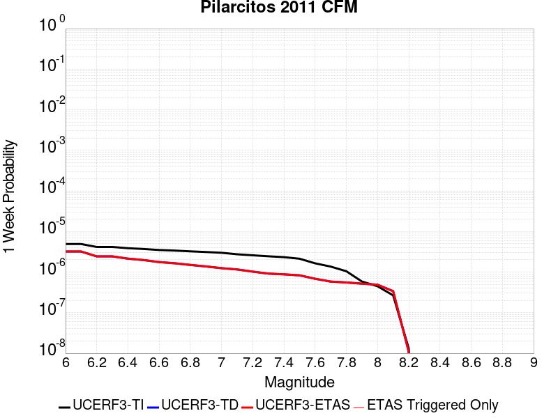 |  |  |  |

| Magnitude | 1 wk TI Prob | 1 wk TD Prob | 1 wk ETAS Prob | 1 wk ETAS/TD Gain | 1 wk ETAS Triggered Only | 1 mo TI Prob | 1 mo TD Prob | 1 mo ETAS Prob | 1 mo ETAS/TD Gain | 1 mo ETAS Triggered Only | 1 yr TI Prob | 1 yr TD Prob | 1 yr ETAS Prob | 1 yr ETAS/TD Gain | 1 yr ETAS Triggered Only | 10 yr TI Prob | 10 yr TD Prob | 10 yr ETAS Prob | 10 yr ETAS/TD Gain | 10 yr ETAS Triggered Only |
|-----|-----|-----|-----|-----|-----|-----|-----|-----|-----|-----|-----|-----|-----|-----|-----|-----|-----|-----|-----|-----|
| 6.0 | 4.9150476E-6 | 3.2107332E-6 | 3.2107332E-6 | 1.0 | 0.0 | 2.1064321E-5 | 1.3760214E-5 | 3.1777985E-5 | 2.3094106 | 1.8018018E-5 | 2.564279E-4 | 1.6751804E-4 | 1.8553303E-4 | 1.1075406 | 1.8018018E-5 | 0.0025613222 | 0.0016863721 | 0.0017043597 | 1.0106665 | 1.8018018E-5 |
| 6.1 | 4.9150476E-6 | 3.2107332E-6 | 3.2107332E-6 | 1.0 | 0.0 | 2.1064321E-5 | 1.3760214E-5 | 1.3760214E-5 | 1.0 | 0.0 | 2.564279E-4 | 1.6751804E-4 | 1.6751804E-4 | 1.0 | 0.0 | 0.0025613222 | 0.0016863721 | 0.0016863721 | 1.0 | 0.0 |
| 6.2 | 4.162343E-6 | 2.439086E-6 | 2.439086E-6 | 1.0 | 0.0 | 1.783849E-5 | 1.0453185E-5 | 1.0453185E-5 | 1.0 | 0.0 | 2.1716199E-4 | 1.2726017E-4 | 1.2726017E-4 | 1.0 | 0.0 | 0.002169499 | 0.0012843093 | 0.0012843093 | 1.0 | 0.0 |
| 6.3 | 4.162343E-6 | 2.439086E-6 | 2.439086E-6 | 1.0 | 0.0 | 1.783849E-5 | 1.0453185E-5 | 1.0453185E-5 | 1.0 | 0.0 | 2.1716199E-4 | 1.2726017E-4 | 1.2726017E-4 | 1.0 | 0.0 | 0.002169499 | 0.0012843093 | 0.0012843093 | 1.0 | 0.0 |
| 6.4 | 3.8768926E-6 | 2.1464914E-6 | 2.1464914E-6 | 1.0 | 0.0 | 1.6615148E-5 | 9.199216E-6 | 9.199216E-6 | 1.0 | 0.0 | 2.0227065E-4 | 1.1199475E-4 | 1.1199475E-4 | 1.0 | 0.0 | 0.0020208664 | 0.0011318177 | 0.0011318177 | 1.0 | 0.0 |
| 6.5 | 3.7137002E-6 | 1.9798367E-6 | 1.9798367E-6 | 1.0 | 0.0 | 1.591576E-5 | 8.484986E-6 | 8.484986E-6 | 1.0 | 0.0 | 1.9375715E-4 | 1.0329985E-4 | 1.0329985E-4 | 1.0 | 0.0 | 0.001935883 | 0.0010449529 | 0.0010449529 | 1.0 | 0.0 |
| 6.6 | 3.5048733E-6 | 1.764777E-6 | 1.764777E-6 | 1.0 | 0.0 | 1.5020799E-5 | 7.563308E-6 | 7.563308E-6 | 1.0 | 0.0 | 1.8286289E-4 | 9.2079405E-5 | 9.2079405E-5 | 1.0 | 0.0 | 0.0018271249 | 9.328476E-4 | 9.328476E-4 | 1.0 | 0.0 |
| 6.7 | 3.3908584E-6 | 1.6484541E-6 | 1.6484541E-6 | 1.0 | 0.0 | 1.453217E-5 | 7.0647843E-6 | 7.0647843E-6 | 1.0 | 0.0 | 1.7691481E-4 | 8.6010376E-5 | 8.6010376E-5 | 1.0 | 0.0 | 0.0017677402 | 8.722062E-4 | 8.722062E-4 | 1.0 | 0.0 |
| 6.8 | 3.2451449E-6 | 1.5016554E-6 | 1.5016554E-6 | 1.0 | 0.0 | 1.3907689E-5 | 6.4356504E-6 | 6.4356504E-6 | 1.0 | 0.0 | 1.6931296E-4 | 7.835124E-5 | 7.835124E-5 | 1.0 | 0.0 | 0.0016918402 | 7.956717E-4 | 7.956717E-4 | 1.0 | 0.0 |
| 6.9 | 3.1239128E-6 | 1.3781637E-6 | 1.3781637E-6 | 1.0 | 0.0 | 1.3388129E-5 | 5.9064023E-6 | 5.9064023E-6 | 1.0 | 0.0 | 1.6298829E-4 | 7.1908085E-5 | 7.1908085E-5 | 1.0 | 0.0 | 0.001628688 | 7.3128426E-4 | 7.3128426E-4 | 1.0 | 0.0 |
| 7.0 | 2.9940109E-6 | 1.2494497E-6 | 1.2494497E-6 | 1.0 | 0.0 | 1.2831412E-5 | 5.3547733E-6 | 5.3547733E-6 | 1.0 | 0.0 | 1.5621124E-4 | 6.519242E-5 | 6.519242E-5 | 1.0 | 0.0 | 0.0015610148 | 6.6416926E-4 | 6.6416926E-4 | 1.0 | 0.0 |
| 7.1 | 2.7471217E-6 | 1.1609669E-6 | 1.1609669E-6 | 1.0 | 0.0 | 1.1773326E-5 | 4.9755627E-6 | 4.9755627E-6 | 1.0 | 0.0 | 1.4333082E-4 | 6.0575796E-5 | 6.0575796E-5 | 1.0 | 0.0 | 0.001432384 | 6.1797624E-4 | 6.1797624E-4 | 1.0 | 0.0 |
| 7.2 | 2.592675E-6 | 1.0269217E-6 | 1.0269217E-6 | 1.0 | 0.0 | 1.1111417E-5 | 4.401086E-6 | 4.401086E-6 | 1.0 | 0.0 | 1.3527309E-4 | 5.35819E-5 | 5.35819E-5 | 1.0 | 0.0 | 0.0013519078 | 5.480739E-4 | 5.480739E-4 | 1.0 | 0.0 |
| 7.3 | 2.4518663E-6 | 9.178007E-7 | 9.178007E-7 | 1.0 | 0.0 | 1.0507956E-5 | 3.9334254E-6 | 3.9334254E-6 | 1.0 | 0.0 | 1.2792686E-4 | 4.7888407E-5 | 4.7888407E-5 | 1.0 | 0.0 | 0.0012785323 | 4.9116294E-4 | 4.9116294E-4 | 1.0 | 0.0 |
| 7.4 | 2.3349535E-6 | 8.7986444E-7 | 8.7986444E-7 | 1.0 | 0.0 | 1.0006905E-5 | 3.770842E-6 | 3.770842E-6 | 1.0 | 0.0 | 1.2182725E-4 | 4.5909033E-5 | 4.5909033E-5 | 1.0 | 0.0 | 0.0012176048 | 4.7135237E-4 | 4.7135237E-4 | 1.0 | 0.0 |
| 7.5 | 2.1358665E-6 | 8.3163224E-7 | 8.3163224E-7 | 1.0 | 0.0 | 9.15368E-6 | 3.564133E-6 | 3.564133E-6 | 1.0 | 0.0 | 1.11440364E-4 | 4.3392458E-5 | 4.3392458E-5 | 1.0 | 0.0 | 0.0011138449 | 4.4610165E-4 | 4.4610165E-4 | 1.0 | 0.0 |
| 7.6 | 1.6445446E-6 | 6.849915E-7 | 6.849915E-7 | 1.0 | 0.0 | 7.048029E-6 | 2.9356745E-6 | 2.9356745E-6 | 1.0 | 0.0 | 8.580638E-5 | 3.574125E-5 | 3.574125E-5 | 1.0 | 0.0 | 8.5773255E-4 | 3.695485E-4 | 3.695485E-4 | 1.0 | 0.0 |
| 7.7 | 1.3650961E-6 | 5.837239E-7 | 5.837239E-7 | 1.0 | 0.0 | 5.850399E-6 | 2.5016711E-6 | 2.5016711E-6 | 1.0 | 0.0 | 7.122628E-5 | 3.0457422E-5 | 3.0457422E-5 | 1.0 | 0.0 | 7.120345E-4 | 3.1660782E-4 | 3.1660782E-4 | 1.0 | 0.0 |
| 7.8 | 1.0500993E-6 | 5.5494223E-7 | 5.5494223E-7 | 1.0 | 0.0 | 4.5004176E-6 | 2.3783216E-6 | 2.3783216E-6 | 1.0 | 0.0 | 5.4791206E-5 | 2.8955683E-5 | 2.8955683E-5 | 1.0 | 0.0 | 5.47777E-4 | 3.0146088E-4 | 3.0146088E-4 | 1.0 | 0.0 |
| 7.9 | 5.856431E-7 | 5.18515E-7 | 5.18515E-7 | 1.0 | 0.0 | 2.5098966E-6 | 2.2222052E-6 | 2.2222052E-6 | 1.0 | 0.0 | 3.0557563E-5 | 2.7055014E-5 | 2.7055014E-5 | 1.0 | 0.0 | 3.055336E-4 | 2.8170765E-4 | 2.8170765E-4 | 1.0 | 0.0 |
| 8.0 | 4.4768265E-7 | 4.887463E-7 | 4.887463E-7 | 1.0 | 0.0 | 1.9186384E-6 | 2.0946252E-6 | 2.0946252E-6 | 1.0 | 0.0 | 2.3359173E-5 | 2.5501766E-5 | 2.5501766E-5 | 1.0 | 0.0 | 2.3356717E-4 | 2.6563994E-4 | 2.6563994E-4 | 1.0 | 0.0 |
| 8.1 | 2.6692538E-7 | 3.391171E-7 | 3.391171E-7 | 1.0 | 0.0 | 1.1439654E-6 | 1.4533581E-6 | 1.4533581E-6 | 1.0 | 0.0 | 1.392769E-5 | 1.7694492E-5 | 1.7694492E-5 | 1.0 | 0.0 | 1.3926817E-4 | 1.8429187E-4 | 1.8429187E-4 | 1.0 | 0.0 |
| 8.2 | 1.3198862E-8 | 1.0954908E-8 | 1.0954908E-8 | 1.0 | 0.0 | 5.656655E-8 | 4.694961E-8 | 4.694961E-8 | 1.0 | 0.0 | 6.886975E-7 | 5.7161134E-7 | 5.7161134E-7 | 1.0 | 0.0 | 6.8869535E-6 | 5.9491704E-6 | 5.9491704E-6 | 1.0 | 0.0 |

## Oceanic - West Huasna
*[(top)](#table-of-contents)*

| 1 Week | 1 Month | 1 Year | 10 Year |
|-----|-----|-----|-----|
|  |  |  |  |

| Magnitude | 1 wk TI Prob | 1 wk TD Prob | 1 wk ETAS Prob | 1 wk ETAS/TD Gain | 1 wk ETAS Triggered Only | 1 mo TI Prob | 1 mo TD Prob | 1 mo ETAS Prob | 1 mo ETAS/TD Gain | 1 mo ETAS Triggered Only | 1 yr TI Prob | 1 yr TD Prob | 1 yr ETAS Prob | 1 yr ETAS/TD Gain | 1 yr ETAS Triggered Only | 10 yr TI Prob | 10 yr TD Prob | 10 yr ETAS Prob | 10 yr ETAS/TD Gain | 10 yr ETAS Triggered Only |
|-----|-----|-----|-----|-----|-----|-----|-----|-----|-----|-----|-----|-----|-----|-----|-----|-----|-----|-----|-----|-----|
| 6.0 | 3.195567E-5 | 2.7931088E-5 | 2.7931088E-5 | 1.0 | 0.0 | 1.3694567E-4 | 1.1969941E-4 | 1.1969941E-4 | 1.0 | 0.0 | 0.0016660384 | 0.0014564092 | 0.0014564092 | 1.0 | 0.0 | 0.016536033 | 0.0144732 | 0.014490956 | 1.0012269 | 1.8018018E-5 |
| 6.1 | 2.1156782E-5 | 1.7575998E-5 | 1.7575998E-5 | 1.0 | 0.0 | 9.066878E-5 | 7.532358E-5 | 7.532358E-5 | 1.0 | 0.0 | 0.0011033333 | 9.166881E-4 | 9.166881E-4 | 1.0 | 0.0 | 0.010978713 | 0.0091300765 | 0.00914793 | 1.0019555 | 1.8018018E-5 |
| 6.2 | 1.6195117E-5 | 1.33289195E-5 | 1.33289195E-5 | 1.0 | 0.0 | 6.9405796E-5 | 5.7122706E-5 | 5.7122706E-5 | 1.0 | 0.0 | 8.44688E-4 | 6.952496E-4 | 6.952496E-4 | 1.0 | 0.0 | 0.008414844 | 0.006931039 | 0.006948932 | 1.0025816 | 1.8018018E-5 |
| 6.3 | 1.3559345E-5 | 1.1180543E-5 | 1.1180543E-5 | 1.0 | 0.0 | 5.811018E-5 | 4.791574E-5 | 4.791574E-5 | 1.0 | 0.0 | 7.072618E-4 | 5.8321893E-4 | 5.8321893E-4 | 1.0 | 0.0 | 0.0070501505 | 0.0058170017 | 0.0058349147 | 1.0030794 | 1.8018018E-5 |
| 6.4 | 1.2120619E-5 | 1.0002192E-5 | 1.0002192E-5 | 1.0 | 0.0 | 5.1944477E-5 | 4.286583E-5 | 4.286583E-5 | 1.0 | 0.0 | 6.322405E-4 | 5.21767E-4 | 5.21767E-4 | 1.0 | 0.0 | 0.006304447 | 0.0052054874 | 0.0052234116 | 1.0034434 | 1.8018018E-5 |
| 6.5 | 1.13511915E-5 | 9.368602E-6 | 9.368602E-6 | 1.0 | 0.0 | 4.8647056E-5 | 4.0150535E-5 | 4.0150535E-5 | 1.0 | 0.0 | 5.9211696E-4 | 4.8872357E-4 | 4.8872357E-4 | 1.0 | 0.0 | 0.0059054173 | 0.0048765466 | 0.004894477 | 1.0036768 | 1.8018018E-5 |
| 6.6 | 9.850605E-6 | 8.136387E-6 | 8.136387E-6 | 1.0 | 0.0 | 4.2216197E-5 | 3.486976E-5 | 3.486976E-5 | 1.0 | 0.0 | 5.1386096E-4 | 4.244569E-4 | 4.244569E-4 | 1.0 | 0.0 | 0.0051267436 | 0.004236494 | 0.0042544357 | 1.004235 | 1.8018018E-5 |
| 6.7 | 8.8558645E-6 | 7.319305E-6 | 7.319305E-6 | 1.0 | 0.0 | 3.7953152E-5 | 3.1368076E-5 | 3.1368076E-5 | 1.0 | 0.0 | 4.6198163E-4 | 3.8183955E-4 | 3.8183955E-4 | 1.0 | 0.0 | 0.004610224 | 0.0038118602 | 0.0038298096 | 1.0047088 | 1.8018018E-5 |
| 6.8 | 7.67136E-6 | 6.3925254E-6 | 6.3925254E-6 | 1.0 | 0.0 | 3.2876844E-5 | 2.739625E-5 | 2.739625E-5 | 1.0 | 0.0 | 4.0020206E-4 | 3.3349846E-4 | 3.3349846E-4 | 1.0 | 0.0 | 0.003994821 | 0.0033300007 | 0.0033479587 | 1.0053928 | 1.8018018E-5 |
| 6.9 | 6.534529E-6 | 5.459002E-6 | 5.459002E-6 | 1.0 | 0.0 | 2.8004823E-5 | 2.3395512E-5 | 2.3395512E-5 | 1.0 | 0.0 | 3.4090536E-4 | 2.8480327E-4 | 2.8480327E-4 | 1.0 | 0.0 | 0.0034038287 | 0.0028443995 | 0.0028623661 | 1.0063165 | 1.8018018E-5 |
| 7.0 | 5.460525E-6 | 4.570543E-6 | 4.570543E-6 | 1.0 | 0.0 | 2.3402039E-5 | 1.9587895E-5 | 1.9587895E-5 | 1.0 | 0.0 | 2.8488258E-4 | 2.3845663E-4 | 2.3845663E-4 | 1.0 | 0.0 | 0.0028451765 | 0.0023820214 | 0.0023999966 | 1.0075462 | 1.8018018E-5 |
| 7.1 | 4.4825083E-6 | 3.7529808E-6 | 3.7529808E-6 | 1.0 | 0.0 | 1.9210609E-5 | 1.6084105E-5 | 1.6084105E-5 | 1.0 | 0.0 | 2.3386406E-4 | 1.9580648E-4 | 1.9580648E-4 | 1.0 | 0.0 | 0.002336181 | 0.0019563516 | 0.0019743342 | 1.009192 | 1.8018018E-5 |
| 7.2 | 2.821708E-6 | 2.425378E-6 | 2.425378E-6 | 1.0 | 0.0 | 1.2092979E-5 | 1.0394436E-5 | 1.0394436E-5 | 1.0 | 0.0 | 1.4722206E-4 | 1.2654491E-4 | 1.2654491E-4 | 1.0 | 0.0 | 0.0014712457 | 0.001264731 | 0.0012827262 | 1.0142285 | 1.8018018E-5 |
| 7.3 | 2.0644757E-6 | 1.769144E-6 | 1.769144E-6 | 1.0 | 0.0 | 8.847723E-6 | 7.582024E-6 | 7.582024E-6 | 1.0 | 0.0 | 1.0771569E-4 | 9.230723E-5 | 9.230723E-5 | 1.0 | 0.0 | 0.001076635 | 9.2269067E-4 | 9.40692E-4 | 1.0195097 | 1.8018018E-5 |
| 7.4 | 1.6980367E-6 | 1.438338E-6 | 1.438338E-6 | 1.0 | 0.0 | 7.27728E-6 | 6.164291E-6 | 6.164291E-6 | 1.0 | 0.0 | 8.8597284E-5 | 7.504766E-5 | 7.504766E-5 | 1.0 | 0.0 | 8.8561967E-4 | 7.502248E-4 | 7.6822925E-4 | 1.0239989 | 1.8018018E-5 |
| 7.5 | 1.3637683E-6 | 1.1305964E-6 | 1.1305964E-6 | 1.0 | 0.0 | 5.844708E-6 | 4.845404E-6 | 4.845404E-6 | 1.0 | 0.0 | 7.1156996E-5 | 5.8991198E-5 | 5.8991198E-5 | 1.0 | 0.0 | 7.1134215E-4 | 5.897569E-4 | 6.077643E-4 | 1.0305336 | 1.8018018E-5 |
| 7.6 | 9.802994E-7 | 7.6803957E-7 | 7.6803957E-7 | 1.0 | 0.0 | 4.2012766E-6 | 3.2915939E-6 | 3.2915939E-6 | 1.0 | 0.0 | 5.1149345E-5 | 4.007442E-5 | 4.007442E-5 | 1.0 | 0.0 | 5.113757E-4 | 4.0067337E-4 | 4.1868415E-4 | 1.0449513 | 1.8018018E-5 |
| 7.7 | 5.986191E-7 | 4.007707E-7 | 4.007707E-7 | 1.0 | 0.0 | 2.5655079E-6 | 1.7175875E-6 | 1.7175875E-6 | 1.0 | 0.0 | 3.1234613E-5 | 2.0911426E-5 | 2.0911426E-5 | 1.0 | 0.0 | 3.123022E-4 | 2.0909593E-4 | 2.2711018E-4 | 1.086153 | 1.8018018E-5 |
| 7.8 | 2.9189815E-7 | 1.5308534E-7 | 1.5308534E-7 | 1.0 | 0.0 | 1.2509914E-6 | 6.560798E-7 | 6.560798E-7 | 1.0 | 0.0 | 1.5230714E-5 | 7.987743E-6 | 7.987743E-6 | 1.0 | 0.0 | 1.522967E-4 | 7.987587E-5 | 9.789244E-5 | 1.2255572 | 1.8018018E-5 |
| 7.9 | 1.2057845E-7 | 4.6338755E-8 | 4.6338755E-8 | 1.0 | 0.0 | 5.1676466E-7 | 1.9859465E-7 | 1.9859465E-7 | 1.0 | 0.0 | 6.2915915E-6 | 2.4178871E-6 | 2.4178871E-6 | 1.0 | 0.0 | 6.2914136E-5 | 2.417991E-5 | 4.219749E-5 | 1.7451468 | 1.8018018E-5 |
| 8.0 | 3.3806387E-9 | 9.060215E-10 | 9.060215E-10 | 1.0 | 0.0 | 1.4488451E-8 | 3.88295E-9 | 3.88295E-9 | 1.0 | 0.0 | 1.7639688E-7 | 4.727492E-8 | 4.727492E-8 | 1.0 | 0.0 | 1.7639674E-6 | 4.7384066E-7 | 4.7384066E-7 | 1.0 | 0.0 |

## Great Valley 03 Mysterious Ridge
*[(top)](#table-of-contents)*

| 1 Week | 1 Month | 1 Year | 10 Year |
|-----|-----|-----|-----|
|  |  |  |  |

| Magnitude | 1 wk TI Prob | 1 wk TD Prob | 1 wk ETAS Prob | 1 wk ETAS/TD Gain | 1 wk ETAS Triggered Only | 1 mo TI Prob | 1 mo TD Prob | 1 mo ETAS Prob | 1 mo ETAS/TD Gain | 1 mo ETAS Triggered Only | 1 yr TI Prob | 1 yr TD Prob | 1 yr ETAS Prob | 1 yr ETAS/TD Gain | 1 yr ETAS Triggered Only | 10 yr TI Prob | 10 yr TD Prob | 10 yr ETAS Prob | 10 yr ETAS/TD Gain | 10 yr ETAS Triggered Only |
|-----|-----|-----|-----|-----|-----|-----|-----|-----|-----|-----|-----|-----|-----|-----|-----|-----|-----|-----|-----|-----|
| 6.0 | 3.1182444E-5 | 3.6044894E-5 | 3.6044894E-5 | 1.0 | 0.0 | 1.336322E-4 | 1.5447004E-4 | 1.5447004E-4 | 1.0 | 0.0 | 0.0016257578 | 0.0018792376 | 0.0018792376 | 1.0 | 0.0 | 0.016139153 | 0.018652247 | 0.01866993 | 1.000948 | 1.8018018E-5 |
| 6.1 | 3.1182444E-5 | 3.6044894E-5 | 3.6044894E-5 | 1.0 | 0.0 | 1.336322E-4 | 1.5447004E-4 | 1.5447004E-4 | 1.0 | 0.0 | 0.0016257578 | 0.0018792376 | 0.0018792376 | 1.0 | 0.0 | 0.016139153 | 0.018652247 | 0.01866993 | 1.000948 | 1.8018018E-5 |
| 6.2 | 3.1182444E-5 | 3.6044894E-5 | 3.6044894E-5 | 1.0 | 0.0 | 1.336322E-4 | 1.5447004E-4 | 1.5447004E-4 | 1.0 | 0.0 | 0.0016257578 | 0.0018792376 | 0.0018792376 | 1.0 | 0.0 | 0.016139153 | 0.018652247 | 0.01866993 | 1.000948 | 1.8018018E-5 |
| 6.3 | 2.106934E-5 | 2.3856412E-5 | 2.3856412E-5 | 1.0 | 0.0 | 9.0294045E-5 | 1.0223794E-4 | 1.0223794E-4 | 1.0 | 0.0 | 0.0010987755 | 0.0012440669 | 0.0012440669 | 1.0 | 0.0 | 0.010933585 | 0.0123742735 | 0.0123742735 | 1.0 | 0.0 |
| 6.4 | 2.106934E-5 | 2.3856412E-5 | 2.3856412E-5 | 1.0 | 0.0 | 9.0294045E-5 | 1.0223794E-4 | 1.0223794E-4 | 1.0 | 0.0 | 0.0010987755 | 0.0012440669 | 0.0012440669 | 1.0 | 0.0 | 0.010933585 | 0.0123742735 | 0.0123742735 | 1.0 | 0.0 |
| 6.5 | 1.9389783E-5 | 2.189044E-5 | 2.189044E-5 | 1.0 | 0.0 | 8.309642E-5 | 9.381296E-5 | 9.381296E-5 | 1.0 | 0.0 | 0.0010112294 | 0.0011416018 | 0.0011416018 | 1.0 | 0.0 | 0.010066401 | 0.01136025 | 0.01136025 | 1.0 | 0.0 |
| 6.6 | 1.9370193E-5 | 2.187036E-5 | 2.187036E-5 | 1.0 | 0.0 | 8.301247E-5 | 9.372691E-5 | 9.372691E-5 | 1.0 | 0.0 | 0.0010102082 | 0.0011405553 | 0.0011405553 | 1.0 | 0.0 | 0.010056281 | 0.011349892 | 0.011349892 | 1.0 | 0.0 |
| 6.7 | 1.6723505E-5 | 1.8803798E-5 | 1.8803798E-5 | 1.0 | 0.0 | 7.16702E-5 | 8.058533E-5 | 8.058533E-5 | 1.0 | 0.0 | 8.722353E-4 | 9.807042E-4 | 9.807042E-4 | 1.0 | 0.0 | 0.008688197 | 0.009765774 | 0.009765774 | 1.0 | 0.0 |
| 6.8 | 1.426937E-5 | 1.6000957E-5 | 1.6000957E-5 | 1.0 | 0.0 | 6.115301E-5 | 6.857381E-5 | 6.857381E-5 | 1.0 | 0.0 | 7.4428355E-4 | 8.345808E-4 | 8.345808E-4 | 1.0 | 0.0 | 0.007417957 | 0.008315944 | 0.008315944 | 1.0 | 0.0 |
| 6.9 | 1.2469891E-5 | 1.3960147E-5 | 1.3960147E-5 | 1.0 | 0.0 | 5.3441294E-5 | 5.9827897E-5 | 5.9827897E-5 | 1.0 | 0.0 | 6.504535E-4 | 7.281733E-4 | 7.281733E-4 | 1.0 | 0.0 | 0.006485529 | 0.007259098 | 0.007259098 | 1.0 | 0.0 |
| 7.0 | 8.7746275E-6 | 9.793928E-6 | 9.793928E-6 | 1.0 | 0.0 | 3.7605005E-5 | 4.1973344E-5 | 4.1973344E-5 | 1.0 | 0.0 | 4.5774475E-4 | 5.1091297E-4 | 5.1091297E-4 | 1.0 | 0.0 | 0.00456803 | 0.0050981166 | 0.0050981166 | 1.0 | 0.0 |
| 7.1 | 6.1067153E-6 | 6.8152503E-6 | 6.8152503E-6 | 1.0 | 0.0 | 2.6171374E-5 | 2.920792E-5 | 2.920792E-5 | 1.0 | 0.0 | 3.1858988E-4 | 3.55554E-4 | 3.55554E-4 | 1.0 | 0.0 | 0.0031813353 | 0.0035504021 | 0.0035504021 | 1.0 | 0.0 |
| 7.2 | 2.939283E-6 | 3.2748273E-6 | 3.2748273E-6 | 1.0 | 0.0 | 1.2596866E-5 | 1.4034908E-5 | 1.4034908E-5 | 1.0 | 0.0 | 1.5335606E-4 | 1.7086336E-4 | 1.7086336E-4 | 1.0 | 0.0 | 0.0015325027 | 0.001707492 | 0.001707492 | 1.0 | 0.0 |
| 7.3 | 7.2387763E-7 | 8.0101614E-7 | 8.0101614E-7 | 1.0 | 0.0 | 3.102329E-6 | 3.4329244E-6 | 3.4329244E-6 | 1.0 | 0.0 | 3.77702E-5 | 4.1795513E-5 | 4.1795513E-5 | 1.0 | 0.0 | 3.7763783E-4 | 4.179215E-4 | 4.179215E-4 | 1.0 | 0.0 |
| 7.4 | 3.112171E-8 | 3.2070247E-8 | 3.2070247E-8 | 1.0 | 0.0 | 1.3337875E-7 | 1.374439E-7 | 1.374439E-7 | 1.0 | 0.0 | 1.6238852E-6 | 1.6733784E-6 | 1.6733784E-6 | 1.0 | 0.0 | 1.6238733E-5 | 1.6733666E-5 | 1.6733666E-5 | 1.0 | 0.0 |

## San Andreas (North Coast) 2011 CFM
*[(top)](#table-of-contents)*

| 1 Week | 1 Month | 1 Year | 10 Year |
|-----|-----|-----|-----|
|  |  | 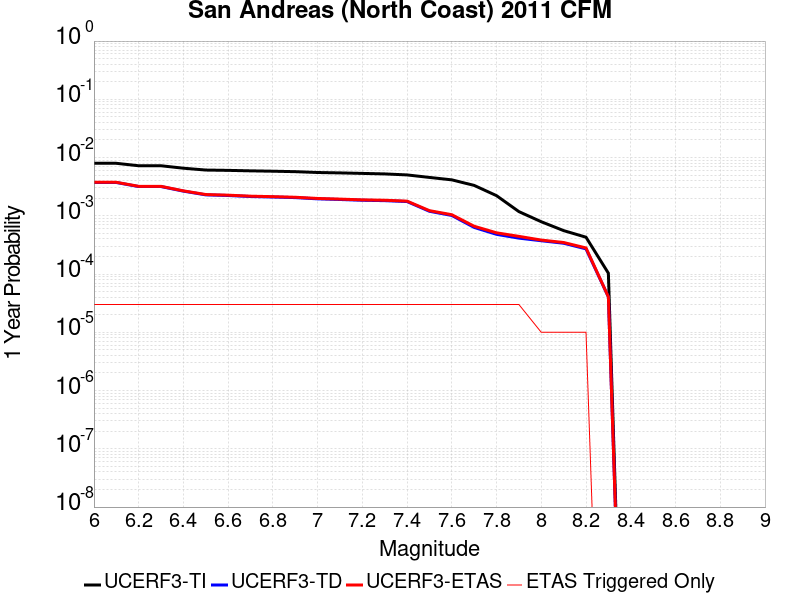 |  |

| Magnitude | 1 wk TI Prob | 1 wk TD Prob | 1 wk ETAS Prob | 1 wk ETAS/TD Gain | 1 wk ETAS Triggered Only | 1 mo TI Prob | 1 mo TD Prob | 1 mo ETAS Prob | 1 mo ETAS/TD Gain | 1 mo ETAS Triggered Only | 1 yr TI Prob | 1 yr TD Prob | 1 yr ETAS Prob | 1 yr ETAS/TD Gain | 1 yr ETAS Triggered Only | 10 yr TI Prob | 10 yr TD Prob | 10 yr ETAS Prob | 10 yr ETAS/TD Gain | 10 yr ETAS Triggered Only |
|-----|-----|-----|-----|-----|-----|-----|-----|-----|-----|-----|-----|-----|-----|-----|-----|-----|-----|-----|-----|-----|
| 6.0 | 1.5333705E-4 | 7.167264E-5 | 7.167264E-5 | 1.0 | 0.0 | 6.5699324E-4 | 3.071325E-4 | 3.071325E-4 | 1.0 | 0.0 | 0.007969595 | 0.0037329607 | 0.0037329607 | 1.0 | 0.0 | 0.0768977 | 0.03964612 | 0.039663423 | 1.0004364 | 1.8018018E-5 |
| 6.1 | 1.5333705E-4 | 7.167264E-5 | 7.167264E-5 | 1.0 | 0.0 | 6.5699324E-4 | 3.071325E-4 | 3.071325E-4 | 1.0 | 0.0 | 0.007969595 | 0.0037329607 | 0.0037329607 | 1.0 | 0.0 | 0.0768977 | 0.03964612 | 0.039663423 | 1.0004364 | 1.8018018E-5 |
| 6.2 | 1.3912938E-4 | 6.1008297E-5 | 6.1008297E-5 | 1.0 | 0.0 | 5.961325E-4 | 2.6143808E-4 | 2.6143808E-4 | 1.0 | 0.0 | 0.007233787 | 0.0031783902 | 0.0031783902 | 1.0 | 0.0 | 0.07002798 | 0.033958502 | 0.033975907 | 1.0005126 | 1.8018018E-5 |
| 6.3 | 1.3912938E-4 | 6.1008297E-5 | 6.1008297E-5 | 1.0 | 0.0 | 5.961325E-4 | 2.6143808E-4 | 2.6143808E-4 | 1.0 | 0.0 | 0.007233787 | 0.0031783902 | 0.0031783902 | 1.0 | 0.0 | 0.07002798 | 0.033958502 | 0.033975907 | 1.0005126 | 1.8018018E-5 |
| 6.4 | 1.2623647E-4 | 5.089298E-5 | 5.089298E-5 | 1.0 | 0.0 | 5.4090127E-4 | 2.1809465E-4 | 2.1809465E-4 | 1.0 | 0.0 | 0.0065656058 | 0.0026520893 | 0.0026520893 | 1.0 | 0.0 | 0.06374981 | 0.028544052 | 0.028561555 | 1.0006132 | 1.8018018E-5 |
| 6.5 | 1.1736096E-4 | 4.393664E-5 | 4.393664E-5 | 1.0 | 0.0 | 5.028786E-4 | 1.882864E-4 | 1.882864E-4 | 1.0 | 0.0 | 0.006105373 | 0.0022899932 | 0.0022899932 | 1.0 | 0.0 | 0.05940335 | 0.02480242 | 0.02481999 | 1.0007085 | 1.8018018E-5 |
| 6.6 | 1.1586959E-4 | 4.283032E-5 | 4.283032E-5 | 1.0 | 0.0 | 4.964894E-4 | 1.8354571E-4 | 1.8354571E-4 | 1.0 | 0.0 | 0.006028018 | 0.002232395 | 0.002232395 | 1.0 | 0.0 | 0.058671024 | 0.024205182 | 0.024222763 | 1.0007263 | 1.8018018E-5 |
| 6.7 | 1.13693764E-4 | 4.1133633E-5 | 4.1133633E-5 | 1.0 | 0.0 | 4.87168E-4 | 1.7627518E-4 | 1.7627518E-4 | 1.0 | 0.0 | 0.005915152 | 0.002144054 | 0.002144054 | 1.0 | 0.0 | 0.057601593 | 0.023292398 | 0.023309996 | 1.0007555 | 1.8018018E-5 |
| 6.8 | 1.1204889E-4 | 4.0344774E-5 | 4.0344774E-5 | 1.0 | 0.0 | 4.8012115E-4 | 1.7289481E-4 | 1.7289481E-4 | 1.0 | 0.0 | 0.005829819 | 0.0021029783 | 0.0021029783 | 1.0 | 0.0 | 0.05679232 | 0.0228494 | 0.022867005 | 1.0007706 | 1.8018018E-5 |
| 6.9 | 1.1005794E-4 | 3.9392704E-5 | 3.9392704E-5 | 1.0 | 0.0 | 4.7159163E-4 | 1.6881504E-4 | 1.6881504E-4 | 1.0 | 0.0 | 0.0057265228 | 0.0020534017 | 0.0020534017 | 1.0 | 0.0 | 0.055811852 | 0.022311093 | 0.02232871 | 1.0007895 | 1.8018018E-5 |
| 7.0 | 1.0647948E-4 | 3.7532158E-5 | 3.7532158E-5 | 1.0 | 0.0 | 4.562608E-4 | 1.6084228E-4 | 1.6084228E-4 | 1.0 | 0.0 | 0.0055408357 | 0.0019565115 | 0.0019565115 | 1.0 | 0.0 | 0.054047033 | 0.021262132 | 0.021279765 | 1.0008295 | 1.8018018E-5 |
| 7.1 | 1.04795035E-4 | 3.6573696E-5 | 3.6573696E-5 | 1.0 | 0.0 | 4.4904428E-4 | 1.5673508E-4 | 1.5673508E-4 | 1.0 | 0.0 | 0.0054534175 | 0.0019065951 | 0.0019065951 | 1.0 | 0.0 | 0.053215165 | 0.02072614 | 0.020743785 | 1.0008513 | 1.8018018E-5 |
| 7.2 | 1.02724036E-4 | 3.5473153E-5 | 3.5473153E-5 | 1.0 | 0.0 | 4.401716E-4 | 1.5201903E-4 | 1.5201903E-4 | 1.0 | 0.0 | 0.0053459285 | 0.001849276 | 0.001849276 | 1.0 | 0.0 | 0.052191395 | 0.020110486 | 0.020128142 | 1.000878 | 1.8018018E-5 |
| 7.3 | 1.00650694E-4 | 3.4933342E-5 | 3.4933342E-5 | 1.0 | 0.0 | 4.312888E-4 | 1.4970583E-4 | 1.4970583E-4 | 1.0 | 0.0 | 0.005238306 | 0.0018211602 | 0.0018211602 | 1.0 | 0.0 | 0.051165357 | 0.019783666 | 0.019801328 | 1.0008928 | 1.8018018E-5 |
| 7.4 | 9.672919E-5 | 3.3705466E-5 | 3.3705466E-5 | 1.0 | 0.0 | 4.144878E-4 | 1.4444409E-4 | 1.4444409E-4 | 1.0 | 0.0 | 0.005034718 | 0.0017572036 | 0.0017572036 | 1.0 | 0.0 | 0.049221683 | 0.01904766 | 0.019065337 | 1.0009279 | 1.8018018E-5 |
| 7.5 | 8.7600405E-5 | 2.2948088E-5 | 2.2948088E-5 | 1.0 | 0.0 | 3.753763E-4 | 9.834525E-5 | 9.834525E-5 | 1.0 | 0.0 | 0.0045606326 | 0.0011966976 | 0.0011966976 | 1.0 | 0.0 | 0.04468165 | 0.0132718645 | 0.013289643 | 1.0013396 | 1.8018018E-5 |
| 7.6 | 7.9562284E-5 | 1.9451085E-5 | 1.9451085E-5 | 1.0 | 0.0 | 3.4093665E-4 | 8.335914E-5 | 8.335914E-5 | 1.0 | 0.0 | 0.0041430052 | 0.0010144265 | 0.0010144265 | 1.0 | 0.0 | 0.040666126 | 0.011351465 | 0.011369279 | 1.0015693 | 1.8018018E-5 |
| 7.7 | 6.3866544E-5 | 1.2119624E-5 | 1.2119624E-5 | 1.0 | 0.0 | 2.7368503E-4 | 5.1940217E-5 | 5.1940217E-5 | 1.0 | 0.0 | 0.0033270244 | 6.321889E-4 | 6.321889E-4 | 1.0 | 0.0 | 0.032776527 | 0.0073151714 | 0.0073330575 | 1.0024451 | 1.8018018E-5 |
| 7.8 | 4.2543215E-5 | 9.219181E-6 | 9.219181E-6 | 1.0 | 0.0 | 1.8231533E-4 | 3.951018E-5 | 3.951018E-5 | 1.0 | 0.0 | 0.0022174292 | 4.8093035E-4 | 4.8093035E-4 | 1.0 | 0.0 | 0.021954332 | 0.0055735833 | 0.005591501 | 1.0032147 | 1.8018018E-5 |
| 7.9 | 2.2636612E-5 | 7.934437E-6 | 7.934437E-6 | 1.0 | 0.0 | 9.7010445E-5 | 3.4004286E-5 | 3.4004286E-5 | 1.0 | 0.0 | 0.0011804621 | 4.1392364E-4 | 4.1392364E-4 | 1.0 | 0.0 | 0.011742111 | 0.0047510383 | 0.004768971 | 1.0037744 | 1.8018018E-5 |
| 8.0 | 1.5167874E-5 | 7.157475E-6 | 7.157475E-6 | 1.0 | 0.0 | 6.500356E-5 | 3.067453E-5 | 3.067453E-5 | 1.0 | 0.0 | 7.9113094E-4 | 3.733985E-4 | 3.733985E-4 | 1.0 | 0.0 | 0.007883203 | 0.00427557 | 0.00427557 | 1.0 | 0.0 |
| 8.1 | 1.0681047E-5 | 6.4844553E-6 | 6.4844553E-6 | 1.0 | 0.0 | 4.5775112E-5 | 2.7790227E-5 | 2.7790227E-5 | 1.0 | 0.0 | 5.5716943E-4 | 3.3829358E-4 | 3.3829358E-4 | 1.0 | 0.0 | 0.0055577457 | 0.0038710767 | 0.0038710767 | 1.0 | 0.0 |
| 8.2 | 8.226114E-6 | 5.1888637E-6 | 5.1888637E-6 | 1.0 | 0.0 | 3.52543E-5 | 2.2237798E-5 | 2.2237798E-5 | 1.0 | 0.0 | 4.2913653E-4 | 2.7071164E-4 | 2.7071164E-4 | 1.0 | 0.0 | 0.004283088 | 0.0030854926 | 0.0030854926 | 1.0 | 0.0 |
| 8.3 | 1.983087E-6 | 7.7871465E-7 | 7.7871465E-7 | 1.0 | 0.0 | 8.498917E-6 | 3.3373444E-6 | 3.3373444E-6 | 1.0 | 0.0 | 1.034694E-4 | 4.063143E-5 | 4.063143E-5 | 1.0 | 0.0 | 0.0010342124 | 4.7926197E-4 | 4.7926197E-4 | 1.0 | 0.0 |

## La Panza 2011
*[(top)](#table-of-contents)*

| 1 Week | 1 Month | 1 Year | 10 Year |
|-----|-----|-----|-----|
|  |  |  |  |

| Magnitude | 1 wk TI Prob | 1 wk TD Prob | 1 wk ETAS Prob | 1 wk ETAS/TD Gain | 1 wk ETAS Triggered Only | 1 mo TI Prob | 1 mo TD Prob | 1 mo ETAS Prob | 1 mo ETAS/TD Gain | 1 mo ETAS Triggered Only | 1 yr TI Prob | 1 yr TD Prob | 1 yr ETAS Prob | 1 yr ETAS/TD Gain | 1 yr ETAS Triggered Only | 10 yr TI Prob | 10 yr TD Prob | 10 yr ETAS Prob | 10 yr ETAS/TD Gain | 10 yr ETAS Triggered Only |
|-----|-----|-----|-----|-----|-----|-----|-----|-----|-----|-----|-----|-----|-----|-----|-----|-----|-----|-----|-----|-----|
| 6.0 | 4.6754544E-6 | 4.7178937E-6 | 4.7178937E-6 | 1.0 | 0.0 | 2.0037509E-5 | 2.0219399E-5 | 2.0219399E-5 | 1.0 | 0.0 | 2.4392935E-4 | 2.4614536E-4 | 2.4614536E-4 | 1.0 | 0.0 | 0.0024366176 | 0.0024589216 | 0.0024768952 | 1.0073096 | 1.8018018E-5 |
| 6.1 | 4.6754544E-6 | 4.7178937E-6 | 4.7178937E-6 | 1.0 | 0.0 | 2.0037509E-5 | 2.0219399E-5 | 2.0219399E-5 | 1.0 | 0.0 | 2.4392935E-4 | 2.4614536E-4 | 2.4614536E-4 | 1.0 | 0.0 | 0.0024366176 | 0.0024589216 | 0.0024768952 | 1.0073096 | 1.8018018E-5 |
| 6.2 | 4.6754544E-6 | 4.7178937E-6 | 4.7178937E-6 | 1.0 | 0.0 | 2.0037509E-5 | 2.0219399E-5 | 2.0219399E-5 | 1.0 | 0.0 | 2.4392935E-4 | 2.4614536E-4 | 2.4614536E-4 | 1.0 | 0.0 | 0.0024366176 | 0.0024589216 | 0.0024768952 | 1.0073096 | 1.8018018E-5 |
| 6.3 | 4.6754544E-6 | 4.7178937E-6 | 4.7178937E-6 | 1.0 | 0.0 | 2.0037509E-5 | 2.0219399E-5 | 2.0219399E-5 | 1.0 | 0.0 | 2.4392935E-4 | 2.4614536E-4 | 2.4614536E-4 | 1.0 | 0.0 | 0.0024366176 | 0.0024589216 | 0.0024768952 | 1.0073096 | 1.8018018E-5 |
| 6.4 | 4.6754544E-6 | 4.7178937E-6 | 4.7178937E-6 | 1.0 | 0.0 | 2.0037509E-5 | 2.0219399E-5 | 2.0219399E-5 | 1.0 | 0.0 | 2.4392935E-4 | 2.4614536E-4 | 2.4614536E-4 | 1.0 | 0.0 | 0.0024366176 | 0.0024589216 | 0.0024768952 | 1.0073096 | 1.8018018E-5 |
| 6.5 | 2.485343E-6 | 2.5008533E-6 | 2.5008533E-6 | 1.0 | 0.0 | 1.0651426E-5 | 1.07179E-5 | 1.07179E-5 | 1.0 | 0.0 | 1.296734E-4 | 1.3048302E-4 | 1.3048302E-4 | 1.0 | 0.0 | 0.0012959775 | 0.0013041024 | 0.0013220969 | 1.0137984 | 1.8018018E-5 |
| 6.6 | 2.485343E-6 | 2.5008533E-6 | 2.5008533E-6 | 1.0 | 0.0 | 1.0651426E-5 | 1.07179E-5 | 1.07179E-5 | 1.0 | 0.0 | 1.296734E-4 | 1.3048302E-4 | 1.3048302E-4 | 1.0 | 0.0 | 0.0012959775 | 0.0013041024 | 0.0013220969 | 1.0137984 | 1.8018018E-5 |
| 6.7 | 1.5108508E-6 | 1.5148694E-6 | 1.5148694E-6 | 1.0 | 0.0 | 6.4750584E-6 | 6.492282E-6 | 6.492282E-6 | 1.0 | 0.0 | 7.8830984E-5 | 7.904077E-5 | 7.904077E-5 | 1.0 | 0.0 | 7.880303E-4 | 7.9013745E-4 | 7.9013745E-4 | 1.0 | 0.0 |
| 6.8 | 1.3865837E-6 | 1.3887385E-6 | 1.3887385E-6 | 1.0 | 0.0 | 5.942488E-6 | 5.9517233E-6 | 5.9517233E-6 | 1.0 | 0.0 | 7.234739E-5 | 7.245992E-5 | 7.245992E-5 | 1.0 | 0.0 | 7.232384E-4 | 7.243728E-4 | 7.243728E-4 | 1.0 | 0.0 |
| 6.9 | 9.826583E-7 | 9.798473E-7 | 9.798473E-7 | 1.0 | 0.0 | 4.2113857E-6 | 4.199339E-6 | 4.199339E-6 | 1.0 | 0.0 | 5.1272415E-5 | 5.1125808E-5 | 5.1125808E-5 | 1.0 | 0.0 | 5.126059E-4 | 5.111458E-4 | 5.111458E-4 | 1.0 | 0.0 |
| 7.0 | 6.7797646E-7 | 6.7123244E-7 | 6.7123244E-7 | 1.0 | 0.0 | 2.9056102E-6 | 2.8767076E-6 | 2.8767076E-6 | 1.0 | 0.0 | 3.537523E-5 | 3.5023382E-5 | 3.5023382E-5 | 1.0 | 0.0 | 3.5369597E-4 | 3.5018174E-4 | 3.5018174E-4 | 1.0 | 0.0 |
| 7.1 | 3.4979826E-7 | 3.389418E-7 | 3.389418E-7 | 1.0 | 0.0 | 1.4991346E-6 | 1.452607E-6 | 1.452607E-6 | 1.0 | 0.0 | 1.825181E-5 | 1.7685357E-5 | 1.7685357E-5 | 1.0 | 0.0 | 1.825031E-4 | 1.7684067E-4 | 1.7684067E-4 | 1.0 | 0.0 |
| 7.2 | 2.5088332E-7 | 2.3851902E-7 | 2.3851902E-7 | 1.0 | 0.0 | 1.0752137E-6 | 1.0222241E-6 | 1.0222241E-6 | 1.0 | 0.0 | 1.3090649E-5 | 1.24455155E-5 | 1.24455155E-5 | 1.0 | 0.0 | 1.3089878E-4 | 1.2444904E-4 | 1.2444904E-4 | 1.0 | 0.0 |
| 7.3 | 1.0159086E-7 | 8.664118E-8 | 8.664118E-8 | 1.0 | 0.0 | 4.3538932E-7 | 3.713193E-7 | 3.713193E-7 | 1.0 | 0.0 | 5.300852E-6 | 4.5208035E-6 | 4.5208035E-6 | 1.0 | 0.0 | 5.3007258E-5 | 4.5207154E-5 | 4.5207154E-5 | 1.0 | 0.0 |
| 7.4 | 3.5006252E-8 | 1.9466952E-8 | 1.9466952E-8 | 1.0 | 0.0 | 1.5002678E-7 | 8.342979E-8 | 8.342979E-8 | 1.0 | 0.0 | 1.8265745E-6 | 1.0157572E-6 | 1.0157572E-6 | 1.0 | 0.0 | 1.8265595E-5 | 1.0157529E-5 | 1.0157529E-5 | 1.0 | 0.0 |
| 7.5 | 2.592274E-8 | 1.0285871E-8 | 1.0285871E-8 | 1.0 | 0.0 | 1.1109746E-7 | 4.4082302E-8 | 4.4082302E-8 | 1.0 | 0.0 | 1.3526106E-6 | 5.367019E-7 | 5.367019E-7 | 1.0 | 0.0 | 1.3526024E-5 | 5.367007E-6 | 5.367007E-6 | 1.0 | 0.0 |
| 7.6 | 1.9016717E-8 | 5.2748517E-9 | 5.2748517E-9 | 1.0 | 0.0 | 8.150022E-8 | 2.2606505E-8 | 2.2606505E-8 | 1.0 | 0.0 | 9.922647E-7 | 2.7523419E-7 | 2.7523419E-7 | 1.0 | 0.0 | 9.922603E-6 | 2.7523386E-6 | 2.7523386E-6 | 1.0 | 0.0 |
| 7.7 | 1.17738495E-8 | 1.2528638E-9 | 1.2528638E-9 | 1.0 | 0.0 | 5.0459356E-8 | 5.3694147E-9 | 5.3694147E-9 | 1.0 | 0.0 | 6.1434247E-7 | 6.5372625E-8 | 6.5372625E-8 | 1.0 | 0.0 | 6.143408E-6 | 6.5372603E-7 | 6.5372603E-7 | 1.0 | 0.0 |
| 7.8 | 5.489079E-9 | 2.0454438E-10 | 2.0454438E-10 | 1.0 | 0.0 | 2.3524624E-8 | 8.766169E-10 | 8.766169E-10 | 1.0 | 0.0 | 2.8641225E-7 | 1.0672813E-8 | 1.0672813E-8 | 1.0 | 0.0 | 2.8641189E-6 | 1.0672812E-7 | 1.0672812E-7 | 1.0 | 0.0 |
| 7.9 | 2.5081048E-9 | 6.8139494E-11 | 6.8139494E-11 | 1.0 | 0.0 | 1.0749021E-8 | 2.9202551E-10 | 2.9202551E-10 | 1.0 | 0.0 | 1.3086932E-7 | 3.5554122E-9 | 3.5554122E-9 | 1.0 | 0.0 | 1.3086925E-6 | 3.555412E-8 | 3.555412E-8 | 1.0 | 0.0 |

