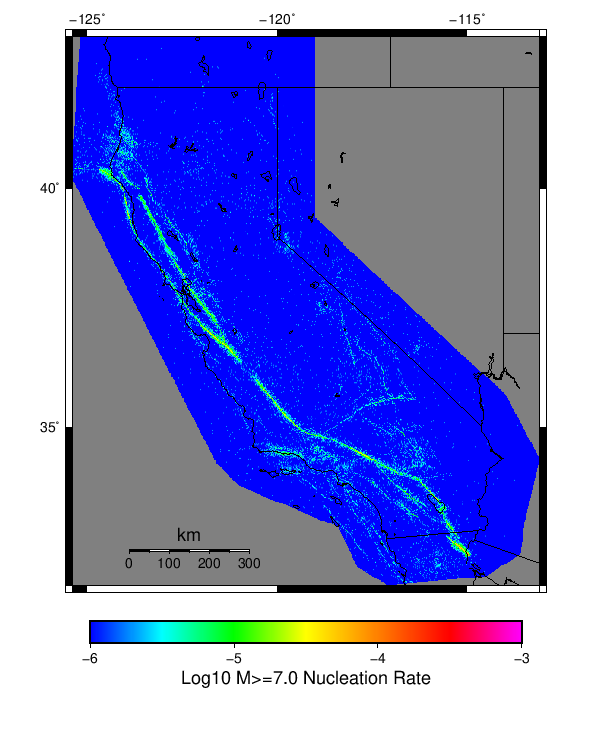

# Start 2012, 500 yr, kCOV=1.16, Spontaneous, Historical Catalog Results

|   | Start 2012, 500 yr, kCOV=1.16, Spontaneous, Historical Catalog |
|-----|-----|
| Num Simulations | 293 (incomplete) |
| Start Time | 2012/01/01 00:00:00 UTC |
| Start Time Epoch Milliseconds | 1325376000000 |
| Duration | 500 Years |
| Includes Spontaneous? | true |
| Trigger Ruptures | *(none)* |
| Historical Ruptures | 60366 Trigger Ruptures |
|   | First: M7.3 at 1852/01/05 04:40:39 UTC |
|   | Last: M3.2 at 2011/12/31 19:14:44 UTC |
|   | Largest: M7.9 at 1857/01/09 16:25:39 UTC |
| Config Generated With | u3etas_config_builder.sh --start-year 2012 --num-simulations 1000 --duration-years 500 --include-spontaneous --historical-catalog --etas-k-cov 1.16 --hpc-site USC_HPC --nodes 36 --hours 24 --queue scec |

## Table Of Contents

* [Magnitude Frequency Distribution](#magnitude-frequency-distribution)
* [Long Term Rate Variability](#long-term-rate-variability)
  * [162 Year Variability](#162-year-variability)
  * [80 Year Variability](#80-year-variability)
  * [28 Year Variability](#28-year-variability)
  * [Variability Duration Dependence](#variability-duration-dependence)
* [Simulation Stationarity](#simulation-stationarity)
* [Section Participation](#section-participation)
  * [Section Participation Plots](#section-participation-plots)
  * [Supra-Seismogenic Parent Sections Table](#supra-seismogenic-parent-sections-table)
  * [M≥6.5 Parent Sections Table](#m65-parent-sections-table)
  * [M≥7 Parent Sections Table](#m7-parent-sections-table)
  * [M≥7.5 Parent Sections Table](#m75-parent-sections-table)
  * [M≥8 Parent Sections Table](#m8-parent-sections-table)
* [Gridded Nucleation](#gridded-nucleation)
* [JSON Input File](#json-input-file)

## Magnitude Frequency Distribution
*[(top)](#table-of-contents)*

**Legend**
* **Mean** (thick black line): mean annual rate across all 293 catalogs
* **2.5%,97.5%** (thin black lines): annual rate percentiles across all 293 catalogs
* **Median** (thin blue line): median annual rate across all 293 catalogs
* **Mode** (thin cyan line): modal annual rate across all 293 catalogs (scaled to annualized value)
* **500 yr Probability** (thin red line): 500 year probability calculated as the fraction of catalogs with at least 1 occurrence
* **500 yr Supraseismogenic Probability** (thin dashed red line): same as above, but only for supraseismogenic ruptures on explicitly modeled UCERF3 faults
* **95% Conf** (light red shaded region): binomial 95% confidence bounds on probability


| Mag | Mean | 2.5 %ile | 97.5 %ile | Median | Mode | 500 yr Probability | 500 yr Supra-Seis Prob |
|-----|-----|-----|-----|-----|-----|-----|-----|
| **M&ge;5** | 7.851 | 6.850 | 9.598 | 7.770 | 7.836 | 1.000 (100.00%) | 1.000 (100.00%) |
| **M&ge;5.1** | 6.207 | 5.400 | 7.532 | 6.150 | 6.360 | 1.000 (100.00%) | 1.000 (100.00%) |
| **M&ge;5.2** | 4.900 | 4.230 | 5.954 | 4.854 | 5.090 | 1.000 (100.00%) | 1.000 (100.00%) |
| **M&ge;5.3** | 3.862 | 3.352 | 4.700 | 3.822 | 3.984 | 1.000 (100.00%) | 1.000 (100.00%) |
| **M&ge;5.4** | 3.039 | 2.662 | 3.692 | 2.998 | 3.062 | 1.000 (100.00%) | 1.000 (100.00%) |
| **M&ge;5.5** | 2.383 | 2.074 | 2.902 | 2.356 | 2.222 | 1.000 (100.00%) | 1.000 (100.00%) |
| **M&ge;5.6** | 1.862 | 1.608 | 2.260 | 1.838 | 1.790 | 1.000 (100.00%) | 1.000 (100.00%) |
| **M&ge;5.7** | 1.451 | 1.238 | 1.726 | 1.438 | 1.394 | 1.000 (100.00%) | 1.000 (100.00%) |
| **M&ge;5.8** | 1.125 | 0.958 | 1.336 | 1.114 | 1.160 | 1.000 (100.00%) | 1.000 (100.00%) |
| **M&ge;5.9** | 0.855 | 0.730 | 1.010 | 0.852 | 0.878 | 1.000 (100.00%) | 1.000 (100.00%) |
| **M&ge;6** | 0.675 | 0.574 | 0.798 | 0.668 | 0.634 | 1.000 (100.00%) | 1.000 (100.00%) |
| **M&ge;6.1** | 0.519 | 0.434 | 0.618 | 0.516 | 0.506 | 1.000 (100.00%) | 1.000 (100.00%) |
| **M&ge;6.2** | 0.409 | 0.344 | 0.492 | 0.404 | 0.392 | 1.000 (100.00%) | 1.000 (100.00%) |
| **M&ge;6.3** | 0.322 | 0.274 | 0.386 | 0.320 | 0.316 | 1.000 (100.00%) | 1.000 (100.00%) |
| **M&ge;6.4** | 0.253 | 0.212 | 0.302 | 0.252 | 0.246 | 1.000 (100.00%) | 1.000 (100.00%) |
| **M&ge;6.5** | 0.196 | 0.158 | 0.238 | 0.196 | 0.188 | 1.000 (100.00%) | 1.000 (100.00%) |
| **M&ge;6.6** | 0.152 | 0.120 | 0.188 | 0.152 | 0.154 | 1.000 (100.00%) | 1.000 (100.00%) |
| **M&ge;6.7** | 0.119 | 0.094 | 0.150 | 0.118 | 0.120 | 1.000 (100.00%) | 1.000 (100.00%) |
| **M&ge;6.8** | 0.094 | 0.072 | 0.122 | 0.094 | 0.086 | 1.000 (100.00%) | 1.000 (100.00%) |
| **M&ge;6.9** | 0.074 | 0.054 | 0.096 | 0.072 | 0.070 | 1.000 (100.00%) | 1.000 (100.00%) |
| **M&ge;7** | 0.058 | 0.040 | 0.076 | 0.058 | 0.052 | 1.000 (100.00%) | 1.000 (100.00%) |
| **M&ge;7.1** | 0.044 | 0.030 | 0.062 | 0.044 | 0.040 | 1.000 (100.00%) | 1.000 (100.00%) |
| **M&ge;7.2** | 0.034 | 0.022 | 0.050 | 0.034 | 0.034 | 1.000 (100.00%) | 1.000 (100.00%) |
| **M&ge;7.3** | 0.026 | 0.016 | 0.038 | 0.026 | 0.024 | 1.000 (100.00%) | 1.000 (100.00%) |
| **M&ge;7.4** | 0.020 | 0.012 | 0.030 | 0.020 | 0.020 | 1.000 (100.00%) | 1.000 (100.00%) |
| **M&ge;7.5** | 0.014 | 8.00E-3 | 0.022 | 0.014 | 0.014 | 1.000 (100.00%) | 1.000 (100.00%) |
| **M&ge;7.6** | 0.011 | 6.00E-3 | 0.018 | 0.010 | 0.010 | 1.000 (100.00%) | 1.000 (100.00%) |
| **M&ge;7.7** | 7.71E-3 | 2.00E-3 | 0.014 | 8.00E-3 | 8.00E-3 | 1.000 (100.00%) | 1.000 (100.00%) |
| **M&ge;7.8** | 5.36E-3 | 2.00E-3 | 0.010 | 6.00E-3 | 6.00E-3 | 0.997 (99.66%) | 0.997 (99.66%) |
| **M&ge;7.9** | 3.14E-3 | 0.000 | 6.00E-3 | 4.00E-3 | 2.00E-3 | 0.898 (89.76%) | 0.898 (89.76%) |
| **M&ge;8** | 1.79E-3 | 0.000 | 4.00E-3 | 2.00E-3 | 2.00E-3 | 0.662 (66.21%) | 0.662 (66.21%) |
| **M&ge;8.1** | 8.94E-4 | 0.000 | 4.00E-3 | 0.000 | 0.000 | 0.396 (39.59%) | 0.396 (39.59%) |
| **M&ge;8.2** | 3.48E-4 | 0.000 | 2.00E-3 | 0.000 | 0.000 | 0.167 (16.72%) | 0.167 (16.72%) |
| **M&ge;8.3** | 8.87E-5 | 0.000 | 2.00E-3 | 0.000 | 0.000 | 0.044 (4.44%) | 0.044 (4.44%) |
| **M&ge;8.4** | 0.000 | 0.000 | 0.000 | 0.000 | 0.000 | 0.000 (0.00%) | 0.000 (0.00%) |
| **M&ge;8.5** | 0.000 | 0.000 | 0.000 | 0.000 | 0.000 | 0.000 (0.00%) | 0.000 (0.00%) |
| **M&ge;8.6** | 0.000 | 0.000 | 0.000 | 0.000 | 0.000 | 0.000 (0.00%) | 0.000 (0.00%) |
| **M&ge;8.7** | 0.000 | 0.000 | 0.000 | 0.000 | 0.000 | 0.000 (0.00%) | 0.000 (0.00%) |
| **M&ge;8.8** | 0.000 | 0.000 | 0.000 | 0.000 | 0.000 | 0.000 (0.00%) | 0.000 (0.00%) |
| **M&ge;8.9** | 0.000 | 0.000 | 0.000 | 0.000 | 0.000 | 0.000 (0.00%) | 0.000 (0.00%) |
| **M&ge;9** | 0.000 | 0.000 | 0.000 | 0.000 | 0.000 | 0.000 (0.00%) | 0.000 (0.00%) |


## Long Term Rate Variability
*[(top)](#table-of-contents)*

### 162 Year Variability
*[(top)](#table-of-contents)*


[Download CSV Here](plots/long_term_var_162yr.csv)

| **Magnitude** | Mean | Median | Mode | Std. Dev. | 2.5 %-ile | 16 %-ile | 84 %-ile | 97.5 %-ile |
|-----|-----|-----|-----|-----|-----|-----|-----|-----|
| **5.0** | 7.855033 | 7.6358023 | 7.4259257 | 1.2265797 | 6.1975307 | 6.8024693 | 8.87037 | 10.5 |
| **5.1** | 6.2098064 | 6.037037 | 5.376543 | 0.9661544 | 4.876543 | 5.376543 | 7.0308642 | 8.253086 |
| **5.2** | 4.9021826 | 4.7777777 | 4.648148 | 0.7598342 | 3.8333333 | 4.228395 | 5.5308642 | 6.5925927 |
| **5.3** | 3.8633337 | 3.771605 | 3.648148 | 0.5948222 | 3.0185184 | 3.3333333 | 4.351852 | 5.1728396 |
| **5.4** | 3.0400918 | 2.9753087 | 2.851852 | 0.46640313 | 2.351852 | 2.6296296 | 3.425926 | 4.0864196 |
| **5.5** | 2.3834674 | 2.3395061 | 2.425926 | 0.36529812 | 1.8333334 | 2.074074 | 2.6975307 | 3.1790123 |
| **5.6** | 1.8626034 | 1.8271605 | 1.6975309 | 0.28266343 | 1.4197531 | 1.6172839 | 2.1111112 | 2.4753087 |
| **5.7** | 1.4507507 | 1.425926 | 1.4197531 | 0.21583943 | 1.1049383 | 1.2530864 | 1.6358025 | 1.9197531 |
| **5.8** | 1.1251211 | 1.1049383 | 1.1049383 | 0.16499163 | 0.8518519 | 0.97530866 | 1.2777778 | 1.4753087 |
| **5.9** | 0.8552016 | 0.845679 | 0.82098764 | 0.12514526 | 0.63580245 | 0.7407407 | 0.97530866 | 1.1111112 |
| **6.0** | 0.67559236 | 0.6666667 | 0.6111111 | 0.09903731 | 0.5 | 0.58641976 | 0.77160496 | 0.8888889 |
| **6.1** | 0.51892585 | 0.5123457 | 0.50617284 | 0.0785509 | 0.37654322 | 0.4382716 | 0.5925926 | 0.69135803 |
| **6.2** | 0.4090226 | 0.4074074 | 0.40123457 | 0.06380605 | 0.2962963 | 0.34567901 | 0.4691358 | 0.54320985 |
| **6.3** | 0.32194272 | 0.32098764 | 0.3148148 | 0.05246891 | 0.22839506 | 0.27160493 | 0.37654322 | 0.43209878 |
| **6.4** | 0.25326198 | 0.25308642 | 0.24691358 | 0.04452482 | 0.16666667 | 0.20987654 | 0.2962963 | 0.34567901 |
| **6.5** | 0.1963932 | 0.19753087 | 0.2037037 | 0.037875976 | 0.12345679 | 0.16049382 | 0.2345679 | 0.27160493 |
| **6.6** | 0.15241787 | 0.15432099 | 0.14197531 | 0.03183698 | 0.09259259 | 0.12345679 | 0.18518518 | 0.22222222 |
| **6.7** | 0.11865335 | 0.11728395 | 0.11728395 | 0.027421022 | 0.06790123 | 0.09259259 | 0.14814815 | 0.17283951 |
| **6.8** | 0.09406031 | 0.09259259 | 0.09259259 | 0.023924822 | 0.049382716 | 0.06790123 | 0.11728395 | 0.14814815 |
| **6.9** | 0.07375103 | 0.074074075 | 0.06790123 | 0.020706527 | 0.037037037 | 0.055555556 | 0.09876543 | 0.11728395 |
| **7.0** | 0.057627212 | 0.055555556 | 0.061728396 | 0.017995553 | 0.024691358 | 0.037037037 | 0.074074075 | 0.09259259 |
| **7.1** | 0.04390511 | 0.043209877 | 0.037037037 | 0.015749913 | 0.018518519 | 0.030864198 | 0.061728396 | 0.074074075 |
| **7.2** | 0.033434458 | 0.030864198 | 0.024691358 | 0.013174866 | 0.012345679 | 0.018518519 | 0.049382716 | 0.061728396 |
| **7.3** | 0.026053736 | 0.024691358 | 0.024691358 | 0.011025758 | 0.0061728396 | 0.012345679 | 0.037037037 | 0.049382716 |
| **7.4** | 0.020105619 | 0.018518519 | 0.018518519 | 0.009399726 | 0.0061728396 | 0.012345679 | 0.030864198 | 0.043209877 |
| **7.5** | 0.014297954 | 0.012345679 | 0.012345679 | 0.007643156 | 0.0 | 0.0061728396 | 0.024691358 | 0.030864198 |
| **7.6** | 0.010948188 | 0.012345679 | 0.0061728396 | 0.006386892 | 0.0 | 0.0061728396 | 0.018518519 | 0.024691358 |
| **7.7** | 0.007738873 | 0.0061728396 | 0.0061728396 | 0.005353646 | 0.0 | 0.0 | 0.012345679 | 0.018518519 |
| **7.8** | 0.0053722663 | 0.0061728396 | 0.0061728396 | 0.0043758545 | 0.0 | 0.0 | 0.012345679 | 0.012345679 |
| **7.9** | 0.0031461115 | 0.0 | 0.0 | 0.0034713666 | 0.0 | 0.0 | 0.0061728396 | 0.012345679 |
| **8.0** | 0.0017907555 | 0.0 | 0.0 | 0.0029241333 | 0.0 | 0.0 | 0.0061728396 | 0.0061728396 |
| **8.1** | 8.9888903E-4 | 0.0 | 0.0 | 0.0021983841 | 0.0 | 0.0 | 0.0 | 0.0061728396 |
| **8.2** | 3.581511E-4 | 0.0 | 0.0 | 0.0014439214 | 0.0 | 0.0 | 0.0 | 0.0061728396 |
| **8.3** | 9.129342E-5 | 0.0 | 0.0 | 7.455451E-4 | 0.0 | 0.0 | 0.0 | 0.0 |
| **8.4** | 0.0 | 0.0 | 0.0 | 0.0 | 0.0 | 0.0 | 0.0 | 0.0 |
| **8.5** | 0.0 | 0.0 | 0.0 | 0.0 | 0.0 | 0.0 | 0.0 | 0.0 |
| **8.6** | 0.0 | 0.0 | 0.0 | 0.0 | 0.0 | 0.0 | 0.0 | 0.0 |
| **8.7** | 0.0 | 0.0 | 0.0 | 0.0 | 0.0 | 0.0 | 0.0 | 0.0 |
| **8.8** | 0.0 | 0.0 | 0.0 | 0.0 | 0.0 | 0.0 | 0.0 | 0.0 |
| **8.9** | 0.0 | 0.0 | 0.0 | 0.0 | 0.0 | 0.0 | 0.0 | 0.0 |
| **9.0** | 0.0 | 0.0 | 0.0 | 0.0 | 0.0 | 0.0 | 0.0 | 0.0 |

### 80 Year Variability
*[(top)](#table-of-contents)*


[Download CSV Here](plots/long_term_var_80yr.csv)

| **Magnitude** | Mean | Median | Mode | Std. Dev. | 2.5 %-ile | 16 %-ile | 84 %-ile | 97.5 %-ile |
|-----|-----|-----|-----|-----|-----|-----|-----|-----|
| **5.0** | 7.850761 | 7.525 | 7.6 | 1.7436881 | 5.6375 | 6.4625 | 9.1875 | 11.65 |
| **5.1** | 6.2069755 | 5.9375 | 5.525 | 1.3756527 | 4.4625 | 5.0875 | 7.275 | 9.1375 |
| **5.2** | 4.899751 | 4.7 | 4.6625 | 1.0811824 | 3.5 | 4.025 | 5.7375 | 7.225 |
| **5.3** | 3.8617392 | 3.7 | 3.5125 | 0.84945935 | 2.75 | 3.15 | 4.5375 | 5.6375 |
| **5.4** | 3.0387442 | 2.9125 | 2.7375 | 0.6642081 | 2.1375 | 2.4875 | 3.5875 | 4.4875 |
| **5.5** | 2.3826365 | 2.2875 | 2.175 | 0.52152616 | 1.65 | 1.95 | 2.7875 | 3.5375 |
| **5.6** | 1.8624076 | 1.8 | 1.7375 | 0.40252817 | 1.2875 | 1.525 | 2.1875 | 2.75 |
| **5.7** | 1.4507964 | 1.4 | 1.3125 | 0.3082768 | 0.975 | 1.175 | 1.7125 | 2.1375 |
| **5.8** | 1.1253698 | 1.1 | 1.125 | 0.2358055 | 0.7625 | 0.9125 | 1.3375 | 1.65 |
| **5.9** | 0.8556812 | 0.8375 | 0.775 | 0.18005739 | 0.5625 | 0.7 | 1.025 | 1.275 |
| **6.0** | 0.67605233 | 0.6625 | 0.625 | 0.1425274 | 0.4375 | 0.55 | 0.8125 | 0.9875 |
| **6.1** | 0.51918375 | 0.5125 | 0.525 | 0.113008864 | 0.325 | 0.4125 | 0.625 | 0.75 |
| **6.2** | 0.40931457 | 0.4 | 0.4 | 0.09300075 | 0.25 | 0.325 | 0.5 | 0.6125 |
| **6.3** | 0.3221772 | 0.3125 | 0.3 | 0.077458836 | 0.175 | 0.25 | 0.4 | 0.4875 |
| **6.4** | 0.25344142 | 0.25 | 0.2375 | 0.066627875 | 0.1375 | 0.1875 | 0.3125 | 0.4 |
| **6.5** | 0.19654436 | 0.1875 | 0.1875 | 0.056401882 | 0.1 | 0.1375 | 0.25 | 0.3125 |
| **6.6** | 0.15249573 | 0.15 | 0.15 | 0.047411773 | 0.0625 | 0.1 | 0.2 | 0.25 |
| **6.7** | 0.11869312 | 0.1125 | 0.125 | 0.04121736 | 0.05 | 0.075 | 0.1625 | 0.2 |
| **6.8** | 0.094098404 | 0.0875 | 0.0875 | 0.036094826 | 0.0375 | 0.0625 | 0.125 | 0.1625 |
| **6.9** | 0.07375569 | 0.075 | 0.0625 | 0.031264693 | 0.025 | 0.0375 | 0.1 | 0.1375 |
| **7.0** | 0.0576223 | 0.05 | 0.05 | 0.02740676 | 0.0125 | 0.025 | 0.0875 | 0.1125 |
| **7.1** | 0.04389221 | 0.0375 | 0.0375 | 0.023619527 | 0.0 | 0.025 | 0.0625 | 0.1 |
| **7.2** | 0.033425767 | 0.025 | 0.025 | 0.020027366 | 0.0 | 0.0125 | 0.05 | 0.075 |
| **7.3** | 0.026045222 | 0.025 | 0.025 | 0.016955374 | 0.0 | 0.0125 | 0.0375 | 0.0625 |
| **7.4** | 0.020065416 | 0.0125 | 0.0125 | 0.014676215 | 0.0 | 0.0 | 0.0375 | 0.05 |
| **7.5** | 0.014270478 | 0.0125 | 0.0125 | 0.012046158 | 0.0 | 0.0 | 0.025 | 0.0375 |
| **7.6** | 0.010928612 | 0.0125 | 0.0125 | 0.010205704 | 0.0 | 0.0 | 0.025 | 0.0375 |
| **7.7** | 0.0077076224 | 0.0125 | 0.0 | 0.008547774 | 0.0 | 0.0 | 0.0125 | 0.025 |
| **7.8** | 0.005339875 | 0.0 | 0.0 | 0.007108324 | 0.0 | 0.0 | 0.0125 | 0.025 |
| **7.9** | 0.0031285551 | 0.0 | 0.0 | 0.0055460483 | 0.0 | 0.0 | 0.0125 | 0.0125 |
| **8.0** | 0.0017775882 | 0.0 | 0.0 | 0.004407562 | 0.0 | 0.0 | 0.0 | 0.0125 |
| **8.1** | 9.030148E-4 | 0.0 | 0.0 | 0.0032370063 | 0.0 | 0.0 | 0.0 | 0.0125 |
| **8.2** | 3.5551764E-4 | 0.0 | 0.0 | 0.0020784694 | 0.0 | 0.0 | 0.0 | 0.0125 |
| **8.3** | 9.243459E-5 | 0.0 | 0.0 | 0.0010712333 | 0.0 | 0.0 | 0.0 | 0.0 |
| **8.4** | 0.0 | 0.0 | 0.0 | 0.0 | 0.0 | 0.0 | 0.0 | 0.0 |
| **8.5** | 0.0 | 0.0 | 0.0 | 0.0 | 0.0 | 0.0 | 0.0 | 0.0 |
| **8.6** | 0.0 | 0.0 | 0.0 | 0.0 | 0.0 | 0.0 | 0.0 | 0.0 |
| **8.7** | 0.0 | 0.0 | 0.0 | 0.0 | 0.0 | 0.0 | 0.0 | 0.0 |
| **8.8** | 0.0 | 0.0 | 0.0 | 0.0 | 0.0 | 0.0 | 0.0 | 0.0 |
| **8.9** | 0.0 | 0.0 | 0.0 | 0.0 | 0.0 | 0.0 | 0.0 | 0.0 |
| **9.0** | 0.0 | 0.0 | 0.0 | 0.0 | 0.0 | 0.0 | 0.0 | 0.0 |

### 28 Year Variability
*[(top)](#table-of-contents)*


[Download CSV Here](plots/long_term_var_28yr.csv)

| **Magnitude** | Mean | Median | Mode | Std. Dev. | 2.5 %-ile | 16 %-ile | 84 %-ile | 97.5 %-ile |
|-----|-----|-----|-----|-----|-----|-----|-----|-----|
| **5.0** | 7.852525 | 7.214286 | 6.178571 | 2.8453405 | 5.0 | 5.857143 | 9.642858 | 14.714286 |
| **5.1** | 6.2080045 | 5.678571 | 5.178571 | 2.2449849 | 3.892857 | 4.642857 | 7.607143 | 11.714286 |
| **5.2** | 4.9004073 | 4.5 | 3.75 | 1.759497 | 3.0357144 | 3.642857 | 6.035714 | 9.035714 |
| **5.3** | 3.8622766 | 3.5714285 | 3.1785715 | 1.3824755 | 2.3214285 | 2.8214285 | 4.785714 | 7.107143 |
| **5.4** | 3.0392206 | 2.8214285 | 2.642857 | 1.0822722 | 1.7857143 | 2.2142856 | 3.75 | 5.571429 |
| **5.5** | 2.383113 | 2.2142856 | 2.142857 | 0.8467532 | 1.3571428 | 1.7142857 | 2.9642856 | 4.357143 |
| **5.6** | 1.8625563 | 1.75 | 1.5714285 | 0.65734935 | 1.0357143 | 1.3571428 | 2.3214285 | 3.392857 |
| **5.7** | 1.4505407 | 1.3571428 | 1.2142857 | 0.5060159 | 0.78571427 | 1.0357143 | 1.8214285 | 2.607143 |
| **5.8** | 1.1253047 | 1.0714285 | 1.0 | 0.3901956 | 0.60714287 | 0.78571427 | 1.4285715 | 2.0 |
| **5.9** | 0.855759 | 0.8214286 | 0.78571427 | 0.29959536 | 0.42857143 | 0.60714287 | 1.1071428 | 1.5357143 |
| **6.0** | 0.67611927 | 0.64285713 | 0.60714287 | 0.23682852 | 0.32142857 | 0.4642857 | 0.89285713 | 1.2142857 |
| **6.1** | 0.5192517 | 0.5 | 0.5 | 0.18881522 | 0.21428572 | 0.35714287 | 0.6785714 | 0.96428573 |
| **6.2** | 0.4094416 | 0.39285713 | 0.35714287 | 0.15579414 | 0.14285715 | 0.25 | 0.53571427 | 0.75 |
| **6.3** | 0.3222818 | 0.32142857 | 0.2857143 | 0.13015668 | 0.10714286 | 0.21428572 | 0.42857143 | 0.60714287 |
| **6.4** | 0.25351334 | 0.25 | 0.21428572 | 0.11164269 | 0.071428575 | 0.14285715 | 0.35714287 | 0.5 |
| **6.5** | 0.19656122 | 0.17857143 | 0.17857143 | 0.09499015 | 0.035714287 | 0.10714286 | 0.2857143 | 0.39285713 |
| **6.6** | 0.15253678 | 0.14285715 | 0.10714286 | 0.08131538 | 0.035714287 | 0.071428575 | 0.21428572 | 0.32142857 |
| **6.7** | 0.118801445 | 0.10714286 | 0.10714286 | 0.0711577 | 0.0 | 0.035714287 | 0.17857143 | 0.2857143 |
| **6.8** | 0.09417931 | 0.071428575 | 0.071428575 | 0.06307209 | 0.0 | 0.035714287 | 0.14285715 | 0.25 |
| **6.9** | 0.073737346 | 0.071428575 | 0.035714287 | 0.054847546 | 0.0 | 0.035714287 | 0.14285715 | 0.21428572 |
| **7.0** | 0.057661973 | 0.035714287 | 0.035714287 | 0.04750751 | 0.0 | 0.0 | 0.10714286 | 0.17857143 |
| **7.1** | 0.043909714 | 0.035714287 | 0.035714287 | 0.041464493 | 0.0 | 0.0 | 0.071428575 | 0.14285715 |
| **7.2** | 0.033412684 | 0.035714287 | 0.0 | 0.035808515 | 0.0 | 0.0 | 0.071428575 | 0.10714286 |
| **7.3** | 0.026027476 | 0.035714287 | 0.0 | 0.030902833 | 0.0 | 0.0 | 0.071428575 | 0.10714286 |
| **7.4** | 0.02003327 | 0.0 | 0.0 | 0.026964441 | 0.0 | 0.0 | 0.035714287 | 0.071428575 |
| **7.5** | 0.014246996 | 0.0 | 0.0 | 0.022418987 | 0.0 | 0.0 | 0.035714287 | 0.071428575 |
| **7.6** | 0.010927238 | 0.0 | 0.0 | 0.01929597 | 0.0 | 0.0 | 0.035714287 | 0.071428575 |
| **7.7** | 0.007700691 | 0.0 | 0.0 | 0.016150717 | 0.0 | 0.0 | 0.035714287 | 0.035714287 |
| **7.8** | 0.005348897 | 0.0 | 0.0 | 0.0132965045 | 0.0 | 0.0 | 0.0 | 0.035714287 |
| **7.9** | 0.0031333352 | 0.0 | 0.0 | 0.010205712 | 0.0 | 0.0 | 0.0 | 0.035714287 |
| **8.0** | 0.0017710156 | 0.0 | 0.0 | 0.007819887 | 0.0 | 0.0 | 0.0 | 0.035714287 |
| **8.1** | 8.9626294E-4 | 0.0 | 0.0 | 0.005586803 | 0.0 | 0.0 | 0.0 | 0.035714287 |
| **8.2** | 3.5133507E-4 | 0.0 | 0.0 | 0.0035251582 | 0.0 | 0.0 | 0.0 | 0.0 |
| **8.3** | 8.604124E-5 | 0.0 | 0.0 | 0.0017510323 | 0.0 | 0.0 | 0.0 | 0.0 |
| **8.4** | 0.0 | 0.0 | 0.0 | 0.0 | 0.0 | 0.0 | 0.0 | 0.0 |
| **8.5** | 0.0 | 0.0 | 0.0 | 0.0 | 0.0 | 0.0 | 0.0 | 0.0 |
| **8.6** | 0.0 | 0.0 | 0.0 | 0.0 | 0.0 | 0.0 | 0.0 | 0.0 |
| **8.7** | 0.0 | 0.0 | 0.0 | 0.0 | 0.0 | 0.0 | 0.0 | 0.0 |
| **8.8** | 0.0 | 0.0 | 0.0 | 0.0 | 0.0 | 0.0 | 0.0 | 0.0 |
| **8.9** | 0.0 | 0.0 | 0.0 | 0.0 | 0.0 | 0.0 | 0.0 | 0.0 |
| **9.0** | 0.0 | 0.0 | 0.0 | 0.0 | 0.0 | 0.0 | 0.0 | 0.0 |

### Variability Duration Dependence
*[(top)](#table-of-contents)*


[Download CSV Here](plots/long_term_var_m5.csv)

| **Duration (years)** | Mean | Median | Mode | Std. Dev. | 2.5 %-ile | 16 %-ile | 84 %-ile | 97.5 %-ile |
|-----|-----|-----|-----|-----|-----|-----|-----|-----|
| **1.0** | 7.8508806 | 6.0 | 5.0 | 11.60021 | 1.0 | 3.0 | 11.0 | 25.0 |
| **4.0** | 7.8508806 | 6.5 | 5.25 | 6.6512933 | 3.0 | 4.5 | 10.0 | 21.0 |
| **8.0** | 7.8548045 | 6.75 | 5.875 | 4.981673 | 3.875 | 5.0 | 9.875 | 18.625 |
| **12.0** | 7.856482 | 6.9166665 | 6.5 | 4.1535025 | 4.25 | 5.3333335 | 9.833333 | 17.333334 |
| **16.0** | 7.8548045 | 7.0 | 6.0 | 3.6848521 | 4.5 | 5.5 | 9.75 | 16.6875 |
| **20.0** | 7.8508806 | 7.1 | 6.15 | 3.3231895 | 4.7 | 5.65 | 9.75 | 15.85 |
| **24.0** | 7.850761 | 7.1666665 | 6.5416665 | 3.0785425 | 4.8333335 | 5.75 | 9.666667 | 15.0 |
| **28.0** | 7.852525 | 7.214286 | 6.178571 | 2.8453405 | 5.0 | 5.857143 | 9.642858 | 14.714286 |
| **32.0** | 7.850761 | 7.25 | 6.59375 | 2.7023807 | 5.03125 | 5.90625 | 9.53125 | 14.25 |
| **36.0** | 7.848772 | 7.2777777 | 7.138889 | 2.5431128 | 5.1666665 | 5.9722223 | 9.527778 | 14.055555 |
| **40.0** | 7.850761 | 7.35 | 6.55 | 2.3998094 | 5.225 | 6.075 | 9.425 | 13.75 |
| **44.0** | 7.85198 | 7.3636365 | 6.75 | 2.3032484 | 5.2954545 | 6.090909 | 9.454545 | 13.25 |
| **48.0** | 7.850761 | 7.375 | 6.8958335 | 2.2301192 | 5.3541665 | 6.1666665 | 9.354167 | 13.104167 |
| **52.0** | 7.848772 | 7.3846154 | 6.8461537 | 2.1399755 | 5.4038463 | 6.25 | 9.307693 | 12.884615 |
| **56.0** | 7.863961 | 7.446429 | 7.017857 | 2.0666654 | 5.464286 | 6.25 | 9.285714 | 12.696428 |
| **60.0** | 7.850761 | 7.4333334 | 7.266667 | 2.0080943 | 5.4666667 | 6.3333335 | 9.266666 | 12.383333 |
| **64.0** | 7.863961 | 7.484375 | 6.828125 | 1.9632394 | 5.546875 | 6.34375 | 9.265625 | 12.25 |
| **68.0** | 7.852525 | 7.4852943 | 7.1911764 | 1.8724805 | 5.5735292 | 6.367647 | 9.25 | 11.985294 |
| **72.0** | 7.8740993 | 7.5277777 | 7.0972223 | 1.8689153 | 5.638889 | 6.4027777 | 9.208333 | 11.916667 |
| **76.0** | 7.8537064 | 7.486842 | 6.9342103 | 1.7654142 | 5.6973686 | 6.4473686 | 9.184211 | 11.934211 |
| **80.0** | 7.850761 | 7.525 | 7.6 | 1.7436881 | 5.6375 | 6.4625 | 9.1875 | 11.65 |
| **84.0** | 7.8781977 | 7.535714 | 7.297619 | 1.75337 | 5.714286 | 6.4761906 | 9.25 | 11.928572 |
| **88.0** | 7.867538 | 7.568182 | 7.9204545 | 1.7080618 | 5.715909 | 6.5113635 | 9.181818 | 11.568182 |
| **92.0** | 7.851684 | 7.576087 | 7.7173915 | 1.6458079 | 5.75 | 6.5652175 | 9.097826 | 11.456522 |
| **96.0** | 7.850761 | 7.5729165 | 7.1458335 | 1.5874594 | 5.78125 | 6.5729165 | 9.0625 | 11.427083 |
| **100.0** | 7.8508806 | 7.55 | 7.5 | 1.5487504 | 5.81 | 6.6 | 9.1 | 11.35 |
| **200.0** | 7.8734384 | 7.73 | 7.91 | 1.1224738 | 6.3 | 6.915 | 8.75 | 10.245 |
| **300.0** | 7.9200683 | 7.7966666 | 8.213333 | 0.93973297 | 6.61 | 7.0933332 | 8.56 | 9.73 |
| **400.0** | 7.8734384 | 7.78 | 8.33 | 0.8036623 | 6.6575 | 7.1575 | 8.4375 | 9.8425 |
| **500.0** | 7.8508806 | 7.77 | 7.836 | 0.73208195 | 6.85 | 7.202 | 8.448 | 9.598 |


## Simulation Stationarity
*[(top)](#table-of-contents)*


## Section Participation
*[(top)](#table-of-contents)*

### Section Participation Plots
*[(top)](#table-of-contents)*

| Min Mag | Complete Catalog (including spontaneous) |
|-----|-----|
| **All Supra. Seis.** |  |
| **M&ge;6.5** |  |
| **M&ge;7** |  |
| **M&ge;7.5** |  |
| **M&ge;8** |  |

### Supra-Seismogenic Parent Sections Table
*[(top)](#table-of-contents)*

*First 10 of 312 with matching ruptures shown*

| Parent Name | Total Mean Annual Rate | Total 500 Year Prob |
|-----|-----|-----|
| San Andreas (Parkfield) | 0.042143345 | 1.0 |
| San Andreas (Creeping Section) 2011 CFM | 0.028518772 | 1.0 |
| San Andreas (Mojave S) | 0.018307168 | 1.0 |
| Mendocino | 0.017986348 | 1.0 |
| Cerro Prieto | 0.0132150175 | 1.0 |
| Imperial | 0.011686007 | 1.0 |
| Brawley (Seismic Zone) alt 1 | 0.010784983 | 1.0 |
| Hayward (So) 2011 CFM | 0.009686007 | 1.0 |
| San Andreas (Offshore) 2011 CFM | 0.008238908 | 1.0 |
| Elsinore (Glen Ivy) rev | 0.0076996586 | 0.9931741 |

### M≥6.5 Parent Sections Table
*[(top)](#table-of-contents)*

*First 10 of 302 with matching ruptures shown*

| Parent Name | Total Mean Annual Rate | Total 500 Year Prob |
|-----|-----|-----|
| Cerro Prieto | 0.011433447 | 1.0 |
| San Andreas (Creeping Section) 2011 CFM | 0.011262799 | 1.0 |
| Mendocino | 0.009037543 | 1.0 |
| Hayward (So) 2011 CFM | 0.008307167 | 1.0 |
| Imperial | 0.008156996 | 0.99658704 |
| Brawley (Seismic Zone) alt 1 | 0.007822526 | 1.0 |
| San Andreas (Santa Cruz Mts) 2011 CFM | 0.006894198 | 0.99658704 |
| San Andreas (Mojave S) | 0.0068464163 | 1.0 |
| San Andreas (San Bernardino N) | 0.006587031 | 0.99658704 |
| San Andreas (Cholame) rev | 0.0061569964 | 1.0 |

### M≥7 Parent Sections Table
*[(top)](#table-of-contents)*

*First 10 of 263 with matching ruptures shown*

| Parent Name | Total Mean Annual Rate | Total 500 Year Prob |
|-----|-----|-----|
| San Andreas (Creeping Section) 2011 CFM | 0.0069351536 | 0.9897611 |
| San Andreas (Carrizo) rev | 0.005904437 | 1.0 |
| San Andreas (Cholame) rev | 0.0057474403 | 1.0 |
| San Andreas (Santa Cruz Mts) 2011 CFM | 0.005467577 | 0.9897611 |
| San Andreas (Mojave S) | 0.0051672356 | 0.9931741 |
| San Andreas (Mojave N) | 0.004894198 | 0.9931741 |
| San Andreas (North Coast) 2011 CFM | 0.0046348125 | 0.99658704 |
| San Andreas (Big Bend) | 0.0046279863 | 0.99658704 |
| San Andreas (San Bernardino N) | 0.004546075 | 0.98293513 |
| San Andreas (Coachella) rev | 0.0043822527 | 0.99658704 |

### M≥7.5 Parent Sections Table
*[(top)](#table-of-contents)*

*First 10 of 190 with matching ruptures shown*

| Parent Name | Total Mean Annual Rate | Total 500 Year Prob |
|-----|-----|-----|
| San Andreas (Mojave N) | 0.0047508534 | 0.9931741 |
| San Andreas (Big Bend) | 0.0044778157 | 0.99658704 |
| San Andreas (Mojave S) | 0.0043549486 | 0.98634815 |
| San Andreas (Carrizo) rev | 0.004307167 | 0.9931741 |
| San Andreas (Cholame) rev | 0.0040750853 | 0.98634815 |
| San Andreas (North Coast) 2011 CFM | 0.0036996587 | 0.98293513 |
| San Andreas (Creeping Section) 2011 CFM | 0.0036723549 | 0.9146758 |
| San Andreas (San Bernardino N) | 0.0036245733 | 0.9351536 |
| San Andreas (Peninsula) 2011 CFM | 0.0030853243 | 0.9419795 |
| San Andreas (Parkfield) | 0.0030784982 | 0.90784985 |

### M≥8 Parent Sections Table
*[(top)](#table-of-contents)*

*First 10 of 54 with matching ruptures shown*

| Parent Name | Total Mean Annual Rate | Total 500 Year Prob |
|-----|-----|-----|
| San Andreas (Mojave N) | 0.0015904437 | 0.6279864 |
| San Andreas (Big Bend) | 0.00156314 | 0.6177474 |
| San Andreas (Carrizo) rev | 0.00156314 | 0.6177474 |
| San Andreas (Mojave S) | 0.00156314 | 0.6211604 |
| San Andreas (Cholame) rev | 0.0015426622 | 0.60750854 |
| San Andreas (San Bernardino N) | 0.0014539249 | 0.6006826 |
| San Andreas (Parkfield) | 0.0012901024 | 0.51877135 |
| San Andreas (Creeping Section) 2011 CFM | 0.0012627987 | 0.49488056 |
| San Andreas (Santa Cruz Mts) 2011 CFM | 9.283277E-4 | 0.4129693 |
| San Andreas (Peninsula) 2011 CFM | 8.259386E-4 | 0.37883958 |

## Gridded Nucleation
*[(top)](#table-of-contents)*

| Min Mag | Complete Catalog (including spontaneous) |
|-----|-----|
| **M&ge;5** |  |
| **M&ge;6** |  |
| **M&ge;7** |  |


## JSON Input File
*[(top)](#table-of-contents)*

```
{
  "numSimulations": 1000,
  "duration": 500.0,
  "startYear": 2012,
  "includeSpontaneous": true,
  "randomSeed": 1571166429978,
  "binaryOutput": true,
  "binaryOutputFilters": [
    {
      "prefix": "results_complete",
      "descendantsOnly": false
    },
    {
      "prefix": "results_m5_preserve_chain",
      "minMag": 5.0,
      "preserveChainBelowMag": true,
      "descendantsOnly": false
    }
  ],
  "forceRecalc": false,
  "simulationName": "Start 2012, 500 yr, kCOV\u003d1.16, Spontaneous, Historical Catalog",
  "numRetries": 3,
  "outputDir": "${ETAS_SIM_DIR}/2019_10_15-Start2012_500yr_kCOV1p16_Spontaneous_HistoricalCatalog",
  "triggerCatalog": "${ETAS_LAUNCHER}/inputs/u3_historical_catalog.txt",
  "triggerCatalogSurfaceMappings": "${ETAS_LAUNCHER}/inputs/u3_historical_catalog_finite_fault_mappings.xml",
  "treatTriggerCatalogAsSpontaneous": true,
  "cacheDir": "${ETAS_LAUNCHER}/inputs/cache_fm3p1_ba",
  "fssFile": "${ETAS_LAUNCHER}/inputs/2013_05_10-ucerf3p3-production-10runs_COMPOUND_SOL_FM3_1_SpatSeisU3_MEAN_BRANCH_AVG_SOL.zip",
  "probModel": "FULL_TD",
  "applySubSeisForSupraNucl": true,
  "totRateScaleFactor": 1.14,
  "gridSeisCorr": true,
  "timeIndependentERF": false,
  "griddedOnly": false,
  "imposeGR": false,
  "includeIndirectTriggering": true,
  "gridSeisDiscr": 0.1,
  "catalogCompletenessModel": "RELAXED",
  "etas_k_cov": 1.16,
  "configCommand": "u3etas_config_builder.sh --start-year 2012 --num-simulations 1000 --duration-years 500 --include-spontaneous --historical-catalog --etas-k-cov 1.16 --hpc-site USC_HPC --nodes 36 --hours 24 --queue scec",
  "configTime": 1571166429978
}
```

