# ComCat data 5.7 yr between historical and 2018-01-01, Statewide, Point Sources, Spontaneous, Historical Catalog Results

|   | ComCat data 5.7 yr between historical and 2018-01-01, Statewide, Point Sources, Spontaneous, Historical Catalog |
|-----|-----|
| Num Simulations | 10000 |
| Start Time | 2018/01/01 00:00:01 UTC |
| Start Time Epoch Milliseconds | 1514764801000 |
| Duration | 10 Years |
| Includes Spontaneous? | true |
| Trigger Ruptures | 6246 Trigger Ruptures |
|   | First: M2.54 at 2012/04/24 19:45:59 UTC |
|   | Last: M2.6 at 2017/12/31 14:29:31 UTC |
|   | Largest: M6.8 at 2014/03/10 05:18:13 UTC |
| Trigger Ruptures | 60415 Trigger Ruptures |
|   | First: M7.3 at 1852/01/05 04:40:39 UTC |
|   | Last: M3.31 at 2012/04/24 19:44:09 UTC |
|   | Largest: M7.9 at 1857/01/09 16:25:39 UTC |
| Config Generated With | u3etas_comcat_config_builder.sh --start-after-historical --end-date 2018-01-01 --historical-catalog --include-spontaneous --num-simulations 10000 --finite-surf-shakemap --finite-surf-shakemap-min-mag 6 --hpc-site USC_HPC --nodes 36 --hours 24 --queue scec |

## Table Of Contents

* [Probabilities Summary Table](#probabilities-summary-table)
  * [Probabilities Summary Table, Including Spontaneous](#probabilities-summary-table-including-spontaneous)
  * [Probabilities Summary Table, Triggered Only](#probabilities-summary-table-triggered-only)
* [Magnitude Number Distribution](#magnitude-number-distribution)
  * [10 Year Magnitude Number Distribution](#10-year-magnitude-number-distribution)
    * [10 Year Magnitude Number Distribution, Including Spontaneous](#10-year-magnitude-number-distribution-including-spontaneous)
    * [10 Year Magnitude Number Distribution, Including Spontaneous, Triggered Events](#10-year-magnitude-number-distribution-including-spontaneous-triggered-events)
  * [1 Year Magnitude Number Distribution](#1-year-magnitude-number-distribution)
    * [1 Year Magnitude Number Distribution, Including Spontaneous](#1-year-magnitude-number-distribution-including-spontaneous)
    * [1 Year Magnitude Number Distribution, Including Spontaneous, Triggered Events](#1-year-magnitude-number-distribution-including-spontaneous-triggered-events)
  * [1 Month Magnitude Number Distribution](#1-month-magnitude-number-distribution)
    * [1 Month Magnitude Number Distribution, Including Spontaneous](#1-month-magnitude-number-distribution-including-spontaneous)
    * [1 Month Magnitude Number Distribution, Including Spontaneous, Triggered Events](#1-month-magnitude-number-distribution-including-spontaneous-triggered-events)
  * [1 Week Magnitude Number Distribution](#1-week-magnitude-number-distribution)
    * [1 Week Magnitude Number Distribution, Including Spontaneous](#1-week-magnitude-number-distribution-including-spontaneous)
    * [1 Week Magnitude Number Distribution, Including Spontaneous, Triggered Events](#1-week-magnitude-number-distribution-including-spontaneous-triggered-events)
  * [1 Day Magnitude Number Distribution](#1-day-magnitude-number-distribution)
    * [1 Day Magnitude Number Distribution, Including Spontaneous](#1-day-magnitude-number-distribution-including-spontaneous)
    * [1 Day Magnitude Number Distribution, Including Spontaneous, Triggered Events](#1-day-magnitude-number-distribution-including-spontaneous-triggered-events)
  * [1 Hour Magnitude Number Distribution](#1-hour-magnitude-number-distribution)
    * [1 Hour Magnitude Number Distribution, Including Spontaneous](#1-hour-magnitude-number-distribution-including-spontaneous)
    * [1 Hour Magnitude Number Distribution, Including Spontaneous, Triggered Events](#1-hour-magnitude-number-distribution-including-spontaneous-triggered-events)
* [Hazard Change Over Time](#hazard-change-over-time)
  * [M&ge;5.0 Hazard Change Over Time](#m50-hazard-change-over-time)
  * [M&ge;6.0 Hazard Change Over Time](#m60-hazard-change-over-time)
  * [M&ge;7.0 Hazard Change Over Time](#m70-hazard-change-over-time)
  * [M&ge;8.0 Hazard Change Over Time](#m80-hazard-change-over-time)
* [Trigger Rupture Fault Map](#trigger-rupture-fault-map)
* [Individual Simulated Catalog Maps](#individual-simulated-catalog-maps)
* [ComCat Data Comparisons](#comcat-data-comparisons)
  * [ComCat Magnitude-Number Distributions](#comcat-magnitude-number-distributions)
  * [ComCat Time-Dependent Mc](#comcat-time-dependent-mc)
  * [ComCat Cumulative Number Vs Time](#comcat-cumulative-number-vs-time)
  * [ComCat Cumulative Number Simulation Percentiles](#comcat-cumulative-number-simulation-percentiles)
  * [ComCat Probability Spatial Distribution](#comcat-probability-spatial-distribution)
  * [ComCat Mean Expectation Spatial Distribution](#comcat-mean-expectation-spatial-distribution)
  * [ComCat Depth Distribution](#comcat-depth-distribution)
* [Section Participation](#section-participation)
  * [Section Participation Plots](#section-participation-plots)
  * [Supra-Seismogenic Parent Sections Table](#supra-seismogenic-parent-sections-table)
  * [M≥6.5 Parent Sections Table](#m65-parent-sections-table)
  * [M≥7 Parent Sections Table](#m7-parent-sections-table)
  * [M≥7.5 Parent Sections Table](#m75-parent-sections-table)
  * [M≥8 Parent Sections Table](#m8-parent-sections-table)
  * [Fault Magnitude-Probability Distributions](#fault-magnitude-probability-distributions)
* [Gridded Nucleation](#gridded-nucleation)
* [JSON Input File](#json-input-file)

## Probabilities Summary Table
*[(top)](#table-of-contents)*

### Probabilities Summary Table, Including Spontaneous
*[(top)](#table-of-contents)*

| Magnitude | 1 Hour Prob | 1 Day Prob | 1 Week Prob | 1 Month Prob | 1 Year Prob | 10 Year Prob |
|-----|-----|-----|-----|-----|-----|-----|
| **M&ge;3** | 0.043 (4.35%) | 0.635 (63.50%) | 0.999 (99.94%) | 1.000 (100.00%) | 1.000 (100.00%) | 1.000 (100.00%) |
| **M&ge;3.5** | 0.013 (1.30%) | 0.279 (27.91%) | 0.895 (89.54%) | 1.000 (100.00%) | 1.000 (100.00%) | 1.000 (100.00%) |
| **M&ge;4** | 5.20E-3 (0.52%) | 0.103 (10.27%) | 0.523 (52.27%) | 0.954 (95.40%) | 1.000 (100.00%) | 1.000 (100.00%) |
| **M&ge;4.5** | 1.90E-3 (0.19%) | 0.035 (3.45%) | 0.214 (21.41%) | 0.652 (65.24%) | 1.000 (100.00%) | 1.000 (100.00%) |
| **M&ge;5** | 6.00E-4 (0.06%) | 0.013 (1.26%) | 0.079 (7.88%) | 0.300 (30.05%) | 0.989 (98.88%) | 1.000 (100.00%) |
| **M&ge;5.5** | 3.00E-4 (0.03%) | 4.20E-3 (0.42%) | 0.030 (3.03%) | 0.121 (12.15%) | 0.786 (78.59%) | 1.000 (100.00%) |
| **M&ge;6** | 1.00E-4 (0.01%) | 1.60E-3 (0.16%) | 0.011 (1.15%) | 0.047 (4.67%) | 0.431 (43.06%) | 0.997 (99.66%) |
| **M&ge;6.5** | 1.00E-4 (0.01%) | 8.00E-4 (0.08%) | 4.30E-3 (0.43%) | 0.018 (1.75%) | 0.181 (18.08%) | 0.860 (86.03%) |
| **M&ge;6.8** | 1.00E-4 (0.01%) | 3.00E-4 (0.03%) | 2.10E-3 (0.21%) | 8.20E-3 (0.82%) | 0.093 (9.32%) | 0.630 (62.97%) |
| **M&ge;7** | 0.000 (0.00%) | 1.00E-4 (0.01%) | 1.20E-3 (0.12%) | 5.50E-3 (0.55%) | 0.057 (5.72%) | 0.454 (45.44%) |
| **M&ge;7.5** | 0.000 (0.00%) | 1.00E-4 (0.01%) | 5.00E-4 (0.05%) | 1.40E-3 (0.14%) | 0.015 (1.46%) | 0.129 (12.94%) |
| **M&ge;8** | 0.000 (0.00%) | 0.000 (0.00%) | 1.00E-4 (0.01%) | 3.00E-4 (0.03%) | 1.80E-3 (0.18%) | 0.017 (1.71%) |

### Probabilities Summary Table, Triggered Only
*[(top)](#table-of-contents)*

| Magnitude | 1 Hour Prob | 1 Day Prob | 1 Week Prob | 1 Month Prob | 1 Year Prob | 10 Year Prob |
|-----|-----|-----|-----|-----|-----|-----|
| **M&ge;3** | 0.012 (1.18%) | 0.266 (26.63%) | 0.874 (87.39%) | 1.000 (99.96%) | 1.000 (100.00%) | 1.000 (100.00%) |
| **M&ge;3.5** | 2.80E-3 (0.28%) | 0.097 (9.73%) | 0.507 (50.72%) | 0.935 (93.55%) | 1.000 (100.00%) | 1.000 (100.00%) |
| **M&ge;4** | 9.00E-4 (0.09%) | 0.033 (3.34%) | 0.211 (21.06%) | 0.617 (61.67%) | 1.000 (100.00%) | 1.000 (100.00%) |
| **M&ge;4.5** | 3.00E-4 (0.03%) | 0.011 (1.13%) | 0.077 (7.74%) | 0.286 (28.57%) | 0.968 (96.84%) | 1.000 (100.00%) |
| **M&ge;5** | 1.00E-4 (0.01%) | 4.30E-3 (0.43%) | 0.028 (2.76%) | 0.111 (11.13%) | 0.736 (73.58%) | 1.000 (99.96%) |
| **M&ge;5.5** | 1.00E-4 (0.01%) | 1.40E-3 (0.14%) | 0.011 (1.11%) | 0.046 (4.58%) | 0.396 (39.63%) | 0.968 (96.76%) |
| **M&ge;6** | 0.000 (0.00%) | 5.00E-4 (0.05%) | 4.00E-3 (0.40%) | 0.017 (1.71%) | 0.168 (16.81%) | 0.769 (76.94%) |
| **M&ge;6.5** | 0.000 (0.00%) | 1.00E-4 (0.01%) | 1.70E-3 (0.17%) | 6.30E-3 (0.63%) | 0.065 (6.49%) | 0.424 (42.44%) |
| **M&ge;6.8** | 0.000 (0.00%) | 0.000 (0.00%) | 8.00E-4 (0.08%) | 3.00E-3 (0.30%) | 0.032 (3.21%) | 0.247 (24.70%) |
| **M&ge;7** | 0.000 (0.00%) | 0.000 (0.00%) | 5.00E-4 (0.05%) | 1.90E-3 (0.19%) | 0.018 (1.81%) | 0.162 (16.17%) |
| **M&ge;7.5** | 0.000 (0.00%) | 0.000 (0.00%) | 1.00E-4 (0.01%) | 3.00E-4 (0.03%) | 4.40E-3 (0.44%) | 0.041 (4.09%) |
| **M&ge;8** | 0.000 (0.00%) | 0.000 (0.00%) | 1.00E-4 (0.01%) | 2.00E-4 (0.02%) | 7.00E-4 (0.07%) | 6.10E-3 (0.61%) |

## Magnitude Number Distribution
*[(top)](#table-of-contents)*

### 10 Year Magnitude Number Distribution
*[(top)](#table-of-contents)*

#### 10 Year Magnitude Number Distribution, Including Spontaneous
*[(top)](#table-of-contents)*

*Note: This section includes both spontaneous and triggered events*

**Legend**
* **Mean** (thick black line): mean expected number across all 10000 catalogs
* **2.5%,97.5%** (thin black lines): expected number percentiles across all 10000 catalogs
* **Median** (thin blue line): median expected number across all 10000 catalogs
* **Mode** (thin cyan line): modal expected number across all 10000 catalogs
* **10 yr Probability** (thin red line): 10 year probability calculated as the fraction of catalogs with at least 1 occurrence
* **10 yr Supraseismogenic Probability** (thin dashed red line): same as above, but only for supraseismogenic ruptures on explicitly modeled UCERF3 faults
* **95% Conf** (light red shaded region): binomial 95% confidence bounds on probability
* **Primary** (thin green line): mean expected number from primary triggered aftershocks only (no secondary, tertiary, etc...) across all 10000 catalogs


| Mag | Mean | 2.5 %ile | 97.5 %ile | Median | Mode | 10 yr Probability | 10 yr Supra-Seis Prob |
|-----|-----|-----|-----|-----|-----|-----|-----|
| **M&ge;2.5** | 24925.482 | 16526.000 | 51010.000 | 22182.000 | 20176.000 | 1.000 (100.00%) | 0.975 (97.51%) |
| **M&ge;2.6** | 19800.074 | 13113.000 | 40524.000 | 17614.000 | 15334.000 | 1.000 (100.00%) | 0.975 (97.51%) |
| **M&ge;2.7** | 15728.005 | 10427.000 | 32237.000 | 14000.000 | 12025.000 | 1.000 (100.00%) | 0.975 (97.51%) |
| **M&ge;2.8** | 12492.988 | 8270.000 | 25547.000 | 11113.000 | 10503.000 | 1.000 (100.00%) | 0.975 (97.51%) |
| **M&ge;2.9** | 9923.474 | 6566.000 | 20312.000 | 8834.000 | 7519.000 | 1.000 (100.00%) | 0.975 (97.51%) |
| **M&ge;3** | 7881.946 | 5206.000 | 16158.000 | 7022.000 | 7034.000 | 1.000 (100.00%) | 0.975 (97.51%) |
| **M&ge;3.1** | 6261.093 | 4131.000 | 12828.000 | 5580.000 | 5282.000 | 1.000 (100.00%) | 0.975 (97.51%) |
| **M&ge;3.2** | 4972.492 | 3277.000 | 10161.000 | 4431.000 | 4109.000 | 1.000 (100.00%) | 0.975 (97.51%) |
| **M&ge;3.3** | 3950.072 | 2599.000 | 8091.000 | 3520.000 | 2874.000 | 1.000 (100.00%) | 0.975 (97.51%) |
| **M&ge;3.4** | 3137.936 | 2061.000 | 6412.000 | 2797.000 | 2392.000 | 1.000 (100.00%) | 0.975 (97.51%) |
| **M&ge;3.5** | 2492.218 | 1636.000 | 5097.000 | 2222.000 | 1956.000 | 1.000 (100.00%) | 0.975 (97.51%) |
| **M&ge;3.6** | 1979.393 | 1295.000 | 4041.000 | 1764.000 | 1419.000 | 1.000 (100.00%) | 0.975 (97.51%) |
| **M&ge;3.7** | 1572.293 | 1024.000 | 3205.000 | 1403.000 | 1232.000 | 1.000 (100.00%) | 0.975 (97.51%) |
| **M&ge;3.8** | 1248.619 | 810.000 | 2536.000 | 1115.000 | 970.000 | 1.000 (100.00%) | 0.975 (97.51%) |
| **M&ge;3.9** | 991.830 | 639.000 | 2019.000 | 887.000 | 790.000 | 1.000 (100.00%) | 0.975 (97.51%) |
| **M&ge;4** | 787.763 | 505.000 | 1605.000 | 704.000 | 642.000 | 1.000 (100.00%) | 0.975 (97.51%) |
| **M&ge;4.1** | 625.854 | 399.000 | 1279.000 | 560.000 | 482.000 | 1.000 (100.00%) | 0.975 (97.51%) |
| **M&ge;4.2** | 496.984 | 314.000 | 1019.000 | 445.000 | 381.000 | 1.000 (100.00%) | 0.975 (97.51%) |
| **M&ge;4.3** | 394.706 | 247.000 | 805.000 | 354.000 | 298.000 | 1.000 (100.00%) | 0.975 (97.51%) |
| **M&ge;4.4** | 313.392 | 193.000 | 642.000 | 282.000 | 242.000 | 1.000 (100.00%) | 0.975 (97.51%) |
| **M&ge;4.5** | 248.737 | 151.000 | 511.000 | 223.000 | 194.000 | 1.000 (100.00%) | 0.975 (97.51%) |
| **M&ge;4.6** | 197.393 | 118.000 | 406.000 | 178.000 | 146.000 | 1.000 (100.00%) | 0.975 (97.51%) |
| **M&ge;4.7** | 156.662 | 92.000 | 321.000 | 142.000 | 125.000 | 1.000 (100.00%) | 0.975 (97.51%) |
| **M&ge;4.8** | 124.249 | 71.000 | 253.000 | 113.000 | 92.000 | 1.000 (100.00%) | 0.975 (97.51%) |
| **M&ge;4.9** | 98.592 | 55.000 | 201.000 | 89.000 | 80.000 | 1.000 (100.00%) | 0.975 (97.51%) |
| **M&ge;5** | 78.177 | 42.000 | 159.000 | 71.000 | 63.000 | 1.000 (100.00%) | 0.975 (97.51%) |
| **M&ge;5.1** | 61.982 | 32.000 | 126.000 | 56.000 | 49.000 | 1.000 (100.00%) | 0.975 (97.51%) |
| **M&ge;5.2** | 49.136 | 25.000 | 100.000 | 45.000 | 41.000 | 1.000 (100.00%) | 0.975 (97.51%) |
| **M&ge;5.3** | 38.925 | 18.000 | 80.000 | 36.000 | 32.000 | 1.000 (100.00%) | 0.975 (97.51%) |
| **M&ge;5.4** | 30.837 | 14.000 | 62.000 | 28.000 | 23.000 | 1.000 (100.00%) | 0.975 (97.51%) |
| **M&ge;5.5** | 24.374 | 10.000 | 50.000 | 22.000 | 21.000 | 1.000 (100.00%) | 0.975 (97.51%) |
| **M&ge;5.6** | 19.285 | 7.000 | 40.000 | 18.000 | 17.000 | 1.000 (100.00%) | 0.975 (97.51%) |
| **M&ge;5.7** | 15.194 | 5.000 | 32.000 | 14.000 | 13.000 | 1.000 (100.00%) | 0.975 (97.51%) |
| **M&ge;5.8** | 11.987 | 4.000 | 25.000 | 11.000 | 10.000 | 1.000 (99.97%) | 0.975 (97.51%) |
| **M&ge;5.9** | 9.280 | 3.000 | 20.000 | 9.000 | 7.000 | 0.999 (99.87%) | 0.970 (96.99%) |
| **M&ge;6** | 7.437 | 2.000 | 16.000 | 7.000 | 6.000 | 0.997 (99.66%) | 0.964 (96.43%) |
| **M&ge;6.1** | 5.831 | 1.000 | 13.000 | 5.000 | 5.000 | 0.990 (99.02%) | 0.946 (94.63%) |
| **M&ge;6.2** | 4.662 | 1.000 | 11.000 | 4.000 | 4.000 | 0.979 (97.85%) | 0.927 (92.71%) |
| **M&ge;6.3** | 3.692 | 0.000 | 9.000 | 3.000 | 3.000 | 0.957 (95.65%) | 0.895 (89.55%) |
| **M&ge;6.4** | 2.880 | 0.000 | 7.000 | 3.000 | 2.000 | 0.919 (91.90%) | 0.852 (85.22%) |
| **M&ge;6.5** | 2.235 | 0.000 | 6.000 | 2.000 | 1.000 | 0.860 (86.03%) | 0.788 (78.79%) |
| **M&ge;6.6** | 1.749 | 0.000 | 5.000 | 2.000 | 1.000 | 0.796 (79.61%) | 0.728 (72.79%) |
| **M&ge;6.7** | 1.355 | 0.000 | 4.000 | 1.000 | 1.000 | 0.714 (71.39%) | 0.652 (65.24%) |
| **M&ge;6.8** | 1.053 | 0.000 | 4.000 | 1.000 | 0.000 | 0.630 (62.97%) | 0.579 (57.94%) |
| **M&ge;6.9** | 0.803 | 0.000 | 3.000 | 1.000 | 0.000 | 0.534 (53.38%) | 0.496 (49.58%) |
| **M&ge;7** | 0.628 | 0.000 | 3.000 | 0.000 | 0.000 | 0.454 (45.44%) | 0.427 (42.75%) |
| **M&ge;7.1** | 0.474 | 0.000 | 2.000 | 0.000 | 0.000 | 0.368 (36.84%) | 0.351 (35.10%) |
| **M&ge;7.2** | 0.361 | 0.000 | 2.000 | 0.000 | 0.000 | 0.299 (29.87%) | 0.289 (28.86%) |
| **M&ge;7.3** | 0.290 | 0.000 | 2.000 | 0.000 | 0.000 | 0.249 (24.93%) | 0.243 (24.35%) |
| **M&ge;7.4** | 0.214 | 0.000 | 1.000 | 0.000 | 0.000 | 0.192 (19.16%) | 0.189 (18.90%) |
| **M&ge;7.5** | 0.139 | 0.000 | 1.000 | 0.000 | 0.000 | 0.129 (12.94%) | 0.129 (12.87%) |
| **M&ge;7.6** | 0.102 | 0.000 | 1.000 | 0.000 | 0.000 | 0.098 (9.80%) | 0.098 (9.77%) |
| **M&ge;7.7** | 0.067 | 0.000 | 1.000 | 0.000 | 0.000 | 0.066 (6.60%) | 0.066 (6.58%) |
| **M&ge;7.8** | 0.050 | 0.000 | 1.000 | 0.000 | 0.000 | 0.049 (4.94%) | 0.049 (4.94%) |
| **M&ge;7.9** | 0.032 | 0.000 | 1.000 | 0.000 | 0.000 | 0.032 (3.20%) | 0.032 (3.20%) |
| **M&ge;8** | 0.017 | 0.000 | 0.000 | 0.000 | 0.000 | 0.017 (1.71%) | 0.017 (1.71%) |
| **M&ge;8.1** | 6.80E-3 | 0.000 | 0.000 | 0.000 | 0.000 | 6.80E-3 (0.68%) | 6.80E-3 (0.68%) |
| **M&ge;8.2** | 2.20E-3 | 0.000 | 0.000 | 0.000 | 0.000 | 2.20E-3 (0.22%) | 2.20E-3 (0.22%) |
| **M&ge;8.3** | 2.00E-4 | 0.000 | 0.000 | 0.000 | 0.000 | 2.00E-4 (0.02%) | 2.00E-4 (0.02%) |
| **M&ge;8.4** | 0.000 | 0.000 | 0.000 | 0.000 | 0.000 | 0.000 (0.00%) | 0.000 (0.00%) |
| **M&ge;8.5** | 0.000 | 0.000 | 0.000 | 0.000 | 0.000 | 0.000 (0.00%) | 0.000 (0.00%) |
| **M&ge;8.6** | 0.000 | 0.000 | 0.000 | 0.000 | 0.000 | 0.000 (0.00%) | 0.000 (0.00%) |
| **M&ge;8.7** | 0.000 | 0.000 | 0.000 | 0.000 | 0.000 | 0.000 (0.00%) | 0.000 (0.00%) |
| **M&ge;8.8** | 0.000 | 0.000 | 0.000 | 0.000 | 0.000 | 0.000 (0.00%) | 0.000 (0.00%) |
| **M&ge;8.9** | 0.000 | 0.000 | 0.000 | 0.000 | 0.000 | 0.000 (0.00%) | 0.000 (0.00%) |
| **M&ge;9** | 0.000 | 0.000 | 0.000 | 0.000 | 0.000 | 0.000 (0.00%) | 0.000 (0.00%) |

#### 10 Year Magnitude Number Distribution, Including Spontaneous, Triggered Events
*[(top)](#table-of-contents)*

*Note: This section only includes triggered events, spontaneous were calculated but filtered out here*

**Legend**
* **Mean** (thick black line): mean expected number across all 10000 catalogs
* **2.5%,97.5%** (thin black lines): expected number percentiles across all 10000 catalogs
* **Median** (thin blue line): median expected number across all 10000 catalogs
* **Mode** (thin cyan line): modal expected number across all 10000 catalogs
* **10 yr Probability** (thin red line): 10 year probability calculated as the fraction of catalogs with at least 1 occurrence
* **10 yr Supraseismogenic Probability** (thin dashed red line): same as above, but only for supraseismogenic ruptures on explicitly modeled UCERF3 faults
* **95% Conf** (light red shaded region): binomial 95% confidence bounds on probability
* **Primary** (thin green line): mean expected number from primary triggered aftershocks only (no secondary, tertiary, etc...) across all 10000 catalogs

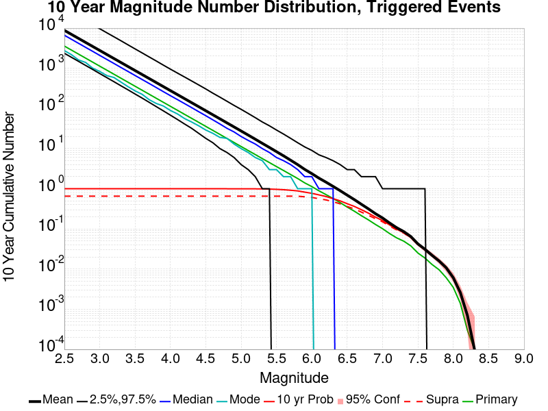

| Mag | Mean | 2.5 %ile | 97.5 %ile | Median | Mode | 10 yr Probability | 10 yr Supra-Seis Prob | Primary Aftershocks Mean |
|-----|-----|-----|-----|-----|-----|-----|-----|-----|
| **M&ge;2.5** | 8802.415 | 2367.000 | 30579.000 | 6643.000 | 2759.000 | 1.000 (100.00%) | 0.653 (65.31%) | 3577.990 |
| **M&ge;2.6** | 6992.476 | 1877.000 | 24290.000 | 5283.000 | 2189.000 | 1.000 (100.00%) | 0.653 (65.31%) | 2842.074 |
| **M&ge;2.7** | 5554.160 | 1490.000 | 19325.000 | 4190.000 | 1613.000 | 1.000 (100.00%) | 0.653 (65.31%) | 2257.461 |
| **M&ge;2.8** | 4411.235 | 1181.000 | 15323.000 | 3325.000 | 1399.000 | 1.000 (100.00%) | 0.653 (65.31%) | 1793.082 |
| **M&ge;2.9** | 3503.764 | 937.000 | 12164.000 | 2646.000 | 1011.000 | 1.000 (100.00%) | 0.653 (65.31%) | 1424.284 |
| **M&ge;3** | 2782.695 | 740.000 | 9676.000 | 2097.000 | 836.000 | 1.000 (100.00%) | 0.653 (65.31%) | 1131.124 |
| **M&ge;3.1** | 2210.214 | 586.000 | 7669.000 | 1665.000 | 657.000 | 1.000 (100.00%) | 0.653 (65.31%) | 898.490 |
| **M&ge;3.2** | 1755.377 | 465.000 | 6107.000 | 1323.000 | 591.000 | 1.000 (100.00%) | 0.653 (65.31%) | 713.737 |
| **M&ge;3.3** | 1394.395 | 367.000 | 4854.000 | 1049.000 | 454.000 | 1.000 (100.00%) | 0.653 (65.31%) | 566.882 |
| **M&ge;3.4** | 1107.714 | 291.000 | 3838.000 | 834.000 | 349.000 | 1.000 (100.00%) | 0.653 (65.31%) | 450.322 |
| **M&ge;3.5** | 879.577 | 229.000 | 3040.000 | 662.000 | 274.000 | 1.000 (100.00%) | 0.653 (65.31%) | 357.700 |
| **M&ge;3.6** | 698.605 | 181.000 | 2415.000 | 526.000 | 225.000 | 1.000 (100.00%) | 0.653 (65.31%) | 284.035 |
| **M&ge;3.7** | 554.990 | 142.000 | 1913.000 | 418.000 | 165.000 | 1.000 (100.00%) | 0.653 (65.31%) | 225.609 |
| **M&ge;3.8** | 440.598 | 111.000 | 1519.000 | 331.000 | 133.000 | 1.000 (100.00%) | 0.653 (65.31%) | 179.114 |
| **M&ge;3.9** | 349.863 | 87.000 | 1199.000 | 262.000 | 115.000 | 1.000 (100.00%) | 0.653 (65.31%) | 142.295 |
| **M&ge;4** | 277.844 | 68.000 | 952.000 | 208.000 | 89.000 | 1.000 (100.00%) | 0.653 (65.31%) | 113.017 |
| **M&ge;4.1** | 220.739 | 53.000 | 759.000 | 166.000 | 73.000 | 1.000 (100.00%) | 0.653 (65.31%) | 89.828 |
| **M&ge;4.2** | 175.289 | 41.000 | 607.000 | 132.000 | 56.000 | 1.000 (100.00%) | 0.653 (65.31%) | 71.328 |
| **M&ge;4.3** | 139.195 | 32.000 | 484.000 | 105.000 | 46.000 | 1.000 (100.00%) | 0.653 (65.31%) | 56.707 |
| **M&ge;4.4** | 110.526 | 24.000 | 385.000 | 83.000 | 37.000 | 1.000 (100.00%) | 0.653 (65.31%) | 45.066 |
| **M&ge;4.5** | 87.656 | 18.000 | 306.000 | 66.000 | 29.000 | 1.000 (100.00%) | 0.653 (65.31%) | 35.766 |
| **M&ge;4.6** | 69.513 | 14.000 | 240.000 | 52.000 | 24.000 | 1.000 (100.00%) | 0.653 (65.31%) | 28.390 |
| **M&ge;4.7** | 55.139 | 10.000 | 191.000 | 41.000 | 19.000 | 1.000 (100.00%) | 0.653 (65.31%) | 22.563 |
| **M&ge;4.8** | 43.661 | 8.000 | 151.000 | 32.000 | 18.000 | 1.000 (100.00%) | 0.653 (65.31%) | 17.877 |
| **M&ge;4.9** | 34.629 | 6.000 | 119.000 | 26.000 | 13.000 | 1.000 (99.99%) | 0.653 (65.31%) | 14.198 |
| **M&ge;5** | 27.425 | 4.000 | 95.000 | 20.000 | 10.000 | 1.000 (99.96%) | 0.653 (65.31%) | 11.274 |
| **M&ge;5.1** | 21.707 | 3.000 | 75.000 | 16.000 | 8.000 | 0.999 (99.85%) | 0.653 (65.31%) | 8.950 |
| **M&ge;5.2** | 17.150 | 2.000 | 59.000 | 13.000 | 6.000 | 0.996 (99.57%) | 0.653 (65.31%) | 7.113 |
| **M&ge;5.3** | 13.504 | 1.000 | 46.000 | 10.000 | 5.000 | 0.991 (99.12%) | 0.653 (65.31%) | 5.629 |
| **M&ge;5.4** | 10.670 | 1.000 | 37.000 | 8.000 | 3.000 | 0.982 (98.22%) | 0.653 (65.31%) | 4.491 |
| **M&ge;5.5** | 8.386 | 0.000 | 29.000 | 6.000 | 3.000 | 0.968 (96.76%) | 0.653 (65.31%) | 3.567 |
| **M&ge;5.6** | 6.605 | 0.000 | 23.000 | 5.000 | 2.000 | 0.948 (94.75%) | 0.653 (65.31%) | 2.844 |
| **M&ge;5.7** | 5.138 | 0.000 | 18.000 | 4.000 | 2.000 | 0.919 (91.87%) | 0.653 (65.31%) | 2.261 |
| **M&ge;5.8** | 3.989 | 0.000 | 14.000 | 3.000 | 1.000 | 0.883 (88.31%) | 0.653 (65.30%) | 1.798 |
| **M&ge;5.9** | 3.027 | 0.000 | 11.000 | 2.000 | 1.000 | 0.825 (82.45%) | 0.631 (63.09%) | 1.398 |
| **M&ge;6** | 2.380 | 0.000 | 9.000 | 2.000 | 1.000 | 0.769 (76.94%) | 0.610 (60.97%) | 1.133 |
| **M&ge;6.1** | 1.840 | 0.000 | 7.000 | 1.000 | 0.000 | 0.704 (70.39%) | 0.563 (56.32%) | 0.890 |
| **M&ge;6.2** | 1.462 | 0.000 | 6.000 | 1.000 | 0.000 | 0.641 (64.10%) | 0.528 (52.80%) | 0.716 |
| **M&ge;6.3** | 1.147 | 0.000 | 5.000 | 1.000 | 0.000 | 0.568 (56.75%) | 0.475 (47.54%) | 0.573 |
| **M&ge;6.4** | 0.896 | 0.000 | 4.000 | 0.000 | 0.000 | 0.500 (49.98%) | 0.422 (42.19%) | 0.453 |
| **M&ge;6.5** | 0.693 | 0.000 | 3.000 | 0.000 | 0.000 | 0.424 (42.44%) | 0.362 (36.21%) | 0.350 |
| **M&ge;6.6** | 0.538 | 0.000 | 3.000 | 0.000 | 0.000 | 0.364 (36.41%) | 0.315 (31.50%) | 0.277 |
| **M&ge;6.7** | 0.411 | 0.000 | 2.000 | 0.000 | 0.000 | 0.301 (30.10%) | 0.262 (26.22%) | 0.214 |
| **M&ge;6.8** | 0.316 | 0.000 | 2.000 | 0.000 | 0.000 | 0.247 (24.70%) | 0.219 (21.89%) | 0.168 |
| **M&ge;6.9** | 0.239 | 0.000 | 2.000 | 0.000 | 0.000 | 0.197 (19.71%) | 0.179 (17.92%) | 0.129 |
| **M&ge;7** | 0.187 | 0.000 | 1.000 | 0.000 | 0.000 | 0.162 (16.17%) | 0.150 (15.01%) | 0.101 |
| **M&ge;7.1** | 0.140 | 0.000 | 1.000 | 0.000 | 0.000 | 0.126 (12.62%) | 0.118 (11.79%) | 0.077 |
| **M&ge;7.2** | 0.107 | 0.000 | 1.000 | 0.000 | 0.000 | 0.099 (9.90%) | 0.094 (9.42%) | 0.060 |
| **M&ge;7.3** | 0.086 | 0.000 | 1.000 | 0.000 | 0.000 | 0.081 (8.05%) | 0.079 (7.86%) | 0.050 |
| **M&ge;7.4** | 0.065 | 0.000 | 1.000 | 0.000 | 0.000 | 0.061 (6.14%) | 0.060 (6.02%) | 0.038 |
| **M&ge;7.5** | 0.042 | 0.000 | 1.000 | 0.000 | 0.000 | 0.041 (4.09%) | 0.041 (4.06%) | 0.025 |
| **M&ge;7.6** | 0.031 | 0.000 | 1.000 | 0.000 | 0.000 | 0.031 (3.06%) | 0.030 (3.05%) | 0.019 |
| **M&ge;7.7** | 0.022 | 0.000 | 0.000 | 0.000 | 0.000 | 0.022 (2.19%) | 0.022 (2.18%) | 0.013 |
| **M&ge;7.8** | 0.016 | 0.000 | 0.000 | 0.000 | 0.000 | 0.016 (1.59%) | 0.016 (1.59%) | 9.60E-3 |
| **M&ge;7.9** | 0.011 | 0.000 | 0.000 | 0.000 | 0.000 | 0.011 (1.08%) | 0.011 (1.08%) | 6.10E-3 |
| **M&ge;8** | 6.10E-3 | 0.000 | 0.000 | 0.000 | 0.000 | 6.10E-3 (0.61%) | 6.10E-3 (0.61%) | 3.50E-3 |
| **M&ge;8.1** | 2.60E-3 | 0.000 | 0.000 | 0.000 | 0.000 | 2.60E-3 (0.26%) | 2.60E-3 (0.26%) | 1.40E-3 |
| **M&ge;8.2** | 7.00E-4 | 0.000 | 0.000 | 0.000 | 0.000 | 7.00E-4 (0.07%) | 7.00E-4 (0.07%) | 3.00E-4 |
| **M&ge;8.3** | 1.00E-4 | 0.000 | 0.000 | 0.000 | 0.000 | 1.00E-4 (0.01%) | 1.00E-4 (0.01%) | 1.00E-4 |
| **M&ge;8.4** | 0.000 | 0.000 | 0.000 | 0.000 | 0.000 | 0.000 (0.00%) | 0.000 (0.00%) | 0.000 |
| **M&ge;8.5** | 0.000 | 0.000 | 0.000 | 0.000 | 0.000 | 0.000 (0.00%) | 0.000 (0.00%) | 0.000 |
| **M&ge;8.6** | 0.000 | 0.000 | 0.000 | 0.000 | 0.000 | 0.000 (0.00%) | 0.000 (0.00%) | 0.000 |
| **M&ge;8.7** | 0.000 | 0.000 | 0.000 | 0.000 | 0.000 | 0.000 (0.00%) | 0.000 (0.00%) | 0.000 |
| **M&ge;8.8** | 0.000 | 0.000 | 0.000 | 0.000 | 0.000 | 0.000 (0.00%) | 0.000 (0.00%) | 0.000 |
| **M&ge;8.9** | 0.000 | 0.000 | 0.000 | 0.000 | 0.000 | 0.000 (0.00%) | 0.000 (0.00%) | 0.000 |
| **M&ge;9** | 0.000 | 0.000 | 0.000 | 0.000 | 0.000 | 0.000 (0.00%) | 0.000 (0.00%) | 0.000 |

### 1 Year Magnitude Number Distribution
*[(top)](#table-of-contents)*

#### 1 Year Magnitude Number Distribution, Including Spontaneous
*[(top)](#table-of-contents)*

*Note: This section includes both spontaneous and triggered events*

**Legend**
* **Mean** (thick black line): mean expected number across all 10000 catalogs
* **2.5%,97.5%** (thin black lines): expected number percentiles across all 10000 catalogs
* **Median** (thin blue line): median expected number across all 10000 catalogs
* **Mode** (thin cyan line): modal expected number across all 10000 catalogs
* **1 yr Probability** (thin red line): 1 year probability calculated as the fraction of catalogs with at least 1 occurrence
* **1 yr Supraseismogenic Probability** (thin dashed red line): same as above, but only for supraseismogenic ruptures on explicitly modeled UCERF3 faults
* **95% Conf** (light red shaded region): binomial 95% confidence bounds on probability
* **Primary** (thin green line): mean expected number from primary triggered aftershocks only (no secondary, tertiary, etc...) across all 10000 catalogs


| Mag | Mean | 2.5 %ile | 97.5 %ile | Median | Mode | 1 yr Probability | 1 yr Supra-Seis Prob |
|-----|-----|-----|-----|-----|-----|-----|-----|
| **M&ge;2.5** | 2271.458 | 1346.000 | 7219.000 | 1709.000 | 1525.000 | 1.000 (100.00%) | 0.312 (31.23%) |
| **M&ge;2.6** | 1804.342 | 1064.000 | 5744.000 | 1357.000 | 1205.000 | 1.000 (100.00%) | 0.312 (31.23%) |
| **M&ge;2.7** | 1433.078 | 841.000 | 4566.000 | 1079.000 | 967.000 | 1.000 (100.00%) | 0.312 (31.23%) |
| **M&ge;2.8** | 1138.136 | 665.000 | 3644.000 | 860.000 | 756.000 | 1.000 (100.00%) | 0.312 (31.23%) |
| **M&ge;2.9** | 904.074 | 525.000 | 2889.000 | 683.000 | 596.000 | 1.000 (100.00%) | 0.312 (31.23%) |
| **M&ge;3** | 718.060 | 414.000 | 2292.000 | 544.000 | 504.000 | 1.000 (100.00%) | 0.312 (31.23%) |
| **M&ge;3.1** | 570.445 | 325.000 | 1828.000 | 432.000 | 381.000 | 1.000 (100.00%) | 0.312 (31.23%) |
| **M&ge;3.2** | 453.168 | 255.000 | 1460.000 | 344.000 | 327.000 | 1.000 (100.00%) | 0.312 (31.23%) |
| **M&ge;3.3** | 359.962 | 200.000 | 1153.000 | 273.000 | 241.000 | 1.000 (100.00%) | 0.312 (31.23%) |
| **M&ge;3.4** | 285.930 | 156.000 | 917.000 | 217.000 | 210.000 | 1.000 (100.00%) | 0.312 (31.23%) |
| **M&ge;3.5** | 227.103 | 122.000 | 721.000 | 173.000 | 159.000 | 1.000 (100.00%) | 0.312 (31.23%) |
| **M&ge;3.6** | 180.323 | 95.000 | 574.000 | 138.000 | 122.000 | 1.000 (100.00%) | 0.312 (31.23%) |
| **M&ge;3.7** | 143.299 | 73.000 | 457.000 | 110.000 | 98.000 | 1.000 (100.00%) | 0.312 (31.23%) |
| **M&ge;3.8** | 113.801 | 56.000 | 364.000 | 88.000 | 80.000 | 1.000 (100.00%) | 0.312 (31.23%) |
| **M&ge;3.9** | 90.401 | 43.000 | 290.000 | 70.000 | 59.000 | 1.000 (100.00%) | 0.312 (31.23%) |
| **M&ge;4** | 71.880 | 33.000 | 230.000 | 56.000 | 49.000 | 1.000 (100.00%) | 0.312 (31.23%) |
| **M&ge;4.1** | 57.114 | 25.000 | 183.000 | 44.000 | 40.000 | 1.000 (100.00%) | 0.312 (31.23%) |
| **M&ge;4.2** | 45.327 | 19.000 | 145.000 | 35.000 | 34.000 | 1.000 (100.00%) | 0.312 (31.23%) |
| **M&ge;4.3** | 36.022 | 14.000 | 116.000 | 28.000 | 27.000 | 1.000 (100.00%) | 0.312 (31.23%) |
| **M&ge;4.4** | 28.608 | 10.000 | 92.000 | 22.000 | 17.000 | 1.000 (100.00%) | 0.312 (31.23%) |
| **M&ge;4.5** | 22.718 | 7.000 | 74.000 | 18.000 | 15.000 | 1.000 (100.00%) | 0.312 (31.23%) |
| **M&ge;4.6** | 18.016 | 5.000 | 59.000 | 14.000 | 12.000 | 1.000 (100.00%) | 0.312 (31.23%) |
| **M&ge;4.7** | 14.318 | 4.000 | 48.000 | 11.000 | 9.000 | 0.999 (99.92%) | 0.312 (31.23%) |
| **M&ge;4.8** | 11.361 | 2.000 | 37.000 | 9.000 | 7.000 | 0.998 (99.83%) | 0.312 (31.23%) |
| **M&ge;4.9** | 9.014 | 2.000 | 30.000 | 7.000 | 5.000 | 0.996 (99.55%) | 0.312 (31.23%) |
| **M&ge;5** | 7.144 | 1.000 | 24.000 | 6.000 | 4.000 | 0.989 (98.88%) | 0.312 (31.23%) |
| **M&ge;5.1** | 5.670 | 0.000 | 20.000 | 4.000 | 4.000 | 0.971 (97.08%) | 0.312 (31.23%) |
| **M&ge;5.2** | 4.504 | 0.000 | 16.000 | 3.000 | 2.000 | 0.944 (94.38%) | 0.312 (31.23%) |
| **M&ge;5.3** | 3.592 | 0.000 | 13.000 | 3.000 | 2.000 | 0.905 (90.54%) | 0.312 (31.23%) |
| **M&ge;5.4** | 2.848 | 0.000 | 11.000 | 2.000 | 1.000 | 0.852 (85.15%) | 0.312 (31.23%) |
| **M&ge;5.5** | 2.261 | 0.000 | 9.000 | 2.000 | 1.000 | 0.786 (78.59%) | 0.312 (31.23%) |
| **M&ge;5.6** | 1.796 | 0.000 | 7.000 | 1.000 | 0.000 | 0.713 (71.31%) | 0.312 (31.23%) |
| **M&ge;5.7** | 1.422 | 0.000 | 6.000 | 1.000 | 0.000 | 0.642 (64.24%) | 0.312 (31.21%) |
| **M&ge;5.8** | 1.124 | 0.000 | 5.000 | 1.000 | 0.000 | 0.570 (57.03%) | 0.312 (31.17%) |
| **M&ge;5.9** | 0.870 | 0.000 | 4.000 | 0.000 | 0.000 | 0.491 (49.14%) | 0.299 (29.95%) |
| **M&ge;6** | 0.703 | 0.000 | 4.000 | 0.000 | 0.000 | 0.431 (43.06%) | 0.289 (28.87%) |
| **M&ge;6.1** | 0.561 | 0.000 | 3.000 | 0.000 | 0.000 | 0.368 (36.83%) | 0.256 (25.61%) |
| **M&ge;6.2** | 0.454 | 0.000 | 3.000 | 0.000 | 0.000 | 0.317 (31.71%) | 0.230 (22.97%) |
| **M&ge;6.3** | 0.364 | 0.000 | 2.000 | 0.000 | 0.000 | 0.269 (26.85%) | 0.202 (20.22%) |
| **M&ge;6.4** | 0.286 | 0.000 | 2.000 | 0.000 | 0.000 | 0.223 (22.29%) | 0.174 (17.39%) |
| **M&ge;6.5** | 0.223 | 0.000 | 2.000 | 0.000 | 0.000 | 0.181 (18.08%) | 0.145 (14.46%) |
| **M&ge;6.6** | 0.174 | 0.000 | 1.000 | 0.000 | 0.000 | 0.147 (14.74%) | 0.121 (12.13%) |
| **M&ge;6.7** | 0.132 | 0.000 | 1.000 | 0.000 | 0.000 | 0.117 (11.69%) | 0.099 (9.87%) |
| **M&ge;6.8** | 0.103 | 0.000 | 1.000 | 0.000 | 0.000 | 0.093 (9.32%) | 0.080 (8.04%) |
| **M&ge;6.9** | 0.077 | 0.000 | 1.000 | 0.000 | 0.000 | 0.071 (7.15%) | 0.064 (6.39%) |
| **M&ge;7** | 0.061 | 0.000 | 1.000 | 0.000 | 0.000 | 0.057 (5.72%) | 0.052 (5.24%) |
| **M&ge;7.1** | 0.046 | 0.000 | 1.000 | 0.000 | 0.000 | 0.044 (4.42%) | 0.042 (4.17%) |
| **M&ge;7.2** | 0.036 | 0.000 | 1.000 | 0.000 | 0.000 | 0.034 (3.43%) | 0.033 (3.33%) |
| **M&ge;7.3** | 0.029 | 0.000 | 1.000 | 0.000 | 0.000 | 0.028 (2.82%) | 0.028 (2.77%) |
| **M&ge;7.4** | 0.022 | 0.000 | 0.000 | 0.000 | 0.000 | 0.021 (2.13%) | 0.021 (2.11%) |
| **M&ge;7.5** | 0.015 | 0.000 | 0.000 | 0.000 | 0.000 | 0.015 (1.46%) | 0.015 (1.45%) |
| **M&ge;7.6** | 9.70E-3 | 0.000 | 0.000 | 0.000 | 0.000 | 9.70E-3 (0.97%) | 9.70E-3 (0.97%) |
| **M&ge;7.7** | 6.00E-3 | 0.000 | 0.000 | 0.000 | 0.000 | 6.00E-3 (0.60%) | 6.00E-3 (0.60%) |
| **M&ge;7.8** | 4.80E-3 | 0.000 | 0.000 | 0.000 | 0.000 | 4.80E-3 (0.48%) | 4.80E-3 (0.48%) |
| **M&ge;7.9** | 3.20E-3 | 0.000 | 0.000 | 0.000 | 0.000 | 3.20E-3 (0.32%) | 3.20E-3 (0.32%) |
| **M&ge;8** | 1.80E-3 | 0.000 | 0.000 | 0.000 | 0.000 | 1.80E-3 (0.18%) | 1.80E-3 (0.18%) |
| **M&ge;8.1** | 6.00E-4 | 0.000 | 0.000 | 0.000 | 0.000 | 6.00E-4 (0.06%) | 6.00E-4 (0.06%) |
| **M&ge;8.2** | 2.00E-4 | 0.000 | 0.000 | 0.000 | 0.000 | 2.00E-4 (0.02%) | 2.00E-4 (0.02%) |
| **M&ge;8.3** | 0.000 | 0.000 | 0.000 | 0.000 | 0.000 | 0.000 (0.00%) | 0.000 (0.00%) |
| **M&ge;8.4** | 0.000 | 0.000 | 0.000 | 0.000 | 0.000 | 0.000 (0.00%) | 0.000 (0.00%) |
| **M&ge;8.5** | 0.000 | 0.000 | 0.000 | 0.000 | 0.000 | 0.000 (0.00%) | 0.000 (0.00%) |
| **M&ge;8.6** | 0.000 | 0.000 | 0.000 | 0.000 | 0.000 | 0.000 (0.00%) | 0.000 (0.00%) |
| **M&ge;8.7** | 0.000 | 0.000 | 0.000 | 0.000 | 0.000 | 0.000 (0.00%) | 0.000 (0.00%) |
| **M&ge;8.8** | 0.000 | 0.000 | 0.000 | 0.000 | 0.000 | 0.000 (0.00%) | 0.000 (0.00%) |
| **M&ge;8.9** | 0.000 | 0.000 | 0.000 | 0.000 | 0.000 | 0.000 (0.00%) | 0.000 (0.00%) |
| **M&ge;9** | 0.000 | 0.000 | 0.000 | 0.000 | 0.000 | 0.000 (0.00%) | 0.000 (0.00%) |

#### 1 Year Magnitude Number Distribution, Including Spontaneous, Triggered Events
*[(top)](#table-of-contents)*

*Note: This section only includes triggered events, spontaneous were calculated but filtered out here*

**Legend**
* **Mean** (thick black line): mean expected number across all 10000 catalogs
* **2.5%,97.5%** (thin black lines): expected number percentiles across all 10000 catalogs
* **Median** (thin blue line): median expected number across all 10000 catalogs
* **Mode** (thin cyan line): modal expected number across all 10000 catalogs
* **1 yr Probability** (thin red line): 1 year probability calculated as the fraction of catalogs with at least 1 occurrence
* **1 yr Supraseismogenic Probability** (thin dashed red line): same as above, but only for supraseismogenic ruptures on explicitly modeled UCERF3 faults
* **95% Conf** (light red shaded region): binomial 95% confidence bounds on probability
* **Primary** (thin green line): mean expected number from primary triggered aftershocks only (no secondary, tertiary, etc...) across all 10000 catalogs


| Mag | Mean | 2.5 %ile | 97.5 %ile | Median | Mode | 1 yr Probability | 1 yr Supra-Seis Prob | Primary Aftershocks Mean |
|-----|-----|-----|-----|-----|-----|-----|-----|-----|
| **M&ge;2.5** | 852.752 | 263.000 | 3649.000 | 511.000 | 297.000 | 1.000 (100.00%) | 0.118 (11.77%) | 401.529 |
| **M&ge;2.6** | 677.365 | 207.000 | 2889.000 | 406.000 | 242.000 | 1.000 (100.00%) | 0.118 (11.77%) | 318.921 |
| **M&ge;2.7** | 538.012 | 163.000 | 2292.000 | 323.000 | 179.000 | 1.000 (100.00%) | 0.118 (11.77%) | 253.312 |
| **M&ge;2.8** | 427.259 | 127.000 | 1817.000 | 256.000 | 151.000 | 1.000 (100.00%) | 0.118 (11.77%) | 201.259 |
| **M&ge;2.9** | 339.407 | 100.000 | 1444.000 | 204.000 | 128.000 | 1.000 (100.00%) | 0.118 (11.77%) | 159.905 |
| **M&ge;3** | 269.595 | 78.000 | 1147.000 | 161.000 | 95.000 | 1.000 (100.00%) | 0.118 (11.77%) | 127.014 |
| **M&ge;3.1** | 214.204 | 61.000 | 921.000 | 129.000 | 90.000 | 1.000 (100.00%) | 0.118 (11.77%) | 100.937 |
| **M&ge;3.2** | 170.195 | 47.000 | 734.000 | 102.000 | 62.000 | 1.000 (100.00%) | 0.118 (11.77%) | 80.232 |
| **M&ge;3.3** | 135.176 | 36.000 | 589.000 | 81.000 | 60.000 | 1.000 (100.00%) | 0.118 (11.77%) | 63.726 |
| **M&ge;3.4** | 107.326 | 28.000 | 468.000 | 65.000 | 43.000 | 1.000 (100.00%) | 0.118 (11.77%) | 50.629 |
| **M&ge;3.5** | 85.245 | 21.000 | 367.000 | 51.000 | 35.000 | 1.000 (100.00%) | 0.118 (11.77%) | 40.218 |
| **M&ge;3.6** | 67.692 | 16.000 | 290.000 | 41.000 | 31.000 | 1.000 (100.00%) | 0.118 (11.77%) | 31.965 |
| **M&ge;3.7** | 53.808 | 12.000 | 232.000 | 32.000 | 21.000 | 1.000 (100.00%) | 0.118 (11.77%) | 25.391 |
| **M&ge;3.8** | 42.708 | 9.000 | 184.000 | 26.000 | 16.000 | 1.000 (100.00%) | 0.118 (11.77%) | 20.144 |
| **M&ge;3.9** | 33.922 | 6.000 | 148.000 | 20.000 | 12.000 | 1.000 (100.00%) | 0.118 (11.77%) | 16.005 |
| **M&ge;4** | 26.995 | 5.000 | 118.000 | 16.000 | 12.000 | 1.000 (100.00%) | 0.118 (11.77%) | 12.729 |
| **M&ge;4.1** | 21.477 | 3.000 | 93.000 | 13.000 | 9.000 | 1.000 (99.95%) | 0.118 (11.77%) | 10.132 |
| **M&ge;4.2** | 17.042 | 2.000 | 75.000 | 10.000 | 7.000 | 0.998 (99.81%) | 0.118 (11.77%) | 8.032 |
| **M&ge;4.3** | 13.557 | 1.000 | 60.000 | 8.000 | 6.000 | 0.994 (99.44%) | 0.118 (11.77%) | 6.402 |
| **M&ge;4.4** | 10.751 | 1.000 | 48.000 | 6.000 | 4.000 | 0.985 (98.48%) | 0.118 (11.77%) | 5.080 |
| **M&ge;4.5** | 8.534 | 0.000 | 38.000 | 5.000 | 3.000 | 0.968 (96.84%) | 0.118 (11.77%) | 4.025 |
| **M&ge;4.6** | 6.771 | 0.000 | 30.000 | 4.000 | 2.000 | 0.945 (94.45%) | 0.118 (11.77%) | 3.192 |
| **M&ge;4.7** | 5.363 | 0.000 | 24.000 | 3.000 | 2.000 | 0.908 (90.78%) | 0.118 (11.77%) | 2.538 |
| **M&ge;4.8** | 4.252 | 0.000 | 20.000 | 2.000 | 1.000 | 0.861 (86.14%) | 0.118 (11.77%) | 2.013 |
| **M&ge;4.9** | 3.369 | 0.000 | 16.000 | 2.000 | 1.000 | 0.802 (80.21%) | 0.118 (11.77%) | 1.597 |
| **M&ge;5** | 2.663 | 0.000 | 13.000 | 1.000 | 0.000 | 0.736 (73.58%) | 0.118 (11.77%) | 1.268 |
| **M&ge;5.1** | 2.112 | 0.000 | 11.000 | 1.000 | 0.000 | 0.667 (66.69%) | 0.118 (11.77%) | 1.012 |
| **M&ge;5.2** | 1.666 | 0.000 | 8.000 | 1.000 | 0.000 | 0.595 (59.51%) | 0.118 (11.77%) | 0.803 |
| **M&ge;5.3** | 1.322 | 0.000 | 7.000 | 1.000 | 0.000 | 0.524 (52.42%) | 0.118 (11.77%) | 0.639 |
| **M&ge;5.4** | 1.038 | 0.000 | 6.000 | 0.000 | 0.000 | 0.457 (45.67%) | 0.118 (11.77%) | 0.507 |
| **M&ge;5.5** | 0.824 | 0.000 | 5.000 | 0.000 | 0.000 | 0.396 (39.63%) | 0.118 (11.77%) | 0.405 |
| **M&ge;5.6** | 0.653 | 0.000 | 4.000 | 0.000 | 0.000 | 0.341 (34.06%) | 0.118 (11.77%) | 0.324 |
| **M&ge;5.7** | 0.508 | 0.000 | 3.000 | 0.000 | 0.000 | 0.290 (29.03%) | 0.118 (11.77%) | 0.259 |
| **M&ge;5.8** | 0.395 | 0.000 | 3.000 | 0.000 | 0.000 | 0.244 (24.39%) | 0.118 (11.76%) | 0.208 |
| **M&ge;5.9** | 0.299 | 0.000 | 2.000 | 0.000 | 0.000 | 0.199 (19.90%) | 0.111 (11.11%) | 0.161 |
| **M&ge;6** | 0.238 | 0.000 | 2.000 | 0.000 | 0.000 | 0.168 (16.81%) | 0.106 (10.61%) | 0.132 |
| **M&ge;6.1** | 0.188 | 0.000 | 2.000 | 0.000 | 0.000 | 0.141 (14.09%) | 0.096 (9.56%) | 0.105 |
| **M&ge;6.2** | 0.153 | 0.000 | 1.000 | 0.000 | 0.000 | 0.119 (11.93%) | 0.086 (8.55%) | 0.086 |
| **M&ge;6.3** | 0.122 | 0.000 | 1.000 | 0.000 | 0.000 | 0.098 (9.83%) | 0.074 (7.37%) | 0.070 |
| **M&ge;6.4** | 0.096 | 0.000 | 1.000 | 0.000 | 0.000 | 0.080 (7.97%) | 0.062 (6.22%) | 0.055 |
| **M&ge;6.5** | 0.076 | 0.000 | 1.000 | 0.000 | 0.000 | 0.065 (6.49%) | 0.052 (5.21%) | 0.043 |
| **M&ge;6.6** | 0.060 | 0.000 | 1.000 | 0.000 | 0.000 | 0.053 (5.26%) | 0.044 (4.38%) | 0.035 |
| **M&ge;6.7** | 0.045 | 0.000 | 1.000 | 0.000 | 0.000 | 0.041 (4.11%) | 0.035 (3.49%) | 0.027 |
| **M&ge;6.8** | 0.035 | 0.000 | 1.000 | 0.000 | 0.000 | 0.032 (3.21%) | 0.028 (2.77%) | 0.021 |
| **M&ge;6.9** | 0.025 | 0.000 | 0.000 | 0.000 | 0.000 | 0.024 (2.38%) | 0.021 (2.14%) | 0.015 |
| **M&ge;7** | 0.019 | 0.000 | 0.000 | 0.000 | 0.000 | 0.018 (1.81%) | 0.017 (1.67%) | 0.012 |
| **M&ge;7.1** | 0.015 | 0.000 | 0.000 | 0.000 | 0.000 | 0.014 (1.44%) | 0.013 (1.33%) | 9.30E-3 |
| **M&ge;7.2** | 0.011 | 0.000 | 0.000 | 0.000 | 0.000 | 0.011 (1.13%) | 0.011 (1.08%) | 7.60E-3 |
| **M&ge;7.3** | 9.50E-3 | 0.000 | 0.000 | 0.000 | 0.000 | 9.50E-3 (0.95%) | 9.20E-3 (0.92%) | 6.60E-3 |
| **M&ge;7.4** | 6.90E-3 | 0.000 | 0.000 | 0.000 | 0.000 | 6.90E-3 (0.69%) | 6.70E-3 (0.67%) | 4.90E-3 |
| **M&ge;7.5** | 4.40E-3 | 0.000 | 0.000 | 0.000 | 0.000 | 4.40E-3 (0.44%) | 4.30E-3 (0.43%) | 3.20E-3 |
| **M&ge;7.6** | 2.90E-3 | 0.000 | 0.000 | 0.000 | 0.000 | 2.90E-3 (0.29%) | 2.90E-3 (0.29%) | 2.00E-3 |
| **M&ge;7.7** | 2.20E-3 | 0.000 | 0.000 | 0.000 | 0.000 | 2.20E-3 (0.22%) | 2.20E-3 (0.22%) | 1.40E-3 |
| **M&ge;7.8** | 1.60E-3 | 0.000 | 0.000 | 0.000 | 0.000 | 1.60E-3 (0.16%) | 1.60E-3 (0.16%) | 1.00E-3 |
| **M&ge;7.9** | 1.20E-3 | 0.000 | 0.000 | 0.000 | 0.000 | 1.20E-3 (0.12%) | 1.20E-3 (0.12%) | 7.00E-4 |
| **M&ge;8** | 7.00E-4 | 0.000 | 0.000 | 0.000 | 0.000 | 7.00E-4 (0.07%) | 7.00E-4 (0.07%) | 3.00E-4 |
| **M&ge;8.1** | 3.00E-4 | 0.000 | 0.000 | 0.000 | 0.000 | 3.00E-4 (0.03%) | 3.00E-4 (0.03%) | 1.00E-4 |
| **M&ge;8.2** | 1.00E-4 | 0.000 | 0.000 | 0.000 | 0.000 | 1.00E-4 (0.01%) | 1.00E-4 (0.01%) | 0.000 |
| **M&ge;8.3** | 0.000 | 0.000 | 0.000 | 0.000 | 0.000 | 0.000 (0.00%) | 0.000 (0.00%) | 0.000 |
| **M&ge;8.4** | 0.000 | 0.000 | 0.000 | 0.000 | 0.000 | 0.000 (0.00%) | 0.000 (0.00%) | 0.000 |
| **M&ge;8.5** | 0.000 | 0.000 | 0.000 | 0.000 | 0.000 | 0.000 (0.00%) | 0.000 (0.00%) | 0.000 |
| **M&ge;8.6** | 0.000 | 0.000 | 0.000 | 0.000 | 0.000 | 0.000 (0.00%) | 0.000 (0.00%) | 0.000 |
| **M&ge;8.7** | 0.000 | 0.000 | 0.000 | 0.000 | 0.000 | 0.000 (0.00%) | 0.000 (0.00%) | 0.000 |
| **M&ge;8.8** | 0.000 | 0.000 | 0.000 | 0.000 | 0.000 | 0.000 (0.00%) | 0.000 (0.00%) | 0.000 |
| **M&ge;8.9** | 0.000 | 0.000 | 0.000 | 0.000 | 0.000 | 0.000 (0.00%) | 0.000 (0.00%) | 0.000 |
| **M&ge;9** | 0.000 | 0.000 | 0.000 | 0.000 | 0.000 | 0.000 (0.00%) | 0.000 (0.00%) | 0.000 |

### 1 Month Magnitude Number Distribution
*[(top)](#table-of-contents)*

#### 1 Month Magnitude Number Distribution, Including Spontaneous
*[(top)](#table-of-contents)*

*Note: This section includes both spontaneous and triggered events*

**Legend**
* **Mean** (thick black line): mean expected number across all 10000 catalogs
* **2.5%,97.5%** (thin black lines): expected number percentiles across all 10000 catalogs
* **Median** (thin blue line): median expected number across all 10000 catalogs
* **Mode** (thin cyan line): modal expected number across all 10000 catalogs
* **1 mo Probability** (thin red line): 1 month probability calculated as the fraction of catalogs with at least 1 occurrence
* **1 mo Supraseismogenic Probability** (thin dashed red line): same as above, but only for supraseismogenic ruptures on explicitly modeled UCERF3 faults
* **95% Conf** (light red shaded region): binomial 95% confidence bounds on probability
* **Primary** (thin green line): mean expected number from primary triggered aftershocks only (no secondary, tertiary, etc...) across all 10000 catalogs

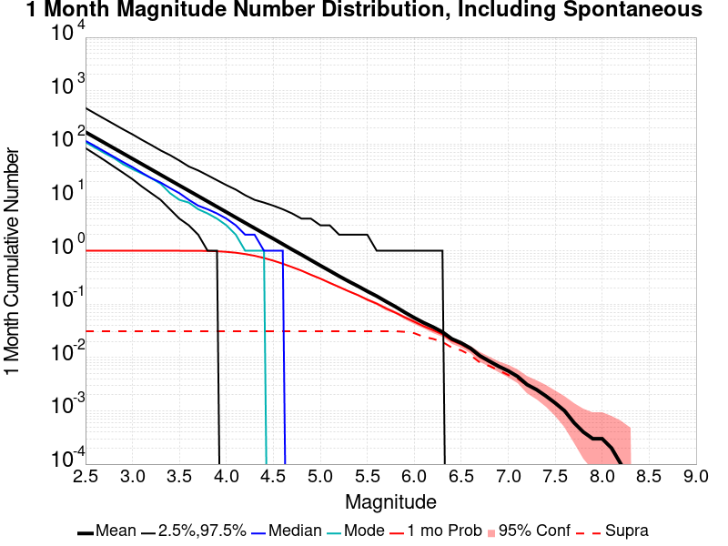

| Mag | Mean | 2.5 %ile | 97.5 %ile | Median | Mode | 1 mo Probability | 1 mo Supra-Seis Prob |
|-----|-----|-----|-----|-----|-----|-----|-----|
| **M&ge;2.5** | 167.756 | 84.000 | 474.000 | 115.000 | 108.000 | 1.000 (100.00%) | 0.031 (3.10%) |
| **M&ge;2.6** | 133.253 | 65.000 | 376.000 | 92.000 | 86.000 | 1.000 (100.00%) | 0.031 (3.10%) |
| **M&ge;2.7** | 105.841 | 50.000 | 299.000 | 73.000 | 68.000 | 1.000 (100.00%) | 0.031 (3.10%) |
| **M&ge;2.8** | 84.084 | 38.000 | 238.000 | 58.000 | 55.000 | 1.000 (100.00%) | 0.031 (3.10%) |
| **M&ge;2.9** | 66.866 | 29.000 | 189.000 | 46.000 | 42.000 | 1.000 (100.00%) | 0.031 (3.10%) |
| **M&ge;3** | 53.087 | 22.000 | 152.000 | 37.000 | 34.000 | 1.000 (100.00%) | 0.031 (3.10%) |
| **M&ge;3.1** | 42.153 | 16.000 | 120.000 | 29.000 | 28.000 | 1.000 (100.00%) | 0.031 (3.10%) |
| **M&ge;3.2** | 33.491 | 12.000 | 96.000 | 23.000 | 23.000 | 1.000 (100.00%) | 0.031 (3.10%) |
| **M&ge;3.3** | 26.581 | 9.000 | 76.000 | 19.000 | 18.000 | 1.000 (100.00%) | 0.031 (3.10%) |
| **M&ge;3.4** | 21.106 | 6.000 | 62.000 | 15.000 | 12.000 | 1.000 (100.00%) | 0.031 (3.10%) |
| **M&ge;3.5** | 16.766 | 4.000 | 49.000 | 12.000 | 9.000 | 1.000 (100.00%) | 0.031 (3.10%) |
| **M&ge;3.6** | 13.334 | 3.000 | 38.000 | 9.000 | 8.000 | 1.000 (99.96%) | 0.031 (3.10%) |
| **M&ge;3.7** | 10.596 | 2.000 | 32.000 | 7.000 | 6.000 | 0.998 (99.76%) | 0.031 (3.10%) |
| **M&ge;3.8** | 8.414 | 1.000 | 26.000 | 6.000 | 5.000 | 0.992 (99.23%) | 0.031 (3.10%) |
| **M&ge;3.9** | 6.677 | 1.000 | 21.000 | 5.000 | 4.000 | 0.979 (97.88%) | 0.031 (3.10%) |
| **M&ge;4** | 5.300 | 0.000 | 17.000 | 4.000 | 3.000 | 0.954 (95.40%) | 0.031 (3.10%) |
| **M&ge;4.1** | 4.200 | 0.000 | 14.000 | 3.000 | 2.000 | 0.919 (91.92%) | 0.031 (3.10%) |
| **M&ge;4.2** | 3.332 | 0.000 | 11.000 | 2.000 | 1.000 | 0.868 (86.76%) | 0.031 (3.10%) |
| **M&ge;4.3** | 2.648 | 0.000 | 9.000 | 2.000 | 1.000 | 0.806 (80.57%) | 0.031 (3.10%) |
| **M&ge;4.4** | 2.104 | 0.000 | 8.000 | 1.000 | 1.000 | 0.731 (73.12%) | 0.031 (3.10%) |
| **M&ge;4.5** | 1.681 | 0.000 | 7.000 | 1.000 | 0.000 | 0.652 (65.24%) | 0.031 (3.10%) |
| **M&ge;4.6** | 1.331 | 0.000 | 6.000 | 1.000 | 0.000 | 0.572 (57.18%) | 0.031 (3.10%) |
| **M&ge;4.7** | 1.053 | 0.000 | 5.000 | 0.000 | 0.000 | 0.493 (49.33%) | 0.031 (3.10%) |
| **M&ge;4.8** | 0.842 | 0.000 | 4.000 | 0.000 | 0.000 | 0.424 (42.39%) | 0.031 (3.10%) |
| **M&ge;4.9** | 0.667 | 0.000 | 4.000 | 0.000 | 0.000 | 0.354 (35.45%) | 0.031 (3.10%) |
| **M&ge;5** | 0.528 | 0.000 | 3.000 | 0.000 | 0.000 | 0.300 (30.05%) | 0.031 (3.10%) |
| **M&ge;5.1** | 0.421 | 0.000 | 3.000 | 0.000 | 0.000 | 0.251 (25.08%) | 0.031 (3.10%) |
| **M&ge;5.2** | 0.334 | 0.000 | 2.000 | 0.000 | 0.000 | 0.209 (20.87%) | 0.031 (3.10%) |
| **M&ge;5.3** | 0.268 | 0.000 | 2.000 | 0.000 | 0.000 | 0.175 (17.47%) | 0.031 (3.10%) |
| **M&ge;5.4** | 0.217 | 0.000 | 2.000 | 0.000 | 0.000 | 0.147 (14.74%) | 0.031 (3.10%) |
| **M&ge;5.5** | 0.174 | 0.000 | 2.000 | 0.000 | 0.000 | 0.121 (12.15%) | 0.031 (3.10%) |
| **M&ge;5.6** | 0.141 | 0.000 | 1.000 | 0.000 | 0.000 | 0.102 (10.21%) | 0.031 (3.10%) |
| **M&ge;5.7** | 0.112 | 0.000 | 1.000 | 0.000 | 0.000 | 0.083 (8.30%) | 0.031 (3.10%) |
| **M&ge;5.8** | 0.089 | 0.000 | 1.000 | 0.000 | 0.000 | 0.069 (6.90%) | 0.031 (3.10%) |
| **M&ge;5.9** | 0.070 | 0.000 | 1.000 | 0.000 | 0.000 | 0.056 (5.64%) | 0.030 (3.02%) |
| **M&ge;6** | 0.056 | 0.000 | 1.000 | 0.000 | 0.000 | 0.047 (4.67%) | 0.029 (2.85%) |
| **M&ge;6.1** | 0.045 | 0.000 | 1.000 | 0.000 | 0.000 | 0.038 (3.85%) | 0.024 (2.44%) |
| **M&ge;6.2** | 0.037 | 0.000 | 1.000 | 0.000 | 0.000 | 0.033 (3.25%) | 0.022 (2.23%) |
| **M&ge;6.3** | 0.030 | 0.000 | 1.000 | 0.000 | 0.000 | 0.027 (2.72%) | 0.019 (1.95%) |
| **M&ge;6.4** | 0.022 | 0.000 | 0.000 | 0.000 | 0.000 | 0.021 (2.07%) | 0.015 (1.53%) |
| **M&ge;6.5** | 0.019 | 0.000 | 0.000 | 0.000 | 0.000 | 0.018 (1.75%) | 0.014 (1.36%) |
| **M&ge;6.6** | 0.015 | 0.000 | 0.000 | 0.000 | 0.000 | 0.014 (1.40%) | 0.011 (1.10%) |
| **M&ge;6.7** | 0.011 | 0.000 | 0.000 | 0.000 | 0.000 | 0.010 (1.01%) | 8.00E-3 (0.80%) |
| **M&ge;6.8** | 8.50E-3 | 0.000 | 0.000 | 0.000 | 0.000 | 8.20E-3 (0.82%) | 6.90E-3 (0.69%) |
| **M&ge;6.9** | 6.80E-3 | 0.000 | 0.000 | 0.000 | 0.000 | 6.70E-3 (0.67%) | 5.70E-3 (0.57%) |
| **M&ge;7** | 5.60E-3 | 0.000 | 0.000 | 0.000 | 0.000 | 5.50E-3 (0.55%) | 4.70E-3 (0.47%) |
| **M&ge;7.1** | 4.40E-3 | 0.000 | 0.000 | 0.000 | 0.000 | 4.40E-3 (0.44%) | 4.00E-3 (0.40%) |
| **M&ge;7.2** | 3.10E-3 | 0.000 | 0.000 | 0.000 | 0.000 | 3.10E-3 (0.31%) | 3.00E-3 (0.30%) |
| **M&ge;7.3** | 2.50E-3 | 0.000 | 0.000 | 0.000 | 0.000 | 2.50E-3 (0.25%) | 2.50E-3 (0.25%) |
| **M&ge;7.4** | 1.90E-3 | 0.000 | 0.000 | 0.000 | 0.000 | 1.90E-3 (0.19%) | 1.90E-3 (0.19%) |
| **M&ge;7.5** | 1.40E-3 | 0.000 | 0.000 | 0.000 | 0.000 | 1.40E-3 (0.14%) | 1.40E-3 (0.14%) |
| **M&ge;7.6** | 1.00E-3 | 0.000 | 0.000 | 0.000 | 0.000 | 1.00E-3 (0.10%) | 1.00E-3 (0.10%) |
| **M&ge;7.7** | 6.00E-4 | 0.000 | 0.000 | 0.000 | 0.000 | 6.00E-4 (0.06%) | 6.00E-4 (0.06%) |
| **M&ge;7.8** | 4.00E-4 | 0.000 | 0.000 | 0.000 | 0.000 | 4.00E-4 (0.04%) | 4.00E-4 (0.04%) |
| **M&ge;7.9** | 3.00E-4 | 0.000 | 0.000 | 0.000 | 0.000 | 3.00E-4 (0.03%) | 3.00E-4 (0.03%) |
| **M&ge;8** | 3.00E-4 | 0.000 | 0.000 | 0.000 | 0.000 | 3.00E-4 (0.03%) | 3.00E-4 (0.03%) |
| **M&ge;8.1** | 2.00E-4 | 0.000 | 0.000 | 0.000 | 0.000 | 2.00E-4 (0.02%) | 2.00E-4 (0.02%) |
| **M&ge;8.2** | 1.00E-4 | 0.000 | 0.000 | 0.000 | 0.000 | 1.00E-4 (0.01%) | 1.00E-4 (0.01%) |
| **M&ge;8.3** | 0.000 | 0.000 | 0.000 | 0.000 | 0.000 | 0.000 (0.00%) | 0.000 (0.00%) |
| **M&ge;8.4** | 0.000 | 0.000 | 0.000 | 0.000 | 0.000 | 0.000 (0.00%) | 0.000 (0.00%) |
| **M&ge;8.5** | 0.000 | 0.000 | 0.000 | 0.000 | 0.000 | 0.000 (0.00%) | 0.000 (0.00%) |
| **M&ge;8.6** | 0.000 | 0.000 | 0.000 | 0.000 | 0.000 | 0.000 (0.00%) | 0.000 (0.00%) |
| **M&ge;8.7** | 0.000 | 0.000 | 0.000 | 0.000 | 0.000 | 0.000 (0.00%) | 0.000 (0.00%) |
| **M&ge;8.8** | 0.000 | 0.000 | 0.000 | 0.000 | 0.000 | 0.000 (0.00%) | 0.000 (0.00%) |
| **M&ge;8.9** | 0.000 | 0.000 | 0.000 | 0.000 | 0.000 | 0.000 (0.00%) | 0.000 (0.00%) |
| **M&ge;9** | 0.000 | 0.000 | 0.000 | 0.000 | 0.000 | 0.000 (0.00%) | 0.000 (0.00%) |

#### 1 Month Magnitude Number Distribution, Including Spontaneous, Triggered Events
*[(top)](#table-of-contents)*

*Note: This section only includes triggered events, spontaneous were calculated but filtered out here*

**Legend**
* **Mean** (thick black line): mean expected number across all 10000 catalogs
* **2.5%,97.5%** (thin black lines): expected number percentiles across all 10000 catalogs
* **Median** (thin blue line): median expected number across all 10000 catalogs
* **Mode** (thin cyan line): modal expected number across all 10000 catalogs
* **1 mo Probability** (thin red line): 1 month probability calculated as the fraction of catalogs with at least 1 occurrence
* **1 mo Supraseismogenic Probability** (thin dashed red line): same as above, but only for supraseismogenic ruptures on explicitly modeled UCERF3 faults
* **95% Conf** (light red shaded region): binomial 95% confidence bounds on probability
* **Primary** (thin green line): mean expected number from primary triggered aftershocks only (no secondary, tertiary, etc...) across all 10000 catalogs


| Mag | Mean | 2.5 %ile | 97.5 %ile | Median | Mode | 1 mo Probability | 1 mo Supra-Seis Prob | Primary Aftershocks Mean |
|-----|-----|-----|-----|-----|-----|-----|-----|-----|
| **M&ge;2.5** | 63.344 | 17.000 | 207.000 | 33.000 | 31.000 | 1.000 (100.00%) | 0.012 (1.18%) | 32.526 |
| **M&ge;2.6** | 50.309 | 13.000 | 163.000 | 26.000 | 25.000 | 1.000 (100.00%) | 0.012 (1.18%) | 25.845 |
| **M&ge;2.7** | 39.997 | 10.000 | 131.000 | 21.000 | 19.000 | 1.000 (100.00%) | 0.012 (1.18%) | 20.542 |
| **M&ge;2.8** | 31.794 | 7.000 | 103.000 | 17.000 | 14.000 | 1.000 (100.00%) | 0.012 (1.18%) | 16.365 |
| **M&ge;2.9** | 25.283 | 5.000 | 84.000 | 13.000 | 11.000 | 1.000 (100.00%) | 0.012 (1.18%) | 12.996 |
| **M&ge;3** | 20.094 | 3.000 | 66.000 | 11.000 | 10.000 | 1.000 (99.96%) | 0.012 (1.18%) | 10.331 |
| **M&ge;3.1** | 15.953 | 2.000 | 52.000 | 8.000 | 6.000 | 0.999 (99.88%) | 0.012 (1.18%) | 8.204 |
| **M&ge;3.2** | 12.671 | 1.000 | 42.000 | 7.000 | 5.000 | 0.994 (99.37%) | 0.012 (1.18%) | 6.512 |
| **M&ge;3.3** | 10.072 | 1.000 | 33.000 | 5.000 | 4.000 | 0.987 (98.65%) | 0.012 (1.18%) | 5.177 |
| **M&ge;3.4** | 7.982 | 0.000 | 27.000 | 4.000 | 3.000 | 0.965 (96.53%) | 0.012 (1.18%) | 4.111 |
| **M&ge;3.5** | 6.336 | 0.000 | 21.000 | 3.000 | 2.000 | 0.935 (93.55%) | 0.012 (1.18%) | 3.269 |
| **M&ge;3.6** | 5.039 | 0.000 | 17.000 | 3.000 | 2.000 | 0.891 (89.13%) | 0.012 (1.18%) | 2.605 |
| **M&ge;3.7** | 4.005 | 0.000 | 14.000 | 2.000 | 1.000 | 0.836 (83.58%) | 0.012 (1.18%) | 2.062 |
| **M&ge;3.8** | 3.180 | 0.000 | 11.000 | 1.000 | 1.000 | 0.772 (77.21%) | 0.012 (1.18%) | 1.642 |
| **M&ge;3.9** | 2.519 | 0.000 | 9.000 | 1.000 | 0.000 | 0.699 (69.92%) | 0.012 (1.18%) | 1.302 |
| **M&ge;4** | 2.004 | 0.000 | 8.000 | 1.000 | 0.000 | 0.617 (61.67%) | 0.012 (1.18%) | 1.034 |
| **M&ge;4.1** | 1.591 | 0.000 | 6.000 | 1.000 | 0.000 | 0.545 (54.53%) | 0.012 (1.18%) | 0.823 |
| **M&ge;4.2** | 1.260 | 0.000 | 5.000 | 0.000 | 0.000 | 0.471 (47.08%) | 0.012 (1.18%) | 0.653 |
| **M&ge;4.3** | 0.998 | 0.000 | 5.000 | 0.000 | 0.000 | 0.403 (40.32%) | 0.012 (1.18%) | 0.518 |
| **M&ge;4.4** | 0.789 | 0.000 | 4.000 | 0.000 | 0.000 | 0.337 (33.72%) | 0.012 (1.18%) | 0.412 |
| **M&ge;4.5** | 0.635 | 0.000 | 3.000 | 0.000 | 0.000 | 0.286 (28.57%) | 0.012 (1.18%) | 0.330 |
| **M&ge;4.6** | 0.507 | 0.000 | 3.000 | 0.000 | 0.000 | 0.239 (23.87%) | 0.012 (1.18%) | 0.261 |
| **M&ge;4.7** | 0.397 | 0.000 | 2.000 | 0.000 | 0.000 | 0.199 (19.85%) | 0.012 (1.18%) | 0.206 |
| **M&ge;4.8** | 0.319 | 0.000 | 2.000 | 0.000 | 0.000 | 0.165 (16.54%) | 0.012 (1.18%) | 0.163 |
| **M&ge;4.9** | 0.252 | 0.000 | 2.000 | 0.000 | 0.000 | 0.136 (13.59%) | 0.012 (1.18%) | 0.131 |
| **M&ge;5** | 0.198 | 0.000 | 2.000 | 0.000 | 0.000 | 0.111 (11.13%) | 0.012 (1.18%) | 0.103 |
| **M&ge;5.1** | 0.159 | 0.000 | 1.000 | 0.000 | 0.000 | 0.093 (9.32%) | 0.012 (1.18%) | 0.084 |
| **M&ge;5.2** | 0.126 | 0.000 | 1.000 | 0.000 | 0.000 | 0.077 (7.71%) | 0.012 (1.18%) | 0.068 |
| **M&ge;5.3** | 0.101 | 0.000 | 1.000 | 0.000 | 0.000 | 0.064 (6.38%) | 0.012 (1.18%) | 0.055 |
| **M&ge;5.4** | 0.083 | 0.000 | 1.000 | 0.000 | 0.000 | 0.054 (5.45%) | 0.012 (1.18%) | 0.046 |
| **M&ge;5.5** | 0.066 | 0.000 | 1.000 | 0.000 | 0.000 | 0.046 (4.58%) | 0.012 (1.18%) | 0.037 |
| **M&ge;5.6** | 0.053 | 0.000 | 1.000 | 0.000 | 0.000 | 0.038 (3.79%) | 0.012 (1.18%) | 0.030 |
| **M&ge;5.7** | 0.042 | 0.000 | 1.000 | 0.000 | 0.000 | 0.031 (3.14%) | 0.012 (1.18%) | 0.024 |
| **M&ge;5.8** | 0.032 | 0.000 | 1.000 | 0.000 | 0.000 | 0.026 (2.57%) | 0.012 (1.18%) | 0.020 |
| **M&ge;5.9** | 0.025 | 0.000 | 0.000 | 0.000 | 0.000 | 0.021 (2.09%) | 0.011 (1.15%) | 0.016 |
| **M&ge;6** | 0.020 | 0.000 | 0.000 | 0.000 | 0.000 | 0.017 (1.71%) | 0.011 (1.07%) | 0.013 |
| **M&ge;6.1** | 0.016 | 0.000 | 0.000 | 0.000 | 0.000 | 0.015 (1.45%) | 9.50E-3 (0.95%) | 0.011 |
| **M&ge;6.2** | 0.014 | 0.000 | 0.000 | 0.000 | 0.000 | 0.012 (1.24%) | 8.80E-3 (0.88%) | 9.20E-3 |
| **M&ge;6.3** | 0.011 | 0.000 | 0.000 | 0.000 | 0.000 | 9.90E-3 (0.99%) | 7.20E-3 (0.72%) | 6.80E-3 |
| **M&ge;6.4** | 8.00E-3 | 0.000 | 0.000 | 0.000 | 0.000 | 7.50E-3 (0.75%) | 5.60E-3 (0.56%) | 5.10E-3 |
| **M&ge;6.5** | 6.70E-3 | 0.000 | 0.000 | 0.000 | 0.000 | 6.30E-3 (0.63%) | 5.10E-3 (0.51%) | 4.20E-3 |
| **M&ge;6.6** | 6.00E-3 | 0.000 | 0.000 | 0.000 | 0.000 | 5.70E-3 (0.57%) | 4.70E-3 (0.47%) | 3.80E-3 |
| **M&ge;6.7** | 4.30E-3 | 0.000 | 0.000 | 0.000 | 0.000 | 4.00E-3 (0.40%) | 3.30E-3 (0.33%) | 2.40E-3 |
| **M&ge;6.8** | 3.20E-3 | 0.000 | 0.000 | 0.000 | 0.000 | 3.00E-3 (0.30%) | 2.60E-3 (0.26%) | 2.00E-3 |
| **M&ge;6.9** | 2.30E-3 | 0.000 | 0.000 | 0.000 | 0.000 | 2.30E-3 (0.23%) | 2.10E-3 (0.21%) | 1.40E-3 |
| **M&ge;7** | 1.90E-3 | 0.000 | 0.000 | 0.000 | 0.000 | 1.90E-3 (0.19%) | 1.80E-3 (0.18%) | 1.10E-3 |
| **M&ge;7.1** | 1.50E-3 | 0.000 | 0.000 | 0.000 | 0.000 | 1.50E-3 (0.15%) | 1.40E-3 (0.14%) | 9.00E-4 |
| **M&ge;7.2** | 9.00E-4 | 0.000 | 0.000 | 0.000 | 0.000 | 9.00E-4 (0.09%) | 9.00E-4 (0.09%) | 6.00E-4 |
| **M&ge;7.3** | 8.00E-4 | 0.000 | 0.000 | 0.000 | 0.000 | 8.00E-4 (0.08%) | 8.00E-4 (0.08%) | 6.00E-4 |
| **M&ge;7.4** | 4.00E-4 | 0.000 | 0.000 | 0.000 | 0.000 | 4.00E-4 (0.04%) | 4.00E-4 (0.04%) | 3.00E-4 |
| **M&ge;7.5** | 3.00E-4 | 0.000 | 0.000 | 0.000 | 0.000 | 3.00E-4 (0.03%) | 3.00E-4 (0.03%) | 2.00E-4 |
| **M&ge;7.6** | 3.00E-4 | 0.000 | 0.000 | 0.000 | 0.000 | 3.00E-4 (0.03%) | 3.00E-4 (0.03%) | 2.00E-4 |
| **M&ge;7.7** | 3.00E-4 | 0.000 | 0.000 | 0.000 | 0.000 | 3.00E-4 (0.03%) | 3.00E-4 (0.03%) | 2.00E-4 |
| **M&ge;7.8** | 2.00E-4 | 0.000 | 0.000 | 0.000 | 0.000 | 2.00E-4 (0.02%) | 2.00E-4 (0.02%) | 1.00E-4 |
| **M&ge;7.9** | 2.00E-4 | 0.000 | 0.000 | 0.000 | 0.000 | 2.00E-4 (0.02%) | 2.00E-4 (0.02%) | 1.00E-4 |
| **M&ge;8** | 2.00E-4 | 0.000 | 0.000 | 0.000 | 0.000 | 2.00E-4 (0.02%) | 2.00E-4 (0.02%) | 1.00E-4 |
| **M&ge;8.1** | 2.00E-4 | 0.000 | 0.000 | 0.000 | 0.000 | 2.00E-4 (0.02%) | 2.00E-4 (0.02%) | 1.00E-4 |
| **M&ge;8.2** | 1.00E-4 | 0.000 | 0.000 | 0.000 | 0.000 | 1.00E-4 (0.01%) | 1.00E-4 (0.01%) | 0.000 |
| **M&ge;8.3** | 0.000 | 0.000 | 0.000 | 0.000 | 0.000 | 0.000 (0.00%) | 0.000 (0.00%) | 0.000 |
| **M&ge;8.4** | 0.000 | 0.000 | 0.000 | 0.000 | 0.000 | 0.000 (0.00%) | 0.000 (0.00%) | 0.000 |
| **M&ge;8.5** | 0.000 | 0.000 | 0.000 | 0.000 | 0.000 | 0.000 (0.00%) | 0.000 (0.00%) | 0.000 |
| **M&ge;8.6** | 0.000 | 0.000 | 0.000 | 0.000 | 0.000 | 0.000 (0.00%) | 0.000 (0.00%) | 0.000 |
| **M&ge;8.7** | 0.000 | 0.000 | 0.000 | 0.000 | 0.000 | 0.000 (0.00%) | 0.000 (0.00%) | 0.000 |
| **M&ge;8.8** | 0.000 | 0.000 | 0.000 | 0.000 | 0.000 | 0.000 (0.00%) | 0.000 (0.00%) | 0.000 |
| **M&ge;8.9** | 0.000 | 0.000 | 0.000 | 0.000 | 0.000 | 0.000 (0.00%) | 0.000 (0.00%) | 0.000 |
| **M&ge;9** | 0.000 | 0.000 | 0.000 | 0.000 | 0.000 | 0.000 (0.00%) | 0.000 (0.00%) | 0.000 |

### 1 Week Magnitude Number Distribution
*[(top)](#table-of-contents)*

#### 1 Week Magnitude Number Distribution, Including Spontaneous
*[(top)](#table-of-contents)*

*Note: This section includes both spontaneous and triggered events*

**Legend**
* **Mean** (thick black line): mean expected number across all 10000 catalogs
* **2.5%,97.5%** (thin black lines): expected number percentiles across all 10000 catalogs
* **Median** (thin blue line): median expected number across all 10000 catalogs
* **Mode** (thin cyan line): modal expected number across all 10000 catalogs
* **1 wk Probability** (thin red line): 1 week probability calculated as the fraction of catalogs with at least 1 occurrence
* **1 wk Supraseismogenic Probability** (thin dashed red line): same as above, but only for supraseismogenic ruptures on explicitly modeled UCERF3 faults
* **95% Conf** (light red shaded region): binomial 95% confidence bounds on probability
* **Primary** (thin green line): mean expected number from primary triggered aftershocks only (no secondary, tertiary, etc...) across all 10000 catalogs

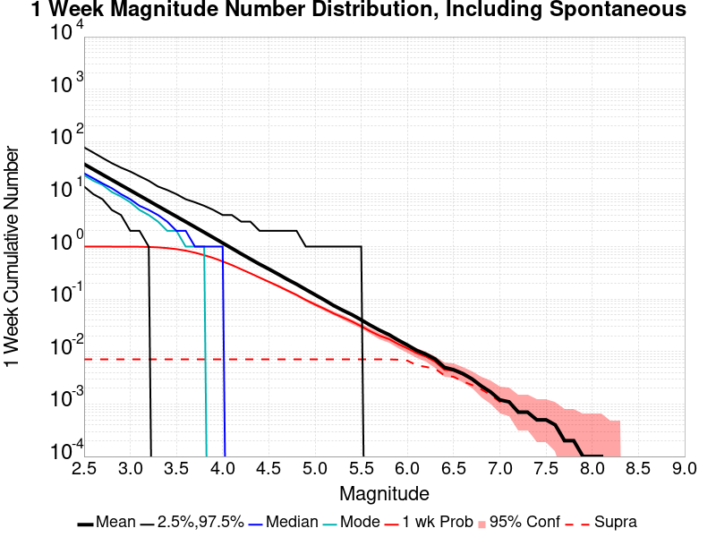

| Mag | Mean | 2.5 %ile | 97.5 %ile | Median | Mode | 1 wk Probability | 1 wk Supra-Seis Prob |
|-----|-----|-----|-----|-----|-----|-----|-----|
| **M&ge;2.5** | 37.370 | 14.000 | 78.000 | 25.000 | 23.000 | 1.000 (100.00%) | 7.10E-3 (0.71%) |
| **M&ge;2.6** | 29.679 | 10.000 | 62.000 | 20.000 | 18.000 | 1.000 (100.00%) | 7.10E-3 (0.71%) |
| **M&ge;2.7** | 23.574 | 8.000 | 49.000 | 16.000 | 15.000 | 1.000 (100.00%) | 7.10E-3 (0.71%) |
| **M&ge;2.8** | 18.721 | 5.000 | 39.000 | 13.000 | 11.000 | 1.000 (100.00%) | 7.10E-3 (0.71%) |
| **M&ge;2.9** | 14.891 | 4.000 | 32.000 | 10.000 | 9.000 | 1.000 (99.97%) | 7.10E-3 (0.71%) |
| **M&ge;3** | 11.838 | 2.000 | 27.000 | 8.000 | 7.000 | 0.999 (99.94%) | 7.10E-3 (0.71%) |
| **M&ge;3.1** | 9.410 | 2.000 | 22.000 | 6.000 | 5.000 | 0.995 (99.47%) | 7.10E-3 (0.71%) |
| **M&ge;3.2** | 7.468 | 1.000 | 18.000 | 5.000 | 4.000 | 0.985 (98.54%) | 7.10E-3 (0.71%) |
| **M&ge;3.3** | 5.922 | 0.000 | 14.000 | 4.000 | 3.000 | 0.968 (96.78%) | 7.10E-3 (0.71%) |
| **M&ge;3.4** | 4.710 | 0.000 | 12.000 | 3.000 | 2.000 | 0.938 (93.80%) | 7.10E-3 (0.71%) |
| **M&ge;3.5** | 3.745 | 0.000 | 10.000 | 2.000 | 2.000 | 0.895 (89.54%) | 7.10E-3 (0.71%) |
| **M&ge;3.6** | 2.977 | 0.000 | 8.000 | 2.000 | 1.000 | 0.839 (83.90%) | 7.10E-3 (0.71%) |
| **M&ge;3.7** | 2.364 | 0.000 | 7.000 | 1.000 | 1.000 | 0.767 (76.74%) | 7.10E-3 (0.71%) |
| **M&ge;3.8** | 1.874 | 0.000 | 6.000 | 1.000 | 1.000 | 0.687 (68.74%) | 7.10E-3 (0.71%) |
| **M&ge;3.9** | 1.486 | 0.000 | 5.000 | 1.000 | 0.000 | 0.607 (60.73%) | 7.10E-3 (0.71%) |
| **M&ge;4** | 1.173 | 0.000 | 4.000 | 1.000 | 0.000 | 0.523 (52.27%) | 7.10E-3 (0.71%) |
| **M&ge;4.1** | 0.927 | 0.000 | 4.000 | 0.000 | 0.000 | 0.445 (44.53%) | 7.10E-3 (0.71%) |
| **M&ge;4.2** | 0.730 | 0.000 | 3.000 | 0.000 | 0.000 | 0.371 (37.12%) | 7.10E-3 (0.71%) |
| **M&ge;4.3** | 0.580 | 0.000 | 3.000 | 0.000 | 0.000 | 0.310 (31.01%) | 7.10E-3 (0.71%) |
| **M&ge;4.4** | 0.462 | 0.000 | 2.000 | 0.000 | 0.000 | 0.257 (25.69%) | 7.10E-3 (0.71%) |
| **M&ge;4.5** | 0.374 | 0.000 | 2.000 | 0.000 | 0.000 | 0.214 (21.41%) | 7.10E-3 (0.71%) |
| **M&ge;4.6** | 0.299 | 0.000 | 2.000 | 0.000 | 0.000 | 0.177 (17.73%) | 7.10E-3 (0.71%) |
| **M&ge;4.7** | 0.238 | 0.000 | 2.000 | 0.000 | 0.000 | 0.146 (14.56%) | 7.10E-3 (0.71%) |
| **M&ge;4.8** | 0.192 | 0.000 | 2.000 | 0.000 | 0.000 | 0.120 (12.04%) | 7.10E-3 (0.71%) |
| **M&ge;4.9** | 0.152 | 0.000 | 1.000 | 0.000 | 0.000 | 0.096 (9.61%) | 7.10E-3 (0.71%) |
| **M&ge;5** | 0.121 | 0.000 | 1.000 | 0.000 | 0.000 | 0.079 (7.88%) | 7.10E-3 (0.71%) |
| **M&ge;5.1** | 0.096 | 0.000 | 1.000 | 0.000 | 0.000 | 0.066 (6.55%) | 7.10E-3 (0.71%) |
| **M&ge;5.2** | 0.076 | 0.000 | 1.000 | 0.000 | 0.000 | 0.053 (5.34%) | 7.10E-3 (0.71%) |
| **M&ge;5.3** | 0.061 | 0.000 | 1.000 | 0.000 | 0.000 | 0.045 (4.47%) | 7.10E-3 (0.71%) |
| **M&ge;5.4** | 0.050 | 0.000 | 1.000 | 0.000 | 0.000 | 0.037 (3.75%) | 7.10E-3 (0.71%) |
| **M&ge;5.5** | 0.040 | 0.000 | 1.000 | 0.000 | 0.000 | 0.030 (3.03%) | 7.10E-3 (0.71%) |
| **M&ge;5.6** | 0.032 | 0.000 | 0.000 | 0.000 | 0.000 | 0.024 (2.43%) | 7.10E-3 (0.71%) |
| **M&ge;5.7** | 0.025 | 0.000 | 0.000 | 0.000 | 0.000 | 0.020 (2.00%) | 7.10E-3 (0.71%) |
| **M&ge;5.8** | 0.021 | 0.000 | 0.000 | 0.000 | 0.000 | 0.017 (1.73%) | 7.10E-3 (0.71%) |
| **M&ge;5.9** | 0.017 | 0.000 | 0.000 | 0.000 | 0.000 | 0.014 (1.39%) | 7.00E-3 (0.70%) |
| **M&ge;6** | 0.013 | 0.000 | 0.000 | 0.000 | 0.000 | 0.011 (1.15%) | 6.70E-3 (0.67%) |
| **M&ge;6.1** | 0.011 | 0.000 | 0.000 | 0.000 | 0.000 | 9.30E-3 (0.93%) | 5.50E-3 (0.55%) |
| **M&ge;6.2** | 8.90E-3 | 0.000 | 0.000 | 0.000 | 0.000 | 8.00E-3 (0.80%) | 5.10E-3 (0.51%) |
| **M&ge;6.3** | 7.20E-3 | 0.000 | 0.000 | 0.000 | 0.000 | 6.40E-3 (0.64%) | 4.70E-3 (0.47%) |
| **M&ge;6.4** | 5.00E-3 | 0.000 | 0.000 | 0.000 | 0.000 | 4.50E-3 (0.45%) | 3.50E-3 (0.35%) |
| **M&ge;6.5** | 4.50E-3 | 0.000 | 0.000 | 0.000 | 0.000 | 4.30E-3 (0.43%) | 3.30E-3 (0.33%) |
| **M&ge;6.6** | 3.80E-3 | 0.000 | 0.000 | 0.000 | 0.000 | 3.60E-3 (0.36%) | 2.70E-3 (0.27%) |
| **M&ge;6.7** | 3.00E-3 | 0.000 | 0.000 | 0.000 | 0.000 | 2.90E-3 (0.29%) | 2.30E-3 (0.23%) |
| **M&ge;6.8** | 2.20E-3 | 0.000 | 0.000 | 0.000 | 0.000 | 2.10E-3 (0.21%) | 1.90E-3 (0.19%) |
| **M&ge;6.9** | 1.70E-3 | 0.000 | 0.000 | 0.000 | 0.000 | 1.70E-3 (0.17%) | 1.50E-3 (0.15%) |
| **M&ge;7** | 1.20E-3 | 0.000 | 0.000 | 0.000 | 0.000 | 1.20E-3 (0.12%) | 1.10E-3 (0.11%) |
| **M&ge;7.1** | 1.10E-3 | 0.000 | 0.000 | 0.000 | 0.000 | 1.10E-3 (0.11%) | 1.10E-3 (0.11%) |
| **M&ge;7.2** | 7.00E-4 | 0.000 | 0.000 | 0.000 | 0.000 | 7.00E-4 (0.07%) | 7.00E-4 (0.07%) |
| **M&ge;7.3** | 7.00E-4 | 0.000 | 0.000 | 0.000 | 0.000 | 7.00E-4 (0.07%) | 7.00E-4 (0.07%) |
| **M&ge;7.4** | 5.00E-4 | 0.000 | 0.000 | 0.000 | 0.000 | 5.00E-4 (0.05%) | 5.00E-4 (0.05%) |
| **M&ge;7.5** | 5.00E-4 | 0.000 | 0.000 | 0.000 | 0.000 | 5.00E-4 (0.05%) | 5.00E-4 (0.05%) |
| **M&ge;7.6** | 4.00E-4 | 0.000 | 0.000 | 0.000 | 0.000 | 4.00E-4 (0.04%) | 4.00E-4 (0.04%) |
| **M&ge;7.7** | 2.00E-4 | 0.000 | 0.000 | 0.000 | 0.000 | 2.00E-4 (0.02%) | 2.00E-4 (0.02%) |
| **M&ge;7.8** | 2.00E-4 | 0.000 | 0.000 | 0.000 | 0.000 | 2.00E-4 (0.02%) | 2.00E-4 (0.02%) |
| **M&ge;7.9** | 1.00E-4 | 0.000 | 0.000 | 0.000 | 0.000 | 1.00E-4 (0.01%) | 1.00E-4 (0.01%) |
| **M&ge;8** | 1.00E-4 | 0.000 | 0.000 | 0.000 | 0.000 | 1.00E-4 (0.01%) | 1.00E-4 (0.01%) |
| **M&ge;8.1** | 1.00E-4 | 0.000 | 0.000 | 0.000 | 0.000 | 1.00E-4 (0.01%) | 1.00E-4 (0.01%) |
| **M&ge;8.2** | 0.000 | 0.000 | 0.000 | 0.000 | 0.000 | 0.000 (0.00%) | 0.000 (0.00%) |
| **M&ge;8.3** | 0.000 | 0.000 | 0.000 | 0.000 | 0.000 | 0.000 (0.00%) | 0.000 (0.00%) |
| **M&ge;8.4** | 0.000 | 0.000 | 0.000 | 0.000 | 0.000 | 0.000 (0.00%) | 0.000 (0.00%) |
| **M&ge;8.5** | 0.000 | 0.000 | 0.000 | 0.000 | 0.000 | 0.000 (0.00%) | 0.000 (0.00%) |
| **M&ge;8.6** | 0.000 | 0.000 | 0.000 | 0.000 | 0.000 | 0.000 (0.00%) | 0.000 (0.00%) |
| **M&ge;8.7** | 0.000 | 0.000 | 0.000 | 0.000 | 0.000 | 0.000 (0.00%) | 0.000 (0.00%) |
| **M&ge;8.8** | 0.000 | 0.000 | 0.000 | 0.000 | 0.000 | 0.000 (0.00%) | 0.000 (0.00%) |
| **M&ge;8.9** | 0.000 | 0.000 | 0.000 | 0.000 | 0.000 | 0.000 (0.00%) | 0.000 (0.00%) |
| **M&ge;9** | 0.000 | 0.000 | 0.000 | 0.000 | 0.000 | 0.000 (0.00%) | 0.000 (0.00%) |

#### 1 Week Magnitude Number Distribution, Including Spontaneous, Triggered Events
*[(top)](#table-of-contents)*

*Note: This section only includes triggered events, spontaneous were calculated but filtered out here*

**Legend**
* **Mean** (thick black line): mean expected number across all 10000 catalogs
* **2.5%,97.5%** (thin black lines): expected number percentiles across all 10000 catalogs
* **Median** (thin blue line): median expected number across all 10000 catalogs
* **Mode** (thin cyan line): modal expected number across all 10000 catalogs
* **1 wk Probability** (thin red line): 1 week probability calculated as the fraction of catalogs with at least 1 occurrence
* **1 wk Supraseismogenic Probability** (thin dashed red line): same as above, but only for supraseismogenic ruptures on explicitly modeled UCERF3 faults
* **95% Conf** (light red shaded region): binomial 95% confidence bounds on probability
* **Primary** (thin green line): mean expected number from primary triggered aftershocks only (no secondary, tertiary, etc...) across all 10000 catalogs

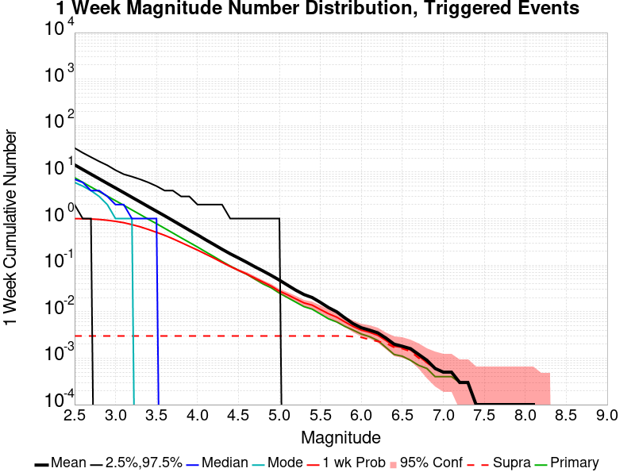

| Mag | Mean | 2.5 %ile | 97.5 %ile | Median | Mode | 1 wk Probability | 1 wk Supra-Seis Prob | Primary Aftershocks Mean |
|-----|-----|-----|-----|-----|-----|-----|-----|-----|
| **M&ge;2.5** | 14.326 | 2.000 | 33.000 | 7.000 | 6.000 | 0.998 (99.83%) | 3.00E-3 (0.30%) | 7.597 |
| **M&ge;2.6** | 11.373 | 1.000 | 26.000 | 6.000 | 5.000 | 0.993 (99.33%) | 3.00E-3 (0.30%) | 6.032 |
| **M&ge;2.7** | 9.035 | 1.000 | 21.000 | 4.000 | 4.000 | 0.983 (98.27%) | 3.00E-3 (0.30%) | 4.783 |
| **M&ge;2.8** | 7.189 | 0.000 | 17.000 | 4.000 | 3.000 | 0.960 (95.98%) | 3.00E-3 (0.30%) | 3.818 |
| **M&ge;2.9** | 5.709 | 0.000 | 14.000 | 3.000 | 2.000 | 0.922 (92.22%) | 3.00E-3 (0.30%) | 3.039 |
| **M&ge;3** | 4.551 | 0.000 | 11.000 | 2.000 | 1.000 | 0.874 (87.39%) | 3.00E-3 (0.30%) | 2.428 |
| **M&ge;3.1** | 3.623 | 0.000 | 9.000 | 2.000 | 1.000 | 0.817 (81.69%) | 3.00E-3 (0.30%) | 1.940 |
| **M&ge;3.2** | 2.873 | 0.000 | 8.000 | 1.000 | 1.000 | 0.743 (74.32%) | 3.00E-3 (0.30%) | 1.538 |
| **M&ge;3.3** | 2.285 | 0.000 | 7.000 | 1.000 | 0.000 | 0.667 (66.66%) | 3.00E-3 (0.30%) | 1.226 |
| **M&ge;3.4** | 1.812 | 0.000 | 6.000 | 1.000 | 0.000 | 0.585 (58.52%) | 3.00E-3 (0.30%) | 0.972 |
| **M&ge;3.5** | 1.442 | 0.000 | 5.000 | 1.000 | 0.000 | 0.507 (50.72%) | 3.00E-3 (0.30%) | 0.778 |
| **M&ge;3.6** | 1.148 | 0.000 | 4.000 | 0.000 | 0.000 | 0.437 (43.66%) | 3.00E-3 (0.30%) | 0.617 |
| **M&ge;3.7** | 0.907 | 0.000 | 4.000 | 0.000 | 0.000 | 0.368 (36.85%) | 3.00E-3 (0.30%) | 0.490 |
| **M&ge;3.8** | 0.716 | 0.000 | 3.000 | 0.000 | 0.000 | 0.306 (30.65%) | 3.00E-3 (0.30%) | 0.387 |
| **M&ge;3.9** | 0.565 | 0.000 | 3.000 | 0.000 | 0.000 | 0.254 (25.38%) | 3.00E-3 (0.30%) | 0.308 |
| **M&ge;4** | 0.448 | 0.000 | 2.000 | 0.000 | 0.000 | 0.211 (21.06%) | 3.00E-3 (0.30%) | 0.245 |
| **M&ge;4.1** | 0.351 | 0.000 | 2.000 | 0.000 | 0.000 | 0.173 (17.26%) | 3.00E-3 (0.30%) | 0.193 |
| **M&ge;4.2** | 0.278 | 0.000 | 2.000 | 0.000 | 0.000 | 0.142 (14.17%) | 3.00E-3 (0.30%) | 0.153 |
| **M&ge;4.3** | 0.219 | 0.000 | 2.000 | 0.000 | 0.000 | 0.115 (11.47%) | 3.00E-3 (0.30%) | 0.120 |
| **M&ge;4.4** | 0.175 | 0.000 | 1.000 | 0.000 | 0.000 | 0.093 (9.33%) | 3.00E-3 (0.30%) | 0.095 |
| **M&ge;4.5** | 0.142 | 0.000 | 1.000 | 0.000 | 0.000 | 0.077 (7.74%) | 3.00E-3 (0.30%) | 0.077 |
| **M&ge;4.6** | 0.115 | 0.000 | 1.000 | 0.000 | 0.000 | 0.065 (6.47%) | 3.00E-3 (0.30%) | 0.064 |
| **M&ge;4.7** | 0.092 | 0.000 | 1.000 | 0.000 | 0.000 | 0.053 (5.28%) | 3.00E-3 (0.30%) | 0.050 |
| **M&ge;4.8** | 0.075 | 0.000 | 1.000 | 0.000 | 0.000 | 0.043 (4.33%) | 3.00E-3 (0.30%) | 0.039 |
| **M&ge;4.9** | 0.060 | 0.000 | 1.000 | 0.000 | 0.000 | 0.035 (3.54%) | 3.00E-3 (0.30%) | 0.033 |
| **M&ge;5** | 0.048 | 0.000 | 1.000 | 0.000 | 0.000 | 0.028 (2.76%) | 3.00E-3 (0.30%) | 0.025 |
| **M&ge;5.1** | 0.037 | 0.000 | 0.000 | 0.000 | 0.000 | 0.023 (2.30%) | 3.00E-3 (0.30%) | 0.020 |
| **M&ge;5.2** | 0.029 | 0.000 | 0.000 | 0.000 | 0.000 | 0.019 (1.88%) | 3.00E-3 (0.30%) | 0.016 |
| **M&ge;5.3** | 0.023 | 0.000 | 0.000 | 0.000 | 0.000 | 0.015 (1.54%) | 3.00E-3 (0.30%) | 0.013 |
| **M&ge;5.4** | 0.020 | 0.000 | 0.000 | 0.000 | 0.000 | 0.014 (1.38%) | 3.00E-3 (0.30%) | 0.011 |
| **M&ge;5.5** | 0.016 | 0.000 | 0.000 | 0.000 | 0.000 | 0.011 (1.11%) | 3.00E-3 (0.30%) | 8.90E-3 |
| **M&ge;5.6** | 0.012 | 0.000 | 0.000 | 0.000 | 0.000 | 9.00E-3 (0.90%) | 3.00E-3 (0.30%) | 7.00E-3 |
| **M&ge;5.7** | 9.90E-3 | 0.000 | 0.000 | 0.000 | 0.000 | 7.60E-3 (0.76%) | 3.00E-3 (0.30%) | 6.00E-3 |
| **M&ge;5.8** | 7.30E-3 | 0.000 | 0.000 | 0.000 | 0.000 | 6.00E-3 (0.60%) | 3.00E-3 (0.30%) | 4.80E-3 |
| **M&ge;5.9** | 5.50E-3 | 0.000 | 0.000 | 0.000 | 0.000 | 4.80E-3 (0.48%) | 2.90E-3 (0.29%) | 4.00E-3 |
| **M&ge;6** | 4.50E-3 | 0.000 | 0.000 | 0.000 | 0.000 | 4.00E-3 (0.40%) | 2.80E-3 (0.28%) | 3.30E-3 |
| **M&ge;6.1** | 4.00E-3 | 0.000 | 0.000 | 0.000 | 0.000 | 3.60E-3 (0.36%) | 2.50E-3 (0.25%) | 2.90E-3 |
| **M&ge;6.2** | 3.50E-3 | 0.000 | 0.000 | 0.000 | 0.000 | 3.10E-3 (0.31%) | 2.30E-3 (0.23%) | 2.40E-3 |
| **M&ge;6.3** | 2.70E-3 | 0.000 | 0.000 | 0.000 | 0.000 | 2.40E-3 (0.24%) | 2.10E-3 (0.21%) | 1.70E-3 |
| **M&ge;6.4** | 2.00E-3 | 0.000 | 0.000 | 0.000 | 0.000 | 1.80E-3 (0.18%) | 1.70E-3 (0.17%) | 1.20E-3 |
| **M&ge;6.5** | 1.80E-3 | 0.000 | 0.000 | 0.000 | 0.000 | 1.70E-3 (0.17%) | 1.60E-3 (0.16%) | 1.10E-3 |
| **M&ge;6.6** | 1.60E-3 | 0.000 | 0.000 | 0.000 | 0.000 | 1.50E-3 (0.15%) | 1.40E-3 (0.14%) | 9.00E-4 |
| **M&ge;6.7** | 1.20E-3 | 0.000 | 0.000 | 0.000 | 0.000 | 1.10E-3 (0.11%) | 1.00E-3 (0.10%) | 7.00E-4 |
| **M&ge;6.8** | 9.00E-4 | 0.000 | 0.000 | 0.000 | 0.000 | 8.00E-4 (0.08%) | 8.00E-4 (0.08%) | 6.00E-4 |
| **M&ge;6.9** | 6.00E-4 | 0.000 | 0.000 | 0.000 | 0.000 | 6.00E-4 (0.06%) | 6.00E-4 (0.06%) | 4.00E-4 |
| **M&ge;7** | 5.00E-4 | 0.000 | 0.000 | 0.000 | 0.000 | 5.00E-4 (0.05%) | 5.00E-4 (0.05%) | 4.00E-4 |
| **M&ge;7.1** | 5.00E-4 | 0.000 | 0.000 | 0.000 | 0.000 | 5.00E-4 (0.05%) | 5.00E-4 (0.05%) | 4.00E-4 |
| **M&ge;7.2** | 3.00E-4 | 0.000 | 0.000 | 0.000 | 0.000 | 3.00E-4 (0.03%) | 3.00E-4 (0.03%) | 3.00E-4 |
| **M&ge;7.3** | 3.00E-4 | 0.000 | 0.000 | 0.000 | 0.000 | 3.00E-4 (0.03%) | 3.00E-4 (0.03%) | 3.00E-4 |
| **M&ge;7.4** | 1.00E-4 | 0.000 | 0.000 | 0.000 | 0.000 | 1.00E-4 (0.01%) | 1.00E-4 (0.01%) | 1.00E-4 |
| **M&ge;7.5** | 1.00E-4 | 0.000 | 0.000 | 0.000 | 0.000 | 1.00E-4 (0.01%) | 1.00E-4 (0.01%) | 1.00E-4 |
| **M&ge;7.6** | 1.00E-4 | 0.000 | 0.000 | 0.000 | 0.000 | 1.00E-4 (0.01%) | 1.00E-4 (0.01%) | 1.00E-4 |
| **M&ge;7.7** | 1.00E-4 | 0.000 | 0.000 | 0.000 | 0.000 | 1.00E-4 (0.01%) | 1.00E-4 (0.01%) | 1.00E-4 |
| **M&ge;7.8** | 1.00E-4 | 0.000 | 0.000 | 0.000 | 0.000 | 1.00E-4 (0.01%) | 1.00E-4 (0.01%) | 1.00E-4 |
| **M&ge;7.9** | 1.00E-4 | 0.000 | 0.000 | 0.000 | 0.000 | 1.00E-4 (0.01%) | 1.00E-4 (0.01%) | 1.00E-4 |
| **M&ge;8** | 1.00E-4 | 0.000 | 0.000 | 0.000 | 0.000 | 1.00E-4 (0.01%) | 1.00E-4 (0.01%) | 1.00E-4 |
| **M&ge;8.1** | 1.00E-4 | 0.000 | 0.000 | 0.000 | 0.000 | 1.00E-4 (0.01%) | 1.00E-4 (0.01%) | 1.00E-4 |
| **M&ge;8.2** | 0.000 | 0.000 | 0.000 | 0.000 | 0.000 | 0.000 (0.00%) | 0.000 (0.00%) | 0.000 |
| **M&ge;8.3** | 0.000 | 0.000 | 0.000 | 0.000 | 0.000 | 0.000 (0.00%) | 0.000 (0.00%) | 0.000 |
| **M&ge;8.4** | 0.000 | 0.000 | 0.000 | 0.000 | 0.000 | 0.000 (0.00%) | 0.000 (0.00%) | 0.000 |
| **M&ge;8.5** | 0.000 | 0.000 | 0.000 | 0.000 | 0.000 | 0.000 (0.00%) | 0.000 (0.00%) | 0.000 |
| **M&ge;8.6** | 0.000 | 0.000 | 0.000 | 0.000 | 0.000 | 0.000 (0.00%) | 0.000 (0.00%) | 0.000 |
| **M&ge;8.7** | 0.000 | 0.000 | 0.000 | 0.000 | 0.000 | 0.000 (0.00%) | 0.000 (0.00%) | 0.000 |
| **M&ge;8.8** | 0.000 | 0.000 | 0.000 | 0.000 | 0.000 | 0.000 (0.00%) | 0.000 (0.00%) | 0.000 |
| **M&ge;8.9** | 0.000 | 0.000 | 0.000 | 0.000 | 0.000 | 0.000 (0.00%) | 0.000 (0.00%) | 0.000 |
| **M&ge;9** | 0.000 | 0.000 | 0.000 | 0.000 | 0.000 | 0.000 (0.00%) | 0.000 (0.00%) | 0.000 |

### 1 Day Magnitude Number Distribution
*[(top)](#table-of-contents)*

#### 1 Day Magnitude Number Distribution, Including Spontaneous
*[(top)](#table-of-contents)*

*Note: This section includes both spontaneous and triggered events*

**Legend**
* **Mean** (thick black line): mean expected number across all 10000 catalogs
* **2.5%,97.5%** (thin black lines): expected number percentiles across all 10000 catalogs
* **Median** (thin blue line): median expected number across all 10000 catalogs
* **Mode** (thin cyan line): modal expected number across all 10000 catalogs
* **1 d Probability** (thin red line): 1 day probability calculated as the fraction of catalogs with at least 1 occurrence
* **1 d Supraseismogenic Probability** (thin dashed red line): same as above, but only for supraseismogenic ruptures on explicitly modeled UCERF3 faults
* **95% Conf** (light red shaded region): binomial 95% confidence bounds on probability
* **Primary** (thin green line): mean expected number from primary triggered aftershocks only (no secondary, tertiary, etc...) across all 10000 catalogs


| Mag | Mean | 2.5 %ile | 97.5 %ile | Median | Mode | 1 d Probability | 1 d Supra-Seis Prob |
|-----|-----|-----|-----|-----|-----|-----|-----|
| **M&ge;2.5** | 4.742 | 0.000 | 10.000 | 3.000 | 3.000 | 0.954 (95.41%) | 9.00E-4 (0.09%) |
| **M&ge;2.6** | 3.782 | 0.000 | 8.000 | 3.000 | 2.000 | 0.918 (91.78%) | 9.00E-4 (0.09%) |
| **M&ge;2.7** | 3.005 | 0.000 | 7.000 | 2.000 | 1.000 | 0.863 (86.27%) | 9.00E-4 (0.09%) |
| **M&ge;2.8** | 2.381 | 0.000 | 6.000 | 1.000 | 1.000 | 0.792 (79.25%) | 9.00E-4 (0.09%) |
| **M&ge;2.9** | 1.906 | 0.000 | 5.000 | 1.000 | 1.000 | 0.718 (71.75%) | 9.00E-4 (0.09%) |
| **M&ge;3** | 1.517 | 0.000 | 5.000 | 1.000 | 0.000 | 0.635 (63.50%) | 9.00E-4 (0.09%) |
| **M&ge;3.1** | 1.203 | 0.000 | 4.000 | 1.000 | 0.000 | 0.554 (55.42%) | 9.00E-4 (0.09%) |
| **M&ge;3.2** | 0.952 | 0.000 | 3.000 | 0.000 | 0.000 | 0.477 (47.66%) | 9.00E-4 (0.09%) |
| **M&ge;3.3** | 0.758 | 0.000 | 3.000 | 0.000 | 0.000 | 0.408 (40.78%) | 9.00E-4 (0.09%) |
| **M&ge;3.4** | 0.601 | 0.000 | 2.000 | 0.000 | 0.000 | 0.344 (34.39%) | 9.00E-4 (0.09%) |
| **M&ge;3.5** | 0.472 | 0.000 | 2.000 | 0.000 | 0.000 | 0.279 (27.91%) | 9.00E-4 (0.09%) |
| **M&ge;3.6** | 0.378 | 0.000 | 2.000 | 0.000 | 0.000 | 0.233 (23.26%) | 9.00E-4 (0.09%) |
| **M&ge;3.7** | 0.304 | 0.000 | 2.000 | 0.000 | 0.000 | 0.192 (19.23%) | 9.00E-4 (0.09%) |
| **M&ge;3.8** | 0.241 | 0.000 | 2.000 | 0.000 | 0.000 | 0.155 (15.53%) | 9.00E-4 (0.09%) |
| **M&ge;3.9** | 0.191 | 0.000 | 1.000 | 0.000 | 0.000 | 0.127 (12.71%) | 9.00E-4 (0.09%) |
| **M&ge;4** | 0.152 | 0.000 | 1.000 | 0.000 | 0.000 | 0.103 (10.27%) | 9.00E-4 (0.09%) |
| **M&ge;4.1** | 0.120 | 0.000 | 1.000 | 0.000 | 0.000 | 0.083 (8.29%) | 9.00E-4 (0.09%) |
| **M&ge;4.2** | 0.095 | 0.000 | 1.000 | 0.000 | 0.000 | 0.066 (6.64%) | 9.00E-4 (0.09%) |
| **M&ge;4.3** | 0.075 | 0.000 | 1.000 | 0.000 | 0.000 | 0.053 (5.30%) | 9.00E-4 (0.09%) |
| **M&ge;4.4** | 0.060 | 0.000 | 1.000 | 0.000 | 0.000 | 0.042 (4.21%) | 9.00E-4 (0.09%) |
| **M&ge;4.5** | 0.049 | 0.000 | 1.000 | 0.000 | 0.000 | 0.035 (3.45%) | 9.00E-4 (0.09%) |
| **M&ge;4.6** | 0.040 | 0.000 | 1.000 | 0.000 | 0.000 | 0.028 (2.83%) | 9.00E-4 (0.09%) |
| **M&ge;4.7** | 0.032 | 0.000 | 0.000 | 0.000 | 0.000 | 0.023 (2.32%) | 9.00E-4 (0.09%) |
| **M&ge;4.8** | 0.025 | 0.000 | 0.000 | 0.000 | 0.000 | 0.019 (1.87%) | 9.00E-4 (0.09%) |
| **M&ge;4.9** | 0.020 | 0.000 | 0.000 | 0.000 | 0.000 | 0.016 (1.58%) | 9.00E-4 (0.09%) |
| **M&ge;5** | 0.016 | 0.000 | 0.000 | 0.000 | 0.000 | 0.013 (1.26%) | 9.00E-4 (0.09%) |
| **M&ge;5.1** | 0.013 | 0.000 | 0.000 | 0.000 | 0.000 | 9.80E-3 (0.98%) | 9.00E-4 (0.09%) |
| **M&ge;5.2** | 9.50E-3 | 0.000 | 0.000 | 0.000 | 0.000 | 7.30E-3 (0.73%) | 9.00E-4 (0.09%) |
| **M&ge;5.3** | 7.50E-3 | 0.000 | 0.000 | 0.000 | 0.000 | 6.10E-3 (0.61%) | 9.00E-4 (0.09%) |
| **M&ge;5.4** | 6.10E-3 | 0.000 | 0.000 | 0.000 | 0.000 | 5.10E-3 (0.51%) | 9.00E-4 (0.09%) |
| **M&ge;5.5** | 5.00E-3 | 0.000 | 0.000 | 0.000 | 0.000 | 4.20E-3 (0.42%) | 9.00E-4 (0.09%) |
| **M&ge;5.6** | 4.00E-3 | 0.000 | 0.000 | 0.000 | 0.000 | 3.40E-3 (0.34%) | 9.00E-4 (0.09%) |
| **M&ge;5.7** | 3.20E-3 | 0.000 | 0.000 | 0.000 | 0.000 | 2.80E-3 (0.28%) | 9.00E-4 (0.09%) |
| **M&ge;5.8** | 2.60E-3 | 0.000 | 0.000 | 0.000 | 0.000 | 2.40E-3 (0.24%) | 9.00E-4 (0.09%) |
| **M&ge;5.9** | 2.40E-3 | 0.000 | 0.000 | 0.000 | 0.000 | 2.20E-3 (0.22%) | 9.00E-4 (0.09%) |
| **M&ge;6** | 1.70E-3 | 0.000 | 0.000 | 0.000 | 0.000 | 1.60E-3 (0.16%) | 9.00E-4 (0.09%) |
| **M&ge;6.1** | 1.30E-3 | 0.000 | 0.000 | 0.000 | 0.000 | 1.30E-3 (0.13%) | 8.00E-4 (0.08%) |
| **M&ge;6.2** | 1.20E-3 | 0.000 | 0.000 | 0.000 | 0.000 | 1.20E-3 (0.12%) | 7.00E-4 (0.07%) |
| **M&ge;6.3** | 1.10E-3 | 0.000 | 0.000 | 0.000 | 0.000 | 1.10E-3 (0.11%) | 7.00E-4 (0.07%) |
| **M&ge;6.4** | 8.00E-4 | 0.000 | 0.000 | 0.000 | 0.000 | 8.00E-4 (0.08%) | 6.00E-4 (0.06%) |
| **M&ge;6.5** | 8.00E-4 | 0.000 | 0.000 | 0.000 | 0.000 | 8.00E-4 (0.08%) | 6.00E-4 (0.06%) |
| **M&ge;6.6** | 6.00E-4 | 0.000 | 0.000 | 0.000 | 0.000 | 6.00E-4 (0.06%) | 5.00E-4 (0.05%) |
| **M&ge;6.7** | 4.00E-4 | 0.000 | 0.000 | 0.000 | 0.000 | 4.00E-4 (0.04%) | 3.00E-4 (0.03%) |
| **M&ge;6.8** | 3.00E-4 | 0.000 | 0.000 | 0.000 | 0.000 | 3.00E-4 (0.03%) | 3.00E-4 (0.03%) |
| **M&ge;6.9** | 3.00E-4 | 0.000 | 0.000 | 0.000 | 0.000 | 3.00E-4 (0.03%) | 3.00E-4 (0.03%) |
| **M&ge;7** | 1.00E-4 | 0.000 | 0.000 | 0.000 | 0.000 | 1.00E-4 (0.01%) | 1.00E-4 (0.01%) |
| **M&ge;7.1** | 1.00E-4 | 0.000 | 0.000 | 0.000 | 0.000 | 1.00E-4 (0.01%) | 1.00E-4 (0.01%) |
| **M&ge;7.2** | 1.00E-4 | 0.000 | 0.000 | 0.000 | 0.000 | 1.00E-4 (0.01%) | 1.00E-4 (0.01%) |
| **M&ge;7.3** | 1.00E-4 | 0.000 | 0.000 | 0.000 | 0.000 | 1.00E-4 (0.01%) | 1.00E-4 (0.01%) |
| **M&ge;7.4** | 1.00E-4 | 0.000 | 0.000 | 0.000 | 0.000 | 1.00E-4 (0.01%) | 1.00E-4 (0.01%) |
| **M&ge;7.5** | 1.00E-4 | 0.000 | 0.000 | 0.000 | 0.000 | 1.00E-4 (0.01%) | 1.00E-4 (0.01%) |
| **M&ge;7.6** | 1.00E-4 | 0.000 | 0.000 | 0.000 | 0.000 | 1.00E-4 (0.01%) | 1.00E-4 (0.01%) |
| **M&ge;7.7** | 1.00E-4 | 0.000 | 0.000 | 0.000 | 0.000 | 1.00E-4 (0.01%) | 1.00E-4 (0.01%) |
| **M&ge;7.8** | 1.00E-4 | 0.000 | 0.000 | 0.000 | 0.000 | 1.00E-4 (0.01%) | 1.00E-4 (0.01%) |
| **M&ge;7.9** | 0.000 | 0.000 | 0.000 | 0.000 | 0.000 | 0.000 (0.00%) | 0.000 (0.00%) |
| **M&ge;8** | 0.000 | 0.000 | 0.000 | 0.000 | 0.000 | 0.000 (0.00%) | 0.000 (0.00%) |
| **M&ge;8.1** | 0.000 | 0.000 | 0.000 | 0.000 | 0.000 | 0.000 (0.00%) | 0.000 (0.00%) |
| **M&ge;8.2** | 0.000 | 0.000 | 0.000 | 0.000 | 0.000 | 0.000 (0.00%) | 0.000 (0.00%) |
| **M&ge;8.3** | 0.000 | 0.000 | 0.000 | 0.000 | 0.000 | 0.000 (0.00%) | 0.000 (0.00%) |
| **M&ge;8.4** | 0.000 | 0.000 | 0.000 | 0.000 | 0.000 | 0.000 (0.00%) | 0.000 (0.00%) |
| **M&ge;8.5** | 0.000 | 0.000 | 0.000 | 0.000 | 0.000 | 0.000 (0.00%) | 0.000 (0.00%) |
| **M&ge;8.6** | 0.000 | 0.000 | 0.000 | 0.000 | 0.000 | 0.000 (0.00%) | 0.000 (0.00%) |
| **M&ge;8.7** | 0.000 | 0.000 | 0.000 | 0.000 | 0.000 | 0.000 (0.00%) | 0.000 (0.00%) |
| **M&ge;8.8** | 0.000 | 0.000 | 0.000 | 0.000 | 0.000 | 0.000 (0.00%) | 0.000 (0.00%) |
| **M&ge;8.9** | 0.000 | 0.000 | 0.000 | 0.000 | 0.000 | 0.000 (0.00%) | 0.000 (0.00%) |
| **M&ge;9** | 0.000 | 0.000 | 0.000 | 0.000 | 0.000 | 0.000 (0.00%) | 0.000 (0.00%) |

#### 1 Day Magnitude Number Distribution, Including Spontaneous, Triggered Events
*[(top)](#table-of-contents)*

*Note: This section only includes triggered events, spontaneous were calculated but filtered out here*

**Legend**
* **Mean** (thick black line): mean expected number across all 10000 catalogs
* **2.5%,97.5%** (thin black lines): expected number percentiles across all 10000 catalogs
* **Median** (thin blue line): median expected number across all 10000 catalogs
* **Mode** (thin cyan line): modal expected number across all 10000 catalogs
* **1 d Probability** (thin red line): 1 day probability calculated as the fraction of catalogs with at least 1 occurrence
* **1 d Supraseismogenic Probability** (thin dashed red line): same as above, but only for supraseismogenic ruptures on explicitly modeled UCERF3 faults
* **95% Conf** (light red shaded region): binomial 95% confidence bounds on probability
* **Primary** (thin green line): mean expected number from primary triggered aftershocks only (no secondary, tertiary, etc...) across all 10000 catalogs


| Mag | Mean | 2.5 %ile | 97.5 %ile | Median | Mode | 1 d Probability | 1 d Supra-Seis Prob | Primary Aftershocks Mean |
|-----|-----|-----|-----|-----|-----|-----|-----|-----|
| **M&ge;2.5** | 1.352 | 0.000 | 4.000 | 1.000 | 0.000 | 0.597 (59.68%) | 4.00E-4 (0.04%) | 1.037 |
| **M&ge;2.6** | 1.078 | 0.000 | 4.000 | 1.000 | 0.000 | 0.522 (52.22%) | 4.00E-4 (0.04%) | 0.830 |
| **M&ge;2.7** | 0.860 | 0.000 | 3.000 | 0.000 | 0.000 | 0.446 (44.62%) | 4.00E-4 (0.04%) | 0.661 |
| **M&ge;2.8** | 0.690 | 0.000 | 3.000 | 0.000 | 0.000 | 0.381 (38.14%) | 4.00E-4 (0.04%) | 0.532 |
| **M&ge;2.9** | 0.550 | 0.000 | 3.000 | 0.000 | 0.000 | 0.321 (32.05%) | 4.00E-4 (0.04%) | 0.425 |
| **M&ge;3** | 0.439 | 0.000 | 2.000 | 0.000 | 0.000 | 0.266 (26.63%) | 4.00E-4 (0.04%) | 0.338 |
| **M&ge;3.1** | 0.349 | 0.000 | 2.000 | 0.000 | 0.000 | 0.224 (22.35%) | 4.00E-4 (0.04%) | 0.271 |
| **M&ge;3.2** | 0.277 | 0.000 | 2.000 | 0.000 | 0.000 | 0.183 (18.26%) | 4.00E-4 (0.04%) | 0.214 |
| **M&ge;3.3** | 0.224 | 0.000 | 2.000 | 0.000 | 0.000 | 0.152 (15.17%) | 4.00E-4 (0.04%) | 0.174 |
| **M&ge;3.4** | 0.174 | 0.000 | 1.000 | 0.000 | 0.000 | 0.121 (12.15%) | 4.00E-4 (0.04%) | 0.135 |
| **M&ge;3.5** | 0.137 | 0.000 | 1.000 | 0.000 | 0.000 | 0.097 (9.73%) | 4.00E-4 (0.04%) | 0.106 |
| **M&ge;3.6** | 0.108 | 0.000 | 1.000 | 0.000 | 0.000 | 0.079 (7.89%) | 4.00E-4 (0.04%) | 0.084 |
| **M&ge;3.7** | 0.088 | 0.000 | 1.000 | 0.000 | 0.000 | 0.064 (6.35%) | 4.00E-4 (0.04%) | 0.067 |
| **M&ge;3.8** | 0.068 | 0.000 | 1.000 | 0.000 | 0.000 | 0.050 (5.02%) | 4.00E-4 (0.04%) | 0.052 |
| **M&ge;3.9** | 0.054 | 0.000 | 1.000 | 0.000 | 0.000 | 0.040 (4.04%) | 4.00E-4 (0.04%) | 0.042 |
| **M&ge;4** | 0.044 | 0.000 | 1.000 | 0.000 | 0.000 | 0.033 (3.34%) | 4.00E-4 (0.04%) | 0.034 |
| **M&ge;4.1** | 0.034 | 0.000 | 1.000 | 0.000 | 0.000 | 0.026 (2.60%) | 4.00E-4 (0.04%) | 0.026 |
| **M&ge;4.2** | 0.026 | 0.000 | 0.000 | 0.000 | 0.000 | 0.021 (2.13%) | 4.00E-4 (0.04%) | 0.021 |
| **M&ge;4.3** | 0.020 | 0.000 | 0.000 | 0.000 | 0.000 | 0.016 (1.62%) | 4.00E-4 (0.04%) | 0.016 |
| **M&ge;4.4** | 0.017 | 0.000 | 0.000 | 0.000 | 0.000 | 0.014 (1.37%) | 4.00E-4 (0.04%) | 0.014 |
| **M&ge;4.5** | 0.014 | 0.000 | 0.000 | 0.000 | 0.000 | 0.011 (1.13%) | 4.00E-4 (0.04%) | 0.011 |
| **M&ge;4.6** | 0.012 | 0.000 | 0.000 | 0.000 | 0.000 | 9.70E-3 (0.97%) | 4.00E-4 (0.04%) | 9.40E-3 |
| **M&ge;4.7** | 9.60E-3 | 0.000 | 0.000 | 0.000 | 0.000 | 8.20E-3 (0.82%) | 4.00E-4 (0.04%) | 7.80E-3 |
| **M&ge;4.8** | 7.10E-3 | 0.000 | 0.000 | 0.000 | 0.000 | 6.20E-3 (0.62%) | 4.00E-4 (0.04%) | 5.60E-3 |
| **M&ge;4.9** | 5.70E-3 | 0.000 | 0.000 | 0.000 | 0.000 | 5.10E-3 (0.51%) | 4.00E-4 (0.04%) | 4.60E-3 |
| **M&ge;5** | 4.70E-3 | 0.000 | 0.000 | 0.000 | 0.000 | 4.30E-3 (0.43%) | 4.00E-4 (0.04%) | 3.70E-3 |
| **M&ge;5.1** | 3.80E-3 | 0.000 | 0.000 | 0.000 | 0.000 | 3.50E-3 (0.35%) | 4.00E-4 (0.04%) | 2.80E-3 |
| **M&ge;5.2** | 2.90E-3 | 0.000 | 0.000 | 0.000 | 0.000 | 2.70E-3 (0.27%) | 4.00E-4 (0.04%) | 2.20E-3 |
| **M&ge;5.3** | 2.20E-3 | 0.000 | 0.000 | 0.000 | 0.000 | 2.10E-3 (0.21%) | 4.00E-4 (0.04%) | 1.80E-3 |
| **M&ge;5.4** | 1.80E-3 | 0.000 | 0.000 | 0.000 | 0.000 | 1.70E-3 (0.17%) | 4.00E-4 (0.04%) | 1.40E-3 |
| **M&ge;5.5** | 1.40E-3 | 0.000 | 0.000 | 0.000 | 0.000 | 1.40E-3 (0.14%) | 4.00E-4 (0.04%) | 1.00E-3 |
| **M&ge;5.6** | 1.00E-3 | 0.000 | 0.000 | 0.000 | 0.000 | 1.00E-3 (0.10%) | 4.00E-4 (0.04%) | 6.00E-4 |
| **M&ge;5.7** | 8.00E-4 | 0.000 | 0.000 | 0.000 | 0.000 | 8.00E-4 (0.08%) | 4.00E-4 (0.04%) | 5.00E-4 |
| **M&ge;5.8** | 6.00E-4 | 0.000 | 0.000 | 0.000 | 0.000 | 6.00E-4 (0.06%) | 4.00E-4 (0.04%) | 5.00E-4 |
| **M&ge;5.9** | 6.00E-4 | 0.000 | 0.000 | 0.000 | 0.000 | 6.00E-4 (0.06%) | 4.00E-4 (0.04%) | 5.00E-4 |
| **M&ge;6** | 5.00E-4 | 0.000 | 0.000 | 0.000 | 0.000 | 5.00E-4 (0.05%) | 4.00E-4 (0.04%) | 4.00E-4 |
| **M&ge;6.1** | 4.00E-4 | 0.000 | 0.000 | 0.000 | 0.000 | 4.00E-4 (0.04%) | 3.00E-4 (0.03%) | 3.00E-4 |
| **M&ge;6.2** | 3.00E-4 | 0.000 | 0.000 | 0.000 | 0.000 | 3.00E-4 (0.03%) | 2.00E-4 (0.02%) | 2.00E-4 |
| **M&ge;6.3** | 3.00E-4 | 0.000 | 0.000 | 0.000 | 0.000 | 3.00E-4 (0.03%) | 2.00E-4 (0.02%) | 2.00E-4 |
| **M&ge;6.4** | 1.00E-4 | 0.000 | 0.000 | 0.000 | 0.000 | 1.00E-4 (0.01%) | 1.00E-4 (0.01%) | 0.000 |
| **M&ge;6.5** | 1.00E-4 | 0.000 | 0.000 | 0.000 | 0.000 | 1.00E-4 (0.01%) | 1.00E-4 (0.01%) | 0.000 |
| **M&ge;6.6** | 1.00E-4 | 0.000 | 0.000 | 0.000 | 0.000 | 1.00E-4 (0.01%) | 1.00E-4 (0.01%) | 0.000 |
| **M&ge;6.7** | 0.000 | 0.000 | 0.000 | 0.000 | 0.000 | 0.000 (0.00%) | 0.000 (0.00%) | 0.000 |
| **M&ge;6.8** | 0.000 | 0.000 | 0.000 | 0.000 | 0.000 | 0.000 (0.00%) | 0.000 (0.00%) | 0.000 |
| **M&ge;6.9** | 0.000 | 0.000 | 0.000 | 0.000 | 0.000 | 0.000 (0.00%) | 0.000 (0.00%) | 0.000 |
| **M&ge;7** | 0.000 | 0.000 | 0.000 | 0.000 | 0.000 | 0.000 (0.00%) | 0.000 (0.00%) | 0.000 |
| **M&ge;7.1** | 0.000 | 0.000 | 0.000 | 0.000 | 0.000 | 0.000 (0.00%) | 0.000 (0.00%) | 0.000 |
| **M&ge;7.2** | 0.000 | 0.000 | 0.000 | 0.000 | 0.000 | 0.000 (0.00%) | 0.000 (0.00%) | 0.000 |
| **M&ge;7.3** | 0.000 | 0.000 | 0.000 | 0.000 | 0.000 | 0.000 (0.00%) | 0.000 (0.00%) | 0.000 |
| **M&ge;7.4** | 0.000 | 0.000 | 0.000 | 0.000 | 0.000 | 0.000 (0.00%) | 0.000 (0.00%) | 0.000 |
| **M&ge;7.5** | 0.000 | 0.000 | 0.000 | 0.000 | 0.000 | 0.000 (0.00%) | 0.000 (0.00%) | 0.000 |
| **M&ge;7.6** | 0.000 | 0.000 | 0.000 | 0.000 | 0.000 | 0.000 (0.00%) | 0.000 (0.00%) | 0.000 |
| **M&ge;7.7** | 0.000 | 0.000 | 0.000 | 0.000 | 0.000 | 0.000 (0.00%) | 0.000 (0.00%) | 0.000 |
| **M&ge;7.8** | 0.000 | 0.000 | 0.000 | 0.000 | 0.000 | 0.000 (0.00%) | 0.000 (0.00%) | 0.000 |
| **M&ge;7.9** | 0.000 | 0.000 | 0.000 | 0.000 | 0.000 | 0.000 (0.00%) | 0.000 (0.00%) | 0.000 |
| **M&ge;8** | 0.000 | 0.000 | 0.000 | 0.000 | 0.000 | 0.000 (0.00%) | 0.000 (0.00%) | 0.000 |
| **M&ge;8.1** | 0.000 | 0.000 | 0.000 | 0.000 | 0.000 | 0.000 (0.00%) | 0.000 (0.00%) | 0.000 |
| **M&ge;8.2** | 0.000 | 0.000 | 0.000 | 0.000 | 0.000 | 0.000 (0.00%) | 0.000 (0.00%) | 0.000 |
| **M&ge;8.3** | 0.000 | 0.000 | 0.000 | 0.000 | 0.000 | 0.000 (0.00%) | 0.000 (0.00%) | 0.000 |
| **M&ge;8.4** | 0.000 | 0.000 | 0.000 | 0.000 | 0.000 | 0.000 (0.00%) | 0.000 (0.00%) | 0.000 |
| **M&ge;8.5** | 0.000 | 0.000 | 0.000 | 0.000 | 0.000 | 0.000 (0.00%) | 0.000 (0.00%) | 0.000 |
| **M&ge;8.6** | 0.000 | 0.000 | 0.000 | 0.000 | 0.000 | 0.000 (0.00%) | 0.000 (0.00%) | 0.000 |
| **M&ge;8.7** | 0.000 | 0.000 | 0.000 | 0.000 | 0.000 | 0.000 (0.00%) | 0.000 (0.00%) | 0.000 |
| **M&ge;8.8** | 0.000 | 0.000 | 0.000 | 0.000 | 0.000 | 0.000 (0.00%) | 0.000 (0.00%) | 0.000 |
| **M&ge;8.9** | 0.000 | 0.000 | 0.000 | 0.000 | 0.000 | 0.000 (0.00%) | 0.000 (0.00%) | 0.000 |
| **M&ge;9** | 0.000 | 0.000 | 0.000 | 0.000 | 0.000 | 0.000 (0.00%) | 0.000 (0.00%) | 0.000 |

### 1 Hour Magnitude Number Distribution
*[(top)](#table-of-contents)*

#### 1 Hour Magnitude Number Distribution, Including Spontaneous
*[(top)](#table-of-contents)*

*Note: This section includes both spontaneous and triggered events*

**Legend**
* **Mean** (thick black line): mean expected number across all 10000 catalogs
* **2.5%,97.5%** (thin black lines): expected number percentiles across all 10000 catalogs
* **Median** (thin blue line): median expected number across all 10000 catalogs
* **Mode** (thin cyan line): modal expected number across all 10000 catalogs
* **1 hr Probability** (thin red line): 1 hour probability calculated as the fraction of catalogs with at least 1 occurrence
* **1 hr Supraseismogenic Probability** (thin dashed red line): same as above, but only for supraseismogenic ruptures on explicitly modeled UCERF3 faults
* **95% Conf** (light red shaded region): binomial 95% confidence bounds on probability
* **Primary** (thin green line): mean expected number from primary triggered aftershocks only (no secondary, tertiary, etc...) across all 10000 catalogs


| Mag | Mean | 2.5 %ile | 97.5 %ile | Median | Mode | 1 hr Probability | 1 hr Supra-Seis Prob |
|-----|-----|-----|-----|-----|-----|-----|-----|
| **M&ge;2.5** | 0.165 | 0.000 | 1.000 | 0.000 | 0.000 | 0.123 (12.33%) | 1.00E-4 (0.01%) |
| **M&ge;2.6** | 0.132 | 0.000 | 1.000 | 0.000 | 0.000 | 0.100 (10.03%) | 1.00E-4 (0.01%) |
| **M&ge;2.7** | 0.106 | 0.000 | 1.000 | 0.000 | 0.000 | 0.081 (8.14%) | 1.00E-4 (0.01%) |
| **M&ge;2.8** | 0.084 | 0.000 | 1.000 | 0.000 | 0.000 | 0.065 (6.51%) | 1.00E-4 (0.01%) |
| **M&ge;2.9** | 0.068 | 0.000 | 1.000 | 0.000 | 0.000 | 0.054 (5.42%) | 1.00E-4 (0.01%) |
| **M&ge;3** | 0.054 | 0.000 | 1.000 | 0.000 | 0.000 | 0.043 (4.35%) | 1.00E-4 (0.01%) |
| **M&ge;3.1** | 0.043 | 0.000 | 1.000 | 0.000 | 0.000 | 0.035 (3.45%) | 1.00E-4 (0.01%) |
| **M&ge;3.2** | 0.033 | 0.000 | 1.000 | 0.000 | 0.000 | 0.027 (2.74%) | 1.00E-4 (0.01%) |
| **M&ge;3.3** | 0.027 | 0.000 | 0.000 | 0.000 | 0.000 | 0.022 (2.22%) | 1.00E-4 (0.01%) |
| **M&ge;3.4** | 0.021 | 0.000 | 0.000 | 0.000 | 0.000 | 0.017 (1.72%) | 1.00E-4 (0.01%) |
| **M&ge;3.5** | 0.016 | 0.000 | 0.000 | 0.000 | 0.000 | 0.013 (1.30%) | 1.00E-4 (0.01%) |
| **M&ge;3.6** | 0.013 | 0.000 | 0.000 | 0.000 | 0.000 | 0.011 (1.09%) | 1.00E-4 (0.01%) |
| **M&ge;3.7** | 0.011 | 0.000 | 0.000 | 0.000 | 0.000 | 9.10E-3 (0.91%) | 1.00E-4 (0.01%) |
| **M&ge;3.8** | 9.60E-3 | 0.000 | 0.000 | 0.000 | 0.000 | 7.70E-3 (0.77%) | 1.00E-4 (0.01%) |
| **M&ge;3.9** | 8.00E-3 | 0.000 | 0.000 | 0.000 | 0.000 | 6.60E-3 (0.66%) | 1.00E-4 (0.01%) |
| **M&ge;4** | 5.90E-3 | 0.000 | 0.000 | 0.000 | 0.000 | 5.20E-3 (0.52%) | 1.00E-4 (0.01%) |
| **M&ge;4.1** | 4.90E-3 | 0.000 | 0.000 | 0.000 | 0.000 | 4.30E-3 (0.43%) | 1.00E-4 (0.01%) |
| **M&ge;4.2** | 4.10E-3 | 0.000 | 0.000 | 0.000 | 0.000 | 3.90E-3 (0.39%) | 1.00E-4 (0.01%) |
| **M&ge;4.3** | 3.10E-3 | 0.000 | 0.000 | 0.000 | 0.000 | 2.90E-3 (0.29%) | 1.00E-4 (0.01%) |
| **M&ge;4.4** | 2.20E-3 | 0.000 | 0.000 | 0.000 | 0.000 | 2.10E-3 (0.21%) | 1.00E-4 (0.01%) |
| **M&ge;4.5** | 1.90E-3 | 0.000 | 0.000 | 0.000 | 0.000 | 1.90E-3 (0.19%) | 1.00E-4 (0.01%) |
| **M&ge;4.6** | 1.60E-3 | 0.000 | 0.000 | 0.000 | 0.000 | 1.60E-3 (0.16%) | 1.00E-4 (0.01%) |
| **M&ge;4.7** | 1.30E-3 | 0.000 | 0.000 | 0.000 | 0.000 | 1.30E-3 (0.13%) | 1.00E-4 (0.01%) |
| **M&ge;4.8** | 1.00E-3 | 0.000 | 0.000 | 0.000 | 0.000 | 1.00E-3 (0.10%) | 1.00E-4 (0.01%) |
| **M&ge;4.9** | 8.00E-4 | 0.000 | 0.000 | 0.000 | 0.000 | 8.00E-4 (0.08%) | 1.00E-4 (0.01%) |
| **M&ge;5** | 6.00E-4 | 0.000 | 0.000 | 0.000 | 0.000 | 6.00E-4 (0.06%) | 1.00E-4 (0.01%) |
| **M&ge;5.1** | 5.00E-4 | 0.000 | 0.000 | 0.000 | 0.000 | 5.00E-4 (0.05%) | 1.00E-4 (0.01%) |
| **M&ge;5.2** | 5.00E-4 | 0.000 | 0.000 | 0.000 | 0.000 | 5.00E-4 (0.05%) | 1.00E-4 (0.01%) |
| **M&ge;5.3** | 5.00E-4 | 0.000 | 0.000 | 0.000 | 0.000 | 5.00E-4 (0.05%) | 1.00E-4 (0.01%) |
| **M&ge;5.4** | 5.00E-4 | 0.000 | 0.000 | 0.000 | 0.000 | 5.00E-4 (0.05%) | 1.00E-4 (0.01%) |
| **M&ge;5.5** | 3.00E-4 | 0.000 | 0.000 | 0.000 | 0.000 | 3.00E-4 (0.03%) | 1.00E-4 (0.01%) |
| **M&ge;5.6** | 1.00E-4 | 0.000 | 0.000 | 0.000 | 0.000 | 1.00E-4 (0.01%) | 1.00E-4 (0.01%) |
| **M&ge;5.7** | 1.00E-4 | 0.000 | 0.000 | 0.000 | 0.000 | 1.00E-4 (0.01%) | 1.00E-4 (0.01%) |
| **M&ge;5.8** | 1.00E-4 | 0.000 | 0.000 | 0.000 | 0.000 | 1.00E-4 (0.01%) | 1.00E-4 (0.01%) |
| **M&ge;5.9** | 1.00E-4 | 0.000 | 0.000 | 0.000 | 0.000 | 1.00E-4 (0.01%) | 1.00E-4 (0.01%) |
| **M&ge;6** | 1.00E-4 | 0.000 | 0.000 | 0.000 | 0.000 | 1.00E-4 (0.01%) | 1.00E-4 (0.01%) |
| **M&ge;6.1** | 1.00E-4 | 0.000 | 0.000 | 0.000 | 0.000 | 1.00E-4 (0.01%) | 1.00E-4 (0.01%) |
| **M&ge;6.2** | 1.00E-4 | 0.000 | 0.000 | 0.000 | 0.000 | 1.00E-4 (0.01%) | 1.00E-4 (0.01%) |
| **M&ge;6.3** | 1.00E-4 | 0.000 | 0.000 | 0.000 | 0.000 | 1.00E-4 (0.01%) | 1.00E-4 (0.01%) |
| **M&ge;6.4** | 1.00E-4 | 0.000 | 0.000 | 0.000 | 0.000 | 1.00E-4 (0.01%) | 1.00E-4 (0.01%) |
| **M&ge;6.5** | 1.00E-4 | 0.000 | 0.000 | 0.000 | 0.000 | 1.00E-4 (0.01%) | 1.00E-4 (0.01%) |
| **M&ge;6.6** | 1.00E-4 | 0.000 | 0.000 | 0.000 | 0.000 | 1.00E-4 (0.01%) | 1.00E-4 (0.01%) |
| **M&ge;6.7** | 1.00E-4 | 0.000 | 0.000 | 0.000 | 0.000 | 1.00E-4 (0.01%) | 1.00E-4 (0.01%) |
| **M&ge;6.8** | 1.00E-4 | 0.000 | 0.000 | 0.000 | 0.000 | 1.00E-4 (0.01%) | 1.00E-4 (0.01%) |
| **M&ge;6.9** | 1.00E-4 | 0.000 | 0.000 | 0.000 | 0.000 | 1.00E-4 (0.01%) | 1.00E-4 (0.01%) |
| **M&ge;7** | 0.000 | 0.000 | 0.000 | 0.000 | 0.000 | 0.000 (0.00%) | 0.000 (0.00%) |
| **M&ge;7.1** | 0.000 | 0.000 | 0.000 | 0.000 | 0.000 | 0.000 (0.00%) | 0.000 (0.00%) |
| **M&ge;7.2** | 0.000 | 0.000 | 0.000 | 0.000 | 0.000 | 0.000 (0.00%) | 0.000 (0.00%) |
| **M&ge;7.3** | 0.000 | 0.000 | 0.000 | 0.000 | 0.000 | 0.000 (0.00%) | 0.000 (0.00%) |
| **M&ge;7.4** | 0.000 | 0.000 | 0.000 | 0.000 | 0.000 | 0.000 (0.00%) | 0.000 (0.00%) |
| **M&ge;7.5** | 0.000 | 0.000 | 0.000 | 0.000 | 0.000 | 0.000 (0.00%) | 0.000 (0.00%) |
| **M&ge;7.6** | 0.000 | 0.000 | 0.000 | 0.000 | 0.000 | 0.000 (0.00%) | 0.000 (0.00%) |
| **M&ge;7.7** | 0.000 | 0.000 | 0.000 | 0.000 | 0.000 | 0.000 (0.00%) | 0.000 (0.00%) |
| **M&ge;7.8** | 0.000 | 0.000 | 0.000 | 0.000 | 0.000 | 0.000 (0.00%) | 0.000 (0.00%) |
| **M&ge;7.9** | 0.000 | 0.000 | 0.000 | 0.000 | 0.000 | 0.000 (0.00%) | 0.000 (0.00%) |
| **M&ge;8** | 0.000 | 0.000 | 0.000 | 0.000 | 0.000 | 0.000 (0.00%) | 0.000 (0.00%) |
| **M&ge;8.1** | 0.000 | 0.000 | 0.000 | 0.000 | 0.000 | 0.000 (0.00%) | 0.000 (0.00%) |
| **M&ge;8.2** | 0.000 | 0.000 | 0.000 | 0.000 | 0.000 | 0.000 (0.00%) | 0.000 (0.00%) |
| **M&ge;8.3** | 0.000 | 0.000 | 0.000 | 0.000 | 0.000 | 0.000 (0.00%) | 0.000 (0.00%) |
| **M&ge;8.4** | 0.000 | 0.000 | 0.000 | 0.000 | 0.000 | 0.000 (0.00%) | 0.000 (0.00%) |
| **M&ge;8.5** | 0.000 | 0.000 | 0.000 | 0.000 | 0.000 | 0.000 (0.00%) | 0.000 (0.00%) |
| **M&ge;8.6** | 0.000 | 0.000 | 0.000 | 0.000 | 0.000 | 0.000 (0.00%) | 0.000 (0.00%) |
| **M&ge;8.7** | 0.000 | 0.000 | 0.000 | 0.000 | 0.000 | 0.000 (0.00%) | 0.000 (0.00%) |
| **M&ge;8.8** | 0.000 | 0.000 | 0.000 | 0.000 | 0.000 | 0.000 (0.00%) | 0.000 (0.00%) |
| **M&ge;8.9** | 0.000 | 0.000 | 0.000 | 0.000 | 0.000 | 0.000 (0.00%) | 0.000 (0.00%) |
| **M&ge;9** | 0.000 | 0.000 | 0.000 | 0.000 | 0.000 | 0.000 (0.00%) | 0.000 (0.00%) |

#### 1 Hour Magnitude Number Distribution, Including Spontaneous, Triggered Events
*[(top)](#table-of-contents)*

*Note: This section only includes triggered events, spontaneous were calculated but filtered out here*

**Legend**
* **Mean** (thick black line): mean expected number across all 10000 catalogs
* **2.5%,97.5%** (thin black lines): expected number percentiles across all 10000 catalogs
* **Median** (thin blue line): median expected number across all 10000 catalogs
* **Mode** (thin cyan line): modal expected number across all 10000 catalogs
* **1 hr Probability** (thin red line): 1 hour probability calculated as the fraction of catalogs with at least 1 occurrence
* **1 hr Supraseismogenic Probability** (thin dashed red line): same as above, but only for supraseismogenic ruptures on explicitly modeled UCERF3 faults
* **95% Conf** (light red shaded region): binomial 95% confidence bounds on probability
* **Primary** (thin green line): mean expected number from primary triggered aftershocks only (no secondary, tertiary, etc...) across all 10000 catalogs


| Mag | Mean | 2.5 %ile | 97.5 %ile | Median | Mode | 1 hr Probability | 1 hr Supra-Seis Prob | Primary Aftershocks Mean |
|-----|-----|-----|-----|-----|-----|-----|-----|-----|
| **M&ge;2.5** | 0.041 | 0.000 | 1.000 | 0.000 | 0.000 | 0.037 (3.72%) | 0.000 (0.00%) | 0.038 |
| **M&ge;2.6** | 0.032 | 0.000 | 1.000 | 0.000 | 0.000 | 0.029 (2.87%) | 0.000 (0.00%) | 0.029 |
| **M&ge;2.7** | 0.025 | 0.000 | 0.000 | 0.000 | 0.000 | 0.023 (2.27%) | 0.000 (0.00%) | 0.023 |
| **M&ge;2.8** | 0.020 | 0.000 | 0.000 | 0.000 | 0.000 | 0.018 (1.82%) | 0.000 (0.00%) | 0.018 |
| **M&ge;2.9** | 0.016 | 0.000 | 0.000 | 0.000 | 0.000 | 0.015 (1.48%) | 0.000 (0.00%) | 0.015 |
| **M&ge;3** | 0.013 | 0.000 | 0.000 | 0.000 | 0.000 | 0.012 (1.18%) | 0.000 (0.00%) | 0.012 |
| **M&ge;3.1** | 0.010 | 0.000 | 0.000 | 0.000 | 0.000 | 9.50E-3 (0.95%) | 0.000 (0.00%) | 9.50E-3 |
| **M&ge;3.2** | 8.00E-3 | 0.000 | 0.000 | 0.000 | 0.000 | 7.60E-3 (0.76%) | 0.000 (0.00%) | 7.60E-3 |
| **M&ge;3.3** | 6.30E-3 | 0.000 | 0.000 | 0.000 | 0.000 | 5.90E-3 (0.59%) | 0.000 (0.00%) | 5.90E-3 |
| **M&ge;3.4** | 4.80E-3 | 0.000 | 0.000 | 0.000 | 0.000 | 4.40E-3 (0.44%) | 0.000 (0.00%) | 4.40E-3 |
| **M&ge;3.5** | 3.10E-3 | 0.000 | 0.000 | 0.000 | 0.000 | 2.80E-3 (0.28%) | 0.000 (0.00%) | 2.80E-3 |
| **M&ge;3.6** | 2.30E-3 | 0.000 | 0.000 | 0.000 | 0.000 | 2.10E-3 (0.21%) | 0.000 (0.00%) | 2.10E-3 |
| **M&ge;3.7** | 1.80E-3 | 0.000 | 0.000 | 0.000 | 0.000 | 1.60E-3 (0.16%) | 0.000 (0.00%) | 1.60E-3 |
| **M&ge;3.8** | 1.40E-3 | 0.000 | 0.000 | 0.000 | 0.000 | 1.20E-3 (0.12%) | 0.000 (0.00%) | 1.20E-3 |
| **M&ge;3.9** | 1.10E-3 | 0.000 | 0.000 | 0.000 | 0.000 | 1.00E-3 (0.10%) | 0.000 (0.00%) | 1.00E-3 |
| **M&ge;4** | 1.00E-3 | 0.000 | 0.000 | 0.000 | 0.000 | 9.00E-4 (0.09%) | 0.000 (0.00%) | 9.00E-4 |
| **M&ge;4.1** | 7.00E-4 | 0.000 | 0.000 | 0.000 | 0.000 | 7.00E-4 (0.07%) | 0.000 (0.00%) | 7.00E-4 |
| **M&ge;4.2** | 7.00E-4 | 0.000 | 0.000 | 0.000 | 0.000 | 7.00E-4 (0.07%) | 0.000 (0.00%) | 7.00E-4 |
| **M&ge;4.3** | 5.00E-4 | 0.000 | 0.000 | 0.000 | 0.000 | 5.00E-4 (0.05%) | 0.000 (0.00%) | 5.00E-4 |
| **M&ge;4.4** | 4.00E-4 | 0.000 | 0.000 | 0.000 | 0.000 | 4.00E-4 (0.04%) | 0.000 (0.00%) | 4.00E-4 |
| **M&ge;4.5** | 3.00E-4 | 0.000 | 0.000 | 0.000 | 0.000 | 3.00E-4 (0.03%) | 0.000 (0.00%) | 3.00E-4 |
| **M&ge;4.6** | 3.00E-4 | 0.000 | 0.000 | 0.000 | 0.000 | 3.00E-4 (0.03%) | 0.000 (0.00%) | 3.00E-4 |
| **M&ge;4.7** | 3.00E-4 | 0.000 | 0.000 | 0.000 | 0.000 | 3.00E-4 (0.03%) | 0.000 (0.00%) | 3.00E-4 |
| **M&ge;4.8** | 2.00E-4 | 0.000 | 0.000 | 0.000 | 0.000 | 2.00E-4 (0.02%) | 0.000 (0.00%) | 2.00E-4 |
| **M&ge;4.9** | 1.00E-4 | 0.000 | 0.000 | 0.000 | 0.000 | 1.00E-4 (0.01%) | 0.000 (0.00%) | 1.00E-4 |
| **M&ge;5** | 1.00E-4 | 0.000 | 0.000 | 0.000 | 0.000 | 1.00E-4 (0.01%) | 0.000 (0.00%) | 1.00E-4 |
| **M&ge;5.1** | 1.00E-4 | 0.000 | 0.000 | 0.000 | 0.000 | 1.00E-4 (0.01%) | 0.000 (0.00%) | 1.00E-4 |
| **M&ge;5.2** | 1.00E-4 | 0.000 | 0.000 | 0.000 | 0.000 | 1.00E-4 (0.01%) | 0.000 (0.00%) | 1.00E-4 |
| **M&ge;5.3** | 1.00E-4 | 0.000 | 0.000 | 0.000 | 0.000 | 1.00E-4 (0.01%) | 0.000 (0.00%) | 1.00E-4 |
| **M&ge;5.4** | 1.00E-4 | 0.000 | 0.000 | 0.000 | 0.000 | 1.00E-4 (0.01%) | 0.000 (0.00%) | 1.00E-4 |
| **M&ge;5.5** | 1.00E-4 | 0.000 | 0.000 | 0.000 | 0.000 | 1.00E-4 (0.01%) | 0.000 (0.00%) | 1.00E-4 |
| **M&ge;5.6** | 0.000 | 0.000 | 0.000 | 0.000 | 0.000 | 0.000 (0.00%) | 0.000 (0.00%) | 0.000 |
| **M&ge;5.7** | 0.000 | 0.000 | 0.000 | 0.000 | 0.000 | 0.000 (0.00%) | 0.000 (0.00%) | 0.000 |
| **M&ge;5.8** | 0.000 | 0.000 | 0.000 | 0.000 | 0.000 | 0.000 (0.00%) | 0.000 (0.00%) | 0.000 |
| **M&ge;5.9** | 0.000 | 0.000 | 0.000 | 0.000 | 0.000 | 0.000 (0.00%) | 0.000 (0.00%) | 0.000 |
| **M&ge;6** | 0.000 | 0.000 | 0.000 | 0.000 | 0.000 | 0.000 (0.00%) | 0.000 (0.00%) | 0.000 |
| **M&ge;6.1** | 0.000 | 0.000 | 0.000 | 0.000 | 0.000 | 0.000 (0.00%) | 0.000 (0.00%) | 0.000 |
| **M&ge;6.2** | 0.000 | 0.000 | 0.000 | 0.000 | 0.000 | 0.000 (0.00%) | 0.000 (0.00%) | 0.000 |
| **M&ge;6.3** | 0.000 | 0.000 | 0.000 | 0.000 | 0.000 | 0.000 (0.00%) | 0.000 (0.00%) | 0.000 |
| **M&ge;6.4** | 0.000 | 0.000 | 0.000 | 0.000 | 0.000 | 0.000 (0.00%) | 0.000 (0.00%) | 0.000 |
| **M&ge;6.5** | 0.000 | 0.000 | 0.000 | 0.000 | 0.000 | 0.000 (0.00%) | 0.000 (0.00%) | 0.000 |
| **M&ge;6.6** | 0.000 | 0.000 | 0.000 | 0.000 | 0.000 | 0.000 (0.00%) | 0.000 (0.00%) | 0.000 |
| **M&ge;6.7** | 0.000 | 0.000 | 0.000 | 0.000 | 0.000 | 0.000 (0.00%) | 0.000 (0.00%) | 0.000 |
| **M&ge;6.8** | 0.000 | 0.000 | 0.000 | 0.000 | 0.000 | 0.000 (0.00%) | 0.000 (0.00%) | 0.000 |
| **M&ge;6.9** | 0.000 | 0.000 | 0.000 | 0.000 | 0.000 | 0.000 (0.00%) | 0.000 (0.00%) | 0.000 |
| **M&ge;7** | 0.000 | 0.000 | 0.000 | 0.000 | 0.000 | 0.000 (0.00%) | 0.000 (0.00%) | 0.000 |
| **M&ge;7.1** | 0.000 | 0.000 | 0.000 | 0.000 | 0.000 | 0.000 (0.00%) | 0.000 (0.00%) | 0.000 |
| **M&ge;7.2** | 0.000 | 0.000 | 0.000 | 0.000 | 0.000 | 0.000 (0.00%) | 0.000 (0.00%) | 0.000 |
| **M&ge;7.3** | 0.000 | 0.000 | 0.000 | 0.000 | 0.000 | 0.000 (0.00%) | 0.000 (0.00%) | 0.000 |
| **M&ge;7.4** | 0.000 | 0.000 | 0.000 | 0.000 | 0.000 | 0.000 (0.00%) | 0.000 (0.00%) | 0.000 |
| **M&ge;7.5** | 0.000 | 0.000 | 0.000 | 0.000 | 0.000 | 0.000 (0.00%) | 0.000 (0.00%) | 0.000 |
| **M&ge;7.6** | 0.000 | 0.000 | 0.000 | 0.000 | 0.000 | 0.000 (0.00%) | 0.000 (0.00%) | 0.000 |
| **M&ge;7.7** | 0.000 | 0.000 | 0.000 | 0.000 | 0.000 | 0.000 (0.00%) | 0.000 (0.00%) | 0.000 |
| **M&ge;7.8** | 0.000 | 0.000 | 0.000 | 0.000 | 0.000 | 0.000 (0.00%) | 0.000 (0.00%) | 0.000 |
| **M&ge;7.9** | 0.000 | 0.000 | 0.000 | 0.000 | 0.000 | 0.000 (0.00%) | 0.000 (0.00%) | 0.000 |
| **M&ge;8** | 0.000 | 0.000 | 0.000 | 0.000 | 0.000 | 0.000 (0.00%) | 0.000 (0.00%) | 0.000 |
| **M&ge;8.1** | 0.000 | 0.000 | 0.000 | 0.000 | 0.000 | 0.000 (0.00%) | 0.000 (0.00%) | 0.000 |
| **M&ge;8.2** | 0.000 | 0.000 | 0.000 | 0.000 | 0.000 | 0.000 (0.00%) | 0.000 (0.00%) | 0.000 |
| **M&ge;8.3** | 0.000 | 0.000 | 0.000 | 0.000 | 0.000 | 0.000 (0.00%) | 0.000 (0.00%) | 0.000 |
| **M&ge;8.4** | 0.000 | 0.000 | 0.000 | 0.000 | 0.000 | 0.000 (0.00%) | 0.000 (0.00%) | 0.000 |
| **M&ge;8.5** | 0.000 | 0.000 | 0.000 | 0.000 | 0.000 | 0.000 (0.00%) | 0.000 (0.00%) | 0.000 |
| **M&ge;8.6** | 0.000 | 0.000 | 0.000 | 0.000 | 0.000 | 0.000 (0.00%) | 0.000 (0.00%) | 0.000 |
| **M&ge;8.7** | 0.000 | 0.000 | 0.000 | 0.000 | 0.000 | 0.000 (0.00%) | 0.000 (0.00%) | 0.000 |
| **M&ge;8.8** | 0.000 | 0.000 | 0.000 | 0.000 | 0.000 | 0.000 (0.00%) | 0.000 (0.00%) | 0.000 |
| **M&ge;8.9** | 0.000 | 0.000 | 0.000 | 0.000 | 0.000 | 0.000 (0.00%) | 0.000 (0.00%) | 0.000 |
| **M&ge;9** | 0.000 | 0.000 | 0.000 | 0.000 | 0.000 | 0.000 (0.00%) | 0.000 (0.00%) | 0.000 |


## Hazard Change Over Time
*[(top)](#table-of-contents)*

These plots show how the probability of ruptures of various magnitudes statewide changes over time

### M&ge;5.0 Hazard Change Over Time
*[(top)](#table-of-contents)*


| Forecast Duration | UCERF3-ETAS [95% Conf] | UCERF3-ETAS Triggered Only | UCERF3-TD | UCERF3-ETAS/TD Gain | UCERF3-TI |
|-----|-----|-----|-----|-----|-----|
| 1 Hour | 1.10E-3 [1.01E-3 - 1.65E-3] | 1.00E-4 | 1.00E-3 | 1.1 | 9.85E-4 |
| 1 Day | 0.028 [0.027 - 0.029] | 4.30E-3 | 0.024 | 1.18 | 0.023 |
| 1 Week | 0.178 [0.176 - 0.181] | 0.028 | 0.155 | 1.15 | 0.153 |
| 1 Month | 0.568 [0.565 - 0.571] | 0.111 | 0.514 | 1.11 | 0.508 |
| 1 Year | 1.000 [1.000 - 1.000] | 0.736 | 1.000 | 1 | 1.000 |
| 10 Years | 1.000 [1.000 - 1.000] | 1.000 | 1.000 | 1 | 1.000 |
| 30 Years | 1.000 [1.000 - 1.000] \* | \* | 1.000 | 1 \* | 1.000 |
| 100 Years | 1.000 [1.000 - 1.000] \* | \* | 1.000 | 1 \* | 1.000 |

\* *forecast duration is longer than simulation length, only ETAS ruptures from the first 10 years are included*
### M&ge;6.0 Hazard Change Over Time
*[(top)](#table-of-contents)*


| Forecast Duration | UCERF3-ETAS [95% Conf] | UCERF3-ETAS Triggered Only | UCERF3-TD | UCERF3-ETAS/TD Gain | UCERF3-TI |
|-----|-----|-----|-----|-----|-----|
| 1 Hour | 1.14E-4 [1.14E-4 - 5.92E-4] | 0.000 | 1.14E-4 | 1 | 9.90E-5 |
| 1 Day | 3.22E-3 [2.91E-3 - 3.96E-3] | 5.00E-4 | 2.72E-3 | 1.18 | 2.37E-3 |
| 1 Week | 0.023 [0.022 - 0.024] | 4.00E-3 | 0.019 | 1.21 | 0.016 |
| 1 Month | 0.094 [0.092 - 0.097] | 0.017 | 0.079 | 1.2 | 0.069 |
| 1 Year | 0.693 [0.690 - 0.695] | 0.168 | 0.631 | 1.1 | 0.580 |
| 10 Years | 1.000 [1.000 - 1.000] | 0.769 | 1.000 | 1 | 1.000 |
| 30 Years | 1.000 [1.000 - 1.000] \* | \* | 1.000 | 1 \* | 1.000 |
| 100 Years | 1.000 [1.000 - 1.000] \* | \* | 1.000 | 1 \* | 1.000 |

\* *forecast duration is longer than simulation length, only ETAS ruptures from the first 10 years are included*
### M&ge;7.0 Hazard Change Over Time
*[(top)](#table-of-contents)*

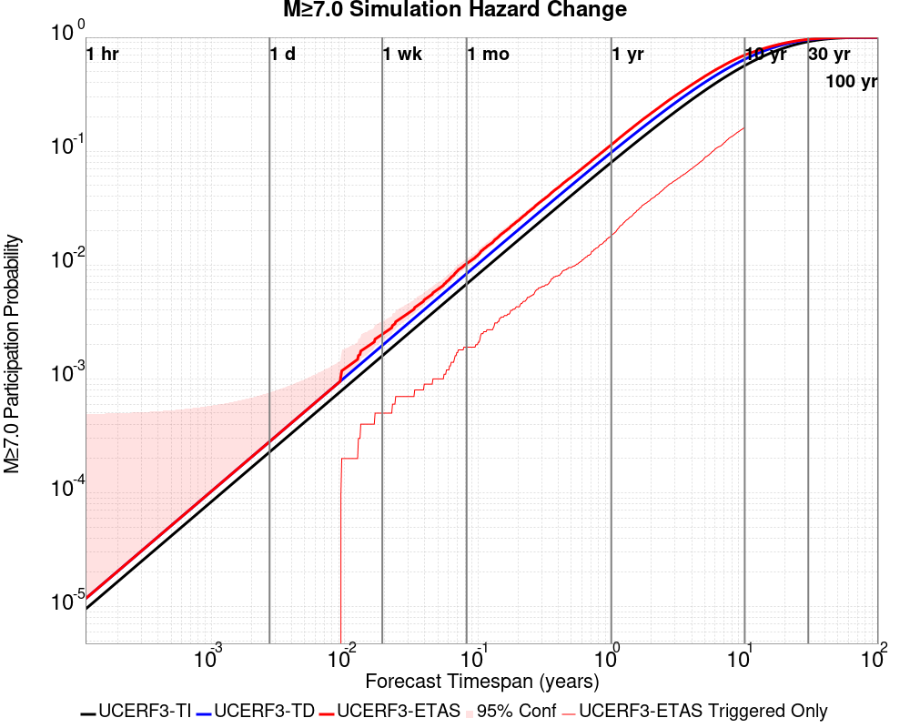

| Forecast Duration | UCERF3-ETAS [95% Conf] | UCERF3-ETAS Triggered Only | UCERF3-TD | UCERF3-ETAS/TD Gain | UCERF3-TI |
|-----|-----|-----|-----|-----|-----|
| 1 Hour | 1.17E-5 [1.17E-5 - 4.90E-4] | 0.000 | 1.17E-5 | 1 | 9.50E-6 |
| 1 Day | 2.81E-4 [2.81E-4 - 7.60E-4] | 0.000 | 2.81E-4 | 1 | 2.28E-4 |
| 1 Week | 2.47E-3 [2.15E-3 - 3.20E-3] | 5.00E-4 | 1.97E-3 | 1.25 | 1.59E-3 |
| 1 Month | 0.010 [9.57E-3 - 0.011] | 1.90E-3 | 8.40E-3 | 1.22 | 6.81E-3 |
| 1 Year | 0.114 [0.112 - 0.117] | 0.018 | 0.098 | 1.17 | 0.080 |
| 10 Years | 0.699 [0.697 - 0.702] | 0.162 | 0.641 | 1.09 | 0.565 |
| 30 Years | 0.960 [0.960 - 0.960] \* | \* | 0.952 | 1.01 \* | 0.918 |
| 100 Years | 1.000 [1.000 - 1.000] \* | \* | 1.000 | 1 \* | 1.000 |

\* *forecast duration is longer than simulation length, only ETAS ruptures from the first 10 years are included*
### M&ge;8.0 Hazard Change Over Time
*[(top)](#table-of-contents)*


| Forecast Duration | UCERF3-ETAS [95% Conf] | UCERF3-ETAS Triggered Only | UCERF3-TD | UCERF3-ETAS/TD Gain | UCERF3-TI |
|-----|-----|-----|-----|-----|-----|
| 1 Hour | 3.12E-7 [3.12E-7 - 4.79E-4] | 0.000 | 3.12E-7 | 1 | 2.63E-7 |
| 1 Day | 7.48E-6 [7.48E-6 - 4.86E-4] | 0.000 | 7.48E-6 | 1 | 6.30E-6 |
| 1 Week | 1.52E-4 [5.76E-5 - 7.02E-4] | 1.00E-4 | 5.24E-5 | 2.91 | 4.41E-5 |
| 1 Month | 4.24E-4 [2.59E-4 - 1.03E-3] | 2.00E-4 | 2.24E-4 | 1.89 | 1.89E-4 |
| 1 Year | 3.43E-3 [3.04E-3 - 4.24E-3] | 7.00E-4 | 2.73E-3 | 1.26 | 2.30E-3 |
| 10 Years | 0.034 [0.033 - 0.036] | 6.10E-3 | 0.028 | 1.21 | 0.023 |
| 30 Years | 0.095 [0.094 - 0.096] \* | \* | 0.089 | 1.06 \* | 0.067 |
| 100 Years | 0.292 [0.291 - 0.293] \* | \* | 0.287 | 1.02 \* | 0.206 |

\* *forecast duration is longer than simulation length, only ETAS ruptures from the first 10 years are included*

## Trigger Rupture Fault Map
*[(top)](#table-of-contents)*


## Individual Simulated Catalog Maps
*[(top)](#table-of-contents)*

These are map plots of individual catalogs from the simulations, selected as the closest catalog to each of the given percentiles in terms of total number of events.

| Duration | p0.0 %-ile | p25.0 %-ile | p50.0 %-ile | p75.0 %-ile | p90.0 %-ile | p95.0 %-ile | p97.5 %-ile | p98.0 %-ile | p99.0 %-ile | p99.99 %-ile |
|-----|-----|-----|-----|-----|-----|-----|-----|-----|-----|-----|
| **1 Week** |  |  |  |  |  |  |  |  | 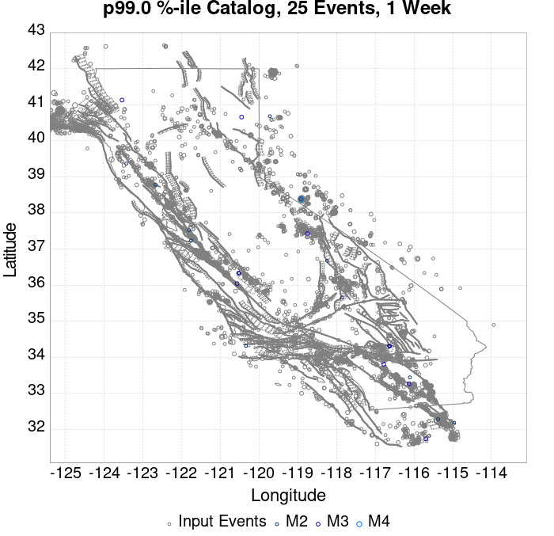 |  |
| **1 Month** |  |  |  |  |  |  |  | 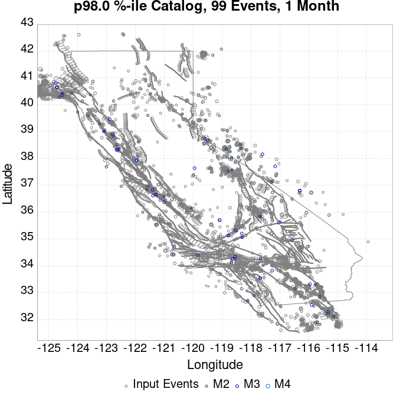 |  | 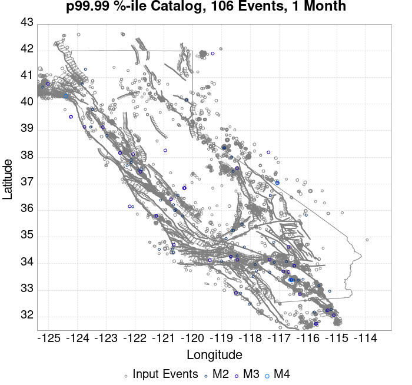 |
| **1 Year** |  |  |  |  | 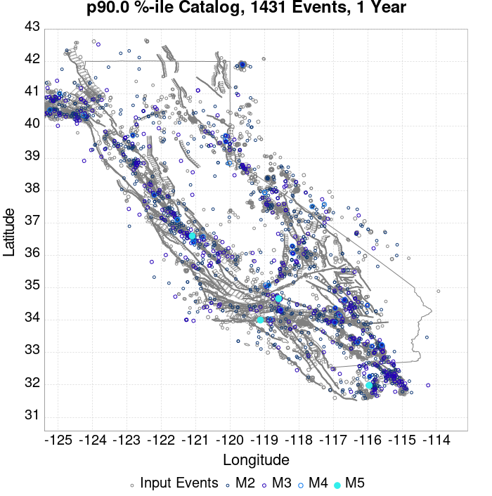 |  |  |  |  |  |
| **10 Year** |  |  |  |  |  |  |  |  |  |  |

## ComCat Data Comparisons
*[(top)](#table-of-contents)*

These plots compare simulated sequences with data from ComCat. All plots only consider events with hypocenters inside the ComCat region defined in the JSON input file.

Last updated at 2020/02/05 06:33:30 UTC, 2.1 years after the simulation start time.

Total matching ComCat events found: 4175

### ComCat Magnitude-Number Distributions
*[(top)](#table-of-contents)*

| Incremental MND | Cumulative MND |
|-----|-----|
|  |  |

### ComCat Time-Dependent Mc
*[(top)](#table-of-contents)*

The following plots compare simulation results with ComCat data above a magnitude threshold. Plots labeled as *M&ge;Mc(t)* use the time-dependent magnitude of completeness (Mc) defined in Helmstetter et al. (2006), which is plotted below. In the case of multiple M&ge;5 ruptures, either as input to the simulation or in the comparison data, the maximum calculated time-dependent Mc is used. This time-dependent Mc function is plotted below.


### ComCat Cumulative Number Vs Time
*[(top)](#table-of-contents)*

| M&ge;Mc(t) | M&ge;3 | M&ge;4 | M&ge;5 | M&ge;6 | M&ge;7 | M&ge;8 |
|-----|-----|-----|-----|-----|-----|-----|
|  |  | 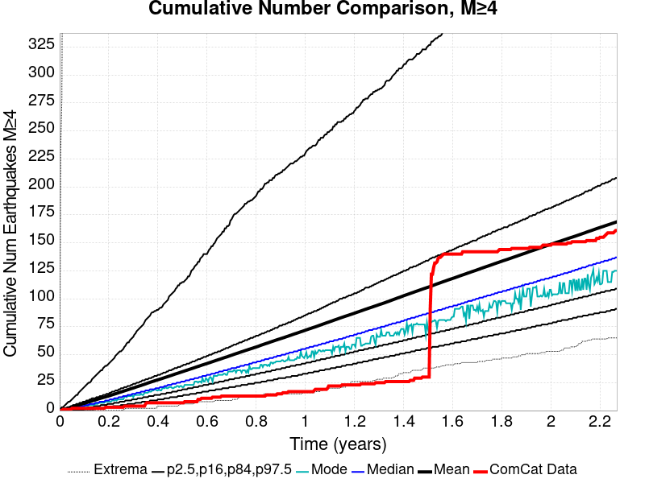 |  |  |  |  |

### ComCat Cumulative Number Simulation Percentiles
*[(top)](#table-of-contents)*

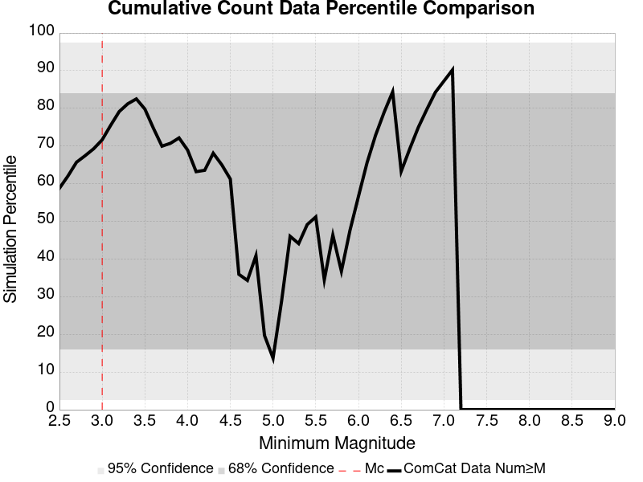

### ComCat Probability Spatial Distribution
*[(top)](#table-of-contents)*

|  | 1 Day | 1 Week | 1 Month | 1 Year | Current (2.1 Year) |
|-----|-----|-----|-----|-----|-----|
| **M&ge;Mc(t)** |  |  |  |  |  |
|  | Prob: 95.40%, Actual: 3 | Prob: 100.00%, Actual: 20 | Prob: 100.00%, Actual: 67 | Prob: 100.00%, Actual: 772 | Prob: 100.00%, Actual: 3364 |
| **M&ge;3** |  |  |  |  |  |
|  | Prob: 63.48%, Actual: 2 | Prob: 99.94%, Actual: 5 | Prob: 100.00%, Actual: 15 | Prob: 100.00%, Actual: 192 | Prob: 100.00%, Actual: 1468 |
| **M&ge;4** |  |  |  |  |  |
|  | Prob: 10.27%, Actual: 0 | Prob: 52.25%, Actual: 1 | Prob: 95.39%, Actual: 2 | Prob: 100.00%, Actual: 17 | Prob: 100.00%, Actual: 147 |
| **M&ge;5** |  |  |  |  |  |
|  | Prob: 1.26%, Actual: 0 | Prob: 7.86%, Actual: 0 | Prob: 30.01%, Actual: 0 | Prob: 98.88%, Actual: 1 | Prob: 99.99%, Actual: 8 |
| **M&ge;6** |  |  |  |  |  |
|  | Prob: 0.16%, Actual: 0 | Prob: 1.14%, Actual: 0 | Prob: 4.61%, Actual: 0 | Prob: 42.60%, Actual: 0 | Prob: 69.38%, Actual: 2 |
| **M&ge;7** |  |  |  |  |  |
|  | Prob: 0.01%, Actual: 0 | Prob: 0.12%, Actual: 0 | Prob: 0.55%, Actual: 0 | Prob: 5.70%, Actual: 0 | Prob: 11.73%, Actual: 1 |
| **M&ge;8** |  |  |  |  |  |
|  | Prob: 0.00%, Actual: 0 | Prob: 0.01%, Actual: 0 | Prob: 0.03%, Actual: 0 | Prob: 0.18%, Actual: 0 | Prob: 0.37%, Actual: 0 |

### ComCat Mean Expectation Spatial Distribution
*[(top)](#table-of-contents)*

|  | 1 Day | 1 Week | 1 Month | 1 Year | Current (2.1 Year) |
|-----|-----|-----|-----|-----|-----|
| **M&ge;Mc(t)** |  |  |  |  |  |
|  | Mean: 4.739, Actual: 3 | Mean: 37.346, Actual: 20 | Mean: 167.655, Actual: 67 | Mean: 2270.241, Actual: 772 | Mean: 4920.450, Actual: 3364 |
| **M&ge;3** |  |  |  |  |  |
|  | Mean: 1.517, Actual: 2 | Mean: 11.830, Actual: 5 | Mean: 53.055, Actual: 15 | Mean: 717.670, Actual: 192 | Mean: 1557.702, Actual: 1468 |
| **M&ge;4** |  | 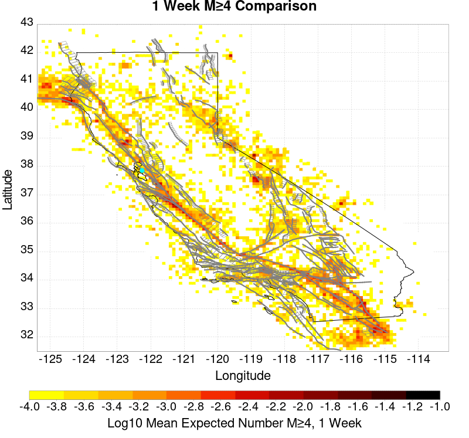 |  |  |  |
|  | Mean: 0.152, Actual: 0 | Mean: 1.173, Actual: 1 | Mean: 5.297, Actual: 2 | Mean: 71.839, Actual: 17 | Mean: 155.720, Actual: 147 |
| **M&ge;5** |  |  |  |  |  |
|  | Mean: 0.016, Actual: 0 | Mean: 0.121, Actual: 0 | Mean: 0.527, Actual: 0 | Mean: 7.133, Actual: 1 | Mean: 15.521, Actual: 8 |
| **M&ge;6** |  |  |  |  |  |
|  | Mean: 1.70E-3, Actual: 0 | Mean: 0.013, Actual: 0 | Mean: 0.055, Actual: 0 | Mean: 0.696, Actual: 0 | Mean: 1.501, Actual: 2 |
| **M&ge;7** |  |  |  |  |  |
|  | Mean: 1.00E-4, Actual: 0 | Mean: 1.20E-3, Actual: 0 | Mean: 5.60E-3, Actual: 0 | Mean: 0.061, Actual: 0 | Mean: 0.129, Actual: 1 |
| **M&ge;8** | 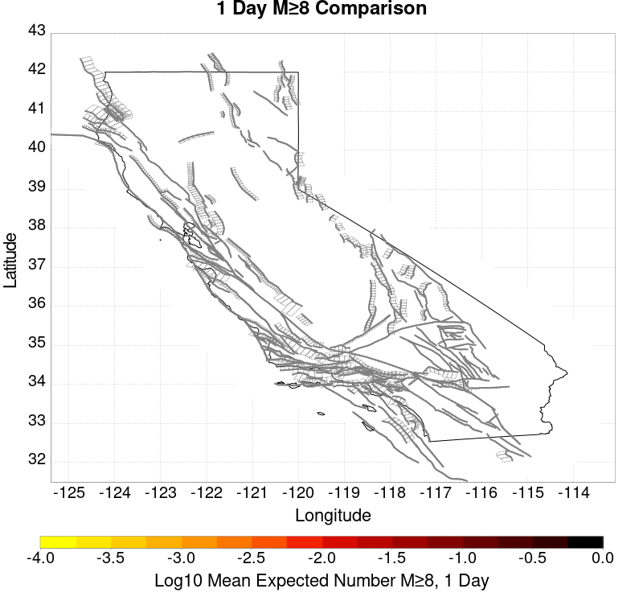 |  |  |  | 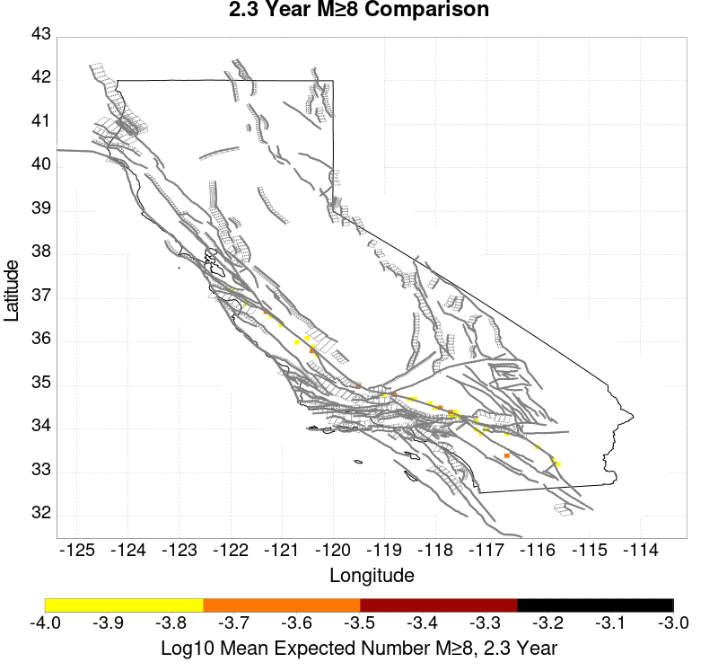 |
|  | Mean: 0.000, Actual: 0 | Mean: 1.00E-4, Actual: 0 | Mean: 3.00E-4, Actual: 0 | Mean: 1.80E-3, Actual: 0 | Mean: 3.70E-3, Actual: 0 |

### ComCat Depth Distribution
*[(top)](#table-of-contents)*

| M&ge;Mc(t) | M&ge;3 | M&ge;4 | M&ge;5 | M&ge;6 | M&ge;7 | M&ge;8 |
|-----|-----|-----|-----|-----|-----|-----|
|  |  |  |  |  |  |  |

## Section Participation
*[(top)](#table-of-contents)*

### Section Participation Plots
*[(top)](#table-of-contents)*

| Min Mag | 1 yr Complete Catalog (including spontaneous) | 1 yr Triggered Ruptures (no spontaneous) | 10 yr Complete Catalog (including spontaneous) | 10 yr Triggered Ruptures (no spontaneous) | 10 yr Triggered Ruptures (primary aftershocks only) |
|-----|-----|-----|-----|-----|-----|
| **All Supra. Seis.** |  |  | 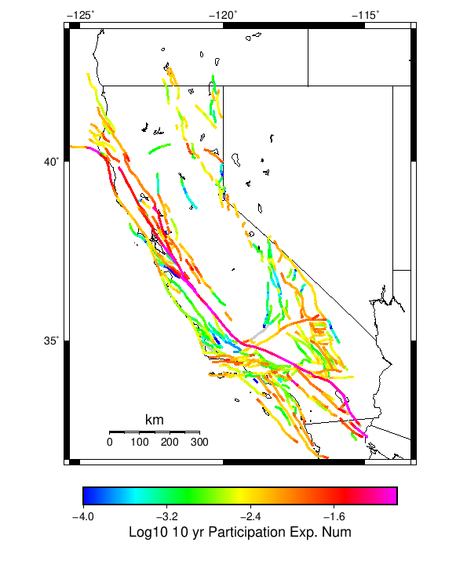 |  |  |
| **M&ge;6.5** |  |  |  |  |  |
| **M&ge;7** | 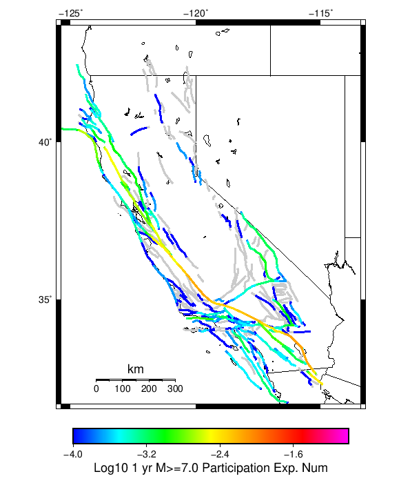 |  |  | 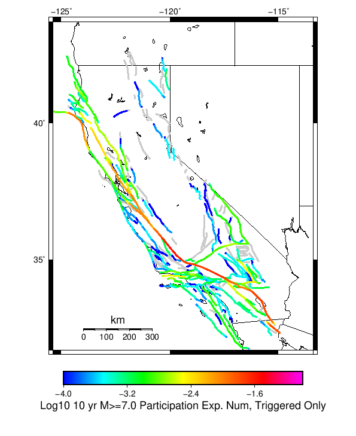 |  |
| **M&ge;7.5** |  |  |  |  |  |
| **M&ge;8** |  |  | 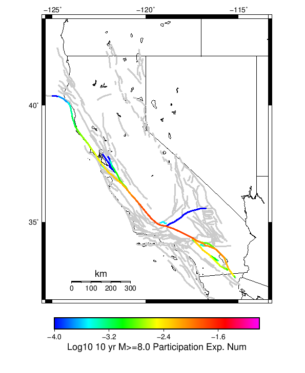 |  |  |

### Supra-Seismogenic Parent Sections Table
*[(top)](#table-of-contents)*

*First 10 of 310 with matching ruptures shown*

| Parent Name | Total 10 Year Mean Count | Total 1 Day Prob | Total 1 Week Prob | Total 1 Month Prob | Total 1 Year Prob | Total 10 Year Prob | Triggered 10 Year Mean Count | Triggered 1 Day Prob | Triggered 1 Week Prob | Triggered 1 Month Prob | Triggered 1 Year Prob | Triggered 10 Year Prob | Triggered 10 Year Primary Mean Count |
|-----|-----|-----|-----|-----|-----|-----|-----|-----|-----|-----|-----|-----|-----|
| San Andreas (Parkfield) | 0.431 | 0.0 | 7.0E-4 | 0.0033 | 0.0429 | 0.4058 | 0.1821 | 0.0 | 2.0E-4 | 0.0014 | 0.0172 | 0.1764 | 0.119 |
| San Andreas (Creeping Section) 2011 CFM | 0.4056 | 1.0E-4 | 0.0013 | 0.0037 | 0.0378 | 0.3282 | 0.1184 | 1.0E-4 | 8.0E-4 | 0.0017 | 0.013 | 0.1015 | 0.0648 |
| Mendocino | 0.2751 | 1.0E-4 | 3.0E-4 | 0.0024 | 0.0273 | 0.2478 | 0.087 | 1.0E-4 | 2.0E-4 | 9.0E-4 | 0.0092 | 0.0829 | 0.0522 |
| San Andreas (Mojave S) | 0.2649 | 2.0E-4 | 5.0E-4 | 0.0016 | 0.0223 | 0.2074 | 0.0958 | 1.0E-4 | 3.0E-4 | 7.0E-4 | 0.0085 | 0.0786 | 0.0513 |
| Cerro Prieto | 0.1793 | 0.0 | 4.0E-4 | 0.0022 | 0.0182 | 0.1744 | 0.0553 | 0.0 | 2.0E-4 | 0.001 | 0.0072 | 0.0545 | 0.0332 |
| Brawley (Seismic Zone) alt 1 | 0.157 | 1.0E-4 | 5.0E-4 | 0.0013 | 0.0177 | 0.1521 | 0.0485 | 0.0 | 2.0E-4 | 5.0E-4 | 0.0067 | 0.0475 | 0.0306 |
| Imperial | 0.1478 | 1.0E-4 | 3.0E-4 | 0.001 | 0.0161 | 0.1419 | 0.0462 | 0.0 | 1.0E-4 | 5.0E-4 | 0.006 | 0.0443 | 0.0289 |
| Hayward (So) 2011 CFM | 0.1276 | 0.0 | 3.0E-4 | 8.0E-4 | 0.0134 | 0.1179 | 0.0427 | 0.0 | 3.0E-4 | 6.0E-4 | 0.0054 | 0.0397 | 0.0226 |
| San Andreas (San Bernardino N) | 0.1054 | 1.0E-4 | 3.0E-4 | 6.0E-4 | 0.0098 | 0.0981 | 0.0333 | 0.0 | 1.0E-4 | 3.0E-4 | 0.0035 | 0.0311 | 0.018 |
| Elsinore (Glen Ivy) rev | 0.1053 | 0.0 | 2.0E-4 | 8.0E-4 | 0.0095 | 0.0915 | 0.0325 | 0.0 | 2.0E-4 | 6.0E-4 | 0.0032 | 0.0288 | 0.0165 |

### M≥6.5 Parent Sections Table
*[(top)](#table-of-contents)*

*First 10 of 301 with matching ruptures shown*

| Parent Name | Total 10 Year Mean Count | Total 1 Day Prob | Total 1 Week Prob | Total 1 Month Prob | Total 1 Year Prob | Total 10 Year Prob | Triggered 10 Year Mean Count | Triggered 1 Day Prob | Triggered 1 Week Prob | Triggered 1 Month Prob | Triggered 1 Year Prob | Triggered 10 Year Prob | Triggered 10 Year Primary Mean Count |
|-----|-----|-----|-----|-----|-----|-----|-----|-----|-----|-----|-----|-----|-----|
| Cerro Prieto | 0.1532 | 0.0 | 3.0E-4 | 0.0018 | 0.0156 | 0.1514 | 0.0481 | 0.0 | 2.0E-4 | 9.0E-4 | 0.0062 | 0.0478 | 0.0286 |
| San Andreas (Creeping Section) 2011 CFM | 0.1311 | 0.0 | 3.0E-4 | 0.0011 | 0.0126 | 0.1202 | 0.0418 | 0.0 | 1.0E-4 | 6.0E-4 | 0.0049 | 0.0389 | 0.0221 |
| Mendocino | 0.1225 | 1.0E-4 | 2.0E-4 | 0.0014 | 0.0134 | 0.12 | 0.0457 | 1.0E-4 | 2.0E-4 | 6.0E-4 | 0.0052 | 0.0454 | 0.027 |
| Hayward (So) 2011 CFM | 0.1109 | 0.0 | 3.0E-4 | 8.0E-4 | 0.0119 | 0.1045 | 0.0361 | 0.0 | 3.0E-4 | 6.0E-4 | 0.0049 | 0.0344 | 0.0194 |
| Brawley (Seismic Zone) alt 1 | 0.1047 | 1.0E-4 | 2.0E-4 | 7.0E-4 | 0.0109 | 0.102 | 0.0302 | 0.0 | 1.0E-4 | 3.0E-4 | 0.0038 | 0.0293 | 0.0186 |
| Imperial | 0.1039 | 1.0E-4 | 2.0E-4 | 7.0E-4 | 0.0109 | 0.1011 | 0.03 | 0.0 | 1.0E-4 | 3.0E-4 | 0.0038 | 0.029 | 0.0185 |
| San Andreas (Mojave S) | 0.0963 | 1.0E-4 | 2.0E-4 | 7.0E-4 | 0.0103 | 0.0934 | 0.0331 | 0.0 | 1.0E-4 | 4.0E-4 | 0.0043 | 0.0324 | 0.0194 |
| San Andreas (San Bernardino N) | 0.0948 | 1.0E-4 | 3.0E-4 | 6.0E-4 | 0.009 | 0.0903 | 0.0294 | 0.0 | 1.0E-4 | 3.0E-4 | 0.0034 | 0.0283 | 0.0167 |
| San Andreas (Coachella) rev | 0.0801 | 1.0E-4 | 3.0E-4 | 9.0E-4 | 0.0088 | 0.0799 | 0.021 | 0.0 | 1.0E-4 | 3.0E-4 | 0.0033 | 0.021 | 0.0125 |
| San Andreas (Cholame) rev | 0.0795 | 0.0 | 2.0E-4 | 5.0E-4 | 0.0075 | 0.0789 | 0.0285 | 0.0 | 1.0E-4 | 2.0E-4 | 0.0029 | 0.0282 | 0.018 |

### M≥7 Parent Sections Table
*[(top)](#table-of-contents)*

*First 10 of 259 with matching ruptures shown*

| Parent Name | Total 10 Year Mean Count | Total 1 Day Prob | Total 1 Week Prob | Total 1 Month Prob | Total 1 Year Prob | Total 10 Year Prob | Triggered 10 Year Mean Count | Triggered 1 Day Prob | Triggered 1 Week Prob | Triggered 1 Month Prob | Triggered 1 Year Prob | Triggered 10 Year Prob | Triggered 10 Year Primary Mean Count |
|-----|-----|-----|-----|-----|-----|-----|-----|-----|-----|-----|-----|-----|-----|
| San Andreas (Carrizo) rev | 0.0745 | 0.0 | 2.0E-4 | 5.0E-4 | 0.0071 | 0.074 | 0.026 | 0.0 | 1.0E-4 | 2.0E-4 | 0.0026 | 0.0256 | 0.0164 |
| San Andreas (Cholame) rev | 0.0741 | 0.0 | 2.0E-4 | 5.0E-4 | 0.0071 | 0.0739 | 0.0265 | 0.0 | 1.0E-4 | 2.0E-4 | 0.0027 | 0.0263 | 0.0167 |
| San Andreas (Mojave S) | 0.0721 | 1.0E-4 | 2.0E-4 | 5.0E-4 | 0.0066 | 0.0713 | 0.024 | 0.0 | 1.0E-4 | 3.0E-4 | 0.0025 | 0.0239 | 0.0142 |
| San Andreas (Creeping Section) 2011 CFM | 0.0712 | 0.0 | 3.0E-4 | 0.001 | 0.0075 | 0.0681 | 0.0229 | 0.0 | 1.0E-4 | 6.0E-4 | 0.0028 | 0.0223 | 0.0125 |
| San Andreas (Coachella) rev | 0.0685 | 1.0E-4 | 3.0E-4 | 9.0E-4 | 0.0078 | 0.0684 | 0.0184 | 0.0 | 1.0E-4 | 3.0E-4 | 0.0027 | 0.0184 | 0.0109 |
| San Andreas (San Bernardino N) | 0.0655 | 1.0E-4 | 2.0E-4 | 5.0E-4 | 0.0063 | 0.0651 | 0.0206 | 0.0 | 1.0E-4 | 3.0E-4 | 0.0022 | 0.0205 | 0.0119 |
| Brawley (Seismic Zone) alt 1 | 0.0611 | 1.0E-4 | 2.0E-4 | 7.0E-4 | 0.0069 | 0.061 | 0.0162 | 0.0 | 1.0E-4 | 3.0E-4 | 0.0024 | 0.0162 | 0.0097 |
| San Andreas (Mojave N) | 0.0598 | 0.0 | 2.0E-4 | 4.0E-4 | 0.0054 | 0.0591 | 0.0202 | 0.0 | 1.0E-4 | 2.0E-4 | 0.0019 | 0.0199 | 0.0122 |
| San Andreas (San Gorgonio Pass-Garnet HIll) | 0.0595 | 1.0E-4 | 3.0E-4 | 8.0E-4 | 0.0076 | 0.059 | 0.0157 | 0.0 | 1.0E-4 | 3.0E-4 | 0.0027 | 0.0157 | 0.0093 |
| Imperial | 0.0581 | 1.0E-4 | 2.0E-4 | 7.0E-4 | 0.0068 | 0.058 | 0.0154 | 0.0 | 1.0E-4 | 3.0E-4 | 0.0023 | 0.0154 | 0.0091 |

### M≥7.5 Parent Sections Table
*[(top)](#table-of-contents)*

*First 10 of 182 with matching ruptures shown*

| Parent Name | Total 10 Year Mean Count | Total 1 Day Prob | Total 1 Week Prob | Total 1 Month Prob | Total 1 Year Prob | Total 10 Year Prob | Triggered 10 Year Mean Count | Triggered 1 Day Prob | Triggered 1 Week Prob | Triggered 1 Month Prob | Triggered 1 Year Prob | Triggered 10 Year Prob | Triggered 10 Year Primary Mean Count |
|-----|-----|-----|-----|-----|-----|-----|-----|-----|-----|-----|-----|-----|-----|
| San Andreas (Mojave N) | 0.059 | 0.0 | 2.0E-4 | 4.0E-4 | 0.0052 | 0.0585 | 0.02 | 0.0 | 1.0E-4 | 2.0E-4 | 0.0018 | 0.0197 | 0.0121 |
| San Andreas (Big Bend) | 0.0549 | 0.0 | 2.0E-4 | 4.0E-4 | 0.005 | 0.0548 | 0.0188 | 0.0 | 1.0E-4 | 2.0E-4 | 0.0017 | 0.0187 | 0.0117 |
| San Andreas (Mojave S) | 0.0546 | 1.0E-4 | 2.0E-4 | 4.0E-4 | 0.0049 | 0.0542 | 0.018 | 0.0 | 1.0E-4 | 2.0E-4 | 0.0016 | 0.0179 | 0.0105 |
| San Andreas (Carrizo) rev | 0.0506 | 0.0 | 2.0E-4 | 5.0E-4 | 0.005 | 0.0505 | 0.0172 | 0.0 | 1.0E-4 | 2.0E-4 | 0.0017 | 0.0171 | 0.0106 |
| San Andreas (San Bernardino N) | 0.0482 | 1.0E-4 | 2.0E-4 | 4.0E-4 | 0.0045 | 0.0481 | 0.0151 | 0.0 | 1.0E-4 | 2.0E-4 | 0.0014 | 0.0151 | 0.0087 |
| San Andreas (Cholame) rev | 0.048 | 0.0 | 2.0E-4 | 5.0E-4 | 0.0049 | 0.048 | 0.0166 | 0.0 | 1.0E-4 | 2.0E-4 | 0.0017 | 0.0166 | 0.0103 |
| San Andreas (Parkfield) | 0.0366 | 0.0 | 2.0E-4 | 4.0E-4 | 0.004 | 0.0366 | 0.0134 | 0.0 | 1.0E-4 | 2.0E-4 | 0.0014 | 0.0134 | 0.0082 |
| San Andreas (San Bernardino S) | 0.0351 | 1.0E-4 | 2.0E-4 | 4.0E-4 | 0.0037 | 0.0347 | 0.0105 | 0.0 | 0.0 | 1.0E-4 | 9.0E-4 | 0.0104 | 0.0062 |
| San Andreas (Coachella) rev | 0.0301 | 1.0E-4 | 2.0E-4 | 5.0E-4 | 0.0034 | 0.0301 | 0.009 | 0.0 | 0.0 | 1.0E-4 | 9.0E-4 | 0.009 | 0.0052 |
| San Andreas (San Gorgonio Pass-Garnet HIll) | 0.0297 | 1.0E-4 | 2.0E-4 | 5.0E-4 | 0.0036 | 0.0294 | 0.009 | 0.0 | 0.0 | 1.0E-4 | 0.001 | 0.009 | 0.0054 |

### M≥8 Parent Sections Table
*[(top)](#table-of-contents)*

*First 10 of 44 with matching ruptures shown*

| Parent Name | Total 10 Year Mean Count | Total 1 Day Prob | Total 1 Week Prob | Total 1 Month Prob | Total 1 Year Prob | Total 10 Year Prob | Triggered 10 Year Mean Count | Triggered 1 Day Prob | Triggered 1 Week Prob | Triggered 1 Month Prob | Triggered 1 Year Prob | Triggered 10 Year Prob | Triggered 10 Year Primary Mean Count |
|-----|-----|-----|-----|-----|-----|-----|-----|-----|-----|-----|-----|-----|-----|
| San Andreas (Big Bend) | 0.017 | 0.0 | 1.0E-4 | 3.0E-4 | 0.0018 | 0.017 | 0.0061 | 0.0 | 1.0E-4 | 2.0E-4 | 7.0E-4 | 0.0061 | 0.0035 |
| San Andreas (Carrizo) rev | 0.017 | 0.0 | 1.0E-4 | 3.0E-4 | 0.0018 | 0.017 | 0.0061 | 0.0 | 1.0E-4 | 2.0E-4 | 7.0E-4 | 0.0061 | 0.0035 |
| San Andreas (Mojave N) | 0.017 | 0.0 | 1.0E-4 | 3.0E-4 | 0.0018 | 0.017 | 0.0061 | 0.0 | 1.0E-4 | 2.0E-4 | 7.0E-4 | 0.0061 | 0.0035 |
| San Andreas (Mojave S) | 0.0169 | 0.0 | 1.0E-4 | 3.0E-4 | 0.0018 | 0.0169 | 0.0061 | 0.0 | 1.0E-4 | 2.0E-4 | 7.0E-4 | 0.0061 | 0.0035 |
| San Andreas (Cholame) rev | 0.0166 | 0.0 | 1.0E-4 | 3.0E-4 | 0.0018 | 0.0166 | 0.0061 | 0.0 | 1.0E-4 | 2.0E-4 | 7.0E-4 | 0.0061 | 0.0035 |
| San Andreas (San Bernardino N) | 0.0166 | 0.0 | 1.0E-4 | 3.0E-4 | 0.0018 | 0.0166 | 0.006 | 0.0 | 1.0E-4 | 2.0E-4 | 7.0E-4 | 0.006 | 0.0035 |
| San Andreas (Parkfield) | 0.0138 | 0.0 | 1.0E-4 | 2.0E-4 | 0.0016 | 0.0138 | 0.0053 | 0.0 | 1.0E-4 | 2.0E-4 | 6.0E-4 | 0.0053 | 0.0032 |
| San Andreas (Creeping Section) 2011 CFM | 0.0107 | 0.0 | 1.0E-4 | 2.0E-4 | 0.0014 | 0.0107 | 0.0036 | 0.0 | 1.0E-4 | 2.0E-4 | 5.0E-4 | 0.0036 | 0.0022 |
| San Andreas (Coachella) rev | 0.0096 | 0.0 | 0.0 | 2.0E-4 | 8.0E-4 | 0.0096 | 0.0036 | 0.0 | 0.0 | 1.0E-4 | 4.0E-4 | 0.0036 | 0.0019 |
| San Andreas (San Bernardino S) | 0.0094 | 0.0 | 0.0 | 2.0E-4 | 0.0011 | 0.0094 | 0.0034 | 0.0 | 0.0 | 1.0E-4 | 5.0E-4 | 0.0034 | 0.0018 |

### Fault Magnitude-Probability Distributions
*[(top)](#table-of-contents)*

The first 5 sections (sorted by trigger rate) are plotted below. All fault MPDs are available [here](plots/parent_sect_mpds/README.md)

| 1 Week | 1 Month | 1 Year | 10 Year |
|-----|-----|-----|-----|
|  |  |  |  |
|  | 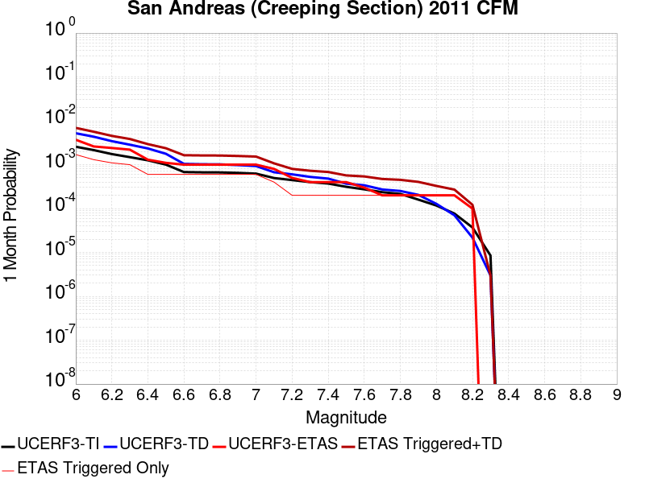 |  |  |
|  |  |  | 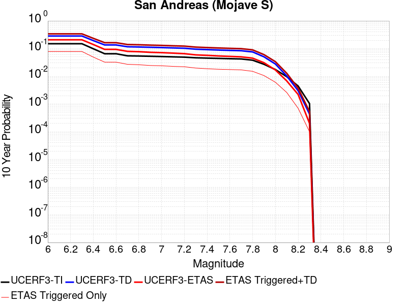 |
|  |  |  |  |
|  |  |  |  |

## Gridded Nucleation
*[(top)](#table-of-contents)*

| Min Mag | Complete Catalog (including spontaneous) | Triggered Ruptures (no spontaneous) | Triggered Ruptures (primary aftershocks only) |
|-----|-----|-----|-----|
| **M&ge;2.5** | 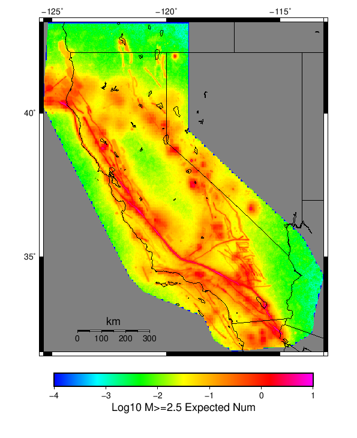 |  |  |
| **M&ge;5** |  |  |  |
| **M&ge;6** |  |  |  |
| **M&ge;7** | 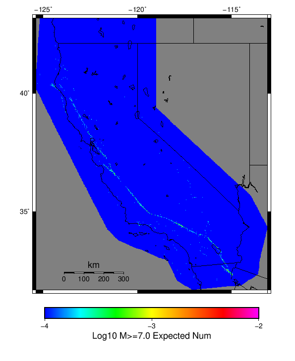 |  |  |


## JSON Input File
*[(top)](#table-of-contents)*

```
{
  "numSimulations": 10000,
  "duration": 10.0,
  "startTimeMillis": 1514764801000,
  "includeSpontaneous": true,
  "randomSeed": 1571427657409,
  "binaryOutput": true,
  "binaryOutputFilters": [
    {
      "prefix": "results_complete",
      "descendantsOnly": false
    },
    {
      "prefix": "results_m5_preserve_chain",
      "minMag": 5.0,
      "preserveChainBelowMag": true,
      "descendantsOnly": false
    },
    {
      "prefix": "results_triggered_descendants",
      "descendantsOnly": true
    }
  ],
  "forceRecalc": false,
  "simulationName": "ComCat data 5.7 yr between historical and 2018-01-01, Statewide, Point Sources, Spontaneous, Historical Catalog",
  "numRetries": 3,
  "outputDir": "/home/scec-02/kmilner/ucerf3/etas_sim/2019_10_18-ComCatdata5p7yrbetweenhistoricaland20180101_Statewide_PointSources_Spontaneous_Historical",
  "triggerCatalog": "/home/scec-02/kmilner/ucerf3/ucerf3-etas-launcher/inputs/u3_historical_catalog.txt",
  "triggerCatalogSurfaceMappings": "/home/scec-02/kmilner/ucerf3/ucerf3-etas-launcher/inputs/u3_historical_catalog_finite_fault_mappings.xml",
  "treatTriggerCatalogAsSpontaneous": false,
  "triggerRuptures": [
    "omitted due to length, see original input file"
  ],
  "cacheDir": "/home/scec-02/kmilner/ucerf3/ucerf3-etas-launcher/inputs/cache_fm3p1_ba",
  "fssFile": "/home/scec-02/kmilner/ucerf3/ucerf3-etas-launcher/inputs/2013_05_10-ucerf3p3-production-10runs_COMPOUND_SOL_FM3_1_SpatSeisU3_MEAN_BRANCH_AVG_SOL.zip",
  "probModel": "FULL_TD",
  "applySubSeisForSupraNucl": true,
  "totRateScaleFactor": 1.14,
  "gridSeisCorr": true,
  "timeIndependentERF": false,
  "griddedOnly": false,
  "imposeGR": false,
  "includeIndirectTriggering": true,
  "gridSeisDiscr": 0.1,
  "catalogCompletenessModel": "RELAXED",
  "configCommand": "u3etas_comcat_config_builder.sh --start-after-historical --end-date 2018-01-01 --historical-catalog --include-spontaneous --num-simulations 10000 --finite-surf-shakemap --finite-surf-shakemap-min-mag 6 --hpc-site USC_HPC --nodes 36 --hours 24 --queue scec",
  "configTime": 1571427657409,
  "comcatMetadata": {
    "region": {
      "border": [
        {
          "latitude": 43.0,
          "longitude": -125.2
        },
        {
          "latitude": 43.0,
          "longitude": -119.0
        },
        {
          "latitude": 39.4,
          "longitude": -119.0
        },
        {
          "latitude": 35.7,
          "longitude": -114.00000000000001
        },
        {
          "latitude": 34.3,
          "longitude": -113.1
        },
        {
          "latitude": 32.9,
          "longitude": -113.5
        },
        {
          "latitude": 32.2,
          "longitude": -113.6
        },
        {
          "latitude": 31.7,
          "longitude": -114.5
        },
        {
          "latitude": 31.5,
          "longitude": -117.1
        },
        {
          "latitude": 31.900000000000002,
          "longitude": -117.90000000000002
        },
        {
          "latitude": 32.8,
          "longitude": -118.40000000000002
        },
        {
          "latitude": 33.7,
          "longitude": -121.0
        },
        {
          "latitude": 34.2,
          "longitude": -121.6
        },
        {
          "latitude": 37.7,
          "longitude": -123.80000000000001
        },
        {
          "latitude": 40.2,
          "longitude": -125.4
        },
        {
          "latitude": 40.5,
          "longitude": -125.4
        }
      ]
    },
    "minDepth": -10.0,
    "maxDepth": 24.0,
    "minMag": 2.5,
    "startTime": 1335296660000,
    "endTime": 1514764800000
  }
}
```

