# Parent Section Magnitude-Probability Distributions

Only fault sections with at least one triggered aftershock are plotted. Sections are sorted by total supraseismogenic trigger rate (decreasing)

## Table Of Contents

* [San Andreas (Creeping Section) 2011 CFM](#san-andreas-creeping-section-2011-cfm)
* [Mendocino](#mendocino)
* [Brawley (Seismic Zone) alt 1](#brawley-seismic-zone-alt-1)
* [West Napa 2011 CFM](#west-napa-2011-cfm)
* [Imperial](#imperial)
* [San Andreas (Parkfield)](#san-andreas-parkfield)
* [Calaveras (So) - Paicines extension 2011 CFM](#calaveras-so---paicines-extension-2011-cfm)
* [San Andreas (Coachella) rev](#san-andreas-coachella-rev)
* [Hunting Creek - Berryessa 2011 CFM](#hunting-creek---berryessa-2011-cfm)
* [Hayward (So) 2011 CFM](#hayward-so-2011-cfm)
* [Green Valley 2011 CFM](#green-valley-2011-cfm)
* [Keddie Ridge 2011 CFM](#keddie-ridge-2011-cfm)
* [Whittier alt 1](#whittier-alt-1)
* [San Andreas (San Gorgonio Pass-Garnet HIll)](#san-andreas-san-gorgonio-pass-garnet-hill)
* [Calaveras (Central) 2011 CFM](#calaveras-central-2011-cfm)
* [Calaveras (So) 2011 CFM](#calaveras-so-2011-cfm)
* [Hayward (So) extension 2011 CFM](#hayward-so-extension-2011-cfm)
* [Cerro Prieto](#cerro-prieto)
* [Mission Ridge-Arroyo Parida-Santa Ana](#mission-ridge-arroyo-parida-santa-ana)
* [San Andreas (Offshore) 2011 CFM](#san-andreas-offshore-2011-cfm)
* [Almanor 2011 CFM](#almanor-2011-cfm)
* [San Andreas (Santa Cruz Mts) 2011 CFM](#san-andreas-santa-cruz-mts-2011-cfm)
* [Red Mountain](#red-mountain)
* [Rodgers Creek - Healdsburg 2011 CFM](#rodgers-creek---healdsburg-2011-cfm)
* [Hayward (No) 2011 CFM](#hayward-no-2011-cfm)
* [Concord 2011 CFM](#concord-2011-cfm)
* [San Andreas (Mojave S)](#san-andreas-mojave-s)
* [Elmore Ranch](#elmore-ranch)
* [San Andreas (San Bernardino N)](#san-andreas-san-bernardino-n)
* [Maacama 2011 CFM](#maacama-2011-cfm)
* [San Andreas (Cholame) rev](#san-andreas-cholame-rev)
* [Calaveras (No) 2011 CFM](#calaveras-no-2011-cfm)
* [San Andreas (San Bernardino S)](#san-andreas-san-bernardino-s)
* [San Andreas (Carrizo) rev](#san-andreas-carrizo-rev)
* [San Andreas (Mojave N)](#san-andreas-mojave-n)
* [Ortigalita (South)](#ortigalita-south)
* [Laguna Salada](#laguna-salada)
* [Ortigalita (North)](#ortigalita-north)
* [San Clemente](#san-clemente)
* [San Andreas (Big Bend)](#san-andreas-big-bend)
* [San Jacinto (Superstition Mtn)](#san-jacinto-superstition-mtn)
* [Elsinore (Glen Ivy) rev](#elsinore-glen-ivy-rev)
* [Surprise Valley 2011 CFM](#surprise-valley-2011-cfm)
* [Chino alt 1](#chino-alt-1)
* [Great Valley 09 (Laguna Seca)](#great-valley-09-laguna-seca)
* [Greenville (No) 2011 CFM](#greenville-no-2011-cfm)
* [Gravel Hills-Harper Lk](#gravel-hills-harper-lk)
* [King Range 2011 CFM](#king-range-2011-cfm)
* [Ludlow](#ludlow)
* [Mission (connected) 2011 CFM](#mission-connected-2011-cfm)
* [Tank Canyon](#tank-canyon)
* [Elsinore (Coyote Mountains)](#elsinore-coyote-mountains)
* [Contra Costa Shear Zone (connector) 2011 CFM](#contra-costa-shear-zone-connector-2011-cfm)
* [Mount Diablo Thrust South](#mount-diablo-thrust-south)
* [Earthquake Valley](#earthquake-valley)
* [Honey Lake 2011 CFM](#honey-lake-2011-cfm)
* [Quien Sabe 2011 CFM](#quien-sabe-2011-cfm)
* [Mount Diablo Thrust North CFM](#mount-diablo-thrust-north-cfm)
* [Bennett Valley 2011 CFM](#bennett-valley-2011-cfm)
* [Earthquake Valley (So Extension)](#earthquake-valley-so-extension)
* [San Andreas (North Coast) 2011 CFM](#san-andreas-north-coast-2011-cfm)
* [Ventura-Pitas Point](#ventura-pitas-point)
* [Hunting Creek - Bartlett Springs connector 2011](#hunting-creek---bartlett-springs-connector-2011)
* [Santa Ynez (West)](#santa-ynez-west)
* [Eaton Roughs 2011 CFM](#eaton-roughs-2011-cfm)
* [San Pedro Basin](#san-pedro-basin)
* [Clayton](#clayton)
* [San Diego Trough north alt1](#san-diego-trough-north-alt1)
* [Peralta Hills](#peralta-hills)
* [Cleghorn Lake](#cleghorn-lake)
* [Great Valley 03 Mysterious Ridge](#great-valley-03-mysterious-ridge)
* [Walker Spring 2011 CFM](#walker-spring-2011-cfm)
* [Blackwater](#blackwater)
* [Little Salmon (Onshore)](#little-salmon-onshore)
* [Cucamonga](#cucamonga)
* [Robinson Creek](#robinson-creek)
* [Earthquake Valley (No  Extension)](#earthquake-valley-no--extension)
* [Davis Creek](#davis-creek)
* [Russ 2011 CFM](#russ-2011-cfm)
* [Mono Lake 2011 CFM](#mono-lake-2011-cfm)
* [Santa Ynez (East)](#santa-ynez-east)
* [Hosgri (Extension)](#hosgri-extension)
* [White Mountains](#white-mountains)
* [Great Valley 08 (Quinto)](#great-valley-08-quinto)
* [San Diego Trough south](#san-diego-trough-south)
* [San Jacinto (Borrego)](#san-jacinto-borrego)
* [Antelope Valley 2011](#antelope-valley-2011)
* [West Tahoe](#west-tahoe)
* [Ash Hill](#ash-hill)
* [San Jacinto (San Bernardino)](#san-jacinto-san-bernardino)
* [San Juan](#san-juan)
* [Dry Mountain](#dry-mountain)
* [San Gorgonio Pass](#san-gorgonio-pass)
* [Collayami 2011 CFM](#collayami-2011-cfm)
* [Monterey Bay-Tularcitos](#monterey-bay-tularcitos)
* [San Jacinto (Stepovers Combined)](#san-jacinto-stepovers-combined)
* [Manix-Afton Hills](#manix-afton-hills)
* [Malibu Coast alt 1](#malibu-coast-alt-1)
* [Garberville - Briceland 2011 CFM](#garberville---briceland-2011-cfm)
* [San Andreas (Peninsula) 2011 CFM](#san-andreas-peninsula-2011-cfm)
* [Sargent 2011 CFM](#sargent-2011-cfm)
* [Cleghorn Pass](#cleghorn-pass)
* [Trinidad (alt1)](#trinidad-alt1)
* [Pitas Point (Lower West)](#pitas-point-lower-west)
* [Franklin 2011 CFM](#franklin-2011-cfm)
* [San Jacinto (San Jacinto Valley) rev](#san-jacinto-san-jacinto-valley-rev)
* [Lost Hills](#lost-hills)
* [Superstition Hills](#superstition-hills)
* [Palos Verdes](#palos-verdes)
* [Helendale-So Lockhart](#helendale-so-lockhart)
* [Goldstone Lake](#goldstone-lake)
* [Contra Costa (Lafayette) 2011 CFM](#contra-costa-lafayette-2011-cfm)
* [Battle Creek 2011 CFM](#battle-creek-2011-cfm)
* [Pinto Mtn](#pinto-mtn)
* [So Sierra Nevada](#so-sierra-nevada)
* [Little Lake](#little-lake)
* [Lenwood-Lockhart-Old Woman Springs](#lenwood-lockhart-old-woman-springs)
* [Hunter Mountain-Saline Valley](#hunter-mountain-saline-valley)
* [Santa Monica alt 1](#santa-monica-alt-1)
* [Newport-Inglewood alt 1](#newport-inglewood-alt-1)
* [Elysian Park (Lower CFM)](#elysian-park-lower-cfm)
* [Great Valley 04a Trout Creek](#great-valley-04a-trout-creek)
* [Sierra Nevada  (No Extension)](#sierra-nevada--no-extension)
* [Polaris 2011 CFM](#polaris-2011-cfm)
* [Joshua Tree (Seismicity)](#joshua-tree-seismicity)
* [Bartlett Springs 2011 CFM](#bartlett-springs-2011-cfm)
* [Monte Vista - Shannon 2011 CFM](#monte-vista---shannon-2011-cfm)
* [Canada David (Detachment)](#canada-david-detachment)
* [Carson Range (Genoa)](#carson-range-genoa)
* [Yorba Linda](#yorba-linda)
* [Blue Cut](#blue-cut)
* [Pleito](#pleito)
* [Greenville (So) 2011 CFM](#greenville-so-2011-cfm)
* [San Andreas (North Branch Mill Creek)](#san-andreas-north-branch-mill-creek)
* [Morales (West)](#morales-west)
* [San Jacinto (Anza) rev](#san-jacinto-anza-rev)
* [San Jacinto (Lytle Creek connector)](#san-jacinto-lytle-creek-connector)
* [Panamint Valley](#panamint-valley)
* [White Wolf (Extension)](#white-wolf-extension)
* [Hollywood](#hollywood)
* [Sierra Madre](#sierra-madre)
* [San Jacinto (Coyote Creek)](#san-jacinto-coyote-creek)
* [Point Reyes 2011 CFM](#point-reyes-2011-cfm)
* [San Jacinto (Clark) rev](#san-jacinto-clark-rev)
* [Fish Slough 2011 CFM](#fish-slough-2011-cfm)
* [Sheephole](#sheephole)
* [Pisgah-Bullion Mtn-Mesquite Lk](#pisgah-bullion-mtn-mesquite-lk)
* [Pitas Point (Lower)-Montalvo](#pitas-point-lower-montalvo)
* [Raymond](#raymond)
* [Bear River fault zone](#bear-river-fault-zone)
* [Owl Lake](#owl-lake)
* [Great Valley 07 (Orestimba)](#great-valley-07-orestimba)
* [Paradise](#paradise)
* [Little Salmon (Offshore)](#little-salmon-offshore)
* [Skinner Flat 2011 CFM](#skinner-flat-2011-cfm)
* [North Frontal  (East)](#north-frontal--east)
* [Hartley Springs 2011 CFM](#hartley-springs-2011-cfm)
* [Morales (East)](#morales-east)

## San Andreas (Creeping Section) 2011 CFM
*[(top)](#table-of-contents)*

| 1 Week | 1 Month | 1 Year | 10 Year |
|-----|-----|-----|-----|
|  |  |  |  |

| Magnitude | 1 wk TI Prob | 1 wk TD Prob | 1 wk ETAS Prob | 1 wk ETAS/TD Gain | 1 wk ETAS Triggered+TD | 1 wk ETAS Triggered Only | 1 mo TI Prob | 1 mo TD Prob | 1 mo ETAS Prob | 1 mo ETAS/TD Gain | 1 mo ETAS Triggered+TD | 1 mo ETAS Triggered Only | 1 yr TI Prob | 1 yr TD Prob | 1 yr ETAS Prob | 1 yr ETAS/TD Gain | 1 yr ETAS Triggered+TD | 1 yr ETAS Triggered Only | 10 yr TI Prob | 10 yr TD Prob | 10 yr ETAS Prob | 10 yr ETAS/TD Gain | 10 yr ETAS Triggered+TD | 10 yr ETAS Triggered Only |
|-----|-----|-----|-----|-----|-----|-----|-----|-----|-----|-----|-----|-----|-----|-----|-----|-----|-----|-----|-----|-----|-----|-----|-----|-----|
| 6.0 | 5.986481E-4 | 0.0012158811 | 8.0E-4 | 0.6579591 | 0.0020149085 | 8.0E-4 | 0.0025631124 | 0.0051956596 | 0.0011 | 0.21171518 | 0.0062899445 | 0.0011 | 0.030762846 | 0.060635127 | 0.0046 | 0.075863615 | 0.0649562 | 0.0046 | 0.26835477 | 0.4229866 | 0.0144 | 0.034043632 | 0.4312956 | 0.0144 |
| 6.1 | 5.015945E-4 | 0.0010130458 | 7.0E-4 | 0.69098556 | 0.0017123366 | 7.0E-4 | 0.00214792 | 0.0043305648 | 9.0E-4 | 0.2078251 | 0.005226667 | 9.0E-4 | 0.025839351 | 0.050815985 | 0.0039 | 0.0767475 | 0.054517806 | 0.0039 | 0.23032776 | 0.3702337 | 0.0126 | 0.034032557 | 0.3781688 | 0.0126 |
| 6.2 | 4.073338E-4 | 8.02223E-4 | 5.0E-4 | 0.62326807 | 0.0013018219 | 5.0E-4 | 0.0017445484 | 0.0034308275 | 7.0E-4 | 0.2040324 | 0.004128426 | 7.0E-4 | 0.021034058 | 0.0405076 | 0.0031 | 0.07652885 | 0.043482024 | 0.0031 | 0.19150782 | 0.31020957 | 0.0103 | 0.03320336 | 0.31731442 | 0.0103 |
| 6.3 | 3.464099E-4 | 6.6541764E-4 | 4.0E-4 | 0.60112625 | 0.0010651514 | 4.0E-4 | 0.0014837692 | 0.0028466634 | 6.0E-4 | 0.21077308 | 0.0034449555 | 6.0E-4 | 0.017915873 | 0.033761524 | 0.0026 | 0.07701074 | 0.036273744 | 0.0026 | 0.16538359 | 0.26832467 | 0.0085 | 0.03167804 | 0.2745439 | 0.0085 |
| 6.4 | 2.935057E-4 | 5.4590224E-4 | 1.0E-4 | 0.18318298 | 6.4584764E-4 | 1.0E-4 | 0.0012572751 | 0.0023361163 | 3.0E-4 | 0.12841827 | 0.0026354154 | 3.0E-4 | 0.015200248 | 0.027832685 | 0.0018 | 0.064672165 | 0.029582586 | 0.0018 | 0.14201577 | 0.22982958 | 0.0064 | 0.02784672 | 0.23475866 | 0.0064 |
| 6.5 | 2.3409708E-4 | 4.1241286E-4 | 1.0E-4 | 0.24247546 | 5.1237165E-4 | 1.0E-4 | 0.0010028875 | 0.0017655423 | 3.0E-4 | 0.16991946 | 0.0020650127 | 3.0E-4 | 0.012141965 | 0.0211528 | 0.0016 | 0.075640105 | 0.022718957 | 0.0016 | 0.11499573 | 0.18347985 | 0.0045 | 0.024525855 | 0.18715419 | 0.0045 |
| 6.6 | 1.5842178E-4 | 2.4227453E-4 | 1.0E-4 | 0.4127549 | 3.422503E-4 | 1.0E-4 | 6.7877385E-4 | 0.0010378995 | 3.0E-4 | 0.2890453 | 0.0013375882 | 3.0E-4 | 0.0082328 | 0.0125618195 | 9.0E-4 | 0.07164567 | 0.013450514 | 9.0E-4 | 0.07934396 | 0.11957417 | 0.0025 | 0.020907527 | 0.12177523 | 0.0025 |
| 6.7 | 1.5616413E-4 | 2.3766492E-4 | 1.0E-4 | 0.42076045 | 3.3764116E-4 | 1.0E-4 | 6.691031E-4 | 0.0010181629 | 3.0E-4 | 0.29464832 | 0.0013178574 | 3.0E-4 | 0.0081159435 | 0.012324867 | 9.0E-4 | 0.073023096 | 0.013213775 | 9.0E-4 | 0.0782586 | 0.11760267 | 0.0024 | 0.020407699 | 0.11972042 | 0.0024 |
| 6.8 | 1.5538467E-4 | 2.3592412E-4 | 1.0E-4 | 0.4238651 | 3.3590052E-4 | 1.0E-4 | 6.6576427E-4 | 0.0010107091 | 3.0E-4 | 0.29682133 | 0.0013104058 | 3.0E-4 | 0.008075596 | 0.012235293 | 9.0E-4 | 0.0735577 | 0.013124282 | 9.0E-4 | 0.07788358 | 0.11683841 | 0.0023 | 0.019685308 | 0.118869685 | 0.0023 |
| 6.9 | 1.5153569E-4 | 2.2708514E-4 | 1.0E-4 | 0.44036347 | 3.2706244E-4 | 1.0E-4 | 6.49277E-4 | 9.7286096E-4 | 3.0E-4 | 0.30836883 | 0.0012725691 | 3.0E-4 | 0.007876333 | 0.01178074 | 8.0E-4 | 0.06790745 | 0.012571314 | 8.0E-4 | 0.07602952 | 0.112919025 | 0.0022 | 0.019482987 | 0.11487061 | 0.0022 |
| 7.0 | 1.4588932E-4 | 2.1581045E-4 | 1.0E-4 | 0.46336958 | 3.1578887E-4 | 1.0E-4 | 6.250901E-4 | 9.2457596E-4 | 3.0E-4 | 0.32447308 | 0.0012242986 | 3.0E-4 | 0.0075839474 | 0.011199075 | 8.0E-4 | 0.07143447 | 0.011990116 | 8.0E-4 | 0.073302895 | 0.107805565 | 0.0021 | 0.019479515 | 0.10967917 | 0.0021 |
| 7.1 | 1.1565079E-4 | 1.5583615E-4 | 1.0E-4 | 0.6416996 | 2.5582057E-4 | 1.0E-4 | 4.955521E-4 | 6.676991E-4 | 2.0E-4 | 0.2995361 | 8.6756557E-4 | 2.0E-4 | 0.006016669 | 0.008099121 | 7.0E-4 | 0.086429134 | 0.008793452 | 7.0E-4 | 0.058563538 | 0.080524765 | 0.0015 | 0.01862781 | 0.08190398 | 0.0015 |
| 7.2 | 1.0393792E-4 | 1.396639E-4 | 1.0E-4 | 0.71600467 | 2.3964993E-4 | 1.0E-4 | 4.4537216E-4 | 5.9842295E-4 | 1.0E-4 | 0.16710588 | 6.983631E-4 | 1.0E-4 | 0.005408933 | 0.0072616157 | 6.0E-4 | 0.08262624 | 0.007857258 | 6.0E-4 | 0.052791595 | 0.07266633 | 0.0013 | 0.01788999 | 0.073871866 | 0.0013 |
| 7.3 | 9.332884E-5 | 1.2216425E-4 | 1.0E-4 | 0.8185701 | 2.2215203E-4 | 1.0E-4 | 3.999194E-4 | 5.234566E-4 | 1.0E-4 | 0.1910378 | 6.234043E-4 | 1.0E-4 | 0.0048581534 | 0.0063545858 | 5.0E-4 | 0.07868333 | 0.0068514086 | 5.0E-4 | 0.047533102 | 0.06386944 | 0.001 | 0.01565694 | 0.064805575 | 0.001 |
| 7.4 | 8.670252E-5 | 1.11667796E-4 | 1.0E-4 | 0.8955133 | 2.1165663E-4 | 1.0E-4 | 3.715293E-4 | 4.7848906E-4 | 1.0E-4 | 0.2089912 | 5.784412E-4 | 1.0E-4 | 0.004513991 | 0.005810155 | 5.0E-4 | 0.086056225 | 0.00630725 | 5.0E-4 | 0.044233937 | 0.058650583 | 9.0E-4 | 0.015345116 | 0.059497796 | 9.0E-4 |
| 7.5 | 7.3036405E-5 | 8.557419E-5 | 1.0E-4 | 1.1685767 | 1.8556563E-4 | 1.0E-4 | 3.129756E-4 | 3.6669505E-4 | 1.0E-4 | 0.27270615 | 4.6665838E-4 | 1.0E-4 | 0.0038038217 | 0.0044553922 | 5.0E-4 | 0.112223566 | 0.0049531646 | 5.0E-4 | 0.03739367 | 0.045724712 | 9.0E-4 | 0.01968301 | 0.04658356 | 9.0E-4 |
| 7.6 | 6.3935775E-5 | 7.875098E-5 | 1.0E-4 | 1.2698256 | 1.787431E-4 | 1.0E-4 | 2.7398168E-4 | 3.374606E-4 | 1.0E-4 | 0.2963309 | 4.3742685E-4 | 1.0E-4 | 0.0033306254 | 0.0041008596 | 5.0E-4 | 0.12192565 | 0.0045988094 | 5.0E-4 | 0.032811474 | 0.04204755 | 9.0E-4 | 0.021404339 | 0.042909708 | 9.0E-4 |
| 7.7 | 5.5050095E-5 | 6.305364E-5 | 1.0E-4 | 1.5859514 | 1.6304733E-4 | 1.0E-4 | 2.3590765E-4 | 2.7020188E-4 | 1.0E-4 | 0.37009364 | 3.7017488E-4 | 1.0E-4 | 0.0028683927 | 0.003284749 | 4.0E-4 | 0.121774904 | 0.0036834353 | 4.0E-4 | 0.0283165 | 0.034058776 | 7.0E-4 | 0.020552704 | 0.034734935 | 7.0E-4 |
| 7.8 | 5.027131E-5 | 5.8371108E-5 | 1.0E-4 | 1.7131763 | 1.5836528E-4 | 1.0E-4 | 2.1543067E-4 | 2.5013793E-4 | 1.0E-4 | 0.39977944 | 3.501129E-4 | 1.0E-4 | 0.0026197135 | 0.0030411792 | 2.0E-4 | 0.065763965 | 0.003240571 | 2.0E-4 | 0.025890453 | 0.031534772 | 5.0E-4 | 0.015855514 | 0.032019004 | 5.0E-4 |
| 7.9 | 3.7271806E-5 | 4.7599344E-5 | 1.0E-4 | 2.1008694 | 1.4759459E-4 | 1.0E-4 | 1.5972654E-4 | 2.0398124E-4 | 1.0E-4 | 0.49024117 | 3.0396084E-4 | 1.0E-4 | 0.0019429359 | 0.002480645 | 2.0E-4 | 0.08062419 | 0.0026801487 | 2.0E-4 | 0.019260362 | 0.025771113 | 5.0E-4 | 0.019401567 | 0.026258228 | 5.0E-4 |
| 8.0 | 2.7310243E-5 | 2.9675752E-5 | 1.0E-4 | 3.3697546 | 1.2967279E-4 | 1.0E-4 | 1.17038646E-4 | 1.2717559E-4 | 1.0E-4 | 0.7863144 | 2.2716288E-4 | 1.0E-4 | 0.0014240141 | 0.0015472639 | 1.0E-4 | 0.06463022 | 0.0016471092 | 1.0E-4 | 0.014149235 | 0.016320135 | 2.0E-4 | 0.012254801 | 0.016516872 | 2.0E-4 |
| 8.1 | 1.7940547E-5 | 1.627415E-5 | 1.0E-4 | 6.144714 | 1.16272524E-4 | 1.0E-4 | 7.688579E-5 | 6.97445E-5 | 1.0E-4 | 1.4338049 | 1.6973753E-4 | 1.0E-4 | 9.3568244E-4 | 8.4880897E-4 | 1.0E-4 | 0.11781214 | 9.4872405E-4 | 1.0E-4 | 0.009317525 | 0.009204732 | 2.0E-4 | 0.021727955 | 0.009402892 | 2.0E-4 |
| 8.2 | 8.643924E-6 | 5.0104E-6 | 0.0 | 0.0 | 5.0104E-6 | 0.0 | 3.704486E-5 | 2.1472966E-5 | 0.0 | 0.0 | 2.1472966E-5 | 0.0 | 4.5092785E-4 | 2.6140205E-4 | 0.0 | 0.0 | 2.6140205E-4 | 0.0 | 0.0045001395 | 0.002993769 | 1.0E-4 | 0.03340271 | 0.0030934697 | 1.0E-4 |
| 8.3 | 1.983087E-6 | 6.880041E-7 | 0.0 | 0.0 | 6.880041E-7 | 0.0 | 8.498917E-6 | 2.9485857E-6 | 0.0 | 0.0 | 2.9485857E-6 | 0.0 | 1.034694E-4 | 3.589845E-5 | 0.0 | 0.0 | 3.589845E-5 | 0.0 | 0.0010342124 | 4.2701262E-4 | 0.0 | 0.0 | 4.2701262E-4 | 0.0 |

## Mendocino
*[(top)](#table-of-contents)*

| 1 Week | 1 Month | 1 Year | 10 Year |
|-----|-----|-----|-----|
|  |  |  |  |

| Magnitude | 1 wk TI Prob | 1 wk TD Prob | 1 wk ETAS Prob | 1 wk ETAS/TD Gain | 1 wk ETAS Triggered+TD | 1 wk ETAS Triggered Only | 1 mo TI Prob | 1 mo TD Prob | 1 mo ETAS Prob | 1 mo ETAS/TD Gain | 1 mo ETAS Triggered+TD | 1 mo ETAS Triggered Only | 1 yr TI Prob | 1 yr TD Prob | 1 yr ETAS Prob | 1 yr ETAS/TD Gain | 1 yr ETAS Triggered+TD | 1 yr ETAS Triggered Only | 10 yr TI Prob | 10 yr TD Prob | 10 yr ETAS Prob | 10 yr ETAS/TD Gain | 10 yr ETAS Triggered+TD | 10 yr ETAS Triggered Only |
|-----|-----|-----|-----|-----|-----|-----|-----|-----|-----|-----|-----|-----|-----|-----|-----|-----|-----|-----|-----|-----|-----|-----|-----|-----|
| 6.0 | 5.5409013E-4 | 0.0010793889 | 1.0E-4 | 0.09264502 | 0.0011792809 | 1.0E-4 | 0.0023725112 | 0.0046157073 | 3.0E-4 | 0.06499545 | 0.004914323 | 3.0E-4 | 0.028505474 | 0.054447312 | 0.0029 | 0.053262502 | 0.057189416 | 0.0029 | 0.25113493 | 0.4105582 | 0.0143 | 0.03483063 | 0.4189872 | 0.0143 |
| 6.1 | 4.2515888E-4 | 8.187679E-4 | 1.0E-4 | 0.122134745 | 9.18686E-4 | 1.0E-4 | 0.0018208373 | 0.0035026954 | 3.0E-4 | 0.08564833 | 0.0038016445 | 3.0E-4 | 0.021944538 | 0.041547947 | 0.0025 | 0.060171444 | 0.043944076 | 0.0025 | 0.19899574 | 0.32862902 | 0.0124 | 0.037732515 | 0.33695403 | 0.0124 |
| 6.2 | 4.2515888E-4 | 8.187679E-4 | 1.0E-4 | 0.122134745 | 9.18686E-4 | 1.0E-4 | 0.0018208373 | 0.0035026954 | 3.0E-4 | 0.08564833 | 0.0038016445 | 3.0E-4 | 0.021944538 | 0.041547947 | 0.0025 | 0.060171444 | 0.043944076 | 0.0025 | 0.19899574 | 0.32862902 | 0.0124 | 0.037732515 | 0.33695403 | 0.0124 |
| 6.3 | 3.2773745E-4 | 6.155574E-4 | 1.0E-4 | 0.16245438 | 7.1549584E-4 | 1.0E-4 | 0.0014038329 | 0.0026343116 | 3.0E-4 | 0.113881744 | 0.0029335213 | 3.0E-4 | 0.016958237 | 0.031404294 | 0.0022 | 0.070054114 | 0.033535205 | 0.0022 | 0.1572094 | 0.25942355 | 0.0096 | 0.037005123 | 0.26653308 | 0.0096 |
| 6.4 | 2.7417165E-4 | 5.0113956E-4 | 1.0E-4 | 0.19954522 | 6.0108944E-4 | 1.0E-4 | 0.0011744922 | 0.0021450887 | 2.0E-4 | 0.09323624 | 0.0023446598 | 2.0E-4 | 0.014205975 | 0.025655411 | 0.0018 | 0.070160635 | 0.027409231 | 0.0018 | 0.13331394 | 0.2180968 | 0.008 | 0.036680963 | 0.22435202 | 0.008 |
| 6.5 | 2.3984899E-4 | 4.2881654E-4 | 1.0E-4 | 0.23319997 | 5.2877364E-4 | 1.0E-4 | 0.0010275192 | 0.0018358091 | 2.0E-4 | 0.10894379 | 0.0020354418 | 2.0E-4 | 0.012438473 | 0.022002775 | 0.0017 | 0.07726298 | 0.02366537 | 0.0017 | 0.11764851 | 0.19064191 | 0.0073 | 0.038291685 | 0.19655022 | 0.0073 |
| 6.6 | 2.1023539E-4 | 3.6590043E-4 | 1.0E-4 | 0.2732984 | 4.6586382E-4 | 1.0E-4 | 9.0069766E-4 | 0.0015666756 | 1.0E-4 | 0.06382942 | 0.001666519 | 1.0E-4 | 0.010910975 | 0.018815525 | 0.0013 | 0.06909188 | 0.020091064 | 0.0013 | 0.10390546 | 0.16608629 | 0.0056 | 0.033717413 | 0.1707562 | 0.0056 |
| 6.7 | 1.2592976E-4 | 1.8099084E-4 | 0.0 | 0.0 | 1.8099084E-4 | 0.0 | 5.395873E-4 | 7.753864E-4 | 0.0 | 0.0 | 7.753864E-4 | 0.0 | 0.006549705 | 0.009388288 | 7.0E-4 | 0.07456099 | 0.010081716 | 7.0E-4 | 0.063599944 | 0.08949357 | 0.0025 | 0.027934967 | 0.091769844 | 0.0025 |
| 6.8 | 1.13663555E-4 | 1.5089264E-4 | 0.0 | 0.0 | 1.5089264E-4 | 0.0 | 4.8703855E-4 | 6.4649165E-4 | 0.0 | 0.0 | 6.4649165E-4 | 0.0 | 0.0059135845 | 0.007838629 | 5.0E-4 | 0.06378666 | 0.008334709 | 5.0E-4 | 0.057586733 | 0.07595165 | 0.0019 | 0.025015915 | 0.07770734 | 0.0019 |
| 6.9 | 9.926894E-5 | 1.20059965E-4 | 0.0 | 0.0 | 1.20059965E-4 | 0.0 | 4.2536893E-4 | 5.1443576E-4 | 0.0 | 0.0 | 5.1443576E-4 | 0.0 | 0.0051665753 | 0.0062443526 | 5.0E-4 | 0.08007235 | 0.0067412304 | 5.0E-4 | 0.050480947 | 0.06147359 | 0.0018 | 0.029280867 | 0.06316294 | 0.0018 |
| 7.0 | 9.168125E-5 | 1.04989136E-4 | 0.0 | 0.0 | 1.04989136E-4 | 0.0 | 3.9286047E-4 | 4.4987473E-4 | 0.0 | 0.0 | 4.4987473E-4 | 0.0 | 0.004772591 | 0.0054631177 | 5.0E-4 | 0.091522835 | 0.0059603862 | 5.0E-4 | 0.04671385 | 0.05426433 | 0.0017 | 0.03132813 | 0.05587208 | 0.0017 |
| 7.1 | 8.2854116E-5 | 8.831159E-5 | 0.0 | 0.0 | 8.831159E-5 | 0.0 | 3.5504074E-4 | 3.7842387E-4 | 0.0 | 0.0 | 3.7842387E-4 | 0.0 | 0.004314056 | 0.0045976397 | 4.0E-4 | 0.08700116 | 0.0049958006 | 4.0E-4 | 0.042312626 | 0.046162598 | 0.0015 | 0.032493837 | 0.047593355 | 0.0015 |
| 7.2 | 7.8255274E-5 | 8.0320024E-5 | 0.0 | 0.0 | 8.0320024E-5 | 0.0 | 3.3533663E-4 | 3.4418405E-4 | 0.0 | 0.0 | 3.4418405E-4 | 0.0 | 0.0040750825 | 0.0041825282 | 4.0E-4 | 0.095635936 | 0.0045808554 | 4.0E-4 | 0.040011603 | 0.04222741 | 0.0013 | 0.030785691 | 0.043472514 | 0.0013 |
| 7.3 | 6.887904E-5 | 6.0378115E-5 | 0.0 | 0.0 | 6.0378115E-5 | 0.0 | 2.9516246E-4 | 2.587382E-4 | 0.0 | 0.0 | 2.587382E-4 | 0.0 | 0.0035876823 | 0.0031456787 | 4.0E-4 | 0.12715857 | 0.0035444202 | 4.0E-4 | 0.035303112 | 0.032249544 | 9.0E-4 | 0.027907372 | 0.033120517 | 9.0E-4 |
| 7.4 | 5.4898497E-5 | 3.588004E-5 | 0.0 | 0.0 | 3.588004E-5 | 0.0 | 2.3525805E-4 | 1.5376284E-4 | 0.0 | 0.0 | 1.5376284E-4 | 0.0 | 0.0028605047 | 0.0018705077 | 3.0E-4 | 0.16038425 | 0.0021699467 | 3.0E-4 | 0.02823963 | 0.019616025 | 7.0E-4 | 0.03568511 | 0.020302294 | 7.0E-4 |
| 7.5 | 3.9103943E-5 | 1.0616167E-5 | 0.0 | 0.0 | 1.0616167E-5 | 0.0 | 1.6757756E-4 | 4.5497076E-5 | 0.0 | 0.0 | 4.5497076E-5 | 0.0 | 0.0020383475 | 5.5378757E-4 | 0.0 | 0.0 | 5.5378757E-4 | 0.0 | 0.020197518 | 0.0062145353 | 2.0E-4 | 0.032182615 | 0.0064132926 | 2.0E-4 |
| 7.6 | 3.641042E-5 | 8.36707E-6 | 0.0 | 0.0 | 8.36707E-6 | 0.0 | 1.5603533E-4 | 3.585839E-5 | 0.0 | 0.0 | 3.585839E-5 | 0.0 | 0.0018980748 | 4.3648967E-4 | 0.0 | 0.0 | 4.3648967E-4 | 0.0 | 0.018819444 | 0.004976619 | 2.0E-4 | 0.040187925 | 0.0051756236 | 2.0E-4 |
| 7.7 | 3.1318774E-5 | 3.9938727E-6 | 0.0 | 0.0 | 3.9938727E-6 | 0.0 | 1.342164E-4 | 1.7116487E-5 | 0.0 | 0.0 | 1.7116487E-5 | 0.0 | 0.0016328598 | 2.0837346E-4 | 0.0 | 0.0 | 2.0837346E-4 | 0.0 | 0.016209139 | 0.0025776818 | 1.0E-4 | 0.038794547 | 0.002677424 | 1.0E-4 |
| 7.8 | 2.209241E-5 | 2.3840068E-6 | 0.0 | 0.0 | 2.3840068E-6 | 0.0 | 9.467832E-5 | 1.0217132E-5 | 0.0 | 0.0 | 1.0217132E-5 | 0.0 | 0.001152099 | 1.243865E-4 | 0.0 | 0.0 | 1.243865E-4 | 0.0 | 0.011461443 | 0.0015521594 | 1.0E-4 | 0.06442637 | 0.0016520042 | 1.0E-4 |
| 7.9 | 1.2640477E-5 | 1.8273861E-6 | 0.0 | 0.0 | 1.8273861E-6 | 0.0 | 5.4172346E-5 | 7.831631E-6 | 0.0 | 0.0 | 7.831631E-6 | 0.0 | 6.593487E-4 | 9.534596E-5 | 0.0 | 0.0 | 9.534596E-5 | 0.0 | 0.006573958 | 0.001167472 | 1.0E-4 | 0.08565516 | 0.0012673553 | 1.0E-4 |
| 8.0 | 6.5548907E-6 | 1.4736802E-6 | 0.0 | 0.0 | 1.4736802E-6 | 0.0 | 2.8092087E-5 | 6.3157568E-6 | 0.0 | 0.0 | 6.3157568E-6 | 0.0 | 3.4196748E-4 | 7.689164E-5 | 0.0 | 0.0 | 7.689164E-5 | 0.0 | 0.0034144172 | 9.3351625E-4 | 1.0E-4 | 0.10712186 | 0.0010334229 | 1.0E-4 |
| 8.1 | 3.1916707E-6 | 1.2142848E-6 | 0.0 | 0.0 | 1.2142848E-6 | 0.0 | 1.3678517E-5 | 5.2040677E-6 | 0.0 | 0.0 | 5.2040677E-6 | 0.0 | 1.6652321E-4 | 6.33577E-5 | 0.0 | 0.0 | 6.33577E-5 | 0.0 | 0.0016639848 | 7.786327E-4 | 1.0E-4 | 0.12843026 | 8.785548E-4 | 1.0E-4 |
| 8.2 | 2.1193785E-6 | 9.23783E-7 | 0.0 | 0.0 | 9.23783E-7 | 0.0 | 9.083019E-6 | 3.9590636E-6 | 0.0 | 0.0 | 3.9590636E-6 | 0.0 | 1.1058014E-4 | 4.8200553E-5 | 0.0 | 0.0 | 4.8200553E-5 | 0.0 | 0.0011052513 | 5.890795E-4 | 1.0E-4 | 0.16975637 | 6.890206E-4 | 1.0E-4 |
| 8.3 | 7.536878E-7 | 3.5652886E-7 | 0.0 | 0.0 | 3.5652886E-7 | 0.0 | 3.2300866E-6 | 1.52798E-6 | 0.0 | 0.0 | 1.52798E-6 | 0.0 | 3.9325594E-5 | 1.8603008E-5 | 0.0 | 0.0 | 1.8603008E-5 | 0.0 | 3.9318635E-4 | 2.2076594E-4 | 0.0 | 0.0 | 2.2076594E-4 | 0.0 |

## Brawley (Seismic Zone) alt 1
*[(top)](#table-of-contents)*

| 1 Week | 1 Month | 1 Year | 10 Year |
|-----|-----|-----|-----|
|  |  |  |  |

| Magnitude | 1 wk TI Prob | 1 wk TD Prob | 1 wk ETAS Prob | 1 wk ETAS/TD Gain | 1 wk ETAS Triggered+TD | 1 wk ETAS Triggered Only | 1 mo TI Prob | 1 mo TD Prob | 1 mo ETAS Prob | 1 mo ETAS/TD Gain | 1 mo ETAS Triggered+TD | 1 mo ETAS Triggered Only | 1 yr TI Prob | 1 yr TD Prob | 1 yr ETAS Prob | 1 yr ETAS/TD Gain | 1 yr ETAS Triggered+TD | 1 yr ETAS Triggered Only | 10 yr TI Prob | 10 yr TD Prob | 10 yr ETAS Prob | 10 yr ETAS/TD Gain | 10 yr ETAS Triggered+TD | 10 yr ETAS Triggered Only |
|-----|-----|-----|-----|-----|-----|-----|-----|-----|-----|-----|-----|-----|-----|-----|-----|-----|-----|-----|-----|-----|-----|-----|-----|-----|
| 6.0 | 2.2521618E-4 | 4.6533594E-4 | 1.0E-4 | 0.21489851 | 5.652894E-4 | 1.0E-4 | 9.6485513E-4 | 0.0019928087 | 3.0E-4 | 0.1505413 | 0.0022922107 | 3.0E-4 | 0.011683988 | 0.023988076 | 0.0032 | 0.1333996 | 0.027111314 | 0.0032 | 0.11088423 | 0.20974061 | 0.0125 | 0.059597425 | 0.21961886 | 0.0125 |
| 6.1 | 2.2521618E-4 | 4.6533594E-4 | 1.0E-4 | 0.21489851 | 5.652894E-4 | 1.0E-4 | 9.6485513E-4 | 0.0019928087 | 3.0E-4 | 0.1505413 | 0.0022922107 | 3.0E-4 | 0.011683988 | 0.023988076 | 0.0027 | 0.11255592 | 0.026623309 | 0.0027 | 0.11088423 | 0.20974061 | 0.0102 | 0.048631497 | 0.21780126 | 0.0102 |
| 6.2 | 2.198148E-4 | 4.5645965E-4 | 1.0E-4 | 0.21907742 | 5.56414E-4 | 1.0E-4 | 9.417233E-4 | 0.0019548247 | 3.0E-4 | 0.15346646 | 0.0022542381 | 3.0E-4 | 0.011405343 | 0.02353607 | 0.0025 | 0.10621995 | 0.025977228 | 0.0025 | 0.10837428 | 0.20623754 | 0.0093 | 0.045093633 | 0.21361953 | 0.0093 |
| 6.3 | 2.1704129E-4 | 4.5086833E-4 | 1.0E-4 | 0.22179423 | 5.508232E-4 | 1.0E-4 | 9.298453E-4 | 0.0019308975 | 2.0E-4 | 0.103578776 | 0.0021305112 | 2.0E-4 | 0.011262234 | 0.023251357 | 0.0024 | 0.103219785 | 0.025595553 | 0.0024 | 0.107082725 | 0.20413247 | 0.0089 | 0.04359914 | 0.21121569 | 0.0089 |
| 6.4 | 1.876142E-4 | 3.9022637E-4 | 1.0E-4 | 0.25626153 | 4.901873E-4 | 1.0E-4 | 8.038131E-4 | 0.0016713403 | 2.0E-4 | 0.11966444 | 0.0018710061 | 2.0E-4 | 0.00974259 | 0.02015831 | 0.0021 | 0.1041754 | 0.022215977 | 0.0021 | 0.093263686 | 0.18090113 | 0.0074 | 0.040906325 | 0.18696246 | 0.0074 |
| 6.5 | 1.7390939E-4 | 3.6497993E-4 | 1.0E-4 | 0.27398768 | 4.6494344E-4 | 1.0E-4 | 7.45113E-4 | 0.0015632734 | 2.0E-4 | 0.12793668 | 0.0017629608 | 2.0E-4 | 0.009034078 | 0.018868195 | 0.0019 | 0.10069856 | 0.020732345 | 0.0019 | 0.086755216 | 0.17080772 | 0.0069 | 0.0403963 | 0.17652915 | 0.0069 |
| 6.6 | 1.591791E-4 | 3.3971245E-4 | 1.0E-4 | 0.2943666 | 4.396785E-4 | 1.0E-4 | 6.8201777E-4 | 0.0014551076 | 2.0E-4 | 0.13744688 | 0.0016548166 | 2.0E-4 | 0.008271996 | 0.017573824 | 0.0018 | 0.10242506 | 0.019342192 | 0.0018 | 0.07970774 | 0.16035357 | 0.0058 | 0.03617007 | 0.16522352 | 0.0058 |
| 6.7 | 1.4268003E-4 | 3.1204906E-4 | 1.0E-4 | 0.32046244 | 4.1201786E-4 | 1.0E-4 | 6.1134255E-4 | 0.0013366753 | 2.0E-4 | 0.14962497 | 0.0015364079 | 2.0E-4 | 0.007417723 | 0.016153757 | 0.0018 | 0.11142919 | 0.01792468 | 0.0018 | 0.07174956 | 0.1486512 | 0.0054 | 0.03632665 | 0.15324849 | 0.0054 |
| 6.8 | 1.239713E-4 | 2.835754E-4 | 1.0E-4 | 0.3526399 | 3.8354704E-4 | 1.0E-4 | 5.3119735E-4 | 0.0012147628 | 2.0E-4 | 0.16464119 | 0.0014145199 | 2.0E-4 | 0.0064481674 | 0.014690774 | 0.0016 | 0.108911894 | 0.016267268 | 0.0016 | 0.06264243 | 0.13560335 | 0.0048 | 0.035397355 | 0.13975246 | 0.0048 |
| 6.9 | 1.0180238E-4 | 2.5747836E-4 | 1.0E-4 | 0.38838217 | 3.574526E-4 | 1.0E-4 | 4.3622297E-4 | 0.0011030161 | 2.0E-4 | 0.18132102 | 0.0013027955 | 2.0E-4 | 0.005298089 | 0.013347485 | 0.0015 | 0.11238072 | 0.014827464 | 0.0015 | 0.05173543 | 0.12289762 | 0.0042 | 0.03417479 | 0.12658145 | 0.0042 |
| 7.0 | 7.6619996E-5 | 2.2041418E-4 | 1.0E-4 | 0.45369133 | 3.2039214E-4 | 1.0E-4 | 3.283301E-4 | 9.4429334E-4 | 2.0E-4 | 0.2117986 | 0.0011441044 | 2.0E-4 | 0.0039900932 | 0.0114368545 | 0.0012 | 0.104923956 | 0.01262313 | 0.0012 | 0.039192066 | 0.1057968 | 0.0035 | 0.033082288 | 0.10892651 | 0.0035 |
| 7.1 | 7.5127435E-5 | 2.1730422E-4 | 1.0E-4 | 0.46018434 | 3.1728248E-4 | 1.0E-4 | 3.2193496E-4 | 9.309745E-4 | 2.0E-4 | 0.21482866 | 0.0011307882 | 2.0E-4 | 0.0039125155 | 0.011276387 | 0.0012 | 0.10641707 | 0.012462855 | 0.0012 | 0.038443442 | 0.10438197 | 0.0035 | 0.033530694 | 0.10751663 | 0.0035 |
| 7.2 | 6.788582E-5 | 1.9873041E-4 | 1.0E-4 | 0.5031942 | 2.9871054E-4 | 1.0E-4 | 2.9090676E-4 | 8.5142674E-4 | 2.0E-4 | 0.23489983 | 0.0010512564 | 2.0E-4 | 0.0035360386 | 0.01031747 | 0.0012 | 0.11630759 | 0.011505089 | 0.0012 | 0.034803 | 0.09609729 | 0.0032 | 0.033299584 | 0.098989785 | 0.0032 |
| 7.3 | 6.399602E-5 | 1.8519968E-4 | 1.0E-4 | 0.53995776 | 2.8518116E-4 | 1.0E-4 | 2.7423984E-4 | 7.9347426E-4 | 2.0E-4 | 0.25205606 | 9.933156E-4 | 2.0E-4 | 0.0033337586 | 0.00961833 | 0.0012 | 0.12476178 | 0.010806788 | 0.0012 | 0.03284188 | 0.09004573 | 0.0032 | 0.0355375 | 0.092957586 | 0.0032 |
| 7.4 | 4.506759E-5 | 1.2283388E-4 | 0.0 | 0.0 | 1.2283388E-4 | 0.0 | 1.9313251E-4 | 5.2632554E-4 | 1.0E-4 | 0.18999648 | 6.2627293E-4 | 1.0E-4 | 0.0023488526 | 0.006389355 | 6.0E-4 | 0.093906194 | 0.006985521 | 6.0E-4 | 0.023241805 | 0.061279375 | 0.0014 | 0.022846187 | 0.06259359 | 0.0014 |
| 7.5 | 3.43289E-5 | 9.1361755E-5 | 0.0 | 0.0 | 9.1361755E-5 | 0.0 | 1.4711556E-4 | 3.9149195E-4 | 0.0 | 0.0 | 3.9149195E-4 | 0.0 | 0.0017896603 | 0.0047560576 | 3.0E-4 | 0.06307746 | 0.005054631 | 3.0E-4 | 0.01775316 | 0.046157982 | 8.0E-4 | 0.01733178 | 0.046921056 | 8.0E-4 |
| 7.6 | 2.5980507E-5 | 6.881562E-5 | 0.0 | 0.0 | 6.881562E-5 | 0.0 | 1.1134028E-4 | 2.948909E-4 | 0.0 | 0.0 | 2.948909E-4 | 0.0 | 0.001354725 | 0.0035844091 | 3.0E-4 | 0.0836958 | 0.0038833339 | 3.0E-4 | 0.013464959 | 0.03505983 | 6.0E-4 | 0.017113604 | 0.03563879 | 6.0E-4 |
| 7.7 | 1.7292105E-5 | 4.7962152E-5 | 0.0 | 0.0 | 4.7962152E-5 | 0.0 | 7.4106916E-5 | 2.0553592E-4 | 0.0 | 0.0 | 2.0553592E-4 | 0.0 | 9.018782E-4 | 0.0024995336 | 1.0E-4 | 0.040007465 | 0.0025992836 | 1.0E-4 | 0.008982267 | 0.024629422 | 3.0E-4 | 0.012180555 | 0.024922032 | 3.0E-4 |
| 7.8 | 1.2927471E-5 | 3.8444596E-5 | 0.0 | 0.0 | 3.8444596E-5 | 0.0 | 5.5402274E-5 | 1.6475216E-4 | 0.0 | 0.0 | 1.6475216E-4 | 0.0 | 6.743139E-4 | 0.0020040146 | 1.0E-4 | 0.049899835 | 0.0021038142 | 1.0E-4 | 0.0067227143 | 0.019860458 | 2.0E-4 | 0.010070261 | 0.020056486 | 2.0E-4 |
| 7.9 | 1.0200774E-5 | 2.7730803E-5 | 0.0 | 0.0 | 2.7730803E-5 | 0.0 | 4.371687E-5 | 1.18840886E-4 | 0.0 | 0.0 | 1.18840886E-4 | 0.0 | 5.321229E-4 | 0.0014459285 | 0.0 | 0.0 | 0.0014459285 | 0.0 | 0.005308505 | 0.014520071 | 1.0E-4 | 0.0068870187 | 0.014618619 | 1.0E-4 |
| 8.0 | 8.650396E-6 | 2.2400553E-5 | 0.0 | 0.0 | 2.2400553E-5 | 0.0 | 3.70726E-5 | 9.599884E-5 | 0.0 | 0.0 | 9.599884E-5 | 0.0 | 4.5126543E-4 | 0.00116816 | 0.0 | 0.0 | 0.00116816 | 0.0 | 0.0045035016 | 0.011800713 | 1.0E-4 | 0.008474064 | 0.011899533 | 1.0E-4 |
| 8.1 | 3.9368224E-6 | 6.9356947E-6 | 0.0 | 0.0 | 6.9356947E-6 | 0.0 | 1.6871985E-5 | 2.9724068E-5 | 0.0 | 0.0 | 2.9724068E-5 | 0.0 | 2.0539707E-4 | 3.6183055E-4 | 0.0 | 0.0 | 3.6183055E-4 | 0.0 | 0.0020520731 | 0.0038061712 | 0.0 | 0.0 | 0.0038061712 | 0.0 |
| 8.2 | 1.7101195E-6 | 2.061943E-6 | 0.0 | 0.0 | 2.061943E-6 | 0.0 | 7.329063E-6 | 8.836869E-6 | 0.0 | 0.0 | 8.836869E-6 | 0.0 | 8.922769E-5 | 1.0758359E-4 | 0.0 | 0.0 | 1.0758359E-4 | 0.0 | 8.9191867E-4 | 0.0011864101 | 0.0 | 0.0 | 0.0011864101 | 0.0 |
| 8.3 | 3.0346666E-8 | 1.567035E-8 | 0.0 | 0.0 | 1.567035E-8 | 0.0 | 1.3005713E-7 | 6.7158645E-8 | 0.0 | 0.0 | 6.7158645E-8 | 0.0 | 1.5834444E-6 | 8.176564E-7 | 0.0 | 0.0 | 8.176564E-7 | 0.0 | 1.5834332E-5 | 8.542308E-6 | 0.0 | 0.0 | 8.542308E-6 | 0.0 |

## West Napa 2011 CFM
*[(top)](#table-of-contents)*

| 1 Week | 1 Month | 1 Year | 10 Year |
|-----|-----|-----|-----|
|  |  |  |  |

| Magnitude | 1 wk TI Prob | 1 wk TD Prob | 1 wk ETAS Prob | 1 wk ETAS/TD Gain | 1 wk ETAS Triggered+TD | 1 wk ETAS Triggered Only | 1 mo TI Prob | 1 mo TD Prob | 1 mo ETAS Prob | 1 mo ETAS/TD Gain | 1 mo ETAS Triggered+TD | 1 mo ETAS Triggered Only | 1 yr TI Prob | 1 yr TD Prob | 1 yr ETAS Prob | 1 yr ETAS/TD Gain | 1 yr ETAS Triggered+TD | 1 yr ETAS Triggered Only | 10 yr TI Prob | 10 yr TD Prob | 10 yr ETAS Prob | 10 yr ETAS/TD Gain | 10 yr ETAS Triggered+TD | 10 yr ETAS Triggered Only |
|-----|-----|-----|-----|-----|-----|-----|-----|-----|-----|-----|-----|-----|-----|-----|-----|-----|-----|-----|-----|-----|-----|-----|-----|-----|
| 6.0 | 3.773104E-5 | 4.443471E-5 | 0.0 | 0.0 | 4.443471E-5 | 0.0 | 1.6169442E-4 | 1.9042236E-4 | 2.0E-4 | 1.0502968 | 3.903843E-4 | 2.0E-4 | 0.001966852 | 0.0023162432 | 0.0019 | 0.82029384 | 0.004211842 | 0.0019 | 0.019495348 | 0.022954233 | 0.0102 | 0.4443625 | 0.0329201 | 0.0102 |
| 6.1 | 3.773104E-5 | 4.443471E-5 | 0.0 | 0.0 | 4.443471E-5 | 0.0 | 1.6169442E-4 | 1.9042236E-4 | 2.0E-4 | 1.0502968 | 3.903843E-4 | 2.0E-4 | 0.001966852 | 0.0023162432 | 0.0019 | 0.82029384 | 0.004211842 | 0.0019 | 0.019495348 | 0.022954233 | 0.0102 | 0.4443625 | 0.0329201 | 0.0102 |
| 6.2 | 3.773104E-5 | 4.443471E-5 | 0.0 | 0.0 | 4.443471E-5 | 0.0 | 1.6169442E-4 | 1.9042236E-4 | 2.0E-4 | 1.0502968 | 3.903843E-4 | 2.0E-4 | 0.001966852 | 0.0023162432 | 0.0019 | 0.82029384 | 0.004211842 | 0.0019 | 0.019495348 | 0.022954233 | 0.0102 | 0.4443625 | 0.0329201 | 0.0102 |
| 6.3 | 2.147964E-5 | 2.4934396E-5 | 0.0 | 0.0 | 2.4934396E-5 | 0.0 | 9.2052345E-5 | 1.06857835E-4 | 2.0E-4 | 1.8716456 | 3.0683647E-4 | 2.0E-4 | 0.001120161 | 0.0013003092 | 0.0011 | 0.8459527 | 0.0023988788 | 0.0011 | 0.011145315 | 0.012937482 | 0.0053 | 0.4096624 | 0.018168913 | 0.0053 |
| 6.4 | 2.147964E-5 | 2.4934396E-5 | 0.0 | 0.0 | 2.4934396E-5 | 0.0 | 9.2052345E-5 | 1.06857835E-4 | 2.0E-4 | 1.8716456 | 3.0683647E-4 | 2.0E-4 | 0.001120161 | 0.0013003092 | 0.0011 | 0.8459527 | 0.0023988788 | 0.0011 | 0.011145315 | 0.012937482 | 0.0053 | 0.4096624 | 0.018168913 | 0.0053 |
| 6.5 | 1.688201E-5 | 1.9505078E-5 | 0.0 | 0.0 | 1.9505078E-5 | 0.0 | 7.234947E-5 | 8.359092E-5 | 2.0E-4 | 2.3926044 | 2.835742E-4 | 2.0E-4 | 8.804988E-4 | 0.0010173168 | 7.0E-4 | 0.6880846 | 0.0017166047 | 7.0E-4 | 0.008770182 | 0.010135127 | 0.0033 | 0.32560024 | 0.013401682 | 0.0033 |
| 6.6 | 1.6846381E-5 | 1.9464826E-5 | 0.0 | 0.0 | 1.9464826E-5 | 0.0 | 7.219678E-5 | 8.3418425E-5 | 2.0E-4 | 2.3975518 | 2.8340175E-4 | 2.0E-4 | 8.7864127E-4 | 0.0010152186 | 7.0E-4 | 0.6895067 | 0.0017145079 | 7.0E-4 | 0.008751754 | 0.010114336 | 0.0033 | 0.32626954 | 0.013380959 | 0.0033 |
| 6.7 | 1.3396501E-5 | 1.5432639E-5 | 0.0 | 0.0 | 1.5432639E-5 | 0.0 | 5.7412315E-5 | 6.6138564E-5 | 2.0E-4 | 3.0239546 | 2.6612534E-4 | 2.0E-4 | 6.9877075E-4 | 8.0500275E-4 | 7.0E-4 | 0.8695622 | 0.0015044393 | 7.0E-4 | 0.0069657755 | 0.008028455 | 0.0021 | 0.26156962 | 0.0101115955 | 0.0021 |
| 6.8 | 1.0139058E-5 | 1.1643671E-5 | 0.0 | 0.0 | 1.1643671E-5 | 0.0 | 4.3452383E-5 | 4.9900806E-5 | 1.0E-4 | 2.0039756 | 1.4989582E-4 | 1.0E-4 | 5.289043E-4 | 6.0742826E-4 | 5.0E-4 | 0.8231425 | 0.0011071245 | 5.0E-4 | 0.005276473 | 0.006064466 | 0.0013 | 0.21436347 | 0.007356582 | 0.0013 |
| 6.9 | 7.761281E-6 | 8.86714E-6 | 0.0 | 0.0 | 8.86714E-6 | 0.0 | 3.326221E-5 | 3.8001766E-5 | 1.0E-4 | 2.6314566 | 1.3799797E-4 | 1.0E-4 | 4.0489217E-4 | 4.6262448E-4 | 5.0E-4 | 1.0807902 | 9.623932E-4 | 5.0E-4 | 0.0040415525 | 0.0046229945 | 0.0013 | 0.28120303 | 0.0059169848 | 0.0013 |
| 7.0 | 2.2109202E-6 | 2.3549817E-6 | 0.0 | 0.0 | 2.3549817E-6 | 0.0 | 9.475338E-6 | 1.009274E-5 | 0.0 | 0.0 | 1.009274E-5 | 0.0 | 1.1535613E-4 | 1.2287227E-4 | 0.0 | 0.0 | 1.2287227E-4 | 0.0 | 0.0011529627 | 0.0012294134 | 1.0E-4 | 0.0813396 | 0.0013292906 | 1.0E-4 |
| 7.1 | 1.9008926E-6 | 2.0021855E-6 | 0.0 | 0.0 | 2.0021855E-6 | 0.0 | 8.146657E-6 | 8.580767E-6 | 0.0 | 0.0 | 8.580767E-6 | 0.0 | 9.918104E-5 | 1.0446586E-4 | 0.0 | 0.0 | 1.0446586E-4 | 0.0 | 9.913679E-4 | 0.0010455326 | 1.0E-4 | 0.095645025 | 0.001145428 | 1.0E-4 |
| 7.2 | 1.8495944E-6 | 1.9450608E-6 | 0.0 | 0.0 | 1.9450608E-6 | 0.0 | 7.926808E-6 | 8.335948E-6 | 0.0 | 0.0 | 8.335948E-6 | 0.0 | 9.650462E-5 | 1.0148547E-4 | 0.0 | 0.0 | 1.0148547E-4 | 0.0 | 9.6462725E-4 | 0.0010157564 | 1.0E-4 | 0.0984488 | 0.0011156548 | 1.0E-4 |
| 7.3 | 1.7883189E-6 | 1.8771289E-6 | 0.0 | 0.0 | 1.8771289E-6 | 0.0 | 7.664201E-6 | 8.0448135E-6 | 0.0 | 0.0 | 8.0448135E-6 | 0.0 | 9.330765E-5 | 9.794122E-5 | 0.0 | 0.0 | 9.794122E-5 | 0.0 | 9.3268487E-4 | 9.803459E-4 | 1.0E-4 | 0.10200481 | 0.0010802479 | 1.0E-4 |
| 7.4 | 1.6520572E-6 | 1.7309668E-6 | 0.0 | 0.0 | 1.7309668E-6 | 0.0 | 7.0802257E-6 | 7.418408E-6 | 0.0 | 0.0 | 7.418408E-6 | 0.0 | 8.6198335E-5 | 9.03154E-5 | 0.0 | 0.0 | 9.03154E-5 | 0.0 | 8.616491E-4 | 9.041525E-4 | 1.0E-4 | 0.110600814 | 0.0010040621 | 1.0E-4 |
| 7.5 | 1.4040345E-6 | 1.4701039E-6 | 0.0 | 0.0 | 1.4701039E-6 | 0.0 | 6.0172765E-6 | 6.3004304E-6 | 0.0 | 0.0 | 6.3004304E-6 | 0.0 | 7.325788E-5 | 7.6705066E-5 | 0.0 | 0.0 | 7.6705066E-5 | 0.0 | 7.3233736E-4 | 7.6810154E-4 | 1.0E-4 | 0.13019112 | 8.6802477E-4 | 1.0E-4 |
| 7.6 | 1.3013842E-7 | 1.3989674E-7 | 0.0 | 0.0 | 1.3989674E-7 | 0.0 | 5.57736E-7 | 5.995573E-7 | 0.0 | 0.0 | 5.995573E-7 | 0.0 | 6.790414E-6 | 7.299586E-6 | 0.0 | 0.0 | 7.299586E-6 | 0.0 | 6.790207E-5 | 7.392417E-5 | 0.0 | 0.0 | 7.392417E-5 | 0.0 |
| 7.7 | 8.541512E-8 | 9.342756E-8 | 0.0 | 0.0 | 9.342756E-8 | 0.0 | 3.6606474E-7 | 4.0040376E-7 | 0.0 | 0.0 | 4.0040376E-7 | 0.0 | 4.456829E-6 | 4.874905E-6 | 0.0 | 0.0 | 4.874905E-6 | 0.0 | 4.4567398E-5 | 4.9653856E-5 | 0.0 | 0.0 | 4.9653856E-5 | 0.0 |
| 7.8 | 5.6074793E-8 | 6.5917234E-8 | 0.0 | 0.0 | 6.5917234E-8 | 0.0 | 2.403205E-7 | 2.8250238E-7 | 0.0 | 0.0 | 2.8250238E-7 | 0.0 | 2.9258983E-6 | 3.4394611E-6 | 0.0 | 0.0 | 3.4394611E-6 | 0.0 | 2.9258597E-5 | 3.5230274E-5 | 0.0 | 0.0 | 3.5230274E-5 | 0.0 |
| 7.9 | 2.9475839E-8 | 3.682857E-8 | 0.0 | 0.0 | 3.682857E-8 | 0.0 | 1.2632502E-7 | 1.5783672E-7 | 0.0 | 0.0 | 1.5783672E-7 | 0.0 | 1.538006E-6 | 1.9216604E-6 | 0.0 | 0.0 | 1.9216604E-6 | 0.0 | 1.5379954E-5 | 1.9759776E-5 | 0.0 | 0.0 | 1.9759776E-5 | 0.0 |
| 8.0 | 1.3337122E-8 | 2.0611138E-8 | 0.0 | 0.0 | 2.0611138E-8 | 0.0 | 5.7159088E-8 | 8.833344E-8 | 0.0 | 0.0 | 8.833344E-8 | 0.0 | 6.959117E-7 | 1.0754591E-6 | 0.0 | 0.0 | 1.0754591E-6 | 0.0 | 6.959095E-6 | 1.1116372E-5 | 0.0 | 0.0 | 1.1116372E-5 | 0.0 |
| 8.1 | 2.6589986E-10 | 4.6371973E-10 | 0.0 | 0.0 | 4.6371973E-10 | 0.0 | 1.1395708E-9 | 1.9873707E-9 | 0.0 | 0.0 | 1.9873707E-9 | 0.0 | 1.3874274E-8 | 2.4196236E-8 | 0.0 | 0.0 | 2.4196236E-8 | 0.0 | 1.3874273E-7 | 2.4881123E-7 | 0.0 | 0.0 | 2.4881123E-7 | 0.0 |

## Imperial
*[(top)](#table-of-contents)*

| 1 Week | 1 Month | 1 Year | 10 Year |
|-----|-----|-----|-----|
|  |  |  |  |

| Magnitude | 1 wk TI Prob | 1 wk TD Prob | 1 wk ETAS Prob | 1 wk ETAS/TD Gain | 1 wk ETAS Triggered+TD | 1 wk ETAS Triggered Only | 1 mo TI Prob | 1 mo TD Prob | 1 mo ETAS Prob | 1 mo ETAS/TD Gain | 1 mo ETAS Triggered+TD | 1 mo ETAS Triggered Only | 1 yr TI Prob | 1 yr TD Prob | 1 yr ETAS Prob | 1 yr ETAS/TD Gain | 1 yr ETAS Triggered+TD | 1 yr ETAS Triggered Only | 10 yr TI Prob | 10 yr TD Prob | 10 yr ETAS Prob | 10 yr ETAS/TD Gain | 10 yr ETAS Triggered+TD | 10 yr ETAS Triggered Only |
|-----|-----|-----|-----|-----|-----|-----|-----|-----|-----|-----|-----|-----|-----|-----|-----|-----|-----|-----|-----|-----|-----|-----|-----|-----|
| 6.0 | 2.7496446E-4 | 4.895928E-4 | 1.0E-4 | 0.20425136 | 5.8954384E-4 | 1.0E-4 | 0.0011778869 | 0.0020966053 | 3.0E-4 | 0.14308845 | 0.0023959763 | 3.0E-4 | 0.0142467655 | 0.02520393 | 0.0027 | 0.10712615 | 0.02783588 | 0.0027 | 0.13367249 | 0.22269472 | 0.0103 | 0.046251655 | 0.23070097 | 0.0103 |
| 6.1 | 2.5356023E-4 | 4.7265363E-4 | 1.0E-4 | 0.21157143 | 5.7260634E-4 | 1.0E-4 | 0.001086234 | 0.0020241227 | 3.0E-4 | 0.14821236 | 0.0023235155 | 3.0E-4 | 0.013144928 | 0.024346493 | 0.0027 | 0.11089893 | 0.026980758 | 0.0027 | 0.123940155 | 0.2147349 | 0.0102 | 0.04750043 | 0.2227446 | 0.0102 |
| 6.2 | 2.4820742E-4 | 4.6388546E-4 | 1.0E-4 | 0.21557046 | 5.6383904E-4 | 1.0E-4 | 0.0010633124 | 0.0019866023 | 3.0E-4 | 0.1510116 | 0.0022860062 | 3.0E-4 | 0.01286919 | 0.023900157 | 0.0025 | 0.10460182 | 0.026340406 | 0.0025 | 0.12148927 | 0.21129626 | 0.0093 | 0.04401403 | 0.21863121 | 0.0093 |
| 6.3 | 2.3205351E-4 | 4.4672057E-4 | 1.0E-4 | 0.22385357 | 5.4667593E-4 | 1.0E-4 | 9.94136E-4 | 0.0019131477 | 2.0E-4 | 0.10453976 | 0.002112765 | 2.0E-4 | 0.012036599 | 0.023043953 | 0.0024 | 0.1041488 | 0.025388649 | 0.0024 | 0.11405133 | 0.20366937 | 0.0089 | 0.043698274 | 0.21075672 | 0.0089 |
| 6.4 | 2.0304754E-4 | 3.8701732E-4 | 1.0E-4 | 0.25838637 | 4.8697862E-4 | 1.0E-4 | 8.6991355E-4 | 0.001657605 | 2.0E-4 | 0.120656006 | 0.0018572735 | 2.0E-4 | 0.010539869 | 0.019998284 | 0.0021 | 0.10500901 | 0.022056287 | 0.0021 | 0.100537635 | 0.18080486 | 0.0074 | 0.040928103 | 0.18686691 | 0.0074 |
| 6.5 | 1.854992E-4 | 3.5898542E-4 | 1.0E-4 | 0.27856284 | 4.5894954E-4 | 1.0E-4 | 7.9475436E-4 | 0.0015376133 | 2.0E-4 | 0.13007171 | 0.0017373059 | 2.0E-4 | 0.009633281 | 0.018566702 | 0.0019 | 0.10233374 | 0.020431425 | 0.0019 | 0.0922623 | 0.16924961 | 0.0069 | 0.040768187 | 0.17498179 | 0.0069 |
| 6.6 | 1.6586106E-4 | 3.305461E-4 | 1.0E-4 | 0.30252963 | 4.3051306E-4 | 1.0E-4 | 7.106394E-4 | 0.0014158665 | 2.0E-4 | 0.14125626 | 0.0016155833 | 2.0E-4 | 0.008617763 | 0.017105592 | 0.0018 | 0.105228744 | 0.018874804 | 0.0018 | 0.08291132 | 0.15704171 | 0.0058 | 0.036932863 | 0.16193087 | 0.0058 |
| 6.7 | 1.4224656E-4 | 2.9921078E-4 | 1.0E-4 | 0.33421254 | 3.9918086E-4 | 1.0E-4 | 6.094856E-4 | 0.0012817093 | 2.0E-4 | 0.15604162 | 0.001481453 | 2.0E-4 | 0.0073952693 | 0.015494272 | 0.0018 | 0.11617196 | 0.017266383 | 0.0018 | 0.07153955 | 0.14318357 | 0.0054 | 0.037713822 | 0.14781038 | 0.0054 |
| 6.8 | 1.2317259E-4 | 2.7105198E-4 | 1.0E-4 | 0.36893293 | 3.7102486E-4 | 1.0E-4 | 5.2777573E-4 | 0.0011611399 | 2.0E-4 | 0.17224453 | 0.0013609077 | 2.0E-4 | 0.0064067547 | 0.014046529 | 0.0016 | 0.11390714 | 0.015624055 | 0.0016 | 0.06225166 | 0.13016221 | 0.0048 | 0.036877062 | 0.13433743 | 0.0048 |
| 6.9 | 9.859898E-5 | 2.4530667E-4 | 1.0E-4 | 0.407653 | 3.4528214E-4 | 1.0E-4 | 4.2249862E-4 | 0.0010508947 | 2.0E-4 | 0.19031401 | 0.0012506846 | 2.0E-4 | 0.0051317946 | 0.012720503 | 0.0015 | 0.11791986 | 0.014201422 | 0.0015 | 0.05014893 | 0.11742009 | 0.0042 | 0.035769004 | 0.12112693 | 0.0042 |
| 7.0 | 7.3191884E-5 | 2.0933368E-4 | 1.0E-4 | 0.47770622 | 3.0931275E-4 | 1.0E-4 | 3.136418E-4 | 8.9683896E-4 | 2.0E-4 | 0.22300547 | 0.0010966596 | 2.0E-4 | 0.003811904 | 0.010865013 | 0.0012 | 0.11044625 | 0.012051975 | 0.0012 | 0.037471764 | 0.10068799 | 0.0035 | 0.034760848 | 0.10383558 | 0.0035 |
| 7.1 | 7.1760296E-5 | 2.064055E-4 | 1.0E-4 | 0.4844832 | 3.0638487E-4 | 1.0E-4 | 3.0750787E-4 | 8.842982E-4 | 2.0E-4 | 0.22616805 | 0.0010841213 | 2.0E-4 | 0.003737482 | 0.010713841 | 0.0012 | 0.11200465 | 0.011900984 | 0.0012 | 0.03675245 | 0.09934601 | 0.0035 | 0.035230402 | 0.1024983 | 0.0035 |
| 7.2 | 6.46614E-5 | 1.8823914E-4 | 1.0E-4 | 0.53123915 | 2.8822033E-4 | 1.0E-4 | 2.7709085E-4 | 8.064927E-4 | 2.0E-4 | 0.24798736 | 0.0010063314 | 2.0E-4 | 0.0033683628 | 0.009775445 | 0.0012 | 0.12275656 | 0.010963715 | 0.0012 | 0.033177625 | 0.09119956 | 0.0032 | 0.03508789 | 0.09410772 | 0.0032 |
| 7.3 | 6.088115E-5 | 1.7511452E-4 | 1.0E-4 | 0.5710549 | 2.75097E-4 | 1.0E-4 | 2.6089314E-4 | 7.502777E-4 | 2.0E-4 | 0.26656798 | 9.5012767E-4 | 2.0E-4 | 0.0031717476 | 0.009096931 | 0.0012 | 0.13191262 | 0.0102860145 | 0.0012 | 0.031268585 | 0.085304566 | 0.0032 | 0.037512645 | 0.08823159 | 0.0032 |
| 7.4 | 4.199346E-5 | 1.12887006E-4 | 0.0 | 0.0 | 1.12887006E-4 | 0.0 | 1.7995955E-4 | 4.8371262E-4 | 1.0E-4 | 0.20673433 | 5.836642E-4 | 1.0E-4 | 0.0021888057 | 0.0058734627 | 6.0E-4 | 0.1021544 | 0.0064699384 | 6.0E-4 | 0.02167372 | 0.056454986 | 0.0014 | 0.024798518 | 0.05777595 | 0.0014 |
| 7.5 | 3.130448E-5 | 8.158115E-5 | 0.0 | 0.0 | 8.158115E-5 | 0.0 | 1.3415517E-4 | 3.4958695E-4 | 0.0 | 0.0 | 3.4958695E-4 | 0.0 | 0.0016321153 | 0.0042479727 | 3.0E-4 | 0.07062192 | 0.004546698 | 3.0E-4 | 0.016201803 | 0.04133666 | 8.0E-4 | 0.01935328 | 0.042103592 | 8.0E-4 |
| 7.6 | 2.3074248E-5 | 5.9368074E-5 | 0.0 | 0.0 | 5.9368074E-5 | 0.0 | 9.888588E-5 | 2.544099E-4 | 0.0 | 0.0 | 2.544099E-4 | 0.0 | 0.0012032706 | 0.0030930638 | 3.0E-4 | 0.09699121 | 0.003392136 | 3.0E-4 | 0.011967761 | 0.030348286 | 6.0E-4 | 0.019770473 | 0.030930078 | 6.0E-4 |
| 7.7 | 1.45864815E-5 | 3.8916234E-5 | 0.0 | 0.0 | 3.8916234E-5 | 0.0 | 6.2511994E-5 | 1.6677321E-4 | 0.0 | 0.0 | 1.6677321E-4 | 0.0 | 7.608177E-4 | 0.0020285782 | 1.0E-4 | 0.049295608 | 0.0021283755 | 1.0E-4 | 0.007582182 | 0.020070491 | 3.0E-4 | 0.014947318 | 0.02036447 | 3.0E-4 |
| 7.8 | 1.0352979E-5 | 2.994125E-5 | 0.0 | 0.0 | 2.994125E-5 | 0.0 | 4.4369157E-5 | 1.2831335E-4 | 0.0 | 0.0 | 1.2831335E-4 | 0.0 | 5.400606E-4 | 0.0015610977 | 1.0E-4 | 0.06405749 | 0.0016609416 | 1.0E-4 | 0.0053875 | 0.015546963 | 2.0E-4 | 0.012864249 | 0.015743854 | 2.0E-4 |
| 7.9 | 8.137906E-6 | 2.132492E-5 | 0.0 | 0.0 | 2.132492E-5 | 0.0 | 3.4876273E-5 | 9.1389324E-5 | 0.0 | 0.0 | 9.1389324E-5 | 0.0 | 4.2453592E-4 | 0.0011120979 | 0.0 | 0.0 | 0.0011120979 | 0.0 | 0.004237258 | 0.011232167 | 1.0E-4 | 0.008903001 | 0.011331043 | 1.0E-4 |
| 8.0 | 6.93792E-6 | 1.7294058E-5 | 0.0 | 0.0 | 1.7294058E-5 | 0.0 | 2.9733603E-5 | 7.411529E-5 | 0.0 | 0.0 | 7.411529E-5 | 0.0 | 3.6194647E-4 | 9.019808E-4 | 0.0 | 0.0 | 9.019808E-4 | 0.0 | 0.0036135751 | 0.009164721 | 1.0E-4 | 0.010911408 | 0.009263804 | 1.0E-4 |
| 8.1 | 3.4286315E-6 | 6.034309E-6 | 0.0 | 0.0 | 6.034309E-6 | 0.0 | 1.4694053E-5 | 2.5861069E-5 | 0.0 | 0.0 | 2.5861069E-5 | 0.0 | 1.7888541E-4 | 3.1481314E-4 | 0.0 | 0.0 | 3.1481314E-4 | 0.0 | 0.0017874148 | 0.0033140853 | 0.0 | 0.0 | 0.0033140853 | 0.0 |
| 8.2 | 1.4906886E-6 | 1.7989122E-6 | 0.0 | 0.0 | 1.7989122E-6 | 0.0 | 6.3886496E-6 | 7.709601E-6 | 0.0 | 0.0 | 7.709601E-6 | 0.0 | 7.7779034E-5 | 9.386038E-5 | 0.0 | 0.0 | 9.386038E-5 | 0.0 | 7.775182E-4 | 0.0010366293 | 0.0 | 0.0 | 0.0010366293 | 0.0 |
| 8.3 | 2.5758007E-8 | 1.3187132E-8 | 0.0 | 0.0 | 1.3187132E-8 | 0.0 | 1.10391454E-7 | 5.651628E-8 | 0.0 | 0.0 | 5.651628E-8 | 0.0 | 1.3440151E-6 | 6.880857E-7 | 0.0 | 0.0 | 6.880857E-7 | 0.0 | 1.344007E-5 | 7.186091E-6 | 0.0 | 0.0 | 7.186091E-6 | 0.0 |

## San Andreas (Parkfield)
*[(top)](#table-of-contents)*

| 1 Week | 1 Month | 1 Year | 10 Year |
|-----|-----|-----|-----|
| 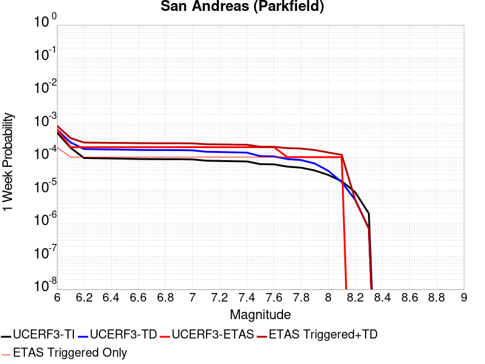 |  |  |  |

| Magnitude | 1 wk TI Prob | 1 wk TD Prob | 1 wk ETAS Prob | 1 wk ETAS/TD Gain | 1 wk ETAS Triggered+TD | 1 wk ETAS Triggered Only | 1 mo TI Prob | 1 mo TD Prob | 1 mo ETAS Prob | 1 mo ETAS/TD Gain | 1 mo ETAS Triggered+TD | 1 mo ETAS Triggered Only | 1 yr TI Prob | 1 yr TD Prob | 1 yr ETAS Prob | 1 yr ETAS/TD Gain | 1 yr ETAS Triggered+TD | 1 yr ETAS Triggered Only | 10 yr TI Prob | 10 yr TD Prob | 10 yr ETAS Prob | 10 yr ETAS/TD Gain | 10 yr ETAS Triggered+TD | 10 yr ETAS Triggered Only |
|-----|-----|-----|-----|-----|-----|-----|-----|-----|-----|-----|-----|-----|-----|-----|-----|-----|-----|-----|-----|-----|-----|-----|-----|-----|
| 6.0 | 5.556969E-4 | 6.4670766E-4 | 1.0E-4 | 0.15462938 | 7.46643E-4 | 1.0E-4 | 0.0023793848 | 0.0027689957 | 1.0E-4 | 0.036114175 | 0.002868719 | 1.0E-4 | 0.028586963 | 0.033958644 | 0.0015 | 0.044171378 | 0.035407703 | 0.0015 | 0.25176284 | 0.31707695 | 0.0055 | 0.017345946 | 0.32083303 | 0.0055 |
| 6.1 | 1.925858E-4 | 2.6879704E-4 | 1.0E-4 | 0.37202793 | 3.6877015E-4 | 1.0E-4 | 8.2510663E-4 | 0.0011515341 | 1.0E-4 | 0.086840674 | 0.001251419 | 1.0E-4 | 0.0099994885 | 0.014093099 | 7.0E-4 | 0.049669698 | 0.014783234 | 7.0E-4 | 0.095613256 | 0.14173591 | 0.0019 | 0.013405212 | 0.14336662 | 0.0019 |
| 6.2 | 9.4306815E-5 | 1.7556212E-4 | 1.0E-4 | 0.569599 | 2.7554456E-4 | 1.0E-4 | 4.0410945E-4 | 7.5219333E-4 | 1.0E-4 | 0.13294455 | 8.521181E-4 | 1.0E-4 | 0.0049089384 | 0.009119719 | 6.0E-4 | 0.0657915 | 0.009714248 | 6.0E-4 | 0.048019063 | 0.088873915 | 0.0012 | 0.013502275 | 0.089967266 | 0.0012 |
| 6.3 | 9.283051E-5 | 1.7256303E-4 | 1.0E-4 | 0.5794984 | 2.7254576E-4 | 1.0E-4 | 3.9778434E-4 | 7.3934736E-4 | 1.0E-4 | 0.13525443 | 8.392734E-4 | 1.0E-4 | 0.0048322747 | 0.008964599 | 6.0E-4 | 0.06692993 | 0.009559221 | 6.0E-4 | 0.047285385 | 0.08753465 | 0.0012 | 0.013708856 | 0.08862961 | 0.0012 |
| 6.4 | 9.138826E-5 | 1.7024309E-4 | 1.0E-4 | 0.58739537 | 2.7022607E-4 | 1.0E-4 | 3.916052E-4 | 7.294103E-4 | 1.0E-4 | 0.13709705 | 8.293374E-4 | 1.0E-4 | 0.0047573745 | 0.008844599 | 6.0E-4 | 0.06783801 | 0.009439292 | 6.0E-4 | 0.046568092 | 0.08645787 | 0.0012 | 0.0138795925 | 0.08755412 | 0.0012 |
| 6.5 | 9.000255E-5 | 1.6787343E-4 | 1.0E-4 | 0.5956869 | 2.6785664E-4 | 1.0E-4 | 3.8566816E-4 | 7.1926025E-4 | 1.0E-4 | 0.13903174 | 8.1918837E-4 | 1.0E-4 | 0.0046854047 | 0.008722019 | 6.0E-4 | 0.06879141 | 0.009316786 | 6.0E-4 | 0.045878403 | 0.08535658 | 0.0012 | 0.01405867 | 0.08645415 | 0.0012 |
| 6.6 | 8.8109264E-5 | 1.6480335E-4 | 1.0E-4 | 0.60678375 | 2.6478688E-4 | 1.0E-4 | 3.7755648E-4 | 7.0611E-4 | 1.0E-4 | 0.141621 | 8.060394E-4 | 1.0E-4 | 0.0045870654 | 0.008563199 | 6.0E-4 | 0.07006727 | 0.009158061 | 6.0E-4 | 0.04493529 | 0.08393011 | 0.0012 | 0.014297609 | 0.0850294 | 0.0012 |
| 6.7 | 8.738073E-5 | 1.6349829E-4 | 1.0E-4 | 0.61162716 | 2.6348195E-4 | 1.0E-4 | 3.7443507E-4 | 7.005199E-4 | 1.0E-4 | 0.14275111 | 8.0044987E-4 | 1.0E-4 | 0.0045492216 | 0.008495714 | 6.0E-4 | 0.070623845 | 0.009090616 | 6.0E-4 | 0.04457213 | 0.083338164 | 0.0011 | 0.013199234 | 0.084346496 | 0.0011 |
| 6.8 | 8.710195E-5 | 1.6297214E-4 | 1.0E-4 | 0.6136018 | 2.6295584E-4 | 1.0E-4 | 3.7324068E-4 | 6.9826614E-4 | 1.0E-4 | 0.14321187 | 7.9819636E-4 | 1.0E-4 | 0.0045347405 | 0.008468497 | 6.0E-4 | 0.07085083 | 0.009063416 | 6.0E-4 | 0.04443313 | 0.083092414 | 0.0011 | 0.013238273 | 0.084101014 | 0.0011 |
| 6.9 | 8.6801556E-5 | 1.6239806E-4 | 1.0E-4 | 0.6157709 | 2.6238183E-4 | 1.0E-4 | 3.7195362E-4 | 6.9580716E-4 | 1.0E-4 | 0.14371799 | 7.9573755E-4 | 1.0E-4 | 0.0045191357 | 0.008438791 | 6.0E-4 | 0.071100235 | 0.009033727 | 6.0E-4 | 0.044283327 | 0.08282402 | 0.0011 | 0.013281171 | 0.08383292 | 0.0011 |
| 7.0 | 8.5571606E-5 | 1.5998971E-4 | 1.0E-4 | 0.62504023 | 2.599737E-4 | 1.0E-4 | 3.6668387E-4 | 6.854911E-4 | 1.0E-4 | 0.14588082 | 7.854225E-4 | 1.0E-4 | 0.004455241 | 0.008314158 | 6.0E-4 | 0.07216606 | 0.008909169 | 6.0E-4 | 0.043669727 | 0.08169381 | 0.0011 | 0.013464913 | 0.08270395 | 0.0011 |
| 7.1 | 7.82589E-5 | 1.4505985E-4 | 1.0E-4 | 0.68937063 | 2.4504535E-4 | 1.0E-4 | 3.3535215E-4 | 6.215377E-4 | 1.0E-4 | 0.1608913 | 7.214755E-4 | 1.0E-4 | 0.0040752706 | 0.0075411224 | 5.0E-4 | 0.06630313 | 0.008037352 | 5.0E-4 | 0.040013418 | 0.07469465 | 0.001 | 0.013387839 | 0.07561996 | 0.001 |
| 7.2 | 7.690929E-5 | 1.4248605E-4 | 1.0E-4 | 0.70182306 | 2.4247181E-4 | 1.0E-4 | 3.2956956E-4 | 6.105123E-4 | 1.0E-4 | 0.16379686 | 7.104513E-4 | 1.0E-4 | 0.004005129 | 0.0074078087 | 5.0E-4 | 0.067496344 | 0.007904105 | 5.0E-4 | 0.0393371 | 0.07348522 | 0.001 | 0.013608179 | 0.07441173 | 0.001 |
| 7.3 | 7.5543794E-5 | 1.3953669E-4 | 1.0E-4 | 0.7166574 | 2.3952273E-4 | 1.0E-4 | 3.2371894E-4 | 5.97878E-4 | 1.0E-4 | 0.1672582 | 6.9781824E-4 | 1.0E-4 | 0.003934157 | 0.00725502 | 5.0E-4 | 0.068917796 | 0.0077513927 | 5.0E-4 | 0.038652334 | 0.072076924 | 0.001 | 0.013874066 | 0.07300485 | 0.001 |
| 7.4 | 7.4214564E-5 | 1.3663658E-4 | 1.0E-4 | 0.73186845 | 2.3662292E-4 | 1.0E-4 | 3.1802364E-4 | 5.854546E-4 | 1.0E-4 | 0.17080745 | 6.85396E-4 | 1.0E-4 | 0.003865065 | 0.0071047605 | 5.0E-4 | 0.07037535 | 0.007601208 | 5.0E-4 | 0.03798529 | 0.07068378 | 0.001 | 0.014147517 | 0.071613096 | 0.001 |
| 7.5 | 6.149578E-5 | 1.06789084E-4 | 1.0E-4 | 0.93642527 | 2.0677841E-4 | 1.0E-4 | 2.6352672E-4 | 4.5758733E-4 | 1.0E-4 | 0.21853751 | 5.5754156E-4 | 1.0E-4 | 0.0032037178 | 0.005556923 | 5.0E-4 | 0.08997785 | 0.006054145 | 5.0E-4 | 0.03157923 | 0.056187194 | 0.001 | 0.017797649 | 0.057131007 | 0.001 |
| 7.6 | 6.0643448E-5 | 1.0512517E-4 | 1.0E-4 | 0.95124704 | 2.0511466E-4 | 1.0E-4 | 2.598746E-4 | 4.5045873E-4 | 1.0E-4 | 0.22199592 | 5.504137E-4 | 1.0E-4 | 0.0031593828 | 0.0054705716 | 5.0E-4 | 0.09139813 | 0.005967836 | 5.0E-4 | 0.031148417 | 0.055367533 | 0.001 | 0.018061126 | 0.056312166 | 0.001 |
| 7.7 | 5.1652263E-5 | 8.721253E-5 | 1.0E-4 | 1.1466242 | 1.8720381E-4 | 1.0E-4 | 2.2134806E-4 | 3.7371446E-4 | 1.0E-4 | 0.26758397 | 4.736771E-4 | 1.0E-4 | 0.002691582 | 0.0045404895 | 4.0E-4 | 0.088096224 | 0.0049386737 | 4.0E-4 | 0.026592141 | 0.04640293 | 8.0E-4 | 0.01724029 | 0.047165807 | 8.0E-4 |
| 7.8 | 4.8090482E-5 | 8.142604E-5 | 1.0E-4 | 1.2281083 | 1.814179E-4 | 1.0E-4 | 2.060858E-4 | 3.489221E-4 | 1.0E-4 | 0.28659692 | 4.488872E-4 | 1.0E-4 | 0.0025062072 | 0.0042398586 | 2.0E-4 | 0.047171384 | 0.0044390108 | 2.0E-4 | 0.024781305 | 0.04333466 | 6.0E-4 | 0.013845731 | 0.04390866 | 6.0E-4 |
| 7.9 | 3.970278E-5 | 6.4252774E-5 | 1.0E-4 | 1.556353 | 1.6424635E-4 | 1.0E-4 | 1.7014367E-4 | 2.7534E-4 | 1.0E-4 | 0.36318734 | 3.7531246E-4 | 1.0E-4 | 0.002069531 | 0.0033471147 | 2.0E-4 | 0.05975296 | 0.0035464452 | 2.0E-4 | 0.020503636 | 0.03431597 | 6.0E-4 | 0.01748457 | 0.034895383 | 6.0E-4 |
| 8.0 | 2.8982335E-5 | 3.8613358E-5 | 1.0E-4 | 2.5897775 | 1.386095E-4 | 1.0E-4 | 1.2420409E-4 | 1.6547533E-4 | 1.0E-4 | 0.6043197 | 2.6545877E-4 | 1.0E-4 | 0.0015111357 | 0.0020128016 | 1.0E-4 | 0.049681995 | 0.0021126003 | 1.0E-4 | 0.015009012 | 0.02096599 | 3.0E-4 | 0.014308888 | 0.021259699 | 3.0E-4 |
| 8.1 | 1.8836186E-5 | 1.7496746E-5 | 1.0E-4 | 5.7153482 | 1.17494994E-4 | 1.0E-4 | 8.0724014E-5 | 7.49839E-5 | 1.0E-4 | 1.3336196 | 1.749764E-4 | 1.0E-4 | 9.823717E-4 | 9.1254717E-4 | 1.0E-4 | 0.10958338 | 0.0010124559 | 1.0E-4 | 0.009780403 | 0.00986442 | 2.0E-4 | 0.020274887 | 0.010062447 | 2.0E-4 |
| 8.2 | 8.643924E-6 | 5.0104E-6 | 0.0 | 0.0 | 5.0104E-6 | 0.0 | 3.704486E-5 | 2.1472966E-5 | 0.0 | 0.0 | 2.1472966E-5 | 0.0 | 4.5092785E-4 | 2.6140205E-4 | 0.0 | 0.0 | 2.6140205E-4 | 0.0 | 0.0045001395 | 0.002993769 | 1.0E-4 | 0.03340271 | 0.0030934697 | 1.0E-4 |
| 8.3 | 1.983087E-6 | 6.880041E-7 | 0.0 | 0.0 | 6.880041E-7 | 0.0 | 8.498917E-6 | 2.9485857E-6 | 0.0 | 0.0 | 2.9485857E-6 | 0.0 | 1.034694E-4 | 3.589845E-5 | 0.0 | 0.0 | 3.589845E-5 | 0.0 | 0.0010342124 | 4.2701262E-4 | 0.0 | 0.0 | 4.2701262E-4 | 0.0 |

## Calaveras (So) - Paicines extension 2011 CFM
*[(top)](#table-of-contents)*

| 1 Week | 1 Month | 1 Year | 10 Year |
|-----|-----|-----|-----|
|  |  | 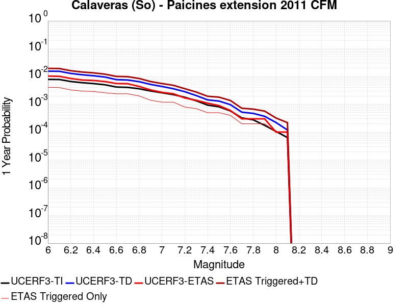 |  |

| Magnitude | 1 wk TI Prob | 1 wk TD Prob | 1 wk ETAS Prob | 1 wk ETAS/TD Gain | 1 wk ETAS Triggered+TD | 1 wk ETAS Triggered Only | 1 mo TI Prob | 1 mo TD Prob | 1 mo ETAS Prob | 1 mo ETAS/TD Gain | 1 mo ETAS Triggered+TD | 1 mo ETAS Triggered Only | 1 yr TI Prob | 1 yr TD Prob | 1 yr ETAS Prob | 1 yr ETAS/TD Gain | 1 yr ETAS Triggered+TD | 1 yr ETAS Triggered Only | 10 yr TI Prob | 10 yr TD Prob | 10 yr ETAS Prob | 10 yr ETAS/TD Gain | 10 yr ETAS Triggered+TD | 10 yr ETAS Triggered Only |
|-----|-----|-----|-----|-----|-----|-----|-----|-----|-----|-----|-----|-----|-----|-----|-----|-----|-----|-----|-----|-----|-----|-----|-----|-----|
| 6.0 | 1.5183659E-4 | 3.0299783E-4 | 2.0E-4 | 0.6600708 | 5.0293724E-4 | 2.0E-4 | 6.5056595E-4 | 0.0012973594 | 2.0E-4 | 0.1541593 | 0.0014970999 | 2.0E-4 | 0.007891912 | 0.015582891 | 0.0015 | 0.096259415 | 0.017059516 | 0.0015 | 0.076174594 | 0.1375756 | 0.0044 | 0.03198242 | 0.14137027 | 0.0044 |
| 6.1 | 1.5024997E-4 | 2.9995097E-4 | 2.0E-4 | 0.66677564 | 4.99891E-4 | 2.0E-4 | 6.437695E-4 | 0.0012843153 | 2.0E-4 | 0.155725 | 0.0014840584 | 2.0E-4 | 0.0078097614 | 0.015426802 | 0.0014 | 0.09075115 | 0.016805205 | 0.0014 | 0.075409345 | 0.1362479 | 0.0043 | 0.03156012 | 0.13996205 | 0.0043 |
| 6.2 | 1.2743923E-4 | 2.5098768E-4 | 2.0E-4 | 0.7968519 | 4.5093748E-4 | 2.0E-4 | 5.460538E-4 | 0.0010747976 | 2.0E-4 | 0.18608154 | 0.0012745827 | 2.0E-4 | 0.0066279583 | 0.012936405 | 0.001 | 0.07730123 | 0.013923469 | 0.001 | 0.064337276 | 0.11634466 | 0.0037 | 0.031802062 | 0.11961419 | 0.0037 |
| 6.3 | 1.1525114E-4 | 2.2385431E-4 | 2.0E-4 | 0.8934382 | 4.2380954E-4 | 2.0E-4 | 4.9383997E-4 | 9.587146E-4 | 2.0E-4 | 0.20861267 | 0.0011585228 | 2.0E-4 | 0.0059959386 | 0.011557981 | 9.0E-4 | 0.07786827 | 0.012447579 | 9.0E-4 | 0.058367174 | 0.10545349 | 0.0031 | 0.029396845 | 0.10822659 | 0.0031 |
| 6.4 | 1.07200925E-4 | 2.0627695E-4 | 2.0E-4 | 0.96957034 | 4.062357E-4 | 2.0E-4 | 4.5935164E-4 | 8.835058E-4 | 2.0E-4 | 0.22637089 | 0.0010833291 | 2.0E-4 | 0.0055782744 | 0.01066342 | 9.0E-4 | 0.08440068 | 0.011553823 | 9.0E-4 | 0.0544031 | 0.098273955 | 0.0028 | 0.028491782 | 0.100798786 | 0.0028 |
| 6.5 | 9.69631E-5 | 1.8526119E-4 | 2.0E-4 | 1.079557 | 3.8522415E-4 | 2.0E-4 | 4.1548995E-4 | 7.935387E-4 | 2.0E-4 | 0.2520356 | 9.9338E-4 | 2.0E-4 | 0.0050468626 | 0.009587359 | 8.0E-4 | 0.08344322 | 0.010379689 | 8.0E-4 | 0.04933773 | 0.08917394 | 0.0023 | 0.025792288 | 0.091268845 | 0.0023 |
| 6.6 | 8.0552316E-5 | 1.4863664E-4 | 2.0E-4 | 1.3455633 | 3.486069E-4 | 2.0E-4 | 3.4517853E-4 | 6.368201E-4 | 2.0E-4 | 0.31406045 | 8.3669275E-4 | 2.0E-4 | 0.0041944524 | 0.007719438 | 8.0E-4 | 0.103634484 | 0.0085132625 | 8.0E-4 | 0.04116161 | 0.073933005 | 0.0021 | 0.028404092 | 0.07587775 | 0.0021 |
| 6.7 | 7.815757E-5 | 1.440591E-4 | 2.0E-4 | 1.388319 | 3.440303E-4 | 2.0E-4 | 3.34918E-4 | 6.1721564E-4 | 2.0E-4 | 0.32403585 | 8.170922E-4 | 2.0E-4 | 0.004070005 | 0.007483083 | 8.0E-4 | 0.106907815 | 0.008277096 | 8.0E-4 | 0.039962657 | 0.07178749 | 0.0021 | 0.029253008 | 0.073736735 | 0.0021 |
| 6.8 | 6.965264E-5 | 1.2529595E-4 | 2.0E-4 | 1.5962209 | 3.252709E-4 | 2.0E-4 | 2.9847719E-4 | 5.3686014E-4 | 2.0E-4 | 0.3725365 | 7.3675276E-4 | 2.0E-4 | 0.0036279052 | 0.0065135644 | 7.0E-4 | 0.10746804 | 0.007209005 | 7.0E-4 | 0.03569247 | 0.062926516 | 0.0019 | 0.030193951 | 0.06470695 | 0.0019 |
| 6.9 | 5.8000453E-5 | 9.968164E-5 | 1.0E-4 | 1.0031939 | 1.9967166E-4 | 1.0E-4 | 2.4854968E-4 | 4.2713762E-4 | 1.0E-4 | 0.23411658 | 5.2709493E-4 | 1.0E-4 | 0.0030218933 | 0.0051880954 | 4.0E-4 | 0.077099584 | 0.00558602 | 4.0E-4 | 0.029811295 | 0.050695516 | 0.0015 | 0.029588416 | 0.05211947 | 0.0015 |
| 7.0 | 4.9865852E-5 | 8.4068415E-5 | 1.0E-4 | 1.1895074 | 1.8406002E-4 | 1.0E-4 | 2.1369329E-4 | 3.6024392E-4 | 1.0E-4 | 0.27758968 | 4.602079E-4 | 1.0E-4 | 0.0025986114 | 0.004377236 | 3.0E-4 | 0.0685364 | 0.004675923 | 3.0E-4 | 0.025684336 | 0.04303462 | 0.0013 | 0.030208236 | 0.044278678 | 0.0013 |
| 7.1 | 4.283875E-5 | 6.968087E-5 | 1.0E-4 | 1.4351141 | 1.696739E-4 | 1.0E-4 | 1.8358172E-4 | 2.985984E-4 | 1.0E-4 | 0.33489797 | 3.9856855E-4 | 1.0E-4 | 0.0022328163 | 0.0036294304 | 3.0E-4 | 0.0826576 | 0.0039283414 | 3.0E-4 | 0.022105146 | 0.036053885 | 0.0011 | 0.03050989 | 0.037114225 | 0.0011 |
| 7.2 | 3.450115E-5 | 5.4509244E-5 | 0.0 | 0.0 | 5.4509244E-5 | 0.0 | 1.478537E-4 | 2.3359028E-4 | 0.0 | 0.0 | 2.3359028E-4 | 0.0 | 0.0017986323 | 0.002840281 | 2.0E-4 | 0.070415564 | 0.003039713 | 2.0E-4 | 0.017841442 | 0.028472278 | 7.0E-4 | 0.024585316 | 0.029152349 | 7.0E-4 |
| 7.3 | 2.5709045E-5 | 3.9591396E-5 | 0.0 | 0.0 | 3.9591396E-5 | 0.0 | 1.1017697E-4 | 1.6966647E-4 | 0.0 | 0.0 | 1.6966647E-4 | 0.0 | 0.0013405791 | 0.0020637487 | 2.0E-4 | 0.09691102 | 0.002263336 | 2.0E-4 | 0.013325208 | 0.020812701 | 6.0E-4 | 0.02882855 | 0.021400213 | 6.0E-4 |
| 7.4 | 1.8003093E-5 | 2.7654243E-5 | 0.0 | 0.0 | 2.7654243E-5 | 0.0 | 7.715383E-5 | 1.1851281E-4 | 0.0 | 0.0 | 1.1851281E-4 | 0.0 | 9.3894306E-4 | 0.0014419407 | 2.0E-4 | 0.13870196 | 0.0016416523 | 2.0E-4 | 0.009349857 | 0.0146336295 | 4.0E-4 | 0.027334297 | 0.015027776 | 4.0E-4 |
| 7.5 | 1.5595824E-5 | 2.5012372E-5 | 0.0 | 0.0 | 2.5012372E-5 | 0.0 | 6.683753E-5 | 1.0719149E-4 | 0.0 | 0.0 | 1.0719149E-4 | 0.0 | 8.134431E-4 | 0.0013042772 | 2.0E-4 | 0.15334164 | 0.0015040163 | 2.0E-4 | 0.008104719 | 0.013256188 | 4.0E-4 | 0.030174587 | 0.013650885 | 4.0E-4 |
| 7.6 | 1.1110309E-5 | 1.8564004E-5 | 0.0 | 0.0 | 1.8564004E-5 | 0.0 | 4.761474E-5 | 7.95576E-5 | 0.0 | 0.0 | 7.95576E-5 | 0.0 | 5.795553E-4 | 9.681847E-4 | 1.0E-4 | 0.10328608 | 0.0010680879 | 1.0E-4 | 0.0057804612 | 0.009882825 | 2.0E-4 | 0.020237127 | 0.010080849 | 2.0E-4 |
| 7.7 | 6.2140443E-6 | 9.9548215E-6 | 0.0 | 0.0 | 9.9548215E-6 | 0.0 | 2.6631347E-5 | 4.266282E-5 | 0.0 | 0.0 | 4.266282E-5 | 0.0 | 3.241884E-4 | 5.1929615E-4 | 0.0 | 0.0 | 5.1929615E-4 | 0.0 | 0.0032371588 | 0.00538349 | 0.0 | 0.0 | 0.00538349 | 0.0 |
| 7.8 | 5.305533E-6 | 9.00452E-6 | 0.0 | 0.0 | 9.00452E-6 | 0.0 | 2.27378E-5 | 3.859023E-5 | 0.0 | 0.0 | 3.859023E-5 | 0.0 | 2.7679754E-4 | 4.6973483E-4 | 0.0 | 0.0 | 4.6973483E-4 | 0.0 | 0.0027645302 | 0.004865346 | 0.0 | 0.0 | 0.004865346 | 0.0 |
| 7.9 | 3.363505E-6 | 7.0710216E-6 | 0.0 | 0.0 | 7.0710216E-6 | 0.0 | 1.4414942E-5 | 3.0304027E-5 | 0.0 | 0.0 | 3.0304027E-5 | 0.0 | 1.7548777E-4 | 3.6888913E-4 | 0.0 | 0.0 | 3.6888913E-4 | 0.0 | 0.0017534926 | 0.0037968648 | 0.0 | 0.0 | 0.0037968648 | 0.0 |
| 8.0 | 2.0271132E-6 | 4.2371266E-6 | 0.0 | 0.0 | 4.2371266E-6 | 0.0 | 8.687599E-6 | 1.8158988E-5 | 0.0 | 0.0 | 1.8158988E-5 | 0.0 | 1.05766376E-4 | 2.2106328E-4 | 0.0 | 0.0 | 2.2106328E-4 | 0.0 | 0.0010571606 | 0.0022653474 | 0.0 | 0.0 | 0.0022653474 | 0.0 |
| 8.1 | 1.2206116E-6 | 2.278714E-6 | 0.0 | 0.0 | 2.278714E-6 | 0.0 | 5.2311816E-6 | 9.765881E-6 | 0.0 | 0.0 | 9.765881E-6 | 0.0 | 6.3687774E-5 | 1.1889315E-4 | 0.0 | 0.0 | 1.1889315E-4 | 0.0 | 6.366953E-4 | 0.0012227265 | 0.0 | 0.0 | 0.0012227265 | 0.0 |

## San Andreas (Coachella) rev
*[(top)](#table-of-contents)*

| 1 Week | 1 Month | 1 Year | 10 Year |
|-----|-----|-----|-----|
|  |  | 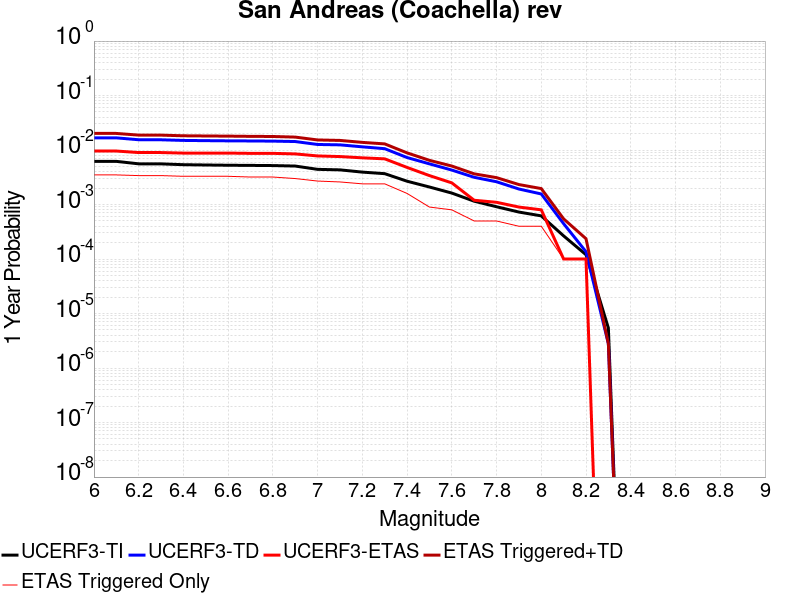 |  |

| Magnitude | 1 wk TI Prob | 1 wk TD Prob | 1 wk ETAS Prob | 1 wk ETAS/TD Gain | 1 wk ETAS Triggered+TD | 1 wk ETAS Triggered Only | 1 mo TI Prob | 1 mo TD Prob | 1 mo ETAS Prob | 1 mo ETAS/TD Gain | 1 mo ETAS Triggered+TD | 1 mo ETAS Triggered Only | 1 yr TI Prob | 1 yr TD Prob | 1 yr ETAS Prob | 1 yr ETAS/TD Gain | 1 yr ETAS Triggered+TD | 1 yr ETAS Triggered Only | 10 yr TI Prob | 10 yr TD Prob | 10 yr ETAS Prob | 10 yr ETAS/TD Gain | 10 yr ETAS Triggered+TD | 10 yr ETAS Triggered Only |
|-----|-----|-----|-----|-----|-----|-----|-----|-----|-----|-----|-----|-----|-----|-----|-----|-----|-----|-----|-----|-----|-----|-----|-----|-----|
| 6.0 | 1.1925945E-4 | 3.2288718E-4 | 1.0E-4 | 0.3097057 | 4.2285488E-4 | 1.0E-4 | 5.110118E-4 | 0.0013830729 | 2.0E-4 | 0.14460553 | 0.0015827963 | 2.0E-4 | 0.0062038354 | 0.016710198 | 0.0016 | 0.095749915 | 0.018283462 | 0.0016 | 0.060334753 | 0.15093613 | 0.0041 | 0.027163807 | 0.15441729 | 0.0041 |
| 6.1 | 1.1925945E-4 | 3.2288718E-4 | 1.0E-4 | 0.3097057 | 4.2285488E-4 | 1.0E-4 | 5.110118E-4 | 0.0013830729 | 2.0E-4 | 0.14460553 | 0.0015827963 | 2.0E-4 | 0.0062038354 | 0.016710198 | 0.0016 | 0.095749915 | 0.018283462 | 0.0016 | 0.060334753 | 0.15093613 | 0.0041 | 0.027163807 | 0.15441729 | 0.0041 |
| 6.2 | 1.07432395E-4 | 2.9791912E-4 | 1.0E-4 | 0.33566156 | 3.9788932E-4 | 1.0E-4 | 4.603433E-4 | 0.0012761754 | 2.0E-4 | 0.15671827 | 0.0014759202 | 2.0E-4 | 0.005590286 | 0.015427807 | 0.0016 | 0.10370884 | 0.017003123 | 0.0016 | 0.05451731 | 0.14010412 | 0.004 | 0.028550196 | 0.14354369 | 0.004 |
| 6.3 | 1.0718766E-4 | 2.9737237E-4 | 1.0E-4 | 0.33627874 | 3.9734264E-4 | 1.0E-4 | 4.592948E-4 | 0.0012738345 | 2.0E-4 | 0.15700628 | 0.0014735797 | 2.0E-4 | 0.005577586 | 0.015399709 | 0.0016 | 0.10389806 | 0.01697507 | 0.0016 | 0.054396555 | 0.13987197 | 0.004 | 0.028597582 | 0.14331248 | 0.004 |
| 6.4 | 1.0355944E-4 | 2.8945875E-4 | 1.0E-4 | 0.34547237 | 3.894298E-4 | 1.0E-4 | 4.4375064E-4 | 0.0012399516 | 2.0E-4 | 0.16129662 | 0.0014397036 | 2.0E-4 | 0.0053892885 | 0.014992934 | 0.0016 | 0.10671694 | 0.016568946 | 0.0016 | 0.052604496 | 0.13642041 | 0.004 | 0.029321123 | 0.13987474 | 0.004 |
| 6.5 | 1.0227914E-4 | 2.8665483E-4 | 1.0E-4 | 0.34885162 | 3.8662617E-4 | 1.0E-4 | 4.382655E-4 | 0.0012279461 | 2.0E-4 | 0.1628736 | 0.0014277005 | 2.0E-4 | 0.0053228354 | 0.014848769 | 0.0016 | 0.10775304 | 0.016425012 | 0.0016 | 0.051971316 | 0.13520178 | 0.004 | 0.02958541 | 0.13866097 | 0.004 |
| 6.6 | 1.0116757E-4 | 2.8431637E-4 | 1.0E-4 | 0.35172087 | 3.8428794E-4 | 1.0E-4 | 4.3350324E-4 | 0.0012179336 | 2.0E-4 | 0.16421257 | 0.00141769 | 2.0E-4 | 0.0052651367 | 0.01472852 | 0.0016 | 0.10863278 | 0.016304955 | 0.0016 | 0.051421247 | 0.13417985 | 0.004 | 0.029810738 | 0.13764313 | 0.004 |
| 6.7 | 1.0050676E-4 | 2.829039E-4 | 1.0E-4 | 0.3534769 | 3.8287562E-4 | 1.0E-4 | 4.3067214E-4 | 0.0012118858 | 2.0E-4 | 0.16503206 | 0.0014116435 | 2.0E-4 | 0.005230834 | 0.014655882 | 0.0016 | 0.10917119 | 0.016232431 | 0.0016 | 0.051094085 | 0.13356358 | 0.004 | 0.029948285 | 0.13702932 | 0.004 |
| 6.8 | 9.976819E-5 | 2.8094676E-4 | 1.0E-4 | 0.35593936 | 3.8091865E-4 | 1.0E-4 | 4.2750788E-4 | 0.0012035057 | 2.0E-4 | 0.16618119 | 0.0014032649 | 2.0E-4 | 0.0051924936 | 0.014555221 | 0.0016 | 0.10992619 | 0.016131934 | 0.0016 | 0.050728295 | 0.13271578 | 0.004 | 0.030139595 | 0.13618492 | 0.004 |
| 6.9 | 9.77719E-5 | 2.7595705E-4 | 1.0E-4 | 0.36237523 | 3.7592946E-4 | 1.0E-4 | 4.1895514E-4 | 0.0011821408 | 2.0E-4 | 0.16918458 | 0.0013819044 | 2.0E-4 | 0.0050888555 | 0.014298547 | 0.0015 | 0.10490576 | 0.0157771 | 0.0015 | 0.049738888 | 0.1305549 | 0.0039 | 0.02987249 | 0.13394573 | 0.0039 |
| 7.0 | 8.500761E-5 | 2.4361434E-4 | 1.0E-4 | 0.41048488 | 3.4358999E-4 | 1.0E-4 | 3.6426744E-4 | 0.0010436468 | 2.0E-4 | 0.19163571 | 0.0012434381 | 2.0E-4 | 0.0044259406 | 0.012633122 | 0.0013 | 0.102904096 | 0.013916698 | 0.0013 | 0.04338823 | 0.11649794 | 0.0036 | 0.030901834 | 0.11967855 | 0.0036 |
| 7.1 | 8.319876E-5 | 2.3970265E-4 | 1.0E-4 | 0.41718352 | 3.396787E-4 | 1.0E-4 | 3.5651738E-4 | 0.0010268958 | 2.0E-4 | 0.19476172 | 0.0012266904 | 2.0E-4 | 0.004331963 | 0.012431524 | 0.0012 | 0.0965288 | 0.013616606 | 0.0012 | 0.042484846 | 0.114739165 | 0.0035 | 0.03050397 | 0.11783758 | 0.0035 |
| 7.2 | 7.563917E-5 | 2.2033798E-4 | 1.0E-4 | 0.4538482 | 3.2031594E-4 | 1.0E-4 | 3.2412758E-4 | 9.4396685E-4 | 2.0E-4 | 0.21187185 | 0.0011437781 | 2.0E-4 | 0.0039391145 | 0.011432902 | 0.0012 | 0.10496023 | 0.0126191825 | 0.0012 | 0.03870018 | 0.10618827 | 0.0032 | 0.030135155 | 0.10904846 | 0.0032 |
| 7.3 | 7.082985E-5 | 2.0367479E-4 | 1.0E-4 | 0.4909788 | 3.036544E-4 | 1.0E-4 | 3.0352117E-4 | 8.7260274E-4 | 2.0E-4 | 0.22919936 | 0.0010724282 | 2.0E-4 | 0.0036891096 | 0.010572792 | 0.0012 | 0.113498874 | 0.011760104 | 0.0012 | 0.03628465 | 0.098766804 | 0.0032 | 0.03239955 | 0.101650745 | 0.0032 |
| 7.4 | 5.146215E-5 | 1.3987564E-4 | 0.0 | 0.0 | 1.3987564E-4 | 0.0 | 2.2053342E-4 | 5.993302E-4 | 1.0E-4 | 0.16685294 | 6.992703E-4 | 1.0E-4 | 0.0026816884 | 0.007272614 | 6.0E-4 | 0.082501285 | 0.007868251 | 6.0E-4 | 0.02649557 | 0.06959498 | 0.0014 | 0.020116394 | 0.07089754 | 0.0014 |
| 7.5 | 4.0285166E-5 | 1.07025786E-4 | 0.0 | 0.0 | 1.07025786E-4 | 0.0 | 1.7263928E-4 | 4.5860163E-4 | 0.0 | 0.0 | 4.5860163E-4 | 0.0 | 0.002099857 | 0.005569247 | 3.0E-4 | 0.053867243 | 0.0058675767 | 3.0E-4 | 0.020801254 | 0.05394122 | 8.0E-4 | 0.014830958 | 0.05469807 | 8.0E-4 |
| 7.6 | 3.1168736E-5 | 8.228769E-5 | 0.0 | 0.0 | 8.228769E-5 | 0.0 | 1.3357346E-4 | 3.5261398E-4 | 0.0 | 0.0 | 3.5261398E-4 | 0.0 | 0.0016250437 | 0.0042846496 | 3.0E-4 | 0.07001739 | 0.0045833644 | 3.0E-4 | 0.016132116 | 0.041857634 | 6.0E-4 | 0.014334303 | 0.042432517 | 6.0E-4 |
| 7.7 | 2.2100989E-5 | 6.0561815E-5 | 0.0 | 0.0 | 6.0561815E-5 | 0.0 | 9.4715084E-5 | 2.5952485E-4 | 0.0 | 0.0 | 2.5952485E-4 | 0.0 | 0.001152546 | 0.003155143 | 1.0E-4 | 0.031694286 | 0.0032548273 | 1.0E-4 | 0.011465867 | 0.031067226 | 3.0E-4 | 0.009656479 | 0.031357907 | 3.0E-4 |
| 7.8 | 1.7484861E-5 | 5.017899E-5 | 0.0 | 0.0 | 5.017899E-5 | 0.0 | 7.493296E-5 | 2.150351E-4 | 0.0 | 0.0 | 2.150351E-4 | 0.0 | 9.1192697E-4 | 0.0026149119 | 1.0E-4 | 0.038242206 | 0.0027146502 | 1.0E-4 | 0.009081938 | 0.025900835 | 2.0E-4 | 0.0077217584 | 0.026095655 | 2.0E-4 |
| 7.9 | 1.3967285E-5 | 3.6891262E-5 | 0.0 | 0.0 | 3.6891262E-5 | 0.0 | 5.985842E-5 | 1.5809583E-4 | 0.0 | 0.0 | 1.5809583E-4 | 0.0 | 7.2853256E-4 | 0.0019231186 | 0.0 | 0.0 | 0.0019231186 | 0.0 | 0.0072614877 | 0.019291423 | 1.0E-4 | 0.005183651 | 0.019389493 | 1.0E-4 |
| 8.0 | 1.1887396E-5 | 2.9913166E-5 | 0.0 | 0.0 | 2.9913166E-5 | 0.0 | 5.094499E-5 | 1.2819299E-4 | 0.0 | 0.0 | 1.2819299E-4 | 0.0 | 6.200787E-4 | 0.0015596332 | 0.0 | 0.0 | 0.0015596332 | 0.0 | 0.006183513 | 0.015740186 | 1.0E-4 | 0.0063531655 | 0.015838612 | 1.0E-4 |
| 8.1 | 5.100864E-6 | 8.48687E-6 | 0.0 | 0.0 | 8.48687E-6 | 0.0 | 2.1860664E-5 | 3.637179E-5 | 0.0 | 0.0 | 3.637179E-5 | 0.0 | 2.6612106E-4 | 4.427367E-4 | 0.0 | 0.0 | 4.427367E-4 | 0.0 | 0.002658026 | 0.0046746903 | 0.0 | 0.0 | 0.0046746903 | 0.0 |
| 8.2 | 2.3004484E-6 | 2.5886918E-6 | 0.0 | 0.0 | 2.5886918E-6 | 0.0 | 9.859027E-6 | 1.10943465E-5 | 0.0 | 0.0 | 1.10943465E-5 | 0.0 | 1.2002704E-4 | 1.3506532E-4 | 0.0 | 0.0 | 1.3506532E-4 | 0.0 | 0.0011996223 | 0.0014949394 | 0.0 | 0.0 | 0.0014949394 | 0.0 |
| 8.3 | 1.0424446E-7 | 5.3008716E-8 | 0.0 | 0.0 | 5.3008716E-8 | 0.0 | 4.4676187E-7 | 2.2718018E-7 | 0.0 | 0.0 | 2.2718018E-7 | 0.0 | 5.439312E-6 | 2.7659155E-6 | 0.0 | 0.0 | 2.7659155E-6 | 0.0 | 5.4391792E-5 | 2.9151119E-5 | 0.0 | 0.0 | 2.9151119E-5 | 0.0 |

## Hunting Creek - Berryessa 2011 CFM
*[(top)](#table-of-contents)*

| 1 Week | 1 Month | 1 Year | 10 Year |
|-----|-----|-----|-----|
| 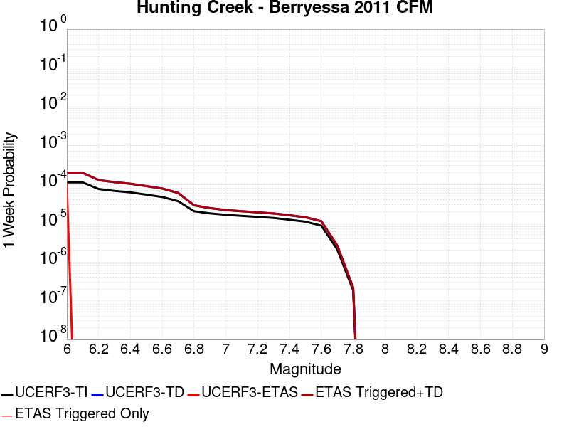 |  | 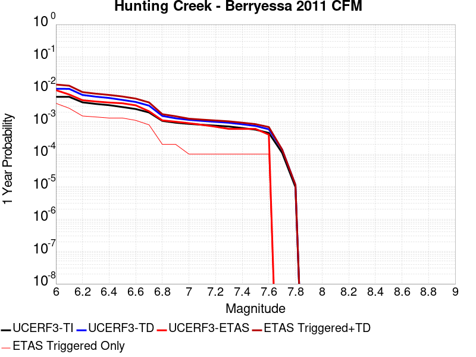 |  |

| Magnitude | 1 wk TI Prob | 1 wk TD Prob | 1 wk ETAS Prob | 1 wk ETAS/TD Gain | 1 wk ETAS Triggered+TD | 1 wk ETAS Triggered Only | 1 mo TI Prob | 1 mo TD Prob | 1 mo ETAS Prob | 1 mo ETAS/TD Gain | 1 mo ETAS Triggered+TD | 1 mo ETAS Triggered Only | 1 yr TI Prob | 1 yr TD Prob | 1 yr ETAS Prob | 1 yr ETAS/TD Gain | 1 yr ETAS Triggered+TD | 1 yr ETAS Triggered Only | 10 yr TI Prob | 10 yr TD Prob | 10 yr ETAS Prob | 10 yr ETAS/TD Gain | 10 yr ETAS Triggered+TD | 10 yr ETAS Triggered Only |
|-----|-----|-----|-----|-----|-----|-----|-----|-----|-----|-----|-----|-----|-----|-----|-----|-----|-----|-----|-----|-----|-----|-----|-----|-----|
| 6.0 | 1.1270982E-4 | 1.9940689E-4 | 0.0 | 0.0 | 1.9940689E-4 | 0.0 | 4.8295266E-4 | 8.542511E-4 | 1.0E-4 | 0.11706161 | 9.5416565E-4 | 1.0E-4 | 0.0058641075 | 0.01034132 | 9.0E-4 | 0.08702951 | 0.011232013 | 9.0E-4 | 0.057117578 | 0.09765978 | 0.0036 | 0.036862668 | 0.100908205 | 0.0036 |
| 6.1 | 1.1239393E-4 | 1.988906E-4 | 0.0 | 0.0 | 1.988906E-4 | 0.0 | 4.8159933E-4 | 8.5203996E-4 | 1.0E-4 | 0.11736539 | 9.5195475E-4 | 1.0E-4 | 0.0058477195 | 0.01031468 | 8.0E-4 | 0.07755937 | 0.011106428 | 8.0E-4 | 0.056962132 | 0.09741914 | 0.0032 | 0.032847755 | 0.100307405 | 0.0032 |
| 6.2 | 7.596265E-5 | 1.2870526E-4 | 0.0 | 0.0 | 1.2870526E-4 | 0.0 | 3.2551357E-4 | 5.51466E-4 | 0.0 | 0.0 | 5.51466E-4 | 0.0 | 0.0039559277 | 0.0066889296 | 6.0E-4 | 0.08970045 | 0.007284916 | 6.0E-4 | 0.038862433 | 0.06430455 | 0.0022 | 0.034212194 | 0.06636308 | 0.0022 |
| 6.3 | 6.78794E-5 | 1.13912276E-4 | 0.0 | 0.0 | 1.13912276E-4 | 0.0 | 2.9087928E-4 | 4.8809202E-4 | 0.0 | 0.0 | 4.8809202E-4 | 0.0 | 0.003535705 | 0.0059231822 | 5.0E-4 | 0.08441409 | 0.0064202202 | 5.0E-4 | 0.034799766 | 0.057201747 | 0.0018 | 0.03146757 | 0.058898784 | 0.0018 |
| 6.4 | 6.2165134E-5 | 1.0382523E-4 | 0.0 | 0.0 | 1.0382523E-4 | 0.0 | 2.6639478E-4 | 4.4488598E-4 | 0.0 | 0.0 | 4.4488598E-4 | 0.0 | 0.0032385332 | 0.0054004393 | 4.0E-4 | 0.07406805 | 0.0057982793 | 4.0E-4 | 0.03191742 | 0.052307636 | 0.0016 | 0.03058827 | 0.053823944 | 0.0016 |
| 6.5 | 5.4368087E-5 | 9.023392E-5 | 0.0 | 0.0 | 9.023392E-5 | 0.0 | 2.3298527E-4 | 3.8665588E-4 | 0.0 | 0.0 | 3.8665588E-4 | 0.0 | 0.0028329059 | 0.004695443 | 4.0E-4 | 0.08518898 | 0.0050935647 | 4.0E-4 | 0.027970633 | 0.04565968 | 0.0013 | 0.028471509 | 0.04690032 | 0.0013 |
| 6.6 | 4.729947E-5 | 7.8045974E-5 | 0.0 | 0.0 | 7.8045974E-5 | 0.0 | 2.0269625E-4 | 3.344384E-4 | 0.0 | 0.0 | 3.344384E-4 | 0.0 | 0.002465034 | 0.004062789 | 3.0E-4 | 0.0738409 | 0.0043615703 | 3.0E-4 | 0.02437869 | 0.03965023 | 0.001 | 0.025220534 | 0.04061058 | 0.001 |
| 6.7 | 3.6875328E-5 | 6.0107366E-5 | 0.0 | 0.0 | 6.0107366E-5 | 0.0 | 1.5802756E-4 | 2.575781E-4 | 0.0 | 0.0 | 2.575781E-4 | 0.0 | 0.0019222875 | 0.0031308257 | 3.0E-4 | 0.09582137 | 0.0034298864 | 3.0E-4 | 0.019057442 | 0.03073008 | 7.0E-4 | 0.022778984 | 0.03140857 | 7.0E-4 |
| 6.8 | 2.0292036E-5 | 2.8875764E-5 | 0.0 | 0.0 | 2.8875764E-5 | 0.0 | 8.6962966E-5 | 1.2374739E-4 | 0.0 | 0.0 | 1.2374739E-4 | 0.0 | 0.0010582599 | 0.0015055726 | 0.0 | 0.0 | 0.0015055726 | 0.0 | 0.010532344 | 0.014927712 | 2.0E-4 | 0.013397899 | 0.015124727 | 2.0E-4 |
| 6.9 | 1.7871042E-5 | 2.440453E-5 | 0.0 | 0.0 | 2.440453E-5 | 0.0 | 7.658793E-5 | 1.0458663E-4 | 0.0 | 0.0 | 1.0458663E-4 | 0.0 | 9.320591E-4 | 0.0012725984 | 0.0 | 0.0 | 0.0012725984 | 0.0 | 0.009281595 | 0.012644729 | 0.0 | 0.0 | 0.012644729 | 0.0 |
| 7.0 | 1.6415532E-5 | 2.1844406E-5 | 0.0 | 0.0 | 2.1844406E-5 | 0.0 | 7.035038E-5 | 9.361554E-5 | 0.0 | 0.0 | 9.361554E-5 | 0.0 | 8.561793E-4 | 0.0011391746 | 0.0 | 0.0 | 0.0011391746 | 0.0 | 0.008528882 | 0.011332817 | 0.0 | 0.0 | 0.011332817 | 0.0 |
| 7.1 | 1.5409885E-5 | 2.0292511E-5 | 0.0 | 0.0 | 2.0292511E-5 | 0.0 | 6.6040695E-5 | 8.6965025E-5 | 0.0 | 0.0 | 8.6965025E-5 | 0.0 | 8.0374884E-4 | 0.0010582876 | 0.0 | 0.0 | 0.0010582876 | 0.0 | 0.00800848 | 0.0105329 | 0.0 | 0.0 | 0.0105329 | 0.0 |
| 7.2 | 1.4497423E-5 | 1.9004163E-5 | 0.0 | 0.0 | 1.9004163E-5 | 0.0 | 6.213033E-5 | 8.144388E-5 | 0.0 | 0.0 | 8.144388E-5 | 0.0 | 7.5617427E-4 | 9.911313E-4 | 0.0 | 0.0 | 9.911313E-4 | 0.0 | 0.0075360634 | 0.009867775 | 0.0 | 0.0 | 0.009867775 | 0.0 |
| 7.3 | 1.3615175E-5 | 1.7777578E-5 | 0.0 | 0.0 | 1.7777578E-5 | 0.0 | 5.8349444E-5 | 7.618741E-5 | 0.0 | 0.0 | 7.618741E-5 | 0.0 | 7.101729E-4 | 9.2718995E-4 | 0.0 | 0.0 | 9.2718995E-4 | 0.0 | 0.0070790765 | 0.009233719 | 0.0 | 0.0 | 0.009233719 | 0.0 |
| 7.4 | 1.2252825E-5 | 1.5983189E-5 | 0.0 | 0.0 | 1.5983189E-5 | 0.0 | 5.251105E-5 | 6.8497604E-5 | 0.0 | 0.0 | 6.8497604E-5 | 0.0 | 6.391345E-4 | 8.3364197E-4 | 0.0 | 0.0 | 8.3364197E-4 | 0.0 | 0.0063729943 | 0.008305561 | 0.0 | 0.0 | 0.008305561 | 0.0 |
| 7.5 | 1.0913301E-5 | 1.4202664E-5 | 0.0 | 0.0 | 1.4202664E-5 | 0.0 | 4.6770452E-5 | 6.0867154E-5 | 0.0 | 0.0 | 6.0867154E-5 | 0.0 | 5.6928146E-4 | 7.408084E-4 | 0.0 | 0.0 | 7.408084E-4 | 0.0 | 0.0056782532 | 0.0073837684 | 0.0 | 0.0 | 0.0073837684 | 0.0 |
| 7.6 | 8.623192E-6 | 1.1203514E-5 | 0.0 | 0.0 | 1.1203514E-5 | 0.0 | 3.6956015E-5 | 4.8014193E-5 | 0.0 | 0.0 | 4.8014193E-5 | 0.0 | 4.4984656E-4 | 5.8441854E-4 | 0.0 | 0.0 | 5.8441854E-4 | 0.0 | 0.00448937 | 0.005829101 | 0.0 | 0.0 | 0.005829101 | 0.0 |
| 7.7 | 2.0993634E-6 | 2.655011E-6 | 0.0 | 0.0 | 2.655011E-6 | 0.0 | 8.997241E-6 | 1.137857E-5 | 0.0 | 0.0 | 1.137857E-5 | 0.0 | 1.09535904E-4 | 1.3852536E-4 | 0.0 | 0.0 | 1.3852536E-4 | 0.0 | 0.0010948193 | 0.001384442 | 0.0 | 0.0 | 0.001384442 | 0.0 |
| 7.8 | 1.8428308E-7 | 2.164475E-7 | 0.0 | 0.0 | 2.164475E-7 | 0.0 | 7.897844E-7 | 9.276319E-7 | 0.0 | 0.0 | 9.276319E-7 | 0.0 | 9.615583E-6 | 1.1293863E-5 | 0.0 | 0.0 | 1.1293863E-5 | 0.0 | 9.615166E-5 | 1.1294148E-4 | 0.0 | 0.0 | 1.1294148E-4 | 0.0 |

## Hayward (So) 2011 CFM
*[(top)](#table-of-contents)*

| 1 Week | 1 Month | 1 Year | 10 Year |
|-----|-----|-----|-----|
|  |  | 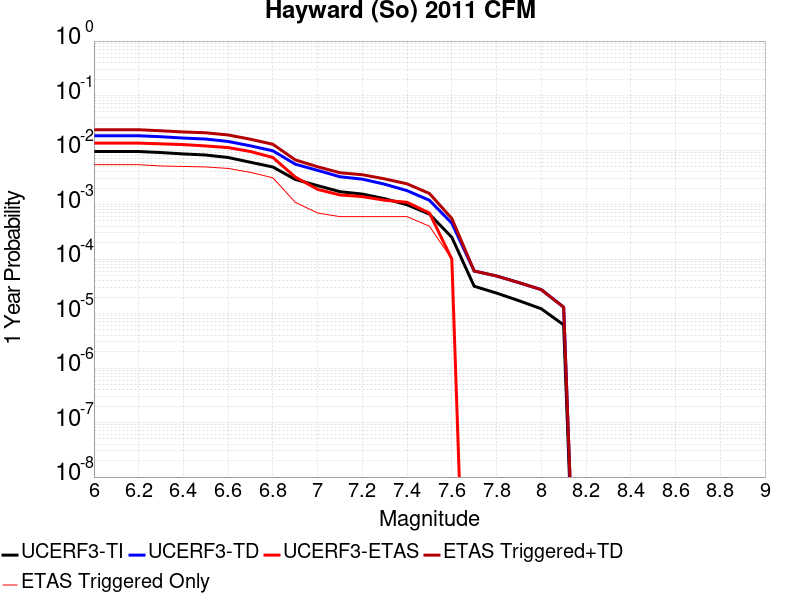 |  |

| Magnitude | 1 wk TI Prob | 1 wk TD Prob | 1 wk ETAS Prob | 1 wk ETAS/TD Gain | 1 wk ETAS Triggered+TD | 1 wk ETAS Triggered Only | 1 mo TI Prob | 1 mo TD Prob | 1 mo ETAS Prob | 1 mo ETAS/TD Gain | 1 mo ETAS Triggered+TD | 1 mo ETAS Triggered Only | 1 yr TI Prob | 1 yr TD Prob | 1 yr ETAS Prob | 1 yr ETAS/TD Gain | 1 yr ETAS Triggered+TD | 1 yr ETAS Triggered Only | 10 yr TI Prob | 10 yr TD Prob | 10 yr ETAS Prob | 10 yr ETAS/TD Gain | 10 yr ETAS Triggered+TD | 10 yr ETAS Triggered Only |
|-----|-----|-----|-----|-----|-----|-----|-----|-----|-----|-----|-----|-----|-----|-----|-----|-----|-----|-----|-----|-----|-----|-----|-----|-----|
| 6.0 | 1.8091932E-4 | 3.5261808E-4 | 3.0E-4 | 0.8507788 | 6.525123E-4 | 3.0E-4 | 7.751381E-4 | 0.0015103549 | 3.0E-4 | 0.19862881 | 0.0018099018 | 3.0E-4 | 0.00939654 | 0.018235872 | 9.0E-4 | 0.049353275 | 0.01911946 | 9.0E-4 | 0.090090066 | 0.16502564 | 0.0033 | 0.019996895 | 0.16778104 | 0.0033 |
| 6.1 | 1.8091932E-4 | 3.5261808E-4 | 3.0E-4 | 0.8507788 | 6.525123E-4 | 3.0E-4 | 7.751381E-4 | 0.0015103549 | 3.0E-4 | 0.19862881 | 0.0018099018 | 3.0E-4 | 0.00939654 | 0.018235872 | 9.0E-4 | 0.049353275 | 0.01911946 | 9.0E-4 | 0.090090066 | 0.16502564 | 0.0033 | 0.019996895 | 0.16778104 | 0.0033 |
| 6.2 | 1.8091932E-4 | 3.5261808E-4 | 3.0E-4 | 0.8507788 | 6.525123E-4 | 3.0E-4 | 7.751381E-4 | 0.0015103549 | 3.0E-4 | 0.19862881 | 0.0018099018 | 3.0E-4 | 0.00939654 | 0.018235872 | 9.0E-4 | 0.049353275 | 0.01911946 | 9.0E-4 | 0.090090066 | 0.16502564 | 0.0033 | 0.019996895 | 0.16778104 | 0.0033 |
| 6.3 | 1.7322872E-4 | 3.3830493E-4 | 3.0E-4 | 0.88677394 | 6.3820346E-4 | 3.0E-4 | 7.4219756E-4 | 0.0014490822 | 3.0E-4 | 0.2070276 | 0.0017486474 | 3.0E-4 | 0.0089988755 | 0.01750207 | 9.0E-4 | 0.05142249 | 0.018386317 | 9.0E-4 | 0.08643075 | 0.15897852 | 0.0031 | 0.01949949 | 0.16158569 | 0.0031 |
| 6.4 | 1.6334097E-4 | 3.192583E-4 | 3.0E-4 | 0.93967795 | 6.191626E-4 | 3.0E-4 | 6.998449E-4 | 0.0013675409 | 3.0E-4 | 0.21937186 | 0.0016671307 | 3.0E-4 | 0.008487372 | 0.01652466 | 9.0E-4 | 0.05446406 | 0.017409787 | 9.0E-4 | 0.081704415 | 0.15091974 | 0.003 | 0.019878116 | 0.15346698 | 0.003 |
| 6.5 | 1.5600289E-4 | 3.061283E-4 | 3.0E-4 | 0.9799813 | 6.0603645E-4 | 3.0E-4 | 6.684125E-4 | 0.0013113269 | 3.0E-4 | 0.22877592 | 0.0016109335 | 3.0E-4 | 0.008107598 | 0.01585037 | 9.0E-4 | 0.056781005 | 0.016736105 | 9.0E-4 | 0.078181036 | 0.14522748 | 0.003 | 0.020657247 | 0.1477918 | 0.003 |
| 6.6 | 1.4046066E-4 | 2.7648776E-4 | 3.0E-4 | 1.085039 | 5.764048E-4 | 3.0E-4 | 6.018354E-4 | 0.0011844161 | 3.0E-4 | 0.25328937 | 0.0014840608 | 3.0E-4 | 0.0073027555 | 0.014326378 | 8.0E-4 | 0.05584105 | 0.0151149165 | 8.0E-4 | 0.07067384 | 0.13237391 | 0.0026 | 0.01964133 | 0.13462976 | 0.0026 |
| 6.7 | 1.14696966E-4 | 2.2926719E-4 | 2.0E-4 | 0.8723446 | 4.2922134E-4 | 2.0E-4 | 4.914658E-4 | 9.822086E-4 | 2.0E-4 | 0.20362273 | 0.0011820121 | 2.0E-4 | 0.0059671924 | 0.011893852 | 7.0E-4 | 0.058853935 | 0.012585526 | 7.0E-4 | 0.058094822 | 0.11133145 | 0.0022 | 0.019760814 | 0.11328652 | 0.0022 |
| 6.8 | 9.3874296E-5 | 1.8578733E-4 | 2.0E-4 | 1.0764997 | 3.8575017E-4 | 2.0E-4 | 4.0225635E-4 | 7.9599203E-4 | 2.0E-4 | 0.2512588 | 9.958328E-4 | 2.0E-4 | 0.0048864787 | 0.009648853 | 4.0E-4 | 0.041455705 | 0.010044993 | 4.0E-4 | 0.047804173 | 0.09138441 | 0.0018 | 0.019697012 | 0.093019925 | 0.0018 |
| 6.9 | 5.551852E-5 | 1.05556086E-4 | 1.0E-4 | 0.9473636 | 2.0554554E-4 | 1.0E-4 | 2.3791482E-4 | 4.523054E-4 | 1.0E-4 | 0.22108956 | 5.5226014E-4 | 1.0E-4 | 0.0028927654 | 0.0054930286 | 2.0E-4 | 0.036409788 | 0.0056919297 | 2.0E-4 | 0.028553981 | 0.053457867 | 0.0012 | 0.022447586 | 0.054593716 | 0.0012 |
| 7.0 | 4.2662363E-5 | 8.109846E-5 | 0.0 | 0.0 | 8.109846E-5 | 0.0 | 1.8282588E-4 | 3.4751892E-4 | 0.0 | 0.0 | 3.4751892E-4 | 0.0 | 0.0022236328 | 0.0042229057 | 1.0E-4 | 0.023680378 | 0.004322483 | 1.0E-4 | 0.022015138 | 0.041430097 | 8.0E-4 | 0.019309634 | 0.04219695 | 8.0E-4 |
| 7.1 | 3.305886E-5 | 6.190245E-5 | 0.0 | 0.0 | 6.190245E-5 | 0.0 | 1.4167312E-4 | 2.6526934E-4 | 0.0 | 0.0 | 2.6526934E-4 | 0.0 | 0.0017235056 | 0.0032248893 | 1.0E-4 | 0.031008817 | 0.0033245666 | 1.0E-4 | 0.017101998 | 0.031923823 | 6.0E-4 | 0.018794741 | 0.032504667 | 6.0E-4 |
| 7.2 | 2.9856887E-5 | 5.5962453E-5 | 0.0 | 0.0 | 5.5962453E-5 | 0.0 | 1.2795182E-4 | 2.3981712E-4 | 0.0 | 0.0 | 2.3981712E-4 | 0.0 | 0.0015567001 | 0.0029158804 | 1.0E-4 | 0.03429496 | 0.0030155887 | 1.0E-4 | 0.015458403 | 0.028953342 | 5.0E-4 | 0.017269164 | 0.029438864 | 5.0E-4 |
| 7.3 | 2.4559737E-5 | 4.5145207E-5 | 0.0 | 0.0 | 4.5145207E-5 | 0.0 | 1.0525176E-4 | 1.9346518E-4 | 0.0 | 0.0 | 1.9346518E-4 | 0.0 | 0.0012806869 | 0.0023529066 | 1.0E-4 | 0.042500623 | 0.0024526713 | 1.0E-4 | 0.012733313 | 0.023449626 | 4.0E-4 | 0.017057842 | 0.023840247 | 4.0E-4 |
| 7.4 | 1.9002231E-5 | 3.438138E-5 | 0.0 | 0.0 | 3.438138E-5 | 0.0 | 8.143559E-5 | 1.473405E-4 | 0.0 | 0.0 | 1.473405E-4 | 0.0 | 9.910273E-4 | 0.0017924041 | 1.0E-4 | 0.05579099 | 0.0018922249 | 1.0E-4 | 0.009866194 | 0.017933264 | 4.0E-4 | 0.022304917 | 0.018326093 | 4.0E-4 |
| 7.5 | 1.2783333E-5 | 2.2866025E-5 | 0.0 | 0.0 | 2.2866025E-5 | 0.0 | 5.4784563E-5 | 9.79936E-5 | 0.0 | 0.0 | 9.79936E-5 | 0.0 | 6.667979E-4 | 0.0011924247 | 1.0E-4 | 0.08386274 | 0.0012923054 | 1.0E-4 | 0.006648007 | 0.011982868 | 2.0E-4 | 0.016690494 | 0.012180472 | 2.0E-4 |
| 7.6 | 4.8149627E-6 | 8.691418E-6 | 0.0 | 0.0 | 8.691418E-6 | 0.0 | 2.063539E-5 | 3.724841E-5 | 0.0 | 0.0 | 3.724841E-5 | 0.0 | 2.5120692E-4 | 4.534062E-4 | 0.0 | 0.0 | 4.534062E-4 | 0.0 | 0.0025092314 | 0.0045851013 | 0.0 | 0.0 | 0.0045851013 | 0.0 |
| 7.7 | 6.0838227E-7 | 1.1512212E-6 | 0.0 | 0.0 | 1.1512212E-6 | 0.0 | 2.6073499E-6 | 4.933796E-6 | 0.0 | 0.0 | 4.933796E-6 | 0.0 | 3.174402E-5 | 6.0067316E-5 | 0.0 | 0.0 | 6.0067316E-5 | 0.0 | 3.1739488E-4 | 6.264154E-4 | 0.0 | 0.0 | 6.264154E-4 | 0.0 |
| 7.8 | 4.5542808E-7 | 9.323661E-7 | 0.0 | 0.0 | 9.323661E-7 | 0.0 | 1.9518332E-6 | 3.9958486E-6 | 0.0 | 0.0 | 3.9958486E-6 | 0.0 | 2.376331E-5 | 4.8648373E-5 | 0.0 | 0.0 | 4.8648373E-5 | 0.0 | 2.3760769E-4 | 5.0937186E-4 | 0.0 | 0.0 | 5.0937186E-4 | 0.0 |
| 7.9 | 3.3016747E-7 | 7.049145E-7 | 0.0 | 0.0 | 7.049145E-7 | 0.0 | 1.4150027E-6 | 3.0210585E-6 | 0.0 | 0.0 | 3.0210585E-6 | 0.0 | 1.7227521E-5 | 3.678077E-5 | 0.0 | 0.0 | 3.678077E-5 | 0.0 | 1.7226185E-4 | 3.829908E-4 | 0.0 | 0.0 | 3.829908E-4 | 0.0 |
| 8.0 | 2.347038E-7 | 5.238285E-7 | 0.0 | 0.0 | 5.238285E-7 | 0.0 | 1.0058731E-6 | 2.2449772E-6 | 0.0 | 0.0 | 2.2449772E-6 | 0.0 | 1.2246436E-5 | 2.7332257E-5 | 0.0 | 0.0 | 2.7332257E-5 | 0.0 | 1.2245761E-4 | 2.8231626E-4 | 0.0 | 0.0 | 2.8231626E-4 | 0.0 |
| 8.1 | 1.18822804E-7 | 2.5006742E-7 | 0.0 | 0.0 | 2.5006742E-7 | 0.0 | 5.092405E-7 | 1.071717E-6 | 0.0 | 0.0 | 1.071717E-6 | 0.0 | 6.1999854E-6 | 1.3048078E-5 | 0.0 | 0.0 | 1.3048078E-5 | 0.0 | 6.199812E-5 | 1.3403154E-4 | 0.0 | 0.0 | 1.3403154E-4 | 0.0 |

## Green Valley 2011 CFM
*[(top)](#table-of-contents)*

| 1 Week | 1 Month | 1 Year | 10 Year |
|-----|-----|-----|-----|
|  |  |  | 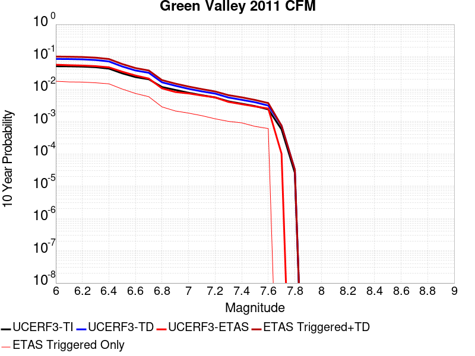 |

| Magnitude | 1 wk TI Prob | 1 wk TD Prob | 1 wk ETAS Prob | 1 wk ETAS/TD Gain | 1 wk ETAS Triggered+TD | 1 wk ETAS Triggered Only | 1 mo TI Prob | 1 mo TD Prob | 1 mo ETAS Prob | 1 mo ETAS/TD Gain | 1 mo ETAS Triggered+TD | 1 mo ETAS Triggered Only | 1 yr TI Prob | 1 yr TD Prob | 1 yr ETAS Prob | 1 yr ETAS/TD Gain | 1 yr ETAS Triggered+TD | 1 yr ETAS Triggered Only | 10 yr TI Prob | 10 yr TD Prob | 10 yr ETAS Prob | 10 yr ETAS/TD Gain | 10 yr ETAS Triggered+TD | 10 yr ETAS Triggered Only |
|-----|-----|-----|-----|-----|-----|-----|-----|-----|-----|-----|-----|-----|-----|-----|-----|-----|-----|-----|-----|-----|-----|-----|-----|-----|
| 6.0 | 9.9629346E-5 | 1.723003E-4 | 0.0 | 0.0 | 1.723003E-4 | 0.0 | 4.2691303E-4 | 7.3821814E-4 | 1.0E-4 | 0.13546132 | 8.3814433E-4 | 1.0E-4 | 0.0051852856 | 0.008949381 | 9.0E-4 | 0.10056562 | 0.009841327 | 9.0E-4 | 0.050659515 | 0.08519073 | 0.003 | 0.035215102 | 0.08793516 | 0.003 |
| 6.1 | 9.88615E-5 | 1.7077432E-4 | 0.0 | 0.0 | 1.7077432E-4 | 0.0 | 4.2362334E-4 | 7.3168206E-4 | 1.0E-4 | 0.1366714 | 8.316089E-4 | 1.0E-4 | 0.0051454236 | 0.008870459 | 9.0E-4 | 0.10146036 | 0.009762476 | 9.0E-4 | 0.050279044 | 0.08447853 | 0.0028 | 0.03314452 | 0.08704199 | 0.0028 |
| 6.2 | 9.696895E-5 | 1.6717147E-4 | 0.0 | 0.0 | 1.6717147E-4 | 0.0 | 4.15515E-4 | 7.1624975E-4 | 1.0E-4 | 0.1396161 | 8.1617816E-4 | 1.0E-4 | 0.0050471667 | 0.008684165 | 9.0E-4 | 0.103636906 | 0.0095763495 | 9.0E-4 | 0.04934063 | 0.08278945 | 0.0028 | 0.033820733 | 0.08535764 | 0.0028 |
| 6.3 | 9.275224E-5 | 1.589701E-4 | 0.0 | 0.0 | 1.589701E-4 | 0.0 | 3.9744904E-4 | 6.811196E-4 | 0.0 | 0.0 | 6.811196E-4 | 0.0 | 0.0048282105 | 0.008259743 | 7.0E-4 | 0.084748395 | 0.008953962 | 7.0E-4 | 0.047246475 | 0.07892925 | 0.0025 | 0.031673934 | 0.08123193 | 0.0025 |
| 6.4 | 8.391499E-5 | 1.4298713E-4 | 0.0 | 0.0 | 1.4298713E-4 | 0.0 | 3.595861E-4 | 6.126609E-4 | 0.0 | 0.0 | 6.126609E-4 | 0.0 | 0.004369175 | 0.007432519 | 6.0E-4 | 0.08072633 | 0.008028059 | 6.0E-4 | 0.04284265 | 0.071316466 | 0.0023 | 0.032250617 | 0.073452435 | 0.0023 |
| 6.5 | 5.9519385E-5 | 9.880607E-5 | 0.0 | 0.0 | 9.880607E-5 | 0.0 | 2.5505814E-4 | 4.2338544E-4 | 0.0 | 0.0 | 4.2338544E-4 | 0.0 | 0.0031009112 | 0.0051414133 | 6.0E-4 | 0.116699435 | 0.005738328 | 6.0E-4 | 0.030579966 | 0.049905717 | 0.0017 | 0.034064233 | 0.051520877 | 0.0017 |
| 6.6 | 4.5361558E-5 | 7.362437E-5 | 0.0 | 0.0 | 7.362437E-5 | 0.0 | 1.9439218E-4 | 3.1549318E-4 | 0.0 | 0.0 | 3.1549318E-4 | 0.0 | 0.0023641558 | 0.003833405 | 4.0E-4 | 0.10434588 | 0.0042318716 | 4.0E-4 | 0.023391623 | 0.03748022 | 0.0012 | 0.03201689 | 0.038635243 | 0.0012 |
| 6.7 | 3.8808106E-5 | 6.230829E-5 | 0.0 | 0.0 | 6.230829E-5 | 0.0 | 1.6630985E-4 | 2.670088E-4 | 0.0 | 0.0 | 2.670088E-4 | 0.0 | 0.0020229418 | 0.0032453204 | 4.0E-4 | 0.12325439 | 0.0036440224 | 4.0E-4 | 0.020046256 | 0.03184677 | 0.001 | 0.03140036 | 0.032814924 | 0.001 |
| 6.8 | 2.2284667E-5 | 3.1184663E-5 | 0.0 | 0.0 | 3.1184663E-5 | 0.0 | 9.550222E-5 | 1.3364178E-4 | 0.0 | 0.0 | 1.3364178E-4 | 0.0 | 0.0011621192 | 0.0016258745 | 1.0E-4 | 0.061505362 | 0.0017257119 | 1.0E-4 | 0.011560607 | 0.016117869 | 5.0E-4 | 0.031021472 | 0.01660981 | 5.0E-4 |
| 6.9 | 1.8050168E-5 | 2.4380426E-5 | 0.0 | 0.0 | 2.4380426E-5 | 0.0 | 7.735557E-5 | 1.0448336E-4 | 0.0 | 0.0 | 1.0448336E-4 | 0.0 | 9.4139716E-4 | 0.0012713457 | 1.0E-4 | 0.078656815 | 0.0013712186 | 1.0E-4 | 0.009374191 | 0.012633375 | 3.0E-4 | 0.023746625 | 0.012929585 | 3.0E-4 |
| 7.0 | 1.4763166E-5 | 1.95367E-5 | 0.0 | 0.0 | 1.95367E-5 | 0.0 | 6.326917E-5 | 8.3726045E-5 | 0.0 | 0.0 | 8.3726045E-5 | 0.0 | 7.7002996E-4 | 0.0010188891 | 1.0E-4 | 0.0981461 | 0.0011187873 | 1.0E-4 | 0.007673672 | 0.010142356 | 3.0E-4 | 0.029578926 | 0.010439313 | 3.0E-4 |
| 7.1 | 1.2399713E-5 | 1.626603E-5 | 0.0 | 0.0 | 1.626603E-5 | 0.0 | 5.3140546E-5 | 6.9709706E-5 | 0.0 | 0.0 | 6.9709706E-5 | 0.0 | 6.467941E-4 | 8.483872E-4 | 0.0 | 0.0 | 8.483872E-4 | 0.0 | 0.006449148 | 0.008452031 | 2.0E-4 | 0.02366295 | 0.00865034 | 2.0E-4 |
| 7.2 | 1.0584195E-5 | 1.3887744E-5 | 0.0 | 0.0 | 1.3887744E-5 | 0.0 | 4.5360044E-5 | 5.9517555E-5 | 0.0 | 0.0 | 5.9517555E-5 | 0.0 | 5.521186E-4 | 7.243869E-4 | 0.0 | 0.0 | 7.243869E-4 | 0.0 | 0.0055074887 | 0.007221006 | 0.0 | 0.0 | 0.007221006 | 0.0 |
| 7.3 | 7.998173E-6 | 1.0516018E-5 | 0.0 | 0.0 | 1.0516018E-5 | 0.0 | 3.4277433E-5 | 4.5067874E-5 | 0.0 | 0.0 | 4.5067874E-5 | 0.0 | 4.1724785E-4 | 5.485643E-4 | 0.0 | 0.0 | 5.485643E-4 | 0.0 | 0.004164653 | 0.005472412 | 0.0 | 0.0 | 0.005472412 | 0.0 |
| 7.4 | 6.7571127E-6 | 8.911162E-6 | 0.0 | 0.0 | 8.911162E-6 | 0.0 | 2.8958733E-5 | 3.819014E-5 | 0.0 | 0.0 | 3.819014E-5 | 0.0 | 3.5251552E-4 | 4.6486672E-4 | 0.0 | 0.0 | 4.6486672E-4 | 0.0 | 0.0035195686 | 0.0046391184 | 0.0 | 0.0 | 0.0046391184 | 0.0 |
| 7.5 | 5.69878E-6 | 7.4981904E-6 | 0.0 | 0.0 | 7.4981904E-6 | 0.0 | 2.4423114E-5 | 3.213471E-5 | 0.0 | 0.0 | 3.213471E-5 | 0.0 | 2.9731085E-4 | 3.9117076E-4 | 0.0 | 0.0 | 3.9117076E-4 | 0.0 | 0.002969134 | 0.0039049806 | 0.0 | 0.0 | 0.0039049806 | 0.0 |
| 7.6 | 4.503664E-6 | 5.9203985E-6 | 0.0 | 0.0 | 5.9203985E-6 | 0.0 | 1.9301275E-5 | 2.5372896E-5 | 0.0 | 0.0 | 2.5372896E-5 | 0.0 | 2.3496768E-4 | 3.0887203E-4 | 0.0 | 0.0 | 3.0887203E-4 | 0.0 | 0.002347194 | 0.0030845234 | 0.0 | 0.0 | 0.0030845234 | 0.0 |
| 7.7 | 1.0873546E-6 | 1.4062297E-6 | 0.0 | 0.0 | 1.4062297E-6 | 0.0 | 4.6600826E-6 | 6.0266852E-6 | 0.0 | 0.0 | 6.0266852E-6 | 0.0 | 5.6735033E-5 | 7.337245E-5 | 0.0 | 0.0 | 7.337245E-5 | 0.0 | 5.672055E-4 | 7.335298E-4 | 0.0 | 0.0 | 7.335298E-4 | 0.0 |
| 7.8 | 4.9373917E-8 | 6.172147E-8 | 0.0 | 0.0 | 6.172147E-8 | 0.0 | 2.1160248E-7 | 2.645206E-7 | 0.0 | 0.0 | 2.645206E-7 | 0.0 | 2.5762572E-6 | 3.2205346E-6 | 0.0 | 0.0 | 3.2205346E-6 | 0.0 | 2.5762274E-5 | 3.221324E-5 | 0.0 | 0.0 | 3.221324E-5 | 0.0 |

## Keddie Ridge 2011 CFM
*[(top)](#table-of-contents)*

| 1 Week | 1 Month | 1 Year | 10 Year |
|-----|-----|-----|-----|
|  | 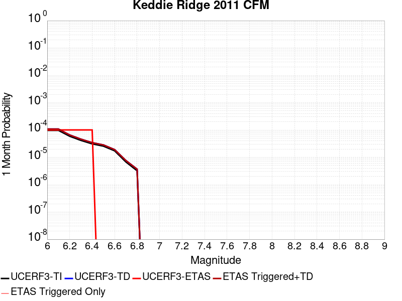 |  | 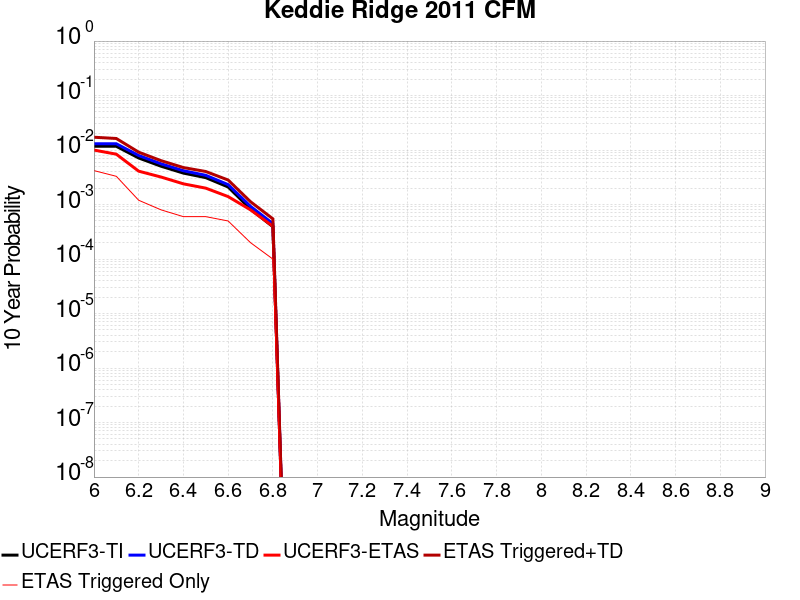 |

| Magnitude | 1 wk TI Prob | 1 wk TD Prob | 1 wk ETAS Prob | 1 wk ETAS/TD Gain | 1 wk ETAS Triggered+TD | 1 wk ETAS Triggered Only | 1 mo TI Prob | 1 mo TD Prob | 1 mo ETAS Prob | 1 mo ETAS/TD Gain | 1 mo ETAS Triggered+TD | 1 mo ETAS Triggered Only | 1 yr TI Prob | 1 yr TD Prob | 1 yr ETAS Prob | 1 yr ETAS/TD Gain | 1 yr ETAS Triggered+TD | 1 yr ETAS Triggered Only | 10 yr TI Prob | 10 yr TD Prob | 10 yr ETAS Prob | 10 yr ETAS/TD Gain | 10 yr ETAS Triggered+TD | 10 yr ETAS Triggered Only |
|-----|-----|-----|-----|-----|-----|-----|-----|-----|-----|-----|-----|-----|-----|-----|-----|-----|-----|-----|-----|-----|-----|-----|-----|-----|
| 6.0 | 2.2591947E-5 | 2.5158795E-5 | 0.0 | 0.0 | 2.5158795E-5 | 0.0 | 9.6819036E-5 | 1.078194E-4 | 0.0 | 0.0 | 1.078194E-4 | 0.0 | 0.0011781343 | 0.0013119896 | 5.0E-4 | 0.3811006 | 0.0018113336 | 5.0E-4 | 0.011719079 | 0.013050364 | 0.0029 | 0.22221602 | 0.015912518 | 0.0029 |
| 6.1 | 2.2591947E-5 | 2.5158795E-5 | 0.0 | 0.0 | 2.5158795E-5 | 0.0 | 9.6819036E-5 | 1.078194E-4 | 0.0 | 0.0 | 1.078194E-4 | 0.0 | 0.0011781343 | 0.0013119896 | 5.0E-4 | 0.3811006 | 0.0018113336 | 5.0E-4 | 0.011719079 | 0.013050364 | 0.0024 | 0.18390292 | 0.015419044 | 0.0024 |
| 6.2 | 1.3775145E-5 | 1.5304711E-5 | 0.0 | 0.0 | 1.5304711E-5 | 0.0 | 5.9035E-5 | 6.559011E-5 | 0.0 | 0.0 | 6.559011E-5 | 0.0 | 7.185141E-4 | 7.982911E-4 | 2.0E-4 | 0.25053516 | 9.981315E-4 | 2.0E-4 | 0.0071619535 | 0.007956649 | 9.0E-4 | 0.11311295 | 0.008849488 | 9.0E-4 |
| 6.3 | 9.705435E-6 | 1.07559135E-5 | 0.0 | 0.0 | 1.07559135E-5 | 0.0 | 4.1594063E-5 | 4.6096025E-5 | 0.0 | 0.0 | 4.6096025E-5 | 0.0 | 5.0629E-4 | 5.61087E-4 | 1.0E-4 | 0.17822549 | 6.610309E-4 | 1.0E-4 | 0.005051381 | 0.005597932 | 6.0E-4 | 0.10718244 | 0.006194573 | 6.0E-4 |
| 6.4 | 7.2549733E-6 | 8.018234E-6 | 0.0 | 0.0 | 8.018234E-6 | 0.0 | 3.109237E-5 | 3.4363453E-5 | 0.0 | 0.0 | 3.4363453E-5 | 0.0 | 3.7848388E-4 | 4.183027E-4 | 1.0E-4 | 0.23906134 | 5.182609E-4 | 1.0E-4 | 0.003778399 | 0.004175939 | 4.0E-4 | 0.09578684 | 0.0045742686 | 4.0E-4 |
| 6.5 | 5.983293E-6 | 6.6056505E-6 | 0.0 | 0.0 | 6.6056505E-6 | 0.0 | 2.5642432E-5 | 2.8309662E-5 | 0.0 | 0.0 | 2.8309662E-5 | 0.0 | 3.1215188E-4 | 3.4462236E-4 | 1.0E-4 | 0.29017273 | 4.4458787E-4 | 1.0E-4 | 0.0031171376 | 0.0034415408 | 4.0E-4 | 0.116227016 | 0.003840164 | 4.0E-4 |
| 6.6 | 4.0336154E-6 | 4.4528106E-6 | 0.0 | 0.0 | 4.4528106E-6 | 0.0 | 1.728681E-5 | 1.9083356E-5 | 0.0 | 0.0 | 1.9083356E-5 | 0.0 | 2.1044657E-4 | 2.3231911E-4 | 0.0 | 0.0 | 2.3231911E-4 | 0.0 | 0.002102474 | 0.002321158 | 3.0E-4 | 0.12924583 | 0.0026204616 | 3.0E-4 |
| 6.7 | 1.5832104E-6 | 1.7792295E-6 | 0.0 | 0.0 | 1.7792295E-6 | 0.0 | 6.7851697E-6 | 7.6252486E-6 | 0.0 | 0.0 | 7.6252486E-6 | 0.0 | 8.260631E-5 | 9.283372E-5 | 0.0 | 0.0 | 9.283372E-5 | 0.0 | 8.2575605E-4 | 9.27976E-4 | 2.0E-4 | 0.21552283 | 0.0011277904 | 2.0E-4 |
| 6.8 | 7.5177275E-7 | 8.5773416E-7 | 0.0 | 0.0 | 8.5773416E-7 | 0.0 | 3.221879E-6 | 3.6759993E-6 | 0.0 | 0.0 | 3.6759993E-6 | 0.0 | 3.9225673E-5 | 4.4754543E-5 | 0.0 | 0.0 | 4.4754543E-5 | 0.0 | 3.921875E-4 | 4.4747177E-4 | 1.0E-4 | 0.22347778 | 5.4742704E-4 | 1.0E-4 |

## Whittier alt 1
*[(top)](#table-of-contents)*

| 1 Week | 1 Month | 1 Year | 10 Year |
|-----|-----|-----|-----|
|  |  |  |  |

| Magnitude | 1 wk TI Prob | 1 wk TD Prob | 1 wk ETAS Prob | 1 wk ETAS/TD Gain | 1 wk ETAS Triggered+TD | 1 wk ETAS Triggered Only | 1 mo TI Prob | 1 mo TD Prob | 1 mo ETAS Prob | 1 mo ETAS/TD Gain | 1 mo ETAS Triggered+TD | 1 mo ETAS Triggered Only | 1 yr TI Prob | 1 yr TD Prob | 1 yr ETAS Prob | 1 yr ETAS/TD Gain | 1 yr ETAS Triggered+TD | 1 yr ETAS Triggered Only | 10 yr TI Prob | 10 yr TD Prob | 10 yr ETAS Prob | 10 yr ETAS/TD Gain | 10 yr ETAS Triggered+TD | 10 yr ETAS Triggered Only |
|-----|-----|-----|-----|-----|-----|-----|-----|-----|-----|-----|-----|-----|-----|-----|-----|-----|-----|-----|-----|-----|-----|-----|-----|-----|
| 6.0 | 4.2554693E-5 | 4.7141246E-5 | 0.0 | 0.0 | 4.7141246E-5 | 0.0 | 1.8236451E-4 | 2.0202008E-4 | 1.0E-4 | 0.49500033 | 3.0199988E-4 | 1.0E-4 | 0.002218027 | 0.0024571407 | 7.0E-4 | 0.28488398 | 0.0031554208 | 7.0E-4 | 0.02196019 | 0.024333641 | 0.0027 | 0.110957496 | 0.02696794 | 0.0027 |
| 6.1 | 4.2554693E-5 | 4.7141246E-5 | 0.0 | 0.0 | 4.7141246E-5 | 0.0 | 1.8236451E-4 | 2.0202008E-4 | 1.0E-4 | 0.49500033 | 3.0199988E-4 | 1.0E-4 | 0.002218027 | 0.0024571407 | 7.0E-4 | 0.28488398 | 0.0031554208 | 7.0E-4 | 0.02196019 | 0.024333641 | 0.0027 | 0.110957496 | 0.02696794 | 0.0027 |
| 6.2 | 4.2554693E-5 | 4.7141246E-5 | 0.0 | 0.0 | 4.7141246E-5 | 0.0 | 1.8236451E-4 | 2.0202008E-4 | 1.0E-4 | 0.49500033 | 3.0199988E-4 | 1.0E-4 | 0.002218027 | 0.0024571407 | 7.0E-4 | 0.28488398 | 0.0031554208 | 7.0E-4 | 0.02196019 | 0.024333641 | 0.0027 | 0.110957496 | 0.02696794 | 0.0027 |
| 6.3 | 1.9617712E-5 | 1.8201868E-5 | 0.0 | 0.0 | 1.8201868E-5 | 0.0 | 8.40732E-5 | 7.800578E-5 | 0.0 | 0.0 | 7.800578E-5 | 0.0 | 0.0010231105 | 9.4932545E-4 | 2.0E-4 | 0.21067591 | 0.0011491356 | 2.0E-4 | 0.01018413 | 0.009455963 | 6.0E-4 | 0.06345203 | 0.010050289 | 6.0E-4 |
| 6.4 | 1.5611336E-5 | 1.354535E-5 | 0.0 | 0.0 | 1.354535E-5 | 0.0 | 6.690401E-5 | 5.8050246E-5 | 0.0 | 0.0 | 5.8050246E-5 | 0.0 | 8.142519E-4 | 7.0653844E-4 | 0.0 | 0.0 | 7.0653844E-4 | 0.0 | 0.008112748 | 0.0070448644 | 2.0E-4 | 0.028389474 | 0.0072434554 | 2.0E-4 |
| 6.5 | 1.5150166E-5 | 1.3042504E-5 | 0.0 | 0.0 | 1.3042504E-5 | 0.0 | 6.492767E-5 | 5.589528E-5 | 0.0 | 0.0 | 5.589528E-5 | 0.0 | 7.9020765E-4 | 6.803184E-4 | 0.0 | 0.0 | 6.803184E-4 | 0.0 | 0.007874036 | 0.0067842854 | 1.0E-4 | 0.014739946 | 0.006883607 | 1.0E-4 |
| 6.6 | 1.295588E-5 | 1.0340121E-5 | 0.0 | 0.0 | 1.0340121E-5 | 0.0 | 5.552402E-5 | 4.431406E-5 | 0.0 | 0.0 | 4.431406E-5 | 0.0 | 6.7579525E-4 | 5.3939206E-4 | 0.0 | 0.0 | 5.3939206E-4 | 0.0 | 0.006737438 | 0.0053822575 | 1.0E-4 | 0.018579563 | 0.0054817195 | 1.0E-4 |
| 6.7 | 1.2542085E-5 | 9.861623E-6 | 0.0 | 0.0 | 9.861623E-6 | 0.0 | 5.3750682E-5 | 4.2263426E-5 | 0.0 | 0.0 | 4.2263426E-5 | 0.0 | 6.542181E-4 | 5.1443756E-4 | 0.0 | 0.0 | 5.1443756E-4 | 0.0 | 0.006522954 | 0.005133877 | 1.0E-4 | 0.019478457 | 0.0052333637 | 1.0E-4 |
| 6.8 | 1.2195878E-5 | 9.45888E-6 | 0.0 | 0.0 | 9.45888E-6 | 0.0 | 5.2267E-5 | 4.0537438E-5 | 0.0 | 0.0 | 4.0537438E-5 | 0.0 | 6.36165E-4 | 4.934334E-4 | 0.0 | 0.0 | 4.934334E-4 | 0.0 | 0.0063434686 | 0.0049247057 | 1.0E-4 | 0.020305783 | 0.0050242133 | 1.0E-4 |
| 6.9 | 1.1580298E-5 | 8.738248E-6 | 0.0 | 0.0 | 8.738248E-6 | 0.0 | 4.9628903E-5 | 3.7449103E-5 | 0.0 | 0.0 | 3.7449103E-5 | 0.0 | 6.040644E-4 | 4.5584908E-4 | 0.0 | 0.0 | 4.5584908E-4 | 0.0 | 0.00602425 | 0.0045503434 | 0.0 | 0.0 | 0.0045503434 | 0.0 |
| 7.0 | 1.0964795E-5 | 8.051233E-6 | 0.0 | 0.0 | 8.051233E-6 | 0.0 | 4.6991136E-5 | 3.4504832E-5 | 0.0 | 0.0 | 3.4504832E-5 | 0.0 | 5.7196687E-4 | 4.200169E-4 | 0.0 | 0.0 | 4.200169E-4 | 0.0 | 0.0057049696 | 0.004193428 | 0.0 | 0.0 | 0.004193428 | 0.0 |
| 7.1 | 1.0230601E-5 | 7.296619E-6 | 0.0 | 0.0 | 7.296619E-6 | 0.0 | 4.3844695E-5 | 3.1270858E-5 | 0.0 | 0.0 | 3.1270858E-5 | 0.0 | 5.336784E-4 | 3.8065747E-4 | 0.0 | 0.0 | 3.8065747E-4 | 0.0 | 0.005323986 | 0.003801133 | 0.0 | 0.0 | 0.003801133 | 0.0 |
| 7.2 | 9.40865E-6 | 6.5162267E-6 | 0.0 | 0.0 | 6.5162267E-6 | 0.0 | 4.032216E-5 | 2.7926393E-5 | 0.0 | 0.0 | 2.7926393E-5 | 0.0 | 4.908117E-4 | 3.39952E-4 | 0.0 | 0.0 | 3.39952E-4 | 0.0 | 0.0048972913 | 0.0033953136 | 0.0 | 0.0 | 0.0033953136 | 0.0 |
| 7.3 | 8.237384E-6 | 5.5742876E-6 | 0.0 | 0.0 | 5.5742876E-6 | 0.0 | 3.5302593E-5 | 2.388959E-5 | 0.0 | 0.0 | 2.388959E-5 | 0.0 | 4.2972428E-4 | 2.90818E-4 | 0.0 | 0.0 | 2.90818E-4 | 0.0 | 0.0042889426 | 0.0029046668 | 0.0 | 0.0 | 0.0029046668 | 0.0 |
| 7.4 | 7.5316966E-6 | 5.0062195E-6 | 0.0 | 0.0 | 5.0062195E-6 | 0.0 | 3.2278298E-5 | 2.1455056E-5 | 0.0 | 0.0 | 2.1455056E-5 | 0.0 | 3.9291743E-4 | 2.61185E-4 | 0.0 | 0.0 | 2.61185E-4 | 0.0 | 0.0039222343 | 0.0026088874 | 0.0 | 0.0 | 0.0026088874 | 0.0 |
| 7.5 | 6.149649E-6 | 3.916163E-6 | 0.0 | 0.0 | 3.916163E-6 | 0.0 | 2.6355372E-5 | 1.6783453E-5 | 0.0 | 0.0 | 1.6783453E-5 | 0.0 | 3.208294E-4 | 2.0432028E-4 | 0.0 | 0.0 | 2.0432028E-4 | 0.0 | 0.003203666 | 0.0020414128 | 0.0 | 0.0 | 0.0020414128 | 0.0 |
| 7.6 | 5.457711E-6 | 3.3794513E-6 | 0.0 | 0.0 | 3.3794513E-6 | 0.0 | 2.338998E-5 | 1.4483287E-5 | 0.0 | 0.0 | 1.4483287E-5 | 0.0 | 2.8473578E-4 | 1.7632057E-4 | 0.0 | 0.0 | 1.7632057E-4 | 0.0 | 0.0028437122 | 0.0017618868 | 0.0 | 0.0 | 0.0017618868 | 0.0 |
| 7.7 | 4.1676276E-6 | 2.3213304E-6 | 0.0 | 0.0 | 2.3213304E-6 | 0.0 | 1.7861139E-5 | 9.948525E-6 | 0.0 | 0.0 | 9.948525E-6 | 0.0 | 2.1743766E-4 | 1.2111729E-4 | 0.0 | 0.0 | 1.2111729E-4 | 0.0 | 0.0021722503 | 0.0012105854 | 0.0 | 0.0 | 0.0012105854 | 0.0 |
| 7.8 | 2.2692414E-7 | 9.313546E-8 | 0.0 | 0.0 | 9.313546E-8 | 0.0 | 9.725317E-7 | 3.9915196E-7 | 0.0 | 0.0 | 3.9915196E-7 | 0.0 | 1.1840509E-5 | 4.8596676E-6 | 0.0 | 0.0 | 4.8596676E-6 | 0.0 | 1.1839878E-4 | 4.859593E-5 | 0.0 | 0.0 | 4.859593E-5 | 0.0 |
| 7.9 | 6.676829E-9 | 3.4267709E-9 | 0.0 | 0.0 | 3.4267709E-9 | 0.0 | 2.861498E-8 | 1.4686159E-8 | 0.0 | 0.0 | 1.4686159E-8 | 0.0 | 3.4838732E-7 | 1.7880397E-7 | 0.0 | 0.0 | 1.7880397E-7 | 0.0 | 3.4838679E-6 | 1.7880385E-6 | 0.0 | 0.0 | 1.7880385E-6 | 0.0 |

## San Andreas (San Gorgonio Pass-Garnet HIll)
*[(top)](#table-of-contents)*

| 1 Week | 1 Month | 1 Year | 10 Year |
|-----|-----|-----|-----|
|  |  |  |  |

| Magnitude | 1 wk TI Prob | 1 wk TD Prob | 1 wk ETAS Prob | 1 wk ETAS/TD Gain | 1 wk ETAS Triggered+TD | 1 wk ETAS Triggered Only | 1 mo TI Prob | 1 mo TD Prob | 1 mo ETAS Prob | 1 mo ETAS/TD Gain | 1 mo ETAS Triggered+TD | 1 mo ETAS Triggered Only | 1 yr TI Prob | 1 yr TD Prob | 1 yr ETAS Prob | 1 yr ETAS/TD Gain | 1 yr ETAS Triggered+TD | 1 yr ETAS Triggered Only | 10 yr TI Prob | 10 yr TD Prob | 10 yr ETAS Prob | 10 yr ETAS/TD Gain | 10 yr ETAS Triggered+TD | 10 yr ETAS Triggered Only |
|-----|-----|-----|-----|-----|-----|-----|-----|-----|-----|-----|-----|-----|-----|-----|-----|-----|-----|-----|-----|-----|-----|-----|-----|-----|
| 6.0 | 8.31567E-5 | 2.301408E-4 | 1.0E-4 | 0.4345166 | 3.301178E-4 | 1.0E-4 | 3.5633717E-4 | 9.859423E-4 | 2.0E-4 | 0.20285161 | 0.0011857452 | 2.0E-4 | 0.004329778 | 0.011937703 | 0.0012 | 0.100521855 | 0.013123377 | 0.0012 | 0.042463828 | 0.11106009 | 0.0027 | 0.024311163 | 0.11346023 | 0.0027 |
| 6.1 | 8.31567E-5 | 2.301408E-4 | 1.0E-4 | 0.4345166 | 3.301178E-4 | 1.0E-4 | 3.5633717E-4 | 9.859423E-4 | 2.0E-4 | 0.20285161 | 0.0011857452 | 2.0E-4 | 0.004329778 | 0.011937703 | 0.0012 | 0.100521855 | 0.013123377 | 0.0012 | 0.042463828 | 0.11106009 | 0.0027 | 0.024311163 | 0.11346023 | 0.0027 |
| 6.2 | 8.31567E-5 | 2.301408E-4 | 1.0E-4 | 0.4345166 | 3.301178E-4 | 1.0E-4 | 3.5633717E-4 | 9.859423E-4 | 2.0E-4 | 0.20285161 | 0.0011857452 | 2.0E-4 | 0.004329778 | 0.011937703 | 0.0012 | 0.100521855 | 0.013123377 | 0.0012 | 0.042463828 | 0.11106009 | 0.0027 | 0.024311163 | 0.11346023 | 0.0027 |
| 6.3 | 8.31567E-5 | 2.301408E-4 | 1.0E-4 | 0.4345166 | 3.301178E-4 | 1.0E-4 | 3.5633717E-4 | 9.859423E-4 | 2.0E-4 | 0.20285161 | 0.0011857452 | 2.0E-4 | 0.004329778 | 0.011937703 | 0.0012 | 0.100521855 | 0.013123377 | 0.0012 | 0.042463828 | 0.11106009 | 0.0027 | 0.024311163 | 0.11346023 | 0.0027 |
| 6.4 | 8.059055E-5 | 2.2573429E-4 | 1.0E-4 | 0.44299874 | 3.257117E-4 | 1.0E-4 | 3.4534236E-4 | 9.670743E-4 | 2.0E-4 | 0.20680934 | 0.001166881 | 2.0E-4 | 0.0041964394 | 0.011710799 | 0.0012 | 0.10246952 | 0.012896746 | 0.0012 | 0.041180745 | 0.109045535 | 0.0027 | 0.024760298 | 0.11145112 | 0.0027 |
| 6.5 | 8.059055E-5 | 2.2573429E-4 | 1.0E-4 | 0.44299874 | 3.257117E-4 | 1.0E-4 | 3.4534236E-4 | 9.670743E-4 | 2.0E-4 | 0.20680934 | 0.001166881 | 2.0E-4 | 0.0041964394 | 0.011710799 | 0.0012 | 0.10246952 | 0.012896746 | 0.0012 | 0.041180745 | 0.109045535 | 0.0027 | 0.024760298 | 0.11145112 | 0.0027 |
| 6.6 | 7.619237E-5 | 2.1821013E-4 | 1.0E-4 | 0.45827386 | 3.181883E-4 | 1.0E-4 | 3.2649786E-4 | 9.3485333E-4 | 2.0E-4 | 0.2139373 | 0.0011346664 | 2.0E-4 | 0.0039678677 | 0.01132297 | 0.0012 | 0.105979264 | 0.012509382 | 0.0012 | 0.03897764 | 0.10558918 | 0.0027 | 0.025570802 | 0.108004086 | 0.0027 |
| 6.7 | 7.440636E-5 | 2.1497595E-4 | 1.0E-4 | 0.4651683 | 3.1495446E-4 | 1.0E-4 | 3.188454E-4 | 9.210024E-4 | 2.0E-4 | 0.2171547 | 0.0011208182 | 2.0E-4 | 0.0038750346 | 0.011156069 | 0.0012 | 0.10756476 | 0.012342682 | 0.0012 | 0.038081564 | 0.10409843 | 0.0027 | 0.02593699 | 0.10651737 | 0.0027 |
| 6.8 | 7.3735864E-5 | 2.1345234E-4 | 1.0E-4 | 0.46848866 | 3.13431E-4 | 1.0E-4 | 3.1597257E-4 | 9.1447716E-4 | 2.0E-4 | 0.2187042 | 0.0011142943 | 2.0E-4 | 0.0038401815 | 0.011077438 | 0.0012 | 0.1083283 | 0.012264145 | 0.0012 | 0.03774495 | 0.10340095 | 0.0027 | 0.026111944 | 0.10582177 | 0.0027 |
| 6.9 | 7.27575E-5 | 2.1114944E-4 | 1.0E-4 | 0.4735982 | 3.1112833E-4 | 1.0E-4 | 3.117806E-4 | 9.046146E-4 | 2.0E-4 | 0.22108863 | 0.0011044337 | 2.0E-4 | 0.003789323 | 0.010958575 | 0.0012 | 0.10950329 | 0.012145424 | 0.0012 | 0.037253562 | 0.10235028 | 0.0027 | 0.026379995 | 0.10477394 | 0.0027 |
| 7.0 | 7.102591E-5 | 2.070062E-4 | 1.0E-4 | 0.48307732 | 3.0698552E-4 | 1.0E-4 | 3.0436125E-4 | 8.8686997E-4 | 2.0E-4 | 0.2255122 | 0.0010866926 | 2.0E-4 | 0.003699303 | 0.0107446825 | 0.0012 | 0.11168315 | 0.011931789 | 0.0012 | 0.03638325 | 0.10045641 | 0.0027 | 0.02687733 | 0.10288517 | 0.0027 |
| 7.1 | 7.028513E-5 | 2.0537019E-4 | 1.0E-4 | 0.48692557 | 3.0534965E-4 | 1.0E-4 | 3.0118722E-4 | 8.798633E-4 | 2.0E-4 | 0.22730805 | 0.0010796873 | 2.0E-4 | 0.0036607897 | 0.010660214 | 0.0011 | 0.10318742 | 0.011748488 | 0.0011 | 0.036010686 | 0.09970159 | 0.0026 | 0.026077818 | 0.10204237 | 0.0026 |
| 7.2 | 6.8498244E-5 | 2.014646E-4 | 1.0E-4 | 0.49636513 | 3.0144444E-4 | 1.0E-4 | 2.9353087E-4 | 8.6313614E-4 | 2.0E-4 | 0.23171316 | 0.0010629635 | 2.0E-4 | 0.003567883 | 0.010458532 | 0.0011 | 0.10517728 | 0.011547028 | 0.0011 | 0.035111405 | 0.0978974 | 0.0026 | 0.026558416 | 0.10024287 | 0.0026 |
| 7.3 | 6.622592E-5 | 1.937873E-4 | 1.0E-4 | 0.5160297 | 2.9376792E-4 | 1.0E-4 | 2.8379448E-4 | 8.3025475E-4 | 2.0E-4 | 0.2408899 | 0.0010300888 | 2.0E-4 | 0.0034497243 | 0.010061966 | 0.0011 | 0.10932256 | 0.011150898 | 0.0011 | 0.033966612 | 0.09440826 | 0.0026 | 0.027539965 | 0.09676279 | 0.0026 |
| 7.4 | 5.1050705E-5 | 1.4391277E-4 | 0.0 | 0.0 | 1.4391277E-4 | 0.0 | 2.1877038E-4 | 6.166241E-4 | 1.0E-4 | 0.16217336 | 7.1656244E-4 | 1.0E-4 | 0.002660276 | 0.0074817417 | 6.0E-4 | 0.080195226 | 0.008077253 | 6.0E-4 | 0.02628654 | 0.07157116 | 0.0013 | 0.018163742 | 0.07277811 | 0.0013 |
| 7.5 | 3.9302922E-5 | 1.0880058E-4 | 0.0 | 0.0 | 1.0880058E-4 | 0.0 | 1.6843023E-4 | 4.6620518E-4 | 0.0 | 0.0 | 4.6620518E-4 | 0.0 | 0.0020487092 | 0.0056613428 | 3.0E-4 | 0.05299096 | 0.0059596444 | 3.0E-4 | 0.020299247 | 0.054900635 | 7.0E-4 | 0.012750308 | 0.055562206 | 7.0E-4 |
| 7.6 | 2.9851626E-5 | 8.275067E-5 | 0.0 | 0.0 | 8.275067E-5 | 0.0 | 1.2792926E-4 | 3.5459764E-4 | 0.0 | 0.0 | 3.5459764E-4 | 0.0 | 0.0015564259 | 0.0043087048 | 3.0E-4 | 0.069626495 | 0.004607412 | 3.0E-4 | 0.0154556995 | 0.042204775 | 6.0E-4 | 0.014216401 | 0.042779453 | 6.0E-4 |
| 7.7 | 2.1135214E-5 | 6.1600455E-5 | 0.0 | 0.0 | 6.1600455E-5 | 0.0 | 9.0576345E-5 | 2.6397526E-4 | 0.0 | 0.0 | 2.6397526E-4 | 0.0 | 0.0011022091 | 0.0032091674 | 1.0E-4 | 0.031160729 | 0.0033088466 | 1.0E-4 | 0.010967582 | 0.031710215 | 3.0E-4 | 0.009460674 | 0.032000702 | 3.0E-4 |
| 7.8 | 1.883379E-5 | 5.387325E-5 | 0.0 | 0.0 | 5.387325E-5 | 0.0 | 8.0713755E-5 | 2.3086494E-4 | 0.0 | 0.0 | 2.3086494E-4 | 0.0 | 9.822468E-4 | 0.0028071606 | 1.0E-4 | 0.035623185 | 0.0029068799 | 1.0E-4 | 0.0097791655 | 0.02789182 | 2.0E-4 | 0.0071705612 | 0.028086241 | 2.0E-4 |
| 7.9 | 1.5156185E-5 | 4.019655E-5 | 0.0 | 0.0 | 4.019655E-5 | 0.0 | 6.495346E-5 | 1.7225956E-4 | 0.0 | 0.0 | 1.7225956E-4 | 0.0 | 7.9052144E-4 | 0.0020952441 | 0.0 | 0.0 | 0.0020952441 | 0.0 | 0.007877152 | 0.021085052 | 1.0E-4 | 0.0047426964 | 0.021182943 | 1.0E-4 |
| 8.0 | 1.1405907E-5 | 2.8856002E-5 | 0.0 | 0.0 | 2.8856002E-5 | 0.0 | 4.8881542E-5 | 1.2366273E-4 | 0.0 | 0.0 | 1.2366273E-4 | 0.0 | 5.9497025E-4 | 0.0015045548 | 0.0 | 0.0 | 0.0015045548 | 0.0 | 0.005933798 | 0.015251126 | 1.0E-4 | 0.006556893 | 0.015349601 | 1.0E-4 |
| 8.1 | 4.3511436E-6 | 6.948125E-6 | 0.0 | 0.0 | 6.948125E-6 | 0.0 | 1.8647626E-5 | 2.9777339E-5 | 0.0 | 0.0 | 2.9777339E-5 | 0.0 | 2.2701119E-4 | 3.624789E-4 | 0.0 | 0.0 | 3.624789E-4 | 0.0 | 0.0022677942 | 0.003905537 | 0.0 | 0.0 | 0.003905537 | 0.0 |
| 8.2 | 2.3042528E-6 | 2.5356364E-6 | 0.0 | 0.0 | 2.5356364E-6 | 0.0 | 9.875332E-6 | 1.0866968E-5 | 0.0 | 0.0 | 1.0866968E-5 | 0.0 | 1.2022553E-4 | 1.3229734E-4 | 0.0 | 0.0 | 1.3229734E-4 | 0.0 | 0.0012016051 | 0.0014945742 | 0.0 | 0.0 | 0.0014945742 | 0.0 |
| 8.3 | 5.202968E-7 | 2.8777797E-7 | 0.0 | 0.0 | 2.8777797E-7 | 0.0 | 2.2298414E-6 | 1.2333336E-6 | 0.0 | 0.0 | 1.2333336E-6 | 0.0 | 2.714798E-5 | 1.5015743E-5 | 0.0 | 0.0 | 1.5015743E-5 | 0.0 | 2.7144665E-4 | 1.7966983E-4 | 0.0 | 0.0 | 1.7966983E-4 | 0.0 |

## Calaveras (Central) 2011 CFM
*[(top)](#table-of-contents)*

| 1 Week | 1 Month | 1 Year | 10 Year |
|-----|-----|-----|-----|
|  |  |  |  |

| Magnitude | 1 wk TI Prob | 1 wk TD Prob | 1 wk ETAS Prob | 1 wk ETAS/TD Gain | 1 wk ETAS Triggered+TD | 1 wk ETAS Triggered Only | 1 mo TI Prob | 1 mo TD Prob | 1 mo ETAS Prob | 1 mo ETAS/TD Gain | 1 mo ETAS Triggered+TD | 1 mo ETAS Triggered Only | 1 yr TI Prob | 1 yr TD Prob | 1 yr ETAS Prob | 1 yr ETAS/TD Gain | 1 yr ETAS Triggered+TD | 1 yr ETAS Triggered Only | 10 yr TI Prob | 10 yr TD Prob | 10 yr ETAS Prob | 10 yr ETAS/TD Gain | 10 yr ETAS Triggered+TD | 10 yr ETAS Triggered Only |
|-----|-----|-----|-----|-----|-----|-----|-----|-----|-----|-----|-----|-----|-----|-----|-----|-----|-----|-----|-----|-----|-----|-----|-----|-----|
| 6.0 | 1.5010907E-4 | 2.450442E-4 | 2.0E-4 | 0.8161792 | 4.449952E-4 | 2.0E-4 | 6.4316596E-4 | 0.0010496562 | 2.0E-4 | 0.19053857 | 0.0012494463 | 2.0E-4 | 0.0078024664 | 0.0126960855 | 8.0E-4 | 0.06301155 | 0.013485928 | 8.0E-4 | 0.07534136 | 0.11912001 | 0.0025 | 0.020987239 | 0.12132221 | 0.0025 |
| 6.1 | 1.4521465E-4 | 2.3668805E-4 | 2.0E-4 | 0.84499407 | 4.3664072E-4 | 2.0E-4 | 6.222001E-4 | 0.0010138863 | 2.0E-4 | 0.19726078 | 0.0012136835 | 2.0E-4 | 0.0075490056 | 0.0122669 | 8.0E-4 | 0.065216154 | 0.013057087 | 8.0E-4 | 0.07297657 | 0.115398966 | 0.0024 | 0.020797413 | 0.11752201 | 0.0024 |
| 6.2 | 1.429998E-4 | 2.3603076E-4 | 2.0E-4 | 0.8473472 | 4.3598356E-4 | 2.0E-4 | 6.127123E-4 | 0.0010110718 | 2.0E-4 | 0.19780989 | 0.0012108695 | 2.0E-4 | 0.007434286 | 0.012233065 | 8.0E-4 | 0.065396525 | 0.013023279 | 8.0E-4 | 0.07190444 | 0.11506904 | 0.0024 | 0.020857044 | 0.11719287 | 0.0024 |
| 6.3 | 1.3536277E-4 | 2.294493E-4 | 2.0E-4 | 0.87165225 | 4.2940342E-4 | 2.0E-4 | 5.799972E-4 | 9.828886E-4 | 2.0E-4 | 0.20348185 | 0.001182692 | 2.0E-4 | 0.0070386264 | 0.01189464 | 8.0E-4 | 0.06725719 | 0.012685124 | 8.0E-4 | 0.0681982 | 0.112029456 | 0.0023 | 0.020530315 | 0.11407179 | 0.0023 |
| 6.4 | 1.2993296E-4 | 2.2381423E-4 | 2.0E-4 | 0.8935982 | 4.2376947E-4 | 2.0E-4 | 5.5673666E-4 | 9.587567E-4 | 2.0E-4 | 0.2086035 | 0.0011585649 | 2.0E-4 | 0.006757223 | 0.011604065 | 8.0E-4 | 0.068941355 | 0.012394782 | 8.0E-4 | 0.06555412 | 0.10936137 | 0.0023 | 0.021031192 | 0.11140984 | 0.0023 |
| 6.5 | 1.0498927E-4 | 1.7733751E-4 | 1.0E-4 | 0.5638965 | 2.7731978E-4 | 1.0E-4 | 4.498764E-4 | 7.597954E-4 | 1.0E-4 | 0.13161437 | 8.597194E-4 | 1.0E-4 | 0.005463498 | 0.009211186 | 7.0E-4 | 0.07599455 | 0.0099047385 | 7.0E-4 | 0.053311124 | 0.08810674 | 0.0019 | 0.021564754 | 0.08983933 | 0.0019 |
| 6.6 | 1.0157505E-4 | 1.7225342E-4 | 1.0E-4 | 0.58054 | 2.722362E-4 | 1.0E-4 | 4.35249E-4 | 7.3801924E-4 | 1.0E-4 | 0.13549782 | 8.3794544E-4 | 1.0E-4 | 0.0052862884 | 0.008948302 | 7.0E-4 | 0.07822713 | 0.009642038 | 7.0E-4 | 0.05162293 | 0.08569929 | 0.0018 | 0.021003675 | 0.08734503 | 0.0018 |
| 6.7 | 9.660386E-5 | 1.6491175E-4 | 1.0E-4 | 0.60638493 | 2.6489526E-4 | 1.0E-4 | 4.1395082E-4 | 7.0657226E-4 | 1.0E-4 | 0.14152834 | 8.065016E-4 | 1.0E-4 | 0.0050282106 | 0.008568547 | 6.0E-4 | 0.070023544 | 0.009163406 | 6.0E-4 | 0.049159497 | 0.08221362 | 0.0017 | 0.020677838 | 0.08377386 | 0.0017 |
| 6.8 | 9.089927E-5 | 1.5418738E-4 | 1.0E-4 | 0.6485615 | 2.5417196E-4 | 1.0E-4 | 3.8951015E-4 | 6.6063507E-4 | 1.0E-4 | 0.1513695 | 7.60569E-4 | 1.0E-4 | 0.0047319788 | 0.008013535 | 4.0E-4 | 0.049915545 | 0.00841033 | 4.0E-4 | 0.046324775 | 0.07715556 | 0.0015 | 0.019441243 | 0.078539826 | 0.0015 |
| 6.9 | 7.353187E-5 | 1.2115286E-4 | 1.0E-4 | 0.8254035 | 2.2114074E-4 | 1.0E-4 | 3.150985E-4 | 5.191238E-4 | 1.0E-4 | 0.19263227 | 6.190719E-4 | 1.0E-4 | 0.0038295772 | 0.0063021337 | 3.0E-4 | 0.047602925 | 0.006600243 | 3.0E-4 | 0.037642512 | 0.0613633 | 0.0014 | 0.02281494 | 0.06267739 | 0.0014 |
| 7.0 | 5.746064E-5 | 9.245025E-5 | 1.0E-4 | 1.0816628 | 1.92441E-4 | 1.0E-4 | 2.4623662E-4 | 3.9615555E-4 | 1.0E-4 | 0.2524261 | 4.9611594E-4 | 1.0E-4 | 0.0029938098 | 0.004812597 | 2.0E-4 | 0.041557606 | 0.005011634 | 2.0E-4 | 0.02953797 | 0.047314297 | 0.0011 | 0.023248786 | 0.048362255 | 0.0011 |
| 7.1 | 4.9557195E-5 | 7.9247366E-5 | 1.0E-4 | 1.2618716 | 1.7923945E-4 | 1.0E-4 | 2.123707E-4 | 3.3958768E-4 | 1.0E-4 | 0.29447475 | 4.3955373E-4 | 1.0E-4 | 0.0025825473 | 0.0041267034 | 2.0E-4 | 0.048464835 | 0.004325878 | 2.0E-4 | 0.0255274 | 0.04076966 | 0.001 | 0.024528045 | 0.041728888 | 0.001 |
| 7.2 | 3.687595E-5 | 5.844584E-5 | 0.0 | 0.0 | 5.844584E-5 | 0.0 | 1.5803022E-4 | 2.5045828E-4 | 0.0 | 0.0 | 2.5045828E-4 | 0.0 | 0.0019223199 | 0.0030450942 | 1.0E-4 | 0.032839708 | 0.0031447895 | 1.0E-4 | 0.01905776 | 0.030366799 | 7.0E-4 | 0.023051491 | 0.031045541 | 7.0E-4 |
| 7.3 | 2.5846984E-5 | 4.162706E-5 | 0.0 | 0.0 | 4.162706E-5 | 0.0 | 1.1076809E-4 | 1.7838959E-4 | 0.0 | 0.0 | 1.7838959E-4 | 0.0 | 0.0013477671 | 0.002169747 | 1.0E-4 | 0.046088323 | 0.00226953 | 1.0E-4 | 0.013396223 | 0.021766126 | 6.0E-4 | 0.027565768 | 0.022353068 | 6.0E-4 |
| 7.4 | 1.7747854E-5 | 2.9223953E-5 | 0.0 | 0.0 | 2.9223953E-5 | 0.0 | 7.6060016E-5 | 1.2523952E-4 | 0.0 | 0.0 | 1.2523952E-4 | 0.0 | 9.2563726E-4 | 0.0015237273 | 1.0E-4 | 0.06562854 | 0.001623575 | 1.0E-4 | 0.009217911 | 0.01536211 | 4.0E-4 | 0.02603809 | 0.015755964 | 4.0E-4 |
| 7.5 | 1.4883479E-5 | 2.5574644E-5 | 0.0 | 0.0 | 2.5574644E-5 | 0.0 | 6.378478E-5 | 1.09601024E-4 | 0.0 | 0.0 | 1.09601024E-4 | 0.0 | 7.76303E-4 | 0.0013335784 | 1.0E-4 | 0.07498622 | 0.001433445 | 1.0E-4 | 0.0077359667 | 0.013476112 | 4.0E-4 | 0.029682152 | 0.013870722 | 4.0E-4 |
| 7.6 | 8.166975E-6 | 1.4497345E-5 | 0.0 | 0.0 | 1.4497345E-5 | 0.0 | 3.5000852E-5 | 6.2130006E-5 | 0.0 | 0.0 | 6.2130006E-5 | 0.0 | 4.2605202E-4 | 7.5617153E-4 | 0.0 | 0.0 | 7.5617153E-4 | 0.0 | 0.004252361 | 0.0077114273 | 1.0E-4 | 0.012967768 | 0.007810656 | 1.0E-4 |
| 7.7 | 3.3858064E-6 | 5.957848E-6 | 0.0 | 0.0 | 5.957848E-6 | 0.0 | 1.4510518E-5 | 2.5533383E-5 | 0.0 | 0.0 | 2.5533383E-5 | 0.0 | 1.7665124E-4 | 3.1082466E-4 | 0.0 | 0.0 | 3.1082466E-4 | 0.0 | 0.0017651088 | 0.0032421215 | 0.0 | 0.0 | 0.0032421215 | 0.0 |
| 7.8 | 2.7721615E-6 | 5.1146626E-6 | 0.0 | 0.0 | 5.1146626E-6 | 0.0 | 1.1880637E-5 | 2.1919797E-5 | 0.0 | 0.0 | 2.1919797E-5 | 0.0 | 1.4463716E-4 | 2.668409E-4 | 0.0 | 0.0 | 2.668409E-4 | 0.0 | 0.0014454306 | 0.002783806 | 0.0 | 0.0 | 0.002783806 | 0.0 |
| 7.9 | 1.9736292E-6 | 3.9468414E-6 | 0.0 | 0.0 | 3.9468414E-6 | 0.0 | 8.4583835E-6 | 1.6914924E-5 | 0.0 | 0.0 | 1.6914924E-5 | 0.0 | 1.0297595E-4 | 2.0591979E-4 | 0.0 | 0.0 | 2.0591979E-4 | 0.0 | 0.0010292825 | 0.0021351196 | 0.0 | 0.0 | 0.0021351196 | 0.0 |
| 8.0 | 1.1767289E-6 | 2.4512808E-6 | 0.0 | 0.0 | 2.4512808E-6 | 0.0 | 5.0431145E-6 | 1.0505447E-5 | 0.0 | 0.0 | 1.0505447E-5 | 0.0 | 6.139818E-5 | 1.2789633E-4 | 0.0 | 0.0 | 1.2789633E-4 | 0.0 | 6.1381224E-4 | 0.0013158023 | 0.0 | 0.0 | 0.0013158023 | 0.0 |
| 8.1 | 7.5112825E-7 | 1.480043E-6 | 0.0 | 0.0 | 1.480043E-6 | 0.0 | 3.2191172E-6 | 6.343026E-6 | 0.0 | 0.0 | 6.343026E-6 | 0.0 | 3.9192048E-5 | 7.722363E-5 | 0.0 | 0.0 | 7.722363E-5 | 0.0 | 3.9185135E-4 | 7.9363264E-4 | 0.0 | 0.0 | 7.9363264E-4 | 0.0 |

## Calaveras (So) 2011 CFM
*[(top)](#table-of-contents)*

| 1 Week | 1 Month | 1 Year | 10 Year |
|-----|-----|-----|-----|
| 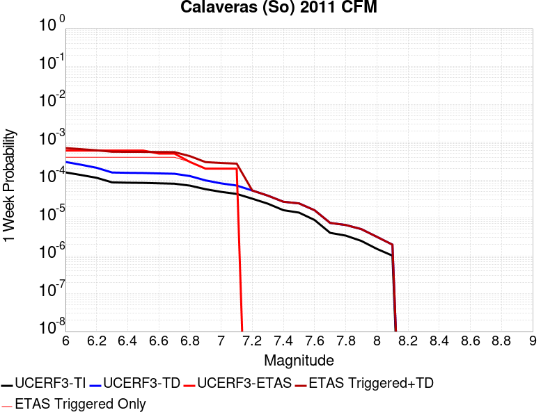 | 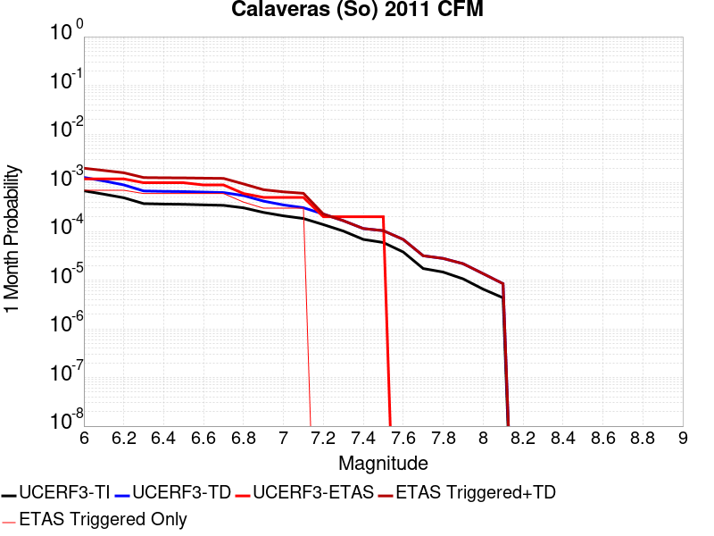 | 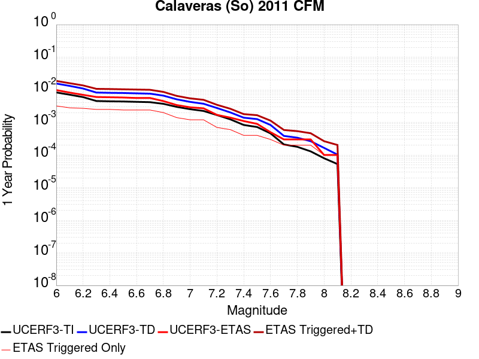 |  |

| Magnitude | 1 wk TI Prob | 1 wk TD Prob | 1 wk ETAS Prob | 1 wk ETAS/TD Gain | 1 wk ETAS Triggered+TD | 1 wk ETAS Triggered Only | 1 mo TI Prob | 1 mo TD Prob | 1 mo ETAS Prob | 1 mo ETAS/TD Gain | 1 mo ETAS Triggered+TD | 1 mo ETAS Triggered Only | 1 yr TI Prob | 1 yr TD Prob | 1 yr ETAS Prob | 1 yr ETAS/TD Gain | 1 yr ETAS Triggered+TD | 1 yr ETAS Triggered Only | 10 yr TI Prob | 10 yr TD Prob | 10 yr ETAS Prob | 10 yr ETAS/TD Gain | 10 yr ETAS Triggered+TD | 10 yr ETAS Triggered Only |
|-----|-----|-----|-----|-----|-----|-----|-----|-----|-----|-----|-----|-----|-----|-----|-----|-----|-----|-----|-----|-----|-----|-----|-----|-----|
| 6.0 | 1.5950744E-4 | 3.0039327E-4 | 2.0E-4 | 0.66579384 | 5.003332E-4 | 2.0E-4 | 6.834242E-4 | 0.0012866248 | 2.0E-4 | 0.15544547 | 0.0014863675 | 2.0E-4 | 0.00828899 | 0.015530481 | 8.0E-4 | 0.051511604 | 0.016318057 | 8.0E-4 | 0.079865426 | 0.14342968 | 0.0024 | 0.016732939 | 0.14548545 | 0.0024 |
| 6.1 | 1.3584697E-4 | 2.537606E-4 | 2.0E-4 | 0.7881444 | 4.5370986E-4 | 2.0E-4 | 5.8207137E-4 | 0.0010870121 | 2.0E-4 | 0.1839906 | 0.0012867947 | 2.0E-4 | 0.007063716 | 0.013140169 | 7.0E-4 | 0.053271767 | 0.013830971 | 7.0E-4 | 0.06843361 | 0.12309246 | 0.0022 | 0.017872745 | 0.12502165 | 0.0022 |
| 6.2 | 1.14676266E-4 | 2.1067173E-4 | 2.0E-4 | 0.9493443 | 4.1062958E-4 | 2.0E-4 | 4.9137714E-4 | 9.025431E-4 | 2.0E-4 | 0.22159608 | 0.0011023625 | 2.0E-4 | 0.0059661185 | 0.010928976 | 7.0E-4 | 0.064049914 | 0.011621325 | 7.0E-4 | 0.058084648 | 0.104108006 | 0.0019 | 0.018250277 | 0.1058102 | 0.0019 |
| 6.3 | 8.691518E-5 | 1.5792086E-4 | 2.0E-4 | 1.2664571 | 3.5788928E-4 | 2.0E-4 | 3.7244044E-4 | 6.7658944E-4 | 2.0E-4 | 0.29560024 | 8.7645417E-4 | 2.0E-4 | 0.004525038 | 0.008199894 | 7.0E-4 | 0.08536696 | 0.008894154 | 7.0E-4 | 0.044339992 | 0.078463614 | 0.0018 | 0.02294057 | 0.08012238 | 0.0018 |
| 6.4 | 8.50982E-5 | 1.5501592E-4 | 2.0E-4 | 1.2901901 | 3.5498492E-4 | 2.0E-4 | 3.646556E-4 | 6.641461E-4 | 2.0E-4 | 0.30113858 | 8.640133E-4 | 2.0E-4 | 0.0044306475 | 0.008049522 | 7.0E-4 | 0.086961694 | 0.008743887 | 7.0E-4 | 0.04343345 | 0.07708181 | 0.0018 | 0.023351815 | 0.078743055 | 0.0018 |
| 6.5 | 8.4062965E-5 | 1.532742E-4 | 2.0E-4 | 1.304851 | 3.5324355E-4 | 2.0E-4 | 3.602201E-4 | 6.566862E-4 | 2.0E-4 | 0.30455947 | 8.5655483E-4 | 2.0E-4 | 0.004376863 | 0.007959454 | 7.0E-4 | 0.08794572 | 0.008653883 | 7.0E-4 | 0.042916555 | 0.076258376 | 0.0018 | 0.023603965 | 0.077921115 | 0.0018 |
| 6.6 | 8.194716E-5 | 1.4966037E-4 | 2.0E-4 | 1.3363591 | 3.4963043E-4 | 2.0E-4 | 3.5115483E-4 | 6.412075E-4 | 2.0E-4 | 0.31191152 | 8.410793E-4 | 2.0E-4 | 0.0042669317 | 0.007772731 | 7.0E-4 | 0.09005844 | 0.008467291 | 7.0E-4 | 0.04185927 | 0.07455445 | 0.0018 | 0.02414343 | 0.07622025 | 0.0018 |
| 6.7 | 8.012326E-5 | 1.4635667E-4 | 2.0E-4 | 1.3665246 | 3.463274E-4 | 2.0E-4 | 3.433402E-4 | 6.270579E-4 | 2.0E-4 | 0.31894982 | 8.269325E-4 | 2.0E-4 | 0.004172157 | 0.007602095 | 7.0E-4 | 0.09207988 | 0.008296774 | 7.0E-4 | 0.040946912 | 0.07300251 | 0.0018 | 0.024656687 | 0.074671105 | 0.0018 |
| 6.8 | 7.119773E-5 | 1.2708327E-4 | 2.0E-4 | 1.5737712 | 3.2705785E-4 | 2.0E-4 | 3.0509746E-4 | 5.445169E-4 | 2.0E-4 | 0.36729807 | 7.44408E-4 | 2.0E-4 | 0.0037082357 | 0.006606212 | 6.0E-4 | 0.09082361 | 0.007202248 | 6.0E-4 | 0.036469642 | 0.063896075 | 0.0016 | 0.025040664 | 0.065393835 | 0.0016 |
| 6.9 | 5.7343088E-5 | 9.76893E-5 | 1.0E-4 | 1.0236536 | 1.9767953E-4 | 1.0E-4 | 2.4573295E-4 | 4.1860167E-4 | 1.0E-4 | 0.23889059 | 5.185598E-4 | 1.0E-4 | 0.0029876942 | 0.005084639 | 3.0E-4 | 0.059001237 | 0.005383114 | 3.0E-4 | 0.02947844 | 0.049813464 | 0.0012 | 0.024089873 | 0.050953686 | 0.0012 |
| 7.0 | 4.8746577E-5 | 8.150154E-5 | 1.0E-4 | 1.2269708 | 1.8149338E-4 | 1.0E-4 | 2.0889717E-4 | 3.4924588E-4 | 1.0E-4 | 0.28633124 | 4.4921096E-4 | 1.0E-4 | 0.0025403565 | 0.0042438433 | 2.0E-4 | 0.047127094 | 0.0044429945 | 2.0E-4 | 0.025115121 | 0.041853353 | 0.001 | 0.023892948 | 0.042811498 | 0.001 |
| 7.1 | 4.2998014E-5 | 7.141097E-5 | 1.0E-4 | 1.4003451 | 1.7140382E-4 | 1.0E-4 | 1.8426418E-4 | 3.0601144E-4 | 1.0E-4 | 0.32678518 | 4.0598083E-4 | 1.0E-4 | 0.002241108 | 0.0037193832 | 2.0E-4 | 0.053772356 | 0.0039186394 | 2.0E-4 | 0.022186412 | 0.036837757 | 9.0E-4 | 0.024431456 | 0.037704602 | 9.0E-4 |
| 7.2 | 3.221292E-5 | 5.2850894E-5 | 0.0 | 0.0 | 5.2850894E-5 | 0.0 | 1.3804805E-4 | 2.264843E-4 | 0.0 | 0.0 | 2.264843E-4 | 0.0 | 0.0016794393 | 0.0027539872 | 1.0E-4 | 0.03631099 | 0.0028537118 | 1.0E-4 | 0.016668037 | 0.027530657 | 6.0E-4 | 0.021793885 | 0.028114138 | 6.0E-4 |
| 7.3 | 2.3756531E-5 | 3.8636637E-5 | 0.0 | 0.0 | 3.8636637E-5 | 0.0 | 1.0180973E-4 | 1.6557517E-4 | 0.0 | 0.0 | 1.6557517E-4 | 0.0 | 0.0012388286 | 0.0020140307 | 1.0E-4 | 0.04965168 | 0.0021138291 | 1.0E-4 | 0.012319452 | 0.020239614 | 5.0E-4 | 0.024704028 | 0.020729495 | 5.0E-4 |
| 7.4 | 1.5997684E-5 | 2.663317E-5 | 0.0 | 0.0 | 2.663317E-5 | 0.0 | 6.8559704E-5 | 1.1413718E-4 | 0.0 | 0.0 | 1.1413718E-4 | 0.0 | 8.343947E-4 | 0.0013887367 | 1.0E-4 | 0.07200789 | 0.0014885978 | 1.0E-4 | 0.008312687 | 0.014032471 | 3.0E-4 | 0.021378987 | 0.014328261 | 3.0E-4 |
| 7.5 | 1.3814293E-5 | 2.4100913E-5 | 0.0 | 0.0 | 2.4100913E-5 | 0.0 | 5.9202768E-5 | 1.0328555E-4 | 0.0 | 0.0 | 1.0328555E-4 | 0.0 | 7.205553E-4 | 0.0012567785 | 1.0E-4 | 0.07956852 | 0.0013566528 | 1.0E-4 | 0.007182234 | 0.012724071 | 3.0E-4 | 0.02357736 | 0.013020253 | 3.0E-4 |
| 7.6 | 8.817309E-6 | 1.5899472E-5 | 0.0 | 0.0 | 1.5899472E-5 | 0.0 | 3.7787922E-5 | 6.813882E-5 | 0.0 | 0.0 | 6.813882E-5 | 0.0 | 4.5997082E-4 | 8.292757E-4 | 0.0 | 0.0 | 8.292757E-4 | 0.0 | 0.004590199 | 0.008460879 | 1.0E-4 | 0.011819103 | 0.0085600335 | 1.0E-4 |
| 7.7 | 4.0352206E-6 | 7.3470687E-6 | 0.0 | 0.0 | 7.3470687E-6 | 0.0 | 1.7293689E-5 | 3.148706E-5 | 0.0 | 0.0 | 3.148706E-5 | 0.0 | 2.1053031E-4 | 3.8328758E-4 | 0.0 | 0.0 | 3.8328758E-4 | 0.0 | 0.0021033096 | 0.0039883037 | 0.0 | 0.0 | 0.0039883037 | 0.0 |
| 7.8 | 3.413169E-6 | 6.4743417E-6 | 0.0 | 0.0 | 6.4743417E-6 | 0.0 | 1.4627784E-5 | 2.7746884E-5 | 0.0 | 0.0 | 2.7746884E-5 | 0.0 | 1.7807873E-4 | 3.37766E-4 | 0.0 | 0.0 | 3.37766E-4 | 0.0 | 0.0017793609 | 0.0035134768 | 0.0 | 0.0 | 0.0035134768 | 0.0 |
| 7.9 | 2.4740732E-6 | 5.0508647E-6 | 0.0 | 0.0 | 5.0508647E-6 | 0.0 | 1.06031275E-5 | 2.1646385E-5 | 0.0 | 0.0 | 2.1646385E-5 | 0.0 | 1.2908543E-4 | 2.6351292E-4 | 0.0 | 0.0 | 2.6351292E-4 | 0.0 | 0.0012901047 | 0.002723944 | 0.0 | 0.0 | 0.002723944 | 0.0 |
| 8.0 | 1.5231818E-6 | 3.1566935E-6 | 0.0 | 0.0 | 3.1566935E-6 | 0.0 | 6.527906E-6 | 1.3528616E-5 | 0.0 | 0.0 | 1.3528616E-5 | 0.0 | 7.9474354E-5 | 1.6469849E-4 | 0.0 | 0.0 | 1.6469849E-4 | 0.0 | 7.944594E-4 | 0.0016920017 | 0.0 | 0.0 | 0.0016920017 | 0.0 |
| 8.1 | 1.0104524E-6 | 1.9643983E-6 | 0.0 | 0.0 | 1.9643983E-6 | 0.0 | 4.330503E-6 | 8.418823E-6 | 0.0 | 0.0 | 8.418823E-6 | 0.0 | 5.2722597E-5 | 1.0249438E-4 | 0.0 | 0.0 | 1.0249438E-4 | 0.0 | 5.271009E-4 | 0.0010529247 | 0.0 | 0.0 | 0.0010529247 | 0.0 |

## Hayward (So) extension 2011 CFM
*[(top)](#table-of-contents)*

| 1 Week | 1 Month | 1 Year | 10 Year |
|-----|-----|-----|-----|
|  |  |  |  |

| Magnitude | 1 wk TI Prob | 1 wk TD Prob | 1 wk ETAS Prob | 1 wk ETAS/TD Gain | 1 wk ETAS Triggered+TD | 1 wk ETAS Triggered Only | 1 mo TI Prob | 1 mo TD Prob | 1 mo ETAS Prob | 1 mo ETAS/TD Gain | 1 mo ETAS Triggered+TD | 1 mo ETAS Triggered Only | 1 yr TI Prob | 1 yr TD Prob | 1 yr ETAS Prob | 1 yr ETAS/TD Gain | 1 yr ETAS Triggered+TD | 1 yr ETAS Triggered Only | 10 yr TI Prob | 10 yr TD Prob | 10 yr ETAS Prob | 10 yr ETAS/TD Gain | 10 yr ETAS Triggered+TD | 10 yr ETAS Triggered Only |
|-----|-----|-----|-----|-----|-----|-----|-----|-----|-----|-----|-----|-----|-----|-----|-----|-----|-----|-----|-----|-----|-----|-----|-----|-----|
| 6.0 | 1.1721256E-4 | 2.3521947E-4 | 3.0E-4 | 1.2754047 | 5.351489E-4 | 3.0E-4 | 5.022428E-4 | 0.001007451 | 3.0E-4 | 0.29778126 | 0.0013071487 | 3.0E-4 | 0.0060976758 | 0.0121734785 | 9.0E-4 | 0.07393121 | 0.013062523 | 9.0E-4 | 0.0593305 | 0.11223979 | 0.0022 | 0.01960089 | 0.114192866 | 0.0022 |
| 6.1 | 6.99169E-5 | 1.3682294E-4 | 2.0E-4 | 1.4617432 | 3.3679558E-4 | 2.0E-4 | 2.9960944E-4 | 5.861606E-4 | 2.0E-4 | 0.34120345 | 7.8604335E-4 | 2.0E-4 | 0.0036416445 | 0.0071071615 | 6.0E-4 | 0.08442189 | 0.0077028973 | 6.0E-4 | 0.035825435 | 0.067268156 | 0.0016 | 0.0237854 | 0.06876053 | 0.0016 |
| 6.2 | 6.99169E-5 | 1.3682294E-4 | 2.0E-4 | 1.4617432 | 3.3679558E-4 | 2.0E-4 | 2.9960944E-4 | 5.861606E-4 | 2.0E-4 | 0.34120345 | 7.8604335E-4 | 2.0E-4 | 0.0036416445 | 0.0071071615 | 6.0E-4 | 0.08442189 | 0.0077028973 | 6.0E-4 | 0.035825435 | 0.067268156 | 0.0016 | 0.0237854 | 0.06876053 | 0.0016 |
| 6.3 | 6.970908E-5 | 1.3650513E-4 | 2.0E-4 | 1.4651464 | 3.3647782E-4 | 2.0E-4 | 2.9871898E-4 | 5.8479945E-4 | 2.0E-4 | 0.3419976 | 7.8468246E-4 | 2.0E-4 | 0.0036308395 | 0.0070907357 | 6.0E-4 | 0.08461745 | 0.0076864813 | 6.0E-4 | 0.035720866 | 0.06711735 | 0.0016 | 0.023838842 | 0.06860996 | 0.0016 |
| 6.4 | 6.9517155E-5 | 1.3617531E-4 | 2.0E-4 | 1.468695 | 3.3614808E-4 | 2.0E-4 | 2.9789665E-4 | 5.833867E-4 | 2.0E-4 | 0.34282577 | 7.8327005E-4 | 2.0E-4 | 0.0036208609 | 0.007073697 | 6.0E-4 | 0.08482128 | 0.0076694526 | 6.0E-4 | 0.03562429 | 0.066961706 | 0.0016 | 0.023894254 | 0.06845457 | 0.0016 |
| 6.5 | 4.786248E-5 | 9.303111E-5 | 2.0E-4 | 2.1498187 | 2.930125E-4 | 2.0E-4 | 2.0510878E-4 | 3.986461E-4 | 2.0E-4 | 0.5016981 | 5.985664E-4 | 2.0E-4 | 0.0024943394 | 0.004843143 | 5.0E-4 | 0.10323875 | 0.0053407215 | 5.0E-4 | 0.02466527 | 0.04641175 | 0.0013 | 0.028010149 | 0.047651414 | 0.0013 |
| 6.6 | 4.4662214E-5 | 8.7730434E-5 | 2.0E-4 | 2.2797105 | 2.877129E-4 | 2.0E-4 | 1.9139545E-4 | 3.759359E-4 | 2.0E-4 | 0.5320056 | 5.7586073E-4 | 2.0E-4 | 0.0023277493 | 0.0045678667 | 4.0E-4 | 0.08756822 | 0.0049660397 | 4.0E-4 | 0.02303517 | 0.043816496 | 0.0012 | 0.027386945 | 0.04496392 | 0.0012 |
| 6.7 | 3.884542E-5 | 7.7629156E-5 | 1.0E-4 | 1.2881758 | 1.7762139E-4 | 1.0E-4 | 1.6646975E-4 | 3.326564E-4 | 1.0E-4 | 0.30061048 | 4.3262314E-4 | 1.0E-4 | 0.002024885 | 0.004043004 | 3.0E-4 | 0.074202254 | 0.004341791 | 3.0E-4 | 0.020065336 | 0.0388833 | 0.001 | 0.025717983 | 0.039844412 | 0.001 |
| 6.8 | 3.4221863E-5 | 6.7658715E-5 | 1.0E-4 | 1.4780062 | 1.6765195E-4 | 1.0E-4 | 1.4665688E-4 | 2.89936E-4 | 1.0E-4 | 0.3449037 | 3.89907E-4 | 1.0E-4 | 0.0017840851 | 0.0035246678 | 2.0E-4 | 0.056742936 | 0.003723963 | 2.0E-4 | 0.017698295 | 0.034021176 | 9.0E-4 | 0.02645411 | 0.03489056 | 9.0E-4 |
| 6.9 | 1.6927712E-5 | 2.9631337E-5 | 1.0E-4 | 3.3748055 | 1.2962837E-4 | 1.0E-4 | 7.2545314E-5 | 1.2698557E-4 | 1.0E-4 | 0.787491 | 2.2697287E-4 | 1.0E-4 | 8.828813E-4 | 0.0015450083 | 1.0E-4 | 0.06472457 | 0.0016448537 | 1.0E-4 | 0.008793819 | 0.015260744 | 4.0E-4 | 0.026211042 | 0.01565464 | 4.0E-4 |
| 7.0 | 1.2509653E-5 | 2.2127879E-5 | 0.0 | 0.0 | 2.2127879E-5 | 0.0 | 5.3611697E-5 | 9.483056E-5 | 0.0 | 0.0 | 9.483056E-5 | 0.0 | 6.525269E-4 | 0.0011539933 | 0.0 | 0.0 | 0.0011539933 | 0.0 | 0.0065061417 | 0.011423799 | 2.0E-4 | 0.017507311 | 0.011621514 | 2.0E-4 |
| 7.1 | 8.751583E-6 | 1.46986695E-5 | 0.0 | 0.0 | 1.46986695E-5 | 0.0 | 3.750624E-5 | 6.299281E-5 | 0.0 | 0.0 | 6.299281E-5 | 0.0 | 4.5654282E-4 | 7.6667324E-4 | 0.0 | 0.0 | 7.6667324E-4 | 0.0 | 0.0045560603 | 0.007653102 | 2.0E-4 | 0.026133196 | 0.007851571 | 2.0E-4 |
| 7.2 | 6.354379E-6 | 1.1301989E-5 | 0.0 | 0.0 | 1.1301989E-5 | 0.0 | 2.7232769E-5 | 4.843622E-5 | 0.0 | 0.0 | 4.843622E-5 | 0.0 | 3.3150852E-4 | 5.8955606E-4 | 0.0 | 0.0 | 5.8955606E-4 | 0.0 | 0.0033101442 | 0.0059044003 | 2.0E-4 | 0.03387304 | 0.0061032195 | 2.0E-4 |
| 7.3 | 4.645554E-6 | 8.660762E-6 | 0.0 | 0.0 | 8.660762E-6 | 0.0 | 1.9909365E-5 | 3.7117046E-5 | 0.0 | 0.0 | 3.7117046E-5 | 0.0 | 2.4236954E-4 | 4.5181013E-4 | 0.0 | 0.0 | 4.5181013E-4 | 0.0 | 0.0024210536 | 0.0045332885 | 2.0E-4 | 0.044118084 | 0.004732382 | 2.0E-4 |
| 7.4 | 4.23437E-6 | 7.851296E-6 | 0.0 | 0.0 | 7.851296E-6 | 0.0 | 1.8147173E-5 | 3.3648E-5 | 0.0 | 0.0 | 3.3648E-5 | 0.0 | 2.2091944E-4 | 4.095911E-4 | 0.0 | 0.0 | 4.095911E-4 | 0.0 | 0.0022069993 | 0.0041123135 | 2.0E-4 | 0.048634425 | 0.0043114913 | 2.0E-4 |
| 7.5 | 2.2187417E-6 | 3.887824E-6 | 0.0 | 0.0 | 3.887824E-6 | 0.0 | 9.508858E-6 | 1.666201E-5 | 0.0 | 0.0 | 1.666201E-5 | 0.0 | 1.157642E-4 | 2.0284363E-4 | 0.0 | 0.0 | 2.0284363E-4 | 0.0 | 0.0011570391 | 0.0020414833 | 0.0 | 0.0 | 0.0020414833 | 0.0 |
| 7.6 | 2.7952495E-8 | 3.823518E-8 | 0.0 | 0.0 | 3.823518E-8 | 0.0 | 1.1979641E-7 | 1.6386504E-7 | 0.0 | 0.0 | 1.6386504E-7 | 0.0 | 1.4585203E-6 | 1.995055E-6 | 0.0 | 0.0 | 1.995055E-6 | 0.0 | 1.4585107E-5 | 2.006026E-5 | 0.0 | 0.0 | 2.006026E-5 | 0.0 |
| 7.7 | 1.7192724E-8 | 2.309186E-8 | 0.0 | 0.0 | 2.309186E-8 | 0.0 | 7.36831E-8 | 9.896512E-8 | 0.0 | 0.0 | 9.896512E-8 | 0.0 | 8.9709135E-7 | 1.2048996E-6 | 0.0 | 0.0 | 1.2048996E-6 | 0.0 | 8.970877E-6 | 1.2135361E-5 | 0.0 | 0.0 | 1.2135361E-5 | 0.0 |

## Cerro Prieto
*[(top)](#table-of-contents)*

| 1 Week | 1 Month | 1 Year | 10 Year |
|-----|-----|-----|-----|
|  |  |  |  |

| Magnitude | 1 wk TI Prob | 1 wk TD Prob | 1 wk ETAS Prob | 1 wk ETAS/TD Gain | 1 wk ETAS Triggered+TD | 1 wk ETAS Triggered Only | 1 mo TI Prob | 1 mo TD Prob | 1 mo ETAS Prob | 1 mo ETAS/TD Gain | 1 mo ETAS Triggered+TD | 1 mo ETAS Triggered Only | 1 yr TI Prob | 1 yr TD Prob | 1 yr ETAS Prob | 1 yr ETAS/TD Gain | 1 yr ETAS Triggered+TD | 1 yr ETAS Triggered Only | 10 yr TI Prob | 10 yr TD Prob | 10 yr ETAS Prob | 10 yr ETAS/TD Gain | 10 yr ETAS Triggered+TD | 10 yr ETAS Triggered Only |
|-----|-----|-----|-----|-----|-----|-----|-----|-----|-----|-----|-----|-----|-----|-----|-----|-----|-----|-----|-----|-----|-----|-----|-----|-----|
| 6.0 | 2.9101528E-4 | 5.876785E-4 | 0.0 | 0.0 | 5.876785E-4 | 0.0 | 0.0012466122 | 0.002516427 | 2.0E-4 | 0.079477765 | 0.0027159238 | 2.0E-4 | 0.015072231 | 0.030233428 | 8.0E-4 | 0.026460778 | 0.03100924 | 8.0E-4 | 0.14089979 | 0.2514084 | 0.0022 | 0.008750701 | 0.2530553 | 0.0022 |
| 6.1 | 2.9101528E-4 | 5.876785E-4 | 0.0 | 0.0 | 5.876785E-4 | 0.0 | 0.0012466122 | 0.002516427 | 2.0E-4 | 0.079477765 | 0.0027159238 | 2.0E-4 | 0.015072231 | 0.030233428 | 8.0E-4 | 0.026460778 | 0.03100924 | 8.0E-4 | 0.14089979 | 0.2514084 | 0.0022 | 0.008750701 | 0.2530553 | 0.0022 |
| 6.2 | 2.9101528E-4 | 5.876785E-4 | 0.0 | 0.0 | 5.876785E-4 | 0.0 | 0.0012466122 | 0.002516427 | 2.0E-4 | 0.079477765 | 0.0027159238 | 2.0E-4 | 0.015072231 | 0.030233428 | 8.0E-4 | 0.026460778 | 0.03100924 | 8.0E-4 | 0.14089979 | 0.2514084 | 0.0022 | 0.008750701 | 0.2530553 | 0.0022 |
| 6.3 | 2.9101528E-4 | 5.876785E-4 | 0.0 | 0.0 | 5.876785E-4 | 0.0 | 0.0012466122 | 0.002516427 | 2.0E-4 | 0.079477765 | 0.0027159238 | 2.0E-4 | 0.015072231 | 0.030233428 | 8.0E-4 | 0.026460778 | 0.03100924 | 8.0E-4 | 0.14089979 | 0.2514084 | 0.0022 | 0.008750701 | 0.2530553 | 0.0022 |
| 6.4 | 2.508648E-4 | 5.056167E-4 | 0.0 | 0.0 | 5.056167E-4 | 0.0 | 0.0010746918 | 0.0021653222 | 2.0E-4 | 0.09236501 | 0.002364889 | 2.0E-4 | 0.013006088 | 0.02607972 | 7.0E-4 | 0.02684078 | 0.026761463 | 7.0E-4 | 0.12270685 | 0.22188032 | 0.0021 | 0.009464562 | 0.22351436 | 0.0021 |
| 6.5 | 2.508648E-4 | 5.056167E-4 | 0.0 | 0.0 | 5.056167E-4 | 0.0 | 0.0010746918 | 0.0021653222 | 2.0E-4 | 0.09236501 | 0.002364889 | 2.0E-4 | 0.013006088 | 0.02607972 | 7.0E-4 | 0.02684078 | 0.026761463 | 7.0E-4 | 0.12270685 | 0.22188032 | 0.0021 | 0.009464562 | 0.22351436 | 0.0021 |
| 6.6 | 2.294914E-4 | 4.6307954E-4 | 0.0 | 0.0 | 4.6307954E-4 | 0.0 | 9.831638E-4 | 0.0019832992 | 1.0E-4 | 0.050421037 | 0.0020831008 | 1.0E-4 | 0.011904482 | 0.023857418 | 6.0E-4 | 0.02514941 | 0.024443105 | 6.0E-4 | 0.11286586 | 0.20606163 | 0.002 | 0.009705834 | 0.20764951 | 0.002 |
| 6.7 | 1.9621674E-4 | 3.965335E-4 | 0.0 | 0.0 | 3.965335E-4 | 0.0 | 8.4065786E-4 | 0.0016984757 | 1.0E-4 | 0.05887632 | 0.0017983058 | 1.0E-4 | 0.010187071 | 0.020493843 | 6.0E-4 | 0.029277084 | 0.021081546 | 6.0E-4 | 0.09732539 | 0.18046996 | 0.002 | 0.011082177 | 0.18210903 | 0.002 |
| 6.8 | 1.5476145E-4 | 2.9933505E-4 | 0.0 | 0.0 | 2.9933505E-4 | 0.0 | 6.6309475E-4 | 0.0012823322 | 1.0E-4 | 0.07798291 | 0.001382204 | 1.0E-4 | 0.008043335 | 0.0154983625 | 5.0E-4 | 0.032261472 | 0.015990613 | 5.0E-4 | 0.07758363 | 0.14124227 | 0.0016 | 0.011328055 | 0.14261627 | 0.0016 |
| 6.9 | 1.20509176E-4 | 2.2068103E-4 | 0.0 | 0.0 | 2.2068103E-4 | 0.0 | 5.1636563E-4 | 9.4549364E-4 | 1.0E-4 | 0.10576486 | 0.0010453991 | 1.0E-4 | 0.006268645 | 0.011465097 | 2.0E-4 | 0.017444247 | 0.011662804 | 2.0E-4 | 0.060947374 | 0.10765188 | 0.0011 | 0.010218122 | 0.108633466 | 0.0011 |
| 7.0 | 9.3269155E-5 | 1.6304594E-4 | 0.0 | 0.0 | 1.6304594E-4 | 0.0 | 3.9966372E-4 | 6.986223E-4 | 1.0E-4 | 0.14313886 | 7.985525E-4 | 1.0E-4 | 0.0048550544 | 0.008479855 | 2.0E-4 | 0.023585308 | 0.008678159 | 2.0E-4 | 0.04750344 | 0.08164473 | 9.0E-4 | 0.01102337 | 0.082471244 | 9.0E-4 |
| 7.1 | 5.029709E-5 | 7.938922E-5 | 0.0 | 0.0 | 7.938922E-5 | 0.0 | 2.1554115E-4 | 3.4021336E-4 | 1.0E-4 | 0.29393318 | 4.4017934E-4 | 1.0E-4 | 0.0026210553 | 0.0041374615 | 2.0E-4 | 0.04833882 | 0.0043366337 | 2.0E-4 | 0.025903556 | 0.041418772 | 4.0E-4 | 0.009657457 | 0.041802205 | 4.0E-4 |
| 7.2 | 6.5445185E-8 | 6.3428644E-8 | 0.0 | 0.0 | 6.3428644E-8 | 0.0 | 2.8047933E-7 | 2.7183705E-7 | 0.0 | 0.0 | 2.7183705E-7 | 0.0 | 3.4148304E-6 | 3.309616E-6 | 0.0 | 0.0 | 3.309616E-6 | 0.0 | 3.414778E-5 | 3.309616E-5 | 0.0 | 0.0 | 3.309616E-5 | 0.0 |

## Mission Ridge-Arroyo Parida-Santa Ana
*[(top)](#table-of-contents)*

| 1 Week | 1 Month | 1 Year | 10 Year |
|-----|-----|-----|-----|
|  |  | 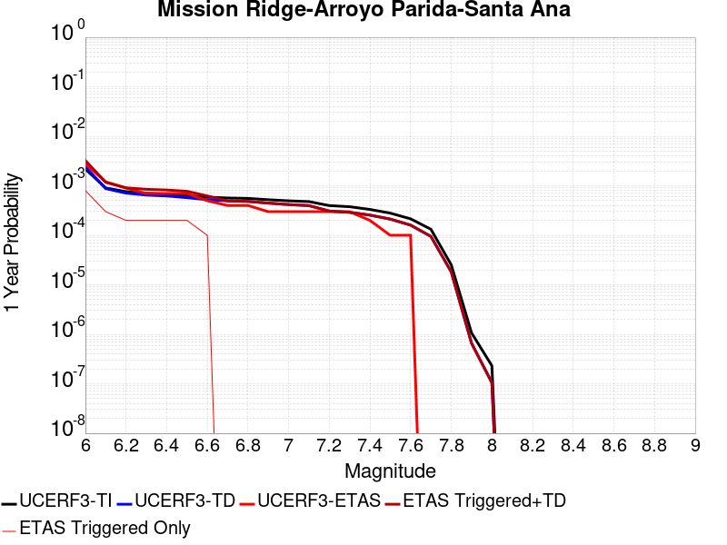 | 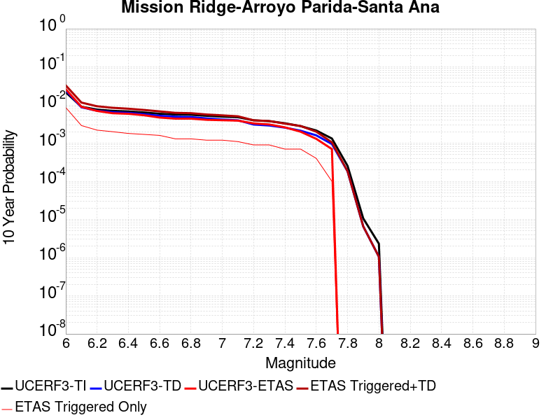 |

| Magnitude | 1 wk TI Prob | 1 wk TD Prob | 1 wk ETAS Prob | 1 wk ETAS/TD Gain | 1 wk ETAS Triggered+TD | 1 wk ETAS Triggered Only | 1 mo TI Prob | 1 mo TD Prob | 1 mo ETAS Prob | 1 mo ETAS/TD Gain | 1 mo ETAS Triggered+TD | 1 mo ETAS Triggered Only | 1 yr TI Prob | 1 yr TD Prob | 1 yr ETAS Prob | 1 yr ETAS/TD Gain | 1 yr ETAS Triggered+TD | 1 yr ETAS Triggered Only | 10 yr TI Prob | 10 yr TD Prob | 10 yr ETAS Prob | 10 yr ETAS/TD Gain | 10 yr ETAS Triggered+TD | 10 yr ETAS Triggered Only |
|-----|-----|-----|-----|-----|-----|-----|-----|-----|-----|-----|-----|-----|-----|-----|-----|-----|-----|-----|-----|-----|-----|-----|-----|-----|
| 6.0 | 4.169034E-5 | 4.7031044E-5 | 0.0 | 0.0 | 4.7031044E-5 | 0.0 | 1.7866064E-4 | 2.0155087E-4 | 0.0 | 0.0 | 2.0155087E-4 | 0.0 | 0.0021730233 | 0.002451956 | 3.0E-4 | 0.12235129 | 0.0027512205 | 3.0E-4 | 0.021518968 | 0.024330456 | 0.0016 | 0.0657612 | 0.025891528 | 0.0016 |
| 6.1 | 1.73813E-5 | 1.682591E-5 | 0.0 | 0.0 | 1.682591E-5 | 0.0 | 7.4489166E-5 | 7.210911E-5 | 0.0 | 0.0 | 7.210911E-5 | 0.0 | 9.065282E-4 | 8.775855E-4 | 0.0 | 0.0 | 8.775855E-4 | 0.0 | 0.009028391 | 0.008742238 | 3.0E-4 | 0.034316156 | 0.009039615 | 3.0E-4 |
| 6.2 | 1.4622182E-5 | 1.3650112E-5 | 0.0 | 0.0 | 1.3650112E-5 | 0.0 | 6.2664985E-5 | 5.849919E-5 | 0.0 | 0.0 | 5.849919E-5 | 0.0 | 7.6267915E-4 | 7.119988E-4 | 0.0 | 0.0 | 7.119988E-4 | 0.0 | 0.007600669 | 0.007097517 | 1.0E-4 | 0.0140894335 | 0.0071968073 | 1.0E-4 |
| 6.3 | 1.3552434E-5 | 1.2460448E-5 | 0.0 | 0.0 | 1.2460448E-5 | 0.0 | 5.8080568E-5 | 5.340084E-5 | 0.0 | 0.0 | 5.340084E-5 | 0.0 | 7.069015E-4 | 6.4996444E-4 | 0.0 | 0.0 | 6.4996444E-4 | 0.0 | 0.00704657 | 0.006480896 | 1.0E-4 | 0.015429965 | 0.0065802475 | 1.0E-4 |
| 6.4 | 1.30977305E-5 | 1.1957964E-5 | 0.0 | 0.0 | 1.1957964E-5 | 0.0 | 5.613192E-5 | 5.1247425E-5 | 0.0 | 0.0 | 5.1247425E-5 | 0.0 | 6.831918E-4 | 6.237618E-4 | 0.0 | 0.0 | 6.237618E-4 | 0.0 | 0.006810953 | 0.0062203533 | 1.0E-4 | 0.016076257 | 0.0063197315 | 1.0E-4 |
| 6.5 | 1.225205E-5 | 1.1028586E-5 | 0.0 | 0.0 | 1.1028586E-5 | 0.0 | 5.2507727E-5 | 4.726453E-5 | 0.0 | 0.0 | 4.726453E-5 | 0.0 | 6.3909404E-4 | 5.752964E-4 | 0.0 | 0.0 | 5.752964E-4 | 0.0 | 0.006372592 | 0.005738279 | 1.0E-4 | 0.017426828 | 0.005837705 | 1.0E-4 |
| 6.6 | 1.1352241E-5 | 1.0044297E-5 | 0.0 | 0.0 | 1.0044297E-5 | 0.0 | 4.8651553E-5 | 4.3046286E-5 | 0.0 | 0.0 | 4.3046286E-5 | 0.0 | 5.921717E-4 | 5.2396464E-4 | 0.0 | 0.0 | 5.2396464E-4 | 0.0 | 0.0059059616 | 0.005227437 | 1.0E-4 | 0.019129835 | 0.005326914 | 1.0E-4 |
| 6.7 | 1.0864116E-5 | 9.498481E-6 | 0.0 | 0.0 | 9.498481E-6 | 0.0 | 4.6559664E-5 | 4.0707153E-5 | 0.0 | 0.0 | 4.0707153E-5 | 0.0 | 5.667165E-4 | 4.954989E-4 | 0.0 | 0.0 | 4.954989E-4 | 0.0 | 0.005652734 | 0.0049440726 | 0.0 | 0.0 | 0.0049440726 | 0.0 |
| 6.8 | 1.0666365E-5 | 9.281458E-6 | 0.0 | 0.0 | 9.281458E-6 | 0.0 | 4.571219E-5 | 3.9777082E-5 | 0.0 | 0.0 | 3.9777082E-5 | 0.0 | 5.564038E-4 | 4.8418035E-4 | 0.0 | 0.0 | 4.8418035E-4 | 0.0 | 0.005550127 | 0.004831385 | 0.0 | 0.0 | 0.004831385 | 0.0 |
| 6.9 | 1.0038665E-5 | 8.574669E-6 | 0.0 | 0.0 | 8.574669E-6 | 0.0 | 4.302214E-5 | 3.6748075E-5 | 0.0 | 0.0 | 3.6748075E-5 | 0.0 | 5.236687E-4 | 4.4731775E-4 | 0.0 | 0.0 | 4.4731775E-4 | 0.0 | 0.005224364 | 0.0044642827 | 0.0 | 0.0 | 0.0044642827 | 0.0 |
| 7.0 | 9.5379955E-6 | 8.008521E-6 | 0.0 | 0.0 | 8.008521E-6 | 0.0 | 4.0876483E-5 | 3.432179E-5 | 0.0 | 0.0 | 3.432179E-5 | 0.0 | 4.975576E-4 | 4.1778936E-4 | 0.0 | 0.0 | 4.1778936E-4 | 0.0 | 0.00496445 | 0.004170137 | 0.0 | 0.0 | 0.004170137 | 0.0 |
| 7.1 | 9.207389E-6 | 7.636396E-6 | 0.0 | 0.0 | 7.636396E-6 | 0.0 | 3.945964E-5 | 3.272701E-5 | 0.0 | 0.0 | 3.272701E-5 | 0.0 | 4.803152E-4 | 3.983802E-4 | 0.0 | 0.0 | 3.983802E-4 | 0.0 | 0.004792784 | 0.003976755 | 0.0 | 0.0 | 0.003976755 | 0.0 |
| 7.2 | 7.638091E-6 | 5.9180575E-6 | 0.0 | 0.0 | 5.9180575E-6 | 0.0 | 3.2734264E-5 | 2.5362859E-5 | 0.0 | 0.0 | 2.5362859E-5 | 0.0 | 3.984668E-4 | 3.0874935E-4 | 0.0 | 0.0 | 3.0874935E-4 | 0.0 | 0.0039775306 | 0.0030831592 | 0.0 | 0.0 | 0.0030831592 | 0.0 |
| 7.3 | 7.2500147E-6 | 5.583636E-6 | 0.0 | 0.0 | 5.583636E-6 | 0.0 | 3.1071122E-5 | 2.392965E-5 | 0.0 | 0.0 | 2.392965E-5 | 0.0 | 3.7822526E-4 | 2.9130484E-4 | 0.0 | 0.0 | 2.9130484E-4 | 0.0 | 0.0037758215 | 0.0029091837 | 0.0 | 0.0 | 0.0029091837 | 0.0 |
| 7.4 | 6.3899715E-6 | 4.9073815E-6 | 0.0 | 0.0 | 4.9073815E-6 | 0.0 | 2.7385306E-5 | 2.1031467E-5 | 0.0 | 0.0 | 2.1031467E-5 | 0.0 | 3.3336508E-4 | 2.560282E-4 | 0.0 | 0.0 | 2.560282E-4 | 0.0 | 0.0033286542 | 0.0025572754 | 0.0 | 0.0 | 0.0025572754 | 0.0 |
| 7.5 | 5.379025E-6 | 4.0744876E-6 | 0.0 | 0.0 | 4.0744876E-6 | 0.0 | 2.305276E-5 | 1.7461974E-5 | 0.0 | 0.0 | 1.7461974E-5 | 0.0 | 2.806312E-4 | 2.125789E-4 | 0.0 | 0.0 | 2.125789E-4 | 0.0 | 0.0028027708 | 0.0021237668 | 0.0 | 0.0 | 0.0021237668 | 0.0 |
| 7.6 | 4.1270696E-6 | 3.0807755E-6 | 0.0 | 0.0 | 3.0807755E-6 | 0.0 | 1.768732E-5 | 1.32032565E-5 | 0.0 | 0.0 | 1.32032565E-5 | 0.0 | 2.1532185E-4 | 1.6073787E-4 | 0.0 | 0.0 | 1.6073787E-4 | 0.0 | 0.0021511333 | 0.0016062241 | 0.0 | 0.0 | 0.0016062241 | 0.0 |
| 7.7 | 2.5406805E-6 | 1.8229238E-6 | 0.0 | 0.0 | 1.8229238E-6 | 0.0 | 1.0888585E-5 | 7.812508E-6 | 0.0 | 0.0 | 7.812508E-6 | 0.0 | 1.3256045E-4 | 9.511319E-5 | 0.0 | 0.0 | 9.511319E-5 | 0.0 | 0.0013248142 | 9.507309E-4 | 0.0 | 0.0 | 9.507309E-4 | 0.0 |
| 7.8 | 4.8608285E-7 | 3.5028427E-7 | 0.0 | 0.0 | 3.5028427E-7 | 0.0 | 2.0832106E-6 | 1.5012174E-6 | 0.0 | 0.0 | 1.5012174E-6 | 0.0 | 2.5362791E-5 | 1.827717E-5 | 0.0 | 0.0 | 1.827717E-5 | 0.0 | 2.5359896E-4 | 1.8275679E-4 | 0.0 | 0.0 | 1.8275679E-4 | 0.0 |
| 7.9 | 2.0472514E-8 | 1.26545165E-8 | 0.0 | 0.0 | 1.26545165E-8 | 0.0 | 8.7739345E-8 | 5.423364E-8 | 0.0 | 0.0 | 5.423364E-8 | 0.0 | 1.068226E-6 | 6.602944E-7 | 0.0 | 0.0 | 6.602944E-7 | 0.0 | 1.0682209E-5 | 6.602925E-6 | 0.0 | 0.0 | 6.602925E-6 | 0.0 |
| 8.0 | 4.443582E-9 | 2.0201907E-9 | 0.0 | 0.0 | 2.0201907E-9 | 0.0 | 1.9043922E-8 | 8.65796E-9 | 0.0 | 0.0 | 8.65796E-9 | 0.0 | 2.3185973E-7 | 1.05410656E-7 | 0.0 | 0.0 | 1.05410656E-7 | 0.0 | 2.3185949E-6 | 1.0541062E-6 | 0.0 | 0.0 | 1.0541062E-6 | 0.0 |

## San Andreas (Offshore) 2011 CFM
*[(top)](#table-of-contents)*

| 1 Week | 1 Month | 1 Year | 10 Year |
|-----|-----|-----|-----|
|  |  |  |  |

| Magnitude | 1 wk TI Prob | 1 wk TD Prob | 1 wk ETAS Prob | 1 wk ETAS/TD Gain | 1 wk ETAS Triggered+TD | 1 wk ETAS Triggered Only | 1 mo TI Prob | 1 mo TD Prob | 1 mo ETAS Prob | 1 mo ETAS/TD Gain | 1 mo ETAS Triggered+TD | 1 mo ETAS Triggered Only | 1 yr TI Prob | 1 yr TD Prob | 1 yr ETAS Prob | 1 yr ETAS/TD Gain | 1 yr ETAS Triggered+TD | 1 yr ETAS Triggered Only | 10 yr TI Prob | 10 yr TD Prob | 10 yr ETAS Prob | 10 yr ETAS/TD Gain | 10 yr ETAS Triggered+TD | 10 yr ETAS Triggered Only |
|-----|-----|-----|-----|-----|-----|-----|-----|-----|-----|-----|-----|-----|-----|-----|-----|-----|-----|-----|-----|-----|-----|-----|-----|-----|
| 6.0 | 1.7072787E-4 | 1.8721544E-4 | 0.0 | 0.0 | 1.8721544E-4 | 0.0 | 7.3148566E-4 | 8.0210745E-4 | 0.0 | 0.0 | 8.0210745E-4 | 0.0 | 0.008869528 | 0.009722419 | 5.0E-4 | 0.051427532 | 0.010217558 | 5.0E-4 | 0.085237645 | 0.09457582 | 0.002 | 0.021147054 | 0.09638667 | 0.002 |
| 6.1 | 1.7072787E-4 | 1.8721544E-4 | 0.0 | 0.0 | 1.8721544E-4 | 0.0 | 7.3148566E-4 | 8.0210745E-4 | 0.0 | 0.0 | 8.0210745E-4 | 0.0 | 0.008869528 | 0.009722419 | 5.0E-4 | 0.051427532 | 0.010217558 | 5.0E-4 | 0.085237645 | 0.09457582 | 0.002 | 0.021147054 | 0.09638667 | 0.002 |
| 6.2 | 1.6312556E-4 | 1.792449E-4 | 0.0 | 0.0 | 1.792449E-4 | 0.0 | 6.989222E-4 | 7.679686E-4 | 0.0 | 0.0 | 7.679686E-4 | 0.0 | 0.008476226 | 0.009310407 | 5.0E-4 | 0.05370335 | 0.009805751 | 5.0E-4 | 0.08160117 | 0.0906796 | 0.002 | 0.022055676 | 0.09249824 | 0.002 |
| 6.3 | 1.5103363E-4 | 1.6429987E-4 | 0.0 | 0.0 | 1.6429987E-4 | 0.0 | 6.471264E-4 | 7.0395437E-4 | 0.0 | 0.0 | 7.0395437E-4 | 0.0 | 0.007850339 | 0.008537386 | 5.0E-4 | 0.058565937 | 0.009033117 | 5.0E-4 | 0.075787395 | 0.083437145 | 0.002 | 0.023970138 | 0.08527027 | 0.002 |
| 6.4 | 1.5047993E-4 | 1.6316205E-4 | 0.0 | 0.0 | 1.6316205E-4 | 0.0 | 6.4475456E-4 | 6.9908064E-4 | 0.0 | 0.0 | 6.9908064E-4 | 0.0 | 0.007821669 | 0.00847851 | 5.0E-4 | 0.058972623 | 0.008974271 | 5.0E-4 | 0.0755203 | 0.08291759 | 0.002 | 0.024120333 | 0.08475176 | 0.002 |
| 6.5 | 1.2760791E-4 | 1.3343433E-4 | 0.0 | 0.0 | 1.3343433E-4 | 0.0 | 5.467764E-4 | 5.717374E-4 | 0.0 | 0.0 | 5.717374E-4 | 0.0 | 0.0066367025 | 0.006938945 | 5.0E-4 | 0.07205706 | 0.0074354755 | 5.0E-4 | 0.064419635 | 0.0684414 | 0.0019 | 0.027760975 | 0.070211366 | 0.0019 |
| 6.6 | 1.1063525E-4 | 1.12099435E-4 | 0.0 | 0.0 | 1.12099435E-4 | 0.0 | 4.740649E-4 | 4.803387E-4 | 0.0 | 0.0 | 4.803387E-4 | 0.0 | 0.0057564764 | 0.005832633 | 4.0E-4 | 0.06857966 | 0.0062303003 | 4.0E-4 | 0.05609626 | 0.05784239 | 0.0017 | 0.029390212 | 0.059444055 | 0.0017 |
| 6.7 | 1.0391049E-4 | 1.03160106E-4 | 0.0 | 0.0 | 1.03160106E-4 | 0.0 | 4.4525467E-4 | 4.4204076E-4 | 0.0 | 0.0 | 4.4204076E-4 | 0.0 | 0.0054075094 | 0.0053687436 | 4.0E-4 | 0.07450533 | 0.0057665957 | 4.0E-4 | 0.052778035 | 0.05340401 | 0.0017 | 0.031832814 | 0.055013224 | 0.0017 |
| 6.8 | 1.0096706E-4 | 9.835799E-5 | 0.0 | 0.0 | 9.835799E-5 | 0.0 | 4.3264418E-4 | 4.2146703E-4 | 0.0 | 0.0 | 4.2146703E-4 | 0.0 | 0.0052547283 | 0.005119455 | 4.0E-4 | 0.078133315 | 0.0055174073 | 4.0E-4 | 0.051321987 | 0.05113353 | 0.0017 | 0.033246286 | 0.0527466 | 0.0017 |
| 6.9 | 9.800265E-5 | 9.273098E-5 | 0.0 | 0.0 | 9.273098E-5 | 0.0 | 4.1994374E-4 | 3.9735882E-4 | 0.0 | 0.0 | 3.9735882E-4 | 0.0 | 0.0051008356 | 0.0048272707 | 4.0E-4 | 0.082862556 | 0.00522534 | 4.0E-4 | 0.049853306 | 0.048488364 | 0.0017 | 0.03505996 | 0.050105933 | 0.0017 |
| 7.0 | 9.4642375E-5 | 8.694709E-5 | 0.0 | 0.0 | 8.694709E-5 | 0.0 | 4.0554712E-4 | 3.72578E-4 | 0.0 | 0.0 | 3.72578E-4 | 0.0 | 0.004926363 | 0.004526855 | 4.0E-4 | 0.08836156 | 0.0049250443 | 4.0E-4 | 0.048185747 | 0.04570121 | 0.0016 | 0.035010014 | 0.047228087 | 0.0016 |
| 7.1 | 9.0996844E-5 | 8.056058E-5 | 0.0 | 0.0 | 8.056058E-5 | 0.0 | 3.8992817E-4 | 3.4521474E-4 | 0.0 | 0.0 | 3.4521474E-4 | 0.0 | 0.004737046 | 0.004195037 | 4.0E-4 | 0.09535077 | 0.004593359 | 4.0E-4 | 0.04637333 | 0.042589325 | 0.0015 | 0.035220094 | 0.04402544 | 0.0015 |
| 7.2 | 8.848287E-5 | 7.6909644E-5 | 0.0 | 0.0 | 7.6909644E-5 | 0.0 | 3.791572E-4 | 3.2957192E-4 | 0.0 | 0.0 | 3.2957192E-4 | 0.0 | 0.004606472 | 0.0040053003 | 4.0E-4 | 0.099867664 | 0.0044036983 | 4.0E-4 | 0.045121472 | 0.040764637 | 0.0013 | 0.031890385 | 0.04201164 | 0.0013 |
| 7.3 | 7.9280784E-5 | 5.886845E-5 | 0.0 | 0.0 | 5.886845E-5 | 0.0 | 3.3973053E-4 | 2.522695E-4 | 0.0 | 0.0 | 2.522695E-4 | 0.0 | 0.004128377 | 0.0030671514 | 4.0E-4 | 0.13041417 | 0.0034659246 | 4.0E-4 | 0.040525194 | 0.031688765 | 9.0E-4 | 0.028401233 | 0.032560244 | 9.0E-4 |
| 7.4 | 6.468038E-5 | 3.6269066E-5 | 0.0 | 0.0 | 3.6269066E-5 | 0.0 | 2.771722E-4 | 1.554299E-4 | 0.0 | 0.0 | 1.554299E-4 | 0.0 | 0.0033693502 | 0.0018907704 | 3.0E-4 | 0.1586655 | 0.0021902032 | 3.0E-4 | 0.0331872 | 0.019943256 | 7.0E-4 | 0.035099585 | 0.020629296 | 7.0E-4 |
| 7.5 | 4.930574E-5 | 1.1868133E-5 | 0.0 | 0.0 | 1.1868133E-5 | 0.0 | 2.1129321E-4 | 5.0862443E-5 | 0.0 | 0.0 | 5.0862443E-5 | 0.0 | 0.0025694598 | 6.190758E-4 | 0.0 | 0.0 | 6.190758E-4 | 0.0 | 0.02539953 | 0.006988064 | 2.0E-4 | 0.028620232 | 0.007186666 | 2.0E-4 |
| 7.6 | 4.612566E-5 | 9.584499E-6 | 0.0 | 0.0 | 9.584499E-6 | 0.0 | 1.9766642E-4 | 4.1075786E-5 | 0.0 | 0.0 | 4.1075786E-5 | 0.0 | 0.0024039324 | 4.999842E-4 | 0.0 | 0.0 | 4.999842E-4 | 0.0 | 0.023780935 | 0.00572244 | 2.0E-4 | 0.034950126 | 0.0059212954 | 2.0E-4 |
| 7.7 | 3.9435414E-5 | 5.0048866E-6 | 0.0 | 0.0 | 5.0048866E-6 | 0.0 | 1.6899795E-4 | 2.1449338E-5 | 0.0 | 0.0 | 2.1449338E-5 | 0.0 | 0.0020556084 | 2.6111456E-4 | 0.0 | 0.0 | 2.6111456E-4 | 0.0 | 0.020366974 | 0.0031907612 | 1.0E-4 | 0.031340484 | 0.003290442 | 1.0E-4 |
| 7.8 | 2.7787428E-5 | 3.3536287E-6 | 0.0 | 0.0 | 3.3536287E-6 | 0.0 | 1.1908354E-4 | 1.4372615E-5 | 0.0 | 0.0 | 1.4372615E-5 | 0.0 | 0.0014488777 | 1.7497256E-4 | 0.0 | 0.0 | 1.7497256E-4 | 0.0 | 0.014394675 | 0.0021416345 | 1.0E-4 | 0.04669331 | 0.0022414203 | 1.0E-4 |
| 7.9 | 1.590671E-5 | 2.7284348E-6 | 0.0 | 0.0 | 2.7284348E-6 | 0.0 | 6.816983E-5 | 1.169324E-5 | 0.0 | 0.0 | 1.169324E-5 | 0.0 | 8.2965166E-4 | 1.4235592E-4 | 0.0 | 0.0 | 1.4235592E-4 | 0.0 | 0.008265611 | 0.001717384 | 1.0E-4 | 0.058228098 | 0.0018172122 | 1.0E-4 |
| 8.0 | 9.193638E-6 | 2.3325933E-6 | 0.0 | 0.0 | 2.3325933E-6 | 0.0 | 3.940071E-5 | 9.99679E-6 | 0.0 | 0.0 | 9.99679E-6 | 0.0 | 4.7959806E-4 | 1.2170414E-4 | 0.0 | 0.0 | 1.2170414E-4 | 0.0 | 0.0047856434 | 0.0014597047 | 1.0E-4 | 0.06850701 | 0.0015595588 | 1.0E-4 |
| 8.1 | 5.601576E-6 | 1.9984789E-6 | 0.0 | 0.0 | 1.9984789E-6 | 0.0 | 2.4006533E-5 | 8.564882E-6 | 0.0 | 0.0 | 8.564882E-6 | 0.0 | 2.9224035E-4 | 1.0427247E-4 | 0.0 | 0.0 | 1.0427247E-4 | 0.0 | 0.0029185633 | 0.0012651279 | 1.0E-4 | 0.079043396 | 0.0013650013 | 1.0E-4 |
| 8.2 | 4.3508785E-6 | 1.6652227E-6 | 0.0 | 0.0 | 1.6652227E-6 | 0.0 | 1.864649E-5 | 7.1366494E-6 | 0.0 | 0.0 | 7.1366494E-6 | 0.0 | 2.2699735E-4 | 8.6885266E-5 | 0.0 | 0.0 | 8.6885266E-5 | 0.0 | 0.0022676561 | 0.0010487458 | 1.0E-4 | 0.09535199 | 0.001148641 | 1.0E-4 |
| 8.3 | 1.9573292E-6 | 6.7481693E-7 | 0.0 | 0.0 | 6.7481693E-7 | 0.0 | 8.388526E-6 | 2.8920695E-6 | 0.0 | 0.0 | 2.8920695E-6 | 0.0 | 1.0212552E-4 | 3.521039E-5 | 0.0 | 0.0 | 3.521039E-5 | 0.0 | 0.001020786 | 4.1982954E-4 | 0.0 | 0.0 | 4.1982954E-4 | 0.0 |

## Almanor 2011 CFM
*[(top)](#table-of-contents)*

| 1 Week | 1 Month | 1 Year | 10 Year |
|-----|-----|-----|-----|
|  |  | 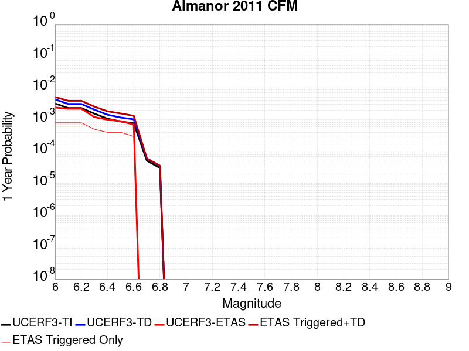 |  |

| Magnitude | 1 wk TI Prob | 1 wk TD Prob | 1 wk ETAS Prob | 1 wk ETAS/TD Gain | 1 wk ETAS Triggered+TD | 1 wk ETAS Triggered Only | 1 mo TI Prob | 1 mo TD Prob | 1 mo ETAS Prob | 1 mo ETAS/TD Gain | 1 mo ETAS Triggered+TD | 1 mo ETAS Triggered Only | 1 yr TI Prob | 1 yr TD Prob | 1 yr ETAS Prob | 1 yr ETAS/TD Gain | 1 yr ETAS Triggered+TD | 1 yr ETAS Triggered Only | 10 yr TI Prob | 10 yr TD Prob | 10 yr ETAS Prob | 10 yr ETAS/TD Gain | 10 yr ETAS Triggered+TD | 10 yr ETAS Triggered Only |
|-----|-----|-----|-----|-----|-----|-----|-----|-----|-----|-----|-----|-----|-----|-----|-----|-----|-----|-----|-----|-----|-----|-----|-----|-----|
| 6.0 | 6.1479834E-5 | 8.298417E-5 | 0.0 | 0.0 | 8.298417E-5 | 0.0 | 2.6345838E-4 | 3.5560352E-4 | 0.0 | 0.0 | 3.5560352E-4 | 0.0 | 0.0032028882 | 0.004321557 | 5.0E-4 | 0.11569904 | 0.0048193964 | 5.0E-4 | 0.031571172 | 0.042444512 | 0.0019 | 0.04476433 | 0.044263866 | 0.0019 |
| 6.1 | 4.4387216E-5 | 5.956422E-5 | 0.0 | 0.0 | 5.956422E-5 | 0.0 | 1.9021705E-4 | 2.5525416E-4 | 0.0 | 0.0 | 2.5525416E-4 | 0.0 | 0.0023134327 | 0.0031037936 | 5.0E-4 | 0.16109318 | 0.0036022419 | 5.0E-4 | 0.022894967 | 0.03065395 | 0.0016 | 0.052195556 | 0.032204904 | 0.0016 |
| 6.2 | 4.4387216E-5 | 5.956422E-5 | 0.0 | 0.0 | 5.956422E-5 | 0.0 | 1.9021705E-4 | 2.5525416E-4 | 0.0 | 0.0 | 2.5525416E-4 | 0.0 | 0.0023134327 | 0.0031037936 | 5.0E-4 | 0.16109318 | 0.0036022419 | 5.0E-4 | 0.022894967 | 0.03065395 | 0.0016 | 0.052195556 | 0.032204904 | 0.0016 |
| 6.3 | 2.9523822E-5 | 3.9414223E-5 | 0.0 | 0.0 | 3.9414223E-5 | 0.0 | 1.2652454E-4 | 1.6890977E-4 | 0.0 | 0.0 | 1.6890977E-4 | 0.0 | 0.0015393476 | 0.00205491 | 4.0E-4 | 0.19465573 | 0.002454088 | 4.0E-4 | 0.015287281 | 0.020394152 | 0.0011 | 0.053937033 | 0.021471718 | 0.0011 |
| 6.4 | 2.0512744E-5 | 2.7338916E-5 | 0.0 | 0.0 | 2.7338916E-5 | 0.0 | 8.79088E-5 | 1.1716365E-4 | 0.0 | 0.0 | 1.1716365E-4 | 0.0 | 0.001069764 | 0.0014258667 | 3.0E-4 | 0.21039835 | 0.001725439 | 3.0E-4 | 0.010646289 | 0.014198058 | 7.0E-4 | 0.04930252 | 0.014888119 | 7.0E-4 |
| 6.5 | 1.6750226E-5 | 2.2315515E-5 | 0.0 | 0.0 | 2.2315515E-5 | 0.0 | 7.178471E-5 | 9.563674E-5 | 0.0 | 0.0 | 9.563674E-5 | 0.0 | 8.7362836E-4 | 0.0011640886 | 3.0E-4 | 0.25771233 | 0.0014637394 | 3.0E-4 | 0.008702018 | 0.011611144 | 7.0E-4 | 0.06028691 | 0.012303016 | 7.0E-4 |
| 6.6 | 1.4745303E-5 | 1.964102E-5 | 0.0 | 0.0 | 1.964102E-5 | 0.0 | 6.319262E-5 | 8.417538E-5 | 0.0 | 0.0 | 8.417538E-5 | 0.0 | 7.690986E-4 | 0.0010246921 | 2.0E-4 | 0.19518058 | 0.0012244871 | 2.0E-4 | 0.0076644225 | 0.010231581 | 6.0E-4 | 0.058641966 | 0.010825441 | 6.0E-4 |
| 6.7 | 9.951145E-7 | 1.1596063E-6 | 0.0 | 0.0 | 1.1596063E-6 | 0.0 | 4.26477E-6 | 4.969733E-6 | 0.0 | 0.0 | 4.969733E-6 | 0.0 | 5.1922336E-5 | 6.0504994E-5 | 0.0 | 0.0 | 6.0504994E-5 | 0.0 | 5.1910203E-4 | 6.049024E-4 | 2.0E-4 | 0.33063185 | 8.047814E-4 | 2.0E-4 |
| 6.8 | 5.866312E-7 | 6.837416E-7 | 0.0 | 0.0 | 6.837416E-7 | 0.0 | 2.5141312E-6 | 2.9303185E-6 | 0.0 | 0.0 | 2.9303185E-6 | 0.0 | 3.0609117E-5 | 3.5676174E-5 | 0.0 | 0.0 | 3.5676174E-5 | 0.0 | 3.06049E-4 | 3.5671727E-4 | 1.0E-4 | 0.2803341 | 4.566816E-4 | 1.0E-4 |

## San Andreas (Santa Cruz Mts) 2011 CFM
*[(top)](#table-of-contents)*

| 1 Week | 1 Month | 1 Year | 10 Year |
|-----|-----|-----|-----|
|  |  |  |  |

| Magnitude | 1 wk TI Prob | 1 wk TD Prob | 1 wk ETAS Prob | 1 wk ETAS/TD Gain | 1 wk ETAS Triggered+TD | 1 wk ETAS Triggered Only | 1 mo TI Prob | 1 mo TD Prob | 1 mo ETAS Prob | 1 mo ETAS/TD Gain | 1 mo ETAS Triggered+TD | 1 mo ETAS Triggered Only | 1 yr TI Prob | 1 yr TD Prob | 1 yr ETAS Prob | 1 yr ETAS/TD Gain | 1 yr ETAS Triggered+TD | 1 yr ETAS Triggered Only | 10 yr TI Prob | 10 yr TD Prob | 10 yr ETAS Prob | 10 yr ETAS/TD Gain | 10 yr ETAS Triggered+TD | 10 yr ETAS Triggered Only |
|-----|-----|-----|-----|-----|-----|-----|-----|-----|-----|-----|-----|-----|-----|-----|-----|-----|-----|-----|-----|-----|-----|-----|-----|-----|
| 6.0 | 1.7221631E-4 | 1.324687E-4 | 1.0E-4 | 0.7548953 | 2.3245545E-4 | 1.0E-4 | 7.378611E-4 | 5.676014E-4 | 3.0E-4 | 0.5285399 | 8.6743117E-4 | 3.0E-4 | 0.008946515 | 0.006889005 | 6.0E-4 | 0.087095305 | 0.007484872 | 6.0E-4 | 0.08594794 | 0.06788688 | 0.002 | 0.029460773 | 0.069751106 | 0.002 |
| 6.1 | 1.7221631E-4 | 1.324687E-4 | 1.0E-4 | 0.7548953 | 2.3245545E-4 | 1.0E-4 | 7.378611E-4 | 5.676014E-4 | 3.0E-4 | 0.5285399 | 8.6743117E-4 | 3.0E-4 | 0.008946515 | 0.006889005 | 6.0E-4 | 0.087095305 | 0.007484872 | 6.0E-4 | 0.08594794 | 0.06788688 | 0.002 | 0.029460773 | 0.069751106 | 0.002 |
| 6.2 | 1.7221631E-4 | 1.324687E-4 | 1.0E-4 | 0.7548953 | 2.3245545E-4 | 1.0E-4 | 7.378611E-4 | 5.676014E-4 | 3.0E-4 | 0.5285399 | 8.6743117E-4 | 3.0E-4 | 0.008946515 | 0.006889005 | 6.0E-4 | 0.087095305 | 0.007484872 | 6.0E-4 | 0.08594794 | 0.06788688 | 0.002 | 0.029460773 | 0.069751106 | 0.002 |
| 6.3 | 1.716926E-4 | 1.3167562E-4 | 1.0E-4 | 0.759442 | 2.3166246E-4 | 1.0E-4 | 7.3561794E-4 | 5.64204E-4 | 3.0E-4 | 0.53172255 | 8.6403475E-4 | 3.0E-4 | 0.008919428 | 0.006847902 | 6.0E-4 | 0.087618075 | 0.007443793 | 6.0E-4 | 0.08569809 | 0.06750289 | 0.002 | 0.02962836 | 0.069367886 | 0.002 |
| 6.4 | 1.6392978E-4 | 1.3057106E-4 | 1.0E-4 | 0.7658665 | 2.30558E-4 | 1.0E-4 | 7.02367E-4 | 5.594722E-4 | 3.0E-4 | 0.53621966 | 8.5930433E-4 | 3.0E-4 | 0.008517839 | 0.0067906515 | 6.0E-4 | 0.08835677 | 0.007386577 | 6.0E-4 | 0.08198654 | 0.06682765 | 0.002 | 0.029927732 | 0.068693995 | 0.002 |
| 6.5 | 1.5742714E-4 | 1.2136819E-4 | 1.0E-4 | 0.82393914 | 2.2135605E-4 | 1.0E-4 | 6.745133E-4 | 5.200473E-4 | 3.0E-4 | 0.57687056 | 8.1989134E-4 | 3.0E-4 | 0.00818132 | 0.006313488 | 5.0E-4 | 0.07919553 | 0.0068103313 | 5.0E-4 | 0.078865945 | 0.062366523 | 0.0018 | 0.028861638 | 0.06405426 | 0.0018 |
| 6.6 | 1.3038084E-4 | 1.1128931E-4 | 1.0E-4 | 0.8985589 | 2.1127818E-4 | 1.0E-4 | 5.5865536E-4 | 4.768682E-4 | 3.0E-4 | 0.6291046 | 7.767251E-4 | 3.0E-4 | 0.006780438 | 0.005790628 | 5.0E-4 | 0.08634642 | 0.006287733 | 5.0E-4 | 0.0657725 | 0.05714523 | 0.0016 | 0.027998837 | 0.058653798 | 0.0016 |
| 6.7 | 1.2867592E-4 | 1.0859168E-4 | 1.0E-4 | 0.92088085 | 2.0858082E-4 | 1.0E-4 | 5.5135164E-4 | 4.6531114E-4 | 3.0E-4 | 0.6447299 | 7.6517154E-4 | 3.0E-4 | 0.0066920654 | 0.0056506577 | 5.0E-4 | 0.08848527 | 0.0061478326 | 5.0E-4 | 0.06494093 | 0.055870116 | 0.0016 | 0.028637849 | 0.057380725 | 0.0016 |
| 6.8 | 1.2801298E-4 | 1.07975764E-4 | 1.0E-4 | 0.92613375 | 2.0796497E-4 | 1.0E-4 | 5.485117E-4 | 4.626724E-4 | 3.0E-4 | 0.6484069 | 7.6253363E-4 | 3.0E-4 | 0.0066577005 | 0.0056187143 | 5.0E-4 | 0.08898833 | 0.006115905 | 5.0E-4 | 0.06461738 | 0.055587195 | 0.0016 | 0.028783606 | 0.057098255 | 0.0016 |
| 6.9 | 1.269149E-4 | 1.06416686E-4 | 1.0E-4 | 0.9397023 | 2.0640604E-4 | 1.0E-4 | 5.4380763E-4 | 4.55993E-4 | 3.0E-4 | 0.65790486 | 7.558562E-4 | 3.0E-4 | 0.006600777 | 0.0055378084 | 5.0E-4 | 0.09028842 | 0.0060350397 | 5.0E-4 | 0.06408122 | 0.054865282 | 0.0016 | 0.02916234 | 0.0563775 | 0.0016 |
| 7.0 | 1.2030331E-4 | 1.0379946E-4 | 1.0E-4 | 0.9633962 | 2.0378908E-4 | 1.0E-4 | 5.154837E-4 | 4.4478016E-4 | 3.0E-4 | 0.6744905 | 7.4464676E-4 | 3.0E-4 | 0.006257969 | 0.005401977 | 5.0E-4 | 0.092558704 | 0.005899276 | 5.0E-4 | 0.06084648 | 0.053585198 | 0.0015 | 0.027992805 | 0.05500482 | 0.0015 |
| 7.1 | 8.049617E-5 | 5.0586772E-5 | 1.0E-4 | 1.9768013 | 1.5058172E-4 | 1.0E-4 | 3.4493793E-4 | 2.1678262E-4 | 2.0E-4 | 0.9225832 | 4.1673926E-4 | 2.0E-4 | 0.0041915346 | 0.0026361651 | 4.0E-4 | 0.15173556 | 0.0030351107 | 4.0E-4 | 0.041133516 | 0.02795207 | 9.0E-4 | 0.032197975 | 0.028826913 | 9.0E-4 |
| 7.2 | 7.093979E-5 | 4.0032555E-5 | 1.0E-4 | 2.4979668 | 1.4002855E-4 | 1.0E-4 | 3.0399222E-4 | 1.7155694E-4 | 1.0E-4 | 0.5828969 | 2.715398E-4 | 1.0E-4 | 0.0036948253 | 0.002086725 | 3.0E-4 | 0.14376594 | 0.0023860992 | 3.0E-4 | 0.03633994 | 0.02247247 | 7.0E-4 | 0.031149225 | 0.023156738 | 7.0E-4 |
| 7.3 | 6.193693E-5 | 2.6747162E-5 | 1.0E-4 | 3.7387145 | 1.2674449E-4 | 1.0E-4 | 2.6541698E-4 | 1.1462567E-4 | 1.0E-4 | 0.872405 | 2.146142E-4 | 1.0E-4 | 0.0032266637 | 0.0013946756 | 2.0E-4 | 0.14340253 | 0.0015943967 | 2.0E-4 | 0.031802133 | 0.015363889 | 5.0E-4 | 0.032543845 | 0.015856206 | 5.0E-4 |
| 7.4 | 5.906492E-5 | 2.4993567E-5 | 1.0E-4 | 4.0010295 | 1.2499107E-4 | 1.0E-4 | 2.5311083E-4 | 1.0711089E-4 | 1.0E-4 | 0.9336118 | 2.0710018E-4 | 1.0E-4 | 0.0030772698 | 0.0013032962 | 2.0E-4 | 0.15345705 | 0.0015030355 | 2.0E-4 | 0.030350044 | 0.014391991 | 5.0E-4 | 0.034741543 | 0.014884795 | 5.0E-4 |
| 7.5 | 5.424296E-5 | 2.2810125E-5 | 1.0E-4 | 4.384018 | 1.2280785E-4 | 1.0E-4 | 2.324491E-4 | 9.775402E-5 | 1.0E-4 | 1.0229758 | 1.9774424E-4 | 1.0E-4 | 0.002826395 | 0.0011895064 | 2.0E-4 | 0.16813697 | 0.0013892684 | 2.0E-4 | 0.027907165 | 0.01316571 | 5.0E-4 | 0.037977442 | 0.013659127 | 5.0E-4 |
| 7.6 | 4.43084E-5 | 1.8421408E-5 | 1.0E-4 | 5.428467 | 1.18419564E-4 | 1.0E-4 | 1.8987931E-4 | 7.8946505E-5 | 1.0E-4 | 1.2666805 | 1.7893862E-4 | 1.0E-4 | 0.0023093296 | 9.607501E-4 | 2.0E-4 | 0.20817068 | 0.001160558 | 2.0E-4 | 0.022854783 | 0.010616424 | 5.0E-4 | 0.047096837 | 0.011111116 | 5.0E-4 |
| 7.7 | 4.118098E-5 | 1.7519116E-5 | 1.0E-4 | 5.7080507 | 1.1751737E-4 | 1.0E-4 | 1.7647797E-4 | 7.507976E-5 | 1.0E-4 | 1.3319168 | 1.7507226E-4 | 1.0E-4 | 0.002146502 | 9.13713E-4 | 2.0E-4 | 0.2188871 | 0.0011135302 | 2.0E-4 | 0.021258866 | 0.010109132 | 5.0E-4 | 0.04946023 | 0.010604078 | 5.0E-4 |
| 7.8 | 3.5408906E-5 | 1.718195E-5 | 1.0E-4 | 5.820061 | 1.1718023E-4 | 1.0E-4 | 1.5174363E-4 | 7.3634845E-5 | 1.0E-4 | 1.3580526 | 1.7362749E-4 | 1.0E-4 | 0.0018459131 | 8.9613575E-4 | 1.0E-4 | 0.11159024 | 9.960461E-4 | 1.0E-4 | 0.018306552 | 0.009911029 | 4.0E-4 | 0.04035908 | 0.010307064 | 4.0E-4 |
| 7.9 | 2.5860836E-5 | 1.605516E-5 | 1.0E-4 | 6.228527 | 1.16053554E-4 | 1.0E-4 | 1.10827445E-4 | 6.880602E-5 | 1.0E-4 | 1.4533613 | 1.6879913E-4 | 1.0E-4 | 0.001348489 | 8.373915E-4 | 1.0E-4 | 0.11941846 | 9.373078E-4 | 1.0E-4 | 0.013403354 | 0.00923667 | 4.0E-4 | 0.04330565 | 0.009632976 | 4.0E-4 |
| 8.0 | 1.9777332E-5 | 1.3757096E-5 | 1.0E-4 | 7.268976 | 1.1375572E-4 | 1.0E-4 | 8.4757245E-5 | 5.8957652E-5 | 1.0E-4 | 1.6961328 | 1.5895175E-4 | 1.0E-4 | 0.0010314309 | 7.1757316E-4 | 1.0E-4 | 0.13935861 | 8.175014E-4 | 1.0E-4 | 0.010266567 | 0.007932751 | 2.0E-4 | 0.025211934 | 0.008131165 | 2.0E-4 |
| 8.1 | 1.468494E-5 | 1.1215867E-5 | 1.0E-4 | 8.91594 | 1.11214744E-4 | 1.0E-4 | 6.293394E-5 | 4.8067115E-5 | 1.0E-4 | 2.0804243 | 1.480623E-4 | 1.0E-4 | 7.6595135E-4 | 5.8506016E-4 | 1.0E-4 | 0.17092259 | 6.8500167E-4 | 1.0E-4 | 0.0076331664 | 0.006492733 | 2.0E-4 | 0.03080367 | 0.0066914344 | 2.0E-4 |
| 8.2 | 8.63836E-6 | 5.004842E-6 | 0.0 | 0.0 | 5.004842E-6 | 0.0 | 3.7021015E-5 | 2.1449147E-5 | 0.0 | 0.0 | 2.1449147E-5 | 0.0 | 4.5063766E-4 | 2.6111212E-4 | 0.0 | 0.0 | 2.6111212E-4 | 0.0 | 0.004497249 | 0.0029908775 | 1.0E-4 | 0.033435002 | 0.0030905786 | 1.0E-4 |
| 8.3 | 1.983087E-6 | 6.880041E-7 | 0.0 | 0.0 | 6.880041E-7 | 0.0 | 8.498917E-6 | 2.9485857E-6 | 0.0 | 0.0 | 2.9485857E-6 | 0.0 | 1.034694E-4 | 3.589845E-5 | 0.0 | 0.0 | 3.589845E-5 | 0.0 | 0.0010342124 | 4.2701262E-4 | 0.0 | 0.0 | 4.2701262E-4 | 0.0 |

## Red Mountain
*[(top)](#table-of-contents)*

| 1 Week | 1 Month | 1 Year | 10 Year |
|-----|-----|-----|-----|
|  | 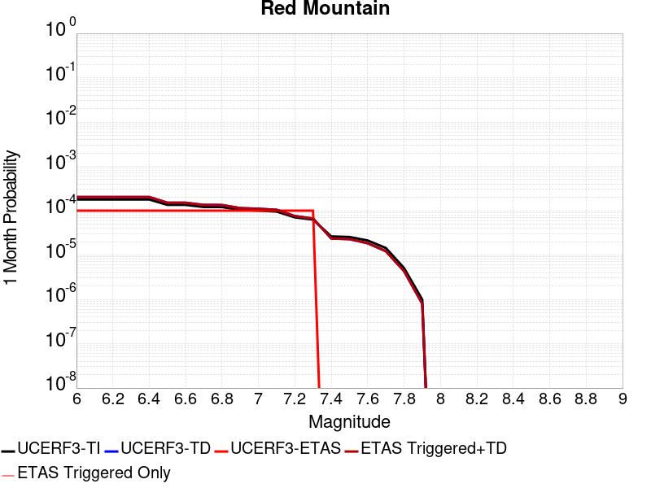 |  |  |

| Magnitude | 1 wk TI Prob | 1 wk TD Prob | 1 wk ETAS Prob | 1 wk ETAS/TD Gain | 1 wk ETAS Triggered+TD | 1 wk ETAS Triggered Only | 1 mo TI Prob | 1 mo TD Prob | 1 mo ETAS Prob | 1 mo ETAS/TD Gain | 1 mo ETAS Triggered+TD | 1 mo ETAS Triggered Only | 1 yr TI Prob | 1 yr TD Prob | 1 yr ETAS Prob | 1 yr ETAS/TD Gain | 1 yr ETAS Triggered+TD | 1 yr ETAS Triggered Only | 10 yr TI Prob | 10 yr TD Prob | 10 yr ETAS Prob | 10 yr ETAS/TD Gain | 10 yr ETAS Triggered+TD | 10 yr ETAS Triggered Only |
|-----|-----|-----|-----|-----|-----|-----|-----|-----|-----|-----|-----|-----|-----|-----|-----|-----|-----|-----|-----|-----|-----|-----|-----|-----|
| 6.0 | 4.1810763E-5 | 4.7503345E-5 | 0.0 | 0.0 | 4.7503345E-5 | 0.0 | 1.7917668E-4 | 2.0357079E-4 | 0.0 | 0.0 | 2.0357079E-4 | 0.0 | 0.0021792934 | 0.0024758214 | 4.0E-4 | 0.16156255 | 0.002874831 | 4.0E-4 | 0.021580452 | 0.024499938 | 0.0013 | 0.05306136 | 0.025768088 | 0.0013 |
| 6.1 | 4.1810763E-5 | 4.7503345E-5 | 0.0 | 0.0 | 4.7503345E-5 | 0.0 | 1.7917668E-4 | 2.0357079E-4 | 0.0 | 0.0 | 2.0357079E-4 | 0.0 | 0.0021792934 | 0.0024758214 | 4.0E-4 | 0.16156255 | 0.002874831 | 4.0E-4 | 0.021580452 | 0.024499938 | 0.0013 | 0.05306136 | 0.025768088 | 0.0013 |
| 6.2 | 4.1810763E-5 | 4.7503345E-5 | 0.0 | 0.0 | 4.7503345E-5 | 0.0 | 1.7917668E-4 | 2.0357079E-4 | 0.0 | 0.0 | 2.0357079E-4 | 0.0 | 0.0021792934 | 0.0024758214 | 4.0E-4 | 0.16156255 | 0.002874831 | 4.0E-4 | 0.021580452 | 0.024499938 | 0.0013 | 0.05306136 | 0.025768088 | 0.0013 |
| 6.3 | 4.1810763E-5 | 4.7503345E-5 | 0.0 | 0.0 | 4.7503345E-5 | 0.0 | 1.7917668E-4 | 2.0357079E-4 | 0.0 | 0.0 | 2.0357079E-4 | 0.0 | 0.0021792934 | 0.0024758214 | 4.0E-4 | 0.16156255 | 0.002874831 | 4.0E-4 | 0.021580452 | 0.024499938 | 0.0013 | 0.05306136 | 0.025768088 | 0.0013 |
| 6.4 | 4.1810763E-5 | 4.7503345E-5 | 0.0 | 0.0 | 4.7503345E-5 | 0.0 | 1.7917668E-4 | 2.0357079E-4 | 0.0 | 0.0 | 2.0357079E-4 | 0.0 | 0.0021792934 | 0.0024758214 | 4.0E-4 | 0.16156255 | 0.002874831 | 4.0E-4 | 0.021580452 | 0.024499938 | 0.0013 | 0.05306136 | 0.025768088 | 0.0013 |
| 6.5 | 3.154503E-5 | 3.5297457E-5 | 0.0 | 0.0 | 3.5297457E-5 | 0.0 | 1.3518598E-4 | 1.5126656E-4 | 0.0 | 0.0 | 1.5126656E-4 | 0.0 | 0.0016446467 | 0.0018402064 | 4.0E-4 | 0.2173669 | 0.0022394704 | 4.0E-4 | 0.01632528 | 0.018259296 | 0.0011 | 0.060243286 | 0.019339211 | 0.0011 |
| 6.6 | 3.1535834E-5 | 3.5286856E-5 | 0.0 | 0.0 | 3.5286856E-5 | 0.0 | 1.3514658E-4 | 1.5122115E-4 | 0.0 | 0.0 | 1.5122115E-4 | 0.0 | 0.0016441676 | 0.0018396544 | 4.0E-4 | 0.21743216 | 0.0022389186 | 4.0E-4 | 0.01632056 | 0.018253865 | 0.0011 | 0.06026121 | 0.019333785 | 0.0011 |
| 6.7 | 2.8267326E-5 | 3.1414627E-5 | 0.0 | 0.0 | 3.1414627E-5 | 0.0 | 1.2114006E-4 | 1.3462765E-4 | 0.0 | 0.0 | 1.3462765E-4 | 0.0 | 0.0014738824 | 0.001637944 | 4.0E-4 | 0.24420859 | 0.0020372889 | 4.0E-4 | 0.014641452 | 0.016267447 | 0.0011 | 0.06761971 | 0.017349552 | 0.0011 |
| 6.8 | 2.8212884E-5 | 3.1352603E-5 | 0.0 | 0.0 | 3.1352603E-5 | 0.0 | 1.20906756E-4 | 1.3436186E-4 | 0.0 | 0.0 | 1.3436186E-4 | 0.0 | 0.0014710457 | 0.0016347129 | 4.0E-4 | 0.24469128 | 0.002034059 | 4.0E-4 | 0.014613459 | 0.016235609 | 0.0011 | 0.06775231 | 0.01731775 | 0.0011 |
| 6.9 | 2.4227871E-5 | 2.6661157E-5 | 0.0 | 0.0 | 2.6661157E-5 | 0.0 | 1.03829596E-4 | 1.1425753E-4 | 0.0 | 0.0 | 1.1425753E-4 | 0.0 | 0.0012633923 | 0.0013902733 | 4.0E-4 | 0.28771323 | 0.0017897172 | 4.0E-4 | 0.012562336 | 0.013823417 | 0.001 | 0.07234101 | 0.014809594 | 0.001 |
| 7.0 | 2.348524E-5 | 2.5791516E-5 | 0.0 | 0.0 | 2.5791516E-5 | 0.0 | 1.0064714E-4 | 1.1053081E-4 | 0.0 | 0.0 | 1.1053081E-4 | 0.0 | 0.0012246901 | 0.0013449573 | 4.0E-4 | 0.2974072 | 0.0017444192 | 4.0E-4 | 0.012179627 | 0.0133757815 | 0.001 | 0.07476199 | 0.014362405 | 0.001 |
| 7.1 | 2.2311642E-5 | 2.4421026E-5 | 0.0 | 0.0 | 2.4421026E-5 | 0.0 | 9.561782E-5 | 1.0465776E-4 | 0.0 | 0.0 | 1.0465776E-4 | 0.0 | 0.0011635252 | 0.001273538 | 4.0E-4 | 0.31408566 | 0.0016730286 | 4.0E-4 | 0.01157452 | 0.0126698855 | 9.0E-4 | 0.07103458 | 0.013558483 | 9.0E-4 |
| 7.2 | 1.6533986E-5 | 1.7640989E-5 | 0.0 | 0.0 | 1.7640989E-5 | 0.0 | 7.085802E-5 | 7.56024E-5 | 0.0 | 0.0 | 7.56024E-5 | 0.0 | 8.623549E-4 | 9.201338E-4 | 4.0E-4 | 0.4347194 | 0.0013197657 | 4.0E-4 | 0.008590161 | 0.009169496 | 7.0E-4 | 0.07634008 | 0.009863077 | 7.0E-4 |
| 7.3 | 1.4703092E-5 | 1.5533557E-5 | 0.0 | 0.0 | 1.5533557E-5 | 0.0 | 6.301173E-5 | 6.657103E-5 | 0.0 | 0.0 | 6.657103E-5 | 0.0 | 7.668978E-4 | 8.1026234E-4 | 3.0E-4 | 0.37025046 | 0.0011100193 | 3.0E-4 | 0.0076425658 | 0.008079133 | 6.0E-4 | 0.07426539 | 0.008674285 | 6.0E-4 |
| 7.4 | 6.1331984E-6 | 5.5207784E-6 | 0.0 | 0.0 | 5.5207784E-6 | 0.0 | 2.6284872E-5 | 2.3660268E-5 | 0.0 | 0.0 | 2.3660268E-5 | 0.0 | 3.199713E-4 | 2.880262E-4 | 1.0E-4 | 0.34719062 | 3.879974E-4 | 1.0E-4 | 0.0031951098 | 0.0028765833 | 2.0E-4 | 0.069526926 | 0.003076008 | 2.0E-4 |
| 7.5 | 5.954766E-6 | 5.330579E-6 | 0.0 | 0.0 | 5.330579E-6 | 0.0 | 2.5520176E-5 | 2.284514E-5 | 0.0 | 0.0 | 2.284514E-5 | 0.0 | 3.1066386E-4 | 2.7810462E-4 | 1.0E-4 | 0.3595769 | 3.780768E-4 | 1.0E-4 | 0.003102299 | 0.0027776195 | 2.0E-4 | 0.0720041 | 0.002977064 | 2.0E-4 |
| 7.6 | 4.9726646E-6 | 4.308218E-6 | 0.0 | 0.0 | 4.308218E-6 | 0.0 | 2.1311245E-5 | 1.8463663E-5 | 0.0 | 0.0 | 1.8463663E-5 | 0.0 | 2.5943352E-4 | 2.2477226E-4 | 0.0 | 0.0 | 2.2477226E-4 | 0.0 | 0.0025913084 | 0.0022454837 | 0.0 | 0.0 | 0.0022454837 | 0.0 |
| 7.7 | 3.3613894E-6 | 2.8472411E-6 | 0.0 | 0.0 | 2.8472411E-6 | 0.0 | 1.4405875E-5 | 1.2202406E-5 | 0.0 | 0.0 | 1.2202406E-5 | 0.0 | 1.7537741E-4 | 1.4855443E-4 | 0.0 | 0.0 | 1.4855443E-4 | 0.0 | 0.0017523908 | 0.0014845774 | 0.0 | 0.0 | 0.0014845774 | 0.0 |
| 7.8 | 1.1828961E-6 | 1.0112856E-6 | 0.0 | 0.0 | 1.0112856E-6 | 0.0 | 5.069545E-6 | 4.334074E-6 | 0.0 | 0.0 | 4.334074E-6 | 0.0 | 6.171996E-5 | 5.2766103E-5 | 0.0 | 0.0 | 5.2766103E-5 | 0.0 | 6.170282E-4 | 5.2753865E-4 | 0.0 | 0.0 | 5.2753865E-4 | 0.0 |
| 7.9 | 2.2967266E-7 | 1.8604956E-7 | 0.0 | 0.0 | 1.8604956E-7 | 0.0 | 9.843111E-7 | 7.97355E-7 | 0.0 | 0.0 | 7.97355E-7 | 0.0 | 1.19839215E-5 | 9.707757E-6 | 0.0 | 0.0 | 9.707757E-6 | 0.0 | 1.1983275E-4 | 9.707362E-5 | 0.0 | 0.0 | 9.707362E-5 | 0.0 |

## Rodgers Creek - Healdsburg 2011 CFM
*[(top)](#table-of-contents)*

| 1 Week | 1 Month | 1 Year | 10 Year |
|-----|-----|-----|-----|
|  |  |  |  |

| Magnitude | 1 wk TI Prob | 1 wk TD Prob | 1 wk ETAS Prob | 1 wk ETAS/TD Gain | 1 wk ETAS Triggered+TD | 1 wk ETAS Triggered Only | 1 mo TI Prob | 1 mo TD Prob | 1 mo ETAS Prob | 1 mo ETAS/TD Gain | 1 mo ETAS Triggered+TD | 1 mo ETAS Triggered Only | 1 yr TI Prob | 1 yr TD Prob | 1 yr ETAS Prob | 1 yr ETAS/TD Gain | 1 yr ETAS Triggered+TD | 1 yr ETAS Triggered Only | 10 yr TI Prob | 10 yr TD Prob | 10 yr ETAS Prob | 10 yr ETAS/TD Gain | 10 yr ETAS Triggered+TD | 10 yr ETAS Triggered Only |
|-----|-----|-----|-----|-----|-----|-----|-----|-----|-----|-----|-----|-----|-----|-----|-----|-----|-----|-----|-----|-----|-----|-----|-----|-----|
| 6.0 | 7.390182E-5 | 1.301492E-4 | 1.0E-4 | 0.76834893 | 2.301362E-4 | 1.0E-4 | 3.1668364E-4 | 5.5766234E-4 | 2.0E-4 | 0.35864 | 7.5755076E-4 | 2.0E-4 | 0.0038488081 | 0.006768365 | 5.0E-4 | 0.07387309 | 0.0072649806 | 5.0E-4 | 0.037828278 | 0.06561573 | 0.0015 | 0.022860372 | 0.0670173 | 0.0015 |
| 6.1 | 7.318768E-5 | 1.2913322E-4 | 1.0E-4 | 0.77439415 | 2.291203E-4 | 1.0E-4 | 3.1362378E-4 | 5.5331015E-4 | 2.0E-4 | 0.36146092 | 7.531995E-4 | 2.0E-4 | 0.0038116854 | 0.0067157187 | 5.0E-4 | 0.07445219 | 0.007212361 | 5.0E-4 | 0.037469655 | 0.06512183 | 0.0015 | 0.023033751 | 0.06652415 | 0.0015 |
| 6.2 | 7.1379836E-5 | 1.2607191E-4 | 1.0E-4 | 0.7931981 | 2.260593E-4 | 1.0E-4 | 3.058777E-4 | 5.401958E-4 | 2.0E-4 | 0.37023613 | 7.4008777E-4 | 2.0E-4 | 0.003717703 | 0.0065570213 | 5.0E-4 | 0.07625414 | 0.0070537427 | 5.0E-4 | 0.0365612 | 0.06364771 | 0.0015 | 0.023567228 | 0.06505223 | 0.0015 |
| 6.3 | 6.9255926E-5 | 1.2263017E-4 | 1.0E-4 | 0.81546 | 2.226179E-4 | 1.0E-4 | 2.9677735E-4 | 5.254523E-4 | 2.0E-4 | 0.38062444 | 7.253472E-4 | 2.0E-4 | 0.0036072785 | 0.006378665 | 5.0E-4 | 0.07838631 | 0.006875476 | 5.0E-4 | 0.035492823 | 0.061984897 | 0.0014 | 0.022586146 | 0.06329812 | 0.0014 |
| 6.4 | 6.6757144E-5 | 1.1841311E-4 | 0.0 | 0.0 | 1.1841311E-4 | 0.0 | 2.8607066E-4 | 5.073864E-4 | 0.0 | 0.0 | 5.073864E-4 | 0.0 | 0.0034773487 | 0.0061600036 | 3.0E-4 | 0.04870127 | 0.006458156 | 3.0E-4 | 0.034234364 | 0.059940808 | 0.0012 | 0.020019751 | 0.061068878 | 0.0012 |
| 6.5 | 6.5735134E-5 | 1.1690995E-4 | 0.0 | 0.0 | 1.1690995E-4 | 0.0 | 2.8169158E-4 | 5.0094683E-4 | 0.0 | 0.0 | 5.0094683E-4 | 0.0 | 0.003424202 | 0.006082054 | 3.0E-4 | 0.04932544 | 0.0063802293 | 3.0E-4 | 0.03371918 | 0.05920631 | 0.001 | 0.016890092 | 0.060147103 | 0.001 |
| 6.6 | 6.289601E-5 | 1.1228256E-4 | 0.0 | 0.0 | 1.1228256E-4 | 0.0 | 2.6952647E-4 | 4.811226E-4 | 0.0 | 0.0 | 4.811226E-4 | 0.0 | 0.0032765474 | 0.0058420138 | 3.0E-4 | 0.051352154 | 0.0061402614 | 3.0E-4 | 0.032286562 | 0.05695151 | 8.0E-4 | 0.014047038 | 0.05770595 | 8.0E-4 |
| 6.7 | 6.115274E-5 | 1.0946364E-4 | 0.0 | 0.0 | 1.0946364E-4 | 0.0 | 2.6205686E-4 | 4.690459E-4 | 0.0 | 0.0 | 4.690459E-4 | 0.0 | 0.0031858748 | 0.0056957584 | 3.0E-4 | 0.052670773 | 0.00599405 | 3.0E-4 | 0.031405866 | 0.055574253 | 8.0E-4 | 0.014395156 | 0.056329794 | 8.0E-4 |
| 6.8 | 5.9232367E-5 | 1.0615019E-4 | 0.0 | 0.0 | 1.0615019E-4 | 0.0 | 2.538283E-4 | 4.5485044E-4 | 0.0 | 0.0 | 4.5485044E-4 | 0.0 | 0.0030859804 | 0.0055238176 | 3.0E-4 | 0.054310262 | 0.0058221607 | 3.0E-4 | 0.030434765 | 0.05394587 | 8.0E-4 | 0.01482968 | 0.054702714 | 8.0E-4 |
| 6.9 | 5.4030377E-5 | 9.7149E-5 | 0.0 | 0.0 | 9.7149E-5 | 0.0 | 2.315382E-4 | 4.1628676E-4 | 0.0 | 0.0 | 4.1628676E-4 | 0.0 | 0.0028153337 | 0.0050565777 | 3.0E-4 | 0.059328664 | 0.0053550606 | 3.0E-4 | 0.027799325 | 0.049505565 | 8.0E-4 | 0.016159799 | 0.050265964 | 8.0E-4 |
| 7.0 | 4.8260714E-5 | 8.639305E-5 | 0.0 | 0.0 | 8.639305E-5 | 0.0 | 2.0681522E-4 | 3.7020363E-4 | 0.0 | 0.0 | 3.7020363E-4 | 0.0 | 0.0025150678 | 0.0044979677 | 3.0E-4 | 0.06669679 | 0.004796618 | 3.0E-4 | 0.024867928 | 0.04418429 | 8.0E-4 | 0.018105984 | 0.044948943 | 8.0E-4 |
| 7.1 | 4.0294493E-5 | 7.2951734E-5 | 0.0 | 0.0 | 7.2951734E-5 | 0.0 | 1.7267925E-4 | 3.1261303E-4 | 0.0 | 0.0 | 3.1261303E-4 | 0.0 | 0.0021003427 | 0.0037994585 | 1.0E-4 | 0.026319541 | 0.0038990786 | 1.0E-4 | 0.02080602 | 0.03747253 | 5.0E-4 | 0.013343107 | 0.037953794 | 5.0E-4 |
| 7.2 | 3.096388E-5 | 5.6131365E-5 | 0.0 | 0.0 | 5.6131365E-5 | 0.0 | 1.326956E-4 | 2.4054093E-4 | 0.0 | 0.0 | 2.4054093E-4 | 0.0 | 0.0016143717 | 0.0029246744 | 1.0E-4 | 0.03419184 | 0.0030243818 | 1.0E-4 | 0.01602694 | 0.029026924 | 5.0E-4 | 0.017225387 | 0.029512411 | 5.0E-4 |
| 7.3 | 2.3615226E-5 | 4.2892298E-5 | 0.0 | 0.0 | 4.2892298E-5 | 0.0 | 1.0120418E-4 | 1.8381125E-4 | 0.0 | 0.0 | 1.8381125E-4 | 0.0 | 0.0012314644 | 0.0022356184 | 1.0E-4 | 0.044730354 | 0.002335395 | 1.0E-4 | 0.0122466255 | 0.022279777 | 5.0E-4 | 0.022441875 | 0.022768637 | 5.0E-4 |
| 7.4 | 1.8251132E-5 | 3.293187E-5 | 0.0 | 0.0 | 3.293187E-5 | 0.0 | 7.821679E-5 | 1.41129E-4 | 0.0 | 0.0 | 1.41129E-4 | 0.0 | 9.518733E-4 | 0.0017169007 | 1.0E-4 | 0.058244485 | 0.0018167291 | 1.0E-4 | 0.009478063 | 0.017168263 | 4.0E-4 | 0.023298806 | 0.017561395 | 4.0E-4 |
| 7.5 | 1.2411432E-5 | 2.204226E-5 | 0.0 | 0.0 | 2.204226E-5 | 0.0 | 5.3190768E-5 | 9.446344E-5 | 0.0 | 0.0 | 9.446344E-5 | 0.0 | 6.4740516E-4 | 0.0011494912 | 1.0E-4 | 0.08699501 | 0.0012493762 | 1.0E-4 | 0.006455223 | 0.01153857 | 2.0E-4 | 0.01733317 | 0.011736262 | 2.0E-4 |
| 7.6 | 4.4771446E-6 | 7.931335E-6 | 0.0 | 0.0 | 7.931335E-6 | 0.0 | 1.918762E-5 | 3.3991E-5 | 0.0 | 0.0 | 3.3991E-5 | 0.0 | 2.3358424E-4 | 4.1376302E-4 | 0.0 | 0.0 | 4.1376302E-4 | 0.0 | 0.0023333887 | 0.004170798 | 0.0 | 0.0 | 0.004170798 | 0.0 |
| 7.7 | 2.157941E-7 | 3.4058309E-7 | 0.0 | 0.0 | 3.4058309E-7 | 0.0 | 9.248315E-7 | 1.459641E-6 | 0.0 | 0.0 | 1.459641E-6 | 0.0 | 1.1259765E-5 | 1.7770984E-5 | 0.0 | 0.0 | 1.7770984E-5 | 0.0 | 1.1259195E-4 | 1.8428617E-4 | 0.0 | 0.0 | 1.8428617E-4 | 0.0 |
| 7.8 | 9.9623286E-8 | 1.8952073E-7 | 0.0 | 0.0 | 1.8952073E-7 | 0.0 | 4.269569E-7 | 8.1223146E-7 | 0.0 | 0.0 | 8.1223146E-7 | 0.0 | 5.1981874E-6 | 9.888873E-6 | 0.0 | 0.0 | 9.888873E-6 | 0.0 | 5.198066E-5 | 1.0434773E-4 | 0.0 | 0.0 | 1.0434773E-4 | 0.0 |
| 7.9 | 5.6745257E-8 | 1.12044894E-7 | 0.0 | 0.0 | 1.12044894E-7 | 0.0 | 2.4319394E-7 | 4.801923E-7 | 0.0 | 0.0 | 4.801923E-7 | 0.0 | 2.960882E-6 | 5.8463256E-6 | 0.0 | 0.0 | 5.8463256E-6 | 0.0 | 2.9608427E-5 | 6.191383E-5 | 0.0 | 0.0 | 6.191383E-5 | 0.0 |
| 8.0 | 2.8614323E-8 | 6.283889E-8 | 0.0 | 0.0 | 6.283889E-8 | 0.0 | 1.2263281E-7 | 2.693095E-7 | 0.0 | 0.0 | 2.693095E-7 | 0.0 | 1.4930534E-6 | 3.2788384E-6 | 0.0 | 0.0 | 3.2788384E-6 | 0.0 | 1.4930434E-5 | 3.4405322E-5 | 0.0 | 0.0 | 3.4405322E-5 | 0.0 |
| 8.1 | 3.5045191E-9 | 8.596933E-9 | 0.0 | 0.0 | 8.596933E-9 | 0.0 | 1.5019367E-8 | 3.6844E-8 | 0.0 | 0.0 | 3.6844E-8 | 0.0 | 1.8286079E-7 | 4.485756E-7 | 0.0 | 0.0 | 4.485756E-7 | 0.0 | 1.8286064E-6 | 4.657446E-6 | 0.0 | 0.0 | 4.657446E-6 | 0.0 |

## Hayward (No) 2011 CFM
*[(top)](#table-of-contents)*

| 1 Week | 1 Month | 1 Year | 10 Year |
|-----|-----|-----|-----|
|  | 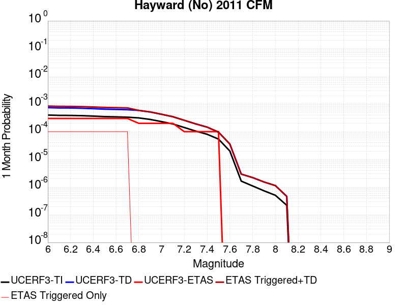 |  |  |

| Magnitude | 1 wk TI Prob | 1 wk TD Prob | 1 wk ETAS Prob | 1 wk ETAS/TD Gain | 1 wk ETAS Triggered+TD | 1 wk ETAS Triggered Only | 1 mo TI Prob | 1 mo TD Prob | 1 mo ETAS Prob | 1 mo ETAS/TD Gain | 1 mo ETAS Triggered+TD | 1 mo ETAS Triggered Only | 1 yr TI Prob | 1 yr TD Prob | 1 yr ETAS Prob | 1 yr ETAS/TD Gain | 1 yr ETAS Triggered+TD | 1 yr ETAS Triggered Only | 10 yr TI Prob | 10 yr TD Prob | 10 yr ETAS Prob | 10 yr ETAS/TD Gain | 10 yr ETAS Triggered+TD | 10 yr ETAS Triggered Only |
|-----|-----|-----|-----|-----|-----|-----|-----|-----|-----|-----|-----|-----|-----|-----|-----|-----|-----|-----|-----|-----|-----|-----|-----|-----|
| 6.0 | 9.3068506E-5 | 1.7216054E-4 | 0.0 | 0.0 | 1.7216054E-4 | 0.0 | 3.9880406E-4 | 7.3762017E-4 | 0.0 | 0.0 | 7.3762017E-4 | 0.0 | 0.0048446343 | 0.008943433 | 3.0E-4 | 0.033544164 | 0.00924075 | 3.0E-4 | 0.047403704 | 0.0855743 | 0.0014 | 0.016360054 | 0.086854495 | 0.0014 |
| 6.1 | 9.055486E-5 | 1.676884E-4 | 0.0 | 0.0 | 1.676884E-4 | 0.0 | 3.880345E-4 | 7.184667E-4 | 0.0 | 0.0 | 7.184667E-4 | 0.0 | 0.0047140904 | 0.008712324 | 3.0E-4 | 0.03443398 | 0.0090097105 | 3.0E-4 | 0.046153355 | 0.083477445 | 0.0014 | 0.016770996 | 0.08476058 | 0.0014 |
| 6.2 | 9.006742E-5 | 1.6689788E-4 | 0.0 | 0.0 | 1.6689788E-4 | 0.0 | 3.859461E-4 | 7.1508106E-4 | 0.0 | 0.0 | 7.1508106E-4 | 0.0 | 0.0046887742 | 0.008671464 | 3.0E-4 | 0.03459623 | 0.008968864 | 3.0E-4 | 0.0459107 | 0.083102904 | 0.0014 | 0.016846584 | 0.08438656 | 0.0014 |
| 6.3 | 8.8336754E-5 | 1.6370429E-4 | 0.0 | 0.0 | 1.6370429E-4 | 0.0 | 3.7853114E-4 | 7.0140185E-4 | 0.0 | 0.0 | 7.0140185E-4 | 0.0 | 0.004598882 | 0.008506285 | 3.0E-4 | 0.035268042 | 0.008803733 | 3.0E-4 | 0.04504866 | 0.08160339 | 0.0014 | 0.01715615 | 0.08288915 | 0.0014 |
| 6.4 | 8.526157E-5 | 1.5799089E-4 | 0.0 | 0.0 | 1.5799089E-4 | 0.0 | 3.6535555E-4 | 6.769287E-4 | 0.0 | 0.0 | 6.769287E-4 | 0.0 | 0.0044391346 | 0.008210618 | 3.0E-4 | 0.036538053 | 0.008508155 | 3.0E-4 | 0.043514993 | 0.07889129 | 0.0014 | 0.017745938 | 0.080180846 | 0.0014 |
| 6.5 | 8.152396E-5 | 1.513402E-4 | 0.0 | 0.0 | 1.513402E-4 | 0.0 | 3.493416E-4 | 6.4844027E-4 | 0.0 | 0.0 | 6.4844027E-4 | 0.0 | 0.0042449418 | 0.0078663295 | 3.0E-4 | 0.038137227 | 0.008163969 | 3.0E-4 | 0.04164765 | 0.07573358 | 0.0012 | 0.015845018 | 0.0768427 | 0.0012 |
| 6.6 | 7.987405E-5 | 1.4839246E-4 | 0.0 | 0.0 | 1.4839246E-4 | 0.0 | 3.4227243E-4 | 6.3581334E-4 | 0.0 | 0.0 | 6.3581334E-4 | 0.0 | 0.0041592065 | 0.0077137058 | 3.0E-4 | 0.038891815 | 0.008011391 | 3.0E-4 | 0.04082218 | 0.07432956 | 0.0011 | 0.014798957 | 0.0753478 | 0.0011 |
| 6.7 | 7.777665E-5 | 1.4480116E-4 | 0.0 | 0.0 | 1.4480116E-4 | 0.0 | 3.332859E-4 | 6.2042946E-4 | 0.0 | 0.0 | 6.2042946E-4 | 0.0 | 0.004050208 | 0.007527718 | 3.0E-4 | 0.039852716 | 0.007825459 | 3.0E-4 | 0.039771806 | 0.07261166 | 0.0011 | 0.015149082 | 0.073631786 | 0.0011 |
| 6.8 | 7.3284005E-5 | 1.3639059E-4 | 0.0 | 0.0 | 1.3639059E-4 | 0.0 | 3.140365E-4 | 5.844007E-4 | 0.0 | 0.0 | 5.844007E-4 | 0.0 | 0.0038166929 | 0.007092001 | 3.0E-4 | 0.042301178 | 0.0073898733 | 3.0E-4 | 0.037518036 | 0.068558596 | 0.0011 | 0.016044669 | 0.069583185 | 0.0011 |
| 6.9 | 6.458263E-5 | 1.1987969E-4 | 0.0 | 0.0 | 1.1987969E-4 | 0.0 | 2.7675333E-4 | 5.136694E-4 | 0.0 | 0.0 | 5.136694E-4 | 0.0 | 0.0033642664 | 0.0062360903 | 3.0E-4 | 0.048107065 | 0.0065342193 | 3.0E-4 | 0.033137884 | 0.060563095 | 0.0011 | 0.018162876 | 0.061596476 | 0.0011 |
| 7.0 | 5.3853604E-5 | 9.901269E-5 | 0.0 | 0.0 | 9.901269E-5 | 0.0 | 2.3078074E-4 | 4.242714E-4 | 0.0 | 0.0 | 4.242714E-4 | 0.0 | 0.0028061352 | 0.005153333 | 3.0E-4 | 0.058214754 | 0.005451787 | 3.0E-4 | 0.027709642 | 0.050376564 | 0.001 | 0.0198505 | 0.05132619 | 0.001 |
| 7.1 | 4.4308683E-5 | 8.06231E-5 | 0.0 | 0.0 | 8.06231E-5 | 0.0 | 1.8988053E-4 | 3.45482E-4 | 0.0 | 0.0 | 3.45482E-4 | 0.0 | 0.0023093442 | 0.004198171 | 1.0E-4 | 0.023819895 | 0.0042977515 | 1.0E-4 | 0.022854926 | 0.0413089 | 5.0E-4 | 0.012103929 | 0.041788243 | 5.0E-4 |
| 7.2 | 3.295973E-5 | 5.9830003E-5 | 0.0 | 0.0 | 5.9830003E-5 | 0.0 | 1.4124835E-4 | 2.5638923E-4 | 0.0 | 0.0 | 2.5638923E-4 | 0.0 | 0.0017183421 | 0.003117093 | 1.0E-4 | 0.032081176 | 0.0032167812 | 1.0E-4 | 0.017051157 | 0.03091609 | 5.0E-4 | 0.01617281 | 0.031400632 | 5.0E-4 |
| 7.3 | 2.452256E-5 | 4.440244E-5 | 0.0 | 0.0 | 4.440244E-5 | 0.0 | 1.05092455E-4 | 1.9028237E-4 | 0.0 | 0.0 | 1.9028237E-4 | 0.0 | 0.0012787496 | 0.0023142397 | 1.0E-4 | 0.043210734 | 0.0024140084 | 1.0E-4 | 0.0127141625 | 0.023063933 | 5.0E-4 | 0.021678869 | 0.023552403 | 5.0E-4 |
| 7.4 | 1.8829967E-5 | 3.396135E-5 | 0.0 | 0.0 | 3.396135E-5 | 0.0 | 8.069736E-5 | 1.4554059E-4 | 0.0 | 0.0 | 1.4554059E-4 | 0.0 | 9.820475E-4 | 0.0017705259 | 1.0E-4 | 0.056480393 | 0.0018703489 | 1.0E-4 | 0.009777189 | 0.017707042 | 4.0E-4 | 0.022589881 | 0.01809996 | 4.0E-4 |
| 7.5 | 1.26374125E-5 | 2.2482714E-5 | 0.0 | 0.0 | 2.2482714E-5 | 0.0 | 5.4159216E-5 | 9.635096E-5 | 0.0 | 0.0 | 9.635096E-5 | 0.0 | 6.5918895E-4 | 0.0011724472 | 1.0E-4 | 0.08529168 | 0.0012723301 | 1.0E-4 | 0.00657237 | 0.0117742745 | 2.0E-4 | 0.016986186 | 0.01197192 | 2.0E-4 |
| 7.6 | 4.666429E-6 | 8.307882E-6 | 0.0 | 0.0 | 8.307882E-6 | 0.0 | 1.9998828E-5 | 3.560473E-5 | 0.0 | 0.0 | 3.560473E-5 | 0.0 | 2.4345852E-4 | 4.3340254E-4 | 0.0 | 0.0 | 4.3340254E-4 | 0.0 | 0.0024319198 | 0.0043748464 | 0.0 | 0.0 | 0.0043748464 | 0.0 |
| 7.7 | 3.8399318E-7 | 6.8284623E-7 | 0.0 | 0.0 | 6.8284623E-7 | 0.0 | 1.6456839E-6 | 2.9264804E-6 | 0.0 | 0.0 | 2.9264804E-6 | 0.0 | 2.003602E-5 | 3.5629317E-5 | 0.0 | 0.0 | 3.5629317E-5 | 0.0 | 2.0034213E-4 | 3.7119133E-4 | 0.0 | 0.0 | 3.7119133E-4 | 0.0 |
| 7.8 | 2.5637698E-7 | 5.107383E-7 | 0.0 | 0.0 | 5.107383E-7 | 0.0 | 1.098758E-6 | 2.1888766E-6 | 0.0 | 0.0 | 2.1888766E-6 | 0.0 | 1.3377297E-5 | 2.6649248E-5 | 0.0 | 0.0 | 2.6649248E-5 | 0.0 | 1.3376492E-4 | 2.7981476E-4 | 0.0 | 0.0 | 2.7981476E-4 | 0.0 |
| 7.9 | 1.7141245E-7 | 3.554999E-7 | 0.0 | 0.0 | 3.554999E-7 | 0.0 | 7.3462456E-7 | 1.5235701E-6 | 0.0 | 0.0 | 1.5235701E-6 | 0.0 | 8.944017E-6 | 1.8549308E-5 | 0.0 | 0.0 | 1.8549308E-5 | 0.0 | 8.943657E-5 | 1.9399682E-4 | 0.0 | 0.0 | 1.9399682E-4 | 0.0 |
| 8.0 | 1.1808895E-7 | 2.6305878E-7 | 0.0 | 0.0 | 2.6305878E-7 | 0.0 | 5.060954E-7 | 1.1273943E-6 | 0.0 | 0.0 | 1.1273943E-6 | 0.0 | 6.161694E-6 | 1.3725939E-5 | 0.0 | 0.0 | 1.3725939E-5 | 0.0 | 6.161523E-5 | 1.4237752E-4 | 0.0 | 0.0 | 1.4237752E-4 | 0.0 |
| 8.1 | 5.138535E-8 | 1.0755803E-7 | 0.0 | 0.0 | 1.0755803E-7 | 0.0 | 2.2022292E-7 | 4.609629E-7 | 0.0 | 0.0 | 4.609629E-7 | 0.0 | 2.6812106E-6 | 5.612209E-6 | 0.0 | 0.0 | 5.612209E-6 | 0.0 | 2.6811784E-5 | 5.784103E-5 | 0.0 | 0.0 | 5.784103E-5 | 0.0 |

## Concord 2011 CFM
*[(top)](#table-of-contents)*

| 1 Week | 1 Month | 1 Year | 10 Year |
|-----|-----|-----|-----|
|  | 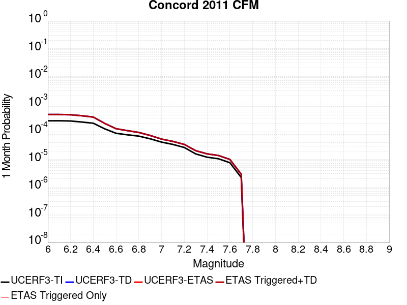 |  | 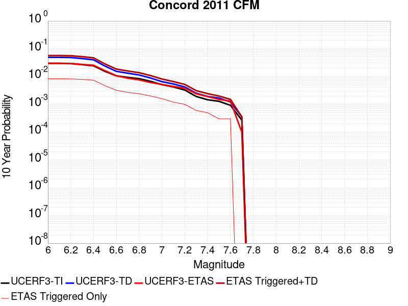 |

| Magnitude | 1 wk TI Prob | 1 wk TD Prob | 1 wk ETAS Prob | 1 wk ETAS/TD Gain | 1 wk ETAS Triggered+TD | 1 wk ETAS Triggered Only | 1 mo TI Prob | 1 mo TD Prob | 1 mo ETAS Prob | 1 mo ETAS/TD Gain | 1 mo ETAS Triggered+TD | 1 mo ETAS Triggered Only | 1 yr TI Prob | 1 yr TD Prob | 1 yr ETAS Prob | 1 yr ETAS/TD Gain | 1 yr ETAS Triggered+TD | 1 yr ETAS Triggered Only | 10 yr TI Prob | 10 yr TD Prob | 10 yr ETAS Prob | 10 yr ETAS/TD Gain | 10 yr ETAS Triggered+TD | 10 yr ETAS Triggered Only |
|-----|-----|-----|-----|-----|-----|-----|-----|-----|-----|-----|-----|-----|-----|-----|-----|-----|-----|-----|-----|-----|-----|-----|-----|-----|
| 6.0 | 5.7865112E-5 | 9.7227785E-5 | 0.0 | 0.0 | 9.7227785E-5 | 0.0 | 2.4796976E-4 | 4.166246E-4 | 0.0 | 0.0 | 4.166246E-4 | 0.0 | 0.0030148525 | 0.0050611263 | 3.0E-4 | 0.05927534 | 0.005359608 | 3.0E-4 | 0.029742775 | 0.04907589 | 0.0015 | 0.030564906 | 0.050502278 | 0.0015 |
| 6.1 | 5.7865112E-5 | 9.7227785E-5 | 0.0 | 0.0 | 9.7227785E-5 | 0.0 | 2.4796976E-4 | 4.166246E-4 | 0.0 | 0.0 | 4.166246E-4 | 0.0 | 0.0030148525 | 0.0050611263 | 3.0E-4 | 0.05927534 | 0.005359608 | 3.0E-4 | 0.029742775 | 0.04907589 | 0.0015 | 0.030564906 | 0.050502278 | 0.0015 |
| 6.2 | 5.6789337E-5 | 9.543774E-5 | 0.0 | 0.0 | 9.543774E-5 | 0.0 | 2.4336016E-4 | 4.0895652E-4 | 0.0 | 0.0 | 4.0895652E-4 | 0.0 | 0.0029588845 | 0.004968242 | 3.0E-4 | 0.060383532 | 0.0052667516 | 3.0E-4 | 0.029197963 | 0.04819583 | 0.0015 | 0.031123023 | 0.049623538 | 0.0015 |
| 6.3 | 5.203322E-5 | 8.771259E-5 | 0.0 | 0.0 | 8.771259E-5 | 0.0 | 2.2298045E-4 | 3.7586133E-4 | 0.0 | 0.0 | 3.7586133E-4 | 0.0 | 0.0027114071 | 0.004567288 | 3.0E-4 | 0.0656845 | 0.004865918 | 3.0E-4 | 0.026785625 | 0.044380765 | 0.0014 | 0.031545196 | 0.045718633 | 0.0014 |
| 6.4 | 4.7120942E-5 | 7.866446E-5 | 0.0 | 0.0 | 7.866446E-5 | 0.0 | 2.0193127E-4 | 3.37094E-4 | 0.0 | 0.0 | 3.37094E-4 | 0.0 | 0.0024557412 | 0.0040971357 | 3.0E-4 | 0.073221885 | 0.0043959063 | 3.0E-4 | 0.024287801 | 0.039909057 | 0.0014 | 0.035079755 | 0.041253187 | 0.0014 |
| 6.5 | 2.9598437E-5 | 4.6468846E-5 | 0.0 | 0.0 | 4.6468846E-5 | 0.0 | 1.2684427E-4 | 1.9913817E-4 | 0.0 | 0.0 | 1.9913817E-4 | 0.0 | 0.001543235 | 0.0024220194 | 3.0E-4 | 0.123863585 | 0.0027212927 | 3.0E-4 | 0.015325619 | 0.023813063 | 0.0011 | 0.04619313 | 0.024886869 | 0.0011 |
| 6.6 | 2.0443718E-5 | 2.9870673E-5 | 0.0 | 0.0 | 2.9870673E-5 | 0.0 | 8.7613E-5 | 1.2801109E-4 | 0.0 | 0.0 | 1.2801109E-4 | 0.0 | 0.0010661662 | 0.0015574567 | 2.0E-4 | 0.12841448 | 0.0017571452 | 2.0E-4 | 0.010610655 | 0.015412929 | 7.0E-4 | 0.04541642 | 0.016102139 | 7.0E-4 |
| 6.7 | 1.798539E-5 | 2.5471327E-5 | 0.0 | 0.0 | 2.5471327E-5 | 0.0 | 7.7077966E-5 | 1.0915838E-4 | 0.0 | 0.0 | 1.0915838E-4 | 0.0 | 9.380202E-4 | 0.0013282145 | 2.0E-4 | 0.15057808 | 0.0015279489 | 2.0E-4 | 0.009340706 | 0.013176453 | 6.0E-4 | 0.045535777 | 0.013768547 | 6.0E-4 |
| 6.8 | 1.613555E-5 | 2.1890408E-5 | 0.0 | 0.0 | 2.1890408E-5 | 0.0 | 6.915052E-5 | 9.381274E-5 | 0.0 | 0.0 | 9.381274E-5 | 0.0 | 8.4158237E-4 | 0.0011415855 | 2.0E-4 | 0.17519493 | 0.0013413572 | 2.0E-4 | 0.008384023 | 0.01134584 | 5.0E-4 | 0.044069014 | 0.011840167 | 5.0E-4 |
| 6.9 | 1.2916435E-5 | 1.7027736E-5 | 0.0 | 0.0 | 1.7027736E-5 | 0.0 | 5.5354973E-5 | 7.2974006E-5 | 0.0 | 0.0 | 7.2974006E-5 | 0.0 | 6.7373837E-4 | 8.8810216E-4 | 2.0E-4 | 0.22519931 | 0.0010879246 | 2.0E-4 | 0.006716994 | 0.00884014 | 4.0E-4 | 0.04524815 | 0.009236604 | 4.0E-4 |
| 7.0 | 9.81129E-6 | 1.2596236E-5 | 0.0 | 0.0 | 1.2596236E-5 | 0.0 | 4.2047708E-5 | 5.398276E-5 | 0.0 | 0.0 | 5.398276E-5 | 0.0 | 5.118106E-4 | 6.5704354E-4 | 2.0E-4 | 0.30439383 | 8.569121E-4 | 2.0E-4 | 0.005106334 | 0.0065519335 | 4.0E-4 | 0.061050683 | 0.0069493125 | 4.0E-4 |
| 7.1 | 8.0889195E-6 | 1.0385969E-5 | 0.0 | 0.0 | 1.0385969E-5 | 0.0 | 3.4666336E-5 | 4.4510547E-5 | 0.0 | 0.0 | 4.4510547E-5 | 0.0 | 4.219809E-4 | 5.417822E-4 | 1.0E-4 | 0.18457602 | 6.41728E-4 | 1.0E-4 | 0.004211805 | 0.0054050833 | 3.0E-4 | 0.05550331 | 0.005703462 | 3.0E-4 |
| 7.2 | 6.267438E-6 | 8.088033E-6 | 0.0 | 0.0 | 8.088033E-6 | 0.0 | 2.6860173E-5 | 3.4662542E-5 | 0.0 | 0.0 | 3.4662542E-5 | 0.0 | 3.2697353E-4 | 4.2193543E-4 | 1.0E-4 | 0.23700307 | 5.2189326E-4 | 1.0E-4 | 0.0032649285 | 0.0042119 | 1.0E-4 | 0.023742255 | 0.0043114787 | 1.0E-4 |
| 7.3 | 3.6761196E-6 | 4.8197294E-6 | 0.0 | 0.0 | 4.8197294E-6 | 0.0 | 1.5754704E-5 | 2.0655822E-5 | 0.0 | 0.0 | 2.0655822E-5 | 0.0 | 1.9179663E-4 | 2.5145581E-4 | 0.0 | 0.0 | 2.5145581E-4 | 0.0 | 0.0019163118 | 0.0025119635 | 0.0 | 0.0 | 0.0025119635 | 0.0 |
| 7.4 | 2.8044356E-6 | 3.6945266E-6 | 0.0 | 0.0 | 3.6945266E-6 | 0.0 | 1.2018954E-5 | 1.583359E-5 | 0.0 | 0.0 | 1.583359E-5 | 0.0 | 1.4632095E-4 | 1.9275701E-4 | 0.0 | 0.0 | 1.9275701E-4 | 0.0 | 0.0014622464 | 0.0019260531 | 0.0 | 0.0 | 0.0019260531 | 0.0 |
| 7.5 | 2.4578699E-6 | 3.2311568E-6 | 0.0 | 0.0 | 3.2311568E-6 | 0.0 | 1.0533685E-5 | 1.3847743E-5 | 0.0 | 0.0 | 1.3847743E-5 | 0.0 | 1.2824008E-4 | 1.6858333E-4 | 0.0 | 0.0 | 1.6858333E-4 | 0.0 | 0.0012816609 | 0.001684676 | 0.0 | 0.0 | 0.001684676 | 0.0 |
| 7.6 | 1.7713267E-6 | 2.3238626E-6 | 0.0 | 0.0 | 2.3238626E-6 | 0.0 | 7.591378E-6 | 9.9593735E-6 | 0.0 | 0.0 | 9.9593735E-6 | 0.0 | 9.2421105E-5 | 1.2124872E-4 | 0.0 | 0.0 | 1.2124872E-4 | 0.0 | 9.2382677E-4 | 0.0012119251 | 0.0 | 0.0 | 0.0012119251 | 0.0 |
| 7.7 | 5.1912366E-7 | 6.796827E-7 | 0.0 | 0.0 | 6.796827E-7 | 0.0 | 2.2248137E-6 | 2.9129228E-6 | 0.0 | 0.0 | 2.9129228E-6 | 0.0 | 2.708677E-5 | 3.5464273E-5 | 0.0 | 0.0 | 3.5464273E-5 | 0.0 | 2.708347E-4 | 3.5461446E-4 | 0.0 | 0.0 | 3.5461446E-4 | 0.0 |

## San Andreas (Mojave S)
*[(top)](#table-of-contents)*

| 1 Week | 1 Month | 1 Year | 10 Year |
|-----|-----|-----|-----|
|  |  |  |  |

| Magnitude | 1 wk TI Prob | 1 wk TD Prob | 1 wk ETAS Prob | 1 wk ETAS/TD Gain | 1 wk ETAS Triggered+TD | 1 wk ETAS Triggered Only | 1 mo TI Prob | 1 mo TD Prob | 1 mo ETAS Prob | 1 mo ETAS/TD Gain | 1 mo ETAS Triggered+TD | 1 mo ETAS Triggered Only | 1 yr TI Prob | 1 yr TD Prob | 1 yr ETAS Prob | 1 yr ETAS/TD Gain | 1 yr ETAS Triggered+TD | 1 yr ETAS Triggered Only | 10 yr TI Prob | 10 yr TD Prob | 10 yr ETAS Prob | 10 yr ETAS/TD Gain | 10 yr ETAS Triggered+TD | 10 yr ETAS Triggered Only |
|-----|-----|-----|-----|-----|-----|-----|-----|-----|-----|-----|-----|-----|-----|-----|-----|-----|-----|-----|-----|-----|-----|-----|-----|-----|
| 6.0 | 3.1064058E-4 | 6.6649815E-4 | 2.0E-4 | 0.30007586 | 8.6636486E-4 | 2.0E-4 | 0.0013306376 | 0.0028534215 | 2.0E-4 | 0.07009129 | 0.003052851 | 2.0E-4 | 0.016080605 | 0.034313932 | 6.0E-4 | 0.01748561 | 0.034893345 | 6.0E-4 | 0.1496549 | 0.28368294 | 0.0012 | 0.0042300746 | 0.2845425 | 0.0012 |
| 6.1 | 3.1064058E-4 | 6.6649815E-4 | 2.0E-4 | 0.30007586 | 8.6636486E-4 | 2.0E-4 | 0.0013306376 | 0.0028534215 | 2.0E-4 | 0.07009129 | 0.003052851 | 2.0E-4 | 0.016080605 | 0.034313932 | 6.0E-4 | 0.01748561 | 0.034893345 | 6.0E-4 | 0.1496549 | 0.28368294 | 0.0012 | 0.0042300746 | 0.2845425 | 0.0012 |
| 6.2 | 3.1064058E-4 | 6.6649815E-4 | 2.0E-4 | 0.30007586 | 8.6636486E-4 | 2.0E-4 | 0.0013306376 | 0.0028534215 | 2.0E-4 | 0.07009129 | 0.003052851 | 2.0E-4 | 0.016080605 | 0.034313932 | 6.0E-4 | 0.01748561 | 0.034893345 | 6.0E-4 | 0.1496549 | 0.28368294 | 0.0012 | 0.0042300746 | 0.2845425 | 0.0012 |
| 6.3 | 3.1064058E-4 | 6.6649815E-4 | 2.0E-4 | 0.30007586 | 8.6636486E-4 | 2.0E-4 | 0.0013306376 | 0.0028534215 | 2.0E-4 | 0.07009129 | 0.003052851 | 2.0E-4 | 0.016080605 | 0.034313932 | 6.0E-4 | 0.01748561 | 0.034893345 | 6.0E-4 | 0.1496549 | 0.28368294 | 0.0012 | 0.0042300746 | 0.2845425 | 0.0012 |
| 6.4 | 1.9872203E-4 | 4.240692E-4 | 1.0E-4 | 0.23581056 | 5.240268E-4 | 1.0E-4 | 8.5138786E-4 | 0.0018162017 | 1.0E-4 | 0.055059966 | 0.0019160201 | 1.0E-4 | 0.010316478 | 0.021894107 | 5.0E-4 | 0.022837196 | 0.022383159 | 5.0E-4 | 0.098504856 | 0.1938825 | 0.0011 | 0.0056735394 | 0.19476923 | 0.0011 |
| 6.5 | 1.291105E-4 | 2.8018636E-4 | 1.0E-4 | 0.35690534 | 3.8015834E-4 | 1.0E-4 | 5.5321335E-4 | 0.0012002487 | 1.0E-4 | 0.08331606 | 0.0013001288 | 1.0E-4 | 0.006714592 | 0.014515912 | 4.0E-4 | 0.027555969 | 0.014910106 | 4.0E-4 | 0.065152965 | 0.13491377 | 9.0E-4 | 0.0066709276 | 0.13569234 | 9.0E-4 |
| 6.6 | 1.291105E-4 | 2.8018636E-4 | 1.0E-4 | 0.35690534 | 3.8015834E-4 | 1.0E-4 | 5.5321335E-4 | 0.0012002487 | 1.0E-4 | 0.08331606 | 0.0013001288 | 1.0E-4 | 0.006714592 | 0.014515912 | 4.0E-4 | 0.027555969 | 0.014910106 | 4.0E-4 | 0.065152965 | 0.13491377 | 9.0E-4 | 0.0066709276 | 0.13569234 | 9.0E-4 |
| 6.7 | 1.08001186E-4 | 2.3610683E-4 | 1.0E-4 | 0.4235371 | 3.360832E-4 | 1.0E-4 | 4.6278012E-4 | 0.0010114945 | 1.0E-4 | 0.09886361 | 0.0011113934 | 1.0E-4 | 0.0056198016 | 0.012245687 | 4.0E-4 | 0.032664564 | 0.012640789 | 4.0E-4 | 0.054797906 | 0.11606961 | 9.0E-4 | 0.007753968 | 0.11686514 | 9.0E-4 |
| 6.8 | 1.0624356E-4 | 2.313033E-4 | 1.0E-4 | 0.43233275 | 3.3128017E-4 | 1.0E-4 | 4.5525006E-4 | 9.909238E-4 | 1.0E-4 | 0.10091593 | 0.0010908247 | 1.0E-4 | 0.0055285925 | 0.0119980145 | 4.0E-4 | 0.03333885 | 0.012393215 | 4.0E-4 | 0.053930566 | 0.11401875 | 9.0E-4 | 0.007893438 | 0.11481614 | 9.0E-4 |
| 6.9 | 1.0393785E-4 | 2.250332E-4 | 1.0E-4 | 0.44437885 | 3.250107E-4 | 1.0E-4 | 4.4537184E-4 | 9.64072E-4 | 1.0E-4 | 0.10372669 | 0.0010639756 | 1.0E-4 | 0.0054089287 | 0.011674637 | 4.0E-4 | 0.034262307 | 0.012069968 | 4.0E-4 | 0.05279156 | 0.11132155 | 9.0E-4 | 0.008084687 | 0.112121366 | 9.0E-4 |
| 7.0 | 1.0155622E-4 | 2.187592E-4 | 1.0E-4 | 0.4571236 | 3.1873732E-4 | 1.0E-4 | 4.3516833E-4 | 9.37203E-4 | 1.0E-4 | 0.10670047 | 0.0010371093 | 1.0E-4 | 0.005285311 | 0.011350956 | 4.0E-4 | 0.03523932 | 0.011746416 | 4.0E-4 | 0.05161361 | 0.10858677 | 9.0E-4 | 0.008288302 | 0.109389044 | 9.0E-4 |
| 7.1 | 9.885595E-5 | 2.1167743E-4 | 1.0E-4 | 0.47241694 | 3.1165627E-4 | 1.0E-4 | 4.2359953E-4 | 9.068739E-4 | 1.0E-4 | 0.11026891 | 0.0010067832 | 1.0E-4 | 0.0051451353 | 0.010985476 | 4.0E-4 | 0.036411714 | 0.011381081 | 4.0E-4 | 0.05027629 | 0.10547369 | 9.0E-4 | 0.008532934 | 0.10627876 | 9.0E-4 |
| 7.2 | 9.6411415E-5 | 2.0533915E-4 | 1.0E-4 | 0.48699918 | 3.0531862E-4 | 1.0E-4 | 4.1312634E-4 | 8.7972847E-4 | 1.0E-4 | 0.11367144 | 9.796405E-4 | 1.0E-4 | 0.005018219 | 0.01065826 | 4.0E-4 | 0.037529577 | 0.011053997 | 4.0E-4 | 0.049064007 | 0.10266836 | 9.0E-4 | 0.00876609 | 0.10347596 | 9.0E-4 |
| 7.3 | 9.1180635E-5 | 1.8780473E-4 | 1.0E-4 | 0.53246796 | 2.8778595E-4 | 1.0E-4 | 3.907156E-4 | 8.0462924E-4 | 1.0E-4 | 0.12428084 | 9.045488E-4 | 1.0E-4 | 0.004746591 | 0.009752458 | 4.0E-4 | 0.0410153 | 0.010148558 | 4.0E-4 | 0.046464786 | 0.09491306 | 9.0E-4 | 0.009482362 | 0.09572764 | 9.0E-4 |
| 7.4 | 8.887388E-5 | 1.8036654E-4 | 1.0E-4 | 0.55442655 | 2.803485E-4 | 1.0E-4 | 3.8083247E-4 | 7.7277055E-4 | 1.0E-4 | 0.12940452 | 8.7269326E-4 | 1.0E-4 | 0.0046267817 | 0.00936798 | 4.0E-4 | 0.04269864 | 0.009764233 | 4.0E-4 | 0.045316286 | 0.091565564 | 9.0E-4 | 0.009829023 | 0.092383154 | 9.0E-4 |
| 7.5 | 8.6750515E-5 | 1.7375132E-4 | 1.0E-4 | 0.5755352 | 2.7373395E-4 | 1.0E-4 | 3.7173493E-4 | 7.444361E-4 | 1.0E-4 | 0.13432987 | 8.4436167E-4 | 1.0E-4 | 0.004516484 | 0.009025919 | 4.0E-4 | 0.044316813 | 0.009422309 | 4.0E-4 | 0.04425787 | 0.088547625 | 8.0E-4 | 0.009034687 | 0.08927678 | 8.0E-4 |
| 7.6 | 8.453092E-5 | 1.6770989E-4 | 1.0E-4 | 0.59626776 | 2.676931E-4 | 1.0E-4 | 3.6222505E-4 | 7.1855873E-4 | 1.0E-4 | 0.13916747 | 8.1848685E-4 | 1.0E-4 | 0.0044011753 | 0.008713426 | 4.0E-4 | 0.04590617 | 0.00910994 | 4.0E-4 | 0.04315024 | 0.085737765 | 8.0E-4 | 0.009330777 | 0.08646917 | 8.0E-4 |
| 7.7 | 8.259102E-5 | 1.6300174E-4 | 1.0E-4 | 0.6134904 | 2.6298544E-4 | 1.0E-4 | 3.539135E-4 | 6.983919E-4 | 1.0E-4 | 0.14318609 | 7.98322E-4 | 1.0E-4 | 0.004300386 | 0.00846983 | 4.0E-4 | 0.047226448 | 0.008866442 | 4.0E-4 | 0.042181134 | 0.08351337 | 8.0E-4 | 0.009579305 | 0.08424656 | 8.0E-4 |
| 7.8 | 7.444844E-5 | 1.4679672E-4 | 1.0E-4 | 0.6812141 | 2.4678206E-4 | 1.0E-4 | 3.1902574E-4 | 6.289772E-4 | 1.0E-4 | 0.15898828 | 7.289143E-4 | 1.0E-4 | 0.0038772223 | 0.007630952 | 3.0E-4 | 0.039313573 | 0.007928663 | 3.0E-4 | 0.03810269 | 0.07557513 | 7.0E-4 | 0.009262307 | 0.076222226 | 7.0E-4 |
| 7.9 | 5.2586525E-5 | 9.589247E-5 | 1.0E-4 | 1.0428348 | 1.9588288E-4 | 1.0E-4 | 2.2535135E-4 | 4.10903E-4 | 1.0E-4 | 0.24336644 | 5.108619E-4 | 1.0E-4 | 0.0027402006 | 0.004991278 | 2.0E-4 | 0.040069897 | 0.00519028 | 2.0E-4 | 0.027066574 | 0.050242934 | 6.0E-4 | 0.011941977 | 0.05081279 | 6.0E-4 |
| 8.0 | 3.379877E-5 | 5.1621304E-5 | 1.0E-4 | 1.9371847 | 1.5161614E-4 | 1.0E-4 | 1.4484383E-4 | 2.212154E-4 | 1.0E-4 | 0.4520481 | 3.2119328E-4 | 1.0E-4 | 0.0017620471 | 0.0026899728 | 1.0E-4 | 0.0371751 | 0.0027897037 | 1.0E-4 | 0.017481409 | 0.027628962 | 3.0E-4 | 0.010858172 | 0.027920673 | 3.0E-4 |
| 8.1 | 1.8668277E-5 | 1.8121951E-5 | 1.0E-4 | 5.5181694 | 1.1812014E-4 | 1.0E-4 | 8.000444E-5 | 7.76632E-5 | 1.0E-4 | 1.2876111 | 1.7765543E-4 | 1.0E-4 | 9.736188E-4 | 9.4513985E-4 | 1.0E-4 | 0.10580445 | 0.0010450453 | 1.0E-4 | 0.009693642 | 0.010176109 | 2.0E-4 | 0.019653877 | 0.010374075 | 2.0E-4 |
| 8.2 | 8.541571E-6 | 4.99796E-6 | 0.0 | 0.0 | 4.99796E-6 | 0.0 | 3.660622E-5 | 2.1419653E-5 | 0.0 | 0.0 | 2.1419653E-5 | 0.0 | 4.455896E-4 | 2.6075315E-4 | 0.0 | 0.0 | 2.6075315E-4 | 0.0 | 0.0044469717 | 0.002986751 | 1.0E-4 | 0.033481196 | 0.0030864524 | 1.0E-4 |
| 8.3 | 1.983087E-6 | 6.880041E-7 | 0.0 | 0.0 | 6.880041E-7 | 0.0 | 8.498917E-6 | 2.9485857E-6 | 0.0 | 0.0 | 2.9485857E-6 | 0.0 | 1.034694E-4 | 3.589845E-5 | 0.0 | 0.0 | 3.589845E-5 | 0.0 | 0.0010342124 | 4.2701262E-4 | 0.0 | 0.0 | 4.2701262E-4 | 0.0 |

## Elmore Ranch
*[(top)](#table-of-contents)*

| 1 Week | 1 Month | 1 Year | 10 Year |
|-----|-----|-----|-----|
|  | 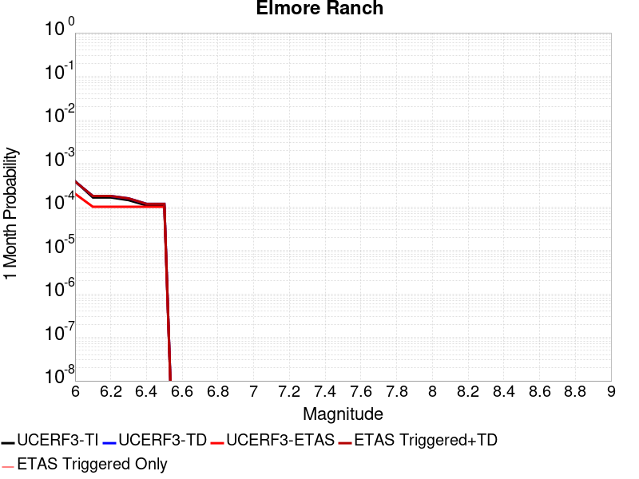 | 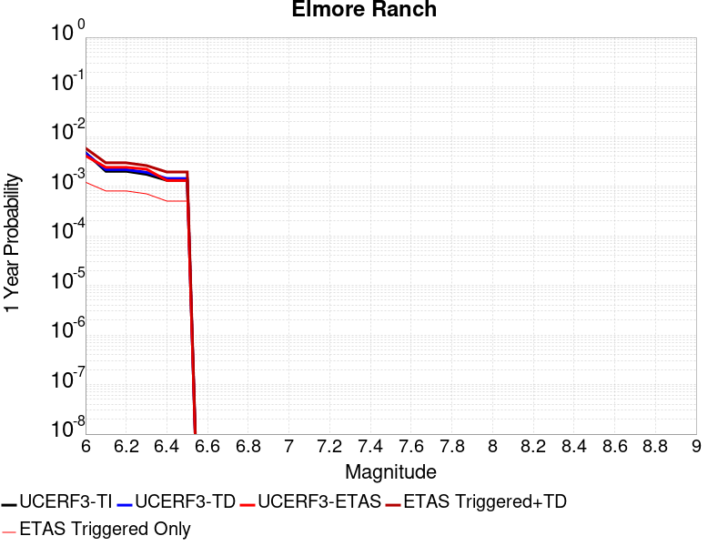 | 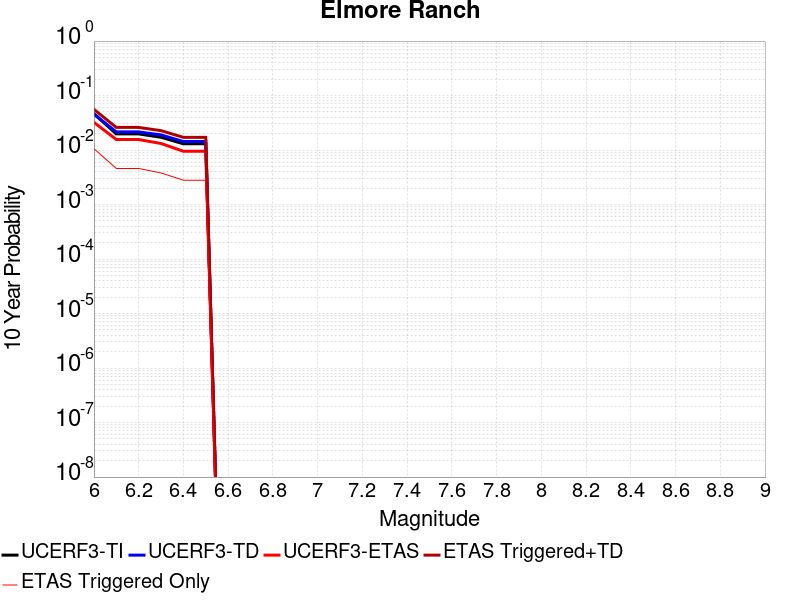 |

| Magnitude | 1 wk TI Prob | 1 wk TD Prob | 1 wk ETAS Prob | 1 wk ETAS/TD Gain | 1 wk ETAS Triggered+TD | 1 wk ETAS Triggered Only | 1 mo TI Prob | 1 mo TD Prob | 1 mo ETAS Prob | 1 mo ETAS/TD Gain | 1 mo ETAS Triggered+TD | 1 mo ETAS Triggered Only | 1 yr TI Prob | 1 yr TD Prob | 1 yr ETAS Prob | 1 yr ETAS/TD Gain | 1 yr ETAS Triggered+TD | 1 yr ETAS Triggered Only | 10 yr TI Prob | 10 yr TD Prob | 10 yr ETAS Prob | 10 yr ETAS/TD Gain | 10 yr ETAS Triggered+TD | 10 yr ETAS Triggered Only |
|-----|-----|-----|-----|-----|-----|-----|-----|-----|-----|-----|-----|-----|-----|-----|-----|-----|-----|-----|-----|-----|-----|-----|-----|-----|
| 6.0 | 9.102099E-5 | 8.916474E-5 | 0.0 | 0.0 | 8.916474E-5 | 0.0 | 3.9003167E-4 | 3.82064E-4 | 0.0 | 0.0 | 3.82064E-4 | 0.0 | 0.0047383 | 0.004642422 | 5.0E-4 | 0.10770241 | 0.0051401006 | 5.0E-4 | 0.046385348 | 0.045659773 | 0.0013 | 0.028471451 | 0.046900414 | 0.0013 |
| 6.1 | 3.8306698E-5 | 4.1321364E-5 | 0.0 | 0.0 | 4.1321364E-5 | 0.0 | 1.6416123E-4 | 1.7708354E-4 | 0.0 | 0.0 | 1.7708354E-4 | 0.0 | 0.0019968306 | 0.0021543251 | 4.0E-4 | 0.18567298 | 0.0025534634 | 4.0E-4 | 0.019789828 | 0.021515239 | 7.0E-4 | 0.032535076 | 0.022200178 | 7.0E-4 |
| 6.2 | 3.8306698E-5 | 4.1321364E-5 | 0.0 | 0.0 | 4.1321364E-5 | 0.0 | 1.6416123E-4 | 1.7708354E-4 | 0.0 | 0.0 | 1.7708354E-4 | 0.0 | 0.0019968306 | 0.0021543251 | 4.0E-4 | 0.18567298 | 0.0025534634 | 4.0E-4 | 0.019789828 | 0.021515239 | 7.0E-4 | 0.032535076 | 0.022200178 | 7.0E-4 |
| 6.3 | 3.3197924E-5 | 3.6413116E-5 | 0.0 | 0.0 | 3.6413116E-5 | 0.0 | 1.4226905E-4 | 1.5605082E-4 | 0.0 | 0.0 | 1.5605082E-4 | 0.0 | 0.0017307495 | 0.0018988051 | 3.0E-4 | 0.15799409 | 0.0021982356 | 3.0E-4 | 0.017173318 | 0.018994208 | 6.0E-4 | 0.031588577 | 0.019582812 | 6.0E-4 |
| 6.4 | 2.5148964E-5 | 2.7331169E-5 | 0.0 | 0.0 | 2.7331169E-5 | 0.0 | 1.0777682E-4 | 1.1713195E-4 | 0.0 | 0.0 | 1.1713195E-4 | 0.0 | 0.0013113929 | 0.0014257922 | 3.0E-4 | 0.21040934 | 0.0017253645 | 3.0E-4 | 0.01303681 | 0.014326015 | 5.0E-4 | 0.034901544 | 0.014818851 | 5.0E-4 |
| 6.5 | 2.5148964E-5 | 2.7331169E-5 | 0.0 | 0.0 | 2.7331169E-5 | 0.0 | 1.0777682E-4 | 1.1713195E-4 | 0.0 | 0.0 | 1.1713195E-4 | 0.0 | 0.0013113929 | 0.0014257922 | 3.0E-4 | 0.21040934 | 0.0017253645 | 3.0E-4 | 0.01303681 | 0.014326015 | 5.0E-4 | 0.034901544 | 0.014818851 | 5.0E-4 |

## San Andreas (San Bernardino N)
*[(top)](#table-of-contents)*

| 1 Week | 1 Month | 1 Year | 10 Year |
|-----|-----|-----|-----|
|  |  |  |  |

| Magnitude | 1 wk TI Prob | 1 wk TD Prob | 1 wk ETAS Prob | 1 wk ETAS/TD Gain | 1 wk ETAS Triggered+TD | 1 wk ETAS Triggered Only | 1 mo TI Prob | 1 mo TD Prob | 1 mo ETAS Prob | 1 mo ETAS/TD Gain | 1 mo ETAS Triggered+TD | 1 mo ETAS Triggered Only | 1 yr TI Prob | 1 yr TD Prob | 1 yr ETAS Prob | 1 yr ETAS/TD Gain | 1 yr ETAS Triggered+TD | 1 yr ETAS Triggered Only | 10 yr TI Prob | 10 yr TD Prob | 10 yr ETAS Prob | 10 yr ETAS/TD Gain | 10 yr ETAS Triggered+TD | 10 yr ETAS Triggered Only |
|-----|-----|-----|-----|-----|-----|-----|-----|-----|-----|-----|-----|-----|-----|-----|-----|-----|-----|-----|-----|-----|-----|-----|-----|-----|
| 6.0 | 1.4273766E-4 | 3.0990381E-4 | 1.0E-4 | 0.32268077 | 4.0987282E-4 | 1.0E-4 | 6.115894E-4 | 0.001327489 | 1.0E-4 | 0.07533018 | 0.0014273564 | 1.0E-4 | 0.0074207084 | 0.01604387 | 4.0E-4 | 0.02493164 | 0.016437452 | 4.0E-4 | 0.07177748 | 0.14769201 | 0.0011 | 0.007447932 | 0.14862955 | 0.0011 |
| 6.1 | 1.4273766E-4 | 3.0990381E-4 | 1.0E-4 | 0.32268077 | 4.0987282E-4 | 1.0E-4 | 6.115894E-4 | 0.001327489 | 1.0E-4 | 0.07533018 | 0.0014273564 | 1.0E-4 | 0.0074207084 | 0.01604387 | 4.0E-4 | 0.02493164 | 0.016437452 | 4.0E-4 | 0.07177748 | 0.14769201 | 0.0011 | 0.007447932 | 0.14862955 | 0.0011 |
| 6.2 | 1.4273766E-4 | 3.0990381E-4 | 1.0E-4 | 0.32268077 | 4.0987282E-4 | 1.0E-4 | 6.115894E-4 | 0.001327489 | 1.0E-4 | 0.07533018 | 0.0014273564 | 1.0E-4 | 0.0074207084 | 0.01604387 | 4.0E-4 | 0.02493164 | 0.016437452 | 4.0E-4 | 0.07177748 | 0.14769201 | 0.0011 | 0.007447932 | 0.14862955 | 0.0011 |
| 6.3 | 1.3730655E-4 | 2.9898214E-4 | 1.0E-4 | 0.33446813 | 3.9895225E-4 | 1.0E-4 | 5.883239E-4 | 0.0012807284 | 1.0E-4 | 0.078080565 | 0.0013806004 | 1.0E-4 | 0.0071393442 | 0.0154827535 | 4.0E-4 | 0.0258352 | 0.01587656 | 4.0E-4 | 0.06914291 | 0.14299165 | 0.0011 | 0.007692757 | 0.14393435 | 0.0011 |
| 6.4 | 1.3730655E-4 | 2.9898214E-4 | 1.0E-4 | 0.33446813 | 3.9895225E-4 | 1.0E-4 | 5.883239E-4 | 0.0012807284 | 1.0E-4 | 0.078080565 | 0.0013806004 | 1.0E-4 | 0.0071393442 | 0.0154827535 | 4.0E-4 | 0.0258352 | 0.01587656 | 4.0E-4 | 0.06914291 | 0.14299165 | 0.0011 | 0.007692757 | 0.14393435 | 0.0011 |
| 6.5 | 1.2942807E-4 | 2.831703E-4 | 1.0E-4 | 0.35314438 | 3.8314197E-4 | 1.0E-4 | 5.545738E-4 | 0.0012130276 | 1.0E-4 | 0.08243835 | 0.0013129064 | 1.0E-4 | 0.0067310524 | 0.014669821 | 4.0E-4 | 0.027266864 | 0.015063953 | 4.0E-4 | 0.06530788 | 0.13614826 | 0.0011 | 0.008079428 | 0.13709849 | 0.0011 |
| 6.6 | 1.1125901E-4 | 2.4767424E-4 | 1.0E-4 | 0.40375617 | 3.4764947E-4 | 1.0E-4 | 4.767372E-4 | 0.0010610315 | 1.0E-4 | 0.09424791 | 0.0011609254 | 1.0E-4 | 0.005788839 | 0.012842156 | 4.0E-4 | 0.031147419 | 0.013237019 | 4.0E-4 | 0.056403454 | 0.120414585 | 0.001 | 0.008304642 | 0.12129417 | 0.001 |
| 6.7 | 1.02209575E-4 | 2.290678E-4 | 1.0E-4 | 0.436552 | 3.2904488E-4 | 1.0E-4 | 4.3796748E-4 | 9.813511E-4 | 1.0E-4 | 0.101900324 | 0.001081253 | 1.0E-4 | 0.0053192247 | 0.0118829 | 4.0E-4 | 0.033661816 | 0.012278147 | 4.0E-4 | 0.051936906 | 0.112195544 | 9.0E-4 | 0.0080217095 | 0.11299457 | 9.0E-4 |
| 6.8 | 9.610582E-5 | 2.144043E-4 | 1.0E-4 | 0.46640855 | 3.1438287E-4 | 1.0E-4 | 4.1181705E-4 | 9.185527E-4 | 1.0E-4 | 0.10886692 | 0.0010184608 | 1.0E-4 | 0.0050023515 | 0.0111262845 | 4.0E-4 | 0.035950907 | 0.011521834 | 4.0E-4 | 0.048912346 | 0.10562009 | 9.0E-4 | 0.008521106 | 0.10642503 | 9.0E-4 |
| 6.9 | 9.3877505E-5 | 2.0898355E-4 | 1.0E-4 | 0.47850657 | 3.0896266E-4 | 1.0E-4 | 4.0227012E-4 | 8.9533697E-4 | 1.0E-4 | 0.11168979 | 9.952475E-4 | 1.0E-4 | 0.0048866454 | 0.010846477 | 4.0E-4 | 0.036878332 | 0.011242138 | 4.0E-4 | 0.04780577 | 0.10321876 | 9.0E-4 | 0.008719346 | 0.104025856 | 9.0E-4 |
| 7.0 | 9.1019785E-5 | 2.0228841E-4 | 1.0E-4 | 0.4943437 | 3.022682E-4 | 1.0E-4 | 3.900265E-4 | 8.666629E-4 | 1.0E-4 | 0.11538512 | 9.665762E-4 | 1.0E-4 | 0.0047382377 | 0.010500783 | 4.0E-4 | 0.038092397 | 0.010896583 | 4.0E-4 | 0.046384744 | 0.10019968 | 9.0E-4 | 0.008982064 | 0.1010095 | 9.0E-4 |
| 7.1 | 8.771155E-5 | 1.940751E-4 | 1.0E-4 | 0.51526445 | 2.9405567E-4 | 1.0E-4 | 3.758525E-4 | 8.314858E-4 | 1.0E-4 | 0.12026664 | 9.3140267E-4 | 1.0E-4 | 0.0045664064 | 0.010076536 | 4.0E-4 | 0.03969618 | 0.010472505 | 4.0E-4 | 0.044737056 | 0.09652227 | 9.0E-4 | 0.009324273 | 0.0973354 | 9.0E-4 |
| 7.2 | 8.0830236E-5 | 1.7821639E-4 | 1.0E-4 | 0.5611156 | 2.7819857E-4 | 1.0E-4 | 3.4636928E-4 | 7.635611E-4 | 1.0E-4 | 0.13096529 | 8.6348475E-4 | 1.0E-4 | 0.0042088944 | 0.009256828 | 4.0E-4 | 0.043211345 | 0.009653125 | 4.0E-4 | 0.041300658 | 0.08929606 | 9.0E-4 | 0.0100788325 | 0.09011569 | 9.0E-4 |
| 7.3 | 7.7668235E-5 | 1.6774477E-4 | 1.0E-4 | 0.5961437 | 2.67728E-4 | 1.0E-4 | 3.328214E-4 | 7.187082E-4 | 1.0E-4 | 0.13913852 | 8.186363E-4 | 1.0E-4 | 0.0040445733 | 0.0087152375 | 4.0E-4 | 0.045896627 | 0.009111751 | 4.0E-4 | 0.03971748 | 0.084592454 | 9.0E-4 | 0.010639247 | 0.08541632 | 9.0E-4 |
| 7.4 | 7.520177E-5 | 1.600199E-4 | 1.0E-4 | 0.6249223 | 2.600039E-4 | 1.0E-4 | 3.2225347E-4 | 6.8561936E-4 | 1.0E-4 | 0.14585352 | 7.855508E-4 | 1.0E-4 | 0.0039163795 | 0.008315527 | 4.0E-4 | 0.04810278 | 0.008712201 | 4.0E-4 | 0.038480744 | 0.08106743 | 9.0E-4 | 0.011101869 | 0.08189447 | 9.0E-4 |
| 7.5 | 7.274697E-5 | 1.5296489E-4 | 1.0E-4 | 0.65374476 | 2.529496E-4 | 1.0E-4 | 3.1173544E-4 | 6.5539917E-4 | 1.0E-4 | 0.15257877 | 7.5533363E-4 | 1.0E-4 | 0.003788775 | 0.007950341 | 4.0E-4 | 0.050312303 | 0.008347161 | 4.0E-4 | 0.03724827 | 0.07780402 | 8.0E-4 | 0.010282245 | 0.07854178 | 8.0E-4 |
| 7.6 | 7.1185845E-5 | 1.4870733E-4 | 1.0E-4 | 0.6724618 | 2.4869246E-4 | 1.0E-4 | 3.0504653E-4 | 6.371615E-4 | 1.0E-4 | 0.15694608 | 7.3709775E-4 | 1.0E-4 | 0.0037076178 | 0.0077298954 | 4.0E-4 | 0.051747143 | 0.008126804 | 4.0E-4 | 0.036463667 | 0.07580683 | 8.0E-4 | 0.010553139 | 0.076546185 | 8.0E-4 |
| 7.7 | 6.709961E-5 | 1.3793135E-4 | 1.0E-4 | 0.72499835 | 2.3791756E-4 | 1.0E-4 | 2.8753807E-4 | 5.910005E-4 | 1.0E-4 | 0.16920461 | 6.9094135E-4 | 1.0E-4 | 0.003495157 | 0.007171726 | 3.0E-4 | 0.041830935 | 0.007469574 | 3.0E-4 | 0.034406938 | 0.070681766 | 7.0E-4 | 0.009903544 | 0.07133229 | 7.0E-4 |
| 7.8 | 6.300812E-5 | 1.2703829E-4 | 1.0E-4 | 0.7871642 | 2.270256E-4 | 1.0E-4 | 2.7000686E-4 | 5.443362E-4 | 1.0E-4 | 0.18370998 | 6.442818E-4 | 1.0E-4 | 0.0032823787 | 0.0066071805 | 3.0E-4 | 0.045405146 | 0.0069051986 | 3.0E-4 | 0.032343175 | 0.065444425 | 6.0E-4 | 0.009168085 | 0.066005155 | 6.0E-4 |
| 7.9 | 4.983037E-5 | 9.326866E-5 | 1.0E-4 | 1.0721716 | 1.9325933E-4 | 1.0E-4 | 2.1354125E-4 | 3.996616E-4 | 1.0E-4 | 0.2502117 | 4.996216E-4 | 1.0E-4 | 0.0025967648 | 0.0048550325 | 2.0E-4 | 0.04119437 | 0.0050540613 | 2.0E-4 | 0.025666296 | 0.048792165 | 5.0E-4 | 0.010247547 | 0.04926777 | 5.0E-4 |
| 8.0 | 3.2211527E-5 | 5.093469E-5 | 1.0E-4 | 1.9632986 | 1.509296E-4 | 1.0E-4 | 1.380421E-4 | 2.1827327E-4 | 1.0E-4 | 0.4581413 | 3.1825143E-4 | 1.0E-4 | 0.0016793669 | 0.00265424 | 1.0E-4 | 0.037675567 | 0.0027539746 | 1.0E-4 | 0.016667323 | 0.02720171 | 2.0E-4 | 0.007352479 | 0.027396271 | 2.0E-4 |
| 8.1 | 1.743376E-5 | 1.7695216E-5 | 1.0E-4 | 5.6512446 | 1.17693446E-4 | 1.0E-4 | 7.471398E-5 | 7.583444E-5 | 1.0E-4 | 1.318662 | 1.7582686E-4 | 1.0E-4 | 9.0926304E-4 | 9.228938E-4 | 1.0E-4 | 0.10835483 | 0.0010228015 | 1.0E-4 | 0.009055517 | 0.009895436 | 1.0E-4 | 0.010105669 | 0.009994446 | 1.0E-4 |
| 8.2 | 7.831616E-6 | 4.727602E-6 | 0.0 | 0.0 | 4.727602E-6 | 0.0 | 3.3563636E-5 | 2.0260995E-5 | 0.0 | 0.0 | 2.0260995E-5 | 0.0 | 4.0856065E-4 | 2.4664975E-4 | 0.0 | 0.0 | 2.4664975E-4 | 0.0 | 0.004078103 | 0.0028085 | 0.0 | 0.0 | 0.0028085 | 0.0 |
| 8.3 | 1.983087E-6 | 6.880041E-7 | 0.0 | 0.0 | 6.880041E-7 | 0.0 | 8.498917E-6 | 2.9485857E-6 | 0.0 | 0.0 | 2.9485857E-6 | 0.0 | 1.034694E-4 | 3.589845E-5 | 0.0 | 0.0 | 3.589845E-5 | 0.0 | 0.0010342124 | 4.2701262E-4 | 0.0 | 0.0 | 4.2701262E-4 | 0.0 |

## Maacama 2011 CFM
*[(top)](#table-of-contents)*

| 1 Week | 1 Month | 1 Year | 10 Year |
|-----|-----|-----|-----|
|  |  |  |  |

| Magnitude | 1 wk TI Prob | 1 wk TD Prob | 1 wk ETAS Prob | 1 wk ETAS/TD Gain | 1 wk ETAS Triggered+TD | 1 wk ETAS Triggered Only | 1 mo TI Prob | 1 mo TD Prob | 1 mo ETAS Prob | 1 mo ETAS/TD Gain | 1 mo ETAS Triggered+TD | 1 mo ETAS Triggered Only | 1 yr TI Prob | 1 yr TD Prob | 1 yr ETAS Prob | 1 yr ETAS/TD Gain | 1 yr ETAS Triggered+TD | 1 yr ETAS Triggered Only | 10 yr TI Prob | 10 yr TD Prob | 10 yr ETAS Prob | 10 yr ETAS/TD Gain | 10 yr ETAS Triggered+TD | 10 yr ETAS Triggered Only |
|-----|-----|-----|-----|-----|-----|-----|-----|-----|-----|-----|-----|-----|-----|-----|-----|-----|-----|-----|-----|-----|-----|-----|-----|-----|
| 6.0 | 1.368203E-4 | 2.5635102E-4 | 0.0 | 0.0 | 2.5635102E-4 | 0.0 | 5.862409E-4 | 0.0010980811 | 0.0 | 0.0 | 0.0010980811 | 0.0 | 0.0071141496 | 0.013270428 | 1.0E-4 | 0.0075355517 | 0.013369102 | 1.0E-4 | 0.06890667 | 0.12352333 | 0.0012 | 0.009714764 | 0.1245751 | 0.0012 |
| 6.1 | 1.368203E-4 | 2.5635102E-4 | 0.0 | 0.0 | 2.5635102E-4 | 0.0 | 5.862409E-4 | 0.0010980811 | 0.0 | 0.0 | 0.0010980811 | 0.0 | 0.0071141496 | 0.013270428 | 1.0E-4 | 0.0075355517 | 0.013369102 | 1.0E-4 | 0.06890667 | 0.12352333 | 0.0012 | 0.009714764 | 0.1245751 | 0.0012 |
| 6.2 | 1.360743E-4 | 2.5510337E-4 | 0.0 | 0.0 | 2.5510337E-4 | 0.0 | 5.8304524E-4 | 0.0010927393 | 0.0 | 0.0 | 0.0010927393 | 0.0 | 0.007075496 | 0.013206253 | 1.0E-4 | 0.0075721703 | 0.013304933 | 1.0E-4 | 0.06854413 | 0.122959584 | 0.0012 | 0.009759304 | 0.12401204 | 0.0012 |
| 6.3 | 1.1917239E-4 | 2.2215702E-4 | 0.0 | 0.0 | 2.2215702E-4 | 0.0 | 5.1063887E-4 | 9.516623E-4 | 0.0 | 0.0 | 9.516623E-4 | 0.0 | 0.0061993203 | 0.011512876 | 1.0E-4 | 0.008685927 | 0.011611724 | 1.0E-4 | 0.060292065 | 0.1082104 | 0.001 | 0.009241256 | 0.10910219 | 0.001 |
| 6.4 | 1.1859289E-4 | 2.2119714E-4 | 0.0 | 0.0 | 2.2119714E-4 | 0.0 | 5.0815626E-4 | 9.4755174E-4 | 0.0 | 0.0 | 9.4755174E-4 | 0.0 | 0.006169266 | 0.011463408 | 1.0E-4 | 0.008723409 | 0.011562262 | 1.0E-4 | 0.06000784 | 0.107768744 | 9.0E-4 | 0.008351215 | 0.10857175 | 9.0E-4 |
| 6.5 | 1.09512424E-4 | 2.037942E-4 | 0.0 | 0.0 | 2.037942E-4 | 0.0 | 4.6925453E-4 | 8.7302696E-4 | 0.0 | 0.0 | 8.7302696E-4 | 0.0 | 0.005698218 | 0.010567802 | 1.0E-4 | 0.009462706 | 0.010666746 | 1.0E-4 | 0.055543028 | 0.099878885 | 8.0E-4 | 0.008009701 | 0.100598976 | 8.0E-4 |
| 6.6 | 1.0502928E-4 | 1.9539673E-4 | 0.0 | 0.0 | 1.9539673E-4 | 0.0 | 4.500478E-4 | 8.370758E-4 | 0.0 | 0.0 | 8.370758E-4 | 0.0 | 0.0054655746 | 0.010135394 | 1.0E-4 | 0.009866415 | 0.01023438 | 1.0E-4 | 0.053330887 | 0.09604088 | 8.0E-4 | 0.008329786 | 0.09676405 | 8.0E-4 |
| 6.7 | 9.739358E-5 | 1.8128542E-4 | 0.0 | 0.0 | 1.8128542E-4 | 0.0 | 4.173343E-4 | 7.766524E-4 | 0.0 | 0.0 | 7.766524E-4 | 0.0 | 0.0050692135 | 0.009408032 | 1.0E-4 | 0.010629215 | 0.009507091 | 1.0E-4 | 0.049551267 | 0.08953091 | 7.0E-4 | 0.007818528 | 0.09016824 | 7.0E-4 |
| 6.8 | 8.969524E-5 | 1.6537461E-4 | 0.0 | 0.0 | 1.6537461E-4 | 0.0 | 3.8435153E-4 | 7.085156E-4 | 0.0 | 0.0 | 7.085156E-4 | 0.0 | 0.0046694432 | 0.008586869 | 1.0E-4 | 0.01164569 | 0.00868601 | 1.0E-4 | 0.045725387 | 0.08210157 | 6.0E-4 | 0.0073080207 | 0.08265231 | 6.0E-4 |
| 6.9 | 7.838291E-5 | 1.4311985E-4 | 0.0 | 0.0 | 1.4311985E-4 | 0.0 | 3.358835E-4 | 6.132068E-4 | 0.0 | 0.0 | 6.132068E-4 | 0.0 | 0.0040817154 | 0.0074366727 | 1.0E-4 | 0.013446874 | 0.007535929 | 1.0E-4 | 0.04007554 | 0.07155797 | 4.0E-4 | 0.0055898735 | 0.07192934 | 4.0E-4 |
| 7.0 | 6.961957E-5 | 1.2612117E-4 | 0.0 | 0.0 | 1.2612117E-4 | 0.0 | 2.9833548E-4 | 5.403954E-4 | 0.0 | 0.0 | 5.403954E-4 | 0.0 | 0.0036261857 | 0.0065571335 | 0.0 | 0.0 | 0.0065571335 | 0.0 | 0.035675827 | 0.06342047 | 3.0E-4 | 0.004730334 | 0.06370144 | 3.0E-4 |
| 7.1 | 5.999398E-5 | 1.08208515E-4 | 0.0 | 0.0 | 1.08208515E-4 | 0.0 | 2.570917E-4 | 4.6365694E-4 | 0.0 | 0.0 | 4.6365694E-4 | 0.0 | 0.0031255994 | 0.005629063 | 0.0 | 0.0 | 0.005629063 | 0.0 | 0.030820016 | 0.054735295 | 3.0E-4 | 0.005480924 | 0.055018876 | 3.0E-4 |
| 7.2 | 5.116532E-5 | 9.2307884E-5 | 0.0 | 0.0 | 9.2307884E-5 | 0.0 | 2.1926152E-4 | 3.955391E-4 | 0.0 | 0.0 | 3.955391E-4 | 0.0 | 0.002666241 | 0.0048044506 | 0.0 | 0.0 | 0.0048044506 | 0.0 | 0.026344774 | 0.04694229 | 3.0E-4 | 0.006390826 | 0.047228206 | 3.0E-4 |
| 7.3 | 4.2087835E-5 | 7.556291E-5 | 0.0 | 0.0 | 7.556291E-5 | 0.0 | 1.8036396E-4 | 3.2379667E-4 | 0.0 | 0.0 | 3.2379667E-4 | 0.0 | 0.0021937196 | 0.003934732 | 0.0 | 0.0 | 0.003934732 | 0.0 | 0.0217219 | 0.03860795 | 3.0E-4 | 0.00777042 | 0.038896367 | 3.0E-4 |
| 7.4 | 2.8991652E-5 | 5.0771338E-5 | 0.0 | 0.0 | 5.0771338E-5 | 0.0 | 1.2424402E-4 | 2.1757245E-4 | 0.0 | 0.0 | 2.1757245E-4 | 0.0 | 0.0015116213 | 0.0026457263 | 0.0 | 0.0 | 0.0026457263 | 0.0 | 0.015013801 | 0.026136458 | 1.0E-4 | 0.0038260731 | 0.026233844 | 1.0E-4 |
| 7.5 | 1.1292299E-6 | 1.4875133E-6 | 0.0 | 0.0 | 1.4875133E-6 | 0.0 | 4.8395473E-6 | 6.3750485E-6 | 0.0 | 0.0 | 6.3750485E-6 | 0.0 | 5.8919897E-5 | 7.761469E-5 | 0.0 | 0.0 | 7.761469E-5 | 0.0 | 5.890428E-4 | 7.765553E-4 | 0.0 | 0.0 | 7.765553E-4 | 0.0 |
| 7.6 | 2.6535366E-7 | 3.4398312E-7 | 0.0 | 0.0 | 3.4398312E-7 | 0.0 | 1.1372296E-6 | 1.4742126E-6 | 0.0 | 0.0 | 1.4742126E-6 | 0.0 | 1.3845682E-5 | 1.794839E-5 | 0.0 | 0.0 | 1.794839E-5 | 0.0 | 1.3844819E-4 | 1.7998618E-4 | 0.0 | 0.0 | 1.7998618E-4 | 0.0 |
| 7.7 | 9.727789E-8 | 1.2128508E-7 | 0.0 | 0.0 | 1.2128508E-7 | 0.0 | 4.1690518E-7 | 5.197931E-7 | 0.0 | 0.0 | 5.197931E-7 | 0.0 | 5.0758085E-6 | 6.328463E-6 | 0.0 | 0.0 | 6.328463E-6 | 0.0 | 5.0756928E-5 | 6.368924E-5 | 0.0 | 0.0 | 6.368924E-5 | 0.0 |
| 7.8 | 6.1939325E-9 | 7.588051E-9 | 0.0 | 0.0 | 7.588051E-9 | 0.0 | 2.6545425E-8 | 3.252022E-8 | 0.0 | 0.0 | 3.252022E-8 | 0.0 | 3.231905E-7 | 3.9593357E-7 | 0.0 | 0.0 | 3.9593357E-7 | 0.0 | 3.2319003E-6 | 3.995574E-6 | 0.0 | 0.0 | 3.995574E-6 | 0.0 |

## San Andreas (Cholame) rev
*[(top)](#table-of-contents)*

| 1 Week | 1 Month | 1 Year | 10 Year |
|-----|-----|-----|-----|
| 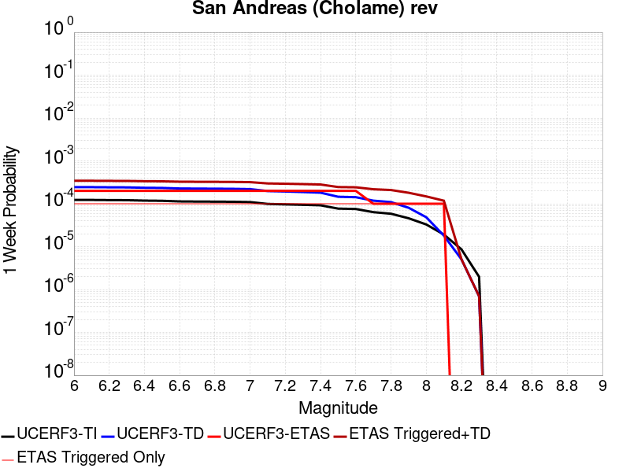 |  |  |  |

| Magnitude | 1 wk TI Prob | 1 wk TD Prob | 1 wk ETAS Prob | 1 wk ETAS/TD Gain | 1 wk ETAS Triggered+TD | 1 wk ETAS Triggered Only | 1 mo TI Prob | 1 mo TD Prob | 1 mo ETAS Prob | 1 mo ETAS/TD Gain | 1 mo ETAS Triggered+TD | 1 mo ETAS Triggered Only | 1 yr TI Prob | 1 yr TD Prob | 1 yr ETAS Prob | 1 yr ETAS/TD Gain | 1 yr ETAS Triggered+TD | 1 yr ETAS Triggered Only | 10 yr TI Prob | 10 yr TD Prob | 10 yr ETAS Prob | 10 yr ETAS/TD Gain | 10 yr ETAS Triggered+TD | 10 yr ETAS Triggered Only |
|-----|-----|-----|-----|-----|-----|-----|-----|-----|-----|-----|-----|-----|-----|-----|-----|-----|-----|-----|-----|-----|-----|-----|-----|-----|
| 6.0 | 1.2302514E-4 | 2.4360698E-4 | 1.0E-4 | 0.41049725 | 3.4358262E-4 | 1.0E-4 | 5.27144E-4 | 0.0010436138 | 1.0E-4 | 0.09582089 | 0.0011435094 | 1.0E-4 | 0.0063991086 | 0.0126324445 | 7.0E-4 | 0.05541287 | 0.013323602 | 7.0E-4 | 0.06217949 | 0.120853856 | 0.0012 | 0.009929348 | 0.121908836 | 0.0012 |
| 6.1 | 1.2302514E-4 | 2.4360698E-4 | 1.0E-4 | 0.41049725 | 3.4358262E-4 | 1.0E-4 | 5.27144E-4 | 0.0010436138 | 1.0E-4 | 0.09582089 | 0.0011435094 | 1.0E-4 | 0.0063991086 | 0.0126324445 | 7.0E-4 | 0.05541287 | 0.013323602 | 7.0E-4 | 0.06217949 | 0.120853856 | 0.0012 | 0.009929348 | 0.121908836 | 0.0012 |
| 6.2 | 1.2203569E-4 | 2.4178489E-4 | 1.0E-4 | 0.4135908 | 3.4176072E-4 | 1.0E-4 | 5.2290526E-4 | 0.001035811 | 1.0E-4 | 0.09654271 | 0.0011357074 | 1.0E-4 | 0.006347804 | 0.012538543 | 7.0E-4 | 0.055827856 | 0.013229766 | 7.0E-4 | 0.061695136 | 0.12004175 | 0.0012 | 0.009996522 | 0.1210977 | 0.0012 |
| 6.3 | 1.2142645E-4 | 2.4065067E-4 | 1.0E-4 | 0.41554007 | 3.406266E-4 | 1.0E-4 | 5.202953E-4 | 0.001030954 | 1.0E-4 | 0.096997544 | 0.0011308509 | 1.0E-4 | 0.006316212 | 0.012480088 | 7.0E-4 | 0.05608935 | 0.0131713515 | 7.0E-4 | 0.06139677 | 0.1195364 | 0.0012 | 0.010038784 | 0.12059295 | 0.0012 |
| 6.4 | 1.1865206E-4 | 2.3576531E-4 | 1.0E-4 | 0.42415062 | 3.3574173E-4 | 1.0E-4 | 5.0840975E-4 | 0.001010033 | 1.0E-4 | 0.09900667 | 0.001109932 | 1.0E-4 | 0.006172335 | 0.012228259 | 7.0E-4 | 0.057244454 | 0.012919699 | 7.0E-4 | 0.060036868 | 0.11734377 | 0.0012 | 0.010226363 | 0.11840295 | 0.0012 |
| 6.5 | 1.17443946E-4 | 2.3374322E-4 | 1.0E-4 | 0.42781988 | 3.3371986E-4 | 1.0E-4 | 5.032341E-4 | 0.0010013736 | 1.0E-4 | 0.09986283 | 0.0011012735 | 1.0E-4 | 0.006109677 | 0.012124006 | 7.0E-4 | 0.057736695 | 0.012815519 | 7.0E-4 | 0.059444077 | 0.116428405 | 0.0012 | 0.010306763 | 0.11748869 | 0.0012 |
| 6.6 | 1.13579066E-4 | 2.2696287E-4 | 1.0E-4 | 0.4406007 | 3.2694018E-4 | 1.0E-4 | 4.866766E-4 | 9.7233686E-4 | 1.0E-4 | 0.10284501 | 0.0010722396 | 1.0E-4 | 0.0059092017 | 0.011774355 | 7.0E-4 | 0.05945124 | 0.012466113 | 7.0E-4 | 0.057545185 | 0.11338537 | 0.0012 | 0.010583376 | 0.11444931 | 0.0012 |
| 6.7 | 1.1271412E-4 | 2.2543047E-4 | 1.0E-4 | 0.44359577 | 3.2540792E-4 | 1.0E-4 | 4.829711E-4 | 9.657743E-4 | 1.0E-4 | 0.10354386 | 0.0010656777 | 1.0E-4 | 0.005864331 | 0.011695317 | 7.0E-4 | 0.059853017 | 0.0123871295 | 7.0E-4 | 0.057119697 | 0.112696074 | 0.0011 | 0.009760766 | 0.11367211 | 0.0011 |
| 6.8 | 1.1217975E-4 | 2.2433772E-4 | 1.0E-4 | 0.4457565 | 3.2431528E-4 | 1.0E-4 | 4.8068175E-4 | 9.6109457E-4 | 1.0E-4 | 0.104048036 | 0.0010609984 | 1.0E-4 | 0.005836608 | 0.011638951 | 7.0E-4 | 0.06014288 | 0.012330804 | 7.0E-4 | 0.056856725 | 0.11220165 | 0.0011 | 0.009803777 | 0.11317824 | 0.0011 |
| 6.9 | 1.1146753E-4 | 2.2284927E-4 | 1.0E-4 | 0.4487338 | 3.22827E-4 | 1.0E-4 | 4.7763053E-4 | 9.5472013E-4 | 1.0E-4 | 0.104742736 | 0.0010546247 | 1.0E-4 | 0.0057996577 | 0.0115621695 | 7.0E-4 | 0.060542274 | 0.012254075 | 7.0E-4 | 0.056506127 | 0.11152845 | 0.0011 | 0.009862955 | 0.112505764 | 0.0011 |
| 7.0 | 1.0965793E-4 | 2.191574E-4 | 1.0E-4 | 0.45629305 | 3.191355E-4 | 1.0E-4 | 4.698779E-4 | 9.3890936E-4 | 1.0E-4 | 0.10650655 | 0.0010388155 | 1.0E-4 | 0.005705768 | 0.011371698 | 7.0E-4 | 0.061556328 | 0.012063738 | 7.0E-4 | 0.055614736 | 0.1098526 | 0.0011 | 0.010013418 | 0.11083176 | 0.0011 |
| 7.1 | 9.927982E-5 | 1.9767124E-4 | 1.0E-4 | 0.5058905 | 2.9765148E-4 | 1.0E-4 | 4.2541555E-4 | 8.468884E-4 | 1.0E-4 | 0.11807931 | 9.468037E-4 | 1.0E-4 | 0.0051671406 | 0.01026239 | 5.0E-4 | 0.048721597 | 0.010757258 | 5.0E-4 | 0.05048634 | 0.100037105 | 9.0E-4 | 0.008996662 | 0.10084707 | 9.0E-4 |
| 7.2 | 9.696786E-5 | 1.9276817E-4 | 1.0E-4 | 0.5187578 | 2.927489E-4 | 1.0E-4 | 4.1551032E-4 | 8.258887E-4 | 1.0E-4 | 0.12108169 | 9.258061E-4 | 1.0E-4 | 0.00504711 | 0.010009095 | 5.0E-4 | 0.049954567 | 0.01050409 | 5.0E-4 | 0.04934009 | 0.09778914 | 9.0E-4 | 0.009203476 | 0.098601125 | 9.0E-4 |
| 7.3 | 9.4727984E-5 | 1.8718891E-4 | 1.0E-4 | 0.5342197 | 2.8717017E-4 | 1.0E-4 | 4.0591392E-4 | 8.019924E-4 | 1.0E-4 | 0.12468945 | 9.019122E-4 | 1.0E-4 | 0.0049308087 | 0.00972079 | 5.0E-4 | 0.051436145 | 0.01021593 | 5.0E-4 | 0.048228268 | 0.095200576 | 9.0E-4 | 0.009453724 | 0.096014895 | 9.0E-4 |
| 7.4 | 9.220358E-5 | 1.8104058E-4 | 1.0E-4 | 0.5523623 | 2.8102248E-4 | 1.0E-4 | 3.9509835E-4 | 7.7565835E-4 | 1.0E-4 | 0.12892275 | 8.7558076E-4 | 1.0E-4 | 0.004799717 | 0.009402977 | 5.0E-4 | 0.05317465 | 0.009898275 | 5.0E-4 | 0.046973653 | 0.0923335 | 9.0E-4 | 0.009747274 | 0.0931504 | 9.0E-4 |
| 7.5 | 7.71631E-5 | 1.4537087E-4 | 1.0E-4 | 0.6878957 | 2.4535632E-4 | 1.0E-4 | 3.306571E-4 | 6.228694E-4 | 1.0E-4 | 0.1605473 | 7.2280713E-4 | 1.0E-4 | 0.0040183207 | 0.0075571304 | 5.0E-4 | 0.066162676 | 0.008053352 | 5.0E-4 | 0.03946433 | 0.075399615 | 9.0E-4 | 0.0119364 | 0.076231755 | 9.0E-4 |
| 7.6 | 7.5634416E-5 | 1.420485E-4 | 1.0E-4 | 0.70398486 | 2.4203431E-4 | 1.0E-4 | 3.241072E-4 | 6.0863746E-4 | 1.0E-4 | 0.16430143 | 7.085766E-4 | 1.0E-4 | 0.0039388672 | 0.007385044 | 5.0E-4 | 0.06770441 | 0.007881351 | 5.0E-4 | 0.038697794 | 0.07379259 | 9.0E-4 | 0.012196346 | 0.07462618 | 9.0E-4 |
| 7.7 | 6.3783E-5 | 1.1792882E-4 | 1.0E-4 | 0.8479691 | 2.1791703E-4 | 1.0E-4 | 2.7332708E-4 | 5.0531136E-4 | 1.0E-4 | 0.19789778 | 6.0526084E-4 | 1.0E-4 | 0.0033226798 | 0.0061348346 | 4.0E-4 | 0.06520143 | 0.0065323804 | 4.0E-4 | 0.032734364 | 0.061940182 | 8.0E-4 | 0.012915687 | 0.06269063 | 8.0E-4 |
| 7.8 | 5.863422E-5 | 1.0901571E-4 | 1.0E-4 | 0.917299 | 2.0900481E-4 | 1.0E-4 | 2.512653E-4 | 4.6712658E-4 | 1.0E-4 | 0.21407475 | 5.670799E-4 | 1.0E-4 | 0.003054864 | 0.0056724534 | 2.0E-4 | 0.035258114 | 0.0058713187 | 2.0E-4 | 0.030132094 | 0.057286173 | 6.0E-4 | 0.010473732 | 0.057851803 | 6.0E-4 |
| 7.9 | 4.595283E-5 | 8.047838E-5 | 1.0E-4 | 1.2425698 | 1.8047032E-4 | 1.0E-4 | 1.9692584E-4 | 3.4486174E-4 | 1.0E-4 | 0.2899713 | 4.4482725E-4 | 1.0E-4 | 0.0023949358 | 0.004190614 | 2.0E-4 | 0.047725704 | 0.004389776 | 2.0E-4 | 0.023692891 | 0.04256525 | 6.0E-4 | 0.014096006 | 0.04313971 | 6.0E-4 |
| 8.0 | 3.2950178E-5 | 4.8377187E-5 | 1.0E-4 | 2.06709 | 1.4837235E-4 | 1.0E-4 | 1.412074E-4 | 2.0731433E-4 | 1.0E-4 | 0.48235932 | 3.072936E-4 | 1.0E-4 | 0.0017178444 | 0.002521132 | 1.0E-4 | 0.039664723 | 0.0026208798 | 1.0E-4 | 0.017046256 | 0.025995739 | 3.0E-4 | 0.011540353 | 0.02628794 | 3.0E-4 |
| 8.1 | 1.9177472E-5 | 1.7981185E-5 | 1.0E-4 | 5.561369 | 1.1797938E-4 | 1.0E-4 | 8.218658E-5 | 7.705994E-5 | 1.0E-4 | 1.2976911 | 1.7705224E-4 | 1.0E-4 | 0.0010001622 | 9.3780155E-4 | 1.0E-4 | 0.10663237 | 0.0010377078 | 1.0E-4 | 0.009956728 | 0.010124655 | 2.0E-4 | 0.019753758 | 0.010322631 | 2.0E-4 |
| 8.2 | 8.643924E-6 | 5.0104E-6 | 0.0 | 0.0 | 5.0104E-6 | 0.0 | 3.704486E-5 | 2.1472966E-5 | 0.0 | 0.0 | 2.1472966E-5 | 0.0 | 4.5092785E-4 | 2.6140205E-4 | 0.0 | 0.0 | 2.6140205E-4 | 0.0 | 0.0045001395 | 0.002993769 | 1.0E-4 | 0.03340271 | 0.0030934697 | 1.0E-4 |
| 8.3 | 1.983087E-6 | 6.880041E-7 | 0.0 | 0.0 | 6.880041E-7 | 0.0 | 8.498917E-6 | 2.9485857E-6 | 0.0 | 0.0 | 2.9485857E-6 | 0.0 | 1.034694E-4 | 3.589845E-5 | 0.0 | 0.0 | 3.589845E-5 | 0.0 | 0.0010342124 | 4.2701262E-4 | 0.0 | 0.0 | 4.2701262E-4 | 0.0 |

## Calaveras (No) 2011 CFM
*[(top)](#table-of-contents)*

| 1 Week | 1 Month | 1 Year | 10 Year |
|-----|-----|-----|-----|
|  |  |  |  |

| Magnitude | 1 wk TI Prob | 1 wk TD Prob | 1 wk ETAS Prob | 1 wk ETAS/TD Gain | 1 wk ETAS Triggered+TD | 1 wk ETAS Triggered Only | 1 mo TI Prob | 1 mo TD Prob | 1 mo ETAS Prob | 1 mo ETAS/TD Gain | 1 mo ETAS Triggered+TD | 1 mo ETAS Triggered Only | 1 yr TI Prob | 1 yr TD Prob | 1 yr ETAS Prob | 1 yr ETAS/TD Gain | 1 yr ETAS Triggered+TD | 1 yr ETAS Triggered Only | 10 yr TI Prob | 10 yr TD Prob | 10 yr ETAS Prob | 10 yr ETAS/TD Gain | 10 yr ETAS Triggered+TD | 10 yr ETAS Triggered Only |
|-----|-----|-----|-----|-----|-----|-----|-----|-----|-----|-----|-----|-----|-----|-----|-----|-----|-----|-----|-----|-----|-----|-----|-----|-----|
| 6.0 | 4.8694856E-5 | 6.687549E-5 | 1.0E-4 | 1.4953163 | 1.668688E-4 | 1.0E-4 | 2.0867554E-4 | 2.865784E-4 | 1.0E-4 | 0.34894463 | 3.8654977E-4 | 1.0E-4 | 0.0025376645 | 0.0034835178 | 1.0E-4 | 0.028706614 | 0.0035831693 | 1.0E-4 | 0.02508881 | 0.034476876 | 0.0012 | 0.034805935 | 0.035635505 | 0.0012 |
| 6.1 | 4.8694856E-5 | 6.687549E-5 | 1.0E-4 | 1.4953163 | 1.668688E-4 | 1.0E-4 | 2.0867554E-4 | 2.865784E-4 | 1.0E-4 | 0.34894463 | 3.8654977E-4 | 1.0E-4 | 0.0025376645 | 0.0034835178 | 1.0E-4 | 0.028706614 | 0.0035831693 | 1.0E-4 | 0.02508881 | 0.034476876 | 0.0012 | 0.034805935 | 0.035635505 | 0.0012 |
| 6.2 | 4.7541962E-5 | 6.521333E-5 | 1.0E-4 | 1.5334288 | 1.6520682E-4 | 1.0E-4 | 2.0373536E-4 | 2.7945652E-4 | 1.0E-4 | 0.35783744 | 3.7942856E-4 | 1.0E-4 | 0.0024776561 | 0.003397103 | 1.0E-4 | 0.029436847 | 0.003496763 | 1.0E-4 | 0.024502134 | 0.033641305 | 0.0012 | 0.035670433 | 0.034800936 | 0.0012 |
| 6.3 | 4.6717287E-5 | 6.405114E-5 | 1.0E-4 | 1.5612524 | 1.6404474E-4 | 1.0E-4 | 2.0020158E-4 | 2.7447683E-4 | 1.0E-4 | 0.36432946 | 3.744494E-4 | 1.0E-4 | 0.0024347296 | 0.00333667 | 1.0E-4 | 0.02997 | 0.0034363363 | 1.0E-4 | 0.024082264 | 0.033055697 | 0.0012 | 0.036302365 | 0.03421603 | 0.0012 |
| 6.4 | 4.6276386E-5 | 6.341538E-5 | 1.0E-4 | 1.5769047 | 1.6340903E-4 | 1.0E-4 | 1.983123E-4 | 2.717527E-4 | 1.0E-4 | 0.3679816 | 3.7172553E-4 | 1.0E-4 | 0.0024117786 | 0.0033036121 | 1.0E-4 | 0.030269897 | 0.0034032818 | 1.0E-4 | 0.02385771 | 0.03273572 | 0.0011 | 0.033602435 | 0.03379971 | 0.0011 |
| 6.5 | 4.5720994E-5 | 6.2619816E-5 | 1.0E-4 | 1.5969386 | 1.6261355E-4 | 1.0E-4 | 1.9593239E-4 | 2.6834407E-4 | 1.0E-4 | 0.3726559 | 3.6831724E-4 | 1.0E-4 | 0.002382867 | 0.0032622444 | 1.0E-4 | 0.030653743 | 0.0033619183 | 1.0E-4 | 0.023574775 | 0.032335017 | 0.0011 | 0.034018848 | 0.033399448 | 0.0011 |
| 6.6 | 4.549134E-5 | 6.227483E-5 | 1.0E-4 | 1.6057854 | 1.622686E-4 | 1.0E-4 | 1.949483E-4 | 2.6686586E-4 | 1.0E-4 | 0.3747201 | 3.6683917E-4 | 1.0E-4 | 0.0023709119 | 0.0032443008 | 1.0E-4 | 0.030823283 | 0.0033439763 | 1.0E-4 | 0.023457756 | 0.03216116 | 0.0011 | 0.034202743 | 0.033225786 | 0.0011 |
| 6.7 | 3.701047E-5 | 4.9836264E-5 | 1.0E-4 | 2.006571 | 1.4983128E-4 | 1.0E-4 | 1.5860666E-4 | 2.1356673E-4 | 1.0E-4 | 0.4682377 | 3.1354537E-4 | 1.0E-4 | 0.0019293258 | 0.002597117 | 1.0E-4 | 0.03850423 | 0.0026968573 | 1.0E-4 | 0.019126613 | 0.025864985 | 7.0E-4 | 0.027063616 | 0.026546879 | 7.0E-4 |
| 6.8 | 3.5523568E-5 | 4.7832134E-5 | 1.0E-4 | 2.0906448 | 1.4782735E-4 | 1.0E-4 | 1.5223498E-4 | 2.0497899E-4 | 1.0E-4 | 0.48785487 | 3.049585E-4 | 1.0E-4 | 0.0018518851 | 0.0024928052 | 1.0E-4 | 0.04011545 | 0.002592556 | 1.0E-4 | 0.018365284 | 0.02484424 | 7.0E-4 | 0.028175544 | 0.02552685 | 7.0E-4 |
| 6.9 | 3.2946147E-5 | 4.418289E-5 | 1.0E-4 | 2.2633197 | 1.4417847E-4 | 1.0E-4 | 1.4119013E-4 | 1.8934172E-4 | 1.0E-4 | 0.5281456 | 2.8932278E-4 | 1.0E-4 | 0.0017176344 | 0.0023028397 | 1.0E-4 | 0.043424647 | 0.0024026094 | 1.0E-4 | 0.017044188 | 0.022980222 | 7.0E-4 | 0.030460976 | 0.023664135 | 7.0E-4 |
| 7.0 | 2.7682381E-5 | 3.6623995E-5 | 1.0E-4 | 2.7304504 | 1.3662034E-4 | 1.0E-4 | 1.1863338E-4 | 1.569507E-4 | 1.0E-4 | 0.6371428 | 2.56935E-4 | 1.0E-4 | 0.0014434044 | 0.0019092296 | 1.0E-4 | 0.052377146 | 0.0020090386 | 1.0E-4 | 0.01434065 | 0.019111184 | 6.0E-4 | 0.031395227 | 0.019699719 | 6.0E-4 |
| 7.1 | 2.471967E-5 | 3.2936558E-5 | 1.0E-4 | 3.0361402 | 1.3293326E-4 | 1.0E-4 | 1.05937135E-4 | 1.411492E-4 | 1.0E-4 | 0.7084702 | 2.4113507E-4 | 1.0E-4 | 0.0012890215 | 0.0017171653 | 1.0E-4 | 0.05823551 | 0.0018169937 | 1.0E-4 | 0.0128157 | 0.017209869 | 5.0E-4 | 0.029053098 | 0.017701264 | 5.0E-4 |
| 7.2 | 1.9748062E-5 | 2.646036E-5 | 0.0 | 0.0 | 2.646036E-5 | 0.0 | 8.463181E-5 | 1.13396745E-4 | 0.0 | 0.0 | 1.13396745E-4 | 0.0 | 0.0010299052 | 0.0013797542 | 0.0 | 0.0 | 0.0013797542 | 0.0 | 0.01025145 | 0.013872306 | 3.0E-4 | 0.02162582 | 0.014168144 | 3.0E-4 |
| 7.3 | 1.1603734E-5 | 1.5574346E-5 | 0.0 | 0.0 | 1.5574346E-5 | 0.0 | 4.9729337E-5 | 6.674557E-5 | 0.0 | 0.0 | 6.674557E-5 | 0.0 | 6.052865E-4 | 8.123383E-4 | 0.0 | 0.0 | 8.123383E-4 | 0.0 | 0.0060364045 | 0.008202821 | 3.0E-4 | 0.036572784 | 0.00850036 | 3.0E-4 |
| 7.4 | 4.885381E-6 | 5.89831E-6 | 0.0 | 0.0 | 5.89831E-6 | 0.0 | 2.0937177E-5 | 2.5278228E-5 | 0.0 | 0.0 | 2.5278228E-5 | 0.0 | 2.5488032E-4 | 3.0771914E-4 | 0.0 | 0.0 | 3.0771914E-4 | 0.0 | 0.0025458818 | 0.003132111 | 1.0E-4 | 0.03192735 | 0.0032317978 | 1.0E-4 |
| 7.5 | 3.0571264E-6 | 4.0283903E-6 | 0.0 | 0.0 | 4.0283903E-6 | 0.0 | 1.3101904E-5 | 1.7264416E-5 | 0.0 | 0.0 | 1.7264416E-5 | 0.0 | 1.5950401E-4 | 2.1017408E-4 | 0.0 | 0.0 | 2.1017408E-4 | 0.0 | 0.0015938957 | 0.0021571468 | 1.0E-4 | 0.04635753 | 0.002256931 | 1.0E-4 |
| 7.6 | 1.764948E-6 | 2.6749697E-6 | 0.0 | 0.0 | 2.6749697E-6 | 0.0 | 7.564041E-6 | 1.1464105E-5 | 0.0 | 0.0 | 1.1464105E-5 | 0.0 | 9.208831E-5 | 1.3956662E-4 | 0.0 | 0.0 | 1.3956662E-4 | 0.0 | 9.205016E-4 | 0.0014517411 | 0.0 | 0.0 | 0.0014517411 | 0.0 |
| 7.7 | 1.3173734E-6 | 1.9569313E-6 | 0.0 | 0.0 | 1.9569313E-6 | 0.0 | 5.645874E-6 | 8.386822E-6 | 0.0 | 0.0 | 8.386822E-6 | 0.0 | 6.873634E-5 | 1.0210479E-4 | 0.0 | 0.0 | 1.0210479E-4 | 0.0 | 6.8715087E-4 | 0.0010747038 | 0.0 | 0.0 | 0.0010747038 | 0.0 |
| 7.8 | 9.4429885E-7 | 1.4718682E-6 | 0.0 | 0.0 | 1.4718682E-6 | 0.0 | 4.0469886E-6 | 6.3079915E-6 | 0.0 | 0.0 | 6.3079915E-6 | 0.0 | 4.9270973E-5 | 7.67971E-5 | 0.0 | 0.0 | 7.67971E-5 | 0.0 | 4.926005E-4 | 8.1126415E-4 | 0.0 | 0.0 | 8.1126415E-4 | 0.0 |
| 7.9 | 6.388233E-7 | 1.0618847E-6 | 0.0 | 0.0 | 1.0618847E-6 | 0.0 | 2.7378112E-6 | 4.550927E-6 | 0.0 | 0.0 | 4.550927E-6 | 0.0 | 3.3332344E-5 | 5.5406133E-5 | 0.0 | 0.0 | 5.5406133E-5 | 0.0 | 3.3327343E-4 | 5.830354E-4 | 0.0 | 0.0 | 5.830354E-4 | 0.0 |
| 8.0 | 3.087986E-7 | 5.510454E-7 | 0.0 | 0.0 | 5.510454E-7 | 0.0 | 1.323422E-6 | 2.361621E-6 | 0.0 | 0.0 | 2.361621E-6 | 0.0 | 1.6112543E-5 | 2.8752358E-5 | 0.0 | 0.0 | 2.8752358E-5 | 0.0 | 1.6111376E-4 | 2.9881555E-4 | 0.0 | 0.0 | 2.9881555E-4 | 0.0 |
| 8.1 | 1.6725647E-7 | 2.6281333E-7 | 0.0 | 0.0 | 2.6281333E-7 | 0.0 | 7.168133E-7 | 1.1263423E-6 | 0.0 | 0.0 | 1.1263423E-6 | 0.0 | 8.7271665E-6 | 1.3713134E-5 | 0.0 | 0.0 | 1.3713134E-5 | 0.0 | 8.726824E-5 | 1.4273814E-4 | 0.0 | 0.0 | 1.4273814E-4 | 0.0 |

## San Andreas (San Bernardino S)
*[(top)](#table-of-contents)*

| 1 Week | 1 Month | 1 Year | 10 Year |
|-----|-----|-----|-----|
|  |  |  |  |

| Magnitude | 1 wk TI Prob | 1 wk TD Prob | 1 wk ETAS Prob | 1 wk ETAS/TD Gain | 1 wk ETAS Triggered+TD | 1 wk ETAS Triggered Only | 1 mo TI Prob | 1 mo TD Prob | 1 mo ETAS Prob | 1 mo ETAS/TD Gain | 1 mo ETAS Triggered+TD | 1 mo ETAS Triggered Only | 1 yr TI Prob | 1 yr TD Prob | 1 yr ETAS Prob | 1 yr ETAS/TD Gain | 1 yr ETAS Triggered+TD | 1 yr ETAS Triggered Only | 10 yr TI Prob | 10 yr TD Prob | 10 yr ETAS Prob | 10 yr ETAS/TD Gain | 10 yr ETAS Triggered+TD | 10 yr ETAS Triggered Only |
|-----|-----|-----|-----|-----|-----|-----|-----|-----|-----|-----|-----|-----|-----|-----|-----|-----|-----|-----|-----|-----|-----|-----|-----|-----|
| 6.0 | 1.2336002E-4 | 2.959187E-4 | 0.0 | 0.0 | 2.959187E-4 | 0.0 | 5.2857865E-4 | 0.0012676324 | 1.0E-4 | 0.078887224 | 0.0013675055 | 1.0E-4 | 0.006416472 | 0.0153290965 | 4.0E-4 | 0.026094167 | 0.015722964 | 4.0E-4 | 0.06234337 | 0.14099796 | 0.0011 | 0.007801532 | 0.14194286 | 0.0011 |
| 6.1 | 1.2336002E-4 | 2.959187E-4 | 0.0 | 0.0 | 2.959187E-4 | 0.0 | 5.2857865E-4 | 0.0012676324 | 1.0E-4 | 0.078887224 | 0.0013675055 | 1.0E-4 | 0.006416472 | 0.0153290965 | 4.0E-4 | 0.026094167 | 0.015722964 | 4.0E-4 | 0.06234337 | 0.14099796 | 0.0011 | 0.007801532 | 0.14194286 | 0.0011 |
| 6.2 | 1.2336002E-4 | 2.959187E-4 | 0.0 | 0.0 | 2.959187E-4 | 0.0 | 5.2857865E-4 | 0.0012676324 | 1.0E-4 | 0.078887224 | 0.0013675055 | 1.0E-4 | 0.006416472 | 0.0153290965 | 4.0E-4 | 0.026094167 | 0.015722964 | 4.0E-4 | 0.06234337 | 0.14099796 | 0.0011 | 0.007801532 | 0.14194286 | 0.0011 |
| 6.3 | 1.1712257E-4 | 2.838439E-4 | 0.0 | 0.0 | 2.838439E-4 | 0.0 | 5.018573E-4 | 0.0012159321 | 1.0E-4 | 0.08224144 | 0.0013158105 | 1.0E-4 | 0.006093008 | 0.01470826 | 4.0E-4 | 0.027195603 | 0.015102376 | 4.0E-4 | 0.059286322 | 0.1356851 | 0.0011 | 0.008107007 | 0.13663585 | 0.0011 |
| 6.4 | 1.1712257E-4 | 2.838439E-4 | 0.0 | 0.0 | 2.838439E-4 | 0.0 | 5.018573E-4 | 0.0012159321 | 1.0E-4 | 0.08224144 | 0.0013158105 | 1.0E-4 | 0.006093008 | 0.01470826 | 4.0E-4 | 0.027195603 | 0.015102376 | 4.0E-4 | 0.059286322 | 0.1356851 | 0.0011 | 0.008107007 | 0.13663585 | 0.0011 |
| 6.5 | 1.0689076E-4 | 2.640397E-4 | 0.0 | 0.0 | 2.640397E-4 | 0.0 | 4.5802278E-4 | 0.0011311325 | 1.0E-4 | 0.08840697 | 0.0012310194 | 1.0E-4 | 0.0055621783 | 0.013689131 | 4.0E-4 | 0.029220264 | 0.014083655 | 4.0E-4 | 0.05425003 | 0.12696327 | 0.0011 | 0.008663923 | 0.12792362 | 0.0011 |
| 6.6 | 9.7648895E-5 | 2.465534E-4 | 0.0 | 0.0 | 2.465534E-4 | 0.0 | 4.1842813E-4 | 0.0010562527 | 1.0E-4 | 0.094674304 | 0.0011561472 | 1.0E-4 | 0.005082469 | 0.012788354 | 4.0E-4 | 0.031278457 | 0.013183239 | 4.0E-4 | 0.049677886 | 0.11914333 | 0.0011 | 0.009232578 | 0.12011227 | 0.0011 |
| 6.7 | 8.757013E-5 | 2.2732638E-4 | 0.0 | 0.0 | 2.2732638E-4 | 0.0 | 3.7524657E-4 | 9.7391417E-4 | 0.0 | 0.0 | 9.7391417E-4 | 0.0 | 0.00455906 | 0.011796966 | 3.0E-4 | 0.025430266 | 0.012093428 | 3.0E-4 | 0.04466656 | 0.1104343 | 9.0E-4 | 0.008149642 | 0.11123491 | 9.0E-4 |
| 6.8 | 8.562978E-5 | 2.2295192E-4 | 0.0 | 0.0 | 2.2295192E-4 | 0.0 | 3.6693315E-4 | 9.5518027E-4 | 0.0 | 0.0 | 9.5518027E-4 | 0.0 | 0.004458263 | 0.011571319 | 3.0E-4 | 0.025926173 | 0.011867847 | 3.0E-4 | 0.043698758 | 0.10845624 | 9.0E-4 | 0.008298278 | 0.10925863 | 9.0E-4 |
| 6.9 | 6.124075E-5 | 1.6714828E-4 | 0.0 | 0.0 | 1.6714828E-4 | 0.0 | 2.6243398E-4 | 7.1615394E-4 | 0.0 | 0.0 | 7.1615394E-4 | 0.0 | 0.0031904527 | 0.008684517 | 2.0E-4 | 0.023029491 | 0.00888278 | 2.0E-4 | 0.031450346 | 0.08264147 | 6.0E-4 | 0.0072602774 | 0.08319189 | 6.0E-4 |
| 7.0 | 5.8598747E-5 | 1.6147296E-4 | 0.0 | 0.0 | 1.6147296E-4 | 0.0 | 2.5111332E-4 | 6.9184415E-4 | 0.0 | 0.0 | 6.9184415E-4 | 0.0 | 0.0030530186 | 0.008390861 | 2.0E-4 | 0.023835458 | 0.008589182 | 2.0E-4 | 0.03011414 | 0.07997129 | 6.0E-4 | 0.0075026928 | 0.080523305 | 6.0E-4 |
| 7.1 | 5.613814E-5 | 1.556908E-4 | 0.0 | 0.0 | 1.556908E-4 | 0.0 | 2.4056983E-4 | 6.670764E-4 | 0.0 | 0.0 | 6.670764E-4 | 0.0 | 0.0029250039 | 0.008091586 | 2.0E-4 | 0.024717033 | 0.008289968 | 2.0E-4 | 0.028868021 | 0.077282496 | 6.0E-4 | 0.007763725 | 0.077836126 | 6.0E-4 |
| 7.2 | 4.991222E-5 | 1.4183126E-4 | 0.0 | 0.0 | 1.4183126E-4 | 0.0 | 2.1389198E-4 | 6.07707E-4 | 0.0 | 0.0 | 6.07707E-4 | 0.0 | 0.002601025 | 0.0073738317 | 2.0E-4 | 0.02712294 | 0.0075723566 | 2.0E-4 | 0.025707912 | 0.070787266 | 6.0E-4 | 0.008476101 | 0.07134479 | 6.0E-4 |
| 7.3 | 4.7410045E-5 | 1.3384147E-4 | 0.0 | 0.0 | 1.3384147E-4 | 0.0 | 2.0317009E-4 | 5.7348056E-4 | 0.0 | 0.0 | 5.7348056E-4 | 0.0 | 0.0024707897 | 0.0069598546 | 2.0E-4 | 0.028736232 | 0.007158463 | 2.0E-4 | 0.024434982 | 0.06709808 | 6.0E-4 | 0.008942133 | 0.06765782 | 6.0E-4 |
| 7.4 | 4.5556746E-5 | 1.2797344E-4 | 0.0 | 0.0 | 1.2797344E-4 | 0.0 | 1.952286E-4 | 5.4834265E-4 | 0.0 | 0.0 | 5.4834265E-4 | 0.0 | 0.002374317 | 0.0066557107 | 2.0E-4 | 0.030049382 | 0.0068543795 | 2.0E-4 | 0.023491086 | 0.064366914 | 6.0E-4 | 0.009321559 | 0.06492829 | 6.0E-4 |
| 7.5 | 4.3084514E-5 | 1.2039103E-4 | 0.0 | 0.0 | 1.2039103E-4 | 0.0 | 1.8463485E-4 | 5.158598E-4 | 0.0 | 0.0 | 5.158598E-4 | 0.0 | 0.0022456115 | 0.006262575 | 2.0E-4 | 0.031935744 | 0.0064613223 | 2.0E-4 | 0.022230545 | 0.06078928 | 5.0E-4 | 0.008225135 | 0.061258886 | 5.0E-4 |
| 7.6 | 3.408608E-5 | 9.545996E-5 | 0.0 | 0.0 | 9.545996E-5 | 0.0 | 1.4607502E-4 | 4.0905006E-4 | 0.0 | 0.0 | 4.0905006E-4 | 0.0 | 0.0017770125 | 0.0049688364 | 2.0E-4 | 0.040250875 | 0.0051678424 | 2.0E-4 | 0.017628696 | 0.04873092 | 4.0E-4 | 0.00820834 | 0.04911143 | 4.0E-4 |
| 7.7 | 2.8315713E-5 | 7.978289E-5 | 0.0 | 0.0 | 7.978289E-5 | 0.0 | 1.2134742E-4 | 3.4188188E-4 | 0.0 | 0.0 | 3.4188188E-4 | 0.0 | 0.0014764034 | 0.004154476 | 1.0E-4 | 0.024070425 | 0.0042540603 | 1.0E-4 | 0.01466633 | 0.041057274 | 3.0E-4 | 0.007306866 | 0.04134496 | 3.0E-4 |
| 7.8 | 2.6222975E-5 | 7.2100505E-5 | 0.0 | 0.0 | 7.2100505E-5 | 0.0 | 1.1237934E-4 | 3.089656E-4 | 0.0 | 0.0 | 3.089656E-4 | 0.0 | 0.0013673597 | 0.0037551734 | 1.0E-4 | 0.026629928 | 0.003854798 | 1.0E-4 | 0.013589768 | 0.03729441 | 2.0E-4 | 0.0053627337 | 0.03748695 | 2.0E-4 |
| 7.9 | 2.1469694E-5 | 5.575388E-5 | 0.0 | 0.0 | 5.575388E-5 | 0.0 | 9.200973E-5 | 2.3892333E-4 | 0.0 | 0.0 | 2.3892333E-4 | 0.0 | 0.0011196428 | 0.002905014 | 0.0 | 0.0 | 0.002905014 | 0.0 | 0.011140184 | 0.02917951 | 1.0E-4 | 0.0034270624 | 0.02927659 | 1.0E-4 |
| 8.0 | 1.2420249E-5 | 3.0108682E-5 | 0.0 | 0.0 | 3.0108682E-5 | 0.0 | 5.322855E-5 | 1.2903083E-4 | 0.0 | 0.0 | 1.2903083E-4 | 0.0 | 6.478649E-4 | 0.0015698193 | 0.0 | 0.0 | 0.0015698193 | 0.0 | 0.0064597935 | 0.015954686 | 1.0E-4 | 0.006267751 | 0.01605309 | 1.0E-4 |
| 8.1 | 4.9197724E-6 | 7.3607757E-6 | 0.0 | 0.0 | 7.3607757E-6 | 0.0 | 2.1084568E-5 | 3.1545802E-5 | 0.0 | 0.0 | 3.1545802E-5 | 0.0 | 2.566744E-4 | 3.8400257E-4 | 0.0 | 0.0 | 3.8400257E-4 | 0.0 | 0.002563781 | 0.004151609 | 0.0 | 0.0 | 0.004151609 | 0.0 |
| 8.2 | 2.5634774E-6 | 2.6923744E-6 | 0.0 | 0.0 | 2.6923744E-6 | 0.0 | 1.0986286E-5 | 1.15386965E-5 | 0.0 | 0.0 | 1.15386965E-5 | 0.0 | 1.3374983E-4 | 1.4047461E-4 | 0.0 | 0.0 | 1.4047461E-4 | 0.0 | 0.0013366934 | 0.0015920753 | 0.0 | 0.0 | 0.0015920753 | 0.0 |
| 8.3 | 5.2850464E-7 | 2.9221226E-7 | 0.0 | 0.0 | 2.9221226E-7 | 0.0 | 2.2650179E-6 | 1.2523377E-6 | 0.0 | 0.0 | 1.2523377E-6 | 0.0 | 2.7576245E-5 | 1.5247115E-5 | 0.0 | 0.0 | 1.5247115E-5 | 0.0 | 2.7572823E-4 | 1.824695E-4 | 0.0 | 0.0 | 1.824695E-4 | 0.0 |

## San Andreas (Carrizo) rev
*[(top)](#table-of-contents)*

| 1 Week | 1 Month | 1 Year | 10 Year |
|-----|-----|-----|-----|
| 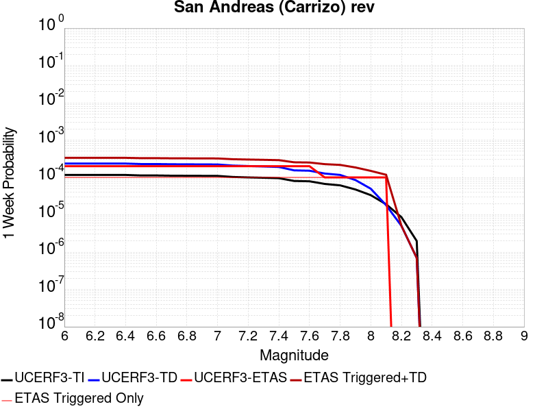 | 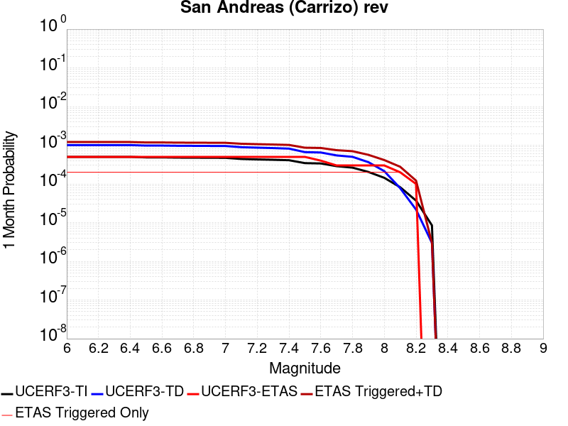 |  |  |

| Magnitude | 1 wk TI Prob | 1 wk TD Prob | 1 wk ETAS Prob | 1 wk ETAS/TD Gain | 1 wk ETAS Triggered+TD | 1 wk ETAS Triggered Only | 1 mo TI Prob | 1 mo TD Prob | 1 mo ETAS Prob | 1 mo ETAS/TD Gain | 1 mo ETAS Triggered+TD | 1 mo ETAS Triggered Only | 1 yr TI Prob | 1 yr TD Prob | 1 yr ETAS Prob | 1 yr ETAS/TD Gain | 1 yr ETAS Triggered+TD | 1 yr ETAS Triggered Only | 10 yr TI Prob | 10 yr TD Prob | 10 yr ETAS Prob | 10 yr ETAS/TD Gain | 10 yr ETAS Triggered+TD | 10 yr ETAS Triggered Only |
|-----|-----|-----|-----|-----|-----|-----|-----|-----|-----|-----|-----|-----|-----|-----|-----|-----|-----|-----|-----|-----|-----|-----|-----|-----|
| 6.0 | 1.1674632E-4 | 2.3500634E-4 | 1.0E-4 | 0.42552042 | 3.3498285E-4 | 1.0E-4 | 5.002454E-4 | 0.0010067829 | 1.0E-4 | 0.09932628 | 0.0011066822 | 1.0E-4 | 0.006073493 | 0.012189141 | 6.0E-4 | 0.049224142 | 0.012781828 | 6.0E-4 | 0.0591016 | 0.11713341 | 0.001 | 0.008537274 | 0.11801627 | 0.001 |
| 6.1 | 1.1674632E-4 | 2.3500634E-4 | 1.0E-4 | 0.42552042 | 3.3498285E-4 | 1.0E-4 | 5.002454E-4 | 0.0010067829 | 1.0E-4 | 0.09932628 | 0.0011066822 | 1.0E-4 | 0.006073493 | 0.012189141 | 6.0E-4 | 0.049224142 | 0.012781828 | 6.0E-4 | 0.0591016 | 0.11713341 | 0.001 | 0.008537274 | 0.11801627 | 0.001 |
| 6.2 | 1.1674632E-4 | 2.3500634E-4 | 1.0E-4 | 0.42552042 | 3.3498285E-4 | 1.0E-4 | 5.002454E-4 | 0.0010067829 | 1.0E-4 | 0.09932628 | 0.0011066822 | 1.0E-4 | 0.006073493 | 0.012189141 | 6.0E-4 | 0.049224142 | 0.012781828 | 6.0E-4 | 0.0591016 | 0.11713341 | 0.001 | 0.008537274 | 0.11801627 | 0.001 |
| 6.3 | 1.1674632E-4 | 2.3500634E-4 | 1.0E-4 | 0.42552042 | 3.3498285E-4 | 1.0E-4 | 5.002454E-4 | 0.0010067829 | 1.0E-4 | 0.09932628 | 0.0011066822 | 1.0E-4 | 0.006073493 | 0.012189141 | 6.0E-4 | 0.049224142 | 0.012781828 | 6.0E-4 | 0.0591016 | 0.11713341 | 0.001 | 0.008537274 | 0.11801627 | 0.001 |
| 6.4 | 1.1674632E-4 | 2.3500634E-4 | 1.0E-4 | 0.42552042 | 3.3498285E-4 | 1.0E-4 | 5.002454E-4 | 0.0010067829 | 1.0E-4 | 0.09932628 | 0.0011066822 | 1.0E-4 | 0.006073493 | 0.012189141 | 6.0E-4 | 0.049224142 | 0.012781828 | 6.0E-4 | 0.0591016 | 0.11713341 | 0.001 | 0.008537274 | 0.11801627 | 0.001 |
| 6.5 | 1.13136164E-4 | 2.2824129E-4 | 1.0E-4 | 0.43813282 | 3.2821845E-4 | 1.0E-4 | 4.847792E-4 | 9.778118E-4 | 1.0E-4 | 0.10226918 | 0.0010777139 | 1.0E-4 | 0.0058862255 | 0.011840291 | 6.0E-4 | 0.05067443 | 0.012433187 | 6.0E-4 | 0.057327334 | 0.11410441 | 0.001 | 0.008763903 | 0.11499031 | 0.001 |
| 6.6 | 1.13136164E-4 | 2.2824129E-4 | 1.0E-4 | 0.43813282 | 3.2821845E-4 | 1.0E-4 | 4.847792E-4 | 9.778118E-4 | 1.0E-4 | 0.10226918 | 0.0010777139 | 1.0E-4 | 0.0058862255 | 0.011840291 | 6.0E-4 | 0.05067443 | 0.012433187 | 6.0E-4 | 0.057327334 | 0.11410441 | 0.001 | 0.008763903 | 0.11499031 | 0.001 |
| 6.7 | 1.1149675E-4 | 2.2516907E-4 | 1.0E-4 | 0.44411072 | 3.2514657E-4 | 1.0E-4 | 4.777557E-4 | 9.6465484E-4 | 1.0E-4 | 0.10366402 | 0.0010645584 | 1.0E-4 | 0.0058011734 | 0.011681832 | 6.0E-4 | 0.051361803 | 0.012274823 | 6.0E-4 | 0.05652051 | 0.112732746 | 0.001 | 0.008870537 | 0.11362001 | 0.001 |
| 6.8 | 1.1103589E-4 | 2.2419993E-4 | 1.0E-4 | 0.44603047 | 3.241775E-4 | 1.0E-4 | 4.7578133E-4 | 9.6050446E-4 | 1.0E-4 | 0.10411196 | 0.0010604084 | 1.0E-4 | 0.005777263 | 0.011631842 | 6.0E-4 | 0.051582545 | 0.012224863 | 6.0E-4 | 0.056293584 | 0.112295255 | 0.001 | 0.008905095 | 0.11318296 | 0.001 |
| 6.9 | 1.1053259E-4 | 2.2313405E-4 | 1.0E-4 | 0.4481611 | 3.2311174E-4 | 1.0E-4 | 4.7362508E-4 | 9.5593976E-4 | 1.0E-4 | 0.1046091 | 0.0010558441 | 1.0E-4 | 0.0057511497 | 0.011576858 | 6.0E-4 | 0.05182753 | 0.012169912 | 6.0E-4 | 0.05604569 | 0.111813456 | 0.001 | 0.008943467 | 0.11270164 | 0.001 |
| 7.0 | 1.1005377E-4 | 2.2215206E-4 | 1.0E-4 | 0.45014212 | 3.2212984E-4 | 1.0E-4 | 4.7157376E-4 | 9.517343E-4 | 1.0E-4 | 0.10507134 | 0.0010516391 | 1.0E-4 | 0.0057263062 | 0.0115262 | 6.0E-4 | 0.052055318 | 0.012119285 | 6.0E-4 | 0.055809796 | 0.11136863 | 0.001 | 0.008979189 | 0.11225726 | 0.001 |
| 7.1 | 1.0308142E-4 | 2.0739544E-4 | 1.0E-4 | 0.48217067 | 3.073747E-4 | 1.0E-4 | 4.417027E-4 | 8.885358E-4 | 1.0E-4 | 0.1125447 | 9.88447E-4 | 1.0E-4 | 0.0053644776 | 0.010764554 | 5.0E-4 | 0.04644874 | 0.011259172 | 5.0E-4 | 0.052368138 | 0.10465884 | 9.0E-4 | 0.008599369 | 0.10546465 | 9.0E-4 |
| 7.2 | 1.0027479E-4 | 2.0153404E-4 | 1.0E-4 | 0.49619406 | 3.015139E-4 | 1.0E-4 | 4.296783E-4 | 8.634324E-4 | 1.0E-4 | 0.115816824 | 9.6334604E-4 | 1.0E-4 | 0.0052187922 | 0.010461894 | 5.0E-4 | 0.047792494 | 0.010956663 | 5.0E-4 | 0.050979212 | 0.10197536 | 9.0E-4 | 0.008825662 | 0.10278358 | 9.0E-4 |
| 7.3 | 9.816942E-5 | 1.9639665E-4 | 1.0E-4 | 0.50917363 | 2.96377E-4 | 1.0E-4 | 4.2065824E-4 | 8.4142934E-4 | 1.0E-4 | 0.11884539 | 9.413452E-4 | 1.0E-4 | 0.005109493 | 0.010196544 | 5.0E-4 | 0.04903622 | 0.010691446 | 5.0E-4 | 0.049935985 | 0.09959349 | 9.0E-4 | 0.009036735 | 0.10040386 | 9.0E-4 |
| 7.4 | 9.5634205E-5 | 1.9023678E-4 | 1.0E-4 | 0.5256607 | 2.9021775E-4 | 1.0E-4 | 4.0979648E-4 | 8.150466E-4 | 1.0E-4 | 0.12269237 | 9.149651E-4 | 1.0E-4 | 0.0049778637 | 0.009878284 | 5.0E-4 | 0.050616078 | 0.010373346 | 5.0E-4 | 0.048678253 | 0.09673373 | 9.0E-4 | 0.009303891 | 0.09754667 | 9.0E-4 |
| 7.5 | 8.052417E-5 | 1.544261E-4 | 1.0E-4 | 0.6475589 | 2.5441067E-4 | 1.0E-4 | 3.4505792E-4 | 6.616585E-4 | 1.0E-4 | 0.15113537 | 7.615923E-4 | 1.0E-4 | 0.0041929903 | 0.008026009 | 5.0E-4 | 0.062297463 | 0.008521996 | 5.0E-4 | 0.04114753 | 0.079812914 | 9.0E-4 | 0.011276371 | 0.08064108 | 9.0E-4 |
| 7.6 | 7.897024E-5 | 1.5104134E-4 | 1.0E-4 | 0.6620704 | 2.5102624E-4 | 1.0E-4 | 3.384E-4 | 6.4715964E-4 | 1.0E-4 | 0.15452138 | 7.470949E-4 | 1.0E-4 | 0.0041122385 | 0.007850772 | 5.0E-4 | 0.06368801 | 0.008346846 | 5.0E-4 | 0.040369697 | 0.07818328 | 9.0E-4 | 0.011511412 | 0.079012915 | 9.0E-4 |
| 7.7 | 6.707427E-5 | 1.268127E-4 | 1.0E-4 | 0.78856456 | 2.2680001E-4 | 1.0E-4 | 2.8742946E-4 | 5.433698E-4 | 1.0E-4 | 0.18403672 | 6.433155E-4 | 1.0E-4 | 0.003493839 | 0.0065954886 | 4.0E-4 | 0.060647517 | 0.0069928505 | 4.0E-4 | 0.034394164 | 0.06633325 | 8.0E-4 | 0.012060317 | 0.067080185 | 8.0E-4 |
| 7.8 | 6.147705E-5 | 1.1658706E-4 | 1.0E-4 | 0.8577281 | 2.165754E-4 | 1.0E-4 | 2.6344648E-4 | 4.995632E-4 | 1.0E-4 | 0.20017488 | 5.9951324E-4 | 1.0E-4 | 0.0032027436 | 0.0060652415 | 2.0E-4 | 0.03297478 | 0.0062640286 | 2.0E-4 | 0.031569764 | 0.061043616 | 6.0E-4 | 0.009829038 | 0.061606992 | 6.0E-4 |
| 7.9 | 4.7636717E-5 | 8.48813E-5 | 1.0E-4 | 1.1781158 | 1.8487281E-4 | 1.0E-4 | 2.0414138E-4 | 3.6372629E-4 | 1.0E-4 | 0.27493203 | 4.636899E-4 | 1.0E-4 | 0.0024825884 | 0.004419382 | 2.0E-4 | 0.04525519 | 0.0046184985 | 2.0E-4 | 0.024550365 | 0.044775743 | 6.0E-4 | 0.013400112 | 0.04534888 | 6.0E-4 |
| 8.0 | 3.3554235E-5 | 4.969718E-5 | 1.0E-4 | 2.0121865 | 1.496922E-4 | 1.0E-4 | 1.4379594E-4 | 2.1297054E-4 | 1.0E-4 | 0.46954852 | 3.1294924E-4 | 1.0E-4 | 0.0017493097 | 0.0025898346 | 1.0E-4 | 0.038612504 | 0.0026895755 | 1.0E-4 | 0.017356034 | 0.026676664 | 3.0E-4 | 0.011245784 | 0.02696866 | 3.0E-4 |
| 8.1 | 1.9175432E-5 | 1.7981038E-5 | 1.0E-4 | 5.5614142 | 1.1797924E-4 | 1.0E-4 | 8.217783E-5 | 7.705932E-5 | 1.0E-4 | 1.2977016 | 1.7705161E-4 | 1.0E-4 | 0.0010000558 | 9.377939E-4 | 1.0E-4 | 0.10663323 | 0.0010377002 | 1.0E-4 | 0.009955673 | 0.010124556 | 2.0E-4 | 0.019753953 | 0.010322531 | 2.0E-4 |
| 8.2 | 8.643924E-6 | 5.0104E-6 | 0.0 | 0.0 | 5.0104E-6 | 0.0 | 3.704486E-5 | 2.1472966E-5 | 0.0 | 0.0 | 2.1472966E-5 | 0.0 | 4.5092785E-4 | 2.6140205E-4 | 0.0 | 0.0 | 2.6140205E-4 | 0.0 | 0.0045001395 | 0.002993769 | 1.0E-4 | 0.03340271 | 0.0030934697 | 1.0E-4 |
| 8.3 | 1.983087E-6 | 6.880041E-7 | 0.0 | 0.0 | 6.880041E-7 | 0.0 | 8.498917E-6 | 2.9485857E-6 | 0.0 | 0.0 | 2.9485857E-6 | 0.0 | 1.034694E-4 | 3.589845E-5 | 0.0 | 0.0 | 3.589845E-5 | 0.0 | 0.0010342124 | 4.2701262E-4 | 0.0 | 0.0 | 4.2701262E-4 | 0.0 |

## San Andreas (Mojave N)
*[(top)](#table-of-contents)*

| 1 Week | 1 Month | 1 Year | 10 Year |
|-----|-----|-----|-----|
|  |  |  |  |

| Magnitude | 1 wk TI Prob | 1 wk TD Prob | 1 wk ETAS Prob | 1 wk ETAS/TD Gain | 1 wk ETAS Triggered+TD | 1 wk ETAS Triggered Only | 1 mo TI Prob | 1 mo TD Prob | 1 mo ETAS Prob | 1 mo ETAS/TD Gain | 1 mo ETAS Triggered+TD | 1 mo ETAS Triggered Only | 1 yr TI Prob | 1 yr TD Prob | 1 yr ETAS Prob | 1 yr ETAS/TD Gain | 1 yr ETAS Triggered+TD | 1 yr ETAS Triggered Only | 10 yr TI Prob | 10 yr TD Prob | 10 yr ETAS Prob | 10 yr ETAS/TD Gain | 10 yr ETAS Triggered+TD | 10 yr ETAS Triggered Only |
|-----|-----|-----|-----|-----|-----|-----|-----|-----|-----|-----|-----|-----|-----|-----|-----|-----|-----|-----|-----|-----|-----|-----|-----|-----|
| 6.0 | 9.877682E-5 | 1.8664719E-4 | 1.0E-4 | 0.5357702 | 2.8662852E-4 | 1.0E-4 | 4.2326056E-4 | 7.9967146E-4 | 1.0E-4 | 0.12505135 | 8.995915E-4 | 1.0E-4 | 0.0051410277 | 0.009692651 | 6.0E-4 | 0.06190257 | 0.010286835 | 6.0E-4 | 0.05023708 | 0.095066346 | 0.001 | 0.010518969 | 0.09597128 | 0.001 |
| 6.1 | 9.877682E-5 | 1.8664719E-4 | 1.0E-4 | 0.5357702 | 2.8662852E-4 | 1.0E-4 | 4.2326056E-4 | 7.9967146E-4 | 1.0E-4 | 0.12505135 | 8.995915E-4 | 1.0E-4 | 0.0051410277 | 0.009692651 | 6.0E-4 | 0.06190257 | 0.010286835 | 6.0E-4 | 0.05023708 | 0.095066346 | 0.001 | 0.010518969 | 0.09597128 | 0.001 |
| 6.2 | 9.877682E-5 | 1.8664719E-4 | 1.0E-4 | 0.5357702 | 2.8662852E-4 | 1.0E-4 | 4.2326056E-4 | 7.9967146E-4 | 1.0E-4 | 0.12505135 | 8.995915E-4 | 1.0E-4 | 0.0051410277 | 0.009692651 | 6.0E-4 | 0.06190257 | 0.010286835 | 6.0E-4 | 0.05023708 | 0.095066346 | 0.001 | 0.010518969 | 0.09597128 | 0.001 |
| 6.3 | 9.877682E-5 | 1.8664719E-4 | 1.0E-4 | 0.5357702 | 2.8662852E-4 | 1.0E-4 | 4.2326056E-4 | 7.9967146E-4 | 1.0E-4 | 0.12505135 | 8.995915E-4 | 1.0E-4 | 0.0051410277 | 0.009692651 | 6.0E-4 | 0.06190257 | 0.010286835 | 6.0E-4 | 0.05023708 | 0.095066346 | 0.001 | 0.010518969 | 0.09597128 | 0.001 |
| 6.4 | 9.877682E-5 | 1.8664719E-4 | 1.0E-4 | 0.5357702 | 2.8662852E-4 | 1.0E-4 | 4.2326056E-4 | 7.9967146E-4 | 1.0E-4 | 0.12505135 | 8.995915E-4 | 1.0E-4 | 0.0051410277 | 0.009692651 | 6.0E-4 | 0.06190257 | 0.010286835 | 6.0E-4 | 0.05023708 | 0.095066346 | 0.001 | 0.010518969 | 0.09597128 | 0.001 |
| 6.5 | 9.861474E-5 | 1.8638701E-4 | 1.0E-4 | 0.5365181 | 2.8636836E-4 | 1.0E-4 | 4.2256617E-4 | 7.985571E-4 | 1.0E-4 | 0.12522586 | 8.984773E-4 | 1.0E-4 | 0.0051326132 | 0.009679204 | 6.0E-4 | 0.061988566 | 0.010273397 | 6.0E-4 | 0.050156746 | 0.09494469 | 0.001 | 0.010532448 | 0.095849745 | 0.001 |
| 6.6 | 9.861474E-5 | 1.8638701E-4 | 1.0E-4 | 0.5365181 | 2.8636836E-4 | 1.0E-4 | 4.2256617E-4 | 7.985571E-4 | 1.0E-4 | 0.12522586 | 8.984773E-4 | 1.0E-4 | 0.0051326132 | 0.009679204 | 6.0E-4 | 0.061988566 | 0.010273397 | 6.0E-4 | 0.050156746 | 0.09494469 | 0.001 | 0.010532448 | 0.095849745 | 0.001 |
| 6.7 | 9.8552715E-5 | 1.8628738E-4 | 1.0E-4 | 0.53680503 | 2.8626874E-4 | 1.0E-4 | 4.223004E-4 | 7.9813035E-4 | 1.0E-4 | 0.12529281 | 8.9805055E-4 | 1.0E-4 | 0.0051293927 | 0.009674055 | 6.0E-4 | 0.06202156 | 0.0102682505 | 6.0E-4 | 0.050125998 | 0.094897926 | 0.001 | 0.010537638 | 0.09580302 | 0.001 |
| 6.8 | 9.8464974E-5 | 1.8614107E-4 | 1.0E-4 | 0.537227 | 2.8612246E-4 | 1.0E-4 | 4.219245E-4 | 7.975037E-4 | 1.0E-4 | 0.12539127 | 8.9742395E-4 | 1.0E-4 | 0.0051248376 | 0.009666493 | 6.0E-4 | 0.06207008 | 0.010260693 | 6.0E-4 | 0.05008251 | 0.09482878 | 0.001 | 0.010545322 | 0.09573395 | 0.001 |
| 6.9 | 9.825824E-5 | 1.8582496E-4 | 1.0E-4 | 0.53814083 | 2.8580637E-4 | 1.0E-4 | 4.2103877E-4 | 7.9614983E-4 | 1.0E-4 | 0.1256045 | 8.960702E-4 | 1.0E-4 | 0.0051141046 | 0.009650156 | 6.0E-4 | 0.062175162 | 0.010244366 | 6.0E-4 | 0.049980022 | 0.094679005 | 0.001 | 0.010562004 | 0.095584325 | 0.001 |
| 7.0 | 9.781462E-5 | 1.8514665E-4 | 1.0E-4 | 0.5401124 | 2.8512813E-4 | 1.0E-4 | 4.1913814E-4 | 7.932446E-4 | 1.0E-4 | 0.12606452 | 8.9316524E-4 | 1.0E-4 | 0.005091073 | 0.009615097 | 6.0E-4 | 0.06240187 | 0.010209328 | 6.0E-4 | 0.04976007 | 0.094358064 | 0.001 | 0.010597928 | 0.09526371 | 0.001 |
| 7.1 | 9.7121134E-5 | 1.8417464E-4 | 1.0E-4 | 0.5429629 | 2.841562E-4 | 1.0E-4 | 4.1616702E-4 | 7.8908127E-4 | 1.0E-4 | 0.12672965 | 8.890024E-4 | 1.0E-4 | 0.005055068 | 0.009564855 | 6.0E-4 | 0.06272965 | 0.010159116 | 6.0E-4 | 0.04941613 | 0.09389799 | 0.001 | 0.010649855 | 0.09480409 | 0.001 |
| 7.2 | 9.663819E-5 | 1.8349035E-4 | 1.0E-4 | 0.5449878 | 2.83472E-4 | 1.0E-4 | 4.1409794E-4 | 7.861504E-4 | 1.0E-4 | 0.12720212 | 8.8607176E-4 | 1.0E-4 | 0.0050299936 | 0.009529484 | 6.0E-4 | 0.06296249 | 0.010123767 | 6.0E-4 | 0.049176537 | 0.0935736 | 0.001 | 0.010686775 | 0.09448002 | 0.001 |
| 7.3 | 9.6277574E-5 | 1.8302524E-4 | 1.0E-4 | 0.5463727 | 2.8300696E-4 | 1.0E-4 | 4.125529E-4 | 7.841583E-4 | 1.0E-4 | 0.12752527 | 8.840799E-4 | 1.0E-4 | 0.0050112694 | 0.009505442 | 6.0E-4 | 0.063121736 | 0.010099739 | 6.0E-4 | 0.04899759 | 0.09335072 | 0.001 | 0.01071229 | 0.09425737 | 0.001 |
| 7.4 | 9.593308E-5 | 1.8243381E-4 | 1.0E-4 | 0.54814404 | 2.8241557E-4 | 1.0E-4 | 4.1107697E-4 | 7.8162504E-4 | 1.0E-4 | 0.12793858 | 8.8154693E-4 | 1.0E-4 | 0.0049933824 | 0.009474869 | 6.0E-4 | 0.06332541 | 0.010069184 | 6.0E-4 | 0.04882661 | 0.093072906 | 0.001 | 0.010744265 | 0.093979836 | 0.001 |
| 7.5 | 9.561707E-5 | 1.8190441E-4 | 1.0E-4 | 0.54973924 | 2.8188623E-4 | 1.0E-4 | 4.0972308E-4 | 7.793576E-4 | 1.0E-4 | 0.1283108 | 8.792797E-4 | 1.0E-4 | 0.0049769743 | 0.009447503 | 6.0E-4 | 0.063508846 | 0.010041834 | 6.0E-4 | 0.048669744 | 0.09282255 | 0.001 | 0.010773244 | 0.09372973 | 0.001 |
| 7.6 | 9.418194E-5 | 1.7848455E-4 | 1.0E-4 | 0.5602726 | 2.784667E-4 | 1.0E-4 | 4.0357444E-4 | 7.647097E-4 | 1.0E-4 | 0.13076858 | 8.6463324E-4 | 1.0E-4 | 0.004902454 | 0.009270695 | 6.0E-4 | 0.064720064 | 0.009865132 | 6.0E-4 | 0.047957025 | 0.09122918 | 0.001 | 0.010961405 | 0.09213795 | 0.001 |
| 7.7 | 8.202141E-5 | 1.5360561E-4 | 1.0E-4 | 0.6510179 | 2.5359026E-4 | 1.0E-4 | 3.51473E-4 | 6.581437E-4 | 1.0E-4 | 0.15194249 | 7.580779E-4 | 1.0E-4 | 0.00427079 | 0.007983509 | 5.0E-4 | 0.062629096 | 0.008479518 | 5.0E-4 | 0.04189639 | 0.07926038 | 9.0E-4 | 0.01135498 | 0.08008904 | 9.0E-4 |
| 7.8 | 7.2859846E-5 | 1.3920998E-4 | 1.0E-4 | 0.7183393 | 2.3919606E-4 | 1.0E-4 | 3.1221908E-4 | 5.9647777E-4 | 1.0E-4 | 0.16765083 | 6.9641817E-4 | 1.0E-4 | 0.003794643 | 0.0072379718 | 3.0E-4 | 0.041448075 | 0.0075358003 | 3.0E-4 | 0.037304975 | 0.072028324 | 7.0E-4 | 0.0097183995 | 0.0726779 | 7.0E-4 |
| 7.9 | 5.3874453E-5 | 9.6238386E-5 | 1.0E-4 | 1.0390863 | 1.9622876E-4 | 1.0E-4 | 2.3087008E-4 | 4.1238504E-4 | 1.0E-4 | 0.24249181 | 5.1234383E-4 | 1.0E-4 | 0.0028072202 | 0.005009239 | 2.0E-4 | 0.039926223 | 0.005208237 | 2.0E-4 | 0.02772022 | 0.050442543 | 6.0E-4 | 0.011894722 | 0.051012278 | 6.0E-4 |
| 8.0 | 3.468538E-5 | 5.1783452E-5 | 1.0E-4 | 1.9311188 | 1.5177828E-4 | 1.0E-4 | 1.4864317E-4 | 2.219102E-4 | 1.0E-4 | 0.45063272 | 3.2188802E-4 | 1.0E-4 | 0.0018082283 | 0.002698411 | 1.0E-4 | 0.037058845 | 0.0027981412 | 1.0E-4 | 0.017935853 | 0.027728014 | 3.0E-4 | 0.010819383 | 0.028019696 | 3.0E-4 |
| 8.1 | 1.9152367E-5 | 1.8203265E-5 | 1.0E-4 | 5.49352 | 1.18201446E-4 | 1.0E-4 | 8.207899E-5 | 7.801166E-5 | 1.0E-4 | 1.2818596 | 1.7800386E-4 | 1.0E-4 | 9.988535E-4 | 9.493787E-4 | 1.0E-4 | 0.10533205 | 0.0010492838 | 1.0E-4 | 0.009943757 | 0.010226626 | 2.0E-4 | 0.019556792 | 0.01042458 | 2.0E-4 |
| 8.2 | 8.643924E-6 | 5.0104E-6 | 0.0 | 0.0 | 5.0104E-6 | 0.0 | 3.704486E-5 | 2.1472966E-5 | 0.0 | 0.0 | 2.1472966E-5 | 0.0 | 4.5092785E-4 | 2.6140205E-4 | 0.0 | 0.0 | 2.6140205E-4 | 0.0 | 0.0045001395 | 0.002993769 | 1.0E-4 | 0.03340271 | 0.0030934697 | 1.0E-4 |
| 8.3 | 1.983087E-6 | 6.880041E-7 | 0.0 | 0.0 | 6.880041E-7 | 0.0 | 8.498917E-6 | 2.9485857E-6 | 0.0 | 0.0 | 2.9485857E-6 | 0.0 | 1.034694E-4 | 3.589845E-5 | 0.0 | 0.0 | 3.589845E-5 | 0.0 | 0.0010342124 | 4.2701262E-4 | 0.0 | 0.0 | 4.2701262E-4 | 0.0 |

## Ortigalita (South)
*[(top)](#table-of-contents)*

| 1 Week | 1 Month | 1 Year | 10 Year |
|-----|-----|-----|-----|
|  |  |  |  |

| Magnitude | 1 wk TI Prob | 1 wk TD Prob | 1 wk ETAS Prob | 1 wk ETAS/TD Gain | 1 wk ETAS Triggered+TD | 1 wk ETAS Triggered Only | 1 mo TI Prob | 1 mo TD Prob | 1 mo ETAS Prob | 1 mo ETAS/TD Gain | 1 mo ETAS Triggered+TD | 1 mo ETAS Triggered Only | 1 yr TI Prob | 1 yr TD Prob | 1 yr ETAS Prob | 1 yr ETAS/TD Gain | 1 yr ETAS Triggered+TD | 1 yr ETAS Triggered Only | 10 yr TI Prob | 10 yr TD Prob | 10 yr ETAS Prob | 10 yr ETAS/TD Gain | 10 yr ETAS Triggered+TD | 10 yr ETAS Triggered Only |
|-----|-----|-----|-----|-----|-----|-----|-----|-----|-----|-----|-----|-----|-----|-----|-----|-----|-----|-----|-----|-----|-----|-----|-----|-----|
| 6.0 | 3.72394E-5 | 4.3182466E-5 | 0.0 | 0.0 | 4.3182466E-5 | 0.0 | 1.5958765E-4 | 1.8505547E-4 | 0.0 | 0.0 | 1.8505547E-4 | 0.0 | 0.0019412481 | 0.002250878 | 2.0E-4 | 0.088854216 | 0.0024504277 | 2.0E-4 | 0.019243775 | 0.022297136 | 0.001 | 0.044848807 | 0.023274839 | 0.001 |
| 6.1 | 2.7299884E-5 | 3.1441457E-5 | 0.0 | 0.0 | 3.1441457E-5 | 0.0 | 1.16994255E-4 | 1.3474245E-4 | 0.0 | 0.0 | 1.3474245E-4 | 0.0 | 0.0014234743 | 0.0016393106 | 0.0 | 0.0 | 0.0016393106 | 0.0 | 0.014143906 | 0.016278092 | 5.0E-4 | 0.030716129 | 0.016769953 | 5.0E-4 |
| 6.2 | 2.7299884E-5 | 3.1441457E-5 | 0.0 | 0.0 | 3.1441457E-5 | 0.0 | 1.16994255E-4 | 1.3474245E-4 | 0.0 | 0.0 | 1.3474245E-4 | 0.0 | 0.0014234743 | 0.0016393106 | 0.0 | 0.0 | 0.0016393106 | 0.0 | 0.014143906 | 0.016278092 | 5.0E-4 | 0.030716129 | 0.016769953 | 5.0E-4 |
| 6.3 | 2.0546433E-5 | 2.3594344E-5 | 0.0 | 0.0 | 2.3594344E-5 | 0.0 | 8.805317E-5 | 1.01114805E-4 | 0.0 | 0.0 | 1.01114805E-4 | 0.0 | 0.00107152 | 0.0012303964 | 0.0 | 0.0 | 0.0012303964 | 0.0 | 0.010663681 | 0.0122379 | 4.0E-4 | 0.032685347 | 0.012633004 | 4.0E-4 |
| 6.4 | 2.0546433E-5 | 2.3594344E-5 | 0.0 | 0.0 | 2.3594344E-5 | 0.0 | 8.805317E-5 | 1.01114805E-4 | 0.0 | 0.0 | 1.01114805E-4 | 0.0 | 0.00107152 | 0.0012303964 | 0.0 | 0.0 | 0.0012303964 | 0.0 | 0.010663681 | 0.0122379 | 4.0E-4 | 0.032685347 | 0.012633004 | 4.0E-4 |
| 6.5 | 1.7779594E-5 | 2.0414887E-5 | 0.0 | 0.0 | 2.0414887E-5 | 0.0 | 7.619603E-5 | 8.748951E-5 | 0.0 | 0.0 | 8.748951E-5 | 0.0 | 9.272918E-4 | 0.0010646778 | 0.0 | 0.0 | 0.0010646778 | 0.0 | 0.009234319 | 0.010597234 | 4.0E-4 | 0.0377457 | 0.0109929945 | 4.0E-4 |
| 6.6 | 1.6272212E-5 | 1.8685576E-5 | 0.0 | 0.0 | 1.8685576E-5 | 0.0 | 6.973618E-5 | 8.007865E-5 | 0.0 | 0.0 | 8.007865E-5 | 0.0 | 8.487073E-4 | 9.745337E-4 | 0.0 | 0.0 | 9.745337E-4 | 0.0 | 0.008454733 | 0.009703899 | 3.0E-4 | 0.030915407 | 0.010000988 | 3.0E-4 |
| 6.7 | 1.3051484E-5 | 1.5014794E-5 | 0.0 | 0.0 | 1.5014794E-5 | 0.0 | 5.593373E-5 | 6.434759E-5 | 0.0 | 0.0 | 6.434759E-5 | 0.0 | 6.807804E-4 | 7.831597E-4 | 0.0 | 0.0 | 7.831597E-4 | 0.0 | 0.006786986 | 0.007804978 | 2.0E-4 | 0.025624672 | 0.008003417 | 2.0E-4 |
| 6.8 | 1.04277415E-5 | 1.1968504E-5 | 0.0 | 0.0 | 1.1968504E-5 | 0.0 | 4.4689557E-5 | 5.129262E-5 | 0.0 | 0.0 | 5.129262E-5 | 0.0 | 5.439595E-4 | 6.243161E-4 | 0.0 | 0.0 | 6.243161E-4 | 0.0 | 0.0054262993 | 0.0062263743 | 2.0E-4 | 0.032121424 | 0.0064251292 | 2.0E-4 |
| 6.9 | 7.639968E-6 | 8.777665E-6 | 0.0 | 0.0 | 8.777665E-6 | 0.0 | 3.274231E-5 | 3.7618054E-5 | 0.0 | 0.0 | 3.7618054E-5 | 0.0 | 3.9856473E-4 | 4.5790945E-4 | 0.0 | 0.0 | 4.5790945E-4 | 0.0 | 0.003978506 | 0.0045702434 | 2.0E-4 | 0.043761343 | 0.0047693294 | 2.0E-4 |
| 7.0 | 3.919831E-6 | 4.525994E-6 | 0.0 | 0.0 | 4.525994E-6 | 0.0 | 1.679917E-5 | 1.9396986E-5 | 0.0 | 0.0 | 1.9396986E-5 | 0.0 | 2.045107E-4 | 2.3613482E-4 | 0.0 | 0.0 | 2.3613482E-4 | 0.0 | 0.0020432258 | 0.0023590468 | 1.0E-4 | 0.04239 | 0.002458811 | 1.0E-4 |
| 7.1 | 1.6017933E-6 | 1.8539527E-6 | 0.0 | 0.0 | 1.8539527E-6 | 0.0 | 6.8648105E-6 | 7.945493E-6 | 0.0 | 0.0 | 7.945493E-6 | 0.0 | 8.357586E-5 | 9.673315E-5 | 0.0 | 0.0 | 9.673315E-5 | 0.0 | 8.3544437E-4 | 9.6701476E-4 | 1.0E-4 | 0.10341104 | 0.001066918 | 1.0E-4 |

## Laguna Salada
*[(top)](#table-of-contents)*

| 1 Week | 1 Month | 1 Year | 10 Year |
|-----|-----|-----|-----|
|  |  | 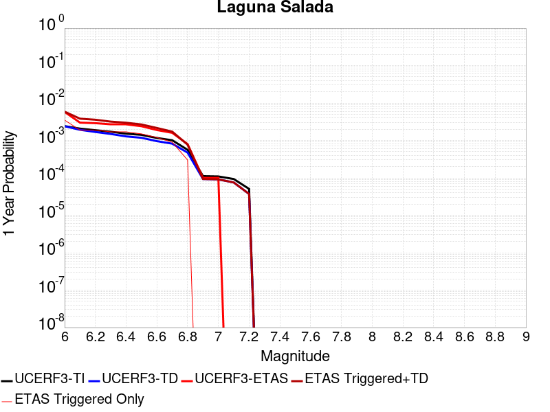 |  |

| Magnitude | 1 wk TI Prob | 1 wk TD Prob | 1 wk ETAS Prob | 1 wk ETAS/TD Gain | 1 wk ETAS Triggered+TD | 1 wk ETAS Triggered Only | 1 mo TI Prob | 1 mo TD Prob | 1 mo ETAS Prob | 1 mo ETAS/TD Gain | 1 mo ETAS Triggered+TD | 1 mo ETAS Triggered Only | 1 yr TI Prob | 1 yr TD Prob | 1 yr ETAS Prob | 1 yr ETAS/TD Gain | 1 yr ETAS Triggered+TD | 1 yr ETAS Triggered Only | 10 yr TI Prob | 10 yr TD Prob | 10 yr ETAS Prob | 10 yr ETAS/TD Gain | 10 yr ETAS Triggered+TD | 10 yr ETAS Triggered Only |
|-----|-----|-----|-----|-----|-----|-----|-----|-----|-----|-----|-----|-----|-----|-----|-----|-----|-----|-----|-----|-----|-----|-----|-----|-----|
| 6.0 | 4.6465593E-5 | 4.603502E-5 | 0.0 | 0.0 | 4.603502E-5 | 0.0 | 1.9912305E-4 | 1.9727867E-4 | 1.0E-4 | 0.50689715 | 2.9725896E-4 | 1.0E-4 | 0.0024216278 | 0.002399297 | 3.0E-4 | 0.12503663 | 0.002698577 | 3.0E-4 | 0.02395408 | 0.023813494 | 9.0E-4 | 0.0377937 | 0.024692062 | 9.0E-4 |
| 6.1 | 3.982297E-5 | 3.696866E-5 | 0.0 | 0.0 | 3.696866E-5 | 0.0 | 1.706587E-4 | 1.584279E-4 | 1.0E-4 | 0.631202 | 2.5841204E-4 | 1.0E-4 | 0.0020757897 | 0.0019272442 | 2.0E-4 | 0.103775114 | 0.0021268588 | 2.0E-4 | 0.020565065 | 0.019186307 | 4.0E-4 | 0.020848203 | 0.019578632 | 4.0E-4 |
| 6.2 | 3.6067784E-5 | 3.233754E-5 | 0.0 | 0.0 | 3.233754E-5 | 0.0 | 1.5456705E-4 | 1.3858241E-4 | 1.0E-4 | 0.7215923 | 2.3856855E-4 | 1.0E-4 | 0.0018802295 | 0.0016860253 | 2.0E-4 | 0.118622184 | 0.001885688 | 2.0E-4 | 0.018644003 | 0.016804963 | 3.0E-4 | 0.017851869 | 0.017099923 | 3.0E-4 |
| 6.3 | 3.2859112E-5 | 2.8596673E-5 | 0.0 | 0.0 | 2.8596673E-5 | 0.0 | 1.4081717E-4 | 1.2255185E-4 | 1.0E-4 | 0.81598115 | 2.2253959E-4 | 1.0E-4 | 0.0017131006 | 0.0014911371 | 2.0E-4 | 0.13412583 | 0.001690839 | 2.0E-4 | 0.016999546 | 0.014879224 | 3.0E-4 | 0.020162342 | 0.0151747605 | 3.0E-4 |
| 6.4 | 2.9132116E-5 | 2.4614748E-5 | 0.0 | 0.0 | 2.4614748E-5 | 0.0 | 1.2484594E-4 | 1.0548801E-4 | 1.0E-4 | 0.94797504 | 2.0547747E-4 | 1.0E-4 | 0.0015189396 | 0.0012836462 | 2.0E-4 | 0.15580617 | 0.0014833895 | 2.0E-4 | 0.015085992 | 0.012818991 | 3.0E-4 | 0.023402777 | 0.013115146 | 3.0E-4 |
| 6.5 | 2.7075037E-5 | 2.2596063E-5 | 0.0 | 0.0 | 2.2596063E-5 | 0.0 | 1.1603071E-4 | 9.683716E-5 | 1.0E-4 | 1.0326614 | 1.9682747E-4 | 1.0E-4 | 0.0014117584 | 0.0011784406 | 2.0E-4 | 0.1697158 | 0.0013782049 | 2.0E-4 | 0.014028233 | 0.011774354 | 3.0E-4 | 0.025479106 | 0.012070822 | 3.0E-4 |
| 6.6 | 2.2367465E-5 | 1.8389497E-5 | 0.0 | 0.0 | 1.8389497E-5 | 0.0 | 9.5857045E-5 | 7.88102E-5 | 1.0E-4 | 1.2688713 | 1.7880232E-4 | 1.0E-4 | 0.0011664346 | 9.591718E-4 | 2.0E-4 | 0.20851322 | 0.00115898 | 2.0E-4 | 0.011603311 | 0.009588251 | 3.0E-4 | 0.031288292 | 0.009885374 | 3.0E-4 |
| 6.7 | 1.9458053E-5 | 1.5762895E-5 | 0.0 | 0.0 | 1.5762895E-5 | 0.0 | 8.338899E-5 | 6.7553956E-5 | 1.0E-4 | 1.4802983 | 1.675472E-4 | 1.0E-4 | 0.001014788 | 8.2223717E-4 | 2.0E-4 | 0.24323882 | 0.0010220727 | 2.0E-4 | 0.010101665 | 0.008237424 | 3.0E-4 | 0.03641915 | 0.008534953 | 3.0E-4 |
| 6.8 | 1.0767866E-5 | 9.0636595E-6 | 0.0 | 0.0 | 9.0636595E-6 | 0.0 | 4.614718E-5 | 3.8844053E-5 | 0.0 | 0.0 | 3.8844053E-5 | 0.0 | 5.6169706E-4 | 4.7289018E-4 | 0.0 | 0.0 | 4.7289018E-4 | 0.0 | 0.0056027942 | 0.0047458936 | 1.0E-4 | 0.02107085 | 0.004845419 | 1.0E-4 |
| 6.9 | 2.1384765E-6 | 1.7896037E-6 | 0.0 | 0.0 | 1.7896037E-6 | 0.0 | 9.164866E-6 | 7.669711E-6 | 0.0 | 0.0 | 7.669711E-6 | 0.0 | 1.1157654E-4 | 9.337511E-5 | 0.0 | 0.0 | 9.337511E-5 | 0.0 | 0.0011152053 | 9.33397E-4 | 0.0 | 0.0 | 9.33397E-4 | 0.0 |
| 7.0 | 2.0952946E-6 | 1.7475566E-6 | 0.0 | 0.0 | 1.7475566E-6 | 0.0 | 8.979802E-6 | 7.4895083E-6 | 0.0 | 0.0 | 7.4895083E-6 | 0.0 | 1.0932361E-4 | 9.118134E-5 | 0.0 | 0.0 | 9.118134E-5 | 0.0 | 0.0010926984 | 9.114774E-4 | 0.0 | 0.0 | 9.114774E-4 | 0.0 |
| 7.1 | 1.7887576E-6 | 1.4484149E-6 | 0.0 | 0.0 | 1.4484149E-6 | 0.0 | 7.666081E-6 | 6.207479E-6 | 0.0 | 0.0 | 6.207479E-6 | 0.0 | 9.333054E-5 | 7.557374E-5 | 0.0 | 0.0 | 7.557374E-5 | 0.0 | 9.329135E-4 | 7.5551076E-4 | 0.0 | 0.0 | 7.5551076E-4 | 0.0 |
| 7.2 | 9.723109E-7 | 7.124557E-7 | 0.0 | 0.0 | 7.124557E-7 | 0.0 | 4.16704E-6 | 3.0533788E-6 | 0.0 | 0.0 | 3.0533788E-6 | 0.0 | 5.073253E-5 | 3.7174417E-5 | 0.0 | 0.0 | 3.7174417E-5 | 0.0 | 5.072095E-4 | 3.716982E-4 | 0.0 | 0.0 | 3.716982E-4 | 0.0 |

## Ortigalita (North)
*[(top)](#table-of-contents)*

| 1 Week | 1 Month | 1 Year | 10 Year |
|-----|-----|-----|-----|
| 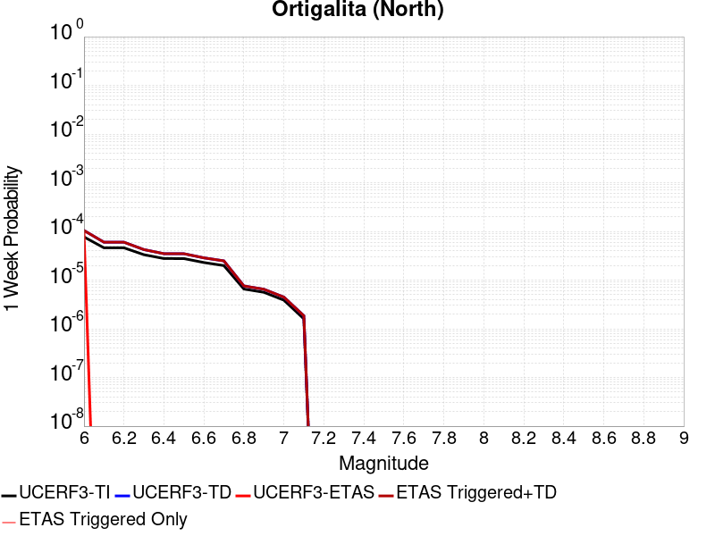 |  |  |  |

| Magnitude | 1 wk TI Prob | 1 wk TD Prob | 1 wk ETAS Prob | 1 wk ETAS/TD Gain | 1 wk ETAS Triggered+TD | 1 wk ETAS Triggered Only | 1 mo TI Prob | 1 mo TD Prob | 1 mo ETAS Prob | 1 mo ETAS/TD Gain | 1 mo ETAS Triggered+TD | 1 mo ETAS Triggered Only | 1 yr TI Prob | 1 yr TD Prob | 1 yr ETAS Prob | 1 yr ETAS/TD Gain | 1 yr ETAS Triggered+TD | 1 yr ETAS Triggered Only | 10 yr TI Prob | 10 yr TD Prob | 10 yr ETAS Prob | 10 yr ETAS/TD Gain | 10 yr ETAS Triggered+TD | 10 yr ETAS Triggered Only |
|-----|-----|-----|-----|-----|-----|-----|-----|-----|-----|-----|-----|-----|-----|-----|-----|-----|-----|-----|-----|-----|-----|-----|-----|-----|
| 6.0 | 7.711876E-5 | 1.0468789E-4 | 0.0 | 0.0 | 1.0468789E-4 | 0.0 | 3.3046713E-4 | 4.4859215E-4 | 0.0 | 0.0 | 4.4859215E-4 | 0.0 | 0.004016016 | 0.0054490888 | 1.0E-4 | 0.018351693 | 0.0055485438 | 1.0E-4 | 0.039442103 | 0.053277437 | 7.0E-4 | 0.01313877 | 0.053940143 | 7.0E-4 |
| 6.1 | 4.607858E-5 | 6.0052193E-5 | 0.0 | 0.0 | 6.0052193E-5 | 0.0 | 1.9746469E-4 | 2.573422E-4 | 0.0 | 0.0 | 2.573422E-4 | 0.0 | 0.0024014818 | 0.0031289689 | 0.0 | 0.0 | 0.0031289689 | 0.0 | 0.023756953 | 0.030881127 | 3.0E-4 | 0.009714671 | 0.031171864 | 3.0E-4 |
| 6.2 | 4.607858E-5 | 6.0052193E-5 | 0.0 | 0.0 | 6.0052193E-5 | 0.0 | 1.9746469E-4 | 2.573422E-4 | 0.0 | 0.0 | 2.573422E-4 | 0.0 | 0.0024014818 | 0.0031289689 | 0.0 | 0.0 | 0.0031289689 | 0.0 | 0.023756953 | 0.030881127 | 3.0E-4 | 0.009714671 | 0.031171864 | 3.0E-4 |
| 6.3 | 3.327423E-5 | 4.2353746E-5 | 0.0 | 0.0 | 4.2353746E-5 | 0.0 | 1.4259605E-4 | 1.8150471E-4 | 0.0 | 0.0 | 1.8150471E-4 | 0.0 | 0.0017347244 | 0.0022078266 | 0.0 | 0.0 | 0.0022078266 | 0.0 | 0.017212452 | 0.021883437 | 3.0E-4 | 0.013708998 | 0.022176871 | 3.0E-4 |
| 6.4 | 2.7732503E-5 | 3.4902085E-5 | 0.0 | 0.0 | 3.4902085E-5 | 0.0 | 1.1884817E-4 | 1.4957308E-4 | 0.0 | 0.0 | 1.4957308E-4 | 0.0 | 0.001446016 | 0.0018197665 | 0.0 | 0.0 | 0.0018197665 | 0.0 | 0.014366428 | 0.018071692 | 2.0E-4 | 0.011067032 | 0.018268079 | 2.0E-4 |
| 6.5 | 2.7689714E-5 | 3.485199E-5 | 0.0 | 0.0 | 3.485199E-5 | 0.0 | 1.186648E-4 | 1.4935841E-4 | 0.0 | 0.0 | 1.4935841E-4 | 0.0 | 0.0014437864 | 0.0018171573 | 0.0 | 0.0 | 0.0018171573 | 0.0 | 0.014344421 | 0.018046025 | 2.0E-4 | 0.011082773 | 0.018242415 | 2.0E-4 |
| 6.6 | 2.2976905E-5 | 2.8641503E-5 | 0.0 | 0.0 | 2.8641503E-5 | 0.0 | 9.846873E-5 | 1.2274482E-4 | 0.0 | 0.0 | 1.2274482E-4 | 0.0 | 0.0011981975 | 0.0014936309 | 0.0 | 0.0 | 0.0014936309 | 0.0 | 0.011917574 | 0.014859187 | 2.0E-4 | 0.013459686 | 0.015056216 | 2.0E-4 |
| 6.7 | 1.9871539E-5 | 2.4836998E-5 | 0.0 | 0.0 | 2.4836998E-5 | 0.0 | 8.516096E-5 | 1.064412E-4 | 0.0 | 0.0 | 1.064412E-4 | 0.0 | 0.0010363415 | 0.0012953919 | 0.0 | 0.0 | 0.0012953919 | 0.0 | 0.010315218 | 0.012901974 | 2.0E-4 | 0.015501504 | 0.013099394 | 2.0E-4 |
| 6.8 | 6.5640475E-6 | 7.5928892E-6 | 0.0 | 0.0 | 7.5928892E-6 | 0.0 | 2.813133E-5 | 3.2540564E-5 | 0.0 | 0.0 | 3.2540564E-5 | 0.0 | 3.424451E-4 | 3.961122E-4 | 0.0 | 0.0 | 3.961122E-4 | 0.0 | 0.0034191788 | 0.0039543477 | 1.0E-4 | 0.025288621 | 0.004053952 | 1.0E-4 |
| 6.9 | 5.6219683E-6 | 6.491215E-6 | 0.0 | 0.0 | 6.491215E-6 | 0.0 | 2.4093928E-5 | 2.7819211E-5 | 0.0 | 0.0 | 2.7819211E-5 | 0.0 | 2.933041E-4 | 3.3864882E-4 | 0.0 | 0.0 | 3.3864882E-4 | 0.0 | 0.0029291727 | 0.0033815838 | 1.0E-4 | 0.029571941 | 0.0034812458 | 1.0E-4 |
| 7.0 | 3.875591E-6 | 4.4773983E-6 | 0.0 | 0.0 | 4.4773983E-6 | 0.0 | 1.6609569E-5 | 1.9188721E-5 | 0.0 | 0.0 | 1.9188721E-5 | 0.0 | 2.0220275E-4 | 2.3359974E-4 | 0.0 | 0.0 | 2.3359974E-4 | 0.0 | 0.0020201886 | 0.0023337496 | 1.0E-4 | 0.0428495 | 0.002433516 | 1.0E-4 |
| 7.1 | 1.6017933E-6 | 1.8539527E-6 | 0.0 | 0.0 | 1.8539527E-6 | 0.0 | 6.8648105E-6 | 7.945493E-6 | 0.0 | 0.0 | 7.945493E-6 | 0.0 | 8.357586E-5 | 9.673315E-5 | 0.0 | 0.0 | 9.673315E-5 | 0.0 | 8.3544437E-4 | 9.6701476E-4 | 1.0E-4 | 0.10341104 | 0.001066918 | 1.0E-4 |

## San Clemente
*[(top)](#table-of-contents)*

| 1 Week | 1 Month | 1 Year | 10 Year |
|-----|-----|-----|-----|
|  |  |  |  |

| Magnitude | 1 wk TI Prob | 1 wk TD Prob | 1 wk ETAS Prob | 1 wk ETAS/TD Gain | 1 wk ETAS Triggered+TD | 1 wk ETAS Triggered Only | 1 mo TI Prob | 1 mo TD Prob | 1 mo ETAS Prob | 1 mo ETAS/TD Gain | 1 mo ETAS Triggered+TD | 1 mo ETAS Triggered Only | 1 yr TI Prob | 1 yr TD Prob | 1 yr ETAS Prob | 1 yr ETAS/TD Gain | 1 yr ETAS Triggered+TD | 1 yr ETAS Triggered Only | 10 yr TI Prob | 10 yr TD Prob | 10 yr ETAS Prob | 10 yr ETAS/TD Gain | 10 yr ETAS Triggered+TD | 10 yr ETAS Triggered Only |
|-----|-----|-----|-----|-----|-----|-----|-----|-----|-----|-----|-----|-----|-----|-----|-----|-----|-----|-----|-----|-----|-----|-----|-----|-----|
| 6.0 | 6.681379E-5 | 8.144936E-5 | 0.0 | 0.0 | 8.144936E-5 | 0.0 | 2.8631336E-4 | 3.4902518E-4 | 1.0E-4 | 0.28651226 | 4.489903E-4 | 1.0E-4 | 0.003480294 | 0.004241595 | 4.0E-4 | 0.09430415 | 0.004639898 | 4.0E-4 | 0.03426291 | 0.0416618 | 9.0E-4 | 0.021602523 | 0.042524304 | 9.0E-4 |
| 6.1 | 6.681379E-5 | 8.144936E-5 | 0.0 | 0.0 | 8.144936E-5 | 0.0 | 2.8631336E-4 | 3.4902518E-4 | 1.0E-4 | 0.28651226 | 4.489903E-4 | 1.0E-4 | 0.003480294 | 0.004241595 | 4.0E-4 | 0.09430415 | 0.004639898 | 4.0E-4 | 0.03426291 | 0.0416618 | 8.0E-4 | 0.019202244 | 0.04242847 | 8.0E-4 |
| 6.2 | 3.9400576E-5 | 4.6365072E-5 | 0.0 | 0.0 | 4.6365072E-5 | 0.0 | 1.6884868E-4 | 1.9869264E-4 | 1.0E-4 | 0.50328994 | 2.9867276E-4 | 1.0E-4 | 0.0020537945 | 0.0024164524 | 4.0E-4 | 0.16553192 | 0.0028154857 | 4.0E-4 | 0.020349167 | 0.023908481 | 7.0E-4 | 0.029278314 | 0.024591744 | 7.0E-4 |
| 6.3 | 3.2590255E-5 | 3.7863927E-5 | 0.0 | 0.0 | 3.7863927E-5 | 0.0 | 1.3966505E-4 | 1.6226407E-4 | 0.0 | 0.0 | 1.6226407E-4 | 0.0 | 0.0016990956 | 0.0019738053 | 2.0E-4 | 0.101327114 | 0.0021734105 | 2.0E-4 | 0.01686163 | 0.019566547 | 4.0E-4 | 0.020443056 | 0.01995872 | 4.0E-4 |
| 6.4 | 2.9454652E-5 | 3.4041437E-5 | 0.0 | 0.0 | 3.4041437E-5 | 0.0 | 1.2622811E-4 | 1.4588387E-4 | 0.0 | 0.0 | 1.4588387E-4 | 0.0 | 0.0015357438 | 0.0017747153 | 2.0E-4 | 0.11269414 | 0.0019743603 | 2.0E-4 | 0.015251739 | 0.017608598 | 3.0E-4 | 0.01703713 | 0.017903315 | 3.0E-4 |
| 6.5 | 2.790836E-5 | 3.2194945E-5 | 0.0 | 0.0 | 3.2194945E-5 | 0.0 | 1.1960178E-4 | 1.3797119E-4 | 0.0 | 0.0 | 1.3797119E-4 | 0.0 | 0.001455179 | 0.0016785304 | 2.0E-4 | 0.119151846 | 0.0018781947 | 2.0E-4 | 0.014456868 | 0.016661536 | 3.0E-4 | 0.018005542 | 0.016956538 | 3.0E-4 |
| 6.6 | 2.2492153E-5 | 2.5723535E-5 | 0.0 | 0.0 | 2.5723535E-5 | 0.0 | 9.639138E-5 | 1.10239154E-4 | 0.0 | 0.0 | 1.10239154E-4 | 0.0 | 0.0011729331 | 0.00134135 | 2.0E-4 | 0.14910352 | 0.0015410817 | 2.0E-4 | 0.011667615 | 0.013334249 | 3.0E-4 | 0.022498455 | 0.013630249 | 3.0E-4 |
| 6.7 | 1.9862755E-5 | 2.2633001E-5 | 0.0 | 0.0 | 2.2633001E-5 | 0.0 | 8.512331E-5 | 9.6995034E-5 | 0.0 | 0.0 | 9.6995034E-5 | 0.0 | 0.0010358836 | 0.001180286 | 2.0E-4 | 0.16945045 | 0.00138005 | 2.0E-4 | 0.010310682 | 0.011741463 | 3.0E-4 | 0.02555048 | 0.01203794 | 3.0E-4 |
| 6.8 | 1.6697575E-5 | 1.8950665E-5 | 0.0 | 0.0 | 1.8950665E-5 | 0.0 | 7.155907E-5 | 8.121466E-5 | 0.0 | 0.0 | 8.121466E-5 | 0.0 | 8.7088346E-4 | 9.883493E-4 | 2.0E-4 | 0.2023576 | 0.0011881517 | 2.0E-4 | 0.008674784 | 0.009840561 | 3.0E-4 | 0.030486066 | 0.010137609 | 3.0E-4 |
| 6.9 | 1.5218415E-5 | 1.724512E-5 | 0.0 | 0.0 | 1.724512E-5 | 0.0 | 6.522015E-5 | 7.390561E-5 | 0.0 | 0.0 | 7.390561E-5 | 0.0 | 7.93766E-4 | 8.9943816E-4 | 2.0E-4 | 0.22236104 | 0.0010992583 | 2.0E-4 | 0.007909367 | 0.008958922 | 3.0E-4 | 0.033486173 | 0.009256233 | 3.0E-4 |
| 7.0 | 1.2392958E-5 | 1.4013647E-5 | 0.0 | 0.0 | 1.4013647E-5 | 0.0 | 5.3111595E-5 | 6.0057147E-5 | 0.0 | 0.0 | 6.0057147E-5 | 0.0 | 6.4644177E-4 | 7.30958E-4 | 1.0E-4 | 0.13680676 | 8.308849E-4 | 1.0E-4 | 0.0064456454 | 0.0072863214 | 1.0E-4 | 0.013724347 | 0.007385593 | 1.0E-4 |
| 7.1 | 1.0934128E-5 | 1.2358129E-5 | 0.0 | 0.0 | 1.2358129E-5 | 0.0 | 4.6859706E-5 | 5.2962376E-5 | 0.0 | 0.0 | 5.2962376E-5 | 0.0 | 5.7036756E-4 | 6.446335E-4 | 1.0E-4 | 0.15512691 | 7.44569E-4 | 1.0E-4 | 0.0056890585 | 0.0064283796 | 1.0E-4 | 0.01555602 | 0.006527737 | 1.0E-4 |
| 7.2 | 9.5798805E-6 | 1.083E-5 | 0.0 | 0.0 | 1.083E-5 | 0.0 | 4.1055984E-5 | 4.64135E-5 | 0.0 | 0.0 | 4.64135E-5 | 0.0 | 4.9974193E-4 | 5.6494505E-4 | 1.0E-4 | 0.17700838 | 6.6488853E-4 | 1.0E-4 | 0.0049861963 | 0.0056358106 | 1.0E-4 | 0.017743677 | 0.005735247 | 1.0E-4 |
| 7.3 | 8.0167365E-6 | 9.071307E-6 | 0.0 | 0.0 | 9.071307E-6 | 0.0 | 3.4356988E-5 | 3.8876493E-5 | 0.0 | 0.0 | 3.8876493E-5 | 0.0 | 4.1821605E-4 | 4.7322555E-4 | 1.0E-4 | 0.21131574 | 5.7317823E-4 | 1.0E-4 | 0.0041742986 | 0.0047228793 | 1.0E-4 | 0.021173526 | 0.004822407 | 1.0E-4 |
| 7.4 | 2.9581017E-6 | 3.3575877E-6 | 0.0 | 0.0 | 3.3575877E-6 | 0.0 | 1.2677518E-5 | 1.438961E-5 | 0.0 | 0.0 | 1.438961E-5 | 0.0 | 1.5433785E-4 | 1.7518445E-4 | 1.0E-4 | 0.5708269 | 2.7516694E-4 | 1.0E-4 | 0.001542307 | 0.0017509572 | 1.0E-4 | 0.057111617 | 0.0018507822 | 1.0E-4 |

## San Andreas (Big Bend)
*[(top)](#table-of-contents)*

| 1 Week | 1 Month | 1 Year | 10 Year |
|-----|-----|-----|-----|
|  |  |  |  |

| Magnitude | 1 wk TI Prob | 1 wk TD Prob | 1 wk ETAS Prob | 1 wk ETAS/TD Gain | 1 wk ETAS Triggered+TD | 1 wk ETAS Triggered Only | 1 mo TI Prob | 1 mo TD Prob | 1 mo ETAS Prob | 1 mo ETAS/TD Gain | 1 mo ETAS Triggered+TD | 1 mo ETAS Triggered Only | 1 yr TI Prob | 1 yr TD Prob | 1 yr ETAS Prob | 1 yr ETAS/TD Gain | 1 yr ETAS Triggered+TD | 1 yr ETAS Triggered Only | 10 yr TI Prob | 10 yr TD Prob | 10 yr ETAS Prob | 10 yr ETAS/TD Gain | 10 yr ETAS Triggered+TD | 10 yr ETAS Triggered Only |
|-----|-----|-----|-----|-----|-----|-----|-----|-----|-----|-----|-----|-----|-----|-----|-----|-----|-----|-----|-----|-----|-----|-----|-----|-----|
| 6.0 | 1.0179969E-4 | 1.934932E-4 | 1.0E-4 | 0.51681405 | 2.9347383E-4 | 1.0E-4 | 4.362114E-4 | 8.28994E-4 | 1.0E-4 | 0.12062814 | 9.289111E-4 | 1.0E-4 | 0.0052979486 | 0.01004656 | 5.0E-4 | 0.049768277 | 0.010541537 | 5.0E-4 | 0.051734097 | 0.0983232 | 9.0E-4 | 0.009153485 | 0.09913471 | 9.0E-4 |
| 6.1 | 1.0179969E-4 | 1.934932E-4 | 1.0E-4 | 0.51681405 | 2.9347383E-4 | 1.0E-4 | 4.362114E-4 | 8.28994E-4 | 1.0E-4 | 0.12062814 | 9.289111E-4 | 1.0E-4 | 0.0052979486 | 0.01004656 | 5.0E-4 | 0.049768277 | 0.010541537 | 5.0E-4 | 0.051734097 | 0.0983232 | 9.0E-4 | 0.009153485 | 0.09913471 | 9.0E-4 |
| 6.2 | 1.0179969E-4 | 1.934932E-4 | 1.0E-4 | 0.51681405 | 2.9347383E-4 | 1.0E-4 | 4.362114E-4 | 8.28994E-4 | 1.0E-4 | 0.12062814 | 9.289111E-4 | 1.0E-4 | 0.0052979486 | 0.01004656 | 5.0E-4 | 0.049768277 | 0.010541537 | 5.0E-4 | 0.051734097 | 0.0983232 | 9.0E-4 | 0.009153485 | 0.09913471 | 9.0E-4 |
| 6.3 | 1.0179969E-4 | 1.934932E-4 | 1.0E-4 | 0.51681405 | 2.9347383E-4 | 1.0E-4 | 4.362114E-4 | 8.28994E-4 | 1.0E-4 | 0.12062814 | 9.289111E-4 | 1.0E-4 | 0.0052979486 | 0.01004656 | 5.0E-4 | 0.049768277 | 0.010541537 | 5.0E-4 | 0.051734097 | 0.0983232 | 9.0E-4 | 0.009153485 | 0.09913471 | 9.0E-4 |
| 6.4 | 9.1639464E-5 | 1.7720324E-4 | 1.0E-4 | 0.5643238 | 2.7718552E-4 | 1.0E-4 | 3.9268145E-4 | 7.592216E-4 | 1.0E-4 | 0.13171385 | 8.591457E-4 | 1.0E-4 | 0.0047704205 | 0.009204453 | 5.0E-4 | 0.054321535 | 0.00969985 | 5.0E-4 | 0.046693064 | 0.09063992 | 9.0E-4 | 0.0099294 | 0.09145834 | 9.0E-4 |
| 6.5 | 9.1639464E-5 | 1.7720324E-4 | 1.0E-4 | 0.5643238 | 2.7718552E-4 | 1.0E-4 | 3.9268145E-4 | 7.592216E-4 | 1.0E-4 | 0.13171385 | 8.591457E-4 | 1.0E-4 | 0.0047704205 | 0.009204453 | 5.0E-4 | 0.054321535 | 0.00969985 | 5.0E-4 | 0.046693064 | 0.09063992 | 9.0E-4 | 0.0099294 | 0.09145834 | 9.0E-4 |
| 6.6 | 9.042622E-5 | 1.7529071E-4 | 1.0E-4 | 0.5704809 | 2.752732E-4 | 1.0E-4 | 3.8748336E-4 | 7.510298E-4 | 1.0E-4 | 0.1331505 | 8.5095473E-4 | 1.0E-4 | 0.0047074095 | 0.009105554 | 5.0E-4 | 0.054911543 | 0.009601001 | 5.0E-4 | 0.046089325 | 0.089733854 | 9.0E-4 | 0.01002966 | 0.0905531 | 9.0E-4 |
| 6.7 | 8.9836685E-5 | 1.7443967E-4 | 1.0E-4 | 0.57326406 | 2.7442223E-4 | 1.0E-4 | 3.8495753E-4 | 7.473846E-4 | 1.0E-4 | 0.13379993 | 8.473099E-4 | 1.0E-4 | 0.00467679 | 0.009061542 | 5.0E-4 | 0.055178247 | 0.009557012 | 5.0E-4 | 0.045795817 | 0.08932939 | 9.0E-4 | 0.010075072 | 0.09014899 | 9.0E-4 |
| 6.8 | 8.9471854E-5 | 1.7391385E-4 | 1.0E-4 | 0.57499737 | 2.7389647E-4 | 1.0E-4 | 3.8339442E-4 | 7.4513233E-4 | 1.0E-4 | 0.13420434 | 8.4505783E-4 | 1.0E-4 | 0.004657841 | 0.009034349 | 5.0E-4 | 0.055344336 | 0.009529831 | 5.0E-4 | 0.04561414 | 0.089079246 | 9.0E-4 | 0.010103364 | 0.08989907 | 9.0E-4 |
| 6.9 | 8.858234E-5 | 1.7274439E-4 | 1.0E-4 | 0.57888997 | 2.727271E-4 | 1.0E-4 | 3.7958333E-4 | 7.401233E-4 | 1.0E-4 | 0.13511263 | 8.4004924E-4 | 1.0E-4 | 0.004611638 | 0.008973866 | 5.0E-4 | 0.055717345 | 0.009469379 | 5.0E-4 | 0.04517103 | 0.088522434 | 9.0E-4 | 0.010166914 | 0.08934276 | 9.0E-4 |
| 7.0 | 8.7433385E-5 | 1.7114916E-4 | 1.0E-4 | 0.5842857 | 2.7113204E-4 | 1.0E-4 | 3.746607E-4 | 7.332904E-4 | 1.0E-4 | 0.13637163 | 8.3321705E-4 | 1.0E-4 | 0.004551957 | 0.008891358 | 5.0E-4 | 0.056234382 | 0.009386912 | 5.0E-4 | 0.044598386 | 0.08776246 | 9.0E-4 | 0.010254954 | 0.08858347 | 9.0E-4 |
| 7.1 | 8.684964E-5 | 1.7027919E-4 | 1.0E-4 | 0.5872708 | 2.7026216E-4 | 1.0E-4 | 3.7215967E-4 | 7.2956405E-4 | 1.0E-4 | 0.13706815 | 8.294911E-4 | 1.0E-4 | 0.0045216335 | 0.008846359 | 5.0E-4 | 0.05652043 | 0.009341936 | 5.0E-4 | 0.04430731 | 0.0873478 | 9.0E-4 | 0.010303637 | 0.08816919 | 9.0E-4 |
| 7.2 | 8.606521E-5 | 1.6919592E-4 | 1.0E-4 | 0.59103084 | 2.69179E-4 | 1.0E-4 | 3.6879873E-4 | 7.2492403E-4 | 1.0E-4 | 0.13794549 | 8.248515E-4 | 1.0E-4 | 0.0044808835 | 0.0087903235 | 5.0E-4 | 0.056880727 | 0.009285929 | 5.0E-4 | 0.043916024 | 0.08683166 | 9.0E-4 | 0.010364883 | 0.08765351 | 9.0E-4 |
| 7.3 | 8.568266E-5 | 1.686284E-4 | 1.0E-4 | 0.59301996 | 2.6861153E-4 | 1.0E-4 | 3.6715972E-4 | 7.224931E-4 | 1.0E-4 | 0.13840963 | 8.224209E-4 | 1.0E-4 | 0.0044610105 | 0.008760965 | 5.0E-4 | 0.057071332 | 0.0092565855 | 5.0E-4 | 0.043725148 | 0.0865573 | 9.0E-4 | 0.010397737 | 0.087379396 | 9.0E-4 |
| 7.4 | 8.5432206E-5 | 1.6826228E-4 | 1.0E-4 | 0.5943103 | 2.6824547E-4 | 1.0E-4 | 3.6608664E-4 | 7.2092493E-4 | 1.0E-4 | 0.13871069 | 8.208529E-4 | 1.0E-4 | 0.004447999 | 0.008742027 | 5.0E-4 | 0.057194974 | 0.009237655 | 5.0E-4 | 0.043600157 | 0.08638042 | 9.0E-4 | 0.010419028 | 0.087202676 | 9.0E-4 |
| 7.5 | 8.4791965E-5 | 1.669833E-4 | 1.0E-4 | 0.5988623 | 2.669666E-4 | 1.0E-4 | 3.633435E-4 | 7.154466E-4 | 1.0E-4 | 0.13977283 | 8.1537507E-4 | 1.0E-4 | 0.0044147377 | 0.008675861 | 5.0E-4 | 0.057631165 | 0.009171523 | 5.0E-4 | 0.043280575 | 0.08576795 | 9.0E-4 | 0.010493431 | 0.08659075 | 9.0E-4 |
| 7.6 | 8.241105E-5 | 1.6155186E-4 | 1.0E-4 | 0.6189963 | 2.615357E-4 | 1.0E-4 | 3.531424E-4 | 6.921815E-4 | 1.0E-4 | 0.14447077 | 7.921123E-4 | 1.0E-4 | 0.0042910352 | 0.008394826 | 5.0E-4 | 0.059560496 | 0.008890628 | 5.0E-4 | 0.042091176 | 0.08318966 | 9.0E-4 | 0.010818653 | 0.08401479 | 9.0E-4 |
| 7.7 | 7.00432E-5 | 1.3586743E-4 | 1.0E-4 | 0.73601156 | 2.3585385E-4 | 1.0E-4 | 3.001506E-4 | 5.821591E-4 | 1.0E-4 | 0.17177436 | 6.821009E-4 | 1.0E-4 | 0.0036482112 | 0.0070647867 | 4.0E-4 | 0.056618836 | 0.007461961 | 4.0E-4 | 0.035888977 | 0.07071617 | 8.0E-4 | 0.011312829 | 0.0714596 | 8.0E-4 |
| 7.8 | 6.415362E-5 | 1.2410858E-4 | 1.0E-4 | 0.805746 | 2.2409618E-4 | 1.0E-4 | 2.749151E-4 | 5.3178554E-4 | 1.0E-4 | 0.18804573 | 6.317324E-4 | 1.0E-4 | 0.0033419547 | 0.0064552943 | 2.0E-4 | 0.030982321 | 0.006654003 | 2.0E-4 | 0.03292141 | 0.06470684 | 6.0E-4 | 0.009272589 | 0.06526802 | 6.0E-4 |
| 7.9 | 4.939911E-5 | 8.9373454E-5 | 1.0E-4 | 1.1189005 | 1.8936451E-4 | 1.0E-4 | 2.116933E-4 | 3.8297285E-4 | 1.0E-4 | 0.2611151 | 4.8293456E-4 | 1.0E-4 | 0.0025743195 | 0.004652734 | 2.0E-4 | 0.04298548 | 0.004851803 | 2.0E-4 | 0.025447013 | 0.04701216 | 6.0E-4 | 0.012762655 | 0.047583956 | 6.0E-4 |
| 8.0 | 3.344983E-5 | 4.978813E-5 | 1.0E-4 | 2.0085108 | 1.4978315E-4 | 1.0E-4 | 1.4334853E-4 | 2.1336025E-4 | 1.0E-4 | 0.46869084 | 3.133389E-4 | 1.0E-4 | 0.0017438711 | 0.0025945683 | 1.0E-4 | 0.03854206 | 0.0026943088 | 1.0E-4 | 0.017302496 | 0.026719132 | 3.0E-4 | 0.0112279095 | 0.027011117 | 3.0E-4 |
| 8.1 | 1.9104898E-5 | 1.7970899E-5 | 1.0E-4 | 5.5645523 | 1.179691E-4 | 1.0E-4 | 8.1875565E-5 | 7.7015866E-5 | 1.0E-4 | 1.2984338 | 1.7700816E-4 | 1.0E-4 | 9.963791E-4 | 9.3726534E-4 | 1.0E-4 | 0.10669337 | 0.0010371717 | 1.0E-4 | 0.009919235 | 0.010117445 | 2.0E-4 | 0.019767836 | 0.010315422 | 2.0E-4 |
| 8.2 | 8.643924E-6 | 5.0104E-6 | 0.0 | 0.0 | 5.0104E-6 | 0.0 | 3.704486E-5 | 2.1472966E-5 | 0.0 | 0.0 | 2.1472966E-5 | 0.0 | 4.5092785E-4 | 2.6140205E-4 | 0.0 | 0.0 | 2.6140205E-4 | 0.0 | 0.0045001395 | 0.002993769 | 1.0E-4 | 0.03340271 | 0.0030934697 | 1.0E-4 |
| 8.3 | 1.983087E-6 | 6.880041E-7 | 0.0 | 0.0 | 6.880041E-7 | 0.0 | 8.498917E-6 | 2.9485857E-6 | 0.0 | 0.0 | 2.9485857E-6 | 0.0 | 1.034694E-4 | 3.589845E-5 | 0.0 | 0.0 | 3.589845E-5 | 0.0 | 0.0010342124 | 4.2701262E-4 | 0.0 | 0.0 | 4.2701262E-4 | 0.0 |

## San Jacinto (Superstition Mtn)
*[(top)](#table-of-contents)*

| 1 Week | 1 Month | 1 Year | 10 Year |
|-----|-----|-----|-----|
|  |  | 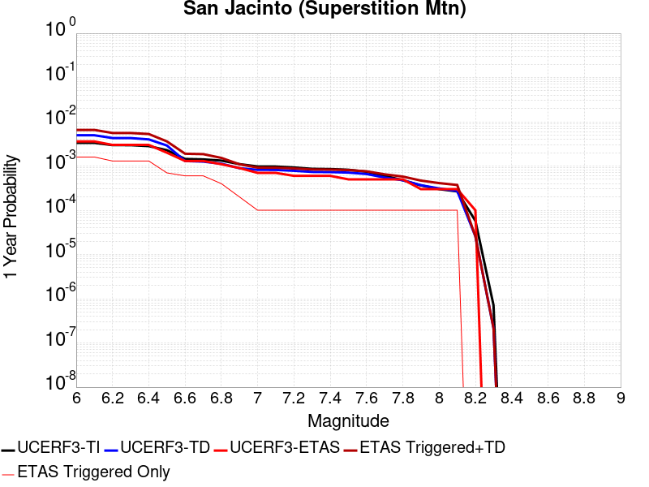 |  |

| Magnitude | 1 wk TI Prob | 1 wk TD Prob | 1 wk ETAS Prob | 1 wk ETAS/TD Gain | 1 wk ETAS Triggered+TD | 1 wk ETAS Triggered Only | 1 mo TI Prob | 1 mo TD Prob | 1 mo ETAS Prob | 1 mo ETAS/TD Gain | 1 mo ETAS Triggered+TD | 1 mo ETAS Triggered Only | 1 yr TI Prob | 1 yr TD Prob | 1 yr ETAS Prob | 1 yr ETAS/TD Gain | 1 yr ETAS Triggered+TD | 1 yr ETAS Triggered Only | 10 yr TI Prob | 10 yr TD Prob | 10 yr ETAS Prob | 10 yr ETAS/TD Gain | 10 yr ETAS Triggered+TD | 10 yr ETAS Triggered Only |
|-----|-----|-----|-----|-----|-----|-----|-----|-----|-----|-----|-----|-----|-----|-----|-----|-----|-----|-----|-----|-----|-----|-----|-----|-----|
| 6.0 | 6.4193904E-5 | 9.52097E-5 | 1.0E-4 | 1.0503131 | 1.9520018E-4 | 1.0E-4 | 2.7508775E-4 | 4.079841E-4 | 1.0E-4 | 0.24510759 | 5.079433E-4 | 1.0E-4 | 0.0033440501 | 0.004957317 | 2.0E-4 | 0.040344406 | 0.0051563256 | 2.0E-4 | 0.03294174 | 0.04847365 | 9.0E-4 | 0.01856679 | 0.049330022 | 9.0E-4 |
| 6.1 | 6.4193904E-5 | 9.52097E-5 | 1.0E-4 | 1.0503131 | 1.9520018E-4 | 1.0E-4 | 2.7508775E-4 | 4.079841E-4 | 1.0E-4 | 0.24510759 | 5.079433E-4 | 1.0E-4 | 0.0033440501 | 0.004957317 | 2.0E-4 | 0.040344406 | 0.0051563256 | 2.0E-4 | 0.03294174 | 0.04847365 | 9.0E-4 | 0.01856679 | 0.049330022 | 9.0E-4 |
| 6.2 | 5.7023593E-5 | 8.239395E-5 | 1.0E-4 | 1.2136813 | 1.8238572E-4 | 1.0E-4 | 2.4436394E-4 | 3.5307813E-4 | 1.0E-4 | 0.28322342 | 4.5304283E-4 | 1.0E-4 | 0.002971072 | 0.0042918893 | 2.0E-4 | 0.046599522 | 0.004491031 | 2.0E-4 | 0.029316625 | 0.042131327 | 7.0E-4 | 0.016614715 | 0.042801835 | 7.0E-4 |
| 6.3 | 5.6940098E-5 | 8.2239654E-5 | 1.0E-4 | 1.2159584 | 1.8223144E-4 | 1.0E-4 | 2.4400617E-4 | 3.5241706E-4 | 1.0E-4 | 0.2837547 | 4.5238182E-4 | 1.0E-4 | 0.002966728 | 0.0042838724 | 2.0E-4 | 0.04668673 | 0.0044830157 | 2.0E-4 | 0.029274331 | 0.042054836 | 7.0E-4 | 0.016644934 | 0.042725395 | 7.0E-4 |
| 6.4 | 5.4171585E-5 | 7.6739954E-5 | 1.0E-4 | 1.3031021 | 1.7673228E-4 | 1.0E-4 | 2.3214328E-4 | 3.2885332E-4 | 1.0E-4 | 0.30408695 | 4.2882044E-4 | 1.0E-4 | 0.0028226813 | 0.003998079 | 2.0E-4 | 0.050024025 | 0.004197279 | 2.0E-4 | 0.02787096 | 0.039345514 | 5.0E-4 | 0.012707928 | 0.03982584 | 5.0E-4 |
| 6.5 | 4.375144E-5 | 5.5698263E-5 | 1.0E-4 | 1.7953881 | 1.5569269E-4 | 1.0E-4 | 1.874927E-4 | 2.3869159E-4 | 1.0E-4 | 0.41895065 | 3.386677E-4 | 1.0E-4 | 0.0022803338 | 0.0029033655 | 1.0E-4 | 0.034442786 | 0.0030030753 | 1.0E-4 | 0.022570757 | 0.02887236 | 4.0E-4 | 0.013854081 | 0.02926081 | 4.0E-4 |
| 6.6 | 2.772192E-5 | 2.4859432E-5 | 1.0E-4 | 4.0226183 | 1.2485695E-4 | 1.0E-4 | 1.1880282E-4 | 1.0653618E-4 | 1.0E-4 | 0.9386483 | 2.0652552E-4 | 1.0E-4 | 0.0014454646 | 0.0012963249 | 1.0E-4 | 0.07714116 | 0.0013961953 | 1.0E-4 | 0.014360986 | 0.013214085 | 2.0E-4 | 0.015135366 | 0.013411442 | 2.0E-4 |
| 6.7 | 2.7124124E-5 | 2.4078752E-5 | 1.0E-4 | 4.153039 | 1.2407634E-4 | 1.0E-4 | 1.1624106E-4 | 1.0319068E-4 | 1.0E-4 | 0.9690798 | 2.0318036E-4 | 1.0E-4 | 0.0014143161 | 0.001255641 | 1.0E-4 | 0.079640605 | 0.0013555153 | 1.0E-4 | 0.014053487 | 0.012811731 | 2.0E-4 | 0.015610694 | 0.013009168 | 2.0E-4 |
| 6.8 | 2.5475807E-5 | 2.157592E-5 | 1.0E-4 | 4.6347966 | 1.21573765E-4 | 1.0E-4 | 1.0917746E-4 | 9.2465016E-5 | 1.0E-4 | 1.0814902 | 1.9245577E-4 | 1.0E-4 | 0.001328425 | 0.0011251917 | 1.0E-4 | 0.088873744 | 0.0012250792 | 1.0E-4 | 0.0132051185 | 0.011516079 | 2.0E-4 | 0.017367022 | 0.011713776 | 2.0E-4 |
| 6.9 | 2.1162023E-5 | 1.7120747E-5 | 1.0E-4 | 5.840867 | 1.1711903E-4 | 1.0E-4 | 9.069123E-5 | 7.337258E-5 | 1.0E-4 | 1.3629069 | 1.7336525E-4 | 1.0E-4 | 0.0011036064 | 8.929487E-4 | 1.0E-4 | 0.111988515 | 9.928594E-4 | 1.0E-4 | 0.010981417 | 0.00918185 | 1.0E-4 | 0.010891052 | 0.009280931 | 1.0E-4 |
| 7.0 | 1.8754288E-5 | 1.5695929E-5 | 1.0E-4 | 6.3710785 | 1.1569436E-4 | 1.0E-4 | 8.037304E-5 | 6.726655E-5 | 1.0E-4 | 1.486623 | 1.6725982E-4 | 1.0E-4 | 9.781026E-4 | 8.1866485E-4 | 1.0E-4 | 0.1221501 | 9.18583E-4 | 1.0E-4 | 0.009738087 | 0.008425698 | 1.0E-4 | 0.011868454 | 0.008524855 | 1.0E-4 |
| 7.1 | 1.8678527E-5 | 1.5622212E-5 | 1.0E-4 | 6.401142 | 1.1562065E-4 | 1.0E-4 | 8.0048376E-5 | 6.695063E-5 | 1.0E-4 | 1.4936378 | 1.6694394E-4 | 1.0E-4 | 9.7415317E-4 | 8.148215E-4 | 1.0E-4 | 0.12272626 | 9.1474E-4 | 1.0E-4 | 0.009698939 | 0.0083872555 | 1.0E-4 | 0.011922852 | 0.008486416 | 1.0E-4 |
| 7.2 | 1.7804578E-5 | 1.492615E-5 | 1.0E-4 | 6.6996517 | 1.1492466E-4 | 1.0E-4 | 7.6303106E-5 | 6.396765E-5 | 1.0E-4 | 1.5632901 | 1.6396126E-4 | 1.0E-4 | 9.285943E-4 | 7.785301E-4 | 1.0E-4 | 0.12844719 | 8.784522E-4 | 1.0E-4 | 0.009247236 | 0.00802332 | 1.0E-4 | 0.012463668 | 0.008122518 | 1.0E-4 |
| 7.3 | 1.6583685E-5 | 1.4084272E-5 | 1.0E-4 | 7.1001186 | 1.1408286E-4 | 1.0E-4 | 7.1070994E-5 | 6.035978E-5 | 1.0E-4 | 1.6567323 | 1.6035374E-4 | 1.0E-4 | 8.649459E-4 | 7.3463446E-4 | 1.0E-4 | 0.13612212 | 8.34561E-4 | 1.0E-4 | 0.00861587 | 0.007583249 | 1.0E-4 | 0.01318696 | 0.0076824906 | 1.0E-4 |
| 7.4 | 1.6387552E-5 | 1.3950205E-5 | 1.0E-4 | 7.168353 | 1.1394881E-4 | 1.0E-4 | 7.023047E-5 | 5.9785234E-5 | 1.0E-4 | 1.6726538 | 1.5977926E-4 | 1.0E-4 | 8.5472054E-4 | 7.276441E-4 | 1.0E-4 | 0.13742983 | 8.275713E-4 | 1.0E-4 | 0.008514405 | 0.0075131822 | 1.0E-4 | 0.01330994 | 0.007612431 | 1.0E-4 |
| 7.5 | 1.5790754E-5 | 1.3595658E-5 | 1.0E-4 | 7.3552895 | 1.135943E-4 | 1.0E-4 | 6.767291E-5 | 5.8265814E-5 | 1.0E-4 | 1.7162722 | 1.5826E-4 | 1.0E-4 | 8.236062E-4 | 7.091573E-4 | 1.0E-4 | 0.14101243 | 8.0908637E-4 | 1.0E-4 | 0.008205604 | 0.0073262155 | 1.0E-4 | 0.013649613 | 0.007425483 | 1.0E-4 |
| 7.6 | 1.4248672E-5 | 1.262672E-5 | 1.0E-4 | 7.919713 | 1.1262546E-4 | 1.0E-4 | 6.106431E-5 | 5.41134E-5 | 1.0E-4 | 1.8479711 | 1.5410798E-4 | 1.0E-4 | 7.432043E-4 | 6.5863313E-4 | 1.0E-4 | 0.15182959 | 7.585673E-4 | 1.0E-4 | 0.007407237 | 0.0068149813 | 1.0E-4 | 0.014673555 | 0.0069142994 | 1.0E-4 |
| 7.7 | 1.15449975E-5 | 1.0499409E-5 | 1.0E-4 | 9.524346 | 1.1049836E-4 | 1.0E-4 | 4.947762E-5 | 4.4996694E-5 | 1.0E-4 | 2.2223856 | 1.449922E-4 | 1.0E-4 | 6.022235E-4 | 5.4769777E-4 | 1.0E-4 | 0.18258245 | 6.47643E-4 | 1.0E-4 | 0.006005941 | 0.00569736 | 1.0E-4 | 0.017551988 | 0.00579679 | 1.0E-4 |
| 7.8 | 9.1391985E-6 | 9.129117E-6 | 1.0E-4 | 10.953962 | 1.091282E-4 | 1.0E-4 | 3.9167408E-5 | 3.91242E-5 | 1.0E-4 | 2.5559628 | 1.3912028E-4 | 1.0E-4 | 4.767588E-4 | 4.7623357E-4 | 1.0E-4 | 0.209981 | 5.7618594E-4 | 1.0E-4 | 0.0047573727 | 0.0049739103 | 1.0E-4 | 0.020104906 | 0.0050734133 | 1.0E-4 |
| 7.9 | 6.973017E-6 | 7.0392243E-6 | 1.0E-4 | 14.206111 | 1.0703852E-4 | 1.0E-4 | 2.9884017E-5 | 3.016776E-5 | 1.0E-4 | 3.3147972 | 1.3016474E-4 | 1.0E-4 | 3.6377716E-4 | 3.6723103E-4 | 1.0E-4 | 0.27230814 | 4.671943E-4 | 1.0E-4 | 0.0036318225 | 0.0038710602 | 1.0E-4 | 0.025832716 | 0.003970673 | 1.0E-4 |
| 8.0 | 5.7638235E-6 | 5.9455597E-6 | 1.0E-4 | 16.819275 | 1.05944964E-4 | 1.0E-4 | 2.4701867E-5 | 2.5480724E-5 | 1.0E-4 | 3.9245355 | 1.2547818E-4 | 1.0E-4 | 3.0070372E-4 | 3.1018408E-4 | 1.0E-4 | 0.3223892 | 4.1015306E-4 | 1.0E-4 | 0.0030029714 | 0.0032874679 | 1.0E-4 | 0.030418549 | 0.0033871392 | 1.0E-4 |
| 8.1 | 5.1124434E-6 | 5.2085365E-6 | 1.0E-4 | 19.19925 | 1.0520802E-4 | 1.0E-4 | 2.1910288E-5 | 2.2322112E-5 | 1.0E-4 | 4.4798627 | 1.2231988E-4 | 1.0E-4 | 2.6672508E-4 | 2.7173824E-4 | 1.0E-4 | 0.3680012 | 3.717111E-4 | 1.0E-4 | 0.0026640517 | 0.0028885864 | 1.0E-4 | 0.03461901 | 0.0029882975 | 1.0E-4 |
| 8.2 | 1.1075938E-6 | 4.9050954E-7 | 0.0 | 0.0 | 4.9050954E-7 | 0.0 | 4.7468216E-6 | 2.102182E-6 | 0.0 | 0.0 | 2.102182E-6 | 0.0 | 5.779102E-5 | 2.5593785E-5 | 0.0 | 0.0 | 2.5593785E-5 | 0.0 | 5.777599E-4 | 2.8936443E-4 | 0.0 | 0.0 | 2.8936443E-4 | 0.0 |
| 8.3 | 1.3584393E-8 | 4.067688E-9 | 0.0 | 0.0 | 4.067688E-9 | 0.0 | 5.8218827E-8 | 1.7432948E-8 | 0.0 | 0.0 | 1.7432948E-8 | 0.0 | 7.0881396E-7 | 2.1224615E-7 | 0.0 | 0.0 | 2.1224615E-7 | 0.0 | 7.0881174E-6 | 2.3868752E-6 | 0.0 | 0.0 | 2.3868752E-6 | 0.0 |

## Elsinore (Glen Ivy) rev
*[(top)](#table-of-contents)*

| 1 Week | 1 Month | 1 Year | 10 Year |
|-----|-----|-----|-----|
|  |  |  |  |

| Magnitude | 1 wk TI Prob | 1 wk TD Prob | 1 wk ETAS Prob | 1 wk ETAS/TD Gain | 1 wk ETAS Triggered+TD | 1 wk ETAS Triggered Only | 1 mo TI Prob | 1 mo TD Prob | 1 mo ETAS Prob | 1 mo ETAS/TD Gain | 1 mo ETAS Triggered+TD | 1 mo ETAS Triggered Only | 1 yr TI Prob | 1 yr TD Prob | 1 yr ETAS Prob | 1 yr ETAS/TD Gain | 1 yr ETAS Triggered+TD | 1 yr ETAS Triggered Only | 10 yr TI Prob | 10 yr TD Prob | 10 yr ETAS Prob | 10 yr ETAS/TD Gain | 10 yr ETAS Triggered+TD | 10 yr ETAS Triggered Only |
|-----|-----|-----|-----|-----|-----|-----|-----|-----|-----|-----|-----|-----|-----|-----|-----|-----|-----|-----|-----|-----|-----|-----|-----|-----|
| 6.0 | 1.6204086E-4 | 2.9251605E-4 | 2.0E-4 | 0.68372315 | 4.9245753E-4 | 2.0E-4 | 6.94276E-4 | 0.0012531171 | 3.0E-4 | 0.23940301 | 0.0015527412 | 3.0E-4 | 0.008420097 | 0.015171497 | 4.0E-4 | 0.02636523 | 0.015565429 | 4.0E-4 | 0.081081145 | 0.13933165 | 8.0E-4 | 0.005741696 | 0.14002019 | 8.0E-4 |
| 6.1 | 1.6204086E-4 | 2.9251605E-4 | 2.0E-4 | 0.68372315 | 4.9245753E-4 | 2.0E-4 | 6.94276E-4 | 0.0012531171 | 3.0E-4 | 0.23940301 | 0.0015527412 | 3.0E-4 | 0.008420097 | 0.015171497 | 4.0E-4 | 0.02636523 | 0.015565429 | 4.0E-4 | 0.081081145 | 0.13933165 | 8.0E-4 | 0.005741696 | 0.14002019 | 8.0E-4 |
| 6.2 | 1.6204086E-4 | 2.9251605E-4 | 2.0E-4 | 0.68372315 | 4.9245753E-4 | 2.0E-4 | 6.94276E-4 | 0.0012531171 | 3.0E-4 | 0.23940301 | 0.0015527412 | 3.0E-4 | 0.008420097 | 0.015171497 | 4.0E-4 | 0.02636523 | 0.015565429 | 4.0E-4 | 0.081081145 | 0.13933165 | 8.0E-4 | 0.005741696 | 0.14002019 | 8.0E-4 |
| 6.3 | 1.0111737E-4 | 1.7629775E-4 | 1.0E-4 | 0.56722224 | 2.7628013E-4 | 1.0E-4 | 4.332882E-4 | 7.554589E-4 | 1.0E-4 | 0.13236988 | 8.5538335E-4 | 1.0E-4 | 0.005262531 | 0.009179472 | 2.0E-4 | 0.021787746 | 0.009377636 | 2.0E-4 | 0.0513964 | 0.08675405 | 4.0E-4 | 0.004610736 | 0.08711934 | 4.0E-4 |
| 6.4 | 1.0111737E-4 | 1.7629775E-4 | 1.0E-4 | 0.56722224 | 2.7628013E-4 | 1.0E-4 | 4.332882E-4 | 7.554589E-4 | 1.0E-4 | 0.13236988 | 8.5538335E-4 | 1.0E-4 | 0.005262531 | 0.009179472 | 2.0E-4 | 0.021787746 | 0.009377636 | 2.0E-4 | 0.0513964 | 0.08675405 | 4.0E-4 | 0.004610736 | 0.08711934 | 4.0E-4 |
| 6.5 | 3.6624708E-5 | 4.609726E-5 | 1.0E-4 | 2.1693263 | 1.4609264E-4 | 1.0E-4 | 1.569536E-4 | 1.9754675E-4 | 1.0E-4 | 0.5062093 | 2.97527E-4 | 1.0E-4 | 0.001909235 | 0.0024028358 | 1.0E-4 | 0.041617494 | 0.0025025953 | 1.0E-4 | 0.01892915 | 0.023553308 | 2.0E-4 | 0.008491376 | 0.023748597 | 2.0E-4 |
| 6.6 | 2.5051324E-5 | 2.597092E-5 | 0.0 | 0.0 | 2.597092E-5 | 0.0 | 1.073584E-4 | 1.1129944E-4 | 0.0 | 0.0 | 1.1129944E-4 | 0.0 | 0.0013063047 | 0.0013542724 | 0.0 | 0.0 | 0.0013542724 | 0.0 | 0.012986525 | 0.013476744 | 1.0E-4 | 0.0074201897 | 0.013575397 | 1.0E-4 |
| 6.7 | 2.2189772E-5 | 2.1921272E-5 | 0.0 | 0.0 | 2.1921272E-5 | 0.0 | 9.509556E-5 | 9.394513E-5 | 0.0 | 0.0 | 9.394513E-5 | 0.0 | 0.0011571734 | 0.0011432177 | 0.0 | 0.0 | 0.0011432177 | 0.0 | 0.011511663 | 0.01139007 | 1.0E-4 | 0.008779577 | 0.011488931 | 1.0E-4 |
| 6.8 | 1.6654378E-5 | 1.4349544E-5 | 0.0 | 0.0 | 1.4349544E-5 | 0.0 | 7.137396E-5 | 6.149663E-5 | 0.0 | 0.0 | 6.149663E-5 | 0.0 | 8.686314E-4 | 7.4846926E-4 | 0.0 | 0.0 | 7.4846926E-4 | 0.0 | 0.008652439 | 0.007464598 | 1.0E-4 | 0.0133965695 | 0.0075638513 | 1.0E-4 |
| 6.9 | 1.5042909E-5 | 1.2265607E-5 | 0.0 | 0.0 | 1.2265607E-5 | 0.0 | 6.446802E-5 | 5.2565847E-5 | 0.0 | 0.0 | 5.2565847E-5 | 0.0 | 7.8461546E-4 | 6.398044E-4 | 0.0 | 0.0 | 6.398044E-4 | 0.0 | 0.007818509 | 0.0063835797 | 0.0 | 0.0 | 0.0063835797 | 0.0 |
| 7.0 | 1.4361385E-5 | 1.1392162E-5 | 0.0 | 0.0 | 1.1392162E-5 | 0.0 | 6.154734E-5 | 4.8822654E-5 | 0.0 | 0.0 | 4.8822654E-5 | 0.0 | 7.490812E-4 | 5.9425656E-4 | 0.0 | 0.0 | 5.9425656E-4 | 0.0 | 0.007465612 | 0.005930479 | 0.0 | 0.0 | 0.005930479 | 0.0 |
| 7.1 | 1.3265571E-5 | 1.0195621E-5 | 0.0 | 0.0 | 1.0195621E-5 | 0.0 | 5.6851208E-5 | 4.3694803E-5 | 0.0 | 0.0 | 4.3694803E-5 | 0.0 | 6.919436E-4 | 5.3185684E-4 | 0.0 | 0.0 | 5.3185684E-4 | 0.0 | 0.006897931 | 0.005309098 | 0.0 | 0.0 | 0.005309098 | 0.0 |
| 7.2 | 1.1596403E-5 | 8.46623E-6 | 0.0 | 0.0 | 8.46623E-6 | 0.0 | 4.9697923E-5 | 3.6283345E-5 | 0.0 | 0.0 | 3.6283345E-5 | 0.0 | 6.049042E-4 | 4.4166186E-4 | 0.0 | 0.0 | 4.4166186E-4 | 0.0 | 0.006032603 | 0.0044091586 | 0.0 | 0.0 | 0.0044091586 | 0.0 |
| 7.3 | 1.0150827E-5 | 7.2083226E-6 | 0.0 | 0.0 | 7.2083226E-6 | 0.0 | 4.3502816E-5 | 3.0892454E-5 | 0.0 | 0.0 | 3.0892454E-5 | 0.0 | 5.2951806E-4 | 3.7605214E-4 | 0.0 | 0.0 | 3.7605214E-4 | 0.0 | 0.005282581 | 0.0037545003 | 0.0 | 0.0 | 0.0037545003 | 0.0 |
| 7.4 | 9.080705E-6 | 6.32672E-6 | 0.0 | 0.0 | 6.32672E-6 | 0.0 | 3.8916725E-5 | 2.7114238E-5 | 0.0 | 0.0 | 2.7114238E-5 | 0.0 | 4.7370812E-4 | 3.300672E-4 | 0.0 | 0.0 | 3.300672E-4 | 0.0 | 0.004726996 | 0.0032959157 | 0.0 | 0.0 | 0.0032959157 | 0.0 |
| 7.5 | 7.671649E-6 | 5.204376E-6 | 0.0 | 0.0 | 5.204376E-6 | 0.0 | 3.287808E-5 | 2.2304284E-5 | 0.0 | 0.0 | 2.2304284E-5 | 0.0 | 4.0021708E-4 | 2.7152206E-4 | 0.0 | 0.0 | 2.7152206E-4 | 0.0 | 0.0039949706 | 0.0027120274 | 0.0 | 0.0 | 0.0027120274 | 0.0 |
| 7.6 | 6.990086E-6 | 4.6680852E-6 | 0.0 | 0.0 | 4.6680852E-6 | 0.0 | 2.9957167E-5 | 2.0005933E-5 | 0.0 | 0.0 | 2.0005933E-5 | 0.0 | 3.6466747E-4 | 2.4354616E-4 | 0.0 | 0.0 | 2.4354616E-4 | 0.0 | 0.0036406964 | 0.002432908 | 0.0 | 0.0 | 0.002432908 | 0.0 |
| 7.7 | 4.163505E-6 | 2.3176701E-6 | 0.0 | 0.0 | 2.3176701E-6 | 0.0 | 1.7843471E-5 | 9.932838E-6 | 0.0 | 0.0 | 9.932838E-6 | 0.0 | 2.172226E-4 | 1.20926336E-4 | 0.0 | 0.0 | 1.20926336E-4 | 0.0 | 0.0021701038 | 0.0012086778 | 0.0 | 0.0 | 0.0012086778 | 0.0 |
| 7.8 | 2.2692414E-7 | 9.313546E-8 | 0.0 | 0.0 | 9.313546E-8 | 0.0 | 9.725317E-7 | 3.9915196E-7 | 0.0 | 0.0 | 3.9915196E-7 | 0.0 | 1.1840509E-5 | 4.8596676E-6 | 0.0 | 0.0 | 4.8596676E-6 | 0.0 | 1.1839878E-4 | 4.859593E-5 | 0.0 | 0.0 | 4.859593E-5 | 0.0 |
| 7.9 | 6.676829E-9 | 3.4267709E-9 | 0.0 | 0.0 | 3.4267709E-9 | 0.0 | 2.861498E-8 | 1.4686159E-8 | 0.0 | 0.0 | 1.4686159E-8 | 0.0 | 3.4838732E-7 | 1.7880397E-7 | 0.0 | 0.0 | 1.7880397E-7 | 0.0 | 3.4838679E-6 | 1.7880385E-6 | 0.0 | 0.0 | 1.7880385E-6 | 0.0 |

## Surprise Valley 2011 CFM
*[(top)](#table-of-contents)*

| 1 Week | 1 Month | 1 Year | 10 Year |
|-----|-----|-----|-----|
| 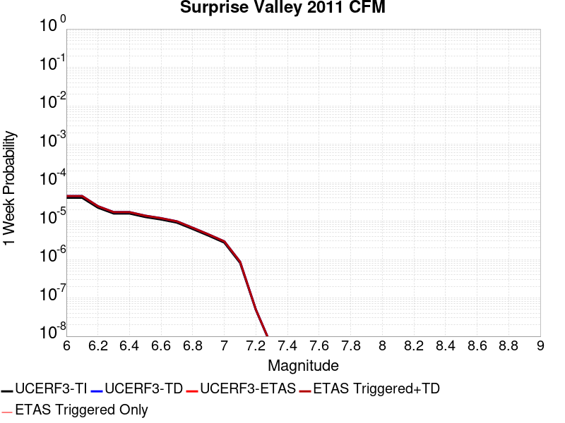 | 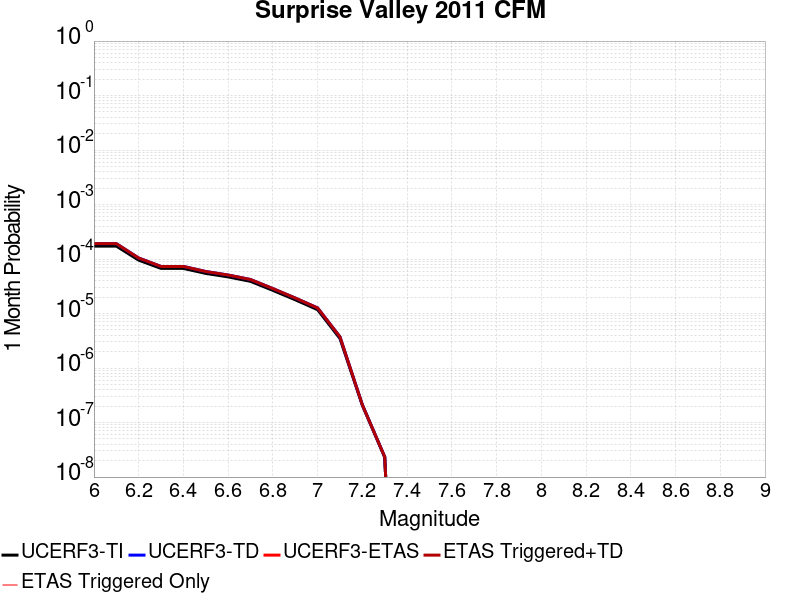 | 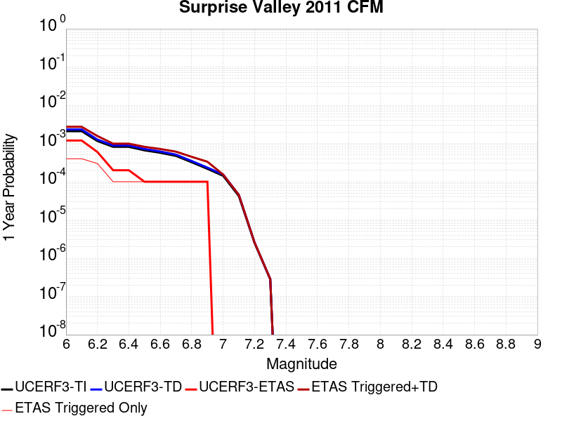 | 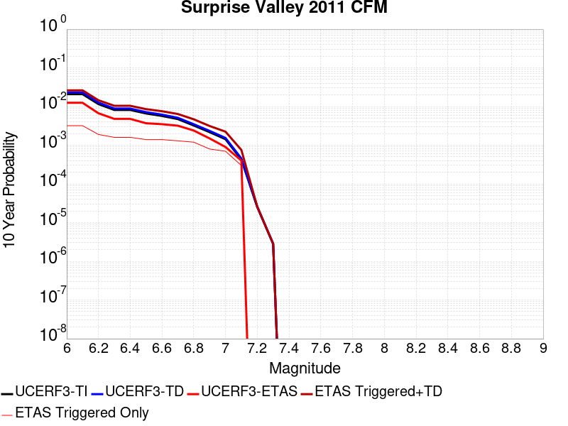 |

| Magnitude | 1 wk TI Prob | 1 wk TD Prob | 1 wk ETAS Prob | 1 wk ETAS/TD Gain | 1 wk ETAS Triggered+TD | 1 wk ETAS Triggered Only | 1 mo TI Prob | 1 mo TD Prob | 1 mo ETAS Prob | 1 mo ETAS/TD Gain | 1 mo ETAS Triggered+TD | 1 mo ETAS Triggered Only | 1 yr TI Prob | 1 yr TD Prob | 1 yr ETAS Prob | 1 yr ETAS/TD Gain | 1 yr ETAS Triggered+TD | 1 yr ETAS Triggered Only | 10 yr TI Prob | 10 yr TD Prob | 10 yr ETAS Prob | 10 yr ETAS/TD Gain | 10 yr ETAS Triggered+TD | 10 yr ETAS Triggered Only |
|-----|-----|-----|-----|-----|-----|-----|-----|-----|-----|-----|-----|-----|-----|-----|-----|-----|-----|-----|-----|-----|-----|-----|-----|-----|
| 6.0 | 4.0396248E-5 | 4.479939E-5 | 0.0 | 0.0 | 4.479939E-5 | 0.0 | 1.7311527E-4 | 1.9198445E-4 | 0.0 | 0.0 | 1.9198445E-4 | 0.0 | 0.002105641 | 0.0023351142 | 1.0E-4 | 0.04282446 | 0.0024348807 | 1.0E-4 | 0.020858008 | 0.023127439 | 5.0E-4 | 0.02161934 | 0.023615876 | 5.0E-4 |
| 6.1 | 4.0396248E-5 | 4.479939E-5 | 0.0 | 0.0 | 4.479939E-5 | 0.0 | 1.7311527E-4 | 1.9198445E-4 | 0.0 | 0.0 | 1.9198445E-4 | 0.0 | 0.002105641 | 0.0023351142 | 1.0E-4 | 0.04282446 | 0.0024348807 | 1.0E-4 | 0.020858008 | 0.023127439 | 5.0E-4 | 0.02161934 | 0.023615876 | 5.0E-4 |
| 6.2 | 2.2295266E-5 | 2.4377101E-5 | 0.0 | 0.0 | 2.4377101E-5 | 0.0 | 9.554764E-5 | 1.0446928E-4 | 0.0 | 0.0 | 1.0446928E-4 | 0.0 | 0.0011626717 | 0.0012712021 | 1.0E-4 | 0.078665696 | 0.0013710749 | 1.0E-4 | 0.011566074 | 0.012642533 | 3.0E-4 | 0.023729423 | 0.01293874 | 3.0E-4 |
| 6.3 | 1.572643E-5 | 1.7081213E-5 | 0.0 | 0.0 | 1.7081213E-5 | 0.0 | 6.7397246E-5 | 7.3203206E-5 | 0.0 | 0.0 | 7.3203206E-5 | 0.0 | 8.202525E-4 | 8.908951E-4 | 0.0 | 0.0 | 8.908951E-4 | 0.0 | 0.008172315 | 0.00887434 | 1.0E-4 | 0.011268443 | 0.008973453 | 1.0E-4 |
| 6.4 | 1.5714395E-5 | 1.7069036E-5 | 0.0 | 0.0 | 1.7069036E-5 | 0.0 | 6.734567E-5 | 7.315102E-5 | 0.0 | 0.0 | 7.315102E-5 | 0.0 | 8.1962504E-4 | 8.902603E-4 | 0.0 | 0.0 | 8.902603E-4 | 0.0 | 0.008166086 | 0.008868042 | 1.0E-4 | 0.011276445 | 0.008967156 | 1.0E-4 |
| 6.5 | 1.2733495E-5 | 1.3789486E-5 | 0.0 | 0.0 | 1.3789486E-5 | 0.0 | 5.457098E-5 | 5.9096496E-5 | 0.0 | 0.0 | 5.9096496E-5 | 0.0 | 6.641992E-4 | 7.19269E-4 | 0.0 | 0.0 | 7.19269E-4 | 0.0 | 0.0066221743 | 0.0071701026 | 1.0E-4 | 0.013946802 | 0.0072693857 | 1.0E-4 |
| 6.6 | 1.0983784E-5 | 1.1876331E-5 | 0.0 | 0.0 | 1.1876331E-5 | 0.0 | 4.7072506E-5 | 5.0897597E-5 | 0.0 | 0.0 | 5.0897597E-5 | 0.0 | 5.7295704E-4 | 6.195074E-4 | 0.0 | 0.0 | 6.195074E-4 | 0.0 | 0.0057148207 | 0.0061783525 | 1.0E-4 | 0.016185544 | 0.0062777344 | 1.0E-4 |
| 6.7 | 9.104806E-6 | 9.831182E-6 | 0.0 | 0.0 | 9.831182E-6 | 0.0 | 3.902001E-5 | 4.213298E-5 | 0.0 | 0.0 | 4.213298E-5 | 0.0 | 4.7496508E-4 | 5.128522E-4 | 0.0 | 0.0 | 5.128522E-4 | 0.0 | 0.004739512 | 0.005117083 | 1.0E-4 | 0.019542385 | 0.005216571 | 1.0E-4 |
| 6.8 | 6.2162403E-6 | 6.6986236E-6 | 0.0 | 0.0 | 6.6986236E-6 | 0.0 | 2.6640759E-5 | 2.8708082E-5 | 0.0 | 0.0 | 2.8708082E-5 | 0.0 | 3.2430296E-4 | 3.4946707E-4 | 0.0 | 0.0 | 3.4946707E-4 | 0.0 | 0.003238301 | 0.0034893982 | 1.0E-4 | 0.028658237 | 0.0035890492 | 1.0E-4 |
| 6.9 | 4.1792696E-6 | 4.499571E-6 | 0.0 | 0.0 | 4.499571E-6 | 0.0 | 1.7911032E-5 | 1.9283741E-5 | 0.0 | 0.0 | 1.9283741E-5 | 0.0 | 2.1804498E-4 | 2.347558E-4 | 0.0 | 0.0 | 2.347558E-4 | 0.0 | 0.0021783116 | 0.0023452311 | 0.0 | 0.0 | 0.0023452311 | 0.0 |
| 7.0 | 2.7478413E-6 | 2.9598184E-6 | 0.0 | 0.0 | 2.9598184E-6 | 0.0 | 1.177641E-5 | 1.2684882E-5 | 0.0 | 0.0 | 1.2684882E-5 | 0.0 | 1.4336836E-4 | 1.5442874E-4 | 0.0 | 0.0 | 1.5442874E-4 | 0.0 | 0.001432759 | 0.0015433364 | 0.0 | 0.0 | 0.0015433364 | 0.0 |
| 7.1 | 8.128648E-7 | 8.718175E-7 | 0.0 | 0.0 | 8.718175E-7 | 0.0 | 3.4837017E-6 | 3.7363588E-6 | 0.0 | 0.0 | 3.7363588E-6 | 0.0 | 4.2413245E-5 | 4.5489818E-5 | 0.0 | 0.0 | 4.5489818E-5 | 0.0 | 4.2405148E-4 | 4.5486377E-4 | 0.0 | 0.0 | 4.5486377E-4 | 0.0 |
| 7.2 | 4.8641045E-8 | 4.9393996E-8 | 0.0 | 0.0 | 4.9393996E-8 | 0.0 | 2.084616E-7 | 2.1168853E-7 | 0.0 | 0.0 | 2.1168853E-7 | 0.0 | 2.538017E-6 | 2.577305E-6 | 0.0 | 0.0 | 2.577305E-6 | 0.0 | 2.537988E-5 | 2.5772762E-5 | 0.0 | 0.0 | 2.5772762E-5 | 0.0 |
| 7.3 | 5.3911844E-9 | 5.474917E-9 | 0.0 | 0.0 | 5.474917E-9 | 0.0 | 2.3105075E-8 | 2.346393E-8 | 0.0 | 0.0 | 2.346393E-8 | 0.0 | 2.8130427E-7 | 2.856733E-7 | 0.0 | 0.0 | 2.856733E-7 | 0.0 | 2.8130391E-6 | 2.856731E-6 | 0.0 | 0.0 | 2.856731E-6 | 0.0 |

## Chino alt 1
*[(top)](#table-of-contents)*

| 1 Week | 1 Month | 1 Year | 10 Year |
|-----|-----|-----|-----|
|  |  |  |  |

| Magnitude | 1 wk TI Prob | 1 wk TD Prob | 1 wk ETAS Prob | 1 wk ETAS/TD Gain | 1 wk ETAS Triggered+TD | 1 wk ETAS Triggered Only | 1 mo TI Prob | 1 mo TD Prob | 1 mo ETAS Prob | 1 mo ETAS/TD Gain | 1 mo ETAS Triggered+TD | 1 mo ETAS Triggered Only | 1 yr TI Prob | 1 yr TD Prob | 1 yr ETAS Prob | 1 yr ETAS/TD Gain | 1 yr ETAS Triggered+TD | 1 yr ETAS Triggered Only | 10 yr TI Prob | 10 yr TD Prob | 10 yr ETAS Prob | 10 yr ETAS/TD Gain | 10 yr ETAS Triggered+TD | 10 yr ETAS Triggered Only |
|-----|-----|-----|-----|-----|-----|-----|-----|-----|-----|-----|-----|-----|-----|-----|-----|-----|-----|-----|-----|-----|-----|-----|-----|-----|
| 6.0 | 3.939946E-5 | 4.8761474E-5 | 1.0E-4 | 2.0507994 | 1.4875659E-4 | 1.0E-4 | 1.6884391E-4 | 2.0896389E-4 | 1.0E-4 | 0.4785516 | 3.0894298E-4 | 1.0E-4 | 0.0020537362 | 0.0025416764 | 3.0E-4 | 0.118032336 | 0.0028409138 | 3.0E-4 | 0.020348595 | 0.025185952 | 6.0E-4 | 0.023822803 | 0.025770841 | 6.0E-4 |
| 6.1 | 2.1505624E-5 | 2.6745702E-5 | 1.0E-4 | 3.7389185 | 1.2674303E-4 | 1.0E-4 | 9.2163704E-5 | 1.1461999E-4 | 1.0E-4 | 0.8724482 | 2.1460853E-4 | 1.0E-4 | 0.0011215154 | 0.0013947141 | 3.0E-4 | 0.21509784 | 0.0016942957 | 3.0E-4 | 0.011158722 | 0.013879712 | 6.0E-4 | 0.043228563 | 0.014471384 | 6.0E-4 |
| 6.2 | 2.1505624E-5 | 2.6745702E-5 | 1.0E-4 | 3.7389185 | 1.2674303E-4 | 1.0E-4 | 9.2163704E-5 | 1.1461999E-4 | 1.0E-4 | 0.8724482 | 2.1460853E-4 | 1.0E-4 | 0.0011215154 | 0.0013947141 | 3.0E-4 | 0.21509784 | 0.0016942957 | 3.0E-4 | 0.011158722 | 0.013879712 | 6.0E-4 | 0.043228563 | 0.014471384 | 6.0E-4 |
| 6.3 | 1.4290785E-5 | 1.805055E-5 | 1.0E-4 | 5.539997 | 1.18048745E-4 | 1.0E-4 | 6.1244784E-5 | 7.7357465E-5 | 1.0E-4 | 1.2927 | 1.7734974E-4 | 1.0E-4 | 7.454001E-4 | 9.4146485E-4 | 1.0E-4 | 0.10621745 | 0.0010413707 | 1.0E-4 | 0.007429048 | 0.009388474 | 4.0E-4 | 0.042605434 | 0.009784719 | 4.0E-4 |
| 6.4 | 1.4290785E-5 | 1.805055E-5 | 1.0E-4 | 5.539997 | 1.18048745E-4 | 1.0E-4 | 6.1244784E-5 | 7.7357465E-5 | 1.0E-4 | 1.2927 | 1.7734974E-4 | 1.0E-4 | 7.454001E-4 | 9.4146485E-4 | 1.0E-4 | 0.10621745 | 0.0010413707 | 1.0E-4 | 0.007429048 | 0.009388474 | 4.0E-4 | 0.042605434 | 0.009784719 | 4.0E-4 |
| 6.5 | 1.3017944E-5 | 1.6540487E-5 | 1.0E-4 | 6.045771 | 1.1653883E-4 | 1.0E-4 | 5.5789995E-5 | 7.088612E-5 | 1.0E-4 | 1.4107134 | 1.7087904E-4 | 1.0E-4 | 6.790315E-4 | 8.6274E-4 | 1.0E-4 | 0.11590978 | 9.626537E-4 | 1.0E-4 | 0.0067696036 | 0.00860746 | 2.0E-4 | 0.023235658 | 0.008805739 | 2.0E-4 |
| 6.6 | 9.470016E-6 | 1.1944894E-5 | 0.0 | 0.0 | 1.1944894E-5 | 0.0 | 4.058515E-5 | 5.1191586E-5 | 0.0 | 0.0 | 5.1191586E-5 | 0.0 | 4.940122E-4 | 6.2311284E-4 | 0.0 | 0.0 | 6.2311284E-4 | 0.0 | 0.004929154 | 0.0062260013 | 0.0 | 0.0 | 0.0062260013 | 0.0 |
| 6.7 | 8.314155E-6 | 1.0328306E-5 | 0.0 | 0.0 | 1.0328306E-5 | 0.0 | 3.5631605E-5 | 4.4263597E-5 | 0.0 | 0.0 | 4.4263597E-5 | 0.0 | 4.3372845E-4 | 5.388079E-4 | 0.0 | 0.0 | 5.388079E-4 | 0.0 | 0.004328829 | 0.0053875856 | 0.0 | 0.0 | 0.0053875856 | 0.0 |
| 6.8 | 3.4856364E-6 | 3.781823E-6 | 0.0 | 0.0 | 3.781823E-6 | 0.0 | 1.4938357E-5 | 1.6207723E-5 | 0.0 | 0.0 | 1.6207723E-5 | 0.0 | 1.8185932E-4 | 1.9731317E-4 | 0.0 | 0.0 | 1.9731317E-4 | 0.0 | 0.0018171056 | 0.0019730001 | 0.0 | 0.0 | 0.0019730001 | 0.0 |
| 6.9 | 2.2645952E-6 | 2.1416872E-6 | 0.0 | 0.0 | 2.1416872E-6 | 0.0 | 9.705372E-6 | 9.178629E-6 | 0.0 | 0.0 | 9.178629E-6 | 0.0 | 1.18156495E-4 | 1.1174428E-4 | 0.0 | 0.0 | 1.1174428E-4 | 0.0 | 0.0011809369 | 0.0011174479 | 0.0 | 0.0 | 0.0011174479 | 0.0 |
| 7.0 | 1.7864003E-6 | 1.5371073E-6 | 0.0 | 0.0 | 1.5371073E-6 | 0.0 | 7.655979E-6 | 6.5875865E-6 | 0.0 | 0.0 | 6.5875865E-6 | 0.0 | 9.3207556E-5 | 8.0200974E-5 | 0.0 | 0.0 | 8.0200974E-5 | 0.0 | 9.316847E-4 | 8.0216007E-4 | 0.0 | 0.0 | 8.0216007E-4 | 0.0 |
| 7.1 | 1.7315456E-6 | 1.4677553E-6 | 0.0 | 0.0 | 1.4677553E-6 | 0.0 | 7.420889E-6 | 6.290365E-6 | 0.0 | 0.0 | 6.290365E-6 | 0.0 | 9.034557E-5 | 7.658256E-5 | 0.0 | 0.0 | 7.658256E-5 | 0.0 | 9.0308854E-4 | 7.659947E-4 | 0.0 | 0.0 | 7.659947E-4 | 0.0 |
| 7.2 | 1.6008337E-6 | 1.352271E-6 | 0.0 | 0.0 | 1.352271E-6 | 0.0 | 6.860698E-6 | 5.795435E-6 | 0.0 | 0.0 | 5.795435E-6 | 0.0 | 8.352579E-5 | 7.055719E-5 | 0.0 | 0.0 | 7.055719E-5 | 0.0 | 8.34944E-4 | 7.057674E-4 | 0.0 | 0.0 | 7.057674E-4 | 0.0 |
| 7.3 | 1.3320939E-6 | 1.1177666E-6 | 0.0 | 0.0 | 1.1177666E-6 | 0.0 | 5.7089615E-6 | 4.79042E-6 | 0.0 | 0.0 | 4.79042E-6 | 0.0 | 6.9504385E-5 | 5.832185E-5 | 0.0 | 0.0 | 5.832185E-5 | 0.0 | 6.9482654E-4 | 5.831893E-4 | 0.0 | 0.0 | 5.831893E-4 | 0.0 |
| 7.4 | 1.114294E-6 | 9.204411E-7 | 0.0 | 0.0 | 9.204411E-7 | 0.0 | 4.775537E-6 | 3.944742E-6 | 0.0 | 0.0 | 3.944742E-6 | 0.0 | 5.8140613E-5 | 4.802621E-5 | 0.0 | 0.0 | 4.802621E-5 | 0.0 | 5.81254E-4 | 4.8017106E-4 | 0.0 | 0.0 | 4.8017106E-4 | 0.0 |
| 7.5 | 9.354081E-7 | 7.600677E-7 | 0.0 | 0.0 | 7.600677E-7 | 0.0 | 4.0088858E-6 | 3.257429E-6 | 0.0 | 0.0 | 3.257429E-6 | 0.0 | 4.8807087E-5 | 3.965851E-5 | 0.0 | 0.0 | 3.965851E-5 | 0.0 | 4.879637E-4 | 3.965177E-4 | 0.0 | 0.0 | 3.965177E-4 | 0.0 |
| 7.6 | 8.521771E-7 | 6.8604237E-7 | 0.0 | 0.0 | 6.8604237E-7 | 0.0 | 3.6521824E-6 | 2.9401785E-6 | 0.0 | 0.0 | 2.9401785E-6 | 0.0 | 4.4464414E-5 | 3.5796118E-5 | 0.0 | 0.0 | 3.5796118E-5 | 0.0 | 4.4455516E-4 | 3.5790668E-4 | 0.0 | 0.0 | 3.5790668E-4 | 0.0 |
| 7.7 | 2.1803626E-7 | 1.4132844E-7 | 0.0 | 0.0 | 1.4132844E-7 | 0.0 | 9.344408E-7 | 6.0569323E-7 | 0.0 | 0.0 | 6.0569323E-7 | 0.0 | 1.1376757E-5 | 7.3743E-6 | 0.0 | 0.0 | 7.3743E-6 | 0.0 | 1.13761744E-4 | 7.37415E-5 | 0.0 | 0.0 | 7.37415E-5 | 0.0 |

## Great Valley 09 (Laguna Seca)
*[(top)](#table-of-contents)*

| 1 Week | 1 Month | 1 Year | 10 Year |
|-----|-----|-----|-----|
|  |  |  |  |

| Magnitude | 1 wk TI Prob | 1 wk TD Prob | 1 wk ETAS Prob | 1 wk ETAS/TD Gain | 1 wk ETAS Triggered+TD | 1 wk ETAS Triggered Only | 1 mo TI Prob | 1 mo TD Prob | 1 mo ETAS Prob | 1 mo ETAS/TD Gain | 1 mo ETAS Triggered+TD | 1 mo ETAS Triggered Only | 1 yr TI Prob | 1 yr TD Prob | 1 yr ETAS Prob | 1 yr ETAS/TD Gain | 1 yr ETAS Triggered+TD | 1 yr ETAS Triggered Only | 10 yr TI Prob | 10 yr TD Prob | 10 yr ETAS Prob | 10 yr ETAS/TD Gain | 10 yr ETAS Triggered+TD | 10 yr ETAS Triggered Only |
|-----|-----|-----|-----|-----|-----|-----|-----|-----|-----|-----|-----|-----|-----|-----|-----|-----|-----|-----|-----|-----|-----|-----|-----|-----|
| 6.0 | 5.4353277E-5 | 7.027208E-5 | 0.0 | 0.0 | 7.027208E-5 | 0.0 | 2.3292181E-4 | 3.0113137E-4 | 1.0E-4 | 0.332081 | 4.0110125E-4 | 1.0E-4 | 0.0028321352 | 0.0036601184 | 2.0E-4 | 0.054643042 | 0.0038593863 | 2.0E-4 | 0.02796312 | 0.036002573 | 6.0E-4 | 0.016665477 | 0.03658097 | 6.0E-4 |
| 6.1 | 4.5578287E-5 | 5.8037644E-5 | 0.0 | 0.0 | 5.8037644E-5 | 0.0 | 1.953209E-4 | 2.4870917E-4 | 1.0E-4 | 0.40207607 | 3.486843E-4 | 1.0E-4 | 0.0023754383 | 0.0030238347 | 1.0E-4 | 0.033070594 | 0.0031235323 | 1.0E-4 | 0.023502063 | 0.02982855 | 4.0E-4 | 0.013409971 | 0.03021662 | 4.0E-4 |
| 6.2 | 2.8536782E-5 | 3.4637495E-5 | 0.0 | 0.0 | 3.4637495E-5 | 0.0 | 1.2229476E-4 | 1.4843796E-4 | 1.0E-4 | 0.6736821 | 2.4842314E-4 | 1.0E-4 | 0.0014879217 | 0.0018057144 | 1.0E-4 | 0.05537974 | 0.0019055338 | 1.0E-4 | 0.014779986 | 0.017908249 | 3.0E-4 | 0.016752057 | 0.018202877 | 3.0E-4 |
| 6.3 | 2.3698774E-5 | 2.8136548E-5 | 0.0 | 0.0 | 2.8136548E-5 | 0.0 | 1.01562226E-4 | 1.205795E-4 | 1.0E-4 | 0.82932836 | 2.2056744E-4 | 1.0E-4 | 0.0012358186 | 0.0014670567 | 1.0E-4 | 0.06816369 | 0.00156691 | 1.0E-4 | 0.012289686 | 0.01457243 | 3.0E-4 | 0.02058682 | 0.014868059 | 3.0E-4 |
| 6.4 | 1.9191197E-5 | 2.2066964E-5 | 0.0 | 0.0 | 2.2066964E-5 | 0.0 | 8.2245395E-5 | 9.456951E-5 | 0.0 | 0.0 | 9.456951E-5 | 0.0 | 0.0010008777 | 0.0011507788 | 0.0 | 0.0 | 0.0011507788 | 0.0 | 0.009963818 | 0.011448429 | 1.0E-4 | 0.008734823 | 0.011547284 | 1.0E-4 |
| 6.5 | 1.5203241E-5 | 1.6762844E-5 | 0.0 | 0.0 | 1.6762844E-5 | 0.0 | 6.5155116E-5 | 7.183896E-5 | 0.0 | 0.0 | 7.183896E-5 | 0.0 | 7.9297484E-4 | 8.743024E-4 | 0.0 | 0.0 | 8.743024E-4 | 0.0 | 0.007901512 | 0.008709849 | 1.0E-4 | 0.011481256 | 0.008808978 | 1.0E-4 |
| 6.6 | 1.0984925E-5 | 1.122181E-5 | 0.0 | 0.0 | 1.122181E-5 | 0.0 | 4.70774E-5 | 4.8092603E-5 | 0.0 | 0.0 | 4.8092603E-5 | 0.0 | 5.730166E-4 | 5.8537396E-4 | 0.0 | 0.0 | 5.8537396E-4 | 0.0 | 0.005715413 | 0.0058387127 | 0.0 | 0.0 | 0.0058387127 | 0.0 |
| 6.7 | 9.134616E-6 | 9.003779E-6 | 0.0 | 0.0 | 9.003779E-6 | 0.0 | 3.9147766E-5 | 3.8587066E-5 | 0.0 | 0.0 | 3.8587066E-5 | 0.0 | 4.7651984E-4 | 4.6969866E-4 | 0.0 | 0.0 | 4.6969866E-4 | 0.0 | 0.004754993 | 0.004687303 | 0.0 | 0.0 | 0.004687303 | 0.0 |
| 6.8 | 7.785589E-6 | 7.438485E-6 | 0.0 | 0.0 | 7.438485E-6 | 0.0 | 3.3366385E-5 | 3.1878844E-5 | 0.0 | 0.0 | 3.1878844E-5 | 0.0 | 4.0616E-4 | 3.8805782E-4 | 0.0 | 0.0 | 3.8805782E-4 | 0.0 | 0.0040541845 | 0.003874005 | 0.0 | 0.0 | 0.003874005 | 0.0 |
| 6.9 | 5.579095E-6 | 4.8892202E-6 | 0.0 | 0.0 | 4.8892202E-6 | 0.0 | 2.3910188E-5 | 2.0953641E-5 | 0.0 | 0.0 | 2.0953641E-5 | 0.0 | 2.9106764E-4 | 2.550821E-4 | 0.0 | 0.0 | 2.550821E-4 | 0.0 | 0.002906867 | 0.0025480299 | 0.0 | 0.0 | 0.0025480299 | 0.0 |
| 7.0 | 2.6816688E-6 | 1.5181748E-6 | 0.0 | 0.0 | 1.5181748E-6 | 0.0 | 1.1492816E-5 | 6.506448E-6 | 0.0 | 0.0 | 6.506448E-6 | 0.0 | 1.3991605E-4 | 7.921321E-5 | 0.0 | 0.0 | 7.921321E-5 | 0.0 | 0.0013982799 | 7.918585E-4 | 0.0 | 0.0 | 7.918585E-4 | 0.0 |
| 7.1 | 1.9951021E-6 | 7.430028E-7 | 0.0 | 0.0 | 7.430028E-7 | 0.0 | 8.55041E-6 | 3.184294E-6 | 0.0 | 0.0 | 3.184294E-6 | 0.0 | 1.0409627E-4 | 3.876813E-5 | 0.0 | 0.0 | 3.876813E-5 | 0.0 | 0.0010404752 | 3.876178E-4 | 0.0 | 0.0 | 3.876178E-4 | 0.0 |
| 7.2 | 1.9951021E-6 | 7.430028E-7 | 0.0 | 0.0 | 7.430028E-7 | 0.0 | 8.55041E-6 | 3.184294E-6 | 0.0 | 0.0 | 3.184294E-6 | 0.0 | 1.0409627E-4 | 3.876813E-5 | 0.0 | 0.0 | 3.876813E-5 | 0.0 | 0.0010404752 | 3.876178E-4 | 0.0 | 0.0 | 3.876178E-4 | 0.0 |
| 7.3 | 1.7087556E-6 | 6.5582105E-7 | 0.0 | 0.0 | 6.5582105E-7 | 0.0 | 7.3232177E-6 | 2.8106588E-6 | 0.0 | 0.0 | 2.8106588E-6 | 0.0 | 8.915652E-5 | 3.4219276E-5 | 0.0 | 0.0 | 3.4219276E-5 | 0.0 | 8.9120766E-4 | 3.4214408E-4 | 0.0 | 0.0 | 3.4214408E-4 | 0.0 |
| 7.4 | 1.3804846E-6 | 6.05547E-7 | 0.0 | 0.0 | 6.05547E-7 | 0.0 | 5.916349E-6 | 2.595199E-6 | 0.0 | 0.0 | 2.595199E-6 | 0.0 | 7.2029165E-5 | 3.159613E-5 | 0.0 | 0.0 | 3.159613E-5 | 0.0 | 7.200583E-4 | 3.1592036E-4 | 0.0 | 0.0 | 3.1592036E-4 | 0.0 |
| 7.5 | 1.3804846E-6 | 6.05547E-7 | 0.0 | 0.0 | 6.05547E-7 | 0.0 | 5.916349E-6 | 2.595199E-6 | 0.0 | 0.0 | 2.595199E-6 | 0.0 | 7.2029165E-5 | 3.159613E-5 | 0.0 | 0.0 | 3.159613E-5 | 0.0 | 7.200583E-4 | 3.1592036E-4 | 0.0 | 0.0 | 3.1592036E-4 | 0.0 |

## Greenville (No) 2011 CFM
*[(top)](#table-of-contents)*

| 1 Week | 1 Month | 1 Year | 10 Year |
|-----|-----|-----|-----|
|  |  |  |  |

| Magnitude | 1 wk TI Prob | 1 wk TD Prob | 1 wk ETAS Prob | 1 wk ETAS/TD Gain | 1 wk ETAS Triggered+TD | 1 wk ETAS Triggered Only | 1 mo TI Prob | 1 mo TD Prob | 1 mo ETAS Prob | 1 mo ETAS/TD Gain | 1 mo ETAS Triggered+TD | 1 mo ETAS Triggered Only | 1 yr TI Prob | 1 yr TD Prob | 1 yr ETAS Prob | 1 yr ETAS/TD Gain | 1 yr ETAS Triggered+TD | 1 yr ETAS Triggered Only | 10 yr TI Prob | 10 yr TD Prob | 10 yr ETAS Prob | 10 yr ETAS/TD Gain | 10 yr ETAS Triggered+TD | 10 yr ETAS Triggered Only |
|-----|-----|-----|-----|-----|-----|-----|-----|-----|-----|-----|-----|-----|-----|-----|-----|-----|-----|-----|-----|-----|-----|-----|-----|-----|
| 6.0 | 3.286654E-5 | 4.0269028E-5 | 0.0 | 0.0 | 4.0269028E-5 | 0.0 | 1.4084899E-4 | 1.7257035E-4 | 0.0 | 0.0 | 1.7257035E-4 | 0.0 | 0.0017134876 | 0.0020990572 | 2.0E-4 | 0.09528087 | 0.0022986373 | 2.0E-4 | 0.017003356 | 0.020797431 | 7.0E-4 | 0.033658005 | 0.021482872 | 7.0E-4 |
| 6.1 | 3.286654E-5 | 4.0269028E-5 | 0.0 | 0.0 | 4.0269028E-5 | 0.0 | 1.4084899E-4 | 1.7257035E-4 | 0.0 | 0.0 | 1.7257035E-4 | 0.0 | 0.0017134876 | 0.0020990572 | 2.0E-4 | 0.09528087 | 0.0022986373 | 2.0E-4 | 0.017003356 | 0.020797431 | 6.0E-4 | 0.028849717 | 0.021384953 | 6.0E-4 |
| 6.2 | 3.1697953E-5 | 3.883535E-5 | 0.0 | 0.0 | 3.883535E-5 | 0.0 | 1.358413E-4 | 1.6642682E-4 | 0.0 | 0.0 | 1.6642682E-4 | 0.0 | 0.0016526132 | 0.0020244005 | 2.0E-4 | 0.098794684 | 0.0022239955 | 2.0E-4 | 0.01640377 | 0.02006453 | 5.0E-4 | 0.024919596 | 0.020554498 | 5.0E-4 |
| 6.3 | 3.1363317E-5 | 3.8425198E-5 | 0.0 | 0.0 | 3.8425198E-5 | 0.0 | 1.344073E-4 | 1.6466924E-4 | 0.0 | 0.0 | 1.6466924E-4 | 0.0 | 0.0016351803 | 0.0020030416 | 2.0E-4 | 0.09984816 | 0.002202641 | 2.0E-4 | 0.016232004 | 0.019854784 | 5.0E-4 | 0.025182847 | 0.020344857 | 5.0E-4 |
| 6.4 | 3.0228604E-5 | 3.7035607E-5 | 0.0 | 0.0 | 3.7035607E-5 | 0.0 | 1.2954473E-4 | 1.5871458E-4 | 0.0 | 0.0 | 1.5871458E-4 | 0.0 | 0.0015760659 | 0.0019306737 | 2.0E-4 | 0.10359078 | 0.0021302875 | 2.0E-4 | 0.015649348 | 0.019143766 | 5.0E-4 | 0.026118163 | 0.019634195 | 5.0E-4 |
| 6.5 | 2.9537814E-5 | 3.6193007E-5 | 0.0 | 0.0 | 3.6193007E-5 | 0.0 | 1.2658449E-4 | 1.5510386E-4 | 0.0 | 0.0 | 1.5510386E-4 | 0.0 | 0.0015400766 | 0.0018867902 | 2.0E-4 | 0.106000125 | 0.0020864129 | 2.0E-4 | 0.01529447 | 0.018712403 | 5.0E-4 | 0.026720244 | 0.019203048 | 5.0E-4 |
| 6.6 | 2.7345395E-5 | 3.3508666E-5 | 0.0 | 0.0 | 3.3508666E-5 | 0.0 | 1.1718928E-4 | 1.4360083E-4 | 0.0 | 0.0 | 1.4360083E-4 | 0.0 | 0.0014258457 | 0.0017469691 | 2.0E-4 | 0.114484 | 0.0019466196 | 2.0E-4 | 0.014167317 | 0.017336408 | 5.0E-4 | 0.028841037 | 0.01782774 | 5.0E-4 |
| 6.7 | 2.5615784E-5 | 3.148919E-5 | 0.0 | 0.0 | 3.148919E-5 | 0.0 | 1.09777306E-4 | 1.3494687E-4 | 0.0 | 0.0 | 1.3494687E-4 | 0.0 | 0.0013357193 | 0.0016417704 | 2.0E-4 | 0.12181971 | 0.0018414421 | 2.0E-4 | 0.013277191 | 0.016300317 | 4.0E-4 | 0.024539402 | 0.016693797 | 4.0E-4 |
| 6.8 | 2.0059057E-5 | 2.4650924E-5 | 0.0 | 0.0 | 2.4650924E-5 | 0.0 | 8.596455E-5 | 1.0564263E-4 | 0.0 | 0.0 | 1.0564263E-4 | 0.0 | 0.0010461159 | 0.0012854564 | 2.0E-4 | 0.15558676 | 0.0014851993 | 2.0E-4 | 0.0104120495 | 0.012782466 | 4.0E-4 | 0.031292867 | 0.013177353 | 4.0E-4 |
| 6.9 | 1.6321746E-5 | 2.0133579E-5 | 0.0 | 0.0 | 2.0133579E-5 | 0.0 | 6.9948466E-5 | 8.628399E-5 | 0.0 | 0.0 | 8.628399E-5 | 0.0 | 8.5128983E-4 | 0.0010500136 | 2.0E-4 | 0.19047372 | 0.0012498036 | 2.0E-4 | 0.008480361 | 0.010452295 | 4.0E-4 | 0.03826911 | 0.010848113 | 4.0E-4 |
| 7.0 | 1.22527645E-5 | 1.50970345E-5 | 0.0 | 0.0 | 1.50970345E-5 | 0.0 | 5.2510793E-5 | 6.47E-5 | 0.0 | 0.0 | 6.47E-5 | 0.0 | 6.3913135E-4 | 7.8744197E-4 | 2.0E-4 | 0.25398695 | 9.872845E-4 | 2.0E-4 | 0.0063729626 | 0.007847438 | 4.0E-4 | 0.05097205 | 0.008244299 | 4.0E-4 |
| 7.1 | 8.996482E-6 | 1.1133471E-5 | 0.0 | 0.0 | 1.1133471E-5 | 0.0 | 3.8555783E-5 | 4.771401E-5 | 0.0 | 0.0 | 4.771401E-5 | 0.0 | 4.6931554E-4 | 5.8076443E-4 | 1.0E-4 | 0.17218685 | 6.8070635E-4 | 1.0E-4 | 0.004683256 | 0.0057929195 | 3.0E-4 | 0.051787358 | 0.0060911817 | 3.0E-4 |
| 7.2 | 6.0273087E-6 | 7.544417E-6 | 0.0 | 0.0 | 7.544417E-6 | 0.0 | 2.5831067E-5 | 3.233282E-5 | 0.0 | 0.0 | 3.233282E-5 | 0.0 | 3.1444785E-4 | 3.9358166E-4 | 1.0E-4 | 0.2540769 | 4.935423E-4 | 1.0E-4 | 0.0031400328 | 0.0039292723 | 1.0E-4 | 0.025450006 | 0.004028879 | 1.0E-4 |
| 7.3 | 3.1209995E-6 | 3.9481756E-6 | 0.0 | 0.0 | 3.9481756E-6 | 0.0 | 1.3375643E-5 | 1.6920645E-5 | 0.0 | 0.0 | 1.6920645E-5 | 0.0 | 1.6283628E-4 | 2.0598953E-4 | 0.0 | 0.0 | 2.0598953E-4 | 0.0 | 0.0016271701 | 0.0020581102 | 0.0 | 0.0 | 0.0020581102 | 0.0 |
| 7.4 | 2.0254208E-6 | 2.596744E-6 | 0.0 | 0.0 | 2.596744E-6 | 0.0 | 8.680347E-6 | 1.11288555E-5 | 0.0 | 0.0 | 1.11288555E-5 | 0.0 | 1.0567809E-4 | 1.3548545E-4 | 0.0 | 0.0 | 1.3548545E-4 | 0.0 | 0.0010562785 | 0.0013540613 | 0.0 | 0.0 | 0.0013540613 | 0.0 |
| 7.5 | 1.6763418E-6 | 2.1614228E-6 | 0.0 | 0.0 | 2.1614228E-6 | 0.0 | 7.184302E-6 | 9.263208E-6 | 0.0 | 0.0 | 9.263208E-6 | 0.0 | 8.746537E-5 | 1.1277378E-4 | 0.0 | 0.0 | 1.1277378E-4 | 0.0 | 8.743095E-4 | 0.0011271731 | 0.0 | 0.0 | 0.0011271731 | 0.0 |
| 7.6 | 1.1935462E-6 | 1.5358892E-6 | 0.0 | 0.0 | 1.5358892E-6 | 0.0 | 5.115188E-6 | 6.5823656E-6 | 0.0 | 0.0 | 6.5823656E-6 | 0.0 | 6.2275634E-5 | 8.01374E-5 | 0.0 | 0.0 | 8.01374E-5 | 0.0 | 6.2258187E-4 | 8.010764E-4 | 0.0 | 0.0 | 8.010764E-4 | 0.0 |
| 7.7 | 3.0464201E-7 | 3.9616813E-7 | 0.0 | 0.0 | 3.9616813E-7 | 0.0 | 1.3056081E-6 | 1.6978623E-6 | 0.0 | 0.0 | 1.6978623E-6 | 0.0 | 1.589566E-5 | 2.0671283E-5 | 0.0 | 0.0 | 2.0671283E-5 | 0.0 | 1.5894524E-4 | 2.0669866E-4 | 0.0 | 0.0 | 2.0669866E-4 | 0.0 |

## Gravel Hills-Harper Lk
*[(top)](#table-of-contents)*

| 1 Week | 1 Month | 1 Year | 10 Year |
|-----|-----|-----|-----|
| 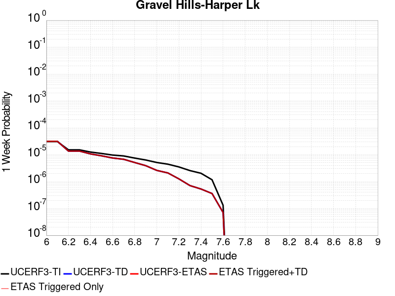 |  |  |  |

| Magnitude | 1 wk TI Prob | 1 wk TD Prob | 1 wk ETAS Prob | 1 wk ETAS/TD Gain | 1 wk ETAS Triggered+TD | 1 wk ETAS Triggered Only | 1 mo TI Prob | 1 mo TD Prob | 1 mo ETAS Prob | 1 mo ETAS/TD Gain | 1 mo ETAS Triggered+TD | 1 mo ETAS Triggered Only | 1 yr TI Prob | 1 yr TD Prob | 1 yr ETAS Prob | 1 yr ETAS/TD Gain | 1 yr ETAS Triggered+TD | 1 yr ETAS Triggered Only | 10 yr TI Prob | 10 yr TD Prob | 10 yr ETAS Prob | 10 yr ETAS/TD Gain | 10 yr ETAS Triggered+TD | 10 yr ETAS Triggered Only |
|-----|-----|-----|-----|-----|-----|-----|-----|-----|-----|-----|-----|-----|-----|-----|-----|-----|-----|-----|-----|-----|-----|-----|-----|-----|
| 6.0 | 3.0679566E-5 | 3.142136E-5 | 0.0 | 0.0 | 3.142136E-5 | 0.0 | 1.3147724E-4 | 1.3465725E-4 | 0.0 | 0.0 | 1.3465725E-4 | 0.0 | 0.0015995599 | 0.0016384354 | 2.0E-4 | 0.122067675 | 0.0018381077 | 2.0E-4 | 0.015880952 | 0.016285053 | 5.0E-4 | 0.030703003 | 0.01677691 | 5.0E-4 |
| 6.1 | 3.0679566E-5 | 3.142136E-5 | 0.0 | 0.0 | 3.142136E-5 | 0.0 | 1.3147724E-4 | 1.3465725E-4 | 0.0 | 0.0 | 1.3465725E-4 | 0.0 | 0.0015995599 | 0.0016384354 | 2.0E-4 | 0.122067675 | 0.0018381077 | 2.0E-4 | 0.015880952 | 0.016285053 | 5.0E-4 | 0.030703003 | 0.01677691 | 5.0E-4 |
| 6.2 | 1.514536E-5 | 1.3619673E-5 | 0.0 | 0.0 | 1.3619673E-5 | 0.0 | 6.490707E-5 | 5.8368787E-5 | 0.0 | 0.0 | 5.8368787E-5 | 0.0 | 7.8995706E-4 | 7.1042014E-4 | 0.0 | 0.0 | 7.1042014E-4 | 0.0 | 0.007871548 | 0.007082689 | 1.0E-4 | 0.014118931 | 0.0071819806 | 1.0E-4 |
| 6.3 | 1.514536E-5 | 1.3619673E-5 | 0.0 | 0.0 | 1.3619673E-5 | 0.0 | 6.490707E-5 | 5.8368787E-5 | 0.0 | 0.0 | 5.8368787E-5 | 0.0 | 7.8995706E-4 | 7.1042014E-4 | 0.0 | 0.0 | 7.1042014E-4 | 0.0 | 0.007871548 | 0.007082689 | 1.0E-4 | 0.014118931 | 0.0071819806 | 1.0E-4 |
| 6.4 | 1.2532521E-5 | 1.0678091E-5 | 0.0 | 0.0 | 1.0678091E-5 | 0.0 | 5.37097E-5 | 4.5762477E-5 | 0.0 | 0.0 | 4.5762477E-5 | 0.0 | 6.537194E-4 | 5.570215E-4 | 0.0 | 0.0 | 5.570215E-4 | 0.0 | 0.0065179965 | 0.0055568423 | 1.0E-4 | 0.017995832 | 0.0056562866 | 1.0E-4 |
| 6.5 | 1.1094058E-5 | 9.074023E-6 | 0.0 | 0.0 | 9.074023E-6 | 0.0 | 4.7545094E-5 | 3.8888113E-5 | 0.0 | 0.0 | 3.8888113E-5 | 0.0 | 5.787078E-4 | 4.7336394E-4 | 0.0 | 0.0 | 4.7336394E-4 | 0.0 | 0.0057720304 | 0.004723963 | 1.0E-4 | 0.021168668 | 0.0048234905 | 1.0E-4 |
| 6.6 | 9.688328E-6 | 7.523745E-6 | 0.0 | 0.0 | 7.523745E-6 | 0.0 | 4.1520743E-5 | 3.2244236E-5 | 0.0 | 0.0 | 3.2244236E-5 | 0.0 | 5.053978E-4 | 3.925054E-4 | 0.0 | 0.0 | 3.925054E-4 | 0.0 | 0.0050424994 | 0.0039183777 | 1.0E-4 | 0.025520764 | 0.004017986 | 1.0E-4 |
| 6.7 | 8.974824E-6 | 6.7422516E-6 | 0.0 | 0.0 | 6.7422516E-6 | 0.0 | 3.8462964E-5 | 2.8895056E-5 | 0.0 | 0.0 | 2.8895056E-5 | 0.0 | 4.6818596E-4 | 3.5174272E-4 | 0.0 | 0.0 | 3.5174272E-4 | 0.0 | 0.004672008 | 0.0035120805 | 1.0E-4 | 0.028473152 | 0.0036117292 | 1.0E-4 |
| 6.8 | 7.4780046E-6 | 5.110587E-6 | 0.0 | 0.0 | 5.110587E-6 | 0.0 | 3.20482E-5 | 2.190234E-5 | 0.0 | 0.0 | 2.190234E-5 | 0.0 | 3.9011694E-4 | 2.6662977E-4 | 0.0 | 0.0 | 2.6662977E-4 | 0.0 | 0.0038943281 | 0.0026632366 | 0.0 | 0.0 | 0.0026632366 | 0.0 |
| 6.9 | 6.3409307E-6 | 3.9029237E-6 | 0.0 | 0.0 | 3.9029237E-6 | 0.0 | 2.7175134E-5 | 1.6726715E-5 | 0.0 | 0.0 | 1.6726715E-5 | 0.0 | 3.3080703E-4 | 2.0362971E-4 | 0.0 | 0.0 | 2.0362971E-4 | 0.0 | 0.0033031502 | 0.0020345293 | 0.0 | 0.0 | 0.0020345293 | 0.0 |
| 7.0 | 5.1239335E-6 | 2.6023781E-6 | 0.0 | 0.0 | 2.6023781E-6 | 0.0 | 2.195953E-5 | 1.1153003E-5 | 0.0 | 0.0 | 1.1153003E-5 | 0.0 | 2.6732447E-4 | 1.357796E-4 | 0.0 | 0.0 | 1.357796E-4 | 0.0 | 0.0026700313 | 0.0013569916 | 0.0 | 0.0 | 0.0013569916 | 0.0 |
| 7.1 | 4.438899E-6 | 2.0954649E-6 | 0.0 | 0.0 | 2.0954649E-6 | 0.0 | 1.9023713E-5 | 8.980534E-6 | 0.0 | 0.0 | 8.980534E-6 | 0.0 | 2.315891E-4 | 1.09332745E-4 | 0.0 | 0.0 | 1.09332745E-4 | 0.0 | 0.002313479 | 0.0010928113 | 0.0 | 0.0 | 0.0010928113 | 0.0 |
| 7.2 | 3.50367E-6 | 1.2591748E-6 | 0.0 | 0.0 | 1.2591748E-6 | 0.0 | 1.5015643E-5 | 5.3964527E-6 | 0.0 | 0.0 | 5.3964527E-6 | 0.0 | 1.8280011E-4 | 6.569991E-5 | 0.0 | 0.0 | 6.569991E-5 | 0.0 | 0.0018264982 | 6.568131E-4 | 0.0 | 0.0 | 6.568131E-4 | 0.0 |
| 7.3 | 2.561638E-6 | 7.1001443E-7 | 0.0 | 0.0 | 7.1001443E-7 | 0.0 | 1.0978401E-5 | 3.0429155E-6 | 0.0 | 0.0 | 3.0429155E-6 | 0.0 | 1.3365384E-4 | 3.7046884E-5 | 0.0 | 0.0 | 3.7046884E-5 | 0.0 | 0.0013357349 | 3.7040908E-4 | 0.0 | 0.0 | 3.7040908E-4 | 0.0 |
| 7.4 | 2.0368864E-6 | 5.289125E-7 | 0.0 | 0.0 | 5.289125E-7 | 0.0 | 8.729483E-6 | 2.266766E-6 | 0.0 | 0.0 | 2.266766E-6 | 0.0 | 1.06276275E-4 | 2.759753E-5 | 0.0 | 0.0 | 2.759753E-5 | 0.0 | 0.0010622547 | 2.7594157E-4 | 0.0 | 0.0 | 2.7594157E-4 | 0.0 |
| 7.5 | 1.1681728E-6 | 3.592513E-7 | 0.0 | 0.0 | 3.592513E-7 | 0.0 | 5.0064455E-6 | 1.5396474E-6 | 0.0 | 0.0 | 1.5396474E-6 | 0.0 | 6.0951766E-5 | 1.8745051E-5 | 0.0 | 0.0 | 1.8745051E-5 | 0.0 | 6.093505E-4 | 1.8743517E-4 | 0.0 | 0.0 | 1.8743517E-4 | 0.0 |
| 7.6 | 1.3154387E-7 | 7.089255E-8 | 0.0 | 0.0 | 7.089255E-8 | 0.0 | 5.6375933E-7 | 3.0382517E-7 | 0.0 | 0.0 | 3.0382517E-7 | 0.0 | 6.863748E-6 | 3.6990668E-6 | 0.0 | 0.0 | 3.6990668E-6 | 0.0 | 6.863536E-5 | 3.6990208E-5 | 0.0 | 0.0 | 3.6990208E-5 | 0.0 |

## King Range 2011 CFM
*[(top)](#table-of-contents)*

| 1 Week | 1 Month | 1 Year | 10 Year |
|-----|-----|-----|-----|
|  | 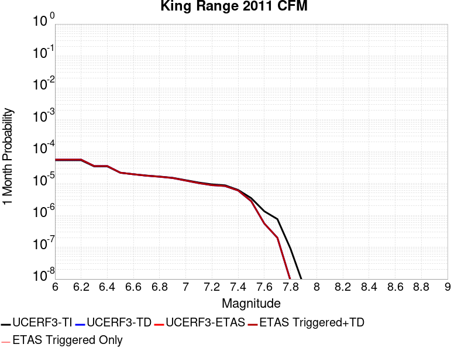 |  | 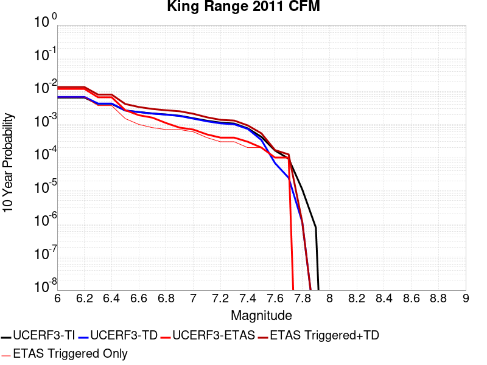 |

| Magnitude | 1 wk TI Prob | 1 wk TD Prob | 1 wk ETAS Prob | 1 wk ETAS/TD Gain | 1 wk ETAS Triggered+TD | 1 wk ETAS Triggered Only | 1 mo TI Prob | 1 mo TD Prob | 1 mo ETAS Prob | 1 mo ETAS/TD Gain | 1 mo ETAS Triggered+TD | 1 mo ETAS Triggered Only | 1 yr TI Prob | 1 yr TD Prob | 1 yr ETAS Prob | 1 yr ETAS/TD Gain | 1 yr ETAS Triggered+TD | 1 yr ETAS Triggered Only | 10 yr TI Prob | 10 yr TD Prob | 10 yr ETAS Prob | 10 yr ETAS/TD Gain | 10 yr ETAS Triggered+TD | 10 yr ETAS Triggered Only |
|-----|-----|-----|-----|-----|-----|-----|-----|-----|-----|-----|-----|-----|-----|-----|-----|-----|-----|-----|-----|-----|-----|-----|-----|-----|
| 6.0 | 1.2462566E-5 | 1.2994595E-5 | 0.0 | 0.0 | 1.2994595E-5 | 0.0 | 5.34099E-5 | 5.569013E-5 | 0.0 | 0.0 | 5.569013E-5 | 0.0 | 6.5007154E-4 | 6.778512E-4 | 1.0E-4 | 0.147525 | 7.7778345E-4 | 1.0E-4 | 0.0064817313 | 0.006762195 | 5.0E-4 | 0.073940486 | 0.007258814 | 5.0E-4 |
| 6.1 | 1.2462566E-5 | 1.2994595E-5 | 0.0 | 0.0 | 1.2994595E-5 | 0.0 | 5.34099E-5 | 5.569013E-5 | 0.0 | 0.0 | 5.569013E-5 | 0.0 | 6.5007154E-4 | 6.778512E-4 | 1.0E-4 | 0.147525 | 7.7778345E-4 | 1.0E-4 | 0.0064817313 | 0.006762195 | 5.0E-4 | 0.073940486 | 0.007258814 | 5.0E-4 |
| 6.2 | 1.2462566E-5 | 1.2994595E-5 | 0.0 | 0.0 | 1.2994595E-5 | 0.0 | 5.34099E-5 | 5.569013E-5 | 0.0 | 0.0 | 5.569013E-5 | 0.0 | 6.5007154E-4 | 6.778512E-4 | 1.0E-4 | 0.147525 | 7.7778345E-4 | 1.0E-4 | 0.0064817313 | 0.006762195 | 5.0E-4 | 0.073940486 | 0.007258814 | 5.0E-4 |
| 6.3 | 7.988484E-6 | 8.189467E-6 | 0.0 | 0.0 | 8.189467E-6 | 0.0 | 3.423591E-5 | 3.5097317E-5 | 0.0 | 0.0 | 3.5097317E-5 | 0.0 | 4.1674246E-4 | 4.2723896E-4 | 1.0E-4 | 0.23406105 | 5.271962E-4 | 1.0E-4 | 0.004159618 | 0.004266369 | 4.0E-4 | 0.093756534 | 0.0046646628 | 4.0E-4 |
| 6.4 | 7.988484E-6 | 8.189467E-6 | 0.0 | 0.0 | 8.189467E-6 | 0.0 | 3.423591E-5 | 3.5097317E-5 | 0.0 | 0.0 | 3.5097317E-5 | 0.0 | 4.1674246E-4 | 4.2723896E-4 | 1.0E-4 | 0.23406105 | 5.271962E-4 | 1.0E-4 | 0.004159618 | 0.004266369 | 4.0E-4 | 0.093756534 | 0.0046646628 | 4.0E-4 |
| 6.5 | 5.0522513E-6 | 5.060107E-6 | 0.0 | 0.0 | 5.060107E-6 | 0.0 | 2.1652326E-5 | 2.1685999E-5 | 0.0 | 0.0 | 2.1685999E-5 | 0.0 | 2.6358519E-4 | 2.63996E-4 | 0.0 | 0.0 | 2.63996E-4 | 0.0 | 0.0026327274 | 0.0026378403 | 1.0E-4 | 0.0379098 | 0.0027375766 | 1.0E-4 |
| 6.6 | 4.53682E-6 | 4.5172146E-6 | 0.0 | 0.0 | 4.5172146E-6 | 0.0 | 1.944337E-5 | 1.935935E-5 | 0.0 | 0.0 | 1.935935E-5 | 0.0 | 2.3669732E-4 | 2.3567521E-4 | 0.0 | 0.0 | 2.3567521E-4 | 0.0 | 0.0023644536 | 0.002355237 | 0.0 | 0.0 | 0.002355237 | 0.0 |
| 6.7 | 4.1144335E-6 | 4.075492E-6 | 0.0 | 0.0 | 4.075492E-6 | 0.0 | 1.7633167E-5 | 1.746628E-5 | 0.0 | 0.0 | 1.746628E-5 | 0.0 | 2.1466266E-4 | 2.1263161E-4 | 0.0 | 0.0 | 2.1263161E-4 | 0.0 | 0.0021445542 | 0.002125245 | 0.0 | 0.0 | 0.002125245 | 0.0 |
| 6.8 | 3.8321214E-6 | 3.7864904E-6 | 0.0 | 0.0 | 3.7864904E-6 | 0.0 | 1.6423275E-5 | 1.6227717E-5 | 0.0 | 0.0 | 1.6227717E-5 | 0.0 | 1.9993502E-4 | 1.9755487E-4 | 0.0 | 0.0 | 1.9755487E-4 | 0.0 | 0.0019975523 | 0.0019747496 | 0.0 | 0.0 | 0.0019747496 | 0.0 |
| 6.9 | 3.4999944E-6 | 3.443416E-6 | 0.0 | 0.0 | 3.443416E-6 | 0.0 | 1.499989E-5 | 1.4757416E-5 | 0.0 | 0.0 | 1.4757416E-5 | 0.0 | 1.8260835E-4 | 1.7965697E-4 | 0.0 | 0.0 | 1.7965697E-4 | 0.0 | 0.0018245836 | 0.0017960668 | 0.0 | 0.0 | 0.0017960668 | 0.0 |
| 7.0 | 2.9470837E-6 | 2.867445E-6 | 0.0 | 0.0 | 2.867445E-6 | 0.0 | 1.26302975E-5 | 1.2288992E-5 | 0.0 | 0.0 | 1.2288992E-5 | 0.0 | 1.5376302E-4 | 1.4960839E-4 | 0.0 | 0.0 | 1.4960839E-4 | 0.0 | 0.0015365666 | 0.0014960172 | 0.0 | 0.0 | 0.0014960172 | 0.0 |
| 7.1 | 2.4850247E-6 | 2.3808877E-6 | 0.0 | 0.0 | 2.3808877E-6 | 0.0 | 1.0650062E-5 | 1.0203766E-5 | 0.0 | 0.0 | 1.0203766E-5 | 0.0 | 1.296568E-4 | 1.2422391E-4 | 0.0 | 0.0 | 1.2422391E-4 | 0.0 | 0.0012958117 | 0.0012424726 | 0.0 | 0.0 | 0.0012424726 | 0.0 |
| 7.2 | 2.1800304E-6 | 2.060055E-6 | 0.0 | 0.0 | 2.060055E-6 | 0.0 | 9.342954E-6 | 8.828778E-6 | 0.0 | 0.0 | 8.828778E-6 | 0.0 | 1.1374453E-4 | 1.0748516E-4 | 0.0 | 0.0 | 1.0748516E-4 | 0.0 | 0.0011368633 | 0.0010752446 | 0.0 | 0.0 | 0.0010752446 | 0.0 |
| 7.3 | 2.0378504E-6 | 1.9352276E-6 | 0.0 | 0.0 | 1.9352276E-6 | 0.0 | 8.733615E-6 | 8.293807E-6 | 0.0 | 0.0 | 8.293807E-6 | 0.0 | 1.0632657E-4 | 1.0097251E-4 | 0.0 | 0.0 | 1.0097251E-4 | 0.0 | 0.0010627571 | 0.0010101639 | 0.0 | 0.0 | 0.0010101639 | 0.0 |
| 7.4 | 1.4577047E-6 | 1.4014751E-6 | 0.0 | 0.0 | 1.4014751E-6 | 0.0 | 6.247291E-6 | 6.006308E-6 | 0.0 | 0.0 | 6.006308E-6 | 0.0 | 7.605811E-5 | 7.312442E-5 | 0.0 | 0.0 | 7.312442E-5 | 0.0 | 7.603208E-4 | 7.3184725E-4 | 0.0 | 0.0 | 7.3184725E-4 | 0.0 |
| 7.5 | 8.0685743E-7 | 6.4750947E-7 | 0.0 | 0.0 | 6.4750947E-7 | 0.0 | 3.457956E-6 | 2.775038E-6 | 0.0 | 0.0 | 2.775038E-6 | 0.0 | 4.20998E-5 | 3.378561E-5 | 0.0 | 0.0 | 3.378561E-5 | 0.0 | 4.2091825E-4 | 3.384925E-4 | 0.0 | 0.0 | 3.384925E-4 | 0.0 |
| 7.6 | 3.1239435E-7 | 1.2838954E-7 | 0.0 | 0.0 | 1.2838954E-7 | 0.0 | 1.3388321E-6 | 5.5024077E-7 | 0.0 | 0.0 | 5.5024077E-7 | 0.0 | 1.630016E-5 | 6.6991615E-6 | 0.0 | 0.0 | 6.6991615E-6 | 0.0 | 1.6298964E-4 | 6.7633366E-5 | 0.0 | 0.0 | 6.7633366E-5 | 0.0 |
| 7.7 | 1.7747207E-7 | 4.5873858E-8 | 0.0 | 0.0 | 4.5873858E-8 | 0.0 | 7.605944E-7 | 1.9660223E-7 | 0.0 | 0.0 | 1.9660223E-7 | 0.0 | 9.260198E-6 | 2.3936295E-6 | 0.0 | 0.0 | 2.3936295E-6 | 0.0 | 9.2598115E-5 | 2.434555E-5 | 0.0 | 0.0 | 2.434555E-5 | 0.0 |
| 7.8 | 2.1035538E-8 | 2.0912831E-9 | 0.0 | 0.0 | 2.0912831E-9 | 0.0 | 9.0152305E-8 | 8.962641E-9 | 0.0 | 0.0 | 8.962641E-9 | 0.0 | 1.0976038E-6 | 1.0912016E-7 | 0.0 | 0.0 | 1.0912016E-7 | 0.0 | 1.0975983E-5 | 1.125664E-6 | 0.0 | 0.0 | 1.125664E-6 | 0.0 |
| 7.9 | 1.4782963E-9 | 6.077361E-13 | 0.0 | 0.0 | 6.077361E-13 | 0.0 | 6.335555E-9 | 2.6049163E-12 | 0.0 | 0.0 | 2.6049163E-12 | 0.0 | 7.713538E-8 | 3.171663E-11 | 0.0 | 0.0 | 3.171663E-11 | 0.0 | 7.7135354E-7 | 4.6297055E-10 | 0.0 | 0.0 | 4.6297055E-10 | 0.0 |

## Ludlow
*[(top)](#table-of-contents)*

| 1 Week | 1 Month | 1 Year | 10 Year |
|-----|-----|-----|-----|
|  | 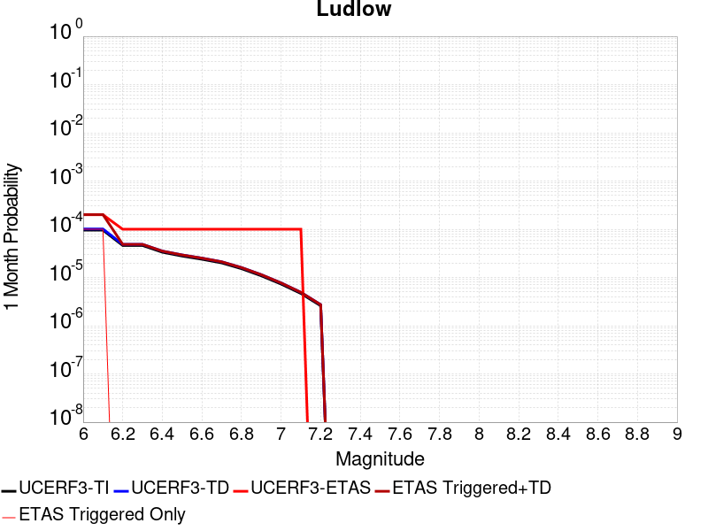 |  |  |

| Magnitude | 1 wk TI Prob | 1 wk TD Prob | 1 wk ETAS Prob | 1 wk ETAS/TD Gain | 1 wk ETAS Triggered+TD | 1 wk ETAS Triggered Only | 1 mo TI Prob | 1 mo TD Prob | 1 mo ETAS Prob | 1 mo ETAS/TD Gain | 1 mo ETAS Triggered+TD | 1 mo ETAS Triggered Only | 1 yr TI Prob | 1 yr TD Prob | 1 yr ETAS Prob | 1 yr ETAS/TD Gain | 1 yr ETAS Triggered+TD | 1 yr ETAS Triggered Only | 10 yr TI Prob | 10 yr TD Prob | 10 yr ETAS Prob | 10 yr ETAS/TD Gain | 10 yr ETAS Triggered+TD | 10 yr ETAS Triggered Only |
|-----|-----|-----|-----|-----|-----|-----|-----|-----|-----|-----|-----|-----|-----|-----|-----|-----|-----|-----|-----|-----|-----|-----|-----|-----|
| 6.0 | 2.2407607E-5 | 2.3643477E-5 | 0.0 | 0.0 | 2.3643477E-5 | 0.0 | 9.602906E-5 | 1.013255E-4 | 0.0 | 0.0 | 1.013255E-4 | 0.0 | 0.0011685267 | 0.0012329839 | 0.0 | 0.0 | 0.0012329839 | 0.0 | 0.011624013 | 0.012265936 | 6.0E-4 | 0.048915956 | 0.012858576 | 6.0E-4 |
| 6.1 | 2.2407607E-5 | 2.3643477E-5 | 0.0 | 0.0 | 2.3643477E-5 | 0.0 | 9.602906E-5 | 1.013255E-4 | 0.0 | 0.0 | 1.013255E-4 | 0.0 | 0.0011685267 | 0.0012329839 | 0.0 | 0.0 | 0.0012329839 | 0.0 | 0.011624013 | 0.012265936 | 6.0E-4 | 0.048915956 | 0.012858576 | 6.0E-4 |
| 6.2 | 1.0781252E-5 | 1.13592305E-5 | 0.0 | 0.0 | 1.13592305E-5 | 0.0 | 4.620455E-5 | 4.868153E-5 | 0.0 | 0.0 | 4.868153E-5 | 0.0 | 5.623952E-4 | 5.925405E-4 | 0.0 | 0.0 | 5.925405E-4 | 0.0 | 0.00560974 | 0.005910024 | 3.0E-4 | 0.050761215 | 0.0062082508 | 3.0E-4 |
| 6.3 | 1.0781252E-5 | 1.13592305E-5 | 0.0 | 0.0 | 1.13592305E-5 | 0.0 | 4.620455E-5 | 4.868153E-5 | 0.0 | 0.0 | 4.868153E-5 | 0.0 | 5.623952E-4 | 5.925405E-4 | 0.0 | 0.0 | 5.925405E-4 | 0.0 | 0.00560974 | 0.005910024 | 3.0E-4 | 0.050761215 | 0.0062082508 | 3.0E-4 |
| 6.4 | 7.814439E-6 | 8.233069E-6 | 0.0 | 0.0 | 8.233069E-6 | 0.0 | 3.3490025E-5 | 3.5284113E-5 | 0.0 | 0.0 | 3.5284113E-5 | 0.0 | 4.0766477E-4 | 4.295008E-4 | 0.0 | 0.0 | 4.295008E-4 | 0.0 | 0.0040691774 | 0.004286853 | 3.0E-4 | 0.0699814 | 0.0045855674 | 3.0E-4 |
| 6.5 | 6.4986366E-6 | 6.8470413E-6 | 0.0 | 0.0 | 6.8470413E-6 | 0.0 | 2.7851002E-5 | 2.9344137E-5 | 0.0 | 0.0 | 2.9344137E-5 | 0.0 | 3.390332E-4 | 3.5720723E-4 | 0.0 | 0.0 | 3.5720723E-4 | 0.0 | 0.003385164 | 0.0035664267 | 2.0E-4 | 0.056078542 | 0.0037657134 | 2.0E-4 |
| 6.6 | 5.582177E-6 | 5.8826595E-6 | 0.0 | 0.0 | 5.8826595E-6 | 0.0 | 2.3923398E-5 | 2.5211159E-5 | 0.0 | 0.0 | 2.5211159E-5 | 0.0 | 2.9122844E-4 | 3.0690333E-4 | 0.0 | 0.0 | 3.0690333E-4 | 0.0 | 0.0029084706 | 0.0030648683 | 2.0E-4 | 0.06525566 | 0.0032642554 | 2.0E-4 |
| 6.7 | 4.6858763E-6 | 4.9376245E-6 | 0.0 | 0.0 | 4.9376245E-6 | 0.0 | 2.0082172E-5 | 2.1161079E-5 | 0.0 | 0.0 | 2.1161079E-5 | 0.0 | 2.4447302E-4 | 2.5760624E-4 | 0.0 | 0.0 | 2.5760624E-4 | 0.0 | 0.0024420423 | 0.0025731325 | 2.0E-4 | 0.077726275 | 0.0027726179 | 2.0E-4 |
| 6.8 | 3.5584908E-6 | 3.7498878E-6 | 0.0 | 0.0 | 3.7498878E-6 | 0.0 | 1.5250586E-5 | 1.6070851E-5 | 0.0 | 0.0 | 1.6070851E-5 | 0.0 | 1.8566006E-4 | 1.9564545E-4 | 0.0 | 0.0 | 1.9564545E-4 | 0.0 | 0.0018550502 | 0.0019547732 | 0.0 | 0.0 | 0.0019547732 | 0.0 |
| 6.9 | 2.532834E-6 | 2.6694825E-6 | 0.0 | 0.0 | 2.6694825E-6 | 0.0 | 1.0854958E-5 | 1.144059E-5 | 0.0 | 0.0 | 1.144059E-5 | 0.0 | 1.3215111E-4 | 1.3928056E-4 | 0.0 | 0.0 | 1.3928056E-4 | 0.0 | 0.0013207254 | 0.0013919603 | 0.0 | 0.0 | 0.0013919603 | 0.0 |
| 7.0 | 1.7083285E-6 | 1.8009131E-6 | 0.0 | 0.0 | 1.8009131E-6 | 0.0 | 7.3213873E-6 | 7.718178E-6 | 0.0 | 0.0 | 7.718178E-6 | 0.0 | 8.913424E-5 | 9.3964925E-5 | 0.0 | 0.0 | 9.3964925E-5 | 0.0 | 8.9098496E-4 | 9.392684E-4 | 0.0 | 0.0 | 9.392684E-4 | 0.0 |
| 7.1 | 1.0905424E-6 | 1.1491103E-6 | 0.0 | 0.0 | 1.1491103E-6 | 0.0 | 4.6737446E-6 | 4.9247496E-6 | 0.0 | 0.0 | 4.9247496E-6 | 0.0 | 5.6901354E-5 | 5.9957274E-5 | 0.0 | 0.0 | 5.9957274E-5 | 0.0 | 5.6886784E-4 | 5.9942075E-4 | 0.0 | 0.0 | 5.9942075E-4 | 0.0 |
| 7.2 | 6.06668E-7 | 6.3837547E-7 | 0.0 | 0.0 | 6.3837547E-7 | 0.0 | 2.600003E-6 | 2.7358924E-6 | 0.0 | 0.0 | 2.7358924E-6 | 0.0 | 3.1654577E-5 | 3.330905E-5 | 0.0 | 0.0 | 3.330905E-5 | 0.0 | 3.1650066E-4 | 3.330474E-4 | 0.0 | 0.0 | 3.330474E-4 | 0.0 |

## Mission (connected) 2011 CFM
*[(top)](#table-of-contents)*

| 1 Week | 1 Month | 1 Year | 10 Year |
|-----|-----|-----|-----|
| 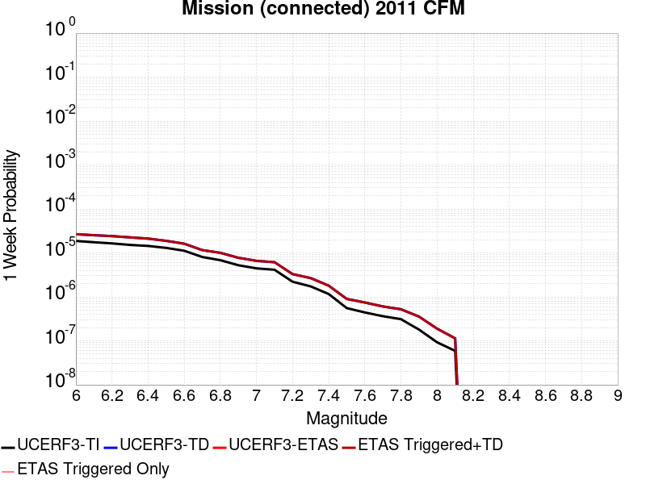 |  |  |  |

| Magnitude | 1 wk TI Prob | 1 wk TD Prob | 1 wk ETAS Prob | 1 wk ETAS/TD Gain | 1 wk ETAS Triggered+TD | 1 wk ETAS Triggered Only | 1 mo TI Prob | 1 mo TD Prob | 1 mo ETAS Prob | 1 mo ETAS/TD Gain | 1 mo ETAS Triggered+TD | 1 mo ETAS Triggered Only | 1 yr TI Prob | 1 yr TD Prob | 1 yr ETAS Prob | 1 yr ETAS/TD Gain | 1 yr ETAS Triggered+TD | 1 yr ETAS Triggered Only | 10 yr TI Prob | 10 yr TD Prob | 10 yr ETAS Prob | 10 yr ETAS/TD Gain | 10 yr ETAS Triggered+TD | 10 yr ETAS Triggered Only |
|-----|-----|-----|-----|-----|-----|-----|-----|-----|-----|-----|-----|-----|-----|-----|-----|-----|-----|-----|-----|-----|-----|-----|-----|-----|
| 6.0 | 1.8735573E-5 | 2.6617612E-5 | 0.0 | 0.0 | 2.6617612E-5 | 0.0 | 8.029284E-5 | 1.1406919E-4 | 0.0 | 0.0 | 1.1406919E-4 | 0.0 | 9.771269E-4 | 0.0013878148 | 0.0 | 0.0 | 0.0013878148 | 0.0 | 0.009728416 | 0.013805085 | 6.0E-4 | 0.043462247 | 0.014396802 | 6.0E-4 |
| 6.1 | 1.7515964E-5 | 2.5260504E-5 | 0.0 | 0.0 | 2.5260504E-5 | 0.0 | 7.506625E-5 | 1.082535E-4 | 0.0 | 0.0 | 1.082535E-4 | 0.0 | 9.135484E-4 | 0.0013170963 | 0.0 | 0.0 | 0.0013170963 | 0.0 | 0.009098019 | 0.013106428 | 3.0E-4 | 0.022889532 | 0.0134024955 | 3.0E-4 |
| 6.2 | 1.6486343E-5 | 2.4106652E-5 | 0.0 | 0.0 | 2.4106652E-5 | 0.0 | 7.065384E-5 | 1.0330882E-4 | 0.0 | 0.0 | 1.0330882E-4 | 0.0 | 8.5987104E-4 | 0.0012569661 | 0.0 | 0.0 | 0.0012569661 | 0.0 | 0.008565514 | 0.012512081 | 2.0E-4 | 0.015984552 | 0.0127095785 | 2.0E-4 |
| 6.3 | 1.5229385E-5 | 2.2540813E-5 | 0.0 | 0.0 | 2.2540813E-5 | 0.0 | 6.526716E-5 | 9.659859E-5 | 0.0 | 0.0 | 9.659859E-5 | 0.0 | 7.9433795E-4 | 0.0011753603 | 0.0 | 0.0 | 0.0011753603 | 0.0 | 0.007915046 | 0.011707519 | 2.0E-4 | 0.017083038 | 0.0119051775 | 2.0E-4 |
| 6.4 | 1.4435828E-5 | 2.115143E-5 | 0.0 | 0.0 | 2.115143E-5 | 0.0 | 6.186637E-5 | 9.064454E-5 | 0.0 | 0.0 | 9.064454E-5 | 0.0 | 7.529627E-4 | 0.0011029466 | 0.0 | 0.0 | 0.0011029466 | 0.0 | 0.007504165 | 0.010995562 | 2.0E-4 | 0.018189156 | 0.011193363 | 2.0E-4 |
| 6.5 | 1.30127955E-5 | 1.8803286E-5 | 0.0 | 0.0 | 1.8803286E-5 | 0.0 | 5.576793E-5 | 8.0582766E-5 | 0.0 | 0.0 | 8.0582766E-5 | 0.0 | 6.78763E-4 | 9.806219E-4 | 0.0 | 0.0 | 9.806219E-4 | 0.0 | 0.0067669353 | 0.009794649 | 1.0E-4 | 0.010209656 | 0.00989367 | 1.0E-4 |
| 6.6 | 1.1220718E-5 | 1.617225E-5 | 0.0 | 0.0 | 1.617225E-5 | 0.0 | 4.8087906E-5 | 6.930778E-5 | 0.0 | 0.0 | 6.930778E-5 | 0.0 | 5.8531296E-4 | 8.434953E-4 | 0.0 | 0.0 | 8.434953E-4 | 0.0 | 0.005837737 | 0.008438742 | 1.0E-4 | 0.011850107 | 0.008537898 | 1.0E-4 |
| 6.7 | 8.086152E-6 | 1.15681705E-5 | 0.0 | 0.0 | 1.15681705E-5 | 0.0 | 3.4654473E-5 | 4.9576935E-5 | 0.0 | 0.0 | 4.9576935E-5 | 0.0 | 4.2183654E-4 | 6.0343277E-4 | 0.0 | 0.0 | 6.0343277E-4 | 0.0 | 0.004210367 | 0.006058275 | 1.0E-4 | 0.01650635 | 0.006157669 | 1.0E-4 |
| 6.8 | 6.8361655E-6 | 1.0035145E-5 | 0.0 | 0.0 | 1.0035145E-5 | 0.0 | 2.9297524E-5 | 4.3007058E-5 | 0.0 | 0.0 | 4.3007058E-5 | 0.0 | 3.5663895E-4 | 5.2348577E-4 | 0.0 | 0.0 | 5.2348577E-4 | 0.0 | 0.0035606713 | 0.0052582975 | 1.0E-4 | 0.019017562 | 0.0053577716 | 1.0E-4 |
| 6.9 | 5.2517353E-6 | 7.740318E-6 | 0.0 | 0.0 | 7.740318E-6 | 0.0 | 2.2507242E-5 | 3.317237E-5 | 0.0 | 0.0 | 3.317237E-5 | 0.0 | 2.739912E-4 | 4.0379903E-4 | 0.0 | 0.0 | 4.0379903E-4 | 0.0 | 0.0027365363 | 0.0040651336 | 1.0E-4 | 0.024599439 | 0.004164727 | 1.0E-4 |
| 7.0 | 4.4602784E-6 | 6.59002E-6 | 0.0 | 0.0 | 6.59002E-6 | 0.0 | 1.911534E-5 | 2.8242639E-5 | 0.0 | 0.0 | 2.8242639E-5 | 0.0 | 2.327044E-4 | 3.4380003E-4 | 0.0 | 0.0 | 3.4380003E-4 | 0.0 | 0.0023246086 | 0.00346606 | 1.0E-4 | 0.028851202 | 0.0035657135 | 1.0E-4 |
| 7.1 | 4.1492594E-6 | 6.1442997E-6 | 0.0 | 0.0 | 6.1442997E-6 | 0.0 | 1.7782419E-5 | 2.633245E-5 | 0.0 | 0.0 | 2.633245E-5 | 0.0 | 2.1647944E-4 | 3.2055055E-4 | 0.0 | 0.0 | 3.2055055E-4 | 0.0 | 0.0021626868 | 0.0032336465 | 1.0E-4 | 0.03092484 | 0.0033333232 | 1.0E-4 |
| 7.2 | 2.213247E-6 | 3.2849764E-6 | 0.0 | 0.0 | 3.2849764E-6 | 0.0 | 9.485309E-6 | 1.4078394E-5 | 0.0 | 0.0 | 1.4078394E-5 | 0.0 | 1.15477524E-4 | 1.71391E-4 | 0.0 | 0.0 | 1.71391E-4 | 0.0 | 0.0011541754 | 0.0017424204 | 1.0E-4 | 0.05739143 | 0.0018422462 | 1.0E-4 |
| 7.3 | 1.7362703E-6 | 2.6703128E-6 | 0.0 | 0.0 | 2.6703128E-6 | 0.0 | 7.4411373E-6 | 1.1444148E-5 | 0.0 | 0.0 | 1.1444148E-5 | 0.0 | 9.0592075E-5 | 1.3932362E-4 | 0.0 | 0.0 | 1.3932362E-4 | 0.0 | 9.0555154E-4 | 0.0014187829 | 1.0E-4 | 0.07048295 | 0.0015186409 | 1.0E-4 |
| 7.4 | 1.1628409E-6 | 1.7967243E-6 | 0.0 | 0.0 | 1.7967243E-6 | 0.0 | 4.9835944E-6 | 7.700224E-6 | 0.0 | 0.0 | 7.700224E-6 | 0.0 | 6.0673574E-5 | 9.374621E-5 | 0.0 | 0.0 | 9.374621E-5 | 0.0 | 6.065701E-4 | 9.58822E-4 | 1.0E-4 | 0.10429464 | 0.0010587261 | 1.0E-4 |
| 7.5 | 5.5610667E-7 | 8.9541584E-7 | 0.0 | 0.0 | 8.9541584E-7 | 0.0 | 2.3833122E-6 | 3.8374906E-6 | 0.0 | 0.0 | 3.8374906E-6 | 0.0 | 2.9016439E-5 | 4.672045E-5 | 0.0 | 0.0 | 4.672045E-5 | 0.0 | 2.901265E-4 | 4.8461917E-4 | 1.0E-4 | 0.2063476 | 5.845707E-4 | 1.0E-4 |
| 7.6 | 4.4307663E-7 | 7.423254E-7 | 0.0 | 0.0 | 7.423254E-7 | 0.0 | 1.8988985E-6 | 3.1813906E-6 | 0.0 | 0.0 | 3.1813906E-6 | 0.0 | 2.3118844E-5 | 3.8732745E-5 | 0.0 | 0.0 | 3.8732745E-5 | 0.0 | 2.3116439E-4 | 4.0408003E-4 | 1.0E-4 | 0.24747573 | 5.0403964E-4 | 1.0E-4 |
| 7.7 | 3.639119E-7 | 6.033907E-7 | 0.0 | 0.0 | 6.033907E-7 | 0.0 | 1.5596215E-6 | 2.5859574E-6 | 0.0 | 0.0 | 2.5859574E-6 | 0.0 | 1.8988227E-5 | 3.1483578E-5 | 0.0 | 0.0 | 3.1483578E-5 | 0.0 | 1.8986604E-4 | 3.3084108E-4 | 0.0 | 0.0 | 3.3084108E-4 | 0.0 |
| 7.8 | 3.1152942E-7 | 5.206889E-7 | 0.0 | 0.0 | 5.206889E-7 | 0.0 | 1.3351254E-6 | 2.231522E-6 | 0.0 | 0.0 | 2.231522E-6 | 0.0 | 1.6255031E-5 | 2.7168444E-5 | 0.0 | 0.0 | 2.7168444E-5 | 0.0 | 1.6253842E-4 | 2.8432807E-4 | 0.0 | 0.0 | 2.8432807E-4 | 0.0 |
| 7.9 | 1.8035962E-7 | 3.5540276E-7 | 0.0 | 0.0 | 3.5540276E-7 | 0.0 | 7.729696E-7 | 1.5231539E-6 | 0.0 | 0.0 | 1.5231539E-6 | 0.0 | 9.410865E-6 | 1.854424E-5 | 0.0 | 0.0 | 1.854424E-5 | 0.0 | 9.410465E-5 | 1.9265003E-4 | 0.0 | 0.0 | 1.9265003E-4 | 0.0 |
| 8.0 | 9.279334E-8 | 1.8900911E-7 | 0.0 | 0.0 | 1.8900911E-7 | 0.0 | 3.976857E-7 | 8.100388E-7 | 0.0 | 0.0 | 8.100388E-7 | 0.0 | 4.841813E-6 | 9.862179E-6 | 0.0 | 0.0 | 9.862179E-6 | 0.0 | 4.841707E-5 | 1.01374E-4 | 0.0 | 0.0 | 1.01374E-4 | 0.0 |
| 8.1 | 5.9253985E-8 | 1.1385916E-7 | 0.0 | 0.0 | 1.1385916E-7 | 0.0 | 2.5394561E-7 | 4.879677E-7 | 0.0 | 0.0 | 4.879677E-7 | 0.0 | 3.0917836E-6 | 5.9409913E-6 | 0.0 | 0.0 | 5.9409913E-6 | 0.0 | 3.0917407E-5 | 6.0916063E-5 | 0.0 | 0.0 | 6.0916063E-5 | 0.0 |

## Tank Canyon
*[(top)](#table-of-contents)*

| 1 Week | 1 Month | 1 Year | 10 Year |
|-----|-----|-----|-----|
|  |  |  |  |

| Magnitude | 1 wk TI Prob | 1 wk TD Prob | 1 wk ETAS Prob | 1 wk ETAS/TD Gain | 1 wk ETAS Triggered+TD | 1 wk ETAS Triggered Only | 1 mo TI Prob | 1 mo TD Prob | 1 mo ETAS Prob | 1 mo ETAS/TD Gain | 1 mo ETAS Triggered+TD | 1 mo ETAS Triggered Only | 1 yr TI Prob | 1 yr TD Prob | 1 yr ETAS Prob | 1 yr ETAS/TD Gain | 1 yr ETAS Triggered+TD | 1 yr ETAS Triggered Only | 10 yr TI Prob | 10 yr TD Prob | 10 yr ETAS Prob | 10 yr ETAS/TD Gain | 10 yr ETAS Triggered+TD | 10 yr ETAS Triggered Only |
|-----|-----|-----|-----|-----|-----|-----|-----|-----|-----|-----|-----|-----|-----|-----|-----|-----|-----|-----|-----|-----|-----|-----|-----|-----|
| 6.0 | 4.8284557E-5 | 5.7840167E-5 | 0.0 | 0.0 | 5.7840167E-5 | 0.0 | 2.0691741E-4 | 2.4786626E-4 | 0.0 | 0.0 | 2.4786626E-4 | 0.0 | 0.0025163088 | 0.0030142586 | 1.0E-4 | 0.033175655 | 0.0031139571 | 1.0E-4 | 0.02488006 | 0.029800545 | 5.0E-4 | 0.016778216 | 0.030285645 | 5.0E-4 |
| 6.1 | 1.7796336E-5 | 2.083262E-5 | 0.0 | 0.0 | 2.083262E-5 | 0.0 | 7.626778E-5 | 8.927982E-5 | 0.0 | 0.0 | 8.927982E-5 | 0.0 | 9.281647E-4 | 0.0010864778 | 0.0 | 0.0 | 0.0010864778 | 0.0 | 0.009242975 | 0.010815719 | 1.0E-4 | 0.009245802 | 0.010914638 | 1.0E-4 |
| 6.2 | 1.7796336E-5 | 2.083262E-5 | 0.0 | 0.0 | 2.083262E-5 | 0.0 | 7.626778E-5 | 8.927982E-5 | 0.0 | 0.0 | 8.927982E-5 | 0.0 | 9.281647E-4 | 0.0010864778 | 0.0 | 0.0 | 0.0010864778 | 0.0 | 0.009242975 | 0.010815719 | 1.0E-4 | 0.009245802 | 0.010914638 | 1.0E-4 |
| 6.3 | 1.3515912E-5 | 1.5729276E-5 | 0.0 | 0.0 | 1.5729276E-5 | 0.0 | 5.792405E-5 | 6.740957E-5 | 0.0 | 0.0 | 6.740957E-5 | 0.0 | 7.049971E-4 | 8.2042604E-4 | 0.0 | 0.0 | 8.2042604E-4 | 0.0 | 0.007027647 | 0.008176551 | 1.0E-4 | 0.0122300945 | 0.008275734 | 1.0E-4 |
| 6.4 | 1.0870146E-5 | 1.2593871E-5 | 0.0 | 0.0 | 1.2593871E-5 | 0.0 | 4.658551E-5 | 5.397272E-5 | 0.0 | 0.0 | 5.397272E-5 | 0.0 | 5.67031E-4 | 6.569374E-4 | 0.0 | 0.0 | 6.569374E-4 | 0.0 | 0.005655863 | 0.0065519316 | 1.0E-4 | 0.015262675 | 0.0066512763 | 1.0E-4 |
| 6.5 | 7.964826E-6 | 9.178247E-6 | 0.0 | 0.0 | 9.178247E-6 | 0.0 | 3.4134522E-5 | 3.933481E-5 | 0.0 | 0.0 | 3.933481E-5 | 0.0 | 4.1550855E-4 | 4.788066E-4 | 0.0 | 0.0 | 4.788066E-4 | 0.0 | 0.0041473247 | 0.0047790254 | 1.0E-4 | 0.020924767 | 0.0048785475 | 1.0E-4 |
| 6.6 | 6.6317E-6 | 7.5974126E-6 | 0.0 | 0.0 | 7.5974126E-6 | 0.0 | 2.8421264E-5 | 3.2559987E-5 | 0.0 | 0.0 | 3.2559987E-5 | 0.0 | 3.4597394E-4 | 3.9635476E-4 | 0.0 | 0.0 | 3.9635476E-4 | 0.0 | 0.0034543579 | 0.0039576045 | 1.0E-4 | 0.025267811 | 0.0040572085 | 1.0E-4 |
| 6.7 | 4.793663E-6 | 5.4198917E-6 | 0.0 | 0.0 | 5.4198917E-6 | 0.0 | 2.0544108E-5 | 2.3227925E-5 | 0.0 | 0.0 | 2.3227925E-5 | 0.0 | 2.500958E-4 | 2.8276767E-4 | 0.0 | 0.0 | 2.8276767E-4 | 0.0 | 0.0024981452 | 0.0028247444 | 1.0E-4 | 0.035401434 | 0.0029244618 | 1.0E-4 |
| 6.8 | 4.382823E-6 | 4.959133E-6 | 0.0 | 0.0 | 4.959133E-6 | 0.0 | 1.8783392E-5 | 2.125328E-5 | 0.0 | 0.0 | 2.125328E-5 | 0.0 | 2.286638E-4 | 2.587322E-4 | 0.0 | 0.0 | 2.587322E-4 | 0.0 | 0.0022842865 | 0.002584962 | 1.0E-4 | 0.03868529 | 0.0026847033 | 1.0E-4 |
| 6.9 | 2.729601E-6 | 3.0660856E-6 | 0.0 | 0.0 | 3.0660856E-6 | 0.0 | 1.1698237E-5 | 1.3140308E-5 | 0.0 | 0.0 | 1.3140308E-5 | 0.0 | 1.4241673E-4 | 1.5997273E-4 | 0.0 | 0.0 | 1.5997273E-4 | 0.0 | 0.001423255 | 0.0015988793 | 0.0 | 0.0 | 0.0015988793 | 0.0 |
| 7.0 | 1.8987357E-6 | 2.1211877E-6 | 0.0 | 0.0 | 2.1211877E-6 | 0.0 | 8.137413E-6 | 9.090776E-6 | 0.0 | 0.0 | 9.090776E-6 | 0.0 | 9.90685E-5 | 1.10675275E-4 | 0.0 | 0.0 | 1.10675275E-4 | 0.0 | 9.902435E-4 | 0.0011062701 | 0.0 | 0.0 | 0.0011062701 | 0.0 |
| 7.1 | 1.4928986E-6 | 1.6591971E-6 | 0.0 | 0.0 | 1.6591971E-6 | 0.0 | 6.398121E-6 | 7.110829E-6 | 0.0 | 0.0 | 7.110829E-6 | 0.0 | 7.789434E-5 | 8.657149E-5 | 0.0 | 0.0 | 8.657149E-5 | 0.0 | 7.786704E-4 | 8.654354E-4 | 0.0 | 0.0 | 8.654354E-4 | 0.0 |
| 7.2 | 1.069082E-6 | 1.179496E-6 | 0.0 | 0.0 | 1.179496E-6 | 0.0 | 4.581772E-6 | 5.0549766E-6 | 0.0 | 0.0 | 5.0549766E-6 | 0.0 | 5.5781646E-5 | 6.1543135E-5 | 0.0 | 0.0 | 6.1543135E-5 | 0.0 | 5.576765E-4 | 6.1531307E-4 | 0.0 | 0.0 | 6.1531307E-4 | 0.0 |
| 7.3 | 8.776551E-7 | 9.750752E-7 | 0.0 | 0.0 | 9.750752E-7 | 0.0 | 3.7613736E-6 | 4.17889E-6 | 0.0 | 0.0 | 4.17889E-6 | 0.0 | 4.579376E-5 | 5.0877316E-5 | 0.0 | 0.0 | 5.0877316E-5 | 0.0 | 4.5784327E-4 | 5.087076E-4 | 0.0 | 0.0 | 5.087076E-4 | 0.0 |
| 7.4 | 7.55721E-7 | 8.493275E-7 | 0.0 | 0.0 | 8.493275E-7 | 0.0 | 3.2388E-6 | 3.6399726E-6 | 0.0 | 0.0 | 3.6399726E-6 | 0.0 | 3.9431678E-5 | 4.4316283E-5 | 0.0 | 0.0 | 4.4316283E-5 | 0.0 | 3.942468E-4 | 4.4312523E-4 | 0.0 | 0.0 | 4.4312523E-4 | 0.0 |
| 7.5 | 5.587665E-7 | 6.303491E-7 | 0.0 | 0.0 | 6.303491E-7 | 0.0 | 2.3947114E-6 | 2.7014962E-6 | 0.0 | 0.0 | 2.7014962E-6 | 0.0 | 2.915522E-5 | 3.289072E-5 | 0.0 | 0.0 | 3.289072E-5 | 0.0 | 2.9151395E-4 | 3.2890716E-4 | 0.0 | 0.0 | 3.2890716E-4 | 0.0 |

## Elsinore (Coyote Mountains)
*[(top)](#table-of-contents)*

| 1 Week | 1 Month | 1 Year | 10 Year |
|-----|-----|-----|-----|
|  |  |  |  |

| Magnitude | 1 wk TI Prob | 1 wk TD Prob | 1 wk ETAS Prob | 1 wk ETAS/TD Gain | 1 wk ETAS Triggered+TD | 1 wk ETAS Triggered Only | 1 mo TI Prob | 1 mo TD Prob | 1 mo ETAS Prob | 1 mo ETAS/TD Gain | 1 mo ETAS Triggered+TD | 1 mo ETAS Triggered Only | 1 yr TI Prob | 1 yr TD Prob | 1 yr ETAS Prob | 1 yr ETAS/TD Gain | 1 yr ETAS Triggered+TD | 1 yr ETAS Triggered Only | 10 yr TI Prob | 10 yr TD Prob | 10 yr ETAS Prob | 10 yr ETAS/TD Gain | 10 yr ETAS Triggered+TD | 10 yr ETAS Triggered Only |
|-----|-----|-----|-----|-----|-----|-----|-----|-----|-----|-----|-----|-----|-----|-----|-----|-----|-----|-----|-----|-----|-----|-----|-----|-----|
| 6.0 | 4.20513E-5 | 4.8497863E-5 | 0.0 | 0.0 | 4.8497863E-5 | 0.0 | 1.8020741E-4 | 2.0783432E-4 | 0.0 | 0.0 | 2.0783432E-4 | 0.0 | 0.0021918174 | 0.002527977 | 2.0E-4 | 0.079114646 | 0.0027274715 | 2.0E-4 | 0.021703249 | 0.025043545 | 5.0E-4 | 0.019965224 | 0.025531024 | 5.0E-4 |
| 6.1 | 4.20513E-5 | 4.8497863E-5 | 0.0 | 0.0 | 4.8497863E-5 | 0.0 | 1.8020741E-4 | 2.0783432E-4 | 0.0 | 0.0 | 2.0783432E-4 | 0.0 | 0.0021918174 | 0.002527977 | 2.0E-4 | 0.079114646 | 0.0027274715 | 2.0E-4 | 0.021703249 | 0.025043545 | 5.0E-4 | 0.019965224 | 0.025531024 | 5.0E-4 |
| 6.2 | 2.3413893E-5 | 2.4631545E-5 | 0.0 | 0.0 | 2.4631545E-5 | 0.0 | 1.0034139E-4 | 1.05559906E-4 | 0.0 | 0.0 | 1.05559906E-4 | 0.0 | 0.0012209718 | 0.0012845232 | 0.0 | 0.0 | 0.0012845232 | 0.0 | 0.012142851 | 0.012779683 | 1.0E-4 | 0.007824921 | 0.012878404 | 1.0E-4 |
| 6.3 | 2.3413893E-5 | 2.4631545E-5 | 0.0 | 0.0 | 2.4631545E-5 | 0.0 | 1.0034139E-4 | 1.05559906E-4 | 0.0 | 0.0 | 1.05559906E-4 | 0.0 | 0.0012209718 | 0.0012845232 | 0.0 | 0.0 | 0.0012845232 | 0.0 | 0.012142851 | 0.012779683 | 1.0E-4 | 0.007824921 | 0.012878404 | 1.0E-4 |
| 6.4 | 1.6894814E-5 | 1.6525059E-5 | 0.0 | 0.0 | 1.6525059E-5 | 0.0 | 7.240433E-5 | 7.081997E-5 | 0.0 | 0.0 | 7.081997E-5 | 0.0 | 8.811662E-4 | 8.619288E-4 | 0.0 | 0.0 | 8.619288E-4 | 0.0 | 0.0087768035 | 0.008589517 | 1.0E-4 | 0.011642098 | 0.0086886585 | 1.0E-4 |
| 6.5 | 1.6894814E-5 | 1.6525059E-5 | 0.0 | 0.0 | 1.6525059E-5 | 0.0 | 7.240433E-5 | 7.081997E-5 | 0.0 | 0.0 | 7.081997E-5 | 0.0 | 8.811662E-4 | 8.619288E-4 | 0.0 | 0.0 | 8.619288E-4 | 0.0 | 0.0087768035 | 0.008589517 | 1.0E-4 | 0.011642098 | 0.0086886585 | 1.0E-4 |
| 6.6 | 1.1910969E-5 | 1.0500677E-5 | 0.0 | 0.0 | 1.0500677E-5 | 0.0 | 5.1046012E-5 | 4.5002198E-5 | 0.0 | 0.0 | 4.5002198E-5 | 0.0 | 6.21308E-4 | 5.477772E-4 | 0.0 | 0.0 | 5.477772E-4 | 0.0 | 0.0061957375 | 0.0054655694 | 0.0 | 0.0 | 0.0054655694 | 0.0 |
| 6.7 | 9.1486E-6 | 7.179868E-6 | 0.0 | 0.0 | 7.179868E-6 | 0.0 | 3.9207694E-5 | 3.077052E-5 | 0.0 | 0.0 | 3.077052E-5 | 0.0 | 4.7724912E-4 | 3.745705E-4 | 0.0 | 0.0 | 3.745705E-4 | 0.0 | 0.0047622547 | 0.003739769 | 0.0 | 0.0 | 0.003739769 | 0.0 |
| 6.8 | 7.90441E-6 | 5.7088764E-6 | 0.0 | 0.0 | 5.7088764E-6 | 0.0 | 3.3875604E-5 | 2.4466392E-5 | 0.0 | 0.0 | 2.4466392E-5 | 0.0 | 4.1235742E-4 | 2.9783888E-4 | 0.0 | 0.0 | 2.9783888E-4 | 0.0 | 0.0041159308 | 0.0029745249 | 0.0 | 0.0 | 0.0029745249 | 0.0 |
| 6.9 | 7.77015E-6 | 5.562965E-6 | 0.0 | 0.0 | 5.562965E-6 | 0.0 | 3.3300217E-5 | 2.3841067E-5 | 0.0 | 0.0 | 2.3841067E-5 | 0.0 | 4.0535472E-4 | 2.902276E-4 | 0.0 | 0.0 | 2.902276E-4 | 0.0 | 0.004046161 | 0.0028986116 | 0.0 | 0.0 | 0.0028986116 | 0.0 |
| 7.0 | 7.675798E-6 | 5.4599236E-6 | 0.0 | 0.0 | 5.4599236E-6 | 0.0 | 3.289586E-5 | 2.339947E-5 | 0.0 | 0.0 | 2.339947E-5 | 0.0 | 4.004335E-4 | 2.8485255E-4 | 0.0 | 0.0 | 2.8485255E-4 | 0.0 | 0.003997127 | 0.002845 | 0.0 | 0.0 | 0.002845 | 0.0 |
| 7.1 | 7.447814E-6 | 5.2195273E-6 | 0.0 | 0.0 | 5.2195273E-6 | 0.0 | 3.191881E-5 | 2.2369217E-5 | 0.0 | 0.0 | 2.2369217E-5 | 0.0 | 3.8854225E-4 | 2.7231243E-4 | 0.0 | 0.0 | 2.7231243E-4 | 0.0 | 0.003878636 | 0.002719911 | 0.0 | 0.0 | 0.002719911 | 0.0 |
| 7.2 | 7.128185E-6 | 4.886292E-6 | 0.0 | 0.0 | 4.886292E-6 | 0.0 | 3.0549007E-5 | 2.0941092E-5 | 0.0 | 0.0 | 2.0941092E-5 | 0.0 | 3.7187067E-4 | 2.5492912E-4 | 0.0 | 0.0 | 2.5492912E-4 | 0.0 | 0.00371249 | 0.0025464846 | 0.0 | 0.0 | 0.0025464846 | 0.0 |
| 7.3 | 7.0913875E-6 | 4.8550028E-6 | 0.0 | 0.0 | 4.8550028E-6 | 0.0 | 3.0391306E-5 | 2.0806996E-5 | 0.0 | 0.0 | 2.0806996E-5 | 0.0 | 3.6995133E-4 | 2.5329692E-4 | 0.0 | 0.0 | 2.5329692E-4 | 0.0 | 0.0036933604 | 0.0025301995 | 0.0 | 0.0 | 0.0025301995 | 0.0 |
| 7.4 | 7.051521E-6 | 4.818879E-6 | 0.0 | 0.0 | 4.818879E-6 | 0.0 | 3.0220453E-5 | 2.0652182E-5 | 0.0 | 0.0 | 2.0652182E-5 | 0.0 | 3.6787192E-4 | 2.5141248E-4 | 0.0 | 0.0 | 2.5141248E-4 | 0.0 | 0.0036726352 | 0.002511398 | 0.0 | 0.0 | 0.002511398 | 0.0 |
| 7.5 | 6.910666E-6 | 4.7146323E-6 | 0.0 | 0.0 | 4.7146323E-6 | 0.0 | 2.9616802E-5 | 2.0205416E-5 | 0.0 | 0.0 | 2.0205416E-5 | 0.0 | 3.605249E-4 | 2.4597437E-4 | 0.0 | 0.0 | 2.4597437E-4 | 0.0 | 0.0035994058 | 0.0024571382 | 0.0 | 0.0 | 0.0024571382 | 0.0 |
| 7.6 | 6.341753E-6 | 4.2886663E-6 | 0.0 | 0.0 | 4.2886663E-6 | 0.0 | 2.7178658E-5 | 1.8379875E-5 | 0.0 | 0.0 | 1.8379875E-5 | 0.0 | 3.3084993E-4 | 2.2375316E-4 | 0.0 | 0.0 | 2.2375316E-4 | 0.0 | 0.0033035777 | 0.0022353933 | 0.0 | 0.0 | 0.0022353933 | 0.0 |
| 7.7 | 3.9205916E-6 | 2.2326055E-6 | 0.0 | 0.0 | 2.2326055E-6 | 0.0 | 1.6802427E-5 | 9.568278E-6 | 0.0 | 0.0 | 9.568278E-6 | 0.0 | 2.0455034E-4 | 1.1648829E-4 | 0.0 | 0.0 | 1.1648829E-4 | 0.0 | 0.0020436216 | 0.0011643447 | 0.0 | 0.0 | 0.0011643447 | 0.0 |
| 7.8 | 2.0846227E-7 | 8.4180684E-8 | 0.0 | 0.0 | 8.4180684E-8 | 0.0 | 8.9340944E-7 | 3.6077432E-7 | 0.0 | 0.0 | 3.6077432E-7 | 0.0 | 1.0877206E-5 | 4.392422E-6 | 0.0 | 0.0 | 4.392422E-6 | 0.0 | 1.0876673E-4 | 4.3923672E-5 | 0.0 | 0.0 | 4.3923672E-5 | 0.0 |
| 7.9 | 4.4969806E-9 | 2.2593856E-9 | 0.0 | 0.0 | 2.2593856E-9 | 0.0 | 1.9272775E-8 | 9.68308E-9 | 0.0 | 0.0 | 9.68308E-9 | 0.0 | 2.3464601E-7 | 1.17891496E-7 | 0.0 | 0.0 | 1.17891496E-7 | 0.0 | 2.3464577E-6 | 1.1789144E-6 | 0.0 | 0.0 | 1.1789144E-6 | 0.0 |

## Contra Costa Shear Zone (connector) 2011 CFM
*[(top)](#table-of-contents)*

| 1 Week | 1 Month | 1 Year | 10 Year |
|-----|-----|-----|-----|
|  |  |  |  |

| Magnitude | 1 wk TI Prob | 1 wk TD Prob | 1 wk ETAS Prob | 1 wk ETAS/TD Gain | 1 wk ETAS Triggered+TD | 1 wk ETAS Triggered Only | 1 mo TI Prob | 1 mo TD Prob | 1 mo ETAS Prob | 1 mo ETAS/TD Gain | 1 mo ETAS Triggered+TD | 1 mo ETAS Triggered Only | 1 yr TI Prob | 1 yr TD Prob | 1 yr ETAS Prob | 1 yr ETAS/TD Gain | 1 yr ETAS Triggered+TD | 1 yr ETAS Triggered Only | 10 yr TI Prob | 10 yr TD Prob | 10 yr ETAS Prob | 10 yr ETAS/TD Gain | 10 yr ETAS Triggered+TD | 10 yr ETAS Triggered Only |
|-----|-----|-----|-----|-----|-----|-----|-----|-----|-----|-----|-----|-----|-----|-----|-----|-----|-----|-----|-----|-----|-----|-----|-----|-----|
| 6.0 | 1.3187427E-5 | 1.400659E-5 | 0.0 | 0.0 | 1.400659E-5 | 0.0 | 5.6516317E-5 | 6.0026992E-5 | 0.0 | 0.0 | 6.0026992E-5 | 0.0 | 6.878689E-4 | 7.306063E-4 | 1.0E-4 | 0.13687262 | 8.305333E-4 | 1.0E-4 | 0.006857436 | 0.0072885524 | 5.0E-4 | 0.06860073 | 0.007784908 | 5.0E-4 |
| 6.1 | 1.3187427E-5 | 1.400659E-5 | 0.0 | 0.0 | 1.400659E-5 | 0.0 | 5.6516317E-5 | 6.0026992E-5 | 0.0 | 0.0 | 6.0026992E-5 | 0.0 | 6.878689E-4 | 7.306063E-4 | 1.0E-4 | 0.13687262 | 8.305333E-4 | 1.0E-4 | 0.006857436 | 0.0072885524 | 5.0E-4 | 0.06860073 | 0.007784908 | 5.0E-4 |
| 6.2 | 1.3187427E-5 | 1.400659E-5 | 0.0 | 0.0 | 1.400659E-5 | 0.0 | 5.6516317E-5 | 6.0026992E-5 | 0.0 | 0.0 | 6.0026992E-5 | 0.0 | 6.878689E-4 | 7.306063E-4 | 1.0E-4 | 0.13687262 | 8.305333E-4 | 1.0E-4 | 0.006857436 | 0.0072885524 | 5.0E-4 | 0.06860073 | 0.007784908 | 5.0E-4 |
| 6.3 | 9.315374E-6 | 9.793442E-6 | 0.0 | 0.0 | 9.793442E-6 | 0.0 | 3.992242E-5 | 4.197124E-5 | 0.0 | 0.0 | 4.197124E-5 | 0.0 | 4.8594706E-4 | 5.1088416E-4 | 1.0E-4 | 0.19573908 | 6.108331E-4 | 1.0E-4 | 0.004848858 | 0.005101765 | 3.0E-4 | 0.05880318 | 0.0054002344 | 3.0E-4 |
| 6.4 | 9.315374E-6 | 9.793442E-6 | 0.0 | 0.0 | 9.793442E-6 | 0.0 | 3.992242E-5 | 4.197124E-5 | 0.0 | 0.0 | 4.197124E-5 | 0.0 | 4.8594706E-4 | 5.1088416E-4 | 1.0E-4 | 0.19573908 | 6.108331E-4 | 1.0E-4 | 0.004848858 | 0.005101765 | 3.0E-4 | 0.05880318 | 0.0054002344 | 3.0E-4 |
| 6.5 | 8.492638E-6 | 8.9078385E-6 | 0.0 | 0.0 | 8.9078385E-6 | 0.0 | 3.639651E-5 | 3.8175913E-5 | 0.0 | 0.0 | 3.8175913E-5 | 0.0 | 4.430374E-4 | 4.6469597E-4 | 1.0E-4 | 0.21519446 | 5.646495E-4 | 1.0E-4 | 0.0044215517 | 0.004641835 | 3.0E-4 | 0.064629614 | 0.0049404423 | 3.0E-4 |
| 6.6 | 8.402072E-6 | 8.808738E-6 | 0.0 | 0.0 | 8.808738E-6 | 0.0 | 3.6008387E-5 | 3.7751208E-5 | 0.0 | 0.0 | 3.7751208E-5 | 0.0 | 4.383139E-4 | 4.595274E-4 | 1.0E-4 | 0.21761489 | 5.5948144E-4 | 1.0E-4 | 0.0043745036 | 0.0045903637 | 3.0E-4 | 0.0653543 | 0.0048889862 | 3.0E-4 |
| 6.7 | 7.383587E-6 | 7.717163E-6 | 0.0 | 0.0 | 7.717163E-6 | 0.0 | 3.164356E-5 | 3.307315E-5 | 0.0 | 0.0 | 3.307315E-5 | 0.0 | 3.8519225E-4 | 4.0259326E-4 | 1.0E-4 | 0.24838965 | 5.02553E-4 | 1.0E-4 | 0.0038452526 | 0.004023106 | 3.0E-4 | 0.074569255 | 0.004321899 | 3.0E-4 |
| 6.8 | 6.004921E-6 | 6.2360114E-6 | 0.0 | 0.0 | 6.2360114E-6 | 0.0 | 2.5735122E-5 | 2.672549E-5 | 0.0 | 0.0 | 2.672549E-5 | 0.0 | 3.1328006E-4 | 3.253348E-4 | 1.0E-4 | 0.30737567 | 4.2530228E-4 | 1.0E-4 | 0.0031283877 | 0.0032528986 | 3.0E-4 | 0.09222544 | 0.0035519227 | 3.0E-4 |
| 6.9 | 5.505255E-6 | 5.6889726E-6 | 0.0 | 0.0 | 5.6889726E-6 | 0.0 | 2.3593739E-5 | 2.4381085E-5 | 0.0 | 0.0 | 2.4381085E-5 | 0.0 | 2.872159E-4 | 2.967997E-4 | 1.0E-4 | 0.33692756 | 3.9677002E-4 | 1.0E-4 | 0.0028684495 | 0.0029683376 | 3.0E-4 | 0.10106667 | 0.0032674472 | 3.0E-4 |
| 7.0 | 4.891922E-6 | 5.020287E-6 | 0.0 | 0.0 | 5.020287E-6 | 0.0 | 2.096521E-5 | 2.151534E-5 | 0.0 | 0.0 | 2.151534E-5 | 0.0 | 2.5522153E-4 | 2.6191812E-4 | 0.0 | 0.0 | 2.6191812E-4 | 0.0 | 0.0025492862 | 0.0026203908 | 1.0E-4 | 0.038162246 | 0.002720129 | 1.0E-4 |
| 7.1 | 4.3599E-6 | 4.425074E-6 | 0.0 | 0.0 | 4.425074E-6 | 0.0 | 1.868515E-5 | 1.8964467E-5 | 0.0 | 0.0 | 1.8964467E-5 | 0.0 | 2.2746796E-4 | 2.3086819E-4 | 0.0 | 0.0 | 2.3086819E-4 | 0.0 | 0.0022723526 | 0.0023105736 | 0.0 | 0.0 | 0.0023105736 | 0.0 |
| 7.2 | 3.7647926E-6 | 3.7775706E-6 | 0.0 | 0.0 | 3.7775706E-6 | 0.0 | 1.6134725E-5 | 1.618949E-5 | 0.0 | 0.0 | 1.618949E-5 | 0.0 | 1.9642258E-4 | 1.9708945E-4 | 0.0 | 0.0 | 1.9708945E-4 | 0.0 | 0.0019624906 | 0.0019734248 | 0.0 | 0.0 | 0.0019734248 | 0.0 |
| 7.3 | 2.3179882E-6 | 2.3698099E-6 | 0.0 | 0.0 | 2.3698099E-6 | 0.0 | 9.934198E-6 | 1.0156289E-5 | 0.0 | 0.0 | 1.0156289E-5 | 0.0 | 1.20942146E-4 | 1.2364585E-4 | 0.0 | 0.0 | 1.2364585E-4 | 0.0 | 0.0012087635 | 0.0012400119 | 0.0 | 0.0 | 0.0012400119 | 0.0 |
| 7.4 | 1.8378355E-6 | 1.8994251E-6 | 0.0 | 0.0 | 1.8994251E-6 | 0.0 | 7.876414E-6 | 8.140369E-6 | 0.0 | 0.0 | 8.140369E-6 | 0.0 | 9.5891126E-5 | 9.9104516E-5 | 0.0 | 0.0 | 9.9104516E-5 | 0.0 | 9.584976E-4 | 9.947325E-4 | 0.0 | 0.0 | 9.947325E-4 | 0.0 |
| 7.5 | 9.840493E-7 | 1.0468315E-6 | 0.0 | 0.0 | 1.0468315E-6 | 0.0 | 4.2173474E-6 | 4.486413E-6 | 0.0 | 0.0 | 4.486413E-6 | 0.0 | 5.1344992E-5 | 5.4620723E-5 | 0.0 | 0.0 | 5.4620723E-5 | 0.0 | 5.133313E-4 | 5.4982124E-4 | 0.0 | 0.0 | 5.4982124E-4 | 0.0 |
| 7.6 | 3.1602997E-7 | 3.570008E-7 | 0.0 | 0.0 | 3.570008E-7 | 0.0 | 1.3544135E-6 | 1.5300025E-6 | 0.0 | 0.0 | 1.5300025E-6 | 0.0 | 1.648986E-5 | 1.8627623E-5 | 0.0 | 0.0 | 1.8627623E-5 | 0.0 | 1.6488635E-4 | 1.8979255E-4 | 0.0 | 0.0 | 1.8979255E-4 | 0.0 |
| 7.7 | 2.2125788E-7 | 2.6373445E-7 | 0.0 | 0.0 | 2.6373445E-7 | 0.0 | 9.482477E-7 | 1.13029E-6 | 0.0 | 0.0 | 1.13029E-6 | 0.0 | 1.1544855E-5 | 1.3761194E-5 | 0.0 | 0.0 | 1.3761194E-5 | 0.0 | 1.1544255E-4 | 1.4109761E-4 | 0.0 | 0.0 | 1.4109761E-4 | 0.0 |
| 7.8 | 1.0509553E-7 | 1.3708522E-7 | 0.0 | 0.0 | 1.3708522E-7 | 0.0 | 4.5040935E-7 | 5.8750794E-7 | 0.0 | 0.0 | 5.8750794E-7 | 0.0 | 5.48372E-6 | 7.1528857E-6 | 0.0 | 0.0 | 7.1528857E-6 | 0.0 | 5.4835844E-5 | 7.385291E-5 | 0.0 | 0.0 | 7.385291E-5 | 0.0 |
| 7.9 | 6.029319E-8 | 8.8118234E-8 | 0.0 | 0.0 | 8.8118234E-8 | 0.0 | 2.5839938E-7 | 3.776495E-7 | 0.0 | 0.0 | 3.776495E-7 | 0.0 | 3.1460077E-6 | 4.597873E-6 | 0.0 | 0.0 | 4.597873E-6 | 0.0 | 3.1459633E-5 | 4.7589925E-5 | 0.0 | 0.0 | 4.7589925E-5 | 0.0 |
| 8.0 | 3.531068E-8 | 6.2128734E-8 | 0.0 | 0.0 | 6.2128734E-8 | 0.0 | 1.5133148E-7 | 2.6626597E-7 | 0.0 | 0.0 | 2.6626597E-7 | 0.0 | 1.8424593E-6 | 3.2417834E-6 | 0.0 | 0.0 | 3.2417834E-6 | 0.0 | 1.842444E-5 | 3.3593235E-5 | 0.0 | 0.0 | 3.3593235E-5 | 0.0 |
| 8.1 | 3.5238246E-10 | 5.9752425E-10 | 0.0 | 0.0 | 5.9752425E-10 | 0.0 | 1.5102107E-9 | 2.5608196E-9 | 0.0 | 0.0 | 2.5608196E-9 | 0.0 | 1.8386816E-8 | 3.1177976E-8 | 0.0 | 0.0 | 3.1177976E-8 | 0.0 | 1.8386814E-7 | 3.2000412E-7 | 0.0 | 0.0 | 3.2000412E-7 | 0.0 |

## Mount Diablo Thrust South
*[(top)](#table-of-contents)*

| 1 Week | 1 Month | 1 Year | 10 Year |
|-----|-----|-----|-----|
| 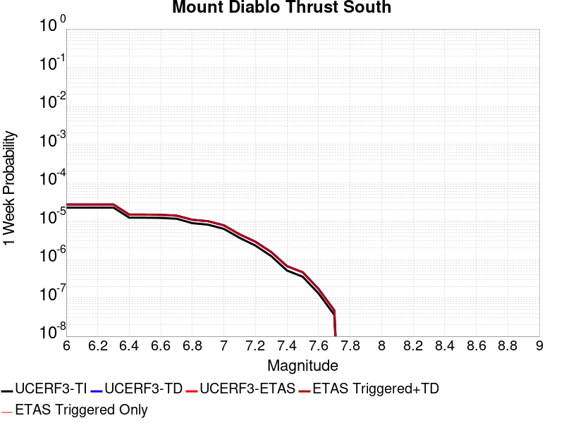 |  |  |  |

| Magnitude | 1 wk TI Prob | 1 wk TD Prob | 1 wk ETAS Prob | 1 wk ETAS/TD Gain | 1 wk ETAS Triggered+TD | 1 wk ETAS Triggered Only | 1 mo TI Prob | 1 mo TD Prob | 1 mo ETAS Prob | 1 mo ETAS/TD Gain | 1 mo ETAS Triggered+TD | 1 mo ETAS Triggered Only | 1 yr TI Prob | 1 yr TD Prob | 1 yr ETAS Prob | 1 yr ETAS/TD Gain | 1 yr ETAS Triggered+TD | 1 yr ETAS Triggered Only | 10 yr TI Prob | 10 yr TD Prob | 10 yr ETAS Prob | 10 yr ETAS/TD Gain | 10 yr ETAS Triggered+TD | 10 yr ETAS Triggered Only |
|-----|-----|-----|-----|-----|-----|-----|-----|-----|-----|-----|-----|-----|-----|-----|-----|-----|-----|-----|-----|-----|-----|-----|-----|-----|
| 6.0 | 2.2377444E-5 | 2.6891565E-5 | 0.0 | 0.0 | 2.6891565E-5 | 0.0 | 9.5899806E-5 | 1.1524554E-4 | 0.0 | 0.0 | 1.1524554E-4 | 0.0 | 0.0011669548 | 0.0014024085 | 1.0E-4 | 0.0713059 | 0.0015022682 | 1.0E-4 | 0.011608457 | 0.013955617 | 4.0E-4 | 0.028662294 | 0.014350035 | 4.0E-4 |
| 6.1 | 2.2377444E-5 | 2.6891565E-5 | 0.0 | 0.0 | 2.6891565E-5 | 0.0 | 9.5899806E-5 | 1.1524554E-4 | 0.0 | 0.0 | 1.1524554E-4 | 0.0 | 0.0011669548 | 0.0014024085 | 1.0E-4 | 0.0713059 | 0.0015022682 | 1.0E-4 | 0.011608457 | 0.013955617 | 4.0E-4 | 0.028662294 | 0.014350035 | 4.0E-4 |
| 6.2 | 2.2377444E-5 | 2.6891565E-5 | 0.0 | 0.0 | 2.6891565E-5 | 0.0 | 9.5899806E-5 | 1.1524554E-4 | 0.0 | 0.0 | 1.1524554E-4 | 0.0 | 0.0011669548 | 0.0014024085 | 1.0E-4 | 0.0713059 | 0.0015022682 | 1.0E-4 | 0.011608457 | 0.013955617 | 4.0E-4 | 0.028662294 | 0.014350035 | 4.0E-4 |
| 6.3 | 2.2377444E-5 | 2.6891565E-5 | 0.0 | 0.0 | 2.6891565E-5 | 0.0 | 9.5899806E-5 | 1.1524554E-4 | 0.0 | 0.0 | 1.1524554E-4 | 0.0 | 0.0011669548 | 0.0014024085 | 1.0E-4 | 0.0713059 | 0.0015022682 | 1.0E-4 | 0.011608457 | 0.013955617 | 4.0E-4 | 0.028662294 | 0.014350035 | 4.0E-4 |
| 6.4 | 1.2228463E-5 | 1.4708772E-5 | 0.0 | 0.0 | 1.4708772E-5 | 0.0 | 5.2406645E-5 | 6.303615E-5 | 0.0 | 0.0 | 6.303615E-5 | 0.0 | 6.378641E-4 | 7.672076E-4 | 1.0E-4 | 0.13034281 | 8.671309E-4 | 1.0E-4 | 0.0063603627 | 0.007647469 | 3.0E-4 | 0.039228663 | 0.007945175 | 3.0E-4 |
| 6.5 | 1.2228463E-5 | 1.4708772E-5 | 0.0 | 0.0 | 1.4708772E-5 | 0.0 | 5.2406645E-5 | 6.303615E-5 | 0.0 | 0.0 | 6.303615E-5 | 0.0 | 6.378641E-4 | 7.672076E-4 | 1.0E-4 | 0.13034281 | 8.671309E-4 | 1.0E-4 | 0.0063603627 | 0.007647469 | 3.0E-4 | 0.039228663 | 0.007945175 | 3.0E-4 |
| 6.6 | 1.2068118E-5 | 1.4514011E-5 | 0.0 | 0.0 | 1.4514011E-5 | 0.0 | 5.1719482E-5 | 6.220149E-5 | 0.0 | 0.0 | 6.220149E-5 | 0.0 | 6.2950276E-4 | 7.570528E-4 | 1.0E-4 | 0.13209118 | 8.5697713E-4 | 1.0E-4 | 0.006277225 | 0.007546615 | 3.0E-4 | 0.039752923 | 0.007844351 | 3.0E-4 |
| 6.7 | 1.1499428E-5 | 1.3838028E-5 | 0.0 | 0.0 | 1.3838028E-5 | 0.0 | 4.9282335E-5 | 5.930456E-5 | 0.0 | 0.0 | 5.930456E-5 | 0.0 | 5.9984723E-4 | 7.218065E-4 | 1.0E-4 | 0.13854128 | 8.217343E-4 | 1.0E-4 | 0.0059823063 | 0.007196482 | 3.0E-4 | 0.041687034 | 0.007494323 | 3.0E-4 |
| 6.8 | 8.82118E-6 | 1.0797723E-5 | 0.0 | 0.0 | 1.0797723E-5 | 0.0 | 3.780451E-5 | 4.6275163E-5 | 0.0 | 0.0 | 4.6275163E-5 | 0.0 | 4.601727E-4 | 5.6326005E-4 | 1.0E-4 | 0.17753789 | 6.632037E-4 | 1.0E-4 | 0.0045922096 | 0.00561947 | 2.0E-4 | 0.035590544 | 0.005818346 | 2.0E-4 |
| 6.9 | 8.047112E-6 | 9.908106E-6 | 0.0 | 0.0 | 9.908106E-6 | 0.0 | 3.4487166E-5 | 4.246265E-5 | 0.0 | 0.0 | 4.246265E-5 | 0.0 | 4.1980037E-4 | 5.1686534E-4 | 1.0E-4 | 0.19347398 | 6.1681366E-4 | 1.0E-4 | 0.004190082 | 0.005157742 | 2.0E-4 | 0.03877666 | 0.0053567104 | 2.0E-4 |
| 7.0 | 6.2574763E-6 | 7.73202E-6 | 0.0 | 0.0 | 7.73202E-6 | 0.0 | 2.681748E-5 | 3.313683E-5 | 0.0 | 0.0 | 3.313683E-5 | 0.0 | 3.264539E-4 | 4.0336986E-4 | 1.0E-4 | 0.24791142 | 5.0332956E-4 | 1.0E-4 | 0.0032597475 | 0.004027368 | 2.0E-4 | 0.04966022 | 0.0042265626 | 2.0E-4 |
| 7.1 | 3.6485903E-6 | 4.5020347E-6 | 0.0 | 0.0 | 4.5020347E-6 | 0.0 | 1.5636722E-5 | 1.9294295E-5 | 0.0 | 0.0 | 1.9294295E-5 | 0.0 | 1.9036046E-4 | 2.3488312E-4 | 1.0E-4 | 0.42574367 | 3.3485962E-4 | 1.0E-4 | 0.0019019748 | 0.0023466544 | 2.0E-4 | 0.08522772 | 0.002546185 | 2.0E-4 |
| 7.2 | 2.3034274E-6 | 2.8973452E-6 | 0.0 | 0.0 | 2.8973452E-6 | 0.0 | 9.871795E-6 | 1.2417136E-5 | 0.0 | 0.0 | 1.2417136E-5 | 0.0 | 1.2018247E-4 | 1.5116838E-4 | 1.0E-4 | 0.661514 | 2.5115325E-4 | 1.0E-4 | 0.0012011749 | 0.0015108308 | 1.0E-4 | 0.06618875 | 0.0016106797 | 1.0E-4 |
| 7.3 | 1.224035E-6 | 1.5621736E-6 | 0.0 | 0.0 | 1.5621736E-6 | 0.0 | 5.245854E-6 | 6.695013E-6 | 0.0 | 0.0 | 6.695013E-6 | 0.0 | 6.38664E-5 | 8.150884E-5 | 0.0 | 0.0 | 8.150884E-5 | 0.0 | 6.384805E-4 | 8.14873E-4 | 0.0 | 0.0 | 8.14873E-4 | 0.0 |
| 7.4 | 5.1601154E-7 | 6.7047233E-7 | 0.0 | 0.0 | 6.7047233E-7 | 0.0 | 2.2114762E-6 | 2.8734498E-6 | 0.0 | 0.0 | 2.8734498E-6 | 0.0 | 2.6924388E-5 | 3.4983706E-5 | 0.0 | 0.0 | 3.4983706E-5 | 0.0 | 2.6921128E-4 | 3.4979658E-4 | 0.0 | 0.0 | 3.4979658E-4 | 0.0 |
| 7.5 | 3.552894E-7 | 4.6502333E-7 | 0.0 | 0.0 | 4.6502333E-7 | 0.0 | 1.5226678E-6 | 1.9929557E-6 | 0.0 | 0.0 | 1.9929557E-6 | 0.0 | 1.8538323E-5 | 2.426398E-5 | 0.0 | 0.0 | 2.426398E-5 | 0.0 | 1.8536777E-4 | 2.4257129E-4 | 0.0 | 0.0 | 2.4257129E-4 | 0.0 |
| 7.6 | 1.3124082E-7 | 1.7187479E-7 | 0.0 | 0.0 | 1.7187479E-7 | 0.0 | 5.6246057E-7 | 7.3660607E-7 | 0.0 | 0.0 | 7.3660607E-7 | 0.0 | 6.8479358E-6 | 8.968151E-6 | 0.0 | 0.0 | 8.968151E-6 | 0.0 | 6.8477246E-5 | 8.96526E-5 | 0.0 | 0.0 | 8.96526E-5 | 0.0 |
| 7.7 | 3.6193022E-8 | 4.7321272E-8 | 0.0 | 0.0 | 4.7321272E-8 | 0.0 | 1.5511293E-7 | 2.0280545E-7 | 0.0 | 0.0 | 2.0280545E-7 | 0.0 | 1.8884983E-6 | 2.4691547E-6 | 0.0 | 0.0 | 2.4691547E-6 | 0.0 | 1.8884823E-5 | 2.4696754E-5 | 0.0 | 0.0 | 2.4696754E-5 | 0.0 |

## Earthquake Valley
*[(top)](#table-of-contents)*

| 1 Week | 1 Month | 1 Year | 10 Year |
|-----|-----|-----|-----|
| 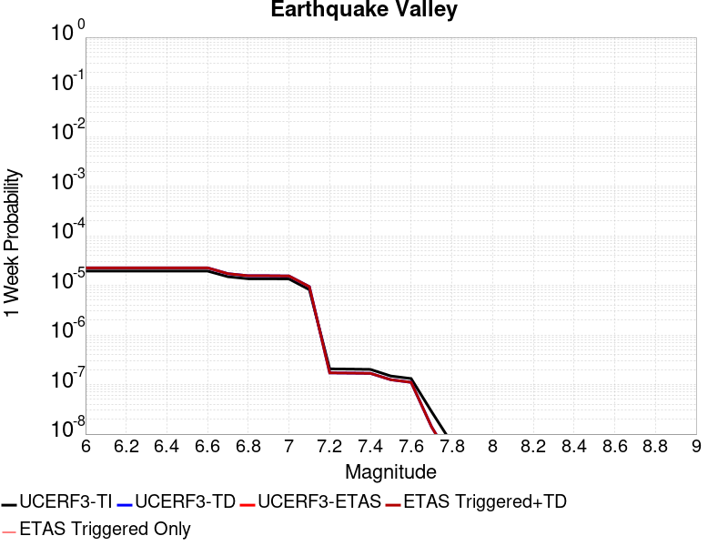 |  | 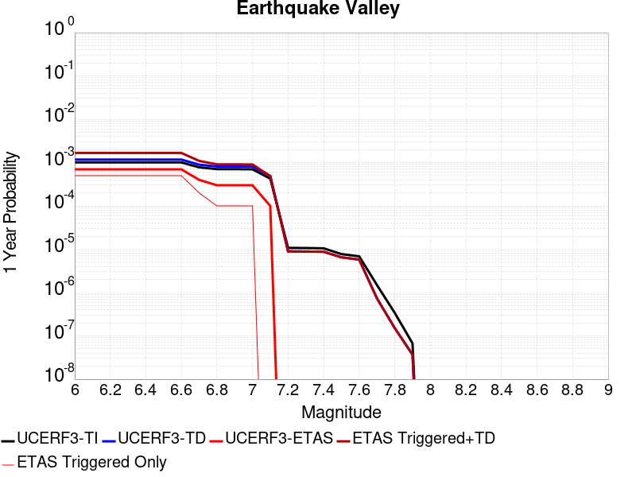 | 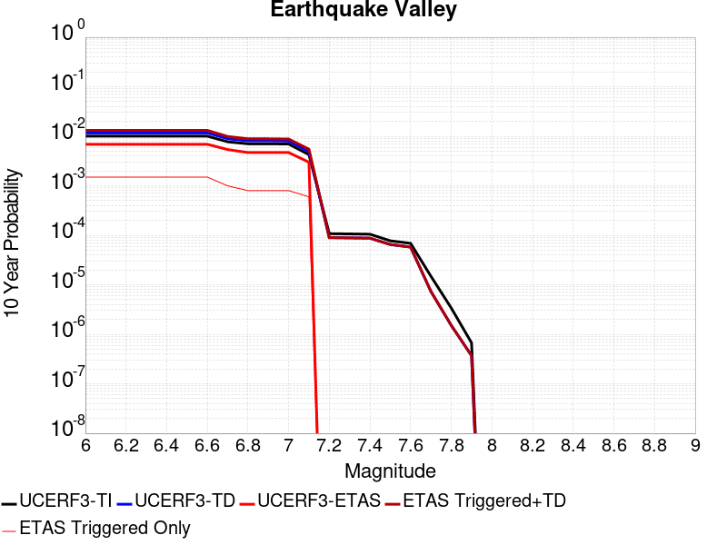 |

| Magnitude | 1 wk TI Prob | 1 wk TD Prob | 1 wk ETAS Prob | 1 wk ETAS/TD Gain | 1 wk ETAS Triggered+TD | 1 wk ETAS Triggered Only | 1 mo TI Prob | 1 mo TD Prob | 1 mo ETAS Prob | 1 mo ETAS/TD Gain | 1 mo ETAS Triggered+TD | 1 mo ETAS Triggered Only | 1 yr TI Prob | 1 yr TD Prob | 1 yr ETAS Prob | 1 yr ETAS/TD Gain | 1 yr ETAS Triggered+TD | 1 yr ETAS Triggered Only | 10 yr TI Prob | 10 yr TD Prob | 10 yr ETAS Prob | 10 yr ETAS/TD Gain | 10 yr ETAS Triggered+TD | 10 yr ETAS Triggered Only |
|-----|-----|-----|-----|-----|-----|-----|-----|-----|-----|-----|-----|-----|-----|-----|-----|-----|-----|-----|-----|-----|-----|-----|-----|-----|
| 6.0 | 1.9416384E-5 | 2.2544515E-5 | 0.0 | 0.0 | 2.2544515E-5 | 0.0 | 8.321042E-5 | 9.6616444E-5 | 1.0E-4 | 1.0350205 | 1.9660678E-4 | 1.0E-4 | 0.001012616 | 0.0011757897 | 3.0E-4 | 0.25514764 | 0.0014754371 | 3.0E-4 | 0.010080142 | 0.011707484 | 5.0E-4 | 0.042707726 | 0.01220163 | 5.0E-4 |
| 6.1 | 1.9416384E-5 | 2.2544515E-5 | 0.0 | 0.0 | 2.2544515E-5 | 0.0 | 8.321042E-5 | 9.6616444E-5 | 1.0E-4 | 1.0350205 | 1.9660678E-4 | 1.0E-4 | 0.001012616 | 0.0011757897 | 3.0E-4 | 0.25514764 | 0.0014754371 | 3.0E-4 | 0.010080142 | 0.011707484 | 5.0E-4 | 0.042707726 | 0.01220163 | 5.0E-4 |
| 6.2 | 1.9416384E-5 | 2.2544515E-5 | 0.0 | 0.0 | 2.2544515E-5 | 0.0 | 8.321042E-5 | 9.6616444E-5 | 1.0E-4 | 1.0350205 | 1.9660678E-4 | 1.0E-4 | 0.001012616 | 0.0011757897 | 3.0E-4 | 0.25514764 | 0.0014754371 | 3.0E-4 | 0.010080142 | 0.011707484 | 5.0E-4 | 0.042707726 | 0.01220163 | 5.0E-4 |
| 6.3 | 1.9416384E-5 | 2.2544515E-5 | 0.0 | 0.0 | 2.2544515E-5 | 0.0 | 8.321042E-5 | 9.6616444E-5 | 1.0E-4 | 1.0350205 | 1.9660678E-4 | 1.0E-4 | 0.001012616 | 0.0011757897 | 3.0E-4 | 0.25514764 | 0.0014754371 | 3.0E-4 | 0.010080142 | 0.011707484 | 5.0E-4 | 0.042707726 | 0.01220163 | 5.0E-4 |
| 6.4 | 1.9416384E-5 | 2.2544515E-5 | 0.0 | 0.0 | 2.2544515E-5 | 0.0 | 8.321042E-5 | 9.6616444E-5 | 1.0E-4 | 1.0350205 | 1.9660678E-4 | 1.0E-4 | 0.001012616 | 0.0011757897 | 3.0E-4 | 0.25514764 | 0.0014754371 | 3.0E-4 | 0.010080142 | 0.011707484 | 5.0E-4 | 0.042707726 | 0.01220163 | 5.0E-4 |
| 6.5 | 1.9389157E-5 | 2.2513153E-5 | 0.0 | 0.0 | 2.2513153E-5 | 0.0 | 8.309374E-5 | 9.648205E-5 | 1.0E-4 | 1.0364622 | 1.964724E-4 | 1.0E-4 | 0.0010111968 | 0.0011741553 | 3.0E-4 | 0.25550282 | 0.0014738031 | 3.0E-4 | 0.010066078 | 0.011691311 | 5.0E-4 | 0.042766802 | 0.012185466 | 5.0E-4 |
| 6.6 | 1.9389157E-5 | 2.2513153E-5 | 0.0 | 0.0 | 2.2513153E-5 | 0.0 | 8.309374E-5 | 9.648205E-5 | 1.0E-4 | 1.0364622 | 1.964724E-4 | 1.0E-4 | 0.0010111968 | 0.0011741553 | 3.0E-4 | 0.25550282 | 0.0014738031 | 3.0E-4 | 0.010066078 | 0.011691311 | 5.0E-4 | 0.042766802 | 0.012185466 | 5.0E-4 |
| 6.7 | 1.4925434E-5 | 1.717964E-5 | 0.0 | 0.0 | 1.717964E-5 | 0.0 | 6.396457E-5 | 7.362543E-5 | 0.0 | 0.0 | 7.362543E-5 | 0.0 | 7.7849044E-4 | 8.961057E-4 | 1.0E-4 | 0.11159398 | 9.960161E-4 | 1.0E-4 | 0.007757689 | 0.008933271 | 3.0E-4 | 0.033582322 | 0.009230591 | 3.0E-4 |
| 6.8 | 1.3570335E-5 | 1.559115E-5 | 0.0 | 0.0 | 1.559115E-5 | 0.0 | 5.8157282E-5 | 6.681796E-5 | 0.0 | 0.0 | 6.681796E-5 | 0.0 | 7.0783484E-4 | 8.1328687E-4 | 1.0E-4 | 0.12295785 | 9.132055E-4 | 1.0E-4 | 0.0070558446 | 0.008111149 | 3.0E-4 | 0.036986127 | 0.008408716 | 3.0E-4 |
| 6.9 | 1.3570335E-5 | 1.559115E-5 | 0.0 | 0.0 | 1.559115E-5 | 0.0 | 5.8157282E-5 | 6.681796E-5 | 0.0 | 0.0 | 6.681796E-5 | 0.0 | 7.0783484E-4 | 8.1328687E-4 | 1.0E-4 | 0.12295785 | 9.132055E-4 | 1.0E-4 | 0.0070558446 | 0.008111149 | 3.0E-4 | 0.036986127 | 0.008408716 | 3.0E-4 |
| 7.0 | 1.3433392E-5 | 1.5434925E-5 | 0.0 | 0.0 | 1.5434925E-5 | 0.0 | 5.757041E-5 | 6.614846E-5 | 0.0 | 0.0 | 6.614846E-5 | 0.0 | 7.0069433E-4 | 8.0514175E-4 | 1.0E-4 | 0.12420173 | 9.0506126E-4 | 1.0E-4 | 0.006984891 | 0.008030289 | 3.0E-4 | 0.03735856 | 0.008327879 | 3.0E-4 |
| 7.1 | 8.181609E-6 | 9.400889E-6 | 0.0 | 0.0 | 9.400889E-6 | 0.0 | 3.5063567E-5 | 4.028928E-5 | 0.0 | 0.0 | 4.028928E-5 | 0.0 | 4.268153E-4 | 4.904784E-4 | 0.0 | 0.0 | 4.904784E-4 | 0.0 | 0.0042599645 | 0.0049005137 | 1.0E-4 | 0.020406025 | 0.0050000236 | 1.0E-4 |
| 7.2 | 2.0663983E-7 | 1.7200274E-7 | 0.0 | 0.0 | 1.7200274E-7 | 0.0 | 8.855989E-7 | 7.371544E-7 | 0.0 | 0.0 | 7.371544E-7 | 0.0 | 1.0782113E-5 | 8.974822E-6 | 0.0 | 0.0 | 8.974822E-6 | 0.0 | 1.07815904E-4 | 8.974495E-5 | 0.0 | 0.0 | 8.974495E-5 | 0.0 |
| 7.3 | 2.0462376E-7 | 1.701601E-7 | 0.0 | 0.0 | 1.701601E-7 | 0.0 | 8.7695867E-7 | 7.292574E-7 | 0.0 | 0.0 | 7.292574E-7 | 0.0 | 1.0676919E-5 | 8.878676E-6 | 0.0 | 0.0 | 8.878676E-6 | 0.0 | 1.0676406E-4 | 8.878357E-5 | 0.0 | 0.0 | 8.878357E-5 | 0.0 |
| 7.4 | 2.0171088E-7 | 1.6799007E-7 | 0.0 | 0.0 | 1.6799007E-7 | 0.0 | 8.644749E-7 | 7.199572E-7 | 0.0 | 0.0 | 7.199572E-7 | 0.0 | 1.0524931E-5 | 8.765447E-6 | 0.0 | 0.0 | 8.765447E-6 | 0.0 | 1.05244326E-4 | 8.765137E-5 | 0.0 | 0.0 | 8.765137E-5 | 0.0 |
| 7.5 | 1.4847944E-7 | 1.2507505E-7 | 0.0 | 0.0 | 1.2507505E-7 | 0.0 | 6.363403E-7 | 5.360358E-7 | 0.0 | 0.0 | 5.360358E-7 | 0.0 | 7.747416E-6 | 6.526219E-6 | 0.0 | 0.0 | 6.526219E-6 | 0.0 | 7.747146E-5 | 6.526049E-5 | 0.0 | 0.0 | 6.526049E-5 | 0.0 |
| 7.6 | 1.3185847E-7 | 1.10822064E-7 | 0.0 | 0.0 | 1.10822064E-7 | 0.0 | 5.6510765E-7 | 4.7495163E-7 | 0.0 | 0.0 | 4.7495163E-7 | 0.0 | 6.8801637E-6 | 5.7825227E-6 | 0.0 | 0.0 | 5.7825227E-6 | 0.0 | 6.8799505E-5 | 5.7823934E-5 | 0.0 | 0.0 | 5.7823934E-5 | 0.0 |
| 7.7 | 2.8609954E-8 | 1.4104295E-8 | 0.0 | 0.0 | 1.4104295E-8 | 0.0 | 1.2261408E-7 | 6.044697E-8 | 0.0 | 0.0 | 6.044697E-8 | 0.0 | 1.4928254E-6 | 7.3594174E-7 | 0.0 | 0.0 | 7.3594174E-7 | 0.0 | 1.4928154E-5 | 7.3593983E-6 | 0.0 | 0.0 | 7.3593983E-6 | 0.0 |
| 7.8 | 6.527266E-9 | 2.906815E-9 | 0.0 | 0.0 | 2.906815E-9 | 0.0 | 2.7973995E-8 | 1.2457779E-8 | 0.0 | 0.0 | 1.2457779E-8 | 0.0 | 3.4058334E-7 | 1.5167345E-7 | 0.0 | 0.0 | 1.5167345E-7 | 0.0 | 3.4058282E-6 | 1.5167336E-6 | 0.0 | 0.0 | 1.5167336E-6 | 0.0 |
| 7.9 | 1.2898267E-9 | 7.108556E-10 | 0.0 | 0.0 | 7.108556E-10 | 0.0 | 5.527829E-9 | 3.046524E-9 | 0.0 | 0.0 | 3.046524E-9 | 0.0 | 6.7301315E-8 | 3.709143E-8 | 0.0 | 0.0 | 3.709143E-8 | 0.0 | 6.7301295E-7 | 3.7091428E-7 | 0.0 | 0.0 | 3.7091428E-7 | 0.0 |

## Honey Lake 2011 CFM
*[(top)](#table-of-contents)*

| 1 Week | 1 Month | 1 Year | 10 Year |
|-----|-----|-----|-----|
|  |  |  |  |

| Magnitude | 1 wk TI Prob | 1 wk TD Prob | 1 wk ETAS Prob | 1 wk ETAS/TD Gain | 1 wk ETAS Triggered+TD | 1 wk ETAS Triggered Only | 1 mo TI Prob | 1 mo TD Prob | 1 mo ETAS Prob | 1 mo ETAS/TD Gain | 1 mo ETAS Triggered+TD | 1 mo ETAS Triggered Only | 1 yr TI Prob | 1 yr TD Prob | 1 yr ETAS Prob | 1 yr ETAS/TD Gain | 1 yr ETAS Triggered+TD | 1 yr ETAS Triggered Only | 10 yr TI Prob | 10 yr TD Prob | 10 yr ETAS Prob | 10 yr ETAS/TD Gain | 10 yr ETAS Triggered+TD | 10 yr ETAS Triggered Only |
|-----|-----|-----|-----|-----|-----|-----|-----|-----|-----|-----|-----|-----|-----|-----|-----|-----|-----|-----|-----|-----|-----|-----|-----|-----|
| 6.0 | 6.155506E-5 | 7.931081E-5 | 0.0 | 0.0 | 7.931081E-5 | 0.0 | 2.6378073E-4 | 3.3986222E-4 | 0.0 | 0.0 | 3.3986222E-4 | 0.0 | 0.0032068014 | 0.004130419 | 2.0E-4 | 0.048421238 | 0.004329593 | 2.0E-4 | 0.03160919 | 0.040585518 | 5.0E-4 | 0.0123196645 | 0.041065227 | 5.0E-4 |
| 6.1 | 6.155506E-5 | 7.931081E-5 | 0.0 | 0.0 | 7.931081E-5 | 0.0 | 2.6378073E-4 | 3.3986222E-4 | 0.0 | 0.0 | 3.3986222E-4 | 0.0 | 0.0032068014 | 0.004130419 | 2.0E-4 | 0.048421238 | 0.004329593 | 2.0E-4 | 0.03160919 | 0.040585518 | 5.0E-4 | 0.0123196645 | 0.041065227 | 5.0E-4 |
| 6.2 | 4.1335024E-5 | 5.242969E-5 | 0.0 | 0.0 | 5.242969E-5 | 0.0 | 1.7713808E-4 | 2.2468017E-4 | 0.0 | 0.0 | 2.2468017E-4 | 0.0 | 0.0021545228 | 0.0027322022 | 2.0E-4 | 0.07320102 | 0.0029316559 | 2.0E-4 | 0.021337535 | 0.027002474 | 5.0E-4 | 0.018516822 | 0.027488973 | 5.0E-4 |
| 6.3 | 4.1335024E-5 | 5.242969E-5 | 0.0 | 0.0 | 5.242969E-5 | 0.0 | 1.7713808E-4 | 2.2468017E-4 | 0.0 | 0.0 | 2.2468017E-4 | 0.0 | 0.0021545228 | 0.0027322022 | 2.0E-4 | 0.07320102 | 0.0029316559 | 2.0E-4 | 0.021337535 | 0.027002474 | 5.0E-4 | 0.018516822 | 0.027488973 | 5.0E-4 |
| 6.4 | 3.2393702E-5 | 4.077656E-5 | 0.0 | 0.0 | 4.077656E-5 | 0.0 | 1.3882275E-4 | 1.7474558E-4 | 0.0 | 0.0 | 1.7474558E-4 | 0.0 | 0.0016888566 | 0.0021255575 | 2.0E-4 | 0.09409296 | 0.0023251325 | 2.0E-4 | 0.016760793 | 0.021063395 | 4.0E-4 | 0.018990291 | 0.02145497 | 4.0E-4 |
| 6.5 | 2.7205504E-5 | 3.412049E-5 | 0.0 | 0.0 | 3.412049E-5 | 0.0 | 1.1658981E-4 | 1.4622297E-4 | 0.0 | 0.0 | 1.4622297E-4 | 0.0 | 0.0014185566 | 0.0017789049 | 2.0E-4 | 0.11242872 | 0.0019785492 | 2.0E-4 | 0.014095354 | 0.017656205 | 4.0E-4 | 0.022654925 | 0.018049143 | 4.0E-4 |
| 6.6 | 2.069265E-5 | 2.5886791E-5 | 0.0 | 0.0 | 2.5886791E-5 | 0.0 | 8.867977E-5 | 1.1093912E-4 | 0.0 | 0.0 | 1.1093912E-4 | 0.0 | 0.0010791414 | 0.0013499307 | 2.0E-4 | 0.14815575 | 0.0015496607 | 2.0E-4 | 0.010739161 | 0.0134256575 | 4.0E-4 | 0.029793698 | 0.013820288 | 4.0E-4 |
| 6.7 | 1.8060919E-5 | 2.2596809E-5 | 0.0 | 0.0 | 2.2596809E-5 | 0.0 | 7.7401644E-5 | 9.684032E-5 | 0.0 | 0.0 | 9.684032E-5 | 0.0 | 9.419576E-4 | 0.0011784737 | 1.0E-4 | 0.08485552 | 0.0012783558 | 1.0E-4 | 0.009379748 | 0.011730251 | 3.0E-4 | 0.0255749 | 0.012026732 | 3.0E-4 |
| 6.8 | 1.4474663E-5 | 1.8132809E-5 | 0.0 | 0.0 | 1.8132809E-5 | 0.0 | 6.203279E-5 | 7.7710145E-5 | 0.0 | 0.0 | 7.7710145E-5 | 0.0 | 7.5498753E-4 | 9.4578636E-4 | 1.0E-4 | 0.10573213 | 0.0010456918 | 1.0E-4 | 0.007524277 | 0.009425106 | 3.0E-4 | 0.03182988 | 0.009722278 | 3.0E-4 |
| 6.9 | 8.564552E-6 | 1.0772938E-5 | 0.0 | 0.0 | 1.0772938E-5 | 0.0 | 3.6704707E-5 | 4.6169287E-5 | 0.0 | 0.0 | 4.6169287E-5 | 0.0 | 4.4678818E-4 | 5.6203216E-4 | 0.0 | 0.0 | 5.6203216E-4 | 0.0 | 0.0044589094 | 0.005612575 | 1.0E-4 | 0.017817134 | 0.0057120137 | 1.0E-4 |

## Quien Sabe 2011 CFM
*[(top)](#table-of-contents)*

| 1 Week | 1 Month | 1 Year | 10 Year |
|-----|-----|-----|-----|
|  | 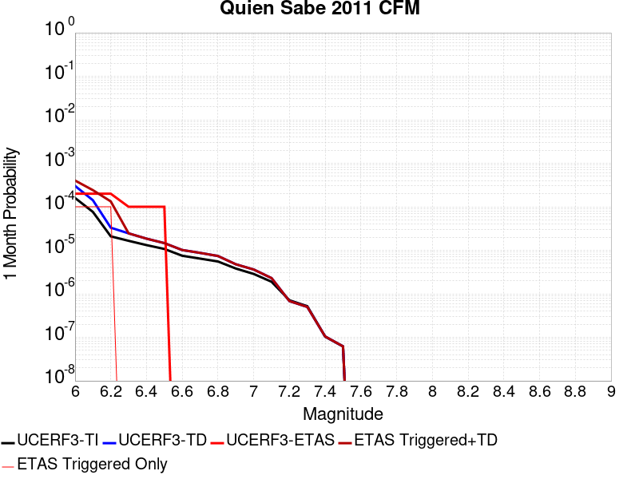 |  |  |

| Magnitude | 1 wk TI Prob | 1 wk TD Prob | 1 wk ETAS Prob | 1 wk ETAS/TD Gain | 1 wk ETAS Triggered+TD | 1 wk ETAS Triggered Only | 1 mo TI Prob | 1 mo TD Prob | 1 mo ETAS Prob | 1 mo ETAS/TD Gain | 1 mo ETAS Triggered+TD | 1 mo ETAS Triggered Only | 1 yr TI Prob | 1 yr TD Prob | 1 yr ETAS Prob | 1 yr ETAS/TD Gain | 1 yr ETAS Triggered+TD | 1 yr ETAS Triggered Only | 10 yr TI Prob | 10 yr TD Prob | 10 yr ETAS Prob | 10 yr ETAS/TD Gain | 10 yr ETAS Triggered+TD | 10 yr ETAS Triggered Only |
|-----|-----|-----|-----|-----|-----|-----|-----|-----|-----|-----|-----|-----|-----|-----|-----|-----|-----|-----|-----|-----|-----|-----|-----|-----|
| 6.0 | 3.729899E-5 | 7.065252E-5 | 0.0 | 0.0 | 7.065252E-5 | 0.0 | 1.5984301E-4 | 3.0270868E-4 | 0.0 | 0.0 | 3.0270868E-4 | 0.0 | 0.0019443515 | 0.0036701858 | 0.0 | 0.0 | 0.0036701858 | 0.0 | 0.019274272 | 0.035221227 | 5.0E-4 | 0.014195984 | 0.035703618 | 5.0E-4 |
| 6.1 | 1.7825725E-5 | 3.304532E-5 | 0.0 | 0.0 | 3.304532E-5 | 0.0 | 7.639373E-5 | 1.4160175E-4 | 0.0 | 0.0 | 1.4160175E-4 | 0.0 | 9.296967E-4 | 0.0017183855 | 0.0 | 0.0 | 0.0017183855 | 0.0 | 0.009258169 | 0.016626084 | 4.0E-4 | 0.024058582 | 0.017019434 | 4.0E-4 |
| 6.2 | 4.8865336E-6 | 7.731312E-6 | 0.0 | 0.0 | 7.731312E-6 | 0.0 | 2.0942118E-5 | 3.313373E-5 | 0.0 | 0.0 | 3.313373E-5 | 0.0 | 2.5494045E-4 | 4.0298793E-4 | 0.0 | 0.0 | 4.0298793E-4 | 0.0 | 0.0025464818 | 0.003977334 | 1.0E-4 | 0.02514247 | 0.0040769363 | 1.0E-4 |
| 6.3 | 3.858491E-6 | 5.72091E-6 | 0.0 | 0.0 | 5.72091E-6 | 0.0 | 1.6536285E-5 | 2.4517982E-5 | 0.0 | 0.0 | 2.4517982E-5 | 0.0 | 2.0131067E-4 | 2.984701E-4 | 0.0 | 0.0 | 2.984701E-4 | 0.0 | 0.002011284 | 0.0029687511 | 0.0 | 0.0 | 0.0029687511 | 0.0 |
| 6.4 | 3.0771805E-6 | 4.3260084E-6 | 0.0 | 0.0 | 4.3260084E-6 | 0.0 | 1.318785E-5 | 1.8539917E-5 | 0.0 | 0.0 | 1.8539917E-5 | 0.0 | 1.6055023E-4 | 2.2570248E-4 | 0.0 | 0.0 | 2.2570248E-4 | 0.0 | 0.001604343 | 0.0022578666 | 0.0 | 0.0 | 0.0022578666 | 0.0 |
| 6.5 | 2.5081235E-6 | 3.4144905E-6 | 0.0 | 0.0 | 3.4144905E-6 | 0.0 | 1.0749056E-5 | 1.4633457E-5 | 0.0 | 0.0 | 1.4633457E-5 | 0.0 | 1.308619E-4 | 1.781492E-4 | 0.0 | 0.0 | 1.781492E-4 | 0.0 | 0.0013078486 | 0.0017882477 | 0.0 | 0.0 | 0.0017882477 | 0.0 |
| 6.6 | 1.7505364E-6 | 2.370007E-6 | 0.0 | 0.0 | 2.370007E-6 | 0.0 | 7.502277E-6 | 1.0157138E-5 | 0.0 | 0.0 | 1.0157138E-5 | 0.0 | 9.13364E-5 | 1.2365682E-4 | 0.0 | 0.0 | 1.2365682E-4 | 0.0 | 9.129886E-4 | 0.001242428 | 0.0 | 0.0 | 0.001242428 | 0.0 |
| 6.7 | 1.505737E-6 | 2.0362945E-6 | 0.0 | 0.0 | 2.0362945E-6 | 0.0 | 6.4531428E-6 | 8.726951E-6 | 0.0 | 0.0 | 8.726951E-6 | 0.0 | 7.8564175E-5 | 1.0624603E-4 | 0.0 | 0.0 | 1.0624603E-4 | 0.0 | 7.853641E-4 | 0.0010682659 | 0.0 | 0.0 | 0.0010682659 | 0.0 |
| 6.8 | 1.2924105E-6 | 1.7271491E-6 | 0.0 | 0.0 | 1.7271491E-6 | 0.0 | 5.5388905E-6 | 7.4020495E-6 | 0.0 | 0.0 | 7.4020495E-6 | 0.0 | 6.74339E-5 | 9.011676E-5 | 0.0 | 0.0 | 9.011676E-5 | 0.0 | 6.741344E-4 | 9.0557896E-4 | 0.0 | 0.0 | 9.0557896E-4 | 0.0 |
| 6.9 | 8.9075286E-7 | 1.1142547E-6 | 0.0 | 0.0 | 1.1142547E-6 | 0.0 | 3.8175067E-6 | 4.7753697E-6 | 0.0 | 0.0 | 4.7753697E-6 | 0.0 | 4.6477155E-5 | 5.8138794E-5 | 0.0 | 0.0 | 5.8138794E-5 | 0.0 | 4.6467435E-4 | 5.849777E-4 | 0.0 | 0.0 | 5.849777E-4 | 0.0 |
| 7.0 | 6.6891175E-7 | 8.44982E-7 | 0.0 | 0.0 | 8.44982E-7 | 0.0 | 2.8667614E-6 | 3.6213476E-6 | 0.0 | 0.0 | 3.6213476E-6 | 0.0 | 3.4902263E-5 | 4.4089207E-5 | 0.0 | 0.0 | 4.4089207E-5 | 0.0 | 3.4896782E-4 | 4.4339887E-4 | 0.0 | 0.0 | 4.4339887E-4 | 0.0 |
| 7.1 | 4.4205015E-7 | 5.364283E-7 | 0.0 | 0.0 | 5.364283E-7 | 0.0 | 1.8944993E-6 | 2.2989773E-6 | 0.0 | 0.0 | 2.2989773E-6 | 0.0 | 2.3065284E-5 | 2.7989856E-5 | 0.0 | 0.0 | 2.7989856E-5 | 0.0 | 2.3062891E-4 | 2.813194E-4 | 0.0 | 0.0 | 2.813194E-4 | 0.0 |
| 7.2 | 1.6620965E-7 | 1.587583E-7 | 0.0 | 0.0 | 1.587583E-7 | 0.0 | 7.123269E-7 | 6.8039253E-7 | 0.0 | 0.0 | 6.8039253E-7 | 0.0 | 8.672545E-6 | 8.283751E-6 | 0.0 | 0.0 | 8.283751E-6 | 0.0 | 8.6722066E-5 | 8.3000945E-5 | 0.0 | 0.0 | 8.3000945E-5 | 0.0 |
| 7.3 | 1.2142488E-7 | 1.1659369E-7 | 0.0 | 0.0 | 1.1659369E-7 | 0.0 | 5.2039223E-7 | 4.9968713E-7 | 0.0 | 0.0 | 4.9968713E-7 | 0.0 | 6.335757E-6 | 6.0836774E-6 | 0.0 | 0.0 | 6.0836774E-6 | 0.0 | 6.3355765E-5 | 6.0916547E-5 | 0.0 | 0.0 | 6.0916547E-5 | 0.0 |
| 7.4 | 2.4192937E-8 | 2.44361E-8 | 0.0 | 0.0 | 2.44361E-8 | 0.0 | 1.0368401E-7 | 1.0472613E-7 | 0.0 | 0.0 | 1.0472613E-7 | 0.0 | 1.2623522E-6 | 1.2750401E-6 | 0.0 | 0.0 | 1.2750401E-6 | 0.0 | 1.2623449E-5 | 1.2770978E-5 | 0.0 | 0.0 | 1.2770978E-5 | 0.0 |
| 7.5 | 1.4432802E-8 | 1.4471932E-8 | 0.0 | 0.0 | 1.4471932E-8 | 0.0 | 6.185486E-8 | 6.2022565E-8 | 0.0 | 0.0 | 6.2022565E-8 | 0.0 | 7.530827E-7 | 7.551246E-7 | 0.0 | 0.0 | 7.551246E-7 | 0.0 | 7.530801E-6 | 7.570129E-6 | 0.0 | 0.0 | 7.570129E-6 | 0.0 |

## Mount Diablo Thrust North CFM
*[(top)](#table-of-contents)*

| 1 Week | 1 Month | 1 Year | 10 Year |
|-----|-----|-----|-----|
|  |  |  |  |

| Magnitude | 1 wk TI Prob | 1 wk TD Prob | 1 wk ETAS Prob | 1 wk ETAS/TD Gain | 1 wk ETAS Triggered+TD | 1 wk ETAS Triggered Only | 1 mo TI Prob | 1 mo TD Prob | 1 mo ETAS Prob | 1 mo ETAS/TD Gain | 1 mo ETAS Triggered+TD | 1 mo ETAS Triggered Only | 1 yr TI Prob | 1 yr TD Prob | 1 yr ETAS Prob | 1 yr ETAS/TD Gain | 1 yr ETAS Triggered+TD | 1 yr ETAS Triggered Only | 10 yr TI Prob | 10 yr TD Prob | 10 yr ETAS Prob | 10 yr ETAS/TD Gain | 10 yr ETAS Triggered+TD | 10 yr ETAS Triggered Only |
|-----|-----|-----|-----|-----|-----|-----|-----|-----|-----|-----|-----|-----|-----|-----|-----|-----|-----|-----|-----|-----|-----|-----|-----|-----|
| 6.0 | 1.479628E-5 | 1.8715906E-5 | 0.0 | 0.0 | 1.8715906E-5 | 0.0 | 6.341109E-5 | 8.020861E-5 | 0.0 | 0.0 | 8.020861E-5 | 0.0 | 7.717565E-4 | 9.761118E-4 | 2.0E-4 | 0.20489456 | 0.0011759166 | 2.0E-4 | 0.007690818 | 0.009722127 | 4.0E-4 | 0.041143265 | 0.010118238 | 4.0E-4 |
| 6.1 | 1.479628E-5 | 1.8715906E-5 | 0.0 | 0.0 | 1.8715906E-5 | 0.0 | 6.341109E-5 | 8.020861E-5 | 0.0 | 0.0 | 8.020861E-5 | 0.0 | 7.717565E-4 | 9.761118E-4 | 2.0E-4 | 0.20489456 | 0.0011759166 | 2.0E-4 | 0.007690818 | 0.009722127 | 4.0E-4 | 0.041143265 | 0.010118238 | 4.0E-4 |
| 6.2 | 1.479628E-5 | 1.8715906E-5 | 0.0 | 0.0 | 1.8715906E-5 | 0.0 | 6.341109E-5 | 8.020861E-5 | 0.0 | 0.0 | 8.020861E-5 | 0.0 | 7.717565E-4 | 9.761118E-4 | 2.0E-4 | 0.20489456 | 0.0011759166 | 2.0E-4 | 0.007690818 | 0.009722127 | 4.0E-4 | 0.041143265 | 0.010118238 | 4.0E-4 |
| 6.3 | 1.479628E-5 | 1.8715906E-5 | 0.0 | 0.0 | 1.8715906E-5 | 0.0 | 6.341109E-5 | 8.020861E-5 | 0.0 | 0.0 | 8.020861E-5 | 0.0 | 7.717565E-4 | 9.761118E-4 | 2.0E-4 | 0.20489456 | 0.0011759166 | 2.0E-4 | 0.007690818 | 0.009722127 | 4.0E-4 | 0.041143265 | 0.010118238 | 4.0E-4 |
| 6.4 | 1.479628E-5 | 1.8715906E-5 | 0.0 | 0.0 | 1.8715906E-5 | 0.0 | 6.341109E-5 | 8.020861E-5 | 0.0 | 0.0 | 8.020861E-5 | 0.0 | 7.717565E-4 | 9.761118E-4 | 2.0E-4 | 0.20489456 | 0.0011759166 | 2.0E-4 | 0.007690818 | 0.009722127 | 4.0E-4 | 0.041143265 | 0.010118238 | 4.0E-4 |
| 6.5 | 1.479628E-5 | 1.8715906E-5 | 0.0 | 0.0 | 1.8715906E-5 | 0.0 | 6.341109E-5 | 8.020861E-5 | 0.0 | 0.0 | 8.020861E-5 | 0.0 | 7.717565E-4 | 9.761118E-4 | 2.0E-4 | 0.20489456 | 0.0011759166 | 2.0E-4 | 0.007690818 | 0.009722127 | 4.0E-4 | 0.041143265 | 0.010118238 | 4.0E-4 |
| 6.6 | 1.479016E-5 | 1.8709026E-5 | 0.0 | 0.0 | 1.8709026E-5 | 0.0 | 6.338486E-5 | 8.0179125E-5 | 0.0 | 0.0 | 8.0179125E-5 | 0.0 | 7.714374E-4 | 9.757532E-4 | 2.0E-4 | 0.20496987 | 0.0011755581 | 2.0E-4 | 0.007687649 | 0.009718572 | 4.0E-4 | 0.04115831 | 0.010114684 | 4.0E-4 |
| 6.7 | 1.479016E-5 | 1.8709026E-5 | 0.0 | 0.0 | 1.8709026E-5 | 0.0 | 6.338486E-5 | 8.0179125E-5 | 0.0 | 0.0 | 8.0179125E-5 | 0.0 | 7.714374E-4 | 9.757532E-4 | 2.0E-4 | 0.20496987 | 0.0011755581 | 2.0E-4 | 0.007687649 | 0.009718572 | 4.0E-4 | 0.04115831 | 0.010114684 | 4.0E-4 |
| 6.8 | 1.4771667E-5 | 1.868783E-5 | 0.0 | 0.0 | 1.868783E-5 | 0.0 | 6.330561E-5 | 8.008829E-5 | 0.0 | 0.0 | 8.008829E-5 | 0.0 | 7.704732E-4 | 9.746482E-4 | 2.0E-4 | 0.20520224 | 0.0011744533 | 2.0E-4 | 0.007678074 | 0.0097076185 | 4.0E-4 | 0.04120475 | 0.010103735 | 4.0E-4 |
| 6.9 | 1.2548234E-5 | 1.577091E-5 | 0.0 | 0.0 | 1.577091E-5 | 0.0 | 5.3777036E-5 | 6.758788E-5 | 0.0 | 0.0 | 6.758788E-5 | 0.0 | 6.545387E-4 | 8.225753E-4 | 2.0E-4 | 0.24313885 | 0.0010224108 | 2.0E-4 | 0.006526142 | 0.00819642 | 4.0E-4 | 0.048801795 | 0.008593142 | 4.0E-4 |
| 7.0 | 1.01754185E-5 | 1.2775895E-5 | 0.0 | 0.0 | 1.2775895E-5 | 0.0 | 4.360821E-5 | 5.4752694E-5 | 0.0 | 0.0 | 5.4752694E-5 | 0.0 | 5.308006E-4 | 6.664118E-4 | 2.0E-4 | 0.30011472 | 8.6627854E-4 | 2.0E-4 | 0.005295345 | 0.006645098 | 4.0E-4 | 0.06019475 | 0.0070424397 | 4.0E-4 |
| 7.1 | 8.398341E-6 | 1.0523696E-5 | 0.0 | 0.0 | 1.0523696E-5 | 0.0 | 3.5992394E-5 | 4.510078E-5 | 0.0 | 0.0 | 4.510078E-5 | 0.0 | 4.3811928E-4 | 5.489647E-4 | 1.0E-4 | 0.18216106 | 6.4890983E-4 | 1.0E-4 | 0.0043725655 | 0.0054764855 | 3.0E-4 | 0.054779656 | 0.0057748426 | 3.0E-4 |
| 7.2 | 6.024759E-6 | 7.622678E-6 | 0.0 | 0.0 | 7.622678E-6 | 0.0 | 2.582014E-5 | 3.2668217E-5 | 0.0 | 0.0 | 3.2668217E-5 | 0.0 | 3.1431485E-4 | 3.9766362E-4 | 1.0E-4 | 0.2514688 | 4.9762387E-4 | 1.0E-4 | 0.0031387066 | 0.003969908 | 1.0E-4 | 0.0251895 | 0.0040695113 | 1.0E-4 |
| 7.3 | 3.2099704E-6 | 4.117058E-6 | 0.0 | 0.0 | 4.117058E-6 | 0.0 | 1.3756943E-5 | 1.7644415E-5 | 0.0 | 0.0 | 1.7644415E-5 | 0.0 | 1.674779E-4 | 2.1479974E-4 | 0.0 | 0.0 | 2.1479974E-4 | 0.0 | 0.0016735174 | 0.0021460056 | 0.0 | 0.0 | 0.0021460056 | 0.0 |
| 7.4 | 2.2041513E-6 | 2.8601714E-6 | 0.0 | 0.0 | 2.8601714E-6 | 0.0 | 9.4463285E-6 | 1.225782E-5 | 0.0 | 0.0 | 1.225782E-5 | 0.0 | 1.1500298E-4 | 1.4922881E-4 | 0.0 | 0.0 | 1.4922881E-4 | 0.0 | 0.0011494348 | 0.0014912793 | 0.0 | 0.0 | 0.0014912793 | 0.0 |
| 7.5 | 1.8869501E-6 | 2.4573346E-6 | 0.0 | 0.0 | 2.4573346E-6 | 0.0 | 8.086904E-6 | 1.0531392E-5 | 0.0 | 0.0 | 1.0531392E-5 | 0.0 | 9.845361E-5 | 1.2821222E-4 | 0.0 | 0.0 | 1.2821222E-4 | 0.0 | 9.841E-4 | 0.001281347 | 0.0 | 0.0 | 0.001281347 | 0.0 |
| 7.6 | 1.3012458E-6 | 1.6901882E-6 | 0.0 | 0.0 | 1.6901882E-6 | 0.0 | 5.576756E-6 | 7.243644E-6 | 0.0 | 0.0 | 7.243644E-6 | 0.0 | 6.7894885E-5 | 8.818785E-5 | 0.0 | 0.0 | 8.818785E-5 | 0.0 | 6.787415E-4 | 8.81489E-4 | 0.0 | 0.0 | 8.81489E-4 | 0.0 |
| 7.7 | 3.603383E-7 | 4.6900843E-7 | 0.0 | 0.0 | 4.6900843E-7 | 0.0 | 1.5443061E-6 | 2.0100347E-6 | 0.0 | 0.0 | 2.0100347E-6 | 0.0 | 1.8801764E-5 | 2.4471903E-5 | 0.0 | 0.0 | 2.4471903E-5 | 0.0 | 1.8800174E-4 | 2.4469846E-4 | 0.0 | 0.0 | 2.4469846E-4 | 0.0 |

## Bennett Valley 2011 CFM
*[(top)](#table-of-contents)*

| 1 Week | 1 Month | 1 Year | 10 Year |
|-----|-----|-----|-----|
| 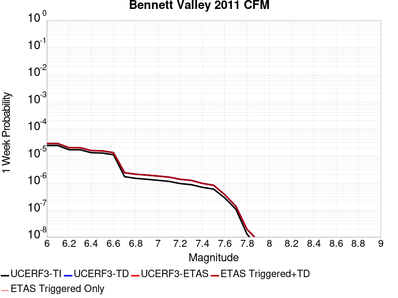 | 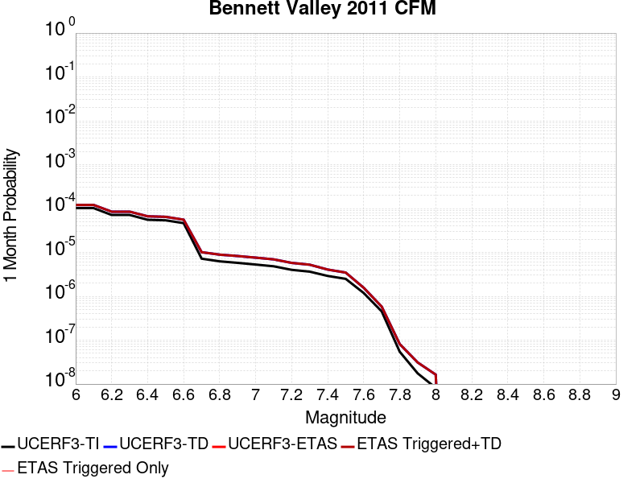 | 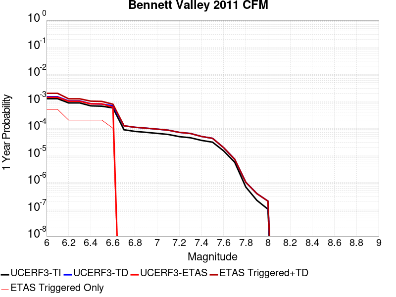 |  |

| Magnitude | 1 wk TI Prob | 1 wk TD Prob | 1 wk ETAS Prob | 1 wk ETAS/TD Gain | 1 wk ETAS Triggered+TD | 1 wk ETAS Triggered Only | 1 mo TI Prob | 1 mo TD Prob | 1 mo ETAS Prob | 1 mo ETAS/TD Gain | 1 mo ETAS Triggered+TD | 1 mo ETAS Triggered Only | 1 yr TI Prob | 1 yr TD Prob | 1 yr ETAS Prob | 1 yr ETAS/TD Gain | 1 yr ETAS Triggered+TD | 1 yr ETAS Triggered Only | 10 yr TI Prob | 10 yr TD Prob | 10 yr ETAS Prob | 10 yr ETAS/TD Gain | 10 yr ETAS Triggered+TD | 10 yr ETAS Triggered Only |
|-----|-----|-----|-----|-----|-----|-----|-----|-----|-----|-----|-----|-----|-----|-----|-----|-----|-----|-----|-----|-----|-----|-----|-----|-----|
| 6.0 | 2.3893934E-5 | 2.817474E-5 | 0.0 | 0.0 | 2.817474E-5 | 0.0 | 1.0239855E-4 | 1.20744335E-4 | 0.0 | 0.0 | 1.20744335E-4 | 0.0 | 0.0012459893 | 0.0014692552 | 1.0E-4 | 0.068061695 | 0.0015691083 | 1.0E-4 | 0.012390262 | 0.014617991 | 4.0E-4 | 0.027363542 | 0.015012143 | 4.0E-4 |
| 6.1 | 2.3893934E-5 | 2.817474E-5 | 0.0 | 0.0 | 2.817474E-5 | 0.0 | 1.0239855E-4 | 1.20744335E-4 | 0.0 | 0.0 | 1.20744335E-4 | 0.0 | 0.0012459893 | 0.0014692552 | 1.0E-4 | 0.068061695 | 0.0015691083 | 1.0E-4 | 0.012390262 | 0.014617991 | 4.0E-4 | 0.027363542 | 0.015012143 | 4.0E-4 |
| 6.2 | 1.6657146E-5 | 1.9803494E-5 | 0.0 | 0.0 | 1.9803494E-5 | 0.0 | 7.138582E-5 | 8.487015E-5 | 0.0 | 0.0 | 8.487015E-5 | 0.0 | 8.6877577E-4 | 0.0010329452 | 0.0 | 0.0 | 0.0010329452 | 0.0 | 0.008653872 | 0.010299649 | 2.0E-4 | 0.019418137 | 0.010497589 | 2.0E-4 |
| 6.3 | 1.6657146E-5 | 1.9803494E-5 | 0.0 | 0.0 | 1.9803494E-5 | 0.0 | 7.138582E-5 | 8.487015E-5 | 0.0 | 0.0 | 8.487015E-5 | 0.0 | 8.6877577E-4 | 0.0010329452 | 0.0 | 0.0 | 0.0010329452 | 0.0 | 0.008653872 | 0.010299649 | 2.0E-4 | 0.019418137 | 0.010497589 | 2.0E-4 |
| 6.4 | 1.29418495E-5 | 1.552408E-5 | 0.0 | 0.0 | 1.552408E-5 | 0.0 | 5.546389E-5 | 6.653081E-5 | 0.0 | 0.0 | 6.653081E-5 | 0.0 | 6.7506364E-4 | 8.098413E-4 | 0.0 | 0.0 | 8.098413E-4 | 0.0 | 0.0067301663 | 0.0080859875 | 2.0E-4 | 0.024734147 | 0.00828437 | 2.0E-4 |
| 6.5 | 1.2582504E-5 | 1.5091854E-5 | 0.0 | 0.0 | 1.5091854E-5 | 0.0 | 5.39239E-5 | 6.46785E-5 | 0.0 | 0.0 | 6.46785E-5 | 0.0 | 6.563257E-4 | 7.8730594E-4 | 0.0 | 0.0 | 7.8730594E-4 | 0.0 | 0.006543907 | 0.007862272 | 2.0E-4 | 0.02543794 | 0.008060699 | 2.0E-4 |
| 6.6 | 1.0846706E-5 | 1.2997634E-5 | 0.0 | 0.0 | 1.2997634E-5 | 0.0 | 4.6485053E-5 | 5.5703676E-5 | 0.0 | 0.0 | 5.5703676E-5 | 0.0 | 5.6580856E-4 | 6.781091E-4 | 0.0 | 0.0 | 6.781091E-4 | 0.0 | 0.005643701 | 0.0067773764 | 2.0E-4 | 0.029509945 | 0.0069760205 | 2.0E-4 |
| 6.7 | 1.6803231E-6 | 2.355859E-6 | 0.0 | 0.0 | 2.355859E-6 | 0.0 | 7.2013645E-6 | 1.00965E-5 | 0.0 | 0.0 | 1.00965E-5 | 0.0 | 8.7673085E-5 | 1.2291808E-4 | 0.0 | 0.0 | 1.2291808E-4 | 0.0 | 8.76385E-4 | 0.0012331385 | 0.0 | 0.0 | 0.0012331385 | 0.0 |
| 6.8 | 1.4609833E-6 | 2.072452E-6 | 0.0 | 0.0 | 2.072452E-6 | 0.0 | 6.261342E-6 | 8.881906E-6 | 0.0 | 0.0 | 8.881906E-6 | 0.0 | 7.6229175E-5 | 1.0813191E-4 | 0.0 | 0.0 | 1.0813191E-4 | 0.0 | 7.620303E-4 | 0.0010853742 | 0.0 | 0.0 | 0.0010853742 | 0.0 |
| 6.9 | 1.3492396E-6 | 1.9247504E-6 | 0.0 | 0.0 | 1.9247504E-6 | 0.0 | 5.7824427E-6 | 8.248904E-6 | 0.0 | 0.0 | 8.248904E-6 | 0.0 | 7.0398964E-5 | 1.00425845E-4 | 0.0 | 0.0 | 1.00425845E-4 | 0.0 | 7.037667E-4 | 0.0010083566 | 0.0 | 0.0 | 0.0010083566 | 0.0 |
| 7.0 | 1.2347921E-6 | 1.7690137E-6 | 0.0 | 0.0 | 1.7690137E-6 | 0.0 | 5.291955E-6 | 7.5814655E-6 | 0.0 | 0.0 | 7.5814655E-6 | 0.0 | 6.442765E-5 | 9.230049E-5 | 0.0 | 0.0 | 9.230049E-5 | 0.0 | 6.440897E-4 | 9.271397E-4 | 0.0 | 0.0 | 9.271397E-4 | 0.0 |
| 7.1 | 1.1262973E-6 | 1.6163733E-6 | 0.0 | 0.0 | 1.6163733E-6 | 0.0 | 4.8269794E-6 | 6.927296E-6 | 0.0 | 0.0 | 6.927296E-6 | 0.0 | 5.876689E-5 | 8.4336614E-5 | 0.0 | 0.0 | 8.4336614E-5 | 0.0 | 5.875135E-4 | 8.475391E-4 | 0.0 | 0.0 | 8.475391E-4 | 0.0 |
| 7.2 | 9.351744E-7 | 1.3420482E-6 | 0.0 | 0.0 | 1.3420482E-6 | 0.0 | 4.007884E-6 | 5.7516227E-6 | 0.0 | 0.0 | 5.7516227E-6 | 0.0 | 4.8794896E-5 | 7.002378E-5 | 0.0 | 0.0 | 7.002378E-5 | 0.0 | 4.878418E-4 | 7.0446555E-4 | 0.0 | 0.0 | 7.0446555E-4 | 0.0 |
| 7.3 | 8.5039534E-7 | 1.2206865E-6 | 0.0 | 0.0 | 1.2206865E-6 | 0.0 | 3.6445463E-6 | 5.231503E-6 | 0.0 | 0.0 | 5.231503E-6 | 0.0 | 4.437145E-5 | 6.369171E-5 | 0.0 | 0.0 | 6.369171E-5 | 0.0 | 4.436259E-4 | 6.408765E-4 | 0.0 | 0.0 | 6.408765E-4 | 0.0 |
| 7.4 | 6.7875015E-7 | 9.4619816E-7 | 0.0 | 0.0 | 9.4619816E-7 | 0.0 | 2.908926E-6 | 4.0551286E-6 | 0.0 | 0.0 | 4.0551286E-6 | 0.0 | 3.54156E-5 | 4.9370083E-5 | 0.0 | 0.0 | 4.9370083E-5 | 0.0 | 3.5409955E-4 | 4.96984E-4 | 0.0 | 0.0 | 4.96984E-4 | 0.0 |
| 7.5 | 5.826867E-7 | 8.074313E-7 | 0.0 | 0.0 | 8.074313E-7 | 0.0 | 2.4972264E-6 | 3.4604152E-6 | 0.0 | 0.0 | 3.4604152E-6 | 0.0 | 3.0403306E-5 | 4.2129748E-5 | 0.0 | 0.0 | 4.2129748E-5 | 0.0 | 3.0399146E-4 | 4.2416374E-4 | 0.0 | 0.0 | 4.2416374E-4 | 0.0 |
| 7.6 | 2.7734902E-7 | 3.6406664E-7 | 0.0 | 0.0 | 3.6406664E-7 | 0.0 | 1.1886381E-6 | 1.5602847E-6 | 0.0 | 0.0 | 1.5602847E-6 | 0.0 | 1.4471572E-5 | 1.8996301E-5 | 0.0 | 0.0 | 1.8996301E-5 | 0.0 | 1.447063E-4 | 1.9096595E-4 | 0.0 | 0.0 | 1.9096595E-4 | 0.0 |
| 7.7 | 1.0530888E-7 | 1.350075E-7 | 0.0 | 0.0 | 1.350075E-7 | 0.0 | 4.513237E-7 | 5.786034E-7 | 0.0 | 0.0 | 5.786034E-7 | 0.0 | 5.4948523E-6 | 7.044474E-6 | 0.0 | 0.0 | 7.044474E-6 | 0.0 | 5.4947162E-5 | 7.130604E-5 | 0.0 | 0.0 | 7.130604E-5 | 0.0 |
| 7.8 | 1.2714258E-8 | 1.8897655E-8 | 0.0 | 0.0 | 1.8897655E-8 | 0.0 | 5.448968E-8 | 8.098995E-8 | 0.0 | 0.0 | 8.098995E-8 | 0.0 | 6.6341164E-7 | 9.860522E-7 | 0.0 | 0.0 | 9.860522E-7 | 0.0 | 6.6340967E-6 | 1.0286996E-5 | 0.0 | 0.0 | 1.0286996E-5 | 0.0 |
| 7.9 | 4.075888E-9 | 7.176765E-9 | 0.0 | 0.0 | 7.176765E-9 | 0.0 | 1.7468091E-8 | 3.0757562E-8 | 0.0 | 0.0 | 3.0757562E-8 | 0.0 | 2.12674E-7 | 3.7447322E-7 | 0.0 | 0.0 | 3.7447322E-7 | 0.0 | 2.1267379E-6 | 4.0035866E-6 | 0.0 | 0.0 | 4.0035866E-6 | 0.0 |
| 8.0 | 1.9126138E-9 | 3.802908E-9 | 0.0 | 0.0 | 3.802908E-9 | 0.0 | 8.196917E-9 | 1.6298175E-8 | 0.0 | 0.0 | 1.6298175E-8 | 0.0 | 9.9797454E-8 | 1.9843026E-7 | 0.0 | 0.0 | 1.9843026E-7 | 0.0 | 9.979741E-7 | 2.103499E-6 | 0.0 | 0.0 | 2.103499E-6 | 0.0 |

## Earthquake Valley (So Extension)
*[(top)](#table-of-contents)*

| 1 Week | 1 Month | 1 Year | 10 Year |
|-----|-----|-----|-----|
|  |  |  |  |

| Magnitude | 1 wk TI Prob | 1 wk TD Prob | 1 wk ETAS Prob | 1 wk ETAS/TD Gain | 1 wk ETAS Triggered+TD | 1 wk ETAS Triggered Only | 1 mo TI Prob | 1 mo TD Prob | 1 mo ETAS Prob | 1 mo ETAS/TD Gain | 1 mo ETAS Triggered+TD | 1 mo ETAS Triggered Only | 1 yr TI Prob | 1 yr TD Prob | 1 yr ETAS Prob | 1 yr ETAS/TD Gain | 1 yr ETAS Triggered+TD | 1 yr ETAS Triggered Only | 10 yr TI Prob | 10 yr TD Prob | 10 yr ETAS Prob | 10 yr ETAS/TD Gain | 10 yr ETAS Triggered+TD | 10 yr ETAS Triggered Only |
|-----|-----|-----|-----|-----|-----|-----|-----|-----|-----|-----|-----|-----|-----|-----|-----|-----|-----|-----|-----|-----|-----|-----|-----|-----|
| 6.0 | 3.0194888E-5 | 3.698353E-5 | 0.0 | 0.0 | 3.698353E-5 | 0.0 | 1.2940024E-4 | 1.5849427E-4 | 1.0E-4 | 0.6309377 | 2.5847842E-4 | 1.0E-4 | 0.0015743093 | 0.0019284706 | 2.0E-4 | 0.10370913 | 0.002128085 | 2.0E-4 | 0.01563203 | 0.019167658 | 4.0E-4 | 0.020868486 | 0.01955999 | 4.0E-4 |
| 6.1 | 3.0194888E-5 | 3.698353E-5 | 0.0 | 0.0 | 3.698353E-5 | 0.0 | 1.2940024E-4 | 1.5849427E-4 | 1.0E-4 | 0.6309377 | 2.5847842E-4 | 1.0E-4 | 0.0015743093 | 0.0019284706 | 2.0E-4 | 0.10370913 | 0.002128085 | 2.0E-4 | 0.01563203 | 0.019167658 | 4.0E-4 | 0.020868486 | 0.01955999 | 4.0E-4 |
| 6.2 | 3.0194888E-5 | 3.698353E-5 | 0.0 | 0.0 | 3.698353E-5 | 0.0 | 1.2940024E-4 | 1.5849427E-4 | 1.0E-4 | 0.6309377 | 2.5847842E-4 | 1.0E-4 | 0.0015743093 | 0.0019284706 | 2.0E-4 | 0.10370913 | 0.002128085 | 2.0E-4 | 0.01563203 | 0.019167658 | 4.0E-4 | 0.020868486 | 0.01955999 | 4.0E-4 |
| 6.3 | 1.5795305E-5 | 1.8413415E-5 | 0.0 | 0.0 | 1.8413415E-5 | 0.0 | 6.769241E-5 | 7.8912875E-5 | 1.0E-4 | 1.2672204 | 1.7890499E-4 | 1.0E-4 | 8.238434E-4 | 9.604512E-4 | 2.0E-4 | 0.20823546 | 0.0011602591 | 2.0E-4 | 0.008207959 | 0.009573867 | 4.0E-4 | 0.0417804 | 0.009970037 | 4.0E-4 |
| 6.4 | 1.5795305E-5 | 1.8413415E-5 | 0.0 | 0.0 | 1.8413415E-5 | 0.0 | 6.769241E-5 | 7.8912875E-5 | 1.0E-4 | 1.2672204 | 1.7890499E-4 | 1.0E-4 | 8.238434E-4 | 9.604512E-4 | 2.0E-4 | 0.20823546 | 0.0011602591 | 2.0E-4 | 0.008207959 | 0.009573867 | 4.0E-4 | 0.0417804 | 0.009970037 | 4.0E-4 |
| 6.5 | 1.5795305E-5 | 1.8413415E-5 | 0.0 | 0.0 | 1.8413415E-5 | 0.0 | 6.769241E-5 | 7.8912875E-5 | 1.0E-4 | 1.2672204 | 1.7890499E-4 | 1.0E-4 | 8.238434E-4 | 9.604512E-4 | 2.0E-4 | 0.20823546 | 0.0011602591 | 2.0E-4 | 0.008207959 | 0.009573867 | 4.0E-4 | 0.0417804 | 0.009970037 | 4.0E-4 |
| 6.6 | 1.5795305E-5 | 1.8413415E-5 | 0.0 | 0.0 | 1.8413415E-5 | 0.0 | 6.769241E-5 | 7.8912875E-5 | 1.0E-4 | 1.2672204 | 1.7890499E-4 | 1.0E-4 | 8.238434E-4 | 9.604512E-4 | 2.0E-4 | 0.20823546 | 0.0011602591 | 2.0E-4 | 0.008207959 | 0.009573867 | 4.0E-4 | 0.0417804 | 0.009970037 | 4.0E-4 |
| 6.7 | 1.1363076E-5 | 1.31159995E-5 | 0.0 | 0.0 | 1.31159995E-5 | 0.0 | 4.8697988E-5 | 5.6210643E-5 | 0.0 | 0.0 | 5.6210643E-5 | 0.0 | 5.927367E-4 | 6.842256E-4 | 0.0 | 0.0 | 6.842256E-4 | 0.0 | 0.0059115817 | 0.0068286373 | 2.0E-4 | 0.02928842 | 0.0070272717 | 2.0E-4 |
| 6.8 | 1.0049611E-5 | 1.15748635E-5 | 0.0 | 0.0 | 1.15748635E-5 | 0.0 | 4.306905E-5 | 4.9606024E-5 | 0.0 | 0.0 | 4.9606024E-5 | 0.0 | 5.242395E-4 | 6.038589E-4 | 0.0 | 0.0 | 6.038589E-4 | 0.0 | 0.0052300454 | 0.0060293335 | 2.0E-4 | 0.033171162 | 0.006228128 | 2.0E-4 |
| 6.9 | 1.0049611E-5 | 1.15748635E-5 | 0.0 | 0.0 | 1.15748635E-5 | 0.0 | 4.306905E-5 | 4.9606024E-5 | 0.0 | 0.0 | 4.9606024E-5 | 0.0 | 5.242395E-4 | 6.038589E-4 | 0.0 | 0.0 | 6.038589E-4 | 0.0 | 0.0052300454 | 0.0060293335 | 2.0E-4 | 0.033171162 | 0.006228128 | 2.0E-4 |
| 7.0 | 1.0049611E-5 | 1.15748635E-5 | 0.0 | 0.0 | 1.15748635E-5 | 0.0 | 4.306905E-5 | 4.9606024E-5 | 0.0 | 0.0 | 4.9606024E-5 | 0.0 | 5.242395E-4 | 6.038589E-4 | 0.0 | 0.0 | 6.038589E-4 | 0.0 | 0.0052300454 | 0.0060293335 | 2.0E-4 | 0.033171162 | 0.006228128 | 2.0E-4 |
| 7.1 | 8.140254E-6 | 9.367627E-6 | 0.0 | 0.0 | 9.367627E-6 | 0.0 | 3.4886336E-5 | 4.014673E-5 | 0.0 | 0.0 | 4.014673E-5 | 0.0 | 4.2465836E-4 | 4.8874365E-4 | 0.0 | 0.0 | 4.8874365E-4 | 0.0 | 0.0042384774 | 0.0048832423 | 1.0E-4 | 0.020478196 | 0.004982754 | 1.0E-4 |
| 7.2 | 1.673835E-7 | 1.410432E-7 | 0.0 | 0.0 | 1.410432E-7 | 0.0 | 7.173577E-7 | 6.044707E-7 | 0.0 | 0.0 | 6.044707E-7 | 0.0 | 8.733795E-6 | 7.3594097E-6 | 0.0 | 0.0 | 7.3594097E-6 | 0.0 | 8.733451E-5 | 7.359201E-5 | 0.0 | 0.0 | 7.359201E-5 | 0.0 |
| 7.3 | 1.6632116E-7 | 1.4002664E-7 | 0.0 | 0.0 | 1.4002664E-7 | 0.0 | 7.1280476E-7 | 6.0011405E-7 | 0.0 | 0.0 | 6.0011405E-7 | 0.0 | 8.678364E-6 | 7.306368E-6 | 0.0 | 0.0 | 7.306368E-6 | 0.0 | 8.6780245E-5 | 7.306163E-5 | 0.0 | 0.0 | 7.306163E-5 | 0.0 |
| 7.4 | 1.6569169E-7 | 1.3947373E-7 | 0.0 | 0.0 | 1.3947373E-7 | 0.0 | 7.1010703E-7 | 5.977445E-7 | 0.0 | 0.0 | 5.977445E-7 | 0.0 | 8.645519E-6 | 7.277518E-6 | 0.0 | 0.0 | 7.277518E-6 | 0.0 | 8.645182E-5 | 7.277315E-5 | 0.0 | 0.0 | 7.277315E-5 | 0.0 |
| 7.5 | 1.1764555E-7 | 1.0053396E-7 | 0.0 | 0.0 | 1.0053396E-7 | 0.0 | 5.041951E-7 | 4.3085976E-7 | 0.0 | 0.0 | 4.3085976E-7 | 0.0 | 6.138558E-6 | 5.245707E-6 | 0.0 | 0.0 | 5.245707E-6 | 0.0 | 6.1383886E-5 | 5.2456046E-5 | 0.0 | 0.0 | 5.2456046E-5 | 0.0 |
| 7.6 | 1.07927605E-7 | 9.226856E-8 | 0.0 | 0.0 | 9.226856E-8 | 0.0 | 4.6254678E-7 | 3.9543662E-7 | 0.0 | 0.0 | 3.9543662E-7 | 0.0 | 5.6314925E-6 | 4.8144325E-6 | 0.0 | 0.0 | 4.8144325E-6 | 0.0 | 5.63135E-5 | 4.8143487E-5 | 0.0 | 0.0 | 4.8143487E-5 | 0.0 |
| 7.7 | 2.1826905E-8 | 1.11334355E-8 | 0.0 | 0.0 | 1.11334355E-8 | 0.0 | 9.3543875E-8 | 4.771472E-8 | 0.0 | 0.0 | 4.771472E-8 | 0.0 | 1.1388961E-6 | 5.809266E-7 | 0.0 | 0.0 | 5.809266E-7 | 0.0 | 1.1388902E-5 | 5.8092564E-6 | 0.0 | 0.0 | 5.8092564E-6 | 0.0 |
| 7.8 | 2.6169649E-9 | 1.1922348E-9 | 0.0 | 0.0 | 1.1922348E-9 | 0.0 | 1.1215564E-8 | 5.1095776E-9 | 0.0 | 0.0 | 5.1095776E-9 | 0.0 | 1.3654947E-7 | 6.220911E-8 | 0.0 | 0.0 | 6.220911E-8 | 0.0 | 1.365494E-6 | 6.220911E-7 | 0.0 | 0.0 | 6.220911E-7 | 0.0 |

## San Andreas (North Coast) 2011 CFM
*[(top)](#table-of-contents)*

| 1 Week | 1 Month | 1 Year | 10 Year |
|-----|-----|-----|-----|
| 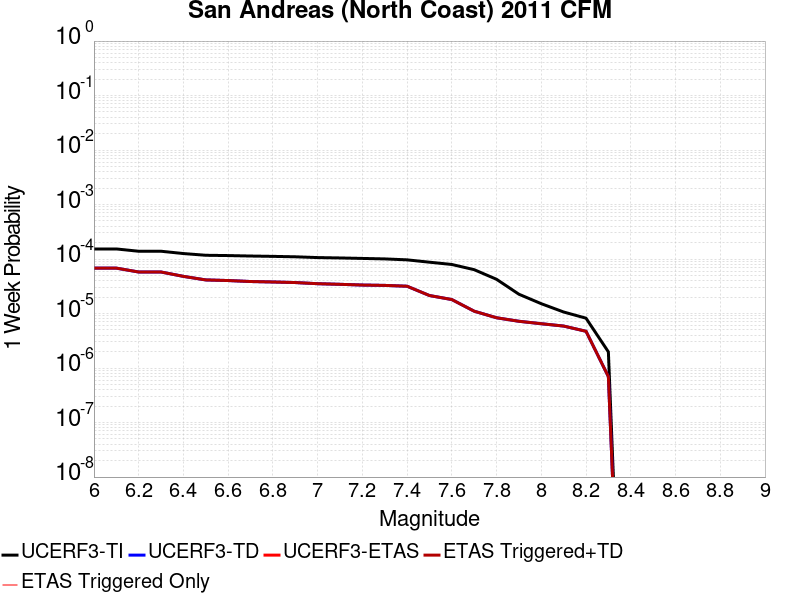 |  |  |  |

| Magnitude | 1 wk TI Prob | 1 wk TD Prob | 1 wk ETAS Prob | 1 wk ETAS/TD Gain | 1 wk ETAS Triggered+TD | 1 wk ETAS Triggered Only | 1 mo TI Prob | 1 mo TD Prob | 1 mo ETAS Prob | 1 mo ETAS/TD Gain | 1 mo ETAS Triggered+TD | 1 mo ETAS Triggered Only | 1 yr TI Prob | 1 yr TD Prob | 1 yr ETAS Prob | 1 yr ETAS/TD Gain | 1 yr ETAS Triggered+TD | 1 yr ETAS Triggered Only | 10 yr TI Prob | 10 yr TD Prob | 10 yr ETAS Prob | 10 yr ETAS/TD Gain | 10 yr ETAS Triggered+TD | 10 yr ETAS Triggered Only |
|-----|-----|-----|-----|-----|-----|-----|-----|-----|-----|-----|-----|-----|-----|-----|-----|-----|-----|-----|-----|-----|-----|-----|-----|-----|
| 6.0 | 1.5333705E-4 | 6.766802E-5 | 0.0 | 0.0 | 6.766802E-5 | 0.0 | 6.5699324E-4 | 2.8997372E-4 | 0.0 | 0.0 | 2.8997372E-4 | 0.0 | 0.007969595 | 0.003524746 | 0.0 | 0.0 | 0.003524746 | 0.0 | 0.0768977 | 0.037589617 | 4.0E-4 | 0.010641236 | 0.03797458 | 4.0E-4 |
| 6.1 | 1.5333705E-4 | 6.766802E-5 | 0.0 | 0.0 | 6.766802E-5 | 0.0 | 6.5699324E-4 | 2.8997372E-4 | 0.0 | 0.0 | 2.8997372E-4 | 0.0 | 0.007969595 | 0.003524746 | 0.0 | 0.0 | 0.003524746 | 0.0 | 0.0768977 | 0.037589617 | 4.0E-4 | 0.010641236 | 0.03797458 | 4.0E-4 |
| 6.2 | 1.3912938E-4 | 5.7452213E-5 | 0.0 | 0.0 | 5.7452213E-5 | 0.0 | 5.961325E-4 | 2.4620065E-4 | 0.0 | 0.0 | 2.4620065E-4 | 0.0 | 0.007233787 | 0.0029933979 | 0.0 | 0.0 | 0.0029933979 | 0.0 | 0.07002798 | 0.03210448 | 4.0E-4 | 0.01245932 | 0.03249164 | 4.0E-4 |
| 6.3 | 1.3912938E-4 | 5.7452213E-5 | 0.0 | 0.0 | 5.7452213E-5 | 0.0 | 5.961325E-4 | 2.4620065E-4 | 0.0 | 0.0 | 2.4620065E-4 | 0.0 | 0.007233787 | 0.0029933979 | 0.0 | 0.0 | 0.0029933979 | 0.0 | 0.07002798 | 0.03210448 | 4.0E-4 | 0.01245932 | 0.03249164 | 4.0E-4 |
| 6.4 | 1.2623647E-4 | 4.7755788E-5 | 0.0 | 0.0 | 4.7755788E-5 | 0.0 | 5.4090127E-4 | 2.046517E-4 | 0.0 | 0.0 | 2.046517E-4 | 0.0 | 0.0065656058 | 0.002488806 | 0.0 | 0.0 | 0.002488806 | 0.0 | 0.06374981 | 0.026867876 | 4.0E-4 | 0.014887668 | 0.027257128 | 4.0E-4 |
| 6.5 | 1.1736096E-4 | 4.1086143E-5 | 0.0 | 0.0 | 4.1086143E-5 | 0.0 | 5.028786E-4 | 1.7607167E-4 | 0.0 | 0.0 | 1.7607167E-4 | 0.0 | 0.006105373 | 0.00214158 | 0.0 | 0.0 | 0.00214158 | 0.0 | 0.05940335 | 0.023259372 | 4.0E-4 | 0.017197369 | 0.023650067 | 4.0E-4 |
| 6.6 | 1.1586959E-4 | 4.0026378E-5 | 0.0 | 0.0 | 4.0026378E-5 | 0.0 | 4.964894E-4 | 1.7153042E-4 | 0.0 | 0.0 | 1.7153042E-4 | 0.0 | 0.006028018 | 0.0020863975 | 0.0 | 0.0 | 0.0020863975 | 0.0 | 0.058671024 | 0.022684598 | 4.0E-4 | 0.01763311 | 0.023075525 | 4.0E-4 |
| 6.7 | 1.13693764E-4 | 3.8397164E-5 | 0.0 | 0.0 | 3.8397164E-5 | 0.0 | 4.87168E-4 | 1.6454897E-4 | 0.0 | 0.0 | 1.6454897E-4 | 0.0 | 0.005915152 | 0.0020015577 | 0.0 | 0.0 | 0.0020015577 | 0.0 | 0.057601593 | 0.021802919 | 4.0E-4 | 0.018346168 | 0.022194197 | 4.0E-4 |
| 6.8 | 1.1204889E-4 | 3.7655755E-5 | 0.0 | 0.0 | 3.7655755E-5 | 0.0 | 4.8012115E-4 | 1.613719E-4 | 0.0 | 0.0 | 1.613719E-4 | 0.0 | 0.005829819 | 0.0019629472 | 0.0 | 0.0 | 0.0019629472 | 0.0 | 0.05679232 | 0.021383688 | 4.0E-4 | 0.018705847 | 0.021775136 | 4.0E-4 |
| 6.9 | 1.1005794E-4 | 3.676468E-5 | 0.0 | 0.0 | 3.676468E-5 | 0.0 | 4.7159163E-4 | 1.5755347E-4 | 0.0 | 0.0 | 1.5755347E-4 | 0.0 | 0.0057265228 | 0.0019165406 | 0.0 | 0.0 | 0.0019165406 | 0.0 | 0.055811852 | 0.020875853 | 4.0E-4 | 0.019160893 | 0.021267503 | 4.0E-4 |
| 7.0 | 1.0647948E-4 | 3.5022644E-5 | 0.0 | 0.0 | 3.5022644E-5 | 0.0 | 4.562608E-4 | 1.500885E-4 | 0.0 | 0.0 | 1.500885E-4 | 0.0 | 0.0055408357 | 0.0018258102 | 0.0 | 0.0 | 0.0018258102 | 0.0 | 0.054047033 | 0.019885093 | 4.0E-4 | 0.020115571 | 0.020277139 | 4.0E-4 |
| 7.1 | 1.04795035E-4 | 3.4122386E-5 | 0.0 | 0.0 | 3.4122386E-5 | 0.0 | 4.4904428E-4 | 1.4623068E-4 | 0.0 | 0.0 | 1.4623068E-4 | 0.0 | 0.0054534175 | 0.001778919 | 0.0 | 0.0 | 0.001778919 | 0.0 | 0.053215165 | 0.01937682 | 4.0E-4 | 0.020643221 | 0.019769069 | 4.0E-4 |
| 7.2 | 1.02724036E-4 | 3.308761E-5 | 0.0 | 0.0 | 3.308761E-5 | 0.0 | 4.401716E-4 | 1.4179641E-4 | 0.0 | 0.0 | 1.4179641E-4 | 0.0 | 0.0053459285 | 0.0017250185 | 0.0 | 0.0 | 0.0017250185 | 0.0 | 0.052191395 | 0.018794429 | 4.0E-4 | 0.021282902 | 0.019186912 | 4.0E-4 |
| 7.3 | 1.00650694E-4 | 3.260041E-5 | 0.0 | 0.0 | 3.260041E-5 | 0.0 | 4.312888E-4 | 1.3970863E-4 | 0.0 | 0.0 | 1.3970863E-4 | 0.0 | 0.005238306 | 0.0016996397 | 0.0 | 0.0 | 0.0016996397 | 0.0 | 0.051165357 | 0.018496355 | 4.0E-4 | 0.021625882 | 0.018888958 | 4.0E-4 |
| 7.4 | 9.672919E-5 | 3.148635E-5 | 0.0 | 0.0 | 3.148635E-5 | 0.0 | 4.144878E-4 | 1.349346E-4 | 0.0 | 0.0 | 1.349346E-4 | 0.0 | 0.005034718 | 0.0016416048 | 0.0 | 0.0 | 0.0016416048 | 0.0 | 0.049221683 | 0.017822465 | 4.0E-4 | 0.022443583 | 0.018215336 | 4.0E-4 |
| 7.5 | 8.7600405E-5 | 2.1235626E-5 | 0.0 | 0.0 | 2.1235626E-5 | 0.0 | 3.753763E-4 | 9.100666E-5 | 0.0 | 0.0 | 9.100666E-5 | 0.0 | 0.0045606326 | 0.0011074445 | 0.0 | 0.0 | 0.0011074445 | 0.0 | 0.04468165 | 0.012287517 | 2.0E-4 | 0.01627668 | 0.01248506 | 2.0E-4 |
| 7.6 | 7.9562284E-5 | 1.7900134E-5 | 0.0 | 0.0 | 1.7900134E-5 | 0.0 | 3.4093665E-4 | 7.671262E-5 | 0.0 | 0.0 | 7.671262E-5 | 0.0 | 0.0041430052 | 9.335773E-4 | 0.0 | 0.0 | 9.335773E-4 | 0.0 | 0.040666126 | 0.010452909 | 2.0E-4 | 0.019133428 | 0.010650819 | 2.0E-4 |
| 7.7 | 6.3866544E-5 | 1.0916352E-5 | 0.0 | 0.0 | 1.0916352E-5 | 0.0 | 2.7368503E-4 | 4.6783527E-5 | 0.0 | 0.0 | 4.6783527E-5 | 0.0 | 0.0033270244 | 5.6944083E-4 | 0.0 | 0.0 | 5.6944083E-4 | 0.0 | 0.032776527 | 0.0066051716 | 1.0E-4 | 0.0151396515 | 0.006704511 | 1.0E-4 |
| 7.8 | 4.2543215E-5 | 8.2648585E-6 | 0.0 | 0.0 | 8.2648585E-6 | 0.0 | 1.8231533E-4 | 3.542034E-5 | 0.0 | 0.0 | 3.542034E-5 | 0.0 | 0.0022174292 | 4.3115742E-4 | 0.0 | 0.0 | 4.3115742E-4 | 0.0 | 0.021954332 | 0.005016888 | 1.0E-4 | 0.019932674 | 0.0051163863 | 1.0E-4 |
| 7.9 | 2.2636612E-5 | 7.128954E-6 | 0.0 | 0.0 | 7.128954E-6 | 0.0 | 9.7010445E-5 | 3.0552303E-5 | 0.0 | 0.0 | 3.0552303E-5 | 0.0 | 0.0011804621 | 3.7191086E-4 | 0.0 | 0.0 | 3.7191086E-4 | 0.0 | 0.011742111 | 0.0042953272 | 1.0E-4 | 0.023281114 | 0.0043948977 | 1.0E-4 |
| 8.0 | 1.5167874E-5 | 6.4312753E-6 | 0.0 | 0.0 | 6.4312753E-6 | 0.0 | 6.500356E-5 | 2.7562317E-5 | 0.0 | 0.0 | 2.7562317E-5 | 0.0 | 7.9113094E-4 | 3.355196E-4 | 0.0 | 0.0 | 3.355196E-4 | 0.0 | 0.007883203 | 0.0038709831 | 1.0E-4 | 0.02583323 | 0.003970596 | 1.0E-4 |
| 8.1 | 1.0681047E-5 | 5.8263768E-6 | 0.0 | 0.0 | 5.8263768E-6 | 0.0 | 4.5775112E-5 | 2.4969948E-5 | 0.0 | 0.0 | 2.4969948E-5 | 0.0 | 5.5716943E-4 | 3.0396678E-4 | 0.0 | 0.0 | 3.0396678E-4 | 0.0 | 0.0055577457 | 0.0035073597 | 1.0E-4 | 0.028511476 | 0.0036070088 | 1.0E-4 |
| 8.2 | 8.226114E-6 | 4.6759387E-6 | 0.0 | 0.0 | 4.6759387E-6 | 0.0 | 3.52543E-5 | 2.0039583E-5 | 0.0 | 0.0 | 2.0039583E-5 | 0.0 | 4.2913653E-4 | 2.4395468E-4 | 0.0 | 0.0 | 2.4395468E-4 | 0.0 | 0.004283088 | 0.0028035406 | 1.0E-4 | 0.035669185 | 0.00290326 | 1.0E-4 |
| 8.3 | 1.983087E-6 | 6.880041E-7 | 0.0 | 0.0 | 6.880041E-7 | 0.0 | 8.498917E-6 | 2.9485857E-6 | 0.0 | 0.0 | 2.9485857E-6 | 0.0 | 1.034694E-4 | 3.589845E-5 | 0.0 | 0.0 | 3.589845E-5 | 0.0 | 0.0010342124 | 4.2701262E-4 | 0.0 | 0.0 | 4.2701262E-4 | 0.0 |

## Ventura-Pitas Point
*[(top)](#table-of-contents)*

| 1 Week | 1 Month | 1 Year | 10 Year |
|-----|-----|-----|-----|
| 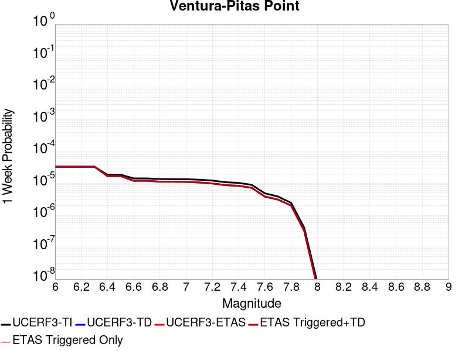 |  | 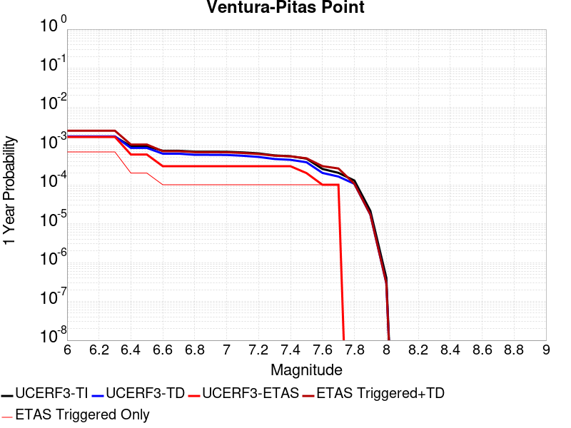 |  |

| Magnitude | 1 wk TI Prob | 1 wk TD Prob | 1 wk ETAS Prob | 1 wk ETAS/TD Gain | 1 wk ETAS Triggered+TD | 1 wk ETAS Triggered Only | 1 mo TI Prob | 1 mo TD Prob | 1 mo ETAS Prob | 1 mo ETAS/TD Gain | 1 mo ETAS Triggered+TD | 1 mo ETAS Triggered Only | 1 yr TI Prob | 1 yr TD Prob | 1 yr ETAS Prob | 1 yr ETAS/TD Gain | 1 yr ETAS Triggered+TD | 1 yr ETAS Triggered Only | 10 yr TI Prob | 10 yr TD Prob | 10 yr ETAS Prob | 10 yr ETAS/TD Gain | 10 yr ETAS Triggered+TD | 10 yr ETAS Triggered Only |
|-----|-----|-----|-----|-----|-----|-----|-----|-----|-----|-----|-----|-----|-----|-----|-----|-----|-----|-----|-----|-----|-----|-----|-----|-----|
| 6.0 | 3.3179622E-5 | 3.3681004E-5 | 0.0 | 0.0 | 3.3681004E-5 | 0.0 | 1.4219063E-4 | 1.443406E-4 | 0.0 | 0.0 | 1.443406E-4 | 0.0 | 0.0017297962 | 0.0017561864 | 2.0E-4 | 0.11388313 | 0.0019558351 | 2.0E-4 | 0.017163932 | 0.017448418 | 4.0E-4 | 0.022924714 | 0.01784144 | 4.0E-4 |
| 6.1 | 3.3179622E-5 | 3.3681004E-5 | 0.0 | 0.0 | 3.3681004E-5 | 0.0 | 1.4219063E-4 | 1.443406E-4 | 0.0 | 0.0 | 1.443406E-4 | 0.0 | 0.0017297962 | 0.0017561864 | 2.0E-4 | 0.11388313 | 0.0019558351 | 2.0E-4 | 0.017163932 | 0.017448418 | 4.0E-4 | 0.022924714 | 0.01784144 | 4.0E-4 |
| 6.2 | 3.3179622E-5 | 3.3681004E-5 | 0.0 | 0.0 | 3.3681004E-5 | 0.0 | 1.4219063E-4 | 1.443406E-4 | 0.0 | 0.0 | 1.443406E-4 | 0.0 | 0.0017297962 | 0.0017561864 | 2.0E-4 | 0.11388313 | 0.0019558351 | 2.0E-4 | 0.017163932 | 0.017448418 | 4.0E-4 | 0.022924714 | 0.01784144 | 4.0E-4 |
| 6.3 | 3.3179622E-5 | 3.3681004E-5 | 0.0 | 0.0 | 3.3681004E-5 | 0.0 | 1.4219063E-4 | 1.443406E-4 | 0.0 | 0.0 | 1.443406E-4 | 0.0 | 0.0017297962 | 0.0017561864 | 2.0E-4 | 0.11388313 | 0.0019558351 | 2.0E-4 | 0.017163932 | 0.017448418 | 4.0E-4 | 0.022924714 | 0.01784144 | 4.0E-4 |
| 6.4 | 1.8754668E-5 | 1.6993146E-5 | 0.0 | 0.0 | 1.6993146E-5 | 0.0 | 8.037467E-5 | 7.282587E-5 | 0.0 | 0.0 | 7.282587E-5 | 0.0 | 9.781223E-4 | 8.863173E-4 | 0.0 | 0.0 | 8.863173E-4 | 0.0 | 0.009738282 | 0.008830049 | 0.0 | 0.0 | 0.008830049 | 0.0 |
| 6.5 | 1.8754668E-5 | 1.6993146E-5 | 0.0 | 0.0 | 1.6993146E-5 | 0.0 | 8.037467E-5 | 7.282587E-5 | 0.0 | 0.0 | 7.282587E-5 | 0.0 | 9.781223E-4 | 8.863173E-4 | 0.0 | 0.0 | 8.863173E-4 | 0.0 | 0.009738282 | 0.008830049 | 0.0 | 0.0 | 0.008830049 | 0.0 |
| 6.6 | 1.4361558E-5 | 1.2101676E-5 | 0.0 | 0.0 | 1.2101676E-5 | 0.0 | 6.154808E-5 | 5.1863306E-5 | 0.0 | 0.0 | 5.1863306E-5 | 0.0 | 7.490902E-4 | 6.312551E-4 | 0.0 | 0.0 | 6.312551E-4 | 0.0 | 0.0074657016 | 0.0062947697 | 0.0 | 0.0 | 0.0062947697 | 0.0 |
| 6.7 | 1.4361558E-5 | 1.2101676E-5 | 0.0 | 0.0 | 1.2101676E-5 | 0.0 | 6.154808E-5 | 5.1863306E-5 | 0.0 | 0.0 | 5.1863306E-5 | 0.0 | 7.490902E-4 | 6.312551E-4 | 0.0 | 0.0 | 6.312551E-4 | 0.0 | 0.0074657016 | 0.0062947697 | 0.0 | 0.0 | 0.0062947697 | 0.0 |
| 6.8 | 1.3663846E-5 | 1.1324751E-5 | 0.0 | 0.0 | 1.1324751E-5 | 0.0 | 5.8558027E-5 | 4.8533755E-5 | 0.0 | 0.0 | 4.8533755E-5 | 0.0 | 7.127108E-4 | 5.907402E-4 | 0.0 | 0.0 | 5.907402E-4 | 0.0 | 0.007104293 | 0.0058918074 | 0.0 | 0.0 | 0.0058918074 | 0.0 |
| 6.9 | 1.3644157E-5 | 1.1302877E-5 | 0.0 | 0.0 | 1.1302877E-5 | 0.0 | 5.8473648E-5 | 4.844001E-5 | 0.0 | 0.0 | 4.844001E-5 | 0.0 | 7.116841E-4 | 5.895995E-4 | 0.0 | 0.0 | 5.895995E-4 | 0.0 | 0.007094092 | 0.005880461 | 0.0 | 0.0 | 0.005880461 | 0.0 |
| 7.0 | 1.3568845E-5 | 1.122256E-5 | 0.0 | 0.0 | 1.122256E-5 | 0.0 | 5.8150898E-5 | 4.8095808E-5 | 0.0 | 0.0 | 4.8095808E-5 | 0.0 | 7.077572E-4 | 5.8541103E-4 | 0.0 | 0.0 | 5.8541103E-4 | 0.0 | 0.007055073 | 0.0058387974 | 0.0 | 0.0 | 0.0058387974 | 0.0 |
| 7.1 | 1.306572E-5 | 1.0701735E-5 | 0.0 | 0.0 | 1.0701735E-5 | 0.0 | 5.599474E-5 | 4.5863784E-5 | 0.0 | 0.0 | 4.5863784E-5 | 0.0 | 6.815227E-4 | 5.5825035E-4 | 0.0 | 0.0 | 5.5825035E-4 | 0.0 | 0.0067943637 | 0.005568578 | 0.0 | 0.0 | 0.005568578 | 0.0 |
| 7.2 | 1.232604E-5 | 9.977645E-6 | 0.0 | 0.0 | 9.977645E-6 | 0.0 | 5.2824813E-5 | 4.2760646E-5 | 0.0 | 0.0 | 4.2760646E-5 | 0.0 | 6.429523E-4 | 5.2048825E-4 | 0.0 | 0.0 | 5.2048825E-4 | 0.0 | 0.0064109527 | 0.0051927767 | 0.0 | 0.0 | 0.0051927767 | 0.0 |
| 7.3 | 1.0917261E-5 | 8.82857E-6 | 0.0 | 0.0 | 8.82857E-6 | 0.0 | 4.678742E-5 | 3.7836187E-5 | 0.0 | 0.0 | 3.7836187E-5 | 0.0 | 5.69488E-4 | 4.6055974E-4 | 0.0 | 0.0 | 4.6055974E-4 | 0.0 | 0.0056803077 | 0.0045961114 | 0.0 | 0.0 | 0.0045961114 | 0.0 |
| 7.4 | 1.039959E-5 | 8.4092E-6 | 0.0 | 0.0 | 8.4092E-6 | 0.0 | 4.456891E-5 | 3.603894E-5 | 0.0 | 0.0 | 3.603894E-5 | 0.0 | 5.424914E-4 | 4.3868725E-4 | 0.0 | 0.0 | 4.3868725E-4 | 0.0 | 0.0054116896 | 0.004378267 | 0.0 | 0.0 | 0.004378267 | 0.0 |
| 7.5 | 9.015877E-6 | 7.285117E-6 | 0.0 | 0.0 | 7.285117E-6 | 0.0 | 3.86389E-5 | 3.1221567E-5 | 0.0 | 0.0 | 3.1221567E-5 | 0.0 | 4.7032707E-4 | 3.8005767E-4 | 0.0 | 0.0 | 3.8005767E-4 | 0.0 | 0.004693329 | 0.0037941143 | 0.0 | 0.0 | 0.0037941143 | 0.0 |
| 7.6 | 4.900162E-6 | 3.8663666E-6 | 0.0 | 0.0 | 3.8663666E-6 | 0.0 | 2.1000526E-5 | 1.6570038E-5 | 0.0 | 0.0 | 1.6570038E-5 | 0.0 | 2.556514E-4 | 2.0172168E-4 | 0.0 | 0.0 | 2.0172168E-4 | 0.0 | 0.0025535747 | 0.0020153993 | 0.0 | 0.0 | 0.0020153993 | 0.0 |
| 7.7 | 3.8850626E-6 | 3.1215045E-6 | 0.0 | 0.0 | 3.1215045E-6 | 0.0 | 1.6650163E-5 | 1.33778085E-5 | 0.0 | 0.0 | 1.33778085E-5 | 0.0 | 2.0269687E-4 | 1.6286274E-4 | 0.0 | 0.0 | 1.6286274E-4 | 0.0 | 0.002025121 | 0.001627443 | 0.0 | 0.0 | 0.001627443 | 0.0 |
| 7.8 | 2.4654719E-6 | 2.0276973E-6 | 0.0 | 0.0 | 2.0276973E-6 | 0.0 | 1.0566265E-5 | 8.690103E-6 | 0.0 | 0.0 | 8.690103E-6 | 0.0 | 1.2863669E-4 | 1.0579691E-4 | 0.0 | 0.0 | 1.0579691E-4 | 0.0 | 0.0012856225 | 0.0010574701 | 0.0 | 0.0 | 0.0010574701 | 0.0 |
| 7.9 | 4.095894E-7 | 3.2740115E-7 | 0.0 | 0.0 | 3.2740115E-7 | 0.0 | 1.7553821E-6 | 1.403147E-6 | 0.0 | 0.0 | 1.403147E-6 | 0.0 | 2.1371567E-5 | 1.7083185E-5 | 0.0 | 0.0 | 1.7083185E-5 | 0.0 | 2.1369511E-4 | 1.7081902E-4 | 0.0 | 0.0 | 1.7081902E-4 | 0.0 |
| 8.0 | 7.791402E-9 | 5.678961E-9 | 0.0 | 0.0 | 5.678961E-9 | 0.0 | 3.3391725E-8 | 2.4338403E-8 | 0.0 | 0.0 | 2.4338403E-8 | 0.0 | 4.0654416E-7 | 2.9632005E-7 | 0.0 | 0.0 | 2.9632005E-7 | 0.0 | 4.065434E-6 | 2.9631985E-6 | 0.0 | 0.0 | 2.9631985E-6 | 0.0 |

## Hunting Creek - Bartlett Springs connector 2011
*[(top)](#table-of-contents)*

| 1 Week | 1 Month | 1 Year | 10 Year |
|-----|-----|-----|-----|
|  |  |  |  |

| Magnitude | 1 wk TI Prob | 1 wk TD Prob | 1 wk ETAS Prob | 1 wk ETAS/TD Gain | 1 wk ETAS Triggered+TD | 1 wk ETAS Triggered Only | 1 mo TI Prob | 1 mo TD Prob | 1 mo ETAS Prob | 1 mo ETAS/TD Gain | 1 mo ETAS Triggered+TD | 1 mo ETAS Triggered Only | 1 yr TI Prob | 1 yr TD Prob | 1 yr ETAS Prob | 1 yr ETAS/TD Gain | 1 yr ETAS Triggered+TD | 1 yr ETAS Triggered Only | 10 yr TI Prob | 10 yr TD Prob | 10 yr ETAS Prob | 10 yr ETAS/TD Gain | 10 yr ETAS Triggered+TD | 10 yr ETAS Triggered Only |
|-----|-----|-----|-----|-----|-----|-----|-----|-----|-----|-----|-----|-----|-----|-----|-----|-----|-----|-----|-----|-----|-----|-----|-----|-----|
| 6.0 | 4.940016E-5 | 6.7636094E-5 | 0.0 | 0.0 | 6.7636094E-5 | 0.0 | 2.1169778E-4 | 2.8983652E-4 | 0.0 | 0.0 | 2.8983652E-4 | 0.0 | 0.002574374 | 0.003522902 | 1.0E-4 | 0.02838569 | 0.0036225496 | 1.0E-4 | 0.025447546 | 0.03465753 | 3.0E-4 | 0.008656127 | 0.034947135 | 3.0E-4 |
| 6.1 | 4.940016E-5 | 6.7636094E-5 | 0.0 | 0.0 | 6.7636094E-5 | 0.0 | 2.1169778E-4 | 2.8983652E-4 | 0.0 | 0.0 | 2.8983652E-4 | 0.0 | 0.002574374 | 0.003522902 | 1.0E-4 | 0.02838569 | 0.0036225496 | 1.0E-4 | 0.025447546 | 0.03465753 | 3.0E-4 | 0.008656127 | 0.034947135 | 3.0E-4 |
| 6.2 | 4.472471E-5 | 6.0799062E-5 | 0.0 | 0.0 | 6.0799062E-5 | 0.0 | 1.9166325E-4 | 2.6054154E-4 | 0.0 | 0.0 | 2.6054154E-4 | 0.0 | 0.0023310026 | 0.0031673922 | 1.0E-4 | 0.031571712 | 0.0032670756 | 1.0E-4 | 0.02306703 | 0.031213867 | 2.0E-4 | 0.0064074085 | 0.031407624 | 2.0E-4 |
| 6.3 | 4.472471E-5 | 6.0799062E-5 | 0.0 | 0.0 | 6.0799062E-5 | 0.0 | 1.9166325E-4 | 2.6054154E-4 | 0.0 | 0.0 | 2.6054154E-4 | 0.0 | 0.0023310026 | 0.0031673922 | 1.0E-4 | 0.031571712 | 0.0032670756 | 1.0E-4 | 0.02306703 | 0.031213867 | 2.0E-4 | 0.0064074085 | 0.031407624 | 2.0E-4 |
| 6.4 | 4.0001003E-5 | 5.3926353E-5 | 0.0 | 0.0 | 5.3926353E-5 | 0.0 | 1.714216E-4 | 2.3109278E-4 | 0.0 | 0.0 | 2.3109278E-4 | 0.0 | 0.0020850603 | 0.002809889 | 1.0E-4 | 0.035588596 | 0.002909608 | 1.0E-4 | 0.02065605 | 0.027738636 | 1.0E-4 | 0.0036050798 | 0.027835863 | 1.0E-4 |
| 6.5 | 3.8033053E-5 | 5.1099152E-5 | 0.0 | 0.0 | 5.1099152E-5 | 0.0 | 1.6298861E-4 | 2.1897825E-4 | 0.0 | 0.0 | 2.1897825E-4 | 0.0 | 0.0019825802 | 0.0026627893 | 0.0 | 0.0 | 0.0026627893 | 0.0 | 0.019649856 | 0.026306137 | 0.0 | 0.0 | 0.026306137 | 0.0 |
| 6.6 | 3.653754E-5 | 4.897064E-5 | 0.0 | 0.0 | 4.897064E-5 | 0.0 | 1.5658008E-4 | 2.0985756E-4 | 0.0 | 0.0 | 2.0985756E-4 | 0.0 | 0.0019046954 | 0.0025520264 | 0.0 | 0.0 | 0.0025520264 | 0.0 | 0.018884527 | 0.025226098 | 0.0 | 0.0 | 0.025226098 | 0.0 |
| 6.7 | 3.372024E-5 | 4.4996686E-5 | 0.0 | 0.0 | 4.4996686E-5 | 0.0 | 1.4450731E-4 | 1.928289E-4 | 0.0 | 0.0 | 1.928289E-4 | 0.0 | 0.0017579567 | 0.0023451848 | 0.0 | 0.0 | 0.0023451848 | 0.0 | 0.017441148 | 0.023205193 | 0.0 | 0.0 | 0.023205193 | 0.0 |
| 6.8 | 2.9650024E-5 | 3.929196E-5 | 0.0 | 0.0 | 3.929196E-5 | 0.0 | 1.2706534E-4 | 1.6838325E-4 | 0.0 | 0.0 | 1.6838325E-4 | 0.0 | 0.0015459227 | 0.0020481308 | 0.0 | 0.0 | 0.0020481308 | 0.0 | 0.015352124 | 0.020290205 | 0.0 | 0.0 | 0.020290205 | 0.0 |
| 6.9 | 2.860775E-5 | 3.7701204E-5 | 0.0 | 0.0 | 3.7701204E-5 | 0.0 | 1.2259888E-4 | 1.6156661E-4 | 0.0 | 0.0 | 1.6156661E-4 | 0.0 | 0.0014916194 | 0.0019653058 | 0.0 | 0.0 | 0.0019653058 | 0.0 | 0.014816469 | 0.019478736 | 0.0 | 0.0 | 0.019478736 | 0.0 |
| 7.0 | 2.6696067E-5 | 3.4966903E-5 | 0.0 | 0.0 | 3.4966903E-5 | 0.0 | 1.144067E-4 | 1.4984961E-4 | 0.0 | 0.0 | 1.4984961E-4 | 0.0 | 0.0013920115 | 0.0018229008 | 0.0 | 0.0 | 0.0018229008 | 0.0 | 0.013833242 | 0.01808013 | 0.0 | 0.0 | 0.01808013 | 0.0 |
| 7.1 | 2.456087E-5 | 3.1925734E-5 | 0.0 | 0.0 | 3.1925734E-5 | 0.0 | 1.0525662E-4 | 1.3681744E-4 | 0.0 | 0.0 | 1.3681744E-4 | 0.0 | 0.001280746 | 0.0016644886 | 0.0 | 0.0 | 0.0016644886 | 0.0 | 0.012733897 | 0.016521595 | 0.0 | 0.0 | 0.016521595 | 0.0 |
| 7.2 | 2.295761E-5 | 2.9741363E-5 | 0.0 | 0.0 | 2.9741363E-5 | 0.0 | 9.8386045E-5 | 1.274568E-4 | 0.0 | 0.0 | 1.274568E-4 | 0.0 | 0.0011971919 | 0.0015506912 | 0.0 | 0.0 | 0.0015506912 | 0.0 | 0.011907627 | 0.015400236 | 0.0 | 0.0 | 0.015400236 | 0.0 |
| 7.3 | 2.1256936E-5 | 2.7465583E-5 | 0.0 | 0.0 | 2.7465583E-5 | 0.0 | 9.109797E-5 | 1.1770438E-4 | 0.0 | 0.0 | 1.1770438E-4 | 0.0 | 0.0011085535 | 0.0014321175 | 0.0 | 0.0 | 0.0014321175 | 0.0 | 0.011030397 | 0.014230171 | 0.0 | 0.0 | 0.014230171 | 0.0 |
| 7.4 | 1.8784336E-5 | 2.4240306E-5 | 0.0 | 0.0 | 2.4240306E-5 | 0.0 | 8.050181E-5 | 1.03882936E-4 | 0.0 | 0.0 | 1.03882936E-4 | 0.0 | 9.796688E-4 | 0.0012640484 | 0.0 | 0.0 | 0.0012640484 | 0.0 | 0.009753612 | 0.01256961 | 0.0 | 0.0 | 0.01256961 | 0.0 |
| 7.5 | 1.7248298E-5 | 2.2208003E-5 | 0.0 | 0.0 | 2.2208003E-5 | 0.0 | 7.391918E-5 | 9.5173724E-5 | 0.0 | 0.0 | 9.5173724E-5 | 0.0 | 8.9959445E-4 | 0.0011581316 | 0.0 | 0.0 | 0.0011581316 | 0.0 | 0.008959615 | 0.011521938 | 0.0 | 0.0 | 0.011521938 | 0.0 |
| 7.6 | 1.0653709E-5 | 1.36851195E-5 | 0.0 | 0.0 | 1.36851195E-5 | 0.0 | 4.5657955E-5 | 5.864921E-5 | 0.0 | 0.0 | 5.864921E-5 | 0.0 | 5.557438E-4 | 7.138229E-4 | 0.0 | 0.0 | 7.138229E-4 | 0.0 | 0.0055435603 | 0.0071156183 | 0.0 | 0.0 | 0.0071156183 | 0.0 |
| 7.7 | 3.286316E-6 | 4.079729E-6 | 0.0 | 0.0 | 4.079729E-6 | 0.0 | 1.4084137E-5 | 1.7484437E-5 | 0.0 | 0.0 | 1.7484437E-5 | 0.0 | 1.7146087E-4 | 2.1285238E-4 | 0.0 | 0.0 | 2.1285238E-4 | 0.0 | 0.0017132863 | 0.002126546 | 0.0 | 0.0 | 0.002126546 | 0.0 |
| 7.8 | 5.1855085E-7 | 5.9636176E-7 | 0.0 | 0.0 | 5.9636176E-7 | 0.0 | 2.222359E-6 | 2.5558336E-6 | 0.0 | 0.0 | 2.5558336E-6 | 0.0 | 2.7056883E-5 | 3.111684E-5 | 0.0 | 0.0 | 3.111684E-5 | 0.0 | 2.705359E-4 | 3.1113403E-4 | 0.0 | 0.0 | 3.1113403E-4 | 0.0 |

## Santa Ynez (West)
*[(top)](#table-of-contents)*

| 1 Week | 1 Month | 1 Year | 10 Year |
|-----|-----|-----|-----|
|  | 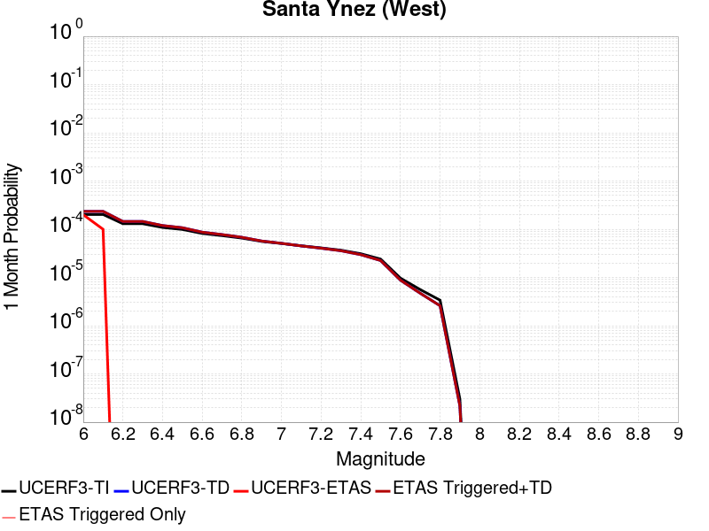 |  |  |

| Magnitude | 1 wk TI Prob | 1 wk TD Prob | 1 wk ETAS Prob | 1 wk ETAS/TD Gain | 1 wk ETAS Triggered+TD | 1 wk ETAS Triggered Only | 1 mo TI Prob | 1 mo TD Prob | 1 mo ETAS Prob | 1 mo ETAS/TD Gain | 1 mo ETAS Triggered+TD | 1 mo ETAS Triggered Only | 1 yr TI Prob | 1 yr TD Prob | 1 yr ETAS Prob | 1 yr ETAS/TD Gain | 1 yr ETAS Triggered+TD | 1 yr ETAS Triggered Only | 10 yr TI Prob | 10 yr TD Prob | 10 yr ETAS Prob | 10 yr ETAS/TD Gain | 10 yr ETAS Triggered+TD | 10 yr ETAS Triggered Only |
|-----|-----|-----|-----|-----|-----|-----|-----|-----|-----|-----|-----|-----|-----|-----|-----|-----|-----|-----|-----|-----|-----|-----|-----|-----|
| 6.0 | 4.7352758E-5 | 5.4863423E-5 | 0.0 | 0.0 | 5.4863423E-5 | 0.0 | 2.0292461E-4 | 2.3510942E-4 | 0.0 | 0.0 | 2.3510942E-4 | 0.0 | 0.0024678076 | 0.0028589668 | 1.0E-4 | 0.03497767 | 0.002958681 | 1.0E-4 | 0.024405818 | 0.028250013 | 3.0E-4 | 0.010619464 | 0.028541539 | 3.0E-4 |
| 6.1 | 4.7352758E-5 | 5.4863423E-5 | 0.0 | 0.0 | 5.4863423E-5 | 0.0 | 2.0292461E-4 | 2.3510942E-4 | 0.0 | 0.0 | 2.3510942E-4 | 0.0 | 0.0024678076 | 0.0028589668 | 1.0E-4 | 0.03497767 | 0.002958681 | 1.0E-4 | 0.024405818 | 0.028250013 | 3.0E-4 | 0.010619464 | 0.028541539 | 3.0E-4 |
| 6.2 | 3.0415853E-5 | 3.387048E-5 | 0.0 | 0.0 | 3.387048E-5 | 0.0 | 1.3034715E-4 | 1.4515135E-4 | 0.0 | 0.0 | 1.4515135E-4 | 0.0 | 0.0015858212 | 0.0017658201 | 1.0E-4 | 0.056630913 | 0.0018656434 | 1.0E-4 | 0.015745522 | 0.017521854 | 2.0E-4 | 0.0114143165 | 0.01771835 | 2.0E-4 |
| 6.3 | 3.0415853E-5 | 3.387048E-5 | 0.0 | 0.0 | 3.387048E-5 | 0.0 | 1.3034715E-4 | 1.4515135E-4 | 0.0 | 0.0 | 1.4515135E-4 | 0.0 | 0.0015858212 | 0.0017658201 | 1.0E-4 | 0.056630913 | 0.0018656434 | 1.0E-4 | 0.015745522 | 0.017521854 | 2.0E-4 | 0.0114143165 | 0.01771835 | 2.0E-4 |
| 6.4 | 2.5452082E-5 | 2.787111E-5 | 0.0 | 0.0 | 2.787111E-5 | 0.0 | 1.09075794E-4 | 1.19442266E-4 | 0.0 | 0.0 | 1.19442266E-4 | 0.0 | 0.0013271887 | 0.0014532584 | 1.0E-4 | 0.06881089 | 0.0015531131 | 1.0E-4 | 0.013192902 | 0.014439723 | 2.0E-4 | 0.0138506815 | 0.014636835 | 2.0E-4 |
| 6.5 | 2.3143784E-5 | 2.5092924E-5 | 0.0 | 0.0 | 2.5092924E-5 | 0.0 | 9.9183875E-5 | 1.07536755E-4 | 0.0 | 0.0 | 1.07536755E-4 | 0.0 | 0.0012068948 | 0.0013084881 | 1.0E-4 | 0.07642408 | 0.0014083573 | 1.0E-4 | 0.012003611 | 0.013009505 | 2.0E-4 | 0.015373375 | 0.013206903 | 2.0E-4 |
| 6.6 | 1.9118515E-5 | 2.0328338E-5 | 0.0 | 0.0 | 2.0328338E-5 | 0.0 | 8.193392E-5 | 8.7118584E-5 | 0.0 | 0.0 | 8.7118584E-5 | 0.0 | 9.97089E-4 | 0.0010601605 | 1.0E-4 | 0.09432534 | 0.0011600545 | 1.0E-4 | 0.00992627 | 0.010551939 | 2.0E-4 | 0.018953864 | 0.010749828 | 2.0E-4 |
| 6.7 | 1.722807E-5 | 1.8124238E-5 | 0.0 | 0.0 | 1.8124238E-5 | 0.0 | 7.3832496E-5 | 7.767302E-5 | 0.0 | 0.0 | 7.767302E-5 | 0.0 | 8.985399E-4 | 9.452643E-4 | 1.0E-4 | 0.10579052 | 0.0010451698 | 1.0E-4 | 0.008949154 | 0.009413079 | 2.0E-4 | 0.021247031 | 0.009611197 | 2.0E-4 |
| 6.8 | 1.5317364E-5 | 1.590815E-5 | 0.0 | 0.0 | 1.590815E-5 | 0.0 | 6.56442E-5 | 6.817603E-5 | 0.0 | 0.0 | 6.817603E-5 | 0.0 | 7.98925E-4 | 8.2973135E-4 | 1.0E-4 | 0.120520934 | 9.296484E-4 | 1.0E-4 | 0.007960589 | 0.008266821 | 2.0E-4 | 0.024193097 | 0.008465167 | 2.0E-4 |
| 6.9 | 1.3071226E-5 | 1.3315544E-5 | 0.0 | 0.0 | 1.3315544E-5 | 0.0 | 5.6018336E-5 | 5.706538E-5 | 0.0 | 0.0 | 5.706538E-5 | 0.0 | 6.8180985E-4 | 6.9455174E-4 | 1.0E-4 | 0.14397775 | 7.944823E-4 | 1.0E-4 | 0.0067972173 | 0.00692407 | 2.0E-4 | 0.028884744 | 0.007122685 | 2.0E-4 |
| 7.0 | 1.1836986E-5 | 1.1920637E-5 | 0.0 | 0.0 | 1.1920637E-5 | 0.0 | 5.0728955E-5 | 5.1087452E-5 | 0.0 | 0.0 | 5.1087452E-5 | 0.0 | 6.1745E-4 | 6.218139E-4 | 1.0E-4 | 0.16081983 | 7.217517E-4 | 1.0E-4 | 0.006157372 | 0.006200933 | 2.0E-4 | 0.032253213 | 0.0063996925 | 2.0E-4 |
| 7.1 | 1.0597169E-5 | 1.0531838E-5 | 0.0 | 0.0 | 1.0531838E-5 | 0.0 | 4.541565E-5 | 4.5135675E-5 | 0.0 | 0.0 | 4.5135675E-5 | 0.0 | 5.5279525E-4 | 5.493894E-4 | 1.0E-4 | 0.18202025 | 6.4933446E-4 | 1.0E-4 | 0.0055142213 | 0.005480443 | 2.0E-4 | 0.036493402 | 0.005679347 | 2.0E-4 |
| 7.2 | 9.59113E-6 | 9.449656E-6 | 0.0 | 0.0 | 9.449656E-6 | 0.0 | 4.11042E-5 | 4.0497904E-5 | 0.0 | 0.0 | 4.0497904E-5 | 0.0 | 5.0032866E-4 | 4.929515E-4 | 1.0E-4 | 0.20285971 | 5.929022E-4 | 1.0E-4 | 0.004992037 | 0.004918699 | 2.0E-4 | 0.04066116 | 0.0051177153 | 2.0E-4 |
| 7.3 | 8.586084E-6 | 8.370937E-6 | 0.0 | 0.0 | 8.370937E-6 | 0.0 | 3.679698E-5 | 3.587496E-5 | 0.0 | 0.0 | 3.587496E-5 | 0.0 | 4.4791115E-4 | 4.3669113E-4 | 1.0E-4 | 0.2289948 | 5.3664745E-4 | 1.0E-4 | 0.004470094 | 0.004358441 | 2.0E-4 | 0.045887966 | 0.0045575695 | 2.0E-4 |
| 7.4 | 7.2622997E-6 | 6.9441057E-6 | 0.0 | 0.0 | 6.9441057E-6 | 0.0 | 3.112377E-5 | 2.976012E-5 | 0.0 | 0.0 | 2.976012E-5 | 0.0 | 3.78866E-4 | 3.6227016E-4 | 1.0E-4 | 0.27603707 | 4.6223396E-4 | 1.0E-4 | 0.0037822074 | 0.0036168962 | 2.0E-4 | 0.05529603 | 0.003816173 | 2.0E-4 |
| 7.5 | 5.627296E-6 | 5.245823E-6 | 0.0 | 0.0 | 5.245823E-6 | 0.0 | 2.411676E-5 | 2.248191E-5 | 0.0 | 0.0 | 2.248191E-5 | 0.0 | 2.9358198E-4 | 2.7368357E-4 | 1.0E-4 | 0.36538544 | 3.7365622E-4 | 1.0E-4 | 0.0029319443 | 0.0027335372 | 1.0E-4 | 0.036582638 | 0.002833264 | 1.0E-4 |
| 7.6 | 2.265244E-6 | 2.058393E-6 | 0.0 | 0.0 | 2.058393E-6 | 0.0 | 9.708152E-6 | 8.821655E-6 | 0.0 | 0.0 | 8.821655E-6 | 0.0 | 1.18190335E-4 | 1.07398446E-4 | 0.0 | 0.0 | 1.07398446E-4 | 0.0 | 0.001181275 | 0.001073474 | 0.0 | 0.0 | 0.001073474 | 0.0 |
| 7.7 | 1.3099874E-6 | 1.0999634E-6 | 0.0 | 0.0 | 1.0999634E-6 | 0.0 | 5.61422E-6 | 4.71412E-6 | 0.0 | 0.0 | 4.71412E-6 | 0.0 | 6.8350986E-5 | 5.739293E-5 | 0.0 | 0.0 | 5.739293E-5 | 0.0 | 6.832996E-4 | 5.737834E-4 | 0.0 | 0.0 | 5.737834E-4 | 0.0 |
| 7.8 | 7.903951E-7 | 6.0595517E-7 | 0.0 | 0.0 | 6.0595517E-7 | 0.0 | 3.3874032E-6 | 2.5969482E-6 | 0.0 | 0.0 | 2.5969482E-6 | 0.0 | 4.1240855E-5 | 3.1617397E-5 | 0.0 | 0.0 | 3.1617397E-5 | 0.0 | 4.12332E-4 | 3.1613032E-4 | 0.0 | 0.0 | 3.1613032E-4 | 0.0 |
| 7.9 | 7.0753297E-9 | 5.0875566E-9 | 0.0 | 0.0 | 5.0875566E-9 | 0.0 | 3.032284E-8 | 2.1803814E-8 | 0.0 | 0.0 | 2.1803814E-8 | 0.0 | 3.6918053E-7 | 2.654614E-7 | 0.0 | 0.0 | 2.654614E-7 | 0.0 | 3.691799E-6 | 2.654612E-6 | 0.0 | 0.0 | 2.654612E-6 | 0.0 |

## Eaton Roughs 2011 CFM
*[(top)](#table-of-contents)*

| 1 Week | 1 Month | 1 Year | 10 Year |
|-----|-----|-----|-----|
|  | 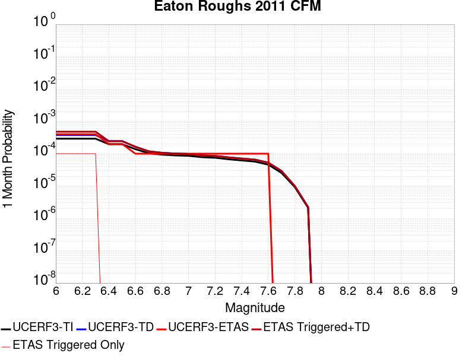 |  | 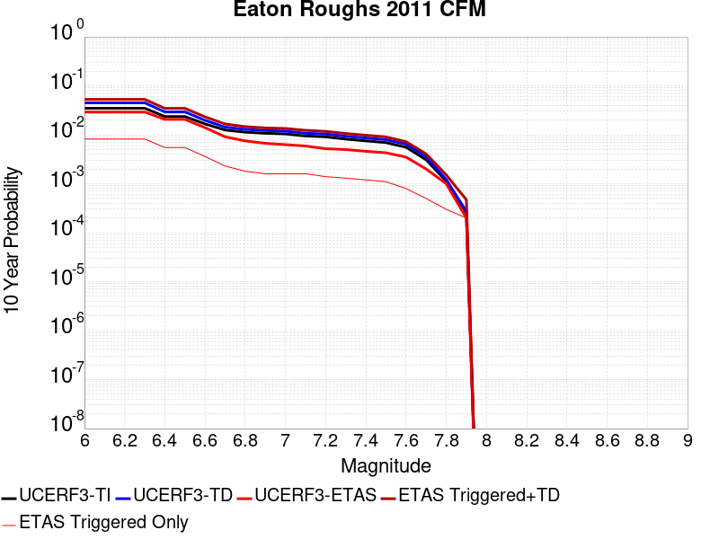 |

| Magnitude | 1 wk TI Prob | 1 wk TD Prob | 1 wk ETAS Prob | 1 wk ETAS/TD Gain | 1 wk ETAS Triggered+TD | 1 wk ETAS Triggered Only | 1 mo TI Prob | 1 mo TD Prob | 1 mo ETAS Prob | 1 mo ETAS/TD Gain | 1 mo ETAS Triggered+TD | 1 mo ETAS Triggered Only | 1 yr TI Prob | 1 yr TD Prob | 1 yr ETAS Prob | 1 yr ETAS/TD Gain | 1 yr ETAS Triggered+TD | 1 yr ETAS Triggered Only | 10 yr TI Prob | 10 yr TD Prob | 10 yr ETAS Prob | 10 yr ETAS/TD Gain | 10 yr ETAS Triggered+TD | 10 yr ETAS Triggered Only |
|-----|-----|-----|-----|-----|-----|-----|-----|-----|-----|-----|-----|-----|-----|-----|-----|-----|-----|-----|-----|-----|-----|-----|-----|-----|
| 6.0 | 6.8044945E-5 | 8.817112E-5 | 0.0 | 0.0 | 8.817112E-5 | 0.0 | 2.9158857E-4 | 3.7782674E-4 | 0.0 | 0.0 | 3.7782674E-4 | 0.0 | 0.0035443127 | 0.004591065 | 0.0 | 0.0 | 0.004591065 | 0.0 | 0.03488314 | 0.045034718 | 3.0E-4 | 0.0066615273 | 0.045321207 | 3.0E-4 |
| 6.1 | 6.8044945E-5 | 8.817112E-5 | 0.0 | 0.0 | 8.817112E-5 | 0.0 | 2.9158857E-4 | 3.7782674E-4 | 0.0 | 0.0 | 3.7782674E-4 | 0.0 | 0.0035443127 | 0.004591065 | 0.0 | 0.0 | 0.004591065 | 0.0 | 0.03488314 | 0.045034718 | 3.0E-4 | 0.0066615273 | 0.045321207 | 3.0E-4 |
| 6.2 | 6.8044945E-5 | 8.817112E-5 | 0.0 | 0.0 | 8.817112E-5 | 0.0 | 2.9158857E-4 | 3.7782674E-4 | 0.0 | 0.0 | 3.7782674E-4 | 0.0 | 0.0035443127 | 0.004591065 | 0.0 | 0.0 | 0.004591065 | 0.0 | 0.03488314 | 0.045034718 | 3.0E-4 | 0.0066615273 | 0.045321207 | 3.0E-4 |
| 6.3 | 6.8044945E-5 | 8.817112E-5 | 0.0 | 0.0 | 8.817112E-5 | 0.0 | 2.9158857E-4 | 3.7782674E-4 | 0.0 | 0.0 | 3.7782674E-4 | 0.0 | 0.0035443127 | 0.004591065 | 0.0 | 0.0 | 0.004591065 | 0.0 | 0.03488314 | 0.045034718 | 3.0E-4 | 0.0066615273 | 0.045321207 | 3.0E-4 |
| 6.4 | 4.5830013E-5 | 5.7010613E-5 | 0.0 | 0.0 | 5.7010613E-5 | 0.0 | 1.9639956E-4 | 2.4431135E-4 | 0.0 | 0.0 | 2.4431135E-4 | 0.0 | 0.0023885423 | 0.002970821 | 0.0 | 0.0 | 0.002970821 | 0.0 | 0.023630321 | 0.029349273 | 2.0E-4 | 0.006814479 | 0.029543404 | 2.0E-4 |
| 6.5 | 4.5830013E-5 | 5.7010613E-5 | 0.0 | 0.0 | 5.7010613E-5 | 0.0 | 1.9639956E-4 | 2.4431135E-4 | 0.0 | 0.0 | 2.4431135E-4 | 0.0 | 0.0023885423 | 0.002970821 | 0.0 | 0.0 | 0.002970821 | 0.0 | 0.023630321 | 0.029349273 | 2.0E-4 | 0.006814479 | 0.029543404 | 2.0E-4 |
| 6.6 | 3.222194E-5 | 3.8187813E-5 | 0.0 | 0.0 | 3.8187813E-5 | 0.0 | 1.3808672E-4 | 1.6365242E-4 | 0.0 | 0.0 | 1.6365242E-4 | 0.0 | 0.0016799092 | 0.0019907374 | 0.0 | 0.0 | 0.0019907374 | 0.0 | 0.016672665 | 0.01973844 | 1.0E-4 | 0.0050662565 | 0.019836467 | 1.0E-4 |
| 6.7 | 2.4155654E-5 | 2.774278E-5 | 0.0 | 0.0 | 2.774278E-5 | 0.0 | 1.0352012E-4 | 1.1889226E-4 | 0.0 | 0.0 | 1.1889226E-4 | 0.0 | 0.0012596287 | 0.0014465603 | 0.0 | 0.0 | 0.0014465603 | 0.0 | 0.012525126 | 0.014372619 | 1.0E-4 | 0.0069576744 | 0.014471182 | 1.0E-4 |
| 6.8 | 2.1814667E-5 | 2.4903855E-5 | 0.0 | 0.0 | 2.4903855E-5 | 0.0 | 9.348808E-5 | 1.0672646E-4 | 0.0 | 0.0 | 1.0672646E-4 | 0.0 | 0.001137623 | 0.0012986239 | 0.0 | 0.0 | 0.0012986239 | 0.0 | 0.011318169 | 0.012911002 | 1.0E-4 | 0.007745332 | 0.013009711 | 1.0E-4 |
| 6.9 | 2.0700467E-5 | 2.3594372E-5 | 0.0 | 0.0 | 2.3594372E-5 | 0.0 | 8.871327E-5 | 1.01114834E-4 | 0.0 | 0.0 | 1.01114834E-4 | 0.0 | 0.0010795488 | 0.0012303811 | 0.0 | 0.0 | 0.0012303811 | 0.0 | 0.010743194 | 0.012236249 | 0.0 | 0.0 | 0.012236249 | 0.0 |
| 7.0 | 2.0104066E-5 | 2.2903117E-5 | 0.0 | 0.0 | 2.2903117E-5 | 0.0 | 8.615744E-5 | 9.8152545E-5 | 0.0 | 0.0 | 9.8152545E-5 | 0.0 | 0.0010484619 | 0.0011943552 | 0.0 | 0.0 | 0.0011943552 | 0.0 | 0.010435291 | 0.011879887 | 0.0 | 0.0 | 0.011879887 | 0.0 |
| 7.1 | 1.8225232E-5 | 2.0743106E-5 | 0.0 | 0.0 | 2.0743106E-5 | 0.0 | 7.81058E-5 | 8.8896006E-5 | 0.0 | 0.0 | 8.8896006E-5 | 0.0 | 9.5052324E-4 | 0.0010817731 | 0.0 | 0.0 | 0.0010817731 | 0.0 | 0.009464677 | 0.010765398 | 0.0 | 0.0 | 0.010765398 | 0.0 |
| 7.2 | 1.7526572E-5 | 1.9964516E-5 | 0.0 | 0.0 | 1.9964516E-5 | 0.0 | 7.511172E-5 | 8.555942E-5 | 0.0 | 0.0 | 8.555942E-5 | 0.0 | 9.141015E-4 | 0.0010411895 | 0.0 | 0.0 | 0.0010411895 | 0.0 | 0.009103506 | 0.010363418 | 0.0 | 0.0 | 0.010363418 | 0.0 |
| 7.3 | 1.5727232E-5 | 1.7994558E-5 | 0.0 | 0.0 | 1.7994558E-5 | 0.0 | 6.740067E-5 | 7.711726E-5 | 0.0 | 0.0 | 7.711726E-5 | 0.0 | 8.2029426E-4 | 9.384995E-4 | 0.0 | 0.0 | 9.384995E-4 | 0.0 | 0.008172729 | 0.009345609 | 0.0 | 0.0 | 0.009345609 | 0.0 |
| 7.4 | 1.4457361E-5 | 1.6573253E-5 | 0.0 | 0.0 | 1.6573253E-5 | 0.0 | 6.195865E-5 | 7.10263E-5 | 0.0 | 0.0 | 7.10263E-5 | 0.0 | 7.540854E-4 | 8.64403E-4 | 0.0 | 0.0 | 8.64403E-4 | 0.0 | 0.007515317 | 0.008610596 | 0.0 | 0.0 | 0.008610596 | 0.0 |
| 7.5 | 1.33280955E-5 | 1.5321804E-5 | 0.0 | 0.0 | 1.5321804E-5 | 0.0 | 5.711916E-5 | 6.566323E-5 | 0.0 | 0.0 | 6.566323E-5 | 0.0 | 6.9520384E-4 | 7.991575E-4 | 0.0 | 0.0 | 7.991575E-4 | 0.0 | 0.00693033 | 0.0079630045 | 0.0 | 0.0 | 0.0079630045 | 0.0 |
| 7.6 | 1.0699478E-5 | 1.2368158E-5 | 0.0 | 0.0 | 1.2368158E-5 | 0.0 | 4.5854096E-5 | 5.300532E-5 | 0.0 | 0.0 | 5.300532E-5 | 0.0 | 5.581306E-4 | 6.451492E-4 | 0.0 | 0.0 | 6.451492E-4 | 0.0 | 0.005567309 | 0.0064328723 | 0.0 | 0.0 | 0.0064328723 | 0.0 |
| 7.7 | 5.9390236E-6 | 6.84246E-6 | 0.0 | 0.0 | 6.84246E-6 | 0.0 | 2.545271E-5 | 2.9324501E-5 | 0.0 | 0.0 | 2.9324501E-5 | 0.0 | 3.0984267E-4 | 3.5696756E-4 | 0.0 | 0.0 | 3.5696756E-4 | 0.0 | 0.0030941102 | 0.0035640104 | 0.0 | 0.0 | 0.0035640104 | 0.0 |
| 7.8 | 2.1622036E-6 | 2.3278722E-6 | 0.0 | 0.0 | 2.3278722E-6 | 0.0 | 9.266554E-6 | 9.9765575E-6 | 0.0 | 0.0 | 9.9765575E-6 | 0.0 | 1.1281446E-4 | 1.2145789E-4 | 0.0 | 0.0 | 1.2145789E-4 | 0.0 | 0.001127572 | 0.0012139308 | 0.0 | 0.0 | 0.0012139308 | 0.0 |
| 7.9 | 4.9586197E-7 | 5.216062E-7 | 0.0 | 0.0 | 5.216062E-7 | 0.0 | 2.125121E-6 | 2.2354534E-6 | 0.0 | 0.0 | 2.2354534E-6 | 0.0 | 2.5873042E-5 | 2.7216325E-5 | 0.0 | 0.0 | 2.7216325E-5 | 0.0 | 2.5870028E-4 | 2.7213202E-4 | 0.0 | 0.0 | 2.7213202E-4 | 0.0 |

## San Pedro Basin
*[(top)](#table-of-contents)*

| 1 Week | 1 Month | 1 Year | 10 Year |
|-----|-----|-----|-----|
|  |  | 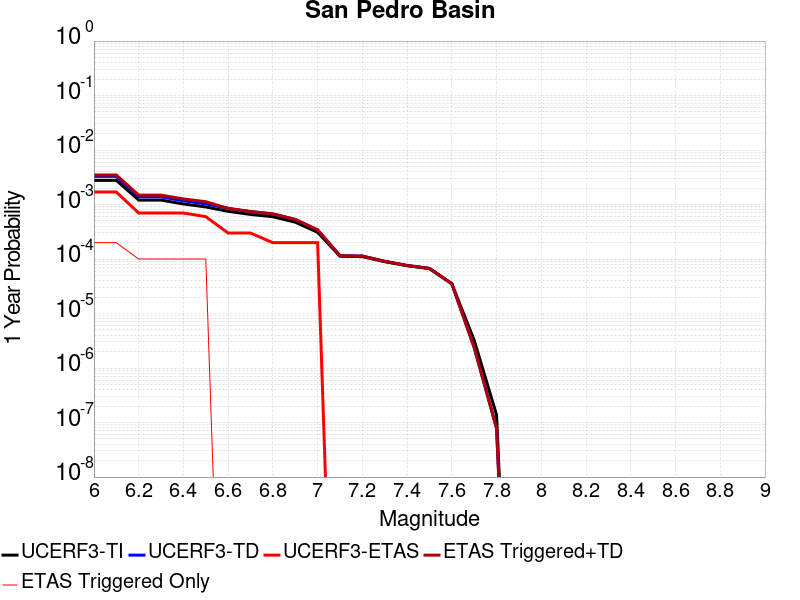 |  |

| Magnitude | 1 wk TI Prob | 1 wk TD Prob | 1 wk ETAS Prob | 1 wk ETAS/TD Gain | 1 wk ETAS Triggered+TD | 1 wk ETAS Triggered Only | 1 mo TI Prob | 1 mo TD Prob | 1 mo ETAS Prob | 1 mo ETAS/TD Gain | 1 mo ETAS Triggered+TD | 1 mo ETAS Triggered Only | 1 yr TI Prob | 1 yr TD Prob | 1 yr ETAS Prob | 1 yr ETAS/TD Gain | 1 yr ETAS Triggered+TD | 1 yr ETAS Triggered Only | 10 yr TI Prob | 10 yr TD Prob | 10 yr ETAS Prob | 10 yr ETAS/TD Gain | 10 yr ETAS Triggered+TD | 10 yr ETAS Triggered Only |
|-----|-----|-----|-----|-----|-----|-----|-----|-----|-----|-----|-----|-----|-----|-----|-----|-----|-----|-----|-----|-----|-----|-----|-----|-----|
| 6.0 | 5.3449043E-5 | 6.324607E-5 | 0.0 | 0.0 | 6.324607E-5 | 0.0 | 2.2904722E-4 | 2.710299E-4 | 0.0 | 0.0 | 2.710299E-4 | 0.0 | 0.0027850836 | 0.0032953974 | 0.0 | 0.0 | 0.0032953974 | 0.0 | 0.027504366 | 0.03252667 | 2.0E-4 | 0.0061488003 | 0.032720163 | 2.0E-4 |
| 6.1 | 5.3449043E-5 | 6.324607E-5 | 0.0 | 0.0 | 6.324607E-5 | 0.0 | 2.2904722E-4 | 2.710299E-4 | 0.0 | 0.0 | 2.710299E-4 | 0.0 | 0.0027850836 | 0.0032953974 | 0.0 | 0.0 | 0.0032953974 | 0.0 | 0.027504366 | 0.03252667 | 2.0E-4 | 0.0061488003 | 0.032720163 | 2.0E-4 |
| 6.2 | 2.3189454E-5 | 2.6600583E-5 | 0.0 | 0.0 | 2.6600583E-5 | 0.0 | 9.9379584E-5 | 1.13997776E-4 | 0.0 | 0.0 | 1.13997776E-4 | 0.0 | 0.0012092749 | 0.0013870861 | 0.0 | 0.0 | 0.0013870861 | 0.0 | 0.012027155 | 0.013789139 | 2.0E-4 | 0.014504169 | 0.013986381 | 2.0E-4 |
| 6.3 | 2.3189454E-5 | 2.6600583E-5 | 0.0 | 0.0 | 2.6600583E-5 | 0.0 | 9.9379584E-5 | 1.13997776E-4 | 0.0 | 0.0 | 1.13997776E-4 | 0.0 | 0.0012092749 | 0.0013870861 | 0.0 | 0.0 | 0.0013870861 | 0.0 | 0.012027155 | 0.013789139 | 2.0E-4 | 0.014504169 | 0.013986381 | 2.0E-4 |
| 6.4 | 1.966056E-5 | 2.2429222E-5 | 0.0 | 0.0 | 2.2429222E-5 | 0.0 | 8.425682E-5 | 9.612192E-5 | 0.0 | 0.0 | 9.612192E-5 | 0.0 | 0.001025344 | 0.0011696961 | 0.0 | 0.0 | 0.0011696961 | 0.0 | 0.010206259 | 0.011639469 | 2.0E-4 | 0.017182915 | 0.011837142 | 2.0E-4 |
| 6.5 | 1.7342953E-5 | 1.9715857E-5 | 0.0 | 0.0 | 1.9715857E-5 | 0.0 | 7.4324824E-5 | 8.4494E-5 | 0.0 | 0.0 | 8.4494E-5 | 0.0 | 9.04529E-4 | 0.0010282658 | 0.0 | 0.0 | 0.0010282658 | 0.0 | 0.009008561 | 0.010238791 | 2.0E-4 | 0.019533556 | 0.0104367435 | 2.0E-4 |
| 6.6 | 1.439804E-5 | 1.6299211E-5 | 0.0 | 0.0 | 1.6299211E-5 | 0.0 | 6.170443E-5 | 6.9852074E-5 | 0.0 | 0.0 | 6.9852074E-5 | 0.0 | 7.509924E-4 | 8.501492E-4 | 0.0 | 0.0 | 8.501492E-4 | 0.0 | 0.0074845953 | 0.008472161 | 2.0E-4 | 0.023606727 | 0.008670467 | 2.0E-4 |
| 6.7 | 1.2634884E-5 | 1.4265099E-5 | 0.0 | 0.0 | 1.4265099E-5 | 0.0 | 5.414838E-5 | 6.113488E-5 | 0.0 | 0.0 | 6.113488E-5 | 0.0 | 6.590571E-4 | 7.440933E-4 | 0.0 | 0.0 | 7.440933E-4 | 0.0 | 0.006571059 | 0.0074190297 | 1.0E-4 | 0.013478852 | 0.0075182877 | 1.0E-4 |
| 6.8 | 1.146091E-5 | 1.2915133E-5 | 0.0 | 0.0 | 1.2915133E-5 | 0.0 | 4.911726E-5 | 5.5349567E-5 | 0.0 | 0.0 | 5.5349567E-5 | 0.0 | 5.9783855E-4 | 6.737022E-4 | 0.0 | 0.0 | 6.737022E-4 | 0.0 | 0.0059623276 | 0.006719529 | 1.0E-4 | 0.014881995 | 0.0068188575 | 1.0E-4 |
| 6.9 | 9.109035E-6 | 1.0221102E-5 | 0.0 | 0.0 | 1.0221102E-5 | 0.0 | 3.9038136E-5 | 4.3804142E-5 | 0.0 | 0.0 | 4.3804142E-5 | 0.0 | 4.7518566E-4 | 5.332128E-4 | 0.0 | 0.0 | 5.332128E-4 | 0.0 | 0.0047417083 | 0.005322079 | 1.0E-4 | 0.018789649 | 0.005421547 | 1.0E-4 |
| 7.0 | 5.9351028E-6 | 6.575781E-6 | 0.0 | 0.0 | 6.575781E-6 | 0.0 | 2.5435906E-5 | 2.8181747E-5 | 0.0 | 0.0 | 2.8181747E-5 | 0.0 | 3.0963816E-4 | 3.4308227E-4 | 0.0 | 0.0 | 3.4308227E-4 | 0.0 | 0.0030920706 | 0.0034278356 | 1.0E-4 | 0.029172929 | 0.0035274928 | 1.0E-4 |
| 7.1 | 2.1557585E-6 | 2.20865E-6 | 0.0 | 0.0 | 2.20865E-6 | 0.0 | 9.238933E-6 | 9.465609E-6 | 0.0 | 0.0 | 9.465609E-6 | 0.0 | 1.1247819E-4 | 1.1523785E-4 | 0.0 | 0.0 | 1.1523785E-4 | 0.0 | 0.0011242128 | 0.0011517963 | 0.0 | 0.0 | 0.0011517963 | 0.0 |
| 7.2 | 2.1251979E-6 | 2.1770081E-6 | 0.0 | 0.0 | 2.1770081E-6 | 0.0 | 9.107958E-6 | 9.330002E-6 | 0.0 | 0.0 | 9.330002E-6 | 0.0 | 1.1088375E-4 | 1.13587004E-4 | 0.0 | 0.0 | 1.13587004E-4 | 0.0 | 0.0011082845 | 0.0011353048 | 0.0 | 0.0 | 0.0011353048 | 0.0 |
| 7.3 | 1.7145798E-6 | 1.743556E-6 | 0.0 | 0.0 | 1.743556E-6 | 0.0 | 7.3481783E-6 | 7.472362E-6 | 0.0 | 0.0 | 7.472362E-6 | 0.0 | 8.94604E-5 | 9.09723E-5 | 0.0 | 0.0 | 9.09723E-5 | 0.0 | 8.9424395E-4 | 9.093598E-4 | 0.0 | 0.0 | 9.093598E-4 | 0.0 |
| 7.4 | 1.4467993E-6 | 1.4635903E-6 | 0.0 | 0.0 | 1.4635903E-6 | 0.0 | 6.200554E-6 | 6.272515E-6 | 0.0 | 0.0 | 6.272515E-6 | 0.0 | 7.548913E-5 | 7.6365264E-5 | 0.0 | 0.0 | 7.6365264E-5 | 0.0 | 7.546349E-4 | 7.6339755E-4 | 0.0 | 0.0 | 7.6339755E-4 | 0.0 |
| 7.5 | 1.2803735E-6 | 1.2926232E-6 | 0.0 | 0.0 | 1.2926232E-6 | 0.0 | 5.487303E-6 | 5.5398023E-6 | 0.0 | 0.0 | 5.5398023E-6 | 0.0 | 6.680587E-5 | 6.744508E-5 | 0.0 | 0.0 | 6.744508E-5 | 0.0 | 6.678579E-4 | 6.7425316E-4 | 0.0 | 0.0 | 6.7425316E-4 | 0.0 |
| 7.6 | 6.755009E-7 | 6.7666826E-7 | 0.0 | 0.0 | 6.7666826E-7 | 0.0 | 2.8950008E-6 | 2.900004E-6 | 0.0 | 0.0 | 2.900004E-6 | 0.0 | 3.5246063E-5 | 3.530703E-5 | 0.0 | 0.0 | 3.530703E-5 | 0.0 | 3.5240475E-4 | 3.5301995E-4 | 0.0 | 0.0 | 3.5301995E-4 | 0.0 |
| 7.7 | 6.211885E-8 | 4.5673264E-8 | 0.0 | 0.0 | 4.5673264E-8 | 0.0 | 2.6622362E-7 | 1.9574256E-7 | 0.0 | 0.0 | 1.9574256E-7 | 0.0 | 3.2412677E-6 | 2.383163E-6 | 0.0 | 0.0 | 2.383163E-6 | 0.0 | 3.2412205E-5 | 2.3831397E-5 | 0.0 | 0.0 | 2.3831397E-5 | 0.0 |
| 7.8 | 2.6580573E-9 | 1.5097251E-9 | 0.0 | 0.0 | 1.5097251E-9 | 0.0 | 1.1391674E-8 | 6.4702506E-9 | 0.0 | 0.0 | 6.4702506E-9 | 0.0 | 1.3869362E-7 | 7.87753E-8 | 0.0 | 0.0 | 7.87753E-8 | 0.0 | 1.3869354E-6 | 7.8775304E-7 | 0.0 | 0.0 | 7.8775304E-7 | 0.0 |

## Clayton
*[(top)](#table-of-contents)*

| 1 Week | 1 Month | 1 Year | 10 Year |
|-----|-----|-----|-----|
|  |  |  |  |

| Magnitude | 1 wk TI Prob | 1 wk TD Prob | 1 wk ETAS Prob | 1 wk ETAS/TD Gain | 1 wk ETAS Triggered+TD | 1 wk ETAS Triggered Only | 1 mo TI Prob | 1 mo TD Prob | 1 mo ETAS Prob | 1 mo ETAS/TD Gain | 1 mo ETAS Triggered+TD | 1 mo ETAS Triggered Only | 1 yr TI Prob | 1 yr TD Prob | 1 yr ETAS Prob | 1 yr ETAS/TD Gain | 1 yr ETAS Triggered+TD | 1 yr ETAS Triggered Only | 10 yr TI Prob | 10 yr TD Prob | 10 yr ETAS Prob | 10 yr ETAS/TD Gain | 10 yr ETAS Triggered+TD | 10 yr ETAS Triggered Only |
|-----|-----|-----|-----|-----|-----|-----|-----|-----|-----|-----|-----|-----|-----|-----|-----|-----|-----|-----|-----|-----|-----|-----|-----|-----|
| 6.0 | 1.1413061E-5 | 1.2652709E-5 | 0.0 | 0.0 | 1.2652709E-5 | 0.0 | 4.89122E-5 | 5.4224896E-5 | 0.0 | 0.0 | 5.4224896E-5 | 0.0 | 5.953433E-4 | 6.600103E-4 | 0.0 | 0.0 | 6.600103E-4 | 0.0 | 0.005937509 | 0.0065826993 | 3.0E-4 | 0.04557401 | 0.0068807243 | 3.0E-4 |
| 6.1 | 1.1413061E-5 | 1.2652709E-5 | 0.0 | 0.0 | 1.2652709E-5 | 0.0 | 4.89122E-5 | 5.4224896E-5 | 0.0 | 0.0 | 5.4224896E-5 | 0.0 | 5.953433E-4 | 6.600103E-4 | 0.0 | 0.0 | 6.600103E-4 | 0.0 | 0.005937509 | 0.0065826993 | 3.0E-4 | 0.04557401 | 0.0068807243 | 3.0E-4 |
| 6.2 | 1.1413061E-5 | 1.2652709E-5 | 0.0 | 0.0 | 1.2652709E-5 | 0.0 | 4.89122E-5 | 5.4224896E-5 | 0.0 | 0.0 | 5.4224896E-5 | 0.0 | 5.953433E-4 | 6.600103E-4 | 0.0 | 0.0 | 6.600103E-4 | 0.0 | 0.005937509 | 0.0065826993 | 3.0E-4 | 0.04557401 | 0.0068807243 | 3.0E-4 |
| 6.3 | 8.538689E-6 | 9.521361E-6 | 0.0 | 0.0 | 9.521361E-6 | 0.0 | 3.659387E-5 | 4.0805255E-5 | 0.0 | 0.0 | 4.0805255E-5 | 0.0 | 4.4543925E-4 | 4.9670145E-4 | 0.0 | 0.0 | 4.9670145E-4 | 0.0 | 0.0044454746 | 0.004956976 | 2.0E-4 | 0.040347178 | 0.005155985 | 2.0E-4 |
| 6.4 | 8.538689E-6 | 9.521361E-6 | 0.0 | 0.0 | 9.521361E-6 | 0.0 | 3.659387E-5 | 4.0805255E-5 | 0.0 | 0.0 | 4.0805255E-5 | 0.0 | 4.4543925E-4 | 4.9670145E-4 | 0.0 | 0.0 | 4.9670145E-4 | 0.0 | 0.0044454746 | 0.004956976 | 2.0E-4 | 0.040347178 | 0.005155985 | 2.0E-4 |
| 6.5 | 7.197462E-6 | 8.070808E-6 | 0.0 | 0.0 | 8.070808E-6 | 0.0 | 3.08459E-5 | 3.4588764E-5 | 0.0 | 0.0 | 3.4588764E-5 | 0.0 | 3.7548412E-4 | 4.2104503E-4 | 0.0 | 0.0 | 4.2104503E-4 | 0.0 | 0.003748503 | 0.004203283 | 2.0E-4 | 0.04758185 | 0.0044024424 | 2.0E-4 |
| 6.6 | 7.1760483E-6 | 8.046854E-6 | 0.0 | 0.0 | 8.046854E-6 | 0.0 | 3.075413E-5 | 3.4486107E-5 | 0.0 | 0.0 | 3.4486107E-5 | 0.0 | 3.743672E-4 | 4.197957E-4 | 0.0 | 0.0 | 4.197957E-4 | 0.0 | 0.0037373714 | 0.0041908366 | 2.0E-4 | 0.047723167 | 0.0043899985 | 2.0E-4 |
| 6.7 | 6.202582E-6 | 6.9678167E-6 | 0.0 | 0.0 | 6.9678167E-6 | 0.0 | 2.6582224E-5 | 2.9861772E-5 | 0.0 | 0.0 | 2.9861772E-5 | 0.0 | 3.235905E-4 | 3.635141E-4 | 0.0 | 0.0 | 3.635141E-4 | 0.0 | 0.0032311971 | 0.0036299485 | 1.0E-4 | 0.0275486 | 0.0037295856 | 1.0E-4 |
| 6.8 | 3.6417277E-6 | 4.115845E-6 | 0.0 | 0.0 | 4.115845E-6 | 0.0 | 1.5607311E-5 | 1.763922E-5 | 0.0 | 0.0 | 1.763922E-5 | 0.0 | 1.9000245E-4 | 2.1473711E-4 | 0.0 | 0.0 | 2.1473711E-4 | 0.0 | 0.0018984007 | 0.0021453723 | 0.0 | 0.0 | 0.0021453723 | 0.0 |
| 6.9 | 2.6498485E-6 | 2.9955984E-6 | 0.0 | 0.0 | 2.9955984E-6 | 0.0 | 1.1356444E-5 | 1.2838218E-5 | 0.0 | 0.0 | 1.2838218E-5 | 0.0 | 1.3825593E-4 | 1.562945E-4 | 0.0 | 0.0 | 1.562945E-4 | 0.0 | 0.0013816995 | 0.0015618851 | 0.0 | 0.0 | 0.0015618851 | 0.0 |
| 7.0 | 2.070442E-6 | 2.3377002E-6 | 0.0 | 0.0 | 2.3377002E-6 | 0.0 | 8.873292E-6 | 1.0018678E-5 | 0.0 | 0.0 | 1.0018678E-5 | 0.0 | 1.0802698E-4 | 1.2197087E-4 | 0.0 | 0.0 | 1.2197087E-4 | 0.0 | 0.0010797448 | 0.001219069 | 0.0 | 0.0 | 0.001219069 | 0.0 |
| 7.1 | 1.2111691E-6 | 1.35727E-6 | 0.0 | 0.0 | 1.35727E-6 | 0.0 | 5.190714E-6 | 5.8168594E-6 | 0.0 | 0.0 | 5.8168594E-6 | 0.0 | 6.319511E-5 | 7.0818125E-5 | 0.0 | 0.0 | 7.0818125E-5 | 0.0 | 6.3177146E-4 | 7.0797186E-4 | 0.0 | 0.0 | 7.0797186E-4 | 0.0 |
| 7.2 | 3.9541607E-7 | 4.2207304E-7 | 0.0 | 0.0 | 4.2207304E-7 | 0.0 | 1.6946392E-6 | 1.8088832E-6 | 0.0 | 0.0 | 1.8088832E-6 | 0.0 | 2.0632036E-5 | 2.2022932E-5 | 0.0 | 0.0 | 2.2022932E-5 | 0.0 | 2.063012E-4 | 2.2020764E-4 | 0.0 | 0.0 | 2.2020764E-4 | 0.0 |
| 7.3 | 2.5685637E-7 | 2.7442894E-7 | 0.0 | 0.0 | 2.7442894E-7 | 0.0 | 1.1008126E-6 | 1.1761234E-6 | 0.0 | 0.0 | 1.1761234E-6 | 0.0 | 1.3402311E-5 | 1.431921E-5 | 0.0 | 0.0 | 1.431921E-5 | 0.0 | 1.3401502E-4 | 1.4318294E-4 | 0.0 | 0.0 | 1.4318294E-4 | 0.0 |
| 7.4 | 1.482299E-7 | 1.5803452E-7 | 0.0 | 0.0 | 1.5803452E-7 | 0.0 | 6.3527085E-7 | 6.772906E-7 | 0.0 | 0.0 | 6.772906E-7 | 0.0 | 7.734395E-6 | 8.245982E-6 | 0.0 | 0.0 | 8.245982E-6 | 0.0 | 7.734126E-5 | 8.245679E-5 | 0.0 | 0.0 | 8.245679E-5 | 0.0 |
| 7.5 | 9.7969505E-8 | 1.0435528E-7 | 0.0 | 0.0 | 1.0435528E-7 | 0.0 | 4.1986925E-7 | 4.4723686E-7 | 0.0 | 0.0 | 4.4723686E-7 | 0.0 | 5.111896E-6 | 5.445095E-6 | 0.0 | 0.0 | 5.445095E-6 | 0.0 | 5.1117782E-5 | 5.4449636E-5 | 0.0 | 0.0 | 5.4449636E-5 | 0.0 |
| 7.6 | 6.125415E-8 | 6.521665E-8 | 0.0 | 0.0 | 6.521665E-8 | 0.0 | 2.6251774E-7 | 2.7949991E-7 | 0.0 | 0.0 | 2.7949991E-7 | 0.0 | 3.196149E-6 | 3.4029063E-6 | 0.0 | 0.0 | 3.4029063E-6 | 0.0 | 3.196103E-5 | 3.402855E-5 | 0.0 | 0.0 | 3.402855E-5 | 0.0 |

## San Diego Trough north alt1
*[(top)](#table-of-contents)*

| 1 Week | 1 Month | 1 Year | 10 Year |
|-----|-----|-----|-----|
|  |  |  |  |

| Magnitude | 1 wk TI Prob | 1 wk TD Prob | 1 wk ETAS Prob | 1 wk ETAS/TD Gain | 1 wk ETAS Triggered+TD | 1 wk ETAS Triggered Only | 1 mo TI Prob | 1 mo TD Prob | 1 mo ETAS Prob | 1 mo ETAS/TD Gain | 1 mo ETAS Triggered+TD | 1 mo ETAS Triggered Only | 1 yr TI Prob | 1 yr TD Prob | 1 yr ETAS Prob | 1 yr ETAS/TD Gain | 1 yr ETAS Triggered+TD | 1 yr ETAS Triggered Only | 10 yr TI Prob | 10 yr TD Prob | 10 yr ETAS Prob | 10 yr ETAS/TD Gain | 10 yr ETAS Triggered+TD | 10 yr ETAS Triggered Only |
|-----|-----|-----|-----|-----|-----|-----|-----|-----|-----|-----|-----|-----|-----|-----|-----|-----|-----|-----|-----|-----|-----|-----|-----|-----|
| 6.0 | 7.329252E-5 | 8.8024135E-5 | 0.0 | 0.0 | 8.8024135E-5 | 0.0 | 3.14073E-4 | 3.7719536E-4 | 0.0 | 0.0 | 3.7719536E-4 | 0.0 | 0.0038171355 | 0.0045832642 | 2.0E-4 | 0.043637022 | 0.0047823475 | 2.0E-4 | 0.03752231 | 0.044951465 | 3.0E-4 | 0.006673865 | 0.045237977 | 3.0E-4 |
| 6.1 | 3.7940346E-5 | 4.4798235E-5 | 0.0 | 0.0 | 4.4798235E-5 | 0.0 | 1.6259136E-4 | 1.9197886E-4 | 0.0 | 0.0 | 1.9197886E-4 | 0.0 | 0.0019777524 | 0.0023349184 | 2.0E-4 | 0.0856561 | 0.0025344514 | 2.0E-4 | 0.019602431 | 0.023112651 | 2.0E-4 | 0.008653269 | 0.02330803 | 2.0E-4 |
| 6.2 | 2.8645263E-5 | 3.3239627E-5 | 0.0 | 0.0 | 3.3239627E-5 | 0.0 | 1.2275964E-4 | 1.4244791E-4 | 0.0 | 0.0 | 1.4244791E-4 | 0.0 | 0.0014935739 | 0.0017329459 | 1.0E-4 | 0.057705205 | 0.0018327726 | 1.0E-4 | 0.0148357535 | 0.017197017 | 1.0E-4 | 0.0058149626 | 0.017295295 | 1.0E-4 |
| 6.3 | 2.8645263E-5 | 3.3239627E-5 | 0.0 | 0.0 | 3.3239627E-5 | 0.0 | 1.2275964E-4 | 1.4244791E-4 | 0.0 | 0.0 | 1.4244791E-4 | 0.0 | 0.0014935739 | 0.0017329459 | 1.0E-4 | 0.057705205 | 0.0018327726 | 1.0E-4 | 0.0148357535 | 0.017197017 | 1.0E-4 | 0.0058149626 | 0.017295295 | 1.0E-4 |
| 6.4 | 2.2204576E-5 | 2.5409145E-5 | 0.0 | 0.0 | 2.5409145E-5 | 0.0 | 9.5159E-5 | 1.0889184E-4 | 0.0 | 0.0 | 1.0889184E-4 | 0.0 | 0.001157945 | 0.0013249613 | 1.0E-4 | 0.075473905 | 0.0014248288 | 1.0E-4 | 0.011519298 | 0.013171791 | 1.0E-4 | 0.0075919824 | 0.013270473 | 1.0E-4 |
| 6.5 | 2.1004838E-5 | 2.3988314E-5 | 0.0 | 0.0 | 2.3988314E-5 | 0.0 | 9.0017624E-5 | 1.0280306E-4 | 0.0 | 0.0 | 1.0280306E-4 | 0.0 | 0.0010954136 | 0.0012509173 | 1.0E-4 | 0.07994133 | 0.0013507922 | 1.0E-4 | 0.010900296 | 0.012439845 | 1.0E-4 | 0.008038685 | 0.012538602 | 1.0E-4 |
| 6.6 | 1.820557E-5 | 2.0674883E-5 | 0.0 | 0.0 | 2.0674883E-5 | 0.0 | 7.802154E-5 | 8.8603665E-5 | 0.0 | 0.0 | 8.8603665E-5 | 0.0 | 9.4949827E-4 | 0.001078221 | 0.0 | 0.0 | 0.001078221 | 0.0 | 0.009454516 | 0.010730566 | 0.0 | 0.0 | 0.010730566 | 0.0 |
| 6.7 | 1.5884485E-5 | 1.7958651E-5 | 0.0 | 0.0 | 1.7958651E-5 | 0.0 | 6.807459E-5 | 7.696339E-5 | 0.0 | 0.0 | 7.696339E-5 | 0.0 | 8.284929E-4 | 9.3662925E-4 | 0.0 | 0.0 | 9.3662925E-4 | 0.0 | 0.008254109 | 0.009327182 | 0.0 | 0.0 | 0.009327182 | 0.0 |
| 6.8 | 1.4331171E-5 | 1.6178852E-5 | 0.0 | 0.0 | 1.6178852E-5 | 0.0 | 6.141786E-5 | 6.933611E-5 | 0.0 | 0.0 | 6.933611E-5 | 0.0 | 7.4750587E-4 | 8.4384216E-4 | 0.0 | 0.0 | 8.4384216E-4 | 0.0 | 0.0074499645 | 0.008406646 | 0.0 | 0.0 | 0.008406646 | 0.0 |
| 6.9 | 1.2574203E-5 | 1.4186481E-5 | 0.0 | 0.0 | 1.4186481E-5 | 0.0 | 5.3888325E-5 | 6.0797796E-5 | 0.0 | 0.0 | 6.0797796E-5 | 0.0 | 6.558929E-4 | 7.3996314E-4 | 0.0 | 0.0 | 7.3996314E-4 | 0.0 | 0.0065396037 | 0.0073751784 | 0.0 | 0.0 | 0.0073751784 | 0.0 |
| 7.0 | 1.0883844E-5 | 1.22726E-5 | 0.0 | 0.0 | 1.22726E-5 | 0.0 | 4.664421E-5 | 5.25958E-5 | 0.0 | 0.0 | 5.25958E-5 | 0.0 | 5.677453E-4 | 6.401667E-4 | 0.0 | 0.0 | 6.401667E-4 | 0.0 | 0.00566297 | 0.006383354 | 0.0 | 0.0 | 0.006383354 | 0.0 |
| 7.1 | 9.393088E-6 | 1.0592619E-5 | 0.0 | 0.0 | 1.0592619E-5 | 0.0 | 4.025547E-5 | 4.5396155E-5 | 0.0 | 0.0 | 4.5396155E-5 | 0.0 | 4.900001E-4 | 5.525588E-4 | 0.0 | 0.0 | 5.525588E-4 | 0.0 | 0.0048892107 | 0.005511945 | 0.0 | 0.0 | 0.005511945 | 0.0 |
| 7.2 | 8.190791E-6 | 9.245941E-6 | 0.0 | 0.0 | 9.245941E-6 | 0.0 | 3.510292E-5 | 3.962486E-5 | 0.0 | 0.0 | 3.962486E-5 | 0.0 | 4.2729423E-4 | 4.823266E-4 | 0.0 | 0.0 | 4.823266E-4 | 0.0 | 0.0042647356 | 0.0048128776 | 0.0 | 0.0 | 0.0048128776 | 0.0 |
| 7.3 | 6.268162E-6 | 7.079958E-6 | 0.0 | 0.0 | 7.079958E-6 | 0.0 | 2.6863276E-5 | 3.0342326E-5 | 0.0 | 0.0 | 3.0342326E-5 | 0.0 | 3.2701128E-4 | 3.693556E-4 | 0.0 | 0.0 | 3.693556E-4 | 0.0 | 0.003265305 | 0.003687463 | 0.0 | 0.0 | 0.003687463 | 0.0 |
| 7.4 | 4.985186E-6 | 5.63487E-6 | 0.0 | 0.0 | 5.63487E-6 | 0.0 | 2.1364907E-5 | 2.414922E-5 | 0.0 | 0.0 | 2.414922E-5 | 0.0 | 2.600867E-4 | 2.9397747E-4 | 0.0 | 0.0 | 2.9397747E-4 | 0.0 | 0.002597825 | 0.0029359271 | 0.0 | 0.0 | 0.0029359271 | 0.0 |
| 7.5 | 1.7489613E-6 | 1.967052E-6 | 0.0 | 0.0 | 1.967052E-6 | 0.0 | 7.495527E-6 | 8.430196E-6 | 0.0 | 0.0 | 8.430196E-6 | 0.0 | 9.125422E-5 | 1.0263303E-4 | 0.0 | 0.0 | 1.0263303E-4 | 0.0 | 9.1216754E-4 | 0.0010258782 | 0.0 | 0.0 | 0.0010258782 | 0.0 |
| 7.6 | 1.6988751E-7 | 1.7527951E-7 | 0.0 | 0.0 | 1.7527951E-7 | 0.0 | 7.2808916E-7 | 7.5119766E-7 | 0.0 | 0.0 | 7.5119766E-7 | 0.0 | 8.864449E-6 | 9.145795E-6 | 0.0 | 0.0 | 9.145795E-6 | 0.0 | 8.8640954E-5 | 9.1454385E-5 | 0.0 | 0.0 | 9.1454385E-5 | 0.0 |

## Peralta Hills
*[(top)](#table-of-contents)*

| 1 Week | 1 Month | 1 Year | 10 Year |
|-----|-----|-----|-----|
|  | 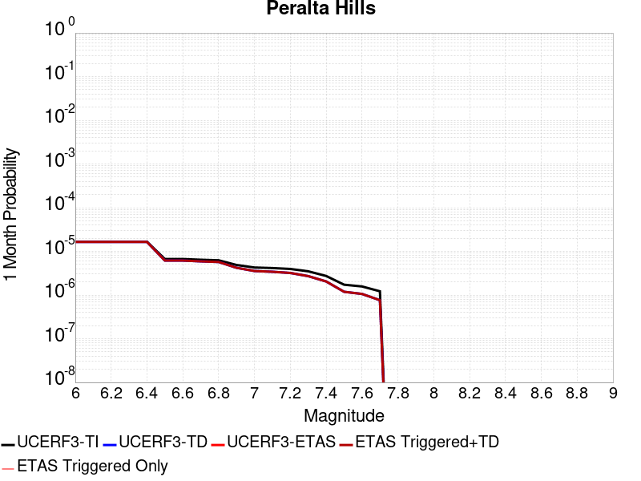 |  |  |

| Magnitude | 1 wk TI Prob | 1 wk TD Prob | 1 wk ETAS Prob | 1 wk ETAS/TD Gain | 1 wk ETAS Triggered+TD | 1 wk ETAS Triggered Only | 1 mo TI Prob | 1 mo TD Prob | 1 mo ETAS Prob | 1 mo ETAS/TD Gain | 1 mo ETAS Triggered+TD | 1 mo ETAS Triggered Only | 1 yr TI Prob | 1 yr TD Prob | 1 yr ETAS Prob | 1 yr ETAS/TD Gain | 1 yr ETAS Triggered+TD | 1 yr ETAS Triggered Only | 10 yr TI Prob | 10 yr TD Prob | 10 yr ETAS Prob | 10 yr ETAS/TD Gain | 10 yr ETAS Triggered+TD | 10 yr ETAS Triggered Only |
|-----|-----|-----|-----|-----|-----|-----|-----|-----|-----|-----|-----|-----|-----|-----|-----|-----|-----|-----|-----|-----|-----|-----|-----|-----|
| 6.0 | 3.8850067E-6 | 3.8344565E-6 | 0.0 | 0.0 | 3.8344565E-6 | 0.0 | 1.6649923E-5 | 1.6433323E-5 | 0.0 | 0.0 | 1.6433323E-5 | 0.0 | 2.0269395E-4 | 2.0006477E-4 | 1.0E-4 | 0.49983814 | 3.0004475E-4 | 1.0E-4 | 0.0020250916 | 0.0019995735 | 3.0E-4 | 0.15003198 | 0.0022989737 | 3.0E-4 |
| 6.1 | 3.8850067E-6 | 3.8344565E-6 | 0.0 | 0.0 | 3.8344565E-6 | 0.0 | 1.6649923E-5 | 1.6433323E-5 | 0.0 | 0.0 | 1.6433323E-5 | 0.0 | 2.0269395E-4 | 2.0006477E-4 | 1.0E-4 | 0.49983814 | 3.0004475E-4 | 1.0E-4 | 0.0020250916 | 0.0019995735 | 3.0E-4 | 0.15003198 | 0.0022989737 | 3.0E-4 |
| 6.2 | 3.8850067E-6 | 3.8344565E-6 | 0.0 | 0.0 | 3.8344565E-6 | 0.0 | 1.6649923E-5 | 1.6433323E-5 | 0.0 | 0.0 | 1.6433323E-5 | 0.0 | 2.0269395E-4 | 2.0006477E-4 | 1.0E-4 | 0.49983814 | 3.0004475E-4 | 1.0E-4 | 0.0020250916 | 0.0019995735 | 3.0E-4 | 0.15003198 | 0.0022989737 | 3.0E-4 |
| 6.3 | 3.8850067E-6 | 3.8344565E-6 | 0.0 | 0.0 | 3.8344565E-6 | 0.0 | 1.6649923E-5 | 1.6433323E-5 | 0.0 | 0.0 | 1.6433323E-5 | 0.0 | 2.0269395E-4 | 2.0006477E-4 | 1.0E-4 | 0.49983814 | 3.0004475E-4 | 1.0E-4 | 0.0020250916 | 0.0019995735 | 3.0E-4 | 0.15003198 | 0.0022989737 | 3.0E-4 |
| 6.4 | 3.8850067E-6 | 3.8344565E-6 | 0.0 | 0.0 | 3.8344565E-6 | 0.0 | 1.6649923E-5 | 1.6433323E-5 | 0.0 | 0.0 | 1.6433323E-5 | 0.0 | 2.0269395E-4 | 2.0006477E-4 | 1.0E-4 | 0.49983814 | 3.0004475E-4 | 1.0E-4 | 0.0020250916 | 0.0019995735 | 3.0E-4 | 0.15003198 | 0.0022989737 | 3.0E-4 |
| 6.5 | 1.5587785E-6 | 1.4387793E-6 | 0.0 | 0.0 | 1.4387793E-6 | 0.0 | 6.6804623E-6 | 6.166184E-6 | 0.0 | 0.0 | 6.166184E-6 | 0.0 | 8.133159E-5 | 7.5070944E-5 | 0.0 | 0.0 | 7.5070944E-5 | 0.0 | 8.1301836E-4 | 7.504797E-4 | 1.0E-4 | 0.1332481 | 8.504047E-4 | 1.0E-4 |
| 6.6 | 1.5587785E-6 | 1.4387793E-6 | 0.0 | 0.0 | 1.4387793E-6 | 0.0 | 6.6804623E-6 | 6.166184E-6 | 0.0 | 0.0 | 6.166184E-6 | 0.0 | 8.133159E-5 | 7.5070944E-5 | 0.0 | 0.0 | 7.5070944E-5 | 0.0 | 8.1301836E-4 | 7.504797E-4 | 1.0E-4 | 0.1332481 | 8.504047E-4 | 1.0E-4 |
| 6.7 | 1.5018579E-6 | 1.3794287E-6 | 0.0 | 0.0 | 1.3794287E-6 | 0.0 | 6.436518E-6 | 5.911825E-6 | 0.0 | 0.0 | 5.911825E-6 | 0.0 | 7.836179E-5 | 7.197433E-5 | 0.0 | 0.0 | 7.197433E-5 | 0.0 | 7.833416E-4 | 7.1953365E-4 | 1.0E-4 | 0.13897891 | 8.1946165E-4 | 1.0E-4 |
| 6.8 | 1.4584314E-6 | 1.3338843E-6 | 0.0 | 0.0 | 1.3338843E-6 | 0.0 | 6.250405E-6 | 5.7166358E-6 | 0.0 | 0.0 | 5.7166358E-6 | 0.0 | 7.6096025E-5 | 6.9598056E-5 | 0.0 | 0.0 | 6.9598056E-5 | 0.0 | 7.6069974E-4 | 6.957858E-4 | 1.0E-4 | 0.14372239 | 7.9571625E-4 | 1.0E-4 |
| 6.9 | 1.1382393E-6 | 9.830711E-7 | 0.0 | 0.0 | 9.830711E-7 | 0.0 | 4.8781594E-6 | 4.2131555E-6 | 0.0 | 0.0 | 4.2131555E-6 | 0.0 | 5.9389975E-5 | 5.1294046E-5 | 0.0 | 0.0 | 5.1294046E-5 | 0.0 | 5.93741E-4 | 5.128302E-4 | 0.0 | 0.0 | 5.128302E-4 | 0.0 |
| 7.0 | 9.970413E-7 | 8.2824795E-7 | 0.0 | 0.0 | 8.2824795E-7 | 0.0 | 4.273027E-6 | 3.5496298E-6 | 0.0 | 0.0 | 3.5496298E-6 | 0.0 | 5.2022864E-5 | 4.3215954E-5 | 0.0 | 0.0 | 4.3215954E-5 | 0.0 | 5.2010687E-4 | 4.3208225E-4 | 0.0 | 0.0 | 4.3208225E-4 | 0.0 |
| 7.1 | 9.684443E-7 | 7.9685265E-7 | 0.0 | 0.0 | 7.9685265E-7 | 0.0 | 4.150469E-6 | 3.4150787E-6 | 0.0 | 0.0 | 3.4150787E-6 | 0.0 | 5.053079E-5 | 4.157786E-5 | 0.0 | 0.0 | 4.157786E-5 | 0.0 | 5.05193E-4 | 4.1570747E-4 | 0.0 | 0.0 | 4.1570747E-4 | 0.0 |
| 7.2 | 9.240811E-7 | 7.4785555E-7 | 0.0 | 0.0 | 7.4785555E-7 | 0.0 | 3.960342E-6 | 3.2050916E-6 | 0.0 | 0.0 | 3.2050916E-6 | 0.0 | 4.8216094E-5 | 3.9021357E-5 | 0.0 | 0.0 | 3.9021357E-5 | 0.0 | 4.8205635E-4 | 3.9015157E-4 | 0.0 | 0.0 | 3.9015157E-4 | 0.0 |
| 7.3 | 8.158643E-7 | 6.327957E-7 | 0.0 | 0.0 | 6.327957E-7 | 0.0 | 3.4965567E-6 | 2.711979E-6 | 0.0 | 0.0 | 2.711979E-6 | 0.0 | 4.2569747E-5 | 3.3017906E-5 | 0.0 | 0.0 | 3.3017906E-5 | 0.0 | 4.2561593E-4 | 3.3013613E-4 | 0.0 | 0.0 | 3.3013613E-4 | 0.0 |
| 7.4 | 6.3822824E-7 | 4.7784977E-7 | 0.0 | 0.0 | 4.7784977E-7 | 0.0 | 2.7352612E-6 | 2.047926E-6 | 0.0 | 0.0 | 2.047926E-6 | 0.0 | 3.3301294E-5 | 2.4933268E-5 | 0.0 | 0.0 | 2.4933268E-5 | 0.0 | 3.3296304E-4 | 2.493098E-4 | 0.0 | 0.0 | 2.493098E-4 | 0.0 |
| 7.5 | 4.0292628E-7 | 2.7737062E-7 | 0.0 | 0.0 | 2.7737062E-7 | 0.0 | 1.7268258E-6 | 1.1887308E-6 | 0.0 | 0.0 | 1.1887308E-6 | 0.0 | 2.1023901E-5 | 1.447273E-5 | 0.0 | 0.0 | 1.447273E-5 | 0.0 | 2.1021912E-4 | 1.4472065E-4 | 0.0 | 0.0 | 1.4472065E-4 | 0.0 |
| 7.6 | 3.672993E-7 | 2.4755946E-7 | 0.0 | 0.0 | 2.4755946E-7 | 0.0 | 1.5741389E-6 | 1.0609688E-6 | 0.0 | 0.0 | 1.0609688E-6 | 0.0 | 1.9164972E-5 | 1.2917246E-5 | 0.0 | 0.0 | 1.2917246E-5 | 0.0 | 1.916332E-4 | 1.2916765E-4 | 0.0 | 0.0 | 1.2916765E-4 | 0.0 |
| 7.7 | 2.8466823E-7 | 1.7796732E-7 | 0.0 | 0.0 | 1.7796732E-7 | 0.0 | 1.2200061E-6 | 7.6271704E-7 | 0.0 | 0.0 | 7.6271704E-7 | 0.0 | 1.4853474E-5 | 9.286066E-6 | 0.0 | 0.0 | 9.286066E-6 | 0.0 | 1.485248E-4 | 9.2859365E-5 | 0.0 | 0.0 | 9.2859365E-5 | 0.0 |

## Cleghorn Lake
*[(top)](#table-of-contents)*

| 1 Week | 1 Month | 1 Year | 10 Year |
|-----|-----|-----|-----|
| 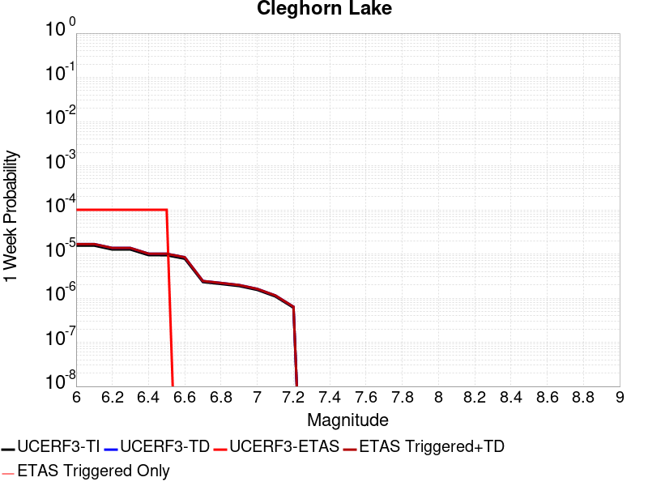 |  | 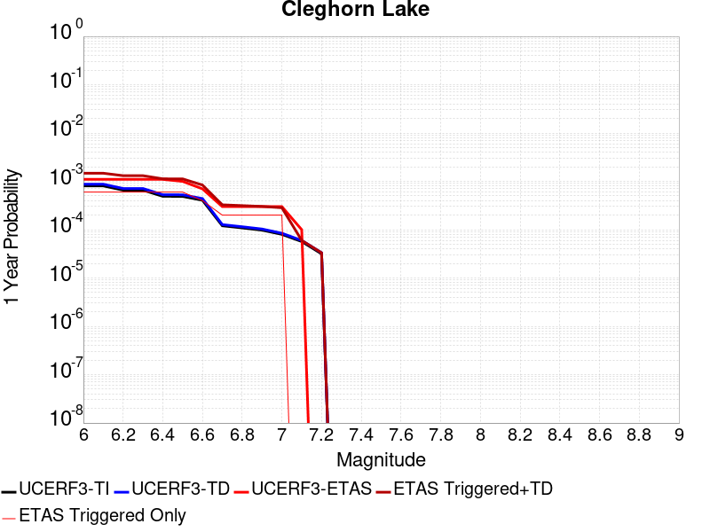 |  |

| Magnitude | 1 wk TI Prob | 1 wk TD Prob | 1 wk ETAS Prob | 1 wk ETAS/TD Gain | 1 wk ETAS Triggered+TD | 1 wk ETAS Triggered Only | 1 mo TI Prob | 1 mo TD Prob | 1 mo ETAS Prob | 1 mo ETAS/TD Gain | 1 mo ETAS Triggered+TD | 1 mo ETAS Triggered Only | 1 yr TI Prob | 1 yr TD Prob | 1 yr ETAS Prob | 1 yr ETAS/TD Gain | 1 yr ETAS Triggered+TD | 1 yr ETAS Triggered Only | 10 yr TI Prob | 10 yr TD Prob | 10 yr ETAS Prob | 10 yr ETAS/TD Gain | 10 yr ETAS Triggered+TD | 10 yr ETAS Triggered Only |
|-----|-----|-----|-----|-----|-----|-----|-----|-----|-----|-----|-----|-----|-----|-----|-----|-----|-----|-----|-----|-----|-----|-----|-----|-----|
| 6.0 | 1.5467183E-5 | 1.6779122E-5 | 0.0 | 0.0 | 1.6779122E-5 | 0.0 | 6.6286244E-5 | 7.190885E-5 | 0.0 | 0.0 | 7.190885E-5 | 0.0 | 8.067362E-4 | 8.751934E-4 | 1.0E-4 | 0.114260465 | 9.7510585E-4 | 1.0E-4 | 0.008038137 | 0.008722884 | 3.0E-4 | 0.034392297 | 0.009020266 | 3.0E-4 |
| 6.1 | 1.5467183E-5 | 1.6779122E-5 | 0.0 | 0.0 | 1.6779122E-5 | 0.0 | 6.6286244E-5 | 7.190885E-5 | 0.0 | 0.0 | 7.190885E-5 | 0.0 | 8.067362E-4 | 8.751934E-4 | 1.0E-4 | 0.114260465 | 9.7510585E-4 | 1.0E-4 | 0.008038137 | 0.008722884 | 3.0E-4 | 0.034392297 | 0.009020266 | 3.0E-4 |
| 6.2 | 1.2624631E-5 | 1.3669549E-5 | 0.0 | 0.0 | 1.3669549E-5 | 0.0 | 5.410444E-5 | 5.858274E-5 | 0.0 | 0.0 | 5.858274E-5 | 0.0 | 6.585225E-4 | 7.1306E-4 | 1.0E-4 | 0.14024064 | 8.129887E-4 | 1.0E-4 | 0.0065657445 | 0.007112507 | 2.0E-4 | 0.02811948 | 0.0073110843 | 2.0E-4 |
| 6.3 | 1.2624631E-5 | 1.3669549E-5 | 0.0 | 0.0 | 1.3669549E-5 | 0.0 | 5.410444E-5 | 5.858274E-5 | 0.0 | 0.0 | 5.858274E-5 | 0.0 | 6.585225E-4 | 7.1306E-4 | 1.0E-4 | 0.14024064 | 8.129887E-4 | 1.0E-4 | 0.0065657445 | 0.007112507 | 2.0E-4 | 0.02811948 | 0.0073110843 | 2.0E-4 |
| 6.4 | 9.417684E-6 | 1.0161601E-5 | 0.0 | 0.0 | 1.0161601E-5 | 0.0 | 4.036088E-5 | 4.354922E-5 | 0.0 | 0.0 | 4.354922E-5 | 0.0 | 4.912829E-4 | 5.3012377E-4 | 1.0E-4 | 0.1886352 | 6.3007075E-4 | 1.0E-4 | 0.004901982 | 0.0052926196 | 2.0E-4 | 0.03778847 | 0.0054915613 | 2.0E-4 |
| 6.5 | 9.368219E-6 | 1.0109062E-5 | 0.0 | 0.0 | 1.0109062E-5 | 0.0 | 4.014889E-5 | 4.332406E-5 | 0.0 | 0.0 | 4.332406E-5 | 0.0 | 4.8870314E-4 | 5.273838E-4 | 1.0E-4 | 0.18961523 | 6.27331E-4 | 1.0E-4 | 0.004876298 | 0.00526535 | 2.0E-4 | 0.03798418 | 0.005464297 | 2.0E-4 |
| 6.6 | 7.803798E-6 | 8.434604E-6 | 0.0 | 0.0 | 8.434604E-6 | 0.0 | 3.3444423E-5 | 3.6148027E-5 | 0.0 | 0.0 | 3.6148027E-5 | 0.0 | 4.0710976E-4 | 4.4005318E-4 | 0.0 | 0.0 | 4.4005318E-4 | 0.0 | 0.0040636472 | 0.0043957275 | 0.0 | 0.0 | 0.0043957275 | 0.0 |
| 6.7 | 2.3108669E-6 | 2.4423648E-6 | 0.0 | 0.0 | 2.4423648E-6 | 0.0 | 9.903678E-6 | 1.0467236E-5 | 0.0 | 0.0 | 1.0467236E-5 | 0.0 | 1.205706E-4 | 1.2743134E-4 | 0.0 | 0.0 | 1.2743134E-4 | 0.0 | 0.001205052 | 0.0012736013 | 0.0 | 0.0 | 0.0012736013 | 0.0 |
| 6.8 | 2.0882828E-6 | 2.2049805E-6 | 0.0 | 0.0 | 2.2049805E-6 | 0.0 | 8.949753E-6 | 9.449883E-6 | 0.0 | 0.0 | 9.449883E-6 | 0.0 | 1.08957785E-4 | 1.1504642E-4 | 0.0 | 0.0 | 1.1504642E-4 | 0.0 | 0.0010890438 | 0.0011498855 | 0.0 | 0.0 | 0.0011498855 | 0.0 |
| 6.9 | 1.876935E-6 | 1.9799038E-6 | 0.0 | 0.0 | 1.9799038E-6 | 0.0 | 8.043982E-6 | 8.485275E-6 | 0.0 | 0.0 | 8.485275E-6 | 0.0 | 9.7931086E-5 | 1.0330349E-4 | 0.0 | 0.0 | 1.0330349E-4 | 0.0 | 9.788794E-4 | 0.0010325707 | 0.0 | 0.0 | 0.0010325707 | 0.0 |
| 7.0 | 1.5357559E-6 | 1.6193499E-6 | 0.0 | 0.0 | 1.6193499E-6 | 0.0 | 6.5817944E-6 | 6.940053E-6 | 0.0 | 0.0 | 6.940053E-6 | 0.0 | 8.01304E-5 | 8.449199E-5 | 0.0 | 0.0 | 8.449199E-5 | 0.0 | 8.010151E-4 | 8.4461115E-4 | 0.0 | 0.0 | 8.4461115E-4 | 0.0 |
| 7.1 | 1.0905424E-6 | 1.1491103E-6 | 0.0 | 0.0 | 1.1491103E-6 | 0.0 | 4.6737446E-6 | 4.9247496E-6 | 0.0 | 0.0 | 4.9247496E-6 | 0.0 | 5.6901354E-5 | 5.9957274E-5 | 0.0 | 0.0 | 5.9957274E-5 | 0.0 | 5.6886784E-4 | 5.9942075E-4 | 0.0 | 0.0 | 5.9942075E-4 | 0.0 |
| 7.2 | 6.06668E-7 | 6.3837547E-7 | 0.0 | 0.0 | 6.3837547E-7 | 0.0 | 2.600003E-6 | 2.7358924E-6 | 0.0 | 0.0 | 2.7358924E-6 | 0.0 | 3.1654577E-5 | 3.330905E-5 | 0.0 | 0.0 | 3.330905E-5 | 0.0 | 3.1650066E-4 | 3.330474E-4 | 0.0 | 0.0 | 3.330474E-4 | 0.0 |

## Great Valley 03 Mysterious Ridge
*[(top)](#table-of-contents)*

| 1 Week | 1 Month | 1 Year | 10 Year |
|-----|-----|-----|-----|
|  | 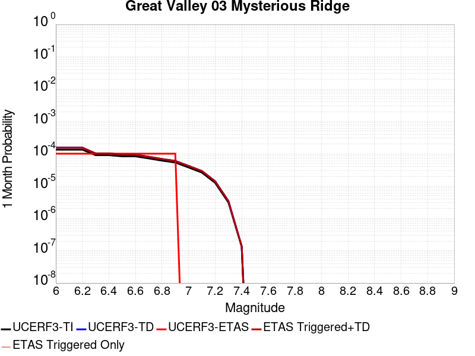 |  |  |

| Magnitude | 1 wk TI Prob | 1 wk TD Prob | 1 wk ETAS Prob | 1 wk ETAS/TD Gain | 1 wk ETAS Triggered+TD | 1 wk ETAS Triggered Only | 1 mo TI Prob | 1 mo TD Prob | 1 mo ETAS Prob | 1 mo ETAS/TD Gain | 1 mo ETAS Triggered+TD | 1 mo ETAS Triggered Only | 1 yr TI Prob | 1 yr TD Prob | 1 yr ETAS Prob | 1 yr ETAS/TD Gain | 1 yr ETAS Triggered+TD | 1 yr ETAS Triggered Only | 10 yr TI Prob | 10 yr TD Prob | 10 yr ETAS Prob | 10 yr ETAS/TD Gain | 10 yr ETAS Triggered+TD | 10 yr ETAS Triggered Only |
|-----|-----|-----|-----|-----|-----|-----|-----|-----|-----|-----|-----|-----|-----|-----|-----|-----|-----|-----|-----|-----|-----|-----|-----|-----|
| 6.0 | 3.1182444E-5 | 3.5975117E-5 | 0.0 | 0.0 | 3.5975117E-5 | 0.0 | 1.336322E-4 | 1.5417102E-4 | 0.0 | 0.0 | 1.5417102E-4 | 0.0 | 0.0016257578 | 0.0018756017 | 1.0E-4 | 0.05331622 | 0.001975414 | 1.0E-4 | 0.016139153 | 0.018616395 | 3.0E-4 | 0.016114827 | 0.01891081 | 3.0E-4 |
| 6.1 | 3.1182444E-5 | 3.5975117E-5 | 0.0 | 0.0 | 3.5975117E-5 | 0.0 | 1.336322E-4 | 1.5417102E-4 | 0.0 | 0.0 | 1.5417102E-4 | 0.0 | 0.0016257578 | 0.0018756017 | 1.0E-4 | 0.05331622 | 0.001975414 | 1.0E-4 | 0.016139153 | 0.018616395 | 3.0E-4 | 0.016114827 | 0.01891081 | 3.0E-4 |
| 6.2 | 3.1182444E-5 | 3.5975117E-5 | 0.0 | 0.0 | 3.5975117E-5 | 0.0 | 1.336322E-4 | 1.5417102E-4 | 0.0 | 0.0 | 1.5417102E-4 | 0.0 | 0.0016257578 | 0.0018756017 | 1.0E-4 | 0.05331622 | 0.001975414 | 1.0E-4 | 0.016139153 | 0.018616395 | 3.0E-4 | 0.016114827 | 0.01891081 | 3.0E-4 |
| 6.3 | 2.106934E-5 | 2.3817278E-5 | 0.0 | 0.0 | 2.3817278E-5 | 0.0 | 9.0294045E-5 | 1.02070226E-4 | 0.0 | 0.0 | 1.02070226E-4 | 0.0 | 0.0010987755 | 0.0012420276 | 1.0E-4 | 0.08051351 | 0.0013419035 | 1.0E-4 | 0.010933585 | 0.012354098 | 3.0E-4 | 0.024283439 | 0.012650392 | 3.0E-4 |
| 6.4 | 2.106934E-5 | 2.3817278E-5 | 0.0 | 0.0 | 2.3817278E-5 | 0.0 | 9.0294045E-5 | 1.02070226E-4 | 0.0 | 0.0 | 1.02070226E-4 | 0.0 | 0.0010987755 | 0.0012420276 | 1.0E-4 | 0.08051351 | 0.0013419035 | 1.0E-4 | 0.010933585 | 0.012354098 | 3.0E-4 | 0.024283439 | 0.012650392 | 3.0E-4 |
| 6.5 | 1.9389783E-5 | 2.1855454E-5 | 0.0 | 0.0 | 2.1855454E-5 | 0.0 | 8.309642E-5 | 9.3663024E-5 | 0.0 | 0.0 | 9.3663024E-5 | 0.0 | 0.0010112294 | 0.0011397784 | 1.0E-4 | 0.087736346 | 0.0012396645 | 1.0E-4 | 0.010066401 | 0.011342193 | 3.0E-4 | 0.026449911 | 0.01163879 | 3.0E-4 |
| 6.6 | 1.9370193E-5 | 2.183538E-5 | 0.0 | 0.0 | 2.183538E-5 | 0.0 | 8.301247E-5 | 9.3577E-5 | 0.0 | 0.0 | 9.3577E-5 | 0.0 | 0.0010102082 | 0.0011387322 | 1.0E-4 | 0.08781696 | 0.0012386183 | 1.0E-4 | 0.010056281 | 0.011331838 | 3.0E-4 | 0.026474083 | 0.011628438 | 3.0E-4 |
| 6.7 | 1.6723505E-5 | 1.8774837E-5 | 0.0 | 0.0 | 1.8774837E-5 | 0.0 | 7.16702E-5 | 8.046122E-5 | 0.0 | 0.0 | 8.046122E-5 | 0.0 | 8.722353E-4 | 9.791945E-4 | 1.0E-4 | 0.10212476 | 0.0010790966 | 1.0E-4 | 0.008688197 | 0.009750803 | 3.0E-4 | 0.030766696 | 0.010047878 | 3.0E-4 |
| 6.8 | 1.426937E-5 | 1.597693E-5 | 0.0 | 0.0 | 1.597693E-5 | 0.0 | 6.115301E-5 | 6.847084E-5 | 0.0 | 0.0 | 6.847084E-5 | 0.0 | 7.4428355E-4 | 8.3332806E-4 | 1.0E-4 | 0.12000076 | 9.332447E-4 | 1.0E-4 | 0.007417957 | 0.008303506 | 3.0E-4 | 0.036129314 | 0.008601015 | 3.0E-4 |
| 6.9 | 1.2469891E-5 | 1.393951E-5 | 0.0 | 0.0 | 1.393951E-5 | 0.0 | 5.3441294E-5 | 5.9739454E-5 | 0.0 | 0.0 | 5.9739454E-5 | 0.0 | 6.504535E-4 | 7.270972E-4 | 0.0 | 0.0 | 7.270972E-4 | 0.0 | 0.006485529 | 0.0072484035 | 1.0E-4 | 0.013796141 | 0.0073476788 | 1.0E-4 |
| 7.0 | 8.7746275E-6 | 9.779858E-6 | 0.0 | 0.0 | 9.779858E-6 | 0.0 | 3.7605005E-5 | 4.1913045E-5 | 0.0 | 0.0 | 4.1913045E-5 | 0.0 | 4.5774475E-4 | 5.1017915E-4 | 0.0 | 0.0 | 5.1017915E-4 | 0.0 | 0.00456803 | 0.00509081 | 0.0 | 0.0 | 0.00509081 | 0.0 |
| 7.1 | 6.1067153E-6 | 6.805472E-6 | 0.0 | 0.0 | 6.805472E-6 | 0.0 | 2.6171374E-5 | 2.9166014E-5 | 0.0 | 0.0 | 2.9166014E-5 | 0.0 | 3.1858988E-4 | 3.550439E-4 | 0.0 | 0.0 | 3.550439E-4 | 0.0 | 0.0031813353 | 0.0035453162 | 0.0 | 0.0 | 0.0035453162 | 0.0 |
| 7.2 | 2.939283E-6 | 3.2702005E-6 | 0.0 | 0.0 | 3.2702005E-6 | 0.0 | 1.2596866E-5 | 1.401508E-5 | 0.0 | 0.0 | 1.401508E-5 | 0.0 | 1.5335606E-4 | 1.7062198E-4 | 0.0 | 0.0 | 1.7062198E-4 | 0.0 | 0.0015325027 | 0.0017050814 | 0.0 | 0.0 | 0.0017050814 | 0.0 |
| 7.3 | 7.2387763E-7 | 7.99954E-7 | 0.0 | 0.0 | 7.99954E-7 | 0.0 | 3.102329E-6 | 3.4283726E-6 | 0.0 | 0.0 | 3.4283726E-6 | 0.0 | 3.77702E-5 | 4.174009E-5 | 0.0 | 0.0 | 4.174009E-5 | 0.0 | 3.7763783E-4 | 4.1736738E-4 | 0.0 | 0.0 | 4.1736738E-4 | 0.0 |
| 7.4 | 3.112171E-8 | 3.2058175E-8 | 0.0 | 0.0 | 3.2058175E-8 | 0.0 | 1.3337875E-7 | 1.3739218E-7 | 0.0 | 0.0 | 1.3739218E-7 | 0.0 | 1.6238852E-6 | 1.6727486E-6 | 0.0 | 0.0 | 1.6727486E-6 | 0.0 | 1.6238733E-5 | 1.6727368E-5 | 0.0 | 0.0 | 1.6727368E-5 | 0.0 |

## Walker Spring 2011 CFM
*[(top)](#table-of-contents)*

| 1 Week | 1 Month | 1 Year | 10 Year |
|-----|-----|-----|-----|
| 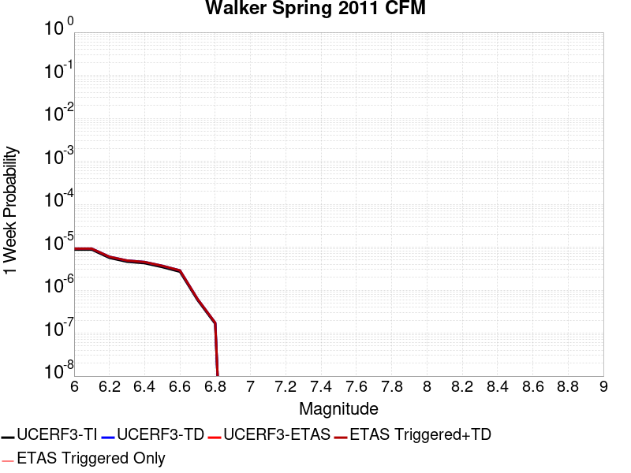 |  |  |  |

| Magnitude | 1 wk TI Prob | 1 wk TD Prob | 1 wk ETAS Prob | 1 wk ETAS/TD Gain | 1 wk ETAS Triggered+TD | 1 wk ETAS Triggered Only | 1 mo TI Prob | 1 mo TD Prob | 1 mo ETAS Prob | 1 mo ETAS/TD Gain | 1 mo ETAS Triggered+TD | 1 mo ETAS Triggered Only | 1 yr TI Prob | 1 yr TD Prob | 1 yr ETAS Prob | 1 yr ETAS/TD Gain | 1 yr ETAS Triggered+TD | 1 yr ETAS Triggered Only | 10 yr TI Prob | 10 yr TD Prob | 10 yr ETAS Prob | 10 yr ETAS/TD Gain | 10 yr ETAS Triggered+TD | 10 yr ETAS Triggered Only |
|-----|-----|-----|-----|-----|-----|-----|-----|-----|-----|-----|-----|-----|-----|-----|-----|-----|-----|-----|-----|-----|-----|-----|-----|-----|
| 6.0 | 8.791276E-6 | 9.258855E-6 | 0.0 | 0.0 | 9.258855E-6 | 0.0 | 3.767635E-5 | 3.9680264E-5 | 0.0 | 0.0 | 3.9680264E-5 | 0.0 | 4.58613E-4 | 4.8301095E-4 | 0.0 | 0.0 | 4.8301095E-4 | 0.0 | 0.004576677 | 0.004820684 | 3.0E-4 | 0.062231835 | 0.0051192376 | 3.0E-4 |
| 6.1 | 8.791276E-6 | 9.258855E-6 | 0.0 | 0.0 | 9.258855E-6 | 0.0 | 3.767635E-5 | 3.9680264E-5 | 0.0 | 0.0 | 3.9680264E-5 | 0.0 | 4.58613E-4 | 4.8301095E-4 | 0.0 | 0.0 | 4.8301095E-4 | 0.0 | 0.004576677 | 0.004820684 | 2.0E-4 | 0.041487888 | 0.0050197197 | 2.0E-4 |
| 6.2 | 5.654515E-6 | 5.994926E-6 | 0.0 | 0.0 | 5.994926E-6 | 0.0 | 2.4233412E-5 | 2.5692316E-5 | 0.0 | 0.0 | 2.5692316E-5 | 0.0 | 2.9500184E-4 | 3.1276405E-4 | 0.0 | 0.0 | 3.1276405E-4 | 0.0 | 0.0029461053 | 0.0031237327 | 2.0E-4 | 0.06402597 | 0.003323108 | 2.0E-4 |
| 6.3 | 4.591685E-6 | 4.891341E-6 | 0.0 | 0.0 | 4.891341E-6 | 0.0 | 1.96785E-5 | 2.0962747E-5 | 0.0 | 0.0 | 2.0962747E-5 | 0.0 | 2.395594E-4 | 2.5519592E-4 | 0.0 | 0.0 | 2.5519592E-4 | 0.0 | 0.002393013 | 0.0025494578 | 1.0E-4 | 0.039224025 | 0.002649203 | 1.0E-4 |
| 6.4 | 4.243283E-6 | 4.5195384E-6 | 0.0 | 0.0 | 4.5195384E-6 | 0.0 | 1.8185372E-5 | 1.936933E-5 | 0.0 | 0.0 | 1.936933E-5 | 0.0 | 2.2138441E-4 | 2.358003E-4 | 0.0 | 0.0 | 2.358003E-4 | 0.0 | 0.00221164 | 0.002355916 | 1.0E-4 | 0.042446338 | 0.0024556804 | 1.0E-4 |
| 6.5 | 3.4445666E-6 | 3.6833867E-6 | 0.0 | 0.0 | 3.6833867E-6 | 0.0 | 1.4762345E-5 | 1.578587E-5 | 0.0 | 0.0 | 1.578587E-5 | 0.0 | 1.7971672E-4 | 1.9218003E-4 | 0.0 | 0.0 | 1.9218003E-4 | 0.0 | 0.0017957145 | 0.0019205326 | 1.0E-4 | 0.052068893 | 0.0020203404 | 1.0E-4 |
| 6.6 | 2.68766E-6 | 2.8772854E-6 | 0.0 | 0.0 | 2.8772854E-6 | 0.0 | 1.1518492E-5 | 1.2331187E-5 | 0.0 | 0.0 | 1.2331187E-5 | 0.0 | 1.4022861E-4 | 1.5012566E-4 | 0.0 | 0.0 | 1.5012566E-4 | 0.0 | 0.0014014016 | 0.0015006157 | 1.0E-4 | 0.06663931 | 0.0016004656 | 1.0E-4 |
| 6.7 | 5.880964E-7 | 6.1962396E-7 | 0.0 | 0.0 | 6.1962396E-7 | 0.0 | 2.5204106E-6 | 2.655529E-6 | 0.0 | 0.0 | 2.655529E-6 | 0.0 | 3.0685565E-5 | 3.233068E-5 | 0.0 | 0.0 | 3.233068E-5 | 0.0 | 3.068133E-4 | 3.2326914E-4 | 0.0 | 0.0 | 3.2326914E-4 | 0.0 |
| 6.8 | 1.6514163E-7 | 1.7399272E-7 | 0.0 | 0.0 | 1.7399272E-7 | 0.0 | 7.077497E-7 | 7.4568305E-7 | 0.0 | 0.0 | 7.4568305E-7 | 0.0 | 8.616818E-6 | 9.078692E-6 | 0.0 | 0.0 | 9.078692E-6 | 0.0 | 8.616484E-5 | 9.078691E-5 | 0.0 | 0.0 | 9.078691E-5 | 0.0 |

## Blackwater
*[(top)](#table-of-contents)*

| 1 Week | 1 Month | 1 Year | 10 Year |
|-----|-----|-----|-----|
|  | 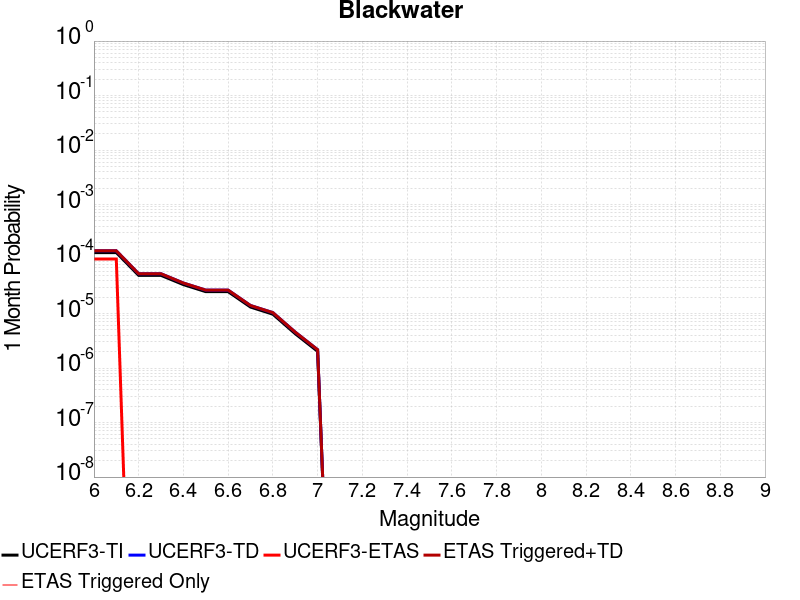 |  | 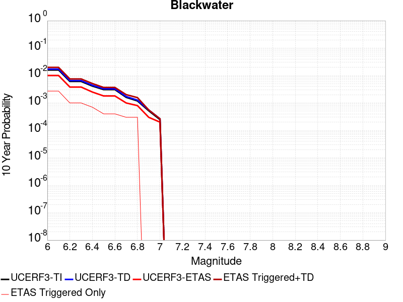 |

| Magnitude | 1 wk TI Prob | 1 wk TD Prob | 1 wk ETAS Prob | 1 wk ETAS/TD Gain | 1 wk ETAS Triggered+TD | 1 wk ETAS Triggered Only | 1 mo TI Prob | 1 mo TD Prob | 1 mo ETAS Prob | 1 mo ETAS/TD Gain | 1 mo ETAS Triggered+TD | 1 mo ETAS Triggered Only | 1 yr TI Prob | 1 yr TD Prob | 1 yr ETAS Prob | 1 yr ETAS/TD Gain | 1 yr ETAS Triggered+TD | 1 yr ETAS Triggered Only | 10 yr TI Prob | 10 yr TD Prob | 10 yr ETAS Prob | 10 yr ETAS/TD Gain | 10 yr ETAS Triggered+TD | 10 yr ETAS Triggered Only |
|-----|-----|-----|-----|-----|-----|-----|-----|-----|-----|-----|-----|-----|-----|-----|-----|-----|-----|-----|-----|-----|-----|-----|-----|-----|
| 6.0 | 3.0708583E-5 | 3.306896E-5 | 0.0 | 0.0 | 3.306896E-5 | 0.0 | 1.3160157E-4 | 1.4171719E-4 | 0.0 | 0.0 | 1.4171719E-4 | 0.0 | 0.0016010714 | 0.0017241776 | 0.0 | 0.0 | 0.0017241776 | 0.0 | 0.015895851 | 0.017121818 | 3.0E-4 | 0.017521504 | 0.01741668 | 3.0E-4 |
| 6.1 | 3.0708583E-5 | 3.306896E-5 | 0.0 | 0.0 | 3.306896E-5 | 0.0 | 1.3160157E-4 | 1.4171719E-4 | 0.0 | 0.0 | 1.4171719E-4 | 0.0 | 0.0016010714 | 0.0017241776 | 0.0 | 0.0 | 0.0017241776 | 0.0 | 0.015895851 | 0.017121818 | 3.0E-4 | 0.017521504 | 0.01741668 | 3.0E-4 |
| 6.2 | 1.1707779E-5 | 1.2535755E-5 | 0.0 | 0.0 | 1.2535755E-5 | 0.0 | 5.017523E-5 | 5.3723612E-5 | 0.0 | 0.0 | 5.3723612E-5 | 0.0 | 6.107122E-4 | 6.538983E-4 | 0.0 | 0.0 | 6.538983E-4 | 0.0 | 0.006090366 | 0.006520712 | 3.0E-4 | 0.046007246 | 0.0068187555 | 3.0E-4 |
| 6.3 | 1.1707779E-5 | 1.2535755E-5 | 0.0 | 0.0 | 1.2535755E-5 | 0.0 | 5.017523E-5 | 5.3723612E-5 | 0.0 | 0.0 | 5.3723612E-5 | 0.0 | 6.107122E-4 | 6.538983E-4 | 0.0 | 0.0 | 6.538983E-4 | 0.0 | 0.006090366 | 0.006520712 | 3.0E-4 | 0.046007246 | 0.0068187555 | 3.0E-4 |
| 6.4 | 7.929244E-6 | 8.4739495E-6 | 0.0 | 0.0 | 8.4739495E-6 | 0.0 | 3.3982033E-5 | 3.6316444E-5 | 0.0 | 0.0 | 3.6316444E-5 | 0.0 | 4.136527E-4 | 4.4206702E-4 | 0.0 | 0.0 | 4.4206702E-4 | 0.0 | 0.0041288356 | 0.0044122813 | 2.0E-4 | 0.04532803 | 0.0046113986 | 2.0E-4 |
| 6.5 | 5.8832115E-6 | 6.2814997E-6 | 0.0 | 0.0 | 6.2814997E-6 | 0.0 | 2.521352E-5 | 2.692045E-5 | 0.0 | 0.0 | 2.692045E-5 | 0.0 | 3.0693135E-4 | 3.2770974E-4 | 0.0 | 0.0 | 3.2770974E-4 | 0.0 | 0.0030650778 | 0.0032725176 | 1.0E-4 | 0.030557513 | 0.0033721903 | 1.0E-4 |
| 6.6 | 5.8832115E-6 | 6.2814997E-6 | 0.0 | 0.0 | 6.2814997E-6 | 0.0 | 2.521352E-5 | 2.692045E-5 | 0.0 | 0.0 | 2.692045E-5 | 0.0 | 3.0693135E-4 | 3.2770974E-4 | 0.0 | 0.0 | 3.2770974E-4 | 0.0 | 0.0030650778 | 0.0032725176 | 1.0E-4 | 0.030557513 | 0.0033721903 | 1.0E-4 |
| 6.7 | 3.0715053E-6 | 3.2791254E-6 | 0.0 | 0.0 | 3.2791254E-6 | 0.0 | 1.3163528E-5 | 1.4053326E-5 | 0.0 | 0.0 | 1.4053326E-5 | 0.0 | 1.6025416E-4 | 1.7108697E-4 | 0.0 | 0.0 | 1.7108697E-4 | 0.0 | 0.0016013865 | 0.0017096669 | 1.0E-4 | 0.058490925 | 0.001809496 | 1.0E-4 |
| 6.8 | 2.2722281E-6 | 2.4270078E-6 | 0.0 | 0.0 | 2.4270078E-6 | 0.0 | 9.738084E-6 | 1.0401426E-5 | 0.0 | 0.0 | 1.0401426E-5 | 0.0 | 1.1855473E-4 | 1.2663091E-4 | 0.0 | 0.0 | 1.2663091E-4 | 0.0 | 0.001184915 | 0.0012656776 | 1.0E-4 | 0.079009056 | 0.0013655511 | 1.0E-4 |
| 6.9 | 9.952399E-7 | 1.0645658E-6 | 0.0 | 0.0 | 1.0645658E-6 | 0.0 | 4.265307E-6 | 4.5624197E-6 | 0.0 | 0.0 | 4.5624197E-6 | 0.0 | 5.1928873E-5 | 5.554656E-5 | 0.0 | 0.0 | 5.554656E-5 | 0.0 | 5.191674E-4 | 5.553773E-4 | 0.0 | 0.0 | 5.553773E-4 | 0.0 |
| 7.0 | 4.7385504E-7 | 5.071793E-7 | 0.0 | 0.0 | 5.071793E-7 | 0.0 | 2.0308057E-6 | 2.1736255E-6 | 0.0 | 0.0 | 2.1736255E-6 | 0.0 | 2.4724779E-5 | 2.6463891E-5 | 0.0 | 0.0 | 2.6463891E-5 | 0.0 | 2.4722028E-4 | 2.6463892E-4 | 0.0 | 0.0 | 2.6463892E-4 | 0.0 |

## Little Salmon (Onshore)
*[(top)](#table-of-contents)*

| 1 Week | 1 Month | 1 Year | 10 Year |
|-----|-----|-----|-----|
| 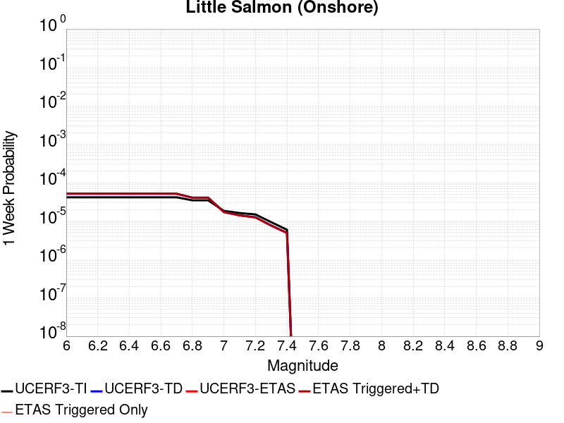 |  |  |  |

| Magnitude | 1 wk TI Prob | 1 wk TD Prob | 1 wk ETAS Prob | 1 wk ETAS/TD Gain | 1 wk ETAS Triggered+TD | 1 wk ETAS Triggered Only | 1 mo TI Prob | 1 mo TD Prob | 1 mo ETAS Prob | 1 mo ETAS/TD Gain | 1 mo ETAS Triggered+TD | 1 mo ETAS Triggered Only | 1 yr TI Prob | 1 yr TD Prob | 1 yr ETAS Prob | 1 yr ETAS/TD Gain | 1 yr ETAS Triggered+TD | 1 yr ETAS Triggered Only | 10 yr TI Prob | 10 yr TD Prob | 10 yr ETAS Prob | 10 yr ETAS/TD Gain | 10 yr ETAS Triggered+TD | 10 yr ETAS Triggered Only |
|-----|-----|-----|-----|-----|-----|-----|-----|-----|-----|-----|-----|-----|-----|-----|-----|-----|-----|-----|-----|-----|-----|-----|-----|-----|
| 6.0 | 4.1582247E-5 | 5.143167E-5 | 0.0 | 0.0 | 5.143167E-5 | 0.0 | 1.7819746E-4 | 2.2040741E-4 | 0.0 | 0.0 | 2.2040741E-4 | 0.0 | 0.0021673953 | 0.002680972 | 1.0E-4 | 0.037299905 | 0.0027807038 | 1.0E-4 | 0.021463778 | 0.026835978 | 3.0E-4 | 0.0111790225 | 0.027127927 | 3.0E-4 |
| 6.1 | 4.1582247E-5 | 5.143167E-5 | 0.0 | 0.0 | 5.143167E-5 | 0.0 | 1.7819746E-4 | 2.2040741E-4 | 0.0 | 0.0 | 2.2040741E-4 | 0.0 | 0.0021673953 | 0.002680972 | 1.0E-4 | 0.037299905 | 0.0027807038 | 1.0E-4 | 0.021463778 | 0.026835978 | 3.0E-4 | 0.0111790225 | 0.027127927 | 3.0E-4 |
| 6.2 | 4.1582247E-5 | 5.143167E-5 | 0.0 | 0.0 | 5.143167E-5 | 0.0 | 1.7819746E-4 | 2.2040741E-4 | 0.0 | 0.0 | 2.2040741E-4 | 0.0 | 0.0021673953 | 0.002680972 | 1.0E-4 | 0.037299905 | 0.0027807038 | 1.0E-4 | 0.021463778 | 0.026835978 | 3.0E-4 | 0.0111790225 | 0.027127927 | 3.0E-4 |
| 6.3 | 4.1582247E-5 | 5.143167E-5 | 0.0 | 0.0 | 5.143167E-5 | 0.0 | 1.7819746E-4 | 2.2040741E-4 | 0.0 | 0.0 | 2.2040741E-4 | 0.0 | 0.0021673953 | 0.002680972 | 1.0E-4 | 0.037299905 | 0.0027807038 | 1.0E-4 | 0.021463778 | 0.026835978 | 3.0E-4 | 0.0111790225 | 0.027127927 | 3.0E-4 |
| 6.4 | 4.1582247E-5 | 5.143167E-5 | 0.0 | 0.0 | 5.143167E-5 | 0.0 | 1.7819746E-4 | 2.2040741E-4 | 0.0 | 0.0 | 2.2040741E-4 | 0.0 | 0.0021673953 | 0.002680972 | 1.0E-4 | 0.037299905 | 0.0027807038 | 1.0E-4 | 0.021463778 | 0.026835978 | 3.0E-4 | 0.0111790225 | 0.027127927 | 3.0E-4 |
| 6.5 | 4.1582247E-5 | 5.143167E-5 | 0.0 | 0.0 | 5.143167E-5 | 0.0 | 1.7819746E-4 | 2.2040741E-4 | 0.0 | 0.0 | 2.2040741E-4 | 0.0 | 0.0021673953 | 0.002680972 | 1.0E-4 | 0.037299905 | 0.0027807038 | 1.0E-4 | 0.021463778 | 0.026835978 | 3.0E-4 | 0.0111790225 | 0.027127927 | 3.0E-4 |
| 6.6 | 4.1582247E-5 | 5.143167E-5 | 0.0 | 0.0 | 5.143167E-5 | 0.0 | 1.7819746E-4 | 2.2040741E-4 | 0.0 | 0.0 | 2.2040741E-4 | 0.0 | 0.0021673953 | 0.002680972 | 1.0E-4 | 0.037299905 | 0.0027807038 | 1.0E-4 | 0.021463778 | 0.026835978 | 3.0E-4 | 0.0111790225 | 0.027127927 | 3.0E-4 |
| 6.7 | 4.1582247E-5 | 5.143167E-5 | 0.0 | 0.0 | 5.143167E-5 | 0.0 | 1.7819746E-4 | 2.2040741E-4 | 0.0 | 0.0 | 2.2040741E-4 | 0.0 | 0.0021673953 | 0.002680972 | 1.0E-4 | 0.037299905 | 0.0027807038 | 1.0E-4 | 0.021463778 | 0.026835978 | 3.0E-4 | 0.0111790225 | 0.027127927 | 3.0E-4 |
| 6.8 | 3.4607925E-5 | 4.0632807E-5 | 0.0 | 0.0 | 4.0632807E-5 | 0.0 | 1.4831126E-4 | 1.7413315E-4 | 0.0 | 0.0 | 1.7413315E-4 | 0.0 | 0.001804194 | 0.0021187498 | 1.0E-4 | 0.047197644 | 0.002218538 | 1.0E-4 | 0.01789616 | 0.021293357 | 3.0E-4 | 0.014088901 | 0.02158697 | 3.0E-4 |
| 6.9 | 3.4607925E-5 | 4.0632807E-5 | 0.0 | 0.0 | 4.0632807E-5 | 0.0 | 1.4831126E-4 | 1.7413315E-4 | 0.0 | 0.0 | 1.7413315E-4 | 0.0 | 0.001804194 | 0.0021187498 | 1.0E-4 | 0.047197644 | 0.002218538 | 1.0E-4 | 0.01789616 | 0.021293357 | 3.0E-4 | 0.014088901 | 0.02158697 | 3.0E-4 |
| 7.0 | 1.8411014E-5 | 1.7161936E-5 | 0.0 | 0.0 | 1.7161936E-5 | 0.0 | 7.8901954E-5 | 7.3549374E-5 | 0.0 | 0.0 | 7.3549374E-5 | 0.0 | 9.6020795E-4 | 8.9514843E-4 | 0.0 | 0.0 | 8.9514843E-4 | 0.0 | 0.009560696 | 0.008940588 | 1.0E-4 | 0.011184948 | 0.0090396935 | 1.0E-4 |
| 7.1 | 1.6183103E-5 | 1.4098013E-5 | 0.0 | 0.0 | 1.4098013E-5 | 0.0 | 6.935431E-5 | 6.041892E-5 | 0.0 | 0.0 | 6.041892E-5 | 0.0 | 8.440616E-4 | 7.353988E-4 | 0.0 | 0.0 | 7.353988E-4 | 0.0 | 0.008408628 | 0.007354235 | 1.0E-4 | 0.013597608 | 0.0074534994 | 1.0E-4 |
| 7.2 | 1.4868988E-5 | 1.2485594E-5 | 0.0 | 0.0 | 1.2485594E-5 | 0.0 | 6.372268E-5 | 5.350884E-5 | 0.0 | 0.0 | 5.350884E-5 | 0.0 | 7.755474E-4 | 6.513198E-4 | 0.0 | 0.0 | 6.513198E-4 | 0.0 | 0.0077284635 | 0.006518235 | 1.0E-4 | 0.015341576 | 0.0066175833 | 1.0E-4 |
| 7.3 | 9.3599865E-6 | 7.63674E-6 | 0.0 | 0.0 | 7.63674E-6 | 0.0 | 4.011361E-5 | 3.2728673E-5 | 0.0 | 0.0 | 3.2728673E-5 | 0.0 | 4.8827377E-4 | 3.9843383E-4 | 0.0 | 0.0 | 3.9843383E-4 | 0.0 | 0.004872023 | 0.0039928746 | 1.0E-4 | 0.025044613 | 0.0040924754 | 1.0E-4 |
| 7.4 | 5.941556E-6 | 4.913584E-6 | 0.0 | 0.0 | 4.913584E-6 | 0.0 | 2.5463563E-5 | 2.1058217E-5 | 0.0 | 0.0 | 2.1058217E-5 | 0.0 | 3.0997477E-4 | 2.5638376E-4 | 0.0 | 0.0 | 2.5638376E-4 | 0.0 | 0.0030954275 | 0.0025715034 | 1.0E-4 | 0.038887758 | 0.0026712464 | 1.0E-4 |

## Cucamonga
*[(top)](#table-of-contents)*

| 1 Week | 1 Month | 1 Year | 10 Year |
|-----|-----|-----|-----|
|  |  |  | 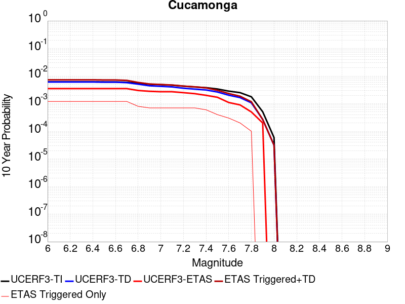 |

| Magnitude | 1 wk TI Prob | 1 wk TD Prob | 1 wk ETAS Prob | 1 wk ETAS/TD Gain | 1 wk ETAS Triggered+TD | 1 wk ETAS Triggered Only | 1 mo TI Prob | 1 mo TD Prob | 1 mo ETAS Prob | 1 mo ETAS/TD Gain | 1 mo ETAS Triggered+TD | 1 mo ETAS Triggered Only | 1 yr TI Prob | 1 yr TD Prob | 1 yr ETAS Prob | 1 yr ETAS/TD Gain | 1 yr ETAS Triggered+TD | 1 yr ETAS Triggered Only | 10 yr TI Prob | 10 yr TD Prob | 10 yr ETAS Prob | 10 yr ETAS/TD Gain | 10 yr ETAS Triggered+TD | 10 yr ETAS Triggered Only |
|-----|-----|-----|-----|-----|-----|-----|-----|-----|-----|-----|-----|-----|-----|-----|-----|-----|-----|-----|-----|-----|-----|-----|-----|-----|
| 6.0 | 1.1848348E-5 | 1.1681425E-5 | 0.0 | 0.0 | 1.1681425E-5 | 0.0 | 5.0777642E-5 | 5.0062306E-5 | 1.0E-4 | 1.9975109 | 1.500573E-4 | 1.0E-4 | 6.180424E-4 | 6.093408E-4 | 2.0E-4 | 0.32822356 | 8.092189E-4 | 2.0E-4 | 0.0061632637 | 0.0060776994 | 3.0E-4 | 0.049360782 | 0.006375876 | 3.0E-4 |
| 6.1 | 1.1848348E-5 | 1.1681425E-5 | 0.0 | 0.0 | 1.1681425E-5 | 0.0 | 5.0777642E-5 | 5.0062306E-5 | 1.0E-4 | 1.9975109 | 1.500573E-4 | 1.0E-4 | 6.180424E-4 | 6.093408E-4 | 2.0E-4 | 0.32822356 | 8.092189E-4 | 2.0E-4 | 0.0061632637 | 0.0060776994 | 3.0E-4 | 0.049360782 | 0.006375876 | 3.0E-4 |
| 6.2 | 1.1848348E-5 | 1.1681425E-5 | 0.0 | 0.0 | 1.1681425E-5 | 0.0 | 5.0777642E-5 | 5.0062306E-5 | 1.0E-4 | 1.9975109 | 1.500573E-4 | 1.0E-4 | 6.180424E-4 | 6.093408E-4 | 2.0E-4 | 0.32822356 | 8.092189E-4 | 2.0E-4 | 0.0061632637 | 0.0060776994 | 3.0E-4 | 0.049360782 | 0.006375876 | 3.0E-4 |
| 6.3 | 1.1848348E-5 | 1.1681425E-5 | 0.0 | 0.0 | 1.1681425E-5 | 0.0 | 5.0777642E-5 | 5.0062306E-5 | 1.0E-4 | 1.9975109 | 1.500573E-4 | 1.0E-4 | 6.180424E-4 | 6.093408E-4 | 2.0E-4 | 0.32822356 | 8.092189E-4 | 2.0E-4 | 0.0061632637 | 0.0060776994 | 3.0E-4 | 0.049360782 | 0.006375876 | 3.0E-4 |
| 6.4 | 1.1848348E-5 | 1.1681425E-5 | 0.0 | 0.0 | 1.1681425E-5 | 0.0 | 5.0777642E-5 | 5.0062306E-5 | 1.0E-4 | 1.9975109 | 1.500573E-4 | 1.0E-4 | 6.180424E-4 | 6.093408E-4 | 2.0E-4 | 0.32822356 | 8.092189E-4 | 2.0E-4 | 0.0061632637 | 0.0060776994 | 3.0E-4 | 0.049360782 | 0.006375876 | 3.0E-4 |
| 6.5 | 1.16988695E-5 | 1.1520585E-5 | 0.0 | 0.0 | 1.1520585E-5 | 0.0 | 5.013705E-5 | 4.937302E-5 | 1.0E-4 | 2.0253978 | 1.4936808E-4 | 1.0E-4 | 6.102476E-4 | 6.0095335E-4 | 2.0E-4 | 0.33280453 | 8.0083316E-4 | 2.0E-4 | 0.006085745 | 0.005994278 | 3.0E-4 | 0.05004773 | 0.00629248 | 3.0E-4 |
| 6.6 | 1.16988695E-5 | 1.1520585E-5 | 0.0 | 0.0 | 1.1520585E-5 | 0.0 | 5.013705E-5 | 4.937302E-5 | 1.0E-4 | 2.0253978 | 1.4936808E-4 | 1.0E-4 | 6.102476E-4 | 6.0095335E-4 | 2.0E-4 | 0.33280453 | 8.0083316E-4 | 2.0E-4 | 0.006085745 | 0.005994278 | 3.0E-4 | 0.05004773 | 0.00629248 | 3.0E-4 |
| 6.7 | 1.1397107E-5 | 1.1060845E-5 | 0.0 | 0.0 | 1.1060845E-5 | 0.0 | 4.884383E-5 | 4.7402777E-5 | 1.0E-4 | 2.1095812 | 1.4739804E-4 | 1.0E-4 | 5.9451134E-4 | 5.7697843E-4 | 2.0E-4 | 0.3466334 | 7.76863E-4 | 2.0E-4 | 0.005929234 | 0.005755779 | 3.0E-4 | 0.052121527 | 0.006054052 | 3.0E-4 |
| 6.8 | 1.058387E-5 | 9.737108E-6 | 0.0 | 0.0 | 9.737108E-6 | 0.0 | 4.5358654E-5 | 4.17298E-5 | 1.0E-4 | 2.396369 | 1.4172563E-4 | 1.0E-4 | 5.521017E-4 | 5.07943E-4 | 2.0E-4 | 0.393745 | 7.0784136E-4 | 2.0E-4 | 0.00550732 | 0.005068654 | 2.0E-4 | 0.039458204 | 0.0052676406 | 2.0E-4 |
| 6.9 | 9.690046E-6 | 8.535669E-6 | 0.0 | 0.0 | 8.535669E-6 | 0.0 | 4.1528107E-5 | 3.6580925E-5 | 1.0E-4 | 2.7336652 | 1.3657726E-4 | 1.0E-4 | 5.054874E-4 | 4.4528214E-4 | 1.0E-4 | 0.22457671 | 5.452376E-4 | 1.0E-4 | 0.005043391 | 0.0044446616 | 1.0E-4 | 0.022498902 | 0.0045442167 | 1.0E-4 |
| 7.0 | 9.381461E-6 | 8.14438E-6 | 0.0 | 0.0 | 8.14438E-6 | 0.0 | 4.020564E-5 | 3.490402E-5 | 1.0E-4 | 2.8649995 | 1.3490053E-4 | 1.0E-4 | 4.893937E-4 | 4.2487396E-4 | 1.0E-4 | 0.23536393 | 5.2483147E-4 | 1.0E-4 | 0.0048831734 | 0.0042413757 | 1.0E-4 | 0.023577256 | 0.004340952 | 1.0E-4 |
| 7.1 | 8.946492E-6 | 7.739966E-6 | 0.0 | 0.0 | 7.739966E-6 | 0.0 | 3.8341543E-5 | 3.3170865E-5 | 1.0E-4 | 3.0146937 | 1.3316754E-4 | 1.0E-4 | 4.667083E-4 | 4.0378075E-4 | 1.0E-4 | 0.24765916 | 5.037404E-4 | 1.0E-4 | 0.0046572937 | 0.004031233 | 1.0E-4 | 0.024806308 | 0.0041308296 | 1.0E-4 |
| 7.2 | 8.251016E-6 | 6.9360203E-6 | 0.0 | 0.0 | 6.9360203E-6 | 0.0 | 3.5361016E-5 | 2.9725465E-5 | 1.0E-4 | 3.364119 | 1.297225E-4 | 1.0E-4 | 4.3043532E-4 | 3.6184766E-4 | 1.0E-4 | 0.2763594 | 4.6181146E-4 | 1.0E-4 | 0.0042960253 | 0.0036133453 | 1.0E-4 | 0.027675185 | 0.003712984 | 1.0E-4 |
| 7.3 | 7.717881E-6 | 6.4482774E-6 | 0.0 | 0.0 | 6.4482774E-6 | 0.0 | 3.3076216E-5 | 2.7635182E-5 | 1.0E-4 | 3.6185756 | 1.2763242E-4 | 1.0E-4 | 4.026285E-4 | 3.3640664E-4 | 1.0E-4 | 0.2972593 | 4.36373E-4 | 1.0E-4 | 0.004018998 | 0.0033597308 | 1.0E-4 | 0.029764289 | 0.003459395 | 1.0E-4 |
| 7.4 | 7.275623E-6 | 5.9953554E-6 | 0.0 | 0.0 | 5.9953554E-6 | 0.0 | 3.118087E-5 | 2.5694128E-5 | 1.0E-4 | 3.8919399 | 1.2569156E-4 | 1.0E-4 | 3.7956095E-4 | 3.127813E-4 | 1.0E-4 | 0.3197122 | 4.1275003E-4 | 1.0E-4 | 0.0037891332 | 0.0031241663 | 1.0E-4 | 0.03200854 | 0.003223854 | 1.0E-4 |
| 7.5 | 6.5109502E-6 | 5.0681283E-6 | 0.0 | 0.0 | 5.0681283E-6 | 0.0 | 2.7903774E-5 | 2.1720369E-5 | 1.0E-4 | 4.6039734 | 1.217182E-4 | 1.0E-4 | 3.3967546E-4 | 2.6441354E-4 | 1.0E-4 | 0.37819543 | 3.6438712E-4 | 1.0E-4 | 0.0033915674 | 0.0026417347 | 1.0E-4 | 0.037853915 | 0.0027414707 | 1.0E-4 |
| 7.6 | 5.4495326E-6 | 3.8797943E-6 | 0.0 | 0.0 | 3.8797943E-6 | 0.0 | 2.335493E-5 | 1.6627584E-5 | 1.0E-4 | 6.0141025 | 1.16625924E-4 | 1.0E-4 | 2.8430918E-4 | 2.024221E-4 | 1.0E-4 | 0.49401718 | 3.0240187E-4 | 1.0E-4 | 0.0028394572 | 0.0020231178 | 1.0E-4 | 0.04942866 | 0.0021229153 | 1.0E-4 |
| 7.7 | 4.7997164E-6 | 3.17428E-6 | 0.0 | 0.0 | 3.17428E-6 | 0.0 | 2.057005E-5 | 1.3603986E-5 | 1.0E-4 | 7.3507867 | 1.13602626E-4 | 1.0E-4 | 2.504116E-4 | 1.6561597E-4 | 1.0E-4 | 0.6038065 | 2.655994E-4 | 1.0E-4 | 0.002501296 | 0.0016556637 | 1.0E-4 | 0.06039874 | 0.0017554981 | 1.0E-4 |
| 7.8 | 3.3941733E-6 | 2.049857E-6 | 0.0 | 0.0 | 2.049857E-6 | 0.0 | 1.4546376E-5 | 8.785072E-6 | 0.0 | 0.0 | 8.785072E-6 | 0.0 | 1.7708774E-4 | 1.0695301E-4 | 0.0 | 0.0 | 1.0695301E-4 | 0.0 | 0.0017694668 | 0.0010690487 | 0.0 | 0.0 | 0.0010690487 | 0.0 |
| 7.9 | 9.750552E-7 | 5.122147E-7 | 0.0 | 0.0 | 5.122147E-7 | 0.0 | 4.178801E-6 | 2.195204E-6 | 0.0 | 0.0 | 2.195204E-6 | 0.0 | 5.0875715E-5 | 2.6726284E-5 | 0.0 | 0.0 | 2.6726284E-5 | 0.0 | 5.086407E-4 | 2.672311E-4 | 0.0 | 0.0 | 2.672311E-4 | 0.0 |
| 8.0 | 1.133857E-7 | 6.016657E-8 | 0.0 | 0.0 | 6.016657E-8 | 0.0 | 4.8593864E-7 | 2.5785673E-7 | 0.0 | 0.0 | 2.5785673E-7 | 0.0 | 5.9162867E-6 | 3.139401E-6 | 0.0 | 0.0 | 3.139401E-6 | 0.0 | 5.916129E-5 | 3.1393585E-5 | 0.0 | 0.0 | 3.1393585E-5 | 0.0 |

## Robinson Creek
*[(top)](#table-of-contents)*

| 1 Week | 1 Month | 1 Year | 10 Year |
|-----|-----|-----|-----|
|  |  |  |  |

| Magnitude | 1 wk TI Prob | 1 wk TD Prob | 1 wk ETAS Prob | 1 wk ETAS/TD Gain | 1 wk ETAS Triggered+TD | 1 wk ETAS Triggered Only | 1 mo TI Prob | 1 mo TD Prob | 1 mo ETAS Prob | 1 mo ETAS/TD Gain | 1 mo ETAS Triggered+TD | 1 mo ETAS Triggered Only | 1 yr TI Prob | 1 yr TD Prob | 1 yr ETAS Prob | 1 yr ETAS/TD Gain | 1 yr ETAS Triggered+TD | 1 yr ETAS Triggered Only | 10 yr TI Prob | 10 yr TD Prob | 10 yr ETAS Prob | 10 yr ETAS/TD Gain | 10 yr ETAS Triggered+TD | 10 yr ETAS Triggered Only |
|-----|-----|-----|-----|-----|-----|-----|-----|-----|-----|-----|-----|-----|-----|-----|-----|-----|-----|-----|-----|-----|-----|-----|-----|-----|
| 6.0 | 1.3705327E-5 | 1.526664E-5 | 0.0 | 0.0 | 1.526664E-5 | 0.0 | 5.8735794E-5 | 6.542846E-5 | 0.0 | 0.0 | 6.542846E-5 | 0.0 | 7.1487366E-4 | 7.965915E-4 | 1.0E-4 | 0.12553486 | 8.9651183E-4 | 1.0E-4 | 0.0071257832 | 0.007965915 | 3.0E-4 | 0.037660457 | 0.008263526 | 3.0E-4 |
| 6.1 | 1.3705327E-5 | 1.526664E-5 | 0.0 | 0.0 | 1.526664E-5 | 0.0 | 5.8735794E-5 | 6.542846E-5 | 0.0 | 0.0 | 6.542846E-5 | 0.0 | 7.1487366E-4 | 7.965915E-4 | 1.0E-4 | 0.12553486 | 8.9651183E-4 | 1.0E-4 | 0.0071257832 | 0.007965915 | 3.0E-4 | 0.037660457 | 0.008263526 | 3.0E-4 |
| 6.2 | 1.3705327E-5 | 1.526664E-5 | 0.0 | 0.0 | 1.526664E-5 | 0.0 | 5.8735794E-5 | 6.542846E-5 | 0.0 | 0.0 | 6.542846E-5 | 0.0 | 7.1487366E-4 | 7.965915E-4 | 1.0E-4 | 0.12553486 | 8.9651183E-4 | 1.0E-4 | 0.0071257832 | 0.007965915 | 3.0E-4 | 0.037660457 | 0.008263526 | 3.0E-4 |
| 6.3 | 1.3705327E-5 | 1.526664E-5 | 0.0 | 0.0 | 1.526664E-5 | 0.0 | 5.8735794E-5 | 6.542846E-5 | 0.0 | 0.0 | 6.542846E-5 | 0.0 | 7.1487366E-4 | 7.965915E-4 | 1.0E-4 | 0.12553486 | 8.9651183E-4 | 1.0E-4 | 0.0071257832 | 0.007965915 | 3.0E-4 | 0.037660457 | 0.008263526 | 3.0E-4 |
| 6.4 | 1.3705327E-5 | 1.526664E-5 | 0.0 | 0.0 | 1.526664E-5 | 0.0 | 5.8735794E-5 | 6.542846E-5 | 0.0 | 0.0 | 6.542846E-5 | 0.0 | 7.1487366E-4 | 7.965915E-4 | 1.0E-4 | 0.12553486 | 8.9651183E-4 | 1.0E-4 | 0.0071257832 | 0.007965915 | 3.0E-4 | 0.037660457 | 0.008263526 | 3.0E-4 |

## Earthquake Valley (No  Extension)
*[(top)](#table-of-contents)*

| 1 Week | 1 Month | 1 Year | 10 Year |
|-----|-----|-----|-----|
|  |  |  |  |

| Magnitude | 1 wk TI Prob | 1 wk TD Prob | 1 wk ETAS Prob | 1 wk ETAS/TD Gain | 1 wk ETAS Triggered+TD | 1 wk ETAS Triggered Only | 1 mo TI Prob | 1 mo TD Prob | 1 mo ETAS Prob | 1 mo ETAS/TD Gain | 1 mo ETAS Triggered+TD | 1 mo ETAS Triggered Only | 1 yr TI Prob | 1 yr TD Prob | 1 yr ETAS Prob | 1 yr ETAS/TD Gain | 1 yr ETAS Triggered+TD | 1 yr ETAS Triggered Only | 10 yr TI Prob | 10 yr TD Prob | 10 yr ETAS Prob | 10 yr ETAS/TD Gain | 10 yr ETAS Triggered+TD | 10 yr ETAS Triggered Only |
|-----|-----|-----|-----|-----|-----|-----|-----|-----|-----|-----|-----|-----|-----|-----|-----|-----|-----|-----|-----|-----|-----|-----|-----|-----|
| 6.0 | 2.1859703E-5 | 2.5156909E-5 | 0.0 | 0.0 | 2.5156909E-5 | 0.0 | 9.3681076E-5 | 1.07811684E-4 | 0.0 | 0.0 | 1.07811684E-4 | 0.0 | 0.0011399703 | 0.0013119616 | 1.0E-4 | 0.07622175 | 0.0014118303 | 1.0E-4 | 0.011341401 | 0.013056477 | 3.0E-4 | 0.022977103 | 0.013352559 | 3.0E-4 |
| 6.1 | 2.1859703E-5 | 2.5156909E-5 | 0.0 | 0.0 | 2.5156909E-5 | 0.0 | 9.3681076E-5 | 1.07811684E-4 | 0.0 | 0.0 | 1.07811684E-4 | 0.0 | 0.0011399703 | 0.0013119616 | 1.0E-4 | 0.07622175 | 0.0014118303 | 1.0E-4 | 0.011341401 | 0.013056477 | 3.0E-4 | 0.022977103 | 0.013352559 | 3.0E-4 |
| 6.2 | 2.1859703E-5 | 2.5156909E-5 | 0.0 | 0.0 | 2.5156909E-5 | 0.0 | 9.3681076E-5 | 1.07811684E-4 | 0.0 | 0.0 | 1.07811684E-4 | 0.0 | 0.0011399703 | 0.0013119616 | 1.0E-4 | 0.07622175 | 0.0014118303 | 1.0E-4 | 0.011341401 | 0.013056477 | 3.0E-4 | 0.022977103 | 0.013352559 | 3.0E-4 |
| 6.3 | 2.1859703E-5 | 2.5156909E-5 | 0.0 | 0.0 | 2.5156909E-5 | 0.0 | 9.3681076E-5 | 1.07811684E-4 | 0.0 | 0.0 | 1.07811684E-4 | 0.0 | 0.0011399703 | 0.0013119616 | 1.0E-4 | 0.07622175 | 0.0014118303 | 1.0E-4 | 0.011341401 | 0.013056477 | 3.0E-4 | 0.022977103 | 0.013352559 | 3.0E-4 |
| 6.4 | 2.1859703E-5 | 2.5156909E-5 | 0.0 | 0.0 | 2.5156909E-5 | 0.0 | 9.3681076E-5 | 1.07811684E-4 | 0.0 | 0.0 | 1.07811684E-4 | 0.0 | 0.0011399703 | 0.0013119616 | 1.0E-4 | 0.07622175 | 0.0014118303 | 1.0E-4 | 0.011341401 | 0.013056477 | 3.0E-4 | 0.022977103 | 0.013352559 | 3.0E-4 |
| 6.5 | 2.1859703E-5 | 2.5156909E-5 | 0.0 | 0.0 | 2.5156909E-5 | 0.0 | 9.3681076E-5 | 1.07811684E-4 | 0.0 | 0.0 | 1.07811684E-4 | 0.0 | 0.0011399703 | 0.0013119616 | 1.0E-4 | 0.07622175 | 0.0014118303 | 1.0E-4 | 0.011341401 | 0.013056477 | 3.0E-4 | 0.022977103 | 0.013352559 | 3.0E-4 |
| 6.6 | 1.597E-5 | 1.8326356E-5 | 0.0 | 0.0 | 1.8326356E-5 | 0.0 | 6.8441055E-5 | 7.8539655E-5 | 0.0 | 0.0 | 7.8539655E-5 | 0.0 | 8.329513E-4 | 9.5588784E-4 | 1.0E-4 | 0.10461479 | 0.0010557922 | 1.0E-4 | 0.008298361 | 0.009526342 | 3.0E-4 | 0.031491626 | 0.009823484 | 3.0E-4 |
| 6.7 | 1.597E-5 | 1.8326356E-5 | 0.0 | 0.0 | 1.8326356E-5 | 0.0 | 6.8441055E-5 | 7.8539655E-5 | 0.0 | 0.0 | 7.8539655E-5 | 0.0 | 8.329513E-4 | 9.5588784E-4 | 1.0E-4 | 0.10461479 | 0.0010557922 | 1.0E-4 | 0.008298361 | 0.009526342 | 3.0E-4 | 0.031491626 | 0.009823484 | 3.0E-4 |
| 6.8 | 1.5315149E-5 | 1.7573366E-5 | 0.0 | 0.0 | 1.7573366E-5 | 0.0 | 6.5634704E-5 | 7.531274E-5 | 0.0 | 0.0 | 7.531274E-5 | 0.0 | 7.988095E-4 | 9.1663323E-4 | 1.0E-4 | 0.10909489 | 0.0010165416 | 1.0E-4 | 0.007959441 | 0.009137036 | 3.0E-4 | 0.032833405 | 0.009434295 | 3.0E-4 |
| 6.9 | 1.3634728E-5 | 1.5650037E-5 | 0.0 | 0.0 | 1.5650037E-5 | 0.0 | 5.8433237E-5 | 6.707032E-5 | 0.0 | 0.0 | 6.707032E-5 | 0.0 | 7.1119244E-4 | 8.163571E-4 | 1.0E-4 | 0.12249542 | 9.162754E-4 | 1.0E-4 | 0.007089207 | 0.008141627 | 3.0E-4 | 0.036847673 | 0.008439184 | 3.0E-4 |
| 7.0 | 1.3496271E-5 | 1.5492302E-5 | 0.0 | 0.0 | 1.5492302E-5 | 0.0 | 5.783988E-5 | 6.639436E-5 | 0.0 | 0.0 | 6.639436E-5 | 0.0 | 7.03973E-4 | 8.081333E-4 | 1.0E-4 | 0.12374197 | 9.0805243E-4 | 1.0E-4 | 0.007017471 | 0.008059987 | 3.0E-4 | 0.037220903 | 0.008357569 | 3.0E-4 |
| 7.1 | 8.242798E-6 | 9.4565585E-6 | 0.0 | 0.0 | 9.4565585E-6 | 0.0 | 3.53258E-5 | 4.0527855E-5 | 0.0 | 0.0 | 4.0527855E-5 | 0.0 | 4.300067E-4 | 4.9338175E-4 | 0.0 | 0.0 | 4.9338175E-4 | 0.0 | 0.004291756 | 0.0049294187 | 1.0E-4 | 0.020286368 | 0.005028926 | 1.0E-4 |
| 7.2 | 2.6506527E-7 | 2.2490862E-7 | 0.0 | 0.0 | 2.2490862E-7 | 0.0 | 1.1359936E-6 | 9.638937E-7 | 0.0 | 0.0 | 9.638937E-7 | 0.0 | 1.3830633E-5 | 1.17353475E-5 | 0.0 | 0.0 | 1.17353475E-5 | 0.0 | 1.3829772E-4 | 1.17347685E-4 | 0.0 | 0.0 | 1.17347685E-4 | 0.0 |
| 7.3 | 2.5810488E-7 | 2.1886828E-7 | 0.0 | 0.0 | 2.1886828E-7 | 0.0 | 1.1061633E-6 | 9.3800656E-7 | 0.0 | 0.0 | 9.3800656E-7 | 0.0 | 1.3467455E-5 | 1.1420175E-5 | 0.0 | 0.0 | 1.1420175E-5 | 0.0 | 1.3466639E-4 | 1.14196286E-4 | 0.0 | 0.0 | 1.14196286E-4 | 0.0 |
| 7.4 | 2.2676066E-7 | 1.904391E-7 | 0.0 | 0.0 | 1.904391E-7 | 0.0 | 9.71831E-7 | 8.1616736E-7 | 0.0 | 0.0 | 8.1616736E-7 | 0.0 | 1.1831979E-5 | 9.936796E-6 | 0.0 | 0.0 | 9.936796E-6 | 0.0 | 1.1831349E-4 | 9.9363904E-5 | 0.0 | 0.0 | 9.9363904E-5 | 0.0 |
| 7.5 | 1.5553917E-7 | 1.3056504E-7 | 0.0 | 0.0 | 1.3056504E-7 | 0.0 | 6.6659624E-7 | 5.5956434E-7 | 0.0 | 0.0 | 5.5956434E-7 | 0.0 | 8.115779E-6 | 6.8126765E-6 | 0.0 | 0.0 | 6.8126765E-6 | 0.0 | 8.115482E-5 | 6.812489E-5 | 0.0 | 0.0 | 6.812489E-5 | 0.0 |
| 7.6 | 1.3448629E-7 | 1.12465045E-7 | 0.0 | 0.0 | 1.12465045E-7 | 0.0 | 5.7636964E-7 | 4.8199297E-7 | 0.0 | 0.0 | 4.8199297E-7 | 0.0 | 7.017278E-6 | 5.868251E-6 | 0.0 | 0.0 | 5.868251E-6 | 0.0 | 7.0170565E-5 | 5.868117E-5 | 0.0 | 0.0 | 5.868117E-5 | 0.0 |
| 7.7 | 2.9719402E-8 | 1.4513542E-8 | 0.0 | 0.0 | 1.4513542E-8 | 0.0 | 1.2736886E-7 | 6.22009E-8 | 0.0 | 0.0 | 6.22009E-8 | 0.0 | 1.5507147E-6 | 7.572957E-7 | 0.0 | 0.0 | 7.572957E-7 | 0.0 | 1.550704E-5 | 7.5729363E-6 | 0.0 | 0.0 | 7.5729363E-6 | 0.0 |
| 7.8 | 7.4390196E-9 | 3.232151E-9 | 0.0 | 0.0 | 3.232151E-9 | 0.0 | 3.1881513E-8 | 1.3852076E-8 | 0.0 | 0.0 | 1.3852076E-8 | 0.0 | 3.8815733E-7 | 1.6864901E-7 | 0.0 | 0.0 | 1.6864901E-7 | 0.0 | 3.8815665E-6 | 1.6864891E-6 | 0.0 | 0.0 | 1.6864891E-6 | 0.0 |
| 7.9 | 1.5373532E-9 | 8.4171903E-10 | 0.0 | 0.0 | 8.4171903E-10 | 0.0 | 6.5886567E-9 | 3.6073673E-9 | 0.0 | 0.0 | 3.6073673E-9 | 0.0 | 8.021689E-8 | 4.3919695E-8 | 0.0 | 0.0 | 4.3919695E-8 | 0.0 | 8.0216864E-7 | 4.3919692E-7 | 0.0 | 0.0 | 4.3919692E-7 | 0.0 |

## Davis Creek
*[(top)](#table-of-contents)*

| 1 Week | 1 Month | 1 Year | 10 Year |
|-----|-----|-----|-----|
|  |  |  |  |

| Magnitude | 1 wk TI Prob | 1 wk TD Prob | 1 wk ETAS Prob | 1 wk ETAS/TD Gain | 1 wk ETAS Triggered+TD | 1 wk ETAS Triggered Only | 1 mo TI Prob | 1 mo TD Prob | 1 mo ETAS Prob | 1 mo ETAS/TD Gain | 1 mo ETAS Triggered+TD | 1 mo ETAS Triggered Only | 1 yr TI Prob | 1 yr TD Prob | 1 yr ETAS Prob | 1 yr ETAS/TD Gain | 1 yr ETAS Triggered+TD | 1 yr ETAS Triggered Only | 10 yr TI Prob | 10 yr TD Prob | 10 yr ETAS Prob | 10 yr ETAS/TD Gain | 10 yr ETAS Triggered+TD | 10 yr ETAS Triggered Only |
|-----|-----|-----|-----|-----|-----|-----|-----|-----|-----|-----|-----|-----|-----|-----|-----|-----|-----|-----|-----|-----|-----|-----|-----|-----|
| 6.0 | 2.331472E-5 | 2.5393283E-5 | 0.0 | 0.0 | 2.5393283E-5 | 0.0 | 9.99164E-5 | 1.0882449E-4 | 0.0 | 0.0 | 1.0882449E-4 | 0.0 | 0.0012158032 | 0.0013242511 | 1.0E-4 | 0.075514376 | 0.0014241186 | 1.0E-4 | 0.01209173 | 0.013175357 | 3.0E-4 | 0.02276978 | 0.013471405 | 3.0E-4 |
| 6.1 | 1.0407654E-5 | 1.1306657E-5 | 0.0 | 0.0 | 1.1306657E-5 | 0.0 | 4.4603472E-5 | 4.8456353E-5 | 0.0 | 0.0 | 4.8456353E-5 | 0.0 | 5.4291193E-4 | 5.8982347E-4 | 0.0 | 0.0 | 5.8982347E-4 | 0.0 | 0.0054158745 | 0.0058852476 | 0.0 | 0.0 | 0.0058852476 | 0.0 |
| 6.2 | 1.0407654E-5 | 1.1306657E-5 | 0.0 | 0.0 | 1.1306657E-5 | 0.0 | 4.4603472E-5 | 4.8456353E-5 | 0.0 | 0.0 | 4.8456353E-5 | 0.0 | 5.4291193E-4 | 5.8982347E-4 | 0.0 | 0.0 | 5.8982347E-4 | 0.0 | 0.0054158745 | 0.0058852476 | 0.0 | 0.0 | 0.0058852476 | 0.0 |
| 6.3 | 5.1323277E-6 | 5.5636046E-6 | 0.0 | 0.0 | 5.5636046E-6 | 0.0 | 2.1995505E-5 | 2.384385E-5 | 0.0 | 0.0 | 2.384385E-5 | 0.0 | 2.6776237E-4 | 2.902688E-4 | 0.0 | 0.0 | 2.902688E-4 | 0.0 | 0.0026743996 | 0.0028997413 | 0.0 | 0.0 | 0.0028997413 | 0.0 |
| 6.4 | 2.4985154E-6 | 2.7021988E-6 | 0.0 | 0.0 | 2.7021988E-6 | 0.0 | 1.07078795E-5 | 1.1580821E-5 | 0.0 | 0.0 | 1.1580821E-5 | 0.0 | 1.3036063E-4 | 1.4099097E-4 | 0.0 | 0.0 | 1.4099097E-4 | 0.0 | 0.0013028418 | 0.0014093693 | 0.0 | 0.0 | 0.0014093693 | 0.0 |
| 6.5 | 2.4846438E-6 | 2.6881348E-6 | 0.0 | 0.0 | 2.6881348E-6 | 0.0 | 1.064843E-5 | 1.1520548E-5 | 0.0 | 0.0 | 1.1520548E-5 | 0.0 | 1.2963692E-4 | 1.4025725E-4 | 0.0 | 0.0 | 1.4025725E-4 | 0.0 | 0.0012956132 | 0.0014020413 | 0.0 | 0.0 | 0.0014020413 | 0.0 |
| 6.6 | 2.072566E-7 | 2.1014988E-7 | 0.0 | 0.0 | 2.1014988E-7 | 0.0 | 8.882423E-7 | 9.006421E-7 | 0.0 | 0.0 | 9.006421E-7 | 0.0 | 1.0814296E-5 | 1.0965264E-5 | 0.0 | 0.0 | 1.0965264E-5 | 0.0 | 1.081377E-4 | 1.0964741E-4 | 0.0 | 0.0 | 1.0964741E-4 | 0.0 |
| 6.7 | 1.7544528E-7 | 1.7788216E-7 | 0.0 | 0.0 | 1.7788216E-7 | 0.0 | 7.5190815E-7 | 7.6235193E-7 | 0.0 | 0.0 | 7.6235193E-7 | 0.0 | 9.154443E-6 | 9.281596E-6 | 0.0 | 0.0 | 9.281596E-6 | 0.0 | 9.1540656E-5 | 9.2812246E-5 | 0.0 | 0.0 | 9.2812246E-5 | 0.0 |
| 6.8 | 1.2320395E-7 | 1.2479437E-7 | 0.0 | 0.0 | 1.2479437E-7 | 0.0 | 5.280168E-7 | 5.348329E-7 | 0.0 | 0.0 | 5.348329E-7 | 0.0 | 6.428586E-6 | 6.5115723E-6 | 0.0 | 0.0 | 6.5115723E-6 | 0.0 | 6.4284E-5 | 6.511393E-5 | 0.0 | 0.0 | 6.511393E-5 | 0.0 |
| 6.9 | 6.399997E-8 | 6.485147E-8 | 0.0 | 0.0 | 6.485147E-8 | 0.0 | 2.7428555E-7 | 2.7793484E-7 | 0.0 | 0.0 | 2.7793484E-7 | 0.0 | 3.3394215E-6 | 3.3838523E-6 | 0.0 | 0.0 | 3.3838523E-6 | 0.0 | 3.3393713E-5 | 3.383807E-5 | 0.0 | 0.0 | 3.383807E-5 | 0.0 |
| 7.0 | 6.4455685E-9 | 6.5343144E-9 | 0.0 | 0.0 | 6.5343144E-9 | 0.0 | 2.7623864E-8 | 2.8004205E-8 | 0.0 | 0.0 | 2.8004205E-8 | 0.0 | 3.3632048E-7 | 3.409512E-7 | 0.0 | 0.0 | 3.409512E-7 | 0.0 | 3.3631998E-6 | 3.409512E-6 | 0.0 | 0.0 | 3.409512E-6 | 0.0 |

## Russ 2011 CFM
*[(top)](#table-of-contents)*

| 1 Week | 1 Month | 1 Year | 10 Year |
|-----|-----|-----|-----|
|  | 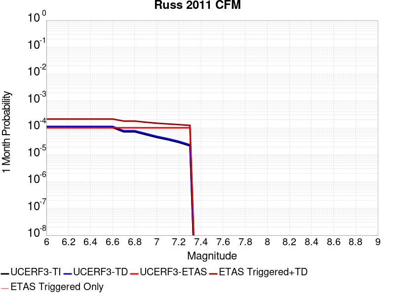 |  |  |

| Magnitude | 1 wk TI Prob | 1 wk TD Prob | 1 wk ETAS Prob | 1 wk ETAS/TD Gain | 1 wk ETAS Triggered+TD | 1 wk ETAS Triggered Only | 1 mo TI Prob | 1 mo TD Prob | 1 mo ETAS Prob | 1 mo ETAS/TD Gain | 1 mo ETAS Triggered+TD | 1 mo ETAS Triggered Only | 1 yr TI Prob | 1 yr TD Prob | 1 yr ETAS Prob | 1 yr ETAS/TD Gain | 1 yr ETAS Triggered+TD | 1 yr ETAS Triggered Only | 10 yr TI Prob | 10 yr TD Prob | 10 yr ETAS Prob | 10 yr ETAS/TD Gain | 10 yr ETAS Triggered+TD | 10 yr ETAS Triggered Only |
|-----|-----|-----|-----|-----|-----|-----|-----|-----|-----|-----|-----|-----|-----|-----|-----|-----|-----|-----|-----|-----|-----|-----|-----|-----|
| 6.0 | 2.3806366E-5 | 2.6225995E-5 | 0.0 | 0.0 | 2.6225995E-5 | 0.0 | 1.0202329E-4 | 1.12392634E-4 | 0.0 | 0.0 | 1.12392634E-4 | 0.0 | 0.0012414258 | 0.0013675849 | 0.0 | 0.0 | 0.0013675849 | 0.0 | 0.012345135 | 0.013598154 | 2.0E-4 | 0.014707878 | 0.0137954345 | 2.0E-4 |
| 6.1 | 2.3806366E-5 | 2.6225995E-5 | 0.0 | 0.0 | 2.6225995E-5 | 0.0 | 1.0202329E-4 | 1.12392634E-4 | 0.0 | 0.0 | 1.12392634E-4 | 0.0 | 0.0012414258 | 0.0013675849 | 0.0 | 0.0 | 0.0013675849 | 0.0 | 0.012345135 | 0.013598154 | 2.0E-4 | 0.014707878 | 0.0137954345 | 2.0E-4 |
| 6.2 | 2.3806366E-5 | 2.6225995E-5 | 0.0 | 0.0 | 2.6225995E-5 | 0.0 | 1.0202329E-4 | 1.12392634E-4 | 0.0 | 0.0 | 1.12392634E-4 | 0.0 | 0.0012414258 | 0.0013675849 | 0.0 | 0.0 | 0.0013675849 | 0.0 | 0.012345135 | 0.013598154 | 2.0E-4 | 0.014707878 | 0.0137954345 | 2.0E-4 |
| 6.3 | 2.3806366E-5 | 2.6225995E-5 | 0.0 | 0.0 | 2.6225995E-5 | 0.0 | 1.0202329E-4 | 1.12392634E-4 | 0.0 | 0.0 | 1.12392634E-4 | 0.0 | 0.0012414258 | 0.0013675849 | 0.0 | 0.0 | 0.0013675849 | 0.0 | 0.012345135 | 0.013598154 | 2.0E-4 | 0.014707878 | 0.0137954345 | 2.0E-4 |
| 6.4 | 2.3806366E-5 | 2.6225995E-5 | 0.0 | 0.0 | 2.6225995E-5 | 0.0 | 1.0202329E-4 | 1.12392634E-4 | 0.0 | 0.0 | 1.12392634E-4 | 0.0 | 0.0012414258 | 0.0013675849 | 0.0 | 0.0 | 0.0013675849 | 0.0 | 0.012345135 | 0.013598154 | 2.0E-4 | 0.014707878 | 0.0137954345 | 2.0E-4 |
| 6.5 | 2.3806366E-5 | 2.6225995E-5 | 0.0 | 0.0 | 2.6225995E-5 | 0.0 | 1.0202329E-4 | 1.12392634E-4 | 0.0 | 0.0 | 1.12392634E-4 | 0.0 | 0.0012414258 | 0.0013675849 | 0.0 | 0.0 | 0.0013675849 | 0.0 | 0.012345135 | 0.013598154 | 2.0E-4 | 0.014707878 | 0.0137954345 | 2.0E-4 |
| 6.6 | 2.3806366E-5 | 2.6225995E-5 | 0.0 | 0.0 | 2.6225995E-5 | 0.0 | 1.0202329E-4 | 1.12392634E-4 | 0.0 | 0.0 | 1.12392634E-4 | 0.0 | 0.0012414258 | 0.0013675849 | 0.0 | 0.0 | 0.0013675849 | 0.0 | 0.012345135 | 0.013598154 | 2.0E-4 | 0.014707878 | 0.0137954345 | 2.0E-4 |
| 6.7 | 1.6515693E-5 | 1.8168736E-5 | 0.0 | 0.0 | 1.8168736E-5 | 0.0 | 7.077962E-5 | 7.786387E-5 | 0.0 | 0.0 | 7.786387E-5 | 0.0 | 8.6140115E-4 | 9.476141E-4 | 0.0 | 0.0 | 9.476141E-4 | 0.0 | 0.008580698 | 0.009439119 | 1.0E-4 | 0.010594209 | 0.009538176 | 1.0E-4 |
| 6.8 | 1.6515693E-5 | 1.8168736E-5 | 0.0 | 0.0 | 1.8168736E-5 | 0.0 | 7.077962E-5 | 7.786387E-5 | 0.0 | 0.0 | 7.786387E-5 | 0.0 | 8.6140115E-4 | 9.476141E-4 | 0.0 | 0.0 | 9.476141E-4 | 0.0 | 0.008580698 | 0.009439119 | 1.0E-4 | 0.010594209 | 0.009538176 | 1.0E-4 |
| 6.9 | 1.2971182E-5 | 1.4258879E-5 | 0.0 | 0.0 | 1.4258879E-5 | 0.0 | 5.5589593E-5 | 6.110819E-5 | 0.0 | 0.0 | 6.110819E-5 | 0.0 | 6.765931E-4 | 7.4376416E-4 | 0.0 | 0.0 | 7.4376416E-4 | 0.0 | 0.0067453682 | 0.0074153175 | 1.0E-4 | 0.013485599 | 0.007514576 | 1.0E-4 |
| 7.0 | 1.0201805E-5 | 1.1210207E-5 | 0.0 | 0.0 | 1.1210207E-5 | 0.0 | 4.3721288E-5 | 4.8042977E-5 | 0.0 | 0.0 | 4.8042977E-5 | 0.0 | 5.3217664E-4 | 5.84787E-4 | 0.0 | 0.0 | 5.84787E-4 | 0.0 | 0.00530904 | 0.0058345287 | 0.0 | 0.0 | 0.0058345287 | 0.0 |
| 7.1 | 8.3744935E-6 | 9.20305E-6 | 0.0 | 0.0 | 9.20305E-6 | 0.0 | 3.5890193E-5 | 3.9441147E-5 | 0.0 | 0.0 | 3.9441147E-5 | 0.0 | 4.368755E-4 | 4.801087E-4 | 0.0 | 0.0 | 4.801087E-4 | 0.0 | 0.004360176 | 0.004792536 | 0.0 | 0.0 | 0.004792536 | 0.0 |
| 7.2 | 6.649391E-6 | 7.309346E-6 | 0.0 | 0.0 | 7.309346E-6 | 0.0 | 2.8497077E-5 | 3.1325486E-5 | 0.0 | 0.0 | 3.1325486E-5 | 0.0 | 3.4689668E-4 | 3.8133762E-4 | 0.0 | 0.0 | 3.8133762E-4 | 0.0 | 0.0034635565 | 0.0038084595 | 0.0 | 0.0 | 0.0038084595 | 0.0 |
| 7.3 | 4.9549312E-6 | 5.4488555E-6 | 0.0 | 0.0 | 5.4488555E-6 | 0.0 | 2.1235246E-5 | 2.3352111E-5 | 0.0 | 0.0 | 2.3352111E-5 | 0.0 | 2.5850846E-4 | 2.8428956E-4 | 0.0 | 0.0 | 2.8428956E-4 | 0.0 | 0.0025820795 | 0.0028406996 | 0.0 | 0.0 | 0.0028406996 | 0.0 |

## Mono Lake 2011 CFM
*[(top)](#table-of-contents)*

| 1 Week | 1 Month | 1 Year | 10 Year |
|-----|-----|-----|-----|
|  |  |  |  |

| Magnitude | 1 wk TI Prob | 1 wk TD Prob | 1 wk ETAS Prob | 1 wk ETAS/TD Gain | 1 wk ETAS Triggered+TD | 1 wk ETAS Triggered Only | 1 mo TI Prob | 1 mo TD Prob | 1 mo ETAS Prob | 1 mo ETAS/TD Gain | 1 mo ETAS Triggered+TD | 1 mo ETAS Triggered Only | 1 yr TI Prob | 1 yr TD Prob | 1 yr ETAS Prob | 1 yr ETAS/TD Gain | 1 yr ETAS Triggered+TD | 1 yr ETAS Triggered Only | 10 yr TI Prob | 10 yr TD Prob | 10 yr ETAS Prob | 10 yr ETAS/TD Gain | 10 yr ETAS Triggered+TD | 10 yr ETAS Triggered Only |
|-----|-----|-----|-----|-----|-----|-----|-----|-----|-----|-----|-----|-----|-----|-----|-----|-----|-----|-----|-----|-----|-----|-----|-----|-----|
| 6.0 | 2.0341662E-5 | 2.3785644E-5 | 0.0 | 0.0 | 2.3785644E-5 | 0.0 | 8.717564E-5 | 1.01937476E-4 | 0.0 | 0.0 | 1.01937476E-4 | 0.0 | 0.0010608466 | 0.0012409115 | 0.0 | 0.0 | 0.0012409115 | 0.0 | 0.010557966 | 0.012391717 | 2.0E-4 | 0.016139813 | 0.012589239 | 2.0E-4 |
| 6.1 | 2.0341662E-5 | 2.3785644E-5 | 0.0 | 0.0 | 2.3785644E-5 | 0.0 | 8.717564E-5 | 1.01937476E-4 | 0.0 | 0.0 | 1.01937476E-4 | 0.0 | 0.0010608466 | 0.0012409115 | 0.0 | 0.0 | 0.0012409115 | 0.0 | 0.010557966 | 0.012391717 | 2.0E-4 | 0.016139813 | 0.012589239 | 2.0E-4 |
| 6.2 | 2.0341662E-5 | 2.3785644E-5 | 0.0 | 0.0 | 2.3785644E-5 | 0.0 | 8.717564E-5 | 1.01937476E-4 | 0.0 | 0.0 | 1.01937476E-4 | 0.0 | 0.0010608466 | 0.0012409115 | 0.0 | 0.0 | 0.0012409115 | 0.0 | 0.010557966 | 0.012391717 | 2.0E-4 | 0.016139813 | 0.012589239 | 2.0E-4 |
| 6.3 | 2.0341662E-5 | 2.3785644E-5 | 0.0 | 0.0 | 2.3785644E-5 | 0.0 | 8.717564E-5 | 1.01937476E-4 | 0.0 | 0.0 | 1.01937476E-4 | 0.0 | 0.0010608466 | 0.0012409115 | 0.0 | 0.0 | 0.0012409115 | 0.0 | 0.010557966 | 0.012391717 | 2.0E-4 | 0.016139813 | 0.012589239 | 2.0E-4 |
| 6.4 | 1.749821E-5 | 2.04545E-5 | 0.0 | 0.0 | 2.04545E-5 | 0.0 | 7.499018E-5 | 8.766214E-5 | 0.0 | 0.0 | 8.766214E-5 | 0.0 | 9.1262296E-4 | 0.0010672864 | 0.0 | 0.0 | 0.0010672864 | 0.0 | 0.009088841 | 0.010672825 | 2.0E-4 | 0.01873918 | 0.01087069 | 2.0E-4 |
| 6.5 | 1.749821E-5 | 2.04545E-5 | 0.0 | 0.0 | 2.04545E-5 | 0.0 | 7.499018E-5 | 8.766214E-5 | 0.0 | 0.0 | 8.766214E-5 | 0.0 | 9.1262296E-4 | 0.0010672864 | 0.0 | 0.0 | 0.0010672864 | 0.0 | 0.009088841 | 0.010672825 | 2.0E-4 | 0.01873918 | 0.01087069 | 2.0E-4 |

## Santa Ynez (East)
*[(top)](#table-of-contents)*

| 1 Week | 1 Month | 1 Year | 10 Year |
|-----|-----|-----|-----|
|  | 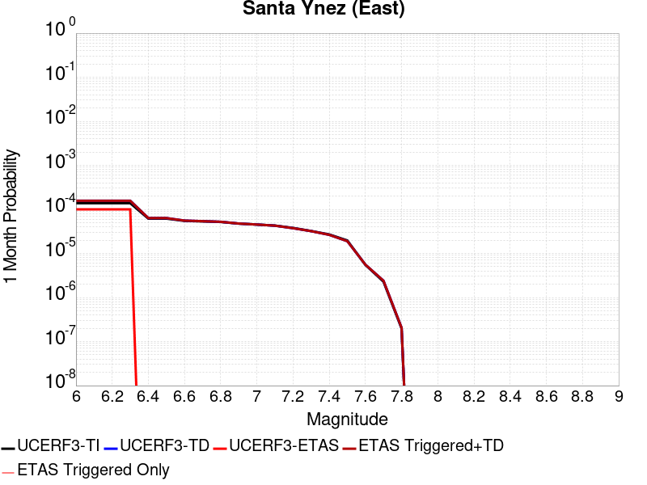 | 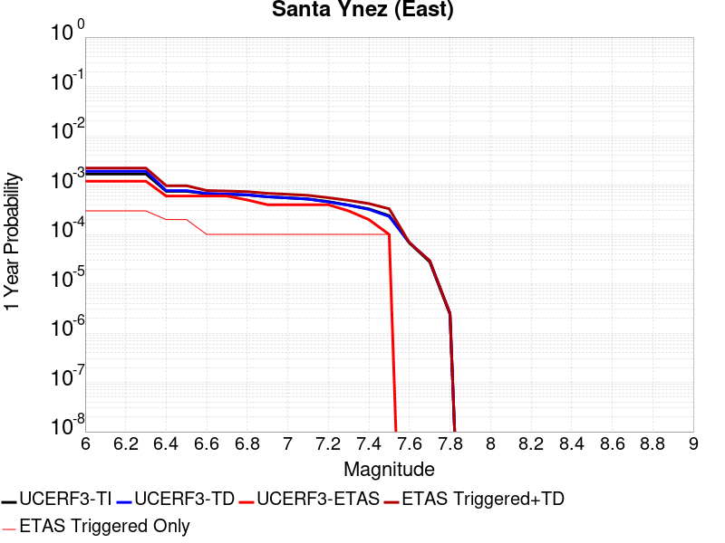 |  |

| Magnitude | 1 wk TI Prob | 1 wk TD Prob | 1 wk ETAS Prob | 1 wk ETAS/TD Gain | 1 wk ETAS Triggered+TD | 1 wk ETAS Triggered Only | 1 mo TI Prob | 1 mo TD Prob | 1 mo ETAS Prob | 1 mo ETAS/TD Gain | 1 mo ETAS Triggered+TD | 1 mo ETAS Triggered Only | 1 yr TI Prob | 1 yr TD Prob | 1 yr ETAS Prob | 1 yr ETAS/TD Gain | 1 yr ETAS Triggered+TD | 1 yr ETAS Triggered Only | 10 yr TI Prob | 10 yr TD Prob | 10 yr ETAS Prob | 10 yr ETAS/TD Gain | 10 yr ETAS Triggered+TD | 10 yr ETAS Triggered Only |
|-----|-----|-----|-----|-----|-----|-----|-----|-----|-----|-----|-----|-----|-----|-----|-----|-----|-----|-----|-----|-----|-----|-----|-----|-----|
| 6.0 | 3.2269712E-5 | 3.6683814E-5 | 0.0 | 0.0 | 3.6683814E-5 | 0.0 | 1.3829143E-4 | 1.5721019E-4 | 0.0 | 0.0 | 1.5721019E-4 | 0.0 | 0.0016823979 | 0.0019129349 | 1.0E-4 | 0.05227569 | 0.0020127436 | 1.0E-4 | 0.016697178 | 0.01902192 | 2.0E-4 | 0.010514186 | 0.019218117 | 2.0E-4 |
| 6.1 | 3.2269712E-5 | 3.6683814E-5 | 0.0 | 0.0 | 3.6683814E-5 | 0.0 | 1.3829143E-4 | 1.5721019E-4 | 0.0 | 0.0 | 1.5721019E-4 | 0.0 | 0.0016823979 | 0.0019129349 | 1.0E-4 | 0.05227569 | 0.0020127436 | 1.0E-4 | 0.016697178 | 0.01902192 | 2.0E-4 | 0.010514186 | 0.019218117 | 2.0E-4 |
| 6.2 | 3.2269712E-5 | 3.6683814E-5 | 0.0 | 0.0 | 3.6683814E-5 | 0.0 | 1.3829143E-4 | 1.5721019E-4 | 0.0 | 0.0 | 1.5721019E-4 | 0.0 | 0.0016823979 | 0.0019129349 | 1.0E-4 | 0.05227569 | 0.0020127436 | 1.0E-4 | 0.016697178 | 0.01902192 | 2.0E-4 | 0.010514186 | 0.019218117 | 2.0E-4 |
| 6.3 | 3.2269712E-5 | 3.6683814E-5 | 0.0 | 0.0 | 3.6683814E-5 | 0.0 | 1.3829143E-4 | 1.5721019E-4 | 0.0 | 0.0 | 1.5721019E-4 | 0.0 | 0.0016823979 | 0.0019129349 | 1.0E-4 | 0.05227569 | 0.0020127436 | 1.0E-4 | 0.016697178 | 0.01902192 | 2.0E-4 | 0.010514186 | 0.019218117 | 2.0E-4 |
| 6.4 | 1.4404779E-5 | 1.4833642E-5 | 0.0 | 0.0 | 1.4833642E-5 | 0.0 | 6.1733306E-5 | 6.3571235E-5 | 0.0 | 0.0 | 6.3571235E-5 | 0.0 | 7.513438E-4 | 7.7370997E-4 | 1.0E-4 | 0.1292474 | 8.736326E-4 | 1.0E-4 | 0.0074880854 | 0.0077107116 | 2.0E-4 | 0.025937945 | 0.007909169 | 2.0E-4 |
| 6.5 | 1.4404779E-5 | 1.4833642E-5 | 0.0 | 0.0 | 1.4833642E-5 | 0.0 | 6.1733306E-5 | 6.3571235E-5 | 0.0 | 0.0 | 6.3571235E-5 | 0.0 | 7.513438E-4 | 7.7370997E-4 | 1.0E-4 | 0.1292474 | 8.736326E-4 | 1.0E-4 | 0.0074880854 | 0.0077107116 | 2.0E-4 | 0.025937945 | 0.007909169 | 2.0E-4 |
| 6.6 | 1.280208E-5 | 1.2999023E-5 | 0.0 | 0.0 | 1.2999023E-5 | 0.0 | 5.4864904E-5 | 5.570892E-5 | 0.0 | 0.0 | 5.570892E-5 | 0.0 | 6.6777546E-4 | 6.780468E-4 | 1.0E-4 | 0.14748245 | 7.77979E-4 | 1.0E-4 | 0.006657724 | 0.00675999 | 2.0E-4 | 0.029585842 | 0.006958638 | 2.0E-4 |
| 6.7 | 1.2457027E-5 | 1.261599E-5 | 0.0 | 0.0 | 1.261599E-5 | 0.0 | 5.3386164E-5 | 5.406742E-5 | 0.0 | 0.0 | 5.406742E-5 | 0.0 | 6.497827E-4 | 6.5807364E-4 | 1.0E-4 | 0.15195867 | 7.5800787E-4 | 1.0E-4 | 0.00647886 | 0.006561447 | 2.0E-4 | 0.030481083 | 0.0067601344 | 2.0E-4 |
| 6.8 | 1.2095134E-5 | 1.2218847E-5 | 0.0 | 0.0 | 1.2218847E-5 | 0.0 | 5.1835254E-5 | 5.236544E-5 | 0.0 | 0.0 | 5.236544E-5 | 0.0 | 6.309115E-4 | 6.3736434E-4 | 1.0E-4 | 0.15689613 | 7.373006E-4 | 1.0E-4 | 0.0062912325 | 0.0063555515 | 2.0E-4 | 0.03146855 | 0.0065542804 | 2.0E-4 |
| 6.9 | 1.1104036E-5 | 1.1146225E-5 | 0.0 | 0.0 | 1.1146225E-5 | 0.0 | 4.758786E-5 | 4.7768666E-5 | 0.0 | 0.0 | 4.7768666E-5 | 0.0 | 5.7922816E-4 | 5.814296E-4 | 1.0E-4 | 0.17198987 | 6.813714E-4 | 1.0E-4 | 0.005777207 | 0.0057992293 | 2.0E-4 | 0.034487344 | 0.005998069 | 2.0E-4 |
| 7.0 | 1.0577444E-5 | 1.057112E-5 | 0.0 | 0.0 | 1.057112E-5 | 0.0 | 4.5331115E-5 | 4.530402E-5 | 0.0 | 0.0 | 4.530402E-5 | 0.0 | 5.5176654E-4 | 5.51438E-4 | 1.0E-4 | 0.18134405 | 6.513829E-4 | 1.0E-4 | 0.0055039856 | 0.005500835 | 2.0E-4 | 0.036358114 | 0.0056997347 | 2.0E-4 |
| 7.1 | 1.0021775E-5 | 9.970942E-6 | 0.0 | 0.0 | 9.970942E-6 | 0.0 | 4.294976E-5 | 4.2731914E-5 | 0.0 | 0.0 | 4.2731914E-5 | 0.0 | 5.2278786E-4 | 5.2013807E-4 | 1.0E-4 | 0.19225666 | 6.2008604E-4 | 1.0E-4 | 0.0052155964 | 0.0051893387 | 2.0E-4 | 0.038540557 | 0.005388301 | 2.0E-4 |
| 7.2 | 8.874109E-6 | 8.739827E-6 | 0.0 | 0.0 | 8.739827E-6 | 0.0 | 3.8031343E-5 | 3.7455866E-5 | 0.0 | 0.0 | 3.7455866E-5 | 0.0 | 4.629332E-4 | 4.5593086E-4 | 1.0E-4 | 0.2193315 | 5.5588526E-4 | 1.0E-4 | 0.0046197 | 0.0045500724 | 2.0E-4 | 0.043955345 | 0.004749162 | 2.0E-4 |
| 7.3 | 7.5504267E-6 | 7.4976997E-6 | 0.0 | 0.0 | 7.4976997E-6 | 0.0 | 3.235857E-5 | 3.2132608E-5 | 0.0 | 0.0 | 3.2132608E-5 | 0.0 | 3.9389438E-4 | 3.911453E-4 | 1.0E-4 | 0.25565946 | 4.911062E-4 | 1.0E-4 | 0.0039319694 | 0.0039046754 | 2.0E-4 | 0.051220648 | 0.0041038943 | 2.0E-4 |
| 7.4 | 6.309394E-6 | 6.176963E-6 | 0.0 | 0.0 | 6.176963E-6 | 0.0 | 2.703998E-5 | 2.6472433E-5 | 0.0 | 0.0 | 2.6472433E-5 | 0.0 | 3.2916202E-4 | 3.2225516E-4 | 1.0E-4 | 0.3103131 | 4.2222295E-4 | 1.0E-4 | 0.003286749 | 0.0032179758 | 2.0E-4 | 0.062150873 | 0.0034173322 | 2.0E-4 |
| 7.5 | 4.6103073E-6 | 4.4365083E-6 | 0.0 | 0.0 | 4.4365083E-6 | 0.0 | 1.975831E-5 | 1.9013472E-5 | 0.0 | 0.0 | 1.9013472E-5 | 0.0 | 2.4053088E-4 | 2.3146514E-4 | 1.0E-4 | 0.43203053 | 3.31442E-4 | 1.0E-4 | 0.002402707 | 0.0023123098 | 1.0E-4 | 0.043246802 | 0.0024120787 | 1.0E-4 |
| 7.6 | 1.2858658E-6 | 1.299773E-6 | 0.0 | 0.0 | 1.299773E-6 | 0.0 | 5.5108417E-6 | 5.570444E-6 | 0.0 | 0.0 | 5.570444E-6 | 0.0 | 6.7092435E-5 | 6.781812E-5 | 0.0 | 0.0 | 6.781812E-5 | 0.0 | 6.707218E-4 | 6.7798106E-4 | 0.0 | 0.0 | 6.7798106E-4 | 0.0 |
| 7.7 | 5.3302307E-7 | 5.609023E-7 | 0.0 | 0.0 | 5.609023E-7 | 0.0 | 2.2843826E-6 | 2.403865E-6 | 0.0 | 0.0 | 2.403865E-6 | 0.0 | 2.7812002E-5 | 2.9266701E-5 | 0.0 | 0.0 | 2.9266701E-5 | 0.0 | 2.7808524E-4 | 2.9263203E-4 | 0.0 | 0.0 | 2.9263203E-4 | 0.0 |
| 7.8 | 4.613933E-8 | 4.8009543E-8 | 0.0 | 0.0 | 4.8009543E-8 | 0.0 | 1.9773998E-7 | 2.0575517E-7 | 0.0 | 0.0 | 2.0575517E-7 | 0.0 | 2.4074816E-6 | 2.5050665E-6 | 0.0 | 0.0 | 2.5050665E-6 | 0.0 | 2.4074554E-5 | 2.5050393E-5 | 0.0 | 0.0 | 2.5050393E-5 | 0.0 |

## Hosgri (Extension)
*[(top)](#table-of-contents)*

| 1 Week | 1 Month | 1 Year | 10 Year |
|-----|-----|-----|-----|
|  |  |  |  |

| Magnitude | 1 wk TI Prob | 1 wk TD Prob | 1 wk ETAS Prob | 1 wk ETAS/TD Gain | 1 wk ETAS Triggered+TD | 1 wk ETAS Triggered Only | 1 mo TI Prob | 1 mo TD Prob | 1 mo ETAS Prob | 1 mo ETAS/TD Gain | 1 mo ETAS Triggered+TD | 1 mo ETAS Triggered Only | 1 yr TI Prob | 1 yr TD Prob | 1 yr ETAS Prob | 1 yr ETAS/TD Gain | 1 yr ETAS Triggered+TD | 1 yr ETAS Triggered Only | 10 yr TI Prob | 10 yr TD Prob | 10 yr ETAS Prob | 10 yr ETAS/TD Gain | 10 yr ETAS Triggered+TD | 10 yr ETAS Triggered Only |
|-----|-----|-----|-----|-----|-----|-----|-----|-----|-----|-----|-----|-----|-----|-----|-----|-----|-----|-----|-----|-----|-----|-----|-----|-----|
| 6.0 | 1.1369135E-5 | 1.2072836E-5 | 1.0E-4 | 8.283058 | 1.12071626E-4 | 1.0E-4 | 4.8723956E-5 | 5.173983E-5 | 1.0E-4 | 1.932747 | 1.5173465E-4 | 1.0E-4 | 5.9305265E-4 | 6.29773E-4 | 1.0E-4 | 0.15878737 | 7.2971004E-4 | 1.0E-4 | 0.005914725 | 0.0062821284 | 2.0E-4 | 0.031836342 | 0.006480872 | 2.0E-4 |
| 6.1 | 6.934979E-6 | 7.3179544E-6 | 0.0 | 0.0 | 7.3179544E-6 | 0.0 | 2.9721E-5 | 3.1362306E-5 | 0.0 | 0.0 | 3.1362306E-5 | 0.0 | 3.617931E-4 | 3.8177334E-4 | 0.0 | 0.0 | 3.8177334E-4 | 0.0 | 0.0036120464 | 0.0038115869 | 0.0 | 0.0 | 0.0038115869 | 0.0 |
| 6.2 | 6.934979E-6 | 7.3179544E-6 | 0.0 | 0.0 | 7.3179544E-6 | 0.0 | 2.9721E-5 | 3.1362306E-5 | 0.0 | 0.0 | 3.1362306E-5 | 0.0 | 3.617931E-4 | 3.8177334E-4 | 0.0 | 0.0 | 3.8177334E-4 | 0.0 | 0.0036120464 | 0.0038115869 | 0.0 | 0.0 | 0.0038115869 | 0.0 |
| 6.3 | 4.5484676E-6 | 4.764615E-6 | 0.0 | 0.0 | 4.764615E-6 | 0.0 | 1.9493287E-5 | 2.0419622E-5 | 0.0 | 0.0 | 2.0419622E-5 | 0.0 | 2.3730492E-4 | 2.4858094E-4 | 0.0 | 0.0 | 2.4858094E-4 | 0.0 | 0.0023705168 | 0.0024830715 | 0.0 | 0.0 | 0.0024830715 | 0.0 |
| 6.4 | 4.218095E-6 | 4.4123926E-6 | 0.0 | 0.0 | 4.4123926E-6 | 0.0 | 1.8077424E-5 | 1.8910117E-5 | 0.0 | 0.0 | 1.8910117E-5 | 0.0 | 2.2007042E-4 | 2.3020669E-4 | 0.0 | 0.0 | 2.3020669E-4 | 0.0 | 0.002198526 | 0.0022997158 | 0.0 | 0.0 | 0.0022997158 | 0.0 |
| 6.5 | 3.717374E-6 | 3.879767E-6 | 0.0 | 0.0 | 3.879767E-6 | 0.0 | 1.5931506E-5 | 1.6627468E-5 | 0.0 | 0.0 | 1.6627468E-5 | 0.0 | 1.9394881E-4 | 2.0242081E-4 | 0.0 | 0.0 | 2.0242081E-4 | 0.0 | 0.0019377962 | 0.002022383 | 0.0 | 0.0 | 0.002022383 | 0.0 |
| 6.6 | 3.4605036E-6 | 3.6044048E-6 | 0.0 | 0.0 | 3.6044048E-6 | 0.0 | 1.4830645E-5 | 1.5447358E-5 | 0.0 | 0.0 | 1.5447358E-5 | 0.0 | 1.8054814E-4 | 1.880555E-4 | 0.0 | 0.0 | 1.880555E-4 | 0.0 | 0.0018040152 | 0.0018789783 | 0.0 | 0.0 | 0.0018789783 | 0.0 |
| 6.7 | 3.123439E-6 | 3.2429439E-6 | 0.0 | 0.0 | 3.2429439E-6 | 0.0 | 1.33860985E-5 | 1.3898257E-5 | 0.0 | 0.0 | 1.3898257E-5 | 0.0 | 1.6296357E-4 | 1.6919825E-4 | 0.0 | 0.0 | 1.6919825E-4 | 0.0 | 0.001628441 | 0.0016907052 | 0.0 | 0.0 | 0.0016907052 | 0.0 |
| 6.8 | 2.8290783E-6 | 2.9271582E-6 | 0.0 | 0.0 | 2.9271582E-6 | 0.0 | 1.2124565E-5 | 1.2544903E-5 | 0.0 | 0.0 | 1.2544903E-5 | 0.0 | 1.4760658E-4 | 1.5272359E-4 | 0.0 | 0.0 | 1.5272359E-4 | 0.0 | 0.0014750857 | 0.001526195 | 0.0 | 0.0 | 0.001526195 | 0.0 |
| 6.9 | 2.454112E-6 | 2.5252425E-6 | 0.0 | 0.0 | 2.5252425E-6 | 0.0 | 1.0517581E-5 | 1.0822423E-5 | 0.0 | 0.0 | 1.0822423E-5 | 0.0 | 1.2804402E-4 | 1.3175509E-4 | 0.0 | 0.0 | 1.3175509E-4 | 0.0 | 0.0012797028 | 0.0013167758 | 0.0 | 0.0 | 0.0013167758 | 0.0 |
| 7.0 | 2.1008145E-6 | 2.1470744E-6 | 0.0 | 0.0 | 2.1470744E-6 | 0.0 | 9.003459E-6 | 9.201714E-6 | 0.0 | 0.0 | 9.201714E-6 | 0.0 | 1.096116E-4 | 1.12025155E-4 | 0.0 | 0.0 | 1.12025155E-4 | 0.0 | 0.0010955755 | 0.0011196906 | 0.0 | 0.0 | 0.0011196906 | 0.0 |
| 7.1 | 1.744384E-6 | 1.766116E-6 | 0.0 | 0.0 | 1.766116E-6 | 0.0 | 7.47591E-6 | 7.569047E-6 | 0.0 | 0.0 | 7.569047E-6 | 0.0 | 9.1015405E-5 | 9.214927E-5 | 0.0 | 0.0 | 9.214927E-5 | 0.0 | 9.097813E-4 | 9.2111225E-4 | 0.0 | 0.0 | 9.2111225E-4 | 0.0 |
| 7.2 | 1.5456587E-6 | 1.5539209E-6 | 0.0 | 0.0 | 1.5539209E-6 | 0.0 | 6.6242346E-6 | 6.659644E-6 | 0.0 | 0.0 | 6.659644E-6 | 0.0 | 8.064707E-5 | 8.1078164E-5 | 0.0 | 0.0 | 8.1078164E-5 | 0.0 | 8.0617814E-4 | 8.104871E-4 | 0.0 | 0.0 | 8.104871E-4 | 0.0 |
| 7.3 | 1.3775123E-6 | 1.3743695E-6 | 0.0 | 0.0 | 1.3743695E-6 | 0.0 | 5.9036106E-6 | 5.890142E-6 | 0.0 | 0.0 | 5.890142E-6 | 0.0 | 7.187409E-5 | 7.171013E-5 | 0.0 | 0.0 | 7.171013E-5 | 0.0 | 7.185085E-4 | 7.168709E-4 | 0.0 | 0.0 | 7.168709E-4 | 0.0 |
| 7.4 | 1.214491E-6 | 1.2002328E-6 | 0.0 | 0.0 | 1.2002328E-6 | 0.0 | 5.2049513E-6 | 5.143844E-6 | 0.0 | 0.0 | 5.143844E-6 | 0.0 | 6.336844E-5 | 6.262452E-5 | 0.0 | 0.0 | 6.262452E-5 | 0.0 | 6.335037E-4 | 6.260695E-4 | 0.0 | 0.0 | 6.260695E-4 | 0.0 |
| 7.5 | 1.0101123E-6 | 9.822643E-7 | 0.0 | 0.0 | 9.822643E-7 | 0.0 | 4.3290456E-6 | 4.209697E-6 | 0.0 | 0.0 | 4.209697E-6 | 0.0 | 5.2704854E-5 | 5.1251864E-5 | 0.0 | 0.0 | 5.1251864E-5 | 0.0 | 5.2692357E-4 | 5.1240105E-4 | 0.0 | 0.0 | 5.1240105E-4 | 0.0 |
| 7.6 | 8.1558215E-7 | 7.7478217E-7 | 0.0 | 0.0 | 7.7478217E-7 | 0.0 | 3.4953473E-6 | 3.3204908E-6 | 0.0 | 0.0 | 3.3204908E-6 | 0.0 | 4.255502E-5 | 4.0426232E-5 | 0.0 | 0.0 | 4.0426232E-5 | 0.0 | 4.2546875E-4 | 4.0418922E-4 | 0.0 | 0.0 | 4.0418922E-4 | 0.0 |
| 7.7 | 4.757816E-7 | 4.1153908E-7 | 0.0 | 0.0 | 4.1153908E-7 | 0.0 | 2.0390623E-6 | 1.7637377E-6 | 0.0 | 0.0 | 1.7637377E-6 | 0.0 | 2.4825302E-5 | 2.1473295E-5 | 0.0 | 0.0 | 2.1473295E-5 | 0.0 | 2.482253E-4 | 2.1471233E-4 | 0.0 | 0.0 | 2.1471233E-4 | 0.0 |
| 7.8 | 2.782787E-7 | 1.9909719E-7 | 0.0 | 0.0 | 1.9909719E-7 | 0.0 | 1.1926223E-6 | 8.532734E-7 | 0.0 | 0.0 | 8.532734E-7 | 0.0 | 1.452008E-5 | 1.0388554E-5 | 0.0 | 0.0 | 1.0388554E-5 | 0.0 | 1.4519131E-4 | 1.0388072E-4 | 0.0 | 0.0 | 1.0388072E-4 | 0.0 |
| 7.9 | 1.6948086E-7 | 9.1191595E-8 | 0.0 | 0.0 | 9.1191595E-8 | 0.0 | 7.2634634E-7 | 3.9082107E-7 | 0.0 | 0.0 | 3.9082107E-7 | 0.0 | 8.843231E-6 | 4.758236E-6 | 0.0 | 0.0 | 4.758236E-6 | 0.0 | 8.842879E-5 | 4.758135E-5 | 0.0 | 0.0 | 4.758135E-5 | 0.0 |
| 8.0 | 1.0225492E-7 | 4.3830603E-8 | 0.0 | 0.0 | 4.3830603E-8 | 0.0 | 4.382353E-7 | 1.8784543E-7 | 0.0 | 0.0 | 1.8784543E-7 | 0.0 | 5.335502E-6 | 2.2870158E-6 | 0.0 | 0.0 | 2.2870158E-6 | 0.0 | 5.335374E-5 | 2.2869925E-5 | 0.0 | 0.0 | 2.2869925E-5 | 0.0 |
| 8.1 | 1.43711345E-8 | 5.6468283E-9 | 0.0 | 0.0 | 5.6468283E-9 | 0.0 | 6.1590576E-8 | 2.4200693E-8 | 0.0 | 0.0 | 2.4200693E-8 | 0.0 | 7.4986497E-7 | 2.946434E-7 | 0.0 | 0.0 | 2.946434E-7 | 0.0 | 7.4986247E-6 | 2.9464306E-6 | 0.0 | 0.0 | 2.9464306E-6 | 0.0 |

## White Mountains
*[(top)](#table-of-contents)*

| 1 Week | 1 Month | 1 Year | 10 Year |
|-----|-----|-----|-----|
| 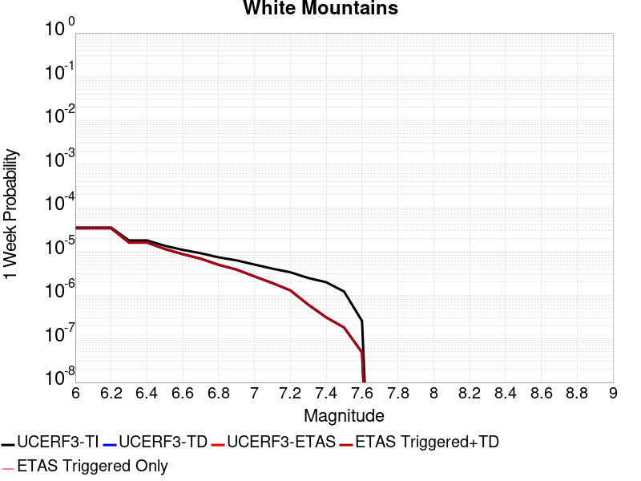 |  | 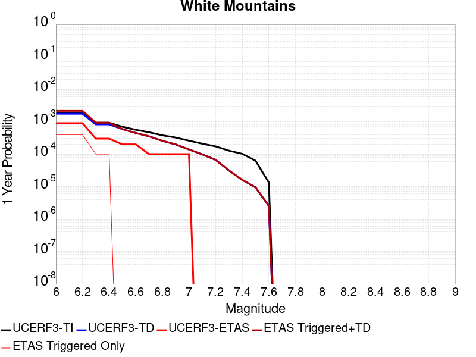 | 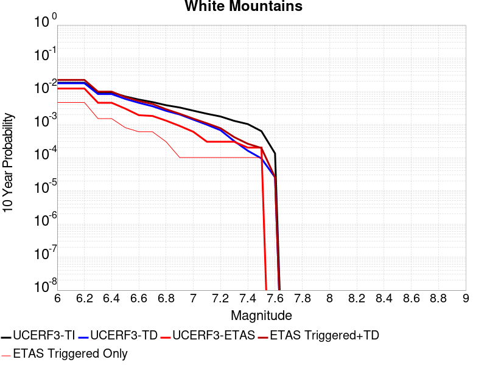 |

| Magnitude | 1 wk TI Prob | 1 wk TD Prob | 1 wk ETAS Prob | 1 wk ETAS/TD Gain | 1 wk ETAS Triggered+TD | 1 wk ETAS Triggered Only | 1 mo TI Prob | 1 mo TD Prob | 1 mo ETAS Prob | 1 mo ETAS/TD Gain | 1 mo ETAS Triggered+TD | 1 mo ETAS Triggered Only | 1 yr TI Prob | 1 yr TD Prob | 1 yr ETAS Prob | 1 yr ETAS/TD Gain | 1 yr ETAS Triggered+TD | 1 yr ETAS Triggered Only | 10 yr TI Prob | 10 yr TD Prob | 10 yr ETAS Prob | 10 yr ETAS/TD Gain | 10 yr ETAS Triggered+TD | 10 yr ETAS Triggered Only |
|-----|-----|-----|-----|-----|-----|-----|-----|-----|-----|-----|-----|-----|-----|-----|-----|-----|-----|-----|-----|-----|-----|-----|-----|-----|
| 6.0 | 3.503579E-5 | 3.3752905E-5 | 0.0 | 0.0 | 3.3752905E-5 | 0.0 | 1.5014476E-4 | 1.4464797E-4 | 0.0 | 0.0 | 1.4464797E-4 | 0.0 | 0.0018264796 | 0.001759787 | 0.0 | 0.0 | 0.001759787 | 0.0 | 0.018115403 | 0.017470825 | 2.0E-4 | 0.011447656 | 0.01766733 | 2.0E-4 |
| 6.1 | 3.503579E-5 | 3.3752905E-5 | 0.0 | 0.0 | 3.3752905E-5 | 0.0 | 1.5014476E-4 | 1.4464797E-4 | 0.0 | 0.0 | 1.4464797E-4 | 0.0 | 0.0018264796 | 0.001759787 | 0.0 | 0.0 | 0.001759787 | 0.0 | 0.018115403 | 0.017470825 | 2.0E-4 | 0.011447656 | 0.01766733 | 2.0E-4 |
| 6.2 | 3.503579E-5 | 3.3752905E-5 | 0.0 | 0.0 | 3.3752905E-5 | 0.0 | 1.5014476E-4 | 1.4464797E-4 | 0.0 | 0.0 | 1.4464797E-4 | 0.0 | 0.0018264796 | 0.001759787 | 0.0 | 0.0 | 0.001759787 | 0.0 | 0.018115403 | 0.017470825 | 2.0E-4 | 0.011447656 | 0.01766733 | 2.0E-4 |
| 6.3 | 1.7818425E-5 | 1.5901618E-5 | 0.0 | 0.0 | 1.5901618E-5 | 0.0 | 7.636245E-5 | 6.8148096E-5 | 0.0 | 0.0 | 6.8148096E-5 | 0.0 | 9.293162E-4 | 8.294014E-4 | 0.0 | 0.0 | 8.294014E-4 | 0.0 | 0.009254395 | 0.008264516 | 1.0E-4 | 0.012099923 | 0.008363689 | 1.0E-4 |
| 6.4 | 1.7818425E-5 | 1.5901618E-5 | 0.0 | 0.0 | 1.5901618E-5 | 0.0 | 7.636245E-5 | 6.8148096E-5 | 0.0 | 0.0 | 6.8148096E-5 | 0.0 | 9.293162E-4 | 8.294014E-4 | 0.0 | 0.0 | 8.294014E-4 | 0.0 | 0.009254395 | 0.008264516 | 1.0E-4 | 0.012099923 | 0.008363689 | 1.0E-4 |
| 6.5 | 1.3397557E-5 | 1.1325756E-5 | 0.0 | 0.0 | 1.1325756E-5 | 0.0 | 5.741684E-5 | 4.8538088E-5 | 0.0 | 0.0 | 4.8538088E-5 | 0.0 | 6.988258E-4 | 5.90798E-4 | 0.0 | 0.0 | 5.90798E-4 | 0.0 | 0.006966323 | 0.0058929776 | 1.0E-4 | 0.01696935 | 0.0059923884 | 1.0E-4 |
| 6.6 | 1.0818695E-5 | 8.6170285E-6 | 0.0 | 0.0 | 8.6170285E-6 | 0.0 | 4.6365014E-5 | 3.692962E-5 | 0.0 | 0.0 | 3.692962E-5 | 0.0 | 5.6434784E-4 | 4.4952973E-4 | 0.0 | 0.0 | 4.4952973E-4 | 0.0 | 0.005629168 | 0.00448664 | 0.0 | 0.0 | 0.00448664 | 0.0 |
| 6.7 | 9.067908E-6 | 6.7955334E-6 | 0.0 | 0.0 | 6.7955334E-6 | 0.0 | 3.8861883E-5 | 2.9123408E-5 | 0.0 | 0.0 | 2.9123408E-5 | 0.0 | 4.7304068E-4 | 3.5452298E-4 | 0.0 | 0.0 | 3.5452298E-4 | 0.0 | 0.00472035 | 0.0035398907 | 0.0 | 0.0 | 0.0035398907 | 0.0 |
| 6.8 | 7.295947E-6 | 4.930901E-6 | 0.0 | 0.0 | 4.930901E-6 | 0.0 | 3.126797E-5 | 2.113227E-5 | 0.0 | 0.0 | 2.113227E-5 | 0.0 | 3.8062103E-4 | 2.5725612E-4 | 0.0 | 0.0 | 2.5725612E-4 | 0.0 | 0.0037996976 | 0.002569696 | 0.0 | 0.0 | 0.002569696 | 0.0 |
| 6.9 | 6.2243444E-6 | 3.8274666E-6 | 0.0 | 0.0 | 3.8274666E-6 | 0.0 | 2.6675489E-5 | 1.6403328E-5 | 0.0 | 0.0 | 1.6403328E-5 | 0.0 | 3.2472567E-4 | 1.9969276E-4 | 0.0 | 0.0 | 1.9969276E-4 | 0.0 | 0.0032425157 | 0.0019951859 | 0.0 | 0.0 | 0.0019951859 | 0.0 |
| 7.0 | 4.9878413E-6 | 2.675381E-6 | 0.0 | 0.0 | 2.675381E-6 | 0.0 | 2.1376287E-5 | 1.146587E-5 | 0.0 | 0.0 | 1.146587E-5 | 0.0 | 2.602252E-4 | 1.3958829E-4 | 0.0 | 0.0 | 1.3958829E-4 | 0.0 | 0.002599207 | 0.0013950323 | 0.0 | 0.0 | 0.0013950323 | 0.0 |
| 7.1 | 4.0252844E-6 | 1.8821846E-6 | 0.0 | 0.0 | 1.8821846E-6 | 0.0 | 1.7251105E-5 | 8.066481E-6 | 0.0 | 0.0 | 8.066481E-6 | 0.0 | 2.1001195E-4 | 9.820511E-5 | 0.0 | 0.0 | 9.820511E-5 | 0.0 | 0.0020981359 | 9.8163E-4 | 0.0 | 0.0 | 9.8163E-4 | 0.0 |
| 7.2 | 3.3284066E-6 | 1.2791369E-6 | 0.0 | 0.0 | 1.2791369E-6 | 0.0 | 1.4264522E-5 | 5.4820043E-6 | 0.0 | 0.0 | 5.4820043E-6 | 0.0 | 1.736567E-4 | 6.6741464E-5 | 0.0 | 0.0 | 6.6741464E-5 | 0.0 | 0.0017352107 | 6.6722423E-4 | 0.0 | 0.0 | 6.6722423E-4 | 0.0 |
| 7.3 | 2.458226E-6 | 6.0318837E-7 | 0.0 | 0.0 | 6.0318837E-7 | 0.0 | 1.0535211E-5 | 2.5850907E-6 | 0.0 | 0.0 | 2.5850907E-6 | 0.0 | 1.2825865E-4 | 3.147306E-5 | 0.0 | 0.0 | 3.147306E-5 | 0.0 | 0.0012818464 | 3.146898E-4 | 0.0 | 0.0 | 3.146898E-4 | 0.0 |
| 7.4 | 1.965953E-6 | 3.086964E-7 | 0.0 | 0.0 | 3.086964E-7 | 0.0 | 8.425486E-6 | 1.3229838E-6 | 0.0 | 0.0 | 1.3229838E-6 | 0.0 | 1.0257547E-4 | 1.6107211E-5 | 0.0 | 0.0 | 1.6107211E-5 | 0.0 | 0.0010252813 | 1.6106057E-4 | 0.0 | 0.0 | 1.6106057E-4 | 0.0 |
| 7.5 | 1.2014192E-6 | 1.8092337E-7 | 0.0 | 0.0 | 1.8092337E-7 | 0.0 | 5.148929E-6 | 7.753856E-7 | 0.0 | 0.0 | 7.753856E-7 | 0.0 | 6.2686406E-5 | 9.440279E-6 | 0.0 | 0.0 | 9.440279E-6 | 0.0 | 6.266873E-4 | 9.439887E-5 | 0.0 | 0.0 | 9.439887E-5 | 0.0 |
| 7.6 | 2.5612175E-7 | 4.8547324E-8 | 0.0 | 0.0 | 4.8547324E-8 | 0.0 | 1.0976642E-6 | 2.0805994E-7 | 0.0 | 0.0 | 2.0805994E-7 | 0.0 | 1.3363979E-5 | 2.5331274E-6 | 0.0 | 0.0 | 2.5331274E-6 | 0.0 | 1.3363175E-4 | 2.5331019E-5 | 0.0 | 0.0 | 2.5331019E-5 | 0.0 |

## Great Valley 08 (Quinto)
*[(top)](#table-of-contents)*

| 1 Week | 1 Month | 1 Year | 10 Year |
|-----|-----|-----|-----|
|  | 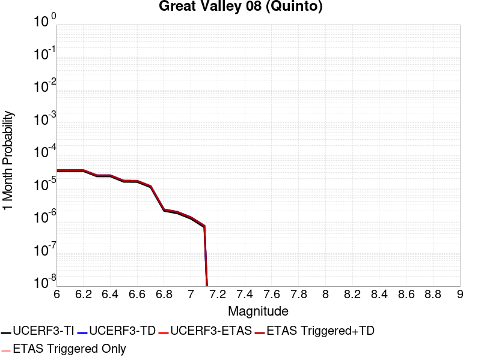 |  | 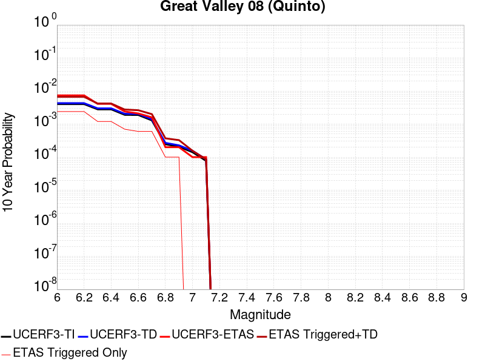 |

| Magnitude | 1 wk TI Prob | 1 wk TD Prob | 1 wk ETAS Prob | 1 wk ETAS/TD Gain | 1 wk ETAS Triggered+TD | 1 wk ETAS Triggered Only | 1 mo TI Prob | 1 mo TD Prob | 1 mo ETAS Prob | 1 mo ETAS/TD Gain | 1 mo ETAS Triggered+TD | 1 mo ETAS Triggered Only | 1 yr TI Prob | 1 yr TD Prob | 1 yr ETAS Prob | 1 yr ETAS/TD Gain | 1 yr ETAS Triggered+TD | 1 yr ETAS Triggered Only | 10 yr TI Prob | 10 yr TD Prob | 10 yr ETAS Prob | 10 yr ETAS/TD Gain | 10 yr ETAS Triggered+TD | 10 yr ETAS Triggered Only |
|-----|-----|-----|-----|-----|-----|-----|-----|-----|-----|-----|-----|-----|-----|-----|-----|-----|-----|-----|-----|-----|-----|-----|-----|-----|
| 6.0 | 7.737697E-6 | 8.247288E-6 | 0.0 | 0.0 | 8.247288E-6 | 0.0 | 3.3161137E-5 | 3.5345147E-5 | 0.0 | 0.0 | 3.5345147E-5 | 0.0 | 4.0366207E-4 | 4.3026102E-4 | 0.0 | 0.0 | 4.3026102E-4 | 0.0 | 0.004029296 | 0.0042961305 | 2.0E-4 | 0.046553522 | 0.004495271 | 2.0E-4 |
| 6.1 | 7.737697E-6 | 8.247288E-6 | 0.0 | 0.0 | 8.247288E-6 | 0.0 | 3.3161137E-5 | 3.5345147E-5 | 0.0 | 0.0 | 3.5345147E-5 | 0.0 | 4.0366207E-4 | 4.3026102E-4 | 0.0 | 0.0 | 4.3026102E-4 | 0.0 | 0.004029296 | 0.0042961305 | 2.0E-4 | 0.046553522 | 0.004495271 | 2.0E-4 |
| 6.2 | 7.737697E-6 | 8.247288E-6 | 0.0 | 0.0 | 8.247288E-6 | 0.0 | 3.3161137E-5 | 3.5345147E-5 | 0.0 | 0.0 | 3.5345147E-5 | 0.0 | 4.0366207E-4 | 4.3026102E-4 | 0.0 | 0.0 | 4.3026102E-4 | 0.0 | 0.004029296 | 0.0042961305 | 2.0E-4 | 0.046553522 | 0.004495271 | 2.0E-4 |
| 6.3 | 5.374012E-6 | 5.7463567E-6 | 0.0 | 0.0 | 5.7463567E-6 | 0.0 | 2.3031276E-5 | 2.4627074E-5 | 0.0 | 0.0 | 2.4627074E-5 | 0.0 | 2.803697E-4 | 2.998045E-4 | 0.0 | 0.0 | 2.998045E-4 | 0.0 | 0.0028001624 | 0.002995092 | 1.0E-4 | 0.033387955 | 0.0030947926 | 1.0E-4 |
| 6.4 | 5.374012E-6 | 5.7463567E-6 | 0.0 | 0.0 | 5.7463567E-6 | 0.0 | 2.3031276E-5 | 2.4627074E-5 | 0.0 | 0.0 | 2.4627074E-5 | 0.0 | 2.803697E-4 | 2.998045E-4 | 0.0 | 0.0 | 2.998045E-4 | 0.0 | 0.0028001624 | 0.002995092 | 1.0E-4 | 0.033387955 | 0.0030947926 | 1.0E-4 |
| 6.5 | 3.65427E-6 | 3.93809E-6 | 0.0 | 0.0 | 3.93809E-6 | 0.0 | 1.5661062E-5 | 1.6877457E-5 | 0.0 | 0.0 | 1.6877457E-5 | 0.0 | 1.9065675E-4 | 2.0547071E-4 | 0.0 | 0.0 | 2.0547071E-4 | 0.0 | 0.0019049325 | 0.002053498 | 1.0E-4 | 0.048697393 | 0.0021532925 | 1.0E-4 |
| 6.6 | 3.6143538E-6 | 3.895309E-6 | 0.0 | 0.0 | 3.895309E-6 | 0.0 | 1.5489995E-5 | 1.6694114E-5 | 0.0 | 0.0 | 1.6694114E-5 | 0.0 | 1.8857437E-4 | 2.0323892E-4 | 0.0 | 0.0 | 2.0323892E-4 | 0.0 | 0.0018841444 | 0.0020312208 | 1.0E-4 | 0.049231477 | 0.0021310176 | 1.0E-4 |
| 6.7 | 2.4821015E-6 | 2.6834055E-6 | 0.0 | 0.0 | 2.6834055E-6 | 0.0 | 1.0637535E-5 | 1.150029E-5 | 0.0 | 0.0 | 1.150029E-5 | 0.0 | 1.2950429E-4 | 1.400127E-4 | 0.0 | 0.0 | 1.400127E-4 | 0.0 | 0.0012942884 | 0.0013997988 | 1.0E-4 | 0.07143884 | 0.0014996588 | 1.0E-4 |
| 6.8 | 4.7110538E-7 | 5.187477E-7 | 0.0 | 0.0 | 5.187477E-7 | 0.0 | 2.0190216E-6 | 2.2232025E-6 | 0.0 | 0.0 | 2.2232025E-6 | 0.0 | 2.458131E-5 | 2.7067174E-5 | 0.0 | 0.0 | 2.7067174E-5 | 0.0 | 2.457859E-4 | 2.7064056E-4 | 0.0 | 0.0 | 2.7064056E-4 | 0.0 |
| 6.9 | 3.958685E-7 | 4.3656033E-7 | 0.0 | 0.0 | 4.3656033E-7 | 0.0 | 1.6965782E-6 | 1.8709716E-6 | 0.0 | 0.0 | 1.8709716E-6 | 0.0 | 2.0655643E-5 | 2.2778857E-5 | 0.0 | 0.0 | 2.2778857E-5 | 0.0 | 2.0653724E-4 | 2.2776684E-4 | 0.0 | 0.0 | 2.2776684E-4 | 0.0 |
| 7.0 | 2.70294E-7 | 2.9886627E-7 | 0.0 | 0.0 | 2.9886627E-7 | 0.0 | 1.1584025E-6 | 1.2808549E-6 | 0.0 | 0.0 | 1.2808549E-6 | 0.0 | 1.4103458E-5 | 1.559431E-5 | 0.0 | 0.0 | 1.559431E-5 | 0.0 | 1.4102564E-4 | 1.5593343E-4 | 0.0 | 0.0 | 1.5593343E-4 | 0.0 |
| 7.1 | 1.4828602E-7 | 1.6450103E-7 | 0.0 | 0.0 | 1.6450103E-7 | 0.0 | 6.3551136E-7 | 7.0500425E-7 | 0.0 | 0.0 | 7.0500425E-7 | 0.0 | 7.737323E-6 | 8.583402E-6 | 0.0 | 0.0 | 8.583402E-6 | 0.0 | 7.737054E-5 | 8.5831496E-5 | 0.0 | 0.0 | 8.5831496E-5 | 0.0 |

## San Diego Trough south
*[(top)](#table-of-contents)*

| 1 Week | 1 Month | 1 Year | 10 Year |
|-----|-----|-----|-----|
|  | 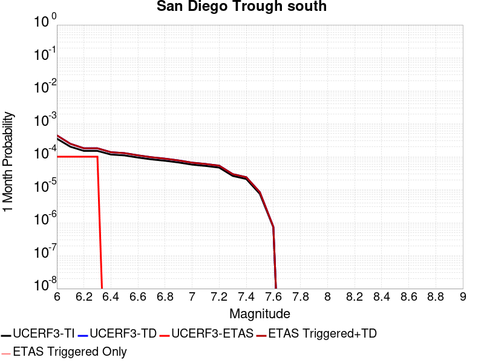 |  |  |

| Magnitude | 1 wk TI Prob | 1 wk TD Prob | 1 wk ETAS Prob | 1 wk ETAS/TD Gain | 1 wk ETAS Triggered+TD | 1 wk ETAS Triggered Only | 1 mo TI Prob | 1 mo TD Prob | 1 mo ETAS Prob | 1 mo ETAS/TD Gain | 1 mo ETAS Triggered+TD | 1 mo ETAS Triggered Only | 1 yr TI Prob | 1 yr TD Prob | 1 yr ETAS Prob | 1 yr ETAS/TD Gain | 1 yr ETAS Triggered+TD | 1 yr ETAS Triggered Only | 10 yr TI Prob | 10 yr TD Prob | 10 yr ETAS Prob | 10 yr ETAS/TD Gain | 10 yr ETAS Triggered+TD | 10 yr ETAS Triggered Only |
|-----|-----|-----|-----|-----|-----|-----|-----|-----|-----|-----|-----|-----|-----|-----|-----|-----|-----|-----|-----|-----|-----|-----|-----|-----|
| 6.0 | 8.279495E-5 | 1.0398335E-4 | 0.0 | 0.0 | 1.0398335E-4 | 0.0 | 3.5478722E-4 | 4.4557097E-4 | 0.0 | 0.0 | 4.4557097E-4 | 0.0 | 0.004310982 | 0.0054117716 | 1.0E-4 | 0.018478237 | 0.005511231 | 1.0E-4 | 0.042283054 | 0.052859753 | 2.0E-4 | 0.003783597 | 0.053049184 | 2.0E-4 |
| 6.1 | 4.6961468E-5 | 5.7593406E-5 | 0.0 | 0.0 | 5.7593406E-5 | 0.0 | 2.0124791E-4 | 2.4680578E-4 | 0.0 | 0.0 | 2.4680578E-4 | 0.0 | 0.00244744 | 0.0030007784 | 0.0 | 0.0 | 0.0030007784 | 0.0 | 0.024206603 | 0.029610973 | 1.0E-4 | 0.0033771263 | 0.029708013 | 1.0E-4 |
| 6.2 | 3.5079658E-5 | 4.2053834E-5 | 0.0 | 0.0 | 4.2053834E-5 | 0.0 | 1.5033272E-4 | 1.8021835E-4 | 0.0 | 0.0 | 1.8021835E-4 | 0.0 | 0.0018287642 | 0.0021919683 | 0.0 | 0.0 | 0.0021919683 | 0.0 | 0.018137876 | 0.021706074 | 1.0E-4 | 0.004607005 | 0.021803904 | 1.0E-4 |
| 6.3 | 3.5079658E-5 | 4.2053834E-5 | 0.0 | 0.0 | 4.2053834E-5 | 0.0 | 1.5033272E-4 | 1.8021835E-4 | 0.0 | 0.0 | 1.8021835E-4 | 0.0 | 0.0018287642 | 0.0021919683 | 0.0 | 0.0 | 0.0021919683 | 0.0 | 0.018137876 | 0.021706074 | 1.0E-4 | 0.004607005 | 0.021803904 | 1.0E-4 |
| 6.4 | 2.7196904E-5 | 3.2026568E-5 | 0.0 | 0.0 | 3.2026568E-5 | 0.0 | 1.16552954E-4 | 1.372496E-4 | 0.0 | 0.0 | 1.372496E-4 | 0.0 | 0.0014181085 | 0.0016697448 | 0.0 | 0.0 | 0.0016697448 | 0.0 | 0.014090929 | 0.016573627 | 0.0 | 0.0 | 0.016573627 | 0.0 |
| 6.5 | 2.5584688E-5 | 3.004582E-5 | 0.0 | 0.0 | 3.004582E-5 | 0.0 | 1.0964406E-4 | 1.2876153E-4 | 0.0 | 0.0 | 1.2876153E-4 | 0.0 | 0.0013340989 | 0.0015665563 | 0.0 | 0.0 | 0.0015665563 | 0.0 | 0.013261181 | 0.0155567005 | 0.0 | 0.0 | 0.0155567005 | 0.0 |
| 6.6 | 2.2034688E-5 | 2.5697242E-5 | 0.0 | 0.0 | 2.5697242E-5 | 0.0 | 9.443096E-5 | 1.10126435E-4 | 0.0 | 0.0 | 1.10126435E-4 | 0.0 | 0.0011490905 | 0.0013399721 | 0.0 | 0.0 | 0.0013399721 | 0.0 | 0.011431668 | 0.0133199245 | 0.0 | 0.0 | 0.0133199245 | 0.0 |
| 6.7 | 1.9394853E-5 | 2.2503391E-5 | 0.0 | 0.0 | 2.2503391E-5 | 0.0 | 8.311815E-5 | 9.643957E-5 | 0.0 | 0.0 | 9.643957E-5 | 0.0 | 0.0010114936 | 0.0011735245 | 0.0 | 0.0 | 0.0011735245 | 0.0 | 0.01006902 | 0.011673977 | 0.0 | 0.0 | 0.011673977 | 0.0 |
| 6.8 | 1.7615313E-5 | 2.0369338E-5 | 0.0 | 0.0 | 2.0369338E-5 | 0.0 | 7.549201E-5 | 8.729427E-5 | 0.0 | 0.0 | 8.729427E-5 | 0.0 | 9.1872766E-4 | 0.0010622938 | 0.0 | 0.0 | 0.0010622938 | 0.0 | 0.009149387 | 0.010572723 | 0.0 | 0.0 | 0.010572723 | 0.0 |
| 6.9 | 1.5621423E-5 | 1.7997054E-5 | 0.0 | 0.0 | 1.7997054E-5 | 0.0 | 6.6947236E-5 | 7.7127974E-5 | 0.0 | 0.0 | 7.7127974E-5 | 0.0 | 8.147778E-4 | 9.38632E-4 | 0.0 | 0.0 | 9.38632E-4 | 0.0 | 0.008117969 | 0.009347118 | 0.0 | 0.0 | 0.009347118 | 0.0 |
| 7.0 | 1.3444376E-5 | 1.5423993E-5 | 0.0 | 0.0 | 1.5423993E-5 | 0.0 | 5.7617483E-5 | 6.610117E-5 | 0.0 | 0.0 | 6.610117E-5 | 0.0 | 7.0126704E-4 | 8.044873E-4 | 0.0 | 0.0 | 8.044873E-4 | 0.0 | 0.006990582 | 0.008016082 | 0.0 | 0.0 | 0.008016082 | 0.0 |
| 7.1 | 1.2268361E-5 | 1.4051366E-5 | 0.0 | 0.0 | 1.4051366E-5 | 0.0 | 5.2577634E-5 | 6.021876E-5 | 0.0 | 0.0 | 6.021876E-5 | 0.0 | 6.399447E-4 | 7.3291943E-4 | 0.0 | 0.0 | 7.3291943E-4 | 0.0 | 0.0063810493 | 0.0073053264 | 0.0 | 0.0 | 0.0073053264 | 0.0 |
| 7.2 | 1.0922655E-5 | 1.24944845E-5 | 0.0 | 0.0 | 1.24944845E-5 | 0.0 | 4.681054E-5 | 5.3546704E-5 | 0.0 | 0.0 | 5.3546704E-5 | 0.0 | 5.697693E-4 | 6.5173866E-4 | 0.0 | 0.0 | 6.5173866E-4 | 0.0 | 0.0056831064 | 0.0064985524 | 0.0 | 0.0 | 0.0064985524 | 0.0 |
| 7.3 | 6.1106753E-6 | 6.9192024E-6 | 0.0 | 0.0 | 6.9192024E-6 | 0.0 | 2.6188345E-5 | 2.9653389E-5 | 0.0 | 0.0 | 2.9653389E-5 | 0.0 | 3.1879646E-4 | 3.6097062E-4 | 0.0 | 0.0 | 3.6097062E-4 | 0.0 | 0.0031833951 | 0.003603888 | 0.0 | 0.0 | 0.003603888 | 0.0 |
| 7.4 | 4.933187E-6 | 5.5817527E-6 | 0.0 | 0.0 | 5.5817527E-6 | 0.0 | 2.114206E-5 | 2.392158E-5 | 0.0 | 0.0 | 2.392158E-5 | 0.0 | 2.5737417E-4 | 2.912067E-4 | 0.0 | 0.0 | 2.912067E-4 | 0.0 | 0.002570763 | 0.0029082922 | 0.0 | 0.0 | 0.0029082922 | 0.0 |
| 7.5 | 1.7489613E-6 | 1.967052E-6 | 0.0 | 0.0 | 1.967052E-6 | 0.0 | 7.495527E-6 | 8.430196E-6 | 0.0 | 0.0 | 8.430196E-6 | 0.0 | 9.125422E-5 | 1.0263303E-4 | 0.0 | 0.0 | 1.0263303E-4 | 0.0 | 9.1216754E-4 | 0.0010258782 | 0.0 | 0.0 | 0.0010258782 | 0.0 |
| 7.6 | 1.6988751E-7 | 1.7527951E-7 | 0.0 | 0.0 | 1.7527951E-7 | 0.0 | 7.2808916E-7 | 7.5119766E-7 | 0.0 | 0.0 | 7.5119766E-7 | 0.0 | 8.864449E-6 | 9.145795E-6 | 0.0 | 0.0 | 9.145795E-6 | 0.0 | 8.8640954E-5 | 9.1454385E-5 | 0.0 | 0.0 | 9.1454385E-5 | 0.0 |

## San Jacinto (Borrego)
*[(top)](#table-of-contents)*

| 1 Week | 1 Month | 1 Year | 10 Year |
|-----|-----|-----|-----|
|  |  | 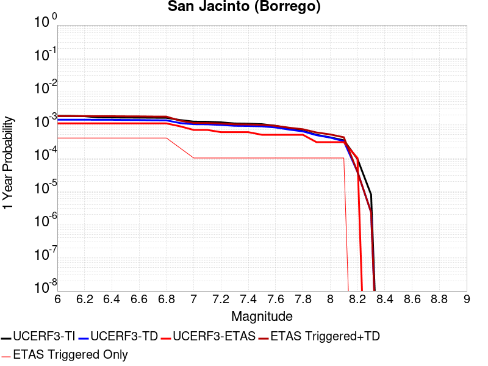 | 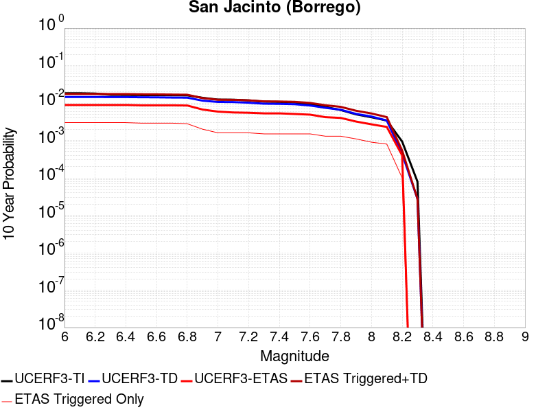 |

| Magnitude | 1 wk TI Prob | 1 wk TD Prob | 1 wk ETAS Prob | 1 wk ETAS/TD Gain | 1 wk ETAS Triggered+TD | 1 wk ETAS Triggered Only | 1 mo TI Prob | 1 mo TD Prob | 1 mo ETAS Prob | 1 mo ETAS/TD Gain | 1 mo ETAS Triggered+TD | 1 mo ETAS Triggered Only | 1 yr TI Prob | 1 yr TD Prob | 1 yr ETAS Prob | 1 yr ETAS/TD Gain | 1 yr ETAS Triggered+TD | 1 yr ETAS Triggered Only | 10 yr TI Prob | 10 yr TD Prob | 10 yr ETAS Prob | 10 yr ETAS/TD Gain | 10 yr ETAS Triggered+TD | 10 yr ETAS Triggered Only |
|-----|-----|-----|-----|-----|-----|-----|-----|-----|-----|-----|-----|-----|-----|-----|-----|-----|-----|-----|-----|-----|-----|-----|-----|-----|
| 6.0 | 3.543992E-5 | 2.7189188E-5 | 1.0E-4 | 3.6779325 | 1.2718647E-4 | 1.0E-4 | 1.5187653E-4 | 1.1651995E-4 | 1.0E-4 | 0.8582221 | 2.165083E-4 | 1.0E-4 | 0.0018475284 | 0.0014177191 | 1.0E-4 | 0.07053584 | 0.0015175772 | 1.0E-4 | 0.018322436 | 0.01448599 | 2.0E-4 | 0.013806444 | 0.014683092 | 2.0E-4 |
| 6.1 | 3.542281E-5 | 2.7189188E-5 | 1.0E-4 | 3.6779325 | 1.2718647E-4 | 1.0E-4 | 1.5180321E-4 | 1.1651995E-4 | 1.0E-4 | 0.8582221 | 2.165083E-4 | 1.0E-4 | 0.0018466372 | 0.0014177191 | 1.0E-4 | 0.07053584 | 0.0015175772 | 1.0E-4 | 0.018313672 | 0.01448599 | 2.0E-4 | 0.013806444 | 0.014683092 | 2.0E-4 |
| 6.2 | 3.4688688E-5 | 2.7189188E-5 | 1.0E-4 | 3.6779325 | 1.2718647E-4 | 1.0E-4 | 1.4865733E-4 | 1.1651995E-4 | 1.0E-4 | 0.8582221 | 2.165083E-4 | 1.0E-4 | 0.0018084005 | 0.0014177191 | 1.0E-4 | 0.07053584 | 0.0015175772 | 1.0E-4 | 0.017937548 | 0.01448599 | 2.0E-4 | 0.013806444 | 0.014683092 | 2.0E-4 |
| 6.3 | 3.2087122E-5 | 2.7034886E-5 | 1.0E-4 | 3.6989243 | 1.2703218E-4 | 1.0E-4 | 1.3750899E-4 | 1.1585872E-4 | 1.0E-4 | 0.8631202 | 2.1584713E-4 | 1.0E-4 | 0.0016728862 | 0.001409679 | 1.0E-4 | 0.07093814 | 0.0015095379 | 1.0E-4 | 0.016603488 | 0.014407289 | 2.0E-4 | 0.013881862 | 0.014604407 | 2.0E-4 |
| 6.4 | 3.1828724E-5 | 2.7002008E-5 | 1.0E-4 | 3.7034283 | 1.2699931E-4 | 1.0E-4 | 1.364017E-4 | 1.1571783E-4 | 1.0E-4 | 0.8641711 | 2.1570626E-4 | 1.0E-4 | 0.0016594254 | 0.0014079658 | 1.0E-4 | 0.071024455 | 0.001507825 | 1.0E-4 | 0.016470885 | 0.014390131 | 2.0E-4 | 0.013898414 | 0.014587253 | 2.0E-4 |
| 6.5 | 3.1563577E-5 | 2.6742735E-5 | 1.0E-4 | 3.7393334 | 1.2674007E-4 | 1.0E-4 | 1.3526545E-4 | 1.1460675E-4 | 1.0E-4 | 0.87254894 | 2.1459529E-4 | 1.0E-4 | 0.0016456128 | 0.0013944558 | 1.0E-4 | 0.07171256 | 0.0014943164 | 1.0E-4 | 0.0163348 | 0.014257997 | 2.0E-4 | 0.014027216 | 0.014455146 | 2.0E-4 |
| 6.6 | 3.1467625E-5 | 2.6587433E-5 | 1.0E-4 | 3.7611754 | 1.2658477E-4 | 1.0E-4 | 1.3485427E-4 | 1.1394123E-4 | 1.0E-4 | 0.87764543 | 2.1392983E-4 | 1.0E-4 | 0.0016406142 | 0.0013863634 | 1.0E-4 | 0.07213116 | 0.0014862247 | 1.0E-4 | 0.016285548 | 0.014178378 | 2.0E-4 | 0.014105986 | 0.014375542 | 2.0E-4 |
| 6.7 | 3.1223695E-5 | 2.6207546E-5 | 1.0E-4 | 3.815695 | 1.2620492E-4 | 1.0E-4 | 1.3380898E-4 | 1.1231328E-4 | 1.0E-4 | 0.8903666 | 2.1230205E-4 | 1.0E-4 | 0.0016279068 | 0.0013665681 | 1.0E-4 | 0.07317601 | 0.0014664314 | 1.0E-4 | 0.01616033 | 0.013983885 | 2.0E-4 | 0.014302177 | 0.014181088 | 2.0E-4 |
| 6.8 | 3.1015585E-5 | 2.6030486E-5 | 1.0E-4 | 3.8416493 | 1.2602788E-4 | 1.0E-4 | 1.3291716E-4 | 1.11554524E-4 | 1.0E-4 | 0.8964226 | 2.1154336E-4 | 1.0E-4 | 0.001617065 | 0.0013573418 | 1.0E-4 | 0.07367341 | 0.001457206 | 1.0E-4 | 0.016053487 | 0.013892122 | 2.0E-4 | 0.014396649 | 0.014089343 | 2.0E-4 |
| 6.9 | 2.6641965E-5 | 2.1536094E-5 | 1.0E-4 | 4.6433673 | 1.2153394E-4 | 1.0E-4 | 1.1417485E-4 | 9.22943E-5 | 1.0E-4 | 1.0834905 | 1.9228508E-4 | 1.0E-4 | 0.0013891924 | 0.0011231076 | 1.0E-4 | 0.08903866 | 0.0012229953 | 1.0E-4 | 0.0138054015 | 0.011543221 | 1.0E-4 | 0.008663094 | 0.011642066 | 1.0E-4 |
| 7.0 | 2.3854353E-5 | 1.9871672E-5 | 1.0E-4 | 5.0322895 | 1.19869685E-4 | 1.0E-4 | 1.02228936E-4 | 8.516154E-5 | 1.0E-4 | 1.174239 | 1.8515303E-4 | 1.0E-4 | 0.0012439266 | 0.001036351 | 1.0E-4 | 0.0964924 | 0.0011362474 | 1.0E-4 | 0.012369866 | 0.0106646 | 1.0E-4 | 0.009376817 | 0.010763533 | 1.0E-4 |
| 7.1 | 2.3672901E-5 | 1.970949E-5 | 1.0E-4 | 5.073698 | 1.1970752E-4 | 1.0E-4 | 1.0145135E-4 | 8.446652E-5 | 1.0E-4 | 1.183901 | 1.8445807E-4 | 1.0E-4 | 0.0012344702 | 0.0010278972 | 1.0E-4 | 0.09728599 | 0.0011277944 | 1.0E-4 | 0.0122763505 | 0.01058045 | 1.0E-4 | 0.009451394 | 0.010679392 | 1.0E-4 |
| 7.2 | 2.2717244E-5 | 1.8946388E-5 | 1.0E-4 | 5.278051 | 1.18944496E-4 | 1.0E-4 | 9.735599E-5 | 8.119629E-5 | 1.0E-4 | 1.2315834 | 1.8118817E-4 | 1.0E-4 | 0.0011846646 | 9.881187E-4 | 1.0E-4 | 0.10120241 | 0.0010880199 | 1.0E-4 | 0.01178369 | 0.010182606 | 1.0E-4 | 0.009820668 | 0.010281588 | 1.0E-4 |
| 7.3 | 2.1016205E-5 | 1.7800043E-5 | 1.0E-4 | 5.617964 | 1.1779826E-4 | 1.0E-4 | 9.006634E-5 | 7.628368E-5 | 1.0E-4 | 1.3108964 | 1.7627605E-4 | 1.0E-4 | 0.001096006 | 9.2836004E-4 | 1.0E-4 | 0.10771683 | 0.0010282672 | 1.0E-4 | 0.010906163 | 0.009584244 | 1.0E-4 | 0.01043379 | 0.009683286 | 1.0E-4 |
| 7.4 | 2.0683625E-5 | 1.7604487E-5 | 1.0E-4 | 5.6803703 | 1.1760273E-4 | 1.0E-4 | 8.86411E-5 | 7.544563E-5 | 1.0E-4 | 1.3254579 | 1.7543808E-4 | 1.0E-4 | 0.001078671 | 9.181654E-4 | 1.0E-4 | 0.10891284 | 0.0010180735 | 1.0E-4 | 0.010734501 | 0.00948196 | 1.0E-4 | 0.0105463425 | 0.009581012 | 1.0E-4 |
| 7.5 | 1.9993966E-5 | 1.7204853E-5 | 1.0E-4 | 5.8123136 | 1.1720313E-4 | 1.0E-4 | 8.568561E-5 | 7.373301E-5 | 1.0E-4 | 1.3562446 | 1.7372564E-4 | 1.0E-4 | 0.001042723 | 8.973316E-4 | 1.0E-4 | 0.111441515 | 9.972419E-4 | 1.0E-4 | 0.010378438 | 0.009271625 | 1.0E-4 | 0.0107855955 | 0.009370698 | 1.0E-4 |
| 7.6 | 1.788966E-5 | 1.5873382E-5 | 1.0E-4 | 6.2998548 | 1.1587179E-4 | 1.0E-4 | 7.666772E-5 | 6.802701E-5 | 1.0E-4 | 1.4700043 | 1.6802021E-4 | 1.0E-4 | 9.3302975E-4 | 8.2791585E-4 | 1.0E-4 | 0.12078522 | 9.27833E-4 | 1.0E-4 | 0.00929122 | 0.008571208 | 1.0E-4 | 0.011666966 | 0.0086703515 | 1.0E-4 |
| 7.7 | 1.5125781E-5 | 1.369977E-5 | 1.0E-4 | 7.2993927 | 1.136984E-4 | 1.0E-4 | 6.4823165E-5 | 5.8711983E-5 | 1.0E-4 | 1.7032298 | 1.5870611E-4 | 1.0E-4 | 7.889362E-4 | 7.145847E-4 | 1.0E-4 | 0.13994142 | 8.1451325E-4 | 1.0E-4 | 0.007861412 | 0.0074313665 | 1.0E-4 | 0.013456475 | 0.0075306236 | 1.0E-4 |
| 7.8 | 1.250089E-5 | 1.2115975E-5 | 1.0E-4 | 8.253567 | 1.12114765E-4 | 1.0E-4 | 5.3574146E-5 | 5.1924573E-5 | 1.0E-4 | 1.9258704 | 1.5191938E-4 | 1.0E-4 | 6.5207E-4 | 6.319989E-4 | 1.0E-4 | 0.15822813 | 7.3193567E-4 | 1.0E-4 | 0.006501599 | 0.0065969536 | 1.0E-4 | 0.015158513 | 0.0066962936 | 1.0E-4 |
| 7.9 | 9.561E-6 | 9.297197E-6 | 1.0E-4 | 10.75593 | 1.0929627E-4 | 1.0E-4 | 4.0975072E-5 | 3.9844523E-5 | 1.0E-4 | 2.5097551 | 1.3984054E-4 | 1.0E-4 | 4.987573E-4 | 4.849996E-4 | 1.0E-4 | 0.20618574 | 5.849511E-4 | 1.0E-4 | 0.0049763937 | 0.0051110815 | 1.0E-4 | 0.01956533 | 0.0052105705 | 1.0E-4 |
| 8.0 | 8.01699E-6 | 7.874647E-6 | 1.0E-4 | 12.698981 | 1.0787386E-4 | 1.0E-4 | 3.4358076E-5 | 3.3748056E-5 | 1.0E-4 | 2.9631338 | 1.3374467E-4 | 1.0E-4 | 4.1822926E-4 | 4.1080557E-4 | 1.0E-4 | 0.24342415 | 5.107645E-4 | 1.0E-4 | 0.0041744304 | 0.004352012 | 1.0E-4 | 0.022977877 | 0.004451577 | 1.0E-4 |
| 8.1 | 6.541947E-6 | 6.118004E-6 | 1.0E-4 | 16.3452 | 1.0611739E-4 | 1.0E-4 | 2.8036617E-5 | 2.6219757E-5 | 1.0E-4 | 3.8139179 | 1.2621713E-4 | 1.0E-4 | 3.4129233E-4 | 3.1917923E-4 | 1.0E-4 | 0.3133036 | 4.191473E-4 | 1.0E-4 | 0.0034076865 | 0.0033980047 | 1.0E-4 | 0.029429035 | 0.003497665 | 1.0E-4 |
| 8.2 | 1.7968189E-6 | 7.303876E-7 | 0.0 | 0.0 | 7.303876E-7 | 0.0 | 7.70063E-6 | 3.130229E-6 | 0.0 | 0.0 | 3.130229E-6 | 0.0 | 9.3751136E-5 | 3.810989E-5 | 0.0 | 0.0 | 3.810989E-5 | 0.0 | 9.371159E-4 | 4.3368828E-4 | 0.0 | 0.0 | 4.3368828E-4 | 0.0 |
| 8.3 | 1.5167889E-7 | 4.4245223E-8 | 0.0 | 0.0 | 4.4245223E-8 | 0.0 | 6.500522E-7 | 1.8962237E-7 | 0.0 | 0.0 | 1.8962237E-7 | 0.0 | 7.9143565E-6 | 2.3086502E-6 | 0.0 | 0.0 | 2.3086502E-6 | 0.0 | 7.914075E-5 | 2.6973452E-5 | 0.0 | 0.0 | 2.6973452E-5 | 0.0 |

## Antelope Valley 2011
*[(top)](#table-of-contents)*

| 1 Week | 1 Month | 1 Year | 10 Year |
|-----|-----|-----|-----|
|  |  |  |  |

| Magnitude | 1 wk TI Prob | 1 wk TD Prob | 1 wk ETAS Prob | 1 wk ETAS/TD Gain | 1 wk ETAS Triggered+TD | 1 wk ETAS Triggered Only | 1 mo TI Prob | 1 mo TD Prob | 1 mo ETAS Prob | 1 mo ETAS/TD Gain | 1 mo ETAS Triggered+TD | 1 mo ETAS Triggered Only | 1 yr TI Prob | 1 yr TD Prob | 1 yr ETAS Prob | 1 yr ETAS/TD Gain | 1 yr ETAS Triggered+TD | 1 yr ETAS Triggered Only | 10 yr TI Prob | 10 yr TD Prob | 10 yr ETAS Prob | 10 yr ETAS/TD Gain | 10 yr ETAS Triggered+TD | 10 yr ETAS Triggered Only |
|-----|-----|-----|-----|-----|-----|-----|-----|-----|-----|-----|-----|-----|-----|-----|-----|-----|-----|-----|-----|-----|-----|-----|-----|-----|
| 6.0 | 3.1646934E-5 | 3.6840487E-5 | 0.0 | 0.0 | 3.6840487E-5 | 0.0 | 1.3562266E-4 | 1.5787974E-4 | 0.0 | 0.0 | 1.5787974E-4 | 0.0 | 0.0016499552 | 0.0019207548 | 1.0E-4 | 0.052062865 | 0.0020205628 | 1.0E-4 | 0.016377583 | 0.019067852 | 2.0E-4 | 0.010488858 | 0.019264039 | 2.0E-4 |
| 6.1 | 3.1646934E-5 | 3.6840487E-5 | 0.0 | 0.0 | 3.6840487E-5 | 0.0 | 1.3562266E-4 | 1.5787974E-4 | 0.0 | 0.0 | 1.5787974E-4 | 0.0 | 0.0016499552 | 0.0019207548 | 1.0E-4 | 0.052062865 | 0.0020205628 | 1.0E-4 | 0.016377583 | 0.019067852 | 2.0E-4 | 0.010488858 | 0.019264039 | 2.0E-4 |
| 6.2 | 3.1646934E-5 | 3.6840487E-5 | 0.0 | 0.0 | 3.6840487E-5 | 0.0 | 1.3562266E-4 | 1.5787974E-4 | 0.0 | 0.0 | 1.5787974E-4 | 0.0 | 0.0016499552 | 0.0019207548 | 1.0E-4 | 0.052062865 | 0.0020205628 | 1.0E-4 | 0.016377583 | 0.019067852 | 2.0E-4 | 0.010488858 | 0.019264039 | 2.0E-4 |
| 6.3 | 3.1646934E-5 | 3.6840487E-5 | 0.0 | 0.0 | 3.6840487E-5 | 0.0 | 1.3562266E-4 | 1.5787974E-4 | 0.0 | 0.0 | 1.5787974E-4 | 0.0 | 0.0016499552 | 0.0019207548 | 1.0E-4 | 0.052062865 | 0.0020205628 | 1.0E-4 | 0.016377583 | 0.019067852 | 2.0E-4 | 0.010488858 | 0.019264039 | 2.0E-4 |
| 6.4 | 3.1646934E-5 | 3.6840487E-5 | 0.0 | 0.0 | 3.6840487E-5 | 0.0 | 1.3562266E-4 | 1.5787974E-4 | 0.0 | 0.0 | 1.5787974E-4 | 0.0 | 0.0016499552 | 0.0019207548 | 1.0E-4 | 0.052062865 | 0.0020205628 | 1.0E-4 | 0.016377583 | 0.019067852 | 2.0E-4 | 0.010488858 | 0.019264039 | 2.0E-4 |
| 6.5 | 1.8034107E-5 | 2.0905773E-5 | 0.0 | 0.0 | 2.0905773E-5 | 0.0 | 7.7286735E-5 | 8.959378E-5 | 0.0 | 0.0 | 8.959378E-5 | 0.0 | 9.405598E-4 | 0.0010903804 | 0.0 | 0.0 | 0.0010903804 | 0.0 | 0.009365888 | 0.010862339 | 1.0E-4 | 0.00920612 | 0.010961253 | 1.0E-4 |
| 6.6 | 1.8034107E-5 | 2.0905773E-5 | 0.0 | 0.0 | 2.0905773E-5 | 0.0 | 7.7286735E-5 | 8.959378E-5 | 0.0 | 0.0 | 8.959378E-5 | 0.0 | 9.405598E-4 | 0.0010903804 | 0.0 | 0.0 | 0.0010903804 | 0.0 | 0.009365888 | 0.010862339 | 1.0E-4 | 0.00920612 | 0.010961253 | 1.0E-4 |
| 6.7 | 1.3567667E-5 | 1.5723108E-5 | 0.0 | 0.0 | 1.5723108E-5 | 0.0 | 5.814585E-5 | 6.7383604E-5 | 0.0 | 0.0 | 6.7383604E-5 | 0.0 | 7.076958E-4 | 8.2019245E-4 | 0.0 | 0.0 | 8.2019245E-4 | 0.0 | 0.007054463 | 0.008182052 | 0.0 | 0.0 | 0.008182052 | 0.0 |
| 6.8 | 9.867387E-6 | 1.1448545E-5 | 0.0 | 0.0 | 1.1448545E-5 | 0.0 | 4.2288117E-5 | 4.90648E-5 | 0.0 | 0.0 | 4.90648E-5 | 0.0 | 5.1473617E-4 | 5.972949E-4 | 0.0 | 0.0 | 5.972949E-4 | 0.0 | 0.005135455 | 0.005966176 | 0.0 | 0.0 | 0.005966176 | 0.0 |
| 6.9 | 7.273233E-6 | 8.440546E-6 | 0.0 | 0.0 | 8.440546E-6 | 0.0 | 3.1170628E-5 | 3.6173766E-5 | 0.0 | 0.0 | 3.6173766E-5 | 0.0 | 3.794363E-4 | 4.404156E-4 | 0.0 | 0.0 | 4.404156E-4 | 0.0 | 0.0037878908 | 0.004404156 | 0.0 | 0.0 | 0.004404156 | 0.0 |

## West Tahoe
*[(top)](#table-of-contents)*

| 1 Week | 1 Month | 1 Year | 10 Year |
|-----|-----|-----|-----|
| 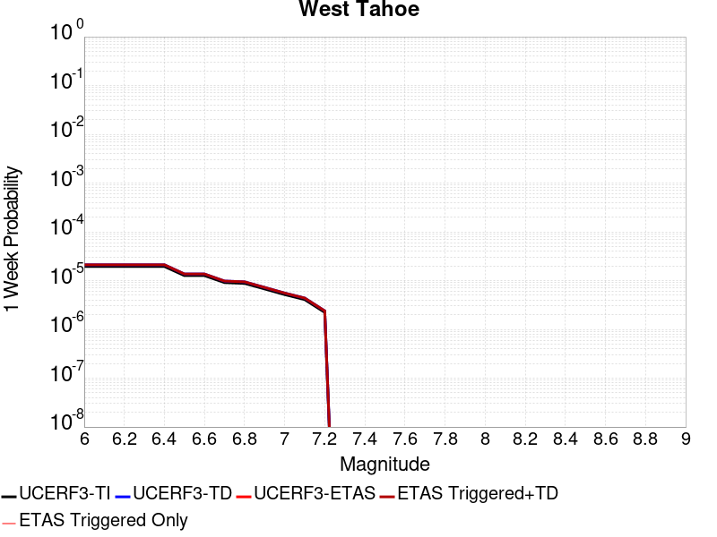 |  | 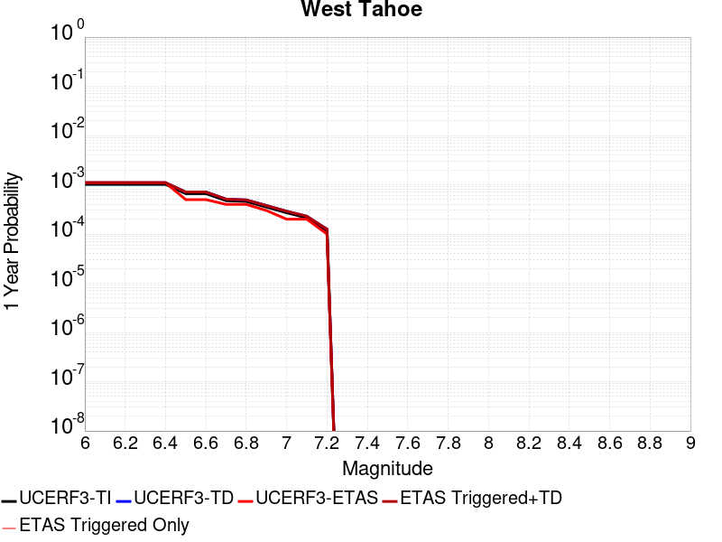 |  |

| Magnitude | 1 wk TI Prob | 1 wk TD Prob | 1 wk ETAS Prob | 1 wk ETAS/TD Gain | 1 wk ETAS Triggered+TD | 1 wk ETAS Triggered Only | 1 mo TI Prob | 1 mo TD Prob | 1 mo ETAS Prob | 1 mo ETAS/TD Gain | 1 mo ETAS Triggered+TD | 1 mo ETAS Triggered Only | 1 yr TI Prob | 1 yr TD Prob | 1 yr ETAS Prob | 1 yr ETAS/TD Gain | 1 yr ETAS Triggered+TD | 1 yr ETAS Triggered Only | 10 yr TI Prob | 10 yr TD Prob | 10 yr ETAS Prob | 10 yr ETAS/TD Gain | 10 yr ETAS Triggered+TD | 10 yr ETAS Triggered Only |
|-----|-----|-----|-----|-----|-----|-----|-----|-----|-----|-----|-----|-----|-----|-----|-----|-----|-----|-----|-----|-----|-----|-----|-----|-----|
| 6.0 | 1.952444E-5 | 2.1164358E-5 | 0.0 | 0.0 | 2.1164358E-5 | 0.0 | 8.367348E-5 | 9.070154E-5 | 0.0 | 0.0 | 9.070154E-5 | 0.0 | 0.0010182485 | 0.0011037865 | 0.0 | 0.0 | 0.0011037865 | 0.0 | 0.010135954 | 0.010988515 | 2.0E-4 | 0.018200822 | 0.011186318 | 2.0E-4 |
| 6.1 | 1.952444E-5 | 2.1164358E-5 | 0.0 | 0.0 | 2.1164358E-5 | 0.0 | 8.367348E-5 | 9.070154E-5 | 0.0 | 0.0 | 9.070154E-5 | 0.0 | 0.0010182485 | 0.0011037865 | 0.0 | 0.0 | 0.0011037865 | 0.0 | 0.010135954 | 0.010988515 | 2.0E-4 | 0.018200822 | 0.011186318 | 2.0E-4 |
| 6.2 | 1.952444E-5 | 2.1164358E-5 | 0.0 | 0.0 | 2.1164358E-5 | 0.0 | 8.367348E-5 | 9.070154E-5 | 0.0 | 0.0 | 9.070154E-5 | 0.0 | 0.0010182485 | 0.0011037865 | 0.0 | 0.0 | 0.0011037865 | 0.0 | 0.010135954 | 0.010988515 | 2.0E-4 | 0.018200822 | 0.011186318 | 2.0E-4 |
| 6.3 | 1.952444E-5 | 2.1164358E-5 | 0.0 | 0.0 | 2.1164358E-5 | 0.0 | 8.367348E-5 | 9.070154E-5 | 0.0 | 0.0 | 9.070154E-5 | 0.0 | 0.0010182485 | 0.0011037865 | 0.0 | 0.0 | 0.0011037865 | 0.0 | 0.010135954 | 0.010988515 | 2.0E-4 | 0.018200822 | 0.011186318 | 2.0E-4 |
| 6.4 | 1.952444E-5 | 2.1164358E-5 | 0.0 | 0.0 | 2.1164358E-5 | 0.0 | 8.367348E-5 | 9.070154E-5 | 0.0 | 0.0 | 9.070154E-5 | 0.0 | 0.0010182485 | 0.0011037865 | 0.0 | 0.0 | 0.0011037865 | 0.0 | 0.010135954 | 0.010988515 | 2.0E-4 | 0.018200822 | 0.011186318 | 2.0E-4 |
| 6.5 | 1.2685271E-5 | 1.3679295E-5 | 0.0 | 0.0 | 1.3679295E-5 | 0.0 | 5.4364315E-5 | 5.8624326E-5 | 0.0 | 0.0 | 5.8624326E-5 | 0.0 | 6.616845E-4 | 7.1353384E-4 | 0.0 | 0.0 | 7.1353384E-4 | 0.0 | 0.0065971776 | 0.007114075 | 1.0E-4 | 0.014056641 | 0.007213364 | 1.0E-4 |
| 6.6 | 1.2685271E-5 | 1.3679295E-5 | 0.0 | 0.0 | 1.3679295E-5 | 0.0 | 5.4364315E-5 | 5.8624326E-5 | 0.0 | 0.0 | 5.8624326E-5 | 0.0 | 6.616845E-4 | 7.1353384E-4 | 0.0 | 0.0 | 7.1353384E-4 | 0.0 | 0.0065971776 | 0.007114075 | 1.0E-4 | 0.014056641 | 0.007213364 | 1.0E-4 |
| 6.7 | 9.117886E-6 | 9.802075E-6 | 0.0 | 0.0 | 9.802075E-6 | 0.0 | 3.9076072E-5 | 4.2008254E-5 | 0.0 | 0.0 | 4.2008254E-5 | 0.0 | 4.756473E-4 | 5.1133765E-4 | 0.0 | 0.0 | 5.1133765E-4 | 0.0 | 0.0047463053 | 0.0051023276 | 1.0E-4 | 0.0195989 | 0.005201817 | 1.0E-4 |
| 6.8 | 8.786828E-6 | 9.450323E-6 | 0.0 | 0.0 | 9.450323E-6 | 0.0 | 3.7657293E-5 | 4.0500796E-5 | 0.0 | 0.0 | 4.0500796E-5 | 0.0 | 4.5838108E-4 | 4.9299264E-4 | 0.0 | 0.0 | 4.9299264E-4 | 0.0 | 0.0045743673 | 0.00491969 | 1.0E-4 | 0.020326484 | 0.0050191977 | 1.0E-4 |
| 6.9 | 6.7562123E-6 | 7.258113E-6 | 0.0 | 0.0 | 7.258113E-6 | 0.0 | 2.8954875E-5 | 3.1105854E-5 | 0.0 | 0.0 | 3.1105854E-5 | 0.0 | 3.5246857E-4 | 3.786527E-4 | 0.0 | 0.0 | 3.786527E-4 | 0.0 | 0.0035191004 | 0.0037805466 | 1.0E-4 | 0.026451202 | 0.0038801685 | 1.0E-4 |
| 7.0 | 5.1792854E-6 | 5.562985E-6 | 0.0 | 0.0 | 5.562985E-6 | 0.0 | 2.2196748E-5 | 2.3841169E-5 | 0.0 | 0.0 | 2.3841169E-5 | 0.0 | 2.702119E-4 | 2.9023134E-4 | 0.0 | 0.0 | 2.9023134E-4 | 0.0 | 0.0026988357 | 0.0028988977 | 1.0E-4 | 0.03449587 | 0.002998608 | 1.0E-4 |
| 7.1 | 4.090765E-6 | 4.3939826E-6 | 0.0 | 0.0 | 4.3939826E-6 | 0.0 | 1.7531731E-5 | 1.8831237E-5 | 0.0 | 0.0 | 1.8831237E-5 | 0.0 | 2.134279E-4 | 2.2924959E-4 | 0.0 | 0.0 | 2.2924959E-4 | 0.0 | 0.0021322304 | 0.002290465 | 1.0E-4 | 0.04365926 | 0.002390236 | 1.0E-4 |
| 7.2 | 2.2356758E-6 | 2.4004994E-6 | 0.0 | 0.0 | 2.4004994E-6 | 0.0 | 9.581432E-6 | 1.0287825E-5 | 0.0 | 0.0 | 1.0287825E-5 | 0.0 | 1.1664769E-4 | 1.2524896E-4 | 0.0 | 0.0 | 1.2524896E-4 | 0.0 | 0.0011658648 | 0.0012519691 | 1.0E-4 | 0.07987417 | 0.0013518439 | 1.0E-4 |

## Ash Hill
*[(top)](#table-of-contents)*

| 1 Week | 1 Month | 1 Year | 10 Year |
|-----|-----|-----|-----|
|  |  | 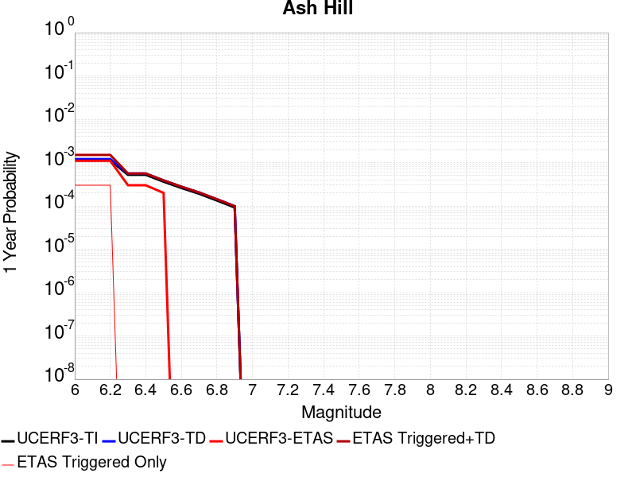 | 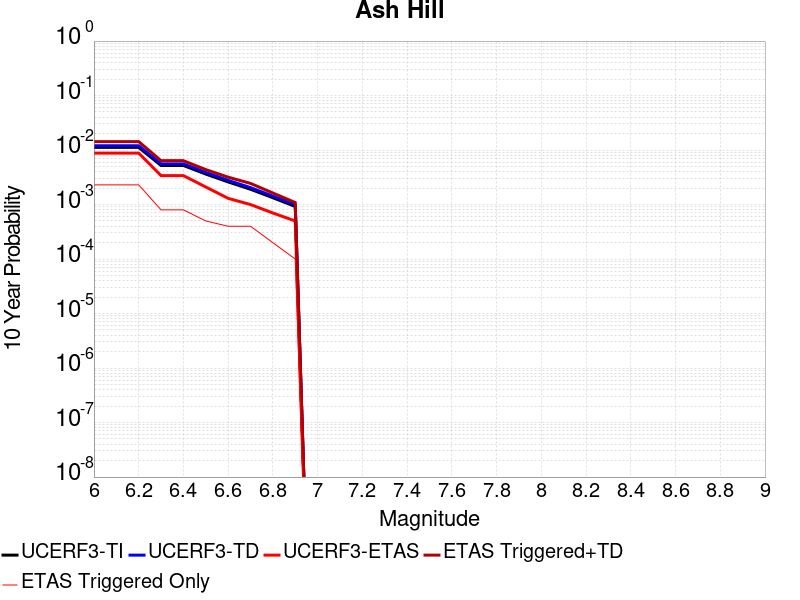 |

| Magnitude | 1 wk TI Prob | 1 wk TD Prob | 1 wk ETAS Prob | 1 wk ETAS/TD Gain | 1 wk ETAS Triggered+TD | 1 wk ETAS Triggered Only | 1 mo TI Prob | 1 mo TD Prob | 1 mo ETAS Prob | 1 mo ETAS/TD Gain | 1 mo ETAS Triggered+TD | 1 mo ETAS Triggered Only | 1 yr TI Prob | 1 yr TD Prob | 1 yr ETAS Prob | 1 yr ETAS/TD Gain | 1 yr ETAS Triggered+TD | 1 yr ETAS Triggered Only | 10 yr TI Prob | 10 yr TD Prob | 10 yr ETAS Prob | 10 yr ETAS/TD Gain | 10 yr ETAS Triggered+TD | 10 yr ETAS Triggered Only |
|-----|-----|-----|-----|-----|-----|-----|-----|-----|-----|-----|-----|-----|-----|-----|-----|-----|-----|-----|-----|-----|-----|-----|-----|-----|
| 6.0 | 2.1545662E-5 | 2.3175915E-5 | 0.0 | 0.0 | 2.3175915E-5 | 0.0 | 9.2335285E-5 | 9.9322024E-5 | 0.0 | 0.0 | 9.9322024E-5 | 0.0 | 0.0011236023 | 0.0012086546 | 0.0 | 0.0 | 0.0012086546 | 0.0 | 0.011179381 | 0.012028781 | 2.0E-4 | 0.016626788 | 0.012226375 | 2.0E-4 |
| 6.1 | 2.1545662E-5 | 2.3175915E-5 | 0.0 | 0.0 | 2.3175915E-5 | 0.0 | 9.2335285E-5 | 9.9322024E-5 | 0.0 | 0.0 | 9.9322024E-5 | 0.0 | 0.0011236023 | 0.0012086546 | 0.0 | 0.0 | 0.0012086546 | 0.0 | 0.011179381 | 0.012028781 | 2.0E-4 | 0.016626788 | 0.012226375 | 2.0E-4 |
| 6.2 | 2.1545662E-5 | 2.3175915E-5 | 0.0 | 0.0 | 2.3175915E-5 | 0.0 | 9.2335285E-5 | 9.9322024E-5 | 0.0 | 0.0 | 9.9322024E-5 | 0.0 | 0.0011236023 | 0.0012086546 | 0.0 | 0.0 | 0.0012086546 | 0.0 | 0.011179381 | 0.012028781 | 2.0E-4 | 0.016626788 | 0.012226375 | 2.0E-4 |
| 6.3 | 1.0025529E-5 | 1.0738864E-5 | 0.0 | 0.0 | 1.0738864E-5 | 0.0 | 4.2965847E-5 | 4.6022968E-5 | 0.0 | 0.0 | 4.6022968E-5 | 0.0 | 5.229836E-4 | 5.601988E-4 | 0.0 | 0.0 | 5.601988E-4 | 0.0 | 0.005217545 | 0.005589177 | 2.0E-4 | 0.035783444 | 0.005788059 | 2.0E-4 |
| 6.4 | 1.0025529E-5 | 1.0738864E-5 | 0.0 | 0.0 | 1.0738864E-5 | 0.0 | 4.2965847E-5 | 4.6022968E-5 | 0.0 | 0.0 | 4.6022968E-5 | 0.0 | 5.229836E-4 | 5.601988E-4 | 0.0 | 0.0 | 5.601988E-4 | 0.0 | 0.005217545 | 0.005589177 | 2.0E-4 | 0.035783444 | 0.005788059 | 2.0E-4 |
| 6.5 | 6.9617327E-6 | 7.451103E-6 | 0.0 | 0.0 | 7.451103E-6 | 0.0 | 2.9835655E-5 | 3.1932956E-5 | 0.0 | 0.0 | 3.1932956E-5 | 0.0 | 3.6318856E-4 | 3.8872304E-4 | 0.0 | 0.0 | 3.8872304E-4 | 0.0 | 0.0036259557 | 0.003881284 | 1.0E-4 | 0.02576467 | 0.003980896 | 1.0E-4 |
| 6.6 | 4.9919777E-6 | 5.3427243E-6 | 0.0 | 0.0 | 5.3427243E-6 | 0.0 | 2.1394015E-5 | 2.2897226E-5 | 0.0 | 0.0 | 2.2897226E-5 | 0.0 | 2.60441E-4 | 2.7874476E-4 | 0.0 | 0.0 | 2.7874476E-4 | 0.0 | 0.0026013597 | 0.0027846089 | 0.0 | 0.0 | 0.0027846089 | 0.0 |
| 6.7 | 3.6630722E-6 | 3.9216998E-6 | 0.0 | 0.0 | 3.9216998E-6 | 0.0 | 1.5698786E-5 | 1.680721E-5 | 0.0 | 0.0 | 1.680721E-5 | 0.0 | 1.9111596E-4 | 2.0461428E-4 | 0.0 | 0.0 | 2.0461428E-4 | 0.0 | 0.0019095168 | 0.002044821 | 0.0 | 0.0 | 0.002044821 | 0.0 |
| 6.8 | 2.5599613E-6 | 2.7428557E-6 | 0.0 | 0.0 | 2.7428557E-6 | 0.0 | 1.0971216E-5 | 1.1755071E-5 | 0.0 | 0.0 | 1.1755071E-5 | 0.0 | 1.3356637E-4 | 1.4311353E-4 | 0.0 | 0.0 | 1.4311353E-4 | 0.0 | 0.0013348613 | 0.0014306979 | 0.0 | 0.0 | 0.0014306979 | 0.0 |
| 6.9 | 1.7684905E-6 | 1.895434E-6 | 0.0 | 0.0 | 1.895434E-6 | 0.0 | 7.579223E-6 | 8.123288E-6 | 0.0 | 0.0 | 8.123288E-6 | 0.0 | 9.2273134E-5 | 9.890104E-5 | 0.0 | 0.0 | 9.890104E-5 | 0.0 | 9.223483E-4 | 9.890103E-4 | 0.0 | 0.0 | 9.890103E-4 | 0.0 |

## San Jacinto (San Bernardino)
*[(top)](#table-of-contents)*

| 1 Week | 1 Month | 1 Year | 10 Year |
|-----|-----|-----|-----|
|  | 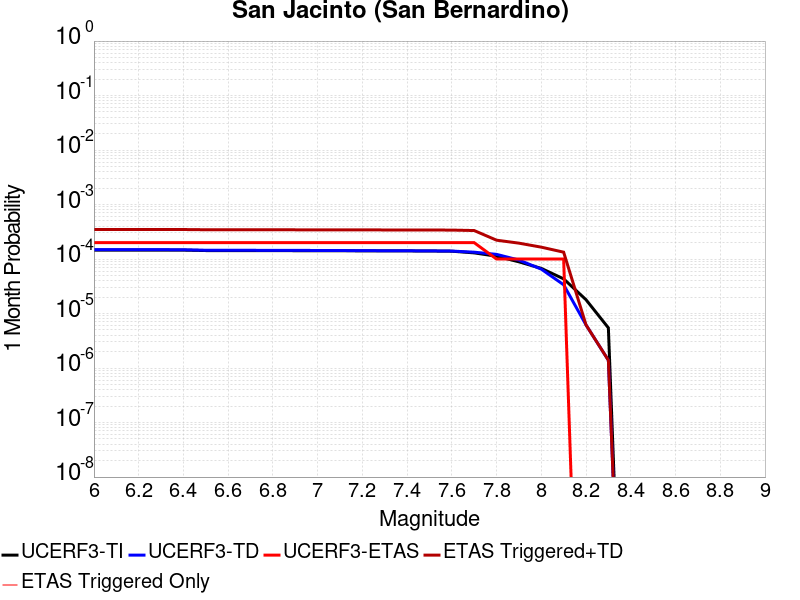 |  |  |

| Magnitude | 1 wk TI Prob | 1 wk TD Prob | 1 wk ETAS Prob | 1 wk ETAS/TD Gain | 1 wk ETAS Triggered+TD | 1 wk ETAS Triggered Only | 1 mo TI Prob | 1 mo TD Prob | 1 mo ETAS Prob | 1 mo ETAS/TD Gain | 1 mo ETAS Triggered+TD | 1 mo ETAS Triggered Only | 1 yr TI Prob | 1 yr TD Prob | 1 yr ETAS Prob | 1 yr ETAS/TD Gain | 1 yr ETAS Triggered+TD | 1 yr ETAS Triggered Only | 10 yr TI Prob | 10 yr TD Prob | 10 yr ETAS Prob | 10 yr ETAS/TD Gain | 10 yr ETAS Triggered+TD | 10 yr ETAS Triggered Only |
|-----|-----|-----|-----|-----|-----|-----|-----|-----|-----|-----|-----|-----|-----|-----|-----|-----|-----|-----|-----|-----|-----|-----|-----|-----|
| 6.0 | 3.409352E-5 | 3.4625045E-5 | 1.0E-4 | 2.8880827 | 1.3462159E-4 | 1.0E-4 | 1.461069E-4 | 1.4838463E-4 | 2.0E-4 | 1.3478485 | 3.4835495E-4 | 2.0E-4 | 0.0017774 | 0.0018050874 | 2.0E-4 | 0.11079796 | 0.0020047263 | 2.0E-4 | 0.01763251 | 0.018651593 | 2.0E-4 | 0.0107229445 | 0.018847864 | 2.0E-4 |
| 6.1 | 3.409352E-5 | 3.4625045E-5 | 1.0E-4 | 2.8880827 | 1.3462159E-4 | 1.0E-4 | 1.461069E-4 | 1.4838463E-4 | 2.0E-4 | 1.3478485 | 3.4835495E-4 | 2.0E-4 | 0.0017774 | 0.0018050874 | 2.0E-4 | 0.11079796 | 0.0020047263 | 2.0E-4 | 0.01763251 | 0.018651593 | 2.0E-4 | 0.0107229445 | 0.018847864 | 2.0E-4 |
| 6.2 | 3.409352E-5 | 3.4625045E-5 | 1.0E-4 | 2.8880827 | 1.3462159E-4 | 1.0E-4 | 1.461069E-4 | 1.4838463E-4 | 2.0E-4 | 1.3478485 | 3.4835495E-4 | 2.0E-4 | 0.0017774 | 0.0018050874 | 2.0E-4 | 0.11079796 | 0.0020047263 | 2.0E-4 | 0.01763251 | 0.018651593 | 2.0E-4 | 0.0107229445 | 0.018847864 | 2.0E-4 |
| 6.3 | 3.409352E-5 | 3.4625045E-5 | 1.0E-4 | 2.8880827 | 1.3462159E-4 | 1.0E-4 | 1.461069E-4 | 1.4838463E-4 | 2.0E-4 | 1.3478485 | 3.4835495E-4 | 2.0E-4 | 0.0017774 | 0.0018050874 | 2.0E-4 | 0.11079796 | 0.0020047263 | 2.0E-4 | 0.01763251 | 0.018651593 | 2.0E-4 | 0.0107229445 | 0.018847864 | 2.0E-4 |
| 6.4 | 3.400795E-5 | 3.451799E-5 | 1.0E-4 | 2.89704 | 1.3451454E-4 | 1.0E-4 | 1.4574021E-4 | 1.4792588E-4 | 2.0E-4 | 1.3520285 | 3.4789628E-4 | 2.0E-4 | 0.0017729428 | 0.0017995114 | 2.0E-4 | 0.11114128 | 0.0019991514 | 2.0E-4 | 0.017588645 | 0.01859678 | 2.0E-4 | 0.010754551 | 0.01879306 | 2.0E-4 |
| 6.5 | 3.341482E-5 | 3.3780503E-5 | 1.0E-4 | 2.9602876 | 1.3377712E-4 | 1.0E-4 | 1.4319851E-4 | 1.4476555E-4 | 2.0E-4 | 1.3815441 | 3.447366E-4 | 2.0E-4 | 0.0017420477 | 0.001761097 | 2.0E-4 | 0.11356558 | 0.0019607448 | 2.0E-4 | 0.017284546 | 0.01821901 | 2.0E-4 | 0.010977544 | 0.018415367 | 2.0E-4 |
| 6.6 | 3.3364955E-5 | 3.3717886E-5 | 1.0E-4 | 2.965785 | 1.3371451E-4 | 1.0E-4 | 1.4298483E-4 | 1.4449723E-4 | 2.0E-4 | 1.3841095 | 3.4446834E-4 | 2.0E-4 | 0.0017394501 | 0.0017578355 | 2.0E-4 | 0.11377629 | 0.001957484 | 2.0E-4 | 0.017258976 | 0.018186938 | 2.0E-4 | 0.010996903 | 0.0183833 | 2.0E-4 |
| 6.7 | 3.335922E-5 | 3.370769E-5 | 1.0E-4 | 2.9666822 | 1.3370432E-4 | 1.0E-4 | 1.4296026E-4 | 1.4445353E-4 | 2.0E-4 | 1.3845283 | 3.4442465E-4 | 2.0E-4 | 0.0017391514 | 0.0017573043 | 2.0E-4 | 0.11381068 | 0.001956953 | 2.0E-4 | 0.017256035 | 0.018181741 | 2.0E-4 | 0.011000047 | 0.018378103 | 2.0E-4 |
| 6.8 | 3.327683E-5 | 3.3602053E-5 | 1.0E-4 | 2.9760084 | 1.3359869E-4 | 1.0E-4 | 1.4260718E-4 | 1.4400086E-4 | 2.0E-4 | 1.3888806 | 3.4397206E-4 | 2.0E-4 | 0.0017348597 | 0.0017518019 | 2.0E-4 | 0.11416815 | 0.0019514516 | 2.0E-4 | 0.017213784 | 0.018127626 | 2.0E-4 | 0.011032884 | 0.018324 | 2.0E-4 |
| 6.9 | 3.3235785E-5 | 3.3543198E-5 | 1.0E-4 | 2.9812303 | 1.3353984E-4 | 1.0E-4 | 1.4243131E-4 | 1.4374865E-4 | 2.0E-4 | 1.3913174 | 3.437199E-4 | 2.0E-4 | 0.0017327217 | 0.0017487362 | 2.0E-4 | 0.114368305 | 0.0019483865 | 2.0E-4 | 0.017192734 | 0.018097568 | 2.0E-4 | 0.011051209 | 0.018293949 | 2.0E-4 |
| 7.0 | 3.3197095E-5 | 3.348335E-5 | 1.0E-4 | 2.986559 | 1.3348E-4 | 1.0E-4 | 1.422655E-4 | 1.4349219E-4 | 2.0E-4 | 1.3938041 | 3.434635E-4 | 2.0E-4 | 0.0017307063 | 0.0017456188 | 2.0E-4 | 0.114572555 | 0.0019452696 | 2.0E-4 | 0.017172894 | 0.018067034 | 2.0E-4 | 0.011069885 | 0.01826342 | 2.0E-4 |
| 7.1 | 3.3129716E-5 | 3.336406E-5 | 1.0E-4 | 2.997237 | 1.3336072E-4 | 1.0E-4 | 1.4197677E-4 | 1.42981E-4 | 2.0E-4 | 1.3987873 | 3.429524E-4 | 2.0E-4 | 0.0017271966 | 0.0017394051 | 2.0E-4 | 0.114981845 | 0.0019390571 | 2.0E-4 | 0.017138338 | 0.018006315 | 2.0E-4 | 0.011107215 | 0.018202713 | 2.0E-4 |
| 7.2 | 3.3034008E-5 | 3.3231896E-5 | 1.0E-4 | 3.0091572 | 1.3322858E-4 | 1.0E-4 | 1.4156665E-4 | 1.4241465E-4 | 2.0E-4 | 1.40435 | 3.4238616E-4 | 2.0E-4 | 0.0017222111 | 0.0017325206 | 2.0E-4 | 0.115438744 | 0.0019321741 | 2.0E-4 | 0.017089253 | 0.017938862 | 2.0E-4 | 0.011148979 | 0.018135274 | 2.0E-4 |
| 7.3 | 3.2956614E-5 | 3.3100405E-5 | 1.0E-4 | 3.0211112 | 1.330971E-4 | 1.0E-4 | 1.4123498E-4 | 1.4185117E-4 | 2.0E-4 | 1.4099284 | 3.418228E-4 | 2.0E-4 | 0.0017181796 | 0.0017256712 | 2.0E-4 | 0.11589693 | 0.0019253261 | 2.0E-4 | 0.017049557 | 0.01787193 | 2.0E-4 | 0.011190733 | 0.018068355 | 2.0E-4 |
| 7.4 | 3.2915937E-5 | 3.3022723E-5 | 1.0E-4 | 3.028218 | 1.3301942E-4 | 1.0E-4 | 1.4106068E-4 | 1.4151828E-4 | 2.0E-4 | 1.413245 | 3.4148997E-4 | 2.0E-4 | 0.0017160608 | 0.0017216248 | 2.0E-4 | 0.11616933 | 0.0019212804 | 2.0E-4 | 0.017028693 | 0.01783248 | 2.0E-4 | 0.011215489 | 0.018028915 | 2.0E-4 |
| 7.5 | 3.281791E-5 | 3.288865E-5 | 1.0E-4 | 3.0405626 | 1.3288537E-4 | 1.0E-4 | 1.406406E-4 | 1.4094375E-4 | 2.0E-4 | 1.4190058 | 3.4091558E-4 | 2.0E-4 | 0.0017109542 | 0.0017146409 | 2.0E-4 | 0.116642505 | 0.0019142979 | 2.0E-4 | 0.016978411 | 0.017763821 | 2.0E-4 | 0.01125884 | 0.017960267 | 2.0E-4 |
| 7.6 | 3.2521442E-5 | 3.261648E-5 | 1.0E-4 | 3.0659347 | 1.3261322E-4 | 1.0E-4 | 1.3937015E-4 | 1.3977743E-4 | 2.0E-4 | 1.4308461 | 3.3974947E-4 | 2.0E-4 | 0.0016955109 | 0.0017004632 | 2.0E-4 | 0.11761501 | 0.0019001232 | 2.0E-4 | 0.016826328 | 0.017622786 | 2.0E-4 | 0.011348944 | 0.017819261 | 2.0E-4 |
| 7.7 | 3.0287873E-5 | 3.112073E-5 | 1.0E-4 | 3.2132924 | 1.3111762E-4 | 1.0E-4 | 1.297987E-4 | 1.3336774E-4 | 2.0E-4 | 1.499613 | 3.3334107E-4 | 2.0E-4 | 0.0015791537 | 0.0016225439 | 2.0E-4 | 0.123263225 | 0.0018222195 | 2.0E-4 | 0.01567979 | 0.016843515 | 2.0E-4 | 0.011874007 | 0.017040145 | 2.0E-4 |
| 7.8 | 2.6316151E-5 | 2.838393E-5 | 1.0E-4 | 3.5231202 | 1.283811E-4 | 1.0E-4 | 1.1277862E-4 | 1.2163975E-4 | 1.0E-4 | 0.8220997 | 2.2162759E-4 | 1.0E-4 | 0.0013722149 | 0.0014799588 | 1.0E-4 | 0.06756945 | 0.0015798107 | 1.0E-4 | 0.013637724 | 0.015411119 | 1.0E-4 | 0.0064888215 | 0.0155095775 | 1.0E-4 |
| 7.9 | 2.0761147E-5 | 2.2299115E-5 | 1.0E-4 | 4.484483 | 1.2229689E-4 | 1.0E-4 | 8.897331E-5 | 9.556414E-5 | 1.0E-4 | 1.0464176 | 1.9555459E-4 | 1.0E-4 | 0.0010827117 | 0.0011628731 | 1.0E-4 | 0.0859939 | 0.0012627569 | 1.0E-4 | 0.010774517 | 0.012213089 | 1.0E-4 | 0.008187938 | 0.012311867 | 1.0E-4 |
| 8.0 | 1.5738568E-5 | 1.5184829E-5 | 1.0E-4 | 6.5855203 | 1.1518331E-4 | 1.0E-4 | 6.744926E-5 | 6.5076216E-5 | 1.0E-4 | 1.5366597 | 1.6506971E-4 | 1.0E-4 | 8.2088535E-4 | 7.920156E-4 | 1.0E-4 | 0.12626015 | 8.9193636E-4 | 1.0E-4 | 0.008178596 | 0.008417643 | 1.0E-4 | 0.01187981 | 0.0085168015 | 1.0E-4 |
| 8.1 | 1.0105832E-5 | 7.828162E-6 | 1.0E-4 | 12.774392 | 1.0782738E-4 | 1.0E-4 | 4.3309992E-5 | 3.3548833E-5 | 1.0E-4 | 2.9807296 | 1.3354547E-4 | 1.0E-4 | 5.2717153E-4 | 4.0838096E-4 | 1.0E-4 | 0.2448694 | 5.0834013E-4 | 1.0E-4 | 0.005259227 | 0.0044059837 | 1.0E-4 | 0.022696408 | 0.004505543 | 1.0E-4 |
| 8.2 | 4.189207E-6 | 1.4251509E-6 | 0.0 | 0.0 | 1.4251509E-6 | 0.0 | 1.7953622E-5 | 6.1077753E-6 | 0.0 | 0.0 | 6.1077753E-6 | 0.0 | 2.1856341E-4 | 7.4359654E-5 | 0.0 | 0.0 | 7.4359654E-5 | 0.0 | 0.0021834858 | 8.685344E-4 | 0.0 | 0.0 | 8.685344E-4 | 0.0 |
| 8.3 | 1.2758221E-6 | 3.1965183E-7 | 0.0 | 0.0 | 3.1965183E-7 | 0.0 | 5.4677976E-6 | 1.3699357E-6 | 0.0 | 0.0 | 1.3699357E-6 | 0.0 | 6.65684E-5 | 1.6678843E-5 | 0.0 | 0.0 | 1.6678843E-5 | 0.0 | 6.6548464E-4 | 2.0278891E-4 | 0.0 | 0.0 | 2.0278891E-4 | 0.0 |

## San Juan
*[(top)](#table-of-contents)*

| 1 Week | 1 Month | 1 Year | 10 Year |
|-----|-----|-----|-----|
|  | 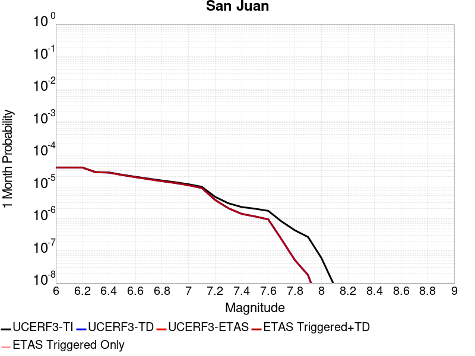 |  |  |

| Magnitude | 1 wk TI Prob | 1 wk TD Prob | 1 wk ETAS Prob | 1 wk ETAS/TD Gain | 1 wk ETAS Triggered+TD | 1 wk ETAS Triggered Only | 1 mo TI Prob | 1 mo TD Prob | 1 mo ETAS Prob | 1 mo ETAS/TD Gain | 1 mo ETAS Triggered+TD | 1 mo ETAS Triggered Only | 1 yr TI Prob | 1 yr TD Prob | 1 yr ETAS Prob | 1 yr ETAS/TD Gain | 1 yr ETAS Triggered+TD | 1 yr ETAS Triggered Only | 10 yr TI Prob | 10 yr TD Prob | 10 yr ETAS Prob | 10 yr ETAS/TD Gain | 10 yr ETAS Triggered+TD | 10 yr ETAS Triggered Only |
|-----|-----|-----|-----|-----|-----|-----|-----|-----|-----|-----|-----|-----|-----|-----|-----|-----|-----|-----|-----|-----|-----|-----|-----|-----|
| 6.0 | 8.682808E-6 | 8.703906E-6 | 0.0 | 0.0 | 8.703906E-6 | 0.0 | 3.72115E-5 | 3.7301947E-5 | 0.0 | 0.0 | 3.7301947E-5 | 0.0 | 4.5295584E-4 | 4.5406137E-4 | 1.0E-4 | 0.22023454 | 5.54016E-4 | 1.0E-4 | 0.004520337 | 0.004531875 | 2.0E-4 | 0.044131845 | 0.0047309683 | 2.0E-4 |
| 6.1 | 8.682808E-6 | 8.703906E-6 | 0.0 | 0.0 | 8.703906E-6 | 0.0 | 3.72115E-5 | 3.7301947E-5 | 0.0 | 0.0 | 3.7301947E-5 | 0.0 | 4.5295584E-4 | 4.5406137E-4 | 1.0E-4 | 0.22023454 | 5.54016E-4 | 1.0E-4 | 0.004520337 | 0.004531875 | 2.0E-4 | 0.044131845 | 0.0047309683 | 2.0E-4 |
| 6.2 | 8.682808E-6 | 8.703906E-6 | 0.0 | 0.0 | 8.703906E-6 | 0.0 | 3.72115E-5 | 3.7301947E-5 | 0.0 | 0.0 | 3.7301947E-5 | 0.0 | 4.5295584E-4 | 4.5406137E-4 | 1.0E-4 | 0.22023454 | 5.54016E-4 | 1.0E-4 | 0.004520337 | 0.004531875 | 2.0E-4 | 0.044131845 | 0.0047309683 | 2.0E-4 |
| 6.3 | 6.3054235E-6 | 6.2382937E-6 | 0.0 | 0.0 | 6.2382937E-6 | 0.0 | 2.7022963E-5 | 2.6735277E-5 | 0.0 | 0.0 | 2.6735277E-5 | 0.0 | 3.2895492E-4 | 3.2545478E-4 | 1.0E-4 | 0.30726233 | 4.2542224E-4 | 1.0E-4 | 0.003284684 | 0.0032499793 | 2.0E-4 | 0.061538853 | 0.0034493294 | 2.0E-4 |
| 6.4 | 6.1490473E-6 | 6.0763314E-6 | 0.0 | 0.0 | 6.0763314E-6 | 0.0 | 2.6352795E-5 | 2.6041169E-5 | 0.0 | 0.0 | 2.6041169E-5 | 0.0 | 3.2079802E-4 | 3.1700646E-4 | 1.0E-4 | 0.31545097 | 4.1697477E-4 | 1.0E-4 | 0.0032033534 | 0.003165737 | 2.0E-4 | 0.06317644 | 0.0033651039 | 2.0E-4 |
| 6.5 | 5.204848E-6 | 5.1001834E-6 | 0.0 | 0.0 | 5.1001834E-6 | 0.0 | 2.23063E-5 | 2.1857752E-5 | 0.0 | 0.0 | 2.1857752E-5 | 0.0 | 2.7154534E-4 | 2.6608657E-4 | 1.0E-4 | 0.37581754 | 3.6605998E-4 | 1.0E-4 | 0.0027121378 | 0.0026578319 | 2.0E-4 | 0.07524931 | 0.0028573002 | 2.0E-4 |
| 6.6 | 4.5179986E-6 | 4.387328E-6 | 0.0 | 0.0 | 4.387328E-6 | 0.0 | 1.9362706E-5 | 1.8802702E-5 | 0.0 | 0.0 | 1.8802702E-5 | 0.0 | 2.3571544E-4 | 2.2889965E-4 | 1.0E-4 | 0.43687266 | 3.2887675E-4 | 1.0E-4 | 0.0023546559 | 0.002286774 | 2.0E-4 | 0.087459445 | 0.0024863167 | 2.0E-4 |
| 6.7 | 3.9442616E-6 | 3.7950253E-6 | 0.0 | 0.0 | 3.7950253E-6 | 0.0 | 1.6903869E-5 | 1.6264297E-5 | 0.0 | 0.0 | 1.6264297E-5 | 0.0 | 2.0578515E-4 | 1.9800049E-4 | 1.0E-4 | 0.5050493 | 2.9798067E-4 | 1.0E-4 | 0.002055947 | 0.0019783638 | 2.0E-4 | 0.101093635 | 0.0021779682 | 2.0E-4 |
| 6.8 | 3.4536245E-6 | 3.292513E-6 | 0.0 | 0.0 | 3.292513E-6 | 0.0 | 1.4801163E-5 | 1.41106975E-5 | 0.0 | 0.0 | 1.41106975E-5 | 0.0 | 1.8018926E-4 | 1.717848E-4 | 1.0E-4 | 0.58212364 | 2.7176764E-4 | 1.0E-4 | 0.0018004322 | 0.0017166373 | 2.0E-4 | 0.116506845 | 0.001916294 | 2.0E-4 |
| 6.9 | 3.059865E-6 | 2.8892368E-6 | 0.0 | 0.0 | 2.8892368E-6 | 0.0 | 1.3113641E-5 | 1.2382388E-5 | 0.0 | 0.0 | 1.2382388E-5 | 0.0 | 1.596469E-4 | 1.5074572E-4 | 1.0E-4 | 0.66336876 | 2.5073063E-4 | 1.0E-4 | 0.0015953224 | 0.0015065476 | 2.0E-4 | 0.13275385 | 0.0017062463 | 2.0E-4 |
| 7.0 | 2.6504351E-6 | 2.4704427E-6 | 0.0 | 0.0 | 2.4704427E-6 | 0.0 | 1.1358958E-5 | 1.05875715E-5 | 0.0 | 0.0 | 1.05875715E-5 | 0.0 | 1.3828653E-4 | 1.288966E-4 | 0.0 | 0.0 | 1.288966E-4 | 0.0 | 0.0013820052 | 0.0012883286 | 1.0E-4 | 0.07761995 | 0.0013881997 | 1.0E-4 |
| 7.1 | 2.2039317E-6 | 2.0161558E-6 | 0.0 | 0.0 | 2.0161558E-6 | 0.0 | 9.445387E-6 | 8.640643E-6 | 0.0 | 0.0 | 8.640643E-6 | 0.0 | 1.1499152E-4 | 1.0519527E-4 | 0.0 | 0.0 | 1.0519527E-4 | 0.0 | 0.0011493203 | 0.0010515631 | 1.0E-4 | 0.09509653 | 0.0011514579 | 1.0E-4 |
| 7.2 | 1.0786707E-6 | 8.6173696E-7 | 0.0 | 0.0 | 8.6173696E-7 | 0.0 | 4.622866E-6 | 3.693153E-6 | 0.0 | 0.0 | 3.693153E-6 | 0.0 | 5.628194E-5 | 4.496322E-5 | 0.0 | 0.0 | 4.496322E-5 | 0.0 | 5.6267687E-4 | 4.4959877E-4 | 1.0E-4 | 0.22242054 | 5.495538E-4 | 1.0E-4 |
| 7.3 | 6.846433E-7 | 4.7728435E-7 | 0.0 | 0.0 | 4.7728435E-7 | 0.0 | 2.9341822E-6 | 2.0455027E-6 | 0.0 | 0.0 | 2.0455027E-6 | 0.0 | 3.5723086E-5 | 2.4903711E-5 | 0.0 | 0.0 | 2.4903711E-5 | 0.0 | 3.571734E-4 | 2.4904133E-4 | 1.0E-4 | 0.40153977 | 3.4901642E-4 | 1.0E-4 |
| 7.4 | 5.23043E-7 | 3.1916605E-7 | 0.0 | 0.0 | 3.1916605E-7 | 0.0 | 2.2416111E-6 | 1.3678538E-6 | 0.0 | 0.0 | 1.3678538E-6 | 0.0 | 2.7291273E-5 | 1.6653492E-5 | 0.0 | 0.0 | 1.6653492E-5 | 0.0 | 2.7287923E-4 | 1.6655332E-4 | 1.0E-4 | 0.6004083 | 2.6653666E-4 | 1.0E-4 |
| 7.5 | 4.648444E-7 | 2.6622286E-7 | 0.0 | 0.0 | 2.6622286E-7 | 0.0 | 1.9921886E-6 | 1.1409545E-6 | 0.0 | 0.0 | 1.1409545E-6 | 0.0 | 2.4254627E-5 | 1.3891034E-5 | 0.0 | 0.0 | 1.3891034E-5 | 0.0 | 2.425198E-4 | 1.3893023E-4 | 1.0E-4 | 0.71978575 | 2.3891634E-4 | 1.0E-4 |
| 7.6 | 3.9906567E-7 | 2.1594454E-7 | 0.0 | 0.0 | 2.1594454E-7 | 0.0 | 1.7102802E-6 | 9.254763E-7 | 0.0 | 0.0 | 9.254763E-7 | 0.0 | 2.0822463E-5 | 1.1267616E-5 | 0.0 | 0.0 | 1.1267616E-5 | 0.0 | 2.0820512E-4 | 1.1269382E-4 | 1.0E-4 | 0.8873601 | 2.1268256E-4 | 1.0E-4 |
| 7.7 | 1.8784601E-7 | 5.194314E-8 | 0.0 | 0.0 | 5.194314E-8 | 0.0 | 8.0505407E-7 | 2.2261347E-7 | 0.0 | 0.0 | 2.2261347E-7 | 0.0 | 9.80149E-6 | 2.7103156E-6 | 0.0 | 0.0 | 2.7103156E-6 | 0.0 | 9.801057E-5 | 2.7110653E-5 | 0.0 | 0.0 | 2.7110653E-5 | 0.0 |
| 7.8 | 1.00154914E-7 | 1.1896528E-8 | 0.0 | 0.0 | 1.1896528E-8 | 0.0 | 4.2923529E-7 | 5.098514E-8 | 0.0 | 0.0 | 5.098514E-8 | 0.0 | 5.225927E-6 | 6.2074395E-7 | 0.0 | 0.0 | 6.2074395E-7 | 0.0 | 5.225804E-5 | 6.21241E-6 | 0.0 | 0.0 | 6.21241E-6 | 0.0 |
| 7.9 | 6.171429E-8 | 4.0372203E-9 | 0.0 | 0.0 | 4.0372203E-9 | 0.0 | 2.6448978E-7 | 1.7302384E-8 | 0.0 | 0.0 | 1.7302384E-8 | 0.0 | 3.2201583E-6 | 2.1065654E-7 | 0.0 | 0.0 | 2.1065654E-7 | 0.0 | 3.2201115E-5 | 2.1110895E-6 | 0.0 | 0.0 | 2.1110895E-6 | 0.0 |
| 8.0 | 1.3974572E-8 | 2.9240155E-10 | 0.0 | 0.0 | 2.9240155E-10 | 0.0 | 5.989102E-8 | 1.2531507E-9 | 0.0 | 0.0 | 1.2531507E-9 | 0.0 | 7.2917294E-7 | 1.5257124E-8 | 0.0 | 0.0 | 1.5257124E-8 | 0.0 | 7.2917055E-6 | 1.5632261E-7 | 0.0 | 0.0 | 1.5632261E-7 | 0.0 |
| 8.1 | 1.8403477E-9 | 1.0155343E-10 | 0.0 | 0.0 | 1.0155343E-10 | 0.0 | 7.887204E-9 | 4.352304E-10 | 0.0 | 0.0 | 4.352304E-10 | 0.0 | 9.602671E-8 | 5.298931E-9 | 0.0 | 0.0 | 5.298931E-9 | 0.0 | 9.602667E-7 | 5.416739E-8 | 0.0 | 0.0 | 5.416739E-8 | 0.0 |

## Dry Mountain
*[(top)](#table-of-contents)*

| 1 Week | 1 Month | 1 Year | 10 Year |
|-----|-----|-----|-----|
|  |  |  | 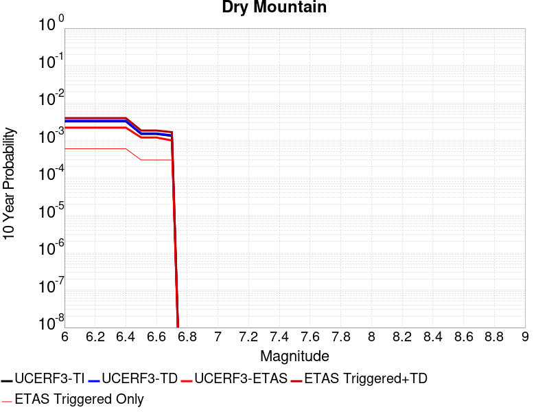 |

| Magnitude | 1 wk TI Prob | 1 wk TD Prob | 1 wk ETAS Prob | 1 wk ETAS/TD Gain | 1 wk ETAS Triggered+TD | 1 wk ETAS Triggered Only | 1 mo TI Prob | 1 mo TD Prob | 1 mo ETAS Prob | 1 mo ETAS/TD Gain | 1 mo ETAS Triggered+TD | 1 mo ETAS Triggered Only | 1 yr TI Prob | 1 yr TD Prob | 1 yr ETAS Prob | 1 yr ETAS/TD Gain | 1 yr ETAS Triggered+TD | 1 yr ETAS Triggered Only | 10 yr TI Prob | 10 yr TD Prob | 10 yr ETAS Prob | 10 yr ETAS/TD Gain | 10 yr ETAS Triggered+TD | 10 yr ETAS Triggered Only |
|-----|-----|-----|-----|-----|-----|-----|-----|-----|-----|-----|-----|-----|-----|-----|-----|-----|-----|-----|-----|-----|-----|-----|-----|-----|
| 6.0 | 6.222801E-6 | 6.437042E-6 | 0.0 | 0.0 | 6.437042E-6 | 0.0 | 2.6668875E-5 | 2.758712E-5 | 0.0 | 0.0 | 2.758712E-5 | 0.0 | 3.2464517E-4 | 3.3583734E-4 | 1.0E-4 | 0.2977632 | 4.3580375E-4 | 1.0E-4 | 0.0032417132 | 0.003354859 | 1.0E-4 | 0.029807512 | 0.0034545236 | 1.0E-4 |
| 6.1 | 6.222801E-6 | 6.437042E-6 | 0.0 | 0.0 | 6.437042E-6 | 0.0 | 2.6668875E-5 | 2.758712E-5 | 0.0 | 0.0 | 2.758712E-5 | 0.0 | 3.2464517E-4 | 3.3583734E-4 | 1.0E-4 | 0.2977632 | 4.3580375E-4 | 1.0E-4 | 0.0032417132 | 0.003354859 | 1.0E-4 | 0.029807512 | 0.0034545236 | 1.0E-4 |
| 6.2 | 6.222801E-6 | 6.437042E-6 | 0.0 | 0.0 | 6.437042E-6 | 0.0 | 2.6668875E-5 | 2.758712E-5 | 0.0 | 0.0 | 2.758712E-5 | 0.0 | 3.2464517E-4 | 3.3583734E-4 | 1.0E-4 | 0.2977632 | 4.3580375E-4 | 1.0E-4 | 0.0032417132 | 0.003354859 | 1.0E-4 | 0.029807512 | 0.0034545236 | 1.0E-4 |
| 6.3 | 6.222801E-6 | 6.437042E-6 | 0.0 | 0.0 | 6.437042E-6 | 0.0 | 2.6668875E-5 | 2.758712E-5 | 0.0 | 0.0 | 2.758712E-5 | 0.0 | 3.2464517E-4 | 3.3583734E-4 | 1.0E-4 | 0.2977632 | 4.3580375E-4 | 1.0E-4 | 0.0032417132 | 0.003354859 | 1.0E-4 | 0.029807512 | 0.0034545236 | 1.0E-4 |
| 6.4 | 6.222801E-6 | 6.437042E-6 | 0.0 | 0.0 | 6.437042E-6 | 0.0 | 2.6668875E-5 | 2.758712E-5 | 0.0 | 0.0 | 2.758712E-5 | 0.0 | 3.2464517E-4 | 3.3583734E-4 | 1.0E-4 | 0.2977632 | 4.3580375E-4 | 1.0E-4 | 0.0032417132 | 0.003354859 | 1.0E-4 | 0.029807512 | 0.0034545236 | 1.0E-4 |
| 6.5 | 2.8528623E-6 | 2.951096E-6 | 0.0 | 0.0 | 2.951096E-6 | 0.0 | 1.22264955E-5 | 1.2647541E-5 | 0.0 | 0.0 | 1.2647541E-5 | 0.0 | 1.4884741E-4 | 1.5398163E-4 | 0.0 | 0.0 | 1.5398163E-4 | 0.0 | 0.0014874774 | 0.0015396021 | 0.0 | 0.0 | 0.0015396021 | 0.0 |
| 6.6 | 2.8528623E-6 | 2.951096E-6 | 0.0 | 0.0 | 2.951096E-6 | 0.0 | 1.22264955E-5 | 1.2647541E-5 | 0.0 | 0.0 | 1.2647541E-5 | 0.0 | 1.4884741E-4 | 1.5398163E-4 | 0.0 | 0.0 | 1.5398163E-4 | 0.0 | 0.0014874774 | 0.0015396021 | 0.0 | 0.0 | 0.0015396021 | 0.0 |
| 6.7 | 2.541E-6 | 2.6284035E-6 | 0.0 | 0.0 | 2.6284035E-6 | 0.0 | 1.0889954E-5 | 1.1264587E-5 | 0.0 | 0.0 | 1.1264587E-5 | 0.0 | 1.3257713E-4 | 1.3714634E-4 | 0.0 | 0.0 | 1.3714634E-4 | 0.0 | 0.0013249806 | 0.0013714634 | 0.0 | 0.0 | 0.0013714634 | 0.0 |

## San Gorgonio Pass
*[(top)](#table-of-contents)*

| 1 Week | 1 Month | 1 Year | 10 Year |
|-----|-----|-----|-----|
|  |  |  |  |

| Magnitude | 1 wk TI Prob | 1 wk TD Prob | 1 wk ETAS Prob | 1 wk ETAS/TD Gain | 1 wk ETAS Triggered+TD | 1 wk ETAS Triggered Only | 1 mo TI Prob | 1 mo TD Prob | 1 mo ETAS Prob | 1 mo ETAS/TD Gain | 1 mo ETAS Triggered+TD | 1 mo ETAS Triggered Only | 1 yr TI Prob | 1 yr TD Prob | 1 yr ETAS Prob | 1 yr ETAS/TD Gain | 1 yr ETAS Triggered+TD | 1 yr ETAS Triggered Only | 10 yr TI Prob | 10 yr TD Prob | 10 yr ETAS Prob | 10 yr ETAS/TD Gain | 10 yr ETAS Triggered+TD | 10 yr ETAS Triggered Only |
|-----|-----|-----|-----|-----|-----|-----|-----|-----|-----|-----|-----|-----|-----|-----|-----|-----|-----|-----|-----|-----|-----|-----|-----|-----|
| 6.0 | 7.644328E-6 | 1.3123646E-5 | 0.0 | 0.0 | 1.3123646E-5 | 0.0 | 3.2760996E-5 | 5.624303E-5 | 0.0 | 0.0 | 5.624303E-5 | 0.0 | 3.987921E-4 | 6.845522E-4 | 1.0E-4 | 0.14608091 | 7.844837E-4 | 1.0E-4 | 0.003980772 | 0.006830755 | 2.0E-4 | 0.02927934 | 0.007029389 | 2.0E-4 |
| 6.1 | 7.644328E-6 | 1.3123646E-5 | 0.0 | 0.0 | 1.3123646E-5 | 0.0 | 3.2760996E-5 | 5.624303E-5 | 0.0 | 0.0 | 5.624303E-5 | 0.0 | 3.987921E-4 | 6.845522E-4 | 1.0E-4 | 0.14608091 | 7.844837E-4 | 1.0E-4 | 0.003980772 | 0.006830755 | 2.0E-4 | 0.02927934 | 0.007029389 | 2.0E-4 |
| 6.2 | 7.644328E-6 | 1.3123646E-5 | 0.0 | 0.0 | 1.3123646E-5 | 0.0 | 3.2760996E-5 | 5.624303E-5 | 0.0 | 0.0 | 5.624303E-5 | 0.0 | 3.987921E-4 | 6.845522E-4 | 1.0E-4 | 0.14608091 | 7.844837E-4 | 1.0E-4 | 0.003980772 | 0.006830755 | 2.0E-4 | 0.02927934 | 0.007029389 | 2.0E-4 |
| 6.3 | 7.644328E-6 | 1.3123646E-5 | 0.0 | 0.0 | 1.3123646E-5 | 0.0 | 3.2760996E-5 | 5.624303E-5 | 0.0 | 0.0 | 5.624303E-5 | 0.0 | 3.987921E-4 | 6.845522E-4 | 1.0E-4 | 0.14608091 | 7.844837E-4 | 1.0E-4 | 0.003980772 | 0.006830755 | 2.0E-4 | 0.02927934 | 0.007029389 | 2.0E-4 |
| 6.4 | 7.644328E-6 | 1.3123646E-5 | 0.0 | 0.0 | 1.3123646E-5 | 0.0 | 3.2760996E-5 | 5.624303E-5 | 0.0 | 0.0 | 5.624303E-5 | 0.0 | 3.987921E-4 | 6.845522E-4 | 1.0E-4 | 0.14608091 | 7.844837E-4 | 1.0E-4 | 0.003980772 | 0.006830755 | 2.0E-4 | 0.02927934 | 0.007029389 | 2.0E-4 |
| 6.5 | 7.644328E-6 | 1.3123646E-5 | 0.0 | 0.0 | 1.3123646E-5 | 0.0 | 3.2760996E-5 | 5.624303E-5 | 0.0 | 0.0 | 5.624303E-5 | 0.0 | 3.987921E-4 | 6.845522E-4 | 1.0E-4 | 0.14608091 | 7.844837E-4 | 1.0E-4 | 0.003980772 | 0.006830755 | 2.0E-4 | 0.02927934 | 0.007029389 | 2.0E-4 |
| 6.6 | 7.644328E-6 | 1.3123646E-5 | 0.0 | 0.0 | 1.3123646E-5 | 0.0 | 3.2760996E-5 | 5.624303E-5 | 0.0 | 0.0 | 5.624303E-5 | 0.0 | 3.987921E-4 | 6.845522E-4 | 1.0E-4 | 0.14608091 | 7.844837E-4 | 1.0E-4 | 0.003980772 | 0.006830755 | 2.0E-4 | 0.02927934 | 0.007029389 | 2.0E-4 |
| 6.7 | 6.987586E-6 | 1.2428351E-5 | 0.0 | 0.0 | 1.2428351E-5 | 0.0 | 2.9946454E-5 | 5.3263317E-5 | 0.0 | 0.0 | 5.3263317E-5 | 0.0 | 3.645371E-4 | 6.4829586E-4 | 1.0E-4 | 0.15425056 | 7.482311E-4 | 1.0E-4 | 0.0036393967 | 0.0064703184 | 2.0E-4 | 0.030910378 | 0.0066690245 | 2.0E-4 |
| 6.8 | 6.987586E-6 | 1.2428351E-5 | 0.0 | 0.0 | 1.2428351E-5 | 0.0 | 2.9946454E-5 | 5.3263317E-5 | 0.0 | 0.0 | 5.3263317E-5 | 0.0 | 3.645371E-4 | 6.4829586E-4 | 1.0E-4 | 0.15425056 | 7.482311E-4 | 1.0E-4 | 0.0036393967 | 0.0064703184 | 2.0E-4 | 0.030910378 | 0.0066690245 | 2.0E-4 |
| 6.9 | 5.504702E-6 | 1.0860166E-5 | 0.0 | 0.0 | 1.0860166E-5 | 0.0 | 2.3591367E-5 | 4.6542766E-5 | 0.0 | 0.0 | 4.6542766E-5 | 0.0 | 2.8718702E-4 | 5.665157E-4 | 1.0E-4 | 0.1765176 | 6.664591E-4 | 1.0E-4 | 0.0028681618 | 0.0056566843 | 2.0E-4 | 0.0353564 | 0.0058555533 | 2.0E-4 |
| 7.0 | 5.4825764E-6 | 1.0836524E-5 | 0.0 | 0.0 | 1.0836524E-5 | 0.0 | 2.3496545E-5 | 4.6441448E-5 | 0.0 | 0.0 | 4.6441448E-5 | 0.0 | 2.8603288E-4 | 5.652828E-4 | 1.0E-4 | 0.17690259 | 6.652263E-4 | 1.0E-4 | 0.00285665 | 0.005644418 | 2.0E-4 | 0.035433237 | 0.005843289 | 2.0E-4 |
| 7.1 | 5.4692787E-6 | 1.0822245E-5 | 0.0 | 0.0 | 1.0822245E-5 | 0.0 | 2.3439556E-5 | 4.6380253E-5 | 0.0 | 0.0 | 4.6380253E-5 | 0.0 | 2.8533922E-4 | 5.645382E-4 | 1.0E-4 | 0.17713593 | 6.644817E-4 | 1.0E-4 | 0.0028497311 | 0.0056370096 | 2.0E-4 | 0.035479806 | 0.005835882 | 2.0E-4 |
| 7.2 | 5.453661E-6 | 1.0805287E-5 | 0.0 | 0.0 | 1.0805287E-5 | 0.0 | 2.3372622E-5 | 4.6307578E-5 | 0.0 | 0.0 | 4.6307578E-5 | 0.0 | 2.8452452E-4 | 5.636538E-4 | 1.0E-4 | 0.17741385 | 6.635975E-4 | 1.0E-4 | 0.002841605 | 0.0056282105 | 2.0E-4 | 0.035535272 | 0.005827085 | 2.0E-4 |
| 7.3 | 5.4422303E-6 | 1.0792245E-5 | 0.0 | 0.0 | 1.0792245E-5 | 0.0 | 2.3323635E-5 | 4.6251687E-5 | 0.0 | 0.0 | 4.6251687E-5 | 0.0 | 2.8392827E-4 | 5.629737E-4 | 1.0E-4 | 0.17762819 | 6.629174E-4 | 1.0E-4 | 0.0028356577 | 0.005621444 | 2.0E-4 | 0.03557805 | 0.0058203195 | 2.0E-4 |
| 7.4 | 5.398595E-6 | 1.0739746E-5 | 0.0 | 0.0 | 1.0739746E-5 | 0.0 | 2.313663E-5 | 4.60267E-5 | 0.0 | 0.0 | 4.60267E-5 | 0.0 | 2.8165206E-4 | 5.6023593E-4 | 1.0E-4 | 0.17849624 | 6.601799E-4 | 1.0E-4 | 0.0028129534 | 0.005594204 | 2.0E-4 | 0.035751287 | 0.0057930853 | 2.0E-4 |
| 7.5 | 5.3578788E-6 | 1.0666854E-5 | 0.0 | 0.0 | 1.0666854E-5 | 0.0 | 2.2962136E-5 | 4.5714318E-5 | 0.0 | 0.0 | 4.5714318E-5 | 0.0 | 2.7952815E-4 | 5.5643456E-4 | 1.0E-4 | 0.17971565 | 6.563789E-4 | 1.0E-4 | 0.002791768 | 0.0055564074 | 2.0E-4 | 0.03599448 | 0.0057552964 | 2.0E-4 |
| 7.6 | 4.8091474E-6 | 9.4257875E-6 | 0.0 | 0.0 | 9.4257875E-6 | 0.0 | 2.0610469E-5 | 4.0395633E-5 | 0.0 | 0.0 | 4.0395633E-5 | 0.0 | 2.5090357E-4 | 4.917105E-4 | 1.0E-4 | 0.2033717 | 5.916613E-4 | 1.0E-4 | 0.0025062046 | 0.004912377 | 2.0E-4 | 0.04071349 | 0.0051113945 | 2.0E-4 |
| 7.7 | 1.5991155E-6 | 3.2640755E-6 | 0.0 | 0.0 | 3.2640755E-6 | 0.0 | 6.853334E-6 | 1.3988822E-5 | 0.0 | 0.0 | 1.3988822E-5 | 0.0 | 8.343615E-5 | 1.7030083E-4 | 0.0 | 0.0 | 1.7030083E-4 | 0.0 | 8.340483E-4 | 0.0017073427 | 0.0 | 0.0 | 0.0017073427 | 0.0 |
| 7.8 | 9.258398E-7 | 1.9945169E-6 | 0.0 | 0.0 | 1.9945169E-6 | 0.0 | 3.967879E-6 | 8.547901E-6 | 0.0 | 0.0 | 8.547901E-6 | 0.0 | 4.8307855E-5 | 1.0406575E-4 | 0.0 | 0.0 | 1.0406575E-4 | 0.0 | 4.8297356E-4 | 0.0010457964 | 0.0 | 0.0 | 0.0010457964 | 0.0 |
| 7.9 | 5.975575E-7 | 1.1827133E-6 | 0.0 | 0.0 | 1.1827133E-6 | 0.0 | 2.5609581E-6 | 5.0687613E-6 | 0.0 | 0.0 | 5.0687613E-6 | 0.0 | 3.117922E-5 | 6.171043E-5 | 0.0 | 0.0 | 6.171043E-5 | 0.0 | 3.1174847E-4 | 6.223159E-4 | 0.0 | 0.0 | 6.223159E-4 | 0.0 |
| 8.0 | 3.4413725E-7 | 6.4326485E-7 | 0.0 | 0.0 | 6.4326485E-7 | 0.0 | 1.4748731E-6 | 2.7568465E-6 | 0.0 | 0.0 | 2.7568465E-6 | 0.0 | 1.7956432E-5 | 3.3564094E-5 | 0.0 | 0.0 | 3.3564094E-5 | 0.0 | 1.7954981E-4 | 3.391827E-4 | 0.0 | 0.0 | 3.391827E-4 | 0.0 |
| 8.1 | 1.1787731E-8 | 8.871863E-9 | 0.0 | 0.0 | 8.871863E-9 | 0.0 | 5.0518846E-8 | 3.8022268E-8 | 0.0 | 0.0 | 3.8022268E-8 | 0.0 | 6.1506677E-7 | 4.62921E-7 | 0.0 | 0.0 | 4.62921E-7 | 0.0 | 6.1506507E-6 | 4.836884E-6 | 0.0 | 0.0 | 4.836884E-6 | 0.0 |

## Collayami 2011 CFM
*[(top)](#table-of-contents)*

| 1 Week | 1 Month | 1 Year | 10 Year |
|-----|-----|-----|-----|
| 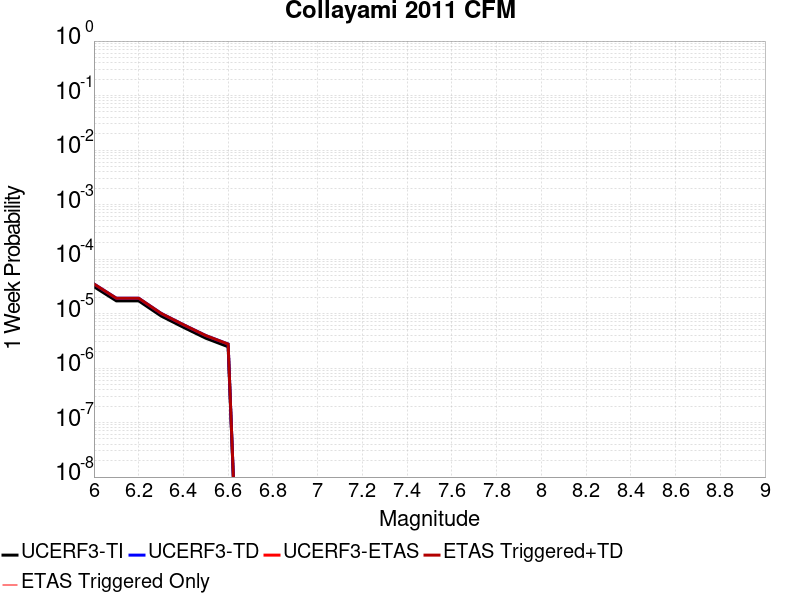 |  |  |  |

| Magnitude | 1 wk TI Prob | 1 wk TD Prob | 1 wk ETAS Prob | 1 wk ETAS/TD Gain | 1 wk ETAS Triggered+TD | 1 wk ETAS Triggered Only | 1 mo TI Prob | 1 mo TD Prob | 1 mo ETAS Prob | 1 mo ETAS/TD Gain | 1 mo ETAS Triggered+TD | 1 mo ETAS Triggered Only | 1 yr TI Prob | 1 yr TD Prob | 1 yr ETAS Prob | 1 yr ETAS/TD Gain | 1 yr ETAS Triggered+TD | 1 yr ETAS Triggered Only | 10 yr TI Prob | 10 yr TD Prob | 10 yr ETAS Prob | 10 yr ETAS/TD Gain | 10 yr ETAS Triggered+TD | 10 yr ETAS Triggered Only |
|-----|-----|-----|-----|-----|-----|-----|-----|-----|-----|-----|-----|-----|-----|-----|-----|-----|-----|-----|-----|-----|-----|-----|-----|-----|
| 6.0 | 3.112429E-5 | 3.4893903E-5 | 0.0 | 0.0 | 3.4893903E-5 | 0.0 | 1.33383E-4 | 1.4953771E-4 | 0.0 | 0.0 | 1.4953771E-4 | 0.0 | 0.0016227282 | 0.0018192746 | 0.0 | 0.0 | 0.0018192746 | 0.0 | 0.016109297 | 0.018061297 | 2.0E-4 | 0.011073402 | 0.018257683 | 2.0E-4 |
| 6.1 | 1.7119446E-5 | 1.9132842E-5 | 0.0 | 0.0 | 1.9132842E-5 | 0.0 | 7.336699E-5 | 8.199565E-5 | 0.0 | 0.0 | 8.199565E-5 | 0.0 | 8.92877E-4 | 9.978989E-4 | 0.0 | 0.0 | 9.978989E-4 | 0.0 | 0.00889298 | 0.009940042 | 1.0E-4 | 0.010060319 | 0.010039048 | 1.0E-4 |
| 6.2 | 1.7119446E-5 | 1.9132842E-5 | 0.0 | 0.0 | 1.9132842E-5 | 0.0 | 7.336699E-5 | 8.199565E-5 | 0.0 | 0.0 | 8.199565E-5 | 0.0 | 8.92877E-4 | 9.978989E-4 | 0.0 | 0.0 | 9.978989E-4 | 0.0 | 0.00889298 | 0.009940042 | 1.0E-4 | 0.010060319 | 0.010039048 | 1.0E-4 |
| 6.3 | 9.041288E-6 | 1.0093683E-5 | 0.0 | 0.0 | 1.0093683E-5 | 0.0 | 3.87478E-5 | 4.325805E-5 | 0.0 | 0.0 | 4.325805E-5 | 0.0 | 4.7165234E-4 | 5.2656134E-4 | 0.0 | 0.0 | 5.2656134E-4 | 0.0 | 0.0047065257 | 0.005255289 | 0.0 | 0.0 | 0.005255289 | 0.0 |
| 6.4 | 5.5972064E-6 | 6.2503414E-6 | 0.0 | 0.0 | 6.2503414E-6 | 0.0 | 2.3987806E-5 | 2.6786978E-5 | 0.0 | 0.0 | 2.6786978E-5 | 0.0 | 2.920124E-4 | 3.260962E-4 | 0.0 | 0.0 | 3.260962E-4 | 0.0 | 0.0029162897 | 0.003257508 | 0.0 | 0.0 | 0.003257508 | 0.0 |
| 6.5 | 3.530659E-6 | 3.9471297E-6 | 0.0 | 0.0 | 3.9471297E-6 | 0.0 | 1.5131307E-5 | 1.691622E-5 | 0.0 | 0.0 | 1.691622E-5 | 0.0 | 1.842081E-4 | 2.0594586E-4 | 0.0 | 0.0 | 2.0594586E-4 | 0.0 | 0.0018405546 | 0.0020585663 | 0.0 | 0.0 | 0.0020585663 | 0.0 |
| 6.6 | 2.4625563E-6 | 2.7538247E-6 | 0.0 | 0.0 | 2.7538247E-6 | 0.0 | 1.0553769E-5 | 1.1802105E-5 | 0.0 | 0.0 | 1.1802105E-5 | 0.0 | 1.2848456E-4 | 1.4369063E-4 | 0.0 | 0.0 | 1.4369063E-4 | 0.0 | 0.001284103 | 0.0014369063 | 0.0 | 0.0 | 0.0014369063 | 0.0 |

## Monterey Bay-Tularcitos
*[(top)](#table-of-contents)*

| 1 Week | 1 Month | 1 Year | 10 Year |
|-----|-----|-----|-----|
|  |  |  |  |

| Magnitude | 1 wk TI Prob | 1 wk TD Prob | 1 wk ETAS Prob | 1 wk ETAS/TD Gain | 1 wk ETAS Triggered+TD | 1 wk ETAS Triggered Only | 1 mo TI Prob | 1 mo TD Prob | 1 mo ETAS Prob | 1 mo ETAS/TD Gain | 1 mo ETAS Triggered+TD | 1 mo ETAS Triggered Only | 1 yr TI Prob | 1 yr TD Prob | 1 yr ETAS Prob | 1 yr ETAS/TD Gain | 1 yr ETAS Triggered+TD | 1 yr ETAS Triggered Only | 10 yr TI Prob | 10 yr TD Prob | 10 yr ETAS Prob | 10 yr ETAS/TD Gain | 10 yr ETAS Triggered+TD | 10 yr ETAS Triggered Only |
|-----|-----|-----|-----|-----|-----|-----|-----|-----|-----|-----|-----|-----|-----|-----|-----|-----|-----|-----|-----|-----|-----|-----|-----|-----|
| 6.0 | 3.0131365E-5 | 3.2767934E-5 | 0.0 | 0.0 | 3.2767934E-5 | 0.0 | 1.2912804E-4 | 1.4042703E-4 | 0.0 | 0.0 | 1.4042703E-4 | 0.0 | 0.001571 | 0.0017084635 | 0.0 | 0.0 | 0.0017084635 | 0.0 | 0.015599402 | 0.016964074 | 2.0E-4 | 0.011789621 | 0.01716068 | 2.0E-4 |
| 6.1 | 3.0131365E-5 | 3.2767934E-5 | 0.0 | 0.0 | 3.2767934E-5 | 0.0 | 1.2912804E-4 | 1.4042703E-4 | 0.0 | 0.0 | 1.4042703E-4 | 0.0 | 0.001571 | 0.0017084635 | 0.0 | 0.0 | 0.0017084635 | 0.0 | 0.015599402 | 0.016964074 | 2.0E-4 | 0.011789621 | 0.01716068 | 2.0E-4 |
| 6.2 | 3.0131365E-5 | 3.2767934E-5 | 0.0 | 0.0 | 3.2767934E-5 | 0.0 | 1.2912804E-4 | 1.4042703E-4 | 0.0 | 0.0 | 1.4042703E-4 | 0.0 | 0.001571 | 0.0017084635 | 0.0 | 0.0 | 0.0017084635 | 0.0 | 0.015599402 | 0.016964074 | 2.0E-4 | 0.011789621 | 0.01716068 | 2.0E-4 |
| 6.3 | 1.6998249E-5 | 1.8315328E-5 | 0.0 | 0.0 | 1.8315328E-5 | 0.0 | 7.28476E-5 | 7.8492005E-5 | 0.0 | 0.0 | 7.8492005E-5 | 0.0 | 8.865586E-4 | 9.5523987E-4 | 0.0 | 0.0 | 9.5523987E-4 | 0.0 | 0.0088303005 | 0.009513259 | 1.0E-4 | 0.010511645 | 0.009612308 | 1.0E-4 |
| 6.4 | 1.6998249E-5 | 1.8315328E-5 | 0.0 | 0.0 | 1.8315328E-5 | 0.0 | 7.28476E-5 | 7.8492005E-5 | 0.0 | 0.0 | 7.8492005E-5 | 0.0 | 8.865586E-4 | 9.5523987E-4 | 0.0 | 0.0 | 9.5523987E-4 | 0.0 | 0.0088303005 | 0.009513259 | 1.0E-4 | 0.010511645 | 0.009612308 | 1.0E-4 |
| 6.5 | 1.27470785E-5 | 1.36822455E-5 | 0.0 | 0.0 | 1.36822455E-5 | 0.0 | 5.4629192E-5 | 5.8636935E-5 | 0.0 | 0.0 | 5.8636935E-5 | 0.0 | 6.649074E-4 | 7.1368116E-4 | 0.0 | 0.0 | 7.1368116E-4 | 0.0 | 0.0066292146 | 0.0071149427 | 1.0E-4 | 0.014054927 | 0.0072142314 | 1.0E-4 |
| 6.6 | 1.2739422E-5 | 1.3674335E-5 | 0.0 | 0.0 | 1.3674335E-5 | 0.0 | 5.4596385E-5 | 5.8603036E-5 | 0.0 | 0.0 | 5.8603036E-5 | 0.0 | 6.645082E-4 | 7.132687E-4 | 0.0 | 0.0 | 7.132687E-4 | 0.0 | 0.0066252467 | 0.0071108444 | 1.0E-4 | 0.014063027 | 0.0072101336 | 1.0E-4 |
| 6.7 | 1.0160109E-5 | 1.08771865E-5 | 0.0 | 0.0 | 1.08771865E-5 | 0.0 | 4.35426E-5 | 4.661572E-5 | 0.0 | 0.0 | 4.661572E-5 | 0.0 | 5.300022E-4 | 5.6740566E-4 | 0.0 | 0.0 | 5.6740566E-4 | 0.0 | 0.005287399 | 0.0056602797 | 0.0 | 0.0 | 0.0056602797 | 0.0 |
| 6.8 | 8.349859E-6 | 8.92563E-6 | 0.0 | 0.0 | 8.92563E-6 | 0.0 | 3.578462E-5 | 3.825217E-5 | 0.0 | 0.0 | 3.825217E-5 | 0.0 | 4.3559066E-4 | 4.6562628E-4 | 0.0 | 0.0 | 4.6562628E-4 | 0.0 | 0.004347378 | 0.004647071 | 0.0 | 0.0 | 0.004647071 | 0.0 |
| 6.9 | 5.193639E-6 | 5.532168E-6 | 0.0 | 0.0 | 5.532168E-6 | 0.0 | 2.2258262E-5 | 2.3709094E-5 | 0.0 | 0.0 | 2.3709094E-5 | 0.0 | 2.7096065E-4 | 2.886232E-4 | 0.0 | 0.0 | 2.886232E-4 | 0.0 | 0.0027063051 | 0.0028828043 | 0.0 | 0.0 | 0.0028828043 | 0.0 |
| 7.0 | 4.359381E-6 | 4.6397618E-6 | 0.0 | 0.0 | 4.6397618E-6 | 0.0 | 1.8682927E-5 | 1.988456E-5 | 0.0 | 0.0 | 1.988456E-5 | 0.0 | 2.274409E-4 | 2.4207057E-4 | 0.0 | 0.0 | 2.4207057E-4 | 0.0 | 0.0022720827 | 0.0024183614 | 0.0 | 0.0 | 0.0024183614 | 0.0 |
| 7.1 | 3.0398533E-6 | 3.2284763E-6 | 0.0 | 0.0 | 3.2284763E-6 | 0.0 | 1.3027877E-5 | 1.3836268E-5 | 0.0 | 0.0 | 1.3836268E-5 | 0.0 | 1.5860285E-4 | 1.6844616E-4 | 0.0 | 0.0 | 1.6844616E-4 | 0.0 | 0.001584897 | 0.001683442 | 0.0 | 0.0 | 0.001683442 | 0.0 |
| 7.2 | 1.642335E-6 | 1.7318716E-6 | 0.0 | 0.0 | 1.7318716E-6 | 0.0 | 7.0385595E-6 | 7.4222976E-6 | 0.0 | 0.0 | 7.4222976E-6 | 0.0 | 8.569109E-5 | 9.036479E-5 | 0.0 | 0.0 | 9.036479E-5 | 0.0 | 8.5658056E-4 | 9.034828E-4 | 0.0 | 0.0 | 9.034828E-4 | 0.0 |
| 7.3 | 3.356842E-7 | 3.291712E-7 | 0.0 | 0.0 | 3.291712E-7 | 0.0 | 1.4386458E-6 | 1.410733E-6 | 0.0 | 0.0 | 1.410733E-6 | 0.0 | 1.7515373E-5 | 1.717554E-5 | 0.0 | 0.0 | 1.717554E-5 | 0.0 | 1.7513991E-4 | 1.7174221E-4 | 0.0 | 0.0 | 1.7174221E-4 | 0.0 |
| 7.4 | 2.1973483E-7 | 2.0974947E-7 | 0.0 | 0.0 | 2.0974947E-7 | 0.0 | 9.417204E-7 | 8.98926E-7 | 0.0 | 0.0 | 8.98926E-7 | 0.0 | 1.1465385E-5 | 1.0944369E-5 | 0.0 | 0.0 | 1.0944369E-5 | 0.0 | 1.1464794E-4 | 1.0943834E-4 | 0.0 | 0.0 | 1.0943834E-4 | 0.0 |
| 7.5 | 1.1944135E-7 | 1.0668502E-7 | 0.0 | 0.0 | 1.0668502E-7 | 0.0 | 5.118914E-7 | 4.5722143E-7 | 0.0 | 0.0 | 4.5722143E-7 | 0.0 | 6.23226E-6 | 5.566657E-6 | 0.0 | 0.0 | 5.566657E-6 | 0.0 | 6.2320854E-5 | 5.5665187E-5 | 0.0 | 0.0 | 5.5665187E-5 | 0.0 |
| 7.6 | 4.636058E-8 | 3.3143074E-8 | 0.0 | 0.0 | 3.3143074E-8 | 0.0 | 1.9868818E-7 | 1.4204173E-7 | 0.0 | 0.0 | 1.4204173E-7 | 0.0 | 2.419026E-6 | 1.7293568E-6 | 0.0 | 0.0 | 1.7293568E-6 | 0.0 | 2.4189996E-5 | 1.7293434E-5 | 0.0 | 0.0 | 1.7293434E-5 | 0.0 |
| 7.7 | 1.8588572E-8 | 7.864173E-9 | 0.0 | 0.0 | 7.864173E-9 | 0.0 | 7.9665305E-8 | 3.37036E-8 | 0.0 | 0.0 | 3.37036E-8 | 0.0 | 9.699246E-7 | 4.1034124E-7 | 0.0 | 0.0 | 4.1034124E-7 | 0.0 | 9.699204E-6 | 4.103405E-6 | 0.0 | 0.0 | 4.103405E-6 | 0.0 |
| 7.8 | 2.7960154E-9 | 7.380496E-10 | 0.0 | 0.0 | 7.380496E-10 | 0.0 | 1.1982923E-8 | 3.1630694E-9 | 0.0 | 0.0 | 3.1630694E-9 | 0.0 | 1.4589209E-7 | 3.851037E-8 | 0.0 | 0.0 | 3.851037E-8 | 0.0 | 1.4589199E-6 | 3.8510368E-7 | 0.0 | 0.0 | 3.8510368E-7 | 0.0 |

## San Jacinto (Stepovers Combined)
*[(top)](#table-of-contents)*

| 1 Week | 1 Month | 1 Year | 10 Year |
|-----|-----|-----|-----|
|  |  | 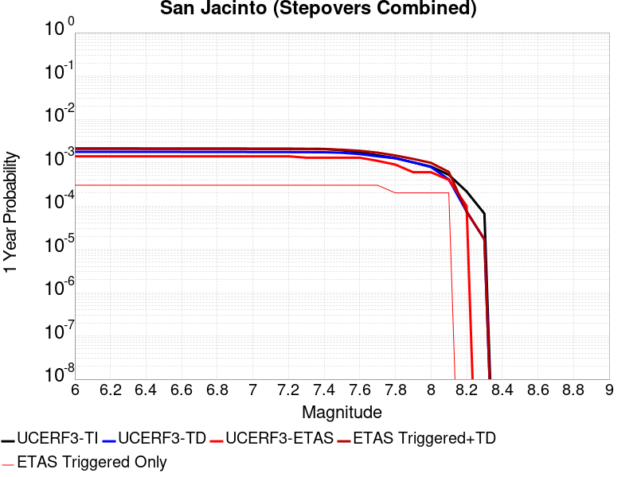 | 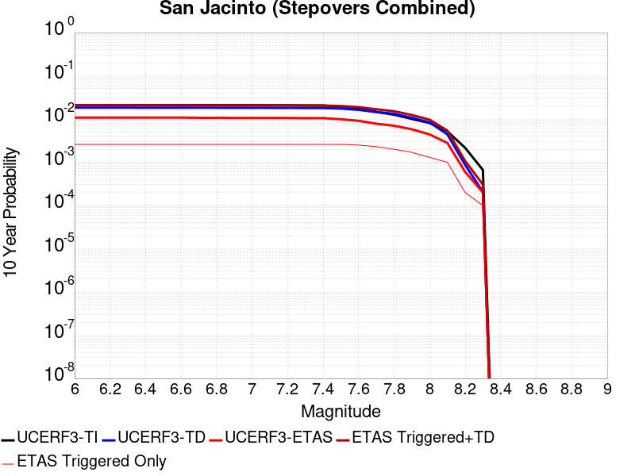 |

| Magnitude | 1 wk TI Prob | 1 wk TD Prob | 1 wk ETAS Prob | 1 wk ETAS/TD Gain | 1 wk ETAS Triggered+TD | 1 wk ETAS Triggered Only | 1 mo TI Prob | 1 mo TD Prob | 1 mo ETAS Prob | 1 mo ETAS/TD Gain | 1 mo ETAS Triggered+TD | 1 mo ETAS Triggered Only | 1 yr TI Prob | 1 yr TD Prob | 1 yr ETAS Prob | 1 yr ETAS/TD Gain | 1 yr ETAS Triggered+TD | 1 yr ETAS Triggered Only | 10 yr TI Prob | 10 yr TD Prob | 10 yr ETAS Prob | 10 yr ETAS/TD Gain | 10 yr ETAS Triggered+TD | 10 yr ETAS Triggered Only |
|-----|-----|-----|-----|-----|-----|-----|-----|-----|-----|-----|-----|-----|-----|-----|-----|-----|-----|-----|-----|-----|-----|-----|-----|-----|
| 6.0 | 4.0667746E-5 | 3.4023797E-5 | 1.0E-4 | 2.9391193 | 1.3402039E-4 | 1.0E-4 | 1.742787E-4 | 1.4580812E-4 | 2.0E-4 | 1.3716656 | 3.4577897E-4 | 2.0E-4 | 0.0021197782 | 0.0017737696 | 2.0E-4 | 0.11275421 | 0.0019734148 | 2.0E-4 | 0.020996714 | 0.018338304 | 2.0E-4 | 0.010906134 | 0.018534638 | 2.0E-4 |
| 6.1 | 4.0667746E-5 | 3.4023797E-5 | 1.0E-4 | 2.9391193 | 1.3402039E-4 | 1.0E-4 | 1.742787E-4 | 1.4580812E-4 | 2.0E-4 | 1.3716656 | 3.4577897E-4 | 2.0E-4 | 0.0021197782 | 0.0017737696 | 2.0E-4 | 0.11275421 | 0.0019734148 | 2.0E-4 | 0.020996714 | 0.018338304 | 2.0E-4 | 0.010906134 | 0.018534638 | 2.0E-4 |
| 6.2 | 4.0667746E-5 | 3.4023797E-5 | 1.0E-4 | 2.9391193 | 1.3402039E-4 | 1.0E-4 | 1.742787E-4 | 1.4580812E-4 | 2.0E-4 | 1.3716656 | 3.4577897E-4 | 2.0E-4 | 0.0021197782 | 0.0017737696 | 2.0E-4 | 0.11275421 | 0.0019734148 | 2.0E-4 | 0.020996714 | 0.018338304 | 2.0E-4 | 0.010906134 | 0.018534638 | 2.0E-4 |
| 6.3 | 4.0667746E-5 | 3.4023797E-5 | 1.0E-4 | 2.9391193 | 1.3402039E-4 | 1.0E-4 | 1.742787E-4 | 1.4580812E-4 | 2.0E-4 | 1.3716656 | 3.4577897E-4 | 2.0E-4 | 0.0021197782 | 0.0017737696 | 2.0E-4 | 0.11275421 | 0.0019734148 | 2.0E-4 | 0.020996714 | 0.018338304 | 2.0E-4 | 0.010906134 | 0.018534638 | 2.0E-4 |
| 6.4 | 4.0577226E-5 | 3.3896198E-5 | 1.0E-4 | 2.9501832 | 1.3389281E-4 | 1.0E-4 | 1.738908E-4 | 1.4526135E-4 | 2.0E-4 | 1.3768288 | 3.4523229E-4 | 2.0E-4 | 0.0021150648 | 0.0017671245 | 2.0E-4 | 0.113178216 | 0.0019667712 | 2.0E-4 | 0.020950472 | 0.018273074 | 2.0E-4 | 0.010945066 | 0.01846942 | 2.0E-4 |
| 6.5 | 4.0577226E-5 | 3.3896198E-5 | 1.0E-4 | 2.9501832 | 1.3389281E-4 | 1.0E-4 | 1.738908E-4 | 1.4526135E-4 | 2.0E-4 | 1.3768288 | 3.4523229E-4 | 2.0E-4 | 0.0021150648 | 0.0017671245 | 2.0E-4 | 0.113178216 | 0.0019667712 | 2.0E-4 | 0.020950472 | 0.018273074 | 2.0E-4 | 0.010945066 | 0.01846942 | 2.0E-4 |
| 6.6 | 4.053861E-5 | 3.3841752E-5 | 1.0E-4 | 2.9549298 | 1.3383837E-4 | 1.0E-4 | 1.7372532E-4 | 1.4502803E-4 | 2.0E-4 | 1.3790438 | 3.4499902E-4 | 2.0E-4 | 0.0021130538 | 0.0017642889 | 2.0E-4 | 0.113360114 | 0.001963936 | 2.0E-4 | 0.020930743 | 0.018245239 | 2.0E-4 | 0.0109617645 | 0.01844159 | 2.0E-4 |
| 6.7 | 4.0516545E-5 | 3.3810942E-5 | 1.0E-4 | 2.9576225 | 1.3380755E-4 | 1.0E-4 | 1.7363077E-4 | 1.44896E-4 | 2.0E-4 | 1.3803004 | 3.4486703E-4 | 2.0E-4 | 0.002111905 | 0.0017626843 | 2.0E-4 | 0.11346331 | 0.0019623318 | 2.0E-4 | 0.020919468 | 0.018229483 | 2.0E-4 | 0.010971239 | 0.018425837 | 2.0E-4 |
| 6.8 | 4.049434E-5 | 3.3782613E-5 | 1.0E-4 | 2.9601026 | 1.3377923E-4 | 1.0E-4 | 1.7353562E-4 | 1.4477462E-4 | 2.0E-4 | 1.3814577 | 3.4474567E-4 | 2.0E-4 | 0.0021107488 | 0.0017612089 | 2.0E-4 | 0.11355837 | 0.0019608566 | 2.0E-4 | 0.020908125 | 0.018214941 | 2.0E-4 | 0.010979997 | 0.0184113 | 2.0E-4 |
| 6.9 | 4.046386E-5 | 3.374534E-5 | 1.0E-4 | 2.9633722 | 1.3374197E-4 | 1.0E-4 | 1.73405E-4 | 1.4461488E-4 | 2.0E-4 | 1.3829836 | 3.4458595E-4 | 2.0E-4 | 0.0021091616 | 0.0017592673 | 2.0E-4 | 0.11368369 | 0.0019589155 | 2.0E-4 | 0.020892553 | 0.018195786 | 2.0E-4 | 0.010991557 | 0.018392146 | 2.0E-4 |
| 7.0 | 4.036382E-5 | 3.3626537E-5 | 1.0E-4 | 2.9738417 | 1.3362318E-4 | 1.0E-4 | 1.7297632E-4 | 1.4410578E-4 | 2.0E-4 | 1.3878694 | 3.4407698E-4 | 2.0E-4 | 0.0021039525 | 0.0017530791 | 2.0E-4 | 0.11408498 | 0.0019527285 | 2.0E-4 | 0.02084144 | 0.018134682 | 2.0E-4 | 0.0110285925 | 0.018331055 | 2.0E-4 |
| 7.1 | 4.0343282E-5 | 3.3605123E-5 | 1.0E-4 | 2.9757369 | 1.3360176E-4 | 1.0E-4 | 1.7288832E-4 | 1.4401402E-4 | 2.0E-4 | 1.3887537 | 3.4398522E-4 | 2.0E-4 | 0.002102883 | 0.0017519636 | 2.0E-4 | 0.11415762 | 0.0019516132 | 2.0E-4 | 0.020830948 | 0.01812361 | 2.0E-4 | 0.01103533 | 0.018319985 | 2.0E-4 |
| 7.2 | 4.0257353E-5 | 3.3510176E-5 | 1.0E-4 | 2.984168 | 1.3350682E-4 | 1.0E-4 | 1.725201E-4 | 1.4360716E-4 | 2.0E-4 | 1.3926883 | 3.4357843E-4 | 2.0E-4 | 0.0020984085 | 0.0017470181 | 2.0E-4 | 0.114480786 | 0.0019466687 | 2.0E-4 | 0.020787042 | 0.0180746 | 2.0E-4 | 0.011065252 | 0.018270984 | 2.0E-4 |
| 7.3 | 3.9940667E-5 | 3.3340824E-5 | 1.0E-4 | 2.999326 | 1.333375E-4 | 1.0E-4 | 1.7116306E-4 | 1.4288144E-4 | 2.0E-4 | 1.3997619 | 3.4285287E-4 | 2.0E-4 | 0.0020819185 | 0.0017381967 | 2.0E-4 | 0.11506178 | 0.001937849 | 2.0E-4 | 0.020625217 | 0.017984752 | 2.0E-4 | 0.011120532 | 0.018181155 | 2.0E-4 |
| 7.4 | 3.9721202E-5 | 3.322838E-5 | 1.0E-4 | 3.0094757 | 1.3322505E-4 | 1.0E-4 | 1.7022261E-4 | 1.4239959E-4 | 2.0E-4 | 1.4044985 | 3.4237112E-4 | 2.0E-4 | 0.0020704903 | 0.0017323394 | 2.0E-4 | 0.115450814 | 0.0019319929 | 2.0E-4 | 0.020513052 | 0.017924985 | 2.0E-4 | 0.01115761 | 0.018121399 | 2.0E-4 |
| 7.5 | 3.7036873E-5 | 3.2316977E-5 | 1.0E-4 | 3.0943487 | 1.3231374E-4 | 1.0E-4 | 1.5871979E-4 | 1.38494E-4 | 2.0E-4 | 1.4441059 | 3.384663E-4 | 2.0E-4 | 0.0019307006 | 0.0016848632 | 2.0E-4 | 0.118704 | 0.0018845262 | 2.0E-4 | 0.019140124 | 0.017437536 | 2.0E-4 | 0.01146951 | 0.017634049 | 2.0E-4 |
| 7.6 | 3.2940967E-5 | 3.0129268E-5 | 1.0E-4 | 3.319032 | 1.3012625E-4 | 1.0E-4 | 1.4116794E-4 | 1.2911906E-4 | 2.0E-4 | 1.5489581 | 3.2909322E-4 | 2.0E-4 | 0.0017173645 | 0.001570893 | 2.0E-4 | 0.12731612 | 0.0017705789 | 2.0E-4 | 0.01704153 | 0.016286012 | 2.0E-4 | 0.012280477 | 0.016482754 | 2.0E-4 |
| 7.7 | 2.8236149E-5 | 2.673733E-5 | 1.0E-4 | 3.7400892 | 1.2673465E-4 | 1.0E-4 | 1.2100645E-4 | 1.14583534E-4 | 2.0E-4 | 1.7454515 | 3.145606E-4 | 2.0E-4 | 0.0014722579 | 0.0013941628 | 2.0E-4 | 0.14345528 | 0.0015938838 | 2.0E-4 | 0.014625421 | 0.014517579 | 2.0E-4 | 0.013776401 | 0.014714676 | 2.0E-4 |
| 7.8 | 2.4329287E-5 | 2.4110075E-5 | 1.0E-4 | 4.1476436 | 1.2410767E-4 | 1.0E-4 | 1.042642E-4 | 1.0332481E-4 | 1.0E-4 | 0.9678218 | 2.0331447E-4 | 1.0E-4 | 0.0012686774 | 0.0012572544 | 1.0E-4 | 0.0795384 | 0.0013571286 | 1.0E-4 | 0.012614589 | 0.013139585 | 1.0E-4 | 0.0076105907 | 0.013238271 | 1.0E-4 |
| 7.9 | 1.9370926E-5 | 1.9430965E-5 | 1.0E-4 | 5.146425 | 1.1942902E-4 | 1.0E-4 | 8.301561E-5 | 8.327291E-5 | 1.0E-4 | 1.2008708 | 1.8326458E-4 | 1.0E-4 | 0.0010102465 | 0.0010133769 | 1.0E-4 | 0.098679975 | 0.0011132755 | 1.0E-4 | 0.0100566605 | 0.010680598 | 1.0E-4 | 0.009362772 | 0.01077953 | 1.0E-4 |
| 8.0 | 1.5583017E-5 | 1.5048742E-5 | 1.0E-4 | 6.645074 | 1.1504724E-4 | 1.0E-4 | 6.6782646E-5 | 6.449302E-5 | 1.0E-4 | 1.5505555 | 1.6448657E-4 | 1.0E-4 | 8.127754E-4 | 7.8492024E-4 | 1.0E-4 | 0.12740149 | 8.848417E-4 | 1.0E-4 | 0.008098091 | 0.008339399 | 1.0E-4 | 0.011991273 | 0.008438565 | 1.0E-4 |
| 8.1 | 1.0024873E-5 | 7.794212E-6 | 1.0E-4 | 12.830033 | 1.07793436E-4 | 1.0E-4 | 4.2963035E-5 | 3.3403343E-5 | 1.0E-4 | 2.9937124 | 1.334E-4 | 1.0E-4 | 5.229494E-4 | 4.0661026E-4 | 1.0E-4 | 0.24593575 | 5.065696E-4 | 1.0E-4 | 0.0052172043 | 0.0043845368 | 1.0E-4 | 0.022807425 | 0.0044840984 | 1.0E-4 |
| 8.2 | 4.142796E-6 | 1.4097176E-6 | 0.0 | 0.0 | 1.4097176E-6 | 0.0 | 1.775472E-5 | 6.041633E-6 | 0.0 | 0.0 | 6.041633E-6 | 0.0 | 2.1614227E-4 | 7.3554416E-5 | 0.0 | 0.0 | 7.3554416E-5 | 0.0 | 0.0021593217 | 8.5858733E-4 | 0.0 | 0.0 | 8.5858733E-4 | 0.0 |
| 8.3 | 1.2750878E-6 | 3.1939175E-7 | 0.0 | 0.0 | 3.1939175E-7 | 0.0 | 5.4646503E-6 | 1.368821E-6 | 0.0 | 0.0 | 1.368821E-6 | 0.0 | 6.653009E-5 | 1.6665272E-5 | 0.0 | 0.0 | 1.6665272E-5 | 0.0 | 6.6510175E-4 | 2.0263324E-4 | 0.0 | 0.0 | 2.0263324E-4 | 0.0 |

## Manix-Afton Hills
*[(top)](#table-of-contents)*

| 1 Week | 1 Month | 1 Year | 10 Year |
|-----|-----|-----|-----|
|  |  | 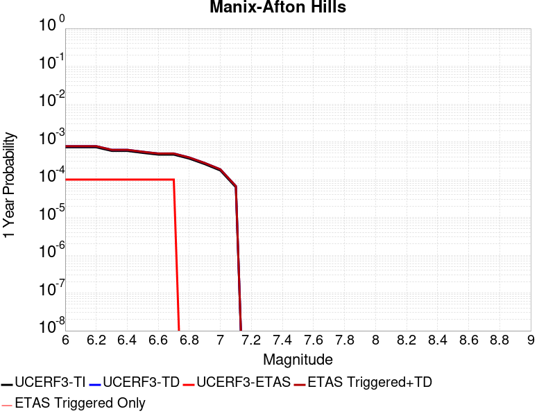 |  |

| Magnitude | 1 wk TI Prob | 1 wk TD Prob | 1 wk ETAS Prob | 1 wk ETAS/TD Gain | 1 wk ETAS Triggered+TD | 1 wk ETAS Triggered Only | 1 mo TI Prob | 1 mo TD Prob | 1 mo ETAS Prob | 1 mo ETAS/TD Gain | 1 mo ETAS Triggered+TD | 1 mo ETAS Triggered Only | 1 yr TI Prob | 1 yr TD Prob | 1 yr ETAS Prob | 1 yr ETAS/TD Gain | 1 yr ETAS Triggered+TD | 1 yr ETAS Triggered Only | 10 yr TI Prob | 10 yr TD Prob | 10 yr ETAS Prob | 10 yr ETAS/TD Gain | 10 yr ETAS Triggered+TD | 10 yr ETAS Triggered Only |
|-----|-----|-----|-----|-----|-----|-----|-----|-----|-----|-----|-----|-----|-----|-----|-----|-----|-----|-----|-----|-----|-----|-----|-----|-----|
| 6.0 | 1.3783202E-5 | 1.4700737E-5 | 0.0 | 0.0 | 1.4700737E-5 | 0.0 | 5.906953E-5 | 6.300173E-5 | 0.0 | 0.0 | 6.300173E-5 | 0.0 | 7.189342E-4 | 7.667936E-4 | 0.0 | 0.0 | 7.667936E-4 | 0.0 | 0.0071661277 | 0.007643232 | 2.0E-4 | 0.02616694 | 0.0078417035 | 2.0E-4 |
| 6.1 | 1.3783202E-5 | 1.4700737E-5 | 0.0 | 0.0 | 1.4700737E-5 | 0.0 | 5.906953E-5 | 6.300173E-5 | 0.0 | 0.0 | 6.300173E-5 | 0.0 | 7.189342E-4 | 7.667936E-4 | 0.0 | 0.0 | 7.667936E-4 | 0.0 | 0.0071661277 | 0.007643232 | 2.0E-4 | 0.02616694 | 0.0078417035 | 2.0E-4 |
| 6.2 | 1.3783202E-5 | 1.4700737E-5 | 0.0 | 0.0 | 1.4700737E-5 | 0.0 | 5.906953E-5 | 6.300173E-5 | 0.0 | 0.0 | 6.300173E-5 | 0.0 | 7.189342E-4 | 7.667936E-4 | 0.0 | 0.0 | 7.667936E-4 | 0.0 | 0.0071661277 | 0.007643232 | 2.0E-4 | 0.02616694 | 0.0078417035 | 2.0E-4 |
| 6.3 | 1.10494875E-5 | 1.1784835E-5 | 0.0 | 0.0 | 1.1784835E-5 | 0.0 | 4.7354086E-5 | 5.0505518E-5 | 0.0 | 0.0 | 5.0505518E-5 | 0.0 | 5.763835E-4 | 6.147415E-4 | 0.0 | 0.0 | 6.147415E-4 | 0.0 | 0.005748908 | 0.0061314492 | 2.0E-4 | 0.032618716 | 0.0063302233 | 2.0E-4 |
| 6.4 | 1.10494875E-5 | 1.1784835E-5 | 0.0 | 0.0 | 1.1784835E-5 | 0.0 | 4.7354086E-5 | 5.0505518E-5 | 0.0 | 0.0 | 5.0505518E-5 | 0.0 | 5.763835E-4 | 6.147415E-4 | 0.0 | 0.0 | 6.147415E-4 | 0.0 | 0.005748908 | 0.0061314492 | 2.0E-4 | 0.032618716 | 0.0063302233 | 2.0E-4 |
| 6.5 | 9.788949E-6 | 1.0446887E-5 | 0.0 | 0.0 | 1.0446887E-5 | 0.0 | 4.1951964E-5 | 4.4771656E-5 | 0.0 | 0.0 | 4.4771656E-5 | 0.0 | 5.1064545E-4 | 5.449679E-4 | 0.0 | 0.0 | 5.449679E-4 | 0.0 | 0.0050947363 | 0.00543724 | 2.0E-4 | 0.036783367 | 0.005636153 | 2.0E-4 |
| 6.6 | 8.810006E-6 | 9.406881E-6 | 0.0 | 0.0 | 9.406881E-6 | 0.0 | 3.775662E-5 | 4.0314633E-5 | 0.0 | 0.0 | 4.0314633E-5 | 0.0 | 4.5958988E-4 | 4.90729E-4 | 0.0 | 0.0 | 4.90729E-4 | 0.0 | 0.0045864056 | 0.0048973346 | 2.0E-4 | 0.040838543 | 0.005096355 | 2.0E-4 |
| 6.7 | 8.80128E-6 | 9.3973695E-6 | 0.0 | 0.0 | 9.3973695E-6 | 0.0 | 3.7719226E-5 | 4.027387E-5 | 0.0 | 0.0 | 4.027387E-5 | 0.0 | 4.591348E-4 | 4.9023295E-4 | 0.0 | 0.0 | 4.9023295E-4 | 0.0 | 0.004581874 | 0.004892396 | 2.0E-4 | 0.040879767 | 0.0050914176 | 2.0E-4 |
| 6.8 | 6.8994877E-6 | 7.374698E-6 | 0.0 | 0.0 | 7.374698E-6 | 0.0 | 2.9568899E-5 | 3.160551E-5 | 0.0 | 0.0 | 3.160551E-5 | 0.0 | 3.5994186E-4 | 3.847373E-4 | 0.0 | 0.0 | 3.847373E-4 | 0.0 | 0.003593594 | 0.003841516 | 0.0 | 0.0 | 0.003841516 | 0.0 |
| 6.9 | 4.9328037E-6 | 5.2671803E-6 | 0.0 | 0.0 | 5.2671803E-6 | 0.0 | 2.1140417E-5 | 2.257347E-5 | 0.0 | 0.0 | 2.257347E-5 | 0.0 | 2.5735417E-4 | 2.748035E-4 | 0.0 | 0.0 | 2.748035E-4 | 0.0 | 0.0025705635 | 0.0027452412 | 0.0 | 0.0 | 0.0027452412 | 0.0 |
| 7.0 | 3.347973E-6 | 3.5873138E-6 | 0.0 | 0.0 | 3.5873138E-6 | 0.0 | 1.4348378E-5 | 1.5374135E-5 | 0.0 | 0.0 | 1.5374135E-5 | 0.0 | 1.746775E-4 | 1.8716812E-4 | 0.0 | 0.0 | 1.8716812E-4 | 0.0 | 0.0017454025 | 0.0018705068 | 0.0 | 0.0 | 0.0018705068 | 0.0 |
| 7.1 | 1.2073567E-6 | 1.2925193E-6 | 0.0 | 0.0 | 1.2925193E-6 | 0.0 | 5.1743755E-6 | 5.5393657E-6 | 0.0 | 0.0 | 5.5393657E-6 | 0.0 | 6.29962E-5 | 6.7441324E-5 | 0.0 | 0.0 | 6.7441324E-5 | 0.0 | 6.297835E-4 | 6.7436846E-4 | 0.0 | 0.0 | 6.7436846E-4 | 0.0 |

## Malibu Coast alt 1
*[(top)](#table-of-contents)*

| 1 Week | 1 Month | 1 Year | 10 Year |
|-----|-----|-----|-----|
|  |  |  | 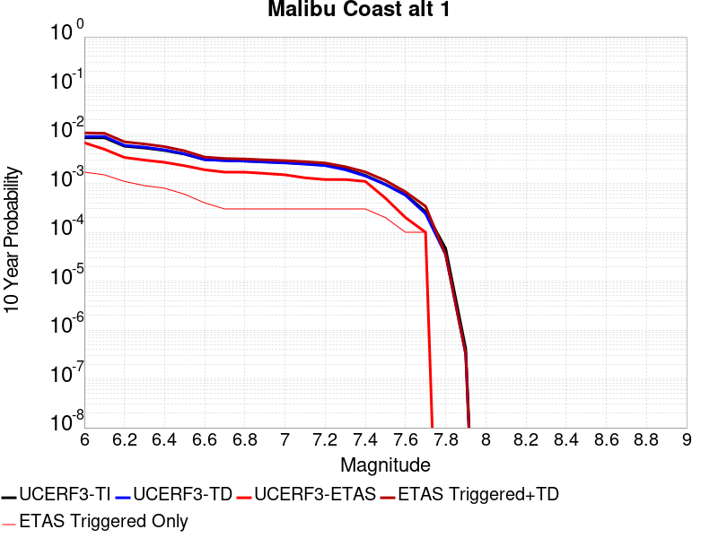 |

| Magnitude | 1 wk TI Prob | 1 wk TD Prob | 1 wk ETAS Prob | 1 wk ETAS/TD Gain | 1 wk ETAS Triggered+TD | 1 wk ETAS Triggered Only | 1 mo TI Prob | 1 mo TD Prob | 1 mo ETAS Prob | 1 mo ETAS/TD Gain | 1 mo ETAS Triggered+TD | 1 mo ETAS Triggered Only | 1 yr TI Prob | 1 yr TD Prob | 1 yr ETAS Prob | 1 yr ETAS/TD Gain | 1 yr ETAS Triggered+TD | 1 yr ETAS Triggered Only | 10 yr TI Prob | 10 yr TD Prob | 10 yr ETAS Prob | 10 yr ETAS/TD Gain | 10 yr ETAS Triggered+TD | 10 yr ETAS Triggered Only |
|-----|-----|-----|-----|-----|-----|-----|-----|-----|-----|-----|-----|-----|-----|-----|-----|-----|-----|-----|-----|-----|-----|-----|-----|-----|
| 6.0 | 1.6572556E-5 | 1.7582135E-5 | 0.0 | 0.0 | 1.7582135E-5 | 0.0 | 7.102331E-5 | 7.534994E-5 | 1.0E-4 | 1.327141 | 1.753424E-4 | 1.0E-4 | 8.6436566E-4 | 9.170183E-4 | 2.0E-4 | 0.21809816 | 0.0011168348 | 2.0E-4 | 0.0086101135 | 0.009134271 | 2.0E-4 | 0.021895561 | 0.0093324445 | 2.0E-4 |
| 6.1 | 1.6572556E-5 | 1.7582135E-5 | 0.0 | 0.0 | 1.7582135E-5 | 0.0 | 7.102331E-5 | 7.534994E-5 | 1.0E-4 | 1.327141 | 1.753424E-4 | 1.0E-4 | 8.6436566E-4 | 9.170183E-4 | 1.0E-4 | 0.10904908 | 0.0010169266 | 1.0E-4 | 0.0086101135 | 0.009134271 | 1.0E-4 | 0.010947781 | 0.009233358 | 1.0E-4 |
| 6.2 | 1.1085717E-5 | 1.15476005E-5 | 0.0 | 0.0 | 1.15476005E-5 | 0.0 | 4.750935E-5 | 4.9488797E-5 | 1.0E-4 | 2.0206592 | 1.4948385E-4 | 1.0E-4 | 5.782728E-4 | 6.023631E-4 | 1.0E-4 | 0.16601284 | 7.0230284E-4 | 1.0E-4 | 0.0057677035 | 0.0060076737 | 1.0E-4 | 0.016645378 | 0.006107073 | 1.0E-4 |
| 6.3 | 1.0208568E-5 | 1.0583702E-5 | 0.0 | 0.0 | 1.0583702E-5 | 0.0 | 4.375027E-5 | 4.5357952E-5 | 1.0E-4 | 2.2046852 | 1.4535342E-4 | 1.0E-4 | 5.325294E-4 | 5.5209605E-4 | 1.0E-4 | 0.1811279 | 6.520409E-4 | 1.0E-4 | 0.0053125503 | 0.0055075516 | 1.0E-4 | 0.018156888 | 0.005607001 | 1.0E-4 |
| 6.4 | 9.0682315E-6 | 9.335354E-6 | 0.0 | 0.0 | 9.335354E-6 | 0.0 | 3.8863272E-5 | 4.0008057E-5 | 1.0E-4 | 2.4994965 | 1.4000406E-4 | 1.0E-4 | 4.730576E-4 | 4.8699128E-4 | 1.0E-4 | 0.20534249 | 5.869426E-4 | 1.0E-4 | 0.0047205184 | 0.004859454 | 1.0E-4 | 0.020578444 | 0.004958968 | 1.0E-4 |
| 6.5 | 7.605796E-6 | 7.742805E-6 | 0.0 | 0.0 | 7.742805E-6 | 0.0 | 3.259586E-5 | 3.3183034E-5 | 1.0E-4 | 3.0135882 | 1.3317971E-4 | 1.0E-4 | 3.9678233E-4 | 4.0392988E-4 | 1.0E-4 | 0.24756773 | 5.0388946E-4 | 1.0E-4 | 0.0039607463 | 0.0040320945 | 1.0E-4 | 0.024801007 | 0.004131691 | 1.0E-4 |
| 6.6 | 5.889873E-6 | 5.875499E-6 | 0.0 | 0.0 | 5.875499E-6 | 0.0 | 2.5242069E-5 | 2.5180469E-5 | 1.0E-4 | 3.971332 | 1.2517795E-4 | 1.0E-4 | 3.0727885E-4 | 3.0652917E-4 | 1.0E-4 | 0.32623324 | 4.064985E-4 | 1.0E-4 | 0.003068543 | 0.0030610764 | 1.0E-4 | 0.032668248 | 0.0031607703 | 1.0E-4 |
| 6.7 | 5.66586E-6 | 5.637756E-6 | 0.0 | 0.0 | 5.637756E-6 | 0.0 | 2.428203E-5 | 2.4161589E-5 | 1.0E-4 | 4.1388006 | 1.2415917E-4 | 1.0E-4 | 2.955936E-4 | 2.9412773E-4 | 1.0E-4 | 0.33998835 | 3.9409832E-4 | 1.0E-4 | 0.0029520073 | 0.0029373963 | 1.0E-4 | 0.034043755 | 0.0030371025 | 1.0E-4 |
| 6.8 | 5.521556E-6 | 5.4856296E-6 | 0.0 | 0.0 | 5.4856296E-6 | 0.0 | 2.3663597E-5 | 2.3509629E-5 | 1.0E-4 | 4.2535763 | 1.2350727E-4 | 1.0E-4 | 2.880662E-4 | 2.8619223E-4 | 1.0E-4 | 0.3494155 | 3.861636E-4 | 1.0E-4 | 0.0028769306 | 0.0028582483 | 1.0E-4 | 0.034986466 | 0.0029579625 | 1.0E-4 |
| 6.9 | 5.29752E-6 | 5.2463074E-6 | 0.0 | 0.0 | 5.2463074E-6 | 0.0 | 2.270346E-5 | 2.2483982E-5 | 1.0E-4 | 4.447611 | 1.2248174E-4 | 1.0E-4 | 2.7637955E-4 | 2.7370817E-4 | 1.0E-4 | 0.36535263 | 3.736808E-4 | 1.0E-4 | 0.0027603607 | 0.002733721 | 1.0E-4 | 0.03658018 | 0.0028334477 | 1.0E-4 |
| 7.0 | 5.106743E-6 | 5.0441827E-6 | 0.0 | 0.0 | 5.0441827E-6 | 0.0 | 2.1885859E-5 | 2.1617747E-5 | 1.0E-4 | 4.6258287 | 1.2161559E-4 | 1.0E-4 | 2.6642776E-4 | 2.6316434E-4 | 1.0E-4 | 0.37999067 | 3.6313804E-4 | 1.0E-4 | 0.0026610855 | 0.002628537 | 1.0E-4 | 0.03804398 | 0.0027282739 | 1.0E-4 |
| 7.1 | 4.8469647E-6 | 4.7670737E-6 | 0.0 | 0.0 | 4.7670737E-6 | 0.0 | 2.0772539E-5 | 2.0430156E-5 | 1.0E-4 | 4.8947253 | 1.20428114E-4 | 1.0E-4 | 2.528763E-4 | 2.4870882E-4 | 1.0E-4 | 0.40207663 | 3.4868394E-4 | 1.0E-4 | 0.0025258875 | 0.0024843127 | 1.0E-4 | 0.04025258 | 0.0025840644 | 1.0E-4 |
| 7.2 | 4.545514E-6 | 4.445128E-6 | 0.0 | 0.0 | 4.445128E-6 | 0.0 | 1.9480629E-5 | 1.905041E-5 | 1.0E-4 | 5.2492304 | 1.19048505E-4 | 1.0E-4 | 2.3715083E-4 | 2.3191413E-4 | 1.0E-4 | 0.4311941 | 3.3189094E-4 | 1.0E-4 | 0.0023689792 | 0.0023167285 | 1.0E-4 | 0.043164313 | 0.0024164969 | 1.0E-4 |
| 7.3 | 3.794097E-6 | 3.6495078E-6 | 0.0 | 0.0 | 3.6495078E-6 | 0.0 | 1.6260314E-5 | 1.5640655E-5 | 1.0E-4 | 6.3935947 | 1.1563909E-4 | 1.0E-4 | 1.9795135E-4 | 1.9040836E-4 | 1.0E-4 | 0.525187 | 2.9038932E-4 | 1.0E-4 | 0.001977751 | 0.0019024569 | 1.0E-4 | 0.05256361 | 0.0020022667 | 1.0E-4 |
| 7.4 | 2.808217E-6 | 2.7172337E-6 | 0.0 | 0.0 | 2.7172337E-6 | 0.0 | 1.203516E-5 | 1.1645236E-5 | 1.0E-4 | 8.587203 | 1.1164407E-4 | 1.0E-4 | 1.4651821E-4 | 1.4177154E-4 | 1.0E-4 | 0.7053602 | 2.4175737E-4 | 1.0E-4 | 0.0014642165 | 0.0014168137 | 1.0E-4 | 0.070580915 | 0.001516672 | 1.0E-4 |
| 7.5 | 1.83809E-6 | 1.8177809E-6 | 0.0 | 0.0 | 1.8177809E-6 | 0.0 | 7.877505E-6 | 7.790467E-6 | 1.0E-4 | 12.836202 | 1.0778969E-4 | 1.0E-4 | 9.59044E-5 | 9.484482E-5 | 1.0E-4 | 1.0543538 | 1.9483533E-4 | 1.0E-4 | 9.5863023E-4 | 9.4804546E-4 | 1.0E-4 | 0.10548017 | 0.0010479507 | 1.0E-4 |
| 7.6 | 1.1292672E-6 | 1.0993047E-6 | 0.0 | 0.0 | 1.0993047E-6 | 0.0 | 4.839708E-6 | 4.711297E-6 | 1.0E-4 | 21.225576 | 1.0471082E-4 | 1.0E-4 | 5.8921847E-5 | 5.735855E-5 | 1.0E-4 | 1.7434193 | 1.5735281E-4 | 1.0E-4 | 5.890623E-4 | 5.734391E-4 | 1.0E-4 | 0.17438644 | 6.733817E-4 | 1.0E-4 |
| 7.7 | 5.065272E-7 | 4.6048007E-7 | 0.0 | 0.0 | 4.6048007E-7 | 0.0 | 2.170829E-6 | 1.9734846E-6 | 1.0E-4 | 50.67179 | 1.0197329E-4 | 1.0E-4 | 2.6429525E-5 | 2.4026922E-5 | 1.0E-4 | 4.1619983 | 1.2402452E-4 | 1.0E-4 | 2.642638E-4 | 2.4024435E-4 | 1.0E-4 | 0.41624287 | 3.4022034E-4 | 1.0E-4 |
| 7.8 | 8.952991E-8 | 6.689527E-8 | 0.0 | 0.0 | 6.689527E-8 | 0.0 | 3.8369956E-7 | 2.86694E-7 | 0.0 | 0.0 | 2.86694E-7 | 0.0 | 4.671532E-6 | 3.4904938E-6 | 0.0 | 0.0 | 3.4904938E-6 | 0.0 | 4.671434E-5 | 3.490441E-5 | 0.0 | 0.0 | 3.490441E-5 | 0.0 |
| 7.9 | 8.007447E-10 | 6.1585737E-10 | 0.0 | 0.0 | 6.1585737E-10 | 0.0 | 3.4317629E-9 | 2.6393883E-9 | 0.0 | 0.0 | 2.6393883E-9 | 0.0 | 4.1781714E-8 | 3.2134555E-8 | 0.0 | 0.0 | 3.2134555E-8 | 0.0 | 4.1781706E-7 | 3.213455E-7 | 0.0 | 0.0 | 3.213455E-7 | 0.0 |

## Garberville - Briceland 2011 CFM
*[(top)](#table-of-contents)*

| 1 Week | 1 Month | 1 Year | 10 Year |
|-----|-----|-----|-----|
| 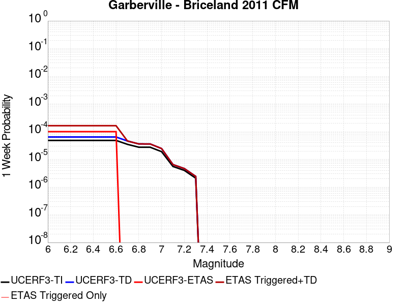 |  |  |  |

| Magnitude | 1 wk TI Prob | 1 wk TD Prob | 1 wk ETAS Prob | 1 wk ETAS/TD Gain | 1 wk ETAS Triggered+TD | 1 wk ETAS Triggered Only | 1 mo TI Prob | 1 mo TD Prob | 1 mo ETAS Prob | 1 mo ETAS/TD Gain | 1 mo ETAS Triggered+TD | 1 mo ETAS Triggered Only | 1 yr TI Prob | 1 yr TD Prob | 1 yr ETAS Prob | 1 yr ETAS/TD Gain | 1 yr ETAS Triggered+TD | 1 yr ETAS Triggered Only | 10 yr TI Prob | 10 yr TD Prob | 10 yr ETAS Prob | 10 yr ETAS/TD Gain | 10 yr ETAS Triggered+TD | 10 yr ETAS Triggered Only |
|-----|-----|-----|-----|-----|-----|-----|-----|-----|-----|-----|-----|-----|-----|-----|-----|-----|-----|-----|-----|-----|-----|-----|-----|-----|
| 6.0 | 4.8399295E-5 | 6.430683E-5 | 0.0 | 0.0 | 6.430683E-5 | 0.0 | 2.0740906E-4 | 2.7557573E-4 | 0.0 | 0.0 | 2.7557573E-4 | 0.0 | 0.002522281 | 0.0033506495 | 0.0 | 0.0 | 0.0033506495 | 0.0 | 0.024938442 | 0.033067785 | 2.0E-4 | 0.0060481825 | 0.033261172 | 2.0E-4 |
| 6.1 | 4.8399295E-5 | 6.430683E-5 | 0.0 | 0.0 | 6.430683E-5 | 0.0 | 2.0740906E-4 | 2.7557573E-4 | 0.0 | 0.0 | 2.7557573E-4 | 0.0 | 0.002522281 | 0.0033506495 | 0.0 | 0.0 | 0.0033506495 | 0.0 | 0.024938442 | 0.033067785 | 2.0E-4 | 0.0060481825 | 0.033261172 | 2.0E-4 |
| 6.2 | 4.8399295E-5 | 6.430683E-5 | 0.0 | 0.0 | 6.430683E-5 | 0.0 | 2.0740906E-4 | 2.7557573E-4 | 0.0 | 0.0 | 2.7557573E-4 | 0.0 | 0.002522281 | 0.0033506495 | 0.0 | 0.0 | 0.0033506495 | 0.0 | 0.024938442 | 0.033067785 | 2.0E-4 | 0.0060481825 | 0.033261172 | 2.0E-4 |
| 6.3 | 4.8399295E-5 | 6.430683E-5 | 0.0 | 0.0 | 6.430683E-5 | 0.0 | 2.0740906E-4 | 2.7557573E-4 | 0.0 | 0.0 | 2.7557573E-4 | 0.0 | 0.002522281 | 0.0033506495 | 0.0 | 0.0 | 0.0033506495 | 0.0 | 0.024938442 | 0.033067785 | 2.0E-4 | 0.0060481825 | 0.033261172 | 2.0E-4 |
| 6.4 | 4.8399295E-5 | 6.430683E-5 | 0.0 | 0.0 | 6.430683E-5 | 0.0 | 2.0740906E-4 | 2.7557573E-4 | 0.0 | 0.0 | 2.7557573E-4 | 0.0 | 0.002522281 | 0.0033506495 | 0.0 | 0.0 | 0.0033506495 | 0.0 | 0.024938442 | 0.033067785 | 2.0E-4 | 0.0060481825 | 0.033261172 | 2.0E-4 |
| 6.5 | 4.8399295E-5 | 6.430683E-5 | 0.0 | 0.0 | 6.430683E-5 | 0.0 | 2.0740906E-4 | 2.7557573E-4 | 0.0 | 0.0 | 2.7557573E-4 | 0.0 | 0.002522281 | 0.0033506495 | 0.0 | 0.0 | 0.0033506495 | 0.0 | 0.024938442 | 0.033067785 | 2.0E-4 | 0.0060481825 | 0.033261172 | 2.0E-4 |
| 6.6 | 4.8399295E-5 | 6.430683E-5 | 0.0 | 0.0 | 6.430683E-5 | 0.0 | 2.0740906E-4 | 2.7557573E-4 | 0.0 | 0.0 | 2.7557573E-4 | 0.0 | 0.002522281 | 0.0033506495 | 0.0 | 0.0 | 0.0033506495 | 0.0 | 0.024938442 | 0.033067785 | 2.0E-4 | 0.0060481825 | 0.033261172 | 2.0E-4 |
| 6.7 | 3.495179E-5 | 4.6151727E-5 | 0.0 | 0.0 | 4.6151727E-5 | 0.0 | 1.4978478E-4 | 1.9778109E-4 | 0.0 | 0.0 | 1.9778109E-4 | 0.0 | 0.0018221042 | 0.0024058553 | 0.0 | 0.0 | 0.0024058553 | 0.0 | 0.018072363 | 0.02385034 | 2.0E-4 | 0.008385625 | 0.02404557 | 2.0E-4 |
| 6.8 | 2.7517597E-5 | 3.612118E-5 | 0.0 | 0.0 | 3.612118E-5 | 0.0 | 1.1792722E-4 | 1.5479849E-4 | 0.0 | 0.0 | 1.5479849E-4 | 0.0 | 0.0014348183 | 0.0018835143 | 0.0 | 0.0 | 0.0018835143 | 0.0 | 0.014255894 | 0.018721653 | 1.0E-4 | 0.0053414083 | 0.018819781 | 1.0E-4 |
| 6.9 | 2.74461E-5 | 3.6039033E-5 | 0.0 | 0.0 | 3.6039033E-5 | 0.0 | 1.1762084E-4 | 1.5444648E-4 | 0.0 | 0.0 | 1.5444648E-4 | 0.0 | 0.001431093 | 0.001879236 | 0.0 | 0.0 | 0.001879236 | 0.0 | 0.014219119 | 0.01867959 | 1.0E-4 | 0.0053534363 | 0.018777722 | 1.0E-4 |
| 7.0 | 1.9023773E-5 | 2.4629906E-5 | 0.0 | 0.0 | 2.4629906E-5 | 0.0 | 8.152791E-5 | 1.05554755E-4 | 0.0 | 0.0 | 1.05554755E-4 | 0.0 | 9.921503E-4 | 0.0012847697 | 0.0 | 0.0 | 0.0012847697 | 0.0 | 0.009877323 | 0.012812283 | 0.0 | 0.0 | 0.012812283 | 0.0 |
| 7.1 | 5.566844E-6 | 6.5005743E-6 | 0.0 | 0.0 | 6.5005743E-6 | 0.0 | 2.3857683E-5 | 2.785933E-5 | 0.0 | 0.0 | 2.785933E-5 | 0.0 | 2.9042858E-4 | 3.3913882E-4 | 0.0 | 0.0 | 3.3913882E-4 | 0.0 | 0.002900493 | 0.0033866316 | 0.0 | 0.0 | 0.0033866316 | 0.0 |
| 7.2 | 4.011353E-6 | 4.6665573E-6 | 0.0 | 0.0 | 4.6665573E-6 | 0.0 | 1.7191402E-5 | 1.9999396E-5 | 0.0 | 0.0 | 1.9999396E-5 | 0.0 | 2.0928521E-4 | 2.4346886E-4 | 0.0 | 0.0 | 2.4346886E-4 | 0.0 | 0.0020908823 | 0.0024323578 | 0.0 | 0.0 | 0.0024323578 | 0.0 |
| 7.3 | 2.0974871E-6 | 2.4354429E-6 | 0.0 | 0.0 | 2.4354429E-6 | 0.0 | 8.989199E-6 | 1.0437585E-5 | 0.0 | 0.0 | 1.0437585E-5 | 0.0 | 1.09438006E-4 | 1.2707268E-4 | 0.0 | 0.0 | 1.2707268E-4 | 0.0 | 0.0010938413 | 0.0012702446 | 0.0 | 0.0 | 0.0012702446 | 0.0 |

## San Andreas (Peninsula) 2011 CFM
*[(top)](#table-of-contents)*

| 1 Week | 1 Month | 1 Year | 10 Year |
|-----|-----|-----|-----|
| 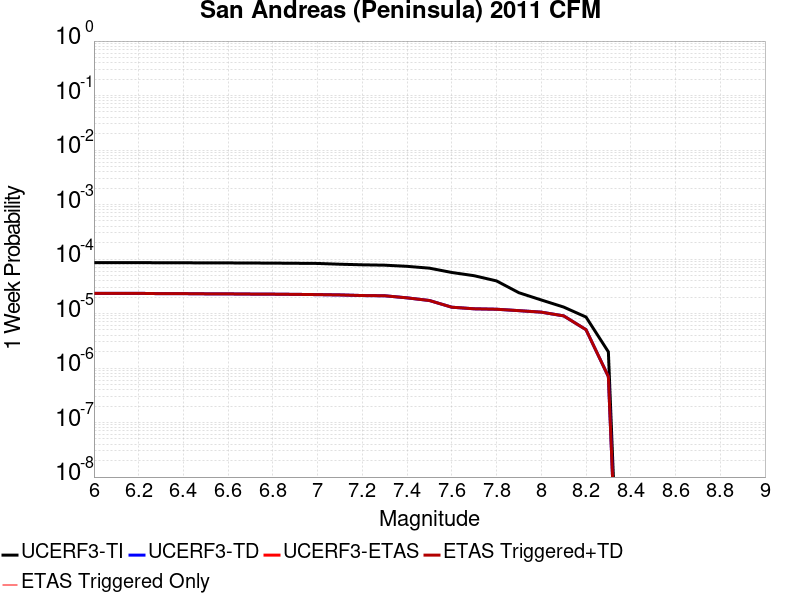 |  |  |  |

| Magnitude | 1 wk TI Prob | 1 wk TD Prob | 1 wk ETAS Prob | 1 wk ETAS/TD Gain | 1 wk ETAS Triggered+TD | 1 wk ETAS Triggered Only | 1 mo TI Prob | 1 mo TD Prob | 1 mo ETAS Prob | 1 mo ETAS/TD Gain | 1 mo ETAS Triggered+TD | 1 mo ETAS Triggered Only | 1 yr TI Prob | 1 yr TD Prob | 1 yr ETAS Prob | 1 yr ETAS/TD Gain | 1 yr ETAS Triggered+TD | 1 yr ETAS Triggered Only | 10 yr TI Prob | 10 yr TD Prob | 10 yr ETAS Prob | 10 yr ETAS/TD Gain | 10 yr ETAS Triggered+TD | 10 yr ETAS Triggered Only |
|-----|-----|-----|-----|-----|-----|-----|-----|-----|-----|-----|-----|-----|-----|-----|-----|-----|-----|-----|-----|-----|-----|-----|-----|-----|
| 6.0 | 8.6200685E-5 | 2.3159508E-5 | 0.0 | 0.0 | 2.3159508E-5 | 0.0 | 3.6937918E-4 | 9.9251265E-5 | 0.0 | 0.0 | 9.9251265E-5 | 0.0 | 0.0044879215 | 0.0012077157 | 0.0 | 0.0 | 0.0012077157 | 0.0 | 0.043983612 | 0.0136466725 | 2.0E-4 | 0.014655587 | 0.013843943 | 2.0E-4 |
| 6.1 | 8.6200685E-5 | 2.3159508E-5 | 0.0 | 0.0 | 2.3159508E-5 | 0.0 | 3.6937918E-4 | 9.9251265E-5 | 0.0 | 0.0 | 9.9251265E-5 | 0.0 | 0.0044879215 | 0.0012077157 | 0.0 | 0.0 | 0.0012077157 | 0.0 | 0.043983612 | 0.0136466725 | 2.0E-4 | 0.014655587 | 0.013843943 | 2.0E-4 |
| 6.2 | 8.6200685E-5 | 2.3159508E-5 | 0.0 | 0.0 | 2.3159508E-5 | 0.0 | 3.6937918E-4 | 9.9251265E-5 | 0.0 | 0.0 | 9.9251265E-5 | 0.0 | 0.0044879215 | 0.0012077157 | 0.0 | 0.0 | 0.0012077157 | 0.0 | 0.043983612 | 0.0136466725 | 2.0E-4 | 0.014655587 | 0.013843943 | 2.0E-4 |
| 6.3 | 8.551163E-5 | 2.286702E-5 | 0.0 | 0.0 | 2.286702E-5 | 0.0 | 3.6642692E-4 | 9.7997836E-5 | 0.0 | 0.0 | 9.7997836E-5 | 0.0 | 0.004452125 | 0.001192472 | 0.0 | 0.0 | 0.001192472 | 0.0 | 0.043639794 | 0.013481642 | 2.0E-4 | 0.014834988 | 0.013678946 | 2.0E-4 |
| 6.4 | 8.551163E-5 | 2.286702E-5 | 0.0 | 0.0 | 2.286702E-5 | 0.0 | 3.6642692E-4 | 9.7997836E-5 | 0.0 | 0.0 | 9.7997836E-5 | 0.0 | 0.004452125 | 0.001192472 | 0.0 | 0.0 | 0.001192472 | 0.0 | 0.043639794 | 0.013481642 | 2.0E-4 | 0.014834988 | 0.013678946 | 2.0E-4 |
| 6.5 | 8.511146E-5 | 2.2697528E-5 | 0.0 | 0.0 | 2.2697528E-5 | 0.0 | 3.647124E-4 | 9.72715E-5 | 0.0 | 0.0 | 9.72715E-5 | 0.0 | 0.004431336 | 0.0011836385 | 0.0 | 0.0 | 0.0011836385 | 0.0 | 0.04344007 | 0.013385722 | 2.0E-4 | 0.014941293 | 0.013583045 | 2.0E-4 |
| 6.6 | 8.4985084E-5 | 2.2630868E-5 | 0.0 | 0.0 | 2.2630868E-5 | 0.0 | 3.6417096E-4 | 9.698583E-5 | 0.0 | 0.0 | 9.698583E-5 | 0.0 | 0.0044247704 | 0.0011801643 | 0.0 | 0.0 | 0.0011801643 | 0.0 | 0.043376986 | 0.013349016 | 2.0E-4 | 0.014982378 | 0.013546346 | 2.0E-4 |
| 6.7 | 8.462618E-5 | 2.2467157E-5 | 0.0 | 0.0 | 2.2467157E-5 | 0.0 | 3.6263323E-4 | 9.628427E-5 | 0.0 | 0.0 | 9.628427E-5 | 0.0 | 0.004406125 | 0.001171632 | 0.0 | 0.0 | 0.001171632 | 0.0 | 0.043197807 | 0.01325752 | 2.0E-4 | 0.015085777 | 0.013454868 | 2.0E-4 |
| 6.8 | 8.42337E-5 | 2.2369068E-5 | 0.0 | 0.0 | 2.2369068E-5 | 0.0 | 3.6095164E-4 | 9.586392E-5 | 0.0 | 0.0 | 9.586392E-5 | 0.0 | 0.004385734 | 0.0011665197 | 0.0 | 0.0 | 0.0011665197 | 0.0 | 0.043001823 | 0.013201576 | 2.0E-4 | 0.015149707 | 0.013398935 | 2.0E-4 |
| 6.9 | 8.365989E-5 | 2.2182085E-5 | 0.0 | 0.0 | 2.2182085E-5 | 0.0 | 3.5849313E-4 | 9.506262E-5 | 0.0 | 0.0 | 9.506262E-5 | 0.0 | 0.004355922 | 0.0011567742 | 0.0 | 0.0 | 0.0011567742 | 0.0 | 0.04271523 | 0.013098413 | 2.0E-4 | 0.015269025 | 0.013295794 | 2.0E-4 |
| 7.0 | 8.30936E-5 | 2.1951666E-5 | 0.0 | 0.0 | 2.1951666E-5 | 0.0 | 3.560668E-4 | 9.407518E-5 | 0.0 | 0.0 | 9.407518E-5 | 0.0 | 0.004326499 | 0.0011447648 | 0.0 | 0.0 | 0.0011447648 | 0.0 | 0.042432297 | 0.0129736625 | 2.0E-4 | 0.015415847 | 0.013171067 | 2.0E-4 |
| 7.1 | 8.041264E-5 | 2.1655384E-5 | 0.0 | 0.0 | 2.1655384E-5 | 0.0 | 3.4458007E-4 | 9.2805494E-5 | 0.0 | 0.0 | 9.2805494E-5 | 0.0 | 0.0041871946 | 0.0011293226 | 0.0 | 0.0 | 0.0011293226 | 0.0 | 0.041091725 | 0.012806519 | 2.0E-4 | 0.0156170465 | 0.013003957 | 2.0E-4 |
| 7.2 | 7.8427016E-5 | 2.1101474E-5 | 0.0 | 0.0 | 2.1101474E-5 | 0.0 | 3.3607247E-4 | 9.043176E-5 | 0.0 | 0.0 | 9.043176E-5 | 0.0 | 0.004084008 | 0.0011004519 | 0.0 | 0.0 | 0.0011004519 | 0.0 | 0.040097635 | 0.012503188 | 2.0E-4 | 0.01599592 | 0.012700688 | 2.0E-4 |
| 7.3 | 7.721087E-5 | 2.0894355E-5 | 0.0 | 0.0 | 2.0894355E-5 | 0.0 | 3.3086175E-4 | 8.954416E-5 | 0.0 | 0.0 | 8.954416E-5 | 0.0 | 0.004020803 | 0.0010896563 | 0.0 | 0.0 | 0.0010896563 | 0.0 | 0.03948827 | 0.01239136 | 2.0E-4 | 0.016140278 | 0.012588882 | 2.0E-4 |
| 7.4 | 7.3536525E-5 | 1.9132254E-5 | 0.0 | 0.0 | 1.9132254E-5 | 0.0 | 3.1511846E-4 | 8.199281E-5 | 0.0 | 0.0 | 8.199281E-5 | 0.0 | 0.0038298194 | 9.978063E-4 | 0.0 | 0.0 | 9.978063E-4 | 0.0 | 0.037644852 | 0.011406938 | 2.0E-4 | 0.017533189 | 0.011604656 | 2.0E-4 |
| 7.5 | 6.806207E-5 | 1.7102431E-5 | 0.0 | 0.0 | 1.7102431E-5 | 0.0 | 2.9166197E-4 | 7.329408E-5 | 0.0 | 0.0 | 7.329408E-5 | 0.0 | 0.0035452035 | 8.91991E-4 | 0.0 | 0.0 | 8.91991E-4 | 0.0 | 0.034891766 | 0.010244253 | 2.0E-4 | 0.01952314 | 0.010442205 | 2.0E-4 |
| 7.6 | 5.6731416E-5 | 1.2907267E-5 | 0.0 | 0.0 | 1.2907267E-5 | 0.0 | 2.43112E-4 | 5.5315686E-5 | 0.0 | 0.0 | 5.5315686E-5 | 0.0 | 0.0029558712 | 6.732605E-4 | 0.0 | 0.0 | 6.732605E-4 | 0.0 | 0.02916862 | 0.0077660736 | 2.0E-4 | 0.025753038 | 0.007964521 | 2.0E-4 |
| 7.7 | 4.946994E-5 | 1.2073095E-5 | 0.0 | 0.0 | 1.2073095E-5 | 0.0 | 2.1199681E-4 | 5.1740808E-5 | 0.0 | 0.0 | 5.1740808E-5 | 0.0 | 0.002578006 | 6.2976236E-4 | 0.0 | 0.0 | 6.2976236E-4 | 0.0 | 0.02548303 | 0.0072453525 | 2.0E-4 | 0.027603902 | 0.0074439035 | 2.0E-4 |
| 7.8 | 3.9718198E-5 | 1.1853909E-5 | 0.0 | 0.0 | 1.1853909E-5 | 0.0 | 1.7020974E-4 | 5.0801482E-5 | 0.0 | 0.0 | 5.0801482E-5 | 0.0 | 0.0020703338 | 6.1833265E-4 | 0.0 | 0.0 | 6.1833265E-4 | 0.0 | 0.020511515 | 0.0070861923 | 2.0E-4 | 0.028223902 | 0.007284775 | 2.0E-4 |
| 7.9 | 2.4115114E-5 | 1.11810505E-5 | 0.0 | 0.0 | 1.11810505E-5 | 0.0 | 1.0334639E-4 | 4.7917907E-5 | 0.0 | 0.0 | 4.7917907E-5 | 0.0 | 0.001257516 | 5.832445E-4 | 0.0 | 0.0 | 5.832445E-4 | 0.0 | 0.012504238 | 0.0066095334 | 2.0E-4 | 0.030259322 | 0.0068082116 | 2.0E-4 |
| 8.0 | 1.7756569E-5 | 1.0501687E-5 | 0.0 | 0.0 | 1.0501687E-5 | 0.0 | 7.6097356E-5 | 4.5006454E-5 | 0.0 | 0.0 | 4.5006454E-5 | 0.0 | 9.260915E-4 | 5.4781593E-4 | 0.0 | 0.0 | 5.4781593E-4 | 0.0 | 0.009222416 | 0.006168466 | 1.0E-4 | 0.016211485 | 0.006267849 | 1.0E-4 |
| 8.1 | 1.3159258E-5 | 8.976217E-6 | 0.0 | 0.0 | 8.976217E-6 | 0.0 | 5.6395602E-5 | 3.8468937E-5 | 0.0 | 0.0 | 3.8468937E-5 | 0.0 | 6.864001E-4 | 4.6825875E-4 | 0.0 | 0.0 | 4.6825875E-4 | 0.0 | 0.0068428386 | 0.0052732863 | 1.0E-4 | 0.018963508 | 0.005372759 | 1.0E-4 |
| 8.2 | 8.635426E-6 | 5.00287E-6 | 0.0 | 0.0 | 5.00287E-6 | 0.0 | 3.700844E-5 | 2.1440694E-5 | 0.0 | 0.0 | 2.1440694E-5 | 0.0 | 4.5048463E-4 | 2.6100926E-4 | 0.0 | 0.0 | 2.6100926E-4 | 0.0 | 0.004495725 | 0.002989784 | 1.0E-4 | 0.03344723 | 0.0030894852 | 1.0E-4 |
| 8.3 | 1.983087E-6 | 6.880041E-7 | 0.0 | 0.0 | 6.880041E-7 | 0.0 | 8.498917E-6 | 2.9485857E-6 | 0.0 | 0.0 | 2.9485857E-6 | 0.0 | 1.034694E-4 | 3.589845E-5 | 0.0 | 0.0 | 3.589845E-5 | 0.0 | 0.0010342124 | 4.2701262E-4 | 0.0 | 0.0 | 4.2701262E-4 | 0.0 |

## Sargent 2011 CFM
*[(top)](#table-of-contents)*

| 1 Week | 1 Month | 1 Year | 10 Year |
|-----|-----|-----|-----|
|  |  |  | 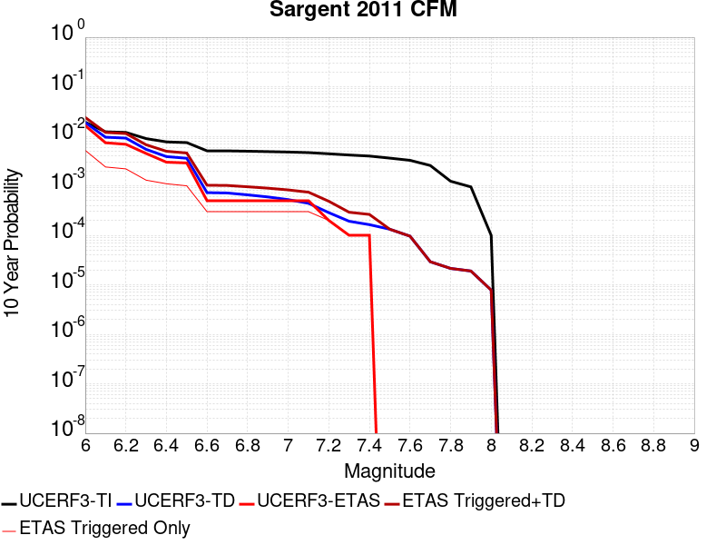 |

| Magnitude | 1 wk TI Prob | 1 wk TD Prob | 1 wk ETAS Prob | 1 wk ETAS/TD Gain | 1 wk ETAS Triggered+TD | 1 wk ETAS Triggered Only | 1 mo TI Prob | 1 mo TD Prob | 1 mo ETAS Prob | 1 mo ETAS/TD Gain | 1 mo ETAS Triggered+TD | 1 mo ETAS Triggered Only | 1 yr TI Prob | 1 yr TD Prob | 1 yr ETAS Prob | 1 yr ETAS/TD Gain | 1 yr ETAS Triggered+TD | 1 yr ETAS Triggered Only | 10 yr TI Prob | 10 yr TD Prob | 10 yr ETAS Prob | 10 yr ETAS/TD Gain | 10 yr ETAS Triggered+TD | 10 yr ETAS Triggered Only |
|-----|-----|-----|-----|-----|-----|-----|-----|-----|-----|-----|-----|-----|-----|-----|-----|-----|-----|-----|-----|-----|-----|-----|-----|-----|
| 6.0 | 3.7327867E-5 | 3.650677E-5 | 0.0 | 0.0 | 3.650677E-5 | 0.0 | 1.5996677E-4 | 1.5645097E-4 | 0.0 | 0.0 | 1.5645097E-4 | 0.0 | 0.0019458556 | 0.001903551 | 0.0 | 0.0 | 0.001903551 | 0.0 | 0.01928905 | 0.018942157 | 2.0E-4 | 0.01055846 | 0.019138368 | 2.0E-4 |
| 6.1 | 2.3771476E-5 | 1.8396146E-5 | 0.0 | 0.0 | 1.8396146E-5 | 0.0 | 1.01873775E-4 | 7.883873E-5 | 0.0 | 0.0 | 7.883873E-5 | 0.0 | 0.0012396075 | 9.59521E-4 | 0.0 | 0.0 | 9.59521E-4 | 0.0 | 0.012327154 | 0.009590714 | 1.0E-4 | 0.010426752 | 0.009689755 | 1.0E-4 |
| 6.2 | 2.3112721E-5 | 1.7628841E-5 | 0.0 | 0.0 | 1.7628841E-5 | 0.0 | 9.9050754E-5 | 7.555048E-5 | 0.0 | 0.0 | 7.555048E-5 | 0.0 | 0.0012052758 | 9.195205E-4 | 0.0 | 0.0 | 9.195205E-4 | 0.0 | 0.011987597 | 0.009194039 | 1.0E-4 | 0.010876612 | 0.009293119 | 1.0E-4 |
| 6.3 | 1.728509E-5 | 1.0395616E-5 | 0.0 | 0.0 | 1.0395616E-5 | 0.0 | 7.407686E-5 | 4.4552147E-5 | 0.0 | 0.0 | 4.4552147E-5 | 0.0 | 9.015125E-4 | 5.423336E-4 | 0.0 | 0.0 | 5.423336E-4 | 0.0 | 0.008978641 | 0.0054437076 | 1.0E-4 | 0.018369833 | 0.005543163 | 1.0E-4 |
| 6.4 | 1.48395575E-5 | 7.3997735E-6 | 0.0 | 0.0 | 7.3997735E-6 | 0.0 | 6.3596555E-5 | 3.1713145E-5 | 0.0 | 0.0 | 3.1713145E-5 | 0.0 | 7.7401294E-4 | 3.8607675E-4 | 0.0 | 0.0 | 3.8607675E-4 | 0.0 | 0.0077132257 | 0.0038868738 | 1.0E-4 | 0.025727617 | 0.003986485 | 1.0E-4 |
| 6.5 | 1.4358964E-5 | 6.839544E-6 | 0.0 | 0.0 | 6.839544E-6 | 0.0 | 6.1536964E-5 | 2.9312214E-5 | 0.0 | 0.0 | 2.9312214E-5 | 0.0 | 7.48955E-4 | 3.5685525E-4 | 0.0 | 0.0 | 3.5685525E-4 | 0.0 | 0.0074643586 | 0.0035956302 | 1.0E-4 | 0.027811537 | 0.0036952705 | 1.0E-4 |
| 6.6 | 9.772591E-6 | 1.3301266E-6 | 0.0 | 0.0 | 1.3301266E-6 | 0.0 | 4.188186E-5 | 5.7005304E-6 | 0.0 | 0.0 | 5.7005304E-6 | 0.0 | 5.097923E-4 | 6.940177E-5 | 0.0 | 0.0 | 6.940177E-5 | 0.0 | 0.005086244 | 7.2303804E-4 | 0.0 | 0.0 | 7.2303804E-4 | 0.0 |
| 6.7 | 9.752745E-6 | 1.3088344E-6 | 0.0 | 0.0 | 1.3088344E-6 | 0.0 | 4.179681E-5 | 5.609278E-6 | 0.0 | 0.0 | 5.609278E-6 | 0.0 | 5.0875737E-4 | 6.829085E-5 | 0.0 | 0.0 | 6.829085E-5 | 0.0 | 0.005075942 | 7.11936E-4 | 0.0 | 0.0 | 7.11936E-4 | 0.0 |
| 6.8 | 9.608213E-6 | 1.1935011E-6 | 0.0 | 0.0 | 1.1935011E-6 | 0.0 | 4.1177405E-5 | 5.114995E-6 | 0.0 | 0.0 | 5.114995E-6 | 0.0 | 5.012196E-4 | 6.2273306E-5 | 0.0 | 0.0 | 6.2273306E-5 | 0.0 | 0.005000906 | 6.515025E-4 | 0.0 | 0.0 | 6.515025E-4 | 0.0 |
| 6.9 | 9.427164E-6 | 1.0802921E-6 | 0.0 | 0.0 | 1.0802921E-6 | 0.0 | 4.04015E-5 | 4.629815E-6 | 0.0 | 0.0 | 4.629815E-6 | 0.0 | 4.9177726E-4 | 5.6366564E-5 | 0.0 | 0.0 | 5.6366564E-5 | 0.0 | 0.004906904 | 5.9182505E-4 | 0.0 | 0.0 | 5.9182505E-4 | 0.0 |
| 7.0 | 9.247601E-6 | 9.4809036E-7 | 0.0 | 0.0 | 9.4809036E-7 | 0.0 | 3.9631974E-5 | 4.063238E-6 | 0.0 | 0.0 | 4.063238E-6 | 0.0 | 4.8241246E-4 | 4.9468814E-5 | 0.0 | 0.0 | 4.9468814E-5 | 0.0 | 0.0048136655 | 5.2236655E-4 | 0.0 | 0.0 | 5.2236655E-4 | 0.0 |
| 7.1 | 8.995454E-6 | 7.902502E-7 | 0.0 | 0.0 | 7.902502E-7 | 0.0 | 3.8551374E-5 | 3.3867823E-6 | 0.0 | 0.0 | 3.3867823E-6 | 0.0 | 4.6926187E-4 | 4.1233307E-5 | 0.0 | 0.0 | 4.1233307E-5 | 0.0 | 0.004682722 | 4.391358E-4 | 0.0 | 0.0 | 4.391358E-4 | 0.0 |
| 7.2 | 8.520861E-6 | 4.955659E-7 | 0.0 | 0.0 | 4.955659E-7 | 0.0 | 3.6517464E-5 | 2.1238523E-6 | 0.0 | 0.0 | 2.1238523E-6 | 0.0 | 4.445094E-4 | 2.58576E-5 | 0.0 | 0.0 | 2.58576E-5 | 0.0 | 0.004436213 | 2.8371174E-4 | 0.0 | 0.0 | 2.8371174E-4 | 0.0 |
| 7.3 | 8.043592E-6 | 3.1743255E-7 | 0.0 | 0.0 | 3.1743255E-7 | 0.0 | 3.4472083E-5 | 1.3604244E-6 | 0.0 | 0.0 | 1.3604244E-6 | 0.0 | 4.196168E-4 | 1.6563043E-5 | 0.0 | 0.0 | 1.6563043E-5 | 0.0 | 0.004188253 | 1.8952461E-4 | 0.0 | 0.0 | 1.8952461E-4 | 0.0 |
| 7.4 | 7.662316E-6 | 2.6704782E-7 | 0.0 | 0.0 | 2.6704782E-7 | 0.0 | 3.2838085E-5 | 1.1444902E-6 | 0.0 | 0.0 | 1.1444902E-6 | 0.0 | 3.9973034E-4 | 1.393408E-5 | 0.0 | 0.0 | 1.393408E-5 | 0.0 | 0.0039901207 | 1.61539E-4 | 0.0 | 0.0 | 1.61539E-4 | 0.0 |
| 7.5 | 6.961638E-6 | 2.139055E-7 | 0.0 | 0.0 | 2.139055E-7 | 0.0 | 2.9835252E-5 | 9.167375E-7 | 0.0 | 0.0 | 9.167375E-7 | 0.0 | 3.6318362E-4 | 1.1161223E-5 | 0.0 | 0.0 | 1.1161223E-5 | 0.0 | 0.0036259065 | 1.3061658E-4 | 0.0 | 0.0 | 1.3061658E-4 | 0.0 |
| 7.6 | 6.282332E-6 | 1.5195336E-7 | 0.0 | 0.0 | 1.5195336E-7 | 0.0 | 2.6924003E-5 | 6.5122856E-7 | 0.0 | 0.0 | 6.5122856E-7 | 0.0 | 3.2775043E-4 | 7.928679E-6 | 0.0 | 0.0 | 7.928679E-6 | 0.0 | 0.0032726745 | 9.442953E-5 | 0.0 | 0.0 | 9.442953E-5 | 0.0 |
| 7.7 | 4.934408E-6 | 4.4333685E-8 | 0.0 | 0.0 | 4.4333685E-8 | 0.0 | 2.114729E-5 | 1.900015E-7 | 0.0 | 0.0 | 1.900015E-7 | 0.0 | 2.5743784E-4 | 2.313266E-6 | 0.0 | 0.0 | 2.313266E-6 | 0.0 | 0.0025713982 | 2.863751E-5 | 0.0 | 0.0 | 2.863751E-5 | 0.0 |
| 7.8 | 2.373212E-6 | 3.0612604E-8 | 0.0 | 0.0 | 3.0612604E-8 | 0.0 | 1.0170869E-5 | 1.3119687E-7 | 0.0 | 0.0 | 1.3119687E-7 | 0.0 | 1.238233E-4 | 1.5973208E-6 | 0.0 | 0.0 | 1.5973208E-6 | 0.0 | 0.0012375432 | 2.0951647E-5 | 0.0 | 0.0 | 2.0951647E-5 | 0.0 |
| 7.9 | 1.8227792E-6 | 2.6556389E-8 | 0.0 | 0.0 | 2.6556389E-8 | 0.0 | 7.811887E-6 | 1.13813094E-7 | 0.0 | 0.0 | 1.13813094E-7 | 0.0 | 9.510558E-5 | 1.3856735E-6 | 0.0 | 0.0 | 1.3856735E-6 | 0.0 | 9.5064886E-4 | 1.8567911E-5 | 0.0 | 0.0 | 1.8567911E-5 | 0.0 |
| 8.0 | 1.9095137E-7 | 1.2011457E-8 | 0.0 | 0.0 | 1.2011457E-8 | 0.0 | 8.1836276E-7 | 5.147767E-8 | 0.0 | 0.0 | 5.147767E-8 | 0.0 | 9.963521E-6 | 6.267405E-7 | 0.0 | 0.0 | 6.267405E-7 | 0.0 | 9.963074E-5 | 7.6893675E-6 | 0.0 | 0.0 | 7.6893675E-6 | 0.0 |

## Cleghorn Pass
*[(top)](#table-of-contents)*

| 1 Week | 1 Month | 1 Year | 10 Year |
|-----|-----|-----|-----|
|  |  |  | 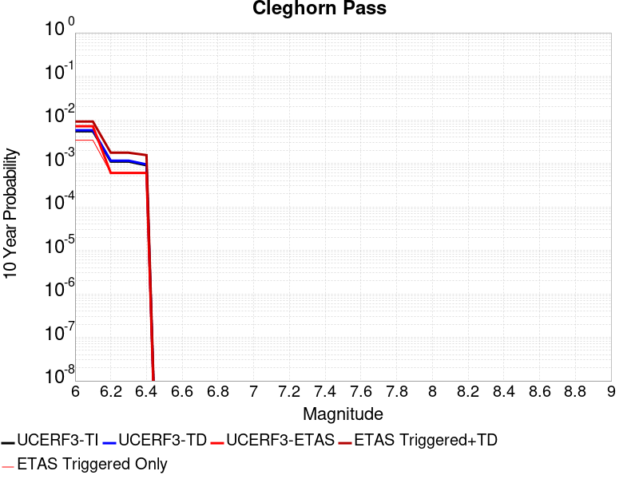 |

| Magnitude | 1 wk TI Prob | 1 wk TD Prob | 1 wk ETAS Prob | 1 wk ETAS/TD Gain | 1 wk ETAS Triggered+TD | 1 wk ETAS Triggered Only | 1 mo TI Prob | 1 mo TD Prob | 1 mo ETAS Prob | 1 mo ETAS/TD Gain | 1 mo ETAS Triggered+TD | 1 mo ETAS Triggered Only | 1 yr TI Prob | 1 yr TD Prob | 1 yr ETAS Prob | 1 yr ETAS/TD Gain | 1 yr ETAS Triggered+TD | 1 yr ETAS Triggered Only | 10 yr TI Prob | 10 yr TD Prob | 10 yr ETAS Prob | 10 yr ETAS/TD Gain | 10 yr ETAS Triggered+TD | 10 yr ETAS Triggered Only |
|-----|-----|-----|-----|-----|-----|-----|-----|-----|-----|-----|-----|-----|-----|-----|-----|-----|-----|-----|-----|-----|-----|-----|-----|-----|
| 6.0 | 1.0522846E-5 | 1.1034972E-5 | 0.0 | 0.0 | 1.1034972E-5 | 0.0 | 4.509713E-5 | 4.7292175E-5 | 0.0 | 0.0 | 4.7292175E-5 | 0.0 | 5.4891926E-4 | 5.7568273E-4 | 1.0E-4 | 0.1737068 | 6.7562517E-4 | 1.0E-4 | 0.0054756533 | 0.0057470747 | 1.0E-4 | 0.017400157 | 0.0058465 | 1.0E-4 |
| 6.1 | 1.0522846E-5 | 1.1034972E-5 | 0.0 | 0.0 | 1.1034972E-5 | 0.0 | 4.509713E-5 | 4.7292175E-5 | 0.0 | 0.0 | 4.7292175E-5 | 0.0 | 5.4891926E-4 | 5.7568273E-4 | 1.0E-4 | 0.1737068 | 6.7562517E-4 | 1.0E-4 | 0.0054756533 | 0.0057470747 | 1.0E-4 | 0.017400157 | 0.0058465 | 1.0E-4 |
| 6.2 | 2.1045846E-6 | 2.2070678E-6 | 0.0 | 0.0 | 2.2070678E-6 | 0.0 | 9.019617E-6 | 9.458851E-6 | 0.0 | 0.0 | 9.458851E-6 | 0.0 | 1.098083E-4 | 1.1515962E-4 | 0.0 | 0.0 | 1.1515962E-4 | 0.0 | 0.0010975406 | 0.0011514104 | 0.0 | 0.0 | 0.0011514104 | 0.0 |
| 6.3 | 2.1045846E-6 | 2.2070678E-6 | 0.0 | 0.0 | 2.2070678E-6 | 0.0 | 9.019617E-6 | 9.458851E-6 | 0.0 | 0.0 | 9.458851E-6 | 0.0 | 1.098083E-4 | 1.1515962E-4 | 0.0 | 0.0 | 1.1515962E-4 | 0.0 | 0.0010975406 | 0.0011514104 | 0.0 | 0.0 | 0.0011514104 | 0.0 |
| 6.4 | 1.7259927E-6 | 1.8099477E-6 | 0.0 | 0.0 | 1.8099477E-6 | 0.0 | 7.3970905E-6 | 7.756918E-6 | 0.0 | 0.0 | 7.756918E-6 | 0.0 | 9.005586E-5 | 9.444048E-5 | 0.0 | 0.0 | 9.444048E-5 | 0.0 | 9.001937E-4 | 9.444048E-4 | 0.0 | 0.0 | 9.444048E-4 | 0.0 |

## Trinidad (alt1)
*[(top)](#table-of-contents)*

| 1 Week | 1 Month | 1 Year | 10 Year |
|-----|-----|-----|-----|
|  |  | 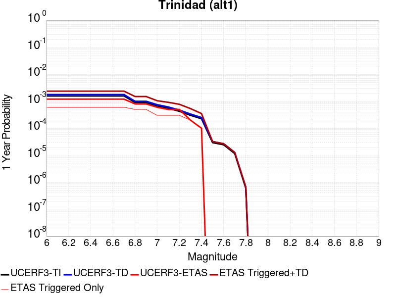 |  |

| Magnitude | 1 wk TI Prob | 1 wk TD Prob | 1 wk ETAS Prob | 1 wk ETAS/TD Gain | 1 wk ETAS Triggered+TD | 1 wk ETAS Triggered Only | 1 mo TI Prob | 1 mo TD Prob | 1 mo ETAS Prob | 1 mo ETAS/TD Gain | 1 mo ETAS Triggered+TD | 1 mo ETAS Triggered Only | 1 yr TI Prob | 1 yr TD Prob | 1 yr ETAS Prob | 1 yr ETAS/TD Gain | 1 yr ETAS Triggered+TD | 1 yr ETAS Triggered Only | 10 yr TI Prob | 10 yr TD Prob | 10 yr ETAS Prob | 10 yr ETAS/TD Gain | 10 yr ETAS Triggered+TD | 10 yr ETAS Triggered Only |
|-----|-----|-----|-----|-----|-----|-----|-----|-----|-----|-----|-----|-----|-----|-----|-----|-----|-----|-----|-----|-----|-----|-----|-----|-----|
| 6.0 | 3.0167168E-5 | 3.3987628E-5 | 0.0 | 0.0 | 3.3987628E-5 | 0.0 | 1.2928146E-4 | 1.4565406E-4 | 0.0 | 0.0 | 1.4565406E-4 | 0.0 | 0.0015728653 | 0.0017720638 | 1.0E-4 | 0.056431375 | 0.0018718865 | 1.0E-4 | 0.0156177925 | 0.017596241 | 2.0E-4 | 0.011366065 | 0.01779272 | 2.0E-4 |
| 6.1 | 3.0167168E-5 | 3.3987628E-5 | 0.0 | 0.0 | 3.3987628E-5 | 0.0 | 1.2928146E-4 | 1.4565406E-4 | 0.0 | 0.0 | 1.4565406E-4 | 0.0 | 0.0015728653 | 0.0017720638 | 1.0E-4 | 0.056431375 | 0.0018718865 | 1.0E-4 | 0.0156177925 | 0.017596241 | 2.0E-4 | 0.011366065 | 0.01779272 | 2.0E-4 |
| 6.2 | 3.0167168E-5 | 3.3987628E-5 | 0.0 | 0.0 | 3.3987628E-5 | 0.0 | 1.2928146E-4 | 1.4565406E-4 | 0.0 | 0.0 | 1.4565406E-4 | 0.0 | 0.0015728653 | 0.0017720638 | 1.0E-4 | 0.056431375 | 0.0018718865 | 1.0E-4 | 0.0156177925 | 0.017596241 | 2.0E-4 | 0.011366065 | 0.01779272 | 2.0E-4 |
| 6.3 | 3.0167168E-5 | 3.3987628E-5 | 0.0 | 0.0 | 3.3987628E-5 | 0.0 | 1.2928146E-4 | 1.4565406E-4 | 0.0 | 0.0 | 1.4565406E-4 | 0.0 | 0.0015728653 | 0.0017720638 | 1.0E-4 | 0.056431375 | 0.0018718865 | 1.0E-4 | 0.0156177925 | 0.017596241 | 2.0E-4 | 0.011366065 | 0.01779272 | 2.0E-4 |
| 6.4 | 3.0167168E-5 | 3.3987628E-5 | 0.0 | 0.0 | 3.3987628E-5 | 0.0 | 1.2928146E-4 | 1.4565406E-4 | 0.0 | 0.0 | 1.4565406E-4 | 0.0 | 0.0015728653 | 0.0017720638 | 1.0E-4 | 0.056431375 | 0.0018718865 | 1.0E-4 | 0.0156177925 | 0.017596241 | 2.0E-4 | 0.011366065 | 0.01779272 | 2.0E-4 |
| 6.5 | 3.0167168E-5 | 3.3987628E-5 | 0.0 | 0.0 | 3.3987628E-5 | 0.0 | 1.2928146E-4 | 1.4565406E-4 | 0.0 | 0.0 | 1.4565406E-4 | 0.0 | 0.0015728653 | 0.0017720638 | 1.0E-4 | 0.056431375 | 0.0018718865 | 1.0E-4 | 0.0156177925 | 0.017596241 | 2.0E-4 | 0.011366065 | 0.01779272 | 2.0E-4 |
| 6.6 | 3.0167168E-5 | 3.3987628E-5 | 0.0 | 0.0 | 3.3987628E-5 | 0.0 | 1.2928146E-4 | 1.4565406E-4 | 0.0 | 0.0 | 1.4565406E-4 | 0.0 | 0.0015728653 | 0.0017720638 | 1.0E-4 | 0.056431375 | 0.0018718865 | 1.0E-4 | 0.0156177925 | 0.017596241 | 2.0E-4 | 0.011366065 | 0.01779272 | 2.0E-4 |
| 6.7 | 3.0167168E-5 | 3.3987628E-5 | 0.0 | 0.0 | 3.3987628E-5 | 0.0 | 1.2928146E-4 | 1.4565406E-4 | 0.0 | 0.0 | 1.4565406E-4 | 0.0 | 0.0015728653 | 0.0017720638 | 1.0E-4 | 0.056431375 | 0.0018718865 | 1.0E-4 | 0.0156177925 | 0.017596241 | 2.0E-4 | 0.011366065 | 0.01779272 | 2.0E-4 |
| 6.8 | 1.717077E-5 | 1.917205E-5 | 0.0 | 0.0 | 1.917205E-5 | 0.0 | 7.358694E-5 | 8.21636E-5 | 0.0 | 0.0 | 8.21636E-5 | 0.0 | 8.9555274E-4 | 9.99927E-4 | 1.0E-4 | 0.100007296 | 0.0010998271 | 1.0E-4 | 0.008919522 | 0.009958718 | 1.0E-4 | 0.010041453 | 0.010057722 | 1.0E-4 |
| 6.9 | 1.717077E-5 | 1.917205E-5 | 0.0 | 0.0 | 1.917205E-5 | 0.0 | 7.358694E-5 | 8.21636E-5 | 0.0 | 0.0 | 8.21636E-5 | 0.0 | 8.9555274E-4 | 9.99927E-4 | 1.0E-4 | 0.100007296 | 0.0010998271 | 1.0E-4 | 0.008919522 | 0.009958718 | 1.0E-4 | 0.010041453 | 0.010057722 | 1.0E-4 |
| 7.0 | 1.2858572E-5 | 1.4320156E-5 | 0.0 | 0.0 | 1.4320156E-5 | 0.0 | 5.5107E-5 | 6.137083E-5 | 0.0 | 0.0 | 6.137083E-5 | 0.0 | 6.707212E-4 | 7.4696576E-4 | 0.0 | 0.0 | 7.4696576E-4 | 0.0 | 0.006687004 | 0.0074477214 | 0.0 | 0.0 | 0.0074477214 | 0.0 |
| 7.1 | 1.0588431E-5 | 1.1787157E-5 | 0.0 | 0.0 | 1.1787157E-5 | 0.0 | 4.53782E-5 | 5.0515573E-5 | 0.0 | 0.0 | 5.0515573E-5 | 0.0 | 5.5233954E-4 | 6.1488233E-4 | 0.0 | 0.0 | 6.1488233E-4 | 0.0 | 0.005509687 | 0.006134653 | 0.0 | 0.0 | 0.006134653 | 0.0 |
| 7.2 | 8.138061E-6 | 9.056403E-6 | 0.0 | 0.0 | 9.056403E-6 | 0.0 | 3.487694E-5 | 3.8812716E-5 | 0.0 | 0.0 | 3.8812716E-5 | 0.0 | 4.2454398E-4 | 4.7246713E-4 | 0.0 | 0.0 | 4.7246713E-4 | 0.0 | 0.0042373384 | 0.0047170613 | 0.0 | 0.0 | 0.0047170613 | 0.0 |
| 7.3 | 5.787542E-6 | 6.4524816E-6 | 0.0 | 0.0 | 6.4524816E-6 | 0.0 | 2.4803514E-5 | 2.7653321E-5 | 0.0 | 0.0 | 2.7653321E-5 | 0.0 | 3.0194095E-4 | 3.3664863E-4 | 0.0 | 0.0 | 3.3664863E-4 | 0.0 | 0.00301531 | 0.0033634922 | 0.0 | 0.0 | 0.0033634922 | 0.0 |
| 7.4 | 4.303563E-6 | 4.7950593E-6 | 0.0 | 0.0 | 4.7950593E-6 | 0.0 | 1.844371E-5 | 2.0550204E-5 | 0.0 | 0.0 | 2.0550204E-5 | 0.0 | 2.2452902E-4 | 2.501897E-4 | 0.0 | 0.0 | 2.501897E-4 | 0.0 | 0.0022430231 | 0.002501014 | 0.0 | 0.0 | 0.002501014 | 0.0 |
| 7.5 | 5.6063425E-7 | 6.136845E-7 | 0.0 | 0.0 | 6.136845E-7 | 0.0 | 2.402716E-6 | 2.630074E-6 | 0.0 | 0.0 | 2.630074E-6 | 0.0 | 2.9252675E-5 | 3.2020696E-5 | 0.0 | 0.0 | 3.2020696E-5 | 0.0 | 2.9248823E-4 | 3.2016236E-4 | 0.0 | 0.0 | 3.2016236E-4 | 0.0 |
| 7.6 | 4.6699128E-7 | 5.120578E-7 | 0.0 | 0.0 | 5.120578E-7 | 0.0 | 2.0013897E-6 | 2.1945316E-6 | 0.0 | 0.0 | 2.1945316E-6 | 0.0 | 2.4366647E-5 | 2.671811E-5 | 0.0 | 0.0 | 2.671811E-5 | 0.0 | 2.4363975E-4 | 2.6715038E-4 | 0.0 | 0.0 | 2.6715038E-4 | 0.0 |
| 7.7 | 2.2080937E-7 | 2.4320832E-7 | 0.0 | 0.0 | 2.4320832E-7 | 0.0 | 9.4632554E-7 | 1.0423211E-6 | 0.0 | 0.0 | 1.0423211E-6 | 0.0 | 1.15214525E-5 | 1.26901905E-5 | 0.0 | 0.0 | 1.26901905E-5 | 0.0 | 1.1520855E-4 | 1.2689526E-4 | 0.0 | 0.0 | 1.2689526E-4 | 0.0 |
| 7.8 | 1.1438307E-8 | 1.2668568E-8 | 0.0 | 0.0 | 1.2668568E-8 | 0.0 | 4.9021317E-8 | 5.4293867E-8 | 0.0 | 0.0 | 5.4293867E-8 | 0.0 | 5.9683435E-7 | 6.610278E-7 | 0.0 | 0.0 | 6.610278E-7 | 0.0 | 5.9683275E-6 | 6.610278E-6 | 0.0 | 0.0 | 6.610278E-6 | 0.0 |

## Pitas Point (Lower West)
*[(top)](#table-of-contents)*

| 1 Week | 1 Month | 1 Year | 10 Year |
|-----|-----|-----|-----|
|  |  |  | 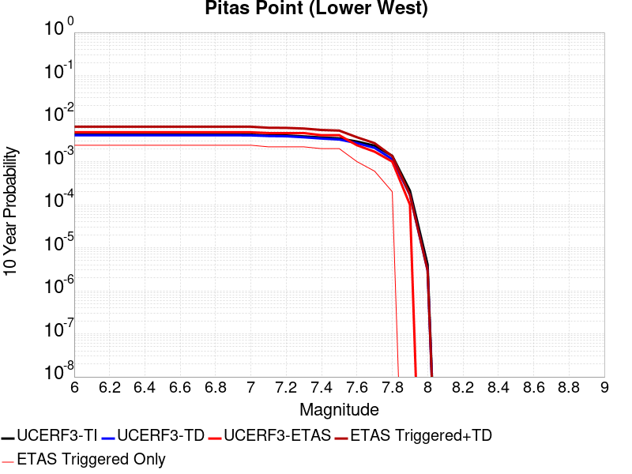 |

| Magnitude | 1 wk TI Prob | 1 wk TD Prob | 1 wk ETAS Prob | 1 wk ETAS/TD Gain | 1 wk ETAS Triggered+TD | 1 wk ETAS Triggered Only | 1 mo TI Prob | 1 mo TD Prob | 1 mo ETAS Prob | 1 mo ETAS/TD Gain | 1 mo ETAS Triggered+TD | 1 mo ETAS Triggered Only | 1 yr TI Prob | 1 yr TD Prob | 1 yr ETAS Prob | 1 yr ETAS/TD Gain | 1 yr ETAS Triggered+TD | 1 yr ETAS Triggered Only | 10 yr TI Prob | 10 yr TD Prob | 10 yr ETAS Prob | 10 yr ETAS/TD Gain | 10 yr ETAS Triggered+TD | 10 yr ETAS Triggered Only |
|-----|-----|-----|-----|-----|-----|-----|-----|-----|-----|-----|-----|-----|-----|-----|-----|-----|-----|-----|-----|-----|-----|-----|-----|-----|
| 6.0 | 8.151497E-6 | 7.848972E-6 | 0.0 | 0.0 | 7.848972E-6 | 0.0 | 3.493452E-5 | 3.363802E-5 | 0.0 | 0.0 | 3.363802E-5 | 0.0 | 4.252448E-4 | 4.0946668E-4 | 1.0E-4 | 0.24422011 | 5.0942576E-4 | 1.0E-4 | 0.0042443196 | 0.0040872027 | 2.0E-4 | 0.048933223 | 0.0042863856 | 2.0E-4 |
| 6.1 | 8.151497E-6 | 7.848972E-6 | 0.0 | 0.0 | 7.848972E-6 | 0.0 | 3.493452E-5 | 3.363802E-5 | 0.0 | 0.0 | 3.363802E-5 | 0.0 | 4.252448E-4 | 4.0946668E-4 | 1.0E-4 | 0.24422011 | 5.0942576E-4 | 1.0E-4 | 0.0042443196 | 0.0040872027 | 2.0E-4 | 0.048933223 | 0.0042863856 | 2.0E-4 |
| 6.2 | 8.151497E-6 | 7.848972E-6 | 0.0 | 0.0 | 7.848972E-6 | 0.0 | 3.493452E-5 | 3.363802E-5 | 0.0 | 0.0 | 3.363802E-5 | 0.0 | 4.252448E-4 | 4.0946668E-4 | 1.0E-4 | 0.24422011 | 5.0942576E-4 | 1.0E-4 | 0.0042443196 | 0.0040872027 | 2.0E-4 | 0.048933223 | 0.0042863856 | 2.0E-4 |
| 6.3 | 8.151497E-6 | 7.848972E-6 | 0.0 | 0.0 | 7.848972E-6 | 0.0 | 3.493452E-5 | 3.363802E-5 | 0.0 | 0.0 | 3.363802E-5 | 0.0 | 4.252448E-4 | 4.0946668E-4 | 1.0E-4 | 0.24422011 | 5.0942576E-4 | 1.0E-4 | 0.0042443196 | 0.0040872027 | 2.0E-4 | 0.048933223 | 0.0042863856 | 2.0E-4 |
| 6.4 | 8.151497E-6 | 7.848972E-6 | 0.0 | 0.0 | 7.848972E-6 | 0.0 | 3.493452E-5 | 3.363802E-5 | 0.0 | 0.0 | 3.363802E-5 | 0.0 | 4.252448E-4 | 4.0946668E-4 | 1.0E-4 | 0.24422011 | 5.0942576E-4 | 1.0E-4 | 0.0042443196 | 0.0040872027 | 2.0E-4 | 0.048933223 | 0.0042863856 | 2.0E-4 |
| 6.5 | 8.151497E-6 | 7.848972E-6 | 0.0 | 0.0 | 7.848972E-6 | 0.0 | 3.493452E-5 | 3.363802E-5 | 0.0 | 0.0 | 3.363802E-5 | 0.0 | 4.252448E-4 | 4.0946668E-4 | 1.0E-4 | 0.24422011 | 5.0942576E-4 | 1.0E-4 | 0.0042443196 | 0.0040872027 | 2.0E-4 | 0.048933223 | 0.0042863856 | 2.0E-4 |
| 6.6 | 8.151497E-6 | 7.848972E-6 | 0.0 | 0.0 | 7.848972E-6 | 0.0 | 3.493452E-5 | 3.363802E-5 | 0.0 | 0.0 | 3.363802E-5 | 0.0 | 4.252448E-4 | 4.0946668E-4 | 1.0E-4 | 0.24422011 | 5.0942576E-4 | 1.0E-4 | 0.0042443196 | 0.0040872027 | 2.0E-4 | 0.048933223 | 0.0042863856 | 2.0E-4 |
| 6.7 | 8.151497E-6 | 7.848972E-6 | 0.0 | 0.0 | 7.848972E-6 | 0.0 | 3.493452E-5 | 3.363802E-5 | 0.0 | 0.0 | 3.363802E-5 | 0.0 | 4.252448E-4 | 4.0946668E-4 | 1.0E-4 | 0.24422011 | 5.0942576E-4 | 1.0E-4 | 0.0042443196 | 0.0040872027 | 2.0E-4 | 0.048933223 | 0.0042863856 | 2.0E-4 |
| 6.8 | 8.151497E-6 | 7.848972E-6 | 0.0 | 0.0 | 7.848972E-6 | 0.0 | 3.493452E-5 | 3.363802E-5 | 0.0 | 0.0 | 3.363802E-5 | 0.0 | 4.252448E-4 | 4.0946668E-4 | 1.0E-4 | 0.24422011 | 5.0942576E-4 | 1.0E-4 | 0.0042443196 | 0.0040872027 | 2.0E-4 | 0.048933223 | 0.0042863856 | 2.0E-4 |
| 6.9 | 8.151497E-6 | 7.848972E-6 | 0.0 | 0.0 | 7.848972E-6 | 0.0 | 3.493452E-5 | 3.363802E-5 | 0.0 | 0.0 | 3.363802E-5 | 0.0 | 4.252448E-4 | 4.0946668E-4 | 1.0E-4 | 0.24422011 | 5.0942576E-4 | 1.0E-4 | 0.0042443196 | 0.0040872027 | 2.0E-4 | 0.048933223 | 0.0042863856 | 2.0E-4 |
| 7.0 | 8.103535E-6 | 7.7984305E-6 | 0.0 | 0.0 | 7.7984305E-6 | 0.0 | 3.4728975E-5 | 3.342142E-5 | 0.0 | 0.0 | 3.342142E-5 | 0.0 | 4.2274324E-4 | 4.0683054E-4 | 1.0E-4 | 0.24580258 | 5.067899E-4 | 1.0E-4 | 0.0042193993 | 0.004060938 | 2.0E-4 | 0.049249705 | 0.004260126 | 2.0E-4 |
| 7.1 | 7.853298E-6 | 7.5342764E-6 | 0.0 | 0.0 | 7.5342764E-6 | 0.0 | 3.3656554E-5 | 3.228936E-5 | 0.0 | 0.0 | 3.228936E-5 | 0.0 | 4.096915E-4 | 3.9305276E-4 | 1.0E-4 | 0.25441876 | 4.930135E-4 | 1.0E-4 | 0.00408937 | 0.0039236518 | 2.0E-4 | 0.050972924 | 0.0041228672 | 2.0E-4 |
| 7.2 | 7.771102E-6 | 7.44662E-6 | 0.0 | 0.0 | 7.44662E-6 | 0.0 | 3.33043E-5 | 3.19137E-5 | 0.0 | 0.0 | 3.19137E-5 | 0.0 | 4.0540437E-4 | 3.8848072E-4 | 1.0E-4 | 0.25741303 | 4.8844184E-4 | 1.0E-4 | 0.0040466557 | 0.0038780915 | 2.0E-4 | 0.051571757 | 0.004077316 | 2.0E-4 |
| 7.3 | 7.3945344E-6 | 7.0430306E-6 | 0.0 | 0.0 | 7.0430306E-6 | 0.0 | 3.1690477E-5 | 3.018407E-5 | 0.0 | 0.0 | 3.018407E-5 | 0.0 | 3.8576324E-4 | 3.6742972E-4 | 1.0E-4 | 0.2721609 | 4.6739297E-4 | 1.0E-4 | 0.0038509427 | 0.0036682896 | 2.0E-4 | 0.054521322 | 0.003867556 | 2.0E-4 |
| 7.4 | 6.964645E-6 | 6.584206E-6 | 0.0 | 0.0 | 6.584206E-6 | 0.0 | 2.9848137E-5 | 2.8217723E-5 | 0.0 | 0.0 | 2.8217723E-5 | 0.0 | 3.6334046E-4 | 3.4349711E-4 | 1.0E-4 | 0.29112327 | 4.4346275E-4 | 1.0E-4 | 0.0036274698 | 0.0034297148 | 2.0E-4 | 0.058313884 | 0.003629029 | 2.0E-4 |
| 7.5 | 6.6525035E-6 | 6.253454E-6 | 0.0 | 0.0 | 6.253454E-6 | 0.0 | 2.851042E-5 | 2.6800246E-5 | 0.0 | 0.0 | 2.6800246E-5 | 0.0 | 3.4705905E-4 | 3.2624463E-4 | 1.0E-4 | 0.30651847 | 4.2621198E-4 | 1.0E-4 | 0.0034651754 | 0.0032577082 | 2.0E-4 | 0.061392855 | 0.0034570566 | 2.0E-4 |
| 7.6 | 5.613338E-6 | 5.1464976E-6 | 0.0 | 0.0 | 5.1464976E-6 | 0.0 | 2.405694E-5 | 2.2056234E-5 | 0.0 | 0.0 | 2.2056234E-5 | 0.0 | 2.928539E-4 | 2.6850184E-4 | 0.0 | 0.0 | 2.6850184E-4 | 0.0 | 0.0029246826 | 0.002681806 | 0.0 | 0.0 | 0.002681806 | 0.0 |
| 7.7 | 4.494704E-6 | 3.9929123E-6 | 0.0 | 0.0 | 3.9929123E-6 | 0.0 | 1.9262876E-5 | 1.711237E-5 | 0.0 | 0.0 | 1.711237E-5 | 0.0 | 2.3450027E-4 | 2.0832343E-4 | 0.0 | 0.0 | 2.0832343E-4 | 0.0 | 0.0023425296 | 0.0020813055 | 0.0 | 0.0 | 0.0020813055 | 0.0 |
| 7.8 | 2.6075882E-6 | 2.1812086E-6 | 0.0 | 0.0 | 2.1812086E-6 | 0.0 | 1.117533E-5 | 9.348004E-6 | 0.0 | 0.0 | 9.348004E-6 | 0.0 | 1.3605114E-4 | 1.13806054E-4 | 0.0 | 0.0 | 1.13806054E-4 | 0.0 | 0.0013596788 | 0.0011374825 | 0.0 | 0.0 | 0.0011374825 | 0.0 |
| 7.9 | 4.045984E-7 | 3.2399677E-7 | 0.0 | 0.0 | 3.2399677E-7 | 0.0 | 1.733992E-6 | 1.3885569E-6 | 0.0 | 0.0 | 1.3885569E-6 | 0.0 | 2.1111147E-5 | 1.6905553E-5 | 0.0 | 0.0 | 1.6905553E-5 | 0.0 | 2.1109142E-4 | 1.6904298E-4 | 0.0 | 0.0 | 1.6904298E-4 | 0.0 |
| 8.0 | 7.791402E-9 | 5.678961E-9 | 0.0 | 0.0 | 5.678961E-9 | 0.0 | 3.3391725E-8 | 2.4338403E-8 | 0.0 | 0.0 | 2.4338403E-8 | 0.0 | 4.0654416E-7 | 2.9632005E-7 | 0.0 | 0.0 | 2.9632005E-7 | 0.0 | 4.065434E-6 | 2.9631985E-6 | 0.0 | 0.0 | 2.9631985E-6 | 0.0 |

## Franklin 2011 CFM
*[(top)](#table-of-contents)*

| 1 Week | 1 Month | 1 Year | 10 Year |
|-----|-----|-----|-----|
|  |  |  |  |

| Magnitude | 1 wk TI Prob | 1 wk TD Prob | 1 wk ETAS Prob | 1 wk ETAS/TD Gain | 1 wk ETAS Triggered+TD | 1 wk ETAS Triggered Only | 1 mo TI Prob | 1 mo TD Prob | 1 mo ETAS Prob | 1 mo ETAS/TD Gain | 1 mo ETAS Triggered+TD | 1 mo ETAS Triggered Only | 1 yr TI Prob | 1 yr TD Prob | 1 yr ETAS Prob | 1 yr ETAS/TD Gain | 1 yr ETAS Triggered+TD | 1 yr ETAS Triggered Only | 10 yr TI Prob | 10 yr TD Prob | 10 yr ETAS Prob | 10 yr ETAS/TD Gain | 10 yr ETAS Triggered+TD | 10 yr ETAS Triggered Only |
|-----|-----|-----|-----|-----|-----|-----|-----|-----|-----|-----|-----|-----|-----|-----|-----|-----|-----|-----|-----|-----|-----|-----|-----|-----|
| 6.0 | 1.845602E-5 | 2.013647E-5 | 0.0 | 0.0 | 2.013647E-5 | 0.0 | 7.9094825E-5 | 8.6296466E-5 | 0.0 | 0.0 | 8.6296466E-5 | 0.0 | 9.6255407E-4 | 0.0010501819 | 0.0 | 0.0 | 0.0010501819 | 0.0 | 0.009583955 | 0.010469505 | 2.0E-4 | 0.0191031 | 0.010667412 | 2.0E-4 |
| 6.1 | 1.845602E-5 | 2.013647E-5 | 0.0 | 0.0 | 2.013647E-5 | 0.0 | 7.9094825E-5 | 8.6296466E-5 | 0.0 | 0.0 | 8.6296466E-5 | 0.0 | 9.6255407E-4 | 0.0010501819 | 0.0 | 0.0 | 0.0010501819 | 0.0 | 0.009583955 | 0.010469505 | 2.0E-4 | 0.0191031 | 0.010667412 | 2.0E-4 |
| 6.2 | 1.845602E-5 | 2.013647E-5 | 0.0 | 0.0 | 2.013647E-5 | 0.0 | 7.9094825E-5 | 8.6296466E-5 | 0.0 | 0.0 | 8.6296466E-5 | 0.0 | 9.6255407E-4 | 0.0010501819 | 0.0 | 0.0 | 0.0010501819 | 0.0 | 0.009583955 | 0.010469505 | 2.0E-4 | 0.0191031 | 0.010667412 | 2.0E-4 |
| 6.3 | 1.3813506E-5 | 1.5083398E-5 | 0.0 | 0.0 | 1.5083398E-5 | 0.0 | 5.9199396E-5 | 6.464157E-5 | 0.0 | 0.0 | 6.464157E-5 | 0.0 | 7.205143E-4 | 7.867346E-4 | 0.0 | 0.0 | 7.867346E-4 | 0.0 | 0.007181826 | 0.007854696 | 2.0E-4 | 0.025462475 | 0.008053126 | 2.0E-4 |
| 6.4 | 1.3813506E-5 | 1.5083398E-5 | 0.0 | 0.0 | 1.5083398E-5 | 0.0 | 5.9199396E-5 | 6.464157E-5 | 0.0 | 0.0 | 6.464157E-5 | 0.0 | 7.205143E-4 | 7.867346E-4 | 0.0 | 0.0 | 7.867346E-4 | 0.0 | 0.007181826 | 0.007854696 | 2.0E-4 | 0.025462475 | 0.008053126 | 2.0E-4 |
| 6.5 | 1.1308949E-5 | 1.234902E-5 | 0.0 | 0.0 | 1.234902E-5 | 0.0 | 4.8466023E-5 | 5.292331E-5 | 0.0 | 0.0 | 5.292331E-5 | 0.0 | 5.899141E-4 | 6.4415287E-4 | 0.0 | 0.0 | 6.4415287E-4 | 0.0 | 0.0058835056 | 0.006437505 | 2.0E-4 | 0.031067936 | 0.0066362177 | 2.0E-4 |
| 6.6 | 1.0813164E-5 | 1.1807768E-5 | 0.0 | 0.0 | 1.1807768E-5 | 0.0 | 4.6341313E-5 | 5.0603747E-5 | 0.0 | 0.0 | 5.0603747E-5 | 0.0 | 5.640594E-4 | 6.159283E-4 | 0.0 | 0.0 | 6.159283E-4 | 0.0 | 0.005626298 | 0.006156845 | 2.0E-4 | 0.03248417 | 0.0063556135 | 2.0E-4 |
| 6.7 | 1.0706348E-5 | 1.16896645E-5 | 0.0 | 0.0 | 1.16896645E-5 | 0.0 | 4.5883542E-5 | 5.009761E-5 | 0.0 | 0.0 | 5.009761E-5 | 0.0 | 5.5848894E-4 | 6.0976954E-4 | 0.0 | 0.0 | 6.0976954E-4 | 0.0 | 0.005570874 | 0.006095596 | 2.0E-4 | 0.032810573 | 0.006294377 | 2.0E-4 |
| 6.8 | 9.443655E-6 | 1.0282702E-5 | 0.0 | 0.0 | 1.0282702E-5 | 0.0 | 4.0472176E-5 | 4.4067983E-5 | 0.0 | 0.0 | 4.4067983E-5 | 0.0 | 4.9263734E-4 | 5.36397E-4 | 0.0 | 0.0 | 5.36397E-4 | 0.0 | 0.0049154665 | 0.005365605 | 2.0E-4 | 0.037274454 | 0.005564532 | 2.0E-4 |
| 6.9 | 8.7001645E-6 | 9.456737E-6 | 0.0 | 0.0 | 9.456737E-6 | 0.0 | 3.728589E-5 | 4.0528248E-5 | 0.0 | 0.0 | 4.0528248E-5 | 0.0 | 4.538611E-4 | 4.933209E-4 | 0.0 | 0.0 | 4.933209E-4 | 0.0 | 0.0045293528 | 0.0049368283 | 2.0E-4 | 0.040511843 | 0.0051358407 | 2.0E-4 |
| 7.0 | 8.074731E-6 | 8.751307E-6 | 0.0 | 0.0 | 8.751307E-6 | 0.0 | 3.460553E-5 | 3.750507E-5 | 0.0 | 0.0 | 3.750507E-5 | 0.0 | 4.212409E-4 | 4.5652964E-4 | 0.0 | 0.0 | 4.5652964E-4 | 0.0 | 0.004204433 | 0.0045704753 | 2.0E-4 | 0.043759122 | 0.0047695613 | 2.0E-4 |
| 7.1 | 7.3370957E-6 | 7.899786E-6 | 0.0 | 0.0 | 7.899786E-6 | 0.0 | 3.1444317E-5 | 3.3855795E-5 | 0.0 | 0.0 | 3.3855795E-5 | 0.0 | 3.8276732E-4 | 4.1211734E-4 | 0.0 | 0.0 | 4.1211734E-4 | 0.0 | 0.0038210868 | 0.0041279797 | 1.0E-4 | 0.024224926 | 0.004227567 | 1.0E-4 |
| 7.2 | 5.1750103E-6 | 5.408504E-6 | 0.0 | 0.0 | 5.408504E-6 | 0.0 | 2.2178427E-5 | 2.31791E-5 | 0.0 | 0.0 | 2.31791E-5 | 0.0 | 2.699889E-4 | 2.821693E-4 | 0.0 | 0.0 | 2.821693E-4 | 0.0 | 0.002696611 | 0.0028320388 | 1.0E-4 | 0.03531025 | 0.0029317557 | 1.0E-4 |
| 7.3 | 3.5221371E-6 | 3.7529333E-6 | 0.0 | 0.0 | 3.7529333E-6 | 0.0 | 1.5094786E-5 | 1.60839E-5 | 0.0 | 0.0 | 1.60839E-5 | 0.0 | 1.8376352E-4 | 1.9580401E-4 | 0.0 | 0.0 | 1.9580401E-4 | 0.0 | 0.0018361164 | 0.001969821 | 1.0E-4 | 0.050766032 | 0.0020696241 | 1.0E-4 |
| 7.4 | 2.5749775E-6 | 2.780148E-6 | 0.0 | 0.0 | 2.780148E-6 | 0.0 | 1.1035571E-5 | 1.1914865E-5 | 0.0 | 0.0 | 1.1914865E-5 | 0.0 | 1.343498E-4 | 1.450539E-4 | 0.0 | 0.0 | 1.450539E-4 | 0.0 | 0.001342686 | 0.0014617846 | 1.0E-4 | 0.06840953 | 0.0015616384 | 1.0E-4 |
| 7.5 | 1.3642131E-6 | 1.5183126E-6 | 0.0 | 0.0 | 1.5183126E-6 | 0.0 | 5.8466144E-6 | 6.5070376E-6 | 0.0 | 0.0 | 6.5070376E-6 | 0.0 | 7.1180206E-5 | 7.922032E-5 | 0.0 | 0.0 | 7.922032E-5 | 0.0 | 7.115741E-4 | 8.0266496E-4 | 1.0E-4 | 0.12458498 | 9.025847E-4 | 1.0E-4 |
| 7.6 | 5.329124E-7 | 6.432227E-7 | 0.0 | 0.0 | 6.432227E-7 | 0.0 | 2.2839083E-6 | 2.7566657E-6 | 0.0 | 0.0 | 2.7566657E-6 | 0.0 | 2.7806227E-5 | 3.356189E-5 | 0.0 | 0.0 | 3.356189E-5 | 0.0 | 2.780275E-4 | 3.4603724E-4 | 0.0 | 0.0 | 3.4603724E-4 | 0.0 |
| 7.7 | 4.199127E-7 | 5.234719E-7 | 0.0 | 0.0 | 5.234719E-7 | 0.0 | 1.7996247E-6 | 2.2434492E-6 | 0.0 | 0.0 | 2.2434492E-6 | 0.0 | 2.191021E-5 | 2.7313654E-5 | 0.0 | 0.0 | 2.7313654E-5 | 0.0 | 2.190805E-4 | 2.8337433E-4 | 0.0 | 0.0 | 2.8337433E-4 | 0.0 |
| 7.8 | 2.2586491E-7 | 2.920886E-7 | 0.0 | 0.0 | 2.920886E-7 | 0.0 | 9.67992E-7 | 1.2518077E-6 | 0.0 | 0.0 | 1.2518077E-6 | 0.0 | 1.178524E-5 | 1.5240653E-5 | 0.0 | 0.0 | 1.5240653E-5 | 0.0 | 1.17846146E-4 | 1.5876295E-4 | 0.0 | 0.0 | 1.5876295E-4 | 0.0 |
| 7.9 | 1.4568845E-7 | 2.0206191E-7 | 0.0 | 0.0 | 2.0206191E-7 | 0.0 | 6.243789E-7 | 8.659793E-7 | 0.0 | 0.0 | 8.659793E-7 | 0.0 | 7.601787E-6 | 1.0543247E-5 | 0.0 | 0.0 | 1.0543247E-5 | 0.0 | 7.601527E-5 | 1.09946675E-4 | 0.0 | 0.0 | 1.09946675E-4 | 0.0 |
| 8.0 | 5.2868224E-8 | 9.5506905E-8 | 0.0 | 0.0 | 9.5506905E-8 | 0.0 | 2.2657808E-7 | 4.0931525E-7 | 0.0 | 0.0 | 4.0931525E-7 | 0.0 | 2.7585847E-6 | 4.983402E-6 | 0.0 | 0.0 | 4.983402E-6 | 0.0 | 2.7585504E-5 | 5.1751427E-5 | 0.0 | 0.0 | 5.1751427E-5 | 0.0 |
| 8.1 | 2.654434E-9 | 4.5353827E-9 | 0.0 | 0.0 | 4.5353827E-9 | 0.0 | 1.1376145E-8 | 1.9437357E-8 | 0.0 | 0.0 | 1.9437357E-8 | 0.0 | 1.3850456E-7 | 2.366498E-7 | 0.0 | 0.0 | 2.366498E-7 | 0.0 | 1.3850448E-6 | 2.4386486E-6 | 0.0 | 0.0 | 2.4386486E-6 | 0.0 |

## San Jacinto (San Jacinto Valley) rev
*[(top)](#table-of-contents)*

| 1 Week | 1 Month | 1 Year | 10 Year |
|-----|-----|-----|-----|
|  |  |  |  |

| Magnitude | 1 wk TI Prob | 1 wk TD Prob | 1 wk ETAS Prob | 1 wk ETAS/TD Gain | 1 wk ETAS Triggered+TD | 1 wk ETAS Triggered Only | 1 mo TI Prob | 1 mo TD Prob | 1 mo ETAS Prob | 1 mo ETAS/TD Gain | 1 mo ETAS Triggered+TD | 1 mo ETAS Triggered Only | 1 yr TI Prob | 1 yr TD Prob | 1 yr ETAS Prob | 1 yr ETAS/TD Gain | 1 yr ETAS Triggered+TD | 1 yr ETAS Triggered Only | 10 yr TI Prob | 10 yr TD Prob | 10 yr ETAS Prob | 10 yr ETAS/TD Gain | 10 yr ETAS Triggered+TD | 10 yr ETAS Triggered Only |
|-----|-----|-----|-----|-----|-----|-----|-----|-----|-----|-----|-----|-----|-----|-----|-----|-----|-----|-----|-----|-----|-----|-----|-----|-----|
| 6.0 | 3.652694E-5 | 3.31435E-5 | 1.0E-4 | 3.017183 | 1.3314019E-4 | 1.0E-4 | 1.5653463E-4 | 1.4203585E-4 | 2.0E-4 | 1.4080952 | 3.4200744E-4 | 2.0E-4 | 0.0019041431 | 0.0017279165 | 2.0E-4 | 0.11574633 | 0.001927571 | 2.0E-4 | 0.018879099 | 0.017874664 | 2.0E-4 | 0.011189022 | 0.018071089 | 2.0E-4 |
| 6.1 | 3.652694E-5 | 3.31435E-5 | 1.0E-4 | 3.017183 | 1.3314019E-4 | 1.0E-4 | 1.5653463E-4 | 1.4203585E-4 | 2.0E-4 | 1.4080952 | 3.4200744E-4 | 2.0E-4 | 0.0019041431 | 0.0017279165 | 2.0E-4 | 0.11574633 | 0.001927571 | 2.0E-4 | 0.018879099 | 0.017874664 | 2.0E-4 | 0.011189022 | 0.018071089 | 2.0E-4 |
| 6.2 | 3.652694E-5 | 3.31435E-5 | 1.0E-4 | 3.017183 | 1.3314019E-4 | 1.0E-4 | 1.5653463E-4 | 1.4203585E-4 | 2.0E-4 | 1.4080952 | 3.4200744E-4 | 2.0E-4 | 0.0019041431 | 0.0017279165 | 2.0E-4 | 0.11574633 | 0.001927571 | 2.0E-4 | 0.018879099 | 0.017874664 | 2.0E-4 | 0.011189022 | 0.018071089 | 2.0E-4 |
| 6.3 | 3.652694E-5 | 3.31435E-5 | 1.0E-4 | 3.017183 | 1.3314019E-4 | 1.0E-4 | 1.5653463E-4 | 1.4203585E-4 | 2.0E-4 | 1.4080952 | 3.4200744E-4 | 2.0E-4 | 0.0019041431 | 0.0017279165 | 2.0E-4 | 0.11574633 | 0.001927571 | 2.0E-4 | 0.018879099 | 0.017874664 | 2.0E-4 | 0.011189022 | 0.018071089 | 2.0E-4 |
| 6.4 | 3.646941E-5 | 3.306535E-5 | 1.0E-4 | 3.024314 | 1.3306204E-4 | 1.0E-4 | 1.5628811E-4 | 1.4170096E-4 | 2.0E-4 | 1.411423 | 3.4167262E-4 | 2.0E-4 | 0.0019011468 | 0.0017238461 | 2.0E-4 | 0.11601964 | 0.0019235014 | 2.0E-4 | 0.018849645 | 0.017834656 | 2.0E-4 | 0.011214121 | 0.018031089 | 2.0E-4 |
| 6.5 | 3.646941E-5 | 3.306535E-5 | 1.0E-4 | 3.024314 | 1.3306204E-4 | 1.0E-4 | 1.5628811E-4 | 1.4170096E-4 | 2.0E-4 | 1.411423 | 3.4167262E-4 | 2.0E-4 | 0.0019011468 | 0.0017238461 | 2.0E-4 | 0.11601964 | 0.0019235014 | 2.0E-4 | 0.018849645 | 0.017834656 | 2.0E-4 | 0.011214121 | 0.018031089 | 2.0E-4 |
| 6.6 | 3.6442503E-5 | 3.3028868E-5 | 1.0E-4 | 3.0276546 | 1.3302556E-4 | 1.0E-4 | 1.561728E-4 | 1.4154462E-4 | 2.0E-4 | 1.412982 | 3.415163E-4 | 2.0E-4 | 0.0018997455 | 0.0017219458 | 2.0E-4 | 0.116147675 | 0.0019216014 | 2.0E-4 | 0.018835869 | 0.017815977 | 2.0E-4 | 0.011225878 | 0.018012414 | 2.0E-4 |
| 6.7 | 3.6432113E-5 | 3.3014494E-5 | 1.0E-4 | 3.0289726 | 1.330112E-4 | 1.0E-4 | 1.5612828E-4 | 1.4148303E-4 | 2.0E-4 | 1.4135971 | 3.4145472E-4 | 2.0E-4 | 0.0018992044 | 0.0017211973 | 2.0E-4 | 0.11619819 | 0.001920853 | 2.0E-4 | 0.018830549 | 0.017808624 | 2.0E-4 | 0.011230514 | 0.018005062 | 2.0E-4 |
| 6.8 | 3.6409598E-5 | 3.298367E-5 | 1.0E-4 | 3.0318034 | 1.3298038E-4 | 1.0E-4 | 1.560318E-4 | 1.4135095E-4 | 2.0E-4 | 1.4149181 | 3.4132268E-4 | 2.0E-4 | 0.0018980318 | 0.0017195916 | 2.0E-4 | 0.116306685 | 0.0019192477 | 2.0E-4 | 0.018819023 | 0.017792828 | 2.0E-4 | 0.011240484 | 0.017989269 | 2.0E-4 |
| 6.9 | 3.638078E-5 | 3.2944245E-5 | 1.0E-4 | 3.0354316 | 1.3294096E-4 | 1.0E-4 | 1.5590832E-4 | 1.41182E-4 | 2.0E-4 | 1.4166112 | 3.4115376E-4 | 2.0E-4 | 0.0018965311 | 0.001717538 | 2.0E-4 | 0.11644575 | 0.0019171945 | 2.0E-4 | 0.018804269 | 0.017772626 | 2.0E-4 | 0.011253261 | 0.017969072 | 2.0E-4 |
| 7.0 | 3.6294874E-5 | 3.2826716E-5 | 1.0E-4 | 3.0462992 | 1.3282344E-4 | 1.0E-4 | 1.5554018E-4 | 1.4067836E-4 | 2.0E-4 | 1.4216827 | 3.4065024E-4 | 2.0E-4 | 0.0018920569 | 0.001711416 | 2.0E-4 | 0.1168623 | 0.0019110737 | 2.0E-4 | 0.018760284 | 0.0177124 | 2.0E-4 | 0.011291525 | 0.017908856 | 2.0E-4 |
| 7.1 | 3.6260717E-5 | 3.2783122E-5 | 1.0E-4 | 3.05035 | 1.3277984E-4 | 1.0E-4 | 1.5539382E-4 | 1.4049155E-4 | 2.0E-4 | 1.4235733 | 3.4046345E-4 | 2.0E-4 | 0.001890278 | 0.0017091451 | 2.0E-4 | 0.11701757 | 0.0019088032 | 2.0E-4 | 0.018742796 | 0.017690044 | 2.0E-4 | 0.011305794 | 0.017886506 | 2.0E-4 |
| 7.2 | 3.6210204E-5 | 3.271755E-5 | 1.0E-4 | 3.0564632 | 1.3271428E-4 | 1.0E-4 | 1.5517735E-4 | 1.4021056E-4 | 2.0E-4 | 1.426426 | 3.401825E-4 | 2.0E-4 | 0.001887647 | 0.0017057295 | 2.0E-4 | 0.11725189 | 0.0019053883 | 2.0E-4 | 0.01871693 | 0.01765642 | 2.0E-4 | 0.011327325 | 0.017852888 | 2.0E-4 |
| 7.3 | 3.6119454E-5 | 3.260648E-5 | 1.0E-4 | 3.0668752 | 1.3260322E-4 | 1.0E-4 | 1.5478847E-4 | 1.3973458E-4 | 2.0E-4 | 1.4312849 | 3.3970663E-4 | 2.0E-4 | 0.0018829206 | 0.0016999436 | 2.0E-4 | 0.11765097 | 0.0018996035 | 2.0E-4 | 0.018670462 | 0.017599264 | 2.0E-4 | 0.011364112 | 0.017795743 | 2.0E-4 |
| 7.4 | 3.607848E-5 | 3.255442E-5 | 1.0E-4 | 3.0717793 | 1.3255117E-4 | 1.0E-4 | 1.5461289E-4 | 1.395115E-4 | 2.0E-4 | 1.4335736 | 3.394836E-4 | 2.0E-4 | 0.0018807866 | 0.0016972318 | 2.0E-4 | 0.11783895 | 0.0018968923 | 2.0E-4 | 0.018649481 | 0.017572464 | 2.0E-4 | 0.011381443 | 0.01776895 | 2.0E-4 |
| 7.5 | 3.5856774E-5 | 3.23662E-5 | 1.0E-4 | 3.089643 | 1.3236295E-4 | 1.0E-4 | 1.5366284E-4 | 1.3870491E-4 | 2.0E-4 | 1.4419099 | 3.3867717E-4 | 2.0E-4 | 0.0018692396 | 0.0016874268 | 2.0E-4 | 0.11852366 | 0.0018870893 | 2.0E-4 | 0.018535944 | 0.017474525 | 2.0E-4 | 0.011445233 | 0.01767103 | 2.0E-4 |
| 7.6 | 3.286655E-5 | 3.091292E-5 | 1.0E-4 | 3.234893 | 1.3090983E-4 | 1.0E-4 | 1.4084904E-4 | 1.3247723E-4 | 2.0E-4 | 1.5096934 | 3.3245073E-4 | 2.0E-4 | 0.001713488 | 0.001611719 | 2.0E-4 | 0.12409111 | 0.0018113967 | 2.0E-4 | 0.017003361 | 0.016706059 | 2.0E-4 | 0.011971705 | 0.016902717 | 2.0E-4 |
| 7.7 | 2.8882527E-5 | 2.8036491E-5 | 1.0E-4 | 3.56678 | 1.2803369E-4 | 1.0E-4 | 1.237764E-4 | 1.20150864E-4 | 2.0E-4 | 1.664574 | 3.2012683E-4 | 2.0E-4 | 0.0015059357 | 0.0014618561 | 2.0E-4 | 0.13681237 | 0.0016615638 | 2.0E-4 | 0.014957713 | 0.01520748 | 2.0E-4 | 0.013151423 | 0.015404439 | 2.0E-4 |
| 7.8 | 2.4950225E-5 | 2.5377112E-5 | 1.0E-4 | 3.9405587 | 1.2537457E-4 | 1.0E-4 | 1.0692515E-4 | 1.08754524E-4 | 1.0E-4 | 0.919502 | 2.0874364E-4 | 1.0E-4 | 0.0013010362 | 0.0013232828 | 1.0E-4 | 0.07556964 | 0.0014231505 | 1.0E-4 | 0.012934455 | 0.01381372 | 1.0E-4 | 0.0072391797 | 0.013912339 | 1.0E-4 |
| 7.9 | 1.9881603E-5 | 2.0472362E-5 | 1.0E-4 | 4.8846345 | 1.20470315E-4 | 1.0E-4 | 8.520408E-5 | 8.7735745E-5 | 1.0E-4 | 1.1397864 | 1.8772697E-4 | 1.0E-4 | 0.001036866 | 0.0010676599 | 1.0E-4 | 0.09366278 | 0.0011675531 | 1.0E-4 | 0.010320415 | 0.011236687 | 1.0E-4 | 0.00889942 | 0.011335564 | 1.0E-4 |
| 8.0 | 1.563292E-5 | 1.5096072E-5 | 1.0E-4 | 6.6242394 | 1.1509456E-4 | 1.0E-4 | 6.6996516E-5 | 6.469585E-5 | 1.0E-4 | 1.5456941 | 1.6468938E-4 | 1.0E-4 | 8.153773E-4 | 7.8738795E-4 | 1.0E-4 | 0.1270022 | 8.8730926E-4 | 1.0E-4 | 0.00812392 | 0.008366229 | 1.0E-4 | 0.0119528165 | 0.0084653925 | 1.0E-4 |
| 8.1 | 1.0045313E-5 | 7.802638E-6 | 1.0E-4 | 12.816179 | 1.07801854E-4 | 1.0E-4 | 4.305063E-5 | 3.343945E-5 | 1.0E-4 | 2.99048 | 1.334361E-4 | 1.0E-4 | 5.2401534E-4 | 4.070497E-4 | 1.0E-4 | 0.24567024 | 5.07009E-4 | 1.0E-4 | 0.0052278144 | 0.0043896893 | 1.0E-4 | 0.022780655 | 0.0044892505 | 1.0E-4 |
| 8.2 | 4.1554413E-6 | 1.4137654E-6 | 0.0 | 0.0 | 1.4137654E-6 | 0.0 | 1.7808914E-5 | 6.0589805E-6 | 0.0 | 0.0 | 6.0589805E-6 | 0.0 | 2.1680194E-4 | 7.3765616E-5 | 0.0 | 0.0 | 7.3765616E-5 | 0.0 | 0.0021659054 | 8.6111814E-4 | 0.0 | 0.0 | 8.6111814E-4 | 0.0 |
| 8.3 | 1.2758221E-6 | 3.1965183E-7 | 0.0 | 0.0 | 3.1965183E-7 | 0.0 | 5.4677976E-6 | 1.3699357E-6 | 0.0 | 0.0 | 1.3699357E-6 | 0.0 | 6.65684E-5 | 1.6678843E-5 | 0.0 | 0.0 | 1.6678843E-5 | 0.0 | 6.6548464E-4 | 2.0278891E-4 | 0.0 | 0.0 | 2.0278891E-4 | 0.0 |

## Lost Hills
*[(top)](#table-of-contents)*

| 1 Week | 1 Month | 1 Year | 10 Year |
|-----|-----|-----|-----|
|  |  |  |  |

| Magnitude | 1 wk TI Prob | 1 wk TD Prob | 1 wk ETAS Prob | 1 wk ETAS/TD Gain | 1 wk ETAS Triggered+TD | 1 wk ETAS Triggered Only | 1 mo TI Prob | 1 mo TD Prob | 1 mo ETAS Prob | 1 mo ETAS/TD Gain | 1 mo ETAS Triggered+TD | 1 mo ETAS Triggered Only | 1 yr TI Prob | 1 yr TD Prob | 1 yr ETAS Prob | 1 yr ETAS/TD Gain | 1 yr ETAS Triggered+TD | 1 yr ETAS Triggered Only | 10 yr TI Prob | 10 yr TD Prob | 10 yr ETAS Prob | 10 yr ETAS/TD Gain | 10 yr ETAS Triggered+TD | 10 yr ETAS Triggered Only |
|-----|-----|-----|-----|-----|-----|-----|-----|-----|-----|-----|-----|-----|-----|-----|-----|-----|-----|-----|-----|-----|-----|-----|-----|-----|
| 6.0 | 2.233523E-5 | 2.5074094E-5 | 0.0 | 0.0 | 2.5074094E-5 | 0.0 | 9.571891E-5 | 1.0745692E-4 | 0.0 | 0.0 | 1.0745692E-4 | 0.0 | 0.0011647546 | 0.0013076705 | 1.0E-4 | 0.07647186 | 0.0014075398 | 1.0E-4 | 0.011586686 | 0.013016312 | 2.0E-4 | 0.015365335 | 0.013213709 | 2.0E-4 |
| 6.1 | 2.233523E-5 | 2.5074094E-5 | 0.0 | 0.0 | 2.5074094E-5 | 0.0 | 9.571891E-5 | 1.0745692E-4 | 0.0 | 0.0 | 1.0745692E-4 | 0.0 | 0.0011647546 | 0.0013076705 | 1.0E-4 | 0.07647186 | 0.0014075398 | 1.0E-4 | 0.011586686 | 0.013016312 | 2.0E-4 | 0.015365335 | 0.013213709 | 2.0E-4 |
| 6.2 | 2.233523E-5 | 2.5074094E-5 | 0.0 | 0.0 | 2.5074094E-5 | 0.0 | 9.571891E-5 | 1.0745692E-4 | 0.0 | 0.0 | 1.0745692E-4 | 0.0 | 0.0011647546 | 0.0013076705 | 1.0E-4 | 0.07647186 | 0.0014075398 | 1.0E-4 | 0.011586686 | 0.013016312 | 2.0E-4 | 0.015365335 | 0.013213709 | 2.0E-4 |
| 6.3 | 2.233523E-5 | 2.5074094E-5 | 0.0 | 0.0 | 2.5074094E-5 | 0.0 | 9.571891E-5 | 1.0745692E-4 | 0.0 | 0.0 | 1.0745692E-4 | 0.0 | 0.0011647546 | 0.0013076705 | 1.0E-4 | 0.07647186 | 0.0014075398 | 1.0E-4 | 0.011586686 | 0.013016312 | 2.0E-4 | 0.015365335 | 0.013213709 | 2.0E-4 |
| 6.4 | 1.2288092E-5 | 1.3763646E-5 | 0.0 | 0.0 | 1.3763646E-5 | 0.0 | 5.2662188E-5 | 5.8986247E-5 | 0.0 | 0.0 | 5.8986247E-5 | 0.0 | 6.409735E-4 | 7.180145E-4 | 1.0E-4 | 0.13927296 | 8.1794267E-4 | 1.0E-4 | 0.006391279 | 0.007166129 | 2.0E-4 | 0.02790907 | 0.0073646954 | 2.0E-4 |
| 6.5 | 1.2288092E-5 | 1.3763646E-5 | 0.0 | 0.0 | 1.3763646E-5 | 0.0 | 5.2662188E-5 | 5.8986247E-5 | 0.0 | 0.0 | 5.8986247E-5 | 0.0 | 6.409735E-4 | 7.180145E-4 | 1.0E-4 | 0.13927296 | 8.1794267E-4 | 1.0E-4 | 0.006391279 | 0.007166129 | 2.0E-4 | 0.02790907 | 0.0073646954 | 2.0E-4 |
| 6.6 | 8.58281E-6 | 9.621468E-6 | 0.0 | 0.0 | 9.621468E-6 | 0.0 | 3.6782953E-5 | 4.123468E-5 | 0.0 | 0.0 | 4.123468E-5 | 0.0 | 4.4774043E-4 | 5.019996E-4 | 1.0E-4 | 0.19920336 | 6.019494E-4 | 1.0E-4 | 0.0044683935 | 0.0050167954 | 2.0E-4 | 0.039866086 | 0.005215792 | 2.0E-4 |
| 6.7 | 7.205685E-6 | 8.07797E-6 | 0.0 | 0.0 | 8.07797E-6 | 0.0 | 3.088114E-5 | 3.4619872E-5 | 0.0 | 0.0 | 3.4619872E-5 | 0.0 | 3.7591302E-4 | 4.2149695E-4 | 1.0E-4 | 0.23724964 | 5.214548E-4 | 1.0E-4 | 0.0037527776 | 0.0042149695 | 2.0E-4 | 0.047449928 | 0.0044141263 | 2.0E-4 |

## Superstition Hills
*[(top)](#table-of-contents)*

| 1 Week | 1 Month | 1 Year | 10 Year |
|-----|-----|-----|-----|
| 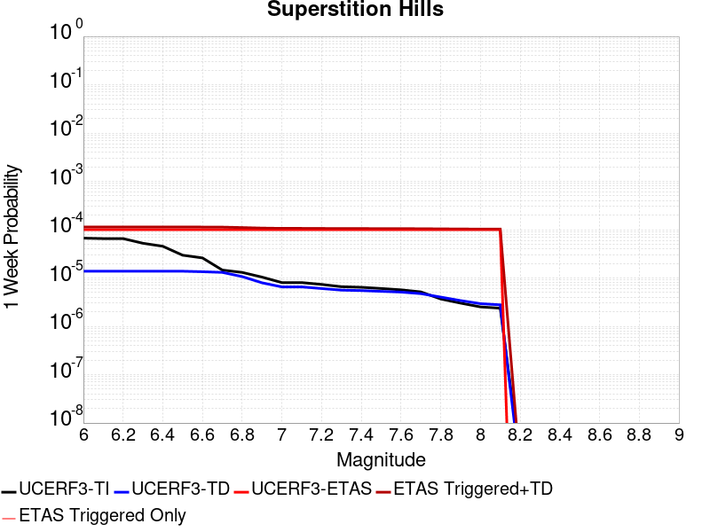 |  |  |  |

| Magnitude | 1 wk TI Prob | 1 wk TD Prob | 1 wk ETAS Prob | 1 wk ETAS/TD Gain | 1 wk ETAS Triggered+TD | 1 wk ETAS Triggered Only | 1 mo TI Prob | 1 mo TD Prob | 1 mo ETAS Prob | 1 mo ETAS/TD Gain | 1 mo ETAS Triggered+TD | 1 mo ETAS Triggered Only | 1 yr TI Prob | 1 yr TD Prob | 1 yr ETAS Prob | 1 yr ETAS/TD Gain | 1 yr ETAS Triggered+TD | 1 yr ETAS Triggered Only | 10 yr TI Prob | 10 yr TD Prob | 10 yr ETAS Prob | 10 yr ETAS/TD Gain | 10 yr ETAS Triggered+TD | 10 yr ETAS Triggered Only |
|-----|-----|-----|-----|-----|-----|-----|-----|-----|-----|-----|-----|-----|-----|-----|-----|-----|-----|-----|-----|-----|-----|-----|-----|-----|
| 6.0 | 6.6865185E-5 | 1.3796519E-5 | 1.0E-4 | 7.248205 | 1.1379514E-4 | 1.0E-4 | 2.8653358E-4 | 5.9126687E-5 | 1.0E-4 | 1.6912837 | 1.5912077E-4 | 1.0E-4 | 0.0034829667 | 7.196453E-4 | 1.0E-4 | 0.13895734 | 8.1957335E-4 | 1.0E-4 | 0.03428881 | 0.007343593 | 2.0E-4 | 0.027234625 | 0.0075421245 | 2.0E-4 |
| 6.1 | 6.544851E-5 | 1.3796519E-5 | 1.0E-4 | 7.248205 | 1.1379514E-4 | 1.0E-4 | 2.8046346E-4 | 5.9126687E-5 | 1.0E-4 | 1.6912837 | 1.5912077E-4 | 1.0E-4 | 0.0034092965 | 7.196453E-4 | 1.0E-4 | 0.13895734 | 8.1957335E-4 | 1.0E-4 | 0.033574644 | 0.0073435926 | 2.0E-4 | 0.027234625 | 0.007542124 | 2.0E-4 |
| 6.2 | 6.544851E-5 | 1.3796519E-5 | 1.0E-4 | 7.248205 | 1.1379514E-4 | 1.0E-4 | 2.8046346E-4 | 5.9126687E-5 | 1.0E-4 | 1.6912837 | 1.5912077E-4 | 1.0E-4 | 0.0034092965 | 7.196453E-4 | 1.0E-4 | 0.13895734 | 8.1957335E-4 | 1.0E-4 | 0.033574644 | 0.0073435926 | 2.0E-4 | 0.027234625 | 0.007542124 | 2.0E-4 |
| 6.3 | 5.2402065E-5 | 1.3796519E-5 | 1.0E-4 | 7.248205 | 1.1379514E-4 | 1.0E-4 | 2.2456095E-4 | 5.9126687E-5 | 1.0E-4 | 1.6912837 | 1.5912077E-4 | 1.0E-4 | 0.0027306017 | 7.196453E-4 | 1.0E-4 | 0.13895735 | 8.1957335E-4 | 1.0E-4 | 0.02697292 | 0.007343591 | 2.0E-4 | 0.02723463 | 0.0075421226 | 2.0E-4 |
| 6.4 | 4.542238E-5 | 1.3796519E-5 | 1.0E-4 | 7.248205 | 1.1379514E-4 | 1.0E-4 | 1.9465282E-4 | 5.9126687E-5 | 1.0E-4 | 1.6912837 | 1.5912077E-4 | 1.0E-4 | 0.0023673223 | 7.196453E-4 | 1.0E-4 | 0.13895735 | 8.1957335E-4 | 1.0E-4 | 0.023422617 | 0.0073435907 | 2.0E-4 | 0.027234634 | 0.0075421217 | 2.0E-4 |
| 6.5 | 2.9672969E-5 | 1.3796519E-5 | 1.0E-4 | 7.248205 | 1.1379514E-4 | 1.0E-4 | 1.2716366E-4 | 5.9126683E-5 | 1.0E-4 | 1.6912837 | 1.5912077E-4 | 1.0E-4 | 0.0015471181 | 7.196453E-4 | 1.0E-4 | 0.13895735 | 8.195733E-4 | 1.0E-4 | 0.015363912 | 0.007343589 | 2.0E-4 | 0.02723464 | 0.00754212 | 2.0E-4 |
| 6.6 | 2.6056105E-5 | 1.3465085E-5 | 1.0E-4 | 7.4266148 | 1.1346374E-4 | 1.0E-4 | 1.1166424E-4 | 5.7706322E-5 | 1.0E-4 | 1.7329124 | 1.5770055E-4 | 1.0E-4 | 0.0013586642 | 7.023635E-4 | 1.0E-4 | 0.14237642 | 8.0229325E-4 | 1.0E-4 | 0.013503874 | 0.007169425 | 2.0E-4 | 0.02789624 | 0.007367991 | 2.0E-4 |
| 6.7 | 1.4611248E-5 | 1.3051225E-5 | 1.0E-4 | 7.662116 | 1.1304992E-4 | 1.0E-4 | 6.261813E-5 | 5.593271E-5 | 1.0E-4 | 1.7878627 | 1.5592712E-4 | 1.0E-4 | 7.6210906E-4 | 6.8078336E-4 | 1.0E-4 | 0.14688961 | 7.8071526E-4 | 1.0E-4 | 0.0075950073 | 0.006953731 | 2.0E-4 | 0.028761538 | 0.0071523404 | 2.0E-4 |
| 6.8 | 1.30607E-5 | 1.06771295E-5 | 1.0E-4 | 9.365813 | 1.1067606E-4 | 1.0E-4 | 5.597323E-5 | 4.575837E-5 | 1.0E-4 | 2.1853926 | 1.457538E-4 | 1.0E-4 | 6.8126095E-4 | 5.569741E-4 | 1.0E-4 | 0.17954156 | 6.569184E-4 | 1.0E-4 | 0.006791762 | 0.0057176747 | 2.0E-4 | 0.034979254 | 0.005916531 | 2.0E-4 |
| 6.9 | 1.0443096E-5 | 7.9457495E-6 | 1.0E-4 | 12.585344 | 1.0794496E-4 | 1.0E-4 | 4.4755358E-5 | 3.405278E-5 | 1.0E-4 | 2.9366176 | 1.3404938E-4 | 1.0E-4 | 5.447602E-4 | 4.1451596E-4 | 1.0E-4 | 0.24124524 | 5.144745E-4 | 1.0E-4 | 0.005434267 | 0.0042785862 | 1.0E-4 | 0.023372205 | 0.0043781586 | 1.0E-4 |
| 7.0 | 8.045912E-6 | 6.5298846E-6 | 1.0E-4 | 15.314206 | 1.0652923E-4 | 1.0E-4 | 3.4482026E-5 | 2.7984925E-5 | 1.0E-4 | 3.5733523 | 1.2798213E-4 | 1.0E-4 | 4.197378E-4 | 3.4066418E-4 | 1.0E-4 | 0.29354423 | 4.406301E-4 | 1.0E-4 | 0.0041894587 | 0.003523399 | 1.0E-4 | 0.028381685 | 0.0036230467 | 1.0E-4 |
| 7.1 | 8.045912E-6 | 6.5298846E-6 | 1.0E-4 | 15.314206 | 1.0652923E-4 | 1.0E-4 | 3.4482026E-5 | 2.7984925E-5 | 1.0E-4 | 3.5733523 | 1.2798213E-4 | 1.0E-4 | 4.197378E-4 | 3.4066418E-4 | 1.0E-4 | 0.29354423 | 4.406301E-4 | 1.0E-4 | 0.0041894587 | 0.003523399 | 1.0E-4 | 0.028381685 | 0.0036230467 | 1.0E-4 |
| 7.2 | 7.375506E-6 | 6.045261E-6 | 1.0E-4 | 16.541883 | 1.0604466E-4 | 1.0E-4 | 3.1608928E-5 | 2.590801E-5 | 1.0E-4 | 3.8598104 | 1.2590541E-4 | 1.0E-4 | 3.8477074E-4 | 3.1538517E-4 | 1.0E-4 | 0.31707263 | 4.1535363E-4 | 1.0E-4 | 0.003841052 | 0.003268259 | 1.0E-4 | 0.03059733 | 0.0033679323 | 1.0E-4 |
| 7.3 | 6.6063913E-6 | 5.603235E-6 | 1.0E-4 | 17.846834 | 1.05602674E-4 | 1.0E-4 | 2.8312797E-5 | 2.4013647E-5 | 1.0E-4 | 4.164299 | 1.2401125E-4 | 1.0E-4 | 3.446538E-4 | 2.9232758E-4 | 1.0E-4 | 0.342082 | 3.9229836E-4 | 1.0E-4 | 0.0034411973 | 0.003035418 | 1.0E-4 | 0.032944392 | 0.0031351147 | 1.0E-4 |
| 7.4 | 6.4313126E-6 | 5.485424E-6 | 1.0E-4 | 18.230131 | 1.05484876E-4 | 1.0E-4 | 2.7562477E-5 | 2.3508752E-5 | 1.0E-4 | 4.253735 | 1.235064E-4 | 1.0E-4 | 3.355215E-4 | 2.8618213E-4 | 1.0E-4 | 0.34942785 | 3.861535E-4 | 1.0E-4 | 0.0033501536 | 0.0029735975 | 1.0E-4 | 0.0336293 | 0.0030733 | 1.0E-4 |
| 7.5 | 6.0742927E-6 | 5.2839196E-6 | 1.0E-4 | 18.925346 | 1.0528339E-4 | 1.0E-4 | 2.6032423E-5 | 2.2645176E-5 | 1.0E-4 | 4.4159517 | 1.2264292E-4 | 1.0E-4 | 3.1689866E-4 | 2.7567075E-4 | 1.0E-4 | 0.36275157 | 3.756432E-4 | 1.0E-4 | 0.0031644711 | 0.0028668358 | 1.0E-4 | 0.034881663 | 0.002966549 | 1.0E-4 |
| 7.6 | 5.6987187E-6 | 5.1049324E-6 | 1.0E-4 | 19.588898 | 1.05104424E-4 | 1.0E-4 | 2.4422852E-5 | 2.18781E-5 | 1.0E-4 | 4.5707803 | 1.2187591E-4 | 1.0E-4 | 2.9730765E-4 | 2.6633393E-4 | 1.0E-4 | 0.3754685 | 3.663073E-4 | 1.0E-4 | 0.002969102 | 0.0027715745 | 1.0E-4 | 0.036080573 | 0.0028712973 | 1.0E-4 |
| 7.7 | 5.1658035E-6 | 4.7403937E-6 | 1.0E-4 | 21.095295 | 1.0473992E-4 | 1.0E-4 | 2.2138971E-5 | 2.0315818E-5 | 1.0E-4 | 4.9222727 | 1.2031379E-4 | 1.0E-4 | 2.6950863E-4 | 2.4731757E-4 | 1.0E-4 | 0.40433845 | 3.4729284E-4 | 1.0E-4 | 0.00269182 | 0.0025789577 | 1.0E-4 | 0.038775355 | 0.0026786998 | 1.0E-4 |
| 7.8 | 3.6864697E-6 | 4.0211085E-6 | 1.0E-4 | 24.868765 | 1.04020706E-4 | 1.0E-4 | 1.579906E-5 | 1.723321E-5 | 1.0E-4 | 5.8027496 | 1.1723149E-4 | 1.0E-4 | 1.9233658E-4 | 2.0979455E-4 | 1.0E-4 | 0.4766568 | 3.0977358E-4 | 1.0E-4 | 0.0019217018 | 0.0021972533 | 1.0E-4 | 0.045511365 | 0.0022970336 | 1.0E-4 |
| 7.9 | 3.0265903E-6 | 3.4014947E-6 | 1.0E-4 | 29.398842 | 1.0340115E-4 | 1.0E-4 | 1.2971037E-5 | 1.4577755E-5 | 1.0E-4 | 6.859767 | 1.14576294E-4 | 1.0E-4 | 1.5791094E-4 | 1.7747011E-4 | 1.0E-4 | 0.5634752 | 2.7745237E-4 | 1.0E-4 | 0.0015779877 | 0.0018684153 | 1.0E-4 | 0.053521294 | 0.0019682285 | 1.0E-4 |
| 8.0 | 2.5271493E-6 | 2.937738E-6 | 1.0E-4 | 34.039795 | 1.0293745E-4 | 1.0E-4 | 1.0830595E-5 | 1.2590247E-5 | 1.0E-4 | 7.942656 | 1.1258899E-4 | 1.0E-4 | 1.3185451E-4 | 1.5327585E-4 | 1.0E-4 | 0.6524185 | 2.532605E-4 | 1.0E-4 | 0.0013177631 | 0.001619196 | 1.0E-4 | 0.061759043 | 0.0017190342 | 1.0E-4 |
| 8.1 | 2.3749135E-6 | 2.7747E-6 | 1.0E-4 | 36.039932 | 1.0277442E-4 | 1.0E-4 | 1.0178161E-5 | 1.18915195E-5 | 1.0E-4 | 8.409354 | 1.1189033E-4 | 1.0E-4 | 1.2391206E-4 | 1.4477E-4 | 1.0E-4 | 0.6907508 | 2.4475553E-4 | 1.0E-4 | 0.0012384299 | 0.0015301426 | 1.0E-4 | 0.065353386 | 0.0016299896 | 1.0E-4 |
| 8.2 | 1.7186406E-9 | 1.0663763E-9 | 0.0 | 0.0 | 1.0663763E-9 | 0.0 | 7.3656024E-9 | 4.5701842E-9 | 0.0 | 0.0 | 4.5701842E-9 | 0.0 | 8.9676206E-8 | 5.5641994E-8 | 0.0 | 0.0 | 5.5641994E-8 | 0.0 | 8.9676166E-7 | 5.9691484E-7 | 0.0 | 0.0 | 5.9691484E-7 | 0.0 |

## Palos Verdes
*[(top)](#table-of-contents)*

| 1 Week | 1 Month | 1 Year | 10 Year |
|-----|-----|-----|-----|
|  |  |  |  |

| Magnitude | 1 wk TI Prob | 1 wk TD Prob | 1 wk ETAS Prob | 1 wk ETAS/TD Gain | 1 wk ETAS Triggered+TD | 1 wk ETAS Triggered Only | 1 mo TI Prob | 1 mo TD Prob | 1 mo ETAS Prob | 1 mo ETAS/TD Gain | 1 mo ETAS Triggered+TD | 1 mo ETAS Triggered Only | 1 yr TI Prob | 1 yr TD Prob | 1 yr ETAS Prob | 1 yr ETAS/TD Gain | 1 yr ETAS Triggered+TD | 1 yr ETAS Triggered Only | 10 yr TI Prob | 10 yr TD Prob | 10 yr ETAS Prob | 10 yr ETAS/TD Gain | 10 yr ETAS Triggered+TD | 10 yr ETAS Triggered Only |
|-----|-----|-----|-----|-----|-----|-----|-----|-----|-----|-----|-----|-----|-----|-----|-----|-----|-----|-----|-----|-----|-----|-----|-----|-----|
| 6.0 | 6.126063E-5 | 7.6033015E-5 | 0.0 | 0.0 | 7.6033015E-5 | 0.0 | 2.6251914E-4 | 3.258184E-4 | 0.0 | 0.0 | 3.258184E-4 | 0.0 | 0.0031914865 | 0.003960153 | 0.0 | 0.0 | 0.003960153 | 0.0 | 0.031460393 | 0.038952567 | 1.0E-4 | 0.002567225 | 0.03904867 | 1.0E-4 |
| 6.1 | 6.126063E-5 | 7.6033015E-5 | 0.0 | 0.0 | 7.6033015E-5 | 0.0 | 2.6251914E-4 | 3.258184E-4 | 0.0 | 0.0 | 3.258184E-4 | 0.0 | 0.0031914865 | 0.003960153 | 0.0 | 0.0 | 0.003960153 | 0.0 | 0.031460393 | 0.038952567 | 1.0E-4 | 0.002567225 | 0.03904867 | 1.0E-4 |
| 6.2 | 6.126063E-5 | 7.6033015E-5 | 0.0 | 0.0 | 7.6033015E-5 | 0.0 | 2.6251914E-4 | 3.258184E-4 | 0.0 | 0.0 | 3.258184E-4 | 0.0 | 0.0031914865 | 0.003960153 | 0.0 | 0.0 | 0.003960153 | 0.0 | 0.031460393 | 0.038952567 | 1.0E-4 | 0.002567225 | 0.03904867 | 1.0E-4 |
| 6.3 | 4.0838047E-5 | 4.9635695E-5 | 0.0 | 0.0 | 4.9635695E-5 | 0.0 | 1.7500846E-4 | 2.1270833E-4 | 0.0 | 0.0 | 2.1270833E-4 | 0.0 | 0.0021286458 | 0.0025868537 | 0.0 | 0.0 | 0.0025868537 | 0.0 | 0.021083709 | 0.025589142 | 0.0 | 0.0 | 0.025589142 | 0.0 |
| 6.4 | 4.0838047E-5 | 4.9635695E-5 | 0.0 | 0.0 | 4.9635695E-5 | 0.0 | 1.7500846E-4 | 2.1270833E-4 | 0.0 | 0.0 | 2.1270833E-4 | 0.0 | 0.0021286458 | 0.0025868537 | 0.0 | 0.0 | 0.0025868537 | 0.0 | 0.021083709 | 0.025589142 | 0.0 | 0.0 | 0.025589142 | 0.0 |
| 6.5 | 3.0512005E-5 | 3.6485533E-5 | 0.0 | 0.0 | 3.6485533E-5 | 0.0 | 1.3075917E-4 | 1.5635787E-4 | 0.0 | 0.0 | 1.5635787E-4 | 0.0 | 0.0015908304 | 0.001902111 | 0.0 | 0.0 | 0.001902111 | 0.0 | 0.015794903 | 0.01887022 | 0.0 | 0.0 | 0.01887022 | 0.0 |
| 6.6 | 2.9255087E-5 | 3.5080087E-5 | 0.0 | 0.0 | 3.5080087E-5 | 0.0 | 1.2537291E-4 | 1.5033523E-4 | 0.0 | 0.0 | 1.5033523E-4 | 0.0 | 0.0015253464 | 0.0018289083 | 0.0 | 0.0 | 0.0018289083 | 0.0 | 0.015149189 | 0.018150162 | 0.0 | 0.0 | 0.018150162 | 0.0 |
| 6.7 | 2.287198E-5 | 2.71935E-5 | 0.0 | 0.0 | 2.71935E-5 | 0.0 | 9.801909E-5 | 1.1653888E-4 | 0.0 | 0.0 | 1.1653888E-4 | 0.0 | 0.001192729 | 0.0014180287 | 0.0 | 0.0 | 0.0014180287 | 0.0 | 0.011863477 | 0.014098996 | 0.0 | 0.0 | 0.014098996 | 0.0 |
| 6.8 | 2.1325764E-5 | 2.538045E-5 | 0.0 | 0.0 | 2.538045E-5 | 0.0 | 9.139293E-5 | 1.0876933E-4 | 0.0 | 0.0 | 1.0876933E-4 | 0.0 | 0.001112141 | 0.001323552 | 0.0 | 0.0 | 0.001323552 | 0.0 | 0.011065915 | 0.013165689 | 0.0 | 0.0 | 0.013165689 | 0.0 |
| 6.9 | 1.9009392E-5 | 2.2568487E-5 | 0.0 | 0.0 | 2.2568487E-5 | 0.0 | 8.1466285E-5 | 9.671899E-5 | 0.0 | 0.0 | 9.671899E-5 | 0.0 | 9.914007E-4 | 0.0011770045 | 0.0 | 0.0 | 0.0011770045 | 0.0 | 0.009869894 | 0.011716356 | 0.0 | 0.0 | 0.011716356 | 0.0 |
| 7.0 | 1.7098473E-5 | 2.027909E-5 | 0.0 | 0.0 | 2.027909E-5 | 0.0 | 7.3277115E-5 | 8.6907974E-5 | 0.0 | 0.0 | 8.6907974E-5 | 0.0 | 8.917837E-4 | 0.0010576758 | 0.0 | 0.0 | 0.0010576758 | 0.0 | 0.008882134 | 0.010534819 | 0.0 | 0.0 | 0.010534819 | 0.0 |
| 7.1 | 1.5982785E-5 | 1.89571E-5 | 0.0 | 0.0 | 1.89571E-5 | 0.0 | 6.849585E-5 | 8.1242666E-5 | 0.0 | 0.0 | 8.1242666E-5 | 0.0 | 8.336179E-4 | 9.887649E-4 | 0.0 | 0.0 | 9.887649E-4 | 0.0 | 0.008304977 | 0.009851984 | 0.0 | 0.0 | 0.009851984 | 0.0 |
| 7.2 | 1.4468002E-5 | 1.716309E-5 | 0.0 | 0.0 | 1.716309E-5 | 0.0 | 6.200425E-5 | 7.3554496E-5 | 0.0 | 0.0 | 7.3554496E-5 | 0.0 | 7.546402E-4 | 8.9524174E-4 | 0.0 | 0.0 | 8.9524174E-4 | 0.0 | 0.007520827 | 0.008924588 | 0.0 | 0.0 | 0.008924588 | 0.0 |
| 7.3 | 5.288233E-6 | 6.192199E-6 | 0.0 | 0.0 | 6.192199E-6 | 0.0 | 2.2663658E-5 | 2.6537922E-5 | 0.0 | 0.0 | 2.6537922E-5 | 0.0 | 2.7589512E-4 | 3.2308605E-4 | 0.0 | 0.0 | 3.2308605E-4 | 0.0 | 0.0027555283 | 0.0032295715 | 0.0 | 0.0 | 0.0032295715 | 0.0 |
| 7.4 | 8.279556E-7 | 8.406981E-7 | 0.0 | 0.0 | 8.406981E-7 | 0.0 | 3.5483763E-6 | 3.6029871E-6 | 0.0 | 0.0 | 3.6029871E-6 | 0.0 | 4.3200624E-5 | 4.386556E-5 | 0.0 | 0.0 | 4.386556E-5 | 0.0 | 4.3192226E-4 | 4.3857621E-4 | 0.0 | 0.0 | 4.3857621E-4 | 0.0 |
| 7.5 | 6.559831E-7 | 6.666089E-7 | 0.0 | 0.0 | 6.666089E-7 | 0.0 | 2.8113532E-6 | 2.8568925E-6 | 0.0 | 0.0 | 2.8568925E-6 | 0.0 | 3.4227687E-5 | 3.478218E-5 | 0.0 | 0.0 | 3.478218E-5 | 0.0 | 3.4222414E-4 | 3.4777398E-4 | 0.0 | 0.0 | 3.4777398E-4 | 0.0 |
| 7.6 | 3.5018968E-7 | 3.5613644E-7 | 0.0 | 0.0 | 3.5613644E-7 | 0.0 | 1.500812E-6 | 1.5262984E-6 | 0.0 | 0.0 | 1.5262984E-6 | 0.0 | 1.8272232E-5 | 1.8582572E-5 | 0.0 | 0.0 | 1.8582572E-5 | 0.0 | 1.8270731E-4 | 1.8581477E-4 | 0.0 | 0.0 | 1.8581477E-4 | 0.0 |
| 7.7 | 1.1986104E-7 | 1.2196121E-7 | 0.0 | 0.0 | 1.2196121E-7 | 0.0 | 5.1369005E-7 | 5.226908E-7 | 0.0 | 0.0 | 5.226908E-7 | 0.0 | 6.2541585E-6 | 6.363742E-6 | 0.0 | 0.0 | 6.363742E-6 | 0.0 | 6.2539824E-5 | 6.363564E-5 | 0.0 | 0.0 | 6.363564E-5 | 0.0 |
| 7.8 | 3.0445005E-8 | 3.1021386E-8 | 0.0 | 0.0 | 3.1021386E-8 | 0.0 | 1.3047858E-7 | 1.3294878E-7 | 0.0 | 0.0 | 1.3294878E-7 | 0.0 | 1.5885756E-6 | 1.6186506E-6 | 0.0 | 0.0 | 1.6186506E-6 | 0.0 | 1.5885644E-5 | 1.6186408E-5 | 0.0 | 0.0 | 1.6186408E-5 | 0.0 |

## Helendale-So Lockhart
*[(top)](#table-of-contents)*

| 1 Week | 1 Month | 1 Year | 10 Year |
|-----|-----|-----|-----|
|  | 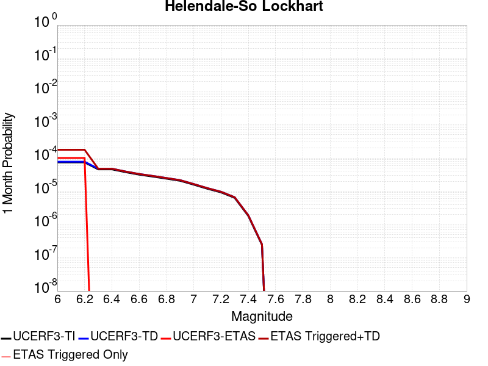 |  |  |

| Magnitude | 1 wk TI Prob | 1 wk TD Prob | 1 wk ETAS Prob | 1 wk ETAS/TD Gain | 1 wk ETAS Triggered+TD | 1 wk ETAS Triggered Only | 1 mo TI Prob | 1 mo TD Prob | 1 mo ETAS Prob | 1 mo ETAS/TD Gain | 1 mo ETAS Triggered+TD | 1 mo ETAS Triggered Only | 1 yr TI Prob | 1 yr TD Prob | 1 yr ETAS Prob | 1 yr ETAS/TD Gain | 1 yr ETAS Triggered+TD | 1 yr ETAS Triggered Only | 10 yr TI Prob | 10 yr TD Prob | 10 yr ETAS Prob | 10 yr ETAS/TD Gain | 10 yr ETAS Triggered+TD | 10 yr ETAS Triggered Only |
|-----|-----|-----|-----|-----|-----|-----|-----|-----|-----|-----|-----|-----|-----|-----|-----|-----|-----|-----|-----|-----|-----|-----|-----|-----|
| 6.0 | 1.7296055E-5 | 1.8094886E-5 | 0.0 | 0.0 | 1.8094886E-5 | 0.0 | 7.412385E-5 | 7.754733E-5 | 1.0E-4 | 1.289535 | 1.7753958E-4 | 1.0E-4 | 9.0208417E-4 | 9.437505E-4 | 1.0E-4 | 0.10596021 | 0.0010436561 | 1.0E-4 | 0.008984311 | 0.0093995435 | 1.0E-4 | 0.010638814 | 0.009498604 | 1.0E-4 |
| 6.1 | 1.7296055E-5 | 1.8094886E-5 | 0.0 | 0.0 | 1.8094886E-5 | 0.0 | 7.412385E-5 | 7.754733E-5 | 1.0E-4 | 1.289535 | 1.7753958E-4 | 1.0E-4 | 9.0208417E-4 | 9.437505E-4 | 1.0E-4 | 0.10596021 | 0.0010436561 | 1.0E-4 | 0.008984311 | 0.0093995435 | 1.0E-4 | 0.010638814 | 0.009498604 | 1.0E-4 |
| 6.2 | 1.7296055E-5 | 1.8094886E-5 | 0.0 | 0.0 | 1.8094886E-5 | 0.0 | 7.412385E-5 | 7.754733E-5 | 1.0E-4 | 1.289535 | 1.7753958E-4 | 1.0E-4 | 9.0208417E-4 | 9.437505E-4 | 1.0E-4 | 0.10596021 | 0.0010436561 | 1.0E-4 | 0.008984311 | 0.0093995435 | 1.0E-4 | 0.010638814 | 0.009498604 | 1.0E-4 |
| 6.3 | 1.0669118E-5 | 1.1130337E-5 | 0.0 | 0.0 | 1.1130337E-5 | 0.0 | 4.5723988E-5 | 4.770059E-5 | 0.0 | 0.0 | 4.770059E-5 | 0.0 | 5.5654737E-4 | 5.806027E-4 | 0.0 | 0.0 | 5.806027E-4 | 0.0 | 0.0055515557 | 0.005791154 | 0.0 | 0.0 | 0.005791154 | 0.0 |
| 6.4 | 1.0669118E-5 | 1.1130337E-5 | 0.0 | 0.0 | 1.1130337E-5 | 0.0 | 4.5723988E-5 | 4.770059E-5 | 0.0 | 0.0 | 4.770059E-5 | 0.0 | 5.5654737E-4 | 5.806027E-4 | 0.0 | 0.0 | 5.806027E-4 | 0.0 | 0.0055515557 | 0.005791154 | 0.0 | 0.0 | 0.005791154 | 0.0 |
| 6.5 | 8.790038E-6 | 9.166051E-6 | 0.0 | 0.0 | 9.166051E-6 | 0.0 | 3.767105E-5 | 3.9282495E-5 | 0.0 | 0.0 | 3.9282495E-5 | 0.0 | 4.585485E-4 | 4.7816095E-4 | 0.0 | 0.0 | 4.7816095E-4 | 0.0 | 0.0045760344 | 0.0047714855 | 0.0 | 0.0 | 0.0047714855 | 0.0 |
| 6.6 | 7.396949E-6 | 7.712063E-6 | 0.0 | 0.0 | 7.712063E-6 | 0.0 | 3.1700827E-5 | 3.3051285E-5 | 0.0 | 0.0 | 3.3051285E-5 | 0.0 | 3.858892E-4 | 4.023261E-4 | 0.0 | 0.0 | 4.023261E-4 | 0.0 | 0.003852198 | 0.0040160846 | 0.0 | 0.0 | 0.0040160846 | 0.0 |
| 6.7 | 6.4600285E-6 | 6.7349997E-6 | 0.0 | 0.0 | 6.7349997E-6 | 0.0 | 2.7685543E-5 | 2.886397E-5 | 0.0 | 0.0 | 2.886397E-5 | 0.0 | 3.3701936E-4 | 3.5136295E-4 | 0.0 | 0.0 | 3.5136295E-4 | 0.0 | 0.0033650869 | 0.0035081557 | 0.0 | 0.0 | 0.0035081557 | 0.0 |
| 6.8 | 5.600104E-6 | 5.833441E-6 | 0.0 | 0.0 | 5.833441E-6 | 0.0 | 2.4000226E-5 | 2.5000225E-5 | 0.0 | 0.0 | 2.5000225E-5 | 0.0 | 2.9216358E-4 | 3.0433582E-4 | 0.0 | 0.0 | 3.0433582E-4 | 0.0 | 0.0029177975 | 0.0030392518 | 0.0 | 0.0 | 0.0030392518 | 0.0 |
| 6.9 | 4.839122E-6 | 5.0373296E-6 | 0.0 | 0.0 | 5.0373296E-6 | 0.0 | 2.0738931E-5 | 2.158838E-5 | 0.0 | 0.0 | 2.158838E-5 | 0.0 | 2.5246723E-4 | 2.6280727E-4 | 0.0 | 0.0 | 2.6280727E-4 | 0.0 | 0.002521806 | 0.0026250123 | 0.0 | 0.0 | 0.0026250123 | 0.0 |
| 7.0 | 3.6937633E-6 | 3.8435614E-6 | 0.0 | 0.0 | 3.8435614E-6 | 0.0 | 1.5830317E-5 | 1.6472304E-5 | 0.0 | 0.0 | 1.6472304E-5 | 0.0 | 1.9271708E-4 | 2.0053216E-4 | 0.0 | 0.0 | 2.0053216E-4 | 0.0 | 0.0019255003 | 0.0020035435 | 0.0 | 0.0 | 0.0020035435 | 0.0 |
| 7.1 | 2.7858857E-6 | 2.8966379E-6 | 0.0 | 0.0 | 2.8966379E-6 | 0.0 | 1.1939455E-5 | 1.2414104E-5 | 0.0 | 0.0 | 1.2414104E-5 | 0.0 | 1.4535317E-4 | 1.5113145E-4 | 0.0 | 0.0 | 1.5113145E-4 | 0.0 | 0.0014525814 | 0.0015103082 | 0.0 | 0.0 | 0.0015103082 | 0.0 |
| 7.2 | 2.1672065E-6 | 2.2530703E-6 | 0.0 | 0.0 | 2.2530703E-6 | 0.0 | 9.2879945E-6 | 9.655981E-6 | 0.0 | 0.0 | 9.655981E-6 | 0.0 | 1.1307546E-4 | 1.17555406E-4 | 0.0 | 0.0 | 1.17555406E-4 | 0.0 | 0.0011301794 | 0.0011749504 | 0.0 | 0.0 | 0.0011749504 | 0.0 |
| 7.3 | 1.4823496E-6 | 1.5415601E-6 | 0.0 | 0.0 | 1.5415601E-6 | 0.0 | 6.3529114E-6 | 6.6066705E-6 | 0.0 | 0.0 | 6.6066705E-6 | 0.0 | 7.734395E-5 | 8.04334E-5 | 0.0 | 0.0 | 8.04334E-5 | 0.0 | 7.731704E-4 | 8.040579E-4 | 0.0 | 0.0 | 8.040579E-4 | 0.0 |
| 7.4 | 4.2321457E-7 | 4.4089322E-7 | 0.0 | 0.0 | 4.4089322E-7 | 0.0 | 1.8137755E-6 | 1.8895413E-6 | 0.0 | 0.0 | 1.8895413E-6 | 0.0 | 2.2082493E-5 | 2.3004968E-5 | 0.0 | 0.0 | 2.3004968E-5 | 0.0 | 2.2080299E-4 | 2.3003039E-4 | 0.0 | 0.0 | 2.3003039E-4 | 0.0 |
| 7.5 | 5.6942316E-8 | 5.938871E-8 | 0.0 | 0.0 | 5.938871E-8 | 0.0 | 2.440385E-7 | 2.5452303E-7 | 0.0 | 0.0 | 2.5452303E-7 | 0.0 | 2.9711643E-6 | 3.0988142E-6 | 0.0 | 0.0 | 3.0988142E-6 | 0.0 | 2.9711247E-5 | 3.0987787E-5 | 0.0 | 0.0 | 3.0987787E-5 | 0.0 |

## Goldstone Lake
*[(top)](#table-of-contents)*

| 1 Week | 1 Month | 1 Year | 10 Year |
|-----|-----|-----|-----|
|  | 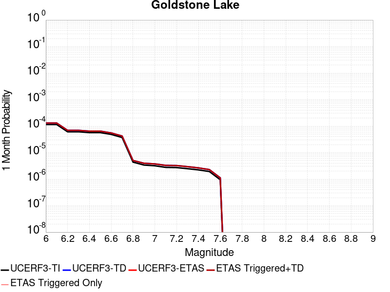 |  |  |

| Magnitude | 1 wk TI Prob | 1 wk TD Prob | 1 wk ETAS Prob | 1 wk ETAS/TD Gain | 1 wk ETAS Triggered+TD | 1 wk ETAS Triggered Only | 1 mo TI Prob | 1 mo TD Prob | 1 mo ETAS Prob | 1 mo ETAS/TD Gain | 1 mo ETAS Triggered+TD | 1 mo ETAS Triggered Only | 1 yr TI Prob | 1 yr TD Prob | 1 yr ETAS Prob | 1 yr ETAS/TD Gain | 1 yr ETAS Triggered+TD | 1 yr ETAS Triggered Only | 10 yr TI Prob | 10 yr TD Prob | 10 yr ETAS Prob | 10 yr ETAS/TD Gain | 10 yr ETAS Triggered+TD | 10 yr ETAS Triggered Only |
|-----|-----|-----|-----|-----|-----|-----|-----|-----|-----|-----|-----|-----|-----|-----|-----|-----|-----|-----|-----|-----|-----|-----|-----|-----|
| 6.0 | 2.671352E-5 | 3.0331994E-5 | 0.0 | 0.0 | 3.0331994E-5 | 0.0 | 1.1448149E-4 | 1.2998888E-4 | 0.0 | 0.0 | 1.2998888E-4 | 0.0 | 0.001392921 | 0.0015816615 | 0.0 | 0.0 | 0.0015816615 | 0.0 | 0.013842222 | 0.015723487 | 1.0E-4 | 0.0063599125 | 0.015821915 | 1.0E-4 |
| 6.1 | 2.671352E-5 | 3.0331994E-5 | 0.0 | 0.0 | 3.0331994E-5 | 0.0 | 1.1448149E-4 | 1.2998888E-4 | 0.0 | 0.0 | 1.2998888E-4 | 0.0 | 0.001392921 | 0.0015816615 | 0.0 | 0.0 | 0.0015816615 | 0.0 | 0.013842222 | 0.015723487 | 1.0E-4 | 0.0063599125 | 0.015821915 | 1.0E-4 |
| 6.2 | 1.4197047E-5 | 1.6073136E-5 | 0.0 | 0.0 | 1.6073136E-5 | 0.0 | 6.0843064E-5 | 6.88836E-5 | 0.0 | 0.0 | 6.88836E-5 | 0.0 | 7.4051257E-4 | 8.384335E-4 | 0.0 | 0.0 | 8.384335E-4 | 0.0 | 0.007380498 | 0.008362372 | 1.0E-4 | 0.01195833 | 0.008461536 | 1.0E-4 |
| 6.3 | 1.4197047E-5 | 1.6073136E-5 | 0.0 | 0.0 | 1.6073136E-5 | 0.0 | 6.0843064E-5 | 6.88836E-5 | 0.0 | 0.0 | 6.88836E-5 | 0.0 | 7.4051257E-4 | 8.384335E-4 | 0.0 | 0.0 | 8.384335E-4 | 0.0 | 0.007380498 | 0.008362372 | 1.0E-4 | 0.01195833 | 0.008461536 | 1.0E-4 |
| 6.4 | 1.3238931E-5 | 1.4986886E-5 | 0.0 | 0.0 | 1.4986886E-5 | 0.0 | 5.6737044E-5 | 6.422848E-5 | 0.0 | 0.0 | 6.422848E-5 | 0.0 | 6.9055456E-4 | 7.817989E-4 | 0.0 | 0.0 | 7.817989E-4 | 0.0 | 0.006884126 | 0.007800085 | 1.0E-4 | 0.012820373 | 0.007899305 | 1.0E-4 |
| 6.5 | 1.3238931E-5 | 1.4986886E-5 | 0.0 | 0.0 | 1.4986886E-5 | 0.0 | 5.6737044E-5 | 6.422848E-5 | 0.0 | 0.0 | 6.422848E-5 | 0.0 | 6.9055456E-4 | 7.817989E-4 | 0.0 | 0.0 | 7.817989E-4 | 0.0 | 0.006884126 | 0.007800085 | 1.0E-4 | 0.012820373 | 0.007899305 | 1.0E-4 |
| 6.6 | 1.1328278E-5 | 1.2836445E-5 | 0.0 | 0.0 | 1.2836445E-5 | 0.0 | 4.8548856E-5 | 5.5012715E-5 | 0.0 | 0.0 | 5.5012715E-5 | 0.0 | 5.90922E-4 | 6.6966936E-4 | 0.0 | 0.0 | 6.6966936E-4 | 0.0 | 0.0058935313 | 0.0066858768 | 1.0E-4 | 0.014956902 | 0.0067852084 | 1.0E-4 |
| 6.7 | 8.651175E-6 | 9.810019E-6 | 0.0 | 0.0 | 9.810019E-6 | 0.0 | 3.707594E-5 | 4.2042768E-5 | 0.0 | 0.0 | 4.2042768E-5 | 0.0 | 4.5130608E-4 | 5.1184074E-4 | 0.0 | 0.0 | 5.1184074E-4 | 0.0 | 0.0045039062 | 0.0051154727 | 0.0 | 0.0 | 0.0051154727 | 0.0 |
| 6.8 | 1.0215377E-6 | 1.1729769E-6 | 0.0 | 0.0 | 1.1729769E-6 | 0.0 | 4.378012E-6 | 5.027035E-6 | 0.0 | 0.0 | 5.027035E-6 | 0.0 | 5.3300988E-5 | 6.120255E-5 | 0.0 | 0.0 | 6.120255E-5 | 0.0 | 5.3288206E-4 | 6.118681E-4 | 0.0 | 0.0 | 6.118681E-4 | 0.0 |
| 6.9 | 7.9360774E-7 | 9.2606354E-7 | 0.0 | 0.0 | 9.2606354E-7 | 0.0 | 3.4011714E-6 | 3.968838E-6 | 0.0 | 0.0 | 3.968838E-6 | 0.0 | 4.1408475E-5 | 4.83196E-5 | 0.0 | 0.0 | 4.83196E-5 | 0.0 | 4.140076E-4 | 4.8309792E-4 | 0.0 | 0.0 | 4.8309792E-4 | 0.0 |
| 7.0 | 7.4382757E-7 | 8.724997E-7 | 0.0 | 0.0 | 8.724997E-7 | 0.0 | 3.1878285E-6 | 3.7392795E-6 | 0.0 | 0.0 | 3.7392795E-6 | 0.0 | 3.8811122E-5 | 4.5524845E-5 | 0.0 | 0.0 | 4.5524845E-5 | 0.0 | 3.8804344E-4 | 4.551618E-4 | 0.0 | 0.0 | 4.551618E-4 | 0.0 |
| 7.1 | 6.4709513E-7 | 7.689736E-7 | 0.0 | 0.0 | 7.689736E-7 | 0.0 | 2.773262E-6 | 3.2955975E-6 | 0.0 | 0.0 | 3.2955975E-6 | 0.0 | 3.376394E-5 | 4.012322E-5 | 0.0 | 0.0 | 4.012322E-5 | 0.0 | 3.375881E-4 | 4.011657E-4 | 0.0 | 0.0 | 4.011657E-4 | 0.0 |
| 7.2 | 6.356704E-7 | 7.5668936E-7 | 0.0 | 0.0 | 7.5668936E-7 | 0.0 | 2.7242988E-6 | 3.2429507E-6 | 0.0 | 0.0 | 3.2429507E-6 | 0.0 | 3.3167835E-5 | 3.948227E-5 | 0.0 | 0.0 | 3.948227E-5 | 0.0 | 3.3162883E-4 | 3.9475845E-4 | 0.0 | 0.0 | 3.9475845E-4 | 0.0 |
| 7.3 | 5.7695723E-7 | 6.8827575E-7 | 0.0 | 0.0 | 6.8827575E-7 | 0.0 | 2.4726714E-6 | 2.9497503E-6 | 0.0 | 0.0 | 2.9497503E-6 | 0.0 | 3.0104358E-5 | 3.5912675E-5 | 0.0 | 0.0 | 3.5912675E-5 | 0.0 | 3.0100282E-4 | 3.5907442E-4 | 0.0 | 0.0 | 3.5907442E-4 | 0.0 |
| 7.4 | 5.209647E-7 | 6.18126E-7 | 0.0 | 0.0 | 6.18126E-7 | 0.0 | 2.232704E-6 | 2.649109E-6 | 0.0 | 0.0 | 2.649109E-6 | 0.0 | 2.718283E-5 | 3.2252483E-5 | 0.0 | 0.0 | 3.2252483E-5 | 0.0 | 2.7179506E-4 | 3.2248354E-4 | 0.0 | 0.0 | 3.2248354E-4 | 0.0 |
| 7.5 | 4.512955E-7 | 5.33711E-7 | 0.0 | 0.0 | 5.33711E-7 | 0.0 | 1.934122E-6 | 2.2873312E-6 | 0.0 | 0.0 | 2.2873312E-6 | 0.0 | 2.3547682E-5 | 2.7847955E-5 | 0.0 | 0.0 | 2.7847955E-5 | 0.0 | 2.3545188E-4 | 2.7844994E-4 | 0.0 | 0.0 | 2.7844994E-4 | 0.0 |
| 7.6 | 2.21172E-7 | 2.602981E-7 | 0.0 | 0.0 | 2.602981E-7 | 0.0 | 9.478797E-7 | 1.115563E-6 | 0.0 | 0.0 | 1.115563E-6 | 0.0 | 1.1540374E-5 | 1.3581924E-5 | 0.0 | 0.0 | 1.3581924E-5 | 0.0 | 1.1539775E-4 | 1.3581375E-4 | 0.0 | 0.0 | 1.3581375E-4 | 0.0 |

## Contra Costa (Lafayette) 2011 CFM
*[(top)](#table-of-contents)*

| 1 Week | 1 Month | 1 Year | 10 Year |
|-----|-----|-----|-----|
|  |  |  |  |

| Magnitude | 1 wk TI Prob | 1 wk TD Prob | 1 wk ETAS Prob | 1 wk ETAS/TD Gain | 1 wk ETAS Triggered+TD | 1 wk ETAS Triggered Only | 1 mo TI Prob | 1 mo TD Prob | 1 mo ETAS Prob | 1 mo ETAS/TD Gain | 1 mo ETAS Triggered+TD | 1 mo ETAS Triggered Only | 1 yr TI Prob | 1 yr TD Prob | 1 yr ETAS Prob | 1 yr ETAS/TD Gain | 1 yr ETAS Triggered+TD | 1 yr ETAS Triggered Only | 10 yr TI Prob | 10 yr TD Prob | 10 yr ETAS Prob | 10 yr ETAS/TD Gain | 10 yr ETAS Triggered+TD | 10 yr ETAS Triggered Only |
|-----|-----|-----|-----|-----|-----|-----|-----|-----|-----|-----|-----|-----|-----|-----|-----|-----|-----|-----|-----|-----|-----|-----|-----|-----|
| 6.0 | 6.655419E-6 | 6.907731E-6 | 0.0 | 0.0 | 6.907731E-6 | 0.0 | 2.8522913E-5 | 2.9604238E-5 | 0.0 | 0.0 | 2.9604238E-5 | 0.0 | 3.472111E-4 | 3.6037396E-4 | 0.0 | 0.0 | 3.6037396E-4 | 0.0 | 0.0034666911 | 0.0036027534 | 1.0E-4 | 0.027756548 | 0.0037023933 | 1.0E-4 |
| 6.1 | 6.655419E-6 | 6.907731E-6 | 0.0 | 0.0 | 6.907731E-6 | 0.0 | 2.8522913E-5 | 2.9604238E-5 | 0.0 | 0.0 | 2.9604238E-5 | 0.0 | 3.472111E-4 | 3.6037396E-4 | 0.0 | 0.0 | 3.6037396E-4 | 0.0 | 0.0034666911 | 0.0036027534 | 1.0E-4 | 0.027756548 | 0.0037023933 | 1.0E-4 |
| 6.2 | 6.6254133E-6 | 6.876158E-6 | 0.0 | 0.0 | 6.876158E-6 | 0.0 | 2.839432E-5 | 2.9468925E-5 | 0.0 | 0.0 | 2.9468925E-5 | 0.0 | 3.45646E-4 | 3.5872706E-4 | 0.0 | 0.0 | 3.5872706E-4 | 0.0 | 0.003451089 | 0.003586338 | 1.0E-4 | 0.027883597 | 0.0036859792 | 1.0E-4 |
| 6.3 | 6.6254133E-6 | 6.876158E-6 | 0.0 | 0.0 | 6.876158E-6 | 0.0 | 2.839432E-5 | 2.9468925E-5 | 0.0 | 0.0 | 2.9468925E-5 | 0.0 | 3.45646E-4 | 3.5872706E-4 | 0.0 | 0.0 | 3.5872706E-4 | 0.0 | 0.003451089 | 0.003586338 | 1.0E-4 | 0.027883597 | 0.0036859792 | 1.0E-4 |
| 6.4 | 6.6254133E-6 | 6.876158E-6 | 0.0 | 0.0 | 6.876158E-6 | 0.0 | 2.839432E-5 | 2.9468925E-5 | 0.0 | 0.0 | 2.9468925E-5 | 0.0 | 3.45646E-4 | 3.5872706E-4 | 0.0 | 0.0 | 3.5872706E-4 | 0.0 | 0.003451089 | 0.003586338 | 1.0E-4 | 0.027883597 | 0.0036859792 | 1.0E-4 |
| 6.5 | 6.606445E-6 | 6.855723E-6 | 0.0 | 0.0 | 6.855723E-6 | 0.0 | 2.8313027E-5 | 2.938135E-5 | 0.0 | 0.0 | 2.938135E-5 | 0.0 | 3.4465658E-4 | 3.576612E-4 | 0.0 | 0.0 | 3.576612E-4 | 0.0 | 0.0034412253 | 0.0035757134 | 1.0E-4 | 0.027966447 | 0.0036753558 | 1.0E-4 |
| 6.6 | 6.59966E-6 | 6.8482686E-6 | 0.0 | 0.0 | 6.8482686E-6 | 0.0 | 2.828395E-5 | 2.9349403E-5 | 0.0 | 0.0 | 2.9349403E-5 | 0.0 | 3.4430268E-4 | 3.5727237E-4 | 0.0 | 0.0 | 3.5727237E-4 | 0.0 | 0.0034376972 | 0.0035718377 | 1.0E-4 | 0.027996793 | 0.0036714806 | 1.0E-4 |
| 6.7 | 6.5570975E-6 | 6.8022987E-6 | 0.0 | 0.0 | 6.8022987E-6 | 0.0 | 2.8101544E-5 | 2.9152394E-5 | 0.0 | 0.0 | 2.9152394E-5 | 0.0 | 3.4208258E-4 | 3.5487456E-4 | 0.0 | 0.0 | 3.5487456E-4 | 0.0 | 0.0034155648 | 0.0035479364 | 1.0E-4 | 0.028185397 | 0.0036475817 | 1.0E-4 |
| 6.8 | 5.472255E-6 | 5.646102E-6 | 0.0 | 0.0 | 5.646102E-6 | 0.0 | 2.345231E-5 | 2.4197358E-5 | 0.0 | 0.0 | 2.4197358E-5 | 0.0 | 2.8549446E-4 | 2.9456348E-4 | 0.0 | 0.0 | 2.9456348E-4 | 0.0 | 0.0028512797 | 0.0029464404 | 1.0E-4 | 0.033939257 | 0.0030461457 | 1.0E-4 |
| 6.9 | 5.092346E-6 | 5.2367986E-6 | 0.0 | 0.0 | 5.2367986E-6 | 0.0 | 2.1824157E-5 | 2.2443233E-5 | 0.0 | 0.0 | 2.2443233E-5 | 0.0 | 2.656767E-4 | 2.7321247E-4 | 0.0 | 0.0 | 2.7321247E-4 | 0.0 | 0.002653593 | 0.0027334683 | 1.0E-4 | 0.036583558 | 0.002833195 | 1.0E-4 |
| 7.0 | 4.5525762E-6 | 4.6506752E-6 | 0.0 | 0.0 | 4.6506752E-6 | 0.0 | 1.9510895E-5 | 1.9931314E-5 | 0.0 | 0.0 | 1.9931314E-5 | 0.0 | 2.3751926E-4 | 2.4263703E-4 | 0.0 | 0.0 | 2.4263703E-4 | 0.0 | 0.0023726553 | 0.0024284127 | 1.0E-4 | 0.04117916 | 0.00252817 | 1.0E-4 |
| 7.1 | 4.261504E-6 | 4.3302425E-6 | 0.0 | 0.0 | 4.3302425E-6 | 0.0 | 1.826346E-5 | 1.8558052E-5 | 0.0 | 0.0 | 1.8558052E-5 | 0.0 | 2.2233493E-4 | 2.2592113E-4 | 0.0 | 0.0 | 2.2592113E-4 | 0.0 | 0.002221126 | 0.0022615942 | 0.0 | 0.0 | 0.0022615942 | 0.0 |
| 7.2 | 3.654114E-6 | 3.6725157E-6 | 0.0 | 0.0 | 3.6725157E-6 | 0.0 | 1.5660395E-5 | 1.5739259E-5 | 0.0 | 0.0 | 1.5739259E-5 | 0.0 | 1.9064861E-4 | 1.9160888E-4 | 0.0 | 0.0 | 1.9160888E-4 | 0.0 | 0.0019048514 | 0.0019190717 | 0.0 | 0.0 | 0.0019190717 | 0.0 |
| 7.3 | 2.1595129E-6 | 2.2241215E-6 | 0.0 | 0.0 | 2.2241215E-6 | 0.0 | 9.255023E-6 | 9.531915E-6 | 0.0 | 0.0 | 9.531915E-6 | 0.0 | 1.1267407E-4 | 1.16044925E-4 | 0.0 | 0.0 | 1.16044925E-4 | 0.0 | 0.0011261696 | 0.0011644588 | 0.0 | 0.0 | 0.0011644588 | 0.0 |
| 7.4 | 1.7532738E-6 | 1.8149052E-6 | 0.0 | 0.0 | 1.8149052E-6 | 0.0 | 7.5140088E-6 | 7.778142E-6 | 0.0 | 0.0 | 7.778142E-6 | 0.0 | 9.147922E-5 | 9.4694806E-5 | 0.0 | 0.0 | 9.4694806E-5 | 0.0 | 9.144157E-4 | 9.5098466E-4 | 0.0 | 0.0 | 9.5098466E-4 | 0.0 |
| 7.5 | 9.387875E-7 | 1.0040341E-6 | 0.0 | 0.0 | 1.0040341E-6 | 0.0 | 4.0233685E-6 | 4.302996E-6 | 0.0 | 0.0 | 4.302996E-6 | 0.0 | 4.8983413E-5 | 5.238773E-5 | 0.0 | 0.0 | 5.238773E-5 | 0.0 | 4.897262E-4 | 5.278372E-4 | 0.0 | 0.0 | 5.278372E-4 | 0.0 |
| 7.6 | 2.7471893E-7 | 3.1831E-7 | 0.0 | 0.0 | 3.1831E-7 | 0.0 | 1.1773664E-6 | 1.364185E-6 | 0.0 | 0.0 | 1.364185E-6 | 0.0 | 1.433434E-5 | 1.6608827E-5 | 0.0 | 0.0 | 1.6608827E-5 | 0.0 | 1.4333417E-4 | 1.6994587E-4 | 0.0 | 0.0 | 1.6994587E-4 | 0.0 |
| 7.7 | 2.0057985E-7 | 2.4472544E-7 | 0.0 | 0.0 | 2.4472544E-7 | 0.0 | 8.596276E-7 | 1.0488229E-6 | 0.0 | 0.0 | 1.0488229E-6 | 0.0 | 1.0465916E-5 | 1.2769346E-5 | 0.0 | 0.0 | 1.2769346E-5 | 0.0 | 1.0465423E-4 | 1.315111E-4 | 0.0 | 0.0 | 1.315111E-4 | 0.0 |
| 7.8 | 8.7403905E-8 | 1.1670708E-7 | 0.0 | 0.0 | 1.1670708E-7 | 0.0 | 3.745881E-7 | 5.001731E-7 | 0.0 | 0.0 | 5.001731E-7 | 0.0 | 4.5606007E-6 | 6.0895904E-6 | 0.0 | 0.0 | 6.0895904E-6 | 0.0 | 4.560507E-5 | 6.318295E-5 | 0.0 | 0.0 | 6.318295E-5 | 0.0 |
| 7.9 | 4.740233E-8 | 7.2807154E-8 | 0.0 | 0.0 | 7.2807154E-8 | 0.0 | 2.0315284E-7 | 3.1203064E-7 | 0.0 | 0.0 | 3.1203064E-7 | 0.0 | 2.473383E-6 | 3.7989662E-6 | 0.0 | 0.0 | 3.7989662E-6 | 0.0 | 2.4733554E-5 | 3.9554907E-5 | 0.0 | 0.0 | 3.9554907E-5 | 0.0 |
| 8.0 | 2.99164E-8 | 5.3344383E-8 | 0.0 | 0.0 | 5.3344383E-8 | 0.0 | 1.2821314E-7 | 2.2861877E-7 | 0.0 | 0.0 | 2.2861877E-7 | 0.0 | 1.5609938E-6 | 2.78343E-6 | 0.0 | 0.0 | 2.78343E-6 | 0.0 | 1.5609829E-5 | 2.8890961E-5 | 0.0 | 0.0 | 2.8890961E-5 | 0.0 |
| 8.1 | 4.431212E-10 | 7.101969E-10 | 0.0 | 0.0 | 7.101969E-10 | 0.0 | 1.899091E-9 | 3.0437017E-9 | 0.0 | 0.0 | 3.0437017E-9 | 0.0 | 2.3121432E-8 | 3.705707E-8 | 0.0 | 0.0 | 3.705707E-8 | 0.0 | 2.312143E-7 | 3.7948874E-7 | 0.0 | 0.0 | 3.7948874E-7 | 0.0 |

## Battle Creek 2011 CFM
*[(top)](#table-of-contents)*

| 1 Week | 1 Month | 1 Year | 10 Year |
|-----|-----|-----|-----|
|  |  |  |  |

| Magnitude | 1 wk TI Prob | 1 wk TD Prob | 1 wk ETAS Prob | 1 wk ETAS/TD Gain | 1 wk ETAS Triggered+TD | 1 wk ETAS Triggered Only | 1 mo TI Prob | 1 mo TD Prob | 1 mo ETAS Prob | 1 mo ETAS/TD Gain | 1 mo ETAS Triggered+TD | 1 mo ETAS Triggered Only | 1 yr TI Prob | 1 yr TD Prob | 1 yr ETAS Prob | 1 yr ETAS/TD Gain | 1 yr ETAS Triggered+TD | 1 yr ETAS Triggered Only | 10 yr TI Prob | 10 yr TD Prob | 10 yr ETAS Prob | 10 yr ETAS/TD Gain | 10 yr ETAS Triggered+TD | 10 yr ETAS Triggered Only |
|-----|-----|-----|-----|-----|-----|-----|-----|-----|-----|-----|-----|-----|-----|-----|-----|-----|-----|-----|-----|-----|-----|-----|-----|-----|
| 6.0 | 6.0215425E-6 | 6.1873084E-6 | 0.0 | 0.0 | 6.1873084E-6 | 0.0 | 2.5806356E-5 | 2.6516804E-5 | 0.0 | 0.0 | 2.6516804E-5 | 0.0 | 3.1414707E-4 | 3.2280086E-4 | 0.0 | 0.0 | 3.2280086E-4 | 0.0 | 0.0031370334 | 0.003223969 | 1.0E-4 | 0.03101767 | 0.0033236465 | 1.0E-4 |
| 6.1 | 6.0215425E-6 | 6.1873084E-6 | 0.0 | 0.0 | 6.1873084E-6 | 0.0 | 2.5806356E-5 | 2.6516804E-5 | 0.0 | 0.0 | 2.6516804E-5 | 0.0 | 3.1414707E-4 | 3.2280086E-4 | 0.0 | 0.0 | 3.2280086E-4 | 0.0 | 0.0031370334 | 0.003223969 | 1.0E-4 | 0.03101767 | 0.0033236465 | 1.0E-4 |
| 6.2 | 6.0215425E-6 | 6.1873084E-6 | 0.0 | 0.0 | 6.1873084E-6 | 0.0 | 2.5806356E-5 | 2.6516804E-5 | 0.0 | 0.0 | 2.6516804E-5 | 0.0 | 3.1414707E-4 | 3.2280086E-4 | 0.0 | 0.0 | 3.2280086E-4 | 0.0 | 0.0031370334 | 0.003223969 | 1.0E-4 | 0.03101767 | 0.0033236465 | 1.0E-4 |
| 6.3 | 6.0215425E-6 | 6.1873084E-6 | 0.0 | 0.0 | 6.1873084E-6 | 0.0 | 2.5806356E-5 | 2.6516804E-5 | 0.0 | 0.0 | 2.6516804E-5 | 0.0 | 3.1414707E-4 | 3.2280086E-4 | 0.0 | 0.0 | 3.2280086E-4 | 0.0 | 0.0031370334 | 0.003223969 | 1.0E-4 | 0.03101767 | 0.0033236465 | 1.0E-4 |
| 6.4 | 6.0215425E-6 | 6.1873084E-6 | 0.0 | 0.0 | 6.1873084E-6 | 0.0 | 2.5806356E-5 | 2.6516804E-5 | 0.0 | 0.0 | 2.6516804E-5 | 0.0 | 3.1414707E-4 | 3.2280086E-4 | 0.0 | 0.0 | 3.2280086E-4 | 0.0 | 0.0031370334 | 0.003223969 | 1.0E-4 | 0.03101767 | 0.0033236465 | 1.0E-4 |
| 6.5 | 6.0215425E-6 | 6.1873084E-6 | 0.0 | 0.0 | 6.1873084E-6 | 0.0 | 2.5806356E-5 | 2.6516804E-5 | 0.0 | 0.0 | 2.6516804E-5 | 0.0 | 3.1414707E-4 | 3.2280086E-4 | 0.0 | 0.0 | 3.2280086E-4 | 0.0 | 0.0031370334 | 0.003223969 | 1.0E-4 | 0.03101767 | 0.0033236465 | 1.0E-4 |
| 6.6 | 6.0215425E-6 | 6.1873084E-6 | 0.0 | 0.0 | 6.1873084E-6 | 0.0 | 2.5806356E-5 | 2.6516804E-5 | 0.0 | 0.0 | 2.6516804E-5 | 0.0 | 3.1414707E-4 | 3.2280086E-4 | 0.0 | 0.0 | 3.2280086E-4 | 0.0 | 0.0031370334 | 0.003223969 | 1.0E-4 | 0.03101767 | 0.0033236465 | 1.0E-4 |
| 6.7 | 3.5769701E-6 | 3.6742483E-6 | 0.0 | 0.0 | 3.6742483E-6 | 0.0 | 1.5329782E-5 | 1.5746706E-5 | 0.0 | 0.0 | 1.5746706E-5 | 0.0 | 1.8662411E-4 | 1.9170315E-4 | 0.0 | 0.0 | 1.9170315E-4 | 0.0 | 0.0018646746 | 0.0019157592 | 1.0E-4 | 0.052198626 | 0.0020155676 | 1.0E-4 |
| 6.8 | 3.5769701E-6 | 3.6742483E-6 | 0.0 | 0.0 | 3.6742483E-6 | 0.0 | 1.5329782E-5 | 1.5746706E-5 | 0.0 | 0.0 | 1.5746706E-5 | 0.0 | 1.8662411E-4 | 1.9170315E-4 | 0.0 | 0.0 | 1.9170315E-4 | 0.0 | 0.0018646746 | 0.0019157592 | 1.0E-4 | 0.052198626 | 0.0020155676 | 1.0E-4 |
| 6.9 | 2.7928356E-6 | 2.8684508E-6 | 0.0 | 0.0 | 2.8684508E-6 | 0.0 | 1.1969241E-5 | 1.22933225E-5 | 0.0 | 0.0 | 1.22933225E-5 | 0.0 | 1.4571576E-4 | 1.4966448E-4 | 0.0 | 0.0 | 1.4966448E-4 | 0.0 | 0.0014562025 | 0.0014959867 | 1.0E-4 | 0.066845514 | 0.0015958372 | 1.0E-4 |
| 7.0 | 2.590302E-6 | 2.6604625E-6 | 0.0 | 0.0 | 2.6604625E-6 | 0.0 | 1.1101247E-5 | 1.1401953E-5 | 0.0 | 0.0 | 1.1401953E-5 | 0.0 | 1.351493E-4 | 1.3881348E-4 | 0.0 | 0.0 | 1.3881348E-4 | 0.0 | 0.0013506714 | 0.0013876158 | 1.0E-4 | 0.07206606 | 0.001487477 | 1.0E-4 |
| 7.1 | 2.3885443E-6 | 2.4533108E-6 | 0.0 | 0.0 | 2.4533108E-6 | 0.0 | 1.0236578E-5 | 1.0514167E-5 | 0.0 | 0.0 | 1.0514167E-5 | 0.0 | 1.2462321E-4 | 1.28006E-4 | 0.0 | 0.0 | 1.28006E-4 | 0.0 | 0.0012455335 | 0.0012796684 | 1.0E-4 | 0.07814524 | 0.0013795404 | 1.0E-4 |
| 7.2 | 1.5140604E-6 | 1.5550153E-6 | 0.0 | 0.0 | 1.5550153E-6 | 0.0 | 6.4888145E-6 | 6.664351E-6 | 0.0 | 0.0 | 6.664351E-6 | 0.0 | 7.899845E-5 | 8.1138474E-5 | 0.0 | 0.0 | 8.1138474E-5 | 0.0 | 7.8970374E-4 | 8.1138476E-4 | 0.0 | 0.0 | 8.1138476E-4 | 0.0 |

## Pinto Mtn
*[(top)](#table-of-contents)*

| 1 Week | 1 Month | 1 Year | 10 Year |
|-----|-----|-----|-----|
|  |  |  |  |

| Magnitude | 1 wk TI Prob | 1 wk TD Prob | 1 wk ETAS Prob | 1 wk ETAS/TD Gain | 1 wk ETAS Triggered+TD | 1 wk ETAS Triggered Only | 1 mo TI Prob | 1 mo TD Prob | 1 mo ETAS Prob | 1 mo ETAS/TD Gain | 1 mo ETAS Triggered+TD | 1 mo ETAS Triggered Only | 1 yr TI Prob | 1 yr TD Prob | 1 yr ETAS Prob | 1 yr ETAS/TD Gain | 1 yr ETAS Triggered+TD | 1 yr ETAS Triggered Only | 10 yr TI Prob | 10 yr TD Prob | 10 yr ETAS Prob | 10 yr ETAS/TD Gain | 10 yr ETAS Triggered+TD | 10 yr ETAS Triggered Only |
|-----|-----|-----|-----|-----|-----|-----|-----|-----|-----|-----|-----|-----|-----|-----|-----|-----|-----|-----|-----|-----|-----|-----|-----|-----|
| 6.0 | 4.4194956E-5 | 4.770393E-5 | 0.0 | 0.0 | 4.770393E-5 | 0.0 | 1.893932E-4 | 2.0443031E-4 | 0.0 | 0.0 | 2.0443031E-4 | 0.0 | 0.0023034236 | 0.002486261 | 0.0 | 0.0 | 0.002486261 | 0.0 | 0.022796938 | 0.02460191 | 1.0E-4 | 0.004064725 | 0.024699451 | 1.0E-4 |
| 6.1 | 4.4194956E-5 | 4.770393E-5 | 0.0 | 0.0 | 4.770393E-5 | 0.0 | 1.893932E-4 | 2.0443031E-4 | 0.0 | 0.0 | 2.0443031E-4 | 0.0 | 0.0023034236 | 0.002486261 | 0.0 | 0.0 | 0.002486261 | 0.0 | 0.022796938 | 0.02460191 | 1.0E-4 | 0.004064725 | 0.024699451 | 1.0E-4 |
| 6.2 | 4.4194956E-5 | 4.770393E-5 | 0.0 | 0.0 | 4.770393E-5 | 0.0 | 1.893932E-4 | 2.0443031E-4 | 0.0 | 0.0 | 2.0443031E-4 | 0.0 | 0.0023034236 | 0.002486261 | 0.0 | 0.0 | 0.002486261 | 0.0 | 0.022796938 | 0.02460191 | 1.0E-4 | 0.004064725 | 0.024699451 | 1.0E-4 |
| 6.3 | 4.4194956E-5 | 4.770393E-5 | 0.0 | 0.0 | 4.770393E-5 | 0.0 | 1.893932E-4 | 2.0443031E-4 | 0.0 | 0.0 | 2.0443031E-4 | 0.0 | 0.0023034236 | 0.002486261 | 0.0 | 0.0 | 0.002486261 | 0.0 | 0.022796938 | 0.02460191 | 1.0E-4 | 0.004064725 | 0.024699451 | 1.0E-4 |
| 6.4 | 3.729929E-5 | 3.9470375E-5 | 0.0 | 0.0 | 3.9470375E-5 | 0.0 | 1.5984432E-4 | 1.6914832E-4 | 0.0 | 0.0 | 1.6914832E-4 | 0.0 | 0.0019443673 | 0.0020575286 | 0.0 | 0.0 | 0.0020575286 | 0.0 | 0.019274427 | 0.020394774 | 1.0E-4 | 0.004903217 | 0.020492734 | 1.0E-4 |
| 6.5 | 3.729929E-5 | 3.9470375E-5 | 0.0 | 0.0 | 3.9470375E-5 | 0.0 | 1.5984432E-4 | 1.6914832E-4 | 0.0 | 0.0 | 1.6914832E-4 | 0.0 | 0.0019443673 | 0.0020575286 | 0.0 | 0.0 | 0.0020575286 | 0.0 | 0.019274427 | 0.020394774 | 1.0E-4 | 0.004903217 | 0.020492734 | 1.0E-4 |
| 6.6 | 3.0204548E-5 | 3.1088573E-5 | 0.0 | 0.0 | 3.1088573E-5 | 0.0 | 1.2944164E-4 | 1.3323013E-4 | 0.0 | 0.0 | 1.3323013E-4 | 0.0 | 0.0015748127 | 0.0016209045 | 0.0 | 0.0 | 0.0016209045 | 0.0 | 0.015636992 | 0.01609467 | 1.0E-4 | 0.006213237 | 0.01619306 | 1.0E-4 |
| 6.7 | 2.9857754E-5 | 3.0698473E-5 | 0.0 | 0.0 | 3.0698473E-5 | 0.0 | 1.2795553E-4 | 1.3155845E-4 | 0.0 | 0.0 | 1.3155845E-4 | 0.0 | 0.0015567453 | 0.0016005817 | 0.0 | 0.0 | 0.0016005817 | 0.0 | 0.015458848 | 0.01589436 | 1.0E-4 | 0.0062915394 | 0.015992772 | 1.0E-4 |
| 6.8 | 2.4819734E-5 | 2.4902416E-5 | 0.0 | 0.0 | 2.4902416E-5 | 0.0 | 1.0636595E-4 | 1.067204E-4 | 0.0 | 0.0 | 1.067204E-4 | 0.0 | 0.0012942362 | 0.001298568 | 0.0 | 0.0 | 0.001298568 | 0.0 | 0.012867244 | 0.012912154 | 0.0 | 0.0 | 0.012912154 | 0.0 |
| 6.9 | 2.331124E-5 | 2.3232593E-5 | 0.0 | 0.0 | 2.3232593E-5 | 0.0 | 9.990149E-5 | 9.956457E-5 | 0.0 | 0.0 | 9.956457E-5 | 0.0 | 0.001215622 | 0.0012115447 | 0.0 | 0.0 | 0.0012115447 | 0.0 | 0.012089936 | 0.012051578 | 0.0 | 0.0 | 0.012051578 | 0.0 |
| 7.0 | 2.1818534E-5 | 2.1657344E-5 | 0.0 | 0.0 | 2.1657344E-5 | 0.0 | 9.3504656E-5 | 9.2814E-5 | 0.0 | 0.0 | 9.2814E-5 | 0.0 | 0.0011378246 | 0.0011294443 | 0.0 | 0.0 | 0.0011294443 | 0.0 | 0.011320163 | 0.011239133 | 0.0 | 0.0 | 0.011239133 | 0.0 |
| 7.1 | 2.066081E-5 | 2.0438532E-5 | 0.0 | 0.0 | 2.0438532E-5 | 0.0 | 8.854332E-5 | 8.759088E-5 | 0.0 | 0.0 | 8.759088E-5 | 0.0 | 0.0010774818 | 0.0010659167 | 0.0 | 0.0 | 0.0010659167 | 0.0 | 0.010722724 | 0.01061008 | 0.0 | 0.0 | 0.01061008 | 0.0 |
| 7.2 | 1.8990233E-5 | 1.8955101E-5 | 0.0 | 0.0 | 1.8955101E-5 | 0.0 | 8.138417E-5 | 8.1233724E-5 | 0.0 | 0.0 | 8.1233724E-5 | 0.0 | 9.904018E-4 | 9.885911E-4 | 0.0 | 0.0 | 9.885911E-4 | 0.0 | 0.009859995 | 0.009843922 | 0.0 | 0.0 | 0.009843922 | 0.0 |
| 7.3 | 1.3335872E-5 | 1.4816375E-5 | 0.0 | 0.0 | 1.4816375E-5 | 0.0 | 5.7152483E-5 | 6.3497275E-5 | 0.0 | 0.0 | 6.3497275E-5 | 0.0 | 6.956093E-4 | 7.728178E-4 | 0.0 | 0.0 | 7.728178E-4 | 0.0 | 0.006934359 | 0.0077025946 | 0.0 | 0.0 | 0.0077025946 | 0.0 |
| 7.4 | 9.414066E-6 | 1.17748E-5 | 0.0 | 0.0 | 1.17748E-5 | 0.0 | 4.0345374E-5 | 5.0462506E-5 | 0.0 | 0.0 | 5.0462506E-5 | 0.0 | 4.910942E-4 | 6.142172E-4 | 0.0 | 0.0 | 6.142172E-4 | 0.0 | 0.0049001034 | 0.0061261375 | 0.0 | 0.0 | 0.0061261375 | 0.0 |
| 7.5 | 7.2101157E-6 | 9.075645E-6 | 0.0 | 0.0 | 9.075645E-6 | 0.0 | 3.090013E-5 | 3.8895083E-5 | 0.0 | 0.0 | 3.8895083E-5 | 0.0 | 3.7614413E-4 | 4.734525E-4 | 0.0 | 0.0 | 4.734525E-4 | 0.0 | 0.0037550807 | 0.004725207 | 0.0 | 0.0 | 0.004725207 | 0.0 |
| 7.6 | 3.296375E-6 | 4.4660537E-6 | 0.0 | 0.0 | 4.4660537E-6 | 0.0 | 1.4127245E-5 | 1.9140098E-5 | 0.0 | 0.0 | 1.9140098E-5 | 0.0 | 1.7198564E-4 | 2.3300709E-4 | 0.0 | 0.0 | 2.3300709E-4 | 0.0 | 0.0017185259 | 0.0023277595 | 0.0 | 0.0 | 0.0023277595 | 0.0 |
| 7.7 | 2.5741092E-6 | 3.5092667E-6 | 0.0 | 0.0 | 3.5092667E-6 | 0.0 | 1.103185E-5 | 1.5039635E-5 | 0.0 | 0.0 | 1.5039635E-5 | 0.0 | 1.3430449E-4 | 1.8309343E-4 | 0.0 | 0.0 | 1.8309343E-4 | 0.0 | 0.0013422335 | 0.0018295501 | 0.0 | 0.0 | 0.0018295501 | 0.0 |

## So Sierra Nevada
*[(top)](#table-of-contents)*

| 1 Week | 1 Month | 1 Year | 10 Year |
|-----|-----|-----|-----|
| 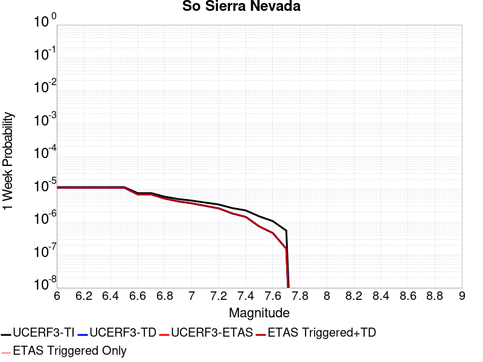 |  | 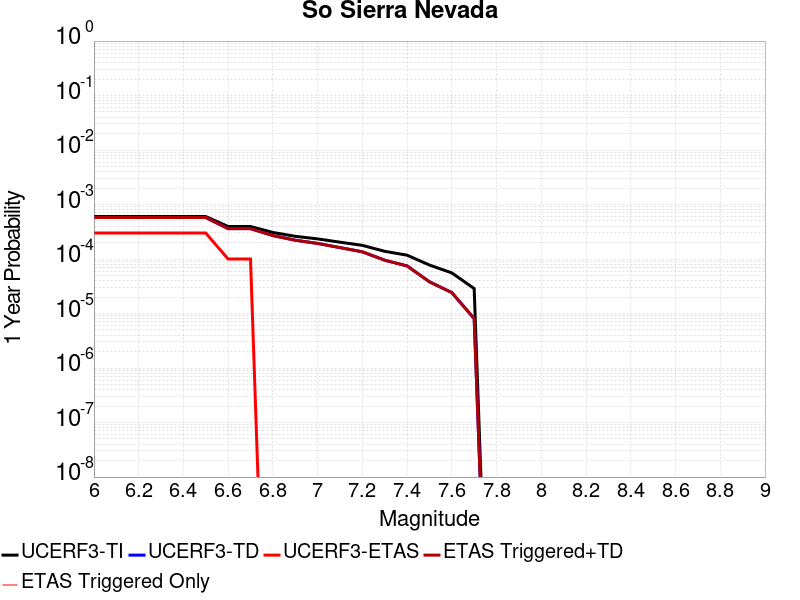 | 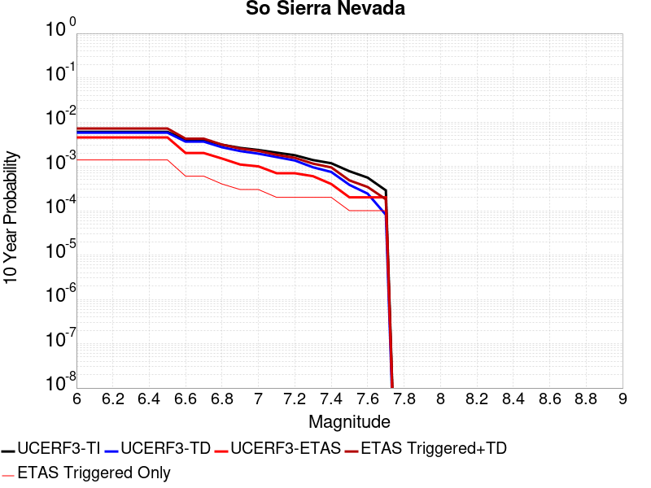 |

| Magnitude | 1 wk TI Prob | 1 wk TD Prob | 1 wk ETAS Prob | 1 wk ETAS/TD Gain | 1 wk ETAS Triggered+TD | 1 wk ETAS Triggered Only | 1 mo TI Prob | 1 mo TD Prob | 1 mo ETAS Prob | 1 mo ETAS/TD Gain | 1 mo ETAS Triggered+TD | 1 mo ETAS Triggered Only | 1 yr TI Prob | 1 yr TD Prob | 1 yr ETAS Prob | 1 yr ETAS/TD Gain | 1 yr ETAS Triggered+TD | 1 yr ETAS Triggered Only | 10 yr TI Prob | 10 yr TD Prob | 10 yr ETAS Prob | 10 yr ETAS/TD Gain | 10 yr ETAS Triggered+TD | 10 yr ETAS Triggered Only |
|-----|-----|-----|-----|-----|-----|-----|-----|-----|-----|-----|-----|-----|-----|-----|-----|-----|-----|-----|-----|-----|-----|-----|-----|-----|
| 6.0 | 1.15488665E-5 | 1.1072983E-5 | 0.0 | 0.0 | 1.1072983E-5 | 0.0 | 4.9494203E-5 | 4.745485E-5 | 0.0 | 0.0 | 4.745485E-5 | 0.0 | 6.024253E-4 | 5.776224E-4 | 0.0 | 0.0 | 5.776224E-4 | 0.0 | 0.006007948 | 0.005762478 | 1.0E-4 | 0.017353645 | 0.0058619017 | 1.0E-4 |
| 6.1 | 1.15488665E-5 | 1.1072983E-5 | 0.0 | 0.0 | 1.1072983E-5 | 0.0 | 4.9494203E-5 | 4.745485E-5 | 0.0 | 0.0 | 4.745485E-5 | 0.0 | 6.024253E-4 | 5.776224E-4 | 0.0 | 0.0 | 5.776224E-4 | 0.0 | 0.006007948 | 0.005762478 | 1.0E-4 | 0.017353645 | 0.0058619017 | 1.0E-4 |
| 6.2 | 1.15488665E-5 | 1.1072983E-5 | 0.0 | 0.0 | 1.1072983E-5 | 0.0 | 4.9494203E-5 | 4.745485E-5 | 0.0 | 0.0 | 4.745485E-5 | 0.0 | 6.024253E-4 | 5.776224E-4 | 0.0 | 0.0 | 5.776224E-4 | 0.0 | 0.006007948 | 0.005762478 | 1.0E-4 | 0.017353645 | 0.0058619017 | 1.0E-4 |
| 6.3 | 1.15488665E-5 | 1.1072983E-5 | 0.0 | 0.0 | 1.1072983E-5 | 0.0 | 4.9494203E-5 | 4.745485E-5 | 0.0 | 0.0 | 4.745485E-5 | 0.0 | 6.024253E-4 | 5.776224E-4 | 0.0 | 0.0 | 5.776224E-4 | 0.0 | 0.006007948 | 0.005762478 | 1.0E-4 | 0.017353645 | 0.0058619017 | 1.0E-4 |
| 6.4 | 1.15488665E-5 | 1.1072983E-5 | 0.0 | 0.0 | 1.1072983E-5 | 0.0 | 4.9494203E-5 | 4.745485E-5 | 0.0 | 0.0 | 4.745485E-5 | 0.0 | 6.024253E-4 | 5.776224E-4 | 0.0 | 0.0 | 5.776224E-4 | 0.0 | 0.006007948 | 0.005762478 | 1.0E-4 | 0.017353645 | 0.0058619017 | 1.0E-4 |
| 6.5 | 1.15488665E-5 | 1.1072983E-5 | 0.0 | 0.0 | 1.1072983E-5 | 0.0 | 4.9494203E-5 | 4.745485E-5 | 0.0 | 0.0 | 4.745485E-5 | 0.0 | 6.024253E-4 | 5.776224E-4 | 0.0 | 0.0 | 5.776224E-4 | 0.0 | 0.006007948 | 0.005762478 | 1.0E-4 | 0.017353645 | 0.0058619017 | 1.0E-4 |
| 6.6 | 7.587044E-6 | 6.93097E-6 | 0.0 | 0.0 | 6.93097E-6 | 0.0 | 3.2515498E-5 | 2.9703835E-5 | 0.0 | 0.0 | 2.9703835E-5 | 0.0 | 3.9580427E-4 | 3.615871E-4 | 0.0 | 0.0 | 3.615871E-4 | 0.0 | 0.003951 | 0.0036102792 | 1.0E-4 | 0.02769869 | 0.0037099181 | 1.0E-4 |
| 6.7 | 7.587044E-6 | 6.93097E-6 | 0.0 | 0.0 | 6.93097E-6 | 0.0 | 3.2515498E-5 | 2.9703835E-5 | 0.0 | 0.0 | 2.9703835E-5 | 0.0 | 3.9580427E-4 | 3.615871E-4 | 0.0 | 0.0 | 3.615871E-4 | 0.0 | 0.003951 | 0.0036102792 | 1.0E-4 | 0.02769869 | 0.0037099181 | 1.0E-4 |
| 6.8 | 5.9026956E-6 | 5.1755114E-6 | 0.0 | 0.0 | 5.1755114E-6 | 0.0 | 2.5297022E-5 | 2.218058E-5 | 0.0 | 0.0 | 2.218058E-5 | 0.0 | 3.0794772E-4 | 2.7001626E-4 | 0.0 | 0.0 | 2.7001626E-4 | 0.0 | 0.0030752132 | 0.002696998 | 1.0E-4 | 0.03707826 | 0.0027967284 | 1.0E-4 |
| 6.9 | 5.0118915E-6 | 4.248937E-6 | 0.0 | 0.0 | 4.248937E-6 | 0.0 | 2.1479358E-5 | 1.8209606E-5 | 0.0 | 0.0 | 1.8209606E-5 | 0.0 | 2.614798E-4 | 2.2168014E-4 | 0.0 | 0.0 | 2.2168014E-4 | 0.0 | 0.0026117235 | 0.0022146625 | 1.0E-4 | 0.045153607 | 0.0023144411 | 1.0E-4 |
| 7.0 | 4.4924795E-6 | 3.7106392E-6 | 0.0 | 0.0 | 3.7106392E-6 | 0.0 | 1.925334E-5 | 1.5902646E-5 | 0.0 | 0.0 | 1.5902646E-5 | 0.0 | 2.3438422E-4 | 1.9359816E-4 | 0.0 | 0.0 | 1.9359816E-4 | 0.0 | 0.0023413717 | 0.0019343579 | 1.0E-4 | 0.05169674 | 0.0020341645 | 1.0E-4 |
| 7.1 | 3.9118436E-6 | 3.1089503E-6 | 0.0 | 0.0 | 3.1089503E-6 | 0.0 | 1.6764936E-5 | 1.3324008E-5 | 0.0 | 0.0 | 1.3324008E-5 | 0.0 | 2.0409399E-4 | 1.622083E-4 | 0.0 | 0.0 | 1.622083E-4 | 0.0 | 0.0020390663 | 0.001620955 | 1.0E-4 | 0.06169203 | 0.0017207928 | 1.0E-4 |
| 7.2 | 3.4200818E-6 | 2.6026298E-6 | 0.0 | 0.0 | 2.6026298E-6 | 0.0 | 1.4657411E-5 | 1.1154083E-5 | 0.0 | 0.0 | 1.1154083E-5 | 0.0 | 1.7843937E-4 | 1.35793E-4 | 0.0 | 0.0 | 1.35793E-4 | 0.0 | 0.0017829615 | 0.0013571499 | 1.0E-4 | 0.07368383 | 0.0014570142 | 1.0E-4 |
| 7.3 | 2.6593618E-6 | 1.8259041E-6 | 0.0 | 0.0 | 1.8259041E-6 | 0.0 | 1.13972155E-5 | 7.8252815E-6 | 0.0 | 0.0 | 7.8252815E-6 | 0.0 | 1.3875226E-4 | 9.526893E-5 | 0.0 | 0.0 | 9.526893E-5 | 0.0 | 0.0013866565 | 9.523098E-4 | 1.0E-4 | 0.10500784 | 0.0010522145 | 1.0E-4 |
| 7.4 | 2.2577992E-6 | 1.4341158E-6 | 0.0 | 0.0 | 1.4341158E-6 | 0.0 | 9.676246E-6 | 6.1461974E-6 | 0.0 | 0.0 | 6.1461974E-6 | 0.0 | 1.1780193E-4 | 7.4827636E-5 | 0.0 | 0.0 | 7.4827636E-5 | 0.0 | 0.001177395 | 7.4804947E-4 | 1.0E-4 | 0.133681 | 8.479747E-4 | 1.0E-4 |
| 7.5 | 1.489319E-6 | 7.335145E-7 | 0.0 | 0.0 | 7.335145E-7 | 0.0 | 6.3827797E-6 | 3.1436298E-6 | 0.0 | 0.0 | 3.1436298E-6 | 0.0 | 7.770758E-5 | 3.8273025E-5 | 0.0 | 0.0 | 3.8273025E-5 | 0.0 | 7.7680405E-4 | 3.8266476E-4 | 0.0 | 0.0 | 3.8266476E-4 | 0.0 |
| 7.6 | 1.0680322E-6 | 4.6453596E-7 | 0.0 | 0.0 | 4.6453596E-7 | 0.0 | 4.577273E-6 | 1.9908668E-6 | 0.0 | 0.0 | 1.9908668E-6 | 0.0 | 5.5726876E-5 | 2.4238538E-5 | 0.0 | 0.0 | 2.4238538E-5 | 0.0 | 5.5712904E-4 | 2.423592E-4 | 0.0 | 0.0 | 2.423592E-4 | 0.0 |
| 7.7 | 5.509146E-7 | 1.550042E-7 | 0.0 | 0.0 | 1.550042E-7 | 0.0 | 2.3610605E-6 | 6.6430357E-7 | 0.0 | 0.0 | 6.6430357E-7 | 0.0 | 2.8745531E-5 | 8.087867E-6 | 0.0 | 0.0 | 8.087867E-6 | 0.0 | 2.8741814E-4 | 8.087584E-5 | 0.0 | 0.0 | 8.087584E-5 | 0.0 |

## Little Lake
*[(top)](#table-of-contents)*

| 1 Week | 1 Month | 1 Year | 10 Year |
|-----|-----|-----|-----|
|  | 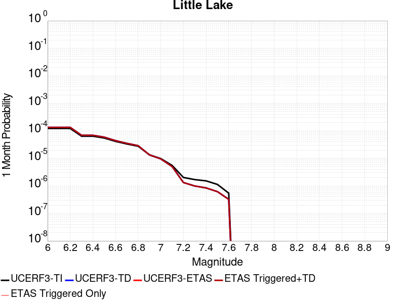 | 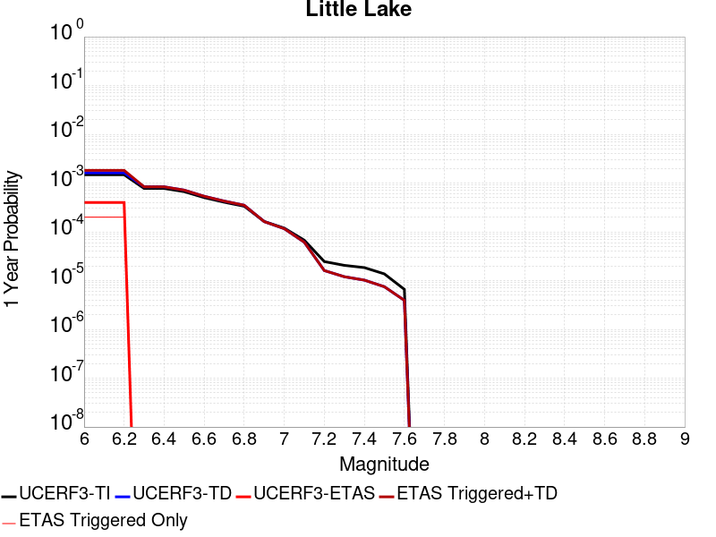 |  |

| Magnitude | 1 wk TI Prob | 1 wk TD Prob | 1 wk ETAS Prob | 1 wk ETAS/TD Gain | 1 wk ETAS Triggered+TD | 1 wk ETAS Triggered Only | 1 mo TI Prob | 1 mo TD Prob | 1 mo ETAS Prob | 1 mo ETAS/TD Gain | 1 mo ETAS Triggered+TD | 1 mo ETAS Triggered Only | 1 yr TI Prob | 1 yr TD Prob | 1 yr ETAS Prob | 1 yr ETAS/TD Gain | 1 yr ETAS Triggered+TD | 1 yr ETAS Triggered Only | 10 yr TI Prob | 10 yr TD Prob | 10 yr ETAS Prob | 10 yr ETAS/TD Gain | 10 yr ETAS Triggered+TD | 10 yr ETAS Triggered Only |
|-----|-----|-----|-----|-----|-----|-----|-----|-----|-----|-----|-----|-----|-----|-----|-----|-----|-----|-----|-----|-----|-----|-----|-----|-----|
| 6.0 | 2.8424427E-5 | 3.117113E-5 | 0.0 | 0.0 | 3.117113E-5 | 0.0 | 1.2181328E-4 | 1.3358446E-4 | 0.0 | 0.0 | 1.3358446E-4 | 0.0 | 0.0014820677 | 0.0016253103 | 0.0 | 0.0 | 0.0016253103 | 0.0 | 0.014722223 | 0.016147608 | 1.0E-4 | 0.0061928676 | 0.016245993 | 1.0E-4 |
| 6.1 | 2.8424427E-5 | 3.117113E-5 | 0.0 | 0.0 | 3.117113E-5 | 0.0 | 1.2181328E-4 | 1.3358446E-4 | 0.0 | 0.0 | 1.3358446E-4 | 0.0 | 0.0014820677 | 0.0016253103 | 0.0 | 0.0 | 0.0016253103 | 0.0 | 0.014722223 | 0.016147608 | 1.0E-4 | 0.0061928676 | 0.016245993 | 1.0E-4 |
| 6.2 | 2.8424427E-5 | 3.117113E-5 | 0.0 | 0.0 | 3.117113E-5 | 0.0 | 1.2181328E-4 | 1.3358446E-4 | 0.0 | 0.0 | 1.3358446E-4 | 0.0 | 0.0014820677 | 0.0016253103 | 0.0 | 0.0 | 0.0016253103 | 0.0 | 0.014722223 | 0.016147608 | 1.0E-4 | 0.0061928676 | 0.016245993 | 1.0E-4 |
| 6.3 | 1.48860645E-5 | 1.6065283E-5 | 0.0 | 0.0 | 1.6065283E-5 | 0.0 | 6.379586E-5 | 6.884956E-5 | 0.0 | 0.0 | 6.884956E-5 | 0.0 | 7.7643775E-4 | 8.379491E-4 | 0.0 | 0.0 | 8.379491E-4 | 0.0 | 0.007737305 | 0.008350707 | 1.0E-4 | 0.011975034 | 0.008449872 | 1.0E-4 |
| 6.4 | 1.48860645E-5 | 1.6065283E-5 | 0.0 | 0.0 | 1.6065283E-5 | 0.0 | 6.379586E-5 | 6.884956E-5 | 0.0 | 0.0 | 6.884956E-5 | 0.0 | 7.7643775E-4 | 8.379491E-4 | 0.0 | 0.0 | 8.379491E-4 | 0.0 | 0.007737305 | 0.008350707 | 1.0E-4 | 0.011975034 | 0.008449872 | 1.0E-4 |
| 6.5 | 1.2797581E-5 | 1.3752088E-5 | 0.0 | 0.0 | 1.3752088E-5 | 0.0 | 5.4845623E-5 | 5.8936334E-5 | 0.0 | 0.0 | 5.8936334E-5 | 0.0 | 6.675408E-4 | 7.173393E-4 | 0.0 | 0.0 | 7.173393E-4 | 0.0 | 0.006655392 | 0.0071527823 | 0.0 | 0.0 | 0.0071527823 | 0.0 |
| 6.6 | 9.661896E-6 | 1.0279502E-5 | 0.0 | 0.0 | 1.0279502E-5 | 0.0 | 4.1407468E-5 | 4.405436E-5 | 0.0 | 0.0 | 4.405436E-5 | 0.0 | 5.040193E-4 | 5.36246E-4 | 0.0 | 0.0 | 5.36246E-4 | 0.0 | 0.005028777 | 0.005351122 | 0.0 | 0.0 | 0.005351122 | 0.0 |
| 6.7 | 7.767871E-6 | 8.192401E-6 | 0.0 | 0.0 | 8.192401E-6 | 0.0 | 3.329045E-5 | 3.5109893E-5 | 0.0 | 0.0 | 3.5109893E-5 | 0.0 | 4.0523586E-4 | 4.2739284E-4 | 0.0 | 0.0 | 4.2739284E-4 | 0.0 | 0.004044977 | 0.0042670574 | 0.0 | 0.0 | 0.0042670574 | 0.0 |
| 6.8 | 6.4235196E-6 | 6.7298247E-6 | 0.0 | 0.0 | 6.7298247E-6 | 0.0 | 2.752908E-5 | 2.884186E-5 | 0.0 | 0.0 | 2.884186E-5 | 0.0 | 3.35115E-4 | 3.5110585E-4 | 0.0 | 0.0 | 3.5110585E-4 | 0.0 | 0.003346101 | 0.003506769 | 0.0 | 0.0 | 0.003506769 | 0.0 |
| 6.9 | 3.1283696E-6 | 3.1100424E-6 | 0.0 | 0.0 | 3.1100424E-6 | 0.0 | 1.3407229E-5 | 1.3328694E-5 | 0.0 | 0.0 | 1.3328694E-5 | 0.0 | 1.6322079E-4 | 1.6226627E-4 | 0.0 | 0.0 | 1.6226627E-4 | 0.0 | 0.0016310095 | 0.001621626 | 0.0 | 0.0 | 0.001621626 | 0.0 |
| 7.0 | 2.290603E-6 | 2.2270472E-6 | 0.0 | 0.0 | 2.2270472E-6 | 0.0 | 9.816834E-6 | 9.544459E-6 | 0.0 | 0.0 | 9.544459E-6 | 0.0 | 1.19513395E-4 | 1.1619863E-4 | 0.0 | 0.0 | 1.1619863E-4 | 0.0 | 0.0011944914 | 0.0011614808 | 0.0 | 0.0 | 0.0011614808 | 0.0 |
| 7.1 | 1.293693E-6 | 1.176644E-6 | 0.0 | 0.0 | 1.176644E-6 | 0.0 | 5.5443866E-6 | 5.0427543E-6 | 0.0 | 0.0 | 5.0427543E-6 | 0.0 | 6.750081E-5 | 6.13945E-5 | 0.0 | 0.0 | 6.13945E-5 | 0.0 | 6.7480316E-4 | 6.138438E-4 | 0.0 | 0.0 | 6.138438E-4 | 0.0 |
| 7.2 | 4.715842E-7 | 3.0865166E-7 | 0.0 | 0.0 | 3.0865166E-7 | 0.0 | 2.0210737E-6 | 1.3227922E-6 | 0.0 | 0.0 | 1.3227922E-6 | 0.0 | 2.4606294E-5 | 1.6104881E-5 | 0.0 | 0.0 | 1.6104881E-5 | 0.0 | 2.460357E-4 | 1.610377E-4 | 0.0 | 0.0 | 1.610377E-4 | 0.0 |
| 7.3 | 3.9430947E-7 | 2.3048662E-7 | 0.0 | 0.0 | 2.3048662E-7 | 0.0 | 1.6898966E-6 | 9.877995E-7 | 0.0 | 0.0 | 9.877995E-7 | 0.0 | 2.0574296E-5 | 1.2026393E-5 | 0.0 | 0.0 | 1.2026393E-5 | 0.0 | 2.0572392E-4 | 1.2025749E-4 | 0.0 | 0.0 | 1.2025749E-4 | 0.0 |
| 7.4 | 3.547123E-7 | 1.9633711E-7 | 0.0 | 0.0 | 1.9633711E-7 | 0.0 | 1.5201948E-6 | 8.414445E-7 | 0.0 | 0.0 | 8.414445E-7 | 0.0 | 1.8508214E-5 | 1.0244539E-5 | 0.0 | 0.0 | 1.0244539E-5 | 0.0 | 1.8506673E-4 | 1.0244073E-4 | 0.0 | 0.0 | 1.0244073E-4 | 0.0 |
| 7.5 | 2.6354266E-7 | 1.439136E-7 | 0.0 | 0.0 | 1.439136E-7 | 0.0 | 1.129468E-6 | 6.167724E-7 | 0.0 | 0.0 | 6.167724E-7 | 0.0 | 1.3751187E-5 | 7.5091784E-6 | 0.0 | 0.0 | 7.5091784E-6 | 0.0 | 1.3750336E-4 | 7.50893E-5 | 0.0 | 0.0 | 7.50893E-5 | 0.0 |
| 7.6 | 1.269913E-7 | 7.559133E-8 | 0.0 | 0.0 | 7.559133E-8 | 0.0 | 5.4424834E-7 | 3.239628E-7 | 0.0 | 0.0 | 3.239628E-7 | 0.0 | 6.6262032E-6 | 3.9442402E-6 | 0.0 | 0.0 | 3.9442402E-6 | 0.0 | 6.626006E-5 | 3.944174E-5 | 0.0 | 0.0 | 3.944174E-5 | 0.0 |

## Lenwood-Lockhart-Old Woman Springs
*[(top)](#table-of-contents)*

| 1 Week | 1 Month | 1 Year | 10 Year |
|-----|-----|-----|-----|
|  | 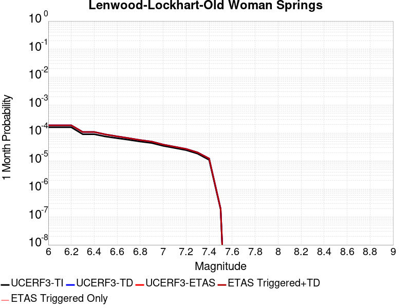 |  |  |

| Magnitude | 1 wk TI Prob | 1 wk TD Prob | 1 wk ETAS Prob | 1 wk ETAS/TD Gain | 1 wk ETAS Triggered+TD | 1 wk ETAS Triggered Only | 1 mo TI Prob | 1 mo TD Prob | 1 mo ETAS Prob | 1 mo ETAS/TD Gain | 1 mo ETAS Triggered+TD | 1 mo ETAS Triggered Only | 1 yr TI Prob | 1 yr TD Prob | 1 yr ETAS Prob | 1 yr ETAS/TD Gain | 1 yr ETAS Triggered+TD | 1 yr ETAS Triggered Only | 10 yr TI Prob | 10 yr TD Prob | 10 yr ETAS Prob | 10 yr ETAS/TD Gain | 10 yr ETAS Triggered+TD | 10 yr ETAS Triggered Only |
|-----|-----|-----|-----|-----|-----|-----|-----|-----|-----|-----|-----|-----|-----|-----|-----|-----|-----|-----|-----|-----|-----|-----|-----|-----|
| 6.0 | 3.744542E-5 | 4.3915243E-5 | 0.0 | 0.0 | 4.3915243E-5 | 0.0 | 1.604705E-4 | 1.8819557E-4 | 0.0 | 0.0 | 1.8819557E-4 | 0.0 | 0.0019519776 | 0.002289045 | 1.0E-4 | 0.04368634 | 0.002388816 | 1.0E-4 | 0.019349206 | 0.02267263 | 1.0E-4 | 0.004410604 | 0.022770364 | 1.0E-4 |
| 6.1 | 3.744542E-5 | 4.3915243E-5 | 0.0 | 0.0 | 4.3915243E-5 | 0.0 | 1.604705E-4 | 1.8819557E-4 | 0.0 | 0.0 | 1.8819557E-4 | 0.0 | 0.0019519776 | 0.002289045 | 1.0E-4 | 0.04368634 | 0.002388816 | 1.0E-4 | 0.019349206 | 0.02267263 | 1.0E-4 | 0.004410604 | 0.022770364 | 1.0E-4 |
| 6.2 | 3.744542E-5 | 4.3915243E-5 | 0.0 | 0.0 | 4.3915243E-5 | 0.0 | 1.604705E-4 | 1.8819557E-4 | 0.0 | 0.0 | 1.8819557E-4 | 0.0 | 0.0019519776 | 0.002289045 | 1.0E-4 | 0.04368634 | 0.002388816 | 1.0E-4 | 0.019349206 | 0.02267263 | 1.0E-4 | 0.004410604 | 0.022770364 | 1.0E-4 |
| 6.3 | 2.1079984E-5 | 2.5328589E-5 | 0.0 | 0.0 | 2.5328589E-5 | 0.0 | 9.0339665E-5 | 1.0854669E-4 | 0.0 | 0.0 | 1.0854669E-4 | 0.0 | 0.0010993304 | 0.0013207747 | 1.0E-4 | 0.07571314 | 0.0014206426 | 1.0E-4 | 0.010939079 | 0.01313146 | 1.0E-4 | 0.0076152994 | 0.013230147 | 1.0E-4 |
| 6.4 | 2.1079984E-5 | 2.5328589E-5 | 0.0 | 0.0 | 2.5328589E-5 | 0.0 | 9.0339665E-5 | 1.0854669E-4 | 0.0 | 0.0 | 1.0854669E-4 | 0.0 | 0.0010993304 | 0.0013207747 | 1.0E-4 | 0.07571314 | 0.0014206426 | 1.0E-4 | 0.010939079 | 0.01313146 | 1.0E-4 | 0.0076152994 | 0.013230147 | 1.0E-4 |
| 6.5 | 1.7397282E-5 | 2.0640626E-5 | 0.0 | 0.0 | 2.0640626E-5 | 0.0 | 7.455765E-5 | 8.8456894E-5 | 0.0 | 0.0 | 8.8456894E-5 | 0.0 | 9.073613E-4 | 0.0010764423 | 1.0E-4 | 0.092898615 | 0.0011763347 | 1.0E-4 | 0.009036654 | 0.010713574 | 1.0E-4 | 0.009333953 | 0.010812502 | 1.0E-4 |
| 6.6 | 1.52050325E-5 | 1.765924E-5 | 0.0 | 0.0 | 1.765924E-5 | 0.0 | 6.51628E-5 | 7.5680306E-5 | 0.0 | 0.0 | 7.5680306E-5 | 0.0 | 7.9306826E-4 | 9.210261E-4 | 1.0E-4 | 0.108574554 | 0.001020934 | 1.0E-4 | 0.007902439 | 0.00917295 | 1.0E-4 | 0.010901619 | 0.009272032 | 1.0E-4 |
| 6.7 | 1.332523E-5 | 1.5245194E-5 | 0.0 | 0.0 | 1.5245194E-5 | 0.0 | 5.7106878E-5 | 6.533494E-5 | 0.0 | 0.0 | 6.533494E-5 | 0.0 | 6.950544E-4 | 7.9516845E-4 | 1.0E-4 | 0.12575953 | 8.950889E-4 | 1.0E-4 | 0.006928845 | 0.007923861 | 1.0E-4 | 0.012620111 | 0.008023068 | 1.0E-4 |
| 6.8 | 1.1525329E-5 | 1.3013368E-5 | 0.0 | 0.0 | 1.3013368E-5 | 0.0 | 4.9393333E-5 | 5.5770404E-5 | 0.0 | 0.0 | 5.5770404E-5 | 0.0 | 6.011979E-4 | 6.7879737E-4 | 0.0 | 0.0 | 6.7879737E-4 | 0.0 | 0.00599574 | 0.00676769 | 0.0 | 0.0 | 0.00676769 | 0.0 |
| 6.9 | 1.0253909E-5 | 1.1497721E-5 | 0.0 | 0.0 | 1.1497721E-5 | 0.0 | 4.3944583E-5 | 4.9275037E-5 | 0.0 | 0.0 | 4.9275037E-5 | 0.0 | 5.3489394E-4 | 5.99762E-4 | 0.0 | 0.0 | 5.99762E-4 | 0.0 | 0.0053360825 | 0.005981812 | 0.0 | 0.0 | 0.005981812 | 0.0 |
| 7.0 | 8.104563E-6 | 8.976321E-6 | 0.0 | 0.0 | 8.976321E-6 | 0.0 | 3.4733377E-5 | 3.8469392E-5 | 0.0 | 0.0 | 3.8469392E-5 | 0.0 | 4.2279682E-4 | 4.6826657E-4 | 0.0 | 0.0 | 4.6826657E-4 | 0.0 | 0.0042199334 | 0.004673046 | 0.0 | 0.0 | 0.004673046 | 0.0 |
| 7.1 | 6.7986157E-6 | 7.501446E-6 | 0.0 | 0.0 | 7.501446E-6 | 0.0 | 2.91366E-5 | 3.214867E-5 | 0.0 | 0.0 | 3.214867E-5 | 0.0 | 3.5468035E-4 | 3.913419E-4 | 0.0 | 0.0 | 3.913419E-4 | 0.0 | 0.003541148 | 0.003906743 | 0.0 | 0.0 | 0.003906743 | 0.0 |
| 7.2 | 5.6893327E-6 | 6.2681474E-6 | 0.0 | 0.0 | 6.2681474E-6 | 0.0 | 2.4382627E-5 | 2.6863223E-5 | 0.0 | 0.0 | 2.6863223E-5 | 0.0 | 2.9681803E-4 | 3.2701265E-4 | 0.0 | 0.0 | 3.2701265E-4 | 0.0 | 0.002964219 | 0.0032655122 | 0.0 | 0.0 | 0.0032655122 | 0.0 |
| 7.3 | 4.253348E-6 | 4.6957107E-6 | 0.0 | 0.0 | 4.6957107E-6 | 0.0 | 1.8228506E-5 | 2.012433E-5 | 0.0 | 0.0 | 2.012433E-5 | 0.0 | 2.2190946E-4 | 2.4498798E-4 | 0.0 | 0.0 | 2.4498798E-4 | 0.0 | 0.00221688 | 0.0024473593 | 0.0 | 0.0 | 0.0024473593 | 0.0 |
| 7.4 | 2.5448119E-6 | 2.8424663E-6 | 0.0 | 0.0 | 2.8424663E-6 | 0.0 | 1.0906291E-5 | 1.218195E-5 | 0.0 | 0.0 | 1.218195E-5 | 0.0 | 1.3277601E-4 | 1.483068E-4 | 0.0 | 0.0 | 1.483068E-4 | 0.0 | 0.001326967 | 0.0014822397 | 0.0 | 0.0 | 0.0014822397 | 0.0 |
| 7.5 | 4.3706837E-8 | 4.5608147E-8 | 0.0 | 0.0 | 4.5608147E-8 | 0.0 | 1.8731501E-7 | 1.9546347E-7 | 0.0 | 0.0 | 1.9546347E-7 | 0.0 | 2.2805577E-6 | 2.3797656E-6 | 0.0 | 0.0 | 2.3797656E-6 | 0.0 | 2.2805343E-5 | 2.3797458E-5 | 0.0 | 0.0 | 2.3797458E-5 | 0.0 |

## Hunter Mountain-Saline Valley
*[(top)](#table-of-contents)*

| 1 Week | 1 Month | 1 Year | 10 Year |
|-----|-----|-----|-----|
|  |  |  |  |

| Magnitude | 1 wk TI Prob | 1 wk TD Prob | 1 wk ETAS Prob | 1 wk ETAS/TD Gain | 1 wk ETAS Triggered+TD | 1 wk ETAS Triggered Only | 1 mo TI Prob | 1 mo TD Prob | 1 mo ETAS Prob | 1 mo ETAS/TD Gain | 1 mo ETAS Triggered+TD | 1 mo ETAS Triggered Only | 1 yr TI Prob | 1 yr TD Prob | 1 yr ETAS Prob | 1 yr ETAS/TD Gain | 1 yr ETAS Triggered+TD | 1 yr ETAS Triggered Only | 10 yr TI Prob | 10 yr TD Prob | 10 yr ETAS Prob | 10 yr ETAS/TD Gain | 10 yr ETAS Triggered+TD | 10 yr ETAS Triggered Only |
|-----|-----|-----|-----|-----|-----|-----|-----|-----|-----|-----|-----|-----|-----|-----|-----|-----|-----|-----|-----|-----|-----|-----|-----|-----|
| 6.0 | 4.5103672E-5 | 5.4413267E-5 | 0.0 | 0.0 | 5.4413267E-5 | 0.0 | 1.9328714E-4 | 2.3317964E-4 | 0.0 | 0.0 | 2.3317964E-4 | 0.0 | 0.002350731 | 0.002835441 | 0.0 | 0.0 | 0.002835441 | 0.0 | 0.023260195 | 0.02801385 | 1.0E-4 | 0.0035696628 | 0.028111048 | 1.0E-4 |
| 6.1 | 4.5103672E-5 | 5.4413267E-5 | 0.0 | 0.0 | 5.4413267E-5 | 0.0 | 1.9328714E-4 | 2.3317964E-4 | 0.0 | 0.0 | 2.3317964E-4 | 0.0 | 0.002350731 | 0.002835441 | 0.0 | 0.0 | 0.002835441 | 0.0 | 0.023260195 | 0.02801385 | 1.0E-4 | 0.0035696628 | 0.028111048 | 1.0E-4 |
| 6.2 | 3.9363465E-5 | 4.6930167E-5 | 0.0 | 0.0 | 4.6930167E-5 | 0.0 | 1.6868966E-4 | 2.0111441E-4 | 0.0 | 0.0 | 2.0111441E-4 | 0.0 | 0.002051862 | 0.002445953 | 0.0 | 0.0 | 0.002445953 | 0.0 | 0.020330196 | 0.02420684 | 1.0E-4 | 0.004131064 | 0.02430442 | 1.0E-4 |
| 6.3 | 3.9363465E-5 | 4.6930167E-5 | 0.0 | 0.0 | 4.6930167E-5 | 0.0 | 1.6868966E-4 | 2.0111441E-4 | 0.0 | 0.0 | 2.0111441E-4 | 0.0 | 0.002051862 | 0.002445953 | 0.0 | 0.0 | 0.002445953 | 0.0 | 0.020330196 | 0.02420684 | 1.0E-4 | 0.004131064 | 0.02430442 | 1.0E-4 |
| 6.4 | 3.2311684E-5 | 3.784555E-5 | 0.0 | 0.0 | 3.784555E-5 | 0.0 | 1.384713E-4 | 1.621855E-4 | 0.0 | 0.0 | 1.621855E-4 | 0.0 | 0.0016845843 | 0.0019728886 | 0.0 | 0.0 | 0.0019728886 | 0.0 | 0.016718714 | 0.019563187 | 0.0 | 0.0 | 0.019563187 | 0.0 |
| 6.5 | 3.2311684E-5 | 3.784555E-5 | 0.0 | 0.0 | 3.784555E-5 | 0.0 | 1.384713E-4 | 1.621855E-4 | 0.0 | 0.0 | 1.621855E-4 | 0.0 | 0.0016845843 | 0.0019728886 | 0.0 | 0.0 | 0.0019728886 | 0.0 | 0.016718714 | 0.019563187 | 0.0 | 0.0 | 0.019563187 | 0.0 |
| 6.6 | 2.9305844E-5 | 3.408624E-5 | 0.0 | 0.0 | 3.408624E-5 | 0.0 | 1.2559042E-4 | 1.4607605E-4 | 0.0 | 0.0 | 1.4607605E-4 | 0.0 | 0.0015279909 | 0.0017770866 | 0.0 | 0.0 | 0.0017770866 | 0.0 | 0.015175272 | 0.017637318 | 0.0 | 0.0 | 0.017637318 | 0.0 |
| 6.7 | 2.7826512E-5 | 3.2253232E-5 | 0.0 | 0.0 | 3.2253232E-5 | 0.0 | 1.19251024E-4 | 1.3822115E-4 | 0.0 | 0.0 | 1.3822115E-4 | 0.0 | 0.0014509142 | 0.0016816035 | 0.0 | 0.0 | 0.0016816035 | 0.0 | 0.014414776 | 0.016697118 | 0.0 | 0.0 | 0.016697118 | 0.0 |
| 6.8 | 2.3389874E-5 | 2.6789065E-5 | 0.0 | 0.0 | 2.6789065E-5 | 0.0 | 1.0023846E-4 | 1.14805494E-4 | 0.0 | 0.0 | 1.14805494E-4 | 0.0 | 0.00121972 | 0.0013969077 | 0.0 | 0.0 | 0.0013969077 | 0.0 | 0.01213047 | 0.013888132 | 0.0 | 0.0 | 0.013888132 | 0.0 |
| 6.9 | 2.069209E-5 | 2.3500012E-5 | 0.0 | 0.0 | 2.3500012E-5 | 0.0 | 8.867737E-5 | 1.00710655E-4 | 0.0 | 0.0 | 1.00710655E-4 | 0.0 | 0.0010791123 | 0.0012254985 | 0.0 | 0.0 | 0.0012254985 | 0.0 | 0.010738871 | 0.012193091 | 0.0 | 0.0 | 0.012193091 | 0.0 |
| 7.0 | 1.7462342E-5 | 1.9572502E-5 | 0.0 | 0.0 | 1.9572502E-5 | 0.0 | 7.483646E-5 | 8.387958E-5 | 0.0 | 0.0 | 8.387958E-5 | 0.0 | 9.1075303E-4 | 0.001020778 | 0.0 | 0.0 | 0.001020778 | 0.0 | 0.009070295 | 0.01016519 | 0.0 | 0.0 | 0.01016519 | 0.0 |
| 7.1 | 1.4807709E-5 | 1.6387437E-5 | 0.0 | 0.0 | 1.6387437E-5 | 0.0 | 6.3460066E-5 | 7.0230075E-5 | 0.0 | 0.0 | 7.0230075E-5 | 0.0 | 7.723524E-4 | 8.547322E-4 | 0.0 | 0.0 | 8.547322E-4 | 0.0 | 0.007696735 | 0.0085181035 | 0.0 | 0.0 | 0.0085181035 | 0.0 |
| 7.2 | 1.4180048E-5 | 1.564545E-5 | 0.0 | 0.0 | 1.564545E-5 | 0.0 | 6.077022E-5 | 6.70503E-5 | 0.0 | 0.0 | 6.70503E-5 | 0.0 | 7.396263E-4 | 8.160477E-4 | 0.0 | 0.0 | 8.160477E-4 | 0.0 | 0.0073716943 | 0.008134132 | 0.0 | 0.0 | 0.008134132 | 0.0 |
| 7.3 | 1.3730402E-5 | 1.5120152E-5 | 0.0 | 0.0 | 1.5120152E-5 | 0.0 | 5.8843252E-5 | 6.479913E-5 | 0.0 | 0.0 | 6.479913E-5 | 0.0 | 7.161811E-4 | 7.8865985E-4 | 0.0 | 0.0 | 7.8865985E-4 | 0.0 | 0.007138774 | 0.007862212 | 0.0 | 0.0 | 0.007862212 | 0.0 |
| 7.4 | 1.2810095E-5 | 1.4059342E-5 | 0.0 | 0.0 | 1.4059342E-5 | 0.0 | 5.489925E-5 | 6.025302E-5 | 0.0 | 0.0 | 6.025302E-5 | 0.0 | 6.681934E-4 | 7.3334936E-4 | 0.0 | 0.0 | 7.3334936E-4 | 0.0 | 0.006661878 | 0.0073128585 | 0.0 | 0.0 | 0.0073128585 | 0.0 |
| 7.5 | 1.1595659E-5 | 1.275406E-5 | 0.0 | 0.0 | 1.275406E-5 | 0.0 | 4.9694736E-5 | 5.46592E-5 | 0.0 | 0.0 | 5.46592E-5 | 0.0 | 6.0486543E-4 | 6.652881E-4 | 0.0 | 0.0 | 6.652881E-4 | 0.0 | 0.006032217 | 0.0066365097 | 0.0 | 0.0 | 0.0066365097 | 0.0 |
| 7.6 | 2.997694E-6 | 3.3143867E-6 | 0.0 | 0.0 | 3.3143867E-6 | 0.0 | 1.28471975E-5 | 1.4204477E-5 | 0.0 | 0.0 | 1.4204477E-5 | 0.0 | 1.564034E-4 | 1.7293303E-4 | 0.0 | 0.0 | 1.7293303E-4 | 0.0 | 0.0015629337 | 0.00173029 | 0.0 | 0.0 | 0.00173029 | 0.0 |

## Santa Monica alt 1
*[(top)](#table-of-contents)*

| 1 Week | 1 Month | 1 Year | 10 Year |
|-----|-----|-----|-----|
| 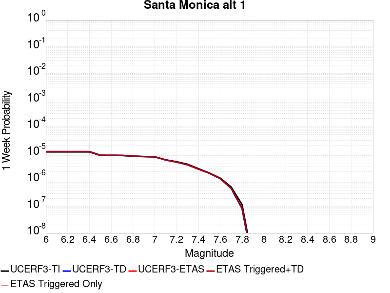 | 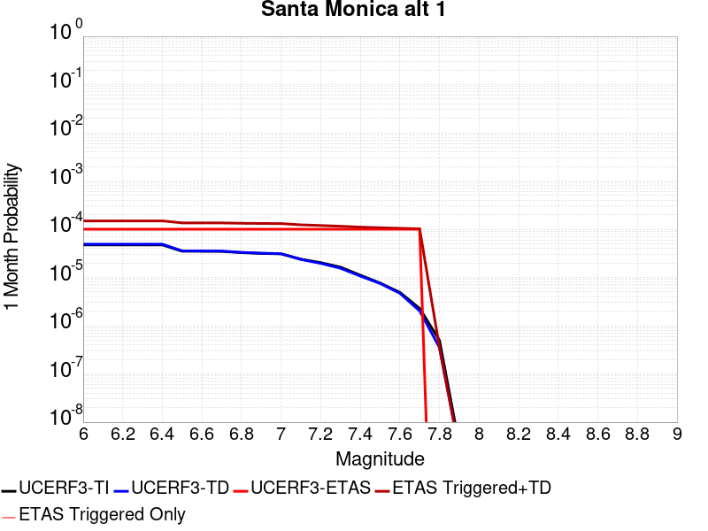 |  |  |

| Magnitude | 1 wk TI Prob | 1 wk TD Prob | 1 wk ETAS Prob | 1 wk ETAS/TD Gain | 1 wk ETAS Triggered+TD | 1 wk ETAS Triggered Only | 1 mo TI Prob | 1 mo TD Prob | 1 mo ETAS Prob | 1 mo ETAS/TD Gain | 1 mo ETAS Triggered+TD | 1 mo ETAS Triggered Only | 1 yr TI Prob | 1 yr TD Prob | 1 yr ETAS Prob | 1 yr ETAS/TD Gain | 1 yr ETAS Triggered+TD | 1 yr ETAS Triggered Only | 10 yr TI Prob | 10 yr TD Prob | 10 yr ETAS Prob | 10 yr ETAS/TD Gain | 10 yr ETAS Triggered+TD | 10 yr ETAS Triggered Only |
|-----|-----|-----|-----|-----|-----|-----|-----|-----|-----|-----|-----|-----|-----|-----|-----|-----|-----|-----|-----|-----|-----|-----|-----|-----|
| 6.0 | 1.1066008E-5 | 1.1470408E-5 | 0.0 | 0.0 | 1.1470408E-5 | 0.0 | 4.742488E-5 | 4.9158047E-5 | 1.0E-4 | 2.034255 | 1.4915313E-4 | 1.0E-4 | 5.7724497E-4 | 5.9834874E-4 | 1.0E-4 | 0.16712661 | 6.982889E-4 | 1.0E-4 | 0.005757478 | 0.0059687616 | 1.0E-4 | 0.016753895 | 0.0060681645 | 1.0E-4 |
| 6.1 | 1.1066008E-5 | 1.1470408E-5 | 0.0 | 0.0 | 1.1470408E-5 | 0.0 | 4.742488E-5 | 4.9158047E-5 | 1.0E-4 | 2.034255 | 1.4915313E-4 | 1.0E-4 | 5.7724497E-4 | 5.9834874E-4 | 1.0E-4 | 0.16712661 | 6.982889E-4 | 1.0E-4 | 0.005757478 | 0.0059687616 | 1.0E-4 | 0.016753895 | 0.0060681645 | 1.0E-4 |
| 6.2 | 1.1066008E-5 | 1.1470408E-5 | 0.0 | 0.0 | 1.1470408E-5 | 0.0 | 4.742488E-5 | 4.9158047E-5 | 1.0E-4 | 2.034255 | 1.4915313E-4 | 1.0E-4 | 5.7724497E-4 | 5.9834874E-4 | 1.0E-4 | 0.16712661 | 6.982889E-4 | 1.0E-4 | 0.005757478 | 0.0059687616 | 1.0E-4 | 0.016753895 | 0.0060681645 | 1.0E-4 |
| 6.3 | 1.1066008E-5 | 1.1470408E-5 | 0.0 | 0.0 | 1.1470408E-5 | 0.0 | 4.742488E-5 | 4.9158047E-5 | 1.0E-4 | 2.034255 | 1.4915313E-4 | 1.0E-4 | 5.7724497E-4 | 5.9834874E-4 | 1.0E-4 | 0.16712661 | 6.982889E-4 | 1.0E-4 | 0.005757478 | 0.0059687616 | 1.0E-4 | 0.016753895 | 0.0060681645 | 1.0E-4 |
| 6.4 | 1.1066008E-5 | 1.1470408E-5 | 0.0 | 0.0 | 1.1470408E-5 | 0.0 | 4.742488E-5 | 4.9158047E-5 | 1.0E-4 | 2.034255 | 1.4915313E-4 | 1.0E-4 | 5.7724497E-4 | 5.9834874E-4 | 1.0E-4 | 0.16712661 | 6.982889E-4 | 1.0E-4 | 0.005757478 | 0.0059687616 | 1.0E-4 | 0.016753895 | 0.0060681645 | 1.0E-4 |
| 6.5 | 8.183544E-6 | 8.328517E-6 | 0.0 | 0.0 | 8.328517E-6 | 0.0 | 3.5071862E-5 | 3.5693163E-5 | 1.0E-4 | 2.801657 | 1.356896E-4 | 1.0E-4 | 4.2691626E-4 | 4.3447918E-4 | 1.0E-4 | 0.23016062 | 5.3443573E-4 | 1.0E-4 | 0.0042609703 | 0.004336463 | 1.0E-4 | 0.02306027 | 0.004436029 | 1.0E-4 |
| 6.6 | 8.1543285E-6 | 8.29676E-6 | 0.0 | 0.0 | 8.29676E-6 | 0.0 | 3.4946657E-5 | 3.5557066E-5 | 1.0E-4 | 2.8123806 | 1.355535E-4 | 1.0E-4 | 4.2539247E-4 | 4.3282288E-4 | 1.0E-4 | 0.23104139 | 5.327796E-4 | 1.0E-4 | 0.0042457907 | 0.004319964 | 1.0E-4 | 0.023148341 | 0.004419532 | 1.0E-4 |
| 6.7 | 8.110878E-6 | 8.250192E-6 | 0.0 | 0.0 | 8.250192E-6 | 0.0 | 3.4760444E-5 | 3.5357498E-5 | 1.0E-4 | 2.8282545 | 1.3535396E-4 | 1.0E-4 | 4.231262E-4 | 4.3039408E-4 | 1.0E-4 | 0.23234521 | 5.30351E-4 | 1.0E-4 | 0.0042232145 | 0.00429577 | 1.0E-4 | 0.023278713 | 0.0043953406 | 1.0E-4 |
| 6.8 | 7.644036E-6 | 7.744655E-6 | 0.0 | 0.0 | 7.744655E-6 | 0.0 | 3.275974E-5 | 3.319096E-5 | 1.0E-4 | 3.0128684 | 1.3318764E-4 | 1.0E-4 | 3.9877684E-4 | 4.0402645E-4 | 1.0E-4 | 0.24750856 | 5.03986E-4 | 1.0E-4 | 0.00398062 | 0.004033065 | 1.0E-4 | 0.024795039 | 0.0041326615 | 1.0E-4 |
| 6.9 | 7.3698293E-6 | 7.449552E-6 | 0.0 | 0.0 | 7.449552E-6 | 0.0 | 3.15846E-5 | 3.192627E-5 | 1.0E-4 | 3.1322172 | 1.3192308E-4 | 1.0E-4 | 3.8447464E-4 | 3.8863436E-4 | 1.0E-4 | 0.25731125 | 4.885955E-4 | 1.0E-4 | 0.0038381014 | 0.0038796905 | 1.0E-4 | 0.025775252 | 0.0039793025 | 1.0E-4 |
| 7.0 | 7.209872E-6 | 7.279572E-6 | 0.0 | 0.0 | 7.279572E-6 | 0.0 | 3.0899086E-5 | 3.11978E-5 | 1.0E-4 | 3.2053542 | 1.3119468E-4 | 1.0E-4 | 3.7613141E-4 | 3.797684E-4 | 1.0E-4 | 0.2633184 | 4.7973043E-4 | 1.0E-4 | 0.0037549543 | 0.0037913364 | 1.0E-4 | 0.026375923 | 0.0038909575 | 1.0E-4 |
| 7.1 | 5.603456E-6 | 5.5196188E-6 | 0.0 | 0.0 | 5.5196188E-6 | 0.0 | 2.4014591E-5 | 2.3655297E-5 | 1.0E-4 | 4.227383 | 1.2365294E-4 | 1.0E-4 | 2.923384E-4 | 2.8796558E-4 | 1.0E-4 | 0.34726372 | 3.8793677E-4 | 1.0E-4 | 0.0029195412 | 0.002875966 | 1.0E-4 | 0.034770925 | 0.0029756785 | 1.0E-4 |
| 7.2 | 4.7483613E-6 | 4.587748E-6 | 0.0 | 0.0 | 4.587748E-6 | 0.0 | 2.0349962E-5 | 1.9661631E-5 | 1.0E-4 | 5.086048 | 1.19659664E-4 | 1.0E-4 | 2.4773262E-4 | 2.3935418E-4 | 1.0E-4 | 0.41779092 | 3.3933023E-4 | 1.0E-4 | 0.0024745662 | 0.002390978 | 1.0E-4 | 0.04182389 | 0.0024907389 | 1.0E-4 |
| 7.3 | 3.829015E-6 | 3.6315676E-6 | 0.0 | 0.0 | 3.6315676E-6 | 0.0 | 1.6409962E-5 | 1.5563768E-5 | 1.0E-4 | 6.425179 | 1.15562216E-4 | 1.0E-4 | 1.9977297E-4 | 1.8947248E-4 | 1.0E-4 | 0.5277811 | 2.8945354E-4 | 1.0E-4 | 0.0019959346 | 0.0018931184 | 1.0E-4 | 0.0528229 | 0.001992929 | 1.0E-4 |
| 7.4 | 2.610755E-6 | 2.497693E-6 | 0.0 | 0.0 | 2.497693E-6 | 0.0 | 1.1188902E-5 | 1.0704354E-5 | 1.0E-4 | 9.341992 | 1.1070329E-4 | 1.0E-4 | 1.3621636E-4 | 1.3031777E-4 | 1.0E-4 | 0.7673551 | 2.3030474E-4 | 1.0E-4 | 0.001361329 | 0.0013024178 | 1.0E-4 | 0.076780275 | 0.0014022876 | 1.0E-4 |
| 7.5 | 1.792146E-6 | 1.7570197E-6 | 0.0 | 0.0 | 1.7570197E-6 | 0.0 | 7.680603E-6 | 7.530063E-6 | 1.0E-4 | 13.280101 | 1.0752931E-4 | 1.0E-4 | 9.3507326E-5 | 9.1674694E-5 | 1.0E-4 | 1.0908136 | 1.9166553E-4 | 1.0E-4 | 9.3467993E-4 | 9.1637194E-4 | 1.0E-4 | 0.109126 | 0.0010162803 | 1.0E-4 |
| 7.6 | 1.1473018E-6 | 1.1019774E-6 | 0.0 | 0.0 | 1.1019774E-6 | 0.0 | 4.9169985E-6 | 4.7227522E-6 | 1.0E-4 | 21.174095 | 1.0472228E-4 | 1.0E-4 | 5.986281E-5 | 5.7498008E-5 | 1.0E-4 | 1.7391907 | 1.5749225E-4 | 1.0E-4 | 5.984669E-4 | 5.7483296E-4 | 1.0E-4 | 0.17396358 | 6.7477545E-4 | 1.0E-4 |
| 7.7 | 5.330919E-7 | 4.7398788E-7 | 0.0 | 0.0 | 4.7398788E-7 | 0.0 | 2.2846775E-6 | 2.031375E-6 | 1.0E-4 | 49.227737 | 1.0203117E-4 | 1.0E-4 | 2.7815593E-5 | 2.4731722E-5 | 1.0E-4 | 4.0433903 | 1.2472925E-4 | 1.0E-4 | 2.7812112E-4 | 2.4729082E-4 | 1.0E-4 | 0.40438217 | 3.472661E-4 | 1.0E-4 |
| 7.8 | 1.1668574E-7 | 8.2681304E-8 | 0.0 | 0.0 | 8.2681304E-8 | 0.0 | 5.000816E-7 | 3.5434837E-7 | 0.0 | 0.0 | 3.5434837E-7 | 0.0 | 6.0884768E-6 | 4.3141836E-6 | 0.0 | 0.0 | 4.3141836E-6 | 0.0 | 6.08831E-5 | 4.3141026E-5 | 0.0 | 0.0 | 4.3141026E-5 | 0.0 |
| 7.9 | 8.007447E-10 | 6.1585737E-10 | 0.0 | 0.0 | 6.1585737E-10 | 0.0 | 3.4317629E-9 | 2.6393883E-9 | 0.0 | 0.0 | 2.6393883E-9 | 0.0 | 4.1781714E-8 | 3.2134555E-8 | 0.0 | 0.0 | 3.2134555E-8 | 0.0 | 4.1781706E-7 | 3.213455E-7 | 0.0 | 0.0 | 3.213455E-7 | 0.0 |

## Newport-Inglewood alt 1
*[(top)](#table-of-contents)*

| 1 Week | 1 Month | 1 Year | 10 Year |
|-----|-----|-----|-----|
| 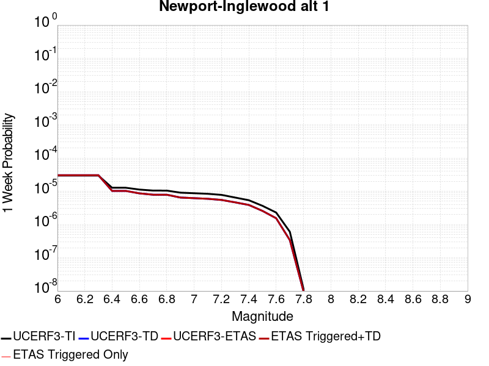 |  |  |  |

| Magnitude | 1 wk TI Prob | 1 wk TD Prob | 1 wk ETAS Prob | 1 wk ETAS/TD Gain | 1 wk ETAS Triggered+TD | 1 wk ETAS Triggered Only | 1 mo TI Prob | 1 mo TD Prob | 1 mo ETAS Prob | 1 mo ETAS/TD Gain | 1 mo ETAS Triggered+TD | 1 mo ETAS Triggered Only | 1 yr TI Prob | 1 yr TD Prob | 1 yr ETAS Prob | 1 yr ETAS/TD Gain | 1 yr ETAS Triggered+TD | 1 yr ETAS Triggered Only | 10 yr TI Prob | 10 yr TD Prob | 10 yr ETAS Prob | 10 yr ETAS/TD Gain | 10 yr ETAS Triggered+TD | 10 yr ETAS Triggered Only |
|-----|-----|-----|-----|-----|-----|-----|-----|-----|-----|-----|-----|-----|-----|-----|-----|-----|-----|-----|-----|-----|-----|-----|-----|-----|
| 6.0 | 2.9668912E-5 | 3.0343075E-5 | 0.0 | 0.0 | 3.0343075E-5 | 0.0 | 1.2714628E-4 | 1.30038E-4 | 0.0 | 0.0 | 1.30038E-4 | 0.0 | 0.0015469068 | 0.0015825456 | 0.0 | 0.0 | 0.0015825456 | 0.0 | 0.015361829 | 0.015760189 | 1.0E-4 | 0.0063451016 | 0.015858613 | 1.0E-4 |
| 6.1 | 2.9668912E-5 | 3.0343075E-5 | 0.0 | 0.0 | 3.0343075E-5 | 0.0 | 1.2714628E-4 | 1.30038E-4 | 0.0 | 0.0 | 1.30038E-4 | 0.0 | 0.0015469068 | 0.0015825456 | 0.0 | 0.0 | 0.0015825456 | 0.0 | 0.015361829 | 0.015760189 | 1.0E-4 | 0.0063451016 | 0.015858613 | 1.0E-4 |
| 6.2 | 2.9668912E-5 | 3.0343075E-5 | 0.0 | 0.0 | 3.0343075E-5 | 0.0 | 1.2714628E-4 | 1.30038E-4 | 0.0 | 0.0 | 1.30038E-4 | 0.0 | 0.0015469068 | 0.0015825456 | 0.0 | 0.0 | 0.0015825456 | 0.0 | 0.015361829 | 0.015760189 | 1.0E-4 | 0.0063451016 | 0.015858613 | 1.0E-4 |
| 6.3 | 2.9668912E-5 | 3.0343075E-5 | 0.0 | 0.0 | 3.0343075E-5 | 0.0 | 1.2714628E-4 | 1.30038E-4 | 0.0 | 0.0 | 1.30038E-4 | 0.0 | 0.0015469068 | 0.0015825456 | 0.0 | 0.0 | 0.0015825456 | 0.0 | 0.015361829 | 0.015760189 | 1.0E-4 | 0.0063451016 | 0.015858613 | 1.0E-4 |
| 6.4 | 1.275942E-5 | 1.025341E-5 | 0.0 | 0.0 | 1.025341E-5 | 0.0 | 5.4682085E-5 | 4.394247E-5 | 0.0 | 0.0 | 4.394247E-5 | 0.0 | 6.65551E-4 | 5.3487235E-4 | 0.0 | 0.0 | 5.3487235E-4 | 0.0 | 0.0066356123 | 0.0053362735 | 0.0 | 0.0 | 0.0053362735 | 0.0 |
| 6.5 | 1.275942E-5 | 1.025341E-5 | 0.0 | 0.0 | 1.025341E-5 | 0.0 | 5.4682085E-5 | 4.394247E-5 | 0.0 | 0.0 | 4.394247E-5 | 0.0 | 6.65551E-4 | 5.3487235E-4 | 0.0 | 0.0 | 5.3487235E-4 | 0.0 | 0.0066356123 | 0.0053362735 | 0.0 | 0.0 | 0.0053362735 | 0.0 |
| 6.6 | 1.1255358E-5 | 8.645131E-6 | 0.0 | 0.0 | 8.645131E-6 | 0.0 | 4.8236358E-5 | 3.7050046E-5 | 0.0 | 0.0 | 3.7050046E-5 | 0.0 | 5.871194E-4 | 4.509926E-4 | 0.0 | 0.0 | 4.509926E-4 | 0.0 | 0.005855706 | 0.00450095 | 0.0 | 0.0 | 0.00450095 | 0.0 |
| 6.7 | 1.0504745E-5 | 7.883882E-6 | 0.0 | 0.0 | 7.883882E-6 | 0.0 | 4.5019555E-5 | 3.3787634E-5 | 0.0 | 0.0 | 3.3787634E-5 | 0.0 | 5.4797524E-4 | 4.1128803E-4 | 0.0 | 0.0 | 4.1128803E-4 | 0.0 | 0.0054662596 | 0.004105398 | 0.0 | 0.0 | 0.004105398 | 0.0 |
| 6.8 | 1.0476007E-5 | 7.865275E-6 | 0.0 | 0.0 | 7.865275E-6 | 0.0 | 4.4896402E-5 | 3.3707893E-5 | 0.0 | 0.0 | 3.3707893E-5 | 0.0 | 5.464766E-4 | 4.1031756E-4 | 0.0 | 0.0 | 4.1031756E-4 | 0.0 | 0.005451347 | 0.004095729 | 0.0 | 0.0 | 0.004095729 | 0.0 |
| 6.9 | 9.076797E-6 | 6.4751025E-6 | 0.0 | 0.0 | 6.4751025E-6 | 0.0 | 3.889998E-5 | 2.7750146E-5 | 0.0 | 0.0 | 2.7750146E-5 | 0.0 | 4.7350433E-4 | 3.3780598E-4 | 0.0 | 0.0 | 3.3780598E-4 | 0.0 | 0.004724967 | 0.0033729621 | 0.0 | 0.0 | 0.0033729621 | 0.0 |
| 7.0 | 8.73795E-6 | 6.1975693E-6 | 0.0 | 0.0 | 6.1975693E-6 | 0.0 | 3.7447822E-5 | 2.6560741E-5 | 0.0 | 0.0 | 2.6560741E-5 | 0.0 | 4.5583185E-4 | 3.2332932E-4 | 0.0 | 0.0 | 3.2332932E-4 | 0.0 | 0.0045489795 | 0.0032286204 | 0.0 | 0.0 | 0.0032286204 | 0.0 |
| 7.1 | 8.391299E-6 | 5.9415534E-6 | 0.0 | 0.0 | 5.9415534E-6 | 0.0 | 3.5962214E-5 | 2.5463554E-5 | 0.0 | 0.0 | 2.5463554E-5 | 0.0 | 4.37752E-4 | 3.0997492E-4 | 0.0 | 0.0 | 3.0997492E-4 | 0.0 | 0.004368907 | 0.0030954548 | 0.0 | 0.0 | 0.0030954548 | 0.0 |
| 7.2 | 7.796882E-6 | 5.484767E-6 | 0.0 | 0.0 | 5.484767E-6 | 0.0 | 3.341478E-5 | 2.3505934E-5 | 0.0 | 0.0 | 2.3505934E-5 | 0.0 | 4.06749E-4 | 2.8614738E-4 | 0.0 | 0.0 | 2.8614738E-4 | 0.0 | 0.0040600533 | 0.0028578131 | 0.0 | 0.0 | 0.0028578131 | 0.0 |
| 7.3 | 6.4738833E-6 | 4.639097E-6 | 0.0 | 0.0 | 4.639097E-6 | 0.0 | 2.774492E-5 | 1.9881692E-5 | 0.0 | 0.0 | 1.9881692E-5 | 0.0 | 3.3774204E-4 | 2.4203288E-4 | 0.0 | 0.0 | 2.4203288E-4 | 0.0 | 0.0033722918 | 0.0024177094 | 0.0 | 0.0 | 0.0024177094 | 0.0 |
| 7.4 | 5.382145E-6 | 3.8783064E-6 | 0.0 | 0.0 | 3.8783064E-6 | 0.0 | 2.3066134E-5 | 1.6621208E-5 | 0.0 | 0.0 | 1.6621208E-5 | 0.0 | 2.8079396E-4 | 2.0234457E-4 | 0.0 | 0.0 | 2.0234457E-4 | 0.0 | 0.0028043943 | 0.0020216177 | 0.0 | 0.0 | 0.0020216177 | 0.0 |
| 7.5 | 3.648244E-6 | 2.5676459E-6 | 0.0 | 0.0 | 2.5676459E-6 | 0.0 | 1.5635238E-5 | 1.1004151E-5 | 0.0 | 0.0 | 1.1004151E-5 | 0.0 | 1.9034238E-4 | 1.339674E-4 | 0.0 | 0.0 | 1.339674E-4 | 0.0 | 0.0019017943 | 0.0013388768 | 0.0 | 0.0 | 0.0013388768 | 0.0 |
| 7.6 | 2.2906888E-6 | 1.5434092E-6 | 0.0 | 0.0 | 1.5434092E-6 | 0.0 | 9.817201E-6 | 6.6145944E-6 | 0.0 | 0.0 | 6.6145944E-6 | 0.0 | 1.1951787E-4 | 8.052978E-5 | 0.0 | 0.0 | 8.052978E-5 | 0.0 | 0.0011945361 | 8.0501265E-4 | 0.0 | 0.0 | 8.0501265E-4 | 0.0 |
| 7.7 | 6.0479874E-7 | 3.3945827E-7 | 0.0 | 0.0 | 3.3945827E-7 | 0.0 | 2.5919921E-6 | 1.4548204E-6 | 0.0 | 0.0 | 1.4548204E-6 | 0.0 | 3.1557047E-5 | 1.771231E-5 | 0.0 | 0.0 | 1.771231E-5 | 0.0 | 3.1552566E-4 | 1.7711034E-4 | 0.0 | 0.0 | 1.7711034E-4 | 0.0 |
| 7.8 | 1.16056995E-8 | 9.781111E-9 | 0.0 | 0.0 | 9.781111E-9 | 0.0 | 4.9738713E-8 | 4.1919048E-8 | 0.0 | 0.0 | 4.1919048E-8 | 0.0 | 6.0556863E-7 | 5.1036443E-7 | 0.0 | 0.0 | 5.1036443E-7 | 0.0 | 6.05567E-6 | 5.103644E-6 | 0.0 | 0.0 | 5.103644E-6 | 0.0 |

## Elysian Park (Lower CFM)
*[(top)](#table-of-contents)*

| 1 Week | 1 Month | 1 Year | 10 Year |
|-----|-----|-----|-----|
|  | 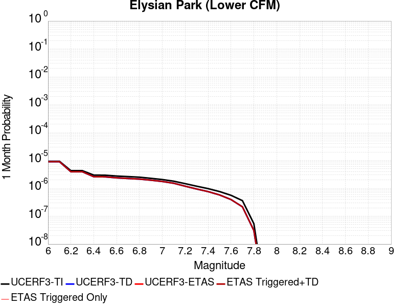 |  |  |

| Magnitude | 1 wk TI Prob | 1 wk TD Prob | 1 wk ETAS Prob | 1 wk ETAS/TD Gain | 1 wk ETAS Triggered+TD | 1 wk ETAS Triggered Only | 1 mo TI Prob | 1 mo TD Prob | 1 mo ETAS Prob | 1 mo ETAS/TD Gain | 1 mo ETAS Triggered+TD | 1 mo ETAS Triggered Only | 1 yr TI Prob | 1 yr TD Prob | 1 yr ETAS Prob | 1 yr ETAS/TD Gain | 1 yr ETAS Triggered+TD | 1 yr ETAS Triggered Only | 10 yr TI Prob | 10 yr TD Prob | 10 yr ETAS Prob | 10 yr ETAS/TD Gain | 10 yr ETAS Triggered+TD | 10 yr ETAS Triggered Only |
|-----|-----|-----|-----|-----|-----|-----|-----|-----|-----|-----|-----|-----|-----|-----|-----|-----|-----|-----|-----|-----|-----|-----|-----|-----|
| 6.0 | 2.1766498E-6 | 2.103101E-6 | 0.0 | 0.0 | 2.103101E-6 | 0.0 | 9.328466E-6 | 9.013267E-6 | 0.0 | 0.0 | 9.013267E-6 | 0.0 | 1.1356815E-4 | 1.0973245E-4 | 0.0 | 0.0 | 1.0973245E-4 | 0.0 | 0.0011351013 | 0.0010969245 | 1.0E-4 | 0.09116397 | 0.0011968148 | 1.0E-4 |
| 6.1 | 2.1766498E-6 | 2.103101E-6 | 0.0 | 0.0 | 2.103101E-6 | 0.0 | 9.328466E-6 | 9.013267E-6 | 0.0 | 0.0 | 9.013267E-6 | 0.0 | 1.1356815E-4 | 1.0973245E-4 | 0.0 | 0.0 | 1.0973245E-4 | 0.0 | 0.0011351013 | 0.0010969245 | 1.0E-4 | 0.09116397 | 0.0011968148 | 1.0E-4 |
| 6.2 | 1.0031182E-6 | 9.180558E-7 | 0.0 | 0.0 | 9.180558E-7 | 0.0 | 4.299071E-6 | 3.934519E-6 | 0.0 | 0.0 | 3.934519E-6 | 0.0 | 5.2339932E-5 | 4.7901816E-5 | 0.0 | 0.0 | 4.7901816E-5 | 0.0 | 5.2327604E-4 | 4.7892472E-4 | 0.0 | 0.0 | 4.7892472E-4 | 0.0 |
| 6.3 | 1.0031182E-6 | 9.180558E-7 | 0.0 | 0.0 | 9.180558E-7 | 0.0 | 4.299071E-6 | 3.934519E-6 | 0.0 | 0.0 | 3.934519E-6 | 0.0 | 5.2339932E-5 | 4.7901816E-5 | 0.0 | 0.0 | 4.7901816E-5 | 0.0 | 5.2327604E-4 | 4.7892472E-4 | 0.0 | 0.0 | 4.7892472E-4 | 0.0 |
| 6.4 | 6.9606244E-7 | 6.086536E-7 | 0.0 | 0.0 | 6.086536E-7 | 0.0 | 2.9831212E-6 | 2.6085127E-6 | 0.0 | 0.0 | 2.6085127E-6 | 0.0 | 3.6318896E-5 | 3.175818E-5 | 0.0 | 0.0 | 3.175818E-5 | 0.0 | 3.6312963E-4 | 3.1753667E-4 | 0.0 | 0.0 | 3.1753667E-4 | 0.0 |
| 6.5 | 6.901879E-7 | 6.0272254E-7 | 0.0 | 0.0 | 6.0272254E-7 | 0.0 | 2.9579448E-6 | 2.5830939E-6 | 0.0 | 0.0 | 2.5830939E-6 | 0.0 | 3.6012385E-5 | 3.144872E-5 | 0.0 | 0.0 | 3.144872E-5 | 0.0 | 3.600655E-4 | 3.144429E-4 | 0.0 | 0.0 | 3.144429E-4 | 0.0 |
| 6.6 | 6.4198554E-7 | 5.5412505E-7 | 0.0 | 0.0 | 5.5412505E-7 | 0.0 | 2.7513638E-6 | 2.3748194E-6 | 0.0 | 0.0 | 2.3748194E-6 | 0.0 | 3.3497337E-5 | 2.8913044E-5 | 0.0 | 0.0 | 2.8913044E-5 | 0.0 | 3.349229E-4 | 2.8909295E-4 | 0.0 | 0.0 | 2.8909295E-4 | 0.0 |
| 6.7 | 6.138733E-7 | 5.2580793E-7 | 0.0 | 0.0 | 5.2580793E-7 | 0.0 | 2.6308828E-6 | 2.2534605E-6 | 0.0 | 0.0 | 2.2534605E-6 | 0.0 | 3.203053E-5 | 2.7435537E-5 | 0.0 | 0.0 | 2.7435537E-5 | 0.0 | 3.2025913E-4 | 2.7432162E-4 | 0.0 | 0.0 | 2.7432162E-4 | 0.0 |
| 6.8 | 5.84778E-7 | 4.997639E-7 | 0.0 | 0.0 | 4.997639E-7 | 0.0 | 2.506189E-6 | 2.1418434E-6 | 0.0 | 0.0 | 2.1418434E-6 | 0.0 | 3.0512423E-5 | 2.6076634E-5 | 0.0 | 0.0 | 2.6076634E-5 | 0.0 | 3.0508233E-4 | 2.6073586E-4 | 0.0 | 0.0 | 2.6073586E-4 | 0.0 |
| 6.9 | 5.322785E-7 | 4.5748806E-7 | 0.0 | 0.0 | 4.5748806E-7 | 0.0 | 2.2811914E-6 | 1.9606614E-6 | 0.0 | 0.0 | 1.9606614E-6 | 0.0 | 2.7773152E-5 | 2.3870793E-5 | 0.0 | 0.0 | 2.3870793E-5 | 0.0 | 2.7769682E-4 | 2.3868239E-4 | 0.0 | 0.0 | 2.3868239E-4 | 0.0 |
| 7.0 | 4.8147206E-7 | 4.107299E-7 | 0.0 | 0.0 | 4.107299E-7 | 0.0 | 2.06345E-6 | 1.7602698E-6 | 0.0 | 0.0 | 1.7602698E-6 | 0.0 | 2.5122214E-5 | 2.1431075E-5 | 0.0 | 0.0 | 2.1431075E-5 | 0.0 | 2.5119373E-4 | 2.1429016E-4 | 0.0 | 0.0 | 2.1429016E-4 | 0.0 |
| 7.1 | 4.1932955E-7 | 3.5409474E-7 | 0.0 | 0.0 | 3.5409474E-7 | 0.0 | 1.7971255E-6 | 1.5175478E-6 | 0.0 | 0.0 | 1.5175478E-6 | 0.0 | 2.1879783E-5 | 1.8475988E-5 | 0.0 | 0.0 | 1.8475988E-5 | 0.0 | 2.1877629E-4 | 1.8474458E-4 | 0.0 | 0.0 | 1.8474458E-4 | 0.0 |
| 7.2 | 3.426051E-7 | 2.7771074E-7 | 0.0 | 0.0 | 2.7771074E-7 | 0.0 | 1.4683067E-6 | 1.1901883E-6 | 0.0 | 0.0 | 1.1901883E-6 | 0.0 | 1.7876488E-5 | 1.4490445E-5 | 0.0 | 0.0 | 1.4490445E-5 | 0.0 | 1.787505E-4 | 1.4489504E-4 | 0.0 | 0.0 | 1.4489504E-4 | 0.0 |
| 7.3 | 2.7771645E-7 | 2.2063207E-7 | 0.0 | 0.0 | 2.2063207E-7 | 0.0 | 1.1902127E-6 | 9.4556566E-7 | 0.0 | 0.0 | 9.4556566E-7 | 0.0 | 1.4490744E-5 | 1.1512201E-5 | 0.0 | 0.0 | 1.1512201E-5 | 0.0 | 1.4489799E-4 | 1.1511607E-4 | 0.0 | 0.0 | 1.1511607E-4 | 0.0 |
| 7.4 | 2.2756493E-7 | 1.7810005E-7 | 0.0 | 0.0 | 1.7810005E-7 | 0.0 | 9.752779E-7 | 7.632857E-7 | 0.0 | 0.0 | 7.632857E-7 | 0.0 | 1.1873944E-5 | 9.292963E-6 | 0.0 | 0.0 | 9.292963E-6 | 0.0 | 1.18733085E-4 | 9.2925766E-5 | 0.0 | 0.0 | 9.2925766E-5 | 0.0 |
| 7.5 | 1.7874558E-7 | 1.351719E-7 | 0.0 | 0.0 | 1.351719E-7 | 0.0 | 7.660522E-7 | 5.7930805E-7 | 0.0 | 0.0 | 5.7930805E-7 | 0.0 | 9.326646E-6 | 7.0530527E-6 | 0.0 | 0.0 | 7.0530527E-6 | 0.0 | 9.326255E-5 | 7.05283E-5 | 0.0 | 0.0 | 7.05283E-5 | 0.0 |
| 7.6 | 1.3124549E-7 | 9.230548E-8 | 0.0 | 0.0 | 9.230548E-8 | 0.0 | 5.624805E-7 | 3.9559487E-7 | 0.0 | 0.0 | 3.9559487E-7 | 0.0 | 6.8481786E-6 | 4.8163565E-6 | 0.0 | 0.0 | 4.8163565E-6 | 0.0 | 6.8479676E-5 | 4.816254E-5 | 0.0 | 0.0 | 4.816254E-5 | 0.0 |
| 7.7 | 8.439993E-8 | 5.0735117E-8 | 0.0 | 0.0 | 5.0735117E-8 | 0.0 | 3.6171392E-7 | 2.174362E-7 | 0.0 | 0.0 | 2.174362E-7 | 0.0 | 4.403858E-6 | 2.6472826E-6 | 0.0 | 0.0 | 2.6472826E-6 | 0.0 | 4.4037708E-5 | 2.6472522E-5 | 0.0 | 0.0 | 2.6472522E-5 | 0.0 |
| 7.8 | 1.2591407E-8 | 7.195422E-9 | 0.0 | 0.0 | 7.195422E-9 | 0.0 | 5.3963173E-8 | 3.0837526E-8 | 0.0 | 0.0 | 3.0837526E-8 | 0.0 | 6.570014E-7 | 3.7544683E-7 | 0.0 | 0.0 | 3.7544683E-7 | 0.0 | 6.5699946E-6 | 3.7544619E-6 | 0.0 | 0.0 | 3.7544619E-6 | 0.0 |
| 7.9 | 2.8324232E-11 | 2.1363689E-11 | 0.0 | 0.0 | 2.1363689E-11 | 0.0 | 1.2138957E-10 | 9.1558316E-11 | 0.0 | 0.0 | 9.1558316E-11 | 0.0 | 1.4779177E-9 | 1.1147231E-9 | 0.0 | 0.0 | 1.1147231E-9 | 0.0 | 1.4779177E-8 | 1.1147231E-8 | 0.0 | 0.0 | 1.1147231E-8 | 0.0 |

## Great Valley 04a Trout Creek
*[(top)](#table-of-contents)*

| 1 Week | 1 Month | 1 Year | 10 Year |
|-----|-----|-----|-----|
|  |  |  |  |

| Magnitude | 1 wk TI Prob | 1 wk TD Prob | 1 wk ETAS Prob | 1 wk ETAS/TD Gain | 1 wk ETAS Triggered+TD | 1 wk ETAS Triggered Only | 1 mo TI Prob | 1 mo TD Prob | 1 mo ETAS Prob | 1 mo ETAS/TD Gain | 1 mo ETAS Triggered+TD | 1 mo ETAS Triggered Only | 1 yr TI Prob | 1 yr TD Prob | 1 yr ETAS Prob | 1 yr ETAS/TD Gain | 1 yr ETAS Triggered+TD | 1 yr ETAS Triggered Only | 10 yr TI Prob | 10 yr TD Prob | 10 yr ETAS Prob | 10 yr ETAS/TD Gain | 10 yr ETAS Triggered+TD | 10 yr ETAS Triggered Only |
|-----|-----|-----|-----|-----|-----|-----|-----|-----|-----|-----|-----|-----|-----|-----|-----|-----|-----|-----|-----|-----|-----|-----|-----|-----|
| 6.0 | 1.4088538E-5 | 1.5700552E-5 | 0.0 | 0.0 | 1.5700552E-5 | 0.0 | 6.037805E-5 | 6.728642E-5 | 0.0 | 0.0 | 6.728642E-5 | 0.0 | 7.3485484E-4 | 8.189167E-4 | 1.0E-4 | 0.12211254 | 9.188348E-4 | 1.0E-4 | 0.007324295 | 0.008160271 | 1.0E-4 | 0.012254495 | 0.008259455 | 1.0E-4 |
| 6.1 | 1.4088538E-5 | 1.5700552E-5 | 0.0 | 0.0 | 1.5700552E-5 | 0.0 | 6.037805E-5 | 6.728642E-5 | 0.0 | 0.0 | 6.728642E-5 | 0.0 | 7.3485484E-4 | 8.189167E-4 | 1.0E-4 | 0.12211254 | 9.188348E-4 | 1.0E-4 | 0.007324295 | 0.008160271 | 1.0E-4 | 0.012254495 | 0.008259455 | 1.0E-4 |
| 6.2 | 1.4088538E-5 | 1.5700552E-5 | 0.0 | 0.0 | 1.5700552E-5 | 0.0 | 6.037805E-5 | 6.728642E-5 | 0.0 | 0.0 | 6.728642E-5 | 0.0 | 7.3485484E-4 | 8.189167E-4 | 1.0E-4 | 0.12211254 | 9.188348E-4 | 1.0E-4 | 0.007324295 | 0.008160271 | 1.0E-4 | 0.012254495 | 0.008259455 | 1.0E-4 |
| 6.3 | 1.2882862E-5 | 1.43611705E-5 | 0.0 | 0.0 | 1.43611705E-5 | 0.0 | 5.5211098E-5 | 6.154648E-5 | 0.0 | 0.0 | 6.154648E-5 | 0.0 | 6.7198783E-4 | 7.4908114E-4 | 1.0E-4 | 0.13349688 | 8.4900623E-4 | 1.0E-4 | 0.0066995937 | 0.007466622 | 1.0E-4 | 0.013392936 | 0.0075658755 | 1.0E-4 |
| 6.4 | 1.2882862E-5 | 1.43611705E-5 | 0.0 | 0.0 | 1.43611705E-5 | 0.0 | 5.5211098E-5 | 6.154648E-5 | 0.0 | 0.0 | 6.154648E-5 | 0.0 | 6.7198783E-4 | 7.4908114E-4 | 1.0E-4 | 0.13349688 | 8.4900623E-4 | 1.0E-4 | 0.0066995937 | 0.007466622 | 1.0E-4 | 0.013392936 | 0.0075658755 | 1.0E-4 |
| 6.5 | 1.2762329E-5 | 1.4227877E-5 | 0.0 | 0.0 | 1.4227877E-5 | 0.0 | 5.469455E-5 | 6.097525E-5 | 0.0 | 0.0 | 6.097525E-5 | 0.0 | 6.657027E-4 | 7.4213115E-4 | 1.0E-4 | 0.13474707 | 8.4205694E-4 | 1.0E-4 | 0.00663712 | 0.007397585 | 1.0E-4 | 0.0135179255 | 0.0074968454 | 1.0E-4 |
| 6.6 | 1.2762329E-5 | 1.4227877E-5 | 0.0 | 0.0 | 1.4227877E-5 | 0.0 | 5.469455E-5 | 6.097525E-5 | 0.0 | 0.0 | 6.097525E-5 | 0.0 | 6.657027E-4 | 7.4213115E-4 | 1.0E-4 | 0.13474707 | 8.4205694E-4 | 1.0E-4 | 0.00663712 | 0.007397585 | 1.0E-4 | 0.0135179255 | 0.0074968454 | 1.0E-4 |
| 6.7 | 1.2557959E-5 | 1.4002359E-5 | 0.0 | 0.0 | 1.4002359E-5 | 0.0 | 5.3818712E-5 | 6.0008788E-5 | 0.0 | 0.0 | 6.0008788E-5 | 0.0 | 6.5504585E-4 | 7.303724E-4 | 1.0E-4 | 0.13691646 | 8.3029934E-4 | 1.0E-4 | 0.006531183 | 0.007280771 | 1.0E-4 | 0.013734809 | 0.0073800427 | 1.0E-4 |
| 6.8 | 1.1871544E-5 | 1.3242644E-5 | 0.0 | 0.0 | 1.3242644E-5 | 0.0 | 5.0877054E-5 | 5.675301E-5 | 0.0 | 0.0 | 5.675301E-5 | 0.0 | 6.1925204E-4 | 6.9075887E-4 | 1.0E-4 | 0.14476833 | 7.906898E-4 | 1.0E-4 | 0.0061752927 | 0.006887132 | 1.0E-4 | 0.014519832 | 0.0069864434 | 1.0E-4 |
| 6.9 | 1.0500373E-5 | 1.1716899E-5 | 0.0 | 0.0 | 1.1716899E-5 | 0.0 | 4.5000823E-5 | 5.0214363E-5 | 0.0 | 0.0 | 5.0214363E-5 | 0.0 | 5.4774724E-4 | 6.1119697E-4 | 0.0 | 0.0 | 6.1119697E-4 | 0.0 | 0.005463991 | 0.0060960236 | 0.0 | 0.0 | 0.0060960236 | 0.0 |
| 7.0 | 8.524332E-6 | 9.521695E-6 | 0.0 | 0.0 | 9.521695E-6 | 0.0 | 3.653234E-5 | 4.0806663E-5 | 0.0 | 0.0 | 4.0806663E-5 | 0.0 | 4.4469046E-4 | 4.967152E-4 | 0.0 | 0.0 | 4.967152E-4 | 0.0 | 0.0044380166 | 0.004956779 | 0.0 | 0.0 | 0.004956779 | 0.0 |
| 7.1 | 6.006849E-6 | 6.70333E-6 | 0.0 | 0.0 | 6.70333E-6 | 0.0 | 2.5743384E-5 | 2.8728273E-5 | 0.0 | 0.0 | 2.8728273E-5 | 0.0 | 3.1338062E-4 | 3.4971617E-4 | 0.0 | 0.0 | 3.4971617E-4 | 0.0 | 0.0031293905 | 0.0034922073 | 0.0 | 0.0 | 0.0034922073 | 0.0 |
| 7.2 | 2.9122193E-6 | 3.2426306E-6 | 0.0 | 0.0 | 3.2426306E-6 | 0.0 | 1.248088E-5 | 1.3896924E-5 | 0.0 | 0.0 | 1.3896924E-5 | 0.0 | 1.5194413E-4 | 1.6918367E-4 | 0.0 | 0.0 | 1.6918367E-4 | 0.0 | 0.0015184027 | 0.0016907202 | 0.0 | 0.0 | 0.0016907202 | 0.0 |
| 7.3 | 7.2194007E-7 | 7.9798E-7 | 0.0 | 0.0 | 7.9798E-7 | 0.0 | 3.0940253E-6 | 3.4199124E-6 | 0.0 | 0.0 | 3.4199124E-6 | 0.0 | 3.7669106E-5 | 4.1637097E-5 | 0.0 | 0.0 | 4.1637097E-5 | 0.0 | 3.766272E-4 | 4.1633783E-4 | 0.0 | 0.0 | 4.1633783E-4 | 0.0 |
| 7.4 | 3.112171E-8 | 3.2058175E-8 | 0.0 | 0.0 | 3.2058175E-8 | 0.0 | 1.3337875E-7 | 1.3739218E-7 | 0.0 | 0.0 | 1.3739218E-7 | 0.0 | 1.6238852E-6 | 1.6727486E-6 | 0.0 | 0.0 | 1.6727486E-6 | 0.0 | 1.6238733E-5 | 1.6727368E-5 | 0.0 | 0.0 | 1.6727368E-5 | 0.0 |

## Sierra Nevada  (No Extension)
*[(top)](#table-of-contents)*

| 1 Week | 1 Month | 1 Year | 10 Year |
|-----|-----|-----|-----|
| 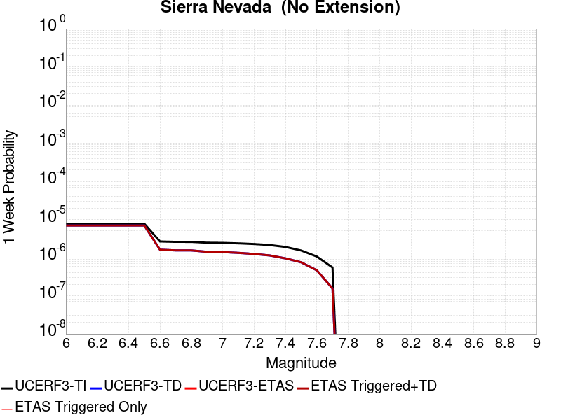 | 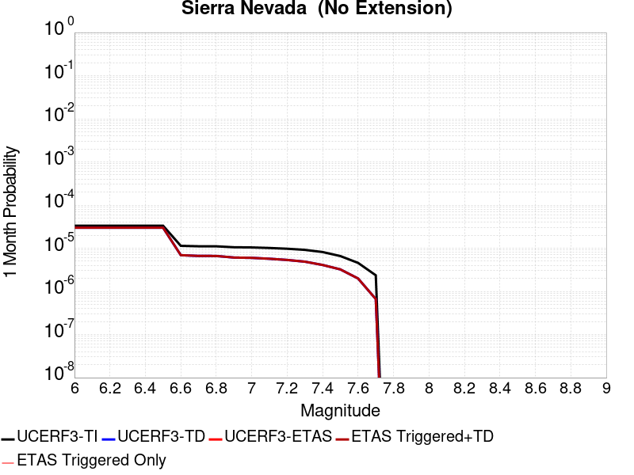 |  | 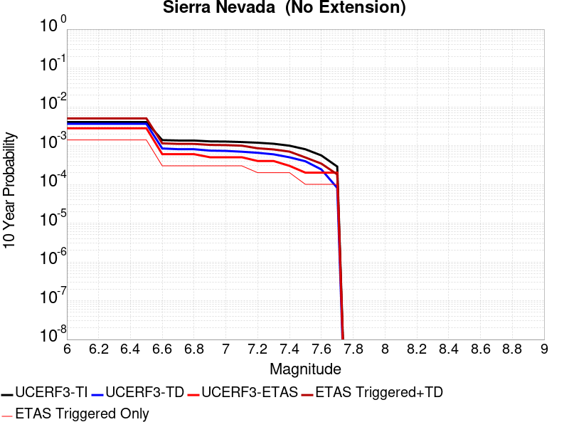 |

| Magnitude | 1 wk TI Prob | 1 wk TD Prob | 1 wk ETAS Prob | 1 wk ETAS/TD Gain | 1 wk ETAS Triggered+TD | 1 wk ETAS Triggered Only | 1 mo TI Prob | 1 mo TD Prob | 1 mo ETAS Prob | 1 mo ETAS/TD Gain | 1 mo ETAS Triggered+TD | 1 mo ETAS Triggered Only | 1 yr TI Prob | 1 yr TD Prob | 1 yr ETAS Prob | 1 yr ETAS/TD Gain | 1 yr ETAS Triggered+TD | 1 yr ETAS Triggered Only | 10 yr TI Prob | 10 yr TD Prob | 10 yr ETAS Prob | 10 yr ETAS/TD Gain | 10 yr ETAS Triggered+TD | 10 yr ETAS Triggered Only |
|-----|-----|-----|-----|-----|-----|-----|-----|-----|-----|-----|-----|-----|-----|-----|-----|-----|-----|-----|-----|-----|-----|-----|-----|-----|
| 6.0 | 7.7690465E-6 | 6.971018E-6 | 0.0 | 0.0 | 6.971018E-6 | 0.0 | 3.329549E-5 | 2.9875653E-5 | 0.0 | 0.0 | 2.9875653E-5 | 0.0 | 4.0529718E-4 | 3.6371118E-4 | 0.0 | 0.0 | 3.6371118E-4 | 0.0 | 0.004045588 | 0.0036346717 | 1.0E-4 | 0.027512802 | 0.003734308 | 1.0E-4 |
| 6.1 | 7.7690465E-6 | 6.971018E-6 | 0.0 | 0.0 | 6.971018E-6 | 0.0 | 3.329549E-5 | 2.9875653E-5 | 0.0 | 0.0 | 2.9875653E-5 | 0.0 | 4.0529718E-4 | 3.6371118E-4 | 0.0 | 0.0 | 3.6371118E-4 | 0.0 | 0.004045588 | 0.0036346717 | 1.0E-4 | 0.027512802 | 0.003734308 | 1.0E-4 |
| 6.2 | 7.7690465E-6 | 6.971018E-6 | 0.0 | 0.0 | 6.971018E-6 | 0.0 | 3.329549E-5 | 2.9875653E-5 | 0.0 | 0.0 | 2.9875653E-5 | 0.0 | 4.0529718E-4 | 3.6371118E-4 | 0.0 | 0.0 | 3.6371118E-4 | 0.0 | 0.004045588 | 0.0036346717 | 1.0E-4 | 0.027512802 | 0.003734308 | 1.0E-4 |
| 6.3 | 7.7690465E-6 | 6.971018E-6 | 0.0 | 0.0 | 6.971018E-6 | 0.0 | 3.329549E-5 | 2.9875653E-5 | 0.0 | 0.0 | 2.9875653E-5 | 0.0 | 4.0529718E-4 | 3.6371118E-4 | 0.0 | 0.0 | 3.6371118E-4 | 0.0 | 0.004045588 | 0.0036346717 | 1.0E-4 | 0.027512802 | 0.003734308 | 1.0E-4 |
| 6.4 | 7.7690465E-6 | 6.971018E-6 | 0.0 | 0.0 | 6.971018E-6 | 0.0 | 3.329549E-5 | 2.9875653E-5 | 0.0 | 0.0 | 2.9875653E-5 | 0.0 | 4.0529718E-4 | 3.6371118E-4 | 0.0 | 0.0 | 3.6371118E-4 | 0.0 | 0.004045588 | 0.0036346717 | 1.0E-4 | 0.027512802 | 0.003734308 | 1.0E-4 |
| 6.5 | 7.7690465E-6 | 6.971018E-6 | 0.0 | 0.0 | 6.971018E-6 | 0.0 | 3.329549E-5 | 2.9875653E-5 | 0.0 | 0.0 | 2.9875653E-5 | 0.0 | 4.0529718E-4 | 3.6371118E-4 | 0.0 | 0.0 | 3.6371118E-4 | 0.0 | 0.004045588 | 0.0036346717 | 1.0E-4 | 0.027512802 | 0.003734308 | 1.0E-4 |
| 6.6 | 2.653E-6 | 1.6122345E-6 | 0.0 | 0.0 | 1.6122345E-6 | 0.0 | 1.136995E-5 | 6.9095586E-6 | 0.0 | 0.0 | 6.9095586E-6 | 0.0 | 1.3842035E-4 | 8.4120664E-5 | 0.0 | 0.0 | 8.4120664E-5 | 0.0 | 0.0013833415 | 8.408917E-4 | 1.0E-4 | 0.118921384 | 9.408076E-4 | 1.0E-4 |
| 6.7 | 2.5902466E-6 | 1.5475887E-6 | 0.0 | 0.0 | 1.5475887E-6 | 0.0 | 1.11010095E-5 | 6.6325065E-6 | 0.0 | 0.0 | 6.6325065E-6 | 0.0 | 1.351464E-4 | 8.07478E-5 | 0.0 | 0.0 | 8.07478E-5 | 0.0 | 0.0013506424 | 8.071876E-4 | 1.0E-4 | 0.123886935 | 9.0710685E-4 | 1.0E-4 |
| 6.8 | 2.5853892E-6 | 1.5444003E-6 | 0.0 | 0.0 | 1.5444003E-6 | 0.0 | 1.1080193E-5 | 6.618842E-6 | 0.0 | 0.0 | 6.618842E-6 | 0.0 | 1.34893E-4 | 8.058145E-5 | 0.0 | 0.0 | 8.058145E-5 | 0.0 | 0.0013481114 | 8.055253E-4 | 1.0E-4 | 0.124142595 | 9.0544473E-4 | 1.0E-4 |
| 6.9 | 2.458257E-6 | 1.4195255E-6 | 0.0 | 0.0 | 1.4195255E-6 | 0.0 | 1.0535345E-5 | 6.0836664E-6 | 0.0 | 0.0 | 6.0836664E-6 | 0.0 | 1.2826028E-4 | 7.406614E-5 | 0.0 | 0.0 | 7.406614E-5 | 0.0 | 0.0012818627 | 7.404165E-4 | 1.0E-4 | 0.13505912 | 8.403424E-4 | 1.0E-4 |
| 7.0 | 2.4341468E-6 | 1.3965005E-6 | 0.0 | 0.0 | 1.3965005E-6 | 0.0 | 1.0432016E-5 | 5.9849885E-6 | 0.0 | 0.0 | 5.9849885E-6 | 0.0 | 1.270024E-4 | 7.2864816E-5 | 0.0 | 0.0 | 7.2864816E-5 | 0.0 | 0.0012692984 | 7.284112E-4 | 1.0E-4 | 0.1372851 | 8.283383E-4 | 1.0E-4 |
| 7.1 | 2.3652476E-6 | 1.3314825E-6 | 0.0 | 0.0 | 1.3314825E-6 | 0.0 | 1.0136736E-5 | 5.706341E-6 | 0.0 | 0.0 | 5.706341E-6 | 0.0 | 1.2340778E-4 | 6.94725E-5 | 0.0 | 0.0 | 6.94725E-5 | 0.0 | 0.0012333926 | 6.9450954E-4 | 1.0E-4 | 0.14398651 | 7.944401E-4 | 1.0E-4 |
| 7.2 | 2.272158E-6 | 1.2478428E-6 | 0.0 | 0.0 | 1.2478428E-6 | 0.0 | 9.737784E-6 | 5.3478866E-6 | 0.0 | 0.0 | 5.3478866E-6 | 0.0 | 1.1855107E-4 | 6.510859E-5 | 0.0 | 0.0 | 6.510859E-5 | 0.0 | 0.0011848784 | 6.5089663E-4 | 1.0E-4 | 0.15363422 | 7.5083156E-4 | 1.0E-4 |
| 7.3 | 2.1382127E-6 | 1.1396008E-6 | 0.0 | 0.0 | 1.1396008E-6 | 0.0 | 9.163737E-6 | 4.8839947E-6 | 0.0 | 0.0 | 4.8839947E-6 | 0.0 | 1.1156279E-4 | 5.9461025E-5 | 0.0 | 0.0 | 5.9461025E-5 | 0.0 | 0.001115068 | 5.944523E-4 | 1.0E-4 | 0.16822207 | 6.943929E-4 | 1.0E-4 |
| 7.4 | 1.9048055E-6 | 9.552692E-7 | 0.0 | 0.0 | 9.552692E-7 | 0.0 | 8.163426E-6 | 4.094005E-6 | 0.0 | 0.0 | 4.094005E-6 | 0.0 | 9.9385186E-5 | 4.9843373E-5 | 0.0 | 0.0 | 4.9843373E-5 | 0.0 | 9.934074E-4 | 4.9832265E-4 | 1.0E-4 | 0.20067321 | 5.9827283E-4 | 1.0E-4 |
| 7.5 | 1.5373403E-6 | 7.540598E-7 | 0.0 | 0.0 | 7.540598E-7 | 0.0 | 6.5885843E-6 | 3.2316807E-6 | 0.0 | 0.0 | 3.2316807E-6 | 0.0 | 8.021306E-5 | 3.9345006E-5 | 0.0 | 0.0 | 3.9345006E-5 | 0.0 | 8.0184115E-4 | 3.9338088E-4 | 0.0 | 0.0 | 3.9338088E-4 | 0.0 |
| 7.6 | 1.0680322E-6 | 4.6453596E-7 | 0.0 | 0.0 | 4.6453596E-7 | 0.0 | 4.577273E-6 | 1.9908668E-6 | 0.0 | 0.0 | 1.9908668E-6 | 0.0 | 5.5726876E-5 | 2.4238538E-5 | 0.0 | 0.0 | 2.4238538E-5 | 0.0 | 5.5712904E-4 | 2.423592E-4 | 0.0 | 0.0 | 2.423592E-4 | 0.0 |
| 7.7 | 5.509146E-7 | 1.550042E-7 | 0.0 | 0.0 | 1.550042E-7 | 0.0 | 2.3610605E-6 | 6.6430357E-7 | 0.0 | 0.0 | 6.6430357E-7 | 0.0 | 2.8745531E-5 | 8.087867E-6 | 0.0 | 0.0 | 8.087867E-6 | 0.0 | 2.8741814E-4 | 8.087584E-5 | 0.0 | 0.0 | 8.087584E-5 | 0.0 |

## Polaris 2011 CFM
*[(top)](#table-of-contents)*

| 1 Week | 1 Month | 1 Year | 10 Year |
|-----|-----|-----|-----|
|  |  |  |  |

| Magnitude | 1 wk TI Prob | 1 wk TD Prob | 1 wk ETAS Prob | 1 wk ETAS/TD Gain | 1 wk ETAS Triggered+TD | 1 wk ETAS Triggered Only | 1 mo TI Prob | 1 mo TD Prob | 1 mo ETAS Prob | 1 mo ETAS/TD Gain | 1 mo ETAS Triggered+TD | 1 mo ETAS Triggered Only | 1 yr TI Prob | 1 yr TD Prob | 1 yr ETAS Prob | 1 yr ETAS/TD Gain | 1 yr ETAS Triggered+TD | 1 yr ETAS Triggered Only | 10 yr TI Prob | 10 yr TD Prob | 10 yr ETAS Prob | 10 yr ETAS/TD Gain | 10 yr ETAS Triggered+TD | 10 yr ETAS Triggered Only |
|-----|-----|-----|-----|-----|-----|-----|-----|-----|-----|-----|-----|-----|-----|-----|-----|-----|-----|-----|-----|-----|-----|-----|-----|-----|
| 6.0 | 1.2630823E-5 | 1.3572226E-5 | 0.0 | 0.0 | 1.3572226E-5 | 0.0 | 5.413098E-5 | 5.8165675E-5 | 0.0 | 0.0 | 5.8165675E-5 | 0.0 | 6.5884535E-4 | 7.079888E-4 | 0.0 | 0.0 | 7.079888E-4 | 0.0 | 0.0065689543 | 0.007062433 | 1.0E-4 | 0.014159427 | 0.0071617267 | 1.0E-4 |
| 6.1 | 1.2630823E-5 | 1.3572226E-5 | 0.0 | 0.0 | 1.3572226E-5 | 0.0 | 5.413098E-5 | 5.8165675E-5 | 0.0 | 0.0 | 5.8165675E-5 | 0.0 | 6.5884535E-4 | 7.079888E-4 | 0.0 | 0.0 | 7.079888E-4 | 0.0 | 0.0065689543 | 0.007062433 | 1.0E-4 | 0.014159427 | 0.0071617267 | 1.0E-4 |
| 6.2 | 1.2630823E-5 | 1.3572226E-5 | 0.0 | 0.0 | 1.3572226E-5 | 0.0 | 5.413098E-5 | 5.8165675E-5 | 0.0 | 0.0 | 5.8165675E-5 | 0.0 | 6.5884535E-4 | 7.079888E-4 | 0.0 | 0.0 | 7.079888E-4 | 0.0 | 0.0065689543 | 0.007062433 | 1.0E-4 | 0.014159427 | 0.0071617267 | 1.0E-4 |
| 6.3 | 1.2630823E-5 | 1.3572226E-5 | 0.0 | 0.0 | 1.3572226E-5 | 0.0 | 5.413098E-5 | 5.8165675E-5 | 0.0 | 0.0 | 5.8165675E-5 | 0.0 | 6.5884535E-4 | 7.079888E-4 | 0.0 | 0.0 | 7.079888E-4 | 0.0 | 0.0065689543 | 0.007062433 | 1.0E-4 | 0.014159427 | 0.0071617267 | 1.0E-4 |
| 6.4 | 6.642994E-6 | 7.1018785E-6 | 0.0 | 0.0 | 7.1018785E-6 | 0.0 | 2.8469662E-5 | 3.0436295E-5 | 0.0 | 0.0 | 3.0436295E-5 | 0.0 | 3.46563E-4 | 3.7050404E-4 | 0.0 | 0.0 | 3.7050404E-4 | 0.0 | 0.0034602303 | 0.0036993735 | 1.0E-4 | 0.027031606 | 0.0037990033 | 1.0E-4 |
| 6.5 | 6.642994E-6 | 7.1018785E-6 | 0.0 | 0.0 | 7.1018785E-6 | 0.0 | 2.8469662E-5 | 3.0436295E-5 | 0.0 | 0.0 | 3.0436295E-5 | 0.0 | 3.46563E-4 | 3.7050404E-4 | 0.0 | 0.0 | 3.7050404E-4 | 0.0 | 0.0034602303 | 0.0036993735 | 1.0E-4 | 0.027031606 | 0.0037990033 | 1.0E-4 |
| 6.6 | 6.1286296E-6 | 6.551398E-6 | 0.0 | 0.0 | 6.551398E-6 | 0.0 | 2.626529E-5 | 2.8077146E-5 | 0.0 | 0.0 | 2.8077146E-5 | 0.0 | 3.19733E-4 | 3.4179044E-4 | 0.0 | 0.0 | 3.4179044E-4 | 0.0 | 0.0031927335 | 0.003413122 | 1.0E-4 | 0.02929869 | 0.0035127806 | 1.0E-4 |
| 6.7 | 4.9474666E-6 | 5.2943287E-6 | 0.0 | 0.0 | 5.2943287E-6 | 0.0 | 2.1203256E-5 | 2.26898E-5 | 0.0 | 0.0 | 2.26898E-5 | 0.0 | 2.5811905E-4 | 2.762161E-4 | 0.0 | 0.0 | 2.762161E-4 | 0.0 | 0.0025781945 | 0.0027590075 | 1.0E-4 | 0.036244918 | 0.0028587314 | 1.0E-4 |
| 6.8 | 4.616407E-6 | 4.9425757E-6 | 0.0 | 0.0 | 4.9425757E-6 | 0.0 | 1.978445E-5 | 2.1182312E-5 | 0.0 | 0.0 | 2.1182312E-5 | 0.0 | 2.4084905E-4 | 2.578668E-4 | 0.0 | 0.0 | 2.578668E-4 | 0.0 | 0.0024058819 | 0.0025759398 | 1.0E-4 | 0.038820785 | 0.002675682 | 1.0E-4 |
| 6.9 | 4.320343E-6 | 4.6274126E-6 | 0.0 | 0.0 | 4.6274126E-6 | 0.0 | 1.8515624E-5 | 1.9831632E-5 | 0.0 | 0.0 | 1.9831632E-5 | 0.0 | 2.2540441E-4 | 2.4142597E-4 | 0.0 | 0.0 | 2.4142597E-4 | 0.0 | 0.0022517592 | 0.0024118933 | 1.0E-4 | 0.041461203 | 0.002511652 | 1.0E-4 |
| 7.0 | 3.7382292E-6 | 4.006516E-6 | 0.0 | 0.0 | 4.006516E-6 | 0.0 | 1.6020884E-5 | 1.7170683E-5 | 0.0 | 0.0 | 1.7170683E-5 | 0.0 | 1.950368E-4 | 2.0903541E-4 | 0.0 | 0.0 | 2.0903541E-4 | 0.0 | 0.0019486571 | 0.002088623 | 1.0E-4 | 0.047878437 | 0.002188414 | 1.0E-4 |
| 7.1 | 3.193576E-6 | 3.425077E-6 | 0.0 | 0.0 | 3.425077E-6 | 0.0 | 1.3686683E-5 | 1.4678832E-5 | 0.0 | 0.0 | 1.4678832E-5 | 0.0 | 1.6662262E-4 | 1.7870234E-4 | 0.0 | 0.0 | 1.7870234E-4 | 0.0 | 0.0016649774 | 0.0017858049 | 1.0E-4 | 0.05599716 | 0.0018856263 | 1.0E-4 |
| 7.2 | 2.2356758E-6 | 2.4004994E-6 | 0.0 | 0.0 | 2.4004994E-6 | 0.0 | 9.581432E-6 | 1.0287825E-5 | 0.0 | 0.0 | 1.0287825E-5 | 0.0 | 1.1664769E-4 | 1.2524896E-4 | 0.0 | 0.0 | 1.2524896E-4 | 0.0 | 0.0011658648 | 0.0012519691 | 1.0E-4 | 0.07987417 | 0.0013518439 | 1.0E-4 |

## Joshua Tree (Seismicity)
*[(top)](#table-of-contents)*

| 1 Week | 1 Month | 1 Year | 10 Year |
|-----|-----|-----|-----|
|  |  | 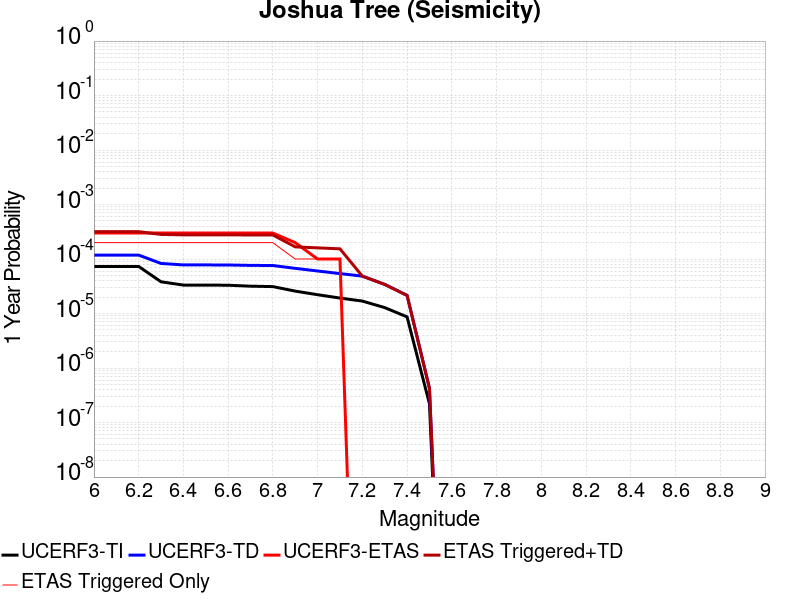 |  |

| Magnitude | 1 wk TI Prob | 1 wk TD Prob | 1 wk ETAS Prob | 1 wk ETAS/TD Gain | 1 wk ETAS Triggered+TD | 1 wk ETAS Triggered Only | 1 mo TI Prob | 1 mo TD Prob | 1 mo ETAS Prob | 1 mo ETAS/TD Gain | 1 mo ETAS Triggered+TD | 1 mo ETAS Triggered Only | 1 yr TI Prob | 1 yr TD Prob | 1 yr ETAS Prob | 1 yr ETAS/TD Gain | 1 yr ETAS Triggered+TD | 1 yr ETAS Triggered Only | 10 yr TI Prob | 10 yr TD Prob | 10 yr ETAS Prob | 10 yr ETAS/TD Gain | 10 yr ETAS Triggered+TD | 10 yr ETAS Triggered Only |
|-----|-----|-----|-----|-----|-----|-----|-----|-----|-----|-----|-----|-----|-----|-----|-----|-----|-----|-----|-----|-----|-----|-----|-----|-----|
| 6.0 | 1.4025588E-6 | 2.2655597E-6 | 0.0 | 0.0 | 2.2655597E-6 | 0.0 | 6.0109523E-6 | 9.709509E-6 | 0.0 | 0.0 | 9.709509E-6 | 0.0 | 7.318089E-5 | 1.18207514E-4 | 0.0 | 0.0 | 1.18207514E-4 | 0.0 | 7.315679E-4 | 0.0011815104 | 1.0E-4 | 0.084637426 | 0.0012813923 | 1.0E-4 |
| 6.1 | 1.4025588E-6 | 2.2655597E-6 | 0.0 | 0.0 | 2.2655597E-6 | 0.0 | 6.0109523E-6 | 9.709509E-6 | 0.0 | 0.0 | 9.709509E-6 | 0.0 | 7.318089E-5 | 1.18207514E-4 | 0.0 | 0.0 | 1.18207514E-4 | 0.0 | 7.315679E-4 | 0.0011815104 | 1.0E-4 | 0.084637426 | 0.0012813923 | 1.0E-4 |
| 6.2 | 1.4025588E-6 | 2.2655597E-6 | 0.0 | 0.0 | 2.2655597E-6 | 0.0 | 6.0109523E-6 | 9.709509E-6 | 0.0 | 0.0 | 9.709509E-6 | 0.0 | 7.318089E-5 | 1.18207514E-4 | 0.0 | 0.0 | 1.18207514E-4 | 0.0 | 7.315679E-4 | 0.0011815104 | 1.0E-4 | 0.084637426 | 0.0012813923 | 1.0E-4 |
| 6.3 | 7.3325685E-7 | 1.5896609E-6 | 0.0 | 0.0 | 1.5896609E-6 | 0.0 | 3.1425257E-6 | 6.812815E-6 | 0.0 | 0.0 | 6.812815E-6 | 0.0 | 3.825958E-5 | 8.2942955E-5 | 0.0 | 0.0 | 8.2942955E-5 | 0.0 | 3.8252992E-4 | 8.291284E-4 | 1.0E-4 | 0.12060858 | 9.2904543E-4 | 1.0E-4 |
| 6.4 | 6.38256E-7 | 1.4939177E-6 | 0.0 | 0.0 | 1.4939177E-6 | 0.0 | 2.7353801E-6 | 6.4024894E-6 | 0.0 | 0.0 | 6.4024894E-6 | 0.0 | 3.3302742E-5 | 7.794759E-5 | 0.0 | 0.0 | 7.794759E-5 | 0.0 | 3.3297754E-4 | 7.792098E-4 | 1.0E-4 | 0.12833515 | 8.791319E-4 | 1.0E-4 |
| 6.5 | 6.38256E-7 | 1.4939177E-6 | 0.0 | 0.0 | 1.4939177E-6 | 0.0 | 2.7353801E-6 | 6.4024894E-6 | 0.0 | 0.0 | 6.4024894E-6 | 0.0 | 3.3302742E-5 | 7.794759E-5 | 0.0 | 0.0 | 7.794759E-5 | 0.0 | 3.3297754E-4 | 7.792098E-4 | 1.0E-4 | 0.12833515 | 8.791319E-4 | 1.0E-4 |
| 6.6 | 6.3436806E-7 | 1.4910122E-6 | 0.0 | 0.0 | 1.4910122E-6 | 0.0 | 2.7187175E-6 | 6.390037E-6 | 0.0 | 0.0 | 6.390037E-6 | 0.0 | 3.3099885E-5 | 7.7795994E-5 | 0.0 | 0.0 | 7.7795994E-5 | 0.0 | 3.3094952E-4 | 7.776949E-4 | 1.0E-4 | 0.12858513 | 8.7761716E-4 | 1.0E-4 |
| 6.7 | 6.094856E-7 | 1.4657072E-6 | 0.0 | 0.0 | 1.4657072E-6 | 0.0 | 2.6120786E-6 | 6.281588E-6 | 0.0 | 0.0 | 6.281588E-6 | 0.0 | 3.1801592E-5 | 7.647572E-5 | 0.0 | 0.0 | 7.647572E-5 | 0.0 | 3.179704E-4 | 7.645012E-4 | 1.0E-4 | 0.13080424 | 8.644248E-4 | 1.0E-4 |
| 6.8 | 5.984801E-7 | 1.4570192E-6 | 0.0 | 0.0 | 1.4570192E-6 | 0.0 | 2.564912E-6 | 6.2443532E-6 | 0.0 | 0.0 | 6.2443532E-6 | 0.0 | 3.1227355E-5 | 7.602242E-5 | 0.0 | 0.0 | 7.602242E-5 | 0.0 | 3.1222968E-4 | 7.599714E-4 | 1.0E-4 | 0.1315839 | 8.598954E-4 | 1.0E-4 |
| 6.9 | 4.94631E-7 | 1.2919547E-6 | 0.0 | 0.0 | 1.2919547E-6 | 0.0 | 2.1198455E-6 | 5.5369374E-6 | 0.0 | 0.0 | 5.5369374E-6 | 0.0 | 2.5808813E-5 | 6.741019E-5 | 0.0 | 0.0 | 6.741019E-5 | 0.0 | 2.5805813E-4 | 6.739032E-4 | 1.0E-4 | 0.14838925 | 7.7383587E-4 | 1.0E-4 |
| 7.0 | 4.250375E-7 | 1.1560988E-6 | 0.0 | 0.0 | 1.1560988E-6 | 0.0 | 1.8215881E-6 | 4.9547E-6 | 0.0 | 0.0 | 4.9547E-6 | 0.0 | 2.2177608E-5 | 6.0321858E-5 | 0.0 | 0.0 | 6.0321858E-5 | 0.0 | 2.2175396E-4 | 6.030598E-4 | 1.0E-4 | 0.16582105 | 7.029995E-4 | 1.0E-4 |
| 7.1 | 3.6888565E-7 | 1.0349357E-6 | 0.0 | 0.0 | 1.0349357E-6 | 0.0 | 1.5809376E-6 | 4.4354315E-6 | 0.0 | 0.0 | 4.4354315E-6 | 0.0 | 1.9247746E-5 | 5.4000087E-5 | 0.0 | 0.0 | 5.4000087E-5 | 0.0 | 1.9246078E-4 | 5.3987396E-4 | 1.0E-4 | 0.18522842 | 6.3982E-4 | 1.0E-4 |
| 7.2 | 3.2473773E-7 | 9.300622E-7 | 0.0 | 0.0 | 9.300622E-7 | 0.0 | 1.3917323E-6 | 3.985975E-6 | 0.0 | 0.0 | 3.985975E-6 | 0.0 | 1.694421E-5 | 4.8528203E-5 | 0.0 | 0.0 | 4.8528203E-5 | 0.0 | 1.6942917E-4 | 4.8518006E-4 | 1.0E-4 | 0.20610905 | 5.851315E-4 | 1.0E-4 |
| 7.3 | 2.465367E-7 | 6.5459557E-7 | 0.0 | 0.0 | 6.5459557E-7 | 0.0 | 1.0565853E-6 | 2.8054067E-6 | 0.0 | 0.0 | 2.8054067E-6 | 0.0 | 1.2863851E-5 | 3.4155324E-5 | 0.0 | 0.0 | 3.4155324E-5 | 0.0 | 1.2863107E-4 | 3.4150408E-4 | 1.0E-4 | 0.29282227 | 4.4146992E-4 | 1.0E-4 |
| 7.4 | 1.6654941E-7 | 4.1122357E-7 | 0.0 | 0.0 | 4.1122357E-7 | 0.0 | 7.13783E-7 | 1.7623856E-6 | 0.0 | 0.0 | 1.7623856E-6 | 0.0 | 8.690274E-6 | 2.145686E-5 | 0.0 | 0.0 | 2.145686E-5 | 0.0 | 8.689934E-5 | 2.1455054E-4 | 1.0E-4 | 0.46609062 | 3.1452908E-4 | 1.0E-4 |
| 7.5 | 4.24214E-9 | 8.1482385E-9 | 0.0 | 0.0 | 8.1482385E-9 | 0.0 | 1.81806E-8 | 3.4921023E-8 | 0.0 | 0.0 | 3.4921023E-8 | 0.0 | 2.213488E-7 | 4.2516345E-7 | 0.0 | 0.0 | 4.2516345E-7 | 0.0 | 2.2134857E-6 | 4.2516326E-6 | 0.0 | 0.0 | 4.2516326E-6 | 0.0 |

## Bartlett Springs 2011 CFM
*[(top)](#table-of-contents)*

| 1 Week | 1 Month | 1 Year | 10 Year |
|-----|-----|-----|-----|
|  |  |  | 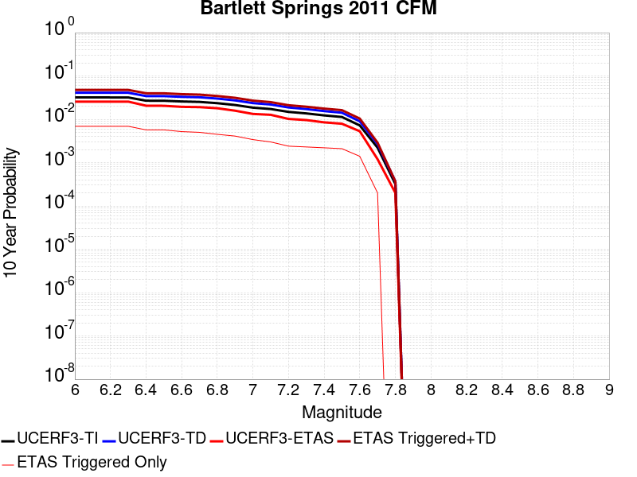 |

| Magnitude | 1 wk TI Prob | 1 wk TD Prob | 1 wk ETAS Prob | 1 wk ETAS/TD Gain | 1 wk ETAS Triggered+TD | 1 wk ETAS Triggered Only | 1 mo TI Prob | 1 mo TD Prob | 1 mo ETAS Prob | 1 mo ETAS/TD Gain | 1 mo ETAS Triggered+TD | 1 mo ETAS Triggered Only | 1 yr TI Prob | 1 yr TD Prob | 1 yr ETAS Prob | 1 yr ETAS/TD Gain | 1 yr ETAS Triggered+TD | 1 yr ETAS Triggered Only | 10 yr TI Prob | 10 yr TD Prob | 10 yr ETAS Prob | 10 yr ETAS/TD Gain | 10 yr ETAS Triggered+TD | 10 yr ETAS Triggered Only |
|-----|-----|-----|-----|-----|-----|-----|-----|-----|-----|-----|-----|-----|-----|-----|-----|-----|-----|-----|-----|-----|-----|-----|-----|-----|
| 6.0 | 6.2326144E-5 | 8.037504E-5 | 0.0 | 0.0 | 8.037504E-5 | 0.0 | 2.6708472E-4 | 3.4441956E-4 | 0.0 | 0.0 | 3.4441956E-4 | 0.0 | 0.003246908 | 0.004185348 | 0.0 | 0.0 | 0.004185348 | 0.0 | 0.031998757 | 0.04108245 | 1.0E-4 | 0.0024341294 | 0.041178342 | 1.0E-4 |
| 6.1 | 6.227657E-5 | 8.0312704E-5 | 0.0 | 0.0 | 8.0312704E-5 | 0.0 | 2.668723E-4 | 3.441525E-4 | 0.0 | 0.0 | 3.441525E-4 | 0.0 | 0.0032443295 | 0.0041821087 | 0.0 | 0.0 | 0.0041821087 | 0.0 | 0.031973712 | 0.041051265 | 1.0E-4 | 0.0024359785 | 0.041147158 | 1.0E-4 |
| 6.2 | 6.22452E-5 | 8.0273414E-5 | 0.0 | 0.0 | 8.0273414E-5 | 0.0 | 2.6673786E-4 | 3.4398414E-4 | 0.0 | 0.0 | 3.4398414E-4 | 0.0 | 0.0032426978 | 0.0041800668 | 0.0 | 0.0 | 0.0041800668 | 0.0 | 0.03195787 | 0.041031603 | 1.0E-4 | 0.0024371457 | 0.041127503 | 1.0E-4 |
| 6.3 | 6.219006E-5 | 8.020344E-5 | 0.0 | 0.0 | 8.020344E-5 | 0.0 | 2.6650162E-4 | 3.4368437E-4 | 0.0 | 0.0 | 3.4368437E-4 | 0.0 | 0.00323983 | 0.0041764313 | 0.0 | 0.0 | 0.0041764313 | 0.0 | 0.031930014 | 0.0409966 | 1.0E-4 | 0.0024392267 | 0.0410925 | 1.0E-4 |
| 6.4 | 5.2175856E-5 | 6.706463E-5 | 0.0 | 0.0 | 6.706463E-5 | 0.0 | 2.2359163E-4 | 2.873884E-4 | 0.0 | 0.0 | 2.873884E-4 | 0.0 | 0.0027188298 | 0.0034933877 | 0.0 | 0.0 | 0.0034933877 | 0.0 | 0.026858058 | 0.03439411 | 1.0E-4 | 0.0029074745 | 0.03449067 | 1.0E-4 |
| 6.5 | 5.205166E-5 | 6.6907734E-5 | 0.0 | 0.0 | 6.6907734E-5 | 0.0 | 2.2305945E-4 | 2.867161E-4 | 0.0 | 0.0 | 2.867161E-4 | 0.0 | 0.0027123666 | 0.003485229 | 0.0 | 0.0 | 0.003485229 | 0.0 | 0.026794989 | 0.034315065 | 1.0E-4 | 0.0029141721 | 0.03441163 | 1.0E-4 |
| 6.6 | 5.0085426E-5 | 6.431246E-5 | 0.0 | 0.0 | 6.431246E-5 | 0.0 | 2.1463417E-4 | 2.75596E-4 | 0.0 | 0.0 | 2.75596E-4 | 0.0 | 0.0026100394 | 0.0033502688 | 0.0 | 0.0 | 0.0033502688 | 0.0 | 0.025795965 | 0.033006705 | 1.0E-4 | 0.0030296873 | 0.033103406 | 1.0E-4 |
| 6.7 | 4.8930866E-5 | 6.284131E-5 | 0.0 | 0.0 | 6.284131E-5 | 0.0 | 2.0968684E-4 | 2.692924E-4 | 0.0 | 0.0 | 2.692924E-4 | 0.0 | 0.0025499484 | 0.0032737555 | 0.0 | 0.0 | 0.0032737555 | 0.0 | 0.025208864 | 0.0322641 | 0.0 | 0.0 | 0.0322641 | 0.0 |
| 6.8 | 4.5679535E-5 | 5.8579746E-5 | 0.0 | 0.0 | 5.8579746E-5 | 0.0 | 1.9575475E-4 | 2.510321E-4 | 0.0 | 0.0 | 2.510321E-4 | 0.0 | 0.002380709 | 0.0030520703 | 0.0 | 0.0 | 0.0030520703 | 0.0 | 0.023553653 | 0.03010846 | 0.0 | 0.0 | 0.03010846 | 0.0 |
| 6.9 | 4.1439176E-5 | 5.307531E-5 | 0.0 | 0.0 | 5.307531E-5 | 0.0 | 1.7758438E-4 | 2.2744594E-4 | 0.0 | 0.0 | 2.2744594E-4 | 0.0 | 0.002159946 | 0.0027656634 | 0.0 | 0.0 | 0.0027656634 | 0.0 | 0.021390721 | 0.02731738 | 0.0 | 0.0 | 0.02731738 | 0.0 |
| 7.0 | 3.5920104E-5 | 4.588693E-5 | 0.0 | 0.0 | 4.588693E-5 | 0.0 | 1.5393422E-4 | 1.9664354E-4 | 0.0 | 0.0 | 1.9664354E-4 | 0.0 | 0.001872538 | 0.0023915223 | 0.0 | 0.0 | 0.0023915223 | 0.0 | 0.018568378 | 0.023661038 | 0.0 | 0.0 | 0.023661038 | 0.0 |
| 7.1 | 3.338812E-5 | 4.2578507E-5 | 0.0 | 0.0 | 4.2578507E-5 | 0.0 | 1.430841E-4 | 1.8246664E-4 | 0.0 | 0.0 | 1.8246664E-4 | 0.0 | 0.0017406568 | 0.0022192823 | 0.0 | 0.0 | 0.0022192823 | 0.0 | 0.017270854 | 0.021973928 | 0.0 | 0.0 | 0.021973928 | 0.0 |
| 7.2 | 2.8619615E-5 | 3.6309073E-5 | 0.0 | 0.0 | 3.6309073E-5 | 0.0 | 1.2264973E-4 | 1.5560108E-4 | 0.0 | 0.0 | 1.5560108E-4 | 0.0 | 0.0014922376 | 0.0018928067 | 0.0 | 0.0 | 0.0018928067 | 0.0 | 0.014822568 | 0.018768791 | 0.0 | 0.0 | 0.018768791 | 0.0 |
| 7.3 | 2.6376783E-5 | 3.3337503E-5 | 0.0 | 0.0 | 3.3337503E-5 | 0.0 | 1.13038455E-4 | 1.4286724E-4 | 0.0 | 0.0 | 1.4286724E-4 | 0.0 | 0.0013753743 | 0.0017380301 | 0.0 | 0.0 | 0.0017380301 | 0.0 | 0.01366893 | 0.017245973 | 0.0 | 0.0 | 0.017245973 | 0.0 |
| 7.4 | 2.3738676E-5 | 2.9904191E-5 | 0.0 | 0.0 | 2.9904191E-5 | 0.0 | 1.0173322E-4 | 1.2815457E-4 | 0.0 | 0.0 | 1.2815457E-4 | 0.0 | 0.0012378981 | 0.0015591731 | 0.0 | 0.0 | 0.0015591731 | 0.0 | 0.012310251 | 0.015483612 | 0.0 | 0.0 | 0.015483612 | 0.0 |
| 7.5 | 2.1789481E-5 | 2.7371283E-5 | 0.0 | 0.0 | 2.7371283E-5 | 0.0 | 9.338015E-5 | 1.1730027E-4 | 0.0 | 0.0 | 1.1730027E-4 | 0.0 | 0.0011363103 | 0.0014272031 | 0.0 | 0.0 | 0.0014272031 | 0.0 | 0.011305175 | 0.014181548 | 0.0 | 0.0 | 0.014181548 | 0.0 |
| 7.6 | 1.3895281E-5 | 1.732663E-5 | 0.0 | 0.0 | 1.732663E-5 | 0.0 | 5.9549846E-5 | 7.425489E-5 | 0.0 | 0.0 | 7.425489E-5 | 0.0 | 7.2477816E-4 | 9.0368115E-4 | 0.0 | 0.0 | 9.0368115E-4 | 0.0 | 0.0072241887 | 0.009000443 | 0.0 | 0.0 | 0.009000443 | 0.0 |
| 7.7 | 4.245981E-6 | 5.150537E-6 | 0.0 | 0.0 | 5.150537E-6 | 0.0 | 1.8196934E-5 | 2.2073546E-5 | 0.0 | 0.0 | 2.2073546E-5 | 0.0 | 2.2152514E-4 | 2.6871247E-4 | 0.0 | 0.0 | 2.6871247E-4 | 0.0 | 0.0022130446 | 0.0026839403 | 0.0 | 0.0 | 0.0026839403 | 0.0 |
| 7.8 | 6.145192E-7 | 7.037207E-7 | 0.0 | 0.0 | 7.037207E-7 | 0.0 | 2.633651E-6 | 3.0159424E-6 | 0.0 | 0.0 | 3.0159424E-6 | 0.0 | 3.206423E-5 | 3.671849E-5 | 0.0 | 0.0 | 3.671849E-5 | 0.0 | 3.2059604E-4 | 3.6713365E-4 | 0.0 | 0.0 | 3.6713365E-4 | 0.0 |

## Monte Vista - Shannon 2011 CFM
*[(top)](#table-of-contents)*

| 1 Week | 1 Month | 1 Year | 10 Year |
|-----|-----|-----|-----|
|  |  |  | 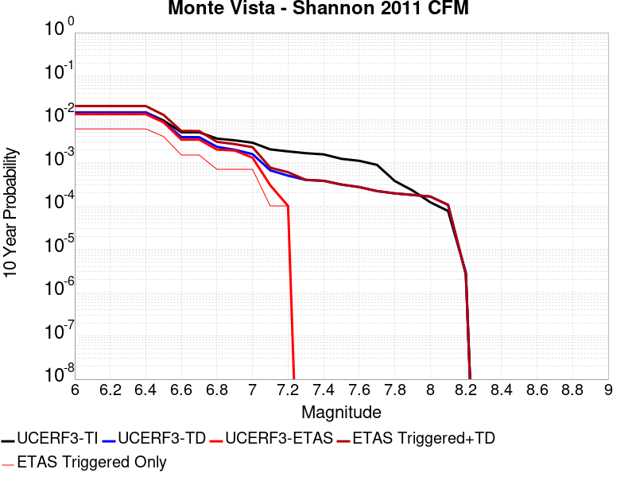 |

| Magnitude | 1 wk TI Prob | 1 wk TD Prob | 1 wk ETAS Prob | 1 wk ETAS/TD Gain | 1 wk ETAS Triggered+TD | 1 wk ETAS Triggered Only | 1 mo TI Prob | 1 mo TD Prob | 1 mo ETAS Prob | 1 mo ETAS/TD Gain | 1 mo ETAS Triggered+TD | 1 mo ETAS Triggered Only | 1 yr TI Prob | 1 yr TD Prob | 1 yr ETAS Prob | 1 yr ETAS/TD Gain | 1 yr ETAS Triggered+TD | 1 yr ETAS Triggered Only | 10 yr TI Prob | 10 yr TD Prob | 10 yr ETAS Prob | 10 yr ETAS/TD Gain | 10 yr ETAS Triggered+TD | 10 yr ETAS Triggered Only |
|-----|-----|-----|-----|-----|-----|-----|-----|-----|-----|-----|-----|-----|-----|-----|-----|-----|-----|-----|-----|-----|-----|-----|-----|-----|
| 6.0 | 2.7907707E-5 | 2.7505195E-5 | 0.0 | 0.0 | 2.7505195E-5 | 0.0 | 1.19598975E-4 | 1.1787478E-4 | 0.0 | 0.0 | 1.1787478E-4 | 0.0 | 0.0014551448 | 0.0014343042 | 1.0E-4 | 0.06972022 | 0.0015341607 | 1.0E-4 | 0.014456532 | 0.014279092 | 1.0E-4 | 0.007003247 | 0.014377664 | 1.0E-4 |
| 6.1 | 2.7907707E-5 | 2.7505195E-5 | 0.0 | 0.0 | 2.7505195E-5 | 0.0 | 1.19598975E-4 | 1.1787478E-4 | 0.0 | 0.0 | 1.1787478E-4 | 0.0 | 0.0014551448 | 0.0014343042 | 1.0E-4 | 0.06972022 | 0.0015341607 | 1.0E-4 | 0.014456532 | 0.014279092 | 1.0E-4 | 0.007003247 | 0.014377664 | 1.0E-4 |
| 6.2 | 2.7907707E-5 | 2.7505195E-5 | 0.0 | 0.0 | 2.7505195E-5 | 0.0 | 1.19598975E-4 | 1.1787478E-4 | 0.0 | 0.0 | 1.1787478E-4 | 0.0 | 0.0014551448 | 0.0014343042 | 1.0E-4 | 0.06972022 | 0.0015341607 | 1.0E-4 | 0.014456532 | 0.014279092 | 1.0E-4 | 0.007003247 | 0.014377664 | 1.0E-4 |
| 6.3 | 2.7907707E-5 | 2.7505195E-5 | 0.0 | 0.0 | 2.7505195E-5 | 0.0 | 1.19598975E-4 | 1.1787478E-4 | 0.0 | 0.0 | 1.1787478E-4 | 0.0 | 0.0014551448 | 0.0014343042 | 1.0E-4 | 0.06972022 | 0.0015341607 | 1.0E-4 | 0.014456532 | 0.014279092 | 1.0E-4 | 0.007003247 | 0.014377664 | 1.0E-4 |
| 6.4 | 2.7907707E-5 | 2.7505195E-5 | 0.0 | 0.0 | 2.7505195E-5 | 0.0 | 1.19598975E-4 | 1.1787478E-4 | 0.0 | 0.0 | 1.1787478E-4 | 0.0 | 0.0014551448 | 0.0014343042 | 1.0E-4 | 0.06972022 | 0.0015341607 | 1.0E-4 | 0.014456532 | 0.014279092 | 1.0E-4 | 0.007003247 | 0.014377664 | 1.0E-4 |
| 6.5 | 1.7990213E-5 | 1.6572705E-5 | 0.0 | 0.0 | 1.6572705E-5 | 0.0 | 7.709863E-5 | 7.102432E-5 | 0.0 | 0.0 | 7.102432E-5 | 0.0 | 9.382716E-4 | 8.6444424E-4 | 1.0E-4 | 0.11568126 | 9.6435775E-4 | 1.0E-4 | 0.0093431985 | 0.008633737 | 1.0E-4 | 0.011582469 | 0.008732874 | 1.0E-4 |
| 6.6 | 9.650407E-6 | 7.3996484E-6 | 0.0 | 0.0 | 7.3996484E-6 | 0.0 | 4.135823E-5 | 3.171244E-5 | 0.0 | 0.0 | 3.171244E-5 | 0.0 | 5.0342013E-4 | 3.8603836E-4 | 0.0 | 0.0 | 3.8603836E-4 | 0.0 | 0.005022812 | 0.0038709168 | 0.0 | 0.0 | 0.0038709168 | 0.0 |
| 6.7 | 9.62828E-6 | 7.377629E-6 | 0.0 | 0.0 | 7.377629E-6 | 0.0 | 4.1263404E-5 | 3.161807E-5 | 0.0 | 0.0 | 3.161807E-5 | 0.0 | 5.022661E-4 | 3.8488983E-4 | 0.0 | 0.0 | 3.8488983E-4 | 0.0 | 0.0050113243 | 0.0038594718 | 0.0 | 0.0 | 0.0038594718 | 0.0 |
| 6.8 | 6.887523E-6 | 4.4068943E-6 | 0.0 | 0.0 | 4.4068943E-6 | 0.0 | 2.9517621E-5 | 1.8886565E-5 | 0.0 | 0.0 | 1.8886565E-5 | 0.0 | 3.5931775E-4 | 2.2992189E-4 | 0.0 | 0.0 | 2.2992189E-4 | 0.0 | 0.0035873733 | 0.002313553 | 0.0 | 0.0 | 0.002313553 | 0.0 |
| 6.9 | 6.2722347E-6 | 3.7494158E-6 | 0.0 | 0.0 | 3.7494158E-6 | 0.0 | 2.6880729E-5 | 1.6068838E-5 | 0.0 | 0.0 | 1.6068838E-5 | 0.0 | 3.2722374E-4 | 1.9562256E-4 | 0.0 | 0.0 | 1.9562256E-4 | 0.0 | 0.003267423 | 0.0019712024 | 0.0 | 0.0 | 0.0019712024 | 0.0 |
| 7.0 | 5.5320347E-6 | 2.9780974E-6 | 0.0 | 0.0 | 2.9780974E-6 | 0.0 | 2.3708504E-5 | 1.2763223E-5 | 0.0 | 0.0 | 1.2763223E-5 | 0.0 | 2.8861282E-4 | 1.5538298E-4 | 0.0 | 0.0 | 1.5538298E-4 | 0.0 | 0.0028823826 | 0.0015694272 | 0.0 | 0.0 | 0.0015694272 | 0.0 |
| 7.1 | 3.8794055E-6 | 1.2335979E-6 | 0.0 | 0.0 | 1.2335979E-6 | 0.0 | 1.6625918E-5 | 5.2868377E-6 | 0.0 | 0.0 | 5.2868377E-6 | 0.0 | 2.0240174E-4 | 6.436536E-5 | 0.0 | 0.0 | 6.436536E-5 | 0.0 | 0.002022175 | 6.599758E-4 | 0.0 | 0.0 | 6.599758E-4 | 0.0 |
| 7.2 | 3.4813652E-6 | 9.195791E-7 | 0.0 | 0.0 | 9.195791E-7 | 0.0 | 1.49200505E-5 | 3.9410475E-6 | 0.0 | 0.0 | 3.9410475E-6 | 0.0 | 1.8163648E-4 | 4.7981204E-5 | 0.0 | 0.0 | 4.7981204E-5 | 0.0 | 0.0018148809 | 4.962046E-4 | 0.0 | 0.0 | 4.962046E-4 | 0.0 |
| 7.3 | 3.1682148E-6 | 7.2666313E-7 | 0.0 | 0.0 | 7.2666313E-7 | 0.0 | 1.3577992E-5 | 3.114267E-6 | 0.0 | 0.0 | 3.114267E-6 | 0.0 | 1.6529951E-4 | 3.7915543E-5 | 0.0 | 0.0 | 3.7915543E-5 | 0.0 | 0.0016517661 | 3.9556486E-4 | 0.0 | 0.0 | 3.9556486E-4 | 0.0 |
| 7.4 | 2.9707667E-6 | 6.909009E-7 | 0.0 | 0.0 | 6.909009E-7 | 0.0 | 1.2731795E-5 | 2.9610005E-6 | 0.0 | 0.0 | 2.9610005E-6 | 0.0 | 1.5499859E-4 | 3.6049587E-5 | 0.0 | 0.0 | 3.6049587E-5 | 0.0 | 0.0015489052 | 3.7672295E-4 | 0.0 | 0.0 | 3.7672295E-4 | 0.0 |
| 7.5 | 2.3462758E-6 | 5.645872E-7 | 0.0 | 0.0 | 5.645872E-7 | 0.0 | 1.0055429E-5 | 2.4196572E-6 | 0.0 | 0.0 | 2.4196572E-6 | 0.0 | 1.2241797E-4 | 2.9458932E-5 | 0.0 | 0.0 | 2.9458932E-5 | 0.0 | 0.0012235056 | 3.0918673E-4 | 0.0 | 0.0 | 3.0918673E-4 | 0.0 |
| 7.6 | 2.112783E-6 | 4.912792E-7 | 0.0 | 0.0 | 4.912792E-7 | 0.0 | 9.054753E-6 | 2.1054807E-6 | 0.0 | 0.0 | 2.1054807E-6 | 0.0 | 1.1023604E-4 | 2.5633926E-5 | 0.0 | 0.0 | 2.5633926E-5 | 0.0 | 0.0011018137 | 2.7053844E-4 | 0.0 | 0.0 | 2.7053844E-4 | 0.0 |
| 7.7 | 1.7022471E-6 | 3.9389053E-7 | 0.0 | 0.0 | 3.9389053E-7 | 0.0 | 7.2953244E-6 | 1.6881013E-6 | 0.0 | 0.0 | 1.6881013E-6 | 0.0 | 8.881695E-5 | 2.055244E-5 | 0.0 | 0.0 | 2.055244E-5 | 0.0 | 8.878146E-4 | 2.1849174E-4 | 0.0 | 0.0 | 2.1849174E-4 | 0.0 |
| 7.8 | 7.230914E-7 | 3.4652905E-7 | 0.0 | 0.0 | 3.4652905E-7 | 0.0 | 3.0989595E-6 | 1.4851236E-6 | 0.0 | 0.0 | 1.4851236E-6 | 0.0 | 3.772918E-5 | 1.8081231E-5 | 0.0 | 0.0 | 1.8081231E-5 | 0.0 | 3.7722773E-4 | 1.9336991E-4 | 0.0 | 0.0 | 1.9336991E-4 | 0.0 |
| 7.9 | 4.3588446E-7 | 3.202187E-7 | 0.0 | 0.0 | 3.202187E-7 | 0.0 | 1.868075E-6 | 1.3723652E-6 | 0.0 | 0.0 | 1.3723652E-6 | 0.0 | 2.2743576E-5 | 1.670842E-5 | 0.0 | 0.0 | 1.670842E-5 | 0.0 | 2.2741247E-4 | 1.7800811E-4 | 0.0 | 0.0 | 1.7800811E-4 | 0.0 |
| 8.0 | 2.3317523E-7 | 2.9513785E-7 | 0.0 | 0.0 | 2.9513785E-7 | 0.0 | 9.99322E-7 | 1.2648759E-6 | 0.0 | 0.0 | 1.2648759E-6 | 0.0 | 1.2166677E-5 | 1.5399755E-5 | 0.0 | 0.0 | 1.5399755E-5 | 0.0 | 1.21660116E-4 | 1.6362294E-4 | 0.0 | 0.0 | 1.6362294E-4 | 0.0 |
| 8.1 | 1.4662456E-7 | 1.910384E-7 | 0.0 | 0.0 | 1.910384E-7 | 0.0 | 6.283908E-7 | 8.187357E-7 | 0.0 | 0.0 | 8.187357E-7 | 0.0 | 7.650631E-6 | 9.968063E-6 | 0.0 | 0.0 | 9.968063E-6 | 0.0 | 7.650368E-5 | 1.05098225E-4 | 0.0 | 0.0 | 1.05098225E-4 | 0.0 |
| 8.2 | 5.4931775E-9 | 4.7661084E-9 | 0.0 | 0.0 | 4.7661084E-9 | 0.0 | 2.3542189E-8 | 2.0426178E-8 | 0.0 | 0.0 | 2.0426178E-8 | 0.0 | 2.8662612E-7 | 2.486887E-7 | 0.0 | 0.0 | 2.486887E-7 | 0.0 | 2.8662573E-6 | 2.5898464E-6 | 0.0 | 0.0 | 2.5898464E-6 | 0.0 |

## Canada David (Detachment)
*[(top)](#table-of-contents)*

| 1 Week | 1 Month | 1 Year | 10 Year |
|-----|-----|-----|-----|
| 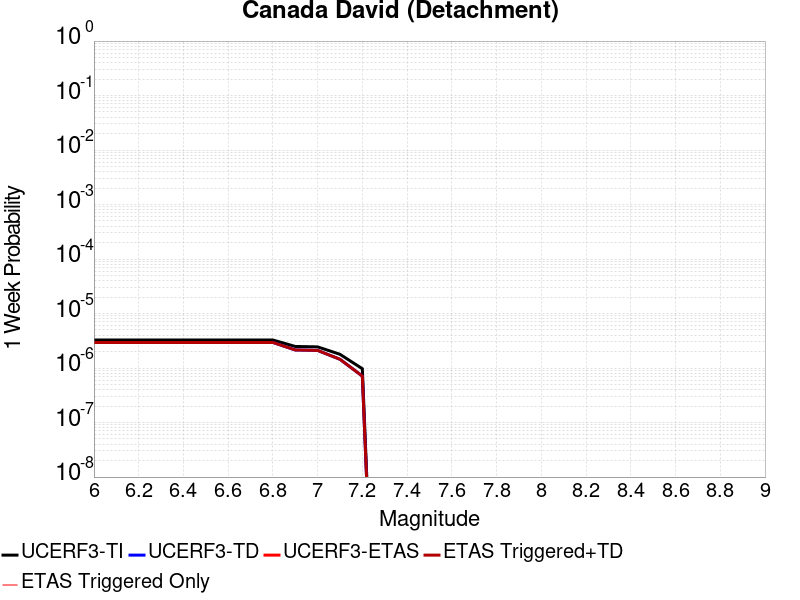 |  |  | 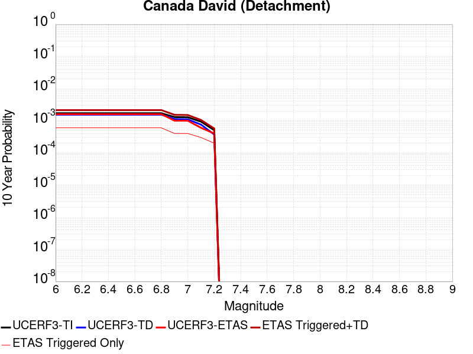 |

| Magnitude | 1 wk TI Prob | 1 wk TD Prob | 1 wk ETAS Prob | 1 wk ETAS/TD Gain | 1 wk ETAS Triggered+TD | 1 wk ETAS Triggered Only | 1 mo TI Prob | 1 mo TD Prob | 1 mo ETAS Prob | 1 mo ETAS/TD Gain | 1 mo ETAS Triggered+TD | 1 mo ETAS Triggered Only | 1 yr TI Prob | 1 yr TD Prob | 1 yr ETAS Prob | 1 yr ETAS/TD Gain | 1 yr ETAS Triggered+TD | 1 yr ETAS Triggered Only | 10 yr TI Prob | 10 yr TD Prob | 10 yr ETAS Prob | 10 yr ETAS/TD Gain | 10 yr ETAS Triggered+TD | 10 yr ETAS Triggered Only |
|-----|-----|-----|-----|-----|-----|-----|-----|-----|-----|-----|-----|-----|-----|-----|-----|-----|-----|-----|-----|-----|-----|-----|-----|-----|
| 6.0 | 3.2736298E-6 | 2.9513726E-6 | 0.0 | 0.0 | 2.9513726E-6 | 0.0 | 1.4029766E-5 | 1.2648686E-5 | 0.0 | 0.0 | 1.2648686E-5 | 0.0 | 1.7079902E-4 | 1.5398815E-4 | 0.0 | 0.0 | 1.5398815E-4 | 0.0 | 0.001706678 | 0.0015389405 | 1.0E-4 | 0.06497977 | 0.0016387866 | 1.0E-4 |
| 6.1 | 3.2736298E-6 | 2.9513726E-6 | 0.0 | 0.0 | 2.9513726E-6 | 0.0 | 1.4029766E-5 | 1.2648686E-5 | 0.0 | 0.0 | 1.2648686E-5 | 0.0 | 1.7079902E-4 | 1.5398815E-4 | 0.0 | 0.0 | 1.5398815E-4 | 0.0 | 0.001706678 | 0.0015389405 | 1.0E-4 | 0.06497977 | 0.0016387866 | 1.0E-4 |
| 6.2 | 3.2736298E-6 | 2.9513726E-6 | 0.0 | 0.0 | 2.9513726E-6 | 0.0 | 1.4029766E-5 | 1.2648686E-5 | 0.0 | 0.0 | 1.2648686E-5 | 0.0 | 1.7079902E-4 | 1.5398815E-4 | 0.0 | 0.0 | 1.5398815E-4 | 0.0 | 0.001706678 | 0.0015389405 | 1.0E-4 | 0.06497977 | 0.0016387866 | 1.0E-4 |
| 6.3 | 3.2736298E-6 | 2.9513726E-6 | 0.0 | 0.0 | 2.9513726E-6 | 0.0 | 1.4029766E-5 | 1.2648686E-5 | 0.0 | 0.0 | 1.2648686E-5 | 0.0 | 1.7079902E-4 | 1.5398815E-4 | 0.0 | 0.0 | 1.5398815E-4 | 0.0 | 0.001706678 | 0.0015389405 | 1.0E-4 | 0.06497977 | 0.0016387866 | 1.0E-4 |
| 6.4 | 3.2736298E-6 | 2.9513726E-6 | 0.0 | 0.0 | 2.9513726E-6 | 0.0 | 1.4029766E-5 | 1.2648686E-5 | 0.0 | 0.0 | 1.2648686E-5 | 0.0 | 1.7079902E-4 | 1.5398815E-4 | 0.0 | 0.0 | 1.5398815E-4 | 0.0 | 0.001706678 | 0.0015389405 | 1.0E-4 | 0.06497977 | 0.0016387866 | 1.0E-4 |
| 6.5 | 3.2736298E-6 | 2.9513726E-6 | 0.0 | 0.0 | 2.9513726E-6 | 0.0 | 1.4029766E-5 | 1.2648686E-5 | 0.0 | 0.0 | 1.2648686E-5 | 0.0 | 1.7079902E-4 | 1.5398815E-4 | 0.0 | 0.0 | 1.5398815E-4 | 0.0 | 0.001706678 | 0.0015389405 | 1.0E-4 | 0.06497977 | 0.0016387866 | 1.0E-4 |
| 6.6 | 3.2736298E-6 | 2.9513726E-6 | 0.0 | 0.0 | 2.9513726E-6 | 0.0 | 1.4029766E-5 | 1.2648686E-5 | 0.0 | 0.0 | 1.2648686E-5 | 0.0 | 1.7079902E-4 | 1.5398815E-4 | 0.0 | 0.0 | 1.5398815E-4 | 0.0 | 0.001706678 | 0.0015389405 | 1.0E-4 | 0.06497977 | 0.0016387866 | 1.0E-4 |
| 6.7 | 3.2736298E-6 | 2.9513726E-6 | 0.0 | 0.0 | 2.9513726E-6 | 0.0 | 1.4029766E-5 | 1.2648686E-5 | 0.0 | 0.0 | 1.2648686E-5 | 0.0 | 1.7079902E-4 | 1.5398815E-4 | 0.0 | 0.0 | 1.5398815E-4 | 0.0 | 0.001706678 | 0.0015389405 | 1.0E-4 | 0.06497977 | 0.0016387866 | 1.0E-4 |
| 6.8 | 3.2736298E-6 | 2.9513726E-6 | 0.0 | 0.0 | 2.9513726E-6 | 0.0 | 1.4029766E-5 | 1.2648686E-5 | 0.0 | 0.0 | 1.2648686E-5 | 0.0 | 1.7079902E-4 | 1.5398815E-4 | 0.0 | 0.0 | 1.5398815E-4 | 0.0 | 0.001706678 | 0.0015389405 | 1.0E-4 | 0.06497977 | 0.0016387866 | 1.0E-4 |
| 6.9 | 2.4914223E-6 | 2.1503936E-6 | 0.0 | 0.0 | 2.1503936E-6 | 0.0 | 1.067748E-5 | 9.215943E-6 | 0.0 | 0.0 | 9.215943E-6 | 0.0 | 1.2999057E-4 | 1.1219888E-4 | 0.0 | 0.0 | 1.1219888E-4 | 0.0 | 0.0012991455 | 0.0011214765 | 1.0E-4 | 0.08916816 | 0.0012213644 | 1.0E-4 |
| 7.0 | 2.4482404E-6 | 2.1083463E-6 | 0.0 | 0.0 | 2.1083463E-6 | 0.0 | 1.0492417E-5 | 9.035742E-6 | 0.0 | 0.0 | 9.035742E-6 | 0.0 | 1.2773767E-4 | 1.1000515E-4 | 0.0 | 0.0 | 1.1000515E-4 | 0.0 | 0.0012766428 | 0.0010995611 | 1.0E-4 | 0.09094538 | 0.0011994512 | 1.0E-4 |
| 7.1 | 1.7887576E-6 | 1.4484149E-6 | 0.0 | 0.0 | 1.4484149E-6 | 0.0 | 7.666081E-6 | 6.207479E-6 | 0.0 | 0.0 | 6.207479E-6 | 0.0 | 9.333054E-5 | 7.557374E-5 | 0.0 | 0.0 | 7.557374E-5 | 0.0 | 9.329135E-4 | 7.5551076E-4 | 0.0 | 0.0 | 7.5551076E-4 | 0.0 |
| 7.2 | 9.723109E-7 | 7.124557E-7 | 0.0 | 0.0 | 7.124557E-7 | 0.0 | 4.16704E-6 | 3.0533788E-6 | 0.0 | 0.0 | 3.0533788E-6 | 0.0 | 5.073253E-5 | 3.7174417E-5 | 0.0 | 0.0 | 3.7174417E-5 | 0.0 | 5.072095E-4 | 3.716982E-4 | 0.0 | 0.0 | 3.716982E-4 | 0.0 |

## Carson Range (Genoa)
*[(top)](#table-of-contents)*

| 1 Week | 1 Month | 1 Year | 10 Year |
|-----|-----|-----|-----|
|  | 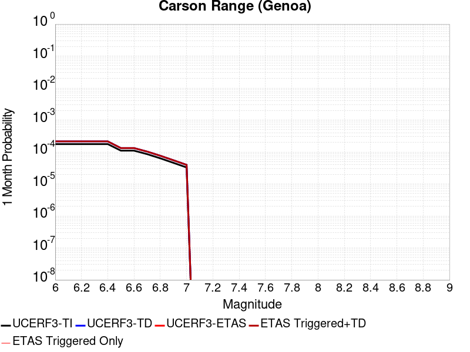 |  |  |

| Magnitude | 1 wk TI Prob | 1 wk TD Prob | 1 wk ETAS Prob | 1 wk ETAS/TD Gain | 1 wk ETAS Triggered+TD | 1 wk ETAS Triggered Only | 1 mo TI Prob | 1 mo TD Prob | 1 mo ETAS Prob | 1 mo ETAS/TD Gain | 1 mo ETAS Triggered+TD | 1 mo ETAS Triggered Only | 1 yr TI Prob | 1 yr TD Prob | 1 yr ETAS Prob | 1 yr ETAS/TD Gain | 1 yr ETAS Triggered+TD | 1 yr ETAS Triggered Only | 10 yr TI Prob | 10 yr TD Prob | 10 yr ETAS Prob | 10 yr ETAS/TD Gain | 10 yr ETAS Triggered+TD | 10 yr ETAS Triggered Only |
|-----|-----|-----|-----|-----|-----|-----|-----|-----|-----|-----|-----|-----|-----|-----|-----|-----|-----|-----|-----|-----|-----|-----|-----|-----|
| 6.0 | 4.1268457E-5 | 5.0034752E-5 | 0.0 | 0.0 | 5.0034752E-5 | 0.0 | 1.7685282E-4 | 2.1441927E-4 | 0.0 | 0.0 | 2.1441927E-4 | 0.0 | 0.0021510567 | 0.0026078215 | 1.0E-4 | 0.038346183 | 0.0027075605 | 1.0E-4 | 0.02130354 | 0.025811734 | 1.0E-4 | 0.003874207 | 0.025909152 | 1.0E-4 |
| 6.1 | 4.1268457E-5 | 5.0034752E-5 | 0.0 | 0.0 | 5.0034752E-5 | 0.0 | 1.7685282E-4 | 2.1441927E-4 | 0.0 | 0.0 | 2.1441927E-4 | 0.0 | 0.0021510567 | 0.0026078215 | 1.0E-4 | 0.038346183 | 0.0027075605 | 1.0E-4 | 0.02130354 | 0.025811734 | 1.0E-4 | 0.003874207 | 0.025909152 | 1.0E-4 |
| 6.2 | 4.1268457E-5 | 5.0034752E-5 | 0.0 | 0.0 | 5.0034752E-5 | 0.0 | 1.7685282E-4 | 2.1441927E-4 | 0.0 | 0.0 | 2.1441927E-4 | 0.0 | 0.0021510567 | 0.0026078215 | 1.0E-4 | 0.038346183 | 0.0027075605 | 1.0E-4 | 0.02130354 | 0.025811734 | 1.0E-4 | 0.003874207 | 0.025909152 | 1.0E-4 |
| 6.3 | 4.1268457E-5 | 5.0034752E-5 | 0.0 | 0.0 | 5.0034752E-5 | 0.0 | 1.7685282E-4 | 2.1441927E-4 | 0.0 | 0.0 | 2.1441927E-4 | 0.0 | 0.0021510567 | 0.0026078215 | 1.0E-4 | 0.038346183 | 0.0027075605 | 1.0E-4 | 0.02130354 | 0.025811734 | 1.0E-4 | 0.003874207 | 0.025909152 | 1.0E-4 |
| 6.4 | 4.1268457E-5 | 5.0034752E-5 | 0.0 | 0.0 | 5.0034752E-5 | 0.0 | 1.7685282E-4 | 2.1441927E-4 | 0.0 | 0.0 | 2.1441927E-4 | 0.0 | 0.0021510567 | 0.0026078215 | 1.0E-4 | 0.038346183 | 0.0027075605 | 1.0E-4 | 0.02130354 | 0.025811734 | 1.0E-4 | 0.003874207 | 0.025909152 | 1.0E-4 |
| 6.5 | 2.5677185E-5 | 3.091171E-5 | 0.0 | 0.0 | 3.091171E-5 | 0.0 | 1.1004044E-4 | 1.3247305E-4 | 0.0 | 0.0 | 1.3247305E-4 | 0.0 | 0.0013389189 | 0.0016118455 | 0.0 | 0.0 | 0.0016118455 | 0.0 | 0.0133088045 | 0.016019398 | 0.0 | 0.0 | 0.016019398 | 0.0 |
| 6.6 | 2.5677185E-5 | 3.091171E-5 | 0.0 | 0.0 | 3.091171E-5 | 0.0 | 1.1004044E-4 | 1.3247305E-4 | 0.0 | 0.0 | 1.3247305E-4 | 0.0 | 0.0013389189 | 0.0016118455 | 0.0 | 0.0 | 0.0016118455 | 0.0 | 0.0133088045 | 0.016019398 | 0.0 | 0.0 | 0.016019398 | 0.0 |
| 6.7 | 1.9969408E-5 | 2.401207E-5 | 0.0 | 0.0 | 2.401207E-5 | 0.0 | 8.558037E-5 | 1.0290567E-4 | 0.0 | 0.0 | 1.0290567E-4 | 0.0 | 0.0010414429 | 0.0012523093 | 0.0 | 0.0 | 0.0012523093 | 0.0 | 0.010365757 | 0.012467616 | 0.0 | 0.0 | 0.012467616 | 0.0 |
| 6.8 | 1.4783156E-5 | 1.7779463E-5 | 0.0 | 0.0 | 1.7779463E-5 | 0.0 | 6.335485E-5 | 7.61962E-5 | 0.0 | 0.0 | 7.61962E-5 | 0.0 | 7.710722E-4 | 9.2742353E-4 | 0.0 | 0.0 | 9.2742353E-4 | 0.0 | 0.0076840227 | 0.009248264 | 0.0 | 0.0 | 0.009248264 | 0.0 |
| 6.9 | 1.06660555E-5 | 1.2849217E-5 | 0.0 | 0.0 | 1.2849217E-5 | 0.0 | 4.5710865E-5 | 5.5067558E-5 | 0.0 | 0.0 | 5.5067558E-5 | 0.0 | 5.5638765E-4 | 6.70356E-4 | 0.0 | 0.0 | 6.70356E-4 | 0.0 | 0.005549967 | 0.006694589 | 0.0 | 0.0 | 0.006694589 | 0.0 |
| 7.0 | 7.664838E-6 | 9.238254E-6 | 0.0 | 0.0 | 9.238254E-6 | 0.0 | 3.2848893E-5 | 3.9592516E-5 | 0.0 | 0.0 | 3.9592516E-5 | 0.0 | 3.998619E-4 | 4.820389E-4 | 0.0 | 0.0 | 4.820389E-4 | 0.0 | 0.0039914316 | 0.004820387 | 0.0 | 0.0 | 0.004820387 | 0.0 |

## Yorba Linda
*[(top)](#table-of-contents)*

| 1 Week | 1 Month | 1 Year | 10 Year |
|-----|-----|-----|-----|
|  |  | 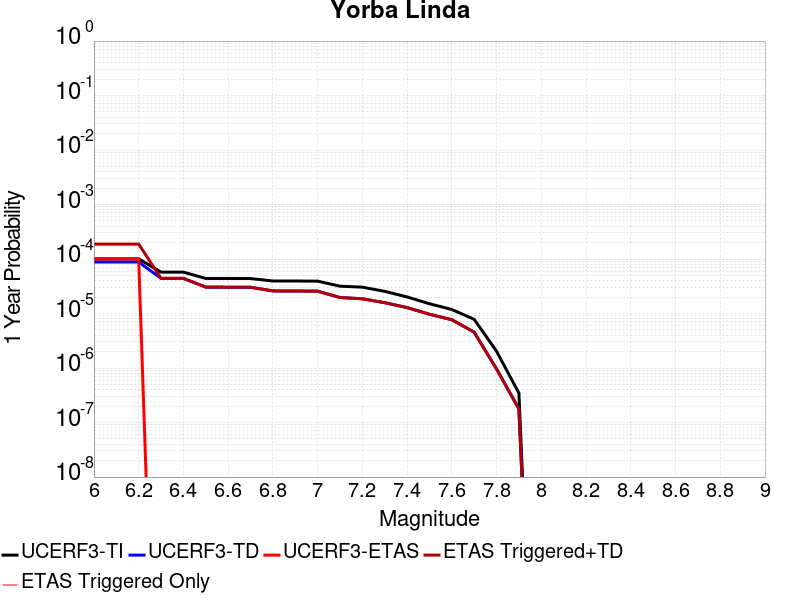 |  |

| Magnitude | 1 wk TI Prob | 1 wk TD Prob | 1 wk ETAS Prob | 1 wk ETAS/TD Gain | 1 wk ETAS Triggered+TD | 1 wk ETAS Triggered Only | 1 mo TI Prob | 1 mo TD Prob | 1 mo ETAS Prob | 1 mo ETAS/TD Gain | 1 mo ETAS Triggered+TD | 1 mo ETAS Triggered Only | 1 yr TI Prob | 1 yr TD Prob | 1 yr ETAS Prob | 1 yr ETAS/TD Gain | 1 yr ETAS Triggered+TD | 1 yr ETAS Triggered Only | 10 yr TI Prob | 10 yr TD Prob | 10 yr ETAS Prob | 10 yr ETAS/TD Gain | 10 yr ETAS Triggered+TD | 10 yr ETAS Triggered Only |
|-----|-----|-----|-----|-----|-----|-----|-----|-----|-----|-----|-----|-----|-----|-----|-----|-----|-----|-----|-----|-----|-----|-----|-----|-----|
| 6.0 | 1.9346849E-6 | 1.6898641E-6 | 0.0 | 0.0 | 1.6898641E-6 | 0.0 | 8.29148E-6 | 7.24226E-6 | 0.0 | 0.0 | 7.24226E-6 | 0.0 | 1.009441E-4 | 8.8171895E-5 | 1.0E-4 | 1.1341482 | 1.8816307E-4 | 1.0E-4 | 0.0010089825 | 8.814622E-4 | 1.0E-4 | 0.11344786 | 9.813741E-4 | 1.0E-4 |
| 6.1 | 1.9346849E-6 | 1.6898641E-6 | 0.0 | 0.0 | 1.6898641E-6 | 0.0 | 8.29148E-6 | 7.24226E-6 | 0.0 | 0.0 | 7.24226E-6 | 0.0 | 1.009441E-4 | 8.8171895E-5 | 1.0E-4 | 1.1341482 | 1.8816307E-4 | 1.0E-4 | 0.0010089825 | 8.814622E-4 | 1.0E-4 | 0.11344786 | 9.813741E-4 | 1.0E-4 |
| 6.2 | 1.9346849E-6 | 1.6898641E-6 | 0.0 | 0.0 | 1.6898641E-6 | 0.0 | 8.29148E-6 | 7.24226E-6 | 0.0 | 0.0 | 7.24226E-6 | 0.0 | 1.009441E-4 | 8.8171895E-5 | 1.0E-4 | 1.1341482 | 1.8816307E-4 | 1.0E-4 | 0.0010089825 | 8.814622E-4 | 1.0E-4 | 0.11344786 | 9.813741E-4 | 1.0E-4 |
| 6.3 | 1.1028608E-6 | 8.4725457E-7 | 0.0 | 0.0 | 8.4725457E-7 | 0.0 | 4.7265376E-6 | 3.6310862E-6 | 0.0 | 0.0 | 3.6310862E-6 | 0.0 | 5.754407E-5 | 4.4207645E-5 | 0.0 | 0.0 | 4.4207645E-5 | 0.0 | 5.7529175E-4 | 4.41995E-4 | 0.0 | 0.0 | 4.41995E-4 | 0.0 |
| 6.4 | 1.1028608E-6 | 8.4725457E-7 | 0.0 | 0.0 | 8.4725457E-7 | 0.0 | 4.7265376E-6 | 3.6310862E-6 | 0.0 | 0.0 | 3.6310862E-6 | 0.0 | 5.754407E-5 | 4.4207645E-5 | 0.0 | 0.0 | 4.4207645E-5 | 0.0 | 5.7529175E-4 | 4.41995E-4 | 0.0 | 0.0 | 4.41995E-4 | 0.0 |
| 6.5 | 8.4451364E-7 | 5.860101E-7 | 0.0 | 0.0 | 5.860101E-7 | 0.0 | 3.619339E-6 | 2.5114696E-6 | 0.0 | 0.0 | 2.5114696E-6 | 0.0 | 4.406456E-5 | 3.0576735E-5 | 0.0 | 0.0 | 3.0576735E-5 | 0.0 | 4.4055824E-4 | 3.0572742E-4 | 0.0 | 0.0 | 3.0572742E-4 | 0.0 |
| 6.6 | 8.422957E-7 | 5.835641E-7 | 0.0 | 0.0 | 5.835641E-7 | 0.0 | 3.6098338E-6 | 2.5009865E-6 | 0.0 | 0.0 | 2.5009865E-6 | 0.0 | 4.3948843E-5 | 3.0449108E-5 | 0.0 | 0.0 | 3.0449108E-5 | 0.0 | 4.394015E-4 | 3.044515E-4 | 0.0 | 0.0 | 3.044515E-4 | 0.0 |
| 6.7 | 8.4119705E-7 | 5.8234855E-7 | 0.0 | 0.0 | 5.8234855E-7 | 0.0 | 3.6051254E-6 | 2.4957774E-6 | 0.0 | 0.0 | 2.4957774E-6 | 0.0 | 4.3891516E-5 | 3.0385687E-5 | 0.0 | 0.0 | 3.0385687E-5 | 0.0 | 4.388285E-4 | 3.0381745E-4 | 0.0 | 0.0 | 3.0381745E-4 | 0.0 |
| 6.8 | 7.5919155E-7 | 4.9861677E-7 | 0.0 | 0.0 | 4.9861677E-7 | 0.0 | 3.253674E-6 | 2.1369274E-6 | 0.0 | 0.0 | 2.1369274E-6 | 0.0 | 3.961276E-5 | 2.6016798E-5 | 0.0 | 0.0 | 2.6016798E-5 | 0.0 | 3.9605703E-4 | 2.6013923E-4 | 0.0 | 0.0 | 2.6013923E-4 | 0.0 |
| 6.9 | 7.5804564E-7 | 4.9723553E-7 | 0.0 | 0.0 | 4.9723553E-7 | 0.0 | 3.248763E-6 | 2.1310077E-6 | 0.0 | 0.0 | 2.1310077E-6 | 0.0 | 3.955297E-5 | 2.5944728E-5 | 0.0 | 0.0 | 2.5944728E-5 | 0.0 | 3.9545933E-4 | 2.5941868E-4 | 0.0 | 0.0 | 2.5941868E-4 | 0.0 |
| 7.0 | 7.539293E-7 | 4.9345005E-7 | 0.0 | 0.0 | 4.9345005E-7 | 0.0 | 3.2311218E-6 | 2.1147844E-6 | 0.0 | 0.0 | 2.1147844E-6 | 0.0 | 3.9338196E-5 | 2.5747211E-5 | 0.0 | 0.0 | 2.5747211E-5 | 0.0 | 3.9331234E-4 | 2.57444E-4 | 0.0 | 0.0 | 2.57444E-4 | 0.0 |
| 7.1 | 6.0900885E-7 | 3.7736595E-7 | 0.0 | 0.0 | 3.7736595E-7 | 0.0 | 2.6100352E-6 | 1.6172817E-6 | 0.0 | 0.0 | 1.6172817E-6 | 0.0 | 3.1776715E-5 | 1.9690231E-5 | 0.0 | 0.0 | 1.9690231E-5 | 0.0 | 3.1772171E-4 | 1.9688522E-4 | 0.0 | 0.0 | 1.9688522E-4 | 0.0 |
| 7.2 | 5.849925E-7 | 3.5800423E-7 | 0.0 | 0.0 | 3.5800423E-7 | 0.0 | 2.5071083E-6 | 1.534303E-6 | 0.0 | 0.0 | 1.534303E-6 | 0.0 | 3.0523614E-5 | 1.8679983E-5 | 0.0 | 0.0 | 1.8679983E-5 | 0.0 | 3.0519423E-4 | 1.8678444E-4 | 0.0 | 0.0 | 1.8678444E-4 | 0.0 |
| 7.3 | 4.89808E-7 | 3.031628E-7 | 0.0 | 0.0 | 3.031628E-7 | 0.0 | 2.0991754E-6 | 1.2992685E-6 | 0.0 | 0.0 | 1.2992685E-6 | 0.0 | 2.5557161E-5 | 1.5818481E-5 | 0.0 | 0.0 | 1.5818481E-5 | 0.0 | 2.5554223E-4 | 1.5817379E-4 | 0.0 | 0.0 | 1.5817379E-4 | 0.0 |
| 7.4 | 3.8700415E-7 | 2.4670638E-7 | 0.0 | 0.0 | 2.4670638E-7 | 0.0 | 1.6585881E-6 | 1.0573127E-6 | 0.0 | 0.0 | 1.0573127E-6 | 0.0 | 2.0193123E-5 | 1.2872707E-5 | 0.0 | 0.0 | 1.2872707E-5 | 0.0 | 2.0191289E-4 | 1.2871974E-4 | 0.0 | 0.0 | 1.2871974E-4 | 0.0 |
| 7.5 | 2.900565E-7 | 1.8606309E-7 | 0.0 | 0.0 | 1.8606309E-7 | 0.0 | 1.2430987E-6 | 7.97413E-7 | 0.0 | 0.0 | 7.97413E-7 | 0.0 | 1.5134622E-5 | 9.708461E-6 | 0.0 | 0.0 | 9.708461E-6 | 0.0 | 1.5133592E-4 | 9.708045E-5 | 0.0 | 0.0 | 9.708045E-5 | 0.0 |
| 7.6 | 2.2770318E-7 | 1.4789921E-7 | 0.0 | 0.0 | 1.4789921E-7 | 0.0 | 9.758704E-7 | 6.338536E-7 | 0.0 | 0.0 | 6.338536E-7 | 0.0 | 1.1881158E-5 | 7.717141E-6 | 0.0 | 0.0 | 7.717141E-6 | 0.0 | 1.1880523E-4 | 7.716878E-5 | 0.0 | 0.0 | 7.716878E-5 | 0.0 |
| 7.7 | 1.5017194E-7 | 8.718325E-8 | 0.0 | 0.0 | 8.718325E-8 | 0.0 | 6.4359386E-7 | 3.7364245E-7 | 0.0 | 0.0 | 3.7364245E-7 | 0.0 | 7.835727E-6 | 4.5490874E-6 | 0.0 | 0.0 | 4.5490874E-6 | 0.0 | 7.835451E-5 | 4.548997E-5 | 0.0 | 0.0 | 4.548997E-5 | 0.0 |
| 7.8 | 3.895753E-8 | 1.8458216E-8 | 0.0 | 0.0 | 1.8458216E-8 | 0.0 | 1.6696083E-7 | 7.910664E-8 | 0.0 | 0.0 | 7.910664E-8 | 0.0 | 2.0327461E-6 | 9.63123E-7 | 0.0 | 0.0 | 9.63123E-7 | 0.0 | 2.0327276E-5 | 9.63119E-6 | 0.0 | 0.0 | 9.63119E-6 | 0.0 |
| 7.9 | 6.648505E-9 | 3.405407E-9 | 0.0 | 0.0 | 3.405407E-9 | 0.0 | 2.8493591E-8 | 1.4594601E-8 | 0.0 | 0.0 | 1.4594601E-8 | 0.0 | 3.4690942E-7 | 1.7768926E-7 | 0.0 | 0.0 | 1.7768926E-7 | 0.0 | 3.4690888E-6 | 1.7768913E-6 | 0.0 | 0.0 | 1.7768913E-6 | 0.0 |

## Blue Cut
*[(top)](#table-of-contents)*

| 1 Week | 1 Month | 1 Year | 10 Year |
|-----|-----|-----|-----|
|  |  |  |  |

| Magnitude | 1 wk TI Prob | 1 wk TD Prob | 1 wk ETAS Prob | 1 wk ETAS/TD Gain | 1 wk ETAS Triggered+TD | 1 wk ETAS Triggered Only | 1 mo TI Prob | 1 mo TD Prob | 1 mo ETAS Prob | 1 mo ETAS/TD Gain | 1 mo ETAS Triggered+TD | 1 mo ETAS Triggered Only | 1 yr TI Prob | 1 yr TD Prob | 1 yr ETAS Prob | 1 yr ETAS/TD Gain | 1 yr ETAS Triggered+TD | 1 yr ETAS Triggered Only | 10 yr TI Prob | 10 yr TD Prob | 10 yr ETAS Prob | 10 yr ETAS/TD Gain | 10 yr ETAS Triggered+TD | 10 yr ETAS Triggered Only |
|-----|-----|-----|-----|-----|-----|-----|-----|-----|-----|-----|-----|-----|-----|-----|-----|-----|-----|-----|-----|-----|-----|-----|-----|-----|
| 6.0 | 2.1227985E-5 | 2.270289E-5 | 0.0 | 0.0 | 2.270289E-5 | 0.0 | 9.097391E-5 | 9.7294804E-5 | 0.0 | 0.0 | 9.7294804E-5 | 0.0 | 0.0011070445 | 0.0011839785 | 0.0 | 0.0 | 0.0011839785 | 0.0 | 0.011015458 | 0.011782538 | 1.0E-4 | 0.008487135 | 0.01188136 | 1.0E-4 |
| 6.1 | 2.1227985E-5 | 2.270289E-5 | 0.0 | 0.0 | 2.270289E-5 | 0.0 | 9.097391E-5 | 9.7294804E-5 | 0.0 | 0.0 | 9.7294804E-5 | 0.0 | 0.0011070445 | 0.0011839785 | 0.0 | 0.0 | 0.0011839785 | 0.0 | 0.011015458 | 0.011782538 | 1.0E-4 | 0.008487135 | 0.01188136 | 1.0E-4 |
| 6.2 | 2.1227985E-5 | 2.270289E-5 | 0.0 | 0.0 | 2.270289E-5 | 0.0 | 9.097391E-5 | 9.7294804E-5 | 0.0 | 0.0 | 9.7294804E-5 | 0.0 | 0.0011070445 | 0.0011839785 | 0.0 | 0.0 | 0.0011839785 | 0.0 | 0.011015458 | 0.011782538 | 1.0E-4 | 0.008487135 | 0.01188136 | 1.0E-4 |
| 6.3 | 1.1613981E-5 | 1.2345328E-5 | 0.0 | 0.0 | 1.2345328E-5 | 0.0 | 4.9773254E-5 | 5.2907548E-5 | 0.0 | 0.0 | 5.2907548E-5 | 0.0 | 6.0582085E-4 | 6.4397143E-4 | 0.0 | 0.0 | 6.4397143E-4 | 0.0 | 0.0060417196 | 0.006422299 | 1.0E-4 | 0.015570748 | 0.0065216566 | 1.0E-4 |
| 6.4 | 1.1613981E-5 | 1.2345328E-5 | 0.0 | 0.0 | 1.2345328E-5 | 0.0 | 4.9773254E-5 | 5.2907548E-5 | 0.0 | 0.0 | 5.2907548E-5 | 0.0 | 6.0582085E-4 | 6.4397143E-4 | 0.0 | 0.0 | 6.4397143E-4 | 0.0 | 0.0060417196 | 0.006422299 | 1.0E-4 | 0.015570748 | 0.0065216566 | 1.0E-4 |
| 6.5 | 8.931326E-6 | 9.475502E-6 | 0.0 | 0.0 | 9.475502E-6 | 0.0 | 3.8276554E-5 | 4.0608713E-5 | 0.0 | 0.0 | 4.0608713E-5 | 0.0 | 4.6591737E-4 | 4.943081E-4 | 0.0 | 0.0 | 4.943081E-4 | 0.0 | 0.0046494175 | 0.004932994 | 1.0E-4 | 0.020271664 | 0.0050325007 | 1.0E-4 |
| 6.6 | 7.345353E-6 | 7.785355E-6 | 0.0 | 0.0 | 7.785355E-6 | 0.0 | 3.1479703E-5 | 3.3365424E-5 | 0.0 | 0.0 | 3.3365424E-5 | 0.0 | 3.83198E-4 | 4.0615632E-4 | 0.0 | 0.0 | 4.0615632E-4 | 0.0 | 0.0038253788 | 0.0040549305 | 1.0E-4 | 0.024661336 | 0.0041545248 | 1.0E-4 |
| 6.7 | 6.2775666E-6 | 6.6509715E-6 | 0.0 | 0.0 | 6.6509715E-6 | 0.0 | 2.690358E-5 | 2.8503895E-5 | 0.0 | 0.0 | 2.8503895E-5 | 0.0 | 3.2750185E-4 | 3.4698716E-4 | 0.0 | 0.0 | 3.4698716E-4 | 0.0 | 0.0032701963 | 0.0034651938 | 1.0E-4 | 0.028858414 | 0.0035648474 | 1.0E-4 |
| 6.8 | 5.5234095E-6 | 5.851442E-6 | 0.0 | 0.0 | 5.851442E-6 | 0.0 | 2.367154E-5 | 2.5077408E-5 | 0.0 | 0.0 | 2.5077408E-5 | 0.0 | 2.8816288E-4 | 3.0528192E-4 | 0.0 | 0.0 | 3.0528192E-4 | 0.0 | 0.002877895 | 0.0030493408 | 1.0E-4 | 0.032793973 | 0.0031490359 | 1.0E-4 |
| 6.9 | 4.7780054E-6 | 5.0622407E-6 | 0.0 | 0.0 | 5.0622407E-6 | 0.0 | 2.0477004E-5 | 2.1695178E-5 | 0.0 | 0.0 | 2.1695178E-5 | 0.0 | 2.4927902E-4 | 2.641138E-4 | 0.0 | 0.0 | 2.641138E-4 | 0.0 | 0.0024899957 | 0.0026386904 | 1.0E-4 | 0.037897587 | 0.0027384264 | 1.0E-4 |
| 7.0 | 3.883171E-6 | 4.115883E-6 | 0.0 | 0.0 | 4.115883E-6 | 0.0 | 1.6642054E-5 | 1.7639417E-5 | 0.0 | 0.0 | 1.7639417E-5 | 0.0 | 2.0259817E-4 | 2.1474561E-4 | 0.0 | 0.0 | 2.1474561E-4 | 0.0 | 0.0020241356 | 0.002146056 | 1.0E-4 | 0.046597112 | 0.0022458413 | 1.0E-4 |
| 7.1 | 2.8358215E-6 | 3.00779E-6 | 0.0 | 0.0 | 3.00779E-6 | 0.0 | 1.2153464E-5 | 1.2890502E-5 | 0.0 | 0.0 | 1.2890502E-5 | 0.0 | 1.4795837E-4 | 1.5693712E-4 | 0.0 | 0.0 | 1.5693712E-4 | 0.0 | 0.001478599 | 0.0015689074 | 0.0 | 0.0 | 0.0015689074 | 0.0 |

## Pleito
*[(top)](#table-of-contents)*

| 1 Week | 1 Month | 1 Year | 10 Year |
|-----|-----|-----|-----|
| 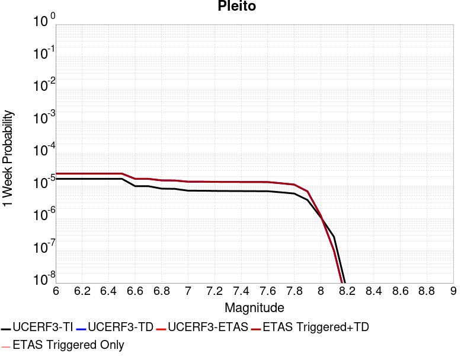 |  | 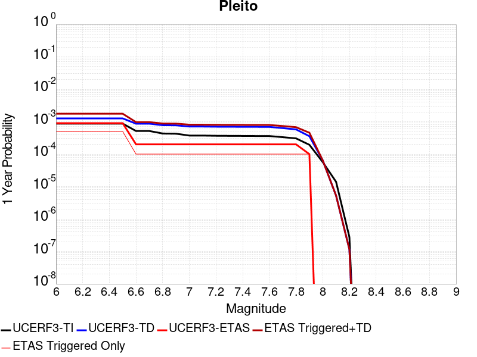 |  |

| Magnitude | 1 wk TI Prob | 1 wk TD Prob | 1 wk ETAS Prob | 1 wk ETAS/TD Gain | 1 wk ETAS Triggered+TD | 1 wk ETAS Triggered Only | 1 mo TI Prob | 1 mo TD Prob | 1 mo ETAS Prob | 1 mo ETAS/TD Gain | 1 mo ETAS Triggered+TD | 1 mo ETAS Triggered Only | 1 yr TI Prob | 1 yr TD Prob | 1 yr ETAS Prob | 1 yr ETAS/TD Gain | 1 yr ETAS Triggered+TD | 1 yr ETAS Triggered Only | 10 yr TI Prob | 10 yr TD Prob | 10 yr ETAS Prob | 10 yr ETAS/TD Gain | 10 yr ETAS Triggered+TD | 10 yr ETAS Triggered Only |
|-----|-----|-----|-----|-----|-----|-----|-----|-----|-----|-----|-----|-----|-----|-----|-----|-----|-----|-----|-----|-----|-----|-----|-----|-----|
| 6.0 | 1.6763008E-5 | 2.420621E-5 | 0.0 | 0.0 | 2.420621E-5 | 0.0 | 7.183948E-5 | 1.03737184E-4 | 0.0 | 0.0 | 1.03737184E-4 | 0.0 | 8.742947E-4 | 0.0012623403 | 0.0 | 0.0 | 0.0012623403 | 0.0 | 0.00870863 | 0.012671881 | 1.0E-4 | 0.007891487 | 0.012770615 | 1.0E-4 |
| 6.1 | 1.6763008E-5 | 2.420621E-5 | 0.0 | 0.0 | 2.420621E-5 | 0.0 | 7.183948E-5 | 1.03737184E-4 | 0.0 | 0.0 | 1.03737184E-4 | 0.0 | 8.742947E-4 | 0.0012623403 | 0.0 | 0.0 | 0.0012623403 | 0.0 | 0.00870863 | 0.012671881 | 1.0E-4 | 0.007891487 | 0.012770615 | 1.0E-4 |
| 6.2 | 1.6763008E-5 | 2.420621E-5 | 0.0 | 0.0 | 2.420621E-5 | 0.0 | 7.183948E-5 | 1.03737184E-4 | 0.0 | 0.0 | 1.03737184E-4 | 0.0 | 8.742947E-4 | 0.0012623403 | 0.0 | 0.0 | 0.0012623403 | 0.0 | 0.00870863 | 0.012671881 | 1.0E-4 | 0.007891487 | 0.012770615 | 1.0E-4 |
| 6.3 | 1.6763008E-5 | 2.420621E-5 | 0.0 | 0.0 | 2.420621E-5 | 0.0 | 7.183948E-5 | 1.03737184E-4 | 0.0 | 0.0 | 1.03737184E-4 | 0.0 | 8.742947E-4 | 0.0012623403 | 0.0 | 0.0 | 0.0012623403 | 0.0 | 0.00870863 | 0.012671881 | 1.0E-4 | 0.007891487 | 0.012770615 | 1.0E-4 |
| 6.4 | 1.6763008E-5 | 2.420621E-5 | 0.0 | 0.0 | 2.420621E-5 | 0.0 | 7.183948E-5 | 1.03737184E-4 | 0.0 | 0.0 | 1.03737184E-4 | 0.0 | 8.742947E-4 | 0.0012623403 | 0.0 | 0.0 | 0.0012623403 | 0.0 | 0.00870863 | 0.012671881 | 1.0E-4 | 0.007891487 | 0.012770615 | 1.0E-4 |
| 6.5 | 1.6763008E-5 | 2.420621E-5 | 0.0 | 0.0 | 2.420621E-5 | 0.0 | 7.183948E-5 | 1.03737184E-4 | 0.0 | 0.0 | 1.03737184E-4 | 0.0 | 8.742947E-4 | 0.0012623403 | 0.0 | 0.0 | 0.0012623403 | 0.0 | 0.00870863 | 0.012671881 | 1.0E-4 | 0.007891487 | 0.012770615 | 1.0E-4 |
| 6.6 | 9.910213E-6 | 1.6664997E-5 | 0.0 | 0.0 | 1.6664997E-5 | 0.0 | 4.247165E-5 | 7.141948E-5 | 0.0 | 0.0 | 7.141948E-5 | 0.0 | 5.169696E-4 | 8.69189E-4 | 0.0 | 0.0 | 8.69189E-4 | 0.0 | 0.0051576863 | 0.008771734 | 0.0 | 0.0 | 0.008771734 | 0.0 |
| 6.7 | 9.910213E-6 | 1.6664997E-5 | 0.0 | 0.0 | 1.6664997E-5 | 0.0 | 4.247165E-5 | 7.141948E-5 | 0.0 | 0.0 | 7.141948E-5 | 0.0 | 5.169696E-4 | 8.69189E-4 | 0.0 | 0.0 | 8.69189E-4 | 0.0 | 0.0051576863 | 0.008771734 | 0.0 | 0.0 | 0.008771734 | 0.0 |
| 6.8 | 8.300162E-6 | 1.4926077E-5 | 0.0 | 0.0 | 1.4926077E-5 | 0.0 | 3.557164E-5 | 6.396734E-5 | 0.0 | 0.0 | 6.396734E-5 | 0.0 | 4.3299864E-4 | 7.785255E-4 | 0.0 | 0.0 | 7.785255E-4 | 0.0 | 0.004321559 | 0.007871681 | 0.0 | 0.0 | 0.007871681 | 0.0 |
| 6.9 | 8.183114E-6 | 1.479753E-5 | 0.0 | 0.0 | 1.479753E-5 | 0.0 | 3.5070017E-5 | 6.341645E-5 | 0.0 | 0.0 | 6.341645E-5 | 0.0 | 4.2689382E-4 | 7.7182316E-4 | 0.0 | 0.0 | 7.7182316E-4 | 0.0 | 0.0042607468 | 0.0078051295 | 0.0 | 0.0 | 0.0078051295 | 0.0 |
| 7.0 | 7.1748823E-6 | 1.35911105E-5 | 0.0 | 0.0 | 1.35911105E-5 | 0.0 | 3.0749135E-5 | 5.8246318E-5 | 0.0 | 0.0 | 5.8246318E-5 | 0.0 | 3.743064E-4 | 7.089187E-4 | 0.0 | 0.0 | 7.089187E-4 | 0.0 | 0.0037367654 | 0.007179783 | 0.0 | 0.0 | 0.007179783 | 0.0 |
| 7.1 | 7.1671807E-6 | 1.35815535E-5 | 0.0 | 0.0 | 1.35815535E-5 | 0.0 | 3.0716128E-5 | 5.820536E-5 | 0.0 | 0.0 | 5.820536E-5 | 0.0 | 3.7390468E-4 | 7.0842035E-4 | 0.0 | 0.0 | 7.0842035E-4 | 0.0 | 0.0037327618 | 0.0071748323 | 0.0 | 0.0 | 0.0071748323 | 0.0 |
| 7.2 | 7.0649667E-6 | 1.3430569E-5 | 0.0 | 0.0 | 1.3430569E-5 | 0.0 | 3.0278077E-5 | 5.7558314E-5 | 0.0 | 0.0 | 5.7558314E-5 | 0.0 | 3.6857324E-4 | 7.0054765E-4 | 0.0 | 0.0 | 7.0054765E-4 | 0.0 | 0.0036796255 | 0.007096455 | 0.0 | 0.0 | 0.007096455 | 0.0 |
| 7.3 | 7.02082E-6 | 1.3375024E-5 | 0.0 | 0.0 | 1.3375024E-5 | 0.0 | 3.008888E-5 | 5.732027E-5 | 0.0 | 0.0 | 5.732027E-5 | 0.0 | 3.6627054E-4 | 6.976513E-4 | 0.0 | 0.0 | 6.976513E-4 | 0.0 | 0.0036566744 | 0.0070674564 | 0.0 | 0.0 | 0.0070674564 | 0.0 |
| 7.4 | 6.987146E-6 | 1.3335148E-5 | 0.0 | 0.0 | 1.3335148E-5 | 0.0 | 2.9944567E-5 | 5.7149384E-5 | 0.0 | 0.0 | 5.7149384E-5 | 0.0 | 3.6451413E-4 | 6.955721E-4 | 0.0 | 0.0 | 6.955721E-4 | 0.0 | 0.0036391679 | 0.007046675 | 0.0 | 0.0 | 0.007046675 | 0.0 |
| 7.5 | 6.9494554E-6 | 1.3292482E-5 | 0.0 | 0.0 | 1.3292482E-5 | 0.0 | 2.9783041E-5 | 5.696654E-5 | 0.0 | 0.0 | 5.696654E-5 | 0.0 | 3.625482E-4 | 6.9334736E-4 | 0.0 | 0.0 | 6.9334736E-4 | 0.0 | 0.0036195726 | 0.0070245177 | 0.0 | 0.0 | 0.0070245177 | 0.0 |
| 7.6 | 6.92694E-6 | 1.3252396E-5 | 0.0 | 0.0 | 1.3252396E-5 | 0.0 | 2.9686547E-5 | 5.6794746E-5 | 0.0 | 0.0 | 5.6794746E-5 | 0.0 | 3.6137376E-4 | 6.912571E-4 | 0.0 | 0.0 | 6.912571E-4 | 0.0 | 0.0036078666 | 0.007003673 | 0.0 | 0.0 | 0.007003673 | 0.0 |
| 7.7 | 6.395867E-6 | 1.2154203E-5 | 0.0 | 0.0 | 1.2154203E-5 | 0.0 | 2.741057E-5 | 5.2088406E-5 | 0.0 | 0.0 | 5.2088406E-5 | 0.0 | 3.336726E-4 | 6.3399214E-4 | 0.0 | 0.0 | 6.3399214E-4 | 0.0 | 0.0033317201 | 0.006433666 | 0.0 | 0.0 | 0.006433666 | 0.0 |
| 7.8 | 5.8664327E-6 | 1.1065597E-5 | 0.0 | 0.0 | 1.1065597E-5 | 0.0 | 2.5141611E-5 | 4.7423127E-5 | 0.0 | 0.0 | 4.7423127E-5 | 0.0 | 3.060561E-4 | 5.7722384E-4 | 0.0 | 0.0 | 5.7722384E-4 | 0.0 | 0.0030563495 | 0.005861171 | 0.0 | 0.0 | 0.005861171 | 0.0 |
| 7.9 | 3.7167474E-6 | 6.826978E-6 | 0.0 | 0.0 | 6.826978E-6 | 0.0 | 1.592882E-5 | 2.9258148E-5 | 0.0 | 0.0 | 2.9258148E-5 | 0.0 | 1.9391612E-4 | 3.5615987E-4 | 0.0 | 0.0 | 3.5615987E-4 | 0.0 | 0.0019374699 | 0.0036211766 | 0.0 | 0.0 | 0.0036211766 | 0.0 |
| 8.0 | 1.0903841E-6 | 1.223528E-6 | 0.0 | 0.0 | 1.223528E-6 | 0.0 | 4.6730665E-6 | 5.243681E-6 | 0.0 | 0.0 | 5.243681E-6 | 0.0 | 5.68931E-5 | 6.383996E-5 | 0.0 | 0.0 | 6.383996E-5 | 0.0 | 5.6878536E-4 | 6.603334E-4 | 0.0 | 0.0 | 6.603334E-4 | 0.0 |
| 8.1 | 2.6894583E-7 | 9.9516384E-8 | 0.0 | 0.0 | 9.9516384E-8 | 0.0 | 1.1526245E-6 | 4.264987E-7 | 0.0 | 0.0 | 4.264987E-7 | 0.0 | 1.4033113E-5 | 5.1926095E-6 | 0.0 | 0.0 | 5.1926095E-6 | 0.0 | 1.4032227E-4 | 5.835751E-5 | 0.0 | 0.0 | 5.835751E-5 | 0.0 |
| 8.2 | 5.2967013E-9 | 2.1931936E-9 | 0.0 | 0.0 | 2.1931936E-9 | 0.0 | 2.2700148E-8 | 9.399401E-9 | 0.0 | 0.0 | 9.399401E-9 | 0.0 | 2.7637427E-7 | 1.1443771E-7 | 0.0 | 0.0 | 1.1443771E-7 | 0.0 | 2.7637393E-6 | 1.3106312E-6 | 0.0 | 0.0 | 1.3106312E-6 | 0.0 |

## Greenville (So) 2011 CFM
*[(top)](#table-of-contents)*

| 1 Week | 1 Month | 1 Year | 10 Year |
|-----|-----|-----|-----|
|  | 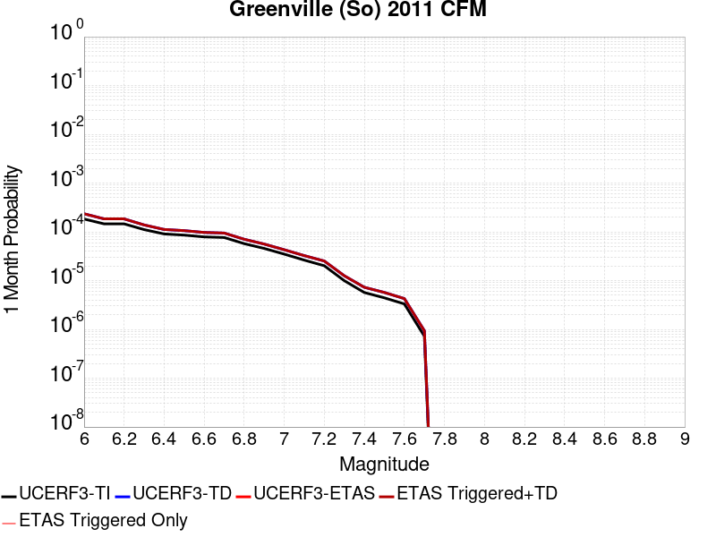 |  | 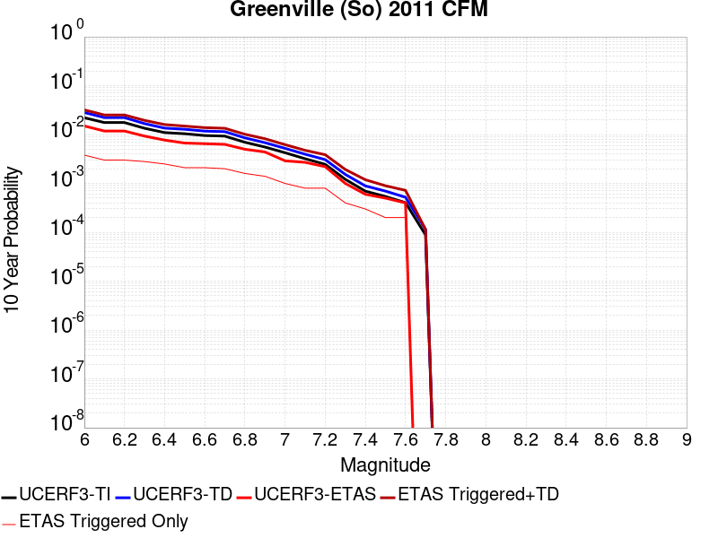 |

| Magnitude | 1 wk TI Prob | 1 wk TD Prob | 1 wk ETAS Prob | 1 wk ETAS/TD Gain | 1 wk ETAS Triggered+TD | 1 wk ETAS Triggered Only | 1 mo TI Prob | 1 mo TD Prob | 1 mo ETAS Prob | 1 mo ETAS/TD Gain | 1 mo ETAS Triggered+TD | 1 mo ETAS Triggered Only | 1 yr TI Prob | 1 yr TD Prob | 1 yr ETAS Prob | 1 yr ETAS/TD Gain | 1 yr ETAS Triggered+TD | 1 yr ETAS Triggered Only | 10 yr TI Prob | 10 yr TD Prob | 10 yr ETAS Prob | 10 yr ETAS/TD Gain | 10 yr ETAS Triggered+TD | 10 yr ETAS Triggered Only |
|-----|-----|-----|-----|-----|-----|-----|-----|-----|-----|-----|-----|-----|-----|-----|-----|-----|-----|-----|-----|-----|-----|-----|-----|-----|
| 6.0 | 4.279693E-5 | 5.4871653E-5 | 0.0 | 0.0 | 5.4871653E-5 | 0.0 | 1.8340252E-4 | 2.35145E-4 | 0.0 | 0.0 | 2.35145E-4 | 0.0 | 0.0022306389 | 0.002859405 | 1.0E-4 | 0.03497231 | 0.002959119 | 1.0E-4 | 0.022083808 | 0.028253423 | 1.0E-4 | 0.0035393941 | 0.028350597 | 1.0E-4 |
| 6.1 | 3.4037297E-5 | 4.3064574E-5 | 0.0 | 0.0 | 4.3064574E-5 | 0.0 | 1.4586597E-4 | 1.8455059E-4 | 0.0 | 0.0 | 1.8455059E-4 | 0.0 | 0.0017744715 | 0.002244753 | 1.0E-4 | 0.04454833 | 0.0023445287 | 1.0E-4 | 0.01760369 | 0.02223786 | 1.0E-4 | 0.0044968356 | 0.022335635 | 1.0E-4 |
| 6.2 | 3.4037297E-5 | 4.3064574E-5 | 0.0 | 0.0 | 4.3064574E-5 | 0.0 | 1.4586597E-4 | 1.8455059E-4 | 0.0 | 0.0 | 1.8455059E-4 | 0.0 | 0.0017744715 | 0.002244753 | 1.0E-4 | 0.04454833 | 0.0023445287 | 1.0E-4 | 0.01760369 | 0.02223786 | 1.0E-4 | 0.0044968356 | 0.022335635 | 1.0E-4 |
| 6.3 | 2.5956324E-5 | 3.2337128E-5 | 0.0 | 0.0 | 3.2337128E-5 | 0.0 | 1.11236644E-4 | 1.3858077E-4 | 0.0 | 0.0 | 1.3858077E-4 | 0.0 | 0.0013534647 | 0.0016859788 | 1.0E-4 | 0.059312727 | 0.0017858102 | 1.0E-4 | 0.013452509 | 0.016738787 | 1.0E-4 | 0.0059741484 | 0.016837113 | 1.0E-4 |
| 6.4 | 2.1145053E-5 | 2.6124151E-5 | 0.0 | 0.0 | 2.6124151E-5 | 0.0 | 9.061851E-5 | 1.1195603E-4 | 0.0 | 0.0 | 1.1195603E-4 | 0.0 | 0.0011027219 | 0.0013622439 | 1.0E-4 | 0.0734083 | 0.0014621076 | 1.0E-4 | 0.01097266 | 0.0135424305 | 1.0E-4 | 0.007384199 | 0.013641076 | 1.0E-4 |
| 6.5 | 2.0030959E-5 | 2.4726009E-5 | 0.0 | 0.0 | 2.4726009E-5 | 0.0 | 8.584414E-5 | 1.0596449E-4 | 0.0 | 0.0 | 1.0596449E-4 | 0.0 | 0.0010446513 | 0.0012893851 | 1.0E-4 | 0.07755635 | 0.0013892562 | 1.0E-4 | 0.010397541 | 0.012822466 | 1.0E-4 | 0.007798812 | 0.012921183 | 1.0E-4 |
| 6.6 | 1.8395405E-5 | 2.2689894E-5 | 0.0 | 0.0 | 2.2689894E-5 | 0.0 | 7.8835066E-5 | 9.723894E-5 | 0.0 | 0.0 | 9.723894E-5 | 0.0 | 9.5939427E-4 | 0.0011832695 | 1.0E-4 | 0.0845116 | 0.0012831512 | 1.0E-4 | 0.009552629 | 0.011772812 | 1.0E-4 | 0.008494147 | 0.011871635 | 1.0E-4 |
| 6.7 | 1.7883482E-5 | 2.2062428E-5 | 0.0 | 0.0 | 2.2062428E-5 | 0.0 | 7.664124E-5 | 9.454999E-5 | 0.0 | 0.0 | 9.454999E-5 | 0.0 | 9.3270757E-4 | 0.0011505667 | 1.0E-4 | 0.08691369 | 0.0012504517 | 1.0E-4 | 0.009288026 | 0.011449214 | 1.0E-4 | 0.008734223 | 0.011548069 | 1.0E-4 |
| 6.8 | 1.3373564E-5 | 1.6457283E-5 | 0.0 | 0.0 | 1.6457283E-5 | 0.0 | 5.7314013E-5 | 7.0529386E-5 | 0.0 | 0.0 | 7.0529386E-5 | 0.0 | 6.975747E-4 | 8.583717E-4 | 1.0E-4 | 0.11649964 | 9.582859E-4 | 1.0E-4 | 0.0069538904 | 0.008552243 | 1.0E-4 | 0.011692839 | 0.008651388 | 1.0E-4 |
| 6.9 | 1.06692905E-5 | 1.3112284E-5 | 0.0 | 0.0 | 1.3112284E-5 | 0.0 | 4.5724726E-5 | 5.619436E-5 | 0.0 | 0.0 | 5.619436E-5 | 0.0 | 5.5655633E-4 | 6.839628E-4 | 1.0E-4 | 0.1462068 | 7.838944E-4 | 1.0E-4 | 0.005551645 | 0.006819882 | 1.0E-4 | 0.01466301 | 0.0069192 | 1.0E-4 |
| 7.0 | 8.157512E-6 | 1.0029763E-5 | 0.0 | 0.0 | 1.0029763E-5 | 0.0 | 3.4960296E-5 | 4.298401E-5 | 0.0 | 0.0 | 4.298401E-5 | 0.0 | 4.2555845E-4 | 5.2320835E-4 | 1.0E-4 | 0.19112845 | 6.23156E-4 | 1.0E-4 | 0.004247444 | 0.0052203177 | 1.0E-4 | 0.019155921 | 0.005319796 | 1.0E-4 |
| 7.1 | 6.1467113E-6 | 7.599936E-6 | 0.0 | 0.0 | 7.599936E-6 | 0.0 | 2.6342783E-5 | 3.257075E-5 | 0.0 | 0.0 | 3.257075E-5 | 0.0 | 3.206762E-4 | 3.964776E-4 | 1.0E-4 | 0.25222105 | 4.9643795E-4 | 1.0E-4 | 0.0032021382 | 0.0039579673 | 1.0E-4 | 0.025265494 | 0.0040575713 | 1.0E-4 |
| 7.2 | 4.713467E-6 | 5.890499E-6 | 0.0 | 0.0 | 5.890499E-6 | 0.0 | 2.0200418E-5 | 2.5244755E-5 | 0.0 | 0.0 | 2.5244755E-5 | 0.0 | 2.4591232E-4 | 3.0731212E-4 | 1.0E-4 | 0.32540205 | 4.072814E-4 | 1.0E-4 | 0.0024564038 | 0.0030691908 | 1.0E-4 | 0.03258188 | 0.0031688837 | 1.0E-4 |
| 7.3 | 2.3266216E-6 | 2.9365724E-6 | 0.0 | 0.0 | 2.9365724E-6 | 0.0 | 9.971197E-6 | 1.258525E-5 | 0.0 | 0.0 | 1.258525E-5 | 0.0 | 1.2139256E-4 | 1.532148E-4 | 0.0 | 0.0 | 1.532148E-4 | 0.0 | 0.0012132627 | 0.0015311961 | 0.0 | 0.0 | 0.0015311961 | 0.0 |
| 7.4 | 1.3314E-6 | 1.7055879E-6 | 0.0 | 0.0 | 1.7055879E-6 | 0.0 | 5.7059874E-6 | 7.309642E-6 | 0.0 | 0.0 | 7.309642E-6 | 0.0 | 6.946818E-5 | 8.899131E-5 | 0.0 | 0.0 | 8.899131E-5 | 0.0 | 6.9446466E-4 | 8.8957E-4 | 0.0 | 0.0 | 8.8957E-4 | 0.0 |
| 7.5 | 1.0362941E-6 | 1.3353753E-6 | 0.0 | 0.0 | 1.3353753E-6 | 0.0 | 4.4412527E-6 | 5.7230245E-6 | 0.0 | 0.0 | 5.7230245E-6 | 0.0 | 5.407091E-5 | 6.967564E-5 | 0.0 | 0.0 | 6.967564E-5 | 0.0 | 5.405776E-4 | 6.9652876E-4 | 0.0 | 0.0 | 6.9652876E-4 | 0.0 |
| 7.6 | 7.764784E-7 | 9.991577E-7 | 0.0 | 0.0 | 9.991577E-7 | 0.0 | 3.3277602E-6 | 4.2820975E-6 | 0.0 | 0.0 | 4.2820975E-6 | 0.0 | 4.0514726E-5 | 5.213333E-5 | 0.0 | 0.0 | 5.213333E-5 | 0.0 | 4.050734E-4 | 5.21178E-4 | 0.0 | 0.0 | 5.21178E-4 | 0.0 |
| 7.7 | 1.6927763E-7 | 2.191352E-7 | 0.0 | 0.0 | 2.191352E-7 | 0.0 | 7.2547533E-7 | 9.3915054E-7 | 0.0 | 0.0 | 9.3915054E-7 | 0.0 | 8.832627E-6 | 1.1434101E-5 | 0.0 | 0.0 | 1.1434101E-5 | 0.0 | 8.8322755E-5 | 1.1434293E-4 | 0.0 | 0.0 | 1.1434293E-4 | 0.0 |

## San Andreas (North Branch Mill Creek)
*[(top)](#table-of-contents)*

| 1 Week | 1 Month | 1 Year | 10 Year |
|-----|-----|-----|-----|
|  |  |  |  |

| Magnitude | 1 wk TI Prob | 1 wk TD Prob | 1 wk ETAS Prob | 1 wk ETAS/TD Gain | 1 wk ETAS Triggered+TD | 1 wk ETAS Triggered Only | 1 mo TI Prob | 1 mo TD Prob | 1 mo ETAS Prob | 1 mo ETAS/TD Gain | 1 mo ETAS Triggered+TD | 1 mo ETAS Triggered Only | 1 yr TI Prob | 1 yr TD Prob | 1 yr ETAS Prob | 1 yr ETAS/TD Gain | 1 yr ETAS Triggered+TD | 1 yr ETAS Triggered Only | 10 yr TI Prob | 10 yr TD Prob | 10 yr ETAS Prob | 10 yr ETAS/TD Gain | 10 yr ETAS Triggered+TD | 10 yr ETAS Triggered Only |
|-----|-----|-----|-----|-----|-----|-----|-----|-----|-----|-----|-----|-----|-----|-----|-----|-----|-----|-----|-----|-----|-----|-----|-----|-----|
| 6.0 | 1.3461156E-5 | 2.2894961E-5 | 0.0 | 0.0 | 2.2894961E-5 | 0.0 | 5.7689394E-5 | 9.811759E-5 | 0.0 | 0.0 | 9.811759E-5 | 0.0 | 7.02142E-4 | 0.0011939303 | 0.0 | 0.0 | 0.0011939303 | 0.0 | 0.0069992766 | 0.011918645 | 1.0E-4 | 0.008390215 | 0.012017454 | 1.0E-4 |
| 6.1 | 1.3461156E-5 | 2.2894961E-5 | 0.0 | 0.0 | 2.2894961E-5 | 0.0 | 5.7689394E-5 | 9.811759E-5 | 0.0 | 0.0 | 9.811759E-5 | 0.0 | 7.02142E-4 | 0.0011939303 | 0.0 | 0.0 | 0.0011939303 | 0.0 | 0.0069992766 | 0.011918645 | 1.0E-4 | 0.008390215 | 0.012017454 | 1.0E-4 |
| 6.2 | 1.3461156E-5 | 2.2894961E-5 | 0.0 | 0.0 | 2.2894961E-5 | 0.0 | 5.7689394E-5 | 9.811759E-5 | 0.0 | 0.0 | 9.811759E-5 | 0.0 | 7.02142E-4 | 0.0011939303 | 0.0 | 0.0 | 0.0011939303 | 0.0 | 0.0069992766 | 0.011918645 | 1.0E-4 | 0.008390215 | 0.012017454 | 1.0E-4 |
| 6.3 | 1.3461156E-5 | 2.2894961E-5 | 0.0 | 0.0 | 2.2894961E-5 | 0.0 | 5.7689394E-5 | 9.811759E-5 | 0.0 | 0.0 | 9.811759E-5 | 0.0 | 7.02142E-4 | 0.0011939303 | 0.0 | 0.0 | 0.0011939303 | 0.0 | 0.0069992766 | 0.011918645 | 1.0E-4 | 0.008390215 | 0.012017454 | 1.0E-4 |
| 6.4 | 1.3461156E-5 | 2.2894961E-5 | 0.0 | 0.0 | 2.2894961E-5 | 0.0 | 5.7689394E-5 | 9.811759E-5 | 0.0 | 0.0 | 9.811759E-5 | 0.0 | 7.02142E-4 | 0.0011939303 | 0.0 | 0.0 | 0.0011939303 | 0.0 | 0.0069992766 | 0.011918645 | 1.0E-4 | 0.008390215 | 0.012017454 | 1.0E-4 |
| 6.5 | 1.3450706E-5 | 2.2883927E-5 | 0.0 | 0.0 | 2.2883927E-5 | 0.0 | 5.764461E-5 | 9.8070304E-5 | 0.0 | 0.0 | 9.8070304E-5 | 0.0 | 7.0159714E-4 | 0.0011933552 | 0.0 | 0.0 | 0.0011933552 | 0.0 | 0.006993862 | 0.011912957 | 1.0E-4 | 0.008394222 | 0.0120117655 | 1.0E-4 |
| 6.6 | 1.3074523E-5 | 2.2498407E-5 | 0.0 | 0.0 | 2.2498407E-5 | 0.0 | 5.6032466E-5 | 9.6418196E-5 | 0.0 | 0.0 | 9.6418196E-5 | 0.0 | 6.8198174E-4 | 0.0011732625 | 0.0 | 0.0 | 0.0011732625 | 0.0 | 0.006798926 | 0.01171416 | 1.0E-4 | 0.008536677 | 0.01181299 | 1.0E-4 |
| 6.7 | 1.3050216E-5 | 2.2473736E-5 | 0.0 | 0.0 | 2.2473736E-5 | 0.0 | 5.59283E-5 | 9.631248E-5 | 0.0 | 0.0 | 9.631248E-5 | 0.0 | 6.8071426E-4 | 0.0011719767 | 0.0 | 0.0 | 0.0011719767 | 0.0 | 0.0067863287 | 0.011701439 | 1.0E-4 | 0.0085459575 | 0.011800269 | 1.0E-4 |
| 6.8 | 1.29049395E-5 | 2.2322258E-5 | 0.0 | 0.0 | 2.2322258E-5 | 0.0 | 5.530571E-5 | 9.566333E-5 | 0.0 | 0.0 | 9.566333E-5 | 0.0 | 6.73139E-4 | 0.0011640819 | 0.0 | 0.0 | 0.0011640819 | 0.0 | 0.0067110364 | 0.011623316 | 1.0E-4 | 0.008603396 | 0.011722154 | 1.0E-4 |
| 6.9 | 1.2867369E-5 | 2.2281742E-5 | 0.0 | 0.0 | 2.2281742E-5 | 0.0 | 5.51447E-5 | 9.5489704E-5 | 0.0 | 0.0 | 9.5489704E-5 | 0.0 | 6.711799E-4 | 0.0011619702 | 0.0 | 0.0 | 0.0011619702 | 0.0 | 0.006691564 | 0.011602421 | 1.0E-4 | 0.00861889 | 0.011701261 | 1.0E-4 |
| 7.0 | 1.2495996E-5 | 2.1685511E-5 | 0.0 | 0.0 | 2.1685511E-5 | 0.0 | 5.3553173E-5 | 9.293461E-5 | 0.0 | 0.0 | 9.293461E-5 | 0.0 | 6.518148E-4 | 0.0011308943 | 0.0 | 0.0 | 0.0011308943 | 0.0 | 0.0064990623 | 0.011294832 | 1.0E-4 | 0.008853606 | 0.0113937035 | 1.0E-4 |
| 7.1 | 1.2452067E-5 | 2.1630749E-5 | 0.0 | 0.0 | 2.1630749E-5 | 0.0 | 5.3364907E-5 | 9.2699935E-5 | 0.0 | 0.0 | 9.2699935E-5 | 0.0 | 6.4952404E-4 | 0.0011280401 | 0.0 | 0.0 | 0.0011280401 | 0.0 | 0.0064762887 | 0.011266581 | 1.0E-4 | 0.008875808 | 0.011365454 | 1.0E-4 |
| 7.2 | 1.2002777E-5 | 2.1012174E-5 | 0.0 | 0.0 | 2.1012174E-5 | 0.0 | 5.143946E-5 | 9.0049085E-5 | 0.0 | 0.0 | 9.0049085E-5 | 0.0 | 6.2609545E-4 | 0.0010957988 | 0.0 | 0.0 | 0.0010957988 | 0.0 | 0.006243344 | 0.010947371 | 1.0E-4 | 0.009134613 | 0.011046276 | 1.0E-4 |
| 7.3 | 1.1923425E-5 | 2.088261E-5 | 0.0 | 0.0 | 2.088261E-5 | 0.0 | 5.109939E-5 | 8.949384E-5 | 0.0 | 0.0 | 8.949384E-5 | 0.0 | 6.219575E-4 | 0.0010890454 | 0.0 | 0.0 | 0.0010890454 | 0.0 | 0.0062021962 | 0.010880542 | 1.0E-4 | 0.009190719 | 0.010979454 | 1.0E-4 |
| 7.4 | 1.16105175E-5 | 2.0263682E-5 | 0.0 | 0.0 | 2.0263682E-5 | 0.0 | 4.975841E-5 | 8.684147E-5 | 0.0 | 0.0 | 8.684147E-5 | 0.0 | 6.0564023E-4 | 0.0010567845 | 0.0 | 0.0 | 0.0010567845 | 0.0 | 0.006039923 | 0.010561627 | 1.0E-4 | 0.009468238 | 0.010660571 | 1.0E-4 |
| 7.5 | 1.1037265E-5 | 1.8988934E-5 | 0.0 | 0.0 | 1.8988934E-5 | 0.0 | 4.7301706E-5 | 8.137862E-5 | 0.0 | 0.0 | 8.137862E-5 | 0.0 | 5.757461E-4 | 9.903364E-4 | 0.0 | 0.0 | 9.903364E-4 | 0.0 | 0.005742567 | 0.009904555 | 1.0E-4 | 0.010096365 | 0.010003565 | 1.0E-4 |
| 7.6 | 1.0720915E-5 | 1.8438837E-5 | 0.0 | 0.0 | 1.8438837E-5 | 0.0 | 4.5945973E-5 | 7.902121E-5 | 0.0 | 0.0 | 7.902121E-5 | 0.0 | 5.592486E-4 | 9.6166064E-4 | 0.0 | 0.0 | 9.6166064E-4 | 0.0 | 0.005578433 | 0.009620325 | 0.0 | 0.0 | 0.009620325 | 0.0 |
| 7.7 | 9.276279E-6 | 1.5914407E-5 | 0.0 | 0.0 | 1.5914407E-5 | 0.0 | 3.9754876E-5 | 6.820283E-5 | 0.0 | 0.0 | 6.820283E-5 | 0.0 | 4.839081E-4 | 8.3005475E-4 | 0.0 | 0.0 | 8.3005475E-4 | 0.0 | 0.0048285574 | 0.008315057 | 0.0 | 0.0 | 0.008315057 | 0.0 |
| 7.8 | 5.8346777E-6 | 1.0738303E-5 | 0.0 | 0.0 | 1.0738303E-5 | 0.0 | 2.5005522E-5 | 4.6020486E-5 | 0.0 | 0.0 | 4.6020486E-5 | 0.0 | 3.043997E-4 | 5.601555E-4 | 0.0 | 0.0 | 5.601555E-4 | 0.0 | 0.0030398308 | 0.0056325593 | 0.0 | 0.0 | 0.0056325593 | 0.0 |
| 7.9 | 4.690204E-6 | 8.1600465E-6 | 0.0 | 0.0 | 8.1600465E-6 | 0.0 | 2.0100719E-5 | 3.497116E-5 | 0.0 | 0.0 | 3.497116E-5 | 0.0 | 2.4469878E-4 | 4.2569079E-4 | 0.0 | 0.0 | 4.2569079E-4 | 0.0 | 0.002444295 | 0.0042910287 | 0.0 | 0.0 | 0.0042910287 | 0.0 |
| 8.0 | 2.9570454E-6 | 4.6303044E-6 | 0.0 | 0.0 | 4.6303044E-6 | 0.0 | 1.267299E-5 | 1.984401E-5 | 0.0 | 0.0 | 1.984401E-5 | 0.0 | 1.5428272E-4 | 2.4157407E-4 | 0.0 | 0.0 | 2.4157407E-4 | 0.0 | 0.0015417566 | 0.0024371196 | 0.0 | 0.0 | 0.0024371196 | 0.0 |
| 8.1 | 1.6376824E-6 | 2.0804132E-6 | 0.0 | 0.0 | 2.0804132E-6 | 0.0 | 7.01862E-6 | 8.916027E-6 | 0.0 | 0.0 | 8.916027E-6 | 0.0 | 8.544835E-5 | 1.0854723E-4 | 0.0 | 0.0 | 1.0854723E-4 | 0.0 | 8.54155E-4 | 0.0010998398 | 0.0 | 0.0 | 0.0010998398 | 0.0 |
| 8.2 | 6.9631557E-7 | 4.167043E-7 | 0.0 | 0.0 | 4.167043E-7 | 0.0 | 2.984206E-6 | 1.7858744E-6 | 0.0 | 0.0 | 1.7858744E-6 | 0.0 | 3.63321E-5 | 2.1742804E-5 | 0.0 | 0.0 | 2.1742804E-5 | 0.0 | 3.6326164E-4 | 2.255496E-4 | 0.0 | 0.0 | 2.255496E-4 | 0.0 |
| 8.3 | 1.7876137E-7 | 7.614013E-8 | 0.0 | 0.0 | 7.614013E-8 | 0.0 | 7.661199E-7 | 3.263148E-7 | 0.0 | 0.0 | 3.263148E-7 | 0.0 | 9.32747E-6 | 3.9728757E-6 | 0.0 | 0.0 | 3.9728757E-6 | 0.0 | 9.3270784E-5 | 4.1807303E-5 | 0.0 | 0.0 | 4.1807303E-5 | 0.0 |

## Morales (West)
*[(top)](#table-of-contents)*

| 1 Week | 1 Month | 1 Year | 10 Year |
|-----|-----|-----|-----|
| 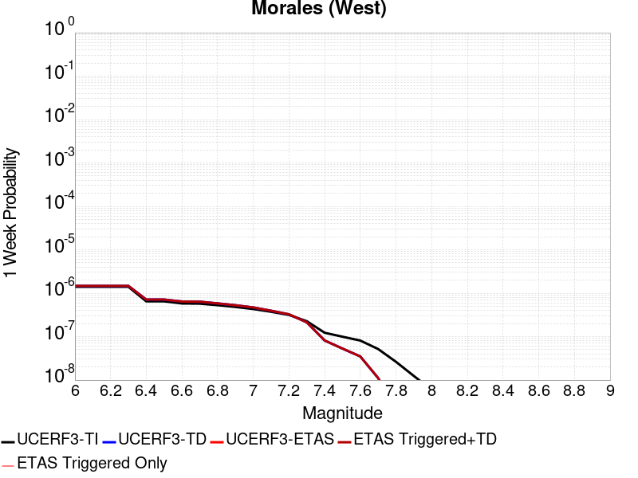 |  |  |  |

| Magnitude | 1 wk TI Prob | 1 wk TD Prob | 1 wk ETAS Prob | 1 wk ETAS/TD Gain | 1 wk ETAS Triggered+TD | 1 wk ETAS Triggered Only | 1 mo TI Prob | 1 mo TD Prob | 1 mo ETAS Prob | 1 mo ETAS/TD Gain | 1 mo ETAS Triggered+TD | 1 mo ETAS Triggered Only | 1 yr TI Prob | 1 yr TD Prob | 1 yr ETAS Prob | 1 yr ETAS/TD Gain | 1 yr ETAS Triggered+TD | 1 yr ETAS Triggered Only | 10 yr TI Prob | 10 yr TD Prob | 10 yr ETAS Prob | 10 yr ETAS/TD Gain | 10 yr ETAS Triggered+TD | 10 yr ETAS Triggered Only |
|-----|-----|-----|-----|-----|-----|-----|-----|-----|-----|-----|-----|-----|-----|-----|-----|-----|-----|-----|-----|-----|-----|-----|-----|-----|
| 6.0 | 1.4027072E-6 | 1.4713751E-6 | 0.0 | 0.0 | 1.4713751E-6 | 0.0 | 6.0115885E-6 | 6.305882E-6 | 0.0 | 0.0 | 6.305882E-6 | 0.0 | 7.318863E-5 | 7.677211E-5 | 0.0 | 0.0 | 7.677211E-5 | 0.0 | 7.316453E-4 | 7.6752435E-4 | 1.0E-4 | 0.13028902 | 8.6744764E-4 | 1.0E-4 |
| 6.1 | 1.4027072E-6 | 1.4713751E-6 | 0.0 | 0.0 | 1.4713751E-6 | 0.0 | 6.0115885E-6 | 6.305882E-6 | 0.0 | 0.0 | 6.305882E-6 | 0.0 | 7.318863E-5 | 7.677211E-5 | 0.0 | 0.0 | 7.677211E-5 | 0.0 | 7.316453E-4 | 7.6752435E-4 | 1.0E-4 | 0.13028902 | 8.6744764E-4 | 1.0E-4 |
| 6.2 | 1.4027072E-6 | 1.4713751E-6 | 0.0 | 0.0 | 1.4713751E-6 | 0.0 | 6.0115885E-6 | 6.305882E-6 | 0.0 | 0.0 | 6.305882E-6 | 0.0 | 7.318863E-5 | 7.677211E-5 | 0.0 | 0.0 | 7.677211E-5 | 0.0 | 7.316453E-4 | 7.6752435E-4 | 1.0E-4 | 0.13028902 | 8.6744764E-4 | 1.0E-4 |
| 6.3 | 1.4027072E-6 | 1.4713751E-6 | 0.0 | 0.0 | 1.4713751E-6 | 0.0 | 6.0115885E-6 | 6.305882E-6 | 0.0 | 0.0 | 6.305882E-6 | 0.0 | 7.318863E-5 | 7.677211E-5 | 0.0 | 0.0 | 7.677211E-5 | 0.0 | 7.316453E-4 | 7.6752435E-4 | 1.0E-4 | 0.13028902 | 8.6744764E-4 | 1.0E-4 |
| 6.4 | 6.504502E-7 | 7.1267425E-7 | 0.0 | 0.0 | 7.1267425E-7 | 0.0 | 2.7876408E-6 | 3.0543147E-6 | 0.0 | 0.0 | 3.0543147E-6 | 0.0 | 3.3939E-5 | 3.718566E-5 | 0.0 | 0.0 | 3.718566E-5 | 0.0 | 3.3933815E-4 | 3.7179553E-4 | 1.0E-4 | 0.26896504 | 4.7175837E-4 | 1.0E-4 |
| 6.5 | 6.504502E-7 | 7.1267425E-7 | 0.0 | 0.0 | 7.1267425E-7 | 0.0 | 2.7876408E-6 | 3.0543147E-6 | 0.0 | 0.0 | 3.0543147E-6 | 0.0 | 3.3939E-5 | 3.718566E-5 | 0.0 | 0.0 | 3.718566E-5 | 0.0 | 3.3933815E-4 | 3.7179553E-4 | 1.0E-4 | 0.26896504 | 4.7175837E-4 | 1.0E-4 |
| 6.6 | 5.8056526E-7 | 6.423054E-7 | 0.0 | 0.0 | 6.423054E-7 | 0.0 | 2.4881344E-6 | 2.7527344E-6 | 0.0 | 0.0 | 2.7527344E-6 | 0.0 | 3.0292615E-5 | 3.3514032E-5 | 0.0 | 0.0 | 3.3514032E-5 | 0.0 | 3.0288487E-4 | 3.350904E-4 | 1.0E-4 | 0.29842696 | 4.350569E-4 | 1.0E-4 |
| 6.7 | 5.741448E-7 | 6.35837E-7 | 0.0 | 0.0 | 6.35837E-7 | 0.0 | 2.4606184E-6 | 2.725013E-6 | 0.0 | 0.0 | 2.725013E-6 | 0.0 | 2.9957617E-5 | 3.3176533E-5 | 0.0 | 0.0 | 3.3176533E-5 | 0.0 | 2.9953578E-4 | 3.317164E-4 | 1.0E-4 | 0.30146232 | 4.3168323E-4 | 1.0E-4 |
| 6.8 | 5.299428E-7 | 5.8162937E-7 | 0.0 | 0.0 | 5.8162937E-7 | 0.0 | 2.2711813E-6 | 2.4926949E-6 | 0.0 | 0.0 | 2.4926949E-6 | 0.0 | 2.7651282E-5 | 3.0348143E-5 | 0.0 | 0.0 | 3.0348143E-5 | 0.0 | 2.7647841E-4 | 3.0344047E-4 | 1.0E-4 | 0.32955393 | 4.0341011E-4 | 1.0E-4 |
| 6.9 | 4.82394E-7 | 5.268734E-7 | 0.0 | 0.0 | 5.268734E-7 | 0.0 | 2.0674013E-6 | 2.2580268E-6 | 0.0 | 0.0 | 2.2580268E-6 | 0.0 | 2.517032E-5 | 2.7491134E-5 | 0.0 | 0.0 | 2.7491134E-5 | 0.0 | 2.516747E-4 | 2.7487773E-4 | 1.0E-4 | 0.3637981 | 3.7485023E-4 | 1.0E-4 |
| 7.0 | 4.3264512E-7 | 4.6889903E-7 | 0.0 | 0.0 | 4.6889903E-7 | 0.0 | 1.8541921E-6 | 2.0095658E-6 | 0.0 | 0.0 | 2.0095658E-6 | 0.0 | 2.2574555E-5 | 2.4466191E-5 | 0.0 | 0.0 | 2.4466191E-5 | 0.0 | 2.2572262E-4 | 2.446353E-4 | 1.0E-4 | 0.40877172 | 3.4461086E-4 | 1.0E-4 |
| 7.1 | 3.7388565E-7 | 3.9336354E-7 | 0.0 | 0.0 | 3.9336354E-7 | 0.0 | 1.6023661E-6 | 1.6858426E-6 | 0.0 | 0.0 | 1.6858426E-6 | 0.0 | 1.9508632E-5 | 2.0524942E-5 | 0.0 | 0.0 | 2.0524942E-5 | 0.0 | 1.950692E-4 | 2.052307E-4 | 1.0E-4 | 0.48725653 | 3.0521018E-4 | 1.0E-4 |
| 7.2 | 3.1592543E-7 | 3.2553598E-7 | 0.0 | 0.0 | 3.2553598E-7 | 0.0 | 1.3539654E-6 | 1.3951535E-6 | 0.0 | 0.0 | 1.3951535E-6 | 0.0 | 1.6484404E-5 | 1.6985863E-5 | 0.0 | 0.0 | 1.6985863E-5 | 0.0 | 1.6483181E-4 | 1.6984582E-4 | 1.0E-4 | 0.5887693 | 2.6982883E-4 | 1.0E-4 |
| 7.3 | 2.2677783E-7 | 2.124779E-7 | 0.0 | 0.0 | 2.124779E-7 | 0.0 | 9.719047E-7 | 9.1061924E-7 | 0.0 | 0.0 | 9.1061924E-7 | 0.0 | 1.1832874E-5 | 1.1086733E-5 | 0.0 | 0.0 | 1.1086733E-5 | 0.0 | 1.18322445E-4 | 1.10861845E-4 | 1.0E-4 | 0.90202355 | 2.1085076E-4 | 1.0E-4 |
| 7.4 | 1.2295531E-7 | 8.102608E-8 | 0.0 | 0.0 | 8.102608E-8 | 0.0 | 5.269512E-7 | 3.4725457E-7 | 0.0 | 0.0 | 3.4725457E-7 | 0.0 | 6.4156125E-6 | 4.227816E-6 | 0.0 | 0.0 | 4.227816E-6 | 0.0 | 6.415427E-5 | 4.2277366E-5 | 1.0E-4 | 2.365332 | 1.4227314E-4 | 1.0E-4 |
| 7.5 | 9.9632544E-8 | 5.2670416E-8 | 0.0 | 0.0 | 5.2670416E-8 | 0.0 | 4.2699656E-7 | 2.2573033E-7 | 0.0 | 0.0 | 2.2573033E-7 | 0.0 | 5.198671E-6 | 2.7482633E-6 | 0.0 | 0.0 | 2.7482633E-6 | 0.0 | 5.198549E-5 | 2.7482296E-5 | 1.0E-4 | 3.638706 | 1.2747955E-4 | 1.0E-4 |
| 7.6 | 8.125894E-8 | 3.4633654E-8 | 0.0 | 0.0 | 3.4633654E-8 | 0.0 | 3.4825257E-7 | 1.4842995E-7 | 0.0 | 0.0 | 1.4842995E-7 | 0.0 | 4.2399665E-6 | 1.8071331E-6 | 0.0 | 0.0 | 1.8071331E-6 | 0.0 | 4.2398857E-5 | 1.8071187E-5 | 1.0E-4 | 5.533671 | 1.1806938E-4 | 1.0E-4 |
| 7.7 | 5.1810765E-8 | 1.0940942E-8 | 0.0 | 0.0 | 1.0940942E-8 | 0.0 | 2.2204613E-7 | 4.6889763E-8 | 0.0 | 0.0 | 4.6889763E-8 | 0.0 | 2.7034082E-6 | 5.708827E-7 | 0.0 | 0.0 | 5.708827E-7 | 0.0 | 2.7033753E-5 | 5.7088137E-6 | 0.0 | 0.0 | 5.7088137E-6 | 0.0 |
| 7.8 | 2.6315043E-8 | 2.1213555E-9 | 0.0 | 0.0 | 2.1213555E-9 | 0.0 | 1.1277875E-7 | 9.091529E-9 | 0.0 | 0.0 | 9.091529E-9 | 0.0 | 1.3730804E-6 | 1.1068937E-7 | 0.0 | 0.0 | 1.1068937E-7 | 0.0 | 1.3730719E-5 | 1.1068946E-6 | 0.0 | 0.0 | 1.1068946E-6 | 0.0 |
| 7.9 | 1.24281545E-8 | 3.6303682E-10 | 0.0 | 0.0 | 3.6303682E-10 | 0.0 | 5.3263516E-8 | 1.555875E-9 | 0.0 | 0.0 | 1.555875E-9 | 0.0 | 6.4848314E-7 | 1.8942787E-8 | 0.0 | 0.0 | 1.8942787E-8 | 0.0 | 6.4848123E-6 | 1.8942924E-7 | 0.0 | 0.0 | 1.8942924E-7 | 0.0 |
| 8.0 | 5.954214E-9 | 1.5800916E-10 | 0.0 | 0.0 | 1.5800916E-10 | 0.0 | 2.551806E-8 | 6.7718153E-10 | 0.0 | 0.0 | 6.7718153E-10 | 0.0 | 3.1068234E-7 | 8.244689E-9 | 0.0 | 0.0 | 8.244689E-9 | 0.0 | 3.1068191E-6 | 8.2448295E-8 | 0.0 | 0.0 | 8.2448295E-8 | 0.0 |
| 8.1 | 1.2586262E-9 | 7.2848616E-11 | 0.0 | 0.0 | 7.2848616E-11 | 0.0 | 5.3941123E-9 | 3.1220815E-10 | 0.0 | 0.0 | 3.1220815E-10 | 0.0 | 6.567332E-8 | 3.80114E-9 | 0.0 | 0.0 | 3.80114E-9 | 0.0 | 6.56733E-7 | 3.80128E-8 | 0.0 | 0.0 | 3.80128E-8 | 0.0 |

## San Jacinto (Anza) rev
*[(top)](#table-of-contents)*

| 1 Week | 1 Month | 1 Year | 10 Year |
|-----|-----|-----|-----|
|  |  | 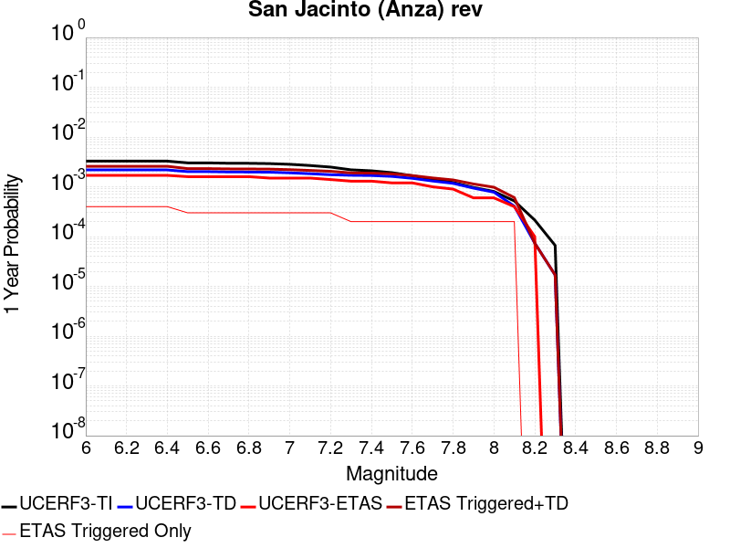 | 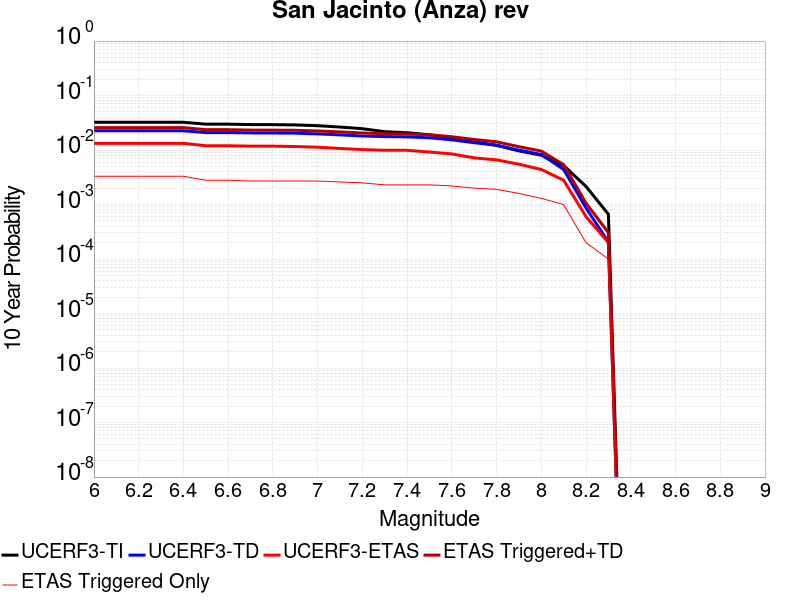 |

| Magnitude | 1 wk TI Prob | 1 wk TD Prob | 1 wk ETAS Prob | 1 wk ETAS/TD Gain | 1 wk ETAS Triggered+TD | 1 wk ETAS Triggered Only | 1 mo TI Prob | 1 mo TD Prob | 1 mo ETAS Prob | 1 mo ETAS/TD Gain | 1 mo ETAS Triggered+TD | 1 mo ETAS Triggered Only | 1 yr TI Prob | 1 yr TD Prob | 1 yr ETAS Prob | 1 yr ETAS/TD Gain | 1 yr ETAS Triggered+TD | 1 yr ETAS Triggered Only | 10 yr TI Prob | 10 yr TD Prob | 10 yr ETAS Prob | 10 yr ETAS/TD Gain | 10 yr ETAS Triggered+TD | 10 yr ETAS Triggered Only |
|-----|-----|-----|-----|-----|-----|-----|-----|-----|-----|-----|-----|-----|-----|-----|-----|-----|-----|-----|-----|-----|-----|-----|-----|-----|
| 6.0 | 6.3015636E-5 | 4.183058E-5 | 1.0E-4 | 2.3905957 | 1.418264E-4 | 1.0E-4 | 2.7003905E-4 | 1.7926165E-4 | 1.0E-4 | 0.5578438 | 2.7924372E-4 | 1.0E-4 | 0.0032827691 | 0.0021803374 | 1.0E-4 | 0.045864463 | 0.0022801193 | 1.0E-4 | 0.032346968 | 0.022534408 | 1.0E-4 | 0.004437658 | 0.022632154 | 1.0E-4 |
| 6.1 | 6.3015636E-5 | 4.183058E-5 | 1.0E-4 | 2.3905957 | 1.418264E-4 | 1.0E-4 | 2.7003905E-4 | 1.7926165E-4 | 1.0E-4 | 0.5578438 | 2.7924372E-4 | 1.0E-4 | 0.0032827691 | 0.0021803374 | 1.0E-4 | 0.045864463 | 0.0022801193 | 1.0E-4 | 0.032346968 | 0.022534408 | 1.0E-4 | 0.004437658 | 0.022632154 | 1.0E-4 |
| 6.2 | 6.3015636E-5 | 4.183058E-5 | 1.0E-4 | 2.3905957 | 1.418264E-4 | 1.0E-4 | 2.7003905E-4 | 1.7926165E-4 | 1.0E-4 | 0.5578438 | 2.7924372E-4 | 1.0E-4 | 0.0032827691 | 0.0021803374 | 1.0E-4 | 0.045864463 | 0.0022801193 | 1.0E-4 | 0.032346968 | 0.022534408 | 1.0E-4 | 0.004437658 | 0.022632154 | 1.0E-4 |
| 6.3 | 6.3015636E-5 | 4.183058E-5 | 1.0E-4 | 2.3905957 | 1.418264E-4 | 1.0E-4 | 2.7003905E-4 | 1.7926165E-4 | 1.0E-4 | 0.5578438 | 2.7924372E-4 | 1.0E-4 | 0.0032827691 | 0.0021803374 | 1.0E-4 | 0.045864463 | 0.0022801193 | 1.0E-4 | 0.032346968 | 0.022534408 | 1.0E-4 | 0.004437658 | 0.022632154 | 1.0E-4 |
| 6.4 | 6.3015636E-5 | 4.183058E-5 | 1.0E-4 | 2.3905957 | 1.418264E-4 | 1.0E-4 | 2.7003905E-4 | 1.7926165E-4 | 1.0E-4 | 0.5578438 | 2.7924372E-4 | 1.0E-4 | 0.0032827691 | 0.0021803374 | 1.0E-4 | 0.045864463 | 0.0022801193 | 1.0E-4 | 0.032346968 | 0.022534408 | 1.0E-4 | 0.004437658 | 0.022632154 | 1.0E-4 |
| 6.5 | 5.811017E-5 | 3.8686903E-5 | 1.0E-4 | 2.5848541 | 1.3868304E-4 | 1.0E-4 | 2.4901982E-4 | 1.6579051E-4 | 1.0E-4 | 0.6031708 | 2.6577394E-4 | 1.0E-4 | 0.0030276014 | 0.002016636 | 1.0E-4 | 0.04958753 | 0.0021164345 | 1.0E-4 | 0.02986684 | 0.020870313 | 1.0E-4 | 0.004791495 | 0.020968227 | 1.0E-4 |
| 6.6 | 5.811017E-5 | 3.8686903E-5 | 1.0E-4 | 2.5848541 | 1.3868304E-4 | 1.0E-4 | 2.4901982E-4 | 1.6579051E-4 | 1.0E-4 | 0.6031708 | 2.6577394E-4 | 1.0E-4 | 0.0030276014 | 0.002016636 | 1.0E-4 | 0.04958753 | 0.0021164345 | 1.0E-4 | 0.02986684 | 0.020870313 | 1.0E-4 | 0.004791495 | 0.020968227 | 1.0E-4 |
| 6.7 | 5.712442E-5 | 3.8125763E-5 | 1.0E-4 | 2.6228983 | 1.3812195E-4 | 1.0E-4 | 2.4479596E-4 | 1.6338592E-4 | 1.0E-4 | 0.61204785 | 2.6336958E-4 | 1.0E-4 | 0.0029763177 | 0.001987414 | 1.0E-4 | 0.050316643 | 0.0020872152 | 1.0E-4 | 0.029367693 | 0.020570375 | 1.0E-4 | 0.00486136 | 0.020668318 | 1.0E-4 |
| 6.8 | 5.6967532E-5 | 3.7984697E-5 | 1.0E-4 | 2.6326392 | 1.379809E-4 | 1.0E-4 | 2.4412372E-4 | 1.6278143E-4 | 1.0E-4 | 0.6143207 | 2.6276516E-4 | 1.0E-4 | 0.0029681553 | 0.0019800677 | 1.0E-4 | 0.050503325 | 0.0020798696 | 1.0E-4 | 0.029288229 | 0.020495819 | 1.0E-4 | 0.004879044 | 0.02059377 | 1.0E-4 |
| 6.9 | 5.6211324E-5 | 3.7700964E-5 | 1.0E-4 | 2.6524522 | 1.3769719E-4 | 1.0E-4 | 2.4088343E-4 | 1.6156558E-4 | 1.0E-4 | 0.61894375 | 2.6154943E-4 | 1.0E-4 | 0.0029288116 | 0.0019652913 | 1.0E-4 | 0.05088304 | 0.002065095 | 1.0E-4 | 0.028905109 | 0.02034173 | 1.0E-4 | 0.0049160025 | 0.020439696 | 1.0E-4 |
| 7.0 | 5.4383527E-5 | 3.659375E-5 | 1.0E-4 | 2.7327073 | 1.3659008E-4 | 1.0E-4 | 2.3305144E-4 | 1.5682094E-4 | 1.0E-4 | 0.6376699 | 2.5680527E-4 | 1.0E-4 | 0.0028337094 | 0.0019076277 | 1.0E-4 | 0.05242113 | 0.002007437 | 1.0E-4 | 0.027978465 | 0.019751118 | 1.0E-4 | 0.0050630043 | 0.019849144 | 1.0E-4 |
| 7.1 | 5.1393665E-5 | 3.510502E-5 | 1.0E-4 | 2.8485954 | 1.3510151E-4 | 1.0E-4 | 2.2023996E-4 | 1.5044144E-4 | 1.0E-4 | 0.6647105 | 2.5042638E-4 | 1.0E-4 | 0.0026781242 | 0.0018300897 | 1.0E-4 | 0.05464213 | 0.0019299067 | 1.0E-4 | 0.026460782 | 0.018947938 | 1.0E-4 | 0.0052776188 | 0.019046044 | 1.0E-4 |
| 7.2 | 4.785222E-5 | 3.3509757E-5 | 1.0E-4 | 2.9842052 | 1.335064E-4 | 1.0E-4 | 2.0506482E-4 | 1.4360536E-4 | 1.0E-4 | 0.69635284 | 2.43591E-4 | 1.0E-4 | 0.0024938055 | 0.0017469965 | 1.0E-4 | 0.057241097 | 0.0018468219 | 1.0E-4 | 0.024660049 | 0.018087938 | 1.0E-4 | 0.0055285464 | 0.01818613 | 1.0E-4 |
| 7.3 | 4.2143256E-5 | 3.2639113E-5 | 1.0E-4 | 3.063809 | 1.3263585E-4 | 1.0E-4 | 1.8060145E-4 | 1.3987442E-4 | 1.0E-4 | 0.714927 | 2.3986044E-4 | 1.0E-4 | 0.002196605 | 0.0017016442 | 1.0E-4 | 0.058766693 | 0.001801474 | 1.0E-4 | 0.02175019 | 0.01761302 | 1.0E-4 | 0.005677618 | 0.01771126 | 1.0E-4 |
| 7.4 | 4.0264713E-5 | 3.2289736E-5 | 1.0E-4 | 3.0969594 | 1.3228651E-4 | 1.0E-4 | 1.7255165E-4 | 1.3837726E-4 | 1.0E-4 | 0.7226621 | 2.3836343E-4 | 1.0E-4 | 0.002098792 | 0.0016834446 | 1.0E-4 | 0.059402015 | 0.0017832762 | 1.0E-4 | 0.020790804 | 0.017424108 | 1.0E-4 | 0.0057391743 | 0.017522367 | 1.0E-4 |
| 7.5 | 3.694492E-5 | 3.1029784E-5 | 1.0E-4 | 3.22271 | 1.3102668E-4 | 1.0E-4 | 1.5832575E-4 | 1.3297804E-4 | 1.0E-4 | 0.7520039 | 2.3296474E-4 | 1.0E-4 | 0.0019259118 | 0.0016178081 | 1.0E-4 | 0.061812025 | 0.0017176464 | 1.0E-4 | 0.01909306 | 0.016754005 | 1.0E-4 | 0.0059687225 | 0.016852329 | 1.0E-4 |
| 7.6 | 3.200565E-5 | 2.8383402E-5 | 1.0E-4 | 3.523186 | 1.2838056E-4 | 1.0E-4 | 1.3715986E-4 | 1.2163749E-4 | 1.0E-4 | 0.82211494 | 2.2162532E-4 | 1.0E-4 | 0.001668642 | 0.0014799325 | 1.0E-4 | 0.06757065 | 0.0015797846 | 1.0E-4 | 0.01656168 | 0.015360921 | 1.0E-4 | 0.0065100268 | 0.015459385 | 1.0E-4 |
| 7.7 | 2.731642E-5 | 2.501408E-5 | 1.0E-4 | 3.9977486 | 1.2501157E-4 | 1.0E-4 | 1.1706512E-4 | 1.071988E-4 | 1.0E-4 | 0.9328463 | 2.0718807E-4 | 1.0E-4 | 0.001424336 | 0.0013043649 | 1.0E-4 | 0.07666566 | 0.0014042344 | 1.0E-4 | 0.014152412 | 0.013602458 | 1.0E-4 | 0.0073516127 | 0.013701097 | 1.0E-4 |
| 7.8 | 2.3466424E-5 | 2.2473176E-5 | 1.0E-4 | 4.4497495 | 1.2247093E-4 | 1.0E-4 | 1.0056651E-4 | 9.6310054E-5 | 1.0E-4 | 1.0383132 | 1.9630042E-4 | 1.0E-4 | 0.0012237094 | 0.0011719449 | 1.0E-4 | 0.08532824 | 0.0012718277 | 1.0E-4 | 0.012169928 | 0.012268121 | 1.0E-4 | 0.008151207 | 0.012366895 | 1.0E-4 |
| 7.9 | 1.8611925E-5 | 1.7977458E-5 | 1.0E-4 | 5.562522 | 1.1797566E-4 | 1.0E-4 | 7.9762955E-5 | 7.704397E-5 | 1.0E-4 | 1.29796 | 1.7703627E-4 | 1.0E-4 | 9.7068126E-4 | 9.376074E-4 | 1.0E-4 | 0.10665445 | 0.0010375136 | 1.0E-4 | 0.0096645225 | 0.009904152 | 1.0E-4 | 0.010096776 | 0.010003161 | 1.0E-4 |
| 8.0 | 1.5460775E-5 | 1.4910216E-5 | 1.0E-4 | 6.706811 | 1.14908726E-4 | 1.0E-4 | 6.6258784E-5 | 6.3899366E-5 | 1.0E-4 | 1.5649607 | 1.6389298E-4 | 1.0E-4 | 8.0640207E-4 | 7.776977E-4 | 1.0E-4 | 0.12858467 | 8.7761995E-4 | 1.0E-4 | 0.008034821 | 0.008264083 | 1.0E-4 | 0.012100555 | 0.008363257 | 1.0E-4 |
| 8.1 | 9.983884E-6 | 7.773843E-6 | 1.0E-4 | 12.86365 | 1.0777306E-4 | 1.0E-4 | 4.2787375E-5 | 3.3316046E-5 | 1.0E-4 | 3.0015564 | 1.3331271E-4 | 1.0E-4 | 5.2081177E-4 | 4.0554785E-4 | 1.0E-4 | 0.24658002 | 5.055073E-4 | 1.0E-4 | 0.0051959283 | 0.00437231 | 1.0E-4 | 0.022871206 | 0.004471873 | 1.0E-4 |
| 8.2 | 4.1226E-6 | 1.402547E-6 | 0.0 | 0.0 | 1.402547E-6 | 0.0 | 1.7668166E-5 | 6.010902E-6 | 0.0 | 0.0 | 6.010902E-6 | 0.0 | 2.1508869E-4 | 7.31803E-5 | 0.0 | 0.0 | 7.31803E-5 | 0.0 | 0.0021488064 | 8.541163E-4 | 0.0 | 0.0 | 8.541163E-4 | 0.0 |
| 8.3 | 1.2750878E-6 | 3.1939175E-7 | 0.0 | 0.0 | 3.1939175E-7 | 0.0 | 5.4646503E-6 | 1.368821E-6 | 0.0 | 0.0 | 1.368821E-6 | 0.0 | 6.653009E-5 | 1.6665272E-5 | 0.0 | 0.0 | 1.6665272E-5 | 0.0 | 6.6510175E-4 | 2.0263324E-4 | 0.0 | 0.0 | 2.0263324E-4 | 0.0 |

## San Jacinto (Lytle Creek connector)
*[(top)](#table-of-contents)*

| 1 Week | 1 Month | 1 Year | 10 Year |
|-----|-----|-----|-----|
|  | 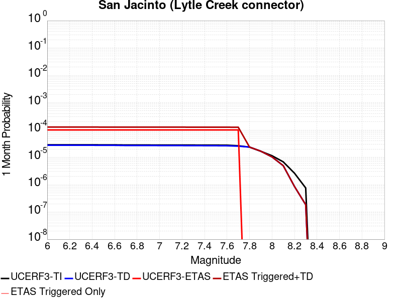 |  | 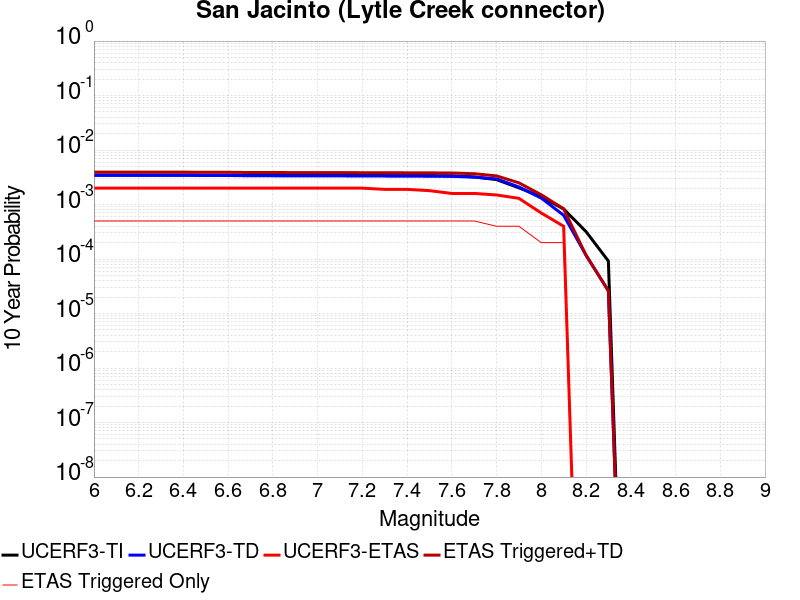 |

| Magnitude | 1 wk TI Prob | 1 wk TD Prob | 1 wk ETAS Prob | 1 wk ETAS/TD Gain | 1 wk ETAS Triggered+TD | 1 wk ETAS Triggered Only | 1 mo TI Prob | 1 mo TD Prob | 1 mo ETAS Prob | 1 mo ETAS/TD Gain | 1 mo ETAS Triggered+TD | 1 mo ETAS Triggered Only | 1 yr TI Prob | 1 yr TD Prob | 1 yr ETAS Prob | 1 yr ETAS/TD Gain | 1 yr ETAS Triggered+TD | 1 yr ETAS Triggered Only | 10 yr TI Prob | 10 yr TD Prob | 10 yr ETAS Prob | 10 yr ETAS/TD Gain | 10 yr ETAS Triggered+TD | 10 yr ETAS Triggered Only |
|-----|-----|-----|-----|-----|-----|-----|-----|-----|-----|-----|-----|-----|-----|-----|-----|-----|-----|-----|-----|-----|-----|-----|-----|-----|
| 6.0 | 6.693995E-6 | 6.4251267E-6 | 0.0 | 0.0 | 6.4251267E-6 | 0.0 | 2.8688235E-5 | 2.7535965E-5 | 1.0E-4 | 3.631614 | 1.2753322E-4 | 1.0E-4 | 3.492233E-4 | 3.3519889E-4 | 1.0E-4 | 0.29833034 | 4.3516536E-4 | 1.0E-4 | 0.00348675 | 0.0034272496 | 1.0E-4 | 0.029177917 | 0.0035269067 | 1.0E-4 |
| 6.1 | 6.693995E-6 | 6.4251267E-6 | 0.0 | 0.0 | 6.4251267E-6 | 0.0 | 2.8688235E-5 | 2.7535965E-5 | 1.0E-4 | 3.631614 | 1.2753322E-4 | 1.0E-4 | 3.492233E-4 | 3.3519889E-4 | 1.0E-4 | 0.29833034 | 4.3516536E-4 | 1.0E-4 | 0.00348675 | 0.0034272496 | 1.0E-4 | 0.029177917 | 0.0035269067 | 1.0E-4 |
| 6.2 | 6.693995E-6 | 6.4251267E-6 | 0.0 | 0.0 | 6.4251267E-6 | 0.0 | 2.8688235E-5 | 2.7535965E-5 | 1.0E-4 | 3.631614 | 1.2753322E-4 | 1.0E-4 | 3.492233E-4 | 3.3519889E-4 | 1.0E-4 | 0.29833034 | 4.3516536E-4 | 1.0E-4 | 0.00348675 | 0.0034272496 | 1.0E-4 | 0.029177917 | 0.0035269067 | 1.0E-4 |
| 6.3 | 6.693995E-6 | 6.4251267E-6 | 0.0 | 0.0 | 6.4251267E-6 | 0.0 | 2.8688235E-5 | 2.7535965E-5 | 1.0E-4 | 3.631614 | 1.2753322E-4 | 1.0E-4 | 3.492233E-4 | 3.3519889E-4 | 1.0E-4 | 0.29833034 | 4.3516536E-4 | 1.0E-4 | 0.00348675 | 0.0034272496 | 1.0E-4 | 0.029177917 | 0.0035269067 | 1.0E-4 |
| 6.4 | 6.693995E-6 | 6.4251267E-6 | 0.0 | 0.0 | 6.4251267E-6 | 0.0 | 2.8688235E-5 | 2.7535965E-5 | 1.0E-4 | 3.631614 | 1.2753322E-4 | 1.0E-4 | 3.492233E-4 | 3.3519889E-4 | 1.0E-4 | 0.29833034 | 4.3516536E-4 | 1.0E-4 | 0.00348675 | 0.0034272496 | 1.0E-4 | 0.029177917 | 0.0035269067 | 1.0E-4 |
| 6.5 | 6.6561875E-6 | 6.3853663E-6 | 0.0 | 0.0 | 6.3853663E-6 | 0.0 | 2.8526205E-5 | 2.7365568E-5 | 1.0E-4 | 3.654227 | 1.2736283E-4 | 1.0E-4 | 3.472512E-4 | 3.3312495E-4 | 1.0E-4 | 0.30018768 | 4.3309163E-4 | 1.0E-4 | 0.0034670907 | 0.0034065738 | 1.0E-4 | 0.029355008 | 0.0035062332 | 1.0E-4 |
| 6.6 | 6.6561875E-6 | 6.3853663E-6 | 0.0 | 0.0 | 6.3853663E-6 | 0.0 | 2.8526205E-5 | 2.7365568E-5 | 1.0E-4 | 3.654227 | 1.2736283E-4 | 1.0E-4 | 3.472512E-4 | 3.3312495E-4 | 1.0E-4 | 0.30018768 | 4.3309163E-4 | 1.0E-4 | 0.0034670907 | 0.0034065738 | 1.0E-4 | 0.029355008 | 0.0035062332 | 1.0E-4 |
| 6.7 | 6.5802237E-6 | 6.304594E-6 | 0.0 | 0.0 | 6.304594E-6 | 0.0 | 2.8200653E-5 | 2.7019409E-5 | 1.0E-4 | 3.7010434 | 1.2701671E-4 | 1.0E-4 | 3.4328885E-4 | 3.289117E-4 | 1.0E-4 | 0.30403295 | 4.2887882E-4 | 1.0E-4 | 0.0034275902 | 0.0033645695 | 1.0E-4 | 0.029721484 | 0.0034642331 | 1.0E-4 |
| 6.8 | 6.575632E-6 | 6.2990957E-6 | 0.0 | 0.0 | 6.2990957E-6 | 0.0 | 2.8180975E-5 | 2.6995844E-5 | 1.0E-4 | 3.7042737 | 1.2699314E-4 | 1.0E-4 | 3.4304935E-4 | 3.286249E-4 | 1.0E-4 | 0.3042983 | 4.2859203E-4 | 1.0E-4 | 0.0034252026 | 0.00336171 | 1.0E-4 | 0.029746763 | 0.003461374 | 1.0E-4 |
| 6.9 | 6.570433E-6 | 6.290521E-6 | 0.0 | 0.0 | 6.290521E-6 | 0.0 | 2.8158694E-5 | 2.6959096E-5 | 1.0E-4 | 3.7093232 | 1.269564E-4 | 1.0E-4 | 3.4277816E-4 | 3.2817764E-4 | 1.0E-4 | 0.304713 | 4.2814482E-4 | 1.0E-4 | 0.0034224992 | 0.003357251 | 1.0E-4 | 0.029786274 | 0.0034569153 | 1.0E-4 |
| 7.0 | 6.5643826E-6 | 6.2806785E-6 | 0.0 | 0.0 | 6.2806785E-6 | 0.0 | 2.8132765E-5 | 2.6916916E-5 | 1.0E-4 | 3.7151358 | 1.2691422E-4 | 1.0E-4 | 3.424626E-4 | 3.2766422E-4 | 1.0E-4 | 0.30519047 | 4.2763146E-4 | 1.0E-4 | 0.0034193532 | 0.0033521326 | 1.0E-4 | 0.029831756 | 0.0034517974 | 1.0E-4 |
| 7.1 | 6.557402E-6 | 6.269428E-6 | 0.0 | 0.0 | 6.269428E-6 | 0.0 | 2.8102848E-5 | 2.68687E-5 | 1.0E-4 | 3.7218027 | 1.2686601E-4 | 1.0E-4 | 3.4209844E-4 | 3.2707737E-4 | 1.0E-4 | 0.30573803 | 4.2704467E-4 | 1.0E-4 | 0.0034157229 | 0.0033462825 | 1.0E-4 | 0.029883908 | 0.003445948 | 1.0E-4 |
| 7.2 | 6.546394E-6 | 6.251467E-6 | 0.0 | 0.0 | 6.251467E-6 | 0.0 | 2.8055672E-5 | 2.6791728E-5 | 1.0E-4 | 3.7324955 | 1.2678905E-4 | 1.0E-4 | 3.4152428E-4 | 3.2614052E-4 | 1.0E-4 | 0.3066163 | 4.261079E-4 | 1.0E-4 | 0.0034099987 | 0.003336947 | 1.0E-4 | 0.029967511 | 0.0034366134 | 1.0E-4 |
| 7.3 | 6.5364216E-6 | 6.232396E-6 | 0.0 | 0.0 | 6.232396E-6 | 0.0 | 2.8012933E-5 | 2.6709997E-5 | 1.0E-4 | 3.7439167 | 1.2670732E-4 | 1.0E-4 | 3.4100408E-4 | 3.2514575E-4 | 1.0E-4 | 0.3075544 | 4.2511325E-4 | 1.0E-4 | 0.003404813 | 0.003327043 | 1.0E-4 | 0.030056719 | 0.0034267104 | 1.0E-4 |
| 7.4 | 6.5269523E-6 | 6.2136583E-6 | 0.0 | 0.0 | 6.2136583E-6 | 0.0 | 2.7972354E-5 | 2.6629692E-5 | 1.0E-4 | 3.7552068 | 1.2662703E-4 | 1.0E-4 | 3.4051016E-4 | 3.2416833E-4 | 1.0E-4 | 0.3084817 | 4.241359E-4 | 1.0E-4 | 0.0033998888 | 0.003317309 | 1.0E-4 | 0.030144915 | 0.0034169774 | 1.0E-4 |
| 7.5 | 6.5111835E-6 | 6.190141E-6 | 0.0 | 0.0 | 6.190141E-6 | 0.0 | 2.7904773E-5 | 2.6528907E-5 | 1.0E-4 | 3.769473 | 1.2652625E-4 | 1.0E-4 | 3.3968766E-4 | 3.2294163E-4 | 1.0E-4 | 0.30965346 | 4.2290933E-4 | 1.0E-4 | 0.0033916887 | 0.0033050892 | 1.0E-4 | 0.03025637 | 0.0034047586 | 1.0E-4 |
| 7.6 | 6.4768806E-6 | 6.1496025E-6 | 0.0 | 0.0 | 6.1496025E-6 | 0.0 | 2.7757764E-5 | 2.6355174E-5 | 1.0E-4 | 3.7943215 | 1.2635253E-4 | 1.0E-4 | 3.3789838E-4 | 3.2082706E-4 | 1.0E-4 | 0.3116944 | 4.2079497E-4 | 1.0E-4 | 0.0033738504 | 0.0032839996 | 1.0E-4 | 0.030450674 | 0.0033836712 | 1.0E-4 |
| 7.7 | 6.1655364E-6 | 5.9450176E-6 | 0.0 | 0.0 | 5.9450176E-6 | 0.0 | 2.642346E-5 | 2.5478399E-5 | 1.0E-4 | 3.9248934 | 1.2547585E-4 | 1.0E-4 | 3.2165812E-4 | 3.1015542E-4 | 1.0E-4 | 0.32241902 | 4.101244E-4 | 1.0E-4 | 0.0032119295 | 0.0031771415 | 1.0E-4 | 0.031474832 | 0.0032768238 | 1.0E-4 |
| 7.8 | 5.5043524E-6 | 5.513173E-6 | 0.0 | 0.0 | 5.513173E-6 | 0.0 | 2.3589868E-5 | 2.362767E-5 | 0.0 | 0.0 | 2.362767E-5 | 0.0 | 2.871688E-4 | 2.8762897E-4 | 0.0 | 0.0 | 2.8762897E-4 | 0.0 | 0.0028679797 | 0.002950916 | 0.0 | 0.0 | 0.002950916 | 0.0 |
| 7.9 | 3.889249E-6 | 3.893841E-6 | 0.0 | 0.0 | 3.893841E-6 | 0.0 | 1.6668104E-5 | 1.6687783E-5 | 0.0 | 0.0 | 1.6687783E-5 | 0.0 | 2.0291525E-4 | 2.0315485E-4 | 0.0 | 0.0 | 2.0315485E-4 | 0.0 | 0.0020273007 | 0.002098645 | 0.0 | 0.0 | 0.002098645 | 0.0 |
| 8.0 | 2.668535E-6 | 2.4034314E-6 | 0.0 | 0.0 | 2.4034314E-6 | 0.0 | 1.1436528E-5 | 1.03003795E-5 | 0.0 | 0.0 | 1.03003795E-5 | 0.0 | 1.3923083E-4 | 1.2539992E-4 | 0.0 | 0.0 | 1.2539992E-4 | 0.0 | 0.0013914363 | 0.0013079548 | 0.0 | 0.0 | 0.0013079548 | 0.0 |
| 8.1 | 1.5911459E-6 | 1.1496724E-6 | 0.0 | 0.0 | 1.1496724E-6 | 0.0 | 6.8191785E-6 | 4.927158E-6 | 0.0 | 0.0 | 4.927158E-6 | 0.0 | 8.3020335E-5 | 5.9986516E-5 | 0.0 | 0.0 | 5.9986516E-5 | 0.0 | 8.298933E-4 | 6.322829E-4 | 0.0 | 0.0 | 6.322829E-4 | 0.0 |
| 8.2 | 6.1294963E-7 | 1.9759129E-7 | 0.0 | 0.0 | 1.9759129E-7 | 0.0 | 2.6269242E-6 | 8.4681955E-7 | 0.0 | 0.0 | 8.4681955E-7 | 0.0 | 3.1982334E-5 | 1.0309979E-5 | 0.0 | 0.0 | 1.0309979E-5 | 0.0 | 3.1977732E-4 | 1.16282965E-4 | 0.0 | 0.0 | 1.16282965E-4 | 0.0 |
| 8.3 | 1.762871E-7 | 4.245016E-8 | 0.0 | 0.0 | 4.245016E-8 | 0.0 | 7.5551594E-7 | 1.8192925E-7 | 0.0 | 0.0 | 1.8192925E-7 | 0.0 | 9.1983675E-6 | 2.2149864E-6 | 0.0 | 0.0 | 2.2149864E-6 | 0.0 | 9.197987E-5 | 2.5753252E-5 | 0.0 | 0.0 | 2.5753252E-5 | 0.0 |

## Panamint Valley
*[(top)](#table-of-contents)*

| 1 Week | 1 Month | 1 Year | 10 Year |
|-----|-----|-----|-----|
|  | 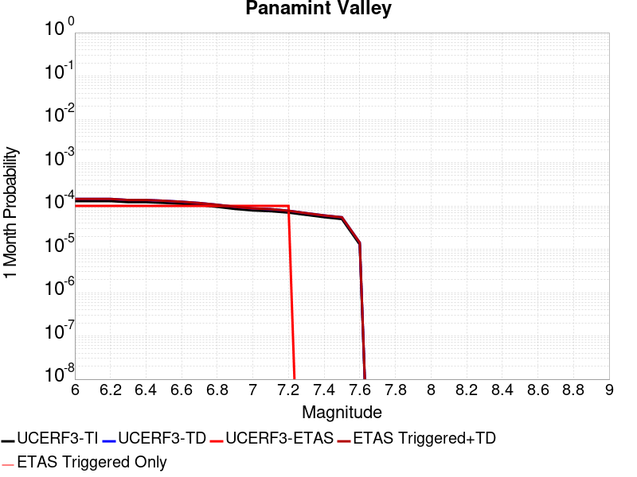 |  |  |

| Magnitude | 1 wk TI Prob | 1 wk TD Prob | 1 wk ETAS Prob | 1 wk ETAS/TD Gain | 1 wk ETAS Triggered+TD | 1 wk ETAS Triggered Only | 1 mo TI Prob | 1 mo TD Prob | 1 mo ETAS Prob | 1 mo ETAS/TD Gain | 1 mo ETAS Triggered+TD | 1 mo ETAS Triggered Only | 1 yr TI Prob | 1 yr TD Prob | 1 yr ETAS Prob | 1 yr ETAS/TD Gain | 1 yr ETAS Triggered+TD | 1 yr ETAS Triggered Only | 10 yr TI Prob | 10 yr TD Prob | 10 yr ETAS Prob | 10 yr ETAS/TD Gain | 10 yr ETAS Triggered+TD | 10 yr ETAS Triggered Only |
|-----|-----|-----|-----|-----|-----|-----|-----|-----|-----|-----|-----|-----|-----|-----|-----|-----|-----|-----|-----|-----|-----|-----|-----|-----|
| 6.0 | 3.0211835E-5 | 3.3884E-5 | 0.0 | 0.0 | 3.3884E-5 | 0.0 | 1.2947287E-4 | 1.4520923E-4 | 0.0 | 0.0 | 1.4520923E-4 | 0.0 | 0.0015751923 | 0.001766518 | 0.0 | 0.0 | 0.001766518 | 0.0 | 0.015640736 | 0.01753238 | 1.0E-4 | 0.005703732 | 0.017630627 | 1.0E-4 |
| 6.1 | 3.0211835E-5 | 3.3884E-5 | 0.0 | 0.0 | 3.3884E-5 | 0.0 | 1.2947287E-4 | 1.4520923E-4 | 0.0 | 0.0 | 1.4520923E-4 | 0.0 | 0.0015751923 | 0.001766518 | 0.0 | 0.0 | 0.001766518 | 0.0 | 0.015640736 | 0.01753238 | 1.0E-4 | 0.005703732 | 0.017630627 | 1.0E-4 |
| 6.2 | 3.0211835E-5 | 3.3884E-5 | 0.0 | 0.0 | 3.3884E-5 | 0.0 | 1.2947287E-4 | 1.4520923E-4 | 0.0 | 0.0 | 1.4520923E-4 | 0.0 | 0.0015751923 | 0.001766518 | 0.0 | 0.0 | 0.001766518 | 0.0 | 0.015640736 | 0.01753238 | 1.0E-4 | 0.005703732 | 0.017630627 | 1.0E-4 |
| 6.3 | 2.8573924E-5 | 3.200564E-5 | 0.0 | 0.0 | 3.200564E-5 | 0.0 | 1.2245393E-4 | 1.3715998E-4 | 0.0 | 0.0 | 1.3715998E-4 | 0.0 | 0.001489857 | 0.0016686713 | 0.0 | 0.0 | 0.0016686713 | 0.0 | 0.01479908 | 0.016568655 | 1.0E-4 | 0.006035493 | 0.016666997 | 1.0E-4 |
| 6.4 | 2.8573924E-5 | 3.200564E-5 | 0.0 | 0.0 | 3.200564E-5 | 0.0 | 1.2245393E-4 | 1.3715998E-4 | 0.0 | 0.0 | 1.3715998E-4 | 0.0 | 0.001489857 | 0.0016686713 | 0.0 | 0.0 | 0.0016686713 | 0.0 | 0.01479908 | 0.016568655 | 1.0E-4 | 0.006035493 | 0.016666997 | 1.0E-4 |
| 6.5 | 2.7468774E-5 | 3.0733812E-5 | 0.0 | 0.0 | 3.0733812E-5 | 0.0 | 1.1771801E-4 | 1.3170984E-4 | 0.0 | 0.0 | 1.3170984E-4 | 0.0 | 0.0014322745 | 0.001602415 | 0.0 | 0.0 | 0.001602415 | 0.0 | 0.014230782 | 0.015915751 | 1.0E-4 | 0.006283084 | 0.016014159 | 1.0E-4 |
| 6.6 | 2.6135967E-5 | 2.9160503E-5 | 0.0 | 0.0 | 2.9160503E-5 | 0.0 | 1.1200648E-4 | 1.2496774E-4 | 0.0 | 0.0 | 1.2496774E-4 | 0.0 | 0.0013628257 | 0.0015204469 | 0.0 | 0.0 | 0.0015204469 | 0.0 | 0.013544982 | 0.015107549 | 1.0E-4 | 0.0066192076 | 0.015206038 | 1.0E-4 |
| 6.7 | 2.4498746E-5 | 2.7250808E-5 | 0.0 | 0.0 | 2.7250808E-5 | 0.0 | 1.04990395E-4 | 1.1678409E-4 | 0.0 | 0.0 | 1.1678409E-4 | 0.0 | 0.0012775084 | 0.0014209439 | 0.0 | 0.0 | 0.0014209439 | 0.0 | 0.012701893 | 0.014125483 | 1.0E-4 | 0.007079404 | 0.01422407 | 1.0E-4 |
| 6.8 | 2.2244329E-5 | 2.4848146E-5 | 0.0 | 0.0 | 2.4848146E-5 | 0.0 | 9.532935E-5 | 1.0648783E-4 | 0.0 | 0.0 | 1.0648783E-4 | 0.0 | 0.0011600169 | 0.00129574 | 0.0 | 0.0 | 0.00129574 | 0.0 | 0.011539802 | 0.012888346 | 1.0E-4 | 0.0077589476 | 0.012987058 | 1.0E-4 |
| 6.9 | 1.9902658E-5 | 2.2207269E-5 | 0.0 | 0.0 | 2.2207269E-5 | 0.0 | 8.529431E-5 | 9.517064E-5 | 0.0 | 0.0 | 9.517064E-5 | 0.0 | 0.0010379635 | 0.001158105 | 0.0 | 0.0 | 0.001158105 | 0.0 | 0.010331288 | 0.011526734 | 0.0 | 0.0 | 0.011526734 | 0.0 |
| 7.0 | 1.8353881E-5 | 2.0486243E-5 | 0.0 | 0.0 | 2.0486243E-5 | 0.0 | 7.865712E-5 | 8.779533E-5 | 0.0 | 0.0 | 8.779533E-5 | 0.0 | 9.5722964E-4 | 0.0010684015 | 0.0 | 0.0 | 0.0010684015 | 0.0 | 0.009531168 | 0.010638366 | 0.0 | 0.0 | 0.010638366 | 0.0 |
| 7.1 | 1.7667631E-5 | 1.9694082E-5 | 0.0 | 0.0 | 1.9694082E-5 | 0.0 | 7.571623E-5 | 8.440057E-5 | 0.0 | 0.0 | 8.440057E-5 | 0.0 | 9.2145515E-4 | 0.00102711 | 0.0 | 0.0 | 0.00102711 | 0.0 | 0.009176437 | 0.010229308 | 0.0 | 0.0 | 0.010229308 | 0.0 |
| 7.2 | 1.6381597E-5 | 1.8084012E-5 | 0.0 | 0.0 | 1.8084012E-5 | 0.0 | 7.020495E-5 | 7.750071E-5 | 0.0 | 0.0 | 7.750071E-5 | 0.0 | 8.544101E-4 | 9.431798E-4 | 0.0 | 0.0 | 9.431798E-4 | 0.0 | 0.008511325 | 0.009397178 | 0.0 | 0.0 | 0.009397178 | 0.0 |
| 7.3 | 1.4520491E-5 | 1.5905964E-5 | 0.0 | 0.0 | 1.5905964E-5 | 0.0 | 6.222919E-5 | 6.816673E-5 | 0.0 | 0.0 | 6.816673E-5 | 0.0 | 7.57377E-4 | 8.2963E-4 | 0.0 | 0.0 | 8.2963E-4 | 0.0 | 0.0075480095 | 0.008269115 | 0.0 | 0.0 | 0.008269115 | 0.0 |
| 7.4 | 1.2852287E-5 | 1.4095156E-5 | 0.0 | 0.0 | 1.4095156E-5 | 0.0 | 5.5080065E-5 | 6.0406503E-5 | 0.0 | 0.0 | 6.0406503E-5 | 0.0 | 6.7039346E-4 | 7.352167E-4 | 0.0 | 0.0 | 7.352167E-4 | 0.0 | 0.0066837464 | 0.007331442 | 0.0 | 0.0 | 0.007331442 | 0.0 |
| 7.5 | 1.1637851E-5 | 1.2789875E-5 | 0.0 | 0.0 | 1.2789875E-5 | 0.0 | 4.987555E-5 | 5.4812685E-5 | 0.0 | 0.0 | 5.4812685E-5 | 0.0 | 6.070656E-4 | 6.6715566E-4 | 0.0 | 0.0 | 6.6715566E-4 | 0.0 | 0.006054099 | 0.006655106 | 0.0 | 0.0 | 0.006655106 | 0.0 |
| 7.6 | 3.0068115E-6 | 3.322222E-6 | 0.0 | 0.0 | 3.322222E-6 | 0.0 | 1.2886271E-5 | 1.4238058E-5 | 0.0 | 0.0 | 1.4238058E-5 | 0.0 | 1.5687906E-4 | 1.7334179E-4 | 0.0 | 0.0 | 1.7334179E-4 | 0.0 | 0.0015676835 | 0.0017343822 | 0.0 | 0.0 | 0.0017343822 | 0.0 |

## White Wolf (Extension)
*[(top)](#table-of-contents)*

| 1 Week | 1 Month | 1 Year | 10 Year |
|-----|-----|-----|-----|
|  |  |  |  |

| Magnitude | 1 wk TI Prob | 1 wk TD Prob | 1 wk ETAS Prob | 1 wk ETAS/TD Gain | 1 wk ETAS Triggered+TD | 1 wk ETAS Triggered Only | 1 mo TI Prob | 1 mo TD Prob | 1 mo ETAS Prob | 1 mo ETAS/TD Gain | 1 mo ETAS Triggered+TD | 1 mo ETAS Triggered Only | 1 yr TI Prob | 1 yr TD Prob | 1 yr ETAS Prob | 1 yr ETAS/TD Gain | 1 yr ETAS Triggered+TD | 1 yr ETAS Triggered Only | 10 yr TI Prob | 10 yr TD Prob | 10 yr ETAS Prob | 10 yr ETAS/TD Gain | 10 yr ETAS Triggered+TD | 10 yr ETAS Triggered Only |
|-----|-----|-----|-----|-----|-----|-----|-----|-----|-----|-----|-----|-----|-----|-----|-----|-----|-----|-----|-----|-----|-----|-----|-----|-----|
| 6.0 | 8.222555E-6 | 6.0631282E-6 | 0.0 | 0.0 | 6.0631282E-6 | 0.0 | 3.5239045E-5 | 2.5984613E-5 | 0.0 | 0.0 | 2.5984613E-5 | 0.0 | 4.289509E-4 | 3.1632336E-4 | 0.0 | 0.0 | 3.1632336E-4 | 0.0 | 0.0042812387 | 0.0031593821 | 1.0E-4 | 0.031651758 | 0.0032590663 | 1.0E-4 |
| 6.1 | 8.222555E-6 | 6.0631282E-6 | 0.0 | 0.0 | 6.0631282E-6 | 0.0 | 3.5239045E-5 | 2.5984613E-5 | 0.0 | 0.0 | 2.5984613E-5 | 0.0 | 4.289509E-4 | 3.1632336E-4 | 0.0 | 0.0 | 3.1632336E-4 | 0.0 | 0.0042812387 | 0.0031593821 | 1.0E-4 | 0.031651758 | 0.0032590663 | 1.0E-4 |
| 6.2 | 8.222555E-6 | 6.0631282E-6 | 0.0 | 0.0 | 6.0631282E-6 | 0.0 | 3.5239045E-5 | 2.5984613E-5 | 0.0 | 0.0 | 2.5984613E-5 | 0.0 | 4.289509E-4 | 3.1632336E-4 | 0.0 | 0.0 | 3.1632336E-4 | 0.0 | 0.0042812387 | 0.0031593821 | 1.0E-4 | 0.031651758 | 0.0032590663 | 1.0E-4 |
| 6.3 | 8.222555E-6 | 6.0631282E-6 | 0.0 | 0.0 | 6.0631282E-6 | 0.0 | 3.5239045E-5 | 2.5984613E-5 | 0.0 | 0.0 | 2.5984613E-5 | 0.0 | 4.289509E-4 | 3.1632336E-4 | 0.0 | 0.0 | 3.1632336E-4 | 0.0 | 0.0042812387 | 0.0031593821 | 1.0E-4 | 0.031651758 | 0.0032590663 | 1.0E-4 |
| 6.4 | 5.821773E-6 | 3.5548255E-6 | 0.0 | 0.0 | 3.5548255E-6 | 0.0 | 2.4950215E-5 | 1.5234884E-5 | 0.0 | 0.0 | 1.5234884E-5 | 0.0 | 3.0372653E-4 | 1.8547002E-4 | 0.0 | 0.0 | 1.8547002E-4 | 0.0 | 0.0030331176 | 0.0018532606 | 0.0 | 0.0 | 0.0018532606 | 0.0 |
| 6.5 | 5.766023E-6 | 3.496785E-6 | 0.0 | 0.0 | 3.496785E-6 | 0.0 | 2.4711293E-5 | 1.4986141E-5 | 0.0 | 0.0 | 1.4986141E-5 | 0.0 | 3.0081844E-4 | 1.8244209E-4 | 0.0 | 0.0 | 1.8244209E-4 | 0.0 | 0.0030041158 | 0.0018230312 | 0.0 | 0.0 | 0.0018230312 | 0.0 |
| 6.6 | 4.643576E-6 | 2.3307762E-6 | 0.0 | 0.0 | 2.3307762E-6 | 0.0 | 1.9900888E-5 | 9.989005E-6 | 0.0 | 0.0 | 9.989005E-6 | 0.0 | 2.4226638E-4 | 1.2160977E-4 | 0.0 | 0.0 | 1.2160977E-4 | 0.0 | 0.0024200242 | 0.0012154747 | 0.0 | 0.0 | 0.0012154747 | 0.0 |
| 6.7 | 3.9529173E-6 | 1.6468016E-6 | 0.0 | 0.0 | 1.6468016E-6 | 0.0 | 1.6940963E-5 | 7.057703E-6 | 0.0 | 0.0 | 7.057703E-6 | 0.0 | 2.0623671E-4 | 8.592434E-5 | 0.0 | 0.0 | 8.592434E-5 | 0.0 | 0.002060454 | 8.5892965E-4 | 0.0 | 0.0 | 8.5892965E-4 | 0.0 |
| 6.8 | 3.4377522E-6 | 1.2232036E-6 | 0.0 | 0.0 | 1.2232036E-6 | 0.0 | 1.473314E-5 | 5.2422915E-6 | 0.0 | 0.0 | 5.2422915E-6 | 0.0 | 1.7936122E-4 | 6.382312E-5 | 0.0 | 0.0 | 6.382312E-5 | 0.0 | 0.0017921652 | 6.38057E-4 | 0.0 | 0.0 | 6.38057E-4 | 0.0 |
| 6.9 | 3.1367306E-6 | 1.0021989E-6 | 0.0 | 0.0 | 1.0021989E-6 | 0.0 | 1.3443062E-5 | 4.295132E-6 | 0.0 | 0.0 | 4.295132E-6 | 0.0 | 1.63657E-4 | 5.2292053E-5 | 0.0 | 0.0 | 5.2292053E-5 | 0.0 | 0.0016353652 | 5.228051E-4 | 0.0 | 0.0 | 5.228051E-4 | 0.0 |
| 7.0 | 2.8298145E-6 | 7.4181105E-7 | 0.0 | 0.0 | 7.4181105E-7 | 0.0 | 1.2127721E-5 | 3.1791865E-6 | 0.0 | 0.0 | 3.1791865E-6 | 0.0 | 1.47645E-4 | 3.870596E-5 | 0.0 | 0.0 | 3.870596E-5 | 0.0 | 0.0014754693 | 3.8699716E-4 | 0.0 | 0.0 | 3.8699716E-4 | 0.0 |
| 7.1 | 2.4091064E-6 | 5.414195E-7 | 0.0 | 0.0 | 5.414195E-7 | 0.0 | 1.03247E-5 | 2.3203675E-6 | 0.0 | 0.0 | 2.3203675E-6 | 0.0 | 1.2569598E-4 | 2.8250148E-5 | 0.0 | 0.0 | 2.8250148E-5 | 0.0 | 0.001256249 | 2.824696E-4 | 0.0 | 0.0 | 2.824696E-4 | 0.0 |
| 7.2 | 1.3875518E-6 | 1.0699991E-7 | 0.0 | 0.0 | 1.0699991E-7 | 0.0 | 5.9466374E-6 | 4.5857098E-7 | 0.0 | 0.0 | 4.5857098E-7 | 0.0 | 7.23979E-5 | 5.5830888E-6 | 0.0 | 0.0 | 5.5830888E-6 | 0.0 | 7.2374323E-4 | 5.5829594E-5 | 0.0 | 0.0 | 5.5829594E-5 | 0.0 |
| 7.3 | 7.056077E-7 | 4.977136E-8 | 0.0 | 0.0 | 4.977136E-8 | 0.0 | 3.0240296E-6 | 2.133058E-7 | 0.0 | 0.0 | 2.133058E-7 | 0.0 | 3.681694E-5 | 2.5969955E-6 | 0.0 | 0.0 | 2.5969955E-6 | 0.0 | 3.681084E-4 | 2.5969697E-5 | 0.0 | 0.0 | 2.5969697E-5 | 0.0 |
| 7.4 | 5.9334678E-8 | 4.8415534E-9 | 0.0 | 0.0 | 4.8415534E-9 | 0.0 | 2.5429145E-7 | 2.0749514E-8 | 0.0 | 0.0 | 2.0749514E-8 | 0.0 | 3.095994E-6 | 2.526253E-7 | 0.0 | 0.0 | 2.526253E-7 | 0.0 | 3.095951E-5 | 2.5262514E-6 | 0.0 | 0.0 | 2.5262514E-6 | 0.0 |

## Hollywood
*[(top)](#table-of-contents)*

| 1 Week | 1 Month | 1 Year | 10 Year |
|-----|-----|-----|-----|
|  |  |  |  |

| Magnitude | 1 wk TI Prob | 1 wk TD Prob | 1 wk ETAS Prob | 1 wk ETAS/TD Gain | 1 wk ETAS Triggered+TD | 1 wk ETAS Triggered Only | 1 mo TI Prob | 1 mo TD Prob | 1 mo ETAS Prob | 1 mo ETAS/TD Gain | 1 mo ETAS Triggered+TD | 1 mo ETAS Triggered Only | 1 yr TI Prob | 1 yr TD Prob | 1 yr ETAS Prob | 1 yr ETAS/TD Gain | 1 yr ETAS Triggered+TD | 1 yr ETAS Triggered Only | 10 yr TI Prob | 10 yr TD Prob | 10 yr ETAS Prob | 10 yr ETAS/TD Gain | 10 yr ETAS Triggered+TD | 10 yr ETAS Triggered Only |
|-----|-----|-----|-----|-----|-----|-----|-----|-----|-----|-----|-----|-----|-----|-----|-----|-----|-----|-----|-----|-----|-----|-----|-----|-----|
| 6.0 | 1.24487615E-5 | 1.2580265E-5 | 0.0 | 0.0 | 1.2580265E-5 | 0.0 | 5.3350745E-5 | 5.3914333E-5 | 1.0E-4 | 1.8547944 | 1.5390894E-4 | 1.0E-4 | 6.4935174E-4 | 6.5621396E-4 | 1.0E-4 | 0.15238932 | 7.5614837E-4 | 1.0E-4 | 0.0064745755 | 0.0065432494 | 1.0E-4 | 0.015282926 | 0.006642595 | 1.0E-4 |
| 6.1 | 1.24487615E-5 | 1.2580265E-5 | 0.0 | 0.0 | 1.2580265E-5 | 0.0 | 5.3350745E-5 | 5.3914333E-5 | 1.0E-4 | 1.8547944 | 1.5390894E-4 | 1.0E-4 | 6.4935174E-4 | 6.5621396E-4 | 1.0E-4 | 0.15238932 | 7.5614837E-4 | 1.0E-4 | 0.0064745755 | 0.0065432494 | 1.0E-4 | 0.015282926 | 0.006642595 | 1.0E-4 |
| 6.2 | 1.24487615E-5 | 1.2580265E-5 | 0.0 | 0.0 | 1.2580265E-5 | 0.0 | 5.3350745E-5 | 5.3914333E-5 | 1.0E-4 | 1.8547944 | 1.5390894E-4 | 1.0E-4 | 6.4935174E-4 | 6.5621396E-4 | 1.0E-4 | 0.15238932 | 7.5614837E-4 | 1.0E-4 | 0.0064745755 | 0.0065432494 | 1.0E-4 | 0.015282926 | 0.006642595 | 1.0E-4 |
| 6.3 | 1.24487615E-5 | 1.2580265E-5 | 0.0 | 0.0 | 1.2580265E-5 | 0.0 | 5.3350745E-5 | 5.3914333E-5 | 1.0E-4 | 1.8547944 | 1.5390894E-4 | 1.0E-4 | 6.4935174E-4 | 6.5621396E-4 | 1.0E-4 | 0.15238932 | 7.5614837E-4 | 1.0E-4 | 0.0064745755 | 0.0065432494 | 1.0E-4 | 0.015282926 | 0.006642595 | 1.0E-4 |
| 6.4 | 1.2431024E-5 | 1.2560898E-5 | 0.0 | 0.0 | 1.2560898E-5 | 0.0 | 5.327473E-5 | 5.3831332E-5 | 1.0E-4 | 1.8576542 | 1.5382595E-4 | 1.0E-4 | 6.4842677E-4 | 6.55204E-4 | 1.0E-4 | 0.15262422 | 7.551385E-4 | 1.0E-4 | 0.0064653796 | 0.0065332097 | 1.0E-4 | 0.015306412 | 0.006632556 | 1.0E-4 |
| 6.5 | 1.1242222E-5 | 1.1305599E-5 | 0.0 | 0.0 | 1.1305599E-5 | 0.0 | 4.8180063E-5 | 4.8451686E-5 | 1.0E-4 | 2.0639117 | 1.4844684E-4 | 1.0E-4 | 5.864344E-4 | 5.8974227E-4 | 1.0E-4 | 0.16956559 | 6.896833E-4 | 1.0E-4 | 0.0058488925 | 0.0058820588 | 1.0E-4 | 0.01700085 | 0.0059814705 | 1.0E-4 |
| 6.6 | 1.1234066E-5 | 1.1296722E-5 | 0.0 | 0.0 | 1.1296722E-5 | 0.0 | 4.8145106E-5 | 4.841364E-5 | 1.0E-4 | 2.0655336 | 1.484088E-4 | 1.0E-4 | 5.86009E-4 | 5.892793E-4 | 1.0E-4 | 0.16969882 | 6.892204E-4 | 1.0E-4 | 0.005844661 | 0.0058774534 | 1.0E-4 | 0.017014172 | 0.0059768655 | 1.0E-4 |
| 6.7 | 1.12294E-5 | 1.1291472E-5 | 0.0 | 0.0 | 1.1291472E-5 | 0.0 | 4.812511E-5 | 4.839114E-5 | 1.0E-4 | 2.066494 | 1.483863E-4 | 1.0E-4 | 5.857657E-4 | 5.8900553E-4 | 1.0E-4 | 0.16977769 | 6.8894663E-4 | 1.0E-4 | 0.0058422405 | 0.00587473 | 1.0E-4 | 0.017022058 | 0.005974143 | 1.0E-4 |
| 6.8 | 1.0252819E-5 | 1.02075255E-5 | 0.0 | 0.0 | 1.02075255E-5 | 0.0 | 4.3939912E-5 | 4.374582E-5 | 1.0E-4 | 2.2859328 | 1.4374145E-4 | 1.0E-4 | 5.3483713E-4 | 5.324773E-4 | 1.0E-4 | 0.18780144 | 6.32424E-4 | 1.0E-4 | 0.005335517 | 0.00531224 | 1.0E-4 | 0.01882445 | 0.0054117087 | 1.0E-4 |
| 6.9 | 9.252289E-6 | 9.100634E-6 | 0.0 | 0.0 | 9.100634E-6 | 0.0 | 3.9652066E-5 | 3.9002145E-5 | 1.0E-4 | 2.5639615 | 1.3899825E-4 | 1.0E-4 | 4.8265693E-4 | 4.7474928E-4 | 1.0E-4 | 0.2106375 | 5.747018E-4 | 1.0E-4 | 0.0048161 | 0.004737524 | 1.0E-4 | 0.021108074 | 0.00483705 | 1.0E-4 |
| 7.0 | 8.474604E-6 | 8.249438E-6 | 0.0 | 0.0 | 8.249438E-6 | 0.0 | 3.6319227E-5 | 3.535426E-5 | 1.0E-4 | 2.8285134 | 1.3535073E-4 | 1.0E-4 | 4.4209688E-4 | 4.3035456E-4 | 1.0E-4 | 0.23236655 | 5.3031155E-4 | 1.0E-4 | 0.004412184 | 0.0042953617 | 1.0E-4 | 0.023280928 | 0.004394932 | 1.0E-4 |
| 7.1 | 6.643643E-6 | 6.2615013E-6 | 0.0 | 0.0 | 6.2615013E-6 | 0.0 | 2.8472443E-5 | 2.6834732E-5 | 1.0E-4 | 3.7265139 | 1.2683205E-4 | 1.0E-4 | 3.4659685E-4 | 3.266643E-4 | 1.0E-4 | 0.30612466 | 4.2663162E-4 | 1.0E-4 | 0.0034605677 | 0.0032618872 | 1.0E-4 | 0.0306571 | 0.003361561 | 1.0E-4 |
| 7.2 | 5.549002E-6 | 5.1028646E-6 | 0.0 | 0.0 | 5.1028646E-6 | 0.0 | 2.378122E-5 | 2.1869237E-5 | 1.0E-4 | 4.5726333 | 1.2186705E-4 | 1.0E-4 | 2.8949787E-4 | 2.6622557E-4 | 1.0E-4 | 0.37562132 | 3.6619895E-4 | 1.0E-4 | 0.0028912104 | 0.0026590829 | 1.0E-4 | 0.03760695 | 0.0027588168 | 1.0E-4 |
| 7.3 | 4.3059727E-6 | 3.9549527E-6 | 0.0 | 0.0 | 3.9549527E-6 | 0.0 | 1.8454039E-5 | 1.6949687E-5 | 1.0E-4 | 5.8998137 | 1.16947995E-4 | 1.0E-4 | 2.2465475E-4 | 2.06343E-4 | 1.0E-4 | 0.48462996 | 3.0632236E-4 | 1.0E-4 | 0.0022442779 | 0.0020615242 | 1.0E-4 | 0.0485078 | 0.002161318 | 1.0E-4 |
| 7.4 | 2.8550733E-6 | 2.6975592E-6 | 0.0 | 0.0 | 2.6975592E-6 | 0.0 | 1.2235971E-5 | 1.1560916E-5 | 1.0E-4 | 8.649833 | 1.1155976E-4 | 1.0E-4 | 1.4896276E-4 | 1.4074512E-4 | 1.0E-4 | 0.71050423 | 2.4073104E-4 | 1.0E-4 | 0.0014886294 | 0.0014065648 | 1.0E-4 | 0.07109519 | 0.0015064242 | 1.0E-4 |
| 7.5 | 1.9927045E-6 | 1.8945904E-6 | 0.0 | 0.0 | 1.8945904E-6 | 0.0 | 8.540134E-6 | 8.119648E-6 | 1.0E-4 | 12.3158045 | 1.0811884E-4 | 1.0E-4 | 1.0397117E-4 | 9.8852266E-5 | 1.0E-4 | 1.0116106 | 1.9884238E-4 | 1.0E-4 | 0.0010392254 | 9.880866E-4 | 1.0E-4 | 0.101205714 | 0.0010879877 | 1.0E-4 |
| 7.6 | 1.345084E-6 | 1.21936E-6 | 0.0 | 0.0 | 1.21936E-6 | 0.0 | 5.764633E-6 | 5.225818E-6 | 1.0E-4 | 19.13576 | 1.0522529E-4 | 1.0E-4 | 7.018215E-5 | 6.3622494E-5 | 1.0E-4 | 1.571771 | 1.6361613E-4 | 1.0E-4 | 7.0159987E-4 | 6.360448E-4 | 1.0E-4 | 0.15722163 | 7.359812E-4 | 1.0E-4 |
| 7.7 | 7.6835164E-7 | 6.2598747E-7 | 0.0 | 0.0 | 6.2598747E-7 | 0.0 | 3.2929315E-6 | 2.6828009E-6 | 1.0E-4 | 37.27448 | 1.02682534E-4 | 1.0E-4 | 4.00907E-5 | 3.2662625E-5 | 1.0E-4 | 3.0616033 | 1.3265936E-4 | 1.0E-4 | 4.0083472E-4 | 3.265797E-4 | 1.0E-4 | 0.30620396 | 4.2654705E-4 | 1.0E-4 |
| 7.8 | 3.6562128E-7 | 2.4380995E-7 | 0.0 | 0.0 | 2.4380995E-7 | 0.0 | 1.5669474E-6 | 1.0448994E-6 | 0.0 | 0.0 | 1.0448994E-6 | 0.0 | 1.9077417E-5 | 1.2721579E-5 | 0.0 | 0.0 | 1.2721579E-5 | 0.0 | 1.907578E-4 | 1.2720887E-4 | 0.0 | 0.0 | 1.2720887E-4 | 0.0 |
| 7.9 | 7.5024424E-8 | 5.354939E-8 | 0.0 | 0.0 | 5.354939E-8 | 0.0 | 3.215332E-7 | 2.2949736E-7 | 0.0 | 0.0 | 2.2949736E-7 | 0.0 | 3.91466E-6 | 2.794128E-6 | 0.0 | 0.0 | 2.794128E-6 | 0.0 | 3.9145907E-5 | 2.7941058E-5 | 0.0 | 0.0 | 2.7941058E-5 | 0.0 |

## Sierra Madre
*[(top)](#table-of-contents)*

| 1 Week | 1 Month | 1 Year | 10 Year |
|-----|-----|-----|-----|
|  | 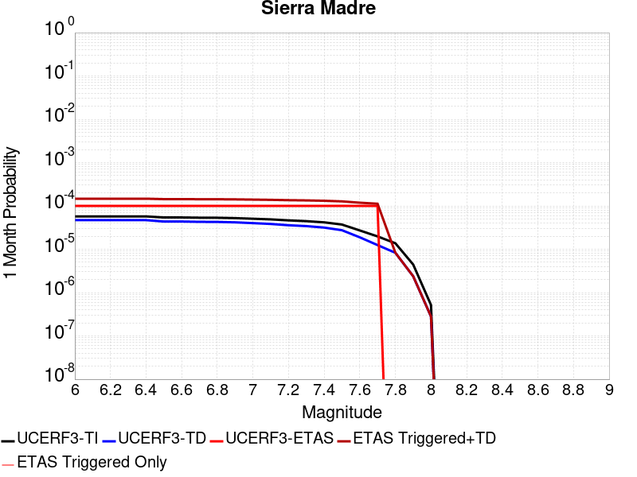 | 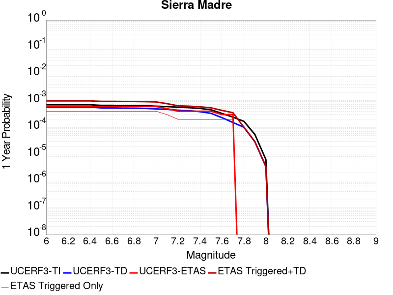 |  |

| Magnitude | 1 wk TI Prob | 1 wk TD Prob | 1 wk ETAS Prob | 1 wk ETAS/TD Gain | 1 wk ETAS Triggered+TD | 1 wk ETAS Triggered Only | 1 mo TI Prob | 1 mo TD Prob | 1 mo ETAS Prob | 1 mo ETAS/TD Gain | 1 mo ETAS Triggered+TD | 1 mo ETAS Triggered Only | 1 yr TI Prob | 1 yr TD Prob | 1 yr ETAS Prob | 1 yr ETAS/TD Gain | 1 yr ETAS Triggered+TD | 1 yr ETAS Triggered Only | 10 yr TI Prob | 10 yr TD Prob | 10 yr ETAS Prob | 10 yr ETAS/TD Gain | 10 yr ETAS Triggered+TD | 10 yr ETAS Triggered Only |
|-----|-----|-----|-----|-----|-----|-----|-----|-----|-----|-----|-----|-----|-----|-----|-----|-----|-----|-----|-----|-----|-----|-----|-----|-----|
| 6.0 | 1.3379373E-5 | 1.0971575E-5 | 0.0 | 0.0 | 1.0971575E-5 | 0.0 | 5.7338908E-5 | 4.7020196E-5 | 1.0E-4 | 2.1267457 | 1.470155E-4 | 1.0E-4 | 6.978776E-4 | 5.72322E-4 | 1.0E-4 | 0.17472683 | 6.722647E-4 | 1.0E-4 | 0.0069569005 | 0.005708669 | 1.0E-4 | 0.017517218 | 0.0058080982 | 1.0E-4 |
| 6.1 | 1.3379373E-5 | 1.0971575E-5 | 0.0 | 0.0 | 1.0971575E-5 | 0.0 | 5.7338908E-5 | 4.7020196E-5 | 1.0E-4 | 2.1267457 | 1.470155E-4 | 1.0E-4 | 6.978776E-4 | 5.72322E-4 | 1.0E-4 | 0.17472683 | 6.722647E-4 | 1.0E-4 | 0.0069569005 | 0.005708669 | 1.0E-4 | 0.017517218 | 0.0058080982 | 1.0E-4 |
| 6.2 | 1.3379373E-5 | 1.0971575E-5 | 0.0 | 0.0 | 1.0971575E-5 | 0.0 | 5.7338908E-5 | 4.7020196E-5 | 1.0E-4 | 2.1267457 | 1.470155E-4 | 1.0E-4 | 6.978776E-4 | 5.72322E-4 | 1.0E-4 | 0.17472683 | 6.722647E-4 | 1.0E-4 | 0.0069569005 | 0.005708669 | 1.0E-4 | 0.017517218 | 0.0058080982 | 1.0E-4 |
| 6.3 | 1.3379373E-5 | 1.0971575E-5 | 0.0 | 0.0 | 1.0971575E-5 | 0.0 | 5.7338908E-5 | 4.7020196E-5 | 1.0E-4 | 2.1267457 | 1.470155E-4 | 1.0E-4 | 6.978776E-4 | 5.72322E-4 | 1.0E-4 | 0.17472683 | 6.722647E-4 | 1.0E-4 | 0.0069569005 | 0.005708669 | 1.0E-4 | 0.017517218 | 0.0058080982 | 1.0E-4 |
| 6.4 | 1.3379373E-5 | 1.0971575E-5 | 0.0 | 0.0 | 1.0971575E-5 | 0.0 | 5.7338908E-5 | 4.7020196E-5 | 1.0E-4 | 2.1267457 | 1.470155E-4 | 1.0E-4 | 6.978776E-4 | 5.72322E-4 | 1.0E-4 | 0.17472683 | 6.722647E-4 | 1.0E-4 | 0.0069569005 | 0.005708669 | 1.0E-4 | 0.017517218 | 0.0058080982 | 1.0E-4 |
| 6.5 | 1.26563245E-5 | 1.0201558E-5 | 0.0 | 0.0 | 1.0201558E-5 | 0.0 | 5.4240263E-5 | 4.372024E-5 | 1.0E-4 | 2.2872703 | 1.4371586E-4 | 1.0E-4 | 6.601751E-4 | 5.32165E-4 | 1.0E-4 | 0.18791164 | 6.3211174E-4 | 1.0E-4 | 0.006582173 | 0.0053090523 | 1.0E-4 | 0.018835753 | 0.0054085217 | 1.0E-4 |
| 6.6 | 1.26563245E-5 | 1.0201558E-5 | 0.0 | 0.0 | 1.0201558E-5 | 0.0 | 5.4240263E-5 | 4.372024E-5 | 1.0E-4 | 2.2872703 | 1.4371586E-4 | 1.0E-4 | 6.601751E-4 | 5.32165E-4 | 1.0E-4 | 0.18791164 | 6.3211174E-4 | 1.0E-4 | 0.006582173 | 0.0053090523 | 1.0E-4 | 0.018835753 | 0.0054085217 | 1.0E-4 |
| 6.7 | 1.2502474E-5 | 1.0037814E-5 | 0.0 | 0.0 | 1.0037814E-5 | 0.0 | 5.3580934E-5 | 4.30185E-5 | 1.0E-4 | 2.3245814 | 1.430142E-4 | 1.0E-4 | 6.521526E-4 | 5.236254E-4 | 1.0E-4 | 0.19097622 | 6.235731E-4 | 1.0E-4 | 0.0065024206 | 0.0052240603 | 1.0E-4 | 0.0191422 | 0.0053235376 | 1.0E-4 |
| 6.8 | 1.2454966E-5 | 9.990137E-6 | 0.0 | 0.0 | 9.990137E-6 | 0.0 | 5.3377335E-5 | 4.2814176E-5 | 1.0E-4 | 2.335675 | 1.4280989E-4 | 1.0E-4 | 6.4967526E-4 | 5.21139E-4 | 1.0E-4 | 0.1918874 | 6.2108686E-4 | 1.0E-4 | 0.006477792 | 0.005199312 | 1.0E-4 | 0.019233312 | 0.0052987924 | 1.0E-4 |
| 6.9 | 1.2225574E-5 | 9.764267E-6 | 0.0 | 0.0 | 9.764267E-6 | 0.0 | 5.2394265E-5 | 4.1846193E-5 | 1.0E-4 | 2.3897038 | 1.4184201E-4 | 1.0E-4 | 6.3771347E-4 | 5.0935935E-4 | 1.0E-4 | 0.19632505 | 6.093084E-4 | 1.0E-4 | 0.006358865 | 0.005082059 | 1.0E-4 | 0.019677063 | 0.005181551 | 1.0E-4 |
| 7.0 | 1.182946E-5 | 9.371078E-6 | 0.0 | 0.0 | 9.371078E-6 | 0.0 | 5.06967E-5 | 4.016115E-5 | 1.0E-4 | 2.4899685 | 1.4015714E-4 | 1.0E-4 | 6.1705755E-4 | 4.888533E-4 | 1.0E-4 | 0.20456034 | 5.888044E-4 | 1.0E-4 | 0.006153469 | 0.0048779156 | 1.0E-4 | 0.02050056 | 0.004977428 | 1.0E-4 |
| 7.1 | 1.14369095E-5 | 8.9588175E-6 | 0.0 | 0.0 | 8.9588175E-6 | 0.0 | 4.9014405E-5 | 3.8394373E-5 | 1.0E-4 | 2.6045485 | 1.3839053E-4 | 1.0E-4 | 5.9658696E-4 | 4.673522E-4 | 1.0E-4 | 0.21397139 | 5.673055E-4 | 1.0E-4 | 0.005949879 | 0.0046638236 | 1.0E-4 | 0.021441635 | 0.0047633573 | 1.0E-4 |
| 7.2 | 1.0836419E-5 | 8.372935E-6 | 0.0 | 0.0 | 8.372935E-6 | 0.0 | 4.644097E-5 | 3.588352E-5 | 1.0E-4 | 2.7867947 | 1.3587993E-4 | 1.0E-4 | 5.652721E-4 | 4.3679518E-4 | 1.0E-4 | 0.22894026 | 5.367515E-4 | 1.0E-4 | 0.0056383642 | 0.0043594884 | 1.0E-4 | 0.022938471 | 0.0044590523 | 1.0E-4 |
| 7.3 | 1.0403439E-5 | 7.994614E-6 | 0.0 | 0.0 | 7.994614E-6 | 0.0 | 4.4585406E-5 | 3.4262186E-5 | 1.0E-4 | 2.9186695 | 1.3425876E-4 | 1.0E-4 | 5.426921E-4 | 4.170632E-4 | 1.0E-4 | 0.23977181 | 5.170215E-4 | 1.0E-4 | 0.005413687 | 0.0041629244 | 1.0E-4 | 0.024021573 | 0.0042625084 | 1.0E-4 |
| 7.4 | 9.768864E-6 | 7.3889805E-6 | 0.0 | 0.0 | 7.3889805E-6 | 0.0 | 4.186589E-5 | 3.166668E-5 | 1.0E-4 | 3.1578934 | 1.3166352E-4 | 1.0E-4 | 5.09598E-4 | 3.8547453E-4 | 1.0E-4 | 0.2594205 | 4.8543597E-4 | 1.0E-4 | 0.0050843097 | 0.0038481748 | 1.0E-4 | 0.025986345 | 0.0039477902 | 1.0E-4 |
| 7.5 | 8.687089E-6 | 6.4261762E-6 | 0.0 | 0.0 | 6.4261762E-6 | 0.0 | 3.722985E-5 | 2.754047E-5 | 1.0E-4 | 3.6310203 | 1.2753771E-4 | 1.0E-4 | 4.5317915E-4 | 3.3525447E-4 | 1.0E-4 | 0.29828086 | 4.3522095E-4 | 1.0E-4 | 0.004522561 | 0.0033475985 | 1.0E-4 | 0.02987216 | 0.0034472637 | 1.0E-4 |
| 7.6 | 6.3506063E-6 | 4.409074E-6 | 0.0 | 0.0 | 4.409074E-6 | 0.0 | 2.72166E-5 | 1.8895895E-5 | 1.0E-4 | 5.2921543 | 1.1889401E-4 | 1.0E-4 | 3.3131172E-4 | 2.300335E-4 | 1.0E-4 | 0.4347193 | 3.300105E-4 | 1.0E-4 | 0.003308182 | 0.0022980026 | 1.0E-4 | 0.04351605 | 0.0023977729 | 1.0E-4 |
| 7.7 | 4.62223E-6 | 2.9145829E-6 | 0.0 | 0.0 | 2.9145829E-6 | 0.0 | 1.9809406E-5 | 1.2491009E-5 | 1.0E-4 | 8.005758 | 1.1248976E-4 | 1.0E-4 | 2.4115283E-4 | 1.5206744E-4 | 1.0E-4 | 0.6576029 | 2.5205224E-4 | 1.0E-4 | 0.0024089129 | 0.0015196567 | 1.0E-4 | 0.06580434 | 0.0016195048 | 1.0E-4 |
| 7.8 | 3.2145008E-6 | 1.9368993E-6 | 0.0 | 0.0 | 1.9368993E-6 | 0.0 | 1.3776359E-5 | 8.30097E-6 | 0.0 | 0.0 | 8.30097E-6 | 0.0 | 1.6771426E-4 | 1.0105964E-4 | 0.0 | 0.0 | 1.0105964E-4 | 0.0 | 0.0016758774 | 0.0010101008 | 0.0 | 0.0 | 0.0010101008 | 0.0 |
| 7.9 | 1.0391769E-6 | 5.568387E-7 | 0.0 | 0.0 | 5.568387E-7 | 0.0 | 4.4536077E-6 | 2.3864495E-6 | 0.0 | 0.0 | 2.3864495E-6 | 0.0 | 5.4221324E-5 | 2.905464E-5 | 0.0 | 0.0 | 2.905464E-5 | 0.0 | 5.4208096E-4 | 2.9050882E-4 | 0.0 | 0.0 | 2.9050882E-4 | 0.0 |
| 8.0 | 1.210983E-7 | 6.576322E-8 | 0.0 | 0.0 | 6.576322E-8 | 0.0 | 5.1899264E-7 | 2.8184235E-7 | 0.0 | 0.0 | 2.8184235E-7 | 0.0 | 6.3187167E-6 | 3.4314253E-6 | 0.0 | 0.0 | 3.4314253E-6 | 0.0 | 6.318537E-5 | 3.431374E-5 | 0.0 | 0.0 | 3.431374E-5 | 0.0 |

## San Jacinto (Coyote Creek)
*[(top)](#table-of-contents)*

| 1 Week | 1 Month | 1 Year | 10 Year |
|-----|-----|-----|-----|
| 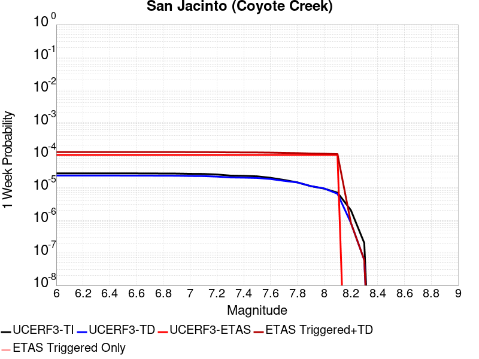 |  |  | 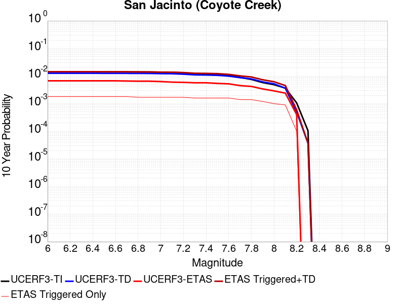 |

| Magnitude | 1 wk TI Prob | 1 wk TD Prob | 1 wk ETAS Prob | 1 wk ETAS/TD Gain | 1 wk ETAS Triggered+TD | 1 wk ETAS Triggered Only | 1 mo TI Prob | 1 mo TD Prob | 1 mo ETAS Prob | 1 mo ETAS/TD Gain | 1 mo ETAS Triggered+TD | 1 mo ETAS Triggered Only | 1 yr TI Prob | 1 yr TD Prob | 1 yr ETAS Prob | 1 yr ETAS/TD Gain | 1 yr ETAS Triggered+TD | 1 yr ETAS Triggered Only | 10 yr TI Prob | 10 yr TD Prob | 10 yr ETAS Prob | 10 yr ETAS/TD Gain | 10 yr ETAS Triggered+TD | 10 yr ETAS Triggered Only |
|-----|-----|-----|-----|-----|-----|-----|-----|-----|-----|-----|-----|-----|-----|-----|-----|-----|-----|-----|-----|-----|-----|-----|-----|-----|
| 6.0 | 2.7374346E-5 | 2.3432753E-5 | 1.0E-4 | 4.267531 | 1.234304E-4 | 1.0E-4 | 1.1731335E-4 | 1.0042223E-4 | 1.0E-4 | 0.9957954 | 2.0041219E-4 | 1.0E-4 | 0.0014273542 | 0.0012219574 | 1.0E-4 | 0.08183591 | 0.0013218352 | 1.0E-4 | 0.01418221 | 0.012556274 | 1.0E-4 | 0.007964145 | 0.012655019 | 1.0E-4 |
| 6.1 | 2.7374346E-5 | 2.3432753E-5 | 1.0E-4 | 4.267531 | 1.234304E-4 | 1.0E-4 | 1.1731335E-4 | 1.0042223E-4 | 1.0E-4 | 0.9957954 | 2.0041219E-4 | 1.0E-4 | 0.0014273542 | 0.0012219574 | 1.0E-4 | 0.08183591 | 0.0013218352 | 1.0E-4 | 0.01418221 | 0.012556274 | 1.0E-4 | 0.007964145 | 0.012655019 | 1.0E-4 |
| 6.2 | 2.7374346E-5 | 2.3432753E-5 | 1.0E-4 | 4.267531 | 1.234304E-4 | 1.0E-4 | 1.1731335E-4 | 1.0042223E-4 | 1.0E-4 | 0.9957954 | 2.0041219E-4 | 1.0E-4 | 0.0014273542 | 0.0012219574 | 1.0E-4 | 0.08183591 | 0.0013218352 | 1.0E-4 | 0.01418221 | 0.012556274 | 1.0E-4 | 0.007964145 | 0.012655019 | 1.0E-4 |
| 6.3 | 2.7374346E-5 | 2.3432753E-5 | 1.0E-4 | 4.267531 | 1.234304E-4 | 1.0E-4 | 1.1731335E-4 | 1.0042223E-4 | 1.0E-4 | 0.9957954 | 2.0041219E-4 | 1.0E-4 | 0.0014273542 | 0.0012219574 | 1.0E-4 | 0.08183591 | 0.0013218352 | 1.0E-4 | 0.01418221 | 0.012556274 | 1.0E-4 | 0.007964145 | 0.012655019 | 1.0E-4 |
| 6.4 | 2.7374346E-5 | 2.3432753E-5 | 1.0E-4 | 4.267531 | 1.234304E-4 | 1.0E-4 | 1.1731335E-4 | 1.0042223E-4 | 1.0E-4 | 0.9957954 | 2.0041219E-4 | 1.0E-4 | 0.0014273542 | 0.0012219574 | 1.0E-4 | 0.08183591 | 0.0013218352 | 1.0E-4 | 0.01418221 | 0.012556274 | 1.0E-4 | 0.007964145 | 0.012655019 | 1.0E-4 |
| 6.5 | 2.7282445E-5 | 2.3319113E-5 | 1.0E-4 | 4.2883277 | 1.2331679E-4 | 1.0E-4 | 1.16919524E-4 | 9.993524E-5 | 1.0E-4 | 1.000648 | 1.9992524E-4 | 1.0E-4 | 0.0014225657 | 0.001216035 | 1.0E-4 | 0.08223448 | 0.0013159134 | 1.0E-4 | 0.014134934 | 0.012497725 | 1.0E-4 | 0.008001456 | 0.012596475 | 1.0E-4 |
| 6.6 | 2.7282445E-5 | 2.3319113E-5 | 1.0E-4 | 4.2883277 | 1.2331679E-4 | 1.0E-4 | 1.16919524E-4 | 9.993524E-5 | 1.0E-4 | 1.000648 | 1.9992524E-4 | 1.0E-4 | 0.0014225657 | 0.001216035 | 1.0E-4 | 0.08223448 | 0.0013159134 | 1.0E-4 | 0.014134934 | 0.012497725 | 1.0E-4 | 0.008001456 | 0.012596475 | 1.0E-4 |
| 6.7 | 2.7216198E-5 | 2.3244427E-5 | 1.0E-4 | 4.3021064 | 1.232421E-4 | 1.0E-4 | 1.1663563E-4 | 9.961518E-5 | 1.0E-4 | 1.0038631 | 1.9960522E-4 | 1.0E-4 | 0.0014191137 | 0.0012121426 | 1.0E-4 | 0.08249854 | 0.0013120214 | 1.0E-4 | 0.014100855 | 0.012459221 | 1.0E-4 | 0.008026184 | 0.012557975 | 1.0E-4 |
| 6.8 | 2.7078617E-5 | 2.316207E-5 | 1.0E-4 | 4.3174033 | 1.2315976E-4 | 1.0E-4 | 1.1604605E-4 | 9.926226E-5 | 1.0E-4 | 1.0074322 | 1.9925233E-4 | 1.0E-4 | 0.001411945 | 0.0012078505 | 1.0E-4 | 0.0827917 | 0.0013077297 | 1.0E-4 | 0.014030075 | 0.012416572 | 1.0E-4 | 0.008053753 | 0.012515331 | 1.0E-4 |
| 6.9 | 2.6982952E-5 | 2.308208E-5 | 1.0E-4 | 4.332365 | 1.2307978E-4 | 1.0E-4 | 1.15636096E-4 | 9.891947E-5 | 1.0E-4 | 1.0109234 | 1.9890958E-4 | 1.0E-4 | 0.0014069602 | 0.0012036817 | 1.0E-4 | 0.083078444 | 0.0013035613 | 1.0E-4 | 0.013980856 | 0.012375174 | 1.0E-4 | 0.008080695 | 0.012473936 | 1.0E-4 |
| 7.0 | 2.6449972E-5 | 2.266081E-5 | 1.0E-4 | 4.4129047 | 1.2265854E-4 | 1.0E-4 | 1.1335209E-4 | 9.7114156E-5 | 1.0E-4 | 1.029716 | 1.9710444E-4 | 1.0E-4 | 0.001379188 | 0.001181726 | 1.0E-4 | 0.08462198 | 0.0012816079 | 1.0E-4 | 0.0137065975 | 0.0121573275 | 1.0E-4 | 0.008225492 | 0.012256112 | 1.0E-4 |
| 7.1 | 2.6257849E-5 | 2.2488342E-5 | 1.0E-4 | 4.4467483 | 1.2248609E-4 | 1.0E-4 | 1.1252879E-4 | 9.6375064E-5 | 1.0E-4 | 1.0376128 | 1.9636542E-4 | 1.0E-4 | 0.0013691769 | 0.0011727373 | 1.0E-4 | 0.08527059 | 0.00127262 | 1.0E-4 | 0.013607717 | 0.012067942 | 1.0E-4 | 0.008286417 | 0.012166735 | 1.0E-4 |
| 7.2 | 2.5270041E-5 | 2.1693011E-5 | 1.0E-4 | 4.6097794 | 1.2169084E-4 | 1.0E-4 | 1.0829568E-4 | 9.296675E-5 | 1.0E-4 | 1.0756534 | 1.9295745E-4 | 1.0E-4 | 0.0013177024 | 0.0011312847 | 1.0E-4 | 0.088395074 | 0.0012311715 | 1.0E-4 | 0.013099162 | 0.011653936 | 1.0E-4 | 0.008580792 | 0.01175277 | 1.0E-4 |
| 7.3 | 2.339701E-5 | 2.0438638E-5 | 1.0E-4 | 4.892694 | 1.2043659E-4 | 1.0E-4 | 1.0026905E-4 | 8.759123E-5 | 1.0E-4 | 1.1416668 | 1.8758247E-4 | 1.0E-4 | 0.001220092 | 0.0010659035 | 1.0E-4 | 0.09381712 | 0.0011657969 | 1.0E-4 | 0.012134149 | 0.010999719 | 1.0E-4 | 0.009091142 | 0.011098619 | 1.0E-4 |
| 7.4 | 2.296333E-5 | 2.01717E-5 | 1.0E-4 | 4.9574404 | 1.2016968E-4 | 1.0E-4 | 9.841056E-5 | 8.644729E-5 | 1.0E-4 | 1.1567743 | 1.8643864E-4 | 1.0E-4 | 0.0011974899 | 0.0010519895 | 1.0E-4 | 0.09505798 | 0.0011518843 | 1.0E-4 | 0.011910575 | 0.010860209 | 1.0E-4 | 0.009207926 | 0.010959123 | 1.0E-4 |
| 7.5 | 2.2188895E-5 | 1.970052E-5 | 1.0E-4 | 5.0760083 | 1.1969855E-4 | 1.0E-4 | 9.50918E-5 | 8.442807E-5 | 1.0E-4 | 1.1844401 | 1.8441962E-4 | 1.0E-4 | 0.0011571277 | 0.001027429 | 1.0E-4 | 0.097330324 | 0.0011273263 | 1.0E-4 | 0.011511209 | 0.010612826 | 1.0E-4 | 0.009422561 | 0.010711764 | 1.0E-4 |
| 7.6 | 2.0013189E-5 | 1.8302539E-5 | 1.0E-4 | 5.4637227 | 1.1830071E-4 | 1.0E-4 | 8.5767984E-5 | 7.84371E-5 | 1.0E-4 | 1.2749069 | 1.7842925E-4 | 1.0E-4 | 0.001043725 | 9.5455506E-4 | 1.0E-4 | 0.104760855 | 0.0010544596 | 1.0E-4 | 0.010388365 | 0.009878712 | 1.0E-4 | 0.010122778 | 0.0099777235 | 1.0E-4 |
| 7.7 | 1.7230794E-5 | 1.6108386E-5 | 1.0E-4 | 6.2079463 | 1.1610678E-4 | 1.0E-4 | 7.384417E-5 | 6.903412E-5 | 1.0E-4 | 1.448559 | 1.6902722E-4 | 1.0E-4 | 8.986819E-4 | 8.401671E-4 | 1.0E-4 | 0.11902394 | 9.4008306E-4 | 1.0E-4 | 0.008950562 | 0.008729697 | 1.0E-4 | 0.01145515 | 0.008828824 | 1.0E-4 |
| 7.8 | 1.4478809E-5 | 1.4381459E-5 | 1.0E-4 | 6.9533973 | 1.1438002E-4 | 1.0E-4 | 6.205057E-5 | 6.163337E-5 | 1.0E-4 | 1.6224977 | 1.616272E-4 | 1.0E-4 | 7.552038E-4 | 7.501285E-4 | 1.0E-4 | 0.13331048 | 8.500535E-4 | 1.0E-4 | 0.0075264242 | 0.007821484 | 1.0E-4 | 0.012785298 | 0.007920702 | 1.0E-4 |
| 7.9 | 1.1114467E-5 | 1.1103332E-5 | 1.0E-4 | 9.006306 | 1.1110222E-4 | 1.0E-4 | 4.7632562E-5 | 4.7584843E-5 | 1.0E-4 | 2.1015093 | 1.4758008E-4 | 1.0E-4 | 5.797721E-4 | 5.79192E-4 | 1.0E-4 | 0.17265432 | 6.791341E-4 | 1.0E-4 | 0.0057826187 | 0.0060953056 | 1.0E-4 | 0.016406069 | 0.006194696 | 1.0E-4 |
| 8.0 | 9.327402E-6 | 9.404994E-6 | 1.0E-4 | 10.632649 | 1.09404056E-4 | 1.0E-4 | 3.9973966E-5 | 4.0306495E-5 | 1.0E-4 | 2.4809897 | 1.4030247E-4 | 1.0E-4 | 4.8657437E-4 | 4.906216E-4 | 1.0E-4 | 0.20382307 | 5.9057254E-4 | 1.0E-4 | 0.0048551033 | 0.0051894397 | 1.0E-4 | 0.019269902 | 0.005288921 | 1.0E-4 |
| 8.1 | 7.0235833E-6 | 6.459538E-6 | 1.0E-4 | 15.480984 | 1.06458894E-4 | 1.0E-4 | 3.0100724E-5 | 2.7683443E-5 | 1.0E-4 | 3.6122675 | 1.2768067E-4 | 1.0E-4 | 3.664147E-4 | 3.3699424E-4 | 1.0E-4 | 0.29674098 | 4.3696054E-4 | 1.0E-4 | 0.003658111 | 0.003592068 | 1.0E-4 | 0.027839117 | 0.003691709 | 1.0E-4 |
| 8.2 | 2.0358202E-6 | 8.234806E-7 | 0.0 | 0.0 | 8.234806E-7 | 0.0 | 8.724915E-6 | 3.529198E-6 | 0.0 | 0.0 | 3.529198E-6 | 0.0 | 1.06220665E-4 | 4.2967156E-5 | 0.0 | 0.0 | 4.2967156E-5 | 0.0 | 0.001061699 | 4.8980064E-4 | 0.0 | 0.0 | 4.8980064E-4 | 0.0 |
| 8.3 | 2.0051264E-7 | 5.978011E-8 | 0.0 | 0.0 | 5.978011E-8 | 0.0 | 8.5933965E-7 | 2.5620045E-7 | 0.0 | 0.0 | 2.5620045E-7 | 0.0 | 1.046241E-5 | 3.1192365E-6 | 0.0 | 0.0 | 3.1192365E-6 | 0.0 | 1.0461917E-4 | 3.6464324E-5 | 0.0 | 0.0 | 3.6464324E-5 | 0.0 |

## Point Reyes 2011 CFM
*[(top)](#table-of-contents)*

| 1 Week | 1 Month | 1 Year | 10 Year |
|-----|-----|-----|-----|
|  |  |  |  |

| Magnitude | 1 wk TI Prob | 1 wk TD Prob | 1 wk ETAS Prob | 1 wk ETAS/TD Gain | 1 wk ETAS Triggered+TD | 1 wk ETAS Triggered Only | 1 mo TI Prob | 1 mo TD Prob | 1 mo ETAS Prob | 1 mo ETAS/TD Gain | 1 mo ETAS Triggered+TD | 1 mo ETAS Triggered Only | 1 yr TI Prob | 1 yr TD Prob | 1 yr ETAS Prob | 1 yr ETAS/TD Gain | 1 yr ETAS Triggered+TD | 1 yr ETAS Triggered Only | 10 yr TI Prob | 10 yr TD Prob | 10 yr ETAS Prob | 10 yr ETAS/TD Gain | 10 yr ETAS Triggered+TD | 10 yr ETAS Triggered Only |
|-----|-----|-----|-----|-----|-----|-----|-----|-----|-----|-----|-----|-----|-----|-----|-----|-----|-----|-----|-----|-----|-----|-----|-----|-----|
| 6.0 | 8.8644965E-6 | 8.963893E-6 | 0.0 | 0.0 | 8.963893E-6 | 0.0 | 3.7990147E-5 | 3.8416154E-5 | 0.0 | 0.0 | 3.8416154E-5 | 0.0 | 4.624319E-4 | 4.676226E-4 | 0.0 | 0.0 | 4.676226E-4 | 0.0 | 0.0046147075 | 0.0046670143 | 1.0E-4 | 0.021426976 | 0.0047665476 | 1.0E-4 |
| 6.1 | 4.526405E-6 | 4.5369065E-6 | 0.0 | 0.0 | 4.5369065E-6 | 0.0 | 1.9398734E-5 | 1.9443745E-5 | 0.0 | 0.0 | 1.9443745E-5 | 0.0 | 2.36154E-4 | 2.3670292E-4 | 0.0 | 0.0 | 2.3670292E-4 | 0.0 | 0.002359032 | 0.0023646143 | 0.0 | 0.0 | 0.0023646143 | 0.0 |
| 6.2 | 4.526405E-6 | 4.5369065E-6 | 0.0 | 0.0 | 4.5369065E-6 | 0.0 | 1.9398734E-5 | 1.9443745E-5 | 0.0 | 0.0 | 1.9443745E-5 | 0.0 | 2.36154E-4 | 2.3670292E-4 | 0.0 | 0.0 | 2.3670292E-4 | 0.0 | 0.002359032 | 0.0023646143 | 0.0 | 0.0 | 0.0023646143 | 0.0 |
| 6.3 | 2.6842322E-6 | 2.6587513E-6 | 0.0 | 0.0 | 2.6587513E-6 | 0.0 | 1.1503801E-5 | 1.13946E-5 | 0.0 | 0.0 | 1.13946E-5 | 0.0 | 1.4004979E-4 | 1.3872061E-4 | 0.0 | 0.0 | 1.3872061E-4 | 0.0 | 0.0013996155 | 0.001386362 | 0.0 | 0.0 | 0.001386362 | 0.0 |
| 6.4 | 2.6842322E-6 | 2.6587513E-6 | 0.0 | 0.0 | 2.6587513E-6 | 0.0 | 1.1503801E-5 | 1.13946E-5 | 0.0 | 0.0 | 1.13946E-5 | 0.0 | 1.4004979E-4 | 1.3872061E-4 | 0.0 | 0.0 | 1.3872061E-4 | 0.0 | 0.0013996155 | 0.001386362 | 0.0 | 0.0 | 0.001386362 | 0.0 |
| 6.5 | 1.9281833E-6 | 1.8888504E-6 | 0.0 | 0.0 | 1.8888504E-6 | 0.0 | 8.263617E-6 | 8.0950485E-6 | 0.0 | 0.0 | 8.0950485E-6 | 0.0 | 1.0060489E-4 | 9.8552846E-5 | 0.0 | 0.0 | 9.8552846E-5 | 0.0 | 0.0010055936 | 9.851023E-4 | 0.0 | 0.0 | 9.851023E-4 | 0.0 |
| 6.6 | 1.4726726E-6 | 1.4252686E-6 | 0.0 | 0.0 | 1.4252686E-6 | 0.0 | 6.3114385E-6 | 6.1082796E-6 | 0.0 | 0.0 | 6.1082796E-6 | 0.0 | 7.683905E-5 | 7.436582E-5 | 0.0 | 0.0 | 7.436582E-5 | 0.0 | 7.6812494E-4 | 7.434165E-4 | 0.0 | 0.0 | 7.434165E-4 | 0.0 |
| 6.7 | 8.572307E-7 | 7.991468E-7 | 0.0 | 0.0 | 7.991468E-7 | 0.0 | 3.6738406E-6 | 3.4249103E-6 | 0.0 | 0.0 | 3.4249103E-6 | 0.0 | 4.472809E-5 | 4.16975E-5 | 0.0 | 0.0 | 4.16975E-5 | 0.0 | 4.471909E-4 | 4.1690073E-4 | 0.0 | 0.0 | 4.1690073E-4 | 0.0 |
| 6.8 | 6.6745434E-7 | 6.061897E-7 | 0.0 | 0.0 | 6.061897E-7 | 0.0 | 2.8605155E-6 | 2.5979532E-6 | 0.0 | 0.0 | 2.5979532E-6 | 0.0 | 3.482622E-5 | 3.1629632E-5 | 0.0 | 0.0 | 3.1629632E-5 | 0.0 | 3.4820763E-4 | 3.1625465E-4 | 0.0 | 0.0 | 3.1625465E-4 | 0.0 |
| 6.9 | 4.291521E-7 | 3.6386228E-7 | 0.0 | 0.0 | 3.6386228E-7 | 0.0 | 1.839222E-6 | 1.5594089E-6 | 0.0 | 0.0 | 1.5594089E-6 | 0.0 | 2.2392298E-5 | 1.8985642E-5 | 0.0 | 0.0 | 1.8985642E-5 | 0.0 | 2.2390042E-4 | 1.8984289E-4 | 0.0 | 0.0 | 1.8984289E-4 | 0.0 |
| 7.0 | 2.6812808E-7 | 2.0040757E-7 | 0.0 | 0.0 | 2.0040757E-7 | 0.0 | 1.1491198E-6 | 8.5888934E-7 | 0.0 | 0.0 | 8.5888934E-7 | 0.0 | 1.3990444E-5 | 1.0456928E-5 | 0.0 | 0.0 | 1.0456928E-5 | 0.0 | 1.3989564E-4 | 1.04566745E-4 | 0.0 | 0.0 | 1.04566745E-4 | 0.0 |
| 7.1 | 1.9451231E-7 | 1.2580303E-7 | 0.0 | 0.0 | 1.2580303E-7 | 0.0 | 8.336239E-7 | 5.3915574E-7 | 0.0 | 0.0 | 5.3915574E-7 | 0.0 | 1.0149324E-5 | 6.564201E-6 | 0.0 | 0.0 | 6.564201E-6 | 0.0 | 1.014886E-4 | 6.564239E-5 | 0.0 | 0.0 | 6.564239E-5 | 0.0 |
| 7.2 | 1.6715143E-7 | 9.899642E-8 | 0.0 | 0.0 | 9.899642E-8 | 0.0 | 7.1636305E-7 | 4.2427033E-7 | 0.0 | 0.0 | 4.2427033E-7 | 0.0 | 8.721685E-6 | 5.165479E-6 | 0.0 | 0.0 | 5.165479E-6 | 0.0 | 8.721343E-5 | 5.1655898E-5 | 0.0 | 0.0 | 5.1655898E-5 | 0.0 |
| 7.3 | 1.5503173E-7 | 8.871935E-8 | 0.0 | 0.0 | 8.871935E-8 | 0.0 | 6.644215E-7 | 3.8022574E-7 | 0.0 | 0.0 | 3.8022574E-7 | 0.0 | 8.089301E-6 | 4.6292384E-6 | 0.0 | 0.0 | 4.6292384E-6 | 0.0 | 8.089007E-5 | 4.6293728E-5 | 0.0 | 0.0 | 4.6293728E-5 | 0.0 |
| 7.4 | 1.4251614E-7 | 7.960195E-8 | 0.0 | 0.0 | 7.960195E-8 | 0.0 | 6.1078333E-7 | 3.4115118E-7 | 0.0 | 0.0 | 3.4115118E-7 | 0.0 | 7.4362615E-6 | 4.1535077E-6 | 0.0 | 0.0 | 4.1535077E-6 | 0.0 | 7.436013E-5 | 4.153661E-5 | 0.0 | 0.0 | 4.153661E-5 | 0.0 |
| 7.5 | 1.2710186E-7 | 6.897576E-8 | 0.0 | 0.0 | 6.897576E-8 | 0.0 | 5.447221E-7 | 2.956104E-7 | 0.0 | 0.0 | 2.956104E-7 | 0.0 | 6.6319717E-6 | 3.5990504E-6 | 0.0 | 0.0 | 3.5990504E-6 | 0.0 | 6.6317734E-5 | 3.5992227E-5 | 0.0 | 0.0 | 3.5992227E-5 | 0.0 |
| 7.6 | 1.0144708E-7 | 5.375214E-8 | 0.0 | 0.0 | 5.375214E-8 | 0.0 | 4.347731E-7 | 2.3036631E-7 | 0.0 | 0.0 | 2.3036631E-7 | 0.0 | 5.2933497E-6 | 2.8047061E-6 | 0.0 | 0.0 | 2.8047061E-6 | 0.0 | 5.293224E-5 | 2.8049015E-5 | 0.0 | 0.0 | 2.8049015E-5 | 0.0 |
| 7.7 | 7.090527E-8 | 3.884654E-8 | 0.0 | 0.0 | 3.884654E-8 | 0.0 | 3.038797E-7 | 1.6648517E-7 | 0.0 | 0.0 | 1.6648517E-7 | 0.0 | 3.699729E-6 | 2.026955E-6 | 0.0 | 0.0 | 2.026955E-6 | 0.0 | 3.6996673E-5 | 2.0271671E-5 | 0.0 | 0.0 | 2.0271671E-5 | 0.0 |
| 7.8 | 3.8712045E-8 | 2.6624814E-8 | 0.0 | 0.0 | 2.6624814E-8 | 0.0 | 1.6590876E-7 | 1.1410634E-7 | 0.0 | 0.0 | 1.1410634E-7 | 0.0 | 2.0199373E-6 | 1.3892438E-6 | 0.0 | 0.0 | 1.3892438E-6 | 0.0 | 2.0199188E-5 | 1.3894659E-5 | 0.0 | 0.0 | 1.3894659E-5 | 0.0 |
| 7.9 | 1.7068782E-8 | 1.1178237E-8 | 0.0 | 0.0 | 1.1178237E-8 | 0.0 | 7.315192E-8 | 4.790673E-8 | 0.0 | 0.0 | 4.790673E-8 | 0.0 | 8.906242E-7 | 5.832643E-7 | 0.0 | 0.0 | 5.832643E-7 | 0.0 | 8.906207E-6 | 5.834935E-6 | 0.0 | 0.0 | 5.834935E-6 | 0.0 |
| 8.0 | 1.0172592E-8 | 6.4811028E-9 | 0.0 | 0.0 | 6.4811028E-9 | 0.0 | 4.359682E-8 | 2.7776158E-8 | 0.0 | 0.0 | 2.7776158E-8 | 0.0 | 5.3079117E-7 | 3.381747E-7 | 0.0 | 0.0 | 3.381747E-7 | 0.0 | 5.307899E-6 | 3.3840493E-6 | 0.0 | 0.0 | 3.3840493E-6 | 0.0 |
| 8.1 | 3.7861243E-9 | 3.2830108E-9 | 0.0 | 0.0 | 3.2830108E-9 | 0.0 | 1.6226247E-8 | 1.4070051E-8 | 0.0 | 0.0 | 1.4070051E-8 | 0.0 | 1.9755454E-7 | 1.7130284E-7 | 0.0 | 0.0 | 1.7130284E-7 | 0.0 | 1.9755437E-6 | 1.7149324E-6 | 0.0 | 0.0 | 1.7149324E-6 | 0.0 |

## San Jacinto (Clark) rev
*[(top)](#table-of-contents)*

| 1 Week | 1 Month | 1 Year | 10 Year |
|-----|-----|-----|-----|
|  | 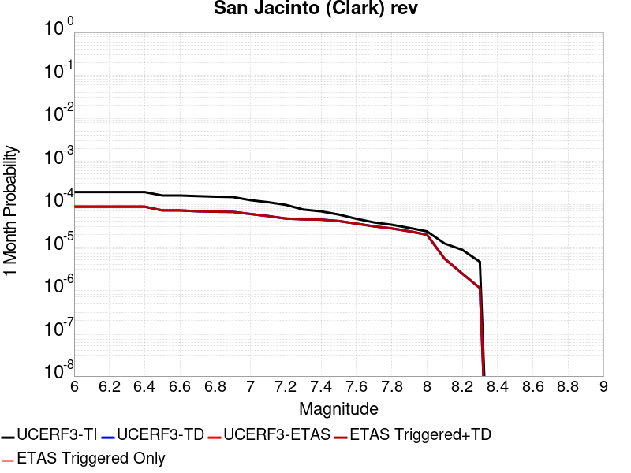 | 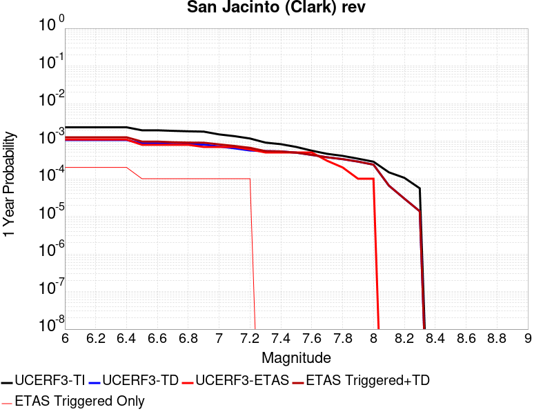 |  |

| Magnitude | 1 wk TI Prob | 1 wk TD Prob | 1 wk ETAS Prob | 1 wk ETAS/TD Gain | 1 wk ETAS Triggered+TD | 1 wk ETAS Triggered Only | 1 mo TI Prob | 1 mo TD Prob | 1 mo ETAS Prob | 1 mo ETAS/TD Gain | 1 mo ETAS Triggered+TD | 1 mo ETAS Triggered Only | 1 yr TI Prob | 1 yr TD Prob | 1 yr ETAS Prob | 1 yr ETAS/TD Gain | 1 yr ETAS Triggered+TD | 1 yr ETAS Triggered Only | 10 yr TI Prob | 10 yr TD Prob | 10 yr ETAS Prob | 10 yr ETAS/TD Gain | 10 yr ETAS Triggered+TD | 10 yr ETAS Triggered Only |
|-----|-----|-----|-----|-----|-----|-----|-----|-----|-----|-----|-----|-----|-----|-----|-----|-----|-----|-----|-----|-----|-----|-----|-----|-----|
| 6.0 | 4.482615E-5 | 2.0430423E-5 | 0.0 | 0.0 | 2.0430423E-5 | 0.0 | 1.9209793E-4 | 8.7556065E-5 | 0.0 | 0.0 | 8.7556065E-5 | 0.0 | 0.0023362834 | 0.0010654826 | 1.0E-4 | 0.09385418 | 0.001165376 | 1.0E-4 | 0.02311874 | 0.011110588 | 1.0E-4 | 0.009000424 | 0.011209477 | 1.0E-4 |
| 6.1 | 4.482615E-5 | 2.0430423E-5 | 0.0 | 0.0 | 2.0430423E-5 | 0.0 | 1.9209793E-4 | 8.7556065E-5 | 0.0 | 0.0 | 8.7556065E-5 | 0.0 | 0.0023362834 | 0.0010654826 | 1.0E-4 | 0.09385418 | 0.001165376 | 1.0E-4 | 0.02311874 | 0.011110588 | 1.0E-4 | 0.009000424 | 0.011209477 | 1.0E-4 |
| 6.2 | 4.482615E-5 | 2.0430423E-5 | 0.0 | 0.0 | 2.0430423E-5 | 0.0 | 1.9209793E-4 | 8.7556065E-5 | 0.0 | 0.0 | 8.7556065E-5 | 0.0 | 0.0023362834 | 0.0010654826 | 1.0E-4 | 0.09385418 | 0.001165376 | 1.0E-4 | 0.02311874 | 0.011110588 | 1.0E-4 | 0.009000424 | 0.011209477 | 1.0E-4 |
| 6.3 | 4.482615E-5 | 2.0430423E-5 | 0.0 | 0.0 | 2.0430423E-5 | 0.0 | 1.9209793E-4 | 8.7556065E-5 | 0.0 | 0.0 | 8.7556065E-5 | 0.0 | 0.0023362834 | 0.0010654826 | 1.0E-4 | 0.09385418 | 0.001165376 | 1.0E-4 | 0.02311874 | 0.011110588 | 1.0E-4 | 0.009000424 | 0.011209477 | 1.0E-4 |
| 6.4 | 4.482615E-5 | 2.0430423E-5 | 0.0 | 0.0 | 2.0430423E-5 | 0.0 | 1.9209793E-4 | 8.7556065E-5 | 0.0 | 0.0 | 8.7556065E-5 | 0.0 | 0.0023362834 | 0.0010654826 | 1.0E-4 | 0.09385418 | 0.001165376 | 1.0E-4 | 0.02311874 | 0.011110588 | 1.0E-4 | 0.009000424 | 0.011209477 | 1.0E-4 |
| 6.5 | 3.7294863E-5 | 1.6706344E-5 | 0.0 | 0.0 | 1.6706344E-5 | 0.0 | 1.5982533E-4 | 7.159668E-5 | 0.0 | 0.0 | 7.159668E-5 | 0.0 | 0.0019441366 | 8.713452E-4 | 0.0 | 0.0 | 8.713452E-4 | 0.0 | 0.01927216 | 0.00914818 | 0.0 | 0.0 | 0.00914818 | 0.0 |
| 6.6 | 3.7294863E-5 | 1.6706344E-5 | 0.0 | 0.0 | 1.6706344E-5 | 0.0 | 1.5982533E-4 | 7.159668E-5 | 0.0 | 0.0 | 7.159668E-5 | 0.0 | 0.0019441366 | 8.713452E-4 | 0.0 | 0.0 | 8.713452E-4 | 0.0 | 0.01927216 | 0.00914818 | 0.0 | 0.0 | 0.00914818 | 0.0 |
| 6.7 | 3.6039248E-5 | 1.59683E-5 | 0.0 | 0.0 | 1.59683E-5 | 0.0 | 1.5444479E-4 | 6.84338E-5 | 0.0 | 0.0 | 6.84338E-5 | 0.0 | 0.0018787434 | 8.3286694E-4 | 0.0 | 0.0 | 8.3286694E-4 | 0.0 | 0.01862939 | 0.008754714 | 0.0 | 0.0 | 0.008754714 | 0.0 |
| 6.8 | 3.5031844E-5 | 1.5607146E-5 | 0.0 | 0.0 | 1.5607146E-5 | 0.0 | 1.5012783E-4 | 6.6886074E-5 | 0.0 | 0.0 | 6.6886074E-5 | 0.0 | 0.0018262739 | 8.140376E-4 | 0.0 | 0.0 | 8.140376E-4 | 0.0 | 0.01811338 | 0.008560842 | 0.0 | 0.0 | 0.008560842 | 0.0 |
| 6.9 | 3.435112E-5 | 1.5442898E-5 | 0.0 | 0.0 | 1.5442898E-5 | 0.0 | 1.4721078E-4 | 6.618219E-5 | 0.0 | 0.0 | 6.618219E-5 | 0.0 | 0.0017908178 | 8.054741E-4 | 0.0 | 0.0 | 8.054741E-4 | 0.0 | 0.017764548 | 0.008471737 | 0.0 | 0.0 | 0.008471737 | 0.0 |
| 7.0 | 2.8959772E-5 | 1.3769847E-5 | 0.0 | 0.0 | 1.3769847E-5 | 0.0 | 1.241074E-4 | 5.9012313E-5 | 0.0 | 0.0 | 5.9012313E-5 | 0.0 | 0.0015099603 | 7.182407E-4 | 0.0 | 0.0 | 7.182407E-4 | 0.0 | 0.014997416 | 0.0075708367 | 0.0 | 0.0 | 0.0075708367 | 0.0 |
| 7.1 | 2.6002877E-5 | 1.2310033E-5 | 0.0 | 0.0 | 1.2310033E-5 | 0.0 | 1.11436144E-4 | 5.2756226E-5 | 0.0 | 0.0 | 5.2756226E-5 | 0.0 | 0.0013558907 | 6.421198E-4 | 0.0 | 0.0 | 6.421198E-4 | 0.0 | 0.013476475 | 0.0067729447 | 0.0 | 0.0 | 0.0067729447 | 0.0 |
| 7.2 | 2.2544838E-5 | 1.0795646E-5 | 0.0 | 0.0 | 1.0795646E-5 | 0.0 | 9.661716E-5 | 4.6266243E-5 | 0.0 | 0.0 | 4.6266243E-5 | 0.0 | 0.001175679 | 5.6314724E-4 | 0.0 | 0.0 | 5.6314724E-4 | 0.0 | 0.011694785 | 0.005944752 | 0.0 | 0.0 | 0.005944752 | 0.0 |
| 7.3 | 1.75334E-5 | 1.0374646E-5 | 0.0 | 0.0 | 1.0374646E-5 | 0.0 | 7.514098E-5 | 4.446202E-5 | 0.0 | 0.0 | 4.446202E-5 | 0.0 | 9.144575E-4 | 5.4119196E-4 | 0.0 | 0.0 | 5.4119196E-4 | 0.0 | 0.009107036 | 0.005700516 | 0.0 | 0.0 | 0.005700516 | 0.0 |
| 7.4 | 1.5924552E-5 | 1.0184866E-5 | 0.0 | 0.0 | 1.0184866E-5 | 0.0 | 6.82463E-5 | 4.3648706E-5 | 0.0 | 0.0 | 4.3648706E-5 | 0.0 | 8.305819E-4 | 5.3129473E-4 | 0.0 | 0.0 | 5.3129473E-4 | 0.0 | 0.008274844 | 0.0055934065 | 0.0 | 0.0 | 0.0055934065 | 0.0 |
| 7.5 | 1.3428931E-5 | 9.445109E-6 | 0.0 | 0.0 | 9.445109E-6 | 0.0 | 5.7551293E-5 | 4.0478415E-5 | 0.0 | 0.0 | 4.0478415E-5 | 0.0 | 7.004617E-4 | 4.927143E-4 | 0.0 | 0.0 | 4.927143E-4 | 0.0 | 0.006982579 | 0.005189663 | 0.0 | 0.0 | 0.005189663 | 0.0 |
| 7.6 | 1.0688787E-5 | 8.229918E-6 | 0.0 | 0.0 | 8.229918E-6 | 0.0 | 4.5808283E-5 | 3.5270605E-5 | 0.0 | 0.0 | 3.5270605E-5 | 0.0 | 5.5757316E-4 | 4.2933546E-4 | 0.0 | 0.0 | 4.2933546E-4 | 0.0 | 0.005561762 | 0.0045361673 | 0.0 | 0.0 | 0.0045361673 | 0.0 |
| 7.7 | 8.81236E-6 | 7.1000795E-6 | 0.0 | 0.0 | 7.1000795E-6 | 0.0 | 3.776671E-5 | 3.0428559E-5 | 0.0 | 0.0 | 3.0428559E-5 | 0.0 | 4.597127E-4 | 3.7040492E-4 | 0.0 | 0.0 | 3.7040492E-4 | 0.0 | 0.0045876284 | 0.003937952 | 0.0 | 0.0 | 0.003937952 | 0.0 |
| 7.8 | 7.780431E-6 | 6.3489674E-6 | 0.0 | 0.0 | 6.3489674E-6 | 0.0 | 3.3344273E-5 | 2.7209579E-5 | 0.0 | 0.0 | 2.7209579E-5 | 0.0 | 4.0589093E-4 | 3.3122642E-4 | 0.0 | 0.0 | 3.3122642E-4 | 0.0 | 0.0040515037 | 0.0035365752 | 0.0 | 0.0 | 0.0035365752 | 0.0 |
| 7.9 | 6.5437994E-6 | 5.4558323E-6 | 0.0 | 0.0 | 5.4558323E-6 | 0.0 | 2.8044553E-5 | 2.338193E-5 | 0.0 | 0.0 | 2.338193E-5 | 0.0 | 3.4138895E-4 | 2.8463796E-4 | 0.0 | 0.0 | 2.8463796E-4 | 0.0 | 0.0034086495 | 0.0030602466 | 0.0 | 0.0 | 0.0030602466 | 0.0 |
| 8.0 | 5.4488164E-6 | 4.52452E-6 | 0.0 | 0.0 | 4.52452E-6 | 0.0 | 2.3351862E-5 | 1.9390656E-5 | 0.0 | 0.0 | 1.9390656E-5 | 0.0 | 2.8427184E-4 | 2.360558E-4 | 0.0 | 0.0 | 2.360558E-4 | 0.0 | 0.0028390845 | 0.0025552472 | 0.0 | 0.0 | 0.0025552472 | 0.0 |
| 8.1 | 2.8397242E-6 | 1.2452609E-6 | 0.0 | 0.0 | 1.2452609E-6 | 0.0 | 1.217019E-5 | 5.3368217E-6 | 0.0 | 0.0 | 5.3368217E-6 | 0.0 | 1.4816198E-4 | 6.497388E-5 | 0.0 | 0.0 | 6.497388E-5 | 0.0 | 0.0014806325 | 7.424613E-4 | 0.0 | 0.0 | 7.424613E-4 | 0.0 |
| 8.2 | 2.030244E-6 | 5.597597E-7 | 0.0 | 0.0 | 5.597597E-7 | 0.0 | 8.701017E-6 | 2.398968E-6 | 0.0 | 0.0 | 2.398968E-6 | 0.0 | 1.05929736E-4 | 2.9207049E-5 | 0.0 | 0.0 | 2.9207049E-5 | 0.0 | 0.0010587925 | 3.5252166E-4 | 0.0 | 0.0 | 3.5252166E-4 | 0.0 |
| 8.3 | 1.0659804E-6 | 2.5734514E-7 | 0.0 | 0.0 | 2.5734514E-7 | 0.0 | 4.568479E-6 | 1.1029073E-6 | 0.0 | 0.0 | 1.1029073E-6 | 0.0 | 5.5619817E-5 | 1.3427816E-5 | 0.0 | 0.0 | 1.3427816E-5 | 0.0 | 5.5605895E-4 | 1.6478398E-4 | 0.0 | 0.0 | 1.6478398E-4 | 0.0 |

## Fish Slough 2011 CFM
*[(top)](#table-of-contents)*

| 1 Week | 1 Month | 1 Year | 10 Year |
|-----|-----|-----|-----|
|  |  | 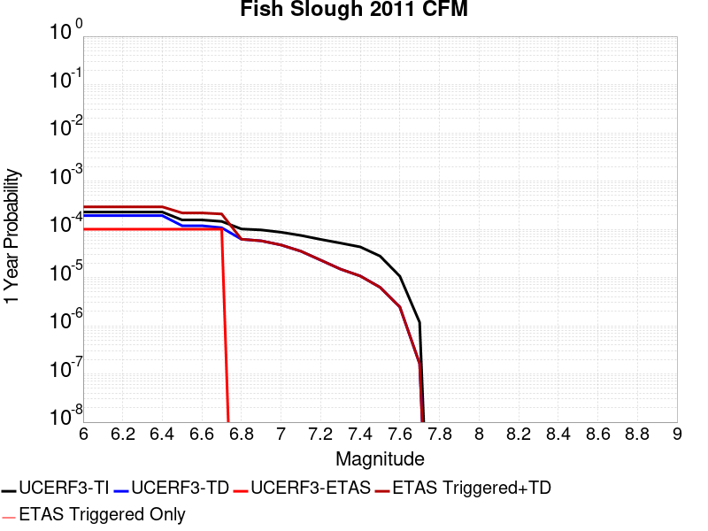 |  |

| Magnitude | 1 wk TI Prob | 1 wk TD Prob | 1 wk ETAS Prob | 1 wk ETAS/TD Gain | 1 wk ETAS Triggered+TD | 1 wk ETAS Triggered Only | 1 mo TI Prob | 1 mo TD Prob | 1 mo ETAS Prob | 1 mo ETAS/TD Gain | 1 mo ETAS Triggered+TD | 1 mo ETAS Triggered Only | 1 yr TI Prob | 1 yr TD Prob | 1 yr ETAS Prob | 1 yr ETAS/TD Gain | 1 yr ETAS Triggered+TD | 1 yr ETAS Triggered Only | 10 yr TI Prob | 10 yr TD Prob | 10 yr ETAS Prob | 10 yr ETAS/TD Gain | 10 yr ETAS Triggered+TD | 10 yr ETAS Triggered Only |
|-----|-----|-----|-----|-----|-----|-----|-----|-----|-----|-----|-----|-----|-----|-----|-----|-----|-----|-----|-----|-----|-----|-----|-----|-----|
| 6.0 | 4.3629925E-6 | 3.6746292E-6 | 0.0 | 0.0 | 3.6746292E-6 | 0.0 | 1.8698405E-5 | 1.5748328E-5 | 0.0 | 0.0 | 1.5748328E-5 | 0.0 | 2.276293E-4 | 1.9172113E-4 | 0.0 | 0.0 | 1.9172113E-4 | 0.0 | 0.0022739628 | 0.0019157663 | 1.0E-4 | 0.052198436 | 0.0020155746 | 1.0E-4 |
| 6.1 | 4.3629925E-6 | 3.6746292E-6 | 0.0 | 0.0 | 3.6746292E-6 | 0.0 | 1.8698405E-5 | 1.5748328E-5 | 0.0 | 0.0 | 1.5748328E-5 | 0.0 | 2.276293E-4 | 1.9172113E-4 | 0.0 | 0.0 | 1.9172113E-4 | 0.0 | 0.0022739628 | 0.0019157663 | 1.0E-4 | 0.052198436 | 0.0020155746 | 1.0E-4 |
| 6.2 | 4.3629925E-6 | 3.6746292E-6 | 0.0 | 0.0 | 3.6746292E-6 | 0.0 | 1.8698405E-5 | 1.5748328E-5 | 0.0 | 0.0 | 1.5748328E-5 | 0.0 | 2.276293E-4 | 1.9172113E-4 | 0.0 | 0.0 | 1.9172113E-4 | 0.0 | 0.0022739628 | 0.0019157663 | 1.0E-4 | 0.052198436 | 0.0020155746 | 1.0E-4 |
| 6.3 | 4.3629925E-6 | 3.6746292E-6 | 0.0 | 0.0 | 3.6746292E-6 | 0.0 | 1.8698405E-5 | 1.5748328E-5 | 0.0 | 0.0 | 1.5748328E-5 | 0.0 | 2.276293E-4 | 1.9172113E-4 | 0.0 | 0.0 | 1.9172113E-4 | 0.0 | 0.0022739628 | 0.0019157663 | 1.0E-4 | 0.052198436 | 0.0020155746 | 1.0E-4 |
| 6.4 | 4.3629925E-6 | 3.6746292E-6 | 0.0 | 0.0 | 3.6746292E-6 | 0.0 | 1.8698405E-5 | 1.5748328E-5 | 0.0 | 0.0 | 1.5748328E-5 | 0.0 | 2.276293E-4 | 1.9172113E-4 | 0.0 | 0.0 | 1.9172113E-4 | 0.0 | 0.0022739628 | 0.0019157663 | 1.0E-4 | 0.052198436 | 0.0020155746 | 1.0E-4 |
| 6.5 | 2.991715E-6 | 2.2681304E-6 | 0.0 | 0.0 | 2.2681304E-6 | 0.0 | 1.2821573E-5 | 9.7205275E-6 | 0.0 | 0.0 | 9.7205275E-6 | 0.0 | 1.5609147E-4 | 1.18341915E-4 | 0.0 | 0.0 | 1.18341915E-4 | 0.0 | 0.0015598187 | 0.0011828791 | 1.0E-4 | 0.084539495 | 0.0012827608 | 1.0E-4 |
| 6.6 | 2.991715E-6 | 2.2681304E-6 | 0.0 | 0.0 | 2.2681304E-6 | 0.0 | 1.2821573E-5 | 9.7205275E-6 | 0.0 | 0.0 | 9.7205275E-6 | 0.0 | 1.5609147E-4 | 1.18341915E-4 | 0.0 | 0.0 | 1.18341915E-4 | 0.0 | 0.0015598187 | 0.0011828791 | 1.0E-4 | 0.084539495 | 0.0012827608 | 1.0E-4 |
| 6.7 | 2.7890346E-6 | 2.059985E-6 | 0.0 | 0.0 | 2.059985E-6 | 0.0 | 1.1952951E-5 | 8.828483E-6 | 0.0 | 0.0 | 8.828483E-6 | 0.0 | 1.4551746E-4 | 1.07482374E-4 | 0.0 | 0.0 | 1.07482374E-4 | 0.0 | 0.0014542221 | 0.0010743921 | 1.0E-4 | 0.09307589 | 0.0011742847 | 1.0E-4 |
| 6.8 | 1.9416723E-6 | 1.1905935E-6 | 0.0 | 0.0 | 1.1905935E-6 | 0.0 | 8.321425E-6 | 5.102534E-6 | 0.0 | 0.0 | 5.102534E-6 | 0.0 | 1.01308644E-4 | 6.212162E-5 | 0.0 | 0.0 | 6.212162E-5 | 0.0 | 0.0010126247 | 6.2104664E-4 | 0.0 | 0.0 | 6.2104664E-4 | 0.0 |
| 6.9 | 1.8567416E-6 | 1.1027666E-6 | 0.0 | 0.0 | 1.1027666E-6 | 0.0 | 7.957439E-6 | 4.7261346E-6 | 0.0 | 0.0 | 4.7261346E-6 | 0.0 | 9.687752E-5 | 5.7539208E-5 | 0.0 | 0.0 | 5.7539208E-5 | 0.0 | 9.6835295E-4 | 5.75247E-4 | 0.0 | 0.0 | 5.75247E-4 | 0.0 |
| 7.0 | 1.6634067E-6 | 9.0554016E-7 | 0.0 | 0.0 | 9.0554016E-7 | 0.0 | 7.1288664E-6 | 3.8808807E-6 | 0.0 | 0.0 | 3.8808807E-6 | 0.0 | 8.679049E-5 | 4.724873E-5 | 0.0 | 0.0 | 4.724873E-5 | 0.0 | 8.6756604E-4 | 4.7238971E-4 | 0.0 | 0.0 | 4.7238971E-4 | 0.0 |
| 7.1 | 1.4281054E-6 | 6.7193105E-7 | 0.0 | 0.0 | 6.7193105E-7 | 0.0 | 6.1204373E-6 | 2.8797012E-6 | 0.0 | 0.0 | 2.8797012E-6 | 0.0 | 7.451377E-5 | 3.5059817E-5 | 0.0 | 0.0 | 3.5059817E-5 | 0.0 | 7.44888E-4 | 3.5054464E-4 | 0.0 | 0.0 | 3.5054464E-4 | 0.0 |
| 7.2 | 1.1810387E-6 | 4.3926684E-7 | 0.0 | 0.0 | 4.3926684E-7 | 0.0 | 5.0615845E-6 | 1.8825709E-6 | 0.0 | 0.0 | 1.8825709E-6 | 0.0 | 6.1623046E-5 | 2.2920069E-5 | 0.0 | 0.0 | 2.2920069E-5 | 0.0 | 6.160596E-4 | 2.2917794E-4 | 0.0 | 0.0 | 2.2917794E-4 | 0.0 |
| 7.3 | 9.918052E-7 | 2.8591708E-7 | 0.0 | 0.0 | 2.8591708E-7 | 0.0 | 4.2505867E-6 | 1.2253583E-6 | 0.0 | 0.0 | 1.2253583E-6 | 0.0 | 5.1749663E-5 | 1.4918637E-5 | 0.0 | 0.0 | 1.4918637E-5 | 0.0 | 5.173762E-4 | 1.4917647E-4 | 0.0 | 0.0 | 1.4917647E-4 | 0.0 |
| 7.4 | 8.25252E-7 | 2.057333E-7 | 0.0 | 0.0 | 2.057333E-7 | 0.0 | 3.5367896E-6 | 8.8171385E-7 | 0.0 | 0.0 | 8.8171385E-7 | 0.0 | 4.3059565E-5 | 1.0734814E-5 | 0.0 | 0.0 | 1.0734814E-5 | 0.0 | 4.305122E-4 | 1.07343025E-4 | 0.0 | 0.0 | 1.07343025E-4 | 0.0 |
| 7.5 | 5.3248567E-7 | 1.1988566E-7 | 0.0 | 0.0 | 1.1988566E-7 | 0.0 | 2.2820795E-6 | 5.1379556E-7 | 0.0 | 0.0 | 5.1379556E-7 | 0.0 | 2.7783964E-5 | 6.255443E-6 | 0.0 | 0.0 | 6.255443E-6 | 0.0 | 2.778049E-4 | 6.255271E-5 | 0.0 | 0.0 | 6.255271E-5 | 0.0 |
| 7.6 | 2.037542E-7 | 4.678543E-8 | 0.0 | 0.0 | 4.678543E-8 | 0.0 | 8.73232E-7 | 2.0050898E-7 | 0.0 | 0.0 | 2.0050898E-7 | 0.0 | 1.0631547E-5 | 2.4411943E-6 | 0.0 | 0.0 | 2.4411943E-6 | 0.0 | 1.0631039E-4 | 2.4411696E-5 | 0.0 | 0.0 | 2.4411696E-5 | 0.0 |
| 7.7 | 2.2501226E-8 | 3.124149E-9 | 0.0 | 0.0 | 3.124149E-9 | 0.0 | 9.6433816E-8 | 1.3389211E-8 | 0.0 | 0.0 | 1.3389211E-8 | 0.0 | 1.1740811E-6 | 1.6301362E-7 | 0.0 | 0.0 | 1.6301362E-7 | 0.0 | 1.1740749E-5 | 1.6301352E-6 | 0.0 | 0.0 | 1.6301352E-6 | 0.0 |

## Sheephole
*[(top)](#table-of-contents)*

| 1 Week | 1 Month | 1 Year | 10 Year |
|-----|-----|-----|-----|
|  |  |  | 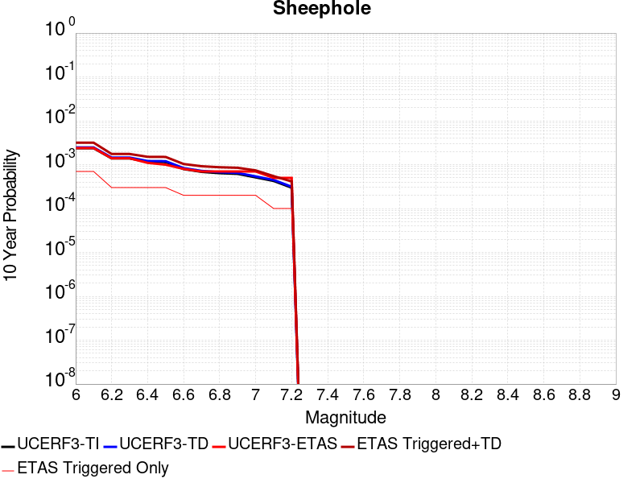 |

| Magnitude | 1 wk TI Prob | 1 wk TD Prob | 1 wk ETAS Prob | 1 wk ETAS/TD Gain | 1 wk ETAS Triggered+TD | 1 wk ETAS Triggered Only | 1 mo TI Prob | 1 mo TD Prob | 1 mo ETAS Prob | 1 mo ETAS/TD Gain | 1 mo ETAS Triggered+TD | 1 mo ETAS Triggered Only | 1 yr TI Prob | 1 yr TD Prob | 1 yr ETAS Prob | 1 yr ETAS/TD Gain | 1 yr ETAS Triggered+TD | 1 yr ETAS Triggered Only | 10 yr TI Prob | 10 yr TD Prob | 10 yr ETAS Prob | 10 yr ETAS/TD Gain | 10 yr ETAS Triggered+TD | 10 yr ETAS Triggered Only |
|-----|-----|-----|-----|-----|-----|-----|-----|-----|-----|-----|-----|-----|-----|-----|-----|-----|-----|-----|-----|-----|-----|-----|-----|-----|
| 6.0 | 4.5579695E-6 | 4.7392687E-6 | 0.0 | 0.0 | 4.7392687E-6 | 0.0 | 1.9534009E-5 | 2.0311025E-5 | 0.0 | 0.0 | 2.0311025E-5 | 0.0 | 2.3780059E-4 | 2.4726422E-4 | 0.0 | 0.0 | 2.4726422E-4 | 0.0 | 0.0023754628 | 0.0024704349 | 1.0E-4 | 0.040478703 | 0.002570188 | 1.0E-4 |
| 6.1 | 4.5579695E-6 | 4.7392687E-6 | 0.0 | 0.0 | 4.7392687E-6 | 0.0 | 1.9534009E-5 | 2.0311025E-5 | 0.0 | 0.0 | 2.0311025E-5 | 0.0 | 2.3780059E-4 | 2.4726422E-4 | 0.0 | 0.0 | 2.4726422E-4 | 0.0 | 0.0023754628 | 0.0024704349 | 1.0E-4 | 0.040478703 | 0.002570188 | 1.0E-4 |
| 6.2 | 2.6677674E-6 | 2.7860874E-6 | 0.0 | 0.0 | 2.7860874E-6 | 0.0 | 1.1433239E-5 | 1.1940326E-5 | 0.0 | 0.0 | 1.1940326E-5 | 0.0 | 1.3919079E-4 | 1.4536484E-4 | 0.0 | 0.0 | 1.4536484E-4 | 0.0 | 0.0013910364 | 0.0014528034 | 1.0E-4 | 0.068832435 | 0.0015526582 | 1.0E-4 |
| 6.3 | 2.6677674E-6 | 2.7860874E-6 | 0.0 | 0.0 | 2.7860874E-6 | 0.0 | 1.1433239E-5 | 1.1940326E-5 | 0.0 | 0.0 | 1.1940326E-5 | 0.0 | 1.3919079E-4 | 1.4536484E-4 | 0.0 | 0.0 | 1.4536484E-4 | 0.0 | 0.0013910364 | 0.0014528034 | 1.0E-4 | 0.068832435 | 0.0015526582 | 1.0E-4 |
| 6.4 | 2.2159759E-6 | 2.3217085E-6 | 0.0 | 0.0 | 2.3217085E-6 | 0.0 | 9.497005E-6 | 9.950146E-6 | 0.0 | 0.0 | 9.950146E-6 | 0.0 | 1.156199E-4 | 1.211371E-4 | 0.0 | 0.0 | 1.211371E-4 | 0.0 | 0.0011555976 | 0.00121079 | 1.0E-4 | 0.08259071 | 0.0013106689 | 1.0E-4 |
| 6.5 | 2.1986082E-6 | 2.303597E-6 | 0.0 | 0.0 | 2.303597E-6 | 0.0 | 9.4225725E-6 | 9.872526E-6 | 0.0 | 0.0 | 9.872526E-6 | 0.0 | 1.1471378E-4 | 1.2019218E-4 | 0.0 | 0.0 | 1.2019218E-4 | 0.0 | 0.0011465458 | 0.0012013509 | 1.0E-4 | 0.08323962 | 0.0013012309 | 1.0E-4 |
| 6.6 | 1.5232331E-6 | 1.6010284E-6 | 0.0 | 0.0 | 1.6010284E-6 | 0.0 | 6.5281256E-6 | 6.8615336E-6 | 0.0 | 0.0 | 6.8615336E-6 | 0.0 | 7.947703E-5 | 8.353616E-5 | 0.0 | 0.0 | 8.353616E-5 | 0.0 | 7.9448614E-4 | 8.3506625E-4 | 0.0 | 0.0 | 8.3506625E-4 | 0.0 |
| 6.7 | 1.3137362E-6 | 1.3820602E-6 | 0.0 | 0.0 | 1.3820602E-6 | 0.0 | 5.6302856E-6 | 5.9231024E-6 | 0.0 | 0.0 | 5.9231024E-6 | 0.0 | 6.854657E-5 | 7.211153E-5 | 0.0 | 0.0 | 7.211153E-5 | 0.0 | 6.8525434E-4 | 7.208951E-4 | 0.0 | 0.0 | 7.208951E-4 | 0.0 |
| 6.8 | 1.2275751E-6 | 1.2915738E-6 | 0.0 | 0.0 | 1.2915738E-6 | 0.0 | 5.2610258E-6 | 5.535305E-6 | 0.0 | 0.0 | 5.535305E-6 | 0.0 | 6.4051106E-5 | 6.739039E-5 | 0.0 | 0.0 | 6.739039E-5 | 0.0 | 6.4032647E-4 | 6.737129E-4 | 0.0 | 0.0 | 6.737129E-4 | 0.0 |
| 6.9 | 1.1837088E-6 | 1.2454166E-6 | 0.0 | 0.0 | 1.2454166E-6 | 0.0 | 5.0730278E-6 | 5.3374893E-6 | 0.0 | 0.0 | 5.3374893E-6 | 0.0 | 6.176237E-5 | 6.498213E-5 | 0.0 | 0.0 | 6.498213E-5 | 0.0 | 6.17452E-4 | 6.496444E-4 | 0.0 | 0.0 | 6.496444E-4 | 0.0 |
| 7.0 | 9.849371E-7 | 1.036061E-6 | 0.0 | 0.0 | 1.036061E-6 | 0.0 | 4.2211523E-6 | 4.4402545E-6 | 0.0 | 0.0 | 4.4402545E-6 | 0.0 | 5.1391315E-5 | 5.405886E-5 | 0.0 | 0.0 | 5.405886E-5 | 0.0 | 5.137943E-4 | 5.4046715E-4 | 0.0 | 0.0 | 5.4046715E-4 | 0.0 |
| 7.1 | 8.1643645E-7 | 8.586976E-7 | 0.0 | 0.0 | 8.586976E-7 | 0.0 | 3.4990085E-6 | 3.680128E-6 | 0.0 | 0.0 | 3.680128E-6 | 0.0 | 4.2599597E-5 | 4.4804725E-5 | 0.0 | 0.0 | 4.4804725E-5 | 0.0 | 4.259143E-4 | 4.4796552E-4 | 0.0 | 0.0 | 4.4796552E-4 | 0.0 |
| 7.2 | 5.7295756E-7 | 6.026208E-7 | 0.0 | 0.0 | 6.026208E-7 | 0.0 | 2.45553E-6 | 2.5826585E-6 | 0.0 | 0.0 | 2.5826585E-6 | 0.0 | 2.9895667E-5 | 3.144348E-5 | 0.0 | 0.0 | 3.144348E-5 | 0.0 | 2.9891645E-4 | 3.1439698E-4 | 0.0 | 0.0 | 3.1439698E-4 | 0.0 |

## Pisgah-Bullion Mtn-Mesquite Lk
*[(top)](#table-of-contents)*

| 1 Week | 1 Month | 1 Year | 10 Year |
|-----|-----|-----|-----|
|  |  |  |  |

| Magnitude | 1 wk TI Prob | 1 wk TD Prob | 1 wk ETAS Prob | 1 wk ETAS/TD Gain | 1 wk ETAS Triggered+TD | 1 wk ETAS Triggered Only | 1 mo TI Prob | 1 mo TD Prob | 1 mo ETAS Prob | 1 mo ETAS/TD Gain | 1 mo ETAS Triggered+TD | 1 mo ETAS Triggered Only | 1 yr TI Prob | 1 yr TD Prob | 1 yr ETAS Prob | 1 yr ETAS/TD Gain | 1 yr ETAS Triggered+TD | 1 yr ETAS Triggered Only | 10 yr TI Prob | 10 yr TD Prob | 10 yr ETAS Prob | 10 yr ETAS/TD Gain | 10 yr ETAS Triggered+TD | 10 yr ETAS Triggered Only |
|-----|-----|-----|-----|-----|-----|-----|-----|-----|-----|-----|-----|-----|-----|-----|-----|-----|-----|-----|-----|-----|-----|-----|-----|-----|
| 6.0 | 3.0240792E-5 | 2.40515E-5 | 0.0 | 0.0 | 2.40515E-5 | 0.0 | 1.2959696E-4 | 1.0307435E-4 | 0.0 | 0.0 | 1.0307435E-4 | 0.0 | 0.0015767008 | 0.0012543082 | 1.0E-4 | 0.07972523 | 0.0013541827 | 1.0E-4 | 0.015655609 | 0.012482278 | 1.0E-4 | 0.008011358 | 0.01258103 | 1.0E-4 |
| 6.1 | 3.0240792E-5 | 2.40515E-5 | 0.0 | 0.0 | 2.40515E-5 | 0.0 | 1.2959696E-4 | 1.0307435E-4 | 0.0 | 0.0 | 1.0307435E-4 | 0.0 | 0.0015767008 | 0.0012543082 | 1.0E-4 | 0.07972523 | 0.0013541827 | 1.0E-4 | 0.015655609 | 0.012482278 | 1.0E-4 | 0.008011358 | 0.01258103 | 1.0E-4 |
| 6.2 | 3.0240792E-5 | 2.40515E-5 | 0.0 | 0.0 | 2.40515E-5 | 0.0 | 1.2959696E-4 | 1.0307435E-4 | 0.0 | 0.0 | 1.0307435E-4 | 0.0 | 0.0015767008 | 0.0012543082 | 1.0E-4 | 0.07972523 | 0.0013541827 | 1.0E-4 | 0.015655609 | 0.012482278 | 1.0E-4 | 0.008011358 | 0.01258103 | 1.0E-4 |
| 6.3 | 2.0498217E-5 | 1.3614233E-5 | 0.0 | 0.0 | 1.3614233E-5 | 0.0 | 8.784654E-5 | 5.8345497E-5 | 0.0 | 0.0 | 5.8345497E-5 | 0.0 | 0.0010690069 | 7.101411E-4 | 1.0E-4 | 0.14081709 | 8.100701E-4 | 1.0E-4 | 0.01063879 | 0.0070803408 | 1.0E-4 | 0.014123614 | 0.0071796323 | 1.0E-4 |
| 6.4 | 2.0498217E-5 | 1.3614233E-5 | 0.0 | 0.0 | 1.3614233E-5 | 0.0 | 8.784654E-5 | 5.8345497E-5 | 0.0 | 0.0 | 5.8345497E-5 | 0.0 | 0.0010690069 | 7.101411E-4 | 1.0E-4 | 0.14081709 | 8.100701E-4 | 1.0E-4 | 0.01063879 | 0.0070803408 | 1.0E-4 | 0.014123614 | 0.0071796323 | 1.0E-4 |
| 6.5 | 1.7316182E-5 | 1.0457165E-5 | 0.0 | 0.0 | 1.0457165E-5 | 0.0 | 7.42101E-5 | 4.4815708E-5 | 0.0 | 0.0 | 4.4815708E-5 | 0.0 | 9.0313336E-4 | 5.455046E-4 | 1.0E-4 | 0.1833165 | 6.454501E-4 | 1.0E-4 | 0.008994718 | 0.005442649 | 1.0E-4 | 0.018373406 | 0.005542105 | 1.0E-4 |
| 6.6 | 1.5251077E-5 | 8.39713E-6 | 0.0 | 0.0 | 8.39713E-6 | 0.0 | 6.536012E-5 | 3.5987243E-5 | 0.0 | 0.0 | 3.5987243E-5 | 0.0 | 7.9546886E-4 | 4.380638E-4 | 0.0 | 0.0 | 4.380638E-4 | 0.0 | 0.007926274 | 0.0043727187 | 0.0 | 0.0 | 0.0043727187 | 0.0 |
| 6.7 | 1.2997425E-5 | 6.400255E-6 | 0.0 | 0.0 | 6.400255E-6 | 0.0 | 5.570206E-5 | 2.7429403E-5 | 0.0 | 0.0 | 2.7429403E-5 | 0.0 | 6.7796157E-4 | 3.3390647E-4 | 0.0 | 0.0 | 3.3390647E-4 | 0.0 | 0.0067589693 | 0.003334507 | 0.0 | 0.0 | 0.003334507 | 0.0 |
| 6.8 | 1.035386E-5 | 4.3247396E-6 | 0.0 | 0.0 | 4.3247396E-6 | 0.0 | 4.437293E-5 | 1.853447E-5 | 0.0 | 0.0 | 1.853447E-5 | 0.0 | 5.401065E-4 | 2.2563469E-4 | 0.0 | 0.0 | 2.2563469E-4 | 0.0 | 0.0053879567 | 0.0022541427 | 0.0 | 0.0 | 0.0022541427 | 0.0 |
| 6.9 | 8.816252E-6 | 3.573541E-6 | 0.0 | 0.0 | 3.573541E-6 | 0.0 | 3.778339E-5 | 1.531509E-5 | 0.0 | 0.0 | 1.531509E-5 | 0.0 | 4.5991567E-4 | 1.8644585E-4 | 0.0 | 0.0 | 1.8644585E-4 | 0.0 | 0.00458965 | 0.0018629526 | 0.0 | 0.0 | 0.0018629526 | 0.0 |
| 7.0 | 6.8232207E-6 | 2.562117E-6 | 0.0 | 0.0 | 2.562117E-6 | 0.0 | 2.9242048E-5 | 1.0980458E-5 | 0.0 | 0.0 | 1.0980458E-5 | 0.0 | 3.5596377E-4 | 1.3367918E-4 | 0.0 | 0.0 | 1.3367918E-4 | 0.0 | 0.0035539411 | 0.0013360187 | 0.0 | 0.0 | 0.0013360187 | 0.0 |
| 7.1 | 5.837013E-6 | 2.222822E-6 | 0.0 | 0.0 | 2.222822E-6 | 0.0 | 2.501553E-5 | 9.526347E-6 | 0.0 | 0.0 | 9.526347E-6 | 0.0 | 3.045215E-4 | 1.159774E-4 | 0.0 | 0.0 | 1.159774E-4 | 0.0 | 0.0030410455 | 0.0011591977 | 0.0 | 0.0 | 0.0011591977 | 0.0 |
| 7.2 | 4.278052E-6 | 1.6244172E-6 | 0.0 | 0.0 | 1.6244172E-6 | 0.0 | 1.833438E-5 | 6.961771E-6 | 0.0 | 0.0 | 6.961771E-6 | 0.0 | 2.231982E-4 | 8.47565E-5 | 0.0 | 0.0 | 8.47565E-5 | 0.0 | 0.0022297418 | 8.472649E-4 | 0.0 | 0.0 | 8.472649E-4 | 0.0 |
| 7.3 | 1.8803692E-6 | 8.329639E-7 | 0.0 | 0.0 | 8.329639E-7 | 0.0 | 8.0587E-6 | 3.5698413E-6 | 0.0 | 0.0 | 3.5698413E-6 | 0.0 | 9.811026E-5 | 4.34621E-5 | 0.0 | 0.0 | 4.34621E-5 | 0.0 | 9.806695E-4 | 4.345504E-4 | 0.0 | 0.0 | 4.345504E-4 | 0.0 |

## Pitas Point (Lower)-Montalvo
*[(top)](#table-of-contents)*

| 1 Week | 1 Month | 1 Year | 10 Year |
|-----|-----|-----|-----|
|  |  |  |  |

| Magnitude | 1 wk TI Prob | 1 wk TD Prob | 1 wk ETAS Prob | 1 wk ETAS/TD Gain | 1 wk ETAS Triggered+TD | 1 wk ETAS Triggered Only | 1 mo TI Prob | 1 mo TD Prob | 1 mo ETAS Prob | 1 mo ETAS/TD Gain | 1 mo ETAS Triggered+TD | 1 mo ETAS Triggered Only | 1 yr TI Prob | 1 yr TD Prob | 1 yr ETAS Prob | 1 yr ETAS/TD Gain | 1 yr ETAS Triggered+TD | 1 yr ETAS Triggered Only | 10 yr TI Prob | 10 yr TD Prob | 10 yr ETAS Prob | 10 yr ETAS/TD Gain | 10 yr ETAS Triggered+TD | 10 yr ETAS Triggered Only |
|-----|-----|-----|-----|-----|-----|-----|-----|-----|-----|-----|-----|-----|-----|-----|-----|-----|-----|-----|-----|-----|-----|-----|-----|-----|
| 6.0 | 5.2543637E-6 | 4.8333795E-6 | 0.0 | 0.0 | 4.8333795E-6 | 0.0 | 2.2518509E-5 | 2.071432E-5 | 0.0 | 0.0 | 2.071432E-5 | 0.0 | 2.7412834E-4 | 2.5216799E-4 | 0.0 | 0.0 | 2.5216799E-4 | 0.0 | 0.0027379042 | 0.0025188508 | 1.0E-4 | 0.039700642 | 0.002618599 | 1.0E-4 |
| 6.1 | 5.2543637E-6 | 4.8333795E-6 | 0.0 | 0.0 | 4.8333795E-6 | 0.0 | 2.2518509E-5 | 2.071432E-5 | 0.0 | 0.0 | 2.071432E-5 | 0.0 | 2.7412834E-4 | 2.5216799E-4 | 0.0 | 0.0 | 2.5216799E-4 | 0.0 | 0.0027379042 | 0.0025188508 | 1.0E-4 | 0.039700642 | 0.002618599 | 1.0E-4 |
| 6.2 | 5.2543637E-6 | 4.8333795E-6 | 0.0 | 0.0 | 4.8333795E-6 | 0.0 | 2.2518509E-5 | 2.071432E-5 | 0.0 | 0.0 | 2.071432E-5 | 0.0 | 2.7412834E-4 | 2.5216799E-4 | 0.0 | 0.0 | 2.5216799E-4 | 0.0 | 0.0027379042 | 0.0025188508 | 1.0E-4 | 0.039700642 | 0.002618599 | 1.0E-4 |
| 6.3 | 5.2543637E-6 | 4.8333795E-6 | 0.0 | 0.0 | 4.8333795E-6 | 0.0 | 2.2518509E-5 | 2.071432E-5 | 0.0 | 0.0 | 2.071432E-5 | 0.0 | 2.7412834E-4 | 2.5216799E-4 | 0.0 | 0.0 | 2.5216799E-4 | 0.0 | 0.0027379042 | 0.0025188508 | 1.0E-4 | 0.039700642 | 0.002618599 | 1.0E-4 |
| 6.4 | 5.2543637E-6 | 4.8333795E-6 | 0.0 | 0.0 | 4.8333795E-6 | 0.0 | 2.2518509E-5 | 2.071432E-5 | 0.0 | 0.0 | 2.071432E-5 | 0.0 | 2.7412834E-4 | 2.5216799E-4 | 0.0 | 0.0 | 2.5216799E-4 | 0.0 | 0.0027379042 | 0.0025188508 | 1.0E-4 | 0.039700642 | 0.002618599 | 1.0E-4 |
| 6.5 | 5.2543637E-6 | 4.8333795E-6 | 0.0 | 0.0 | 4.8333795E-6 | 0.0 | 2.2518509E-5 | 2.071432E-5 | 0.0 | 0.0 | 2.071432E-5 | 0.0 | 2.7412834E-4 | 2.5216799E-4 | 0.0 | 0.0 | 2.5216799E-4 | 0.0 | 0.0027379042 | 0.0025188508 | 1.0E-4 | 0.039700642 | 0.002618599 | 1.0E-4 |
| 6.6 | 5.2543637E-6 | 4.8333795E-6 | 0.0 | 0.0 | 4.8333795E-6 | 0.0 | 2.2518509E-5 | 2.071432E-5 | 0.0 | 0.0 | 2.071432E-5 | 0.0 | 2.7412834E-4 | 2.5216799E-4 | 0.0 | 0.0 | 2.5216799E-4 | 0.0 | 0.0027379042 | 0.0025188508 | 1.0E-4 | 0.039700642 | 0.002618599 | 1.0E-4 |
| 6.7 | 5.2543637E-6 | 4.8333795E-6 | 0.0 | 0.0 | 4.8333795E-6 | 0.0 | 2.2518509E-5 | 2.071432E-5 | 0.0 | 0.0 | 2.071432E-5 | 0.0 | 2.7412834E-4 | 2.5216799E-4 | 0.0 | 0.0 | 2.5216799E-4 | 0.0 | 0.0027379042 | 0.0025188508 | 1.0E-4 | 0.039700642 | 0.002618599 | 1.0E-4 |
| 6.8 | 5.2543637E-6 | 4.8333795E-6 | 0.0 | 0.0 | 4.8333795E-6 | 0.0 | 2.2518509E-5 | 2.071432E-5 | 0.0 | 0.0 | 2.071432E-5 | 0.0 | 2.7412834E-4 | 2.5216799E-4 | 0.0 | 0.0 | 2.5216799E-4 | 0.0 | 0.0027379042 | 0.0025188508 | 1.0E-4 | 0.039700642 | 0.002618599 | 1.0E-4 |
| 6.9 | 5.2543637E-6 | 4.8333795E-6 | 0.0 | 0.0 | 4.8333795E-6 | 0.0 | 2.2518509E-5 | 2.071432E-5 | 0.0 | 0.0 | 2.071432E-5 | 0.0 | 2.7412834E-4 | 2.5216799E-4 | 0.0 | 0.0 | 2.5216799E-4 | 0.0 | 0.0027379042 | 0.0025188508 | 1.0E-4 | 0.039700642 | 0.002618599 | 1.0E-4 |
| 7.0 | 5.2543637E-6 | 4.8333795E-6 | 0.0 | 0.0 | 4.8333795E-6 | 0.0 | 2.2518509E-5 | 2.071432E-5 | 0.0 | 0.0 | 2.071432E-5 | 0.0 | 2.7412834E-4 | 2.5216799E-4 | 0.0 | 0.0 | 2.5216799E-4 | 0.0 | 0.0027379042 | 0.0025188508 | 1.0E-4 | 0.039700642 | 0.002618599 | 1.0E-4 |
| 7.1 | 5.2543637E-6 | 4.8333795E-6 | 0.0 | 0.0 | 4.8333795E-6 | 0.0 | 2.2518509E-5 | 2.071432E-5 | 0.0 | 0.0 | 2.071432E-5 | 0.0 | 2.7412834E-4 | 2.5216799E-4 | 0.0 | 0.0 | 2.5216799E-4 | 0.0 | 0.0027379042 | 0.0025188508 | 1.0E-4 | 0.039700642 | 0.002618599 | 1.0E-4 |
| 7.2 | 5.2458695E-6 | 4.824537E-6 | 0.0 | 0.0 | 4.824537E-6 | 0.0 | 2.2482105E-5 | 2.0676425E-5 | 0.0 | 0.0 | 2.0676425E-5 | 0.0 | 2.7368523E-4 | 2.5170672E-4 | 0.0 | 0.0 | 2.5170672E-4 | 0.0 | 0.0027334841 | 0.0025142487 | 1.0E-4 | 0.039773315 | 0.0026139973 | 1.0E-4 |
| 7.3 | 5.22665E-6 | 4.804464E-6 | 0.0 | 0.0 | 4.804464E-6 | 0.0 | 2.2399736E-5 | 2.0590398E-5 | 0.0 | 0.0 | 2.0590398E-5 | 0.0 | 2.7268266E-4 | 2.5065956E-4 | 0.0 | 0.0 | 2.5065956E-4 | 0.0 | 0.002723483 | 0.002503801 | 1.0E-4 | 0.039939277 | 0.0026035504 | 1.0E-4 |
| 7.4 | 5.210642E-6 | 4.7876847E-6 | 0.0 | 0.0 | 4.7876847E-6 | 0.0 | 2.233113E-5 | 2.051849E-5 | 0.0 | 0.0 | 2.051849E-5 | 0.0 | 2.718476E-4 | 2.4978427E-4 | 0.0 | 0.0 | 2.4978427E-4 | 0.0 | 0.002715153 | 0.0024950677 | 1.0E-4 | 0.040079072 | 0.0025948181 | 1.0E-4 |
| 7.5 | 5.1226016E-6 | 4.6956156E-6 | 0.0 | 0.0 | 4.6956156E-6 | 0.0 | 2.1953823E-5 | 2.0123915E-5 | 0.0 | 0.0 | 2.0123915E-5 | 0.0 | 2.67255E-4 | 2.449814E-4 | 0.0 | 0.0 | 2.449814E-4 | 0.0 | 0.0026693381 | 0.002447145 | 1.0E-4 | 0.040863942 | 0.0025469004 | 1.0E-4 |
| 7.6 | 4.8796987E-6 | 4.4406534E-6 | 0.0 | 0.0 | 4.4406534E-6 | 0.0 | 2.0912828E-5 | 1.9031235E-5 | 0.0 | 0.0 | 1.9031235E-5 | 0.0 | 2.5458392E-4 | 2.3168094E-4 | 0.0 | 0.0 | 2.3168094E-4 | 0.0 | 0.0025429246 | 0.0023144246 | 0.0 | 0.0 | 0.0023144246 | 0.0 |
| 7.7 | 4.0834398E-6 | 3.6053289E-6 | 0.0 | 0.0 | 3.6053289E-6 | 0.0 | 1.7500339E-5 | 1.545132E-5 | 0.0 | 0.0 | 1.545132E-5 | 0.0 | 2.1304579E-4 | 1.881038E-4 | 0.0 | 0.0 | 1.881038E-4 | 0.0 | 0.0021284167 | 0.0018794696 | 0.0 | 0.0 | 0.0018794696 | 0.0 |
| 7.8 | 2.5445438E-6 | 2.1189444E-6 | 0.0 | 0.0 | 2.1189444E-6 | 0.0 | 1.0905142E-5 | 9.081159E-6 | 0.0 | 0.0 | 9.081159E-6 | 0.0 | 1.3276201E-4 | 1.1055754E-4 | 0.0 | 0.0 | 1.1055754E-4 | 0.0 | 0.0013268272 | 0.0011050301 | 0.0 | 0.0 | 0.0011050301 | 0.0 |
| 7.9 | 4.1677114E-7 | 3.3268338E-7 | 0.0 | 0.0 | 3.3268338E-7 | 0.0 | 1.7861609E-6 | 1.4257852E-6 | 0.0 | 0.0 | 1.4257852E-6 | 0.0 | 2.1746291E-5 | 1.73588E-5 | 0.0 | 0.0 | 1.73588E-5 | 0.0 | 2.1744163E-4 | 1.7357474E-4 | 0.0 | 0.0 | 1.7357474E-4 | 0.0 |
| 8.0 | 7.791402E-9 | 5.678961E-9 | 0.0 | 0.0 | 5.678961E-9 | 0.0 | 3.3391725E-8 | 2.4338403E-8 | 0.0 | 0.0 | 2.4338403E-8 | 0.0 | 4.0654416E-7 | 2.9632005E-7 | 0.0 | 0.0 | 2.9632005E-7 | 0.0 | 4.065434E-6 | 2.9631985E-6 | 0.0 | 0.0 | 2.9631985E-6 | 0.0 |

## Raymond
*[(top)](#table-of-contents)*

| 1 Week | 1 Month | 1 Year | 10 Year |
|-----|-----|-----|-----|
| 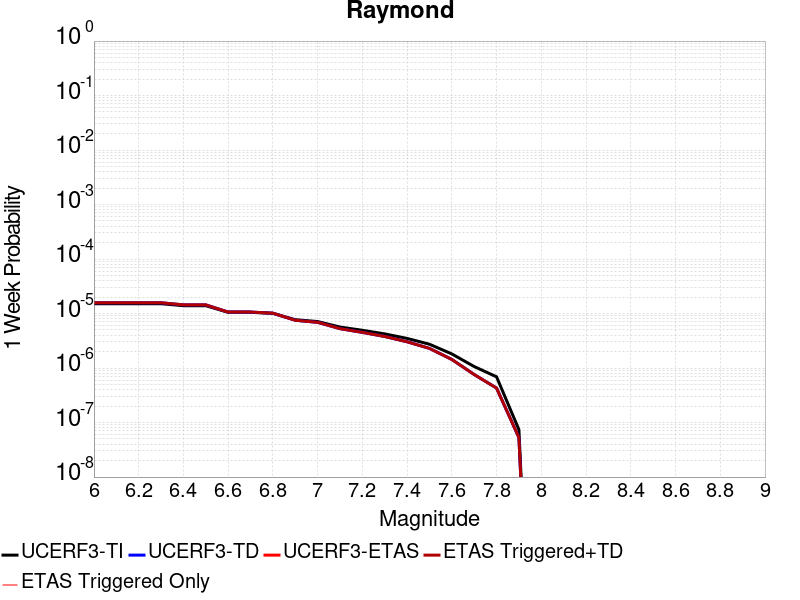 |  |  |  |

| Magnitude | 1 wk TI Prob | 1 wk TD Prob | 1 wk ETAS Prob | 1 wk ETAS/TD Gain | 1 wk ETAS Triggered+TD | 1 wk ETAS Triggered Only | 1 mo TI Prob | 1 mo TD Prob | 1 mo ETAS Prob | 1 mo ETAS/TD Gain | 1 mo ETAS Triggered+TD | 1 mo ETAS Triggered Only | 1 yr TI Prob | 1 yr TD Prob | 1 yr ETAS Prob | 1 yr ETAS/TD Gain | 1 yr ETAS Triggered+TD | 1 yr ETAS Triggered Only | 10 yr TI Prob | 10 yr TD Prob | 10 yr ETAS Prob | 10 yr ETAS/TD Gain | 10 yr ETAS Triggered+TD | 10 yr ETAS Triggered Only |
|-----|-----|-----|-----|-----|-----|-----|-----|-----|-----|-----|-----|-----|-----|-----|-----|-----|-----|-----|-----|-----|-----|-----|-----|-----|
| 6.0 | 1.5157413E-5 | 1.5789088E-5 | 0.0 | 0.0 | 1.5789088E-5 | 0.0 | 6.4958724E-5 | 6.7665904E-5 | 1.0E-4 | 1.4778491 | 1.6765913E-4 | 1.0E-4 | 7.905855E-4 | 8.23546E-4 | 1.0E-4 | 0.12142612 | 9.2346367E-4 | 1.0E-4 | 0.007877788 | 0.0082074525 | 1.0E-4 | 0.012184049 | 0.008306632 | 1.0E-4 |
| 6.1 | 1.5157413E-5 | 1.5789088E-5 | 0.0 | 0.0 | 1.5789088E-5 | 0.0 | 6.4958724E-5 | 6.7665904E-5 | 1.0E-4 | 1.4778491 | 1.6765913E-4 | 1.0E-4 | 7.905855E-4 | 8.23546E-4 | 1.0E-4 | 0.12142612 | 9.2346367E-4 | 1.0E-4 | 0.007877788 | 0.0082074525 | 1.0E-4 | 0.012184049 | 0.008306632 | 1.0E-4 |
| 6.2 | 1.5157413E-5 | 1.5789088E-5 | 0.0 | 0.0 | 1.5789088E-5 | 0.0 | 6.4958724E-5 | 6.7665904E-5 | 1.0E-4 | 1.4778491 | 1.6765913E-4 | 1.0E-4 | 7.905855E-4 | 8.23546E-4 | 1.0E-4 | 0.12142612 | 9.2346367E-4 | 1.0E-4 | 0.007877788 | 0.0082074525 | 1.0E-4 | 0.012184049 | 0.008306632 | 1.0E-4 |
| 6.3 | 1.5157413E-5 | 1.5789088E-5 | 0.0 | 0.0 | 1.5789088E-5 | 0.0 | 6.4958724E-5 | 6.7665904E-5 | 1.0E-4 | 1.4778491 | 1.6765913E-4 | 1.0E-4 | 7.905855E-4 | 8.23546E-4 | 1.0E-4 | 0.12142612 | 9.2346367E-4 | 1.0E-4 | 0.007877788 | 0.0082074525 | 1.0E-4 | 0.012184049 | 0.008306632 | 1.0E-4 |
| 6.4 | 1.3941944E-5 | 1.4435279E-5 | 0.0 | 0.0 | 1.4435279E-5 | 0.0 | 5.9749822E-5 | 6.186414E-5 | 1.0E-4 | 1.6164452 | 1.6185796E-4 | 1.0E-4 | 7.2721124E-4 | 7.5295893E-4 | 1.0E-4 | 0.13280937 | 8.528836E-4 | 1.0E-4 | 0.007248361 | 0.0075064045 | 1.0E-4 | 0.013321957 | 0.007605654 | 1.0E-4 |
| 6.5 | 1.3941944E-5 | 1.4435279E-5 | 0.0 | 0.0 | 1.4435279E-5 | 0.0 | 5.9749822E-5 | 6.186414E-5 | 1.0E-4 | 1.6164452 | 1.6185796E-4 | 1.0E-4 | 7.2721124E-4 | 7.5295893E-4 | 1.0E-4 | 0.13280937 | 8.528836E-4 | 1.0E-4 | 0.007248361 | 0.0075064045 | 1.0E-4 | 0.013321957 | 0.007605654 | 1.0E-4 |
| 6.6 | 1.0542609E-5 | 1.0656161E-5 | 0.0 | 0.0 | 1.0656161E-5 | 0.0 | 4.5181827E-5 | 4.5668494E-5 | 1.0E-4 | 2.1896935 | 1.4566393E-4 | 1.0E-4 | 5.499499E-4 | 5.558775E-4 | 1.0E-4 | 0.17989574 | 6.5582193E-4 | 1.0E-4 | 0.005485909 | 0.0055454294 | 1.0E-4 | 0.01803287 | 0.0056448746 | 1.0E-4 |
| 6.7 | 1.0542609E-5 | 1.0656161E-5 | 0.0 | 0.0 | 1.0656161E-5 | 0.0 | 4.5181827E-5 | 4.5668494E-5 | 1.0E-4 | 2.1896935 | 1.4566393E-4 | 1.0E-4 | 5.499499E-4 | 5.558775E-4 | 1.0E-4 | 0.17989574 | 6.5582193E-4 | 1.0E-4 | 0.005485909 | 0.0055454294 | 1.0E-4 | 0.01803287 | 0.0056448746 | 1.0E-4 |
| 6.8 | 1.0079132E-5 | 1.0162047E-5 | 0.0 | 0.0 | 1.0162047E-5 | 0.0 | 4.3195567E-5 | 4.3550932E-5 | 1.0E-4 | 2.2961621 | 1.4354658E-4 | 1.0E-4 | 5.257791E-4 | 5.30109E-4 | 1.0E-4 | 0.18864046 | 6.3005596E-4 | 1.0E-4 | 0.0052453685 | 0.005288991 | 1.0E-4 | 0.018907197 | 0.0053884625 | 1.0E-4 |
| 6.9 | 7.721598E-6 | 7.5374787E-6 | 0.0 | 0.0 | 7.5374787E-6 | 0.0 | 3.3092143E-5 | 3.2303087E-5 | 1.0E-4 | 3.0956793 | 1.3229986E-4 | 1.0E-4 | 4.0282236E-4 | 3.9322034E-4 | 1.0E-4 | 0.25431034 | 4.93181E-4 | 1.0E-4 | 0.0040209293 | 0.003925378 | 1.0E-4 | 0.025475254 | 0.0040249852 | 1.0E-4 |
| 7.0 | 7.137566E-6 | 6.9004946E-6 | 0.0 | 0.0 | 6.9004946E-6 | 0.0 | 3.058921E-5 | 2.9573219E-5 | 1.0E-4 | 3.3814378 | 1.2957027E-4 | 1.0E-4 | 3.7236E-4 | 3.5999552E-4 | 1.0E-4 | 0.27778122 | 4.5995953E-4 | 1.0E-4 | 0.0037173668 | 0.0035942406 | 1.0E-4 | 0.027822288 | 0.0036938812 | 1.0E-4 |
| 7.1 | 5.654976E-6 | 5.2901996E-6 | 0.0 | 0.0 | 5.2901996E-6 | 0.0 | 2.4235387E-5 | 2.2672088E-5 | 1.0E-4 | 4.41071 | 1.2266982E-4 | 1.0E-4 | 2.9502588E-4 | 2.759979E-4 | 1.0E-4 | 0.3623216 | 3.7597032E-4 | 1.0E-4 | 0.0029463451 | 0.0027565814 | 1.0E-4 | 0.036276817 | 0.0028563058 | 1.0E-4 |
| 7.2 | 4.9358455E-6 | 4.5180914E-6 | 0.0 | 0.0 | 4.5180914E-6 | 0.0 | 2.1153453E-5 | 1.9363106E-5 | 1.0E-4 | 5.1644607 | 1.1936117E-4 | 1.0E-4 | 2.5751285E-4 | 2.3572045E-4 | 1.0E-4 | 0.42423132 | 3.3569688E-4 | 1.0E-4 | 0.0025721465 | 0.0023547253 | 1.0E-4 | 0.0424678 | 0.0024544897 | 1.0E-4 |
| 7.3 | 4.2368597E-6 | 3.7976688E-6 | 0.0 | 0.0 | 3.7976688E-6 | 0.0 | 1.8157843E-5 | 1.6275622E-5 | 1.0E-4 | 6.1441584 | 1.1627399E-4 | 1.0E-4 | 2.2104931E-4 | 1.9813779E-4 | 1.0E-4 | 0.5046993 | 2.98118E-4 | 1.0E-4 | 0.0022082955 | 0.001979629 | 1.0E-4 | 0.050514515 | 0.002079431 | 1.0E-4 |
| 7.4 | 3.4999923E-6 | 3.0365104E-6 | 0.0 | 0.0 | 3.0365104E-6 | 0.0 | 1.49998805E-5 | 1.3013551E-5 | 1.0E-4 | 7.6842976 | 1.1301225E-4 | 1.0E-4 | 1.8260824E-4 | 1.5842855E-4 | 1.0E-4 | 0.63119936 | 2.584127E-4 | 1.0E-4 | 0.0018245826 | 0.0015831707 | 1.0E-4 | 0.06316438 | 0.0016830123 | 1.0E-4 |
| 7.5 | 2.738017E-6 | 2.2960107E-6 | 0.0 | 0.0 | 2.2960107E-6 | 0.0 | 1.1734306E-5 | 9.84001E-6 | 1.0E-4 | 10.162592 | 1.0983903E-4 | 1.0E-4 | 1.428558E-4 | 1.197956E-4 | 1.0E-4 | 0.83475524 | 2.1978361E-4 | 1.0E-4 | 0.0014276401 | 0.0011973236 | 1.0E-4 | 0.083519615 | 0.0012972037 | 1.0E-4 |
| 7.6 | 1.8186392E-6 | 1.4379914E-6 | 0.0 | 0.0 | 1.4379914E-6 | 0.0 | 7.794145E-6 | 6.1628057E-6 | 1.0E-4 | 16.226376 | 1.0616219E-4 | 1.0E-4 | 9.488958E-5 | 7.502962E-5 | 1.0E-4 | 1.3328071 | 1.7502211E-4 | 1.0E-4 | 9.4849075E-4 | 7.500533E-4 | 1.0E-4 | 0.13332386 | 8.499783E-4 | 1.0E-4 |
| 7.7 | 1.0660348E-6 | 7.609158E-7 | 0.0 | 0.0 | 7.609158E-7 | 0.0 | 4.5687125E-6 | 3.2610637E-6 | 1.0E-4 | 30.66484 | 1.0326074E-4 | 1.0E-4 | 5.5622655E-5 | 3.9702743E-5 | 1.0E-4 | 2.5187175 | 1.3969878E-4 | 1.0E-4 | 5.5608735E-4 | 3.9696458E-4 | 1.0E-4 | 0.25191164 | 4.9692485E-4 | 1.0E-4 |
| 7.8 | 6.913602E-7 | 4.2910082E-7 | 0.0 | 0.0 | 4.2910082E-7 | 0.0 | 2.962969E-6 | 1.8390023E-6 | 0.0 | 0.0 | 1.8390023E-6 | 0.0 | 3.607355E-5 | 2.238963E-5 | 0.0 | 0.0 | 2.238963E-5 | 0.0 | 3.6067693E-4 | 2.2388056E-4 | 0.0 | 0.0 | 2.2388056E-4 | 0.0 |
| 7.9 | 7.425201E-8 | 5.2954892E-8 | 0.0 | 0.0 | 5.2954892E-8 | 0.0 | 3.1822285E-7 | 2.2694954E-7 | 0.0 | 0.0 | 2.2694954E-7 | 0.0 | 3.874356E-6 | 2.7631083E-6 | 0.0 | 0.0 | 2.7631083E-6 | 0.0 | 3.8742884E-5 | 2.763087E-5 | 0.0 | 0.0 | 2.763087E-5 | 0.0 |

## Bear River fault zone
*[(top)](#table-of-contents)*

| 1 Week | 1 Month | 1 Year | 10 Year |
|-----|-----|-----|-----|
|  |  |  |  |

| Magnitude | 1 wk TI Prob | 1 wk TD Prob | 1 wk ETAS Prob | 1 wk ETAS/TD Gain | 1 wk ETAS Triggered+TD | 1 wk ETAS Triggered Only | 1 mo TI Prob | 1 mo TD Prob | 1 mo ETAS Prob | 1 mo ETAS/TD Gain | 1 mo ETAS Triggered+TD | 1 mo ETAS Triggered Only | 1 yr TI Prob | 1 yr TD Prob | 1 yr ETAS Prob | 1 yr ETAS/TD Gain | 1 yr ETAS Triggered+TD | 1 yr ETAS Triggered Only | 10 yr TI Prob | 10 yr TD Prob | 10 yr ETAS Prob | 10 yr ETAS/TD Gain | 10 yr ETAS Triggered+TD | 10 yr ETAS Triggered Only |
|-----|-----|-----|-----|-----|-----|-----|-----|-----|-----|-----|-----|-----|-----|-----|-----|-----|-----|-----|-----|-----|-----|-----|-----|-----|
| 6.0 | 2.3773342E-5 | 2.69424E-5 | 0.0 | 0.0 | 2.69424E-5 | 0.0 | 1.0188177E-4 | 1.1546284E-4 | 0.0 | 0.0 | 1.1546284E-4 | 0.0 | 0.0012397047 | 0.0014049468 | 0.0 | 0.0 | 0.0014049468 | 0.0 | 0.012328116 | 0.013970025 | 1.0E-4 | 0.0071581835 | 0.014068628 | 1.0E-4 |
| 6.1 | 2.3773342E-5 | 2.69424E-5 | 0.0 | 0.0 | 2.69424E-5 | 0.0 | 1.0188177E-4 | 1.1546284E-4 | 0.0 | 0.0 | 1.1546284E-4 | 0.0 | 0.0012397047 | 0.0014049468 | 0.0 | 0.0 | 0.0014049468 | 0.0 | 0.012328116 | 0.013970025 | 1.0E-4 | 0.0071581835 | 0.014068628 | 1.0E-4 |
| 6.2 | 1.5973403E-5 | 1.8037237E-5 | 0.0 | 0.0 | 1.8037237E-5 | 0.0 | 6.845564E-5 | 7.730028E-5 | 0.0 | 0.0 | 7.730028E-5 | 0.0 | 8.3312875E-4 | 9.407481E-4 | 0.0 | 0.0 | 9.407481E-4 | 0.0 | 0.008300122 | 0.009370046 | 1.0E-4 | 0.010672307 | 0.009469109 | 1.0E-4 |
| 6.3 | 1.5973403E-5 | 1.8037237E-5 | 0.0 | 0.0 | 1.8037237E-5 | 0.0 | 6.845564E-5 | 7.730028E-5 | 0.0 | 0.0 | 7.730028E-5 | 0.0 | 8.3312875E-4 | 9.407481E-4 | 0.0 | 0.0 | 9.407481E-4 | 0.0 | 0.008300122 | 0.009370046 | 1.0E-4 | 0.010672307 | 0.009469109 | 1.0E-4 |
| 6.4 | 1.3027338E-5 | 1.4720553E-5 | 0.0 | 0.0 | 1.4720553E-5 | 0.0 | 5.5830256E-5 | 6.3086634E-5 | 0.0 | 0.0 | 6.3086634E-5 | 0.0 | 6.7952136E-4 | 7.678229E-4 | 0.0 | 0.0 | 7.678229E-4 | 0.0 | 0.0067744725 | 0.0076530976 | 1.0E-4 | 0.013066605 | 0.0077523324 | 1.0E-4 |
| 6.5 | 1.2489152E-5 | 1.4123917E-5 | 0.0 | 0.0 | 1.4123917E-5 | 0.0 | 5.352384E-5 | 6.0529746E-5 | 0.0 | 0.0 | 6.0529746E-5 | 0.0 | 6.514579E-4 | 7.3671405E-4 | 0.0 | 0.0 | 7.3671405E-4 | 0.0 | 0.0064955144 | 0.0073440894 | 1.0E-4 | 0.013616391 | 0.007443355 | 1.0E-4 |
| 6.6 | 1.1662849E-5 | 1.3209397E-5 | 0.0 | 0.0 | 1.3209397E-5 | 0.0 | 4.9982682E-5 | 5.661055E-5 | 0.0 | 0.0 | 5.661055E-5 | 0.0 | 6.083692E-4 | 6.8902835E-4 | 0.0 | 0.0 | 6.8902835E-4 | 0.0 | 0.006067064 | 0.006870217 | 1.0E-4 | 0.01455558 | 0.00696953 | 1.0E-4 |
| 6.7 | 1.0667623E-5 | 1.2110522E-5 | 0.0 | 0.0 | 1.2110522E-5 | 0.0 | 4.5717585E-5 | 5.1901272E-5 | 0.0 | 0.0 | 5.1901272E-5 | 0.0 | 5.5646943E-4 | 6.317266E-4 | 0.0 | 0.0 | 6.317266E-4 | 0.0 | 0.0055507803 | 0.006300487 | 1.0E-4 | 0.01587179 | 0.006399857 | 1.0E-4 |
| 6.8 | 9.154534E-6 | 1.0443577E-5 | 0.0 | 0.0 | 1.0443577E-5 | 0.0 | 3.923313E-5 | 4.475748E-5 | 0.0 | 0.0 | 4.475748E-5 | 0.0 | 4.7755867E-4 | 5.447965E-4 | 0.0 | 0.0 | 5.447965E-4 | 0.0 | 0.004765337 | 0.005435654 | 0.0 | 0.0 | 0.005435654 | 0.0 |
| 6.9 | 7.68501E-6 | 8.831835E-6 | 0.0 | 0.0 | 8.831835E-6 | 0.0 | 3.2935342E-5 | 3.7850223E-5 | 0.0 | 0.0 | 3.7850223E-5 | 0.0 | 4.0091402E-4 | 4.6073832E-4 | 0.0 | 0.0 | 4.6073832E-4 | 0.0 | 0.004001915 | 0.00459875 | 0.0 | 0.0 | 0.00459875 | 0.0 |
| 7.0 | 5.7315733E-6 | 6.69178E-6 | 0.0 | 0.0 | 6.69178E-6 | 0.0 | 2.4563653E-5 | 2.8678767E-5 | 0.0 | 0.0 | 2.8678767E-5 | 0.0 | 2.9902143E-4 | 3.491123E-4 | 0.0 | 0.0 | 3.491123E-4 | 0.0 | 0.0029861939 | 0.0034860587 | 0.0 | 0.0 | 0.0034860587 | 0.0 |
| 7.1 | 5.566844E-6 | 6.5005743E-6 | 0.0 | 0.0 | 6.5005743E-6 | 0.0 | 2.3857683E-5 | 2.785933E-5 | 0.0 | 0.0 | 2.785933E-5 | 0.0 | 2.9042858E-4 | 3.3913882E-4 | 0.0 | 0.0 | 3.3913882E-4 | 0.0 | 0.002900493 | 0.0033866316 | 0.0 | 0.0 | 0.0033866316 | 0.0 |
| 7.2 | 4.011353E-6 | 4.6665573E-6 | 0.0 | 0.0 | 4.6665573E-6 | 0.0 | 1.7191402E-5 | 1.9999396E-5 | 0.0 | 0.0 | 1.9999396E-5 | 0.0 | 2.0928521E-4 | 2.4346886E-4 | 0.0 | 0.0 | 2.4346886E-4 | 0.0 | 0.0020908823 | 0.0024323578 | 0.0 | 0.0 | 0.0024323578 | 0.0 |
| 7.3 | 2.0974871E-6 | 2.4354429E-6 | 0.0 | 0.0 | 2.4354429E-6 | 0.0 | 8.989199E-6 | 1.0437585E-5 | 0.0 | 0.0 | 1.0437585E-5 | 0.0 | 1.09438006E-4 | 1.2707268E-4 | 0.0 | 0.0 | 1.2707268E-4 | 0.0 | 0.0010938413 | 0.0012702446 | 0.0 | 0.0 | 0.0012702446 | 0.0 |

## Owl Lake
*[(top)](#table-of-contents)*

| 1 Week | 1 Month | 1 Year | 10 Year |
|-----|-----|-----|-----|
|  |  |  |  |

| Magnitude | 1 wk TI Prob | 1 wk TD Prob | 1 wk ETAS Prob | 1 wk ETAS/TD Gain | 1 wk ETAS Triggered+TD | 1 wk ETAS Triggered Only | 1 mo TI Prob | 1 mo TD Prob | 1 mo ETAS Prob | 1 mo ETAS/TD Gain | 1 mo ETAS Triggered+TD | 1 mo ETAS Triggered Only | 1 yr TI Prob | 1 yr TD Prob | 1 yr ETAS Prob | 1 yr ETAS/TD Gain | 1 yr ETAS Triggered+TD | 1 yr ETAS Triggered Only | 10 yr TI Prob | 10 yr TD Prob | 10 yr ETAS Prob | 10 yr ETAS/TD Gain | 10 yr ETAS Triggered+TD | 10 yr ETAS Triggered Only |
|-----|-----|-----|-----|-----|-----|-----|-----|-----|-----|-----|-----|-----|-----|-----|-----|-----|-----|-----|-----|-----|-----|-----|-----|-----|
| 6.0 | 5.0320643E-5 | 6.610823E-5 | 0.0 | 0.0 | 6.610823E-5 | 0.0 | 2.1564208E-4 | 2.8329072E-4 | 0.0 | 0.0 | 2.8329072E-4 | 0.0 | 0.0026222812 | 0.0034445229 | 0.0 | 0.0 | 0.0034445229 | 0.0 | 0.02591553 | 0.034015402 | 1.0E-4 | 0.0029398447 | 0.034112 | 1.0E-4 |
| 6.1 | 5.0320643E-5 | 6.610823E-5 | 0.0 | 0.0 | 6.610823E-5 | 0.0 | 2.1564208E-4 | 2.8329072E-4 | 0.0 | 0.0 | 2.8329072E-4 | 0.0 | 0.0026222812 | 0.0034445229 | 0.0 | 0.0 | 0.0034445229 | 0.0 | 0.02591553 | 0.034015402 | 1.0E-4 | 0.0029398447 | 0.034112 | 1.0E-4 |
| 6.2 | 2.4125871E-5 | 3.0850362E-5 | 0.0 | 0.0 | 3.0850362E-5 | 0.0 | 1.0339249E-4 | 1.3220983E-4 | 0.0 | 0.0 | 1.3220983E-4 | 0.0 | 0.0012580766 | 0.0016086436 | 0.0 | 0.0 | 0.0016086436 | 0.0 | 0.012509781 | 0.016003814 | 0.0 | 0.0 | 0.016003814 | 0.0 |
| 6.3 | 1.7433485E-5 | 2.2250671E-5 | 0.0 | 0.0 | 2.2250671E-5 | 0.0 | 7.471279E-5 | 9.535695E-5 | 0.0 | 0.0 | 9.535695E-5 | 0.0 | 9.0924866E-4 | 0.0011604935 | 0.0 | 0.0 | 0.0011604935 | 0.0 | 0.009055373 | 0.011574848 | 0.0 | 0.0 | 0.011574848 | 0.0 |
| 6.4 | 1.7433485E-5 | 2.2250671E-5 | 0.0 | 0.0 | 2.2250671E-5 | 0.0 | 7.471279E-5 | 9.535695E-5 | 0.0 | 0.0 | 9.535695E-5 | 0.0 | 9.0924866E-4 | 0.0011604935 | 0.0 | 0.0 | 0.0011604935 | 0.0 | 0.009055373 | 0.011574848 | 0.0 | 0.0 | 0.011574848 | 0.0 |
| 6.5 | 1.5182742E-5 | 1.9333092E-5 | 0.0 | 0.0 | 1.9333092E-5 | 0.0 | 6.506727E-5 | 8.2853854E-5 | 0.0 | 0.0 | 8.2853854E-5 | 0.0 | 7.919061E-4 | 0.0010084178 | 0.0 | 0.0 | 0.0010084178 | 0.0 | 0.0078909 | 0.010068757 | 0.0 | 0.0 | 0.010068757 | 0.0 |
| 6.6 | 6.7271576E-6 | 8.482794E-6 | 0.0 | 0.0 | 8.482794E-6 | 0.0 | 2.8830356E-5 | 3.635436E-5 | 0.0 | 0.0 | 3.635436E-5 | 0.0 | 3.5095305E-4 | 4.4253003E-4 | 0.0 | 0.0 | 4.4253003E-4 | 0.0 | 0.0035039932 | 0.004434151 | 0.0 | 0.0 | 0.004434151 | 0.0 |
| 6.7 | 6.682835E-6 | 8.415512E-6 | 0.0 | 0.0 | 8.415512E-6 | 0.0 | 2.8640408E-5 | 3.6066012E-5 | 0.0 | 0.0 | 3.6066012E-5 | 0.0 | 3.4864116E-4 | 4.3902083E-4 | 0.0 | 0.0 | 4.3902083E-4 | 0.0 | 0.003480947 | 0.0043991995 | 0.0 | 0.0 | 0.0043991995 | 0.0 |
| 6.8 | 6.5774975E-6 | 8.262369E-6 | 0.0 | 0.0 | 8.262369E-6 | 0.0 | 2.8188972E-5 | 3.5409706E-5 | 0.0 | 0.0 | 3.5409706E-5 | 0.0 | 3.4314668E-4 | 4.3103346E-4 | 0.0 | 0.0 | 4.3103346E-4 | 0.0 | 0.0034261728 | 0.004319577 | 0.0 | 0.0 | 0.004319577 | 0.0 |
| 6.9 | 6.363419E-6 | 7.936412E-6 | 0.0 | 0.0 | 7.936412E-6 | 0.0 | 2.727151E-5 | 3.401278E-5 | 0.0 | 0.0 | 3.401278E-5 | 0.0 | 3.3198006E-4 | 4.1403246E-4 | 0.0 | 0.0 | 4.1403246E-4 | 0.0 | 0.0033148455 | 0.004150027 | 0.0 | 0.0 | 0.004150027 | 0.0 |
| 7.0 | 6.1342453E-6 | 7.569727E-6 | 0.0 | 0.0 | 7.569727E-6 | 0.0 | 2.6289357E-5 | 3.2441316E-5 | 0.0 | 0.0 | 3.2441316E-5 | 0.0 | 3.2002592E-4 | 3.9490688E-4 | 0.0 | 0.0 | 3.9490688E-4 | 0.0 | 0.0031956544 | 0.003959279 | 0.0 | 0.0 | 0.003959279 | 0.0 |
| 7.1 | 5.842926E-6 | 7.081895E-6 | 0.0 | 0.0 | 7.081895E-6 | 0.0 | 2.504087E-5 | 3.0350655E-5 | 0.0 | 0.0 | 3.0350655E-5 | 0.0 | 3.0482994E-4 | 3.6946195E-4 | 0.0 | 0.0 | 3.6946195E-4 | 0.0 | 0.0030441214 | 0.0037054901 | 0.0 | 0.0 | 0.0037054901 | 0.0 |
| 7.2 | 4.77173E-6 | 5.3036333E-6 | 0.0 | 0.0 | 5.3036333E-6 | 0.0 | 2.045011E-5 | 2.272968E-5 | 0.0 | 0.0 | 2.272968E-5 | 0.0 | 2.4895166E-4 | 2.7670275E-4 | 0.0 | 0.0 | 2.7670275E-4 | 0.0 | 0.0024867293 | 0.0027798498 | 0.0 | 0.0 | 0.0027798498 | 0.0 |
| 7.3 | 3.0494948E-6 | 2.6695109E-6 | 0.0 | 0.0 | 2.6695109E-6 | 0.0 | 1.3069198E-5 | 1.1440711E-5 | 0.0 | 0.0 | 1.1440711E-5 | 0.0 | 1.5910587E-4 | 1.3928191E-4 | 0.0 | 0.0 | 1.3928191E-4 | 0.0 | 0.0015899199 | 0.0014018042 | 0.0 | 0.0 | 0.0014018042 | 0.0 |
| 7.4 | 2.7263884E-6 | 2.2671784E-6 | 0.0 | 0.0 | 2.2671784E-6 | 0.0 | 1.1684469E-5 | 9.716443E-6 | 0.0 | 0.0 | 9.716443E-6 | 0.0 | 1.4224913E-4 | 1.1829137E-4 | 0.0 | 0.0 | 1.1829137E-4 | 0.0 | 0.0014215811 | 0.0011910212 | 0.0 | 0.0 | 0.0011910212 | 0.0 |
| 7.5 | 2.6090431E-6 | 2.1279625E-6 | 0.0 | 0.0 | 2.1279625E-6 | 0.0 | 1.1181565E-5 | 9.119808E-6 | 0.0 | 0.0 | 9.119808E-6 | 0.0 | 1.3612706E-4 | 1.11028094E-4 | 0.0 | 0.0 | 1.11028094E-4 | 0.0 | 0.001360437 | 0.0011181902 | 0.0 | 0.0 | 0.0011181902 | 0.0 |
| 7.6 | 2.3008756E-6 | 1.8369362E-6 | 0.0 | 0.0 | 1.8369362E-6 | 0.0 | 9.860858E-6 | 7.872561E-6 | 0.0 | 0.0 | 7.872561E-6 | 0.0 | 1.20049335E-4 | 9.584428E-5 | 0.0 | 0.0 | 9.584428E-5 | 0.0 | 0.001199845 | 9.661557E-4 | 0.0 | 0.0 | 9.661557E-4 | 0.0 |
| 7.7 | 1.7184348E-6 | 1.3088865E-6 | 0.0 | 0.0 | 1.3088865E-6 | 0.0 | 7.3646997E-6 | 5.6095014E-6 | 0.0 | 0.0 | 5.6095014E-6 | 0.0 | 8.966153E-5 | 6.829358E-5 | 0.0 | 0.0 | 6.829358E-5 | 0.0 | 8.962536E-4 | 6.90414E-4 | 0.0 | 0.0 | 6.90414E-4 | 0.0 |
| 7.8 | 8.4612907E-7 | 8.1692343E-7 | 0.0 | 0.0 | 8.1692343E-7 | 0.0 | 3.6262625E-6 | 3.501096E-6 | 0.0 | 0.0 | 3.501096E-6 | 0.0 | 4.4148852E-5 | 4.262503E-5 | 0.0 | 0.0 | 4.262503E-5 | 0.0 | 4.414008E-4 | 4.314805E-4 | 0.0 | 0.0 | 4.314805E-4 | 0.0 |
| 7.9 | 2.716738E-7 | 3.6615592E-7 | 0.0 | 0.0 | 3.6615592E-7 | 0.0 | 1.1643157E-6 | 1.5692387E-6 | 0.0 | 0.0 | 1.5692387E-6 | 0.0 | 1.4175452E-5 | 1.9105324E-5 | 0.0 | 0.0 | 1.9105324E-5 | 0.0 | 1.4174548E-4 | 1.9270634E-4 | 0.0 | 0.0 | 1.9270634E-4 | 0.0 |
| 8.0 | 2.1995428E-8 | 3.2903408E-8 | 0.0 | 0.0 | 3.2903408E-8 | 0.0 | 9.426611E-8 | 1.410146E-7 | 0.0 | 0.0 | 1.410146E-7 | 0.0 | 1.1476893E-6 | 1.716852E-6 | 0.0 | 0.0 | 1.716852E-6 | 0.0 | 1.14768345E-5 | 1.7377139E-5 | 0.0 | 0.0 | 1.7377139E-5 | 0.0 |

## Great Valley 07 (Orestimba)
*[(top)](#table-of-contents)*

| 1 Week | 1 Month | 1 Year | 10 Year |
|-----|-----|-----|-----|
| 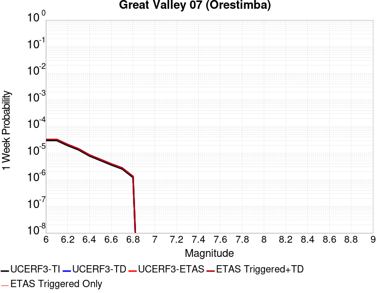 |  |  | 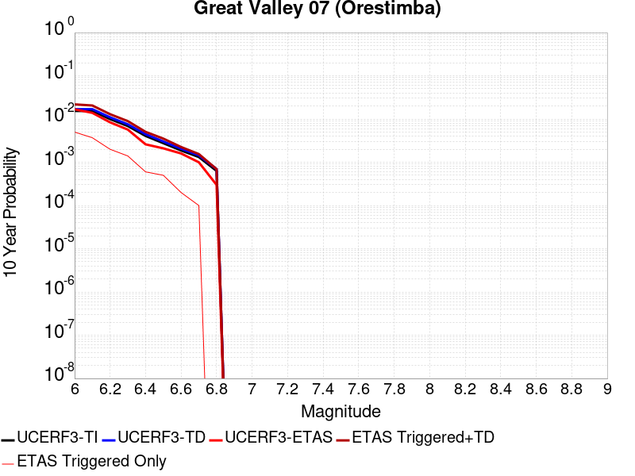 |

| Magnitude | 1 wk TI Prob | 1 wk TD Prob | 1 wk ETAS Prob | 1 wk ETAS/TD Gain | 1 wk ETAS Triggered+TD | 1 wk ETAS Triggered Only | 1 mo TI Prob | 1 mo TD Prob | 1 mo ETAS Prob | 1 mo ETAS/TD Gain | 1 mo ETAS Triggered+TD | 1 mo ETAS Triggered Only | 1 yr TI Prob | 1 yr TD Prob | 1 yr ETAS Prob | 1 yr ETAS/TD Gain | 1 yr ETAS Triggered+TD | 1 yr ETAS Triggered Only | 10 yr TI Prob | 10 yr TD Prob | 10 yr ETAS Prob | 10 yr ETAS/TD Gain | 10 yr ETAS Triggered+TD | 10 yr ETAS Triggered Only |
|-----|-----|-----|-----|-----|-----|-----|-----|-----|-----|-----|-----|-----|-----|-----|-----|-----|-----|-----|-----|-----|-----|-----|-----|-----|
| 6.0 | 2.9687902E-5 | 3.272214E-5 | 0.0 | 0.0 | 3.272214E-5 | 0.0 | 1.2722766E-4 | 1.402306E-4 | 0.0 | 0.0 | 1.402306E-4 | 0.0 | 0.0015478961 | 0.0017060422 | 0.0 | 0.0 | 0.0017060422 | 0.0 | 0.015371585 | 0.016936978 | 1.0E-4 | 0.0059042405 | 0.017035285 | 1.0E-4 |
| 6.1 | 2.9687902E-5 | 3.272214E-5 | 0.0 | 0.0 | 3.272214E-5 | 0.0 | 1.2722766E-4 | 1.402306E-4 | 0.0 | 0.0 | 1.402306E-4 | 0.0 | 0.0015478961 | 0.0017060422 | 0.0 | 0.0 | 0.0017060422 | 0.0 | 0.015371585 | 0.016936978 | 0.0 | 0.0 | 0.016936978 | 0.0 |
| 6.2 | 1.9231524E-5 | 2.113703E-5 | 0.0 | 0.0 | 2.113703E-5 | 0.0 | 8.2418206E-5 | 9.058425E-5 | 0.0 | 0.0 | 9.058425E-5 | 0.0 | 0.0010029797 | 0.0011023284 | 0.0 | 0.0 | 0.0011023284 | 0.0 | 0.00998465 | 0.010971011 | 0.0 | 0.0 | 0.010971011 | 0.0 |
| 6.3 | 1.324766E-5 | 1.4533626E-5 | 0.0 | 0.0 | 1.4533626E-5 | 0.0 | 5.6774446E-5 | 6.228553E-5 | 0.0 | 0.0 | 6.228553E-5 | 0.0 | 6.910097E-4 | 7.5807166E-4 | 0.0 | 0.0 | 7.5807166E-4 | 0.0 | 0.006888649 | 0.0075558014 | 0.0 | 0.0 | 0.0075558014 | 0.0 |
| 6.4 | 7.818645E-6 | 8.564213E-6 | 0.0 | 0.0 | 8.564213E-6 | 0.0 | 3.3508048E-5 | 3.6703274E-5 | 0.0 | 0.0 | 3.6703274E-5 | 0.0 | 4.078841E-4 | 4.4677407E-4 | 0.0 | 0.0 | 4.4677407E-4 | 0.0 | 0.004071363 | 0.0044590984 | 0.0 | 0.0 | 0.0044590984 | 0.0 |
| 6.5 | 5.3076565E-6 | 5.8119676E-6 | 0.0 | 0.0 | 5.8119676E-6 | 0.0 | 2.27469E-5 | 2.4908206E-5 | 0.0 | 0.0 | 2.4908206E-5 | 0.0 | 2.7690834E-4 | 3.0321733E-4 | 0.0 | 0.0 | 3.0321733E-4 | 0.0 | 0.0027656353 | 0.003028245 | 0.0 | 0.0 | 0.003028245 | 0.0 |
| 6.6 | 3.6003578E-6 | 3.9445126E-6 | 0.0 | 0.0 | 3.9445126E-6 | 0.0 | 1.5430012E-5 | 1.6904953E-5 | 0.0 | 0.0 | 1.6904953E-5 | 0.0 | 1.8784421E-4 | 2.0579992E-4 | 0.0 | 0.0 | 2.0579992E-4 | 0.0 | 0.0018768552 | 0.002056247 | 0.0 | 0.0 | 0.002056247 | 0.0 |
| 6.7 | 2.5361826E-6 | 2.7806368E-6 | 0.0 | 0.0 | 2.7806368E-6 | 0.0 | 1.0869308E-5 | 1.1916968E-5 | 0.0 | 0.0 | 1.1916968E-5 | 0.0 | 1.3232579E-4 | 1.4508075E-4 | 0.0 | 0.0 | 1.4508075E-4 | 0.0 | 0.0013224703 | 0.00144999 | 0.0 | 0.0 | 0.00144999 | 0.0 |
| 6.8 | 1.2115831E-6 | 1.3300066E-6 | 0.0 | 0.0 | 1.3300066E-6 | 0.0 | 5.1924885E-6 | 5.7000216E-6 | 0.0 | 0.0 | 5.7000216E-6 | 0.0 | 6.3216714E-5 | 6.939652E-5 | 0.0 | 0.0 | 6.939652E-5 | 0.0 | 6.3198735E-4 | 6.938434E-4 | 0.0 | 0.0 | 6.938434E-4 | 0.0 |

## Paradise
*[(top)](#table-of-contents)*

| 1 Week | 1 Month | 1 Year | 10 Year |
|-----|-----|-----|-----|
| 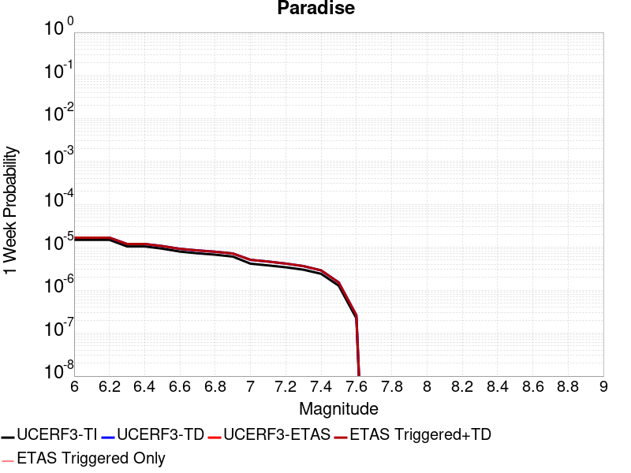 |  | 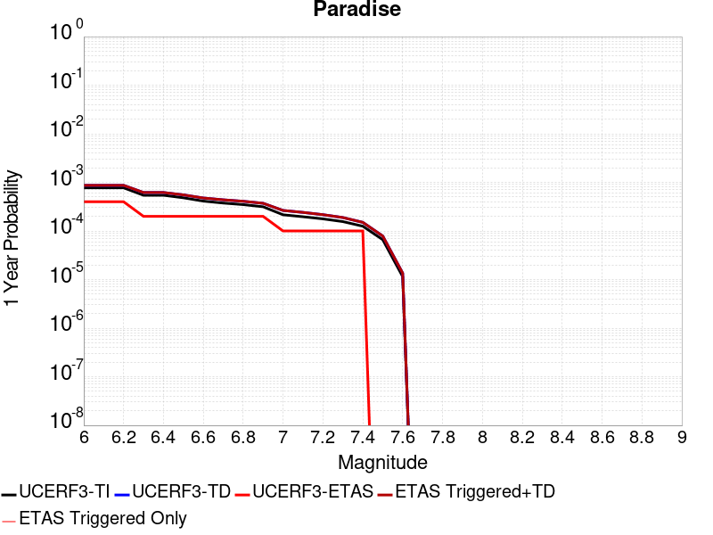 | 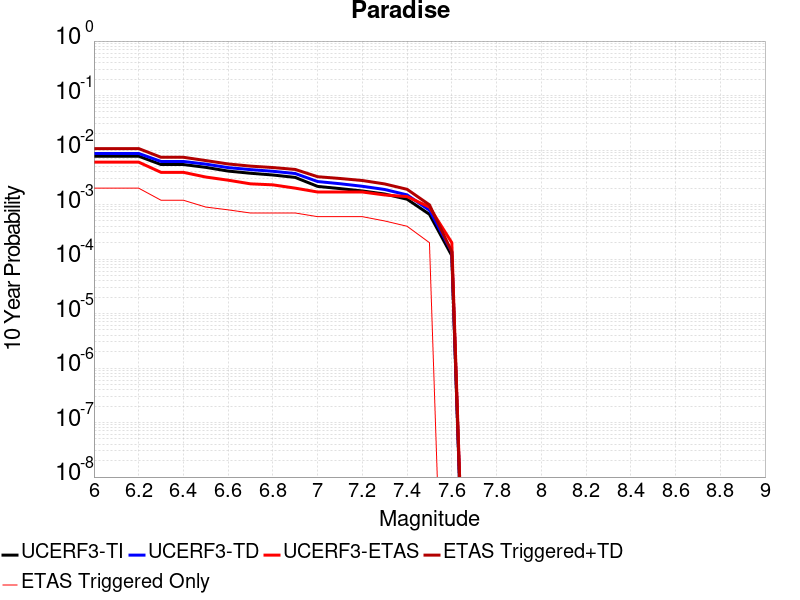 |

| Magnitude | 1 wk TI Prob | 1 wk TD Prob | 1 wk ETAS Prob | 1 wk ETAS/TD Gain | 1 wk ETAS Triggered+TD | 1 wk ETAS Triggered Only | 1 mo TI Prob | 1 mo TD Prob | 1 mo ETAS Prob | 1 mo ETAS/TD Gain | 1 mo ETAS Triggered+TD | 1 mo ETAS Triggered Only | 1 yr TI Prob | 1 yr TD Prob | 1 yr ETAS Prob | 1 yr ETAS/TD Gain | 1 yr ETAS Triggered+TD | 1 yr ETAS Triggered Only | 10 yr TI Prob | 10 yr TD Prob | 10 yr ETAS Prob | 10 yr ETAS/TD Gain | 10 yr ETAS Triggered+TD | 10 yr ETAS Triggered Only |
|-----|-----|-----|-----|-----|-----|-----|-----|-----|-----|-----|-----|-----|-----|-----|-----|-----|-----|-----|-----|-----|-----|-----|-----|-----|
| 6.0 | 1.4851273E-5 | 1.6679838E-5 | 0.0 | 0.0 | 1.6679838E-5 | 0.0 | 6.364676E-5 | 7.14832E-5 | 0.0 | 0.0 | 7.14832E-5 | 0.0 | 7.7462377E-4 | 8.69984E-4 | 0.0 | 0.0 | 8.69984E-4 | 0.0 | 0.0077192914 | 0.008668157 | 1.0E-4 | 0.011536478 | 0.00876729 | 1.0E-4 |
| 6.1 | 1.4851273E-5 | 1.6679838E-5 | 0.0 | 0.0 | 1.6679838E-5 | 0.0 | 6.364676E-5 | 7.14832E-5 | 0.0 | 0.0 | 7.14832E-5 | 0.0 | 7.7462377E-4 | 8.69984E-4 | 0.0 | 0.0 | 8.69984E-4 | 0.0 | 0.0077192914 | 0.008668157 | 1.0E-4 | 0.011536478 | 0.00876729 | 1.0E-4 |
| 6.2 | 1.4851273E-5 | 1.6679838E-5 | 0.0 | 0.0 | 1.6679838E-5 | 0.0 | 6.364676E-5 | 7.14832E-5 | 0.0 | 0.0 | 7.14832E-5 | 0.0 | 7.7462377E-4 | 8.69984E-4 | 0.0 | 0.0 | 8.69984E-4 | 0.0 | 0.0077192914 | 0.008668157 | 1.0E-4 | 0.011536478 | 0.00876729 | 1.0E-4 |
| 6.3 | 1.0426831E-5 | 1.1878099E-5 | 0.0 | 0.0 | 1.1878099E-5 | 0.0 | 4.4685654E-5 | 5.090518E-5 | 0.0 | 0.0 | 5.090518E-5 | 0.0 | 5.43912E-4 | 6.1960024E-4 | 0.0 | 0.0 | 6.1960024E-4 | 0.0 | 0.0054258266 | 0.0061793346 | 1.0E-4 | 0.016182972 | 0.0062787165 | 1.0E-4 |
| 6.4 | 1.0426831E-5 | 1.1878099E-5 | 0.0 | 0.0 | 1.1878099E-5 | 0.0 | 4.4685654E-5 | 5.090518E-5 | 0.0 | 0.0 | 5.090518E-5 | 0.0 | 5.43912E-4 | 6.1960024E-4 | 0.0 | 0.0 | 6.1960024E-4 | 0.0 | 0.0054258266 | 0.0061793346 | 1.0E-4 | 0.016182972 | 0.0062787165 | 1.0E-4 |
| 6.5 | 9.25027E-6 | 1.0610476E-5 | 0.0 | 0.0 | 1.0610476E-5 | 0.0 | 3.964341E-5 | 4.5472705E-5 | 0.0 | 0.0 | 4.5472705E-5 | 0.0 | 4.8255164E-4 | 5.5349444E-4 | 0.0 | 0.0 | 5.5349444E-4 | 0.0 | 0.0048150513 | 0.0055216574 | 1.0E-4 | 0.018110504 | 0.0056211054 | 1.0E-4 |
| 6.6 | 7.904275E-6 | 9.15134E-6 | 0.0 | 0.0 | 9.15134E-6 | 0.0 | 3.3875025E-5 | 3.9219463E-5 | 0.0 | 0.0 | 3.9219463E-5 | 0.0 | 4.1235037E-4 | 4.7739627E-4 | 0.0 | 0.0 | 4.7739627E-4 | 0.0 | 0.0041158604 | 0.004764104 | 1.0E-4 | 0.020990308 | 0.0048636273 | 1.0E-4 |
| 6.7 | 7.2061953E-6 | 8.399675E-6 | 0.0 | 0.0 | 8.399675E-6 | 0.0 | 3.088333E-5 | 3.5998128E-5 | 0.0 | 0.0 | 3.5998128E-5 | 0.0 | 3.7593965E-4 | 4.3819274E-4 | 0.0 | 0.0 | 4.3819274E-4 | 0.0 | 0.003753043 | 0.0043736557 | 0.0 | 0.0 | 0.0043736557 | 0.0 |
| 6.8 | 6.6948724E-6 | 7.835022E-6 | 0.0 | 0.0 | 7.835022E-6 | 0.0 | 2.8691995E-5 | 3.3578257E-5 | 0.0 | 0.0 | 3.3578257E-5 | 0.0 | 3.4926904E-4 | 4.0874214E-4 | 0.0 | 0.0 | 4.0874214E-4 | 0.0 | 0.003487206 | 0.0040802606 | 0.0 | 0.0 | 0.0040802606 | 0.0 |
| 6.9 | 6.0421025E-6 | 7.1240197E-6 | 0.0 | 0.0 | 7.1240197E-6 | 0.0 | 2.5894467E-5 | 3.0531173E-5 | 0.0 | 0.0 | 3.0531173E-5 | 0.0 | 3.1521954E-4 | 3.7165705E-4 | 0.0 | 0.0 | 3.7165705E-4 | 0.0 | 0.0031477278 | 0.0037106927 | 0.0 | 0.0 | 0.0037106927 | 0.0 |
| 7.0 | 4.134091E-6 | 5.0750823E-6 | 0.0 | 0.0 | 5.0750823E-6 | 0.0 | 1.7717413E-5 | 2.175018E-5 | 0.0 | 0.0 | 2.175018E-5 | 0.0 | 2.1568815E-4 | 2.647778E-4 | 0.0 | 0.0 | 2.647778E-4 | 0.0 | 0.0021547892 | 0.0026447764 | 0.0 | 0.0 | 0.0026447764 | 0.0 |
| 7.1 | 3.7674888E-6 | 4.6269474E-6 | 0.0 | 0.0 | 4.6269474E-6 | 0.0 | 1.6146281E-5 | 1.9829633E-5 | 0.0 | 0.0 | 1.9829633E-5 | 0.0 | 1.9656324E-4 | 2.4140056E-4 | 0.0 | 0.0 | 2.4140056E-4 | 0.0 | 0.0019638946 | 0.0024115338 | 0.0 | 0.0 | 0.0024115338 | 0.0 |
| 7.2 | 3.4065345E-6 | 4.1520943E-6 | 0.0 | 0.0 | 4.1520943E-6 | 0.0 | 1.4599351E-5 | 1.7794577E-5 | 0.0 | 0.0 | 1.7794577E-5 | 0.0 | 1.777326E-4 | 2.1662892E-4 | 0.0 | 0.0 | 2.1662892E-4 | 0.0 | 0.0017759053 | 0.0021643257 | 0.0 | 0.0 | 0.0021643257 | 0.0 |
| 7.3 | 2.9934936E-6 | 3.6258575E-6 | 0.0 | 0.0 | 3.6258575E-6 | 0.0 | 1.2829195E-5 | 1.5539305E-5 | 0.0 | 0.0 | 1.5539305E-5 | 0.0 | 1.5618425E-4 | 1.8917609E-4 | 0.0 | 0.0 | 1.8917609E-4 | 0.0 | 0.0015607453 | 0.0018902957 | 0.0 | 0.0 | 0.0018902957 | 0.0 |
| 7.4 | 2.4049796E-6 | 2.8865425E-6 | 0.0 | 0.0 | 2.8865425E-6 | 0.0 | 1.0307015E-5 | 1.2370845E-5 | 0.0 | 0.0 | 1.2370845E-5 | 0.0 | 1.2548068E-4 | 1.5060607E-4 | 0.0 | 0.0 | 1.5060607E-4 | 0.0 | 0.0012540985 | 0.0015051813 | 0.0 | 0.0 | 0.0015051813 | 0.0 |
| 7.5 | 1.2710091E-6 | 1.5118025E-6 | 0.0 | 0.0 | 1.5118025E-6 | 0.0 | 5.44717E-6 | 6.4791443E-6 | 0.0 | 0.0 | 6.4791443E-6 | 0.0 | 6.631728E-5 | 7.8881974E-5 | 0.0 | 0.0 | 7.8881974E-5 | 0.0 | 6.6297496E-4 | 7.8866223E-4 | 0.0 | 0.0 | 7.8866223E-4 | 0.0 |
| 7.6 | 2.21172E-7 | 2.602981E-7 | 0.0 | 0.0 | 2.602981E-7 | 0.0 | 9.478797E-7 | 1.115563E-6 | 0.0 | 0.0 | 1.115563E-6 | 0.0 | 1.1540374E-5 | 1.3581924E-5 | 0.0 | 0.0 | 1.3581924E-5 | 0.0 | 1.1539775E-4 | 1.3581375E-4 | 0.0 | 0.0 | 1.3581375E-4 | 0.0 |

## Little Salmon (Offshore)
*[(top)](#table-of-contents)*

| 1 Week | 1 Month | 1 Year | 10 Year |
|-----|-----|-----|-----|
|  | 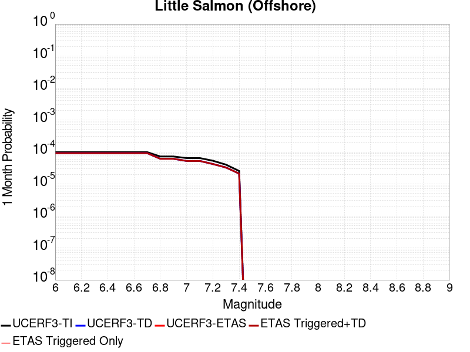 |  |  |

| Magnitude | 1 wk TI Prob | 1 wk TD Prob | 1 wk ETAS Prob | 1 wk ETAS/TD Gain | 1 wk ETAS Triggered+TD | 1 wk ETAS Triggered Only | 1 mo TI Prob | 1 mo TD Prob | 1 mo ETAS Prob | 1 mo ETAS/TD Gain | 1 mo ETAS Triggered+TD | 1 mo ETAS Triggered Only | 1 yr TI Prob | 1 yr TD Prob | 1 yr ETAS Prob | 1 yr ETAS/TD Gain | 1 yr ETAS Triggered+TD | 1 yr ETAS Triggered Only | 10 yr TI Prob | 10 yr TD Prob | 10 yr ETAS Prob | 10 yr ETAS/TD Gain | 10 yr ETAS Triggered+TD | 10 yr ETAS Triggered Only |
|-----|-----|-----|-----|-----|-----|-----|-----|-----|-----|-----|-----|-----|-----|-----|-----|-----|-----|-----|-----|-----|-----|-----|-----|-----|
| 6.0 | 2.3052053E-5 | 2.1499658E-5 | 0.0 | 0.0 | 2.1499658E-5 | 0.0 | 9.879077E-5 | 9.213878E-5 | 0.0 | 0.0 | 9.213878E-5 | 0.0 | 0.0012021139 | 0.0011213263 | 0.0 | 0.0 | 0.0011213263 | 0.0 | 0.011956319 | 0.011187837 | 1.0E-4 | 0.008938278 | 0.011286719 | 1.0E-4 |
| 6.1 | 2.3052053E-5 | 2.1499658E-5 | 0.0 | 0.0 | 2.1499658E-5 | 0.0 | 9.879077E-5 | 9.213878E-5 | 0.0 | 0.0 | 9.213878E-5 | 0.0 | 0.0012021139 | 0.0011213263 | 0.0 | 0.0 | 0.0011213263 | 0.0 | 0.011956319 | 0.011187837 | 1.0E-4 | 0.008938278 | 0.011286719 | 1.0E-4 |
| 6.2 | 2.3052053E-5 | 2.1499658E-5 | 0.0 | 0.0 | 2.1499658E-5 | 0.0 | 9.879077E-5 | 9.213878E-5 | 0.0 | 0.0 | 9.213878E-5 | 0.0 | 0.0012021139 | 0.0011213263 | 0.0 | 0.0 | 0.0011213263 | 0.0 | 0.011956319 | 0.011187837 | 1.0E-4 | 0.008938278 | 0.011286719 | 1.0E-4 |
| 6.3 | 2.3052053E-5 | 2.1499658E-5 | 0.0 | 0.0 | 2.1499658E-5 | 0.0 | 9.879077E-5 | 9.213878E-5 | 0.0 | 0.0 | 9.213878E-5 | 0.0 | 0.0012021139 | 0.0011213263 | 0.0 | 0.0 | 0.0011213263 | 0.0 | 0.011956319 | 0.011187837 | 1.0E-4 | 0.008938278 | 0.011286719 | 1.0E-4 |
| 6.4 | 2.3052053E-5 | 2.1499658E-5 | 0.0 | 0.0 | 2.1499658E-5 | 0.0 | 9.879077E-5 | 9.213878E-5 | 0.0 | 0.0 | 9.213878E-5 | 0.0 | 0.0012021139 | 0.0011213263 | 0.0 | 0.0 | 0.0011213263 | 0.0 | 0.011956319 | 0.011187837 | 1.0E-4 | 0.008938278 | 0.011286719 | 1.0E-4 |
| 6.5 | 2.3052053E-5 | 2.1499658E-5 | 0.0 | 0.0 | 2.1499658E-5 | 0.0 | 9.879077E-5 | 9.213878E-5 | 0.0 | 0.0 | 9.213878E-5 | 0.0 | 0.0012021139 | 0.0011213263 | 0.0 | 0.0 | 0.0011213263 | 0.0 | 0.011956319 | 0.011187837 | 1.0E-4 | 0.008938278 | 0.011286719 | 1.0E-4 |
| 6.6 | 2.3052053E-5 | 2.1499658E-5 | 0.0 | 0.0 | 2.1499658E-5 | 0.0 | 9.879077E-5 | 9.213878E-5 | 0.0 | 0.0 | 9.213878E-5 | 0.0 | 0.0012021139 | 0.0011213263 | 0.0 | 0.0 | 0.0011213263 | 0.0 | 0.011956319 | 0.011187837 | 1.0E-4 | 0.008938278 | 0.011286719 | 1.0E-4 |
| 6.7 | 2.3052053E-5 | 2.1499658E-5 | 0.0 | 0.0 | 2.1499658E-5 | 0.0 | 9.879077E-5 | 9.213878E-5 | 0.0 | 0.0 | 9.213878E-5 | 0.0 | 0.0012021139 | 0.0011213263 | 0.0 | 0.0 | 0.0011213263 | 0.0 | 0.011956319 | 0.011187837 | 1.0E-4 | 0.008938278 | 0.011286719 | 1.0E-4 |
| 6.8 | 1.683878E-5 | 1.4291685E-5 | 0.0 | 0.0 | 1.4291685E-5 | 0.0 | 7.21642E-5 | 6.1248924E-5 | 0.0 | 0.0 | 6.1248924E-5 | 0.0 | 8.78245E-4 | 7.455008E-4 | 0.0 | 0.0 | 7.455008E-4 | 0.0 | 0.008747822 | 0.007454923 | 1.0E-4 | 0.013413955 | 0.007554177 | 1.0E-4 |
| 6.9 | 1.683878E-5 | 1.4291685E-5 | 0.0 | 0.0 | 1.4291685E-5 | 0.0 | 7.21642E-5 | 6.1248924E-5 | 0.0 | 0.0 | 6.1248924E-5 | 0.0 | 8.78245E-4 | 7.455008E-4 | 0.0 | 0.0 | 7.455008E-4 | 0.0 | 0.008747822 | 0.007454923 | 1.0E-4 | 0.013413955 | 0.007554177 | 1.0E-4 |
| 7.0 | 1.5051273E-5 | 1.2243148E-5 | 0.0 | 0.0 | 1.2243148E-5 | 0.0 | 6.450386E-5 | 5.2469833E-5 | 0.0 | 0.0 | 5.2469833E-5 | 0.0 | 7.8505155E-4 | 6.386783E-4 | 0.0 | 0.0 | 6.386783E-4 | 0.0 | 0.00782284 | 0.0063928757 | 1.0E-4 | 0.015642412 | 0.0064922366 | 1.0E-4 |
| 7.1 | 1.5051273E-5 | 1.2243148E-5 | 0.0 | 0.0 | 1.2243148E-5 | 0.0 | 6.450386E-5 | 5.2469833E-5 | 0.0 | 0.0 | 5.2469833E-5 | 0.0 | 7.8505155E-4 | 6.386783E-4 | 0.0 | 0.0 | 6.386783E-4 | 0.0 | 0.00782284 | 0.0063928757 | 1.0E-4 | 0.015642412 | 0.0064922366 | 1.0E-4 |
| 7.2 | 1.24301405E-5 | 9.815183E-6 | 0.0 | 0.0 | 9.815183E-6 | 0.0 | 5.3270942E-5 | 4.2064614E-5 | 0.0 | 0.0 | 4.2064614E-5 | 0.0 | 6.483807E-4 | 5.120557E-4 | 0.0 | 0.0 | 5.120557E-4 | 0.0 | 0.006464922 | 0.005132409 | 1.0E-4 | 0.01948403 | 0.0052318955 | 1.0E-4 |
| 7.3 | 9.3599865E-6 | 7.63674E-6 | 0.0 | 0.0 | 7.63674E-6 | 0.0 | 4.011361E-5 | 3.2728673E-5 | 0.0 | 0.0 | 3.2728673E-5 | 0.0 | 4.8827377E-4 | 3.9843383E-4 | 0.0 | 0.0 | 3.9843383E-4 | 0.0 | 0.004872023 | 0.0039928746 | 1.0E-4 | 0.025044613 | 0.0040924754 | 1.0E-4 |
| 7.4 | 5.941556E-6 | 4.913584E-6 | 0.0 | 0.0 | 4.913584E-6 | 0.0 | 2.5463563E-5 | 2.1058217E-5 | 0.0 | 0.0 | 2.1058217E-5 | 0.0 | 3.0997477E-4 | 2.5638376E-4 | 0.0 | 0.0 | 2.5638376E-4 | 0.0 | 0.0030954275 | 0.0025715034 | 1.0E-4 | 0.038887758 | 0.0026712464 | 1.0E-4 |

## Skinner Flat 2011 CFM
*[(top)](#table-of-contents)*

| 1 Week | 1 Month | 1 Year | 10 Year |
|-----|-----|-----|-----|
|  |  |  | 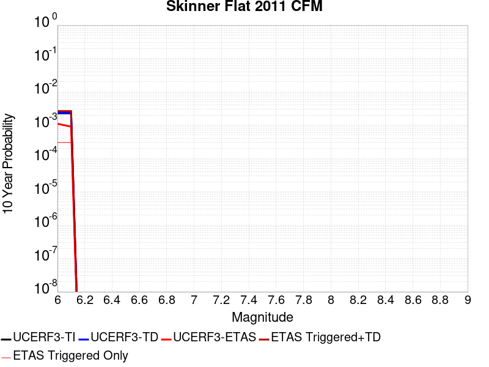 |

| Magnitude | 1 wk TI Prob | 1 wk TD Prob | 1 wk ETAS Prob | 1 wk ETAS/TD Gain | 1 wk ETAS Triggered+TD | 1 wk ETAS Triggered Only | 1 mo TI Prob | 1 mo TD Prob | 1 mo ETAS Prob | 1 mo ETAS/TD Gain | 1 mo ETAS Triggered+TD | 1 mo ETAS Triggered Only | 1 yr TI Prob | 1 yr TD Prob | 1 yr ETAS Prob | 1 yr ETAS/TD Gain | 1 yr ETAS Triggered+TD | 1 yr ETAS Triggered Only | 10 yr TI Prob | 10 yr TD Prob | 10 yr ETAS Prob | 10 yr ETAS/TD Gain | 10 yr ETAS Triggered+TD | 10 yr ETAS Triggered Only |
|-----|-----|-----|-----|-----|-----|-----|-----|-----|-----|-----|-----|-----|-----|-----|-----|-----|-----|-----|-----|-----|-----|-----|-----|-----|
| 6.0 | 4.3279074E-6 | 4.4832545E-6 | 0.0 | 0.0 | 4.4832545E-6 | 0.0 | 1.8548042E-5 | 1.9213947E-5 | 0.0 | 0.0 | 1.9213947E-5 | 0.0 | 2.2579901E-4 | 2.3392981E-4 | 0.0 | 0.0 | 2.3392981E-4 | 0.0 | 0.002255697 | 0.0023392981 | 1.0E-4 | 0.042747866 | 0.0024390642 | 1.0E-4 |
| 6.1 | 4.3279074E-6 | 4.4832545E-6 | 0.0 | 0.0 | 4.4832545E-6 | 0.0 | 1.8548042E-5 | 1.9213947E-5 | 0.0 | 0.0 | 1.9213947E-5 | 0.0 | 2.2579901E-4 | 2.3392981E-4 | 0.0 | 0.0 | 2.3392981E-4 | 0.0 | 0.002255697 | 0.0023392981 | 1.0E-4 | 0.042747866 | 0.0024390642 | 1.0E-4 |

## North Frontal  (East)
*[(top)](#table-of-contents)*

| 1 Week | 1 Month | 1 Year | 10 Year |
|-----|-----|-----|-----|
|  |  |  |  |

| Magnitude | 1 wk TI Prob | 1 wk TD Prob | 1 wk ETAS Prob | 1 wk ETAS/TD Gain | 1 wk ETAS Triggered+TD | 1 wk ETAS Triggered Only | 1 mo TI Prob | 1 mo TD Prob | 1 mo ETAS Prob | 1 mo ETAS/TD Gain | 1 mo ETAS Triggered+TD | 1 mo ETAS Triggered Only | 1 yr TI Prob | 1 yr TD Prob | 1 yr ETAS Prob | 1 yr ETAS/TD Gain | 1 yr ETAS Triggered+TD | 1 yr ETAS Triggered Only | 10 yr TI Prob | 10 yr TD Prob | 10 yr ETAS Prob | 10 yr ETAS/TD Gain | 10 yr ETAS Triggered+TD | 10 yr ETAS Triggered Only |
|-----|-----|-----|-----|-----|-----|-----|-----|-----|-----|-----|-----|-----|-----|-----|-----|-----|-----|-----|-----|-----|-----|-----|-----|-----|
| 6.0 | 7.135738E-6 | 7.473438E-6 | 0.0 | 0.0 | 7.473438E-6 | 0.0 | 3.0581377E-5 | 3.202874E-5 | 0.0 | 0.0 | 3.202874E-5 | 0.0 | 3.7226462E-4 | 3.8990006E-4 | 0.0 | 0.0 | 3.8990006E-4 | 0.0 | 0.0037164164 | 0.0038941153 | 1.0E-4 | 0.025679773 | 0.003993726 | 1.0E-4 |
| 6.1 | 7.135738E-6 | 7.473438E-6 | 0.0 | 0.0 | 7.473438E-6 | 0.0 | 3.0581377E-5 | 3.202874E-5 | 0.0 | 0.0 | 3.202874E-5 | 0.0 | 3.7226462E-4 | 3.8990006E-4 | 0.0 | 0.0 | 3.8990006E-4 | 0.0 | 0.0037164164 | 0.0038941153 | 1.0E-4 | 0.025679773 | 0.003993726 | 1.0E-4 |
| 6.2 | 7.135738E-6 | 7.473438E-6 | 0.0 | 0.0 | 7.473438E-6 | 0.0 | 3.0581377E-5 | 3.202874E-5 | 0.0 | 0.0 | 3.202874E-5 | 0.0 | 3.7226462E-4 | 3.8990006E-4 | 0.0 | 0.0 | 3.8990006E-4 | 0.0 | 0.0037164164 | 0.0038941153 | 1.0E-4 | 0.025679773 | 0.003993726 | 1.0E-4 |
| 6.3 | 7.135738E-6 | 7.473438E-6 | 0.0 | 0.0 | 7.473438E-6 | 0.0 | 3.0581377E-5 | 3.202874E-5 | 0.0 | 0.0 | 3.202874E-5 | 0.0 | 3.7226462E-4 | 3.8990006E-4 | 0.0 | 0.0 | 3.8990006E-4 | 0.0 | 0.0037164164 | 0.0038941153 | 1.0E-4 | 0.025679773 | 0.003993726 | 1.0E-4 |
| 6.4 | 7.135738E-6 | 7.473438E-6 | 0.0 | 0.0 | 7.473438E-6 | 0.0 | 3.0581377E-5 | 3.202874E-5 | 0.0 | 0.0 | 3.202874E-5 | 0.0 | 3.7226462E-4 | 3.8990006E-4 | 0.0 | 0.0 | 3.8990006E-4 | 0.0 | 0.0037164164 | 0.0038941153 | 1.0E-4 | 0.025679773 | 0.003993726 | 1.0E-4 |
| 6.5 | 7.135738E-6 | 7.473438E-6 | 0.0 | 0.0 | 7.473438E-6 | 0.0 | 3.0581377E-5 | 3.202874E-5 | 0.0 | 0.0 | 3.202874E-5 | 0.0 | 3.7226462E-4 | 3.8990006E-4 | 0.0 | 0.0 | 3.8990006E-4 | 0.0 | 0.0037164164 | 0.0038941153 | 1.0E-4 | 0.025679773 | 0.003993726 | 1.0E-4 |
| 6.6 | 7.135738E-6 | 7.473438E-6 | 0.0 | 0.0 | 7.473438E-6 | 0.0 | 3.0581377E-5 | 3.202874E-5 | 0.0 | 0.0 | 3.202874E-5 | 0.0 | 3.7226462E-4 | 3.8990006E-4 | 0.0 | 0.0 | 3.8990006E-4 | 0.0 | 0.0037164164 | 0.0038941153 | 1.0E-4 | 0.025679773 | 0.003993726 | 1.0E-4 |
| 6.7 | 7.135738E-6 | 7.473438E-6 | 0.0 | 0.0 | 7.473438E-6 | 0.0 | 3.0581377E-5 | 3.202874E-5 | 0.0 | 0.0 | 3.202874E-5 | 0.0 | 3.7226462E-4 | 3.8990006E-4 | 0.0 | 0.0 | 3.8990006E-4 | 0.0 | 0.0037164164 | 0.0038941153 | 1.0E-4 | 0.025679773 | 0.003993726 | 1.0E-4 |
| 6.8 | 5.959142E-6 | 6.2336476E-6 | 0.0 | 0.0 | 6.2336476E-6 | 0.0 | 2.553893E-5 | 2.6715461E-5 | 0.0 | 0.0 | 2.6715461E-5 | 0.0 | 3.108921E-4 | 3.2523024E-4 | 0.0 | 0.0 | 3.2523024E-4 | 0.0 | 0.0031045752 | 0.003249314 | 1.0E-4 | 0.030775728 | 0.003348989 | 1.0E-4 |
| 6.9 | 2.2946929E-6 | 2.3815082E-6 | 0.0 | 0.0 | 2.3815082E-6 | 0.0 | 9.834361E-6 | 1.0206426E-5 | 0.0 | 0.0 | 1.0206426E-5 | 0.0 | 1.1972676E-4 | 1.2425662E-4 | 0.0 | 0.0 | 1.2425662E-4 | 0.0 | 0.0011966228 | 0.001241918 | 0.0 | 0.0 | 0.001241918 | 0.0 |
| 7.0 | 2.2468673E-6 | 2.3312286E-6 | 0.0 | 0.0 | 2.3312286E-6 | 0.0 | 9.629396E-6 | 9.990945E-6 | 0.0 | 0.0 | 9.990945E-6 | 0.0 | 1.1723159E-4 | 1.2163343E-4 | 0.0 | 0.0 | 1.2163343E-4 | 0.0 | 0.0011716976 | 0.0012157148 | 0.0 | 0.0 | 0.0012157148 | 0.0 |
| 7.1 | 1.9921076E-6 | 2.0638183E-6 | 0.0 | 0.0 | 2.0638183E-6 | 0.0 | 8.537577E-6 | 8.844909E-6 | 0.0 | 0.0 | 8.844909E-6 | 0.0 | 1.0394004E-4 | 1.0768187E-4 | 0.0 | 0.0 | 1.0768187E-4 | 0.0 | 0.0010389143 | 0.0010763396 | 0.0 | 0.0 | 0.0010763396 | 0.0 |
| 7.2 | 1.4524545E-6 | 1.5039516E-6 | 0.0 | 0.0 | 1.5039516E-6 | 0.0 | 6.2247905E-6 | 6.445492E-6 | 0.0 | 0.0 | 6.445492E-6 | 0.0 | 7.5784184E-5 | 7.847129E-5 | 0.0 | 0.0 | 7.847129E-5 | 0.0 | 7.575835E-4 | 7.844603E-4 | 0.0 | 0.0 | 7.844603E-4 | 0.0 |
| 7.3 | 8.9802575E-7 | 9.305173E-7 | 0.0 | 0.0 | 9.305173E-7 | 0.0 | 3.848676E-6 | 3.9879255E-6 | 0.0 | 0.0 | 3.9879255E-6 | 0.0 | 4.685662E-5 | 4.855203E-5 | 0.0 | 0.0 | 4.855203E-5 | 0.0 | 4.6846745E-4 | 4.854255E-4 | 0.0 | 0.0 | 4.854255E-4 | 0.0 |
| 7.4 | 7.776139E-7 | 8.057397E-7 | 0.0 | 0.0 | 8.057397E-7 | 0.0 | 3.3326266E-6 | 3.4531663E-6 | 0.0 | 0.0 | 3.4531663E-6 | 0.0 | 4.0573974E-5 | 4.20416E-5 | 0.0 | 0.0 | 4.20416E-5 | 0.0 | 4.0566566E-4 | 4.203472E-4 | 0.0 | 0.0 | 4.203472E-4 | 0.0 |
| 7.5 | 5.244417E-7 | 5.4390875E-7 | 0.0 | 0.0 | 5.4390875E-7 | 0.0 | 2.2476054E-6 | 2.3310358E-6 | 0.0 | 0.0 | 2.3310358E-6 | 0.0 | 2.7364253E-5 | 2.8380058E-5 | 0.0 | 0.0 | 2.8380058E-5 | 0.0 | 2.7360884E-4 | 2.8377085E-4 | 0.0 | 0.0 | 2.8377085E-4 | 0.0 |
| 7.6 | 1.5489647E-7 | 1.6083001E-7 | 0.0 | 0.0 | 1.6083001E-7 | 0.0 | 6.6384183E-7 | 6.8927136E-7 | 0.0 | 0.0 | 6.8927136E-7 | 0.0 | 8.082245E-6 | 8.391868E-6 | 0.0 | 0.0 | 8.391868E-6 | 0.0 | 8.08195E-5 | 8.39175E-5 | 0.0 | 0.0 | 8.39175E-5 | 0.0 |

## Hartley Springs 2011 CFM
*[(top)](#table-of-contents)*

| 1 Week | 1 Month | 1 Year | 10 Year |
|-----|-----|-----|-----|
|  |  |  |  |

| Magnitude | 1 wk TI Prob | 1 wk TD Prob | 1 wk ETAS Prob | 1 wk ETAS/TD Gain | 1 wk ETAS Triggered+TD | 1 wk ETAS Triggered Only | 1 mo TI Prob | 1 mo TD Prob | 1 mo ETAS Prob | 1 mo ETAS/TD Gain | 1 mo ETAS Triggered+TD | 1 mo ETAS Triggered Only | 1 yr TI Prob | 1 yr TD Prob | 1 yr ETAS Prob | 1 yr ETAS/TD Gain | 1 yr ETAS Triggered+TD | 1 yr ETAS Triggered Only | 10 yr TI Prob | 10 yr TD Prob | 10 yr ETAS Prob | 10 yr ETAS/TD Gain | 10 yr ETAS Triggered+TD | 10 yr ETAS Triggered Only |
|-----|-----|-----|-----|-----|-----|-----|-----|-----|-----|-----|-----|-----|-----|-----|-----|-----|-----|-----|-----|-----|-----|-----|-----|-----|
| 6.0 | 1.4352418E-5 | 1.4410377E-5 | 0.0 | 0.0 | 1.4410377E-5 | 0.0 | 6.1508916E-5 | 6.175822E-5 | 0.0 | 0.0 | 6.175822E-5 | 0.0 | 7.486137E-4 | 7.5181096E-4 | 0.0 | 0.0 | 7.5181096E-4 | 0.0 | 0.007460968 | 0.00750876 | 1.0E-4 | 0.013317778 | 0.007608009 | 1.0E-4 |
| 6.1 | 1.4352418E-5 | 1.4410377E-5 | 0.0 | 0.0 | 1.4410377E-5 | 0.0 | 6.1508916E-5 | 6.175822E-5 | 0.0 | 0.0 | 6.175822E-5 | 0.0 | 7.486137E-4 | 7.5181096E-4 | 0.0 | 0.0 | 7.5181096E-4 | 0.0 | 0.007460968 | 0.00750876 | 1.0E-4 | 0.013317778 | 0.007608009 | 1.0E-4 |
| 6.2 | 1.4352418E-5 | 1.4410377E-5 | 0.0 | 0.0 | 1.4410377E-5 | 0.0 | 6.1508916E-5 | 6.175822E-5 | 0.0 | 0.0 | 6.175822E-5 | 0.0 | 7.486137E-4 | 7.5181096E-4 | 0.0 | 0.0 | 7.5181096E-4 | 0.0 | 0.007460968 | 0.00750876 | 1.0E-4 | 0.013317778 | 0.007608009 | 1.0E-4 |
| 6.3 | 1.4352418E-5 | 1.4410377E-5 | 0.0 | 0.0 | 1.4410377E-5 | 0.0 | 6.1508916E-5 | 6.175822E-5 | 0.0 | 0.0 | 6.175822E-5 | 0.0 | 7.486137E-4 | 7.5181096E-4 | 0.0 | 0.0 | 7.5181096E-4 | 0.0 | 0.007460968 | 0.00750876 | 1.0E-4 | 0.013317778 | 0.007608009 | 1.0E-4 |
| 6.4 | 1.4352418E-5 | 1.4410377E-5 | 0.0 | 0.0 | 1.4410377E-5 | 0.0 | 6.1508916E-5 | 6.175822E-5 | 0.0 | 0.0 | 6.175822E-5 | 0.0 | 7.486137E-4 | 7.5181096E-4 | 0.0 | 0.0 | 7.5181096E-4 | 0.0 | 0.007460968 | 0.00750876 | 1.0E-4 | 0.013317778 | 0.007608009 | 1.0E-4 |
| 6.5 | 1.2279858E-5 | 1.2111947E-5 | 0.0 | 0.0 | 1.2111947E-5 | 0.0 | 5.26269E-5 | 5.1908202E-5 | 0.0 | 0.0 | 5.1908202E-5 | 0.0 | 6.4054417E-4 | 6.319569E-4 | 0.0 | 0.0 | 6.319569E-4 | 0.0 | 0.0063870098 | 0.006317075 | 1.0E-4 | 0.01583011 | 0.0064164433 | 1.0E-4 |
| 6.6 | 1.2279858E-5 | 1.2111947E-5 | 0.0 | 0.0 | 1.2111947E-5 | 0.0 | 5.26269E-5 | 5.1908202E-5 | 0.0 | 0.0 | 5.1908202E-5 | 0.0 | 6.4054417E-4 | 6.319569E-4 | 0.0 | 0.0 | 6.319569E-4 | 0.0 | 0.0063870098 | 0.006317075 | 1.0E-4 | 0.01583011 | 0.0064164433 | 1.0E-4 |
| 6.7 | 2.1282601E-6 | 8.8093867E-7 | 0.0 | 0.0 | 8.8093867E-7 | 0.0 | 9.121083E-6 | 3.7754473E-6 | 0.0 | 0.0 | 3.7754473E-6 | 0.0 | 1.11043526E-4 | 4.5965353E-5 | 0.0 | 0.0 | 4.5965353E-5 | 0.0 | 0.0011098806 | 4.595832E-4 | 0.0 | 0.0 | 4.595832E-4 | 0.0 |
| 6.8 | 2.00516E-6 | 8.438678E-7 | 0.0 | 0.0 | 8.438678E-7 | 0.0 | 8.593515E-6 | 3.6165725E-6 | 0.0 | 0.0 | 3.6165725E-6 | 0.0 | 1.04621024E-4 | 4.403113E-5 | 0.0 | 0.0 | 4.403113E-5 | 0.0 | 0.0010457177 | 4.4024864E-4 | 0.0 | 0.0 | 4.4024864E-4 | 0.0 |
| 6.9 | 2.00516E-6 | 8.438678E-7 | 0.0 | 0.0 | 8.438678E-7 | 0.0 | 8.593515E-6 | 3.6165725E-6 | 0.0 | 0.0 | 3.6165725E-6 | 0.0 | 1.04621024E-4 | 4.403113E-5 | 0.0 | 0.0 | 4.403113E-5 | 0.0 | 0.0010457177 | 4.4024864E-4 | 0.0 | 0.0 | 4.4024864E-4 | 0.0 |
| 7.0 | 1.8366732E-6 | 8.164269E-7 | 0.0 | 0.0 | 8.164269E-7 | 0.0 | 7.871433E-6 | 3.4989691E-6 | 0.0 | 0.0 | 3.4989691E-6 | 0.0 | 9.583048E-5 | 4.2599364E-5 | 0.0 | 0.0 | 4.2599364E-5 | 0.0 | 9.5789164E-4 | 4.2593645E-4 | 0.0 | 0.0 | 4.2593645E-4 | 0.0 |
| 7.1 | 1.5097997E-6 | 7.1236667E-7 | 0.0 | 0.0 | 7.1236667E-7 | 0.0 | 6.470554E-6 | 3.0529977E-6 | 0.0 | 0.0 | 3.0529977E-6 | 0.0 | 7.877615E-5 | 3.7169848E-5 | 0.0 | 0.0 | 3.7169848E-5 | 0.0 | 7.874823E-4 | 3.7165947E-4 | 0.0 | 0.0 | 3.7165947E-4 | 0.0 |
| 7.2 | 1.3490993E-6 | 6.341586E-7 | 0.0 | 0.0 | 6.341586E-7 | 0.0 | 5.7818415E-6 | 2.7178212E-6 | 0.0 | 0.0 | 2.7178212E-6 | 0.0 | 7.0391645E-5 | 3.30892E-5 | 0.0 | 0.0 | 3.30892E-5 | 0.0 | 7.0369354E-4 | 3.308651E-4 | 0.0 | 0.0 | 3.308651E-4 | 0.0 |
| 7.3 | 7.900015E-7 | 4.033625E-7 | 0.0 | 0.0 | 4.033625E-7 | 0.0 | 3.3857161E-6 | 1.7286964E-6 | 0.0 | 0.0 | 1.7286964E-6 | 0.0 | 4.1220315E-5 | 2.1046879E-5 | 0.0 | 0.0 | 2.1046879E-5 | 0.0 | 4.121267E-4 | 2.1046879E-4 | 0.0 | 0.0 | 2.1046879E-4 | 0.0 |

## Morales (East)
*[(top)](#table-of-contents)*

| 1 Week | 1 Month | 1 Year | 10 Year |
|-----|-----|-----|-----|
|  |  | 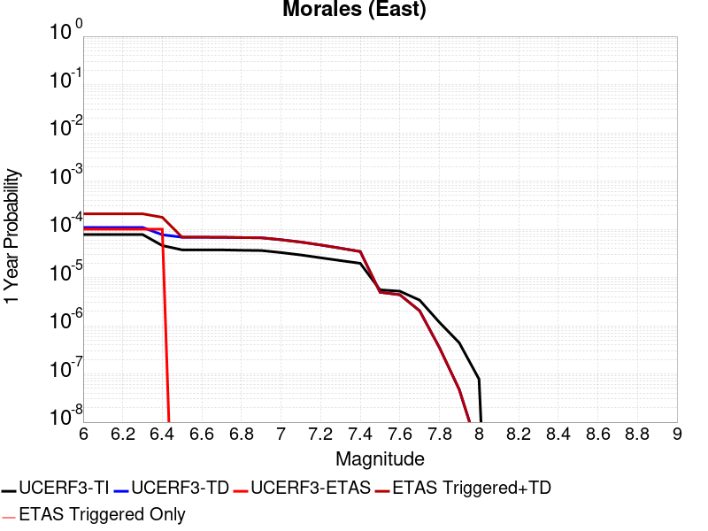 |  |

| Magnitude | 1 wk TI Prob | 1 wk TD Prob | 1 wk ETAS Prob | 1 wk ETAS/TD Gain | 1 wk ETAS Triggered+TD | 1 wk ETAS Triggered Only | 1 mo TI Prob | 1 mo TD Prob | 1 mo ETAS Prob | 1 mo ETAS/TD Gain | 1 mo ETAS Triggered+TD | 1 mo ETAS Triggered Only | 1 yr TI Prob | 1 yr TD Prob | 1 yr ETAS Prob | 1 yr ETAS/TD Gain | 1 yr ETAS Triggered+TD | 1 yr ETAS Triggered Only | 10 yr TI Prob | 10 yr TD Prob | 10 yr ETAS Prob | 10 yr ETAS/TD Gain | 10 yr ETAS Triggered+TD | 10 yr ETAS Triggered Only |
|-----|-----|-----|-----|-----|-----|-----|-----|-----|-----|-----|-----|-----|-----|-----|-----|-----|-----|-----|-----|-----|-----|-----|-----|-----|
| 6.0 | 1.4942771E-6 | 2.0928742E-6 | 0.0 | 0.0 | 2.0928742E-6 | 0.0 | 6.404029E-6 | 8.969433E-6 | 0.0 | 0.0 | 8.969433E-6 | 0.0 | 7.7966266E-5 | 1.0919796E-4 | 0.0 | 0.0 | 1.0919796E-4 | 0.0 | 7.793892E-4 | 0.0010915021 | 1.0E-4 | 0.09161686 | 0.001191393 | 1.0E-4 |
| 6.1 | 1.4942771E-6 | 2.0928742E-6 | 0.0 | 0.0 | 2.0928742E-6 | 0.0 | 6.404029E-6 | 8.969433E-6 | 0.0 | 0.0 | 8.969433E-6 | 0.0 | 7.7966266E-5 | 1.0919796E-4 | 0.0 | 0.0 | 1.0919796E-4 | 0.0 | 7.793892E-4 | 0.0010915021 | 1.0E-4 | 0.09161686 | 0.001191393 | 1.0E-4 |
| 6.2 | 1.4942771E-6 | 2.0928742E-6 | 0.0 | 0.0 | 2.0928742E-6 | 0.0 | 6.404029E-6 | 8.969433E-6 | 0.0 | 0.0 | 8.969433E-6 | 0.0 | 7.7966266E-5 | 1.0919796E-4 | 0.0 | 0.0 | 1.0919796E-4 | 0.0 | 7.793892E-4 | 0.0010915021 | 1.0E-4 | 0.09161686 | 0.001191393 | 1.0E-4 |
| 6.3 | 1.4942771E-6 | 2.0928742E-6 | 0.0 | 0.0 | 2.0928742E-6 | 0.0 | 6.404029E-6 | 8.969433E-6 | 0.0 | 0.0 | 8.969433E-6 | 0.0 | 7.7966266E-5 | 1.0919796E-4 | 0.0 | 0.0 | 1.0919796E-4 | 0.0 | 7.793892E-4 | 0.0010915021 | 1.0E-4 | 0.09161686 | 0.001191393 | 1.0E-4 |
| 6.4 | 8.798845E-7 | 1.4717402E-6 | 0.0 | 0.0 | 1.4717402E-6 | 0.0 | 3.7709283E-6 | 6.3074435E-6 | 0.0 | 0.0 | 6.3074435E-6 | 0.0 | 4.5910085E-5 | 7.679053E-5 | 0.0 | 0.0 | 7.679053E-5 | 0.0 | 4.59006E-4 | 7.676527E-4 | 0.0 | 0.0 | 7.676527E-4 | 0.0 |
| 6.5 | 7.1751725E-7 | 1.3079057E-6 | 0.0 | 0.0 | 1.3079057E-6 | 0.0 | 3.0750705E-6 | 5.6052986E-6 | 0.0 | 0.0 | 5.6052986E-6 | 0.0 | 3.7438338E-5 | 6.824244E-5 | 0.0 | 0.0 | 6.824244E-5 | 0.0 | 3.743203E-4 | 6.822244E-4 | 0.0 | 0.0 | 6.822244E-4 | 0.0 |
| 6.6 | 7.1751725E-7 | 1.3079057E-6 | 0.0 | 0.0 | 1.3079057E-6 | 0.0 | 3.0750705E-6 | 5.6052986E-6 | 0.0 | 0.0 | 5.6052986E-6 | 0.0 | 3.7438338E-5 | 6.824244E-5 | 0.0 | 0.0 | 6.824244E-5 | 0.0 | 3.743203E-4 | 6.822244E-4 | 0.0 | 0.0 | 6.822244E-4 | 0.0 |
| 6.7 | 7.159057E-7 | 1.305387E-6 | 0.0 | 0.0 | 1.305387E-6 | 0.0 | 3.0681638E-6 | 5.5945043E-6 | 0.0 | 0.0 | 5.5945043E-6 | 0.0 | 3.7354253E-5 | 6.811103E-5 | 0.0 | 0.0 | 6.811103E-5 | 0.0 | 3.7347974E-4 | 6.8091106E-4 | 0.0 | 0.0 | 6.8091106E-4 | 0.0 |
| 6.8 | 7.032203E-7 | 1.2871109E-6 | 0.0 | 0.0 | 1.2871109E-6 | 0.0 | 3.0137978E-6 | 5.5161786E-6 | 0.0 | 0.0 | 5.5161786E-6 | 0.0 | 3.669237E-5 | 6.7157474E-5 | 0.0 | 0.0 | 6.7157474E-5 | 0.0 | 3.6686313E-4 | 6.7138125E-4 | 0.0 | 0.0 | 6.7138125E-4 | 0.0 |
| 6.9 | 6.941549E-7 | 1.2723219E-6 | 0.0 | 0.0 | 1.2723219E-6 | 0.0 | 2.974946E-6 | 5.4527973E-6 | 0.0 | 0.0 | 5.4527973E-6 | 0.0 | 3.6219368E-5 | 6.638586E-5 | 0.0 | 0.0 | 6.638586E-5 | 0.0 | 3.6213463E-4 | 6.636697E-4 | 0.0 | 0.0 | 6.636697E-4 | 0.0 |
| 7.0 | 6.2932247E-7 | 1.1587041E-6 | 0.0 | 0.0 | 1.1587041E-6 | 0.0 | 2.6970936E-6 | 4.9658656E-6 | 0.0 | 0.0 | 4.9658656E-6 | 0.0 | 3.283662E-5 | 6.0457794E-5 | 0.0 | 0.0 | 6.0457794E-5 | 0.0 | 3.283177E-4 | 6.044217E-4 | 0.0 | 0.0 | 6.044217E-4 | 0.0 |
| 7.1 | 5.6200963E-7 | 1.0362347E-6 | 0.0 | 0.0 | 1.0362347E-6 | 0.0 | 2.4086105E-6 | 4.4409985E-6 | 0.0 | 0.0 | 4.4409985E-6 | 0.0 | 2.9324437E-5 | 5.4067863E-5 | 0.0 | 0.0 | 5.4067863E-5 | 0.0 | 2.9320567E-4 | 5.405537E-4 | 0.0 | 0.0 | 5.405537E-4 | 0.0 |
| 7.2 | 4.91044E-7 | 9.0211216E-7 | 0.0 | 0.0 | 9.0211216E-7 | 0.0 | 2.1044725E-6 | 3.8661897E-6 | 0.0 | 0.0 | 3.8661897E-6 | 0.0 | 2.5621652E-5 | 4.7069876E-5 | 0.0 | 0.0 | 4.7069876E-5 | 0.0 | 2.56187E-4 | 4.7060478E-4 | 0.0 | 0.0 | 4.7060478E-4 | 0.0 |
| 7.3 | 4.2978448E-7 | 7.7328565E-7 | 0.0 | 0.0 | 7.7328565E-7 | 0.0 | 1.8419321E-6 | 3.3140773E-6 | 0.0 | 0.0 | 3.3140773E-6 | 0.0 | 2.2425293E-5 | 4.0348175E-5 | 0.0 | 0.0 | 4.0348175E-5 | 0.0 | 2.242303E-4 | 4.0341355E-4 | 0.0 | 0.0 | 4.0341355E-4 | 0.0 |
| 7.4 | 3.774317E-7 | 6.586822E-7 | 0.0 | 0.0 | 6.586822E-7 | 0.0 | 1.6175634E-6 | 2.8229208E-6 | 0.0 | 0.0 | 2.8229208E-6 | 0.0 | 1.9693656E-5 | 3.4368546E-5 | 0.0 | 0.0 | 3.4368546E-5 | 0.0 | 1.969191E-4 | 3.4363705E-4 | 0.0 | 0.0 | 3.4363705E-4 | 0.0 |
| 7.5 | 1.0603232E-7 | 9.3955784E-8 | 0.0 | 0.0 | 9.3955784E-8 | 0.0 | 4.5442414E-7 | 4.0266758E-7 | 0.0 | 0.0 | 4.0266758E-7 | 0.0 | 5.5326E-6 | 4.902467E-6 | 0.0 | 0.0 | 4.902467E-6 | 0.0 | 5.532462E-5 | 4.902575E-5 | 0.0 | 0.0 | 4.902575E-5 | 0.0 |
| 7.6 | 9.960384E-8 | 8.3472656E-8 | 0.0 | 0.0 | 8.3472656E-8 | 0.0 | 4.2687353E-7 | 3.577399E-7 | 0.0 | 0.0 | 3.577399E-7 | 0.0 | 5.197173E-6 | 4.3554746E-6 | 0.0 | 0.0 | 4.3554746E-6 | 0.0 | 5.1970514E-5 | 4.3556058E-5 | 0.0 | 0.0 | 4.3556058E-5 | 0.0 |
| 7.7 | 6.499468E-8 | 3.8693557E-8 | 0.0 | 0.0 | 3.8693557E-8 | 0.0 | 2.785486E-7 | 1.6582952E-7 | 0.0 | 0.0 | 1.6582952E-7 | 0.0 | 3.3913238E-6 | 2.0189725E-6 | 0.0 | 0.0 | 2.0189725E-6 | 0.0 | 3.3912722E-5 | 2.01917E-5 | 0.0 | 0.0 | 2.01917E-5 | 0.0 |
| 7.8 | 2.2517119E-8 | 6.6650423E-9 | 0.0 | 0.0 | 6.6650423E-9 | 0.0 | 9.6501935E-8 | 2.8564468E-8 | 0.0 | 0.0 | 2.8564468E-8 | 0.0 | 1.1749105E-6 | 3.4777236E-7 | 0.0 | 0.0 | 3.4777236E-7 | 0.0 | 1.1749043E-5 | 3.47987E-6 | 0.0 | 0.0 | 3.47987E-6 | 0.0 |
| 7.9 | 8.493023E-9 | 8.939476E-10 | 0.0 | 0.0 | 8.939476E-10 | 0.0 | 3.639867E-8 | 3.831205E-9 | 0.0 | 0.0 | 3.831205E-9 | 0.0 | 4.4315374E-7 | 4.6644935E-8 | 0.0 | 0.0 | 4.6644935E-8 | 0.0 | 4.4315284E-6 | 4.6821356E-7 | 0.0 | 0.0 | 4.6821356E-7 | 0.0 |
| 8.0 | 1.4971842E-9 | 4.4638404E-11 | 0.0 | 0.0 | 4.4638404E-11 | 0.0 | 6.4165038E-9 | 1.9130775E-10 | 0.0 | 0.0 | 1.9130775E-10 | 0.0 | 7.812093E-8 | 2.3291762E-9 | 0.0 | 0.0 | 2.3291762E-9 | 0.0 | 7.81209E-7 | 2.4336822E-8 | 0.0 | 0.0 | 2.4336822E-8 | 0.0 |

