# Parent Section Magnitude-Probability Distributions

Only fault sections with at least one triggered aftershock are plotted. Sections are sorted by total supraseismogenic trigger rate (decreasing)

## Table Of Contents

* [San Andreas (Creeping Section) 2011 CFM](#san-andreas-creeping-section-2011-cfm)
* [Mendocino](#mendocino)
* [Brawley (Seismic Zone) alt 1](#brawley-seismic-zone-alt-1)
* [West Napa 2011 CFM](#west-napa-2011-cfm)
* [Imperial](#imperial)
* [San Andreas (Parkfield)](#san-andreas-parkfield)
* [Calaveras (So) - Paicines extension 2011 CFM](#calaveras-so---paicines-extension-2011-cfm)
* [Hunting Creek - Berryessa 2011 CFM](#hunting-creek---berryessa-2011-cfm)
* [Hayward (So) 2011 CFM](#hayward-so-2011-cfm)
* [San Andreas (Coachella) rev](#san-andreas-coachella-rev)
* [Keddie Ridge 2011 CFM](#keddie-ridge-2011-cfm)
* [Mission Ridge-Arroyo Parida-Santa Ana](#mission-ridge-arroyo-parida-santa-ana)
* [San Andreas (San Gorgonio Pass-Garnet HIll)](#san-andreas-san-gorgonio-pass-garnet-hill)
* [Hayward (So) extension 2011 CFM](#hayward-so-extension-2011-cfm)
* [San Andreas (Santa Cruz Mts) 2011 CFM](#san-andreas-santa-cruz-mts-2011-cfm)
* [Whittier alt 1](#whittier-alt-1)
* [Rodgers Creek - Healdsburg 2011 CFM](#rodgers-creek---healdsburg-2011-cfm)
* [Hunting Creek - Bartlett Springs connector 2011](#hunting-creek---bartlett-springs-connector-2011)
* [Ortigalita (South)](#ortigalita-south)
* [San Andreas (Mojave S)](#san-andreas-mojave-s)
* [Almanor 2011 CFM](#almanor-2011-cfm)
* [Green Valley 2011 CFM](#green-valley-2011-cfm)
* [San Andreas (San Bernardino N)](#san-andreas-san-bernardino-n)
* [Honey Lake 2011 CFM](#honey-lake-2011-cfm)
* [San Andreas (Offshore) 2011 CFM](#san-andreas-offshore-2011-cfm)
* [Great Valley 09 (Laguna Seca)](#great-valley-09-laguna-seca)
* [San Diego Trough north alt1](#san-diego-trough-north-alt1)
* [Cerro Prieto](#cerro-prieto)
* [Laguna Salada](#laguna-salada)
* [Red Mountain](#red-mountain)
* [Calaveras (So) 2011 CFM](#calaveras-so-2011-cfm)
* [Ludlow](#ludlow)
* [Hosgri (Extension)](#hosgri-extension)
* [Clayton](#clayton)
* [Elsinore (Glen Ivy) rev](#elsinore-glen-ivy-rev)
* [Monterey Bay-Tularcitos](#monterey-bay-tularcitos)
* [Earthquake Valley (No  Extension)](#earthquake-valley-no--extension)
* [Concord 2011 CFM](#concord-2011-cfm)
* [Maacama 2011 CFM](#maacama-2011-cfm)
* [San Andreas (San Bernardino S)](#san-andreas-san-bernardino-s)
* [San Andreas (Big Bend)](#san-andreas-big-bend)
* [Monte Vista - Shannon 2011 CFM](#monte-vista---shannon-2011-cfm)
* [Owl Lake](#owl-lake)
* [Elysian Park (Lower CFM)](#elysian-park-lower-cfm)
* [Earthquake Valley](#earthquake-valley)
* [Mission (connected) 2011 CFM](#mission-connected-2011-cfm)
* [San Andreas (Mojave N)](#san-andreas-mojave-n)
* [Mount Diablo Thrust South](#mount-diablo-thrust-south)
* [San Gorgonio Pass](#san-gorgonio-pass)
* [King Range 2011 CFM](#king-range-2011-cfm)
* [San Jacinto (Superstition Mtn)](#san-jacinto-superstition-mtn)
* [Cucamonga](#cucamonga)
* [San Andreas (Cholame) rev](#san-andreas-cholame-rev)
* [Calaveras (No) 2011 CFM](#calaveras-no-2011-cfm)
* [Tank Canyon](#tank-canyon)
* [San Andreas (Carrizo) rev](#san-andreas-carrizo-rev)
* [San Clemente](#san-clemente)
* [Earthquake Valley (So Extension)](#earthquake-valley-so-extension)
* [Elmore Ranch](#elmore-ranch)
* [Surprise Valley 2011 CFM](#surprise-valley-2011-cfm)
* [Hayward (No) 2011 CFM](#hayward-no-2011-cfm)

## San Andreas (Creeping Section) 2011 CFM
*[(top)](#table-of-contents)*

| 1 Week | 1 Month | 1 Year | 10 Year |
|-----|-----|-----|-----|
|  |  | 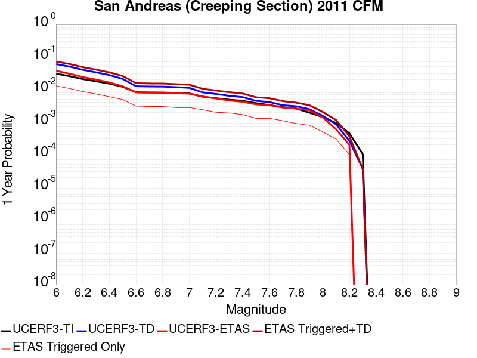 |  |

| Magnitude | 1 wk TI Prob | 1 wk TD Prob | 1 wk ETAS Prob | 1 wk ETAS/TD Gain | 1 wk ETAS Triggered+TD | 1 wk ETAS Triggered Only | 1 mo TI Prob | 1 mo TD Prob | 1 mo ETAS Prob | 1 mo ETAS/TD Gain | 1 mo ETAS Triggered+TD | 1 mo ETAS Triggered Only | 1 yr TI Prob | 1 yr TD Prob | 1 yr ETAS Prob | 1 yr ETAS/TD Gain | 1 yr ETAS Triggered+TD | 1 yr ETAS Triggered Only | 10 yr TI Prob | 10 yr TD Prob | 10 yr ETAS Prob | 10 yr ETAS/TD Gain | 10 yr ETAS Triggered+TD | 10 yr ETAS Triggered Only |
|-----|-----|-----|-----|-----|-----|-----|-----|-----|-----|-----|-----|-----|-----|-----|-----|-----|-----|-----|-----|-----|-----|-----|-----|-----|
| 6.0 | 5.986481E-4 | 0.0012158811 | 5.4495916E-4 | 0.448201 | 0.0017601775 | 5.4495916E-4 | 0.0025631124 | 0.0051956596 | 0.0016348774 | 0.31466216 | 0.0068220426 | 0.0016348774 | 0.030762846 | 0.060635127 | 0.0038147138 | 0.062912606 | 0.064218536 | 0.0038147138 | 0.26835477 | 0.4229866 | 0.015258855 | 0.036074087 | 0.4317912 | 0.015258855 |
| 6.1 | 5.015945E-4 | 0.0010130458 | 0.0 | 0.0 | 0.0010130458 | 0.0 | 0.00214792 | 0.0043305648 | 0.0010899183 | 0.2516804 | 0.005415763 | 0.0010899183 | 0.025839351 | 0.050815985 | 0.0032697548 | 0.064345 | 0.053919584 | 0.0032697548 | 0.23032776 | 0.3702337 | 0.01253406 | 0.03385445 | 0.37812725 | 0.01253406 |
| 6.2 | 4.073338E-4 | 8.02223E-4 | 0.0 | 0.0 | 8.02223E-4 | 0.0 | 0.0017445484 | 0.0034308275 | 0.0010899183 | 0.3176838 | 0.0045170067 | 0.0010899183 | 0.021034058 | 0.0405076 | 0.0032697548 | 0.08071954 | 0.043644905 | 0.0032697548 | 0.19150782 | 0.31020957 | 0.011444142 | 0.036891647 | 0.31810364 | 0.011444142 |
| 6.3 | 3.464099E-4 | 6.6541764E-4 | 0.0 | 0.0 | 6.6541764E-4 | 0.0 | 0.0014837692 | 0.0028466634 | 0.0010899183 | 0.3828757 | 0.003933479 | 0.0010899183 | 0.017915873 | 0.033761524 | 0.0032697548 | 0.096848555 | 0.036920886 | 0.0032697548 | 0.16538359 | 0.26832467 | 0.009809264 | 0.036557443 | 0.27550188 | 0.009809264 |
| 6.4 | 2.935057E-4 | 5.4590224E-4 | 0.0 | 0.0 | 5.4590224E-4 | 0.0 | 0.0012572751 | 0.0023361163 | 0.0010899183 | 0.46655136 | 0.0034234885 | 0.0010899183 | 0.015200248 | 0.027832685 | 0.0027247956 | 0.09789913 | 0.030481642 | 0.0027247956 | 0.14201577 | 0.22982958 | 0.0059945504 | 0.02608259 | 0.2344464 | 0.0059945504 |
| 6.5 | 2.3409708E-4 | 4.1241286E-4 | 0.0 | 0.0 | 4.1241286E-4 | 0.0 | 0.0010028875 | 0.0017655423 | 0.0010899183 | 0.61732775 | 0.0028535363 | 0.0010899183 | 0.012141965 | 0.0211528 | 0.0027247956 | 0.12881489 | 0.023819959 | 0.0027247956 | 0.11499573 | 0.18347985 | 0.004904632 | 0.026731176 | 0.18748458 | 0.004904632 |
| 6.6 | 1.5842178E-4 | 2.4227453E-4 | 0.0 | 0.0 | 2.4227453E-4 | 0.0 | 6.7877385E-4 | 0.0010378995 | 0.0010899183 | 1.0501192 | 0.0021266865 | 0.0010899183 | 0.0082328 | 0.0125618195 | 0.0016348774 | 0.13014655 | 0.01417616 | 0.0016348774 | 0.07934396 | 0.11957417 | 0.0021798366 | 0.018229995 | 0.121493354 | 0.0021798366 |
| 6.7 | 1.5616413E-4 | 2.3766492E-4 | 0.0 | 0.0 | 2.3766492E-4 | 0.0 | 6.691031E-4 | 0.0010181629 | 0.0010899183 | 1.0704753 | 0.0021069716 | 0.0010899183 | 0.0081159435 | 0.012324867 | 0.0016348774 | 0.13264868 | 0.013939595 | 0.0016348774 | 0.0782586 | 0.11760267 | 0.0021798366 | 0.018535603 | 0.119526155 | 0.0021798366 |
| 6.8 | 1.5538467E-4 | 2.3592412E-4 | 0.0 | 0.0 | 2.3592412E-4 | 0.0 | 6.6576427E-4 | 0.0010107091 | 0.0010899183 | 1.07837 | 0.0020995256 | 0.0010899183 | 0.008075596 | 0.012235293 | 0.0016348774 | 0.1336198 | 0.013850167 | 0.0016348774 | 0.07788358 | 0.11683841 | 0.0021798366 | 0.018656848 | 0.11876356 | 0.0021798366 |
| 6.9 | 1.5153569E-4 | 2.2708514E-4 | 0.0 | 0.0 | 2.2708514E-4 | 0.0 | 6.49277E-4 | 9.7286096E-4 | 0.0010899183 | 1.1203227 | 0.0020617188 | 0.0010899183 | 0.007876333 | 0.01178074 | 0.0016348774 | 0.13877545 | 0.013396356 | 0.0016348774 | 0.07602952 | 0.112919025 | 0.0021798366 | 0.01930442 | 0.11485272 | 0.0021798366 |
| 7.0 | 1.4588932E-4 | 2.1581045E-4 | 0.0 | 0.0 | 2.1581045E-4 | 0.0 | 6.250901E-4 | 9.2457596E-4 | 0.0010899183 | 1.1788304 | 0.0020134866 | 0.0010899183 | 0.0075839474 | 0.011199075 | 0.0016348774 | 0.14598325 | 0.012815643 | 0.0016348774 | 0.073302895 | 0.107805565 | 0.0016348774 | 0.015165056 | 0.10926419 | 0.0016348774 |
| 7.1 | 1.1565079E-4 | 1.5583615E-4 | 0.0 | 0.0 | 1.5583615E-4 | 0.0 | 4.955521E-4 | 6.676991E-4 | 5.4495916E-4 | 0.8161747 | 0.0012122943 | 5.4495916E-4 | 0.006016669 | 0.008099121 | 0.0010899183 | 0.13457242 | 0.009180211 | 0.0010899183 | 0.058563538 | 0.080524765 | 0.0010899183 | 0.013535193 | 0.08152692 | 0.0010899183 |
| 7.2 | 1.0393792E-4 | 1.396639E-4 | 0.0 | 0.0 | 1.396639E-4 | 0.0 | 4.4537216E-4 | 5.9842295E-4 | 0.0 | 0.0 | 5.9842295E-4 | 0.0 | 0.005408933 | 0.0072616157 | 5.4495916E-4 | 0.07504654 | 0.0078026177 | 5.4495916E-4 | 0.052791595 | 0.07266633 | 5.4495916E-4 | 0.007499472 | 0.0731717 | 5.4495916E-4 |
| 7.3 | 9.332884E-5 | 1.2216425E-4 | 0.0 | 0.0 | 1.2216425E-4 | 0.0 | 3.999194E-4 | 5.234566E-4 | 0.0 | 0.0 | 5.234566E-4 | 0.0 | 0.0048581534 | 0.0063545858 | 5.4495916E-4 | 0.0857584 | 0.006896082 | 5.4495916E-4 | 0.047533102 | 0.06386944 | 5.4495916E-4 | 0.008532392 | 0.064379595 | 5.4495916E-4 |
| 7.4 | 8.670252E-5 | 1.11667796E-4 | 0.0 | 0.0 | 1.11667796E-4 | 0.0 | 3.715293E-4 | 4.7848906E-4 | 0.0 | 0.0 | 4.7848906E-4 | 0.0 | 0.004513991 | 0.005810155 | 5.4495916E-4 | 0.09379425 | 0.006351948 | 5.4495916E-4 | 0.044233937 | 0.058650583 | 5.4495916E-4 | 0.009291624 | 0.059163578 | 5.4495916E-4 |
| 7.5 | 7.3036405E-5 | 8.557419E-5 | 0.0 | 0.0 | 8.557419E-5 | 0.0 | 3.129756E-4 | 3.6669505E-4 | 0.0 | 0.0 | 3.6669505E-4 | 0.0 | 0.0038038217 | 0.0044553922 | 5.4495916E-4 | 0.12231451 | 0.004997923 | 5.4495916E-4 | 0.03739367 | 0.045724712 | 5.4495916E-4 | 0.011918263 | 0.04624475 | 5.4495916E-4 |
| 7.6 | 6.3935775E-5 | 7.875098E-5 | 0.0 | 0.0 | 7.875098E-5 | 0.0 | 2.7398168E-4 | 3.374606E-4 | 0.0 | 0.0 | 3.374606E-4 | 0.0 | 0.0033306254 | 0.0041008596 | 5.4495916E-4 | 0.132889 | 0.004643584 | 5.4495916E-4 | 0.032811474 | 0.04204755 | 5.4495916E-4 | 0.012960544 | 0.042569596 | 5.4495916E-4 |
| 7.7 | 5.5050095E-5 | 6.305364E-5 | 0.0 | 0.0 | 6.305364E-5 | 0.0 | 2.3590765E-4 | 2.7020188E-4 | 0.0 | 0.0 | 2.7020188E-4 | 0.0 | 0.0028683927 | 0.003284749 | 5.4495916E-4 | 0.16590586 | 0.0038279183 | 5.4495916E-4 | 0.0283165 | 0.034058776 | 5.4495916E-4 | 0.016000548 | 0.034585178 | 5.4495916E-4 |
| 7.8 | 5.027131E-5 | 5.8371108E-5 | 0.0 | 0.0 | 5.8371108E-5 | 0.0 | 2.1543067E-4 | 2.5013793E-4 | 0.0 | 0.0 | 2.5013793E-4 | 0.0 | 0.0026197135 | 0.0030411792 | 5.4495916E-4 | 0.17919336 | 0.0035844808 | 5.4495916E-4 | 0.025890453 | 0.031534772 | 5.4495916E-4 | 0.017281214 | 0.032062545 | 5.4495916E-4 |
| 7.9 | 3.7271806E-5 | 4.7599344E-5 | 0.0 | 0.0 | 4.7599344E-5 | 0.0 | 1.5972654E-4 | 2.0398124E-4 | 0.0 | 0.0 | 2.0398124E-4 | 0.0 | 0.0019429359 | 0.002480645 | 5.4495916E-4 | 0.21968445 | 0.0030242521 | 5.4495916E-4 | 0.019260362 | 0.025771113 | 5.4495916E-4 | 0.021146122 | 0.026302028 | 5.4495916E-4 |
| 8.0 | 2.7310243E-5 | 2.9675752E-5 | 0.0 | 0.0 | 2.9675752E-5 | 0.0 | 1.17038646E-4 | 1.2717559E-4 | 0.0 | 0.0 | 1.2717559E-4 | 0.0 | 0.0014240141 | 0.0015472639 | 0.0 | 0.0 | 0.0015472639 | 0.0 | 0.014149235 | 0.016320135 | 0.0 | 0.0 | 0.016320135 | 0.0 |
| 8.1 | 1.7940547E-5 | 1.627415E-5 | 0.0 | 0.0 | 1.627415E-5 | 0.0 | 7.688579E-5 | 6.97445E-5 | 0.0 | 0.0 | 6.97445E-5 | 0.0 | 9.3568244E-4 | 8.4880897E-4 | 0.0 | 0.0 | 8.4880897E-4 | 0.0 | 0.009317525 | 0.009204732 | 0.0 | 0.0 | 0.009204732 | 0.0 |
| 8.2 | 8.643924E-6 | 5.0104E-6 | 0.0 | 0.0 | 5.0104E-6 | 0.0 | 3.704486E-5 | 2.1472966E-5 | 0.0 | 0.0 | 2.1472966E-5 | 0.0 | 4.5092785E-4 | 2.6140205E-4 | 0.0 | 0.0 | 2.6140205E-4 | 0.0 | 0.0045001395 | 0.002993769 | 0.0 | 0.0 | 0.002993769 | 0.0 |
| 8.3 | 1.983087E-6 | 6.880041E-7 | 0.0 | 0.0 | 6.880041E-7 | 0.0 | 8.498917E-6 | 2.9485857E-6 | 0.0 | 0.0 | 2.9485857E-6 | 0.0 | 1.034694E-4 | 3.589845E-5 | 0.0 | 0.0 | 3.589845E-5 | 0.0 | 0.0010342124 | 4.2701262E-4 | 0.0 | 0.0 | 4.2701262E-4 | 0.0 |

## Mendocino
*[(top)](#table-of-contents)*

| 1 Week | 1 Month | 1 Year | 10 Year |
|-----|-----|-----|-----|
|  |  |  |  |

| Magnitude | 1 wk TI Prob | 1 wk TD Prob | 1 wk ETAS Prob | 1 wk ETAS/TD Gain | 1 wk ETAS Triggered+TD | 1 wk ETAS Triggered Only | 1 mo TI Prob | 1 mo TD Prob | 1 mo ETAS Prob | 1 mo ETAS/TD Gain | 1 mo ETAS Triggered+TD | 1 mo ETAS Triggered Only | 1 yr TI Prob | 1 yr TD Prob | 1 yr ETAS Prob | 1 yr ETAS/TD Gain | 1 yr ETAS Triggered+TD | 1 yr ETAS Triggered Only | 10 yr TI Prob | 10 yr TD Prob | 10 yr ETAS Prob | 10 yr ETAS/TD Gain | 10 yr ETAS Triggered+TD | 10 yr ETAS Triggered Only |
|-----|-----|-----|-----|-----|-----|-----|-----|-----|-----|-----|-----|-----|-----|-----|-----|-----|-----|-----|-----|-----|-----|-----|-----|-----|
| 6.0 | 5.5409013E-4 | 0.0010793889 | 0.0 | 0.0 | 0.0010793889 | 0.0 | 0.0023725112 | 0.0046157073 | 0.0 | 0.0 | 0.0046157073 | 0.0 | 0.028505474 | 0.054447312 | 0.0027247956 | 0.05004463 | 0.05702375 | 0.0027247956 | 0.25113493 | 0.4105582 | 0.013079019 | 0.031856675 | 0.4182675 | 0.013079019 |
| 6.1 | 4.2515888E-4 | 8.187679E-4 | 0.0 | 0.0 | 8.187679E-4 | 0.0 | 0.0018208373 | 0.0035026954 | 0.0 | 0.0 | 0.0035026954 | 0.0 | 0.021944538 | 0.041547947 | 0.0021798366 | 0.052465566 | 0.043637216 | 0.0021798366 | 0.19899574 | 0.32862902 | 0.009264305 | 0.02819077 | 0.33484882 | 0.009264305 |
| 6.2 | 4.2515888E-4 | 8.187679E-4 | 0.0 | 0.0 | 8.187679E-4 | 0.0 | 0.0018208373 | 0.0035026954 | 0.0 | 0.0 | 0.0035026954 | 0.0 | 0.021944538 | 0.041547947 | 0.0021798366 | 0.052465566 | 0.043637216 | 0.0021798366 | 0.19899574 | 0.32862902 | 0.009264305 | 0.02819077 | 0.33484882 | 0.009264305 |
| 6.3 | 3.2773745E-4 | 6.155574E-4 | 0.0 | 0.0 | 6.155574E-4 | 0.0 | 0.0014038329 | 0.0026343116 | 0.0 | 0.0 | 0.0026343116 | 0.0 | 0.016958237 | 0.031404294 | 0.0021798366 | 0.06941205 | 0.033515673 | 0.0021798366 | 0.1572094 | 0.25942355 | 0.008174387 | 0.03150981 | 0.2654773 | 0.008174387 |
| 6.4 | 2.7417165E-4 | 5.0113956E-4 | 0.0 | 0.0 | 5.0113956E-4 | 0.0 | 0.0011744922 | 0.0021450887 | 0.0 | 0.0 | 0.0021450887 | 0.0 | 0.014205975 | 0.025655411 | 0.0016348774 | 0.063724466 | 0.027248345 | 0.0016348774 | 0.13331394 | 0.2180968 | 0.0059945504 | 0.027485734 | 0.22278395 | 0.0059945504 |
| 6.5 | 2.3984899E-4 | 4.2881654E-4 | 0.0 | 0.0 | 4.2881654E-4 | 0.0 | 0.0010275192 | 0.0018358091 | 0.0 | 0.0 | 0.0018358091 | 0.0 | 0.012438473 | 0.022002775 | 0.0016348774 | 0.07430324 | 0.02360168 | 0.0016348774 | 0.11764851 | 0.19064191 | 0.0059945504 | 0.03144403 | 0.19549365 | 0.0059945504 |
| 6.6 | 2.1023539E-4 | 3.6590043E-4 | 0.0 | 0.0 | 3.6590043E-4 | 0.0 | 9.0069766E-4 | 0.0015666756 | 0.0 | 0.0 | 0.0015666756 | 0.0 | 0.010910975 | 0.018815525 | 0.0010899183 | 0.05792654 | 0.019884937 | 0.0010899183 | 0.10390546 | 0.16608629 | 0.005449591 | 0.032811806 | 0.17063078 | 0.005449591 |
| 6.7 | 1.2592976E-4 | 1.8099084E-4 | 0.0 | 0.0 | 1.8099084E-4 | 0.0 | 5.395873E-4 | 7.753864E-4 | 0.0 | 0.0 | 7.753864E-4 | 0.0 | 0.006549705 | 0.009388288 | 5.4495916E-4 | 0.058046702 | 0.009928131 | 5.4495916E-4 | 0.063599944 | 0.08949357 | 0.0027247956 | 0.03044683 | 0.09197452 | 0.0027247956 |
| 6.8 | 1.13663555E-4 | 1.5089264E-4 | 0.0 | 0.0 | 1.5089264E-4 | 0.0 | 4.8703855E-4 | 6.4649165E-4 | 0.0 | 0.0 | 6.4649165E-4 | 0.0 | 0.0059135845 | 0.007838629 | 0.0 | 0.0 | 0.007838629 | 0.0 | 0.057586733 | 0.07595165 | 0.0010899183 | 0.014350159 | 0.07695879 | 0.0010899183 |
| 6.9 | 9.926894E-5 | 1.20059965E-4 | 0.0 | 0.0 | 1.20059965E-4 | 0.0 | 4.2536893E-4 | 5.1443576E-4 | 0.0 | 0.0 | 5.1443576E-4 | 0.0 | 0.0051665753 | 0.0062443526 | 0.0 | 0.0 | 0.0062443526 | 0.0 | 0.050480947 | 0.06147359 | 0.0010899183 | 0.017729862 | 0.062496506 | 0.0010899183 |
| 7.0 | 9.168125E-5 | 1.04989136E-4 | 0.0 | 0.0 | 1.04989136E-4 | 0.0 | 3.9286047E-4 | 4.4987473E-4 | 0.0 | 0.0 | 4.4987473E-4 | 0.0 | 0.004772591 | 0.0054631177 | 0.0 | 0.0 | 0.0054631177 | 0.0 | 0.04671385 | 0.05426433 | 5.4495916E-4 | 0.010042678 | 0.054779716 | 5.4495916E-4 |
| 7.1 | 8.2854116E-5 | 8.831159E-5 | 0.0 | 0.0 | 8.831159E-5 | 0.0 | 3.5504074E-4 | 3.7842387E-4 | 0.0 | 0.0 | 3.7842387E-4 | 0.0 | 0.004314056 | 0.0045976397 | 0.0 | 0.0 | 0.0045976397 | 0.0 | 0.042312626 | 0.046162598 | 5.4495916E-4 | 0.011805208 | 0.046682402 | 5.4495916E-4 |
| 7.2 | 7.8255274E-5 | 8.0320024E-5 | 0.0 | 0.0 | 8.0320024E-5 | 0.0 | 3.3533663E-4 | 3.4418405E-4 | 0.0 | 0.0 | 3.4418405E-4 | 0.0 | 0.0040750825 | 0.0041825282 | 0.0 | 0.0 | 0.0041825282 | 0.0 | 0.040011603 | 0.04222741 | 5.4495916E-4 | 0.012905342 | 0.042749356 | 5.4495916E-4 |
| 7.3 | 6.887904E-5 | 6.0378115E-5 | 0.0 | 0.0 | 6.0378115E-5 | 0.0 | 2.9516246E-4 | 2.587382E-4 | 0.0 | 0.0 | 2.587382E-4 | 0.0 | 0.0035876823 | 0.0031456787 | 0.0 | 0.0 | 0.0031456787 | 0.0 | 0.035303112 | 0.032249544 | 0.0 | 0.0 | 0.032249544 | 0.0 |
| 7.4 | 5.4898497E-5 | 3.588004E-5 | 0.0 | 0.0 | 3.588004E-5 | 0.0 | 2.3525805E-4 | 1.5376284E-4 | 0.0 | 0.0 | 1.5376284E-4 | 0.0 | 0.0028605047 | 0.0018705077 | 0.0 | 0.0 | 0.0018705077 | 0.0 | 0.02823963 | 0.019616025 | 0.0 | 0.0 | 0.019616025 | 0.0 |
| 7.5 | 3.9103943E-5 | 1.0616167E-5 | 0.0 | 0.0 | 1.0616167E-5 | 0.0 | 1.6757756E-4 | 4.5497076E-5 | 0.0 | 0.0 | 4.5497076E-5 | 0.0 | 0.0020383475 | 5.5378757E-4 | 0.0 | 0.0 | 5.5378757E-4 | 0.0 | 0.020197518 | 0.0062145353 | 0.0 | 0.0 | 0.0062145353 | 0.0 |
| 7.6 | 3.641042E-5 | 8.36707E-6 | 0.0 | 0.0 | 8.36707E-6 | 0.0 | 1.5603533E-4 | 3.585839E-5 | 0.0 | 0.0 | 3.585839E-5 | 0.0 | 0.0018980748 | 4.3648967E-4 | 0.0 | 0.0 | 4.3648967E-4 | 0.0 | 0.018819444 | 0.004976619 | 0.0 | 0.0 | 0.004976619 | 0.0 |
| 7.7 | 3.1318774E-5 | 3.9938727E-6 | 0.0 | 0.0 | 3.9938727E-6 | 0.0 | 1.342164E-4 | 1.7116487E-5 | 0.0 | 0.0 | 1.7116487E-5 | 0.0 | 0.0016328598 | 2.0837346E-4 | 0.0 | 0.0 | 2.0837346E-4 | 0.0 | 0.016209139 | 0.0025776818 | 0.0 | 0.0 | 0.0025776818 | 0.0 |
| 7.8 | 2.209241E-5 | 2.3840068E-6 | 0.0 | 0.0 | 2.3840068E-6 | 0.0 | 9.467832E-5 | 1.0217132E-5 | 0.0 | 0.0 | 1.0217132E-5 | 0.0 | 0.001152099 | 1.243865E-4 | 0.0 | 0.0 | 1.243865E-4 | 0.0 | 0.011461443 | 0.0015521594 | 0.0 | 0.0 | 0.0015521594 | 0.0 |
| 7.9 | 1.2640477E-5 | 1.8273861E-6 | 0.0 | 0.0 | 1.8273861E-6 | 0.0 | 5.4172346E-5 | 7.831631E-6 | 0.0 | 0.0 | 7.831631E-6 | 0.0 | 6.593487E-4 | 9.534596E-5 | 0.0 | 0.0 | 9.534596E-5 | 0.0 | 0.006573958 | 0.001167472 | 0.0 | 0.0 | 0.001167472 | 0.0 |
| 8.0 | 6.5548907E-6 | 1.4736802E-6 | 0.0 | 0.0 | 1.4736802E-6 | 0.0 | 2.8092087E-5 | 6.3157568E-6 | 0.0 | 0.0 | 6.3157568E-6 | 0.0 | 3.4196748E-4 | 7.689164E-5 | 0.0 | 0.0 | 7.689164E-5 | 0.0 | 0.0034144172 | 9.3351625E-4 | 0.0 | 0.0 | 9.3351625E-4 | 0.0 |
| 8.1 | 3.1916707E-6 | 1.2142848E-6 | 0.0 | 0.0 | 1.2142848E-6 | 0.0 | 1.3678517E-5 | 5.2040677E-6 | 0.0 | 0.0 | 5.2040677E-6 | 0.0 | 1.6652321E-4 | 6.33577E-5 | 0.0 | 0.0 | 6.33577E-5 | 0.0 | 0.0016639848 | 7.786327E-4 | 0.0 | 0.0 | 7.786327E-4 | 0.0 |
| 8.2 | 2.1193785E-6 | 9.23783E-7 | 0.0 | 0.0 | 9.23783E-7 | 0.0 | 9.083019E-6 | 3.9590636E-6 | 0.0 | 0.0 | 3.9590636E-6 | 0.0 | 1.1058014E-4 | 4.8200553E-5 | 0.0 | 0.0 | 4.8200553E-5 | 0.0 | 0.0011052513 | 5.890795E-4 | 0.0 | 0.0 | 5.890795E-4 | 0.0 |
| 8.3 | 7.536878E-7 | 3.5652886E-7 | 0.0 | 0.0 | 3.5652886E-7 | 0.0 | 3.2300866E-6 | 1.52798E-6 | 0.0 | 0.0 | 1.52798E-6 | 0.0 | 3.9325594E-5 | 1.8603008E-5 | 0.0 | 0.0 | 1.8603008E-5 | 0.0 | 3.9318635E-4 | 2.2076594E-4 | 0.0 | 0.0 | 2.2076594E-4 | 0.0 |

## Brawley (Seismic Zone) alt 1
*[(top)](#table-of-contents)*

| 1 Week | 1 Month | 1 Year | 10 Year |
|-----|-----|-----|-----|
|  |  |  |  |

| Magnitude | 1 wk TI Prob | 1 wk TD Prob | 1 wk ETAS Prob | 1 wk ETAS/TD Gain | 1 wk ETAS Triggered+TD | 1 wk ETAS Triggered Only | 1 mo TI Prob | 1 mo TD Prob | 1 mo ETAS Prob | 1 mo ETAS/TD Gain | 1 mo ETAS Triggered+TD | 1 mo ETAS Triggered Only | 1 yr TI Prob | 1 yr TD Prob | 1 yr ETAS Prob | 1 yr ETAS/TD Gain | 1 yr ETAS Triggered+TD | 1 yr ETAS Triggered Only | 10 yr TI Prob | 10 yr TD Prob | 10 yr ETAS Prob | 10 yr ETAS/TD Gain | 10 yr ETAS Triggered+TD | 10 yr ETAS Triggered Only |
|-----|-----|-----|-----|-----|-----|-----|-----|-----|-----|-----|-----|-----|-----|-----|-----|-----|-----|-----|-----|-----|-----|-----|-----|-----|
| 6.0 | 2.2521618E-4 | 4.6533594E-4 | 0.0 | 0.0 | 4.6533594E-4 | 0.0 | 9.6485513E-4 | 0.0019928087 | 5.4495916E-4 | 0.27346286 | 0.0025366817 | 5.4495916E-4 | 0.011683988 | 0.023988076 | 0.0032697548 | 0.13630751 | 0.027179396 | 0.0032697548 | 0.11088423 | 0.20974061 | 0.010354224 | 0.049366802 | 0.21792313 | 0.010354224 |
| 6.1 | 2.2521618E-4 | 4.6533594E-4 | 0.0 | 0.0 | 4.6533594E-4 | 0.0 | 9.6485513E-4 | 0.0019928087 | 5.4495916E-4 | 0.27346286 | 0.0025366817 | 5.4495916E-4 | 0.011683988 | 0.023988076 | 0.0032697548 | 0.13630751 | 0.027179396 | 0.0032697548 | 0.11088423 | 0.20974061 | 0.008174387 | 0.038973793 | 0.2162005 | 0.008174387 |
| 6.2 | 2.198148E-4 | 4.5645965E-4 | 0.0 | 0.0 | 4.5645965E-4 | 0.0 | 9.417233E-4 | 0.0019548247 | 5.4495916E-4 | 0.2787765 | 0.0024987184 | 5.4495916E-4 | 0.011405343 | 0.02353607 | 0.0032697548 | 0.13892527 | 0.026728867 | 0.0032697548 | 0.10837428 | 0.20623754 | 0.0076294276 | 0.0369934 | 0.2122935 | 0.0076294276 |
| 6.3 | 2.1704129E-4 | 4.5086833E-4 | 0.0 | 0.0 | 4.5086833E-4 | 0.0 | 9.298453E-4 | 0.0019308975 | 5.4495916E-4 | 0.282231 | 0.0024748044 | 5.4495916E-4 | 0.011262234 | 0.023251357 | 0.0032697548 | 0.1406264 | 0.026445085 | 0.0032697548 | 0.107082725 | 0.20413247 | 0.0076294276 | 0.037374884 | 0.21020448 | 0.0076294276 |
| 6.4 | 1.876142E-4 | 3.9022637E-4 | 0.0 | 0.0 | 3.9022637E-4 | 0.0 | 8.038131E-4 | 0.0016713403 | 5.4495916E-4 | 0.32606113 | 0.0022153887 | 5.4495916E-4 | 0.00974259 | 0.02015831 | 0.0032697548 | 0.16220382 | 0.023362152 | 0.0032697548 | 0.093263686 | 0.18090113 | 0.007084469 | 0.039162103 | 0.18670401 | 0.007084469 |
| 6.5 | 1.7390939E-4 | 3.6497993E-4 | 0.0 | 0.0 | 3.6497993E-4 | 0.0 | 7.45113E-4 | 0.0015632734 | 5.4495916E-4 | 0.34860128 | 0.0021073807 | 5.4495916E-4 | 0.009034078 | 0.018868195 | 0.0027247956 | 0.1444121 | 0.021541579 | 0.0027247956 | 0.086755216 | 0.17080772 | 0.0065395096 | 0.038285796 | 0.17623024 | 0.0065395096 |
| 6.6 | 1.591791E-4 | 3.3971245E-4 | 0.0 | 0.0 | 3.3971245E-4 | 0.0 | 6.8201777E-4 | 0.0014551076 | 5.4495916E-4 | 0.37451467 | 0.0019992737 | 5.4495916E-4 | 0.008271996 | 0.017573824 | 0.0027247956 | 0.15504853 | 0.020250736 | 0.0027247956 | 0.07970774 | 0.16035357 | 0.004904632 | 0.03058636 | 0.16447173 | 0.004904632 |
| 6.7 | 1.4268003E-4 | 3.1204906E-4 | 0.0 | 0.0 | 3.1204906E-4 | 0.0 | 6.1134255E-4 | 0.0013366753 | 5.4495916E-4 | 0.40769747 | 0.0018809059 | 5.4495916E-4 | 0.007417723 | 0.016153757 | 0.0027247956 | 0.16867876 | 0.018834537 | 0.0027247956 | 0.07174956 | 0.1486512 | 0.0038147138 | 0.02566218 | 0.15189885 | 0.0038147138 |
| 6.8 | 1.239713E-4 | 2.835754E-4 | 0.0 | 0.0 | 2.835754E-4 | 0.0 | 5.3119735E-4 | 0.0012147628 | 5.4495916E-4 | 0.4486136 | 0.00175906 | 5.4495916E-4 | 0.0064481674 | 0.014690774 | 0.0027247956 | 0.18547666 | 0.01737554 | 0.0027247956 | 0.06264243 | 0.13560335 | 0.0038147138 | 0.028131412 | 0.13890077 | 0.0038147138 |
| 6.9 | 1.0180238E-4 | 2.5747836E-4 | 0.0 | 0.0 | 2.5747836E-4 | 0.0 | 4.3622297E-4 | 0.0011030161 | 5.4495916E-4 | 0.49406272 | 0.0016473741 | 5.4495916E-4 | 0.005298089 | 0.013347485 | 0.0027247956 | 0.204143 | 0.01603591 | 0.0027247956 | 0.05173543 | 0.12289762 | 0.0038147138 | 0.03103977 | 0.12624352 | 0.0038147138 |
| 7.0 | 7.6619996E-5 | 2.2041418E-4 | 0.0 | 0.0 | 2.2041418E-4 | 0.0 | 3.283301E-4 | 9.4429334E-4 | 5.4495916E-4 | 0.5771079 | 0.0014887379 | 5.4495916E-4 | 0.0039900932 | 0.0114368545 | 0.0027247956 | 0.23824695 | 0.014130487 | 0.0027247956 | 0.039192066 | 0.1057968 | 0.0032697548 | 0.03090599 | 0.10872062 | 0.0032697548 |
| 7.1 | 7.5127435E-5 | 2.1730422E-4 | 0.0 | 0.0 | 2.1730422E-4 | 0.0 | 3.2193496E-4 | 9.309745E-4 | 5.4495916E-4 | 0.58536416 | 0.0014754263 | 5.4495916E-4 | 0.0039125155 | 0.011276387 | 0.0027247956 | 0.24163729 | 0.013970457 | 0.0027247956 | 0.038443442 | 0.10438197 | 0.0032697548 | 0.0313249 | 0.10731042 | 0.0032697548 |
| 7.2 | 6.788582E-5 | 1.9873041E-4 | 0.0 | 0.0 | 1.9873041E-4 | 0.0 | 2.9090676E-4 | 8.5142674E-4 | 5.4495916E-4 | 0.64005405 | 0.0013959218 | 5.4495916E-4 | 0.0035360386 | 0.01031747 | 0.0027247956 | 0.26409534 | 0.013014153 | 0.0027247956 | 0.034803 | 0.09609729 | 0.0032697548 | 0.03402546 | 0.09905283 | 0.0032697548 |
| 7.3 | 6.399602E-5 | 1.8519968E-4 | 0.0 | 0.0 | 1.8519968E-4 | 0.0 | 2.7423984E-4 | 7.9347426E-4 | 5.4495916E-4 | 0.68680125 | 0.001338001 | 5.4495916E-4 | 0.0033337586 | 0.00961833 | 0.0027247956 | 0.28329197 | 0.012316918 | 0.0027247956 | 0.03284188 | 0.09004573 | 0.0032697548 | 0.03631216 | 0.09302106 | 0.0032697548 |
| 7.4 | 4.506759E-5 | 1.2283388E-4 | 0.0 | 0.0 | 1.2283388E-4 | 0.0 | 1.9313251E-4 | 5.2632554E-4 | 5.4495916E-4 | 1.0354031 | 0.0010709979 | 5.4495916E-4 | 0.0023488526 | 0.006389355 | 0.0016348774 | 0.2558752 | 0.008013786 | 0.0016348774 | 0.023241805 | 0.061279375 | 0.0016348774 | 0.02667908 | 0.06281407 | 0.0016348774 |
| 7.5 | 3.43289E-5 | 9.1361755E-5 | 0.0 | 0.0 | 9.1361755E-5 | 0.0 | 1.4711556E-4 | 3.9149195E-4 | 0.0 | 0.0 | 3.9149195E-4 | 0.0 | 0.0017896603 | 0.0047560576 | 5.4495916E-4 | 0.114582114 | 0.0052984245 | 5.4495916E-4 | 0.01775316 | 0.046157982 | 5.4495916E-4 | 0.011806389 | 0.046677787 | 5.4495916E-4 |
| 7.6 | 2.5980507E-5 | 6.881562E-5 | 0.0 | 0.0 | 6.881562E-5 | 0.0 | 1.1134028E-4 | 2.948909E-4 | 0.0 | 0.0 | 2.948909E-4 | 0.0 | 0.001354725 | 0.0035844091 | 5.4495916E-4 | 0.15203597 | 0.004127415 | 5.4495916E-4 | 0.013464959 | 0.03505983 | 5.4495916E-4 | 0.015543691 | 0.03558568 | 5.4495916E-4 |
| 7.7 | 1.7292105E-5 | 4.7962152E-5 | 0.0 | 0.0 | 4.7962152E-5 | 0.0 | 7.4106916E-5 | 2.0553592E-4 | 0.0 | 0.0 | 2.0553592E-4 | 0.0 | 9.018782E-4 | 0.0024995336 | 0.0 | 0.0 | 0.0024995336 | 0.0 | 0.008982267 | 0.024629422 | 0.0 | 0.0 | 0.024629422 | 0.0 |
| 7.8 | 1.2927471E-5 | 3.8444596E-5 | 0.0 | 0.0 | 3.8444596E-5 | 0.0 | 5.5402274E-5 | 1.6475216E-4 | 0.0 | 0.0 | 1.6475216E-4 | 0.0 | 6.743139E-4 | 0.0020040146 | 0.0 | 0.0 | 0.0020040146 | 0.0 | 0.0067227143 | 0.019860458 | 0.0 | 0.0 | 0.019860458 | 0.0 |
| 7.9 | 1.0200774E-5 | 2.7730803E-5 | 0.0 | 0.0 | 2.7730803E-5 | 0.0 | 4.371687E-5 | 1.18840886E-4 | 0.0 | 0.0 | 1.18840886E-4 | 0.0 | 5.321229E-4 | 0.0014459285 | 0.0 | 0.0 | 0.0014459285 | 0.0 | 0.005308505 | 0.014520071 | 0.0 | 0.0 | 0.014520071 | 0.0 |
| 8.0 | 8.650396E-6 | 2.2400553E-5 | 0.0 | 0.0 | 2.2400553E-5 | 0.0 | 3.70726E-5 | 9.599884E-5 | 0.0 | 0.0 | 9.599884E-5 | 0.0 | 4.5126543E-4 | 0.00116816 | 0.0 | 0.0 | 0.00116816 | 0.0 | 0.0045035016 | 0.011800713 | 0.0 | 0.0 | 0.011800713 | 0.0 |
| 8.1 | 3.9368224E-6 | 6.9356947E-6 | 0.0 | 0.0 | 6.9356947E-6 | 0.0 | 1.6871985E-5 | 2.9724068E-5 | 0.0 | 0.0 | 2.9724068E-5 | 0.0 | 2.0539707E-4 | 3.6183055E-4 | 0.0 | 0.0 | 3.6183055E-4 | 0.0 | 0.0020520731 | 0.0038061712 | 0.0 | 0.0 | 0.0038061712 | 0.0 |
| 8.2 | 1.7101195E-6 | 2.061943E-6 | 0.0 | 0.0 | 2.061943E-6 | 0.0 | 7.329063E-6 | 8.836869E-6 | 0.0 | 0.0 | 8.836869E-6 | 0.0 | 8.922769E-5 | 1.0758359E-4 | 0.0 | 0.0 | 1.0758359E-4 | 0.0 | 8.9191867E-4 | 0.0011864101 | 0.0 | 0.0 | 0.0011864101 | 0.0 |
| 8.3 | 3.0346666E-8 | 1.567035E-8 | 0.0 | 0.0 | 1.567035E-8 | 0.0 | 1.3005713E-7 | 6.7158645E-8 | 0.0 | 0.0 | 6.7158645E-8 | 0.0 | 1.5834444E-6 | 8.176564E-7 | 0.0 | 0.0 | 8.176564E-7 | 0.0 | 1.5834332E-5 | 8.542308E-6 | 0.0 | 0.0 | 8.542308E-6 | 0.0 |

## West Napa 2011 CFM
*[(top)](#table-of-contents)*

| 1 Week | 1 Month | 1 Year | 10 Year |
|-----|-----|-----|-----|
|  | 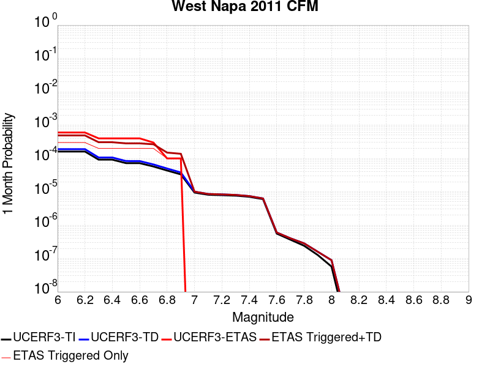 |  |  |

| Magnitude | 1 wk TI Prob | 1 wk TD Prob | 1 wk ETAS Prob | 1 wk ETAS/TD Gain | 1 wk ETAS Triggered+TD | 1 wk ETAS Triggered Only | 1 mo TI Prob | 1 mo TD Prob | 1 mo ETAS Prob | 1 mo ETAS/TD Gain | 1 mo ETAS Triggered+TD | 1 mo ETAS Triggered Only | 1 yr TI Prob | 1 yr TD Prob | 1 yr ETAS Prob | 1 yr ETAS/TD Gain | 1 yr ETAS Triggered+TD | 1 yr ETAS Triggered Only | 10 yr TI Prob | 10 yr TD Prob | 10 yr ETAS Prob | 10 yr ETAS/TD Gain | 10 yr ETAS Triggered+TD | 10 yr ETAS Triggered Only |
|-----|-----|-----|-----|-----|-----|-----|-----|-----|-----|-----|-----|-----|-----|-----|-----|-----|-----|-----|-----|-----|-----|-----|-----|-----|
| 6.0 | 3.773104E-5 | 4.443471E-5 | 0.0 | 0.0 | 4.443471E-5 | 0.0 | 1.6169442E-4 | 1.9042236E-4 | 5.4495916E-4 | 2.861844 | 7.352777E-4 | 5.4495916E-4 | 0.001966852 | 0.0023162432 | 0.0027247956 | 1.1763859 | 0.0050347275 | 0.0027247956 | 0.019495348 | 0.022954233 | 0.009264305 | 0.403599 | 0.032005884 | 0.009264305 |
| 6.1 | 3.773104E-5 | 4.443471E-5 | 0.0 | 0.0 | 4.443471E-5 | 0.0 | 1.6169442E-4 | 1.9042236E-4 | 5.4495916E-4 | 2.861844 | 7.352777E-4 | 5.4495916E-4 | 0.001966852 | 0.0023162432 | 0.0027247956 | 1.1763859 | 0.0050347275 | 0.0027247956 | 0.019495348 | 0.022954233 | 0.009264305 | 0.403599 | 0.032005884 | 0.009264305 |
| 6.2 | 3.773104E-5 | 4.443471E-5 | 0.0 | 0.0 | 4.443471E-5 | 0.0 | 1.6169442E-4 | 1.9042236E-4 | 5.4495916E-4 | 2.861844 | 7.352777E-4 | 5.4495916E-4 | 0.001966852 | 0.0023162432 | 0.0027247956 | 1.1763859 | 0.0050347275 | 0.0027247956 | 0.019495348 | 0.022954233 | 0.009264305 | 0.403599 | 0.032005884 | 0.009264305 |
| 6.3 | 2.147964E-5 | 2.4934396E-5 | 0.0 | 0.0 | 2.4934396E-5 | 0.0 | 9.2052345E-5 | 1.06857835E-4 | 5.4495916E-4 | 5.0998516 | 6.5175875E-4 | 5.4495916E-4 | 0.001120161 | 0.0013003092 | 0.0016348774 | 1.257299 | 0.0029330608 | 0.0016348774 | 0.011145315 | 0.012937482 | 0.007084469 | 0.5475925 | 0.019930296 | 0.007084469 |
| 6.4 | 2.147964E-5 | 2.4934396E-5 | 0.0 | 0.0 | 2.4934396E-5 | 0.0 | 9.2052345E-5 | 1.06857835E-4 | 5.4495916E-4 | 5.0998516 | 6.5175875E-4 | 5.4495916E-4 | 0.001120161 | 0.0013003092 | 0.0016348774 | 1.257299 | 0.0029330608 | 0.0016348774 | 0.011145315 | 0.012937482 | 0.007084469 | 0.5475925 | 0.019930296 | 0.007084469 |
| 6.5 | 1.688201E-5 | 1.9505078E-5 | 0.0 | 0.0 | 1.9505078E-5 | 0.0 | 7.234947E-5 | 8.359092E-5 | 5.4495916E-4 | 6.5193577 | 6.285045E-4 | 5.4495916E-4 | 8.804988E-4 | 0.0010173168 | 0.0010899183 | 1.0713656 | 0.0021061262 | 0.0010899183 | 0.008770182 | 0.010135127 | 0.0043596732 | 0.43015474 | 0.014450614 | 0.0043596732 |
| 6.6 | 1.6846381E-5 | 1.9464826E-5 | 0.0 | 0.0 | 1.9464826E-5 | 0.0 | 7.219678E-5 | 8.3418425E-5 | 5.4495916E-4 | 6.532839 | 6.283321E-4 | 5.4495916E-4 | 8.7864127E-4 | 0.0010152186 | 0.0010899183 | 1.0735799 | 0.0021040302 | 0.0010899183 | 0.008751754 | 0.010114336 | 0.0043596732 | 0.43103895 | 0.014429914 | 0.0043596732 |
| 6.7 | 1.3396501E-5 | 1.5432639E-5 | 0.0 | 0.0 | 1.5432639E-5 | 0.0 | 5.7412315E-5 | 6.6138564E-5 | 5.4495916E-4 | 8.239658 | 6.1106164E-4 | 5.4495916E-4 | 6.9877075E-4 | 8.0500275E-4 | 0.0010899183 | 1.3539311 | 0.0018940436 | 0.0010899183 | 0.0069657755 | 0.008028455 | 0.0032697548 | 0.40727073 | 0.011271958 | 0.0032697548 |
| 6.8 | 1.0139058E-5 | 1.1643671E-5 | 0.0 | 0.0 | 1.1643671E-5 | 0.0 | 4.3452383E-5 | 4.9900806E-5 | 5.4495916E-4 | 10.920849 | 5.9483276E-4 | 5.4495916E-4 | 5.289043E-4 | 6.0742826E-4 | 0.0010899183 | 1.794316 | 0.0016966844 | 0.0010899183 | 0.005276473 | 0.006064466 | 0.0027247956 | 0.44930512 | 0.008772737 | 0.0027247956 |
| 6.9 | 7.761281E-6 | 8.86714E-6 | 0.0 | 0.0 | 8.86714E-6 | 0.0 | 3.326221E-5 | 3.8001766E-5 | 5.4495916E-4 | 14.3403635 | 5.829402E-4 | 5.4495916E-4 | 4.0489217E-4 | 4.6262448E-4 | 0.0010899183 | 2.355946 | 0.0015520385 | 0.0010899183 | 0.0040415525 | 0.0046229945 | 0.0027247956 | 0.5894006 | 0.0073351935 | 0.0027247956 |
| 7.0 | 2.2109202E-6 | 2.3549817E-6 | 0.0 | 0.0 | 2.3549817E-6 | 0.0 | 9.475338E-6 | 1.009274E-5 | 0.0 | 0.0 | 1.009274E-5 | 0.0 | 1.1535613E-4 | 1.2287227E-4 | 0.0 | 0.0 | 1.2287227E-4 | 0.0 | 0.0011529627 | 0.0012294134 | 0.0 | 0.0 | 0.0012294134 | 0.0 |
| 7.1 | 1.9008926E-6 | 2.0021855E-6 | 0.0 | 0.0 | 2.0021855E-6 | 0.0 | 8.146657E-6 | 8.580767E-6 | 0.0 | 0.0 | 8.580767E-6 | 0.0 | 9.918104E-5 | 1.0446586E-4 | 0.0 | 0.0 | 1.0446586E-4 | 0.0 | 9.913679E-4 | 0.0010455326 | 0.0 | 0.0 | 0.0010455326 | 0.0 |
| 7.2 | 1.8495944E-6 | 1.9450608E-6 | 0.0 | 0.0 | 1.9450608E-6 | 0.0 | 7.926808E-6 | 8.335948E-6 | 0.0 | 0.0 | 8.335948E-6 | 0.0 | 9.650462E-5 | 1.0148547E-4 | 0.0 | 0.0 | 1.0148547E-4 | 0.0 | 9.6462725E-4 | 0.0010157564 | 0.0 | 0.0 | 0.0010157564 | 0.0 |
| 7.3 | 1.7883189E-6 | 1.8771289E-6 | 0.0 | 0.0 | 1.8771289E-6 | 0.0 | 7.664201E-6 | 8.0448135E-6 | 0.0 | 0.0 | 8.0448135E-6 | 0.0 | 9.330765E-5 | 9.794122E-5 | 0.0 | 0.0 | 9.794122E-5 | 0.0 | 9.3268487E-4 | 9.803459E-4 | 0.0 | 0.0 | 9.803459E-4 | 0.0 |
| 7.4 | 1.6520572E-6 | 1.7309668E-6 | 0.0 | 0.0 | 1.7309668E-6 | 0.0 | 7.0802257E-6 | 7.418408E-6 | 0.0 | 0.0 | 7.418408E-6 | 0.0 | 8.6198335E-5 | 9.03154E-5 | 0.0 | 0.0 | 9.03154E-5 | 0.0 | 8.616491E-4 | 9.041525E-4 | 0.0 | 0.0 | 9.041525E-4 | 0.0 |
| 7.5 | 1.4040345E-6 | 1.4701039E-6 | 0.0 | 0.0 | 1.4701039E-6 | 0.0 | 6.0172765E-6 | 6.3004304E-6 | 0.0 | 0.0 | 6.3004304E-6 | 0.0 | 7.325788E-5 | 7.6705066E-5 | 0.0 | 0.0 | 7.6705066E-5 | 0.0 | 7.3233736E-4 | 7.6810154E-4 | 0.0 | 0.0 | 7.6810154E-4 | 0.0 |
| 7.6 | 1.3013842E-7 | 1.3989674E-7 | 0.0 | 0.0 | 1.3989674E-7 | 0.0 | 5.57736E-7 | 5.995573E-7 | 0.0 | 0.0 | 5.995573E-7 | 0.0 | 6.790414E-6 | 7.299586E-6 | 0.0 | 0.0 | 7.299586E-6 | 0.0 | 6.790207E-5 | 7.392417E-5 | 0.0 | 0.0 | 7.392417E-5 | 0.0 |
| 7.7 | 8.541512E-8 | 9.342756E-8 | 0.0 | 0.0 | 9.342756E-8 | 0.0 | 3.6606474E-7 | 4.0040376E-7 | 0.0 | 0.0 | 4.0040376E-7 | 0.0 | 4.456829E-6 | 4.874905E-6 | 0.0 | 0.0 | 4.874905E-6 | 0.0 | 4.4567398E-5 | 4.9653856E-5 | 0.0 | 0.0 | 4.9653856E-5 | 0.0 |
| 7.8 | 5.6074793E-8 | 6.5917234E-8 | 0.0 | 0.0 | 6.5917234E-8 | 0.0 | 2.403205E-7 | 2.8250238E-7 | 0.0 | 0.0 | 2.8250238E-7 | 0.0 | 2.9258983E-6 | 3.4394611E-6 | 0.0 | 0.0 | 3.4394611E-6 | 0.0 | 2.9258597E-5 | 3.5230274E-5 | 0.0 | 0.0 | 3.5230274E-5 | 0.0 |
| 7.9 | 2.9475839E-8 | 3.682857E-8 | 0.0 | 0.0 | 3.682857E-8 | 0.0 | 1.2632502E-7 | 1.5783672E-7 | 0.0 | 0.0 | 1.5783672E-7 | 0.0 | 1.538006E-6 | 1.9216604E-6 | 0.0 | 0.0 | 1.9216604E-6 | 0.0 | 1.5379954E-5 | 1.9759776E-5 | 0.0 | 0.0 | 1.9759776E-5 | 0.0 |
| 8.0 | 1.3337122E-8 | 2.0611138E-8 | 0.0 | 0.0 | 2.0611138E-8 | 0.0 | 5.7159088E-8 | 8.833344E-8 | 0.0 | 0.0 | 8.833344E-8 | 0.0 | 6.959117E-7 | 1.0754591E-6 | 0.0 | 0.0 | 1.0754591E-6 | 0.0 | 6.959095E-6 | 1.1116372E-5 | 0.0 | 0.0 | 1.1116372E-5 | 0.0 |
| 8.1 | 2.6589986E-10 | 4.6371973E-10 | 0.0 | 0.0 | 4.6371973E-10 | 0.0 | 1.1395708E-9 | 1.9873707E-9 | 0.0 | 0.0 | 1.9873707E-9 | 0.0 | 1.3874274E-8 | 2.4196236E-8 | 0.0 | 0.0 | 2.4196236E-8 | 0.0 | 1.3874273E-7 | 2.4881123E-7 | 0.0 | 0.0 | 2.4881123E-7 | 0.0 |

## Imperial
*[(top)](#table-of-contents)*

| 1 Week | 1 Month | 1 Year | 10 Year |
|-----|-----|-----|-----|
|  |  |  |  |

| Magnitude | 1 wk TI Prob | 1 wk TD Prob | 1 wk ETAS Prob | 1 wk ETAS/TD Gain | 1 wk ETAS Triggered+TD | 1 wk ETAS Triggered Only | 1 mo TI Prob | 1 mo TD Prob | 1 mo ETAS Prob | 1 mo ETAS/TD Gain | 1 mo ETAS Triggered+TD | 1 mo ETAS Triggered Only | 1 yr TI Prob | 1 yr TD Prob | 1 yr ETAS Prob | 1 yr ETAS/TD Gain | 1 yr ETAS Triggered+TD | 1 yr ETAS Triggered Only | 10 yr TI Prob | 10 yr TD Prob | 10 yr ETAS Prob | 10 yr ETAS/TD Gain | 10 yr ETAS Triggered+TD | 10 yr ETAS Triggered Only |
|-----|-----|-----|-----|-----|-----|-----|-----|-----|-----|-----|-----|-----|-----|-----|-----|-----|-----|-----|-----|-----|-----|-----|-----|-----|
| 6.0 | 2.7496446E-4 | 4.895928E-4 | 0.0 | 0.0 | 4.895928E-4 | 0.0 | 0.0011778869 | 0.0020966053 | 5.4495916E-4 | 0.2599245 | 0.002640422 | 5.4495916E-4 | 0.0142467655 | 0.02520393 | 0.0032697548 | 0.12973194 | 0.028391274 | 0.0032697548 | 0.13367249 | 0.22269472 | 0.008174387 | 0.036706693 | 0.22904873 | 0.008174387 |
| 6.1 | 2.5356023E-4 | 4.7265363E-4 | 0.0 | 0.0 | 4.7265363E-4 | 0.0 | 0.001086234 | 0.0020241227 | 5.4495916E-4 | 0.26923224 | 0.0025679788 | 5.4495916E-4 | 0.013144928 | 0.024346493 | 0.0032697548 | 0.13430086 | 0.02753664 | 0.0032697548 | 0.123940155 | 0.2147349 | 0.008174387 | 0.038067345 | 0.22115396 | 0.008174387 |
| 6.2 | 2.4820742E-4 | 4.6388546E-4 | 0.0 | 0.0 | 4.6388546E-4 | 0.0 | 0.0010633124 | 0.0019866023 | 5.4495916E-4 | 0.27431718 | 0.0025304789 | 5.4495916E-4 | 0.01286919 | 0.023900157 | 0.0032697548 | 0.13680892 | 0.027091764 | 0.0032697548 | 0.12148927 | 0.21129626 | 0.0076294276 | 0.036107726 | 0.21731362 | 0.0076294276 |
| 6.3 | 2.3205351E-4 | 4.4672057E-4 | 0.0 | 0.0 | 4.4672057E-4 | 0.0 | 9.94136E-4 | 0.0019131477 | 5.4495916E-4 | 0.28484946 | 0.0024570643 | 5.4495916E-4 | 0.012036599 | 0.023043953 | 0.0032697548 | 0.14189209 | 0.02623836 | 0.0032697548 | 0.11405133 | 0.20366937 | 0.0076294276 | 0.03745987 | 0.20974492 | 0.0076294276 |
| 6.4 | 2.0304754E-4 | 3.8701732E-4 | 0.0 | 0.0 | 3.8701732E-4 | 0.0 | 8.6991355E-4 | 0.001657605 | 5.4495916E-4 | 0.32876295 | 0.0022016608 | 5.4495916E-4 | 0.010539869 | 0.019998284 | 0.0032697548 | 0.16350177 | 0.02320265 | 0.0032697548 | 0.100537635 | 0.18080486 | 0.007084469 | 0.039182954 | 0.18660842 | 0.007084469 |
| 6.5 | 1.854992E-4 | 3.5898542E-4 | 0.0 | 0.0 | 3.5898542E-4 | 0.0 | 7.9475436E-4 | 0.0015376133 | 5.4495916E-4 | 0.3544188 | 0.0020817346 | 5.4495916E-4 | 0.009633281 | 0.018566702 | 0.0027247956 | 0.14675711 | 0.021240907 | 0.0027247956 | 0.0922623 | 0.16924961 | 0.0065395096 | 0.038638253 | 0.17468232 | 0.0065395096 |
| 6.6 | 1.6586106E-4 | 3.305461E-4 | 0.0 | 0.0 | 3.305461E-4 | 0.0 | 7.106394E-4 | 0.0014158665 | 5.4495916E-4 | 0.38489443 | 0.001960054 | 5.4495916E-4 | 0.008617763 | 0.017105592 | 0.0027247956 | 0.15929267 | 0.01978378 | 0.0027247956 | 0.08291132 | 0.15704171 | 0.004904632 | 0.031231398 | 0.16117612 | 0.004904632 |
| 6.7 | 1.4224656E-4 | 2.9921078E-4 | 0.0 | 0.0 | 2.9921078E-4 | 0.0 | 6.094856E-4 | 0.0012817093 | 5.4495916E-4 | 0.42518154 | 0.00182597 | 5.4495916E-4 | 0.0073952693 | 0.015494272 | 0.0027247956 | 0.17585826 | 0.01817685 | 0.0027247956 | 0.07153955 | 0.14318357 | 0.0038147138 | 0.02664212 | 0.14645208 | 0.0038147138 |
| 6.8 | 1.2317259E-4 | 2.7105198E-4 | 0.0 | 0.0 | 2.7105198E-4 | 0.0 | 5.2777573E-4 | 0.0011611399 | 5.4495916E-4 | 0.46933115 | 0.0017054663 | 5.4495916E-4 | 0.0064067547 | 0.014046529 | 0.0027247956 | 0.19398355 | 0.01673305 | 0.0027247956 | 0.06225166 | 0.13016221 | 0.0038147138 | 0.029307384 | 0.13348038 | 0.0038147138 |
| 6.9 | 9.859898E-5 | 2.4530667E-4 | 0.0 | 0.0 | 2.4530667E-4 | 0.0 | 4.2249862E-4 | 0.0010508947 | 5.4495916E-4 | 0.5185668 | 0.0015952812 | 5.4495916E-4 | 0.0051317946 | 0.012720503 | 0.0027247956 | 0.21420501 | 0.015410638 | 0.0027247956 | 0.05014893 | 0.11742009 | 0.0038147138 | 0.032487743 | 0.12078688 | 0.0038147138 |
| 7.0 | 7.3191884E-5 | 2.0933368E-4 | 0.0 | 0.0 | 2.0933368E-4 | 0.0 | 3.136418E-4 | 8.9683896E-4 | 5.4495916E-4 | 0.6076443 | 0.0014413093 | 5.4495916E-4 | 0.003811904 | 0.010865013 | 0.0027247956 | 0.25078622 | 0.013560204 | 0.0027247956 | 0.037471764 | 0.10068799 | 0.0032697548 | 0.03247413 | 0.103628516 | 0.0032697548 |
| 7.1 | 7.1760296E-5 | 2.064055E-4 | 0.0 | 0.0 | 2.064055E-4 | 0.0 | 3.0750787E-4 | 8.842982E-4 | 5.4495916E-4 | 0.6162617 | 0.0014287754 | 5.4495916E-4 | 0.003737482 | 0.010713841 | 0.0027247956 | 0.25432482 | 0.013409443 | 0.0027247956 | 0.03675245 | 0.09934601 | 0.0032697548 | 0.032912795 | 0.10229093 | 0.0032697548 |
| 7.2 | 6.46614E-5 | 1.8823914E-4 | 0.0 | 0.0 | 1.8823914E-4 | 0.0 | 2.7709085E-4 | 8.064927E-4 | 5.4495916E-4 | 0.6757149 | 0.0013510123 | 5.4495916E-4 | 0.0033683628 | 0.009775445 | 0.0027247956 | 0.2787388 | 0.012473605 | 0.0027247956 | 0.033177625 | 0.09119956 | 0.0032697548 | 0.03585275 | 0.094171114 | 0.0032697548 |
| 7.3 | 6.088115E-5 | 1.7511452E-4 | 0.0 | 0.0 | 1.7511452E-4 | 0.0 | 2.6089314E-4 | 7.502777E-4 | 5.4495916E-4 | 0.7263432 | 0.0012948279 | 5.4495916E-4 | 0.0031717476 | 0.009096931 | 0.0027247956 | 0.29952914 | 0.011796939 | 0.0027247956 | 0.031268585 | 0.085304566 | 0.0032697548 | 0.03833036 | 0.0882954 | 0.0032697548 |
| 7.4 | 4.199346E-5 | 1.12887006E-4 | 0.0 | 0.0 | 1.12887006E-4 | 0.0 | 1.7995955E-4 | 4.8371262E-4 | 5.4495916E-4 | 1.1266176 | 0.0010284082 | 5.4495916E-4 | 0.0021888057 | 0.0058734627 | 0.0016348774 | 0.27834985 | 0.0074987374 | 0.0016348774 | 0.02167372 | 0.056454986 | 0.0016348774 | 0.028958956 | 0.057997566 | 0.0016348774 |
| 7.5 | 3.130448E-5 | 8.158115E-5 | 0.0 | 0.0 | 8.158115E-5 | 0.0 | 1.3415517E-4 | 3.4958695E-4 | 0.0 | 0.0 | 3.4958695E-4 | 0.0 | 0.0016321153 | 0.0042479727 | 5.4495916E-4 | 0.12828687 | 0.0047906167 | 5.4495916E-4 | 0.016201803 | 0.04133666 | 5.4495916E-4 | 0.013183434 | 0.041859094 | 5.4495916E-4 |
| 7.6 | 2.3074248E-5 | 5.9368074E-5 | 0.0 | 0.0 | 5.9368074E-5 | 0.0 | 9.888588E-5 | 2.544099E-4 | 0.0 | 0.0 | 2.544099E-4 | 0.0 | 0.0012032706 | 0.0030930638 | 5.4495916E-4 | 0.17618749 | 0.0036363374 | 5.4495916E-4 | 0.011967761 | 0.030348286 | 5.4495916E-4 | 0.017956834 | 0.030876707 | 5.4495916E-4 |
| 7.7 | 1.45864815E-5 | 3.8916234E-5 | 0.0 | 0.0 | 3.8916234E-5 | 0.0 | 6.2511994E-5 | 1.6677321E-4 | 0.0 | 0.0 | 1.6677321E-4 | 0.0 | 7.608177E-4 | 0.0020285782 | 0.0 | 0.0 | 0.0020285782 | 0.0 | 0.007582182 | 0.020070491 | 0.0 | 0.0 | 0.020070491 | 0.0 |
| 7.8 | 1.0352979E-5 | 2.994125E-5 | 0.0 | 0.0 | 2.994125E-5 | 0.0 | 4.4369157E-5 | 1.2831335E-4 | 0.0 | 0.0 | 1.2831335E-4 | 0.0 | 5.400606E-4 | 0.0015610977 | 0.0 | 0.0 | 0.0015610977 | 0.0 | 0.0053875 | 0.015546963 | 0.0 | 0.0 | 0.015546963 | 0.0 |
| 7.9 | 8.137906E-6 | 2.132492E-5 | 0.0 | 0.0 | 2.132492E-5 | 0.0 | 3.4876273E-5 | 9.1389324E-5 | 0.0 | 0.0 | 9.1389324E-5 | 0.0 | 4.2453592E-4 | 0.0011120979 | 0.0 | 0.0 | 0.0011120979 | 0.0 | 0.004237258 | 0.011232167 | 0.0 | 0.0 | 0.011232167 | 0.0 |
| 8.0 | 6.93792E-6 | 1.7294058E-5 | 0.0 | 0.0 | 1.7294058E-5 | 0.0 | 2.9733603E-5 | 7.411529E-5 | 0.0 | 0.0 | 7.411529E-5 | 0.0 | 3.6194647E-4 | 9.019808E-4 | 0.0 | 0.0 | 9.019808E-4 | 0.0 | 0.0036135751 | 0.009164721 | 0.0 | 0.0 | 0.009164721 | 0.0 |
| 8.1 | 3.4286315E-6 | 6.034309E-6 | 0.0 | 0.0 | 6.034309E-6 | 0.0 | 1.4694053E-5 | 2.5861069E-5 | 0.0 | 0.0 | 2.5861069E-5 | 0.0 | 1.7888541E-4 | 3.1481314E-4 | 0.0 | 0.0 | 3.1481314E-4 | 0.0 | 0.0017874148 | 0.0033140853 | 0.0 | 0.0 | 0.0033140853 | 0.0 |
| 8.2 | 1.4906886E-6 | 1.7989122E-6 | 0.0 | 0.0 | 1.7989122E-6 | 0.0 | 6.3886496E-6 | 7.709601E-6 | 0.0 | 0.0 | 7.709601E-6 | 0.0 | 7.7779034E-5 | 9.386038E-5 | 0.0 | 0.0 | 9.386038E-5 | 0.0 | 7.775182E-4 | 0.0010366293 | 0.0 | 0.0 | 0.0010366293 | 0.0 |
| 8.3 | 2.5758007E-8 | 1.3187132E-8 | 0.0 | 0.0 | 1.3187132E-8 | 0.0 | 1.10391454E-7 | 5.651628E-8 | 0.0 | 0.0 | 5.651628E-8 | 0.0 | 1.3440151E-6 | 6.880857E-7 | 0.0 | 0.0 | 6.880857E-7 | 0.0 | 1.344007E-5 | 7.186091E-6 | 0.0 | 0.0 | 7.186091E-6 | 0.0 |

## San Andreas (Parkfield)
*[(top)](#table-of-contents)*

| 1 Week | 1 Month | 1 Year | 10 Year |
|-----|-----|-----|-----|
|  |  |  |  |

| Magnitude | 1 wk TI Prob | 1 wk TD Prob | 1 wk ETAS Prob | 1 wk ETAS/TD Gain | 1 wk ETAS Triggered+TD | 1 wk ETAS Triggered Only | 1 mo TI Prob | 1 mo TD Prob | 1 mo ETAS Prob | 1 mo ETAS/TD Gain | 1 mo ETAS Triggered+TD | 1 mo ETAS Triggered Only | 1 yr TI Prob | 1 yr TD Prob | 1 yr ETAS Prob | 1 yr ETAS/TD Gain | 1 yr ETAS Triggered+TD | 1 yr ETAS Triggered Only | 10 yr TI Prob | 10 yr TD Prob | 10 yr ETAS Prob | 10 yr ETAS/TD Gain | 10 yr ETAS Triggered+TD | 10 yr ETAS Triggered Only |
|-----|-----|-----|-----|-----|-----|-----|-----|-----|-----|-----|-----|-----|-----|-----|-----|-----|-----|-----|-----|-----|-----|-----|-----|-----|
| 6.0 | 5.556969E-4 | 6.4670766E-4 | 0.0 | 0.0 | 6.4670766E-4 | 0.0 | 0.0023793848 | 0.0027689957 | 0.0 | 0.0 | 0.0027689957 | 0.0 | 0.028586963 | 0.033958644 | 0.0021798366 | 0.06419092 | 0.036064453 | 0.0021798366 | 0.25176284 | 0.31707695 | 0.0076294276 | 0.024061754 | 0.32228726 | 0.0076294276 |
| 6.1 | 1.925858E-4 | 2.6879704E-4 | 0.0 | 0.0 | 2.6879704E-4 | 0.0 | 8.2510663E-4 | 0.0011515341 | 0.0 | 0.0 | 0.0011515341 | 0.0 | 0.0099994885 | 0.014093099 | 5.4495916E-4 | 0.03866851 | 0.014630378 | 5.4495916E-4 | 0.095613256 | 0.14173591 | 0.0016348774 | 0.011534673 | 0.14313906 | 0.0016348774 |
| 6.2 | 9.4306815E-5 | 1.7556212E-4 | 0.0 | 0.0 | 1.7556212E-4 | 0.0 | 4.0410945E-4 | 7.5219333E-4 | 0.0 | 0.0 | 7.5219333E-4 | 0.0 | 0.0049089384 | 0.009119719 | 5.4495916E-4 | 0.05975613 | 0.0096597085 | 5.4495916E-4 | 0.048019063 | 0.088873915 | 5.4495916E-4 | 0.006131823 | 0.089370444 | 5.4495916E-4 |
| 6.3 | 9.283051E-5 | 1.7256303E-4 | 0.0 | 0.0 | 1.7256303E-4 | 0.0 | 3.9778434E-4 | 7.3934736E-4 | 0.0 | 0.0 | 7.3934736E-4 | 0.0 | 0.0048322747 | 0.008964599 | 5.4495916E-4 | 0.060790125 | 0.009504673 | 5.4495916E-4 | 0.047285385 | 0.08753465 | 5.4495916E-4 | 0.0062256386 | 0.08803191 | 5.4495916E-4 |
| 6.4 | 9.138826E-5 | 1.7024309E-4 | 0.0 | 0.0 | 1.7024309E-4 | 0.0 | 3.916052E-4 | 7.294103E-4 | 0.0 | 0.0 | 7.294103E-4 | 0.0 | 0.0047573745 | 0.008844599 | 5.4495916E-4 | 0.061614905 | 0.009384738 | 5.4495916E-4 | 0.046568092 | 0.08645787 | 5.4495916E-4 | 0.0063031754 | 0.08695572 | 5.4495916E-4 |
| 6.5 | 9.000255E-5 | 1.6787343E-4 | 0.0 | 0.0 | 1.6787343E-4 | 0.0 | 3.8566816E-4 | 7.1926025E-4 | 0.0 | 0.0 | 7.1926025E-4 | 0.0 | 0.0046854047 | 0.008722019 | 5.4495916E-4 | 0.062480845 | 0.009262226 | 5.4495916E-4 | 0.045878403 | 0.08535658 | 5.4495916E-4 | 0.006384501 | 0.08585502 | 5.4495916E-4 |
| 6.6 | 8.8109264E-5 | 1.6480335E-4 | 0.0 | 0.0 | 1.6480335E-4 | 0.0 | 3.7755648E-4 | 7.0611E-4 | 0.0 | 0.0 | 7.0611E-4 | 0.0 | 0.0045870654 | 0.008563199 | 5.4495916E-4 | 0.06363967 | 0.009103491 | 5.4495916E-4 | 0.04493529 | 0.08393011 | 5.4495916E-4 | 0.0064930106 | 0.08442934 | 5.4495916E-4 |
| 6.7 | 8.738073E-5 | 1.6349829E-4 | 0.0 | 0.0 | 1.6349829E-4 | 0.0 | 3.7443507E-4 | 7.005199E-4 | 0.0 | 0.0 | 7.005199E-4 | 0.0 | 0.0045492216 | 0.008495714 | 5.4495916E-4 | 0.064145185 | 0.009036044 | 5.4495916E-4 | 0.04457213 | 0.083338164 | 5.4495916E-4 | 0.00653913 | 0.08383771 | 5.4495916E-4 |
| 6.8 | 8.710195E-5 | 1.6297214E-4 | 0.0 | 0.0 | 1.6297214E-4 | 0.0 | 3.7324068E-4 | 6.9826614E-4 | 0.0 | 0.0 | 6.9826614E-4 | 0.0 | 0.0045347405 | 0.008468497 | 5.4495916E-4 | 0.06435134 | 0.009008841 | 5.4495916E-4 | 0.04443313 | 0.083092414 | 5.4495916E-4 | 0.0065584704 | 0.083592094 | 5.4495916E-4 |
| 6.9 | 8.6801556E-5 | 1.6239806E-4 | 0.0 | 0.0 | 1.6239806E-4 | 0.0 | 3.7195362E-4 | 6.9580716E-4 | 0.0 | 0.0 | 6.9580716E-4 | 0.0 | 0.0045191357 | 0.008438791 | 5.4495916E-4 | 0.06457787 | 0.008979151 | 5.4495916E-4 | 0.044283327 | 0.08282402 | 5.4495916E-4 | 0.0065797227 | 0.083323844 | 5.4495916E-4 |
| 7.0 | 8.5571606E-5 | 1.5998971E-4 | 0.0 | 0.0 | 1.5998971E-4 | 0.0 | 3.6668387E-4 | 6.854911E-4 | 0.0 | 0.0 | 6.854911E-4 | 0.0 | 0.004455241 | 0.008314158 | 5.4495916E-4 | 0.065545924 | 0.008854586 | 5.4495916E-4 | 0.043669727 | 0.08169381 | 5.4495916E-4 | 0.0066707516 | 0.08219425 | 5.4495916E-4 |
| 7.1 | 7.82589E-5 | 1.4505985E-4 | 0.0 | 0.0 | 1.4505985E-4 | 0.0 | 3.3535215E-4 | 6.215377E-4 | 0.0 | 0.0 | 6.215377E-4 | 0.0 | 0.0040752706 | 0.0075411224 | 5.4495916E-4 | 0.07226499 | 0.008081972 | 5.4495916E-4 | 0.040013418 | 0.07469465 | 5.4495916E-4 | 0.007295825 | 0.0751989 | 5.4495916E-4 |
| 7.2 | 7.690929E-5 | 1.4248605E-4 | 0.0 | 0.0 | 1.4248605E-4 | 0.0 | 3.2956956E-4 | 6.105123E-4 | 0.0 | 0.0 | 6.105123E-4 | 0.0 | 0.004005129 | 0.0074078087 | 5.4495916E-4 | 0.0735655 | 0.007948731 | 5.4495916E-4 | 0.0393371 | 0.07348522 | 5.4495916E-4 | 0.0074159014 | 0.07399013 | 5.4495916E-4 |
| 7.3 | 7.5543794E-5 | 1.3953669E-4 | 0.0 | 0.0 | 1.3953669E-4 | 0.0 | 3.2371894E-4 | 5.97878E-4 | 0.0 | 0.0 | 5.97878E-4 | 0.0 | 0.003934157 | 0.00725502 | 5.4495916E-4 | 0.075114764 | 0.0077960254 | 5.4495916E-4 | 0.038652334 | 0.072076924 | 5.4495916E-4 | 0.007560799 | 0.0725826 | 5.4495916E-4 |
| 7.4 | 7.4214564E-5 | 1.3663658E-4 | 0.0 | 0.0 | 1.3663658E-4 | 0.0 | 3.1802364E-4 | 5.854546E-4 | 0.0 | 0.0 | 5.854546E-4 | 0.0 | 0.003865065 | 0.0071047605 | 5.4495916E-4 | 0.07670338 | 0.0076458477 | 5.4495916E-4 | 0.03798529 | 0.07068378 | 5.4495916E-4 | 0.007709819 | 0.071190216 | 5.4495916E-4 |
| 7.5 | 6.149578E-5 | 1.06789084E-4 | 0.0 | 0.0 | 1.06789084E-4 | 0.0 | 2.6352672E-4 | 4.5758733E-4 | 0.0 | 0.0 | 4.5758733E-4 | 0.0 | 0.0032037178 | 0.005556923 | 5.4495916E-4 | 0.098068506 | 0.006098854 | 5.4495916E-4 | 0.03157923 | 0.056187194 | 5.4495916E-4 | 0.009698992 | 0.056701533 | 5.4495916E-4 |
| 7.6 | 6.0643448E-5 | 1.0512517E-4 | 0.0 | 0.0 | 1.0512517E-4 | 0.0 | 2.598746E-4 | 4.5045873E-4 | 0.0 | 0.0 | 4.5045873E-4 | 0.0 | 0.0031593828 | 0.0054705716 | 5.4495916E-4 | 0.09961649 | 0.006012549 | 5.4495916E-4 | 0.031148417 | 0.055367533 | 5.4495916E-4 | 0.0098425755 | 0.05588232 | 5.4495916E-4 |
| 7.7 | 5.1652263E-5 | 8.721253E-5 | 0.0 | 0.0 | 8.721253E-5 | 0.0 | 2.2134806E-4 | 3.7371446E-4 | 0.0 | 0.0 | 3.7371446E-4 | 0.0 | 0.002691582 | 0.0045404895 | 5.4495916E-4 | 0.1200221 | 0.005082974 | 5.4495916E-4 | 0.026592141 | 0.04640293 | 5.4495916E-4 | 0.011744067 | 0.0469226 | 5.4495916E-4 |
| 7.8 | 4.8090482E-5 | 8.142604E-5 | 0.0 | 0.0 | 8.142604E-5 | 0.0 | 2.060858E-4 | 3.489221E-4 | 0.0 | 0.0 | 3.489221E-4 | 0.0 | 0.0025062072 | 0.0042398586 | 5.4495916E-4 | 0.12853238 | 0.004782507 | 5.4495916E-4 | 0.024781305 | 0.04333466 | 5.4495916E-4 | 0.012575596 | 0.043856002 | 5.4495916E-4 |
| 7.9 | 3.970278E-5 | 6.4252774E-5 | 0.0 | 0.0 | 6.4252774E-5 | 0.0 | 1.7014367E-4 | 2.7534E-4 | 0.0 | 0.0 | 2.7534E-4 | 0.0 | 0.002069531 | 0.0033471147 | 5.4495916E-4 | 0.1628146 | 0.0038902496 | 5.4495916E-4 | 0.020503636 | 0.03431597 | 5.4495916E-4 | 0.015880628 | 0.03484223 | 5.4495916E-4 |
| 8.0 | 2.8982335E-5 | 3.8613358E-5 | 0.0 | 0.0 | 3.8613358E-5 | 0.0 | 1.2420409E-4 | 1.6547533E-4 | 0.0 | 0.0 | 1.6547533E-4 | 0.0 | 0.0015111357 | 0.0020128016 | 0.0 | 0.0 | 0.0020128016 | 0.0 | 0.015009012 | 0.02096599 | 0.0 | 0.0 | 0.02096599 | 0.0 |
| 8.1 | 1.8836186E-5 | 1.7496746E-5 | 0.0 | 0.0 | 1.7496746E-5 | 0.0 | 8.0724014E-5 | 7.49839E-5 | 0.0 | 0.0 | 7.49839E-5 | 0.0 | 9.823717E-4 | 9.1254717E-4 | 0.0 | 0.0 | 9.1254717E-4 | 0.0 | 0.009780403 | 0.00986442 | 0.0 | 0.0 | 0.00986442 | 0.0 |
| 8.2 | 8.643924E-6 | 5.0104E-6 | 0.0 | 0.0 | 5.0104E-6 | 0.0 | 3.704486E-5 | 2.1472966E-5 | 0.0 | 0.0 | 2.1472966E-5 | 0.0 | 4.5092785E-4 | 2.6140205E-4 | 0.0 | 0.0 | 2.6140205E-4 | 0.0 | 0.0045001395 | 0.002993769 | 0.0 | 0.0 | 0.002993769 | 0.0 |
| 8.3 | 1.983087E-6 | 6.880041E-7 | 0.0 | 0.0 | 6.880041E-7 | 0.0 | 8.498917E-6 | 2.9485857E-6 | 0.0 | 0.0 | 2.9485857E-6 | 0.0 | 1.034694E-4 | 3.589845E-5 | 0.0 | 0.0 | 3.589845E-5 | 0.0 | 0.0010342124 | 4.2701262E-4 | 0.0 | 0.0 | 4.2701262E-4 | 0.0 |

## Calaveras (So) - Paicines extension 2011 CFM
*[(top)](#table-of-contents)*

| 1 Week | 1 Month | 1 Year | 10 Year |
|-----|-----|-----|-----|
|  |  |  |  |

| Magnitude | 1 wk TI Prob | 1 wk TD Prob | 1 wk ETAS Prob | 1 wk ETAS/TD Gain | 1 wk ETAS Triggered+TD | 1 wk ETAS Triggered Only | 1 mo TI Prob | 1 mo TD Prob | 1 mo ETAS Prob | 1 mo ETAS/TD Gain | 1 mo ETAS Triggered+TD | 1 mo ETAS Triggered Only | 1 yr TI Prob | 1 yr TD Prob | 1 yr ETAS Prob | 1 yr ETAS/TD Gain | 1 yr ETAS Triggered+TD | 1 yr ETAS Triggered Only | 10 yr TI Prob | 10 yr TD Prob | 10 yr ETAS Prob | 10 yr ETAS/TD Gain | 10 yr ETAS Triggered+TD | 10 yr ETAS Triggered Only |
|-----|-----|-----|-----|-----|-----|-----|-----|-----|-----|-----|-----|-----|-----|-----|-----|-----|-----|-----|-----|-----|-----|-----|-----|-----|
| 6.0 | 1.5183659E-4 | 3.0299783E-4 | 5.4495916E-4 | 1.7985579 | 8.4779185E-4 | 5.4495916E-4 | 6.5056595E-4 | 0.0012973594 | 5.4495916E-4 | 0.42005256 | 0.0018416115 | 5.4495916E-4 | 0.007891912 | 0.015582891 | 5.4495916E-4 | 0.034971632 | 0.016119359 | 5.4495916E-4 | 0.076174594 | 0.1375756 | 0.0043596732 | 0.03168929 | 0.14133549 | 0.0043596732 |
| 6.1 | 1.5024997E-4 | 2.9995097E-4 | 5.4495916E-4 | 1.8168274 | 8.4474665E-4 | 5.4495916E-4 | 6.437695E-4 | 0.0012843153 | 5.4495916E-4 | 0.42431882 | 0.0018285745 | 5.4495916E-4 | 0.0078097614 | 0.015426802 | 5.4495916E-4 | 0.035325475 | 0.015963355 | 5.4495916E-4 | 0.075409345 | 0.1362479 | 0.0043596732 | 0.03199809 | 0.14001359 | 0.0043596732 |
| 6.2 | 1.2743923E-4 | 2.5098768E-4 | 5.4495916E-4 | 2.1712587 | 7.9581E-4 | 5.4495916E-4 | 5.460538E-4 | 0.0010747976 | 5.4495916E-4 | 0.5070342 | 0.001619171 | 5.4495916E-4 | 0.0066279583 | 0.012936405 | 5.4495916E-4 | 0.04212601 | 0.0134743145 | 5.4495916E-4 | 0.064337276 | 0.11634466 | 0.0043596732 | 0.03747205 | 0.12019711 | 0.0043596732 |
| 6.3 | 1.1525114E-4 | 2.2385431E-4 | 5.4495916E-4 | 2.4344366 | 7.686915E-4 | 5.4495916E-4 | 4.9383997E-4 | 9.587146E-4 | 5.4495916E-4 | 0.5684269 | 0.0015031513 | 5.4495916E-4 | 0.0059959386 | 0.011557981 | 5.4495916E-4 | 0.047150027 | 0.012096642 | 5.4495916E-4 | 0.058367174 | 0.10545349 | 0.0038147138 | 0.03617437 | 0.10886593 | 0.0038147138 |
| 6.4 | 1.07200925E-4 | 2.0627695E-4 | 5.4495916E-4 | 2.641881 | 7.5112365E-4 | 5.4495916E-4 | 4.5935164E-4 | 8.835058E-4 | 5.4495916E-4 | 0.61681443 | 0.0014279835 | 5.4495916E-4 | 0.0055782744 | 0.01066342 | 5.4495916E-4 | 0.051105473 | 0.011202568 | 5.4495916E-4 | 0.0544031 | 0.098273955 | 0.0021798366 | 0.022181224 | 0.10023957 | 0.0021798366 |
| 6.5 | 9.69631E-5 | 1.8526119E-4 | 5.4495916E-4 | 2.941572 | 7.3011935E-4 | 5.4495916E-4 | 4.1548995E-4 | 7.935387E-4 | 5.4495916E-4 | 0.6867455 | 0.0013380654 | 5.4495916E-4 | 0.0050468626 | 0.009587359 | 5.4495916E-4 | 0.05684143 | 0.010127093 | 5.4495916E-4 | 0.04933773 | 0.08917394 | 0.0016348774 | 0.018333577 | 0.09066303 | 0.0016348774 |
| 6.6 | 8.0552316E-5 | 1.4863664E-4 | 5.4495916E-4 | 3.666385 | 6.9351477E-4 | 5.4495916E-4 | 3.4517853E-4 | 6.368201E-4 | 5.4495916E-4 | 0.8557505 | 0.0011814322 | 5.4495916E-4 | 0.0041944524 | 0.007719438 | 5.4495916E-4 | 0.0705957 | 0.0082601905 | 5.4495916E-4 | 0.04116161 | 0.073933005 | 0.0010899183 | 0.014741971 | 0.07494234 | 0.0010899183 |
| 6.7 | 7.815757E-5 | 1.440591E-4 | 5.4495916E-4 | 3.7828856 | 6.889397E-4 | 5.4495916E-4 | 3.34918E-4 | 6.1721564E-4 | 5.4495916E-4 | 0.88293153 | 0.0011618384 | 5.4495916E-4 | 0.004070005 | 0.007483083 | 5.4495916E-4 | 0.072825484 | 0.008023963 | 5.4495916E-4 | 0.039962657 | 0.07178749 | 0.0010899183 | 0.015182566 | 0.07279916 | 0.0010899183 |
| 6.8 | 6.965264E-5 | 1.2529595E-4 | 5.4495916E-4 | 4.3493757 | 6.7018677E-4 | 5.4495916E-4 | 2.9847719E-4 | 5.3686014E-4 | 5.4495916E-4 | 1.0150858 | 0.0010815267 | 5.4495916E-4 | 0.0036279052 | 0.0065135644 | 5.4495916E-4 | 0.083665274 | 0.007054974 | 5.4495916E-4 | 0.03569247 | 0.062926516 | 0.0010899183 | 0.017320493 | 0.06394785 | 0.0010899183 |
| 6.9 | 5.8000453E-5 | 9.968164E-5 | 0.0 | 0.0 | 9.968164E-5 | 0.0 | 2.4854968E-4 | 4.2713762E-4 | 0.0 | 0.0 | 4.2713762E-4 | 0.0 | 0.0030218933 | 0.0051880954 | 0.0 | 0.0 | 0.0051880954 | 0.0 | 0.029811295 | 0.050695516 | 0.0 | 0.0 | 0.050695516 | 0.0 |
| 7.0 | 4.9865852E-5 | 8.4068415E-5 | 0.0 | 0.0 | 8.4068415E-5 | 0.0 | 2.1369329E-4 | 3.6024392E-4 | 0.0 | 0.0 | 3.6024392E-4 | 0.0 | 0.0025986114 | 0.004377236 | 0.0 | 0.0 | 0.004377236 | 0.0 | 0.025684336 | 0.04303462 | 0.0 | 0.0 | 0.04303462 | 0.0 |
| 7.1 | 4.283875E-5 | 6.968087E-5 | 0.0 | 0.0 | 6.968087E-5 | 0.0 | 1.8358172E-4 | 2.985984E-4 | 0.0 | 0.0 | 2.985984E-4 | 0.0 | 0.0022328163 | 0.0036294304 | 0.0 | 0.0 | 0.0036294304 | 0.0 | 0.022105146 | 0.036053885 | 0.0 | 0.0 | 0.036053885 | 0.0 |
| 7.2 | 3.450115E-5 | 5.4509244E-5 | 0.0 | 0.0 | 5.4509244E-5 | 0.0 | 1.478537E-4 | 2.3359028E-4 | 0.0 | 0.0 | 2.3359028E-4 | 0.0 | 0.0017986323 | 0.002840281 | 0.0 | 0.0 | 0.002840281 | 0.0 | 0.017841442 | 0.028472278 | 0.0 | 0.0 | 0.028472278 | 0.0 |
| 7.3 | 2.5709045E-5 | 3.9591396E-5 | 0.0 | 0.0 | 3.9591396E-5 | 0.0 | 1.1017697E-4 | 1.6966647E-4 | 0.0 | 0.0 | 1.6966647E-4 | 0.0 | 0.0013405791 | 0.0020637487 | 0.0 | 0.0 | 0.0020637487 | 0.0 | 0.013325208 | 0.020812701 | 0.0 | 0.0 | 0.020812701 | 0.0 |
| 7.4 | 1.8003093E-5 | 2.7654243E-5 | 0.0 | 0.0 | 2.7654243E-5 | 0.0 | 7.715383E-5 | 1.1851281E-4 | 0.0 | 0.0 | 1.1851281E-4 | 0.0 | 9.3894306E-4 | 0.0014419407 | 0.0 | 0.0 | 0.0014419407 | 0.0 | 0.009349857 | 0.0146336295 | 0.0 | 0.0 | 0.0146336295 | 0.0 |
| 7.5 | 1.5595824E-5 | 2.5012372E-5 | 0.0 | 0.0 | 2.5012372E-5 | 0.0 | 6.683753E-5 | 1.0719149E-4 | 0.0 | 0.0 | 1.0719149E-4 | 0.0 | 8.134431E-4 | 0.0013042772 | 0.0 | 0.0 | 0.0013042772 | 0.0 | 0.008104719 | 0.013256188 | 0.0 | 0.0 | 0.013256188 | 0.0 |
| 7.6 | 1.1110309E-5 | 1.8564004E-5 | 0.0 | 0.0 | 1.8564004E-5 | 0.0 | 4.761474E-5 | 7.95576E-5 | 0.0 | 0.0 | 7.95576E-5 | 0.0 | 5.795553E-4 | 9.681847E-4 | 0.0 | 0.0 | 9.681847E-4 | 0.0 | 0.0057804612 | 0.009882825 | 0.0 | 0.0 | 0.009882825 | 0.0 |
| 7.7 | 6.2140443E-6 | 9.9548215E-6 | 0.0 | 0.0 | 9.9548215E-6 | 0.0 | 2.6631347E-5 | 4.266282E-5 | 0.0 | 0.0 | 4.266282E-5 | 0.0 | 3.241884E-4 | 5.1929615E-4 | 0.0 | 0.0 | 5.1929615E-4 | 0.0 | 0.0032371588 | 0.00538349 | 0.0 | 0.0 | 0.00538349 | 0.0 |
| 7.8 | 5.305533E-6 | 9.00452E-6 | 0.0 | 0.0 | 9.00452E-6 | 0.0 | 2.27378E-5 | 3.859023E-5 | 0.0 | 0.0 | 3.859023E-5 | 0.0 | 2.7679754E-4 | 4.6973483E-4 | 0.0 | 0.0 | 4.6973483E-4 | 0.0 | 0.0027645302 | 0.004865346 | 0.0 | 0.0 | 0.004865346 | 0.0 |
| 7.9 | 3.363505E-6 | 7.0710216E-6 | 0.0 | 0.0 | 7.0710216E-6 | 0.0 | 1.4414942E-5 | 3.0304027E-5 | 0.0 | 0.0 | 3.0304027E-5 | 0.0 | 1.7548777E-4 | 3.6888913E-4 | 0.0 | 0.0 | 3.6888913E-4 | 0.0 | 0.0017534926 | 0.0037968648 | 0.0 | 0.0 | 0.0037968648 | 0.0 |
| 8.0 | 2.0271132E-6 | 4.2371266E-6 | 0.0 | 0.0 | 4.2371266E-6 | 0.0 | 8.687599E-6 | 1.8158988E-5 | 0.0 | 0.0 | 1.8158988E-5 | 0.0 | 1.05766376E-4 | 2.2106328E-4 | 0.0 | 0.0 | 2.2106328E-4 | 0.0 | 0.0010571606 | 0.0022653474 | 0.0 | 0.0 | 0.0022653474 | 0.0 |
| 8.1 | 1.2206116E-6 | 2.278714E-6 | 0.0 | 0.0 | 2.278714E-6 | 0.0 | 5.2311816E-6 | 9.765881E-6 | 0.0 | 0.0 | 9.765881E-6 | 0.0 | 6.3687774E-5 | 1.1889315E-4 | 0.0 | 0.0 | 1.1889315E-4 | 0.0 | 6.366953E-4 | 0.0012227265 | 0.0 | 0.0 | 0.0012227265 | 0.0 |

## Hunting Creek - Berryessa 2011 CFM
*[(top)](#table-of-contents)*

| 1 Week | 1 Month | 1 Year | 10 Year |
|-----|-----|-----|-----|
|  |  |  |  |

| Magnitude | 1 wk TI Prob | 1 wk TD Prob | 1 wk ETAS Prob | 1 wk ETAS/TD Gain | 1 wk ETAS Triggered+TD | 1 wk ETAS Triggered Only | 1 mo TI Prob | 1 mo TD Prob | 1 mo ETAS Prob | 1 mo ETAS/TD Gain | 1 mo ETAS Triggered+TD | 1 mo ETAS Triggered Only | 1 yr TI Prob | 1 yr TD Prob | 1 yr ETAS Prob | 1 yr ETAS/TD Gain | 1 yr ETAS Triggered+TD | 1 yr ETAS Triggered Only | 10 yr TI Prob | 10 yr TD Prob | 10 yr ETAS Prob | 10 yr ETAS/TD Gain | 10 yr ETAS Triggered+TD | 10 yr ETAS Triggered Only |
|-----|-----|-----|-----|-----|-----|-----|-----|-----|-----|-----|-----|-----|-----|-----|-----|-----|-----|-----|-----|-----|-----|-----|-----|-----|
| 6.0 | 1.1270982E-4 | 1.9940689E-4 | 0.0 | 0.0 | 1.9940689E-4 | 0.0 | 4.8295266E-4 | 8.542511E-4 | 0.0 | 0.0 | 8.542511E-4 | 0.0 | 0.0058641075 | 0.01034132 | 0.0016348774 | 0.15809175 | 0.011959291 | 0.0016348774 | 0.057117578 | 0.09765978 | 0.0038147138 | 0.039061256 | 0.10110195 | 0.0038147138 |
| 6.1 | 1.1239393E-4 | 1.988906E-4 | 0.0 | 0.0 | 1.988906E-4 | 0.0 | 4.8159933E-4 | 8.5203996E-4 | 0.0 | 0.0 | 8.5203996E-4 | 0.0 | 0.0058477195 | 0.01031468 | 0.0016348774 | 0.15850006 | 0.011932693 | 0.0016348774 | 0.056962132 | 0.09741914 | 0.0032697548 | 0.03356378 | 0.10037036 | 0.0032697548 |
| 6.2 | 7.596265E-5 | 1.2870526E-4 | 0.0 | 0.0 | 1.2870526E-4 | 0.0 | 3.2551357E-4 | 5.51466E-4 | 0.0 | 0.0 | 5.51466E-4 | 0.0 | 0.0039559277 | 0.0066889296 | 0.0010899183 | 0.1629436 | 0.007771557 | 0.0010899183 | 0.038862433 | 0.06430455 | 0.0021798366 | 0.033898633 | 0.06634422 | 0.0021798366 |
| 6.3 | 6.78794E-5 | 1.13912276E-4 | 0.0 | 0.0 | 1.13912276E-4 | 0.0 | 2.9087928E-4 | 4.8809202E-4 | 0.0 | 0.0 | 4.8809202E-4 | 0.0 | 0.003535705 | 0.0059231822 | 0.0010899183 | 0.18400891 | 0.0070066447 | 0.0010899183 | 0.034799766 | 0.057201747 | 0.0010899183 | 0.019053934 | 0.05822932 | 0.0010899183 |
| 6.4 | 6.2165134E-5 | 1.0382523E-4 | 0.0 | 0.0 | 1.0382523E-4 | 0.0 | 2.6639478E-4 | 4.4488598E-4 | 0.0 | 0.0 | 4.4488598E-4 | 0.0 | 0.0032385332 | 0.0054004393 | 0.0010899183 | 0.2018203 | 0.0064844717 | 0.0010899183 | 0.03191742 | 0.052307636 | 0.0010899183 | 0.020836696 | 0.053340543 | 0.0010899183 |
| 6.5 | 5.4368087E-5 | 9.023392E-5 | 0.0 | 0.0 | 9.023392E-5 | 0.0 | 2.3298527E-4 | 3.8665588E-4 | 0.0 | 0.0 | 3.8665588E-4 | 0.0 | 0.0028329059 | 0.004695443 | 0.0010899183 | 0.23212257 | 0.005780244 | 0.0010899183 | 0.027970633 | 0.04565968 | 0.0010899183 | 0.023870476 | 0.046699833 | 0.0010899183 |
| 6.6 | 4.729947E-5 | 7.8045974E-5 | 0.0 | 0.0 | 7.8045974E-5 | 0.0 | 2.0269625E-4 | 3.344384E-4 | 0.0 | 0.0 | 3.344384E-4 | 0.0 | 0.002465034 | 0.004062789 | 0.0010899183 | 0.26826847 | 0.0051482795 | 0.0010899183 | 0.02437869 | 0.03965023 | 0.0010899183 | 0.027488321 | 0.040696934 | 0.0010899183 |
| 6.7 | 3.6875328E-5 | 6.0107366E-5 | 0.0 | 0.0 | 6.0107366E-5 | 0.0 | 1.5802756E-4 | 2.575781E-4 | 0.0 | 0.0 | 2.575781E-4 | 0.0 | 0.0019222875 | 0.0031308257 | 0.0010899183 | 0.34812486 | 0.0042173313 | 0.0010899183 | 0.019057442 | 0.03073008 | 0.0010899183 | 0.035467472 | 0.031786505 | 0.0010899183 |
| 6.8 | 2.0292036E-5 | 2.8875764E-5 | 0.0 | 0.0 | 2.8875764E-5 | 0.0 | 8.6962966E-5 | 1.2374739E-4 | 0.0 | 0.0 | 1.2374739E-4 | 0.0 | 0.0010582599 | 0.0015055726 | 0.0 | 0.0 | 0.0015055726 | 0.0 | 0.010532344 | 0.014927712 | 0.0 | 0.0 | 0.014927712 | 0.0 |
| 6.9 | 1.7871042E-5 | 2.440453E-5 | 0.0 | 0.0 | 2.440453E-5 | 0.0 | 7.658793E-5 | 1.0458663E-4 | 0.0 | 0.0 | 1.0458663E-4 | 0.0 | 9.320591E-4 | 0.0012725984 | 0.0 | 0.0 | 0.0012725984 | 0.0 | 0.009281595 | 0.012644729 | 0.0 | 0.0 | 0.012644729 | 0.0 |
| 7.0 | 1.6415532E-5 | 2.1844406E-5 | 0.0 | 0.0 | 2.1844406E-5 | 0.0 | 7.035038E-5 | 9.361554E-5 | 0.0 | 0.0 | 9.361554E-5 | 0.0 | 8.561793E-4 | 0.0011391746 | 0.0 | 0.0 | 0.0011391746 | 0.0 | 0.008528882 | 0.011332817 | 0.0 | 0.0 | 0.011332817 | 0.0 |
| 7.1 | 1.5409885E-5 | 2.0292511E-5 | 0.0 | 0.0 | 2.0292511E-5 | 0.0 | 6.6040695E-5 | 8.6965025E-5 | 0.0 | 0.0 | 8.6965025E-5 | 0.0 | 8.0374884E-4 | 0.0010582876 | 0.0 | 0.0 | 0.0010582876 | 0.0 | 0.00800848 | 0.0105329 | 0.0 | 0.0 | 0.0105329 | 0.0 |
| 7.2 | 1.4497423E-5 | 1.9004163E-5 | 0.0 | 0.0 | 1.9004163E-5 | 0.0 | 6.213033E-5 | 8.144388E-5 | 0.0 | 0.0 | 8.144388E-5 | 0.0 | 7.5617427E-4 | 9.911313E-4 | 0.0 | 0.0 | 9.911313E-4 | 0.0 | 0.0075360634 | 0.009867775 | 0.0 | 0.0 | 0.009867775 | 0.0 |
| 7.3 | 1.3615175E-5 | 1.7777578E-5 | 0.0 | 0.0 | 1.7777578E-5 | 0.0 | 5.8349444E-5 | 7.618741E-5 | 0.0 | 0.0 | 7.618741E-5 | 0.0 | 7.101729E-4 | 9.2718995E-4 | 0.0 | 0.0 | 9.2718995E-4 | 0.0 | 0.0070790765 | 0.009233719 | 0.0 | 0.0 | 0.009233719 | 0.0 |
| 7.4 | 1.2252825E-5 | 1.5983189E-5 | 0.0 | 0.0 | 1.5983189E-5 | 0.0 | 5.251105E-5 | 6.8497604E-5 | 0.0 | 0.0 | 6.8497604E-5 | 0.0 | 6.391345E-4 | 8.3364197E-4 | 0.0 | 0.0 | 8.3364197E-4 | 0.0 | 0.0063729943 | 0.008305561 | 0.0 | 0.0 | 0.008305561 | 0.0 |
| 7.5 | 1.0913301E-5 | 1.4202664E-5 | 0.0 | 0.0 | 1.4202664E-5 | 0.0 | 4.6770452E-5 | 6.0867154E-5 | 0.0 | 0.0 | 6.0867154E-5 | 0.0 | 5.6928146E-4 | 7.408084E-4 | 0.0 | 0.0 | 7.408084E-4 | 0.0 | 0.0056782532 | 0.0073837684 | 0.0 | 0.0 | 0.0073837684 | 0.0 |
| 7.6 | 8.623192E-6 | 1.1203514E-5 | 0.0 | 0.0 | 1.1203514E-5 | 0.0 | 3.6956015E-5 | 4.8014193E-5 | 0.0 | 0.0 | 4.8014193E-5 | 0.0 | 4.4984656E-4 | 5.8441854E-4 | 0.0 | 0.0 | 5.8441854E-4 | 0.0 | 0.00448937 | 0.005829101 | 0.0 | 0.0 | 0.005829101 | 0.0 |
| 7.7 | 2.0993634E-6 | 2.655011E-6 | 0.0 | 0.0 | 2.655011E-6 | 0.0 | 8.997241E-6 | 1.137857E-5 | 0.0 | 0.0 | 1.137857E-5 | 0.0 | 1.09535904E-4 | 1.3852536E-4 | 0.0 | 0.0 | 1.3852536E-4 | 0.0 | 0.0010948193 | 0.001384442 | 0.0 | 0.0 | 0.001384442 | 0.0 |
| 7.8 | 1.8428308E-7 | 2.164475E-7 | 0.0 | 0.0 | 2.164475E-7 | 0.0 | 7.897844E-7 | 9.276319E-7 | 0.0 | 0.0 | 9.276319E-7 | 0.0 | 9.615583E-6 | 1.1293863E-5 | 0.0 | 0.0 | 1.1293863E-5 | 0.0 | 9.615166E-5 | 1.1294148E-4 | 0.0 | 0.0 | 1.1294148E-4 | 0.0 |

## Hayward (So) 2011 CFM
*[(top)](#table-of-contents)*

| 1 Week | 1 Month | 1 Year | 10 Year |
|-----|-----|-----|-----|
|  |  |  | 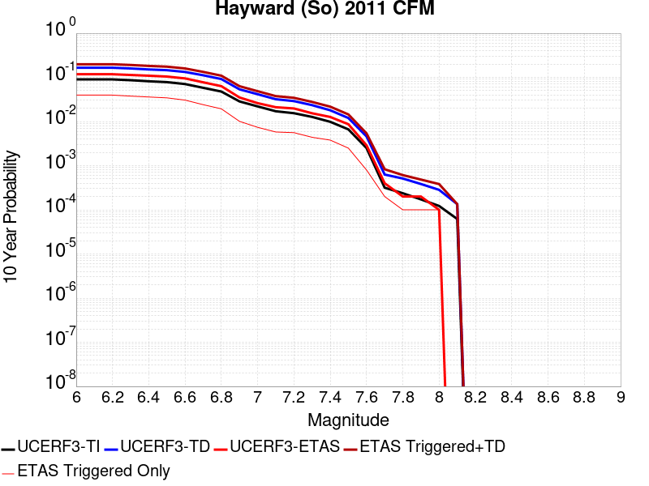 |

| Magnitude | 1 wk TI Prob | 1 wk TD Prob | 1 wk ETAS Prob | 1 wk ETAS/TD Gain | 1 wk ETAS Triggered+TD | 1 wk ETAS Triggered Only | 1 mo TI Prob | 1 mo TD Prob | 1 mo ETAS Prob | 1 mo ETAS/TD Gain | 1 mo ETAS Triggered+TD | 1 mo ETAS Triggered Only | 1 yr TI Prob | 1 yr TD Prob | 1 yr ETAS Prob | 1 yr ETAS/TD Gain | 1 yr ETAS Triggered+TD | 1 yr ETAS Triggered Only | 10 yr TI Prob | 10 yr TD Prob | 10 yr ETAS Prob | 10 yr ETAS/TD Gain | 10 yr ETAS Triggered+TD | 10 yr ETAS Triggered Only |
|-----|-----|-----|-----|-----|-----|-----|-----|-----|-----|-----|-----|-----|-----|-----|-----|-----|-----|-----|-----|-----|-----|-----|-----|-----|
| 6.0 | 1.8091932E-4 | 3.5261808E-4 | 5.4495916E-4 | 1.5454656 | 8.9738506E-4 | 5.4495916E-4 | 7.751381E-4 | 0.0015103549 | 5.4495916E-4 | 0.3608153 | 0.0020544908 | 5.4495916E-4 | 0.00939654 | 0.018235872 | 5.4495916E-4 | 0.029883908 | 0.018770894 | 5.4495916E-4 | 0.090090066 | 0.16502564 | 0.0038147138 | 0.023115888 | 0.16821082 | 0.0038147138 |
| 6.1 | 1.8091932E-4 | 3.5261808E-4 | 5.4495916E-4 | 1.5454656 | 8.9738506E-4 | 5.4495916E-4 | 7.751381E-4 | 0.0015103549 | 5.4495916E-4 | 0.3608153 | 0.0020544908 | 5.4495916E-4 | 0.00939654 | 0.018235872 | 5.4495916E-4 | 0.029883908 | 0.018770894 | 5.4495916E-4 | 0.090090066 | 0.16502564 | 0.0038147138 | 0.023115888 | 0.16821082 | 0.0038147138 |
| 6.2 | 1.8091932E-4 | 3.5261808E-4 | 5.4495916E-4 | 1.5454656 | 8.9738506E-4 | 5.4495916E-4 | 7.751381E-4 | 0.0015103549 | 5.4495916E-4 | 0.3608153 | 0.0020544908 | 5.4495916E-4 | 0.00939654 | 0.018235872 | 5.4495916E-4 | 0.029883908 | 0.018770894 | 5.4495916E-4 | 0.090090066 | 0.16502564 | 0.0038147138 | 0.023115888 | 0.16821082 | 0.0038147138 |
| 6.3 | 1.7322872E-4 | 3.3830493E-4 | 5.4495916E-4 | 1.6108518 | 8.830797E-4 | 5.4495916E-4 | 7.4219756E-4 | 0.0014490822 | 5.4495916E-4 | 0.37607196 | 0.0019932515 | 5.4495916E-4 | 0.0089988755 | 0.01750207 | 5.4495916E-4 | 0.03113684 | 0.01803749 | 5.4495916E-4 | 0.08643075 | 0.15897852 | 0.0038147138 | 0.023995154 | 0.16218677 | 0.0038147138 |
| 6.4 | 1.6334097E-4 | 3.192583E-4 | 5.4495916E-4 | 1.7069535 | 8.640435E-4 | 5.4495916E-4 | 6.998449E-4 | 0.0013675409 | 5.4495916E-4 | 0.39849564 | 0.0019117548 | 5.4495916E-4 | 0.008487372 | 0.01652466 | 5.4495916E-4 | 0.032978542 | 0.017060613 | 5.4495916E-4 | 0.081704415 | 0.15091974 | 0.0038147138 | 0.025276441 | 0.15415874 | 0.0038147138 |
| 6.5 | 1.5600289E-4 | 3.061283E-4 | 5.4495916E-4 | 1.7801659 | 8.5092057E-4 | 5.4495916E-4 | 6.684125E-4 | 0.0013113269 | 5.4495916E-4 | 0.4155784 | 0.0018555714 | 5.4495916E-4 | 0.008107598 | 0.01585037 | 5.4495916E-4 | 0.034381475 | 0.016386693 | 5.4495916E-4 | 0.078181036 | 0.14522748 | 0.0038147138 | 0.026267163 | 0.1484882 | 0.0038147138 |
| 6.6 | 1.4046066E-4 | 2.7648776E-4 | 5.4495916E-4 | 1.9710063 | 8.2129624E-4 | 5.4495916E-4 | 6.018354E-4 | 0.0011844161 | 5.4495916E-4 | 0.46010783 | 0.0017287298 | 5.4495916E-4 | 0.0073027555 | 0.014326378 | 5.4495916E-4 | 0.038038865 | 0.014863529 | 5.4495916E-4 | 0.07067384 | 0.13237391 | 0.0032697548 | 0.024700899 | 0.13521084 | 0.0032697548 |
| 6.7 | 1.14696966E-4 | 2.2926719E-4 | 0.0 | 0.0 | 2.2926719E-4 | 0.0 | 4.914658E-4 | 9.822086E-4 | 0.0 | 0.0 | 9.822086E-4 | 0.0 | 0.0059671924 | 0.011893852 | 0.0 | 0.0 | 0.011893852 | 0.0 | 0.058094822 | 0.11133145 | 0.0021798366 | 0.019579701 | 0.1132686 | 0.0021798366 |
| 6.8 | 9.3874296E-5 | 1.8578733E-4 | 0.0 | 0.0 | 1.8578733E-4 | 0.0 | 4.0225635E-4 | 7.9599203E-4 | 0.0 | 0.0 | 7.9599203E-4 | 0.0 | 0.0048864787 | 0.009648853 | 0.0 | 0.0 | 0.009648853 | 0.0 | 0.047804173 | 0.09138441 | 0.0016348774 | 0.017890112 | 0.09286989 | 0.0016348774 |
| 6.9 | 5.551852E-5 | 1.05556086E-4 | 0.0 | 0.0 | 1.05556086E-4 | 0.0 | 2.3791482E-4 | 4.523054E-4 | 0.0 | 0.0 | 4.523054E-4 | 0.0 | 0.0028927654 | 0.0054930286 | 0.0 | 0.0 | 0.0054930286 | 0.0 | 0.028553981 | 0.053457867 | 0.0 | 0.0 | 0.053457867 | 0.0 |
| 7.0 | 4.2662363E-5 | 8.109846E-5 | 0.0 | 0.0 | 8.109846E-5 | 0.0 | 1.8282588E-4 | 3.4751892E-4 | 0.0 | 0.0 | 3.4751892E-4 | 0.0 | 0.0022236328 | 0.0042229057 | 0.0 | 0.0 | 0.0042229057 | 0.0 | 0.022015138 | 0.041430097 | 0.0 | 0.0 | 0.041430097 | 0.0 |
| 7.1 | 3.305886E-5 | 6.190245E-5 | 0.0 | 0.0 | 6.190245E-5 | 0.0 | 1.4167312E-4 | 2.6526934E-4 | 0.0 | 0.0 | 2.6526934E-4 | 0.0 | 0.0017235056 | 0.0032248893 | 0.0 | 0.0 | 0.0032248893 | 0.0 | 0.017101998 | 0.031923823 | 0.0 | 0.0 | 0.031923823 | 0.0 |
| 7.2 | 2.9856887E-5 | 5.5962453E-5 | 0.0 | 0.0 | 5.5962453E-5 | 0.0 | 1.2795182E-4 | 2.3981712E-4 | 0.0 | 0.0 | 2.3981712E-4 | 0.0 | 0.0015567001 | 0.0029158804 | 0.0 | 0.0 | 0.0029158804 | 0.0 | 0.015458403 | 0.028953342 | 0.0 | 0.0 | 0.028953342 | 0.0 |
| 7.3 | 2.4559737E-5 | 4.5145207E-5 | 0.0 | 0.0 | 4.5145207E-5 | 0.0 | 1.0525176E-4 | 1.9346518E-4 | 0.0 | 0.0 | 1.9346518E-4 | 0.0 | 0.0012806869 | 0.0023529066 | 0.0 | 0.0 | 0.0023529066 | 0.0 | 0.012733313 | 0.023449626 | 0.0 | 0.0 | 0.023449626 | 0.0 |
| 7.4 | 1.9002231E-5 | 3.438138E-5 | 0.0 | 0.0 | 3.438138E-5 | 0.0 | 8.143559E-5 | 1.473405E-4 | 0.0 | 0.0 | 1.473405E-4 | 0.0 | 9.910273E-4 | 0.0017924041 | 0.0 | 0.0 | 0.0017924041 | 0.0 | 0.009866194 | 0.017933264 | 0.0 | 0.0 | 0.017933264 | 0.0 |
| 7.5 | 1.2783333E-5 | 2.2866025E-5 | 0.0 | 0.0 | 2.2866025E-5 | 0.0 | 5.4784563E-5 | 9.79936E-5 | 0.0 | 0.0 | 9.79936E-5 | 0.0 | 6.667979E-4 | 0.0011924247 | 0.0 | 0.0 | 0.0011924247 | 0.0 | 0.006648007 | 0.011982868 | 0.0 | 0.0 | 0.011982868 | 0.0 |
| 7.6 | 4.8149627E-6 | 8.691418E-6 | 0.0 | 0.0 | 8.691418E-6 | 0.0 | 2.063539E-5 | 3.724841E-5 | 0.0 | 0.0 | 3.724841E-5 | 0.0 | 2.5120692E-4 | 4.534062E-4 | 0.0 | 0.0 | 4.534062E-4 | 0.0 | 0.0025092314 | 0.0045851013 | 0.0 | 0.0 | 0.0045851013 | 0.0 |
| 7.7 | 6.0838227E-7 | 1.1512212E-6 | 0.0 | 0.0 | 1.1512212E-6 | 0.0 | 2.6073499E-6 | 4.933796E-6 | 0.0 | 0.0 | 4.933796E-6 | 0.0 | 3.174402E-5 | 6.0067316E-5 | 0.0 | 0.0 | 6.0067316E-5 | 0.0 | 3.1739488E-4 | 6.264154E-4 | 0.0 | 0.0 | 6.264154E-4 | 0.0 |
| 7.8 | 4.5542808E-7 | 9.323661E-7 | 0.0 | 0.0 | 9.323661E-7 | 0.0 | 1.9518332E-6 | 3.9958486E-6 | 0.0 | 0.0 | 3.9958486E-6 | 0.0 | 2.376331E-5 | 4.8648373E-5 | 0.0 | 0.0 | 4.8648373E-5 | 0.0 | 2.3760769E-4 | 5.0937186E-4 | 0.0 | 0.0 | 5.0937186E-4 | 0.0 |
| 7.9 | 3.3016747E-7 | 7.049145E-7 | 0.0 | 0.0 | 7.049145E-7 | 0.0 | 1.4150027E-6 | 3.0210585E-6 | 0.0 | 0.0 | 3.0210585E-6 | 0.0 | 1.7227521E-5 | 3.678077E-5 | 0.0 | 0.0 | 3.678077E-5 | 0.0 | 1.7226185E-4 | 3.829908E-4 | 0.0 | 0.0 | 3.829908E-4 | 0.0 |
| 8.0 | 2.347038E-7 | 5.238285E-7 | 0.0 | 0.0 | 5.238285E-7 | 0.0 | 1.0058731E-6 | 2.2449772E-6 | 0.0 | 0.0 | 2.2449772E-6 | 0.0 | 1.2246436E-5 | 2.7332257E-5 | 0.0 | 0.0 | 2.7332257E-5 | 0.0 | 1.2245761E-4 | 2.8231626E-4 | 0.0 | 0.0 | 2.8231626E-4 | 0.0 |
| 8.1 | 1.18822804E-7 | 2.5006742E-7 | 0.0 | 0.0 | 2.5006742E-7 | 0.0 | 5.092405E-7 | 1.071717E-6 | 0.0 | 0.0 | 1.071717E-6 | 0.0 | 6.1999854E-6 | 1.3048078E-5 | 0.0 | 0.0 | 1.3048078E-5 | 0.0 | 6.199812E-5 | 1.3403154E-4 | 0.0 | 0.0 | 1.3403154E-4 | 0.0 |

## San Andreas (Coachella) rev
*[(top)](#table-of-contents)*

| 1 Week | 1 Month | 1 Year | 10 Year |
|-----|-----|-----|-----|
| 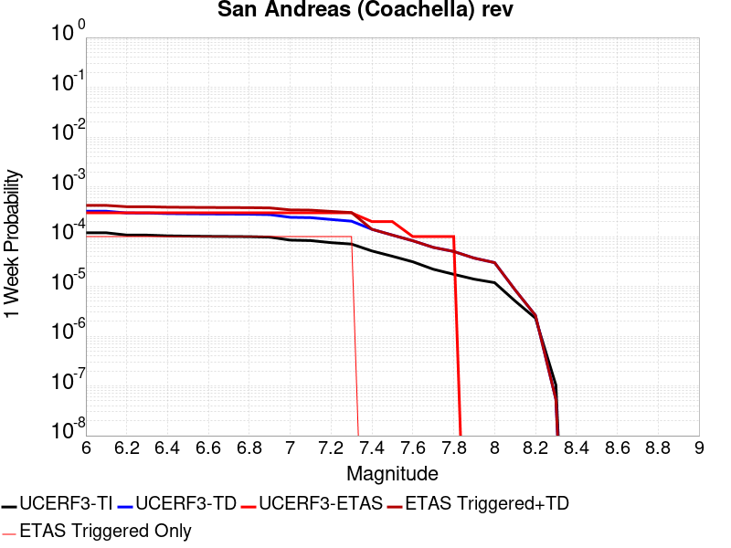 |  |  |  |

| Magnitude | 1 wk TI Prob | 1 wk TD Prob | 1 wk ETAS Prob | 1 wk ETAS/TD Gain | 1 wk ETAS Triggered+TD | 1 wk ETAS Triggered Only | 1 mo TI Prob | 1 mo TD Prob | 1 mo ETAS Prob | 1 mo ETAS/TD Gain | 1 mo ETAS Triggered+TD | 1 mo ETAS Triggered Only | 1 yr TI Prob | 1 yr TD Prob | 1 yr ETAS Prob | 1 yr ETAS/TD Gain | 1 yr ETAS Triggered+TD | 1 yr ETAS Triggered Only | 10 yr TI Prob | 10 yr TD Prob | 10 yr ETAS Prob | 10 yr ETAS/TD Gain | 10 yr ETAS Triggered+TD | 10 yr ETAS Triggered Only |
|-----|-----|-----|-----|-----|-----|-----|-----|-----|-----|-----|-----|-----|-----|-----|-----|-----|-----|-----|-----|-----|-----|-----|-----|-----|
| 6.0 | 1.1925945E-4 | 3.2288718E-4 | 0.0 | 0.0 | 3.2288718E-4 | 0.0 | 5.110118E-4 | 0.0013830729 | 5.4495916E-4 | 0.39402053 | 0.0019272784 | 5.4495916E-4 | 0.0062038354 | 0.016710198 | 0.0027247956 | 0.16306184 | 0.019389462 | 0.0027247956 | 0.060334753 | 0.15093613 | 0.0032697548 | 0.021663168 | 0.15371236 | 0.0032697548 |
| 6.1 | 1.1925945E-4 | 3.2288718E-4 | 0.0 | 0.0 | 3.2288718E-4 | 0.0 | 5.110118E-4 | 0.0013830729 | 5.4495916E-4 | 0.39402053 | 0.0019272784 | 5.4495916E-4 | 0.0062038354 | 0.016710198 | 0.0027247956 | 0.16306184 | 0.019389462 | 0.0027247956 | 0.060334753 | 0.15093613 | 0.0032697548 | 0.021663168 | 0.15371236 | 0.0032697548 |
| 6.2 | 1.07432395E-4 | 2.9791912E-4 | 0.0 | 0.0 | 2.9791912E-4 | 0.0 | 4.603433E-4 | 0.0012761754 | 5.4495916E-4 | 0.42702526 | 0.001820439 | 5.4495916E-4 | 0.005590286 | 0.015427807 | 0.0027247956 | 0.17661588 | 0.018110566 | 0.0027247956 | 0.05451731 | 0.14010412 | 0.0032697548 | 0.023338035 | 0.14291576 | 0.0032697548 |
| 6.3 | 1.0718766E-4 | 2.9737237E-4 | 0.0 | 0.0 | 2.9737237E-4 | 0.0 | 4.592948E-4 | 0.0012738345 | 5.4495916E-4 | 0.42781 | 0.0018180994 | 5.4495916E-4 | 0.005577586 | 0.015399709 | 0.0027247956 | 0.17693812 | 0.018082544 | 0.0027247956 | 0.054396555 | 0.13987197 | 0.0032697548 | 0.02337677 | 0.14268437 | 0.0032697548 |
| 6.4 | 1.0355944E-4 | 2.8945875E-4 | 0.0 | 0.0 | 2.8945875E-4 | 0.0 | 4.4375064E-4 | 0.0012399516 | 5.4495916E-4 | 0.43950033 | 0.001784235 | 5.4495916E-4 | 0.0053892885 | 0.014992934 | 0.0027247956 | 0.18173866 | 0.017676877 | 0.0027247956 | 0.052604496 | 0.13642041 | 0.0032697548 | 0.023968222 | 0.13924411 | 0.0032697548 |
| 6.5 | 1.0227914E-4 | 2.8665483E-4 | 0.0 | 0.0 | 2.8665483E-4 | 0.0 | 4.382655E-4 | 0.0012279461 | 5.4495916E-4 | 0.44379726 | 0.0017722361 | 5.4495916E-4 | 0.0053228354 | 0.014848769 | 0.0027247956 | 0.18350314 | 0.017533105 | 0.0027247956 | 0.051971316 | 0.13520178 | 0.0032697548 | 0.024184259 | 0.13802946 | 0.0032697548 |
| 6.6 | 1.0116757E-4 | 2.8431637E-4 | 0.0 | 0.0 | 2.8431637E-4 | 0.0 | 4.3350324E-4 | 0.0012179336 | 5.4495916E-4 | 0.4474457 | 0.0017622289 | 5.4495916E-4 | 0.0052651367 | 0.01472852 | 0.0027247956 | 0.18500133 | 0.017413182 | 0.0027247956 | 0.051421247 | 0.13417985 | 0.0032697548 | 0.02436845 | 0.13701086 | 0.0032697548 |
| 6.7 | 1.0050676E-4 | 2.829039E-4 | 0.0 | 0.0 | 2.829039E-4 | 0.0 | 4.3067214E-4 | 0.0012118858 | 5.4495916E-4 | 0.44967863 | 0.0017561845 | 5.4495916E-4 | 0.005230834 | 0.014655882 | 0.0027247956 | 0.18591824 | 0.017340742 | 0.0027247956 | 0.051094085 | 0.13356358 | 0.0032697548 | 0.024480887 | 0.1363966 | 0.0032697548 |
| 6.8 | 9.976819E-5 | 2.8094676E-4 | 0.0 | 0.0 | 2.8094676E-4 | 0.0 | 4.2750788E-4 | 0.0012035057 | 5.4495916E-4 | 0.45280978 | 0.001747809 | 5.4495916E-4 | 0.0051924936 | 0.014555221 | 0.0027247956 | 0.187204 | 0.017240357 | 0.0027247956 | 0.050728295 | 0.13271578 | 0.0032697548 | 0.024637273 | 0.13555159 | 0.0032697548 |
| 6.9 | 9.77719E-5 | 2.7595705E-4 | 0.0 | 0.0 | 2.7595705E-4 | 0.0 | 4.1895514E-4 | 0.0011821408 | 5.4495916E-4 | 0.4609934 | 0.0017264558 | 5.4495916E-4 | 0.0050888555 | 0.014298547 | 0.0027247956 | 0.19056451 | 0.016984383 | 0.0027247956 | 0.049738888 | 0.1305549 | 0.0032697548 | 0.025045056 | 0.13339777 | 0.0032697548 |
| 7.0 | 8.500761E-5 | 2.4361434E-4 | 0.0 | 0.0 | 2.4361434E-4 | 0.0 | 3.6426744E-4 | 0.0010436468 | 5.4495916E-4 | 0.52216816 | 0.0015880372 | 5.4495916E-4 | 0.0044259406 | 0.012633122 | 0.0027247956 | 0.21568665 | 0.015323495 | 0.0027247956 | 0.04338823 | 0.11649794 | 0.0032697548 | 0.028067062 | 0.11938678 | 0.0032697548 |
| 7.1 | 8.319876E-5 | 2.3970265E-4 | 0.0 | 0.0 | 2.3970265E-4 | 0.0 | 3.5651738E-4 | 0.0010268958 | 5.4495916E-4 | 0.5306859 | 0.0015712953 | 5.4495916E-4 | 0.004331963 | 0.012431524 | 0.0027247956 | 0.21918437 | 0.015122445 | 0.0027247956 | 0.042484846 | 0.114739165 | 0.0032697548 | 0.028497284 | 0.11763375 | 0.0032697548 |
| 7.2 | 7.563917E-5 | 2.2033798E-4 | 0.0 | 0.0 | 2.2033798E-4 | 0.0 | 3.2412758E-4 | 9.4396685E-4 | 5.4495916E-4 | 0.57730746 | 0.0014884116 | 5.4495916E-4 | 0.0039391145 | 0.011432902 | 0.0027247956 | 0.23832932 | 0.014126545 | 0.0027247956 | 0.03870018 | 0.10618827 | 0.0032697548 | 0.030792052 | 0.10911082 | 0.0032697548 |
| 7.3 | 7.082985E-5 | 2.0367479E-4 | 0.0 | 0.0 | 2.0367479E-4 | 0.0 | 3.0352117E-4 | 8.7260274E-4 | 5.4495916E-4 | 0.62452143 | 0.0014170863 | 5.4495916E-4 | 0.0036891096 | 0.010572792 | 0.0027247956 | 0.2577177 | 0.013268779 | 0.0027247956 | 0.03628465 | 0.098766804 | 0.0032697548 | 0.03310581 | 0.10171361 | 0.0032697548 |
| 7.4 | 5.146215E-5 | 1.3987564E-4 | 0.0 | 0.0 | 1.3987564E-4 | 0.0 | 2.2053342E-4 | 5.993302E-4 | 5.4495916E-4 | 0.9092803 | 0.0011439627 | 5.4495916E-4 | 0.0026816884 | 0.007272614 | 0.0016348774 | 0.22479913 | 0.008895602 | 0.0016348774 | 0.02649557 | 0.06959498 | 0.0016348774 | 0.023491312 | 0.071116075 | 0.0016348774 |
| 7.5 | 4.0285166E-5 | 1.07025786E-4 | 0.0 | 0.0 | 1.07025786E-4 | 0.0 | 1.7263928E-4 | 4.5860163E-4 | 0.0 | 0.0 | 4.5860163E-4 | 0.0 | 0.002099857 | 0.005569247 | 5.4495916E-4 | 0.097851485 | 0.0061111716 | 5.4495916E-4 | 0.020801254 | 0.05394122 | 5.4495916E-4 | 0.010102833 | 0.054456785 | 5.4495916E-4 |
| 7.6 | 3.1168736E-5 | 8.228769E-5 | 0.0 | 0.0 | 8.228769E-5 | 0.0 | 1.3357346E-4 | 3.5261398E-4 | 0.0 | 0.0 | 3.5261398E-4 | 0.0 | 0.0016250437 | 0.0042846496 | 5.4495916E-4 | 0.12718873 | 0.004827274 | 5.4495916E-4 | 0.016132116 | 0.041857634 | 5.4495916E-4 | 0.0130193485 | 0.04237978 | 5.4495916E-4 |
| 7.7 | 2.2100989E-5 | 6.0561815E-5 | 0.0 | 0.0 | 6.0561815E-5 | 0.0 | 9.4715084E-5 | 2.5952485E-4 | 0.0 | 0.0 | 2.5952485E-4 | 0.0 | 0.001152546 | 0.003155143 | 0.0 | 0.0 | 0.003155143 | 0.0 | 0.011465867 | 0.031067226 | 0.0 | 0.0 | 0.031067226 | 0.0 |
| 7.8 | 1.7484861E-5 | 5.017899E-5 | 0.0 | 0.0 | 5.017899E-5 | 0.0 | 7.493296E-5 | 2.150351E-4 | 0.0 | 0.0 | 2.150351E-4 | 0.0 | 9.1192697E-4 | 0.0026149119 | 0.0 | 0.0 | 0.0026149119 | 0.0 | 0.009081938 | 0.025900835 | 0.0 | 0.0 | 0.025900835 | 0.0 |
| 7.9 | 1.3967285E-5 | 3.6891262E-5 | 0.0 | 0.0 | 3.6891262E-5 | 0.0 | 5.985842E-5 | 1.5809583E-4 | 0.0 | 0.0 | 1.5809583E-4 | 0.0 | 7.2853256E-4 | 0.0019231186 | 0.0 | 0.0 | 0.0019231186 | 0.0 | 0.0072614877 | 0.019291423 | 0.0 | 0.0 | 0.019291423 | 0.0 |
| 8.0 | 1.1887396E-5 | 2.9913166E-5 | 0.0 | 0.0 | 2.9913166E-5 | 0.0 | 5.094499E-5 | 1.2819299E-4 | 0.0 | 0.0 | 1.2819299E-4 | 0.0 | 6.200787E-4 | 0.0015596332 | 0.0 | 0.0 | 0.0015596332 | 0.0 | 0.006183513 | 0.015740186 | 0.0 | 0.0 | 0.015740186 | 0.0 |
| 8.1 | 5.100864E-6 | 8.48687E-6 | 0.0 | 0.0 | 8.48687E-6 | 0.0 | 2.1860664E-5 | 3.637179E-5 | 0.0 | 0.0 | 3.637179E-5 | 0.0 | 2.6612106E-4 | 4.427367E-4 | 0.0 | 0.0 | 4.427367E-4 | 0.0 | 0.002658026 | 0.0046746903 | 0.0 | 0.0 | 0.0046746903 | 0.0 |
| 8.2 | 2.3004484E-6 | 2.5886918E-6 | 0.0 | 0.0 | 2.5886918E-6 | 0.0 | 9.859027E-6 | 1.10943465E-5 | 0.0 | 0.0 | 1.10943465E-5 | 0.0 | 1.2002704E-4 | 1.3506532E-4 | 0.0 | 0.0 | 1.3506532E-4 | 0.0 | 0.0011996223 | 0.0014949394 | 0.0 | 0.0 | 0.0014949394 | 0.0 |
| 8.3 | 1.0424446E-7 | 5.3008716E-8 | 0.0 | 0.0 | 5.3008716E-8 | 0.0 | 4.4676187E-7 | 2.2718018E-7 | 0.0 | 0.0 | 2.2718018E-7 | 0.0 | 5.439312E-6 | 2.7659155E-6 | 0.0 | 0.0 | 2.7659155E-6 | 0.0 | 5.4391792E-5 | 2.9151119E-5 | 0.0 | 0.0 | 2.9151119E-5 | 0.0 |

## Keddie Ridge 2011 CFM
*[(top)](#table-of-contents)*

| 1 Week | 1 Month | 1 Year | 10 Year |
|-----|-----|-----|-----|
|  |  |  |  |

| Magnitude | 1 wk TI Prob | 1 wk TD Prob | 1 wk ETAS Prob | 1 wk ETAS/TD Gain | 1 wk ETAS Triggered+TD | 1 wk ETAS Triggered Only | 1 mo TI Prob | 1 mo TD Prob | 1 mo ETAS Prob | 1 mo ETAS/TD Gain | 1 mo ETAS Triggered+TD | 1 mo ETAS Triggered Only | 1 yr TI Prob | 1 yr TD Prob | 1 yr ETAS Prob | 1 yr ETAS/TD Gain | 1 yr ETAS Triggered+TD | 1 yr ETAS Triggered Only | 10 yr TI Prob | 10 yr TD Prob | 10 yr ETAS Prob | 10 yr ETAS/TD Gain | 10 yr ETAS Triggered+TD | 10 yr ETAS Triggered Only |
|-----|-----|-----|-----|-----|-----|-----|-----|-----|-----|-----|-----|-----|-----|-----|-----|-----|-----|-----|-----|-----|-----|-----|-----|-----|
| 6.0 | 2.2591947E-5 | 2.5158795E-5 | 0.0 | 0.0 | 2.5158795E-5 | 0.0 | 9.6819036E-5 | 1.078194E-4 | 0.0 | 0.0 | 1.078194E-4 | 0.0 | 0.0011781343 | 0.0013119896 | 5.4495916E-4 | 0.4153685 | 0.0018562337 | 5.4495916E-4 | 0.011719079 | 0.013050364 | 0.0027247956 | 0.20879078 | 0.015739601 | 0.0027247956 |
| 6.1 | 2.2591947E-5 | 2.5158795E-5 | 0.0 | 0.0 | 2.5158795E-5 | 0.0 | 9.6819036E-5 | 1.078194E-4 | 0.0 | 0.0 | 1.078194E-4 | 0.0 | 0.0011781343 | 0.0013119896 | 5.4495916E-4 | 0.4153685 | 0.0018562337 | 5.4495916E-4 | 0.011719079 | 0.013050364 | 0.0021798366 | 0.16703261 | 0.015201753 | 0.0021798366 |
| 6.2 | 1.3775145E-5 | 1.5304711E-5 | 0.0 | 0.0 | 1.5304711E-5 | 0.0 | 5.9035E-5 | 6.559011E-5 | 0.0 | 0.0 | 6.559011E-5 | 0.0 | 7.185141E-4 | 7.982911E-4 | 0.0 | 0.0 | 7.982911E-4 | 0.0 | 0.0071619535 | 0.007956649 | 0.0 | 0.0 | 0.007956649 | 0.0 |
| 6.3 | 9.705435E-6 | 1.07559135E-5 | 0.0 | 0.0 | 1.07559135E-5 | 0.0 | 4.1594063E-5 | 4.6096025E-5 | 0.0 | 0.0 | 4.6096025E-5 | 0.0 | 5.0629E-4 | 5.61087E-4 | 0.0 | 0.0 | 5.61087E-4 | 0.0 | 0.005051381 | 0.005597932 | 0.0 | 0.0 | 0.005597932 | 0.0 |
| 6.4 | 7.2549733E-6 | 8.018234E-6 | 0.0 | 0.0 | 8.018234E-6 | 0.0 | 3.109237E-5 | 3.4363453E-5 | 0.0 | 0.0 | 3.4363453E-5 | 0.0 | 3.7848388E-4 | 4.183027E-4 | 0.0 | 0.0 | 4.183027E-4 | 0.0 | 0.003778399 | 0.004175939 | 0.0 | 0.0 | 0.004175939 | 0.0 |
| 6.5 | 5.983293E-6 | 6.6056505E-6 | 0.0 | 0.0 | 6.6056505E-6 | 0.0 | 2.5642432E-5 | 2.8309662E-5 | 0.0 | 0.0 | 2.8309662E-5 | 0.0 | 3.1215188E-4 | 3.4462236E-4 | 0.0 | 0.0 | 3.4462236E-4 | 0.0 | 0.0031171376 | 0.0034415408 | 0.0 | 0.0 | 0.0034415408 | 0.0 |
| 6.6 | 4.0336154E-6 | 4.4528106E-6 | 0.0 | 0.0 | 4.4528106E-6 | 0.0 | 1.728681E-5 | 1.9083356E-5 | 0.0 | 0.0 | 1.9083356E-5 | 0.0 | 2.1044657E-4 | 2.3231911E-4 | 0.0 | 0.0 | 2.3231911E-4 | 0.0 | 0.002102474 | 0.002321158 | 0.0 | 0.0 | 0.002321158 | 0.0 |
| 6.7 | 1.5832104E-6 | 1.7792295E-6 | 0.0 | 0.0 | 1.7792295E-6 | 0.0 | 6.7851697E-6 | 7.6252486E-6 | 0.0 | 0.0 | 7.6252486E-6 | 0.0 | 8.260631E-5 | 9.283372E-5 | 0.0 | 0.0 | 9.283372E-5 | 0.0 | 8.2575605E-4 | 9.27976E-4 | 0.0 | 0.0 | 9.27976E-4 | 0.0 |
| 6.8 | 7.5177275E-7 | 8.5773416E-7 | 0.0 | 0.0 | 8.5773416E-7 | 0.0 | 3.221879E-6 | 3.6759993E-6 | 0.0 | 0.0 | 3.6759993E-6 | 0.0 | 3.9225673E-5 | 4.4754543E-5 | 0.0 | 0.0 | 4.4754543E-5 | 0.0 | 3.921875E-4 | 4.4747177E-4 | 0.0 | 0.0 | 4.4747177E-4 | 0.0 |

## Mission Ridge-Arroyo Parida-Santa Ana
*[(top)](#table-of-contents)*

| 1 Week | 1 Month | 1 Year | 10 Year |
|-----|-----|-----|-----|
|  |  |  |  |

| Magnitude | 1 wk TI Prob | 1 wk TD Prob | 1 wk ETAS Prob | 1 wk ETAS/TD Gain | 1 wk ETAS Triggered+TD | 1 wk ETAS Triggered Only | 1 mo TI Prob | 1 mo TD Prob | 1 mo ETAS Prob | 1 mo ETAS/TD Gain | 1 mo ETAS Triggered+TD | 1 mo ETAS Triggered Only | 1 yr TI Prob | 1 yr TD Prob | 1 yr ETAS Prob | 1 yr ETAS/TD Gain | 1 yr ETAS Triggered+TD | 1 yr ETAS Triggered Only | 10 yr TI Prob | 10 yr TD Prob | 10 yr ETAS Prob | 10 yr ETAS/TD Gain | 10 yr ETAS Triggered+TD | 10 yr ETAS Triggered Only |
|-----|-----|-----|-----|-----|-----|-----|-----|-----|-----|-----|-----|-----|-----|-----|-----|-----|-----|-----|-----|-----|-----|-----|-----|-----|
| 6.0 | 4.169034E-5 | 4.7031044E-5 | 0.0 | 0.0 | 4.7031044E-5 | 0.0 | 1.7866064E-4 | 2.0155087E-4 | 0.0 | 0.0 | 2.0155087E-4 | 0.0 | 0.0021730233 | 0.002451956 | 5.4495916E-4 | 0.22225484 | 0.002995579 | 5.4495916E-4 | 0.021518968 | 0.024330456 | 0.0016348774 | 0.067194685 | 0.025925556 | 0.0016348774 |
| 6.1 | 1.73813E-5 | 1.682591E-5 | 0.0 | 0.0 | 1.682591E-5 | 0.0 | 7.4489166E-5 | 7.210911E-5 | 0.0 | 0.0 | 7.210911E-5 | 0.0 | 9.065282E-4 | 8.775855E-4 | 0.0 | 0.0 | 8.775855E-4 | 0.0 | 0.009028391 | 0.008742238 | 0.0 | 0.0 | 0.008742238 | 0.0 |
| 6.2 | 1.4622182E-5 | 1.3650112E-5 | 0.0 | 0.0 | 1.3650112E-5 | 0.0 | 6.2664985E-5 | 5.849919E-5 | 0.0 | 0.0 | 5.849919E-5 | 0.0 | 7.6267915E-4 | 7.119988E-4 | 0.0 | 0.0 | 7.119988E-4 | 0.0 | 0.007600669 | 0.007097517 | 0.0 | 0.0 | 0.007097517 | 0.0 |
| 6.3 | 1.3552434E-5 | 1.2460448E-5 | 0.0 | 0.0 | 1.2460448E-5 | 0.0 | 5.8080568E-5 | 5.340084E-5 | 0.0 | 0.0 | 5.340084E-5 | 0.0 | 7.069015E-4 | 6.4996444E-4 | 0.0 | 0.0 | 6.4996444E-4 | 0.0 | 0.00704657 | 0.006480896 | 0.0 | 0.0 | 0.006480896 | 0.0 |
| 6.4 | 1.30977305E-5 | 1.1957964E-5 | 0.0 | 0.0 | 1.1957964E-5 | 0.0 | 5.613192E-5 | 5.1247425E-5 | 0.0 | 0.0 | 5.1247425E-5 | 0.0 | 6.831918E-4 | 6.237618E-4 | 0.0 | 0.0 | 6.237618E-4 | 0.0 | 0.006810953 | 0.0062203533 | 0.0 | 0.0 | 0.0062203533 | 0.0 |
| 6.5 | 1.225205E-5 | 1.1028586E-5 | 0.0 | 0.0 | 1.1028586E-5 | 0.0 | 5.2507727E-5 | 4.726453E-5 | 0.0 | 0.0 | 4.726453E-5 | 0.0 | 6.3909404E-4 | 5.752964E-4 | 0.0 | 0.0 | 5.752964E-4 | 0.0 | 0.006372592 | 0.005738279 | 0.0 | 0.0 | 0.005738279 | 0.0 |
| 6.6 | 1.1352241E-5 | 1.0044297E-5 | 0.0 | 0.0 | 1.0044297E-5 | 0.0 | 4.8651553E-5 | 4.3046286E-5 | 0.0 | 0.0 | 4.3046286E-5 | 0.0 | 5.921717E-4 | 5.2396464E-4 | 0.0 | 0.0 | 5.2396464E-4 | 0.0 | 0.0059059616 | 0.005227437 | 0.0 | 0.0 | 0.005227437 | 0.0 |
| 6.7 | 1.0864116E-5 | 9.498481E-6 | 0.0 | 0.0 | 9.498481E-6 | 0.0 | 4.6559664E-5 | 4.0707153E-5 | 0.0 | 0.0 | 4.0707153E-5 | 0.0 | 5.667165E-4 | 4.954989E-4 | 0.0 | 0.0 | 4.954989E-4 | 0.0 | 0.005652734 | 0.0049440726 | 0.0 | 0.0 | 0.0049440726 | 0.0 |
| 6.8 | 1.0666365E-5 | 9.281458E-6 | 0.0 | 0.0 | 9.281458E-6 | 0.0 | 4.571219E-5 | 3.9777082E-5 | 0.0 | 0.0 | 3.9777082E-5 | 0.0 | 5.564038E-4 | 4.8418035E-4 | 0.0 | 0.0 | 4.8418035E-4 | 0.0 | 0.005550127 | 0.004831385 | 0.0 | 0.0 | 0.004831385 | 0.0 |
| 6.9 | 1.0038665E-5 | 8.574669E-6 | 0.0 | 0.0 | 8.574669E-6 | 0.0 | 4.302214E-5 | 3.6748075E-5 | 0.0 | 0.0 | 3.6748075E-5 | 0.0 | 5.236687E-4 | 4.4731775E-4 | 0.0 | 0.0 | 4.4731775E-4 | 0.0 | 0.005224364 | 0.0044642827 | 0.0 | 0.0 | 0.0044642827 | 0.0 |
| 7.0 | 9.5379955E-6 | 8.008521E-6 | 0.0 | 0.0 | 8.008521E-6 | 0.0 | 4.0876483E-5 | 3.432179E-5 | 0.0 | 0.0 | 3.432179E-5 | 0.0 | 4.975576E-4 | 4.1778936E-4 | 0.0 | 0.0 | 4.1778936E-4 | 0.0 | 0.00496445 | 0.004170137 | 0.0 | 0.0 | 0.004170137 | 0.0 |
| 7.1 | 9.207389E-6 | 7.636396E-6 | 0.0 | 0.0 | 7.636396E-6 | 0.0 | 3.945964E-5 | 3.272701E-5 | 0.0 | 0.0 | 3.272701E-5 | 0.0 | 4.803152E-4 | 3.983802E-4 | 0.0 | 0.0 | 3.983802E-4 | 0.0 | 0.004792784 | 0.003976755 | 0.0 | 0.0 | 0.003976755 | 0.0 |
| 7.2 | 7.638091E-6 | 5.9180575E-6 | 0.0 | 0.0 | 5.9180575E-6 | 0.0 | 3.2734264E-5 | 2.5362859E-5 | 0.0 | 0.0 | 2.5362859E-5 | 0.0 | 3.984668E-4 | 3.0874935E-4 | 0.0 | 0.0 | 3.0874935E-4 | 0.0 | 0.0039775306 | 0.0030831592 | 0.0 | 0.0 | 0.0030831592 | 0.0 |
| 7.3 | 7.2500147E-6 | 5.583636E-6 | 0.0 | 0.0 | 5.583636E-6 | 0.0 | 3.1071122E-5 | 2.392965E-5 | 0.0 | 0.0 | 2.392965E-5 | 0.0 | 3.7822526E-4 | 2.9130484E-4 | 0.0 | 0.0 | 2.9130484E-4 | 0.0 | 0.0037758215 | 0.0029091837 | 0.0 | 0.0 | 0.0029091837 | 0.0 |
| 7.4 | 6.3899715E-6 | 4.9073815E-6 | 0.0 | 0.0 | 4.9073815E-6 | 0.0 | 2.7385306E-5 | 2.1031467E-5 | 0.0 | 0.0 | 2.1031467E-5 | 0.0 | 3.3336508E-4 | 2.560282E-4 | 0.0 | 0.0 | 2.560282E-4 | 0.0 | 0.0033286542 | 0.0025572754 | 0.0 | 0.0 | 0.0025572754 | 0.0 |
| 7.5 | 5.379025E-6 | 4.0744876E-6 | 0.0 | 0.0 | 4.0744876E-6 | 0.0 | 2.305276E-5 | 1.7461974E-5 | 0.0 | 0.0 | 1.7461974E-5 | 0.0 | 2.806312E-4 | 2.125789E-4 | 0.0 | 0.0 | 2.125789E-4 | 0.0 | 0.0028027708 | 0.0021237668 | 0.0 | 0.0 | 0.0021237668 | 0.0 |
| 7.6 | 4.1270696E-6 | 3.0807755E-6 | 0.0 | 0.0 | 3.0807755E-6 | 0.0 | 1.768732E-5 | 1.32032565E-5 | 0.0 | 0.0 | 1.32032565E-5 | 0.0 | 2.1532185E-4 | 1.6073787E-4 | 0.0 | 0.0 | 1.6073787E-4 | 0.0 | 0.0021511333 | 0.0016062241 | 0.0 | 0.0 | 0.0016062241 | 0.0 |
| 7.7 | 2.5406805E-6 | 1.8229238E-6 | 0.0 | 0.0 | 1.8229238E-6 | 0.0 | 1.0888585E-5 | 7.812508E-6 | 0.0 | 0.0 | 7.812508E-6 | 0.0 | 1.3256045E-4 | 9.511319E-5 | 0.0 | 0.0 | 9.511319E-5 | 0.0 | 0.0013248142 | 9.507309E-4 | 0.0 | 0.0 | 9.507309E-4 | 0.0 |
| 7.8 | 4.8608285E-7 | 3.5028427E-7 | 0.0 | 0.0 | 3.5028427E-7 | 0.0 | 2.0832106E-6 | 1.5012174E-6 | 0.0 | 0.0 | 1.5012174E-6 | 0.0 | 2.5362791E-5 | 1.827717E-5 | 0.0 | 0.0 | 1.827717E-5 | 0.0 | 2.5359896E-4 | 1.8275679E-4 | 0.0 | 0.0 | 1.8275679E-4 | 0.0 |
| 7.9 | 2.0472514E-8 | 1.26545165E-8 | 0.0 | 0.0 | 1.26545165E-8 | 0.0 | 8.7739345E-8 | 5.423364E-8 | 0.0 | 0.0 | 5.423364E-8 | 0.0 | 1.068226E-6 | 6.602944E-7 | 0.0 | 0.0 | 6.602944E-7 | 0.0 | 1.0682209E-5 | 6.602925E-6 | 0.0 | 0.0 | 6.602925E-6 | 0.0 |
| 8.0 | 4.443582E-9 | 2.0201907E-9 | 0.0 | 0.0 | 2.0201907E-9 | 0.0 | 1.9043922E-8 | 8.65796E-9 | 0.0 | 0.0 | 8.65796E-9 | 0.0 | 2.3185973E-7 | 1.05410656E-7 | 0.0 | 0.0 | 1.05410656E-7 | 0.0 | 2.3185949E-6 | 1.0541062E-6 | 0.0 | 0.0 | 1.0541062E-6 | 0.0 |

## San Andreas (San Gorgonio Pass-Garnet HIll)
*[(top)](#table-of-contents)*

| 1 Week | 1 Month | 1 Year | 10 Year |
|-----|-----|-----|-----|
|  |  |  |  |

| Magnitude | 1 wk TI Prob | 1 wk TD Prob | 1 wk ETAS Prob | 1 wk ETAS/TD Gain | 1 wk ETAS Triggered+TD | 1 wk ETAS Triggered Only | 1 mo TI Prob | 1 mo TD Prob | 1 mo ETAS Prob | 1 mo ETAS/TD Gain | 1 mo ETAS Triggered+TD | 1 mo ETAS Triggered Only | 1 yr TI Prob | 1 yr TD Prob | 1 yr ETAS Prob | 1 yr ETAS/TD Gain | 1 yr ETAS Triggered+TD | 1 yr ETAS Triggered Only | 10 yr TI Prob | 10 yr TD Prob | 10 yr ETAS Prob | 10 yr ETAS/TD Gain | 10 yr ETAS Triggered+TD | 10 yr ETAS Triggered Only |
|-----|-----|-----|-----|-----|-----|-----|-----|-----|-----|-----|-----|-----|-----|-----|-----|-----|-----|-----|-----|-----|-----|-----|-----|-----|
| 6.0 | 8.31567E-5 | 2.301408E-4 | 0.0 | 0.0 | 2.301408E-4 | 0.0 | 3.5633717E-4 | 9.859423E-4 | 5.4495916E-4 | 0.5527292 | 0.0015303642 | 5.4495916E-4 | 0.004329778 | 0.011937703 | 0.0021798366 | 0.182601 | 0.014091517 | 0.0021798366 | 0.042463828 | 0.11106009 | 0.0021798366 | 0.019627541 | 0.11299784 | 0.0021798366 |
| 6.1 | 8.31567E-5 | 2.301408E-4 | 0.0 | 0.0 | 2.301408E-4 | 0.0 | 3.5633717E-4 | 9.859423E-4 | 5.4495916E-4 | 0.5527292 | 0.0015303642 | 5.4495916E-4 | 0.004329778 | 0.011937703 | 0.0021798366 | 0.182601 | 0.014091517 | 0.0021798366 | 0.042463828 | 0.11106009 | 0.0021798366 | 0.019627541 | 0.11299784 | 0.0021798366 |
| 6.2 | 8.31567E-5 | 2.301408E-4 | 0.0 | 0.0 | 2.301408E-4 | 0.0 | 3.5633717E-4 | 9.859423E-4 | 5.4495916E-4 | 0.5527292 | 0.0015303642 | 5.4495916E-4 | 0.004329778 | 0.011937703 | 0.0021798366 | 0.182601 | 0.014091517 | 0.0021798366 | 0.042463828 | 0.11106009 | 0.0021798366 | 0.019627541 | 0.11299784 | 0.0021798366 |
| 6.3 | 8.31567E-5 | 2.301408E-4 | 0.0 | 0.0 | 2.301408E-4 | 0.0 | 3.5633717E-4 | 9.859423E-4 | 5.4495916E-4 | 0.5527292 | 0.0015303642 | 5.4495916E-4 | 0.004329778 | 0.011937703 | 0.0021798366 | 0.182601 | 0.014091517 | 0.0021798366 | 0.042463828 | 0.11106009 | 0.0021798366 | 0.019627541 | 0.11299784 | 0.0021798366 |
| 6.4 | 8.059055E-5 | 2.2573429E-4 | 0.0 | 0.0 | 2.2573429E-4 | 0.0 | 3.4534236E-4 | 9.670743E-4 | 5.4495916E-4 | 0.56351316 | 0.0015115064 | 5.4495916E-4 | 0.0041964394 | 0.011710799 | 0.0021798366 | 0.186139 | 0.013865108 | 0.0021798366 | 0.041180745 | 0.109045535 | 0.0021798366 | 0.019990148 | 0.11098767 | 0.0021798366 |
| 6.5 | 8.059055E-5 | 2.2573429E-4 | 0.0 | 0.0 | 2.2573429E-4 | 0.0 | 3.4534236E-4 | 9.670743E-4 | 5.4495916E-4 | 0.56351316 | 0.0015115064 | 5.4495916E-4 | 0.0041964394 | 0.011710799 | 0.0021798366 | 0.186139 | 0.013865108 | 0.0021798366 | 0.041180745 | 0.109045535 | 0.0021798366 | 0.019990148 | 0.11098767 | 0.0021798366 |
| 6.6 | 7.619237E-5 | 2.1821013E-4 | 0.0 | 0.0 | 2.1821013E-4 | 0.0 | 3.2649786E-4 | 9.3485333E-4 | 5.4495916E-4 | 0.5829354 | 0.001479303 | 5.4495916E-4 | 0.0039678677 | 0.01132297 | 0.0021798366 | 0.19251455 | 0.0134781245 | 0.0021798366 | 0.03897764 | 0.10558918 | 0.0021798366 | 0.020644506 | 0.10753885 | 0.0021798366 |
| 6.7 | 7.440636E-5 | 2.1497595E-4 | 0.0 | 0.0 | 2.1497595E-4 | 0.0 | 3.188454E-4 | 9.210024E-4 | 5.4495916E-4 | 0.59170216 | 0.0014654596 | 5.4495916E-4 | 0.0038750346 | 0.011156069 | 0.0021798366 | 0.19539467 | 0.013311587 | 0.0021798366 | 0.038081564 | 0.10409843 | 0.0021798366 | 0.020940147 | 0.106051356 | 0.0021798366 |
| 6.8 | 7.3735864E-5 | 2.1345234E-4 | 0.0 | 0.0 | 2.1345234E-4 | 0.0 | 3.1597257E-4 | 9.1447716E-4 | 5.4495916E-4 | 0.59592426 | 0.001458938 | 5.4495916E-4 | 0.0038401815 | 0.011077438 | 0.0021798366 | 0.19678165 | 0.013233127 | 0.0021798366 | 0.03774495 | 0.10340095 | 0.0021798366 | 0.021081395 | 0.1053554 | 0.0021798366 |
| 6.9 | 7.27575E-5 | 2.1114944E-4 | 0.0 | 0.0 | 2.1114944E-4 | 0.0 | 3.117806E-4 | 9.046146E-4 | 5.4495916E-4 | 0.60242134 | 0.0014490806 | 5.4495916E-4 | 0.003789323 | 0.010958575 | 0.0021798366 | 0.19891606 | 0.013114523 | 0.0021798366 | 0.037253562 | 0.10235028 | 0.0021798366 | 0.021297807 | 0.10430701 | 0.0021798366 |
| 7.0 | 7.102591E-5 | 2.070062E-4 | 0.0 | 0.0 | 2.070062E-4 | 0.0 | 3.0436125E-4 | 8.8686997E-4 | 5.4495916E-4 | 0.61447465 | 0.0014313458 | 5.4495916E-4 | 0.003699303 | 0.0107446825 | 0.0021798366 | 0.20287584 | 0.012901098 | 0.0021798366 | 0.03638325 | 0.10045641 | 0.0021798366 | 0.021699328 | 0.10241726 | 0.0021798366 |
| 7.1 | 7.028513E-5 | 2.0537019E-4 | 0.0 | 0.0 | 2.0537019E-4 | 0.0 | 3.0118722E-4 | 8.798633E-4 | 5.4495916E-4 | 0.61936796 | 0.0014243429 | 5.4495916E-4 | 0.0036607897 | 0.010660214 | 0.0021798366 | 0.20448336 | 0.012816814 | 0.0021798366 | 0.036010686 | 0.09970159 | 0.0021798366 | 0.021863608 | 0.101664096 | 0.0021798366 |
| 7.2 | 6.8498244E-5 | 2.014646E-4 | 0.0 | 0.0 | 2.014646E-4 | 0.0 | 2.9353087E-4 | 8.6313614E-4 | 5.4495916E-4 | 0.631371 | 0.0014076249 | 5.4495916E-4 | 0.003567883 | 0.010458532 | 0.0021798366 | 0.20842662 | 0.012615571 | 0.0021798366 | 0.035111405 | 0.0978974 | 0.0021798366 | 0.02226654 | 0.09986384 | 0.0021798366 |
| 7.3 | 6.622592E-5 | 1.937873E-4 | 0.0 | 0.0 | 1.937873E-4 | 0.0 | 2.8379448E-4 | 8.3025475E-4 | 5.4495916E-4 | 0.65637577 | 0.0013747615 | 5.4495916E-4 | 0.0034497243 | 0.010061966 | 0.0021798366 | 0.2166412 | 0.0122198695 | 0.0021798366 | 0.033966612 | 0.09440826 | 0.0021798366 | 0.023089468 | 0.0963823 | 0.0021798366 |
| 7.4 | 5.1050705E-5 | 1.4391277E-4 | 0.0 | 0.0 | 1.4391277E-4 | 0.0 | 2.1877038E-4 | 6.166241E-4 | 5.4495916E-4 | 0.8837785 | 0.0011612471 | 5.4495916E-4 | 0.002660276 | 0.0074817417 | 0.0016348774 | 0.2185156 | 0.009104388 | 0.0016348774 | 0.02628654 | 0.07157116 | 0.0016348774 | 0.022842687 | 0.07308902 | 0.0016348774 |
| 7.5 | 3.9302922E-5 | 1.0880058E-4 | 0.0 | 0.0 | 1.0880058E-4 | 0.0 | 1.6843023E-4 | 4.6620518E-4 | 0.0 | 0.0 | 4.6620518E-4 | 0.0 | 0.0020487092 | 0.0056613428 | 5.4495916E-4 | 0.09625969 | 0.006203217 | 5.4495916E-4 | 0.020299247 | 0.054900635 | 5.4495916E-4 | 0.009926281 | 0.055415675 | 5.4495916E-4 |
| 7.6 | 2.9851626E-5 | 8.275067E-5 | 0.0 | 0.0 | 8.275067E-5 | 0.0 | 1.2792926E-4 | 3.5459764E-4 | 0.0 | 0.0 | 3.5459764E-4 | 0.0 | 0.0015564259 | 0.0043087048 | 5.4495916E-4 | 0.12647864 | 0.0048513156 | 5.4495916E-4 | 0.0154556995 | 0.042204775 | 5.4495916E-4 | 0.012912262 | 0.042726737 | 5.4495916E-4 |
| 7.7 | 2.1135214E-5 | 6.1600455E-5 | 0.0 | 0.0 | 6.1600455E-5 | 0.0 | 9.0576345E-5 | 2.6397526E-4 | 0.0 | 0.0 | 2.6397526E-4 | 0.0 | 0.0011022091 | 0.0032091674 | 0.0 | 0.0 | 0.0032091674 | 0.0 | 0.010967582 | 0.031710215 | 0.0 | 0.0 | 0.031710215 | 0.0 |
| 7.8 | 1.883379E-5 | 5.387325E-5 | 0.0 | 0.0 | 5.387325E-5 | 0.0 | 8.0713755E-5 | 2.3086494E-4 | 0.0 | 0.0 | 2.3086494E-4 | 0.0 | 9.822468E-4 | 0.0028071606 | 0.0 | 0.0 | 0.0028071606 | 0.0 | 0.0097791655 | 0.02789182 | 0.0 | 0.0 | 0.02789182 | 0.0 |
| 7.9 | 1.5156185E-5 | 4.019655E-5 | 0.0 | 0.0 | 4.019655E-5 | 0.0 | 6.495346E-5 | 1.7225956E-4 | 0.0 | 0.0 | 1.7225956E-4 | 0.0 | 7.9052144E-4 | 0.0020952441 | 0.0 | 0.0 | 0.0020952441 | 0.0 | 0.007877152 | 0.021085052 | 0.0 | 0.0 | 0.021085052 | 0.0 |
| 8.0 | 1.1405907E-5 | 2.8856002E-5 | 0.0 | 0.0 | 2.8856002E-5 | 0.0 | 4.8881542E-5 | 1.2366273E-4 | 0.0 | 0.0 | 1.2366273E-4 | 0.0 | 5.9497025E-4 | 0.0015045548 | 0.0 | 0.0 | 0.0015045548 | 0.0 | 0.005933798 | 0.015251126 | 0.0 | 0.0 | 0.015251126 | 0.0 |
| 8.1 | 4.3511436E-6 | 6.948125E-6 | 0.0 | 0.0 | 6.948125E-6 | 0.0 | 1.8647626E-5 | 2.9777339E-5 | 0.0 | 0.0 | 2.9777339E-5 | 0.0 | 2.2701119E-4 | 3.624789E-4 | 0.0 | 0.0 | 3.624789E-4 | 0.0 | 0.0022677942 | 0.003905537 | 0.0 | 0.0 | 0.003905537 | 0.0 |
| 8.2 | 2.3042528E-6 | 2.5356364E-6 | 0.0 | 0.0 | 2.5356364E-6 | 0.0 | 9.875332E-6 | 1.0866968E-5 | 0.0 | 0.0 | 1.0866968E-5 | 0.0 | 1.2022553E-4 | 1.3229734E-4 | 0.0 | 0.0 | 1.3229734E-4 | 0.0 | 0.0012016051 | 0.0014945742 | 0.0 | 0.0 | 0.0014945742 | 0.0 |
| 8.3 | 5.202968E-7 | 2.8777797E-7 | 0.0 | 0.0 | 2.8777797E-7 | 0.0 | 2.2298414E-6 | 1.2333336E-6 | 0.0 | 0.0 | 1.2333336E-6 | 0.0 | 2.714798E-5 | 1.5015743E-5 | 0.0 | 0.0 | 1.5015743E-5 | 0.0 | 2.7144665E-4 | 1.7966983E-4 | 0.0 | 0.0 | 1.7966983E-4 | 0.0 |

## Hayward (So) extension 2011 CFM
*[(top)](#table-of-contents)*

| 1 Week | 1 Month | 1 Year | 10 Year |
|-----|-----|-----|-----|
|  |  | 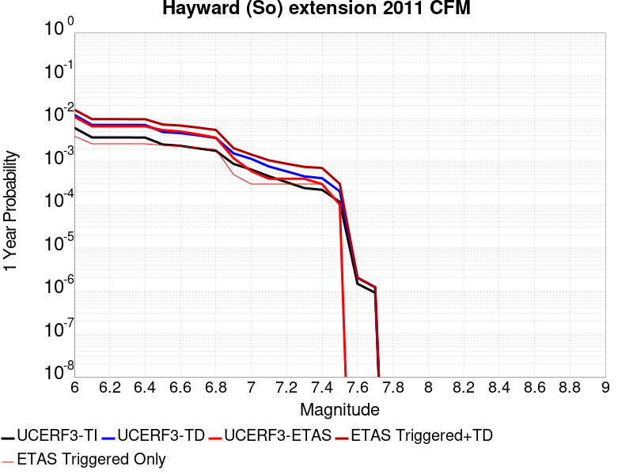 |  |

| Magnitude | 1 wk TI Prob | 1 wk TD Prob | 1 wk ETAS Prob | 1 wk ETAS/TD Gain | 1 wk ETAS Triggered+TD | 1 wk ETAS Triggered Only | 1 mo TI Prob | 1 mo TD Prob | 1 mo ETAS Prob | 1 mo ETAS/TD Gain | 1 mo ETAS Triggered+TD | 1 mo ETAS Triggered Only | 1 yr TI Prob | 1 yr TD Prob | 1 yr ETAS Prob | 1 yr ETAS/TD Gain | 1 yr ETAS Triggered+TD | 1 yr ETAS Triggered Only | 10 yr TI Prob | 10 yr TD Prob | 10 yr ETAS Prob | 10 yr ETAS/TD Gain | 10 yr ETAS Triggered+TD | 10 yr ETAS Triggered Only |
|-----|-----|-----|-----|-----|-----|-----|-----|-----|-----|-----|-----|-----|-----|-----|-----|-----|-----|-----|-----|-----|-----|-----|-----|-----|
| 6.0 | 1.1721256E-4 | 2.3521947E-4 | 5.4495916E-4 | 2.3168113 | 7.800504E-4 | 5.4495916E-4 | 5.022428E-4 | 0.001007451 | 5.4495916E-4 | 0.5409287 | 0.0015518611 | 5.4495916E-4 | 0.0060976758 | 0.0121734785 | 5.4495916E-4 | 0.0447661 | 0.012711803 | 5.4495916E-4 | 0.0593305 | 0.11223979 | 0.0021798366 | 0.019421244 | 0.11417497 | 0.0021798366 |
| 6.1 | 6.99169E-5 | 1.3682294E-4 | 5.4495916E-4 | 3.9829514 | 6.817075E-4 | 5.4495916E-4 | 2.9960944E-4 | 5.861606E-4 | 5.4495916E-4 | 0.9297097 | 0.0011308002 | 5.4495916E-4 | 0.0036416445 | 0.0071071615 | 5.4495916E-4 | 0.076677464 | 0.0076482478 | 5.4495916E-4 | 0.035825435 | 0.067268156 | 0.0021798366 | 0.032405175 | 0.06930136 | 0.0021798366 |
| 6.2 | 6.99169E-5 | 1.3682294E-4 | 5.4495916E-4 | 3.9829514 | 6.817075E-4 | 5.4495916E-4 | 2.9960944E-4 | 5.861606E-4 | 5.4495916E-4 | 0.9297097 | 0.0011308002 | 5.4495916E-4 | 0.0036416445 | 0.0071071615 | 5.4495916E-4 | 0.076677464 | 0.0076482478 | 5.4495916E-4 | 0.035825435 | 0.067268156 | 0.0021798366 | 0.032405175 | 0.06930136 | 0.0021798366 |
| 6.3 | 6.970908E-5 | 1.3650513E-4 | 5.4495916E-4 | 3.9922245 | 6.813899E-4 | 5.4495916E-4 | 2.9871898E-4 | 5.8479945E-4 | 5.4495916E-4 | 0.93187356 | 0.0011294399 | 5.4495916E-4 | 0.0036308395 | 0.0070907357 | 5.4495916E-4 | 0.076855086 | 0.007631831 | 5.4495916E-4 | 0.035720866 | 0.06711735 | 0.0021798366 | 0.032477986 | 0.06915088 | 0.0021798366 |
| 6.4 | 6.9517155E-5 | 1.3617531E-4 | 5.4495916E-4 | 4.001894 | 6.8106025E-4 | 5.4495916E-4 | 2.9789665E-4 | 5.833867E-4 | 5.4495916E-4 | 0.9341302 | 0.0011280279 | 5.4495916E-4 | 0.0036208609 | 0.007073697 | 5.4495916E-4 | 0.07704022 | 0.007614801 | 5.4495916E-4 | 0.03562429 | 0.066961706 | 0.0021798366 | 0.03255348 | 0.06899558 | 0.0021798366 |
| 6.5 | 4.786248E-5 | 9.303111E-5 | 5.4495916E-4 | 5.857816 | 6.3793955E-4 | 5.4495916E-4 | 2.0510878E-4 | 3.986461E-4 | 5.4495916E-4 | 1.3670248 | 9.43388E-4 | 5.4495916E-4 | 0.0024943394 | 0.004843143 | 5.4495916E-4 | 0.1125218 | 0.0053854627 | 5.4495916E-4 | 0.02466527 | 0.04641175 | 0.0021798366 | 0.046967342 | 0.048490416 | 0.0021798366 |
| 6.6 | 4.4662214E-5 | 8.7730434E-5 | 5.4495916E-4 | 6.2117457 | 6.326418E-4 | 5.4495916E-4 | 1.9139545E-4 | 3.759359E-4 | 5.4495916E-4 | 1.4496065 | 9.206902E-4 | 5.4495916E-4 | 0.0023277493 | 0.0045678667 | 5.4495916E-4 | 0.11930276 | 0.005110337 | 5.4495916E-4 | 0.02303517 | 0.043816496 | 0.0021798366 | 0.049749218 | 0.04590082 | 0.0021798366 |
| 6.7 | 3.884542E-5 | 7.7629156E-5 | 0.0 | 0.0 | 7.7629156E-5 | 0.0 | 1.6646975E-4 | 3.326564E-4 | 0.0 | 0.0 | 3.326564E-4 | 0.0 | 0.002024885 | 0.004043004 | 0.0 | 0.0 | 0.004043004 | 0.0 | 0.020065336 | 0.0388833 | 0.0010899183 | 0.0280305 | 0.039930835 | 0.0010899183 |
| 6.8 | 3.4221863E-5 | 6.7658715E-5 | 0.0 | 0.0 | 6.7658715E-5 | 0.0 | 1.4665688E-4 | 2.89936E-4 | 0.0 | 0.0 | 2.89936E-4 | 0.0 | 0.0017840851 | 0.0035246678 | 0.0 | 0.0 | 0.0035246678 | 0.0 | 0.017698295 | 0.034021176 | 0.0010899183 | 0.032036465 | 0.035074018 | 0.0010899183 |
| 6.9 | 1.6927712E-5 | 2.9631337E-5 | 0.0 | 0.0 | 2.9631337E-5 | 0.0 | 7.2545314E-5 | 1.2698557E-4 | 0.0 | 0.0 | 1.2698557E-4 | 0.0 | 8.828813E-4 | 0.0015450083 | 0.0 | 0.0 | 0.0015450083 | 0.0 | 0.008793819 | 0.015260744 | 0.0 | 0.0 | 0.015260744 | 0.0 |
| 7.0 | 1.2509653E-5 | 2.2127879E-5 | 0.0 | 0.0 | 2.2127879E-5 | 0.0 | 5.3611697E-5 | 9.483056E-5 | 0.0 | 0.0 | 9.483056E-5 | 0.0 | 6.525269E-4 | 0.0011539933 | 0.0 | 0.0 | 0.0011539933 | 0.0 | 0.0065061417 | 0.011423799 | 0.0 | 0.0 | 0.011423799 | 0.0 |
| 7.1 | 8.751583E-6 | 1.46986695E-5 | 0.0 | 0.0 | 1.46986695E-5 | 0.0 | 3.750624E-5 | 6.299281E-5 | 0.0 | 0.0 | 6.299281E-5 | 0.0 | 4.5654282E-4 | 7.6667324E-4 | 0.0 | 0.0 | 7.6667324E-4 | 0.0 | 0.0045560603 | 0.007653102 | 0.0 | 0.0 | 0.007653102 | 0.0 |
| 7.2 | 6.354379E-6 | 1.1301989E-5 | 0.0 | 0.0 | 1.1301989E-5 | 0.0 | 2.7232769E-5 | 4.843622E-5 | 0.0 | 0.0 | 4.843622E-5 | 0.0 | 3.3150852E-4 | 5.8955606E-4 | 0.0 | 0.0 | 5.8955606E-4 | 0.0 | 0.0033101442 | 0.0059044003 | 0.0 | 0.0 | 0.0059044003 | 0.0 |
| 7.3 | 4.645554E-6 | 8.660762E-6 | 0.0 | 0.0 | 8.660762E-6 | 0.0 | 1.9909365E-5 | 3.7117046E-5 | 0.0 | 0.0 | 3.7117046E-5 | 0.0 | 2.4236954E-4 | 4.5181013E-4 | 0.0 | 0.0 | 4.5181013E-4 | 0.0 | 0.0024210536 | 0.0045332885 | 0.0 | 0.0 | 0.0045332885 | 0.0 |
| 7.4 | 4.23437E-6 | 7.851296E-6 | 0.0 | 0.0 | 7.851296E-6 | 0.0 | 1.8147173E-5 | 3.3648E-5 | 0.0 | 0.0 | 3.3648E-5 | 0.0 | 2.2091944E-4 | 4.095911E-4 | 0.0 | 0.0 | 4.095911E-4 | 0.0 | 0.0022069993 | 0.0041123135 | 0.0 | 0.0 | 0.0041123135 | 0.0 |
| 7.5 | 2.2187417E-6 | 3.887824E-6 | 0.0 | 0.0 | 3.887824E-6 | 0.0 | 9.508858E-6 | 1.666201E-5 | 0.0 | 0.0 | 1.666201E-5 | 0.0 | 1.157642E-4 | 2.0284363E-4 | 0.0 | 0.0 | 2.0284363E-4 | 0.0 | 0.0011570391 | 0.0020414833 | 0.0 | 0.0 | 0.0020414833 | 0.0 |
| 7.6 | 2.7952495E-8 | 3.823518E-8 | 0.0 | 0.0 | 3.823518E-8 | 0.0 | 1.1979641E-7 | 1.6386504E-7 | 0.0 | 0.0 | 1.6386504E-7 | 0.0 | 1.4585203E-6 | 1.995055E-6 | 0.0 | 0.0 | 1.995055E-6 | 0.0 | 1.4585107E-5 | 2.006026E-5 | 0.0 | 0.0 | 2.006026E-5 | 0.0 |
| 7.7 | 1.7192724E-8 | 2.309186E-8 | 0.0 | 0.0 | 2.309186E-8 | 0.0 | 7.36831E-8 | 9.896512E-8 | 0.0 | 0.0 | 9.896512E-8 | 0.0 | 8.9709135E-7 | 1.2048996E-6 | 0.0 | 0.0 | 1.2048996E-6 | 0.0 | 8.970877E-6 | 1.2135361E-5 | 0.0 | 0.0 | 1.2135361E-5 | 0.0 |

## San Andreas (Santa Cruz Mts) 2011 CFM
*[(top)](#table-of-contents)*

| 1 Week | 1 Month | 1 Year | 10 Year |
|-----|-----|-----|-----|
|  |  |  |  |

| Magnitude | 1 wk TI Prob | 1 wk TD Prob | 1 wk ETAS Prob | 1 wk ETAS/TD Gain | 1 wk ETAS Triggered+TD | 1 wk ETAS Triggered Only | 1 mo TI Prob | 1 mo TD Prob | 1 mo ETAS Prob | 1 mo ETAS/TD Gain | 1 mo ETAS Triggered+TD | 1 mo ETAS Triggered Only | 1 yr TI Prob | 1 yr TD Prob | 1 yr ETAS Prob | 1 yr ETAS/TD Gain | 1 yr ETAS Triggered+TD | 1 yr ETAS Triggered Only | 10 yr TI Prob | 10 yr TD Prob | 10 yr ETAS Prob | 10 yr ETAS/TD Gain | 10 yr ETAS Triggered+TD | 10 yr ETAS Triggered Only |
|-----|-----|-----|-----|-----|-----|-----|-----|-----|-----|-----|-----|-----|-----|-----|-----|-----|-----|-----|-----|-----|-----|-----|-----|-----|
| 6.0 | 1.7221631E-4 | 1.324687E-4 | 0.0 | 0.0 | 1.324687E-4 | 0.0 | 7.378611E-4 | 5.676014E-4 | 0.0010899183 | 1.9202176 | 0.0016569011 | 0.0010899183 | 0.008946515 | 0.006889005 | 0.0010899183 | 0.15821126 | 0.007971415 | 0.0010899183 | 0.08594794 | 0.06788688 | 0.0021798366 | 0.032109834 | 0.06991874 | 0.0021798366 |
| 6.1 | 1.7221631E-4 | 1.324687E-4 | 0.0 | 0.0 | 1.324687E-4 | 0.0 | 7.378611E-4 | 5.676014E-4 | 0.0010899183 | 1.9202176 | 0.0016569011 | 0.0010899183 | 0.008946515 | 0.006889005 | 0.0010899183 | 0.15821126 | 0.007971415 | 0.0010899183 | 0.08594794 | 0.06788688 | 0.0021798366 | 0.032109834 | 0.06991874 | 0.0021798366 |
| 6.2 | 1.7221631E-4 | 1.324687E-4 | 0.0 | 0.0 | 1.324687E-4 | 0.0 | 7.378611E-4 | 5.676014E-4 | 0.0010899183 | 1.9202176 | 0.0016569011 | 0.0010899183 | 0.008946515 | 0.006889005 | 0.0010899183 | 0.15821126 | 0.007971415 | 0.0010899183 | 0.08594794 | 0.06788688 | 0.0021798366 | 0.032109834 | 0.06991874 | 0.0021798366 |
| 6.3 | 1.716926E-4 | 1.3167562E-4 | 0.0 | 0.0 | 1.3167562E-4 | 0.0 | 7.3561794E-4 | 5.64204E-4 | 0.0010899183 | 1.9317803 | 0.0016535074 | 0.0010899183 | 0.008919428 | 0.006847902 | 0.0010899183 | 0.1591609 | 0.007930357 | 0.0010899183 | 0.08569809 | 0.06750289 | 0.0021798366 | 0.03229249 | 0.06953558 | 0.0021798366 |
| 6.4 | 1.6392978E-4 | 1.3057106E-4 | 0.0 | 0.0 | 1.3057106E-4 | 0.0 | 7.02367E-4 | 5.594722E-4 | 0.0010899183 | 1.9481187 | 0.0016487807 | 0.0010899183 | 0.008517839 | 0.0067906515 | 0.0010899183 | 0.16050276 | 0.007873168 | 0.0010899183 | 0.08198654 | 0.06682765 | 0.0021798366 | 0.03261878 | 0.06886181 | 0.0021798366 |
| 6.5 | 1.5742714E-4 | 1.2136819E-4 | 0.0 | 0.0 | 1.2136819E-4 | 0.0 | 6.745133E-4 | 5.200473E-4 | 0.0010899183 | 2.095806 | 0.0016093988 | 0.0010899183 | 0.00818132 | 0.006313488 | 0.0010899183 | 0.1726333 | 0.007396525 | 0.0010899183 | 0.078865945 | 0.062366523 | 0.0021798366 | 0.03495203 | 0.06441041 | 0.0021798366 |
| 6.6 | 1.3038084E-4 | 1.1128931E-4 | 0.0 | 0.0 | 1.1128931E-4 | 0.0 | 5.5865536E-4 | 4.768682E-4 | 0.0010899183 | 2.2855754 | 0.0015662668 | 0.0010899183 | 0.006780438 | 0.005790628 | 0.0010899183 | 0.18822107 | 0.0068742353 | 0.0010899183 | 0.0657725 | 0.05714523 | 0.0016348774 | 0.028609166 | 0.058686685 | 0.0016348774 |
| 6.7 | 1.2867592E-4 | 1.0859168E-4 | 0.0 | 0.0 | 1.0859168E-4 | 0.0 | 5.5135164E-4 | 4.6531114E-4 | 0.0010899183 | 2.3423429 | 0.0015547222 | 0.0010899183 | 0.0066920654 | 0.0056506577 | 0.0010899183 | 0.19288343 | 0.0067344173 | 0.0010899183 | 0.06494093 | 0.055870116 | 0.0016348774 | 0.029262107 | 0.057413653 | 0.0016348774 |
| 6.8 | 1.2801298E-4 | 1.07975764E-4 | 0.0 | 0.0 | 1.07975764E-4 | 0.0 | 5.485117E-4 | 4.626724E-4 | 0.0010899183 | 2.3557017 | 0.0015520864 | 0.0010899183 | 0.0066577005 | 0.0056187143 | 0.0010899183 | 0.19398001 | 0.006702509 | 0.0010899183 | 0.06461738 | 0.055587195 | 0.0016348774 | 0.029411042 | 0.057131194 | 0.0016348774 |
| 6.9 | 1.269149E-4 | 1.06416686E-4 | 0.0 | 0.0 | 1.06416686E-4 | 0.0 | 5.4380763E-4 | 4.55993E-4 | 0.0010899183 | 2.3902082 | 0.0015454142 | 0.0010899183 | 0.006600777 | 0.0055378084 | 0.0010899183 | 0.196814 | 0.006621691 | 0.0010899183 | 0.06408122 | 0.054865282 | 0.0016348774 | 0.02979803 | 0.05641046 | 0.0016348774 |
| 7.0 | 1.2030331E-4 | 1.0379946E-4 | 0.0 | 0.0 | 1.0379946E-4 | 0.0 | 5.154837E-4 | 4.4478016E-4 | 0.0010899183 | 2.450465 | 0.0015342137 | 0.0010899183 | 0.006257969 | 0.005401977 | 0.0010899183 | 0.20176286 | 0.0064860075 | 0.0010899183 | 0.06084648 | 0.053585198 | 0.0010899183 | 0.020339914 | 0.054616712 | 0.0010899183 |
| 7.1 | 8.049617E-5 | 5.0586772E-5 | 0.0 | 0.0 | 5.0586772E-5 | 0.0 | 3.4493793E-4 | 2.1678262E-4 | 5.4495916E-4 | 2.5138507 | 7.616236E-4 | 5.4495916E-4 | 0.0041915346 | 0.0026361651 | 5.4495916E-4 | 0.2067242 | 0.0031796875 | 5.4495916E-4 | 0.041133516 | 0.02795207 | 5.4495916E-4 | 0.019496199 | 0.028481796 | 5.4495916E-4 |
| 7.2 | 7.093979E-5 | 4.0032555E-5 | 0.0 | 0.0 | 4.0032555E-5 | 0.0 | 3.0399222E-4 | 1.7155694E-4 | 0.0 | 0.0 | 1.7155694E-4 | 0.0 | 0.0036948253 | 0.002086725 | 0.0 | 0.0 | 0.002086725 | 0.0 | 0.03633994 | 0.02247247 | 0.0 | 0.0 | 0.02247247 | 0.0 |
| 7.3 | 6.193693E-5 | 2.6747162E-5 | 0.0 | 0.0 | 2.6747162E-5 | 0.0 | 2.6541698E-4 | 1.1462567E-4 | 0.0 | 0.0 | 1.1462567E-4 | 0.0 | 0.0032266637 | 0.0013946756 | 0.0 | 0.0 | 0.0013946756 | 0.0 | 0.031802133 | 0.015363889 | 0.0 | 0.0 | 0.015363889 | 0.0 |
| 7.4 | 5.906492E-5 | 2.4993567E-5 | 0.0 | 0.0 | 2.4993567E-5 | 0.0 | 2.5311083E-4 | 1.0711089E-4 | 0.0 | 0.0 | 1.0711089E-4 | 0.0 | 0.0030772698 | 0.0013032962 | 0.0 | 0.0 | 0.0013032962 | 0.0 | 0.030350044 | 0.014391991 | 0.0 | 0.0 | 0.014391991 | 0.0 |
| 7.5 | 5.424296E-5 | 2.2810125E-5 | 0.0 | 0.0 | 2.2810125E-5 | 0.0 | 2.324491E-4 | 9.775402E-5 | 0.0 | 0.0 | 9.775402E-5 | 0.0 | 0.002826395 | 0.0011895064 | 0.0 | 0.0 | 0.0011895064 | 0.0 | 0.027907165 | 0.01316571 | 0.0 | 0.0 | 0.01316571 | 0.0 |
| 7.6 | 4.43084E-5 | 1.8421408E-5 | 0.0 | 0.0 | 1.8421408E-5 | 0.0 | 1.8987931E-4 | 7.8946505E-5 | 0.0 | 0.0 | 7.8946505E-5 | 0.0 | 0.0023093296 | 9.607501E-4 | 0.0 | 0.0 | 9.607501E-4 | 0.0 | 0.022854783 | 0.010616424 | 0.0 | 0.0 | 0.010616424 | 0.0 |
| 7.7 | 4.118098E-5 | 1.7519116E-5 | 0.0 | 0.0 | 1.7519116E-5 | 0.0 | 1.7647797E-4 | 7.507976E-5 | 0.0 | 0.0 | 7.507976E-5 | 0.0 | 0.002146502 | 9.13713E-4 | 0.0 | 0.0 | 9.13713E-4 | 0.0 | 0.021258866 | 0.010109132 | 0.0 | 0.0 | 0.010109132 | 0.0 |
| 7.8 | 3.5408906E-5 | 1.718195E-5 | 0.0 | 0.0 | 1.718195E-5 | 0.0 | 1.5174363E-4 | 7.3634845E-5 | 0.0 | 0.0 | 7.3634845E-5 | 0.0 | 0.0018459131 | 8.9613575E-4 | 0.0 | 0.0 | 8.9613575E-4 | 0.0 | 0.018306552 | 0.009911029 | 0.0 | 0.0 | 0.009911029 | 0.0 |
| 7.9 | 2.5860836E-5 | 1.605516E-5 | 0.0 | 0.0 | 1.605516E-5 | 0.0 | 1.10827445E-4 | 6.880602E-5 | 0.0 | 0.0 | 6.880602E-5 | 0.0 | 0.001348489 | 8.373915E-4 | 0.0 | 0.0 | 8.373915E-4 | 0.0 | 0.013403354 | 0.00923667 | 0.0 | 0.0 | 0.00923667 | 0.0 |
| 8.0 | 1.9777332E-5 | 1.3757096E-5 | 0.0 | 0.0 | 1.3757096E-5 | 0.0 | 8.4757245E-5 | 5.8957652E-5 | 0.0 | 0.0 | 5.8957652E-5 | 0.0 | 0.0010314309 | 7.1757316E-4 | 0.0 | 0.0 | 7.1757316E-4 | 0.0 | 0.010266567 | 0.007932751 | 0.0 | 0.0 | 0.007932751 | 0.0 |
| 8.1 | 1.468494E-5 | 1.1215867E-5 | 0.0 | 0.0 | 1.1215867E-5 | 0.0 | 6.293394E-5 | 4.8067115E-5 | 0.0 | 0.0 | 4.8067115E-5 | 0.0 | 7.6595135E-4 | 5.8506016E-4 | 0.0 | 0.0 | 5.8506016E-4 | 0.0 | 0.0076331664 | 0.006492733 | 0.0 | 0.0 | 0.006492733 | 0.0 |
| 8.2 | 8.63836E-6 | 5.004842E-6 | 0.0 | 0.0 | 5.004842E-6 | 0.0 | 3.7021015E-5 | 2.1449147E-5 | 0.0 | 0.0 | 2.1449147E-5 | 0.0 | 4.5063766E-4 | 2.6111212E-4 | 0.0 | 0.0 | 2.6111212E-4 | 0.0 | 0.004497249 | 0.0029908775 | 0.0 | 0.0 | 0.0029908775 | 0.0 |
| 8.3 | 1.983087E-6 | 6.880041E-7 | 0.0 | 0.0 | 6.880041E-7 | 0.0 | 8.498917E-6 | 2.9485857E-6 | 0.0 | 0.0 | 2.9485857E-6 | 0.0 | 1.034694E-4 | 3.589845E-5 | 0.0 | 0.0 | 3.589845E-5 | 0.0 | 0.0010342124 | 4.2701262E-4 | 0.0 | 0.0 | 4.2701262E-4 | 0.0 |

## Whittier alt 1
*[(top)](#table-of-contents)*

| 1 Week | 1 Month | 1 Year | 10 Year |
|-----|-----|-----|-----|
|  |  | 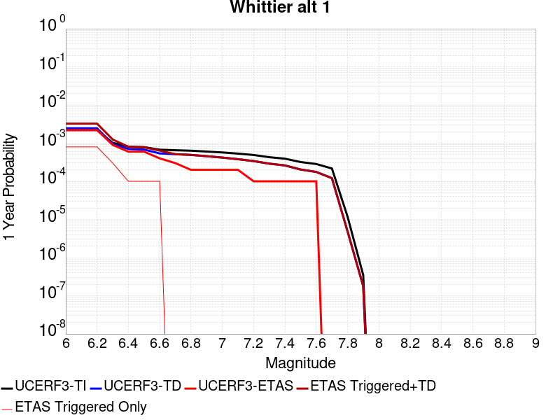 |  |

| Magnitude | 1 wk TI Prob | 1 wk TD Prob | 1 wk ETAS Prob | 1 wk ETAS/TD Gain | 1 wk ETAS Triggered+TD | 1 wk ETAS Triggered Only | 1 mo TI Prob | 1 mo TD Prob | 1 mo ETAS Prob | 1 mo ETAS/TD Gain | 1 mo ETAS Triggered+TD | 1 mo ETAS Triggered Only | 1 yr TI Prob | 1 yr TD Prob | 1 yr ETAS Prob | 1 yr ETAS/TD Gain | 1 yr ETAS Triggered+TD | 1 yr ETAS Triggered Only | 10 yr TI Prob | 10 yr TD Prob | 10 yr ETAS Prob | 10 yr ETAS/TD Gain | 10 yr ETAS Triggered+TD | 10 yr ETAS Triggered Only |
|-----|-----|-----|-----|-----|-----|-----|-----|-----|-----|-----|-----|-----|-----|-----|-----|-----|-----|-----|-----|-----|-----|-----|-----|-----|
| 6.0 | 4.2554693E-5 | 4.7141246E-5 | 0.0 | 0.0 | 4.7141246E-5 | 0.0 | 1.8236451E-4 | 2.0202008E-4 | 0.0 | 0.0 | 2.0202008E-4 | 0.0 | 0.002218027 | 0.0024571407 | 5.4495916E-4 | 0.22178589 | 0.0030007607 | 5.4495916E-4 | 0.02196019 | 0.024333641 | 0.0021798366 | 0.089581184 | 0.026460435 | 0.0021798366 |
| 6.1 | 4.2554693E-5 | 4.7141246E-5 | 0.0 | 0.0 | 4.7141246E-5 | 0.0 | 1.8236451E-4 | 2.0202008E-4 | 0.0 | 0.0 | 2.0202008E-4 | 0.0 | 0.002218027 | 0.0024571407 | 5.4495916E-4 | 0.22178589 | 0.0030007607 | 5.4495916E-4 | 0.02196019 | 0.024333641 | 0.0021798366 | 0.089581184 | 0.026460435 | 0.0021798366 |
| 6.2 | 4.2554693E-5 | 4.7141246E-5 | 0.0 | 0.0 | 4.7141246E-5 | 0.0 | 1.8236451E-4 | 2.0202008E-4 | 0.0 | 0.0 | 2.0202008E-4 | 0.0 | 0.002218027 | 0.0024571407 | 5.4495916E-4 | 0.22178589 | 0.0030007607 | 5.4495916E-4 | 0.02196019 | 0.024333641 | 0.0021798366 | 0.089581184 | 0.026460435 | 0.0021798366 |
| 6.3 | 1.9617712E-5 | 1.8201868E-5 | 0.0 | 0.0 | 1.8201868E-5 | 0.0 | 8.40732E-5 | 7.800578E-5 | 0.0 | 0.0 | 7.800578E-5 | 0.0 | 0.0010231105 | 9.4932545E-4 | 0.0 | 0.0 | 9.4932545E-4 | 0.0 | 0.01018413 | 0.009455963 | 0.0 | 0.0 | 0.009455963 | 0.0 |
| 6.4 | 1.5611336E-5 | 1.354535E-5 | 0.0 | 0.0 | 1.354535E-5 | 0.0 | 6.690401E-5 | 5.8050246E-5 | 0.0 | 0.0 | 5.8050246E-5 | 0.0 | 8.142519E-4 | 7.0653844E-4 | 0.0 | 0.0 | 7.0653844E-4 | 0.0 | 0.008112748 | 0.0070448644 | 0.0 | 0.0 | 0.0070448644 | 0.0 |
| 6.5 | 1.5150166E-5 | 1.3042504E-5 | 0.0 | 0.0 | 1.3042504E-5 | 0.0 | 6.492767E-5 | 5.589528E-5 | 0.0 | 0.0 | 5.589528E-5 | 0.0 | 7.9020765E-4 | 6.803184E-4 | 0.0 | 0.0 | 6.803184E-4 | 0.0 | 0.007874036 | 0.0067842854 | 0.0 | 0.0 | 0.0067842854 | 0.0 |
| 6.6 | 1.295588E-5 | 1.0340121E-5 | 0.0 | 0.0 | 1.0340121E-5 | 0.0 | 5.552402E-5 | 4.431406E-5 | 0.0 | 0.0 | 4.431406E-5 | 0.0 | 6.7579525E-4 | 5.3939206E-4 | 0.0 | 0.0 | 5.3939206E-4 | 0.0 | 0.006737438 | 0.0053822575 | 0.0 | 0.0 | 0.0053822575 | 0.0 |
| 6.7 | 1.2542085E-5 | 9.861623E-6 | 0.0 | 0.0 | 9.861623E-6 | 0.0 | 5.3750682E-5 | 4.2263426E-5 | 0.0 | 0.0 | 4.2263426E-5 | 0.0 | 6.542181E-4 | 5.1443756E-4 | 0.0 | 0.0 | 5.1443756E-4 | 0.0 | 0.006522954 | 0.005133877 | 0.0 | 0.0 | 0.005133877 | 0.0 |
| 6.8 | 1.2195878E-5 | 9.45888E-6 | 0.0 | 0.0 | 9.45888E-6 | 0.0 | 5.2267E-5 | 4.0537438E-5 | 0.0 | 0.0 | 4.0537438E-5 | 0.0 | 6.36165E-4 | 4.934334E-4 | 0.0 | 0.0 | 4.934334E-4 | 0.0 | 0.0063434686 | 0.0049247057 | 0.0 | 0.0 | 0.0049247057 | 0.0 |
| 6.9 | 1.1580298E-5 | 8.738248E-6 | 0.0 | 0.0 | 8.738248E-6 | 0.0 | 4.9628903E-5 | 3.7449103E-5 | 0.0 | 0.0 | 3.7449103E-5 | 0.0 | 6.040644E-4 | 4.5584908E-4 | 0.0 | 0.0 | 4.5584908E-4 | 0.0 | 0.00602425 | 0.0045503434 | 0.0 | 0.0 | 0.0045503434 | 0.0 |
| 7.0 | 1.0964795E-5 | 8.051233E-6 | 0.0 | 0.0 | 8.051233E-6 | 0.0 | 4.6991136E-5 | 3.4504832E-5 | 0.0 | 0.0 | 3.4504832E-5 | 0.0 | 5.7196687E-4 | 4.200169E-4 | 0.0 | 0.0 | 4.200169E-4 | 0.0 | 0.0057049696 | 0.004193428 | 0.0 | 0.0 | 0.004193428 | 0.0 |
| 7.1 | 1.0230601E-5 | 7.296619E-6 | 0.0 | 0.0 | 7.296619E-6 | 0.0 | 4.3844695E-5 | 3.1270858E-5 | 0.0 | 0.0 | 3.1270858E-5 | 0.0 | 5.336784E-4 | 3.8065747E-4 | 0.0 | 0.0 | 3.8065747E-4 | 0.0 | 0.005323986 | 0.003801133 | 0.0 | 0.0 | 0.003801133 | 0.0 |
| 7.2 | 9.40865E-6 | 6.5162267E-6 | 0.0 | 0.0 | 6.5162267E-6 | 0.0 | 4.032216E-5 | 2.7926393E-5 | 0.0 | 0.0 | 2.7926393E-5 | 0.0 | 4.908117E-4 | 3.39952E-4 | 0.0 | 0.0 | 3.39952E-4 | 0.0 | 0.0048972913 | 0.0033953136 | 0.0 | 0.0 | 0.0033953136 | 0.0 |
| 7.3 | 8.237384E-6 | 5.5742876E-6 | 0.0 | 0.0 | 5.5742876E-6 | 0.0 | 3.5302593E-5 | 2.388959E-5 | 0.0 | 0.0 | 2.388959E-5 | 0.0 | 4.2972428E-4 | 2.90818E-4 | 0.0 | 0.0 | 2.90818E-4 | 0.0 | 0.0042889426 | 0.0029046668 | 0.0 | 0.0 | 0.0029046668 | 0.0 |
| 7.4 | 7.5316966E-6 | 5.0062195E-6 | 0.0 | 0.0 | 5.0062195E-6 | 0.0 | 3.2278298E-5 | 2.1455056E-5 | 0.0 | 0.0 | 2.1455056E-5 | 0.0 | 3.9291743E-4 | 2.61185E-4 | 0.0 | 0.0 | 2.61185E-4 | 0.0 | 0.0039222343 | 0.0026088874 | 0.0 | 0.0 | 0.0026088874 | 0.0 |
| 7.5 | 6.149649E-6 | 3.916163E-6 | 0.0 | 0.0 | 3.916163E-6 | 0.0 | 2.6355372E-5 | 1.6783453E-5 | 0.0 | 0.0 | 1.6783453E-5 | 0.0 | 3.208294E-4 | 2.0432028E-4 | 0.0 | 0.0 | 2.0432028E-4 | 0.0 | 0.003203666 | 0.0020414128 | 0.0 | 0.0 | 0.0020414128 | 0.0 |
| 7.6 | 5.457711E-6 | 3.3794513E-6 | 0.0 | 0.0 | 3.3794513E-6 | 0.0 | 2.338998E-5 | 1.4483287E-5 | 0.0 | 0.0 | 1.4483287E-5 | 0.0 | 2.8473578E-4 | 1.7632057E-4 | 0.0 | 0.0 | 1.7632057E-4 | 0.0 | 0.0028437122 | 0.0017618868 | 0.0 | 0.0 | 0.0017618868 | 0.0 |
| 7.7 | 4.1676276E-6 | 2.3213304E-6 | 0.0 | 0.0 | 2.3213304E-6 | 0.0 | 1.7861139E-5 | 9.948525E-6 | 0.0 | 0.0 | 9.948525E-6 | 0.0 | 2.1743766E-4 | 1.2111729E-4 | 0.0 | 0.0 | 1.2111729E-4 | 0.0 | 0.0021722503 | 0.0012105854 | 0.0 | 0.0 | 0.0012105854 | 0.0 |
| 7.8 | 2.2692414E-7 | 9.313546E-8 | 0.0 | 0.0 | 9.313546E-8 | 0.0 | 9.725317E-7 | 3.9915196E-7 | 0.0 | 0.0 | 3.9915196E-7 | 0.0 | 1.1840509E-5 | 4.8596676E-6 | 0.0 | 0.0 | 4.8596676E-6 | 0.0 | 1.1839878E-4 | 4.859593E-5 | 0.0 | 0.0 | 4.859593E-5 | 0.0 |
| 7.9 | 6.676829E-9 | 3.4267709E-9 | 0.0 | 0.0 | 3.4267709E-9 | 0.0 | 2.861498E-8 | 1.4686159E-8 | 0.0 | 0.0 | 1.4686159E-8 | 0.0 | 3.4838732E-7 | 1.7880397E-7 | 0.0 | 0.0 | 1.7880397E-7 | 0.0 | 3.4838679E-6 | 1.7880385E-6 | 0.0 | 0.0 | 1.7880385E-6 | 0.0 |

## Rodgers Creek - Healdsburg 2011 CFM
*[(top)](#table-of-contents)*

| 1 Week | 1 Month | 1 Year | 10 Year |
|-----|-----|-----|-----|
| 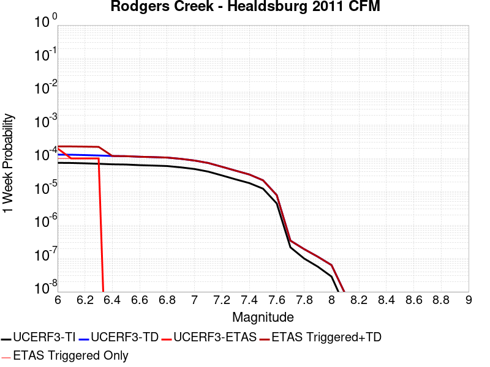 |  |  |  |

| Magnitude | 1 wk TI Prob | 1 wk TD Prob | 1 wk ETAS Prob | 1 wk ETAS/TD Gain | 1 wk ETAS Triggered+TD | 1 wk ETAS Triggered Only | 1 mo TI Prob | 1 mo TD Prob | 1 mo ETAS Prob | 1 mo ETAS/TD Gain | 1 mo ETAS Triggered+TD | 1 mo ETAS Triggered Only | 1 yr TI Prob | 1 yr TD Prob | 1 yr ETAS Prob | 1 yr ETAS/TD Gain | 1 yr ETAS Triggered+TD | 1 yr ETAS Triggered Only | 10 yr TI Prob | 10 yr TD Prob | 10 yr ETAS Prob | 10 yr ETAS/TD Gain | 10 yr ETAS Triggered+TD | 10 yr ETAS Triggered Only |
|-----|-----|-----|-----|-----|-----|-----|-----|-----|-----|-----|-----|-----|-----|-----|-----|-----|-----|-----|-----|-----|-----|-----|-----|-----|
| 6.0 | 7.390182E-5 | 1.301492E-4 | 0.0 | 0.0 | 1.301492E-4 | 0.0 | 3.1668364E-4 | 5.5766234E-4 | 5.4495916E-4 | 0.97722065 | 0.0011023176 | 5.4495916E-4 | 0.0038488081 | 0.006768365 | 0.0010899183 | 0.16103125 | 0.007850906 | 0.0010899183 | 0.037828278 | 0.06561573 | 0.0016348774 | 0.024915937 | 0.06714333 | 0.0016348774 |
| 6.1 | 7.318768E-5 | 1.2913322E-4 | 0.0 | 0.0 | 1.2913322E-4 | 0.0 | 3.1362378E-4 | 5.5331015E-4 | 5.4495916E-4 | 0.98490715 | 0.0010979677 | 5.4495916E-4 | 0.0038116854 | 0.0067157187 | 0.0010899183 | 0.16229361 | 0.0077983174 | 0.0010899183 | 0.037469655 | 0.06512183 | 0.0016348774 | 0.025104905 | 0.06665024 | 0.0016348774 |
| 6.2 | 7.1379836E-5 | 1.2607191E-4 | 0.0 | 0.0 | 1.2607191E-4 | 0.0 | 3.058777E-4 | 5.401958E-4 | 5.4495916E-4 | 1.0088178 | 0.0010848605 | 5.4495916E-4 | 0.003717703 | 0.0065570213 | 0.0010899183 | 0.16622156 | 0.0076397927 | 0.0010899183 | 0.0365612 | 0.06364771 | 0.0016348774 | 0.025686352 | 0.06517853 | 0.0016348774 |
| 6.3 | 6.9255926E-5 | 1.2263017E-4 | 0.0 | 0.0 | 1.2263017E-4 | 0.0 | 2.9677735E-4 | 5.254523E-4 | 5.4495916E-4 | 1.0371239 | 0.001070125 | 5.4495916E-4 | 0.0036072785 | 0.006378665 | 0.0010899183 | 0.17086934 | 0.007461631 | 0.0010899183 | 0.035492823 | 0.061984897 | 0.0010899183 | 0.01758361 | 0.06300726 | 0.0010899183 |
| 6.4 | 6.6757144E-5 | 1.1841311E-4 | 0.0 | 0.0 | 1.1841311E-4 | 0.0 | 2.8607066E-4 | 5.073864E-4 | 0.0 | 0.0 | 5.073864E-4 | 0.0 | 0.0034773487 | 0.0061600036 | 5.4495916E-4 | 0.08846734 | 0.006701606 | 5.4495916E-4 | 0.034234364 | 0.059940808 | 5.4495916E-4 | 0.009091621 | 0.0604531 | 5.4495916E-4 |
| 6.5 | 6.5735134E-5 | 1.1690995E-4 | 0.0 | 0.0 | 1.1690995E-4 | 0.0 | 2.8169158E-4 | 5.0094683E-4 | 0.0 | 0.0 | 5.0094683E-4 | 0.0 | 0.003424202 | 0.006082054 | 5.4495916E-4 | 0.08960117 | 0.006623699 | 5.4495916E-4 | 0.03371918 | 0.05920631 | 5.4495916E-4 | 0.00920441 | 0.059719004 | 5.4495916E-4 |
| 6.6 | 6.289601E-5 | 1.1228256E-4 | 0.0 | 0.0 | 1.1228256E-4 | 0.0 | 2.6952647E-4 | 4.811226E-4 | 0.0 | 0.0 | 4.811226E-4 | 0.0 | 0.0032765474 | 0.0058420138 | 5.4495916E-4 | 0.09328275 | 0.0063837892 | 5.4495916E-4 | 0.032286562 | 0.05695151 | 5.4495916E-4 | 0.009568826 | 0.057465434 | 5.4495916E-4 |
| 6.7 | 6.115274E-5 | 1.0946364E-4 | 0.0 | 0.0 | 1.0946364E-4 | 0.0 | 2.6205686E-4 | 4.690459E-4 | 0.0 | 0.0 | 4.690459E-4 | 0.0 | 0.0031858748 | 0.0056957584 | 5.4495916E-4 | 0.09567806 | 0.0062376135 | 5.4495916E-4 | 0.031405866 | 0.055574253 | 5.4495916E-4 | 0.009805964 | 0.056088924 | 5.4495916E-4 |
| 6.8 | 5.9232367E-5 | 1.0615019E-4 | 0.0 | 0.0 | 1.0615019E-4 | 0.0 | 2.538283E-4 | 4.5485044E-4 | 0.0 | 0.0 | 4.5485044E-4 | 0.0 | 0.0030859804 | 0.0055238176 | 5.4495916E-4 | 0.098656245 | 0.006065767 | 5.4495916E-4 | 0.030434765 | 0.05394587 | 5.4495916E-4 | 0.010101962 | 0.05446143 | 5.4495916E-4 |
| 6.9 | 5.4030377E-5 | 9.7149E-5 | 0.0 | 0.0 | 9.7149E-5 | 0.0 | 2.315382E-4 | 4.1628676E-4 | 0.0 | 0.0 | 4.1628676E-4 | 0.0 | 0.0028153337 | 0.0050565777 | 5.4495916E-4 | 0.10777233 | 0.005598781 | 5.4495916E-4 | 0.027799325 | 0.049505565 | 5.4495916E-4 | 0.011008037 | 0.05002355 | 5.4495916E-4 |
| 7.0 | 4.8260714E-5 | 8.639305E-5 | 0.0 | 0.0 | 8.639305E-5 | 0.0 | 2.0681522E-4 | 3.7020363E-4 | 0.0 | 0.0 | 3.7020363E-4 | 0.0 | 0.0025150678 | 0.0044979677 | 5.4495916E-4 | 0.12115675 | 0.0050404756 | 5.4495916E-4 | 0.024867928 | 0.04418429 | 5.4495916E-4 | 0.012333776 | 0.04470517 | 5.4495916E-4 |
| 7.1 | 4.0294493E-5 | 7.2951734E-5 | 0.0 | 0.0 | 7.2951734E-5 | 0.0 | 1.7267925E-4 | 3.1261303E-4 | 0.0 | 0.0 | 3.1261303E-4 | 0.0 | 0.0021003427 | 0.0037994585 | 0.0 | 0.0 | 0.0037994585 | 0.0 | 0.02080602 | 0.03747253 | 0.0 | 0.0 | 0.03747253 | 0.0 |
| 7.2 | 3.096388E-5 | 5.6131365E-5 | 0.0 | 0.0 | 5.6131365E-5 | 0.0 | 1.326956E-4 | 2.4054093E-4 | 0.0 | 0.0 | 2.4054093E-4 | 0.0 | 0.0016143717 | 0.0029246744 | 0.0 | 0.0 | 0.0029246744 | 0.0 | 0.01602694 | 0.029026924 | 0.0 | 0.0 | 0.029026924 | 0.0 |
| 7.3 | 2.3615226E-5 | 4.2892298E-5 | 0.0 | 0.0 | 4.2892298E-5 | 0.0 | 1.0120418E-4 | 1.8381125E-4 | 0.0 | 0.0 | 1.8381125E-4 | 0.0 | 0.0012314644 | 0.0022356184 | 0.0 | 0.0 | 0.0022356184 | 0.0 | 0.0122466255 | 0.022279777 | 0.0 | 0.0 | 0.022279777 | 0.0 |
| 7.4 | 1.8251132E-5 | 3.293187E-5 | 0.0 | 0.0 | 3.293187E-5 | 0.0 | 7.821679E-5 | 1.41129E-4 | 0.0 | 0.0 | 1.41129E-4 | 0.0 | 9.518733E-4 | 0.0017169007 | 0.0 | 0.0 | 0.0017169007 | 0.0 | 0.009478063 | 0.017168263 | 0.0 | 0.0 | 0.017168263 | 0.0 |
| 7.5 | 1.2411432E-5 | 2.204226E-5 | 0.0 | 0.0 | 2.204226E-5 | 0.0 | 5.3190768E-5 | 9.446344E-5 | 0.0 | 0.0 | 9.446344E-5 | 0.0 | 6.4740516E-4 | 0.0011494912 | 0.0 | 0.0 | 0.0011494912 | 0.0 | 0.006455223 | 0.01153857 | 0.0 | 0.0 | 0.01153857 | 0.0 |
| 7.6 | 4.4771446E-6 | 7.931335E-6 | 0.0 | 0.0 | 7.931335E-6 | 0.0 | 1.918762E-5 | 3.3991E-5 | 0.0 | 0.0 | 3.3991E-5 | 0.0 | 2.3358424E-4 | 4.1376302E-4 | 0.0 | 0.0 | 4.1376302E-4 | 0.0 | 0.0023333887 | 0.004170798 | 0.0 | 0.0 | 0.004170798 | 0.0 |
| 7.7 | 2.157941E-7 | 3.4058309E-7 | 0.0 | 0.0 | 3.4058309E-7 | 0.0 | 9.248315E-7 | 1.459641E-6 | 0.0 | 0.0 | 1.459641E-6 | 0.0 | 1.1259765E-5 | 1.7770984E-5 | 0.0 | 0.0 | 1.7770984E-5 | 0.0 | 1.1259195E-4 | 1.8428617E-4 | 0.0 | 0.0 | 1.8428617E-4 | 0.0 |
| 7.8 | 9.9623286E-8 | 1.8952073E-7 | 0.0 | 0.0 | 1.8952073E-7 | 0.0 | 4.269569E-7 | 8.1223146E-7 | 0.0 | 0.0 | 8.1223146E-7 | 0.0 | 5.1981874E-6 | 9.888873E-6 | 0.0 | 0.0 | 9.888873E-6 | 0.0 | 5.198066E-5 | 1.0434773E-4 | 0.0 | 0.0 | 1.0434773E-4 | 0.0 |
| 7.9 | 5.6745257E-8 | 1.12044894E-7 | 0.0 | 0.0 | 1.12044894E-7 | 0.0 | 2.4319394E-7 | 4.801923E-7 | 0.0 | 0.0 | 4.801923E-7 | 0.0 | 2.960882E-6 | 5.8463256E-6 | 0.0 | 0.0 | 5.8463256E-6 | 0.0 | 2.9608427E-5 | 6.191383E-5 | 0.0 | 0.0 | 6.191383E-5 | 0.0 |
| 8.0 | 2.8614323E-8 | 6.283889E-8 | 0.0 | 0.0 | 6.283889E-8 | 0.0 | 1.2263281E-7 | 2.693095E-7 | 0.0 | 0.0 | 2.693095E-7 | 0.0 | 1.4930534E-6 | 3.2788384E-6 | 0.0 | 0.0 | 3.2788384E-6 | 0.0 | 1.4930434E-5 | 3.4405322E-5 | 0.0 | 0.0 | 3.4405322E-5 | 0.0 |
| 8.1 | 3.5045191E-9 | 8.596933E-9 | 0.0 | 0.0 | 8.596933E-9 | 0.0 | 1.5019367E-8 | 3.6844E-8 | 0.0 | 0.0 | 3.6844E-8 | 0.0 | 1.8286079E-7 | 4.485756E-7 | 0.0 | 0.0 | 4.485756E-7 | 0.0 | 1.8286064E-6 | 4.657446E-6 | 0.0 | 0.0 | 4.657446E-6 | 0.0 |

## Hunting Creek - Bartlett Springs connector 2011
*[(top)](#table-of-contents)*

| 1 Week | 1 Month | 1 Year | 10 Year |
|-----|-----|-----|-----|
|  |  | 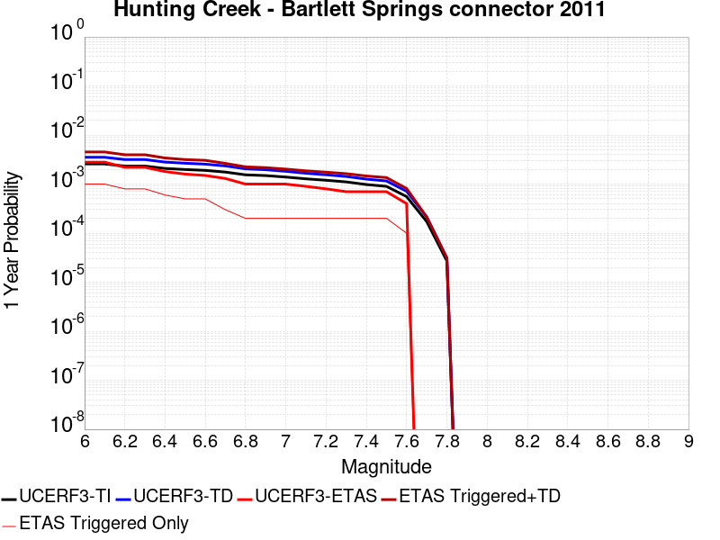 | 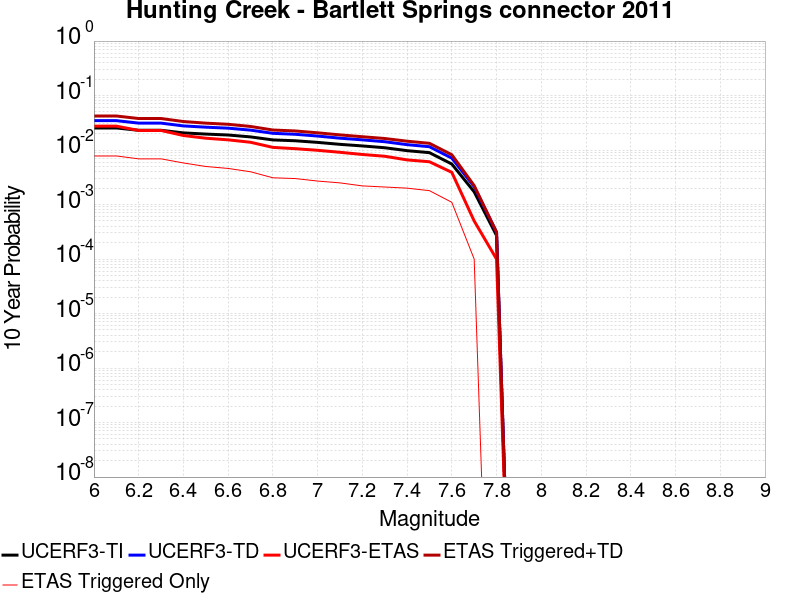 |

| Magnitude | 1 wk TI Prob | 1 wk TD Prob | 1 wk ETAS Prob | 1 wk ETAS/TD Gain | 1 wk ETAS Triggered+TD | 1 wk ETAS Triggered Only | 1 mo TI Prob | 1 mo TD Prob | 1 mo ETAS Prob | 1 mo ETAS/TD Gain | 1 mo ETAS Triggered+TD | 1 mo ETAS Triggered Only | 1 yr TI Prob | 1 yr TD Prob | 1 yr ETAS Prob | 1 yr ETAS/TD Gain | 1 yr ETAS Triggered+TD | 1 yr ETAS Triggered Only | 10 yr TI Prob | 10 yr TD Prob | 10 yr ETAS Prob | 10 yr ETAS/TD Gain | 10 yr ETAS Triggered+TD | 10 yr ETAS Triggered Only |
|-----|-----|-----|-----|-----|-----|-----|-----|-----|-----|-----|-----|-----|-----|-----|-----|-----|-----|-----|-----|-----|-----|-----|-----|-----|
| 6.0 | 4.940016E-5 | 6.7636094E-5 | 0.0 | 0.0 | 6.7636094E-5 | 0.0 | 2.1169778E-4 | 2.8983652E-4 | 0.0 | 0.0 | 2.8983652E-4 | 0.0 | 0.002574374 | 0.003522902 | 5.4495916E-4 | 0.1546904 | 0.004065941 | 5.4495916E-4 | 0.025447546 | 0.03465753 | 0.0010899183 | 0.031448238 | 0.035709675 | 0.0010899183 |
| 6.1 | 4.940016E-5 | 6.7636094E-5 | 0.0 | 0.0 | 6.7636094E-5 | 0.0 | 2.1169778E-4 | 2.8983652E-4 | 0.0 | 0.0 | 2.8983652E-4 | 0.0 | 0.002574374 | 0.003522902 | 5.4495916E-4 | 0.1546904 | 0.004065941 | 5.4495916E-4 | 0.025447546 | 0.03465753 | 0.0010899183 | 0.031448238 | 0.035709675 | 0.0010899183 |
| 6.2 | 4.472471E-5 | 6.0799062E-5 | 0.0 | 0.0 | 6.0799062E-5 | 0.0 | 1.9166325E-4 | 2.6054154E-4 | 0.0 | 0.0 | 2.6054154E-4 | 0.0 | 0.0023310026 | 0.0031673922 | 5.4495916E-4 | 0.17205293 | 0.0037106252 | 5.4495916E-4 | 0.02306703 | 0.031213867 | 5.4495916E-4 | 0.017458878 | 0.031741817 | 5.4495916E-4 |
| 6.3 | 4.472471E-5 | 6.0799062E-5 | 0.0 | 0.0 | 6.0799062E-5 | 0.0 | 1.9166325E-4 | 2.6054154E-4 | 0.0 | 0.0 | 2.6054154E-4 | 0.0 | 0.0023310026 | 0.0031673922 | 5.4495916E-4 | 0.17205293 | 0.0037106252 | 5.4495916E-4 | 0.02306703 | 0.031213867 | 5.4495916E-4 | 0.017458878 | 0.031741817 | 5.4495916E-4 |
| 6.4 | 4.0001003E-5 | 5.3926353E-5 | 0.0 | 0.0 | 5.3926353E-5 | 0.0 | 1.714216E-4 | 2.3109278E-4 | 0.0 | 0.0 | 2.3109278E-4 | 0.0 | 0.0020850603 | 0.002809889 | 5.4495916E-4 | 0.1939433 | 0.0033533168 | 5.4495916E-4 | 0.02065605 | 0.027738636 | 5.4495916E-4 | 0.019646212 | 0.028268479 | 5.4495916E-4 |
| 6.5 | 3.8033053E-5 | 5.1099152E-5 | 0.0 | 0.0 | 5.1099152E-5 | 0.0 | 1.6298861E-4 | 2.1897825E-4 | 0.0 | 0.0 | 2.1897825E-4 | 0.0 | 0.0019825802 | 0.0026627893 | 0.0 | 0.0 | 0.0026627893 | 0.0 | 0.019649856 | 0.026306137 | 0.0 | 0.0 | 0.026306137 | 0.0 |
| 6.6 | 3.653754E-5 | 4.897064E-5 | 0.0 | 0.0 | 4.897064E-5 | 0.0 | 1.5658008E-4 | 2.0985756E-4 | 0.0 | 0.0 | 2.0985756E-4 | 0.0 | 0.0019046954 | 0.0025520264 | 0.0 | 0.0 | 0.0025520264 | 0.0 | 0.018884527 | 0.025226098 | 0.0 | 0.0 | 0.025226098 | 0.0 |
| 6.7 | 3.372024E-5 | 4.4996686E-5 | 0.0 | 0.0 | 4.4996686E-5 | 0.0 | 1.4450731E-4 | 1.928289E-4 | 0.0 | 0.0 | 1.928289E-4 | 0.0 | 0.0017579567 | 0.0023451848 | 0.0 | 0.0 | 0.0023451848 | 0.0 | 0.017441148 | 0.023205193 | 0.0 | 0.0 | 0.023205193 | 0.0 |
| 6.8 | 2.9650024E-5 | 3.929196E-5 | 0.0 | 0.0 | 3.929196E-5 | 0.0 | 1.2706534E-4 | 1.6838325E-4 | 0.0 | 0.0 | 1.6838325E-4 | 0.0 | 0.0015459227 | 0.0020481308 | 0.0 | 0.0 | 0.0020481308 | 0.0 | 0.015352124 | 0.020290205 | 0.0 | 0.0 | 0.020290205 | 0.0 |
| 6.9 | 2.860775E-5 | 3.7701204E-5 | 0.0 | 0.0 | 3.7701204E-5 | 0.0 | 1.2259888E-4 | 1.6156661E-4 | 0.0 | 0.0 | 1.6156661E-4 | 0.0 | 0.0014916194 | 0.0019653058 | 0.0 | 0.0 | 0.0019653058 | 0.0 | 0.014816469 | 0.019478736 | 0.0 | 0.0 | 0.019478736 | 0.0 |
| 7.0 | 2.6696067E-5 | 3.4966903E-5 | 0.0 | 0.0 | 3.4966903E-5 | 0.0 | 1.144067E-4 | 1.4984961E-4 | 0.0 | 0.0 | 1.4984961E-4 | 0.0 | 0.0013920115 | 0.0018229008 | 0.0 | 0.0 | 0.0018229008 | 0.0 | 0.013833242 | 0.01808013 | 0.0 | 0.0 | 0.01808013 | 0.0 |
| 7.1 | 2.456087E-5 | 3.1925734E-5 | 0.0 | 0.0 | 3.1925734E-5 | 0.0 | 1.0525662E-4 | 1.3681744E-4 | 0.0 | 0.0 | 1.3681744E-4 | 0.0 | 0.001280746 | 0.0016644886 | 0.0 | 0.0 | 0.0016644886 | 0.0 | 0.012733897 | 0.016521595 | 0.0 | 0.0 | 0.016521595 | 0.0 |
| 7.2 | 2.295761E-5 | 2.9741363E-5 | 0.0 | 0.0 | 2.9741363E-5 | 0.0 | 9.8386045E-5 | 1.274568E-4 | 0.0 | 0.0 | 1.274568E-4 | 0.0 | 0.0011971919 | 0.0015506912 | 0.0 | 0.0 | 0.0015506912 | 0.0 | 0.011907627 | 0.015400236 | 0.0 | 0.0 | 0.015400236 | 0.0 |
| 7.3 | 2.1256936E-5 | 2.7465583E-5 | 0.0 | 0.0 | 2.7465583E-5 | 0.0 | 9.109797E-5 | 1.1770438E-4 | 0.0 | 0.0 | 1.1770438E-4 | 0.0 | 0.0011085535 | 0.0014321175 | 0.0 | 0.0 | 0.0014321175 | 0.0 | 0.011030397 | 0.014230171 | 0.0 | 0.0 | 0.014230171 | 0.0 |
| 7.4 | 1.8784336E-5 | 2.4240306E-5 | 0.0 | 0.0 | 2.4240306E-5 | 0.0 | 8.050181E-5 | 1.03882936E-4 | 0.0 | 0.0 | 1.03882936E-4 | 0.0 | 9.796688E-4 | 0.0012640484 | 0.0 | 0.0 | 0.0012640484 | 0.0 | 0.009753612 | 0.01256961 | 0.0 | 0.0 | 0.01256961 | 0.0 |
| 7.5 | 1.7248298E-5 | 2.2208003E-5 | 0.0 | 0.0 | 2.2208003E-5 | 0.0 | 7.391918E-5 | 9.5173724E-5 | 0.0 | 0.0 | 9.5173724E-5 | 0.0 | 8.9959445E-4 | 0.0011581316 | 0.0 | 0.0 | 0.0011581316 | 0.0 | 0.008959615 | 0.011521938 | 0.0 | 0.0 | 0.011521938 | 0.0 |
| 7.6 | 1.0653709E-5 | 1.36851195E-5 | 0.0 | 0.0 | 1.36851195E-5 | 0.0 | 4.5657955E-5 | 5.864921E-5 | 0.0 | 0.0 | 5.864921E-5 | 0.0 | 5.557438E-4 | 7.138229E-4 | 0.0 | 0.0 | 7.138229E-4 | 0.0 | 0.0055435603 | 0.0071156183 | 0.0 | 0.0 | 0.0071156183 | 0.0 |
| 7.7 | 3.286316E-6 | 4.079729E-6 | 0.0 | 0.0 | 4.079729E-6 | 0.0 | 1.4084137E-5 | 1.7484437E-5 | 0.0 | 0.0 | 1.7484437E-5 | 0.0 | 1.7146087E-4 | 2.1285238E-4 | 0.0 | 0.0 | 2.1285238E-4 | 0.0 | 0.0017132863 | 0.002126546 | 0.0 | 0.0 | 0.002126546 | 0.0 |
| 7.8 | 5.1855085E-7 | 5.9636176E-7 | 0.0 | 0.0 | 5.9636176E-7 | 0.0 | 2.222359E-6 | 2.5558336E-6 | 0.0 | 0.0 | 2.5558336E-6 | 0.0 | 2.7056883E-5 | 3.111684E-5 | 0.0 | 0.0 | 3.111684E-5 | 0.0 | 2.705359E-4 | 3.1113403E-4 | 0.0 | 0.0 | 3.1113403E-4 | 0.0 |

## Ortigalita (South)
*[(top)](#table-of-contents)*

| 1 Week | 1 Month | 1 Year | 10 Year |
|-----|-----|-----|-----|
|  |  |  |  |

| Magnitude | 1 wk TI Prob | 1 wk TD Prob | 1 wk ETAS Prob | 1 wk ETAS/TD Gain | 1 wk ETAS Triggered+TD | 1 wk ETAS Triggered Only | 1 mo TI Prob | 1 mo TD Prob | 1 mo ETAS Prob | 1 mo ETAS/TD Gain | 1 mo ETAS Triggered+TD | 1 mo ETAS Triggered Only | 1 yr TI Prob | 1 yr TD Prob | 1 yr ETAS Prob | 1 yr ETAS/TD Gain | 1 yr ETAS Triggered+TD | 1 yr ETAS Triggered Only | 10 yr TI Prob | 10 yr TD Prob | 10 yr ETAS Prob | 10 yr ETAS/TD Gain | 10 yr ETAS Triggered+TD | 10 yr ETAS Triggered Only |
|-----|-----|-----|-----|-----|-----|-----|-----|-----|-----|-----|-----|-----|-----|-----|-----|-----|-----|-----|-----|-----|-----|-----|-----|-----|
| 6.0 | 3.72394E-5 | 4.3182466E-5 | 0.0 | 0.0 | 4.3182466E-5 | 0.0 | 1.5958765E-4 | 1.8505547E-4 | 0.0 | 0.0 | 1.8505547E-4 | 0.0 | 0.0019412481 | 0.002250878 | 0.0 | 0.0 | 0.002250878 | 0.0 | 0.019243775 | 0.022297136 | 0.0016348774 | 0.0733223 | 0.02389556 | 0.0016348774 |
| 6.1 | 2.7299884E-5 | 3.1441457E-5 | 0.0 | 0.0 | 3.1441457E-5 | 0.0 | 1.16994255E-4 | 1.3474245E-4 | 0.0 | 0.0 | 1.3474245E-4 | 0.0 | 0.0014234743 | 0.0016393106 | 0.0 | 0.0 | 0.0016393106 | 0.0 | 0.014143906 | 0.016278092 | 0.0010899183 | 0.06695614 | 0.01735027 | 0.0010899183 |
| 6.2 | 2.7299884E-5 | 3.1441457E-5 | 0.0 | 0.0 | 3.1441457E-5 | 0.0 | 1.16994255E-4 | 1.3474245E-4 | 0.0 | 0.0 | 1.3474245E-4 | 0.0 | 0.0014234743 | 0.0016393106 | 0.0 | 0.0 | 0.0016393106 | 0.0 | 0.014143906 | 0.016278092 | 0.0010899183 | 0.06695614 | 0.01735027 | 0.0010899183 |
| 6.3 | 2.0546433E-5 | 2.3594344E-5 | 0.0 | 0.0 | 2.3594344E-5 | 0.0 | 8.805317E-5 | 1.01114805E-4 | 0.0 | 0.0 | 1.01114805E-4 | 0.0 | 0.00107152 | 0.0012303964 | 0.0 | 0.0 | 0.0012303964 | 0.0 | 0.010663681 | 0.0122379 | 5.4495916E-4 | 0.044530448 | 0.0127761895 | 5.4495916E-4 |
| 6.4 | 2.0546433E-5 | 2.3594344E-5 | 0.0 | 0.0 | 2.3594344E-5 | 0.0 | 8.805317E-5 | 1.01114805E-4 | 0.0 | 0.0 | 1.01114805E-4 | 0.0 | 0.00107152 | 0.0012303964 | 0.0 | 0.0 | 0.0012303964 | 0.0 | 0.010663681 | 0.0122379 | 5.4495916E-4 | 0.044530448 | 0.0127761895 | 5.4495916E-4 |
| 6.5 | 1.7779594E-5 | 2.0414887E-5 | 0.0 | 0.0 | 2.0414887E-5 | 0.0 | 7.619603E-5 | 8.748951E-5 | 0.0 | 0.0 | 8.748951E-5 | 0.0 | 9.272918E-4 | 0.0010646778 | 0.0 | 0.0 | 0.0010646778 | 0.0 | 0.009234319 | 0.010597234 | 5.4495916E-4 | 0.05142466 | 0.011136418 | 5.4495916E-4 |
| 6.6 | 1.6272212E-5 | 1.8685576E-5 | 0.0 | 0.0 | 1.8685576E-5 | 0.0 | 6.973618E-5 | 8.007865E-5 | 0.0 | 0.0 | 8.007865E-5 | 0.0 | 8.487073E-4 | 9.745337E-4 | 0.0 | 0.0 | 9.745337E-4 | 0.0 | 0.008454733 | 0.009703899 | 5.4495916E-4 | 0.05615878 | 0.0102435695 | 5.4495916E-4 |
| 6.7 | 1.3051484E-5 | 1.5014794E-5 | 0.0 | 0.0 | 1.5014794E-5 | 0.0 | 5.593373E-5 | 6.434759E-5 | 0.0 | 0.0 | 6.434759E-5 | 0.0 | 6.807804E-4 | 7.831597E-4 | 0.0 | 0.0 | 7.831597E-4 | 0.0 | 0.006786986 | 0.007804978 | 0.0 | 0.0 | 0.007804978 | 0.0 |
| 6.8 | 1.04277415E-5 | 1.1968504E-5 | 0.0 | 0.0 | 1.1968504E-5 | 0.0 | 4.4689557E-5 | 5.129262E-5 | 0.0 | 0.0 | 5.129262E-5 | 0.0 | 5.439595E-4 | 6.243161E-4 | 0.0 | 0.0 | 6.243161E-4 | 0.0 | 0.0054262993 | 0.0062263743 | 0.0 | 0.0 | 0.0062263743 | 0.0 |
| 6.9 | 7.639968E-6 | 8.777665E-6 | 0.0 | 0.0 | 8.777665E-6 | 0.0 | 3.274231E-5 | 3.7618054E-5 | 0.0 | 0.0 | 3.7618054E-5 | 0.0 | 3.9856473E-4 | 4.5790945E-4 | 0.0 | 0.0 | 4.5790945E-4 | 0.0 | 0.003978506 | 0.0045702434 | 0.0 | 0.0 | 0.0045702434 | 0.0 |
| 7.0 | 3.919831E-6 | 4.525994E-6 | 0.0 | 0.0 | 4.525994E-6 | 0.0 | 1.679917E-5 | 1.9396986E-5 | 0.0 | 0.0 | 1.9396986E-5 | 0.0 | 2.045107E-4 | 2.3613482E-4 | 0.0 | 0.0 | 2.3613482E-4 | 0.0 | 0.0020432258 | 0.0023590468 | 0.0 | 0.0 | 0.0023590468 | 0.0 |
| 7.1 | 1.6017933E-6 | 1.8539527E-6 | 0.0 | 0.0 | 1.8539527E-6 | 0.0 | 6.8648105E-6 | 7.945493E-6 | 0.0 | 0.0 | 7.945493E-6 | 0.0 | 8.357586E-5 | 9.673315E-5 | 0.0 | 0.0 | 9.673315E-5 | 0.0 | 8.3544437E-4 | 9.6701476E-4 | 0.0 | 0.0 | 9.6701476E-4 | 0.0 |

## San Andreas (Mojave S)
*[(top)](#table-of-contents)*

| 1 Week | 1 Month | 1 Year | 10 Year |
|-----|-----|-----|-----|
|  |  |  |  |

| Magnitude | 1 wk TI Prob | 1 wk TD Prob | 1 wk ETAS Prob | 1 wk ETAS/TD Gain | 1 wk ETAS Triggered+TD | 1 wk ETAS Triggered Only | 1 mo TI Prob | 1 mo TD Prob | 1 mo ETAS Prob | 1 mo ETAS/TD Gain | 1 mo ETAS Triggered+TD | 1 mo ETAS Triggered Only | 1 yr TI Prob | 1 yr TD Prob | 1 yr ETAS Prob | 1 yr ETAS/TD Gain | 1 yr ETAS Triggered+TD | 1 yr ETAS Triggered Only | 10 yr TI Prob | 10 yr TD Prob | 10 yr ETAS Prob | 10 yr ETAS/TD Gain | 10 yr ETAS Triggered+TD | 10 yr ETAS Triggered Only |
|-----|-----|-----|-----|-----|-----|-----|-----|-----|-----|-----|-----|-----|-----|-----|-----|-----|-----|-----|-----|-----|-----|-----|-----|-----|
| 6.0 | 3.1064058E-4 | 6.6649815E-4 | 0.0 | 0.0 | 6.6649815E-4 | 0.0 | 0.0013306376 | 0.0028534215 | 0.0 | 0.0 | 0.0028534215 | 0.0 | 0.016080605 | 0.034313932 | 0.0010899183 | 0.03176314 | 0.035366453 | 0.0010899183 | 0.1496549 | 0.28368294 | 0.0010899183 | 0.0038420297 | 0.28446367 | 0.0010899183 |
| 6.1 | 3.1064058E-4 | 6.6649815E-4 | 0.0 | 0.0 | 6.6649815E-4 | 0.0 | 0.0013306376 | 0.0028534215 | 0.0 | 0.0 | 0.0028534215 | 0.0 | 0.016080605 | 0.034313932 | 0.0010899183 | 0.03176314 | 0.035366453 | 0.0010899183 | 0.1496549 | 0.28368294 | 0.0010899183 | 0.0038420297 | 0.28446367 | 0.0010899183 |
| 6.2 | 3.1064058E-4 | 6.6649815E-4 | 0.0 | 0.0 | 6.6649815E-4 | 0.0 | 0.0013306376 | 0.0028534215 | 0.0 | 0.0 | 0.0028534215 | 0.0 | 0.016080605 | 0.034313932 | 0.0010899183 | 0.03176314 | 0.035366453 | 0.0010899183 | 0.1496549 | 0.28368294 | 0.0010899183 | 0.0038420297 | 0.28446367 | 0.0010899183 |
| 6.3 | 3.1064058E-4 | 6.6649815E-4 | 0.0 | 0.0 | 6.6649815E-4 | 0.0 | 0.0013306376 | 0.0028534215 | 0.0 | 0.0 | 0.0028534215 | 0.0 | 0.016080605 | 0.034313932 | 0.0010899183 | 0.03176314 | 0.035366453 | 0.0010899183 | 0.1496549 | 0.28368294 | 0.0010899183 | 0.0038420297 | 0.28446367 | 0.0010899183 |
| 6.4 | 1.9872203E-4 | 4.240692E-4 | 0.0 | 0.0 | 4.240692E-4 | 0.0 | 8.5138786E-4 | 0.0018162017 | 0.0 | 0.0 | 0.0018162017 | 0.0 | 0.010316478 | 0.021894107 | 0.0010899183 | 0.049781352 | 0.022960162 | 0.0010899183 | 0.098504856 | 0.1938825 | 0.0010899183 | 0.00562154 | 0.1947611 | 0.0010899183 |
| 6.5 | 1.291105E-4 | 2.8018636E-4 | 0.0 | 0.0 | 2.8018636E-4 | 0.0 | 5.5321335E-4 | 0.0012002487 | 0.0 | 0.0 | 0.0012002487 | 0.0 | 0.006714592 | 0.014515912 | 5.4495916E-4 | 0.03754219 | 0.01505296 | 5.4495916E-4 | 0.065152965 | 0.13491377 | 5.4495916E-4 | 0.004039314 | 0.1353852 | 5.4495916E-4 |
| 6.6 | 1.291105E-4 | 2.8018636E-4 | 0.0 | 0.0 | 2.8018636E-4 | 0.0 | 5.5321335E-4 | 0.0012002487 | 0.0 | 0.0 | 0.0012002487 | 0.0 | 0.006714592 | 0.014515912 | 5.4495916E-4 | 0.03754219 | 0.01505296 | 5.4495916E-4 | 0.065152965 | 0.13491377 | 5.4495916E-4 | 0.004039314 | 0.1353852 | 5.4495916E-4 |
| 6.7 | 1.08001186E-4 | 2.3610683E-4 | 0.0 | 0.0 | 2.3610683E-4 | 0.0 | 4.6278012E-4 | 0.0010114945 | 0.0 | 0.0 | 0.0010114945 | 0.0 | 0.0056198016 | 0.012245687 | 5.4495916E-4 | 0.044502128 | 0.012783973 | 5.4495916E-4 | 0.054797906 | 0.11606961 | 5.4495916E-4 | 0.0046951063 | 0.11655132 | 5.4495916E-4 |
| 6.8 | 1.0624356E-4 | 2.313033E-4 | 0.0 | 0.0 | 2.313033E-4 | 0.0 | 4.5525006E-4 | 9.909238E-4 | 0.0 | 0.0 | 9.909238E-4 | 0.0 | 0.0055285925 | 0.0119980145 | 5.4495916E-4 | 0.045420777 | 0.012536435 | 5.4495916E-4 | 0.053930566 | 0.11401875 | 5.4495916E-4 | 0.0047795568 | 0.11450157 | 5.4495916E-4 |
| 6.9 | 1.0393785E-4 | 2.250332E-4 | 0.0 | 0.0 | 2.250332E-4 | 0.0 | 4.4537184E-4 | 9.64072E-4 | 0.0 | 0.0 | 9.64072E-4 | 0.0 | 0.0054089287 | 0.011674637 | 5.4495916E-4 | 0.046678893 | 0.012213234 | 5.4495916E-4 | 0.05279156 | 0.11132155 | 5.4495916E-4 | 0.00489536 | 0.11180585 | 5.4495916E-4 |
| 7.0 | 1.0155622E-4 | 2.187592E-4 | 0.0 | 0.0 | 2.187592E-4 | 0.0 | 4.3516833E-4 | 9.37203E-4 | 0.0 | 0.0 | 9.37203E-4 | 0.0 | 0.005285311 | 0.011350956 | 5.4495916E-4 | 0.048009977 | 0.01188973 | 5.4495916E-4 | 0.05161361 | 0.10858677 | 5.4495916E-4 | 0.005018651 | 0.10907256 | 5.4495916E-4 |
| 7.1 | 9.885595E-5 | 2.1167743E-4 | 0.0 | 0.0 | 2.1167743E-4 | 0.0 | 4.2359953E-4 | 9.068739E-4 | 0.0 | 0.0 | 9.068739E-4 | 0.0 | 0.0051451353 | 0.010985476 | 5.4495916E-4 | 0.04960724 | 0.011524448 | 5.4495916E-4 | 0.05027629 | 0.10547369 | 5.4495916E-4 | 0.005166778 | 0.105961174 | 5.4495916E-4 |
| 7.2 | 9.6411415E-5 | 2.0533915E-4 | 0.0 | 0.0 | 2.0533915E-4 | 0.0 | 4.1312634E-4 | 8.7972847E-4 | 0.0 | 0.0 | 8.7972847E-4 | 0.0 | 0.005018219 | 0.01065826 | 5.4495916E-4 | 0.051130217 | 0.0111974105 | 5.4495916E-4 | 0.049064007 | 0.10266836 | 5.4495916E-4 | 0.0053079557 | 0.10315737 | 5.4495916E-4 |
| 7.3 | 9.1180635E-5 | 1.8780473E-4 | 0.0 | 0.0 | 1.8780473E-4 | 0.0 | 3.907156E-4 | 8.0462924E-4 | 0.0 | 0.0 | 8.0462924E-4 | 0.0 | 0.004746591 | 0.009752458 | 5.4495916E-4 | 0.055879153 | 0.010292103 | 5.4495916E-4 | 0.046464786 | 0.09491306 | 5.4495916E-4 | 0.0057416665 | 0.095406294 | 5.4495916E-4 |
| 7.4 | 8.887388E-5 | 1.8036654E-4 | 0.0 | 0.0 | 1.8036654E-4 | 0.0 | 3.8083247E-4 | 7.7277055E-4 | 0.0 | 0.0 | 7.7277055E-4 | 0.0 | 0.0046267817 | 0.00936798 | 5.4495916E-4 | 0.05817253 | 0.009907834 | 5.4495916E-4 | 0.045316286 | 0.091565564 | 5.4495916E-4 | 0.005951573 | 0.092060626 | 5.4495916E-4 |
| 7.5 | 8.6750515E-5 | 1.7375132E-4 | 0.0 | 0.0 | 1.7375132E-4 | 0.0 | 3.7173493E-4 | 7.444361E-4 | 0.0 | 0.0 | 7.444361E-4 | 0.0 | 0.004516484 | 0.009025919 | 5.4495916E-4 | 0.060377132 | 0.00956596 | 5.4495916E-4 | 0.04425787 | 0.088547625 | 5.4495916E-4 | 0.0061544185 | 0.089044325 | 5.4495916E-4 |
| 7.6 | 8.453092E-5 | 1.6770989E-4 | 0.0 | 0.0 | 1.6770989E-4 | 0.0 | 3.6222505E-4 | 7.1855873E-4 | 0.0 | 0.0 | 7.1855873E-4 | 0.0 | 0.0044011753 | 0.008713426 | 5.4495916E-4 | 0.06254247 | 0.009253636 | 5.4495916E-4 | 0.04315024 | 0.085737765 | 5.4495916E-4 | 0.0063561155 | 0.086236 | 5.4495916E-4 |
| 7.7 | 8.259102E-5 | 1.6300174E-4 | 0.0 | 0.0 | 1.6300174E-4 | 0.0 | 3.539135E-4 | 6.983919E-4 | 0.0 | 0.0 | 6.983919E-4 | 0.0 | 0.004300386 | 0.00846983 | 5.4495916E-4 | 0.06434121 | 0.009010174 | 5.4495916E-4 | 0.042181134 | 0.08351337 | 5.4495916E-4 | 0.0065254117 | 0.08401282 | 5.4495916E-4 |
| 7.8 | 7.444844E-5 | 1.4679672E-4 | 0.0 | 0.0 | 1.4679672E-4 | 0.0 | 3.1902574E-4 | 6.289772E-4 | 0.0 | 0.0 | 6.289772E-4 | 0.0 | 0.0038772223 | 0.007630952 | 5.4495916E-4 | 0.0714143 | 0.008171753 | 5.4495916E-4 | 0.03810269 | 0.07557513 | 5.4495916E-4 | 0.0072108265 | 0.0760789 | 5.4495916E-4 |
| 7.9 | 5.2586525E-5 | 9.589247E-5 | 0.0 | 0.0 | 9.589247E-5 | 0.0 | 2.2535135E-4 | 4.10903E-4 | 0.0 | 0.0 | 4.10903E-4 | 0.0 | 0.0027402006 | 0.004991278 | 5.4495916E-4 | 0.109182276 | 0.0055335173 | 5.4495916E-4 | 0.027066574 | 0.050242934 | 5.4495916E-4 | 0.010846483 | 0.050760515 | 5.4495916E-4 |
| 8.0 | 3.379877E-5 | 5.1621304E-5 | 0.0 | 0.0 | 5.1621304E-5 | 0.0 | 1.4484383E-4 | 2.212154E-4 | 0.0 | 0.0 | 2.212154E-4 | 0.0 | 0.0017620471 | 0.0026899728 | 0.0 | 0.0 | 0.0026899728 | 0.0 | 0.017481409 | 0.027628962 | 0.0 | 0.0 | 0.027628962 | 0.0 |
| 8.1 | 1.8668277E-5 | 1.8121951E-5 | 0.0 | 0.0 | 1.8121951E-5 | 0.0 | 8.000444E-5 | 7.76632E-5 | 0.0 | 0.0 | 7.76632E-5 | 0.0 | 9.736188E-4 | 9.4513985E-4 | 0.0 | 0.0 | 9.4513985E-4 | 0.0 | 0.009693642 | 0.010176109 | 0.0 | 0.0 | 0.010176109 | 0.0 |
| 8.2 | 8.541571E-6 | 4.99796E-6 | 0.0 | 0.0 | 4.99796E-6 | 0.0 | 3.660622E-5 | 2.1419653E-5 | 0.0 | 0.0 | 2.1419653E-5 | 0.0 | 4.455896E-4 | 2.6075315E-4 | 0.0 | 0.0 | 2.6075315E-4 | 0.0 | 0.0044469717 | 0.002986751 | 0.0 | 0.0 | 0.002986751 | 0.0 |
| 8.3 | 1.983087E-6 | 6.880041E-7 | 0.0 | 0.0 | 6.880041E-7 | 0.0 | 8.498917E-6 | 2.9485857E-6 | 0.0 | 0.0 | 2.9485857E-6 | 0.0 | 1.034694E-4 | 3.589845E-5 | 0.0 | 0.0 | 3.589845E-5 | 0.0 | 0.0010342124 | 4.2701262E-4 | 0.0 | 0.0 | 4.2701262E-4 | 0.0 |

## Almanor 2011 CFM
*[(top)](#table-of-contents)*

| 1 Week | 1 Month | 1 Year | 10 Year |
|-----|-----|-----|-----|
|  |  |  |  |

| Magnitude | 1 wk TI Prob | 1 wk TD Prob | 1 wk ETAS Prob | 1 wk ETAS/TD Gain | 1 wk ETAS Triggered+TD | 1 wk ETAS Triggered Only | 1 mo TI Prob | 1 mo TD Prob | 1 mo ETAS Prob | 1 mo ETAS/TD Gain | 1 mo ETAS Triggered+TD | 1 mo ETAS Triggered Only | 1 yr TI Prob | 1 yr TD Prob | 1 yr ETAS Prob | 1 yr ETAS/TD Gain | 1 yr ETAS Triggered+TD | 1 yr ETAS Triggered Only | 10 yr TI Prob | 10 yr TD Prob | 10 yr ETAS Prob | 10 yr ETAS/TD Gain | 10 yr ETAS Triggered+TD | 10 yr ETAS Triggered Only |
|-----|-----|-----|-----|-----|-----|-----|-----|-----|-----|-----|-----|-----|-----|-----|-----|-----|-----|-----|-----|-----|-----|-----|-----|-----|
| 6.0 | 6.1479834E-5 | 8.298417E-5 | 0.0 | 0.0 | 8.298417E-5 | 0.0 | 2.6345838E-4 | 3.5560352E-4 | 0.0 | 0.0 | 3.5560352E-4 | 0.0 | 0.0032028882 | 0.004321557 | 5.4495916E-4 | 0.12610249 | 0.0048641614 | 5.4495916E-4 | 0.031571172 | 0.042444512 | 0.0016348774 | 0.038517993 | 0.044009995 | 0.0016348774 |
| 6.1 | 4.4387216E-5 | 5.956422E-5 | 0.0 | 0.0 | 5.956422E-5 | 0.0 | 1.9021705E-4 | 2.5525416E-4 | 0.0 | 0.0 | 2.5525416E-4 | 0.0 | 0.0023134327 | 0.0031037936 | 5.4495916E-4 | 0.1755784 | 0.0036470613 | 5.4495916E-4 | 0.022894967 | 0.03065395 | 0.0016348774 | 0.053333335 | 0.03223871 | 0.0016348774 |
| 6.2 | 4.4387216E-5 | 5.956422E-5 | 0.0 | 0.0 | 5.956422E-5 | 0.0 | 1.9021705E-4 | 2.5525416E-4 | 0.0 | 0.0 | 2.5525416E-4 | 0.0 | 0.0023134327 | 0.0031037936 | 5.4495916E-4 | 0.1755784 | 0.0036470613 | 5.4495916E-4 | 0.022894967 | 0.03065395 | 0.0016348774 | 0.053333335 | 0.03223871 | 0.0016348774 |
| 6.3 | 2.9523822E-5 | 3.9414223E-5 | 0.0 | 0.0 | 3.9414223E-5 | 0.0 | 1.2652454E-4 | 1.6890977E-4 | 0.0 | 0.0 | 1.6890977E-4 | 0.0 | 0.0015393476 | 0.00205491 | 5.4495916E-4 | 0.26519853 | 0.0025987492 | 5.4495916E-4 | 0.015287281 | 0.020394152 | 0.0010899183 | 0.053442687 | 0.021461843 | 0.0010899183 |
| 6.4 | 2.0512744E-5 | 2.7338916E-5 | 0.0 | 0.0 | 2.7338916E-5 | 0.0 | 8.79088E-5 | 1.1716365E-4 | 0.0 | 0.0 | 1.1716365E-4 | 0.0 | 0.001069764 | 0.0014258667 | 5.4495916E-4 | 0.382195 | 0.0019700488 | 5.4495916E-4 | 0.010646289 | 0.014198058 | 0.0010899183 | 0.07676531 | 0.015272502 | 0.0010899183 |
| 6.5 | 1.6750226E-5 | 2.2315515E-5 | 0.0 | 0.0 | 2.2315515E-5 | 0.0 | 7.178471E-5 | 9.563674E-5 | 0.0 | 0.0 | 9.563674E-5 | 0.0 | 8.7362836E-4 | 0.0011640886 | 5.4495916E-4 | 0.4681423 | 0.0017084134 | 5.4495916E-4 | 0.008702018 | 0.011611144 | 0.0010899183 | 0.09386829 | 0.012688408 | 0.0010899183 |
| 6.6 | 1.4745303E-5 | 1.964102E-5 | 0.0 | 0.0 | 1.964102E-5 | 0.0 | 6.319262E-5 | 8.417538E-5 | 0.0 | 0.0 | 8.417538E-5 | 0.0 | 7.690986E-4 | 0.0010246921 | 5.4495916E-4 | 0.5318272 | 0.0015690927 | 5.4495916E-4 | 0.0076644225 | 0.010231581 | 0.0010899183 | 0.106524915 | 0.011310347 | 0.0010899183 |
| 6.7 | 9.951145E-7 | 1.1596063E-6 | 0.0 | 0.0 | 1.1596063E-6 | 0.0 | 4.26477E-6 | 4.969733E-6 | 0.0 | 0.0 | 4.969733E-6 | 0.0 | 5.1922336E-5 | 6.0504994E-5 | 0.0 | 0.0 | 6.0504994E-5 | 0.0 | 5.1910203E-4 | 6.049024E-4 | 0.0 | 0.0 | 6.049024E-4 | 0.0 |
| 6.8 | 5.866312E-7 | 6.837416E-7 | 0.0 | 0.0 | 6.837416E-7 | 0.0 | 2.5141312E-6 | 2.9303185E-6 | 0.0 | 0.0 | 2.9303185E-6 | 0.0 | 3.0609117E-5 | 3.5676174E-5 | 0.0 | 0.0 | 3.5676174E-5 | 0.0 | 3.06049E-4 | 3.5671727E-4 | 0.0 | 0.0 | 3.5671727E-4 | 0.0 |

## Green Valley 2011 CFM
*[(top)](#table-of-contents)*

| 1 Week | 1 Month | 1 Year | 10 Year |
|-----|-----|-----|-----|
|  |  | 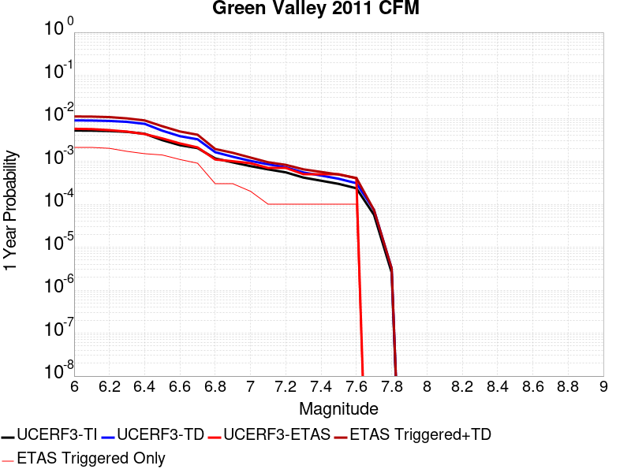 |  |

| Magnitude | 1 wk TI Prob | 1 wk TD Prob | 1 wk ETAS Prob | 1 wk ETAS/TD Gain | 1 wk ETAS Triggered+TD | 1 wk ETAS Triggered Only | 1 mo TI Prob | 1 mo TD Prob | 1 mo ETAS Prob | 1 mo ETAS/TD Gain | 1 mo ETAS Triggered+TD | 1 mo ETAS Triggered Only | 1 yr TI Prob | 1 yr TD Prob | 1 yr ETAS Prob | 1 yr ETAS/TD Gain | 1 yr ETAS Triggered+TD | 1 yr ETAS Triggered Only | 10 yr TI Prob | 10 yr TD Prob | 10 yr ETAS Prob | 10 yr ETAS/TD Gain | 10 yr ETAS Triggered+TD | 10 yr ETAS Triggered Only |
|-----|-----|-----|-----|-----|-----|-----|-----|-----|-----|-----|-----|-----|-----|-----|-----|-----|-----|-----|-----|-----|-----|-----|-----|-----|
| 6.0 | 9.9629346E-5 | 1.723003E-4 | 0.0 | 0.0 | 1.723003E-4 | 0.0 | 4.2691303E-4 | 7.3821814E-4 | 0.0 | 0.0 | 7.3821814E-4 | 0.0 | 0.0051852856 | 0.008949381 | 0.0010899183 | 0.121787004 | 0.010029545 | 0.0010899183 | 0.050659515 | 0.08519073 | 0.0016348774 | 0.01919079 | 0.08668633 | 0.0016348774 |
| 6.1 | 9.88615E-5 | 1.7077432E-4 | 0.0 | 0.0 | 1.7077432E-4 | 0.0 | 4.2362334E-4 | 7.3168206E-4 | 0.0 | 0.0 | 7.3168206E-4 | 0.0 | 0.0051454236 | 0.008870459 | 0.0010899183 | 0.12287055 | 0.0099507095 | 0.0010899183 | 0.050279044 | 0.08447853 | 0.0016348774 | 0.01935258 | 0.08597529 | 0.0016348774 |
| 6.2 | 9.696895E-5 | 1.6717147E-4 | 0.0 | 0.0 | 1.6717147E-4 | 0.0 | 4.15515E-4 | 7.1624975E-4 | 0.0 | 0.0 | 7.1624975E-4 | 0.0 | 0.0050471667 | 0.008684165 | 0.0010899183 | 0.1255064 | 0.009764618 | 0.0010899183 | 0.04934063 | 0.08278945 | 0.0016348774 | 0.019747412 | 0.08428898 | 0.0016348774 |
| 6.3 | 9.275224E-5 | 1.589701E-4 | 0.0 | 0.0 | 1.589701E-4 | 0.0 | 3.9744904E-4 | 6.811196E-4 | 0.0 | 0.0 | 6.811196E-4 | 0.0 | 0.0048282105 | 0.008259743 | 0.0010899183 | 0.13195546 | 0.009340659 | 0.0010899183 | 0.047246475 | 0.07892925 | 0.0016348774 | 0.020713199 | 0.08043509 | 0.0016348774 |
| 6.4 | 8.391499E-5 | 1.4298713E-4 | 0.0 | 0.0 | 1.4298713E-4 | 0.0 | 3.595861E-4 | 6.126609E-4 | 0.0 | 0.0 | 6.126609E-4 | 0.0 | 0.004369175 | 0.007432519 | 0.0010899183 | 0.14664185 | 0.008514336 | 0.0010899183 | 0.04284265 | 0.071316466 | 0.0016348774 | 0.022924263 | 0.072834745 | 0.0016348774 |
| 6.5 | 5.9519385E-5 | 9.880607E-5 | 0.0 | 0.0 | 9.880607E-5 | 0.0 | 2.5505814E-4 | 4.2338544E-4 | 0.0 | 0.0 | 4.2338544E-4 | 0.0 | 0.0031009112 | 0.0051414133 | 0.0010899183 | 0.21198806 | 0.006225728 | 0.0010899183 | 0.030579966 | 0.049905717 | 0.0016348774 | 0.03275932 | 0.051459003 | 0.0016348774 |
| 6.6 | 4.5361558E-5 | 7.362437E-5 | 0.0 | 0.0 | 7.362437E-5 | 0.0 | 1.9439218E-4 | 3.1549318E-4 | 0.0 | 0.0 | 3.1549318E-4 | 0.0 | 0.0023641558 | 0.003833405 | 0.0010899183 | 0.2843212 | 0.0049191453 | 0.0010899183 | 0.023391623 | 0.03748022 | 0.0010899183 | 0.029079827 | 0.038529288 | 0.0010899183 |
| 6.7 | 3.8808106E-5 | 6.230829E-5 | 0.0 | 0.0 | 6.230829E-5 | 0.0 | 1.6630985E-4 | 2.670088E-4 | 0.0 | 0.0 | 2.670088E-4 | 0.0 | 0.0020229418 | 0.0032453204 | 0.0010899183 | 0.33584303 | 0.0043317014 | 0.0010899183 | 0.020046256 | 0.03184677 | 0.0010899183 | 0.034223825 | 0.032901976 | 0.0010899183 |
| 6.8 | 2.2284667E-5 | 3.1184663E-5 | 0.0 | 0.0 | 3.1184663E-5 | 0.0 | 9.550222E-5 | 1.3364178E-4 | 0.0 | 0.0 | 1.3364178E-4 | 0.0 | 0.0011621192 | 0.0016258745 | 0.0 | 0.0 | 0.0016258745 | 0.0 | 0.011560607 | 0.016117869 | 0.0 | 0.0 | 0.016117869 | 0.0 |
| 6.9 | 1.8050168E-5 | 2.4380426E-5 | 0.0 | 0.0 | 2.4380426E-5 | 0.0 | 7.735557E-5 | 1.0448336E-4 | 0.0 | 0.0 | 1.0448336E-4 | 0.0 | 9.4139716E-4 | 0.0012713457 | 0.0 | 0.0 | 0.0012713457 | 0.0 | 0.009374191 | 0.012633375 | 0.0 | 0.0 | 0.012633375 | 0.0 |
| 7.0 | 1.4763166E-5 | 1.95367E-5 | 0.0 | 0.0 | 1.95367E-5 | 0.0 | 6.326917E-5 | 8.3726045E-5 | 0.0 | 0.0 | 8.3726045E-5 | 0.0 | 7.7002996E-4 | 0.0010188891 | 0.0 | 0.0 | 0.0010188891 | 0.0 | 0.007673672 | 0.010142356 | 0.0 | 0.0 | 0.010142356 | 0.0 |
| 7.1 | 1.2399713E-5 | 1.626603E-5 | 0.0 | 0.0 | 1.626603E-5 | 0.0 | 5.3140546E-5 | 6.9709706E-5 | 0.0 | 0.0 | 6.9709706E-5 | 0.0 | 6.467941E-4 | 8.483872E-4 | 0.0 | 0.0 | 8.483872E-4 | 0.0 | 0.006449148 | 0.008452031 | 0.0 | 0.0 | 0.008452031 | 0.0 |
| 7.2 | 1.0584195E-5 | 1.3887744E-5 | 0.0 | 0.0 | 1.3887744E-5 | 0.0 | 4.5360044E-5 | 5.9517555E-5 | 0.0 | 0.0 | 5.9517555E-5 | 0.0 | 5.521186E-4 | 7.243869E-4 | 0.0 | 0.0 | 7.243869E-4 | 0.0 | 0.0055074887 | 0.007221006 | 0.0 | 0.0 | 0.007221006 | 0.0 |
| 7.3 | 7.998173E-6 | 1.0516018E-5 | 0.0 | 0.0 | 1.0516018E-5 | 0.0 | 3.4277433E-5 | 4.5067874E-5 | 0.0 | 0.0 | 4.5067874E-5 | 0.0 | 4.1724785E-4 | 5.485643E-4 | 0.0 | 0.0 | 5.485643E-4 | 0.0 | 0.004164653 | 0.005472412 | 0.0 | 0.0 | 0.005472412 | 0.0 |
| 7.4 | 6.7571127E-6 | 8.911162E-6 | 0.0 | 0.0 | 8.911162E-6 | 0.0 | 2.8958733E-5 | 3.819014E-5 | 0.0 | 0.0 | 3.819014E-5 | 0.0 | 3.5251552E-4 | 4.6486672E-4 | 0.0 | 0.0 | 4.6486672E-4 | 0.0 | 0.0035195686 | 0.0046391184 | 0.0 | 0.0 | 0.0046391184 | 0.0 |
| 7.5 | 5.69878E-6 | 7.4981904E-6 | 0.0 | 0.0 | 7.4981904E-6 | 0.0 | 2.4423114E-5 | 3.213471E-5 | 0.0 | 0.0 | 3.213471E-5 | 0.0 | 2.9731085E-4 | 3.9117076E-4 | 0.0 | 0.0 | 3.9117076E-4 | 0.0 | 0.002969134 | 0.0039049806 | 0.0 | 0.0 | 0.0039049806 | 0.0 |
| 7.6 | 4.503664E-6 | 5.9203985E-6 | 0.0 | 0.0 | 5.9203985E-6 | 0.0 | 1.9301275E-5 | 2.5372896E-5 | 0.0 | 0.0 | 2.5372896E-5 | 0.0 | 2.3496768E-4 | 3.0887203E-4 | 0.0 | 0.0 | 3.0887203E-4 | 0.0 | 0.002347194 | 0.0030845234 | 0.0 | 0.0 | 0.0030845234 | 0.0 |
| 7.7 | 1.0873546E-6 | 1.4062297E-6 | 0.0 | 0.0 | 1.4062297E-6 | 0.0 | 4.6600826E-6 | 6.0266852E-6 | 0.0 | 0.0 | 6.0266852E-6 | 0.0 | 5.6735033E-5 | 7.337245E-5 | 0.0 | 0.0 | 7.337245E-5 | 0.0 | 5.672055E-4 | 7.335298E-4 | 0.0 | 0.0 | 7.335298E-4 | 0.0 |
| 7.8 | 4.9373917E-8 | 6.172147E-8 | 0.0 | 0.0 | 6.172147E-8 | 0.0 | 2.1160248E-7 | 2.645206E-7 | 0.0 | 0.0 | 2.645206E-7 | 0.0 | 2.5762572E-6 | 3.2205346E-6 | 0.0 | 0.0 | 3.2205346E-6 | 0.0 | 2.5762274E-5 | 3.221324E-5 | 0.0 | 0.0 | 3.221324E-5 | 0.0 |

## San Andreas (San Bernardino N)
*[(top)](#table-of-contents)*

| 1 Week | 1 Month | 1 Year | 10 Year |
|-----|-----|-----|-----|
|  |  |  |  |

| Magnitude | 1 wk TI Prob | 1 wk TD Prob | 1 wk ETAS Prob | 1 wk ETAS/TD Gain | 1 wk ETAS Triggered+TD | 1 wk ETAS Triggered Only | 1 mo TI Prob | 1 mo TD Prob | 1 mo ETAS Prob | 1 mo ETAS/TD Gain | 1 mo ETAS Triggered+TD | 1 mo ETAS Triggered Only | 1 yr TI Prob | 1 yr TD Prob | 1 yr ETAS Prob | 1 yr ETAS/TD Gain | 1 yr ETAS Triggered+TD | 1 yr ETAS Triggered Only | 10 yr TI Prob | 10 yr TD Prob | 10 yr ETAS Prob | 10 yr ETAS/TD Gain | 10 yr ETAS Triggered+TD | 10 yr ETAS Triggered Only |
|-----|-----|-----|-----|-----|-----|-----|-----|-----|-----|-----|-----|-----|-----|-----|-----|-----|-----|-----|-----|-----|-----|-----|-----|-----|
| 6.0 | 1.4273766E-4 | 3.0990381E-4 | 0.0 | 0.0 | 3.0990381E-4 | 0.0 | 6.115894E-4 | 0.001327489 | 0.0 | 0.0 | 0.001327489 | 0.0 | 0.0074207084 | 0.01604387 | 5.4495916E-4 | 0.033966813 | 0.016580086 | 5.4495916E-4 | 0.07177748 | 0.14769201 | 0.0010899183 | 0.0073796697 | 0.14862096 | 0.0010899183 |
| 6.1 | 1.4273766E-4 | 3.0990381E-4 | 0.0 | 0.0 | 3.0990381E-4 | 0.0 | 6.115894E-4 | 0.001327489 | 0.0 | 0.0 | 0.001327489 | 0.0 | 0.0074207084 | 0.01604387 | 5.4495916E-4 | 0.033966813 | 0.016580086 | 5.4495916E-4 | 0.07177748 | 0.14769201 | 0.0010899183 | 0.0073796697 | 0.14862096 | 0.0010899183 |
| 6.2 | 1.4273766E-4 | 3.0990381E-4 | 0.0 | 0.0 | 3.0990381E-4 | 0.0 | 6.115894E-4 | 0.001327489 | 0.0 | 0.0 | 0.001327489 | 0.0 | 0.0074207084 | 0.01604387 | 5.4495916E-4 | 0.033966813 | 0.016580086 | 5.4495916E-4 | 0.07177748 | 0.14769201 | 0.0010899183 | 0.0073796697 | 0.14862096 | 0.0010899183 |
| 6.3 | 1.3730655E-4 | 2.9898214E-4 | 0.0 | 0.0 | 2.9898214E-4 | 0.0 | 5.883239E-4 | 0.0012807284 | 0.0 | 0.0 | 0.0012807284 | 0.0 | 0.0071393442 | 0.0154827535 | 5.4495916E-4 | 0.035197817 | 0.016019275 | 5.4495916E-4 | 0.06914291 | 0.14299165 | 0.0010899183 | 0.0076222513 | 0.14392571 | 0.0010899183 |
| 6.4 | 1.3730655E-4 | 2.9898214E-4 | 0.0 | 0.0 | 2.9898214E-4 | 0.0 | 5.883239E-4 | 0.0012807284 | 0.0 | 0.0 | 0.0012807284 | 0.0 | 0.0071393442 | 0.0154827535 | 5.4495916E-4 | 0.035197817 | 0.016019275 | 5.4495916E-4 | 0.06914291 | 0.14299165 | 0.0010899183 | 0.0076222513 | 0.14392571 | 0.0010899183 |
| 6.5 | 1.2942807E-4 | 2.831703E-4 | 0.0 | 0.0 | 2.831703E-4 | 0.0 | 5.545738E-4 | 0.0012130276 | 0.0 | 0.0 | 0.0012130276 | 0.0 | 0.0067310524 | 0.014669821 | 5.4495916E-4 | 0.037148315 | 0.015206785 | 5.4495916E-4 | 0.06530788 | 0.13614826 | 0.0010899183 | 0.008005378 | 0.13708977 | 0.0010899183 |
| 6.6 | 1.1125901E-4 | 2.4767424E-4 | 0.0 | 0.0 | 2.4767424E-4 | 0.0 | 4.767372E-4 | 0.0010610315 | 0.0 | 0.0 | 0.0010610315 | 0.0 | 0.005788839 | 0.012842156 | 5.4495916E-4 | 0.042435177 | 0.013380116 | 5.4495916E-4 | 0.056403454 | 0.120414585 | 5.4495916E-4 | 0.0045256903 | 0.120893925 | 5.4495916E-4 |
| 6.7 | 1.02209575E-4 | 2.290678E-4 | 0.0 | 0.0 | 2.290678E-4 | 0.0 | 4.3796748E-4 | 9.813511E-4 | 0.0 | 0.0 | 9.813511E-4 | 0.0 | 0.0053192247 | 0.0118829 | 5.4495916E-4 | 0.045860782 | 0.012421384 | 5.4495916E-4 | 0.051936906 | 0.112195544 | 5.4495916E-4 | 0.0048572263 | 0.112679355 | 5.4495916E-4 |
| 6.8 | 9.610582E-5 | 2.144043E-4 | 0.0 | 0.0 | 2.144043E-4 | 0.0 | 4.1181705E-4 | 9.185527E-4 | 0.0 | 0.0 | 9.185527E-4 | 0.0 | 0.0050023515 | 0.0111262845 | 5.4495916E-4 | 0.048979435 | 0.01166518 | 5.4495916E-4 | 0.048912346 | 0.10562009 | 5.4495916E-4 | 0.005159616 | 0.106107496 | 5.4495916E-4 |
| 6.9 | 9.3877505E-5 | 2.0898355E-4 | 0.0 | 0.0 | 2.0898355E-4 | 0.0 | 4.0227012E-4 | 8.9533697E-4 | 0.0 | 0.0 | 8.9533697E-4 | 0.0 | 0.0048866454 | 0.010846477 | 5.4495916E-4 | 0.05024296 | 0.011385526 | 5.4495916E-4 | 0.04780577 | 0.10321876 | 5.4495916E-4 | 0.0052796523 | 0.10370746 | 5.4495916E-4 |
| 7.0 | 9.1019785E-5 | 2.0228841E-4 | 0.0 | 0.0 | 2.0228841E-4 | 0.0 | 3.900265E-4 | 8.666629E-4 | 0.0 | 0.0 | 8.666629E-4 | 0.0 | 0.0047382377 | 0.010500783 | 5.4495916E-4 | 0.051896997 | 0.01104002 | 5.4495916E-4 | 0.046384744 | 0.10019968 | 5.4495916E-4 | 0.005438731 | 0.10069004 | 5.4495916E-4 |
| 7.1 | 8.771155E-5 | 1.940751E-4 | 0.0 | 0.0 | 1.940751E-4 | 0.0 | 3.758525E-4 | 8.314858E-4 | 0.0 | 0.0 | 8.314858E-4 | 0.0 | 0.0045664064 | 0.010076536 | 5.4495916E-4 | 0.05408199 | 0.010616004 | 5.4495916E-4 | 0.044737056 | 0.09652227 | 5.4495916E-4 | 0.005645942 | 0.09701463 | 5.4495916E-4 |
| 7.2 | 8.0830236E-5 | 1.7821639E-4 | 0.0 | 0.0 | 1.7821639E-4 | 0.0 | 3.4636928E-4 | 7.635611E-4 | 0.0 | 0.0 | 7.635611E-4 | 0.0 | 0.0042088944 | 0.009256828 | 5.4495916E-4 | 0.058871042 | 0.009796742 | 5.4495916E-4 | 0.041300658 | 0.08929606 | 5.4495916E-4 | 0.0061028353 | 0.08979235 | 5.4495916E-4 |
| 7.3 | 7.7668235E-5 | 1.6774477E-4 | 0.0 | 0.0 | 1.6774477E-4 | 0.0 | 3.328214E-4 | 7.187082E-4 | 0.0 | 0.0 | 7.187082E-4 | 0.0 | 0.0040445733 | 0.0087152375 | 5.4495916E-4 | 0.06252947 | 0.0092554465 | 5.4495916E-4 | 0.03971748 | 0.084592454 | 5.4495916E-4 | 0.006442172 | 0.085091315 | 5.4495916E-4 |
| 7.4 | 7.520177E-5 | 1.600199E-4 | 0.0 | 0.0 | 1.600199E-4 | 0.0 | 3.2225347E-4 | 6.8561936E-4 | 0.0 | 0.0 | 6.8561936E-4 | 0.0 | 0.0039163795 | 0.008315527 | 5.4495916E-4 | 0.06553513 | 0.008855955 | 5.4495916E-4 | 0.038480744 | 0.08106743 | 5.4495916E-4 | 0.0067222943 | 0.08156821 | 5.4495916E-4 |
| 7.5 | 7.274697E-5 | 1.5296489E-4 | 0.0 | 0.0 | 1.5296489E-4 | 0.0 | 3.1173544E-4 | 6.5539917E-4 | 0.0 | 0.0 | 6.5539917E-4 | 0.0 | 0.003788775 | 0.007950341 | 5.4495916E-4 | 0.06854537 | 0.008490968 | 5.4495916E-4 | 0.03724827 | 0.07780402 | 5.4495916E-4 | 0.007004254 | 0.07830658 | 5.4495916E-4 |
| 7.6 | 7.1185845E-5 | 1.4870733E-4 | 0.0 | 0.0 | 1.4870733E-4 | 0.0 | 3.0504653E-4 | 6.371615E-4 | 0.0 | 0.0 | 6.371615E-4 | 0.0 | 0.0037076178 | 0.0077298954 | 5.4495916E-4 | 0.070500195 | 0.008270642 | 5.4495916E-4 | 0.036463667 | 0.07580683 | 5.4495916E-4 | 0.0071887868 | 0.07631048 | 5.4495916E-4 |
| 7.7 | 6.709961E-5 | 1.3793135E-4 | 0.0 | 0.0 | 1.3793135E-4 | 0.0 | 2.8753807E-4 | 5.910005E-4 | 0.0 | 0.0 | 5.910005E-4 | 0.0 | 0.003495157 | 0.007171726 | 5.4495916E-4 | 0.07598717 | 0.0077127763 | 5.4495916E-4 | 0.034406938 | 0.070681766 | 5.4495916E-4 | 0.007710038 | 0.07118821 | 5.4495916E-4 |
| 7.8 | 6.300812E-5 | 1.2703829E-4 | 0.0 | 0.0 | 1.2703829E-4 | 0.0 | 2.7000686E-4 | 5.443362E-4 | 0.0 | 0.0 | 5.443362E-4 | 0.0 | 0.0032823787 | 0.0066071805 | 5.4495916E-4 | 0.08247983 | 0.007148539 | 5.4495916E-4 | 0.032343175 | 0.065444425 | 5.4495916E-4 | 0.008327052 | 0.06595372 | 5.4495916E-4 |
| 7.9 | 4.983037E-5 | 9.326866E-5 | 0.0 | 0.0 | 9.326866E-5 | 0.0 | 2.1354125E-4 | 3.996616E-4 | 0.0 | 0.0 | 3.996616E-4 | 0.0 | 0.0025967648 | 0.0048550325 | 5.4495916E-4 | 0.11224624 | 0.005397346 | 5.4495916E-4 | 0.025666296 | 0.048792165 | 5.4495916E-4 | 0.011168988 | 0.049310535 | 5.4495916E-4 |
| 8.0 | 3.2211527E-5 | 5.093469E-5 | 0.0 | 0.0 | 5.093469E-5 | 0.0 | 1.380421E-4 | 2.1827327E-4 | 0.0 | 0.0 | 2.1827327E-4 | 0.0 | 0.0016793669 | 0.00265424 | 0.0 | 0.0 | 0.00265424 | 0.0 | 0.016667323 | 0.02720171 | 0.0 | 0.0 | 0.02720171 | 0.0 |
| 8.1 | 1.743376E-5 | 1.7695216E-5 | 0.0 | 0.0 | 1.7695216E-5 | 0.0 | 7.471398E-5 | 7.583444E-5 | 0.0 | 0.0 | 7.583444E-5 | 0.0 | 9.0926304E-4 | 9.228938E-4 | 0.0 | 0.0 | 9.228938E-4 | 0.0 | 0.009055517 | 0.009895436 | 0.0 | 0.0 | 0.009895436 | 0.0 |
| 8.2 | 7.831616E-6 | 4.727602E-6 | 0.0 | 0.0 | 4.727602E-6 | 0.0 | 3.3563636E-5 | 2.0260995E-5 | 0.0 | 0.0 | 2.0260995E-5 | 0.0 | 4.0856065E-4 | 2.4664975E-4 | 0.0 | 0.0 | 2.4664975E-4 | 0.0 | 0.004078103 | 0.0028085 | 0.0 | 0.0 | 0.0028085 | 0.0 |
| 8.3 | 1.983087E-6 | 6.880041E-7 | 0.0 | 0.0 | 6.880041E-7 | 0.0 | 8.498917E-6 | 2.9485857E-6 | 0.0 | 0.0 | 2.9485857E-6 | 0.0 | 1.034694E-4 | 3.589845E-5 | 0.0 | 0.0 | 3.589845E-5 | 0.0 | 0.0010342124 | 4.2701262E-4 | 0.0 | 0.0 | 4.2701262E-4 | 0.0 |

## Honey Lake 2011 CFM
*[(top)](#table-of-contents)*

| 1 Week | 1 Month | 1 Year | 10 Year |
|-----|-----|-----|-----|
|  |  |  | 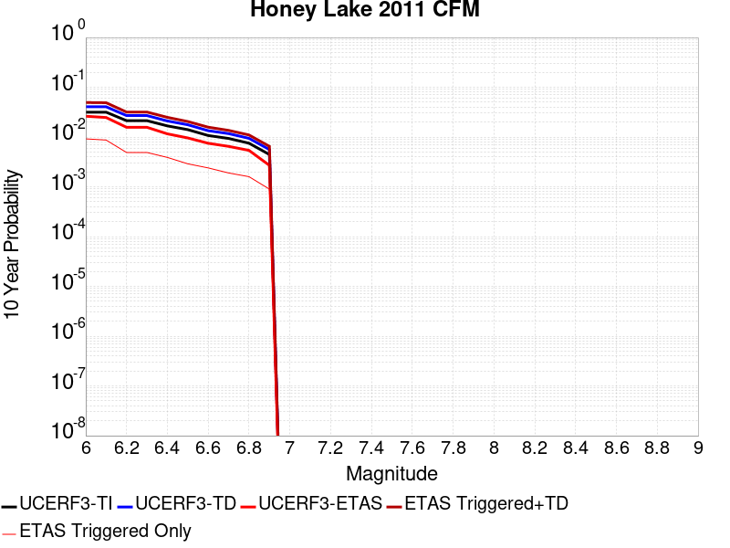 |

| Magnitude | 1 wk TI Prob | 1 wk TD Prob | 1 wk ETAS Prob | 1 wk ETAS/TD Gain | 1 wk ETAS Triggered+TD | 1 wk ETAS Triggered Only | 1 mo TI Prob | 1 mo TD Prob | 1 mo ETAS Prob | 1 mo ETAS/TD Gain | 1 mo ETAS Triggered+TD | 1 mo ETAS Triggered Only | 1 yr TI Prob | 1 yr TD Prob | 1 yr ETAS Prob | 1 yr ETAS/TD Gain | 1 yr ETAS Triggered+TD | 1 yr ETAS Triggered Only | 10 yr TI Prob | 10 yr TD Prob | 10 yr ETAS Prob | 10 yr ETAS/TD Gain | 10 yr ETAS Triggered+TD | 10 yr ETAS Triggered Only |
|-----|-----|-----|-----|-----|-----|-----|-----|-----|-----|-----|-----|-----|-----|-----|-----|-----|-----|-----|-----|-----|-----|-----|-----|-----|
| 6.0 | 6.155506E-5 | 7.931081E-5 | 0.0 | 0.0 | 7.931081E-5 | 0.0 | 2.6378073E-4 | 3.3986222E-4 | 0.0 | 0.0 | 3.3986222E-4 | 0.0 | 0.0032068014 | 0.004130419 | 5.4495916E-4 | 0.13193798 | 0.004673127 | 5.4495916E-4 | 0.03160919 | 0.040585518 | 0.0010899183 | 0.026854856 | 0.041631203 | 0.0010899183 |
| 6.1 | 6.155506E-5 | 7.931081E-5 | 0.0 | 0.0 | 7.931081E-5 | 0.0 | 2.6378073E-4 | 3.3986222E-4 | 0.0 | 0.0 | 3.3986222E-4 | 0.0 | 0.0032068014 | 0.004130419 | 5.4495916E-4 | 0.13193798 | 0.004673127 | 5.4495916E-4 | 0.03160919 | 0.040585518 | 0.0010899183 | 0.026854856 | 0.041631203 | 0.0010899183 |
| 6.2 | 4.1335024E-5 | 5.242969E-5 | 0.0 | 0.0 | 5.242969E-5 | 0.0 | 1.7713808E-4 | 2.2468017E-4 | 0.0 | 0.0 | 2.2468017E-4 | 0.0 | 0.0021545228 | 0.0027322022 | 5.4495916E-4 | 0.19945784 | 0.0032756724 | 5.4495916E-4 | 0.021337535 | 0.027002474 | 0.0010899183 | 0.040363643 | 0.028062962 | 0.0010899183 |
| 6.3 | 4.1335024E-5 | 5.242969E-5 | 0.0 | 0.0 | 5.242969E-5 | 0.0 | 1.7713808E-4 | 2.2468017E-4 | 0.0 | 0.0 | 2.2468017E-4 | 0.0 | 0.0021545228 | 0.0027322022 | 5.4495916E-4 | 0.19945784 | 0.0032756724 | 5.4495916E-4 | 0.021337535 | 0.027002474 | 0.0010899183 | 0.040363643 | 0.028062962 | 0.0010899183 |
| 6.4 | 3.2393702E-5 | 4.077656E-5 | 0.0 | 0.0 | 4.077656E-5 | 0.0 | 1.3882275E-4 | 1.7474558E-4 | 0.0 | 0.0 | 1.7474558E-4 | 0.0 | 0.0016888566 | 0.0021255575 | 5.4495916E-4 | 0.25638407 | 0.0026693584 | 5.4495916E-4 | 0.016760793 | 0.021063395 | 0.0010899183 | 0.051744662 | 0.022130355 | 0.0010899183 |
| 6.5 | 2.7205504E-5 | 3.412049E-5 | 0.0 | 0.0 | 3.412049E-5 | 0.0 | 1.1658981E-4 | 1.4622297E-4 | 0.0 | 0.0 | 1.4622297E-4 | 0.0 | 0.0014185566 | 0.0017789049 | 5.4495916E-4 | 0.30634528 | 0.0023228945 | 5.4495916E-4 | 0.014095354 | 0.017656205 | 0.0010899183 | 0.06173004 | 0.01872688 | 0.0010899183 |
| 6.6 | 2.069265E-5 | 2.5886791E-5 | 0.0 | 0.0 | 2.5886791E-5 | 0.0 | 8.867977E-5 | 1.1093912E-4 | 0.0 | 0.0 | 1.1093912E-4 | 0.0 | 0.0010791414 | 0.0013499307 | 5.4495916E-4 | 0.40369415 | 0.0018941541 | 5.4495916E-4 | 0.010739161 | 0.0134256575 | 0.0010899183 | 0.08118174 | 0.014500943 | 0.0010899183 |
| 6.7 | 1.8060919E-5 | 2.2596809E-5 | 0.0 | 0.0 | 2.2596809E-5 | 0.0 | 7.7401644E-5 | 9.684032E-5 | 0.0 | 0.0 | 9.684032E-5 | 0.0 | 9.419576E-4 | 0.0011784737 | 0.0 | 0.0 | 0.0011784737 | 0.0 | 0.009379748 | 0.011730251 | 5.4495916E-4 | 0.046457585 | 0.012268818 | 5.4495916E-4 |
| 6.8 | 1.4474663E-5 | 1.8132809E-5 | 0.0 | 0.0 | 1.8132809E-5 | 0.0 | 6.203279E-5 | 7.7710145E-5 | 0.0 | 0.0 | 7.7710145E-5 | 0.0 | 7.5498753E-4 | 9.4578636E-4 | 0.0 | 0.0 | 9.4578636E-4 | 0.0 | 0.007524277 | 0.009425106 | 5.4495916E-4 | 0.057819948 | 0.009964929 | 5.4495916E-4 |
| 6.9 | 8.564552E-6 | 1.0772938E-5 | 0.0 | 0.0 | 1.0772938E-5 | 0.0 | 3.6704707E-5 | 4.6169287E-5 | 0.0 | 0.0 | 4.6169287E-5 | 0.0 | 4.4678818E-4 | 5.6203216E-4 | 0.0 | 0.0 | 5.6203216E-4 | 0.0 | 0.0044589094 | 0.005612575 | 5.4495916E-4 | 0.0970961 | 0.0061544757 | 5.4495916E-4 |

## San Andreas (Offshore) 2011 CFM
*[(top)](#table-of-contents)*

| 1 Week | 1 Month | 1 Year | 10 Year |
|-----|-----|-----|-----|
|  |  | 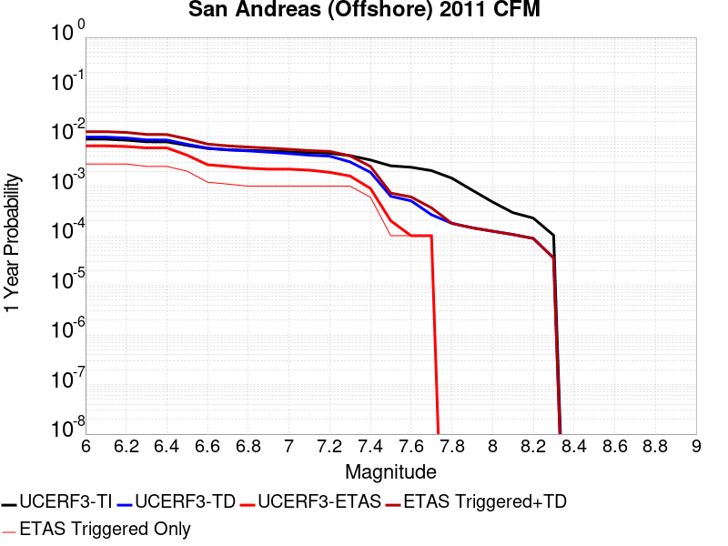 |  |

| Magnitude | 1 wk TI Prob | 1 wk TD Prob | 1 wk ETAS Prob | 1 wk ETAS/TD Gain | 1 wk ETAS Triggered+TD | 1 wk ETAS Triggered Only | 1 mo TI Prob | 1 mo TD Prob | 1 mo ETAS Prob | 1 mo ETAS/TD Gain | 1 mo ETAS Triggered+TD | 1 mo ETAS Triggered Only | 1 yr TI Prob | 1 yr TD Prob | 1 yr ETAS Prob | 1 yr ETAS/TD Gain | 1 yr ETAS Triggered+TD | 1 yr ETAS Triggered Only | 10 yr TI Prob | 10 yr TD Prob | 10 yr ETAS Prob | 10 yr ETAS/TD Gain | 10 yr ETAS Triggered+TD | 10 yr ETAS Triggered Only |
|-----|-----|-----|-----|-----|-----|-----|-----|-----|-----|-----|-----|-----|-----|-----|-----|-----|-----|-----|-----|-----|-----|-----|-----|-----|
| 6.0 | 1.7072787E-4 | 1.8721544E-4 | 0.0 | 0.0 | 1.8721544E-4 | 0.0 | 7.3148566E-4 | 8.0210745E-4 | 0.0 | 0.0 | 8.0210745E-4 | 0.0 | 0.008869528 | 0.009722419 | 0.0 | 0.0 | 0.009722419 | 0.0 | 0.085237645 | 0.09457582 | 0.0010899183 | 0.0115242805 | 0.09556266 | 0.0010899183 |
| 6.1 | 1.7072787E-4 | 1.8721544E-4 | 0.0 | 0.0 | 1.8721544E-4 | 0.0 | 7.3148566E-4 | 8.0210745E-4 | 0.0 | 0.0 | 8.0210745E-4 | 0.0 | 0.008869528 | 0.009722419 | 0.0 | 0.0 | 0.009722419 | 0.0 | 0.085237645 | 0.09457582 | 0.0010899183 | 0.0115242805 | 0.09556266 | 0.0010899183 |
| 6.2 | 1.6312556E-4 | 1.792449E-4 | 0.0 | 0.0 | 1.792449E-4 | 0.0 | 6.989222E-4 | 7.679686E-4 | 0.0 | 0.0 | 7.679686E-4 | 0.0 | 0.008476226 | 0.009310407 | 0.0 | 0.0 | 0.009310407 | 0.0 | 0.08160117 | 0.0906796 | 0.0010899183 | 0.012019442 | 0.091670685 | 0.0010899183 |
| 6.3 | 1.5103363E-4 | 1.6429987E-4 | 0.0 | 0.0 | 1.6429987E-4 | 0.0 | 6.471264E-4 | 7.0395437E-4 | 0.0 | 0.0 | 7.0395437E-4 | 0.0 | 0.007850339 | 0.008537386 | 0.0 | 0.0 | 0.008537386 | 0.0 | 0.075787395 | 0.083437145 | 0.0010899183 | 0.013062746 | 0.084436126 | 0.0010899183 |
| 6.4 | 1.5047993E-4 | 1.6316205E-4 | 0.0 | 0.0 | 1.6316205E-4 | 0.0 | 6.4475456E-4 | 6.9908064E-4 | 0.0 | 0.0 | 6.9908064E-4 | 0.0 | 0.007821669 | 0.00847851 | 0.0 | 0.0 | 0.00847851 | 0.0 | 0.0755203 | 0.08291759 | 0.0010899183 | 0.013144596 | 0.08391714 | 0.0010899183 |
| 6.5 | 1.2760791E-4 | 1.3343433E-4 | 0.0 | 0.0 | 1.3343433E-4 | 0.0 | 5.467764E-4 | 5.717374E-4 | 0.0 | 0.0 | 5.717374E-4 | 0.0 | 0.0066367025 | 0.006938945 | 0.0 | 0.0 | 0.006938945 | 0.0 | 0.064419635 | 0.0684414 | 0.0010899183 | 0.015924837 | 0.06945673 | 0.0010899183 |
| 6.6 | 1.1063525E-4 | 1.12099435E-4 | 0.0 | 0.0 | 1.12099435E-4 | 0.0 | 4.740649E-4 | 4.803387E-4 | 0.0 | 0.0 | 4.803387E-4 | 0.0 | 0.0057564764 | 0.005832633 | 0.0 | 0.0 | 0.005832633 | 0.0 | 0.05609626 | 0.05784239 | 0.0010899183 | 0.018842898 | 0.05886926 | 0.0010899183 |
| 6.7 | 1.0391049E-4 | 1.03160106E-4 | 0.0 | 0.0 | 1.03160106E-4 | 0.0 | 4.4525467E-4 | 4.4204076E-4 | 0.0 | 0.0 | 4.4204076E-4 | 0.0 | 0.0054075094 | 0.0053687436 | 0.0 | 0.0 | 0.0053687436 | 0.0 | 0.052778035 | 0.05340401 | 0.0010899183 | 0.020408921 | 0.054435723 | 0.0010899183 |
| 6.8 | 1.0096706E-4 | 9.835799E-5 | 0.0 | 0.0 | 9.835799E-5 | 0.0 | 4.3264418E-4 | 4.2146703E-4 | 0.0 | 0.0 | 4.2146703E-4 | 0.0 | 0.0052547283 | 0.005119455 | 0.0 | 0.0 | 0.005119455 | 0.0 | 0.051321987 | 0.05113353 | 0.0010899183 | 0.021315139 | 0.052167717 | 0.0010899183 |
| 6.9 | 9.800265E-5 | 9.273098E-5 | 0.0 | 0.0 | 9.273098E-5 | 0.0 | 4.1994374E-4 | 3.9735882E-4 | 0.0 | 0.0 | 3.9735882E-4 | 0.0 | 0.0051008356 | 0.0048272707 | 0.0 | 0.0 | 0.0048272707 | 0.0 | 0.049853306 | 0.048488364 | 0.0010899183 | 0.022477934 | 0.049525432 | 0.0010899183 |
| 7.0 | 9.4642375E-5 | 8.694709E-5 | 0.0 | 0.0 | 8.694709E-5 | 0.0 | 4.0554712E-4 | 3.72578E-4 | 0.0 | 0.0 | 3.72578E-4 | 0.0 | 0.004926363 | 0.004526855 | 0.0 | 0.0 | 0.004526855 | 0.0 | 0.048185747 | 0.04570121 | 5.4495916E-4 | 0.011924392 | 0.046221264 | 5.4495916E-4 |
| 7.1 | 9.0996844E-5 | 8.056058E-5 | 0.0 | 0.0 | 8.056058E-5 | 0.0 | 3.8992817E-4 | 3.4521474E-4 | 0.0 | 0.0 | 3.4521474E-4 | 0.0 | 0.004737046 | 0.004195037 | 0.0 | 0.0 | 0.004195037 | 0.0 | 0.04637333 | 0.042589325 | 5.4495916E-4 | 0.012795675 | 0.043111075 | 5.4495916E-4 |
| 7.2 | 8.848287E-5 | 7.6909644E-5 | 0.0 | 0.0 | 7.6909644E-5 | 0.0 | 3.791572E-4 | 3.2957192E-4 | 0.0 | 0.0 | 3.2957192E-4 | 0.0 | 0.004606472 | 0.0040053003 | 0.0 | 0.0 | 0.0040053003 | 0.0 | 0.045121472 | 0.040764637 | 5.4495916E-4 | 0.013368429 | 0.04128738 | 5.4495916E-4 |
| 7.3 | 7.9280784E-5 | 5.886845E-5 | 0.0 | 0.0 | 5.886845E-5 | 0.0 | 3.3973053E-4 | 2.522695E-4 | 0.0 | 0.0 | 2.522695E-4 | 0.0 | 0.004128377 | 0.0030671514 | 0.0 | 0.0 | 0.0030671514 | 0.0 | 0.040525194 | 0.031688765 | 0.0 | 0.0 | 0.031688765 | 0.0 |
| 7.4 | 6.468038E-5 | 3.6269066E-5 | 0.0 | 0.0 | 3.6269066E-5 | 0.0 | 2.771722E-4 | 1.554299E-4 | 0.0 | 0.0 | 1.554299E-4 | 0.0 | 0.0033693502 | 0.0018907704 | 0.0 | 0.0 | 0.0018907704 | 0.0 | 0.0331872 | 0.019943256 | 0.0 | 0.0 | 0.019943256 | 0.0 |
| 7.5 | 4.930574E-5 | 1.1868133E-5 | 0.0 | 0.0 | 1.1868133E-5 | 0.0 | 2.1129321E-4 | 5.0862443E-5 | 0.0 | 0.0 | 5.0862443E-5 | 0.0 | 0.0025694598 | 6.190758E-4 | 0.0 | 0.0 | 6.190758E-4 | 0.0 | 0.02539953 | 0.006988064 | 0.0 | 0.0 | 0.006988064 | 0.0 |
| 7.6 | 4.612566E-5 | 9.584499E-6 | 0.0 | 0.0 | 9.584499E-6 | 0.0 | 1.9766642E-4 | 4.1075786E-5 | 0.0 | 0.0 | 4.1075786E-5 | 0.0 | 0.0024039324 | 4.999842E-4 | 0.0 | 0.0 | 4.999842E-4 | 0.0 | 0.023780935 | 0.00572244 | 0.0 | 0.0 | 0.00572244 | 0.0 |
| 7.7 | 3.9435414E-5 | 5.0048866E-6 | 0.0 | 0.0 | 5.0048866E-6 | 0.0 | 1.6899795E-4 | 2.1449338E-5 | 0.0 | 0.0 | 2.1449338E-5 | 0.0 | 0.0020556084 | 2.6111456E-4 | 0.0 | 0.0 | 2.6111456E-4 | 0.0 | 0.020366974 | 0.0031907612 | 0.0 | 0.0 | 0.0031907612 | 0.0 |
| 7.8 | 2.7787428E-5 | 3.3536287E-6 | 0.0 | 0.0 | 3.3536287E-6 | 0.0 | 1.1908354E-4 | 1.4372615E-5 | 0.0 | 0.0 | 1.4372615E-5 | 0.0 | 0.0014488777 | 1.7497256E-4 | 0.0 | 0.0 | 1.7497256E-4 | 0.0 | 0.014394675 | 0.0021416345 | 0.0 | 0.0 | 0.0021416345 | 0.0 |
| 7.9 | 1.590671E-5 | 2.7284348E-6 | 0.0 | 0.0 | 2.7284348E-6 | 0.0 | 6.816983E-5 | 1.169324E-5 | 0.0 | 0.0 | 1.169324E-5 | 0.0 | 8.2965166E-4 | 1.4235592E-4 | 0.0 | 0.0 | 1.4235592E-4 | 0.0 | 0.008265611 | 0.001717384 | 0.0 | 0.0 | 0.001717384 | 0.0 |
| 8.0 | 9.193638E-6 | 2.3325933E-6 | 0.0 | 0.0 | 2.3325933E-6 | 0.0 | 3.940071E-5 | 9.99679E-6 | 0.0 | 0.0 | 9.99679E-6 | 0.0 | 4.7959806E-4 | 1.2170414E-4 | 0.0 | 0.0 | 1.2170414E-4 | 0.0 | 0.0047856434 | 0.0014597047 | 0.0 | 0.0 | 0.0014597047 | 0.0 |
| 8.1 | 5.601576E-6 | 1.9984789E-6 | 0.0 | 0.0 | 1.9984789E-6 | 0.0 | 2.4006533E-5 | 8.564882E-6 | 0.0 | 0.0 | 8.564882E-6 | 0.0 | 2.9224035E-4 | 1.0427247E-4 | 0.0 | 0.0 | 1.0427247E-4 | 0.0 | 0.0029185633 | 0.0012651279 | 0.0 | 0.0 | 0.0012651279 | 0.0 |
| 8.2 | 4.3508785E-6 | 1.6652227E-6 | 0.0 | 0.0 | 1.6652227E-6 | 0.0 | 1.864649E-5 | 7.1366494E-6 | 0.0 | 0.0 | 7.1366494E-6 | 0.0 | 2.2699735E-4 | 8.6885266E-5 | 0.0 | 0.0 | 8.6885266E-5 | 0.0 | 0.0022676561 | 0.0010487458 | 0.0 | 0.0 | 0.0010487458 | 0.0 |
| 8.3 | 1.9573292E-6 | 6.7481693E-7 | 0.0 | 0.0 | 6.7481693E-7 | 0.0 | 8.388526E-6 | 2.8920695E-6 | 0.0 | 0.0 | 2.8920695E-6 | 0.0 | 1.0212552E-4 | 3.521039E-5 | 0.0 | 0.0 | 3.521039E-5 | 0.0 | 0.001020786 | 4.1982954E-4 | 0.0 | 0.0 | 4.1982954E-4 | 0.0 |

## Great Valley 09 (Laguna Seca)
*[(top)](#table-of-contents)*

| 1 Week | 1 Month | 1 Year | 10 Year |
|-----|-----|-----|-----|
|  |  |  |  |

| Magnitude | 1 wk TI Prob | 1 wk TD Prob | 1 wk ETAS Prob | 1 wk ETAS/TD Gain | 1 wk ETAS Triggered+TD | 1 wk ETAS Triggered Only | 1 mo TI Prob | 1 mo TD Prob | 1 mo ETAS Prob | 1 mo ETAS/TD Gain | 1 mo ETAS Triggered+TD | 1 mo ETAS Triggered Only | 1 yr TI Prob | 1 yr TD Prob | 1 yr ETAS Prob | 1 yr ETAS/TD Gain | 1 yr ETAS Triggered+TD | 1 yr ETAS Triggered Only | 10 yr TI Prob | 10 yr TD Prob | 10 yr ETAS Prob | 10 yr ETAS/TD Gain | 10 yr ETAS Triggered+TD | 10 yr ETAS Triggered Only |
|-----|-----|-----|-----|-----|-----|-----|-----|-----|-----|-----|-----|-----|-----|-----|-----|-----|-----|-----|-----|-----|-----|-----|-----|-----|
| 6.0 | 5.4353277E-5 | 7.027208E-5 | 0.0 | 0.0 | 7.027208E-5 | 0.0 | 2.3292181E-4 | 3.0113137E-4 | 0.0 | 0.0 | 3.0113137E-4 | 0.0 | 0.0028321352 | 0.0036601184 | 5.4495916E-4 | 0.14889112 | 0.004203083 | 5.4495916E-4 | 0.02796312 | 0.036002573 | 5.4495916E-4 | 0.015136672 | 0.03652791 | 5.4495916E-4 |
| 6.1 | 4.5578287E-5 | 5.8037644E-5 | 0.0 | 0.0 | 5.8037644E-5 | 0.0 | 1.953209E-4 | 2.4870917E-4 | 0.0 | 0.0 | 2.4870917E-4 | 0.0 | 0.0023754383 | 0.0030238347 | 0.0 | 0.0 | 0.0030238347 | 0.0 | 0.023502063 | 0.02982855 | 5.4495916E-4 | 0.018269716 | 0.030357255 | 5.4495916E-4 |
| 6.2 | 2.8536782E-5 | 3.4637495E-5 | 0.0 | 0.0 | 3.4637495E-5 | 0.0 | 1.2229476E-4 | 1.4843796E-4 | 0.0 | 0.0 | 1.4843796E-4 | 0.0 | 0.0014879217 | 0.0018057144 | 0.0 | 0.0 | 0.0018057144 | 0.0 | 0.014779986 | 0.017908249 | 0.0 | 0.0 | 0.017908249 | 0.0 |
| 6.3 | 2.3698774E-5 | 2.8136548E-5 | 0.0 | 0.0 | 2.8136548E-5 | 0.0 | 1.01562226E-4 | 1.205795E-4 | 0.0 | 0.0 | 1.205795E-4 | 0.0 | 0.0012358186 | 0.0014670567 | 0.0 | 0.0 | 0.0014670567 | 0.0 | 0.012289686 | 0.01457243 | 0.0 | 0.0 | 0.01457243 | 0.0 |
| 6.4 | 1.9191197E-5 | 2.2066964E-5 | 0.0 | 0.0 | 2.2066964E-5 | 0.0 | 8.2245395E-5 | 9.456951E-5 | 0.0 | 0.0 | 9.456951E-5 | 0.0 | 0.0010008777 | 0.0011507788 | 0.0 | 0.0 | 0.0011507788 | 0.0 | 0.009963818 | 0.011448429 | 0.0 | 0.0 | 0.011448429 | 0.0 |
| 6.5 | 1.5203241E-5 | 1.6762844E-5 | 0.0 | 0.0 | 1.6762844E-5 | 0.0 | 6.5155116E-5 | 7.183896E-5 | 0.0 | 0.0 | 7.183896E-5 | 0.0 | 7.9297484E-4 | 8.743024E-4 | 0.0 | 0.0 | 8.743024E-4 | 0.0 | 0.007901512 | 0.008709849 | 0.0 | 0.0 | 0.008709849 | 0.0 |
| 6.6 | 1.0984925E-5 | 1.122181E-5 | 0.0 | 0.0 | 1.122181E-5 | 0.0 | 4.70774E-5 | 4.8092603E-5 | 0.0 | 0.0 | 4.8092603E-5 | 0.0 | 5.730166E-4 | 5.8537396E-4 | 0.0 | 0.0 | 5.8537396E-4 | 0.0 | 0.005715413 | 0.0058387127 | 0.0 | 0.0 | 0.0058387127 | 0.0 |
| 6.7 | 9.134616E-6 | 9.003779E-6 | 0.0 | 0.0 | 9.003779E-6 | 0.0 | 3.9147766E-5 | 3.8587066E-5 | 0.0 | 0.0 | 3.8587066E-5 | 0.0 | 4.7651984E-4 | 4.6969866E-4 | 0.0 | 0.0 | 4.6969866E-4 | 0.0 | 0.004754993 | 0.004687303 | 0.0 | 0.0 | 0.004687303 | 0.0 |
| 6.8 | 7.785589E-6 | 7.438485E-6 | 0.0 | 0.0 | 7.438485E-6 | 0.0 | 3.3366385E-5 | 3.1878844E-5 | 0.0 | 0.0 | 3.1878844E-5 | 0.0 | 4.0616E-4 | 3.8805782E-4 | 0.0 | 0.0 | 3.8805782E-4 | 0.0 | 0.0040541845 | 0.003874005 | 0.0 | 0.0 | 0.003874005 | 0.0 |
| 6.9 | 5.579095E-6 | 4.8892202E-6 | 0.0 | 0.0 | 4.8892202E-6 | 0.0 | 2.3910188E-5 | 2.0953641E-5 | 0.0 | 0.0 | 2.0953641E-5 | 0.0 | 2.9106764E-4 | 2.550821E-4 | 0.0 | 0.0 | 2.550821E-4 | 0.0 | 0.002906867 | 0.0025480299 | 0.0 | 0.0 | 0.0025480299 | 0.0 |
| 7.0 | 2.6816688E-6 | 1.5181748E-6 | 0.0 | 0.0 | 1.5181748E-6 | 0.0 | 1.1492816E-5 | 6.506448E-6 | 0.0 | 0.0 | 6.506448E-6 | 0.0 | 1.3991605E-4 | 7.921321E-5 | 0.0 | 0.0 | 7.921321E-5 | 0.0 | 0.0013982799 | 7.918585E-4 | 0.0 | 0.0 | 7.918585E-4 | 0.0 |
| 7.1 | 1.9951021E-6 | 7.430028E-7 | 0.0 | 0.0 | 7.430028E-7 | 0.0 | 8.55041E-6 | 3.184294E-6 | 0.0 | 0.0 | 3.184294E-6 | 0.0 | 1.0409627E-4 | 3.876813E-5 | 0.0 | 0.0 | 3.876813E-5 | 0.0 | 0.0010404752 | 3.876178E-4 | 0.0 | 0.0 | 3.876178E-4 | 0.0 |
| 7.2 | 1.9951021E-6 | 7.430028E-7 | 0.0 | 0.0 | 7.430028E-7 | 0.0 | 8.55041E-6 | 3.184294E-6 | 0.0 | 0.0 | 3.184294E-6 | 0.0 | 1.0409627E-4 | 3.876813E-5 | 0.0 | 0.0 | 3.876813E-5 | 0.0 | 0.0010404752 | 3.876178E-4 | 0.0 | 0.0 | 3.876178E-4 | 0.0 |
| 7.3 | 1.7087556E-6 | 6.5582105E-7 | 0.0 | 0.0 | 6.5582105E-7 | 0.0 | 7.3232177E-6 | 2.8106588E-6 | 0.0 | 0.0 | 2.8106588E-6 | 0.0 | 8.915652E-5 | 3.4219276E-5 | 0.0 | 0.0 | 3.4219276E-5 | 0.0 | 8.9120766E-4 | 3.4214408E-4 | 0.0 | 0.0 | 3.4214408E-4 | 0.0 |
| 7.4 | 1.3804846E-6 | 6.05547E-7 | 0.0 | 0.0 | 6.05547E-7 | 0.0 | 5.916349E-6 | 2.595199E-6 | 0.0 | 0.0 | 2.595199E-6 | 0.0 | 7.2029165E-5 | 3.159613E-5 | 0.0 | 0.0 | 3.159613E-5 | 0.0 | 7.200583E-4 | 3.1592036E-4 | 0.0 | 0.0 | 3.1592036E-4 | 0.0 |
| 7.5 | 1.3804846E-6 | 6.05547E-7 | 0.0 | 0.0 | 6.05547E-7 | 0.0 | 5.916349E-6 | 2.595199E-6 | 0.0 | 0.0 | 2.595199E-6 | 0.0 | 7.2029165E-5 | 3.159613E-5 | 0.0 | 0.0 | 3.159613E-5 | 0.0 | 7.200583E-4 | 3.1592036E-4 | 0.0 | 0.0 | 3.1592036E-4 | 0.0 |

## San Diego Trough north alt1
*[(top)](#table-of-contents)*

| 1 Week | 1 Month | 1 Year | 10 Year |
|-----|-----|-----|-----|
|  |  | 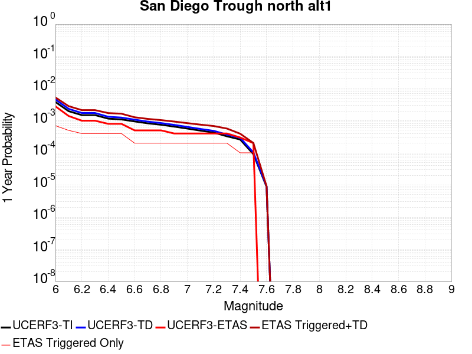 |  |

| Magnitude | 1 wk TI Prob | 1 wk TD Prob | 1 wk ETAS Prob | 1 wk ETAS/TD Gain | 1 wk ETAS Triggered+TD | 1 wk ETAS Triggered Only | 1 mo TI Prob | 1 mo TD Prob | 1 mo ETAS Prob | 1 mo ETAS/TD Gain | 1 mo ETAS Triggered+TD | 1 mo ETAS Triggered Only | 1 yr TI Prob | 1 yr TD Prob | 1 yr ETAS Prob | 1 yr ETAS/TD Gain | 1 yr ETAS Triggered+TD | 1 yr ETAS Triggered Only | 10 yr TI Prob | 10 yr TD Prob | 10 yr ETAS Prob | 10 yr ETAS/TD Gain | 10 yr ETAS Triggered+TD | 10 yr ETAS Triggered Only |
|-----|-----|-----|-----|-----|-----|-----|-----|-----|-----|-----|-----|-----|-----|-----|-----|-----|-----|-----|-----|-----|-----|-----|-----|-----|
| 6.0 | 7.329252E-5 | 8.8024135E-5 | 0.0 | 0.0 | 8.8024135E-5 | 0.0 | 3.14073E-4 | 3.7719536E-4 | 0.0 | 0.0 | 3.7719536E-4 | 0.0 | 0.0038171355 | 0.0045832642 | 5.4495916E-4 | 0.11890197 | 0.0051257256 | 5.4495916E-4 | 0.03752231 | 0.044951465 | 0.0010899183 | 0.024246557 | 0.04599239 | 0.0010899183 |
| 6.1 | 3.7940346E-5 | 4.4798235E-5 | 0.0 | 0.0 | 4.4798235E-5 | 0.0 | 1.6259136E-4 | 1.9197886E-4 | 0.0 | 0.0 | 1.9197886E-4 | 0.0 | 0.0019777524 | 0.0023349184 | 5.4495916E-4 | 0.23339535 | 0.0028786052 | 5.4495916E-4 | 0.019602431 | 0.023112651 | 5.4495916E-4 | 0.02357839 | 0.023645015 | 5.4495916E-4 |
| 6.2 | 2.8645263E-5 | 3.3239627E-5 | 0.0 | 0.0 | 3.3239627E-5 | 0.0 | 1.2275964E-4 | 1.4244791E-4 | 0.0 | 0.0 | 1.4244791E-4 | 0.0 | 0.0014935739 | 0.0017329459 | 0.0 | 0.0 | 0.0017329459 | 0.0 | 0.0148357535 | 0.017197017 | 0.0 | 0.0 | 0.017197017 | 0.0 |
| 6.3 | 2.8645263E-5 | 3.3239627E-5 | 0.0 | 0.0 | 3.3239627E-5 | 0.0 | 1.2275964E-4 | 1.4244791E-4 | 0.0 | 0.0 | 1.4244791E-4 | 0.0 | 0.0014935739 | 0.0017329459 | 0.0 | 0.0 | 0.0017329459 | 0.0 | 0.0148357535 | 0.017197017 | 0.0 | 0.0 | 0.017197017 | 0.0 |
| 6.4 | 2.2204576E-5 | 2.5409145E-5 | 0.0 | 0.0 | 2.5409145E-5 | 0.0 | 9.5159E-5 | 1.0889184E-4 | 0.0 | 0.0 | 1.0889184E-4 | 0.0 | 0.001157945 | 0.0013249613 | 0.0 | 0.0 | 0.0013249613 | 0.0 | 0.011519298 | 0.013171791 | 0.0 | 0.0 | 0.013171791 | 0.0 |
| 6.5 | 2.1004838E-5 | 2.3988314E-5 | 0.0 | 0.0 | 2.3988314E-5 | 0.0 | 9.0017624E-5 | 1.0280306E-4 | 0.0 | 0.0 | 1.0280306E-4 | 0.0 | 0.0010954136 | 0.0012509173 | 0.0 | 0.0 | 0.0012509173 | 0.0 | 0.010900296 | 0.012439845 | 0.0 | 0.0 | 0.012439845 | 0.0 |
| 6.6 | 1.820557E-5 | 2.0674883E-5 | 0.0 | 0.0 | 2.0674883E-5 | 0.0 | 7.802154E-5 | 8.8603665E-5 | 0.0 | 0.0 | 8.8603665E-5 | 0.0 | 9.4949827E-4 | 0.001078221 | 0.0 | 0.0 | 0.001078221 | 0.0 | 0.009454516 | 0.010730566 | 0.0 | 0.0 | 0.010730566 | 0.0 |
| 6.7 | 1.5884485E-5 | 1.7958651E-5 | 0.0 | 0.0 | 1.7958651E-5 | 0.0 | 6.807459E-5 | 7.696339E-5 | 0.0 | 0.0 | 7.696339E-5 | 0.0 | 8.284929E-4 | 9.3662925E-4 | 0.0 | 0.0 | 9.3662925E-4 | 0.0 | 0.008254109 | 0.009327182 | 0.0 | 0.0 | 0.009327182 | 0.0 |
| 6.8 | 1.4331171E-5 | 1.6178852E-5 | 0.0 | 0.0 | 1.6178852E-5 | 0.0 | 6.141786E-5 | 6.933611E-5 | 0.0 | 0.0 | 6.933611E-5 | 0.0 | 7.4750587E-4 | 8.4384216E-4 | 0.0 | 0.0 | 8.4384216E-4 | 0.0 | 0.0074499645 | 0.008406646 | 0.0 | 0.0 | 0.008406646 | 0.0 |
| 6.9 | 1.2574203E-5 | 1.4186481E-5 | 0.0 | 0.0 | 1.4186481E-5 | 0.0 | 5.3888325E-5 | 6.0797796E-5 | 0.0 | 0.0 | 6.0797796E-5 | 0.0 | 6.558929E-4 | 7.3996314E-4 | 0.0 | 0.0 | 7.3996314E-4 | 0.0 | 0.0065396037 | 0.0073751784 | 0.0 | 0.0 | 0.0073751784 | 0.0 |
| 7.0 | 1.0883844E-5 | 1.22726E-5 | 0.0 | 0.0 | 1.22726E-5 | 0.0 | 4.664421E-5 | 5.25958E-5 | 0.0 | 0.0 | 5.25958E-5 | 0.0 | 5.677453E-4 | 6.401667E-4 | 0.0 | 0.0 | 6.401667E-4 | 0.0 | 0.00566297 | 0.006383354 | 0.0 | 0.0 | 0.006383354 | 0.0 |
| 7.1 | 9.393088E-6 | 1.0592619E-5 | 0.0 | 0.0 | 1.0592619E-5 | 0.0 | 4.025547E-5 | 4.5396155E-5 | 0.0 | 0.0 | 4.5396155E-5 | 0.0 | 4.900001E-4 | 5.525588E-4 | 0.0 | 0.0 | 5.525588E-4 | 0.0 | 0.0048892107 | 0.005511945 | 0.0 | 0.0 | 0.005511945 | 0.0 |
| 7.2 | 8.190791E-6 | 9.245941E-6 | 0.0 | 0.0 | 9.245941E-6 | 0.0 | 3.510292E-5 | 3.962486E-5 | 0.0 | 0.0 | 3.962486E-5 | 0.0 | 4.2729423E-4 | 4.823266E-4 | 0.0 | 0.0 | 4.823266E-4 | 0.0 | 0.0042647356 | 0.0048128776 | 0.0 | 0.0 | 0.0048128776 | 0.0 |
| 7.3 | 6.268162E-6 | 7.079958E-6 | 0.0 | 0.0 | 7.079958E-6 | 0.0 | 2.6863276E-5 | 3.0342326E-5 | 0.0 | 0.0 | 3.0342326E-5 | 0.0 | 3.2701128E-4 | 3.693556E-4 | 0.0 | 0.0 | 3.693556E-4 | 0.0 | 0.003265305 | 0.003687463 | 0.0 | 0.0 | 0.003687463 | 0.0 |
| 7.4 | 4.985186E-6 | 5.63487E-6 | 0.0 | 0.0 | 5.63487E-6 | 0.0 | 2.1364907E-5 | 2.414922E-5 | 0.0 | 0.0 | 2.414922E-5 | 0.0 | 2.600867E-4 | 2.9397747E-4 | 0.0 | 0.0 | 2.9397747E-4 | 0.0 | 0.002597825 | 0.0029359271 | 0.0 | 0.0 | 0.0029359271 | 0.0 |
| 7.5 | 1.7489613E-6 | 1.967052E-6 | 0.0 | 0.0 | 1.967052E-6 | 0.0 | 7.495527E-6 | 8.430196E-6 | 0.0 | 0.0 | 8.430196E-6 | 0.0 | 9.125422E-5 | 1.0263303E-4 | 0.0 | 0.0 | 1.0263303E-4 | 0.0 | 9.1216754E-4 | 0.0010258782 | 0.0 | 0.0 | 0.0010258782 | 0.0 |
| 7.6 | 1.6988751E-7 | 1.7527951E-7 | 0.0 | 0.0 | 1.7527951E-7 | 0.0 | 7.2808916E-7 | 7.5119766E-7 | 0.0 | 0.0 | 7.5119766E-7 | 0.0 | 8.864449E-6 | 9.145795E-6 | 0.0 | 0.0 | 9.145795E-6 | 0.0 | 8.8640954E-5 | 9.1454385E-5 | 0.0 | 0.0 | 9.1454385E-5 | 0.0 |

## Cerro Prieto
*[(top)](#table-of-contents)*

| 1 Week | 1 Month | 1 Year | 10 Year |
|-----|-----|-----|-----|
|  |  |  |  |

| Magnitude | 1 wk TI Prob | 1 wk TD Prob | 1 wk ETAS Prob | 1 wk ETAS/TD Gain | 1 wk ETAS Triggered+TD | 1 wk ETAS Triggered Only | 1 mo TI Prob | 1 mo TD Prob | 1 mo ETAS Prob | 1 mo ETAS/TD Gain | 1 mo ETAS Triggered+TD | 1 mo ETAS Triggered Only | 1 yr TI Prob | 1 yr TD Prob | 1 yr ETAS Prob | 1 yr ETAS/TD Gain | 1 yr ETAS Triggered+TD | 1 yr ETAS Triggered Only | 10 yr TI Prob | 10 yr TD Prob | 10 yr ETAS Prob | 10 yr ETAS/TD Gain | 10 yr ETAS Triggered+TD | 10 yr ETAS Triggered Only |
|-----|-----|-----|-----|-----|-----|-----|-----|-----|-----|-----|-----|-----|-----|-----|-----|-----|-----|-----|-----|-----|-----|-----|-----|-----|
| 6.0 | 2.9101528E-4 | 5.876785E-4 | 0.0 | 0.0 | 5.876785E-4 | 0.0 | 0.0012466122 | 0.002516427 | 0.0 | 0.0 | 0.002516427 | 0.0 | 0.015072231 | 0.030233428 | 5.4495916E-4 | 0.018025054 | 0.03076191 | 5.4495916E-4 | 0.14089979 | 0.2514084 | 0.0010899183 | 0.00433525 | 0.25222433 | 0.0010899183 |
| 6.1 | 2.9101528E-4 | 5.876785E-4 | 0.0 | 0.0 | 5.876785E-4 | 0.0 | 0.0012466122 | 0.002516427 | 0.0 | 0.0 | 0.002516427 | 0.0 | 0.015072231 | 0.030233428 | 5.4495916E-4 | 0.018025054 | 0.03076191 | 5.4495916E-4 | 0.14089979 | 0.2514084 | 0.0010899183 | 0.00433525 | 0.25222433 | 0.0010899183 |
| 6.2 | 2.9101528E-4 | 5.876785E-4 | 0.0 | 0.0 | 5.876785E-4 | 0.0 | 0.0012466122 | 0.002516427 | 0.0 | 0.0 | 0.002516427 | 0.0 | 0.015072231 | 0.030233428 | 5.4495916E-4 | 0.018025054 | 0.03076191 | 5.4495916E-4 | 0.14089979 | 0.2514084 | 0.0010899183 | 0.00433525 | 0.25222433 | 0.0010899183 |
| 6.3 | 2.9101528E-4 | 5.876785E-4 | 0.0 | 0.0 | 5.876785E-4 | 0.0 | 0.0012466122 | 0.002516427 | 0.0 | 0.0 | 0.002516427 | 0.0 | 0.015072231 | 0.030233428 | 5.4495916E-4 | 0.018025054 | 0.03076191 | 5.4495916E-4 | 0.14089979 | 0.2514084 | 0.0010899183 | 0.00433525 | 0.25222433 | 0.0010899183 |
| 6.4 | 2.508648E-4 | 5.056167E-4 | 0.0 | 0.0 | 5.056167E-4 | 0.0 | 0.0010746918 | 0.0021653222 | 0.0 | 0.0 | 0.0021653222 | 0.0 | 0.013006088 | 0.02607972 | 5.4495916E-4 | 0.020895896 | 0.026610466 | 5.4495916E-4 | 0.12270685 | 0.22188032 | 0.0010899183 | 0.00491219 | 0.2227284 | 0.0010899183 |
| 6.5 | 2.508648E-4 | 5.056167E-4 | 0.0 | 0.0 | 5.056167E-4 | 0.0 | 0.0010746918 | 0.0021653222 | 0.0 | 0.0 | 0.0021653222 | 0.0 | 0.013006088 | 0.02607972 | 5.4495916E-4 | 0.020895896 | 0.026610466 | 5.4495916E-4 | 0.12270685 | 0.22188032 | 0.0010899183 | 0.00491219 | 0.2227284 | 0.0010899183 |
| 6.6 | 2.294914E-4 | 4.6307954E-4 | 0.0 | 0.0 | 4.6307954E-4 | 0.0 | 9.831638E-4 | 0.0019832992 | 0.0 | 0.0 | 0.0019832992 | 0.0 | 0.011904482 | 0.023857418 | 5.4495916E-4 | 0.022842335 | 0.024389377 | 5.4495916E-4 | 0.11286586 | 0.20606163 | 0.0010899183 | 0.0052892826 | 0.20692696 | 0.0010899183 |
| 6.7 | 1.9621674E-4 | 3.965335E-4 | 0.0 | 0.0 | 3.965335E-4 | 0.0 | 8.4065786E-4 | 0.0016984757 | 0.0 | 0.0 | 0.0016984757 | 0.0 | 0.010187071 | 0.020493843 | 5.4495916E-4 | 0.026591359 | 0.021027634 | 5.4495916E-4 | 0.09732539 | 0.18046996 | 0.0010899183 | 0.0060393335 | 0.18136318 | 0.0010899183 |
| 6.8 | 1.5476145E-4 | 2.9933505E-4 | 0.0 | 0.0 | 2.9933505E-4 | 0.0 | 6.6309475E-4 | 0.0012823322 | 0.0 | 0.0 | 0.0012823322 | 0.0 | 0.008043335 | 0.0154983625 | 5.4495916E-4 | 0.035162367 | 0.016034875 | 5.4495916E-4 | 0.07758363 | 0.14124227 | 0.0010899183 | 0.007716658 | 0.14217824 | 0.0010899183 |
| 6.9 | 1.20509176E-4 | 2.2068103E-4 | 0.0 | 0.0 | 2.2068103E-4 | 0.0 | 5.1636563E-4 | 9.4549364E-4 | 0.0 | 0.0 | 9.4549364E-4 | 0.0 | 0.006268645 | 0.011465097 | 0.0 | 0.0 | 0.011465097 | 0.0 | 0.060947374 | 0.10765188 | 5.4495916E-4 | 0.005062235 | 0.108138174 | 5.4495916E-4 |
| 7.0 | 9.3269155E-5 | 1.6304594E-4 | 0.0 | 0.0 | 1.6304594E-4 | 0.0 | 3.9966372E-4 | 6.986223E-4 | 0.0 | 0.0 | 6.986223E-4 | 0.0 | 0.0048550544 | 0.008479855 | 0.0 | 0.0 | 0.008479855 | 0.0 | 0.04750344 | 0.08164473 | 5.4495916E-4 | 0.0066747623 | 0.08214519 | 5.4495916E-4 |
| 7.1 | 5.029709E-5 | 7.938922E-5 | 0.0 | 0.0 | 7.938922E-5 | 0.0 | 2.1554115E-4 | 3.4021336E-4 | 0.0 | 0.0 | 3.4021336E-4 | 0.0 | 0.0026210553 | 0.0041374615 | 0.0 | 0.0 | 0.0041374615 | 0.0 | 0.025903556 | 0.041418772 | 5.4495916E-4 | 0.013157298 | 0.04194116 | 5.4495916E-4 |
| 7.2 | 6.5445185E-8 | 6.3428644E-8 | 0.0 | 0.0 | 6.3428644E-8 | 0.0 | 2.8047933E-7 | 2.7183705E-7 | 0.0 | 0.0 | 2.7183705E-7 | 0.0 | 3.4148304E-6 | 3.309616E-6 | 0.0 | 0.0 | 3.309616E-6 | 0.0 | 3.414778E-5 | 3.309616E-5 | 0.0 | 0.0 | 3.309616E-5 | 0.0 |

## Laguna Salada
*[(top)](#table-of-contents)*

| 1 Week | 1 Month | 1 Year | 10 Year |
|-----|-----|-----|-----|
|  |  |  |  |

| Magnitude | 1 wk TI Prob | 1 wk TD Prob | 1 wk ETAS Prob | 1 wk ETAS/TD Gain | 1 wk ETAS Triggered+TD | 1 wk ETAS Triggered Only | 1 mo TI Prob | 1 mo TD Prob | 1 mo ETAS Prob | 1 mo ETAS/TD Gain | 1 mo ETAS Triggered+TD | 1 mo ETAS Triggered Only | 1 yr TI Prob | 1 yr TD Prob | 1 yr ETAS Prob | 1 yr ETAS/TD Gain | 1 yr ETAS Triggered+TD | 1 yr ETAS Triggered Only | 10 yr TI Prob | 10 yr TD Prob | 10 yr ETAS Prob | 10 yr ETAS/TD Gain | 10 yr ETAS Triggered+TD | 10 yr ETAS Triggered Only |
|-----|-----|-----|-----|-----|-----|-----|-----|-----|-----|-----|-----|-----|-----|-----|-----|-----|-----|-----|-----|-----|-----|-----|-----|-----|
| 6.0 | 4.6465593E-5 | 4.603502E-5 | 0.0 | 0.0 | 4.603502E-5 | 0.0 | 1.9912305E-4 | 1.9727867E-4 | 0.0 | 0.0 | 1.9727867E-4 | 0.0 | 0.0024216278 | 0.002399297 | 5.4495916E-4 | 0.22713284 | 0.0029429484 | 5.4495916E-4 | 0.02395408 | 0.023813494 | 0.0010899183 | 0.045768935 | 0.024877457 | 0.0010899183 |
| 6.1 | 3.982297E-5 | 3.696866E-5 | 0.0 | 0.0 | 3.696866E-5 | 0.0 | 1.706587E-4 | 1.584279E-4 | 0.0 | 0.0 | 1.584279E-4 | 0.0 | 0.0020757897 | 0.0019272442 | 0.0 | 0.0 | 0.0019272442 | 0.0 | 0.020565065 | 0.019186307 | 0.0 | 0.0 | 0.019186307 | 0.0 |
| 6.2 | 3.6067784E-5 | 3.233754E-5 | 0.0 | 0.0 | 3.233754E-5 | 0.0 | 1.5456705E-4 | 1.3858241E-4 | 0.0 | 0.0 | 1.3858241E-4 | 0.0 | 0.0018802295 | 0.0016860253 | 0.0 | 0.0 | 0.0016860253 | 0.0 | 0.018644003 | 0.016804963 | 0.0 | 0.0 | 0.016804963 | 0.0 |
| 6.3 | 3.2859112E-5 | 2.8596673E-5 | 0.0 | 0.0 | 2.8596673E-5 | 0.0 | 1.4081717E-4 | 1.2255185E-4 | 0.0 | 0.0 | 1.2255185E-4 | 0.0 | 0.0017131006 | 0.0014911371 | 0.0 | 0.0 | 0.0014911371 | 0.0 | 0.016999546 | 0.014879224 | 0.0 | 0.0 | 0.014879224 | 0.0 |
| 6.4 | 2.9132116E-5 | 2.4614748E-5 | 0.0 | 0.0 | 2.4614748E-5 | 0.0 | 1.2484594E-4 | 1.0548801E-4 | 0.0 | 0.0 | 1.0548801E-4 | 0.0 | 0.0015189396 | 0.0012836462 | 0.0 | 0.0 | 0.0012836462 | 0.0 | 0.015085992 | 0.012818991 | 0.0 | 0.0 | 0.012818991 | 0.0 |
| 6.5 | 2.7075037E-5 | 2.2596063E-5 | 0.0 | 0.0 | 2.2596063E-5 | 0.0 | 1.1603071E-4 | 9.683716E-5 | 0.0 | 0.0 | 9.683716E-5 | 0.0 | 0.0014117584 | 0.0011784406 | 0.0 | 0.0 | 0.0011784406 | 0.0 | 0.014028233 | 0.011774354 | 0.0 | 0.0 | 0.011774354 | 0.0 |
| 6.6 | 2.2367465E-5 | 1.8389497E-5 | 0.0 | 0.0 | 1.8389497E-5 | 0.0 | 9.5857045E-5 | 7.88102E-5 | 0.0 | 0.0 | 7.88102E-5 | 0.0 | 0.0011664346 | 9.591718E-4 | 0.0 | 0.0 | 9.591718E-4 | 0.0 | 0.011603311 | 0.009588251 | 0.0 | 0.0 | 0.009588251 | 0.0 |
| 6.7 | 1.9458053E-5 | 1.5762895E-5 | 0.0 | 0.0 | 1.5762895E-5 | 0.0 | 8.338899E-5 | 6.7553956E-5 | 0.0 | 0.0 | 6.7553956E-5 | 0.0 | 0.001014788 | 8.2223717E-4 | 0.0 | 0.0 | 8.2223717E-4 | 0.0 | 0.010101665 | 0.008237424 | 0.0 | 0.0 | 0.008237424 | 0.0 |
| 6.8 | 1.0767866E-5 | 9.0636595E-6 | 0.0 | 0.0 | 9.0636595E-6 | 0.0 | 4.614718E-5 | 3.8844053E-5 | 0.0 | 0.0 | 3.8844053E-5 | 0.0 | 5.6169706E-4 | 4.7289018E-4 | 0.0 | 0.0 | 4.7289018E-4 | 0.0 | 0.0056027942 | 0.0047458936 | 0.0 | 0.0 | 0.0047458936 | 0.0 |
| 6.9 | 2.1384765E-6 | 1.7896037E-6 | 0.0 | 0.0 | 1.7896037E-6 | 0.0 | 9.164866E-6 | 7.669711E-6 | 0.0 | 0.0 | 7.669711E-6 | 0.0 | 1.1157654E-4 | 9.337511E-5 | 0.0 | 0.0 | 9.337511E-5 | 0.0 | 0.0011152053 | 9.33397E-4 | 0.0 | 0.0 | 9.33397E-4 | 0.0 |
| 7.0 | 2.0952946E-6 | 1.7475566E-6 | 0.0 | 0.0 | 1.7475566E-6 | 0.0 | 8.979802E-6 | 7.4895083E-6 | 0.0 | 0.0 | 7.4895083E-6 | 0.0 | 1.0932361E-4 | 9.118134E-5 | 0.0 | 0.0 | 9.118134E-5 | 0.0 | 0.0010926984 | 9.114774E-4 | 0.0 | 0.0 | 9.114774E-4 | 0.0 |
| 7.1 | 1.7887576E-6 | 1.4484149E-6 | 0.0 | 0.0 | 1.4484149E-6 | 0.0 | 7.666081E-6 | 6.207479E-6 | 0.0 | 0.0 | 6.207479E-6 | 0.0 | 9.333054E-5 | 7.557374E-5 | 0.0 | 0.0 | 7.557374E-5 | 0.0 | 9.329135E-4 | 7.5551076E-4 | 0.0 | 0.0 | 7.5551076E-4 | 0.0 |
| 7.2 | 9.723109E-7 | 7.124557E-7 | 0.0 | 0.0 | 7.124557E-7 | 0.0 | 4.16704E-6 | 3.0533788E-6 | 0.0 | 0.0 | 3.0533788E-6 | 0.0 | 5.073253E-5 | 3.7174417E-5 | 0.0 | 0.0 | 3.7174417E-5 | 0.0 | 5.072095E-4 | 3.716982E-4 | 0.0 | 0.0 | 3.716982E-4 | 0.0 |

## Red Mountain
*[(top)](#table-of-contents)*

| 1 Week | 1 Month | 1 Year | 10 Year |
|-----|-----|-----|-----|
|  |  |  | 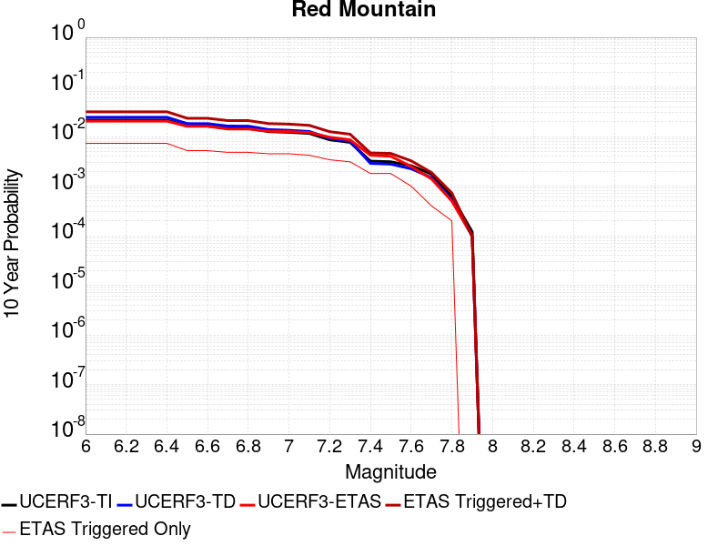 |

| Magnitude | 1 wk TI Prob | 1 wk TD Prob | 1 wk ETAS Prob | 1 wk ETAS/TD Gain | 1 wk ETAS Triggered+TD | 1 wk ETAS Triggered Only | 1 mo TI Prob | 1 mo TD Prob | 1 mo ETAS Prob | 1 mo ETAS/TD Gain | 1 mo ETAS Triggered+TD | 1 mo ETAS Triggered Only | 1 yr TI Prob | 1 yr TD Prob | 1 yr ETAS Prob | 1 yr ETAS/TD Gain | 1 yr ETAS Triggered+TD | 1 yr ETAS Triggered Only | 10 yr TI Prob | 10 yr TD Prob | 10 yr ETAS Prob | 10 yr ETAS/TD Gain | 10 yr ETAS Triggered+TD | 10 yr ETAS Triggered Only |
|-----|-----|-----|-----|-----|-----|-----|-----|-----|-----|-----|-----|-----|-----|-----|-----|-----|-----|-----|-----|-----|-----|-----|-----|-----|
| 6.0 | 4.1810763E-5 | 4.7503345E-5 | 0.0 | 0.0 | 4.7503345E-5 | 0.0 | 1.7917668E-4 | 2.0357079E-4 | 0.0 | 0.0 | 2.0357079E-4 | 0.0 | 0.0021792934 | 0.0024758214 | 5.4495916E-4 | 0.22011246 | 0.0030194314 | 5.4495916E-4 | 0.021580452 | 0.024499938 | 0.0010899183 | 0.04448657 | 0.025563154 | 0.0010899183 |
| 6.1 | 4.1810763E-5 | 4.7503345E-5 | 0.0 | 0.0 | 4.7503345E-5 | 0.0 | 1.7917668E-4 | 2.0357079E-4 | 0.0 | 0.0 | 2.0357079E-4 | 0.0 | 0.0021792934 | 0.0024758214 | 5.4495916E-4 | 0.22011246 | 0.0030194314 | 5.4495916E-4 | 0.021580452 | 0.024499938 | 0.0010899183 | 0.04448657 | 0.025563154 | 0.0010899183 |
| 6.2 | 4.1810763E-5 | 4.7503345E-5 | 0.0 | 0.0 | 4.7503345E-5 | 0.0 | 1.7917668E-4 | 2.0357079E-4 | 0.0 | 0.0 | 2.0357079E-4 | 0.0 | 0.0021792934 | 0.0024758214 | 5.4495916E-4 | 0.22011246 | 0.0030194314 | 5.4495916E-4 | 0.021580452 | 0.024499938 | 0.0010899183 | 0.04448657 | 0.025563154 | 0.0010899183 |
| 6.3 | 4.1810763E-5 | 4.7503345E-5 | 0.0 | 0.0 | 4.7503345E-5 | 0.0 | 1.7917668E-4 | 2.0357079E-4 | 0.0 | 0.0 | 2.0357079E-4 | 0.0 | 0.0021792934 | 0.0024758214 | 5.4495916E-4 | 0.22011246 | 0.0030194314 | 5.4495916E-4 | 0.021580452 | 0.024499938 | 0.0010899183 | 0.04448657 | 0.025563154 | 0.0010899183 |
| 6.4 | 4.1810763E-5 | 4.7503345E-5 | 0.0 | 0.0 | 4.7503345E-5 | 0.0 | 1.7917668E-4 | 2.0357079E-4 | 0.0 | 0.0 | 2.0357079E-4 | 0.0 | 0.0021792934 | 0.0024758214 | 5.4495916E-4 | 0.22011246 | 0.0030194314 | 5.4495916E-4 | 0.021580452 | 0.024499938 | 0.0010899183 | 0.04448657 | 0.025563154 | 0.0010899183 |
| 6.5 | 3.154503E-5 | 3.5297457E-5 | 0.0 | 0.0 | 3.5297457E-5 | 0.0 | 1.3518598E-4 | 1.5126656E-4 | 0.0 | 0.0 | 1.5126656E-4 | 0.0 | 0.0016446467 | 0.0018402064 | 5.4495916E-4 | 0.2961402 | 0.0023841627 | 5.4495916E-4 | 0.01632528 | 0.018259296 | 0.0010899183 | 0.059691146 | 0.019329313 | 0.0010899183 |
| 6.6 | 3.1535834E-5 | 3.5286856E-5 | 0.0 | 0.0 | 3.5286856E-5 | 0.0 | 1.3514658E-4 | 1.5122115E-4 | 0.0 | 0.0 | 1.5122115E-4 | 0.0 | 0.0016441676 | 0.0018396544 | 5.4495916E-4 | 0.2962291 | 0.002383611 | 5.4495916E-4 | 0.01632056 | 0.018253865 | 0.0010899183 | 0.059708904 | 0.019323887 | 0.0010899183 |
| 6.7 | 2.8267326E-5 | 3.1414627E-5 | 0.0 | 0.0 | 3.1414627E-5 | 0.0 | 1.2114006E-4 | 1.3462765E-4 | 0.0 | 0.0 | 1.3462765E-4 | 0.0 | 0.0014738824 | 0.001637944 | 5.4495916E-4 | 0.33270925 | 0.0021820106 | 5.4495916E-4 | 0.014641452 | 0.016267447 | 0.0010899183 | 0.066999964 | 0.017339634 | 0.0010899183 |
| 6.8 | 2.8212884E-5 | 3.1352603E-5 | 0.0 | 0.0 | 3.1352603E-5 | 0.0 | 1.20906756E-4 | 1.3436186E-4 | 0.0 | 0.0 | 1.3436186E-4 | 0.0 | 0.0014710457 | 0.0016347129 | 5.4495916E-4 | 0.33336687 | 0.0021787812 | 5.4495916E-4 | 0.014613459 | 0.016235609 | 0.0010899183 | 0.06713135 | 0.017307831 | 0.0010899183 |
| 6.9 | 2.4227871E-5 | 2.6661157E-5 | 0.0 | 0.0 | 2.6661157E-5 | 0.0 | 1.03829596E-4 | 1.1425753E-4 | 0.0 | 0.0 | 1.1425753E-4 | 0.0 | 0.0012633923 | 0.0013902733 | 5.4495916E-4 | 0.39197984 | 0.0019344748 | 5.4495916E-4 | 0.012562336 | 0.013823417 | 0.0010899183 | 0.07884579 | 0.014898269 | 0.0010899183 |
| 7.0 | 2.348524E-5 | 2.5791516E-5 | 0.0 | 0.0 | 2.5791516E-5 | 0.0 | 1.0064714E-4 | 1.1053081E-4 | 0.0 | 0.0 | 1.1053081E-4 | 0.0 | 0.0012246901 | 0.0013449573 | 5.4495916E-4 | 0.40518695 | 0.0018891834 | 5.4495916E-4 | 0.012179627 | 0.0133757815 | 0.0010899183 | 0.08148446 | 0.014451121 | 0.0010899183 |
| 7.1 | 2.2311642E-5 | 2.4421026E-5 | 0.0 | 0.0 | 2.4421026E-5 | 0.0 | 9.561782E-5 | 1.0465776E-4 | 0.0 | 0.0 | 1.0465776E-4 | 0.0 | 0.0011635252 | 0.001273538 | 5.4495916E-4 | 0.4279096 | 0.001817803 | 5.4495916E-4 | 0.01157452 | 0.0126698855 | 5.4495916E-4 | 0.043012157 | 0.01320794 | 5.4495916E-4 |
| 7.2 | 1.6533986E-5 | 1.7640989E-5 | 0.0 | 0.0 | 1.7640989E-5 | 0.0 | 7.085802E-5 | 7.56024E-5 | 0.0 | 0.0 | 7.56024E-5 | 0.0 | 8.623549E-4 | 9.201338E-4 | 5.4495916E-4 | 0.5922608 | 0.0014645915 | 5.4495916E-4 | 0.008590161 | 0.009169496 | 5.4495916E-4 | 0.059431747 | 0.009709458 | 5.4495916E-4 |
| 7.3 | 1.4703092E-5 | 1.5533557E-5 | 0.0 | 0.0 | 1.5533557E-5 | 0.0 | 6.301173E-5 | 6.657103E-5 | 0.0 | 0.0 | 6.657103E-5 | 0.0 | 7.668978E-4 | 8.1026234E-4 | 5.4495916E-4 | 0.67257124 | 0.0013547799 | 5.4495916E-4 | 0.0076425658 | 0.008079133 | 5.4495916E-4 | 0.06745268 | 0.008619689 | 5.4495916E-4 |
| 7.4 | 6.1331984E-6 | 5.5207784E-6 | 0.0 | 0.0 | 5.5207784E-6 | 0.0 | 2.6284872E-5 | 2.3660268E-5 | 0.0 | 0.0 | 2.3660268E-5 | 0.0 | 3.199713E-4 | 2.880262E-4 | 0.0 | 0.0 | 2.880262E-4 | 0.0 | 0.0031951098 | 0.0028765833 | 0.0 | 0.0 | 0.0028765833 | 0.0 |
| 7.5 | 5.954766E-6 | 5.330579E-6 | 0.0 | 0.0 | 5.330579E-6 | 0.0 | 2.5520176E-5 | 2.284514E-5 | 0.0 | 0.0 | 2.284514E-5 | 0.0 | 3.1066386E-4 | 2.7810462E-4 | 0.0 | 0.0 | 2.7810462E-4 | 0.0 | 0.003102299 | 0.0027776195 | 0.0 | 0.0 | 0.0027776195 | 0.0 |
| 7.6 | 4.9726646E-6 | 4.308218E-6 | 0.0 | 0.0 | 4.308218E-6 | 0.0 | 2.1311245E-5 | 1.8463663E-5 | 0.0 | 0.0 | 1.8463663E-5 | 0.0 | 2.5943352E-4 | 2.2477226E-4 | 0.0 | 0.0 | 2.2477226E-4 | 0.0 | 0.0025913084 | 0.0022454837 | 0.0 | 0.0 | 0.0022454837 | 0.0 |
| 7.7 | 3.3613894E-6 | 2.8472411E-6 | 0.0 | 0.0 | 2.8472411E-6 | 0.0 | 1.4405875E-5 | 1.2202406E-5 | 0.0 | 0.0 | 1.2202406E-5 | 0.0 | 1.7537741E-4 | 1.4855443E-4 | 0.0 | 0.0 | 1.4855443E-4 | 0.0 | 0.0017523908 | 0.0014845774 | 0.0 | 0.0 | 0.0014845774 | 0.0 |
| 7.8 | 1.1828961E-6 | 1.0112856E-6 | 0.0 | 0.0 | 1.0112856E-6 | 0.0 | 5.069545E-6 | 4.334074E-6 | 0.0 | 0.0 | 4.334074E-6 | 0.0 | 6.171996E-5 | 5.2766103E-5 | 0.0 | 0.0 | 5.2766103E-5 | 0.0 | 6.170282E-4 | 5.2753865E-4 | 0.0 | 0.0 | 5.2753865E-4 | 0.0 |
| 7.9 | 2.2967266E-7 | 1.8604956E-7 | 0.0 | 0.0 | 1.8604956E-7 | 0.0 | 9.843111E-7 | 7.97355E-7 | 0.0 | 0.0 | 7.97355E-7 | 0.0 | 1.19839215E-5 | 9.707757E-6 | 0.0 | 0.0 | 9.707757E-6 | 0.0 | 1.1983275E-4 | 9.707362E-5 | 0.0 | 0.0 | 9.707362E-5 | 0.0 |

## Calaveras (So) 2011 CFM
*[(top)](#table-of-contents)*

| 1 Week | 1 Month | 1 Year | 10 Year |
|-----|-----|-----|-----|
|  |  |  |  |

| Magnitude | 1 wk TI Prob | 1 wk TD Prob | 1 wk ETAS Prob | 1 wk ETAS/TD Gain | 1 wk ETAS Triggered+TD | 1 wk ETAS Triggered Only | 1 mo TI Prob | 1 mo TD Prob | 1 mo ETAS Prob | 1 mo ETAS/TD Gain | 1 mo ETAS Triggered+TD | 1 mo ETAS Triggered Only | 1 yr TI Prob | 1 yr TD Prob | 1 yr ETAS Prob | 1 yr ETAS/TD Gain | 1 yr ETAS Triggered+TD | 1 yr ETAS Triggered Only | 10 yr TI Prob | 10 yr TD Prob | 10 yr ETAS Prob | 10 yr ETAS/TD Gain | 10 yr ETAS Triggered+TD | 10 yr ETAS Triggered Only |
|-----|-----|-----|-----|-----|-----|-----|-----|-----|-----|-----|-----|-----|-----|-----|-----|-----|-----|-----|-----|-----|-----|-----|-----|-----|
| 6.0 | 1.5950744E-4 | 3.0039327E-4 | 5.4495916E-4 | 1.8141522 | 8.451887E-4 | 5.4495916E-4 | 6.834242E-4 | 0.0012866248 | 5.4495916E-4 | 0.42355713 | 0.0018308829 | 5.4495916E-4 | 0.00828899 | 0.015530481 | 5.4495916E-4 | 0.03508965 | 0.016066976 | 5.4495916E-4 | 0.079865426 | 0.14342968 | 0.0010899183 | 0.007598973 | 0.14436327 | 0.0010899183 |
| 6.1 | 1.3584697E-4 | 2.537606E-4 | 5.4495916E-4 | 2.1475325 | 7.9858146E-4 | 5.4495916E-4 | 5.8207137E-4 | 0.0010870121 | 5.4495916E-4 | 0.50133675 | 0.0016313788 | 5.4495916E-4 | 0.007063716 | 0.013140169 | 5.4495916E-4 | 0.041472763 | 0.013677968 | 5.4495916E-4 | 0.06843361 | 0.12309246 | 0.0010899183 | 0.008854468 | 0.12404821 | 0.0010899183 |
| 6.2 | 1.14676266E-4 | 2.1067173E-4 | 5.4495916E-4 | 2.586769 | 7.5551606E-4 | 5.4495916E-4 | 4.9137714E-4 | 9.025431E-4 | 5.4495916E-4 | 0.60380405 | 0.0014470103 | 5.4495916E-4 | 0.0059661185 | 0.010928976 | 5.4495916E-4 | 0.049863696 | 0.011467979 | 5.4495916E-4 | 0.058084648 | 0.104108006 | 0.0010899183 | 0.010469111 | 0.10508446 | 0.0010899183 |
| 6.3 | 8.691518E-5 | 1.5792086E-4 | 5.4495916E-4 | 3.450837 | 7.0279394E-4 | 5.4495916E-4 | 3.7244044E-4 | 6.7658944E-4 | 5.4495916E-4 | 0.8054502 | 0.0012211798 | 5.4495916E-4 | 0.004525038 | 0.008199894 | 5.4495916E-4 | 0.06645929 | 0.008740384 | 5.4495916E-4 | 0.044339992 | 0.078463614 | 0.0010899183 | 0.013890748 | 0.07946801 | 0.0010899183 |
| 6.4 | 8.50982E-5 | 1.5501592E-4 | 5.4495916E-4 | 3.5155044 | 6.9989054E-4 | 5.4495916E-4 | 3.646556E-4 | 6.641461E-4 | 5.4495916E-4 | 0.8205411 | 0.0012087433 | 5.4495916E-4 | 0.0044306475 | 0.008049522 | 5.4495916E-4 | 0.06770081 | 0.008590094 | 5.4495916E-4 | 0.04343345 | 0.07708181 | 0.0010899183 | 0.01413976 | 0.07808771 | 0.0010899183 |
| 6.5 | 8.4062965E-5 | 1.532742E-4 | 5.4495916E-4 | 3.5554523 | 6.981498E-4 | 5.4495916E-4 | 3.602201E-4 | 6.566862E-4 | 5.4495916E-4 | 0.82986236 | 0.0012012875 | 5.4495916E-4 | 0.004376863 | 0.007959454 | 5.4495916E-4 | 0.068466894 | 0.008500076 | 5.4495916E-4 | 0.042916555 | 0.076258376 | 0.0010899183 | 0.014292439 | 0.07726518 | 0.0010899183 |
| 6.6 | 8.194716E-5 | 1.4966037E-4 | 5.4495916E-4 | 3.6413054 | 6.9453794E-4 | 5.4495916E-4 | 3.5115483E-4 | 6.412075E-4 | 5.4495916E-4 | 0.8498951 | 0.0011858172 | 5.4495916E-4 | 0.0042669317 | 0.007772731 | 5.4495916E-4 | 0.07011167 | 0.008313455 | 5.4495916E-4 | 0.04185927 | 0.07455445 | 0.0010899183 | 0.014619091 | 0.07556311 | 0.0010899183 |
| 6.7 | 8.012326E-5 | 1.4635667E-4 | 5.4495916E-4 | 3.7235003 | 6.9123605E-4 | 5.4495916E-4 | 3.433402E-4 | 6.270579E-4 | 5.4495916E-4 | 0.8690731 | 0.0011716753 | 5.4495916E-4 | 0.004172157 | 0.007602095 | 5.4495916E-4 | 0.07168538 | 0.008142912 | 5.4495916E-4 | 0.040946912 | 0.07300251 | 0.0010899183 | 0.014929874 | 0.07401286 | 0.0010899183 |
| 6.8 | 7.119773E-5 | 1.2708327E-4 | 5.4495916E-4 | 4.288205 | 6.7197316E-4 | 5.4495916E-4 | 3.0509746E-4 | 5.445169E-4 | 5.4495916E-4 | 1.0008122 | 0.0010891793 | 5.4495916E-4 | 0.0037082357 | 0.006606212 | 5.4495916E-4 | 0.08249193 | 0.0071475706 | 5.4495916E-4 | 0.036469642 | 0.063896075 | 0.0010899183 | 0.017057672 | 0.06491635 | 0.0010899183 |
| 6.9 | 5.7343088E-5 | 9.76893E-5 | 0.0 | 0.0 | 9.76893E-5 | 0.0 | 2.4573295E-4 | 4.1860167E-4 | 0.0 | 0.0 | 4.1860167E-4 | 0.0 | 0.0029876942 | 0.005084639 | 0.0 | 0.0 | 0.005084639 | 0.0 | 0.02947844 | 0.049813464 | 0.0 | 0.0 | 0.049813464 | 0.0 |
| 7.0 | 4.8746577E-5 | 8.150154E-5 | 0.0 | 0.0 | 8.150154E-5 | 0.0 | 2.0889717E-4 | 3.4924588E-4 | 0.0 | 0.0 | 3.4924588E-4 | 0.0 | 0.0025403565 | 0.0042438433 | 0.0 | 0.0 | 0.0042438433 | 0.0 | 0.025115121 | 0.041853353 | 0.0 | 0.0 | 0.041853353 | 0.0 |
| 7.1 | 4.2998014E-5 | 7.141097E-5 | 0.0 | 0.0 | 7.141097E-5 | 0.0 | 1.8426418E-4 | 3.0601144E-4 | 0.0 | 0.0 | 3.0601144E-4 | 0.0 | 0.002241108 | 0.0037193832 | 0.0 | 0.0 | 0.0037193832 | 0.0 | 0.022186412 | 0.036837757 | 0.0 | 0.0 | 0.036837757 | 0.0 |
| 7.2 | 3.221292E-5 | 5.2850894E-5 | 0.0 | 0.0 | 5.2850894E-5 | 0.0 | 1.3804805E-4 | 2.264843E-4 | 0.0 | 0.0 | 2.264843E-4 | 0.0 | 0.0016794393 | 0.0027539872 | 0.0 | 0.0 | 0.0027539872 | 0.0 | 0.016668037 | 0.027530657 | 0.0 | 0.0 | 0.027530657 | 0.0 |
| 7.3 | 2.3756531E-5 | 3.8636637E-5 | 0.0 | 0.0 | 3.8636637E-5 | 0.0 | 1.0180973E-4 | 1.6557517E-4 | 0.0 | 0.0 | 1.6557517E-4 | 0.0 | 0.0012388286 | 0.0020140307 | 0.0 | 0.0 | 0.0020140307 | 0.0 | 0.012319452 | 0.020239614 | 0.0 | 0.0 | 0.020239614 | 0.0 |
| 7.4 | 1.5997684E-5 | 2.663317E-5 | 0.0 | 0.0 | 2.663317E-5 | 0.0 | 6.8559704E-5 | 1.1413718E-4 | 0.0 | 0.0 | 1.1413718E-4 | 0.0 | 8.343947E-4 | 0.0013887367 | 0.0 | 0.0 | 0.0013887367 | 0.0 | 0.008312687 | 0.014032471 | 0.0 | 0.0 | 0.014032471 | 0.0 |
| 7.5 | 1.3814293E-5 | 2.4100913E-5 | 0.0 | 0.0 | 2.4100913E-5 | 0.0 | 5.9202768E-5 | 1.0328555E-4 | 0.0 | 0.0 | 1.0328555E-4 | 0.0 | 7.205553E-4 | 0.0012567785 | 0.0 | 0.0 | 0.0012567785 | 0.0 | 0.007182234 | 0.012724071 | 0.0 | 0.0 | 0.012724071 | 0.0 |
| 7.6 | 8.817309E-6 | 1.5899472E-5 | 0.0 | 0.0 | 1.5899472E-5 | 0.0 | 3.7787922E-5 | 6.813882E-5 | 0.0 | 0.0 | 6.813882E-5 | 0.0 | 4.5997082E-4 | 8.292757E-4 | 0.0 | 0.0 | 8.292757E-4 | 0.0 | 0.004590199 | 0.008460879 | 0.0 | 0.0 | 0.008460879 | 0.0 |
| 7.7 | 4.0352206E-6 | 7.3470687E-6 | 0.0 | 0.0 | 7.3470687E-6 | 0.0 | 1.7293689E-5 | 3.148706E-5 | 0.0 | 0.0 | 3.148706E-5 | 0.0 | 2.1053031E-4 | 3.8328758E-4 | 0.0 | 0.0 | 3.8328758E-4 | 0.0 | 0.0021033096 | 0.0039883037 | 0.0 | 0.0 | 0.0039883037 | 0.0 |
| 7.8 | 3.413169E-6 | 6.4743417E-6 | 0.0 | 0.0 | 6.4743417E-6 | 0.0 | 1.4627784E-5 | 2.7746884E-5 | 0.0 | 0.0 | 2.7746884E-5 | 0.0 | 1.7807873E-4 | 3.37766E-4 | 0.0 | 0.0 | 3.37766E-4 | 0.0 | 0.0017793609 | 0.0035134768 | 0.0 | 0.0 | 0.0035134768 | 0.0 |
| 7.9 | 2.4740732E-6 | 5.0508647E-6 | 0.0 | 0.0 | 5.0508647E-6 | 0.0 | 1.06031275E-5 | 2.1646385E-5 | 0.0 | 0.0 | 2.1646385E-5 | 0.0 | 1.2908543E-4 | 2.6351292E-4 | 0.0 | 0.0 | 2.6351292E-4 | 0.0 | 0.0012901047 | 0.002723944 | 0.0 | 0.0 | 0.002723944 | 0.0 |
| 8.0 | 1.5231818E-6 | 3.1566935E-6 | 0.0 | 0.0 | 3.1566935E-6 | 0.0 | 6.527906E-6 | 1.3528616E-5 | 0.0 | 0.0 | 1.3528616E-5 | 0.0 | 7.9474354E-5 | 1.6469849E-4 | 0.0 | 0.0 | 1.6469849E-4 | 0.0 | 7.944594E-4 | 0.0016920017 | 0.0 | 0.0 | 0.0016920017 | 0.0 |
| 8.1 | 1.0104524E-6 | 1.9643983E-6 | 0.0 | 0.0 | 1.9643983E-6 | 0.0 | 4.330503E-6 | 8.418823E-6 | 0.0 | 0.0 | 8.418823E-6 | 0.0 | 5.2722597E-5 | 1.0249438E-4 | 0.0 | 0.0 | 1.0249438E-4 | 0.0 | 5.271009E-4 | 0.0010529247 | 0.0 | 0.0 | 0.0010529247 | 0.0 |

## Ludlow
*[(top)](#table-of-contents)*

| 1 Week | 1 Month | 1 Year | 10 Year |
|-----|-----|-----|-----|
|  |  | 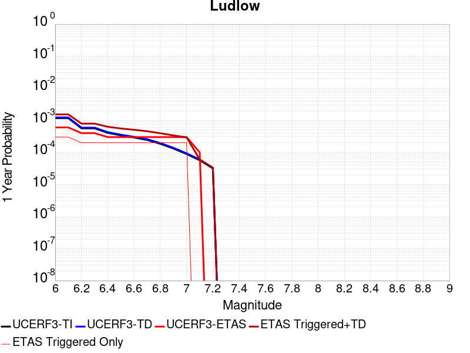 |  |

| Magnitude | 1 wk TI Prob | 1 wk TD Prob | 1 wk ETAS Prob | 1 wk ETAS/TD Gain | 1 wk ETAS Triggered+TD | 1 wk ETAS Triggered Only | 1 mo TI Prob | 1 mo TD Prob | 1 mo ETAS Prob | 1 mo ETAS/TD Gain | 1 mo ETAS Triggered+TD | 1 mo ETAS Triggered Only | 1 yr TI Prob | 1 yr TD Prob | 1 yr ETAS Prob | 1 yr ETAS/TD Gain | 1 yr ETAS Triggered+TD | 1 yr ETAS Triggered Only | 10 yr TI Prob | 10 yr TD Prob | 10 yr ETAS Prob | 10 yr ETAS/TD Gain | 10 yr ETAS Triggered+TD | 10 yr ETAS Triggered Only |
|-----|-----|-----|-----|-----|-----|-----|-----|-----|-----|-----|-----|-----|-----|-----|-----|-----|-----|-----|-----|-----|-----|-----|-----|-----|
| 6.0 | 2.2407607E-5 | 2.3643477E-5 | 0.0 | 0.0 | 2.3643477E-5 | 0.0 | 9.602906E-5 | 1.013255E-4 | 0.0 | 0.0 | 1.013255E-4 | 0.0 | 0.0011685267 | 0.0012329839 | 0.0 | 0.0 | 0.0012329839 | 0.0 | 0.011624013 | 0.012265936 | 0.0010899183 | 0.08885732 | 0.013342485 | 0.0010899183 |
| 6.1 | 2.2407607E-5 | 2.3643477E-5 | 0.0 | 0.0 | 2.3643477E-5 | 0.0 | 9.602906E-5 | 1.013255E-4 | 0.0 | 0.0 | 1.013255E-4 | 0.0 | 0.0011685267 | 0.0012329839 | 0.0 | 0.0 | 0.0012329839 | 0.0 | 0.011624013 | 0.012265936 | 0.0010899183 | 0.08885732 | 0.013342485 | 0.0010899183 |
| 6.2 | 1.0781252E-5 | 1.13592305E-5 | 0.0 | 0.0 | 1.13592305E-5 | 0.0 | 4.620455E-5 | 4.868153E-5 | 0.0 | 0.0 | 4.868153E-5 | 0.0 | 5.623952E-4 | 5.925405E-4 | 0.0 | 0.0 | 5.925405E-4 | 0.0 | 0.00560974 | 0.005910024 | 5.4495916E-4 | 0.092209294 | 0.0064517623 | 5.4495916E-4 |
| 6.3 | 1.0781252E-5 | 1.13592305E-5 | 0.0 | 0.0 | 1.13592305E-5 | 0.0 | 4.620455E-5 | 4.868153E-5 | 0.0 | 0.0 | 4.868153E-5 | 0.0 | 5.623952E-4 | 5.925405E-4 | 0.0 | 0.0 | 5.925405E-4 | 0.0 | 0.00560974 | 0.005910024 | 5.4495916E-4 | 0.092209294 | 0.0064517623 | 5.4495916E-4 |
| 6.4 | 7.814439E-6 | 8.233069E-6 | 0.0 | 0.0 | 8.233069E-6 | 0.0 | 3.3490025E-5 | 3.5284113E-5 | 0.0 | 0.0 | 3.5284113E-5 | 0.0 | 4.0766477E-4 | 4.295008E-4 | 0.0 | 0.0 | 4.295008E-4 | 0.0 | 0.0040691774 | 0.004286853 | 5.4495916E-4 | 0.12712334 | 0.004829476 | 5.4495916E-4 |
| 6.5 | 6.4986366E-6 | 6.8470413E-6 | 0.0 | 0.0 | 6.8470413E-6 | 0.0 | 2.7851002E-5 | 2.9344137E-5 | 0.0 | 0.0 | 2.9344137E-5 | 0.0 | 3.390332E-4 | 3.5720723E-4 | 0.0 | 0.0 | 3.5720723E-4 | 0.0 | 0.003385164 | 0.0035664267 | 5.4495916E-4 | 0.15280256 | 0.0041094422 | 5.4495916E-4 |
| 6.6 | 5.582177E-6 | 5.8826595E-6 | 0.0 | 0.0 | 5.8826595E-6 | 0.0 | 2.3923398E-5 | 2.5211159E-5 | 0.0 | 0.0 | 2.5211159E-5 | 0.0 | 2.9122844E-4 | 3.0690333E-4 | 0.0 | 0.0 | 3.0690333E-4 | 0.0 | 0.0029084706 | 0.0030648683 | 5.4495916E-4 | 0.17780834 | 0.0036081572 | 5.4495916E-4 |
| 6.7 | 4.6858763E-6 | 4.9376245E-6 | 0.0 | 0.0 | 4.9376245E-6 | 0.0 | 2.0082172E-5 | 2.1161079E-5 | 0.0 | 0.0 | 2.1161079E-5 | 0.0 | 2.4447302E-4 | 2.5760624E-4 | 0.0 | 0.0 | 2.5760624E-4 | 0.0 | 0.0024420423 | 0.0025731325 | 5.4495916E-4 | 0.2117882 | 0.0031166894 | 5.4495916E-4 |
| 6.8 | 3.5584908E-6 | 3.7498878E-6 | 0.0 | 0.0 | 3.7498878E-6 | 0.0 | 1.5250586E-5 | 1.6070851E-5 | 0.0 | 0.0 | 1.6070851E-5 | 0.0 | 1.8566006E-4 | 1.9564545E-4 | 0.0 | 0.0 | 1.9564545E-4 | 0.0 | 0.0018550502 | 0.0019547732 | 0.0 | 0.0 | 0.0019547732 | 0.0 |
| 6.9 | 2.532834E-6 | 2.6694825E-6 | 0.0 | 0.0 | 2.6694825E-6 | 0.0 | 1.0854958E-5 | 1.144059E-5 | 0.0 | 0.0 | 1.144059E-5 | 0.0 | 1.3215111E-4 | 1.3928056E-4 | 0.0 | 0.0 | 1.3928056E-4 | 0.0 | 0.0013207254 | 0.0013919603 | 0.0 | 0.0 | 0.0013919603 | 0.0 |
| 7.0 | 1.7083285E-6 | 1.8009131E-6 | 0.0 | 0.0 | 1.8009131E-6 | 0.0 | 7.3213873E-6 | 7.718178E-6 | 0.0 | 0.0 | 7.718178E-6 | 0.0 | 8.913424E-5 | 9.3964925E-5 | 0.0 | 0.0 | 9.3964925E-5 | 0.0 | 8.9098496E-4 | 9.392684E-4 | 0.0 | 0.0 | 9.392684E-4 | 0.0 |
| 7.1 | 1.0905424E-6 | 1.1491103E-6 | 0.0 | 0.0 | 1.1491103E-6 | 0.0 | 4.6737446E-6 | 4.9247496E-6 | 0.0 | 0.0 | 4.9247496E-6 | 0.0 | 5.6901354E-5 | 5.9957274E-5 | 0.0 | 0.0 | 5.9957274E-5 | 0.0 | 5.6886784E-4 | 5.9942075E-4 | 0.0 | 0.0 | 5.9942075E-4 | 0.0 |
| 7.2 | 6.06668E-7 | 6.3837547E-7 | 0.0 | 0.0 | 6.3837547E-7 | 0.0 | 2.600003E-6 | 2.7358924E-6 | 0.0 | 0.0 | 2.7358924E-6 | 0.0 | 3.1654577E-5 | 3.330905E-5 | 0.0 | 0.0 | 3.330905E-5 | 0.0 | 3.1650066E-4 | 3.330474E-4 | 0.0 | 0.0 | 3.330474E-4 | 0.0 |

## Hosgri (Extension)
*[(top)](#table-of-contents)*

| 1 Week | 1 Month | 1 Year | 10 Year |
|-----|-----|-----|-----|
|  |  | 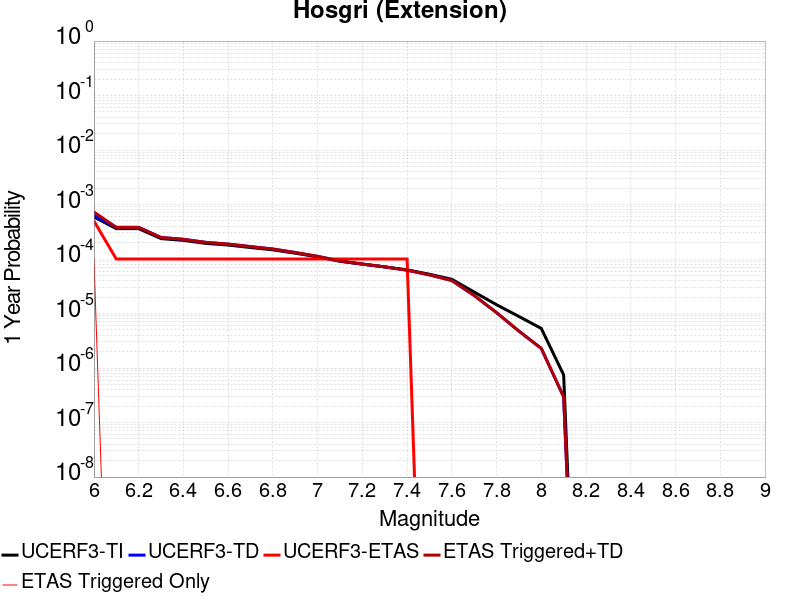 |  |

| Magnitude | 1 wk TI Prob | 1 wk TD Prob | 1 wk ETAS Prob | 1 wk ETAS/TD Gain | 1 wk ETAS Triggered+TD | 1 wk ETAS Triggered Only | 1 mo TI Prob | 1 mo TD Prob | 1 mo ETAS Prob | 1 mo ETAS/TD Gain | 1 mo ETAS Triggered+TD | 1 mo ETAS Triggered Only | 1 yr TI Prob | 1 yr TD Prob | 1 yr ETAS Prob | 1 yr ETAS/TD Gain | 1 yr ETAS Triggered+TD | 1 yr ETAS Triggered Only | 10 yr TI Prob | 10 yr TD Prob | 10 yr ETAS Prob | 10 yr ETAS/TD Gain | 10 yr ETAS Triggered+TD | 10 yr ETAS Triggered Only |
|-----|-----|-----|-----|-----|-----|-----|-----|-----|-----|-----|-----|-----|-----|-----|-----|-----|-----|-----|-----|-----|-----|-----|-----|-----|
| 6.0 | 1.1369135E-5 | 1.2072836E-5 | 5.4495916E-4 | 45.13928 | 5.5702537E-4 | 5.4495916E-4 | 4.8723956E-5 | 5.173983E-5 | 5.4495916E-4 | 10.532681 | 5.966708E-4 | 5.4495916E-4 | 5.9305265E-4 | 6.29773E-4 | 5.4495916E-4 | 0.8653262 | 0.0011743889 | 5.4495916E-4 | 0.005914725 | 0.0062821284 | 5.4495916E-4 | 0.08674753 | 0.006823664 | 5.4495916E-4 |
| 6.1 | 6.934979E-6 | 7.3179544E-6 | 0.0 | 0.0 | 7.3179544E-6 | 0.0 | 2.9721E-5 | 3.1362306E-5 | 0.0 | 0.0 | 3.1362306E-5 | 0.0 | 3.617931E-4 | 3.8177334E-4 | 0.0 | 0.0 | 3.8177334E-4 | 0.0 | 0.0036120464 | 0.0038115869 | 0.0 | 0.0 | 0.0038115869 | 0.0 |
| 6.2 | 6.934979E-6 | 7.3179544E-6 | 0.0 | 0.0 | 7.3179544E-6 | 0.0 | 2.9721E-5 | 3.1362306E-5 | 0.0 | 0.0 | 3.1362306E-5 | 0.0 | 3.617931E-4 | 3.8177334E-4 | 0.0 | 0.0 | 3.8177334E-4 | 0.0 | 0.0036120464 | 0.0038115869 | 0.0 | 0.0 | 0.0038115869 | 0.0 |
| 6.3 | 4.5484676E-6 | 4.764615E-6 | 0.0 | 0.0 | 4.764615E-6 | 0.0 | 1.9493287E-5 | 2.0419622E-5 | 0.0 | 0.0 | 2.0419622E-5 | 0.0 | 2.3730492E-4 | 2.4858094E-4 | 0.0 | 0.0 | 2.4858094E-4 | 0.0 | 0.0023705168 | 0.0024830715 | 0.0 | 0.0 | 0.0024830715 | 0.0 |
| 6.4 | 4.218095E-6 | 4.4123926E-6 | 0.0 | 0.0 | 4.4123926E-6 | 0.0 | 1.8077424E-5 | 1.8910117E-5 | 0.0 | 0.0 | 1.8910117E-5 | 0.0 | 2.2007042E-4 | 2.3020669E-4 | 0.0 | 0.0 | 2.3020669E-4 | 0.0 | 0.002198526 | 0.0022997158 | 0.0 | 0.0 | 0.0022997158 | 0.0 |
| 6.5 | 3.717374E-6 | 3.879767E-6 | 0.0 | 0.0 | 3.879767E-6 | 0.0 | 1.5931506E-5 | 1.6627468E-5 | 0.0 | 0.0 | 1.6627468E-5 | 0.0 | 1.9394881E-4 | 2.0242081E-4 | 0.0 | 0.0 | 2.0242081E-4 | 0.0 | 0.0019377962 | 0.002022383 | 0.0 | 0.0 | 0.002022383 | 0.0 |
| 6.6 | 3.4605036E-6 | 3.6044048E-6 | 0.0 | 0.0 | 3.6044048E-6 | 0.0 | 1.4830645E-5 | 1.5447358E-5 | 0.0 | 0.0 | 1.5447358E-5 | 0.0 | 1.8054814E-4 | 1.880555E-4 | 0.0 | 0.0 | 1.880555E-4 | 0.0 | 0.0018040152 | 0.0018789783 | 0.0 | 0.0 | 0.0018789783 | 0.0 |
| 6.7 | 3.123439E-6 | 3.2429439E-6 | 0.0 | 0.0 | 3.2429439E-6 | 0.0 | 1.33860985E-5 | 1.3898257E-5 | 0.0 | 0.0 | 1.3898257E-5 | 0.0 | 1.6296357E-4 | 1.6919825E-4 | 0.0 | 0.0 | 1.6919825E-4 | 0.0 | 0.001628441 | 0.0016907052 | 0.0 | 0.0 | 0.0016907052 | 0.0 |
| 6.8 | 2.8290783E-6 | 2.9271582E-6 | 0.0 | 0.0 | 2.9271582E-6 | 0.0 | 1.2124565E-5 | 1.2544903E-5 | 0.0 | 0.0 | 1.2544903E-5 | 0.0 | 1.4760658E-4 | 1.5272359E-4 | 0.0 | 0.0 | 1.5272359E-4 | 0.0 | 0.0014750857 | 0.001526195 | 0.0 | 0.0 | 0.001526195 | 0.0 |
| 6.9 | 2.454112E-6 | 2.5252425E-6 | 0.0 | 0.0 | 2.5252425E-6 | 0.0 | 1.0517581E-5 | 1.0822423E-5 | 0.0 | 0.0 | 1.0822423E-5 | 0.0 | 1.2804402E-4 | 1.3175509E-4 | 0.0 | 0.0 | 1.3175509E-4 | 0.0 | 0.0012797028 | 0.0013167758 | 0.0 | 0.0 | 0.0013167758 | 0.0 |
| 7.0 | 2.1008145E-6 | 2.1470744E-6 | 0.0 | 0.0 | 2.1470744E-6 | 0.0 | 9.003459E-6 | 9.201714E-6 | 0.0 | 0.0 | 9.201714E-6 | 0.0 | 1.096116E-4 | 1.12025155E-4 | 0.0 | 0.0 | 1.12025155E-4 | 0.0 | 0.0010955755 | 0.0011196906 | 0.0 | 0.0 | 0.0011196906 | 0.0 |
| 7.1 | 1.744384E-6 | 1.766116E-6 | 0.0 | 0.0 | 1.766116E-6 | 0.0 | 7.47591E-6 | 7.569047E-6 | 0.0 | 0.0 | 7.569047E-6 | 0.0 | 9.1015405E-5 | 9.214927E-5 | 0.0 | 0.0 | 9.214927E-5 | 0.0 | 9.097813E-4 | 9.2111225E-4 | 0.0 | 0.0 | 9.2111225E-4 | 0.0 |
| 7.2 | 1.5456587E-6 | 1.5539209E-6 | 0.0 | 0.0 | 1.5539209E-6 | 0.0 | 6.6242346E-6 | 6.659644E-6 | 0.0 | 0.0 | 6.659644E-6 | 0.0 | 8.064707E-5 | 8.1078164E-5 | 0.0 | 0.0 | 8.1078164E-5 | 0.0 | 8.0617814E-4 | 8.104871E-4 | 0.0 | 0.0 | 8.104871E-4 | 0.0 |
| 7.3 | 1.3775123E-6 | 1.3743695E-6 | 0.0 | 0.0 | 1.3743695E-6 | 0.0 | 5.9036106E-6 | 5.890142E-6 | 0.0 | 0.0 | 5.890142E-6 | 0.0 | 7.187409E-5 | 7.171013E-5 | 0.0 | 0.0 | 7.171013E-5 | 0.0 | 7.185085E-4 | 7.168709E-4 | 0.0 | 0.0 | 7.168709E-4 | 0.0 |
| 7.4 | 1.214491E-6 | 1.2002328E-6 | 0.0 | 0.0 | 1.2002328E-6 | 0.0 | 5.2049513E-6 | 5.143844E-6 | 0.0 | 0.0 | 5.143844E-6 | 0.0 | 6.336844E-5 | 6.262452E-5 | 0.0 | 0.0 | 6.262452E-5 | 0.0 | 6.335037E-4 | 6.260695E-4 | 0.0 | 0.0 | 6.260695E-4 | 0.0 |
| 7.5 | 1.0101123E-6 | 9.822643E-7 | 0.0 | 0.0 | 9.822643E-7 | 0.0 | 4.3290456E-6 | 4.209697E-6 | 0.0 | 0.0 | 4.209697E-6 | 0.0 | 5.2704854E-5 | 5.1251864E-5 | 0.0 | 0.0 | 5.1251864E-5 | 0.0 | 5.2692357E-4 | 5.1240105E-4 | 0.0 | 0.0 | 5.1240105E-4 | 0.0 |
| 7.6 | 8.1558215E-7 | 7.7478217E-7 | 0.0 | 0.0 | 7.7478217E-7 | 0.0 | 3.4953473E-6 | 3.3204908E-6 | 0.0 | 0.0 | 3.3204908E-6 | 0.0 | 4.255502E-5 | 4.0426232E-5 | 0.0 | 0.0 | 4.0426232E-5 | 0.0 | 4.2546875E-4 | 4.0418922E-4 | 0.0 | 0.0 | 4.0418922E-4 | 0.0 |
| 7.7 | 4.757816E-7 | 4.1153908E-7 | 0.0 | 0.0 | 4.1153908E-7 | 0.0 | 2.0390623E-6 | 1.7637377E-6 | 0.0 | 0.0 | 1.7637377E-6 | 0.0 | 2.4825302E-5 | 2.1473295E-5 | 0.0 | 0.0 | 2.1473295E-5 | 0.0 | 2.482253E-4 | 2.1471233E-4 | 0.0 | 0.0 | 2.1471233E-4 | 0.0 |
| 7.8 | 2.782787E-7 | 1.9909719E-7 | 0.0 | 0.0 | 1.9909719E-7 | 0.0 | 1.1926223E-6 | 8.532734E-7 | 0.0 | 0.0 | 8.532734E-7 | 0.0 | 1.452008E-5 | 1.0388554E-5 | 0.0 | 0.0 | 1.0388554E-5 | 0.0 | 1.4519131E-4 | 1.0388072E-4 | 0.0 | 0.0 | 1.0388072E-4 | 0.0 |
| 7.9 | 1.6948086E-7 | 9.1191595E-8 | 0.0 | 0.0 | 9.1191595E-8 | 0.0 | 7.2634634E-7 | 3.9082107E-7 | 0.0 | 0.0 | 3.9082107E-7 | 0.0 | 8.843231E-6 | 4.758236E-6 | 0.0 | 0.0 | 4.758236E-6 | 0.0 | 8.842879E-5 | 4.758135E-5 | 0.0 | 0.0 | 4.758135E-5 | 0.0 |
| 8.0 | 1.0225492E-7 | 4.3830603E-8 | 0.0 | 0.0 | 4.3830603E-8 | 0.0 | 4.382353E-7 | 1.8784543E-7 | 0.0 | 0.0 | 1.8784543E-7 | 0.0 | 5.335502E-6 | 2.2870158E-6 | 0.0 | 0.0 | 2.2870158E-6 | 0.0 | 5.335374E-5 | 2.2869925E-5 | 0.0 | 0.0 | 2.2869925E-5 | 0.0 |
| 8.1 | 1.43711345E-8 | 5.6468283E-9 | 0.0 | 0.0 | 5.6468283E-9 | 0.0 | 6.1590576E-8 | 2.4200693E-8 | 0.0 | 0.0 | 2.4200693E-8 | 0.0 | 7.4986497E-7 | 2.946434E-7 | 0.0 | 0.0 | 2.946434E-7 | 0.0 | 7.4986247E-6 | 2.9464306E-6 | 0.0 | 0.0 | 2.9464306E-6 | 0.0 |

## Clayton
*[(top)](#table-of-contents)*

| 1 Week | 1 Month | 1 Year | 10 Year |
|-----|-----|-----|-----|
|  |  |  |  |

| Magnitude | 1 wk TI Prob | 1 wk TD Prob | 1 wk ETAS Prob | 1 wk ETAS/TD Gain | 1 wk ETAS Triggered+TD | 1 wk ETAS Triggered Only | 1 mo TI Prob | 1 mo TD Prob | 1 mo ETAS Prob | 1 mo ETAS/TD Gain | 1 mo ETAS Triggered+TD | 1 mo ETAS Triggered Only | 1 yr TI Prob | 1 yr TD Prob | 1 yr ETAS Prob | 1 yr ETAS/TD Gain | 1 yr ETAS Triggered+TD | 1 yr ETAS Triggered Only | 10 yr TI Prob | 10 yr TD Prob | 10 yr ETAS Prob | 10 yr ETAS/TD Gain | 10 yr ETAS Triggered+TD | 10 yr ETAS Triggered Only |
|-----|-----|-----|-----|-----|-----|-----|-----|-----|-----|-----|-----|-----|-----|-----|-----|-----|-----|-----|-----|-----|-----|-----|-----|-----|
| 6.0 | 1.1413061E-5 | 1.2652709E-5 | 0.0 | 0.0 | 1.2652709E-5 | 0.0 | 4.89122E-5 | 5.4224896E-5 | 0.0 | 0.0 | 5.4224896E-5 | 0.0 | 5.953433E-4 | 6.600103E-4 | 0.0 | 0.0 | 6.600103E-4 | 0.0 | 0.005937509 | 0.0065826993 | 5.4495916E-4 | 0.082786575 | 0.007124071 | 5.4495916E-4 |
| 6.1 | 1.1413061E-5 | 1.2652709E-5 | 0.0 | 0.0 | 1.2652709E-5 | 0.0 | 4.89122E-5 | 5.4224896E-5 | 0.0 | 0.0 | 5.4224896E-5 | 0.0 | 5.953433E-4 | 6.600103E-4 | 0.0 | 0.0 | 6.600103E-4 | 0.0 | 0.005937509 | 0.0065826993 | 5.4495916E-4 | 0.082786575 | 0.007124071 | 5.4495916E-4 |
| 6.2 | 1.1413061E-5 | 1.2652709E-5 | 0.0 | 0.0 | 1.2652709E-5 | 0.0 | 4.89122E-5 | 5.4224896E-5 | 0.0 | 0.0 | 5.4224896E-5 | 0.0 | 5.953433E-4 | 6.600103E-4 | 0.0 | 0.0 | 6.600103E-4 | 0.0 | 0.005937509 | 0.0065826993 | 5.4495916E-4 | 0.082786575 | 0.007124071 | 5.4495916E-4 |
| 6.3 | 8.538689E-6 | 9.521361E-6 | 0.0 | 0.0 | 9.521361E-6 | 0.0 | 3.659387E-5 | 4.0805255E-5 | 0.0 | 0.0 | 4.0805255E-5 | 0.0 | 4.4543925E-4 | 4.9670145E-4 | 0.0 | 0.0 | 4.9670145E-4 | 0.0 | 0.0044454746 | 0.004956976 | 5.4495916E-4 | 0.10993782 | 0.005499234 | 5.4495916E-4 |
| 6.4 | 8.538689E-6 | 9.521361E-6 | 0.0 | 0.0 | 9.521361E-6 | 0.0 | 3.659387E-5 | 4.0805255E-5 | 0.0 | 0.0 | 4.0805255E-5 | 0.0 | 4.4543925E-4 | 4.9670145E-4 | 0.0 | 0.0 | 4.9670145E-4 | 0.0 | 0.0044454746 | 0.004956976 | 5.4495916E-4 | 0.10993782 | 0.005499234 | 5.4495916E-4 |
| 6.5 | 7.197462E-6 | 8.070808E-6 | 0.0 | 0.0 | 8.070808E-6 | 0.0 | 3.08459E-5 | 3.4588764E-5 | 0.0 | 0.0 | 3.4588764E-5 | 0.0 | 3.7548412E-4 | 4.2104503E-4 | 0.0 | 0.0 | 4.2104503E-4 | 0.0 | 0.003748503 | 0.004203283 | 5.4495916E-4 | 0.12965083 | 0.0047459514 | 5.4495916E-4 |
| 6.6 | 7.1760483E-6 | 8.046854E-6 | 0.0 | 0.0 | 8.046854E-6 | 0.0 | 3.075413E-5 | 3.4486107E-5 | 0.0 | 0.0 | 3.4486107E-5 | 0.0 | 3.743672E-4 | 4.197957E-4 | 0.0 | 0.0 | 4.197957E-4 | 0.0 | 0.0037373714 | 0.0041908366 | 5.4495916E-4 | 0.13003588 | 0.0047335117 | 5.4495916E-4 |
| 6.7 | 6.202582E-6 | 6.9678167E-6 | 0.0 | 0.0 | 6.9678167E-6 | 0.0 | 2.6582224E-5 | 2.9861772E-5 | 0.0 | 0.0 | 2.9861772E-5 | 0.0 | 3.235905E-4 | 3.635141E-4 | 0.0 | 0.0 | 3.635141E-4 | 0.0 | 0.0032311971 | 0.0036299485 | 5.4495916E-4 | 0.1501286 | 0.0041729296 | 5.4495916E-4 |
| 6.8 | 3.6417277E-6 | 4.115845E-6 | 0.0 | 0.0 | 4.115845E-6 | 0.0 | 1.5607311E-5 | 1.763922E-5 | 0.0 | 0.0 | 1.763922E-5 | 0.0 | 1.9000245E-4 | 2.1473711E-4 | 0.0 | 0.0 | 2.1473711E-4 | 0.0 | 0.0018984007 | 0.0021453723 | 0.0 | 0.0 | 0.0021453723 | 0.0 |
| 6.9 | 2.6498485E-6 | 2.9955984E-6 | 0.0 | 0.0 | 2.9955984E-6 | 0.0 | 1.1356444E-5 | 1.2838218E-5 | 0.0 | 0.0 | 1.2838218E-5 | 0.0 | 1.3825593E-4 | 1.562945E-4 | 0.0 | 0.0 | 1.562945E-4 | 0.0 | 0.0013816995 | 0.0015618851 | 0.0 | 0.0 | 0.0015618851 | 0.0 |
| 7.0 | 2.070442E-6 | 2.3377002E-6 | 0.0 | 0.0 | 2.3377002E-6 | 0.0 | 8.873292E-6 | 1.0018678E-5 | 0.0 | 0.0 | 1.0018678E-5 | 0.0 | 1.0802698E-4 | 1.2197087E-4 | 0.0 | 0.0 | 1.2197087E-4 | 0.0 | 0.0010797448 | 0.001219069 | 0.0 | 0.0 | 0.001219069 | 0.0 |
| 7.1 | 1.2111691E-6 | 1.35727E-6 | 0.0 | 0.0 | 1.35727E-6 | 0.0 | 5.190714E-6 | 5.8168594E-6 | 0.0 | 0.0 | 5.8168594E-6 | 0.0 | 6.319511E-5 | 7.0818125E-5 | 0.0 | 0.0 | 7.0818125E-5 | 0.0 | 6.3177146E-4 | 7.0797186E-4 | 0.0 | 0.0 | 7.0797186E-4 | 0.0 |
| 7.2 | 3.9541607E-7 | 4.2207304E-7 | 0.0 | 0.0 | 4.2207304E-7 | 0.0 | 1.6946392E-6 | 1.8088832E-6 | 0.0 | 0.0 | 1.8088832E-6 | 0.0 | 2.0632036E-5 | 2.2022932E-5 | 0.0 | 0.0 | 2.2022932E-5 | 0.0 | 2.063012E-4 | 2.2020764E-4 | 0.0 | 0.0 | 2.2020764E-4 | 0.0 |
| 7.3 | 2.5685637E-7 | 2.7442894E-7 | 0.0 | 0.0 | 2.7442894E-7 | 0.0 | 1.1008126E-6 | 1.1761234E-6 | 0.0 | 0.0 | 1.1761234E-6 | 0.0 | 1.3402311E-5 | 1.431921E-5 | 0.0 | 0.0 | 1.431921E-5 | 0.0 | 1.3401502E-4 | 1.4318294E-4 | 0.0 | 0.0 | 1.4318294E-4 | 0.0 |
| 7.4 | 1.482299E-7 | 1.5803452E-7 | 0.0 | 0.0 | 1.5803452E-7 | 0.0 | 6.3527085E-7 | 6.772906E-7 | 0.0 | 0.0 | 6.772906E-7 | 0.0 | 7.734395E-6 | 8.245982E-6 | 0.0 | 0.0 | 8.245982E-6 | 0.0 | 7.734126E-5 | 8.245679E-5 | 0.0 | 0.0 | 8.245679E-5 | 0.0 |
| 7.5 | 9.7969505E-8 | 1.0435528E-7 | 0.0 | 0.0 | 1.0435528E-7 | 0.0 | 4.1986925E-7 | 4.4723686E-7 | 0.0 | 0.0 | 4.4723686E-7 | 0.0 | 5.111896E-6 | 5.445095E-6 | 0.0 | 0.0 | 5.445095E-6 | 0.0 | 5.1117782E-5 | 5.4449636E-5 | 0.0 | 0.0 | 5.4449636E-5 | 0.0 |
| 7.6 | 6.125415E-8 | 6.521665E-8 | 0.0 | 0.0 | 6.521665E-8 | 0.0 | 2.6251774E-7 | 2.7949991E-7 | 0.0 | 0.0 | 2.7949991E-7 | 0.0 | 3.196149E-6 | 3.4029063E-6 | 0.0 | 0.0 | 3.4029063E-6 | 0.0 | 3.196103E-5 | 3.402855E-5 | 0.0 | 0.0 | 3.402855E-5 | 0.0 |

## Elsinore (Glen Ivy) rev
*[(top)](#table-of-contents)*

| 1 Week | 1 Month | 1 Year | 10 Year |
|-----|-----|-----|-----|
|  |  |  |  |

| Magnitude | 1 wk TI Prob | 1 wk TD Prob | 1 wk ETAS Prob | 1 wk ETAS/TD Gain | 1 wk ETAS Triggered+TD | 1 wk ETAS Triggered Only | 1 mo TI Prob | 1 mo TD Prob | 1 mo ETAS Prob | 1 mo ETAS/TD Gain | 1 mo ETAS Triggered+TD | 1 mo ETAS Triggered Only | 1 yr TI Prob | 1 yr TD Prob | 1 yr ETAS Prob | 1 yr ETAS/TD Gain | 1 yr ETAS Triggered+TD | 1 yr ETAS Triggered Only | 10 yr TI Prob | 10 yr TD Prob | 10 yr ETAS Prob | 10 yr ETAS/TD Gain | 10 yr ETAS Triggered+TD | 10 yr ETAS Triggered Only |
|-----|-----|-----|-----|-----|-----|-----|-----|-----|-----|-----|-----|-----|-----|-----|-----|-----|-----|-----|-----|-----|-----|-----|-----|-----|
| 6.0 | 1.6204086E-4 | 2.9251605E-4 | 0.0 | 0.0 | 2.9251605E-4 | 0.0 | 6.94276E-4 | 0.0012531171 | 0.0 | 0.0 | 0.0012531171 | 0.0 | 0.008420097 | 0.015171497 | 5.4495916E-4 | 0.03591993 | 0.015708188 | 5.4495916E-4 | 0.081081145 | 0.13933165 | 5.4495916E-4 | 0.003911237 | 0.13980068 | 5.4495916E-4 |
| 6.1 | 1.6204086E-4 | 2.9251605E-4 | 0.0 | 0.0 | 2.9251605E-4 | 0.0 | 6.94276E-4 | 0.0012531171 | 0.0 | 0.0 | 0.0012531171 | 0.0 | 0.008420097 | 0.015171497 | 5.4495916E-4 | 0.03591993 | 0.015708188 | 5.4495916E-4 | 0.081081145 | 0.13933165 | 5.4495916E-4 | 0.003911237 | 0.13980068 | 5.4495916E-4 |
| 6.2 | 1.6204086E-4 | 2.9251605E-4 | 0.0 | 0.0 | 2.9251605E-4 | 0.0 | 6.94276E-4 | 0.0012531171 | 0.0 | 0.0 | 0.0012531171 | 0.0 | 0.008420097 | 0.015171497 | 5.4495916E-4 | 0.03591993 | 0.015708188 | 5.4495916E-4 | 0.081081145 | 0.13933165 | 5.4495916E-4 | 0.003911237 | 0.13980068 | 5.4495916E-4 |
| 6.3 | 1.0111737E-4 | 1.7629775E-4 | 0.0 | 0.0 | 1.7629775E-4 | 0.0 | 4.332882E-4 | 7.554589E-4 | 0.0 | 0.0 | 7.554589E-4 | 0.0 | 0.005262531 | 0.009179472 | 5.4495916E-4 | 0.059367154 | 0.009719429 | 5.4495916E-4 | 0.0513964 | 0.08675405 | 5.4495916E-4 | 0.0062816567 | 0.08725173 | 5.4495916E-4 |
| 6.4 | 1.0111737E-4 | 1.7629775E-4 | 0.0 | 0.0 | 1.7629775E-4 | 0.0 | 4.332882E-4 | 7.554589E-4 | 0.0 | 0.0 | 7.554589E-4 | 0.0 | 0.005262531 | 0.009179472 | 5.4495916E-4 | 0.059367154 | 0.009719429 | 5.4495916E-4 | 0.0513964 | 0.08675405 | 5.4495916E-4 | 0.0062816567 | 0.08725173 | 5.4495916E-4 |
| 6.5 | 3.6624708E-5 | 4.609726E-5 | 0.0 | 0.0 | 4.609726E-5 | 0.0 | 1.569536E-4 | 1.9754675E-4 | 0.0 | 0.0 | 1.9754675E-4 | 0.0 | 0.001909235 | 0.0024028358 | 0.0 | 0.0 | 0.0024028358 | 0.0 | 0.01892915 | 0.023553308 | 0.0 | 0.0 | 0.023553308 | 0.0 |
| 6.6 | 2.5051324E-5 | 2.597092E-5 | 0.0 | 0.0 | 2.597092E-5 | 0.0 | 1.073584E-4 | 1.1129944E-4 | 0.0 | 0.0 | 1.1129944E-4 | 0.0 | 0.0013063047 | 0.0013542724 | 0.0 | 0.0 | 0.0013542724 | 0.0 | 0.012986525 | 0.013476744 | 0.0 | 0.0 | 0.013476744 | 0.0 |
| 6.7 | 2.2189772E-5 | 2.1921272E-5 | 0.0 | 0.0 | 2.1921272E-5 | 0.0 | 9.509556E-5 | 9.394513E-5 | 0.0 | 0.0 | 9.394513E-5 | 0.0 | 0.0011571734 | 0.0011432177 | 0.0 | 0.0 | 0.0011432177 | 0.0 | 0.011511663 | 0.01139007 | 0.0 | 0.0 | 0.01139007 | 0.0 |
| 6.8 | 1.6654378E-5 | 1.4349544E-5 | 0.0 | 0.0 | 1.4349544E-5 | 0.0 | 7.137396E-5 | 6.149663E-5 | 0.0 | 0.0 | 6.149663E-5 | 0.0 | 8.686314E-4 | 7.4846926E-4 | 0.0 | 0.0 | 7.4846926E-4 | 0.0 | 0.008652439 | 0.007464598 | 0.0 | 0.0 | 0.007464598 | 0.0 |
| 6.9 | 1.5042909E-5 | 1.2265607E-5 | 0.0 | 0.0 | 1.2265607E-5 | 0.0 | 6.446802E-5 | 5.2565847E-5 | 0.0 | 0.0 | 5.2565847E-5 | 0.0 | 7.8461546E-4 | 6.398044E-4 | 0.0 | 0.0 | 6.398044E-4 | 0.0 | 0.007818509 | 0.0063835797 | 0.0 | 0.0 | 0.0063835797 | 0.0 |
| 7.0 | 1.4361385E-5 | 1.1392162E-5 | 0.0 | 0.0 | 1.1392162E-5 | 0.0 | 6.154734E-5 | 4.8822654E-5 | 0.0 | 0.0 | 4.8822654E-5 | 0.0 | 7.490812E-4 | 5.9425656E-4 | 0.0 | 0.0 | 5.9425656E-4 | 0.0 | 0.007465612 | 0.005930479 | 0.0 | 0.0 | 0.005930479 | 0.0 |
| 7.1 | 1.3265571E-5 | 1.0195621E-5 | 0.0 | 0.0 | 1.0195621E-5 | 0.0 | 5.6851208E-5 | 4.3694803E-5 | 0.0 | 0.0 | 4.3694803E-5 | 0.0 | 6.919436E-4 | 5.3185684E-4 | 0.0 | 0.0 | 5.3185684E-4 | 0.0 | 0.006897931 | 0.005309098 | 0.0 | 0.0 | 0.005309098 | 0.0 |
| 7.2 | 1.1596403E-5 | 8.46623E-6 | 0.0 | 0.0 | 8.46623E-6 | 0.0 | 4.9697923E-5 | 3.6283345E-5 | 0.0 | 0.0 | 3.6283345E-5 | 0.0 | 6.049042E-4 | 4.4166186E-4 | 0.0 | 0.0 | 4.4166186E-4 | 0.0 | 0.006032603 | 0.0044091586 | 0.0 | 0.0 | 0.0044091586 | 0.0 |
| 7.3 | 1.0150827E-5 | 7.2083226E-6 | 0.0 | 0.0 | 7.2083226E-6 | 0.0 | 4.3502816E-5 | 3.0892454E-5 | 0.0 | 0.0 | 3.0892454E-5 | 0.0 | 5.2951806E-4 | 3.7605214E-4 | 0.0 | 0.0 | 3.7605214E-4 | 0.0 | 0.005282581 | 0.0037545003 | 0.0 | 0.0 | 0.0037545003 | 0.0 |
| 7.4 | 9.080705E-6 | 6.32672E-6 | 0.0 | 0.0 | 6.32672E-6 | 0.0 | 3.8916725E-5 | 2.7114238E-5 | 0.0 | 0.0 | 2.7114238E-5 | 0.0 | 4.7370812E-4 | 3.300672E-4 | 0.0 | 0.0 | 3.300672E-4 | 0.0 | 0.004726996 | 0.0032959157 | 0.0 | 0.0 | 0.0032959157 | 0.0 |
| 7.5 | 7.671649E-6 | 5.204376E-6 | 0.0 | 0.0 | 5.204376E-6 | 0.0 | 3.287808E-5 | 2.2304284E-5 | 0.0 | 0.0 | 2.2304284E-5 | 0.0 | 4.0021708E-4 | 2.7152206E-4 | 0.0 | 0.0 | 2.7152206E-4 | 0.0 | 0.0039949706 | 0.0027120274 | 0.0 | 0.0 | 0.0027120274 | 0.0 |
| 7.6 | 6.990086E-6 | 4.6680852E-6 | 0.0 | 0.0 | 4.6680852E-6 | 0.0 | 2.9957167E-5 | 2.0005933E-5 | 0.0 | 0.0 | 2.0005933E-5 | 0.0 | 3.6466747E-4 | 2.4354616E-4 | 0.0 | 0.0 | 2.4354616E-4 | 0.0 | 0.0036406964 | 0.002432908 | 0.0 | 0.0 | 0.002432908 | 0.0 |
| 7.7 | 4.163505E-6 | 2.3176701E-6 | 0.0 | 0.0 | 2.3176701E-6 | 0.0 | 1.7843471E-5 | 9.932838E-6 | 0.0 | 0.0 | 9.932838E-6 | 0.0 | 2.172226E-4 | 1.20926336E-4 | 0.0 | 0.0 | 1.20926336E-4 | 0.0 | 0.0021701038 | 0.0012086778 | 0.0 | 0.0 | 0.0012086778 | 0.0 |
| 7.8 | 2.2692414E-7 | 9.313546E-8 | 0.0 | 0.0 | 9.313546E-8 | 0.0 | 9.725317E-7 | 3.9915196E-7 | 0.0 | 0.0 | 3.9915196E-7 | 0.0 | 1.1840509E-5 | 4.8596676E-6 | 0.0 | 0.0 | 4.8596676E-6 | 0.0 | 1.1839878E-4 | 4.859593E-5 | 0.0 | 0.0 | 4.859593E-5 | 0.0 |
| 7.9 | 6.676829E-9 | 3.4267709E-9 | 0.0 | 0.0 | 3.4267709E-9 | 0.0 | 2.861498E-8 | 1.4686159E-8 | 0.0 | 0.0 | 1.4686159E-8 | 0.0 | 3.4838732E-7 | 1.7880397E-7 | 0.0 | 0.0 | 1.7880397E-7 | 0.0 | 3.4838679E-6 | 1.7880385E-6 | 0.0 | 0.0 | 1.7880385E-6 | 0.0 |

## Monterey Bay-Tularcitos
*[(top)](#table-of-contents)*

| 1 Week | 1 Month | 1 Year | 10 Year |
|-----|-----|-----|-----|
|  | 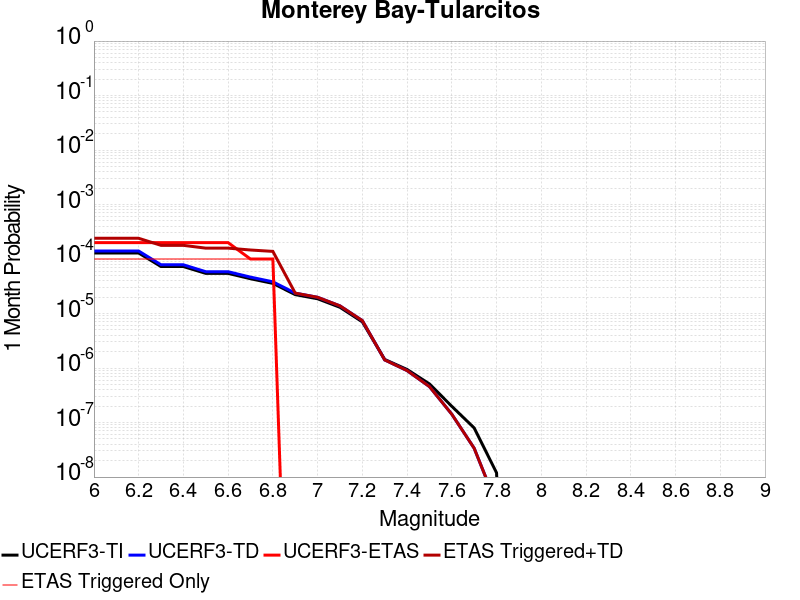 |  |  |

| Magnitude | 1 wk TI Prob | 1 wk TD Prob | 1 wk ETAS Prob | 1 wk ETAS/TD Gain | 1 wk ETAS Triggered+TD | 1 wk ETAS Triggered Only | 1 mo TI Prob | 1 mo TD Prob | 1 mo ETAS Prob | 1 mo ETAS/TD Gain | 1 mo ETAS Triggered+TD | 1 mo ETAS Triggered Only | 1 yr TI Prob | 1 yr TD Prob | 1 yr ETAS Prob | 1 yr ETAS/TD Gain | 1 yr ETAS Triggered+TD | 1 yr ETAS Triggered Only | 10 yr TI Prob | 10 yr TD Prob | 10 yr ETAS Prob | 10 yr ETAS/TD Gain | 10 yr ETAS Triggered+TD | 10 yr ETAS Triggered Only |
|-----|-----|-----|-----|-----|-----|-----|-----|-----|-----|-----|-----|-----|-----|-----|-----|-----|-----|-----|-----|-----|-----|-----|-----|-----|
| 6.0 | 3.0131365E-5 | 3.2767934E-5 | 0.0 | 0.0 | 3.2767934E-5 | 0.0 | 1.2912804E-4 | 1.4042703E-4 | 0.0 | 0.0 | 1.4042703E-4 | 0.0 | 0.001571 | 0.0017084635 | 0.0 | 0.0 | 0.0017084635 | 0.0 | 0.015599402 | 0.016964074 | 5.4495916E-4 | 0.032124307 | 0.017499788 | 5.4495916E-4 |
| 6.1 | 3.0131365E-5 | 3.2767934E-5 | 0.0 | 0.0 | 3.2767934E-5 | 0.0 | 1.2912804E-4 | 1.4042703E-4 | 0.0 | 0.0 | 1.4042703E-4 | 0.0 | 0.001571 | 0.0017084635 | 0.0 | 0.0 | 0.0017084635 | 0.0 | 0.015599402 | 0.016964074 | 5.4495916E-4 | 0.032124307 | 0.017499788 | 5.4495916E-4 |
| 6.2 | 3.0131365E-5 | 3.2767934E-5 | 0.0 | 0.0 | 3.2767934E-5 | 0.0 | 1.2912804E-4 | 1.4042703E-4 | 0.0 | 0.0 | 1.4042703E-4 | 0.0 | 0.001571 | 0.0017084635 | 0.0 | 0.0 | 0.0017084635 | 0.0 | 0.015599402 | 0.016964074 | 5.4495916E-4 | 0.032124307 | 0.017499788 | 5.4495916E-4 |
| 6.3 | 1.6998249E-5 | 1.8315328E-5 | 0.0 | 0.0 | 1.8315328E-5 | 0.0 | 7.28476E-5 | 7.8492005E-5 | 0.0 | 0.0 | 7.8492005E-5 | 0.0 | 8.865586E-4 | 9.5523987E-4 | 0.0 | 0.0 | 9.5523987E-4 | 0.0 | 0.0088303005 | 0.009513259 | 0.0 | 0.0 | 0.009513259 | 0.0 |
| 6.4 | 1.6998249E-5 | 1.8315328E-5 | 0.0 | 0.0 | 1.8315328E-5 | 0.0 | 7.28476E-5 | 7.8492005E-5 | 0.0 | 0.0 | 7.8492005E-5 | 0.0 | 8.865586E-4 | 9.5523987E-4 | 0.0 | 0.0 | 9.5523987E-4 | 0.0 | 0.0088303005 | 0.009513259 | 0.0 | 0.0 | 0.009513259 | 0.0 |
| 6.5 | 1.27470785E-5 | 1.36822455E-5 | 0.0 | 0.0 | 1.36822455E-5 | 0.0 | 5.4629192E-5 | 5.8636935E-5 | 0.0 | 0.0 | 5.8636935E-5 | 0.0 | 6.649074E-4 | 7.1368116E-4 | 0.0 | 0.0 | 7.1368116E-4 | 0.0 | 0.0066292146 | 0.0071149427 | 0.0 | 0.0 | 0.0071149427 | 0.0 |
| 6.6 | 1.2739422E-5 | 1.3674335E-5 | 0.0 | 0.0 | 1.3674335E-5 | 0.0 | 5.4596385E-5 | 5.8603036E-5 | 0.0 | 0.0 | 5.8603036E-5 | 0.0 | 6.645082E-4 | 7.132687E-4 | 0.0 | 0.0 | 7.132687E-4 | 0.0 | 0.0066252467 | 0.0071108444 | 0.0 | 0.0 | 0.0071108444 | 0.0 |
| 6.7 | 1.0160109E-5 | 1.08771865E-5 | 0.0 | 0.0 | 1.08771865E-5 | 0.0 | 4.35426E-5 | 4.661572E-5 | 0.0 | 0.0 | 4.661572E-5 | 0.0 | 5.300022E-4 | 5.6740566E-4 | 0.0 | 0.0 | 5.6740566E-4 | 0.0 | 0.005287399 | 0.0056602797 | 0.0 | 0.0 | 0.0056602797 | 0.0 |
| 6.8 | 8.349859E-6 | 8.92563E-6 | 0.0 | 0.0 | 8.92563E-6 | 0.0 | 3.578462E-5 | 3.825217E-5 | 0.0 | 0.0 | 3.825217E-5 | 0.0 | 4.3559066E-4 | 4.6562628E-4 | 0.0 | 0.0 | 4.6562628E-4 | 0.0 | 0.004347378 | 0.004647071 | 0.0 | 0.0 | 0.004647071 | 0.0 |
| 6.9 | 5.193639E-6 | 5.532168E-6 | 0.0 | 0.0 | 5.532168E-6 | 0.0 | 2.2258262E-5 | 2.3709094E-5 | 0.0 | 0.0 | 2.3709094E-5 | 0.0 | 2.7096065E-4 | 2.886232E-4 | 0.0 | 0.0 | 2.886232E-4 | 0.0 | 0.0027063051 | 0.0028828043 | 0.0 | 0.0 | 0.0028828043 | 0.0 |
| 7.0 | 4.359381E-6 | 4.6397618E-6 | 0.0 | 0.0 | 4.6397618E-6 | 0.0 | 1.8682927E-5 | 1.988456E-5 | 0.0 | 0.0 | 1.988456E-5 | 0.0 | 2.274409E-4 | 2.4207057E-4 | 0.0 | 0.0 | 2.4207057E-4 | 0.0 | 0.0022720827 | 0.0024183614 | 0.0 | 0.0 | 0.0024183614 | 0.0 |
| 7.1 | 3.0398533E-6 | 3.2284763E-6 | 0.0 | 0.0 | 3.2284763E-6 | 0.0 | 1.3027877E-5 | 1.3836268E-5 | 0.0 | 0.0 | 1.3836268E-5 | 0.0 | 1.5860285E-4 | 1.6844616E-4 | 0.0 | 0.0 | 1.6844616E-4 | 0.0 | 0.001584897 | 0.001683442 | 0.0 | 0.0 | 0.001683442 | 0.0 |
| 7.2 | 1.642335E-6 | 1.7318716E-6 | 0.0 | 0.0 | 1.7318716E-6 | 0.0 | 7.0385595E-6 | 7.4222976E-6 | 0.0 | 0.0 | 7.4222976E-6 | 0.0 | 8.569109E-5 | 9.036479E-5 | 0.0 | 0.0 | 9.036479E-5 | 0.0 | 8.5658056E-4 | 9.034828E-4 | 0.0 | 0.0 | 9.034828E-4 | 0.0 |
| 7.3 | 3.356842E-7 | 3.291712E-7 | 0.0 | 0.0 | 3.291712E-7 | 0.0 | 1.4386458E-6 | 1.410733E-6 | 0.0 | 0.0 | 1.410733E-6 | 0.0 | 1.7515373E-5 | 1.717554E-5 | 0.0 | 0.0 | 1.717554E-5 | 0.0 | 1.7513991E-4 | 1.7174221E-4 | 0.0 | 0.0 | 1.7174221E-4 | 0.0 |
| 7.4 | 2.1973483E-7 | 2.0974947E-7 | 0.0 | 0.0 | 2.0974947E-7 | 0.0 | 9.417204E-7 | 8.98926E-7 | 0.0 | 0.0 | 8.98926E-7 | 0.0 | 1.1465385E-5 | 1.0944369E-5 | 0.0 | 0.0 | 1.0944369E-5 | 0.0 | 1.1464794E-4 | 1.0943834E-4 | 0.0 | 0.0 | 1.0943834E-4 | 0.0 |
| 7.5 | 1.1944135E-7 | 1.0668502E-7 | 0.0 | 0.0 | 1.0668502E-7 | 0.0 | 5.118914E-7 | 4.5722143E-7 | 0.0 | 0.0 | 4.5722143E-7 | 0.0 | 6.23226E-6 | 5.566657E-6 | 0.0 | 0.0 | 5.566657E-6 | 0.0 | 6.2320854E-5 | 5.5665187E-5 | 0.0 | 0.0 | 5.5665187E-5 | 0.0 |
| 7.6 | 4.636058E-8 | 3.3143074E-8 | 0.0 | 0.0 | 3.3143074E-8 | 0.0 | 1.9868818E-7 | 1.4204173E-7 | 0.0 | 0.0 | 1.4204173E-7 | 0.0 | 2.419026E-6 | 1.7293568E-6 | 0.0 | 0.0 | 1.7293568E-6 | 0.0 | 2.4189996E-5 | 1.7293434E-5 | 0.0 | 0.0 | 1.7293434E-5 | 0.0 |
| 7.7 | 1.8588572E-8 | 7.864173E-9 | 0.0 | 0.0 | 7.864173E-9 | 0.0 | 7.9665305E-8 | 3.37036E-8 | 0.0 | 0.0 | 3.37036E-8 | 0.0 | 9.699246E-7 | 4.1034124E-7 | 0.0 | 0.0 | 4.1034124E-7 | 0.0 | 9.699204E-6 | 4.103405E-6 | 0.0 | 0.0 | 4.103405E-6 | 0.0 |
| 7.8 | 2.7960154E-9 | 7.380496E-10 | 0.0 | 0.0 | 7.380496E-10 | 0.0 | 1.1982923E-8 | 3.1630694E-9 | 0.0 | 0.0 | 3.1630694E-9 | 0.0 | 1.4589209E-7 | 3.851037E-8 | 0.0 | 0.0 | 3.851037E-8 | 0.0 | 1.4589199E-6 | 3.8510368E-7 | 0.0 | 0.0 | 3.8510368E-7 | 0.0 |

## Earthquake Valley (No  Extension)
*[(top)](#table-of-contents)*

| 1 Week | 1 Month | 1 Year | 10 Year |
|-----|-----|-----|-----|
|  |  |  |  |

| Magnitude | 1 wk TI Prob | 1 wk TD Prob | 1 wk ETAS Prob | 1 wk ETAS/TD Gain | 1 wk ETAS Triggered+TD | 1 wk ETAS Triggered Only | 1 mo TI Prob | 1 mo TD Prob | 1 mo ETAS Prob | 1 mo ETAS/TD Gain | 1 mo ETAS Triggered+TD | 1 mo ETAS Triggered Only | 1 yr TI Prob | 1 yr TD Prob | 1 yr ETAS Prob | 1 yr ETAS/TD Gain | 1 yr ETAS Triggered+TD | 1 yr ETAS Triggered Only | 10 yr TI Prob | 10 yr TD Prob | 10 yr ETAS Prob | 10 yr ETAS/TD Gain | 10 yr ETAS Triggered+TD | 10 yr ETAS Triggered Only |
|-----|-----|-----|-----|-----|-----|-----|-----|-----|-----|-----|-----|-----|-----|-----|-----|-----|-----|-----|-----|-----|-----|-----|-----|-----|
| 6.0 | 2.1859703E-5 | 2.5156909E-5 | 0.0 | 0.0 | 2.5156909E-5 | 0.0 | 9.3681076E-5 | 1.07811684E-4 | 0.0 | 0.0 | 1.07811684E-4 | 0.0 | 0.0011399703 | 0.0013119616 | 0.0 | 0.0 | 0.0013119616 | 0.0 | 0.011341401 | 0.013056477 | 5.4495916E-4 | 0.041738607 | 0.01359432 | 5.4495916E-4 |
| 6.1 | 2.1859703E-5 | 2.5156909E-5 | 0.0 | 0.0 | 2.5156909E-5 | 0.0 | 9.3681076E-5 | 1.07811684E-4 | 0.0 | 0.0 | 1.07811684E-4 | 0.0 | 0.0011399703 | 0.0013119616 | 0.0 | 0.0 | 0.0013119616 | 0.0 | 0.011341401 | 0.013056477 | 5.4495916E-4 | 0.041738607 | 0.01359432 | 5.4495916E-4 |
| 6.2 | 2.1859703E-5 | 2.5156909E-5 | 0.0 | 0.0 | 2.5156909E-5 | 0.0 | 9.3681076E-5 | 1.07811684E-4 | 0.0 | 0.0 | 1.07811684E-4 | 0.0 | 0.0011399703 | 0.0013119616 | 0.0 | 0.0 | 0.0013119616 | 0.0 | 0.011341401 | 0.013056477 | 5.4495916E-4 | 0.041738607 | 0.01359432 | 5.4495916E-4 |
| 6.3 | 2.1859703E-5 | 2.5156909E-5 | 0.0 | 0.0 | 2.5156909E-5 | 0.0 | 9.3681076E-5 | 1.07811684E-4 | 0.0 | 0.0 | 1.07811684E-4 | 0.0 | 0.0011399703 | 0.0013119616 | 0.0 | 0.0 | 0.0013119616 | 0.0 | 0.011341401 | 0.013056477 | 5.4495916E-4 | 0.041738607 | 0.01359432 | 5.4495916E-4 |
| 6.4 | 2.1859703E-5 | 2.5156909E-5 | 0.0 | 0.0 | 2.5156909E-5 | 0.0 | 9.3681076E-5 | 1.07811684E-4 | 0.0 | 0.0 | 1.07811684E-4 | 0.0 | 0.0011399703 | 0.0013119616 | 0.0 | 0.0 | 0.0013119616 | 0.0 | 0.011341401 | 0.013056477 | 5.4495916E-4 | 0.041738607 | 0.01359432 | 5.4495916E-4 |
| 6.5 | 2.1859703E-5 | 2.5156909E-5 | 0.0 | 0.0 | 2.5156909E-5 | 0.0 | 9.3681076E-5 | 1.07811684E-4 | 0.0 | 0.0 | 1.07811684E-4 | 0.0 | 0.0011399703 | 0.0013119616 | 0.0 | 0.0 | 0.0013119616 | 0.0 | 0.011341401 | 0.013056477 | 5.4495916E-4 | 0.041738607 | 0.01359432 | 5.4495916E-4 |
| 6.6 | 1.597E-5 | 1.8326356E-5 | 0.0 | 0.0 | 1.8326356E-5 | 0.0 | 6.8441055E-5 | 7.8539655E-5 | 0.0 | 0.0 | 7.8539655E-5 | 0.0 | 8.329513E-4 | 9.5588784E-4 | 0.0 | 0.0 | 9.5588784E-4 | 0.0 | 0.008298361 | 0.009526342 | 5.4495916E-4 | 0.057205494 | 0.01006611 | 5.4495916E-4 |
| 6.7 | 1.597E-5 | 1.8326356E-5 | 0.0 | 0.0 | 1.8326356E-5 | 0.0 | 6.8441055E-5 | 7.8539655E-5 | 0.0 | 0.0 | 7.8539655E-5 | 0.0 | 8.329513E-4 | 9.5588784E-4 | 0.0 | 0.0 | 9.5588784E-4 | 0.0 | 0.008298361 | 0.009526342 | 5.4495916E-4 | 0.057205494 | 0.01006611 | 5.4495916E-4 |
| 6.8 | 1.5315149E-5 | 1.7573366E-5 | 0.0 | 0.0 | 1.7573366E-5 | 0.0 | 6.5634704E-5 | 7.531274E-5 | 0.0 | 0.0 | 7.531274E-5 | 0.0 | 7.988095E-4 | 9.1663323E-4 | 0.0 | 0.0 | 9.1663323E-4 | 0.0 | 0.007959441 | 0.009137036 | 5.4495916E-4 | 0.059642877 | 0.009677016 | 5.4495916E-4 |
| 6.9 | 1.3634728E-5 | 1.5650037E-5 | 0.0 | 0.0 | 1.5650037E-5 | 0.0 | 5.8433237E-5 | 6.707032E-5 | 0.0 | 0.0 | 6.707032E-5 | 0.0 | 7.1119244E-4 | 8.163571E-4 | 0.0 | 0.0 | 8.163571E-4 | 0.0 | 0.007089207 | 0.008141627 | 5.4495916E-4 | 0.06693492 | 0.008682149 | 5.4495916E-4 |
| 7.0 | 1.3496271E-5 | 1.5492302E-5 | 0.0 | 0.0 | 1.5492302E-5 | 0.0 | 5.783988E-5 | 6.639436E-5 | 0.0 | 0.0 | 6.639436E-5 | 0.0 | 7.03973E-4 | 8.081333E-4 | 0.0 | 0.0 | 8.081333E-4 | 0.0 | 0.007017471 | 0.008059987 | 5.4495916E-4 | 0.0676129 | 0.0086005535 | 5.4495916E-4 |
| 7.1 | 8.242798E-6 | 9.4565585E-6 | 0.0 | 0.0 | 9.4565585E-6 | 0.0 | 3.53258E-5 | 4.0527855E-5 | 0.0 | 0.0 | 4.0527855E-5 | 0.0 | 4.300067E-4 | 4.9338175E-4 | 0.0 | 0.0 | 4.9338175E-4 | 0.0 | 0.004291756 | 0.0049294187 | 0.0 | 0.0 | 0.0049294187 | 0.0 |
| 7.2 | 2.6506527E-7 | 2.2490862E-7 | 0.0 | 0.0 | 2.2490862E-7 | 0.0 | 1.1359936E-6 | 9.638937E-7 | 0.0 | 0.0 | 9.638937E-7 | 0.0 | 1.3830633E-5 | 1.17353475E-5 | 0.0 | 0.0 | 1.17353475E-5 | 0.0 | 1.3829772E-4 | 1.17347685E-4 | 0.0 | 0.0 | 1.17347685E-4 | 0.0 |
| 7.3 | 2.5810488E-7 | 2.1886828E-7 | 0.0 | 0.0 | 2.1886828E-7 | 0.0 | 1.1061633E-6 | 9.3800656E-7 | 0.0 | 0.0 | 9.3800656E-7 | 0.0 | 1.3467455E-5 | 1.1420175E-5 | 0.0 | 0.0 | 1.1420175E-5 | 0.0 | 1.3466639E-4 | 1.14196286E-4 | 0.0 | 0.0 | 1.14196286E-4 | 0.0 |
| 7.4 | 2.2676066E-7 | 1.904391E-7 | 0.0 | 0.0 | 1.904391E-7 | 0.0 | 9.71831E-7 | 8.1616736E-7 | 0.0 | 0.0 | 8.1616736E-7 | 0.0 | 1.1831979E-5 | 9.936796E-6 | 0.0 | 0.0 | 9.936796E-6 | 0.0 | 1.1831349E-4 | 9.9363904E-5 | 0.0 | 0.0 | 9.9363904E-5 | 0.0 |
| 7.5 | 1.5553917E-7 | 1.3056504E-7 | 0.0 | 0.0 | 1.3056504E-7 | 0.0 | 6.6659624E-7 | 5.5956434E-7 | 0.0 | 0.0 | 5.5956434E-7 | 0.0 | 8.115779E-6 | 6.8126765E-6 | 0.0 | 0.0 | 6.8126765E-6 | 0.0 | 8.115482E-5 | 6.812489E-5 | 0.0 | 0.0 | 6.812489E-5 | 0.0 |
| 7.6 | 1.3448629E-7 | 1.12465045E-7 | 0.0 | 0.0 | 1.12465045E-7 | 0.0 | 5.7636964E-7 | 4.8199297E-7 | 0.0 | 0.0 | 4.8199297E-7 | 0.0 | 7.017278E-6 | 5.868251E-6 | 0.0 | 0.0 | 5.868251E-6 | 0.0 | 7.0170565E-5 | 5.868117E-5 | 0.0 | 0.0 | 5.868117E-5 | 0.0 |
| 7.7 | 2.9719402E-8 | 1.4513542E-8 | 0.0 | 0.0 | 1.4513542E-8 | 0.0 | 1.2736886E-7 | 6.22009E-8 | 0.0 | 0.0 | 6.22009E-8 | 0.0 | 1.5507147E-6 | 7.572957E-7 | 0.0 | 0.0 | 7.572957E-7 | 0.0 | 1.550704E-5 | 7.5729363E-6 | 0.0 | 0.0 | 7.5729363E-6 | 0.0 |
| 7.8 | 7.4390196E-9 | 3.232151E-9 | 0.0 | 0.0 | 3.232151E-9 | 0.0 | 3.1881513E-8 | 1.3852076E-8 | 0.0 | 0.0 | 1.3852076E-8 | 0.0 | 3.8815733E-7 | 1.6864901E-7 | 0.0 | 0.0 | 1.6864901E-7 | 0.0 | 3.8815665E-6 | 1.6864891E-6 | 0.0 | 0.0 | 1.6864891E-6 | 0.0 |
| 7.9 | 1.5373532E-9 | 8.4171903E-10 | 0.0 | 0.0 | 8.4171903E-10 | 0.0 | 6.5886567E-9 | 3.6073673E-9 | 0.0 | 0.0 | 3.6073673E-9 | 0.0 | 8.021689E-8 | 4.3919695E-8 | 0.0 | 0.0 | 4.3919695E-8 | 0.0 | 8.0216864E-7 | 4.3919692E-7 | 0.0 | 0.0 | 4.3919692E-7 | 0.0 |

## Concord 2011 CFM
*[(top)](#table-of-contents)*

| 1 Week | 1 Month | 1 Year | 10 Year |
|-----|-----|-----|-----|
|  |  |  |  |

| Magnitude | 1 wk TI Prob | 1 wk TD Prob | 1 wk ETAS Prob | 1 wk ETAS/TD Gain | 1 wk ETAS Triggered+TD | 1 wk ETAS Triggered Only | 1 mo TI Prob | 1 mo TD Prob | 1 mo ETAS Prob | 1 mo ETAS/TD Gain | 1 mo ETAS Triggered+TD | 1 mo ETAS Triggered Only | 1 yr TI Prob | 1 yr TD Prob | 1 yr ETAS Prob | 1 yr ETAS/TD Gain | 1 yr ETAS Triggered+TD | 1 yr ETAS Triggered Only | 10 yr TI Prob | 10 yr TD Prob | 10 yr ETAS Prob | 10 yr ETAS/TD Gain | 10 yr ETAS Triggered+TD | 10 yr ETAS Triggered Only |
|-----|-----|-----|-----|-----|-----|-----|-----|-----|-----|-----|-----|-----|-----|-----|-----|-----|-----|-----|-----|-----|-----|-----|-----|-----|
| 6.0 | 5.7865112E-5 | 9.7227785E-5 | 0.0 | 0.0 | 9.7227785E-5 | 0.0 | 2.4796976E-4 | 4.166246E-4 | 0.0 | 0.0 | 4.166246E-4 | 0.0 | 0.0030148525 | 0.0050611263 | 0.0 | 0.0 | 0.0050611263 | 0.0 | 0.029742775 | 0.04907589 | 5.4495916E-4 | 0.011104416 | 0.049594108 | 5.4495916E-4 |
| 6.1 | 5.7865112E-5 | 9.7227785E-5 | 0.0 | 0.0 | 9.7227785E-5 | 0.0 | 2.4796976E-4 | 4.166246E-4 | 0.0 | 0.0 | 4.166246E-4 | 0.0 | 0.0030148525 | 0.0050611263 | 0.0 | 0.0 | 0.0050611263 | 0.0 | 0.029742775 | 0.04907589 | 5.4495916E-4 | 0.011104416 | 0.049594108 | 5.4495916E-4 |
| 6.2 | 5.6789337E-5 | 9.543774E-5 | 0.0 | 0.0 | 9.543774E-5 | 0.0 | 2.4336016E-4 | 4.0895652E-4 | 0.0 | 0.0 | 4.0895652E-4 | 0.0 | 0.0029588845 | 0.004968242 | 0.0 | 0.0 | 0.004968242 | 0.0 | 0.029197963 | 0.04819583 | 5.4495916E-4 | 0.011307184 | 0.048714526 | 5.4495916E-4 |
| 6.3 | 5.203322E-5 | 8.771259E-5 | 0.0 | 0.0 | 8.771259E-5 | 0.0 | 2.2298045E-4 | 3.7586133E-4 | 0.0 | 0.0 | 3.7586133E-4 | 0.0 | 0.0027114071 | 0.004567288 | 0.0 | 0.0 | 0.004567288 | 0.0 | 0.026785625 | 0.044380765 | 5.4495916E-4 | 0.012279173 | 0.04490154 | 5.4495916E-4 |
| 6.4 | 4.7120942E-5 | 7.866446E-5 | 0.0 | 0.0 | 7.866446E-5 | 0.0 | 2.0193127E-4 | 3.37094E-4 | 0.0 | 0.0 | 3.37094E-4 | 0.0 | 0.0024557412 | 0.0040971357 | 0.0 | 0.0 | 0.0040971357 | 0.0 | 0.024287801 | 0.039909057 | 5.4495916E-4 | 0.013655024 | 0.040432267 | 5.4495916E-4 |
| 6.5 | 2.9598437E-5 | 4.6468846E-5 | 0.0 | 0.0 | 4.6468846E-5 | 0.0 | 1.2684427E-4 | 1.9913817E-4 | 0.0 | 0.0 | 1.9913817E-4 | 0.0 | 0.001543235 | 0.0024220194 | 0.0 | 0.0 | 0.0024220194 | 0.0 | 0.015325619 | 0.023813063 | 5.4495916E-4 | 0.022884881 | 0.024345046 | 5.4495916E-4 |
| 6.6 | 2.0443718E-5 | 2.9870673E-5 | 0.0 | 0.0 | 2.9870673E-5 | 0.0 | 8.7613E-5 | 1.2801109E-4 | 0.0 | 0.0 | 1.2801109E-4 | 0.0 | 0.0010661662 | 0.0015574567 | 0.0 | 0.0 | 0.0015574567 | 0.0 | 0.010610655 | 0.015412929 | 0.0 | 0.0 | 0.015412929 | 0.0 |
| 6.7 | 1.798539E-5 | 2.5471327E-5 | 0.0 | 0.0 | 2.5471327E-5 | 0.0 | 7.7077966E-5 | 1.0915838E-4 | 0.0 | 0.0 | 1.0915838E-4 | 0.0 | 9.380202E-4 | 0.0013282145 | 0.0 | 0.0 | 0.0013282145 | 0.0 | 0.009340706 | 0.013176453 | 0.0 | 0.0 | 0.013176453 | 0.0 |
| 6.8 | 1.613555E-5 | 2.1890408E-5 | 0.0 | 0.0 | 2.1890408E-5 | 0.0 | 6.915052E-5 | 9.381274E-5 | 0.0 | 0.0 | 9.381274E-5 | 0.0 | 8.4158237E-4 | 0.0011415855 | 0.0 | 0.0 | 0.0011415855 | 0.0 | 0.008384023 | 0.01134584 | 0.0 | 0.0 | 0.01134584 | 0.0 |
| 6.9 | 1.2916435E-5 | 1.7027736E-5 | 0.0 | 0.0 | 1.7027736E-5 | 0.0 | 5.5354973E-5 | 7.2974006E-5 | 0.0 | 0.0 | 7.2974006E-5 | 0.0 | 6.7373837E-4 | 8.8810216E-4 | 0.0 | 0.0 | 8.8810216E-4 | 0.0 | 0.006716994 | 0.00884014 | 0.0 | 0.0 | 0.00884014 | 0.0 |
| 7.0 | 9.81129E-6 | 1.2596236E-5 | 0.0 | 0.0 | 1.2596236E-5 | 0.0 | 4.2047708E-5 | 5.398276E-5 | 0.0 | 0.0 | 5.398276E-5 | 0.0 | 5.118106E-4 | 6.5704354E-4 | 0.0 | 0.0 | 6.5704354E-4 | 0.0 | 0.005106334 | 0.0065519335 | 0.0 | 0.0 | 0.0065519335 | 0.0 |
| 7.1 | 8.0889195E-6 | 1.0385969E-5 | 0.0 | 0.0 | 1.0385969E-5 | 0.0 | 3.4666336E-5 | 4.4510547E-5 | 0.0 | 0.0 | 4.4510547E-5 | 0.0 | 4.219809E-4 | 5.417822E-4 | 0.0 | 0.0 | 5.417822E-4 | 0.0 | 0.004211805 | 0.0054050833 | 0.0 | 0.0 | 0.0054050833 | 0.0 |
| 7.2 | 6.267438E-6 | 8.088033E-6 | 0.0 | 0.0 | 8.088033E-6 | 0.0 | 2.6860173E-5 | 3.4662542E-5 | 0.0 | 0.0 | 3.4662542E-5 | 0.0 | 3.2697353E-4 | 4.2193543E-4 | 0.0 | 0.0 | 4.2193543E-4 | 0.0 | 0.0032649285 | 0.0042119 | 0.0 | 0.0 | 0.0042119 | 0.0 |
| 7.3 | 3.6761196E-6 | 4.8197294E-6 | 0.0 | 0.0 | 4.8197294E-6 | 0.0 | 1.5754704E-5 | 2.0655822E-5 | 0.0 | 0.0 | 2.0655822E-5 | 0.0 | 1.9179663E-4 | 2.5145581E-4 | 0.0 | 0.0 | 2.5145581E-4 | 0.0 | 0.0019163118 | 0.0025119635 | 0.0 | 0.0 | 0.0025119635 | 0.0 |
| 7.4 | 2.8044356E-6 | 3.6945266E-6 | 0.0 | 0.0 | 3.6945266E-6 | 0.0 | 1.2018954E-5 | 1.583359E-5 | 0.0 | 0.0 | 1.583359E-5 | 0.0 | 1.4632095E-4 | 1.9275701E-4 | 0.0 | 0.0 | 1.9275701E-4 | 0.0 | 0.0014622464 | 0.0019260531 | 0.0 | 0.0 | 0.0019260531 | 0.0 |
| 7.5 | 2.4578699E-6 | 3.2311568E-6 | 0.0 | 0.0 | 3.2311568E-6 | 0.0 | 1.0533685E-5 | 1.3847743E-5 | 0.0 | 0.0 | 1.3847743E-5 | 0.0 | 1.2824008E-4 | 1.6858333E-4 | 0.0 | 0.0 | 1.6858333E-4 | 0.0 | 0.0012816609 | 0.001684676 | 0.0 | 0.0 | 0.001684676 | 0.0 |
| 7.6 | 1.7713267E-6 | 2.3238626E-6 | 0.0 | 0.0 | 2.3238626E-6 | 0.0 | 7.591378E-6 | 9.9593735E-6 | 0.0 | 0.0 | 9.9593735E-6 | 0.0 | 9.2421105E-5 | 1.2124872E-4 | 0.0 | 0.0 | 1.2124872E-4 | 0.0 | 9.2382677E-4 | 0.0012119251 | 0.0 | 0.0 | 0.0012119251 | 0.0 |
| 7.7 | 5.1912366E-7 | 6.796827E-7 | 0.0 | 0.0 | 6.796827E-7 | 0.0 | 2.2248137E-6 | 2.9129228E-6 | 0.0 | 0.0 | 2.9129228E-6 | 0.0 | 2.708677E-5 | 3.5464273E-5 | 0.0 | 0.0 | 3.5464273E-5 | 0.0 | 2.708347E-4 | 3.5461446E-4 | 0.0 | 0.0 | 3.5461446E-4 | 0.0 |

## Maacama 2011 CFM
*[(top)](#table-of-contents)*

| 1 Week | 1 Month | 1 Year | 10 Year |
|-----|-----|-----|-----|
|  |  |  |  |

| Magnitude | 1 wk TI Prob | 1 wk TD Prob | 1 wk ETAS Prob | 1 wk ETAS/TD Gain | 1 wk ETAS Triggered+TD | 1 wk ETAS Triggered Only | 1 mo TI Prob | 1 mo TD Prob | 1 mo ETAS Prob | 1 mo ETAS/TD Gain | 1 mo ETAS Triggered+TD | 1 mo ETAS Triggered Only | 1 yr TI Prob | 1 yr TD Prob | 1 yr ETAS Prob | 1 yr ETAS/TD Gain | 1 yr ETAS Triggered+TD | 1 yr ETAS Triggered Only | 10 yr TI Prob | 10 yr TD Prob | 10 yr ETAS Prob | 10 yr ETAS/TD Gain | 10 yr ETAS Triggered+TD | 10 yr ETAS Triggered Only |
|-----|-----|-----|-----|-----|-----|-----|-----|-----|-----|-----|-----|-----|-----|-----|-----|-----|-----|-----|-----|-----|-----|-----|-----|-----|
| 6.0 | 1.368203E-4 | 2.5635102E-4 | 0.0 | 0.0 | 2.5635102E-4 | 0.0 | 5.862409E-4 | 0.0010980811 | 0.0 | 0.0 | 0.0010980811 | 0.0 | 0.0071141496 | 0.013270428 | 0.0 | 0.0 | 0.013270428 | 0.0 | 0.06890667 | 0.12352333 | 5.4495916E-4 | 0.004411791 | 0.124000974 | 5.4495916E-4 |
| 6.1 | 1.368203E-4 | 2.5635102E-4 | 0.0 | 0.0 | 2.5635102E-4 | 0.0 | 5.862409E-4 | 0.0010980811 | 0.0 | 0.0 | 0.0010980811 | 0.0 | 0.0071141496 | 0.013270428 | 0.0 | 0.0 | 0.013270428 | 0.0 | 0.06890667 | 0.12352333 | 5.4495916E-4 | 0.004411791 | 0.124000974 | 5.4495916E-4 |
| 6.2 | 1.360743E-4 | 2.5510337E-4 | 0.0 | 0.0 | 2.5510337E-4 | 0.0 | 5.8304524E-4 | 0.0010927393 | 0.0 | 0.0 | 0.0010927393 | 0.0 | 0.007075496 | 0.013206253 | 0.0 | 0.0 | 0.013206253 | 0.0 | 0.06854413 | 0.122959584 | 5.4495916E-4 | 0.0044320184 | 0.12343754 | 5.4495916E-4 |
| 6.3 | 1.1917239E-4 | 2.2215702E-4 | 0.0 | 0.0 | 2.2215702E-4 | 0.0 | 5.1063887E-4 | 9.516623E-4 | 0.0 | 0.0 | 9.516623E-4 | 0.0 | 0.0061993203 | 0.011512876 | 0.0 | 0.0 | 0.011512876 | 0.0 | 0.060292065 | 0.1082104 | 5.4495916E-4 | 0.005036107 | 0.10869639 | 5.4495916E-4 |
| 6.4 | 1.1859289E-4 | 2.2119714E-4 | 0.0 | 0.0 | 2.2119714E-4 | 0.0 | 5.0815626E-4 | 9.4755174E-4 | 0.0 | 0.0 | 9.4755174E-4 | 0.0 | 0.006169266 | 0.011463408 | 0.0 | 0.0 | 0.011463408 | 0.0 | 0.06000784 | 0.107768744 | 0.0 | 0.0 | 0.107768744 | 0.0 |
| 6.5 | 1.09512424E-4 | 2.037942E-4 | 0.0 | 0.0 | 2.037942E-4 | 0.0 | 4.6925453E-4 | 8.7302696E-4 | 0.0 | 0.0 | 8.7302696E-4 | 0.0 | 0.005698218 | 0.010567802 | 0.0 | 0.0 | 0.010567802 | 0.0 | 0.055543028 | 0.099878885 | 0.0 | 0.0 | 0.099878885 | 0.0 |
| 6.6 | 1.0502928E-4 | 1.9539673E-4 | 0.0 | 0.0 | 1.9539673E-4 | 0.0 | 4.500478E-4 | 8.370758E-4 | 0.0 | 0.0 | 8.370758E-4 | 0.0 | 0.0054655746 | 0.010135394 | 0.0 | 0.0 | 0.010135394 | 0.0 | 0.053330887 | 0.09604088 | 0.0 | 0.0 | 0.09604088 | 0.0 |
| 6.7 | 9.739358E-5 | 1.8128542E-4 | 0.0 | 0.0 | 1.8128542E-4 | 0.0 | 4.173343E-4 | 7.766524E-4 | 0.0 | 0.0 | 7.766524E-4 | 0.0 | 0.0050692135 | 0.009408032 | 0.0 | 0.0 | 0.009408032 | 0.0 | 0.049551267 | 0.08953091 | 0.0 | 0.0 | 0.08953091 | 0.0 |
| 6.8 | 8.969524E-5 | 1.6537461E-4 | 0.0 | 0.0 | 1.6537461E-4 | 0.0 | 3.8435153E-4 | 7.085156E-4 | 0.0 | 0.0 | 7.085156E-4 | 0.0 | 0.0046694432 | 0.008586869 | 0.0 | 0.0 | 0.008586869 | 0.0 | 0.045725387 | 0.08210157 | 0.0 | 0.0 | 0.08210157 | 0.0 |
| 6.9 | 7.838291E-5 | 1.4311985E-4 | 0.0 | 0.0 | 1.4311985E-4 | 0.0 | 3.358835E-4 | 6.132068E-4 | 0.0 | 0.0 | 6.132068E-4 | 0.0 | 0.0040817154 | 0.0074366727 | 0.0 | 0.0 | 0.0074366727 | 0.0 | 0.04007554 | 0.07155797 | 0.0 | 0.0 | 0.07155797 | 0.0 |
| 7.0 | 6.961957E-5 | 1.2612117E-4 | 0.0 | 0.0 | 1.2612117E-4 | 0.0 | 2.9833548E-4 | 5.403954E-4 | 0.0 | 0.0 | 5.403954E-4 | 0.0 | 0.0036261857 | 0.0065571335 | 0.0 | 0.0 | 0.0065571335 | 0.0 | 0.035675827 | 0.06342047 | 0.0 | 0.0 | 0.06342047 | 0.0 |
| 7.1 | 5.999398E-5 | 1.08208515E-4 | 0.0 | 0.0 | 1.08208515E-4 | 0.0 | 2.570917E-4 | 4.6365694E-4 | 0.0 | 0.0 | 4.6365694E-4 | 0.0 | 0.0031255994 | 0.005629063 | 0.0 | 0.0 | 0.005629063 | 0.0 | 0.030820016 | 0.054735295 | 0.0 | 0.0 | 0.054735295 | 0.0 |
| 7.2 | 5.116532E-5 | 9.2307884E-5 | 0.0 | 0.0 | 9.2307884E-5 | 0.0 | 2.1926152E-4 | 3.955391E-4 | 0.0 | 0.0 | 3.955391E-4 | 0.0 | 0.002666241 | 0.0048044506 | 0.0 | 0.0 | 0.0048044506 | 0.0 | 0.026344774 | 0.04694229 | 0.0 | 0.0 | 0.04694229 | 0.0 |
| 7.3 | 4.2087835E-5 | 7.556291E-5 | 0.0 | 0.0 | 7.556291E-5 | 0.0 | 1.8036396E-4 | 3.2379667E-4 | 0.0 | 0.0 | 3.2379667E-4 | 0.0 | 0.0021937196 | 0.003934732 | 0.0 | 0.0 | 0.003934732 | 0.0 | 0.0217219 | 0.03860795 | 0.0 | 0.0 | 0.03860795 | 0.0 |
| 7.4 | 2.8991652E-5 | 5.0771338E-5 | 0.0 | 0.0 | 5.0771338E-5 | 0.0 | 1.2424402E-4 | 2.1757245E-4 | 0.0 | 0.0 | 2.1757245E-4 | 0.0 | 0.0015116213 | 0.0026457263 | 0.0 | 0.0 | 0.0026457263 | 0.0 | 0.015013801 | 0.026136458 | 0.0 | 0.0 | 0.026136458 | 0.0 |
| 7.5 | 1.1292299E-6 | 1.4875133E-6 | 0.0 | 0.0 | 1.4875133E-6 | 0.0 | 4.8395473E-6 | 6.3750485E-6 | 0.0 | 0.0 | 6.3750485E-6 | 0.0 | 5.8919897E-5 | 7.761469E-5 | 0.0 | 0.0 | 7.761469E-5 | 0.0 | 5.890428E-4 | 7.765553E-4 | 0.0 | 0.0 | 7.765553E-4 | 0.0 |
| 7.6 | 2.6535366E-7 | 3.4398312E-7 | 0.0 | 0.0 | 3.4398312E-7 | 0.0 | 1.1372296E-6 | 1.4742126E-6 | 0.0 | 0.0 | 1.4742126E-6 | 0.0 | 1.3845682E-5 | 1.794839E-5 | 0.0 | 0.0 | 1.794839E-5 | 0.0 | 1.3844819E-4 | 1.7998618E-4 | 0.0 | 0.0 | 1.7998618E-4 | 0.0 |
| 7.7 | 9.727789E-8 | 1.2128508E-7 | 0.0 | 0.0 | 1.2128508E-7 | 0.0 | 4.1690518E-7 | 5.197931E-7 | 0.0 | 0.0 | 5.197931E-7 | 0.0 | 5.0758085E-6 | 6.328463E-6 | 0.0 | 0.0 | 6.328463E-6 | 0.0 | 5.0756928E-5 | 6.368924E-5 | 0.0 | 0.0 | 6.368924E-5 | 0.0 |
| 7.8 | 6.1939325E-9 | 7.588051E-9 | 0.0 | 0.0 | 7.588051E-9 | 0.0 | 2.6545425E-8 | 3.252022E-8 | 0.0 | 0.0 | 3.252022E-8 | 0.0 | 3.231905E-7 | 3.9593357E-7 | 0.0 | 0.0 | 3.9593357E-7 | 0.0 | 3.2319003E-6 | 3.995574E-6 | 0.0 | 0.0 | 3.995574E-6 | 0.0 |

## San Andreas (San Bernardino S)
*[(top)](#table-of-contents)*

| 1 Week | 1 Month | 1 Year | 10 Year |
|-----|-----|-----|-----|
|  |  |  |  |

| Magnitude | 1 wk TI Prob | 1 wk TD Prob | 1 wk ETAS Prob | 1 wk ETAS/TD Gain | 1 wk ETAS Triggered+TD | 1 wk ETAS Triggered Only | 1 mo TI Prob | 1 mo TD Prob | 1 mo ETAS Prob | 1 mo ETAS/TD Gain | 1 mo ETAS Triggered+TD | 1 mo ETAS Triggered Only | 1 yr TI Prob | 1 yr TD Prob | 1 yr ETAS Prob | 1 yr ETAS/TD Gain | 1 yr ETAS Triggered+TD | 1 yr ETAS Triggered Only | 10 yr TI Prob | 10 yr TD Prob | 10 yr ETAS Prob | 10 yr ETAS/TD Gain | 10 yr ETAS Triggered+TD | 10 yr ETAS Triggered Only |
|-----|-----|-----|-----|-----|-----|-----|-----|-----|-----|-----|-----|-----|-----|-----|-----|-----|-----|-----|-----|-----|-----|-----|-----|-----|
| 6.0 | 1.2336002E-4 | 2.959187E-4 | 0.0 | 0.0 | 2.959187E-4 | 0.0 | 5.2857865E-4 | 0.0012676324 | 0.0 | 0.0 | 0.0012676324 | 0.0 | 0.006416472 | 0.0153290965 | 5.4495916E-4 | 0.035550635 | 0.015865702 | 5.4495916E-4 | 0.06234337 | 0.14099796 | 5.4495916E-4 | 0.0038650145 | 0.14146608 | 5.4495916E-4 |
| 6.1 | 1.2336002E-4 | 2.959187E-4 | 0.0 | 0.0 | 2.959187E-4 | 0.0 | 5.2857865E-4 | 0.0012676324 | 0.0 | 0.0 | 0.0012676324 | 0.0 | 0.006416472 | 0.0153290965 | 5.4495916E-4 | 0.035550635 | 0.015865702 | 5.4495916E-4 | 0.06234337 | 0.14099796 | 5.4495916E-4 | 0.0038650145 | 0.14146608 | 5.4495916E-4 |
| 6.2 | 1.2336002E-4 | 2.959187E-4 | 0.0 | 0.0 | 2.959187E-4 | 0.0 | 5.2857865E-4 | 0.0012676324 | 0.0 | 0.0 | 0.0012676324 | 0.0 | 0.006416472 | 0.0153290965 | 5.4495916E-4 | 0.035550635 | 0.015865702 | 5.4495916E-4 | 0.06234337 | 0.14099796 | 5.4495916E-4 | 0.0038650145 | 0.14146608 | 5.4495916E-4 |
| 6.3 | 1.1712257E-4 | 2.838439E-4 | 0.0 | 0.0 | 2.838439E-4 | 0.0 | 5.018573E-4 | 0.0012159321 | 0.0 | 0.0 | 0.0012159321 | 0.0 | 0.006093008 | 0.01470826 | 5.4495916E-4 | 0.03705123 | 0.015245204 | 5.4495916E-4 | 0.059286322 | 0.1356851 | 5.4495916E-4 | 0.004016352 | 0.13615613 | 5.4495916E-4 |
| 6.4 | 1.1712257E-4 | 2.838439E-4 | 0.0 | 0.0 | 2.838439E-4 | 0.0 | 5.018573E-4 | 0.0012159321 | 0.0 | 0.0 | 0.0012159321 | 0.0 | 0.006093008 | 0.01470826 | 5.4495916E-4 | 0.03705123 | 0.015245204 | 5.4495916E-4 | 0.059286322 | 0.1356851 | 5.4495916E-4 | 0.004016352 | 0.13615613 | 5.4495916E-4 |
| 6.5 | 1.0689076E-4 | 2.640397E-4 | 0.0 | 0.0 | 2.640397E-4 | 0.0 | 4.5802278E-4 | 0.0011311325 | 0.0 | 0.0 | 0.0011311325 | 0.0 | 0.0055621783 | 0.013689131 | 5.4495916E-4 | 0.039809626 | 0.014226629 | 5.4495916E-4 | 0.05425003 | 0.12696327 | 5.4495916E-4 | 0.004292258 | 0.12743905 | 5.4495916E-4 |
| 6.6 | 9.7648895E-5 | 2.465534E-4 | 0.0 | 0.0 | 2.465534E-4 | 0.0 | 4.1842813E-4 | 0.0010562527 | 0.0 | 0.0 | 0.0010562527 | 0.0 | 0.005082469 | 0.012788354 | 5.4495916E-4 | 0.042613704 | 0.013326344 | 5.4495916E-4 | 0.049677886 | 0.11914333 | 5.4495916E-4 | 0.0045739794 | 0.119623356 | 5.4495916E-4 |
| 6.7 | 8.757013E-5 | 2.2732638E-4 | 0.0 | 0.0 | 2.2732638E-4 | 0.0 | 3.7524657E-4 | 9.7391417E-4 | 0.0 | 0.0 | 9.7391417E-4 | 0.0 | 0.00455906 | 0.011796966 | 5.4495916E-4 | 0.04619485 | 0.012335497 | 5.4495916E-4 | 0.04466656 | 0.1104343 | 5.4495916E-4 | 0.004934691 | 0.11091908 | 5.4495916E-4 |
| 6.8 | 8.562978E-5 | 2.2295192E-4 | 0.0 | 0.0 | 2.2295192E-4 | 0.0 | 3.6693315E-4 | 9.5518027E-4 | 0.0 | 0.0 | 9.5518027E-4 | 0.0 | 0.004458263 | 0.011571319 | 5.4495916E-4 | 0.04709568 | 0.012109972 | 5.4495916E-4 | 0.043698758 | 0.10845624 | 5.4495916E-4 | 0.0050246916 | 0.10894209 | 5.4495916E-4 |
| 6.9 | 6.124075E-5 | 1.6714828E-4 | 0.0 | 0.0 | 1.6714828E-4 | 0.0 | 2.6243398E-4 | 7.1615394E-4 | 0.0 | 0.0 | 7.1615394E-4 | 0.0 | 0.0031904527 | 0.008684517 | 0.0 | 0.0 | 0.008684517 | 0.0 | 0.031450346 | 0.08264147 | 0.0 | 0.0 | 0.08264147 | 0.0 |
| 7.0 | 5.8598747E-5 | 1.6147296E-4 | 0.0 | 0.0 | 1.6147296E-4 | 0.0 | 2.5111332E-4 | 6.9184415E-4 | 0.0 | 0.0 | 6.9184415E-4 | 0.0 | 0.0030530186 | 0.008390861 | 0.0 | 0.0 | 0.008390861 | 0.0 | 0.03011414 | 0.07997129 | 0.0 | 0.0 | 0.07997129 | 0.0 |
| 7.1 | 5.613814E-5 | 1.556908E-4 | 0.0 | 0.0 | 1.556908E-4 | 0.0 | 2.4056983E-4 | 6.670764E-4 | 0.0 | 0.0 | 6.670764E-4 | 0.0 | 0.0029250039 | 0.008091586 | 0.0 | 0.0 | 0.008091586 | 0.0 | 0.028868021 | 0.077282496 | 0.0 | 0.0 | 0.077282496 | 0.0 |
| 7.2 | 4.991222E-5 | 1.4183126E-4 | 0.0 | 0.0 | 1.4183126E-4 | 0.0 | 2.1389198E-4 | 6.07707E-4 | 0.0 | 0.0 | 6.07707E-4 | 0.0 | 0.002601025 | 0.0073738317 | 0.0 | 0.0 | 0.0073738317 | 0.0 | 0.025707912 | 0.070787266 | 0.0 | 0.0 | 0.070787266 | 0.0 |
| 7.3 | 4.7410045E-5 | 1.3384147E-4 | 0.0 | 0.0 | 1.3384147E-4 | 0.0 | 2.0317009E-4 | 5.7348056E-4 | 0.0 | 0.0 | 5.7348056E-4 | 0.0 | 0.0024707897 | 0.0069598546 | 0.0 | 0.0 | 0.0069598546 | 0.0 | 0.024434982 | 0.06709808 | 0.0 | 0.0 | 0.06709808 | 0.0 |
| 7.4 | 4.5556746E-5 | 1.2797344E-4 | 0.0 | 0.0 | 1.2797344E-4 | 0.0 | 1.952286E-4 | 5.4834265E-4 | 0.0 | 0.0 | 5.4834265E-4 | 0.0 | 0.002374317 | 0.0066557107 | 0.0 | 0.0 | 0.0066557107 | 0.0 | 0.023491086 | 0.064366914 | 0.0 | 0.0 | 0.064366914 | 0.0 |
| 7.5 | 4.3084514E-5 | 1.2039103E-4 | 0.0 | 0.0 | 1.2039103E-4 | 0.0 | 1.8463485E-4 | 5.158598E-4 | 0.0 | 0.0 | 5.158598E-4 | 0.0 | 0.0022456115 | 0.006262575 | 0.0 | 0.0 | 0.006262575 | 0.0 | 0.022230545 | 0.06078928 | 0.0 | 0.0 | 0.06078928 | 0.0 |
| 7.6 | 3.408608E-5 | 9.545996E-5 | 0.0 | 0.0 | 9.545996E-5 | 0.0 | 1.4607502E-4 | 4.0905006E-4 | 0.0 | 0.0 | 4.0905006E-4 | 0.0 | 0.0017770125 | 0.0049688364 | 0.0 | 0.0 | 0.0049688364 | 0.0 | 0.017628696 | 0.04873092 | 0.0 | 0.0 | 0.04873092 | 0.0 |
| 7.7 | 2.8315713E-5 | 7.978289E-5 | 0.0 | 0.0 | 7.978289E-5 | 0.0 | 1.2134742E-4 | 3.4188188E-4 | 0.0 | 0.0 | 3.4188188E-4 | 0.0 | 0.0014764034 | 0.004154476 | 0.0 | 0.0 | 0.004154476 | 0.0 | 0.01466633 | 0.041057274 | 0.0 | 0.0 | 0.041057274 | 0.0 |
| 7.8 | 2.6222975E-5 | 7.2100505E-5 | 0.0 | 0.0 | 7.2100505E-5 | 0.0 | 1.1237934E-4 | 3.089656E-4 | 0.0 | 0.0 | 3.089656E-4 | 0.0 | 0.0013673597 | 0.0037551734 | 0.0 | 0.0 | 0.0037551734 | 0.0 | 0.013589768 | 0.03729441 | 0.0 | 0.0 | 0.03729441 | 0.0 |
| 7.9 | 2.1469694E-5 | 5.575388E-5 | 0.0 | 0.0 | 5.575388E-5 | 0.0 | 9.200973E-5 | 2.3892333E-4 | 0.0 | 0.0 | 2.3892333E-4 | 0.0 | 0.0011196428 | 0.002905014 | 0.0 | 0.0 | 0.002905014 | 0.0 | 0.011140184 | 0.02917951 | 0.0 | 0.0 | 0.02917951 | 0.0 |
| 8.0 | 1.2420249E-5 | 3.0108682E-5 | 0.0 | 0.0 | 3.0108682E-5 | 0.0 | 5.322855E-5 | 1.2903083E-4 | 0.0 | 0.0 | 1.2903083E-4 | 0.0 | 6.478649E-4 | 0.0015698193 | 0.0 | 0.0 | 0.0015698193 | 0.0 | 0.0064597935 | 0.015954686 | 0.0 | 0.0 | 0.015954686 | 0.0 |
| 8.1 | 4.9197724E-6 | 7.3607757E-6 | 0.0 | 0.0 | 7.3607757E-6 | 0.0 | 2.1084568E-5 | 3.1545802E-5 | 0.0 | 0.0 | 3.1545802E-5 | 0.0 | 2.566744E-4 | 3.8400257E-4 | 0.0 | 0.0 | 3.8400257E-4 | 0.0 | 0.002563781 | 0.004151609 | 0.0 | 0.0 | 0.004151609 | 0.0 |
| 8.2 | 2.5634774E-6 | 2.6923744E-6 | 0.0 | 0.0 | 2.6923744E-6 | 0.0 | 1.0986286E-5 | 1.15386965E-5 | 0.0 | 0.0 | 1.15386965E-5 | 0.0 | 1.3374983E-4 | 1.4047461E-4 | 0.0 | 0.0 | 1.4047461E-4 | 0.0 | 0.0013366934 | 0.0015920753 | 0.0 | 0.0 | 0.0015920753 | 0.0 |
| 8.3 | 5.2850464E-7 | 2.9221226E-7 | 0.0 | 0.0 | 2.9221226E-7 | 0.0 | 2.2650179E-6 | 1.2523377E-6 | 0.0 | 0.0 | 1.2523377E-6 | 0.0 | 2.7576245E-5 | 1.5247115E-5 | 0.0 | 0.0 | 1.5247115E-5 | 0.0 | 2.7572823E-4 | 1.824695E-4 | 0.0 | 0.0 | 1.824695E-4 | 0.0 |

## San Andreas (Big Bend)
*[(top)](#table-of-contents)*

| 1 Week | 1 Month | 1 Year | 10 Year |
|-----|-----|-----|-----|
|  |  |  |  |

| Magnitude | 1 wk TI Prob | 1 wk TD Prob | 1 wk ETAS Prob | 1 wk ETAS/TD Gain | 1 wk ETAS Triggered+TD | 1 wk ETAS Triggered Only | 1 mo TI Prob | 1 mo TD Prob | 1 mo ETAS Prob | 1 mo ETAS/TD Gain | 1 mo ETAS Triggered+TD | 1 mo ETAS Triggered Only | 1 yr TI Prob | 1 yr TD Prob | 1 yr ETAS Prob | 1 yr ETAS/TD Gain | 1 yr ETAS Triggered+TD | 1 yr ETAS Triggered Only | 10 yr TI Prob | 10 yr TD Prob | 10 yr ETAS Prob | 10 yr ETAS/TD Gain | 10 yr ETAS Triggered+TD | 10 yr ETAS Triggered Only |
|-----|-----|-----|-----|-----|-----|-----|-----|-----|-----|-----|-----|-----|-----|-----|-----|-----|-----|-----|-----|-----|-----|-----|-----|-----|
| 6.0 | 1.0179969E-4 | 1.934932E-4 | 0.0 | 0.0 | 1.934932E-4 | 0.0 | 4.362114E-4 | 8.28994E-4 | 0.0 | 0.0 | 8.28994E-4 | 0.0 | 0.0052979486 | 0.01004656 | 5.4495916E-4 | 0.054243352 | 0.010586045 | 5.4495916E-4 | 0.051734097 | 0.0983232 | 5.4495916E-4 | 0.0055425283 | 0.09881458 | 5.4495916E-4 |
| 6.1 | 1.0179969E-4 | 1.934932E-4 | 0.0 | 0.0 | 1.934932E-4 | 0.0 | 4.362114E-4 | 8.28994E-4 | 0.0 | 0.0 | 8.28994E-4 | 0.0 | 0.0052979486 | 0.01004656 | 5.4495916E-4 | 0.054243352 | 0.010586045 | 5.4495916E-4 | 0.051734097 | 0.0983232 | 5.4495916E-4 | 0.0055425283 | 0.09881458 | 5.4495916E-4 |
| 6.2 | 1.0179969E-4 | 1.934932E-4 | 0.0 | 0.0 | 1.934932E-4 | 0.0 | 4.362114E-4 | 8.28994E-4 | 0.0 | 0.0 | 8.28994E-4 | 0.0 | 0.0052979486 | 0.01004656 | 5.4495916E-4 | 0.054243352 | 0.010586045 | 5.4495916E-4 | 0.051734097 | 0.0983232 | 5.4495916E-4 | 0.0055425283 | 0.09881458 | 5.4495916E-4 |
| 6.3 | 1.0179969E-4 | 1.934932E-4 | 0.0 | 0.0 | 1.934932E-4 | 0.0 | 4.362114E-4 | 8.28994E-4 | 0.0 | 0.0 | 8.28994E-4 | 0.0 | 0.0052979486 | 0.01004656 | 5.4495916E-4 | 0.054243352 | 0.010586045 | 5.4495916E-4 | 0.051734097 | 0.0983232 | 5.4495916E-4 | 0.0055425283 | 0.09881458 | 5.4495916E-4 |
| 6.4 | 9.1639464E-5 | 1.7720324E-4 | 0.0 | 0.0 | 1.7720324E-4 | 0.0 | 3.9268145E-4 | 7.592216E-4 | 0.0 | 0.0 | 7.592216E-4 | 0.0 | 0.0047704205 | 0.009204453 | 5.4495916E-4 | 0.05920603 | 0.0097443955 | 5.4495916E-4 | 0.046693064 | 0.09063992 | 5.4495916E-4 | 0.0060123526 | 0.09113548 | 5.4495916E-4 |
| 6.5 | 9.1639464E-5 | 1.7720324E-4 | 0.0 | 0.0 | 1.7720324E-4 | 0.0 | 3.9268145E-4 | 7.592216E-4 | 0.0 | 0.0 | 7.592216E-4 | 0.0 | 0.0047704205 | 0.009204453 | 5.4495916E-4 | 0.05920603 | 0.0097443955 | 5.4495916E-4 | 0.046693064 | 0.09063992 | 5.4495916E-4 | 0.0060123526 | 0.09113548 | 5.4495916E-4 |
| 6.6 | 9.042622E-5 | 1.7529071E-4 | 0.0 | 0.0 | 1.7529071E-4 | 0.0 | 3.8748336E-4 | 7.510298E-4 | 0.0 | 0.0 | 7.510298E-4 | 0.0 | 0.0047074095 | 0.009105554 | 5.4495916E-4 | 0.059849095 | 0.0096455505 | 5.4495916E-4 | 0.046089325 | 0.089733854 | 5.4495916E-4 | 0.0060730604 | 0.09022991 | 5.4495916E-4 |
| 6.7 | 8.9836685E-5 | 1.7443967E-4 | 0.0 | 0.0 | 1.7443967E-4 | 0.0 | 3.8495753E-4 | 7.473846E-4 | 0.0 | 0.0 | 7.473846E-4 | 0.0 | 0.00467679 | 0.009061542 | 5.4495916E-4 | 0.06013978 | 0.009601563 | 5.4495916E-4 | 0.045795817 | 0.08932939 | 5.4495916E-4 | 0.0061005577 | 0.08982567 | 5.4495916E-4 |
| 6.8 | 8.9471854E-5 | 1.7391385E-4 | 0.0 | 0.0 | 1.7391385E-4 | 0.0 | 3.8339442E-4 | 7.4513233E-4 | 0.0 | 0.0 | 7.4513233E-4 | 0.0 | 0.004657841 | 0.009034349 | 5.4495916E-4 | 0.060320802 | 0.009574384 | 5.4495916E-4 | 0.04561414 | 0.089079246 | 5.4495916E-4 | 0.0061176894 | 0.089575656 | 5.4495916E-4 |
| 6.9 | 8.858234E-5 | 1.7274439E-4 | 0.0 | 0.0 | 1.7274439E-4 | 0.0 | 3.7958333E-4 | 7.401233E-4 | 0.0 | 0.0 | 7.401233E-4 | 0.0 | 0.004611638 | 0.008973866 | 5.4495916E-4 | 0.060727354 | 0.009513935 | 5.4495916E-4 | 0.04517103 | 0.088522434 | 5.4495916E-4 | 0.00615617 | 0.08901915 | 5.4495916E-4 |
| 7.0 | 8.7433385E-5 | 1.7114916E-4 | 0.0 | 0.0 | 1.7114916E-4 | 0.0 | 3.746607E-4 | 7.332904E-4 | 0.0 | 0.0 | 7.332904E-4 | 0.0 | 0.004551957 | 0.008891358 | 5.4495916E-4 | 0.06129088 | 0.009431471 | 5.4495916E-4 | 0.044598386 | 0.08776246 | 5.4495916E-4 | 0.0062094787 | 0.08825959 | 5.4495916E-4 |
| 7.1 | 8.684964E-5 | 1.7027919E-4 | 0.0 | 0.0 | 1.7027919E-4 | 0.0 | 3.7215967E-4 | 7.2956405E-4 | 0.0 | 0.0 | 7.2956405E-4 | 0.0 | 0.0045216335 | 0.008846359 | 5.4495916E-4 | 0.06160265 | 0.009386498 | 5.4495916E-4 | 0.04430731 | 0.0873478 | 5.4495916E-4 | 0.006238957 | 0.087845154 | 5.4495916E-4 |
| 7.2 | 8.606521E-5 | 1.6919592E-4 | 0.0 | 0.0 | 1.6919592E-4 | 0.0 | 3.6879873E-4 | 7.2492403E-4 | 0.0 | 0.0 | 7.2492403E-4 | 0.0 | 0.0044808835 | 0.0087903235 | 5.4495916E-4 | 0.061995342 | 0.0093304925 | 5.4495916E-4 | 0.043916024 | 0.08683166 | 5.4495916E-4 | 0.0062760417 | 0.0873293 | 5.4495916E-4 |
| 7.3 | 8.568266E-5 | 1.686284E-4 | 0.0 | 0.0 | 1.686284E-4 | 0.0 | 3.6715972E-4 | 7.224931E-4 | 0.0 | 0.0 | 7.224931E-4 | 0.0 | 0.0044610105 | 0.008760965 | 5.4495916E-4 | 0.062203087 | 0.00930115 | 5.4495916E-4 | 0.043725148 | 0.0865573 | 5.4495916E-4 | 0.0062959353 | 0.08705509 | 5.4495916E-4 |
| 7.4 | 8.5432206E-5 | 1.6826228E-4 | 0.0 | 0.0 | 1.6826228E-4 | 0.0 | 3.6608664E-4 | 7.2092493E-4 | 0.0 | 0.0 | 7.2092493E-4 | 0.0 | 0.004447999 | 0.008742027 | 5.4495916E-4 | 0.062337846 | 0.009282222 | 5.4495916E-4 | 0.043600157 | 0.08638042 | 5.4495916E-4 | 0.006308827 | 0.08687831 | 5.4495916E-4 |
| 7.5 | 8.4791965E-5 | 1.669833E-4 | 0.0 | 0.0 | 1.669833E-4 | 0.0 | 3.633435E-4 | 7.154466E-4 | 0.0 | 0.0 | 7.154466E-4 | 0.0 | 0.0044147377 | 0.008675861 | 5.4495916E-4 | 0.06281326 | 0.0092160925 | 5.4495916E-4 | 0.043280575 | 0.08576795 | 5.4495916E-4 | 0.006353879 | 0.08626617 | 5.4495916E-4 |
| 7.6 | 8.241105E-5 | 1.6155186E-4 | 0.0 | 0.0 | 1.6155186E-4 | 0.0 | 3.531424E-4 | 6.921815E-4 | 0.0 | 0.0 | 6.921815E-4 | 0.0 | 0.0042910352 | 0.008394826 | 5.4495916E-4 | 0.064916074 | 0.00893521 | 5.4495916E-4 | 0.042091176 | 0.08318966 | 5.4495916E-4 | 0.0065508042 | 0.08368928 | 5.4495916E-4 |
| 7.7 | 7.00432E-5 | 1.3586743E-4 | 0.0 | 0.0 | 1.3586743E-4 | 0.0 | 3.001506E-4 | 5.821591E-4 | 0.0 | 0.0 | 5.821591E-4 | 0.0 | 0.0036482112 | 0.0070647867 | 5.4495916E-4 | 0.07713737 | 0.007605896 | 5.4495916E-4 | 0.035888977 | 0.07071617 | 5.4495916E-4 | 0.007706287 | 0.071222596 | 5.4495916E-4 |
| 7.8 | 6.415362E-5 | 1.2410858E-4 | 0.0 | 0.0 | 1.2410858E-4 | 0.0 | 2.749151E-4 | 5.3178554E-4 | 0.0 | 0.0 | 5.3178554E-4 | 0.0 | 0.0033419547 | 0.0064552943 | 5.4495916E-4 | 0.084420495 | 0.0069967355 | 5.4495916E-4 | 0.03292141 | 0.06470684 | 5.4495916E-4 | 0.0084219705 | 0.06521654 | 5.4495916E-4 |
| 7.9 | 4.939911E-5 | 8.9373454E-5 | 0.0 | 0.0 | 8.9373454E-5 | 0.0 | 2.116933E-4 | 3.8297285E-4 | 0.0 | 0.0 | 3.8297285E-4 | 0.0 | 0.0025743195 | 0.004652734 | 5.4495916E-4 | 0.11712665 | 0.0051951576 | 5.4495916E-4 | 0.025447013 | 0.04701216 | 5.4495916E-4 | 0.011591876 | 0.0475315 | 5.4495916E-4 |
| 8.0 | 3.344983E-5 | 4.978813E-5 | 0.0 | 0.0 | 4.978813E-5 | 0.0 | 1.4334853E-4 | 2.1336025E-4 | 0.0 | 0.0 | 2.1336025E-4 | 0.0 | 0.0017438711 | 0.0025945683 | 0.0 | 0.0 | 0.0025945683 | 0.0 | 0.017302496 | 0.026719132 | 0.0 | 0.0 | 0.026719132 | 0.0 |
| 8.1 | 1.9104898E-5 | 1.7970899E-5 | 0.0 | 0.0 | 1.7970899E-5 | 0.0 | 8.1875565E-5 | 7.7015866E-5 | 0.0 | 0.0 | 7.7015866E-5 | 0.0 | 9.963791E-4 | 9.3726534E-4 | 0.0 | 0.0 | 9.3726534E-4 | 0.0 | 0.009919235 | 0.010117445 | 0.0 | 0.0 | 0.010117445 | 0.0 |
| 8.2 | 8.643924E-6 | 5.0104E-6 | 0.0 | 0.0 | 5.0104E-6 | 0.0 | 3.704486E-5 | 2.1472966E-5 | 0.0 | 0.0 | 2.1472966E-5 | 0.0 | 4.5092785E-4 | 2.6140205E-4 | 0.0 | 0.0 | 2.6140205E-4 | 0.0 | 0.0045001395 | 0.002993769 | 0.0 | 0.0 | 0.002993769 | 0.0 |
| 8.3 | 1.983087E-6 | 6.880041E-7 | 0.0 | 0.0 | 6.880041E-7 | 0.0 | 8.498917E-6 | 2.9485857E-6 | 0.0 | 0.0 | 2.9485857E-6 | 0.0 | 1.034694E-4 | 3.589845E-5 | 0.0 | 0.0 | 3.589845E-5 | 0.0 | 0.0010342124 | 4.2701262E-4 | 0.0 | 0.0 | 4.2701262E-4 | 0.0 |

## Monte Vista - Shannon 2011 CFM
*[(top)](#table-of-contents)*

| 1 Week | 1 Month | 1 Year | 10 Year |
|-----|-----|-----|-----|
|  |  |  |  |

| Magnitude | 1 wk TI Prob | 1 wk TD Prob | 1 wk ETAS Prob | 1 wk ETAS/TD Gain | 1 wk ETAS Triggered+TD | 1 wk ETAS Triggered Only | 1 mo TI Prob | 1 mo TD Prob | 1 mo ETAS Prob | 1 mo ETAS/TD Gain | 1 mo ETAS Triggered+TD | 1 mo ETAS Triggered Only | 1 yr TI Prob | 1 yr TD Prob | 1 yr ETAS Prob | 1 yr ETAS/TD Gain | 1 yr ETAS Triggered+TD | 1 yr ETAS Triggered Only | 10 yr TI Prob | 10 yr TD Prob | 10 yr ETAS Prob | 10 yr ETAS/TD Gain | 10 yr ETAS Triggered+TD | 10 yr ETAS Triggered Only |
|-----|-----|-----|-----|-----|-----|-----|-----|-----|-----|-----|-----|-----|-----|-----|-----|-----|-----|-----|-----|-----|-----|-----|-----|-----|
| 6.0 | 2.7907707E-5 | 2.7505195E-5 | 0.0 | 0.0 | 2.7505195E-5 | 0.0 | 1.19598975E-4 | 1.1787478E-4 | 0.0 | 0.0 | 1.1787478E-4 | 0.0 | 0.0014551448 | 0.0014343042 | 5.4495916E-4 | 0.3799467 | 0.0019784817 | 5.4495916E-4 | 0.014456532 | 0.014279092 | 5.4495916E-4 | 0.03816483 | 0.014816269 | 5.4495916E-4 |
| 6.1 | 2.7907707E-5 | 2.7505195E-5 | 0.0 | 0.0 | 2.7505195E-5 | 0.0 | 1.19598975E-4 | 1.1787478E-4 | 0.0 | 0.0 | 1.1787478E-4 | 0.0 | 0.0014551448 | 0.0014343042 | 5.4495916E-4 | 0.3799467 | 0.0019784817 | 5.4495916E-4 | 0.014456532 | 0.014279092 | 5.4495916E-4 | 0.03816483 | 0.014816269 | 5.4495916E-4 |
| 6.2 | 2.7907707E-5 | 2.7505195E-5 | 0.0 | 0.0 | 2.7505195E-5 | 0.0 | 1.19598975E-4 | 1.1787478E-4 | 0.0 | 0.0 | 1.1787478E-4 | 0.0 | 0.0014551448 | 0.0014343042 | 5.4495916E-4 | 0.3799467 | 0.0019784817 | 5.4495916E-4 | 0.014456532 | 0.014279092 | 5.4495916E-4 | 0.03816483 | 0.014816269 | 5.4495916E-4 |
| 6.3 | 2.7907707E-5 | 2.7505195E-5 | 0.0 | 0.0 | 2.7505195E-5 | 0.0 | 1.19598975E-4 | 1.1787478E-4 | 0.0 | 0.0 | 1.1787478E-4 | 0.0 | 0.0014551448 | 0.0014343042 | 5.4495916E-4 | 0.3799467 | 0.0019784817 | 5.4495916E-4 | 0.014456532 | 0.014279092 | 5.4495916E-4 | 0.03816483 | 0.014816269 | 5.4495916E-4 |
| 6.4 | 2.7907707E-5 | 2.7505195E-5 | 0.0 | 0.0 | 2.7505195E-5 | 0.0 | 1.19598975E-4 | 1.1787478E-4 | 0.0 | 0.0 | 1.1787478E-4 | 0.0 | 0.0014551448 | 0.0014343042 | 5.4495916E-4 | 0.3799467 | 0.0019784817 | 5.4495916E-4 | 0.014456532 | 0.014279092 | 5.4495916E-4 | 0.03816483 | 0.014816269 | 5.4495916E-4 |
| 6.5 | 1.7990213E-5 | 1.6572705E-5 | 0.0 | 0.0 | 1.6572705E-5 | 0.0 | 7.709863E-5 | 7.102432E-5 | 0.0 | 0.0 | 7.102432E-5 | 0.0 | 9.382716E-4 | 8.6444424E-4 | 5.4495916E-4 | 0.6304156 | 0.0014089323 | 5.4495916E-4 | 0.0093431985 | 0.008633737 | 5.4495916E-4 | 0.063119724 | 0.009173992 | 5.4495916E-4 |
| 6.6 | 9.650407E-6 | 7.3996484E-6 | 0.0 | 0.0 | 7.3996484E-6 | 0.0 | 4.135823E-5 | 3.171244E-5 | 0.0 | 0.0 | 3.171244E-5 | 0.0 | 5.0342013E-4 | 3.8603836E-4 | 0.0 | 0.0 | 3.8603836E-4 | 0.0 | 0.005022812 | 0.0038709168 | 0.0 | 0.0 | 0.0038709168 | 0.0 |
| 6.7 | 9.62828E-6 | 7.377629E-6 | 0.0 | 0.0 | 7.377629E-6 | 0.0 | 4.1263404E-5 | 3.161807E-5 | 0.0 | 0.0 | 3.161807E-5 | 0.0 | 5.022661E-4 | 3.8488983E-4 | 0.0 | 0.0 | 3.8488983E-4 | 0.0 | 0.0050113243 | 0.0038594718 | 0.0 | 0.0 | 0.0038594718 | 0.0 |
| 6.8 | 6.887523E-6 | 4.4068943E-6 | 0.0 | 0.0 | 4.4068943E-6 | 0.0 | 2.9517621E-5 | 1.8886565E-5 | 0.0 | 0.0 | 1.8886565E-5 | 0.0 | 3.5931775E-4 | 2.2992189E-4 | 0.0 | 0.0 | 2.2992189E-4 | 0.0 | 0.0035873733 | 0.002313553 | 0.0 | 0.0 | 0.002313553 | 0.0 |
| 6.9 | 6.2722347E-6 | 3.7494158E-6 | 0.0 | 0.0 | 3.7494158E-6 | 0.0 | 2.6880729E-5 | 1.6068838E-5 | 0.0 | 0.0 | 1.6068838E-5 | 0.0 | 3.2722374E-4 | 1.9562256E-4 | 0.0 | 0.0 | 1.9562256E-4 | 0.0 | 0.003267423 | 0.0019712024 | 0.0 | 0.0 | 0.0019712024 | 0.0 |
| 7.0 | 5.5320347E-6 | 2.9780974E-6 | 0.0 | 0.0 | 2.9780974E-6 | 0.0 | 2.3708504E-5 | 1.2763223E-5 | 0.0 | 0.0 | 1.2763223E-5 | 0.0 | 2.8861282E-4 | 1.5538298E-4 | 0.0 | 0.0 | 1.5538298E-4 | 0.0 | 0.0028823826 | 0.0015694272 | 0.0 | 0.0 | 0.0015694272 | 0.0 |
| 7.1 | 3.8794055E-6 | 1.2335979E-6 | 0.0 | 0.0 | 1.2335979E-6 | 0.0 | 1.6625918E-5 | 5.2868377E-6 | 0.0 | 0.0 | 5.2868377E-6 | 0.0 | 2.0240174E-4 | 6.436536E-5 | 0.0 | 0.0 | 6.436536E-5 | 0.0 | 0.002022175 | 6.599758E-4 | 0.0 | 0.0 | 6.599758E-4 | 0.0 |
| 7.2 | 3.4813652E-6 | 9.195791E-7 | 0.0 | 0.0 | 9.195791E-7 | 0.0 | 1.49200505E-5 | 3.9410475E-6 | 0.0 | 0.0 | 3.9410475E-6 | 0.0 | 1.8163648E-4 | 4.7981204E-5 | 0.0 | 0.0 | 4.7981204E-5 | 0.0 | 0.0018148809 | 4.962046E-4 | 0.0 | 0.0 | 4.962046E-4 | 0.0 |
| 7.3 | 3.1682148E-6 | 7.2666313E-7 | 0.0 | 0.0 | 7.2666313E-7 | 0.0 | 1.3577992E-5 | 3.114267E-6 | 0.0 | 0.0 | 3.114267E-6 | 0.0 | 1.6529951E-4 | 3.7915543E-5 | 0.0 | 0.0 | 3.7915543E-5 | 0.0 | 0.0016517661 | 3.9556486E-4 | 0.0 | 0.0 | 3.9556486E-4 | 0.0 |
| 7.4 | 2.9707667E-6 | 6.909009E-7 | 0.0 | 0.0 | 6.909009E-7 | 0.0 | 1.2731795E-5 | 2.9610005E-6 | 0.0 | 0.0 | 2.9610005E-6 | 0.0 | 1.5499859E-4 | 3.6049587E-5 | 0.0 | 0.0 | 3.6049587E-5 | 0.0 | 0.0015489052 | 3.7672295E-4 | 0.0 | 0.0 | 3.7672295E-4 | 0.0 |
| 7.5 | 2.3462758E-6 | 5.645872E-7 | 0.0 | 0.0 | 5.645872E-7 | 0.0 | 1.0055429E-5 | 2.4196572E-6 | 0.0 | 0.0 | 2.4196572E-6 | 0.0 | 1.2241797E-4 | 2.9458932E-5 | 0.0 | 0.0 | 2.9458932E-5 | 0.0 | 0.0012235056 | 3.0918673E-4 | 0.0 | 0.0 | 3.0918673E-4 | 0.0 |
| 7.6 | 2.112783E-6 | 4.912792E-7 | 0.0 | 0.0 | 4.912792E-7 | 0.0 | 9.054753E-6 | 2.1054807E-6 | 0.0 | 0.0 | 2.1054807E-6 | 0.0 | 1.1023604E-4 | 2.5633926E-5 | 0.0 | 0.0 | 2.5633926E-5 | 0.0 | 0.0011018137 | 2.7053844E-4 | 0.0 | 0.0 | 2.7053844E-4 | 0.0 |
| 7.7 | 1.7022471E-6 | 3.9389053E-7 | 0.0 | 0.0 | 3.9389053E-7 | 0.0 | 7.2953244E-6 | 1.6881013E-6 | 0.0 | 0.0 | 1.6881013E-6 | 0.0 | 8.881695E-5 | 2.055244E-5 | 0.0 | 0.0 | 2.055244E-5 | 0.0 | 8.878146E-4 | 2.1849174E-4 | 0.0 | 0.0 | 2.1849174E-4 | 0.0 |
| 7.8 | 7.230914E-7 | 3.4652905E-7 | 0.0 | 0.0 | 3.4652905E-7 | 0.0 | 3.0989595E-6 | 1.4851236E-6 | 0.0 | 0.0 | 1.4851236E-6 | 0.0 | 3.772918E-5 | 1.8081231E-5 | 0.0 | 0.0 | 1.8081231E-5 | 0.0 | 3.7722773E-4 | 1.9336991E-4 | 0.0 | 0.0 | 1.9336991E-4 | 0.0 |
| 7.9 | 4.3588446E-7 | 3.202187E-7 | 0.0 | 0.0 | 3.202187E-7 | 0.0 | 1.868075E-6 | 1.3723652E-6 | 0.0 | 0.0 | 1.3723652E-6 | 0.0 | 2.2743576E-5 | 1.670842E-5 | 0.0 | 0.0 | 1.670842E-5 | 0.0 | 2.2741247E-4 | 1.7800811E-4 | 0.0 | 0.0 | 1.7800811E-4 | 0.0 |
| 8.0 | 2.3317523E-7 | 2.9513785E-7 | 0.0 | 0.0 | 2.9513785E-7 | 0.0 | 9.99322E-7 | 1.2648759E-6 | 0.0 | 0.0 | 1.2648759E-6 | 0.0 | 1.2166677E-5 | 1.5399755E-5 | 0.0 | 0.0 | 1.5399755E-5 | 0.0 | 1.21660116E-4 | 1.6362294E-4 | 0.0 | 0.0 | 1.6362294E-4 | 0.0 |
| 8.1 | 1.4662456E-7 | 1.910384E-7 | 0.0 | 0.0 | 1.910384E-7 | 0.0 | 6.283908E-7 | 8.187357E-7 | 0.0 | 0.0 | 8.187357E-7 | 0.0 | 7.650631E-6 | 9.968063E-6 | 0.0 | 0.0 | 9.968063E-6 | 0.0 | 7.650368E-5 | 1.05098225E-4 | 0.0 | 0.0 | 1.05098225E-4 | 0.0 |
| 8.2 | 5.4931775E-9 | 4.7661084E-9 | 0.0 | 0.0 | 4.7661084E-9 | 0.0 | 2.3542189E-8 | 2.0426178E-8 | 0.0 | 0.0 | 2.0426178E-8 | 0.0 | 2.8662612E-7 | 2.486887E-7 | 0.0 | 0.0 | 2.486887E-7 | 0.0 | 2.8662573E-6 | 2.5898464E-6 | 0.0 | 0.0 | 2.5898464E-6 | 0.0 |

## Owl Lake
*[(top)](#table-of-contents)*

| 1 Week | 1 Month | 1 Year | 10 Year |
|-----|-----|-----|-----|
|  |  |  |  |

| Magnitude | 1 wk TI Prob | 1 wk TD Prob | 1 wk ETAS Prob | 1 wk ETAS/TD Gain | 1 wk ETAS Triggered+TD | 1 wk ETAS Triggered Only | 1 mo TI Prob | 1 mo TD Prob | 1 mo ETAS Prob | 1 mo ETAS/TD Gain | 1 mo ETAS Triggered+TD | 1 mo ETAS Triggered Only | 1 yr TI Prob | 1 yr TD Prob | 1 yr ETAS Prob | 1 yr ETAS/TD Gain | 1 yr ETAS Triggered+TD | 1 yr ETAS Triggered Only | 10 yr TI Prob | 10 yr TD Prob | 10 yr ETAS Prob | 10 yr ETAS/TD Gain | 10 yr ETAS Triggered+TD | 10 yr ETAS Triggered Only |
|-----|-----|-----|-----|-----|-----|-----|-----|-----|-----|-----|-----|-----|-----|-----|-----|-----|-----|-----|-----|-----|-----|-----|-----|-----|
| 6.0 | 5.0320643E-5 | 6.610823E-5 | 0.0 | 0.0 | 6.610823E-5 | 0.0 | 2.1564208E-4 | 2.8329072E-4 | 0.0 | 0.0 | 2.8329072E-4 | 0.0 | 0.0026222812 | 0.0034445229 | 0.0 | 0.0 | 0.0034445229 | 0.0 | 0.02591553 | 0.034015402 | 5.4495916E-4 | 0.016020952 | 0.034541823 | 5.4495916E-4 |
| 6.1 | 5.0320643E-5 | 6.610823E-5 | 0.0 | 0.0 | 6.610823E-5 | 0.0 | 2.1564208E-4 | 2.8329072E-4 | 0.0 | 0.0 | 2.8329072E-4 | 0.0 | 0.0026222812 | 0.0034445229 | 0.0 | 0.0 | 0.0034445229 | 0.0 | 0.02591553 | 0.034015402 | 5.4495916E-4 | 0.016020952 | 0.034541823 | 5.4495916E-4 |
| 6.2 | 2.4125871E-5 | 3.0850362E-5 | 0.0 | 0.0 | 3.0850362E-5 | 0.0 | 1.0339249E-4 | 1.3220983E-4 | 0.0 | 0.0 | 1.3220983E-4 | 0.0 | 0.0012580766 | 0.0016086436 | 0.0 | 0.0 | 0.0016086436 | 0.0 | 0.012509781 | 0.016003814 | 0.0 | 0.0 | 0.016003814 | 0.0 |
| 6.3 | 1.7433485E-5 | 2.2250671E-5 | 0.0 | 0.0 | 2.2250671E-5 | 0.0 | 7.471279E-5 | 9.535695E-5 | 0.0 | 0.0 | 9.535695E-5 | 0.0 | 9.0924866E-4 | 0.0011604935 | 0.0 | 0.0 | 0.0011604935 | 0.0 | 0.009055373 | 0.011574848 | 0.0 | 0.0 | 0.011574848 | 0.0 |
| 6.4 | 1.7433485E-5 | 2.2250671E-5 | 0.0 | 0.0 | 2.2250671E-5 | 0.0 | 7.471279E-5 | 9.535695E-5 | 0.0 | 0.0 | 9.535695E-5 | 0.0 | 9.0924866E-4 | 0.0011604935 | 0.0 | 0.0 | 0.0011604935 | 0.0 | 0.009055373 | 0.011574848 | 0.0 | 0.0 | 0.011574848 | 0.0 |
| 6.5 | 1.5182742E-5 | 1.9333092E-5 | 0.0 | 0.0 | 1.9333092E-5 | 0.0 | 6.506727E-5 | 8.2853854E-5 | 0.0 | 0.0 | 8.2853854E-5 | 0.0 | 7.919061E-4 | 0.0010084178 | 0.0 | 0.0 | 0.0010084178 | 0.0 | 0.0078909 | 0.010068757 | 0.0 | 0.0 | 0.010068757 | 0.0 |
| 6.6 | 6.7271576E-6 | 8.482794E-6 | 0.0 | 0.0 | 8.482794E-6 | 0.0 | 2.8830356E-5 | 3.635436E-5 | 0.0 | 0.0 | 3.635436E-5 | 0.0 | 3.5095305E-4 | 4.4253003E-4 | 0.0 | 0.0 | 4.4253003E-4 | 0.0 | 0.0035039932 | 0.004434151 | 0.0 | 0.0 | 0.004434151 | 0.0 |
| 6.7 | 6.682835E-6 | 8.415512E-6 | 0.0 | 0.0 | 8.415512E-6 | 0.0 | 2.8640408E-5 | 3.6066012E-5 | 0.0 | 0.0 | 3.6066012E-5 | 0.0 | 3.4864116E-4 | 4.3902083E-4 | 0.0 | 0.0 | 4.3902083E-4 | 0.0 | 0.003480947 | 0.0043991995 | 0.0 | 0.0 | 0.0043991995 | 0.0 |
| 6.8 | 6.5774975E-6 | 8.262369E-6 | 0.0 | 0.0 | 8.262369E-6 | 0.0 | 2.8188972E-5 | 3.5409706E-5 | 0.0 | 0.0 | 3.5409706E-5 | 0.0 | 3.4314668E-4 | 4.3103346E-4 | 0.0 | 0.0 | 4.3103346E-4 | 0.0 | 0.0034261728 | 0.004319577 | 0.0 | 0.0 | 0.004319577 | 0.0 |
| 6.9 | 6.363419E-6 | 7.936412E-6 | 0.0 | 0.0 | 7.936412E-6 | 0.0 | 2.727151E-5 | 3.401278E-5 | 0.0 | 0.0 | 3.401278E-5 | 0.0 | 3.3198006E-4 | 4.1403246E-4 | 0.0 | 0.0 | 4.1403246E-4 | 0.0 | 0.0033148455 | 0.004150027 | 0.0 | 0.0 | 0.004150027 | 0.0 |
| 7.0 | 6.1342453E-6 | 7.569727E-6 | 0.0 | 0.0 | 7.569727E-6 | 0.0 | 2.6289357E-5 | 3.2441316E-5 | 0.0 | 0.0 | 3.2441316E-5 | 0.0 | 3.2002592E-4 | 3.9490688E-4 | 0.0 | 0.0 | 3.9490688E-4 | 0.0 | 0.0031956544 | 0.003959279 | 0.0 | 0.0 | 0.003959279 | 0.0 |
| 7.1 | 5.842926E-6 | 7.081895E-6 | 0.0 | 0.0 | 7.081895E-6 | 0.0 | 2.504087E-5 | 3.0350655E-5 | 0.0 | 0.0 | 3.0350655E-5 | 0.0 | 3.0482994E-4 | 3.6946195E-4 | 0.0 | 0.0 | 3.6946195E-4 | 0.0 | 0.0030441214 | 0.0037054901 | 0.0 | 0.0 | 0.0037054901 | 0.0 |
| 7.2 | 4.77173E-6 | 5.3036333E-6 | 0.0 | 0.0 | 5.3036333E-6 | 0.0 | 2.045011E-5 | 2.272968E-5 | 0.0 | 0.0 | 2.272968E-5 | 0.0 | 2.4895166E-4 | 2.7670275E-4 | 0.0 | 0.0 | 2.7670275E-4 | 0.0 | 0.0024867293 | 0.0027798498 | 0.0 | 0.0 | 0.0027798498 | 0.0 |
| 7.3 | 3.0494948E-6 | 2.6695109E-6 | 0.0 | 0.0 | 2.6695109E-6 | 0.0 | 1.3069198E-5 | 1.1440711E-5 | 0.0 | 0.0 | 1.1440711E-5 | 0.0 | 1.5910587E-4 | 1.3928191E-4 | 0.0 | 0.0 | 1.3928191E-4 | 0.0 | 0.0015899199 | 0.0014018042 | 0.0 | 0.0 | 0.0014018042 | 0.0 |
| 7.4 | 2.7263884E-6 | 2.2671784E-6 | 0.0 | 0.0 | 2.2671784E-6 | 0.0 | 1.1684469E-5 | 9.716443E-6 | 0.0 | 0.0 | 9.716443E-6 | 0.0 | 1.4224913E-4 | 1.1829137E-4 | 0.0 | 0.0 | 1.1829137E-4 | 0.0 | 0.0014215811 | 0.0011910212 | 0.0 | 0.0 | 0.0011910212 | 0.0 |
| 7.5 | 2.6090431E-6 | 2.1279625E-6 | 0.0 | 0.0 | 2.1279625E-6 | 0.0 | 1.1181565E-5 | 9.119808E-6 | 0.0 | 0.0 | 9.119808E-6 | 0.0 | 1.3612706E-4 | 1.11028094E-4 | 0.0 | 0.0 | 1.11028094E-4 | 0.0 | 0.001360437 | 0.0011181902 | 0.0 | 0.0 | 0.0011181902 | 0.0 |
| 7.6 | 2.3008756E-6 | 1.8369362E-6 | 0.0 | 0.0 | 1.8369362E-6 | 0.0 | 9.860858E-6 | 7.872561E-6 | 0.0 | 0.0 | 7.872561E-6 | 0.0 | 1.20049335E-4 | 9.584428E-5 | 0.0 | 0.0 | 9.584428E-5 | 0.0 | 0.001199845 | 9.661557E-4 | 0.0 | 0.0 | 9.661557E-4 | 0.0 |
| 7.7 | 1.7184348E-6 | 1.3088865E-6 | 0.0 | 0.0 | 1.3088865E-6 | 0.0 | 7.3646997E-6 | 5.6095014E-6 | 0.0 | 0.0 | 5.6095014E-6 | 0.0 | 8.966153E-5 | 6.829358E-5 | 0.0 | 0.0 | 6.829358E-5 | 0.0 | 8.962536E-4 | 6.90414E-4 | 0.0 | 0.0 | 6.90414E-4 | 0.0 |
| 7.8 | 8.4612907E-7 | 8.1692343E-7 | 0.0 | 0.0 | 8.1692343E-7 | 0.0 | 3.6262625E-6 | 3.501096E-6 | 0.0 | 0.0 | 3.501096E-6 | 0.0 | 4.4148852E-5 | 4.262503E-5 | 0.0 | 0.0 | 4.262503E-5 | 0.0 | 4.414008E-4 | 4.314805E-4 | 0.0 | 0.0 | 4.314805E-4 | 0.0 |
| 7.9 | 2.716738E-7 | 3.6615592E-7 | 0.0 | 0.0 | 3.6615592E-7 | 0.0 | 1.1643157E-6 | 1.5692387E-6 | 0.0 | 0.0 | 1.5692387E-6 | 0.0 | 1.4175452E-5 | 1.9105324E-5 | 0.0 | 0.0 | 1.9105324E-5 | 0.0 | 1.4174548E-4 | 1.9270634E-4 | 0.0 | 0.0 | 1.9270634E-4 | 0.0 |
| 8.0 | 2.1995428E-8 | 3.2903408E-8 | 0.0 | 0.0 | 3.2903408E-8 | 0.0 | 9.426611E-8 | 1.410146E-7 | 0.0 | 0.0 | 1.410146E-7 | 0.0 | 1.1476893E-6 | 1.716852E-6 | 0.0 | 0.0 | 1.716852E-6 | 0.0 | 1.14768345E-5 | 1.7377139E-5 | 0.0 | 0.0 | 1.7377139E-5 | 0.0 |

## Elysian Park (Lower CFM)
*[(top)](#table-of-contents)*

| 1 Week | 1 Month | 1 Year | 10 Year |
|-----|-----|-----|-----|
|  |  |  | 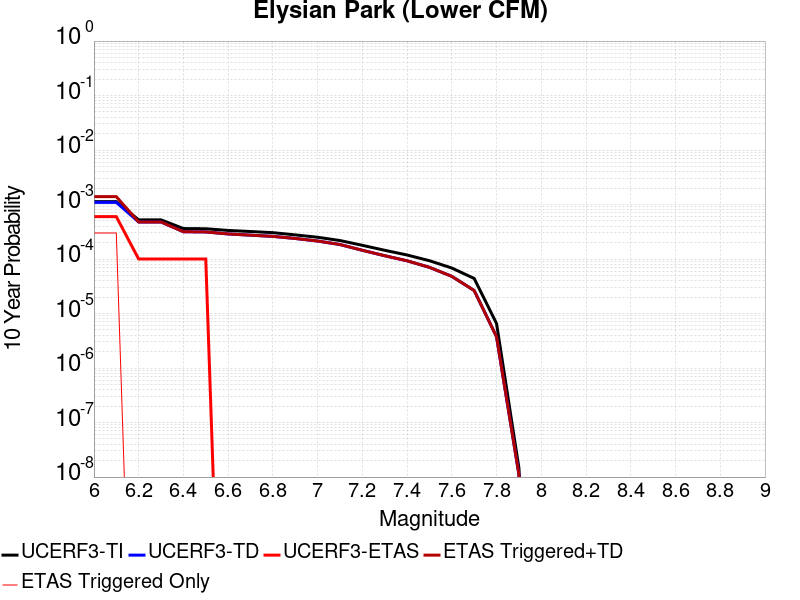 |

| Magnitude | 1 wk TI Prob | 1 wk TD Prob | 1 wk ETAS Prob | 1 wk ETAS/TD Gain | 1 wk ETAS Triggered+TD | 1 wk ETAS Triggered Only | 1 mo TI Prob | 1 mo TD Prob | 1 mo ETAS Prob | 1 mo ETAS/TD Gain | 1 mo ETAS Triggered+TD | 1 mo ETAS Triggered Only | 1 yr TI Prob | 1 yr TD Prob | 1 yr ETAS Prob | 1 yr ETAS/TD Gain | 1 yr ETAS Triggered+TD | 1 yr ETAS Triggered Only | 10 yr TI Prob | 10 yr TD Prob | 10 yr ETAS Prob | 10 yr ETAS/TD Gain | 10 yr ETAS Triggered+TD | 10 yr ETAS Triggered Only |
|-----|-----|-----|-----|-----|-----|-----|-----|-----|-----|-----|-----|-----|-----|-----|-----|-----|-----|-----|-----|-----|-----|-----|-----|-----|
| 6.0 | 2.1766498E-6 | 2.103101E-6 | 0.0 | 0.0 | 2.103101E-6 | 0.0 | 9.328466E-6 | 9.013267E-6 | 0.0 | 0.0 | 9.013267E-6 | 0.0 | 1.1356815E-4 | 1.0973245E-4 | 0.0 | 0.0 | 1.0973245E-4 | 0.0 | 0.0011351013 | 0.0010969245 | 5.4495916E-4 | 0.49680638 | 0.001641286 | 5.4495916E-4 |
| 6.1 | 2.1766498E-6 | 2.103101E-6 | 0.0 | 0.0 | 2.103101E-6 | 0.0 | 9.328466E-6 | 9.013267E-6 | 0.0 | 0.0 | 9.013267E-6 | 0.0 | 1.1356815E-4 | 1.0973245E-4 | 0.0 | 0.0 | 1.0973245E-4 | 0.0 | 0.0011351013 | 0.0010969245 | 5.4495916E-4 | 0.49680638 | 0.001641286 | 5.4495916E-4 |
| 6.2 | 1.0031182E-6 | 9.180558E-7 | 0.0 | 0.0 | 9.180558E-7 | 0.0 | 4.299071E-6 | 3.934519E-6 | 0.0 | 0.0 | 3.934519E-6 | 0.0 | 5.2339932E-5 | 4.7901816E-5 | 0.0 | 0.0 | 4.7901816E-5 | 0.0 | 5.2327604E-4 | 4.7892472E-4 | 0.0 | 0.0 | 4.7892472E-4 | 0.0 |
| 6.3 | 1.0031182E-6 | 9.180558E-7 | 0.0 | 0.0 | 9.180558E-7 | 0.0 | 4.299071E-6 | 3.934519E-6 | 0.0 | 0.0 | 3.934519E-6 | 0.0 | 5.2339932E-5 | 4.7901816E-5 | 0.0 | 0.0 | 4.7901816E-5 | 0.0 | 5.2327604E-4 | 4.7892472E-4 | 0.0 | 0.0 | 4.7892472E-4 | 0.0 |
| 6.4 | 6.9606244E-7 | 6.086536E-7 | 0.0 | 0.0 | 6.086536E-7 | 0.0 | 2.9831212E-6 | 2.6085127E-6 | 0.0 | 0.0 | 2.6085127E-6 | 0.0 | 3.6318896E-5 | 3.175818E-5 | 0.0 | 0.0 | 3.175818E-5 | 0.0 | 3.6312963E-4 | 3.1753667E-4 | 0.0 | 0.0 | 3.1753667E-4 | 0.0 |
| 6.5 | 6.901879E-7 | 6.0272254E-7 | 0.0 | 0.0 | 6.0272254E-7 | 0.0 | 2.9579448E-6 | 2.5830939E-6 | 0.0 | 0.0 | 2.5830939E-6 | 0.0 | 3.6012385E-5 | 3.144872E-5 | 0.0 | 0.0 | 3.144872E-5 | 0.0 | 3.600655E-4 | 3.144429E-4 | 0.0 | 0.0 | 3.144429E-4 | 0.0 |
| 6.6 | 6.4198554E-7 | 5.5412505E-7 | 0.0 | 0.0 | 5.5412505E-7 | 0.0 | 2.7513638E-6 | 2.3748194E-6 | 0.0 | 0.0 | 2.3748194E-6 | 0.0 | 3.3497337E-5 | 2.8913044E-5 | 0.0 | 0.0 | 2.8913044E-5 | 0.0 | 3.349229E-4 | 2.8909295E-4 | 0.0 | 0.0 | 2.8909295E-4 | 0.0 |
| 6.7 | 6.138733E-7 | 5.2580793E-7 | 0.0 | 0.0 | 5.2580793E-7 | 0.0 | 2.6308828E-6 | 2.2534605E-6 | 0.0 | 0.0 | 2.2534605E-6 | 0.0 | 3.203053E-5 | 2.7435537E-5 | 0.0 | 0.0 | 2.7435537E-5 | 0.0 | 3.2025913E-4 | 2.7432162E-4 | 0.0 | 0.0 | 2.7432162E-4 | 0.0 |
| 6.8 | 5.84778E-7 | 4.997639E-7 | 0.0 | 0.0 | 4.997639E-7 | 0.0 | 2.506189E-6 | 2.1418434E-6 | 0.0 | 0.0 | 2.1418434E-6 | 0.0 | 3.0512423E-5 | 2.6076634E-5 | 0.0 | 0.0 | 2.6076634E-5 | 0.0 | 3.0508233E-4 | 2.6073586E-4 | 0.0 | 0.0 | 2.6073586E-4 | 0.0 |
| 6.9 | 5.322785E-7 | 4.5748806E-7 | 0.0 | 0.0 | 4.5748806E-7 | 0.0 | 2.2811914E-6 | 1.9606614E-6 | 0.0 | 0.0 | 1.9606614E-6 | 0.0 | 2.7773152E-5 | 2.3870793E-5 | 0.0 | 0.0 | 2.3870793E-5 | 0.0 | 2.7769682E-4 | 2.3868239E-4 | 0.0 | 0.0 | 2.3868239E-4 | 0.0 |
| 7.0 | 4.8147206E-7 | 4.107299E-7 | 0.0 | 0.0 | 4.107299E-7 | 0.0 | 2.06345E-6 | 1.7602698E-6 | 0.0 | 0.0 | 1.7602698E-6 | 0.0 | 2.5122214E-5 | 2.1431075E-5 | 0.0 | 0.0 | 2.1431075E-5 | 0.0 | 2.5119373E-4 | 2.1429016E-4 | 0.0 | 0.0 | 2.1429016E-4 | 0.0 |
| 7.1 | 4.1932955E-7 | 3.5409474E-7 | 0.0 | 0.0 | 3.5409474E-7 | 0.0 | 1.7971255E-6 | 1.5175478E-6 | 0.0 | 0.0 | 1.5175478E-6 | 0.0 | 2.1879783E-5 | 1.8475988E-5 | 0.0 | 0.0 | 1.8475988E-5 | 0.0 | 2.1877629E-4 | 1.8474458E-4 | 0.0 | 0.0 | 1.8474458E-4 | 0.0 |
| 7.2 | 3.426051E-7 | 2.7771074E-7 | 0.0 | 0.0 | 2.7771074E-7 | 0.0 | 1.4683067E-6 | 1.1901883E-6 | 0.0 | 0.0 | 1.1901883E-6 | 0.0 | 1.7876488E-5 | 1.4490445E-5 | 0.0 | 0.0 | 1.4490445E-5 | 0.0 | 1.787505E-4 | 1.4489504E-4 | 0.0 | 0.0 | 1.4489504E-4 | 0.0 |
| 7.3 | 2.7771645E-7 | 2.2063207E-7 | 0.0 | 0.0 | 2.2063207E-7 | 0.0 | 1.1902127E-6 | 9.4556566E-7 | 0.0 | 0.0 | 9.4556566E-7 | 0.0 | 1.4490744E-5 | 1.1512201E-5 | 0.0 | 0.0 | 1.1512201E-5 | 0.0 | 1.4489799E-4 | 1.1511607E-4 | 0.0 | 0.0 | 1.1511607E-4 | 0.0 |
| 7.4 | 2.2756493E-7 | 1.7810005E-7 | 0.0 | 0.0 | 1.7810005E-7 | 0.0 | 9.752779E-7 | 7.632857E-7 | 0.0 | 0.0 | 7.632857E-7 | 0.0 | 1.1873944E-5 | 9.292963E-6 | 0.0 | 0.0 | 9.292963E-6 | 0.0 | 1.18733085E-4 | 9.2925766E-5 | 0.0 | 0.0 | 9.2925766E-5 | 0.0 |
| 7.5 | 1.7874558E-7 | 1.351719E-7 | 0.0 | 0.0 | 1.351719E-7 | 0.0 | 7.660522E-7 | 5.7930805E-7 | 0.0 | 0.0 | 5.7930805E-7 | 0.0 | 9.326646E-6 | 7.0530527E-6 | 0.0 | 0.0 | 7.0530527E-6 | 0.0 | 9.326255E-5 | 7.05283E-5 | 0.0 | 0.0 | 7.05283E-5 | 0.0 |
| 7.6 | 1.3124549E-7 | 9.230548E-8 | 0.0 | 0.0 | 9.230548E-8 | 0.0 | 5.624805E-7 | 3.9559487E-7 | 0.0 | 0.0 | 3.9559487E-7 | 0.0 | 6.8481786E-6 | 4.8163565E-6 | 0.0 | 0.0 | 4.8163565E-6 | 0.0 | 6.8479676E-5 | 4.816254E-5 | 0.0 | 0.0 | 4.816254E-5 | 0.0 |
| 7.7 | 8.439993E-8 | 5.0735117E-8 | 0.0 | 0.0 | 5.0735117E-8 | 0.0 | 3.6171392E-7 | 2.174362E-7 | 0.0 | 0.0 | 2.174362E-7 | 0.0 | 4.403858E-6 | 2.6472826E-6 | 0.0 | 0.0 | 2.6472826E-6 | 0.0 | 4.4037708E-5 | 2.6472522E-5 | 0.0 | 0.0 | 2.6472522E-5 | 0.0 |
| 7.8 | 1.2591407E-8 | 7.195422E-9 | 0.0 | 0.0 | 7.195422E-9 | 0.0 | 5.3963173E-8 | 3.0837526E-8 | 0.0 | 0.0 | 3.0837526E-8 | 0.0 | 6.570014E-7 | 3.7544683E-7 | 0.0 | 0.0 | 3.7544683E-7 | 0.0 | 6.5699946E-6 | 3.7544619E-6 | 0.0 | 0.0 | 3.7544619E-6 | 0.0 |
| 7.9 | 2.8324232E-11 | 2.1363689E-11 | 0.0 | 0.0 | 2.1363689E-11 | 0.0 | 1.2138957E-10 | 9.1558316E-11 | 0.0 | 0.0 | 9.1558316E-11 | 0.0 | 1.4779177E-9 | 1.1147231E-9 | 0.0 | 0.0 | 1.1147231E-9 | 0.0 | 1.4779177E-8 | 1.1147231E-8 | 0.0 | 0.0 | 1.1147231E-8 | 0.0 |

## Earthquake Valley
*[(top)](#table-of-contents)*

| 1 Week | 1 Month | 1 Year | 10 Year |
|-----|-----|-----|-----|
|  |  |  |  |

| Magnitude | 1 wk TI Prob | 1 wk TD Prob | 1 wk ETAS Prob | 1 wk ETAS/TD Gain | 1 wk ETAS Triggered+TD | 1 wk ETAS Triggered Only | 1 mo TI Prob | 1 mo TD Prob | 1 mo ETAS Prob | 1 mo ETAS/TD Gain | 1 mo ETAS Triggered+TD | 1 mo ETAS Triggered Only | 1 yr TI Prob | 1 yr TD Prob | 1 yr ETAS Prob | 1 yr ETAS/TD Gain | 1 yr ETAS Triggered+TD | 1 yr ETAS Triggered Only | 10 yr TI Prob | 10 yr TD Prob | 10 yr ETAS Prob | 10 yr ETAS/TD Gain | 10 yr ETAS Triggered+TD | 10 yr ETAS Triggered Only |
|-----|-----|-----|-----|-----|-----|-----|-----|-----|-----|-----|-----|-----|-----|-----|-----|-----|-----|-----|-----|-----|-----|-----|-----|-----|
| 6.0 | 1.9416384E-5 | 2.2544515E-5 | 0.0 | 0.0 | 2.2544515E-5 | 0.0 | 8.321042E-5 | 9.6616444E-5 | 0.0 | 0.0 | 9.6616444E-5 | 0.0 | 0.001012616 | 0.0011757897 | 0.0 | 0.0 | 0.0011757897 | 0.0 | 0.010080142 | 0.011707484 | 5.4495916E-4 | 0.04654793 | 0.012246062 | 5.4495916E-4 |
| 6.1 | 1.9416384E-5 | 2.2544515E-5 | 0.0 | 0.0 | 2.2544515E-5 | 0.0 | 8.321042E-5 | 9.6616444E-5 | 0.0 | 0.0 | 9.6616444E-5 | 0.0 | 0.001012616 | 0.0011757897 | 0.0 | 0.0 | 0.0011757897 | 0.0 | 0.010080142 | 0.011707484 | 5.4495916E-4 | 0.04654793 | 0.012246062 | 5.4495916E-4 |
| 6.2 | 1.9416384E-5 | 2.2544515E-5 | 0.0 | 0.0 | 2.2544515E-5 | 0.0 | 8.321042E-5 | 9.6616444E-5 | 0.0 | 0.0 | 9.6616444E-5 | 0.0 | 0.001012616 | 0.0011757897 | 0.0 | 0.0 | 0.0011757897 | 0.0 | 0.010080142 | 0.011707484 | 5.4495916E-4 | 0.04654793 | 0.012246062 | 5.4495916E-4 |
| 6.3 | 1.9416384E-5 | 2.2544515E-5 | 0.0 | 0.0 | 2.2544515E-5 | 0.0 | 8.321042E-5 | 9.6616444E-5 | 0.0 | 0.0 | 9.6616444E-5 | 0.0 | 0.001012616 | 0.0011757897 | 0.0 | 0.0 | 0.0011757897 | 0.0 | 0.010080142 | 0.011707484 | 5.4495916E-4 | 0.04654793 | 0.012246062 | 5.4495916E-4 |
| 6.4 | 1.9416384E-5 | 2.2544515E-5 | 0.0 | 0.0 | 2.2544515E-5 | 0.0 | 8.321042E-5 | 9.6616444E-5 | 0.0 | 0.0 | 9.6616444E-5 | 0.0 | 0.001012616 | 0.0011757897 | 0.0 | 0.0 | 0.0011757897 | 0.0 | 0.010080142 | 0.011707484 | 5.4495916E-4 | 0.04654793 | 0.012246062 | 5.4495916E-4 |
| 6.5 | 1.9389157E-5 | 2.2513153E-5 | 0.0 | 0.0 | 2.2513153E-5 | 0.0 | 8.309374E-5 | 9.648205E-5 | 0.0 | 0.0 | 9.648205E-5 | 0.0 | 0.0010111968 | 0.0011741553 | 0.0 | 0.0 | 0.0011741553 | 0.0 | 0.010066078 | 0.011691311 | 5.4495916E-4 | 0.04661232 | 0.012229899 | 5.4495916E-4 |
| 6.6 | 1.9389157E-5 | 2.2513153E-5 | 0.0 | 0.0 | 2.2513153E-5 | 0.0 | 8.309374E-5 | 9.648205E-5 | 0.0 | 0.0 | 9.648205E-5 | 0.0 | 0.0010111968 | 0.0011741553 | 0.0 | 0.0 | 0.0011741553 | 0.0 | 0.010066078 | 0.011691311 | 5.4495916E-4 | 0.04661232 | 0.012229899 | 5.4495916E-4 |
| 6.7 | 1.4925434E-5 | 1.717964E-5 | 0.0 | 0.0 | 1.717964E-5 | 0.0 | 6.396457E-5 | 7.362543E-5 | 0.0 | 0.0 | 7.362543E-5 | 0.0 | 7.7849044E-4 | 8.961057E-4 | 0.0 | 0.0 | 8.961057E-4 | 0.0 | 0.007757689 | 0.008933271 | 5.4495916E-4 | 0.06100331 | 0.009473362 | 5.4495916E-4 |
| 6.8 | 1.3570335E-5 | 1.559115E-5 | 0.0 | 0.0 | 1.559115E-5 | 0.0 | 5.8157282E-5 | 6.681796E-5 | 0.0 | 0.0 | 6.681796E-5 | 0.0 | 7.0783484E-4 | 8.1328687E-4 | 0.0 | 0.0 | 8.1328687E-4 | 0.0 | 0.0070558446 | 0.008111149 | 5.4495916E-4 | 0.06718643 | 0.008651688 | 5.4495916E-4 |
| 6.9 | 1.3570335E-5 | 1.559115E-5 | 0.0 | 0.0 | 1.559115E-5 | 0.0 | 5.8157282E-5 | 6.681796E-5 | 0.0 | 0.0 | 6.681796E-5 | 0.0 | 7.0783484E-4 | 8.1328687E-4 | 0.0 | 0.0 | 8.1328687E-4 | 0.0 | 0.0070558446 | 0.008111149 | 5.4495916E-4 | 0.06718643 | 0.008651688 | 5.4495916E-4 |
| 7.0 | 1.3433392E-5 | 1.5434925E-5 | 0.0 | 0.0 | 1.5434925E-5 | 0.0 | 5.757041E-5 | 6.614846E-5 | 0.0 | 0.0 | 6.614846E-5 | 0.0 | 7.0069433E-4 | 8.0514175E-4 | 0.0 | 0.0 | 8.0514175E-4 | 0.0 | 0.006984891 | 0.008030289 | 5.4495916E-4 | 0.06786296 | 0.008570871 | 5.4495916E-4 |
| 7.1 | 8.181609E-6 | 9.400889E-6 | 0.0 | 0.0 | 9.400889E-6 | 0.0 | 3.5063567E-5 | 4.028928E-5 | 0.0 | 0.0 | 4.028928E-5 | 0.0 | 4.268153E-4 | 4.904784E-4 | 0.0 | 0.0 | 4.904784E-4 | 0.0 | 0.0042599645 | 0.0049005137 | 0.0 | 0.0 | 0.0049005137 | 0.0 |
| 7.2 | 2.0663983E-7 | 1.7200274E-7 | 0.0 | 0.0 | 1.7200274E-7 | 0.0 | 8.855989E-7 | 7.371544E-7 | 0.0 | 0.0 | 7.371544E-7 | 0.0 | 1.0782113E-5 | 8.974822E-6 | 0.0 | 0.0 | 8.974822E-6 | 0.0 | 1.07815904E-4 | 8.974495E-5 | 0.0 | 0.0 | 8.974495E-5 | 0.0 |
| 7.3 | 2.0462376E-7 | 1.701601E-7 | 0.0 | 0.0 | 1.701601E-7 | 0.0 | 8.7695867E-7 | 7.292574E-7 | 0.0 | 0.0 | 7.292574E-7 | 0.0 | 1.0676919E-5 | 8.878676E-6 | 0.0 | 0.0 | 8.878676E-6 | 0.0 | 1.0676406E-4 | 8.878357E-5 | 0.0 | 0.0 | 8.878357E-5 | 0.0 |
| 7.4 | 2.0171088E-7 | 1.6799007E-7 | 0.0 | 0.0 | 1.6799007E-7 | 0.0 | 8.644749E-7 | 7.199572E-7 | 0.0 | 0.0 | 7.199572E-7 | 0.0 | 1.0524931E-5 | 8.765447E-6 | 0.0 | 0.0 | 8.765447E-6 | 0.0 | 1.05244326E-4 | 8.765137E-5 | 0.0 | 0.0 | 8.765137E-5 | 0.0 |
| 7.5 | 1.4847944E-7 | 1.2507505E-7 | 0.0 | 0.0 | 1.2507505E-7 | 0.0 | 6.363403E-7 | 5.360358E-7 | 0.0 | 0.0 | 5.360358E-7 | 0.0 | 7.747416E-6 | 6.526219E-6 | 0.0 | 0.0 | 6.526219E-6 | 0.0 | 7.747146E-5 | 6.526049E-5 | 0.0 | 0.0 | 6.526049E-5 | 0.0 |
| 7.6 | 1.3185847E-7 | 1.10822064E-7 | 0.0 | 0.0 | 1.10822064E-7 | 0.0 | 5.6510765E-7 | 4.7495163E-7 | 0.0 | 0.0 | 4.7495163E-7 | 0.0 | 6.8801637E-6 | 5.7825227E-6 | 0.0 | 0.0 | 5.7825227E-6 | 0.0 | 6.8799505E-5 | 5.7823934E-5 | 0.0 | 0.0 | 5.7823934E-5 | 0.0 |
| 7.7 | 2.8609954E-8 | 1.4104295E-8 | 0.0 | 0.0 | 1.4104295E-8 | 0.0 | 1.2261408E-7 | 6.044697E-8 | 0.0 | 0.0 | 6.044697E-8 | 0.0 | 1.4928254E-6 | 7.3594174E-7 | 0.0 | 0.0 | 7.3594174E-7 | 0.0 | 1.4928154E-5 | 7.3593983E-6 | 0.0 | 0.0 | 7.3593983E-6 | 0.0 |
| 7.8 | 6.527266E-9 | 2.906815E-9 | 0.0 | 0.0 | 2.906815E-9 | 0.0 | 2.7973995E-8 | 1.2457779E-8 | 0.0 | 0.0 | 1.2457779E-8 | 0.0 | 3.4058334E-7 | 1.5167345E-7 | 0.0 | 0.0 | 1.5167345E-7 | 0.0 | 3.4058282E-6 | 1.5167336E-6 | 0.0 | 0.0 | 1.5167336E-6 | 0.0 |
| 7.9 | 1.2898267E-9 | 7.108556E-10 | 0.0 | 0.0 | 7.108556E-10 | 0.0 | 5.527829E-9 | 3.046524E-9 | 0.0 | 0.0 | 3.046524E-9 | 0.0 | 6.7301315E-8 | 3.709143E-8 | 0.0 | 0.0 | 3.709143E-8 | 0.0 | 6.7301295E-7 | 3.7091428E-7 | 0.0 | 0.0 | 3.7091428E-7 | 0.0 |

## Mission (connected) 2011 CFM
*[(top)](#table-of-contents)*

| 1 Week | 1 Month | 1 Year | 10 Year |
|-----|-----|-----|-----|
|  |  |  |  |

| Magnitude | 1 wk TI Prob | 1 wk TD Prob | 1 wk ETAS Prob | 1 wk ETAS/TD Gain | 1 wk ETAS Triggered+TD | 1 wk ETAS Triggered Only | 1 mo TI Prob | 1 mo TD Prob | 1 mo ETAS Prob | 1 mo ETAS/TD Gain | 1 mo ETAS Triggered+TD | 1 mo ETAS Triggered Only | 1 yr TI Prob | 1 yr TD Prob | 1 yr ETAS Prob | 1 yr ETAS/TD Gain | 1 yr ETAS Triggered+TD | 1 yr ETAS Triggered Only | 10 yr TI Prob | 10 yr TD Prob | 10 yr ETAS Prob | 10 yr ETAS/TD Gain | 10 yr ETAS Triggered+TD | 10 yr ETAS Triggered Only |
|-----|-----|-----|-----|-----|-----|-----|-----|-----|-----|-----|-----|-----|-----|-----|-----|-----|-----|-----|-----|-----|-----|-----|-----|-----|
| 6.0 | 1.8735573E-5 | 2.6617612E-5 | 0.0 | 0.0 | 2.6617612E-5 | 0.0 | 8.029284E-5 | 1.1406919E-4 | 0.0 | 0.0 | 1.1406919E-4 | 0.0 | 9.771269E-4 | 0.0013878148 | 0.0 | 0.0 | 0.0013878148 | 0.0 | 0.009728416 | 0.013805085 | 5.4495916E-4 | 0.039475247 | 0.01434252 | 5.4495916E-4 |
| 6.1 | 1.7515964E-5 | 2.5260504E-5 | 0.0 | 0.0 | 2.5260504E-5 | 0.0 | 7.506625E-5 | 1.082535E-4 | 0.0 | 0.0 | 1.082535E-4 | 0.0 | 9.135484E-4 | 0.0013170963 | 0.0 | 0.0 | 0.0013170963 | 0.0 | 0.009098019 | 0.013106428 | 5.4495916E-4 | 0.041579533 | 0.0136442445 | 5.4495916E-4 |
| 6.2 | 1.6486343E-5 | 2.4106652E-5 | 0.0 | 0.0 | 2.4106652E-5 | 0.0 | 7.065384E-5 | 1.0330882E-4 | 0.0 | 0.0 | 1.0330882E-4 | 0.0 | 8.5987104E-4 | 0.0012569661 | 0.0 | 0.0 | 0.0012569661 | 0.0 | 0.008565514 | 0.012512081 | 5.4495916E-4 | 0.043554638 | 0.013050222 | 5.4495916E-4 |
| 6.3 | 1.5229385E-5 | 2.2540813E-5 | 0.0 | 0.0 | 2.2540813E-5 | 0.0 | 6.526716E-5 | 9.659859E-5 | 0.0 | 0.0 | 9.659859E-5 | 0.0 | 7.9433795E-4 | 0.0011753603 | 0.0 | 0.0 | 0.0011753603 | 0.0 | 0.007915046 | 0.011707519 | 5.4495916E-4 | 0.04654779 | 0.012246098 | 5.4495916E-4 |
| 6.4 | 1.4435828E-5 | 2.115143E-5 | 0.0 | 0.0 | 2.115143E-5 | 0.0 | 6.186637E-5 | 9.064454E-5 | 0.0 | 0.0 | 9.064454E-5 | 0.0 | 7.529627E-4 | 0.0011029466 | 0.0 | 0.0 | 0.0011029466 | 0.0 | 0.007504165 | 0.010995562 | 5.4495916E-4 | 0.049561735 | 0.011534529 | 5.4495916E-4 |
| 6.5 | 1.30127955E-5 | 1.8803286E-5 | 0.0 | 0.0 | 1.8803286E-5 | 0.0 | 5.576793E-5 | 8.0582766E-5 | 0.0 | 0.0 | 8.0582766E-5 | 0.0 | 6.78763E-4 | 9.806219E-4 | 0.0 | 0.0 | 9.806219E-4 | 0.0 | 0.0067669353 | 0.009794649 | 0.0 | 0.0 | 0.009794649 | 0.0 |
| 6.6 | 1.1220718E-5 | 1.617225E-5 | 0.0 | 0.0 | 1.617225E-5 | 0.0 | 4.8087906E-5 | 6.930778E-5 | 0.0 | 0.0 | 6.930778E-5 | 0.0 | 5.8531296E-4 | 8.434953E-4 | 0.0 | 0.0 | 8.434953E-4 | 0.0 | 0.005837737 | 0.008438742 | 0.0 | 0.0 | 0.008438742 | 0.0 |
| 6.7 | 8.086152E-6 | 1.15681705E-5 | 0.0 | 0.0 | 1.15681705E-5 | 0.0 | 3.4654473E-5 | 4.9576935E-5 | 0.0 | 0.0 | 4.9576935E-5 | 0.0 | 4.2183654E-4 | 6.0343277E-4 | 0.0 | 0.0 | 6.0343277E-4 | 0.0 | 0.004210367 | 0.006058275 | 0.0 | 0.0 | 0.006058275 | 0.0 |
| 6.8 | 6.8361655E-6 | 1.0035145E-5 | 0.0 | 0.0 | 1.0035145E-5 | 0.0 | 2.9297524E-5 | 4.3007058E-5 | 0.0 | 0.0 | 4.3007058E-5 | 0.0 | 3.5663895E-4 | 5.2348577E-4 | 0.0 | 0.0 | 5.2348577E-4 | 0.0 | 0.0035606713 | 0.0052582975 | 0.0 | 0.0 | 0.0052582975 | 0.0 |
| 6.9 | 5.2517353E-6 | 7.740318E-6 | 0.0 | 0.0 | 7.740318E-6 | 0.0 | 2.2507242E-5 | 3.317237E-5 | 0.0 | 0.0 | 3.317237E-5 | 0.0 | 2.739912E-4 | 4.0379903E-4 | 0.0 | 0.0 | 4.0379903E-4 | 0.0 | 0.0027365363 | 0.0040651336 | 0.0 | 0.0 | 0.0040651336 | 0.0 |
| 7.0 | 4.4602784E-6 | 6.59002E-6 | 0.0 | 0.0 | 6.59002E-6 | 0.0 | 1.911534E-5 | 2.8242639E-5 | 0.0 | 0.0 | 2.8242639E-5 | 0.0 | 2.327044E-4 | 3.4380003E-4 | 0.0 | 0.0 | 3.4380003E-4 | 0.0 | 0.0023246086 | 0.00346606 | 0.0 | 0.0 | 0.00346606 | 0.0 |
| 7.1 | 4.1492594E-6 | 6.1442997E-6 | 0.0 | 0.0 | 6.1442997E-6 | 0.0 | 1.7782419E-5 | 2.633245E-5 | 0.0 | 0.0 | 2.633245E-5 | 0.0 | 2.1647944E-4 | 3.2055055E-4 | 0.0 | 0.0 | 3.2055055E-4 | 0.0 | 0.0021626868 | 0.0032336465 | 0.0 | 0.0 | 0.0032336465 | 0.0 |
| 7.2 | 2.213247E-6 | 3.2849764E-6 | 0.0 | 0.0 | 3.2849764E-6 | 0.0 | 9.485309E-6 | 1.4078394E-5 | 0.0 | 0.0 | 1.4078394E-5 | 0.0 | 1.15477524E-4 | 1.71391E-4 | 0.0 | 0.0 | 1.71391E-4 | 0.0 | 0.0011541754 | 0.0017424204 | 0.0 | 0.0 | 0.0017424204 | 0.0 |
| 7.3 | 1.7362703E-6 | 2.6703128E-6 | 0.0 | 0.0 | 2.6703128E-6 | 0.0 | 7.4411373E-6 | 1.1444148E-5 | 0.0 | 0.0 | 1.1444148E-5 | 0.0 | 9.0592075E-5 | 1.3932362E-4 | 0.0 | 0.0 | 1.3932362E-4 | 0.0 | 9.0555154E-4 | 0.0014187829 | 0.0 | 0.0 | 0.0014187829 | 0.0 |
| 7.4 | 1.1628409E-6 | 1.7967243E-6 | 0.0 | 0.0 | 1.7967243E-6 | 0.0 | 4.9835944E-6 | 7.700224E-6 | 0.0 | 0.0 | 7.700224E-6 | 0.0 | 6.0673574E-5 | 9.374621E-5 | 0.0 | 0.0 | 9.374621E-5 | 0.0 | 6.065701E-4 | 9.58822E-4 | 0.0 | 0.0 | 9.58822E-4 | 0.0 |
| 7.5 | 5.5610667E-7 | 8.9541584E-7 | 0.0 | 0.0 | 8.9541584E-7 | 0.0 | 2.3833122E-6 | 3.8374906E-6 | 0.0 | 0.0 | 3.8374906E-6 | 0.0 | 2.9016439E-5 | 4.672045E-5 | 0.0 | 0.0 | 4.672045E-5 | 0.0 | 2.901265E-4 | 4.8461917E-4 | 0.0 | 0.0 | 4.8461917E-4 | 0.0 |
| 7.6 | 4.4307663E-7 | 7.423254E-7 | 0.0 | 0.0 | 7.423254E-7 | 0.0 | 1.8988985E-6 | 3.1813906E-6 | 0.0 | 0.0 | 3.1813906E-6 | 0.0 | 2.3118844E-5 | 3.8732745E-5 | 0.0 | 0.0 | 3.8732745E-5 | 0.0 | 2.3116439E-4 | 4.0408003E-4 | 0.0 | 0.0 | 4.0408003E-4 | 0.0 |
| 7.7 | 3.639119E-7 | 6.033907E-7 | 0.0 | 0.0 | 6.033907E-7 | 0.0 | 1.5596215E-6 | 2.5859574E-6 | 0.0 | 0.0 | 2.5859574E-6 | 0.0 | 1.8988227E-5 | 3.1483578E-5 | 0.0 | 0.0 | 3.1483578E-5 | 0.0 | 1.8986604E-4 | 3.3084108E-4 | 0.0 | 0.0 | 3.3084108E-4 | 0.0 |
| 7.8 | 3.1152942E-7 | 5.206889E-7 | 0.0 | 0.0 | 5.206889E-7 | 0.0 | 1.3351254E-6 | 2.231522E-6 | 0.0 | 0.0 | 2.231522E-6 | 0.0 | 1.6255031E-5 | 2.7168444E-5 | 0.0 | 0.0 | 2.7168444E-5 | 0.0 | 1.6253842E-4 | 2.8432807E-4 | 0.0 | 0.0 | 2.8432807E-4 | 0.0 |
| 7.9 | 1.8035962E-7 | 3.5540276E-7 | 0.0 | 0.0 | 3.5540276E-7 | 0.0 | 7.729696E-7 | 1.5231539E-6 | 0.0 | 0.0 | 1.5231539E-6 | 0.0 | 9.410865E-6 | 1.854424E-5 | 0.0 | 0.0 | 1.854424E-5 | 0.0 | 9.410465E-5 | 1.9265003E-4 | 0.0 | 0.0 | 1.9265003E-4 | 0.0 |
| 8.0 | 9.279334E-8 | 1.8900911E-7 | 0.0 | 0.0 | 1.8900911E-7 | 0.0 | 3.976857E-7 | 8.100388E-7 | 0.0 | 0.0 | 8.100388E-7 | 0.0 | 4.841813E-6 | 9.862179E-6 | 0.0 | 0.0 | 9.862179E-6 | 0.0 | 4.841707E-5 | 1.01374E-4 | 0.0 | 0.0 | 1.01374E-4 | 0.0 |
| 8.1 | 5.9253985E-8 | 1.1385916E-7 | 0.0 | 0.0 | 1.1385916E-7 | 0.0 | 2.5394561E-7 | 4.879677E-7 | 0.0 | 0.0 | 4.879677E-7 | 0.0 | 3.0917836E-6 | 5.9409913E-6 | 0.0 | 0.0 | 5.9409913E-6 | 0.0 | 3.0917407E-5 | 6.0916063E-5 | 0.0 | 0.0 | 6.0916063E-5 | 0.0 |

## San Andreas (Mojave N)
*[(top)](#table-of-contents)*

| 1 Week | 1 Month | 1 Year | 10 Year |
|-----|-----|-----|-----|
|  |  |  |  |

| Magnitude | 1 wk TI Prob | 1 wk TD Prob | 1 wk ETAS Prob | 1 wk ETAS/TD Gain | 1 wk ETAS Triggered+TD | 1 wk ETAS Triggered Only | 1 mo TI Prob | 1 mo TD Prob | 1 mo ETAS Prob | 1 mo ETAS/TD Gain | 1 mo ETAS Triggered+TD | 1 mo ETAS Triggered Only | 1 yr TI Prob | 1 yr TD Prob | 1 yr ETAS Prob | 1 yr ETAS/TD Gain | 1 yr ETAS Triggered+TD | 1 yr ETAS Triggered Only | 10 yr TI Prob | 10 yr TD Prob | 10 yr ETAS Prob | 10 yr ETAS/TD Gain | 10 yr ETAS Triggered+TD | 10 yr ETAS Triggered Only |
|-----|-----|-----|-----|-----|-----|-----|-----|-----|-----|-----|-----|-----|-----|-----|-----|-----|-----|-----|-----|-----|-----|-----|-----|-----|
| 6.0 | 9.877682E-5 | 1.8664719E-4 | 0.0 | 0.0 | 1.8664719E-4 | 0.0 | 4.2326056E-4 | 7.9967146E-4 | 0.0 | 0.0 | 7.9967146E-4 | 0.0 | 0.0051410277 | 0.009692651 | 5.4495916E-4 | 0.05622395 | 0.0102323275 | 5.4495916E-4 | 0.05023708 | 0.095066346 | 5.4495916E-4 | 0.0057324083 | 0.0955595 | 5.4495916E-4 |
| 6.1 | 9.877682E-5 | 1.8664719E-4 | 0.0 | 0.0 | 1.8664719E-4 | 0.0 | 4.2326056E-4 | 7.9967146E-4 | 0.0 | 0.0 | 7.9967146E-4 | 0.0 | 0.0051410277 | 0.009692651 | 5.4495916E-4 | 0.05622395 | 0.0102323275 | 5.4495916E-4 | 0.05023708 | 0.095066346 | 5.4495916E-4 | 0.0057324083 | 0.0955595 | 5.4495916E-4 |
| 6.2 | 9.877682E-5 | 1.8664719E-4 | 0.0 | 0.0 | 1.8664719E-4 | 0.0 | 4.2326056E-4 | 7.9967146E-4 | 0.0 | 0.0 | 7.9967146E-4 | 0.0 | 0.0051410277 | 0.009692651 | 5.4495916E-4 | 0.05622395 | 0.0102323275 | 5.4495916E-4 | 0.05023708 | 0.095066346 | 5.4495916E-4 | 0.0057324083 | 0.0955595 | 5.4495916E-4 |
| 6.3 | 9.877682E-5 | 1.8664719E-4 | 0.0 | 0.0 | 1.8664719E-4 | 0.0 | 4.2326056E-4 | 7.9967146E-4 | 0.0 | 0.0 | 7.9967146E-4 | 0.0 | 0.0051410277 | 0.009692651 | 5.4495916E-4 | 0.05622395 | 0.0102323275 | 5.4495916E-4 | 0.05023708 | 0.095066346 | 5.4495916E-4 | 0.0057324083 | 0.0955595 | 5.4495916E-4 |
| 6.4 | 9.877682E-5 | 1.8664719E-4 | 0.0 | 0.0 | 1.8664719E-4 | 0.0 | 4.2326056E-4 | 7.9967146E-4 | 0.0 | 0.0 | 7.9967146E-4 | 0.0 | 0.0051410277 | 0.009692651 | 5.4495916E-4 | 0.05622395 | 0.0102323275 | 5.4495916E-4 | 0.05023708 | 0.095066346 | 5.4495916E-4 | 0.0057324083 | 0.0955595 | 5.4495916E-4 |
| 6.5 | 9.861474E-5 | 1.8638701E-4 | 0.0 | 0.0 | 1.8638701E-4 | 0.0 | 4.2256617E-4 | 7.985571E-4 | 0.0 | 0.0 | 7.985571E-4 | 0.0 | 0.0051326132 | 0.009679204 | 5.4495916E-4 | 0.05630206 | 0.0102188885 | 5.4495916E-4 | 0.050156746 | 0.09494469 | 5.4495916E-4 | 0.0057397536 | 0.09543791 | 5.4495916E-4 |
| 6.6 | 9.861474E-5 | 1.8638701E-4 | 0.0 | 0.0 | 1.8638701E-4 | 0.0 | 4.2256617E-4 | 7.985571E-4 | 0.0 | 0.0 | 7.985571E-4 | 0.0 | 0.0051326132 | 0.009679204 | 5.4495916E-4 | 0.05630206 | 0.0102188885 | 5.4495916E-4 | 0.050156746 | 0.09494469 | 5.4495916E-4 | 0.0057397536 | 0.09543791 | 5.4495916E-4 |
| 6.7 | 9.8552715E-5 | 1.8628738E-4 | 0.0 | 0.0 | 1.8628738E-4 | 0.0 | 4.223004E-4 | 7.9813035E-4 | 0.0 | 0.0 | 7.9813035E-4 | 0.0 | 0.0051293927 | 0.009674055 | 5.4495916E-4 | 0.05633203 | 0.010213742 | 5.4495916E-4 | 0.050125998 | 0.094897926 | 5.4495916E-4 | 0.005742582 | 0.09539117 | 5.4495916E-4 |
| 6.8 | 9.8464974E-5 | 1.8614107E-4 | 0.0 | 0.0 | 1.8614107E-4 | 0.0 | 4.219245E-4 | 7.975037E-4 | 0.0 | 0.0 | 7.975037E-4 | 0.0 | 0.0051248376 | 0.009666493 | 5.4495916E-4 | 0.056376096 | 0.010206184 | 5.4495916E-4 | 0.05008251 | 0.09482878 | 5.4495916E-4 | 0.0057467693 | 0.09532206 | 5.4495916E-4 |
| 6.9 | 9.825824E-5 | 1.8582496E-4 | 0.0 | 0.0 | 1.8582496E-4 | 0.0 | 4.2103877E-4 | 7.9614983E-4 | 0.0 | 0.0 | 7.9614983E-4 | 0.0 | 0.0051141046 | 0.009650156 | 5.4495916E-4 | 0.056471538 | 0.0101898555 | 5.4495916E-4 | 0.049980022 | 0.094679005 | 5.4495916E-4 | 0.0057558604 | 0.09517237 | 5.4495916E-4 |
| 7.0 | 9.781462E-5 | 1.8514665E-4 | 0.0 | 0.0 | 1.8514665E-4 | 0.0 | 4.1913814E-4 | 7.932446E-4 | 0.0 | 0.0 | 7.932446E-4 | 0.0 | 0.005091073 | 0.009615097 | 5.4495916E-4 | 0.056677446 | 0.010154816 | 5.4495916E-4 | 0.04976007 | 0.094358064 | 5.4495916E-4 | 0.0057754377 | 0.094851606 | 5.4495916E-4 |
| 7.1 | 9.7121134E-5 | 1.8417464E-4 | 0.0 | 0.0 | 1.8417464E-4 | 0.0 | 4.1616702E-4 | 7.8908127E-4 | 0.0 | 0.0 | 7.8908127E-4 | 0.0 | 0.005055068 | 0.009564855 | 5.4495916E-4 | 0.056975156 | 0.010104602 | 5.4495916E-4 | 0.04941613 | 0.09389799 | 5.4495916E-4 | 0.0058037355 | 0.09439178 | 5.4495916E-4 |
| 7.2 | 9.663819E-5 | 1.8349035E-4 | 0.0 | 0.0 | 1.8349035E-4 | 0.0 | 4.1409794E-4 | 7.861504E-4 | 0.0 | 0.0 | 7.861504E-4 | 0.0 | 0.0050299936 | 0.009529484 | 5.4495916E-4 | 0.057186633 | 0.01006925 | 5.4495916E-4 | 0.049176537 | 0.0935736 | 5.4495916E-4 | 0.0058238558 | 0.094067566 | 5.4495916E-4 |
| 7.3 | 9.6277574E-5 | 1.8302524E-4 | 0.0 | 0.0 | 1.8302524E-4 | 0.0 | 4.125529E-4 | 7.841583E-4 | 0.0 | 0.0 | 7.841583E-4 | 0.0 | 0.0050112694 | 0.009505442 | 5.4495916E-4 | 0.057331275 | 0.010045221 | 5.4495916E-4 | 0.04899759 | 0.09335072 | 5.4495916E-4 | 0.0058377604 | 0.09384481 | 5.4495916E-4 |
| 7.4 | 9.593308E-5 | 1.8243381E-4 | 0.0 | 0.0 | 1.8243381E-4 | 0.0 | 4.1107697E-4 | 7.8162504E-4 | 0.0 | 0.0 | 7.8162504E-4 | 0.0 | 0.0049933824 | 0.009474869 | 5.4495916E-4 | 0.05751627 | 0.010014664 | 5.4495916E-4 | 0.04882661 | 0.093072906 | 5.4495916E-4 | 0.0058551854 | 0.09356714 | 5.4495916E-4 |
| 7.5 | 9.561707E-5 | 1.8190441E-4 | 0.0 | 0.0 | 1.8190441E-4 | 0.0 | 4.0972308E-4 | 7.793576E-4 | 0.0 | 0.0 | 7.793576E-4 | 0.0 | 0.0049769743 | 0.009447503 | 5.4495916E-4 | 0.057682876 | 0.009987313 | 5.4495916E-4 | 0.048669744 | 0.09282255 | 5.4495916E-4 | 0.005870978 | 0.09331693 | 5.4495916E-4 |
| 7.6 | 9.418194E-5 | 1.7848455E-4 | 0.0 | 0.0 | 1.7848455E-4 | 0.0 | 4.0357444E-4 | 7.647097E-4 | 0.0 | 0.0 | 7.647097E-4 | 0.0 | 0.004902454 | 0.009270695 | 5.4495916E-4 | 0.058782987 | 0.009810601 | 5.4495916E-4 | 0.047957025 | 0.09122918 | 5.4495916E-4 | 0.005973518 | 0.09172442 | 5.4495916E-4 |
| 7.7 | 8.202141E-5 | 1.5360561E-4 | 0.0 | 0.0 | 1.5360561E-4 | 0.0 | 3.51473E-4 | 6.581437E-4 | 0.0 | 0.0 | 6.581437E-4 | 0.0 | 0.00427079 | 0.007983509 | 5.4495916E-4 | 0.068260595 | 0.008524118 | 5.4495916E-4 | 0.04189639 | 0.07926038 | 5.4495916E-4 | 0.0068755555 | 0.07976214 | 5.4495916E-4 |
| 7.8 | 7.2859846E-5 | 1.3920998E-4 | 0.0 | 0.0 | 1.3920998E-4 | 0.0 | 3.1221908E-4 | 5.9647777E-4 | 0.0 | 0.0 | 5.9647777E-4 | 0.0 | 0.003794643 | 0.0072379718 | 5.4495916E-4 | 0.07529169 | 0.0077789864 | 5.4495916E-4 | 0.037304975 | 0.072028324 | 5.4495916E-4 | 0.0075659007 | 0.07253403 | 5.4495916E-4 |
| 7.9 | 5.3874453E-5 | 9.6238386E-5 | 0.0 | 0.0 | 9.6238386E-5 | 0.0 | 2.3087008E-4 | 4.1238504E-4 | 0.0 | 0.0 | 4.1238504E-4 | 0.0 | 0.0028072202 | 0.005009239 | 5.4495916E-4 | 0.1087908 | 0.0055514686 | 5.4495916E-4 | 0.02772022 | 0.050442543 | 5.4495916E-4 | 0.010803562 | 0.05096001 | 5.4495916E-4 |
| 8.0 | 3.468538E-5 | 5.1783452E-5 | 0.0 | 0.0 | 5.1783452E-5 | 0.0 | 1.4864317E-4 | 2.219102E-4 | 0.0 | 0.0 | 2.219102E-4 | 0.0 | 0.0018082283 | 0.002698411 | 0.0 | 0.0 | 0.002698411 | 0.0 | 0.017935853 | 0.027728014 | 0.0 | 0.0 | 0.027728014 | 0.0 |
| 8.1 | 1.9152367E-5 | 1.8203265E-5 | 0.0 | 0.0 | 1.8203265E-5 | 0.0 | 8.207899E-5 | 7.801166E-5 | 0.0 | 0.0 | 7.801166E-5 | 0.0 | 9.988535E-4 | 9.493787E-4 | 0.0 | 0.0 | 9.493787E-4 | 0.0 | 0.009943757 | 0.010226626 | 0.0 | 0.0 | 0.010226626 | 0.0 |
| 8.2 | 8.643924E-6 | 5.0104E-6 | 0.0 | 0.0 | 5.0104E-6 | 0.0 | 3.704486E-5 | 2.1472966E-5 | 0.0 | 0.0 | 2.1472966E-5 | 0.0 | 4.5092785E-4 | 2.6140205E-4 | 0.0 | 0.0 | 2.6140205E-4 | 0.0 | 0.0045001395 | 0.002993769 | 0.0 | 0.0 | 0.002993769 | 0.0 |
| 8.3 | 1.983087E-6 | 6.880041E-7 | 0.0 | 0.0 | 6.880041E-7 | 0.0 | 8.498917E-6 | 2.9485857E-6 | 0.0 | 0.0 | 2.9485857E-6 | 0.0 | 1.034694E-4 | 3.589845E-5 | 0.0 | 0.0 | 3.589845E-5 | 0.0 | 0.0010342124 | 4.2701262E-4 | 0.0 | 0.0 | 4.2701262E-4 | 0.0 |

## Mount Diablo Thrust South
*[(top)](#table-of-contents)*

| 1 Week | 1 Month | 1 Year | 10 Year |
|-----|-----|-----|-----|
|  |  |  |  |

| Magnitude | 1 wk TI Prob | 1 wk TD Prob | 1 wk ETAS Prob | 1 wk ETAS/TD Gain | 1 wk ETAS Triggered+TD | 1 wk ETAS Triggered Only | 1 mo TI Prob | 1 mo TD Prob | 1 mo ETAS Prob | 1 mo ETAS/TD Gain | 1 mo ETAS Triggered+TD | 1 mo ETAS Triggered Only | 1 yr TI Prob | 1 yr TD Prob | 1 yr ETAS Prob | 1 yr ETAS/TD Gain | 1 yr ETAS Triggered+TD | 1 yr ETAS Triggered Only | 10 yr TI Prob | 10 yr TD Prob | 10 yr ETAS Prob | 10 yr ETAS/TD Gain | 10 yr ETAS Triggered+TD | 10 yr ETAS Triggered Only |
|-----|-----|-----|-----|-----|-----|-----|-----|-----|-----|-----|-----|-----|-----|-----|-----|-----|-----|-----|-----|-----|-----|-----|-----|-----|
| 6.0 | 2.2377444E-5 | 2.6891565E-5 | 0.0 | 0.0 | 2.6891565E-5 | 0.0 | 9.5899806E-5 | 1.1524554E-4 | 0.0 | 0.0 | 1.1524554E-4 | 0.0 | 0.0011669548 | 0.0014024085 | 0.0 | 0.0 | 0.0014024085 | 0.0 | 0.011608457 | 0.013955617 | 5.4495916E-4 | 0.039049447 | 0.014492971 | 5.4495916E-4 |
| 6.1 | 2.2377444E-5 | 2.6891565E-5 | 0.0 | 0.0 | 2.6891565E-5 | 0.0 | 9.5899806E-5 | 1.1524554E-4 | 0.0 | 0.0 | 1.1524554E-4 | 0.0 | 0.0011669548 | 0.0014024085 | 0.0 | 0.0 | 0.0014024085 | 0.0 | 0.011608457 | 0.013955617 | 5.4495916E-4 | 0.039049447 | 0.014492971 | 5.4495916E-4 |
| 6.2 | 2.2377444E-5 | 2.6891565E-5 | 0.0 | 0.0 | 2.6891565E-5 | 0.0 | 9.5899806E-5 | 1.1524554E-4 | 0.0 | 0.0 | 1.1524554E-4 | 0.0 | 0.0011669548 | 0.0014024085 | 0.0 | 0.0 | 0.0014024085 | 0.0 | 0.011608457 | 0.013955617 | 5.4495916E-4 | 0.039049447 | 0.014492971 | 5.4495916E-4 |
| 6.3 | 2.2377444E-5 | 2.6891565E-5 | 0.0 | 0.0 | 2.6891565E-5 | 0.0 | 9.5899806E-5 | 1.1524554E-4 | 0.0 | 0.0 | 1.1524554E-4 | 0.0 | 0.0011669548 | 0.0014024085 | 0.0 | 0.0 | 0.0014024085 | 0.0 | 0.011608457 | 0.013955617 | 5.4495916E-4 | 0.039049447 | 0.014492971 | 5.4495916E-4 |
| 6.4 | 1.2228463E-5 | 1.4708772E-5 | 0.0 | 0.0 | 1.4708772E-5 | 0.0 | 5.2406645E-5 | 6.303615E-5 | 0.0 | 0.0 | 6.303615E-5 | 0.0 | 6.378641E-4 | 7.672076E-4 | 0.0 | 0.0 | 7.672076E-4 | 0.0 | 0.0063603627 | 0.007647469 | 5.4495916E-4 | 0.07126006 | 0.008188261 | 5.4495916E-4 |
| 6.5 | 1.2228463E-5 | 1.4708772E-5 | 0.0 | 0.0 | 1.4708772E-5 | 0.0 | 5.2406645E-5 | 6.303615E-5 | 0.0 | 0.0 | 6.303615E-5 | 0.0 | 6.378641E-4 | 7.672076E-4 | 0.0 | 0.0 | 7.672076E-4 | 0.0 | 0.0063603627 | 0.007647469 | 5.4495916E-4 | 0.07126006 | 0.008188261 | 5.4495916E-4 |
| 6.6 | 1.2068118E-5 | 1.4514011E-5 | 0.0 | 0.0 | 1.4514011E-5 | 0.0 | 5.1719482E-5 | 6.220149E-5 | 0.0 | 0.0 | 6.220149E-5 | 0.0 | 6.2950276E-4 | 7.570528E-4 | 0.0 | 0.0 | 7.570528E-4 | 0.0 | 0.006277225 | 0.007546615 | 5.4495916E-4 | 0.07221239 | 0.008087462 | 5.4495916E-4 |
| 6.7 | 1.1499428E-5 | 1.3838028E-5 | 0.0 | 0.0 | 1.3838028E-5 | 0.0 | 4.9282335E-5 | 5.930456E-5 | 0.0 | 0.0 | 5.930456E-5 | 0.0 | 5.9984723E-4 | 7.218065E-4 | 0.0 | 0.0 | 7.218065E-4 | 0.0 | 0.0059823063 | 0.007196482 | 5.4495916E-4 | 0.07572577 | 0.007737519 | 5.4495916E-4 |
| 6.8 | 8.82118E-6 | 1.0797723E-5 | 0.0 | 0.0 | 1.0797723E-5 | 0.0 | 3.780451E-5 | 4.6275163E-5 | 0.0 | 0.0 | 4.6275163E-5 | 0.0 | 4.601727E-4 | 5.6326005E-4 | 0.0 | 0.0 | 5.6326005E-4 | 0.0 | 0.0045922096 | 0.00561947 | 0.0 | 0.0 | 0.00561947 | 0.0 |
| 6.9 | 8.047112E-6 | 9.908106E-6 | 0.0 | 0.0 | 9.908106E-6 | 0.0 | 3.4487166E-5 | 4.246265E-5 | 0.0 | 0.0 | 4.246265E-5 | 0.0 | 4.1980037E-4 | 5.1686534E-4 | 0.0 | 0.0 | 5.1686534E-4 | 0.0 | 0.004190082 | 0.005157742 | 0.0 | 0.0 | 0.005157742 | 0.0 |
| 7.0 | 6.2574763E-6 | 7.73202E-6 | 0.0 | 0.0 | 7.73202E-6 | 0.0 | 2.681748E-5 | 3.313683E-5 | 0.0 | 0.0 | 3.313683E-5 | 0.0 | 3.264539E-4 | 4.0336986E-4 | 0.0 | 0.0 | 4.0336986E-4 | 0.0 | 0.0032597475 | 0.004027368 | 0.0 | 0.0 | 0.004027368 | 0.0 |
| 7.1 | 3.6485903E-6 | 4.5020347E-6 | 0.0 | 0.0 | 4.5020347E-6 | 0.0 | 1.5636722E-5 | 1.9294295E-5 | 0.0 | 0.0 | 1.9294295E-5 | 0.0 | 1.9036046E-4 | 2.3488312E-4 | 0.0 | 0.0 | 2.3488312E-4 | 0.0 | 0.0019019748 | 0.0023466544 | 0.0 | 0.0 | 0.0023466544 | 0.0 |
| 7.2 | 2.3034274E-6 | 2.8973452E-6 | 0.0 | 0.0 | 2.8973452E-6 | 0.0 | 9.871795E-6 | 1.2417136E-5 | 0.0 | 0.0 | 1.2417136E-5 | 0.0 | 1.2018247E-4 | 1.5116838E-4 | 0.0 | 0.0 | 1.5116838E-4 | 0.0 | 0.0012011749 | 0.0015108308 | 0.0 | 0.0 | 0.0015108308 | 0.0 |
| 7.3 | 1.224035E-6 | 1.5621736E-6 | 0.0 | 0.0 | 1.5621736E-6 | 0.0 | 5.245854E-6 | 6.695013E-6 | 0.0 | 0.0 | 6.695013E-6 | 0.0 | 6.38664E-5 | 8.150884E-5 | 0.0 | 0.0 | 8.150884E-5 | 0.0 | 6.384805E-4 | 8.14873E-4 | 0.0 | 0.0 | 8.14873E-4 | 0.0 |
| 7.4 | 5.1601154E-7 | 6.7047233E-7 | 0.0 | 0.0 | 6.7047233E-7 | 0.0 | 2.2114762E-6 | 2.8734498E-6 | 0.0 | 0.0 | 2.8734498E-6 | 0.0 | 2.6924388E-5 | 3.4983706E-5 | 0.0 | 0.0 | 3.4983706E-5 | 0.0 | 2.6921128E-4 | 3.4979658E-4 | 0.0 | 0.0 | 3.4979658E-4 | 0.0 |
| 7.5 | 3.552894E-7 | 4.6502333E-7 | 0.0 | 0.0 | 4.6502333E-7 | 0.0 | 1.5226678E-6 | 1.9929557E-6 | 0.0 | 0.0 | 1.9929557E-6 | 0.0 | 1.8538323E-5 | 2.426398E-5 | 0.0 | 0.0 | 2.426398E-5 | 0.0 | 1.8536777E-4 | 2.4257129E-4 | 0.0 | 0.0 | 2.4257129E-4 | 0.0 |
| 7.6 | 1.3124082E-7 | 1.7187479E-7 | 0.0 | 0.0 | 1.7187479E-7 | 0.0 | 5.6246057E-7 | 7.3660607E-7 | 0.0 | 0.0 | 7.3660607E-7 | 0.0 | 6.8479358E-6 | 8.968151E-6 | 0.0 | 0.0 | 8.968151E-6 | 0.0 | 6.8477246E-5 | 8.96526E-5 | 0.0 | 0.0 | 8.96526E-5 | 0.0 |
| 7.7 | 3.6193022E-8 | 4.7321272E-8 | 0.0 | 0.0 | 4.7321272E-8 | 0.0 | 1.5511293E-7 | 2.0280545E-7 | 0.0 | 0.0 | 2.0280545E-7 | 0.0 | 1.8884983E-6 | 2.4691547E-6 | 0.0 | 0.0 | 2.4691547E-6 | 0.0 | 1.8884823E-5 | 2.4696754E-5 | 0.0 | 0.0 | 2.4696754E-5 | 0.0 |

## San Gorgonio Pass
*[(top)](#table-of-contents)*

| 1 Week | 1 Month | 1 Year | 10 Year |
|-----|-----|-----|-----|
|  |  |  |  |

| Magnitude | 1 wk TI Prob | 1 wk TD Prob | 1 wk ETAS Prob | 1 wk ETAS/TD Gain | 1 wk ETAS Triggered+TD | 1 wk ETAS Triggered Only | 1 mo TI Prob | 1 mo TD Prob | 1 mo ETAS Prob | 1 mo ETAS/TD Gain | 1 mo ETAS Triggered+TD | 1 mo ETAS Triggered Only | 1 yr TI Prob | 1 yr TD Prob | 1 yr ETAS Prob | 1 yr ETAS/TD Gain | 1 yr ETAS Triggered+TD | 1 yr ETAS Triggered Only | 10 yr TI Prob | 10 yr TD Prob | 10 yr ETAS Prob | 10 yr ETAS/TD Gain | 10 yr ETAS Triggered+TD | 10 yr ETAS Triggered Only |
|-----|-----|-----|-----|-----|-----|-----|-----|-----|-----|-----|-----|-----|-----|-----|-----|-----|-----|-----|-----|-----|-----|-----|-----|-----|
| 6.0 | 7.644328E-6 | 1.3123646E-5 | 0.0 | 0.0 | 1.3123646E-5 | 0.0 | 3.2760996E-5 | 5.624303E-5 | 0.0 | 0.0 | 5.624303E-5 | 0.0 | 3.987921E-4 | 6.845522E-4 | 5.4495916E-4 | 0.79608124 | 0.0012291382 | 5.4495916E-4 | 0.003980772 | 0.006830755 | 5.4495916E-4 | 0.07978022 | 0.007371992 | 5.4495916E-4 |
| 6.1 | 7.644328E-6 | 1.3123646E-5 | 0.0 | 0.0 | 1.3123646E-5 | 0.0 | 3.2760996E-5 | 5.624303E-5 | 0.0 | 0.0 | 5.624303E-5 | 0.0 | 3.987921E-4 | 6.845522E-4 | 5.4495916E-4 | 0.79608124 | 0.0012291382 | 5.4495916E-4 | 0.003980772 | 0.006830755 | 5.4495916E-4 | 0.07978022 | 0.007371992 | 5.4495916E-4 |
| 6.2 | 7.644328E-6 | 1.3123646E-5 | 0.0 | 0.0 | 1.3123646E-5 | 0.0 | 3.2760996E-5 | 5.624303E-5 | 0.0 | 0.0 | 5.624303E-5 | 0.0 | 3.987921E-4 | 6.845522E-4 | 5.4495916E-4 | 0.79608124 | 0.0012291382 | 5.4495916E-4 | 0.003980772 | 0.006830755 | 5.4495916E-4 | 0.07978022 | 0.007371992 | 5.4495916E-4 |
| 6.3 | 7.644328E-6 | 1.3123646E-5 | 0.0 | 0.0 | 1.3123646E-5 | 0.0 | 3.2760996E-5 | 5.624303E-5 | 0.0 | 0.0 | 5.624303E-5 | 0.0 | 3.987921E-4 | 6.845522E-4 | 5.4495916E-4 | 0.79608124 | 0.0012291382 | 5.4495916E-4 | 0.003980772 | 0.006830755 | 5.4495916E-4 | 0.07978022 | 0.007371992 | 5.4495916E-4 |
| 6.4 | 7.644328E-6 | 1.3123646E-5 | 0.0 | 0.0 | 1.3123646E-5 | 0.0 | 3.2760996E-5 | 5.624303E-5 | 0.0 | 0.0 | 5.624303E-5 | 0.0 | 3.987921E-4 | 6.845522E-4 | 5.4495916E-4 | 0.79608124 | 0.0012291382 | 5.4495916E-4 | 0.003980772 | 0.006830755 | 5.4495916E-4 | 0.07978022 | 0.007371992 | 5.4495916E-4 |
| 6.5 | 7.644328E-6 | 1.3123646E-5 | 0.0 | 0.0 | 1.3123646E-5 | 0.0 | 3.2760996E-5 | 5.624303E-5 | 0.0 | 0.0 | 5.624303E-5 | 0.0 | 3.987921E-4 | 6.845522E-4 | 5.4495916E-4 | 0.79608124 | 0.0012291382 | 5.4495916E-4 | 0.003980772 | 0.006830755 | 5.4495916E-4 | 0.07978022 | 0.007371992 | 5.4495916E-4 |
| 6.6 | 7.644328E-6 | 1.3123646E-5 | 0.0 | 0.0 | 1.3123646E-5 | 0.0 | 3.2760996E-5 | 5.624303E-5 | 0.0 | 0.0 | 5.624303E-5 | 0.0 | 3.987921E-4 | 6.845522E-4 | 5.4495916E-4 | 0.79608124 | 0.0012291382 | 5.4495916E-4 | 0.003980772 | 0.006830755 | 5.4495916E-4 | 0.07978022 | 0.007371992 | 5.4495916E-4 |
| 6.7 | 6.987586E-6 | 1.2428351E-5 | 0.0 | 0.0 | 1.2428351E-5 | 0.0 | 2.9946454E-5 | 5.3263317E-5 | 0.0 | 0.0 | 5.3263317E-5 | 0.0 | 3.645371E-4 | 6.4829586E-4 | 5.4495916E-4 | 0.84060246 | 0.0011929017 | 5.4495916E-4 | 0.0036393967 | 0.0064703184 | 5.4495916E-4 | 0.08422446 | 0.0070117516 | 5.4495916E-4 |
| 6.8 | 6.987586E-6 | 1.2428351E-5 | 0.0 | 0.0 | 1.2428351E-5 | 0.0 | 2.9946454E-5 | 5.3263317E-5 | 0.0 | 0.0 | 5.3263317E-5 | 0.0 | 3.645371E-4 | 6.4829586E-4 | 5.4495916E-4 | 0.84060246 | 0.0011929017 | 5.4495916E-4 | 0.0036393967 | 0.0064703184 | 5.4495916E-4 | 0.08422446 | 0.0070117516 | 5.4495916E-4 |
| 6.9 | 5.504702E-6 | 1.0860166E-5 | 0.0 | 0.0 | 1.0860166E-5 | 0.0 | 2.3591367E-5 | 4.6542766E-5 | 0.0 | 0.0 | 4.6542766E-5 | 0.0 | 2.8718702E-4 | 5.665157E-4 | 5.4495916E-4 | 0.96194875 | 0.0011111662 | 5.4495916E-4 | 0.0028681618 | 0.0056566843 | 5.4495916E-4 | 0.096338965 | 0.006198561 | 5.4495916E-4 |
| 7.0 | 5.4825764E-6 | 1.0836524E-5 | 0.0 | 0.0 | 1.0836524E-5 | 0.0 | 2.3496545E-5 | 4.6441448E-5 | 0.0 | 0.0 | 4.6441448E-5 | 0.0 | 2.8603288E-4 | 5.652828E-4 | 5.4495916E-4 | 0.96404684 | 0.001109934 | 5.4495916E-4 | 0.00285665 | 0.005644418 | 5.4495916E-4 | 0.096548334 | 0.006186301 | 5.4495916E-4 |
| 7.1 | 5.4692787E-6 | 1.0822245E-5 | 0.0 | 0.0 | 1.0822245E-5 | 0.0 | 2.3439556E-5 | 4.6380253E-5 | 0.0 | 0.0 | 4.6380253E-5 | 0.0 | 2.8533922E-4 | 5.645382E-4 | 5.4495916E-4 | 0.96531844 | 0.0011091897 | 5.4495916E-4 | 0.0028497311 | 0.0056370096 | 5.4495916E-4 | 0.09667522 | 0.0061788964 | 5.4495916E-4 |
| 7.2 | 5.453661E-6 | 1.0805287E-5 | 0.0 | 0.0 | 1.0805287E-5 | 0.0 | 2.3372622E-5 | 4.6307578E-5 | 0.0 | 0.0 | 4.6307578E-5 | 0.0 | 2.8452452E-4 | 5.636538E-4 | 5.4495916E-4 | 0.966833 | 0.0011083058 | 5.4495916E-4 | 0.002841605 | 0.0056282105 | 5.4495916E-4 | 0.09682636 | 0.006170103 | 5.4495916E-4 |
| 7.3 | 5.4422303E-6 | 1.0792245E-5 | 0.0 | 0.0 | 1.0792245E-5 | 0.0 | 2.3323635E-5 | 4.6251687E-5 | 0.0 | 0.0 | 4.6251687E-5 | 0.0 | 2.8392827E-4 | 5.629737E-4 | 5.4495916E-4 | 0.968001 | 0.001107626 | 5.4495916E-4 | 0.0028356577 | 0.005621444 | 5.4495916E-4 | 0.09694291 | 0.0061633396 | 5.4495916E-4 |
| 7.4 | 5.398595E-6 | 1.0739746E-5 | 0.0 | 0.0 | 1.0739746E-5 | 0.0 | 2.313663E-5 | 4.60267E-5 | 0.0 | 0.0 | 4.60267E-5 | 0.0 | 2.8165206E-4 | 5.6023593E-4 | 5.4495916E-4 | 0.97273153 | 0.0011048897 | 5.4495916E-4 | 0.0028129534 | 0.005594204 | 5.4495916E-4 | 0.09741495 | 0.0061361147 | 5.4495916E-4 |
| 7.5 | 5.3578788E-6 | 1.0666854E-5 | 0.0 | 0.0 | 1.0666854E-5 | 0.0 | 2.2962136E-5 | 4.5714318E-5 | 0.0 | 0.0 | 4.5714318E-5 | 0.0 | 2.7952815E-4 | 5.5643456E-4 | 5.4495916E-4 | 0.9793768 | 0.0011010905 | 5.4495916E-4 | 0.002791768 | 0.0055564074 | 5.4495916E-4 | 0.0980776 | 0.006098339 | 5.4495916E-4 |
| 7.6 | 4.8091474E-6 | 9.4257875E-6 | 0.0 | 0.0 | 9.4257875E-6 | 0.0 | 2.0610469E-5 | 4.0395633E-5 | 0.0 | 0.0 | 4.0395633E-5 | 0.0 | 2.5090357E-4 | 4.917105E-4 | 5.4495916E-4 | 1.1082926 | 0.0010364017 | 5.4495916E-4 | 0.0025062046 | 0.004912377 | 5.4495916E-4 | 0.11093594 | 0.005454659 | 5.4495916E-4 |
| 7.7 | 1.5991155E-6 | 3.2640755E-6 | 0.0 | 0.0 | 3.2640755E-6 | 0.0 | 6.853334E-6 | 1.3988822E-5 | 0.0 | 0.0 | 1.3988822E-5 | 0.0 | 8.343615E-5 | 1.7030083E-4 | 0.0 | 0.0 | 1.7030083E-4 | 0.0 | 8.340483E-4 | 0.0017073427 | 0.0 | 0.0 | 0.0017073427 | 0.0 |
| 7.8 | 9.258398E-7 | 1.9945169E-6 | 0.0 | 0.0 | 1.9945169E-6 | 0.0 | 3.967879E-6 | 8.547901E-6 | 0.0 | 0.0 | 8.547901E-6 | 0.0 | 4.8307855E-5 | 1.0406575E-4 | 0.0 | 0.0 | 1.0406575E-4 | 0.0 | 4.8297356E-4 | 0.0010457964 | 0.0 | 0.0 | 0.0010457964 | 0.0 |
| 7.9 | 5.975575E-7 | 1.1827133E-6 | 0.0 | 0.0 | 1.1827133E-6 | 0.0 | 2.5609581E-6 | 5.0687613E-6 | 0.0 | 0.0 | 5.0687613E-6 | 0.0 | 3.117922E-5 | 6.171043E-5 | 0.0 | 0.0 | 6.171043E-5 | 0.0 | 3.1174847E-4 | 6.223159E-4 | 0.0 | 0.0 | 6.223159E-4 | 0.0 |
| 8.0 | 3.4413725E-7 | 6.4326485E-7 | 0.0 | 0.0 | 6.4326485E-7 | 0.0 | 1.4748731E-6 | 2.7568465E-6 | 0.0 | 0.0 | 2.7568465E-6 | 0.0 | 1.7956432E-5 | 3.3564094E-5 | 0.0 | 0.0 | 3.3564094E-5 | 0.0 | 1.7954981E-4 | 3.391827E-4 | 0.0 | 0.0 | 3.391827E-4 | 0.0 |
| 8.1 | 1.1787731E-8 | 8.871863E-9 | 0.0 | 0.0 | 8.871863E-9 | 0.0 | 5.0518846E-8 | 3.8022268E-8 | 0.0 | 0.0 | 3.8022268E-8 | 0.0 | 6.1506677E-7 | 4.62921E-7 | 0.0 | 0.0 | 4.62921E-7 | 0.0 | 6.1506507E-6 | 4.836884E-6 | 0.0 | 0.0 | 4.836884E-6 | 0.0 |

## King Range 2011 CFM
*[(top)](#table-of-contents)*

| 1 Week | 1 Month | 1 Year | 10 Year |
|-----|-----|-----|-----|
|  |  |  |  |

| Magnitude | 1 wk TI Prob | 1 wk TD Prob | 1 wk ETAS Prob | 1 wk ETAS/TD Gain | 1 wk ETAS Triggered+TD | 1 wk ETAS Triggered Only | 1 mo TI Prob | 1 mo TD Prob | 1 mo ETAS Prob | 1 mo ETAS/TD Gain | 1 mo ETAS Triggered+TD | 1 mo ETAS Triggered Only | 1 yr TI Prob | 1 yr TD Prob | 1 yr ETAS Prob | 1 yr ETAS/TD Gain | 1 yr ETAS Triggered+TD | 1 yr ETAS Triggered Only | 10 yr TI Prob | 10 yr TD Prob | 10 yr ETAS Prob | 10 yr ETAS/TD Gain | 10 yr ETAS Triggered+TD | 10 yr ETAS Triggered Only |
|-----|-----|-----|-----|-----|-----|-----|-----|-----|-----|-----|-----|-----|-----|-----|-----|-----|-----|-----|-----|-----|-----|-----|-----|-----|
| 6.0 | 1.2462566E-5 | 1.2994595E-5 | 0.0 | 0.0 | 1.2994595E-5 | 0.0 | 5.34099E-5 | 5.569013E-5 | 0.0 | 0.0 | 5.569013E-5 | 0.0 | 6.5007154E-4 | 6.778512E-4 | 0.0 | 0.0 | 6.778512E-4 | 0.0 | 0.0064817313 | 0.006762195 | 5.4495916E-4 | 0.080589086 | 0.0073034693 | 5.4495916E-4 |
| 6.1 | 1.2462566E-5 | 1.2994595E-5 | 0.0 | 0.0 | 1.2994595E-5 | 0.0 | 5.34099E-5 | 5.569013E-5 | 0.0 | 0.0 | 5.569013E-5 | 0.0 | 6.5007154E-4 | 6.778512E-4 | 0.0 | 0.0 | 6.778512E-4 | 0.0 | 0.0064817313 | 0.006762195 | 5.4495916E-4 | 0.080589086 | 0.0073034693 | 5.4495916E-4 |
| 6.2 | 1.2462566E-5 | 1.2994595E-5 | 0.0 | 0.0 | 1.2994595E-5 | 0.0 | 5.34099E-5 | 5.569013E-5 | 0.0 | 0.0 | 5.569013E-5 | 0.0 | 6.5007154E-4 | 6.778512E-4 | 0.0 | 0.0 | 6.778512E-4 | 0.0 | 0.0064817313 | 0.006762195 | 5.4495916E-4 | 0.080589086 | 0.0073034693 | 5.4495916E-4 |
| 6.3 | 7.988484E-6 | 8.189467E-6 | 0.0 | 0.0 | 8.189467E-6 | 0.0 | 3.423591E-5 | 3.5097317E-5 | 0.0 | 0.0 | 3.5097317E-5 | 0.0 | 4.1674246E-4 | 4.2723896E-4 | 0.0 | 0.0 | 4.2723896E-4 | 0.0 | 0.004159618 | 0.004266369 | 0.0 | 0.0 | 0.004266369 | 0.0 |
| 6.4 | 7.988484E-6 | 8.189467E-6 | 0.0 | 0.0 | 8.189467E-6 | 0.0 | 3.423591E-5 | 3.5097317E-5 | 0.0 | 0.0 | 3.5097317E-5 | 0.0 | 4.1674246E-4 | 4.2723896E-4 | 0.0 | 0.0 | 4.2723896E-4 | 0.0 | 0.004159618 | 0.004266369 | 0.0 | 0.0 | 0.004266369 | 0.0 |
| 6.5 | 5.0522513E-6 | 5.060107E-6 | 0.0 | 0.0 | 5.060107E-6 | 0.0 | 2.1652326E-5 | 2.1685999E-5 | 0.0 | 0.0 | 2.1685999E-5 | 0.0 | 2.6358519E-4 | 2.63996E-4 | 0.0 | 0.0 | 2.63996E-4 | 0.0 | 0.0026327274 | 0.0026378403 | 0.0 | 0.0 | 0.0026378403 | 0.0 |
| 6.6 | 4.53682E-6 | 4.5172146E-6 | 0.0 | 0.0 | 4.5172146E-6 | 0.0 | 1.944337E-5 | 1.935935E-5 | 0.0 | 0.0 | 1.935935E-5 | 0.0 | 2.3669732E-4 | 2.3567521E-4 | 0.0 | 0.0 | 2.3567521E-4 | 0.0 | 0.0023644536 | 0.002355237 | 0.0 | 0.0 | 0.002355237 | 0.0 |
| 6.7 | 4.1144335E-6 | 4.075492E-6 | 0.0 | 0.0 | 4.075492E-6 | 0.0 | 1.7633167E-5 | 1.746628E-5 | 0.0 | 0.0 | 1.746628E-5 | 0.0 | 2.1466266E-4 | 2.1263161E-4 | 0.0 | 0.0 | 2.1263161E-4 | 0.0 | 0.0021445542 | 0.002125245 | 0.0 | 0.0 | 0.002125245 | 0.0 |
| 6.8 | 3.8321214E-6 | 3.7864904E-6 | 0.0 | 0.0 | 3.7864904E-6 | 0.0 | 1.6423275E-5 | 1.6227717E-5 | 0.0 | 0.0 | 1.6227717E-5 | 0.0 | 1.9993502E-4 | 1.9755487E-4 | 0.0 | 0.0 | 1.9755487E-4 | 0.0 | 0.0019975523 | 0.0019747496 | 0.0 | 0.0 | 0.0019747496 | 0.0 |
| 6.9 | 3.4999944E-6 | 3.443416E-6 | 0.0 | 0.0 | 3.443416E-6 | 0.0 | 1.499989E-5 | 1.4757416E-5 | 0.0 | 0.0 | 1.4757416E-5 | 0.0 | 1.8260835E-4 | 1.7965697E-4 | 0.0 | 0.0 | 1.7965697E-4 | 0.0 | 0.0018245836 | 0.0017960668 | 0.0 | 0.0 | 0.0017960668 | 0.0 |
| 7.0 | 2.9470837E-6 | 2.867445E-6 | 0.0 | 0.0 | 2.867445E-6 | 0.0 | 1.26302975E-5 | 1.2288992E-5 | 0.0 | 0.0 | 1.2288992E-5 | 0.0 | 1.5376302E-4 | 1.4960839E-4 | 0.0 | 0.0 | 1.4960839E-4 | 0.0 | 0.0015365666 | 0.0014960172 | 0.0 | 0.0 | 0.0014960172 | 0.0 |
| 7.1 | 2.4850247E-6 | 2.3808877E-6 | 0.0 | 0.0 | 2.3808877E-6 | 0.0 | 1.0650062E-5 | 1.0203766E-5 | 0.0 | 0.0 | 1.0203766E-5 | 0.0 | 1.296568E-4 | 1.2422391E-4 | 0.0 | 0.0 | 1.2422391E-4 | 0.0 | 0.0012958117 | 0.0012424726 | 0.0 | 0.0 | 0.0012424726 | 0.0 |
| 7.2 | 2.1800304E-6 | 2.060055E-6 | 0.0 | 0.0 | 2.060055E-6 | 0.0 | 9.342954E-6 | 8.828778E-6 | 0.0 | 0.0 | 8.828778E-6 | 0.0 | 1.1374453E-4 | 1.0748516E-4 | 0.0 | 0.0 | 1.0748516E-4 | 0.0 | 0.0011368633 | 0.0010752446 | 0.0 | 0.0 | 0.0010752446 | 0.0 |
| 7.3 | 2.0378504E-6 | 1.9352276E-6 | 0.0 | 0.0 | 1.9352276E-6 | 0.0 | 8.733615E-6 | 8.293807E-6 | 0.0 | 0.0 | 8.293807E-6 | 0.0 | 1.0632657E-4 | 1.0097251E-4 | 0.0 | 0.0 | 1.0097251E-4 | 0.0 | 0.0010627571 | 0.0010101639 | 0.0 | 0.0 | 0.0010101639 | 0.0 |
| 7.4 | 1.4577047E-6 | 1.4014751E-6 | 0.0 | 0.0 | 1.4014751E-6 | 0.0 | 6.247291E-6 | 6.006308E-6 | 0.0 | 0.0 | 6.006308E-6 | 0.0 | 7.605811E-5 | 7.312442E-5 | 0.0 | 0.0 | 7.312442E-5 | 0.0 | 7.603208E-4 | 7.3184725E-4 | 0.0 | 0.0 | 7.3184725E-4 | 0.0 |
| 7.5 | 8.0685743E-7 | 6.4750947E-7 | 0.0 | 0.0 | 6.4750947E-7 | 0.0 | 3.457956E-6 | 2.775038E-6 | 0.0 | 0.0 | 2.775038E-6 | 0.0 | 4.20998E-5 | 3.378561E-5 | 0.0 | 0.0 | 3.378561E-5 | 0.0 | 4.2091825E-4 | 3.384925E-4 | 0.0 | 0.0 | 3.384925E-4 | 0.0 |
| 7.6 | 3.1239435E-7 | 1.2838954E-7 | 0.0 | 0.0 | 1.2838954E-7 | 0.0 | 1.3388321E-6 | 5.5024077E-7 | 0.0 | 0.0 | 5.5024077E-7 | 0.0 | 1.630016E-5 | 6.6991615E-6 | 0.0 | 0.0 | 6.6991615E-6 | 0.0 | 1.6298964E-4 | 6.7633366E-5 | 0.0 | 0.0 | 6.7633366E-5 | 0.0 |
| 7.7 | 1.7747207E-7 | 4.5873858E-8 | 0.0 | 0.0 | 4.5873858E-8 | 0.0 | 7.605944E-7 | 1.9660223E-7 | 0.0 | 0.0 | 1.9660223E-7 | 0.0 | 9.260198E-6 | 2.3936295E-6 | 0.0 | 0.0 | 2.3936295E-6 | 0.0 | 9.2598115E-5 | 2.434555E-5 | 0.0 | 0.0 | 2.434555E-5 | 0.0 |
| 7.8 | 2.1035538E-8 | 2.0912831E-9 | 0.0 | 0.0 | 2.0912831E-9 | 0.0 | 9.0152305E-8 | 8.962641E-9 | 0.0 | 0.0 | 8.962641E-9 | 0.0 | 1.0976038E-6 | 1.0912016E-7 | 0.0 | 0.0 | 1.0912016E-7 | 0.0 | 1.0975983E-5 | 1.125664E-6 | 0.0 | 0.0 | 1.125664E-6 | 0.0 |
| 7.9 | 1.4782963E-9 | 6.077361E-13 | 0.0 | 0.0 | 6.077361E-13 | 0.0 | 6.335555E-9 | 2.6049163E-12 | 0.0 | 0.0 | 2.6049163E-12 | 0.0 | 7.713538E-8 | 3.171663E-11 | 0.0 | 0.0 | 3.171663E-11 | 0.0 | 7.7135354E-7 | 4.6297055E-10 | 0.0 | 0.0 | 4.6297055E-10 | 0.0 |

## San Jacinto (Superstition Mtn)
*[(top)](#table-of-contents)*

| 1 Week | 1 Month | 1 Year | 10 Year |
|-----|-----|-----|-----|
|  | 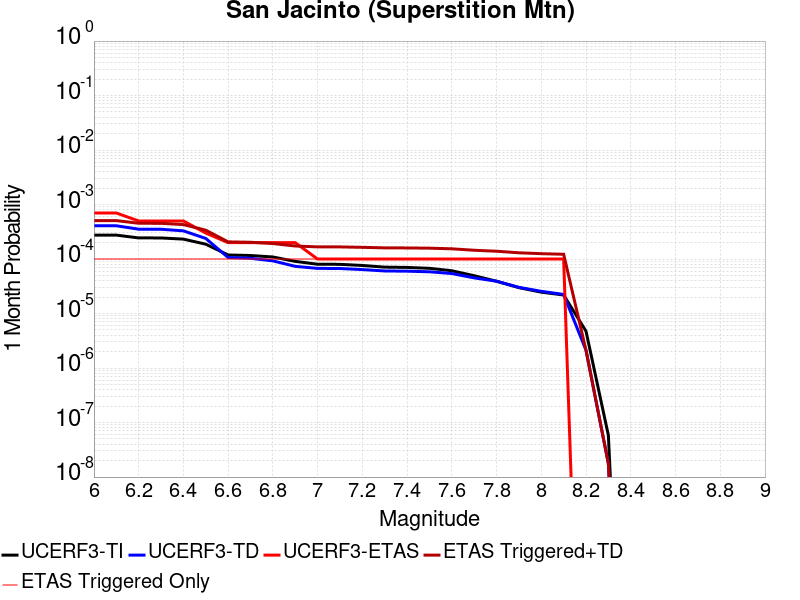 |  | 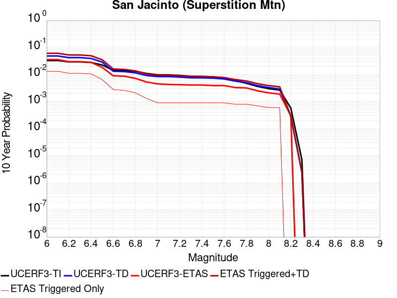 |

| Magnitude | 1 wk TI Prob | 1 wk TD Prob | 1 wk ETAS Prob | 1 wk ETAS/TD Gain | 1 wk ETAS Triggered+TD | 1 wk ETAS Triggered Only | 1 mo TI Prob | 1 mo TD Prob | 1 mo ETAS Prob | 1 mo ETAS/TD Gain | 1 mo ETAS Triggered+TD | 1 mo ETAS Triggered Only | 1 yr TI Prob | 1 yr TD Prob | 1 yr ETAS Prob | 1 yr ETAS/TD Gain | 1 yr ETAS Triggered+TD | 1 yr ETAS Triggered Only | 10 yr TI Prob | 10 yr TD Prob | 10 yr ETAS Prob | 10 yr ETAS/TD Gain | 10 yr ETAS Triggered+TD | 10 yr ETAS Triggered Only |
|-----|-----|-----|-----|-----|-----|-----|-----|-----|-----|-----|-----|-----|-----|-----|-----|-----|-----|-----|-----|-----|-----|-----|-----|-----|
| 6.0 | 6.4193904E-5 | 9.52097E-5 | 0.0 | 0.0 | 9.52097E-5 | 0.0 | 2.7508775E-4 | 4.079841E-4 | 0.0 | 0.0 | 4.079841E-4 | 0.0 | 0.0033440501 | 0.004957317 | 0.0 | 0.0 | 0.004957317 | 0.0 | 0.03294174 | 0.04847365 | 5.4495916E-4 | 0.011242379 | 0.04899219 | 5.4495916E-4 |
| 6.1 | 6.4193904E-5 | 9.52097E-5 | 0.0 | 0.0 | 9.52097E-5 | 0.0 | 2.7508775E-4 | 4.079841E-4 | 0.0 | 0.0 | 4.079841E-4 | 0.0 | 0.0033440501 | 0.004957317 | 0.0 | 0.0 | 0.004957317 | 0.0 | 0.03294174 | 0.04847365 | 5.4495916E-4 | 0.011242379 | 0.04899219 | 5.4495916E-4 |
| 6.2 | 5.7023593E-5 | 8.239395E-5 | 0.0 | 0.0 | 8.239395E-5 | 0.0 | 2.4436394E-4 | 3.5307813E-4 | 0.0 | 0.0 | 3.5307813E-4 | 0.0 | 0.002971072 | 0.0042918893 | 0.0 | 0.0 | 0.0042918893 | 0.0 | 0.029316625 | 0.042131327 | 0.0 | 0.0 | 0.042131327 | 0.0 |
| 6.3 | 5.6940098E-5 | 8.2239654E-5 | 0.0 | 0.0 | 8.2239654E-5 | 0.0 | 2.4400617E-4 | 3.5241706E-4 | 0.0 | 0.0 | 3.5241706E-4 | 0.0 | 0.002966728 | 0.0042838724 | 0.0 | 0.0 | 0.0042838724 | 0.0 | 0.029274331 | 0.042054836 | 0.0 | 0.0 | 0.042054836 | 0.0 |
| 6.4 | 5.4171585E-5 | 7.6739954E-5 | 0.0 | 0.0 | 7.6739954E-5 | 0.0 | 2.3214328E-4 | 3.2885332E-4 | 0.0 | 0.0 | 3.2885332E-4 | 0.0 | 0.0028226813 | 0.003998079 | 0.0 | 0.0 | 0.003998079 | 0.0 | 0.02787096 | 0.039345514 | 0.0 | 0.0 | 0.039345514 | 0.0 |
| 6.5 | 4.375144E-5 | 5.5698263E-5 | 0.0 | 0.0 | 5.5698263E-5 | 0.0 | 1.874927E-4 | 2.3869159E-4 | 0.0 | 0.0 | 2.3869159E-4 | 0.0 | 0.0022803338 | 0.0029033655 | 0.0 | 0.0 | 0.0029033655 | 0.0 | 0.022570757 | 0.02887236 | 0.0 | 0.0 | 0.02887236 | 0.0 |
| 6.6 | 2.772192E-5 | 2.4859432E-5 | 0.0 | 0.0 | 2.4859432E-5 | 0.0 | 1.1880282E-4 | 1.0653618E-4 | 0.0 | 0.0 | 1.0653618E-4 | 0.0 | 0.0014454646 | 0.0012963249 | 0.0 | 0.0 | 0.0012963249 | 0.0 | 0.014360986 | 0.013214085 | 0.0 | 0.0 | 0.013214085 | 0.0 |
| 6.7 | 2.7124124E-5 | 2.4078752E-5 | 0.0 | 0.0 | 2.4078752E-5 | 0.0 | 1.1624106E-4 | 1.0319068E-4 | 0.0 | 0.0 | 1.0319068E-4 | 0.0 | 0.0014143161 | 0.001255641 | 0.0 | 0.0 | 0.001255641 | 0.0 | 0.014053487 | 0.012811731 | 0.0 | 0.0 | 0.012811731 | 0.0 |
| 6.8 | 2.5475807E-5 | 2.157592E-5 | 0.0 | 0.0 | 2.157592E-5 | 0.0 | 1.0917746E-4 | 9.2465016E-5 | 0.0 | 0.0 | 9.2465016E-5 | 0.0 | 0.001328425 | 0.0011251917 | 0.0 | 0.0 | 0.0011251917 | 0.0 | 0.0132051185 | 0.011516079 | 0.0 | 0.0 | 0.011516079 | 0.0 |
| 6.9 | 2.1162023E-5 | 1.7120747E-5 | 0.0 | 0.0 | 1.7120747E-5 | 0.0 | 9.069123E-5 | 7.337258E-5 | 0.0 | 0.0 | 7.337258E-5 | 0.0 | 0.0011036064 | 8.929487E-4 | 0.0 | 0.0 | 8.929487E-4 | 0.0 | 0.010981417 | 0.00918185 | 0.0 | 0.0 | 0.00918185 | 0.0 |
| 7.0 | 1.8754288E-5 | 1.5695929E-5 | 0.0 | 0.0 | 1.5695929E-5 | 0.0 | 8.037304E-5 | 6.726655E-5 | 0.0 | 0.0 | 6.726655E-5 | 0.0 | 9.781026E-4 | 8.1866485E-4 | 0.0 | 0.0 | 8.1866485E-4 | 0.0 | 0.009738087 | 0.008425698 | 0.0 | 0.0 | 0.008425698 | 0.0 |
| 7.1 | 1.8678527E-5 | 1.5622212E-5 | 0.0 | 0.0 | 1.5622212E-5 | 0.0 | 8.0048376E-5 | 6.695063E-5 | 0.0 | 0.0 | 6.695063E-5 | 0.0 | 9.7415317E-4 | 8.148215E-4 | 0.0 | 0.0 | 8.148215E-4 | 0.0 | 0.009698939 | 0.0083872555 | 0.0 | 0.0 | 0.0083872555 | 0.0 |
| 7.2 | 1.7804578E-5 | 1.492615E-5 | 0.0 | 0.0 | 1.492615E-5 | 0.0 | 7.6303106E-5 | 6.396765E-5 | 0.0 | 0.0 | 6.396765E-5 | 0.0 | 9.285943E-4 | 7.785301E-4 | 0.0 | 0.0 | 7.785301E-4 | 0.0 | 0.009247236 | 0.00802332 | 0.0 | 0.0 | 0.00802332 | 0.0 |
| 7.3 | 1.6583685E-5 | 1.4084272E-5 | 0.0 | 0.0 | 1.4084272E-5 | 0.0 | 7.1070994E-5 | 6.035978E-5 | 0.0 | 0.0 | 6.035978E-5 | 0.0 | 8.649459E-4 | 7.3463446E-4 | 0.0 | 0.0 | 7.3463446E-4 | 0.0 | 0.00861587 | 0.007583249 | 0.0 | 0.0 | 0.007583249 | 0.0 |
| 7.4 | 1.6387552E-5 | 1.3950205E-5 | 0.0 | 0.0 | 1.3950205E-5 | 0.0 | 7.023047E-5 | 5.9785234E-5 | 0.0 | 0.0 | 5.9785234E-5 | 0.0 | 8.5472054E-4 | 7.276441E-4 | 0.0 | 0.0 | 7.276441E-4 | 0.0 | 0.008514405 | 0.0075131822 | 0.0 | 0.0 | 0.0075131822 | 0.0 |
| 7.5 | 1.5790754E-5 | 1.3595658E-5 | 0.0 | 0.0 | 1.3595658E-5 | 0.0 | 6.767291E-5 | 5.8265814E-5 | 0.0 | 0.0 | 5.8265814E-5 | 0.0 | 8.236062E-4 | 7.091573E-4 | 0.0 | 0.0 | 7.091573E-4 | 0.0 | 0.008205604 | 0.0073262155 | 0.0 | 0.0 | 0.0073262155 | 0.0 |
| 7.6 | 1.4248672E-5 | 1.262672E-5 | 0.0 | 0.0 | 1.262672E-5 | 0.0 | 6.106431E-5 | 5.41134E-5 | 0.0 | 0.0 | 5.41134E-5 | 0.0 | 7.432043E-4 | 6.5863313E-4 | 0.0 | 0.0 | 6.5863313E-4 | 0.0 | 0.007407237 | 0.0068149813 | 0.0 | 0.0 | 0.0068149813 | 0.0 |
| 7.7 | 1.15449975E-5 | 1.0499409E-5 | 0.0 | 0.0 | 1.0499409E-5 | 0.0 | 4.947762E-5 | 4.4996694E-5 | 0.0 | 0.0 | 4.4996694E-5 | 0.0 | 6.022235E-4 | 5.4769777E-4 | 0.0 | 0.0 | 5.4769777E-4 | 0.0 | 0.006005941 | 0.00569736 | 0.0 | 0.0 | 0.00569736 | 0.0 |
| 7.8 | 9.1391985E-6 | 9.129117E-6 | 0.0 | 0.0 | 9.129117E-6 | 0.0 | 3.9167408E-5 | 3.91242E-5 | 0.0 | 0.0 | 3.91242E-5 | 0.0 | 4.767588E-4 | 4.7623357E-4 | 0.0 | 0.0 | 4.7623357E-4 | 0.0 | 0.0047573727 | 0.0049739103 | 0.0 | 0.0 | 0.0049739103 | 0.0 |
| 7.9 | 6.973017E-6 | 7.0392243E-6 | 0.0 | 0.0 | 7.0392243E-6 | 0.0 | 2.9884017E-5 | 3.016776E-5 | 0.0 | 0.0 | 3.016776E-5 | 0.0 | 3.6377716E-4 | 3.6723103E-4 | 0.0 | 0.0 | 3.6723103E-4 | 0.0 | 0.0036318225 | 0.0038710602 | 0.0 | 0.0 | 0.0038710602 | 0.0 |
| 8.0 | 5.7638235E-6 | 5.9455597E-6 | 0.0 | 0.0 | 5.9455597E-6 | 0.0 | 2.4701867E-5 | 2.5480724E-5 | 0.0 | 0.0 | 2.5480724E-5 | 0.0 | 3.0070372E-4 | 3.1018408E-4 | 0.0 | 0.0 | 3.1018408E-4 | 0.0 | 0.0030029714 | 0.0032874679 | 0.0 | 0.0 | 0.0032874679 | 0.0 |
| 8.1 | 5.1124434E-6 | 5.2085365E-6 | 0.0 | 0.0 | 5.2085365E-6 | 0.0 | 2.1910288E-5 | 2.2322112E-5 | 0.0 | 0.0 | 2.2322112E-5 | 0.0 | 2.6672508E-4 | 2.7173824E-4 | 0.0 | 0.0 | 2.7173824E-4 | 0.0 | 0.0026640517 | 0.0028885864 | 0.0 | 0.0 | 0.0028885864 | 0.0 |
| 8.2 | 1.1075938E-6 | 4.9050954E-7 | 0.0 | 0.0 | 4.9050954E-7 | 0.0 | 4.7468216E-6 | 2.102182E-6 | 0.0 | 0.0 | 2.102182E-6 | 0.0 | 5.779102E-5 | 2.5593785E-5 | 0.0 | 0.0 | 2.5593785E-5 | 0.0 | 5.777599E-4 | 2.8936443E-4 | 0.0 | 0.0 | 2.8936443E-4 | 0.0 |
| 8.3 | 1.3584393E-8 | 4.067688E-9 | 0.0 | 0.0 | 4.067688E-9 | 0.0 | 5.8218827E-8 | 1.7432948E-8 | 0.0 | 0.0 | 1.7432948E-8 | 0.0 | 7.0881396E-7 | 2.1224615E-7 | 0.0 | 0.0 | 2.1224615E-7 | 0.0 | 7.0881174E-6 | 2.3868752E-6 | 0.0 | 0.0 | 2.3868752E-6 | 0.0 |

## Cucamonga
*[(top)](#table-of-contents)*

| 1 Week | 1 Month | 1 Year | 10 Year |
|-----|-----|-----|-----|
|  |  |  |  |

| Magnitude | 1 wk TI Prob | 1 wk TD Prob | 1 wk ETAS Prob | 1 wk ETAS/TD Gain | 1 wk ETAS Triggered+TD | 1 wk ETAS Triggered Only | 1 mo TI Prob | 1 mo TD Prob | 1 mo ETAS Prob | 1 mo ETAS/TD Gain | 1 mo ETAS Triggered+TD | 1 mo ETAS Triggered Only | 1 yr TI Prob | 1 yr TD Prob | 1 yr ETAS Prob | 1 yr ETAS/TD Gain | 1 yr ETAS Triggered+TD | 1 yr ETAS Triggered Only | 10 yr TI Prob | 10 yr TD Prob | 10 yr ETAS Prob | 10 yr ETAS/TD Gain | 10 yr ETAS Triggered+TD | 10 yr ETAS Triggered Only |
|-----|-----|-----|-----|-----|-----|-----|-----|-----|-----|-----|-----|-----|-----|-----|-----|-----|-----|-----|-----|-----|-----|-----|-----|-----|
| 6.0 | 1.1848348E-5 | 1.1681425E-5 | 0.0 | 0.0 | 1.1681425E-5 | 0.0 | 5.0777642E-5 | 5.0062306E-5 | 0.0 | 0.0 | 5.0062306E-5 | 0.0 | 6.180424E-4 | 6.093408E-4 | 5.4495916E-4 | 0.8943421 | 0.0011539678 | 5.4495916E-4 | 0.0061632637 | 0.0060776994 | 5.4495916E-4 | 0.08966537 | 0.0066193463 | 5.4495916E-4 |
| 6.1 | 1.1848348E-5 | 1.1681425E-5 | 0.0 | 0.0 | 1.1681425E-5 | 0.0 | 5.0777642E-5 | 5.0062306E-5 | 0.0 | 0.0 | 5.0062306E-5 | 0.0 | 6.180424E-4 | 6.093408E-4 | 5.4495916E-4 | 0.8943421 | 0.0011539678 | 5.4495916E-4 | 0.0061632637 | 0.0060776994 | 5.4495916E-4 | 0.08966537 | 0.0066193463 | 5.4495916E-4 |
| 6.2 | 1.1848348E-5 | 1.1681425E-5 | 0.0 | 0.0 | 1.1681425E-5 | 0.0 | 5.0777642E-5 | 5.0062306E-5 | 0.0 | 0.0 | 5.0062306E-5 | 0.0 | 6.180424E-4 | 6.093408E-4 | 5.4495916E-4 | 0.8943421 | 0.0011539678 | 5.4495916E-4 | 0.0061632637 | 0.0060776994 | 5.4495916E-4 | 0.08966537 | 0.0066193463 | 5.4495916E-4 |
| 6.3 | 1.1848348E-5 | 1.1681425E-5 | 0.0 | 0.0 | 1.1681425E-5 | 0.0 | 5.0777642E-5 | 5.0062306E-5 | 0.0 | 0.0 | 5.0062306E-5 | 0.0 | 6.180424E-4 | 6.093408E-4 | 5.4495916E-4 | 0.8943421 | 0.0011539678 | 5.4495916E-4 | 0.0061632637 | 0.0060776994 | 5.4495916E-4 | 0.08966537 | 0.0066193463 | 5.4495916E-4 |
| 6.4 | 1.1848348E-5 | 1.1681425E-5 | 0.0 | 0.0 | 1.1681425E-5 | 0.0 | 5.0777642E-5 | 5.0062306E-5 | 0.0 | 0.0 | 5.0062306E-5 | 0.0 | 6.180424E-4 | 6.093408E-4 | 5.4495916E-4 | 0.8943421 | 0.0011539678 | 5.4495916E-4 | 0.0061632637 | 0.0060776994 | 5.4495916E-4 | 0.08966537 | 0.0066193463 | 5.4495916E-4 |
| 6.5 | 1.16988695E-5 | 1.1520585E-5 | 0.0 | 0.0 | 1.1520585E-5 | 0.0 | 5.013705E-5 | 4.937302E-5 | 0.0 | 0.0 | 4.937302E-5 | 0.0 | 6.102476E-4 | 6.0095335E-4 | 5.4495916E-4 | 0.90682435 | 0.001145585 | 5.4495916E-4 | 0.006085745 | 0.005994278 | 5.4495916E-4 | 0.09091322 | 0.0065359706 | 5.4495916E-4 |
| 6.6 | 1.16988695E-5 | 1.1520585E-5 | 0.0 | 0.0 | 1.1520585E-5 | 0.0 | 5.013705E-5 | 4.937302E-5 | 0.0 | 0.0 | 4.937302E-5 | 0.0 | 6.102476E-4 | 6.0095335E-4 | 5.4495916E-4 | 0.90682435 | 0.001145585 | 5.4495916E-4 | 0.006085745 | 0.005994278 | 5.4495916E-4 | 0.09091322 | 0.0065359706 | 5.4495916E-4 |
| 6.7 | 1.1397107E-5 | 1.1060845E-5 | 0.0 | 0.0 | 1.1060845E-5 | 0.0 | 4.884383E-5 | 4.7402777E-5 | 0.0 | 0.0 | 4.7402777E-5 | 0.0 | 5.9451134E-4 | 5.7697843E-4 | 5.4495916E-4 | 0.9445052 | 0.0011216231 | 5.4495916E-4 | 0.005929234 | 0.005755779 | 5.4495916E-4 | 0.09468034 | 0.0062976014 | 5.4495916E-4 |
| 6.8 | 1.058387E-5 | 9.737108E-6 | 0.0 | 0.0 | 9.737108E-6 | 0.0 | 4.5358654E-5 | 4.17298E-5 | 0.0 | 0.0 | 4.17298E-5 | 0.0 | 5.521017E-4 | 5.07943E-4 | 5.4495916E-4 | 1.0728747 | 0.0010526252 | 5.4495916E-4 | 0.00550732 | 0.005068654 | 5.4495916E-4 | 0.10751554 | 0.005610851 | 5.4495916E-4 |
| 6.9 | 9.690046E-6 | 8.535669E-6 | 0.0 | 0.0 | 8.535669E-6 | 0.0 | 4.1528107E-5 | 3.6580925E-5 | 0.0 | 0.0 | 3.6580925E-5 | 0.0 | 5.054874E-4 | 4.4528214E-4 | 0.0 | 0.0 | 4.4528214E-4 | 0.0 | 0.005043391 | 0.0044446616 | 0.0 | 0.0 | 0.0044446616 | 0.0 |
| 7.0 | 9.381461E-6 | 8.14438E-6 | 0.0 | 0.0 | 8.14438E-6 | 0.0 | 4.020564E-5 | 3.490402E-5 | 0.0 | 0.0 | 3.490402E-5 | 0.0 | 4.893937E-4 | 4.2487396E-4 | 0.0 | 0.0 | 4.2487396E-4 | 0.0 | 0.0048831734 | 0.0042413757 | 0.0 | 0.0 | 0.0042413757 | 0.0 |
| 7.1 | 8.946492E-6 | 7.739966E-6 | 0.0 | 0.0 | 7.739966E-6 | 0.0 | 3.8341543E-5 | 3.3170865E-5 | 0.0 | 0.0 | 3.3170865E-5 | 0.0 | 4.667083E-4 | 4.0378075E-4 | 0.0 | 0.0 | 4.0378075E-4 | 0.0 | 0.0046572937 | 0.004031233 | 0.0 | 0.0 | 0.004031233 | 0.0 |
| 7.2 | 8.251016E-6 | 6.9360203E-6 | 0.0 | 0.0 | 6.9360203E-6 | 0.0 | 3.5361016E-5 | 2.9725465E-5 | 0.0 | 0.0 | 2.9725465E-5 | 0.0 | 4.3043532E-4 | 3.6184766E-4 | 0.0 | 0.0 | 3.6184766E-4 | 0.0 | 0.0042960253 | 0.0036133453 | 0.0 | 0.0 | 0.0036133453 | 0.0 |
| 7.3 | 7.717881E-6 | 6.4482774E-6 | 0.0 | 0.0 | 6.4482774E-6 | 0.0 | 3.3076216E-5 | 2.7635182E-5 | 0.0 | 0.0 | 2.7635182E-5 | 0.0 | 4.026285E-4 | 3.3640664E-4 | 0.0 | 0.0 | 3.3640664E-4 | 0.0 | 0.004018998 | 0.0033597308 | 0.0 | 0.0 | 0.0033597308 | 0.0 |
| 7.4 | 7.275623E-6 | 5.9953554E-6 | 0.0 | 0.0 | 5.9953554E-6 | 0.0 | 3.118087E-5 | 2.5694128E-5 | 0.0 | 0.0 | 2.5694128E-5 | 0.0 | 3.7956095E-4 | 3.127813E-4 | 0.0 | 0.0 | 3.127813E-4 | 0.0 | 0.0037891332 | 0.0031241663 | 0.0 | 0.0 | 0.0031241663 | 0.0 |
| 7.5 | 6.5109502E-6 | 5.0681283E-6 | 0.0 | 0.0 | 5.0681283E-6 | 0.0 | 2.7903774E-5 | 2.1720369E-5 | 0.0 | 0.0 | 2.1720369E-5 | 0.0 | 3.3967546E-4 | 2.6441354E-4 | 0.0 | 0.0 | 2.6441354E-4 | 0.0 | 0.0033915674 | 0.0026417347 | 0.0 | 0.0 | 0.0026417347 | 0.0 |
| 7.6 | 5.4495326E-6 | 3.8797943E-6 | 0.0 | 0.0 | 3.8797943E-6 | 0.0 | 2.335493E-5 | 1.6627584E-5 | 0.0 | 0.0 | 1.6627584E-5 | 0.0 | 2.8430918E-4 | 2.024221E-4 | 0.0 | 0.0 | 2.024221E-4 | 0.0 | 0.0028394572 | 0.0020231178 | 0.0 | 0.0 | 0.0020231178 | 0.0 |
| 7.7 | 4.7997164E-6 | 3.17428E-6 | 0.0 | 0.0 | 3.17428E-6 | 0.0 | 2.057005E-5 | 1.3603986E-5 | 0.0 | 0.0 | 1.3603986E-5 | 0.0 | 2.504116E-4 | 1.6561597E-4 | 0.0 | 0.0 | 1.6561597E-4 | 0.0 | 0.002501296 | 0.0016556637 | 0.0 | 0.0 | 0.0016556637 | 0.0 |
| 7.8 | 3.3941733E-6 | 2.049857E-6 | 0.0 | 0.0 | 2.049857E-6 | 0.0 | 1.4546376E-5 | 8.785072E-6 | 0.0 | 0.0 | 8.785072E-6 | 0.0 | 1.7708774E-4 | 1.0695301E-4 | 0.0 | 0.0 | 1.0695301E-4 | 0.0 | 0.0017694668 | 0.0010690487 | 0.0 | 0.0 | 0.0010690487 | 0.0 |
| 7.9 | 9.750552E-7 | 5.122147E-7 | 0.0 | 0.0 | 5.122147E-7 | 0.0 | 4.178801E-6 | 2.195204E-6 | 0.0 | 0.0 | 2.195204E-6 | 0.0 | 5.0875715E-5 | 2.6726284E-5 | 0.0 | 0.0 | 2.6726284E-5 | 0.0 | 5.086407E-4 | 2.672311E-4 | 0.0 | 0.0 | 2.672311E-4 | 0.0 |
| 8.0 | 1.133857E-7 | 6.016657E-8 | 0.0 | 0.0 | 6.016657E-8 | 0.0 | 4.8593864E-7 | 2.5785673E-7 | 0.0 | 0.0 | 2.5785673E-7 | 0.0 | 5.9162867E-6 | 3.139401E-6 | 0.0 | 0.0 | 3.139401E-6 | 0.0 | 5.916129E-5 | 3.1393585E-5 | 0.0 | 0.0 | 3.1393585E-5 | 0.0 |

## San Andreas (Cholame) rev
*[(top)](#table-of-contents)*

| 1 Week | 1 Month | 1 Year | 10 Year |
|-----|-----|-----|-----|
|  |  |  |  |

| Magnitude | 1 wk TI Prob | 1 wk TD Prob | 1 wk ETAS Prob | 1 wk ETAS/TD Gain | 1 wk ETAS Triggered+TD | 1 wk ETAS Triggered Only | 1 mo TI Prob | 1 mo TD Prob | 1 mo ETAS Prob | 1 mo ETAS/TD Gain | 1 mo ETAS Triggered+TD | 1 mo ETAS Triggered Only | 1 yr TI Prob | 1 yr TD Prob | 1 yr ETAS Prob | 1 yr ETAS/TD Gain | 1 yr ETAS Triggered+TD | 1 yr ETAS Triggered Only | 10 yr TI Prob | 10 yr TD Prob | 10 yr ETAS Prob | 10 yr ETAS/TD Gain | 10 yr ETAS Triggered+TD | 10 yr ETAS Triggered Only |
|-----|-----|-----|-----|-----|-----|-----|-----|-----|-----|-----|-----|-----|-----|-----|-----|-----|-----|-----|-----|-----|-----|-----|-----|-----|
| 6.0 | 1.2302514E-4 | 2.4360698E-4 | 0.0 | 0.0 | 2.4360698E-4 | 0.0 | 5.27144E-4 | 0.0010436138 | 0.0 | 0.0 | 0.0010436138 | 0.0 | 0.0063991086 | 0.0126324445 | 5.4495916E-4 | 0.04313964 | 0.01317052 | 5.4495916E-4 | 0.06217949 | 0.120853856 | 5.4495916E-4 | 0.0045092404 | 0.12133296 | 5.4495916E-4 |
| 6.1 | 1.2302514E-4 | 2.4360698E-4 | 0.0 | 0.0 | 2.4360698E-4 | 0.0 | 5.27144E-4 | 0.0010436138 | 0.0 | 0.0 | 0.0010436138 | 0.0 | 0.0063991086 | 0.0126324445 | 5.4495916E-4 | 0.04313964 | 0.01317052 | 5.4495916E-4 | 0.06217949 | 0.120853856 | 5.4495916E-4 | 0.0045092404 | 0.12133296 | 5.4495916E-4 |
| 6.2 | 1.2203569E-4 | 2.4178489E-4 | 0.0 | 0.0 | 2.4178489E-4 | 0.0 | 5.2290526E-4 | 0.001035811 | 0.0 | 0.0 | 0.001035811 | 0.0 | 0.006347804 | 0.012538543 | 5.4495916E-4 | 0.043462716 | 0.01307667 | 5.4495916E-4 | 0.061695136 | 0.12004175 | 5.4495916E-4 | 0.004539747 | 0.12052129 | 5.4495916E-4 |
| 6.3 | 1.2142645E-4 | 2.4065067E-4 | 0.0 | 0.0 | 2.4065067E-4 | 0.0 | 5.202953E-4 | 0.001030954 | 0.0 | 0.0 | 0.001030954 | 0.0 | 0.006316212 | 0.012480088 | 5.4495916E-4 | 0.043666292 | 0.013018246 | 5.4495916E-4 | 0.06139677 | 0.1195364 | 5.4495916E-4 | 0.004558939 | 0.12001621 | 5.4495916E-4 |
| 6.4 | 1.1865206E-4 | 2.3576531E-4 | 0.0 | 0.0 | 2.3576531E-4 | 0.0 | 5.0840975E-4 | 0.001010033 | 0.0 | 0.0 | 0.001010033 | 0.0 | 0.006172335 | 0.012228259 | 5.4495916E-4 | 0.044565555 | 0.012766554 | 5.4495916E-4 | 0.060036868 | 0.11734377 | 5.4495916E-4 | 0.0046441252 | 0.11782478 | 5.4495916E-4 |
| 6.5 | 1.17443946E-4 | 2.3374322E-4 | 0.0 | 0.0 | 2.3374322E-4 | 0.0 | 5.032341E-4 | 0.0010013736 | 0.0 | 0.0 | 0.0010013736 | 0.0 | 0.006109677 | 0.012124006 | 5.4495916E-4 | 0.044948768 | 0.012662358 | 5.4495916E-4 | 0.059444077 | 0.116428405 | 5.4495916E-4 | 0.0046806373 | 0.11690991 | 5.4495916E-4 |
| 6.6 | 1.13579066E-4 | 2.2696287E-4 | 0.0 | 0.0 | 2.2696287E-4 | 0.0 | 4.866766E-4 | 9.7233686E-4 | 0.0 | 0.0 | 9.7233686E-4 | 0.0 | 0.0059092017 | 0.011774355 | 5.4495916E-4 | 0.046283565 | 0.0123128975 | 5.4495916E-4 | 0.057545185 | 0.11338537 | 5.4495916E-4 | 0.004806256 | 0.11386854 | 5.4495916E-4 |
| 6.7 | 1.1271412E-4 | 2.2543047E-4 | 0.0 | 0.0 | 2.2543047E-4 | 0.0 | 4.829711E-4 | 9.657743E-4 | 0.0 | 0.0 | 9.657743E-4 | 0.0 | 0.005864331 | 0.011695317 | 5.4495916E-4 | 0.046596356 | 0.012233903 | 5.4495916E-4 | 0.057119697 | 0.112696074 | 5.4495916E-4 | 0.004835653 | 0.11317962 | 5.4495916E-4 |
| 6.8 | 1.1217975E-4 | 2.2433772E-4 | 0.0 | 0.0 | 2.2433772E-4 | 0.0 | 4.8068175E-4 | 9.6109457E-4 | 0.0 | 0.0 | 9.6109457E-4 | 0.0 | 0.005836608 | 0.011638951 | 5.4495916E-4 | 0.046822015 | 0.012177567 | 5.4495916E-4 | 0.056856725 | 0.11220165 | 5.4495916E-4 | 0.0048569613 | 0.11268547 | 5.4495916E-4 |
| 6.9 | 1.1146753E-4 | 2.2284927E-4 | 0.0 | 0.0 | 2.2284927E-4 | 0.0 | 4.7763053E-4 | 9.5472013E-4 | 0.0 | 0.0 | 9.5472013E-4 | 0.0 | 0.0057996577 | 0.0115621695 | 5.4495916E-4 | 0.04713295 | 0.012100827 | 5.4495916E-4 | 0.056506127 | 0.11152845 | 5.4495916E-4 | 0.0048862793 | 0.112012625 | 5.4495916E-4 |
| 7.0 | 1.0965793E-4 | 2.191574E-4 | 0.0 | 0.0 | 2.191574E-4 | 0.0 | 4.698779E-4 | 9.3890936E-4 | 0.0 | 0.0 | 9.3890936E-4 | 0.0 | 0.005705768 | 0.011371698 | 5.4495916E-4 | 0.047922403 | 0.011910461 | 5.4495916E-4 | 0.055614736 | 0.1098526 | 5.4495916E-4 | 0.0049608215 | 0.11033769 | 5.4495916E-4 |
| 7.1 | 9.927982E-5 | 1.9767124E-4 | 0.0 | 0.0 | 1.9767124E-4 | 0.0 | 4.2541555E-4 | 8.468884E-4 | 0.0 | 0.0 | 8.468884E-4 | 0.0 | 0.0051671406 | 0.01026239 | 5.4495916E-4 | 0.053102557 | 0.010801756 | 5.4495916E-4 | 0.05048634 | 0.100037105 | 5.4495916E-4 | 0.00544757 | 0.10052755 | 5.4495916E-4 |
| 7.2 | 9.696786E-5 | 1.9276817E-4 | 0.0 | 0.0 | 1.9276817E-4 | 0.0 | 4.1551032E-4 | 8.258887E-4 | 0.0 | 0.0 | 8.258887E-4 | 0.0 | 0.00504711 | 0.010009095 | 5.4495916E-4 | 0.054446395 | 0.010548599 | 5.4495916E-4 | 0.04934009 | 0.09778914 | 5.4495916E-4 | 0.005572798 | 0.0982808 | 5.4495916E-4 |
| 7.3 | 9.4727984E-5 | 1.8718891E-4 | 0.0 | 0.0 | 1.8718891E-4 | 0.0 | 4.0591392E-4 | 8.019924E-4 | 0.0 | 0.0 | 8.019924E-4 | 0.0 | 0.0049308087 | 0.00972079 | 5.4495916E-4 | 0.056061193 | 0.0102604525 | 5.4495916E-4 | 0.048228268 | 0.095200576 | 5.4495916E-4 | 0.005724326 | 0.095693655 | 5.4495916E-4 |
| 7.4 | 9.220358E-5 | 1.8104058E-4 | 0.0 | 0.0 | 1.8104058E-4 | 0.0 | 3.9509835E-4 | 7.7565835E-4 | 0.0 | 0.0 | 7.7565835E-4 | 0.0 | 0.004799717 | 0.009402977 | 5.4495916E-4 | 0.05795602 | 0.009942812 | 5.4495916E-4 | 0.046973653 | 0.0923335 | 5.4495916E-4 | 0.005902074 | 0.09282814 | 5.4495916E-4 |
| 7.5 | 7.71631E-5 | 1.4537087E-4 | 0.0 | 0.0 | 1.4537087E-4 | 0.0 | 3.306571E-4 | 6.228694E-4 | 0.0 | 0.0 | 6.228694E-4 | 0.0 | 0.0040183207 | 0.0075571304 | 5.4495916E-4 | 0.07211191 | 0.008097971 | 5.4495916E-4 | 0.03946433 | 0.075399615 | 5.4495916E-4 | 0.0072276113 | 0.07590348 | 5.4495916E-4 |
| 7.6 | 7.5634416E-5 | 1.420485E-4 | 0.0 | 0.0 | 1.420485E-4 | 0.0 | 3.241072E-4 | 6.0863746E-4 | 0.0 | 0.0 | 6.0863746E-4 | 0.0 | 0.0039388672 | 0.007385044 | 5.4495916E-4 | 0.07379227 | 0.007925978 | 5.4495916E-4 | 0.038697794 | 0.07379259 | 5.4495916E-4 | 0.0073850113 | 0.07429734 | 5.4495916E-4 |
| 7.7 | 6.3783E-5 | 1.1792882E-4 | 0.0 | 0.0 | 1.1792882E-4 | 0.0 | 2.7332708E-4 | 5.0531136E-4 | 0.0 | 0.0 | 5.0531136E-4 | 0.0 | 0.0033226798 | 0.0061348346 | 5.4495916E-4 | 0.08883029 | 0.0066764504 | 5.4495916E-4 | 0.032734364 | 0.061940182 | 5.4495916E-4 | 0.008798151 | 0.06245139 | 5.4495916E-4 |
| 7.8 | 5.863422E-5 | 1.0901571E-4 | 0.0 | 0.0 | 1.0901571E-4 | 0.0 | 2.512653E-4 | 4.6712658E-4 | 0.0 | 0.0 | 4.6712658E-4 | 0.0 | 0.003054864 | 0.0056724534 | 5.4495916E-4 | 0.096071154 | 0.006214321 | 5.4495916E-4 | 0.030132094 | 0.057286173 | 5.4495916E-4 | 0.009512926 | 0.057799913 | 5.4495916E-4 |
| 7.9 | 4.595283E-5 | 8.047838E-5 | 0.0 | 0.0 | 8.047838E-5 | 0.0 | 1.9692584E-4 | 3.4486174E-4 | 0.0 | 0.0 | 3.4486174E-4 | 0.0 | 0.0023949358 | 0.004190614 | 5.4495916E-4 | 0.13004279 | 0.0047332896 | 5.4495916E-4 | 0.023692891 | 0.04256525 | 5.4495916E-4 | 0.012802912 | 0.043087013 | 5.4495916E-4 |
| 8.0 | 3.2950178E-5 | 4.8377187E-5 | 0.0 | 0.0 | 4.8377187E-5 | 0.0 | 1.412074E-4 | 2.0731433E-4 | 0.0 | 0.0 | 2.0731433E-4 | 0.0 | 0.0017178444 | 0.002521132 | 0.0 | 0.0 | 0.002521132 | 0.0 | 0.017046256 | 0.025995739 | 0.0 | 0.0 | 0.025995739 | 0.0 |
| 8.1 | 1.9177472E-5 | 1.7981185E-5 | 0.0 | 0.0 | 1.7981185E-5 | 0.0 | 8.218658E-5 | 7.705994E-5 | 0.0 | 0.0 | 7.705994E-5 | 0.0 | 0.0010001622 | 9.3780155E-4 | 0.0 | 0.0 | 9.3780155E-4 | 0.0 | 0.009956728 | 0.010124655 | 0.0 | 0.0 | 0.010124655 | 0.0 |
| 8.2 | 8.643924E-6 | 5.0104E-6 | 0.0 | 0.0 | 5.0104E-6 | 0.0 | 3.704486E-5 | 2.1472966E-5 | 0.0 | 0.0 | 2.1472966E-5 | 0.0 | 4.5092785E-4 | 2.6140205E-4 | 0.0 | 0.0 | 2.6140205E-4 | 0.0 | 0.0045001395 | 0.002993769 | 0.0 | 0.0 | 0.002993769 | 0.0 |
| 8.3 | 1.983087E-6 | 6.880041E-7 | 0.0 | 0.0 | 6.880041E-7 | 0.0 | 8.498917E-6 | 2.9485857E-6 | 0.0 | 0.0 | 2.9485857E-6 | 0.0 | 1.034694E-4 | 3.589845E-5 | 0.0 | 0.0 | 3.589845E-5 | 0.0 | 0.0010342124 | 4.2701262E-4 | 0.0 | 0.0 | 4.2701262E-4 | 0.0 |

## Calaveras (No) 2011 CFM
*[(top)](#table-of-contents)*

| 1 Week | 1 Month | 1 Year | 10 Year |
|-----|-----|-----|-----|
|  |  |  |  |

| Magnitude | 1 wk TI Prob | 1 wk TD Prob | 1 wk ETAS Prob | 1 wk ETAS/TD Gain | 1 wk ETAS Triggered+TD | 1 wk ETAS Triggered Only | 1 mo TI Prob | 1 mo TD Prob | 1 mo ETAS Prob | 1 mo ETAS/TD Gain | 1 mo ETAS Triggered+TD | 1 mo ETAS Triggered Only | 1 yr TI Prob | 1 yr TD Prob | 1 yr ETAS Prob | 1 yr ETAS/TD Gain | 1 yr ETAS Triggered+TD | 1 yr ETAS Triggered Only | 10 yr TI Prob | 10 yr TD Prob | 10 yr ETAS Prob | 10 yr ETAS/TD Gain | 10 yr ETAS Triggered+TD | 10 yr ETAS Triggered Only |
|-----|-----|-----|-----|-----|-----|-----|-----|-----|-----|-----|-----|-----|-----|-----|-----|-----|-----|-----|-----|-----|-----|-----|-----|-----|
| 6.0 | 4.8694856E-5 | 6.687549E-5 | 0.0 | 0.0 | 6.687549E-5 | 0.0 | 2.0867554E-4 | 2.865784E-4 | 0.0 | 0.0 | 2.865784E-4 | 0.0 | 0.0025376645 | 0.0034835178 | 0.0 | 0.0 | 0.0034835178 | 0.0 | 0.02508881 | 0.034476876 | 5.4495916E-4 | 0.015806511 | 0.035003047 | 5.4495916E-4 |
| 6.1 | 4.8694856E-5 | 6.687549E-5 | 0.0 | 0.0 | 6.687549E-5 | 0.0 | 2.0867554E-4 | 2.865784E-4 | 0.0 | 0.0 | 2.865784E-4 | 0.0 | 0.0025376645 | 0.0034835178 | 0.0 | 0.0 | 0.0034835178 | 0.0 | 0.02508881 | 0.034476876 | 5.4495916E-4 | 0.015806511 | 0.035003047 | 5.4495916E-4 |
| 6.2 | 4.7541962E-5 | 6.521333E-5 | 0.0 | 0.0 | 6.521333E-5 | 0.0 | 2.0373536E-4 | 2.7945652E-4 | 0.0 | 0.0 | 2.7945652E-4 | 0.0 | 0.0024776561 | 0.003397103 | 0.0 | 0.0 | 0.003397103 | 0.0 | 0.024502134 | 0.033641305 | 5.4495916E-4 | 0.016199108 | 0.03416793 | 5.4495916E-4 |
| 6.3 | 4.6717287E-5 | 6.405114E-5 | 0.0 | 0.0 | 6.405114E-5 | 0.0 | 2.0020158E-4 | 2.7447683E-4 | 0.0 | 0.0 | 2.7447683E-4 | 0.0 | 0.0024347296 | 0.00333667 | 0.0 | 0.0 | 0.00333667 | 0.0 | 0.024082264 | 0.033055697 | 5.4495916E-4 | 0.016486088 | 0.033582643 | 5.4495916E-4 |
| 6.4 | 4.6276386E-5 | 6.341538E-5 | 0.0 | 0.0 | 6.341538E-5 | 0.0 | 1.983123E-4 | 2.717527E-4 | 0.0 | 0.0 | 2.717527E-4 | 0.0 | 0.0024117786 | 0.0033036121 | 0.0 | 0.0 | 0.0033036121 | 0.0 | 0.02385771 | 0.03273572 | 5.4495916E-4 | 0.01664723 | 0.03326284 | 5.4495916E-4 |
| 6.5 | 4.5720994E-5 | 6.2619816E-5 | 0.0 | 0.0 | 6.2619816E-5 | 0.0 | 1.9593239E-4 | 2.6834407E-4 | 0.0 | 0.0 | 2.6834407E-4 | 0.0 | 0.002382867 | 0.0032622444 | 0.0 | 0.0 | 0.0032622444 | 0.0 | 0.023574775 | 0.032335017 | 5.4495916E-4 | 0.01685353 | 0.032862354 | 5.4495916E-4 |
| 6.6 | 4.549134E-5 | 6.227483E-5 | 0.0 | 0.0 | 6.227483E-5 | 0.0 | 1.949483E-4 | 2.6686586E-4 | 0.0 | 0.0 | 2.6686586E-4 | 0.0 | 0.0023709119 | 0.0032443008 | 0.0 | 0.0 | 0.0032443008 | 0.0 | 0.023457756 | 0.03216116 | 5.4495916E-4 | 0.016944634 | 0.032688595 | 5.4495916E-4 |
| 6.7 | 3.701047E-5 | 4.9836264E-5 | 0.0 | 0.0 | 4.9836264E-5 | 0.0 | 1.5860666E-4 | 2.1356673E-4 | 0.0 | 0.0 | 2.1356673E-4 | 0.0 | 0.0019293258 | 0.002597117 | 0.0 | 0.0 | 0.002597117 | 0.0 | 0.019126613 | 0.025864985 | 0.0 | 0.0 | 0.025864985 | 0.0 |
| 6.8 | 3.5523568E-5 | 4.7832134E-5 | 0.0 | 0.0 | 4.7832134E-5 | 0.0 | 1.5223498E-4 | 2.0497899E-4 | 0.0 | 0.0 | 2.0497899E-4 | 0.0 | 0.0018518851 | 0.0024928052 | 0.0 | 0.0 | 0.0024928052 | 0.0 | 0.018365284 | 0.02484424 | 0.0 | 0.0 | 0.02484424 | 0.0 |
| 6.9 | 3.2946147E-5 | 4.418289E-5 | 0.0 | 0.0 | 4.418289E-5 | 0.0 | 1.4119013E-4 | 1.8934172E-4 | 0.0 | 0.0 | 1.8934172E-4 | 0.0 | 0.0017176344 | 0.0023028397 | 0.0 | 0.0 | 0.0023028397 | 0.0 | 0.017044188 | 0.022980222 | 0.0 | 0.0 | 0.022980222 | 0.0 |
| 7.0 | 2.7682381E-5 | 3.6623995E-5 | 0.0 | 0.0 | 3.6623995E-5 | 0.0 | 1.1863338E-4 | 1.569507E-4 | 0.0 | 0.0 | 1.569507E-4 | 0.0 | 0.0014434044 | 0.0019092296 | 0.0 | 0.0 | 0.0019092296 | 0.0 | 0.01434065 | 0.019111184 | 0.0 | 0.0 | 0.019111184 | 0.0 |
| 7.1 | 2.471967E-5 | 3.2936558E-5 | 0.0 | 0.0 | 3.2936558E-5 | 0.0 | 1.05937135E-4 | 1.411492E-4 | 0.0 | 0.0 | 1.411492E-4 | 0.0 | 0.0012890215 | 0.0017171653 | 0.0 | 0.0 | 0.0017171653 | 0.0 | 0.0128157 | 0.017209869 | 0.0 | 0.0 | 0.017209869 | 0.0 |
| 7.2 | 1.9748062E-5 | 2.646036E-5 | 0.0 | 0.0 | 2.646036E-5 | 0.0 | 8.463181E-5 | 1.13396745E-4 | 0.0 | 0.0 | 1.13396745E-4 | 0.0 | 0.0010299052 | 0.0013797542 | 0.0 | 0.0 | 0.0013797542 | 0.0 | 0.01025145 | 0.013872306 | 0.0 | 0.0 | 0.013872306 | 0.0 |
| 7.3 | 1.1603734E-5 | 1.5574346E-5 | 0.0 | 0.0 | 1.5574346E-5 | 0.0 | 4.9729337E-5 | 6.674557E-5 | 0.0 | 0.0 | 6.674557E-5 | 0.0 | 6.052865E-4 | 8.123383E-4 | 0.0 | 0.0 | 8.123383E-4 | 0.0 | 0.0060364045 | 0.008202821 | 0.0 | 0.0 | 0.008202821 | 0.0 |
| 7.4 | 4.885381E-6 | 5.89831E-6 | 0.0 | 0.0 | 5.89831E-6 | 0.0 | 2.0937177E-5 | 2.5278228E-5 | 0.0 | 0.0 | 2.5278228E-5 | 0.0 | 2.5488032E-4 | 3.0771914E-4 | 0.0 | 0.0 | 3.0771914E-4 | 0.0 | 0.0025458818 | 0.003132111 | 0.0 | 0.0 | 0.003132111 | 0.0 |
| 7.5 | 3.0571264E-6 | 4.0283903E-6 | 0.0 | 0.0 | 4.0283903E-6 | 0.0 | 1.3101904E-5 | 1.7264416E-5 | 0.0 | 0.0 | 1.7264416E-5 | 0.0 | 1.5950401E-4 | 2.1017408E-4 | 0.0 | 0.0 | 2.1017408E-4 | 0.0 | 0.0015938957 | 0.0021571468 | 0.0 | 0.0 | 0.0021571468 | 0.0 |
| 7.6 | 1.764948E-6 | 2.6749697E-6 | 0.0 | 0.0 | 2.6749697E-6 | 0.0 | 7.564041E-6 | 1.1464105E-5 | 0.0 | 0.0 | 1.1464105E-5 | 0.0 | 9.208831E-5 | 1.3956662E-4 | 0.0 | 0.0 | 1.3956662E-4 | 0.0 | 9.205016E-4 | 0.0014517411 | 0.0 | 0.0 | 0.0014517411 | 0.0 |
| 7.7 | 1.3173734E-6 | 1.9569313E-6 | 0.0 | 0.0 | 1.9569313E-6 | 0.0 | 5.645874E-6 | 8.386822E-6 | 0.0 | 0.0 | 8.386822E-6 | 0.0 | 6.873634E-5 | 1.0210479E-4 | 0.0 | 0.0 | 1.0210479E-4 | 0.0 | 6.8715087E-4 | 0.0010747038 | 0.0 | 0.0 | 0.0010747038 | 0.0 |
| 7.8 | 9.4429885E-7 | 1.4718682E-6 | 0.0 | 0.0 | 1.4718682E-6 | 0.0 | 4.0469886E-6 | 6.3079915E-6 | 0.0 | 0.0 | 6.3079915E-6 | 0.0 | 4.9270973E-5 | 7.67971E-5 | 0.0 | 0.0 | 7.67971E-5 | 0.0 | 4.926005E-4 | 8.1126415E-4 | 0.0 | 0.0 | 8.1126415E-4 | 0.0 |
| 7.9 | 6.388233E-7 | 1.0618847E-6 | 0.0 | 0.0 | 1.0618847E-6 | 0.0 | 2.7378112E-6 | 4.550927E-6 | 0.0 | 0.0 | 4.550927E-6 | 0.0 | 3.3332344E-5 | 5.5406133E-5 | 0.0 | 0.0 | 5.5406133E-5 | 0.0 | 3.3327343E-4 | 5.830354E-4 | 0.0 | 0.0 | 5.830354E-4 | 0.0 |
| 8.0 | 3.087986E-7 | 5.510454E-7 | 0.0 | 0.0 | 5.510454E-7 | 0.0 | 1.323422E-6 | 2.361621E-6 | 0.0 | 0.0 | 2.361621E-6 | 0.0 | 1.6112543E-5 | 2.8752358E-5 | 0.0 | 0.0 | 2.8752358E-5 | 0.0 | 1.6111376E-4 | 2.9881555E-4 | 0.0 | 0.0 | 2.9881555E-4 | 0.0 |
| 8.1 | 1.6725647E-7 | 2.6281333E-7 | 0.0 | 0.0 | 2.6281333E-7 | 0.0 | 7.168133E-7 | 1.1263423E-6 | 0.0 | 0.0 | 1.1263423E-6 | 0.0 | 8.7271665E-6 | 1.3713134E-5 | 0.0 | 0.0 | 1.3713134E-5 | 0.0 | 8.726824E-5 | 1.4273814E-4 | 0.0 | 0.0 | 1.4273814E-4 | 0.0 |

## Tank Canyon
*[(top)](#table-of-contents)*

| 1 Week | 1 Month | 1 Year | 10 Year |
|-----|-----|-----|-----|
|  |  | 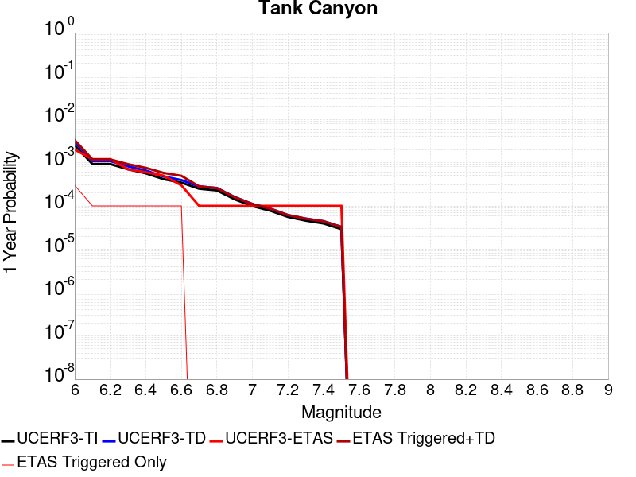 |  |

| Magnitude | 1 wk TI Prob | 1 wk TD Prob | 1 wk ETAS Prob | 1 wk ETAS/TD Gain | 1 wk ETAS Triggered+TD | 1 wk ETAS Triggered Only | 1 mo TI Prob | 1 mo TD Prob | 1 mo ETAS Prob | 1 mo ETAS/TD Gain | 1 mo ETAS Triggered+TD | 1 mo ETAS Triggered Only | 1 yr TI Prob | 1 yr TD Prob | 1 yr ETAS Prob | 1 yr ETAS/TD Gain | 1 yr ETAS Triggered+TD | 1 yr ETAS Triggered Only | 10 yr TI Prob | 10 yr TD Prob | 10 yr ETAS Prob | 10 yr ETAS/TD Gain | 10 yr ETAS Triggered+TD | 10 yr ETAS Triggered Only |
|-----|-----|-----|-----|-----|-----|-----|-----|-----|-----|-----|-----|-----|-----|-----|-----|-----|-----|-----|-----|-----|-----|-----|-----|-----|
| 6.0 | 4.8284557E-5 | 5.7840167E-5 | 0.0 | 0.0 | 5.7840167E-5 | 0.0 | 2.0691741E-4 | 2.4786626E-4 | 0.0 | 0.0 | 2.4786626E-4 | 0.0 | 0.0025163088 | 0.0030142586 | 0.0 | 0.0 | 0.0030142586 | 0.0 | 0.02488006 | 0.029800545 | 5.4495916E-4 | 0.018286884 | 0.030329265 | 5.4495916E-4 |
| 6.1 | 1.7796336E-5 | 2.083262E-5 | 0.0 | 0.0 | 2.083262E-5 | 0.0 | 7.626778E-5 | 8.927982E-5 | 0.0 | 0.0 | 8.927982E-5 | 0.0 | 9.281647E-4 | 0.0010864778 | 0.0 | 0.0 | 0.0010864778 | 0.0 | 0.009242975 | 0.010815719 | 0.0 | 0.0 | 0.010815719 | 0.0 |
| 6.2 | 1.7796336E-5 | 2.083262E-5 | 0.0 | 0.0 | 2.083262E-5 | 0.0 | 7.626778E-5 | 8.927982E-5 | 0.0 | 0.0 | 8.927982E-5 | 0.0 | 9.281647E-4 | 0.0010864778 | 0.0 | 0.0 | 0.0010864778 | 0.0 | 0.009242975 | 0.010815719 | 0.0 | 0.0 | 0.010815719 | 0.0 |
| 6.3 | 1.3515912E-5 | 1.5729276E-5 | 0.0 | 0.0 | 1.5729276E-5 | 0.0 | 5.792405E-5 | 6.740957E-5 | 0.0 | 0.0 | 6.740957E-5 | 0.0 | 7.049971E-4 | 8.2042604E-4 | 0.0 | 0.0 | 8.2042604E-4 | 0.0 | 0.007027647 | 0.008176551 | 0.0 | 0.0 | 0.008176551 | 0.0 |
| 6.4 | 1.0870146E-5 | 1.2593871E-5 | 0.0 | 0.0 | 1.2593871E-5 | 0.0 | 4.658551E-5 | 5.397272E-5 | 0.0 | 0.0 | 5.397272E-5 | 0.0 | 5.67031E-4 | 6.569374E-4 | 0.0 | 0.0 | 6.569374E-4 | 0.0 | 0.005655863 | 0.0065519316 | 0.0 | 0.0 | 0.0065519316 | 0.0 |
| 6.5 | 7.964826E-6 | 9.178247E-6 | 0.0 | 0.0 | 9.178247E-6 | 0.0 | 3.4134522E-5 | 3.933481E-5 | 0.0 | 0.0 | 3.933481E-5 | 0.0 | 4.1550855E-4 | 4.788066E-4 | 0.0 | 0.0 | 4.788066E-4 | 0.0 | 0.0041473247 | 0.0047790254 | 0.0 | 0.0 | 0.0047790254 | 0.0 |
| 6.6 | 6.6317E-6 | 7.5974126E-6 | 0.0 | 0.0 | 7.5974126E-6 | 0.0 | 2.8421264E-5 | 3.2559987E-5 | 0.0 | 0.0 | 3.2559987E-5 | 0.0 | 3.4597394E-4 | 3.9635476E-4 | 0.0 | 0.0 | 3.9635476E-4 | 0.0 | 0.0034543579 | 0.0039576045 | 0.0 | 0.0 | 0.0039576045 | 0.0 |
| 6.7 | 4.793663E-6 | 5.4198917E-6 | 0.0 | 0.0 | 5.4198917E-6 | 0.0 | 2.0544108E-5 | 2.3227925E-5 | 0.0 | 0.0 | 2.3227925E-5 | 0.0 | 2.500958E-4 | 2.8276767E-4 | 0.0 | 0.0 | 2.8276767E-4 | 0.0 | 0.0024981452 | 0.0028247444 | 0.0 | 0.0 | 0.0028247444 | 0.0 |
| 6.8 | 4.382823E-6 | 4.959133E-6 | 0.0 | 0.0 | 4.959133E-6 | 0.0 | 1.8783392E-5 | 2.125328E-5 | 0.0 | 0.0 | 2.125328E-5 | 0.0 | 2.286638E-4 | 2.587322E-4 | 0.0 | 0.0 | 2.587322E-4 | 0.0 | 0.0022842865 | 0.002584962 | 0.0 | 0.0 | 0.002584962 | 0.0 |
| 6.9 | 2.729601E-6 | 3.0660856E-6 | 0.0 | 0.0 | 3.0660856E-6 | 0.0 | 1.1698237E-5 | 1.3140308E-5 | 0.0 | 0.0 | 1.3140308E-5 | 0.0 | 1.4241673E-4 | 1.5997273E-4 | 0.0 | 0.0 | 1.5997273E-4 | 0.0 | 0.001423255 | 0.0015988793 | 0.0 | 0.0 | 0.0015988793 | 0.0 |
| 7.0 | 1.8987357E-6 | 2.1211877E-6 | 0.0 | 0.0 | 2.1211877E-6 | 0.0 | 8.137413E-6 | 9.090776E-6 | 0.0 | 0.0 | 9.090776E-6 | 0.0 | 9.90685E-5 | 1.10675275E-4 | 0.0 | 0.0 | 1.10675275E-4 | 0.0 | 9.902435E-4 | 0.0011062701 | 0.0 | 0.0 | 0.0011062701 | 0.0 |
| 7.1 | 1.4928986E-6 | 1.6591971E-6 | 0.0 | 0.0 | 1.6591971E-6 | 0.0 | 6.398121E-6 | 7.110829E-6 | 0.0 | 0.0 | 7.110829E-6 | 0.0 | 7.789434E-5 | 8.657149E-5 | 0.0 | 0.0 | 8.657149E-5 | 0.0 | 7.786704E-4 | 8.654354E-4 | 0.0 | 0.0 | 8.654354E-4 | 0.0 |
| 7.2 | 1.069082E-6 | 1.179496E-6 | 0.0 | 0.0 | 1.179496E-6 | 0.0 | 4.581772E-6 | 5.0549766E-6 | 0.0 | 0.0 | 5.0549766E-6 | 0.0 | 5.5781646E-5 | 6.1543135E-5 | 0.0 | 0.0 | 6.1543135E-5 | 0.0 | 5.576765E-4 | 6.1531307E-4 | 0.0 | 0.0 | 6.1531307E-4 | 0.0 |
| 7.3 | 8.776551E-7 | 9.750752E-7 | 0.0 | 0.0 | 9.750752E-7 | 0.0 | 3.7613736E-6 | 4.17889E-6 | 0.0 | 0.0 | 4.17889E-6 | 0.0 | 4.579376E-5 | 5.0877316E-5 | 0.0 | 0.0 | 5.0877316E-5 | 0.0 | 4.5784327E-4 | 5.087076E-4 | 0.0 | 0.0 | 5.087076E-4 | 0.0 |
| 7.4 | 7.55721E-7 | 8.493275E-7 | 0.0 | 0.0 | 8.493275E-7 | 0.0 | 3.2388E-6 | 3.6399726E-6 | 0.0 | 0.0 | 3.6399726E-6 | 0.0 | 3.9431678E-5 | 4.4316283E-5 | 0.0 | 0.0 | 4.4316283E-5 | 0.0 | 3.942468E-4 | 4.4312523E-4 | 0.0 | 0.0 | 4.4312523E-4 | 0.0 |
| 7.5 | 5.587665E-7 | 6.303491E-7 | 0.0 | 0.0 | 6.303491E-7 | 0.0 | 2.3947114E-6 | 2.7014962E-6 | 0.0 | 0.0 | 2.7014962E-6 | 0.0 | 2.915522E-5 | 3.289072E-5 | 0.0 | 0.0 | 3.289072E-5 | 0.0 | 2.9151395E-4 | 3.2890716E-4 | 0.0 | 0.0 | 3.2890716E-4 | 0.0 |

## San Andreas (Carrizo) rev
*[(top)](#table-of-contents)*

| 1 Week | 1 Month | 1 Year | 10 Year |
|-----|-----|-----|-----|
|  |  |  |  |

| Magnitude | 1 wk TI Prob | 1 wk TD Prob | 1 wk ETAS Prob | 1 wk ETAS/TD Gain | 1 wk ETAS Triggered+TD | 1 wk ETAS Triggered Only | 1 mo TI Prob | 1 mo TD Prob | 1 mo ETAS Prob | 1 mo ETAS/TD Gain | 1 mo ETAS Triggered+TD | 1 mo ETAS Triggered Only | 1 yr TI Prob | 1 yr TD Prob | 1 yr ETAS Prob | 1 yr ETAS/TD Gain | 1 yr ETAS Triggered+TD | 1 yr ETAS Triggered Only | 10 yr TI Prob | 10 yr TD Prob | 10 yr ETAS Prob | 10 yr ETAS/TD Gain | 10 yr ETAS Triggered+TD | 10 yr ETAS Triggered Only |
|-----|-----|-----|-----|-----|-----|-----|-----|-----|-----|-----|-----|-----|-----|-----|-----|-----|-----|-----|-----|-----|-----|-----|-----|-----|
| 6.0 | 1.1674632E-4 | 2.3500634E-4 | 0.0 | 0.0 | 2.3500634E-4 | 0.0 | 5.002454E-4 | 0.0010067829 | 0.0 | 0.0 | 0.0010067829 | 0.0 | 0.006073493 | 0.012189141 | 5.4495916E-4 | 0.044708576 | 0.012727457 | 5.4495916E-4 | 0.0591016 | 0.11713341 | 5.4495916E-4 | 0.004652465 | 0.11761454 | 5.4495916E-4 |
| 6.1 | 1.1674632E-4 | 2.3500634E-4 | 0.0 | 0.0 | 2.3500634E-4 | 0.0 | 5.002454E-4 | 0.0010067829 | 0.0 | 0.0 | 0.0010067829 | 0.0 | 0.006073493 | 0.012189141 | 5.4495916E-4 | 0.044708576 | 0.012727457 | 5.4495916E-4 | 0.0591016 | 0.11713341 | 5.4495916E-4 | 0.004652465 | 0.11761454 | 5.4495916E-4 |
| 6.2 | 1.1674632E-4 | 2.3500634E-4 | 0.0 | 0.0 | 2.3500634E-4 | 0.0 | 5.002454E-4 | 0.0010067829 | 0.0 | 0.0 | 0.0010067829 | 0.0 | 0.006073493 | 0.012189141 | 5.4495916E-4 | 0.044708576 | 0.012727457 | 5.4495916E-4 | 0.0591016 | 0.11713341 | 5.4495916E-4 | 0.004652465 | 0.11761454 | 5.4495916E-4 |
| 6.3 | 1.1674632E-4 | 2.3500634E-4 | 0.0 | 0.0 | 2.3500634E-4 | 0.0 | 5.002454E-4 | 0.0010067829 | 0.0 | 0.0 | 0.0010067829 | 0.0 | 0.006073493 | 0.012189141 | 5.4495916E-4 | 0.044708576 | 0.012727457 | 5.4495916E-4 | 0.0591016 | 0.11713341 | 5.4495916E-4 | 0.004652465 | 0.11761454 | 5.4495916E-4 |
| 6.4 | 1.1674632E-4 | 2.3500634E-4 | 0.0 | 0.0 | 2.3500634E-4 | 0.0 | 5.002454E-4 | 0.0010067829 | 0.0 | 0.0 | 0.0010067829 | 0.0 | 0.006073493 | 0.012189141 | 5.4495916E-4 | 0.044708576 | 0.012727457 | 5.4495916E-4 | 0.0591016 | 0.11713341 | 5.4495916E-4 | 0.004652465 | 0.11761454 | 5.4495916E-4 |
| 6.5 | 1.13136164E-4 | 2.2824129E-4 | 0.0 | 0.0 | 2.2824129E-4 | 0.0 | 4.847792E-4 | 9.778118E-4 | 0.0 | 0.0 | 9.778118E-4 | 0.0 | 0.0058862255 | 0.011840291 | 5.4495916E-4 | 0.04602582 | 0.012378798 | 5.4495916E-4 | 0.057327334 | 0.11410441 | 5.4495916E-4 | 0.004775969 | 0.11458719 | 5.4495916E-4 |
| 6.6 | 1.13136164E-4 | 2.2824129E-4 | 0.0 | 0.0 | 2.2824129E-4 | 0.0 | 4.847792E-4 | 9.778118E-4 | 0.0 | 0.0 | 9.778118E-4 | 0.0 | 0.0058862255 | 0.011840291 | 5.4495916E-4 | 0.04602582 | 0.012378798 | 5.4495916E-4 | 0.057327334 | 0.11410441 | 5.4495916E-4 | 0.004775969 | 0.11458719 | 5.4495916E-4 |
| 6.7 | 1.1149675E-4 | 2.2516907E-4 | 0.0 | 0.0 | 2.2516907E-4 | 0.0 | 4.777557E-4 | 9.6465484E-4 | 0.0 | 0.0 | 9.6465484E-4 | 0.0 | 0.0058011734 | 0.011681832 | 5.4495916E-4 | 0.04665014 | 0.0122204255 | 5.4495916E-4 | 0.05652051 | 0.112732746 | 5.4495916E-4 | 0.00483408 | 0.113216266 | 5.4495916E-4 |
| 6.8 | 1.1103589E-4 | 2.2419993E-4 | 0.0 | 0.0 | 2.2419993E-4 | 0.0 | 4.7578133E-4 | 9.6050446E-4 | 0.0 | 0.0 | 9.6050446E-4 | 0.0 | 0.005777263 | 0.011631842 | 5.4495916E-4 | 0.04685063 | 0.012170462 | 5.4495916E-4 | 0.056293584 | 0.112295255 | 5.4495916E-4 | 0.004852913 | 0.11277902 | 5.4495916E-4 |
| 6.9 | 1.1053259E-4 | 2.2313405E-4 | 0.0 | 0.0 | 2.2313405E-4 | 0.0 | 4.7362508E-4 | 9.5593976E-4 | 0.0 | 0.0 | 9.5593976E-4 | 0.0 | 0.0057511497 | 0.011576858 | 5.4495916E-4 | 0.047073144 | 0.012115508 | 5.4495916E-4 | 0.05604569 | 0.111813456 | 5.4495916E-4 | 0.0048738243 | 0.11229748 | 5.4495916E-4 |
| 7.0 | 1.1005377E-4 | 2.2215206E-4 | 0.0 | 0.0 | 2.2215206E-4 | 0.0 | 4.7157376E-4 | 9.517343E-4 | 0.0 | 0.0 | 9.517343E-4 | 0.0 | 0.0057263062 | 0.0115262 | 5.4495916E-4 | 0.047280032 | 0.012064878 | 5.4495916E-4 | 0.055809796 | 0.11136863 | 5.4495916E-4 | 0.0048932913 | 0.11185289 | 5.4495916E-4 |
| 7.1 | 1.0308142E-4 | 2.0739544E-4 | 0.0 | 0.0 | 2.0739544E-4 | 0.0 | 4.417027E-4 | 8.885358E-4 | 0.0 | 0.0 | 8.885358E-4 | 0.0 | 0.0053644776 | 0.010764554 | 5.4495916E-4 | 0.05062533 | 0.011303647 | 5.4495916E-4 | 0.052368138 | 0.10465884 | 5.4495916E-4 | 0.005207005 | 0.105146766 | 5.4495916E-4 |
| 7.2 | 1.0027479E-4 | 2.0153404E-4 | 0.0 | 0.0 | 2.0153404E-4 | 0.0 | 4.296783E-4 | 8.634324E-4 | 0.0 | 0.0 | 8.634324E-4 | 0.0 | 0.0052187922 | 0.010461894 | 5.4495916E-4 | 0.052089915 | 0.011001151 | 5.4495916E-4 | 0.050979212 | 0.10197536 | 5.4495916E-4 | 0.0053440277 | 0.10246475 | 5.4495916E-4 |
| 7.3 | 9.816942E-5 | 1.9639665E-4 | 0.0 | 0.0 | 1.9639665E-4 | 0.0 | 4.2065824E-4 | 8.4142934E-4 | 0.0 | 0.0 | 8.4142934E-4 | 0.0 | 0.005109493 | 0.010196544 | 5.4495916E-4 | 0.05344547 | 0.010735947 | 5.4495916E-4 | 0.049935985 | 0.09959349 | 5.4495916E-4 | 0.005471835 | 0.10008418 | 5.4495916E-4 |
| 7.4 | 9.5634205E-5 | 1.9023678E-4 | 0.0 | 0.0 | 1.9023678E-4 | 0.0 | 4.0979648E-4 | 8.150466E-4 | 0.0 | 0.0 | 8.150466E-4 | 0.0 | 0.0049778637 | 0.009878284 | 5.4495916E-4 | 0.05516739 | 0.01041786 | 5.4495916E-4 | 0.048678253 | 0.09673373 | 5.4495916E-4 | 0.0056336 | 0.09722597 | 5.4495916E-4 |
| 7.5 | 8.052417E-5 | 1.544261E-4 | 0.0 | 0.0 | 1.544261E-4 | 0.0 | 3.4505792E-4 | 6.616585E-4 | 0.0 | 0.0 | 6.616585E-4 | 0.0 | 0.0041929903 | 0.008026009 | 5.4495916E-4 | 0.067899145 | 0.008566595 | 5.4495916E-4 | 0.04114753 | 0.079812914 | 5.4495916E-4 | 0.006827957 | 0.080314375 | 5.4495916E-4 |
| 7.6 | 7.897024E-5 | 1.5104134E-4 | 0.0 | 0.0 | 1.5104134E-4 | 0.0 | 3.384E-4 | 6.4715964E-4 | 0.0 | 0.0 | 6.4715964E-4 | 0.0 | 0.0041122385 | 0.007850772 | 5.4495916E-4 | 0.06941473 | 0.008391452 | 5.4495916E-4 | 0.040369697 | 0.07818328 | 5.4495916E-4 | 0.006970277 | 0.078685634 | 5.4495916E-4 |
| 7.7 | 6.707427E-5 | 1.268127E-4 | 0.0 | 0.0 | 1.268127E-4 | 0.0 | 2.8742946E-4 | 5.433698E-4 | 0.0 | 0.0 | 5.433698E-4 | 0.0 | 0.003493839 | 0.0065954886 | 5.4495916E-4 | 0.082626045 | 0.0071368534 | 5.4495916E-4 | 0.034394164 | 0.06633325 | 5.4495916E-4 | 0.008215475 | 0.06684206 | 5.4495916E-4 |
| 7.8 | 6.147705E-5 | 1.1658706E-4 | 0.0 | 0.0 | 1.1658706E-4 | 0.0 | 2.6344648E-4 | 4.995632E-4 | 0.0 | 0.0 | 4.995632E-4 | 0.0 | 0.0032027436 | 0.0060652415 | 5.4495916E-4 | 0.08984954 | 0.0066068955 | 5.4495916E-4 | 0.031569764 | 0.061043616 | 5.4495916E-4 | 0.008927373 | 0.06155531 | 5.4495916E-4 |
| 7.9 | 4.7636717E-5 | 8.48813E-5 | 0.0 | 0.0 | 8.48813E-5 | 0.0 | 2.0414138E-4 | 3.6372629E-4 | 0.0 | 0.0 | 3.6372629E-4 | 0.0 | 0.0024825884 | 0.004419382 | 5.4495916E-4 | 0.123311155 | 0.004961933 | 5.4495916E-4 | 0.024550365 | 0.044775743 | 5.4495916E-4 | 0.012170856 | 0.0452963 | 5.4495916E-4 |
| 8.0 | 3.3554235E-5 | 4.969718E-5 | 0.0 | 0.0 | 4.969718E-5 | 0.0 | 1.4379594E-4 | 2.1297054E-4 | 0.0 | 0.0 | 2.1297054E-4 | 0.0 | 0.0017493097 | 0.0025898346 | 0.0 | 0.0 | 0.0025898346 | 0.0 | 0.017356034 | 0.026676664 | 0.0 | 0.0 | 0.026676664 | 0.0 |
| 8.1 | 1.9175432E-5 | 1.7981038E-5 | 0.0 | 0.0 | 1.7981038E-5 | 0.0 | 8.217783E-5 | 7.705932E-5 | 0.0 | 0.0 | 7.705932E-5 | 0.0 | 0.0010000558 | 9.377939E-4 | 0.0 | 0.0 | 9.377939E-4 | 0.0 | 0.009955673 | 0.010124556 | 0.0 | 0.0 | 0.010124556 | 0.0 |
| 8.2 | 8.643924E-6 | 5.0104E-6 | 0.0 | 0.0 | 5.0104E-6 | 0.0 | 3.704486E-5 | 2.1472966E-5 | 0.0 | 0.0 | 2.1472966E-5 | 0.0 | 4.5092785E-4 | 2.6140205E-4 | 0.0 | 0.0 | 2.6140205E-4 | 0.0 | 0.0045001395 | 0.002993769 | 0.0 | 0.0 | 0.002993769 | 0.0 |
| 8.3 | 1.983087E-6 | 6.880041E-7 | 0.0 | 0.0 | 6.880041E-7 | 0.0 | 8.498917E-6 | 2.9485857E-6 | 0.0 | 0.0 | 2.9485857E-6 | 0.0 | 1.034694E-4 | 3.589845E-5 | 0.0 | 0.0 | 3.589845E-5 | 0.0 | 0.0010342124 | 4.2701262E-4 | 0.0 | 0.0 | 4.2701262E-4 | 0.0 |

## San Clemente
*[(top)](#table-of-contents)*

| 1 Week | 1 Month | 1 Year | 10 Year |
|-----|-----|-----|-----|
|  |  |  |  |

| Magnitude | 1 wk TI Prob | 1 wk TD Prob | 1 wk ETAS Prob | 1 wk ETAS/TD Gain | 1 wk ETAS Triggered+TD | 1 wk ETAS Triggered Only | 1 mo TI Prob | 1 mo TD Prob | 1 mo ETAS Prob | 1 mo ETAS/TD Gain | 1 mo ETAS Triggered+TD | 1 mo ETAS Triggered Only | 1 yr TI Prob | 1 yr TD Prob | 1 yr ETAS Prob | 1 yr ETAS/TD Gain | 1 yr ETAS Triggered+TD | 1 yr ETAS Triggered Only | 10 yr TI Prob | 10 yr TD Prob | 10 yr ETAS Prob | 10 yr ETAS/TD Gain | 10 yr ETAS Triggered+TD | 10 yr ETAS Triggered Only |
|-----|-----|-----|-----|-----|-----|-----|-----|-----|-----|-----|-----|-----|-----|-----|-----|-----|-----|-----|-----|-----|-----|-----|-----|-----|
| 6.0 | 6.681379E-5 | 8.144936E-5 | 0.0 | 0.0 | 8.144936E-5 | 0.0 | 2.8631336E-4 | 3.4902518E-4 | 5.4495916E-4 | 1.5613748 | 8.937941E-4 | 5.4495916E-4 | 0.003480294 | 0.004241595 | 5.4495916E-4 | 0.12847976 | 0.0047842423 | 5.4495916E-4 | 0.03426291 | 0.0416618 | 5.4495916E-4 | 0.013080547 | 0.042184055 | 5.4495916E-4 |
| 6.1 | 6.681379E-5 | 8.144936E-5 | 0.0 | 0.0 | 8.144936E-5 | 0.0 | 2.8631336E-4 | 3.4902518E-4 | 5.4495916E-4 | 1.5613748 | 8.937941E-4 | 5.4495916E-4 | 0.003480294 | 0.004241595 | 5.4495916E-4 | 0.12847976 | 0.0047842423 | 5.4495916E-4 | 0.03426291 | 0.0416618 | 5.4495916E-4 | 0.013080547 | 0.042184055 | 5.4495916E-4 |
| 6.2 | 3.9400576E-5 | 4.6365072E-5 | 0.0 | 0.0 | 4.6365072E-5 | 0.0 | 1.6884868E-4 | 1.9869264E-4 | 5.4495916E-4 | 2.7427244 | 7.435435E-4 | 5.4495916E-4 | 0.0020537945 | 0.0024164524 | 5.4495916E-4 | 0.22552033 | 0.0029600947 | 5.4495916E-4 | 0.020349167 | 0.023908481 | 5.4495916E-4 | 0.022793548 | 0.024440411 | 5.4495916E-4 |
| 6.3 | 3.2590255E-5 | 3.7863927E-5 | 0.0 | 0.0 | 3.7863927E-5 | 0.0 | 1.3966505E-4 | 1.6226407E-4 | 0.0 | 0.0 | 1.6226407E-4 | 0.0 | 0.0016990956 | 0.0019738053 | 0.0 | 0.0 | 0.0019738053 | 0.0 | 0.01686163 | 0.019566547 | 0.0 | 0.0 | 0.019566547 | 0.0 |
| 6.4 | 2.9454652E-5 | 3.4041437E-5 | 0.0 | 0.0 | 3.4041437E-5 | 0.0 | 1.2622811E-4 | 1.4588387E-4 | 0.0 | 0.0 | 1.4588387E-4 | 0.0 | 0.0015357438 | 0.0017747153 | 0.0 | 0.0 | 0.0017747153 | 0.0 | 0.015251739 | 0.017608598 | 0.0 | 0.0 | 0.017608598 | 0.0 |
| 6.5 | 2.790836E-5 | 3.2194945E-5 | 0.0 | 0.0 | 3.2194945E-5 | 0.0 | 1.1960178E-4 | 1.3797119E-4 | 0.0 | 0.0 | 1.3797119E-4 | 0.0 | 0.001455179 | 0.0016785304 | 0.0 | 0.0 | 0.0016785304 | 0.0 | 0.014456868 | 0.016661536 | 0.0 | 0.0 | 0.016661536 | 0.0 |
| 6.6 | 2.2492153E-5 | 2.5723535E-5 | 0.0 | 0.0 | 2.5723535E-5 | 0.0 | 9.639138E-5 | 1.10239154E-4 | 0.0 | 0.0 | 1.10239154E-4 | 0.0 | 0.0011729331 | 0.00134135 | 0.0 | 0.0 | 0.00134135 | 0.0 | 0.011667615 | 0.013334249 | 0.0 | 0.0 | 0.013334249 | 0.0 |
| 6.7 | 1.9862755E-5 | 2.2633001E-5 | 0.0 | 0.0 | 2.2633001E-5 | 0.0 | 8.512331E-5 | 9.6995034E-5 | 0.0 | 0.0 | 9.6995034E-5 | 0.0 | 0.0010358836 | 0.001180286 | 0.0 | 0.0 | 0.001180286 | 0.0 | 0.010310682 | 0.011741463 | 0.0 | 0.0 | 0.011741463 | 0.0 |
| 6.8 | 1.6697575E-5 | 1.8950665E-5 | 0.0 | 0.0 | 1.8950665E-5 | 0.0 | 7.155907E-5 | 8.121466E-5 | 0.0 | 0.0 | 8.121466E-5 | 0.0 | 8.7088346E-4 | 9.883493E-4 | 0.0 | 0.0 | 9.883493E-4 | 0.0 | 0.008674784 | 0.009840561 | 0.0 | 0.0 | 0.009840561 | 0.0 |
| 6.9 | 1.5218415E-5 | 1.724512E-5 | 0.0 | 0.0 | 1.724512E-5 | 0.0 | 6.522015E-5 | 7.390561E-5 | 0.0 | 0.0 | 7.390561E-5 | 0.0 | 7.93766E-4 | 8.9943816E-4 | 0.0 | 0.0 | 8.9943816E-4 | 0.0 | 0.007909367 | 0.008958922 | 0.0 | 0.0 | 0.008958922 | 0.0 |
| 7.0 | 1.2392958E-5 | 1.4013647E-5 | 0.0 | 0.0 | 1.4013647E-5 | 0.0 | 5.3111595E-5 | 6.0057147E-5 | 0.0 | 0.0 | 6.0057147E-5 | 0.0 | 6.4644177E-4 | 7.30958E-4 | 0.0 | 0.0 | 7.30958E-4 | 0.0 | 0.0064456454 | 0.0072863214 | 0.0 | 0.0 | 0.0072863214 | 0.0 |
| 7.1 | 1.0934128E-5 | 1.2358129E-5 | 0.0 | 0.0 | 1.2358129E-5 | 0.0 | 4.6859706E-5 | 5.2962376E-5 | 0.0 | 0.0 | 5.2962376E-5 | 0.0 | 5.7036756E-4 | 6.446335E-4 | 0.0 | 0.0 | 6.446335E-4 | 0.0 | 0.0056890585 | 0.0064283796 | 0.0 | 0.0 | 0.0064283796 | 0.0 |
| 7.2 | 9.5798805E-6 | 1.083E-5 | 0.0 | 0.0 | 1.083E-5 | 0.0 | 4.1055984E-5 | 4.64135E-5 | 0.0 | 0.0 | 4.64135E-5 | 0.0 | 4.9974193E-4 | 5.6494505E-4 | 0.0 | 0.0 | 5.6494505E-4 | 0.0 | 0.0049861963 | 0.0056358106 | 0.0 | 0.0 | 0.0056358106 | 0.0 |
| 7.3 | 8.0167365E-6 | 9.071307E-6 | 0.0 | 0.0 | 9.071307E-6 | 0.0 | 3.4356988E-5 | 3.8876493E-5 | 0.0 | 0.0 | 3.8876493E-5 | 0.0 | 4.1821605E-4 | 4.7322555E-4 | 0.0 | 0.0 | 4.7322555E-4 | 0.0 | 0.0041742986 | 0.0047228793 | 0.0 | 0.0 | 0.0047228793 | 0.0 |
| 7.4 | 2.9581017E-6 | 3.3575877E-6 | 0.0 | 0.0 | 3.3575877E-6 | 0.0 | 1.2677518E-5 | 1.438961E-5 | 0.0 | 0.0 | 1.438961E-5 | 0.0 | 1.5433785E-4 | 1.7518445E-4 | 0.0 | 0.0 | 1.7518445E-4 | 0.0 | 0.001542307 | 0.0017509572 | 0.0 | 0.0 | 0.0017509572 | 0.0 |

## Earthquake Valley (So Extension)
*[(top)](#table-of-contents)*

| 1 Week | 1 Month | 1 Year | 10 Year |
|-----|-----|-----|-----|
|  |  |  |  |

| Magnitude | 1 wk TI Prob | 1 wk TD Prob | 1 wk ETAS Prob | 1 wk ETAS/TD Gain | 1 wk ETAS Triggered+TD | 1 wk ETAS Triggered Only | 1 mo TI Prob | 1 mo TD Prob | 1 mo ETAS Prob | 1 mo ETAS/TD Gain | 1 mo ETAS Triggered+TD | 1 mo ETAS Triggered Only | 1 yr TI Prob | 1 yr TD Prob | 1 yr ETAS Prob | 1 yr ETAS/TD Gain | 1 yr ETAS Triggered+TD | 1 yr ETAS Triggered Only | 10 yr TI Prob | 10 yr TD Prob | 10 yr ETAS Prob | 10 yr ETAS/TD Gain | 10 yr ETAS Triggered+TD | 10 yr ETAS Triggered Only |
|-----|-----|-----|-----|-----|-----|-----|-----|-----|-----|-----|-----|-----|-----|-----|-----|-----|-----|-----|-----|-----|-----|-----|-----|-----|
| 6.0 | 3.0194888E-5 | 3.698353E-5 | 0.0 | 0.0 | 3.698353E-5 | 0.0 | 1.2940024E-4 | 1.5849427E-4 | 0.0 | 0.0 | 1.5849427E-4 | 0.0 | 0.0015743093 | 0.0019284706 | 0.0 | 0.0 | 0.0019284706 | 0.0 | 0.01563203 | 0.019167658 | 5.4495916E-4 | 0.028431179 | 0.019702172 | 5.4495916E-4 |
| 6.1 | 3.0194888E-5 | 3.698353E-5 | 0.0 | 0.0 | 3.698353E-5 | 0.0 | 1.2940024E-4 | 1.5849427E-4 | 0.0 | 0.0 | 1.5849427E-4 | 0.0 | 0.0015743093 | 0.0019284706 | 0.0 | 0.0 | 0.0019284706 | 0.0 | 0.01563203 | 0.019167658 | 5.4495916E-4 | 0.028431179 | 0.019702172 | 5.4495916E-4 |
| 6.2 | 3.0194888E-5 | 3.698353E-5 | 0.0 | 0.0 | 3.698353E-5 | 0.0 | 1.2940024E-4 | 1.5849427E-4 | 0.0 | 0.0 | 1.5849427E-4 | 0.0 | 0.0015743093 | 0.0019284706 | 0.0 | 0.0 | 0.0019284706 | 0.0 | 0.01563203 | 0.019167658 | 5.4495916E-4 | 0.028431179 | 0.019702172 | 5.4495916E-4 |
| 6.3 | 1.5795305E-5 | 1.8413415E-5 | 0.0 | 0.0 | 1.8413415E-5 | 0.0 | 6.769241E-5 | 7.8912875E-5 | 0.0 | 0.0 | 7.8912875E-5 | 0.0 | 8.238434E-4 | 9.604512E-4 | 0.0 | 0.0 | 9.604512E-4 | 0.0 | 0.008207959 | 0.009573867 | 5.4495916E-4 | 0.056921527 | 0.010113609 | 5.4495916E-4 |
| 6.4 | 1.5795305E-5 | 1.8413415E-5 | 0.0 | 0.0 | 1.8413415E-5 | 0.0 | 6.769241E-5 | 7.8912875E-5 | 0.0 | 0.0 | 7.8912875E-5 | 0.0 | 8.238434E-4 | 9.604512E-4 | 0.0 | 0.0 | 9.604512E-4 | 0.0 | 0.008207959 | 0.009573867 | 5.4495916E-4 | 0.056921527 | 0.010113609 | 5.4495916E-4 |
| 6.5 | 1.5795305E-5 | 1.8413415E-5 | 0.0 | 0.0 | 1.8413415E-5 | 0.0 | 6.769241E-5 | 7.8912875E-5 | 0.0 | 0.0 | 7.8912875E-5 | 0.0 | 8.238434E-4 | 9.604512E-4 | 0.0 | 0.0 | 9.604512E-4 | 0.0 | 0.008207959 | 0.009573867 | 5.4495916E-4 | 0.056921527 | 0.010113609 | 5.4495916E-4 |
| 6.6 | 1.5795305E-5 | 1.8413415E-5 | 0.0 | 0.0 | 1.8413415E-5 | 0.0 | 6.769241E-5 | 7.8912875E-5 | 0.0 | 0.0 | 7.8912875E-5 | 0.0 | 8.238434E-4 | 9.604512E-4 | 0.0 | 0.0 | 9.604512E-4 | 0.0 | 0.008207959 | 0.009573867 | 5.4495916E-4 | 0.056921527 | 0.010113609 | 5.4495916E-4 |
| 6.7 | 1.1363076E-5 | 1.31159995E-5 | 0.0 | 0.0 | 1.31159995E-5 | 0.0 | 4.8697988E-5 | 5.6210643E-5 | 0.0 | 0.0 | 5.6210643E-5 | 0.0 | 5.927367E-4 | 6.842256E-4 | 0.0 | 0.0 | 6.842256E-4 | 0.0 | 0.0059115817 | 0.0068286373 | 5.4495916E-4 | 0.07980496 | 0.007369875 | 5.4495916E-4 |
| 6.8 | 1.0049611E-5 | 1.15748635E-5 | 0.0 | 0.0 | 1.15748635E-5 | 0.0 | 4.306905E-5 | 4.9606024E-5 | 0.0 | 0.0 | 4.9606024E-5 | 0.0 | 5.242395E-4 | 6.038589E-4 | 0.0 | 0.0 | 6.038589E-4 | 0.0 | 0.0052300454 | 0.0060293335 | 5.4495916E-4 | 0.09038464 | 0.006571007 | 5.4495916E-4 |
| 6.9 | 1.0049611E-5 | 1.15748635E-5 | 0.0 | 0.0 | 1.15748635E-5 | 0.0 | 4.306905E-5 | 4.9606024E-5 | 0.0 | 0.0 | 4.9606024E-5 | 0.0 | 5.242395E-4 | 6.038589E-4 | 0.0 | 0.0 | 6.038589E-4 | 0.0 | 0.0052300454 | 0.0060293335 | 5.4495916E-4 | 0.09038464 | 0.006571007 | 5.4495916E-4 |
| 7.0 | 1.0049611E-5 | 1.15748635E-5 | 0.0 | 0.0 | 1.15748635E-5 | 0.0 | 4.306905E-5 | 4.9606024E-5 | 0.0 | 0.0 | 4.9606024E-5 | 0.0 | 5.242395E-4 | 6.038589E-4 | 0.0 | 0.0 | 6.038589E-4 | 0.0 | 0.0052300454 | 0.0060293335 | 5.4495916E-4 | 0.09038464 | 0.006571007 | 5.4495916E-4 |
| 7.1 | 8.140254E-6 | 9.367627E-6 | 0.0 | 0.0 | 9.367627E-6 | 0.0 | 3.4886336E-5 | 4.014673E-5 | 0.0 | 0.0 | 4.014673E-5 | 0.0 | 4.2465836E-4 | 4.8874365E-4 | 0.0 | 0.0 | 4.8874365E-4 | 0.0 | 0.0042384774 | 0.0048832423 | 0.0 | 0.0 | 0.0048832423 | 0.0 |
| 7.2 | 1.673835E-7 | 1.410432E-7 | 0.0 | 0.0 | 1.410432E-7 | 0.0 | 7.173577E-7 | 6.044707E-7 | 0.0 | 0.0 | 6.044707E-7 | 0.0 | 8.733795E-6 | 7.3594097E-6 | 0.0 | 0.0 | 7.3594097E-6 | 0.0 | 8.733451E-5 | 7.359201E-5 | 0.0 | 0.0 | 7.359201E-5 | 0.0 |
| 7.3 | 1.6632116E-7 | 1.4002664E-7 | 0.0 | 0.0 | 1.4002664E-7 | 0.0 | 7.1280476E-7 | 6.0011405E-7 | 0.0 | 0.0 | 6.0011405E-7 | 0.0 | 8.678364E-6 | 7.306368E-6 | 0.0 | 0.0 | 7.306368E-6 | 0.0 | 8.6780245E-5 | 7.306163E-5 | 0.0 | 0.0 | 7.306163E-5 | 0.0 |
| 7.4 | 1.6569169E-7 | 1.3947373E-7 | 0.0 | 0.0 | 1.3947373E-7 | 0.0 | 7.1010703E-7 | 5.977445E-7 | 0.0 | 0.0 | 5.977445E-7 | 0.0 | 8.645519E-6 | 7.277518E-6 | 0.0 | 0.0 | 7.277518E-6 | 0.0 | 8.645182E-5 | 7.277315E-5 | 0.0 | 0.0 | 7.277315E-5 | 0.0 |
| 7.5 | 1.1764555E-7 | 1.0053396E-7 | 0.0 | 0.0 | 1.0053396E-7 | 0.0 | 5.041951E-7 | 4.3085976E-7 | 0.0 | 0.0 | 4.3085976E-7 | 0.0 | 6.138558E-6 | 5.245707E-6 | 0.0 | 0.0 | 5.245707E-6 | 0.0 | 6.1383886E-5 | 5.2456046E-5 | 0.0 | 0.0 | 5.2456046E-5 | 0.0 |
| 7.6 | 1.07927605E-7 | 9.226856E-8 | 0.0 | 0.0 | 9.226856E-8 | 0.0 | 4.6254678E-7 | 3.9543662E-7 | 0.0 | 0.0 | 3.9543662E-7 | 0.0 | 5.6314925E-6 | 4.8144325E-6 | 0.0 | 0.0 | 4.8144325E-6 | 0.0 | 5.63135E-5 | 4.8143487E-5 | 0.0 | 0.0 | 4.8143487E-5 | 0.0 |
| 7.7 | 2.1826905E-8 | 1.11334355E-8 | 0.0 | 0.0 | 1.11334355E-8 | 0.0 | 9.3543875E-8 | 4.771472E-8 | 0.0 | 0.0 | 4.771472E-8 | 0.0 | 1.1388961E-6 | 5.809266E-7 | 0.0 | 0.0 | 5.809266E-7 | 0.0 | 1.1388902E-5 | 5.8092564E-6 | 0.0 | 0.0 | 5.8092564E-6 | 0.0 |
| 7.8 | 2.6169649E-9 | 1.1922348E-9 | 0.0 | 0.0 | 1.1922348E-9 | 0.0 | 1.1215564E-8 | 5.1095776E-9 | 0.0 | 0.0 | 5.1095776E-9 | 0.0 | 1.3654947E-7 | 6.220911E-8 | 0.0 | 0.0 | 6.220911E-8 | 0.0 | 1.365494E-6 | 6.220911E-7 | 0.0 | 0.0 | 6.220911E-7 | 0.0 |

## Elmore Ranch
*[(top)](#table-of-contents)*

| 1 Week | 1 Month | 1 Year | 10 Year |
|-----|-----|-----|-----|
|  |  |  |  |

| Magnitude | 1 wk TI Prob | 1 wk TD Prob | 1 wk ETAS Prob | 1 wk ETAS/TD Gain | 1 wk ETAS Triggered+TD | 1 wk ETAS Triggered Only | 1 mo TI Prob | 1 mo TD Prob | 1 mo ETAS Prob | 1 mo ETAS/TD Gain | 1 mo ETAS Triggered+TD | 1 mo ETAS Triggered Only | 1 yr TI Prob | 1 yr TD Prob | 1 yr ETAS Prob | 1 yr ETAS/TD Gain | 1 yr ETAS Triggered+TD | 1 yr ETAS Triggered Only | 10 yr TI Prob | 10 yr TD Prob | 10 yr ETAS Prob | 10 yr ETAS/TD Gain | 10 yr ETAS Triggered+TD | 10 yr ETAS Triggered Only |
|-----|-----|-----|-----|-----|-----|-----|-----|-----|-----|-----|-----|-----|-----|-----|-----|-----|-----|-----|-----|-----|-----|-----|-----|-----|
| 6.0 | 9.102099E-5 | 8.916474E-5 | 0.0 | 0.0 | 8.916474E-5 | 0.0 | 3.9003167E-4 | 3.82064E-4 | 0.0 | 0.0 | 3.82064E-4 | 0.0 | 0.0047383 | 0.004642422 | 5.4495916E-4 | 0.117386825 | 0.0051848507 | 5.4495916E-4 | 0.046385348 | 0.045659773 | 5.4495916E-4 | 0.011935214 | 0.04617985 | 5.4495916E-4 |
| 6.1 | 3.8306698E-5 | 4.1321364E-5 | 0.0 | 0.0 | 4.1321364E-5 | 0.0 | 1.6416123E-4 | 1.7708354E-4 | 0.0 | 0.0 | 1.7708354E-4 | 0.0 | 0.0019968306 | 0.0021543251 | 5.4495916E-4 | 0.25296047 | 0.0026981104 | 5.4495916E-4 | 0.019789828 | 0.021515239 | 5.4495916E-4 | 0.025328983 | 0.022048473 | 5.4495916E-4 |
| 6.2 | 3.8306698E-5 | 4.1321364E-5 | 0.0 | 0.0 | 4.1321364E-5 | 0.0 | 1.6416123E-4 | 1.7708354E-4 | 0.0 | 0.0 | 1.7708354E-4 | 0.0 | 0.0019968306 | 0.0021543251 | 5.4495916E-4 | 0.25296047 | 0.0026981104 | 5.4495916E-4 | 0.019789828 | 0.021515239 | 5.4495916E-4 | 0.025328983 | 0.022048473 | 5.4495916E-4 |
| 6.3 | 3.3197924E-5 | 3.6413116E-5 | 0.0 | 0.0 | 3.6413116E-5 | 0.0 | 1.4226905E-4 | 1.5605082E-4 | 0.0 | 0.0 | 1.5605082E-4 | 0.0 | 0.0017307495 | 0.0018988051 | 5.4495916E-4 | 0.28700107 | 0.0024427294 | 5.4495916E-4 | 0.017173318 | 0.018994208 | 5.4495916E-4 | 0.028690806 | 0.019528816 | 5.4495916E-4 |
| 6.4 | 2.5148964E-5 | 2.7331169E-5 | 0.0 | 0.0 | 2.7331169E-5 | 0.0 | 1.0777682E-4 | 1.1713195E-4 | 0.0 | 0.0 | 1.1713195E-4 | 0.0 | 0.0013113929 | 0.0014257922 | 5.4495916E-4 | 0.38221496 | 0.0019699743 | 5.4495916E-4 | 0.01303681 | 0.014326015 | 5.4495916E-4 | 0.03803983 | 0.014863166 | 5.4495916E-4 |
| 6.5 | 2.5148964E-5 | 2.7331169E-5 | 0.0 | 0.0 | 2.7331169E-5 | 0.0 | 1.0777682E-4 | 1.1713195E-4 | 0.0 | 0.0 | 1.1713195E-4 | 0.0 | 0.0013113929 | 0.0014257922 | 5.4495916E-4 | 0.38221496 | 0.0019699743 | 5.4495916E-4 | 0.01303681 | 0.014326015 | 5.4495916E-4 | 0.03803983 | 0.014863166 | 5.4495916E-4 |

## Surprise Valley 2011 CFM
*[(top)](#table-of-contents)*

| 1 Week | 1 Month | 1 Year | 10 Year |
|-----|-----|-----|-----|
|  |  |  |  |

| Magnitude | 1 wk TI Prob | 1 wk TD Prob | 1 wk ETAS Prob | 1 wk ETAS/TD Gain | 1 wk ETAS Triggered+TD | 1 wk ETAS Triggered Only | 1 mo TI Prob | 1 mo TD Prob | 1 mo ETAS Prob | 1 mo ETAS/TD Gain | 1 mo ETAS Triggered+TD | 1 mo ETAS Triggered Only | 1 yr TI Prob | 1 yr TD Prob | 1 yr ETAS Prob | 1 yr ETAS/TD Gain | 1 yr ETAS Triggered+TD | 1 yr ETAS Triggered Only | 10 yr TI Prob | 10 yr TD Prob | 10 yr ETAS Prob | 10 yr ETAS/TD Gain | 10 yr ETAS Triggered+TD | 10 yr ETAS Triggered Only |
|-----|-----|-----|-----|-----|-----|-----|-----|-----|-----|-----|-----|-----|-----|-----|-----|-----|-----|-----|-----|-----|-----|-----|-----|-----|
| 6.0 | 4.0396248E-5 | 4.479939E-5 | 0.0 | 0.0 | 4.479939E-5 | 0.0 | 1.7311527E-4 | 1.9198445E-4 | 0.0 | 0.0 | 1.9198445E-4 | 0.0 | 0.002105641 | 0.0023351142 | 0.0 | 0.0 | 0.0023351142 | 0.0 | 0.020858008 | 0.023127439 | 5.4495916E-4 | 0.023563314 | 0.023659796 | 5.4495916E-4 |
| 6.1 | 4.0396248E-5 | 4.479939E-5 | 0.0 | 0.0 | 4.479939E-5 | 0.0 | 1.7311527E-4 | 1.9198445E-4 | 0.0 | 0.0 | 1.9198445E-4 | 0.0 | 0.002105641 | 0.0023351142 | 0.0 | 0.0 | 0.0023351142 | 0.0 | 0.020858008 | 0.023127439 | 5.4495916E-4 | 0.023563314 | 0.023659796 | 5.4495916E-4 |
| 6.2 | 2.2295266E-5 | 2.4377101E-5 | 0.0 | 0.0 | 2.4377101E-5 | 0.0 | 9.554764E-5 | 1.0446928E-4 | 0.0 | 0.0 | 1.0446928E-4 | 0.0 | 0.0011626717 | 0.0012712021 | 0.0 | 0.0 | 0.0012712021 | 0.0 | 0.011566074 | 0.012642533 | 0.0 | 0.0 | 0.012642533 | 0.0 |
| 6.3 | 1.572643E-5 | 1.7081213E-5 | 0.0 | 0.0 | 1.7081213E-5 | 0.0 | 6.7397246E-5 | 7.3203206E-5 | 0.0 | 0.0 | 7.3203206E-5 | 0.0 | 8.202525E-4 | 8.908951E-4 | 0.0 | 0.0 | 8.908951E-4 | 0.0 | 0.008172315 | 0.00887434 | 0.0 | 0.0 | 0.00887434 | 0.0 |
| 6.4 | 1.5714395E-5 | 1.7069036E-5 | 0.0 | 0.0 | 1.7069036E-5 | 0.0 | 6.734567E-5 | 7.315102E-5 | 0.0 | 0.0 | 7.315102E-5 | 0.0 | 8.1962504E-4 | 8.902603E-4 | 0.0 | 0.0 | 8.902603E-4 | 0.0 | 0.008166086 | 0.008868042 | 0.0 | 0.0 | 0.008868042 | 0.0 |
| 6.5 | 1.2733495E-5 | 1.3789486E-5 | 0.0 | 0.0 | 1.3789486E-5 | 0.0 | 5.457098E-5 | 5.9096496E-5 | 0.0 | 0.0 | 5.9096496E-5 | 0.0 | 6.641992E-4 | 7.19269E-4 | 0.0 | 0.0 | 7.19269E-4 | 0.0 | 0.0066221743 | 0.0071701026 | 0.0 | 0.0 | 0.0071701026 | 0.0 |
| 6.6 | 1.0983784E-5 | 1.1876331E-5 | 0.0 | 0.0 | 1.1876331E-5 | 0.0 | 4.7072506E-5 | 5.0897597E-5 | 0.0 | 0.0 | 5.0897597E-5 | 0.0 | 5.7295704E-4 | 6.195074E-4 | 0.0 | 0.0 | 6.195074E-4 | 0.0 | 0.0057148207 | 0.0061783525 | 0.0 | 0.0 | 0.0061783525 | 0.0 |
| 6.7 | 9.104806E-6 | 9.831182E-6 | 0.0 | 0.0 | 9.831182E-6 | 0.0 | 3.902001E-5 | 4.213298E-5 | 0.0 | 0.0 | 4.213298E-5 | 0.0 | 4.7496508E-4 | 5.128522E-4 | 0.0 | 0.0 | 5.128522E-4 | 0.0 | 0.004739512 | 0.005117083 | 0.0 | 0.0 | 0.005117083 | 0.0 |
| 6.8 | 6.2162403E-6 | 6.6986236E-6 | 0.0 | 0.0 | 6.6986236E-6 | 0.0 | 2.6640759E-5 | 2.8708082E-5 | 0.0 | 0.0 | 2.8708082E-5 | 0.0 | 3.2430296E-4 | 3.4946707E-4 | 0.0 | 0.0 | 3.4946707E-4 | 0.0 | 0.003238301 | 0.0034893982 | 0.0 | 0.0 | 0.0034893982 | 0.0 |
| 6.9 | 4.1792696E-6 | 4.499571E-6 | 0.0 | 0.0 | 4.499571E-6 | 0.0 | 1.7911032E-5 | 1.9283741E-5 | 0.0 | 0.0 | 1.9283741E-5 | 0.0 | 2.1804498E-4 | 2.347558E-4 | 0.0 | 0.0 | 2.347558E-4 | 0.0 | 0.0021783116 | 0.0023452311 | 0.0 | 0.0 | 0.0023452311 | 0.0 |
| 7.0 | 2.7478413E-6 | 2.9598184E-6 | 0.0 | 0.0 | 2.9598184E-6 | 0.0 | 1.177641E-5 | 1.2684882E-5 | 0.0 | 0.0 | 1.2684882E-5 | 0.0 | 1.4336836E-4 | 1.5442874E-4 | 0.0 | 0.0 | 1.5442874E-4 | 0.0 | 0.001432759 | 0.0015433364 | 0.0 | 0.0 | 0.0015433364 | 0.0 |
| 7.1 | 8.128648E-7 | 8.718175E-7 | 0.0 | 0.0 | 8.718175E-7 | 0.0 | 3.4837017E-6 | 3.7363588E-6 | 0.0 | 0.0 | 3.7363588E-6 | 0.0 | 4.2413245E-5 | 4.5489818E-5 | 0.0 | 0.0 | 4.5489818E-5 | 0.0 | 4.2405148E-4 | 4.5486377E-4 | 0.0 | 0.0 | 4.5486377E-4 | 0.0 |
| 7.2 | 4.8641045E-8 | 4.9393996E-8 | 0.0 | 0.0 | 4.9393996E-8 | 0.0 | 2.084616E-7 | 2.1168853E-7 | 0.0 | 0.0 | 2.1168853E-7 | 0.0 | 2.538017E-6 | 2.577305E-6 | 0.0 | 0.0 | 2.577305E-6 | 0.0 | 2.537988E-5 | 2.5772762E-5 | 0.0 | 0.0 | 2.5772762E-5 | 0.0 |
| 7.3 | 5.3911844E-9 | 5.474917E-9 | 0.0 | 0.0 | 5.474917E-9 | 0.0 | 2.3105075E-8 | 2.346393E-8 | 0.0 | 0.0 | 2.346393E-8 | 0.0 | 2.8130427E-7 | 2.856733E-7 | 0.0 | 0.0 | 2.856733E-7 | 0.0 | 2.8130391E-6 | 2.856731E-6 | 0.0 | 0.0 | 2.856731E-6 | 0.0 |

## Hayward (No) 2011 CFM
*[(top)](#table-of-contents)*

| 1 Week | 1 Month | 1 Year | 10 Year |
|-----|-----|-----|-----|
|  |  |  |  |

| Magnitude | 1 wk TI Prob | 1 wk TD Prob | 1 wk ETAS Prob | 1 wk ETAS/TD Gain | 1 wk ETAS Triggered+TD | 1 wk ETAS Triggered Only | 1 mo TI Prob | 1 mo TD Prob | 1 mo ETAS Prob | 1 mo ETAS/TD Gain | 1 mo ETAS Triggered+TD | 1 mo ETAS Triggered Only | 1 yr TI Prob | 1 yr TD Prob | 1 yr ETAS Prob | 1 yr ETAS/TD Gain | 1 yr ETAS Triggered+TD | 1 yr ETAS Triggered Only | 10 yr TI Prob | 10 yr TD Prob | 10 yr ETAS Prob | 10 yr ETAS/TD Gain | 10 yr ETAS Triggered+TD | 10 yr ETAS Triggered Only |
|-----|-----|-----|-----|-----|-----|-----|-----|-----|-----|-----|-----|-----|-----|-----|-----|-----|-----|-----|-----|-----|-----|-----|-----|-----|
| 6.0 | 9.3068506E-5 | 1.7216054E-4 | 0.0 | 0.0 | 1.7216054E-4 | 0.0 | 3.9880406E-4 | 7.3762017E-4 | 0.0 | 0.0 | 7.3762017E-4 | 0.0 | 0.0048446343 | 0.008943433 | 5.4495916E-4 | 0.060933996 | 0.009483519 | 5.4495916E-4 | 0.047403704 | 0.0855743 | 5.4495916E-4 | 0.006368257 | 0.086072624 | 5.4495916E-4 |
| 6.1 | 9.055486E-5 | 1.676884E-4 | 0.0 | 0.0 | 1.676884E-4 | 0.0 | 3.880345E-4 | 7.184667E-4 | 0.0 | 0.0 | 7.184667E-4 | 0.0 | 0.0047140904 | 0.008712324 | 5.4495916E-4 | 0.06255037 | 0.009252535 | 5.4495916E-4 | 0.046153355 | 0.083477445 | 5.4495916E-4 | 0.0065282197 | 0.08397692 | 5.4495916E-4 |
| 6.2 | 9.006742E-5 | 1.6689788E-4 | 0.0 | 0.0 | 1.6689788E-4 | 0.0 | 3.859461E-4 | 7.1508106E-4 | 0.0 | 0.0 | 7.1508106E-4 | 0.0 | 0.0046887742 | 0.008671464 | 5.4495916E-4 | 0.0628451 | 0.009211699 | 5.4495916E-4 | 0.0459107 | 0.083102904 | 5.4495916E-4 | 0.0065576425 | 0.08360258 | 5.4495916E-4 |
| 6.3 | 8.8336754E-5 | 1.6370429E-4 | 0.0 | 0.0 | 1.6370429E-4 | 0.0 | 3.7853114E-4 | 7.0140185E-4 | 0.0 | 0.0 | 7.0140185E-4 | 0.0 | 0.004598882 | 0.008506285 | 5.4495916E-4 | 0.06406547 | 0.009046609 | 5.4495916E-4 | 0.04504866 | 0.08160339 | 5.4495916E-4 | 0.006678143 | 0.08210388 | 5.4495916E-4 |
| 6.4 | 8.526157E-5 | 1.5799089E-4 | 0.0 | 0.0 | 1.5799089E-4 | 0.0 | 3.6535555E-4 | 6.769287E-4 | 0.0 | 0.0 | 6.769287E-4 | 0.0 | 0.0044391346 | 0.008210618 | 5.4495916E-4 | 0.066372484 | 0.008751103 | 5.4495916E-4 | 0.043514993 | 0.07889129 | 5.4495916E-4 | 0.006907722 | 0.07939326 | 5.4495916E-4 |
| 6.5 | 8.152396E-5 | 1.513402E-4 | 0.0 | 0.0 | 1.513402E-4 | 0.0 | 3.493416E-4 | 6.4844027E-4 | 0.0 | 0.0 | 6.4844027E-4 | 0.0 | 0.0042449418 | 0.0078663295 | 5.4495916E-4 | 0.069277436 | 0.008407001 | 5.4495916E-4 | 0.04164765 | 0.07573358 | 5.4495916E-4 | 0.0071957395 | 0.07623727 | 5.4495916E-4 |
| 6.6 | 7.987405E-5 | 1.4839246E-4 | 0.0 | 0.0 | 1.4839246E-4 | 0.0 | 3.4227243E-4 | 6.3581334E-4 | 0.0 | 0.0 | 6.3581334E-4 | 0.0 | 0.0041592065 | 0.0077137058 | 5.4495916E-4 | 0.07064816 | 0.008254461 | 5.4495916E-4 | 0.04082218 | 0.07432956 | 5.4495916E-4 | 0.0073316605 | 0.07483402 | 5.4495916E-4 |
| 6.7 | 7.777665E-5 | 1.4480116E-4 | 0.0 | 0.0 | 1.4480116E-4 | 0.0 | 3.332859E-4 | 6.2042946E-4 | 0.0 | 0.0 | 6.2042946E-4 | 0.0 | 0.004050208 | 0.007527718 | 5.4495916E-4 | 0.07239367 | 0.008068575 | 5.4495916E-4 | 0.039771806 | 0.07261166 | 5.4495916E-4 | 0.007505119 | 0.07311705 | 5.4495916E-4 |
| 6.8 | 7.3284005E-5 | 1.3639059E-4 | 0.0 | 0.0 | 1.3639059E-4 | 0.0 | 3.140365E-4 | 5.844007E-4 | 0.0 | 0.0 | 5.844007E-4 | 0.0 | 0.0038166929 | 0.007092001 | 5.4495916E-4 | 0.07684138 | 0.007633095 | 5.4495916E-4 | 0.037518036 | 0.068558596 | 5.4495916E-4 | 0.007948808 | 0.0690662 | 5.4495916E-4 |
| 6.9 | 6.458263E-5 | 1.1987969E-4 | 0.0 | 0.0 | 1.1987969E-4 | 0.0 | 2.7675333E-4 | 5.136694E-4 | 0.0 | 0.0 | 5.136694E-4 | 0.0 | 0.0033642664 | 0.0062360903 | 5.4495916E-4 | 0.08738795 | 0.006777651 | 5.4495916E-4 | 0.033137884 | 0.060563095 | 5.4495916E-4 | 0.008998205 | 0.06107505 | 5.4495916E-4 |
| 7.0 | 5.3853604E-5 | 9.901269E-5 | 0.0 | 0.0 | 9.901269E-5 | 0.0 | 2.3078074E-4 | 4.242714E-4 | 0.0 | 0.0 | 4.242714E-4 | 0.0 | 0.0028061352 | 0.005153333 | 5.4495916E-4 | 0.10574888 | 0.0056954836 | 5.4495916E-4 | 0.027709642 | 0.050376564 | 5.4495916E-4 | 0.010817711 | 0.05089407 | 5.4495916E-4 |
| 7.1 | 4.4308683E-5 | 8.06231E-5 | 0.0 | 0.0 | 8.06231E-5 | 0.0 | 1.8988053E-4 | 3.45482E-4 | 0.0 | 0.0 | 3.45482E-4 | 0.0 | 0.0023093442 | 0.004198171 | 0.0 | 0.0 | 0.004198171 | 0.0 | 0.022854926 | 0.0413089 | 0.0 | 0.0 | 0.0413089 | 0.0 |
| 7.2 | 3.295973E-5 | 5.9830003E-5 | 0.0 | 0.0 | 5.9830003E-5 | 0.0 | 1.4124835E-4 | 2.5638923E-4 | 0.0 | 0.0 | 2.5638923E-4 | 0.0 | 0.0017183421 | 0.003117093 | 0.0 | 0.0 | 0.003117093 | 0.0 | 0.017051157 | 0.03091609 | 0.0 | 0.0 | 0.03091609 | 0.0 |
| 7.3 | 2.452256E-5 | 4.440244E-5 | 0.0 | 0.0 | 4.440244E-5 | 0.0 | 1.05092455E-4 | 1.9028237E-4 | 0.0 | 0.0 | 1.9028237E-4 | 0.0 | 0.0012787496 | 0.0023142397 | 0.0 | 0.0 | 0.0023142397 | 0.0 | 0.0127141625 | 0.023063933 | 0.0 | 0.0 | 0.023063933 | 0.0 |
| 7.4 | 1.8829967E-5 | 3.396135E-5 | 0.0 | 0.0 | 3.396135E-5 | 0.0 | 8.069736E-5 | 1.4554059E-4 | 0.0 | 0.0 | 1.4554059E-4 | 0.0 | 9.820475E-4 | 0.0017705259 | 0.0 | 0.0 | 0.0017705259 | 0.0 | 0.009777189 | 0.017707042 | 0.0 | 0.0 | 0.017707042 | 0.0 |
| 7.5 | 1.26374125E-5 | 2.2482714E-5 | 0.0 | 0.0 | 2.2482714E-5 | 0.0 | 5.4159216E-5 | 9.635096E-5 | 0.0 | 0.0 | 9.635096E-5 | 0.0 | 6.5918895E-4 | 0.0011724472 | 0.0 | 0.0 | 0.0011724472 | 0.0 | 0.00657237 | 0.0117742745 | 0.0 | 0.0 | 0.0117742745 | 0.0 |
| 7.6 | 4.666429E-6 | 8.307882E-6 | 0.0 | 0.0 | 8.307882E-6 | 0.0 | 1.9998828E-5 | 3.560473E-5 | 0.0 | 0.0 | 3.560473E-5 | 0.0 | 2.4345852E-4 | 4.3340254E-4 | 0.0 | 0.0 | 4.3340254E-4 | 0.0 | 0.0024319198 | 0.0043748464 | 0.0 | 0.0 | 0.0043748464 | 0.0 |
| 7.7 | 3.8399318E-7 | 6.8284623E-7 | 0.0 | 0.0 | 6.8284623E-7 | 0.0 | 1.6456839E-6 | 2.9264804E-6 | 0.0 | 0.0 | 2.9264804E-6 | 0.0 | 2.003602E-5 | 3.5629317E-5 | 0.0 | 0.0 | 3.5629317E-5 | 0.0 | 2.0034213E-4 | 3.7119133E-4 | 0.0 | 0.0 | 3.7119133E-4 | 0.0 |
| 7.8 | 2.5637698E-7 | 5.107383E-7 | 0.0 | 0.0 | 5.107383E-7 | 0.0 | 1.098758E-6 | 2.1888766E-6 | 0.0 | 0.0 | 2.1888766E-6 | 0.0 | 1.3377297E-5 | 2.6649248E-5 | 0.0 | 0.0 | 2.6649248E-5 | 0.0 | 1.3376492E-4 | 2.7981476E-4 | 0.0 | 0.0 | 2.7981476E-4 | 0.0 |
| 7.9 | 1.7141245E-7 | 3.554999E-7 | 0.0 | 0.0 | 3.554999E-7 | 0.0 | 7.3462456E-7 | 1.5235701E-6 | 0.0 | 0.0 | 1.5235701E-6 | 0.0 | 8.944017E-6 | 1.8549308E-5 | 0.0 | 0.0 | 1.8549308E-5 | 0.0 | 8.943657E-5 | 1.9399682E-4 | 0.0 | 0.0 | 1.9399682E-4 | 0.0 |
| 8.0 | 1.1808895E-7 | 2.6305878E-7 | 0.0 | 0.0 | 2.6305878E-7 | 0.0 | 5.060954E-7 | 1.1273943E-6 | 0.0 | 0.0 | 1.1273943E-6 | 0.0 | 6.161694E-6 | 1.3725939E-5 | 0.0 | 0.0 | 1.3725939E-5 | 0.0 | 6.161523E-5 | 1.4237752E-4 | 0.0 | 0.0 | 1.4237752E-4 | 0.0 |
| 8.1 | 5.138535E-8 | 1.0755803E-7 | 0.0 | 0.0 | 1.0755803E-7 | 0.0 | 2.2022292E-7 | 4.609629E-7 | 0.0 | 0.0 | 4.609629E-7 | 0.0 | 2.6812106E-6 | 5.612209E-6 | 0.0 | 0.0 | 5.612209E-6 | 0.0 | 2.6811784E-5 | 5.784103E-5 | 0.0 | 0.0 | 5.784103E-5 | 0.0 |

